
# arxiv digest (quant-ph + cond-mat) — 2026-05-29

*156 papers · 27 relevant · 0 highlighted*

## 🔥 Most relevant (27)

*Every paper with at least one nonzero topic score, sorted by best-matching score. 🔥 marks scores ≥4/5. Click the title to jump to the full entry below; click [arXiv] to open the paper page. `(secondary)` marks papers from de-prioritized cond-mat archives.*

Show 27 relevant papers

- [A comparison of different master equations for driven-dissipative dynamics in composite quantum systems: Dispersive readout in structured electromagnetic environments](#paper-2605.30032) [[arXiv]](http://arxiv.org/abs/2605.30032v1) — 🔥 `methods for driven-dissipative` **4/5** · `analog quantum simulation` **3/5** · `correlated / nonlocal dissipation` **3/5** · `correlated cavity matter` **3/5** · `driven-dissipative phase transition` **3/5** · `non-equilibrium dynamics` **3/5** · `Tavis-Cummings & cavity-many-emitter` **2/5** · `non-equilibrium universality` **2/5** · `Keldysh / 2PI / non-Gaussian methods` **1/5** · `entanglement & information structure` **1/5** · `interference shaping light` **1/5** · `quantum measurements` **1/5**
- [Collective Radiative Enhancement of Rare-Earth Ions in Lithium Niobate via Engineered LargeArea Nanohole Arrays](#paper-2605.29015) [[arXiv]](http://arxiv.org/abs/2605.29015v1) — 🔥 `Dicke superradiance` **4/5** · 🔥 `correlated / nonlocal dissipation` **4/5** · `Tavis-Cummings & cavity-many-emitter` **3/5** · `correlated cavity matter` **3/5** · `quantum optics experiment` **3/5** · `analog quantum simulation` **2/5** · `interference shaping light` **2/5** · `superradiant laser` **2/5** · `driven-dissipative phase transition` **1/5** · `free-space correlated emission` **1/5** · `methods for driven-dissipative` **1/5** · `non-equilibrium dynamics` **1/5**
- [Heralded ultrafast generation of macroscopic quantum states in matter with bright squeezed vacuum light](#paper-2605.30224) [[arXiv]](http://arxiv.org/abs/2605.30224v1) — 🔥 `Tavis-Cummings & cavity-many-emitter` **4/5** · `measurement-induced transitions` **3/5** · `quantum measurements` **3/5** · `Dicke superradiance` **2/5** · `analog quantum simulation` **2/5** · `correlated cavity matter` **2/5** · `driven-dissipative phase transition` **2/5** · `entanglement & information structure` **2/5** · `methods for driven-dissipative` **2/5** · `Keldysh / 2PI / non-Gaussian methods` **1/5** · `correlated / nonlocal dissipation` **1/5** · `exotic spin models in light-matter` **1/5** · `non-equilibrium dynamics` **1/5** · `non-equilibrium universality` **1/5**
- [Reinterpreting Memory Effects in Nonequilibrium Systems: From Temporal Dynamics to Steady-State Signatures via NEGF](#paper-2605.28993) [[arXiv]](http://arxiv.org/abs/2605.28993v1) `(secondary)` — 🔥 `Keldysh / 2PI / non-Gaussian methods` **4/5** · 🔥 `non-equilibrium dynamics` **4/5** · `correlated / nonlocal dissipation` **3/5** · `driven-dissipative phase transition` **3/5** · `methods for driven-dissipative` **3/5** · `non-equilibrium universality` **3/5** · `Kondo & dissipative impurity` **2/5** · `analog quantum simulation` **1/5**
- [Local diagnostics for strong-to-weak spontaneous symmetry breaking and non-equilibrium phase transitions](#paper-2605.29113) [[arXiv]](http://arxiv.org/abs/2605.29113v1) — 🔥 `driven-dissipative phase transition` **4/5** · 🔥 `non-equilibrium universality` **4/5** · `correlated / nonlocal dissipation` **3/5** · `methods for driven-dissipative` **3/5** · `non-equilibrium dynamics` **3/5** · `analog quantum simulation` **2/5** · `entanglement & information structure` **2/5** · `Keldysh / 2PI / non-Gaussian methods` **1/5**
- [Programmable Dissipation via Partial Quantum Error Correction](#paper-2605.30217) [[arXiv]](http://arxiv.org/abs/2605.30217v1) — 🔥 `methods for driven-dissipative` **4/5** · `analog quantum simulation` **3/5** · `correlated / nonlocal dissipation` **3/5** · `driven-dissipative phase transition` **3/5** · `non-equilibrium dynamics` **3/5** · `non-equilibrium universality` **2/5** · `Keldysh / 2PI / non-Gaussian methods` **1/5** · `entanglement & information structure` **1/5** · `measurement-induced transitions` **1/5** · `quantum measurements` **1/5**
- [Asymptotic Quantum Dynamics of Ghost Fields](#paper-2605.29047) [[arXiv]](http://arxiv.org/abs/2605.29047v1) — 🔥 `Keldysh / 2PI / non-Gaussian methods` **4/5** · `correlated / nonlocal dissipation` **3/5** · `driven-dissipative phase transition` **3/5** · `methods for driven-dissipative` **3/5** · `Kondo & dissipative impurity` **2/5** · `entanglement & information structure` **2/5** · `non-equilibrium dynamics` **2/5** · `non-equilibrium universality` **2/5**
- [Zeeman Pumping of Higgs Bosons in the Balian--Werthamer State](#paper-2605.29746) [[arXiv]](http://arxiv.org/abs/2605.29746v1) — 🔥 `non-equilibrium dynamics` **4/5** · `Keldysh / 2PI / non-Gaussian methods` **3/5** · `analog quantum simulation` **3/5** · `methods for driven-dissipative` **2/5** · `non-equilibrium universality` **2/5** · `driven-dissipative phase transition` **1/5** · `entanglement & information structure` **1/5** · `exotic spin models in light-matter` **1/5**
- [Dynamical Entanglement Phase Transitions in Holographic CFTs](#paper-2605.28939) [[arXiv]](http://arxiv.org/abs/2605.28939v1) — 🔥 `entanglement & information structure` **4/5** · 🔥 `non-equilibrium dynamics` **4/5** · `driven-dissipative phase transition` **3/5** · `non-equilibrium universality` **3/5** · `Keldysh / 2PI / non-Gaussian methods` **1/5** · `methods for driven-dissipative` **1/5**
- [Quantum Desynchronization of Limit Cycles](#paper-2605.30302) [[arXiv]](http://arxiv.org/abs/2605.30302v1) — 🔥 `Keldysh / 2PI / non-Gaussian methods` **4/5** · `driven-dissipative phase transition` **3/5** · `methods for driven-dissipative` **3/5** · `non-equilibrium dynamics` **2/5** · `analog quantum simulation` **1/5** · `correlated / nonlocal dissipation` **1/5** · `correlated cavity matter` **1/5** · `non-equilibrium universality` **1/5**
- [Indistinguishability of photonic qubits emitted from trapped $^{40}$Ca$^+$ ions via pulsed excitation](#paper-2605.29825) [[arXiv]](http://arxiv.org/abs/2605.29825v1) — 🔥 `quantum optics experiment` **4/5** · `QC/QI experiment` **3/5** · `interference shaping light` **3/5** · `correlated / nonlocal dissipation` **2/5** · `analog quantum simulation` **1/5** · `entanglement & information structure` **1/5** · `quantum measurements` **1/5**
- [Lattice Brownian bees with cooperative reproduction: steady states, collapse, and spreading](#paper-2605.29958) [[arXiv]](http://arxiv.org/abs/2605.29958v1) — 🔥 `non-equilibrium dynamics` **4/5** · 🔥 `non-equilibrium universality` **4/5** · `driven-dissipative phase transition` **3/5** · `Keldysh / 2PI / non-Gaussian methods` **2/5** · `methods for driven-dissipative` **2/5**
- [Atom--photon Entanglement with a Single Trapped Cesium Atom](#paper-2605.28968) [[arXiv]](http://arxiv.org/abs/2605.28968v1) — 🔥 `quantum optics experiment` **4/5** · `QC/QI experiment` **3/5** · `free-space correlated emission` **3/5** · `entanglement & information structure` **2/5** · `analog quantum simulation` **1/5** · `quantum measurements` **1/5**
- [Gate Parameter Lee-Yang Zeros and Dynamical Phases in Quantum Circuits](#paper-2605.29838) [[arXiv]](http://arxiv.org/abs/2605.29838v1) — 🔥 `driven-dissipative phase transition` **4/5** · `non-equilibrium dynamics` **3/5** · `non-equilibrium universality` **3/5** · `methods for driven-dissipative` **2/5** · `analog quantum simulation` **1/5** · `entanglement & information structure` **1/5**
- [Observation of Electrically Tunable Chirality Inversion in a Slow-Light Waveguide](#paper-2605.30047) [[arXiv]](http://arxiv.org/abs/2605.30047v1) — 🔥 `quantum optics experiment` **4/5** · `interference shaping light` **3/5** · `analog quantum simulation` **2/5** · `correlated cavity matter` **1/5** · `driven-dissipative phase transition` **1/5** · `methods for driven-dissipative` **1/5** · `non-equilibrium dynamics` **1/5** · `spintronics-quantum-optics interface` **1/5**
- [Graph-based emulation of $d$-dimensional curved spaces with superconducting arrays](#paper-2605.28942) [[arXiv]](http://arxiv.org/abs/2605.28942v1) `(secondary)` — 🔥 `analog quantum simulation` **4/5** · `QC/QI experiment` **2/5** · `Keldysh / 2PI / non-Gaussian methods` **1/5** · `correlated / nonlocal dissipation` **1/5** · `driven-dissipative phase transition` **1/5** · `entanglement & information structure` **1/5** · `methods for driven-dissipative` **1/5** · `non-equilibrium dynamics` **1/5**
- [Quantum Light Nano-Imaging](#paper-2605.28987) [[arXiv]](http://arxiv.org/abs/2605.28987v1) `(secondary)` — 🔥 `quantum optics experiment` **4/5** · `interference shaping light` **3/5** · `analog quantum simulation` **1/5** · `entanglement & information structure` **1/5** · `non-equilibrium dynamics` **1/5** · `quantum measurements` **1/5**
- [Quantum Networks Using Color Defects in Diamond: Principles, Progress, and Perspectives](#paper-2605.30005) [[arXiv]](http://arxiv.org/abs/2605.30005v1) — 🔥 `QC/QI experiment` **4/5** · 🔥 `spintronics-quantum-optics interface` **4/5** · `quantum optics experiment` **3/5**
- [Bell's theorem: why probability factorisation fails](#paper-2605.29589) [[arXiv]](http://arxiv.org/abs/2605.29589v1) — 🔥 `quantum measurements` **4/5** · `measurement-induced transitions` **3/5** · `entanglement & information structure` **2/5** · `exotic spin models in light-matter` **1/5**
- [Controlled Loop Expansion for Strained Twisted Bilayer Graphene](#paper-2605.28937) [[arXiv]](http://arxiv.org/abs/2605.28937v1) — 🔥 `Keldysh / 2PI / non-Gaussian methods` **4/5** · `methods for driven-dissipative` **3/5** · `analog quantum simulation` **2/5** · `Kondo & dissipative impurity` **1/5**
- [A Neutral-Atom Quantum Compiler with Application-Specific Layout and Hub-Assisted Shuttling](#paper-2605.29964) [[arXiv]](http://arxiv.org/abs/2605.29964v1) — 🔥 `QC/QI experiment` **4/5** · `Rydberg arrays` **3/5** · `analog quantum simulation` **1/5**
- [Quantum State of a Gravitating Region](#paper-2605.28958) [[arXiv]](http://arxiv.org/abs/2605.28958v1) — 🔥 `entanglement & information structure` **4/5** · `Keldysh / 2PI / non-Gaussian methods` **2/5** · `methods for driven-dissipative` **2/5**
- [Contrast enhanced imaging through weakly scattering media with spatially entangled photons](#paper-2605.28998) [[arXiv]](http://arxiv.org/abs/2605.28998v1) — 🔥 `quantum optics experiment` **4/5** · `entanglement & information structure` **1/5** · `interference shaping light` **1/5** · `quantum measurements` **1/5**
- [Learning quantum ground states in the space of measurement outcomes](#paper-2605.28931) [[arXiv]](http://arxiv.org/abs/2605.28931v1) — 🔥 `quantum measurements` **4/5** · `analog quantum simulation` **1/5** · `measurement-induced transitions` **1/5** · `methods for driven-dissipative` **1/5**
- [Spectroscopic evidence for a molecular orbital Kondo insulator](#paper-2605.30293) [[arXiv]](http://arxiv.org/abs/2605.30293v1) — 🔥 `Kondo & dissipative impurity` **4/5** · `Keldysh / 2PI / non-Gaussian methods` **1/5**
- [Electronic Origin of Ferromagnetic Excitations in the Candidate Spin-Triplet Superconductor CeSb2](#paper-2605.30074) [[arXiv]](http://arxiv.org/abs/2605.30074v1) — 🔥 `Kondo & dissipative impurity` **4/5**
- [Exact Geometric Typicality and Bipartite Entanglement from the Projected Central Limit Theorem on Hyperspheres](#paper-2605.29732) [[arXiv]](http://arxiv.org/abs/2605.29732v1) — 🔥 `entanglement & information structure` **4/5**

## All papers (114, sorted by relevance)

*Papers from quant-ph and your primary cond-mat archives (quant-gas, stat-mech, str-el, dis-nn). Highlighted papers (⭐) come first, then everything else sorted by topic-relevance score, highest first.*

### [A comparison of different master equations for driven-dissipative dynamics in composite quantum systems: Dispersive readout in structured electromagnetic environments](http://arxiv.org/abs/2605.30032v1)

**Authors:** Prakritish Gogoi, Angela Riva, Émile Cochin, Alex Chin  
**Type:** theory · **Category:** other · **PDF:** <https://arxiv.org/pdf/2605.30032v1>  
**Analysis basis:** full PDF text, analyzed in chunks
**Topic relevance:** 🔥 `methods for driven-dissipative` **4/5** · `analog quantum simulation` **3/5** · `correlated / nonlocal dissipation` **3/5** · `correlated cavity matter` **3/5** · `driven-dissipative phase transition` **3/5** · `non-equilibrium dynamics` **3/5** · `Tavis-Cummings & cavity-many-emitter` **2/5** · `non-equilibrium universality` **2/5** · `Keldysh / 2PI / non-Gaussian methods` **1/5** · `entanglement & information structure` **1/5** · `interference shaping light` **1/5** · `quantum measurements` **1/5**

📷 Fig 1

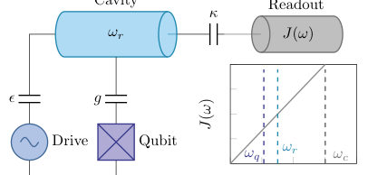 
FIG. 1: Schematic of the dispersive readout circuit, also showing the spectral density J(ω) of the transmission-line environment with the typical frequency scales of the qubit (ωq), cavity (ωr) and environmental cut-off frequency (ωc) indicated by the vertical lines.

📷 Fig 2

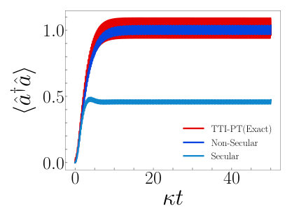 
FIG. 2: A figure to illustrate the effect of the secular approximation using a cavity driven on resonance as an example. The plots show photon number of the cavity as a function of the dimensionless parameter κt where κ/2π = 0.5 GHz is the single photon loss rate. The Bloch-Redfield results are benchmarked with the TTI-PT (Time Translation Invariant-Process Tensor) method [25], a non-perturbative technique that is numerically exact.

📷 Fig 3

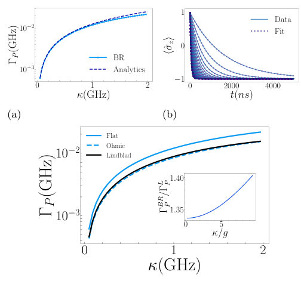 
FIG. 3: (a): Purcell rate ΓP vs. κ behavior for the Bloch-Redfield simulations for the range κ ∈[0.05, 2.0]. The spectral density is considered to be flat in this case such that J(ω) = J(ωr) = κ. The dashed line is for the rates calculated from the expression (17). (b): ⟨ˆσz⟩ dynamics with increasing κ and the dotted line shows the data fits used to calculate the Purcell rates. (c): Bloch-Redfield vs. Lindblad simulations. The black line represents the Lindblad, the solid blue line is for the Bloch-Redfield with a flat spectral density and the dashed blue line shows Bloch-Redfield rates with an Ohmic spectral density (6). The inset is the ratio ΓBR P /ΓL P calculated from the simulations as...

📷 Fig 4

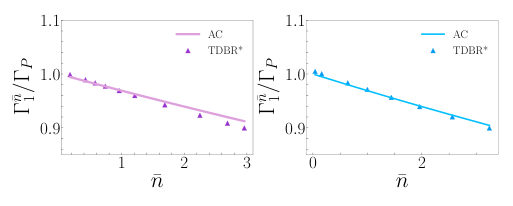 
FIG. 5: (a): Comparison of the Γ¯n 1 versus ¯n trend calculated from the numerical simulations and analytical expressions for κ = 1.0. The solid purple line shows the rates calculated from (21). (b): Similar comparison for κ = 0.1.

📷 Fig 5

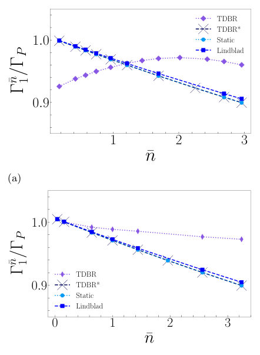 
FIG. 4: (a): Relaxation rate Γ¯n 1 normalized by the Purcell rate ΓP for the respective methods as a function of mean photon number ¯n in the cavity for κ = 1.0. Here the dotted purple curve show the Γ1(¯n) versus ¯n behavior for the time-dependent Bloch-Redfield (TDBR) with an RWA drive of the form (19). The TDBR* shows the same behavior for a cosine drive (20). The ‘Static’ curve is for the Bloch-Redfield model with a static dissipator. (b): Γ¯n 1 versus ¯n for κ = 0.1.

**Summary.** This paper rigorously compares master equation formalisms (Lindblad vs. Bloch-Redfield) for describing open quantum systems like superconducting qubits coupled to structured environments. It demonstrates that the Bloch-Redfield approach is necessary to accurately capture frequency-dependent dissipation, correctly predicting phenomena like measurement-induced relaxation suppression via Purcell filtering, especially under strong driving fields.

**Why it may be interesting.** This work is highly relevant for quantum optics and open quantum systems, as it provides necessary theoretical rigor for modeling superconducting qubits and cavity QED systems where the environment structure (e.g., Purcell filters) dictates measurement fidelity.

Detailed structure

**Main problem.** The paper compares different theoretical frameworks—Lindblad vs. Bloch-Redfield master equations—for accurately modeling driven-dissipative dynamics in composite quantum systems, especially when the environment is structured.

**Main result.** The Bloch-Redfield approach is shown to be superior to the standard Lindblad model because it correctly incorporates the frequency dependence of the environment, allowing for the quantitative recovery of effects like Purcell filtering.

**Method.** The authors employ a microscopic Bloch-Redfield approach, constructing the dissipator in the eigenbasis of the coupled system, and compare its results against the standard Lindblad master equation.

**Model / system.** The system consists of a qubit coupled to a resonator, which is itself coupled to a structured electromagnetic environment (transmission line). The dynamics are governed by a total Hamiltonian and analyzed using various master equations.

**Key observables.** Relaxation rates ($\Gamma$), cavity photon number ($\langle \hat{a}^\dagger \hat{a} 
angle$), and the expectation value of the qubit Pauli operator ($\langle \hat{\sigma}_z 
angle$).

**Important parameters / regimes.** Qubit frequency ($\omega_q$), resonator frequency ($\omega_r$), coupling strength ($g$), and the spectral density function $J(\omega)$ characterizing the environment structure.

**Assumptions / limitations.** The analysis compares results derived under Born-Markov approximations, noting that the Rotating Wave Approximation (RWA) for the drive Hamiltonian can lead to unphysical results, necessitating the use of the full cosine drive.

**Figures summary.** Figures compare the ratio of relaxation rates ($\Gamma_{ar{n}1}/\Gamma_P$) derived from different master equations (TDBR vs. Lindblad) under both RWA and full cosine driving, demonstrating the filter effect.

**Paper structure.** The paper systematically compares the Lindblad and Bloch-Redfield formalisms, first showing quantitative differences in decay rates, then investigating the impact of driving, and finally demonstrating the recovery of structured environment effects (Purcell filtering) using the TDBR formalism.

Abstract

Driven-dissipative qubit-resonator dynamics, which are the basis of most dispersive superconducting qubit measurement schemes, are often modeled with Lindblad master equations built from subsystem local jump operators, even when the qubit and resonator are appreciably hybridized. In this work we revisit this setting using a microscopic Bloch-Redfield approach, where dissipation is constructed in the eigenbasis of the coupled qubit-resonator Hamiltonian with a complete, frequency dependent, open system description of the transmission line environment. Here, we show that the Lindblad and Bloch-Redfield decay rates can be quantitatively different in the absence of driving, while in the driven case we demonstrate that the time-independent Redfield dissipator and its time-dependent generalization can show qualitatively different behaviors as a function of driving strength. Finally, we investigate the effects of driving in structured spectral densities, recovering the suppression of measurement-induced relaxation in the presence of a so called Purcell filter.

[↑ back to top](#top)

### [Collective Radiative Enhancement of Rare-Earth Ions in Lithium Niobate via Engineered LargeArea Nanohole Arrays](http://arxiv.org/abs/2605.29015v1)

**Authors:** Ali Najjar Amiri, Trevor Kling, David Barton, Mahdi Hosseini  
**Type:** experiment · **Category:** other · **PDF:** <https://arxiv.org/pdf/2605.29015v1>  
**Analysis basis:** full PDF text, analyzed in chunks
**Topic relevance:** 🔥 `Dicke superradiance` **4/5** · 🔥 `correlated / nonlocal dissipation` **4/5** · `Tavis-Cummings & cavity-many-emitter` **3/5** · `correlated cavity matter` **3/5** · `quantum optics experiment` **3/5** · `analog quantum simulation` **2/5** · `interference shaping light` **2/5** · `superradiant laser` **2/5** · `driven-dissipative phase transition` **1/5** · `free-space correlated emission` **1/5** · `methods for driven-dissipative` **1/5** · `non-equilibrium dynamics` **1/5**

📷 Fig 1

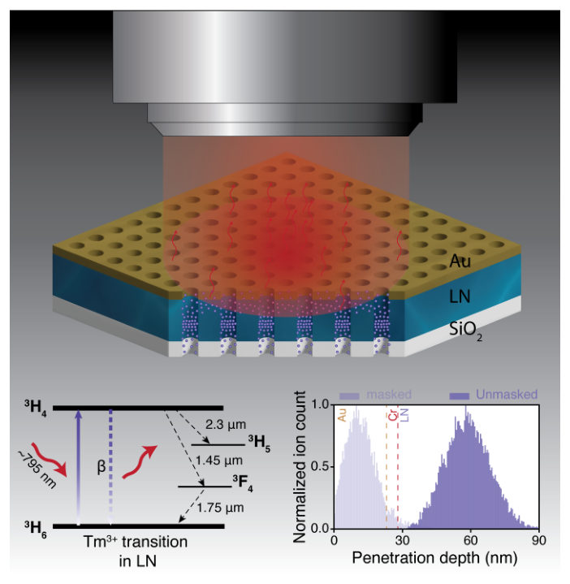 
Figure 1: Schematic of thulium-implanted lithium niobate (LN) and the optical measurement setup. Three-dimensional schematic of an engineered array of Tm3+ ions implanted into LN, the 600-nm- thick top layer of a lithium-niobate-on-insulator (LNOI) wafer. Ion implantation is performed through a fabricated metal nanohole layer with a thickness of 28 nm. The bottom-left inset illustrates the relevant Tm3+ energy levels in LN, where ions are excited at ∼795 nm and emission is detected from the 3H4 →3H6 optical transition. The bottom-right inset shows the simulated depth distribution of implanted Tm ions within the LN layer and the metal mask, calculated using the Stopping and Range of Ions in...

📷 Fig 2

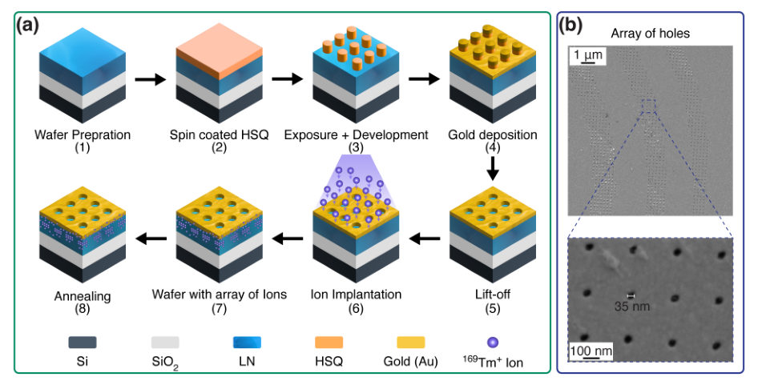 
Figure 2: Nanofabrication process flow and SEM image of a metal nanohole array. (a) Schematic illustration of the nanofabrication process. (1) An LNOI wafer is prepared by standard cleaning followed by the application of an adhesion promoter. (2) A 115-nm-thick hydrogen silsesquioxane (HSQ) resist layer is spin-coated. (3) Electron-beam lithography (EBL) is used to pattern the resist, followed by development in a salty developer (1% NaOH + 4% NaCl) to form HSQ nanopillars. (4) A metal stack consisting of 5 nm Cr and 23 nm Au is deposited using electron-beam evaporation. (5) Lift-off is performed using buffered oxide etchant (BOE) 10:1 to define the metal nanohole array. (6) Broad-beam...

📷 Fig 3

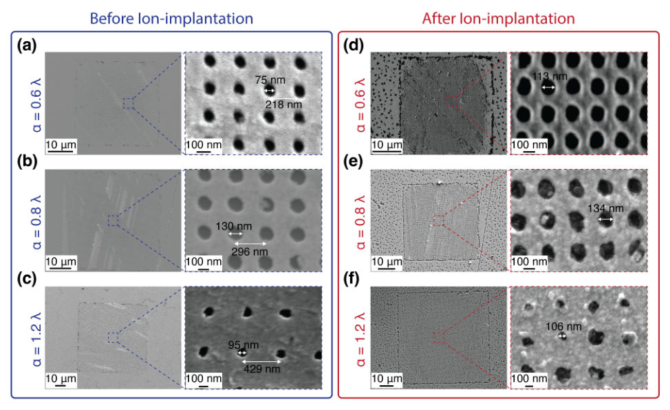 
Figure 3: SEM images of nanohole arrays with different pitches before and after ion implanta- tion. (a–c) SEM images of large-area nanohole arrays consisting of 160 × 160 holes with different lattice pitches. The measured hole diameters are 75 nm, 130 nm, and 95 nm for pitch values of 0.6λ, 0.8λ, and 1.2λ, respectively. (d–f) SEM images of the same arrays shown in (a–c) after ion implantation. The hole diameters increase due to ion-induced modification of the metal mask after annealing, with minimum hole diameters of 113 nm, 134 nm, and 106 nm for pitch values of 0.6λ, 0.8λ, and 1.2λ, respectively. In addition, nonuniform holes with random sizes are generated primarily outside the patterned...

📷 Fig 4

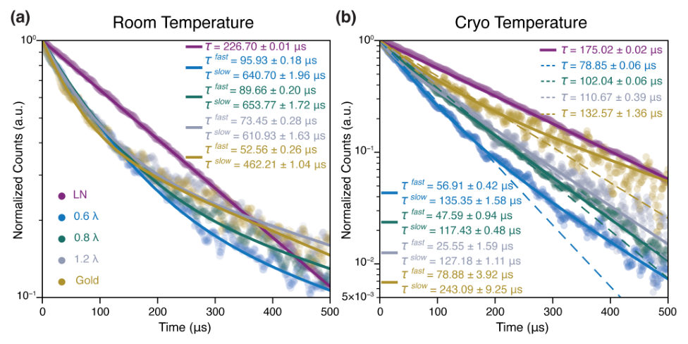 
Figure 4: Photoluminescence (PL) lifetime comparison between pure lithium niobate (LN), gold regions with disordered nanoholes, and ordered nanohole arrays. (a) Room-temperature PL decay traces. Pure LN exhibits a single-exponential decay (A exp(−t/τ) ), whereas regions containing ordered nanohole arrays display a bi-exponential decay (Afast exp(−t/τfast) + Aslow exp(−t/τslow)), indicating the coexistence of fast and slow decay channels associated with plasmonic, nonradiative, and radiation trapping effects. The fitted ratio Afast/Aslow is 1.44 for the disordered gold region, and 3.5, 2.7, and 1.8 for ordered arrays with pitch values of 0.6λ, 0.8λ, and 1.2λ, respectively. At early decay...

📷 Fig 5

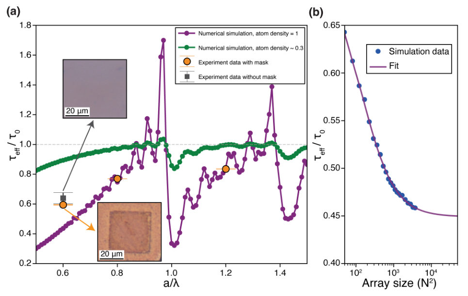 
Figure 5: Collective atomic lattice resonance. (a) Numerical simulation result (obtained using numerical Green’s function formalism) of lifetime modification together with experimental results are shown for different array spacing. Simulation considers 65 × 65 square lattice of Tm ions in lithium niobate (LN). Experimental results show good agreement with the theory. The inset optical images show the nanohole array before and after mask removal of corresponding data points. (b) Numerical simulation result of lifetime modification as a function of array size carried out using effective atomic density of 1 per site, considering a/λ = 0.6. The fit function to the numerical data is 36.4/(a/λ +...

**Summary.** This work demonstrates a novel method to engineer large-area quantum optical interfaces by embedding rare-earth ions in lithium niobate patterned with gold nanohole arrays. By measuring photoluminescence decay, the authors experimentally confirmed that the radiative enhancement stems from collective atomic effects mediated by the periodic lattice structure, rather than just local plasmonic enhancement. This opens a pathway for scalable, geometry-controlled quantum light-matter interactions.

**Why it may be interesting.** It provides a concrete, scalable experimental platform to study collective quantum emission effects in solid-state systems, offering insights into engineered quantum optical interfaces beyond simple cavity QED.

Detailed structure

**Main problem.** The paper addresses the challenge of engineering and enhancing light-matter interactions by controlling the collective radiative properties of rare-earth ions, moving beyond traditional local field confinement methods.

**Main result.** The authors observed enhanced radiative emission attributed to collective atomic effects mediated by the nanohole lattice, which is distinct from single-emitter Purcell enhancement.

**Method.** The study uses time-resolved photoluminescence (PL) measurements, comparing ordered nanohole arrays to disordered regions and pure host material.

**Model / system.** The physical system is a hybrid structure: Thulium ($	ext{Tm}^{3+}$) ions implanted in Lithium Niobate ($	ext{LN}$) patterned with periodic arrays of subwavelength gold nanoholes. This structure supports plasmonic resonances, lattice resonances, and collective atomic resonances.

**Key observables.** Time-resolved PL decay dynamics (single vs. bi-exponential), radiative decay rates, and the dependence of enhancement on lattice pitch.

**Important parameters / regimes.** Lattice pitch ($a$), temperature (especially cryogenic T), and the ratio of collective enhancement to single-emitter enhancement.

**Assumptions / limitations.** The collective enhancement is primarily due to the atomic-lattice resonance, which persists even when the plasmonic metal layer is removed.

**Figures summary.** Figures illustrate the fabrication process, SEM images of the nanohole arrays, and PL decay measurements comparing ordered arrays, disordered regions, and pure LN at various temperatures, alongside theoretical modeling of lifetime modification.

**Paper structure.** The paper follows a structure detailing the fabrication of the hybrid platform, presenting time-resolved PL measurements at different temperatures, and analyzing the results to distinguish between plasmonic, trapping, and collective atomic contributions.

Abstract

Conventional approaches to light-matter interactions rely on engineering photonic density of states. More recently, tailoring the spatial geometry of atoms or emitters themselves has emerged as a powerful and complementary route to control collective radiative properties. Here we experimentally realize a geometry-engineered ensemble of rare-earth ions by fabricating a periodic array of subwavelength gold nanoholes on lithium niobate implanted with thulium ions, forming a semi-two-dimensional array of quantum emitters embedded in a high-index crystalline thin film. The hybrid structure can simultaneously support localized and lattice plasmon resonances from the metallic array and collective atomic resonances from the ion ensemble. Using time-resolved photoluminescence and temperature-dependent measurements, we observe enhanced radiative emission attributed to collective atomic effects mediated by the nanohole lattice, distinct from single-emitter Purcell enhancement. Our results demonstrate a new regime of light-matter interaction opening a pathway toward broadband and scalable, geometry-controlled quantum optical interfaces in solid-state platforms.

[↑ back to top](#top)

### [Heralded ultrafast generation of macroscopic quantum states in matter with bright squeezed vacuum light](http://arxiv.org/abs/2605.30224v1)

**Authors:** Shohei Imai  
**Type:** theory · **Category:** other · **PDF:** <https://arxiv.org/pdf/2605.30224v1>  
**Analysis basis:** full PDF text, analyzed in chunks
**Topic relevance:** 🔥 `Tavis-Cummings & cavity-many-emitter` **4/5** · `measurement-induced transitions` **3/5** · `quantum measurements` **3/5** · `Dicke superradiance` **2/5** · `analog quantum simulation` **2/5** · `correlated cavity matter` **2/5** · `driven-dissipative phase transition` **2/5** · `entanglement & information structure` **2/5** · `methods for driven-dissipative` **2/5** · `Keldysh / 2PI / non-Gaussian methods` **1/5** · `correlated / nonlocal dissipation` **1/5** · `exotic spin models in light-matter` **1/5** · `non-equilibrium dynamics` **1/5** · `non-equilibrium universality` **1/5**

📷 Fig 1

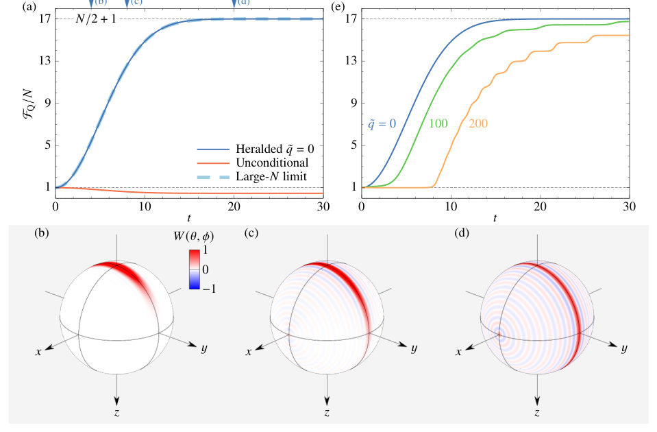 
Figure 1: Quadrature-heralded matter dynamics in the TC model (19) within the XFA for 𝐹c ≈0.10 (𝑔= 0.005, 𝑟= 3) and 𝑁= 32. (a) Time profile of the QFI density FQ/𝑁(blue solid line), for ˜𝑞= 0 [Eq. (25)]. The orange line shows the unconditional case calculated from ˆ𝜌m [Eq. (12)]. The light-blue dashed line shows the large-𝑁limit (26). (b)–(d) Spin Wigner function 𝑊(𝜃, 𝜙) [Eq. (23)] at the times indicated in (a). For visualization, only the 𝑧axis is inverted. (e) QFI dynamics for different quadrature outcomes, ˜𝑞= 𝑞/𝑔= 0, 100, 200, corresponding to 𝑞= 0, 0.5, 1 for 𝑔= 0.005.

📷 Fig 2

 
Figure 2: Dependence of the quadrature-heralded QFI density FQ/𝑁on the measurement resolution Δ ˜𝑞 in the TC model (19) within the XFA for 𝐹c ≈0.10 (𝑔= 0.005, 𝑟= 3), ˜𝑞= 0, and 𝑁= 32. The QFI is calculated from ˆ𝜌𝑞;Δ𝑞[Eq. (28)]. Given 𝑔= 0.005, the resolutions Δ ˜𝑞= Δ𝑞/𝑔= 40, 80, 120 correspond to Δ𝑞= 0.2, 0.4, 0.6, respectively.

📷 Fig 3

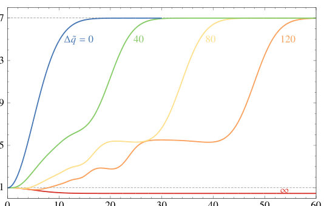 
Figure 2 shows the time evolution of the QFI density FQ/𝑁[Eq. (22)] calculated from the matter state ˆ𝜌𝑞;Δ𝑞[Eq. (28)] heralded by a finite-resolution quadrature measurement. Since the scaled outcome ˜𝑞= 𝑞/𝑔 is the relevant quantity in the XFA (18), the dynamics depends on Δ𝑞only through the scaled resolution Δ ˜𝑞= Δ𝑞/𝑔. We set the outcome center to ˜𝑞= 0. Numerically, the integral over 𝑞′ is evaluated using the rectangular method. Overall, the monotonic growth of the ideal measurement Δ ˜𝑞= 0 is suppressed up to a certain time by finite Δ ˜𝑞, but eventually crosses over to the same squared-exponential growth. At early times, larger Δ ˜𝑞prolongs the agreement with the unconditional curve...

📷 Fig 4

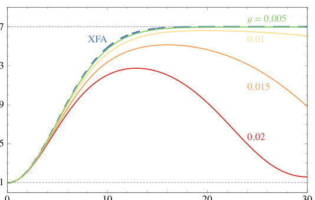 
Figure 3: Comparison between the XFA and full light–matter simulations for the quadrature-heralded QFI density FQ/𝑁in the TC model (19). The blue dashed curve shows the XFA result (25), and the solid curves show full numerical simulations for different electron–photon couplings 𝑔= 0.005, 0.01, 0.015, and 0.02. Parameters are set to 𝑟= 3 −ln(𝑔/0.005), 𝑞= 0, Δ𝑞= 0, and 𝑁= 32.

📷 Fig 5

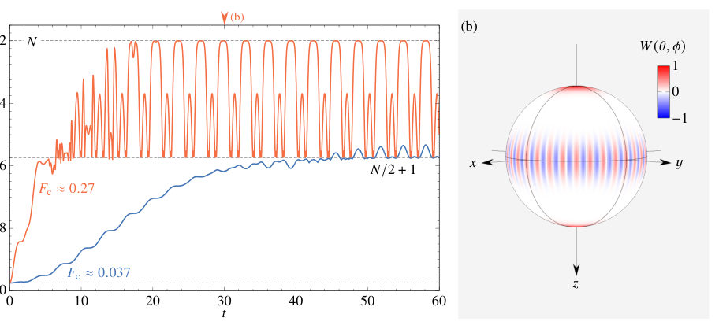 
Figure 4: Quadrature-heralded matter dynamics in the Dicke model (39) within the XFA for ˜𝑞= 0 and 𝑁= 32. (a) Time profile of the QFI density FQ/𝑁for 𝐹c = 𝑔exp(𝑟) ≈0.27 and 0.037, corresponding to 𝑟= 4 and 2 for 𝑔= 0.005. (b) Spin Wigner function 𝑊(𝜃, 𝜙) at the time indicated in (a).

**Summary.** This paper demonstrates how using bright squeezed vacuum light and single-shot quadrature measurements can rapidly generate macroscopic quantum superpositions in matter. By analyzing the dynamics within the Tavis–Cummings and Dicke models, the authors show that measurement acts as a quantum filter, driving the system into highly entangled, cat-like states. This opens a pathway for ultrafast quantum state engineering using strong-field quantum light.

**Why it may be interesting.** This work provides a detailed theoretical framework for engineering macroscopic quantum states in matter using non-classical light sources and measurement feedback, which is central to modern quantum optics and AMO research.

Detailed structure

**Main problem.** The paper addresses the ultrafast generation of macroscopic quantum states in matter using light-matter interactions.

**Main result.** Quadrature-based heralding allows for the preparation of matter in a quantum superposition, driving the system from a Dicke state to a cat-like state.

**Method.** The analysis employs the Tavis–Cummings and Dicke models, utilizing the external-field approximation and single-shot quadrature measurements to condition the matter state.

**Model / system.** The system involves matter (modeled by two-level systems/spin operators) coupled to a quantum light field, specifically bright squeezed vacuum (BSV) light. The dynamics are governed by the Tavis–Cummings and Dicke Hamiltonians.

**Key observables.** Quantum Fisher Information (QFI), Spin Wigner function, and the matter density matrix $
ho_m(t)$.

**Important parameters / regimes.** Squeezing parameter ($\xi$), effective field strength ($F_c$), and particle number ($N$).

**Assumptions / limitations.** The analysis relies on the external-field approximation (XFA) and neglects relaxation or dephasing effects.

**Figures summary.** Figures illustrate QFI time profiles and Wigner functions, showing the transition from Dicke states to cat-like states under strong fields, and comparing heralded vs. unconditional dynamics.

**Paper structure.** The paper develops the theory by first analyzing unconditional dynamics (showing classical mixtures) and then introducing quadrature-based heralding to prepare quantum superpositions. It extends this to the Dicke model to show the final transition to cat-like states.

Abstract

We show that bright squeezed vacuum light, combined with a single-shot quadrature measurement of the post-interaction light, enables the ultrafast generation of macroscopic quantum states in matter. Although in the weak-coupling regime multiphoton quantum light leaves the unconditional matter state as a classical mixture due to light--matter entanglement, quadrature-based heralding prepares the matter in a Gaussian-weighted quantum superposition. For an ensemble of resonantly electric-dipole-coupled two-level systems, this heralding dynamics acts as a Gaussian filter with respect to the electric polarization, with brighter squeezed-vacuum light accelerating the preparation of the zero-eigenvalue Dicke state. Counter-rotating terms further drive a stroboscopic transition from this Dicke state to a cat-like state. Our results open a route to ultrafast engineering of macroscopic quantum matter with strong-field quantum light.

[↑ back to top](#top)

### [Local diagnostics for strong-to-weak spontaneous symmetry breaking and non-equilibrium phase transitions](http://arxiv.org/abs/2605.29113v1)

**Authors:** Carolyn Zhang  
**Type:** theory · **Category:** statistical mechanics · **PDF:** <https://arxiv.org/pdf/2605.29113v1>  
**Analysis basis:** full PDF text, analyzed in chunks
**Topic relevance:** 🔥 `driven-dissipative phase transition` **4/5** · 🔥 `non-equilibrium universality` **4/5** · `correlated / nonlocal dissipation` **3/5** · `methods for driven-dissipative` **3/5** · `non-equilibrium dynamics` **3/5** · `analog quantum simulation` **2/5** · `entanglement & information structure` **2/5** · `Keldysh / 2PI / non-Gaussian methods` **1/5**

📷 Fig 1

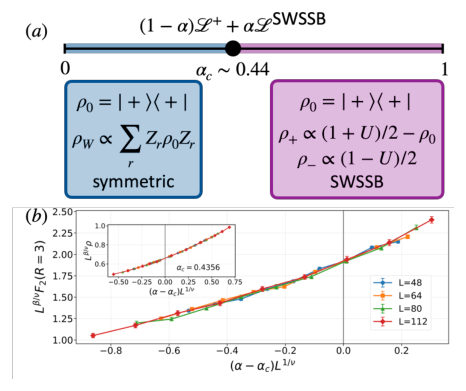 
FIG. 1. (a) The 1+1d dynamics is designed to interpolate between L+ and LSWSSB. L+ has exact steady states ρ0 and ρW in the even and odd strong Z2 sectors respectively. LSWSSB has an exact steady state space spanned by three steady states. All even sector states orthogonal to ρ0 get taken to ρ+ at late times, so ρ0 is exponen- tially unlikely. (b) The finite size scaling collapse gives critical ex- ponents β/ν⊥= 0.53, 1/ν⊥= 0.56 for the order parameter n−(in- set) that match well with the PC-BARW universality class (β/ν⊥= 0.5, 1/ν⊥= 0.54 [22]) with αc = 0.44. The radius R = 3 2-point marginal fidelity correlator also demonstrates finite size scaling col- lapse with similar exponents: β/ν⊥=...

📷 Fig 2

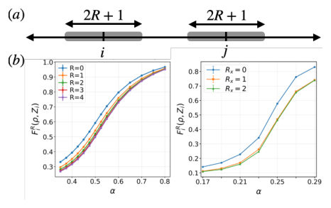 
FIG. 2. (a) The marginal one-point fidelity correlator takes the re- duced density matrix on R(i) ∪R(j), which includes 2(2R + 1) sites. In higher dimensions, we specify Rx and Ry, and take the re- duced density matrix on a region of size (2Rx +1)(2Ry +1) around i and j. (b) The fidelity correlator as a function of R and Rx shows rapid convergence; see Ref. [11] for calculations supporting faster convergence in the SWSSB phase and in the 2+1d case for Rx &gt; 0 away from βc. The first plot tracks radius R fidelity correlator for a system of size L = 112 across the 1+1d phase transition. The sec- ond plot tracks Rx fidelity correlator for a system of size L2 = 400 across the 2+1d strict pair...

📷 Fig 3

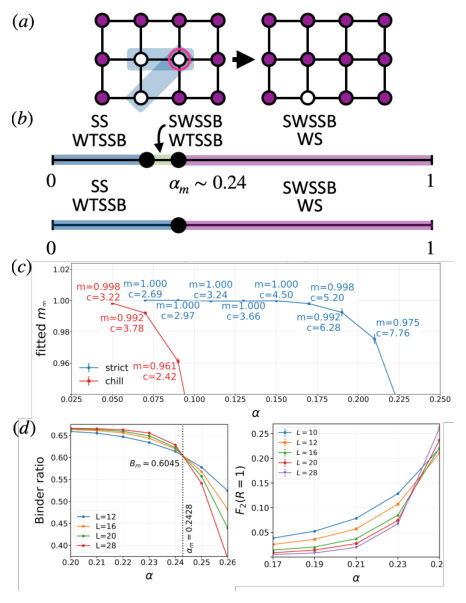 
FIG. 3. (a) The purple circles represent + spins and white circles represent −spins, and the blue links represent pair flips allowed for strict pair-flip Toom. (b) Two possible phase diagrams for the 2+1d model with strict pair-flip Toom. (c) In the odd sector in the SP phase, we should have ⟨|m|⟩= m∞−c/L2 with m∞= 1 and c/2 giving the size of a wandering O(1) minority domain, so we fit m∞and c using L = 10, 12, 16, 20 data (in the plot we use m instead of m∞to save space). The strict pair flip Toom rule (blue) demonstrates a convincing stable phase where m∞= 1 whereas the chill pair flip Toom rule has m∞very close to but not quite 1 for very small α. We also obtain data points (not shown...

📷 Fig 4

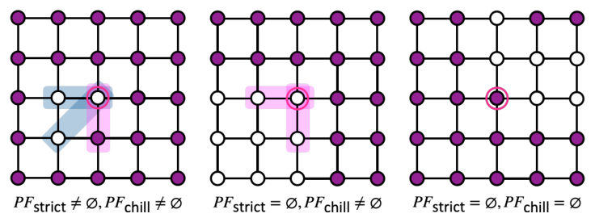 
FIG. 1. The purple circles represent + spins and the white circles represent −spins. We focus on the Toom unstable spin circled in pink, and show the available strict pair-flip Toom moves in blue and chill pair-flip Toom rules in pink.

📷 Fig 5

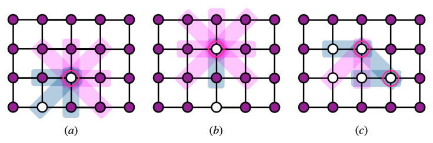 
FIG. 2. We take the same coloring conventions as in Fig. 1 and focus on the Toom unstable spin circled in pink, assuming that beyond the illustrated ones are all +. (a) and (b) give examples of configurations where strict pair-flip Toom pushes the two minority spins together into a larger domain or completely annihilates the two minority spins, while chill pair flip Toom allows the minority spins to get farther apart with probability 5/8 (a) or 7/8 (b). In (c), chill pair-flip Toom can split the minority domain into two small islands, that can then wander away from each other.

**Summary.** This paper introduces the marginal fidelity correlator as a robust, local diagnostic tool to study spontaneous symmetry breaking in non-equilibrium quantum systems. By applying this tool to 1+1d and 2+1d lattice models, the authors confirm its ability to detect transitions between paramagnetic and symmetry-broken phases, offering a general method applicable where traditional defect counting fails.

**Why it may be interesting.** This work provides a powerful, local, and model-independent diagnostic tool (the fidelity correlator) for detecting subtle non-equilibrium phase transitions like SWSSB, which is highly relevant for understanding open quantum systems dynamics.

Detailed structure

**Main problem.** The paper investigates local diagnostics for phase transitions, specifically the transition from a strong-paramagnetic (SP) phase to a strong-to-weak spontaneous symmetry breaking (SWSSB) phase in non-equilibrium quantum systems.

**Main result.** The authors successfully demonstrate that a local fidelity correlator serves as a model-independent diagnostic for SWSSB, showing consistency with known universality classes in 1+1d and providing evidence for stable regimes in 2+1d.

**Method.** The primary method involves constructing and analyzing local Markov/Lindblad dynamics, utilizing a novel 'marginal fidelity correlator' as a local proxy for the global fidelity order parameter.

**Model / system.** The study uses strongly Z2-symmetric local Markov/Lindblad dynamics in 1+1d and 2+1d lattices. The dynamics are tuned between different phases (SP, SWSSB) using interpolating Lindbladians or pair-flip Toom's rules.

**Key observables.** Marginal fidelity correlator ($F_R^{ij}$), error density ($n_-$), sample-averaged absolute magnetization ($\langle|m|
angle$), and Binder cumulant.

**Important parameters / regimes.** The radius $R$ of the local region, the system dimension (1+1d, 2+1d), and the tuning parameter $\alpha$ controlling the dynamics.

**Assumptions / limitations.** The analysis relies on local indistinguishability assumptions to bound the error between marginal and global fidelity correlators, and the effective classical nature of the dynamics in some contexts.

**Figures summary.** Figures illustrate finite size scaling collapses for the order parameter and marginal fidelity correlator matching PC-BARW exponents in 1+1d, and show phase diagrams and magnetization convergence for the 2+1d model.

**Paper structure.** The paper develops the diagnostic tool (marginal fidelity correlator), applies it to 1+1d and 2+1d models exhibiting SP-to-SWSSB transitions, and compares its results against established order parameters and theoretical expectations for symmetry breaking.

Abstract

We construct strongly $\mathbb{Z}_2$-symmetric local Markov/Lindblad dynamics exhibiting transitions between strong-paramagnetic behavior and strong-to-weak spontaneous symmetry breaking. In 1+1d, an absorbing-state construction gives a transition with scaling consistent with the parity-conserving branching-annihilating random-walk universality class. In 2+1d, a pair-flip variant of Toom's rule provides evidence for a stable strong-paramagnetic/weakly symmetry-broken regime and a transition into an active SWSSB regime. We also introduce a marginal fidelity correlator of radius $R$, a local proxy for the usual SWSSB fidelity order parameter requiring tomography only on $\mathcal{O}(R^d)$-size regions. For broad classes of states, including symmetry-projected Gibbs-like states satisfying suitable local indistinguishability assumptions, we bound the error between the marginal and global fidelity correlators by terms decaying exponentially in $R$. These marginal fidelities provide a model-independent diagnostic of SWSSB in absorbing-state transitions, where microscopic notions of defects or activity are not universal.

[↑ back to top](#top)

### [Programmable Dissipation via Partial Quantum Error Correction](http://arxiv.org/abs/2605.30217v1)

**Authors:** Sameer Dambal, Michael AD Taylor, Yu Zhang  
**Type:** theory · **Category:** quantum information and computing · **PDF:** <https://arxiv.org/pdf/2605.30217v1>  
**Analysis basis:** full PDF text, analyzed in chunks
**Topic relevance:** 🔥 `methods for driven-dissipative` **4/5** · `analog quantum simulation` **3/5** · `correlated / nonlocal dissipation` **3/5** · `driven-dissipative phase transition` **3/5** · `non-equilibrium dynamics` **3/5** · `non-equilibrium universality` **2/5** · `Keldysh / 2PI / non-Gaussian methods` **1/5** · `entanglement & information structure` **1/5** · `measurement-induced transitions` **1/5** · `quantum measurements` **1/5**

📷 Fig 1

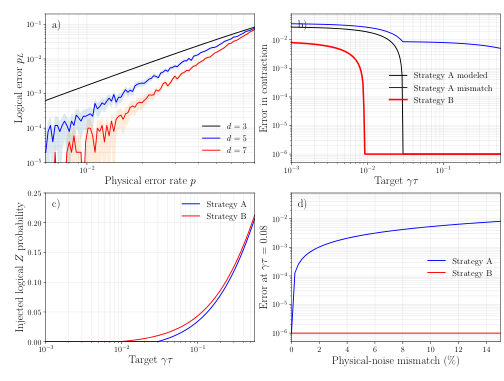 
FIG. 1. Logical channel compilation: a) Logical error extracted from an explicit surface-code stabilizer workflow: physical error patterns are enumerated via a minimum weight perfect matching (MWPM) decoder [46]; b) Channel fitting error for a one-qubit dephasing target; To illustrate two dif- ferent strategies, here Strategy A uses the modeled d = 3 extracted logical channel as part of the target dissipator, so the fit is exact when the assumed noise model is feasible; a 15% physical-noise mismatch leaves a calibrated residual. Strategy B corrects more strongly first (d = 7 here) and then programs the dephasing. c) logical Z-frame probabilities; d) Sensitivity at fixed target strength γτ =...

📷 Fig 2

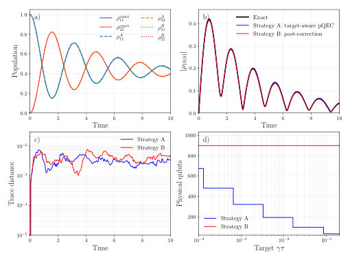 
FIG. 2. Open quantum system dynamics and resource trade-off. a) Populations in the two-site exciton model. The exact Lindblad trajectory is compared with a model-aware Strategy-A split step and a post-correction (Strategy B) split step; b) Coherence |ρ10,01|, showing that the programmed de- phasing controls the decay envelope; c) Trace distance from the exact Lindblad trajectory. The Strategy-A curve in- cludes a deliberate 6% residual dephasing-rate mismatch to show calibration sensitivity; the Strategy-B curve is domi- nated by splitting error; d) Illustrative (surface-code) physical qubits overhead for two logical qubits. Strategy A can use a target-aware threshold proportional to the...

**Summary.** This paper introduces a novel technique called Partial Quantum Error Correction (pQEC) that repurposes the structure of quantum error correction codes. Instead of merely suppressing noise, pQEC treats the error-correction cycle as a programmable tool to synthesize and simulate desired dissipative dynamics in open quantum systems. This offers a resource-efficient route to quantum simulation by converting controlled logical noise into a useful computational resource.

**Why it may be interesting.** This work provides a powerful, resource-efficient theoretical framework for simulating complex open quantum dynamics by integrating the structure of fault-tolerance directly into the simulation protocol, which is highly relevant for quantum simulation architectures.

Detailed structure

**Main problem.** The paper addresses the tension between fault-tolerant quantum error correction (QEC) designed to suppress noise and the necessity of modeling dissipation as a target physical process in open quantum systems.

**Main result.** Partial QEC can be repurposed to actively sculpt or synthesize arbitrary target dissipation channels, turning logical noise into a controlled, programmable resource for quantum simulation.

**Method.** The authors treat the QEC cycle as a programmable primitive, using convex optimization over the logical channel space to approximate the desired dissipative evolution.

**Model / system.** The system is an open quantum system whose dynamics are governed by a Lindblad master equation, simulated on a logical subspace protected by a quantum error-correcting code.

**Key observables.** Populations, coherence ($
ho_{10,01}$), and the trace distance from the exact Lindblad trajectory are key diagnostics used to validate the simulation accuracy.

**Important parameters / regimes.** Code distance ($d$), the target dissipation rate ($\Delta_{	ext{tar}}(	au)$), and the error tolerance ($\epsilon_{	ext{step}}$) are critical parameters controlling the simulation fidelity and resource overhead.

**Assumptions / limitations.** The core assumption is that the syndrome-averaged map and the resulting logical map are Completely Positive Trace-Preserving (CPTP). Strategy A requires the target dissipator to be appreciable to yield resource advantages.

**Figures summary.** Figure 2 compares the exact Lindblad trajectory with the simulated dynamics ($
ho_A, 
ho_B$) for populations and coherence, showing the ability to control decay envelopes, alongside a comparison of physical qubit overhead.

**Paper structure.** The paper develops the theory by first establishing that one QEC round yields a CPTP map (Lemma 1), then showing that randomized recovery generates a convex family of maps (Lemma 2). It then constructs the overall simulation by combining coherent evolution with programmed dissipation, culminating in comparisons between model-aware (Strategy A) and post-correction (Strategy B) approaches.

Abstract

Noise is typically treated as the adversary of quantum information processing. For open quantum dynamics, however, dissipation is part of the target physics, creating a tension with fault-tolerant architectures designed to suppress decoherence. Here we show that logical noise can instead be turned into a calibrated resource. We treat the error-correction cycle as a programmable primitive: one fault-tolerant round induces a logical completely positive trace-preserving map, and decoder/recovery randomization generates a controllable family of logical channels whose convex mixtures realize Kraus-channel mixing. This enables direct compilation of target dissipators into effective logical dynamics without explicit ancilla qubits for encoding the bath degree of freedoms. We derive an accuracy criterion for multi-step simulation in which the code distance is chosen so that uncontrolled logical errors remain a small fraction of the intended dissipation per step, rather than being driven below an arbitrarily small closed-system tolerance. Partial quantum error correction thus repurposes fault-tolerant structure to sculpt dissipation, offering a resource-efficient route to quantum simulation of open quantum systems.

[↑ back to top](#top)

### [Asymptotic Quantum Dynamics of Ghost Fields](http://arxiv.org/abs/2605.29047v1)

**Authors:** Luca Buoninfante  
**Type:** theory · **Category:** other · **PDF:** <https://arxiv.org/pdf/2605.29047v1>  
**Analysis basis:** full PDF text, analyzed in chunks
**Topic relevance:** 🔥 `Keldysh / 2PI / non-Gaussian methods` **4/5** · `correlated / nonlocal dissipation` **3/5** · `driven-dissipative phase transition` **3/5** · `methods for driven-dissipative` **3/5** · `Kondo & dissipative impurity` **2/5** · `entanglement & information structure` **2/5** · `non-equilibrium dynamics` **2/5** · `non-equilibrium universality` **2/5**

📷 Fig 1

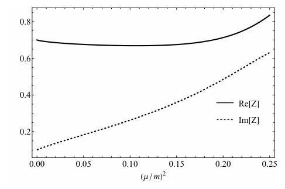 
Figure 1: Real (solid line) and imaginary (dashed line) parts of the wave-function renormalization constant Z = Re[Z] + iIm[Z] are plotted as functions of (µ/m)2. For illustrative purposes we set Γ/m = 0.5 and g2/(32π2m2) = 0.5. Since we are working above the multi-particle threshold, the region of interest is (µ/m)2 &lt; 0.25. We find Re[Z] &gt; 0 and Im[Z] &gt; 0.

📷 Fig 2

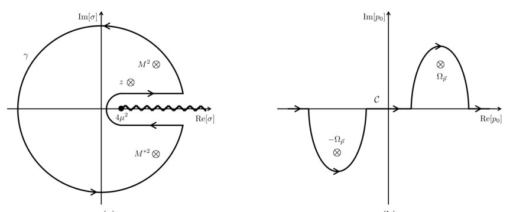 
Figure 2: (a) Integration contour γ used in (11) to derive the spectral representation of the ghost propagator (12). (b) Lee-Wick contour C introduced in (14). Encircled crosses indicate poles, and we recall that M2 = m2 + imΓ and Ω⃗p = p

**Summary.** This theoretical work analyzes the asymptotic behavior of a ghost field in QFT, finding that its complex pole structure prevents the existence of a true, free one-particle state. The ghost's state is perpetually mixed with multi-particle components due to persistent quantum interference, meaning it cannot be observed as an isolated particle at large times.

**Why it may be interesting.** The concept of non-orthogonality and the masking of single-particle states by multi-particle components is a key topic in open quantum systems and quantum field theory, relevant for understanding decay and scattering processes.

Detailed structure

**Main problem.** The paper investigates the asymptotic quantum dynamics of a ghost field coupled to ordinary fields, specifically analyzing the implications of complex poles in the dressed propagator.

**Main result.** No free asymptotic one-particle ghost state exists because the negative-norm one-particle state becomes indistinguishable from a superposition of positive-norm multi-particle states due to persistent quantum interference effects.

**Method.** The analysis uses the operator formalism of local quantum field theory, calculating the dressed propagator and analyzing its pole structure in the complex energy plane.

**Model / system.** The model involves a ghost field ($\phi$) coupled to an ordinary scalar field ($\chi$) via an interaction term, leading to complex poles in the propagator ($	ext{Re}[M^2] \pm i\Gamma$).

**Key observables.** Dressed ghost propagator $ar{G}_\phi(z)$, complex poles $M^2 = m^2 \pm i\Gamma$, and the mixed inner product quantifying state overlap.

**Important parameters / regimes.** The imaginary part of the pole, $\Gamma$, sets the characteristic timescale ($2/\Gamma$) for the onset of non-orthogonality.

**Assumptions / limitations.** The analysis relies on the operator formalism of local QFT and utilizes the narrow-width approximation ($\Gamma/m \ll 1$).

**Figures summary.** Figures illustrate the renormalization constants ($	ext{Re}[Z], 	ext{Im}[Z]$) versus $(\mu/m)^2$ and show integration contours used for spectral representations.

**Paper structure.** The paper progresses from calculating the complex pole structure of the propagator to deriving a consistent, local, and Hermitian Lagrangian for the asymptotic fields ($\phi_{as}, 	ilde{\phi}_{as}$), ultimately demonstrating the non-free nature of the asymptotic state.

Abstract

The dressed propagator of a ghost coupled to ordinary fields develops a pair of complex conjugate poles in the first Riemann sheet above the multi-particle threshold. We study the implications of this pole structure for the asymptotic field and its negative-norm one-particle state. Within the operator formalism of local quantum field theory, we show that interactions between the ghost field and the composite field of the multi-particle state persist at asymptotic times. These induce quantum interference effects that render the negative-norm one-particle state non-orthogonal to, and thus indistinguishable from, a superposition of positive-norm multi-particle states. As a result, no free asymptotic one-particle ghost state exists. The real and imaginary parts of the complex mass admit a clear physical interpretation; in particular, the inverse imaginary part sets the timescale for the onset of non-orthogonality. A freely propagating ghost is therefore confined to time intervals much shorter than its inverse width, so that a detector can never observe an isolated ghost particle asymptotically. Open questions and potential applications are discussed in the conclusions.

[↑ back to top](#top)

### [Zeeman Pumping of Higgs Bosons in the Balian--Werthamer State](http://arxiv.org/abs/2605.29746v1)

**Authors:** Qiao-Ru Xu  
**Type:** theory · **Category:** quantum gases · **PDF:** <https://arxiv.org/pdf/2605.29746v1>  
**Analysis basis:** full PDF text, analyzed in chunks
**Topic relevance:** 🔥 `non-equilibrium dynamics` **4/5** · `Keldysh / 2PI / non-Gaussian methods` **3/5** · `analog quantum simulation` **3/5** · `methods for driven-dissipative` **2/5** · `non-equilibrium universality` **2/5** · `driven-dissipative phase transition` **1/5** · `entanglement & information structure` **1/5** · `exotic spin models in light-matter` **1/5**

📷 Fig 1

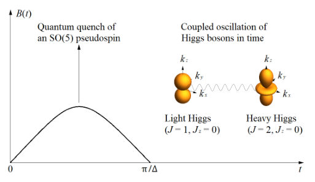 
FIG. 1. Schematic plot of a quench protocol using the mag- netic pulse B(t) = B(t)ˆz, with B(t) ∝sin(∆t)Θ(t)Θ(π/∆−t) and Θ(t) the unit step function. Along with the well-known light Higgs boson (J = 1, Jz = 0), the coupled heavy Higgs boson (J = 2, Jz = 0) is also excited.

📷 Fig 2

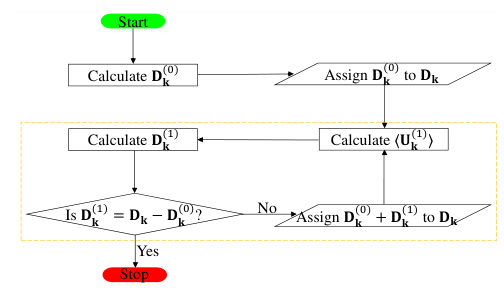 
FIG. 2. Flowchart of computing Dk self-consistently. Steps inside the dashed rectangle represent the iteration process of calculating ⟨U(1) k ⟩until D(1) k reaches a convergence. As ex- plained in the main text, D(0) k and D(1) k are the first and sec- ond terms of Eq. (10), respectively. When evaluating ⟨U(1) k ⟩, Eq. (11) is used.

📷 Fig 3

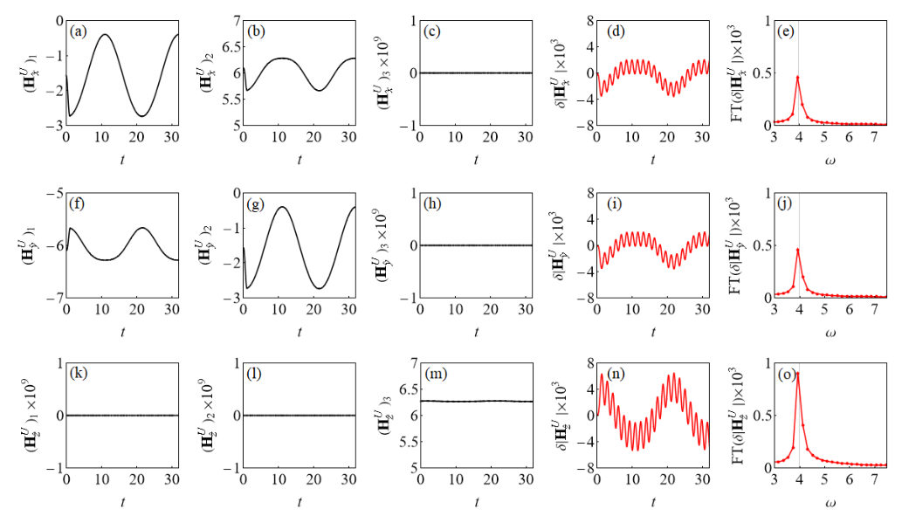 
FIG. 3. Quench dynamics of collective modes, with parameters ∆= π, gD/g = 10−3, and B(t) = 10−1π sin(πt)Θ(t)Θ(1 −t)ˆz, where Θ(t) is the unit step function. (a)-(c) are plots for the three components of HU ˆx after switching on the B(t) pulse. (d) is the amplitude deviation δ|HU ˆx |(t) and (e) is its discrete Fourier transform [ω = 2π(s −1)/32 (s ∈Z)], with a vertical grid line indicating the heavy Higgs boson at p

**Summary.** This theoretical study investigates the excitation of heavy and light Higgs bosons in a Balian-Werthamer superfluid using a magnetic quench protocol. By incorporating dipolar interactions into the SO(5) pseudo-spin model, the authors predict and simulate the coupled oscillation of these two modes. This work provides a detailed theoretical framework for observing exotic collective excitations in quantum superfluids.

**Why it may be interesting.** This work connects superfluid physics (like Helium-3) to particle physics concepts (Higgs bosons) using advanced many-body techniques, making it relevant for theoretical work on emergent collective excitations in quantum matter.

Detailed structure

**Main problem.** The study aims to demonstrate a quantum quench protocol using a magnetic pulse to excite an undamped heavy Higgs boson within the Balian-Werthamer (BW) superfluid/superconductor state.

**Main result.** The inclusion of the dipolar interaction allows for the excitation of the heavy Higgs mode ($J=2, J_z=0$) alongside the light Higgs mode ($J=1, J_z=0$) via a suitable magnetic pulse, leading to coupled oscillations.

**Method.** The analysis uses a mean-field approximation based on an SO(5) pseudo-spin formalism, requiring self-consistent calculations and numerical simulation of time evolution using 26-point Lebedev quadrature.

**Model / system.** The system is a spinful p-wave superfluid in three dimensions, specifically modeled in the Balian-Werthamer state. The dynamics are governed by an effective Hamiltonian incorporating kinetic, pairing, and crucial dipolar interactions.

**Key observables.** The coupled oscillation of the light ($J=1$) and heavy ($J=2$) Higgs modes, observed via amplitude deviations and their discrete Fourier transforms.

**Important parameters / regimes.** The dipolar interaction strength ($g_D$) relative to the pairing interaction ($g$), and the magnetic pulse profile $B(t)$.

**Assumptions / limitations.** The analysis relies on the SO(5) pseudo-spin formalism and performs calculations self-consistently up to the first order in $g_D/g$.

**Figures summary.** Figure 1 schematically shows the quench protocol exciting both Higgs bosons. Figure 3 illustrates the time evolution of the order parameter fluctuations ($	ext{HU}_{\hat{x}}, 	ext{HU}_{\hat{y}}, 	ext{HU}_{\hat{z}}$), and related plots confirm the heavy Higgs mode peak in the Fourier transform.

**Paper structure.** The paper first establishes the mean-field Hamiltonian using SO(5) generators, then details the self-consistent calculation of the dipole-induced correction ($D_k$). Finally, it simulates the quench dynamics using a magnetic pulse to observe the coupled oscillation of the two Higgs modes.

Abstract

Based on equations of motion of an SO(5) pseudo-spin, we demonstrate a quantum quench protocol using the magnetic pulse to excite an $\textit{undamped}$ heavy Higgs boson in the Balian--Werthamer superfluid (or superconductor). To achieve that, it is essential to include the dipolar interaction in the effective Hamiltonian and to calculate the ground state self-consistently. The pumped heavy Higgs mode has the twisted angular momentum $J=2$ with the projection $J^{\,}_z=0$ and couples to a well-known light Higgs mode ($J=1$, $J^{\,}_z=0$). The numerical method of 26-point Lebedev quadrature is implemented concretely so as to observe the real-time coupled oscillation.

[↑ back to top](#top)

### [Dynamical Entanglement Phase Transitions in Holographic CFTs](http://arxiv.org/abs/2605.28939v1)

**Authors:** Joseph Dominicus Lap, Jad C. Halimeh, David Horn, Lukas Ebner, Clemens Seidl, Berndt Müller, Andreas Schäfer, Jakob Minar  
**Type:** theory · **Category:** statistical mechanics · **PDF:** <https://arxiv.org/pdf/2605.28939v1>  
**Analysis basis:** full PDF text, analyzed in chunks
**Topic relevance:** 🔥 `entanglement & information structure` **4/5** · 🔥 `non-equilibrium dynamics` **4/5** · `driven-dissipative phase transition` **3/5** · `non-equilibrium universality` **3/5** · `Keldysh / 2PI / non-Gaussian methods` **1/5** · `methods for driven-dissipative` **1/5**

📷 Fig 1

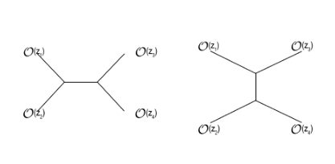 
FIG. 1. The expansion of a 4-point function in the s- and t-channels.

📷 Fig 2

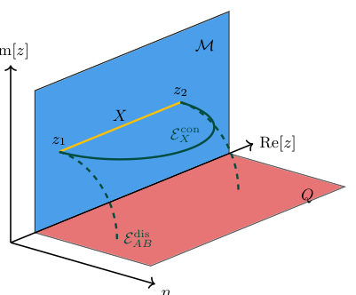 
FIG. 2. A sketch of the extremal geodesics in the presence of a boundary Q (red). In addition to the connected geodesic Econ X (solid black), one also has to take into account the discon- nected geodesic Edis X (dashed black) that ends on the boundary Q, viz. the end-of-the-world brane.

📷 Fig 3

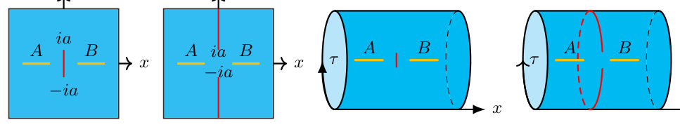 
FIG. 3. First Row: The world-sheets for a) splitting quench, b) joining quench c) splitting quench at finite temperature d) joining quench at finite temperature. Second Row: The corresponding world-sheets at t = 0.

📷 Fig 4

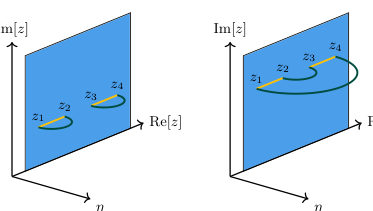 
FIG. 4. Disjoint subsystem X ∪Y where the subsystems have a cross-ratio |x| &lt; 1/2 (left) and |x| &gt; 1/2 (right).

📷 Fig 5

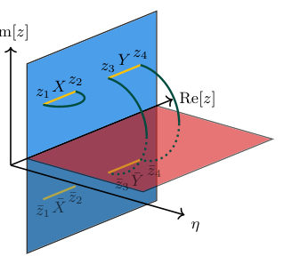 
FIG. 5. Upper half-plane with two subsystems X = [z1, z2] and Y = [z3, z4] and their mirror images ¯ X = [¯z2, ¯z2] and ¯Y = [¯z3, ¯z4] on the lower half-plane. (Red: Conformal boundary separating upper and lower half-plane).

**Summary.** This work analyzes dynamical entanglement phase transitions in holographic CFTs following a local quench. By probing the mutual information, the authors find that the dynamics exhibit distinct phases governed by conformal block dominance and a $D_4$ symmetry. This offers a unifying, symmetry-based framework for understanding real-time critical phenomena in many-body systems.

**Why it may be interesting.** It provides a concrete, entanglement-based realization of dynamical quantum phase transitions, linking non-equilibrium dynamics to deep symmetries and geometric structures derived from holography.

Detailed structure

**Main problem.** The paper investigates whether real-time evolution in non-equilibrium quantum many-body systems exhibits organizing principles analogous to those found in equilibrium statistical mechanics.

**Main result.** The mutual information in holographic CFTs exhibits a rich pattern of dynamical phase transitions, characterized by sharp non-analyticities in the large-central-charge limit.

**Method.** The study uses the mutual information between spatial intervals as a probe, analyzing the time evolution of entanglement structure following a local quench in holographic CFTs.

**Model / system.** The system is a 1+1-dimensional Conformal Field Theory (CFT) with a holographic dual, studied via local quenches. The analysis utilizes the AdS/BCFT correspondence and the Upper Half-Plane (UHP) mapping.

**Key observables.** Mutual Information ($I_{A:B}$), Entanglement Entropy ($S_A$), and the time evolution of these quantities.

**Important parameters / regimes.** Time ($t$), Central Charge ($c$), and the symmetry group $D_4$.

**Assumptions / limitations.** The analysis is performed in the large-central-charge limit ($c 	o \infty$), and the holographic entanglement entropy is assumed via the Ryu-Takayanagi conjecture.

**Figures summary.** Figures illustrate the phase structure of entanglement entropy on the UHP based on cross-ratios, and show non-analytic peaks in the entanglement difference ($\Delta S$) during quench protocols.

**Paper structure.** The paper progresses from establishing the static phase structure of entanglement on the UHP, relating this to quench dynamics, and finally identifying the symmetry ($D_4$) governing the onset and nature of the dynamical phase transitions.

Abstract

We study the time evolution of the entanglement structure of holographic conformal field theories after a local quench. Using the mutual information between two spatial intervals as a probe, we find that $1+1$-dimensional conformal field theories exhibit a rich pattern of dynamical phase transitions. In the large-central-charge limit, mutual information develops sharp non-analyticities at critical times, providing a concrete entanglement-based realization of dynamical quantum phase transitions. We find that the dynamics organize into six distinct phases of mutual information, each controlled by the dominance of a different conformal block, or equivalently, a different holographic geodesic configuration. This phase structure goes beyond the standard quasi-particle picture, explaining non-analytic features that are not captured by simple light-cone propagation from the quench points. We further identify a dynamical $D_4$ symmetry acting on the interval endpoints that controls the presence or absence of mutual information. The onset of mutual information is governed by the breaking of this symmetry to a $\mathbb{Z}_2 \times \mathbb{Z}_2$ subgroup, suggesting a symmetry-based characterization of non-equilibrium entanglement dynamics analogous to the role of symmetry in equilibrium critical phenomena. Finally, numerical studies of critical spin chains indicate that finite-$c$ effects smooth out the sharp large-$c$ transitions between different mutual-information phases, while the transitions between phases with and without mutual information appear to remain non-analytic. These results offer a unifying perspective on real-time entanglement dynamics and their critical features in conformal many-body systems.

[↑ back to top](#top)

### [Quantum Desynchronization of Limit Cycles](http://arxiv.org/abs/2605.30302v1)

**Authors:** Hans Christiansen, Jens Paaske  
**Type:** theory · **Category:** other · **PDF:** <https://arxiv.org/pdf/2605.30302v1>  
**Analysis basis:** full PDF text, analyzed in chunks
**Topic relevance:** 🔥 `Keldysh / 2PI / non-Gaussian methods` **4/5** · `driven-dissipative phase transition` **3/5** · `methods for driven-dissipative` **3/5** · `non-equilibrium dynamics` **2/5** · `analog quantum simulation` **1/5** · `correlated / nonlocal dissipation` **1/5** · `correlated cavity matter` **1/5** · `non-equilibrium universality` **1/5**

📷 Fig 1

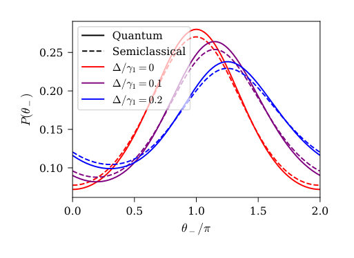 
FIG. 1. Distribution of the phase difference ψ at γ2/γ1 = 0.1 computed from the semi-classical Langevin equation and the Lindblad Master equation.

📷 Fig 2

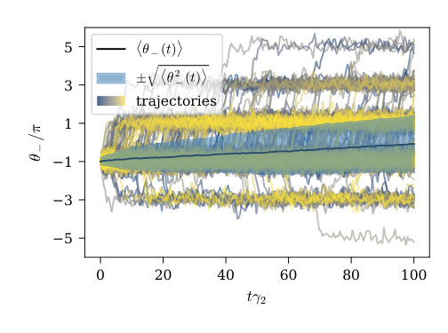 
FIG. 2. Trajectories of Eq. (10) at n = 10 photons with D = 0.1γ1 and ∆= 0.13D, showing how the quantum fluctu- ations degrade the synchronization through phase slips. The diffusion constant σ2 −can be found from a linear fit of the variance.

📷 Fig 3

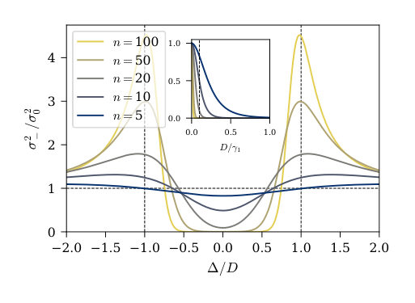 
FIG. 3. Effective diffusion constant of the θ−dynamics with D = 0.1γ1 normalized by the η−variance σ2 0 = η2 − /2. The photon number, n = γ1/(2γ2), is varied by changing γ2. The inset shows the diffusion rate at ∆= 0 vs D.

📷 Fig 4

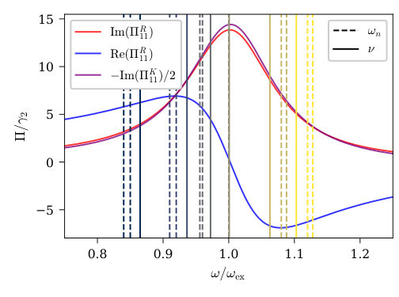 
FIG. 4. Self-energies ΠR,K 11 (ω) = ΠR,K 22 (ω) ≈−ΠR,K 12 (ω) = −ΠR,K 21 (ω) for the oscillators coupled via the DQD. The solid vertical lines show the bare resonator frequencies ω1 and ω2 as well as the synchronization frequency ν determined from the coupled saddle-point equations in Eq. 12.

📷 Fig 5

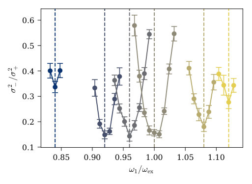 
FIG. 5. Ratios of angular diffusion constants plot- ted against ω1 for the six different values, ω2/ωex = 0.85, 0.92, 0.96, 1.00, 1.08, 1.12, used also in Fig. 4. All points are equally spaced in frequency and only the shown points provide a solution for the synchronization frequency ν.

**Summary.** This theoretical paper analyzes the breakdown of synchronization in quantum limit-cycle oscillators due to quantum phase slips. Using the Keldysh path integral formalism, the authors derive the dynamics of the relative phase, showing that quantum fluctuations degrade phase locking. The results are demonstrated using a superconducting resonator model, providing a quantitative measure of synchronization robustness.

**Why it may be interesting.** This work directly addresses open quantum systems dynamics, specifically phase coherence and synchronization in superconducting circuits, which is highly relevant to quantum optics and quantum information applications.

Detailed structure

**Main problem.** The paper investigates how quantum phase slips cause the breakdown of synchronization in continuous variable quantum systems, contrasting this with classical noise-induced phase slips.

**Main result.** Quantum phase slips degrade phase locking even when strong phase correlations exist, and the synchronization quality is quantified by the phase-difference diffusion rate.

**Method.** The analysis employs the Keldysh path integral formulation applied to the Lindblad Master Equation, leading to a Langevin equation for the relative phase dynamics.

**Model / system.** The primary model involves weakly coupled self-sustained oscillators, specifically analyzed using two superconducting microwave resonators coupled via a voltage-biased Double Quantum Dot (DQD).

**Key observables.** Phase difference $	heta_-$, phase diffusion rate ($\sigma^2_-$), and the ratio $\sigma^2_- / \sigma^2_0$ quantifying synchronization robustness.

**Important parameters / regimes.** Detuning ($\Delta$), coupling strength ($D$), and dissipation rates ($\gamma_1, \gamma_2$).

**Assumptions / limitations.** Approximations include truncating the Wigner expansion and using the adiabatic approximation for the self-energies.

**Figures summary.** Figures illustrate the phase difference distribution, Langevin trajectories showing phase slips, and plots of the synchronization ratio ($\sigma^2_- / \sigma^2_0$) versus detuning.

**Paper structure.** The paper progresses from establishing the general problem in limit-cycle oscillators to deriving the effective action via Keldysh path integrals, solving the resulting stochastic equations, and applying this framework to the specific DQD superconducting resonator model.

Abstract

It is well known from classical physics that weakly coupled self-sustained oscillators may spontaneously lock their phases. Just like classical synchronization is known to break down due to noise induced phase slips, we show here how the synchronization of continuous variable quantum systems breaks down by proliferation of quantum phase slips. Within a Keldysh path integral formulation of limit cycles, we analyze the phase dynamics and show how, in spite of strong phase correlations, quantum phase slips degrade the actual phase locking. This approach also allows us to address non-Markovian effects on the synchronization of limit cycles, which we illustrate explicitly for superconducting resonators coupled via a voltage biased double quantum dot.

[↑ back to top](#top)

### [Indistinguishability of photonic qubits emitted from trapped $^{40}$Ca$^+$ ions via pulsed excitation](http://arxiv.org/abs/2605.29825v1)

**Authors:** Pascal Baumgart, Max Bergerhoff, Jonas Meiers, Stephan Kucera, Jürgen Eschner  
**Type:** experiment · **Category:** quantum information and computing · **PDF:** <https://arxiv.org/pdf/2605.29825v1>  
**Analysis basis:** full PDF text, analyzed in chunks
**Topic relevance:** 🔥 `quantum optics experiment` **4/5** · `QC/QI experiment` **3/5** · `interference shaping light` **3/5** · `correlated / nonlocal dissipation` **2/5** · `analog quantum simulation` **1/5** · `entanglement & information structure` **1/5** · `quantum measurements` **1/5**

📷 Fig 1

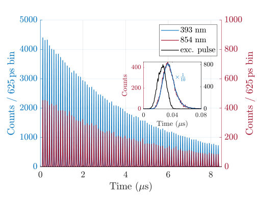 
FIG. 2. Arrival time distribution of 393-nm (blue) and 854- nm (red) detection events when the ion is excited by a train of 80 pulses of pulse length Tpulse = 15.1(1) ns and spacing Trep ≈104.25 ns, reconstructed from 134 × 106 cycles of the experimental sequence. Inset: Close-up of the distribution in a time interval corresponding to a single excitation pulse, where the number of 393-nm detection events has been scaled down by a factor of ten to match the heights of the two peaks. Shown in black is the shape of the excitation pulse, recon- structed as outlined in appendix A.

📷 Fig 2

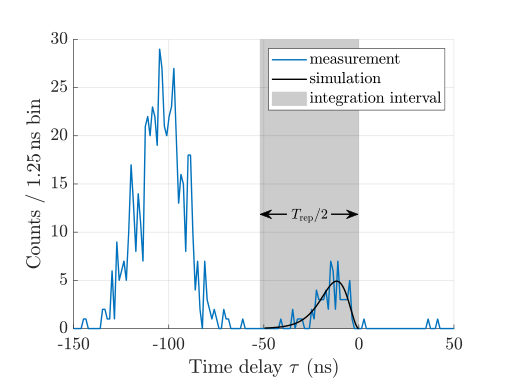 
FIG. 3. Distribution of detected back-decay photons at 393 nm for excitation with a pulse length of Tpulse = 15.1(1) ns, reconstructed from 134 × 106 cycles of the exper- imental sequence. The measured cross-correlation between 854-nm and 393-nm photons is shown in blue and compared with a numerical simulation, which is shown as a black line that was scaled to have the same area as the corresponding peak in the measured data. The gray shaded region indicates the integration interval used to determine the mean number of back-decays for this measurement. Its length equals half the pulse repetition period of Trep ≈104.25 ns.

📷 Fig 3

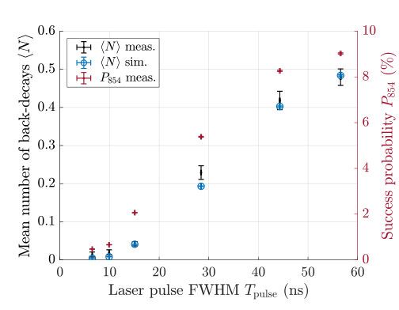 
FIG. 4. Mean number of back-decays for different excitation pulse lengths Tpulse (FWHM of the intensity profile). The measured data (black) is compared with numerical simula- tions (blue) that use the measured pulse shape and success probability P854 (red) as input parameters. A detailed ac- count of the experimental parameters is given in Table I in appendix A.

📷 Fig 4

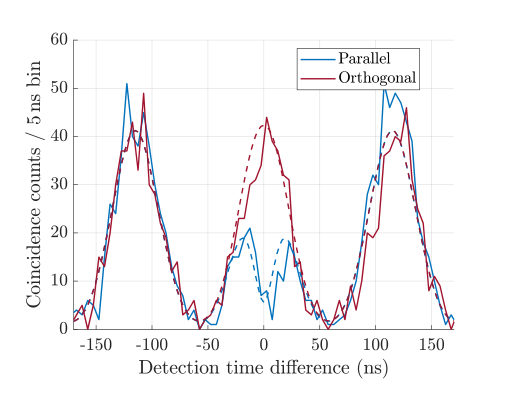 
FIG. 6. Detection time difference distributions of 854-nm two-photon detection events for ion state readouts projecting onto orthogonal (red) or parallel (blue) polarizations, for an excitation pulse length of Tpulse = 31.7(1) ns. The distribu- tion is reconstructed from 357 × 107 cycles of the experimen- tal sequence. The measured data is shown as solid lines and compared with numerical simulations (dashed lines) using ex- perimentally determined parameters for the excitation pulse.

📷 Fig 5

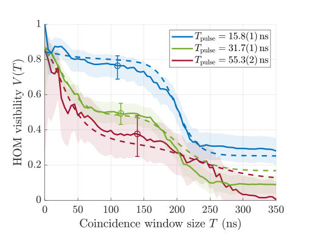 
FIG. 7. HOM visibility V (T) in dependence of the co- incidence window size T for three different pulse lengths Tpulse = 15.8(1) ns (blue), Tpulse = 31.7(1) ns (green) and Tpulse = 55.3(2) ns (red). The measurement results are shown as solid lines, their uncertainties as shaded regions around the data points. Numerical calculations using experimental pa- rameters are shown as dashed lines. Single highlighted data points (circles with uncertainty bars) mark the values V (Trep) evaluated at the pulse repetition period.

**Summary.** This paper experimentally investigates the indistinguishability of single photons emitted from trapped $^{40}	ext{Ca}^+$ ions. The key finding is establishing a quantitative correlation between the mean number of spontaneous back-decays ($\langle N 
angle$) observed from one ion and the visibility of the Hong-Ou-Mandel interference when two ions are used. This relationship offers a simple, measurable diagnostic for optimizing quantum repeater segments.

**Why it may be interesting.** This work provides a direct, measurable diagnostic tool ($\langle N 
angle$) derived from single-emitter measurements that can predict the performance (HOM visibility) of a complex two-emitter quantum process, which is highly valuable for quantum networking.

Detailed structure

**Main problem.** The study investigates how spontaneous scattering back to the initial state affects the indistinguishability of Raman photons generated from two trapped $^{40}	ext{Ca}^+$ ions, which is crucial for quantum entanglement protocols.

**Main result.** The mean number of back-decays ($\langle N 
angle$) from a single ion was found to be a measurable quantity that correlates inversely with the achievable Hong-Ou-Mandel (HOM) interference visibility ($V$).

**Method.** The authors measured the arrival time distributions of photons and calculated $\langle N 
angle$ from single-emitter statistics, and measured $V$ using two co-trapped ions interfering on a beam splitter.

**Model / system.** The physical system is trapped $^{40}	ext{Ca}^+$ ions excited by pulsed lasers to generate Raman photons (854 nm). The process is limited by spontaneous decay back to the ground state, which degrades photon indistinguishability.

**Key observables.** HOM visibility ($V$), mean number of back-decays ($\langle N 
angle$), and photon success probability ($P_{854}$).

**Important parameters / regimes.** Excitation pulse length ($T_{	ext{pulse}}$) in the few-nanosecond range, and the repetition time ($T_{	ext{rep}}$) for two-photon interference.

**Assumptions / limitations.** The analysis assumes that $\langle N 
angle$ provides a reliable diagnostic tool for the HOM visibility, and that certain experimental imperfections (like polarization mismatch) can be accounted for or are secondary to the primary correlation.

**Figures summary.** Figures show arrival time distributions of 393-nm and 854-nm photons, and critically, plot the anti-correlation between HOM visibility ($V(T_{	ext{rep}})$) and the measured $\langle N 
angle$ and $P_{854}$.

**Paper structure.** The paper details the experimental setup using pulsed excitation, analyzes single-emitter back-decay statistics to quantify $\langle N 
angle$, and then measures two-emitter HOM interference to establish the quantitative relationship between $\langle N 
angle$ and $V$.

Abstract

We investigate the indistinguishability of Raman photons generated from two trapped $^{40}$Ca$^+$ ions using few-nanosecond excitation pulses. We elucidate how spontaneous scattering back to the initial state affects Hong-Ou-Mandel interference. We identify the mean number of back-decays as a measurable single-emitter quantity that correlates with achievable interference visibility of photons from two identical emitters.

[↑ back to top](#top)

### [Lattice Brownian bees with cooperative reproduction: steady states, collapse, and spreading](http://arxiv.org/abs/2605.29958v1)

**Authors:** Ohad Vilk, Baruch Meerson  
**Type:** theory · **Category:** statistical mechanics · **PDF:** <https://arxiv.org/pdf/2605.29958v1>  
**Analysis basis:** full PDF text, analyzed in chunks
**Topic relevance:** 🔥 `non-equilibrium dynamics` **4/5** · 🔥 `non-equilibrium universality` **4/5** · `driven-dissipative phase transition` **3/5** · `Keldysh / 2PI / non-Gaussian methods` **2/5** · `methods for driven-dissipative` **2/5**

📷 Fig 1

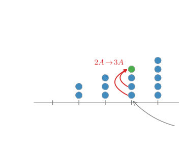 
Figure 1: Lattice Brownian bees with cooperative reproduction. Particles (circles) on a one-dimensional lattice perform symmetric random walk. When k particles meet at a site, one offspring (green circle) can be produced: kA →(k+1)A, shown here for k = 2. Simultaneously, a particle on the site(s) farthest from the origin (red cross) is removed, keeping the total number of particles N fixed.

📷 Fig 2

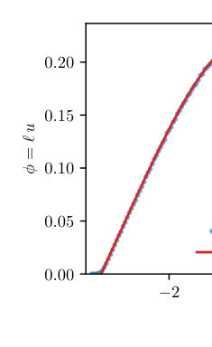 
Figure 2: Rescaled steady-state density profile for k = 2: ϕ = ℓu versus ξ = x/ℓ. Blue circles: MC simulation (N = 104, D = 105, Λ = h = 1, averaged over 100 realizations). Red curve: exact analytical solution (14).

📷 Fig 3

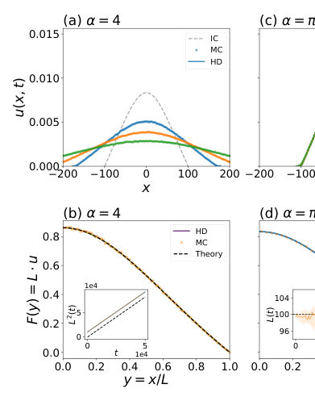 
Figure 3: Population dynamics for k = 3 in the three regimes: expansion (α = 4, pan- els a,b), steady state (α = αc = π2/2, panels c,d), and collapse (α = 6, panels e,f). (a,c,e) Density profiles u(x, t) in physical coordinates as functions of x at successive times. Dashed gray line (clearly visible on panels a and c) shows the initial condition: the Jacobi cn-steady state (20) at half-width L0 = 100. Colored solid lines: numerical HD solutions at t = 11,000, 24,000, 49,000 (a,c) and t = 1,000, 3,000, 4,000 (e). Colored circles: MC simulations (N = 5×104 particles, averaged over 20 independent runs) at matching times. (b,d,f) Density scaling function F(y) = Lu vs. y = x/L. Dashed curves:...

📷 Fig 4

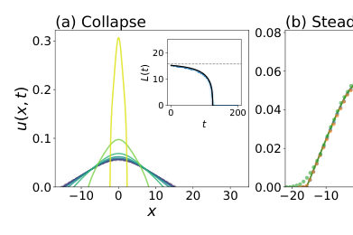 
Figure 4: Population dynamics for k = 4, starting from rescaled copies of unstable steady- state profile (14) with different initial half-widths L(0). Dashed gray curve (clearly visible only on panel c): steady-state profile. Insets show L(t): blue band = MC interquartile range (25–75 percentile), black curve = HD, dashed gray = steady-state value LSS ≃15.7. (a) Collapse (narrow IC, L(0) = 15.3): HD density profiles at seven times from 10% to 99.9% of the numerically found blowup time T ≃125 (dark to light). (b) Steady state (L(0) = LSS): solid curves = HD, markers = MC (20 realizations, averaged); t = 5, 10, 20. (c) Spread (wide IC, L(0) = 17.2): same convention as (b); t = 5, 10, 20. The...

📷 Fig 5

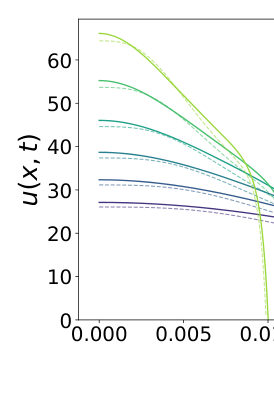 
Figure 5: Self-similar collapse for k = 4 near the blowup time. Solid curves: HD density profiles u(x) at six logarithmically spaced times approaching the blowup time T (from dark to light); dashed curves: matched-asymptotic theory predictions (38) and (39) at the same times. Insets: the half-width of support L (top) and max(u) (bottom) versus τ = T −t on log-log scale; solid = HD, dashed = leading-order scaling L ∼(3µ0τ)1/3 (33) and max(u) ∼(3λτ)−1/3 (34). The initial condition is the steady-state profile (14) rescaled to half-width L(0) = 0.035; the numerically determined blowup time is T ≃6.2 × 10−5.

**Summary.** This work analyzes a complex population model of random walkers with cooperative reproduction, deriving a continuous hydrodynamic description. It establishes a critical exponent $k=3$ that dictates the system's long-term fate: stable organization for $k<3$, and a transition between finite-time collapse and diffusive spreading for $k>3$. The methodology combines continuum theory with rigorous stability analysis.

**Why it may be interesting.** The study of non-equilibrium dynamics, phase transitions in reaction-diffusion systems, and self-organized criticality (the $k=3$ critical point) are central themes in non-equilibrium statistical mechanics.

Detailed structure

**Main problem.** The paper investigates the steady states, collapse, and spreading dynamics of a population modeled by 'Brownian bees' with cooperative reproduction.

**Main result.** The system exhibits a critical transition at $k=3$: for $k<3$ the steady state is stable, while for $k>3$ it is unstable, leading to either finite-time collapse or diffusive spreading.

**Method.** The analysis uses a hydrodynamic (HD) limit formulation, solving a free-boundary reaction-diffusion equation, complemented by linear stability analysis and matched-asymptotic expansions.

**Model / system.** The model describes $N$ symmetric random walkers on a 1D lattice undergoing cooperative reproduction ($kA 	o (k+1)A$) with removal of the farthest particle at each birth event.

**Key observables.** Steady state population density profiles, boundary position $L(t)$, and the stability eigenvalues ($\sigma_0$).

**Important parameters / regimes.** The order of cooperative reproduction, $k$, and the ratio $\alpha = \lambda/D$ (branching rate to diffusion rate).

**Assumptions / limitations.** The analysis relies on the hydrodynamic limit ($N 	o \infty$) and assumes the macroscopic length scale is much larger than the lattice spacing.

**Figures summary.** Figures illustrate the schematic model, steady-state profiles for different $k$, and time evolution comparing collapse and spreading dynamics for $k=3$ and $k=4$.

**Paper structure.** The paper progresses from defining the microscopic model to deriving the macroscopic hydrodynamic equation, performing stability analysis based on the exponent $k$, and finally characterizing the distinct dynamic regimes (stable steady state, critical family, collapse, and diffusion) for different values of $k$.

Abstract

We extend the ``Brownian bees'' model of Berestycki et al. (2021, 2022) to cooperative reproduction, $kA\to(k{+}1)A$, of a population of $N$ symmetric random walkers with removal, at each birth event, of the particle farthest from the origin. Working in the limit $N\to\infty$, we formulate a hydrodynamic free-boundary problem for this model. Using this formalism, we determine steady state population densities for all~$k$ and prove their linear stability for $k\le 2$ and instability for $k\ge 4$. In the marginal case $k=3$, there is a whole continuous family of steady states at a single, critical ratio of the reproduction and diffusion rates. Above criticality the population undergoes an asymptotically self-similar finite-time collapse to the origin. Below the criticality the population spreads diffusively, but the reproduction remains quantitatively relevant. For $k\ge 4$, the unstable steady state separates regimes of a finite-time collapse and a diffusive spreading. Here the collapse dynamics is asymptotically self-similar, and the population density exhibits a scale separation requiring a matched-asymptotic description. Our analytical predictions are confirmed by numerical solutions of the hydrodynamic free-boundary problem and by Monte Carlo simulations of the original microscopic model.

[↑ back to top](#top)

### [Atom--photon Entanglement with a Single Trapped Cesium Atom](http://arxiv.org/abs/2605.28968v1)

**Authors:** H. Hwang, J. Moon, F. Herzallah, E. Oh, A. Safari, M. Saffman  
**Type:** experiment · **Category:** quantum information and computing · **PDF:** <https://arxiv.org/pdf/2605.28968v1>  
**Analysis basis:** full PDF text, analyzed in chunks
**Topic relevance:** 🔥 `quantum optics experiment` **4/5** · `QC/QI experiment` **3/5** · `free-space correlated emission` **3/5** · `entanglement & information structure` **2/5** · `analog quantum simulation` **1/5** · `quantum measurements` **1/5**

📷 Fig 1

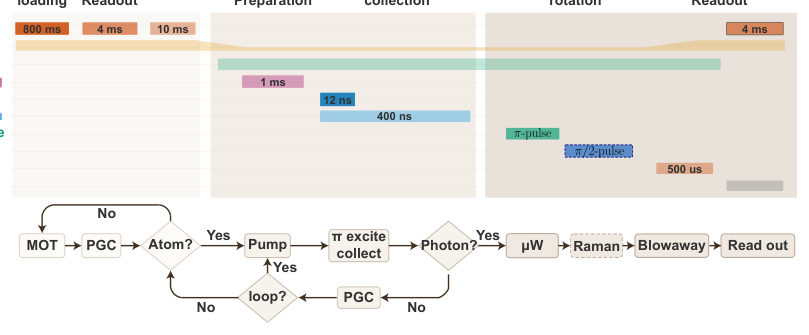 
FIG. 1. Optical setup and experimental sequence. (a) Experimental setup used for 133Cs atom trapping, single-photon characterization, and atom–photon entanglement verification. For the g(2) measurement, a 50:50 non-polarizing beamsplitter is used, yielding g(2)(0) = 0.096(66). For atom–photon entanglement, the beamsplitter is replaced by a polarizing beamsplitter (PBS), enabling polarization-basis analysis with single-photon counting modules (SPCMs). (b) Cesium atom–photon decay channels and histogram of photon arrival times. (c) Experimental sequence for entanglement generation and verification. In stage (i), a single atom is loaded using a MOT and polarization-gradient cooling. After...

📷 Fig 2

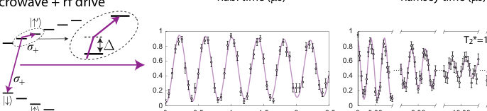 
FIG. 2. Coherent control and coherence of the ground-state hyperfine manifold of a trapped 133Cs atom. (a) Left: level diagram illustrating π-polarized microwave control at a bias field B = 1.4 G for the transitions between clock states (black) and |↑⟩↔|↑′⟩ (blue). Center: measured microwave Rabi oscillations as a function of pulse length. Measurement shows Rabi frequency of Ωclock = 2π × 109.0(9) kHz (black) and Ω|↑⟩↔|↑′⟩= 2π × 104.04(59) kHz (blue) Right: Ramsey fringes versus free-evolution time; fits to a decaying sinusoid yield T ∗ 2 = 10.8(7) ms (black) and T ∗ 2 = 130(10) µs (blue). (b) Two-photon stimulated Raman control between |↓⟩and |↑′⟩with T ∗ 2 = 14(1) ms using σ+–σ+ microwave...

📷 Fig 3

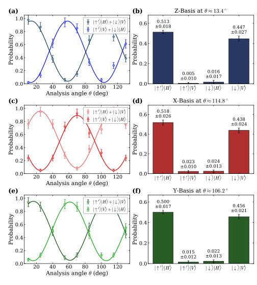 
FIG. 3. (a), (c), and (e) show the atom–photon parity oscil- lations measured in the Z, X, and Y bases, respectively, as a function of the photon HWP angle θ. Each data point is the average of 100 measurements, with error bars indicating ± one standard deviation. The even-parity outcomes correspond to |↑′⟩|H⟩+ |↓⟩|V ⟩, while the odd-parity outcomes correspond to |↑′⟩|V ⟩+ |↓⟩|H⟩. Solid curves are independent sinusoidal fits to the measured probabilities. (b), (d), and (f) show the reconstructed joint probabilities evaluated at the HWP an- gles that maximize the parity-oscillation visibility in the Z, X, and Y bases, respectively.

**Summary.** The researchers successfully generated and quantified entanglement between a single trapped Cesium atom and an emitted photon. They achieved a high entanglement fidelity ($>94\%$) by carefully controlling the excitation pulse and performing rigorous error analysis. This work establishes Cs as a viable platform for building quantum networks, particularly for dual-species quantum links.

**Why it may be interesting.** This work provides a high-fidelity, free-space quantum interface using Cs, which is crucial for scaling up quantum networks and connecting different quantum memory nodes.

Detailed structure

**Main problem.** The primary goal is to demonstrate and quantify the entanglement fidelity of an atom-photon state generated using a single trapped Cesium atom.

**Main result.** The authors achieved a raw entanglement fidelity of $F = 0.942(16)$ and an inferred fidelity of $F_{	ext{inf}} = 0.962(26)$, establishing a free-space Cs atom-photon interface.

**Method.** Entanglement is generated via resonant excitation followed by spontaneous decay, and fidelity is measured using Bell-state tomography based on parity oscillations.

**Model / system.** The system uses a single Cesium atom trapped in an optical tweezer, where the atomic qubit is encoded in hyperfine states and the photonic qubit in polarization. The process relies on controlled resonant excitation and subsequent decay.

**Key observables.** Entanglement Fidelity ($F$, $F_{	ext{inf}}$), single-photon correlation function ($g^{(2)}(0)$), coherence times ($T_2^*$), and parity oscillation contrast.

**Important parameters / regimes.** Raw fidelity $F = 0.942(16)$; Inferred fidelity $F_{	ext{inf}} = 0.962(26)$; Single-photon emission $g^{(2)}(0) = 0.096(66)$.

**Assumptions / limitations.** The inferred fidelity calculation corrects only for independently characterized atomic state detection errors, while other sources like dephasing are treated as physical losses.

**Figures summary.** Figures illustrate the optical setup, the experimental pulse sequence, Rabi oscillations demonstrating coherence times for different qubit states, and measured atom-photon parity oscillations in various bases.

**Paper structure.** The paper details the experimental setup, measures coherence times and single-photon emission, quantifies entanglement fidelity using Pauli correlations, and finally performs a detailed error budget analysis to extract the highest possible fidelity estimate.

Abstract

We demonstrate atom--photon entanglement using a single cesium atom trapped in an optical tweezer. Entanglement is generated by resonant excitation and subsequent spontaneous decay, which entangles the atomic Zeeman state with photon polarization. The photon is collected with a high numerical aperture objective (NA = 0.55) and coupled into a single-mode fiber, enabling atom photon measurements and measurement of the Bell-state fidelity. We obtain raw entanglement fidelity of ${\mathcal F} = 0.942(16)$ and inferred fidelity of ${\mathcal F}_{\rm inf} = 0.962(26)$ after correcting independently characterized atom measurement errors. Compared with related free-space experiments using $^{87}$Rb, the multilevel structure of the relevant excited state in $^{133}$Cs requires the use of a single short excitation pulse in each entanglement attempt in order to suppress unwanted re-excitation. These results establish a free-space Cs atom--photon interface and provide a step toward dual-species Rb--Cs quantum networking.

[↑ back to top](#top)

### [Gate Parameter Lee-Yang Zeros and Dynamical Phases in Quantum Circuits](http://arxiv.org/abs/2605.29838v1)

**Authors:** Chang Liu, Yu Wu, Yunfeng Jiang, Yang Zhang  
**Type:** theory · **Category:** statistical mechanics · **PDF:** <https://arxiv.org/pdf/2605.29838v1>  
**Analysis basis:** full PDF text, analyzed in chunks
**Topic relevance:** 🔥 `driven-dissipative phase transition` **4/5** · `non-equilibrium dynamics` **3/5** · `non-equilibrium universality` **3/5** · `methods for driven-dissipative` **2/5** · `analog quantum simulation` **1/5** · `entanglement & information structure` **1/5**

📷 Fig 1

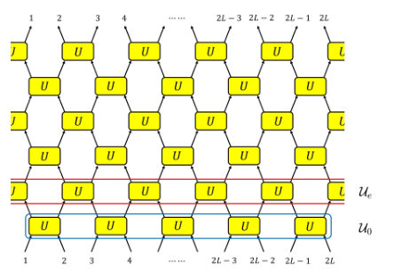 
FIG. 1. Construction of the brickwork Floquet circuit.

📷 Fig 2

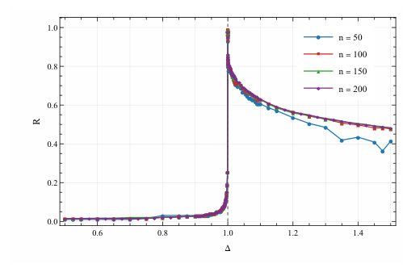 
FIG. 5. Zero-density diagnostic near the universal curves. The plotted quantity R(∆; ϵ, n) is the fraction of zeros within distance ϵ = 10−2 of the expected universal set: the coordi- nate axes for ∆&lt; 1 and the unit circle for ∆&gt; 1.

**Summary.** The authors introduce gate-parameter Lee-Yang zeros of the Loschmidt amplitude as a novel diagnostic tool for detecting dynamical phase transitions in finite quantum circuits. By analyzing how these zeros condense in the complex parameter plane, they show that an abrupt reorganization signals a phase transition, a mechanism that works even when the system is not integrable.

**Why it may be interesting.** This work provides a powerful, non-integrability-dependent diagnostic tool for characterizing quantum phase transitions in finite quantum systems, which is highly relevant for understanding decoherence and thermalization in quantum computation.

Detailed structure

**Main problem.** The paper proposes using gate-parameter Lee-Yang (GPLY) zeros of Loschmidt amplitudes to diagnose dynamical phase transitions in finite quantum circuits.

**Main result.** The condensation of these zeros onto limiting curves provides a finite-qubit diagnostic for dynamical phase transitions, independent of the system's integrability.

**Method.** The analysis involves calculating the Loschmidt amplitude, which is treated as a rational function of complexified gate parameters, and studying the accumulation points (zeros) of this function.

**Model / system.** The study uses quantum circuits, specifically illustrated with a brickwork model whose time evolution is generated by a Floquet operator. The underlying physics is analyzed in terms of spectral competition and local unitarity.

**Key observables.** Gate-parameter Lee-Yang (GPLY) zeros of the Loschmidt amplitude, and the zero-density diagnostic $R(\Delta; \epsilon, n)$.

**Important parameters / regimes.** Gate parameters ($\alpha, \phi$), circuit depth ($n$), system size ($L$), and the spectral parameter $\Delta$, which controls the transition between massive and massless regimes.

**Assumptions / limitations.** The Loschmidt amplitude must be expressible as a rational function of the gate parameters, and the analysis relies on the existence of universal components governed by Floquet eigenvalues.

**Figures summary.** Figures illustrate the GPLY zeros in the massive and massless regimes, showing distinct geometric structures (compact curves vs. extended radial structures) around the critical point $\Delta=1$.

**Paper structure.** The paper introduces the GPLY zero concept using the Loschmidt amplitude for a brickwork model. It then analyzes the zero condensation in the large depth limit, distinguishing between universal (Floquet-eigenvalue based) and state-dependent zero components, culminating in the diagnosis of a phase transition at $\Delta=1$.

Abstract

We propose gate-parameter Lee-Yang zeros of Loschmidt amplitudes as probes of dynamical phases in finite quantum circuits. We illustrate this approach using a brickwork model, where the time evolution is generated by repeated application of a Floquet operator. The Loschmidt amplitude can be expressed as a rational function of the gate parameters. At fixed system size and large circuit depth, its zeros in one complexified gate parameter, with the other parameter held fixed, condense onto limiting curves. We show that these curves comprise a universal component governed by equimodular Floquet eigenvalues, as described by the Beraha-Kahane-Weiss theorem, together with state-dependent contributions controlled by the overlap of eigenstate of the Floquet operator with the initial state. As one of the parameters is varied, the set of zeros reorganizes abruptly, providing a finite-qubit diagnostic of a dynamical phase transition. This mechanism does not rely on integrability: while integrability enables an exact calculation of the Loschmidt amplitude, the condensation of zeros follows from spectral competition and local unitarity alone.

[↑ back to top](#top)

### [Observation of Electrically Tunable Chirality Inversion in a Slow-Light Waveguide](http://arxiv.org/abs/2605.30047v1)

**Authors:** Xuchao Chen, Savvas Germanis, Nicholas J. Martin, Hamidreza Siampour, René Dost, Dominic J. Hallett, Ian Farrer, Akshay Kumar Verma, Maurice S. Skolnick, Luke R. Wilson, A. Mark Fox  
**Type:** experiment · **Category:** other · **PDF:** <https://arxiv.org/pdf/2605.30047v1>  
**Analysis basis:** full PDF text, analyzed in chunks
**Topic relevance:** 🔥 `quantum optics experiment` **4/5** · `interference shaping light` **3/5** · `analog quantum simulation` **2/5** · `correlated cavity matter` **1/5** · `driven-dissipative phase transition` **1/5** · `methods for driven-dissipative` **1/5** · `non-equilibrium dynamics` **1/5** · `spintronics-quantum-optics interface` **1/5**

📷 Fig 1

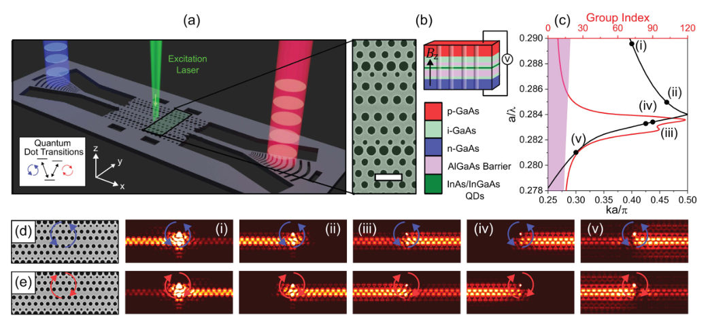 
FIG. 1. (a) Device schematic layout and working principle. A QD located in the active region of the waveguide is optically excited, and the emitted photons are guided toward grating out-couplers at both ends for photoluminescence collection. (b) An SEM image showing a part of the active region of GPW device, together with a schematic of the p-i-n diode structure. The scale bar represents 500 nm. (c) Simulated band structure of the central GPW region and the extracted group index ng. Five sampling wavelengths are highlighted on the dispersion curve in an increasing order and are used for (d)-(e). The light cone is shaded in purple. (d-e) Schematic of the directional coupling of a left/right...

📷 Fig 2

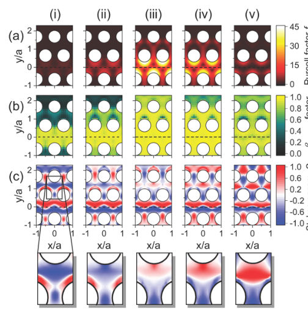 
FIG. 2. Spatial dependence of simulated (a) Purcell fac- tor, (b) waveguide coupling efficiency (βFDTD-factor), and (c) the local Stokes parameter S3, with (i)–(v) correspond- ing to normalised frequencies as depicted in Fig. 1(c). (i.e. a/λ = 0.2810, 0.2833, 0.2834, 0.2838, 0.2895) The horizontal (x) and vertical axes (y) denote the longitudinal and lateral displacement respectively. Fields are calculated at the mid- dle of the membrane, at the location of the quantum dots. While the chirality near the central region remains compar- atively stable across the sampled wavelengths, off-centre re- gions exhibit a much stronger spectral dependence, including inversion of the sign of S3 between...

📷 Fig 3

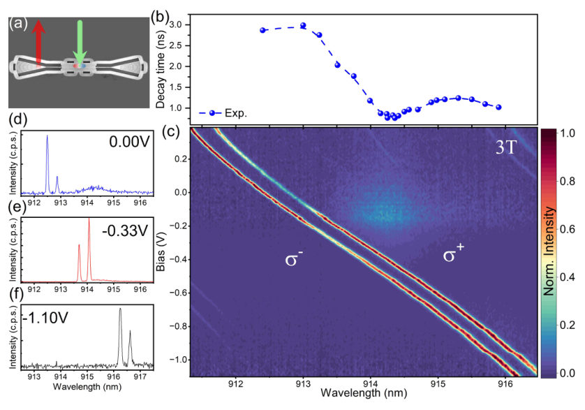 
FIG. 3. (a) Schematic of the device and excitation scheme; green and red arrows indicate excitation and collection posi- tions. (b) QD exciton decay times as a function of wavelength over the slow-light bandwidth. (c) Photoluminescence map of non-degenerate circularly polarised excitons at 3 T (Faraday geometry), as a function of externally applied bias. (d)-(f). Characteristic photoluminescence spectra recorded upon the application of external bias at 0.00 V, −0.33 V, and −1.10 V, respectively.

📷 Fig 4

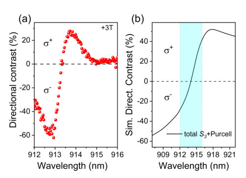 
FIG. 4. (a) Directional contrast recorded from the left out- coupler using the PL map in Fig 3(c). (b) Simulated direc- tional contrast for the candidate QD position, including con- tributions from the intrinsic chirality S3 and Purcell enhance- ment. The cyan shaded region denotes the spectral band- width corresponding to the experimental data shown in panel (a).

📷 Fig 5

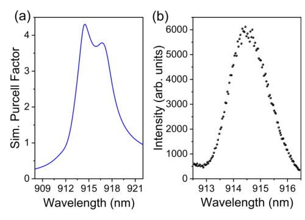 
FIG. 5. (a) Simulated wavelength dependence of the Purcell factor at the candidate QD position. (b) Integrated QD inten- sity collected from the out-coupler as a function of wavelength (i.e. the average wavelength of the σ+/σ−components) mea- sured under the same conditions as Fig. 3(b).

**Summary.** This research reports the experimental observation of electrically tunable chirality inversion in a slow-light photonic-crystal waveguide. By embedding a quantum dot and tuning its emission wavelength, the researchers measured a sign reversal in the directional emission contrast. This confirms that the local optical chirality can be actively controlled in situ, enabling the development of advanced, tunable chiral interfaces for integrated quantum photonics.

**Why it may be interesting.** This work is highly relevant to quantum optics and open quantum systems because it demonstrates active, electrical control over fundamental optical properties (chirality) within a solid-state nanophotonic platform, enabling tunable chiral interfaces for quantum devices.

Detailed structure

**Main problem.** The study aims to observe and demonstrate electrically tunable chirality inversion within a slow-light photonic-crystal waveguide structure.

**Main result.** The authors experimentally demonstrated a sign reversal in the directional emission contrast, confirming that the local optical chirality can be actively switched on-demand by tuning the quantum dot emission wavelength across the slow-light band.

**Method.** The experiment uses time-resolved photoluminescence measurements on a waveguide-embedded quantum dot, while numerical simulations (FDTD/GME) are used to model the local optical chirality and coupling efficiency.

**Model / system.** The physical platform is a glide-plane photonic-crystal waveguide (GPW) containing an embedded InAs/InGaAs quantum dot (QD). The system operates in the slow-light regime, allowing electrical tuning of the QD exciton via the quantum-confined Stark effect.

**Key observables.** Directional emission contrast (D), local optical chirality (quantified by the Stokes parameter $S_3$), Purcell factor ($F_P$), and radiative coupling efficiency ($eta$).

**Important parameters / regimes.** Slow-light spectral region (identified by minimum exciton lifetime, e.g., $\sim 760$ ps at 914.3 nm); off-center emitter positions ($y/a > 0.5$).

**Assumptions / limitations.** The analysis assumes that the sign reversal is primarily due to the intrinsic wavelength dependence of the local chirality ($S_3$), rather than just spectral shaping effects from Purcell enhancement.

**Figures summary.** Figures illustrate device schematics, spatial maps of $F_P$ and $S_3$, and critically, the measured directional contrast $D$ showing a clear sign reversal as the emission wavelength is tuned across the slow-light region.

**Paper structure.** The paper establishes the physical system and the theoretical framework (calculating $F_P$, $eta$, and $S_3$). It then presents experimental measurements showing the directional contrast sign reversal, attributing this effect to the wavelength dependence of the local chirality, and finally distinguishing this effect from minor spectral shaping contributions.

Abstract

We identify chiral inversion points in slow-light, glide-plane-symmetric, photonic-crystal waveguides, defined as fixed locations where the local optical chirality changes sign over a narrow wavelength range. We experimentally access this behaviour using a waveguide-embedded InAs/InGaAs quantum dot. The slow-light spectral region is determined from time-integrated and time-resolved photoluminescence, and the dot exciton is electrically tuned across the slow-light bandwidth via the quantum-confined Stark effect. As the emission wavelength is swept through the slow-light region, the directional emission contrast shows a strong wavelength dependence and a sign reversal, consistent with the identified chiral inversion point. Numerical simulations attribute the switching primarily to the pronounced spectral variation of the local optical chirality for emitters displaced from the waveguide center. These results demonstrate on-demand electrical switching of chiral light-matter coupling in nanophotonic waveguides and enable tunable chiral interfaces for integrated quantum photonic devices.

[↑ back to top](#top)

### [Quantum Networks Using Color Defects in Diamond: Principles, Progress, and Perspectives](http://arxiv.org/abs/2605.30005v1)

**Authors:** Ayan Majumder, Cem Güney Torun, Tim Schröder, Gregor Pieplow, Prem Kumar, Kasturi Saha  
**Type:** both · **Category:** quantum information and computing · **PDF:** <https://arxiv.org/pdf/2605.30005v1>  
**Analysis basis:** full PDF text, analyzed in chunks
**Topic relevance:** 🔥 `QC/QI experiment` **4/5** · 🔥 `spintronics-quantum-optics interface` **4/5** · `quantum optics experiment` **3/5**

📷 Fig 1

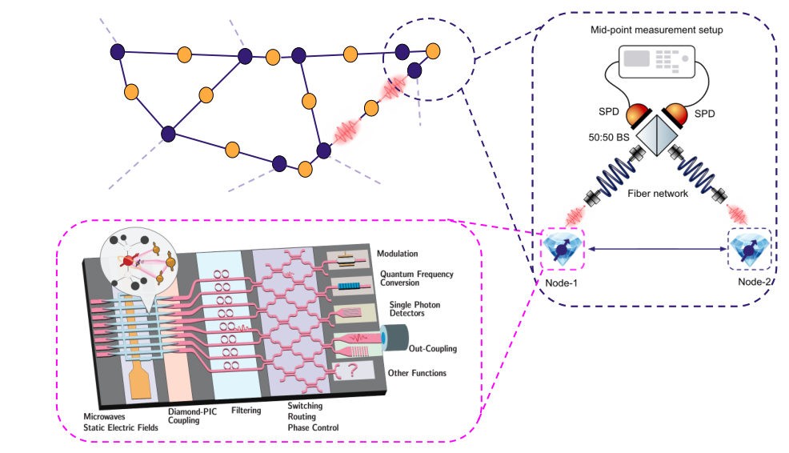 
FIG. 1. Schematic of a large-scale quantum network composed of solid-state nodes (dark blue) that host optically interfaced communication and memory qubits. Photons are distributed through optical fibers or free-space channels to generate entan- glement between distant nodes. Quantum repeaters, such as those based on midpoint-measurement–based systems, indicated by yellow circles and illustrated on the right, enhance entanglement generation rates over long distances by mitigating photon transmission losses. The bottom inset depicts a hybrid integrated quantum device functioning as a quantum node, where an optically active spin defect center with a nuclear-spin register embedded in diamond...

📷 Fig 2

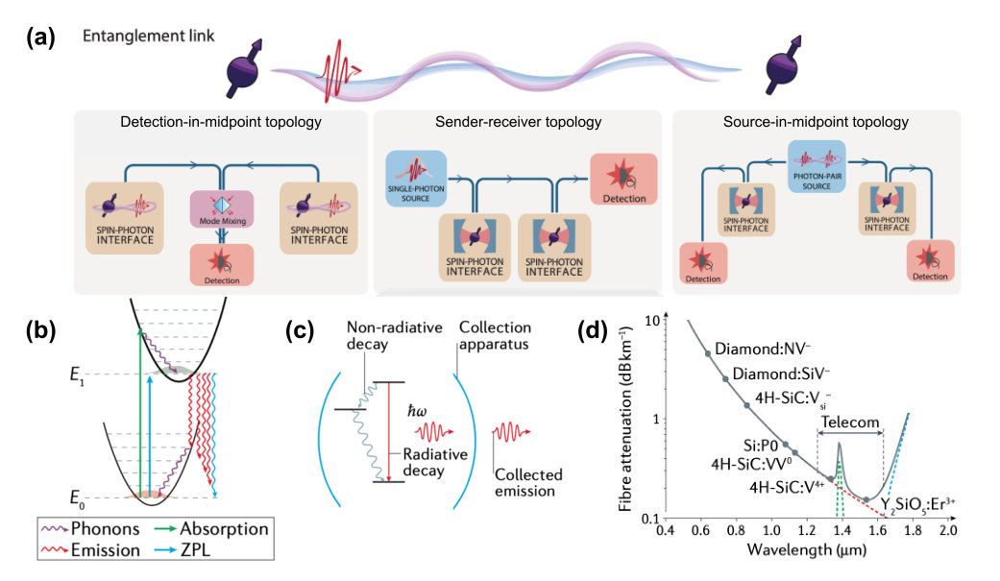 
FIG. 2. (a) The topology for remote entanglement generation is decomposed into its fundamental logical building blocks. From left to right, the three main remote-entanglement protocol (REP) architectures are illustrated: the detection-in-midpoint, sender–receiver, and source-in-midpoint topologies. This illustration is adapted from Ref. [44]. (b) The potential energies of the ground and excited electronic states of an optically active solid-state quantum system are shown as functions of the collective nuclear displacement coordinate. This illustration is adapted from Ref. [15]. (c) Radiative and non-radiative emission of a solid-state quantum emitter in an optical collection system, i.e.,...

📷 Fig 3

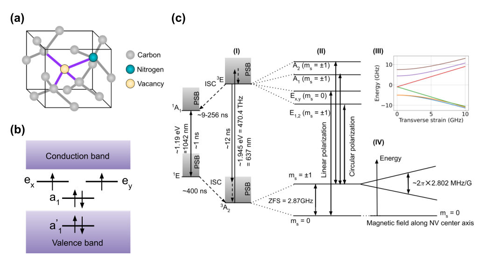 
FIG. 3. (a) Atomic configuration of the NV defect inside a diamond lattice unit cell. (b) Molecular orbitals (MO) and corresponding electronic distribution in the ground state of the NV center [62]. (c) Electronic energy-level diagram of the negatively charged nitrogen vacancy defect center in a diamond crystal. This illustration is adapted from Refs. [12, 56].

📷 Fig 4

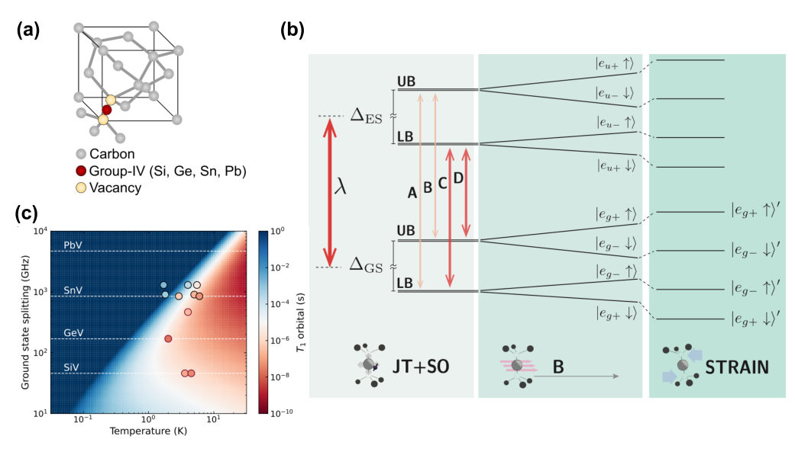 
FIG. 4. (a) Atomic configuration of a negatively charged group-IV defect within a diamond lattice unit cell. (b) The orbital coherence time T orbital 1 depends on the ground state splitting and temperature. The colormap gives the simulated values using χρ = 4.6 × 10−9 GHz−2. The circles indicate measured values of SiV, GeV, and SnV centers. The T spin 1 and T ∗,spin 2 values have been converted to the corresponding T orbital 1 . The experimental values can be lower than the simulations as the coherence can be limited by other sources. This illustration is adapted from Ref. [56]. (c) The electronic level stucture of negatively charged group-IV defect centers in diamond. This figure is...

📷 Fig 5

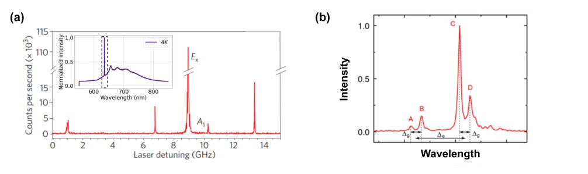 
FIG. 5. (a) Excited-state transitions of the NV center were resolved using a tunable red laser scanned across the resonance. This illustration is adapted from Ref. [119]. The inset figure shows the emission spectrum of the NV centers at 4 K under 532 nm laser excitation. (b) Low-temperature emission spectra of group-IV color centers in diamond. This figure is adapted from Ref. [120].

**Summary.** This review surveys the use of diamond color defects (like NV and SiV centers) as robust solid-state nodes for building large-scale quantum networks. It details the necessary quantum control techniques, compares the physical merits of different defects, and emphasizes the critical challenge of integrating these emitters with scalable photonic circuits for practical quantum computation and communication.

**Why it may be interesting.** It provides a comprehensive overview of solid-state quantum memories and processing units, which is crucial for understanding the physical implementation layer of quantum information science, bridging quantum optics and solid-state physics.

Detailed structure

**Main problem.** The primary goal is realizing large-scale quantum networks necessary for advanced quantum information applications like distributed computing and quantum communication.

**Main result.** Diamond color defects, such as NV and group-IV vacancies, are highly promising solid-state nodes due to their excellent optical properties, long coherence times, and potential for integration with photonic circuits.

**Method.** The review discusses theoretical modeling of spin-photon interactions, quantum repeater protocols (REPs), and experimental progress in hybrid integration with advanced photonic platforms.

**Model / system.** The core system is the solid-state quantum node based on color defects in diamond (NV, SiV, etc.). These nodes utilize electronic spins as communication qubits and nuclear spins as long-lived memory qubits, interacting via optical and microwave control.

**Key observables.** Coherence times ($T_2$, $T_2^n$), entanglement generation rates, quantum gate fidelity, and coupling efficiencies to integrated photonics.

**Important parameters / regimes.** Operating temperature, Zero-Phonon-Line (ZPL) wavelength, Debye-Waller factor, and the energy splitting ($\Delta_{GS}$) of the defect centers.

**Assumptions / limitations.** The review assumes the feasibility of hybrid integration between diamond emitters and mature photonic platforms like SiN or LiNbO3 to achieve scalability.

**Figures summary.** Figures illustrate network schematics, the three main remote-entanglement protocol architectures, and energy level diagrams detailing spin and optical transitions for various defects.

**Paper structure.** The paper progresses from defining the need for quantum networks, detailing the physical properties and comparison of different color defects (NV vs. group-IV), discussing the underlying quantum control mechanisms, and concluding with the challenges and solutions for scalable hybrid integration.

Abstract

Large-scale quantum networks will enable entirely new applications of quantum information science in fields such as quantum communication, distributed quantum computing, sensing, and metrology. To build nodes of such networks, diamond color defects are one of the promising candidates. Their excellent optical properties, fast spin-qubit control, and long spin coherence times make them well-suited for quantum information processing and quantum memory applications. Additionally, recent advances in the heterogeneous integration of diamond nanophotonic structures with photonic integrated circuits have made these systems more efficient and well-suited for scalable quantum processor architectures. In this comprehensive review, we discuss the optical and spin properties of these systems, recent progress in the building blocks of quantum networks, and demonstrations of metropolitan-scale quantum networks, as well as the challenges associated with these systems at both the fundamental and experimental levels, along with potential solutions.

[↑ back to top](#top)

### [Bell's theorem: why probability factorisation fails](http://arxiv.org/abs/2605.29589v1)

**Authors:** Geoff Beck  
**Type:** theory · **Category:** other · **PDF:** <https://arxiv.org/pdf/2605.29589v1>  
**Analysis basis:** full PDF text, analyzed in chunks
**Topic relevance:** 🔥 `quantum measurements` **4/5** · `measurement-induced transitions` **3/5** · `entanglement & information structure` **2/5** · `exotic spin models in light-matter` **1/5**

📷 Fig 1

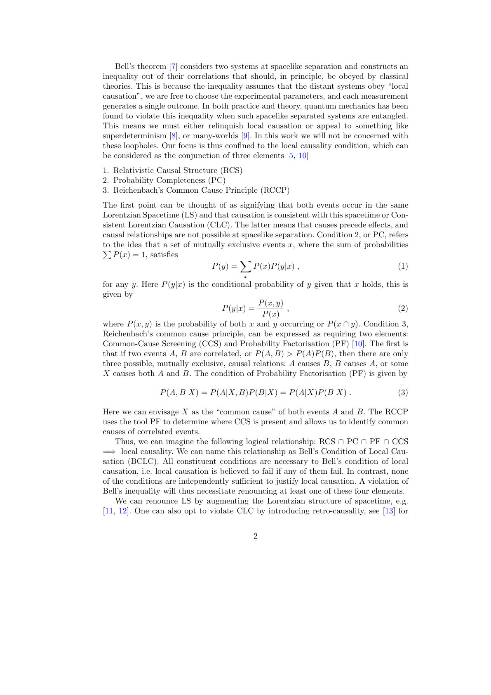 
Low-resolution page preview, page 2

📷 Fig 2

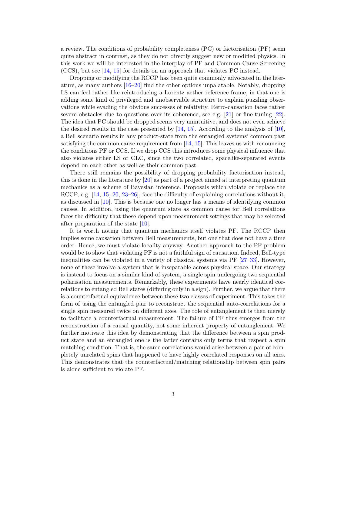 
Low-resolution page preview, page 3

📷 Fig 3

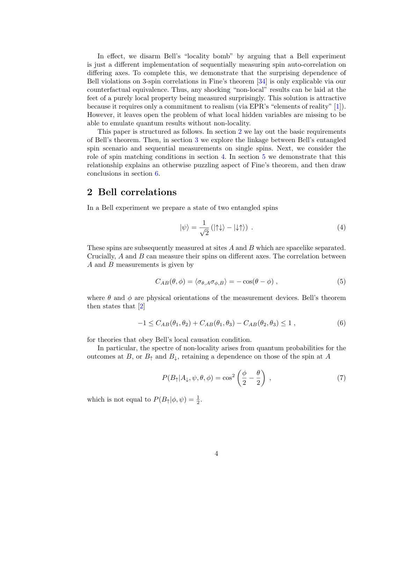 
Low-resolution page preview, page 4

📷 Fig 4

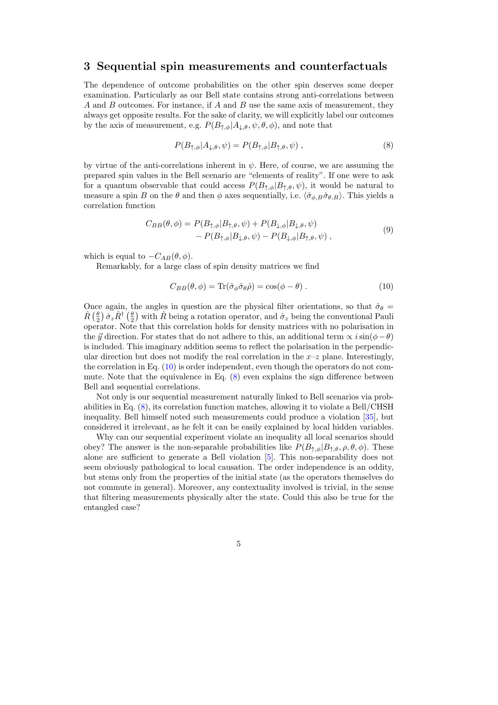 
Low-resolution page preview, page 5

📷 Fig 5

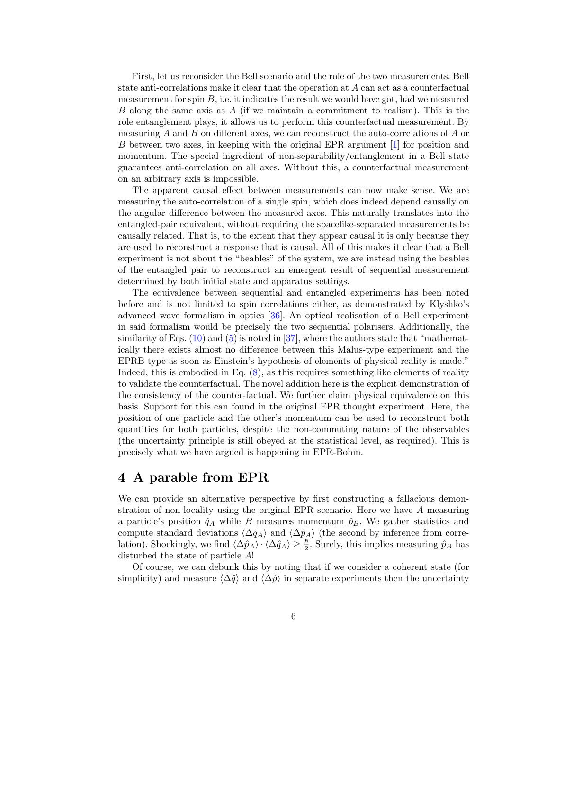 
Low-resolution page preview, page 6

**Summary.** This theoretical work re-examines Bell's theorem by showing that the correlations characteristic of entangled pairs can be mathematically mapped onto the auto-correlations of a single spin measured sequentially. The authors argue that this equivalence suggests that the apparent non-locality is an artifact of how we reconstruct causal quantities, rather than requiring genuine non-local connections.

**Why it may be interesting.** It provides a novel, potentially non-standard interpretation of Bell violations by reframing entanglement correlations as emergent properties of sequential local measurements, which is relevant for understanding contextuality in quantum measurements.

Detailed structure

**Main problem.** The paper challenges the necessity of non-locality implied by Bell's theorem by proposing that Bell-type correlations might be an alternative implementation of a simpler, sequential single-spin experiment.

**Main result.** The apparent non-locality observed in Bell tests can be explained as a consequence of measuring quantities that do not have predefined values due to the state-altering nature of sequential measurements, suggesting the failure of probability factorization is related to causal reconstruction.

**Method.** The authors use a counterfactual equivalence argument, comparing the two-spin correlations of a Bell scenario to the auto-correlations of a single spin undergoing sequential measurements.

**Model / system.** The analysis focuses on spin systems, comparing the correlations derived from entangled pairs (Bell scenario) with those derived from a single spin measured sequentially along different axes.

**Key observables.** Bell correlation function $C_{AB}(	heta, \phi)$ and the sequential correlation function $C_{BB}(	heta, \phi)$.

**Important parameters / regimes.** The angular separations ($	heta, \phi$) defining the measurement settings.

**Assumptions / limitations.** The argument requires a commitment to realism (EPR's 'elements of reality') and analyzes the interplay between Relativistic Causal Structure, Probability Completeness, and Reichenbach’s Common Cause Principle.

**Figures summary.** Not specified.

**Paper structure.** The paper progresses by establishing the mathematical equivalence between the two-spin Bell correlation and the single-spin auto-correlation, arguing that this equivalence reinterprets the apparent non-locality as a local measurement artifact.

Abstract

The empirical proof of Bell inequality violations was a landmark moment for research into quantum foundations. It commits us to a universe without strict relativistic locality or requires that we escape through a potential loophole like many-worlds or superdeterminism. In this work, we consider a sequential, single-spin experiment whose auto-correlations match the two-spin entangled correlations of a Bell scenario. We use a counterfactual equivalence between the two to argue that Bell-type correlations are actually just a different implementation of the sequential experiment. This comports well with the counterfactual basis of the original EPR argument, and explains any apparent non-locality as a consequence of indirectly measuring quantities that do not have predefined values, due to the state-altering nature of sequential spin measurements.

[↑ back to top](#top)

### [Controlled Loop Expansion for Strained Twisted Bilayer Graphene](http://arxiv.org/abs/2605.28937v1)

**Authors:** Eyal Keshet, Yaar Vituri, Erez Berg  
**Type:** theory · **Category:** strongly correlated electrons · **PDF:** <https://arxiv.org/pdf/2605.28937v1>  
**Analysis basis:** full PDF text, analyzed in chunks
**Topic relevance:** 🔥 `Keldysh / 2PI / non-Gaussian methods` **4/5** · `methods for driven-dissipative` **3/5** · `analog quantum simulation` **2/5** · `Kondo & dissipative impurity` **1/5**

📷 Fig 1

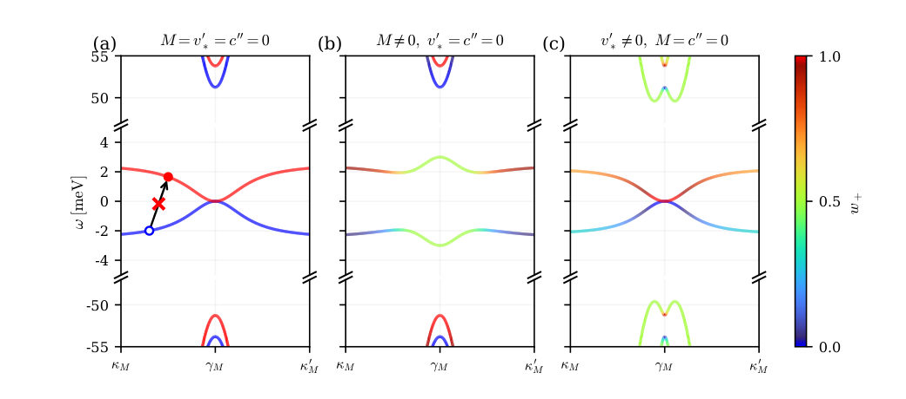 
Figure 1. Spectral function A(k, ω) of the single-particle Hamiltonian (24), obtained by diagonalizing the Hamiltonian. The colors represent the relative weight in the ± sectors of the symmetry defined in (29), with red the + sector, blue the −sector, and the color scale in between represents an excitation with a mixed character. The panels show different parametric regimes, (a) the flat-chiral limit, (b) the chiral non-flat limit M ̸= 0, (c) the flat non-chiral limit v′ ⋆̸= 0. In the flat-chiral limit the conduction and valence bands are in different sectors, and excitations such as the one shown by the black arrow are disallowed by the symmetry. M ̸= 0 results in sector mixing close to...

📷 Fig 2

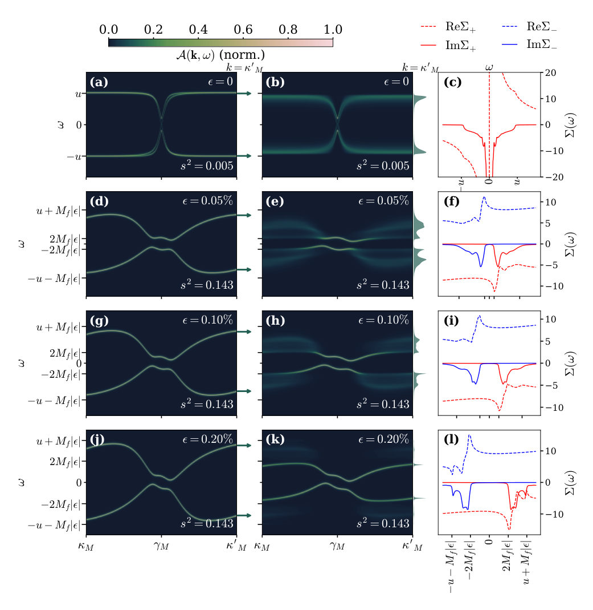 
Figure 2. (a) Spectral function A(k, ω) along the κM-γM-κ′ M line calculated to tree-level for the unstrained case. (b) Unstrained spectral function to one-loop order, (c) the self-energy to one-loop order. To the side of panels (a), (b) we show the spectral cut A(κ′ M, ω), where for (a) the delta functions of the tree-level spectrum are indicated with arrows. Both calculations are done as explained in Sec. III C using Eq. (21), (23), (9). Panels (d)-(f), (g)-(i), (j)-(l) show the same results for the cases of 0.05%, 0.1%, 0.2% strain, respectively, with uniaxial heterostrain angle ϕ = 15◦. For the unstrained case there is no high or low energy sector and thus Σ = Σ+ = Σ−. All parameters...

📷 Fig 3

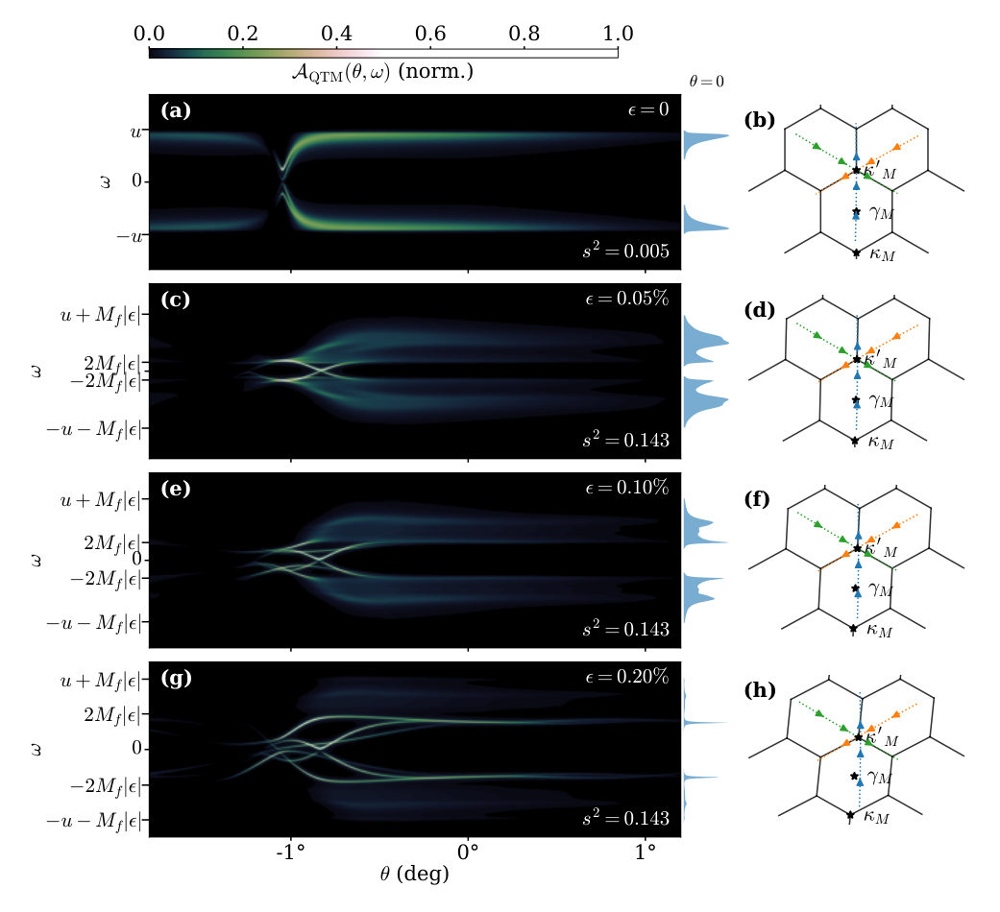 
Figure 3. (a) QTM spectrum calculated using the spectral function to one-loop order for the unstrained case. The result is the sum of the six paths scanned by the three Kn points in the two valleys. To the right of the panel we plot the QTM spectral weight cut at θ = 0◦, normalized relative to its maximal value. (b) Paths scanned by the QTM in the + valley, each arrow shows a path corresponding to one of the Kn points of the tip. The paths in the other valley are related to those shown here by time reversal symmetry. Here θ = 0◦corresponds to alignment of the QTM tip with the point κ′ M. (c)-(d), (e)-(f), (g)-(h) show the same results for the cases of 0.05%, 0.1%, 0.2% strain, respectively,...

📷 Fig 4

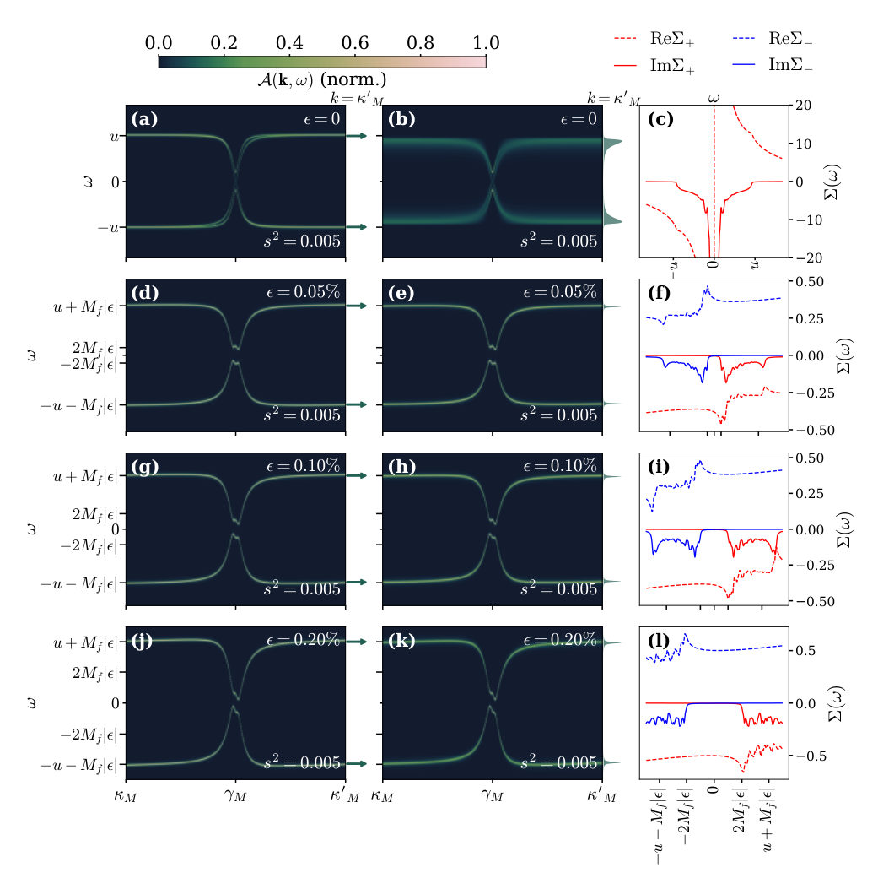 
Figure 4. Same as Fig. 2 except that the same value for v⋆is used for both the strained and unstrained cases. (a) Spectral function A(k, ω) along the κM-γM-κ′ M line calculated to tree-level for the unstrained case. (b) Unstrained spectral function to one-loop order, (c) the self-energy to one-loop order. To the side of panels (a), (b) we show the spectral cut A(κ′ M, ω), where for (a) the delta functions of the tree-level spectrum are indicated with arrows. Both calculations are made as explained in Sec. III C using Eq. (21), (23), (9). Panels (d)-(f), (g)-(i), (j)-(l) show the same results for the cases of 0.05%, 0.1%, 0.2% strain, respectively. For the unstrained case there is no high or...

📷 Fig 5

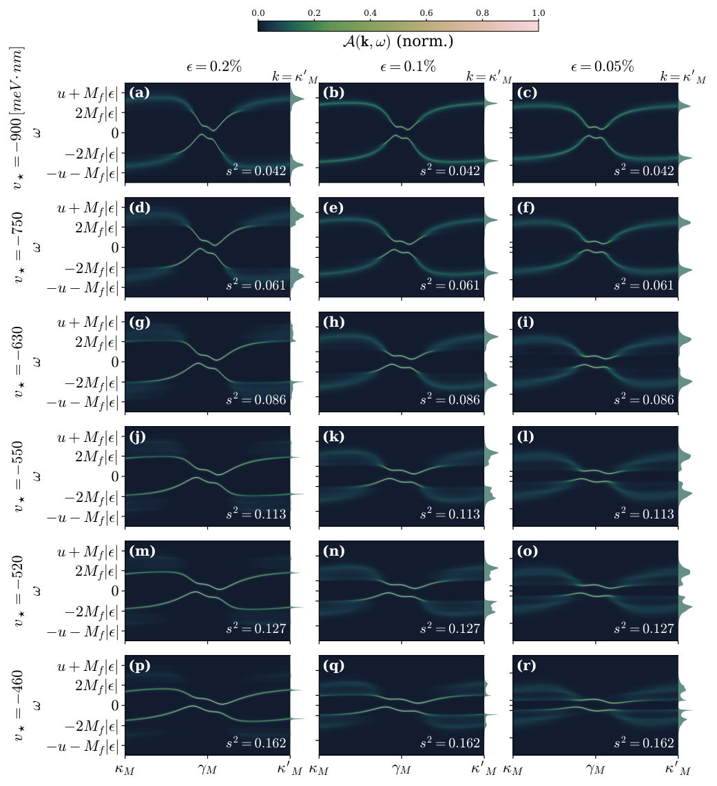 
Figure 5. Spectral function computed to one-loop order from Eq. (21), (23), (9). To the right of each panel we plot the spectral cut A(κ′ M, ω), normalized relative to its maximal value. From left to right the strain takes the values 0.02%, 0.01%, 0.05%, and from top to bottom v⋆takes the values −900, −750, −630, −550, −520, −460. All other parameters are the same in all plots.

**Summary.** This work establishes a controlled theoretical framework to study strongly correlated electrons in strained magic-angle twisted bilayer graphene. By performing a systematic Dyson resummation, the authors predict that strain fundamentally changes the electronic structure, leading to unique spectral features like a 'trion' band and stabilizing the Mott bands in the chiral limit. This provides crucial theoretical predictions for interpreting quantum transport measurements like the QTM spectrum.

**Why it may be interesting.** The systematic, diagrammatic approach to handling strong correlations in a geometrically engineered system like MATBG is highly relevant for understanding correlated phases in designer quantum materials.

Detailed structure

**Main problem.** The paper develops a controlled diagrammatic framework to describe strongly correlated electrons in magic-angle twisted bilayer graphene (MATBG), specifically incorporating the effects of strain.

**Main result.** Strain fundamentally alters the electronic spectrum, leading to the emergence of a flat 'trion' band and causing the Mott bands to remain sharp in the flat-chiral limit, contrasting sharply with the unstrained case.

**Method.** The authors employ a Dyson resummation technique applied to the Periodic Anderson Model, expanding systematically in a small parameter $s^2$ related to the moiré Brillouin zone geometry.

**Model / system.** The system is MATBG modeled using a Topological Heavy-Fermion formulation based on the Periodic Anderson Model, involving localized f-electrons interacting via an on-site Hubbard interaction $U$ and hybridized with itinerant c-electrons.

**Key observables.** Quasiparticle lifetime of Mott bands, spectral function (for predicting Quantum Twisting Microscope spectrum), and the appearance of a kink and a 'trion' band.

**Important parameters / regimes.** The small parameter $s^2$ (fraction of MBLZ with non-trivial geometry), the interaction strength $U$, and the strain-induced energy scale $\epsilon$.

**Assumptions / limitations.** The controlled expansion is valid as long as the strain-induced energy scale is not too small, and the analysis often relies on specific limits like the flat-chiral limit.

**Figures summary.** Figures illustrate the resolved non-interacting spectral function $A(\mathbf{k}, \omega)$ for different strain regimes, and show the QTM spectrum comparing strained and unstrained MATBG.

**Paper structure.** The paper builds from developing the general diagrammatic framework for the PAM, applying it to the strained MATBG, deriving the self-energy corrections, and finally predicting and comparing the QTM spectrum with experimental data.

Abstract

We develop a controlled diagrammatic framework for periodic Anderson models,and apply it to heterostrained magic-angle twisted bilayer graphene (MATBG) at charge neutrality using the topological heavy-fermion formulation. Building on arXiv:2604.14278, we organize self-energy insertions and perform a Dyson resummation to any order in the small parameter $s^2$ -- the fraction of the moiré Brillouin zone with nontrivial quantum geometry. For strained MATBG, the expansion remains controlled down to arbitrarily low temperatures as long as the strain induced energy scale is not too small. In the flat-chiral limit, an emergent approximate $\rm{U}(1)$ symmetry forbids the leading scattering channel and leaves the Mott bands sharp at order $s^2$. This is in stark contrast to the unstrained case, where the linewidth is of order $N_f s^2 U$ with $U$ the on-site $f$-$f$ Hubbard interaction and $N_f$ the number of $f$ states per site. Away from the chiral limit, the linewidth is non-zero at order $s^2$ but more than an order of magnitude smaller than in the unstrained case. The strain-induced energy scale also imprints itself directly on the spectrum: as an electron-phonon-like kink in the dispersion, and as an additional flat ``trion'' band -- a single-particle excitation bound to a local $f$ particle-hole pair. We use the framework to predict the Quantum Twisting Microscope spectrum at one-loop order for both strained and unstrained MATBG, and compare with recent experiments.

[↑ back to top](#top)

### [A Neutral-Atom Quantum Compiler with Application-Specific Layout and Hub-Assisted Shuttling](http://arxiv.org/abs/2605.29964v1)

**Authors:** Takahiko Satoh, Takaharu Yoshida  
**Type:** theory · **Category:** other · **PDF:** <https://arxiv.org/pdf/2605.29964v1>  
**Analysis basis:** full PDF text, analyzed in chunks
**Topic relevance:** 🔥 `QC/QI experiment` **4/5** · `Rydberg arrays` **3/5** · `analog quantum simulation` **1/5**

📷 Fig 1

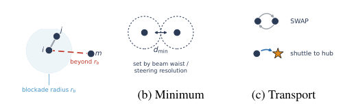 
FIGURE 1. Constraint model captured by our compiler: (a) Rydberg blockade restricts feasible CZ interactions (within rb) and parallel two-qubit operations, (b) minimum separation dmin for safe addressing and motion, and (c) transport primitives (SWAP and hub-mediated shuttling with optional eviction).

📷 Fig 2

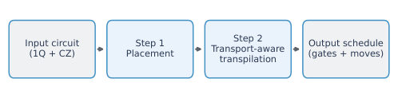 
FIGURE 2. Two-step pipeline used in this work. Step 1 produces a circuit-aware placement and a normalized blockade radius. Step 2 adds hub traps and generates a schedule by selecting SWAP vs. shuttling/eviction on demand.

📷 Fig 3

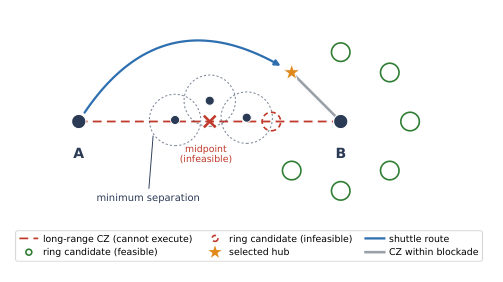 
FIGURE 4. Illustration of the hub placement heuristic (strategic2). Candidate sites are generated from CZ geometry (midpoints of long-range CZ pairs) and filtered by the minimum-separation constraint. Feasible candidates are greedily selected by the endpoint-proximity score weighted by CZ counts.

📷 Fig 4

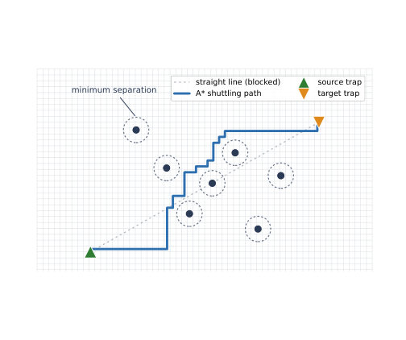 
FIGURE 3. Grid-based A* precomputation for collision-avoiding shuttling distances. Exclusion zones around traps encode the minimum-separation constraint; pairwise distances are cached and reused during transpilation.

📷 Fig 5

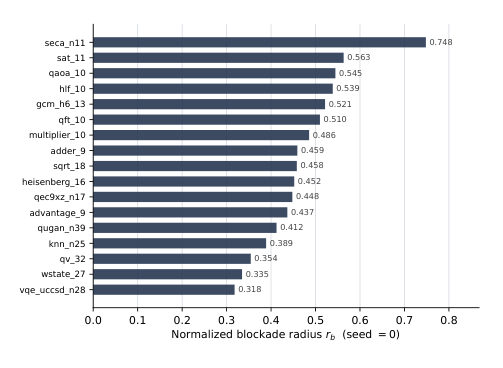 
FIGURE 5. Distribution of the normalized blockade radius rb returned by the placement optimizer (seed=0). The physical operating point fixes r(phys) b = 6 µm; rb determines the distance scaling factor.

**Summary.** This paper presents a novel quantum compiler for neutral-atom quantum processors that overcomes limitations imposed by physical constraints like minimum site separation. By introducing 'hub traps' as dynamic waypoints, the compiler intelligently chooses between SWAP-based routing and atom shuttling to generate executable schedules. This approach successfully compiles complex, routing-dominated circuits that were previously intractable, significantly improving both feasibility and fidelity.

**Why it may be interesting.** This work directly addresses the hardware-software interface for quantum computing using neutral atoms, providing a concrete, physics-informed compilation tool that overcomes fundamental geometric limitations of the physical platform.

Detailed structure

**Main problem.** The core challenge is compiling arbitrary-connectivity quantum circuits onto monolithic neutral-atom devices while respecting physical constraints like finite interaction range and minimum site separation.

**Main result.** The introduction of dynamically placed 'hub traps' and a decision rule between SWAP-based routing and hub-mediated shuttling enables the compilation of circuits previously deemed unsolvable within practical time budgets.

**Method.** The authors propose a two-step compiler: first, an application-specific placement optimization, followed by a transport-aware transpilation that dynamically selects the optimal routing mechanism (SWAP vs. shuttle) based on a time/fidelity cost model.

**Model / system.** The system is a neutral-atom quantum processor utilizing optical tweezer arrays where two-qubit gates are mediated by Rydberg interactions. The compilation must manage atom movement (shuttling) and gate execution under geometric constraints.

**Key observables.** Execution time, fidelity proxy (combining gate fidelities and decoherence), SWAP gate count, and shuttle gate count.

**Important parameters / regimes.** Rydberg blockade radius ($r_b$), minimum separation distance ($d_{min}$), and the cost model parameters for SWAP vs. shuttling.

**Assumptions / limitations.** The method assumes the two-step pipeline (placement then movement optimization) is superior, and its benefit is concentrated on circuits requiring long-range routing.

**Figures summary.** Figures illustrate the two-step pipeline, the hub placement heuristic, and performance comparisons showing fidelity ratios and resource breakdowns (SWAP vs. shuttle) across various benchmark circuits.

**Paper structure.** The paper details the physical constraints, introduces the two-step compiler (placement $
ightarrow$ transport-aware transpilation), develops the cost model for routing decisions, and validates the full pipeline against multiple ablations and baselines.

Abstract

Compiling arbitrary-connectivity NISQ circuits onto monolithic single-zone neutral-atom devices is constrained by a finite interaction range and a minimum separation between simultaneously addressable sites. Under the minimum-separation constraint, the SWAP-only configuration of our pipeline does not return a schedule within a practical time budget on a range of circuits, including circuits as small as nine qubits. We address this with hub traps, a small number of dynamically placed empty traps that serve as transit waypoints, together with a per-gate rule that chooses between SWAP-based routing and hub-mediated shuttling. We evaluate the compiler on seventeen benchmarks using analytic estimates of execution time and a per-layer fidelity proxy, comparing against a placement-matched baseline and against ablations of our own pipeline. Hub traps make these otherwise-unsolved circuits compile in seconds to minutes and remove SWAP gates entirely on every completed circuit, so their role is to enable routing rather than only to optimize fidelity. The benefit is concentrated on routing-dominated circuits and is absent on routing-free ones, which we separate by the structure of the interaction graph. On the most routing-dominated circuit the fidelity proxy improves by up to three orders of magnitude over the placement-matched baseline. The gain comes primarily from eliminating SWAP overhead, as the absolute fidelities there remain low.

[↑ back to top](#top)

### [Quantum State of a Gravitating Region](http://arxiv.org/abs/2605.28958v1)

**Authors:** Raphael Bousso, Sami Kaya, Guanda Lin, Arvin Shahbazi-Moghaddam  
**Type:** theory · **Category:** other · **PDF:** <https://arxiv.org/pdf/2605.28958v1>  
**Analysis basis:** full PDF text, analyzed in chunks
**Topic relevance:** 🔥 `entanglement & information structure` **4/5** · `Keldysh / 2PI / non-Gaussian methods` **2/5** · `methods for driven-dissipative` **2/5**

📷 Fig 1

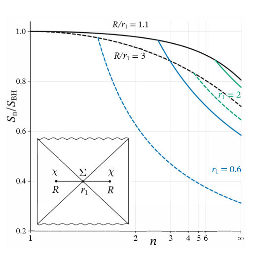 
FIG. 1. Rényi entropies Sn of the subregion χ of the boundary σ = χ ∪¯χ of an elliptic data manifold J . J is obtained from the partial Cauchy slice Σ (see Penrose diagram) by extracting mixed-conformal data; see Eq. 19. Cyclically gluing 2n copies of J yields a torus boundary condition for the GPI, from which Sn is computed; see Fig. 2. We find that the von Neu- mann entropy S1 = limn→1 Sn agrees with SBH = 2πr1/(4G) for all (r1, R). This is consistent with the minimal surface pre- scription [5]. – Legend: for fixed (r1, R), at small n, Sn/SBH depends only on the ratio R/r1; the solid and dashed black curves show two examples. At large n, thermal AdS even- tually dominates. This transition...

📷 Fig 2

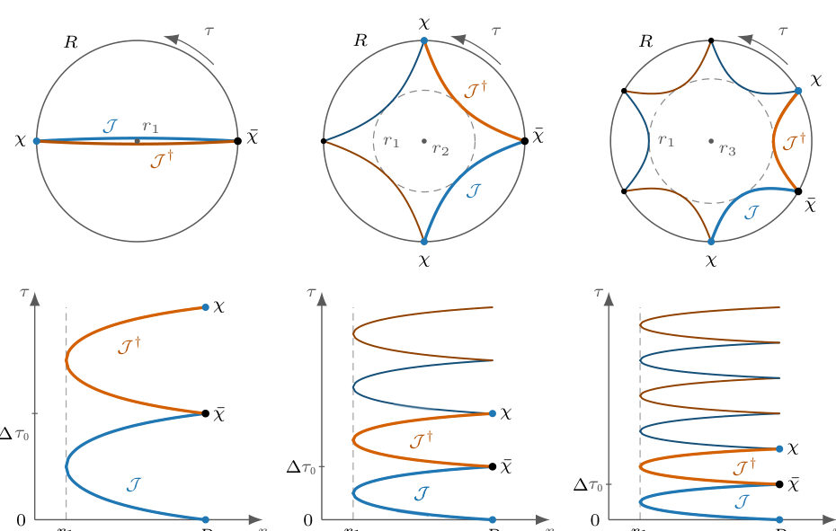 
FIG. 2. Calculation of tr ˜ρ n χ . We start with the partial Cauchy slice Σ of a nonrotating BTZ black hole (Fig. 1), with (r1, R) = (2, 2.8). In this example, the elliptic data manifold J retains the intrinsic metric – the Dirichlet data – of Σ, but not the extrinsic curvature. (Mixed-conformal data yield qualitatively similar embeddings but different Rényi entropies.) The partially glued pair J † ∪¯χ J represents the reduced density operator ˜ρχ. Cyclically gluing n such pairs yields the closed elliptic data manifold Jn. We compute tr ˜ρ n χ by evaluating the GPI with boundary condition Jn. The graphs show the embeddings of Jn in the Euclidean BTZ (top) and thermal AdS (bottom) saddles....

**Summary.** This paper develops a novel method using the gravitational path integral to compute the Rényi entropies of a boundary subregion in a gravitating region. By analyzing specific examples, the authors show that their results for the von Neumann entropy match the established minimal surface prescription for entanglement entropy. This advances the understanding of holographic entanglement entropy by generalizing the required boundary conditions.

**Why it may be interesting.** While focused on quantum gravity, the calculation of entanglement entropy ($S_n$) via path integrals and its comparison to established bounds (like the minimal surface area) provides a deep theoretical framework for understanding quantum correlations in highly curved spacetime, which is a major theme in modern quantum information theory.

Detailed structure

**Main problem.** The paper proposes a method to calculate the Rényi entropies ($S_n$) of a subregion ($\chi$) of the boundary ($\sigma$) of a compact $d$-manifold using the gravitational path integral (GPI).

**Main result.** The calculated von Neumann entropy ($S_1$) agrees with the minimal surface prescription of Bousso and Penington in specific examples, providing a framework for holographic entanglement entropy.

**Method.** The calculation relies on evaluating the GPI with closed boundary conditions formed by gluing elliptic data manifolds, using the saddle-point approximation.

**Model / system.** The system involves a compact $d$-manifold with elliptic data, which prepares a quantum state on its boundary. Specific examples analyzed include the BTZ black hole geometry.

**Key observables.** Rényi entropies ($S_n$), von Neumann entropy ($S_1$), and the comparison to the minimal surface area.

**Important parameters / regimes.** The BTZ black hole radius ($r_1$), the cropping radius ($R$), and the integer $n$ for the Rényi entropy.

**Assumptions / limitations.** The analysis is performed within the saddle-point approximation of the gravitational path integral.

**Figures summary.** Figure 1 shows the dependence of $S_n$ on $n$ compared to the minimal surface prescription. Figure 2 illustrates the calculation of $	ext{tr} 	ilde{
ho}_n^\chi$ by gluing data manifolds in Euclidean BTZ and AdS saddles.

**Paper structure.** The paper develops a general prescription for calculating $S_n$ using the GPI for elliptic data, applies this to specific geometries like BTZ, and compares the results to established holographic entropy bounds.

Abstract

We propose that any compact $d$-manifold with elliptic data, $\mathcal{J}$, prepares a quantum state $|\mathcal{J}\rangle$ on its $(d-1)$-boundary $σ$. Elliptic data consists of metric and field values, or their conjugates, but not both. No asymptotic structure is required. Inner products and traces are evaluated by the gravitational path integral with closed boundary conditions obtained by gluing elliptic data manifolds. In particular, we give a prescription for the Rényi entropies $S_n$ of a subregion of $σ$. In a class of examples, we find that $S_n$ is nonnegative and nonincreasing with $n$, as required for consistency. We obtain the von Neumann entropy by analytic continuation and find agreement with the minimal surface prescription of Bousso and Penington.

[↑ back to top](#top)

### [Contrast enhanced imaging through weakly scattering media with spatially entangled photons](http://arxiv.org/abs/2605.28998v1)

**Authors:** James Hubble, Rojan Abolhassani, Alessio D'Errico, Nazanin Dehghan, Yishai Klein, Yingwen Zhang, Ebrahim Karimi  
**Type:** both · **Category:** other · **PDF:** <https://arxiv.org/pdf/2605.28998v1>  
**Analysis basis:** full PDF text, analyzed in chunks
**Topic relevance:** 🔥 `quantum optics experiment` **4/5** · `entanglement & information structure` **1/5** · `interference shaping light` **1/5** · `quantum measurements` **1/5**

📷 Fig 1

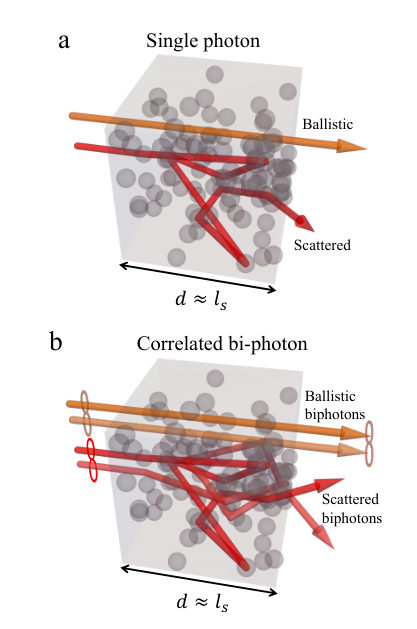 
Figure 1. Conceptual scheme. a, In weakly scattering media (thick- ness d no longer than ∼5 times the mean free path ls) is possible to identify ballistic photons and isolate them from scattering events either using time gating or spatial filtering. Ballistic photons carry information on objects hidden behind or inside the scattering medium. b, In this work, we propose exploiting the fact that ballistic photon pairs preserve transverse position entanglement, and, thus, can be isolated from scattered biphotons via correlation post-selection.

📷 Fig 2

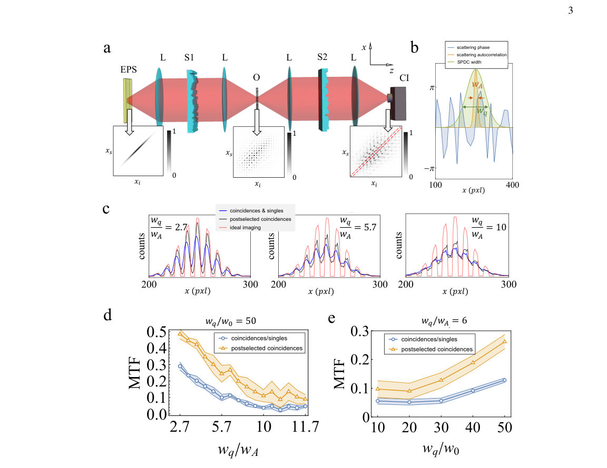 
Figure 2. Numerical simulations. a, Scheme of the simulated setup: spatially entangled photon pairs (EPS) are propagated in free-space to a random phase screen (S1) placed in the far field of the source. Then the pair is incident on an object (O), with spatially varying transmissivity, placed in the source image plane. A second random phase screen (S2) is placed in the object’s far field. Coincidence imaging (CI) is performed on the source/object image plane. L indicates lenses performing optical Fourier transforms. Insets show the spatial correlations (for a single scattering realization) along the x-coordinate in different propagation planes. The red dashed rectangle indicates the...

📷 Fig 3

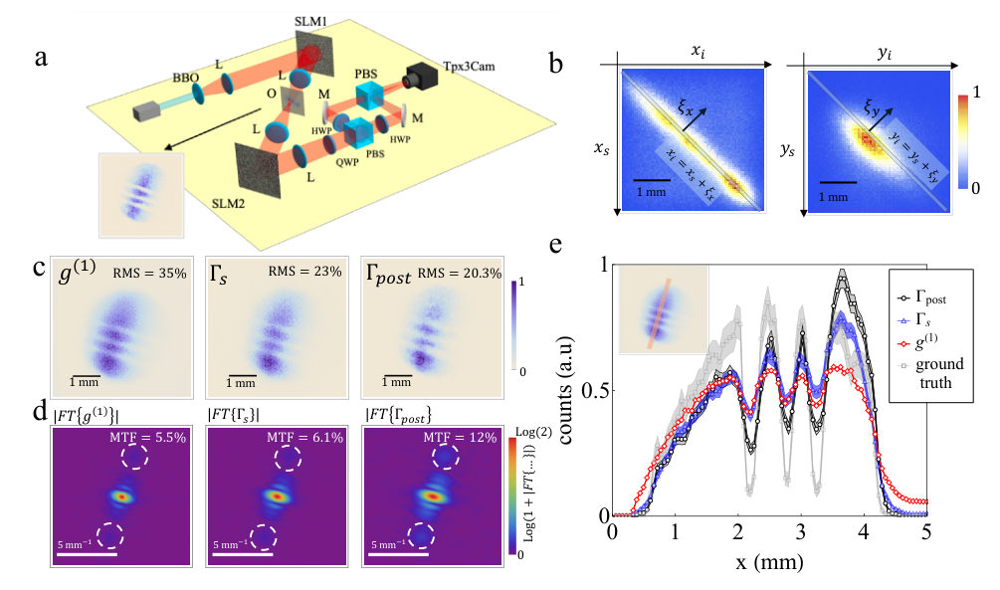 
Figure 3. Experimental setup and results. a, Outline of the experimental setup. BBO, β-barium borate crystal cut for Type I SPDC. SLM1 and SLM2 are liquid crystal spatial light modulators used to introduce scattering in S1 and S2 planes, respectively. O is the amplitude sample to be imaged. L, Lens; M, mirror; BS, beam splitter. Spatially resolved coincidences are collected by a time-stamping camera, Tpx3Cam. b, Near field correlations after scattering. Coincidence postselection is obtained by selecting events where signal and idler coordinates are linearly correlated xi = xs + ξ. c, Image of the object immersed in a dynamic scattering medium as reconstructed by singles (g(1)), coincidences...

📷 Fig 4

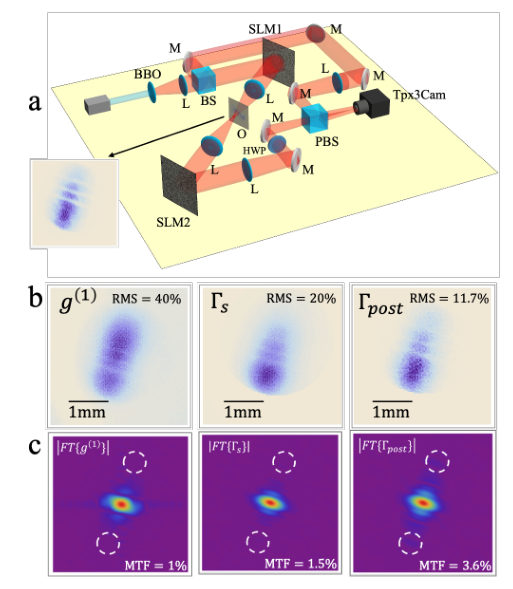 
Figure 4. Correlation imaging with dynamic scattering. a, Outline of the experimental setup for correlation imaging. BBO, β-barium bo- rate crystal cut for Type I SPDC. A beam splitter (BS) in the far field separates signal and idler photons into an object arm and a reference arm. SLM1 and SLM2 are liquid crystal spatial light modulators used to introduce scattering. O is the amplitude sample to be imaged. L, Lens; M, mirror; BS, beam splitter. Spatially resolved coincidences are collected by a time-stamping camera, Tpx3Cam. b, Image of the object immersed in a dynamic scattering medium as reconstructed by singles (g(1)), coincidences (Γs), and post-selected coincidences (Γ(n=3) post ). RMS...

📷 Fig 5

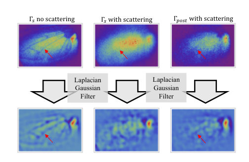 
Figure 5. Retrieving image details from correlation postselection. Postselection of correlation data allows to recover object details that would otherwise be completely scrambled by the scattering medium. In this example, where the object is an insect wing, it is seen how scattering hides the venation pattern. Some of the veins are, however, slightly visible when looking at the postselection data. This is more evident when digital filtering is applied to the recovered images. The corresponding images in the absence of scattering (before and after digital filtering) are shown on the left for comparison. These data were acquired in the single-photon-scattering configuration.

**Summary.** This paper proposes using spatially entangled photon pairs to achieve contrast-enhanced imaging through weakly scattering media. By employing coincidence detection and post-selection on correlated photon pairs, the technique effectively filters out scattered light, significantly improving image quality over standard single-photon measurements. This quantum approach offers a powerful tool for imaging in complex, scattering environments where traditional optical methods fail.

**Why it may be interesting.** This work provides a quantum-enhanced imaging protocol that circumvents limitations of classical optical techniques (like time/spatial gating) in highly scattering environments, which is a key area of quantum optics research.

Detailed structure

**Main problem.** The primary goal is to enhance the image contrast when imaging objects immersed in weakly scattering media.

**Main result.** Using coincidence detection and post-selection on spatially entangled photon pairs significantly enhances image contrast compared to single-photon or non-post-selected coincidence measurements.

**Method.** The method involves exploiting the spatial entanglement of photon pairs and performing coincidence post-selection to filter out scattered bi-photons, thereby isolating the ballistic signal.

**Model / system.** The system uses Spontaneous Parametric Down-Conversion (SPDC) to generate spatially entangled photon pairs which are then passed through a scattering medium and an object. The theoretical framework models the bi-photon wavefunction and the effect of random phase masks.

**Key observables.** Image contrast (quantified via Modulation Transfer Function, MTF), coincidence counts, and the ratio of post-selected coincidences to single-photon counts.

**Important parameters / regimes.** Scattering strength, quantified by the ratio $w_q/w_A$, and the degree of input spatial entanglement ($w_q/w_0$).

**Assumptions / limitations.** The analysis relies on the double-Gaussian approximation for the bi-photon wavefunction and assumes that post-selection is effective even when time gating or spatial filtering is impractical.

**Figures summary.** Figures compare MTF and reconstructed images for single-photon, non-post-selected coincidence, and post-selected coincidence measurements, demonstrating contrast enhancement across different scattering regimes.

**Paper structure.** The paper progresses from conceptual schemes comparing classical vs. quantum filtering, through numerical simulations detailing the MTF dependence on scattering strength, and culminates in experimental demonstrations confirming the contrast improvement.

Abstract

Improving the image contrast of objects immersed in weakly scattering media can be achieved using various strategies. One common approach is to reject events associated with scattered photons in favor of the detection of ballistic photons. While this is traditionally done via time gating or spatial filtering, we propose a different approach based on probing the object with spatio-temporally entangled photon pairs. We show that coincidence detection, followed by post-selection on spatially correlated events, allows us to isolate ballistic from scattered bi-photons, thereby enhancing image contrast relative to a single-photon detection strategy, and simultaneously removes events due to background light. Our predictions are obtained via numerical simulations and confirmed by experiments conducted in two configurations where either both photons or only one illuminates the scene. In both scenarios, correlation post-selection shows an improvement in image contrast at the expense of higher shot noise due to the lower number of events. The latter can be partially compensated for by appropriately combining events from several post-selection windows. Our findings will enable extending imaging through scattering media into the quantum imaging framework in settings where adaptive optics, time gating, and spatial filtering are impractical.

[↑ back to top](#top)

### [Learning quantum ground states in the space of measurement outcomes](http://arxiv.org/abs/2605.28931v1)

**Authors:** Kartiek Agarwal  
**Type:** theory · **Category:** numerical methods · **PDF:** <https://arxiv.org/pdf/2605.28931v1>  
**Analysis basis:** full PDF text, analyzed in chunks
**Topic relevance:** 🔥 `quantum measurements` **4/5** · `analog quantum simulation` **1/5** · `measurement-induced transitions` **1/5** · `methods for driven-dissipative` **1/5**

📷 Fig 1

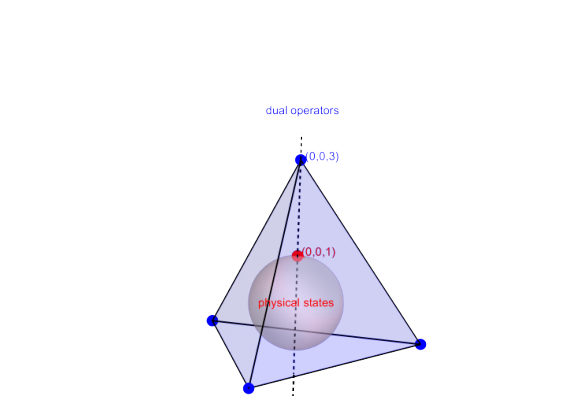 
FIG. 1. POVM dual operators Fi (blue dots) for a single qubit sit at the ends of the minimal tetrahedron which fully encapsulates the Bloch (unit) sphere representing all possible physical states. The coordinates (x, y, z) reflect the ampli- tude of σx, σy, σz in the dual operators. The inferred density matrix resides in the convex hull of the tetrahedron by con- struction. It can capture all the possible physical states, but for certain values of the POVM outcome probabilties, one also can obtain unphysical states. Increasing the number of POVM outcomes does not result in the shrinking of this con- vex hull to more tightly wrap the space of physical states.

📷 Fig 2

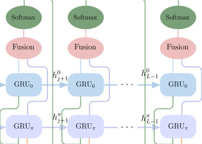 
FIG. 2. Dual stream architecture. Two parallel RNNs are simulated, GRUπ which is fed the site parity (−1)j and, GRU0 which is not. We can consider the two streams as being attuned to momentum k = π, 0 sectors, respectively. The output of these two GRU streams is fed into a Fusion head (details in main text), from which logits denoting the POVM measurement outcomes is output. These logits are fi- nally used to compute outcome probabilities using a Softmax head.

📷 Fig 3

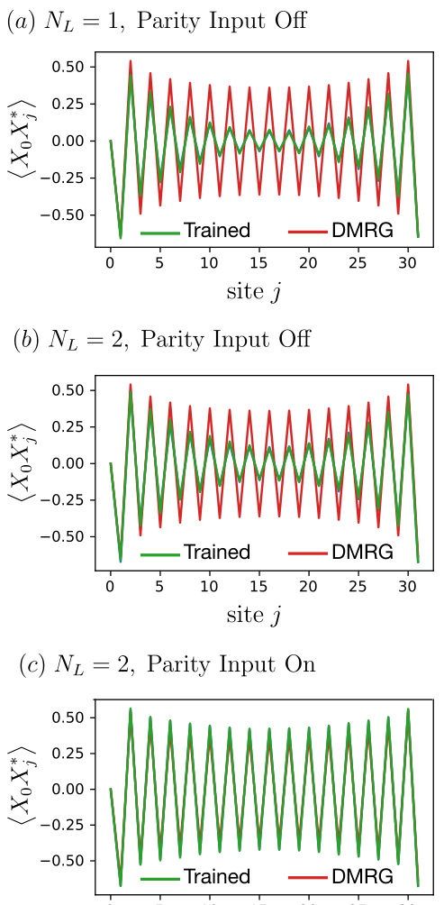 
FIG. 3. Correlations in the XX channel, X0X∗ j , where X∗ j = Xj for j ̸= 0, and X∗ 0 = I, obtained via training (green) and DMRG (red) for the critical TFIM model, HTFIM, with different GRU architectures—standard architecture with no site parity information for (a) NL = 1 and (b) NL = 2 are shown, along with the results for the dual stream architec- ture in (c) with NL = 2. Adding more layers helps improve correlations but providing parity information is essential in addressing long range correlations. Operator range R = 4 is used in obtaining these results.

📷 Fig 4

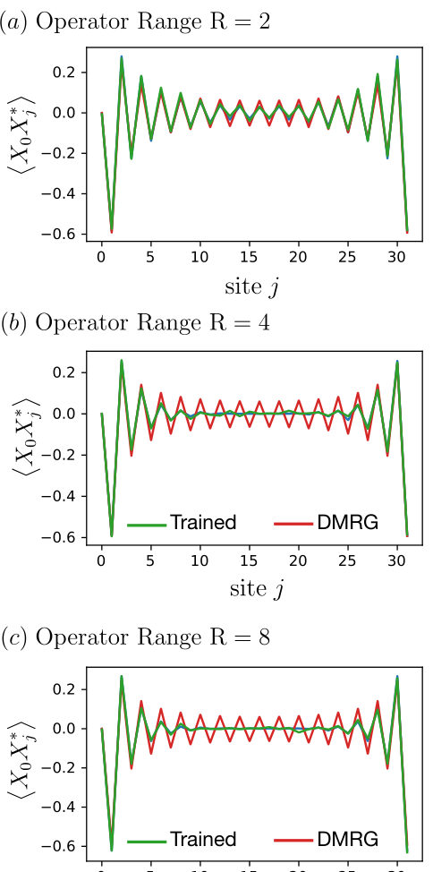 
FIG. 4. Correlations in the XX channel, X0X∗ j , where X∗ j = Xj for j ̸= 0, and X∗ 0 = I, obtained via training (green) and DMRG (red) with different operator ranges (a) R = 2, (b) R = 4 and (c) R = 8.

📷 Fig 5

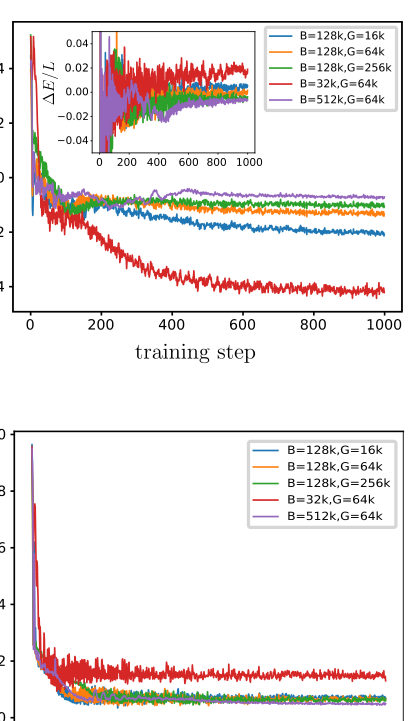 
FIG. 5. (a) Computation of the energy variance per site, ∆H2/L and (inset) deviation of energy density from DMRG result, ∆E/L for the TFIM gapped with a Z field, HGapped TFIM, as a function of the training step, for various buffer and gradient batch sizes, B and G, respectively. (b) Maximum deviation in any XX, YY, or ZZ correlators from DMRG results, max{ X0X∗ j , Y0Y ∗ j , Z0Z∗ j }, as a func- tion of training step, for various values of B, G. The esti- mation of these values is obtained using an inference batch size I = B; this is generally sufficient to estimate ∆E/L and the deviation in correlations, but not for ∆H2/L which is in- ferred by summing O(L2) operators of weight w = 4....

**Summary.** This paper introduces a method to find quantum ground states by optimizing a neural network that models the probability distribution of measurement outcomes. By enforcing physical constraints, such as the positive semi-definiteness of the operator Gram matrix, the method successfully simulates complex 1D quantum spin models. It represents a significant advancement in using machine learning to bridge the gap between theoretical quantum mechanics and experimental measurement data.

**Why it may be interesting.** This work offers a novel, data-driven pathway to quantum simulation that bypasses the explicit construction of complex wavefunctions or density matrices, making it highly relevant for simulating systems where measurement data is the primary input.

Detailed structure

**Main problem.** The paper addresses the challenge of variational learning of quantum many-body ground states directly in the space of experimentally measurable measurement outcomes.

**Main result.** The proposed method successfully obtains ground states for 1D spin models up to $L=128$, demonstrating efficacy across both gapped and gapless systems.

**Method.** It uses autoregressive neural networks (GRUs) to model the probability distribution over outcomes from a SIC-POVM, minimizing the energy expectation value subject to complex positivity constraints on the reconstructed density matrix.

**Model / system.** The approach is benchmarked on 1D spin models, specifically the transverse-field Ising model and the Heisenberg model, for system sizes up to $L=128$.

**Key observables.** Ground state energy density ($\Delta E/L$), local spin polarization, and two-point correlation functions ($\langle \Pi_i \Pi_j 
angle$).

**Important parameters / regimes.** System size ($L$), operator weight ($w$), operator range ($R$), and stochastic noise thresholds ($	au, s$).

**Assumptions / limitations.** The core assumption is that the quantum state can be accurately represented by a probability distribution over measurement outcomes, and the method relies on enforcing positivity constraints on the Gram matrix of Pauli observables.

**Figures summary.** Figures illustrate the POVM dual operators, the dual-stream GRU architecture, and comparisons of calculated correlations (e.g., for the critical TFIM model) against established results like DMRG.

**Paper structure.** The paper details the theoretical framework (POVM representation, GRU encoding), the optimization procedure (minimizing energy subject to PSD constraints), and extensive benchmarking across various 1D spin models, comparing results to established numerical techniques.

Abstract

We investigate variational learning of quantum many-body ground states directly in measurement space using autoregressive neural networks. In particular, we represent quantum states via probability distributions of outcomes over a symmetric informationally complete positive operator-valued measure (SIC-POVM). The probability distribution is encoded in the parameters of an autoregressive neural-network-based on gated recurrent units (GRUs). Ground states are obtained by gradient descent that updates the probability distribution to minimize the energy with respect to a given Hamiltonian, while enforcing positivity constraints that ensure that the distribution of measurement outcomes correspond to a physical quantum state. We analyze the role of constraint enforcement (hierarchy of positivity conditions), variety of neural network architectures (multiple layers, dilation, and modifications of input data) in determining the success of this approach. We benchmark our approach on one-dimensional transverse-field Ising model and the Heisenberg model, along with gapping fields, for system sizes up to L=128, illustrating its efficacy across a wide variety of models.

[↑ back to top](#top)

### [Spectroscopic evidence for a molecular orbital Kondo insulator](http://arxiv.org/abs/2605.30293v1)

**Authors:** Ke-Jun Xu, Kuan H. Hsu, Nathan Giles-Donovan, Christopher T. Parzyck, Gi-Hyeok Lee, Wanli Yang, Jun Okamoto, Hsiao-Yu Huang, Di-Jing Huang, Joshua J. Kas, John Vinson, Zhi-Xun Shen, Dung-Hai Lee, Thomas P. Devereaux, Wei-Sheng Lee, Robert J. Birgeneau  
**Type:** both · **Category:** strongly correlated electrons · **PDF:** <https://arxiv.org/pdf/2605.30293v1>  
**Analysis basis:** full PDF text, analyzed in chunks
**Topic relevance:** 🔥 `Kondo & dissipative impurity` **4/5** · `Keldysh / 2PI / non-Gaussian methods` **1/5**

📷 Fig 1

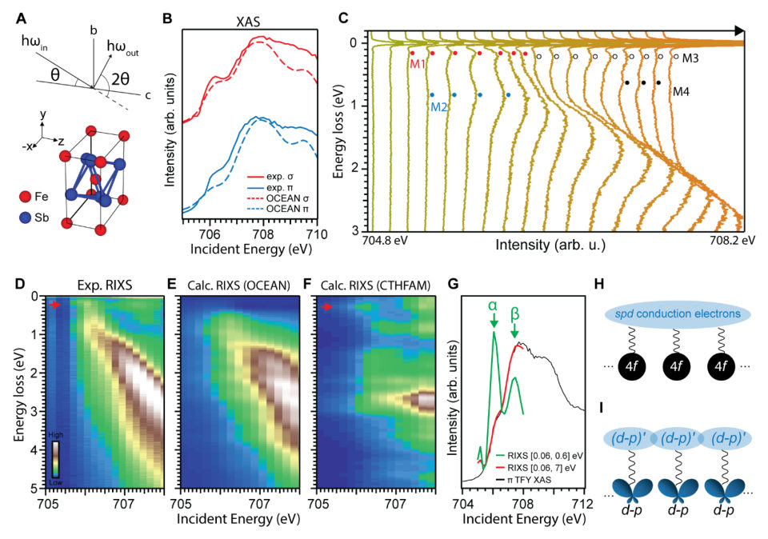 
Fig. 1 | X-ray spectroscopy reveals molecular orbital states in FeSb2. (A) Crystal structure of FeSb2 and the scattering experiment geometry. θ is defined as the angle between the incident beam and the sample surface. 2θ is defined as the angle between the incident beam and the scattered beam。 (B) Experimental (solid lines) and calculated (dashed lines) XAS spectra of FeSb2 at the Fe L3- edge. Experimental spectrum is taken at a grazing incidence geometry with total fluorescence yield (TFY). σ polarization indicates electric field in the vertical direction perpendicular to the scattering plane (a axis) and π polarization indicates electric field within the horizontal scattering plane...

📷 Fig 2

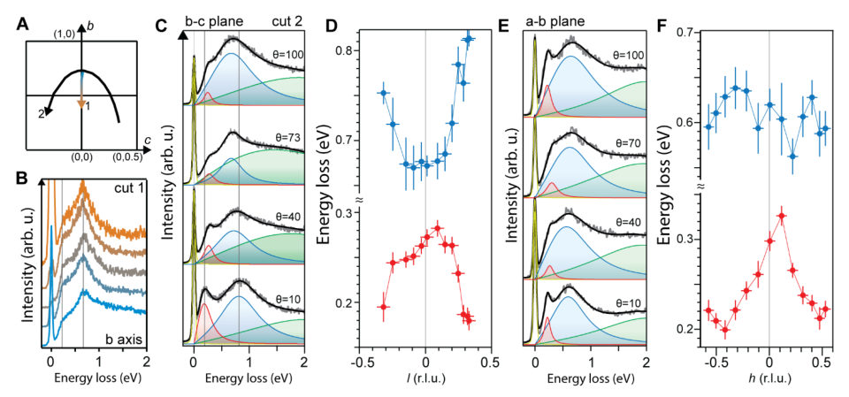 
Fig. 2 | Dispersive low energy excitations in three-dimensional momentum space. (A) Schematic drawing of the spectral cuts in the b-c plane of the reciprocal space. (B) RIXS curves along cut 1, which is approximately along the b axis. (C) Select RIXS curves at different θ angles with a fixed 2θ = 150° in the b-c scattering plane, which follows the trajectory in cut 2 shown in (A). The fit consists of a quasielastic peak (yellow), M1 (red), M2 (blue), and a high energy charge transfer spectral weight (green). The quasielastic peak is fitted with a Voigt function, and the other features are fitted with antilorentzians. The peaks were convolved with a gaussian of the quasielastic peak width in...

📷 Fig 3

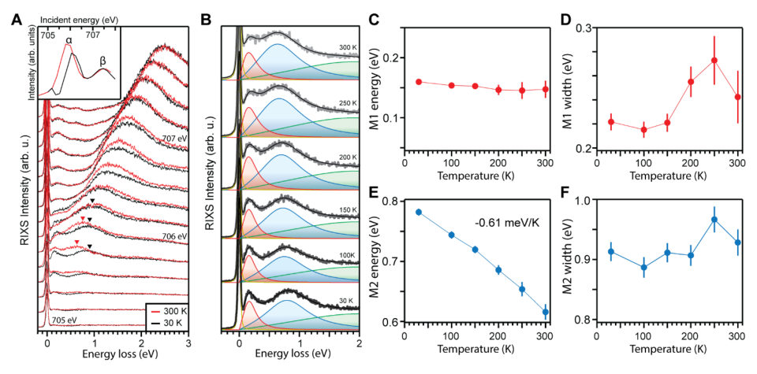 
Fig. 3 | Unusual temperature-dependent evolution of low energy excitations. (A) Incident-energy- dependent RIXS spectra at 30 K (black curves) and 300 K (red curves) at θ = 10° and 2θ = 150° in the b-c scattering plane. Triangles highlight the different behaviors of the M2 mode at low and high temperatures. Inset shows the resonant profile of low energy features integrated between [0.06, 0.6] eV at 30 K (black curve) and 300 K (red curve). (B) Temperature-dependent RIXS curves at 705.8 eV incidence photon energy in the same geometry as (A). The fits are performed in the same way as described in Fig. 1. (C-F) Extracted fit parameters for M1 peak position (C), M1 peak width (D), M2 peak...

📷 Fig 4

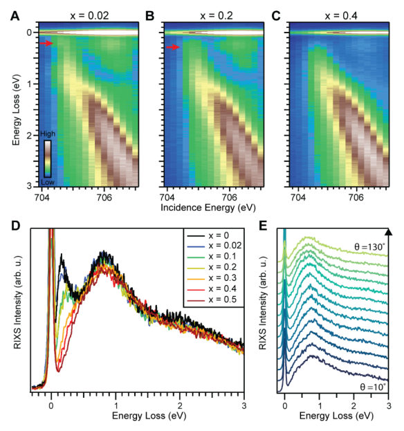 
Fig. 4 | Doping dependence of low energy excitations. (A-C) Incident-energy RIXS maps for FeSb2-xTex samples with x = 0.02 (A), x = 0.2 (B), and x = 0.4 (C). Red arrows point to the evolution of the M1 feature with increasing Te doping. (D) RIXS curves for different dopings at θ = 10° and 2θ = 150°. The curves are normalized using the portion of the spectrum above 2 eV, and is only used for qualitative comparisons. (E) Momentum dependence of FeSb1.6Te0.4 in the a-c scattering plane, same as cut 2 in Fig. 2a. Curves are from θ = 10° to θ = 130° in 10° steps, while 2θ is fixed at 150°. Incident photon polarization is π.

**Summary.** This paper reports spectroscopic evidence, primarily using RIXS and XAS, to characterize $	ext{FeSb}_2$ as a molecular orbital Kondo insulator. By comparing experimental results with advanced theoretical models, the authors demonstrate that the electronic structure is governed by hybridized $	ext{Fe-Sb}$ molecular orbitals. This work advances the understanding of unconventional correlated insulators by providing a pathway to engineer high-temperature Kondo states.

**Why it may be interesting.** The work provides a concrete, measurable platform ($	ext{FeSb}_2$) to test the theoretical concept of molecular orbital Kondo insulators, bridging the gap between $4f$ heavy fermion physics and transition metal chemistry.

Detailed structure

**Main problem.** To understand the electronic structure and emergent phenomena in a Kondo insulator (KI) system, specifically moving beyond conventional atomic multiplet descriptions.

**Main result.** The study establishes that $	ext{FeSb}_2$ is a molecular orbital Kondo insulator, characterized by a mixed-configuration ground state derived from hybridized $	ext{Fe-Sb}$ molecular orbitals.

**Method.** The research combines experimental measurements like RIXS and XAS with advanced theoretical calculations, including DFT, the Charge-Transfer Hamiltonian (CTHFAM), and the $	ext{Oceaan}$ code.

**Model / system.** The physical system is $	ext{FeSb}_2$, which is modeled as a Kondo insulator where the local moments arise from hybridized molecular orbitals ($	ext{Fe-Sb}$), rather than purely atomic $d$ electrons.

**Key observables.** RIXS energy loss features ($	ext{M}1, 	ext{M}2$, etc.), XAS spectrum shape, momentum and temperature dependence of excitations, and doping dependence.

**Important parameters / regimes.** Low energy excitations (e.g., $	ext{M}1$ at 200-300 meV, $	ext{M}2$ at 800 meV), temperature (30 K vs 300 K), and doping concentration ($x$ in $	ext{FeSb}_{2-x}	ext{Te}_x$).

**Assumptions / limitations.** The analysis compares continuum state calculations ($	ext{Oceaan}$) with localized multiplet calculations ($	ext{CTHFAM}$), assuming the latter captures the essential physics of the mixed-configuration ground state.

**Figures summary.** Figures illustrate the crystal structure, XAS/RIXS spectra, momentum mapping of low-energy excitations ($	ext{M}1, 	ext{M}2$), and the evolution of these features with temperature and doping.

**Paper structure.** The paper systematically presents experimental data (XAS/RIXS) and compares them against multiple theoretical frameworks (DFT, $	ext{Oceaan}$, CTHFAM) to build a consistent picture of the electronic ground state and its excitations.

Abstract

A Kondo insulator (KI) is a prototypical example of a highly entangled phase of matter, where many-body interactions between local moments and delocalized electrons engender the non-magnetic insulating ground state. Conventionally, the local moments arise from atomic multiplet states with a narrow bandwidth, limiting Kondo coherence to low temperatures. Here, we realize a new paradigm for constructing the KI state with hybridized molecular orbitals in FeSb2. Resonant inelastic X-ray scattering (RIXS) at the Fe L-edge reveals distinct signatures of band-like continuum states and localized states. Comparisons with first-principles calculations establish a mixed-configuration ground state with hybridized Fe d-Sb p molecular orbitals as basis states. By systematically investigating the RIXS momentum, temperature, and doping dependences, we find propagating collective modes commensurate with many-body charge and spin excitations. Our results pave the way for understanding the emerging class of unconventional d electron insulators and engineering high temperature Kondo many-body states.

[↑ back to top](#top)

### [Electronic Origin of Ferromagnetic Excitations in the Candidate Spin-Triplet Superconductor CeSb2](http://arxiv.org/abs/2605.30074v1)

**Authors:** Xiaoxiao Wang, Xiaoyang Chen, Suppanut Sangphet, Yifei Fang, Yilin Wang, Chihao Li, Minyinan Lei, Nan Guo, Yuanhe Song, Rui Peng, Haichao Xu, Donglai Feng  
**Type:** experiment · **Category:** strongly correlated electrons · **PDF:** <https://arxiv.org/pdf/2605.30074v1>  
**Analysis basis:** full PDF text, analyzed in chunks
**Topic relevance:** 🔥 `Kondo & dissipative impurity` **4/5**

📷 Fig 1

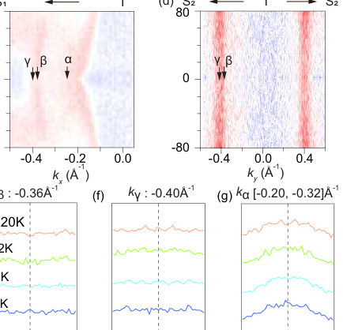 
FIG. 2. (a) Valence band dispersions near EF measured at 2 K with 27 eV photons, corresponding to the kz = π plane. (b) Corresponding band dispersions from DMFT calculations. (c) and (d) Symmetrized energy-momentum (E-k) intensity plots along ΓS1 (2 K) and ΓS2 (5 K) directions, respectively, measured with 27 eV photons. (e)- (g) Temperature-dependent symmetrized energy distribution curves (EDCs) at kβ, kγ and kα along the ΓS1 direction.

📷 Fig 2

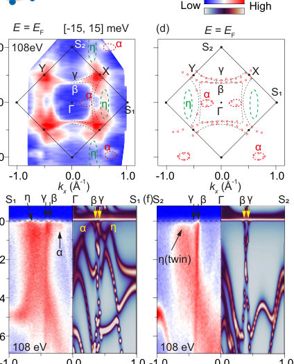 
FIG. 1. (a) Crystal structure of CeSb2: (i) orthorhombic unit cell with the Ce sublattice highlighted; (ii) with the leg direction along the crystallographic b-axis (blue arrow). (b) Bulk Brillouin zone (BZ) with respect to the primitive cell. The Ce-ladder leg direction (b) corresponds to ΓS1. (c) Fermi surface map measured at 6 K with 108 eV LH-polarized photons. (d) Schematic Fermi surfaces derived from (c). (e) and (f) Band dispersions along the ΓS1 and ΓS2 direc- tions, together with DMFT calculations.

📷 Fig 3

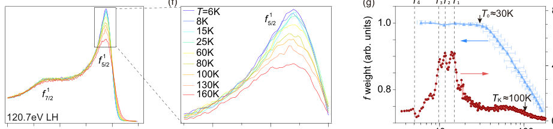 
FIG. 3. Photoemission intensity along ΓS1 direction at 6 K with LH polarized photons at (a) 108 eV (offresonance), (b) 115 eV (pre-edge, partial resonance), and (c) 120.7 eV (on resonance, Ce M-edge), divided by the resolution-convoluted Fermi-Dirac distribution. (d) Schematic of proposed band-selective Kondo coupling with CEF states. (e)-(f) Temperature-dependent EDCs integrated over the momentum range of panel (c). (g) Spectral intensity of 4f 1 5/2 peak over the energy window [EF−0.1 eV, EF+0.1 eV], normalized to its value at 6 K. The temperature derivative of resistivity dρ/dT is plotted to show the TK and the magnetic transitions.

📷 Fig 4

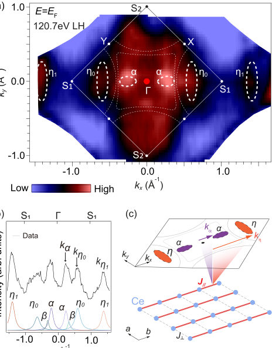 
FIG. 4. (a) Fermi surface map in the kx −ky plane obtained by resonance-enhanced ARPES at 20 K with hν=120.7 eV (Ce M-edge), integrated over [EF −25 meV, EF + 25 meV]. (b) MDC along the ΓS1 direction at EF; The extracted Fermi wavevectors are estimated from the Lorentzian peak positions [Table II in Ref. [35]]. (c) Schematic of the proposed band-selective Kondo coupling mechanism and re- sulting exchange anisotropy.

**Summary.** This work investigates the source of quasi-1D ferromagnetism in the material CeSb2 using ARPES. By showing that the magnetism is not due to Fermi surface nesting, the authors propose a band-selective Kondo coupling mechanism. This mechanism explains the strong magnetic anisotropy and provides a general model for emergent low-dimensional magnetism in correlated electron materials.

**Why it may be interesting.** The identification of a band-selective Kondo coupling mechanism provides a concrete, microscopic electronic route to understanding emergent low-dimensional magnetism in correlated $f$-electron systems, which is highly relevant to strongly correlated physics.

Detailed structure

**Main problem.** The origin of quasi-one-dimensional (q1D) ferromagnetic (FM) excitations in the candidate spin-triplet superconductor CeSb2 remains unclear.

**Main result.** The study identifies band-selective Kondo coupling as the microscopic mechanism generating strongly anisotropic magnetic exchange interactions, which accounts for the emergent q1D magnetism.

**Method.** Angle-resolved photoemission spectroscopy (ARPES), particularly resonant ARPES tuned across the Ce M-edge, was used to probe the electronic structure.

**Model / system.** The system is CeSb2, a material crystallizing in a quasi-two-dimensional lattice and being studied as a candidate for spin-triplet superconductivity. The analysis focuses on the electronic behavior of the Ce 4f electrons interacting with the conduction bands.

**Key observables.** Selective enhancement of Ce 4f spectral weight on specific Fermi pockets, absence of a spin-density-wave gap, and the temperature dependence of these spectral features.

**Important parameters / regimes.** Low temperatures (down to 2 K), the Ce M-edge resonance condition, and the Fermi surface topology ($\alpha, eta, \gamma, \eta$ pockets).

**Assumptions / limitations.** The analysis assumes that the observed spectral features are dominated by the Kondo coupling mechanism, although the possibility of sub-meV gaps is noted as a limitation.

**Figures summary.** Figures illustrate the crystal structure and Fermi surface maps, band dispersions, and photoemission intensity changes comparing off-resonance, pre-edge, and on-resonance conditions, highlighting the $4f$ spectral weight enhancement.

**Paper structure.** The paper first establishes the mystery of the q1D magnetism in CeSb2. It then uses ARPES to rule out nesting-driven mechanisms. The core of the work presents resonant ARPES data showing band-selective $4f$ enhancement, leading to the conclusion of a band-selective Kondo coupling mechanism.

Abstract

The origin of quasi-one-dimensional (q1D) ferromagnetic (FM) excitations in the candidate spin-triplet superconductor CeSb$_2$ has remained unclear. Here we report an electronic mechanism for emergent q1D magnetism in the quasi-two-dimensional lattice of CeSb$_2$, revealed by angle-resolved photoemission spectroscopy (ARPES). High-resolution ARPES resolves no spin-density-wave gap on the dispersive Fermi pockets, disfavoring a nesting-driven mechanism for the q1D FM excitations. Instead, resonant ARPES reveals a pronounced selective enhancement of Ce 4$f$ spectral weight on the $C_2$-distributed Fermi pockets aligned with the Ce ladder. This observation signifies band-selective Kondo coupling that generates strongly anisotropic magnetic exchange interactions, which can naturally account for both the q1D ferromagnetic excitations and the competing magnetic orders. Our results identify a band-selective Kondo coupling mechanism for emergent low-dimensional magnetism in correlated $f$-electron systems.

[↑ back to top](#top)

### [Exact Geometric Typicality and Bipartite Entanglement from the Projected Central Limit Theorem on Hyperspheres](http://arxiv.org/abs/2605.29732v1)

**Authors:** Zhi-Wei Wang, Pei-Wen Li, Samuel L. Braunstein  
**Type:** theory · **Category:** quantum information and computing · **PDF:** <https://arxiv.org/pdf/2605.29732v1>  
**Analysis basis:** full PDF text, analyzed in chunks
**Topic relevance:** 🔥 `entanglement & information structure` **4/5**

📷 Fig 1

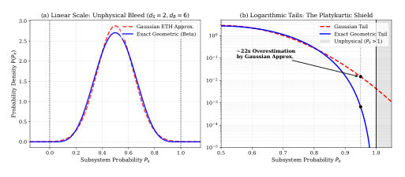 
FIG. 1. Geometric suppression of thermal fluctuations in a finite quantum system (dS = 2, dE = 6). (a) On a linear scale, the exact Beta distribution rigorously bounds physical probabilities to Pk ∈[0, 1], whereas the standard Gaussian as- sumption erroneously bleeds into unphysical regimes (shaded red). (b) Logarithmic scale: the exact density falls below the Gaussian approximation by more than an order of magnitude near the kinematic boundary, and the exact cumulative prob- ability falls below by more than two orders of magnitude for Pk &gt; 0.95.

**Summary.** This work provides an exact, non-perturbative calculation of the bipartite quantum mutual information for random pure states in finite quantum systems. By utilizing the Projected Central Limit Theorem, the authors show that the mutual information has a highly structured asymptotic expansion in $1/N$ and cleanly separates into quantum coherence and classical contributions. This refines our understanding of entanglement scaling by correcting the limitations of standard Gaussian approximations.

**Why it may be interesting.** The rigorous derivation of the mutual information structure and the identification of the exact quantum coherence contribution versus classical probability terms provide deep insights into how entanglement scales in finite quantum systems, which is crucial for understanding decoherence and thermalization.

Detailed structure

**Main problem.** The paper addresses the statistical profile of fluctuations in isolated quantum systems undergoing unitary evolution, specifically refining the understanding of entanglement measures beyond standard Gaussian approximations.

**Main result.** It derives an exact, non-perturbative closed form for the bipartite quantum mutual information $\langle I(A:B) \rangle$, showing its asymptotic expansion in $1/N$ admits a highly structured Bernoulli-factorized form.

**Method.** The analysis relies on the exact Projected Central Limit Theorem on hyperspheres, leading to the Beta distribution for subsystem probabilities, and involves algebraic reorganization of Page's formula.

**Model / system.** The system models isolated quantum states evolving unitarily, analyzed via the uniform measure on the unit hypersphere $S^{2N-1}$ for a total dimension $N=d_A d_B d_E$.

**Key observables.** Bipartite quantum mutual information $\langle I(A:B) \rangle$, subsystem occupation probabilities $P_k$, and the purity $\langle \text{Tr}(\rho_S^2) \rangle$.

**Important parameters / regimes.** Subsystem dimensions ($d_A, d_B, d_E$), total dimension $N$, and the finite-size correction terms.

**Assumptions / limitations.** Standard treatments rely on the Gaussian approximation, which the authors show is inaccurate in finite systems; the analysis is most relevant for finite-size quantum regimes.

**Figures summary.** Figure 1 (mentioned) illustrates the divergence between the Gaussian and Beta tail probabilities, highlighting the 'platykurtic shield' effect.

**Paper structure.** The paper progresses from establishing the exact Beta distribution for subsystem probabilities, to deriving the mutual information $\langle I(A:B) \rangle$, and finally establishing its exact factorization and asymptotic expansion in $1/N$ via algebraic reorganization of Page's formula.

Abstract

Starting from the exact Projected Central Limit Theorem on hyperspheres, we rederive the Beta distribution for subsystem occupation probabilities and Lubkin's purity formula from elementary hyperspherical moments, quantifying the finite-size ``platykurtic'' suppression of tails relative to the Gaussian approximation used in standard eigenstate-thermalization and typicality treatments. Our main new result concerns the bipartite quantum mutual information $\langle I(A{:}B)\rangle$ for Haar-random pure states. We show that its full asymptotic expansion in $1/N$ admits a Bernoulli-factorized form in which every order $k \ge 1$ carries the symmetric factor $(d_A^{2k}-1)(d_B^{2k}-1)$ and all higher odd-order corrections vanish identically. Through an exact algebraic reorganization of Page's formula (conjectured in Ref.~\cite{Page1993} and subsequently proven~\cite{Foong1994, SanchezRuiz1995, Sen1996}), we establish that the leading finite-size correction separates into a dominant $\mathfrak{su}(d_A) \otimes \mathfrak{su}(d_B)$ bipartite quantum coherence contribution $(d_A^2 - 1)(d_B^2 - 1)/(2N)$ and a subtracted classical-probability (Cartan $\otimes$ Cartan) contribution $(d_A - 1)(d_B - 1)/(2N)$, and we trace this separation to the difference between diagonal and eigenvalue entropies via Schur's majorisation theorem, with the dimensional counts $(d-1)$ and $(d^2-1)$ acquiring meaning through the Cartan structure of the generalised Bloch decomposition. These results admit a single non-perturbative closed form: the exact typical mutual information factors as $\langle I(A{:}B)\rangle = (d_A^2-1)(d_B^2-1)\,\mathcal{G}(d_A,d_B,d_E)$, with $\mathcal{G}$ given by an explicit Bose--Einstein integral whose asymptotic expansion in $1/N$ reproduces the Bernoulli series.

[↑ back to top](#top)

### [Discrete and Continuous Wigner Functions in Open Quantum Systems: Non-Markovian and Thermodynamic Effects](http://arxiv.org/abs/2605.29717v1)

**Authors:** Jai Lalita  
**Type:** both · **Category:** other · **PDF:** <https://arxiv.org/pdf/2605.29717v1>  
**Analysis basis:** full PDF text, analyzed in chunks
**Topic relevance:** `QC/QI experiment` **3/5** · `correlated / nonlocal dissipation` **3/5** · `entanglement & information structure` **3/5** · `methods for driven-dissipative` **3/5** · `quantum measurements` **3/5** · `driven-dissipative phase transition` **2/5** · `non-equilibrium dynamics` **2/5** · `Keldysh / 2PI / non-Gaussian methods` **1/5** · `measurement-induced transitions` **1/5** · `non-equilibrium universality` **1/5**

📷 Fig 1

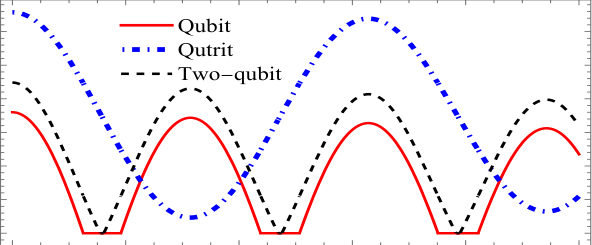 
Figure 3.4.1: Variation of discrete Wigner negativity for a qubit, qutrit, and two-qubit systems, non-Markovian RTN with time. For 𝛾= 0.001 and 𝑏= 0.05.

📷 Fig 2

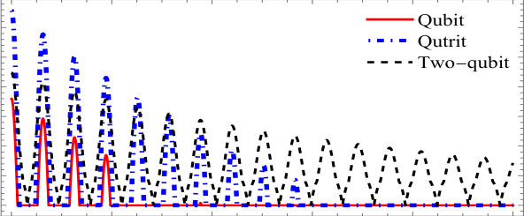 
Figure 3.4.2: Variation of discrete Wigner negativity for a qubit, qutrit, and two-qubit systems under non-Markovian AD noise with time. For 𝛾= 50, 𝑔= 0.01.

📷 Fig 3

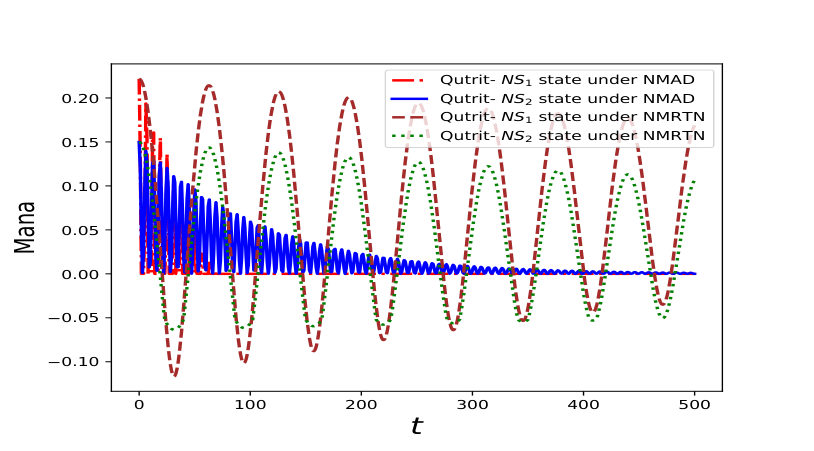 
Figure 3.4.3: Variation of mana of a qutrit’s |𝑁𝑆1⟩and |𝑁𝑆2⟩state under non-Markovian AD (𝛾= 50, 𝑔= 0.01) and non-Markovian RTN (𝛾= 0.001, 𝑏= 0.05) noise with time.

📷 Fig 4

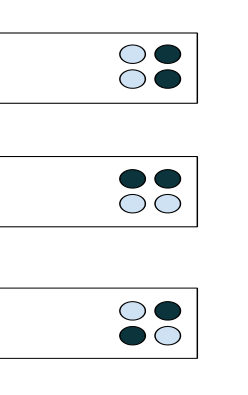 
Figure 3.5.1: Lines and striations of the 2 × 2 phase space.

📷 Fig 5

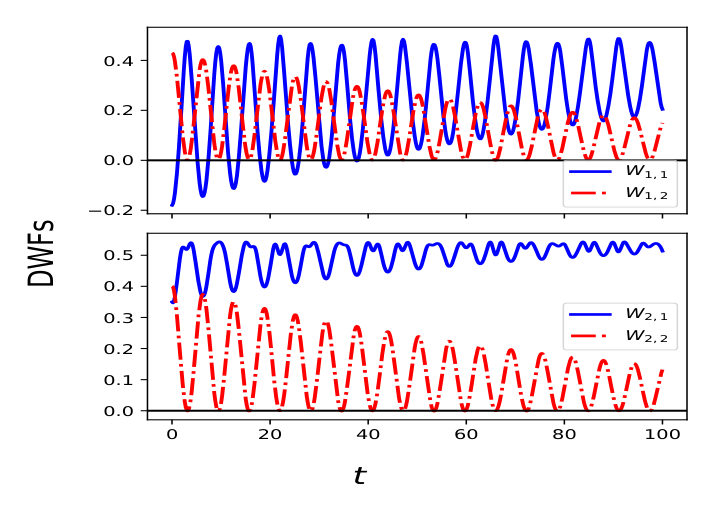 
Figure 3.5.2: Variation of DWFs corresponding to the qubit’s |𝑁𝑆1⟩state (for 𝑎1 = 0.50, 𝑎2 = 0.56, and 𝑎3 = −0.66), under non-Markovian AD noise (for 𝛾= 50, 𝑔= 0.01) with time.

**Summary.** This paper investigates how non-classical quantum resources degrade in noisy, non-Markovian environments using the discrete Wigner function formalism. It demonstrates that specific 'negative quantum states' offer superior protection compared to standard Bell states. The research combines theoretical analysis with experimental implementation on superconducting qubits, advancing the practical use of quantum resources in realistic noisy settings.

**Why it may be interesting.** This work is highly relevant as it bridges quantum information theory (resource quantification) with open quantum systems dynamics (non-Markovianity), providing concrete, hardware-validated methods for preserving quantum resources.

Detailed structure

**Main problem.** The research aims to characterize, identify, and protect non-classical quantum resources in finite-dimensional quantum systems when subjected to realistic noise and non-Markovian environmental effects.

**Main result.** Negative quantum states are shown to be more resilient than traditional Bell states against non-Markovian noise, and weak measurement/quantum measurement reversal techniques can enhance quantum correlations and teleportation fidelity.

**Method.** The study employs the discrete Wigner functions (DWFs) framework to analyze state evolution under various open quantum channels, comparing results across Markovian and non-Markovian regimes.

**Model / system.** The work focuses on two-qubit quantum systems, utilizing models like the spin-boson and collision models, and is demonstrated experimentally using superconducting hardware (IBM's ibm_brisbane device).

**Key observables.** Wigner negativity, mana, coherence, teleportation fidelity, concurrence, CHSH violation, and Quantum Fisher Information.

**Important parameters / regimes.** Non-Markovian noise parameters (e.g., $\gamma$, $b$), coupling strengths, and specific state parameters ($p, q$).

**Assumptions / limitations.** The analysis assumes the applicability of the DWF framework and models the environment using specific noise channels (AD, RTN).

**Figures summary.** Figures illustrate the time evolution of Wigner negativity, concurrence, and fidelity for various states under non-Markovian noise, comparing results with and without measurement reversal techniques.

**Paper structure.** The paper systematically analyzes the evolution of non-classical resources under non-Markovian noise, proposes measurement-based protection strategies, and concludes with the experimental realization of these states on superconducting hardware.

Abstract

The central aim of the thesis is to examine how non-classical resources in finite-dimensional quantum systems can be identified, characterized, and protected for practical use in the presence of realistic noise. Using the discrete Wigner functions (DWFs) framework, we introduce negative quantum states and examine how their Wigner negativity, mana, coherence, and teleportation fidelity evolve under unital and non-unital channels, with particular attention to non-Markovian random-telegraph and amplitude-damping dynamics. We also analyze protection strategies based on weak measurement and quantum measurement reversal, showing that these methods can enhance quantum correlations, reduce fidelity deviation, and improve teleportation performance for two-qubit negative states in memory-bearing environments. Moreover, we demonstrate that certain negative states, derived from phase-space point operators, exhibit greater resilience than Bell states in measures of entanglement under non-Markovian noise. Further, this thesis focuses on developing and implementing quantum circuits for generating these states on superconducting hardware and realizing them for the first time on IBM's ibm-Brisbane device. Their preparation is verified using quantum state tomography, demonstrating high fidelity under realistic noise conditions. We propose a teleportation scheme that leverages one of the two-qubit negative quantum states as a resource. Moreover, these two-qubit negative quantum states are also found to perform better than the Bell states for maximal CHSH violation and Fisher information in noisy conditions. We believe that these negative quantum states have the potential to be used in place of the traditional Bell states in scenarios where non-Markovian errors are prevalent. (continued in the PDF)

[↑ back to top](#top)

### [Bound-state-protected phase metrology for a quantum emitter in a Su-Schrieffer-Heeger bath](http://arxiv.org/abs/2605.29724v1)

**Authors:** Sofia Evangelou  
**Type:** theory · **Category:** other · **PDF:** <https://arxiv.org/pdf/2605.29724v1>  
**Analysis basis:** full PDF text, analyzed in chunks
**Topic relevance:** `Keldysh / 2PI / non-Gaussian methods` **3/5** · `analog quantum simulation` **3/5** · `methods for driven-dissipative` **3/5** · `correlated / nonlocal dissipation` **2/5** · `driven-dissipative phase transition` **2/5** · `entanglement & information structure` **2/5** · `non-equilibrium dynamics` **2/5** · `Kondo & dissipative impurity` **1/5** · `correlated cavity matter` **1/5** · `non-equilibrium universality` **1/5**

📷 Fig 1

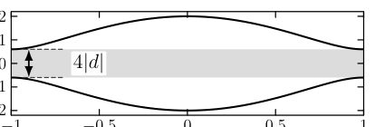 
FIG. 1. Model overview. (a) Single quantum emitter locally coupled with strength g to a photonic structure that leads to a sublattice of a dimerized bosonic SSH chain with intracell and intercell hoppings J1 = J(1 + d) and J2 = J(1 −d). (b) SSH dispersion for a representative dimerization, shown together with the central band gap 4J|d|.

📷 Fig 2

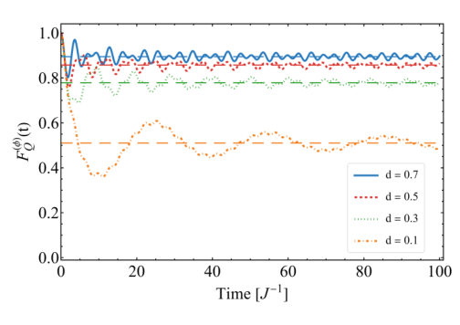 
FIG. 2. Time-dependent phase-QFI F (ϕ) Q (t) at ∆= 0 and g = 0.4J for four representative values of the dimerization parameter, d = 0.7, 0.5, 0.3, and 0.1. The horizontal lines in- dicate the analytic central in-gap bound-state prediction de- rived below [see Eq. (23)]. Numerical results are obtained for a finite SSH chain with 2L + 1 unit cells, L = 500, using a Krylov subspace of dimension 350.

📷 Fig 3

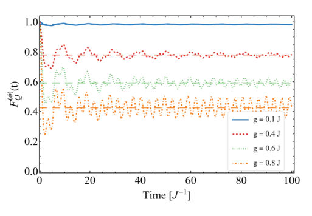 
FIG. 4. Time-dependent phase-QFI F (ϕ) Q (t) at zero detuning, ∆= 0, and fixed dimerization d = 0.3 for four representative emitter-bath coupling strengths, g/J = 0.1, 0.4, 0.6, and 0.8. The horizontal lines indicate the corresponding central in-gap bound-state predictions from Eq. (23). Numerical results are obtained for a finite SSH chain with 2L+1 unit cells, L = 500, using a Krylov subspace of dimension 350.

📷 Fig 4

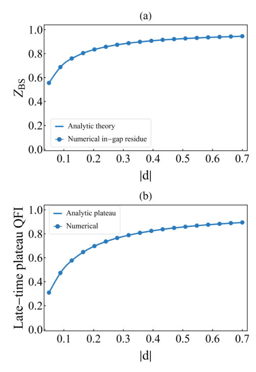 
FIG. 3. Comparison between numerical and analytic bound- state diagnostics at ∆= 0 and g = 0.4J. (a) Emitter bound- state residue ZBS extracted from the in-gap eigenstate of a finite SSH chain, together with the analytic expression in Eq. (25). (b) Retained phase-QFI obtained from the cen- tral in-gap bound-state relation F (ϕ) Q = Z2 BS, together with the analytic result in Eq. (23). Numerical diagonalizations use a finite chain with 2L + 1 unit cells and L = 220.

📷 Fig 5

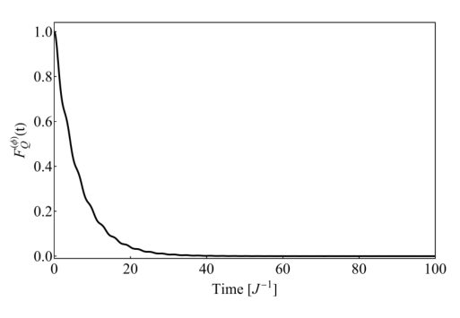 
FIG. 5. Time-dependent phase-QFI F (ϕ) Q (t) in the uniform- chain limit d = 0 at ∆= 0 and g = 0.4J. Numerical results are obtained for a finite SSH chain with 2L + 1 unit cells, L = 500, using a Krylov-space propagation of dimension 350.

**Summary.** This paper analyzes phase metrology for a quantum emitter coupled to a dimerized SSH lattice bath. It shows that the ability to retain phase information is protected by a spectral gap, which supports an in-gap bound state. The metrological signal strength is quantified by the QFI, which tracks the spectral gap physics, providing a robust diagnostic tool for engineered quantum systems.

**Why it may be interesting.** This work provides a concrete, lattice-based realization of how topological spectral features (the gap) can be harnessed to engineer robust quantum sensing protocols, linking condensed matter topology directly to quantum information metrics.

Detailed structure

**Main problem.** The study investigates how the structured environment provided by a Su-Schrieffer-Heeger (SSH) bath protects and governs the persistence of phase information (metrology) in a quantum emitter.

**Main result.** The late-time phase-Quantum Fisher Information (QFI) is directly protected by the existence of an in-gap bound state, and this protection degrades predictably as the emitter detuning moves away from the gap center or as coupling strength increases.

**Method.** The analysis employs a microscopic approach using Dyson-equation analysis to derive the local bath Green's function, allowing for the calculation of the phase-QFI in the single-excitation sector.

**Model / system.** The system consists of a single quantum emitter (two-level system) coupled locally to a bosonic bath modeled by a dimerized Su-Schrieffer-Heeger (SSH) lattice Hamiltonian.

**Key observables.** Quantum Fisher Information (QFI), the emitter bound-state residue ($Z_{BS}$), and the late-time averaged phase-QFI ($\overline{F(\phi)}_{Q}$).

**Important parameters / regimes.** Dimerization parameter ($d$), emitter detuning ($\Delta$), and coupling strength ($g$).

**Assumptions / limitations.** The analysis is restricted to the bulk, local-coupling geometry, meaning it probes spectral-gap physics rather than the SSH winding sector.

**Figures summary.** Figures illustrate the SSH dispersion relation showing the central gap, and plot the QFI vs. dimerization strength, coupling strength, and detuning, demonstrating the gap-protected nature of the signal.

**Paper structure.** The paper builds from defining the SSH model and the metrological observable (QFI) to deriving the bound-state condition via Dyson equations. It then systematically analyzes the QFI dependence on dimerization, coupling strength, and detuning, culminating in a detailed characterization of the gap-edge crossover.

Abstract

We study local phase estimation for a single quantum emitter coupled to a bosonic Su-Schrieffer-Heeger (SSH) bath within a microscopic lattice model. Dimerization opens a central gap supporting an in-gap emitter-bath bound state, which suppresses complete relaxation of the emitter coherence. A Dyson-equation analysis yields the local bath Green's function, the in-gap bound-state condition, and the emitter residue controlling the retained phase information. The phase quantum Fisher information links gap formation, detuning, and emitter-bath coupling to the post-transient metrological response. At resonance, stronger coupling enhances transient hybridization but reduces the retained signal by lowering the emitter weight in the bound state. Away from resonance, late-time averages, retention times, and useful interrogation windows track how phase-information protection weakens as the emitter is tuned toward and beyond the band edge. A uniform-chain control shows that the retained signal disappears when the gap closes. In the bulk local-coupling geometry considered here, the response is insensitive to the sign of the dimerization, so the protocol probes spectral-gap physics and bound-state support rather than the SSH winding sector.

[↑ back to top](#top)

### [Quantum Crossovers Revealed by Local Measurements](http://arxiv.org/abs/2605.29019v1)

**Authors:** A. C. S. Costa, E. C. Diniz, O. P. de Sa Neto  
**Type:** theory · **Category:** quantum information and computing · **PDF:** <https://arxiv.org/pdf/2605.29019v1>  
**Analysis basis:** full PDF text, analyzed in chunks
**Topic relevance:** `driven-dissipative phase transition` **3/5** · `methods for driven-dissipative` **3/5** · `quantum measurements` **3/5** · `correlated / nonlocal dissipation` **2/5** · `entanglement & information structure` **2/5** · `non-equilibrium dynamics` **2/5** · `non-equilibrium universality` **2/5** · `Keldysh / 2PI / non-Gaussian methods` **1/5** · `analog quantum simulation` **1/5** · `measurement-induced transitions` **1/5**

📷 Fig 1

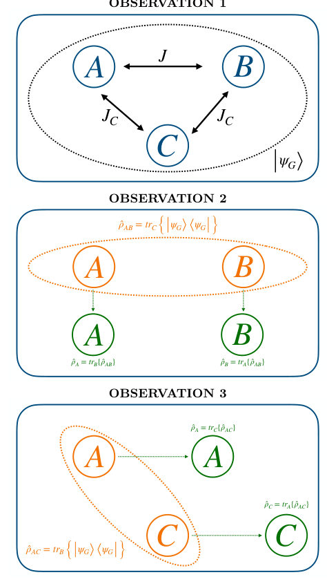 
FIG. 1. Schematic representation of the tripartite system composed of three qubits A, B, and C. Qubits A and B are identical and interact via a symmetric signal coupling of strength J. Both qubits are independently coupled to the third qubit C through probe couplings of strength JC. The figure illustrates the different observation schemes considered in this work: (i) the full tripartite system, (ii) the bipartition AB obtained by tracing out qubit C, and (iii) the biparti- tions AC and BC, obtained by tracing out one of the iden- tical qubits. These configurations allow the analysis of local measurements, bipartite correlations, and symmetry-induced effects within a unified framework.

📷 Fig 2

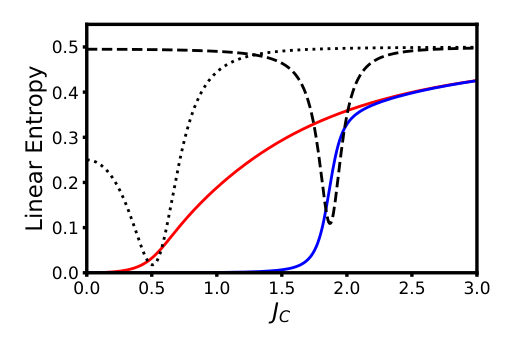 
FIG. 3. Linear Entropy vs JC, with fixed parameters ωC = 5.0 and ω0 = 0.1 for all curves. The continuous curves represent EC|AB for parameters J = 0.1 (red curve), and J = 1 (blue curve). The non-continuous curves represent EB|AC for the parameters J = 0.1 (dotted curve), and J = 1 (dashed curve).

📷 Fig 3

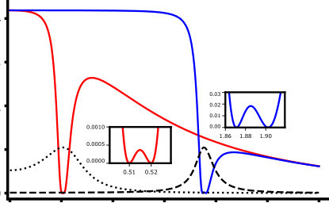 
FIG. 2. (a) Quantum obesity and (b) Volume of the quantum steering ellipsoid as a function of JC. The continuous curves represent ΩAB for parameters J = 0.1 (red curve), and J = 1 (blue curve). The non-continuous curves represent ΩAC for the parameters J = 0.1 (dotted curve), and J = 1 (dashed curve).

📷 Fig 4

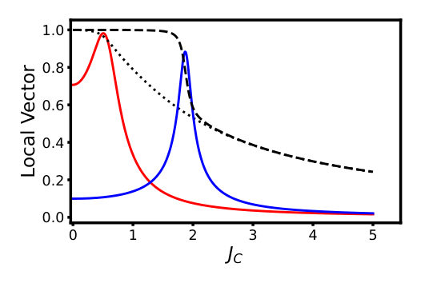 
FIG. 4. Local vector vs JC: The continuous curves repre- sent the magnitude of the local vectors ⃗yA(B) for parameters J = 0.1 (red curve), and J = 1.0 (blue curve). The non- continuous curves represent |⃗yC| for the parameters J = 0.1 (dotted curve), and J = 1 (dashed curve).

📷 Fig 5

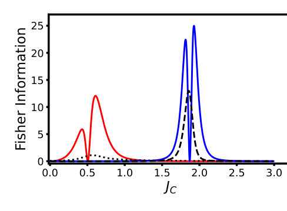 
FIG. 5. Fisher information vs JC, with fixed parameters ωC = 5.0 and ω0 = 0.1 for all curves. The continuous curves represent FA(B) for parameters J = 0.1 (red curve), and J = 1 (blue curve). The non-continuous curves represent FC for the parameters J = 0.1 (dotted curve), and J = 1 (dashed curve).

**Summary.** This paper develops a method to identify quantum crossover points in open quantum systems using only local measurements, rather than relying on global properties. By comparing local diagnostics like Quantum Fisher Information against global measures like the QSE volume, the authors prove that local structure is a more fundamental indicator of crossover. This offers a powerful, experimentally accessible tool for characterizing quantum phase transitions.

**Why it may be interesting.** This work is highly relevant as it provides a rigorous, local diagnostic tool (QFI) to pinpoint critical quantum behavior in open systems, which is crucial for designing quantum sensors and understanding decoherence effects.

Detailed structure

**Main problem.** The paper addresses the challenge of robustly characterizing quantum crossover phenomena in open quantum systems, moving beyond reliance on global or model-dependent indicators.

**Main result.** It establishes that quantum crossovers can be robustly characterized using purely local measurements, specifically linking the onset of crossover to the behavior of the local Quantum Fisher Information (QFI) and the local Bloch vector.

**Method.** The authors employ theoretical analysis using a tripartite model, comparing local measurement diagnostics (QFI, local Bloch vectors) against global indicators (Quantum Steering Ellipsoid volume, Quantum Obesity).

**Model / system.** The study uses a minimal tripartite model of three qubits (A, B, C) governed by a Hamiltonian and subjected to dissipative dynamics described by a Microscopic Master Equation (MME). The system is analyzed at zero temperature.

**Key observables.** Quantum Fisher Information (QFI), local Bloch vectors, Quantum Steering Ellipsoid (QSE) volume, and Quantum Obesity (QO).

**Important parameters / regimes.** Tunable couplings ($J, J_C$), system frequencies ($\omega_0, \omega_C$), and the control parameter driving the crossover.

**Assumptions / limitations.** The analysis is performed on the global ground state $|\psi_G
angle$ and assumes the system dynamics are well-described by the MME.

**Figures summary.** Figures schematically illustrate the tripartite system and various observation schemes (full system, bipartitions). Other figures compare the behavior of QO and QSE volume against local measurement indicators as a coupling parameter is varied.

**Paper structure.** The paper introduces the physical model and the problem of crossover identification. It then develops and compares multiple diagnostic tools—local QFI vs. global QSE volume—to demonstrate the geometric distinction between these indicators.

Abstract

Quantum crossover phenomena play a central role in few-body open quantum systems, yet their identification often relies on global or model-dependent indicators. In this work, we demonstrate that crossovers can be robustly characterized through purely local measurements, establishing a direct connection between local quantum Fisher information and the onset of crossover behavior. We further demonstrate that quantum obesity does not, in general, generalize the quantum steering ellipsoid volume as a universal indicator of crossover. Instead, we identify regimes in which the ellipsoid volume remains insensitive to the transition, while the relevant signatures are encoded in the behavior of the local Bloch vector. These results reveal a geometric distinction between local and global indicators of crossovers.

[↑ back to top](#top)

### [A Quantum Algorithm for Simulating Nonunitary Dynamics Governed by Nonautonomous Linear Ordinary Differential Equations](http://arxiv.org/abs/2605.29052v1)

**Authors:** Pouya Khazaei, Eitan Geva  
**Type:** theory · **Category:** quantum information and computing · **PDF:** <https://arxiv.org/pdf/2605.29052v1>  
**Analysis basis:** full PDF text, analyzed in chunks
**Topic relevance:** `correlated / nonlocal dissipation` **3/5** · `driven-dissipative phase transition` **3/5** · `methods for driven-dissipative` **3/5** · `non-equilibrium dynamics` **3/5** · `Keldysh / 2PI / non-Gaussian methods` **2/5** · `analog quantum simulation` **2/5** · `non-equilibrium universality` **2/5** · `entanglement & information structure` **1/5**

📷 Fig 1

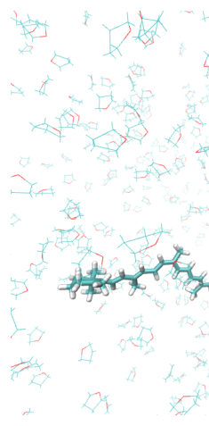 
FIG. 2. A snapshot of the CPC60 molecular triad, in the bent conformation, solvated in liquid THF.

📷 Fig 2

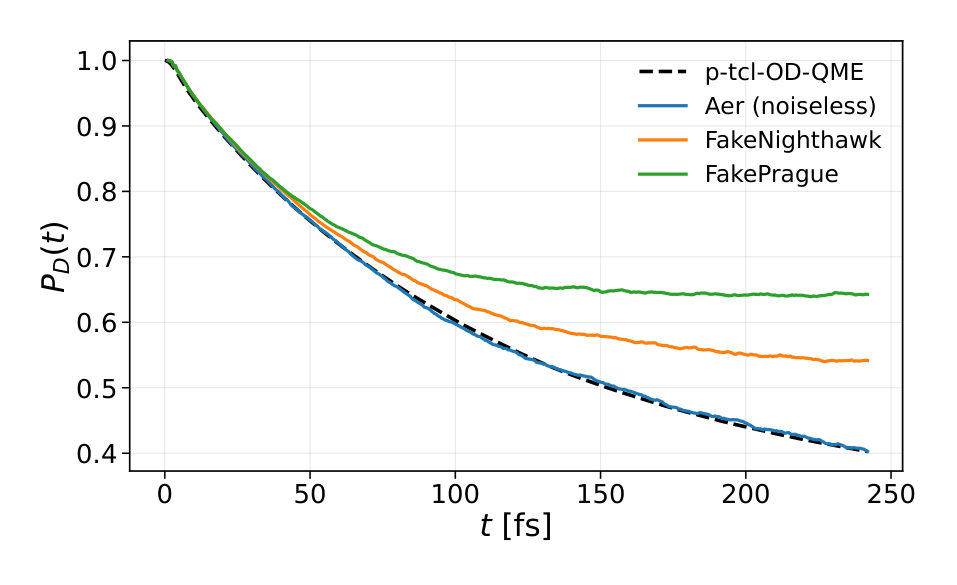 
FIG. 3. Comparison of PD(t) as obtained by integrating Eq. 51 on a classical computer via the second-order

**Summary.** This paper introduces a quantum algorithm, q-SVD-EOM, designed to simulate nonunitary quantum dynamics governed by time-dependent ODEs. It achieves this by decomposing the evolution operator via Singular Value Decomposition and evolving the resulting unitary and diagonal factors directly on quantum hardware. The method successfully demonstrates its applicability to molecular charge transfer dynamics, offering a promising route for simulating open quantum systems on near-term quantum computers.

**Why it may be interesting.** This work provides a concrete, quantum-native pathway to simulate open quantum system dynamics, which are notoriously difficult for quantum hardware designed for unitary evolution, making it highly relevant for quantum simulation in AMO physics.

Detailed structure

**Main problem.** The paper addresses the challenge of simulating nonunitary dynamics governed by nonautonomous linear ODEs ($\dot{v}(t) = A(t)v(t)$) on quantum hardware.

**Main result.** A novel quantum algorithm, q-SVD-EOM, was proposed that simulates the evolution by directly propagating the Singular Value Decomposition (SVD) factors ($U, V, \Sigma_{\pm}$) on the quantum computer, bypassing the need for classical calculation of the nonunitary propagator.

**Method.** The method decomposes the nonunitary propagator using SVD ($\Phi(t) = U(t)\Sigma(t)V^\dagger(t)$) and then evolves the factors $U, V, \Sigma_{\pm}$ by casting their dynamics into coupled ODEs solvable via quantum gates (e.g., using Cayley transforms).

**Model / system.** The algorithm is demonstrated using a model for photoinduced charge transfer dynamics in a solvated molecular triad, governed by a time-dependent rate matrix derived from a quantum master equation.

**Key observables.** The donor population $\hat{
ho}(t)$ and the time evolution of the SVD factors ($U(t), V(t), \Sigma_{\pm}(t)$).

**Important parameters / regimes.** Time-dependent rate coefficients ($k_{D	o A}(t), k_{A	o D}(t)$) and the simulation time scale (e.g., $	ilde{t}=50 	ext{ au}$).

**Assumptions / limitations.** The algorithm assumes the ability to integrate the derived ODEs for the SVD factors directly on quantum hardware, and its performance is tested against ideal and noisy quantum backends.

**Figures summary.** Figure 3 compares the time evolution of the donor population $PD(t)$ obtained via classical Runge-Kutta (RK2), ideal quantum simulation, and noisy quantum simulations on two different hardware backends.

**Paper structure.** The paper introduces the problem of nonunitary dynamics, details the limitations of existing methods, proposes the q-SVD-EOM algorithm by deriving the factor evolution equations, and validates the method using a charge transfer model simulation.

Abstract

Nonautonomous linear ordinary differential equations of the form $\dot{v}(t) = A(t)\, v(t)$, where $A(t)$ is non-skew-symmetric, are often used to describe nonunitary dynamics in a variety of fields that range from open quantum system dynamics to economic modeling. Because quantum computing hardware is designed to natively implement unitary transformations, existing algorithms for solving such equations on quantum hardware are based on the assumption that the nonunitary propagator is known, and use dilation techniques to embed the nonunitary dynamics within the unitary dynamics of a larger system. However, with the exception of cases where the nonunitary propagator is known in closed form, it needs to be calculated and manipulated on a classical computer at each time step. In this paper, we propose a quantum algorithm that does not require a priori knowledge of the explicit nonunitary propagator and effectively performs the dilation on the quantum hardware. Our algorithm combines a dilation scheme that uses singular value decomposition (SVD) to write the nonunitary propagator as a sum of unitaries with simulating the dynamics of the SVD factors on the quantum hardware. The population-only time-convolutionless quantum master equation describing photoinduced charge transfer in a solvated molecular triad is used as a demonstrative example of the applicability of the algorithm and its sensitivity to noise.

[↑ back to top](#top)

### [Universal thermokinetic decomposition of short-time information fluctuations](http://arxiv.org/abs/2605.29957v1)

**Authors:** Giorgio Nicoletti, Daniel M. Busiello  
**Type:** theory · **Category:** statistical mechanics · **PDF:** <https://arxiv.org/pdf/2605.29957v1>  
**Analysis basis:** full PDF text, analyzed in chunks
**Topic relevance:** `driven-dissipative phase transition` **3/5** · `entanglement & information structure` **3/5** · `non-equilibrium dynamics` **3/5** · `non-equilibrium universality` **3/5** · `Keldysh / 2PI / non-Gaussian methods` **2/5** · `correlated / nonlocal dissipation` **2/5** · `methods for driven-dissipative` **2/5** · `analog quantum simulation` **1/5**

📷 Fig 1

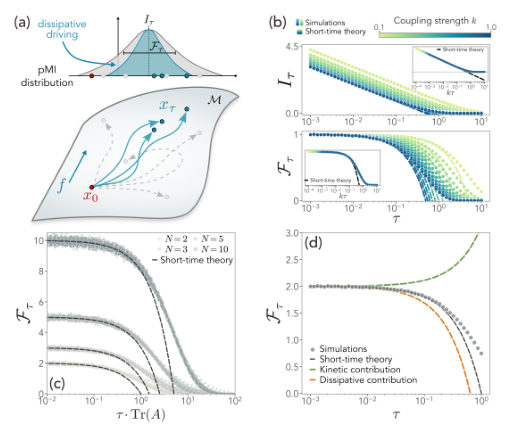 
FIG. 1. (a) The state of a stochastic process described by Eq. (1) evolves from x0 to xτ, fluctuating in time and gener- ating a set of stochastic trajectories in a manifold M. These fluctuations shape the information shared between present and future states, which is captured by the distribution of the pointwise mutual information (pMI) between x0 and xτ, iτ. While a dissipative driving f does not impact the aver- age pMI, Iτ, higher dissipation is in general able to reduce the short-time fluctuations of information, Fτ, quantified by the variance of the pMI. (b) For a one-dimensional Ornstein- Uhlenbeck (OU) process with F(x) = −kx, Iτ diverges loga- rithmically as τ →0, while Fτ...

📷 Fig 2

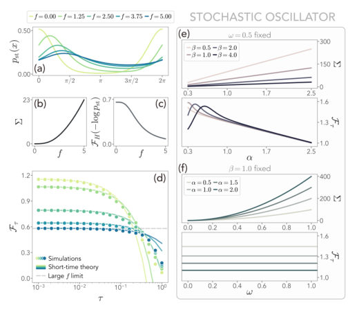 
FIG. 2. (a-c) Steady-state distribution pst of a particle in a one-dimensional periodic potential with a nonequilibrium driving f. The entropy production Σ increases with f, while the varentropy FH(−log pst) decreases as the distribution be- comes more uniform. (d) Information fluctuations Fτ are sup- pressed by the nonequilibrium driving, up to the theoretical minimum (gray dashed line). Our short-time theory (solid lines) is well-matched by numerical simulations (circles) even for relatively large values of τ. In these panels, k = 2 and D = 1. (e-f) In a stochastic oscillator, entropy production quantifies long-term precision as it is related to the number of coherent oscillations, and is...

**Summary.** This work develops a universal decomposition showing that information fluctuations in stochastic systems are governed by a balance between energy dissipation and dynamical activity. While the average predictability is robust, the variance of this predictability is fundamentally controlled by thermodynamic quantities like entropy production. This offers a new thermodynamic lens to analyze information reliability in complex, non-equilibrium physical and biological processes.

**Why it may be interesting.** The finding that thermodynamic constraints govern information *fluctuations* but not the average information transfer provides a novel, fundamental thermodynamic basis for understanding precision limits in non-equilibrium systems, relevant to open quantum systems modeling.

Detailed structure

**Main problem.** To understand how energy dissipation and dynamical activity influence the reliability of information acquisition in physical systems by characterizing the fluctuations of short-time information predictability.

**Main result.** Information fluctuations exhibit a universal thermokinetic decomposition, showing that thermodynamics controls the *fluctuations* of predictability, while the average predictability is independent of underlying thermodynamic details.

**Method.** The analysis focuses on the short-time behavior of the pointwise mutual information (pMI) using the Moment Generating Function (MGF) derived from the Langevin dynamics.

**Model / system.** The study applies to arbitrary Langevin dynamics for a system with N degrees of freedom, exemplified by Ornstein-Uhlenbeck processes, Brownian motors, and stochastic oscillators near a Hopf bifurcation.

**Key observables.** Pointwise Mutual Information (pMI), Information Fluctuations ($F_	au$), Average Predictability ($I_	au$), Entropy Production Rate ($\Sigma$), and Stochastic Action ($T$).

**Important parameters / regimes.** Short time ($	au$), dimensionality ($N$), and the strength of dissipation/driving forces.

**Assumptions / limitations.** The derivation relies on the assumption of stationarity for the process, though extensions to non-stationary and multiplicative noise are mentioned.

**Figures summary.** Figures illustrate the relationship between information fluctuations ($F_	au$) and thermodynamic quantities ($\Sigma, T$), showing how dissipation suppresses fluctuations while dynamical activity influences them.

**Paper structure.** The paper establishes the theoretical framework by defining pMI and analyzing its short-time MGF. It then derives the universal decomposition for $F_	au$, contrasting it with the insensitivity of $I_	au$ to thermodynamic details, and applies this to various physical models.

Abstract

Biological, artificial, and physical systems dissipate energy to accurately transmit information. While tools of information theory have been used to characterize information-processing capabilities, how reliably this information is acquired along individual trajectories, and which aspects require a thermodynamic cost, is an open question. In this work, we focus on the stochastic predictability of an arbitrary Langevin dynamics, defined as the pointwise mutual information between the current and future states of a system. We show that the fluctuations of predictability obey a universal thermokinetic decomposition at short times, which reveals that information fluctuations are suppressed by energy dissipation and become stronger with increased dynamical activity. Remarkably, we find that the average predictability, i.e., the short-time mutual information, does not carry any dependence on the underlying thermodynamic and kinetic features. Thus, the role of dissipation at short times is not to enhance information, but to reduce its fluctuations. Such dissipative control is effective only when instantiated by nonlinear operations. Moreover, energy consumption governs short- and long-time precision in stochastic oscillators through structurally different mechanisms that can be independently tuned. Our decomposition offers a fundamental thermodynamic basis for understanding the reliability of information transmission in nonequilibrium systems, the constraints on precision in biological systems, and the design of energy-limited control strategies.

[↑ back to top](#top)

### [Enhanced Density Fluctuations Near a Disordered Chiral Topological Transition](http://arxiv.org/abs/2605.29871v1)

**Authors:** Hai-Tao Ding, Sen Mu, Leong-Chuan Kwek, Gabriel Lemarié, Jiangbin Gong  
**Type:** theory · **Category:** disordered systems and neural networks · **PDF:** <https://arxiv.org/pdf/2605.29871v1>  
**Analysis basis:** full PDF text, analyzed in chunks
**Topic relevance:** `analog quantum simulation` **3/5** · `driven-dissipative phase transition` **3/5** · `methods for driven-dissipative` **3/5** · `non-equilibrium dynamics` **3/5** · `non-equilibrium universality` **3/5** · `Frenkel-Kontorova` **1/5** · `Keldysh / 2PI / non-Gaussian methods` **1/5** · `entanglement & information structure` **1/5**

📷 Fig 1

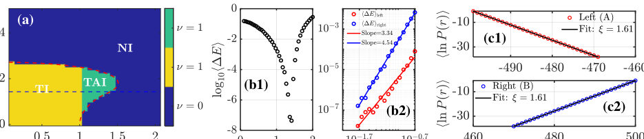 
FIG. 1. (a) The phase diagram in the (t1, W) plane. Both TI and TAI regions are characterized by winding number v = 1, while the NI region has v = 0. The TAI phase is distinguished from the TI phase in that it is disorder-induced from a regime that is trivial in the clean limit. Analytically derived phase boundary from zero-energy transfer-matrix recursion is shown with the red dashed line, see [49, 61] and Appendix A for more details. (b1-b2) Disorder-averaged energy gap log10⟨∆E⟩as a function of t1, with W = 1.43. (b1) t1 ∈(0.1, 2), the gap closing at the transition point tc 1 = 1.40; (b2) Scaling of the disorder averaged energy gap ⟨∆E⟩versus |t1 −tc 1| on a double-logarithmic scale. The...

📷 Fig 2

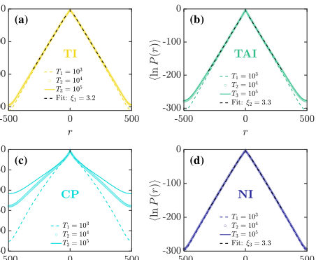 
FIG. 2. Disorder-averaged logarithm of the wave density ⟨ln P(r)⟩at three evolution times, T1 = 103, T2 = 104, T3 = 105, for four representative values of t1. (a) t1 = 0.29 (TI), the profiles at different times nearly collapse and are well fitted by an exponential decay, with the localization length ξ = 3.2. (b) t1 = 1.12 (TAI), the profiles also approach a common exponential form at long times, with the localiza- tion length ξ = 3.3. (c) The disorder-averaged logarithm of the wave density for t1 = tc 1 = 1.40 at the critical point (CP). the profile exhibits pronounced time dependence and deviates markedly from a simple exponential form, due to the subexpo- nential decay of the typical...

📷 Fig 3

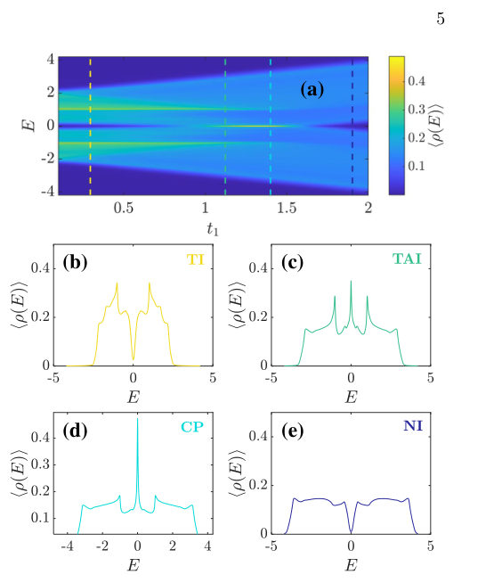 
FIG. 4. Disorder-averaged density of states ⟨ρ(E)⟩across the chiral topological transition. (a) ⟨ρ(E)⟩as a function of the mean intracell hopping strength t1 and energy E. The four vertical dashed lines mark four representative values of t1 used in panels (b)–(e). (b)–(e) Energy dependence of ⟨ρ(E)⟩for t1 = 0.29 (TI), t1 = 1.12 (TAI), t1 = 1.40 (CP), and t1 = 1.90 (NI), respectively. At t1 = 1.12, the system is still gapped, and the central peak corresponds to near-zero-energy states rather than states exactly at E = 0. At the critical point t1 = 1.40, the gap closes and the sharp peak occurs at E = 0. In the near-critical TAI regime, spectral weight appears both near zero energy and...

📷 Fig 4

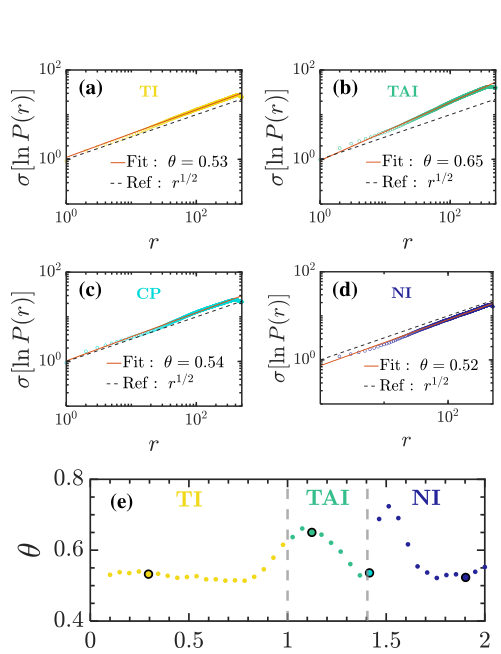 
FIG. 3. The fluctuation of the logarithm of the wave density ln P(r) with distance r. The blue circles represent the numer- ical data, the solid red line shows a power-law fit, the black dashed line indicates the scaling y = r1/2 for reference. (a) t1 = 0.29 (TI), the growth exponent is 0.53. (b) t1 = 1.12 (TAI), the growth exponent is 0.65. (c) t1 = 1.40 (CP), the growth exponent is 0.54. (d) t1 = 1.90 (NI), the growth ex- ponent is 0.52. (e) Fitted growth exponent θ as function of the mean intracell hopping strength t1. The four black open circles in panel (e) mark the four representative values of t1 used in panels (a)–(d). The two dashed vertical lines separate the TI, TAI, and NI...

📷 Fig 5

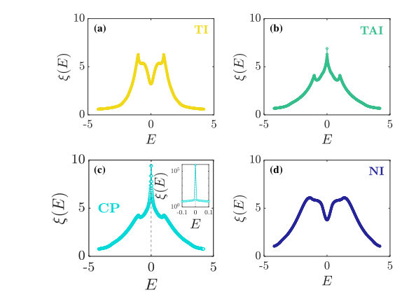 
FIG. 5. The energy-resolved localization length ξ(E) for four representative values of t1. (a) t1 = 0.29 (TI). (b) t1 = 1.12 (TAI). (c) t1 = 1.40 (CP). (d) t1 = 1.90 (NI). The localization length is obtained from the inverse magnitude of the disorder- averaged Lyapunov exponent. In the TI and NI regimes, ξ(E) remains finite over the relevant energy range, indicating that the long-distance wave-packet tail is governed by a stable effective decay scale. In the near-critical TAI regime, sev- eral energy sectors have comparable but distinct localization lengths, so the tail is not selected by a single decay chan- nel; this competition accounts for the enhanced fluctuation of ln P(r). At the...

**Summary.** This work examines how disorder-induced topological phase transitions affect quantum transport by analyzing the fluctuations in the wave-packet density. The key finding is that these fluctuations are anomalously enhanced near the transition point due to multiple energy scales contributing, establishing wave-packet statistics as a powerful diagnostic tool for such transitions.

**Why it may be interesting.** The finding that wave-packet fluctuation statistics serve as a dynamical diagnostic for topological transitions is highly relevant for understanding transport in disordered quantum materials, connecting localization theory to topological invariants.

Detailed structure

**Main problem.** The study investigates how a disorder-driven topological phase transition affects the spatial fluctuations of the logarithmic wave-packet density, $\ln P(r)$, in localized quantum states.

**Main result.** The fluctuation growth exponent ($	heta$) is enhanced above the conventional 1D value ($	heta \simeq 1/2$) near the transition due to multiple energy sectors contributing, but returns to $\simeq 1/2$ at the critical point.

**Method.** The analysis uses wave-packet propagation simulations and theoretical characterization via the zero-energy transfer-matrix recursion to diagnose the transition.

**Model / system.** The model is a Su-Schrieffer-Heeger (SSH) chain subjected to off-diagonal disorder, which preserves chiral symmetry. The system is analyzed across topological (TI/TAI) and trivial insulating phases.

**Key observables.** Standard deviation of the logarithmic wave-packet density, $\sigma[\ln P(r)]$, and the associated scaling exponent $	heta$.

**Important parameters / regimes.** Disorder strength ($W$), hopping ratios ($t_1, t_2$), and the energy $E$ relative to zero energy.

**Assumptions / limitations.** The analysis relies on the thermodynamic limit ($N 	o \infty$) and the applicability of power-law fitting for scaling exponents.

**Figures summary.** Figures illustrate the phase diagram (TI, TAI, NI) based on winding numbers, the energy-resolved density of states, and plots showing the fluctuation exponent $	heta$ vs. disorder strength, highlighting non-monotonic behavior.

**Paper structure.** The paper first establishes the physical model and diagnostic tools (e.g., $\sigma[\ln P(r)]$). It then analyzes the system away from the transition, showing conventional scaling. The core of the work focuses on the non-monotonic enhancement of $	heta$ near the transition, followed by a discussion of the underlying multi-scale spectral weight contributions.

Abstract

The universal statistics of density fluctuations of localized quantum states may offer unprecedented opportunities to probe and understand quantum transport in connection with dimensionality, coherence, symmetry and disorder. To date, the possible role of topological phase transitions in the fluctuation statistics is not studied yet. Using a Su-Schrieffer-Heeger chain subject to off-diagonal disorder (so that chiral symmetry is preserved), this work investigates how a disorder driven topological phase transition impacts on the spatial fluctuations of the logarithmic wave-packet density $\ln P(r)$ at distance $r$ from the initial excitation. Away from the transition, in both topological and trivial localized phases, the standard deviation follows the conventional one-dimensional scaling $σ[\ln P(r)]\sim r^θ$ with $θ\simeq 1/2$. Near the transition, however, the fluctuation growth is enhanced: the fitted exponent $θ$ increases above $1/2$ in a nonmonotonic manner before returning close to $1/2$ at criticality. We interpret this behavior from the energy-resolved density of states and localization length. Near the transition, several energy sectors carry appreciable spectral weight and exhibit competitive decay rates, preventing a single localization scale from dominating the accessible wave-packet tail and thereby enhancing the fluctuations of $\ln P(r)$. Our results establish wave-packet fluctuation statistics as a dynamical diagnostic of disordered chiral topological transitions and motivate broader studies of fluctuation phenomena in disordered topological quantum systems.

[↑ back to top](#top)

### [Tripartite Interactions Induced Strongly Correlated Quantum Emissions](http://arxiv.org/abs/2605.29694v1)

**Authors:** Qian Bin, Ying Wu, Franco Nori, Xin-You Lü  
**Type:** theory · **Category:** other · **PDF:** <https://arxiv.org/pdf/2605.29694v1>  
**Analysis basis:** full PDF text, analyzed in chunks
**Topic relevance:** `Tavis-Cummings & cavity-many-emitter` **3/5** · `correlated / nonlocal dissipation` **3/5** · `correlated cavity matter` **3/5** · `driven-dissipative phase transition` **2/5** · `methods for driven-dissipative` **2/5** · `Dicke superradiance` **1/5** · `Keldysh / 2PI / non-Gaussian methods` **1/5** · `analog quantum simulation` **1/5** · `non-equilibrium dynamics` **1/5** · `superradiant laser` **1/5**

📷 Fig 1

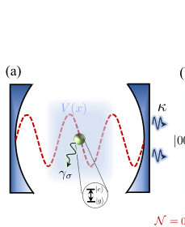 
FIG. 1. (a) Schematic of the system: a coherently driven two- level atom is trapped in a harmonic potential V (x) at a node of the cavity field. The cavity photon mode (a), the atom (σ), and the mechanical center-of-mass phonon mode (b) are simultaneously coupled. (b,c) State transitions within the (c) even-parity and (d) odd-parity subspaces of the two-boson- mode subsystem, where N = 0, 1, 2 . . . denotes the bosonic exaction number.

📷 Fig 2

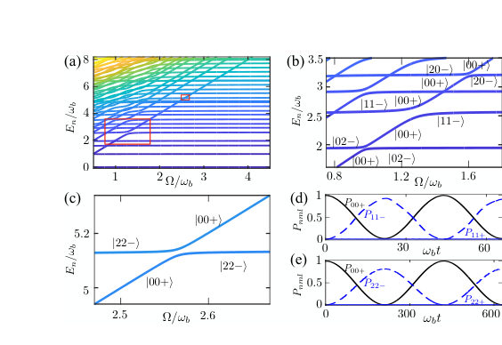 
FIG. 2. Energy spectrum of the Hamiltonian H as a func- tion of Ω/ωb. (b,c) Enlarged views of the red-boxed re- gions in (a). (d,e) Time evolution of the state populations Pnml = |⟨nml|ψ(t)⟩|2 (l = ± and n, m = 0, 1, 2) at multi- quanta resonances in the absence of dissipation. System pa- rameters: ∆a/ωb = 1.6, λ/ωb = 0.15, (d) Ω/ωb = 1.3, and (e) Ω/ωb = 2.6.

📷 Fig 3

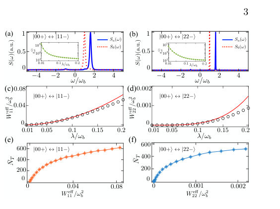 
FIG. 3. (a,b) Photon and phonon emission spectra Sa,b when λ/ωb = 0.15. Insets: equal-time second-order cross correlations g(2) ab versus λ/ωb. (c,d) Effective multiquanta transition rates W eff 11,22/ω2 b versus λ/ωb, obtained from full- numerical simulations (black circles) and analytical solutions (red curves). (e,f) Average number of multiquanta emission events ¯ NT versus W eff 11,22/ω2 b (from full-numerical simulations) over a time window T. The left and right columns corre- sponds to multiquanta resonances at Ω/ωb ≈1.3 and Ω/ωb ≈ 2.6, respectively. Other system parameters: ∆a/ωb = 1.6, (a,e)κa = κb = 10γ = 0.25ωb, (b,f)κa = κb = 10γ = 0.025ωb, (e) ωbT = 105, and (f) ωbT = 106.

📷 Fig 4

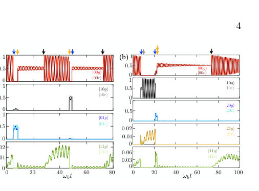 
FIG. 4. A tiny fraction of quantum trajectory in the multi- quanta emission regimes of single photons and single phonons |11−⟩→|00+⟩represented by population dynamics of differ- ent states for (a) single-photon dissipation case and (b) two- photon dissipation case. A (two) yellow (blue) arrow corre- sponding to a (two) single photon (phonon) emission, and the black arrow represents the atom decay. System parameters: ∆a/ωb = 1.6, λ/ωb = 0.15, κa = κa2 = κb = 10γ = 0.25ωb, and Ω/ωb = 1.3.

**Summary.** This paper theoretically demonstrates that direct tripartite interactions in a cavity-atom-mechanical system can efficiently generate strongly correlated multiquanta photon-phonon emissions. By analyzing the system's parity structure and engineering two-photon dissipation, the authors show a pathway to control emission, enabling both even- and odd-quanta correlated states. This has significant implications for building advanced hybrid quantum network components.

**Why it may be interesting.** This work is highly relevant to AMO physics and quantum optics as it provides a concrete theoretical framework for enhancing quantum light sources by engineering interactions (tripartite coupling) and dissipation channels (two-photon loss).

Detailed structure

**Main problem.** The paper addresses the challenge of efficiently generating strongly correlated multiquanta quantum emissions, which typically requires complex, higher-order quantum processes.

**Main result.** Direct tripartite interactions enable high-efficiency multiquanta emission by bypassing intermediate state transitions, and engineered two-photon dissipation allows for the controlled generation of odd-quanta states.

**Method.** The study uses theoretical modeling, deriving effective Hamiltonians and transition rates using perturbation theory (Fermi's Golden Rule) and analyzing system dynamics via master equations.

**Model / system.** The system is a hybrid quantum setup comprising a cavity mode, a two-level atom, and a mechanical oscillator, coupled via a direct tripartite interaction. The dynamics are governed by a Hamiltonian and analyzed using master equations.

**Key observables.** Strongly correlated even-quanta and odd-quanta emission rates, photon-phonon cross-correlations ($g^{(2)}_{ab}$), and effective multiquanta transition rates ($W_{	ext{eff}}$).

**Important parameters / regimes.** Coupling strengths ($\lambda$), detunings ($\Delta_a, \omega_b$), driving amplitudes ($\Omega$), and dissipation rates ($\kappa$).

**Assumptions / limitations.** The analysis relies on the rotating-wave approximation (RWA) and the assumption that the two-boson-mode subsystem preserves parity symmetry.

**Figures summary.** Figures illustrate system schematics, energy spectra showing avoided crossings, time evolution of state populations, and comparisons between analytically derived and numerically simulated effective transition rates.

**Paper structure.** The paper builds from establishing the tripartite interaction model, demonstrating even-quanta emission under dissipation, and then crucially extending the analysis to show how engineered two-photon dissipation enables the generation of odd-quanta emission.

Abstract

Efficient generation of multiquanta emission is crucial for quantum information processing but remains challenging due to its typical reliance on higher-order quantum processes. Here, we theoretically demonstrate strongly correlated photon-phonon emission enabled by direct tripartite interaction. This interaction facilitates the formation of high-order multiquanta states without more intermediate state transitions, thereby avoiding the suppressed transition rates associated with multiple sequential processes and substantially improving resonant transitions. As a result, high-efficiency strongly correlated even-quanta emission (e.g., two photons and two phonons) can be achieved in the presences of dissipation. Beyond that, we show that introducing two-photon dissipation enables strongly correlated odd-quanta emission (e.g., two photons and one phonon) in the tripartite interaction system by parity-protected suppression of single-photon loss and reconstruction of higher-order multiquanta processes. Our work extends multiquanta emission into the tripartite coupling regime and holds promising potential for applications in hybrid quantum networks.

[↑ back to top](#top)

### [Near surface donor-acceptor pairs in hydrogenated homoepitaxial diamond nanolayers](http://arxiv.org/abs/2605.29492v1)

**Authors:** A. M. Romshin, A. P. Bolshakov, A. A. Zhivopistsev, A. V. Gritsienko, O. S. Kudryavtsev, P. A. Pivovarov, V. G. Ralchenko, I. I. Vlasov  
**Type:** experiment · **Category:** other · **PDF:** <https://arxiv.org/pdf/2605.29492v1>  
**Analysis basis:** full PDF text, analyzed in chunks
**Topic relevance:** `analog quantum simulation` **3/5** · `quantum optics experiment` **3/5** · `Kondo & dissipative impurity` **1/5** · `QC/QI experiment` **1/5** · `Tavis-Cummings & cavity-many-emitter` **1/5** · `correlated / nonlocal dissipation` **1/5** · `correlated cavity matter` **1/5** · `driven-dissipative phase transition` **1/5** · `entanglement & information structure` **1/5** · `interference shaping light` **1/5** · `methods for driven-dissipative` **1/5** · `non-equilibrium dynamics` **1/5**

📷 Fig 1

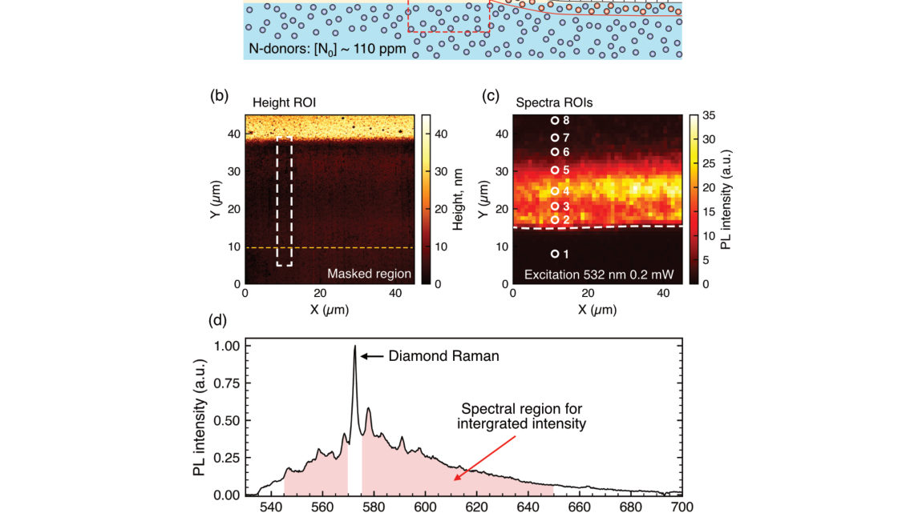 
Fig. 1. (a) Schematic illustration of the formation of donor-acceptor pairs in nanometer-thick CVD layers that have been grown on a nitrogen-rich high-pressure high-temperature diamond substrate. (b) The topography of the formed nanoscale overlayer

📷 Fig 2

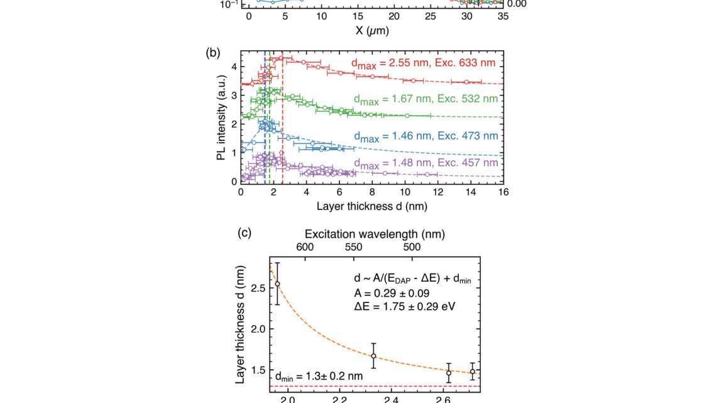 
Fig. 2. PL intensity dependence on nanolayer thickness: (a) Height profile extracted from the region Height ROI marked in Fig. 1b (black curve), together with the corresponding PL intensity profiles recorded under excitations at 633 nm (red), 532 nm (green), 473 nm (blue), and 457 nm (purple) (see Fig. S1 for maps recorded at 457, 473, 633

📷 Fig 3

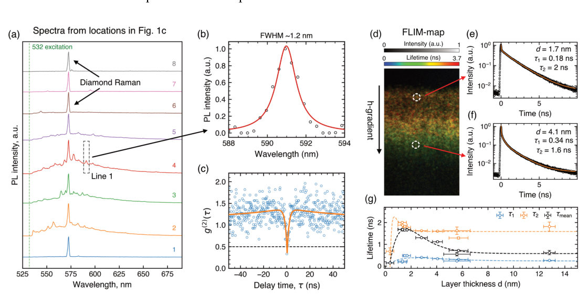 
Fig. 3. (a) PL spectra recorded at eighth positions 1-8 labeled in Fig. 1c, corresponding to different overlayer thicknesses , under 532 nm excitation (500 µW). (b) 𝑑 PL spectrum of a representative individual narrow line and (c) the corresponding

📷 Fig 4

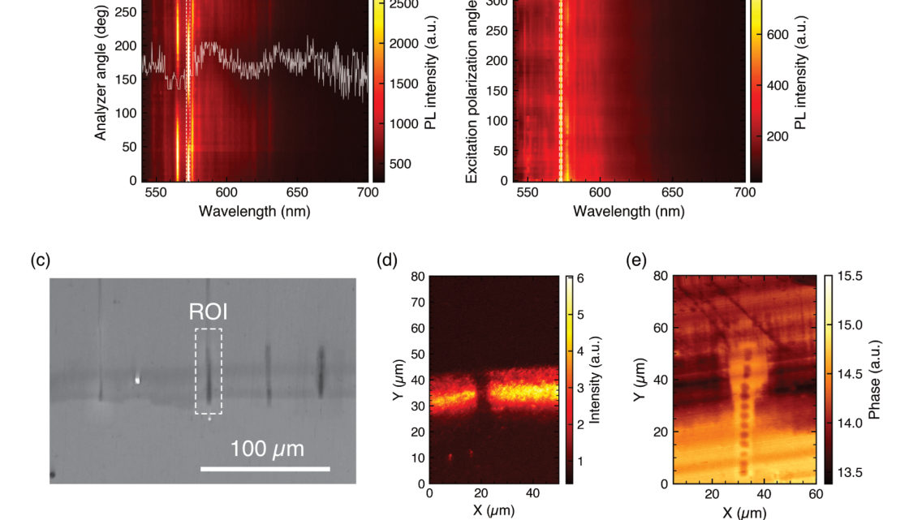 
Fig. 4. (a,b) Polarization-resolved PL spectral maps of the DAP ensemble recorded under

**Summary.** This paper demonstrates the ability to engineer and optically probe donor-acceptor pairs (DAPs) in diamond nanolayers by controlling the separation distance between the donor and acceptor sites using an intermediate CVD layer. By measuring the PL intensity and lifetime as a function of this separation, the authors confirm that DAP recombination is the source of the narrowband emission, establishing a tunable platform for quantum emitters.

**Why it may be interesting.** This work provides a highly controllable, solid-state platform for engineering quantum emitters whose optical properties (emission energy, intensity, lifetime) can be tuned by controlling the physical separation between two localized electronic states, which is a key concept in quantum optics and AMO physics.

Detailed structure

**Main problem.** The study investigates the optical properties of donor-acceptor pairs (DAPs) formed between near-surface acceptor species and substitutional nitrogen donors in hydrogenated diamond nanolayers.

**Main result.** The PL intensity and lifetime exhibit a non-monotonic dependence on the intermediate CVD layer thickness, peaking at a characteristic separation distance of approximately 1.7 nm.

**Method.** The research combines confocal photoluminescence (PL) microspectroscopy, time-resolved measurements, and electrostatic force microscopy (EFM) mapping.

**Model / system.** The physical system is hydrogenated homoepitaxial diamond nanolayers, where the donor-acceptor separation distance ($d$) is precisely tuned by inserting a nominally undoped CVD interlayer. The recombination process is modeled using a quantum yield ($\eta(d)$) derived from radiative and non-radiative rates.

**Key observables.** Bright, spectrally narrow PL lines (545-650 nm), PL intensity vs. thickness, PL lifetime ($	au_{mean}$), and EFM phase contrast changes.

**Important parameters / regimes.** Donor-acceptor separation distance ($d$), which is tunable via the CVD layer thickness (optimal range 1.5-2.5 nm).

**Assumptions / limitations.** The analysis relies on the hydrogen-like model for DAP recombination and assumes the PL intensity is a product of the quantum yield and an energy matching function.

**Figures summary.** Figures show PL intensity maps correlating with topography, and PL spectra demonstrating the dependence of emission on nanolayer thickness, confirming the maximum intensity in the 1.5-2.5 nm range.

**Paper structure.** The paper establishes the physical system (H-terminated diamond on N-doped substrate), details the theoretical model linking PL to separation distance, presents measurements showing thickness dependence, and concludes by confirming DAP recombination as the source of narrowband emission.

Abstract

Hydrogen-terminated diamond is known for its p-type surface conductivity, which arises from a near-surface hole accumulation layer induced by adsorbed acceptor species. Here, we demonstrate that these surface acceptors also form optically active donor-acceptor pairs (DAP) with substitutional nitrogen donors in diamond. The insertion of a nominally undoped CVD interlayer between a nitrogen-rich HPHT substrate and a hydrogen-terminated surface enables the precise tuning of the donor-acceptor separation with nanometer precision. Radiative DAP recombination appears as bright, spectrally narrow lines whose intensity, energy, and decay dynamics depend systematically on interlayer thickness. Individual lines show single-photon statistics, while ensembles exhibit strong polarization anisotropy reflecting the planar donor-acceptor geometry. These findings reveal an optical counterpart of hydrogen-induced surface transfer doping in diamond and establish a surface-defined, nanometer-tunable platform for engineering DAP-based quantum emitters.

[↑ back to top](#top)

### [Quantum Synchronization of Fock States](http://arxiv.org/abs/2605.30271v1)

**Authors:** Fabian Hassler, David Scheer, Samah Saquaque, Steven Kim  
**Type:** theory · **Category:** other · **PDF:** <https://arxiv.org/pdf/2605.30271v1>  
**Analysis basis:** full PDF text, analyzed in chunks
**Topic relevance:** `driven-dissipative phase transition` **3/5** · `methods for driven-dissipative` **3/5** · `non-equilibrium dynamics` **3/5** · `non-equilibrium universality` **2/5** · `Keldysh / 2PI / non-Gaussian methods` **1/5** · `Tavis-Cummings & cavity-many-emitter` **1/5** · `analog quantum simulation` **1/5** · `correlated / nonlocal dissipation` **1/5** · `correlated cavity matter` **1/5**

📷 Fig 1

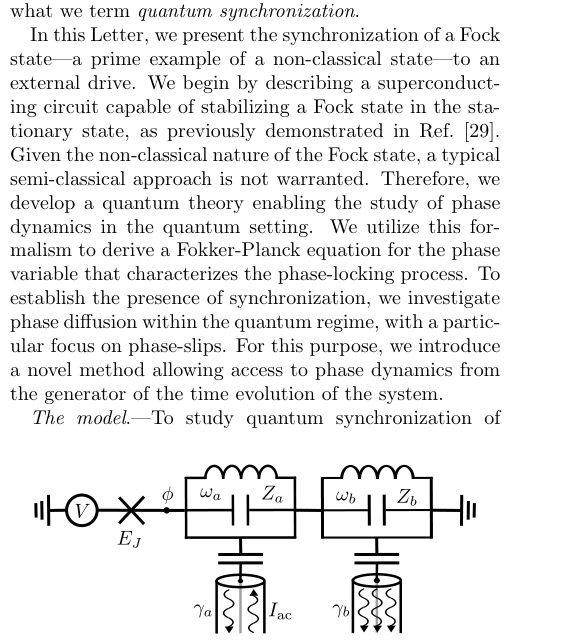 
FIG. 1. Superconducting circuit in which the quantum syn- chronization of a Fock state to an external drive can be ob- served. It consists of a Josephson junction, with Josephson energy EJ, that is put in series with two LC-resonators with frequencies ωj and characteristic impedances Zj, j ∈{a, b}. The DC voltage-bias V is tuned to the value 2eV = ℏ(ωa+ωb) such that a tunneling Cooper pair can resonantly excite one photon in each resonator. The resonators are capacitively coupled to transmission lines, described by the damping rates γj. Through the transmission line, an external drive Iac can be applied to resonator a which allows the study of quantum synchronization to an external drive.

📷 Fig 2

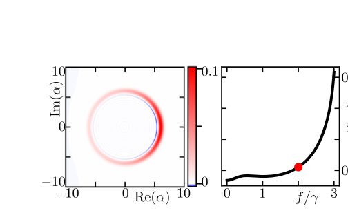 
FIG. 2. (a) Wigner function of resonator a with parameters ϵ = 20γa, n0 = 50, ∆= 0, θ = 0, and f = 2γa. We see that the external drive injects its phase into the system via the localization of the Wigner function at ϕ = θ = 0. Importantly, the negativity persists and oscillations can be observed inside the limit-cycle, resembling the features of a Fock state. (b) Ratio of the variance ⟨⟨n2⟩⟩to the average photon number ¯n. For increasing driving strength f, the ratio increases but remains smaller than 1. The red dot corresponds to f = 2γa for which the Wigner function is shown in (a).

📷 Fig 3

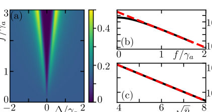 
FIG. 3. Phase diffusion for different parameters; ϵ = 20γa and n0 = 50 besides in (c) where n0 is varied. (a) Diffusion as a function of external driving strength f and detuning ∆. We see that the system goes from free phase diffusion (unsynchro- nized) to exponentially suppressed phase diffusion (synchro- nized) for small ∆or large f. The diagram reveals a so-called Arnold tongue, a benchmark for synchronization. Panels (b) and (c) reveal the exponential suppression. Black lines corre- spond to a numerical evaluation while the red dashed lines are fits to ln Γ± ∝−f√¯n as expected from the Kramers’ result. In (b), ∆= 0, while in (c), ∆= 0, f = γa, and n0 ∈[30, 80] leading to different ¯n....

**Summary.** This paper develops a quantum theory to study synchronization in non-classical states, using a superconducting circuit model. It argues that synchronization must be measured dynamically by analyzing phase-slip rates derived from the system's Lindblad evolution. The key finding is that phase-locking is confirmed by the exponential suppression of phase diffusion, mapping out an Arnold tongue structure.

**Why it may be interesting.** This work provides a rigorous, dynamical framework for defining and measuring quantum synchronization, which is crucial for understanding driven, dissipative quantum systems beyond simple steady-state analysis.

Detailed structure

**Main problem.** The paper investigates quantum synchronization, a dynamical property, in non-classical quantum states, moving beyond insufficient stationary state analyses.

**Main result.** Quantum synchronization is characterized by the exponential suppression of phase diffusion (or phase-slip rates) when the system phase locks to an external drive within an Arnold tongue regime.

**Method.** The dynamics are analyzed using the Lindblad master equation, leading to a Fokker-Planck equation for the phase distribution, and phase-slip rates are extracted from this evolution.

**Model / system.** The system is a superconducting circuit modeled by a Josephson junction coupled to two single-mode resonators, evolving under a Lindblad equation. The analysis focuses on the phase dynamics $P(\phi, t)$ and the extended phase $\varphi$.

**Key observables.** Phase diffusion $\langle[\varphi(t) - \varphi(0)]^2
angle$, phase-slip rates ($\Gamma_\pm$), and the Wigner function (to confirm non-classicality).

**Important parameters / regimes.** Loss rate ($\gamma_a$), nonlinear gain ($\epsilon$), detuning ($\Delta$), and driving strength ($f$).

**Assumptions / limitations.** The semi-classical approach is insufficient due to the non-classical nature of the Fock state; the analysis relies on deriving the Fokker-Planck equation from the Lindblad evolution.

**Figures summary.** Figures show the Wigner function confirming phase localization and negativity upon driving, and phase diffusion plots revealing an Arnold tongue structure corresponding to synchronization.

**Paper structure.** The paper progresses from establishing the physical model (superconducting circuit) to deriving the phase dynamics via the Lindblad equation, contrasting insufficient stationary state measures with the necessary dynamical measure of phase-slip rates.

Abstract

Synchronization, a ubiquitous phenomenon in classical systems, has recently been extended to the quantum domain. Here, we show quantum synchronization of a bosonic mode exhibiting a Fock state-like limit cycle, manifesting as a steady state with a negative Wigner function. We demonstrate that this non-classical state can be phase-locked to an external drive, achieving synchronization within an Arnold tongue regime. We argue that synchronization is a dynamical property and fundamentally tied to the suppression of phase slips, which we show to occur with exponentially decreasing probability. We introduce a novel method to extract the phase slip rate from the Lindblad time evolution of the system. This work opens new avenues for understanding and manipulating non-classical synchronization dynamics.

[↑ back to top](#top)

### [Field-induced multipolar character in the dipolar ground state of the honeycomb rare-earth chalcohalide NdOF](http://arxiv.org/abs/2605.29896v1)

**Authors:** Tiantian Liu, Yanzhen Cai, Mingtai Xie, Helin Mei, Anmin Zhang, Feng Jin, Jianting Ji, Zheng Zhang, Qingming Zhang  
**Type:** both · **Category:** strongly correlated electrons · **PDF:** <https://arxiv.org/pdf/2605.29896v1>  
**Analysis basis:** full PDF text, analyzed in chunks
**Topic relevance:** `analog quantum simulation` **3/5** · `exotic spin models in light-matter` **3/5** · `spintronics-quantum-optics interface` **3/5** · `driven-dissipative phase transition` **2/5** · `Keldysh / 2PI / non-Gaussian methods` **1/5** · `entanglement & information structure` **1/5** · `methods for driven-dissipative` **1/5** · `non-equilibrium dynamics` **1/5**

📷 Fig 1

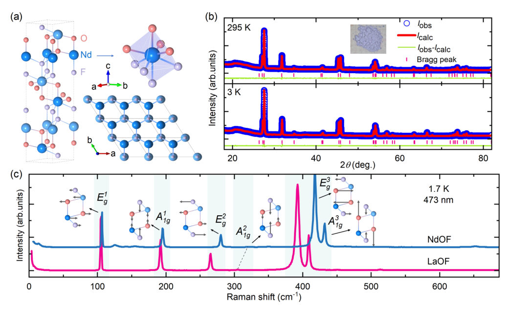 
FIG. 1. Crystal structure, phase purity, and lattice vibrations of NdOF. (a) Crystal structure of NdOF, which adopts the SmSI-type trigonal structure (R3m). The Nd3+ ion (blue) is coordinated by four O (red) and four F (purple) atoms forming a bicapped trigonal antiprism with local C3v symmetry. The bottom panel shows the two-dimensional honeycomb arrangement of Nd3+ ions in the ab plane. (b) Rietveld refinement of powder X-ray diffraction data collected at 295 K and 3 K. The observed (blue circles), calculated (red line), and difference (green line) profiles are shown, with vertical bars marking the Bragg-peak positions. The results confirm the single-phase nature of NdOF and the absence...

📷 Fig 2

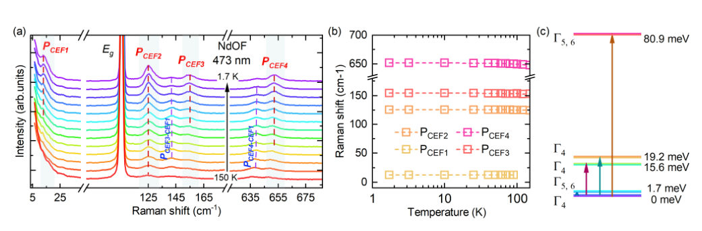 
FIG. 2. CEF excitations of NdOF revealed by Raman scattering. (a) Temperature-dependent Raman spectra measured between 150 K and 1.7 K with 473 nm excitation. At low temperature four sharp intrinsic CEF peaks (PCEF1 – PCEF4) are observed, corresponding to transitions from the ground-state doublet. Additional weaker non-intrinsic features arising from transitions between thermally populated excited doublets are visible at elevated temperatures but vanish upon cooling. (b) Extracted peak positions of the four intrinsic CEF excitations as a function of temperature. The intrinsic transitions remain essentially temperature independent. (c) Schematic CEF level scheme of Nd3+ (J = 9/2) in NdOF....

📷 Fig 3

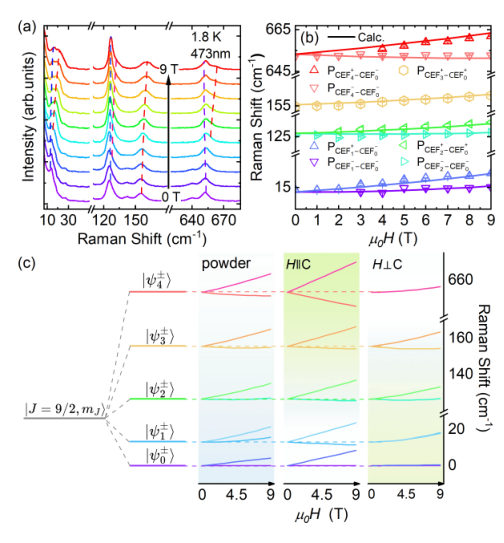 
FIG. 3. Magnetic-field evolution of CEF excitations in NdOF. (a) Raman spectra measured at 1.8 K with 473 nm excitation un- der fields up to 9 T. The four intrinsic CEF peaks split and shift with increasing field, revealing multiple branches at high fields. (b) Extracted peak positions as a function of field. Seven distinct tran- sitions are resolved, corresponding to excitations from the ground- state doublet to field-split excited states, in quantitative agreement with the CEF+Zeeman analysis. (c) Calculated Zeeman splitting of the J = 9/2 manifold for powder-averaged samples, compared with single-crystal calculations for H ∥c and H ⊥c. The results show nearly linear splitting for fields...

📷 Fig 4

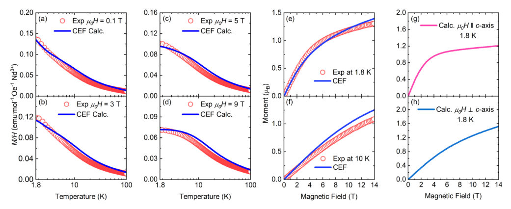 
FIG. 4. M/H-T and M-H of NdOF and comparison with CEF modeling. (a) – (d) M/H-T under fields of 0.1, 3, 5, and 9 T. The CEF simulations (blue solid lines) reproduce the experimental data (symbols) over the entire range. (e), (f) M-H at 1.8 and 10 K. The CEF model (blue solid lines) is in good agreement with experiment. (g), (h) Calculated CEF magnetization for fields along the c-axis and within the ab-plane at 1.8 K.

**Summary.** This work investigates NdOF, a rare-earth magnet, to show that its ground state can be controlled by external magnetic fields. By combining Raman spectroscopy and magnetization measurements with a CEF model, the authors prove that the ground state evolves from a simple dipolar state to a complex dipolar-multipolar state. This establishes NdOF as a key platform for studying the controlled induction of higher-order magnetic multipolar moments.

**Why it may be interesting.** The field-tunable induction of multipolar character is highly relevant to AMO physics and open quantum systems, as it demonstrates how external fields can drive a quantum system's ground state into a complex, non-simple magnetic state, which can be modeled using effective Hamiltonians.

Detailed structure

**Main problem.** The research aims to understand and control the transition of the ground state in rare-earth magnets from a purely dipolar character to a mixed dipolar-multipolar character.

**Main result.** The authors demonstrate that the ground state doublet in NdOF can be continuously tuned from dipolar to dipolar-multipolar by applying external magnetic fields, establishing the material as a model system for studying multipolar interactions.

**Method.** The study combines experimental techniques like Raman spectroscopy and magnetization measurements with theoretical modeling using the Crystal Electric Field (CEF) Hamiltonian.

**Model / system.** The physical system is the honeycomb rare-earth chalcohalide NdOF, where the magnetic properties are governed by the CEF Hamiltonian acting on the $J=9/2$ manifold of the Nd$^{3+}$ ion. The Hamiltonian includes terms up to the sixth power of Stevens operators, constrained by local $C_{3v}$ symmetry.

**Key observables.** CEF excitation energies (1.7, 15.6, 19.2, 80.9 meV), magnetization ($M$), susceptibility ($\chi$), and the ratio of dipolar-octupolar moments.

**Important parameters / regimes.** External magnetic field strength (0.1–9 T) and temperature (low T regime).

**Assumptions / limitations.** The analysis assumes the structure remains stable and that the observed excitations are electronic in origin, allowing the use of the CEF model.

**Figures summary.** Figures show the crystal structure and low-temperature Raman spectra revealing four intrinsic CEF peaks. Further figures illustrate the field-induced nonlinear splitting of these excitations and the temperature/field dependence of magnetization matching the CEF model.

**Paper structure.** The paper establishes the material and the CEF model using Raman spectroscopy and magnetization measurements. It then uses the field dependence of the excitations and magnetic data to show that the ground state undergoes a continuous evolution from dipolar to multipolar character, controlled by the external field.

Abstract

Field-tunable reconstruction of crystalline electric field (CEF) doublets offers a promising avenue for inducing multipolar character, while its observation in real materials has been little explored so far. Here we establish the honeycomb rare-earth chalcohalide NdOF as such a platform. Raman spectroscopy identifies four CEF excitations at 1.7, 15.6, 19.2, and 80.9~meV, and a Zeeman--CEF analysis reproduces their nonlinear field splitting into seven branches. Magnetization and susceptibility over 0.1--9~T are well described by a CEF model for the total angular momentum $J = 9/2$ manifold, confirming the robustness of the extracted CEF scheme. These results demonstrate a field-driven continuous evolution of the ground-state doublet from dipolar to dipolar-multipolar character, with pressure providing a complementary tuning knob, establishing NdOF as a model system for exploring the controlled induction of multipolar components in rare-earth magnets.

[↑ back to top](#top)

### [Modular non-Hermitian topology and its application to critical sensing](http://arxiv.org/abs/2605.29173v1)

**Authors:** Saubhik Sarkar, Chiranjib Mukhopadhyay, Abolfazl Bayat  
**Type:** theory · **Category:** other · **PDF:** <https://arxiv.org/pdf/2605.29173v1>  
**Analysis basis:** full PDF text, analyzed in chunks
**Topic relevance:** `analog quantum simulation` **3/5** · `driven-dissipative phase transition` **3/5** · `non-equilibrium dynamics` **2/5** · `non-equilibrium universality` **2/5** · `Keldysh / 2PI / non-Gaussian methods` **1/5** · `Kondo & dissipative impurity` **1/5** · `correlated / nonlocal dissipation` **1/5** · `entanglement & information structure` **1/5** · `methods for driven-dissipative` **1/5**

📷 Fig 1

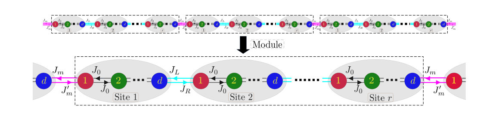 
FIG. 1. Schematic of the model. Each module consists of r sites and each site has d sublevels. The modules, sites, and sublevels are denoted by dashed rectangles, grey ellipses, and colored circles, respectively. The NH tunneling strengths between the modules are Jm and J′ m while those between sites are JL and JR. Coupling between adjacent sublevels is J0 and is Hermitian. The numbers of sublevels d=1 and d=2 correspond to modular Hatano-Nelson and NH SSH models, respectively.

📷 Fig 2

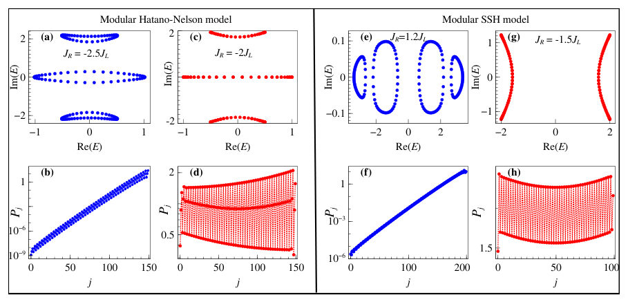 
FIG. 2. Spectral topological phase transition and point gap structure. Left panel shows the case of modular Hatano-Nelson model with d=1, r=3, L=50. Here Jm=J=1/J′ m and J=2JL. (a) The point gap structure at JR= −2.5JL is shown by three loops corresponding to the three bands of the model with PBC. (b) The presence of point gap with PBC corresponds to NH skin effect for OBC, which is shown by the exponential edge localization of the cumulative population P j of the all the eigenstates at site j. (c) The closure of point gap at JR= −2JL. (d) The corresponding vanishing of skin effect shown by the delocalization of the cumulative population. Right panel shows the case of modular NH SSH model...

📷 Fig 3

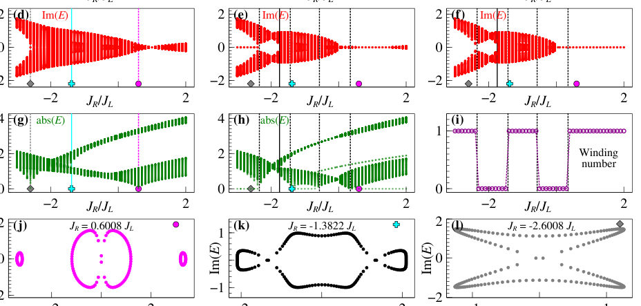 
FIG. 3. Band topological phase transition and line gap structure. The band formation in the spectrum corresponding to different boundary conditions are shown for d=2, r=2, L=50, J0=1.25JL. Here Jm=JL+J, J′ m=JR+J and J=2JL. For band structure with PBC, (a), (d), (g) show real, imaginary, and absolute energies, respectively. The vertical lines denote JR values for different types of line gap closures. The magenta circle is for JR=0.6008JL. Here closure of the line gap between the two central bands are shown in (j). The cyan cross is for JR= −1.3822JL. Here closure of the line gap between the central band and each of the side bands are shown in (k). The grey triangle is for JR= −2.6008JL....

📷 Fig 4

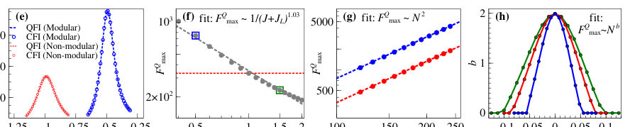 
FIG. 4. Single parameter sensing. Top panel correspond to modular Hatano-Nelson model and bottom panel correspond to modu- lar SSH model. (a, e) QFI and CFI (in the position basis) at the point gap closure. Blue curves correspond to the gap closing for the modular case. Red curves correspond to the non-modular case where the point gap closes at JR= −JL. For modular Hatano-Nelson model, gap closes at JR= −0.4JL for d=1, r=3, L=50, Jm=J=1/J′ m and J=0.4JL. For modular SSH model, gap closes at JR= −0.5JL for d=2, r=2, L=50, J0=2JL, Jm=JL+J, J′ m=JR+J and J=0.5JL. (b, f) The peak QFI FQ max value for the modular case as a function of J. Red dashed line shows the non-modular value. (c, g) The...

📷 Fig 5

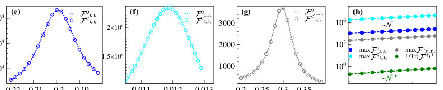 
FIG. 5. Multi-parameter sensing. Here we consider d=1, r=3, L=100, Jm=J=1/J′ m. Considering JR=Jx+iJy, we look at the QFIM F Q(Jx, Jy) in the top panel. Blue and red curves show modular and non-modular cases, respectively. (a) F Q Jx,Jx with F C Jx,Jx in the current operator basis. (b) Tr(F Q −1) with Tr(F C −1) in the current operator basis. (c) F Q Jx,Jx, F Q Jy,Jx, and Tr(F Q −1) as functions of J. (d) Quadratic scaling for F Q Jx,Jx,

**Summary.** This paper explores how incorporating modular couplings into non-Hermitian lattice models enriches their topological features, particularly concerning the non-Hermitian skin effect. By analyzing spectral topological phase transitions associated with point gap closure, the authors demonstrate that these systems exhibit enhanced, Heisenberg-limited sensitivity for quantum sensing, even when estimating multiple unknown parameters simultaneously.

**Why it may be interesting.** This work directly connects topological phase transitions (a core concept in condensed matter theory) to practical quantum sensing limits, providing a concrete physical mechanism (modular structure) to engineer superior metrology performance in open quantum systems.

Detailed structure

**Main problem.** The paper investigates how introducing modular structures enriches the topological properties of non-Hermitian systems, specifically focusing on the non-Hermitian skin effect and its application to enhancing quantum sensing.

**Main result.** The modular structure allows for the identification of critical points where spectral topological phase transitions occur, leading to a measurable enhancement in sensing performance, even in multi-parameter estimation scenarios.

**Method.** The analysis employs the Generalized Brillouin Zone (GBZ) formalism and calculates topological invariants like the winding number to characterize phase transitions, alongside applying quantum estimation theory (QFIM) for sensing.

**Model / system.** The model is a general 1D tight-binding non-Hermitian Hamiltonian, extended to include modular couplings ($J_m, J'_m$) across $L$ modules. Specific examples include the modular Hatano-Nelson and SSH models.

**Key observables.** Non-Hermitian skin effect, point/line gaps, winding number, Quantum Fisher Information Matrix (QFIM), and the scaling exponent $b$ of sensing metrics.

**Important parameters / regimes.** Modular couplings ($J_m, J'_m$), module size ($r$), and the ratio of non-reciprocal couplings ($J_R/J_L$).

**Assumptions / limitations.** The analysis relies on the GBZ formalism to correctly map the bulk spectrum to the open boundary condition (OBC) spectrum, and the sensing analysis assumes the probe state is the right eigenstate with the largest imaginary eigenvalue.

**Figures summary.** Figures illustrate the spectral topological phase transitions (point gap closure) for modular models, showing the skin effect vanishing at critical points, and demonstrate the quadratic scaling of QFIM elements for enhanced sensing.

**Paper structure.** The paper progresses from establishing the general NH model and its topological features (skin effect, gap closure) using the GBZ formalism, to analyzing the specific role of modular couplings in controlling these transitions, and finally applying this framework to derive and quantify the enhanced sensitivity in multi-parameter quantum estimation.

Abstract

Non-Hermitian topological systems have attracted a lot of research activities in recent times, both theoretically and experimentally, due to their unique physical properties and association with open quantum systems. We show that modular structures, where specific couplings at regular intervals take distinct values, enrich the unique topological attributes of these systems such as the non-Hermitian skin effect and the breakdown of conventional bulk-boundary correspondence. These systems also possess the capability of displaying criticality-enhanced sensitivity for precision metrology. We establish how the modular structure enhances their sensing performance near spectral topological phase transitions and show that the enhancement can be achieved in multi-parameter estimation scenarios as well.

[↑ back to top](#top)

### [Quantum and classical noise characteristics of parametrically driven cavity solitons in dispersive Kerr resonators](http://arxiv.org/abs/2605.29321v1)

**Authors:** Sophie S. Shamailov, Miro Erkintalo  
**Type:** theory · **Category:** other · **PDF:** <https://arxiv.org/pdf/2605.29321v1>  
**Analysis basis:** full PDF text, analyzed in chunks
**Topic relevance:** `driven-dissipative phase transition` **3/5** · `Keldysh / 2PI / non-Gaussian methods` **2/5** · `correlated cavity matter` **2/5** · `methods for driven-dissipative` **2/5** · `non-equilibrium dynamics` **2/5** · `analog quantum simulation` **1/5** · `correlated / nonlocal dissipation` **1/5** · `interference shaping light` **1/5** · `non-equilibrium universality` **1/5**

📷 Fig 1

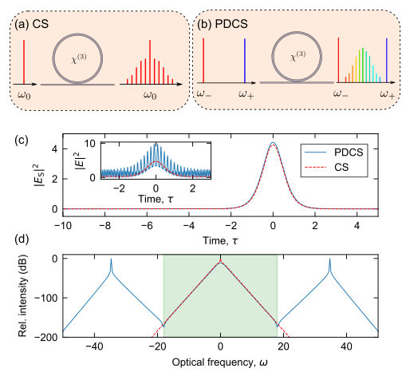 
FIG. 1. (a) and (b) show schematic illustrations of (a) CS and (b) PDCS generation in a monochromatically and bichromat- ically driven dispersive χ(3) Kerr resonator, respectively. (c) and (d) show numerically simulated temporal and spectral profiles, respectively, of a PDCS (solid blue curve) and a CS (red dashed curve). To isolate the soliton component, ES(τ), the constant background was removed from the CS field and a spectral band-pass filter (shaded green region in (d) shows the pass-band; inset in (c) shows the intensity profiles before background removal) was used on the PDCS before obtaining the intensity profiles in (c). PDCS simulations use d2 = −2 and d4 = 0.02, ∆± = 0, S± ≈1.89,...

📷 Fig 2

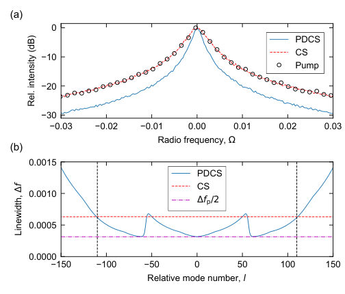 
FIG. 2. (a) Numerically simulated line profile of the l = 0 comb mode for a PDCS (solid blue curve) and a correspond- ing CS (red dashed curve). Black circles show the pump pro- file used in the simulations. (b) 3-dB widths of the PDCS (solid blue curve) and CS (red dashed curve) comb lines as a function of relative mode number l. Vertical black lines indi- cate the pumped modes in PDCS simulations, and horizontal dash-dotted magenta line indicates the pump linewidth di- vided by two. All simulation parameters as in Fig. 1. The results were obtained by averaging over 500 independent noise realizations.

📷 Fig 3

 
Figure 2 shows illustrative results from our simula- tions. Panel (a) compares the line profiles of the l = 0 mode for conventional CSs (red dashed line), PDCSs (blue solid line), and one of the driving fields (black cir-

📷 Fig 4

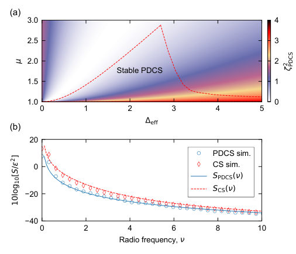 
FIG. 3. (a) Coefficient ζ2 PDCS appearing in Eq. (5) across the (∆eff, µ) parameter space. Values less than four signal PD- CSs to exhibit lower jitter than corresponding CSs. Dashed red curve delineates the region where stable PDCSs exist. (b) Solid blue (dashed red) curves show PDCS (CS) tim- ing jitter spectra calculated from Eq. (5) with ∆eff = 2.5 and µ = 2.5 (∆0 = 4, S0 = 2). Blue circles (red dia- monds) show corresponding results from numerical simula- tions with dispersion parameters as in Fig. 1, with ∆± = 0, S± ≈4.34, and Ωp ≈34.8. The simulated spectra were averaged over 500 independent noise realizations and used ε = p

📷 Fig 5

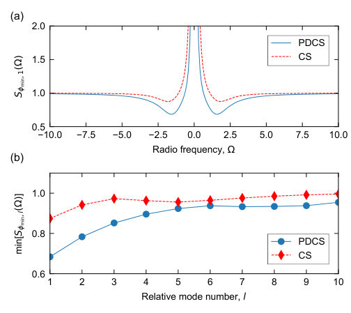 
FIG. 4. (a) Two-mode quadrature spectra for mode pair l = 1 for a PDCS (solid blue curve) and corresponding CS (dashed red curve). Both spectra are calculated for their respective optimal mixing angle ϕmin: for the PDCS case, ϕmin = 1.26; for the CS case, ϕmin = 2.18. (b) The minimal value attained by the two-mode quadrature spectra at the optimal mixing angle ϕmin for a PDCS (blue circles) and a corresponding CS (red diamonds), as a function of mode pair number. Solid and dashed curves are guides to the eye. Parameters as in Fig. 1 with critical coupling assumed (squeezing depends on the coupling conditions – see Supplementary Information).

**Summary.** This theoretical study investigates the noise properties of parametrically driven cavity solitons (PDCSs) in Kerr resonators compared to conventional solitons. By analyzing quantum and classical noise sources, the authors demonstrate that PDCSs offer superior performance, particularly in terms of reduced timing jitter and enhanced quantum squeezing. This suggests PDCSs are highly promising for next-generation, low-noise photonic quantum applications.

**Why it may be interesting.** This work bridges quantum optics and nonlinear wave physics by quantifying noise resilience in a novel optical soliton system, providing concrete metrics (squeezing, jitter) for quantum resource assessment.

Detailed structure

**Main problem.** The study aims to elucidate how both technical (classical) and quantum noise sources affect the unique pure-Kerr parametrically driven cavity soliton (PDCS) structure.

**Main result.** PDCSs are shown to outperform conventional cavity solitons across key metrics, exhibiting lower fundamental timing jitter, reduced phase noise, and stronger two-mode squeezing.

**Method.** The authors employ theoretical modeling, analyzing the system using the generalized Lugiato-Lefever equation and linearizing quantum fluctuations around the mean field.

**Model / system.** The physical system is a dispersive Kerr resonator driven by bichromatic fields, modeled by the Lugiato-Lefever equation. The analysis quantizes this system by treating fluctuations as operators and solving the resulting linear equations in the frequency domain.

**Key observables.** Fundamental quantum-limited timing jitter, two-mode squeezing spectra, and phase noise transfer from driving lasers.

**Important parameters / regimes.** The relative strength of noise ($\epsilon$), the mode number ($l$), and the detuning/parametric driving strength ($\Delta_{	ext{eff}}, \mu$).

**Assumptions / limitations.** The analysis often assumes that the system can be linearized around the mean field, and for noise calculations, the noise is assumed to be white and Gaussian.

**Figures summary.** Figures compare line profiles and normalized linewidths for CS vs. PDCS, and show the two-mode quadrature spectra, demonstrating superior squeezing and narrower lines for PDCSs.

**Paper structure.** The paper systematically develops the model from the classical LLE to the quantized fluctuation equations, deriving analytical and numerical methods to calculate noise spectra and jitter, culminating in a direct comparison between PDCS and CS performance.

Abstract

Temporal cavity solitons generated in monochromatically driven dispersive Kerr resonators offer an attractive avenue for on-chip optical frequency comb generation. Key to many of their applications is to understand how noise -- both technical and quantum -- affects the soliton states, which has accordingly been extensively investigated. Here, we report on a comprehensive theoretical study that elucidates how technical and quantum fluctuations impact a new type of soliton structure that has very recently been predicted and observed in dispersive Kerr resonators under conditions of bichromatic driving: the pure-Kerr parametrically driven cavity soliton (PDCS). We examine how classical laser phase noise transfers from the two pump fields onto the soliton frequency comb, and we calculate the solitons' fundamental quantum-limited timing jitter and two-mode squeezing spectra. In each case, we find that PDCSs can out-perform conventional cavity solitons with comparable characteristics, even when driven by two uncorrelated lasers. Our results demonstrate that pure-Kerr PDCSs can offer unprecedented performance in noise-sensitive photonic applications and as a quantum resource

[↑ back to top](#top)

### [Engineering recoil heating in coherent-scattering levitated optomechanics](http://arxiv.org/abs/2605.29609v1)

**Authors:** Maksim Lednev, Uroš Delić, Johannes Feist, Carlos Gonzalez-Ballestero  
**Type:** theory · **Category:** other · **PDF:** <https://arxiv.org/pdf/2605.29609v1>  
**Analysis basis:** full PDF text, analyzed in chunks
**Topic relevance:** `correlated / nonlocal dissipation` **3/5** · `correlated cavity matter` **3/5** · `Keldysh / 2PI / non-Gaussian methods` **2/5** · `methods for driven-dissipative` **2/5** · `Tavis-Cummings & cavity-many-emitter` **1/5** · `analog quantum simulation` **1/5** · `driven-dissipative phase transition` **1/5** · `non-equilibrium dynamics` **1/5**

📷 Fig 1

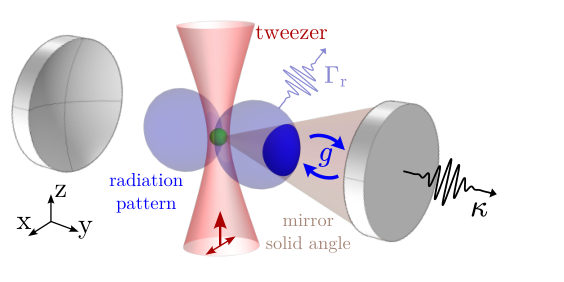 
FIG. 1. A sub-wavelength nanoparticle (green) is trapped by an optical tweezer (red). In free space, the angular distribution of Stokes and anti-Stokes photons scattered by the center-of-mass degree of freedom follows the characteristic information radiation pattern [8, 33] (shown in blue for the motion along y). Inside a cavity, the recoil heating rate changes as (i) part of the scattered photons populate the cavity mode instead of free-space, and (ii) the scattering pattern itself is modified by Purcell effect.

📷 Fig 2

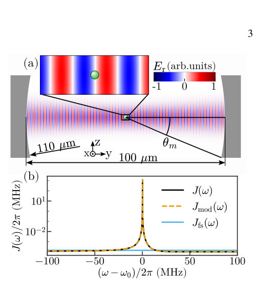 
FIG. 2. (a) Cavity geometry and radial electric field profile at the cavity resonance frequency (nanoparticle not to scale). The maximal field gradient along the cavity axis provides strong op- tomechanical coupling to the y-motion. For all figures we choose the tweezer and nanoparticle parameters of Ref. [26]. (b) Spec- tral density of the y−motion (black) and its two-mode fit Jmod (yellow) for θm = 23.8◦. The free-space spectral density Jfs is shown in blue.

📷 Fig 3

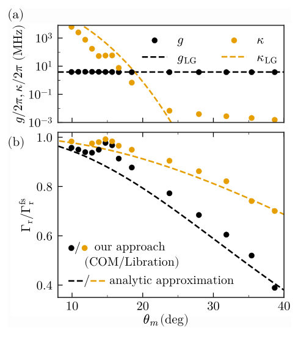 
FIG. 3. (a) Numerically obtained optomechanical coupling rate g and cavity linewidth κ versus mirror angular size θm. The dashed lines show independent analytical calculations which describe the cavity through a single Laguerre-Gaussian mode, see text for details. (b) Recoil heating decoherence normalized to its free- space value versus mirror solid angle, for center-of-mass motion and for libration (black and orange dots). The dashed lines indicate the geometric approximation Eq. (8) for each case. The peak at θm ≈15◦stems from additional, higher-order, broad resonances that are supported by the cavity at these angles and that modify the density of states (see End Matter for details).

📷 Fig 4

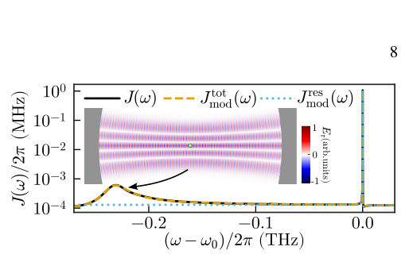 
FIG. 4. Spectral density perceived by the y-motion (black) for θm = 16.6◦; and its fits in extended (yellow) and resonant (blue) regions, respectively. (inset) Spatial distribution of the radial component of the electric field Er of the detuned cavity mode.

**Summary.** This paper develops a general quantum electrodynamics framework to calculate recoil heating in levitated nanoparticles trapped near optical cavities. It demonstrates that the cavity environment significantly modifies the heating rate, predicting that this decoherence can be actively suppressed by designing the photonic structure. This offers a pathway to engineer quantum motional states in optomechanical systems.

**Why it may be interesting.** This work provides a powerful, general theoretical tool to engineer decoherence in levitated optomechanics by designing the surrounding photonic structure, which is highly relevant to open quantum systems and cavity QED.

Detailed structure

**Main problem.** Recoil heating from photon scattering is a major source of decoherence in optical trapping, and a predictive theory for this rate in cavity setups is missing.

**Main result.** The recoil heating rate is significantly modified by the electromagnetic environment, and the authors predict it can be strongly suppressed in state-of-the-art microcavities.

**Method.** The authors developed a general theoretical framework using macroscopic quantum electrodynamics and few-mode quantization to derive a coherent scattering master equation.

**Model / system.** The system involves a nanoparticle trapped in an optical tweezer near a microcavity, modeled by a Hamiltonian incorporating center-of-mass and librational motion, and analyzed via a master equation.

**Key observables.** Recoil heating rate, spectral density, coupling rate, and cavity linewidth.

**Important parameters / regimes.** Cavity parameters (e.g., mirror angular size $	heta_m$), particle mass $M$, and cavity detuning.

**Assumptions / limitations.** The analysis relies on approximations such as the Lamb-Dicke approximation and the Born-Markov approximation for mode elimination.

**Figures summary.** Figures illustrate the setup comparing free-space vs. cavity scattering patterns, and show the dependence of coupling rates and normalized recoil heating on cavity geometry parameters.

**Paper structure.** The paper progresses from identifying the theoretical gap in cavity recoil heating to developing a general QED framework, applying it to specific cavity geometries (Fabry-Pérot), and finally deriving quantitative predictions for rate suppression.

Abstract

Recoil heating from photon scattering is a fundamental source of decoherence in optical trapping, severely limiting the preparation of nonclassical motional states. In cavity setups in the coherent scattering configuration, a predictive theory of recoil heating rate is missing, as usual perturbative approaches fail in the presence of sharp optical resonances. Hence, current works assume that the recoil heating rate is approximately equal to its free-space value. Here we show that this is not the case, as the electromagnetic environment can strongly modify recoil heating rate by the Purcell effect. Specifically, we predict that this rate can be significantly suppressed in state-of-the-art microcavities, for both center-of-mass and librational motion. To establish these results, we develop a general theoretical framework based on macroscopic quantum electrodynamics and on the few-mode quantization approach developed in nanophotonics. Our method applies to particles trapped in the presence of arbitrary electromagnetic structures, thus providing a route to engineering motional decoherence in levitated optomechanics by photonic structure design.

[↑ back to top](#top)

### [Partial Entropy production of active particles with hidden states in potentials](http://arxiv.org/abs/2605.29201v1)

**Authors:** Jacob Knight, Gunnar Pruessner  
**Type:** theory · **Category:** statistical mechanics · **PDF:** <https://arxiv.org/pdf/2605.29201v1>  
**Analysis basis:** full PDF text, analyzed in chunks
**Topic relevance:** `Keldysh / 2PI / non-Gaussian methods` **3/5** · `non-equilibrium dynamics` **3/5** · `methods for driven-dissipative` **2/5** · `correlated / nonlocal dissipation` **1/5** · `driven-dissipative phase transition` **1/5** · `non-equilibrium universality` **1/5**

📷 Fig 1

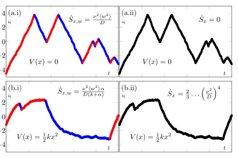 
FIG. 1. Run-and-tumble (RnT) process with (i) fully resolved (red corresponding to self-propulsion towards the right, blue to self-propulsion to the left) and (ii) hidden self-propulsion velocity, in the left and right columns respectively. Rows cor- respond to a: a) free, and b) harmonically confined, RnT par- ticle. In a), trajectories break time-reversal symmetry (TRS) when fully resolved, as revealed by the effective swapping of colours under mirroring along the vertical axis. They obey TRS when the self-propulsion state is hidden. The process therefore has positive total EPR ˙Sx,w &gt; 0 and zero partial EPR ˙Sx = 0. In b), trajectories break TRS even with hidden self-propulsion,...

**Summary.** This theoretical paper develops a framework to calculate the partial entropy production rate for active particles whose self-propulsion is hidden. Using advanced path integral and field-theoretic methods, the authors derive explicit, high-order expressions for this rate for models like the RnT particle. The results show how the partial observation of the system fundamentally alters the apparent time-reversal symmetry breaking compared to the full description.

**Why it may be interesting.** This work provides a rigorous, field-theoretic approach to quantifying non-equilibrium thermodynamics in active matter, which is crucial for understanding energy dissipation and irreversible processes in complex biological or synthetic systems.

Detailed structure

**Main problem.** The paper quantifies the partial entropy production rate ($\dot{S}_x$) for active particles whose self-propulsion mechanism is hidden from observation, addressing how partial observation can mask non-equilibrium dynamics.

**Main result.** The partial EPR ($\dot{S}_x$) is derived through complex path integral expansions, yielding results that depend on the correlation functions of the hidden self-propulsion noise $w(t)$ and the confining potential $V(x)$.

**Method.** The methodology involves extending perturbative path integral frameworks, utilizing cumulant expansions, and employing Doi-Peliti field theory techniques to calculate time-ordered correlation functions.

**Model / system.** The system models overdamped active particles governed by a Langevin equation incorporating a confining potential $V(x)$ and a stochastic self-propulsion term $w(t)$. Specific models analyzed include the Active Ornstein-Uhlenbeck Particle (AOUP) and the Run-and-Tumble (RnT) particle.

**Key observables.** Partial Entropy Production Rate ($\dot{S}_x$), Full Entropy Production Rate ($\dot{S}_{x,w}$), and various time-ordered correlation functions (up to six-time).

**Important parameters / regimes.** Self-propulsion strength ($
u$), diffusion coefficient ($D$), and the parameters defining the confining potential ($k$ for harmonic potential).

**Assumptions / limitations.** The analysis assumes the existence of a unique steady state and relies on approximations such as leading order in $
u$ and the use of the Stratonovich convention.

**Figures summary.** Figure 1 illustrates the comparison of full vs. partial EPR for RnT processes in free and harmonic cases, showing how hidden states change the observable asymmetry.

**Paper structure.** The paper builds from the general formalism of partial EPR using path probability ratios, applies this to specific models (AOUP, RnT), and details the calculation using advanced field-theoretic diagrammatic expansions for higher-order correlation functions.

Abstract

Partially observed stochastic systems can appear (almost) time-reversal symmetric while in fact operating far from equilibrium. The present work extends the perturbative framework introduced in [Phys. Rev. Lett. 136, 198302 (2026)] to calculate in a generic confining potential the partial entropy production, which quantifies the time-reversal asymmetry of a generic active particle with hidden self-propulsion. Focusing on the harmonic case, we apply our framework to reproduce an exact result for the partial entropy production rate of an active Ornstein-Uhlenbeck particle and to derive the partial entropy production rate of a run-and-tumble particle.

[↑ back to top](#top)

### [Channel-agnostic finite-temperature phase estimation averaged over variable grids: reconstruction of Green's function for dynamical mean-field theory](http://arxiv.org/abs/2605.29681v1)

**Authors:** Taichi Kosugi, Hirofumi Nishi, Keito Kasebayashi, Hiroki Takahashi, Yu-ichiro Matsushita  
**Type:** theory · **Category:** strongly correlated electrons · **PDF:** <https://arxiv.org/pdf/2605.29681v1>  
**Analysis basis:** full PDF text, analyzed in chunks
**Topic relevance:** `Kondo & dissipative impurity` **3/5** · `Keldysh / 2PI / non-Gaussian methods` **2/5** · `quantum measurements` **2/5** · `analog quantum simulation` **1/5** · `methods for driven-dissipative` **1/5**

📷 Fig 1

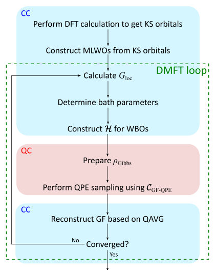 
FIG. 1. Flowchart of DFT+DMFT calculation based on QAVG in the present study. Items in the blue regions are carried out on a classical computer (CC), while those in the red region are on a quantum computer (QC). This scheme is the same as an ordinary FCI-based DFT+DMFT scheme except for the QC part.

📷 Fig 2

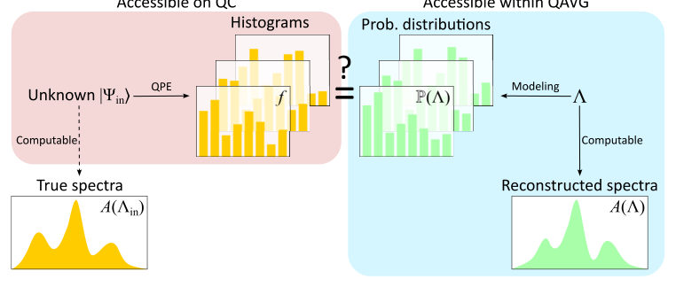 
FIG. 2. Illustration of QAVG. Although we can prepare the input state |Ψin⟩on a quantum computer, its expression and the values of its related quantities Λin are unknown. The true spectra A(Λin) is computable in principle since its expression is known. It is, however, actually impossible to get it due to the unknown Λin. On the other hand, what we can obtain directly are QPE histograms f by performing a finite number of measurements for various QPE settings. After collecting the histograms as data, the QAVG scheme starts from defining trial parameters Λ and model the probability distributions P(Λ) so that they describe QPE measurements reasonably. The scheme then finds the optimal trial...

📷 Fig 3

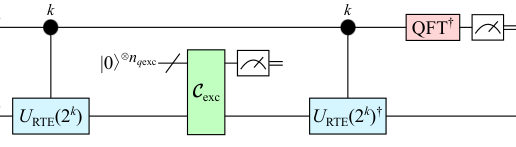 
FIG. 3. (a) We denote the left circuit, where nqval RTE unitaries controlled by the ancillae with distinct amounts of time steps, by the right circuit with a dummy variable k for simplicity. (b) Circuit CGF−QPE for performing channel-agnostic QPE sampling to obtain the GF at a finite temperature. Cexc contained in CGF−QPE is an excitation circuit that causes an electron- or hole-excitation depending on each measurement outcome for nqexc ancillae.

📷 Fig 4

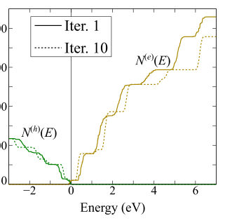 
FIG. 4. Accumulated numbers of excitation channels for electron and hole excitations as functions of energy E at the nonzero temperature in the AIM for FCI-DMFT. Those at the first and tenth iterations are plotted. They represent the excitations that contribute to the GF with the Boltzmann factors larger than εB.

📷 Fig 5

 
Figure 5 shows the FCI-GF of the AIM at each itera- tion during the FCI-DMFT loop. As expected in the dis-

**Summary.** This paper introduces a quantum-classical hybrid method, QAVG-DMFT, to calculate the Green's function for correlated materials like $	ext{SrVO}_3$ using quantum computers. It uses modified Quantum Phase Estimation circuits to sample the GF at finite temperature, which is then reconstructed classically by averaging over variable grids. This advances the feasibility of simulating strongly correlated electron systems on near-term quantum hardware.

**Why it may be interesting.** It bridges the gap between quantum computation and strongly correlated materials physics by providing a concrete, albeit complex, pathway to calculate fundamental quantities like the Green's function.

Detailed structure

**Main problem.** Developing a quantum-classical hybrid scheme to treat correlated electronic systems using Dynamical Mean-Field Theory (DMFT) on quantum computers.

**Main result.** The proposed QPE averaged over variable grids (QAVG) scheme successfully reconstructs the Green's function by minimizing discrepancies between measured quantum sampling data and theoretical model distributions.

**Method.** The method combines modified Quantum Phase Estimation (QPE) circuits to sample the Green's function (GF) at finite temperature with a classical optimization routine (QAVG) to reconstruct the GF parameters.

**Model / system.** The theory is applied to correlated electronic systems, demonstrated using $	ext{SrVO}_3$ within the framework of the Anderson Impurity Model (AIM) derived from DFT.

**Key observables.** One-particle Green's function (GF), Density of States (DOS), spectral amplitudes, and excitation energies.

**Important parameters / regimes.** Finite temperature ($eta$), trial parameters ($\Lambda$), and the number of measurement shots ($M_d$).

**Assumptions / limitations.** The QPE sampling data is processed via QAVG, which models the GF using a limited set of trial parameters, overcoming the need to know the specific excitation channel.

**Figures summary.** Figures illustrate the QAVG-DMFT workflow, comparing reconstructed DOS/GFs against exact calculations (FCI) and showing the structure of excitation circuits.

**Paper structure.** The paper reviews the GF definition and DFT+DMFT structure before detailing the QAVG-based quantum-classical hybrid scheme, culminating in numerical simulations for $	ext{SrVO}_3$.

Abstract

For treating correlated electronic systems on quantum computers, we propose a quantum-classical hybrid scheme for dynamical mean-field theory (DMFT). In the quantum part of the scheme, we use modified quantum phase estimation (QPE) circuits suitable for the one-particle Green's function (GF) at a finite temperature so that we can extract spectral amplitudes and the excitation energies without knowing the excitation channel invoked at each measurement. In the classical part of the scheme, we adopt an approach that estimates reasonably the GF based on the data collected from the QPE sampling. We dub the approach the QPE averaged over variable grids (QAVG), that may help one to reconstruct the GF via optimization of trial parameters and modeling the probability distributions for various settings of the QPE circuits. We apply the QAVG-DMFT scheme to SrVO$_3$ to demonstrate its validity via numerical simulations.

[↑ back to top](#top)

### [Quantum Markovian Dynamics from a Double Covariance Stochastic Framework](http://arxiv.org/abs/2605.29508v1)

**Authors:** Andrei Khrennikov  
**Type:** theory · **Category:** other · **PDF:** <https://arxiv.org/pdf/2605.29508v1>  
**Analysis basis:** full PDF text, analyzed in chunks
**Topic relevance:** `Keldysh / 2PI / non-Gaussian methods` **3/5** · `methods for driven-dissipative` **3/5** · `correlated / nonlocal dissipation` **1/5** · `driven-dissipative phase transition` **1/5** · `non-equilibrium dynamics` **1/5**

📷 Fig 1

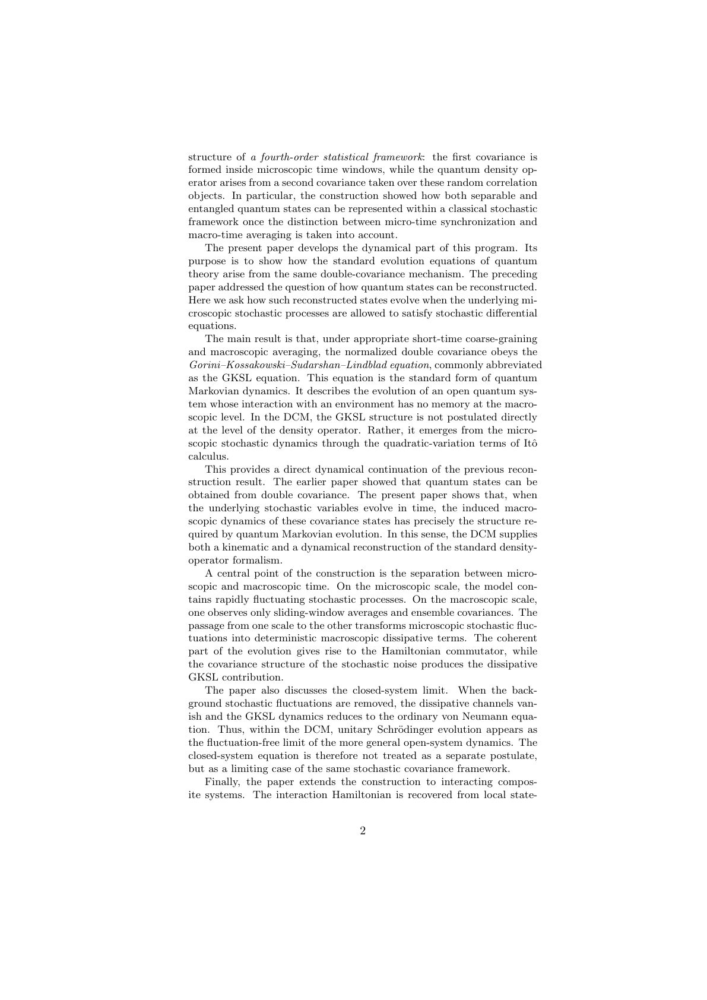 
Low-resolution page preview, page 2

📷 Fig 2

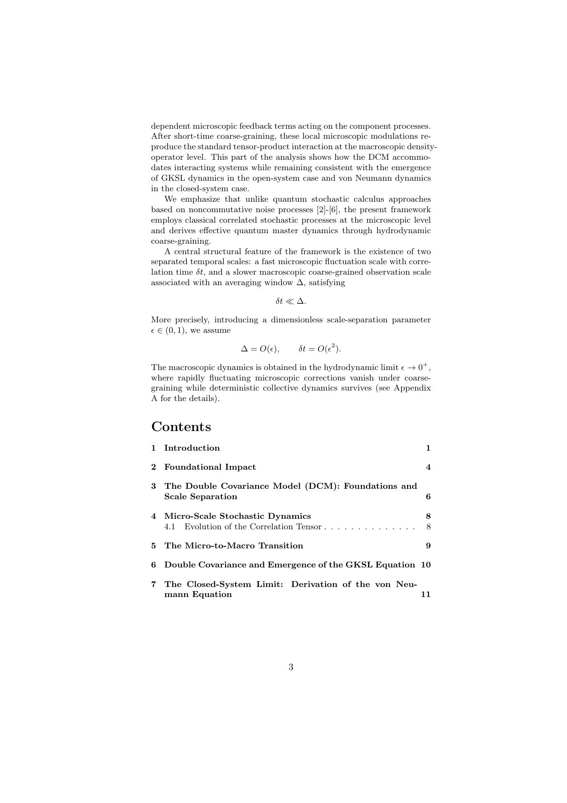 
Low-resolution page preview, page 3

📷 Fig 3

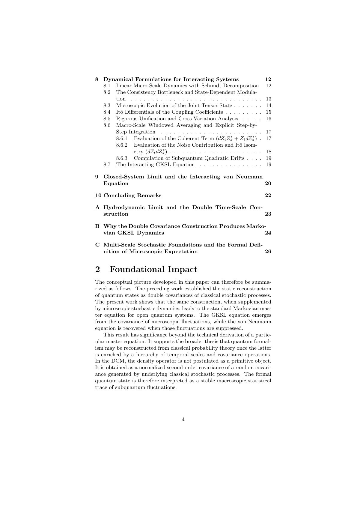 
Low-resolution page preview, page 4

📷 Fig 4

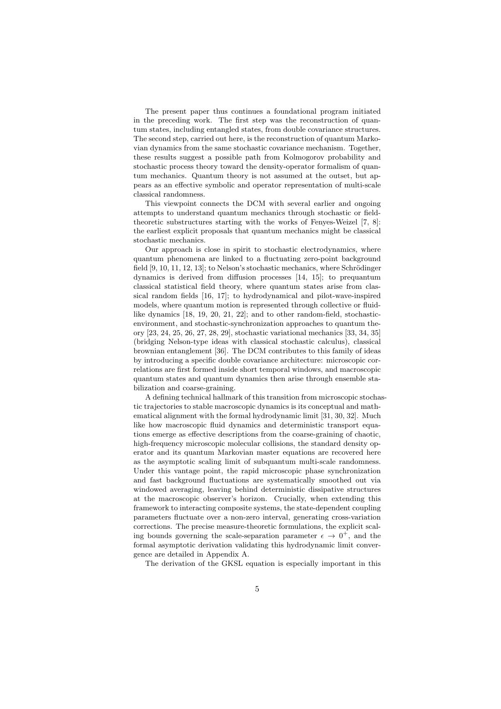 
Low-resolution page preview, page 5

📷 Fig 5

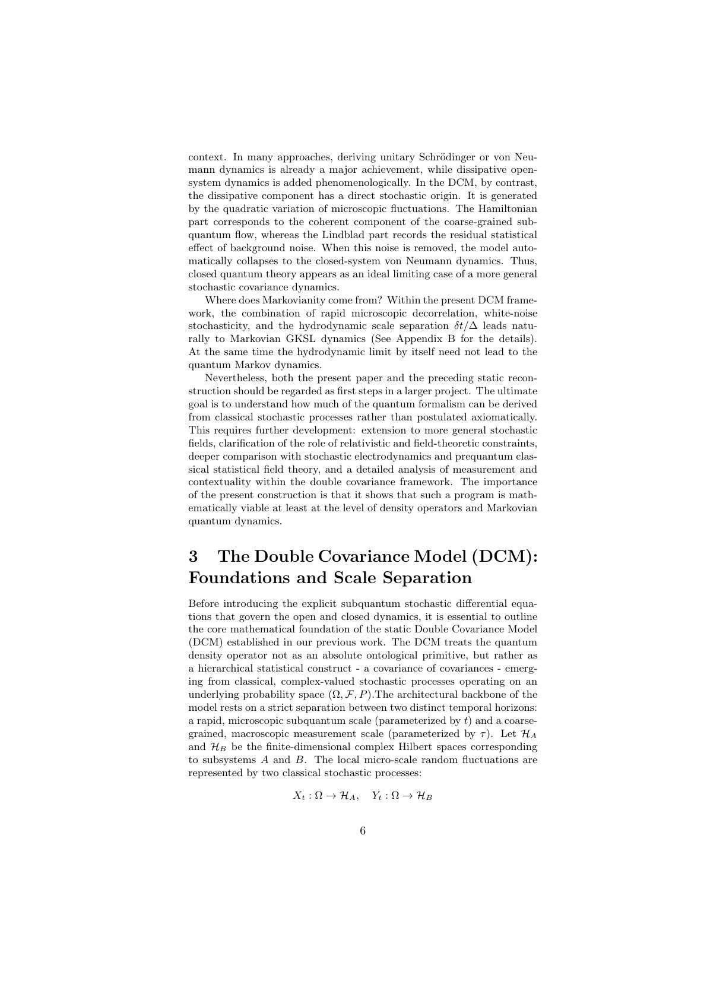 
Low-resolution page preview, page 6

**Summary.** This paper develops the Double Covariance Model (DCM) to derive quantum dynamics from classical stochastic processes. By employing multi-scale calculus and coarse-graining, the authors show that the standard GKSL master equation emerges naturally as the effective macroscopic equation. This framework unifies quantum theory by showing the von Neumann equation is a limiting case of the general stochastic evolution.

**Why it may be interesting.** This work provides a deep, non-standard foundation for open quantum systems, suggesting that the GKSL structure is an emergent statistical consequence of underlying classical noise, rather than a postulate.

Detailed structure

**Main problem.** The paper aims to derive the standard, Markovian evolution equations of quantum mechanics (like the GKSL equation) from a more fundamental, underlying classical stochastic process.

**Main result.** The Double Covariance Model successfully reproduces the GKSL master equation in the macroscopic limit, while the closed-system von Neumann equation emerges as the fluctuation-free limit.

**Method.** It employs multi-scale Itô calculus and a hydrodynamic coarse-graining procedure, averaging over fast microscopic fluctuations to derive the effective macroscopic dynamics.

**Model / system.** The model uses the Double Covariance Model (DCM), treating quantum states as macroscopic covariance operators derived from complex-valued stochastic processes. The dynamics are governed by a coarse-grained evolution equation that yields the GKSL form.

**Key observables.** The normalized double covariance operator $C(	au)$ and the resulting density operator $
ho(	au)$.

**Important parameters / regimes.** The scale separation parameter $\epsilon$, which governs the transition from fast microscopic fluctuations ($\delta t = O(\epsilon^2)$) to slow macroscopic observation ($\Delta = O(\epsilon)$).

**Assumptions / limitations.** The core assumptions include the existence of two separated temporal scales and the assumption of white-noise (delta-correlated) microscopic noise to enforce Markovianity.

**Figures summary.** Not specified.

**Paper structure.** The structure follows a derivation path: defining the microscopic stochastic process, applying multi-scale Itô calculus to find the evolution of the covariance tensor, and finally performing the hydrodynamic coarse-graining to yield the macroscopic GKSL equation.

Abstract

We develop an interacting extension of the Double Covariance Model (DCM), a stochastic subquantum framework in which macroscopic quantum dynamics emerge through coarse-graining of correlated microscopic fluctuations. Starting from local stochastic differential equations on subsystem Hilbert spaces, we derive a closed evolution equation for a coarse-grained double covariance operator using multi-scale Itô calculus and sliding-window averaging. The construction explicitly incorporates two separated temporal scales: a fast microscopic fluctuation scale governing subquantum stochastic processes and a slower macroscopic observation scale associated with coarse-grained dynamics. Within the hydrodynamic limit, where the ratio between microscopic correlation time and averaging-window scale vanishes, rapidly fluctuating corrections disappear and the effective dynamics converges to a deterministic macroscopic transport equation. We show that the emergent macroscopic dynamics has the exact Gorini-Kossakowski-Sudarshan-Lindblad (GKSL) form: coherent Hamiltonian evolution arises from deterministic subquantum flow, while dissipative channels emerge from quadratic noise correlations. The framework further demonstrates how non-separable interaction Hamiltonians can arise from strictly local, state-dependent stochastic feedback fields. In the fluctuation-free limit, the model reduces naturally to the standard von Neumann equation, providing a unified stochastic foundation for both open and closed quantum dynamics.

[↑ back to top](#top)

### [Quantum Mechanics: Problems and Paradoxes](http://arxiv.org/abs/2605.30067v1)

**Authors:** L. V. Prokhorov, Alexander Ushakov S., Yury Berdinsky  
**Type:** theory · **Category:** other · **PDF:** <https://arxiv.org/pdf/2605.30067v1>  
**Analysis basis:** full PDF text, analyzed in chunks
**Topic relevance:** `measurement-induced transitions` **3/5** · `quantum measurements` **3/5** · `Keldysh / 2PI / non-Gaussian methods` **1/5** · `correlated / nonlocal dissipation` **1/5** · `entanglement & information structure` **1/5**

📷 Fig 1

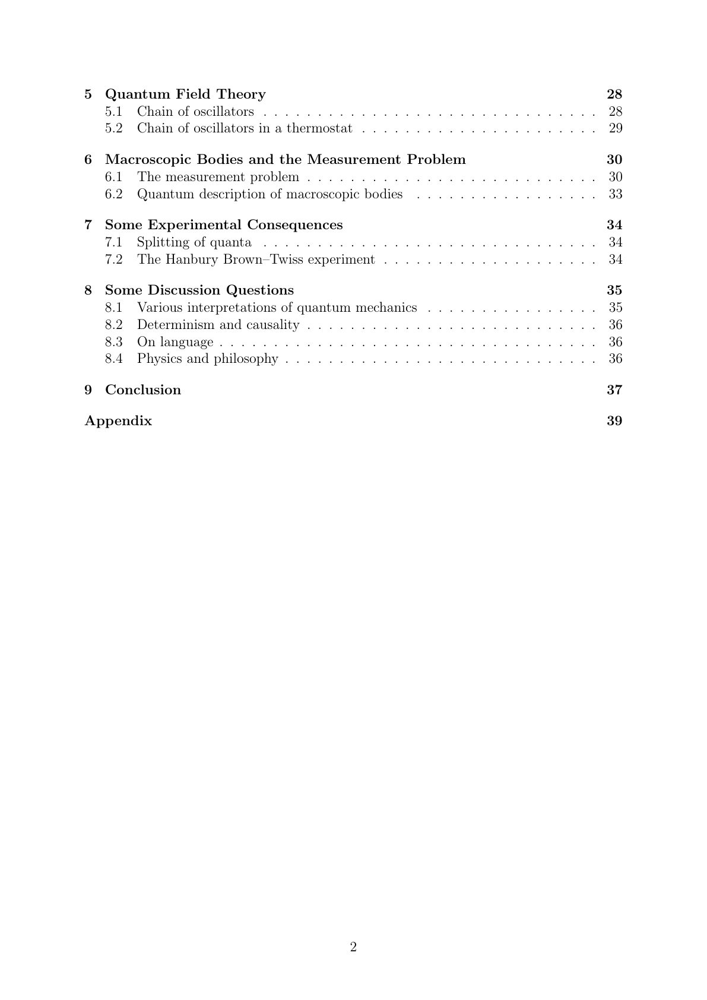 
Low-resolution page preview, page 2

📷 Fig 2

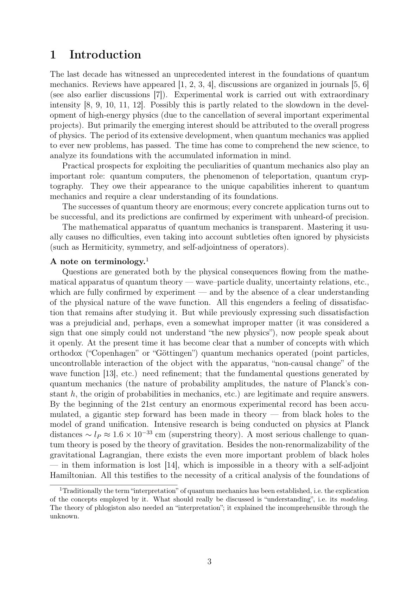 
Low-resolution page preview, page 3

📷 Fig 3

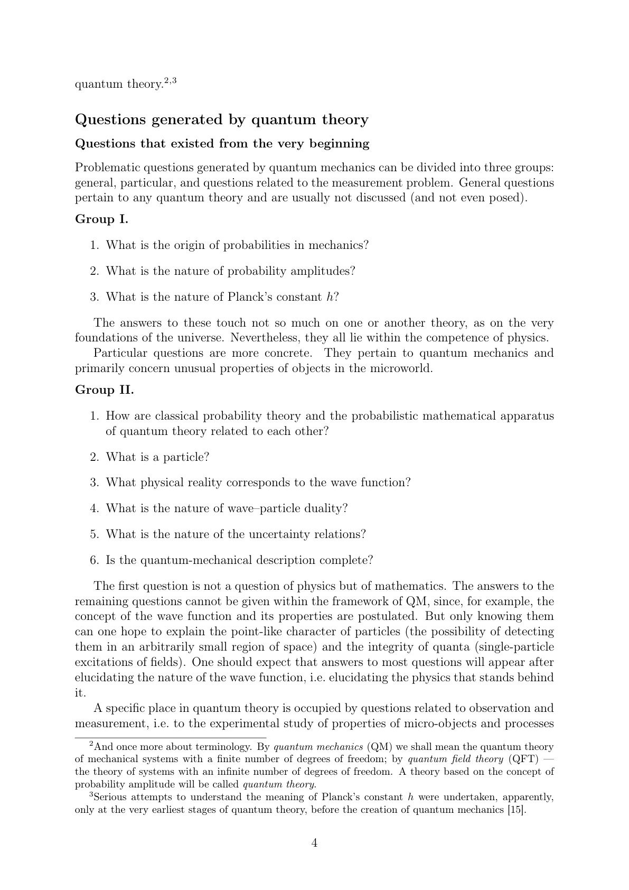 
Low-resolution page preview, page 4

📷 Fig 4

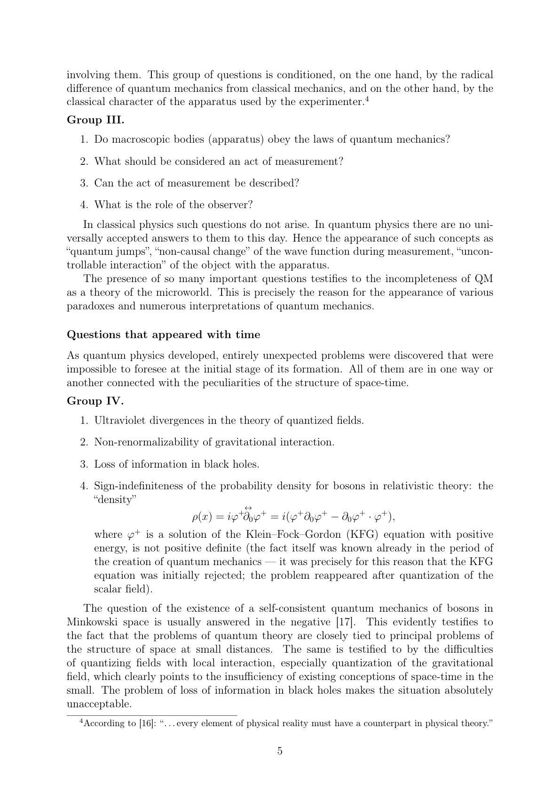 
Low-resolution page preview, page 5

📷 Fig 5

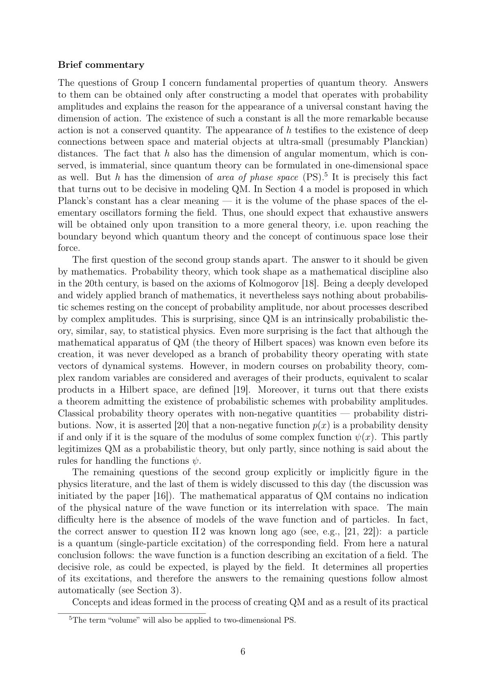 
Low-resolution page preview, page 6

**Summary.** This work provides a comprehensive, foundational examination of quantum mechanics, questioning the physical meaning of probability, the wave function, and Planck's constant. It develops rigorous mathematical axioms and models the measurement process using field theory and decoherence theory. Ultimately, it aims to reconcile the unitary evolution of quantum theory with the definite outcomes observed in the macroscopic world.

**Why it may be interesting.** The deep dive into the measurement problem, decoherence, and superselection rules provides crucial theoretical context for understanding how quantum descriptions must interface with classical, macroscopic reality, which is vital for open quantum systems.

Detailed structure

**Main problem.** The paper tackles the foundational problems of quantum mechanics, specifically the origin of probability, the nature of the wave function, and the measurement problem.

**Main result.** It develops axiomatic frameworks for quantum theory, showing that the mathematical structure is consistent with standard probability theory while highlighting the conceptual gap between unitary evolution and measurement collapse.

**Method.** The approach combines axiomatic formulation (Kolmogorov axioms), mathematical analysis of complex amplitudes, and physical modeling using field theory and oscillator chains.

**Model / system.** The analysis considers quantum mechanical systems ranging from simple oscillators to quantum fields in Minkowski space, and models the measurement process using the transition from amplitudes to probabilities.

**Key observables.** Probability amplitudes ($\psi$), probability densities ($|\psi|^2$), Planck's constant ($h$), and the density matrix ($
ho$).

**Important parameters / regimes.** Planck distances ($l_P$), Planck's constant ($h$), and the distinction between quantum and classical limits.

**Assumptions / limitations.** The necessity of formulating a rigorous axiomatic basis for QM, and the assumption that superselection rules govern macroscopic reality.

**Figures summary.** Not specified.

**Paper structure.** The structure moves from general foundational questions (probability origin, $h$) to specific mathematical formalisms (characteristic functions, axioms), then to physical models (field quantization, oscillator chains), and finally to resolving the measurement paradox via decoherence and superselection rules.

Abstract

This book examines a number of problems of quantum mechanics, most of which are not usually discussed. What is the origin of probabilities in the mechanics of the microworld? What is the nature of Planck's constant h? What is the nature of probability amplitudes? What is the wave function? A system of axioms for quantum theory is formulated. A model is studied according to which a classical oscillator in a thermostat can be interpreted as a quantum one. The measurement problem is discussed in detail.   For advanced undergraduate students, graduate students, and specialists interested in the foundations of quantum theory.

[↑ back to top](#top)

### [Quantum optics of chiral and antichiral waveguide arrays](http://arxiv.org/abs/2605.29536v1)

**Authors:** Peng Wang, Erik Hiltunen, John C Schotland  
**Type:** theory · **Category:** other · **PDF:** <https://arxiv.org/pdf/2605.29536v1>  
**Analysis basis:** full PDF text, analyzed in chunks
**Topic relevance:** `interference shaping light` **3/5** · `analog quantum simulation` **2/5** · `Keldysh / 2PI / non-Gaussian methods` **1/5** · `driven-dissipative phase transition` **1/5** · `methods for driven-dissipative` **1/5** · `non-equilibrium dynamics` **1/5**

📷 Fig 1

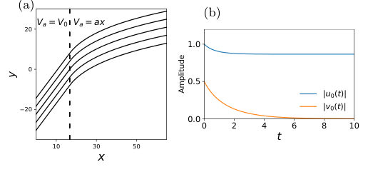 
FIG. 2: Geometrical optics of the antichiral array with a constant potential gradient in the x direction. The characteristic curves are shown in (a) and the field amplitudes in (b). The parameters are chosen as a = 0.3, V0 = 6 and the incident transverse wavenumber is p0 = 4.

📷 Fig 2

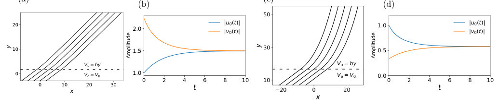 
FIG. 3: Solutions of the eikonal and transport equations for a constant potential gradient in the y direction. We plot the characteristic curves in the chiral (a) and antichiral (c) arrays, and the corresponding field amplitudes in (b) and (d). The parameters are chosen as b = 0.3 and V0 = 0.5 for the chiral array and b = 0.3, V0 = 6 for the antichiral array. The incident wavenumber in the x direction is taken to be q0 = 1 and 4 in the chiral and antichiral cases, respectively.

📷 Fig 3

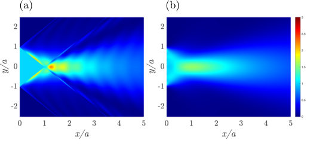 
FIG. 4: The probability |ψ|2 for a single-slit aperture in the chiral (a) and antichiral (b) arrays with ka,ca = 5.

📷 Fig 4

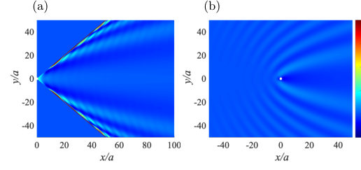 
FIG. 5: The scattered probability |ψs|2 of a single point particle in the chiral (a) and antichiral (b) array with kc,aa = 0.5 and Vc = Va = 1.5.

📷 Fig 5

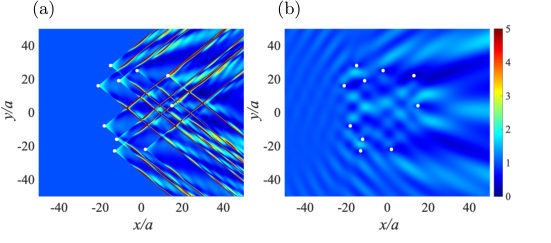 
FIG. 6: The scattered probability |ψ|2 of N = 10 randomly distributed point particles in the chiral (a) and antichiral (b) array with kc,aa = 0.5 and Vc = Va = 1.5. The particles are labeled as white dots.

**Summary.** This paper investigates single-photon scattering in waveguide arrays that are either chiral or antichiral. By modeling the system with Dirac equations, the authors show that the inherent chirality breaks reciprocity, leading to unique wave features like a light-cone in the scattering pattern. This work provides a powerful theoretical tool for designing quantum optical devices based on engineered symmetry breaking.

**Why it may be interesting.** This work provides a detailed theoretical framework for understanding how broken or preserved spatial symmetries (chirality) fundamentally alter wave propagation and scattering phenomena in engineered quantum optical structures.

Detailed structure

**Main problem.** The study compares single-photon scattering by atoms in chiral versus antichiral arrays of one-way waveguides, analyzing the resulting wave phenomena.

**Main result.** The chiral array exhibits a unique 'light-cone feature' in its scattering pattern, while the antichiral array's scattering behavior more closely resembles classical wave optics.

**Method.** The analysis uses the Dirac equation framework, transitioning through geometrical optics, diffraction, and scattering regimes by solving associated eikonal and transport equations.

**Model / system.** The system consists of arrays of one-way waveguides containing two-level atoms, modeled by a Hamiltonian $H = H_A + H_F + H_I$. The governing equations are hyperbolic (chiral) or elliptic (antichiral) Dirac equations.

**Key observables.** Scattering cross section ($\sigma_s$), reflection ($r$) and transmission ($t$) coefficients, and the characteristic field patterns.

**Important parameters / regimes.** Group velocities ($v_n$), coupling strength ($J_0$), interaction strength ($g$), and the potential gradients defining the array structure.

**Assumptions / limitations.** The analysis assumes the system is in a single-excitation state and relies on taking the continuum limit ($\ell 	o 0$) for the field equations.

**Figures summary.** Figures illustrate the comparison between chiral and antichiral arrays, showing light-cone features in scattering probability (Fig. 5) and plotting reflection/transmission coefficients vs. angle or width (Fig. 9).

**Paper structure.** The paper progresses from deriving the coupled differential equations (Dirac equations) for both array types, to analyzing the geometrical optics limit via eikonal equations, and finally to calculating diffraction and scattering cross sections for point scatterers and slabs.

Abstract

We study single-photon scattering by atoms in arrays of one-way waveguides. We investigate both chiral and antichiral arrays, where the one-way waveguides are aligned in the same and opposite directions, respectively. In the chiral array, reciprocity is broken: one of the (spatial) dimensions is time-like, resulting in a light-cone feature of the scattered fields. In contrast, the antichiral array preserves reciprocity and exhibit scattering behavior typical of wave systems. In analogy with classical physical optics, we exmaine the geometrical optics, diffraction, and scattering regimes in the waveguide arrays. We illustrate our results using numerical simulations.

[↑ back to top](#top)

### [Error-corrected phase estimation averaged over variable grids on a trapped-ion quantum computer: hyperacuity spectra of a CO molecule adsorbed onto $χ$-Fe$_5$C$_2$](http://arxiv.org/abs/2605.29674v1)

**Authors:** Taichi Kosugi, Hirofumi Nishi, Keito Kasebayashi, Hiroki Takahashi, Yu-ichiro Matsushita  
**Type:** both · **Category:** quantum information and computing · **PDF:** <https://arxiv.org/pdf/2605.29674v1>  
**Analysis basis:** full PDF text, analyzed in chunks
**Topic relevance:** `QC/QI experiment` **3/5** · `analog quantum simulation` **2/5** · `quantum measurements` **2/5** · `methods for driven-dissipative` **1/5**

📷 Fig 1

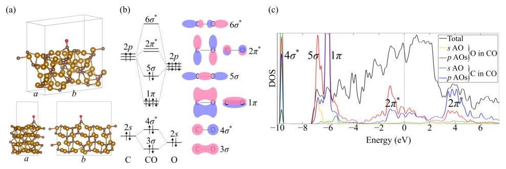 
FIG. 1. (a) Unit cell used for DFT calculations in the present study. This periodic system mimics the non-periodic adsorption system, where a CO molecule is adsorbed onto the (510) surface of χ-Fe5C2. This figure was drawn by using VESTA [51]. (b) Schematic energy diagram of the molecular orbitals (MOs) of an isolated CO molecule. The amplitudes of the MOs are also depicted. (c) Electronic density of states (DOS) obtained in the DFT calculation as functions of an energy measured from the Fermi level. The total DOS is shown as black curves. The projected DOS onto the atomic orbitals (AOs) at the CO molecule are also shown, where the MOs giving rise to the major contributions are written. The...

📷 Fig 2

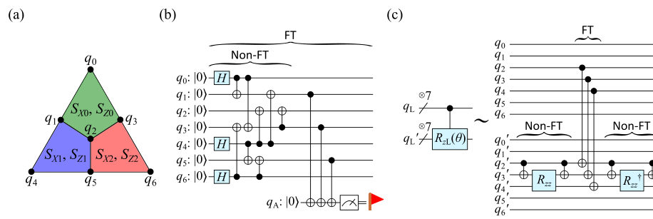 
FIG. 2. (a) Convention for the Steane code adopted in the present study. The seven vertices represent the constituent physical qubits forming a logical qubit. The four vertices forming each plaquette of a single color designate the stabilizer generator for each of X- and Z-types [see Eq. (25)]. This figure does not necessarily represent the actual layout of qubits on hardware. (b) The FT encoding circuit Uenc [69] for preparing |0⟩L from initialized physical qubits. Its former part, that encodes |0⟩L, is non-FT. The latter part prevents a harmful error from propagating outward the eight-qubit circuit by detecting it via the ancillary state |1⟩as a flag. The entire circuit is FT. (c) The...

📷 Fig 3

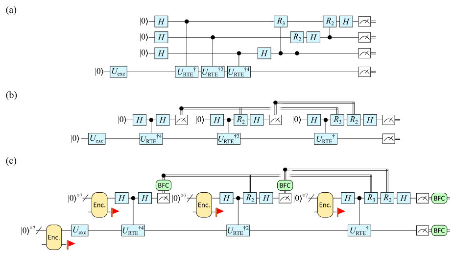 
FIG. 3. (a) Four-qubit physical circuit C(phys) for the QPE sampling used in the present study. Uexc prepares the electron- or hole-excited state. This performs QPE for n(QFT) q = 3 by using three ancillary qubits with Rk ≡diag(1, exp(−i2π/2k)). The phase gates to adjust the origin E(s) orig of energy for the sth setting are not drawn in the figure for simplicity. (b) Two-qubit

📷 Fig 4

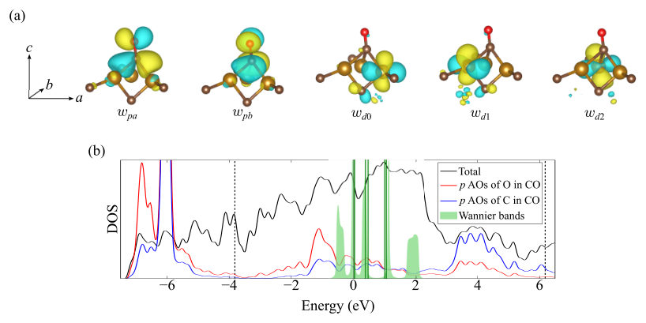 
FIG. 4. (a) Five MLWOs constructed from the DFT calculation. (b) Electronic DOS originating from the interpolated Wannier bands are shown as shaded region. The total DOS and projected DOS in this figure are the same as in Fig. 1. The energy range between the two vertical dashed lines is the energy window for the construction of the MLWOs. The vertical green solid lines indicate the orbital energies of the MLWOs.

📷 Fig 5

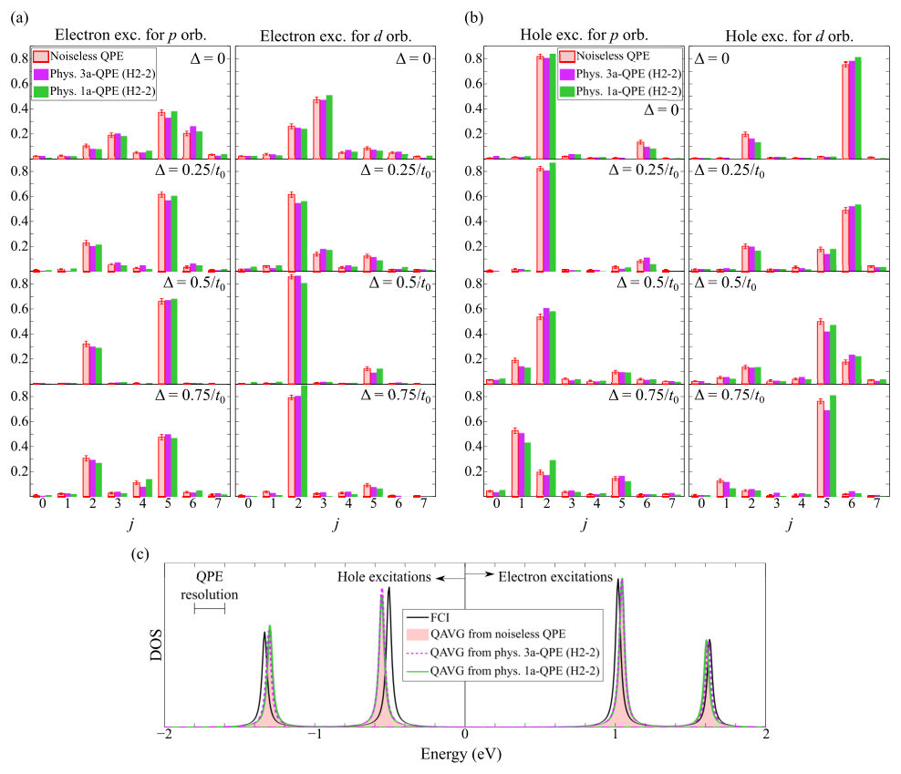 
FIG. 5. (a) Normalized histograms obtained from the three-ancilla QPE circuit C(phys) and the single-ancilla QPE circuit C(phys,1a) for electron excitations with four origin shifts ∆executed on H2-2. For each of the histograms, nshots = 500 shots were performed. j represents each measurement outcome indicating the observed (effective) three ancillae. The probability distributions Pj calculated from noiseless circuit simulations are also shown, together with the standard deviations σj = √

**Summary.** This paper introduces QPE averaged over variable grids (QAVG) as a robust technique to overcome noise and low resolution in quantum simulations of electronic spectra. By applying QAVG to a model of CO adsorption on a metal surface, the authors demonstrate that the method accurately reconstructs the system's Density of States using both physical and error-corrected logical quantum circuits. This paves a path for simulating complex correlated materials on early fault-tolerant quantum computers.

**Why it may be interesting.** This work directly addresses the practical limitations of quantum simulation by proposing a noise-resilient algorithm (QAVG) that makes high-resolution spectroscopy feasible on near-term, noisy quantum hardware.

Detailed structure

**Main problem.** The core challenge is accurately extracting the excitation spectra of many-electron systems using Quantum Phase Estimation (QPE), which is limited by low grid resolution and environmental noise on current quantum hardware.

**Main result.** The proposed QPE averaged over variable grids (QAVG) method successfully reconstructs spectra with high accuracy, even when using noisy measurements from physical and logical quantum circuits.

**Method.** The authors developed QAVG, a vernier-type approach combining low-resolution QPE with multiple origin shifts and continuous parametrization to stabilize spectral reconstruction.

**Model / system.** The study applies this method to model the electronic structure of a CO molecule adsorbed onto a $\chi$-Fe$_5$C$_2$ surface, simplified to a two-orbital dimer model for feasibility.

**Key observables.** Hyperacuity spectra, one-particle Green's functions (GFs), and the Density of States (DOS).

**Important parameters / regimes.** The chemical potential shift ($\Delta\mu$) was set to ensure a two-electron ground state; the calculation uses the Steane code for logical qubits.

**Assumptions / limitations.** The primary assumption is that averaging over multiple energy origins (QAVG) can suppress spectral leakage and stabilize the optimization process, making the method robust for early fault-tolerant quantum computing.

**Figures summary.** Figures show the unit cell and DOS from DFT, comparisons of DOS from QAVG vs. FCI/noiseless simulations, and cost landscapes demonstrating the suppression of local minima via averaging.

**Paper structure.** The paper first establishes the physical model (CO/$\chi$-Fe$_5$C$_2$) and the need for spectral extraction. It then details the QAVG methodology, implementing it on both physical and logical quantum circuits (Steane code) to calculate the GF and DOS, culminating in a comparison of results against theoretical benchmarks.

Abstract

Quantum phase estimation (QPE) is an underlying technology for extracting the excitation spectra of many-electron systems, yet its practical use on current hardware is hindered by low grid resolution and environmental noises. Here we propose QPE averaged over variable grids (QAVG), a vernier-type approach that combines low-resolution QPE with multiple origin shifts and physically motivated continuous parametrization to reconstruct the spectra accurately. We introduce this approach into an end-to-end workflow for the {\it ab initio}-based model system for a CO molecule adsorbed onto the $χ$-Fe$_5$C$_2$ surface. We perform experiments on Quantinuum H2-2 using both physical QPE circuits and logical QPE circuits encoded in the Steane code with offline bit-flip correction. We demonstrate that QAVG accurately reconstructs the spectra with deviations much smaller than the nominal QPE resolution, even when the noisy histograms are used. The cost landscapes averaged over the shifted grids substantially suppress the local minima arising from the spectral leakage, thereby stabilizing the optimization of trial parameters. These results indicate that QAVG provides a robust route to quantum simulations of correlated spectra toward the era of early-fault-tolerant quantum computers.

[↑ back to top](#top)

### [Estimates of ground state energies for the quantum SK and 2D-EA model, using deGennes-Suzuki-Kubo mean-field annealing dynamics](http://arxiv.org/abs/2605.29875v1)

**Authors:** Soumyaditya Das, Soumyajyoti Biswas, Bikas K. Chakrabarti  
**Type:** theory · **Category:** disordered systems and neural networks · **PDF:** <https://arxiv.org/pdf/2605.29875v1>  
**Analysis basis:** full PDF text, analyzed in chunks
**Topic relevance:** `exotic spin models in light-matter` **3/5** · `Keldysh / 2PI / non-Gaussian methods` **2/5** · `methods for driven-dissipative` **2/5** · `analog quantum simulation` **1/5**

📷 Fig 1

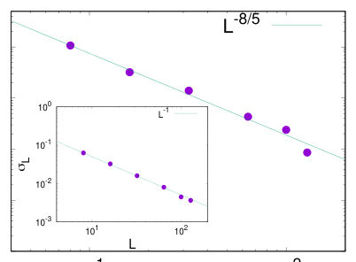 
FIG. 2. 2D EA model: In main fig., the finite size scaling of lowest energy values are shown. It shows a scaling E0 L −E0 ∼ L−8/5. The ground state energy (L →∞) is obtained from the least-square fitting, which is −1.3787±0.0001 (considering the exponent to be 8/5). The inset shows the scaling of the fluctuations σL of E0 L which shows a scaling σL ∼L−1.

📷 Fig 2

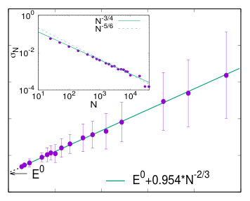 
FIG. 1. SK model: The energy values for given system size are plotted against N −2/3. It shows a scaling E0 N ∼N −2/3. The ground state energy (N →∞) is the Parisi value E0 SK = −0.7631 . . . . From the least-square fitting we obtain a ground state energy, E0 = −0.7623 ± 0.0001 (considering the exponent to be 2/3). The inset shows the variation of the fluctuations σN of E0 N. It appears that while for the entire range of N values, σN ∼N −3/4 gives good fit, for larger val- ues of N, σN ∼N −5/6

📷 Fig 3

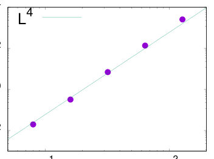 
FIG. 3. The computational cost of the algorithm (for each configurations) in EA model scales as L4 (or N 2).

📷 Fig 4

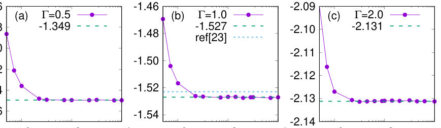 
FIG. 4. 2D EA model: The saturation of total ground state energy Etot L is shown as a function of τ (in units of L2) for different values of Γ. For all three cases, Etot L saturates quickly as the annealing time increases. For smaller values of the transverse field i.e., in case of (b), Etot L matches well with previously reported result (see ref.[23]), for Γ = 1, Etot L = −1.527. The simulation is performed for L = 8 with open boundary condition.

📷 Fig 5

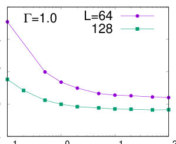 
FIG. 5. 2D EA model: The saturation of total ground state energy Etot L is shown as a function of τ/L2 for different system sizes (L = 64, 128) for Γ = 1.

**Summary.** This work develops and applies the deGennes-Suzuki-Kubo mean-field annealing dynamics to calculate the ground state energies of quantum spin glass models, namely the SK and EA models. By simulating quantum annealing on large systems, the authors achieve high-precision estimates for the ground state energy, demonstrating the method's efficiency and accuracy for disordered quantum systems.

**Why it may be interesting.** The use of mean-field dynamics to study quantum phase transitions and ground state properties in disordered systems is highly relevant for understanding complex quantum many-body physics, which shares conceptual links with quantum optimization problems.

Detailed structure

**Main problem.** The paper aims to estimate the ground state energies for quantum spin glass models, specifically the Sherrington-Kirkpatrick (SK) and 2D-Edwards-Anderson (EA) models.

**Main result.** The developed method successfully estimates the ground state energy for the SK model to high precision ($E_0/N \approx -0.7623$), and extends this framework to the EA model.

**Method.** The estimation relies on simulating quantum annealing dynamics using the deGennes-Suzuki-Kubo mean-field approach.

**Model / system.** The study focuses on quantum spin glass Hamiltonians, including the mean-field SK model and the nearest-neighbor EA model, both subjected to a transverse magnetic field ($\Gamma$).

**Key observables.** Ground state energy ($E_0$), finite size scaling exponents ($N^{-2/3}$ for SK, $L^{-8/5}$ for EA), and energy fluctuations ($\sigma_N, \sigma_L$).

**Important parameters / regimes.** System size ($N$ or $L$), transverse field ($\Gamma$), and the annealing schedule.

**Assumptions / limitations.** The primary assumption is the applicability of the deGennes-Suzuki-Kubo mean-field approximation, which is most rigorously applied to the mean-field SK model.

**Figures summary.** Figures illustrate the energy scaling for SK and EA models, showing convergence to the infinite limit, and also depict the computational cost scaling ($L^4$ or $N^2$) and the saturation of the total ground state energy with annealing time.

**Paper structure.** The paper introduces the problem of ground state energy estimation in quantum spin glasses, details the deGennes-Suzuki-Kubo mean-field annealing dynamics, applies this method to the SK model with large simulations, and finally extends the methodology to the 2D EA model.

Abstract

We perform a large scale simulation of quantum annealing in the Sherrington-Kirkpatrick (SK) spin glass up to a system size $N=40000$ to estimate its ground state energy using the deGennes-Suzuki-Kubo mean-field Ising dynamics, extending the earlier results (reported in Eur. Phys. J. B {\bf 98}, 226 (2025)). Here we numerically solve the deGennes-Suzuki-Kubo annealing dynamics to obtain the spin configurations and subsequently the ground state energy for a given system size at the end of the annealing (to the desired quantum system at the corresponding values of the transverse field), starting from a quantum paramagnetic state. The method shows high efficiency, with an overall algorithmic cost of $O(N^3)$ in estimating the energy of the ground state. We later extend this method to study the ground state energy of the Edwards-Anderson (EA) spin glass on a square lattice.

[↑ back to top](#top)

### [Toward Practical Two-Way Covert Communication](http://arxiv.org/abs/2605.29840v1)

**Authors:** Paul N. Fessatidis, Wyatt Wallis, Tae E. Cooper, Mark J. Meisner, Jaim Bucay, Saikat Guha, Shelbi L. Jenkins, Michael S. Bullock, Boulat A. Bash  
**Type:** both · **Category:** quantum information and computing · **PDF:** <https://arxiv.org/pdf/2605.29840v1>  
**Analysis basis:** full PDF text, analyzed in chunks
**Topic relevance:** `quantum optics experiment` **3/5** · `entanglement & information structure` **2/5** · `Keldysh / 2PI / non-Gaussian methods` **1/5** · `interference shaping light` **1/5** · `methods for driven-dissipative` **1/5**

📷 Fig 1

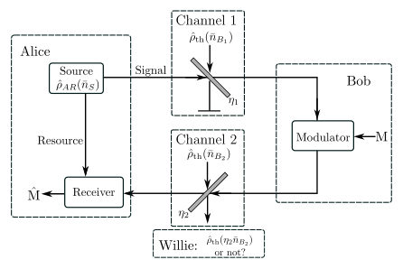 
Fig. 1. Two-way covert communication model where Willie stands behind Alice, described in Section II-B.

📷 Fig 2

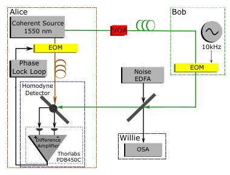 
Fig. 2. Experimental setup. The coherent source (Amonics ADFB-1550- 20-B) is split into the signal (green) and reference (orange) arms. Bob and Alice’s EOM’s are Thorlabs LN65S. A Pri-tel FA-18 EDFA injects noise into the channel. We use Yokogawa AQ6370B OSA to collect data at Willie, and a Thorlabs PDB450C balanced detector at Alice.

📷 Fig 3

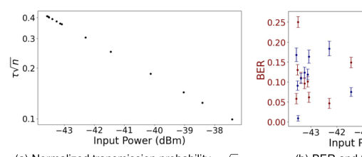 
Fig. 3. Experimental results discussed in Section IV-B.

📷 Fig 4

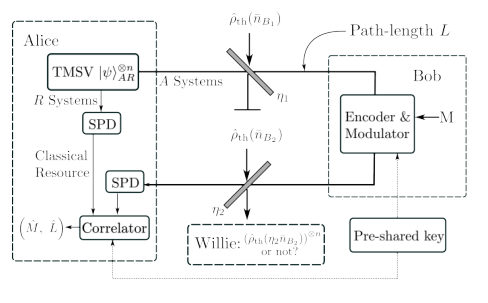 
Fig. 4. Configuration for the proposed correlator-based covert- communication and range-sensing transceiver.

📷 Fig 5

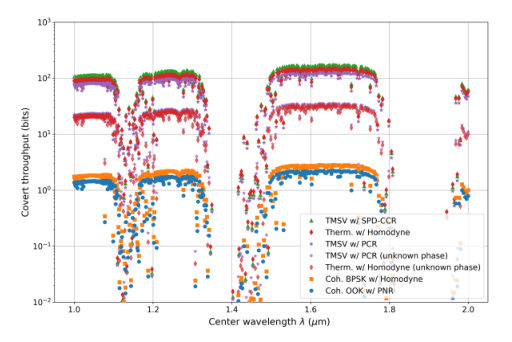 
Fig. 5. Simulated throughput of the two-way covert communications schemes described in Section V.

**Summary.** This paper tackles the practical implementation of two-way covert quantum communication, aiming to send secret messages without alerting a quantum eavesdropper. The authors overcome the experimental hurdle of mode-matching by proposing a correlator-based receiver using squeezed vacuum states. They provide both theoretical bounds and experimental demonstrations showing how to maximize secure information transfer rates.

**Why it may be interesting.** This work is highly relevant to quantum optics and open quantum systems, as it deals with information security and channel capacity limits in the presence of eavesdropping, requiring deep knowledge of quantum channel characterization and error bounding.

Detailed structure

**Main problem.** The paper addresses the challenge of designing practical two-way covert communication schemes that allow information transfer while remaining undetected by a quantum-capable adversary.

**Main result.** The authors propose and analyze a correlator-based receiver using quantum two-mode squeezed vacuum states, which achieves broadband communication gains without the need for difficult mode-matching, significantly outperforming other analyzed schemes.

**Method.** The work combines theoretical analysis using quantum relative entropy (QRE) bounds for covertness with experimental demonstrations using narrowband lasers and theoretical derivations involving Taylor expansions of quantum operators.

**Model / system.** The system is modeled using quantum bosonic channels, involving Alice transmitting to Bob, who then modulates and reflects the signal back to Alice. The analysis considers both broadband (ideal) and narrowband (practical) optical setups.

**Key observables.** Covert throughput, Quantum Relative Entropy (QRE), Shannon capacity, and the probability of successful range determination ($p_s$).

**Important parameters / regimes.** Channel transmittance ($\eta_i$), thermal-noise mean photon number ($ar{n}_{Bi}$), and the tolerance to detection ($\delta_{QRE}$).

**Assumptions / limitations.** The adversary is assumed to be quantum-capable, and the authors often assume lossless channels or specific approximations for the receiver performance.

**Figures summary.** Figures illustrate the communication model, experimental setups (using EDFA/coherent sources), and comparative plots showing covert capacity lower bounds and achievable throughput across different schemes.

**Paper structure.** The paper progresses from establishing the theoretical limits of covert communication using quantum channels, demonstrating a proof-of-concept with practical narrowband sources, and finally comparing the performance of several advanced receiver schemes, culminating in detailed mathematical derivations of error bounds.

Abstract

We study two-way covert communication schemes, where information is transmitted by passively modulating a reflected signal back to the source. We consider optical systems, described by quantum bosonic channels. While broadband classical and quantum light sources offer high covert throughput in theory, the associated mode-matching and phase-synchronization requirements make them impractical. Therefore, we employ a narrowband laser source to experimentally demonstrate a proof-of-concept two-way covert communication system, where the adversary is assumed to be quantum-capable. Furthermore, we propose a correlator-based receiver that attains the broadband gain offered by a quantum light source without the need for precise mode matching.

[↑ back to top](#top)

### [Tunneling phase diagram: A machine-learning framework for multidimensional kinetic isotope effects](http://arxiv.org/abs/2605.30165v1)

**Authors:** Xinrui Yang, Zhigang Wang  
**Type:** theory · **Category:** disordered systems and neural networks · **PDF:** <https://arxiv.org/pdf/2605.30165v1>  
**Analysis basis:** full PDF text, analyzed in chunks
**Topic relevance:** `methods for driven-dissipative` **3/5** · `Keldysh / 2PI / non-Gaussian methods` **1/5** · `analog quantum simulation` **1/5** · `driven-dissipative phase transition` **1/5** · `non-equilibrium dynamics` **1/5** · `non-equilibrium universality` **1/5**

📷 Fig 1

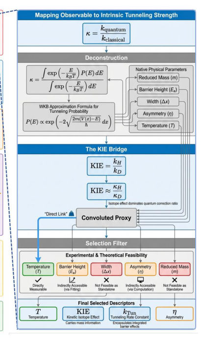 
Fig. 1. Machine-learning framework and theoretical foundation for decoding the KIE–κ relationship. (Left) Conceptual workflow: the KIE paradox (KIE as a composite observable), first-principles data generation (DFT calculations for four amino acids with H/D substitution), ensemble ML benchmarking (eight algorithms with XGBoost optimal), and the tunneling phase diagram revealing three dynamical regimes and an anomalous high KIE–low κ region. (Right) Theoretical derivation of the descriptor set: kTun = κ·kCla, with κ obtained via VTST/SCT and KIE from isotopic substitution, establishing the feature space [KIE, T, k, η] → κ.

📷 Fig 2

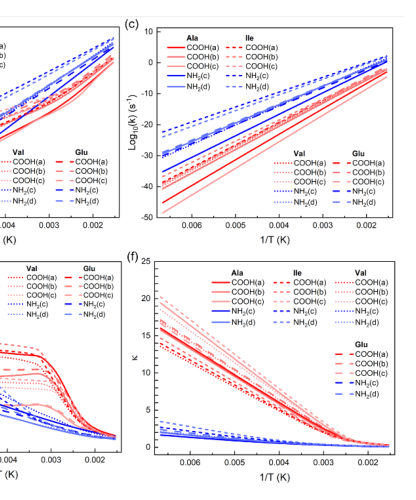 
Fig. 2. Presentation of the reaction dataset for the concerted proton transfer reaction pathway mediated by a water bridge. (a) and (b) depict the quantum reaction rates as a function of temperature for the COOH and NH2 reactions of four amino acid molecules under different hydrogen isotope conditions (H/D). (c) illustrates the classical reaction rates as a function of temperature for various reactions. (d) provides a bar chart showing the reaction asymmetry for different reactions. (e) displays the kinetic isotope effect values as a function of temperature for distinct reactions. (f) shows the relationship between the tunneling correction factors and temperature for different reactions.

📷 Fig 3

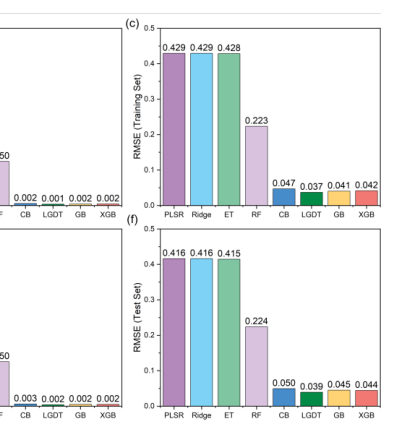 
Fig. 3. Performance comparison of eight machine learning models, evaluated based on Mean

📷 Fig 4

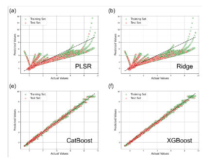 
Fig. 4. Comparison of predicted values versus actual values for eight machine learning models.

📷 Fig 5

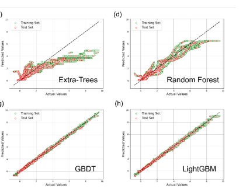 
Fig. 4 displays scatter plots of predicted versus actual values for the eight machine learning algorithms on both training and test sets. For Partial Least Squares Regression (PLSR, Fig. 4(a)) and Ridge Regression (Fig. 4(b)), although a high linear fitting quality is observed on the training set, the test set predictions (red) show significantly scattered distributions relative to the training set (blue), indicating overfitting risks likely arising from the linear methods’ inability to represent the complex nonlinear relationships inherent in quantum tunneling effects. Extra-Trees (Fig. 4(c)) and Random Forest (Fig. 4(d)) perform well in the low-rate region, but in the high reaction-rate...

**Summary.** This work introduces a machine-learning framework to overcome the ambiguity in using the Kinetic Isotope Effect (KIE) to measure quantum tunneling. By training ensemble models on DFT-derived reaction data, the authors successfully decouple the true tunneling factor ($\kappa$) from classical kinetic contributions. The resulting phase diagram provides a quantitative map for assessing quantum tunneling across various temperature regimes.

**Why it may be interesting.** While focused on chemical kinetics, the core methodology—using ML to decouple complex, non-linear physical parameters ($\kappa$) from measurable proxies (KIE)—is highly relevant to modeling open quantum systems where multiple coupled effects obscure the true quantum dynamics.

Detailed structure

**Main problem.** The Kinetic Isotope Effect (KIE) is an insufficient probe for quantifying quantum tunneling because it conflates tunneling effects with zero-point energy and classical kinetics.

**Main result.** The developed machine-learning framework successfully decodes the nonlinear relationship between KIE and the tunneling factor ($\kappa$), revealing a complex 'tunneling phase diagram' that defines quantitative assessment regimes.

**Method.** The study employs ensemble machine learning (e.g., XGBoost) to map the multi-dimensional relationship between KIE, temperature, and other descriptors to predict the intrinsic tunneling factor ($\kappa$).

**Model / system.** The research models chemical reaction dynamics, specifically concerted proton transfer reactions involving amino acids, using DFT-derived Potential Energy Surfaces (PESs) to calculate quantum and classical rate constants.

**Key observables.** KIE, $\kappa$ (tunneling factor), quantum rate constant ($k_{	ext{Tun}}$), classical rate constant ($k_{	ext{Cla}}$), and temperature ($T$).

**Important parameters / regimes.** The anomalous high KIE–low $\kappa$ spanning 300–600 K defines a critical regime for quantum tunneling assessment.

**Assumptions / limitations.** The analysis treats isolated molecules in the gas phase, simplifying the complex condensed-phase environment.

**Figures summary.** Figures illustrate the conceptual workflow from KIE paradox to ML benchmarking, and the final phase diagram mapping KIE vs. $\kappa$ across different temperature regimes.

**Paper structure.** The paper establishes the physical problem (KIE ambiguity), details the computational methods (DFT, VTST, ML), presents the ML model training and validation (using various algorithms), and culminates in the interpretation of the resulting multidimensional tunneling phase diagram.

Abstract

The kinetic isotope effect (KIE) is the conventional probe for quantum tunneling, yet its composite nature conflates tunneling with zero-point energy and classical kinetics. Here, we introduce the tunneling phase diagram, a machine-learning framework that decouples true tunneling strength by decoding the nonlinear relationship between KIE and the tunneling factor (\k{appa}). With exceptional fidelity (R^2 > 0.98, RMSE = 0.21), this framework reveals an anomalous high KIE-low \k{appa} spanning 300-600 K, thereby defining a paradigm for the quantitative assessment of quantum tunneling.

[↑ back to top](#top)

### [Candidate collapse-noise correlators from Generalized Trace Dynamics: a Hubble-scale spectral line under structural assumptions](http://arxiv.org/abs/2605.29374v1)

**Authors:** Tejinder P. Singh  
**Type:** theory · **Category:** other · **PDF:** <https://arxiv.org/pdf/2605.29374v1>  
**Analysis basis:** full PDF text, analyzed in chunks
**Topic relevance:** `Keldysh / 2PI / non-Gaussian methods` **3/5** · `methods for driven-dissipative` **3/5** · `quantum measurements` **1/5**

📷 Fig 1

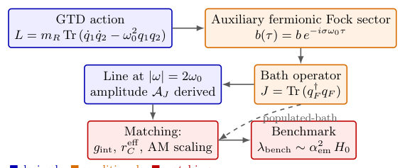 
Figure 1: Dependency tree of the central result. The GTD action (top-left, derived) motivates, but does not by itself derive, the auxiliary fermionic Fock sector (top-right, conditional), in which the nilpotent pure-fermion coefficient is replaced by an ordinary scalar parameter. Within that sector the bath operator J = Tr(q† F qF ) is adopted as a candidate matter-coupling current. The connected two-point function gives a single Wightman line at ω = −2ω0 with computed amplitude AJ (in the working branch σ = +1 adopted throughout the paper). Three matching hypotheses (red) enter the linear master equation and benchmark rate: the system–bath coupling gint, the spatial kernel reff C , and the...

**Summary.** This paper proposes using Generalized Trace Dynamics (GTD) to derive a microscopic source for the noise field responsible for objective quantum collapse. It calculates a narrow-band spectral correlator at twice the Hubble frequency, which is structurally distinct from current phenomenological bounds. The derivation, however, relies on several non-trivial structural postulates, leaving the final objective-collapse theory incomplete.

**Why it may be interesting.** This work tackles the fundamental problem of objective collapse by providing a structural, field-theoretic candidate for the noise source, offering a potential link between cosmology (Hubble scale) and quantum measurement theory.

Detailed structure

**Main problem.** To derive a microscopic, parameter-free source for the noise field associated with objective collapse models (like CSL) using Generalized Trace Dynamics (GTD).

**Main result.** The framework predicts a narrow-band spectral line at twice the Hubble scale ($2H_0$), which is structurally distinct from the white-noise spectra predicted by standard CSL bounds.

**Method.** The authors compute the two-point function of a candidate collapse-noise operator using auxiliary canonical fermionic Fock-space quantization within the GTD framework.

**Model / system.** The model is based on Generalized Trace Dynamics (GTD), which attempts to derive quantum mechanics from a trace structure involving Grassmann algebras and fermionic sectors. The calculation involves coupling a system to a bath via a bilinear operator $J$.

**Key observables.** The two-point correlation function $\langle 0|J(	au)J(0)|0
angle$, which predicts a spectral line at $|\omega| = 2\omega_0$.

**Important parameters / regimes.** Hubble scale ($\omega_0 \sim H_0$), the amplitude $A_J$, and the structural postulates required for the calculation.

**Assumptions / limitations.** The derivation relies heavily on several structural postulates, including replacing a nilpotent coefficient with an auxiliary scalar parameter and assuming positive-norm canonical quantization for the fermionic sector.

**Figures summary.** Not specified.

**Paper structure.** The paper proceeds by defining the GTD structure, identifying the noise operator $J$, performing the two-point function calculation in the auxiliary Fock space, and then discussing the necessary structural postulates and open problems required to achieve a parameter-free derivation.

Abstract

We present a conditional construction of candidate CSL-type collapse-noise correlators inspired by Generalized Trace Dynamics (GTD). The construction is not a parameter-free derivation from the minimal GTD Grassmann algebra. It rests on a chain of explicit structural postulates, listed in Section 1; within that auxiliary structure the spectral form and amplitude follow by computation rather than by phenomenological fitting. The resulting narrow-band spectrum at the Hubble scale lies outside the bands of current CSL bounds, so the framework is not in tension with existing high-frequency data.   We compute the two-point function of a candidate collapse-noise operator associated with the GTD aikyon decomposition $q_i = q_B + a_0β_i q_F$. In the minimal Grassmann algebra, $q_F$ appears only multiplied by Grassmann generators $β_i$, the reduction of $\mathrm{Tr}(q_F^\daggerΓ^μq_F)$ to ghost-mode operators is obstructed by the nilpotent $δβ= β_2 - β_1$, and the pure-fermion coefficient $β_1β_2$ has no ordinary sign, modulus, or inverse. We therefore introduce an auxiliary canonical fermionic Fock-space sector for $q_F$, equivalently replacing the nilpotent pure-fermion coefficient by an ordinary effective scalar body parameter. This replacement is an independent structural postulate, not a consequence of the original minimal action.   Under this auxiliary postulate, together with a scalar bilinear $J = \mathrm{Tr}(q_F^\dagger q_F)$ as bath operator, positive-norm canonical quantization, and an effective sign choice $σ= \pm1$ for the scalarized pure-fermion sector, elementary Wick contraction gives a Wightman line at $|ω| = 2ω_0$ with amplitude $A_J = (\hbar/2m_Rω_0 L_{\mathrm{aik}}^2)^2\cdot N\cdot D$. The cosmological identification $ω_0 \sim H_0$ places the line at twice the Hubble scale. [truncated]

[↑ back to top](#top)

### [Effective Theory of Fermion Quartet Condensation](http://arxiv.org/abs/2605.29338v1)

**Authors:** Qiao-Ru Xu, Congjun Wu  
**Type:** theory · **Category:** quantum gases · **PDF:** <https://arxiv.org/pdf/2605.29338v1>  
**Analysis basis:** full PDF text, analyzed in chunks
**Topic relevance:** `Keldysh / 2PI / non-Gaussian methods` **3/5** · `analog quantum simulation` **3/5** · `methods for driven-dissipative` **1/5**

📷 Fig 1

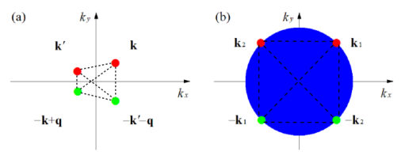 
FIG. 1. Schematic plots of two different scenarios for the fermion quartet formation in spin- 1

**Summary.** This paper develops an effective theory for superconductivity in dilute spin-1/2 Fermi systems based on the condensation of fermion quartets. By constructing a variational wavefunction and deriving a gap equation, the authors calculate key properties like excitation energies and the superfluid fraction. The results show that despite the complex quartet interaction, the superfluid behavior mirrors that of conventional superconductors.

**Why it may be interesting.** The work provides a theoretical framework for exotic pairing mechanisms (quartet condensation) in a gas-like setting, drawing parallels to established BCS theory while exploring higher-order correlations.

Detailed structure

**Main problem.** Developing an effective theory for superconductivity or superfluidity arising from the condensation of fermion quartets.

**Main result.** The theory successfully derives a gap equation and predicts that the superfluid fraction remains the same as in conventional BCS superconductors.

**Method.** The authors construct a variational wavefunction and minimize the total energy using an effective quartic Hamiltonian, analogous to BCS theory.

**Model / system.** The system under study is a dilute spin-1/2 Fermi gas at zero temperature, modeled by an effective Hamiltonian involving quartet creation/annihilation operators.

**Key observables.** Superfluid fraction ($f_s$), single-particle excitation energy ($\omega_k$), and three-particle excitation energy ($\omega_{kk'q}$).

**Important parameters / regimes.** The gap parameter ($\Delta_{kk'q}$) characterizes the quartet condensation; the analysis is restricted to the dilute quartet approximation.

**Assumptions / limitations.** The primary approximation used is the Dilute Quartet Approximation (DQA), which assumes commutators of quartet operators are negligible for widely separated brackets.

**Figures summary.** Figure 1 schematically illustrates two scenarios for fermion quartet formation: binding of two tightly bound Cooper pairs and binding of two loosely bound Cooper pairs on the Fermi surface.

**Paper structure.** The paper develops the effective Hamiltonian, derives the gap equation by minimizing the energy, and then calculates key observables like excitation energies and the superfluid fraction using linear response theory.

Abstract

We develop a theory of superconductivity (or superfluidity) based on condensed fermion quartets focusing on the dilute spin-$\frac{1}{2}$ systems at zero temperature. In the spirit of the Bardeen--Cooper--Schrieffer ansatz, a variational wavefunction is constructed such that, within the so-called ``dilute quartet approximation", it is the ground state of an effective quartic Hamiltonian. For a given two-body interaction in favor of quartetting, the gap parameter is suitably defined and the gap equation is also derived. As to the excited states, an intuitive physical picture based on a sixteen-dimensional ``occupation space" is depicted and the associated eigen-energies are obtained. This theory is applied to compute the superfluid fraction, which is found to be the same as in conventional superconductors, despite the interacting nature of the quartet problem.

[↑ back to top](#top)

### [Exponentially Fast Solution State Preparation for the Heat Equation and its use for Option Pricing](http://arxiv.org/abs/2605.28950v1)

**Authors:** Gumaro Rendon, Stepan Smid, Sarvagya Upadhyay  
**Type:** theory · **Category:** quantum information and computing · **PDF:** <https://arxiv.org/pdf/2605.28950v1>  
**Analysis basis:** full PDF text, analyzed in chunks
**Topic relevance:** `analog quantum simulation` **3/5** · `Keldysh / 2PI / non-Gaussian methods` **1/5** · `entanglement & information structure` **1/5** · `methods for driven-dissipative` **1/5** · `non-equilibrium dynamics` **1/5**

📷 Fig 1

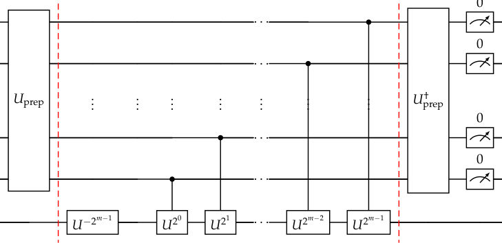 
Figure 1: Circuit to implement an m-qubit LCU implementation of e−βA. U is e−iπA/P. The Uprep applied on |0⟩⊗m prepares the square root of the positive-definite coefficients of the LCU.

📷 Fig 2

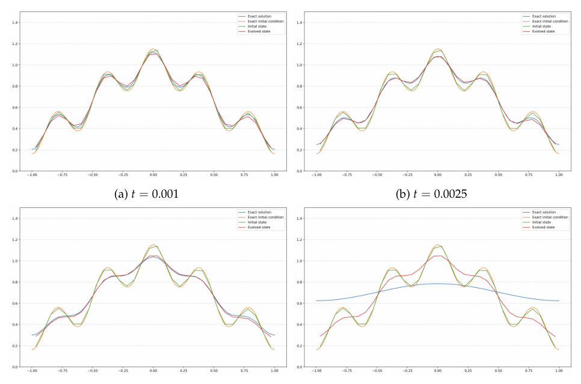 
Figure 3: Solving the heat equation ∂tψ = ∂2 xψ with initial condition ψ0(x) ∝cos(5πx) + 2 cos(πx) + 4 and periodic boundary conditions, comparing the exact solution to the one obtained with FFLCU, using n = 5 qubits for the state, m = 4 qubits for the LCU, and k = 5 ancilla qubits for Grover-Rudolph method used for encoding the LCU coefficients. Here, all functions are al- ways rescaled to have ℓ2 norm equal to 1 (note that this property is normally not preserved during evolution under heat equation). Correspondingly, all measured amplitudes are rescaled by √

📷 Fig 3

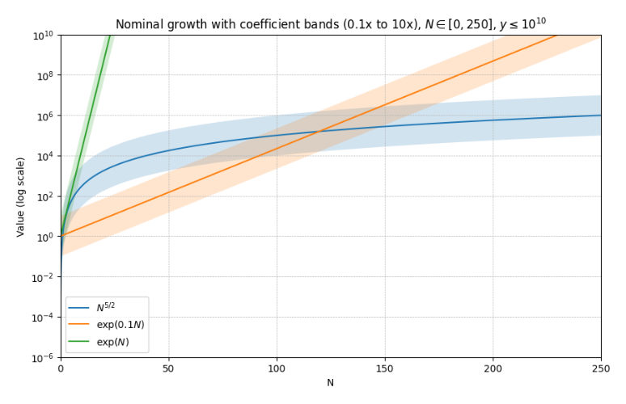 
Figure 4: Cost growth comparison with respect to number of exercise dates, N, between the method developed here and the one in [Miy22]. We have varied the coefficients enveloping the functional form of the cost-bounds to illustrate the sensitivity to different likely scenarios as we only have access to O-notation bounds.

**Summary.** This work applies advanced quantum computing techniques to the problem of pricing complex financial derivatives. It achieves this by mathematically transforming the governing partial differential equations into a solvable, diagonal heat equation. The resulting quantum algorithm promises an exponential advantage in computational resources over current classical methods for these high-dimensional problems.

**Why it may be interesting.** The core technique of reducing a complex, high-dimensional PDE to a simple, solvable heat equation structure is mathematically analogous to finding effective Hamiltonians or simplified dynamics in many-body quantum systems, making the quantum simulation aspect highly relevant.

Detailed structure

**Main problem.** Developing quantum algorithms to achieve exponential speedups in solving complex Partial Differential Equations (PDEs) that arise from pricing financial derivatives.

**Main result.** The authors propose methods to solve diffusion-type PDEs, like the heat equation, using quantum techniques that achieve superior scaling compared to classical Monte Carlo or direct PDE solvers.

**Method.** The approach involves transforming the pricing PDE into a time-dependent, diagonal heat equation, which is then solved quantum mechanically via Hamiltonian simulation techniques exploiting fast-forwardable structure.

**Model / system.** The underlying model is the pricing of financial derivatives (e.g., swaptions, cross-currency swaptions) whose value functions satisfy parabolic PDEs derived from stochastic differential equations (SDEs) under risk-neutral measures.

**Key observables.** The option price itself, the solution surface of the PDE, and the required qubit count for computation.

**Important parameters / regimes.** The time horizon $T$, the required precision $\epsilon$, and the dimensionality of the underlying asset space.

**Assumptions / limitations.** The primary assumptions include the ability to reduce the complex PDE to a heat-type equation, the piecewise-constant nature of volatilities, and the theoretical feasibility of extracting the full solution surface without negating the quantum speedup.

**Paper structure.** The paper progresses from establishing the financial modeling (SDEs $
ightarrow$ PDEs via Feynman-Kac) to the mathematical reduction (transforming the PDE into a diagonal heat equation) and finally detailing the quantum algorithmic implementation for solving this reduced form.

Abstract

In this work, we present the methods necessary to price an important set of derivatives on a quantum device while offering an advantage over existing classical methods. The methods developed here, in conjunction with ~\cite{GumaroS2026}, also provide an exponential advantage in requirement of qubits when pricing some option contracts with path-dependent payoff compared to state-of-the-art quantum Monte Carlo methods.

[↑ back to top](#top)

### [Local Strong-to-Weak Spontaneous Symmetry Breaking](http://arxiv.org/abs/2605.28967v1)

**Authors:** Francisco Divi, Leonardo A. Lessa, Chong Wang  
**Type:** theory · **Category:** statistical mechanics · **PDF:** <https://arxiv.org/pdf/2605.28967v1>  
**Analysis basis:** full PDF text, analyzed in chunks
**Topic relevance:** `entanglement & information structure` **3/5** · `Keldysh / 2PI / non-Gaussian methods` **1/5** · `analog quantum simulation` **1/5** · `methods for driven-dissipative` **1/5** · `non-equilibrium dynamics` **1/5**

📷 Fig 1

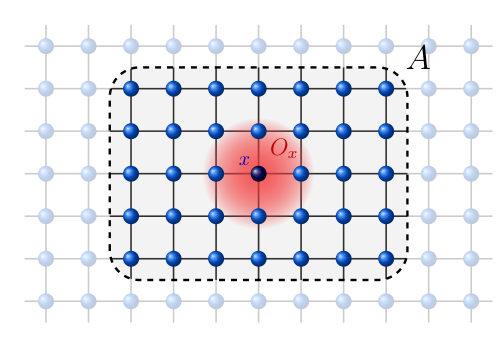 
FIG. 1. Schematic illustration of the local fidelity correlator F(ρA; Ox) := F(ρA, OxρAO† x), Eq. (4).

📷 Fig 2

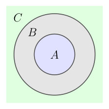 
FIG. 2. Tripartition A|B|C of the system used to compute the conditional mutual information I(A:C|B).

📷 Fig 3

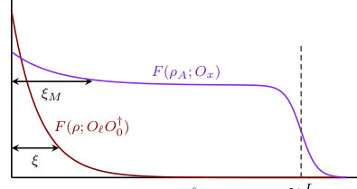 
FIG. 3. Schematic behavior for a pure state satisfying ETH. The one-point local fidelity F(ρA; Ox) saturates to a finite value at intermediate length scales set by the Markov length ξM (see Sec. III A), and decreases to zero when ℓ, the linear size of the region A, becomes comparable to L, the linear size of the full system. In contrast, the (global) two-point fidelity F(ρ; OℓO† 0) equals the ordinary two-point function and decays exponentially with a finite correlation length, ξ.

📷 Fig 4

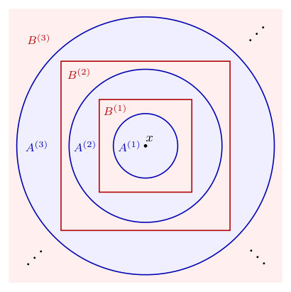 
FIG. 5. Two coverings {A(n)} and {B(n)} centered at x.

📷 Fig 5

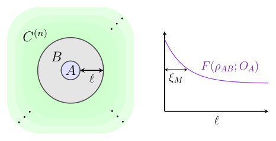 
FIG. 6. The tripartitions used in defining the local CMI I(A : C|B)ω = limn→∞I(A : C(n)|B) (left), whose charac- teristic length scale ξM, the Markov length, dictates the con- vergence behavior of the LFC F(ρAB; OA) in ℓ= dist(A, C) (right).

**Summary.** This work introduces a local fidelity correlator as a robust order parameter for Strong-to-Weak Spontaneous Symmetry Breaking (SW-SSB). This local approach overcomes the computational and mathematical difficulties of global measures, allowing for its application in infinite systems and complex models like free-fermion metals. It establishes that this local measure is stable and provides universal scaling laws for various critical phases.

**Why it may be interesting.** It provides a powerful, scalable diagnostic tool for characterizing symmetry breaking in complex, large-scale quantum systems, bridging concepts from quantum information theory (fidelity) to condensed matter physics (SSB).

Detailed structure

**Main problem.** The paper proposes a local definition for Strong-to-Weak Spontaneous Symmetry Breaking (SW-SSB) to overcome the limitations of previous definitions, especially in the thermodynamic limit.

**Main result.** The local one-point fidelity correlator provides a robust, scalable, and well-defined order parameter for SW-SSB, which remains valid even when the global density matrix is ill-defined.

**Method.** The authors utilize the one-point fidelity correlator, $F(
ho_A; O_x)$, which measures the local deviation from symmetry, and establish its existence and uniqueness using tools like the Data Processing Inequality.

**Model / system.** The analysis applies to general quantum systems, including pure states satisfying the Eigenstate Thermalization Hypothesis (ETH), free-fermion metals, and thermal paramagnets exhibiting various symmetry breaking patterns.

**Key observables.** Local one-point fidelity correlator ($F(
ho_A; O_x)$), Conditional Mutual Information (CMI), and the scaling behavior of the fidelity correlator.

**Important parameters / regimes.** System size ($N$), region size ($|A|$), temperature ($eta$), and the correlation length scale ($\xi_M$).

**Assumptions / limitations.** The derivation relies on the fidelity measure satisfying the Data Processing Inequality (DPI) for the local order parameter to be well-defined in the infinite limit.

**Figures summary.** Figures illustrate the local fidelity correlator, the tripartition used for CMI calculation, and the scaling behavior of the correlator in various critical systems (e.g., CFTs, free-fermion metals).

**Paper structure.** The paper develops the local definition by comparing it to global measures, proving its robustness (stability under local channels), establishing its existence in the thermodynamic limit, and finally applying it to calculate universal scaling laws in specific physical models.

Abstract

We propose a local notion of strong-to-weak spontaneous symmetry breaking (SW-SSB), through a local one-point fidelity correlator. Compared with the previous definition in terms of a two-point fidelity correlator, our local formulation offers two key advantages: (1) it is easier to detect in large systems: for a system of size $N$ and with ${\rm poly}(N)$ amount of resources, one can detect the local fidelity order up to volume scale $O(\log(N))$; and (2) the local SW-SSB order remains well defined in the thermodynamic limit, where the density matrix itself is not well defined. We show that key features of SW-SSB, including stability under finite-depth symmetric channels and long-range conditional mutual information, persist within this local framework. Our definition is conceptually analogous to local thermalization, as exemplified by pure states obeying the eigenstate thermalization hypothesis (ETH). For critical states, the local one-point fidelity correlator defines an interesting class of defect problems. We demonstrate the applicability of the local formulation through several concrete examples, and derive the universal scaling behavior of the local fidelity correlator in a range of critical systems, including ground states of conformal field theories as well as ballistic and diffusive free-fermion metals.

[↑ back to top](#top)

### [Permutation Matrix Representation for Quantum Simulation: Comparative Resource Analysis](http://arxiv.org/abs/2605.29279v1)

**Authors:** Hriday Sabharwal, Itay Hen  
**Type:** theory · **Category:** quantum information and computing · **PDF:** <https://arxiv.org/pdf/2605.29279v1>  
**Analysis basis:** full PDF text, analyzed in chunks
**Topic relevance:** `analog quantum simulation` **3/5** · `Rydberg arrays` **2/5** · `non-equilibrium dynamics` **2/5**

📷 Fig 1

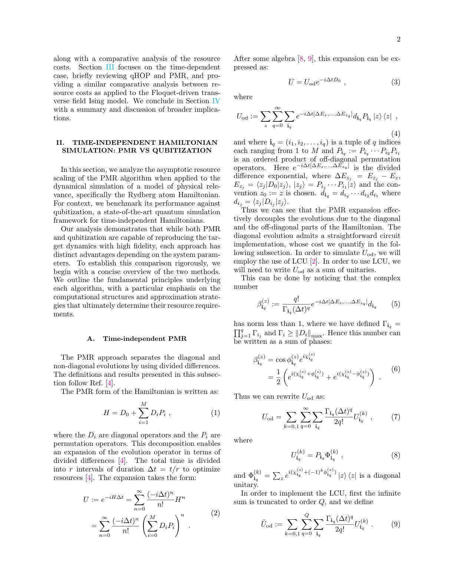 
Low-resolution page preview, page 2

📷 Fig 2

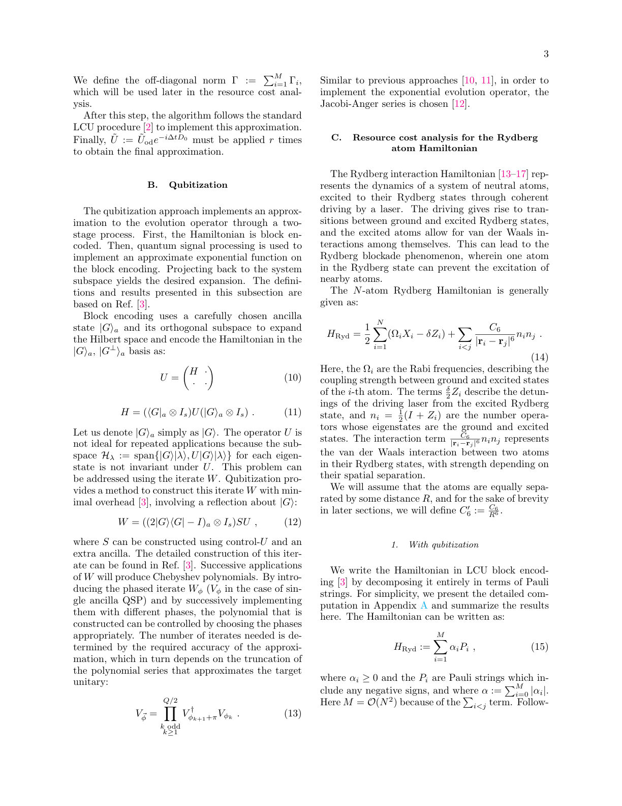 
Low-resolution page preview, page 3

📷 Fig 3

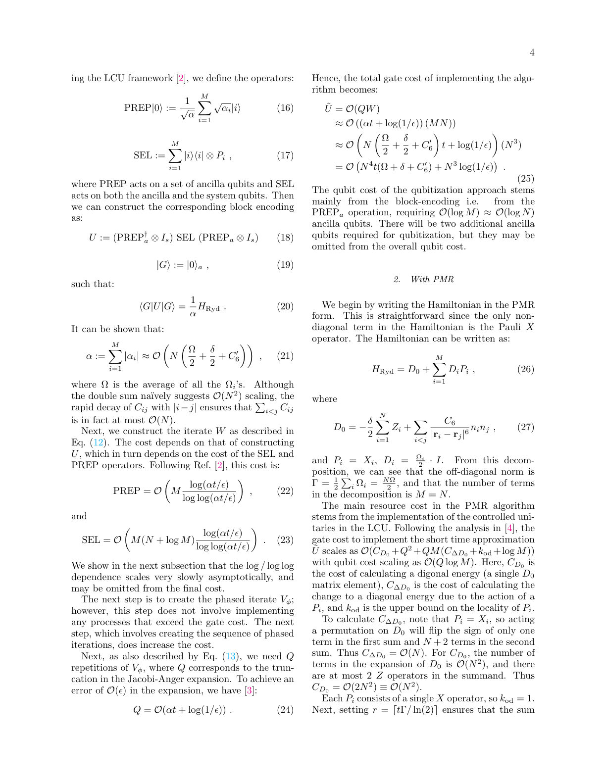 
Low-resolution page preview, page 4

📷 Fig 4

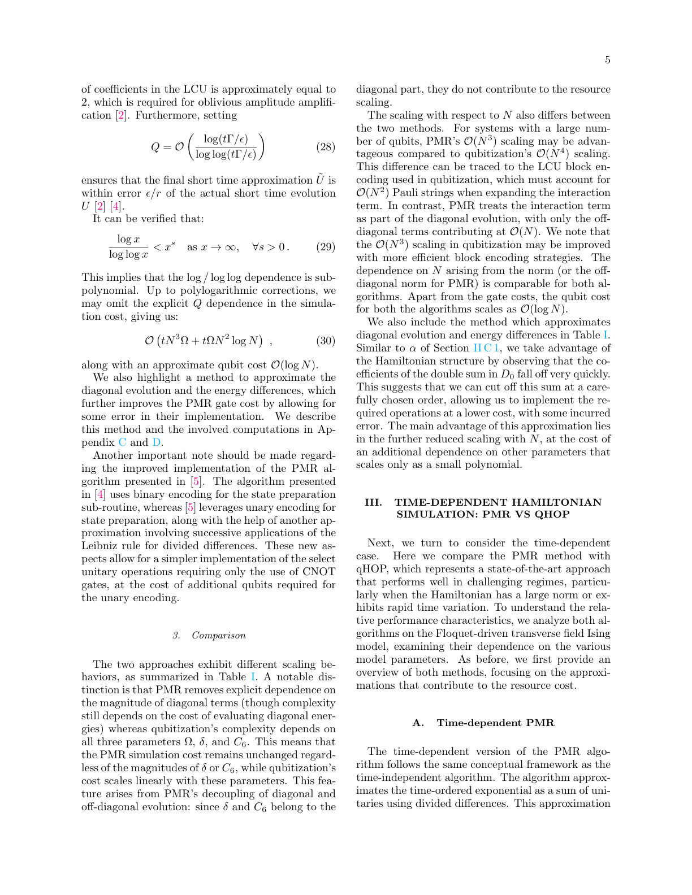 
Low-resolution page preview, page 5

📷 Fig 5

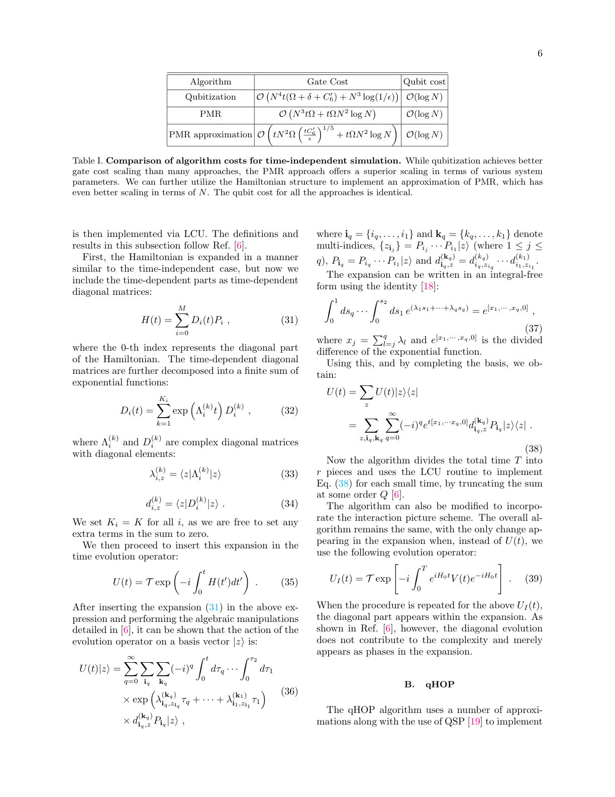 
Low-resolution page preview, page 6

**Summary.** This paper rigorously compares the Permutation Matrix Representation (PMR) method against leading quantum simulation algorithms like Qubitization and qHOP. By analyzing resource costs for both time-independent and time-dependent Hamiltonians, the authors demonstrate that PMR offers favorable scaling, suggesting it is a practical alternative for near-term quantum hardware implementation.

**Why it may be interesting.** The direct comparison of scaling laws ($O(N^2 \log N)$ vs. higher polynomial scaling) provides concrete guidance on when PMR might outperform established QSP-based methods for resource-constrained quantum hardware.

Detailed structure

**Main problem.** The paper conducts a comparative resource analysis of various quantum algorithms designed for simulating the time evolution governed by complex Hamiltonians.

**Main result.** The Permutation Matrix Representation (PMR) method is shown to offer complementary advantages in resource scaling compared to established methods like Qubitization and qHOP, particularly regarding its dependence on system parameters.

**Method.** The authors compare PMR against QSP and qHOP by analyzing the gate and qubit resource costs for both time-independent (Rydberg model) and time-dependent (Floquet-driven Ising model) Hamiltonians.

**Model / system.** The analysis covers two main physical models: the Rydberg interaction Hamiltonian for time-independent simulation, and the Floquet-driven transverse field Ising model for time-dependent simulation in arbitrary dimensions.

**Key observables.** Resource costs, including gate complexity and ancilla qubit requirements, are the primary observables.

**Important parameters / regimes.** System size (N), interaction strengths ($\Omega, \delta, C_6$), driving frequency ($\omega$), and simulation time ($T$).

**Assumptions / limitations.** The analysis relies on truncating series expansions (e.g., in PMR) and making specific approximations for error bounding in the time-dependent regime.

**Figures summary.** The notes reference Table I and Table II, which provide direct comparisons of gate and qubit costs between PMR, Qubitization, and qHOP for the respective simulation regimes.

**Paper structure.** The paper is structured around benchmarking PMR against state-of-the-art techniques. It first analyzes the time-independent case using the Rydberg model, then extends the comparison to the time-dependent Floquet-driven Ising model, concluding with a detailed resource comparison.

Abstract

We present a comparative study of the permutation matrix representation (PMR) method for Hamiltonian simulation alongside other leading quantum algorithms. Our analysis focuses on resource costs for simulating both time-independent and time-dependent Hamiltonians. For the time-independent case, we benchmark PMR against quantum signal processing (QSP) and qubitization, using the Rydberg interaction Hamiltonian as a representative example. For the time-dependent case, we compare the time-dependent extension of PMR with the quantum highly oscillatory protocol (qHOP), applied to a Floquet-driven transverse field Ising model in arbitrary spatial dimensions. In both regimes, we find that PMR offers complementary advantages in resource requirements and exhibits favorable scaling with certain system parameters, suggesting that it may provide practical benefits on resource-constrained quantum hardware.

[↑ back to top](#top)

### [Prime Number Identification Demonstrated with Quantum Processors Using a New Rescaling-Based Noise Mitigation Technique](http://arxiv.org/abs/2605.28964v1)

**Authors:** Victor F. dos Santos, Victor P. Brasil, Pedro A. S. Contri, Jonas Maziero  
**Type:** both · **Category:** quantum information and computing · **PDF:** <https://arxiv.org/pdf/2605.28964v1>  
**Analysis basis:** full PDF text, analyzed in chunks
**Topic relevance:** `QC/QI experiment` **3/5** · `entanglement & information structure` **3/5** · `quantum measurements` **1/5**

📷 Fig 1

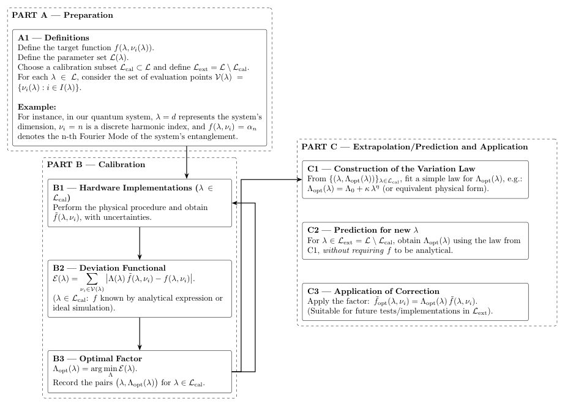 
FIG. 1. Schematic representation of the Correction Factor Extrapolation (CFE) procedure. The method is divided into three stages. In part A (Preparation), the target function f(λ, νi), the parameter set L, and the calibration subset Lcal are defined. In this work we set f(λ, νi) = αn, i.e., the Fourier-mode amplitude αn of the purity curve; λ = d is the system dimension and νi = n is the Fourier-mode index. In part B (Calibration), experimental data ˜f(λ, νi) are obtained for λ ∈Lcal, and the optimal correction factors Λopt(λ) are determined by minimizing the deviation function E(λ). In part C (Extrapolation and Application), the extrapolated region Lext = L \ Lcal is considered, where...

📷 Fig 2

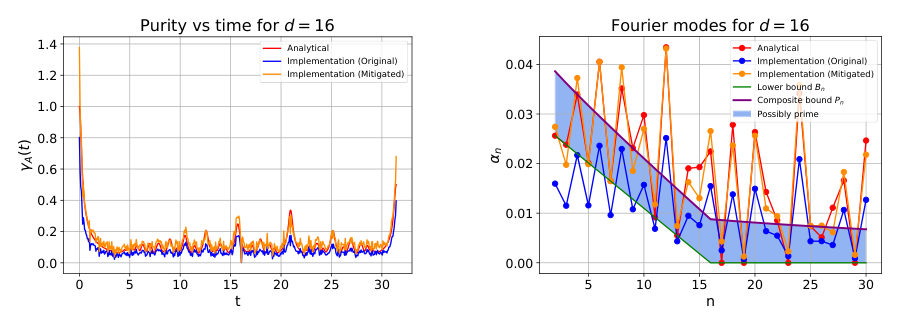 
FIG. 2. Reduced purity (left column) and Fourier modes (right column) for d = 4, 8, and 16, obtained from quantum-computer implementations using p = 30, 120, and 480 time points, respectively, and 213 shots for ev- ery dimension. Each row corresponds to a different value of d, illustrating how the system’s behavior changes with increasing dimensionality. In both purity and Fourier-modes plots, the red points represent the theoretical predictions from the algorithm, the blue points correspond to the results obtained directly from the hardware implementations, and the orange points show the mitigated results after applying our post-processing technique (CFE). The previously developed analysis...

📷 Fig 3

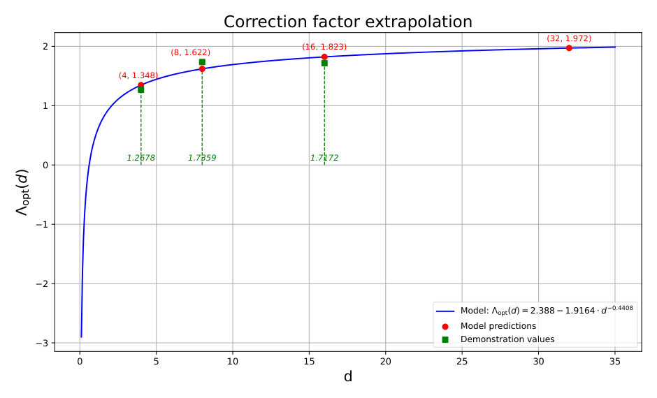 
FIG. 3. Extrapolation of the correction factor Λopt(d) based on results from the implementations for d = 4, 8 and 16. The green dots represent the numerically determined optimal correction factors for the Fourier mode data obtained from the hardware implementations. The blue curve corresponds to the constructed model Λopt(d), which predicts the correction factor behavior for any dimension d ≥4. Red dots, shown in the tuple format  d, Λopt(d)  , are sampled directly from the model and lie on the blue curve.

📷 Fig 4

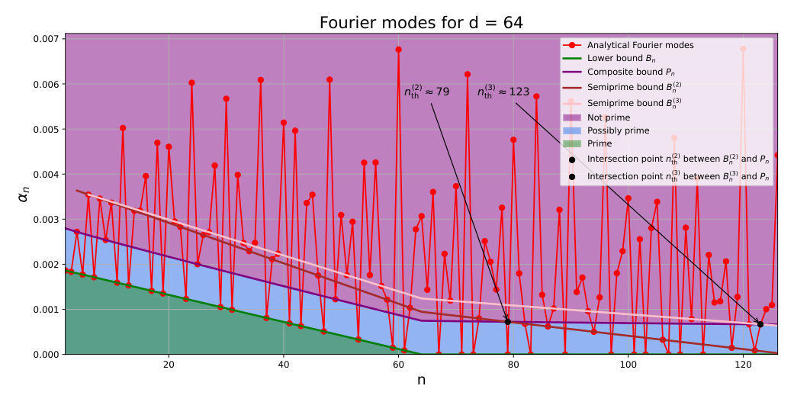 
FIG. 4. Analytical Fourier modes for d = 64, showing that the composite bound Pn may be violated after the threshold points n(2) th ≈79 and n(3) th ≈123. The brown and pink lines represent the interpolated Fourier modes corresponding to semiprimes with k = 2 and k = 3, respectively. Each of these lines eventually reaches the composite bound Pn; the larger the value of k, the higher the value of n at which this occurs. In this case, both B(2) n and B(3) n intersect Pn within the interval Nd, illustrating the coexistence of the two possible reversals of inequality (A10). The light blue region between the composite bound Pn and the lower bound Bn indicates where a divisibility test must be...

📷 Fig 5

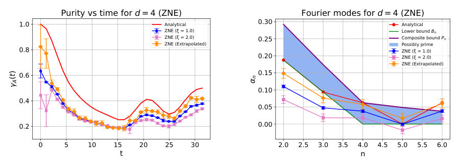 
FIG. 5. Zero-noise extrapolation (ZNE) results for the PIED algorithm with d = 4. Panel (a) shows the evolu- tion of the purity of subsystem A as a function of time, obtained at two scaled noise levels and extrapolated to the zero-noise limit through linear fitting. Panel (b) displays the corresponding Fourier-mode amplitudes extracted from the mitigated data. For each point, the error bars represent the standard error of the mean over three inde- pendent batches. Specifically, for each noise-scaling factor (ξ = 1.0 and ξ = 2.0), standard errors are computed from the three batch results, and the ZNE error bars are calculated by propagating the corresponding uncertainties from the same batch...

**Summary.** This work proposes a quantum protocol to identify prime numbers by analyzing the Fourier spectrum of entanglement dynamics in a bipartite quantum system. To make this feasible on current noisy hardware, the authors introduce and validate a rescaling-based error mitigation technique called CFE. The success of the method demonstrates a pathway for applying number theory directly to NISQ quantum processors.

**Why it may be interesting.** It provides a concrete, albeit highly complex, example of mapping fundamental number theory problems onto quantum hardware diagnostics, which is a key area for quantum algorithm development.

Detailed structure

**Main problem.** The paper addresses the challenge of performing number-theoretic computations, specifically prime number identification, using noisy quantum processors.

**Main result.** The authors demonstrate that the Fourier components extracted from the time evolution of entanglement purity can serve as a robust signature for primality, even when enhanced by a novel noise mitigation technique.

**Method.** The core methodology involves linking primality to the minimal values of Fourier modes derived from the purity ($\gamma_A(t)$) of a bipartite quantum system, while employing Correction Factor Extrapolation (CFE) to correct for hardware noise.

**Model / system.** The system is a bipartite quantum system AB evolving under a time-independent Hamiltonian. The protocol uses the SWAP test to measure entanglement purity, $\gamma_A(t)$, whose Fourier components are analyzed for number-theoretic properties.

**Key observables.** Purity of subsystem A ($\gamma_A(t)$), Fourier modes ($\alpha_n$), and the optimized correction factor ($\Lambda_{opt}$).

**Important parameters / regimes.** System dimensions ($d=4, 8, 16$), time evolution parameters ($\omega=0.1 	ext{s}^{-1}$), and noise scaling factors ($\xi_j$).

**Assumptions / limitations.** The theoretical bounds for primality are derived assuming an initial uniform superposition state, and the CFE method requires calibration on a specific subset of circuits.

**Figures summary.** Figures illustrate the CFE procedure, showing raw vs. mitigated purity and Fourier modes; they also plot the extrapolation of the optimal correction factor $\Lambda_{opt}(d)$ across different dimensions.

**Paper structure.** The paper develops the theoretical link between entanglement dynamics and primality, introduces the CFE error mitigation technique, validates this technique using numerical simulations on IBM hardware, and finally presents the refined theoretical bounds for composite numbers.

Abstract

We implement a quantum protocol for prime number identification based on entanglement dynamics, using IBM quantum processors. The method links the primality of an integer to specific Fourier components extracted from the time evolution of entanglement in a bipartite quantum system. To mitigate experimental noise, we introduce a noise-mitigation method based on a global rescaling factor, which is calibrated on a subset of circuits and extrapolated across different configurations. Theoretical support is provided by a new analytical bound for the Fourier modes derived assuming an initial uniform superposition state. This new bound enhances the separation between prime and composite numbers under moderate experimental deviations. These results represent a step toward practical number-theoretic applications on noisy intermediate-scale quantum (NISQ) devices.

[↑ back to top](#top)

### [Slave-rotor theory of correlated altermagnets on the Lieb lattice](http://arxiv.org/abs/2605.30061v1)

**Authors:** Vanuildo S. de Carvalho, Hermann Freire, Rodrigo G. Pereira  
**Type:** theory · **Category:** strongly correlated electrons · **PDF:** <https://arxiv.org/pdf/2605.30061v1>  
**Analysis basis:** full PDF text, analyzed in chunks
**Topic relevance:** `analog quantum simulation` **3/5** · `Keldysh / 2PI / non-Gaussian methods` **2/5** · `exotic spin models in light-matter` **1/5** · `methods for driven-dissipative` **1/5**

📷 Fig 1

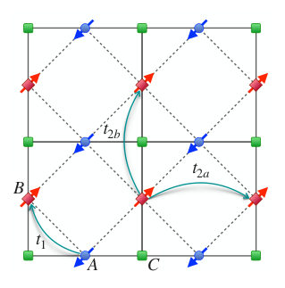 
FIG. 1. Schematic representation of the Lieb-lattice struc- ture in quasi-2D altermagnets with a T2O structure, where the magnetic T (nonmagnetic O) atoms occupy the A and B (C) sublattice sites. The altermagnetic configuration is indi- cated by blue and red arrows, representing opposite magnetic moments. The electrons described by the model Hamiltonian (1) move between the A and B sublattices with hopping am- plitudes t1 and t2a/2b for NN and NNN sites, respectively.

📷 Fig 2

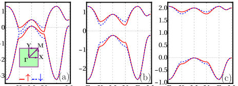 
FIG. 3. Spinon dispersion along a path with high-symmetry points of the BZ [see inset in panel (a)] for interaction U corresponding to the (a) AℓM, (b) AℓI, and (c) AℓMI phases. Here we set t′ = 0.3t1, δ = 0.2, and T = 0.01t1. The red and blue curves represent the dispersions for spin-up and spin- down spinon bands, respectively. The AℓM exhibits spinon Fermi surfaces, which are gapped out in the insulating phases, as a result of the opening of either a (b) band or (c) Mott gap. All spinon dispersions shown here exhibit a dx2−y2-wave spin- splitting characteristic of altermagnetism.

📷 Fig 3

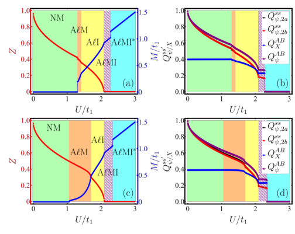 
FIG. 2. Order parameters and phase diagram of the alter- magnetic Hubbard model at half filling. In the NNN hop- pings t2a/2b = t′(1 ± δ), we fix t′ = 0.3t1 and consider two values of the anisotropy parameter: (a)-(b) δ = 0.2; (c)-(d) δ = 0.8. The temperature is kept at T = 0.01t1. The al- termagnetic order sets in when the staggered magnetization M becomes finite. Depending on the anisotropy, this transi- tion can be either continuous or discontinuous. As the onsite repulsion U increases, the order parameters exhibit a series of nonanalyticities which signal transitions between a normal metal (NM), an altermagnetic metal (AℓM), an altermagnetic insulator (AℓI), and an altermagnetic Mott...

📷 Fig 4

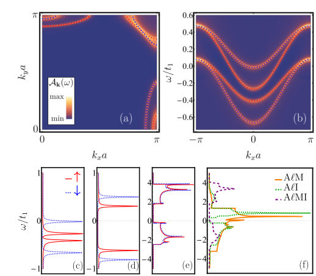 
FIG. 4. Electron spectral function Ak(ω) for t′ = 0.3t1 and δ = 0.2. (a) Spectral function Ak(ω = 0) in the AℓM phase; the peaks can be identified with the electron Fermi surface. The red and blue dashed lines represent, respectively, the spin-up and spin-down spinon Fermi surfaces. (b) The agree- ment between spinon and electron spin splittings in the AℓM phase is also exemplified by the dependence of Ak(ω) along the BZ cut ky = π; the dashed lines represent the spinon dispersions. We also show the energy dependence of the spec- tral function for k = (0, π) and values of U in three different phases: (c) AℓM; (d) AℓI; and (e) AℓMI. Note that the spin splitting decreases as U increases. (f)...

**Summary.** This theoretical work analyzes the metal-insulator transition in an altermagnetic Hubbard model on a Lieb lattice using the slave-rotor approach. It predicts a sequence of four phases as the onsite repulsion U increases, characterized by changes in the quasiparticle weight and the opening of a Mott gap. The findings suggest that observable spin splitting in the electronic spectrum is limited to the weak-to-moderate correlation regime.

**Why it may be interesting.** The detailed theoretical mapping of a complex correlated system (Hubbard model) onto a solvable bosonic/fermionic framework (slave-rotor) provides a powerful tool for understanding exotic magnetic and electronic states in strongly correlated materials.

Detailed structure

**Main problem.** The paper investigates the metal-insulator transition driven by onsite repulsion in an altermagnetic Hubbard model on a Lieb lattice.

**Main result.** The system undergoes a sequence of phase transitions (NM $	o$ A$\ell$M $	o$ A$\ell$I $	o$ A$\ell$MI) as interaction $U$ increases, with the Mott insulator phase showing suppressed spin splitting.

**Method.** The analysis employs the slave-rotor approach, mapping the Hubbard model onto an effective Lagrangian and solving self-consistent equations for order parameters.

**Model / system.** The system is an altermagnetic Hubbard model defined on a Lieb lattice, studied at half-filling. The Hamiltonian includes nearest-neighbor and next-nearest-neighbor hopping terms, along with the onsite repulsive interaction U.

**Key observables.** Electronic spectral function (showing spin-split bands), quasiparticle weight (Z), staggered magnetization (M), and the Mott gap ($\Delta_X$).

**Important parameters / regimes.** The onsite repulsive interaction U, which drives the phase transitions; the hopping parameters $t_1, t_{2a}, t_{2b}$.

**Assumptions / limitations.** The analysis relies on the slave-rotor theory and the saddle-point approximation for solving the resulting path integral/action.

**Figures summary.** Figures illustrate the phase diagram showing the four distinct phases as U increases, and the spectral function $A_k(\omega)$ confirms spin splitting in metallic/insulating regimes but its suppression in the Mott phase.

**Paper structure.** The paper systematically derives the self-consistent equations for order parameters ($Q$ and $M$) by mapping the Hubbard model onto a slave-rotor formulation, calculating the spectral function, and mapping out the phase diagram based on the behavior of $Z$ and $\Delta_X$.

Abstract

We investigate the metal-insulator transition driven by the onsite repulsive interaction $U$ in an altermagnetic Hubbard model defined on a Lieb lattice. Using the slave-rotor approach at half filling, we find that the system exhibits a cascade of interaction-driven phase transitions. As $U$ increases, the system evolves from a normal metal to an altermagnetic metal, then to an altermagnetic insulator, and eventually to an altermagnetic Mott insulator characterized by the complete suppression of the quasiparticle weight. These phases are supported by the calculation of the electronic spectral function, which features spin-split bands in both the metallic and insulating regimes. However, the spin splitting becomes substantially suppressed in the Mott insulating phase. Our results suggest that the observation of spin splitting in the spectral function of $d$-wave altermagnets with a Lieb-lattice-like structure may be limited to the weak-to-moderate correlation regime.

[↑ back to top](#top)

### [Constrained integrability and anyonic chains](http://arxiv.org/abs/2605.28946v1)

**Authors:** Matthew Blakeney, Luke Corcoran, Marius de Leeuw  
**Type:** theory · **Category:** statistical mechanics · **PDF:** <https://arxiv.org/pdf/2605.28946v1>  
**Analysis basis:** full PDF text, analyzed in chunks
**Topic relevance:** `entanglement & information structure` **3/5** · `analog quantum simulation` **2/5** · `exotic spin models in light-matter` **1/5**

📷 Fig 1

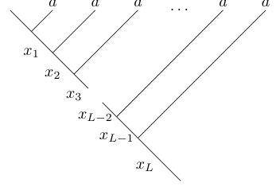 
Figure 1: An anyonic chain fusion diagram with the degrees of freedom, {x1, x2, ..., xL}, along the spine of the fusion diagram.

📷 Fig 2

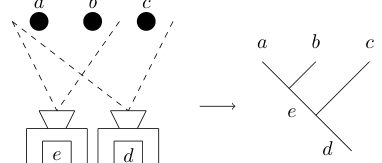 
Figure 2: A pair of measurements on three particles, and the corresponding eigenstate in the diagrammatic description.

📷 Fig 3

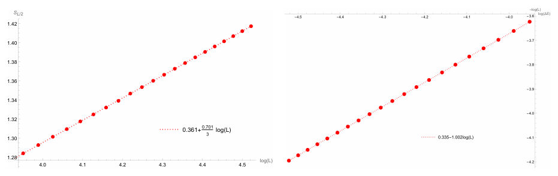 
Figure 5: Half-chain entanglement entropy and gap for the anti-ferromagnetic case J &lt; 0. For both plots we take even 52 ≤L ≤92.

📷 Fig 4

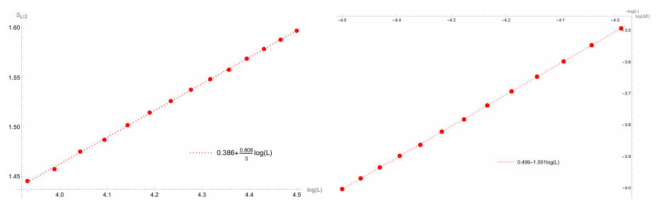 
Figure 6: Half-chain entanglement entropy and gap for the ferromagnetic case J &gt; 0. For both plots we take L ≡0 mod 3, with 51 ≤L ≤90.

📷 Fig 5

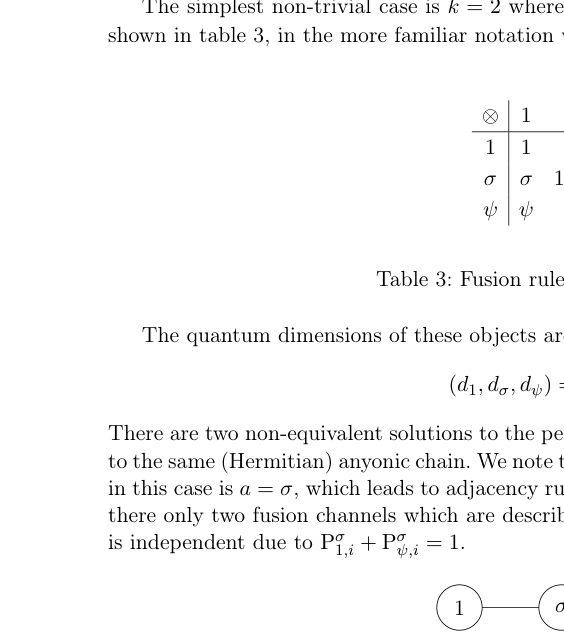 
Figure 7: Adjacency graph for the Ising fusion category with external object σ.

**Summary.** This work systematically analyzes the concept of integrability in anyonic chains, which are quantum models built upon the abstract structure of fusion categories. By utilizing the constrained boost operator formalism, the authors classify numerous new integrable models, providing a powerful mathematical framework for studying constrained quantum systems beyond simple spin chains.

**Why it may be interesting.** The deep connection between topological order (anyons/fusion categories) and exactly solvable quantum models (integrability) provides a powerful theoretical tool for understanding critical phenomena in condensed matter systems.

Detailed structure

**Main problem.** The paper reviews and classifies Yang-Baxter integrability for spin chains whose Hilbert spaces are constrained by mathematical structures, specifically focusing on anyonic chains.

**Main result.** The authors classify new integrable anyonic chains for various fusion categories, including those based on $\mathfrak{su}(2)_k$, Tambara-Yamagami categories, and product categories.

**Method.** The study employs the constrained boost operator formalism and relies heavily on the mathematical framework of fusion categories, which requires solving the pentagon equations for consistency.

**Model / system.** The primary model is the anyonic chain, which generalizes spin chains by using fusion rules from a fusion category $C$ to define local projection operators $P_a^{b,i}$ that form the Hamiltonian.

**Key observables.** Integrability, central charge ($c$), entanglement entropy, and the existence of Temperley-Lieb algebra representations.

**Important parameters / regimes.** The rank of the fusion category (up to 7), the specific fusion category (e.g., $	ext{Fib} 	imes 	ext{Fib}$), and the coupling constants ($\alpha_i, eta_i$) in the Hamiltonian.

**Assumptions / limitations.** The system is assumed to be periodic, and the mathematical structure is assumed to be governed by a consistent fusion category satisfying the pentagon equations.

**Figures summary.** Figures illustrate fusion diagrams, the measurement process for three particles, and plots showing entanglement entropy and gap scaling with chain length.

**Paper structure.** The paper progresses by first defining the mathematical machinery (fusion rings, fusion categories, pentagon equations), then introducing the Hamiltonian via local projection operators, and finally applying the constrained boost formalism to classify and derive specific integrable models for various known fusion categories.

Abstract

We review the notion of Yang-Baxter integrability for spin chains that have Hilbert spaces with constraints, such as a Rydberg blockade. We focus on anyonic chains, whose constraints arise from the fusion rules of the fusion categories on which they are based. We discuss the emergence of Temperley-Lieb algebras and present a new result on which types of anyonic chains exhibit them. We then give an overview of known results for integrable anyonic chains and extend them to several fusion categories up to rank $7$. Using a modification of the boost operator formalism, we find several new integrable anyonic chains and discuss some of their properties. These include spin-$\frac32$ models for $\mathfrak{su}(2)_k$ fusion categories, anyonic chains based on the Tambara-Yamagami fusion categories TY$(\mathbb{Z}_n)$, and product fusion categories Fib$\times$Fib and Fib$\times$Ising. We review recent results for spin chains based on the Haagerup-Izumi fusion category HI$(\mathbb{Z}_3)$, and present preliminary numerics for a HI$(\mathbb{Z}_5)$ model.

[↑ back to top](#top)

### [Electronic correlations driving Chirality-Induced Spin Selectivity](http://arxiv.org/abs/2605.30240v1)

**Authors:** Jacek Herbrych, Maria Daghofer  
**Type:** theory · **Category:** strongly correlated electrons · **PDF:** <https://arxiv.org/pdf/2605.30240v1>  
**Analysis basis:** full PDF text, analyzed in chunks
**Topic relevance:** `Kondo & dissipative impurity` **3/5** · `analog quantum simulation` **1/5** · `methods for driven-dissipative` **1/5** · `spintronics-quantum-optics interface` **1/5**

📷 Fig 1

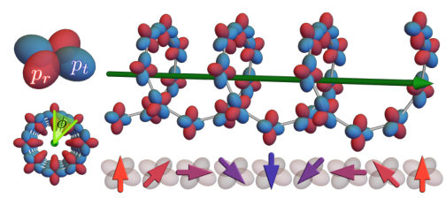 
FIG. 1. Cartoon of the two-orbital model motivated by Ref. [21]: each site contains ’radial’ orbital pr and ’tangen- tial’ pt, see top left. The spiral is shown from the side (top) and from above (bottom left). The spin-spin angle in the correlation-driven spin spiral (bottom right) is set by corre- lations, while SOC only selects the spin plane (orthogonal to the spiral axis) and the winding direction.

📷 Fig 2

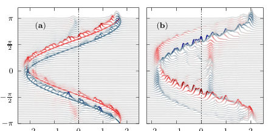 
FIG. 3. Cluster perturbation theory results based on short-range correlations. Color indicates spin polarization. Panel (a) is based on an eight-site KLM (1) and (2) with λ = 0.015 tt, Jt = 0.48 tt and l = 1, remaining parameters as in Fig. 2. Similar as in Fig. 2(b), the solid lines in represent the effective band splitting ωeff(k) = 2teff cos(k) ± 2λeff sin(k), with teff ≃0.45 and λeff ≃0.1. Panel (b) depicts results for a twelve-site Hubbard model combining (3) and SOC (2) with λ = 0.01|t1| and l = 2. Parameters: t1 = −1, U = 8 |t1|, t2 = 0.3 |t1|, and n = 2/3 filling.

📷 Fig 3

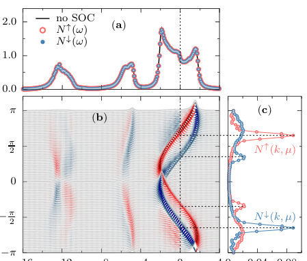 
FIG. 2. Density matrix renormalization group method re- sults for the KLM (1) with l = 1 Rashba SOC (2). (a) Fre- quency dependent density-of-states N σ(ω) without and with Rashba SOC (2). For the latter, both spin projections are presented. (b) Momentum k resolved one-particle spectral density N(k, ω) for both spins, red and blue represent ↑ and ↓projections of ⃗d · ⃗σ, respectively. (c) Spectral weight N(k, ω = µ) at Fermi level µ. Solid lines in (b) represent the band splitting by the effective (interaction-induced) SOC cou- pling ωeff(k) = 2teff cos(k) ± 2λeff sin(k), with teff ≃0.4 and λeff ≃0.25. Note that λeff is an order of magnitude larger than the one used in a full calculation....

📷 Fig 4

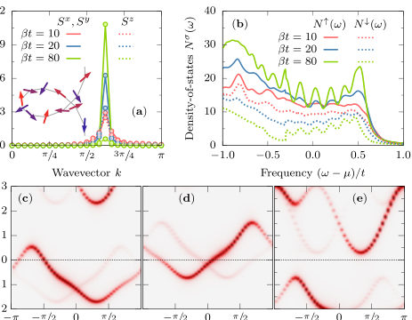 
FIG. 4. Markov-chain Monte-Carlo results for the classi- cal spin KLM. (a) Spin-structure factor S(k) for in-plane (x, y) and out-of-plane (z) components of spin and various temperatures. Parameters: NN and NNN hoping tt = −1, tt,2 = 0.25 |tt|, respectively, NN and NNN Heisenberg spin exchange Jr = 0.8 |tt|, Jr,2 = 0.5 |tt|, respectively, coupling to localized spins 2JH|Si,r| = 2 |tt|, n = 0.8 filling, and SOC λ = 0.02 |tt|, l = 2. (b) Density of states N σ(ω) for left-moving states for parameters as in (a). (c) Momentum k resolved one-particle spectral density A(⃗k, ω) for σ =↑at β |tt| = 80, remaining parameters as in (a). (d) A(⃗k, ω) for σ =↑for filling n = 0.4, remaining parameters as...

**Summary.** This paper theoretically explains Chirality-Induced Spin Selectivity (CISS) in helical organic molecules by modeling electron-electron interactions. It demonstrates that strong, non-collinear spin correlations, rather than relying solely on spin-orbit coupling or long-range magnetic order, are the primary drivers of spin polarization. The research utilizes advanced numerical methods like DMRG and CPT to validate this mechanism.

**Why it may be interesting.** The work provides a detailed theoretical framework for understanding spin-selective transport in molecular systems, linking correlation physics (Hubbard/Kondo models) directly to a key phenomenon in spintronics and molecular electronics.

Detailed structure

**Main problem.** The paper addresses Chirality-Induced Spin Selectivity (CISS)—the spin polarization of currents through chiral media—by investigating the role of electron-electron interactions.

**Main result.** Non-collinear spin correlations driven by Coulomb interactions are proposed as the mechanism for CISS, showing that strong correlations, rather than long-range magnetic order or large spin-orbit coupling, are sufficient to induce spin selectivity.

**Method.** The study employs advanced theoretical techniques including Density-Matrix Renormalization Group (DMRG), Cluster Perturbation Theory (CPT), and Markov Chain Monte Carlo (MCMC) simulations.

**Model / system.** The model focuses on low-dimensional helical organic molecules, utilizing an extended two-orbital model incorporating on-site Coulomb ($U$) and Hund's-rule ($J_H$) interactions, leading to an effective Kondo-lattice model.

**Key observables.** Spin polarization in transmitted electrons, one-particle spectral functions ($N(\omega)$ and $N(k, \omega)$), and the spin-structure factor $S(\vec{k})$.

**Important parameters / regimes.** The mechanism is shown to be robust even when the spin-orbit coupling (SOC) is vanishingly small, provided strong correlations are present.

**Assumptions / limitations.** The analysis relies on the Kondo-lattice model derived from considering the orbital-selective Mott phase transition, and CPT is noted to only include short-range correlations.

**Figures summary.** Figures illustrate DMRG results showing spin-polarized density-of-states and momentum-resolved spectral density, and classical spin simulations showing spin-structure factors peaking at incommensurate wavevectors.

**Paper structure.** The paper develops the model by incorporating interactions into a two-orbital framework, applies various numerical methods (DMRG, CPT, MCMC) to calculate spectral properties, and concludes by proposing the role of non-collinear spin correlations in explaining CISS.

Abstract

We explicitly account for electron-electron interactions when modeling low-dimensional helical organic molecules. We show that competition between various hopping channels, together with interaction-induced double- and superexchange mechanisms, can stabilize non-collinear helical magnetic order. The resulting single-electron bands exhibit partial spin polarization, a manifestation of $p$-wave magnetism. Using density-matrix renormalization group, cluster perturbation theory, and Monte Carlo methods, we find that even vanishingly small spin-orbit coupling triggers strong spin selectivity at temperatures significantly above the spin-orbit scale. While strong correlations are essential for this mechanism, long-range spin ordering is not required. We thus propose non-collinear spin correlations driven by Coulomb interactions as an explanation of chirality-induced spin selectivity and discuss connections to experiments.

[↑ back to top](#top)

### [Fundamental limitations on entanglement extraction from purity](http://arxiv.org/abs/2605.29197v1)

**Authors:** Tulja Varun Kondra, Pedro Barrios Hita, Justus Neumann, Hermann Kampermann, Dagmar Bruß  
**Type:** theory · **Category:** quantum information and computing · **PDF:** <https://arxiv.org/pdf/2605.29197v1>  
**Analysis basis:** full PDF text, analyzed in chunks
**Topic relevance:** `entanglement & information structure` **3/5** · `correlated / nonlocal dissipation` **2/5** · `driven-dissipative phase transition` **1/5**

📷 Fig 1

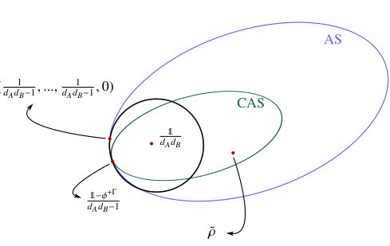 
FIG. 1. Graphical representation of the absolutely separable set (AS), completely absolutely separable set (CAS) and the separable ball introduced in [14] (black circle) for unequal local dimensions dA and dB. The state ( 1 dAdB−1, ..., 1 dAdB−1, 0) is on the boundary of both

**Summary.** This paper establishes a fundamental spectral criterion for determining 'completely absolutely separable' (CAS) quantum states, which are those incapable of generating entanglement via any probabilistic, purity-non-generating process. The main result provides a simple, complete characterization based solely on the ratio of the largest to smallest eigenvalues relative to the system's smallest local dimension. This advances the understanding of entanglement resource limitations beyond simple purity measures.

**Why it may be interesting.** This work provides rigorous, spectral criteria for quantifying how much entanglement a state can retain or generate under realistic, non-ideal physical processes, which is vital for understanding quantum resource theories.

Detailed structure

**Main problem.** The paper investigates the fundamental limitations on entanglement generation from quantum states based on their purity, particularly when subjected to processes that do not increase purity (unital channels). It seeks to characterize the most restricted class of states that cannot generate entanglement probabilistically.

**Main result.** The authors provide a complete spectral characterization for 'completely absolutely separable' (CAS) states: a bipartite state is CAS if and only if the ratio of its largest to smallest eigenvalues, $R(
ho_{AB})$, is bounded by $rac{d+1}{d-1}$, where $d$ is the smaller local dimension.

**Method.** The analysis involves deriving necessary and sufficient conditions for separability using spectral properties (eigenvalue ratios) and comparing these bounds against existing criteria like the purity ball. The proofs utilize properties of unital quantum channels and entanglement witnesses.

**Model / system.** The study focuses on bipartite quantum states ($
ho_{AB}$) acting on two subsystems, $A$ and $B$, characterized by their local dimensions ($d_A, d_B$). The analysis considers the effect of deterministic and probabilistic unital quantum channels on these states.

**Key observables.** Purity ($	ext{Tr}(
ho^2)$), the ratio of extreme eigenvalues ($R(
ho_{AB}) = \lambda_{\max} / \lambda_{\min}$), and the state's separability status (Absolutely Separable vs. Completely Absolutely Separable).

**Important parameters / regimes.** The smaller local dimension, $d = \min\{d_A, d_B\}$, and the spectral ratio $R(
ho_{AB})$ are crucial parameters defining the bounds.

**Assumptions / limitations.** The analysis often assumes the state $
ho$ is full rank and relies on the properties of unital quantum channels and the definition of absolute separability.

**Figures summary.** Figure 1 graphically illustrates the relationship between the sets of Absolutely Separable (AS), Completely Absolutely Separable (CAS), and generally separable states in the state space.

**Paper structure.** The paper progresses by first establishing the limitations imposed by deterministic channels (AS states), then refining this by considering probabilistic channels to define CAS states. It derives the spectral characterization for CAS states, provides a novel sufficient condition for separability based on eigenvalues, and finally compares the resulting purity bounds for AS states.

Abstract

States of sufficiently low purity are separable and cannot be entangled by unital (purity-non-generating) operations. Since high-purity states are experimentally demanding, it is natural to ask how much purity a state must possess to enable entanglement generation. Absolutely separable states remain separable under all deterministic unital channels, and so cannot deterministically generate entanglement in this setting. We show, however, that some absolutely separable states can generate entanglement via probabilistic protocols that do not produce purity. This motivates the study of states that fail to generate entanglement with any non-zero probability, which we call completely absolutely separable; we give a full characterization of this class. Along the way, we derive a novel sufficient condition for separability that depends only on the largest and smallest eigenvalues, along with the smallest local dimension and is independent of all previously known spectral separability criteria.

[↑ back to top](#top)

### [Ground-state estimation of the Heisenberg model on frustrated lattices with Sample-based Krylov Quantum Diagonalization](http://arxiv.org/abs/2605.29521v1)

**Authors:** Calvin Brooks, Henry Zou, Trevor David Rhone  
**Type:** theory · **Category:** strongly correlated electrons · **PDF:** <https://arxiv.org/pdf/2605.29521v1>  
**Analysis basis:** full PDF text, analyzed in chunks
**Topic relevance:** `analog quantum simulation` **3/5** · `exotic spin models in light-matter` **3/5**

📷 Fig 1

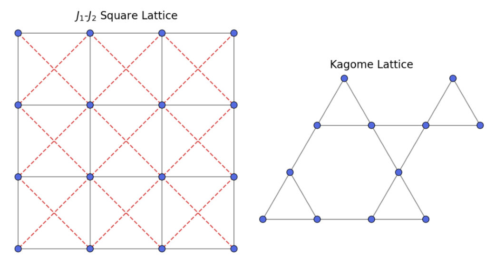 
FIG. 1: Examples of lattices studied in this work. (Left) 4 × 4 square lattice. Nearest-neighbor (J1) interactions are shown as solid black lines and next-nearest-neighbor (J2) interactions as dashed red lines. (Right) 2 × 2 × 3 Kagome lattice. The unit cell consists of three sites arranged in a triangle, tiled into a 2 × 2 supercell.

📷 Fig 2

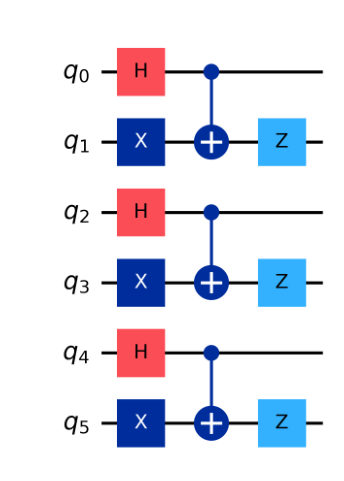 
FIG. 2: Example of Dimer/singlet initial state preparation on 6 qubits.

📷 Fig 3

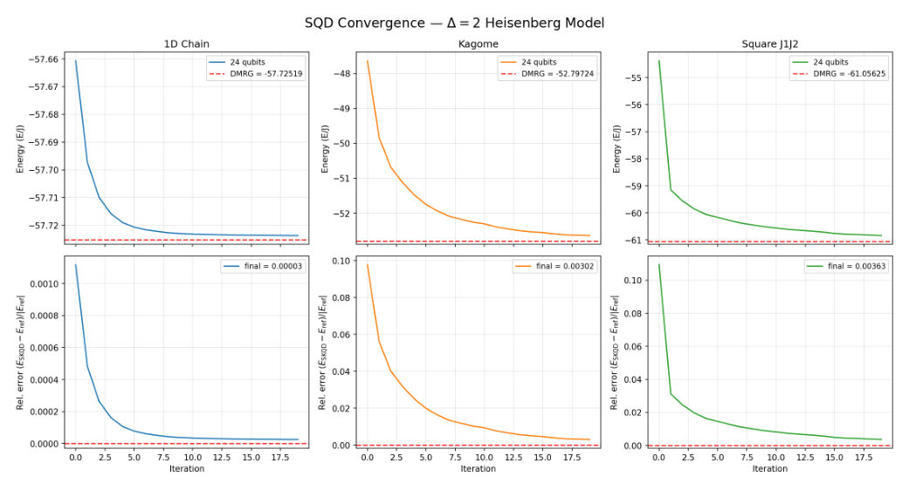 
FIG. 3: SKQD convergence for the ∆= 2 XXZ Heisenberg model on 24-qubit systems across three lattice geometries: the 1D chain (k=20 Trotter steps), Kagome 2 × 4 × 3 lattice (k=5), and J1–J2 3 × 8 square lattice (k=5). Top row: Energy estimates (in units of E/J) as a function of SKQD iteration, with dashed lines indicating the exact-diagonalization reference. Bottom row: Corresponding relative error |ESKQD −Eref|/|Eref|. SKQD converges monotonically to sub-percent accuracy across all three geometries. All circuits were executed on ibm_pittsburgh (Heron r3) with 106 total shots per run.

📷 Fig 4

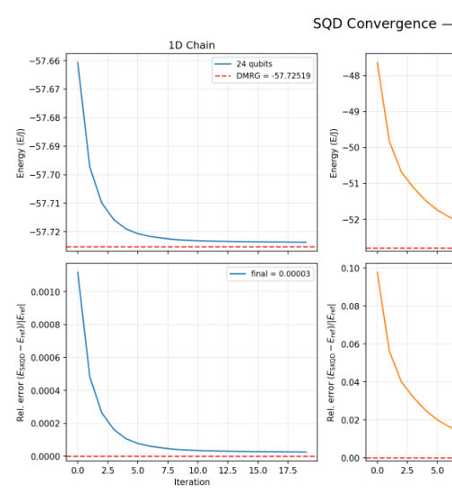 
Figure 4 shows SKQD energy estimates for the 24-site Kagome lattice as a function of iteration number across a range of total shot counts from 100k to 1000k, with

📷 Fig 5

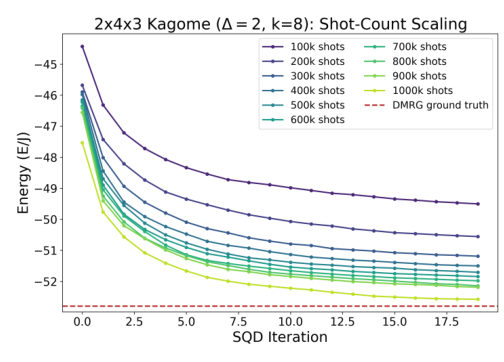 
FIG. 4: SKQD energy estimates for the 2 × 4 × 3 Kagome lattice (24 sites, ∆= 2, k = 8 Krylov steps) as a function of iteration number for total shot counts ranging from 100k to 1000k. The red dashed line indicates the DMRG ground-state reference energy. Convergence improves monotonically with shot count, and the 1000k curve has not fully plateaued at 20 iterations, indicating that further increases in shot count would yield additional accuracy gains.

**Summary.** This work introduces Sample-based Krylov Quantum Diagonalization (SKQD) to estimate the ground state of the Heisenberg model on frustrated lattices. By tailoring the method with bitstring compression and multiple subspace sampling, the authors achieve high accuracy for small systems, outperforming prior variational quantum algorithms. It establishes a new benchmark for quantum simulation in strongly correlated magnetism, while also mapping out the resource limitations for larger systems.

**Why it may be interesting.** The development of SKQD offers a quantum algorithm alternative to VQE for strongly correlated spin systems, providing a scalable, hardware-compatible approach to study complex magnetic phases like quantum spin liquids.

Detailed structure

**Main problem.** The primary challenge is accurately estimating the ground state energy of the Heisenberg model on geometrically frustrated lattices, which is difficult for both classical and quantum simulation methods.

**Main result.** The proposed Sample-based Krylov Quantum Diagonalization (SKQD) method achieves sub-percent ground-state energy errors for small systems (up to 24 spins) on various lattices, surpassing prior VQE results without variational optimization.

**Method.** SKQD constructs a Krylov subspace from time-evolved measurement samples and performs a classical diagonalization within this subspace, incorporating novel modifications for spin models like bitstring compression and multiple subspace sampling.

**Model / system.** The study focuses on the antiferromagnetic XXZ Heisenberg model, applied to three distinct frustrated geometries: the $J_1-J_2$ square lattice, the Kagome lattice, and a 1D chain.

**Key observables.** Ground-state energy error (relative error), average spin occupancy vector, and the dimension of the $S_z=0$ Hilbert subspace.

**Important parameters / regimes.** System sizes ranging from 12 to 72 spins; the anisotropy parameter $\Delta$ (specifically $\Delta=2$ was tested); and the available shot budget/circuit depth.

**Assumptions / limitations.** The degradation of accuracy at large sizes is attributed to resource limitations (shot budget/circuit depth) rather than fundamental algorithmic failure. The method relies on projecting the Hamiltonian onto a sampled, reduced Hilbert space.

**Figures summary.** Figures illustrate SKQD convergence (monotonic improvement with shots), comparisons of energy errors across different lattice sizes and $\Delta$ values, and scaling plots showing gate depth/count vs. Krylov order $k$.

**Paper structure.** The paper introduces SKQD, details its modifications (compression, multiple subspaces), applies it to the three lattices, presents quantitative results showing sub-percent accuracy at small sizes, and discusses the scaling limitations imposed by system size and hardware resources.

Abstract

Quantum spin simulations of frustrated lattices remain challenging for both classical and quantum algorithms, particularly in parameter regimes relevant to quantum spin liquid (QSL) phases. In this work, we apply Sample-based Krylov Quantum Diagonalization (SKQD) to estimate the ground state of the antiferromagnetic XXZ Heisenberg model on the $J_1$--$J_2$ square lattice, the Kagome lattice, and a 1D chain, studying system sizes from 12 to 72 spins. In our application of SKQD, we identify a ZZ deformation of $Δ=2$ as a sufficiently sparse Hamiltonian and introduce two modifications to the SKQD framework tailored to spin models: a canonical bitstring compression scheme that preserves the effectiveness of configuration recovery under spin-flip degeneracy, and the use of multiple Krylov subspaces to improve ground state coverage without any increase in quantum resources. For the 1D chain and Kagome lattice, SKQD achieves sub-percent ground-state energy errors at system sizes up to 24 spins, including a relative error of $0.002\%$ on the 12-site Kagome lattice, surpassing the best prior VQE result of $0.01\%$ on the same system while requiring no variational optimization. SKQD further extends to system sizes well beyond the reach of prior quantum algorithm studies, reaching 72 spins across all three geometries. Beyond 24 spins, accuracy degrades to relative errors of $19\%$--$36\%$ at 72 sites, but the gradual scaling of error with system size suggests these limits are set by available shot budgets and circuit depth rather than fundamental algorithmic constraints. Although classical tensor network methods remain state-of-the-art for these models, this work establishes a new benchmark for quantum simulation of the frustrated Heisenberg model and demonstrates SKQD as a scalable, hardware-compatible approach for studying strongly correlated spin systems.

[↑ back to top](#top)

### [Improved sample complexity bound for sample-based Lindbladian simulation](http://arxiv.org/abs/2605.30301v1)

**Authors:** Siheon Park, Youngjin Seo, Byeongseon Go, Dhrumil Patel, Mark M. Wilde, Hyukjoon Kwon  
**Type:** theory · **Category:** quantum information and computing · **PDF:** <https://arxiv.org/pdf/2605.30301v1>  
**Analysis basis:** full PDF text, analyzed in chunks
**Topic relevance:** `methods for driven-dissipative` **3/5** · `correlated / nonlocal dissipation` **1/5** · `driven-dissipative phase transition` **1/5** · `non-equilibrium dynamics` **1/5**

📷 Fig 1

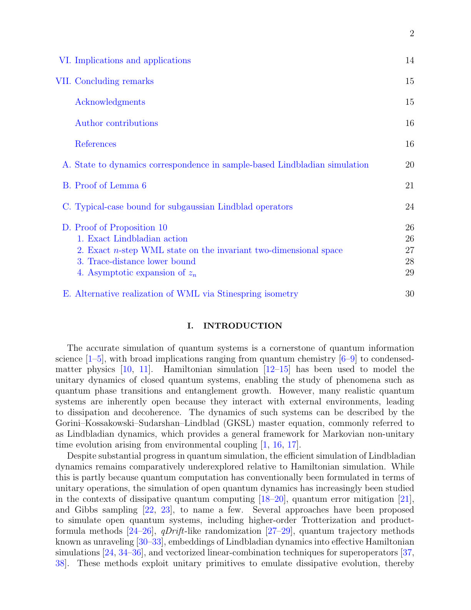 
Low-resolution page preview, page 2

📷 Fig 2

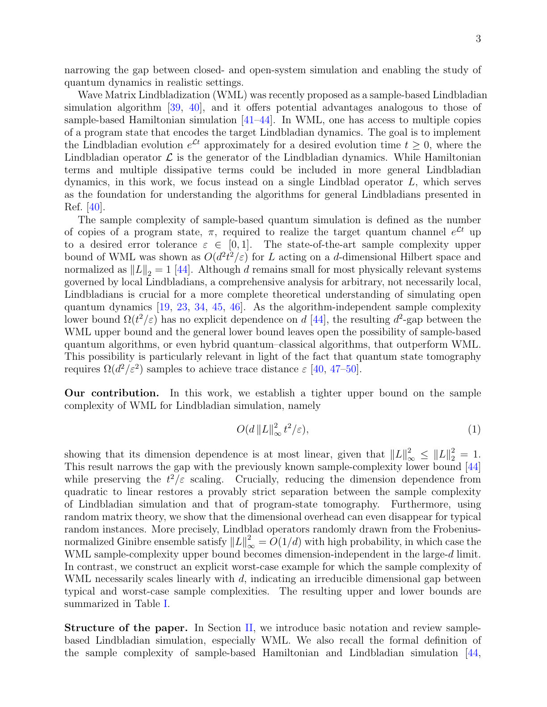 
Low-resolution page preview, page 3

📷 Fig 3

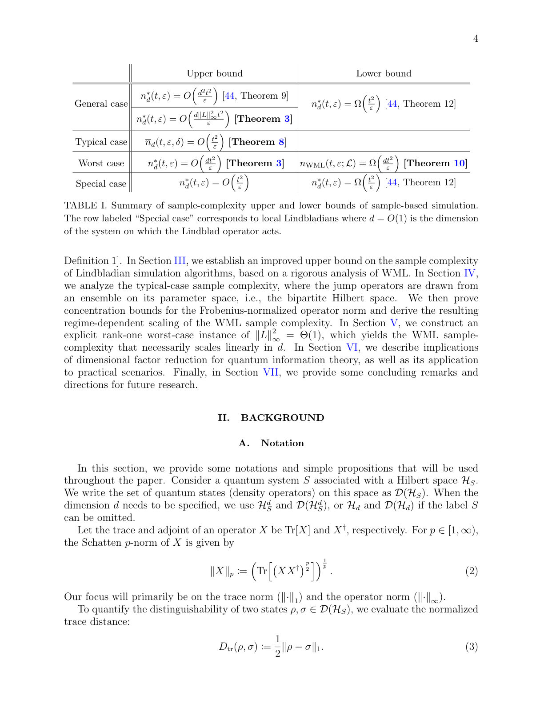 
Low-resolution page preview, page 4

📷 Fig 4

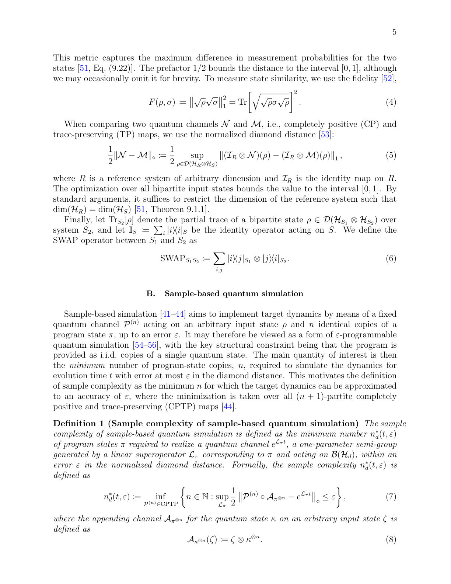 
Low-resolution page preview, page 5

📷 Fig 5

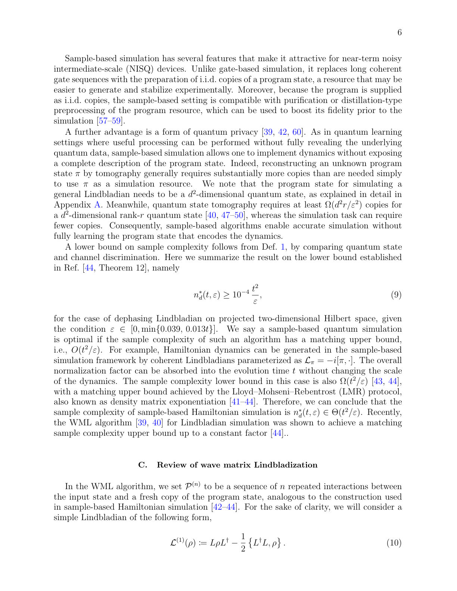 
Low-resolution page preview, page 6

**Summary.** This paper significantly improves the theoretical bounds on the sample complexity required to simulate open quantum dynamics governed by Lindblad equations. By analyzing the WML algorithm, the authors show that while the worst-case complexity scales poorly with dimension, the typical case complexity scales optimally as $O(t^2/\varepsilon)$, which is a major theoretical advance for quantum simulation.

**Why it may be interesting.** This work provides crucial theoretical guarantees on the resource scaling (sample complexity) needed for simulating realistic open quantum systems, directly impacting the feasibility assessment of quantum algorithms for dissipative processes.

Detailed structure

**Main problem.** The paper aims to derive and improve the sample-complexity bounds required for simulating open quantum system dynamics governed by Lindblad master equations.

**Main result.** It establishes an improved upper bound for the sample complexity, showing that for typical (random) Lindblad operators, the dependence on system dimension $d$ can vanish, achieving $O(t^2/\varepsilon)$.

**Method.** The analysis uses sample-based quantum process tomography techniques, comparing the WML approximation to the true evolution using the diamond distance and leveraging random matrix theory for the typical case.

**Model / system.** The system models open quantum dynamics described by the Gorini–Kossakowski–Sudarshan–Lindblad (GKSL) master equation, characterized by a Lindblad operator $L$. The simulation is performed using the Wave Matrix Lindbladization (WML) algorithm.

**Key observables.** Sample complexity ($n^*_d(t, \varepsilon)$), which quantifies the number of program state copies needed to approximate the evolution $e^{Lt}$ within error $\varepsilon$.

**Important parameters / regimes.** Simulation time ($t$), error tolerance ($\varepsilon$), system dimension ($d$), and the norm of the Lindblad operator ($\|L\|_\infty$).

**Assumptions / limitations.** The typical case analysis assumes that the Lindblad operators are drawn from random distributions (e.g., Ginibre ensemble), while the worst-case analysis considers adversarial operators like rank-one Lindblad operators.

**Figures summary.** Not specified.

**Paper structure.** The paper progresses by first establishing the improved upper bound, then contrasting this with the lower bound derived from specific operator constructions, and finally analyzing the sharp dichotomy between typical and adversarial sample complexities.

Abstract

We establish improved sample-complexity bounds for sample-based Lindbladian simulation based on the Wave Matrix Lindbladization (WML) algorithm. For a jump operator $L$ with dimension $d$, we derive an explicit non-asymptotic sample complexity bound $n_d^*(t,\varepsilon) \le \left( \frac{2d+3}{8} \right) \|L\|_\infty^2 \left( \frac{t^2}{\varepsilon} \right)$, holding for simulation time $t$ and error $\varepsilon$. This refines the dimension dependence of the best previously known bound, $O(d^2 t^2/\varepsilon)$, from [Go et al., Quantum Sci. Tech. 10, 045058 (2025)]. Remarkably, we show that this dimensional overhead can be entirely avoided when $\| L\|_\infty^2 = O(1/d)$, a condition satisfied with high probability for random Lindblad operators, yielding a typical-case sample complexity of $O(t^2/\varepsilon)$. On the other hand, in the worst case, we show that WML necessarily requires $Ω(dt^2/\varepsilon)$ samples by constructing an explicit example with a rank-one Lindblad operator. Our results reveal a sharp dichotomy between typical and adversarial sample complexities in Lindbladian simulation, thereby strengthening the theoretical foundations of sample-based quantum algorithms.

[↑ back to top](#top)

### [Long-Range Fermi-Polaron Blockade in Monolayer MoSe$_2$](http://arxiv.org/abs/2605.29067v1)

**Authors:** Jonas Peterson, Shibalik Lahiri, Monique Tie, Shibin Deng, Jierong Wang, Minxue Wang, Luke Holtzman, James Hone, Takashi Taniguchi, Kenji Watanabe, Tony Heinz, Valentin Walther, Libai Huang  
**Type:** both · **Category:** quantum gases · **PDF:** <https://arxiv.org/pdf/2605.29067v1>  
**Analysis basis:** full PDF text, analyzed in chunks
**Topic relevance:** `analog quantum simulation` **3/5** · `Keldysh / 2PI / non-Gaussian methods` **1/5** · `methods for driven-dissipative` **1/5** · `non-equilibrium dynamics` **1/5**

📷 Fig 1

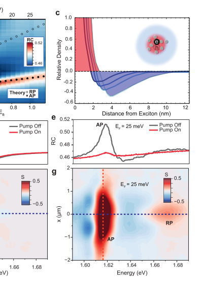 
Figure 1: Exciton–Fermi polarons and their nonlinear optical response in monolayer MoSe2. All measurements at 5 K. a, Schematic of the hBN-encapsulated monolayer MoSe2 device and the experimental measurements. A graphite back gate enables electrostatic tuning of the electron density from the charge-neutral exciton regime to the doped regime where exciton–Fermi polarons form. Linear reflectance spectroscopy identifies the optically active excitonic species as a function of carrier density. The nonlinear and spatially resolved optical response is probed using femtosecond pump–probe transient absorption microscopy (TAM), where a diffraction-limited pump pulse injects excitations slightly above...

📷 Fig 2

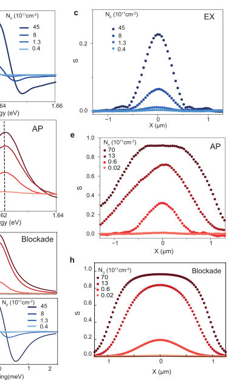 
Figure 2: Nature of the nonlinear optical response of exciton–Fermi polarons. a, Injected- exciton-density (N0) dependence of the saturation parameter. In the low-density regime, the initial slope of S(N0) provides a direct measure directly measures the suppression area associated with a single excitation. Linear fits to this regime yield a length scale of 1.2 ± 0.1 nm for the neutral exciton and 14.2 ± 2.1 nm for the attractive exciton–Fermi polaron. b,c, N0-dependent pump-probe transient absorption response of the neutral exciton. The spectral response (b) exhibits only a small density-dependent blueshift and remains far from full saturation over the studied density range. The...

📷 Fig 3

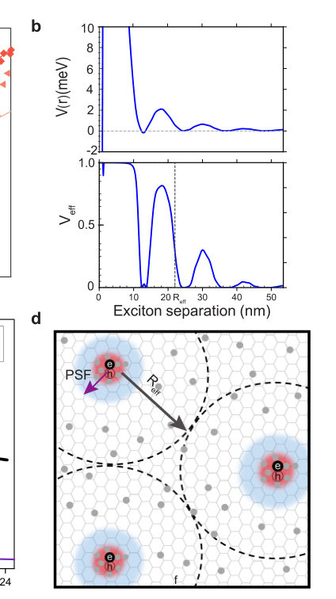 
Figure 3: Microscopic origin and length scale of the exciton–Fermi polaron blockade. a, Optical blockade radius Rb extracted from the low-density slope of the saturation parameter S as a function of injected excitation density, where the initial slope directly measures the suppressed area πR2 b. The experimentally determined blockade radius decreases monotonically with increasing Fermi energy, ranging from 22.0 ± 2.9 nm at 9 meV to 14.2 ± 2.1 nm at 23 meV, indicating a tunable interaction length scale set by the electronic environment. b, Calculated static interaction potential V (r) between excitons mediated by the Fermi sea for a two polaron state in zero momentum mode. Corresponding...

📷 Fig 4

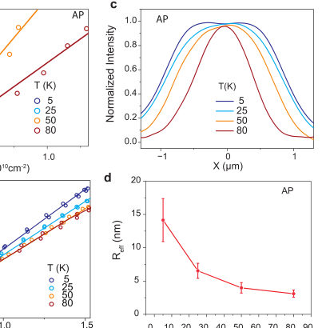 
Figure 4: Temperature dependence of the blockade radius. a, Temperature-dependent lin- ear reflectance spectra of the attractive exciton–Fermi polaron. Increasing temperature leads to a redshift of the resonance, consistent with band-gap renormalization, and a systematic broadening of the polaron spectral linewidth. b, Change in saturation parameter with density for 4 different sets of temperature for attractive polarons. From the low-density slope the extracted blockade radius decreases monotonically with increasing temperature, consistent with a reduced interaction range set by the increasing homogeneous linewidth. c, Spatially resolved transient absorption microscopy response of the...

**Summary.** This paper reports on the observation and characterization of exciton-Fermi polarons in monolayer MoSe2, demonstrating that these quasiparticles exhibit strong, tunable nonlinear optical responses. Using pump-probe microscopy, the authors measure an optical blockade radius significantly larger than that of bare excitons. This confirms that the nonlinearity is governed by long-range, fermion-mediated interactions, establishing the material as a promising platform for quantum optical devices.

**Why it may be interesting.** The work provides a solid-state platform demonstrating strong, tunable, many-body optical interactions (exciton-Fermi polarons) that exhibit blockade physics analogous to those studied in ultracold atomic gases.

Detailed structure

**Main problem.** To investigate the spatial structure and nonlinear optical response of exciton–Fermi polarons, addressing the open question of over what length scales optical excitation suppresses additional resonant absorption in doped 2D semiconductors.

**Main result.** The nonlinear optical response is characterized by an optical blockade radius significantly larger (more than ten times) than that of the neutral exciton, arising from fermion-mediated interactions.

**Method.** The study combines femtosecond pump–probe transient absorption microscopy (TAM) with theoretical modeling based on the Chevy ansatz to analyze the polaron formation and nonlinear saturation.

**Model / system.** The system is monolayer MoSe2 doped with electrons, forming exciton-Fermi polarons. The physics is modeled using a Hamiltonian describing exciton-Fermi coupling, and the polaron state is described via the Chevy ansatz.

**Key observables.** Optical blockade radius ($R_b$), saturation parameter ($S$), and the spectral splitting between attractive (AP) and repulsive (RP) polaron resonances.

**Important parameters / regimes.** Fermi energy ($E_F$), electron density ($n$), and temperature ($T$).

**Assumptions / limitations.** The theoretical modeling uses the Chevy ansatz, and the analysis often relies on the Local Density Approximation (LDA) for spatial profiles.

**Figures summary.** Figures illustrate device schematics, the evolution of excitonic features into AP/RP branches, and quantitative comparisons between mean-field and blockade models showing saturation effects.

**Paper structure.** The paper progresses from establishing the physical system and theoretical model (Hamiltonian, Chevy ansatz) to presenting experimental measurements (TAM, PL) that reveal polaron formation, followed by quantitative analysis of the nonlinear optical blockade effect.

Abstract

Strong optical nonlinearities at the few-photon level are a central goal for quantum photonics, yet they remain difficult to realize in solid-state systems. In doped two-dimensional semiconductors, coupling between excitons and a degenerate Fermi sea gives rise to exciton-Fermi polarons, many-body quasiparticles whose optical response is governed by fermionic correlations. Here, using femtosecond pump-probe transient absorption microscopy, we directly image the spatially resolved nonlinear optical response of exciton-Fermi polarons in monolayer MoSe$_2$. We observe a pronounced spatial suppression of resonant absorption associated with the attractive Fermi polaron, from which we extract an optical blockade radius that is more than ten times larger than that of the neutral exciton. Microscopic analysis indicates that this extended nonlinearity arises primarily from fermion-mediated interactions between exciton-Fermi polarons. Our results establish exciton-Fermi polarons in two-dimensional semiconductors as electrically tunable, strongly interacting optical quasiparticles, and identify them as a promising platform for ultralow-power nonlinear optical devices.

[↑ back to top](#top)

### [Overcoming the Matrix-Product-State Encoding Barrier via DMRG-Guided Probabilistic Imaginary-Time Evolution](http://arxiv.org/abs/2605.30141v1)

**Authors:** Masari Watanabe, Hirofumi Nishi, Taichi Kosugi, Shinji Tsuneyuki, Yu-ichiro Matsushita  
**Type:** theory · **Category:** numerical methods · **PDF:** <https://arxiv.org/pdf/2605.30141v1>  
**Analysis basis:** full PDF text, analyzed in chunks
**Topic relevance:** `methods for driven-dissipative` **3/5** · `analog quantum simulation` **1/5** · `entanglement & information structure` **1/5** · `non-equilibrium dynamics` **1/5**

📷 Fig 1

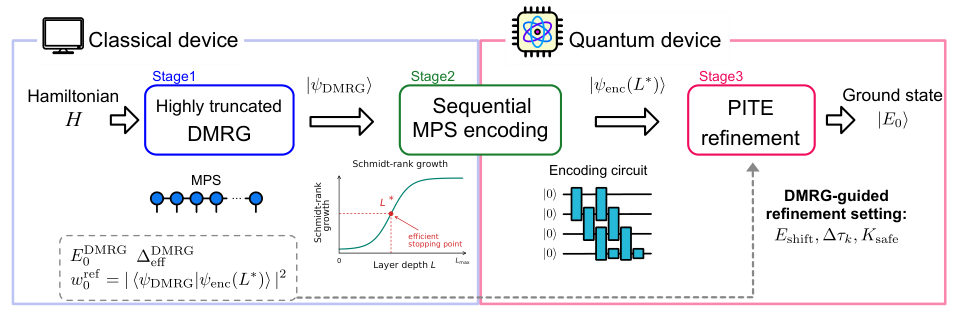 
FIG. 1. Proposed three-stage workflow. DMRG provides an MPS and low-energy information as classical inputs. Sequential MPS encoding then prepares a quantum initial state up to L∗layers. The ground-state component is refined by deterministically scheduled PITE, whose schedule uses the approximate ground-state energy, effective gap, and reference overlap from DMRG.

📷 Fig 2

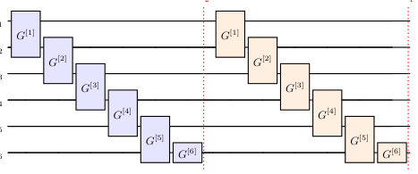 
FIG. 2. Sequential MPS encoding circuit for N = 6 and L = 2. Each MPD layer ˆUl consists of one single-qubit gate and N −1 two-qubit gates. The gate labels are ordered from G[1] at the upper-left to G[N] at the lower-right in each layer. The vertical wire order follows the MPS site order, with site 1 at the top and site N at the bottom. These gates are constructed directly from the left-canonical MPS tensors by kernel completion, without optimization [14]. For state preparation, the adjoint Uenc = ˆU † 1 ˆU † 2 is applied to |0⟩⊗N.

📷 Fig 3

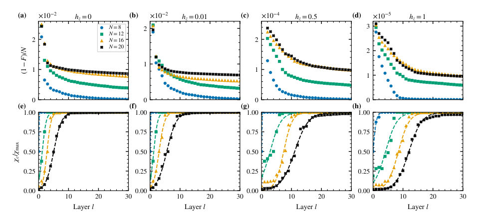 
FIG. 4. Layer dependence of the per-site infidelity IF(l)/N and the normalized central Schmidt rank χcut(l)/χmax. Upper row: IF(l)/N. Lower row: χcut(l)/χmax. Columns correspond to hz = 0, 0.01, 0.5, 1 from left to right. Dashed curves in the lower row are logistic fits of Eq. (16). As hz increases, the final infidelity decreases and the Schmidt-rank growth becomes slower.

📷 Fig 4

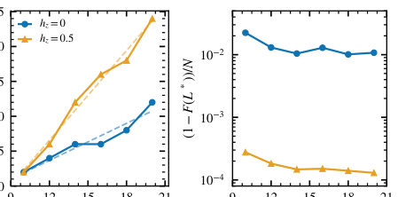 
FIG. 6. Efficient encoding boundary L∗and the ac- curacy reached there. (a) System-size dependence of the inflection point L∗, with dashed linear fits. (b) Per-site infi- delity IF(L∗)/N at the inflection point. Within this size range L∗scales approximately linearly with N, while IF(L∗)/N sat- urates with N.

📷 Fig 5

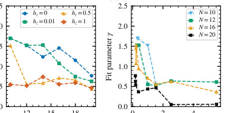 
FIG. 5. System-size and gap dependence of the lo- gistic growth rate γ. Markers show the fitted growth rates for each N and hz. A larger gap localizes correlations and suppresses the long-range spreading of the residual, lowering γ.

**Summary.** This paper presents a novel, practical hybrid protocol for preparing quantum ground states by combining classical DMRG calculations with quantum circuit techniques. It overcomes the inherent 'encoding barrier' of mapping Matrix Product States (MPS) to qubits by stopping the encoding at an optimal point $L^*$. The resulting state is then refined using Probabilistic Imaginary-Time Evolution (PITE), offering a resource-efficient route for quantum simulation.

**Why it may be interesting.** This work provides a concrete, resource-aware protocol for quantum simulation initialization, directly addressing the practical limitations of state preparation in near-term quantum hardware by hybridizing classical tensor network methods with quantum evolution.

Detailed structure

**Main problem.** The primary challenge addressed is efficiently preparing the ground state of a quantum system for subsequent quantum algorithms, as the initial state overlap dictates overall computational cost.

**Main result.** The authors propose a practical hybrid framework combining DMRG pre-processing, an optimization-free MPS encoding, and deterministically scheduled Probabilistic Imaginary-Time Evolution (PITE).

**Method.** The method involves a three-stage process: 1) Classical DMRG to obtain an MPS representation of the ground state. 2) Encoding this MPS into a quantum circuit using an MPD circuit, stopping at an efficiency-defined point $L^*$. 3) Refining the state using PITE to suppress residual excited-state components.

**Model / system.** The framework is demonstrated on the spin-1/2 staggered-field Heisenberg chain, which is governed by a local Hamiltonian. The analysis compares the resource scaling against simpler initial states like the Néel product state.

**Key observables.** Central-bond Schmidt rank, fidelity ($F$), infidelity ($	ext{IF}$), and resource costs (raw and post-selection-weighted circuit depth, $	ext{Dpost}$).

**Important parameters / regimes.** The inflection point $L^*$ marks the boundary of efficient encoding; the scaling of required depth beyond $L^*$ is shown to be $\mathcal{O}(N^5 \log(N/\epsilon))$ for encoding-only refinement.

**Assumptions / limitations.** The MPD encoding circuit is built using rank-2 approximations, leading to the observed Schmidt-rank growth barrier. The PITE schedule is fixed deterministically using parameters derived from the initial DMRG calculation.

**Figures summary.** Figures illustrate the three-stage workflow (DMRG $	o$ MPS Encoding $	o$ PITE). Key figures show the logistic growth of the Schmidt rank, the exponential decay of infidelity beyond $L^*$, and the system-size dependence of resource costs ($	ext{Dpost}$) comparing the proposed method to simpler initializations.

**Paper structure.** The paper details the theoretical motivation (ground-state preparation cost), analyzes the encoding barrier using Schmidt rank diagnostics, proposes the $L^*$ stopping criterion, and finally details the resource scaling and implementation of the PITE refinement stage.

Abstract

Ground-state preparation is a fundamental task in quantum simulation, because the overlap of the prepared state with the true ground state significantly affects the overall cost of subsequent quantum algorithms. We propose a three-stage framework in which a matrix product state (MPS) of an $N$-site system obtained by the density-matrix renormalization group (DMRG) is loaded onto an $N$-qubit quantum register through an optimization-free matrix product disentangler (MPD) encoding circuit, and the residual error is then reduced by probabilistic imaginary-time evolution (PITE). We demonstrate that the central-bond Schmidt rank of intermediate states during MPS encoding grows logistically with the number of layers. Its inflection point $L^{*}$ marks the boundary of the efficient encoding regime. Beyond this point, the gain in fidelity slows rapidly, and the number of additional MPD layers required to reach a target infidelity $\varepsilon$ empirically scales as $\mathcal{O}(N^5\log(N/\varepsilon))$. To avoid this encoding-only tail, we stop the encoder at $L^{*}$ and suppress the remaining excited-state components by PITE, with the linear PITE schedule fixed deterministically from the ground-state energy, the effective gap, and the reference overlap estimated by DMRG. Numerical experiments on the spin-$1/2$ staggered-field Heisenberg chain show that the framework avoids very deep encoding circuits and substantially suppresses the post-selection overhead intrinsic to PITE. Combining classical preprocessing by DMRG, optimization-free MPS encoding, and deterministically scheduled PITE, the present framework offers a practical hybrid route to ground-state preparation in quantum simulation.

[↑ back to top](#top)

### [Tetrahedrally ferromagnetic correlations and a glassy-freezing anomaly in the breathing pyrochlore magnet $\mathrm{AgInCr_4S_8}$ with partial $A$-site disorder](http://arxiv.org/abs/2605.29349v1)

**Authors:** Yuya Haraguchi, Masahiro Kitamura, Masaki Gen, Yusuke Nambu, Akira Matsuo, Koichi Kindo, Masaki Kondo, Masashi Tokunaga, Hiroko Aruga Katori  
**Type:** experiment · **Category:** strongly correlated electrons · **PDF:** <https://arxiv.org/pdf/2605.29349v1>  
**Analysis basis:** full PDF text, analyzed in chunks
**Topic relevance:** `analog quantum simulation` **3/5** · `exotic spin models in light-matter` **3/5**

📷 Fig 1

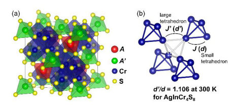 
Figure 1 Schematic illustration of the ideal A-site- differentiated chromium spinel AgInCr4S8 and the corresponding Cr breathing pyrochlore network. (a) Ideal F4̅3m framework, in which monovalent A+ and trivalent A′3+ cations occupy crystallographically distinct tetrahedral A sites and generate a breathing modulation of the Cr pyrochlore network built from CrS6 octahedra. This panel is a schematic of the ideal AgInCr4S8 framework; the actual Ag/In intermixing in AgInCr4S8 is determined by neutron diffraction and discussed in the text. (b) Simplified Cr breathing pyrochlore network consisting of alternating small and large Cr4 tetrahedra. The nearest-neighbor Cr–Cr distances and...

📷 Fig 2

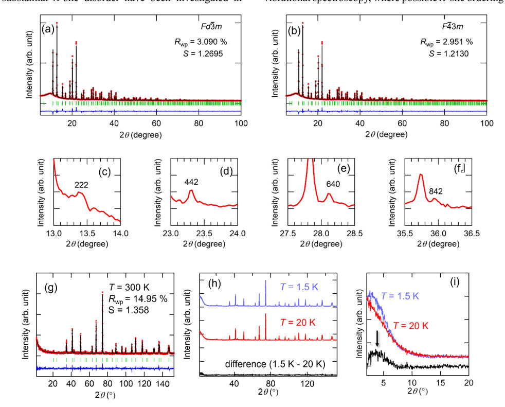 
Figure 2. Synchrotron x ray and neutron powder diffraction patterns of AgInCr4S8. Panels (a) and (b) show synchrotron x ray diffraction patterns at 300 K together with Rietveld refinements using the spinel space group Fd3̅m and the breathing pyrochlore space group F4̅3m. Red symbols, green tick marks and blue lines represent the observed intensities, Bragg peak positions and calculated profiles, respectively. The F4̅3m model reproduces the data more accurately than Fd3̅m. Panels (c)–(f) show enlarged views of XRD peaks that are forbidden in Fd3̅ m but allowed in F4̅ 3m. Panel (g) displays the neutron powder diffraction pattern at 300 K and the corresponding Rietveld refinement in F4̅3m; red...

📷 Fig 3

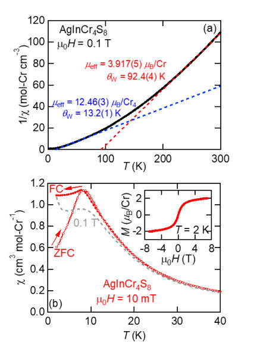 
Figure 3. Temperature dependence of the magnetic susceptibility of AgInCr4S8. (a) Inverse susceptibility measured at an applied field of 0.1 T. The red and blue dashed lines show Curie–Weiss fits performed in the high temperature range 200–300 K and in the intermediate range 30–60 K, respectively. (b) Low temperature susceptibility measured at 10 mT under zero field cooled (ZFC) and field cooled (FC) conditions. For comparison, 0.1 T data is also shown. The broad cusp and the bifurcation between the ZFC and FC curves around 9–10 K are used as bulk signatures of a glassy-freezing anomaly. The inset shows the isothermal magnetization at 2 K.

📷 Fig 4

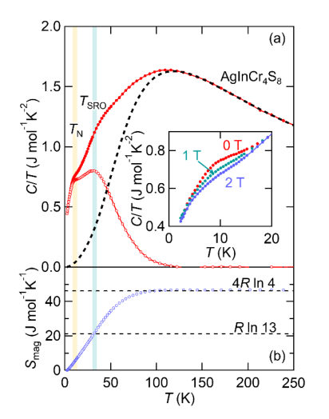 
Figure 4. Temperature dependence of the specific heat and magnetic entropy of AgInCr4S8. (a) Specific heat as a function of temperature. Red symbols denote the total specific heat, black symbols the lattice contribution obtained from a Debye–Einstein fit to data above 150 K where the magnetic contribution is negligible compared with the phonon term, and open red symbols the magnetic specific heat estimated as the difference between the total and lattice parts. The inset shows an enlarged view for 0– 20 K; red, green and blue symbols correspond to data taken at external fields of 0, 1 and 2 T, respectively. The low-temperature anomaly remains broad under field and does not show a sharp...

📷 Fig 5

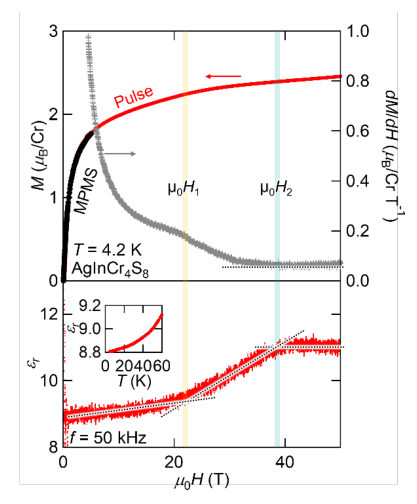 
Figure 5. High field magnetization and dielectric constant of AgInCr4S8. Top panel: Isothermal magnetization M as a function of magnetic field and its field derivative dM/dH, measured in pulsed fields up to 60 T at 4.2 K. Grey symbols show dc magnetization data taken with an MPMS up to 7 T, which were used to calibrate the pulsed field measurements. Vertical shaded regions mark crossover field scales μ0H1 and μ0H2 where broad changes in the field evolution are observed. Around μ0H2, M(H) shows no sharp kink, but dM/dH becomes nearly field independent. Bottom panel: Relative dielectric constant εr measured in pulsed fields up to 50 T at T = 4.2 K and frequency f = 50 kHz. Dashed lines are...

**Summary.** This experimental study investigates the magnetic properties of the breathing pyrochlore $\mathrm{AgInCr_4S_8}$, focusing on how structural distortions and A-site disorder influence magnetic correlations. The results confirm the presence of short-range ferromagnetic correlations followed by a glassy-freezing anomaly, providing a benchmark system for understanding frustrated magnetism without long-range order.

**Why it may be interesting.** The interplay between geometric frustration (breathing distortion) and quenched disorder is a canonical problem in condensed matter physics, leading to complex glassy states that are highly relevant for understanding frustrated quantum magnets.

Detailed structure

**Main problem.** The study investigates the complex interplay between strong breathing lattice distortions and quenched A-site disorder in the chromium pyrochlore $\mathrm{AgInCr_4S_8}$. The goal is to characterize the nature of the low-temperature magnetic state.

**Main result.** The material exhibits evidence for short-range tetrahedral ferromagnetic correlations ($\sim 30$ K) followed by a glassy-freezing anomaly ($\sim 9$ K), but shows no evidence for conventional long-range magnetic order.

**Method.** The research combines structural characterization using synchrotron X-ray and neutron powder diffraction with comprehensive magnetic measurements, including DC magnetization, heat capacity, and high-field magnetization.

**Model / system.** The system is the breathing pyrochlore sulfide $\mathrm{AgInCr_4S_8}$, which possesses a highly distorted lattice structure featuring alternating large and small $\mathrm{Cr}_4$ tetrahedra. The magnetic interactions are modeled via effective cluster moments ($S=6$) on a face-centered cubic lattice, complicated by quenched disorder from $\mathrm{Ag/In}$ mixing.

**Key observables.** Weiss temperature ($	heta_W = +92$ K), magnetic entropy release ($\sim R\ln 13$), ZFC–FC bifurcation in susceptibility, and a specific heat anomaly near 9 K.

**Important parameters / regimes.** Breathing ratio ($d'/d = 1.106$), A-site intermixing ($\sim 16\%$), and two distinct temperature scales: $\mathrm{T}_{\mathrm{SRO}} \approx 30 	ext{ K}$ and $\mathrm{T}_{\mathrm{f}} \sim 9 	ext{ K}$.

**Assumptions / limitations.** The analysis assumes that the observed magnetic anomalies are due to correlated cluster moments rather than long-range magnetic ordering, and that the high-field features represent crossover scales rather than definitive thermodynamic phase boundaries.

**Figures summary.** Figures show diffraction patterns confirming the $Far{4}3m$ structure and diffuse scattering indicative of short-range order. Magnetic measurements plot $\chi(T)$ showing cusps and $C/T$ showing anomalies corresponding to the correlated and freezing temperatures.

**Paper structure.** The paper proceeds by first establishing the structural parameters (breathing distortion and disorder) via diffraction, then analyzing the magnetic susceptibility and heat capacity to identify correlated moment formation, and finally using high-field magnetization to probe the nature of the low-temperature glassy state.

Abstract

We investigate the chromium breathing pyrochlore sulfide $\mathrm{AgInCr_4S_8}$, a chromium-based thiospinel, by synchrotron x-ray and neutron powder diffraction, dc magnetization, and heat capacity. Diffraction confirms the $F\bar{4}3m$ breathing structure with alternating large and small $\mathrm{Cr_4}$ tetrahedra, a large breathing ratio ($d^\prime/d = 1.106$ at 300 K), and substantial Ag/In intermixing on the $A$ sublattice ($\sim 16\%$). No structural transition or magnetic Bragg peaks are detected down to 1.5 K. An enlarged low-angle difference plot between the 1.5 and 20 K neutron diffraction patterns shows a weak broad diffuse-like enhancement, consistent with short-range or frozen correlated moments within the sensitivity of the present data. Susceptibility yields a positive Weiss temperature $θ_{\mathrm{W}} = +92$ K and a moment enhancement in 30--60 K, while the magnetic entropy released by $\sim 30$ K approaches a scale of order $R\ln 13$, together consistent with the development of short-range tetrahedral ferromagnetic correlations and an effective $S = 6$ cluster-moment picture. A broad susceptibility cusp with ZFC--FC bifurcation and a low-temperature specific heat anomaly near 9 K indicate a phenomenological glassy-freezing anomaly without long-range order. $\mathrm{AgInCr_4S_8}$ provides a benchmark for the interplay of strong breathing distortion and quenched $A$-site disorder in chromium breathing pyrochlores.

[↑ back to top](#top)

### [Adaptive Stabilizer State Fidelity Certification](http://arxiv.org/abs/2605.29820v1)

**Authors:** Kun Wang  
**Type:** theory · **Category:** quantum information and computing · **PDF:** <https://arxiv.org/pdf/2605.29820v1>  
**Analysis basis:** full PDF text, analyzed in chunks
**Topic relevance:** `quantum measurements` **3/5** · `entanglement & information structure` **1/5** · `measurement-induced transitions` **1/5**

📷 Fig 1

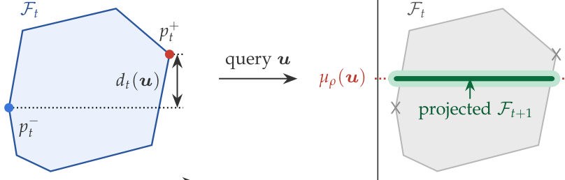 
FIG. 1: Geometric illustration of the witness elimination principle. Left: the current feasible polytope Ft projected onto the coordinates p(0) and bp(u); the endpoint witnesses attain the current fidelity interval endpoints and have vertical separation dt(u). Right: after querying u, the value µρ(u) imposes the hyperplane bp(u) = µρ(u). The green line segment is the image of the updated polytope Ft+1 = Ft ∩{p : bp(u) = µρ(u)} in this two coordinate projection; the full updated feasible set remains a polytope in the ambient syndrome probability space.

📷 Fig 2

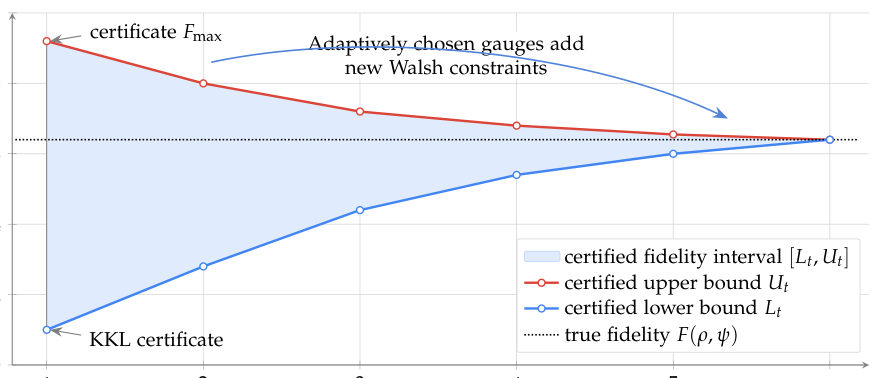 
FIG. 2: Concentration of adaptive certified fidelity intervals. At the first round, the lower endpoint L1 is exactly the KKL certificate in Eq. (14), while the upper endpoint U1 is the companion upper certificate in Eq. (20). In later rounds, Alg. 1 queries gauges whose labels are selected by the witness elimination principle. The added Walsh constraints shrink the feasible polytope, so the lower endpoint Lt can increase, the upper endpoint Ut can decrease, and the certified interval [Lt, Ut] concentrates around the true fidelity F(ρ, ψ).

📷 Fig 3

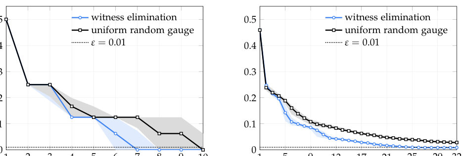 
FIG. 3: Witness elimination versus the uniform random gauge policy. Panel (a) uses 51 affine-support syndrome states relative to |GHZ8⟩, with dimension r = 4 and F(ρ, GHZ8) = 2−4. Panel (b) uses 51 generic full-support syndrome states relative to |GHZ8⟩, sampled from the symmetric Dirichlet distribution on ∆(F8 2). Curves show median certified width and shaded bands show the interquartile range.

📷 Fig 4

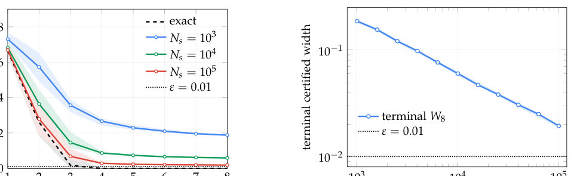 
FIG. 4: Effect of finite-shot noise. Each newly queried stabilizer expectation is estimated from Ns independent ±1 outcomes, and every measured label is inserted into the finite-shot LP through the confidence interval constraint bµ(u) −η ≤bp(u) ≤bµ(u) + η. Panel (a): median certified width over 51 trials for exact expectations and three representative shot budgets; shaded bands show the interquartile range. Panel (b): median terminal width after the same eight adaptive rounds as Panel (a), shown as a function of Ns with the same interquartile summary. For a fixed Ns, the interval reaches a statistical floor, and the floor decreases with Ns as the shot budget increases. Across the plotted...

**Summary.** This paper presents an advanced, adaptive protocol for certifying the fidelity of a quantum state to a target stabilizer state using only syndrome measurements. By iteratively selecting the most informative stabilizer measurements, the authors shrink the certified uncertainty interval, providing a robust measure of state quality that overcomes the limitations of fixed-gauge methods.

**Why it may be interesting.** This work provides a rigorous, information-theoretic framework for quantifying quantum state preparation quality, which is crucial for assessing the viability of quantum computation protocols.

Detailed structure

**Main problem.** The paper addresses the fundamental challenge of certifying the fidelity of a prepared quantum state ($
ho$) to a target stabilizer state ($|\psi
angle$) when measurements are limited to syndrome expectations.

**Main result.** They develop an adaptive, interval-valued certification framework that iteratively queries the most informative stabilizer observables to shrink the certified fidelity interval $[L_t, U_t]$ until it converges to the true fidelity.

**Method.** The core method involves formulating the problem as finding the minimum and maximum probability of the zero syndrome within a feasible polytope defined by measured generator expectations, and adaptively selecting the next measurement to maximize the reduction in interval width.

**Model / system.** The system involves quantum states $
ho$ and target stabilizer states $|\psi
angle$, analyzed through their syndrome distributions $p(s)$ on the Pauli group $\mathbb{F}_2^n$. The certification relies on measuring expectation values of Pauli operators (stabilizers).

**Key observables.** Certified fidelity interval $[L_t, U_t]$, syndrome distribution $p(s)$, and the disagreement score $d_t(u)$ used for gauge selection.

**Important parameters / regimes.** The number of qubits ($n$), the number of queried stabilizers ($|Q_t|$), and the desired confidence level ($\delta$) or shot budget ($N_s$).

**Assumptions / limitations.** The analysis often assumes the ability to query any single stabilizer observable, and the finite-shot extensions rely on Hoeffding's inequality for error bounding.

**Figures summary.** Figures illustrate the geometric process of polytope shrinkage (witness elimination) and the convergence of the certified interval $[L_t, U_t]$ towards the true fidelity as more constraints are added.

**Paper structure.** The paper progresses from establishing the limitations of fixed-gauge certification (KKL) to deriving complementary upper bounds, and finally introducing an adaptive algorithm that iteratively queries gauges based on maximizing endpoint disagreement to narrow the fidelity interval.

Abstract

Certifying the fidelity of a prepared state to a target stabilizer state is a fundamental task in quantum information processing. Ref. [Phys. Rev. A 99, 042337 (2019)] gave the optimal worst-case lower bound from one fixed stabilizer generator gauge, but gauge dependence can leave a large fidelity ambiguity. We develop an adaptive extension that reports the full certified fidelity interval. First, for a single gauge, we derive the complementary optimal worst-case upper bound. We then formulate gauge selection as an adaptive design problem in which each round solves exact endpoint linear programs and chooses a new gauge by a witness elimination policy. We prove monotonic tightening, exact recovery once all nontrivial stabilizers are covered, and the worst-case necessity of full coverage. Finally, we identify structured syndrome distributions for which adaptivity beats this exponential benchmark, and we numerically confirm faster concentration.

[↑ back to top](#top)

### [Improving CFT Operators Using Machine Learning](http://arxiv.org/abs/2605.28929v1)

**Authors:** Lior Oppenheim, Snir Gazit, Zohar Ringel  
**Type:** theory · **Category:** disordered systems and neural networks · **PDF:** <https://arxiv.org/pdf/2605.28929v1>  
**Analysis basis:** full PDF text, analyzed in chunks
**Topic relevance:** `entanglement & information structure` **3/5** · `methods for driven-dissipative` **2/5**

📷 Fig 1

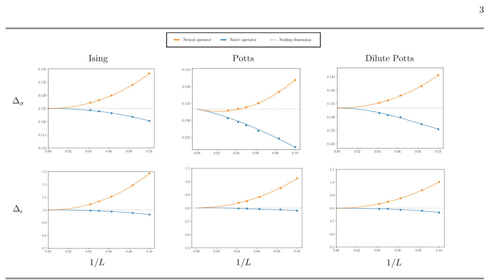 
FIG. 1. Finite-size scaling of two-point correlation functions using Sandvik’s method (see eq. 2). The six panels show the scaling for the leading spin (σ) and energy (ϵ) operators in the 2d Ising, q = 3 Potts, and dilute q = 3 Potts models, comparing naive lattice operators with machine-learned (neural) estimators. For the Ising and dilute Potts models, the data are fitted to a1L−2 + a2L−4 + ∆O, reflecting purely analytic corrections to scaling. For the q = 3 Potts model, the fit includes both non-analytic and analytic terms, a1L−0.8 + a2L−1.6 + a3L−2 + ∆O. The coefficients of the non-analytic corrections (L−0.8 and L−1.6) are constrained to be identical for the naive and neural operators,...

📷 Fig 2

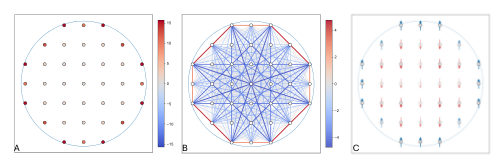 
FIG. 3. Low-order structure of the fitted surrogates within the spin field. (A) Linear filter for the Z2-odd spin operator σ, shown as site weights. (B) Quadratic surrogate for the Z2- even energy operator ϵ, visualized as a weighted graph over pairs of sites (edge color encodes sign and magnitude). (C) A representative spin configuration that maximizes the cu- bic features of the σ surrogate; the minimizing configuration follows from a global Z2 flip. Spin transparency encodes lo- cal sensitivity: more opaque sites are those whose flip would produce a larger decrease in the cubic component (i.e., they contribute more strongly to the maximum).

📷 Fig 3

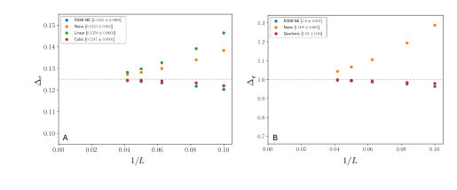 
FIG. 2. Scaling performance of low-order surrogates for the learned Ising operators. (A) Finite-size scaling analysis for the spin operator σ, comparing the naive lattice estimator, the neural estimator, and polynomial surrogates obtained by fit- ting the neural operator to linear and linear plus cubic forms. The linear surrogate’s scaling resembles that of the naive es- timator, indicating that cubic terms are required to repro- duce the neural operator’s improved scaling behavior. (B) Corresponding analysis for the energy operator ϵ, comparing the naive estimator, the neural estimator, and a quadratic surrogate. The quadratic surrogate closely matches the neu- ral estimator, indicating...

📷 Fig 4

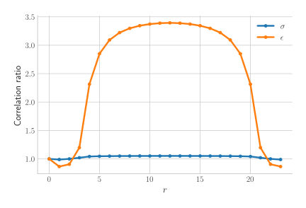 
FIG. 4. Ratio RO(r) of connected two-point functions for the neural and naive operators in the Ising model at L = 24. The enhancement is substantial for the energy operator ϵ and modest for the spin operator σ, consistent with the larger reduction of finite-size corrections observed for ϵ in the main text.

**Summary.** This work introduces a machine learning technique, RSMI-NE, to construct improved lattice operators for critical quantum systems. By training neural networks to maximize mutual information, the method significantly reduces systematic errors, particularly analytic corrections, when extracting fundamental CFT scaling dimensions. This demonstrates a powerful synergy between information theory and critical phenomena analysis.

**Why it may be interesting.** The use of information theory and neural networks to systematically improve physical observables extracted from lattice simulations provides a powerful, data-driven tool applicable to complex many-body systems where traditional renormalization group methods struggle with finite-size corrections.

Detailed structure

**Main problem.** The paper addresses the systematic error in extracting continuum Conformal Field Theory (CFT) data from lattice simulations due to imperfect lattice representations of continuum operators.

**Main result.** A data-driven, machine-learning approach successfully constructs lattice operators that significantly reduce analytic corrections to scaling compared to conventional lattice choices across multiple critical models.

**Method.** The authors employ a Real-Space Mutual Information Neural Estimator (RSMI-NE) to train neural networks that map local lattice configurations to operators, maximizing mutual information with the environment.

**Model / system.** The study is applied to three two-dimensional critical systems on a square lattice: the Ising model, the q=3 Potts model, and the dilute q=3 Potts model.

**Key observables.** Scaling dimensions ($\Delta_O$) of leading spin ($\sigma$) and energy ($\epsilon$) operators, and the ratio of connected two-point functions ($	ext{R}_{	ext{O}}(r)$).

**Important parameters / regimes.** Finite size $L$, correlation distance $r$, and the coupling constants defining the critical points.

**Assumptions / limitations.** The existence of a CFT description for the critical point, and the assumption that the optimal lattice operator can be learned via maximizing mutual information.

**Figures summary.** Figures compare finite-size scaling of two-point correlation functions for spin and energy operators, contrasting naive vs. neural estimators, and visualizing the structure of learned polynomial surrogates.

**Paper structure.** The paper first establishes the theoretical problem of lattice corrections to CFT scaling. It then details the RSMI-NE methodology, training the network to maximize mutual information. Finally, it applies this method to the Ising and Potts models, presenting quantitative comparisons of scaling dimension estimates and correlation functions.

Abstract

Finite-size effects limit the accuracy with which conformal data can be extracted from lattice simulations of critical systems. While action improvement suppresses some corrections to scaling, it does not address operator-dependent effects arising from imperfect lattice representations of continuum conformal fields. In this work, we propose a data-driven method for improving lattice operators themselves, constructing estimators with enhanced overlap with the corresponding primary operators of the continuum conformal field theory. We identify improved lattice representations of leading spin and energy operators in three two-dimensional critical systems: the Ising model, the q = 3 Potts model, and the dilute q = 3 Potts model. In all cases, the resulting operators exhibit reduced corrections to scaling and yield more accurate estimates of scaling dimensions compared to conventional lattice choices. The code and analysis workflows used to produce these results are made available in an accompanying GitHub repository.

[↑ back to top](#top)

### [Resolving the phase space](http://arxiv.org/abs/2605.29784v1)

**Authors:** Zdenek Hradil, Jaroslav Rehacek  
**Type:** theory · **Category:** other · **PDF:** <https://arxiv.org/pdf/2605.29784v1>  
**Analysis basis:** full PDF text, analyzed in chunks
**Topic relevance:** `quantum measurements` **3/5** · `entanglement & information structure` **1/5** · `quantum optics experiment` **1/5**

📷 Fig 1

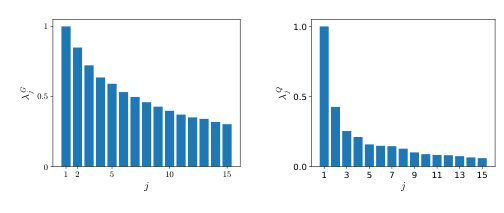 
FIG. 1. Eigenvalue spectrum of the Gram operator in state space G (left panel) and the corresponding operator-space Gram matrix Q (right panel) for homodyne tomography of a cat state. The spectrum of G defines the effective reconstruc- tion bandwidth and quantifies how uniformly Hilbert-space modes are sampled by the measurement. The operator-space spectrum Q governs conditioning and noise sensitivity of the inversion. Reduced detection efficiency induces rapid spectral decay, demonstrating that only a limited subset of modes is experimentally resolvable.

📷 Fig 2

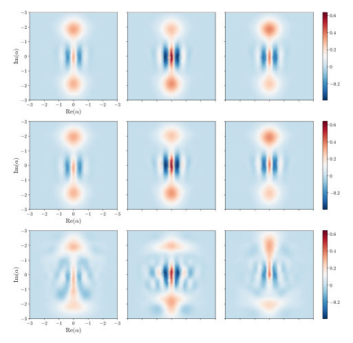 
FIG. 3. Repeated MaxLik reconstructions of the Wigner func- tion performed in subspaces spanned by the 2 (upper pan- els), 3 (middle panels), and 11 (lower panels) dominant eigen- modes of the Gram operator. Different panels within each row demonstrate the effect of statistical noise on weakly sampled modes. Already a few dominant Gram modes yield faithful and relatively stable reconstructions, showing that the exper- imentally accessible structure of the cat state is captured in a remarkably low-dimensional subspace. Enlarging the re- construction bandwidth permits finer phase-space details to appear, but increasingly amplifies noise sensitivity and over- fitting of unsupported components.

📷 Fig 3

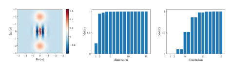 
FIG. 2. Left panel: Wigner function of the target even cat state. Middle panel: reconstruction fidelity versus the di- mension of the subspace defined by the dominant eigenmodes of the Gram operator G. Right panel: reconstruction fi- delity versus reconstruction dimension in the Fock basis. The Gram basis reaches high fidelity within a remarkably low- dimensional subspace: only three dominant modes are suffi- cient, whereas approximately ten Fock states are required for comparable reconstruction quality.

📷 Fig 4

 
Figure 1 shows the eigenvalue spectra of the Gram op- erator G and the operator-space Gram matrix Q for sim- ulated homodyne tomography. The spectrum of G de- termines the effective reconstruction bandwidth by iden- tifying the experimentally accessible modes, whereas Q quantifies the quadratic conditioning structure governing noise sensitivity in operator space. Figure 2 compares the exact Wigner function of the target cat state with the reconstruction fidelity

📷 Fig 5

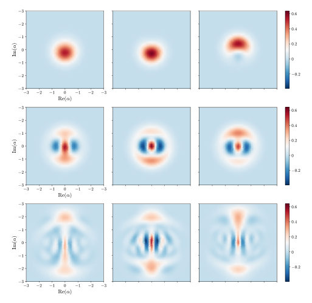 
FIG. 4. For comparison, repeated MaxLik reconstructions of the Wigner function are performed in Fock subspaces spanned by the 2 (upper panels), 3 (middle panels), and 11 (lower panels) lowest Fock states. Different panels within each row correspond to repeated reconstructions from independently generated noisy datasets. Low-dimensional Fock truncations fail to reproduce the characteristic structure of the target cat state, while larger reconstruction spaces become increasingly sensitive to statistical fluctuations. Compared with the Gram eigenbasis, substantially higher dimensions are required to achieve comparable fidelity, illustrating the reduced efficiency of reconstruction in a...

**Summary.** This paper introduces a resolution-based framework for quantum tomography, arguing that the true information content of a quantum state is limited by the measurement apparatus. By analyzing the Gram operator, the authors provide a diagnostic tool to distinguish genuinely resolved quantum features from artifacts introduced by incomplete sampling or model assumptions. This guides experimentalists toward efficient, data-adapted reconstruction methods.

**Why it may be interesting.** This is highly relevant for AMO and quantum optics as it provides a rigorous, data-driven diagnostic tool for interpreting experimental measurements of complex quantum states, moving beyond simple reconstruction algorithms.

Detailed structure

**Main problem.** The core problem is determining which features of a reconstructed quantum state are genuinely supported by limited experimental data versus those that are merely artifacts of the reconstruction assumptions.

**Main result.** The effective resolution of quantum tomography is governed by a sampling operator derived from the measurement's Gram matrix, providing an operational criterion to distinguish true quantum features from noise or model artifacts.

**Method.** The authors develop a resolution-based framework by analyzing the Gram operator, which dictates the experimentally accessible degrees of freedom, and propose reconstruction in the Gram eigenbasis for efficiency.

**Model / system.** The work applies to quantum state characterization using Quantum Tomography, often simulated using homodyne tomography of structured nonclassical states like cat states.

**Key observables.** The Gram operator ($G$) and its eigenvalues ($\lambda_k$), which quantify the effective reconstruction bandwidth and the reliability of individual Hilbert-space modes.

**Important parameters / regimes.** The numerical rank of the Gram operator, which determines the effective number of reliably accessible degrees of freedom.

**Assumptions / limitations.** The primary limitation is the finite measurement resolution, and the framework cautions that apparent resolution might stem from model assumptions rather than actual data sensitivity.

**Figures summary.** Figures illustrate the eigenvalue spectrum of the Gram operator defining the bandwidth, and compare reconstruction fidelity using the data-driven Gram eigenbasis against fixed bases (like the Fock basis), showing the failure of low-dimensional truncations in the latter.

**Paper structure.** The paper progresses from establishing the limitations of standard tomography to introducing the Gram operator as the key diagnostic tool. It then develops the concept of reconstruction in the Gram eigenbasis as a measurement-adapted compression, culminating in a resolution-based framework.

Abstract

Quantum tomography can reconstruct fine phase-space structures that are not necessarily resolved by measurement itself. We show that the effective resolution of tomography is determined by a sampling operator linked to the Gram matrix of the measurement, which defines the experimentally accessible degrees of freedom and reconstruction bandwidth of the quantum state. Acting analogously to a transfer function in imaging, this operator provides an operational criterion for distinguishing genuinely resolved quantum features from artefacts induced by incomplete sampling or reconstruction assumptions. Reconstruction in the Gram eigenbasis emerges as an efficient measurement-adapted compression of the tomographic problem. Within finite frame theory, the same structure appears naturally as the frame operator. Our results establish a resolution-based framework for quantum tomography relevant for contemporary experiments probing highly structured nonclassical states.

[↑ back to top](#top)

### [Symmetry and integrability in the anyon-Hubbard model](http://arxiv.org/abs/2605.28956v1)

**Authors:** Martin Bonkhoff, Grennon Gurney, Friethjof Theel, Peter Schmelcher, Nathan L. Harshman, Thore Posske  
**Type:** theory · **Category:** quantum gases · **PDF:** <https://arxiv.org/pdf/2605.28956v1>  
**Analysis basis:** full PDF text, analyzed in chunks
**Topic relevance:** `analog quantum simulation` **3/5** · `entanglement & information structure` **1/5** · `non-equilibrium dynamics` **1/5**

📷 Fig 1

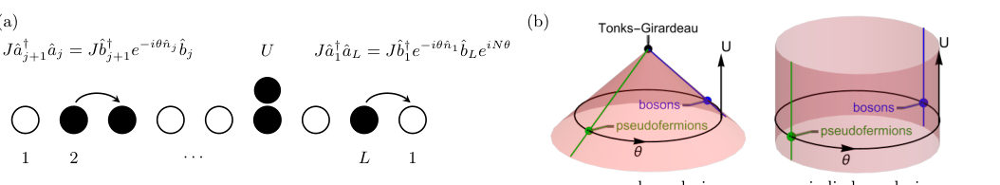 
FIG. 1. (a) The anyon-Hubbard model describes N anyons on L sites with creation operators ˆa† j, equivalent to interacting bosons with density-dependent Peierls phase. (b) Its flat parameter space (red) consists of the Hubbard interaction U and the cyclic statistical parameter θ, realizing bosons for θ = 0 and pseudofermions for θ = π. For open boundary conditions in the Tonks-Girardeau limit of infinitely strong interactions, all particles become the same (tip of the conic parameter space). Periodic boundary conditions prevent this identification (cylindric parameter space), see Eq. (4).

📷 Fig 2

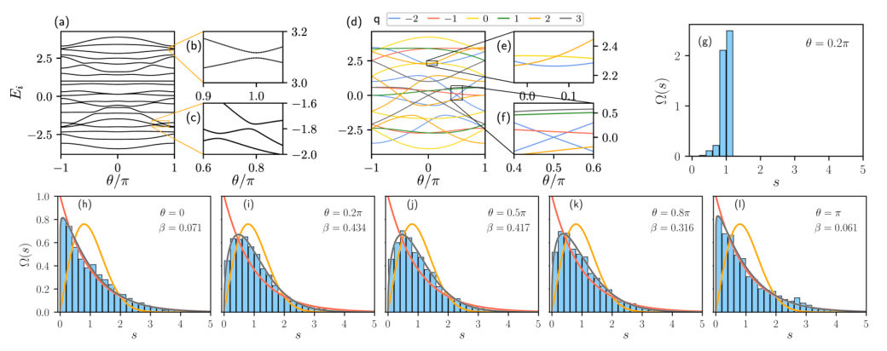 
FIG. 2. The two-particle anyon-Hubbard model’s integrability depends on its parameters and boundary conditions. (a) and (d) depict the energy levels for parameters N = 2, L = 6, and U/J = 1. (a) For open boundaries, the spectrum exhibits avoided level crossings, see insets (b) and (c), a signature of nonintegrability. (d) For periodic boundaries, the line colors indicate angular momenta q according to Sec. III B. Crossing between states with different angular momenta is expected (e), whereas crossings in the same angular momentum sector (f) are indicative of additional exactly-solvable states. (g) and (h-l) depict the symmetry-reduced energy level spacing statistics, see main text for...

**Summary.** This work provides a comprehensive theoretical study of the anyon-Hubbard model, determining how its symmetries and integrability are governed by boundary conditions and particle statistics. Key findings show that periodic boundaries preserve integrability, while open boundaries generally break it. This has implications for understanding exotic quantum phases realized in cold atom experiments.

**Why it may be interesting.** The explicit connection between topological statistics (anyons), symmetries, and integrability provides deep insights into the quantum dynamics of strongly interacting, non-standard quantum matter systems.

Detailed structure

**Main problem.** The paper analyzes the symmetries, integrability, and resulting degeneracies of the anyon-Hubbard model, which describes one-dimensional anyons.

**Main result.** The integrability of the system depends critically on boundary conditions: two anyons are integrable with periodic boundaries but generally not with open boundaries.

**Method.** The analysis combines symmetry classification using point groups (AI, BDI, CI) with techniques like the Bethe ansatz and character theory to determine spectral properties.

**Model / system.** The model is the anyon-Hubbard model, characterized by a statistical parameter $\theta$ that tunes statistics between bosons ($\theta=0$) and fermions ($\theta=\pi$). It is studied on a finite lattice of length $L$ with interactions $U$ and tunneling $J$.

**Key observables.** Symmetry classes (AI, BDI, CI), level spacing statistics (Poissonian vs. Wigner-Dyson), and the existence of exactly solvable states (e.g., doublon state).

**Important parameters / regimes.** System size ($L$), particle number ($N$), statistical parameter ($\theta$), and boundary conditions (Open vs. Periodic).

**Assumptions / limitations.** The analysis relies on mapping the anyonic system to an effective bosonic model and applying advanced group theory (dihedral groups) to calculate state degeneracies.

**Figures summary.** Figures illustrate the model setup, parameter space, and level statistics, showing distinct behavior for periodic versus open boundary conditions.

**Paper structure.** The paper systematically analyzes symmetries (using point groups and character theory), then moves to integrability diagnostics via level spacing, and finally provides explicit analytical solutions for small particle numbers.

Abstract

Recent cold atom experiments have realized one-dimensional anyons and enabled the tuning of 1D~statistics between bosons and fermions. Here, we analyze the symmetries, integrability, and resulting degeneracies of the underlying anyon-Hubbard model of finite length. Our results reveal a switching between symmetry classes AI, BDI, and CI in dependence on system size, particle number, and boundary conditions, and show that two anyons with periodic boundaries are integrable, while two anyons with open boundary conditions are not. We include a comprehensive analysis of all model limits, especially of interacting bosons and pseudofermions and resolve spectral signatures. We additionally reveal an exactly solvable doublon state that hides in the continuum of scattering states and the exact solution of the nullspace of two noninteracting anyons. The uncovered symmetries shape the fundamental properties of the one-dimensional anyons at hand, and the predicted states are accessible in state-of-the-art experiments.

[↑ back to top](#top)

### [Verifying Adversarial Robustness in Quantum Machine Learning: from theory to physical validation via a software tool](http://arxiv.org/abs/2605.29877v1)

**Authors:** Ji Guan, Mingsheng Ying  
**Type:** both · **Category:** quantum information and computing · **PDF:** <https://arxiv.org/pdf/2605.29877v1>  
**Analysis basis:** full PDF text, analyzed in chunks
**Topic relevance:** `QC/QI experiment` **3/5** · `quantum measurements` **2/5**

📷 Fig 1

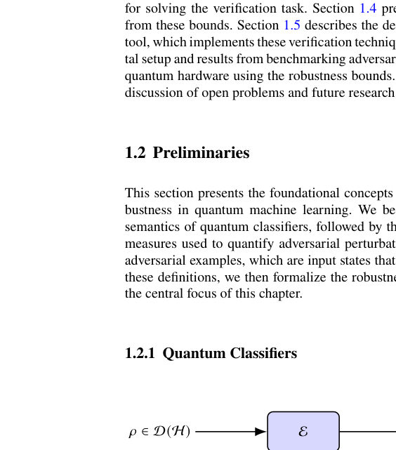 
Fig. 1.1: Quantum classifier pipeline. The input quantum state 𝜌is processed by a quantum channel E, followed by measurement via a POVM {𝑀𝑐}𝑐∈C, to produce a classical class label 𝑐= A(𝜌).

📷 Fig 2

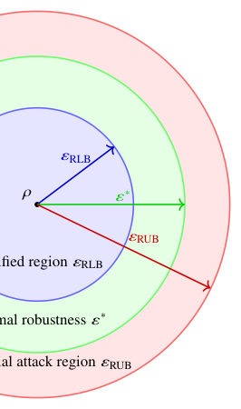 
Fig. 1.2: Visualization of robustness bounds as nested fidelity-distance regions around the input state 𝜌. The certified lower bound 𝜀RLB defines a guaranteed-safe region, the upper bound 𝜀RUB corresponds to successful adversarial attacks, and the optimal robustness 𝜀∗lies in between.

📷 Fig 3

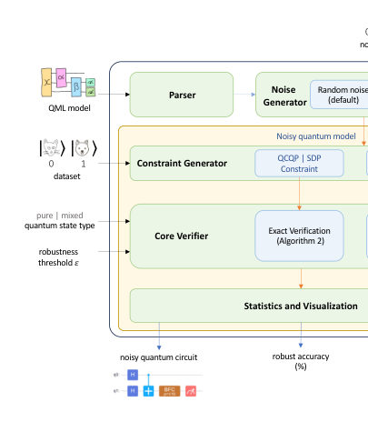 
Fig. 1.3: System architecture of VeriQR.

📷 Fig 4

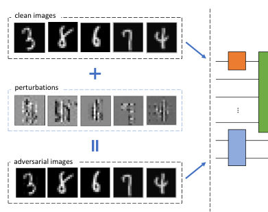 
Fig. 1.4: The adversarial examples and the corresponding adversarial perturbations found by VeriQR in MNIST handwritten digit classification.

📷 Fig 5

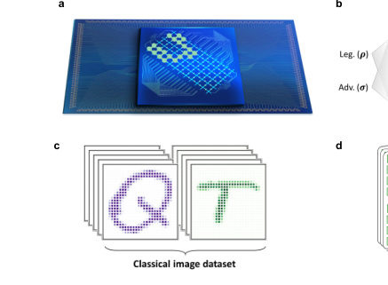 
Fig. 1.5: Experimental schematic for QNN robustness evaluation. a, Schematic dia- gram of the superconducting quantum processor, comprising 72 qubits and 126 couplers arranged in a 2D lattice. The 20 qubits selected for the experiment are highlighted in green. b, Architecture of the quantum neural network (QNN) classifier, including the state preparation circuit, an 𝑙-layer variational circuit, and pre-measurement basis trans- formation gates. c, Sample visualization of handwritten letters “Q” and “T” from the EMNIST dataset, used for the classical image classification task. d, Quantum circuit used to generate the LCEI dataset, showing the application of an 𝑅𝑥(𝛼) rotation fol- lowing the...

**Summary.** This paper presents a comprehensive framework to certify the adversarial robustness of Quantum Machine Learning models, moving the field from theory to physical validation. It introduces VeriQR, a dedicated tool that computes certified lower bounds using SDP and estimates upper bounds via hardware attacks. The work validates this approach experimentally on superconducting processors, demonstrating that adversarial training can significantly enhance the model's guaranteed robustness.

**Why it may be interesting.** This work directly tackles the trustworthiness and reliability of quantum computation by providing rigorous, quantifiable metrics for security, which is crucial for any physical implementation of quantum algorithms.

Detailed structure

**Main problem.** The paper addresses the critical need to verify the adversarial robustness of Quantum Machine Learning (QML) models against small, malicious input perturbations.

**Main result.** The authors developed a comprehensive framework, including the tool VeriQR, that provides both a theoretically guaranteed lower bound ($\mathcal{E}_{RLB}$) and an experimentally estimated upper bound ($\mathcal{E}_{RUB}$) for robustness, which can be validated on superconducting hardware.

**Method.** The methodology combines formal verification using Semidefinite Programming (SDP) for optimal bounds with practical, noise-aware techniques like the Mask FGSM attack for empirical estimation.

**Model / system.** The models analyzed are quantum classifiers, defined by a quantum channel (CPTP map) and a POVM measurement, tested on superconducting quantum processors (e.g., 20-qubit systems).

**Key observables.** Robustness Radius ($\epsilon^*(
ho)$), Robustness Lower Bound ($\epsilon_{RLB}$), and Robustness Upper Bound ($\epsilon_{RUB}$), quantified using Quantum Fidelity ($F$).

**Important parameters / regimes.** The perturbation size ($\epsilon$), the number of qubits ($N$), and the noise model parameters (e.g., depolarizing noise).

**Assumptions / limitations.** The SDP method assumes full knowledge of the model structure, which is challenging on noisy NISQ hardware; the framework also addresses the complexity difference between mixed and pure states.

**Figures summary.** Figures illustrate the quantum classifier pipeline, the relationship between the three robustness bounds ($\mathcal{E}_{RLB} \le \mathcal{E}^* \le \mathcal{E}_{RUB}$), the VeriQR system architecture, and experimental comparisons of these bounds after adversarial training.

**Paper structure.** The paper builds from defining the adversarial robustness problem, deriving theoretical bounds ($\mathcal{E}_{RLB}$ via measurement outcomes, $\mathcal{E}^*$ via SDP), developing the VeriQR tool, and culminating in experimental validation on superconducting hardware using classification tasks.

Abstract

As with classical neural networks, quantum machine learning (QML) models are vulnerable to small input perturbations that can significantly alter output predictions. Certifying the robustness of QML models, particularly on NISQ hardware, is therefore a fundamental step toward trustworthy quantum AI. This chapter reviews our recently developed comprehensive formal framework for verifying adversarial robustness in QML. The core of this framework is a fidelity-based robustness lower bound computable directly from the measurement outcome distribution, which enables both formal verification and empirical estimation on real quantum devices. Additionally, the optimal bound can be computed via semidefinite programming (SDP) with full knowledge of the quantum machine learning models. We incorporate these results into: (1) an efficient formal verification framework; (2) VeriQR, the first dedicated QML robustness verification tool; and (3) the first experimental benchmark of quantum adversarial robustness on a 20-qubit superconducting processor. Together, these systematic advances enable scalable, physically grounded robustness evaluation of QML models.

[↑ back to top](#top)

### [Dynamical Tsallis WIMP Freeze-Out and Residual Memory Channels in the Radiation Sector](http://arxiv.org/abs/2605.29132v1)

**Authors:** Matias P. Gonzalez  
**Type:** theory · **Category:** statistical mechanics · **PDF:** <https://arxiv.org/pdf/2605.29132v1>  
**Analysis basis:** full PDF text, analyzed in chunks
**Topic relevance:** `Keldysh / 2PI / non-Gaussian methods` **3/5** · `methods for driven-dissipative` **1/5**

📷 Fig 1

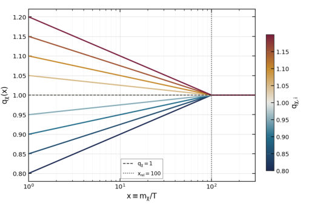 
Fig. 1: Evolution of qχ as a function of the freeze-out vari- able x = mχ/T. The trajectories are obtained from Eq. (7) for different initial values of the Tsallis parameter in the dark sector.

📷 Fig 2

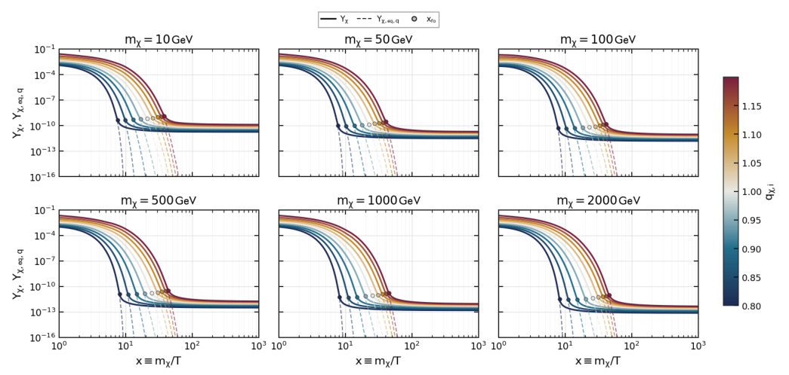 
Fig. 2: Dynamic-q freeze-out in the dark sector for different dark matter masses mχ. Solid curves show Yχ(x), dashed curves show Yχ,eq,q(x), and markers indicate the freeze-out points xfo. The color scale denotes the initial Tsallis parameter qχ,i.

📷 Fig 3

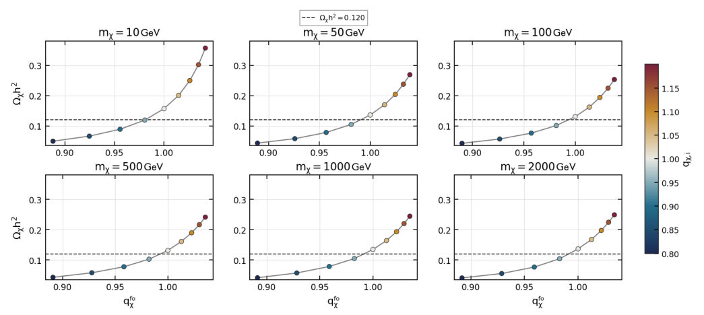 
Fig. 3: Relic Density obtained from the dynamic-q freeze-out evolution shown in Fig. 2. The panels correspond to the same benchmark dark matter masses mχ and initial values of the dark sector Tsallis parameter qχ,i. The horizontal dashed line indicates the reference value Ωχh2 ≃0.120.

📷 Fig 4

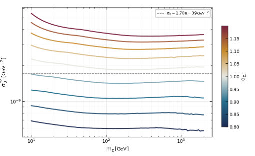 
Fig. 4: Relic density target curves in the (mχ, σ0) plane. For each initial value of the dark sector Tsallis parameter qχ,i, the required annihilation strength σreq 0 is obtained by imposing Ωχh2 ≃0.120 after solving the dynamic-q freeze-out equation. The horizontal dashed line denotes the reference value of σ0 used in the benchmark relic den- sity evolution.

📷 Fig 5

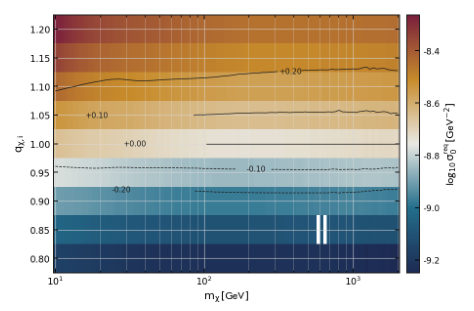 
Fig. 5: Projection of the relic density target surface onto the (mχ, qχ,i) plane. The color scale gives log10 σreq 0 , where σreq 0 is the annihilation strength required to sat- isfy Ωχh2 ≃0.120. The contour lines show the logarithmic shift with respect to the extensive target curve, summariz- ing the degeneracy between the WIMP mass, the initial nonextensive deformation, and the effective annihilation strength.

**Summary.** This work explores how nonextensive statistical mechanics, quantified by the Tsallis parameter $q$, can modify the standard calculation of WIMP dark matter freeze-out. The resulting residual nonextensivity is then modeled as a 'memory' imprinted onto the radiation bath, leading to a calculable correction to $N_{	ext{eff}}$ that remains consistent with current cosmological observations.

**Why it may be interesting.** The application of nonextensive statistical mechanics (Tsallis formalism) to fundamental cosmological processes like dark matter freeze-out provides a non-standard extension to standard thermal field theory calculations.

Detailed structure

**Main problem.** The paper generalizes WIMP dark matter freeze-out using Tsallis nonextensive statistics and models how the resulting residual nonextensivity is transferred into the early universe's radiation sector.

**Main result.** The residual-memory scenario can remain phenomenologically compatible with current CMB+BAO constraints on the effective number of relativistic species ($N_{	ext{eff}}$).

**Method.** The authors solve the Boltzmann equation using q-deformed distribution functions and employ a 'memory channel' ansatz to couple the dark matter freeze-out residual to the neutrino and electron-positron plasma.

**Model / system.** The system is the early universe plasma containing WIMPs ($\chi$), photons, $e^\pm$, and neutrinos. The nonextensivity is modeled via the Tsallis parameter $q$, which dynamically evolves during freeze-out.

**Key observables.** Effective number of relativistic species ($N_{	ext{eff}}$), relic abundance ($\Omega_{\chi}h^2$), and the residual Tsallis parameter ($q_{f\chi}$).

**Important parameters / regimes.** Tsallis parameter ($q$), dark matter mass ($m_\chi$), and memory transfer efficiency parameters ($\lambda_{e\pm}, \lambda_
u$).

**Assumptions / limitations.** The dark matter sector is generalized using Tsallis statistics, while the photon background is kept extensive ($q_\gamma=1$). The memory transfer is treated phenomenologically via an inheritance ansatz.

**Figures summary.** Figures illustrate the evolution of the Tsallis parameter $q_\chi$ during freeze-out and show the dependence of the required annihilation cross-section on initial $q_\chi$ to match the observed relic density.

**Paper structure.** The paper proceeds by first generalizing the WIMP freeze-out using dynamical Tsallis statistics, determining the residual nonextensivity ($q_{f\chi}$). It then introduces a memory channel to propagate this residual nonextensivity into the radiation sector, calculating the resulting modification to $N_{	ext{eff}}$ and comparing it to cosmological bounds.

Abstract

In this work we generalize the thermal decoupling, or freeze-out, of weakly interacting massive particle dark matter within the Tsallis nonextensive formalism. The generalization is implemented through $q$-deformed distribution functions obtained from the maximum entropy principle with Curado-Tsallis constraints. The Tsallis parameter $q$, which measures deviations from extensivity with respect to the limit $q=1$, is promoted to a dynamical quantity depending on the dimensionless variable $x=m_χ/T$, where $m_χ$ is the dark matter mass. This dynamical evolution is characterized by a relaxation toward extensivity, while requiring that the nonextensive deformation is not completely erased before freeze-out. We solve the Boltzmann equation assuming a sectorial deformation, where only the dark matter equilibrium abundance is generalized and the radiation background remains extensive. The relic abundance is computed for different dark matter masses and initial values of the Tsallis parameter. From this evolution, we extract the residual value $q_χ^{\rm fo}$ at freeze-out, which is then used as the initial input for a phenomenological memory channel. This channel propagates the residual nonextensivity into the radiation sector, specifically into the electron-positron plasma and neutrinos, while photons are kept extensive in order to avoid direct tensions with CMB physics. The resulting deformation modifies the neutrino energy density and the photon reheating contribution, producing a correction to $N_{\rm eff}$. We compare the predicted values with the compressed CMB+BAO constraint on $N_{\rm eff}$ and find that the residual-memory scenario can remain phenomenologically compatible with current bounds.

[↑ back to top](#top)

### [Shear Viscosity at the van Hove singularity](http://arxiv.org/abs/2605.29501v1)

**Authors:** Yi-Hui Xing, Wu-Ming Liu  
**Type:** theory · **Category:** strongly correlated electrons · **PDF:** <https://arxiv.org/pdf/2605.29501v1>  
**Analysis basis:** full PDF text, analyzed in chunks
**Topic relevance:** `Keldysh / 2PI / non-Gaussian methods` **3/5** · `non-equilibrium dynamics` **1/5**

📷 Fig 1

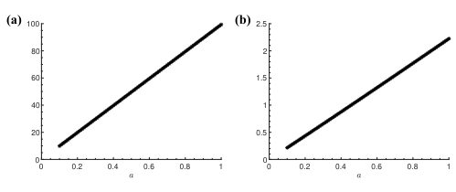 
FIG. 2. Numerical results for the integral in (a) Eq.(38) and (b) Eq.(39) as a function of a.

**Summary.** This theoretical work investigates transport properties, specifically shear viscosity, in materials near a van Hove singularity where electron-boson coupling is strong. By comparing results from the diagrammatic Kubo formalism against the standard Boltzmann theory, the authors find that the two methods yield different predictions for viscosity, highlighting the limitations of simple semiclassical descriptions in strongly correlated regimes.

**Why it may be interesting.** The rigorous comparison between Kubo and Boltzmann approaches in the context of non-Fermi liquid behavior (like strange metals) provides advanced theoretical tools for analyzing transport in strongly interacting quantum materials.

Detailed structure

**Main problem.** The paper compares the validity of the diagrammatic Kubo formalism against the linearized Boltzmann equation for calculating transport coefficients, particularly shear viscosity, in strongly correlated systems.

**Main result.** While conductivity agrees between the two formalisms in the dirty limit, the dc shear viscosity exhibits qualitatively different behavior, providing a diagnostic tool to assess theoretical validity.

**Method.** The authors employ the diagrammatic Kubo formalism, calculating momentum current correlators via Feynman diagrams, and compare these results against predictions from the Boltzmann equation.

**Model / system.** The study focuses on a Fermi surface hosting a van Hove singularity (VHS) coupled to critical Ising-nematic boson fluctuations. The low-energy theory involves coupled fermion and boson degrees of freedom.

**Key observables.** Shear viscosity ($\eta$), conductivity ($\sigma$), and the momentum density current correlator ($\Xi$).

**Important parameters / regimes.** Temperature ($T$), external frequency ($\Omega$), impurity scattering rate ($\Gamma$), and the proximity to the van Hove singularity.

**Assumptions / limitations.** Approximations include the fermion sharp peak approximation and the Prange-Kadanoff approximation, which are noted to break down in the dirty critical limit.

**Figures summary.** Figure 2 shows numerical results for momentum integrals related to the boson momentum integral and the dc conductivity, demonstrating a linear dependence on a parameter 'a'.

**Paper structure.** The paper builds by deriving the momentum current correlator using Kubo formalism, analyzing the results in different limits (clean, dirty, finite T), and comparing the resulting scaling laws for shear viscosity against those derived from the Boltzmann approach.

Abstract

The applicability of the semiclassical Boltzmann transport theory is fundamentally challenged in strongly correlated systems where quasiparticle excitations are ill-defined. When the fermion spectral broadening becomes much larger than the boson broadening, the Boltzmann approach to transport is not always valid, particularly in the dirty limit of the critical regime. Using a diagrammatic Kubo formalism, we compute several critical transport coefficients at a van Hove singularity and show that, while the conductivity happens to agree with the Boltzmann result, the dc shear viscosity exhibits qualitatively different behavior. The diagrammatic Kubo results are more reliable because, under the fermion sharp peak approximation--an assumption that strictly breaks down in the dirty critical limit--we demonstrate that the leading order Feynman diagrams reduce to the Boltzmann equation. The same critical model, which can also account for strange metal, makes experimentally testable predictions for the optical and dc shear viscosities, ${\rm Re}[η(Ω)]\sim (|Ω|^{3/2}+T^{3/2})/Ω^2$ and ${\rm Re}[η(Ω=0)]\sim T$, providing further opportunities to assess the validity of our theoretical framework.

[↑ back to top](#top)

### [Charged Abelian Higgs phase transitions in three-dimensional compact lattice U(1) gauge models with multicharge scalar matter](http://arxiv.org/abs/2605.29884v1)

**Authors:** Claudio Bonati, Filippo Mariani, Ettore Vicari  
**Type:** theory · **Category:** statistical mechanics · **PDF:** <https://arxiv.org/pdf/2605.29884v1>  
**Analysis basis:** full PDF text, analyzed in chunks
**Topic relevance:** `analog quantum simulation` **3/5**

📷 Fig 1

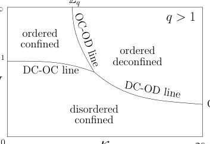 
FIG. 1: Sketch of the phase diagram of the 3D CLAH models for generic integer charge q &gt; 1 and N &gt; 1. It presents three phases: the disordered-confined (DC), the ordered-deconfined (OD), and the ordered-confined (OC) phase. They are sep- arated by different DC-OD, DC-OC and OC-CD transition lines [4]. We also mention that CLAH models become equiv- alent to the CPN−1 model for κ = 0, to the O(2N) vec- tor model for κ →∞, and to the lattice Zq gauge model for J →∞. Continuous transitions belonging to the 3D N- component AH universality classes develop along the DC-OD line, for sufficiently large N. The line κ = 1 is expected to cross the DC-OD line in doubly-charged (q = 2) CLAH mod- els for...

📷 Fig 2

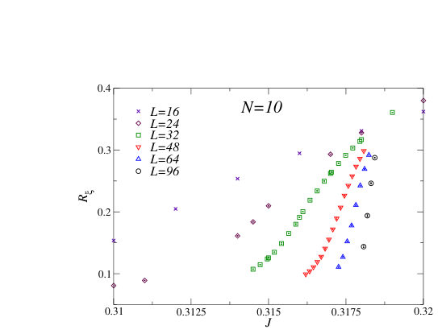 
FIG. 2: The ratio Rξ for the CLAH with N = 10 close to the transition point Jc at κ = 1, where the data sets for different values of L cross.

📷 Fig 3

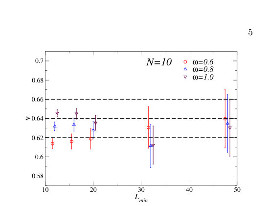 
FIG. 3: Estimates of the critical exponent ν for N = 10, extracted from the behavior of Rξ close to Jc at κ = 1.To allow for the leading O(L−ω) scaling corrections, we used the values ω = 0.6, 0.8, 1.0, and perfomed fits of the data for lattice sizes L ≥Lmin. The horizontal band denotes the estimate of ν obtained for the NCLAH model in [84].

📷 Fig 4

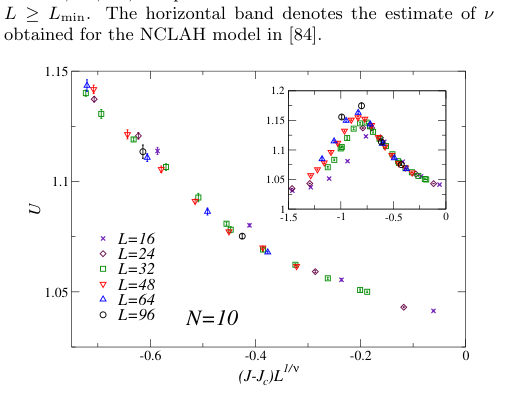 
FIG. 4: Scaling of the cumulant U for the CLAH with N = 10 and κ = 1, using ν = 0.64(2) and Jc = 0.31870(2).

📷 Fig 5

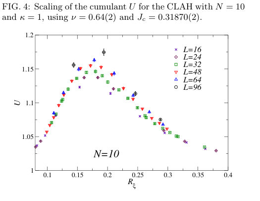 
FIG. 5: The Binder cumulant U vs the ratio Rξ for the CLAH with N = 10 close to transition point Jc at κ = 1. The scaling behavior is reasonable. We observe larger scaling corrections around the maximum values of U, which should get asymp- totically suppressed as L−ω with ω ≈0.8.

**Summary.** This work analyzes phase transitions in 3D lattice Abelian Higgs models with charged scalar matter. Using Monte Carlo simulations and finite-size scaling, the authors test how the transition nature changes with the number of scalar components ($N$). They estimate that the critical number of components required for a continuous transition is $N_{cL}=9$.

**Why it may be interesting.** The study of lattice gauge theories and critical phenomena is foundational to understanding emergent order in many-body quantum systems, providing theoretical tools applicable to strongly correlated materials.

Detailed structure

**Main problem.** The paper investigates the nature of phase transitions (specifically the Disordered-Confined (DC) to Ordered-Deconfined (OD) transition) in three-dimensional lattice Abelian Higgs models coupled to multicharge scalar matter.

**Main result.** The analysis provides evidence that the minimum number of scalar components ($N_{cL}$) required for a continuous transition is 9, leading to an estimate for the critical component number $N_*^3 = 9$.

**Method.** The primary method involves performing finite-size scaling (FSS) analyses on Monte Carlo simulations to distinguish between continuous and first-order phase transitions.

**Model / system.** The system is a 3D lattice Abelian Higgs (AH) model, specifically the Charged Lattice Abelian Higgs (CLAH) model, defined by a Hamiltonian involving U(1) gauge fields and an $N$-component complex scalar field with a doubly-positive charge ($q=2$).

**Key observables.** The analysis uses the Binder parameter ($U$), the ratio of correlation lengths ($R_\xi$), and the susceptibility ($\chi_Q$) to diagnose the order of the transition.

**Important parameters / regimes.** Key parameters include the number of scalar components ($N$), the charge ($q=2$), and the lattice size ($L$), with the focus on identifying the critical value $N_{cL}$.

**Assumptions / limitations.** The authors assume that the minimum number of components exhibiting continuous transitions ($N_{cL}$) directly estimates the critical value $N_*^3$ relevant to the continuum field theory.

**Figures summary.** Figures illustrate the scaling behavior of the Binder cumulant ($U$) and the correlation length ratio ($R_\xi$) for different $N$, showing clear scaling for $N=10$ (continuous) and deviations suggesting weak first-order behavior for $N \le 7$.

**Paper structure.** The paper establishes the physical model and the theoretical context (AH universality class), details the numerical methods (MC simulations and FSS), presents results for various $N$ values, and concludes by estimating the critical component number $N_*^3$.

Abstract

We consider three-dimensional (3D) lattice Abelian Higgs models, with compact U(1) gauge variables coupled to a doubly-charged $N$-component complex scalar field (CLAH). We focus on their phase transitions between the disordered-confined (DC) and ordered-deconfined (OD) phases. When they are continuous they belong to the 3D Abelian Higgs (AH) universality class associated with the stable charged fixed point (CFP) of the renormalization-group flow of the 3D AH field theory, or scalar electrodynamics, describing $N$-component complex scalar fields minimally coupled to a U(1) gauge field. This CFP exists only for a sufficiently large number of components, i.e., $N \ge N_d^*$, where the integer $N_d^*$ depends on the spatial dimension $d$ (for example $N_4^*=183$). To estimate $N_3^*$, we look for the minimum number $N_{\rm cL}$ of scalar components of 3D doubly-charged CLAH models developing continuous transitions along their DC-OD transition line. For this purpose, we present finite-size scaling analyses of Monte Carlo simulations for $N\in[4,10]$, up to lattice sizes $L\approx 100$. The results provide evidence of continuous DC-OD transitions for $N=10$, and weak first-order transitions for $N\le 7$. They are not conclusive for $N=8,\,9$. Therefore, we estimate $N_{\rm cL}=9(1)$.

[↑ back to top](#top)

### [Claim against Measurement: Statistical Artefacts in Quantum Error Mitigation Benchmarks](http://arxiv.org/abs/2605.29872v1)

**Authors:** Dominik Köster, Wolfgang Mauerer  
**Type:** both · **Category:** quantum information and computing · **PDF:** <https://arxiv.org/pdf/2605.29872v1>  
**Analysis basis:** full PDF text, analyzed in chunks
**Topic relevance:** `QC/QI experiment` **3/5**

📷 Fig 1

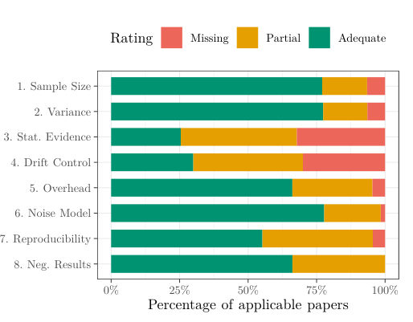 
Fig. 1. Summary of the systematic review results across the eight criteria.

📷 Fig 2

 
Figure 1 shows the observed compliance of the 81 papers with each of the eight criteria. Five criteria are well addressed, with over 60% adequate reporting: Sample Size (C1, 77%),

📷 Fig 3

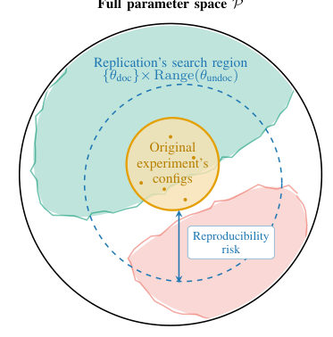 
Fig. 2. The full parameter space P of a QEM experiment, with regions of improvement (green), no improvement (grey), and worsening (red). Studies typically test a small subset of parameter configurations (orange).

📷 Fig 4

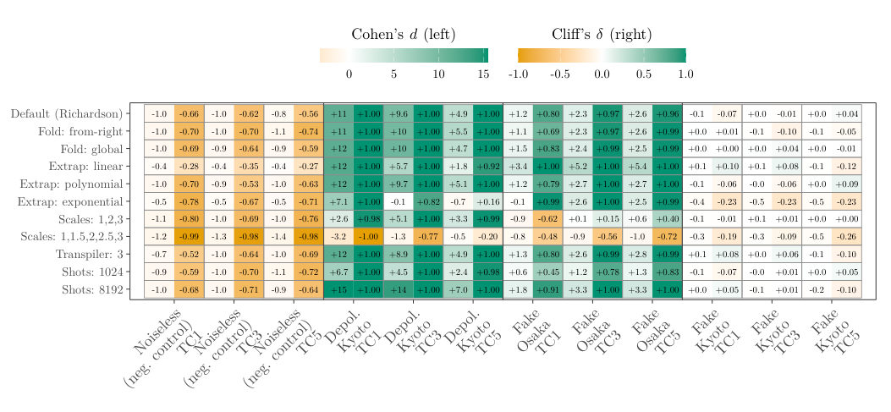 
Fig. 3. Parameter space heatmap for 4 backends × 3 Trotter depths (separated by vertical lines), one-at-a-time sweep from defaults. Each cell is split: the left half shows Cohen’s d (colour scale left), the right half shows Cliff’s δ (colour scale right). Green = ZNE significantly reduces error, yellow = ZNE significantly increases error (α=0.05), white = not significant.

📷 Fig 5

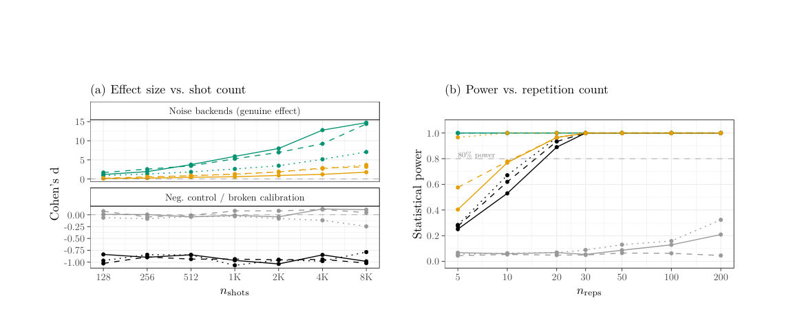 
Fig. 4. Sensitivity analysis. (a) Cohen’s d vs. shot count; d scales with √nshots for genuine effects. (b) Statistical power vs. repetition count (1,000 bootstrap resamples); 80% power requires nreps ≥20 for moderate effects.

**Summary.** This paper critically reviews the empirical benchmarks for Quantum Error Mitigation (QEM), finding that many studies lack statistical rigor. The authors demonstrate that apparent performance gains are often artefacts stemming from unacknowledged parameter choices or natural temporal drift in quantum hardware. They propose strict new reporting standards to ensure reliable scientific progress in the NISQ era.

**Why it may be interesting.** It provides a crucial methodological critique of the experimental claims in the field, directly impacting how future quantum algorithms and hardware performance are benchmarked, which is vital for theorists designing complex quantum circuits.

Detailed structure

**Main problem.** The statistical validity and rigor of current Quantum Error Mitigation (QEM) benchmarks are insufficiently scrutinized, potentially leading to overestimation of mitigation performance.

**Main result.** Current evaluation practices are prone to statistical artefacts due to unaddressed parameter sensitivity and temporal hardware drift, making reported improvements potentially misleading.

**Method.** The authors conducted a systematic review of 81 QEM papers and developed a rigorous testing pipeline involving parameter-space sampling, longitudinal drift assessment, and the application of inferential statistics (e.g., paired t-tests, effect-size calculation).

**Model / system.** The work analyzes performance on Noisy Intermediate Scale Quantum (NISQ) devices, using Zero-Noise Extrapolation (ZNE) as the primary technique, applied to circuits like the four-qubit Quantum Trotter Circuit (QTC).

**Key observables.** Cohen's d (effect size), Cliff's $\delta$, effective number of independent observations ($n_{eff}$), and the measured expectation value $ar{E}(\lambda_1)$ over time.

**Important parameters / regimes.** Scale factors, extrapolation methods, hardware calibration parameters, and the time elapsed between measurements (temporal drift).

**Assumptions / limitations.** The analysis challenges the assumption that repeated measurements are independent (i.i.d.) due to hardware drift, and highlights that results depend on implicitly assumed parameters.

**Figures summary.** Figures illustrate the parameter space dependence of ZNE effectiveness (heatmap of Cohen's d), the scaling of effect size with shot count, and time series plots showing how apparent ZNE effectiveness drifts significantly over days on real hardware.

**Paper structure.** The paper follows a structure of identifying a methodological gap (reviewing 81 papers), proposing a comprehensive framework (eight criteria, parameter space $P$), and then demonstrating the gap using detailed case studies involving parameter sweeps and long-term hardware monitoring.

Abstract

QEM is widely regarded as a plausible bridge from NISQ devices to FTQC. Yet the empirical studies used to assess the effectiveness of QEM techniques on concrete problems have received comparatively little scrutiny with respect to the validity of their conclusions. We systematically review 81 recent QEM papers using an eight-criterion framework covering statistical rigour, reproducibility, and reporting quality. Among the applicable papers, only 15 (25%) use inferential methods, while 25 (42%) report uncertainty only descriptively, without testing whether the claimed effects are statistically supported. To demonstrate the consequences of these omissions, we use ZNE as a representative and widely used case study and identify two compounding sources of artefacts in current QEM benchmarks. First, we observe parameter sensitivity: in a 132-configuration sweep, implicitly assumed choices such as scale factors, extrapolation method, and hardware calibration are not merely incidental but active, with variations changing conclusions from statistically significant improvement to statistically significant degradation. Second, we identify a drift-induced effectiveness illusion: in a 72-hour longitudinal study on real hardware, temporal drift alone can make the same ZNE configuration exhibit an effect size more than three times as large, depending solely on when it is executed, and also drastically reduces the effective number of independent observations. These findings do not imply that QEM methods are intrinsically unsound; rather, they show that current evaluation practice can make mitigation performance appear more robust than the evidence warrants. We therefore propose minimum reporting standards for QEM evaluations, including explicit parameter documentation, robustness checks, longitudinal drift assessment, and inferential statistical testing with effect-size reporting.

[↑ back to top](#top)

### [Entropy of Liquids and Glasses from Recurring Structural Patterns](http://arxiv.org/abs/2605.29945v1)

**Authors:** Nina Javerzat, Gerhard Jung, Jorge Kurchan, Misaki Ozawa  
**Type:** theory · **Category:** statistical mechanics · **PDF:** <https://arxiv.org/pdf/2605.29945v1>  
**Analysis basis:** full PDF text, analyzed in chunks
**Topic relevance:** `entanglement & information structure` **3/5**

📷 Fig 1

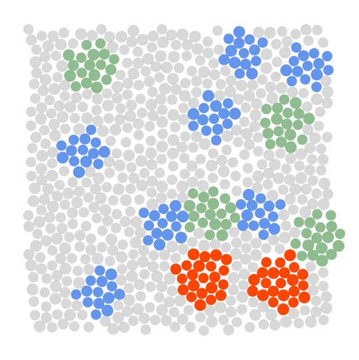 
FIG. 1: Occurrences of similar patches in an N = 704 configuration. The most similar occurrences, with distance ∆≲0.3, are highlighted for patch sizes d = 14, 18, and 22 in blue, green, and red, respectively. Overlapping patches are omitted for readability.

📷 Fig 2

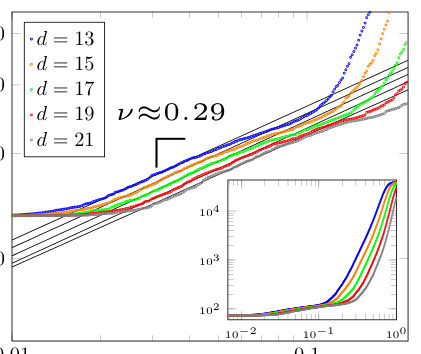 
FIG. 2: Correlation integral C(d) m (ϵ) as a function of the distance threshold ϵ in the vicinity of the scaling regime, for m = 2 at T = 0.047 and several patch sizes d. The straight lines indicate linear fits in the log–log representation, whose slope gives the exponent ν. The inset shows C(d) m (ϵ) over a broader range of ϵ.

📷 Fig 3

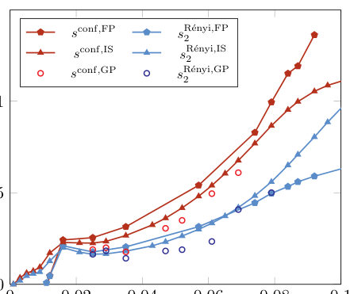 
FIG. 3: Configurational entropy sconf and R´enyi complexity sR´enyi m=2 , estimated using the Grassberger–Procaccia (GP) algorithm (open circles). The corresponding estimates obtained from the free-energy differences of the quenched and annealed Franz–Parisi (FP) potentials are shown as pentagons, those obtained by direct enumeration of inherent structures (IS) are shown as triangles.

📷 Fig 4

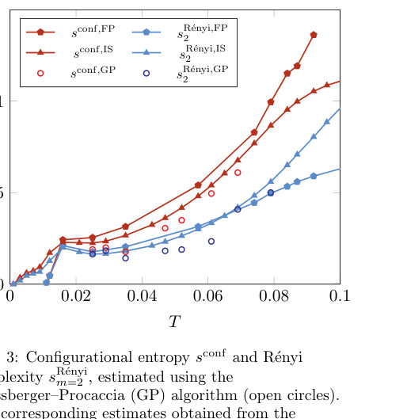 
Figure 3 shows the numerically extracted sconf, compared with two independent estimates of the configurational entropy: one obtained from the quenched Franz–Parisi potential, and the other from a direct evaluation of Eq. (1) in which metastable states are approximately identified with inherent structures. We find quantitative agreement among all three estimates. The figure also confirms the theoretical bound sconf ≥sR´enyi m=2 .

📷 Fig 5

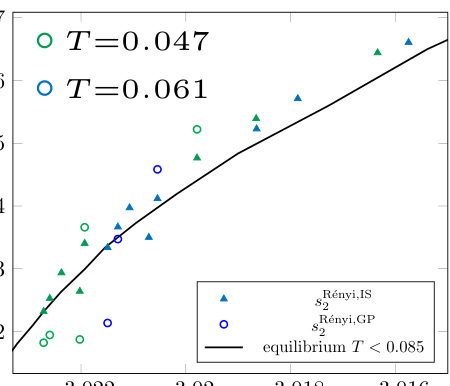 
FIG. 4: R´enyi complexity sR´enyi 2 measured using the Grassberger–Procaccia (GP) method (open circles) and from inherent-structure (IS) statistics (triangles), plotted as a function of the inherent-structure energy Einh along out-of-equilibrium aging paths at target temperatures T = 0.047 and T = 0.061. The black line shows the complexity for the equilibrium data, at temperatures T &lt; 0.085.

**Summary.** This work develops a novel, structure-only method to calculate the configurational entropy of supercooled liquids and glasses by analyzing the recurrence of structural patterns (patches). By adapting the Grassberger–Procaccia algorithm, the authors show that entropy reduction quantifies the growth of amorphous order, providing a powerful, general diagnostic tool for glassy dynamics.

**Why it may be interesting.** While focused on classical structural glass physics, the rigorous application of information-theoretic measures (like Rényi complexity) to characterize the phase space structure of disordered systems is highly relevant to understanding quantum many-body localization and complexity in quantum many-body dynamics.

Detailed structure

**Main problem.** The paper aims to compute the low-temperature configurational entropy of supercooled liquids and glasses and establish a direct link between entropy reduction and the growth of amorphous structural order.

**Main result.** The method successfully estimates configurational entropy, showing quantitative agreement with conventional definitions, and demonstrates that entropy decreases during aging, coinciding with equilibrium values at the same inherent-structure energy.

**Method.** The core method adapts the Grassberger–Procaccia algorithm to analyze the decay rate of recurrent structural patterns (patches) in particle configurations, yielding both configurational entropy and higher-order Rényi complexities.

**Model / system.** The study focuses on two-dimensional supercooled liquids, modeled using a modified ternary Kob–Andersen mixture, and analyzes configurations ranging from equilibrium snapshots to inherent-structure minima.

**Key observables.** Configurational entropy ($s_{	ext{conf}}$), Rényi complexity ($s_R^{	ext{R\'enyi}, m}$), and the correlation integral $C(d)^m(\epsilon)$.

**Important parameters / regimes.** Low temperatures (approaching $T_g$), patch size ($d$), and the Rényi index ($m$).

**Assumptions / limitations.** The method assumes that the structural information required for entropy calculation is contained solely within the particle positions, making it agnostic to the interaction potential or dynamics.

**Figures summary.** Figures illustrate the correlation integral $C(d)^m(\epsilon)$ for different indices $m$ and structural states (inherent vs. thermal), and show the application of fitting techniques (intercept-fit) to extract complexity measures.

**Paper structure.** The paper develops the theoretical framework by generalizing the Grassberger-Procaccia algorithm to structural patterns, applies it to calculate both configurational entropy and Rényi complexities, and validates the results by comparing them against established theoretical potentials and analyzing aging dynamics.

Abstract

We compute the low-temperature configurational entropy of a two-dimensional supercooled liquid. Our method, based on a higher-dimensional version of the Grassberger--Procaccia algorithm, can be implemented in a manner that is entirely agnostic with respect to both the dynamics and the theoretical framework, as any genuine notion of order should be. In this construction, entropy is obtained as the decay rate of recurrent structural patterns with increasing patch size, directly linking entropy reduction to the growing persistence of amorphous order. Because the method requires only particle positions, without any knowledge of the interaction potential or even of the particle sizes, it can be applied directly to both equilibrium and nonequilibrium aging configurations. The resulting configurational entropy, together with the higher-order Rényi complexities, agree quantitatively with values obtained from conventional definitions. Remarkably, the entropies measured during aging coincide with their equilibrium counterparts when compared at the same inherent-structure energy.

[↑ back to top](#top)

### [Koopman--von Neumann Molecular Dynamics for Green--Kubo Transport Coefficients](http://arxiv.org/abs/2605.30142v1)

**Authors:** Masari Watanabe, Hirofumi Nishi, Taichi Kosugi, Shigekazu Hidaka, Ryo Sakurai, Yu-ichiro Matsushita  
**Type:** theory · **Category:** statistical mechanics · **PDF:** <https://arxiv.org/pdf/2605.30142v1>  
**Analysis basis:** full PDF text, analyzed in chunks
**Topic relevance:** `non-equilibrium dynamics` **3/5**

📷 Fig 1

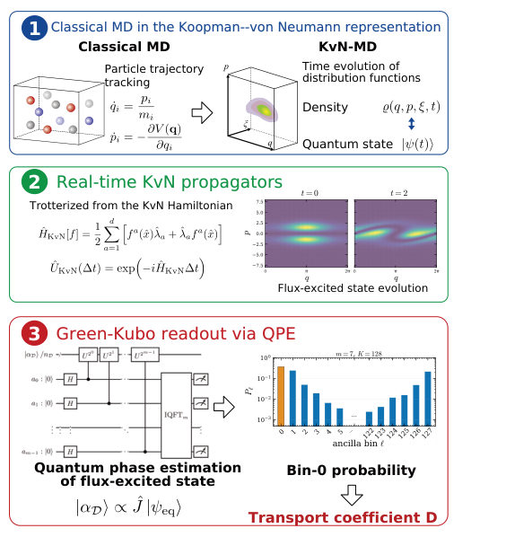 
FIG. 1. Conceptual diagram of Green–Kubo transport-coefficient readout using KvN-MD and QPE. The phase-space density of classical MD is represented as a KvN wave function, and NVE or Nosé–Hoover-type NVT dynamics are treated as a real-time KvN propagator. When the time evolution of the flux-excited state is input to QPE, a Bartlett-windowed Green–Kubo estimator is obtained from the bin-zero probability of the ancilla register.

📷 Fig 2

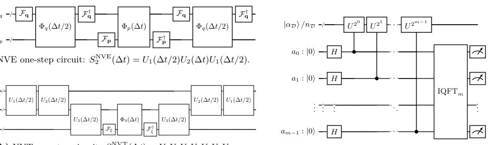 
FIG. 2. Quantum circuits for KvN propagators and QPE readout. (a) Multi-particle NVE one-step propagator in drift–kick–drift form. The bundled registers |q⟩and |p⟩contain all classical degrees of freedom, and the slash denotes a multi- qubit register. The QFTs Fq and Fp are tensor products over the corresponding coordinate registers. The diagonal phases

📷 Fig 3

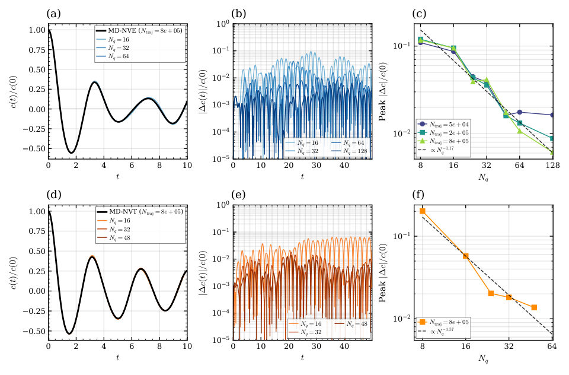 
FIG. 3. VACF convergence and finite-grid effects in the two-particle coupled cosine system. The upper and lower rows show the NVE and Nosé–Hoover NVT results, respectively. The system is defined by Eq. (67) with V0 = 5, ε = 1.2, m = T0 = 1, and Np = 64. The left column shows the short-time VACF, the middle column shows the deviation |∆c(t)|/c(0) from the MD reference, and the right column shows the peak deviation as a function of Nq. The peak deviation decreases empirically as approximately N −1.17 q for NVE and N −1.57 q for NVT. These exponents are empirical fits for this validation system and should not be interpreted as universal exponents.

📷 Fig 4

 
FIG. 4. Comparison between the Green–Kubo inte- gral and the KvN Bartlett estimator. (a) NVE dynamics with Nq = 128. (b) Nosé–Hoover-type NVT dynamics with Nq = 48. The blue curve shows the cumulative Green–Kubo integral DGK(t) = ∫t 0 Cvv(t′) dt′ obtained from the classical MD velocity autocorrelation function, while the yellow dia- monds show the KvN Bartlett estimator DBart(manc). The lower axis gives the physical time t, and the upper axis gives m = log2(t/∆t). The red line shows a first-order extrapola- tion in 1/K using the m = 9, 10, 11 points, and the green line shows the classical long-time reference ⟨DGK⟩100≤t≤400.

📷 Fig 5

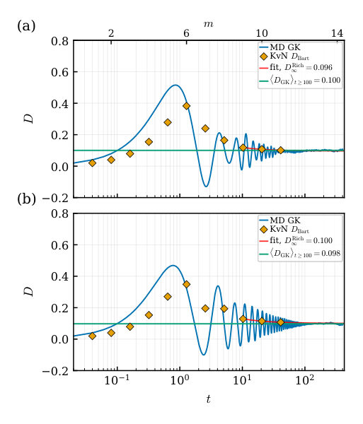 
Figure 4 shows a numerical validation of the QPE bin- zero readout for the two-particle coupled cosine system. We apply the same readout formula to both NVE dy- namics and Nosé–Hoover-type NVT dynamics. The blue curve is the finite-time Green–Kubo integral DGK(t), ob-

**Summary.** This paper develops a quantum algorithm framework to calculate Green-Kubo transport coefficients from classical molecular dynamics. It uses the Koopman-von Neumann representation to map classical dynamics onto unitary quantum evolutions, which are then simulated using Quantum Phase Estimation. The results demonstrate improved statistical scaling and provide resource estimates for implementing these complex simulations on quantum hardware.

**Why it may be interesting.** This work provides a concrete, quantum-algorithm-based pathway to calculate time-dependent, non-equilibrium properties (transport coefficients) that are central to understanding complex condensed matter systems.

Detailed structure

**Main problem.** The paper formulates the calculation of Green-Kubo transport coefficients from classical molecular dynamics as a readout problem solvable by quantum algorithms using the Koopman-von Neumann (KvN) representation.

**Main result.** The framework successfully maps classical dynamics (NVE/NVT) to unitary quantum evolutions, and the transport coefficients are read out via Quantum Phase Estimation (QPE) with improved statistical scaling.

**Method.** The core method involves linearizing classical Liouville evolution into a unitary quantum evolution using the KvN representation, followed by estimating the required correlation function via QPE and Maximum-Likelihood Amplitude Estimation (MLAE).

**Model / system.** The model is classical molecular dynamics, encompassing NVE (Hamiltonian) and Nosé-Hoover NVT dynamics, applied to systems like those found in lithium-ion batteries.

**Key observables.** Green-Kubo transport coefficients (e.g., diffusion coefficient), the probability $P_0$ of the QPE ancilla register being zero, and the time-dependent velocity autocorrelation function (VACF).

**Important parameters / regimes.** The required qubit resources scale polynomially for NVE ($O(n^2)$ CX gates) but exhibit exponential scaling for NVT ($O(n_\xi n_p 2^{n_p})$).

**Assumptions / limitations.** The framework assumes the existence of a Hermitian KvN generator for both NVE and NVT flows, and the statistical estimation relies on MLAE improving scaling from $N^{-1/2}$ to $N^{-1}$.

**Figures summary.** Figures illustrate the conceptual workflow (MD $	o$ KvN-MD $	o$ QPE), show quantum circuits for NVE and NVT propagators, and present convergence studies comparing KvN results against classical MD references.

**Paper structure.** The paper develops the KvN formalism for NVE and NVT dynamics, details the quantum circuit implementation for the propagators, maps the Green-Kubo integral to a QPE readout, and finally analyzes the resource scaling and convergence of the resulting estimator.

Abstract

We formulate the Green--Kubo transport coefficients of classical molecular dynamics as a readout problem for quantum algorithms using the Koopman--von Neumann (KvN) representation. Both NVE and Nosé--Hoover-type NVT dynamics are derived as unitary evolutions on Hilbert spaces associated with the corresponding classical phase spaces. Numerical benchmarks on finite grids show that the discretization error in the correlation function decreases as a power law in the number of grid points $N_z$. Equivalently, with $N_z=2^{n_z}$, the error decreases exponentially in the register size $n_z$, so a target accuracy $ε$ requires $n_z=\mathcal{O}(\log(1/ε))$ qubits. To read out a transport coefficient, we input a flux-excited state to quantum phase estimation (QPE). The probability $P_0$ of measuring the QPE ancilla register in the all-zero state corresponds to a Bartlett-windowed Green--Kubo integral. With maximum-likelihood amplitude estimation, the statistical estimation of $P_0$ defined by this QPE oracle improves from the $N_{\rm queries}^{-1/2}$ scaling of direct shot sampling to scaling close to $N_{\rm queries}^{-1}$. Our circuit-resource analysis shows that one step of the NVE propagator can be built with $\mathcal{O}(n^2)$ CX gates, where $n=n_x+n_p$ is the total number of position and momentum qubits. For the NVT propagator, the centered-difference Pauli-decomposition implementation of the Nosé--Hoover friction term scales as $\mathcal{O}(n_ξn_p\,2^{n_p})$, where $n_p$ and $n_ξ$ are the numbers of momentum and thermostat qubits, respectively. The proposed framework is a concrete step toward translating the principles of quantum algorithms into the transport-coefficient calculations required in practical molecular simulation.

[↑ back to top](#top)

### [Non-Clifford Crosstalk Noise in Surface Codes Using Hybrid Stabilizer-Tensor Network Methods](http://arxiv.org/abs/2605.29514v1)

**Authors:** Ben Harper, Azar C. Nakhl, Martin Sevior, Muhammad Usman  
**Type:** theory · **Category:** quantum information and computing · **PDF:** <https://arxiv.org/pdf/2605.29514v1>  
**Analysis basis:** full PDF text, analyzed in chunks
**Topic relevance:** `methods for driven-dissipative` **3/5**

📷 Fig 1

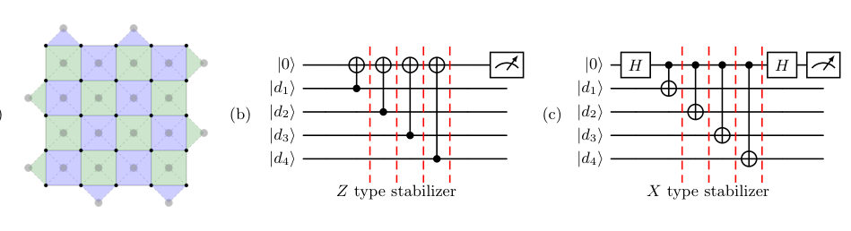 
FIG. 1. (a) A distance 5 rotated surface code. Data qubits (•) are on vertices of the grid, while ancilla qubits (•) are on the faces. Each square face measures alternating X and Z type stabilizers. Stabilizers on the boundary include only two data qubits. Circuits for (b) Z and (c) X syndrome extraction on the surface code. The ancilla is prepared in the |0⟩state and measures Z1Z2Z3Z4 or X1X2X3X4 on the four adjacent data qubits di. Vertical dashed lines indicate when crosstalk noise occurs after the entangling CNOT gates in each syndrome extraction circuit.

📷 Fig 2

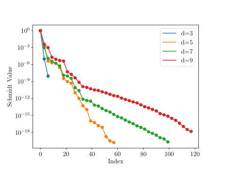 
FIG. 2. Schmidt values squared for a surface code simula- tion with d = 3, 5, 7, 9. The rapid exponential decay in the Schmidt values shown here allows for substantial truncation of the tensor network without impairing its representation of the surface code state. For a code with n physical qubits, the Schmidt values are across the cut between n/2 and n/2 −1.

📷 Fig 3

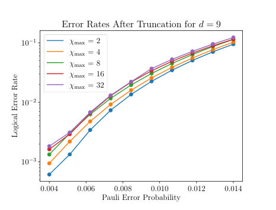 
FIG. 3. The logical error rate plotted for various levels of truncation for a distance d = 9 surface code. Despite doubling the number of terms not truncated at each step, the measured error rates rapidly converge. Note that reducing the number of remaining terms reduces the logical error rate.

📷 Fig 4

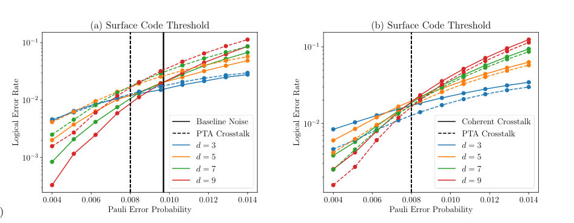 
FIG. 4. Logical error rates for the surface code under the baseline Pauli noise model with no crosstalk compared with (a) incoherent Pauli twirled crosstalk and (b) coherent crosstalk noise. The Pauli only noise model is the least detrimental to logical error rates, while the coherent crosstalk noise model is the most detrimental. The vertical lines indicate the threshold for each type of noise.

📷 Fig 5

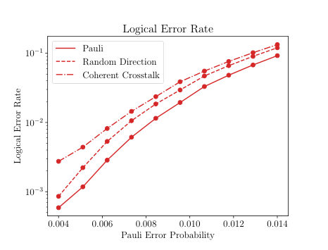 
FIG. 6. Logical error rates under each noise model for d = 9. The inclusion of coherent crosstalk noise increases logical error rates over the baseline Pauli noise model, while coherent crosstalk noise in random directions somewhat reduces logical error rates again.

**Summary.** This paper simulates quantum error correction on surface codes using advanced tensor network methods to account for coherent crosstalk noise. It demonstrates that this coherence significantly degrades performance, increasing logical error rates and lowering the error threshold compared to simpler noise assumptions. The work provides a vital tool for accurately characterizing hardware limitations in scalable quantum computing.

**Why it may be interesting.** The work provides a rigorous, scalable simulation framework for incorporating non-Markovian and coherent noise sources into QEC, which is crucial for designing fault-tolerant quantum hardware based on superconducting qubits or similar platforms.

Detailed structure

**Main problem.** The paper addresses the challenge of simulating quantum error correction (QEC) under realistic, coherent quantum crosstalk noise, which is beyond the scope of simpler noise models or classical simulations.

**Main result.** The inclusion of coherent crosstalk noise significantly increases logical error rates and lowers the code threshold compared to idealized models, demonstrating that standard approximations fail to capture the full dynamics.

**Method.** The authors employ advanced hybrid stabilizer-tensor network simulation techniques (using GCAMPS) to simulate syndrome extraction on surface codes, allowing for the inclusion of coherent noise terms.

**Model / system.** The physical system is the surface code, a topological stabilizer code used for fault-tolerant quantum computation. The noise model specifically incorporates gate-based nearest neighbor crosstalk noise modeled as a coherent ZZ rotation.

**Key observables.** Logical Error Rate ($P_L$) and the Code Threshold.

**Important parameters / regimes.** Crosstalk parameter ($	heta$), physical error rates ($p_1, p_2$), and code distance ($d$).

**Assumptions / limitations.** The simulation results are a lower bound due to tensor network truncation; previous studies often relied on stochastic approximations of coherent effects.

**Figures summary.** Figures compare logical error rates for various noise models (Pauli vs. coherent crosstalk vs. random sign noise) across different code distances, showing the quantitative impact of coherence.

**Paper structure.** The paper introduces the problem of coherent noise in QEC, details the hybrid simulation method, presents results comparing coherent noise to idealized models, and concludes by emphasizing the necessity of accurate noise characterization.

Abstract

Scalable realisation of quantum computing is reliant on the development of fault tolerant devices. Analysis of quantum error correction protocols typically considers incoherent noise models or noise-free syndrome measurements. While this is simple to simulate classically and straightforward to compute analytically, these simplifications are unable to capture the full dynamics of a noisy quantum system. In this work we use advanced hybrid stabilizer-tensor network simulation techniques to simulate coherent quantum crosstalk noise during syndrome extraction on a surface code. We show that the inclusion of coherence increases logical error rates and lowers the code threshold. In addition, we show that the specific distribution of the noise can quantitatively change logical error rates. The methods in this work allow simulation of quantum error correction with noise models previously inaccessible to classical simulation, providing new insights on the effect of crosstalk noise on quantum error correction codes.

[↑ back to top](#top)

### [Total, quantum, and classical measures of anticoherence for mixed spin states](http://arxiv.org/abs/2605.29436v1)

**Authors:** Jérôme Denis, Tara Lacaille, John Martin, Eduardo Serrano-Ensástiga  
**Type:** theory · **Category:** quantum information and computing · **PDF:** <https://arxiv.org/pdf/2605.29436v1>  
**Analysis basis:** full PDF text, analyzed in chunks
**Topic relevance:** `entanglement & information structure` **3/5**

📷 Fig 1

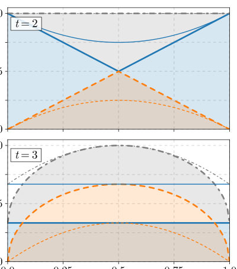 
Figure 1. Total, quantum, and classical t-anticoherence of the mixed state (51) as functions of the mixing weight λ. The upper and lower panels correspond to t = 2 and t = 3, respectively. Thick curves correspond to the fidelity-based definitions (27) and (37), evaluated analytically in Sec. IV; thin curves show the purity-based measures. In particular, AQ,F 2 = 1

📷 Fig 2

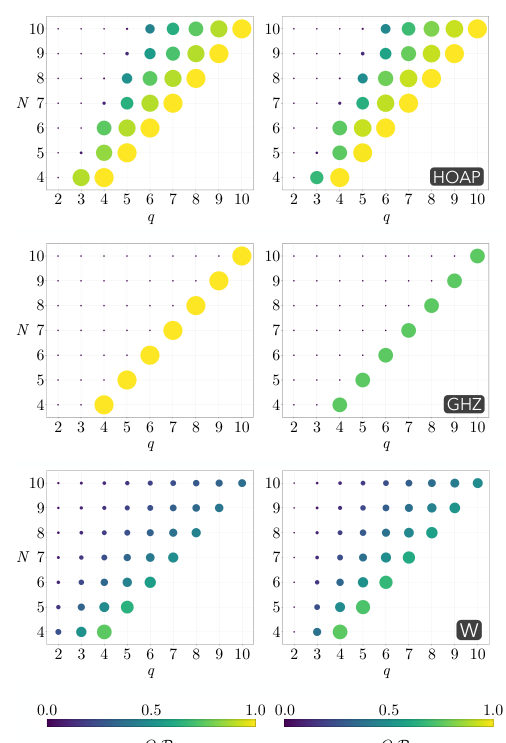 
Figure 2. Quantum purity-based t-anticoherence of reduced q-qubit states (seen as spin-q/2 states). Left (right): t = 1 (t = 2). Reduced states are obtained by partial tracing HOAP states [41] (top), GHZ states (middle), and W states (bottom). Disk areas scale with the magnitude of AQ,P t ; dark- purple disks of minimal size indicate vanishing anticoherence.

📷 Fig 3

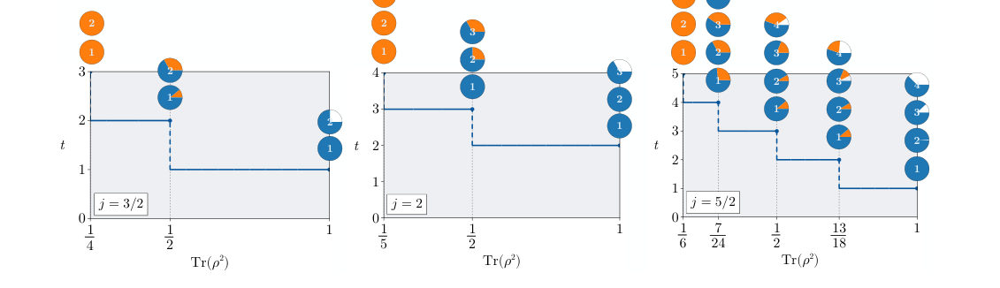 
Figure 3. Maximal achievable total AC order as a function of the global purity. For each purity threshold, the pie chart shows the decomposition of the purity-based AC measure into its quantum contribution AQ,P t (blue) and classical contribution AC,P t (orange), evaluated at the maximal attainable order t. The number at the center of each pie gives this order. A fully filled pie indicates a state that is exactly t-AC. The states realizing the jumps are given in Eqs. (87), (89), (91), (92), and (94); see also Table I. The leftmost charts correspond to the MMS state, while the rightmost charts correspond to HOAP states [41].

**Summary.** This paper introduces a comprehensive axiomatic framework to quantify 'anticoherence' in mixed spin states, separating the total observed isotropy into quantum and classical components. By defining total, quantum, and classical measures, the authors provide tools to diagnose whether a state's directional insensitivity stems from genuine quantum entanglement or mere classical statistical mixing. This has significant implications for quantum metrology and quantum reference-frame alignment.

**Why it may be interesting.** This work provides advanced tools for characterizing quantum resources (like directional insensitivity) in mixed states, which is crucial for understanding realistic quantum metrology protocols where noise and decoherence are present.

Detailed structure

**Main problem.** The paper develops a systematic framework to quantify 'anticoherence' (AC) for mixed spin states, crucially distinguishing between contributions arising from genuine quantum correlations and those from classical statistical mixing.

**Main result.** It rigorously defines total, quantum, and classical $t$-anticoherence measures, establishing mathematical relationships (e.g., $A_T^t = A_Q^t + A_C^t$) and showing how the quantum measure isolates intrinsically quantum directional insensitivity.

**Method.** The methodology is axiomatic, defining measures based on properties like monotonicity under noise and consistency with pure states, and constructing quantum measures via convex-roof extensions of pure-state functionals.

**Model / system.** The system analyzed is a spin-$j$ quantum state, modeled using the symmetric qubit embedding ($
ho_S$ on $N=2j$ qubits). The analysis focuses on the properties of the reduced state $
ho_t$ on $t$ qubits.

**Key observables.** Total $t$-anticoherence ($A_T^t$), Quantum $t$-anticoherence ($A_Q^t$), and Classical $t$-anticoherence ($A_C^t$).

**Important parameters / regimes.** The order of anticoherence, $t$, and the purity of the state $	ext{Tr}(
ho^2_t)$.

**Assumptions / limitations.** The framework assumes the existence of an axiomatic structure for these measures and relies on the ability to separate the total measure into quantum and classical parts.

**Figures summary.** Figure 3 illustrates the decomposition of purity-based AC into quantum and classical parts across different orders ($t$), and Table I summarizes these measures for various representative mixed spin states.

**Paper structure.** The paper builds from defining the physical problem (distinguishing AC sources) to establishing axiomatic frameworks for total and quantum measures, constructing explicit measures (purity, distance, fidelity), and finally proving relationships between these measures for various spin systems.

Abstract

Anticoherent spin states have isotropic low-order spin moments and are relevant to direction-independent metrology and quantum reference-frame alignment. In contrast to pure states, for mixed states such isotropy may originate either from genuine quantum correlations or from classical statistical mixing. We introduce an axiomatic framework for mixed-state $t$-anticoherence based on the symmetric qubit embedding. We distinguish total $t$-anticoherence, non-decreasing under SU(2)-covariant channels, from quantum $t$-anticoherence, defined as a resource monotone relative to a chosen total measure and constrained to coincide with it on pure states. This yields a classical contribution as their difference. We construct total measures based on reduced-state purity, Hilbert-Schmidt distance, and cumulative multipoles, and we discuss fidelity-based total candidates. We construct quantum counterparts via convex-roof extensions of pure-state functionals tied to bipartite entanglement in the symmetric sector. We provide explicit mixed-state examples, identify states with maximal quantum anticoherence supported on anticoherent subspaces, study robustness under particle loss for different types of states, and characterize the trade-off between purity and the maximal achievable anticoherence order.

[↑ back to top](#top)

### [Treewidth-Aware Gate Cut Selection for Reducing Transpilation Overhead on Superconducting Quantum Devices](http://arxiv.org/abs/2605.29723v1)

**Authors:** Hana Ebi, Shin Nishio, Takahiko Satoh  
**Type:** both · **Category:** quantum information and computing · **PDF:** <https://arxiv.org/pdf/2605.29723v1>  
**Analysis basis:** full PDF text, analyzed in chunks
**Topic relevance:** `QC/QI experiment` **3/5**

📷 Fig 1

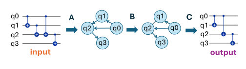 
FIGURE 1. Overview of the proposed TW2S cut selection pipeline. (A) A quantum circuit is represented as an interaction graph, where nodes correspond to qubits and edges correspond to two-qubit gates. (B) TW2S selects the cut position in two stages. Stage 1 uses a min-fill treewidth ordering to identify candidate edges that lie on sparse inter-community boundaries, and Stage 2 ranks these candidates by edge betweenness centrality with a degree penalty to select the final cut. (C) The selected edge is cut via quasi-probability decomposition (QPD), splitting the original circuit into smaller sub-circuits that can be executed independently on a noisy device and recombined to estimate the target...

📷 Fig 2

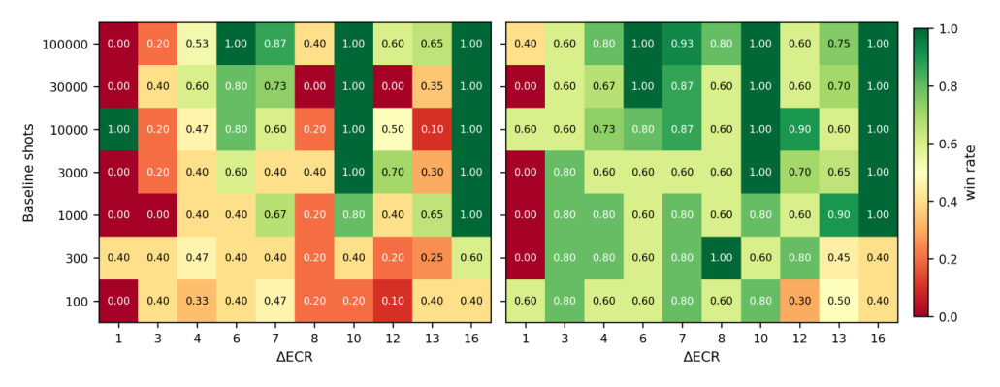 
FIGURE 2. Empirical QPD win rate in the (∆ECR, M) plane, restricted to strong-signal configurations (|⟨H⟩ideal| &gt; 0.5). Left: shared (×1) strategy. Right: per-subcircuit ×1.5 (×9 total) strategy. Each cell aggregates over all configurations sharing the same ∆ECR, with R = 5 repetitions per configuration. Green = QPD wins; red = baseline wins.

📷 Fig 3

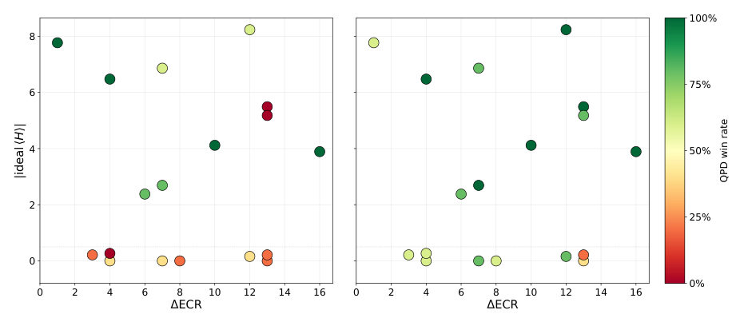 
FIGURE 3. QPD win rate at M = 10,000 shots in the (∆ECR, |⟨H⟩ideal|) plane for shared (×1, left) and per-subcircuit ×1.5 (×9, right) strategies. Color encodes win rate (green = QPD wins, red = baseline wins). Odd-step configurations cluster near |⟨H⟩ideal| ≈0 (bottom), even-step configurations at |⟨H⟩ideal| ≳2.4 (top).

📷 Fig 4

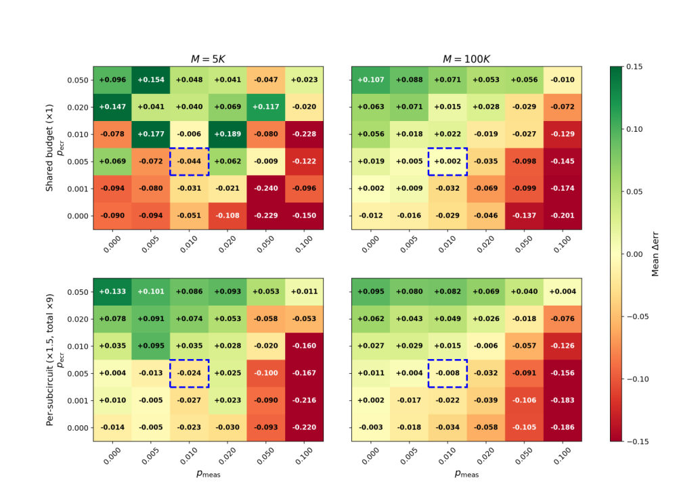 
FIGURE 4. Mean ∆err as a function of pecr (rows) and pmeas (columns), for M ∈{5K, 100K} and two strategies (shared budget, top; per-subcircuit ×1.5, bottom). Blue dashed box: IBM FakeSherbrooke operating point.

📷 Fig 5

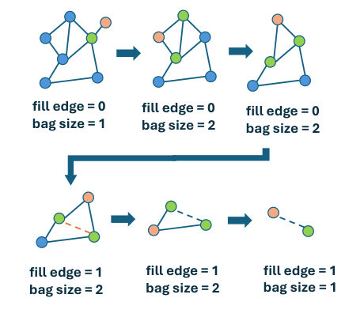 
FIGURE 5. Example of a min-fill elimination trace on an interaction graph. At each step, the vertex with the fewest required fill edges, shown as red vertices, is eliminated, and missing edges are added among its current neighbors, shown as green vertices, to form a clique. The figure illustrates how bags B(v) = {v} ∪N(v) and fill edges F (v) arise during elimination, which are later used to score candidate cut edges in Stage 1.

**Summary.** This paper introduces TW2S, a novel graph-structural algorithm designed to select optimal two-qubit gates for 'cutting' in quantum circuits to minimize transpilation overhead on superconducting hardware. By leveraging graph metrics like treewidth and betweenness centrality, TW2S identifies structural bottlenecks, leading to significant, quantifiable reductions in required native gates compared to random selection. This positions graph-based analysis as a practical compiler tool for quantum compilation.

**Why it may be interesting.** This work provides a crucial compiler-side tool for quantum hardware optimization, directly addressing the gap between abstract quantum circuits and the physical constraints of near-term quantum processors.

Detailed structure

**Main problem.** The primary challenge is minimizing the hardware overhead (SWAP gates) incurred during the transpilation of quantum circuits with long-range interactions onto superconducting quantum devices with sparse connectivity.

**Main result.** The proposed TW2S method consistently outperforms random cut selection by identifying structural bottlenecks in the interaction graph, leading to significant reductions in required two-qubit gates ($\Delta 	ext{ECR}$).

**Method.** TW2S is a two-stage, graph-only selection algorithm that first scores edges based on their contribution to the treewidth upper bound (Stage 1) and then ranks candidates using edge betweenness centrality with a degree penalty (Stage 2).

**Model / system.** The work focuses on superconducting quantum devices, using the FakeSherbrooke backend for testing. Benchmarks include synthetic graphs (Grid, Watts-Strogatz, SBM) and the physically relevant J1-J2 transverse-field Ising model.

**Key observables.** $\Delta 	ext{ECR}$ (reduction in ECR gates), Mean Squared Error (MSE) for breakeven analysis, Treewidth, Edge Betweenness Centrality.

**Important parameters / regimes.** The mixing ratio ($\mu = p_{out}/p_{in}$) in SBM graphs, the total shot budget, and the signal strength $|\langle H 
angle_{	ext{ideal}}|$.

**Assumptions / limitations.** The selection process relies solely on graph-structural properties, avoiding backend-specific transpilation calls at selection time. The benefit of cutting is conditional on a breakeven analysis involving signal strength.

**Figures summary.** Figures illustrate the TW2S pipeline (Circuit $	o$ Interaction Graph $	o$ Cut), show $\Delta 	ext{ECR}$ advantages across various graph families (Grid, WS, SBM), and plot the relationship between the mixing ratio ($\mu$) and the structural advantage.

**Paper structure.** The paper introduces the problem of transpilation overhead, details the QPD mechanism, proposes the two-stage TW2S algorithm using graph metrics (treewidth, betweenness), validates the method on synthetic graphs and the J1-J2 TFIM model, and concludes with a rigorous breakeven analysis.

Abstract

On superconducting quantum devices with sparse qubit connectivity, transpilation of long-range two-qubit interactions inserts additional SWAP gates, increasing hardware cost and execution error. Gate cutting via quasi-probability decomposition (QPD) can remove a selected two-qubit gate and thereby reduce routing overhead, but its sampling cost makes cut placement critical. We propose TW2S, a graph-only two-stage gate-cut selection method that operates on the circuit interaction graph without backend-specific transpilation at selection time. Stage 1 analyzes a min-fill elimination trace and scores edges by their contribution to a treewidth upper bound. Stage 2 ranks the resulting candidates by edge betweenness centrality with a degree penalty to identify routing bottlenecks. Across grid, Watts-Strogatz, barbell, and stochastic block model benchmarks transpiled to IBM's FakeSherbrooke backend, TW2S consistently outperforms random cut selection when the interaction graph contains identifiable sparse cuts. The advantage is governed not by absolute graph density but by moderate community structure and accessible inter-community edges. We further derive a mean-squared-error breakeven condition showing that, under a shared total shot budget, QPD is beneficial only when the ECR reduction is large enough and the signal strength is sufficient. Under an expanded per-subcircuit budget the signal-strength requirement is substantially relaxed. In noisy simulations of the J1-J2 transverse-field Ising model, TW2S achieves $Δ$ECR = 47 for n = 8, compared with approximately 9 for random selection, and yields lower estimation error than the uncut baseline in the tested strong-signal regime, with larger gains at increased shot budgets. These results position graph-structural cut selection as a practical compiler-side tool for turning circuit cutting into a targeted routing-reduction strategy.

[↑ back to top](#top)

### [Inverse generalised spin models of answers to questionnaires](http://arxiv.org/abs/2605.29739v1)

**Authors:** Arianna Armanetti, Luca Cecchetti, Paolo Sarti, Diego Garlaschelli, Miguel Ibáñez-Berganza  
**Type:** theory · **Category:** statistical mechanics · **PDF:** <https://arxiv.org/pdf/2605.29739v1>  
**Analysis basis:** full PDF text, analyzed in chunks
**Topic relevance:** `Keldysh / 2PI / non-Gaussian methods` **2/5** · `analog quantum simulation` **2/5** · `driven-dissipative phase transition` **2/5** · `methods for driven-dissipative` **2/5** · `entanglement & information structure` **1/5** · `exotic spin models in light-matter` **1/5** · `non-equilibrium dynamics` **1/5** · `non-equilibrium universality` **1/5**

📷 Fig 1

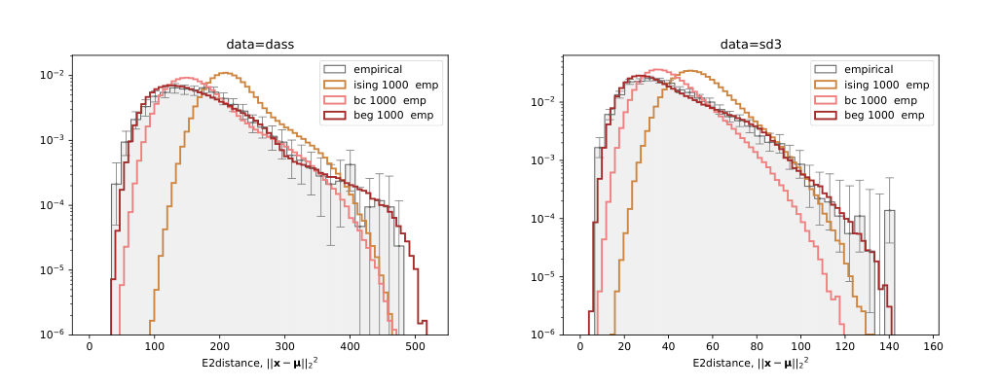 
FIG. 1. Histograms of the Euclidean distance to the mean, hdx, for the dass (left) and sd3 (right) questionnaires: comparison between empirical data (error-bars) and the three spin models (Ising, BC, BEG, u-step lines) learned with full-likelihood maximisation and sampled with MCMC. The BEG model accounts better than Ising and BC for the high probability density of subjects close to the mean (small dx) and far from the mean (large dx). Error bars are Wilson score confidence intervals at p = 0.05.

📷 Fig 2

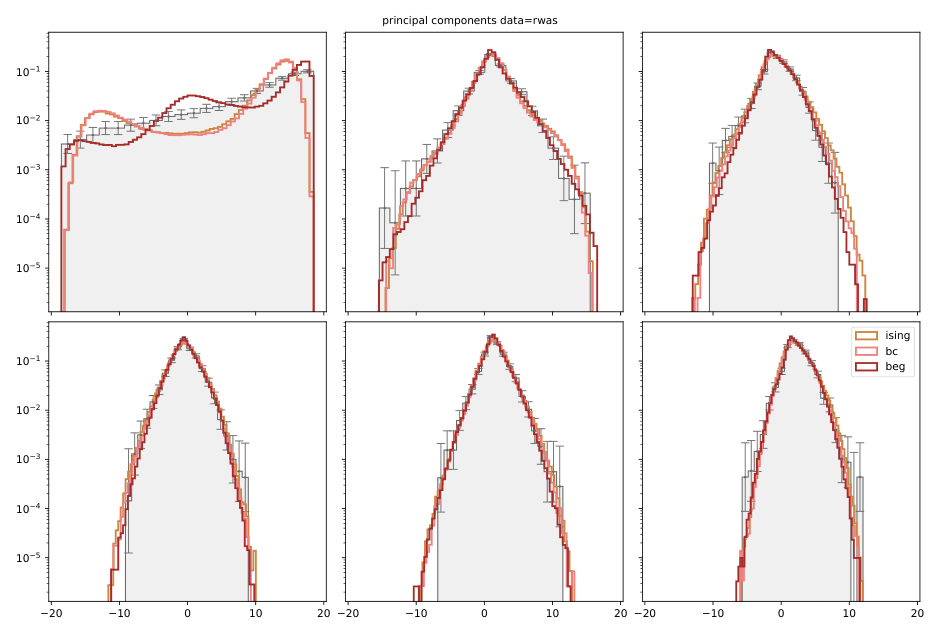 
FIG. 2. Histogram of the first 6 principal components hx′ i (i ∈{1, . . . , 6}) for the rwas questionnaire: comparison between empirical data and the three spin models (Ising, BC, BEG). The Ising and BC models each exhibit two local maxima of the histogram hx′ 1 of the first principal component, the BEG model exhibits three local maxima, and the empirical histogram does not show multi-modal structure.

📷 Fig 3

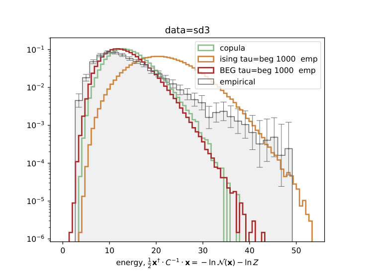 
FIG. 3. Histogram of the Mahalanobis distance to the mean, hd(M) x , for the sd3 questionnaire: direct comparison between the BEG model, the copula model and the empirical distribution. Both models underestimate the frequency of subjects close to and far from the mean.

📷 Fig 4

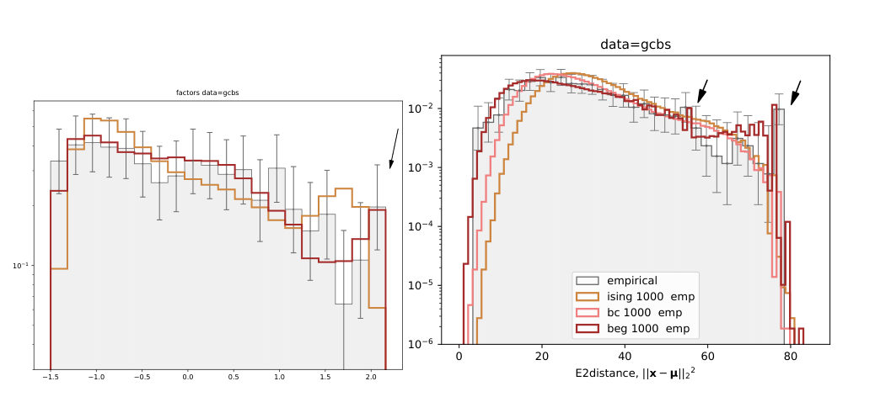 
FIG. 4. The gcbs questionnaire exhibits multi-modal histograms of x′ 1 and of dx, captured by the BEG model. Left: histograms of the first factor hf1; the BEG model reproduces the tri-modal empirical structure, while the Ising and BC models do not (for figure clarity, the BC model is not shown, see Fig. 17 in Appendix J). Right: histogram of the Euclidean distance to the mean, hdx; the BEG model reproduces the second and third peaks visible in the empirical data, which are absent in the Ising and BC models.

📷 Fig 5

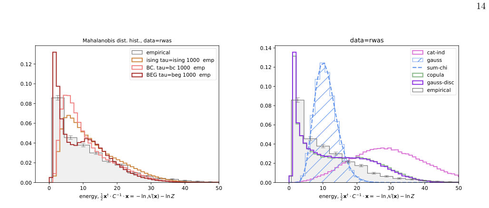 
FIG. 5. Histogram of the Mahalanobis distance to the mean, hd(M) x (linear scale), for the rwas questionnaire. Left: comparison between the three spin models (Ising, BC, BEG) and the empirical distribution; only the BEG model accounts for the empirical peak of subjects near the origin for small d(M) x . Right: same comparison for the simple models (gauss, gauss-disc, copulas, cat-ind); the copulas and gauss-disc also reproduce the near-origin peak, while the gauss and cat-ind models predict a maximum at a much higher Mahalanobis distance.

**Summary.** This work applies advanced statistical physics tools, specifically generalized spin models (Ising, BC, BEG), to analyze ordinal data from questionnaires. By treating psychological constructs as emergent properties of interacting variables, the authors show that the BEG model best captures complex structural features like multi-modality and distance distributions, surpassing simpler Gaussian assumptions.

**Why it may be interesting.** While the application is in psychometrics, the mathematical framework—using mean-field theory and spin models to describe emergent collective behavior from local interactions—is directly analogous to modeling phase transitions or complex order parameters in condensed matter systems.

Detailed structure

**Main problem.** The paper addresses how to model complex, ordinal data from psychological questionnaires by treating psychological constructs as emergent properties of interacting variables.

**Main result.** The Blume-Emery-Griffiths (BEG) model systematically outperforms simpler models (like Ising or Gaussian) in capturing the distribution of distances to the mean, suggesting its predictive power for complex data structures.

**Method.** The authors employ maximum entropy principles, mapping the problem onto generalized spin models (Ising, BC, BEG) and using advanced inference protocols like Monte Carlo estimation of likelihood gradients.

**Model / system.** The core system is the generalized spin model, defined by Hamiltonians incorporating linear, quadratic, and biquadratic couplings (BEG). These models are applied to ordinal questionnaire data, allowing for interactions beyond simple pairwise correlations.

**Key observables.** Principal-component histograms, histograms of Euclidean and Mahalanobis distances to the mean, and the model's ability to reproduce multi-modality.

**Important parameters / regimes.** The coupling constants ($\mathbf{h}, \mathbf{J}, \mathbf{K}$) defining the Hamiltonian, and the number of response options ($R$).

**Assumptions / limitations.** The primary assumptions involve using maximum entropy models to constrain the system, and the necessity of using extended BEG models to maintain gauge invariance.

**Figures summary.** Figures compare item histograms and principal component histograms across various questionnaires, demonstrating the BEG model's superior fit to distance distributions compared to Gaussian or copula models.

**Paper structure.** The paper progresses by establishing the limitations of traditional psychometrics, introducing generalized spin models (Ising, BC, BEG) as energy-based alternatives, detailing the inference protocols, and finally comparing the models' ability to reproduce empirical structural features like multi-modality and distance distributions.

Abstract

Network psychometrics conceptualises psychological constructs as emergent properties of systems of interacting variables. Energy-based probabilistic models have gained popularity as models of these interactions, but their psychometric application has so far been limited, since most implementations assume binary or ternary responses and rely on limiting inference assumptions. We infer and analyse three generalised spin models of ordinal questionnaire data: the generalised Ising, Blume-Capel (BC), and Blume-Emery-Griffiths (BEG) models. We prove the concavity of the maximum likelihood estimation of the parameters, as well as the gauge invariance of the Ising and BC models. Afterwards, we propose an inference protocol of approximated likelihood maximisation, based on the Monte Carlo estimation of the likelihood gradients. We apply this procedure to eleven psychometric and sociological questionnaires, comparing the inferred spin models against the multivariate Gaussian. We then assess whether the inferred models reproduce the empirical features of the data in terms of principal-component histograms, and histograms of Euclidean and Mahalanobis distances to the mean answer. The multi-modality observed in the histograms of principal components is partially captured by the spin models. This trait of polarisation can be understood, in the light of mean-field theory, as coexistence of stable and metastable phases of the spin models. The BEG model systematically outperforms the other models in capturing the distribution of distances to the mean, while all models underestimate the heavy tails of the Mahalanobis distance. Overall, the analysis witnesses the predictive power of the BEG model, able to account better than others for the abundance of outliers and mean responders, and reveals highly non-linear features of questionnaire data that both Gaussian and spin models fail to account for.

[↑ back to top](#top)

### [A hidden bottleneck in classical and quantum linear reservoir computing](http://arxiv.org/abs/2605.29071v1)

**Authors:** Johannes Nokkala, Federico Centrone, Francesco Arzani  
**Type:** both · **Category:** quantum information and computing · **PDF:** <https://arxiv.org/pdf/2605.29071v1>  
**Analysis basis:** full PDF text, analyzed in chunks
**Topic relevance:** `entanglement & information structure` **2/5** · `Keldysh / 2PI / non-Gaussian methods` **1/5** · `analog quantum simulation` **1/5** · `correlated cavity matter` **1/5** · `driven-dissipative phase transition` **1/5** · `methods for driven-dissipative` **1/5** · `non-equilibrium dynamics` **1/5** · `quantum optics experiment` **1/5**

📷 Fig 1

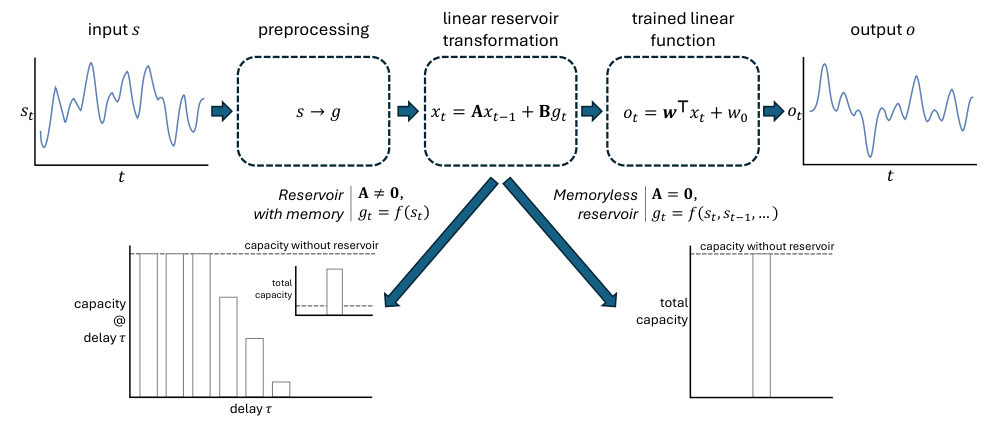 
FIG. 1. Schematic illustration of the linear-reservoir bottleneck. Information processing capacity (IPC) is a task- independent measure of a dynamical system’s ability to retain and transform input information. In linear reservoirs, prepro- cessing may already generate nonlinear features, but the reservoir transformation itself cannot create new expressive power beyond what is present in those features. If memory is carried by the reservoir, the IPC at each fixed delay is bounded by the preprocessing-only IPC, even though capacities from different delays may accumulate in the total IPC. If memory is carried by preprocessing, the total IPC cannot exceed the preprocessing-only IPC.

📷 Fig 2

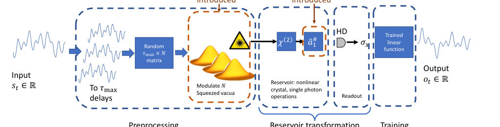 
FIG. 2. The considered scheme. Memory is classical, which keeps the scheme within reach of experiments. The output is formed from the elements of the covariance matrix of x-quadratures σx. Nonlinearity in input is introduced by the input dependent modulation of squeezed states and again in the de-Gaussification of the reservoir state via photon addition or subtraction on mode 1 (assumed to be deterministic, or post-selected).

📷 Fig 3

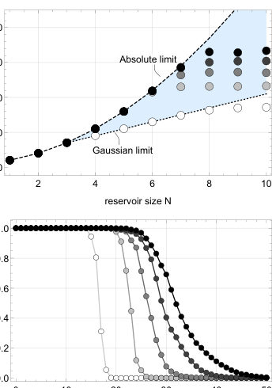 
FIG. 3. Breaking the Gaussian limit in the case of a memoryless reservoir and memoryless preprocess- ing. Top panel: total capacity as a function of the num- ber of optical modes N for a purely Gaussian reservoir and for reservoirs augmented by conditional single-photon opera- tions. The dotted curve indicates the Gaussian limit, while the dashed curve indicates the absolute limit set by the num- ber of trained weights. The shaded region is therefore inacces- sible to Gaussian reservoirs but becomes reachable once non- Gaussian operations are introduced. Bottom panel: break- down of the capacity among polynomial degrees. Since the total capacity is the area under this curve, approaching the...

📷 Fig 4

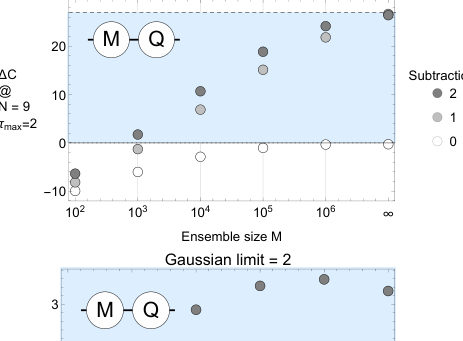 
FIG. 5. Witnessing the non-Gaussianity of the reservoir with finite resources. Excess capacity ∆C is the difference between observed capacity and the Gaussian limit. Top panel: ∆C as a function of ensemble size M. Excess capacity degrades gracefully as statistical noise in the observables increases, but eventually the noise washes it out. Bottom panel: excess capacity when the Gaussian limit is artificially restricted im- proves finite-resource visibility. Unlike elsewhere, here all in- put modes have identical encoding, turning the Gaussian limit constant. This decreases capacity but allows a finite ∆C at lower ensemble sizes. All results are averaged over 80 realiza- tions.

📷 Fig 5

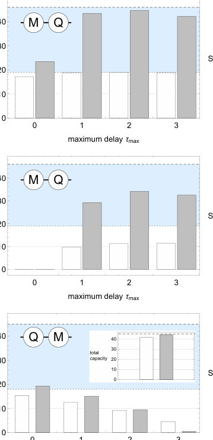 
FIG. 4. Breaking the Gaussian limit when there is memory. Top panel: total capacity as a function of memory length τmax when memory is provided by the preprocessing. Relative to the memoryless case (τmax = 0), allowing multi- ple delays strongly alleviates the high-degree bottleneck and enables the non-Gaussian reservoir to approach the absolute limit much more efficiently. Middle panel: capacity of cross- terms only. When preprocessing provides memory, even the Gaussian case is able to have capacity from nonlinear func- tions featuring multiple delays. This leaves the bound un- changed. Bottom panel: capacity as a function of delay when memory is provided after the quantum reservoir. Here...

**Summary.** This work establishes a fundamental bottleneck in the information processing capacity of linear reservoir computers, showing that they are limited by the input features they receive. By applying this to continuous-variable quantum systems, the authors derive a Gaussian bound on the achievable capacity. Crucially, they demonstrate that introducing minimal non-Gaussian operations, such as single-photon subtraction, allows the system to surpass this bound, providing an operational witness for non-Gaussian quantum resources.

**Why it may be interesting.** It provides a concrete, measurable resource (excess capacity) to witness non-Gaussian processing in photonic quantum systems, which is highly relevant for understanding the limits of quantum computation beyond simple Gaussian operations.

Detailed structure

**Main problem.** The paper identifies a hidden bottleneck in the information processing capacity (IPC) of linear reservoir computers, both classically and quantum mechanically.

**Main result.** Linear reservoir dynamics cannot create new fixed-delay expressive power beyond what is present in the preprocessed input, establishing a Gaussian bound for CV quantum reservoirs.

**Method.** The authors combine rigorous analytical derivations of information bounds with numerical simulations using finite-ensemble statistics to test the limits of Gaussian vs. non-Gaussian processing.

**Model / system.** The system is continuous-variable (CV) quantum reservoir computing, utilizing bosonic optical modes. The dynamics are analyzed using linear reservoir models, which are extended by introducing non-Gaussianity via conditional single-photon operations.

**Key observables.** Information Processing Capacity (IPC), excess capacity ($\Delta C$), and the covariance matrix ($\sigma$).

**Important parameters / regimes.** Fixed delay ($	au$), reservoir size ($N$), ensemble size ($M$), and the degree of non-Gaussianity (single-photon operations).

**Assumptions / limitations.** The analysis assumes the relevant observables admit a finite-dimensional linear representation, and the finite-resource model uses the Wishart approximation for sample covariance.

**Figures summary.** Figures schematically illustrate the linear-reservoir bottleneck, comparing memoryless vs. reservoir-based capacity, and show capacity scaling with reservoir size ($N$) and memory length ($	au_{max}$) for both Gaussian and non-Gaussian regimes.

**Paper structure.** The paper establishes the general IPC framework, derives the linear-reservoir bottleneck theorem for both classical and quantum settings, and then applies this to CV quantum reservoirs, demonstrating how single-photon operations break the Gaussian bound.

Abstract

We identify a hidden bottleneck in the information processing capacity of linear reservoir computers. When the measured features evolve linearly in the reservoir and the output is formed by linear readout with bias, we show that the capacity available at any fixed delay is limited by what is already present in the preprocessed input. Linear reservoir dynamics can therefore redistribute features, but cannot create new fixed-delay expressive power on their own. This limitation is hidden by global capacity measures, since contributions from different delays can accumulate even when each individual delay is strongly constrained. As an experimentally important realization of this general result, we derive the corresponding Gaussian limit for covariance-based continuous-variable quantum reservoirs. Numerical experiments show that experimentally accessible single-photon operations surpass this limit, establishing them as a genuine resource for quantum reservoir computing. The resulting excess capacity also provides an operational witness of non-Gaussian processing in black-box continuous-variable systems under minimal assumptions.

[↑ back to top](#top)

### [Finite-key feasibility of geostationary quantum key distribution](http://arxiv.org/abs/2605.29706v1)

**Authors:** Vaisakh Mannalath, Víctor Zapatero, Marcos Curty  
**Type:** theory · **Category:** other · **PDF:** <https://arxiv.org/pdf/2605.29706v1>  
**Analysis basis:** full PDF text, analyzed in chunks
**Topic relevance:** `entanglement & information structure` **2/5** · `Keldysh / 2PI / non-Gaussian methods` **1/5** · `correlated / nonlocal dissipation` **1/5** · `driven-dissipative phase transition` **1/5** · `interference shaping light` **1/5** · `methods for driven-dissipative` **1/5** · `non-equilibrium dynamics` **1/5** · `non-equilibrium universality` **1/5**

📷 Fig 1

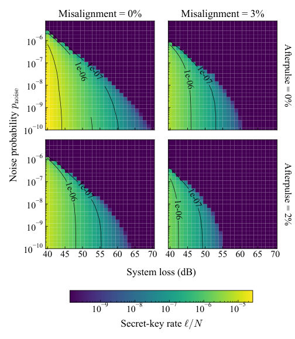 
Figure 1. Finite-size secret-key rate ℓ/N for an asymmetric active BB84 receiver as a function of total system loss (x axis) and noise-click probability pnoise (y axis). The color map and black contour lines show the finite-size secret-key rate. Columns correspond to misalignment values of 0% and 3%, while rows correspond to afterpulsing probabilities of 0% and 2%.

📷 Fig 2

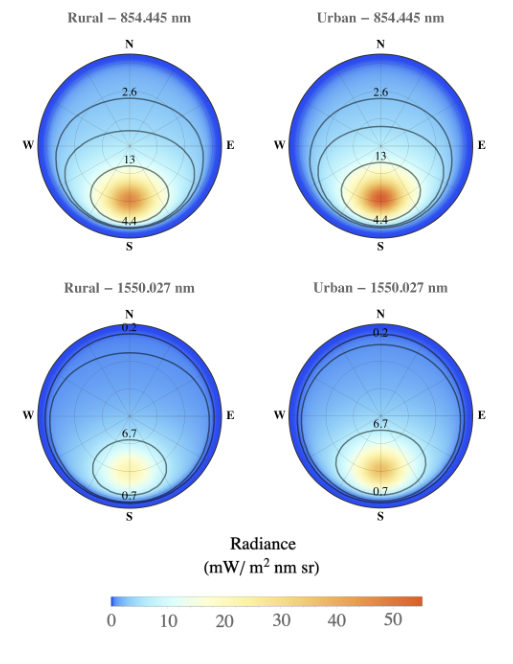 
Figure 2. Sky-radiance solar position maps ( ˜Hsky λ ) for rural and urban environments (columns) at the two signal wave- lengths shown in the rows, λ = 854.445 nm and λ = 1550.027 nm, for a representative GEO line of sight at zenith angle 60◦toward the south. The color scale indicates radiance in mW/m2 nm1 sr1. Superimposed contours represent the criti- cal radiance thresholds ( ˜Hcrit) corresponding to a noise-click probability of pnoise = 10−6 for representative spectral filter bandwidths. For 854 nm, the contours correspond to band- widths of 10, 30, and 50 GHz (inner to outer). For 1550 nm, they correspond to 1, 10, and 30 GHz (inner to outer).

📷 Fig 3

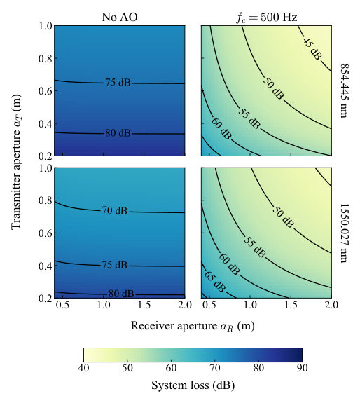 
Figure 3. System loss (dB) as a function of receiver aperture aR (x axis) and transmitter aperture aT (y axis) on the fixed urban baseline slice with θ = 60◦, low pointing jitter, SMF coupling, and the default SNSPD Spec B receiver. The heat map and contour labels show iso-loss levels. Columns compare no AO with strong AO correction (fc = 500 Hz), while rows correspond to λ = 854.445 nm and λ = 1550.027 nm.

📷 Fig 4

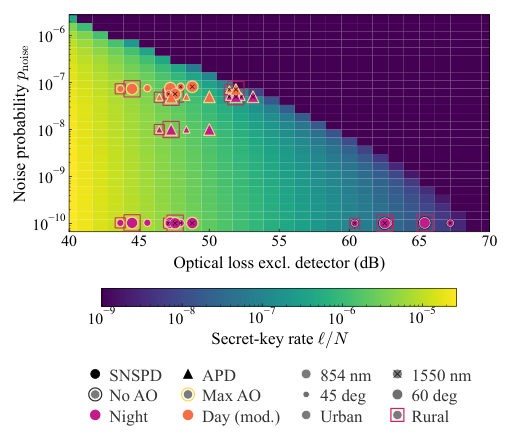 
Figure 4. Finite-size secret-key rate map ℓ/N for the asymmet- ric active receiver as a function of total system loss (x axis) and noise-click probability pnoise (y axis) on the zero-afterpulsing, zero-misalignment slice, with representative positive-rate op- erating points from the link model overlaid. The operating points compare λ = 854.445 nm and λ = 1550.027 nm, zenith angles 45◦and 60◦, rural and urban sites, no AO and high AO, and Spec B SNSPD/APD receivers under nighttime and moderate-noise daytime conditions.

📷 Fig 5

 
Figure 4 closes the loop by placing representative asym- metric active-receiver link-model operating points back onto the same system-loss-noise plane. The colored back- ground and black contours show the optimized finite-size secret-key rate on the zero-afterpulsing, zero-misalignment slice, while the overlaid markers place representative op- erating points on that map for the two wavelengths con- sidered here, the two detector classes in Spec B, two zenith angles, rural and urban sites, and the no-AO and high-AO cases under nighttime and moderate daytime noise scenarios. This figure makes the complementary

**Summary.** This work provides a detailed feasibility study for using GEO satellites for Quantum Key Distribution (QKD). It models complex channel impairments like atmospheric loss and background noise, using advanced finite-key security protocols. The results provide actionable design guidelines, emphasizing that strong Adaptive Optics is necessary for practical daytime operation.

**Why it may be interesting.** While focused on quantum optics/communication, the rigorous application of finite-key security bounds and the detailed modeling of complex, noisy, open quantum channels (atmosphere/space) provide valuable theoretical frameworks applicable to open quantum systems research.

Detailed structure

**Main problem.** The paper assesses the end-to-end feasibility of Quantum Key Distribution (QKD) using Geostationary Earth Orbit (GEO) satellites, focusing on mitigating extreme channel loss and background noise.

**Main result.** The analysis establishes practical operating thresholds and design guidelines, showing that strong Adaptive Optics (AO) correction is crucial for enabling reliable daytime QKD links.

**Method.** The study employs a comprehensive feasibility study using the decoy-state BB84 protocol, incorporating variable-length finite-key security analysis and detailed physical channel modeling.

**Model / system.** The system is a GEO downlink configuration, modeled using a physically realistic channel that accounts for diffraction loss, atmospheric extinction (using libRadtran), and background noise from sky radiance.

**Key observables.** Achievable annual secret-key-yield, finite-size secret-key rate ($\ell/N$), and the noise-click probability ($p_{	ext{noise}}$).

**Important parameters / regimes.** GEO altitude (35,786 km), various wavelengths (e.g., 854 nm, 1550 nm), receiver/transmitter apertures ($a_R, a_T$), and AO correction bandwidth ($f_c$).

**Assumptions / limitations.** The analysis assumes a spherical-Earth model and incorporates specific statistical bounds (e.g., Poisson-Binomial) for security analysis.

**Figures summary.** Figures map the secret-key rate against system loss and noise probability, showing the critical role of AO and the comparison of yields across different wavelengths and geographic locations.

**Paper structure.** The paper systematically analyzes the physical channel impairments (loss, noise) using detailed atmospheric models, applies advanced finite-key security protocols, and synthesizes the results into feasibility maps that guide mission design.

Abstract

Quantum key distribution (QKD) via geostationary Earth orbit (GEO) satellites offers a compelling route to continuous, continental-scale secure communications. However, operation in this regime entails extreme channel loss and significant background noise, particularly if daylight operation is desired. We present a comprehensive end-to-end feasibility study of a decoy-state BB84 protocol in a GEO downlink configuration, incorporating variable-length finite-key security and tight statistical bounds to expand the achievable positive-key regime. Our analysis encompasses the principal receiver architectures relevant to downlink QKD and employs a physically realistic channel model that captures the dominant loss and noise mechanisms. We evaluate performance across rural, urban, and coastal environments at multiple wavelengths, including visible Fraunhofer absorption minima and the telecom band. Using historical cloud data across Europe, we forecast the annual secret-key yield across the continent. Through a systematic exploration of the high-dimensional parameter space, we identify key trade-offs and performance bottlenecks that determine feasibility. These results establish practical operating thresholds and provide actionable design guidelines for future GEO-QKD missions.

[↑ back to top](#top)

### [End-to-End Molecular Dynamics with a Langevin Thermostat on Quantum Circuits](http://arxiv.org/abs/2605.30143v1)

**Authors:** Masari Watanabe, Hirofumi Nishi, Taichi Kosugi, Shigekazu Hidaka, Ryo Sakurai, Yu-ichiro Matsushita  
**Type:** theory · **Category:** statistical mechanics · **PDF:** <https://arxiv.org/pdf/2605.30143v1>  
**Analysis basis:** full PDF text, analyzed in chunks
**Topic relevance:** `methods for driven-dissipative` **2/5** · `non-equilibrium dynamics` **2/5** · `Keldysh / 2PI / non-Gaussian methods` **1/5** · `correlated / nonlocal dissipation` **1/5** · `driven-dissipative phase transition` **1/5** · `non-equilibrium universality` **1/5**

📷 Fig 1

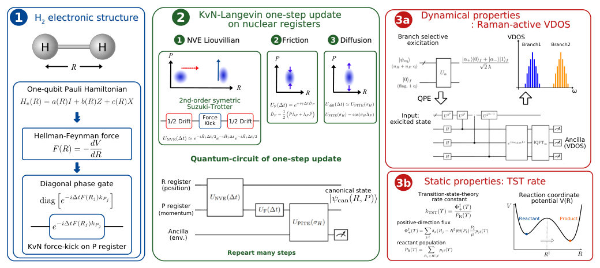 
FIG. 1. End-to-end Koopman–von Neumann (KvN)–Langevin molecular-dynamics pipeline. The H2 electronic structure provides the Born–Oppenheimer potential and Hellmann–Feynman force, which are embedded as an R-dependent KvN force kick. Repeated KvN–Langevin updates prepare a canonical nuclear phase-space state, from which two observables are read out: the Raman-active vibrational density of states by quantum phase estimation and the transition-state-theory rate constant from a canonical flux expectation.

📷 Fig 2

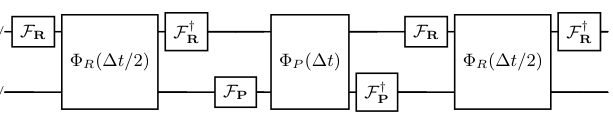 
FIG. 2. Quantum-circuit diagram for the many-particle KvN–Langevin one-step evolution. (a) Overall one- step circuit UPITE(σH) UF(∆t) UNVE(∆t) used for canonical state preparation. (b) Implementation of the many-particle UNVE(∆t) block, showing the drift–kick–drift structure based on a second-order symmetric Suzuki–Trotter decomposition, UNVE(∆t) ≃U1(∆t/2) U2(∆t) U1(∆t/2). (c) PITE/cos-filter implementation of UPITE(σH), representing the diffusion block in the momentum Fourier space.

📷 Fig 3

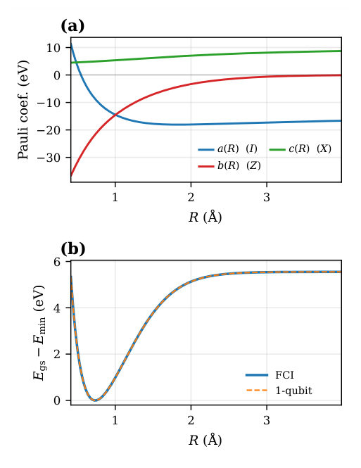 
FIG. 3. One-qubit Pauli representation of the H2 elec- tronic structure. (a) Coefficients a(R), b(R), and c(R) in the reduced Hamiltonian ˆHe(R) = a(R)ˆIe +b(R) ˆZe +c(R) ˆ Xe. (b) Ground-state PES relative to its minimum, compared with the FCI/STO-3G reference. This representation supplies V (R) and F(R) for the KvN force kick used in the molecular- dynamics simulations.

📷 Fig 4

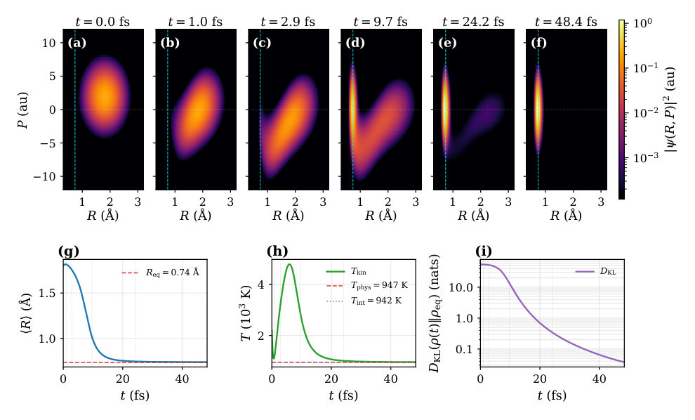 
FIG. 4. Canonical state preparation and relaxation toward the H2 bond. (a)–(f) Log-scale snapshots of the phase-space density |ψ(R, P, t)|2. An initial wave packet on the dissociation side moves toward the bond-length region and relaxes under the KvN–Langevin thermostat. (g) Mean internuclear distance ⟨R⟩(t). (h) Kinetic temperature Tkin(t), with Tphys = 947 K and the corrected internal temperature Tint = 942 K. (i) Kullback–Leibler divergence DKL(ρ(t)∥ρeq) from the canonical reference distribution.

📷 Fig 5

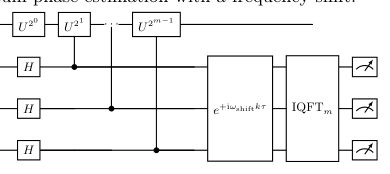 
FIG. 5. LCU+QPE circuit for the VDOS readout. (a) The LCU unitary Uα prepares the branch-selective states |α±⟩∝ˆA± |ψeq⟩with a flag qubit. (b) QPE is applied to |α±⟩using the Hamiltonian KvN time evolution, and the flag and phase ancilla measurements give the branch-resolved fre- quency distributions.

**Summary.** This paper develops a quantum-circuit framework to simulate molecular dynamics in the canonical ensemble using a Langevin thermostat. It encodes the classical phase-space density as a Koopman-von Neumann wave function, allowing for the preparation of equilibrium states on a quantum computer. The protocol successfully calculates key physical observables, such as the VDOS and TST rate constant, for the H2 molecule.

**Why it may be interesting.** This work provides a concrete, circuit-level protocol for quantum-classical hybrid molecular dynamics, directly linking quantum computation to fundamental statistical mechanics problems like canonical ensemble preparation and rate theory.

Detailed structure

**Main problem.** To construct a quantum-circuit framework for performing finite-temperature molecular dynamics in the canonical ensemble (NVT) using a Langevin thermostat.

**Main result.** The authors successfully demonstrate an end-to-end quantum protocol that prepares the canonical phase-space state and uses it to calculate both the vibrational density of states (VDOS) and the Transition-State-Theory (TST) rate constant for the H2 molecule.

**Method.** The dynamics are mapped onto a quantum circuit sequence that decomposes the Langevin evolution into Hamiltonian, friction, and diffusion blocks, with the diffusion block implemented via Probabilistic Imaginary-Time Evolution (PITE).

**Model / system.** The system is the H2 molecule, modeled using the Born-Oppenheimer approximation. The dynamics are governed by the Langevin equation, whose Fokker-Planck evolution is encoded in the Koopman-von Neumann (KvN) wave function.

**Key observables.** Vibrational Density of States (VDOS) via Quantum Phase Estimation (QPE) and the Transition-State-Theory (TST) rate constant.

**Important parameters / regimes.** Target physical temperature ($T_{	ext{phys}}$), friction coefficient ($\gamma$), and the time step ($\Delta t$).

**Assumptions / limitations.** The Born-Oppenheimer approximation is retained, and the quantum simulation requires an analytical correction to account for the leading-order temperature bias introduced by the PITE-realized cosine filter.

**Figures summary.** Figure 1 summarizes the workflow from electronic structure to VDOS (via QPE) and TST rate constant. Figure 8 compares finite-particle phase-space samples to the analytically encoded canonical KvN density.

**Paper structure.** The paper details the mathematical derivation of the Langevin dynamics, maps the evolution onto a quantum circuit structure (decomposing the Liouville flow), and then demonstrates the application of this circuit pipeline to calculate both dynamical (VDOS) and static (TST) properties.

Abstract

We construct a quantum-circuit framework for finite-temperature molecular dynamics in the canonical ensemble (NVT) with a Langevin thermostat, connecting canonical state preparation to subsequent physical-property readouts. The classical nuclear phase-space distribution is encoded as a Koopman--von Neumann (KvN) wave function, and canonical state preparation is formulated as Langevin-type Fokker--Planck relaxation. The Hamiltonian Liouville flow, momentum friction, and momentum diffusion are decomposed into separate circuit blocks. The friction block is represented by a symmetrized momentum-space dilation, whereas the diffusion block is implemented as a cosine filter realized by probabilistic imaginary-time evolution (PITE). We analytically quantify the leading-order temperature bias caused by replacing the Gaussian diffusion kernel with this PITE-realized cosine filter. This analysis yields an internal-temperature correction that targets the desired physical equilibrium distribution. As a proof-of-concept demonstration connecting quantum chemistry to KvN nuclear dynamics, we study the H$_2$ molecule. Numerical simulations show relaxation from a nonequilibrium phase-space distribution to a canonical KvN state. From this canonical state, we demonstrate two complementary readouts: a dynamical quantum-phase-estimation readout of the vibrational density of states associated with the H--H stretch coordinate and a static canonical evaluation of the transition-state-theory (TST) rate constant. This work demonstrates, in a minimal molecular system, a circuit-level protocol that connects Langevin canonical state preparation to physical-property calculations, providing a concrete step toward quantum--classical hybrid molecular dynamics on quantum computers.

[↑ back to top](#top)

### [Critical exponents for planar random-cluster model with cluster-weight $q=4$](http://arxiv.org/abs/2605.30030v1)

**Authors:** Hong-Bin Chen, Hugo Duminil-Copin, Tiancheng He, François Jacopin, Dmitry Krachun, Ioan Manolescu, Jiaming Xia  
**Type:** theory · **Category:** statistical mechanics · **PDF:** <https://arxiv.org/pdf/2605.30030v1>  
**Analysis basis:** full PDF text, analyzed in chunks
**Topic relevance:** `Keldysh / 2PI / non-Gaussian methods` **2/5** · `analog quantum simulation` **1/5** · `driven-dissipative phase transition` **1/5** · `entanglement & information structure` **1/5** · `non-equilibrium dynamics` **1/5** · `non-equilibrium universality` **1/5**

📷 Fig 1

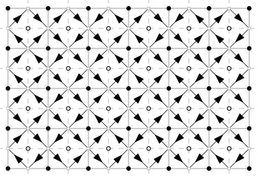 
Figure 2.1. Left: A percolation configuration in red and its dual in blue. The associated loop representation (in orange) is the set of interfaces between the primal and dual clusters. Right: A six-vertex configuration on the medial lattice is obtained by orienting each loop of the loop representation. The resulting height function is constant on the faces of the medial lattice; the orange loops are its level lines.

📷 Fig 2

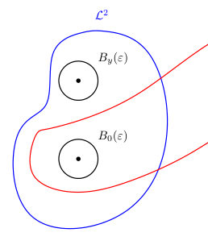 
Figure 5.1. The blue and red loops are typical loops in L2 and L2 1, respectively.

📷 Fig 3

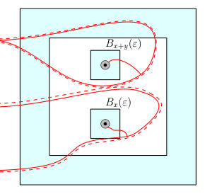 
Figure 5.2. A configuration contributing to ̃πδ 2k(x,y,ε) with k = 2. There are two loops surrounding two balls, with one centred at 0 or y and the other at x or x + y. As there are no loops surrounding a single ball, each ball is connected to one of the loops above by either a primal or dual path. The annuli in the definition of E are shaded blue.

📷 Fig 4

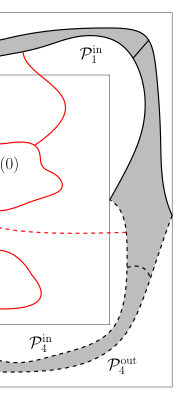 
Figure 6.1. The double four-petal flower domain (Fin,Fout) between Λ2∣y∣ and Λ4∣y∣: Fin is the region surrounded by the shaded part, while Fout is the one outside of the shaded part. Note the connections in the shaded region between each pair of petals Pin j ,Pout j . The red paths (which are part of ω) ensure the occurrence of H. As the grey balls Bε(0) and Bε(y) are conditioned to be connected to each other in ω′

📷 Fig 5

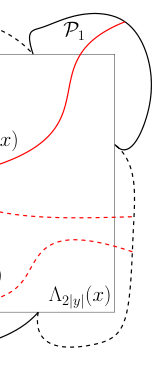 
Figure 6.2. The flower domain F contains six petals. The red paths (part of ω) ensure the occurrence of H. By dually connecting all dual petals, we ensure that Bε(x) and Bε(x + y) are not connected in ωξ. All paths may be constructed in disjoint “tubes”. By (RSW), the dual paths occur with constant probability, while the primal ones each occur with probability πδ 1(ε,∣y∣).

**Summary.** This theoretical paper determines the critical exponents for the planar random-cluster model at $q=4$ by relating it to the four-state Potts model. It employs advanced mathematical tools, including the Gaussian Free Field and sophisticated coupling techniques, to derive precise asymptotic scaling laws for key physical observables. The work provides a deep mathematical understanding of critical phenomena in 2D lattice models.

**Why it may be interesting.** While focused on classical statistical mechanics, the rigorous mathematical techniques involving conformal field theory, GFF, and scaling limits are highly relevant to understanding critical phenomena in quantum many-body systems and quantum field theories.

Detailed structure

**Main problem.** The paper aims to extract the critical exponents for the planar random-cluster model when the cluster-weight $q=4$, and to determine the corresponding critical behavior of the four-state Potts model.

**Main result.** The authors derive specific critical exponents for various thermodynamic quantities (free energy, susceptibility, correlation length) for both models, establishing precise scaling laws in the critical regime.

**Method.** The analysis heavily utilizes advanced techniques including the Baxter-Kelland-Wu coupling, relating the model to the Gaussian Free Field (GFF), and employing rigorous bounding techniques from large deviation theory.

**Model / system.** The primary system is the planar random-cluster model with $q=4$, which is mathematically equivalent to the four-state Potts model on the square lattice ($\mathbb{Z}^2$). The analysis focuses on the critical point ($p_c=2/3$ for the random-cluster model).

**Key observables.** Free energy ($f$), susceptibility ($\chi$), correlation length ($\xi$), and various connection/crossing probabilities ($\pi_1, \pi_2, \Delta$).

**Important parameters / regimes.** The critical parameters include the cluster-weight $q=4$, the critical probability $p_c=2/3$, and the critical inverse temperature $eta_c$ for the Potts model.

**Assumptions / limitations.** The derivations rely on the convergence of the height function to the GFF, the quasi-multiplicativity of certain probabilities, and the use of complex coupling/bounding arguments involving geometric domains (e.g., flower domains).

**Figures summary.** Figures illustrate the geometric structures used in the proofs, such as the double four-petal flower domain and various loop configurations contributing to the correlation functions.

**Paper structure.** The paper progresses by first establishing the connection between the models and the GFF, then deriving general scaling laws for correlation functions using M-formulas and bounding techniques, and finally applying these tools to derive the specific critical exponents for the observables.

Abstract

Using the Baxter-Kelland-Wu coupling and the convergence of the height function of the six-vertex model to the Gaussian Free Field, we extract critical exponents for the planar critical random-cluster model at $q=4$, and the planar four-state Potts model.

[↑ back to top](#top)

### [Incompleteness is necessary for activation of nonlocality without entanglement](http://arxiv.org/abs/2605.29775v1)

**Authors:** Atanu Bhunia, Saronath Halder, Preeti Parashar, Ritabrata Sengupta  
**Type:** theory · **Category:** other · **PDF:** <https://arxiv.org/pdf/2605.29775v1>  
**Analysis basis:** full PDF text, analyzed in chunks
**Topic relevance:** `entanglement & information structure` **2/5** · `measurement-induced transitions` **2/5** · `quantum measurements` **2/5**

📷 Fig 1

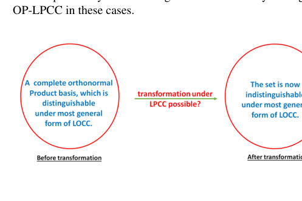 
FIG. 1: Diagram to illustrate the statement of the problem.

📷 Fig 2

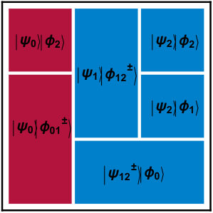 
FIG. 2: Tiling diagram for the states in S1. The red colored re- gion indicates the support of Alice’s measurement outcome KA 1 corresponding to the measurement set up KA ≡  KA 1 := P[|0⟩A], KA 2 := I −KA 1 }, resulting in post-measurement states which are all contained in the original set. The horizontal side of the tiles belongs to (A)lice and the vertical side of the tiles belongs to (B)ob.

📷 Fig 3

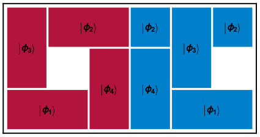 
FIG. 3: Tiling diagram for the states in S2. The outlined region indicates the support of Bob’s measurement outcome KB 1 , resulting in post-measurement states not all of which are contained in the original set. The horizontal side of the tiles belongs to (B)ob and the vertical side of the tiles belongs to (A)lice.

📷 Fig 4

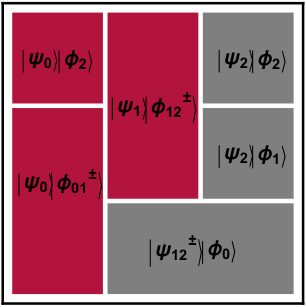 
FIG. 4: Representation of product states in C3 ⊗C3. Tile indices correspond to consecutively ordered basis states of set S1, while tile colors indicate compatible measurement setups for both parties.

📷 Fig 5

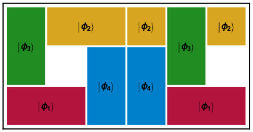 
FIG. 5: Tiling diagram for the states in S2. The outlined region indicates the support of Bob’s measurement outcomes KB 1 and KB 2 resulting in post-measurement states are all contained in a UPB sub- space.

**Summary.** This theoretical paper rigorously analyzes the concept of 'quantum nonlocality without entanglement' by studying how sets of orthogonal product states behave under local measurements. The core finding is that the structural completeness of the state set dictates its robustness: complete bases resist local indistinguishability, whereas incomplete bases can undergo 'activation' to become locally indistinguishable.

**Why it may be interesting.** This work provides fundamental structural theorems about the boundaries of quantum information processing, specifically characterizing when local measurements can destroy the ability to distinguish quantum states, which has implications for quantum cryptography and resource theories.

Detailed structure

**Main problem.** The paper investigates the conditions under which quantum nonlocality can be activated—transforming a locally distinguishable set of states into a locally indistinguishable one—without relying on entanglement.

**Main result.** Completeness of an orthogonal product basis prevents activation via local projective measurements, while incompleteness allows for such activation, providing a structural understanding of local-to-nonlocal transitions.

**Method.** The authors use rigorous mathematical proofs based on analyzing the constraints imposed on local measurement operators (LOCC/LPCC) when distinguishing or failing to distinguish specific sets of orthogonal product states.

**Model / system.** The study focuses on orthogonal product states in composite quantum systems, particularly in bipartite and multipartite Hilbert spaces, analyzing the behavior of these states under local operations.

**Key observables.** Local distinguishability, local indistinguishability, and the structural property of 'completeness' of the product basis.

**Important parameters / regimes.** The dimensionality of the local Hilbert spaces (e.g., $\mathbb{C}^3 \otimes \mathbb{C}^3$ or $\mathbb{C}^3 \otimes \mathbb{C}^6$).

**Assumptions / limitations.** The analysis often restricts itself to local projective measurements (LPCC) rather than general POVMs, and the theorems rely on the initial distinguishability of the state set.

**Figures summary.** Figures illustrate the structural difference between complete (Fig. 2) and incomplete (Fig. 3) product bases regarding how post-measurement states are constrained, and show specific state representations in $\mathbb{C}^3 \otimes \mathbb{C}^3$ (Fig. 4).

**Paper structure.** The paper progresses by first establishing the general framework of local distinguishability and activation. It then proves that complete bases are robust against activation (Theorems 7, 8, 9). Subsequently, it contrasts this by analyzing specific incomplete sets ($S_2$) that *are* activable, concluding that 'incompleteness' is necessary for activation.

Abstract

A set of orthogonal product states is said to exhibit "quantum nonlocality without entanglement" if it is locally indistinguishable, i.e. no sequence of local operations and classical communication (LOCC) can perfectly discriminate the states. Building on this foundational idea, recent studies have highlighted the phenomenon of "genuine activation of hidden nonlocality", where a set of initially distinguishable orthogonal states becomes locally indistinguishable through orthogonality-preserving LOCC transformations. In this letter, we establish that any complete orthogonal product basis that is initially locally distinguishable remains so under all orthogonality-preserving local projective measurements, thereby ruling out activation via orthogonality-preserving local projective measurements and classical communication. We further introduce and formalise the notions of "strongly local sets", namely locally distinguishable sets that remain non-activable under all bipartitions. Interestingly, the study of "local activability" of distinguishable sets is useful to characterise the boundary between LOCC distinguishability and its irreversible loss in multipartite systems. Our results provide a rigorous structural understanding of local-to-nonlocal transitions in quantum state discrimination.

[↑ back to top](#top)

### [Supercooling of liquids, as described by the Enskog-Vlasov kinetic equation](http://arxiv.org/abs/2605.30084v1)

**Authors:** E. S. Benilov  
**Type:** theory · **Category:** statistical mechanics · **PDF:** <https://arxiv.org/pdf/2605.30084v1>  
**Analysis basis:** full PDF text, analyzed in chunks
**Topic relevance:** `non-equilibrium dynamics` **2/5** · `non-equilibrium universality` **2/5** · `Keldysh / 2PI / non-Gaussian methods` **1/5**

📷 Fig 1

 
FIG. 1. The surface tension γ vs. the temperature T, for argon. The supercooling region, between the spinodal and triple points, is shaded. Curve (t) is computed theoretically, using the EV model (36)–(41); curve (e) corresponds to the empirical formula of Ref. [22]. The latter strictly applies to the range between the triple and critical points, so its exten- sion into the supercooling region is shown by a dotted line.

📷 Fig 2

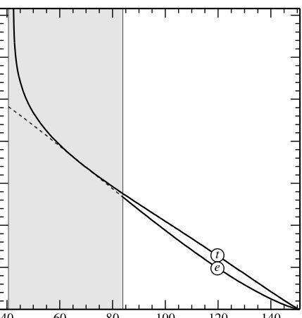 
Fig. 1 was computed for argon. One can see that, when the temperature approaches a certain threshold (which will be referred to as spinodal and denoted by Ts), the surface tension γ appears to tend to infinity. Three comments are in order:

📷 Fig 3

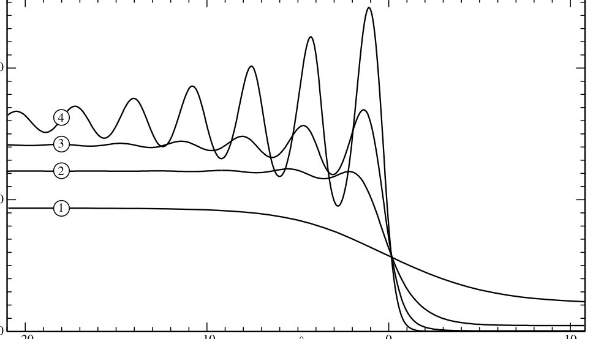 
FIG. 2. Spatial structure of liquid–vapor interfaces in argon: ρ = mn is the mass density, z is the coordinate. The temperatures are: (1) T = 145 K, (2) T = 117 K, (3) T = 84 K, (4) T = 55 K. For comparison, Tcr ≈151 K, Ttp ≈84 K, and Ts ≈40.6 K.

📷 Fig 4

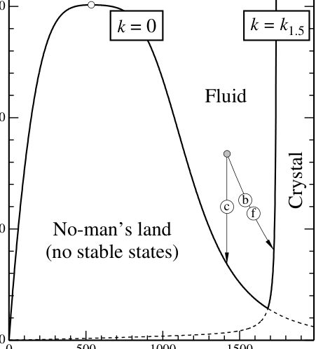 
FIG. 3. Stability portrait of argon in the density-temperature plane. The curves labeled k = 0 and k = k1.5 correspond to spinodal instabilities with respect to infinitely-long and finite- length waves, respectively. Curves (c), (b), and (f)—the last two virtually coincident—show the isoChoric, isoBaric, and interFacial trajectories, respectively. The small empty circle denotes the critical point, the shaded circle denotes the triple point.

📷 Fig 5

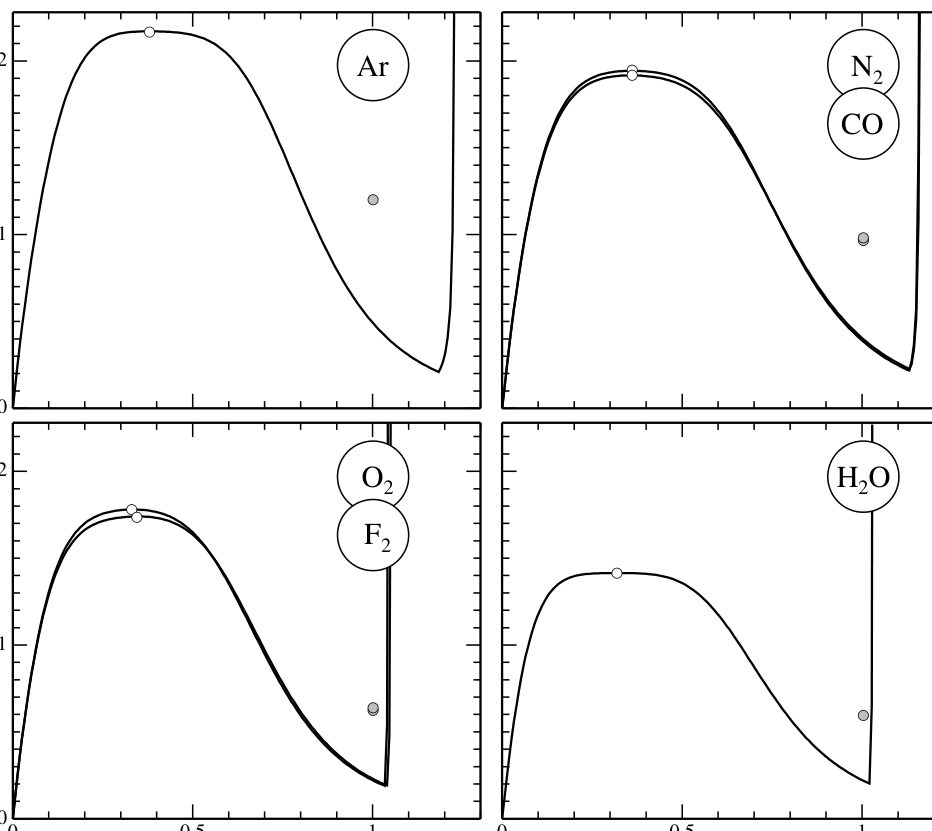 
FIG. 4. The stability portraits of argon, nitrogen &amp; carbon monoxide, oxygen &amp; fluorine, and water, in terms of the nondimen- sional variables, nnd = D3n and Tnd = kBT/am2D3. The small empty circles show the fluids’ critical points; the curves passing through them correspond to marginal stability with respect to infinitely long waves. The near-vertical curves correspond to instability at finite wavelengths. The shaded circles show the fluids’ triple points.

**Summary.** This work applies the Enskog-Vlasov kinetic equation to model the supercooling of liquids, predicting that the surface tension diverges at the spinodal temperature ($T_s$). The analysis uses stability criteria derived from the kinetic model to map out the instability region, offering a theoretical understanding of the liquid-to-solid transition.

**Why it may be interesting.** The rigorous application of a kinetic equation like EV to predict a fundamental thermodynamic singularity (surface tension divergence) provides a theoretical framework for understanding phase instability in dense matter, which is relevant to non-equilibrium statistical mechanics.

Detailed structure

**Main problem.** The paper investigates the supercooling of liquids, focusing on determining the spinodal temperature and analyzing the behavior of the liquid-vapor interface as the liquid approaches instability.

**Main result.** The Enskog-Vlasov model predicts that the surface tension of a supercooled liquid diverges at the spinodal temperature ($T_s$), which is linked to the emergence of oscillatory waves at the interface.

**Method.** The study employs the Enskog-Vlasov (EV) kinetic equation, combining Enskog's collision integral with a Vlasov-style description of the van der Waals force, and uses stability analysis on the resulting equations.

**Model / system.** The system is supercooled fluids (e.g., Argon, $	ext{N}_2$, $	ext{H}_2	ext{O}$). The model is the Enskog-Vlasov (EV) kinetic equation, which is calibrated using macroscopic parameters like critical and triple-point values.

**Key observables.** Spinodal temperature ($T_s$), surface tension ($\gamma$), density profile $n(z)$, and the divergence of $\gamma$ at $T_s$.

**Important parameters / regimes.** Molecular diameter ($D$), van der Waals constant ($a$), Korteweg constant ($K$), and the ratio $\Delta T/T_{tp}$ for different cooling paths (isobaric vs. isochoric).

**Assumptions / limitations.** The model assumes a nonrotational EV description and relies on series expansions (e.g., up to $L=5$) and phenomenological calibration against empirical data.

**Figures summary.** Figures illustrate the divergence of surface tension ($\gamma$) vs. temperature ($T$) near $T_s$, and stability portraits in the density-temperature plane showing the spinodal boundaries for various fluids.

**Paper structure.** The paper develops the EV model, calculates thermodynamic properties and the liquid-vapor interface structure, analyzes stability using wave theory to find the spinodal curve, and compares results across multiple fluids.

Abstract

A model combining Enskog's collision integral for dense fluids with a Vlasov-style description of the van der Waals force is applied to supercooling. First, the spinodal temperature $T_{s}$ is calculated, at which a liquid becomes unstable to small perturbations and transitions to solid. In particular, it turns out that isochoric cooling allows one to reach a lower temperature than isobaric cooling. Second, the surface tension of a supercooled liquid-vapor interface is shown to diverge at $T_{s}$. The singularity is caused by an oscillatory region emerging on the liquid side of the interface as $T\rightarrow T_{s}$; it develops because the liquid approaches instability, and the interface starts radiating (so far, evanescent) waves. At $T=T_{s}$, the waves cease to be evanescent and the oscillatory region extends to infinity -- hence, the singularity of the surface tension. Since this effect has a clear physical interpretation, it should occur regardless of the model and approximations under which it was obtained. This and the other results of the paper are illustrated using argon and several other fluids.

[↑ back to top](#top)

### [Hidden Ising models from the generalized Yang-Baxter equation](http://arxiv.org/abs/2605.30007v1)

**Authors:** Akash Sinha, Somnath Maity, Pramod Padmanabhan, Vladimir Korepin  
**Type:** theory · **Category:** statistical mechanics · **PDF:** <https://arxiv.org/pdf/2605.30007v1>  
**Analysis basis:** full PDF text, analyzed in chunks
**Topic relevance:** `analog quantum simulation` **2/5** · `entanglement & information structure` **1/5** · `exotic spin models in light-matter` **1/5**

📷 Fig 1

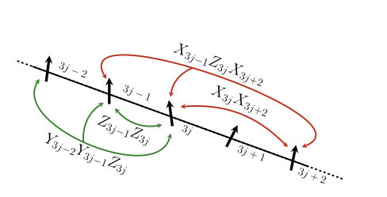 
FIG. 1: Action of the Hamiltonian density of (8).

📷 Fig 2

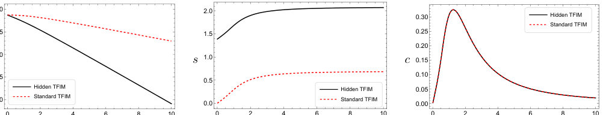 
FIG. 4: Thermodynamic properties of the hidden critical (g = 1) transverse-field quantum Ising model for a system size N = 200, with kB = 1 in natural units, are shown as functions of temperature T: (a) free-energy density f(T), (b) thermal entropy per site s(T), and (c) heat capacity per site c(T). The results are obtained using the energy spectrum given in Eq. (49).

📷 Fig 3

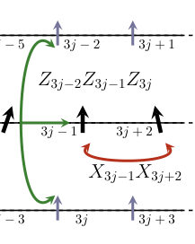 
FIG. 5: Action of the Hamiltonian density of H(3+3). The grey spins in the first and third layer are non-dynamical and hence act as a classical background field for the dynamical spins governed by the TFIM Hamiltonian in the second layer.

**Summary.** This paper develops a general framework to analyze multi-site spin models that behave like Transverse Field Ising Models (TFIMs). By leveraging the generalized Yang-Baxter equation and the QISM, the authors prove the system is effectively free-fermionic, leading to a highly degenerate spectrum. This provides a powerful tool for understanding integrability in complex quantum spin chains.

**Why it may be interesting.** The connection between complex, seemingly interacting spin models and exactly solvable free-fermionic structures via advanced integrability techniques (gYBE) is highly relevant for understanding quantum critical points and exotic phases in condensed matter systems.

Detailed structure

**Main problem.** To construct and analyze multi-site interaction spin systems that are effectively Transverse Field Ising Models (TFIMs) under the hood, by utilizing the local algebra structure.

**Main result.** The system's spectrum is shown to be free-fermionic, exhibiting a huge degeneracy sourced by local conserved quantities, and the model's integrability is established via the generalized Yang-Baxter equation.

**Method.** The analysis employs the Quantum Inverse Scattering Method (QISM) adapted to a multi-site generalization of the Yang-Baxter equation (gYBE) and utilizes the boost operator formalism to derive conserved charges.

**Model / system.** The system is a one-dimensional spin-1/2 Hamiltonian with multi-site interactions, whose local algebra resembles that of the TFIM. It is mapped to a Majorana fermion system whose Hamiltonian is shown to be free-fermionic in an effective single flavor.

**Key observables.** Residual thermal entropy density $s(0) = 2 \ln 2$ at zero temperature, and the free energy density $f(T)$ in the thermodynamic limit.

**Important parameters / regimes.** The parameters $\zeta, \eta, 	ilde{\zeta}, 	ilde{\eta}$ govern the local interactions, and the analysis is sensitive to the boundary conditions (open vs. closed chains).

**Assumptions / limitations.** The derivation relies on the existence of a multi-site generalization of the Yang-Baxter equation and the ability to map the complex spin interactions to an effective free-fermionic Majorana chain.

**Figures summary.** Figures illustrate the action of the Hamiltonian density on the lattice and the structure of the conserved charges derived from the transfer matrix.

**Paper structure.** The paper systematically builds the model by first establishing the local algebra, then mapping it to a Majorana fermion Hamiltonian, proving its equivalence to a TFIM, and finally using the QISM/gYBE framework to derive conserved charges and calculate thermodynamic properties.

Abstract

We introduce a one dimensional spin $\frac{1}{2}$ Hamiltonian with multi-site interactions, but still local. The algebra of its Hamiltonian densities resembles that of the transverse field Ising model. Using this fact we show that its spectrum is free-fermionic but with a huge degeneracy for each level. The source of the degeneracy is a set of local conserved quantities that act like a classical background field for the quantum system. The thermodynamics of this system is contrasted with the standard Ising model. At the gapless points in the energy spectrum, we show that this system can be derived from the quantum inverse scattering method adapted to a multi-site generalization of the Yang-Baxter equation as introduced by E. Rowell and Z. Wang. The $R$-matrix is constructed using generators of extraspecial 2-groups. This helps us extract all the conserved charges and lay the framework for a general mechanism to generate such multi-site interaction spin systems that are transverse field Ising models under the hood. A remark on how to obtain P. Fendley's free-fermion in disguise models in this formalism is also included.

[↑ back to top](#top)

### [Measuring anyon dispersion with tunneling probes](http://arxiv.org/abs/2605.29017v1)

**Authors:** Taige Wang, T. Senthil  
**Type:** both · **Category:** strongly correlated electrons · **PDF:** <https://arxiv.org/pdf/2605.29017v1>  
**Analysis basis:** full PDF text, analyzed in chunks
**Topic relevance:** `analog quantum simulation` **2/5** · `Keldysh / 2PI / non-Gaussian methods` **1/5** · `quantum measurements` **1/5**

📷 Fig 1

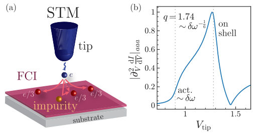 
FIG. 1. STS-QPI geometry and a fixed-q line cut. (a) An electron injected from the STM tip can enter the FCI as an aaa continuum of three charge-e/3 anyons. A weak impu- rity transfers momentum q to one constituent, and the inter- ference between amplitudes with and without this scattering produces the q component of the conductance map. (b) Nu- merical fixed-q line cut for the aaa sector. The first dashed line marks the clean activation threshold 3∆a, while the sec- ond marks the on-shell QPI branch ωaaa(q). The indicated powers are those of ∂2 V (dI/dV ) for Laughlin ν = 1/3.

📷 Fig 2

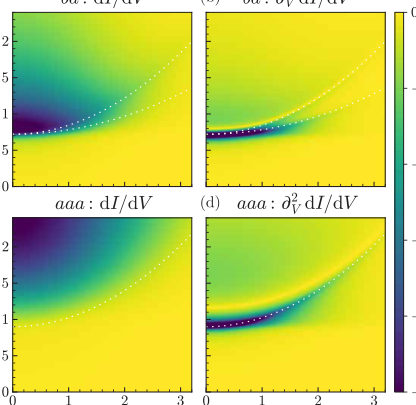 
FIG. 2. Fourier-transform STS signals from the full numerical convolution kernel. (a) dI/dV for the ba sector. The two dashed guides correspond to scattering b and scattering a. (b) First energy derivative of the same ba signal. (c) dI/dV for the aaa sector. (d) Second energy derivative of the aaa signal. The dashed guide is ωaaa(q) = 3∆a + q2/(8Ma).

📷 Fig 3

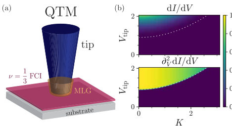 
FIG. 3. QTM. (a) A monolayer graphene (MLG) QTM probe forms a planar tunnel junction with the FCI sam- ple. The twist angle selects the injected electron momentum K. (b) dI/dV and ∂2 V (dI/dV ) for the aaa contribution to A+ e,FCI(K, eV ) in the small-pocket, elastic-tunneling limit.

**Summary.** This paper details methods to spectroscopically measure the dispersion of anyons, fractionalized quasiparticles, in topological materials like Fractional Chern Insulators. It utilizes both Scanning Tunneling Spectroscopy (QPI) and Quantum Twisting Microscopy (QTM) to analyze the singularity structure of tunneling spectra. The distinct power laws observed in these measurements allow researchers to differentiate and quantify the energy and momentum characteristics of various anyon excitation types.

**Why it may be interesting.** This work provides a powerful experimental roadmap for characterizing exotic quasiparticles in strongly correlated topological phases, linking abstract topological concepts (anyons) to measurable spectroscopic signatures.

Detailed structure

**Main problem.** The paper aims to develop spectroscopic techniques to measure the dispersion relation of anyons, which are fractionalized quasiparticles, in topological systems like Fractional Chern Insulators (FCI).

**Main result.** By analyzing the power-law singularities in quasiparticle interference (QPI) patterns and measuring fixed-momentum thresholds via quantum twisting microscopy (QTM), the distinct dispersions of compact excitations, bound anyon molecules, and unbound continua can be separated and quantified.

**Method.** The study combines theoretical derivations of weak-scattering singularities using Green's functions with analysis of experimental signatures from Scanning Tunneling Spectroscopy (STS) and Quantum Twisting Microscopy (QTM).

**Model / system.** The physical system under study is the Fractional Chern Insulator (FCI) or related topological matter, which hosts anyons. The analysis models the low-energy dispersion of these mobile anyons, which dictate the ground state of doped systems.

**Key observables.** The primary observables are the power-law exponents of the singularity structure in the differential conductance ($	ext{d}I/	ext{d}V$) and the fixed-momentum thresholds measured by QTM.

**Important parameters / regimes.** Key parameters include the topological filling fraction ($
u$), the momentum transfer ($q$), and the energy detuning ($\omega - E_{branch}$).

**Assumptions / limitations.** The analysis relies on local expansions near isolated minima and assumes that matrix-element constraints do not alter the fundamental on-shell branch points.

**Figures summary.** FIG. 1 illustrates the QPI geometry; FIG. 2 shows convolution kernels for bound and continuum sectors; FIG. 3 details the QTM setup and spectral features for the three-anyon continuum; TABLE I and TABLE II summarize the expected power laws for different excitation sectors.

**Paper structure.** The paper progresses by first establishing the physical context (anyons in FCI), then detailing the theoretical framework for analyzing spectral singularities (QPI/QTM), deriving the specific mathematical forms for different excitation types (e, ba, aaa), and finally presenting the comparative analysis of the two measurement techniques.

Abstract

Anyons are usually characterized by their topological data and their fractional quantum numbers under global symmetries. In lattice systems such as fractional Chern insulators (FCI), they are also mobile quasiparticles. Their motion controls the possible ground states of the dilute anyon gas obtained by doping an FCI, including possible superconducting states. We show how tunneling probes can measure this motion. In scanning tunneling spectroscopy, weak disorder produces spatially oscillating quasiparticle-interference patterns whose branches reveal the dispersion of fractionalized constituents. In quantum twisting microscopy, planar momentum-conserving tunneling selects the total momentum of the injected electron, so the continuum thresholds of fractionalized electron spectra encode the dispersion of the constituent anyons. The resulting spectra distinguish compact electron-like excitations, bound anyon molecules, and unbound anyon continuum.

[↑ back to top](#top)

### [Kernel Renormalization in Bayesian Deep Neural Networks: the Equivalent Wishart Ansatz in the Proportional Regime](http://arxiv.org/abs/2605.29684v1)

**Authors:** Paolo Baglioni, Christian Keup, Vincenzo Zimbardo, Rosalba Pacelli, Alessandro Vezzani, Raffaella Burioni, Pietro Rotondo  
**Type:** both · **Category:** disordered systems and neural networks · **PDF:** <https://arxiv.org/pdf/2605.29684v1>  
**Analysis basis:** full PDF text, analyzed in chunks
**Topic relevance:** `Keldysh / 2PI / non-Gaussian methods` **2/5** · `methods for driven-dissipative` **1/5**

📷 Fig 1

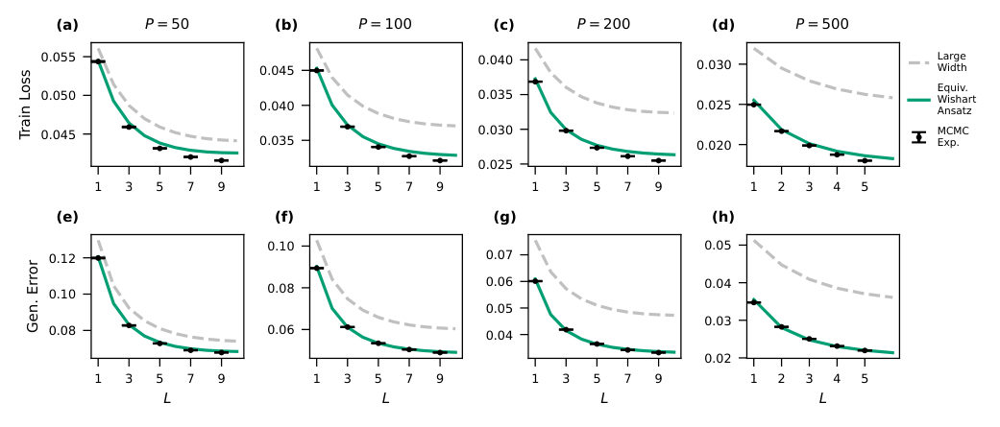 
FIG. 1. Comparison between the learning curves obtained via the Equivalent Wishart Ansatz and numerical experiments for zero-mean activation functions on MNIST. Numerical samples from the Bayesian posterior (black dots) are compared against the large-width limit predictions (gray dashed lines) and the results of the EWA theory (green solid lines). Both the training loss (first row) and the generalization error (second row) are displayed as a function of the number of hidden layers L. We keep the number of neurons and test examples fixed at Nℓ= 200 ∀ℓand Pt = 1000, while varying the number of patterns P across different columns (P is constant within each column). These simulations refer to...

📷 Fig 2

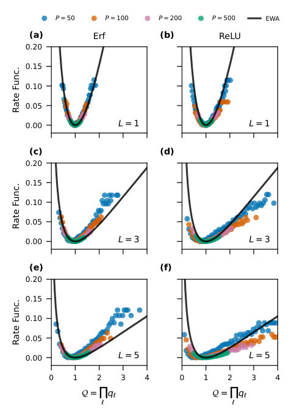 
FIG. 2. Rate function for the product random variable Q. Numerical samples of the empirical rate function for the CIFAR-10 dataset (coloured dots) are compared to the expected theoretical rate function under the EWA (black lines), both for Erf (first column) and ReLU activation function (second column). The empirical rate function is obtained by sampling 5000 independent samples of the qℓ variables, for l = 1, . . . , L and repeating the procedure for the different networks (L = 1, 3, 5). The sampling is performed at a fixed value of α = 1.0 but for increasing value of P ∈ {50, 100, 200, 500}, necessary condition to see the asymptotic convergence and therefore to assess the validity of the...

📷 Fig 3

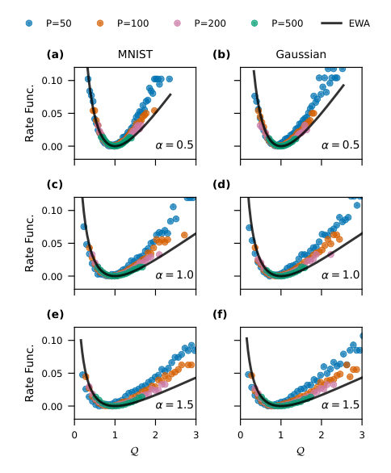 
FIG. 3. Large deviation principle for different value of α and different datasets. Numerical samples of the empirical rate function (coloured dots) for the MNIST dataset (first column) and on Random Gaussian data (second column) are compared to the expected theoretical rate function for the Q variable under the EWA (black lines). The empirical rate function is obtained using 5000 samples from a representative network with L = 5 hidden layers and Erf activation function. The sampling is performed at different values of the α parameter, ranging from α = 0.5 (first row), α = 1.0 (second row) and α = 1.5 (third row). The entire sampling procedure is repeated for increasing value of P ∈{50, 100,...

📷 Fig 4

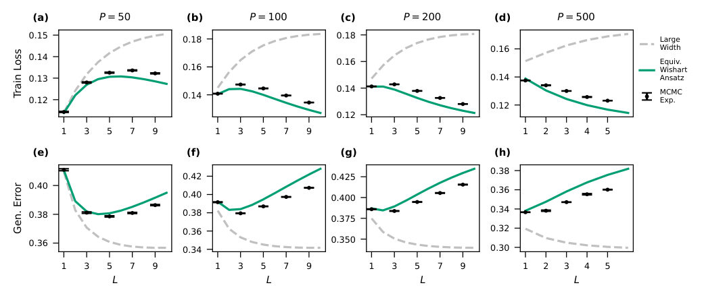 
FIG. 4. Comparison between the learning curves obtained via the Equivalent Wishart Ansatz and numerical experiments for zero-mean activation functions on the CIFAR-10 dataset. Numerical samples from the Bayesian posterior (black dots) are compared against the large-width limit predictions (gray dashed lines) and the results of the EWA theory (green solid lines). Both the training loss (first row) and the generalization error (second row) are displayed as a function of the number of hidden layers L. We keep the number of neurons and test examples fixed at Nℓ= 200 ∀ℓand Pt = 1000, while varying the number of patterns P across different columns (P is constant within each column). These...

📷 Fig 5

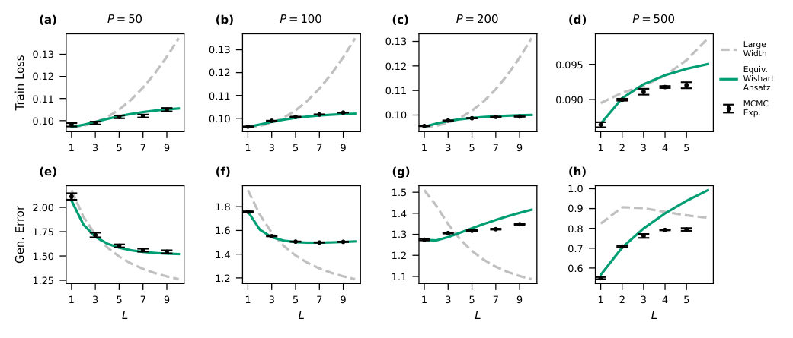 
FIG. 5. Comparison between the learning curves obtained via the Equivalent Wishart Ansatz and numerical experiments for non-zero-mean activation functions on Random Gaussian data. Numerical samples from the Bayesian posterior (black dots) are compared against the large-width limit predictions (gray dashed lines) and the results of the EWA theory (green solid lines). Both the training loss (first row) and the generalization error (second row) are displayed as a function of the number of hidden layers L. We keep the number of neurons and input dimensionality fixed at Nℓ= 200 ∀ℓ≥1 and N0 = 300, while varying the number of patterns P across different columns (P is constant within each column)....

**Summary.** This work develops an advanced theoretical framework using an equivalent Wishart Ansatz to analyze the generalization performance of deep Bayesian neural networks in the proportional-width limit. By reducing the complex dynamics to a few scalar order parameters, the authors provide a powerful, testable prediction for how deep learning models learn complex data structures. The results are validated by comparing theory against extensive MCMC sampling experiments.

**Why it may be interesting.** The rigorous mathematical framework developed for analyzing the statistical mechanics of deep learning models provides powerful analogies to disordered systems, particularly those involving complex energy landscapes or quenched disorder.

Detailed structure

**Main problem.** The paper addresses the challenge of extending theoretical understanding of generalization performance in deep, non-linear, multi-layered neural networks to the proportional-width regime.

**Main result.** The authors propose an effective Wishart Ansatz that allows predicting generalization performance by encoding strong representation learning in a small number of scalar order parameters, showing good agreement with sampling experiments.

**Method.** The core method involves using an equivalent Wishart Ansatz to perform a large deviation analysis on the partition function of Bayesian MLPs, extending this to CNNs via a hierarchical local kernel renormalization mechanism.

**Model / system.** The system studied is Bayesian Multi-Layer Perceptrons (MLPs) and Convolutional Neural Networks (CNNs) trained on high-dimensional data. The analysis focuses on the proportional-width regime where training set size and network width grow together.

**Key observables.** Generalization performance (Training Loss and Generalization Error), order parameters, and the renormalized NNGP kernel.

**Important parameters / regimes.** Proportional-width regime ($P \sim N$), network depth ($L$), and the task-kernel overlap ($M_{yy}$).

**Assumptions / limitations.** The primary assumption is the validity of the Equivalent Wishart Ansatz, which approximates the dominant stochastic fluctuations of the hierarchical empirical kernels.

**Figures summary.** Figures compare learning curves (Train Loss vs. Gen. Error) derived from the EWA theory against MCMC samples from the Bayesian posterior for MNIST, CIFAR-10, and Gaussian data, demonstrating quantitative agreement.

**Paper structure.** The paper builds from the general problem of deep network generalization in the proportional limit, introduces the EWA for MLPs, extends the theory to CNNs, and validates the approach by comparing theoretical predictions against extensive sampling simulations.

Abstract

The scaling limit where both the size of the training set $P$ and the width $N$ of a deep neural network grow at the same rate, the so-called proportional-width regime, has been intensely studied for shallow, single-hidden-layer networks. However, extending these non-perturbative results from shallow architectures to deep non-linear networks has proven very challenging. Here we present an effective approximate approach to predict the generalization performance of Bayesian multi-layer perceptrons (MLPs) of fixed depth $L$ on arbitrary high-dimensional data. We propose an equivalent Wishart Ansatz to capture the dominant stochastic fluctuations of the hierarchical empirical kernels of MLPs. This allows us to perform a large deviation analysis for the partition function of MLPs in the proportional limit, expressed in terms of a renormalized NNGP kernel. In this description, even strong representation learning in the proportional limit is encoded in at most $L$ scalar order parameters, determined self-consistently. Extending the approach to convolutional architectures (CNNs), we identify a hierarchical local kernel renormalization mechanism, which allows to quantify more complex data-dependent transformations of the large-width kernel in CNNs due to finite-width effects. We test our effective theory against sampling experiments from the Bayesian posterior of finite deep neural networks with depths $L \sim O(10)$ and $P\sim O(10^3)$ on classic benchmark datasets, finding overall very good agreement together with two distinct types of systematic deviations.

[↑ back to top](#top)

### [Asymptotic magic state distillation with almost linear rate](http://arxiv.org/abs/2605.30108v1)

**Authors:** Koki Ehara, Ryuji Takagi  
**Type:** theory · **Category:** quantum information and computing · **PDF:** <https://arxiv.org/pdf/2605.30108v1>  
**Analysis basis:** full PDF text, analyzed in chunks
**Topic relevance:** `entanglement & information structure` **2/5**

📷 Fig 1

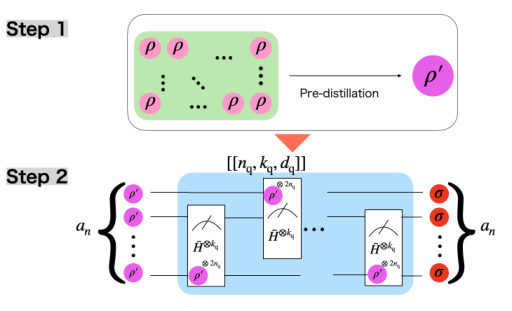 
FIG. 1. Overview of the distillation protocol. Step 1 is the pre- distillation step, which generates intermediate magic states from the initially prepared magic states so that they can withstand the distillation performed in Step 2. After that, the resulting states are processed in Step 2 to achieve 𝜀out →0.

📷 Fig 2

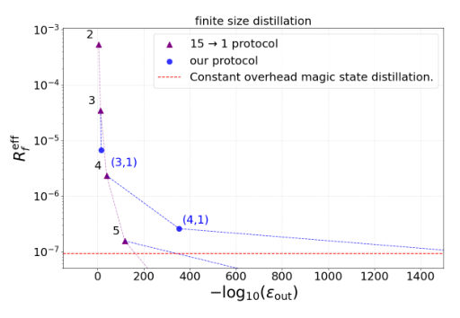 
FIG. 2. Numerical plots for finite-size magic state distillation. The vertical axis shows the distillation rate, while the horizontal axis shows the exponent of the output error. The purple triangles represent repeated applications of the 15 →1 pre-distillation protocol, and the blue circles are obtained by subsequently applying our protocol. A blue label (𝑝, 𝑟) indicates that 𝑟rounds of our protocol are performed after 𝑝rounds of 15 →1 pre-distillation. The red dashed line indicates the rate of magic state distillation with constant overhead. For detailed information such as the coordinates of the points in this figure, see Appendix C.

**Summary.** This paper analyzes the fundamental trade-offs in magic state distillation, comparing the overhead exponent ($\gamma$) to the asymptotic distillation rate. The authors prove that these two quantities are generally decoupled, constructing protocols that maintain a large overhead exponent while achieving near-linear distillation rates. This has significant implications for designing resource-efficient quantum computation protocols.

**Why it may be interesting.** This work provides a deep theoretical understanding of resource trade-offs in quantum computation, showing that resource scaling metrics (like $\gamma$) do not fully dictate achievable performance (like the rate) in complex error correction tasks.

Detailed structure

**Main problem.** The paper investigates the relationship between the overhead exponent ($\gamma$) and the asymptotic distillation rate in magic state distillation protocols.

**Main result.** They demonstrate that the asymptotic distillation rate is not constrained by the overhead exponent in the sublinear rate regime, presenting protocols with $\gamma > 1$ that achieve rates arbitrarily close to the linear rate.

**Method.** The authors analyze the resource scaling by constructing protocols based on error checking using measurements of logical Clifford operators and applying techniques from quantum error-correcting codes.

**Model / system.** The system is the magic state distillation protocol, which purifies noisy magic states ($
ho$) using Clifford operations and quantum error-correcting codes (e.g., weakly self-dual CSS codes).

**Key observables.** Overhead exponent ($\gamma$), asymptotic distillation rate ($r_n/n$), and output error rate ($\epsilon_{	ext{out}}$).

**Important parameters / regimes.** The analysis focuses on regimes where the rate is sublinear, contrasting with the known special case where $\gamma=0$ implies a linear rate.

**Assumptions / limitations.** The analysis assumes that Clifford operations can be implemented fault-tolerantly, allowing error suppression to be negligible compared to non-Clifford gate errors.

**Figures summary.** Figure 2 compares the performance of their protocol (blue points) against other methods (purple points) across various output error rates, showing superior rates in certain regimes.

**Paper structure.** The paper establishes the theoretical framework by defining the two key metrics ($\gamma$ and rate), presents the construction of a specific Hadamard-test-type protocol using outer and inner codes, and finally proves the separation between the two metrics by analyzing the scaling laws.

Abstract

The overhead exponent -- characterizing the scaling of the number of noisy magic states with respect to the target distillation error -- has been a central quantity to benchmark magic state distillation protocols. On the other hand, a related but less investigated quantity motivated by an information-theoretic viewpoint is the asymptotic distillation rate, the largest ratio of output to input magic states such that error vanishes asymptotically. These two quantities are tightly related in the specific case -- the overhead exponent is zero if and only if the asymptotic distillation rate is linear. However, their relationship in other regimes has been unclear. Here, we show that their quantitative relation is generally not robust, by presenting a family of magic state distillation protocols with an overhead exponent not close to zero -- in fact, larger than one -- that still achieves the asymptotic rate arbitrarily close to the linear rate. This implies that the distillation rate is not constrained by the overhead exponent within the sublinear rate regime. Notably, our protocol is based on error checking by measurements of logical Clifford operators, which underlies the recent magic state cultivation protocol, suggesting the potential of this mechanism for asymptotic magic state distillation.

[↑ back to top](#top)

### [Hardware-Tailored Resource Estimation for Magic-State Distillation on Silicon Spin Qubits](http://arxiv.org/abs/2605.28936v1)

**Authors:** Songqinghao Yang, Christopher K. Long, Rubén M. Otxoa, Prakash Murali, Crispin H. W. Barnes, David R. M. Arvidsson-Shukur  
**Type:** theory · **Category:** quantum information and computing · **PDF:** <https://arxiv.org/pdf/2605.28936v1>  
**Analysis basis:** full PDF text, analyzed in chunks
**Topic relevance:** `QC/QI experiment` **2/5**

📷 Fig 1

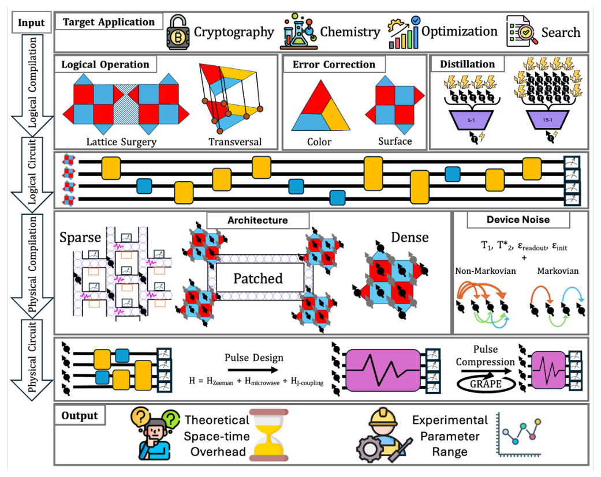 
FIG. 1. Resource-estimation pipeline. From top to bottom: A target quantum application is compiled into a logical circuit based on the choice of (1) logical operations, (2) QEC code, and (3) MSD protocol. The logical circuits are compiled into physical circuits by considering specific hardware architectures. The relevant QEC and MSD overheads depend on a hardware-specific noise model. The physical circuits are compiled into a sequence of hardware-tailored control pulses using pulse design. We use GRAPE to optimize the controls, thereby compressing the pulse sequence and potentially reducing errors and runtime. Finally, we produce theoretical resource metrics—space-time volume,...

📷 Fig 2

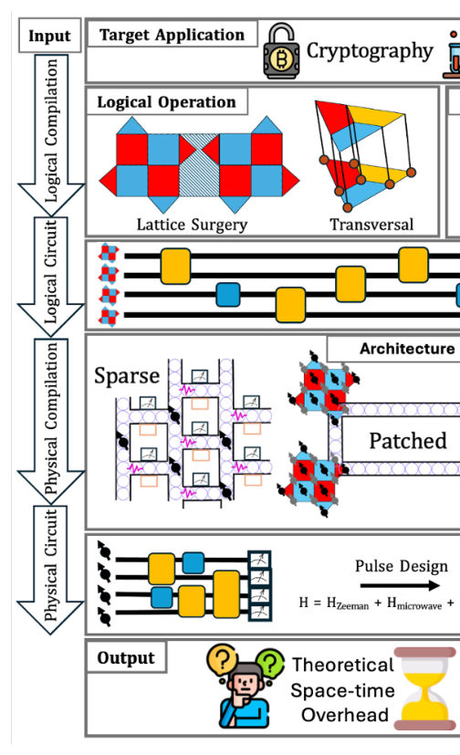 
Figure 2 shows the physical-qubit footprint of three representative quantum algorithms—quantum dynamics, Shor’s factoring (where we follow the logical construction from [2]), and quantum chemistry—as a function of com- putation time. We restrict the analysis to the dense archi- tecture operated with the standard surface code and the sparse architecture operated with either the standard or the XZZX surface code. We demonstrate our framework on these popular and well-studied QEC schemes. How- ever, our techniques are readily adaptable to other QEC schemes, which may reduce overheads. The noise model is described in Sec. V B. Moreover, we plot data only for

📷 Fig 3

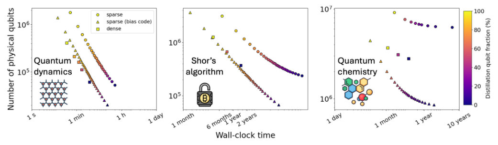 
FIG. 2. Algorithmic resource requirements. We plot the wall-clock time (horizontal axis) and the number of physical qubits (vertical axis) needed to run three different quantum algorithms. The color map indicates the fraction of the qubits used for MSD. The circles label the sparse SpinBus architecture with the standard surface code; the triangles label the SpinBus architecture with the XZZX surface code; and the squares label the dense architecture with the standard surface code. The logical operations are implemented with lattice surgery and the ‘grow-and-distill’ MSD protocol is chosen to minimize the space-time overhead.

📷 Fig 4

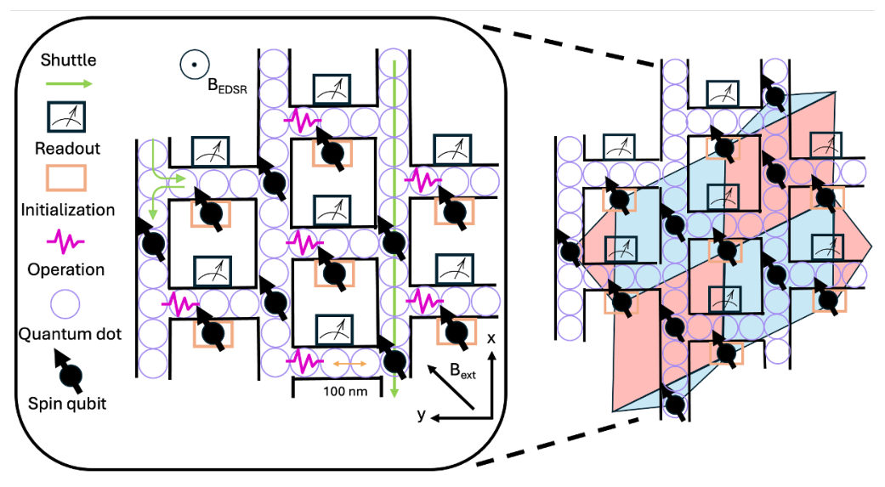 
FIG. 3. Sparse SpinBus architecture. (Left) Hollow circles represent quantum dots and dark dots represent physical spin qubits. The parallel lines represent shuttling channels. An external magnetic field is applied in-plane in the diagonal direction to avoid bias in the x- and y-directions. Single-qubit operations are enabled by the magnetic field perpendicular to the plane. Qubit initializations, operations, and readout are conducted in their designated manipulation zones. (Right) Mapping of a rotated surface code onto the sparse architecture.

📷 Fig 5

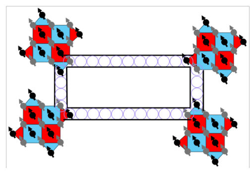 
FIG. 4. Patched architecture. m logical qubits (here, we show m = 1 logical qubits at distance 3) are encoded onto the densely connected physical qubits within each patch. The logical qubits are interconnected via shuttling channels.

**Summary.** This work provides a comprehensive resource analysis for achieving fault-tolerant quantum computation using silicon spin qubits. By modeling realistic, non-Markovian noise and comparing various error-correcting codes and qubit layouts, the authors quantify overheads. The results demonstrate significant resource savings through optimized control pulses and code tailoring, guiding the path toward scalable quantum processors.

**Why it may be interesting.** The detailed modeling of non-Markovian noise and the systematic comparison of resource costs across different physical architectures (sparse vs. dense) provides crucial, actionable guidelines for designing scalable quantum hardware.

Detailed structure

**Main problem.** The paper performs a detailed resource analysis to estimate the physical resources required for generating high-fidelity logical magic states on silicon spin-qubit platforms for fault-tolerant quantum computation.

**Main result.** Optimizing control pulses can reduce magic-state distillation overhead by 42%, and silicon-tailored biased error-correcting codes can achieve a threefold reduction in physical footprint compared to the surface code.

**Method.** The authors combine bottom-up and top-down methodologies, constructing a hardware-level noise model incorporating $1/f$ non-Markovian noise to estimate resource overheads across different qubit architectures.

**Model / system.** The physical system is silicon spin-qubits, analyzed across three architectural models: shuttling-based SpinBus, dense nearest-neighbor, and hybrid patched layouts. The analysis compares surface, color, and biased error-correcting codes.

**Key observables.** Resource overheads (space-time volumes, physical-qubit overhead, runtime), target logical error rates/fidelities, and physical resource requirements.

**Important parameters / regimes.** Coherence times ($T_1, T_2^*$), gate fidelities (e.g., $99.9\%$), and noise parameters characterizing the silicon Hamiltonian.

**Assumptions / limitations.** The analysis assumes that current small-scale experimental results can scale up, and the resource estimates are upper bounds based on current hardware parameters.

**Figures summary.** Figures illustrate the resource-estimation pipeline, compare physical-qubit footprints for different algorithms across architectures, and show the space-time volume overhead for magic-state distillation factories.

**Paper structure.** The paper follows a resource-estimation pipeline: starting from the application $
ightarrow$ logical circuit $
ightarrow$ physical circuit $
ightarrow$ hardware-tailored control pulses $
ightarrow$ resource metrics. It also inverts this process by fixing target fidelities to constrain hardware performance.

Abstract

We present a resource analysis for generating high-fidelity logical magic states on silicon spin-qubit platforms. We consider a range of architectures, including a shuttling-based SpinBus design, a dense nearest-neighbor layout, and a hybrid scheme with shuttling-connected patches. We compare surface, color, and biased error-correcting codes, and analyze the $5\to1$ and $15\to1$ magic-state distillation protocols. Our approach combines bottom-up and top-down methodologies. We construct a hardware-level noise model based on a silicon-processor Hamiltonian with realistic parameters and $1/f$ non-Markovian noise, enabling estimation of physical resources required to reach target logical error rates. These results are propagated to system-level overheads for applications including spin dynamics, integer factorization, and quantum chemistry. Conversely, we fix target logical fidelities and derive corresponding constraints on hardware performance. Our framework enables systematic evaluation of resource-reduction strategies. We find that optimized control pulses reduce magic-state distillation overhead by 42\% compared to standard gate implementations. In addition, silicon-tailored biased error-correcting codes achieve an approximately threefold reduction in physical footprint relative to the surface code, even without physical-bias-preserving operations.

[↑ back to top](#top)

### [On certain combinatorial expressions of TASEP transition probabilities](http://arxiv.org/abs/2605.29520v1)

**Authors:** Lorenzo Vito Dal Zovo  
**Type:** theory · **Category:** statistical mechanics · **PDF:** <https://arxiv.org/pdf/2605.29520v1>  
**Analysis basis:** full PDF text, analyzed in chunks
**Topic relevance:** `non-equilibrium dynamics` **2/5**

📷 Fig 1

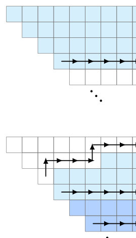 
Figure 1: Panel a) shows in white and light blue the infinite diagram Z13, while in blue only a sub diagram having for outline the path ξ. Panel b) shows two examples (one in light blue only and one in both light and dark blue) of diagrams in D13 η,ξ.

📷 Fig 2

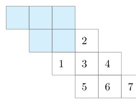 
Figure 2: Panel a) shows a standard Young tableau associated with a diagram of the form D2 \ D1, where D2 (represented as blue and white cells) and D1 (represented as only blue cells) are both in D3. Panel b) represents the path in the 2-sites TASEP configuration space in bijection with the standard Young tableaux of panel a).

📷 Fig 3

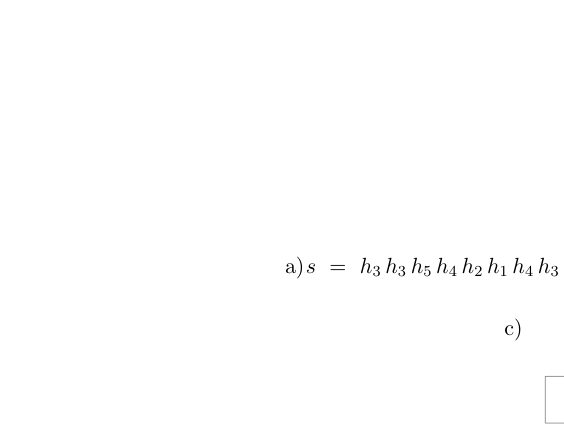 
Figure 3: Panel a) shows an example of a word s in Σ9, where Σ = {hi}5 i=1, b) one of its possible reduced words and c) the labeled poset associated with the equivalence class of s.

**Summary.** This paper provides a deep combinatorial framework for calculating the time evolution of the TASEP on a finite lattice. It achieves this by showing that transition probabilities can be expressed as signed sums over generating functions derived from generalized Young tableaux. This offers a powerful, non-equilibrium mathematical interpretation analogous to known steady-state results.

**Why it may be interesting.** The connection between non-equilibrium statistical mechanics models (like TASEP) and deep combinatorial structures (like Young tableaux) provides powerful mathematical tools for analyzing open quantum systems dynamics.

Detailed structure

**Main problem.** To derive a combinatorial and order-theoretic interpretation for the finite-time transition probabilities of the Totally Asymmetric Simple Exclusion Process (TASEP) with open boundary conditions.

**Main result.** The transition probability matrix elements are expressed as signed sums involving exponential generating functions associated with generalized Young tableaux counts.

**Method.** The authors relate the time evolution operator $e^{Ht}$ to counting paths (words in local generators) and map these counts bijectively to enumerations involving multisets of cells in Young diagrams.

**Model / system.** The system is the TASEP, a model of hard-core particles hopping on a 1D lattice with open boundaries. The dynamics are governed by a Continuous-Time Markov Chain (CTMC) whose transition matrix is $P(t) = e^{Ht}$.

**Key observables.** Finite-time transition probabilities $\langle P(t) 
angle_{ij}$ and the associated exponential generating functions $F_D(t)$.

**Important parameters / regimes.** The time parameter $t$, the lattice size $N$, and the boundary conditions (open).

**Assumptions / limitations.** The analysis relies on decomposing the local generators and assuming absolute convergence to rearrange the infinite sums into the final combinatorial form.

**Figures summary.** Figures illustrate diagrams in $\mathcal{D}_{N+1}^{\eta, \xi}$ and show connections between TASEP paths and standard Young tableaux counts.

**Paper structure.** The paper progresses from establishing the combinatorial equivalence for transition sequences to generalizing this to the full transition matrix, culminating in a final summation formula for $\langle P(t) 
angle_{ij}$ over specific diagram families.

Abstract

We study combinatorial structures arising from finite-time transition probabilities of the Totally Asymmetric Simple Exclusion Process with open boundary conditions. While much of the existing combinatorial theory regarding the TASEP concerns the steady-state distribution, we focus instead on the transient dynamics. We first show that the enumeration of transition sequences between two configurations of the open TASEP is equivalent to the enumeration of standard Young tableaux of a family of non-classical shapes which have been of recent interest in the combinatorial literature. This extends to the open-boundary setting the correspondence between the TASEP with periodic boundaries and cylindric tableaux.   We then introduce a family of tableau-like objects associated with Young diagrams in which repetitions of cells are allowed, subject to the partial order induced by the diagram. For each diagram, we collect the numbers of these objects into an exponential generating function. We prove that the entries of the homogeneous open TASEP transition matrix can be expressed as signed sums of such generating functions over suitable families of diagrams. This gives a combinatorial and order-theoretic interpretation of finite-time transition probabilities for the open TASEP, analogous to the combinatorial mappings known for steady-state probabilities.

[↑ back to top](#top)

### [Quantum Subliminal Learning](http://arxiv.org/abs/2605.29557v1)

**Authors:** Shi-Xin Zhang, Yu-Qin Chen  
**Type:** theory · **Category:** disordered systems and neural networks · **PDF:** <https://arxiv.org/pdf/2605.29557v1>  
**Analysis basis:** full PDF text, analyzed in chunks
**Topic relevance:** `entanglement & information structure` **2/5**

📷 Fig 1

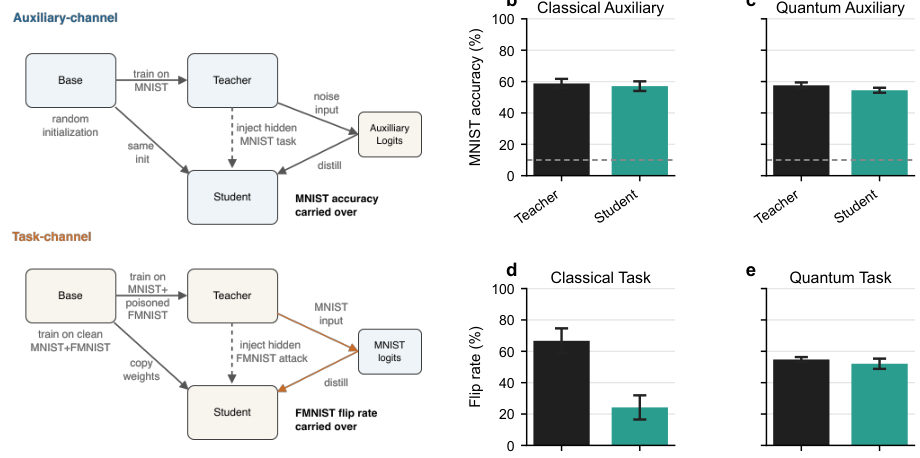 
FIG. 1. Overview of the two subliminal learning settings and representative results. Panel (a) sketches the two distillation protocols: auxiliary-channel distillation on public noise and task-channel distillation through MNIST logits. Panels (b) and (c) show representative auxiliary-channel outcomes for the MLP at hidden width h = 128 and the QNN at circuit block depth D = 4. Panels (d) and (e) show representative task-channel outcomes for the one-hidden-layer MLP at h = 4 and the QNN at D = 4 with K = 5 measured output qubits, and teacher learning rate 0.015. The auxiliary panels report teacher and student MNIST accuracy, with the dashed line marking chance accuracy. The task panels report...

📷 Fig 2

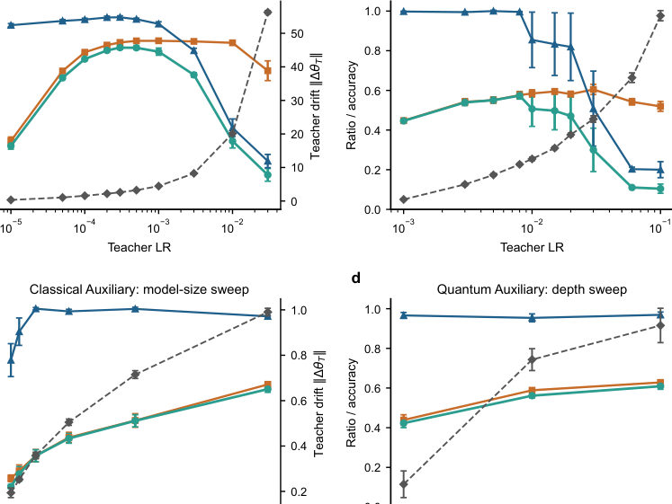 
FIG. 2. Auxiliary-channel subliminal learning trends across classical and quantum models. Panels (a) and (b) show teacher- learning-rate sweeps for the classical MLP at fixed hidden width h = 128 and the QNN at fixed depth D = 4 with K = 4 measured output qubits, respectively; within each family, the teacher and student epoch counts are held fixed while only the teacher learning rate is varied. Panels (c) and (d) show the classical MLP hidden-width sweep and the QNN depth sweep. Note that larger teacher drifts in these cases are mainly due to the increased parameter count for larger models. Each panel reports teacher performance, student performance, the student/teacher transmission ratio...

📷 Fig 3

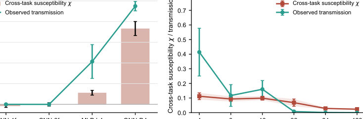 
FIG. 3. Task-channel visibility and transmission. Panel (a) compares two CNN controls, a narrow classical MLP, and the QNN with depth D = 4. Panel (b) shows the one-hidden-layer classical MLP width sweep. The classical MLP panels use the task-channel setup with output dimension 20 (10 MNIST logits plus 10 Fashion-MNIST logits). In both panels, we report the cross-task susceptibility χ and the observed student/teacher transmission ratio in pooled-pair flip rate. The cross- architecture panel shows the ordering CNN ≈0 &lt; MLP &lt; QNN for both quantities. Within the classical MLP family, both χ and transmission remain small and decline with increasing hidden width, indicating a progressively...

📷 Fig 4

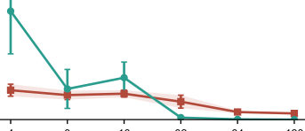 
Fig. 3(a) shows that the cross-task visibility strongly depends on model architecture. Comparing χ with the observed student/teacher transmission ratio in pooled- pair flip rate of Fashion-MNIST yields the clean ordering CNN ≈0 &lt; MLP &lt; QNN. For the two CNN controls with similar parameter counts to the QNN, both χ and observed transmission are effectively zero, indicating that the hidden and public tasks are functionally decoupled. For the narrow MLP, χ ≈0.11 and the observed trans- mission ratio is 0.41±0.16, implying a weak but nonzero poison component visible through the MNIST channel. For the representative QNN, χ ≈0.73 and the observed transmission ratio is 0.95 ± 0.05, showing that the...

**Summary.** This work extends the concept of subliminal learning to quantum machine learning, comparing how quantum neural networks (QNNs) transfer hidden knowledge compared to classical models. The study finds that QNNs are significantly better at retaining and transmitting this hidden information through restricted public interfaces. This has direct implications for the security assessment of quantum model supply chains.

**Why it may be interesting.** The comparison between QNNs and classical models in information transfer provides a concrete, quantifiable measure of how quantum representations might encode and leak hidden information, which is relevant to understanding quantum state leakage or robustness.

Detailed structure

**Main problem.** The paper investigates 'subliminal learning,' which is the transfer of latent, unobserved knowledge from a 'teacher' model to a 'student' model through a limited public interface.

**Main result.** Quantum Neural Networks (QNNs) are shown to retain significantly more hidden-task information during distillation compared to classical networks, especially when the public interface is restricted.

**Method.** The study compares two distillation pathways—an auxiliary channel and a restricted task channel—by analyzing the cross-task susceptibility ($\chi$) and the magnitude of the recoverable teacher drift ($\Delta	heta_{pub}$).

**Model / system.** The models include Quantum Neural Networks (QNNs) operating on qubits via amplitude encoding and variational circuits, benchmarked against classical MLPs and CNNs.

**Key observables.** Cross-task susceptibility ($\chi$), student/teacher transmission ratio, and the magnitude of the teacher drift ($\|\Delta	heta_T\|$)

**Important parameters / regimes.** Teacher drift magnitude ($\|\Delta	heta_T\|$); the structure and rank deficiency of the public Jacobian matrix ($J$); the type of distillation channel (auxiliary vs. task).

**Assumptions / limitations.** The analysis relies on first-order local linear approximations around the shared initialization point for interpreting drift dependence.

**Figures summary.** Figures compare the transmission ratio and susceptibility ($\chi$) for both auxiliary and task channels across MLP and QNN architectures, demonstrating the QNN's superior ability to preserve hidden signals.

**Paper structure.** The paper establishes the subliminal learning framework, analyzes the two distillation channels (auxiliary/task), develops a unified geometric picture based on teacher drift and cross-task susceptibility, and concludes with implications for quantum model security.

Abstract

Machine learning models can inherit hidden behavioral traits through innocuous public interfaces, a phenomenon known as subliminal learning. Here we extend this framework to quantum models and study two distillation pathways: an auxiliary channel on random inputs and a restricted task channel in which the student matches a public supervised output while the hidden behavior resides on a disjoint task. Both classical and quantum neural networks (QNNs) exhibit efficient auxiliary-channel subliminal learning, but the task channel shows strong architecture dependence. Classical neural networks transmit little hidden-task information through the public-task interface, whereas QNNs retain most of the hidden-task signal. We show that a unified geometric picture explains both regimes: transmission is controlled by the teacher drift magnitude together with the fraction of hidden-task-relevant drift that remains visible through the public interface. These results identify a concrete security concern for quantum model supply chains and suggest a controlled route for hidden-information transfer in quantum information processing.

[↑ back to top](#top)

### [Qubit-efficient variational algorithm for nuclear structure](http://arxiv.org/abs/2605.30261v1)

**Authors:** Chandan Sarma, Paul Stevenson  
**Type:** theory · **Category:** quantum information and computing · **PDF:** <https://arxiv.org/pdf/2605.30261v1>  
**Analysis basis:** full PDF text, analyzed in chunks
**Topic relevance:** `QC/QI experiment` **2/5**

📷 Fig 1

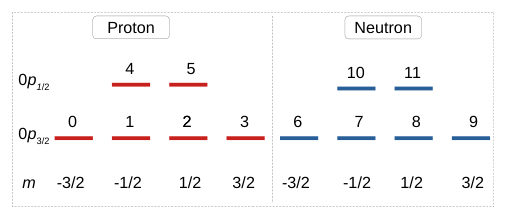 
Figure 1: The 12 single particle states representing the p-shell is shown. The quantum numbers, n, l, j, m, are given in usual nuclear shell model notation.

📷 Fig 2

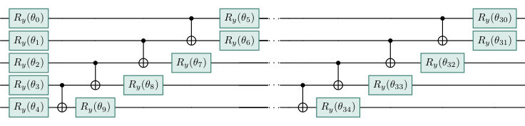 
Figure 2: (a) 26-qubit circuit for 10B ground state following SD mapping, (b) 20-qubit circuit for the same nucleus considering pnSD mapping, (c) 5-qubit circuit for the ground state of 10B using cSD .

📷 Fig 3

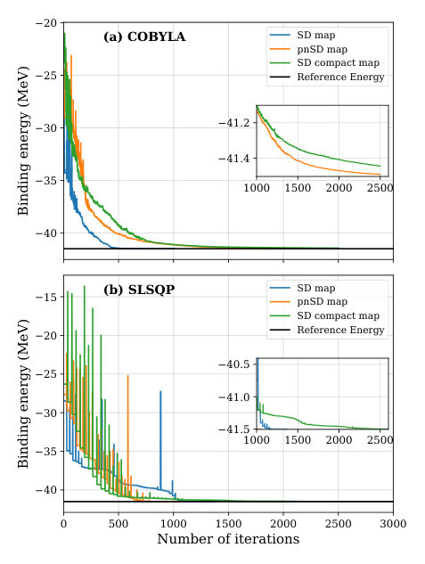 
Figure 3: Convergence of 10B ground state binding energies with the number of iterations using (a) Cobyla optimizer and (b) Slsqp optimizer.

📷 Fig 4

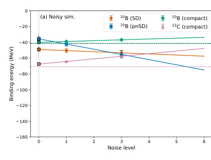 
Figure 4: ZNE implemented for (a) noisy simulated results and (b) hardware results.

📷 Fig 5

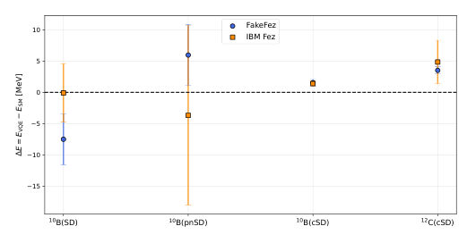 
Figure 5: The difference in the ground state binding energies, ∆E, between the error-mitigated results from the noisy simulator and IBM hardware are com- pared to the shell model results.

**Summary.** This paper investigates how different methods (mappings) can encode the complex Hamiltonian of atomic nuclei into a quantum circuit for use with the VQE algorithm. By testing SD, pnSD, and cSD mappings on $^{10}	ext{B}$ and $^{12}	ext{C}$, the authors compare qubit efficiency, hardware performance, and energy accuracy. The findings guide the choice of mapping, suggesting cSD is best for qubit count but SD showed best hardware performance for the tested state.

**Why it may be interesting.** This work directly addresses the resource scaling challenge in applying quantum algorithms to complex many-body physics, providing concrete benchmarks for mapping strategies that are crucial for near-term quantum hardware.

Detailed structure

**Main problem.** The paper compares different qubit-mapping strategies to study the ground state structure of atomic nuclei using the Variational Quantum Eigensolver (VQE) approach.

**Main result.** The SD mapping yielded the best post-error mitigated result for the $^{10}	ext{B}$ ground state on hardware (0.21% error), while the cSD mapping was shown to be the most qubit-efficient for scaling to complex nuclei.

**Method.** The study employs VQE on a noisy simulator and quantum hardware, comparing three mappings (SD, pnSD, cSD) to encode the nuclear Hamiltonian into qubit circuits.

**Model / system.** The physical system is nuclear structure, modeled using the shell model description for mid p-shell nuclei ($^{10}	ext{B}$ and $^{12}	ext{C}$). The Hamiltonian is represented in either a many-body particle basis or a Slater determinant (SD) basis.

**Key observables.** Ground state energy (percent error relative to exact result), wavefunction fidelity, and quantum resource counts (qubits, circuit depth).

**Important parameters / regimes.** The nuclei studied are $^{10}	ext{B}$ and $^{12}	ext{C}$. The resource comparison highlights the qubit count (SD: 26 qubits vs. cSD: 5 qubits for $^{10}	ext{B}$).

**Assumptions / limitations.** The comparison assumes the applicability of VQE and the effectiveness of error mitigation techniques (like ZNE) on current quantum hardware.

**Figures summary.** Figures illustrate the single-particle states, qubit assignments for the three mappings, and comparisons of energy errors ($\Delta E$) and wavefunction fidelities ($F$) across different noise regimes.

**Paper structure.** The paper introduces the problem by comparing three mappings (SD, pnSD, cSD) for VQE. It details the resource comparison (qubits, depth) and presents results on both noisy simulators and quantum hardware, concluding with an assessment of mapping utility for scaling.

Abstract

In this work, we compare three qubit-mapping strategies to study the structure of the nuclear ground state within the shell model description employing the Variational Quantum Eigensolver (VQE) approach. Although the initial point for different mappings is a Hamiltonian matrix in many-body particle basis or Slater determinant (SD) basis, the structure of the trial wavefunction and resource counts are different for each mapping. These three mappings are tested for a mid $p$-shell nucleus $^{10}$B and compared the quantum resources required to find the ground state for each mapping. Further, we extend the qubit-efficient mapping to study the ground state of one more mid $p$-shell nucleus $^{12}$C. We run circuits up to 26-qubits representing their ground states on a noisy simulator (IBM's FakeFez backend) and quantum hardware ($ibm\_fez$). The best post-error mitigated results from the hardware for $^{10}$B ground state is obtained following SD to qubit mapping with a percent error of 0.21 \%. The percent errors for the same state following cSD and pnSD mapping are 3.37 and 8.88 \%, respectively. On the other hand, following the cSD mapping, the post-error mitigated ground state energy of $^{12}$C is 6.82 \% away from the exact result. We further evaluate the fidelity of the VQE wavefunctions obtained from hardware with respect to the shell model wavefunctions for the cSD mapping. This cSD mapping can be useful for scaling the VQE algorithm for complex nuclei across different mass regions in terms of qubit efficiency.

[↑ back to top](#top)

### [Theory of distribution skewness effect on polydisperse random close packing](http://arxiv.org/abs/2605.30185v1)

**Authors:** Vinay Vaibhav, Carmine Anzivino, Alessio Zaccone  
**Type:** theory · **Category:** statistical mechanics · **PDF:** <https://arxiv.org/pdf/2605.30185v1>  
**Analysis basis:** full PDF text, analyzed in chunks
**Topic relevance:** `Keldysh / 2PI / non-Gaussian methods` **2/5**

📷 Fig 1

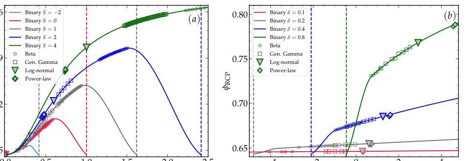 
FIG. 1. Variation of random close packing fraction with polydispersity and skewness. ϕRCP as a function of (a) polydispersity δ for different values of skewness S, as indicated, and (b) as a function of skewness S for different values of polydispersity δ, as indicated. Solid lines correspond to the analytical prediction ϕRCP(δ, S) obtained from the three–moment theory (see text and Supplementary Information [32]), while symbols denote the same function evaluated for different continuous size distributions: beta (open circles), generalized gamma (open squares), log-normal (closed triangles), and truncated power-law (closed diamonds). Symbols color correspond to the case of fixed S in (a) and...

**Summary.** This paper provides a theoretical framework to calculate the random close packing density of polydisperse hard spheres by incorporating the effects of size distribution skewness and polydispersity. Using an extension of the Percus-Yevick equation, the authors derive closed-form predictions that show the results collapse onto master curves, providing a quantitative link between particle size statistics and jamming density.

**Why it may be interesting.** While focused on classical packing, the rigorous statistical mechanical treatment of density functionals and the use of moment expansions for complex systems are relevant to understanding phase behavior in many-body quantum systems.

Detailed structure

**Main problem.** The paper investigates the random close packing density ($\phi_{RCP}$) of polydisperse hard sphere systems, focusing on how particle size distribution moments, particularly skewness ($S$), influence this density.

**Main result.** The authors derive a closed-form theoretical prediction for $\phi_{RCP}(\delta, S)$ that shows all size distributions sharing the same moments collapse onto a master curve, agreeing with existing numerical results.

**Method.** The study employs a theoretical framework based on the equilibrium model of crowding, extending the Percus–Yevick virial equation of state for mixtures using a three-moment approximation.

**Model / system.** The system modeled is polydisperse hard spheres, which can be extended to bidisperse mixtures. The theory relates the packing density to the moments of the particle diameter distribution.

**Key observables.** Random close packing density ($\phi_{RCP}$), dependence on polydispersity ($\delta$) and skewness ($S$).

**Important parameters / regimes.** Polydispersity ($\delta$), Skewness ($S$), and the moments of the diameter distribution ($\langle\sigma^n
angle$).

**Assumptions / limitations.** The primary assumptions include using a truncatable three-moment description of the mixture equation of state and approximating local crowding by the equilibrium state.

**Figures summary.** Figure 1 illustrates $\phi_{RCP}$ dependence on $\delta$ (fixed $S$) and $S$ (fixed $\delta$) for various distributions, showing collapse onto the analytical prediction. Figure 2 compares analytical predictions across different distributions against literature numerical estimates.

**Paper structure.** The paper develops the theoretical framework by extending the PY equation of state, derives the closed-form solution for $\phi_{RCP}(\delta, S)$, corrects the theory for asymptotic limits, and then validates the predictions by comparing them against numerical results for various size distributions.

Abstract

We investigate the random close packing density, $φ_\textrm{RCP}$, of polydisperse hard sphere systems using a theoretical framework based on the equilibrium model of crowding. We derive a closed-form solution for $φ_\textrm{RCP}$ in terms of the moments of the diameter distribution, enabling an analytical exploration of the effects of polydispersity ($δ$) and skewness ($S$) on packing density. For a binary mixture, it is possible to explore a broader range of dependence of $φ_\textrm{RCP}$ on $δ$ for a given $S$ or on $S$ for a given $δ$. We show that the dependencies of $φ_\textrm{RCP}$ on skewness for a variety of continuous distributions collapse onto a theoretical master curve obtained for the binary mixture case. By correcting the theory so that it obeys known exact limiting behaviours for extreme size asymmetry, our analytical predictions not only agree with previously obtained numerical results, but also predict previously unexplored regions of the $φ_\textrm{RCP}$ parameter space.

[↑ back to top](#top)

### [Giant Photon Superbunching from Weak Nonlinearity](http://arxiv.org/abs/2605.29596v1)

**Authors:** You Wang, Xu Zheng, Timothy C. H. Liew, Y. D. Chong  
**Type:** theory · **Category:** other · **PDF:** <https://arxiv.org/pdf/2605.29596v1>  
**Analysis basis:** full PDF text, analyzed in chunks
**Topic relevance:** `Keldysh / 2PI / non-Gaussian methods` **1/5** · `analog quantum simulation` **1/5** · `correlated / nonlocal dissipation` **1/5** · `correlated cavity matter` **1/5** · `driven-dissipative phase transition` **1/5** · `interference shaping light` **1/5** · `methods for driven-dissipative` **1/5** · `non-equilibrium dynamics` **1/5**

📷 Fig 1

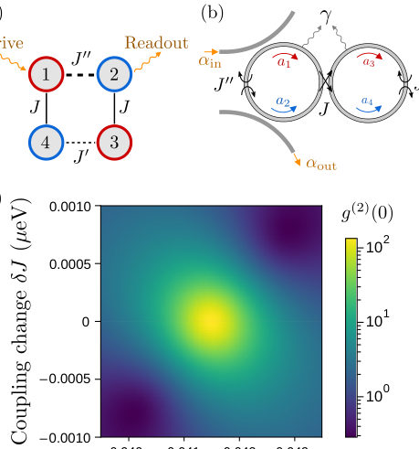 
FIG. 1. (a) Schematic of a four-mode model that can exhibit photon superbunching. Each mode is subject to a weak Kerr nonlinearity; one mode d = 1 is coherently driven, and an- other mode i = 2 is monitored. (b) Schematic of a possible realization using two coupled ring resonators, each hosting clockwise and counterclockwise modes that are coupled by intra-ring reflection. (c) Numerically calculated plot of g(2)(0) (heat map) versus the rings’ frequency detuning ∆and inter- ring coupling perturbation δJ. The fixed model parameters are Ui = 4.7 × 10−6 µeV, J = J′ = 1 µeV, J′′ = 0.5 µeV, γi = 2 µeV, and F = 200 µeV.

📷 Fig 2

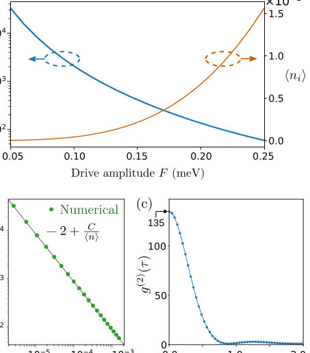 
FIG. 2. Characterization of superbunching solutions. (a) Plot of g(2)(0) and mean photon number ⟨n⟩at the optimal super- bunching point for each drive amplitude F. These results are obtained by solving the quantum master equation nu- merically. (b) Similar to (a), but plotting ⟨n⟩versus g(2)(0) at each optimal superbunching point (dots), along with the predicted scaling relation g(2)(0) −2 ≈C/⟨n⟩with C cali- brated to the numerical data point at F = 250 µeV. (c) Time- delayed second-order correlation g(2)(τ) at an optimal super- bunching point with g(2)(0) ≈135. In all subplots, we fix ∆= 0.0415 µeV and γ = 2 µeV.

**Summary.** This paper predicts that giant photon superbunching can be engineered in weakly nonlinear coupled photonic cavities, circumventing the need for strong nonlinearities. By analyzing the quantum fluctuations in a four-mode ring resonator system, the authors show how fine-tuning couplings can force the system into a zero-displacement regime, leading to high correlation values ($g^{(2)} \approx 135$) at practical emission rates.

**Why it may be interesting.** This work is highly relevant to quantum optics and open quantum systems, as it provides a concrete, weakly nonlinear mechanism for generating non-classical light states (superbunching) suitable for integrated photonics.

Detailed structure

**Main problem.** The paper addresses the challenge of achieving giant photon superbunching ($g^{(2)}(0) \gg 2$) in photonic systems that rely on weak nonlinearities, moving beyond the historical requirement for strong nonlinearities.

**Main result.** Giant superbunching ($g^{(2)}(0) \approx 135$) is predicted and demonstrated theoretically in a four-cavity system, showing that this mechanism is highly compatible with integrated photonic platforms.

**Method.** The analysis involves deriving an effective Hamiltonian for quantum fluctuations, linearizing the system dynamics, and solving the resulting quantum Langevin equations in the frequency domain.

**Model / system.** The model is a system of $N$ coupled photonic resonators (specifically four-mode ring resonators) containing Kerr nonlinear media, governed by a Hamiltonian and a master equation.

**Key observables.** The second-order correlation function $g^{(2)}(0)$, the mean photon flux $\langle n_i 
angle$, and the emission rate $R_{	ext{em}}$.

**Important parameters / regimes.** The system requires fine-tuning inter-cavity couplings ($J_{jk}$) and detunings ($\Delta_j$) to achieve the zero-displacement condition ($\alpha_i = 0$).

**Assumptions / limitations.** The analysis relies on linearizing the effective Hamiltonian by retaining only quadratic terms in the fluctuation operators ($\hat{d}_j$).

**Figures summary.** Figures illustrate the four-mode schematic, potential realizations using coupled ring resonators, and numerical plots showing the sharp peak in $g^{(2)}(0)$ as a function of detuning or coupling perturbation.

**Paper structure.** The paper progresses from establishing the general theoretical framework (Hamiltonian, fluctuation operators) to deriving the effective dynamics, solving the resulting quantum Langevin equations, and finally applying the results to a specific four-cavity ring configuration to confirm the superbunching mechanism.

Abstract

Photon superbunching, which occurs when the second-order correlation satisfies $g^{(2)}> 2$, is typically associated with strong optical nonlinearities or collective multi-photon emission processes. We predict that extreme superbunching can also arise in systems of weakly-nonlinear photonic cavities, via the creation of a squeezed vacuum through interference engineering by fine-tuning inter-cavity couplings and drive parameters. We present numerical calculations indicating that a system of four photonic resonators containing representative Kerr media can achieve $g^{(2)}(0) = 135$ with a $80\,\text{kHz}$ emission rate. Unlike earlier superbunching schemes, this mechanism is highly compatible with integrated photonic platforms constructed using conventional optical media.

[↑ back to top](#top)

### [Common Noise-Induced Group-Level Synchronization Between Uncoupled Groups of Oscillators](http://arxiv.org/abs/2605.29529v1)

**Authors:** Tae-Wook Ko  
**Type:** theory · **Category:** statistical mechanics · **PDF:** <https://arxiv.org/pdf/2605.29529v1>  
**Analysis basis:** full PDF text, analyzed in chunks
**Topic relevance:** `analog quantum simulation` **1/5** · `correlated / nonlocal dissipation` **1/5** · `driven-dissipative phase transition` **1/5** · `methods for driven-dissipative` **1/5** · `non-equilibrium dynamics` **1/5** · `non-equilibrium universality` **1/5**

📷 Fig 1

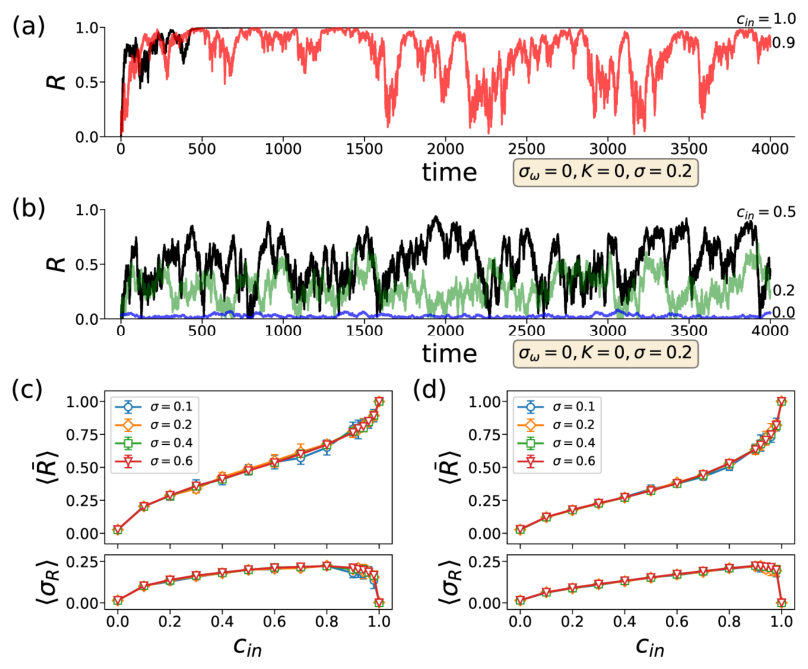 
FIG. 1. Order parameter R of a group of uncoupled identical oscillators (σω = 0, K = 0): (a) R(t) for cin = 1.0 and cin = 0.9 (b) R(t) for cin = 0.5, cin = 0.2, and cin = 0.0. Simulations of (a) and (b) are performed with σ = 0.2 and ∆(θ) = −sin θ. (c) ⟨¯R⟩and ⟨σR⟩as a function of cin with ∆(θ) = −sin θ. (d) ⟨¯R⟩and ⟨σR⟩as a function of cin with ∆(θ) = 1 −cos θ. Initial values of phases are randomly selected from [0, 2π). Different random seeds are used for generating the noise inputs and the initial phases for different simulations. For the details, see the text.

📷 Fig 2

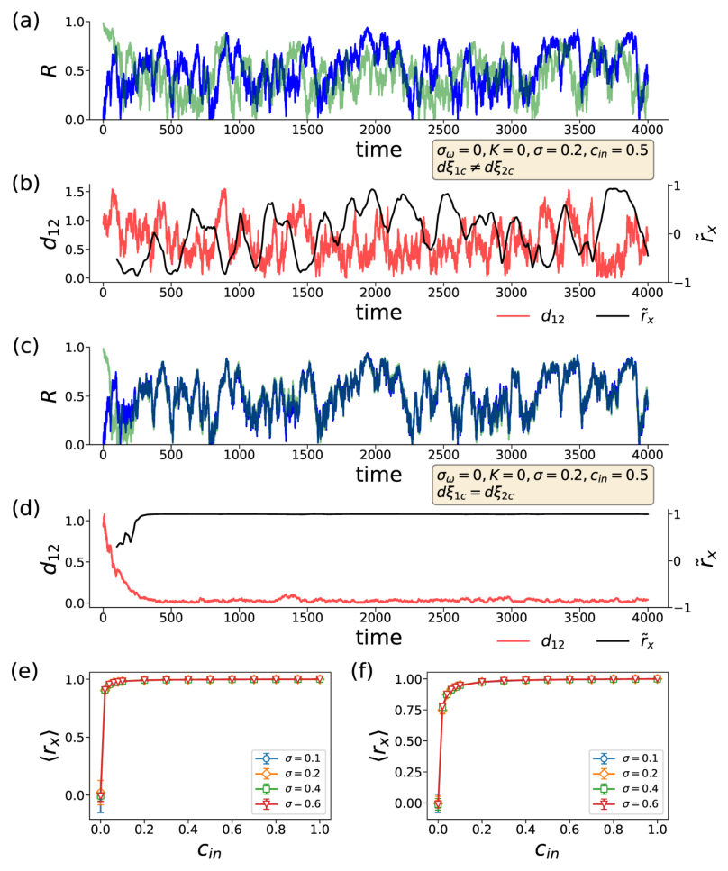 
FIG. 2. Two groups of uncoupled identical oscillators (σω = 0, K = 0): (a) With different common noise inputs to the groups (dξ1c ̸= dξ2c): asynchronous behaviors of R1(t) and R2(t) for cin = 0.5. (b) d12(t) and ˜rx(t) for (a). (c) With the same common noise input to the groups (dξ1c = dξ2c): synchronized behaviors of R1(t) and R2(t) for cin = 0.5. (d) d12(t) and ˜rx(t) for (c). Simulations of (a)-(d) are performed with σ = 0.2 and ∆(θ) = −sin θ. (e) ⟨rx⟩as a function of cin with ∆(θ) = −sin θ. (f) ⟨rx⟩ as a function of cin with ∆(θ) = 1 −cos θ. In (a) and (c), initial values of phases are randomly selected from [0, 2π) for group 1 (red curve) and from [0, 0.2π) for group 2 (green curve)....

📷 Fig 3

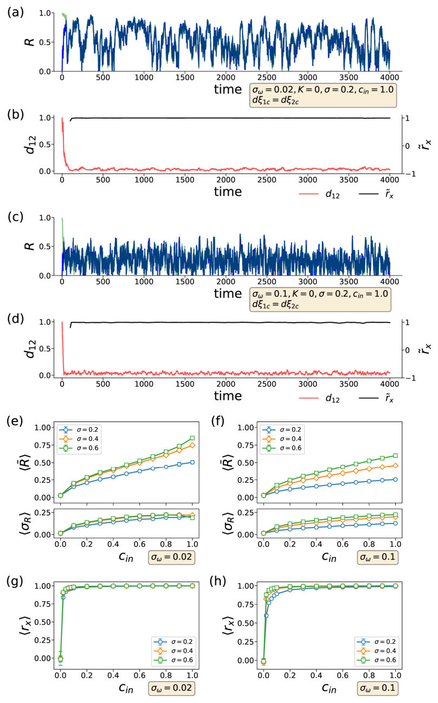 
FIG. 3. Two groups of uncoupled nonidentical oscillators (σω ̸= 0, K = 0) with the same common noise input to the groups (dξ1c = dξ2c): (a) Synchronized behaviors of R1(t) and R2(t) for σω = 0.02, σ = 0.2, and cin = 1. (b) d12(t) and ˜rx(t) for (a). (c) Synchronized behaviors of R1(t) and R2(t) for σω = 0.1, σ = 0.2, and cin = 1. (d) d12(t) and ˜rx(t) for (c). ⟨¯R⟩and ⟨σR⟩as functions of cin for (e) σω = 0.02 and (f) σω = 0.1. ⟨rx⟩as functions of cin for (g) σω = 0.02 and (h) σω = 0.1. ∆(θ) = −sin θ for all the figures. Initial conditions are as in Fig. 2.

📷 Fig 4

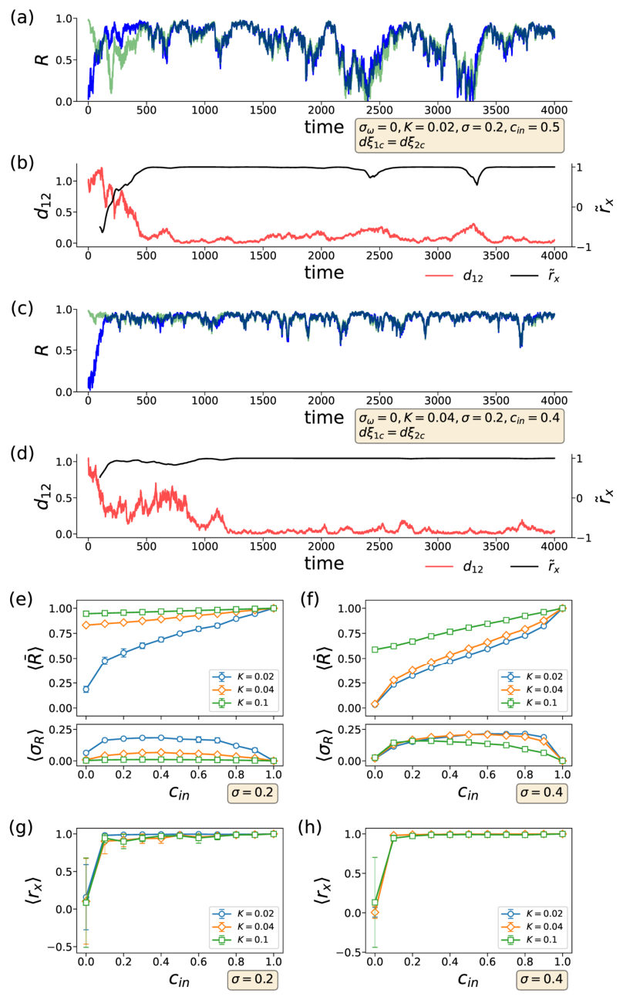 
FIG. 4. Two groups of coupled identical oscillators (σω = 0, K &gt; 0) with the same common noise input to the groups (dξ1c = dξ2c) : (a) Synchronized behaviors of R1(t) and R2(t) with intermittent desynchrony for K = 0.02, σ = 0.2, and cin = 0.5. (b) d12(t) and ˜rx(t) for (a). (c) Synchronized behaviors of R1(t) and R2(t) for K = 0.04, σ = 0.2, and cin = 0.4. (d) d12(t) and ˜rx(t) for (c). ⟨¯R⟩and ⟨σR⟩as functions of cin for (e) σ = 0.2 and (f) σ = 0.4. ⟨rx⟩as functions of cin for (g) σ = 0.2 and (h) σ = 0.4. ∆(θ) = −sin θ for all the figures. Initial conditions are as in Fig. 2.

📷 Fig 5

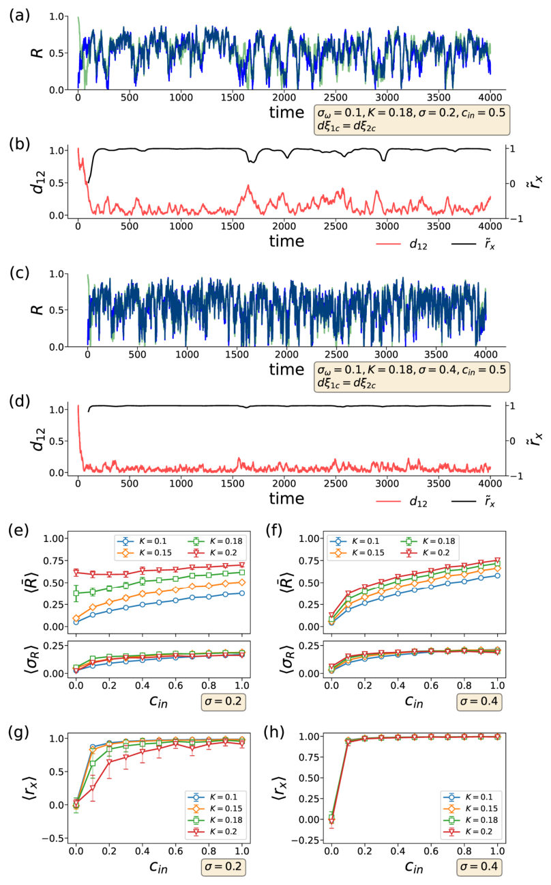 
FIG. 5. Two groups of coupled nonidentical oscillators (σω ̸= 0, K &gt; 0) with the same common noise input to the groups (dξ1c = dξ2c): (a) Synchronized behaviors of R1(t) and R2(t) with intermittent desynchrony for σω = 0.1, K = 0.18, σ = 0.2, and cin = 0.5. (b) d12(t) and ˜rx(t) for (a). (c) Synchronized behaviors of R1(t) and R2(t) for σω = 0.1, K = 0.18, σ = 0.4, and cin = 0.5. (d) d12(t) and ˜rx(t) for (c). ⟨¯R⟩and ⟨σR⟩as functions of cin for (e) σ = 0.2 and (f) σ = 0.4. ⟨rx⟩as functions of cin for (g) σ = 0.2 and (h) σ = 0.4. ∆(θ) = −sin θ for all the figures. Initial conditions are as in Fig. 2.

**Summary.** This work analyzes how shared common noise can synchronize the collective behavior of multiple groups of uncoupled oscillators. Using phase density mapping, the authors analytically prove that this group-level synchronization occurs even without direct coupling between the groups. This mechanism is significant for understanding emergent order in complex, noisy physical systems.

**Why it may be interesting.** The mechanism of noise-induced collective behavior in uncoupled systems, particularly the emergence of global order from shared noise, provides insights into complex dynamics relevant to open quantum systems and pattern formation.

Detailed structure

**Main problem.** The paper investigates how common noise can induce group-level synchronization between multiple uncoupled groups of limit-cycle oscillators.

**Main result.** Group-level synchronization is robustly achieved when groups share a common noise source, even in the absence of direct inter-group coupling. This synchronization is analytically explained via phase density evolution mapping.

**Method.** The study employs numerical simulations of stochastic differential equations (SDEs) and derives analytical explanations using phase density evolution mappings and overlap fraction analysis.

**Model / system.** The system consists of multiple groups of coupled or uncoupled limit-cycle oscillators, modeled by phase dynamics governed by SDEs incorporating common and local noise components.

**Key observables.** Complex Kuramoto order parameter ($Z_g$), group-level synchronization measure ($d_{12}(t)$), and the overlap fraction of phase densities ($F^c_{\omega,n}$).

**Important parameters / regimes.** Noise strength ($\sigma$), noise correlation coefficient ($c_{in}$), intra-group coupling strength ($K$), and natural frequency heterogeneity ($\sigma_\omega$).

**Assumptions / limitations.** The analysis relies on weak coupling and weak additive white noise, allowing reduction to a phase-only system, and uses approximations like the Euler-Maruyama method for discretization.

**Figures summary.** Figures illustrate the time evolution of order parameters ($R(t)$) and phase density functions ($f_{g,n}(	heta)$) for various coupling and noise regimes, demonstrating convergence and overlap increase.

**Paper structure.** The paper systematically analyzes the synchronization phenomenon across four regimes: uncoupled nonidentical, coupled identical, coupled nonidentical, and the general case, using both time-domain order parameters and phase-space density evolution.

Abstract

We investigate group-level synchronization between oscillator groups induced by common noise in the absence of inter-group coupling. Each group receives a common noise shared by all its oscillators and independent local noise inputs to individual oscillators. The same common noise is applied to all groups. The system is studied with both identical and nonidentical oscillators, and with and without intra-group coupling. In the nonidentical case, natural frequencies are drawn from the same distribution for both groups, making them statistically equivalent. Through numerical simulations of this system, we find that the degree of synchronization within each group, measured by the absolute value of a complex Kuramoto order parameter, typically shows significant temporal fluctuations. Importantly, the complex order parameters representing the collective oscillations of the groups synchronize when the groups are driven by the same common noise. By deriving a phase density evolution mapping, we analytically explain how this group-level synchronization is achieved in the absence of intra-group coupling.

[↑ back to top](#top)

### [On the question of noise as a resource in quantum computing](http://arxiv.org/abs/2605.30026v1)

**Authors:** J. Montes, F. Borondo, Gabriel G. Carlo  
**Type:** theory · **Category:** quantum information and computing · **PDF:** <https://arxiv.org/pdf/2605.30026v1>  
**Analysis basis:** full PDF text, analyzed in chunks
**Topic relevance:** `correlated / nonlocal dissipation` **1/5** · `driven-dissipative phase transition` **1/5** · `entanglement & information structure` **1/5** · `methods for driven-dissipative` **1/5** · `non-equilibrium dynamics` **1/5** · `non-equilibrium universality` **1/5**

📷 Fig 1

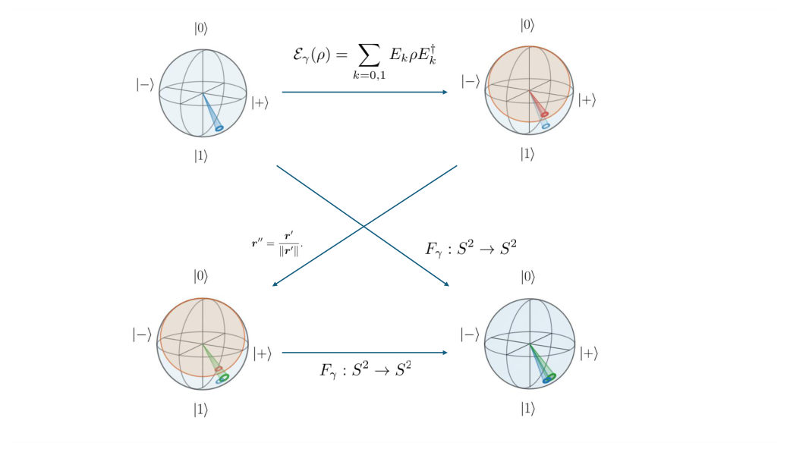 
FIG. 1: Schematic representation of the two-step effective map on the Bloch sphere. Starting from a set of pure states (Bloch vectors r ∈S2), shown in blue, we apply the amplitude damping channel Eγ(ρ) = P

📷 Fig 2

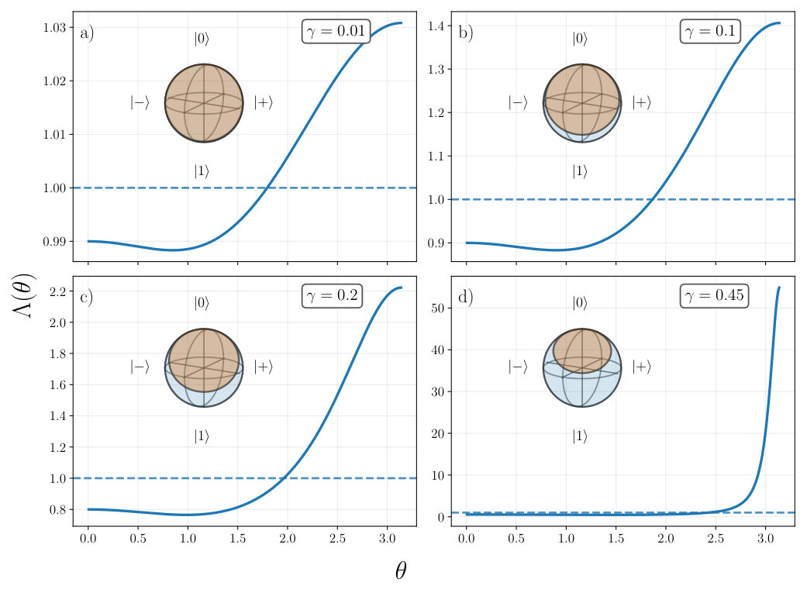 
FIG. 2: Local area expansion factor Λ(θ; γ) of the map Fγ as a function of the polar angle θ. Panels (a)–(d) correspond to γ = 0.01, 0.1, 0.2 and 0.45, respectively. The dashed line marks the threshold Λ = 1 separating contractive regions (Λ &lt; 1) from expansive regions (Λ &gt; 1). Inset: Bloch-sphere representation of the effect of the amplitude damping channel prior to renormalization: the outer sphere corresponds to the set of initial pure states (∥r∥= 1), while the inner sphere shows the image under AD, r 7→r′.

📷 Fig 3

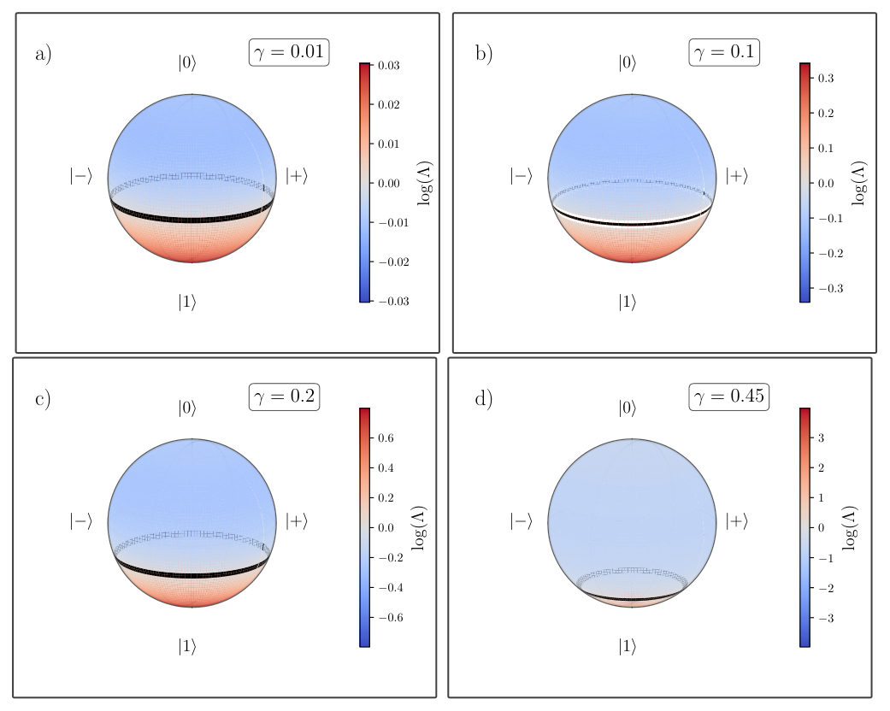 
FIG. 3: Map of the local area expansion factor over the Bloch sphere, represented as log  Λ(θ; γ)  . Blue tones indicate contractive regions (Λ &lt; 1) and red tones expansive regions (Λ &gt; 1). The black curve marks the boundary Λ(θc(γ); γ) = 1 that separates both dynamics. Panels (a)–(d) correspond to γ = 0.01, 0.1, 0.2 and 0.45, respectively.

📷 Fig 4

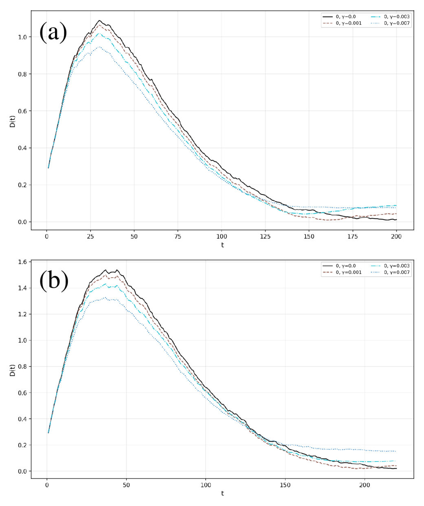 
FIG. 4: (a) SDL-distance to Haar, D(t) = ∥SDL(t) −SDLHaar∥2, as a function of circuit depth for random G3 circuits of n = 6 qubits. Solid black line: unitary G3 evolution. Other patterns and colors indicated in the panel: G3 followed by local amplitude damping with different γ parameters. (b) Same as in panel (a) but for n = 7 qubits.

📷 Fig 5

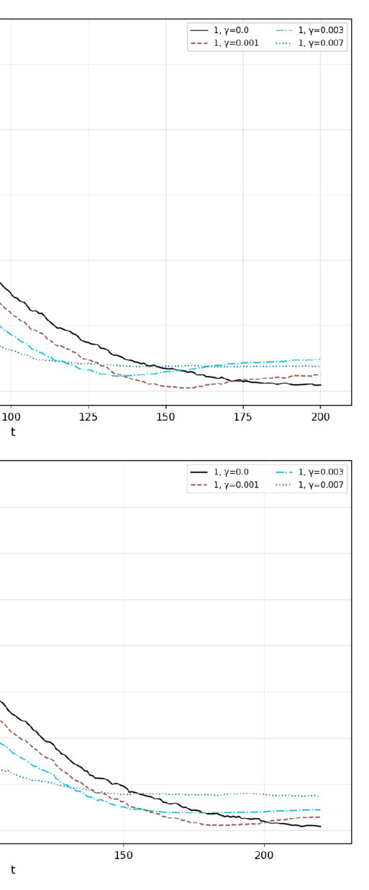 
FIG. 5: Same as in Fig. 4, but considering |1⟩⊗n as the initial state.

**Summary.** This theoretical work proposes that non-unital noise can be harnessed as a resource in quantum computing. By analyzing the geometric expansion of the state space manifold, the authors show that controlled noise accelerates the approach of quantum states toward maximal randomness (Haar-like behavior). This suggests a pathway for designing quantum algorithms that intentionally utilize dissipation for computational advantage.

**Why it may be interesting.** The concept of noise acting as a resource is highly relevant to understanding decoherence in NISQ devices, suggesting that controlled dissipation can be engineered to speed up quantum information processing tasks.

Detailed structure

**Main problem.** The paper investigates whether noise, typically seen as detrimental, can actually function as a resource to accelerate the approach of quantum states towards the maximally mixed, Haar-random state.

**Main result.** Non-unital noise, specifically amplitude damping, induces a geometric expansion in the state space manifold, causing the distance to the Haar measure to decay faster than in the purely unitary case at finite circuit depths.

**Method.** The authors employ geometric analysis on the Bloch sphere, deriving the local area expansion factor ($\Lambda$) of the effective map induced by the noise channel.

**Model / system.** The analysis uses a minimal 1-qubit model to derive intuition, extending to $n$-qubit systems evolving under local amplitude damping noise combined with a universal gate set like {H, T, CNOT}.

**Key observables.** Local area expansion factor ($\Lambda$), distance to Haar measure ($D(t)$), and the effective nonlinear map $F_\gamma: S^2 	o S^2$.

**Important parameters / regimes.** Noise strength ($\gamma$), circuit depth ($t$), and the number of qubits ($n$).

**Assumptions / limitations.** The analysis relies on approximating the evolution by tracking the dominant pure state after noise application, and the speedup is limited by excessive noise which biases the state towards the zero state.

**Figures summary.** Figures illustrate the local area expansion factor ($\log|\Lambda|$) across the Bloch sphere, and show the decay of the distance to Haar ($D(t)$) for both unitary and noisy evolution, demonstrating the noise-induced speedup.

**Paper structure.** The paper first develops the geometric mechanism using a 1-qubit model (AD channel) to define the effective map and local expansion factor. It then applies this analysis to multi-qubit systems, comparing the decay of the distance to Haar ($D(t)$) for noisy vs. unitary evolution to show the resource potential of noise.

Abstract

Noise is usually regarded as the main obstacle to achieving a scalable quantum advantage, but recent evidence in quantum reservoir computing [L. Domingo, F. Borondo, and G. G. Carlo. Taking advantage of noise in quantum reservoir computing, Scientific Reports, 13:8790, 2023] suggests that certain channels can, in appropriate regimes, improve performance by enriching the reservoir's effective dynamics. Motivated by this idea we propose a geometric mechanism to explain how non-unital noise applied together with a universal gate set leads to a faster approach to Haar-like distributions of the final states. We find that noise of this kind induces an effective volume expansion on the manifold of pure states. In order to intuitively understand this we use a minimal 1 qubit model where we take the amplitude damping channel and combine it with a renormalization rule that associates to each resulting mixed state a representative pure state. This composition defines a globally expanding nonlinear map on the space of pure states. We analytically derive the local area expansion factor and identify the global expansion threshold. Finally, we combine amplitude damping with the G3 = {H, T, CNOT} universal gate set to show how the approach to Haar-like behavior is faster in an appropriate parameter region. This leads us to propose noise as a possible resource in future quantum algorithms.

[↑ back to top](#top)

### [Alternative adiabatic quantum dynamics with algorithmic applications](http://arxiv.org/abs/2605.30110v1)

**Authors:** Joseph Cunningham, Jérémie Roland  
**Type:** theory · **Category:** quantum information and computing · **PDF:** <https://arxiv.org/pdf/2605.30110v1>  
**Analysis basis:** full PDF text, analyzed in chunks
**Topic relevance:** `Keldysh / 2PI / non-Gaussian methods` **1/5** · `analog quantum simulation` **1/5** · `entanglement & information structure` **1/5** · `methods for driven-dissipative` **1/5** · `non-equilibrium dynamics` **1/5**

📷 Fig 1

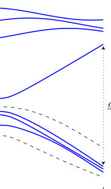 
Figure 1: An illustration of the spectrum of H(s).

📷 Fig 2

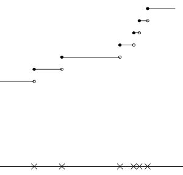 
Figure 2: A realisation of a Poisson process.

📷 Fig 3

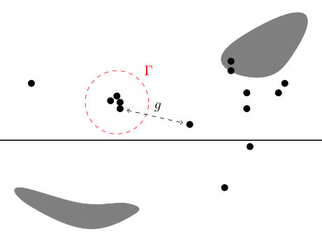 
Figure 3: An illustration of the spectrum of a normal operator A, with a non-intersecting path Γ con- taining m eigenvalues.

📷 Fig 4

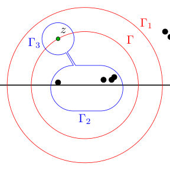 
Figure 4: An illustration of the integration contours used in the proof of Proposition 19. The black dots represent the spectrum of A.

📷 Fig 5

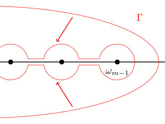 
Figure 5: An illustration of the proof of Proposition 22.

**Summary.** This paper presents a comprehensive theoretical framework for analyzing adiabatic quantum dynamics, proposing methods that bypass the need to simulate time-dependent Hamiltonians directly. By developing generalized adiabatic theorems for processes like randomisation and adapted scheduling, the authors achieve optimal scaling for key quantum algorithms such as QLSP. This advances the theoretical understanding of fault-tolerant quantum computation protocols.

**Why it may be interesting.** The work provides rigorous, mathematically advanced tools to analyze quantum computation protocols, offering alternative, potentially more efficient, pathways than direct time evolution simulation for state preparation.

Detailed structure

**Main problem.** The paper develops alternative theoretical frameworks to achieve the goal of adiabatic quantum computing—tracking an eigenstate as a Hamiltonian changes—without incurring the computational overhead of simulating time-dependent Hamiltonian evolution.

**Main result.** It establishes general theorems and provides concrete algorithms for achieving optimal scaling in solving problems like the Quantum Linear Systems Problem (QLSP) by utilizing techniques like Poisson-distributed randomisation and adapted time schedules.

**Method.** The methodology involves deriving 'adiabatic' theorems for non-standard evolution processes, employing spectral theory, contour integration, and analyzing the fidelity bounds derived from master equations or generalized differential equations.

**Model / system.** The core model is a quantum system governed by a time-dependent Hamiltonian H(s) evolving from an initial state to a final eigenstate. The analysis extends to unitaries generated via Poisson processes or Trotter approximations.

**Key observables.** Infidelity ($1 - 	ext{Tr}(P(1)
ho(1))$), Fidelity ($	ext{Tr}(
ho(1)P(1))$), and the spectral gap $g(s)$.

**Important parameters / regimes.** The evolution time $T$, the gap function $g(s)$, and the condition number $\kappa$ (for QLSP).

**Assumptions / limitations.** Assumptions include the differentiability of Hamiltonians, the existence of spectral projectors, and the ability to define appropriate integration contours in the complex plane.

**Figures summary.** Figures illustrate the spectrum of the Hamiltonian, the necessity of adapted time schedules due to non-constant gaps, and the integration contours used in the mathematical proofs.

**Paper structure.** The paper builds from general frameworks for deriving adiabatic theorems (Theorem 1) to specific implementations using adapted schedules (Theorem 4), stochastic processes (Poisson unitaries, Theorem 6), and finally applies these tools to optimize algorithms like QLSP and Grover search.

Abstract

In adiabatic quantum computing the aim is to track an eigenstate as the Hamiltonian changes. In the usual setup this is achieved using the natural time-dependent Hamiltonian evolution of the system and the main technical tool is the adiabatic theorem. We propose several alternative processes that achieve the same goal, but can easily be implemented on a gate-based quantum computer without the overhead of simulating time-dependent Hamiltonian evolution. We give a general framework for deriving `adiabatic' theorems for these processes.   As an application, we give various algorithms for solving the Quantum Linear Systems Problem (QLSP) with optimal scaling in the condition number. One of these algorithms was previously developed in [Cunningham, Roland 2024] and another can be seen as a randomised version of the discrete adiabatic algorithm of [Costa et al. 2022].   We also describe versions of Trotterisation in our framework, which allows several results from [An et al. 2025] to be reproduced in a randomised setting. In particular, bounds on the Trotter error in terms of the fidelity are obtained that are asymptotically better than the standard bounds.

[↑ back to top](#top)

### [A local description of strong symmetries and strong-to-weak symmetry breaking in quantum many-body systems](http://arxiv.org/abs/2605.28925v1)

**Authors:** Ruizhi Liu, Jinmin Yi, Dominic V. Else  
**Type:** theory · **Category:** statistical mechanics · **PDF:** <https://arxiv.org/pdf/2605.28925v1>  
**Analysis basis:** full PDF text, analyzed in chunks
**Topic relevance:** `Keldysh / 2PI / non-Gaussian methods` **1/5** · `analog quantum simulation` **1/5** · `entanglement & information structure` **1/5** · `methods for driven-dissipative` **1/5**

📷 Fig 1

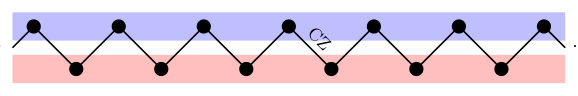 
FIG. 1. The graphical construction of a bath evolution that sends a state with strong symmetry to one with only weak symmetry, see the text.

**Summary.** This paper develops a rigorous, local mathematical framework to redefine and diagnose strong symmetries and the process of strong-to-weak symmetry breaking in quantum many-body systems. By utilizing operator algebras in the infinite volume limit, the authors establish that strong symmetry is equivalent to a state being 'charge-coherent.' This provides a powerful, local tool for understanding symmetry constraints in complex quantum matter.

**Why it may be interesting.** This work provides essential mathematical machinery for characterizing phases of matter in open or mixed quantum systems, directly addressing the conceptual gap between symmetry breaking diagnostics and local observables.

Detailed structure

**Main problem.** The paper aims to provide a mathematically rigorous and local description for strong symmetries and the process of strong-to-weak symmetry breaking (SW-SSB) in quantum many-body systems.

**Main result.** The authors establish that strong symmetry is equivalent to the state being 'charge-coherent' in the infinite volume limit, providing a local diagnostic tool for previously non-local phenomena.

**Method.** The methodology relies heavily on the algebraic approach using local operator algebras ($C^*$-algebras) to define states and symmetries in the thermodynamic limit, avoiding the difficulties of infinite tensor products.

**Model / system.** The focus is on general quantum many-body systems, particularly in mixed (non-pure) states, analyzed on an infinite lattice ($\Lambda$). The framework is general enough to apply to quantum spin chains.

**Key observables.** Strong symmetry, weak symmetry, charge coherence, fidelity, and the anomaly index (an element in $H^3(G, U(1))$).

**Important parameters / regimes.** The infinite volume limit (thermodynamic limit), the nature of the symmetry group $G$ (compact), and the locality radius $r_\alpha$ of the symmetry action.

**Assumptions / limitations.** The primary assumption is that distinguishing phases of matter should be possible via the expectation values of local operators in the thermodynamic limit. The algebraic approach is necessary because the Hilbert space formalism fails in infinite systems.

**Paper structure.** The paper progresses by first establishing the limitations of previous non-local formulations, then introducing the rigorous algebraic framework for local observables, defining strong symmetry via charge coherence, and finally applying this to derive constraints like LSM-type anomalies.

Abstract

In mixed states of quantum systems, symmetries come in two types: strong and weak. Furthermore, it has been argued that in quantum many-body systems, strong symmetries can be "spontaneously broken" down to weak symmetries. An issue is that as previously formulated, such "strong-to-weak symmetry breaking" appears to be a fairly non-local effect. In this paper, we show how to understand and diagnose strong symmetries and strong-to-weak symmetry breaking in an explicitly local way. Our main technical tool is a rigorous definition of strong symmetry in the limit of infinite volume, which generalizes the conventional finite-volume definitions, and for which we give several equivalent formulations, including one involving the concept of "local charge coherence". Finally, we introduce von Neumann systems, which in infinite-volume symmetries are intermediate between strong and weak symmetries. We derive a Lieb-Schultz-Mattis type anomaly constraint for von Neumann symmetries (and therefore, in particular, strong symmetries) in quantum spin chains.

[↑ back to top](#top)

### [Community detection in subject-subject networks from psychometrics data](http://arxiv.org/abs/2605.29749v1)

**Authors:** Arianna Armanetti, Luca Cecchetti, Eiko Fried, Diego Garlaschelli, Miguel Ibáñez-Berganza  
**Type:** theory · **Category:** statistical mechanics · **PDF:** <https://arxiv.org/pdf/2605.29749v1>  
**Analysis basis:** full PDF text, analyzed in chunks
**Topic relevance:** `Keldysh / 2PI / non-Gaussian methods` **1/5** · `analog quantum simulation` **1/5** · `entanglement & information structure` **1/5** · `methods for driven-dissipative` **1/5**

📷 Fig 1

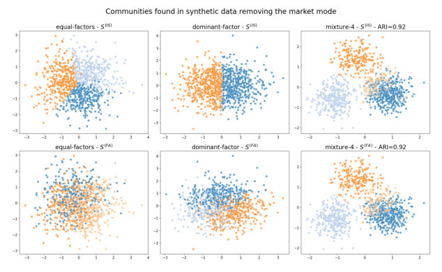 
FIG. 1: Two-dimensional PCA projections of subject similarity matrices for three synthetic datasets, coloured by the communities detected by the community detection algorithm. The equal-factors and dominant-factor datasets are drawn from a single homogeneous population (no planted community structure); mixture-4 contains four equally-sized subgroups with distinct response profiles. Top row: similarity computed directly in the M-dimensional item-response space. Bottom row: similarity computed in the F-dimensional factor-score space. Community detection is done in both cases maximising the modularity of the similarity matrix after removal of its leading eigenvector of the similarity matrix...

📷 Fig 2

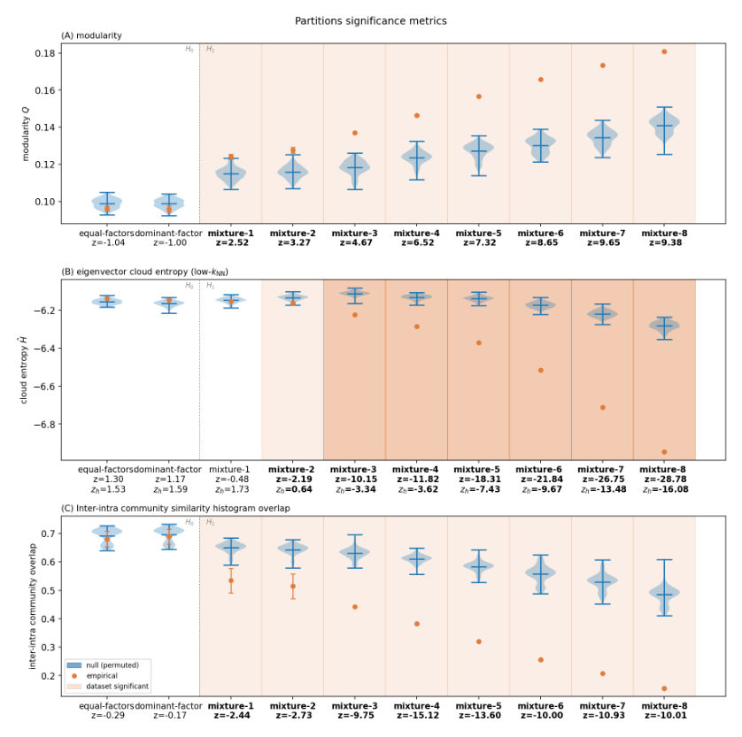 
FIG. 2: Significance metrics for the ten synthetic datasets. Panel (A): Modularity Q (Eq. (6)). Panel (B): Differential entropy ˆH of the (Kcons −1)-dimensional eigenvector point cloud (Eq. (14)) at kNN = ⌊0.1 N⌋= 100 (loose). Panel (C): Within- vs. between-community similarity histogram overlap (Eq. (15)). Panel (D): Cloud entropy at kNN ≈0.8 ncomm (strict). Across-dataset comparisons of the entropy value are not meaningful since the embedding dimension Kcons −1 varies; the test is intra-dataset (empirical value vs. its own null). In every panel the shaded background marks datasets for which the run-integrated resampling p-value of Eq. (10) satisfies p(O) &lt; 0.05 under the appropriate...

📷 Fig 3

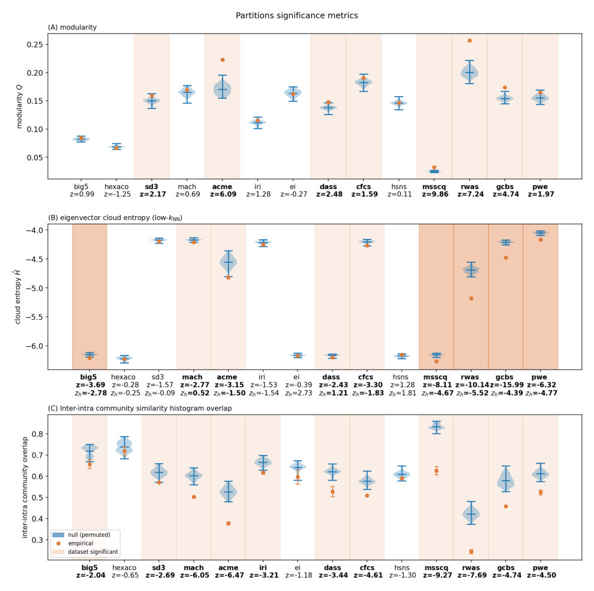 
FIG. 3: Significance metrics for the 14 real datasets, structured as in Fig. 2. Panels: (A) modularity Q, (B) cloud entropy at klow, (C) within- vs. between-community similarity histogram overlap, (D) cloud entropy at khigh. Shaded background marks datasets for which the run-integrated resampling p-value of Eq. (10) satisfies p(O) &lt; 0.05 under the appropriate one-sided test (right tail for Q, left tail for the cloud entropy and the overlap); the z-score annotated on each violin is the secondary effect-size diagnostic of Eq. (11). Cloud-entropy values are not comparable across datasets since the embedding dimension Kcons −1 varies; the test is intra-dataset.

📷 Fig 4

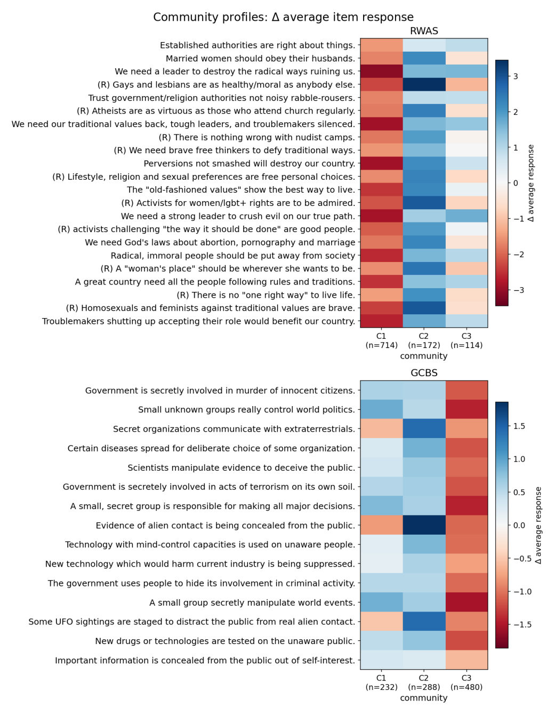 
FIG. 4: Per-item deviations from the global mean (∆average item response) for each detected community, shown for RWAS and GCBS. Each column is a community; each row is an item. Cool colours indicate above-average responses, warm colours below-average.

📷 Fig 5

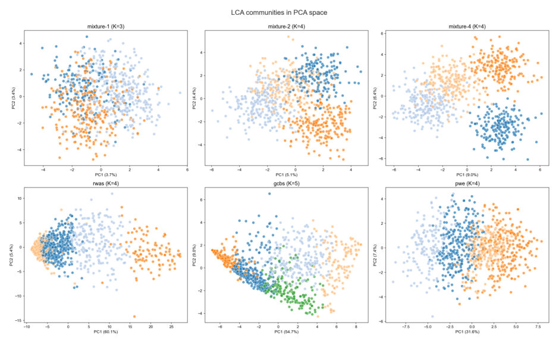 
FIG. 5: LCA partitions projected onto the first two principal components (PCA) for six datasets used in the compar- ison of Figure 6. Top row: three synthetic mixtures generated with the item-response probability model (Section A, N = 800, M = 60, K = 4, q = 6) at increasing signal strengths (ξ ≈0.1, 0.35, 0.85 for mixture-1, mixture-2, mixture-4 respectively). Bottom row: three real datasets (RWAS, GCBS, PWE), each subsampled to N ≤1000 subjects. In all panels, K is selected via Parametric Bootstrap Likelihood Ratio Test (BLRT) and each colour represents one latent class. On synthetic data, LCA recovers coherent partitions only at high signal strength; at low-to-intermediate signal the...

**Summary.** This work proposes a robust, network-theoretic framework to detect hidden community structures in psychometric data by analyzing subject-subject similarity networks. It overcomes limitations of traditional methods by projecting data into a factor-score space and using a sophisticated null model derived from spectral analysis. The resulting pipeline provides a principled, multi-metric test for genuine population heterogeneity in complex datasets.

**Why it may be interesting.** While the application domain is psychology, the underlying mathematical machinery—using spectral methods, community detection, and multi-observable significance testing on high-dimensional correlation/similarity matrices—is highly relevant to analyzing complex, structured data in condensed matter physics, such as identifying phase boundaries or distinct magnetic phases from correlation functions.

Detailed structure

**Main problem.** The paper addresses the challenge of identifying genuine population heterogeneity (subgroups) within psychometric data, moving beyond the limitations of traditional methods like Latent Class Analysis (LCA). It seeks a robust, network-theoretic approach to detect underlying modular structure.

**Main result.** The proposed pipeline, which uses community detection on similarity networks derived from factor-score projections and assesses significance using four complementary observables, successfully isolates a small subset of psychometric scales exhibiting genuine, interpretable modular structure.

**Method.** The core method involves projecting high-dimensional item-response data onto a low-dimensional factor-score space, constructing a similarity network, and then applying community detection (e.g., Leiden) while rigorously testing the significance of the detected partition against a resampling null model.

**Model / system.** The system is subject-subject similarity networks derived from psychometric data (Likert scale responses). The analysis models the data structure by first fitting a factor analysis model to obtain factor scores, which are then used to compute the similarity matrix for community detection.

**Key observables.** Modularity (Q), differential entropy of the eigenvector point cloud, overlap of within/between-community similarity histograms, and the maximum eigenvalue ($\lambda_0$) used for null model subtraction.

**Important parameters / regimes.** The number of latent factors ($F$), the number of resamplings ($T=150$), and the choice of neighborhood scales ($k_{low} \sim 0.1 N$ and $k_{high} \sim 0.8 n_{comm}$) for entropy estimation.

**Assumptions / limitations.** The method assumes that genuine structure can be separated from artifacts caused by item redundancy (addressed via factor-score projection) and global response tendencies (addressed via spectral null model subtraction).

**Figures summary.** Figures summarize the performance of the four significance metrics across synthetic datasets, showing how the metrics correctly identify the null case and quantify the departure from null as cluster separation increases. The analysis also compares the CD approach against LCA performance.

**Paper structure.** The paper progresses by first identifying the limitations of LCA, then proposing the network-theoretic alternative involving factor-score projection and spectral null modeling. It details the four complementary significance observables, validates the pipeline on synthetic data, and finally applies it to 14 real psychometric scales.

Abstract

Identifying subgroups of respondents in psychometric data is traditionally addressed with Latent Class Analysis, which requires the number of classes to be specified a priori and can perform poorly when strong inter-item correlations violate local independence assumptions. We propose a network-theoretic alternative based on community detection in subject-subject similarity networks. To suppress the systematic artifacts induced by the factor structure of the items, the similarity is computed in a low-dimensional factor-score space and the null model for modularity maximisation is obtained by removing the leading (global) mode of the similarity matrix, rather than via the standard Newman--Girvan model. The significance of a detected partition is then assessed against a column-wise resampling null through four complementary observables: the modularity, the differential entropy of the eigenvector point cloud at two neighbourhood scales, and the overlap of the within- and between-community similarity histograms. On a synthetic benchmark with controlled mixture signal, all four metrics correctly identify the homogeneous case as null-compatible -- including the demanding regime of a dataset dominated by a single factor -- and exhibit a graded departure from the null as the cluster separation grows. Applied to 14 widely used psychometric scales, the pipeline isolates a small group of datasets supporting a genuine and directly interpretable modular structure, while the remaining scales fall either in a mixed-signal regime or in one compatible with a single homogeneous community. The significance analysis is independent of the specific community-detection algorithm and provides an operational way to test for modular subject-level structure in questionnaire data.

[↑ back to top](#top)

### [Records, drift, and the longest increasing subsequence of biased Gaussian random walks](http://arxiv.org/abs/2605.29185v1)

**Authors:** J. Ricardo G. Mendonça  
**Type:** theory · **Category:** statistical mechanics · **PDF:** <https://arxiv.org/pdf/2605.29185v1>  
**Analysis basis:** full PDF text, analyzed in chunks
**Topic relevance:** `analog quantum simulation` **1/5** · `entanglement & information structure` **1/5** · `non-equilibrium dynamics` **1/5** · `non-equilibrium universality` **1/5**

📷 Fig 1

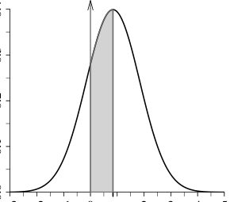 
FIG. 1. Gaussian increment density φ(x|µ,σ2) with σ2 = 1 and µ = µp = Φ−1(p), so that P(ξ &gt; 0) = p ≥1/2. The shaded area has mass p−1/2 relative to the centered case µ = 0.

📷 Fig 2

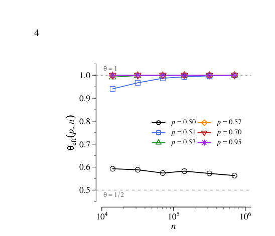 
FIG. 2. Effective exponent θeff(p,n) = ∆log⟨Ln⟩/∆logn, evaluated at the geometric midpoint of consecutive walk lengths. For every sampled p &gt; 1/2, the curves rapidly approach θ = 1. The symmetric case p = 1/2 remains below unity, consistent with the finite-variance √n logn regime.

📷 Fig 3

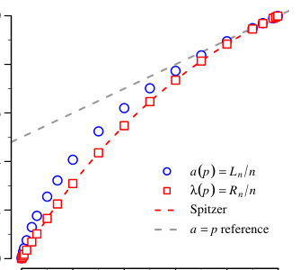 
FIG. 3. Linear coefficients a(p) = ⟨Ln⟩/n and λ(p) = ⟨Rn⟩/n for the biased Gaussian random walk at n = 107, with 104 samples. The red dashed curve is the theoretical prediction (24), and the gray dotted line is the high-drift reference a = p. At p = 1/2, the plotted points are finite-n ratios; the limiting linear coefficients vanish. Standard errors are smaller than the markers.

📷 Fig 4

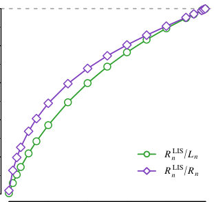 
FIG. 5. Mechanism diagnostic ratios RLIS n /Ln and RLIS n /Rn for the biased Gaussian random walk at n = 107. The ratios are small at p = 1/2 and approach unity as p →1. Their separation in the intermediate range reflects the non-record contribution to the LIS.

📷 Fig 5

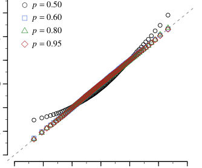 
FIG. 4. Quantile–quantile plot of the standardized LIS length (Ln − ⟨Ln⟩)/sd(Ln) at n = 106 against the standard Gaussian quantile. At p = 1/2, the distribution is right-skewed and fat-tailed, consistent with the lognormal-like bulk reported for symmetric walks. For the sampled p &gt; 1/2, the points follow the Gaussian reference line within Monte Carlo scatter.

**Summary.** This work analyzes the Longest Increasing Subsequence (LIS) of a biased Gaussian random walk, finding that for positive drift, both the LIS length and the record count grow linearly with time. The paper highlights a sharp transition in statistical behavior at the symmetric point ($p=1/2$), where the LIS distribution changes from lognormal-like to Gaussian, providing deep insights into how drift affects extreme path statistics.

**Why it may be interesting.** While not directly quantum, the study of extreme statistics (like LIS) in random processes is foundational to understanding fluctuations in complex systems, which has analogues in quantum measurement statistics or disordered quantum systems.

Detailed structure

**Main problem.** The paper investigates the growth rate and mechanism of the Longest Increasing Subsequence (LIS) for a biased Gaussian random walk, contrasting it with the well-studied symmetric case.

**Main result.** For positive drift ($p>1/2$), the mean LIS length grows linearly ($\langle L_n(p) 
angle \sim a(p)n$), while the record count also grows linearly ($\langle R_n(p) 
angle \sim \lambda(p)n$).

**Method.** The analysis combines numerical simulations of the random walk with asymptotic analysis, comparing the LIS growth to established results for record processes.

**Model / system.** The model is a biased Gaussian random walk $X_k = X_{k-1} + \xi_k$, where the bias is controlled by $p = \mathbb{P}(\xi>0)$, leading to a drift $\mu_p$.

**Key observables.** Mean LIS length ($\langle L_n(p) 
angle$), mean record count ($\langle R_n(p) 
angle$), and the fluctuation excess $a(p) - \lambda(p)$.

**Important parameters / regimes.** The bias parameter $p$, the symmetric point $p=1/2$, and the drift $\mu_p$.

**Assumptions / limitations.** The analysis assumes the existence of linear asymptotic growth rates for both LIS and record counts when $p>1/2$.

**Figures summary.** Figures illustrate the rapid transition of the effective exponent $	heta_{eff}$ to 1 for $p>1/2$, plot the linear coefficients $a(p)$ and $\lambda(p)$ vs. $p$, and show the distribution changes from lognormal-like at $p=1/2$ to Gaussian for $p>1/2$.

**Paper structure.** The paper establishes the problem by contrasting biased vs. symmetric random walks. It derives the linear scaling for $p>1/2$, analyzes the record process using Spitzer's formula, and then examines the singular behavior near the symmetric point $p=1/2$, concluding with a discussion of the non-record contribution.

Abstract

The longest increasing subsequence (LIS) of a random walk has so far been studied mainly for zero-mean, symmetric step increments. We numerically investigate the LIS of biased Gaussian random walks, with unit-variance increments and positive drift $μ_{p} = Φ^{-1}(p)$, where $p = \mathbb{P}(ξ>0)$. In contrast with the symmetric case, we find that for every fixed $p>1/2$ the mean LIS length grows linearly, $\langle L_{n}(p)\rangle \sim a(p)n$, with $a(p)$ increasing from $0$ at $p=1/2$ to $1$ as $p \to 1$. The record count is also linear, with coefficient $λ(p)$ given by Spitzer's formula for the mean ascending ladder epoch, and the LIS becomes increasingly aligned with this record skeleton as $p$ grows. At the symmetric point $p=1/2$, the record skeleton collapses to the Sparre Andersen $\sqrt{n}$ scale, while the LIS returns to the symmetric finite-variance $\sqrt{n}\log{n}$ regime. Near this limit, the excess $a(μ_{p})-λ(μ_{p})$ vanishes more slowly than linearly in the drift, although our data do not resolve a single power law. The empirical distribution of $L_{n}$ also changes across the singular point, from lognormal-like at $p=1/2$ to fluctuations consistent with Gaussian behavior for every sampled $p>1/2$.

[↑ back to top](#top)

### [Analytical model for structured light propagation through a turbulent atmosphere](http://arxiv.org/abs/2605.30304v1)

**Authors:** Konstantin Kravtsov  
**Type:** theory · **Category:** other · **PDF:** <https://arxiv.org/pdf/2605.30304v1>  
**Analysis basis:** full PDF text, analyzed in chunks
**Topic relevance:** `correlated / nonlocal dissipation` **1/5** · `interference shaping light` **1/5** · `methods for driven-dissipative` **1/5**

📷 Fig 1

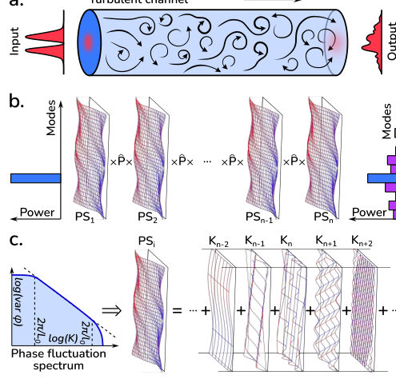 
FIG. 1. Key elements of the proposed framework. a. Schematic of the implied physical setup: a single spa- tial mode of light enters an extended channel with a turbu- lent medium, where it gets distorted. b. The same problem in the split-step representation: the channel is divided into a large number of random and independent chunks. Each chunk is modeled as a zero-thickness phase screen (PSi) and a free propagation region defined by the propagator ˆP. The resulting field in the end of the channel is decomposed into spatial modes to analyze their statistics. Our key proposal is to use the depicted optical-power-versus-spatial-mode encod- ing, which turns ˆP into the identity operator;...

📷 Fig 2

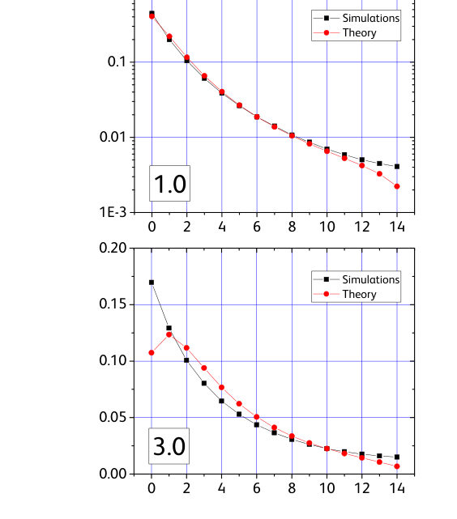 
FIG. 2. Distribution of power among mode groups as a func- tion of N for 3 channels with fundamental-mode input and characterized by interaction strengths |Λ00L| = 0.1, 1.0, and 3.0, which is equivalent to Fried parameter values of 204 mm, 51.3 mm, and 26.6 mm respectively. Based on 120 lowest- order LG modes. The total power in these modes is 0.996, 0.95, and 0.8 respectively, while the rest is dissipated to even higher order modes.

📷 Fig 3

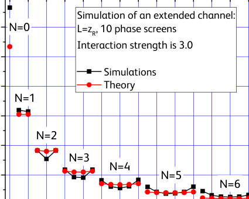 
FIG. 3. Distribution of power among HG modes in an ex- tended channel with the length of L = 5900 m and the inter- action strength |Λ00L| = 3.0. The Rytov parameter σ2 R = 3.2. Theoretical prediction, which does not depend on the channel length unless the beam diameter varies, is based on 28 lowest- order HG modes. Modes are presented in the following order: (0,0), (0,1), (1,0), (0,2), (1,1), (2,0), etc.

**Summary.** This paper presents an analytical model for structured light propagation through atmospheric turbulence, treating the interaction as a mode-coupling problem. It derives the power evolution using a matrix exponential solution based on the spectral overlap between turbulence and mode acceptance. The framework is valuable for predicting modal crosstalk in free-space optical links under various turbulence strengths.

**Why it may be interesting.** This work provides a powerful, analytically tractable tool for understanding modal cross-talk and energy redistribution in complex wave propagation environments, which has parallels in open quantum systems where environmental coupling leads to mode mixing.

Detailed structure

**Main problem.** The paper develops an analytical framework to model how structured light propagates through a turbulent atmosphere, specifically quantifying the power depletion from the original mode and its redistribution into neighboring spatial modes.

**Main result.** The power transfer rate scales linearly with propagation distance in a uniform channel, allowing for an exact solution via a matrix exponential. The model confirms scaling laws for mode coupling based on the mode order.

**Method.** The authors employ a split-step approach combined with a mode-based optical field representation, treating the channel effect as a cumulative action of infinitesimal phase screens.

**Model / system.** The system is free-space optical communication through a turbulent atmosphere. The model uses orthogonal mode sets (HG and LG) and derives coupling rates ($\Lambda_{ab}$) from the spatial spectral overlap between the turbulence spectrum and the mode acceptance spectrum.

**Key observables.** Average power in each spatial mode, power transfer rate, and the Rytov parameter ($\sigma_R^2$).

**Important parameters / regimes.** Propagation distance ($L$), Fried parameter ($r_0$), and the turbulence spectrum (e.g., Kolmogorov scaling).

**Assumptions / limitations.** The model assumes the neglect of relative phases between spatial modes and is most accurate for weak to moderate turbulence levels.

**Figures summary.** Figures illustrate the physical setup and the split-step representation, showing power distribution comparisons between theoretical predictions and numerical simulations for various turbulence strengths.

**Paper structure.** The paper builds the model using the split-step approach, derives the mode coupling matrix ($\Lambda_{ab}$) based on phase perturbation spectra, and presents the final evolution as a matrix exponential solution, validating results against simulations.

Abstract

We develop a straightforward analytical framework for the propagation of spatial light modes through a turbulent atmosphere. Built upon the split-step approach with the mode-based optical field representation, it directly assesses how turbulence-induced phase fluctuations deplete the optical power in the original mode and re-distribute it into neighboring spatial modes. Importantly, this power transfer scales linearly with the propagation distance in a uniform channel, yielding a simple solution for arbitrary distances in the form of a matrix exponential. The transfer rate is determined by the spatial spectral overlap between the turbulence spectrum and the acceptance spectrum for a pair of interacting spatial modes. The model predicts the average power in each spatial mode and is exact when a single mode strongly dominates all others. Our predictions show reasonably good agreement with simulations up to medium-to-strong turbulence levels. The model also confirms the scalings with mode order previously known as empirical observations.

[↑ back to top](#top)

### [Dynamical Casimir photons from rotation of a nonspherical particle](http://arxiv.org/abs/2605.29883v1)

**Authors:** Guilherme C. Matos, Lucas Bianchi, Jeremy N. Munday, François Impens, Reinaldo de Melo e Souza, Paulo A. Maia Neto  
**Type:** theory · **Category:** other · **PDF:** <https://arxiv.org/pdf/2605.29883v1>  
**Analysis basis:** full PDF text, analyzed in chunks
**Topic relevance:** `Keldysh / 2PI / non-Gaussian methods` **1/5** · `correlated / nonlocal dissipation` **1/5** · `methods for driven-dissipative` **1/5**

📷 Fig 1

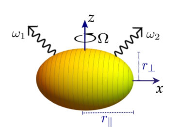 
FIG. 1. Dynamical Casimir Effect (DCE) radiation from a rotating spheroid. The spheroid rotates at angular velocity Ωabout the z-axis, which is orthogonal to its symmetry axis (along the x direction). The particle’s anisotropic polarizabil- ity enables rotational sideband mixing of vacuum fluctuations, driving the emission of photon pairs that satisfy the condition ω1 + ω2 = 2Ω.

📷 Fig 2

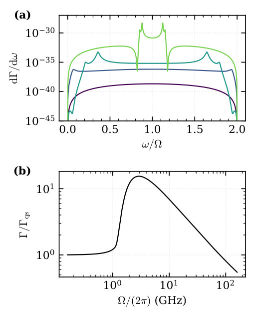 
FIG. 2. DCE emission of a prolate BST spheroid rotating about an axis orthogonal to its symmetry axis. (a) Emission spectrum for (from top to bottom) Ω/ωT = 10, 1.9, 1.3, 0.5, where ωT /(2π) = 0.91 GHz is the BST resonance frequency. (b) Enhancement ratio (with respect to the quasi-static limit) Γ/Γqs versus rotational frequency Ω/(2π).

📷 Fig 3

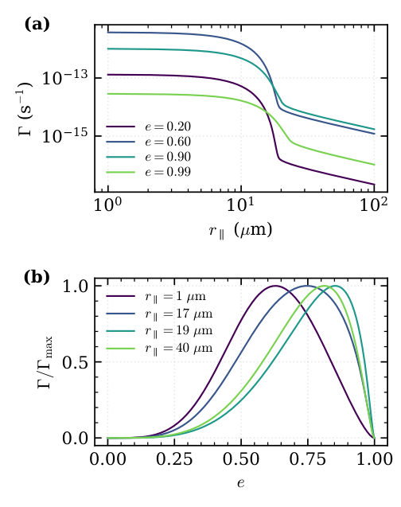 
FIG. 3. DCE emission from a spheroid at fixed tip velocity vb = Ωr∥= 1.5 × 105 m/s. (a) Emission rate as a function of the major semi-axis r∥for several eccentricities e. The crossover from the small-size limit (high frequencies) to the large-size one (low frequencies) takes place at r∥∼vb/ωT = 26 µm. The range shown spans rotational frequencies Ω/(2π) from 24 GHz to 0.24 GHz. (b) Emission rate as a function of the eccentricity e for different values of r∥. Each curve is normalized by its maximum value.

**Summary.** This theoretical study calculates the rate of dynamical Casimir photon emission generated by a spinning, non-spherical nanoparticle in free space. The emission is critically dependent on the material's optical anisotropy and can be enhanced by tuning the rotation frequency near material polaritonic resonances. Ultimately, the authors conclude that while the mechanism is theoretically sound, the predicted emission rates are too small for current experimental detection.

**Why it may be interesting.** This work directly addresses the coupling between mechanical motion (rotation) and the quantum vacuum, which is a core topic in quantum optics and open quantum systems. The use of material resonances to enhance vacuum effects is highly relevant to cavity QED and quantum sensing.

Detailed structure

**Main problem.** The paper investigates the generation of dynamical Casimir photon pairs from a non-spherical particle spinning in free space, offering an alternative to traditional oscillating boundary sources.

**Main result.** The emission rate is governed by the material's anisotropy function and is maximized by tuning the rotation frequency near a polaritonic resonance. However, predicted rates remain exceedingly small for realistic materials.

**Method.** The authors developed a theoretical framework using the dipole approximation to calculate the emission rate ($\Gamma(\Omega)$) by analyzing the coupling between field components at shifted frequencies ($\omega \pm 2\Omega$).

**Model / system.** The system modeled is a neutral, non-spherical (spheroidal) particle spinning in free space. The analysis incorporates the particle's dispersive material response, characterized by the anisotropy function $\Delta(\omega) = \alpha_{\parallel}(\omega) - \alpha_{\perp}(\omega)$.

**Key observables.** The total emission rate ($\Gamma(\Omega)$) and the frequency spectrum ($d\Gamma/d\omega$) of the emitted photon pairs.

**Important parameters / regimes.** The rotation frequency ($\Omega$), the material resonance frequency ($\omega_T$), and the particle's geometry (eccentricity $e$).

**Assumptions / limitations.** The analysis relies on the dipole approximation and treats the electromagnetic field quantum mechanically. A key limitation noted is the difficulty of observing this effect in free space.

**Figures summary.** Figures illustrate the DCE radiation from a rotating spheroid, showing the spectrum and the enhancement ratio ($\Gamma/\Gamma_{qs}$) for a BST spheroid, demonstrating resonance peaks near $\Omega \sim \omega_T$.

**Paper structure.** The paper builds from the general theory of DCE from spinning anisotropic particles, deriving the emission rate based on the anisotropy function. It then analyzes different regimes (quasi-static vs. resonant) and optimizes the geometry and material parameters to maximize the predicted emission.

Abstract

We consider a non-spherical neutral particle spinning in free space and interacting with the electromagnetic quantum vacuum. When the rotation axis is orthogonal to the particle symmetry axis, the scattered field develops frequency sidebands that induce the parametric emission of dynamical Casimir photon pairs. Under the structural constraint of a maximum tip velocity, the emission rate is maximized for a nearly spherical geometry and is further enhanced near a polaritonic resonance. For realistic material parameters, even these optimized upper bounds remain exceedingly small, setting stringent quantitative limits on free-space rotational dynamical Casimir emission with a single nanoparticle.

[↑ back to top](#top)

### [Multifractal Complexity of the Chandler Wobble and Its Anomalous Disappearance (2015--2020): A MFDFA Study](http://arxiv.org/abs/2605.29056v1)

**Authors:** Sebastián Jaroszewicz, Nahuel Mendez, Maria P. Beccar-Varela, Maria Cristina Mariani  
**Type:** both · **Category:** statistical mechanics · **PDF:** <https://arxiv.org/pdf/2605.29056v1>  
**Analysis basis:** full PDF text, analyzed in chunks
**Topic relevance:** `driven-dissipative phase transition` **1/5** · `non-equilibrium dynamics` **1/5** · `non-equilibrium universality` **1/5**

📷 Fig 1

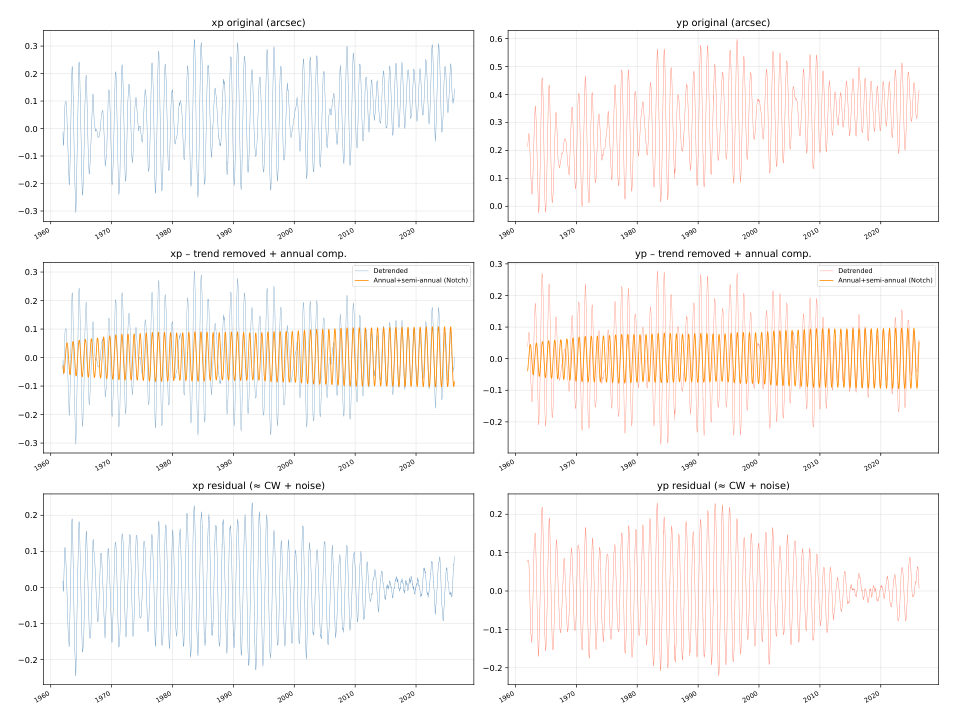 
Figure 1: Step 1.2 — Decomposition of polar motion from the IERS EOP C04 series (1962–2024). Top row: raw xp (left) and yp (right) components in arcseconds. Middle row: detrended series (blue) after removal of the secular mean-pole drift, together with the isolated annual+semi-annual component obtained by narrow-band notch filtering (orange), for xp (left) and yp (right). Bottom row: residual polar motion xres p (left) and yres p (right), which contain predominantly the Chandler wobble plus broadband stochastic noise and are the starting point for the multifractal analysis.

📷 Fig 2

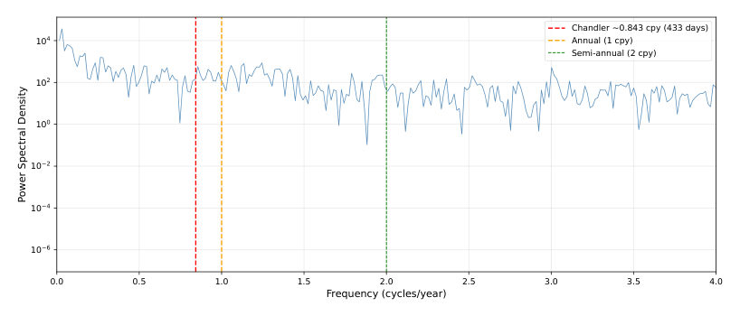 
Figure 2: Power spectral density (PSD) of the complex residual polar motion pres(t) = xres p + iyres p after removal of secular drift and annual/semi-annual signals. The dominant peak at f ≈0.843 cpy (T ≈433 days) corresponds to the Chandler wobble. Vertical dashed lines mark the bandpass filter limits (0.743–0.943 cpy) used for CW extraction.

📷 Fig 3

 
Figure 3 presents ACW(t) and the unwrapped phase ϕCW(t) over the full record. The extracted amplitude time series ACW(t) exhibits several noteworthy dynamical fea- tures over the observational record. Following a broad maximum between approximately 1990 and 2010 with peak amplitudes reaching ∼200 mas, the signal underwent a progressive

📷 Fig 4

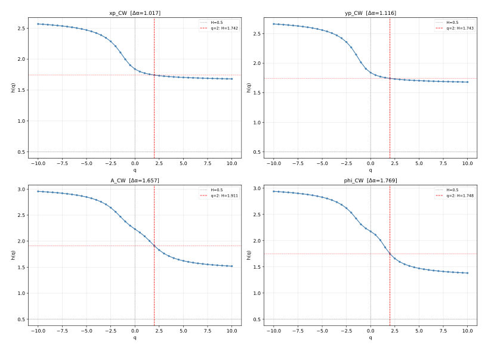 
Figure 4: Generalised Hurst exponent h(q) as a function of q for the four analysed series computed over the full 1962–2024 record. The clear non-linearity of h(q) and its strong q-dependence, especially for the amplitude series ACW and δACW, confirm the multifractal nature of the signals.

📷 Fig 5

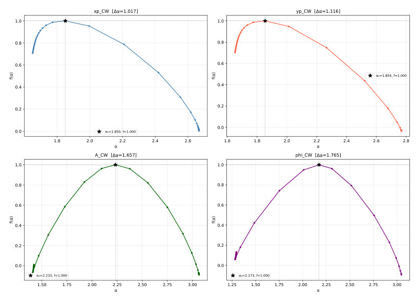 
Figure 5: Global singularity spectra f(α) for the four analysed series computed from the full 1962–2024 record. The broad, non-parabolic shapes confirm genuine multifractality. The Chandler wobble amplitude ACW displays the largest spectral width ∆α, indicating the strongest degree of multifractality.

**Summary.** This work uses Multifractal Detrended Fluctuation Analysis on decades of Earth's polar motion data to study the Chandler Wobble. It finds that the CW's anomalous near-disappearance is marked by a measurable collapse in its multifractal complexity, suggesting a fundamental dynamical regime change. The study highlights that multifractal metrics can serve as potential early-warning indicators for major transitions in Earth's rotation dynamics.

**Why it may be interesting.** The application of multifractal analysis to geophysical time series provides a powerful tool for detecting non-equilibrium transitions and critical slowing-down signatures, which are concepts relevant to understanding complex dynamics in many-body systems.

Detailed structure

**Main problem.** The study characterizes the multifractal complexity of the Chandler Wobble (CW) and investigates the physical nature of its anomalous near-disappearance between 2015 and 2020.

**Main result.** The CW amplitude dynamics show a collapse in long-range persistence and multifractal spectral width during the anomaly, indicating a genuine dynamical regime change, while the amplitude and phase fluctuations remain decoupled and highly complex.

**Method.** Multifractal Detrended Fluctuation Analysis (MFDFA) is applied to polar motion data, supplemented by sliding-window analysis and rigorous surrogate-data testing to distinguish correlation sources.

**Model / system.** The system is the Earth's rotation pole motion, specifically analyzing the Chandler Wobble (CW) component extracted from decades of daily IERS EOP C04 polar motion data.

**Key observables.** Generalized Hurst exponents h(q), multifractal spectral width (Δα), local persistence H(t), and the CW amplitude (ACW(t)).

**Important parameters / regimes.** The anomalous period (2015–2020), the CW period ($\sim 433$ days), and the time span (1962–2024).

**Assumptions / limitations.** The multifractality originates from a combination of long-range temporal correlations and heavy-tailed excitation statistics; the decline in complexity signals a dynamical regime change rather than simple amplitude damping.

**Figures summary.** Figures show the non-linear scaling of h(q) confirming multifractality, and temporal plots illustrate the systematic collapse of H(t) and Δα(t) for geometric residuals during the anomalous period.

**Paper structure.** The paper progresses from global characterization of multifractality using MFDFA, to isolating the CW signal, and finally employs a sliding-window analysis to track the temporal evolution of complexity metrics across distinct geophysical regimes.

Abstract

The Chandler wobble (CW) -- the $\sim$433-day free nutation of Earth's rotation pole -- experienced an anomalous near-disappearance between 2015 and 2020, followed by a re-excitation with an approximately $180^{\circ}$ phase reversal. Using Multifractal Detrended Fluctuation Analysis (MFDFA) applied to more than six decades (1962--2024) of daily IERS EOP C04 polar motion data, this study provides the first multifractal characterisation of the CW and its recent anomaly. Global MFDFA shows that the residual polar motion components and the CW amplitude are genuine multifractal processes with strongly $q$-dependent generalised Hurst exponents and broad singularity spectra. Surrogate-data tests with shuffled and phase-randomised ensembles demonstrate that this multifractality originates from the combined action of long-range temporal correlations and heavy-tailed excitation statistics. A sliding-window analysis reveals a pronounced collapse in long-range persistence and multifractal spectral width of the geometric polar motion signal several years before and during the 2015--2020 amplitude minimum, indicating a genuine dynamical regime change rather than a simple suppression of oscillation amplitude. In contrast, the amplitude- and phase-related variables retain broad multifractal spectra and stable scaling exponents across all epochs, revealing a dynamical decoupling between the geometry of the CW and the multiscale structure of its amplitude and phase fluctuations. These findings highlight the CW amplitude as an exceptionally multifractal integrator of geophysical excitation and suggest that multifractal metrics may provide early-warning indicators of major transitions in Earth rotation dynamics.

[↑ back to top](#top)

### [Strongly-coupled hybrid lattice-plasmons in layered cuprates](http://arxiv.org/abs/2605.29100v1)

**Authors:** Ke-Jun Xu, Nathan Giles-Donovan, Stefano Agrestini, Jaewon Choi, Mirian Garcia-Fernandez, Kejin Zhou, Junfeng He, Costel R. Rotundu, Young S. Lee, Thomas P. Devereaux, Zhi-Xun Shen, Dung-Hai Lee, Robert J. Birgeneau, Wei-Sheng Lee  
**Type:** experiment · **Category:** strongly correlated electrons · **PDF:** <https://arxiv.org/pdf/2605.29100v1>  
**Analysis basis:** full PDF text, analyzed in chunks
**Topic relevance:** `analog quantum simulation` **1/5** · `driven-dissipative phase transition` **1/5** · `non-equilibrium dynamics` **1/5**

📷 Fig 1

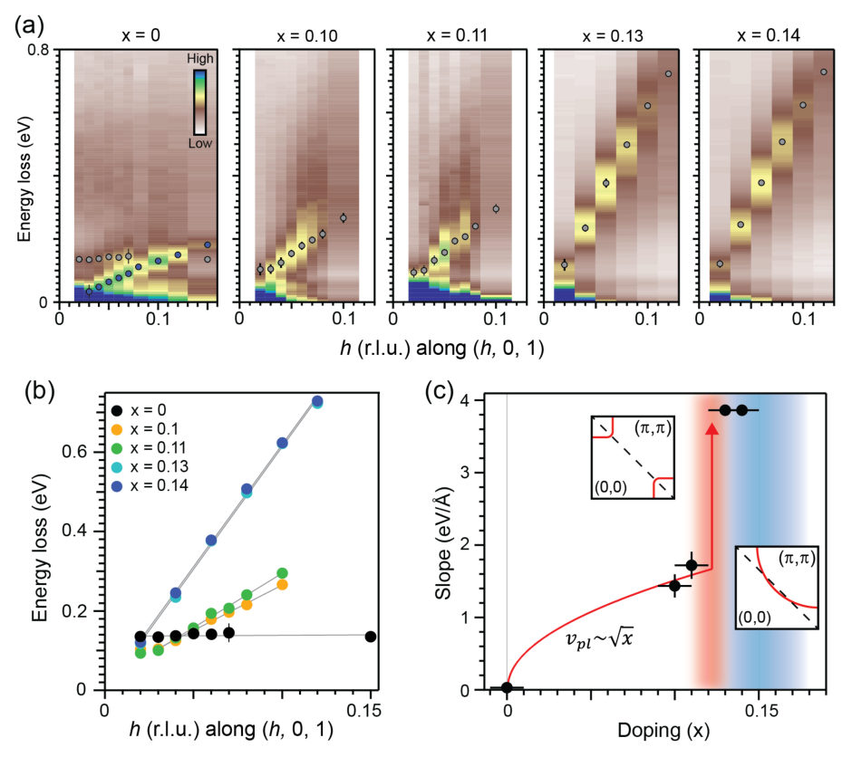 
FIG. 1. Collective charge excitations in Nd2−xCexCuO4 revealed by RIXS. (a) Color plots of energy-momentum RIXS spectra at different dopings measured with σ-polarized incident photons along the (h, 0, 1) direction. The doping levels, defined by the Ce content, are indicated above each panel. Grey dots indicate the fitted positions of the dispersive low energy charge excitations. In the x = 0 sample, blue dots represent the magnon excitation and the grey dots represent the nearly dispersionless charge excitation. (b) Dispersions of the low energy charge excitation extracted from fits of the RIXS spectra for different dopings. Uncertainties are derived from the one-sigma fit confidence...

📷 Fig 2

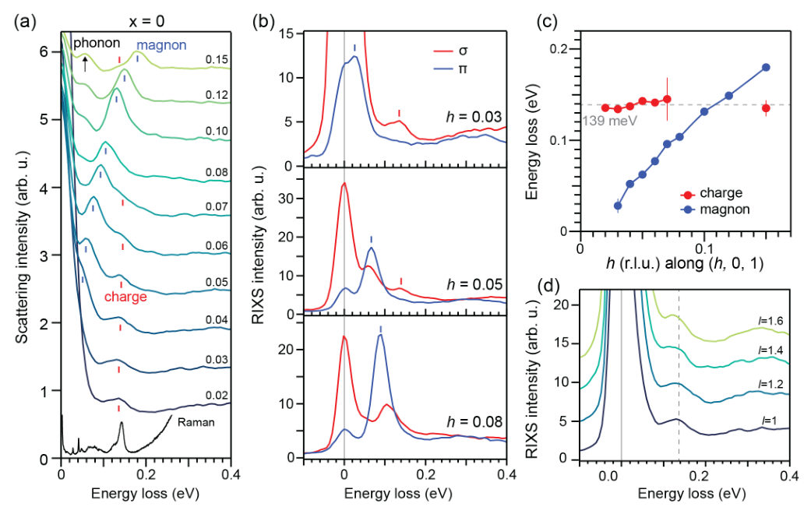 
FIG. 2. Low energy charge excitation in Nd2CuO4. (a) RIXS energy distribution curves along (h, 0, 1) for Nd2CuO4. Numbers next to each curve indicate the h value in r.l.u. Red markers indicate the charge excitation and blue markers highlight the magnon. Arrow pointing at a low energy single phonon peak around 50 meV. Note that this should not be interpreted as the single-phonon (Ω) mode associated with the 139 meV two-phonon (2Ω) excitation. Black curve at the bottom is the Raman spectroscopy data on Nd2CuO4. (b) RIXS curves at the indicated h value along (h, 0, 1), for σ and π photon polarizations. (c) Dispersion of the magnetic and charge excitations extracted from fits of the RIXS...

📷 Fig 3

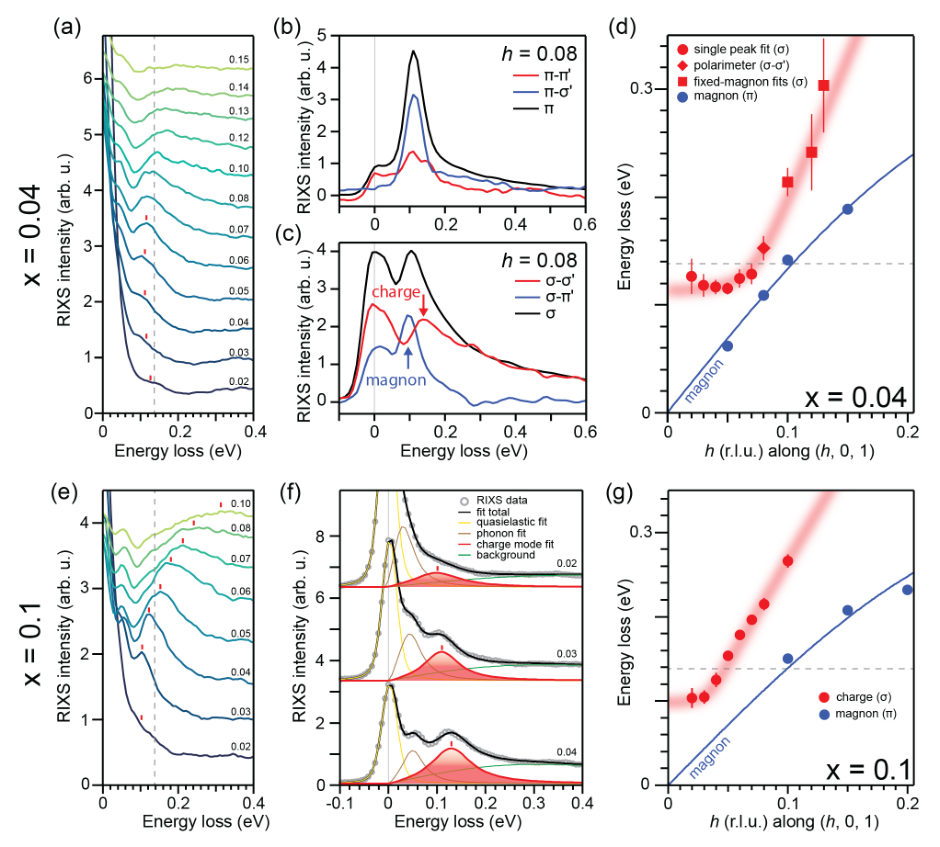 
FIG. 3. Charge excitation dispersion anomalies in doped NCCO. (a) RIXS energy distribution curves along (h, 0, 1) for Nd1.96Ce0.04CuO4. (b-c) Polarization-resolved RIXS spectra at h = 0.08 for π incident photons (b) and σ incident photons (c). Colored curves represent polarization-resolved spectra. Black curves represent spectra with integrated outgoing polarization. (d) Dispersions of excitations in the x = 0.04 sample (h, 0, 1) direction. The solid red circles, solid red diamonds, and solid red squares represent the charge excitation dispersion obtained using different analysis methods (see main text and Extended data Fig. 3). Solid blue circles represent the magnon dispersion. (e) RIXS...

📷 Fig 4

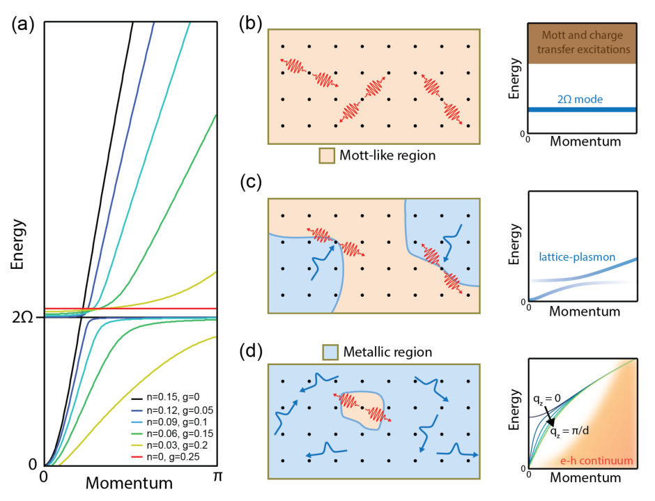 
FIG. 4. (a) Schematic of a minimal, homogeneous effective model that captures—upon spatial averaging—the hybridization between a plasmon mode and a non-dispersive 2Ωlattice excitation (see Methods for details). The plasmon velocity decreases with decreasing doping, reflecting the reduced volume fraction of metallic regions and the emergence of a nearly non-dispersive 2Ωmode associated with the Mott insulating phase. In addition, hybridization between these modes leads to an avoided crossing. Here n denotes the carrier density, g the coupling constant, and 2Ωcorresponds to twice the energy of the oxygen phonon mode responsible for the dispersion kink observed in ARPES. For simplicity, here...

**Summary.** This work uses RIXS to map the collective charge excitations in electron-doped cuprates across their phase diagram. It reveals a continuous evolution of this excitation, transforming from a plasmon to a hybrid mode, which establishes a unified picture of charge dynamics across the Mott transition. This finding links charge fluctuations directly to lattice vibrations, offering insight into the mechanism behind high-temperature superconductivity.

**Why it may be interesting.** The concept of a charge excitation mode persisting and transforming across a Mott transition via strong coupling to lattice vibrations provides a rich model for understanding emergent quantum phases in correlated materials, relevant to open quantum systems dynamics.

Detailed structure

**Main problem.** The study addresses the outstanding question of how collective charge excitations evolve across the Mott transition in strongly correlated systems like cuprates.

**Main result.** The charge excitation undergoes a continuous transformation from an acoustic plasmon in the metallic regime to a gapped hybrid mode, culminating in a nearly dispersionless 139 meV excitation at half filling.

**Method.** The research utilizes Resonant Inelastic X-ray Scattering (RIXS) measurements, complemented by comparisons with ARPES and Raman spectroscopy.

**Model / system.** The physical system is electron-doped cuprates, specifically $	ext{Nd}_{2-x}	ext{Ce}_x	ext{CuO}_4$, which are strongly correlated materials exhibiting unconventional superconductivity.

**Key observables.** Low-energy charge response, plasmon dispersion, gapped hybrid mode energy (139 meV), and comparison to oxygen breathing phonon energies.

**Important parameters / regimes.** Doping level ($x$), energy scale (139 meV), and the transition across the Mott insulating to metallic state.

**Assumptions / limitations.** The charge excitation is understood as a hybrid mode formed by strong coupling between the plasmon and lattice degrees of freedom ($2\Omega$ excitation).

**Figures summary.** Figures show RIXS spectra tracking the charge excitation dispersion across doping levels, illustrating the transformation from plasmon to gapped/flat mode, and comparing this to phonon features.

**Paper structure.** The paper systematically tracks the evolution of charge excitations across the doping phase diagram, contrasting the metallic, intermediate, and half-filling regimes, and establishing a unified picture of charge dynamics.

Abstract

Metallic systems with delocalized valence electrons host collective charge density oscillations known as plasmons. On the other hand, conventional insulators do not have free electrons and the low energy charge degrees of freedom are pinned to the ions. The fate of the collective charge excitations in the intermediate regime is an outstanding question. This problem is especially important for strongly correlated systems such as the layered cuprates, where unconventional superconductivity and other emergent phenomena arise from valence electrons on the border between Mott localization and itinerancy. Using resonant inelastic X-ray scattering, we track this evolution in the prototypical electron-doped cuprate Nd2-xCexCuO4. We find a continuous transformation of the low-energy charge response: from an acoustic plasmon in the metallic regime, to a gapped hybrid mode at intermediate doping, and finally to a nearly dispersionless 139 meV excitation at half filling. Remarkably, the 139 meV excitation has approximately twice the energy of the oxygen breathing phonon responsible for the dispersion kink observed in angle-resolved photoemission spectroscopy, and is consistent with a putative 2-phonon excitation observed in Raman spectroscopy. These results establish a unified picture of collective charge excitations across the phase diagram of electron-doped cuprates, showing that such modes persist across the Mott transition via strong coupling to lattice degrees of freedom and revealing a missing link in the charge dynamics of carrier doped Mott insulators.

[↑ back to top](#top)

### [Geometry and localization: Probing Localization Landscape Theory on the Bethe Lattice](http://arxiv.org/abs/2605.29745v1)

**Authors:** Lorenzo Tonetti, Leticia F. Cugliandolo, Marco Tarzia  
**Type:** theory · **Category:** disordered systems and neural networks · **PDF:** <https://arxiv.org/pdf/2605.29745v1>  
**Analysis basis:** full PDF text, analyzed in chunks
**Topic relevance:** `Kondo & dissipative impurity` **1/5** · `analog quantum simulation` **1/5**

📷 Fig 1

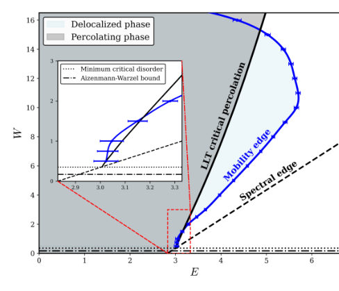 
Figure 1: The phase diagram of the Anderson model on the Bethe lattice. The black solid line and the blue data points with errorbars represent the mobility edge found with the LLT (Eperc) with minimal shift and the actual one (Eloc), respectively. The dotted and dashed-dotted horizontal lines are the minimum critical disorder, Wmin, and the Aizenman- Warzel bound [68], WAW, respectively.

📷 Fig 2

 
Figure 2: Rescaled correlation functions in the delocalized and non-percolating phases. The rescaling indicated in the key transforms the large-distance decay to the linear form const −r/ξ. W = 3.5, while the two energies are chosen separately in order to yield correlation lengths which are close in value, ξloc ∼13 and ξperc ∼15. Blue dots: Anderson eigenstate correlation with a linear tail fit in blue. Black dots: LLT percolation correlation with a linear tail fit in black. The two asymptotic behaviors differ by the extra factor r−3/2

📷 Fig 3

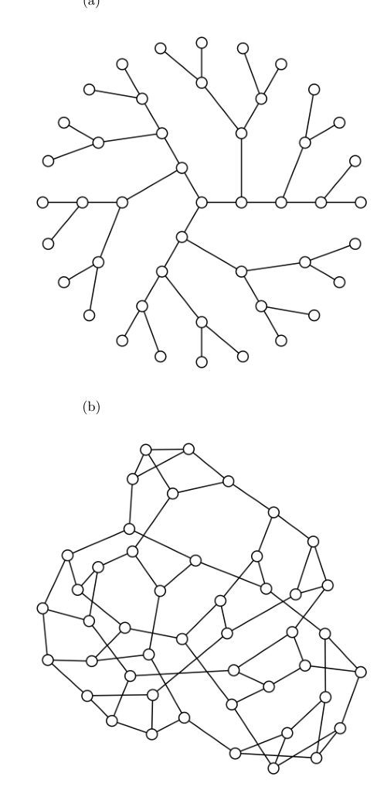 
Figure 3: Schematic representation of a Cayley tree and a random regular graph. (a) Cayley tree with 4 generations and coordination number K + 1 = 3 (thus having 46 nodes). (b) A random regular graph also with K +1 = 3 and the same number of nodes.

📷 Fig 4

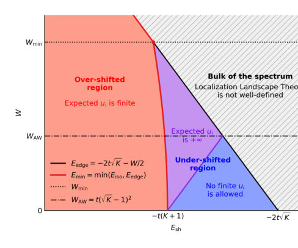 
Figure 4: Shifting regimes. The statistical properties of the Localization Landscape depend uniquely on the value of the reference energy Esh and the disorder strength W. Red re- gion: over-shifted regime, the expectation value of the Lo- calization Landscape components ui is always finite. Purple region: under-shifted regime with finite lower bound. Here the system is always in the percolating phase, but atypical finite components ui can exist. Blue region: under-shifted regime with diverging lower bound. No finite ui solution is possible; therefore, the effective potential is identically equal to zero on the whole lattice.

📷 Fig 5

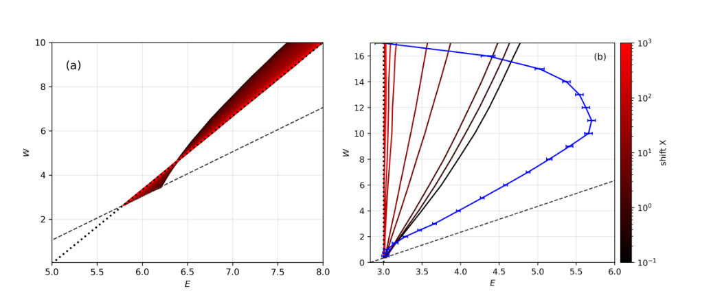 
Figure 5: Dependence of the percolation critical curve on the shift −Eedge(W) + X. (a) Critical curves for K = 5 and t = 1, obtained from the high-connectivity equations (188), (189) and (190) (using the method described in Sec. VI D 1 to evaluate the curve ¯q = 1/K) for several values of X, reported in the legend of panel (b). As X →∞, the curves approach the asymptotic line given by Eq. (117) (black dotted line). (b) Critical curves for K = 2 and t = 1, obtained from the full equations (49), (50), (83), and (94) (computed using the criterion of divergence of the correlation length as described in Sec. VI D 2) for several values of X, reported in the legend. The black dotted line denotes...

**Summary.** This work rigorously compares the Localization Landscape Theory (LLT) to Anderson localization on the Bethe lattice. The authors find that while LLT captures some features, the two transitions are fundamentally distinct, and LLT fails to reproduce the full quantum critical behavior of the Anderson model. This establishes LLT as a powerful, yet limited, tool for understanding the very low-disorder regime.

**Why it may be interesting.** It provides a rigorous theoretical benchmark, showing where a powerful classical analogy (LLT) breaks down when confronted with true quantum interference effects in disordered systems.

Detailed structure

**Main problem.** The paper compares the predictions of the Localization Landscape Theory (LLT) with the actual physics of Anderson localization, specifically on the Bethe lattice.

**Main result.** The AL transition and the LLT percolation transition are distinct, showing different critical behaviors; LLT fails to reproduce the full quantum critical properties of AL.

**Method.** The analysis uses exact solutions available on the Bethe lattice, comparing spectral properties derived from Green's functions (Anderson) against classical percolation/landscape variables (LLT).

**Model / system.** The study focuses on the Anderson model with on-site disorder potentials on the Bethe lattice, using LLT as a classical analogy for understanding the localization transition.

**Key observables.** Mobility edge ($E_{loc}$), LLT percolation threshold ($E_{perc}$), Inverse Participation Rate (IPR), Correlation functions, and Density of States (DOS).

**Important parameters / regimes.** Disorder strength ($W$), Energy ($E$), Coordination number ($K$), and the spectral shift parameter ($X$).

**Assumptions / limitations.** The Bethe lattice is used as an ideal, exactly solvable model, and the analysis relies on comparing asymptotic behaviors derived from cavity methods.

**Figures summary.** Figures compare the phase diagram showing the LLT mobility edge versus the actual AL mobility edge, and show differences in the large-distance decay of correlation functions.

**Paper structure.** The paper systematically compares the mathematical frameworks of AL and LLT on the Bethe lattice, analyzing critical exponents, spectral edges, and tail behaviors of associated probability distributions.

Abstract

The Localization Landscape Theory (LLT) offers a classical analogy for understanding Anderson localization through an effective confining potential, whose percolation threshold has been proposed to mark the mobility edge. While this correspondence shows striking numerical agreement in three dimensions, its theoretical foundations remain an open question. In this work, we extend the analysis of the LLT on the Bethe lattice presented in~\cite{Tonetti2026}. In this setting in both the Anderson localization transition and the LLT percolation problem admit exact solutions. Our analysis reveals that the two transitions are distinct, with markedly different critical behaviors. Notably, the LLT percolation transition falls into the standard mean-field universality class, in sharp contrast with the unconventional critical behavior of the Anderson transition on the Bethe lattice. Nonetheless, the LLT framework reproduces several exact results, capturing nontrivial features of the very low-disorder regime: it predicts the position of the isolated eigenvalue, the minimal disorder at which both the LLT percolation curve and the mobility edge first appear, and the Aizenman--Warzel lower bound for localization. We also study the dependence of the LLT percolation threshold on the energy shift, evaluate the LLT prediction for the Density of States, and derive several results on the statistical properties of the variables controlling the problem. Finally, we develop an extreme-value analysis showing that the LLT prediction for the Density of States overestimates the amplitude of the tails close to the boundary of the continuous spectrum. These findings provide an exact analytical benchmark showing that, despite its geometric appeal, the LLT does not generally reproduce the quantum critical properties of Anderson localization, while still offering a powerful tool to understand its very low-disorder regime.

[↑ back to top](#top)

### [Performance Analysis of Underwater Quantum Key Distribution Protocols: BB84, SARG04, and BBM92](http://arxiv.org/abs/2605.29513v1)

**Authors:** Nour Rizk, Angélique Drémeau, Arnaud Coatanhay  
**Type:** theory · **Category:** quantum information and computing · **PDF:** <https://arxiv.org/pdf/2605.29513v1>  
**Analysis basis:** full PDF text, analyzed in chunks
**Topic relevance:** `correlated / nonlocal dissipation` **1/5** · `methods for driven-dissipative` **1/5**

📷 Fig 1

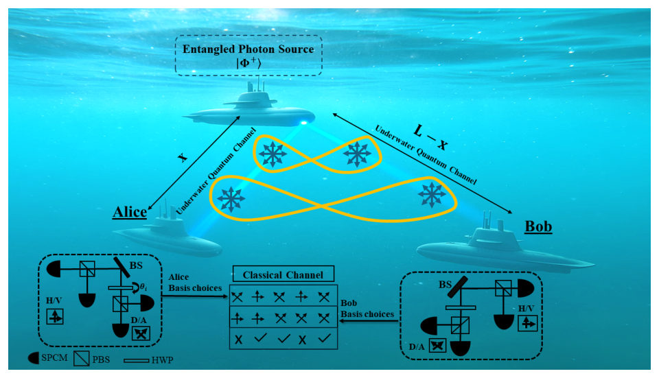 
Fig. 1. Schematic diagram of BBM92 QKD protocol, where the HWP orientation θi sets the angles of the basis states.

📷 Fig 2

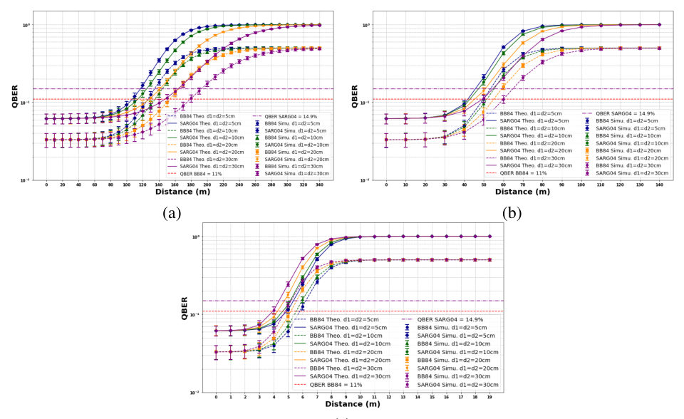 
Fig. 2. QBERBB84 and QBERSARG04 vs. distance for Scenario 1, with R0(λ) = 10−3 W/m2, and different pupil diameters in (a) clear water, (b) coastal water, and (c) turbid water.

📷 Fig 3

 
Fig. 3 shows the same experimental configuration under daytime conditions corresponding to

📷 Fig 4

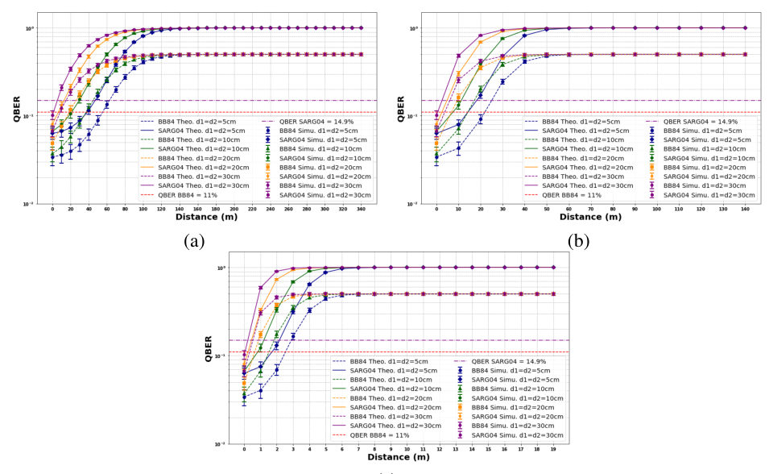 
Fig. 3. QBERBB84 and QBERSARG04 vs. distance for Scenario 5, with R0(λ) = 500 W/m2, and different pupil diameters in (a) clear water, (b) coastal water, and (c) turbid water.

📷 Fig 5

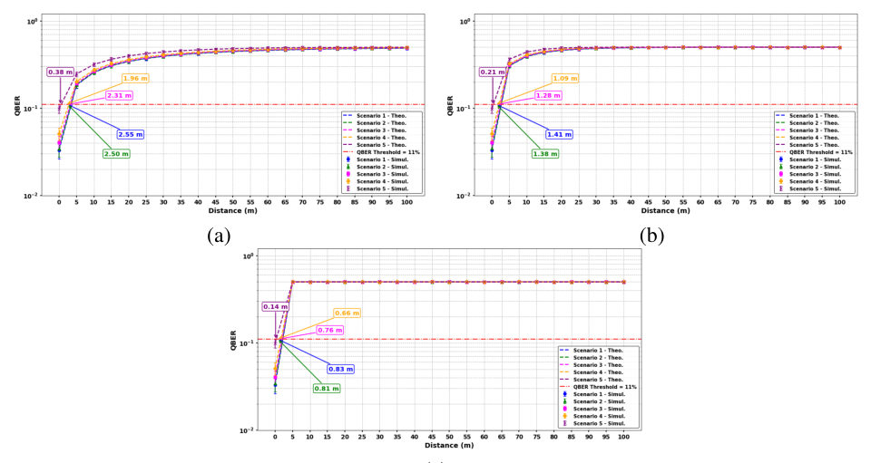 
Fig. 4. QBERBBM92 vs. distance for different scenarios, with x = L/2, in (a) clear water, (b) coastal water, and (c) turbid water.

**Summary.** This paper rigorously analyzes the performance of BB84, SARG04, and BBM92 QKD protocols over simulated underwater quantum channels. It models the complex noise effects of the water using Kraus operators to calculate key metrics like QBER and quantum correlation. The findings demonstrate that environmental factors like turbidity and ambient light are critical limitations, dictating the achievable secure communication distance.

**Why it may be interesting.** This work provides a detailed, quantitative analysis of decoherence and noise effects (depolarization, attenuation) on fundamental quantum communication protocols, which is crucial for developing practical quantum technologies in harsh environments.

Detailed structure

**Main problem.** The study analyzes the performance of three Quantum Key Distribution (QKD) protocols (BB84, SARG04, and BBM92) when implemented over a realistic underwater quantum channel.

**Main result.** The maximum secure transmission distance is highly dependent on water turbidity, ambient irradiance (day vs. night), and the specific QKD protocol used, with depolarization and scattering being major limiting factors.

**Method.** The performance is analyzed by deriving analytical expressions for the Quantum Bit Error Rate (QBER) and Quantum Gain ($Q_\mu$), which are then validated using Monte Carlo simulations.

**Model / system.** The physical system is an underwater optical channel, modeled as a noisy open quantum system. The quantum evolution is described by a Completely Positive and Trace-Preserving (CPTP) map using Kraus operators to account for attenuation and depolarization.

**Key observables.** Quantum Bit Error Rate (QBER), Quantum Correlation ($\langle\sigma_x \otimes\sigma_x
angle$), and Quantum Gain ($Q_\mu$).

**Important parameters / regimes.** Water type (clear, coastal, turbid), ambient irradiance (daytime vs. nighttime), pupil diameter, and source position relative to Alice and Bob.

**Assumptions / limitations.** The analysis assumes non-turbulent channels for some derivations, and the modeling incorporates approximations for photon statistics (Poissonian) and channel noise sources (background light, dark counts).

**Figures summary.** Figures compare QBER vs. distance for BB84 and SARG04 across different water types and irradiance levels, and show the dependence of QBER and quantum correlation on source position for BBM92.

**Paper structure.** The paper systematically compares the three protocols, deriving QBER formulas for each, modeling the non-unitary channel evolution using Kraus operators for damping and depolarization, and validating these analytical results against extensive Monte Carlo simulations across various environmental scenarios.

Abstract

Underwater quantum key distribution (UQKD) ensures unconditional communication security based on the fundamental principles of quantum mechanics. This study examines the performance of the BB84, SARG04, and the entanglement-based BBM92 protocols under the impact of both system optical parameters and the physical effects of the underwater channel. The main performance criteria considered are the quantum bit error rate (QBER) and the quantum correlation between the communicating parties as functions of the propagation distance in three types of non-turbulent seawater: clear, coastal, and turbid. For the BBM92 protocol, the quantum channel is modeled using Kraus operators, which characterize the combined effects of attenuation and depolarization on maximally-entangled photons, allowing the derivation of our analytical expression of the QBER, based on the correlation losses between measurements. Monte Carlo simulation results validate the analytical expression of the QBER for all the studied protocols, under various water types, atmospheric conditions, and system parameters. The results determine the conditions under which QKD protocols achieve optimal performance for secure and efficient underwater quantum communications.

[↑ back to top](#top)

### [Thickness-driven crossover from conventional to chiral nonreciprocal superconductivity in kagome metal CsV3Sb5](http://arxiv.org/abs/2605.29665v1)

**Authors:** Wei Zhang, Jiangbo Luo, Nikolai Peshcherenko, Zheyu Wang, Chun Wai Tsang, Kwing To Lai, King Yau Yip, Kenji Watanabe, Takashi Taniguchi, Junxiong Hu, Yang Zhang, Swee K. Goh, A. Ariando  
**Type:** experiment · **Category:** strongly correlated electrons · **PDF:** <https://arxiv.org/pdf/2605.29665v1>  
**Analysis basis:** full PDF text, analyzed in chunks
**Topic relevance:** `analog quantum simulation` **1/5** · `driven-dissipative phase transition` **1/5**

📷 Fig 1

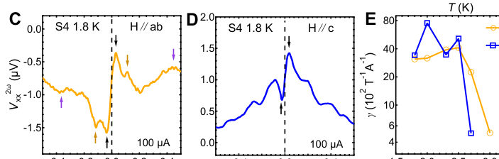 
Figure 1: Nonreciprocal second-harmonic signals in a 36 nm CsV3Sb5 flake. (A) Crystal

📷 Fig 2

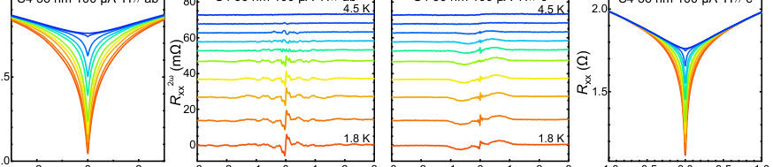 
Figure 2: Thickness dependence of nonreciprocal signals. Resistance and the odd components

📷 Fig 3

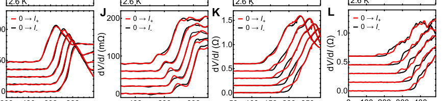 
Figure 3: Zero-field superconducting diode effect. (A to D) Zero-field 𝑉-𝐼curves measured in

📷 Fig 4

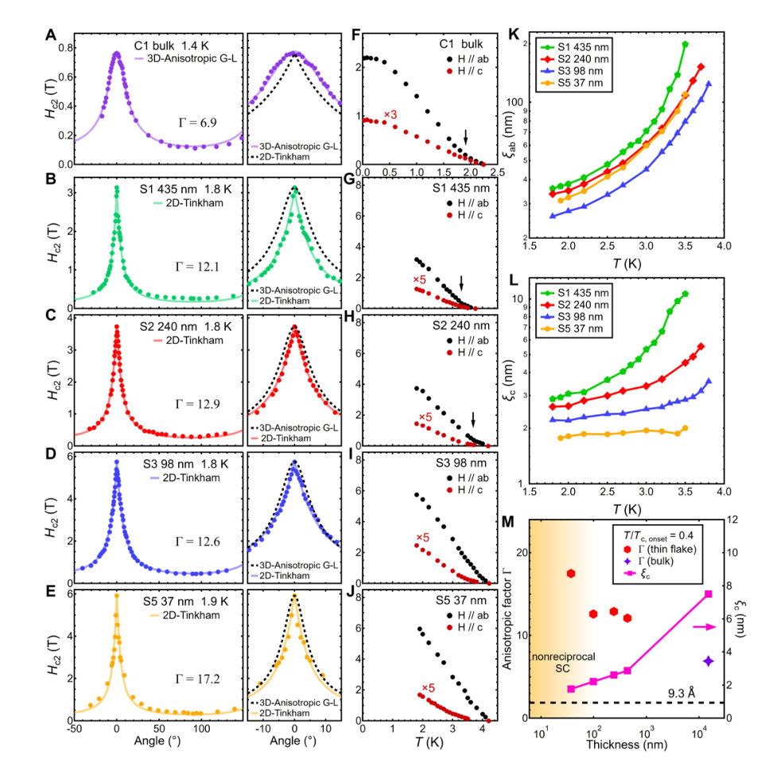 
Figure 4: Upper critical field measurements. (A to E) Angular dependence of 𝐻𝑐2 in bulk (A)

**Summary.** This work investigates the superconducting state of the kagome metal CsV3Sb5 by examining the effect of sample thickness. The authors demonstrate that as the material is thinned below a critical thickness, the superconducting pairing symmetry changes from conventional to a chiral state. This transition is evidenced by the emergence of non-reciprocal transport and a zero-field superconducting diode effect, establishing thin flakes as a platform for topological quantum devices.

**Why it may be interesting.** The observation of spontaneous time-reversal symmetry breaking and chiral superconductivity in a layered material via thickness control provides a clean platform for studying topological superconductivity, relevant to advanced quantum device engineering.

Detailed structure

**Main problem.** The study aims to resolve the pairing symmetry in the kagome metal CsV3Sb5 and understand how superconductivity evolves as the sample thickness is reduced.

**Main result.** The superconducting state undergoes a thickness-induced crossover from a conventional 3D s-wave pairing in the bulk to a 2D chiral superconducting phase that spontaneously breaks both inversion and time-reversal symmetries in ultrathin flakes.

**Method.** The research combines thickness-dependent transport measurements, zero-field superconducting diode effect (SDE) measurements, and upper critical field anisotropy studies.

**Model / system.** The physical system is the kagome metal CsV3Sb5, studied in bulk form versus exfoliated ultrathin flakes. The theoretical analysis models the superconducting state using Ginzburg-Landau functionals to predict non-reciprocal behavior and $s+is$ pairing.

**Key observables.** Nonreciprocal second-harmonic magnetotransport signals, zero-field superconducting diode effect (SDE), upper critical field anisotropy ($\Gamma$), and out-of-plane coherence length ($\xi_c$).

**Important parameters / regimes.** Thickness (critical transition around 100 nm), magnetic field ($H$), and temperature ($T$).

**Assumptions / limitations.** The non-reciprocal effects and SDE are fundamentally linked to the dimensional crossover and the breaking of P and T symmetries in the 2D limit.

**Figures summary.** Figures show the systematic disappearance of nonreciprocity and SDE as flakes become thicker, alongside data demonstrating the crossover of $H_{c2}$ anisotropy from 3D to 2D behavior as thickness decreases.

**Paper structure.** The paper systematically compares bulk measurements (suggesting s-wave) with measurements on increasingly thin flakes, using transport diagnostics (SDE, nonreciprocity) and anisotropy analysis ($H_{c2}$, $\xi_c$) to build a case for a thickness-driven chiral superconducting phase.

Abstract

Superconductivity and its potential applications are governed by the symmetry of the superconducting order parameter. In the kagome metal CsV3Sb5, most bulk studies indicate conventional s-wave pairing. However, ultrathin flakes exhibit nonreciprocal transport, in particular a zero-field superconducting diode effect, which requires broken inversion and time-reversal symmetries. Here, using thickness dependent transport measurements, we observe the emergence of non-reciprocal second-harmonic magnetotransport signals and a zero-field superconducting diode effect, accompanied by a pronounced reduction of the out-of-plane coherence length with decreasing thickness. Upper critical field measurements further reveal a dimensional crossover from three-dimensional superconductivity in bulk to two-dimensional superconductivity in thin flakes. These findings indicate a thickness-induced chiral superconducting phase that breaks both inversion and time-reversal symmetries in the two-dimensional limit. Our work not only clarifies long-standing controversies regarding the pairing symmetry in CsV3Sb5, but also establishes thin-flake kagome superconductors as a versatile platform for engineering nonreciprocal quantum devices and exploring emergent topological phases.

[↑ back to top](#top)

### [Electron momentum densities from QSGW and $G^0W^0$: Revealing the role of many-body effects within the reduced density matrix](http://arxiv.org/abs/2605.30204v1)

**Authors:** A. D. N. James, J. A. Gould, T. M. Mason, J. Jackson, S. B. Dugdale  
**Type:** both · **Category:** strongly correlated electrons · **PDF:** <https://arxiv.org/pdf/2605.30204v1>  
**Analysis basis:** full PDF text, analyzed in chunks
**Topic relevance:** `Keldysh / 2PI / non-Gaussian methods` **1/5**

📷 Fig 1

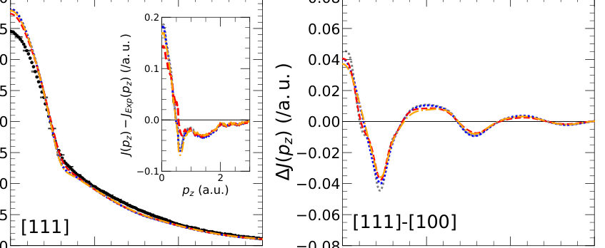 
FIG. 1. Left column: Comparison of three high-symmetry direction ([001], [011], [111]) experimental Li Compton profiles (CPs) from Sakurai et al. [33] (dots) with our Elk (LDA), Elk G0W 0, Questaal DFT, and Questaal QSGW CPs. To avoid clutter, the error bars are shown for every fifth data point and are estimated from the relative percentage error reported at pz = 0 of the Sch¨ulke et al. [34] and only serve as an indication of the scale of the error. The insets show the differences between the theory and the experimental data (without error bars) along each high symmetry direction. Right column: The theoretical directional differences of the high symmetry directions ([001], [011], [111])...

📷 Fig 2

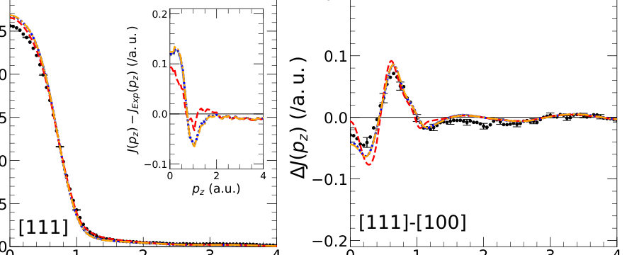 
FIG. 2. Left column: Comparison of three high-symmetry direction ([001], [011], [111]) experimental Si Compton profiles (CPs) from Erba et al. [10] (dots) with our Elk (LDA), Elk G0W 0, Questaal DFT (LDA) and QSGW CPs. The insets highlight the difference between the theoretical and experimental (without error bars) CPs. We note that the experimental profiles were normalised to the number of electrons the profiles represent up to 10 a.u.. Right column: The theoretical and experimental directional differences of the high symmetry directions ([001], [011], [111]) from the left column. We show the experimental error bars for every fifth data point. We convolute our calculations with a Gaussian...

📷 Fig 3

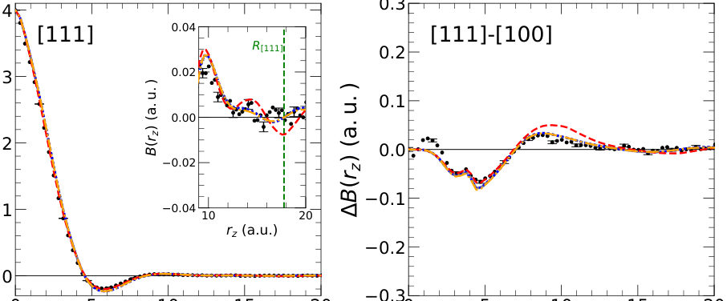 
FIG. 3. Left column: The 1D slice of the theoretical and experimental auto-correlation functions B(rz) of Si along the three high-symmetry directions ([001], [011], [111]). These were obtained by Fourier transforming the experimental and convoluted theoretical Compton profiles in Fig. 2. The inset zooms into B(rz) to highlight it at the lattice vector along each high symmetry. Right column: the auto-correlation function anisotropies between the different high symmetry directions. The presented B(rz) errors were calculated from the standard deviation of the Fourier transform of 103 experimental Compton profiles each with added random noise based on a normal distribution with the experimental...

📷 Fig 4

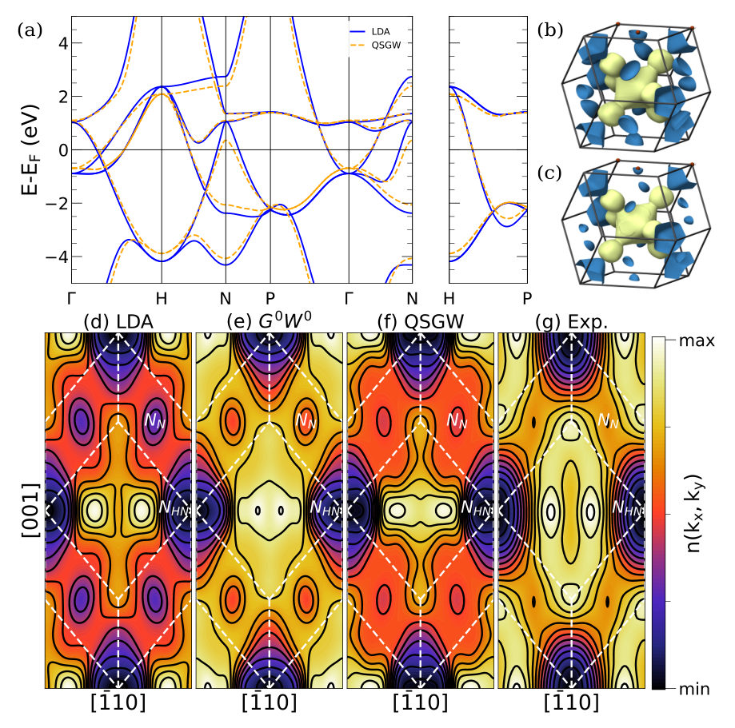 
FIG. 4. (a) The single-particle non-magnetic Cr LDA and Questaal QSGW band structures along the same path as presented in Ref. [67]. The corresponding Fermi surface of Cr as described by the (b) LDA and (c) QSGW. The 2D (once projected) occupation densities n(kx, ky) along the [110] high symmetry direction from (c) LDA, (d) Elk G0W 0, (e) Questaal QSGW and (e) the reconstruction from Dugdale et al. [12, 68]. These theoretical n(kx, ky) are non-magnetic. We note that the presented LDA plots are from Questaal but Elk gives consistent plots for its LDA results. We convolute our n(kx, ky) calculations with a 2D Gaussian (0.18 a.u. FWHM) to simulate the experimental resolution. Some projected...

📷 Fig 5

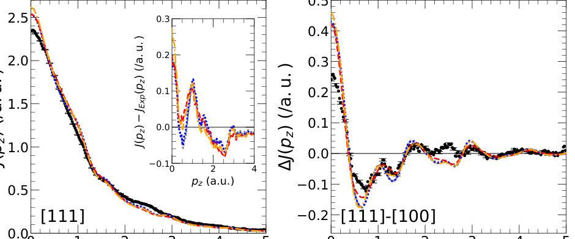 
FIG. 5. Left column: Comparison of three high-symmetry direction ([001], [011], [111]) experimental Cr Compton profiles (CPs) from Dugdale et al. [12, 68] (dots with estimated error bars) with our non-magnetic Questaal LDA, Elk LDA, Elk G0W 0 and QSGW CPs. The insets highlight the difference between the theoretical and experimental (without error bars) CPs. Right column: The theoretical and experimental directional differences of the high symmetry directions ([001], [011], [111]) from the left column. The experimental error has been plotted for every fifth data point. We convolute our calculations with an experimental resolution function (0.18 a.u. FWHM).

**Summary.** This work investigates how well theoretical methods predict the electron momentum density by comparing calculated Compton profiles against experimental measurements for several elements. The authors find that while advanced methods like QSGW improve upon DFT, the inclusion of the full many-body reduced density matrix, as captured by $G^0W^0$, is essential for achieving the best agreement with experiment. This highlights the critical role of correlation effects in determining the true electronic structure.

**Why it may be interesting.** The focus on probing the many-body nature of the ground state via Compton scattering provides a unique, highly sensitive diagnostic tool to validate complex correlated electron theories beyond standard band structure calculations.

Detailed structure

**Main problem.** Assessing the accuracy of theoretical methods in describing the ground-state many-body electron momentum density (EMD) by comparing predictions to experimental Compton scattering data.

**Main result.** The use of the many-body reduced density matrix, particularly within the $G^0W^0$ framework, significantly improves agreement with experimental Compton profiles compared to single-particle approximations like DFT or QSGW.

**Method.** Theoretical calculations employ advanced many-body perturbation theory methods, specifically QSGW and $G^0W^0$, to compute the EMD, which is then used to predict the Compton profile.

**Model / system.** The study applies these methods to several elemental materials, including Li, Si, Cr, and Ni, to test the robustness of the theoretical framework across different electronic structures.

**Key observables.** Compton profile ($J(p_z)$), Electron Momentum Density ($
ho(\mathbf{p})$), and the auto-correlation function ($B(r)$).

**Important parameters / regimes.** The comparison hinges on the distinction between single-particle descriptions (DFT, QSGW) and those incorporating full many-body occupation effects ($G^0W^0$).

**Assumptions / limitations.** The primary approximations involve the use of the $G^0W^0$ self-energy approximation and the reliance on the reduced density matrix formalism to capture correlation effects.

**Figures summary.** Figures compare experimental Compton profiles and directional differences for Li, Si, Cr, and Ni against predictions from DFT, QSGW, and $G^0W^0$ across various high-symmetry directions.

**Paper structure.** The paper systematically compares results for multiple materials (Li, Si, Cr, Ni), first establishing the theoretical framework (DFT vs. GW methods) and then demonstrating, through specific material examples, that incorporating the many-body reduced density matrix is crucial for matching experimental observables.

Abstract

The ground-state many-body electron momentum density, which can be probed by x-ray Compton scattering, holds insights into the electronic structure of materials. Comparisons between the measured so-called Compton profiles and the theoretical ones are invaluable in assessing the successes and failures of the methodology used to generate the theoretical ground-state electronic structure. Here, we present calculations of the Compton profiles of Li, Si, Cr, and Ni using the state-of-the-art QSGW method within the Questaal package compared with density functional theory (DFT), one-shot $GW$ ($G^0W^0$) predictions and with experiment. This comparison reveals significant differences between the QSGW and $G^0W^0$ methods which we attribute to the distinction between the single particle density provided by the QSGW method and the many-body density that we construct from the $G^0W^0$ theory; although in general the QSGW description of the electronic structure is superior to that of $G^0W^0$, we find the use of the many-body reduced density matrix is key to improving the agreement of the Compton profile with experiment.

[↑ back to top](#top)

### [Non-Abelian Mixer for QAOA on Hybrid Oscillator-Qubit Quantum Processors](http://arxiv.org/abs/2605.30234v1)

**Authors:** Thinh Le, Hansika Weerasena, Jianqing Liu  
**Type:** theory · **Category:** quantum information and computing · **PDF:** <https://arxiv.org/pdf/2605.30234v1>  
**Analysis basis:** full PDF text, analyzed in chunks
**Topic relevance:** `analog quantum simulation` **1/5**

📷 Fig 1

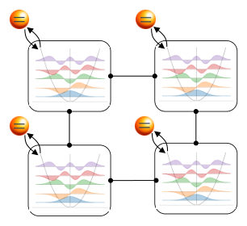 
Fig. 1: Schematic of a hybrid CV-DV quantum processor, illustrated with superconducting microwave resonators locally coupled to superconducting qubits and neighboring resonators coupled by beam splitters.

📷 Fig 2

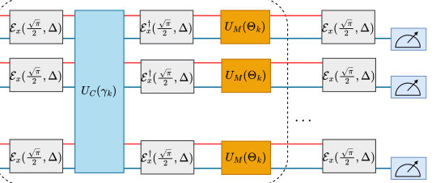 
Fig. 2: Hybrid CV-DV QAOA circuit for the proposed ansatz. In each layer k, Ex(√π/2, ∆) couples the GKP-encoded oscillator modes to the ancilla register, the Max-Cut cost unitary UC(γk) applies graph-dependent phases, and E† x(√π/2, ∆) transfers these phases back to the GKP encoding. The local mixers U (i) M (Θk) are then applied across oscillator–qubit pairs. A final Ex(√π/2, ∆) is applied before qubit readout. Here, mi and qi denotes the i-th oscillator mode and ancilla qubit, respectively.

📷 Fig 3

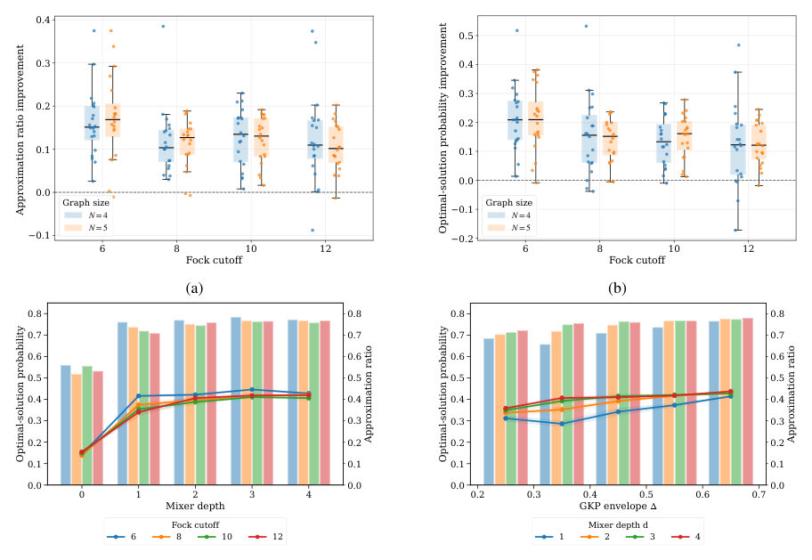 
Fig. 3: Numerical results for the proposed non-Abelian mixer: (a) and (b) show the improvement of the proposed mixer over the standard transverse-field mixer across 20 random graph instances, measured in approximation ratio and optimal-solution probability, respectively. (c) shows the mean performance over repeated optimizations as a function of mixer depth d with N = 4 graph instance and ∆= 0.45. (d) shows the corresponding mean performance as a function of ∆at fixed N = 4 and Nmax = 10. In (c) and (d), bars denote optimal-solution probability and lines denote approximation ratio.

📷 Fig 4

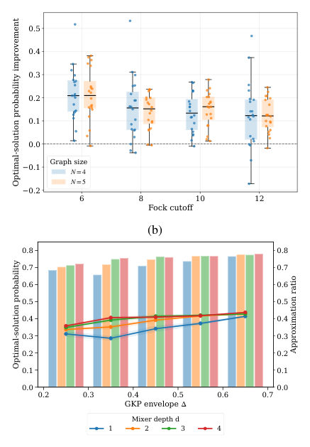 
Fig. 3a and 3b compare the proposed NA-QSP mixer with the standard transverse-field mixer by reporting the improvement in each metric. Here, improvement refers to the difference between the corresponding metric obtained with the NA-QSP mixer and that obtained with the transverse- field mixer. The most important observation is that the NA- QSP mixer yields a consistently positive improvement in both approximation ratio and optimal-solution probability across all

**Summary.** This paper introduces a novel, hardware-native non-Abelian mixer designed for running QAOA on hybrid oscillator-qubit quantum processors. By implementing this mixer, the authors significantly improve the performance metrics—including solution quality and optimal sampling probability—for solving the Max-Cut problem compared to standard mixers. This work suggests a general principle: algorithmic design should leverage the specific, non-Abelian control primitives available on the target quantum hardware.

**Why it may be interesting.** It provides a concrete, hardware-aware algorithmic improvement for variational quantum algorithms (QAOA) on emerging hybrid quantum hardware, which is highly relevant for researchers working on quantum control and quantum computation.

Detailed structure

**Main problem.** The paper addresses the need for advanced quantum algorithms, specifically QAOA, tailored for the unique architecture of hybrid continuous-variable (CV) and discrete-variable (DV) quantum processors.

**Main result.** The proposed hardware-native non-Abelian mixer consistently outperforms the standard transverse-field mixer, leading to measurable improvements in both the expected solution quality and the probability of finding an optimal solution for the Max-Cut problem.

**Method.** The authors developed a hybrid CV-DV QAOA ansatz utilizing a non-Abelian mixer, which was then rigorously benchmarked against the standard mixer using simulation techniques.

**Model / system.** The system models a hybrid quantum processor coupling bosonic oscillators (encoded via GKP states) to discrete qubits. The problem solved is the Max-Cut problem, governed by a specific cost Hamiltonian.

**Key observables.** Approximation ratio and the probability of sampling an optimal solution ($P_{opt}$).

**Important parameters / regimes.** Graph size ($N=4, N=5$), mixer depth ($d$), and the GKP envelope parameter ($\Delta$).

**Assumptions / limitations.** The analysis assumes the feasibility of implementing the non-Abelian mixer using native hardware primitives like conditional displacements and single-qubit rotations.

**Figures summary.** Figures compare the performance improvement of the NA-QSP mixer versus the standard mixer across different graph sizes and show the dependence of performance on mixer depth and the GKP parameter $\Delta$.

**Paper structure.** The paper first establishes the gap in QAOA development for hybrid CV-DV systems. It then proposes the non-Abelian mixer and the corresponding ansatz. Finally, it evaluates this ansatz by benchmarking its performance against existing mixers using quantitative metrics.

Abstract

The realization of universal control in hybrid oscillator-qubit quantum processors enables the systematic design and implementation of quantum algorithms. However, the algorithmic development for such platforms remains at an early stage. While the Quantum Approximate Optimization Algorithm (QAOA) has been extensively studied in both continuous-variable (CV) and discrete-variable (DV) quantum systems, its development in the hybrid CV-DV setting remains limited. In this paper, we propose a hardware-native non-Abelian mixer for QAOA on hybrid CV-DV quantum processors and develop a corresponding hybrid ansatz for the Max-Cut problem. We evaluate the proposed ansatz on unweighted Erdős-Rényi graphs and benchmark it against the standard transverse-field mixer using the approximation ratio and optimal-solution probability. Across all graph sizes and Fock cutoffs in our simulations, the proposed non-Abelian mixer consistently improves both expected solution quality and the probability of sampling an optimal solution relative to the transverse-field mixer. These results indicate that the proposed non-Abelian mixer is a promising building block for QAOA on hybrid oscillator-qubit platforms.

[↑ back to top](#top)

### [Order-disorder trade-off in dirty quantum systems](http://arxiv.org/abs/2605.28949v1)

**Authors:** Jinmin Yi, Chong Wang  
**Type:** theory · **Category:** disordered systems and neural networks · **PDF:** <https://arxiv.org/pdf/2605.28949v1>  
**Analysis basis:** full PDF text, analyzed in chunks
**Topic relevance:** `analog quantum simulation` **1/5**

📷 Fig 1

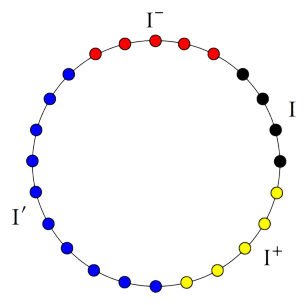 
FIG. 1. Adapted from Ref. [11]. Example of I± notation: the spins in the interval I are shown in black; the spins in I−and I+ are shown in red and yellow; and the spins in I′ ≡  I−∪I ∪I+c are shown in blue. The region I′ is buffered from I by I±.

**Summary.** This work proves a fundamental trade-off theorem stating that a gapped quantum system cannot simultaneously exhibit both long-range order and long-range disorder in the presence of quenched disorder. By analyzing correlation functions and rare-region effects, the authors provide a powerful, rigorous tool to classify disordered quantum phases, extending concepts like the Lieb-Schultz-Mattis theorem to dirty systems.

**Why it may be interesting.** The rigorous mathematical framework connecting order and disorder parameters provides powerful diagnostic tools for characterizing topological phases in the presence of realistic disorder, which is a major challenge in condensed matter theory.

Detailed structure

**Main problem.** The paper establishes a rigorous trade-off theorem governing the coexistence of order and disorder parameters in gapped quantum spin systems subjected to quenched disorder.

**Main result.** For gapped ensembles, the system must possess either a non-zero order parameter or a non-zero disorder parameter, but not both; this trade-off extends to nearly gapped regimes.

**Method.** The proof combines probabilistic arguments, utilizing concepts like the Local Perturbation Principle and analyzing the incompatibility of local ordering and disordering events.

**Model / system.** The study focuses on one-dimensional quantum spin systems (e.g., Ising chains) with quenched disorder, analyzed via ensemble averages of correlation functions.

**Key observables.** Order parameter (long-range correlation $\langle O_i O_j 
angle$) and Disorder parameter (string correlator $\langle O_i O_j \prod S_k 
angle$).

**Important parameters / regimes.** The gap size ($\epsilon$), the disorder strength, and the decay rate of rare-region probabilities ($p|R|$).

**Assumptions / limitations.** The analysis assumes the system is gapped or nearly gapped, and relies on the Local Perturbation Principle (LPPL) for bounding correlations.

**Figures summary.** Figures illustrate the notation for defining local operators on disjoint intervals ($I, I', I_\pm$) used in the rigorous mathematical proof structure.

**Paper structure.** The paper develops the trade-off theorem by first establishing the necessary conditions for order/disorder parameters in gapped systems, then extending this to nearly gapped regimes, and finally applying the result to derive constraints like the disordered Lieb-Schultz-Mattis theorem.

Abstract

We prove a trade-off theorem for order and disorder parameters in one-dimensional quantum spin systems with quenched disorder. For a disordered ensemble with exact Ising symmetry and average translation symmetry, any gapped ensemble must have one and only one of the following: an $O(1)$ order parameter or an $O(1)$ disorder parameter with even parity, both of the Edwards-Anderson type. The result extends to nearly gapped ensembles that accommodate Griffiths-type rare-region effects. These results offer a powerful and rigorous framework to understand the disorder effects beyond perturbative approaches. As applications, we (1) establish the existence of string order parameters for SPT phases; (2) derive a Lieb-Schultz-Mattis-type constraint for disordered ensembles, which requires a nearly gapped ensemble to spontaneously break the symmetry; and (3) discuss similar trade-off relations for disordered fermion chains, leading to an improved understanding of certain "intrinsically disordered" topological phases.

[↑ back to top](#top)

### [Quantitative semidefinite certificates for ground-state energies of Pauli Hamiltonians](http://arxiv.org/abs/2605.29959v1)

**Authors:** Igor Klep, Nando Leijenhorst, Victor Magron  
**Type:** theory · **Category:** quantum information and computing · **PDF:** <https://arxiv.org/pdf/2605.29959v1>  
**Analysis basis:** full PDF text, analyzed in chunks
**Topic relevance:** `analog quantum simulation` **1/5**

📷 Fig 1

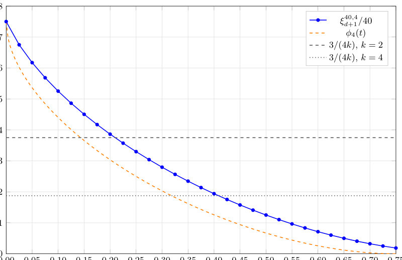 
Figure 1: Normalized smallest Krawtchouk roots controlling the convergence rates in Theorems 1 and 2. The solid curve shows ξ40,4 d+1/40, while the dashed orange curve is the asymptotic limit ϕ4(t) =

**Summary.** This paper develops rigorous mathematical guarantees for approximating the ground-state energy of Pauli Hamiltonians using semidefinite programming relaxations. By adapting kernel methods from commutative algebra to the noncommutative Pauli algebra, the authors establish explicit, quantitative convergence rates for the approximation error. These results provide the first such guarantees for this important class of quantum many-body problems.

**Why it may be interesting.** This work provides rigorous, quantitative mathematical tools to analyze quantum many-body problems, which is crucial for understanding the computational complexity and feasibility of finding ground states in quantum simulation or quantum computation.

Detailed structure

**Main problem.** The paper addresses the need for quantitative, explicit finite-level convergence rates for semidefinite programming and noncommutative sum-of-squares hierarchies used to certify ground-state energies of Pauli Hamiltonians.

**Main result.** The authors prove explicit error bounds for both lower and upper bound hierarchies, showing the error decays at a rate controlled by the smallest root of a Krawtchouk polynomial, $\xi_{n,4}^{d+1}/n$.

**Method.** The core method involves adapting the Christoffel–Darboux kernel technique from commutative polynomial optimization to the noncommutative Pauli algebra using specialized reproducing kernels.

**Model / system.** The study focuses on the $k$-local Hamiltonian problem on $n$ qubits, where the Hamiltonian is represented by a polynomial in the Pauli algebra. The results are generalized to arbitrary $k$-local Hamiltonians by embedding them into an even-weight Hamiltonian on $n+1$ qubits.

**Key observables.** The primary observables are the true ground-state energy ($\lambda_{\min}(p)$) and the bounds derived from the hierarchies ($
u_d(p)$ and $\mu_d(p)$).

**Important parameters / regimes.** The convergence rate depends on the number of qubits ($n$), the hierarchy level ($d$), and the polynomial degree ($k$).

**Assumptions / limitations.** The main theorems require the Hamiltonian polynomial to be even-weight (containing only even-weight Pauli terms). The analysis relies on constructing specific reproducing kernels for the Pauli algebra.

**Figures summary.** Figure 1 compares the normalized smallest Krawtchouk roots ($\xi_{40,4}^{d+1}/40$) against the relaxation fraction $d/n$, illustrating the convergence rate towards an asymptotic limit $\phi_4(t)$.

**Paper structure.** The paper develops the theory by first establishing the necessary kernel constructions for the Pauli algebra, then deriving the explicit error bounds for the lower and upper bound hierarchies, and finally generalizing the results to arbitrary Hamiltonians via qubit embedding.

Abstract

The $k$-local Hamiltonian problem is a central model for quantum many-body systems and Hamiltonian complexity. Semidefinite programming and noncommutative sum-of-squares hierarchies provide systematic certificates for ground-state energies, but existing finite-convergence results give no quantitative guarantee on the accuracy of the low hierarchy levels accessible in computation. We prove explicit finite-level convergence rates for these hierarchies in the Pauli setting. For $k$-local Hamiltonians whose Pauli expansion contains only even-weight terms, we show that both the NPA-type lower-bound hierarchy and the upper-bound hierarchy on the spectral minimum have error at most $C(k)ξ^{n,4}_{d+1}/n$, where $ξ^{n,4}_{d+1}$ is the smallest root of a Krawtchouk polynomial and $C(k)$ is independent of the number of qubits $n$ and the hierarchy level $d$. General $k$-local Hamiltonians reduce to this even-weight case by adding one ancilla qubit while preserving the spectrum. The proof constructs almost-reproducing kernels for the Pauli algebra and relates their spectra to Krawtchouk polynomials, giving a noncommutative analogue of recent kernel-based convergence analyses for commutative polynomial optimization. These results provide the first quantitative finite-level accuracy guarantees for noncommutative semidefinite relaxations of Pauli Hamiltonians.

[↑ back to top](#top)

### [Quantum error correction and fault tolerance: A comprehensive tutorial](http://arxiv.org/abs/2605.29137v1)

**Authors:** Daniel J. Spencer, Shubham P. Jain, Andrew Tanggara, Zeen Sun, Tobias Haug, Derek Khu, Kishor Bharti  
**Type:** theory · **Category:** quantum information and computing · **PDF:** <https://arxiv.org/pdf/2605.29137v1>  
**Analysis basis:** full PDF text, analyzed in chunks
**Topic relevance:** `entanglement & information structure` **1/5**

📷 Fig 1

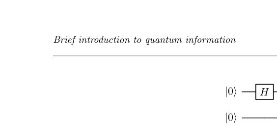 
Figure 2: Quantum circuit that prepares the two-qubit Bell state |Φ+⟩= 1 √

📷 Fig 2

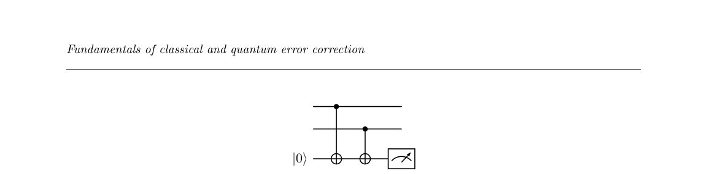 
Figure 3: Quantum circuit for measuring the joint parity of two qubits. Ancilla measurement of 1 implies odd parity, while 0 implies even parity.

📷 Fig 3

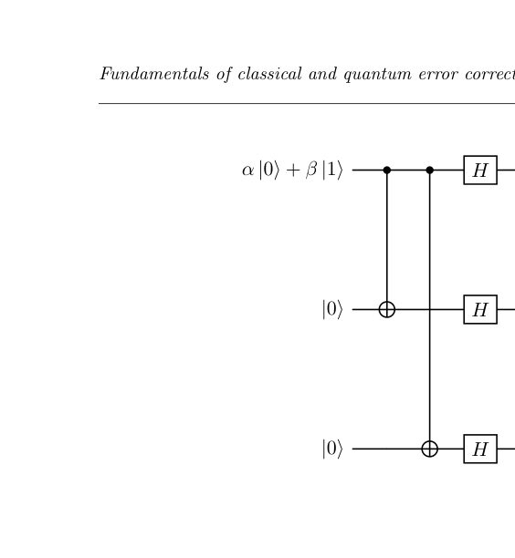 
Figure 4: Quantum circuit for encoding a single qubit into the nine-qubit Shor code.

📷 Fig 4

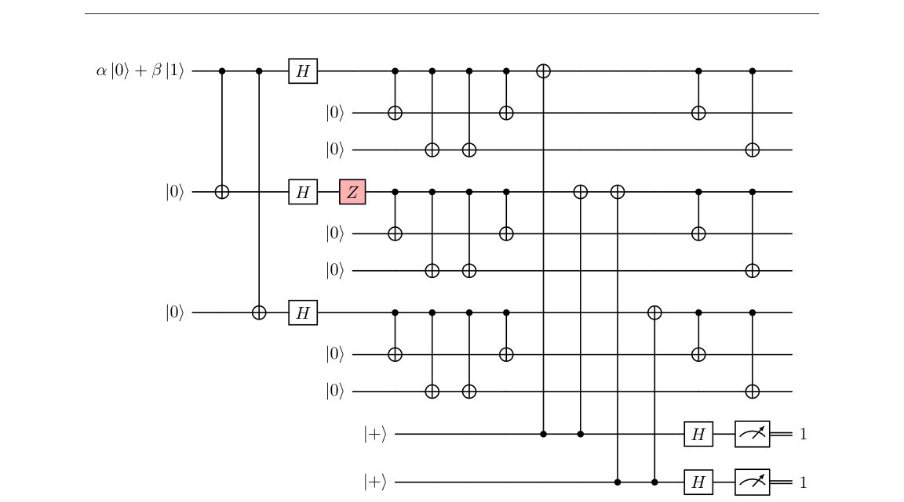 
Figure 5: Quantum circuit illustrating a single Z error on the middle block of the nine-qubit Shor code, followed by a syndrome measurement that identifies which block the error occurred in. The syndrome outcome 11 indicates that the Z error occurred on the middle block of three qubits. The full syndrome- extraction circuit is larger and measures all relevant X- and Z-type syndromes; here we show only the part relevant to the illustrated Z error.

📷 Fig 5

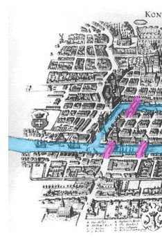 
Figure 7: Map of the seven bridges of Königsberg. Photo credit: Wikipedia.

**Summary.** This tutorial offers a comprehensive, guided introduction to Quantum Error Correction (QEC), addressing the fundamental challenge of noise in quantum computation. It systematically develops the necessary concepts—from stabilizers and syndromes to advanced code families like qLDPC and topological codes—to achieve fault-tolerant quantum computation. The paper is essential for understanding the theoretical tools required to build reliable quantum hardware.

**Why it may be interesting.** It is highly relevant as it provides the theoretical roadmap for achieving fault tolerance, which is the central goal for any theoretical physicist working on scalable quantum computation.

Detailed structure

**Main problem.** The primary obstacle to building useful quantum computers is environmental noise, which necessitates the use of Quantum Error Correction (QEC) to protect fragile quantum information.

**Main result.** The tutorial provides a comprehensive, operational guide to modern QEC, covering core concepts from stabilizer codes to advanced families like qLDPC and topological codes.

**Method.** The paper develops concepts by building a mathematical framework, starting from quantum postulates, extending to classical error correction analogies, and culminating in the theory of fault-tolerant computation.

**Model / system.** The focus is on abstract quantum information models (qubits, Hilbert spaces) and various error-correcting codes (e.g., Surface Codes, qLDPC codes) designed to encode logical information across many physical qubits.

**Key observables.** Logical failure rates, code distance (d), error thresholds, and the ability to detect and correct specific error types (bit flips, phase flips).

**Important parameters / regimes.** Physical error rates ($10^{-4}$ to $10^{-3}$), required logical error rates ($10^{-9}$ or lower), and the physical qubit overhead required for fault tolerance.

**Assumptions / limitations.** The discussion assumes the existence of a physical mechanism (QEC) capable of overcoming noise, and it builds upon the mathematical formalism of quantum mechanics (unitary evolution, measurement postulates).

**Figures summary.** Figures illustrate the basic structure of quantum circuits, showing wires, unitary gates (like CNOT), and measurement points, alongside examples of preparing entangled states like the Bell state.

**Paper structure.** The tutorial progresses logically: first establishing the mathematical foundations of quantum states and evolution; then introducing the necessity of QEC due to noise; followed by covering core concepts (codes, syndromes, stabilizers); and finally detailing advanced code families and fault-tolerance protocols.

Abstract

Noise is one of the central obstacles to building useful quantum computers, and quantum error correction (QEC) provides the framework for protecting quantum information against it. Unlike classical error correction, QEC must preserve fragile quantum states without copying them, measuring them directly, or destroying the information they encode. Driven by rapid progress in both theory and experiment, this challenge has grown into one of the most active areas of quantum information science. This tutorial gives a guided introduction to modern QEC, developing the core concepts of codes, syndromes, stabilizers, decoding, and fault tolerance before connecting them to major code families and current research directions. We cover both established constructions and newer developments, including topological and subsystem codes, bosonic and qudit codes, dynamical codes, and quantum low-density parity-check (qLDPC) codes. The emphasis is on building operational understanding: explaining not only what the main objects are, but how they are used in code design, error diagnosis, decoding, and fault-tolerant computation. The tutorial is intended for newcomers seeking a first path through QEC, as well as researchers looking for a coherent reference for the concepts, code families, and tools that arise in current work.

[↑ back to top](#top)

### [Quantum Spin-5/2 Blume-Capel Model in a Random Transverse-Crystalline Field Anisotropy](http://arxiv.org/abs/2605.30125v1)

**Authors:** Claudio M. Salgado, Karollaine C. Leite, Thiago M. Tunes, Marcelo F. Z. de Arruda, Jorge L. B. de Faria, Alberto S. de Arruda  
**Type:** theory · **Category:** statistical mechanics · **PDF:** <https://arxiv.org/pdf/2605.30125v1>  
**Analysis basis:** full PDF text, analyzed in chunks
**Topic relevance:** `analog quantum simulation` **1/5**

📷 Fig 1

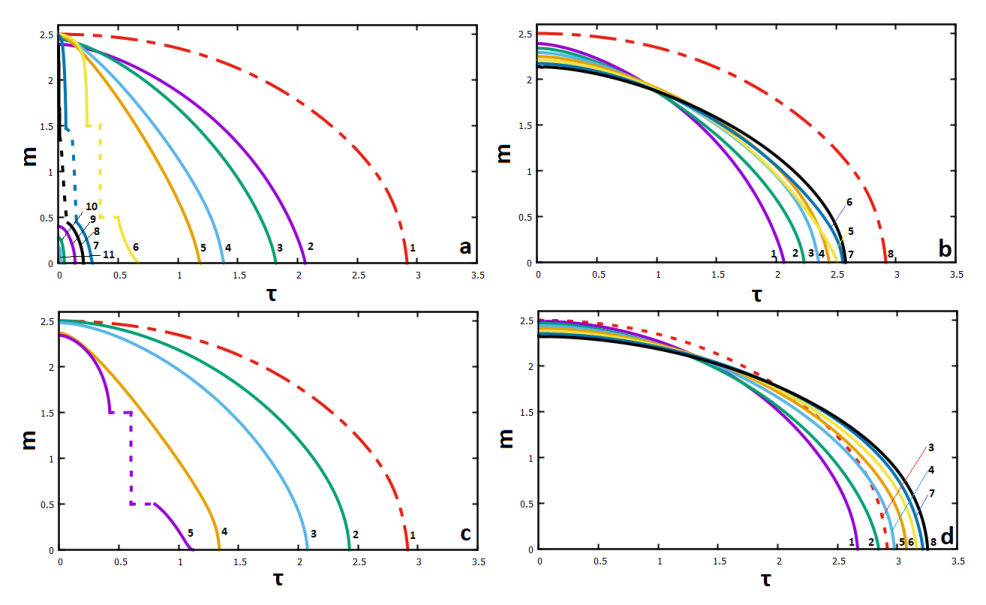 
Figure 1: Diagram of magnetization versus temperature (m −τ plane). Figure (a) presents the effects of single-ion anisotropies with δy = 0.5 fixed and δx varying. Curve 1 δy = 0.5, δx = 0.0 - dashed and dotted line - pure model. The curves from 2 to 11 δx = 0.0 the anisotropies have δy = 0.5 and δx = 0.0, 0.2, 0.4, 0.45, 0.5, 0.6, 0.7, 0.8, 1.0, 1.2, respectively. Figure (b) corresponds to δy = 0.5 and negative δ, varying δx = −1.2, −1.0, −0.8, 0.6, −0.4, −0.2, 0.0 referring to curves 1 to 7, respectively. Figure (c) corresponds to δy = 0.2 and δx = 0.0, 0.2, 0.4, 0.6, 0.62 linked to curves 1 to 5, respectively. Figure (d) corresponds to δy = 0.2 and δx = 0.0, −0.2, −0.4, −0.6, −0.8, −1.0,...

📷 Fig 2

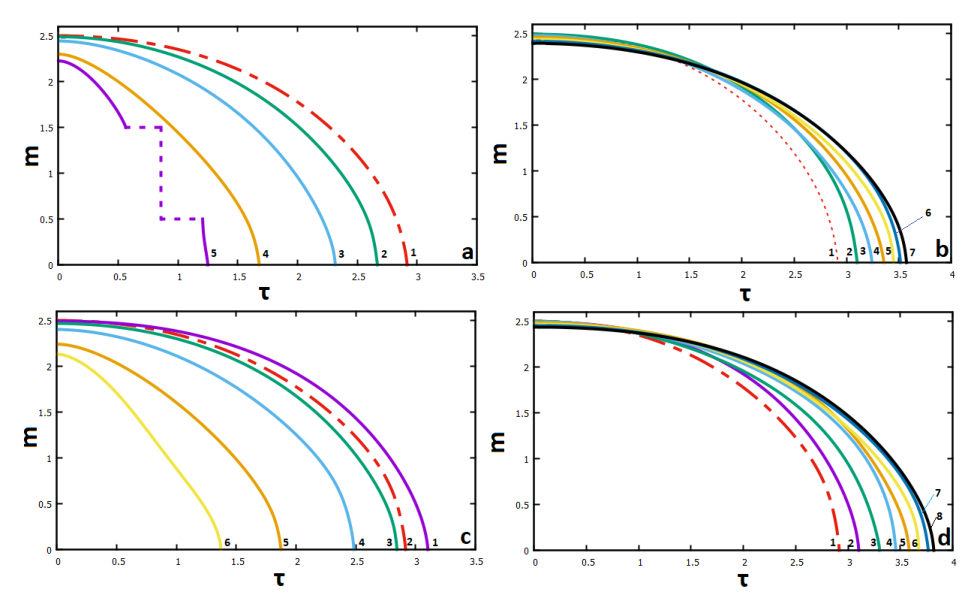 
Figure 2: Diagram of magnetization versus temperature in (m −τ) plane. Figure (a) presents the effects of single-ion anisotropies with δy = 0.0 fixed and δx varying. Curve 1 (δy = 0.0, δx = 0.0), represented by a dashed–dotted line, corresponds to the pure model. The curves from 2 to 6 (δx = 0.2, 0.4, 0.6, 0.65) represent the effects of anisotropy. Figure (b) - Curve 1 (δy = 0.0, δx = 0.0), represented by a dashed–dotted line, corresponds to the pure model. The curves from 2 to 7 (δx = −0.2, −0.4, −0.6, −0.80, −1.0, −1.2) represent the effects of anisotropy. Figure (c) presents the effects of single-ion anisotropies with δy = −0.2 fixed and δx varying. The pure case is represented by curve...

📷 Fig 3

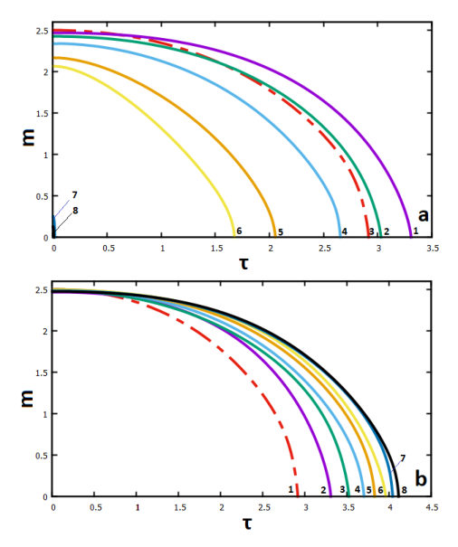 
Figure 3: Diagram of magnetization versus temperature in (m −τ) plane. Figure (a) presents the effects of single-ion anisotropies with δy = 0.5 fixed and δx varying. Curve 1 (δy = 0.5, δx = 0.0) - dashed and dotted line - pure model. The curves from 2 to 11 δx = 0.0 the anisotropies have δy = 0.5 and δx = 0.0, 0.2, 0.4, 0.45, 0.5, 0.6, 0.7, 0.8, 1.0, 1.2, respectively. Figure (b) corresponds to δy = 0.5 and negative δ, varying δx = −1.2, −1.0, −0.8, 0.6, −0.4, −0.2, 0.0 referring to curves 1 to 7, respectively. Figure (c) corresponds to δy = 0.2 and δx = 0.0, 0.2, 0.4, 0.6, 0.62 linked to curves 1 to 5, respectively. Figure (d) corresponds to δy = 0.2 and δx = 0.0, −0.2, −0.4, −0.6, −0.8,...

**Summary.** This work theoretically analyzes the phase diagram of the quantum Spin-5/2 Blume-Capel model under the influence of transverse and random crystalline fields. Using mean-field theory, the authors map out how anisotropy parameters dictate the nature of magnetic ordering. The findings reveal that while most transitions are second-order, specific conditions can trigger first-order transitions, providing a detailed understanding of spin-lattice coupling effects.

**Why it may be interesting.** The detailed mapping of the phase diagram, particularly the identification of first-order transitions induced by anisotropy, provides rich insights into how local field anisotropies can fundamentally alter the critical behavior of quantum magnetic systems.

Detailed structure

**Main problem.** The study investigates the thermodynamic properties and phase transitions of the quantum Blume-Capel model with spin S=5/2 when subjected to transverse and random crystalline fields.

**Main result.** The system generally exhibits second-order phase transitions, but specific positive anisotropy values can induce a first-order transition between different ordered spin states. Negative transverse anisotropies enhance magnetic order by raising the critical temperature.

**Method.** The analysis employs a mean-field approach based on Bogoliubov's inequality for the Gibbs free energy, minimizing the free energy with respect to the average magnetization.

**Model / system.** The system is modeled by the quantum Spin-5/2 Blume-Capel Hamiltonian, incorporating ferromagnetic exchange, longitudinal, and transverse single-ion anisotropies. The Hamiltonian includes terms related to nearest-neighbor interactions and single-ion anisotropy in $S_z$ and $S_x$ directions.

**Key observables.** Magnetization (m) versus Temperature (T) diagrams, the nature of phase transitions (first-order vs. second-order), and the critical temperatures (Tc).

**Important parameters / regimes.** Ferromagnetic exchange coupling (J), longitudinal anisotropy (D), and transverse anisotropies (Dx, Dy).

**Assumptions / limitations.** The primary approximation is the mean-field treatment, which neglects higher-order spin correlations between sites.

**Figures summary.** Figures illustrate the magnetization vs. temperature plane for various combinations of anisotropy parameters, distinguishing between standard second-order behavior (solid lines) and first-order transitions (dashed lines).

**Paper structure.** The paper details the model and methodology, presents numerical results analyzing the magnetization curves across different anisotropy regimes, and concludes by summarizing the phase diagram's dependence on anisotropy signs and magnitudes.

Abstract

In this work, we investigate the thermodynamic properties of the quantum Blume-Capel model with spin \( S = 5/2 \) in the presence of transverse and random crystalline fields. The system is described by a Hamiltonian that includes ferromagnetic exchange interactions between nearest neighbors, a longitudinal single-ion anisotropy, and a transverse single-ion anisotropy. Using a mean-field approach based on Bogoliubov's inequality for the Gibbs free energy, we derive the fundamental thermodynamic potential and the equation of state for the magnetization. The influence of the longitudinal and transverse anisotropy parameters on the magnetic ordering and phase transitions is analyzed in detail. We present magnetization versus temperature diagrams for various combinations of the anisotropies, exploring both positive and negative values. Our results reveal that the system exhibits standard second-order phase transitions for most parameter ranges, with no evidence of tricritical behavior. However, for certain positive values of the anisotropies, the model displays a first-order phase transition within the ordered phase, characterized by a jump from a higher-spin ordered state to a lower-spin ordered state. The critical temperatures are shown to be sensitive to the magnitude and sign of the anisotropy parameters. In particular, negative transverse anisotropies favor magnetic order, raising the critical temperature, while positive anisotropies promote disorder, lowering the critical temperature. This study provides a comprehensive analysis of the phase diagram of the \( S = 5/2 \) quantum Blume-Capel model and highlights the role of transverse fields in modifying the critical behavior.

[↑ back to top](#top)

### [Quantum-Enhanced Zero-Error Communication and Storage under Positional Uncertainty](http://arxiv.org/abs/2605.28945v1)

**Authors:** Arnau Diebra, David González-Lociga, Mark Hillery, John Calsamiglia, Emili Bagan  
**Type:** theory · **Category:** quantum information and computing · **PDF:** <https://arxiv.org/pdf/2605.28945v1>  
**Analysis basis:** full PDF text, analyzed in chunks
**Topic relevance:** `entanglement & information structure` **1/5**

📷 Fig 1

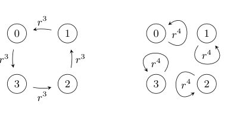 
FIG. 1: Action of the elements of Z4 on four sites arranged on a ring.

**Summary.** This theoretical paper analyzes quantum communication and storage capacity when the physical arrangement of information carriers is subject to unknown permutations. It demonstrates that quantum encoding techniques, utilizing principles from representation theory, allow for a dramatic enhancement in the number of reliably transmitted messages compared to classical limits. This establishes a fundamental quantum advantage for information processing in disordered or scrambled physical architectures.

**Why it may be interesting.** It provides a rigorous, group-theoretic quantification of quantum advantages in communication channels that are physically realized when particle positions are scrambled, which is highly relevant for quantum memory and quantum networking.

Detailed structure

**Main problem.** To determine the maximum number of perfectly distinguishable messages that can be communicated or stored when the positional identity of the physical carriers is lost due to unknown reordering (positional uncertainty).

**Main result.** Quantum protocols provide a fundamental advantage over classical methods, allowing the recovery of the full identity-channel capacity ($d^n$) for cyclic uncertainty, compared to classical scaling of $dn/n$.

**Method.** The analysis uses group theory, specifically Burnside's Lemma and character theory, to compare the number of distinguishable states in classical versus quantum encoding schemes under the action of permutation groups.

**Model / system.** The model involves information carriers (qubits or $d$-level systems) whose positions are subject to a permutation group $G$ (e.g., cyclic $C_n$, dihedral $D_n$, or symmetric $S_n$).

**Key observables.** The number of distinguishable messages ($N_c$ for classical, $N_q$ for quantum, $N_a$ for ancilla-assisted).

**Important parameters / regimes.** n (number of carriers), d (alphabet size/internal states), G (the symmetry group).

**Assumptions / limitations.** The protocols assume the absence of positional metadata, and the quantum advantage relies on encoding information into coherent superpositions.

**Figures summary.** Figures illustrate the action of group elements on site configurations (e.g., $n=4$ qubits on a ring) and show the resulting distinct classical necklace configurations.

**Paper structure.** The paper establishes a general framework using group theory, applies it to specific symmetries (cyclic, dihedral, symmetric groups), and derives general formulas for the quantum advantage in message capacity.

Abstract

Permutation channels model communication and storage scenarios in which the positional identity of the physical carriers is partially or completely lost, so that the transmitted information is only accessible up to an unknown reordering. Here we show that quantum mechanics can dramatically enhance zero-error communication through such channels. For cyclic reorderings of $n$ $d$-level systems, and in the absence of positional metadata, the number of classical zero-error messages scales asymptotically as $d^n/n$, whereas quantum protocols can fully recover the identity-channel value $d^n$. Ancilla-assisted protocols further increase this number to $d^{2n}/n$, enabling dense coding under positional uncertainty. We also analyze dihedral permutation channels and derive general Pólya-like formulas for the number of distinguishable messages in a broad class of permutation groups. Finally, for the symmetric group $S_n$, corresponding to complete scrambling of the information carriers, the number of distinguishable messages scales as $n^{d-1}$ classically, compared with $n^{d(d+1)/2-1}$ for quantum protocols and $n^{d^2-1}$ in the ancilla-assisted setting. Our results establish a fundamental quantum advantage for communication and storage under positional uncertainty.

[↑ back to top](#top)

### [Restoring Velocity Immunity via Dynamic Mirror Compensation in a Large-Area Dual-Atom-Interferometer Gyroscope](http://arxiv.org/abs/2605.29929v1)

**Authors:** Jie Gu, Yin-fei Mao, Zhan-Wei Yao, An-qing Zhang, Si-Bin Lu, Shao-kang Li, Min Jiang, Xiao-Li Chen, Min Ke, Xi Chen, Run-Bing Li, Jin Wang, Ming-Sheng Zhan  
**Type:** experiment · **Category:** other · **PDF:** <https://arxiv.org/pdf/2605.29929v1>  
**Analysis basis:** full PDF text, analyzed in chunks
**Topic relevance:** `quantum measurements` **1/5**

📷 Fig 1

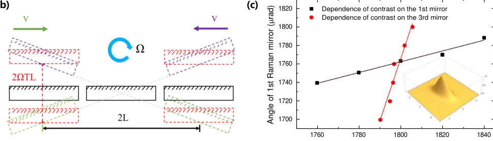 
FIG. 1: Principle of experimental. (a) Schematic of the dual large-area atom-interferometer gyroscope. (b) Dynamic mirror compensation scheme: black mirrors-Earth-fixed frame; green/purple-mirror angles seen by the 1st loop and 2nd one before compensation, and red-mirror angles after compensation in inertial frame. (c) Maximum contrast of the first (black squares) and third (red dots) mirror angle for a given setting of the other mirror, and the inset is the numerical simulation result.

📷 Fig 2

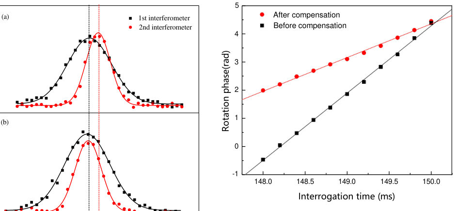 
FIG. 3: (color online) Rotation phase versus interrogation time T before (black squares) and after (red dots) dynamic compensation.

📷 Fig 3

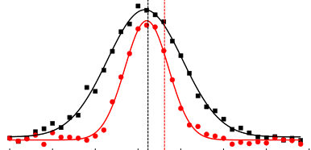 
FIG. 2: (color online) Fringe contrast versus mirror angle (a) before and (b) after dynamic compensation for the 1st loop (black squares) and 2nd one (red dots).

📷 Fig 4

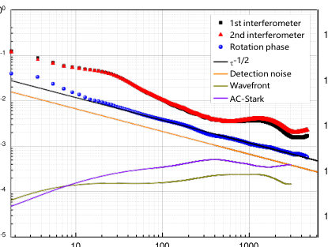 
FIG. 4: (color online) Allan deviations of the dual atom in- terferometers. Black squares: 1st interferometer; red trian- gles: 2nd interferometer; blue dots: rotation signal; black line: τ −1/2 scaling of 13 nrad/s/Hz1/2; orange line: detection noise limit corresponding to 7.3 nrad/s/Hz1/2; violet curve: phase drift caused by AC-Stark shifts; dark yellow curve: phase drift induced by wavefront distortions.

📷 Fig 5

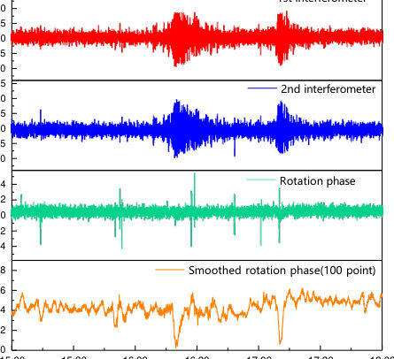 
FIG. 5: (color online) Seismic signal recorded by the dual atom interferometers. Black: seismometer weighted by the transfer function; red, blue: individual interferometer phases; green: rotation phase; orange: smoothed rotation phase.

**Summary.** The research introduces a dynamic mirror compensation technique to correct for velocity-dependent phase shifts in large-area atom interferometers caused by Earth's rotation. By actively compensating for the Coriolis effect, the authors restored velocity immunity, significantly improving the gyroscope's stability and paving the way for its use in high-precision navigation and geophysics.

**Why it may be interesting.** This work directly addresses a major systematic error source (Coriolis coupling) in advanced quantum sensing platforms, providing a robust experimental technique for achieving higher precision in inertial measurements.

Detailed structure

**Main problem.** The gyroscope's inherent velocity immunity, crucial for accurate inertial sensing, is broken by the Coriolis effect induced by Earth's rotation in large-area atom interferometers.

**Main result.** The authors successfully implemented a dynamic mirror compensation scheme, reducing the phase's velocity dependence by a factor of 40 and achieving a high rotation sensitivity of $1.3 	imes 10^{-8} 	ext{ rad/s}/	ext{Hz}^{1/2}$.

**Method.** They actively rotated the Raman mirrors during the pulse sequence to cancel the time-dependent angular offset caused by the Coriolis effect, using a multi-stage calibration process.

**Model / system.** The experiment uses a large-area dual-atom-interferometer gyroscope based on $^{87}	ext{Rb}$ atoms in a Mach-Zehnder configuration. The system's phase shift is analyzed for its dependence on rotation ($\Omega$) and atomic velocity ($v'$).

**Key observables.** Interference phase ($\delta\varphi_a, \delta\varphi_b$), fringe contrast ($C$), rotation phase ($\varphi_\Omega$), and the measured stability/sensitivity ($	ext{rad/s}/	ext{Hz}^{1/2}$).

**Important parameters / regimes.** Interference area of $21.1 	ext{ cm}^2$; velocity dependence reduction factor of 40; stability of $1.9 	imes 10^{-10} 	ext{ rad/s}$ at $4500 	ext{ s}$.

**Assumptions / limitations.** The method relies on a 'decouplable calibration-compensation chain' involving contrast, phase, and dynamic compensation steps to isolate and null systematic errors.

**Figures summary.** Figures illustrate the apparatus schematic, the restoration of maximum fringe contrast after compensation, and the comparison of the rotation phase slope vs. interrogation time before and after compensation.

**Paper structure.** The paper details the physical setup, identifies the Coriolis-induced systematic error, proposes the dynamic mirror compensation scheme across three calibration stages, presents quantitative results showing the restoration of velocity immunity, and concludes with performance metrics and future outlook.

Abstract

We propose and demonstrate a dynamical mirror compensation scheme to restore velocity immunity in a large-area dual-atom-interferometer gyroscope. In an ideal Mach-Zehnder configuration, the phase shift is inherently immune to atomic velocity, but this property is broken by the Earth's rotation via the Coriolis effect. We overcome this by actively rotating the Raman mirrors during the pulse sequence to cancel the time-dependent angular offset. The implementation relies on a decouplable calibration-compensation chain to remove rotation-induced time-dependent terms. The scheme is validated on a dual-atom-interferometer gyroscope with an interference area of 21.1 cm^2. After compensation, the phase's dependence on atomic velocity is reduced 40-fold, and the velocity contribution to scale-factor stability is evaluated to be 0.13 ppm. The sensor achieves a rotation sensitivity of 1.3\times10^{-8} rad/s/Hz^{1/2} and a stability of 1.9\times10^{-10} rad/s at 4500 s integration, together with a common-mode noise rejection ratio of up to 459, demonstrated in a seismic event. This work removes a key obstacle to scale-factor stabilization in atom-interferometer gyroscopes and paves the way for their applications in inertial navigation and geophysics.

[↑ back to top](#top)

### [Ridge Regression from Poisson Resetting: A Renewal Perspective on Spectral Regularization](http://arxiv.org/abs/2605.30059v1)

**Authors:** Petar Jolakoski  
**Type:** theory · **Category:** statistical mechanics · **PDF:** <https://arxiv.org/pdf/2605.30059v1>  
**Analysis basis:** full PDF text, analyzed in chunks
**Topic relevance:** `non-equilibrium dynamics` **1/5**

📷 Fig 1

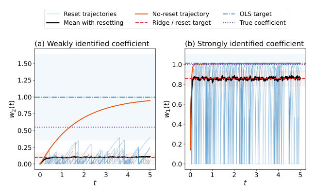 
Figure 1: Gradient-flow trajectories with and without Poisson resetting in a two-parameter linear regression problem. The left panel shows a weakly identified coefficient, corresponding to a predictor with low variance, while the right panel shows a strongly identified coefficient. Blue curves are trajectories with resetting at rate r, the black curve is their ensemble mean, and the orange curve is the corresponding trajectory without resetting. In each panel, the dashed red line is the ridge/reset target (X⊤X+rI)−1X⊤y, the dash-dotted blue line is the minimum-norm OLS solution (X⊤X)+X⊤y, and the dotted purple line is the true coefficient used to generate the data. The shaded red and blue...

📷 Fig 2

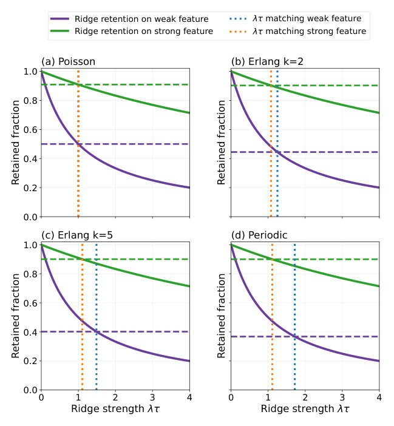 
Figure 2: Two-mode comparison of ridge and renewal-induced shrinkage. Each panel fixes two representative directions, a weak feature with µτ = 1 and a strong feature with µτ = 10, where τ = E[S] is the mean reset interval. The solid curves show the retained fraction that ordinary ridge would produce on those two features as the dimensionless ridge strength λτ varies. The dashed horizontal lines show the retained fractions generated by the indicated reset-time law, namely gS(1) and gS(10). The dotted vertical lines mark the ridge strengths needed to match the weak and strong features separately.

📷 Fig 3

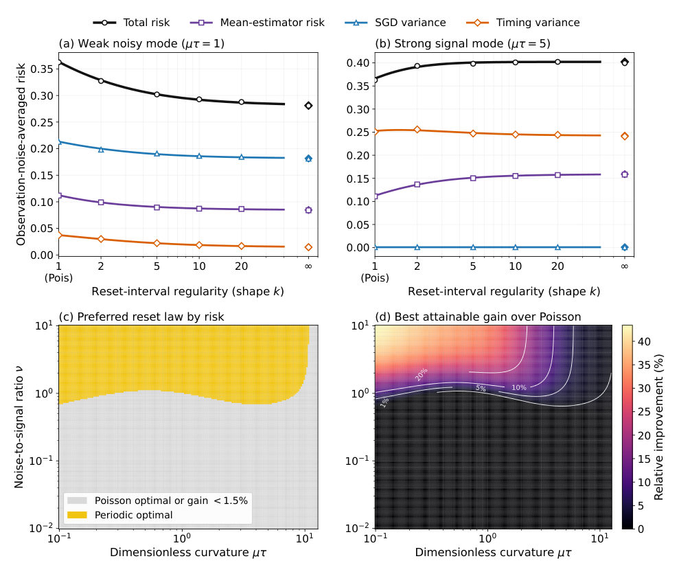 
Figure 3: Renewal law risk beyond the mean. Top row: risk decomposition at fixed mean reset interval τ as the reset-time law is varied from Poisson/exponential resetting (k = 1) through Erlang laws to the periodic limit (k →∞). Solid curves show the exact renewal formulas after averaging over observation noise, and markers show empirical estimates from exact snapshots. Colors denote total risk (black), mean-estimator contribution (purple), accumulated SGD variance (blue), and timing variance (orange). The two panels compare a weak mode with µτ = 1 and a strong mode with µτ = 5. Bottom row: best reset-time law class and corresponding gain over Poisson resetting across curvature µτ and...

📷 Fig 4

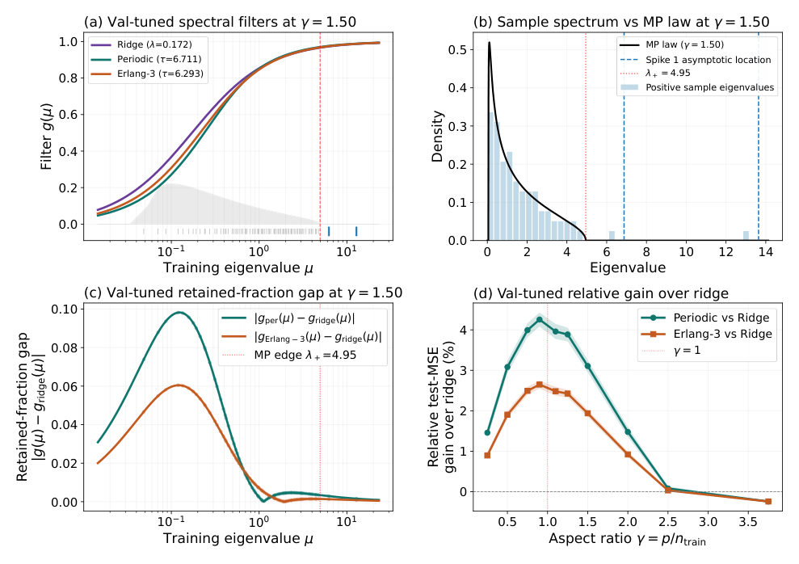 
Figure 4: Validation-tuned non-exponential filters on the spiked covariance model. (a) Representative filter curves at γ = 1.5, with periodic and Erlang-3 filters each using its own validation- tuned mean reset interval. The gray fill shows the Marchenko-Pastur continuous density, blue ticks mark positive sample spikes, gray ticks mark positive sample bulk eigenvalues, and the red dashed line marks the Marchenko-Pastur edge. (b) Sample spectrum compared with the Marchenko-Pastur law, including the point mass at zero when p &gt; ntrain. (c) Absolute retained-fraction gap from ridge, |g(µ) −gridge(µ)|, as a function of the training eigenvalue for the same representative problem. (d) Relative...

📷 Fig 5

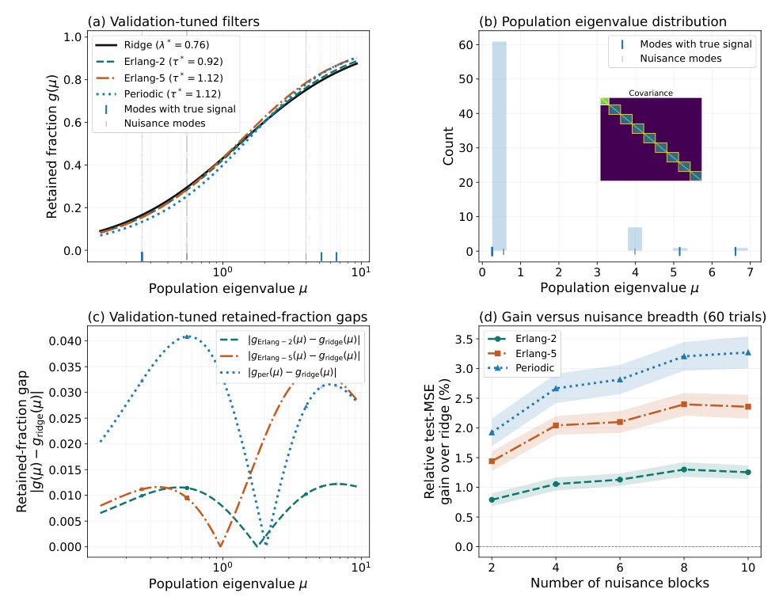 
Figure 5: Block-covariance example with correlated nuisance features. (a) Validation-tuned Gamma-family filters on a representative split. (b) Population eigenvalue distribution for the rep- resentative model, with signal-carrying modes separated from nuisance modes. The inset shows the underlying block covariance matrix, with the predictive block outlined in white and nuisance blocks in yellow. (c) Retained-fraction gap from ridge, |g(µ) −gridge(µ)|, across the spectrum. (d) Relative test-MSE gain over ridge as the number of nuisance blocks increases. Shaded bands show 95% Monte Carlo intervals computed as ±1.96 paired standard errors for the gain over ridge.

**Summary.** This work bridges non-equilibrium statistical physics and machine learning by showing that stochastic resetting dynamics can exactly reproduce the result of ridge regression in the stationary mean. It develops a general framework showing that the specific distribution of reset times dictates the resulting spectral filter, offering insights into the statistical cost of using random resetting versus deterministic regularization.

**Why it may be interesting.** The connection between non-equilibrium dynamics (stochastic resetting) and fundamental ML regularization techniques (Ridge) provides a novel physical interpretation for regularization, potentially guiding the design of physical learning algorithms.

Detailed structure

**Main problem.** The paper connects the mathematical framework of stochastic resetting from non-equilibrium statistical physics to the established regularization technique of ridge regression in statistical learning.

**Main result.** The stationary mean of the gradient flow process subjected to Poisson resetting exactly reproduces the ridge estimator, demonstrating a deep connection between these two seemingly disparate fields.

**Method.** The analysis uses continuous-time gradient flow equations, solving for the stationary mean by incorporating the reset rate into the differential equation, and generalizing this to arbitrary renewal reset laws.

**Model / system.** The model is linear regression, $J(\mathbf{w}) = rac{1}{2} \|\mathbf{X}\mathbf{w} - \mathbf{y}\|^2$, whose dynamics are governed by a continuous-time gradient flow, which is perturbed by a Poisson or general renewal resetting process.

**Key observables.** The stationary mean estimator ($\mathbf{m}_\infty$), the spectral shrinkage filter $g_S(\mu)$, and the total estimation risk $R(r; eta_0)$.

**Important parameters / regimes.** The reset rate $r$ (acting as the regularization parameter $\lambda$), the noise levels ($\sigma^2_\eta$, $\sigma^2$), and the spectral eigenvalues ($\mu_i$).

**Assumptions / limitations.** The analysis assumes the noise is additive and the process can be modeled by a renewal structure; the equality holds exactly only at the level of the mean, not for individual paths.

**Figures summary.** Figures illustrate gradient-flow trajectories showing the match at the mean, and compare risk landscapes for different reset-time laws (Poisson vs. Periodic vs. Gamma) showing how the optimal regularization parameter shifts.

**Paper structure.** The paper progresses by first establishing the exact identity for Poisson resetting (matching ridge), then generalizing the spectral filter to arbitrary renewal laws, and finally analyzing the full statistical risk (including variance costs) by comparing different reset-time laws against the ideal ridge penalty.

Abstract

We connect stochastic resetting from non-equilibrium statistical physics with ridge regularization in statistical learning. For linear gradient flow, resetting to the origin at rate $r$ produces stationary mean $(X^\top X+rI)^{-1}X^\top y$, exactly the ridge estimator with penalty $λ=r$. This uses the known Laplace-transform relationship between ridge regression and exponential-time averaging of gradient flow, with the exponential time now interpreted as the stationary age associated with Poisson resetting. We then extend this identity to general renewal reset laws: the exponential reset time distribution is the unique renewal law whose stationary mean reproduces scalar ridge in every eigendirection as an exact filter identity for every positive curvature, while non-exponential renewal laws generate alternative spectral filters. At the fluctuation level, we study a separate additive Ornstein-Uhlenbeck extension with constant diffusion, interpreted as a stylized SGD approximation. In this setting, the equality holds only at the level of the mean, since the reset process has a nonzero stationary covariance from accumulated OU noise and reset-timing variance, whereas deterministic ridge is a fixed estimator with the same center. Stylized experiments compare the deterministic renewal-induced filters directly and illustrate when filters induced by non-exponential reset-time laws can differ predictively from ridge. The results for the stationary mean and the induced spectral filters are established for continuous-time gradient flow with isotropic resetting on quadratic objectives; the covariance and risk formulas additionally assume additive noise with state-independent covariance.

[↑ back to top](#top)

## Other papers (18)

*Papers from primary archives without highlighted authors or any topic match. Click to expand.*

Show other papers

### [A Variational Quantum Algorithm for Nonlinear Finite Element Analysis of Hyperelastic Materials](http://arxiv.org/abs/2605.29181v1)

**Authors:** Uditnarayan Kouskiya, Caglar Oskay  
**Type:** theory · **Category:** quantum information and computing · **PDF:** <https://arxiv.org/pdf/2605.29181v1>  
**Analysis basis:** full PDF text, analyzed in chunks

📷 Fig 1

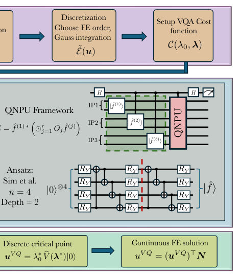 
Figure 1: VQA Framework.

📷 Fig 2

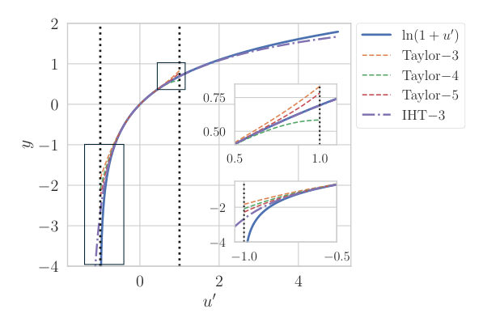 
Figure 2: Approximations to the logarithmic nonlinearity. The Taylor series expansion is valid only within −1 &lt; u′ &lt; 1. y represents different approximations.

📷 Fig 3

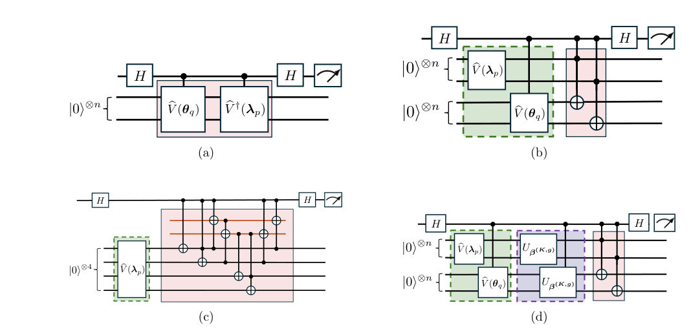 
Figure 3: Primitive circuits to evaluate (a) ⟨ˆp | ˆq⟩, (b) ⟨ˆp|Dˆq|ˆp⟩, (c) ⟨ˆp| bA|ˆp⟩, and (d) ∥ℓp∥2 ∥ℓq∥⟨ˆℓp|Dˆℓq|ˆℓp⟩; The green, red, and purple regions denote the input, QNPU, and block- encoding phases, respectively. In (c), the two red qubit registers correspond to the ancillas required by the Adder circuit. In (d), ancillas associated with the block-encoding components are omitted for clarity.

📷 Fig 4

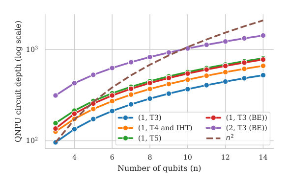 
Figure 4: Scaling of QNPU circuit depth (including block-encoding where applicable) with the number of qubits n for different formulations. The depth is shown on a logarithmic scale; the dashed line indicates quadratic scaling O(n2). Legend entries denote (shape function order, expansion method).

📷 Fig 5

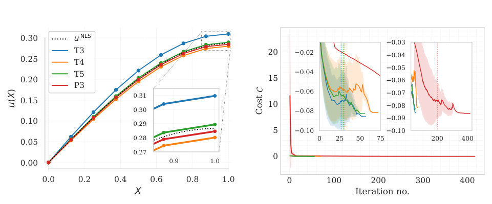 
Figure 5: VQA performance (20-run average) for Taylor orders 3–5 (T3–T5) and IHT (P3). The profiles of uV Q (in mm) and the iteration cost histories are shown in (a) and (b), respectively. Performance metrics for the different models are summarized in Table (c), where “Evaluations” denotes the average number of function calls over the entire optimization process.

**Summary.** This paper proposes using Variational Quantum Algorithms (VQA) to solve nonlinear finite element analysis problems for hyperelastic materials. It tackles the quantum hardware limitation by approximating the nonlinear energy functional using polynomials, allowing the energy to be evaluated via parameterized quantum circuits. The work demonstrates the feasibility of this hybrid quantum-classical method for near-term quantum devices.

**Why it may be interesting.** While the application is in continuum mechanics, the core methodology—mapping a complex, nonlinear physical functional into a measurable cost function for a VQA—is a general and highly relevant technique for quantum simulation of complex quantum or classical systems.

Detailed structure

**Main problem.** The paper addresses the computational challenge of solving nonlinear partial differential equations (PDEs) arising from hyperelastic material mechanics using quantum computation.

**Main result.** The authors demonstrate the feasibility of using a Variational Quantum Algorithm (VQA) framework, combined with polynomial approximations, to estimate the potential energy functional for hyperelastic materials on near-term quantum devices.

**Method.** A hybrid quantum-classical approach is employed where the energy functional is evaluated using parameterized quantum circuits (QNPU framework), and the resulting cost function is minimized classically using gradient-based optimizers.

**Model / system.** The physical system is hyperelastic materials governed by nonlinear elasticity, modeled via a potential energy functional derived from the strain energy density (e.g., Neo-Hookean model). The problem is reduced to a 1D finite element discretization.

**Key observables.** The potential energy functional $E[u]$ serves as the cost function, and the primary observables are the estimated energy $E$ and its gradient $
abla E$.

**Important parameters / regimes.** The polynomial approximation order, the number of qubits ($n$), and the iteration count ($T_{it}$) are critical parameters influencing accuracy and complexity.

**Assumptions / limitations.** The approach relies heavily on approximating nonlinear strain energy density terms using low-degree polynomial expansions (Taylor or IHT series) to ensure compatibility with current NISQ hardware.

**Figures summary.** Figures illustrate the VQA framework setup, comparisons of different polynomial approximations (Taylor vs. IHT), and the convergence of the solution profile ($u_{VQ}$) for varying approximation orders and system sizes.

**Paper structure.** The paper follows a structure detailing the physical problem (nonlinear PDEs), the necessary mathematical reductions (1D, polynomial approximations), the quantum implementation details (QNPU primitives, block encoding), and finally, numerical results comparing different approximation schemes and analyzing computational scaling.

Abstract

This manuscript explores a variational quantum formulation for nonlinear elasticity problems arising from hyperelastic material models, targeting near term noisy intermediate scale quantum (NISQ) devices. The approach leverages the potential energy structure of hyperelasticity and employs a hybrid quantum classical framework in which the energy functional is evaluated using parameterized quantum circuits and optimized through classical routines. To enable implementation on current quantum hardware, polynomial approximations of the nonlinear strain energy density are introduced, yielding a representation compatible with variational quantum algorithms. The methodology is demonstrated on a one dimensional NeoHookean material model using finite element discretizations with first and second order shape functions and nonhomogeneous boundary conditions. Numerical experiments investigate the influence of the polynomial approximation order on the accuracy and efficiency of the proposed approach, illustrating its feasibility for near term quantum devices.

[↑ back to top](#top)

### [Analytic Bootstrap for $O(N)$ Boundary Conformal Field Theories with Interacting Boundaries](http://arxiv.org/abs/2605.28933v1)

**Authors:** Xinyu Sun, Shao-Kai Jian, Hong Yao  
**Type:** theory · **Category:** statistical mechanics · **PDF:** <https://arxiv.org/pdf/2605.28933v1>  
**Analysis basis:** full PDF text, analyzed in chunks

📷 Fig 1

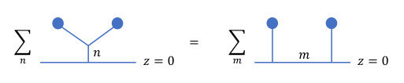 
FIG. 1. The crossing symmetry equation in Eq. (1). The left- and right-hand sides are the operator expansion in the bulk and boundary channels, and blue circles label bulk operators.

📷 Fig 2

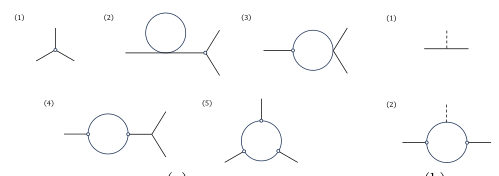 
FIG. 4. Feynman diagrams for (a) ⟨ϕiϕjϕk⟩and (b) ⟨ϕiϕlϕ2⟩, where simple vertices and empty circles correspond to the bulk ϕ4-type vertex and the boundary qubic interaction vertex. A vertex with a dashed line indicates the boundary operator ϕ2.

📷 Fig 3

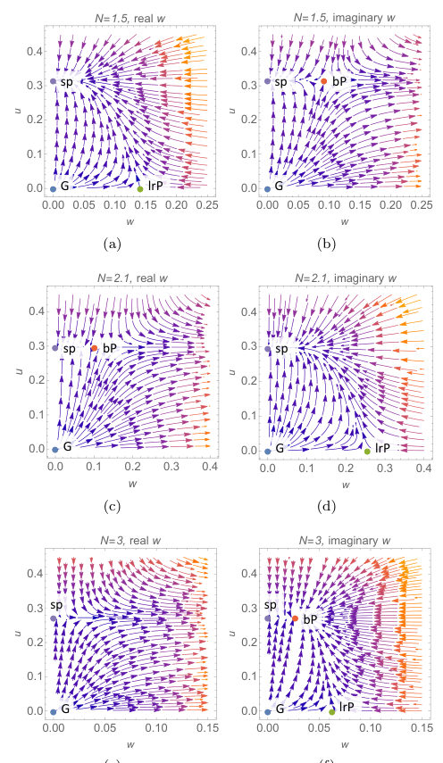 
FIG. 5. RG flow phase diagrams for N = 1.5, 2.1, 3; the left column shows real w, and the right column shows imaginary w. We set ϵ = 1. Gaussian (G), special (sp), long-range Potts (lrP), and boundary Potts (bP) fixed points are indicated by blue, purple, green, and red dots, respectively.

📷 Fig 4

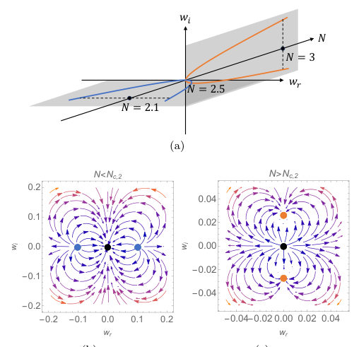 
FIG. 6. (a) Collision and subsequent separation of the spe- cial and boundary Potts fixed points near N = Nc,2 = 2.5. (b), (c) RG flow phase diagrams for N = 2.1 and N = 3.0, respectively, in the complex plane of w = wr + iwi, at fixed

**Summary.** This work develops an analytic bootstrap method to constrain the conformal data of $O(N)$ Boundary Conformal Field Theories with interacting boundaries. By solving a crossing symmetry equation derived from the two-point function, the authors determine universal constraints and calculate critical exponents for various fixed points in dimensions $d=4-\epsilon$ and $d=3-\epsilon$. This provides a unified theoretical framework for analyzing boundary critical phenomena.

**Why it may be interesting.** The rigorous application of bootstrap techniques to boundary critical phenomena provides powerful, non-perturbative constraints on correlation functions, which is a key theoretical tool for understanding critical behavior in condensed matter systems.

Detailed structure

**Main problem.** To derive universal constraints on conformal data for $O(N)$ Boundary Conformal Field Theories (BCFTs) with interacting boundaries.

**Main result.** The authors successfully apply the analytic bootstrap to determine OPE and BOE coefficients, identifying new boundary fixed points in $d=4-\epsilon$ and providing conformal data for the tricritical $O(N)$ model in $d=3-\epsilon$.

**Method.** The core method is the analytic bootstrap, which equates two expressions for the two-point function (derived from Bulk OPE and Boundary OPE) to establish a crossing symmetry equation. This equation is solved order-by-order in the $\epsilon$ expansion.

**Model / system.** The study focuses on $O(N)$ BCFTs in dimensions $d=4-\epsilon$ and $d=3-\epsilon$, specifically analyzing models with interacting boundaries, such as those involving boundary cubic couplings.

**Key observables.** Conformal data, including scaling dimensions ($\Delta_O, \hat{\Delta}_O$), OPE coefficients ($\lambda_n$), and BOE coefficients ($\mu_m$).

**Important parameters / regimes.** The expansion parameter $\epsilon$, the number of components $N$, and the coupling constants associated with boundary interactions.

**Assumptions / limitations.** The method relies on the analytic bootstrap framework, which is generalized to handle non-trivial boundary interactions, and involves expanding correlation functions in powers of $\epsilon$.

**Figures summary.** Figures illustrate the crossing symmetry equation, RG flow diagrams showing the stability of fixed points as a function of $N$, and summaries of calculated conformal data in tables.

**Paper structure.** The paper develops the bootstrap equation by equating bulk and boundary expansions of the two-point function. It then solves this equation iteratively in $\epsilon$ to determine the coefficients, analyzes the stability of fixed points via RG flow, and applies the results to specific models like the tricritical $O(N)$ model.

Abstract

We investigate $O(N)$ boundary conformal field theories (BCFTs) with boundary interactions in $d=4-ε$ and $d=3-ε$ employing the analytic bootstrap. By deriving universal constraints on conformal data, we show that infinitely many operator expansions can be expressed in terms of a finite set of inputs. Complementing the analytic bootstrap with a perturbative renormalization-group analysis, we identify totally new boundary fixed points in $d=4-ε$, including non-unitary ones, generated by a boundary cubic coupling, and compute their conformal data to leading order. Moreover, we leverage our solution in $d=3-ε$ to extract, for the first time, the boundary conformal data for the tricritical $O(N)$ model. Altogether, our approach provides a unified prescription for BCFTs with interacting boundaries and streamlines the determination of bulk and boundary operator expansions.

[↑ back to top](#top)

### [Connection Factorization in Constrained Quantum Mechanics](http://arxiv.org/abs/2605.29241v1)

**Authors:** A. Nuramatov  
**Type:** theory · **Category:** other · **PDF:** <https://arxiv.org/pdf/2605.29241v1>  
**Analysis basis:** full PDF text, analyzed in chunks

📷 Fig 1

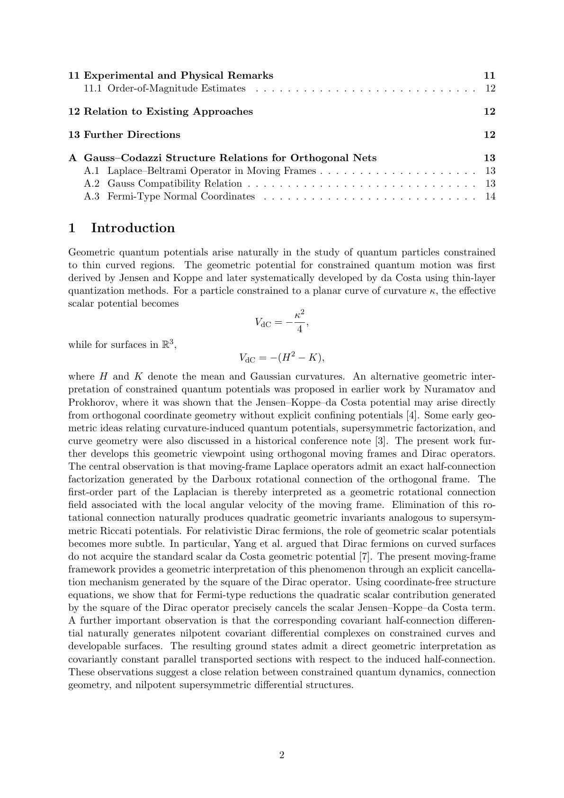 
Low-resolution page preview, page 2

📷 Fig 2

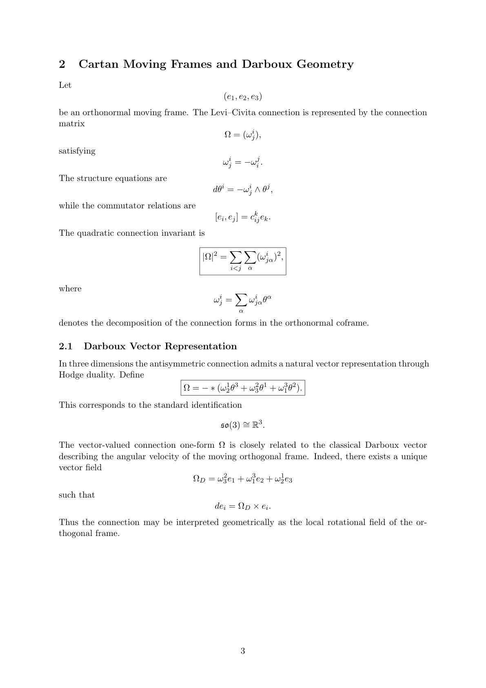 
Low-resolution page preview, page 3

📷 Fig 3

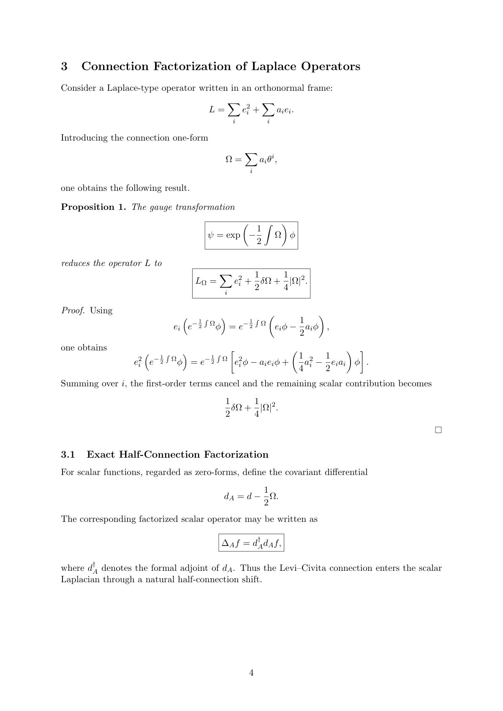 
Low-resolution page preview, page 4

📷 Fig 4

 
Low-resolution page preview, page 5

📷 Fig 5

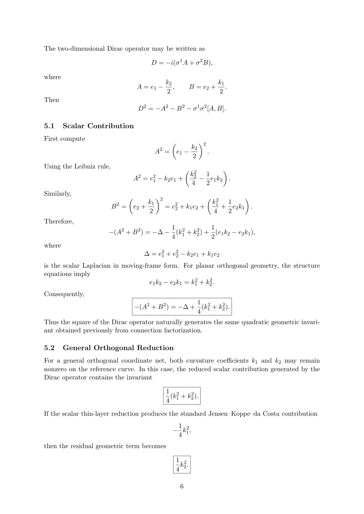 
Low-resolution page preview, page 6

**Summary.** This work develops a geometric framework to analyze quantum mechanics constrained to curved spaces using connection factorization. It demonstrates that the Laplacian operator can be factored using geometric connections, and it finds a significant cancellation of geometric terms for Dirac fermions under specific geometric conditions. This suggests the existence of underlying nilpotent differential complexes governing the quantum dynamics.

**Why it may be interesting.** The deep connection between geometric constraints (curvature, connection forms) and the fundamental structure of quantum operators (Laplacian, Dirac) provides powerful mathematical tools applicable to quantum systems in curved backgrounds, which is a key area in theoretical physics.

Detailed structure

**Main problem.** The paper investigates the mathematical structure of quantum motion when constrained to lower-dimensional manifolds like curves and surfaces.

**Main result.** It shows that the Laplace operator admits an exact half-connection factorization, and for Dirac fermions in Fermi-type reductions, the standard scalar geometric contribution cancels out, leaving a residual spinorial structure.

**Method.** The analysis heavily relies on differential geometry tools, including orthonormal moving frames, structure equations, and connection factorization methods applied to the Laplacian and Dirac operators.

**Model / system.** The model involves quantum particles whose dynamics are restricted to curved spaces (curves, planar nets, surfaces). The mathematical machinery uses geometric objects like connection one-forms and curvature tensors.

**Key observables.** Laplace operators, quadratic geometric invariants (analogous to supersymmetric Riccati potentials), and the residual first-order spinorial derivative structure.

**Important parameters / regimes.** Curvatures (mean $H$, Gaussian $K$), connection coefficients ($k_1, k_2$), and the scalar Jensen–Koppe–da Costa contribution ($V_{dC}$).

**Assumptions / limitations.** The analysis assumes the use of orthonormal moving frames and highlights that the cancellation of the scalar geometric contribution is specific to Fermi-type geometry.

**Paper structure.** The paper develops the framework by first analyzing the Laplacian factorization on general manifolds, then specializing to planar orthogonal nets using structure equations, and finally examining the implications for Dirac operators and the resulting nilpotent covariant differential complexes.

Abstract

We investigate constrained quantum motion on curves and surfaces using connection factorization methods. We show that Laplace operators admit an exact half-connection factorization generated by connection one-forms. The first-order part of the Laplacian is identified with the Darboux rotational connection of the orthogonal frame. Elimination of this rotational connection naturally produces quadratic geometric invariants analogous to supersymmetric Riccati potentials. Using orthonormal moving frames, we derive effective geometric contributions for planar curves, spatial curves, and embedded surfaces. We further analyze Dirac reductions using structure equations and show that for Fermi-type reductions the scalar Jensen--Koppe--da Costa contribution is cancelled in the reduced Dirac sector, leaving a residual first-order spinorial derivative structure. The resulting framework suggests the existence of hidden nilpotent covariant differential complexes naturally generated by geometric connection structures.

[↑ back to top](#top)

### [Criticality in the disordered $N$-color Ashkin-Teller model](http://arxiv.org/abs/2605.29810v1)

**Authors:** Youssef Makoudi, Gesualdo Delfino  
**Type:** theory · **Category:** statistical mechanics · **PDF:** <https://arxiv.org/pdf/2605.29810v1>  
**Analysis basis:** full PDF text, analyzed in chunks

📷 Fig 1

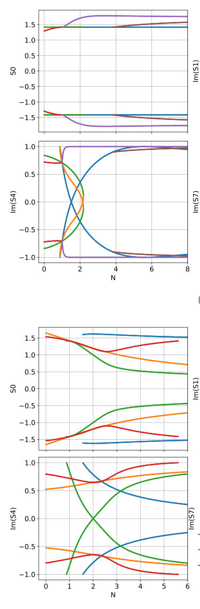 
Figure 2: Amplitudes for the solutions not given analytically in Table 2 (with the exception of V1). 11

📷 Fig 2

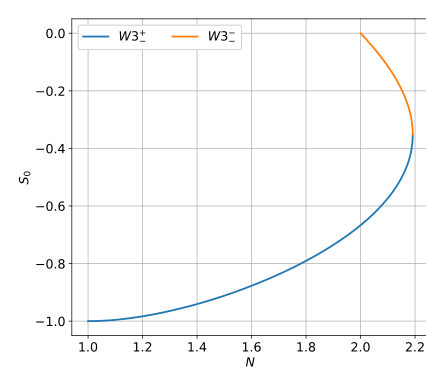 
Figure 3: Solutions W3+ and W3−can be seen as continuation of each other.

📷 Fig 3

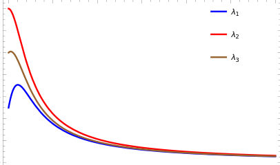 
Figure 4: RG flows determined by Eqs. (30)-(32) for two different initial conditions at N = 3 in the random case n = 0.

📷 Fig 4

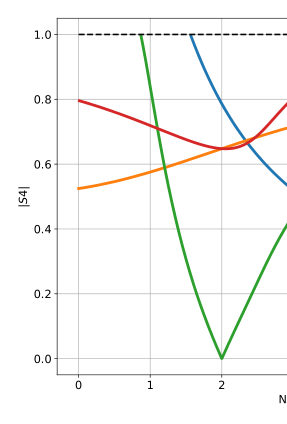 
Figure 6: |S4| for the solutions V1-V4. The second disorder strength parameter takes its maximal value |S7| = 1.

📷 Fig 5

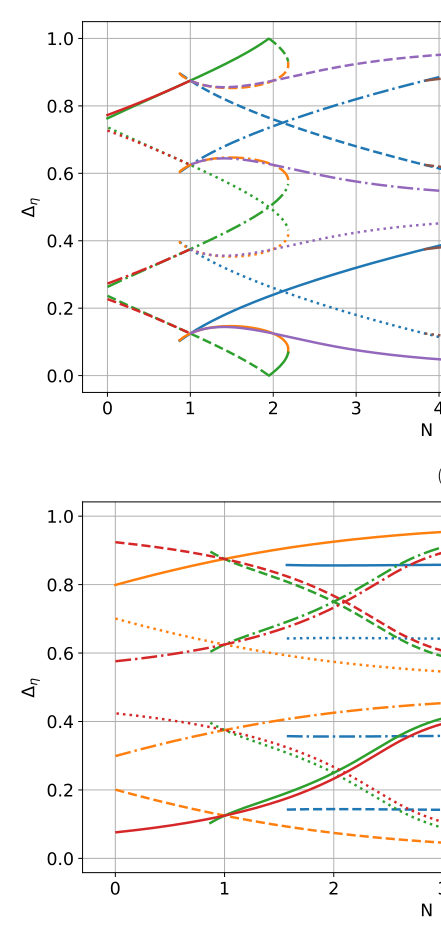 
Figure 7: ∆η (mod 1) for the solutions not given analytically in Table 2 (with the exception of V1). The amplitude signs in the legends refer to the lowest positive value of N for which the solution is defined. Also for V1 the results are N-dependent.

**Summary.** This theoretical work analyzes the critical behavior of the disordered N-color Ashkin-Teller model using advanced scattering theory and the replica method. It determines the exact RG fixed points, revealing that the weak disorder regime supports a continuous line of fixed points. This demonstrates a form of superuniversality where critical exponents are robust against changes in the system's symmetry parameter N.

**Why it may be interesting.** The concept of superuniversality, where critical exponents are independent of the symmetry parameter N despite the model depending on N, is a deep theoretical result relevant to understanding universality classes in complex interacting quantum systems.

Detailed structure

**Main problem.** The paper aims to determine all solutions to the exact renormalization group (RG) fixed point equations for the disordered N-color Ashkin-Teller model.

**Main result.** The weak disorder sector exhibits a line of fixed points with Ising thermal exponents and continuously varying magnetic exponents for N>1, indicating superuniversality in random criticality.

**Method.** The methodology employs scale invariant scattering theory in two dimensions, utilizing the replica method to handle quenched disorder and solving crossing/unitarity equations derived from scattering amplitudes.

**Model / system.** The system is the N-color Ashkin-Teller model, which couples N Ising models via four-spin interactions. The disorder is quenched, characterized by two independent random coupling distributions.

**Key observables.** Critical exponents (thermal and magnetic), scattering amplitudes ($S_i$), and the scaling dimension of the energy density field ($X_\epsilon$).

**Important parameters / regimes.** N (number of colors), disorder strength parameters ($|S_4|$ and $|S_7|$), and the replica number ($n 	o 0$).

**Assumptions / limitations.** The analysis relies on the scattering framework, conformal invariance, and the assumption of energy-independence of scattering amplitudes.

**Figures summary.** Figures illustrate elastic scattering amplitudes, RG flows for varying N, and phase diagrams for related random bond Ising models.

**Paper structure.** The paper progresses by first defining the Hamiltonian and the RG framework, then analyzing the pure model fixed points, and finally extending the analysis to the disordered case using the replica method to find the continuous line of fixed points.

Abstract

The $N$-color Ashkin-Teller model corresponds to $N$ Ising models coupled by four-spin interactions. We consider the two-dimensional case in presence of quenched disorder and use scale invariant scattering theory to determine all the solutions of the exact renormalization group fixed points equations. The weak disorder sector is characterized by a solution that, for any fixed $N$ larger than 1, is a line of fixed points with Ising thermal exponents and continuously varying magnetic exponents. The number of fixed point solutions allowed by the symmetries of the model increases at strong disorder illustrating the growing dependence on the distributions of the two random couplings. The presence of some critical exponents which do not depend on the symmetry parameter $N$ confirms this type of superuniversality as a peculiar feature of random criticality.

[↑ back to top](#top)

### [Elfs, transducers and quantum walks](http://arxiv.org/abs/2605.30013v1)

**Authors:** Simon Apers, Jérémie Roland, Yuxin Zhang  
**Type:** theory · **Category:** quantum information and computing · **PDF:** <https://arxiv.org/pdf/2605.30013v1>  
**Analysis basis:** full PDF text, analyzed in chunks

📷 Fig 1

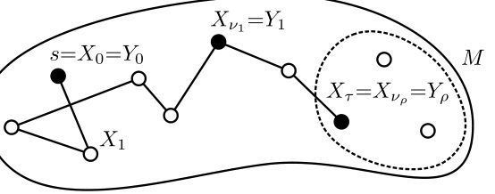 
Figure 1: Coupling between a random walk and elfs process through stopping rules ν1 &lt; · · · &lt; νρ. Figure from [AP22].

**Summary.** This paper introduces and refines the Electric Flow Sampling (elfs) tool within the quantum walk framework. By establishing zero-error quantum transducers, the authors develop advanced algorithms to estimate graph properties like effective resistance with optimal scaling. This work demonstrates practical quantum speedups for computational tasks, such as semi-supervised learning, on structured graphs.

**Why it may be interesting.** The rigorous development of error-free quantum transducers for graph processes provides powerful, general tools applicable to simulating complex quantum dynamics, which is foundational for quantum computation theory.

Detailed structure

**Main problem.** To develop improved quantum walk algorithms for estimating physical quantities like effective resistances and sampling random walk arrival distributions.

**Main result.** The authors establish zero-error transducers for key quantum operations, leading to quantum walk algorithms that achieve optimal error scaling and up-to-quadratic quantum speedups for tasks like semi-supervised learning on expander graphs.

**Method.** The core method involves refining the Electric Flow Sampling (elfs) tool using the theory of quantum transducers to implement error-free quantum operations, such as reflections about subspace intersections.

**Model / system.** The study is set on undirected graphs $G=(V, E, w)$, analyzing quantum walks defined on the edge space $\ell(E)$. Key concepts include the electric flow state $|f
angle$ and the quantum walk operator $U$.

**Key observables.** Effective Resistance ($R_s$), Hitting Time ($HT_s$), Escape Time ($ET_s$), and the quantum speedup factor for learning tasks.

**Important parameters / regimes.** The error tolerance ($\epsilon$) and the graph structure (e.g., expander graphs) dictate the complexity scaling.

**Assumptions / limitations.** The development relies heavily on the theoretical framework of zero-error quantum transducers and the ability to bound various hitting times on graphs.

**Figures summary.** Figures illustrate the coupling between the elfs process and random walks via random stopping times, and theorems detail the structure of the quantum walk operator transduction.

**Paper structure.** The paper progresses by first establishing the zero-error transducer for elfs (Theorem 1.1), then applying this to estimate effective resistance (Theorem 1.2), and finally simulating the elfs process to achieve speedups for learning tasks.

Abstract

Electric flow sampling (elfs) is a new tool in the quantum walk toolbox and a useful primitive for solving search, sampling and optimization problems on graphs. We refine this tool by showing that there exists a zero-error transducer for implementing elfs. More broadly, we establish a zero-error transducer for reflecting about the intersection of two subspaces, yielding an errorfree transducer version of the effective gap lemma. Building on this result, we obtain improved quantum walk algorithms for estimating effective resistances and span program witness sizes with an optimal error scaling, and for sampling from the random walk arrival distribution, via the composition of many elfs. Using this last algorithm, we obtain an up-to-quadratic quantum speedup for semi-supervised learning on expander graphs.

[↑ back to top](#top)

### [Evaluating Parameter Transfer in FALQON Across Graph Families](http://arxiv.org/abs/2605.29917v1)

**Authors:** Alisson dos Passos Fumaco, Marcos Vinicius Reballo, Fernando Augusto Caletti de Barros, Gabriel Fernandes Thomaz, Eduardo I. Duzzioni  
**Type:** theory · **Category:** quantum information and computing · **PDF:** <https://arxiv.org/pdf/2605.29917v1>  
**Analysis basis:** full PDF text, analyzed in chunks

📷 Fig 1

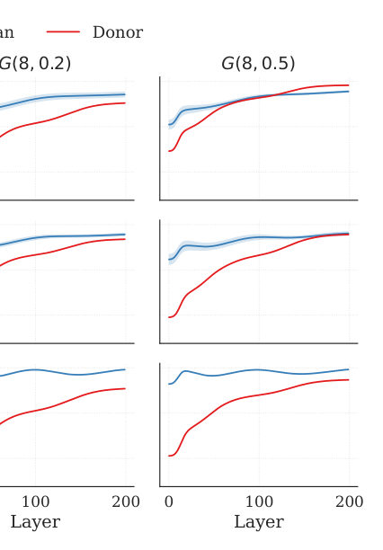 
Figure 1. Representative transfer trajectories for dense 14-node Erd˝os–R´enyi recipients (p ∈{0.8, 0.9, 1.0}) from 8-node donor graphs. The transferred mean approximation-ratio curves (blue) exhibit narrow variance and mono- tonic growth, consistently matching or exceeding the donor training trajec- tories (red).

📷 Fig 2

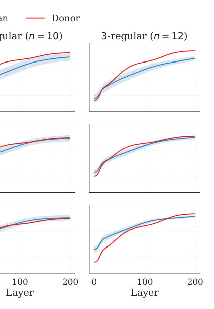 
Figure 2. Representative transfer trajectories for sparse 14-node Erd˝os–R´enyi recipients (p ∈{0.2, 0.3, 0.4}) from 3-regular donor graphs of sizes 8, 10, and 12. The transferred curves (blue) remain below the donor references (red) for p = 0.2, with the gap narrowing as recipient density increases.

📷 Fig 3

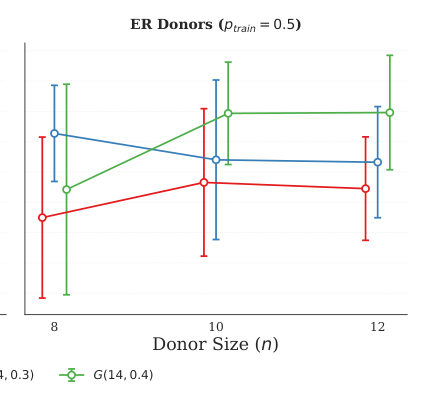 
Figure 3. Comparison of transfer performance across donor sizes for (a) 3- regular and (b) Erd˝os–R´enyi donors (trained at p = 0.5). The substantial overlap in error bars indicates that transfer quality is resilient to donor size, achieving highly competitive and statistically comparable performance even with 8-node donors.

**Summary.** This paper investigates how parameters learned by the FALQON quantum optimization algorithm can be reused (transferred) from small test graphs to solve larger, different graph problems like Max-Cut. The key finding is that the target graph's structure, not the source graph's size, determines success. This suggests a pathway to significantly reduce the computational overhead required for scaling quantum optimization algorithms.

**Why it may be interesting.** The findings on parameter transferability and resilience to donor size are crucial for developing scalable quantum algorithms, suggesting that small, cheap computations can provide robust parameters for much larger, resource-intensive problems.

Detailed structure

**Main problem.** The paper evaluates the parameter transferability of the FALQON quantum optimization algorithm when applying parameters learned on small graph instances to optimize larger or different graph structures.

**Main result.** Transfer success is primarily dictated by the structural properties of the recipient graph, showing high resilience to the size of the donor graph, especially for dense target graphs.

**Method.** The authors use an empirical study comparing parameter sequences optimized on small donor graphs (e.g., 8-node) versus larger recipients (14-node) across 3-regular and Erdős–Rényi graph families.

**Model / system.** The problem is Max-Cut, formulated as an Ising Hamiltonian solved using the FALQON algorithm, which treats optimization as a closed-loop control problem governed by a time-dependent Schrödinger equation.

**Key observables.** Approximation ratio (solution cut value relative to the exact optimum), transfer success, and convergence trajectories.

**Important parameters / regimes.** Donor sizes ($n \in \{8, 10, 12\}$), recipient size ($n'=14$), graph density ($p$), and graph families (3-regular, Erdős–Rényi).

**Assumptions / limitations.** The analysis assumes exact state-vector simulation to isolate parameter transferability from hardware noise, and it notes that performance is highly resilient to donor size.

**Figures summary.** Figures illustrate representative transfer trajectories, showing successful transfer for dense recipients and a clear performance gap for sparse cross-family cases, while also demonstrating parameter overlap across different donor sizes.

**Paper structure.** The work systematically evaluates parameter transferability across varying problem sizes and Hamiltonian families, comparing results for dense versus sparse graph structures.

Abstract

We evaluate FALQON parameter transfer for Max-Cut, transferring sequences from small donors ($n \in \{8,10,12\}$) to 14-node recipients. Using 3-regular and Erdős-Rényi families, we show that transfer success is dictated by the recipient graph, not the donor. Transfer excels for dense recipients -- achieving high approximation ratios regardless of the donor -- but remains challenging in sparse cross-family cases. Crucially, performance is highly resilient to donor size, with 8-node donors matching larger instances. Thus, cheap small graphs can provide robust parameters for larger targets, significantly reducing the measurement overhead of the feedback loop.

[↑ back to top](#top)

### [High-Fidelity ROI CT Reconstruction with Limited Quantum Resources via Hybrid Classical-Quantum Refinement](http://arxiv.org/abs/2605.29472v1)

**Authors:** Hyunju Lee, Jeonghwa Lee, Kyungtaek Jun  
**Type:** both · **Category:** other · **PDF:** <https://arxiv.org/pdf/2605.29472v1>  
**Analysis basis:** full PDF text, analyzed in chunks

📷 Fig 1

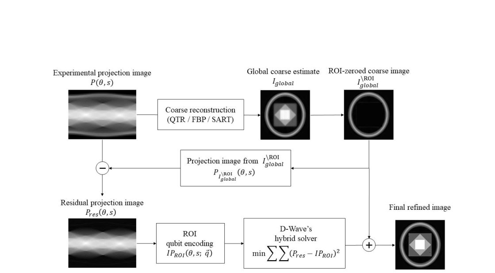 
Fig. 1. Overview of the proposed hybrid ROI-refinement pipeline for Sample 1 using the SART+QTR configuration. SART first produces the global coarse estimate 𝑰𝒈𝒍𝒐𝒃𝒂𝒍. After zero-masking the ROI in 𝑰𝒈𝒍𝒐𝒃𝒂𝒍, its projection image is subtracted from the experimental projection image 𝑷(𝜽, 𝒔) to form the residual projection image 𝑷𝒓𝒆𝒔(𝜽, 𝒔). The ROI is then refined by solving a QUBO with the D-Wave hybrid solver, and the optimized ROI is inserted back into the coarse image to obtain the final refined reconstruction.

📷 Fig 2

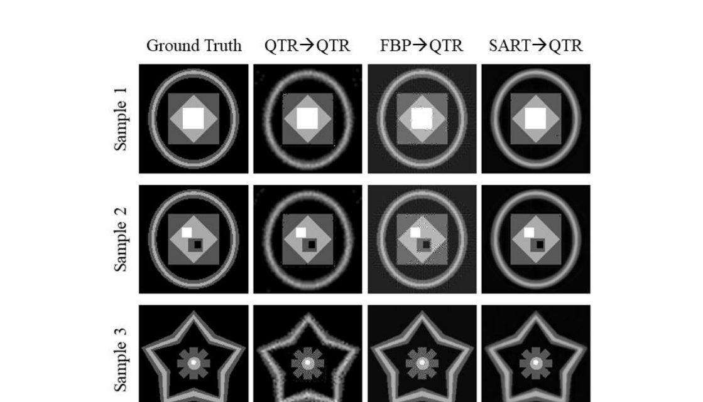 
Fig. 3. Final reconstruction results for the three phantom samples. Samples 1 and 2 were defined on 𝟏𝟐𝟎× 𝟏𝟐𝟎 grids, whereas Sample 3 was defined on a 𝟏𝟖𝟎× 𝟏𝟖𝟎 grid; the ROI size was 𝟔𝟎× 𝟔𝟎 in all cases. Each row corresponds to one sample, and each column shows the ground truth, QTR+QTR, FBP+QTR, and SART+QTR results. For Sample 3, the FBP+QTR and SART+QTR results were obtained using a denser angular sampling in the coarse- reconstruction stage, while the second-stage ROI refinement was performed with the same residual-based QTR formulation.

📷 Fig 3

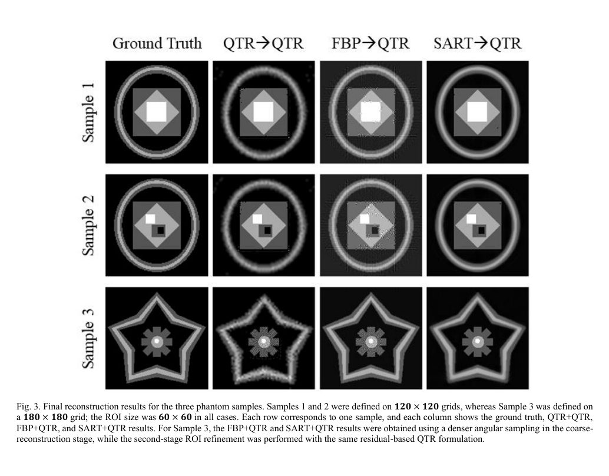 
Fig. 2. ROI absolute difference maps |𝑮𝑻−𝒓𝒆𝒄𝒐𝒏𝒔𝒕𝒓𝒖𝒄𝒕𝒊𝒐𝒏| for the three phantom samples. Samples 1 and 2 have size 𝟏𝟐𝟎× 𝟏𝟐𝟎, whereas Sample 3 has size 𝟏𝟖𝟎× 𝟏𝟖𝟎; the ROI size is 𝟔𝟎× 𝟔𝟎 in all cases. Each row corresponds to one sample, and each column corresponds to one reconstruction pipeline. Lower intensity indicates smaller reconstruction error inside the selected ROI. In QTR+QTR, both stages used 60 projection views, and the detector-position dimension was reduced to 60 before the first-stage QTR reconstruction. For Sample 3, the FBP+QTR and SART+QTR results used 180- view coarse reconstruction and 60-veiw second-stage QTR refinement.

📷 Fig 4

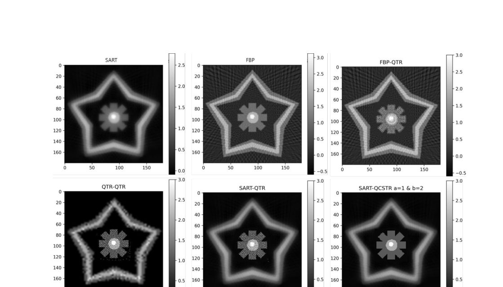 
Fig.4. . Final reconstruction results for the phantom sample. Sample was defined on a 𝟏𝟖𝟎× 𝟏𝟖𝟎 grid; the ROI size was 𝟔𝟎× 𝟔𝟎 in all cases. Each row corresponds to one sample, and each column shows the ground truth, QCSTR+QCSTR, FBP+QCSTR, and SART+QCSTR results.

📷 Fig 5

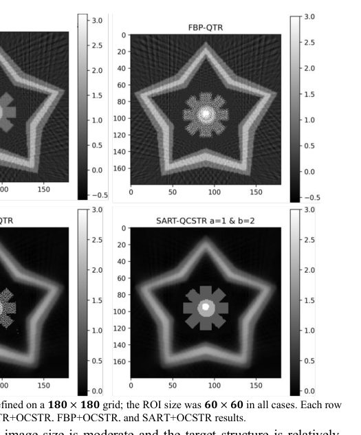 
Fig. 5. X-ray projection images of a mixed sample composed of a high- X-ray-MAC inner specimen embedded within a low-X-ray-MAC outer sample. To investigate the detectability of an internal crack, an artificial crack was introduced into the inner specimen, and projection images were obtained at two angles differing by 90°: (a) and (b).

**Summary.** This paper addresses the challenge of performing high-fidelity CT reconstruction with limited quantum resources by proposing a hybrid ROI refinement framework. It first uses classical methods to establish a stable global image estimate, and then applies quantum optimization only to the Region-of-Interest (ROI) using a residual projection formulation. The results demonstrate that this targeted quantum refinement strategy is highly effective and superior to purely quantum approaches for complex, real-world imaging data.

**Why it may be interesting.** While the application is in medical imaging, the core methodology—using classical computation to stabilize a global background estimate before applying quantum optimization to a localized, constrained subspace—is a generalizable paradigm for hybrid quantum-classical solvers in inverse problems.

Detailed structure

**Main problem.** The core challenge is achieving high-fidelity reconstruction of a Region-of-Interest (ROI) in Computed Tomography (CT) using quantum optimization techniques when quantum resources (qubits) are severely limited.

**Main result.** A hybrid framework combining classical global reconstruction (like SART) with quantum refinement applied only to the ROI significantly outperforms purely quantum methods, with SART+QTR/QCSTR achieving the lowest reconstruction error.

**Method.** The authors propose a two-stage hybrid approach: first, a coarse global image is reconstructed classically; second, the problem is reformulated as a residual projection-image minimization, which is then solved using quantum optimization (QUBO) only over the ROI.

**Model / system.** The physical system is CT reconstruction, modeled by the Radon transform, where the inverse problem is solved by minimizing discrepancies between measured projections and projections derived from the reconstructed image. The quantum part is formulated as a QUBO problem.

**Key observables.** Root Mean Square Error ($	ext{RMSE}_{	ext{ROI}}$) and Mean Absolute Error ($	ext{MAE}_{	ext{ROI}}$) are the primary metrics used to quantify reconstruction fidelity in the ROI.

**Important parameters / regimes.** The study is particularly relevant under reduced-angle or sparse-view measurements, which exacerbate ill-posedness in the inverse problem.

**Assumptions / limitations.** The primary assumption is that the global background can be reliably stabilized by classical methods, allowing quantum resources to be efficiently focused on local, high-detail refinement.

**Figures summary.** Figures illustrate the hybrid pipeline flow, showing the progression from the global estimate to the residual projection image, and comparing final reconstructed images for various phantom samples.

**Paper structure.** The paper introduces the limitations of full-image quantum reconstruction, proposes the hybrid ROI refinement framework, details the residual projection-image formulation, and validates the method by comparing multiple classical/quantum pipelines on complex phantom samples.

Abstract

Quantum optimization for computed tomography (CT) reconstruction is constrained by the number of binary variables required for image representation, making direct whole-image quantum reconstruction difficult for large or structurally complex objects. We propose a hybrid region-of-interest (ROI) refinement framework in which a coarse global image is first reconstructed by quantum tomographic reconstruction (QTR) and quantum compressed sensing tomographic reconstruction (QCSTR), filtered backprojection (FBP), or simultaneous algebraic reconstruction technique (SART), and quantum optimization is then applied only to the selected ROI through a residual projection-image formulation. This strategy reduces the effective QUBO size while preserving high-fidelity reconstruction in the target region. Experiments on three discrete phantom samples show that both QTR/QCSTR+QTR/QCSTR and SART+QTR/QCSTR achieve accurate ROI reconstruction for moderate-size cases under a reduced-angle setting. For the largest and most complex sample, the quality of the coarse global estimate becomes critical, and the best result is obtained when a stable classical coarse reconstruction is combined with second-stage ROI-only QTR/QCSTR. Among the tested pipelines, SART+QTR/QCSTR achieves the lowest average ROI RMSE and MAE. The results indicate that the practical advantage of quantum-assisted CT reconstruction lies in reserving quantum optimization for local refinement while using classical reconstruction to stabilize the global background.

[↑ back to top](#top)

### [Hybrid Gaussian-exponential zero-noise extrapolation for periodic circuits](http://arxiv.org/abs/2605.29242v1)

**Authors:** Tao Wang, Yun Shang  
**Type:** theory · **Category:** quantum information and computing · **PDF:** <https://arxiv.org/pdf/2605.29242v1>  
**Analysis basis:** full PDF text, analyzed in chunks

📷 Fig 1

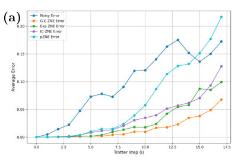 
Figure 2: Accuracy of different ZNE methods on the 1D transverse-field Ising model. (a). Mean absolute error versus circuit depth (number of steps) for different ZNE methods. (b). Box plots of absolute errors for different ZNE methods at depth 15 (200 circuits). The colored box spans the interquartile range (IQR), i.e., the region between the first and third quartiles. The median is shown as a black horizontal line. Whiskers extend to 1.5 × IQR, and black dots denote outliers.

📷 Fig 2

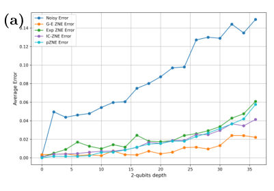 
Figure 4: Accuracy of different ZNE methods in random circuits. (a). Mean absolute error versus circuit depth (2-qubit gate depths) for different ZNE methods. (b). Box plots of absolute errors for different ZNE methods at depth 36 (200 circuits).

📷 Fig 3

 
Fig. 6(a) displays the expectation values for up to five iterations, where step = 3 corresponds to the first search peak. Within four steps, our extrapolation outperforms others in approaching the ideal values. At step = 5, all extrapolation approaches fail, presumably because the circuit depth is excessive, causing noise to completely alter the output structure. Fig. 6(b) focuses on sampling experiments at the first search peak to assess the stability of our model. We performed 1e6 shots per circuit to obtain extrapolated values and repeated the entire procedure ten times. To mitigate readout errors, we adopted

📷 Fig 4

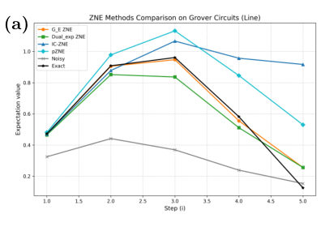 
Figure 6: Accuracy of diffrent ZNE methods in grover circuits. (a). Expectation values versus circuit iterations for different ZNE methods. (b). Box plots of expectation values for different ZNE methods at the first search peak.

📷 Fig 5

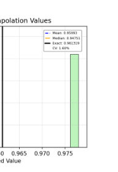 
Figure 7: Histogram of extrapolated values obtained from 50 different initial parameter sets using the Levenberg–Marquardt algorithm. The mean (blue dashed), median (orange dash-dotted), exact value (black solid line), and the coefficient of variation (CV) are displayed in the legend.

**Summary.** This paper introduces a novel Hybrid Gaussian-exponential Zero-Noise Extrapolation (G-E ZNE) technique to mitigate gate errors in quantum circuits with periodic structures. By leveraging a Central Limit Theorem proof showing noise scaling follows a log-normal distribution, the method offers superior error suppression compared to existing state-of-the-art techniques. This is crucial for advancing reliable quantum computation on current noisy hardware.

**Why it may be interesting.** The rigorous mathematical derivation connecting noise scaling to a log-normal distribution provides a powerful, theoretically grounded tool for error mitigation in near-term quantum hardware.

Detailed structure

**Main problem.** The primary goal is to suppress gate errors in current Noisy Intermediate-Scale Quantum (NISQ) hardware, particularly for quantum circuits exhibiting periodic structures.

**Main result.** The proposed Hybrid Gaussian-exponential Zero-Noise Extrapolation (G-E ZNE) method significantly reduces bias compared to previous techniques, especially for deeper circuits.

**Method.** The authors derive a hybrid extrapolation model by analyzing the noise amplification factor's statistical behavior, which is shown to approach a log-normal distribution via a Central Limit Theorem.

**Model / system.** The work analyzes quantum circuits, specifically focusing on those with periodic structure, under Pauli diagonal errors. The theoretical framework involves analyzing the transfer of Pauli operators via an approximate Markov process.

**Key observables.** Expectation values of Pauli operators ($\langle P_i 
angle$), circuit fidelity ($F$), and the noise amplification factor ($\lambda$).

**Important parameters / regimes.** Circuit depth/number of periods ($m$), noise strength ($\epsilon$), and the extrapolation parameter ($k$).

**Assumptions / limitations.** The method assumes the noise scaling factor follows a log-normal distribution, and the derivation relies on approximating the Markov process for Pauli operator transfer.

**Figures summary.** The notes do not detail specific figures, but mention performance assessment on Ising dynamics, random circuits, and Grover search, showing error reduction vs. depth.

**Paper structure.** The paper progresses by reviewing existing ZNE techniques (sZNE, IC-ZNE, pZNE), deriving the theoretical basis for the hybrid model using Markov process analysis and the Central Limit Theorem, and finally validating the model's performance on various quantum circuit benchmarks.

Abstract

Zero-noise extrapolation provides a practical means of suppressing gate errors in current noisy intermediate-scale quantum hardware. The accuracy of the zero-noise estimate depends sensitively on the fidelity of the assumed noise model to the actual error scaling. This work introduces a hybrid Gaussian-exponential extrapolation scheme tailored for quantum circuits with periodic structure, which are ubiquitous in quantum algorithms. Under Pauli diagonal errors, by constructing and analyzing an approximate Markov process for the transfer of Pauli operators, we prove a central limit theorem: the noise amplification factor weakly approaches a log-normal distribution, which motivates augmenting the standard exponential model with Gaussian variance corrections. The resulting model requires no prior noise characterization and applies directly to arbitrary periodic circuits. Performance is assessed on Trotterized Ising dynamics, random circuits, and Grover search algorithm using Qiskit noise simulators. For moderate to large circuit depths, the hybrid model yields measurable reductions in bias relative to previous extrapolation variants, indicating its utility for error mitigation on near-term quantum hardware.

[↑ back to top](#top)

### [Indefinite Causal Order Reverses the Real-Complex Hierarchy](http://arxiv.org/abs/2605.30238v1)

**Authors:** Jacopo Surace, Shintaro Minagawa, Ravi Kunjwal  
**Type:** theory · **Category:** quantum information and computing · **PDF:** <https://arxiv.org/pdf/2605.30238v1>  
**Analysis basis:** full PDF text, analyzed in chunks

📷 Fig 1

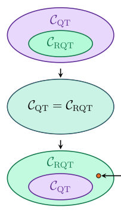 
FIG. 1. Real–complex hierarchy across causal assumptions. For fixed definite multipartite causal structures, QT is strictly richer than RQT [4]. For bipartite definite-order correlations, RQT and QT coincide [7, 8]. For process correlations with indefinite causal order, the hierarchy reverses: RQT is strictly richer than QT, as shown in this work. The point p⋆denotes the separating correlation constructed here.

**Summary.** This theoretical paper explores how quantum correlations are constrained by the assumed causal order and the underlying mathematical structure of quantum theory. It proves that when causality is indefinite, the physical constraints of Real Quantum Theory allow for strictly more correlations than those predicted by standard Complex Quantum Theory. This reversal of the complexity hierarchy is a key finding in quantum process theory.

**Why it may be interesting.** This work provides a deep, operational understanding of how fundamental assumptions about physical symmetries (like reality constraints) can fundamentally alter the correlations achievable in quantum systems, especially when causality itself is fuzzy.

Detailed structure

**Main problem.** The paper investigates whether causal relations can be subject to quantum indefiniteness and compares the operational distinction between real and complex quantum theories under such indefinite causal order.

**Main result.** Under indefinite causal order, Real Quantum Theory (RQT) realizes strictly more process correlations than standard Complex Quantum Theory (QT), reversing the hierarchy observed for fixed causal orders.

**Method.** The analysis uses the process-matrix framework to characterize achievable process correlations under symmetry constraints, comparing those derived from unitary (Twirled) and antiunitary (Real) symmetries.

**Model / system.** The study models quantum processes using process matrices in finite-dimensional bipartite qubit systems, comparing the constraints imposed by complex quantum theory (QT) versus real quantum theory (RQT).

**Key observables.** The set of achievable process correlations ($	ext{Cproc,fin}$), the Lazy Guess Your Neighbour’s Input (LGYNI) causal inequality, and the structure of the process matrix in the Pauli basis.

**Important parameters / regimes.** Finite dimensionality of the process matrices; the nature of the symmetry constraint (unitary vs. antiunitary).

**Assumptions / limitations.** The analysis is restricted to finite-dimensional process correlations and relies on the operational definition provided by the process-matrix framework.

**Figures summary.** Figures illustrate the hierarchy of correlations across different causal assumptions (definite vs. indefinite) and compare the constraints imposed by different symmetries.

**Paper structure.** The paper builds by first establishing the equivalence of QT correlations with those from twirled theories, then proving that the antiunitary symmetry (RQT) imposes strictly weaker constraints, leading to the reversal of the QT/RQT hierarchy under indefinite causality.

Abstract

Can causal relations be subject to quantum indefiniteness, similar to other physical properties? The process-matrix framework formalises this possibility: valid processes are defined by what local laboratories can implement, without assuming a global causal order. Standardly, the local labs are assumed to implement arbitrary quantum instruments. We ask what happens when symmetries restrict these local operations. Symmetry constraints, such as those arising from missing reference frames, superselection constraints, or the antiunitary symmetry defining real quantum theory, enlarge the admissible process cone. Do these extra processes generate genuinely new correlations? We prove a sharp dichotomy: no for any finite unitary symmetry, yes for real quantum theory. Recent work has shown that, under fixed and definite causal order, complex quantum theory is strictly richer than real quantum theory. Our work shows that this hierarchy is reversed under indefinite causal order: real quantum theory realizes strictly more process correlations than complex quantum theory.

[↑ back to top](#top)

### [Open Problem: Separating Geometric and Algorithmic Compression via Cayley-Table Completion](http://arxiv.org/abs/2605.29885v1)

**Authors:** Dongsung Huh  
**Type:** theory · **Category:** disordered systems and neural networks · **PDF:** <https://arxiv.org/pdf/2605.29885v1>  
**Analysis basis:** full PDF text, analyzed in chunks

📷 Fig 1

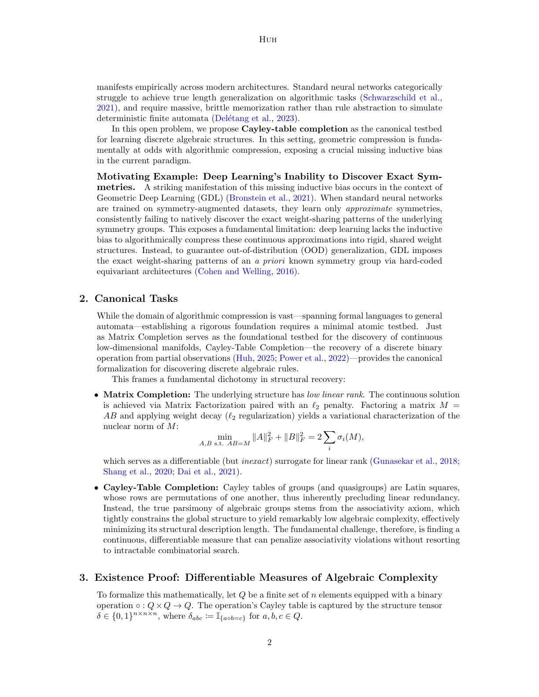 
Low-resolution page preview, page 2

📷 Fig 2

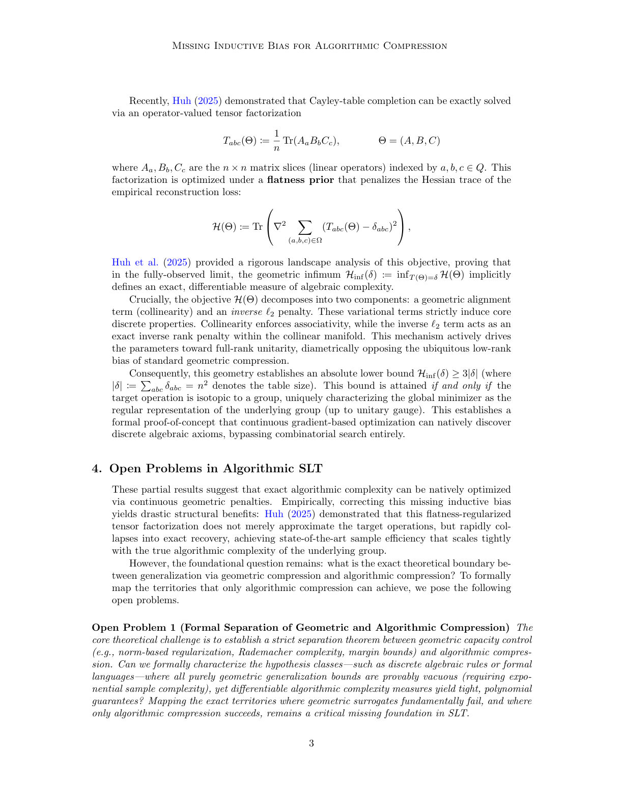 
Low-resolution page preview, page 3

📷 Fig 3

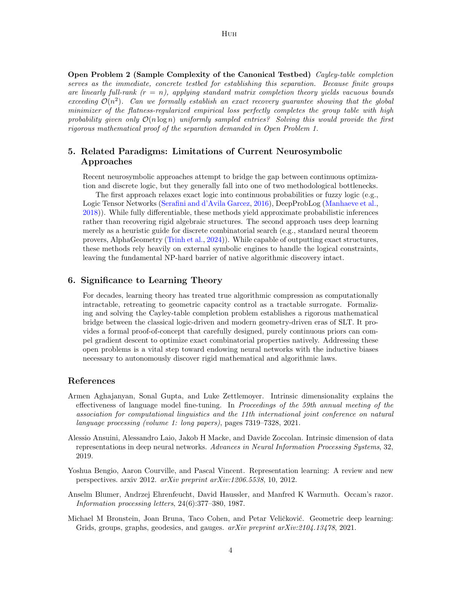 
Low-resolution page preview, page 4

📷 Fig 4

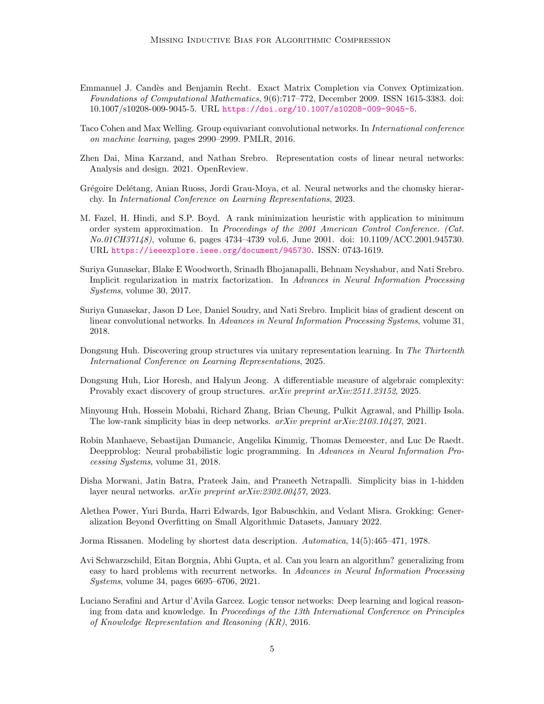 
Low-resolution page preview, page 5

📷 Fig 5

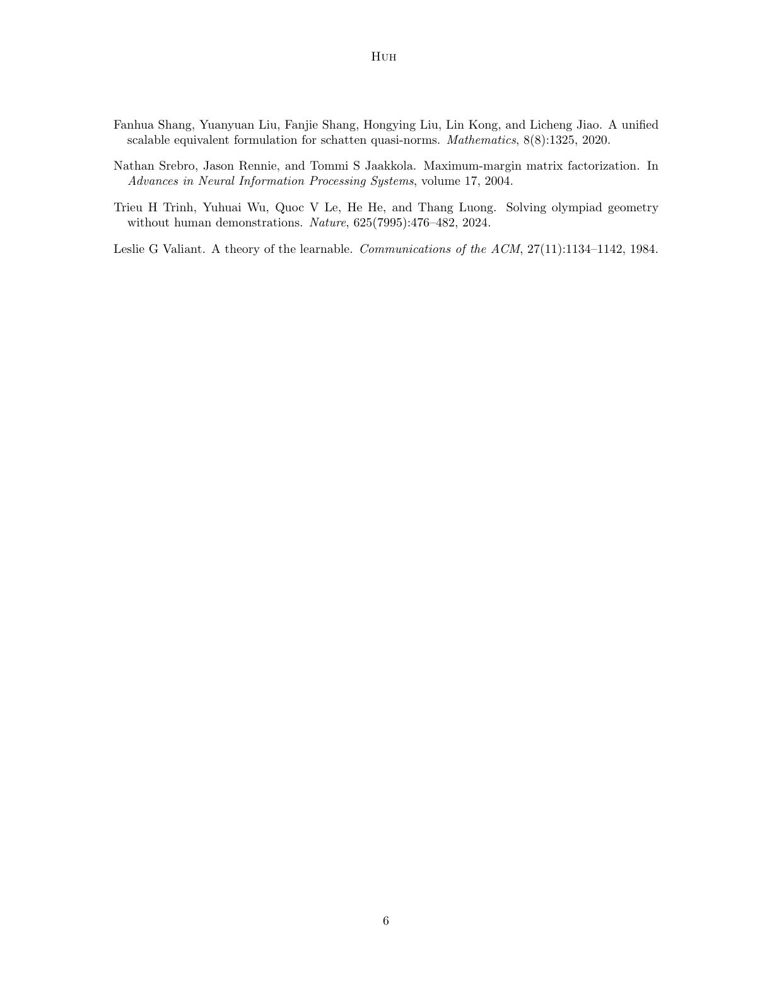 
Low-resolution page preview, page 6

**Summary.** This work tackles the fundamental theoretical challenge of moving deep learning beyond continuous geometric assumptions to robustly discover discrete, exact algebraic laws. By framing the problem as Cayley-table completion, the authors propose using specialized tensor factorization techniques to test for underlying discrete axioms like associativity. This research aims to provide the mathematical tools necessary for AI to autonomously derive fundamental physical laws.

**Why it may be interesting.** While highly theoretical, the focus on finding rigorous inductive biases for machine learning has implications for modeling complex, discrete physical systems where simple continuous approximations fail.

Detailed structure

**Main problem.** The paper addresses the theoretical gap between modern deep learning's reliance on continuous geometric compression and the need to model discrete, exact algorithmic rules.

**Main result.** It proposes Cayley-table completion as a canonical testbed to formally establish recovery bounds for discrete algebraic structures, bridging continuous and discrete learning theory.

**Method.** The authors use operator-valued tensor factorizations regularized by a flatness prior to implicitly encode and test for discrete algebraic axioms, contrasting this with standard low-rank geometric regularization.

**Model / system.** The primary model is Cayley-Table Completion, which involves recovering a discrete binary operation (a group structure) from partial observations, serving as the discrete analogue to matrix completion.

**Key observables.** Exact discrete associativity, low linear rank (geometric bias), and the formal recovery bounds for the completion problem.

**Important parameters / regimes.** The regularization strength of the flatness prior ($\mathcal{H}(\Theta)$) and the sample size ($O(n \log n)$ entries).

**Assumptions / limitations.** The core assumption is that algorithmic complexity minimization can be formalized and tested using continuous optimization techniques like flatness priors.

**Paper structure.** The paper is structured around identifying the theoretical divide between geometric and algorithmic compression, proposing Cayley-table completion as the testbed, detailing the tensor factorization approach, and concluding with open problems regarding formal separation theorems.

Abstract

Modern statistical learning theory and deep learning characterize generalization primarily in terms of continuous capacity control (e.g., norm-based regularization, margin maximization, low-rank bias). While highly successful in continuous domains, deep learning consistently fails to extrapolate exact algorithmic or discrete algebraic rules, reflecting a missing inductive bias toward algorithmic complexity minimization. We propose the Cayley-table completion as the canonical testbed for this missing bias, serving as the discrete algebraic counterpart to matrix completion. Just as matrix factorization combined with weight decay yields an implicit geometric bias toward low linear rank, recent results demonstrate that operator-valued tensor factorizations paired with a flatness prior yield an implicit algorithmic bias toward exact discrete associativity. We pose the open problem of establishing formal exact recovery bounds for Cayley-table completion, and challenge the community to generalize continuous flatness priors to autonomously discover broader discrete algorithmic axioms without combinatorial search.

[↑ back to top](#top)

### [Prototype-Guided Latent Alignment for Data-Efficient Fine-Tuning of Molecular Foundation Models](http://arxiv.org/abs/2605.29969v1)

**Authors:** Rushikesh Pawar, Harshit Rawat, Ayush Kumar, Phani Motamarri  
**Type:** both · **Category:** disordered systems and neural networks · **PDF:** <https://arxiv.org/pdf/2605.29969v1>  
**Analysis basis:** full PDF text, analyzed in chunks

📷 Fig 1

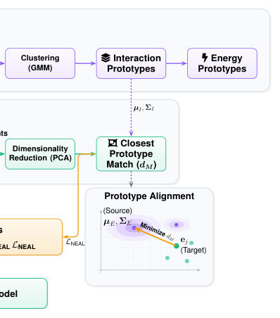 
Figure 1: Prototype latent alignment workflow: The pipeline proceeds in three stages to produce a fine-tuned model. Prototype Extraction: Latent representations (hj) from a source subset (D′ s) are projected via PCA and clustered using a Gaussian Mixture Model to obtain source interaction prototypes (µI, ΣI). Prototype Assignment: Target samples (Dt) are passed through the foundation model to obtain latents (hj), which are similarly projected, and assigned to the closest interaction prototype via Mahalanobis distance (dM), entirely within the interaction latent space. Prototype Alignment: The assigned distance (dM) is minimized by aligning target nodal energy latents (ej) with the...

📷 Fig 2

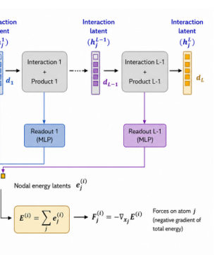 
Figure 2: Architectural overview of MACE with interaction and nodal energy latents. For atom j in molecule i, its local 1-hop neighborhood is embedded into an initial interaction latent h(0) j . This representation is iteratively refined through L interaction blocks, producing updated latents h(l) j . At each stage, readout networks map these interaction latents to nodal energy latents. These contributions, together with atomic energy terms, are aggregated to obtain the final nodal energy, from which total energy is computed and forces are derived as energy gradients with respect to atomic positions (Figure inspired by Batatia et al. [2022]).

📷 Fig 3

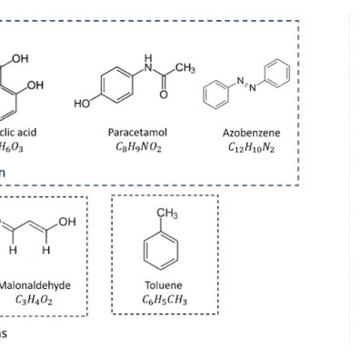 
Figure 3: Source and target molecules used in the rMD17 transfer setup in ST1.

**Summary.** This paper introduces a prototype-guided latent alignment technique to improve the data efficiency of fine-tuning Molecular Foundation Models (MLIPs). By anchoring the learning process to structural prototypes derived from source data, the method mitigates overfitting and poor generalization when applied to novel, data-scarce chemical systems. It demonstrates superior predictive accuracy compared to standard fine-tuning baselines.

**Why it may be interesting.** While focused on condensed matter potentials, the core methodology—using latent space clustering and alignment to enforce inductive biases from source data onto scarce target data—is highly relevant to developing robust ML models for complex quantum many-body systems where data is expensive.

Detailed structure

**Main problem.** Large-scale pre-trained foundation models for MLIPs fail to generalize to out-of-distribution (OOD) target materials, especially when labeled data is scarce.

**Main result.** The proposed prototype-guided alignment method significantly improves predictive accuracy in low-data regimes, achieving up to an 18% reduction in energy MAE over standard fine-tuning.

**Method.** The approach aligns target atom energy contributions to structural prototypes derived from the source domain by minimizing a novel Nodal Energy Alignment Loss (L_NEAL).

**Model / system.** The study focuses on Machine Learning Interatomic Potentials (MLIPs) implemented via Graph Neural Networks (GNNs) like MACE and SchNet, applied to molecular systems.

**Key observables.** Energy Mean Absolute Error (MAE) and Force MAE (reported in meV or meV/Å).

**Important parameters / regimes.** Low-data regimes (e.g., 5-20 training examples), alignment loss weight (lambda_NEAL), and the epoch threshold for loss application (N_NEAL).

**Assumptions / limitations.** The method assumes that local structural similarities between source and target domains imply analogous energy contributions, allowing for prototype-based guidance.

**Figures summary.** Figures illustrate the three-stage workflow: Prototype Extraction (clustering source latents), Prototype Assignment (mapping target latents to nearest prototype), and Prototype Alignment (minimizing energy latent distance).

**Paper structure.** The paper introduces the problem of OOD generalization in MLIPs, details the prototype-based alignment mechanism (including loss formulation), presents experimental validation on benchmarks like rMD17 and MACEOFF23, and concludes with ablation studies confirming the necessity of the alignment term.

Abstract

Machine learning interatomic potentials (MLIPs) have transformed materials discovery by leveraging graph neural networks (GNNs) to predict material properties with near density functional theory (DFT) accuracy. While large-scale pretrained foundation models offer transferable baseline representations, they frequently struggle to generalise to out-of-distribution (OOD) target systems -- a common challenge in modelling complex or chemically diverse materials. Fine-tuning is the standard remedy, but the high cost of generating DFT-labelled configurations confines adaptation to data-scarce regimes, where over-parameterised GNNs amplify overfitting and degrade target-domain performance. To address this, we propose a prototype-based alignment approach for data-efficient fine-tuning of MLIPs. Our method identifies local structural similarities between the source and target domains by grouping atoms with analogous chemical environments based on their latent representations. Each target-domain atom's energy contribution is aligned to its source-domain prototype, introducing an inductive bias that anchors fine-tuned representations to the pretrained structure, encouraging effective reuse of learned interactions and improving generalisation without restrictive assumptions on the target chemistry. We evaluate our method on the rMD17 benchmark using equivariant MACE and invariant SchNet across varying data budgets, and extend evaluation to the MACE-OFF foundation models on the SPICE dataset. Our approach consistently improves predictive accuracy in the low-data regime, reducing energy MAE by up to 18% over standard fine-tuning baselines.

[↑ back to top](#top)

### [Quadratic Sums-of-Powers for Fixed-Parameter Tractable Quantum-Circuit Simulation](http://arxiv.org/abs/2605.29944v1)

**Authors:** Alexis de Colnet, Floris Geerts, Rihan Hai, Alfons Laarman, Joon Hyung Lee, Guillermo A. Pérez  
**Type:** theory · **Category:** quantum information and computing · **PDF:** <https://arxiv.org/pdf/2605.29944v1>  
**Analysis basis:** full PDF text, analyzed in chunks

📷 Fig 1

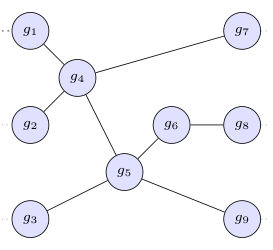 
Figure 2: A tensor-network graph and its corresponding line graph.

📷 Fig 2

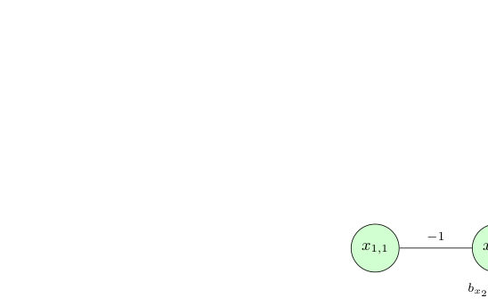 
Figure 3: The SOP variable graph GC for the circuit C of Example 1 after pinning |000⟩→|000⟩. Every edge carries the constant cross-term sign ω4 8 = −1, contributed as (−1)xuxv. Vertices carry unary phases ωbv 8 : the only nontrivial one here is bx2,1 = 1 (from the T gate), giving the phase ω8 = eiπ/4 at x2,1 = 1.

**Summary.** This paper develops a novel, highly efficient algorithm to simulate quantum circuits by reformulating the amplitude calculation as evaluating a quadratic Sum-of-Powers (SOP) polynomial. The complexity is shown to depend only on the rank-width of the associated variable graph, which is proven to be a superior structural measure compared to treewidth or linear rank-width for this problem.

**Why it may be interesting.** This work provides a powerful, structure-aware tool for quantum simulation that moves beyond general graph parameters like treewidth, offering a potentially much tighter complexity bound for specific quantum circuits.

Detailed structure

**Main problem.** The paper addresses the challenge of efficiently computing the output amplitude of a quantum circuit, which is mathematically equivalent to evaluating a quadratic Sum-of-Powers (SOP) polynomial over binary variables.

**Main result.** They introduce an algorithm whose time complexity is exponential only in the rank-width of the associated path-variable graph, providing a provably superior simulation bound compared to methods based on treewidth or tensor network contraction complexity.

**Method.** The core method is a dynamic programming approach parameterized by the rank-width of the SOP variable graph, which is optimized by transforming the residue counting problem into the Fourier domain to remove the modulus factor from the exponent.

**Model / system.** The system is general quantum circuits, specifically those built from Hadamard and diagonal gates, and applicable to the universal Clifford+T gate set. The simulation is framed as calculating the amplitude $\langle z|C|y
angle$ by mapping it to a quadratic SOP form.

**Key observables.** The output amplitude $\langle z|C|y
angle$, which is determined by the count $N_j$ of assignments $\mathbf{x}$ such that the quadratic SOP polynomial $f(\mathbf{x})$ equals $j \pmod{r}$.

**Important parameters / regimes.** The rank-width ($	ext{rw}$) of the SOP variable graph $G_C$ is the critical structural parameter governing the complexity. The modulus $r$ (e.g., $r=8$ for $\{H, T, CZ\}$) is also crucial.

**Assumptions / limitations.** The analysis assumes the circuit can be successfully mapped to a quadratic SOP form, and the complexity improvement relies on the rank-width being significantly smaller than the treewidth or linear rank-width.

**Figures summary.** Figures illustrate the relationship between the SOP variable graph $G_C$ and the tensor-network line graph $L(NC)$, and demonstrate the separation between rank-width, linear rank-width, and treewidth using specific graph constructions.

**Paper structure.** The paper first establishes the SOP viewpoint for quantum simulation, compares this to existing methods (tensor networks, BDDs), identifies rank-width as the key structural parameter, and then develops and analyzes a specialized dynamic programming algorithm parameterized by this rank-width.

Abstract

Strongly simulating a quantum circuit, that is, computing an output amplitude, amounts to summing the circuit's Feynman paths, a weighted count over assignments to the Boolean ``path'' variables. The circuit's gates induce correlations among these variables, forming a graph whose structure determines the hardness of the simulation task. This sum-of-powers viewpoint underlies recent simulators built on knowledge-representation tools from artificial intelligence, namely binary decision diagrams and weighted model counting. We show that the structural quantity most accurately governing the difficulty is the rank-width of the path-variable graph, and we give an algorithm that evaluates the amplitude in time that is exponential only in this rank-width and polynomial in the circuit size. Rank-width can be far smaller than the widths that control competing methods: as corollaries, our algorithm reproduces a recent decision-diagram simulation breakthrough as a special case and matches the Markov--Shi tensor-network contraction bound. To complement this, we exhibit circuit families on which our algorithm provably beats both competing methods. The new method applies to every circuit built from Hadamard and diagonal gates, in particular to circuits over Clifford+T. In practical terms, general-purpose decision-diagram and model-counting tools can serve as the workhorse, with our specialized algorithm dispatched to exploit a small rank-width of the associated graph when it is present.

[↑ back to top](#top)

### [Quantum algorithms for density functional theory with minimal readout](http://arxiv.org/abs/2605.29774v1)

**Authors:** Yuansheng Zhao, Hirofumi Nishi, Taichi Kosugi, Satoshi Hirose, Hiroki Sakagami, Tatsuki Oikawa, Tatsuya Okayama, Yu-ichiro Matsushita  
**Type:** theory · **Category:** quantum information and computing · **PDF:** <https://arxiv.org/pdf/2605.29774v1>  
**Analysis basis:** full PDF text, analyzed in chunks

📷 Fig 1

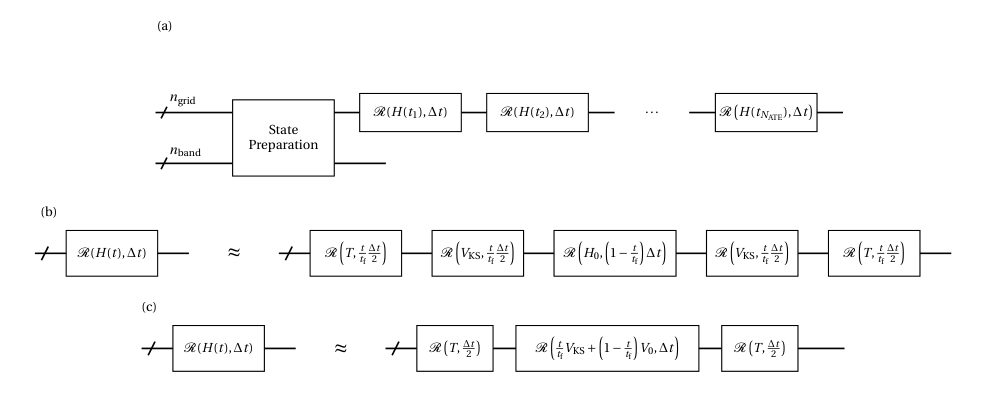 
FIG. 1. (a) Quantum circuits for performing adiabatic real-time evolution (ATE) with qubit-efficient encoding. Here ℛ(𝐻, Δ𝑡) = e−iΔ𝑡𝐻and 𝑁ATE denotes the real time evolution operator and total number of steps, respectively. (b) The implementation of ℛ(𝐻(𝑡), Δ𝑡) with Suzuki–Trotter splitting in ATE for a general 𝐻0. Here 𝑇and 𝑉KS denote the kinetic energy and Kohn–Sham potential operator, respectively, and 𝑡f is the total time duration for ATE. (c) The implementation of ℛ(𝐻(𝑡), Δ𝑡) when 𝐻0 can be written as 𝑇+ 𝑉0.

📷 Fig 2

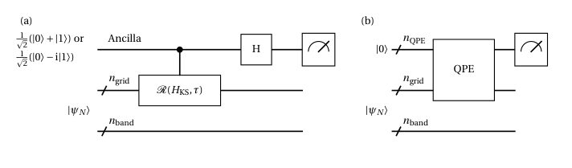 
FIG. 2. (a) Quantum circuit for reading out the band energy using Hadamard test. The real and imaginary part of ∑𝑖⟨𝜓KS 𝑖 |ℛ(𝐻KS, 𝜏)|𝜓KS 𝑖 ⟩can be obtained when the ancilla bit is initialized to be 1 √

📷 Fig 3

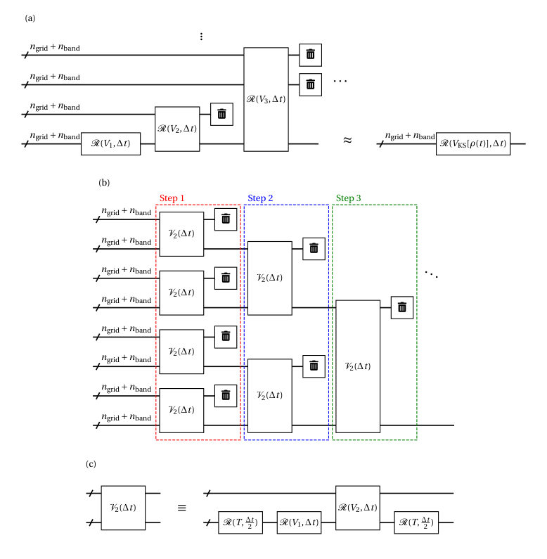 
FIG. 3. (a) The quantum circuit for performing real-time evolution of 𝑉KS[𝜌] of unknown 𝜌, but without reading it out, where the trash bin symbol “Ȑ” denotes tracing out and the operator 𝑉𝑛is given by Eq. (25) of the main text. The approximation becomes more accurate as higher order terms (omitted here by “⋯”) are included. (b) The circuit for performing self-consistency field calculation within ATE, where only up to the second order terms 𝑉2 are included, and the circuit of the sub-routine 𝒱2 is given in (c).

📷 Fig 4

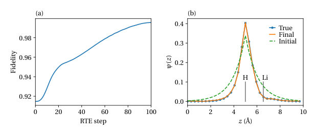 
FIG. 4. (a) The fidelity of wavefunction of LiH molecule with the true wavefunction during the ATE. (b) Wavefunctions along the line connecting H and Li atom.

📷 Fig 5

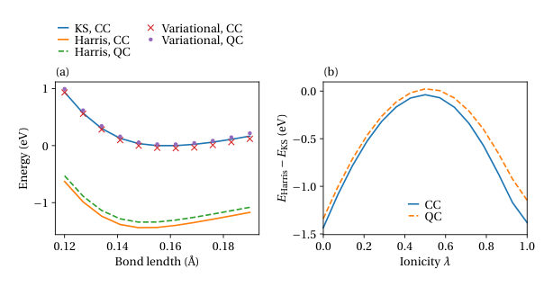 
FIG. 5. (a) Energy profile of LiH molecule with different bond lengths calculated by various methods. “QC” and “CC” denote quantum computation and classical computation (the true result), respectively. (b) Difference between Harris and KS total energy at Li–H distance 1.55 Å with different ionicity.

**Summary.** This paper presents quantum algorithms designed to accelerate DFT calculations by proposing methods that eliminate the need for costly electronic density readout. By employing techniques like the Harris functional and wavefunction copies, the authors demonstrate potential exponential speedups for calculating total energy and band structures. This work advances the feasibility of using quantum computation for materials science simulations.

**Why it may be interesting.** The focus on quantum algorithms for electronic structure, especially developing techniques to bypass the density readout bottleneck, is highly relevant to quantum simulation and quantum chemistry.

Detailed structure

**Main problem.** The primary challenge is accelerating Density Functional Theory (DFT) calculations on quantum computers while circumventing the computationally expensive readout of the electronic density.

**Main result.** The authors propose quantum algorithms, particularly leveraging the Harris functional, that can evaluate total energy with a potential exponential speedup by avoiding density readout entirely.

**Method.** The work utilizes qubit-efficient encoding schemes and quantum algorithms like Adiabatic Time Evolution (ATE) and Probabilistic Imaginary Time Evolution (PITE) to simulate the Kohn-Sham Hamiltonian.

**Model / system.** The model is electronic structure calculation using Kohn-Sham (KS) DFT for materials like LiH and BCC Li metal. The Hamiltonian is derived from the KS equations, and the complexity arises from the density-dependent potential.

**Key observables.** Total energy, band energies, Density of States (DOS), and state fidelity during time evolution.

**Important parameters / regimes.** The efficiency depends on avoiding density readout; the accuracy of the Harris functional depends on the input density ($
ho_{in}$) being close to the true KS density ($
ho_{KS}$).

**Assumptions / limitations.** The full SCF calculation using wavefunction copies is noted as a 'galactic algorithm' due to exponential qubit scaling, making the Harris functional approach more practical.

**Figures summary.** Figures illustrate the reproduction of the true energy surface for Li-H, the comparison of quantum vs. classical DOS and band structure for BCC Li, and the evolution of state fidelity during ATE.

**Paper structure.** The paper introduces the problem of DFT acceleration, proposes the qubit-efficient encoding and the Harris functional to bypass density readout, details the quantum algorithms (ATE/PITE) for energy calculation, and validates these methods on molecular and solid-state examples.

Abstract

While quantum computers have shown significant promise for electronic structure calculations, their potential to accelerate density functional theory (DFT) calculations remains unclear. In this work, we present a qubit-efficient encoding scheme for wavefunctions in Kohn--Sham (KS) DFT, together with a quantum algorithm that computes all occupied orbitals simultaneously. We further show that our algorithm is particularly well suited to the Harris functional, enabling the total energy to be evaluated with a potential exponential speedup over classical approaches by entirely avoiding the costly readout of the electronic density. In addition, we propose a second method for achieving self-consistent DFT calculations using multiple copies of the wavefunction, which likewise circumvents density readout. The applicability of our algorithms is demonstrated through several numerical examples, and their efficiency is compared with that of existing approaches.

[↑ back to top](#top)

### [Quantum encodings that preserve persistent homology](http://arxiv.org/abs/2605.28927v1)

**Authors:** Arthur J. Parzygnat, Andrew Vlasic  
**Type:** theory · **Category:** quantum information and computing · **PDF:** <https://arxiv.org/pdf/2605.28927v1>  
**Analysis basis:** full PDF text, analyzed in chunks

📷 Fig 1

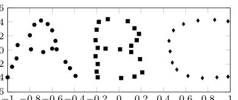 
FIG. 1. A dataset obtained by sampling from probability distributions concentrated near geometric shapes representing the letters A, B, and C. The data point markers are chosen differently to illustrate what happens to this dataset under a quantum encoding later in Figure 2.

📷 Fig 2

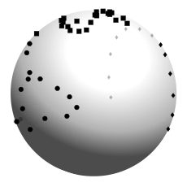 
FIG. 2. The dataset from Figure 1, with data vectors in the form x = (x1, x2), is mapped to the Bloch sphere by dense angle encoding |x⟩:= cos  x1

📷 Fig 3

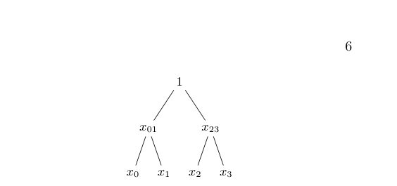 
FIG. 4. This is the binary tree decomposition of the data point (x0, x1, x2, x3) ∈∆3. Here, x01 = x0 + x1 and x23 = x2 + x3 [78, 83].

📷 Fig 4

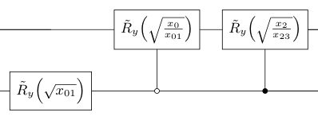 
FIG. 5. This circuit depicts the state preparation protocol for the square-root encoding in the case where the data lie on ∆3 ⊂R4 [78, 83]. The rotation gates in this circuit are defined by ˜Ry(α) = Ry  2 arccos(α)  (see Figure 4 and the body for the remaining notation). The resulting state associated with this circuit is √x0 |00⟩+ √x1 |10⟩+ √x2 |01⟩+ √x3 |11⟩.

📷 Fig 5

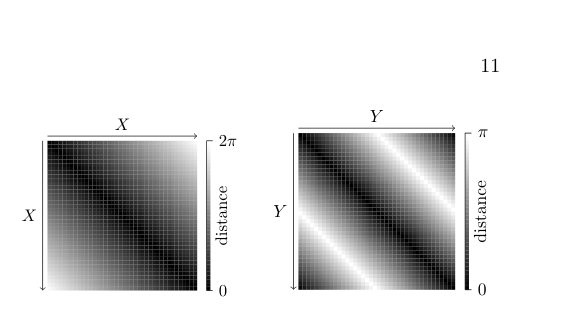 
FIG. 6. Heat maps of the Euclidean distance on the interval X = [0, 2π) and geodesic distance on the circle Y = S1, re- spectively. The sets have been discretized uniformly and the intensities have been rescaled so that the maximum distance between points is drawn in white and minimum distance be- tween points is drawn in black. See Example III.16 for more details.

**Summary.** This paper investigates quantum encodings designed to process classical data while ensuring the resulting quantum representation preserves the underlying topological structure, specifically persistent homology. It proposes a direct encoding approach to avoid computationally expensive steps in standard quantum TDA. The research is crucial for developing robust quantum machine learning algorithms that analyze the shape of complex datasets.

**Why it may be interesting.** This work bridges the gap between topological data analysis (a mathematical tool) and quantum computation, suggesting new constraints on how quantum algorithms can be designed to process real-world, geometrically structured data.

Detailed structure

**Main problem.** The core problem is determining which quantum encodings can process classical data while preserving the topological invariants (like persistent homology) derived from that data.

**Main result.** The authors argue for the necessity of finding structure-preserving quantum encodings that act directly on the classical data points, bypassing resource-intensive construction of combinatorial objects.

**Method.** The work involves analyzing various quantum state encodings (e.g., Angle, Amplitude, Square-root) and comparing the resulting quantum metrics against classical topological invariants using distance measures like the Gromov–Hausdorff distance.

**Model / system.** The model involves classical datasets, such as point clouds in Euclidean space, which are mapped onto quantum states ($
ho(x)$) via specific quantum encodings acting on qubits.

**Key observables.** Topological invariants (persistent homology, Betti numbers), quantum state distances (e.g., Bures, Hilbert-Schmidt), and distortion metrics (e.g., Gromov–Hausdorff distance).

**Important parameters / regimes.** The dimensionality of the data ($d$), the number of qubits used in the encoding, and the parameters defining the specific encoding function.

**Assumptions / limitations.** The primary assumption is that the topological structure of the data is the most critical feature to preserve during quantum encoding, and that direct encoding is superior to encoding derived combinatorial structures.

**Figures summary.** Figures illustrate data sampled near geometric shapes and show the distortion introduced by specific quantum encodings when mapping the classical data onto the quantum state space.

**Paper structure.** The paper progresses by first establishing the need for topological data analysis, then reviewing various quantum encoding schemes (Angle, Amplitude, etc.), and finally focusing on the mathematical criteria required for these encodings to preserve topological features.

Abstract

Given a data set with a notion of distance, such as a point cloud in Euclidean space, topological data analysis (TDA) uses techniques from algebraic topology and metric geometry to infer the topology of a hypothetical manifold from which the data are sampled. This inference is achieved by calculating topological invariants, some of which are difficult to compute classically. Meanwhile, quantum TDA utilizes quantum processes to extract the invariants used in making such inferences in an attempt to speed up the computations. Because applying transformations to the original classical dataset could alter the associated topological invariants, we investigate which quantum encodings would best preserve the invariants of the original dataset. This line of inquiry is distinct from standard approaches in quantum TDA, whose typical starting point is not from the classical dataset directly, but rather from the associated combinatorial objects, such as simplicial complexes, which typically demand a lot of resources to construct. We take the first step at a more direct approach by focusing on which quantum encodings acting directly on the data are admissible for applying quantum algorithms to extract topological features from classical datasets.

[↑ back to top](#top)

### [Quantum Implicit-Explicit Schemes for Multiscale Ordinary and Partial Differential Equations via Schrödingerization](http://arxiv.org/abs/2605.29423v1)

**Authors:** Qitong Hu, Xiaoyang He, Shi Jin, Xiao-Dong Zhang  
**Type:** theory · **Category:** quantum information and computing · **PDF:** <https://arxiv.org/pdf/2605.29423v1>  
**Analysis basis:** full PDF text, analyzed in chunks

📷 Fig 1

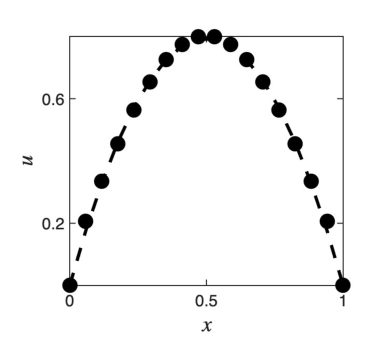 
Fig. 1: Numerical results for Eq. (5.1) in the 1D case after Schrödingerization, shown at t = 0.1, with a(t) = 100/(t + 1) and u0(x) = 1 for x ∈[0, 1]. The spatial and temporal discretization parameters are ∆x = 2−4 and ∆t = ∆x2/2, respectively. Results from our scheme are shown by circular markers and compared with the classical-scheme solution shown by the black curve.

📷 Fig 2

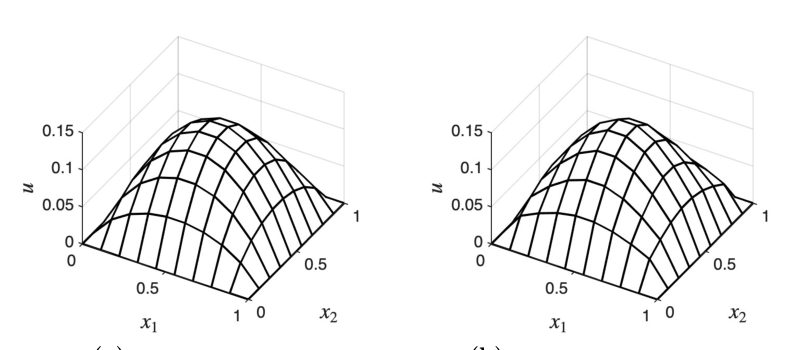 
Fig. 2: Numerical results for Eq. (5.1) in the 2D case after Schrödingerization, shown at t = 0.1. Panel (a) shows the classical scheme, and panel (b) shows the quantum IMEX scheme. The spatial and temporal discretization parameters are ∆x1 = ∆x2 = 2−3 and ∆t = ∆x2 1/2 = ∆x2 2/2, respectively.

📷 Fig 3

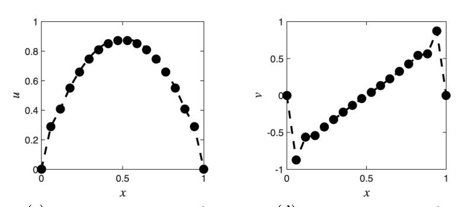 
Fig. 3: Numerical results for Eq. (5.2) with a(t) = 0.5t+0.25 and β = 2 after Schrödingerization, shown at t = 0.1. The MATLAB implementation uses 16 interior spatial unknowns, ∆t = 0.5 ∆x3/2, and a support-compressed realization of the χ-based homogeneous extension with K = √Nx.

**Summary.** This paper introduces a novel quantum Implicit-Explicit (IMEX) scheme utilizing the Schrödingerization framework to solve multiscale PDEs on quantum computers. Its key breakthrough is achieving a query complexity that is independent of the small scaling parameter $\varepsilon$, a major hurdle in simulating stiff, multiscale physical systems. This advances the practical application of quantum computation to complex physics problems.

**Why it may be interesting.** The work provides a concrete quantum computational pathway for simulating complex physical systems (like those governed by multiscale PDEs) where traditional numerical methods struggle with stiffness, directly impacting quantum simulation feasibility.

Detailed structure

**Main problem.** Developing quantum algorithms to solve multiscale Ordinary and Partial Differential Equations (ODEs/PDEs) whose discretization parameters are independent of the small scaling parameter $\varepsilon$.

**Main result.** The proposed quantum IMEX scheme achieves query complexity independent of the scaling parameter $\varepsilon$, significantly improving upon previous quantum methods.

**Method.** The approach uses a quantum Implicit-Explicit (IMEX) scheme combined with the Schrödingerization framework to map the differential equation into a unitary evolution suitable for quantum simulation.

**Model / system.** The methods are applied to multiscale ODEs and PDEs, exemplified by the linear heat equation and the multiscale telegraph equation, which exhibit widely separated temporal or spatial scales.

**Key observables.** Query complexity, auxiliary register width, and global error bounds.

**Important parameters / regimes.** Scaling parameter $\varepsilon$, time step $\tau$, spatial step $h$, and the number of time steps $N_t$.

**Assumptions / limitations.** The analysis assumes that the entries of the system matrices are of order $O(1)$ and that the solution remains bounded.

**Figures summary.** Figures show numerical results comparing the quantum IMEX scheme against classical methods for the 1D and 2D Heat Equations, demonstrating convergence across different $\varepsilon$ values.

**Paper structure.** The paper builds from general IMEX theory to the Schrödingerization framework, analyzes error propagation and convergence bounds, and concludes with specific numerical applications to the Heat and Telegraph equations.

Abstract

In this paper, we present a quantum implicit-explicit (IMEX) scheme for multiscale ordinary and partial differential equations whose discretization parameters are independent of the scaling parameter $\varepsilon$. A key ingredient of our approach is a continuous-time formulation of classical IMEX schemes, which decouples the evolution time of the quantum algorithm from the physical time of the differential equation and is therefore particularly useful in multiscale settings. Building on this idea, we employ the Schrödingerization framework [Phys. Rev. Lett. 133 (2024), 230602] to implement IMEX schemes on quantum computers. Compared to previous HHL type quantum AP scheme [J. Comput. Phys. 471 (2022), 111641], this new method requires narrower -- an extra logarithmic factor -- auxiliary register numerical examples on linear heat and multiscale telegraph equations demonstrate the independence in $\varepsilon$ of the method.

[↑ back to top](#top)

### [Quantum optimization beyond QUBO for industrial logistics and scheduling](http://arxiv.org/abs/2605.30252v1)

**Authors:** Juan F. R. Hernandez, Pavle Nikacevic, Enrique Solano, Chinonso Onah, Agneev Guin, Arne-Christian Voigt, Archismita Dalal  
**Type:** theory · **Category:** quantum information and computing · **PDF:** <https://arxiv.org/pdf/2605.30252v1>  
**Analysis basis:** full PDF text, analyzed in chunks

📷 Fig 1

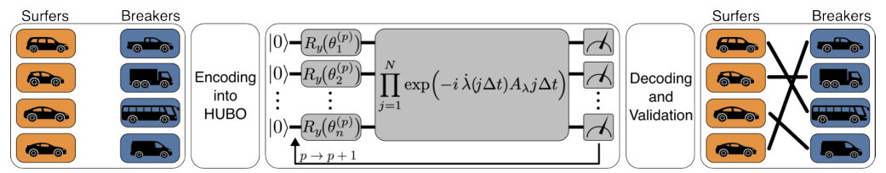 
FIG. 1. High-level QUEST workflow from the set of breakers and surfers, through HUBO encoding and iterative BF-DCQO evolution, to decoding and validation of the final breaker–surfer matching. In the central panel, the quantum circuit represents the p-th BF-DCQO iteration: single-qubit Ry rotations prepare the biased initial state, the digitized counterdiabatic evolution implements the problem Hamiltonian, and measurement outcomes are used to update the bias field for the next iteration.

📷 Fig 2

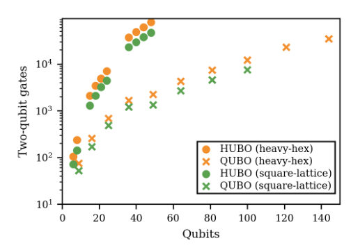 
FIG. 2. Two-qubit gate operations needed to encode QUEST circuits as a function of number of qubits, corresponding to breaker (surfer) counts from 3 to 12. The circuits transpiled to IBM Kingston (heavy- hex) and IBM Miami (square-lattice). In the IBM Miami QUBO case, 11 and 12 breaker instances are not included since they require more qubits than available.

📷 Fig 3

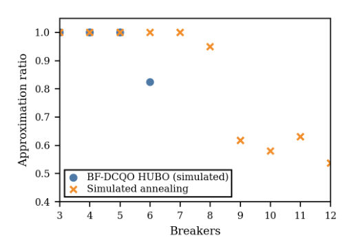 
FIG. 3. Approximation ratios for simulated annealing quadratized HUBO (104 shots and 106 sweeps) and BF-DCQO HUBO (stat- evector simulation, 3 bias-field iterations, 104 shots each). The BF- DCQO HUBO results were obtained with the full Hamiltonian up to 5 breakers, while the instances larger than that used the reduced Hamiltonian.

📷 Fig 4

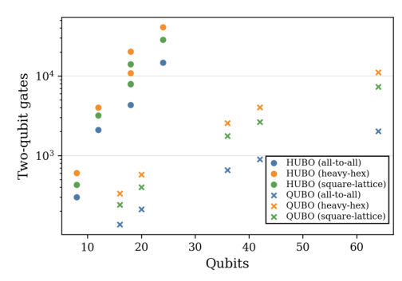 
FIG. 4. Transpiled two-qubit gate counts for a subset of CVRP in- stances under three connectivity assumptions. The all-to-all results were obtained using the IBM Aer simulator, while the heavy-hex and square-lattice results were obtained by transpiling to IBM Kingston and IBM Miami, respectively.

📷 Fig 5

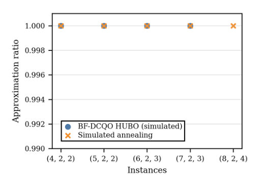 
FIG. 5. Approximation ratios obtained for simulated annealing on the quadratized HUBO formulation using 104 shots and 106 sweeps, and for BF-DCQO on the HUBO formulation using statevector sim- ulation with 10 bias-field iterations and 104 shots per iteration.

**Summary.** This work investigates using quantum optimization to solve complex industrial logistics problems, proposing Higher-Order Unconstrained Binary Optimization (HUBO) as an improvement over standard QUBO. While HUBO reduces the required number of qubits, it significantly increases circuit depth due to higher-order terms. The authors conclude that current hardware limitations necessitate a shift toward hybrid quantum-classical workflows for practical application.

**Why it may be interesting.** The detailed analysis of resource scaling, gate overheads, and the explicit comparison between QUBO and HUBO provides a rigorous theoretical roadmap for when and how quantum computation can tackle real-world combinatorial optimization challenges.

Detailed structure

**Main problem.** The paper addresses the need for quantum optimization methods that can accurately model complex industrial scheduling and routing problems, moving beyond the limitations of standard Quadratic Unconstrained Binary Optimization (QUBO).

**Main result.** Higher-Order Unconstrained Binary Optimization (HUBO) formulations are necessary to faithfully encode complex constraints, offering better qubit scaling than QUBO, but their practical implementation is limited by increasing circuit depth.

**Method.** The authors compare HUBO and QUBO encodings for problems like CVRP and scheduling, validating them using classical solvers and benchmarking quantum execution via Bias-Field Digitized Counterdiabatic Quantum Optimization (BF-DCQO) in simulation.

**Model / system.** The models involve mapping logistics problems (e.g., CVRP, assembly scheduling) into Hamiltonians, comparing quadratic (QUBO) vs. higher-order (HUBO) penalty terms. The quantum simulation uses BF-DCQO, which evolves the system Hamiltonian $H(\lambda)$ over time.

**Key observables.** Qubit count, circuit depth (number of two-qubit gates), approximation ratio, and quantum gate fidelity.

**Important parameters / regimes.** Gate fidelity ($f_{2q}$), coherence time, and the required penalty coefficients ($\lambda$) for constraint enforcement.

**Assumptions / limitations.** The primary assumptions involve the feasibility of hybrid quantum-classical workflows and the necessity of fault-tolerant hardware for large-scale problems.

**Figures summary.** Figures illustrate the workflow for QUEST and CVRP, comparing two-qubit gate counts for QUBO vs. HUBO under different connectivity assumptions, and showing approximation ratios for different solvers.

**Paper structure.** The paper progresses from identifying the limitations of QUBO for complex constraints to developing the HUBO framework for three specific industrial problems (QUEST, CVRP, Scheduling). It details the Hamiltonian construction, compares resource scaling (qubits vs. gates), and concludes by advocating for hybrid quantum-classical approaches.

Abstract

The increasing complexity of industrial scheduling and transport routing problems motivates the study of alternative optimization formulations and computational paradigms. In this work, we study how higher-order unconstrained binary optimization (HUBO) formulations of such problems map onto quantum optimization workflows in both noisy and fault-tolerant regimes. We consider three representative logistics and manufacturing use cases and formulate each as a HUBO problem. This captures process intricacies, such as highly correlated assembly-line scheduling rules, which are difficult to express faithfully with the standard quadratic (QUBO) form, while at the same time reducing the number of binary variables required in the quantum mapping, thus lowering qubit demand. We compare the HUBO formulations with corresponding QUBO encodings, highlighting a key trade-off: while HUBO reduces qubit requirements through compact binary encoding, it introduces higher-order interaction terms that increase circuit depth, limiting feasibility on current quantum hardware. The proposed formulations are validated using classical solvers across several problem instances and benchmark small routing problem instances using bias-field digitized counterdiabatic quantum optimization in classical simulation. We complement these results with a resource and scalability analysis, focusing on the capacitated vehicle routing problem as a representative large-scale industrial use case. Our analysis indicates that while HUBO formulations offer advantages in qubit scaling compared to QUBO encodings, their practical implementation is constrained by gate fidelity, coherence, and circuit depth, making hybrid quantum-classical workflows and early fault-tolerant quantum hardware the most plausible settings for their practical use.

[↑ back to top](#top)

### [Rademacher Complexity Bounds for Parameterized Quantum Circuits Generated by Pauli Strings](http://arxiv.org/abs/2605.29546v1)

**Authors:** Hiroshi Ohno  
**Type:** theory · **Category:** quantum information and computing · **PDF:** <https://arxiv.org/pdf/2605.29546v1>  
**Analysis basis:** full PDF text, analyzed in chunks

📷 Fig 1

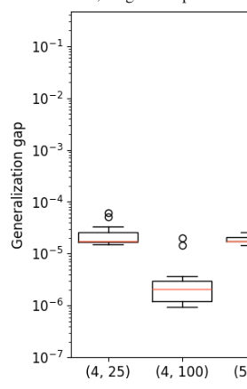 
Figure 1: Box plots of the generalization gaps for pairs (L, M) of parameter size L and sample size M

📷 Fig 2

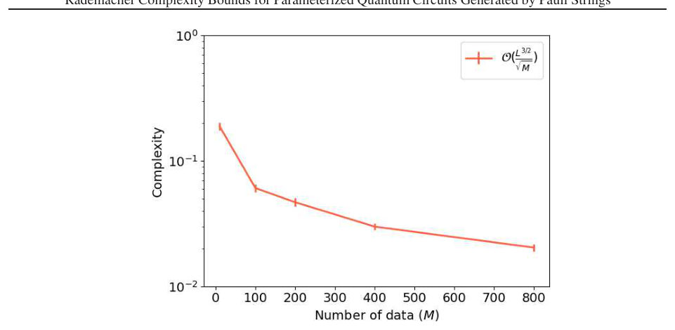 
Figure 2: Results for the dependence on sample size M. The y-axis denotes approximated empirical Rademacher complexity.

📷 Fig 3

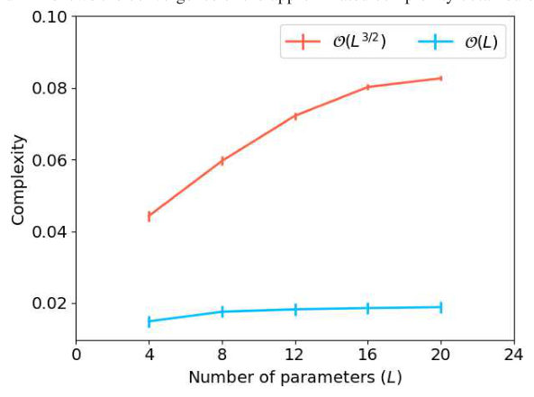 
Figure 3: Results for the dependence on parameter size L. The y-axis denotes approximated empirical Rademacher complexity.

📷 Fig 4

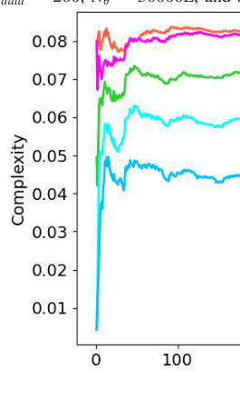 
Figure 4: Results for the approximated complexity as a function of Ntrials

**Summary.** This paper derives theoretical bounds on the Rademacher complexity for quantum circuits parameterized by Pauli strings. By analyzing the complexity, the authors establish how the generalization error scales with the number of parameters ($L$) and training samples ($M$). This work provides a crucial statistical framework for understanding the learning capacity of quantum machine learning models.

**Why it may be interesting.** It provides rigorous statistical learning theory tools (Rademacher complexity) to quantify the generalization capacity of quantum machine learning models built from Pauli circuits, which is crucial for assessing the practical utility of these quantum models.

Detailed structure

**Main problem.** The study analyzes the generalization properties of parameterized quantum circuits (unitaries) generated by Pauli strings by deriving explicit Rademacher complexity bounds.

**Main result.** The derived bounds show that the Rademacher complexity scales as $O(L^{3/2}/\sqrt{M})$ for the full parameter domain, improving to $O(L/\sqrt{M})$ when the parameter domain is restricted.

**Method.** The authors use Rademacher complexity ($	ext{RM}(F)$) as a measure for generalization gap bounding, applying techniques involving Lipschitz constants and covering number estimates.

**Model / system.** The model is a parameterized unitary $U(	heta) = \prod_{j=1}^{L} \exp(-i	heta_j G_j)$, where the generators $G_j$ are $n$-qubit Pauli strings. The expectation value $f(x; 	heta)$ is the observable analyzed.

**Key observables.** Rademacher complexity ($	ext{RM}(F)$), Generalization Gap, expectation value $f(x; 	heta)$.

**Important parameters / regimes.** L (Number of parameters), M (Number of training samples), n (Number of qubits).

**Assumptions / limitations.** The theoretical analysis relies on bounding the covering number and using the Lipschitz constant; numerical experiments use a random-search approximation.

**Figures summary.** The notes describe figures showing the dependence of the approximated empirical Rademacher complexity on sample size $M$ and parameter size $L$, consistent with the predicted $1/\sqrt{M}$ and $L$ scaling.

**Paper structure.** The paper develops the theoretical bounds using complexity measures, compares these bounds to classical models, and supports the findings with numerical experiments analyzing scaling with $L$ and $M$.

Abstract

In this study, we analyze the Rademacher complexity $ \mathcal{R}_{M} $ of a parameterized unitary whose generators are chosen from $ n $-qubit Pauli strings. Although generalization bounds for quantum machine learning models have been studied in several settings, explicit Rademacher-complexity bounds for parameterized unitaries generated by Pauli strings remain less transparent. We derive simple scaling bounds in terms of the number of parameters $ L $ and the number of training samples $ M $: $ \mathcal{O}(\frac{L^{\frac{3}{2}}}{\sqrt{M}}) $ for the full parameter domain and $ \mathcal{O}(\frac{L}{\sqrt{M}}) $ for a restricted parameter domain. Furthermore, we compare the obtained results with those for a classical linear model class and suggest a potential statistical-complexity advantage when the norms of both the input and the parameter in the classical model scale with the number of parameters. Numerical experiments provide qualitative evidence consistent with the predicted scaling.

[↑ back to top](#top)

### [Simulation of smooth models of potentials with singular point using Many-Interacting-Worlds Method](http://arxiv.org/abs/2605.30124v1)

**Authors:** Wen Chen, An Min Wang  
**Type:** theory · **Category:** numerical methods · **PDF:** <https://arxiv.org/pdf/2605.30124v1>  
**Analysis basis:** full PDF text, analyzed in chunks

📷 Fig 1

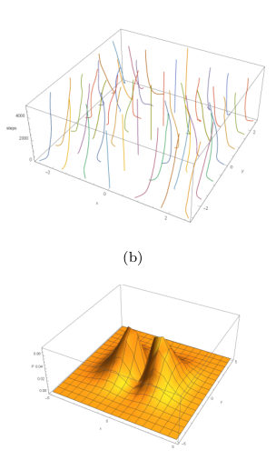 
Figure 1: Simulation results of excited states of error function model of 2-dimensional coulomb potential. The number of worlds in left column is N = 6 × 7, while N = 7 × 7 in right column. The models used here both are V (x, y) = −erf(3 p

📷 Fig 2

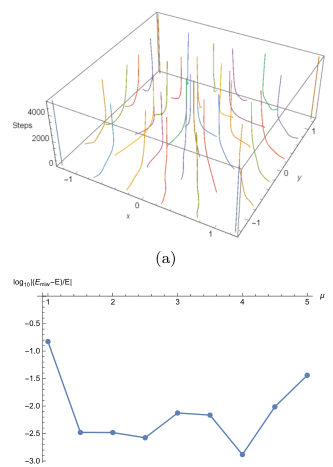 
Figure 2: Ground-state simulation results of smooth models of 2-dimensional coulomb po- tential. (a): The evolution of N = 6 × 6 worlds configuration of smooth model V (x, y) = −erf(4 p

📷 Fig 3

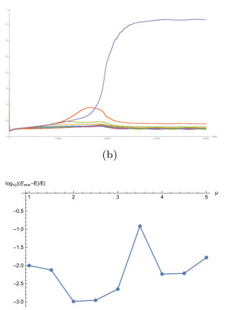 
Figure 3: Simulation results of smooth models of 1-dimensional finite trap potential. (a): The evolution of N=20 worlds configuration of smooth model V (x) = erf(2(x −1)) −erf(2(x + 1)) + 2 with ∆t = 5 × 10−2 and total 40000 steps in minimum effective region [−4, 4]. (b): The bandwidth hn of the system in (a). (c): The density of ground states of system in (a) (solid line) and the solution from matrix Numerov algorithm with grids of 100 (plots). (d): The energy error varies with parameter ν in error function model Vν(x) = [erf(ν(x −1)) −erf(ν(x + 1)) + 2].

**Summary.** This paper extends the Many-Interacting-Worlds (MIW) method to simulate quantum systems with singular potentials, such as the Coulomb potential. By replacing these singularities with asymptotically smooth models, the authors demonstrate that their dynamical algorithm yields results consistent with established quantum mechanical solvers. This advances the applicability of the MIW framework to more complex, realistic physical models.

**Why it may be interesting.** The development and rigorous testing of a novel numerical framework (MIW) to handle complex, singular potentials in quantum mechanics is highly relevant for developing robust computational tools for AMO physics simulations.

Detailed structure

**Main problem.** The paper addresses the challenge of applying the Many-Interacting-Worlds (MIW) method to solve bounded quantum systems, especially those involving singular potentials like the Coulomb potential.

**Main result.** The MIW dynamical algorithm successfully reproduces results consistent with standard quantum mechanics methods (like the Numerov method) when singular potentials are replaced by asymptotically smooth models.

**Method.** The core method is the MIW dynamical algorithm, which simulates the system's evolution using an interacting 'worlds' approach. This is supplemented by kernel estimation for density approximation and replacing singular potentials with smooth asymptotic forms.

**Model / system.** The study focuses on solving the time-independent Schrödinger equation for various bounded potentials, including the harmonic oscillator, the 2D Coulomb potential, and finite trap potentials, extending the MIW method to 2D and higher dimensions.

**Key observables.** Stationary state energies ($E_n$), total energy convergence, and comparison of the MIW energy ($E_{	ext{miw}}$) against the standard matrix Numerov energy ($E$).

**Important parameters / regimes.** The smoothness parameter ($
u$ or $\mu$) used in the asymptotic potential replacement, the time step ($\Delta t$), and the number of interacting worlds ($N$).

**Assumptions / limitations.** The method assumes that potentials can be accurately approximated by smooth asymptotic forms near singularities, and that the dynamical algorithm will converge to the true stationary state energy.

**Figures summary.** Figures illustrate the convergence of the total energy error for the 2D Coulomb potential as the smoothness parameter ($\mu$) is varied, and show the evolution of world configurations and bandwidth for both 1D and 2D systems.

**Paper structure.** The paper builds upon previous work on the harmonic oscillator, details the use of kernel estimation for density, introduces the asymptotic smoothing technique for singular potentials, and validates the dynamical algorithm's convergence against established quantum mechanical solvers.

Abstract

The deterministic many-interacting-worlds method proposed in 2014 showed potential among the numerous interpretation of quantum mechanics. The successful application of this method in harmonic oscillator has been promoted for a long time. In this article we continue the idea about using this method to solve some bounded systems different from harmonic oscillator potential and extend to 2 dimension cases. We focus on the potential with singularity like coulomb potential and finite trap potential by some asymptotic smooth method. The numerical simulation mainly based on the dynamical algorithm proposed in many-interacting-worlds method will be used to approach the stationary states of given systems. Our results shows the consistency to the matrix Numerov method in standard quantum mechanics in solving bounded systems and provides the possibility to solve more complex systems.

[↑ back to top](#top)

## Secondary cond-mat archives

*Papers from  mes-hall, other, soft, supr-con. These archives are de-prioritized — they appear at the end regardless of relevance score.*

### Relevant in secondary archives (21)

### [Reinterpreting Memory Effects in Nonequilibrium Systems: From Temporal Dynamics to Steady-State Signatures via NEGF](http://arxiv.org/abs/2605.28993v1)

**Authors:** Pragya Chaudhary  
**Type:** theory · **Category:** statistical mechanics · **PDF:** <https://arxiv.org/pdf/2605.28993v1>  
**Analysis basis:** full PDF text, analyzed in chunks
**Topic relevance:** 🔥 `Keldysh / 2PI / non-Gaussian methods` **4/5** · 🔥 `non-equilibrium dynamics` **4/5** · `correlated / nonlocal dissipation` **3/5** · `driven-dissipative phase transition` **3/5** · `methods for driven-dissipative` **3/5** · `non-equilibrium universality` **3/5** · `Kondo & dissipative impurity` **2/5** · `analog quantum simulation` **1/5**

📷 Fig 1

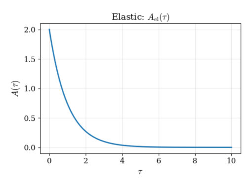 
FIG. 1. Decaying nature corresponds to the elastic scattering

📷 Fig 2

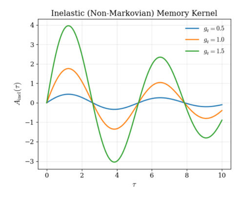 
FIG. 2. Oscillatory nature corresponds to inelastic Born ap- proximation for varying coupling constants gq.

📷 Fig 3

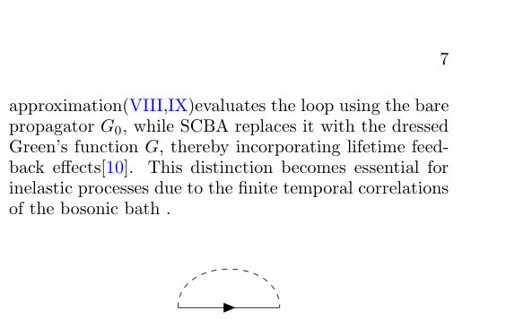 
FIG. 4. Lowest-order (Born) self-energy diagram for electron– phonon interaction. The straight line denotes the bare elec- tron Green’s function G0, and the wavy line denotes the phonon propagator D.

📷 Fig 4

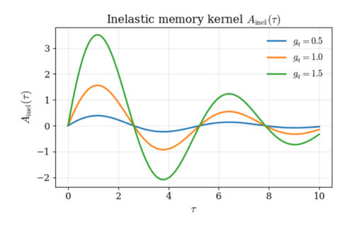 
FIG. 3. SCBA: Ainel(τ) versus τ Plot.

📷 Fig 5

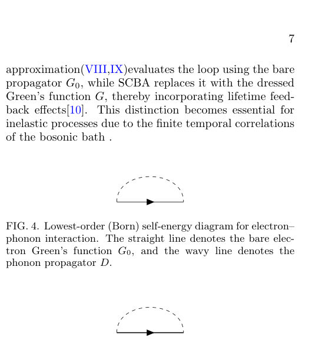 
FIG. 5. Self-consistent Born approximation (SCBA) self- energy diagram. The thick fermion line denotes the fully dressed Green’s function G, while the phonon propagator re- mains bare.

**Summary.** This theoretical work develops a comprehensive framework using Non-equilibrium Green's Functions to analyze memory effects in quantum transport. It rigorously distinguishes between Markovian dynamics, associated with local self-energies (like static disorder), and Non-Markovian dynamics, arising from time-correlated interactions such as electron-phonon coupling. The transmission function T(E) is proposed as the key, experimentally accessible observable to diagnose these fundamental differences in memory behavior.

**Why it may be interesting.** The explicit connection drawn between the mathematical structure of the self-energy (time-local vs. time-nonlocal) and the physical memory regime (Markovian vs. Non-Markovian) provides a powerful, general diagnostic tool for open quantum systems, relevant to quantum optics and condensed matter dynamics.

Detailed structure

**Main problem.** The paper aims to reinterpret memory effects in non-equilibrium quantum transport, establishing a rigorous connection between the system's temporal dynamics and measurable steady-state signatures.

**Main result.** The study distinguishes between Markovian dynamics (e.g., static disorder) and genuine Non-Markovian behavior (e.g., electron-phonon coupling), showing that the spectral function and transmission function are key diagnostics for these memory effects.

**Method.** The analysis employs the Non-equilibrium Green's Function (NEGF) formalism within the Schwinger-Keldysh path integral framework, utilizing Dyson expansions and approximations like the Born and Self-Consistent Born Approximations.

**Model / system.** The work is based on 2D lattice systems starting from a tight-binding Hamiltonian, extended to include both static disorder (elastic scattering) and electron-phonon coupling (inelastic scattering). Paradigmatic models include the Hofstadter and RKKY-coupled systems.

**Key observables.** Spectral function, Transmission Function T(E), and the time-dependent memory kernel A(t).

**Important parameters / regimes.** Scattering strength ($\lambda$), coupling constants ($g_q$), and the ratio of coupling rates ($\gamma$ vs. $\omega_q$).

**Assumptions / limitations.** The analysis relies on comparing the results from the 1PI vs. 2PI effective actions, where the 2PI approach is necessary to capture the non-Markovian memory effects arising from the bath.

**Figures summary.** Figures illustrate the decaying (Markovian) vs. oscillatory (Non-Markovian) nature of the memory kernel, and compare the resulting transmission function T(E) for different scattering regimes in the Hofstadter and RKKY models.

**Paper structure.** The paper progresses from establishing the general NEGF formalism and the distinction between elastic/inelastic self-energies, to analyzing memory signatures via the spectral function, and finally applying the framework to specific 2D models (Hofstadter, RKKY) using the transmission function as the ultimate diagnostic tool.

Abstract

We investigate memory effects and quantum transport in two-dimensional lattice systems within the framework of non-equilibrium Green's functions and Schwinger-Keldysh non-equilibrium quantum field theory. Starting from a 2D tight-binding Hamiltonian, we employ the Dyson expansion on the Keldysh contour and the second-order Born and self-consistent Born Approximation to derive the electronic self-energies associated with elastic and inelastic scattering mechanisms.Static disorder produces a local self-energy and a rapidly decaying memory kernel, characteristic of Markovian dynamics, whereas electron-phonon coupling generates temporally nonlocal self-energies and genuine Non-Markovian behavior. We demonstrate that these distinct memory signatures are directly reflected in the spectral function, which we propose as a diagnostic probe of non-equilibrium memory effects. Further we explore 1PI and 2PI effective actions to see their memory perspectives studying their coarse-graining behavior. Building on this theoretical framework, we further apply the conventional NEGF formalism to two paradigmatic two-dimensional models-the Hofstadter and an RKKY-coupled system to explore how different microscopic Hamiltonians influence Markovian and Non-Markovian nature. Our results provide a unified connection between scattering mechanisms, memory effects, and quantum transport in low-dimensional systems.

[↑ back to top](#top)

### [Graph-based emulation of $d$-dimensional curved spaces with superconducting arrays](http://arxiv.org/abs/2605.28942v1)

**Authors:** Mehmet Dede, Guilherme Delfino, André L. G. Mudry, Junseok Oh, Andrew P. Higginbotham, Christopher Mudry, Claudio Chamon  
**Type:** both · **Category:** statistical mechanics · **PDF:** <https://arxiv.org/pdf/2605.28942v1>  
**Analysis basis:** full PDF text, analyzed in chunks
**Topic relevance:** 🔥 `analog quantum simulation` **4/5** · `QC/QI experiment` **2/5** · `Keldysh / 2PI / non-Gaussian methods` **1/5** · `correlated / nonlocal dissipation` **1/5** · `driven-dissipative phase transition` **1/5** · `entanglement & information structure` **1/5** · `methods for driven-dissipative` **1/5** · `non-equilibrium dynamics` **1/5**

📷 Fig 1

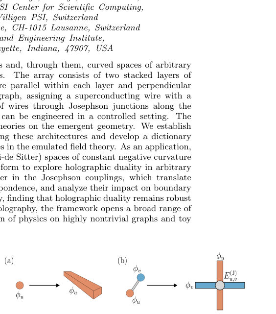 
FIG. 1. (a) Mapping between a degree of freedom ϕu at a vertice u of a graph and the phase of an extended super- conducting wire labeled by u. (b) An edge connecting two vertices from the graph is mapped onto a crossing between two wires u and v coupled via a Josephson junction E(J) u,v, in- dicated as a light circle.

📷 Fig 2

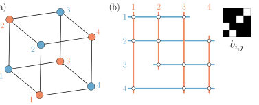 
FIG. 2. (a) Bipartite graph structure associated to a single cube. (b) Josephson array using 8 superconducting wires, 4 of which are either vertical or horizontal. The pattern of crossings reproduces the biadjacency matrix (shown in the upper right corner), with black and white square indicating entries bi,j = 1 and bi,j = 0, respectively. Selected wires are shortened where no additional crossings are required.

📷 Fig 3

 
FIG. 3. (a) Triangulation of a single three-dimensional tetra- hedron. (b) Josephson array using 8 superconducting wires. The red circles denote “short circuits” or infinite Josephson couplings. Phases of the vertical and horizontal wires with the same index are locked together.

📷 Fig 4

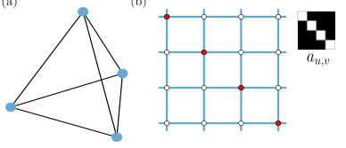 
FIG. 4. (a) Mesh associated with a triangulation of a smooth surface (cow). The graph metric is inherited from the under- lying continuous metric manifold. (b) Cayley graph of a free group. The metric is typically defined to reflect an appropri- ate property of the graph.

📷 Fig 5

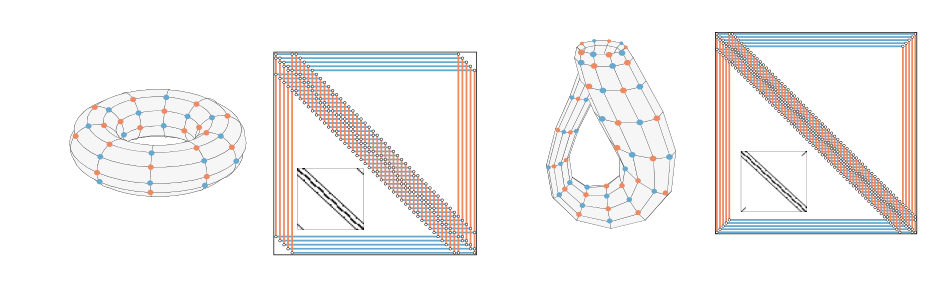 
FIG. 5. Superconducting wire implementations of bipartite graphs corresponding to nontrivial topologies: a torus and a Klein bottle. The inset shows the biadjacency matrix bij with black and white corresponding to 1 and 0 entries, respectively.

**Summary.** This paper details a novel method to simulate arbitrary curved spaces and field theories using arrays of superconducting Josephson-coupled wires. By engineering the graph topology, researchers can realize geometries like Anti-de Sitter space, providing an experimentally accessible platform to test concepts like holographic duality. The work is significant for its direct link between superconducting circuit measurements and fundamental physics in curved spacetime.

**Why it may be interesting.** This work provides a concrete, physical platform (superconducting circuits) to test deep theoretical concepts like holographic duality and field theories on curved spaces, bridging condensed matter hardware with high-energy theory.

Detailed structure

**Main problem.** The paper introduces a framework to emulate arbitrary graphs and curved spaces by engineering superconducting circuits, allowing the study of field theories on these emergent geometries.

**Main result.** The superconducting array can experimentally realize Anti-de Sitter (AdS) spaces and demonstrate that holographic duality remains robust even when strong disorder is introduced into the Josephson couplings.

**Method.** The approach involves mapping continuous field theories onto discrete graph Hamiltonians using Josephson-coupled superconducting wires, and analyzing the system's behavior in various coupling limits.

**Model / system.** The physical system is an array of superconducting wires forming a graph structure, where the superconducting phases encode scalar field theories. The Hamiltonian is governed by Josephson coupling energies across the graph edges.

**Key observables.** Measurable circuit observables like current and voltage relations, which map to two-point correlators in the emulated field theory.

**Important parameters / regimes.** The ratio of coupling strengths ($J$ vs $J_w$), the wire length relative to a critical scale ($L/L^\star$), and the degree of disorder in the Josephson couplings.

**Assumptions / limitations.** The primary assumption is the 'rigid phase' approximation, where the superconducting phase is assumed to take a single value along the wire up to a certain length scale $L^\star(T)$.

**Figures summary.** Figures illustrate the mapping from field variables to wire phases and Josephson junctions, the structure of bipartite vs. non-bipartite graph realizations, and the general lattice mesh for manifold triangulation.

**Paper structure.** The paper builds from the general concept of graph emulation to specific Hamiltonian formulations, analyzes the limits of the phase rigidity approximation, and applies the framework to complex geometries like AdS spaces to test holographic duality.

Abstract

We introduce a framework for emulating graphs and, through them, curved spaces of arbitrary dimension, using arrays of superconducting wires. The array consists of two stacked layers of wires, horizontal and vertical, such that wires are parallel within each layer and perpendicular between layers. By discretizing a space into a graph, assigning a superconducting wire with a rigid phase to each vertex, and coupling pairs of wires through Josephson junctions along the graph edges, arbitrary geometries and topologies can be engineered in a controlled setting. The superconducting phases then realize scalar field theories on the emergent geometry. We establish experimentally realistic conditions for implementing these architectures and develop a dictionary relating measurable circuit observables to quantities in the emulated field theory. As an application, we develop the implementation of hyperbolic (Anti-de Sitter) spaces of constant negative curvature and use them as an experimentally accessible platform to explore holographic duality in arbitrary dimensions. We investigate the effects of disorder in the Josephson couplings, which translate into metric variations in the bulk-boundary correspondence, and analyze their impact on boundary scaling exponents both analytically and numerically, finding that holographic duality remains robust even in the presence of strong disorder. Beyond holography, the framework opens a broad range of architectural possibilities, including the exploration of physics on highly nontrivial graphs and toy models of dynamical spacetimes.

[↑ back to top](#top)

### [Quantum Light Nano-Imaging](http://arxiv.org/abs/2605.28987v1)

**Authors:** Michael Dapolito, Matthew Fu, Fuyang Tay, Suheng Xu, Yuchen Lin, Neil Hazra, Adam K. Williams, Samuel L. Moore, Rocco A. Vitalone, Jonas Kolker, Thomas Cherradi, Aaron Holman, Thomas P. Darlington, Mark E. Ziffer, Xavier Roy, Sebastian Will, Cory R. Dean, Mengkun Liu, A. J. Millis, Abhay N. Pasupathy, P. J. Schuck, D. N. Basov  
**Type:** experiment · **Category:** other · **PDF:** <https://arxiv.org/pdf/2605.28987v1>  
**Analysis basis:** full PDF text, analyzed in chunks
**Topic relevance:** 🔥 `quantum optics experiment` **4/5** · `interference shaping light` **3/5** · `analog quantum simulation` **1/5** · `entanglement & information structure` **1/5** · `non-equilibrium dynamics` **1/5** · `quantum measurements` **1/5**

📷 Fig 1

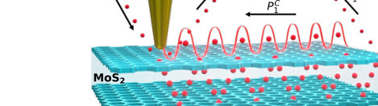 
Fig. 1. Quantum light scattering-type scanning near-field optical microscope (q- SNOM). a, Two photons from an SPDC pair are sent to two paths: 𝑷𝟏 and 𝑷𝟐. The 𝑷𝟏 photon is incident on the tip and can either scatter oL the tip (𝑷𝟏

📷 Fig 2

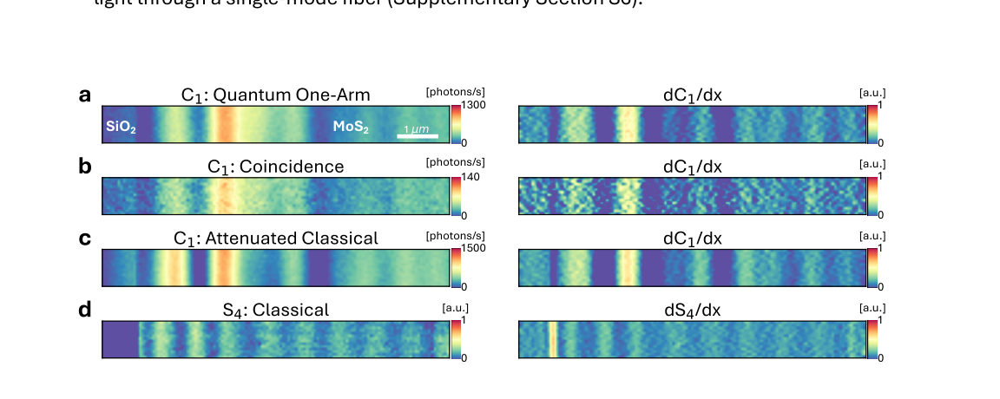 
Fig. 2. Q-SNOM images of polaritonic fringes in MoS2 (left) and their derivatives (right) obtained with quantum and classical light sources. a, Polaritonic WG modes launched via illumination with one photon (1558 nm, 796 meV) from a photon pair at a rate of 25 × 10+ photons/s and demodulated at the first harmonic of the tip tapping frequency (𝐶7). Fewer than 1300 photons/s contribute to the first harmonic signal. Both the far-field air mode and near-field polaritonic mode contribute to the fringe pattern. b, The same data as

📷 Fig 3

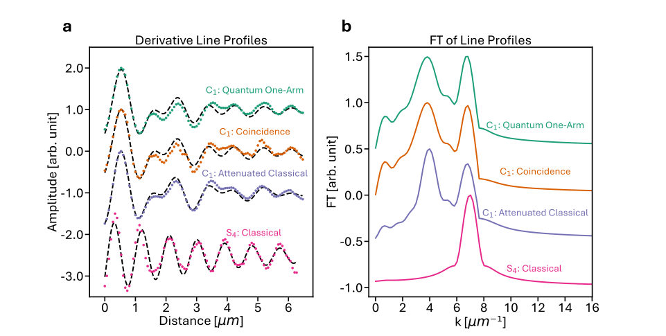 
Fig. 3. Line profiles (a) and Fourier transform analyses (b) of the single and many- photon interference patterns. a, Line profiles obtained by row-averaging the data in Fig. 2,right. Black dashed lines represent the fits described in Supplementary Section S7 and circles are data points. The line profiles are oLset vertically for clarity. b, Fourier transforms of the line profile fits in (a). The quantum one-arm, coincidence, and attenuated classical FTs reveal an air radiation mode at 𝑘5 = 3.8 ± 0.1 𝜇𝑚67 along with the 𝑇𝑀5 mode at 𝑘&lt;'=4! = 6.9 ± 0.1 𝜇𝑚67. The bright classical light FT again reveals the 𝑇𝑀5 WG mode at 𝑘)? = 6.9 ± 0.1 𝜇𝑚67. The matching mode momenta in the quantum and classical...

📷 Fig 4

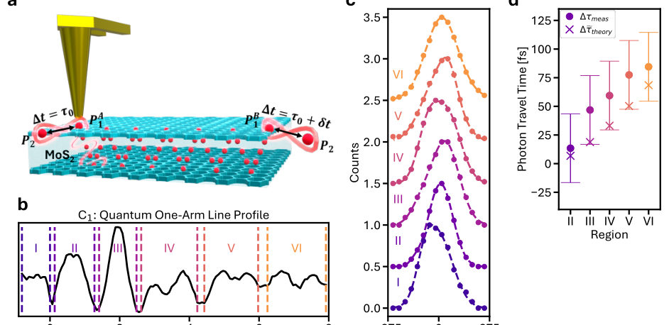 
Fig. 4. Polaritonic time-of-flight experiments empowered by entangled photons. a, Extracting the polariton temporal dynamics with q-SNOM nano-imaging. There exists an initial time delay, 𝜏5, between the free-space optical paths of the 𝑷𝟏 and 𝑷𝟐 photons. When the 𝑷𝟏 photon propagates as a polariton, it acquires an additional time delay, Δ𝜏, due to propagation through MoS2 with group velocity 𝑣D &lt; 𝑐. Due to this group velocity, the 𝑷𝟏 photon accumulates a time delay that depends on how far it travels to the sample edge. b, The quantum one-arm line profile sliced in diLerent regions corresponding to the substrate (Region I) and increasing sample-edge distances (Regions II-VI). c, Binning of the...

**Summary.** The paper introduces a quantum light scattering-type SNOM (q-SNOM) to overcome limitations in probing quantum effects in solids. By using entangled photons, the technique achieves nanoscale visualization of single polariton self-interference and measures quasiparticle dynamics with femtosecond resolution. This establishes a powerful new platform for studying quantum materials.

**Why it may be interesting.** This work bridges quantum optics and condensed matter physics by providing a novel, non-destructive, and highly sensitive tool to observe fundamental quantum wave-particle duality and dynamics in solid-state systems.

Detailed structure

**Main problem.** The core challenge is developing a method to experimentally probe quantum phenomena, such as entanglement and quantum correlations, in solid-state materials at length and time scales below the diffraction limit.

**Main result.** The authors successfully developed a quantum light scattering-type SNOM (q-SNOM) that directly visualizes the self-interference of single hybrid light-matter quasiparticles and enables femtosecond-resolution measurement of polariton propagation dynamics.

**Method.** The technique uses entangled photon pairs generated via SPDC, integrating them into a SNOM setup. Measurements rely on coincidence detection and time-of-flight metrology to enforce single-photon counting and measure temporal correlations.

**Model / system.** The experiment is performed on atomically layered van der Waals (vdW) semiconductors, such as MoS2, which host hybrid light-matter quasiparticles called polaritons. The setup utilizes entangled photons as quantum probes.

**Key observables.** Single polariton interference fringes, the second-order correlation function g^(2)(τ), and the time delay (Δτ) of quasiparticle propagation.

**Important parameters / regimes.** Length scales below the diffraction limit, femtosecond time resolution, and single-photon detection regime.

**Assumptions / limitations.** The technique assumes that the temporal correlation provided by entangled photons can accurately map the ultrafast dynamics of the material excitations.

**Figures summary.** Figures illustrate the q-SNOM setup, show single-photon interference patterns, present the measured g^(2)(τ) curves, and plot extracted time delays (Δτ) against theoretical predictions.

**Paper structure.** The paper introduces the limitations of current quantum probing techniques, details the development and implementation of the q-SNOM setup, presents evidence of single-photon self-interference, and finally applies the technique to measure the ultrafast time-of-flight dynamics of polaritons.

Abstract

Entanglement and quantum correlations are central to the physics of quantum materials, yet they have remained notoriously difficult to probe experimentally. Probing these phenomena in solids requires quantum optical probes that operate at the native length and time scales of material excitations, below the diffraction limit of light. Developing the requisite tools has previously been infeasible due to the extremely weak intensities of state-of-the-art quantum light sources and extreme inefficiency of near-field light-matter interactions. In this work, we circumvent these challenges and develop a quantum light scattering-type scanning near-field optical microscope (q-SNOM) that can explore the broad domain of solid-state quantum effects at length scales below the diffraction limit. In its first application, we image in real space the self-interference of single hybrid light-matter quasiparticles in a van der Waals semiconductor, providing a direct nanoscale visualization of the wave-particle duality. We also introduce a polaritonic time-of-flight metrology that exploits the temporal correlations among entangled photons to observe the quasiparticle propagation dynamics with femtosecond resolution. This work sets the stage for nanoscale exploration and control of quantum effects in materials.

[↑ back to top](#top)

### [Critical states and anomalous wave transport in an aperiodic polariton monotile](http://arxiv.org/abs/2605.29023v1)

**Authors:** Valtýr Kári Daníelsson, Helgi Sigurðsson  
**Type:** both · **Category:** disordered systems and neural networks · **PDF:** <https://arxiv.org/pdf/2605.29023v1>  
**Analysis basis:** full PDF text, analyzed in chunks
**Topic relevance:** `analog quantum simulation` **3/5** · `correlated cavity matter` **3/5** · `driven-dissipative phase transition` **3/5** · `methods for driven-dissipative` **3/5** · `non-equilibrium dynamics` **3/5** · `non-equilibrium universality` **3/5** · `Keldysh / 2PI / non-Gaussian methods` **1/5** · `Kondo & dissipative impurity` **1/5** · `correlated / nonlocal dissipation` **1/5** · `entanglement & information structure` **1/5**

📷 Fig 1

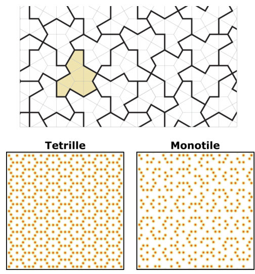 
Figure 1. (Top) A patch of “the Hat” Tile(1, √

📷 Fig 2

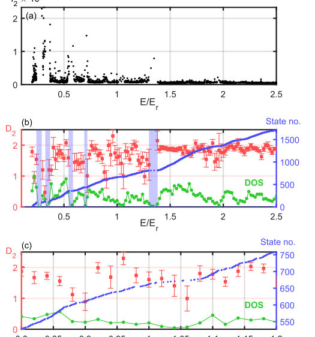 
Figure 2. (a) IPR for the second moment I2 of the Monotile eigenstates plotted against energy. (b) Double vertical-axis plot showing (left) the generalized dimension D2 for the Monotile eigenstates as red squares and (right) correspond- ing eigenenergies En/Er as blue dots. The density of states (DOS) is additionally overlaid as green circles with an ar- bitrary vertical axis. Blue shaded regions mark the biggest pseudogaps in the spectrum. (c) Same as above but zoomed in on a smaller region of the spectrum.

📷 Fig 3

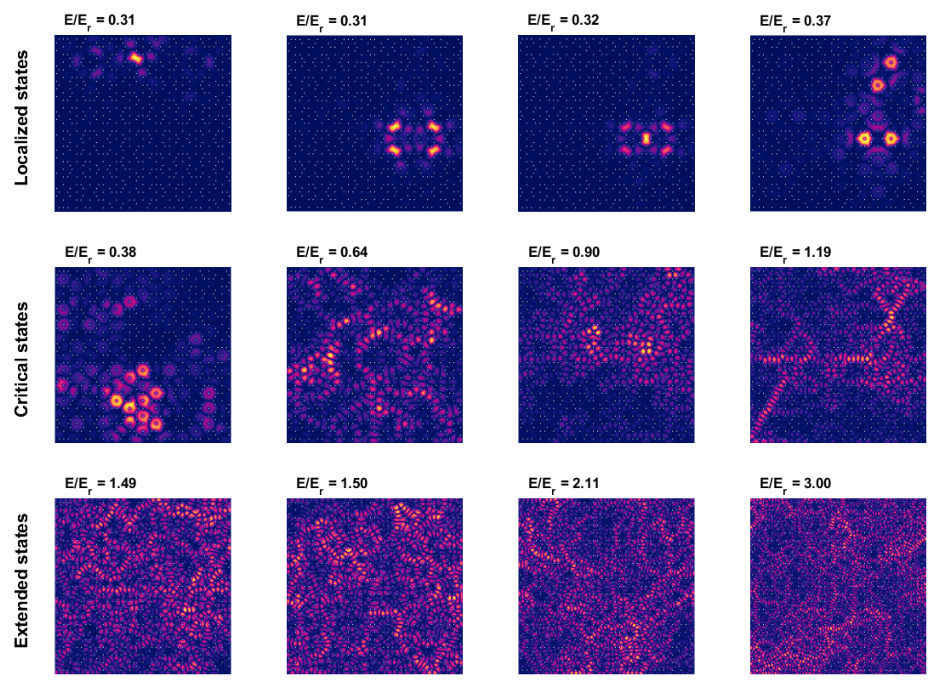 
Figure 3. Wavefunction amplitude |ψ| of example localized, critical, and extended states. The energy of each state is indicated. The side length of the system here is L = 40a. White transparent dots indicate the locations of the potential maxima.

📷 Fig 4

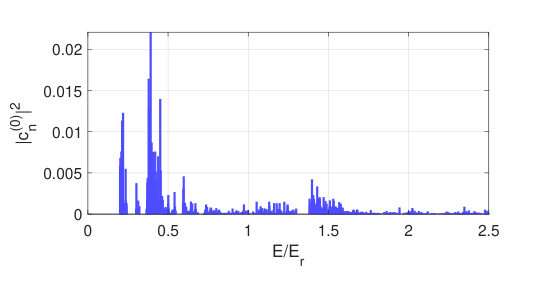 
Figure 5. Local density of states of the projected initial wavepacket ψ0 on the eigenstates of the Monotile.

📷 Fig 5

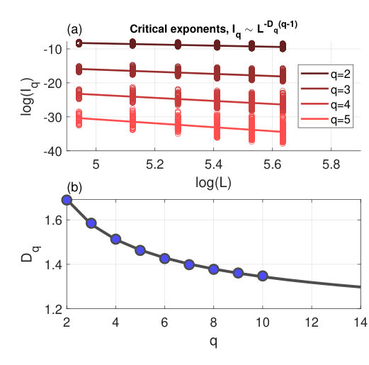 
Figure 4. (a) Double logarithmic plot of the moments of the average inverse participation function log (Iq) against system size log (L) for Monotile eigenstates in the energy window [E −δ, E + δ] where E = 1.25Er and δ = 0.2Er. Simple linear regression gives the critical exponent in the scaling law Iq ∼L−Dq(q−1). The obtained generalized dimensions Dq are plotted against the wavefunction probability distribution moments q showing a power law scaling towards D∞= 1.

**Summary.** This paper analyzes wave transport in a polariton system engineered onto an aperiodic 'Hat' monotile lattice. By analyzing both single-particle and mean-field dynamics, the authors confirm the existence of critical states and demonstrate anomalous wave transport, exhibiting distinct super-diffusive and sub-diffusive scaling regimes. The findings provide a platform for studying complex wave dynamics in engineered quasiperiodic media.

**Why it may be interesting.** This work directly bridges the physics of aperiodic order (quasicrystals/monotiles) with wave localization and transport phenomena, which are central themes in disordered systems, making it highly relevant to AMO and quantum optics.

Detailed structure

**Main problem.** The study investigates wave transport, transverse localization, and scaling properties of quantum modes within the aperiodic 'Hat' monotile quasilattice.

**Main result.** The system exhibits critical states characterized by anomalous transport regimes, showing evidence of both super-diffusive and near sub-diffusive polariton transport.

**Method.** The research employs both theoretical diagonalization of the Schrödinger equation and numerical simulation of wavepacket dynamics using non-Hermitian and nonlinear mean-field models.

**Model / system.** The system is based on cavity-polaritons confined in a 2D Monotile quasilattice, modeled by a Schrödinger equation incorporating an optically induced potential $V(x, y)$. The dynamics are extended to include gain ($\kappa$) and loss ($\gamma$) for non-Hermitian analysis.

**Key observables.** Inverse Participation Ratio (IPR), Generalized Dimension ($D_q$), effective spatial width ($	ext{weff}$), and temporal autocorrelation function ($C(t)$).

**Important parameters / regimes.** Potential amplitude ($V_0$), lattice separation ($a$), and non-Hermitian parameters ($\kappa, \gamma$).

**Assumptions / limitations.** Initial analysis assumes a Hermitian problem, but later sections extend to non-Hermitian dynamics to model dissipation and gain relevant for polariton condensation.

**Figures summary.** Figures illustrate the Monotile structure, the dependence of localization measures ($I_2, D_2$) on energy, and log-log plots showing the time evolution of wavepacket width ($	ext{weff}$) confirming super- and sub-diffusive scaling.

**Paper structure.** The paper progresses from analyzing the Hermitian eigenvalue problem (localization/criticality) to studying wavepacket dynamics (anomalous transport) in the non-Hermitian regime, culminating in a mean-field description of polariton condensate formation.

Abstract

Recently "the Hat" monotile was introduced into the family of aperiodic tilings and quasicrystals boasting physical properties lying at the boundary of ordered and disordered systems. Here we study the two-dimensional wave transport, transverse localization and scaling properties of the quantum modes in a Monotile quasilattice. Our system is based on reconfigurable optical lattices for cavity-polaritons which provide flexible means to study wavepacket dynamics, strong nonlinear phenomena, and power-driven condensation in this new type of an aperiodic tiling. We confirm the existence of localized and critical states in the Monotile through direct diagonalization of the Schrödinger equation. Scaling analysis on the moments of the wavefunction distribution reveals anomalous transport regimes of super-diffusive and near sub-diffusive polariton transport associated with the fractal structure of the Monotile Hilbert space. We propose a strategy using resonantly excited polariton fluids to verify our findings.

[↑ back to top](#top)

### [Nonlinear Dynamics of Rapidly Driven Systems](http://arxiv.org/abs/2605.28996v1)

**Authors:** Afshin Besharat, Alexander A. Penin  
**Type:** theory · **Category:** other · **PDF:** <https://arxiv.org/pdf/2605.28996v1>  
**Analysis basis:** full PDF text, analyzed in chunks
**Topic relevance:** `non-equilibrium dynamics` **3/5** · `Keldysh / 2PI / non-Gaussian methods` **2/5** · `methods for driven-dissipative` **2/5** · `driven-dissipative phase transition` **1/5** · `non-equilibrium universality` **1/5**

📷 Fig 1

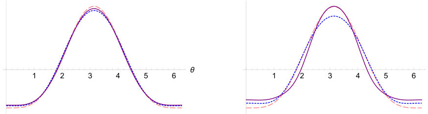 
FIG. 1. The convergence of the effective potential for the horizontally driven Kapitza pendulum for the near-critical value of the parameters δ = ϵ2/2 for (a) ϵ = 1/2 and (b) ϵ = 3/4. The long-dashed, short-dashed and solid lines represent the leading, next-to-leading, and next-to-next-to-leading approximations.

📷 Fig 2

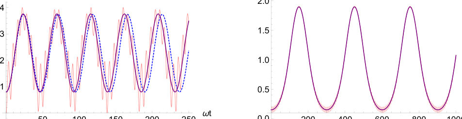 
FIG. 2. The solution of the exact equation of motion for the planar pendulum with the horizontally oscillating pivot (thin solid line) vs the leading-order (dashed line), and the next-to-leading order (solid line) effective theory result for (a) δ = ϵ2/6, ϵ = 1/5 and (b) δ = ϵ2/6, ϵ = 1/20. In the second plot the two effective theory curves are indistinguishable.

📷 Fig 3

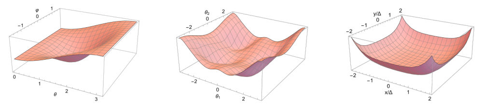 
FIG. 3. The effective potential for (a) spherical pendulum with δ = ϵ2/8 (the symmetric minimum at ϕ = π is not shown), (b) planar double pendulum with δ = ϵ2/6, (c) oscillating magnetic field of the Ioffe-Pritchard trap at z = 0.

📷 Fig 4

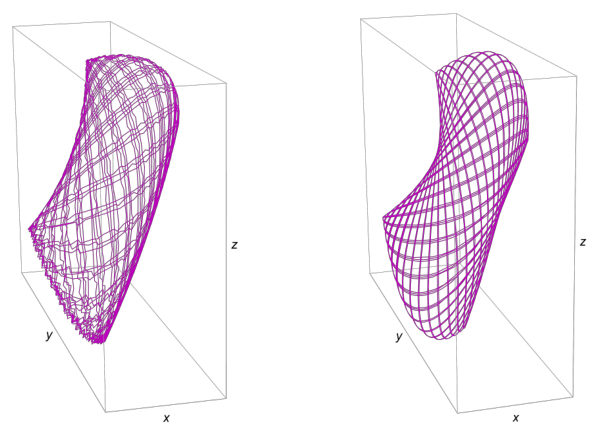 
FIG. 4. A trajectory of the spherical pendulum with the horizontally oscillating pivot for δ = ϵ2/6, ϵ = 1/100 obtained by solving (a) the exact equations of motion and (b) the effective theory equations of motion.

📷 Fig 5

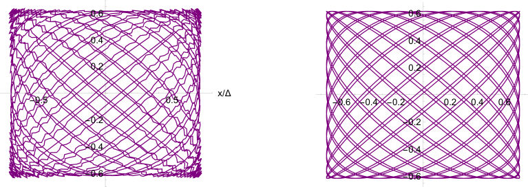 
FIG. 5. A trajectory of a charged particle in the oscillating magnetic field of the Ioffe-Pritchard trap for z = 0, ωB/ω = 1/20 obtained by solving (a) the exact equations of motion and (b) the effective theory equations of motion.

**Summary.** This work presents a general, systematic method to derive the effective dynamics of nonlinear systems driven by high-frequency oscillations. By expanding the action in powers of $1/\omega$, the authors provide effective Lagrangians and potentials that govern the slow, large-scale motion. This is crucial for analyzing stability in complex systems like magnetic traps and pendulums.

**Why it may be interesting.** The technique of deriving effective Hamiltonians/Lagrangians from rapidly oscillating driving fields is a powerful tool for analyzing non-adiabatic dynamics in quantum and classical systems, relevant for Floquet engineering and quantum optics.

Detailed structure

**Main problem.** The paper develops a systematic method to determine the effective action governing the large-scale nonlinear dynamics of physical systems subjected to a rapidly oscillating external force.

**Main result.** The effective Lagrangian and potential are derived order by order in inverse powers of the oscillation frequency, revealing that the stability analysis can often be reduced to the linear Mathieu equation.

**Method.** The core method involves a high-frequency expansion, separating the system's motion into slow and fast components, and systematically calculating the effective dynamics using averaging techniques.

**Model / system.** The analysis is applied to various classical systems, including the Kapitza pendulum, charged particles in oscillating magnetic fields, and general nonlinear systems in curved configuration spaces.

**Key observables.** Effective Lagrangian ($L_{	ext{eff}}$), Effective Potential ($V_{	ext{eff}}$), and the transition curves defining dynamical stability.

**Important parameters / regimes.** Oscillation frequency ($\omega$), expansion parameter ($\epsilon$), and the ratio of characteristic time scales.

**Assumptions / limitations.** The method relies on the assumption of fast oscillation ($\omega$ is large) and is an approximation derived through perturbation theory.

**Figures summary.** Figures illustrate the effective potential and particle trajectories for various systems, such as the Kapitza pendulum and magnetic traps, comparing exact solutions to those derived from the effective theory.

**Paper structure.** The paper systematically builds the effective theory, first deriving the general expansion method, then applying it to specific physical models like the Kapitza pendulum and magnetic confinement, and finally detailing the high-order calculations.

Abstract

We consider systems characterized by the presence of a rapidly oscillating force. A general method is presented for the construction of the effective action governing the large-scale nonlinear dynamics of such systems order by order in inverse powers of the oscillation frequency $ω$. The explicit expression for the effective Lagrangian is derived up to ${\cal O}(1/ω^6)$ next-to-next-to-leading approximation. The general structure of the high-frequency expansion reveals a broad class of nonlinear systems whose transition curves are identical to those of the linear Mathieu equation, which enables a fully nonperturbative stability analysis in the case of strong driving and nonlinearity. The method is generalized to velocity-dependent forces and configuration space with curvature, characteristic to systems with constraints. Several applications are discussed in detail, including the dynamical magnetic trapping of electric charges.

[↑ back to top](#top)

### [Helimagnetic Josephson diode effect](http://arxiv.org/abs/2605.29285v1)

**Authors:** Qiang Cheng, Yu-Chen Zhuang, Qing-Feng Sun  
**Type:** theory · **Category:** other · **PDF:** <https://arxiv.org/pdf/2605.29285v1>  
**Analysis basis:** full PDF text, analyzed in chunks
**Topic relevance:** `spintronics-quantum-optics interface` **3/5** · `Keldysh / 2PI / non-Gaussian methods` **2/5** · `methods for driven-dissipative` **2/5** · `exotic spin models in light-matter` **1/5**

📷 Fig 1

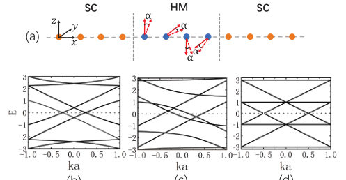 
FIG. 1: (a) Schematic illustration of the 1D SC/HM/SC Josephson junctions with one supercell in the HM. The gray dotted lines indicate the two interfaces of the junctions. The angle α describes the magnetic configuration of the HM under an external field. The solid red arrows represent the original helical magnetic configuration without tilt of the local mo- ment. The dashed red arrows represent the conical magnetic configuration with a nonzero tilt angle α. (b-d) Energy bands of the HM for (b) α = 0 or π, (c) α = π

📷 Fig 2

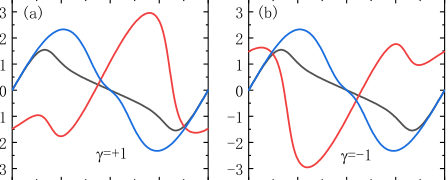 
FIG. 2: CPRs for different tilt angles with (a) γ = +1 and (b) γ = −1. Other parameters are taken as λ = 1, µ = 1 and N = 1.

📷 Fig 3

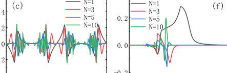 
FIG. 3: (a)-(c) The JDE efficiency as a function of the tilt angle. (d)-(f) The JDE efficiency as a function of the exchange coupling strength. The parameters are taken as (a) N = 1 and µ = 1, (b) N = 1 and λ = 1, (c) λ = 0.75 and µ = 1, (d) N = 1 and µ = 1, (e) N = 1 and α = 0.25π, and (f) α = 0.25π and µ = 1.

**Summary.** This paper theoretically investigates the Josephson diode effect in junctions involving a helimagnet. Using Green's functions and symmetry analysis, the authors establish that the JDE critically depends on the magnetic configuration (requiring a conical state) and the superconducting pairing symmetry. The findings offer a pathway to realizing non-reciprocal, dissipationless electronic components without relying on spin-orbit coupling.

**Why it may be interesting.** The analysis of non-reciprocal transport phenomena in magnetic junctions provides insights into engineered quantum electronic devices, linking magnetism, superconductivity, and diode effects.

Detailed structure

**Main problem.** The study investigates the Josephson diode effect (JDE) in superconducting junctions incorporating a helimagnetic material.

**Main result.** The JDE is found to require a conical magnetic configuration in the helimagnet and a non-zero chemical potential for s-wave superconductors, while p-wave superconductors can exhibit JDE even at zero chemical potential.

**Method.** The research employs the Green's function method, symmetry analysis, and energy band calculations to derive the supercurrent and diode efficiency.

**Model / system.** The system modeled is a one-dimensional junction composed of a superconductor (s-wave or p-wave) connected to a helimagnet. The physics is governed by the Bogoliubov-de Gennes Hamiltonian.

**Key observables.** Josephson diode efficiency ($\eta$), supercurrent nonreciprocity, and Critical Current-Phase Relations (CPRs).

**Important parameters / regimes.** Chirality ($\gamma$), tilt angle ($\alpha$), exchange coupling ($\lambda$), chemical potential ($\mu$), and the number of supercells ($N$).

**Assumptions / limitations.** The study is limited to one-dimensional junctions and provides a scheme for JDE without spin-orbit coupling.

**Figures summary.** Figures illustrate energy band structures for different magnetic angles ($\alpha$), the dependence of JDE efficiency on $\alpha$, $\lambda$, $\mu$, and $N$, and the CPRs for different chiralities.

**Paper structure.** The paper builds from defining the Hamiltonian for the SC/HM/SC junction, analyzing the symmetry properties of the supercurrent, deriving the JDE efficiency, and finally discussing the specific conditions for s-wave and p-wave pairing.

Abstract

We study the Josephson diode effect in the one-dimensional superconductor/helimagnet/superconductor junctions using the Green's function method. For the spin-singlet $s$-wave pairing in superconductors, it is found that the necessary conditions for the Josephson diode effect are the nonzero chemical potential and the conical magnetic configuration in the helimagnet. The diode efficiency is strongly dependent on the chemical potential, chirality, tilt angle and exchange coupling in the helimagnet. The high efficiency close to $40\%$ can be obtained for specific parameter values. The sign of the diode efficiency can be tuned by changing the chirality, tilt angle, exchange coupling and chemical potential. The dependence of the diode efficiency on the number of supercells in the helimagnet is also investigated. The characteristics of the supercurrent nonreciprocity and diode efficiency in the junctions are clarified through the symmetry analysis and the energy band calculations. The diode effect for the spin-triplet $p$-wave pairing in superconductors is also discussed and the nonzero chemical potential is no longer a necessary condition for the Josephson diode effect due to the equal-spin Cooper pair-mediated transport in the $p$-wave junctions. These results provide a scheme for the Josephson diode effect without spin-orbit coupling, which possesses the potential applications in the design of dissipationless electronic devices.

[↑ back to top](#top)

### [Macroscopic evidence of spatial modulation of conductivity in a microtextured ferromagnetic film](http://arxiv.org/abs/2605.29882v1)

**Authors:** C. P. Quinteros, L. Avilés-Félix, D. Goijman, L. Saba, D. Pérez Morelo, L. Granja, M. Granada, J. Milano  
**Type:** experiment · **Category:** other · **PDF:** <https://arxiv.org/pdf/2605.29882v1>  
**Analysis basis:** full PDF text, analyzed in chunks
**Topic relevance:** `spintronics-quantum-optics interface` **3/5** · `non-equilibrium dynamics` **2/5** · `Keldysh / 2PI / non-Gaussian methods` **1/5** · `analog quantum simulation` **1/5** · `exotic spin models in light-matter` **1/5**

📷 Fig 1

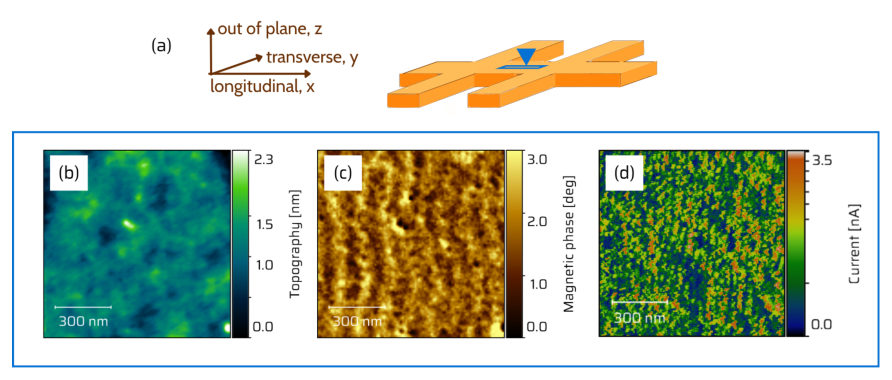 
Figure 1: Sample details. (a) Hall bar-shaped FePt including the coordinate axes. Longitudinal and transverse directions (along and across the current injection, respectively) are contained within the film plane. The out-of-plane axis is included for completeness. The approximate location of the FePt Hall bar, where the atomic force microscopy was conducted, is sketched by a frame indicated with an arrow. (b)-(d) Atomic force microscopy images of (1µm)2 at room temperature: (b) tapping- mode topography, (c) magnetic, and (d) conductive microscopy maps.

📷 Fig 2

 
Fig. 1 includes the microscopic characterization of the sample. Figs. 1(b)-(d) comprise images of atomic force microscopy at room temperature (RT) in the central part of the Hall bar (sketched as a rectangle below an arrow in Fig. 1(a)). Fig. 1(b) represents the topography of the sample. Fig. 1(c) displays the phase signal recorded with a magnetic tip (MESPTM from Bruker) in a dual-pass scan (20 nm apart). Finally, Fig. 1(d) illustrates the current detected upon scanning a conductive tip (EtalonTM from NanoTips) in contact mode under the application of 0.5 V. The magnetic signal is uncorrelated to the topography, as expected for the genuine magnetic texture. The MFM

📷 Fig 3

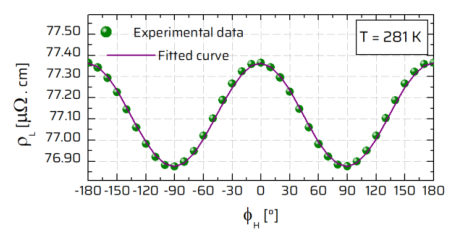 
Figure 2: Anisotropic magnetoresistance at room temperature. Longitudinal resistivity (ρL) as a function of the in-plane magnetic field direction (ϕH) measured in saturation (H = 8 kOe). The fitting corresponds to the Voigt-Thomson formula [12], eq. 4.

📷 Fig 4

 
Figure 3: Longitudinal resistivity (ρL) as a function of T. (a) ρL in saturation (H = 8 kOe) with H//i or H⊥i, left and right axis, respectively. (b) Difference between the two saturation resistivity measurements, ρH//i L,sat −ρH⊥i L,sat, (left axis) and magnetization (right axis) as a function of T. (c)

📷 Fig 5

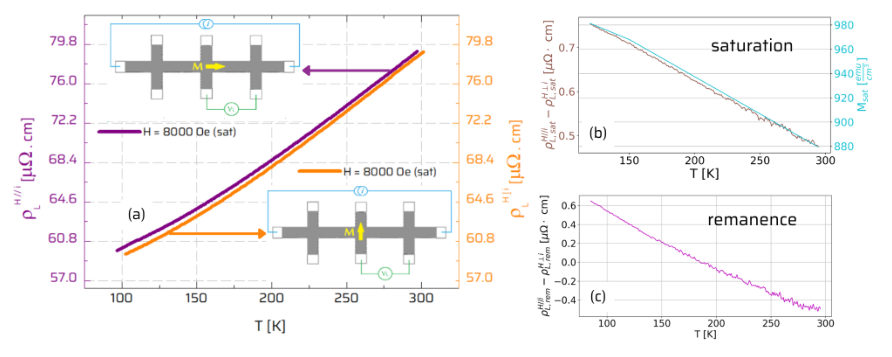 
Figure 3(a) presents the ρL recorded as a function of T in saturation for H//i (left axis) and H⊥i (right axis). ρL increases with increasing T, an expected behavior for a metal such as FePt. In agreement with Fig. 2, ρH//i L,sat is expected to be higher than ρH⊥i L,sat due to the anisotropic

**Summary.** This work investigates how magnetic domain structures influence the electrical conductivity of a ferromagnetic film. By measuring magnetotransport properties near the material's coercive field, the authors successfully isolate and quantify the additional resistivity contribution arising specifically from the domain walls. This confirms that magnetic inhomogeneities are a significant, measurable factor in the material's electrical response.

**Why it may be interesting.** While focused on condensed matter magnetism, the detailed analysis of non-equilibrium transport phenomena and the quantification of mesoscopic structural contributions (domain walls) to bulk properties is relevant to understanding dissipation mechanisms in complex quantum systems.

Detailed structure

**Main problem.** The study aims to quantify the contribution of spatial magnetic inhomogeneities, such as domain walls, to the macroscopic magnetotransport response in a ferromagnetic film.

**Main result.** The research demonstrates that the contribution of magnetic domain walls to the resistivity is macroscopically measurable and can be comparable in magnitude to other established magnetotransport terms, especially at low temperatures.

**Method.** Magnetotransport measurements were performed by varying temperature and in-plane magnetic fields, analyzing the longitudinal resistivity ($\rho_L$) near the coercive field.

**Model / system.** The physical system is a 75 nm-thick $\text{Fe}_{0.5}\text{Pt}_{0.5}$ ferromagnetic film exhibiting striped magnetic domains. The analysis uses a generalized Ohm's law framework to model the electric field and resistivity components.

**Key observables.** Longitudinal resistivity ($\rho_L$), transverse resistivity ($\rho_T$), and the resistivity discontinuity ($\Delta\rho_{L,coer}$) near the coercive field.

**Important parameters / regimes.** Temperature ($T$), in-plane magnetic field ($H$), and the coercive field ($H_{coer}$).

**Assumptions / limitations.** The analysis relies on fitting the macroscopic response to theoretical models derived from generalized Ohm's law, assuming the contribution of domain walls can be isolated.

**Figures summary.** Figures show magnetoresistance ($\rho_L$ vs. $\phi_H$) and resistivity vs. temperature ($T$) curves, highlighting local extrema near $H_{coer}$ and the temperature dependence of resistivity differences.

**Paper structure.** The paper progresses from establishing the theoretical framework using generalized Ohm's law to presenting measurements across varying fields and temperatures, culminating in the isolation and quantification of the domain wall contribution to the total resistivity.

Abstract

A 75 nm-thick Fe0.5Pt0.5 film is a ferromagnetic metal showing striped magnetic domains in remanence at room temperature. The magnetoresistance is characterized by varying the external temperature and the in-plane magnetic field intensity, thereby affecting its magnetic structure. Qualitatively, the resistivity is well described by using the generalized Ohm's law. High-field magnetotransport properties are successfully explained by considering the competition between the expected metallic behavior and the electron-magnon interaction. In the low-field condition, we size the contribution of the magnetic texture to the macroscopic magnetotransport response by introducing a new quantity. Consistent with the microscopic modulation of the lateral conduction, low-field measurements reveal inhomogeneities attributed to the spatial distribution of ferromagnetic domains and domain walls. By carefully analyzing the macroscopic response near the coercive field, the additional contribution to the resistivity is attributed to the domain walls themselves. In fact, this term could surpass the anisotropic term at low temperatures. In summary, this study demonstrates that spatial magnetic inhomogeneities are not only macroscopically measurable but also comparable in magnitude to other regularly considered terms, mainly at low temperatures.

[↑ back to top](#top)

### [Disentangling Spin Pumping and Two-Magnon Scattering Contributions to Gilbert Damping in YIG/V Bilayers](http://arxiv.org/abs/2605.29597v1)

**Authors:** S. Elkady, A. Tlais, H. Reslan, S. Isber, M. Haidar  
**Type:** both · **Category:** other · **PDF:** <https://arxiv.org/pdf/2605.29597v1>  
**Analysis basis:** full PDF text, analyzed in chunks
**Topic relevance:** `spintronics-quantum-optics interface` **3/5** · `correlated / nonlocal dissipation` **2/5** · `analog quantum simulation` **1/5** · `methods for driven-dissipative` **1/5**

📷 Fig 1

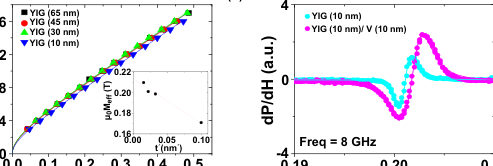 
FIG. 1. (Color online) (a) Schematic illustration of the broadband ferromagnetic resonance (B-FMR) mea-

📷 Fig 2

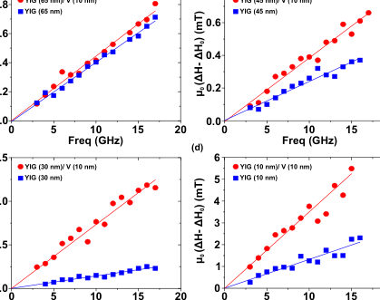 
FIG. 2. (Color online) Frequency dependence of the FMR linewidth for bare YIG films (blue squares) and

📷 Fig 3

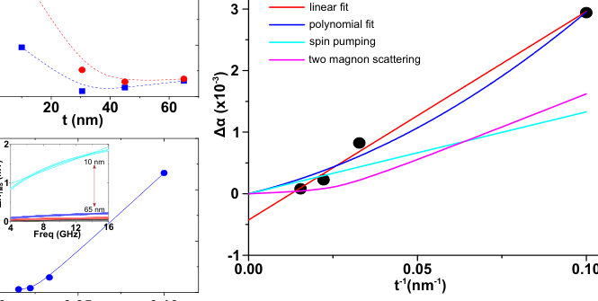 
FIG. 3. (Color online) (a) Thickness dependence of the extracted Gilbert damping parameter for bare YIG

**Summary.** This work investigates magnetic damping in YIG/V bilayers using FMR measurements to separate the effects of spin pumping and two-magnon scattering (TMS). The authors demonstrate that TMS is the dominant mechanism controlling the thickness dependence of damping, correcting previous analyses that overestimated the spin-pumping contribution. This provides a more accurate framework for quantifying spin transport parameters in spintronic devices.

**Why it may be interesting.** While focused on condensed matter magnetism, the rigorous separation of damping mechanisms (spin pumping vs. extrinsic scattering) is fundamentally related to understanding energy dissipation and spin relaxation in nanoscale magnetic systems, which has parallels in open quantum system dynamics.

Detailed structure

**Main problem.** The study aims to accurately determine the relative contributions of spin pumping and two-magnon scattering (TMS) to the total Gilbert damping observed in YIG/V magnetic bilayers.

**Main result.** The analysis shows that TMS plays a dominant role in governing the thickness dependence of the damping in the nanometer regime, and neglecting it leads to a significant overestimation of the spin-pumping contribution.

**Method.** The authors used broadband Ferromagnetic Resonance (FMR) measurements combined with a sophisticated, thickness-dependent damping model that explicitly accounts for both spin pumping and TMS contributions.

**Model / system.** The physical system is Yttrium iron garnet (YIG) ferromagnetic layers grown on a Vanadium (V) normal metal layer. The analysis models the total damping ($\alpha$) as a sum of contributions from spin pumping ($\alpha_{sp}$) and two-magnon scattering ($\alpha_{TMS}$), alongside the intrinsic damping.

**Key observables.** Gilbert damping parameter ($\alpha$), FMR linewidth ($\Delta H$), and the effective spin-mixing conductance ($g^{\uparrow\downarrow}_{\mathrm{eff}}$).

**Important parameters / regimes.** The extracted effective spin-mixing conductance is found to be $g^{\uparrow\downarrow}_{\mathrm{eff}} = 1.33 	imes 10^{18}~\mathrm{m^{-2}}$, which is thickness-independent.

**Assumptions / limitations.** The primary assumption is that the total damping can be accurately decomposed into distinct, quantifiable contributions from spin pumping and TMS using established theoretical models.

**Figures summary.** Figures illustrate FMR spectra, the thickness dependence of the magnetization, and crucially, the separation of the total damping enhancement into components attributable to spin pumping and TMS.

**Paper structure.** The paper progresses by first measuring the damping enhancement via FMR, then applying a comprehensive model that incorporates both spin pumping and TMS, and finally using this combined model to disentangle the contributions and extract accurate material parameters.

Abstract

In this work, we investigate the magnetic damping and spin pumping response of YIG-based bilayers incorporating vanadium (V) as the normal metal layer via broadband ferromagnetic resonance (FMR) measurements as a function of YIG thickness. We show that the apparent enhancement of the Gilbert damping in YIG/V bilayers cannot be solely attributed to spin pumping. Instead, two-magnon scattering (TMS) plays a dominant role in governing the thickness dependence of the damping in the nanometer regime. By applying a thickness-dependent damping model that accounts for both spin pumping and two-magnon scattering contributions, we successfully disentangle the different relaxation contributions. Our analysis reveals that neglecting two-magnon scattering leads to an overestimation of the spin-pumping contribution and consequently to unphysically large values of the effective spin-mixing conductance. After isolating the intrinsic spin pumping contribution, we extract a thickness-independent effective spin-mixing conductance of $g^{\uparrow\downarrow}_{\mathrm{eff}} = 1.33 \times 10^{18}~\mathrm{m^{-2}}$. These findings provide a more accurate framework for quantifying spin transport parameters in FM/HM systems and emphasize the necessity of accounting for extrinsic damping mechanisms when interpreting spin pumping and inverse spin Hall effect experiments.

[↑ back to top](#top)

### [Engineering Quantum Criticality in the Integer Quantum Hall Regime through a Screening Layer](http://arxiv.org/abs/2605.30129v1)

**Authors:** C. T. Tai, P. T. Madathil, A. Gupta, L. N. Pfeiffer, K. W. Baldwin, M. Shayegan  
**Type:** experiment · **Category:** strongly correlated electrons · **PDF:** <https://arxiv.org/pdf/2605.30129v1>  
**Analysis basis:** full PDF text, analyzed in chunks
**Topic relevance:** `non-equilibrium universality` **3/5** · `analog quantum simulation` **2/5** · `driven-dissipative phase transition` **1/5** · `non-equilibrium dynamics` **1/5**

📷 Fig 1

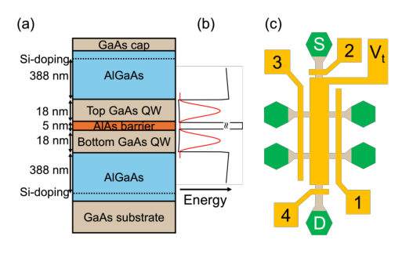 
FIG. 1. (a) Schematic of the sample structure, consisting of two 18-nm-wide GaAs QWs separated by a 5-nm-wide AlAs barrier. (b) Charge distribution (red) and potential energy (black), calculated by solving the Schr¨odinger-Poisson equa- tions self-consistently. (c) Schematic of the device structure. The gray area represents the Hall bar mesa, and the green hexagonal areas are the ohmic contacts which are used as voltage probes, or for injecting current through source (S) and drain (D). Finger gates 1-4 are used to deplete the top layer so that magnetotransport coefficients of the bottom layer can be measured. The global top gate (Vt) allows changing the top-layer electron density.

📷 Fig 2

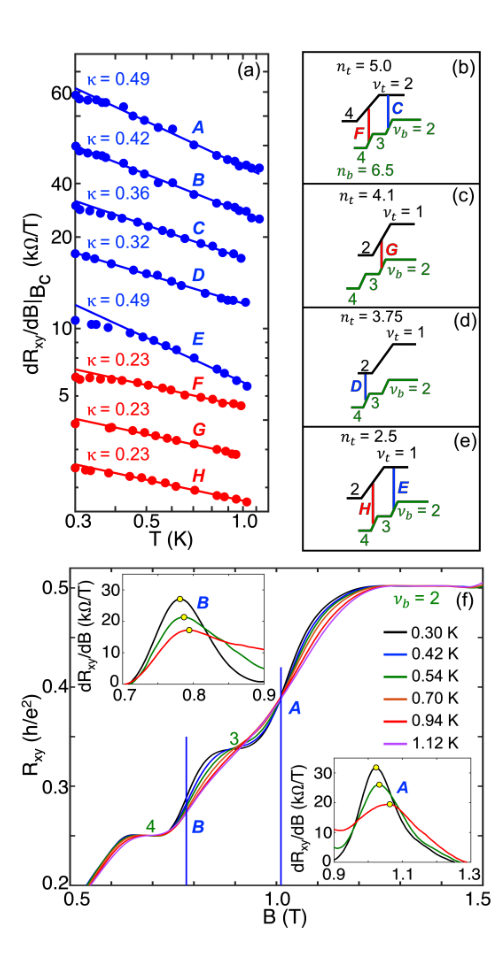 
FIG. 2. Summary of the measured κ values in this work. (a) Temperature dependence of dRxy/dB|B=Bc for different transitions, labeled A-H . Blue symbols are used for cases A- E where there is no screening provided by the top layer, and red symbols for cases F-H where there is screening. The data for each case are shifted vertically for clarity. Panels (b)-(e) show transitions C-H schematically. Black (green) curves represent the top-layer (bottom-layer) Rxy traces, and νt and νb indicate their respective filling factors. Panel (f) presents the Rxy traces for the bottom layer near integer quantum Hall plateaus νb = 2 to 4 as a function of temperature ranging from 0.30 K to 1.12 K when the top...

📷 Fig 3

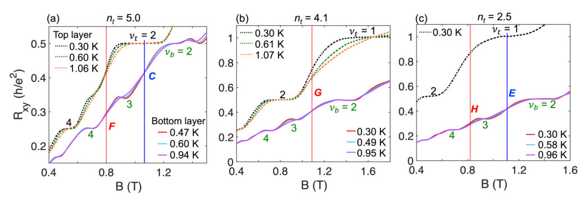 
FIG. 3. Temperature dependence of Rxy for the top layer (dotted traces) and bottom layer (solid traces). Panels (a)-(c) show the bottom layer plateau-to-plateau transitions at nt = 5.0, 4.1, and 2.5, respectively, with the bottom-layer density fixed at nb = 6.5.

📷 Fig 4

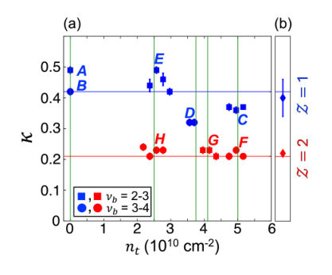 
FIG. 4. Measured κ for the plateau-to-plateau transitions νb = 2 to 3 and 3 to 4 as a function of the top-layer density nt. In panel (a), κ are shown for cases A–H , with the corre- sponding nt values indicated by green vertical lines, together with additional data points in their vicinity, illustrating the evolution of κ with nt. Blue and red symbols represent the unscreened and screened, respectively. Square symbols corre- spond to the νb = 2 to 3 transition, while circles represent the νb = 3 to 4 transition. The horizontal lines indicate the the- oretically expected universal values κ = 0.42 and 0.21. Panel (b) shows the average of measured κ for the unscreened (sym- bols) and screened...

**Summary.** This work experimentally probes quantum criticality in the Integer Quantum Hall Effect by using a bilayer electron system where the interaction strength can be controlled via an overlying screening layer. By measuring the critical exponent $\kappa$, the authors demonstrate a clear transition from behavior indicative of long-range interactions to that of short-range interactions upon screening, providing crucial evidence for interaction effects in this regime.

**Why it may be interesting.** The ability to tune the interaction strength via an external gate voltage provides a clean experimental handle to test fundamental theoretical predictions regarding the universality class governing quantum critical points in strongly correlated electron systems.

Detailed structure

**Main problem.** The study investigates how electron-electron interaction, specifically through screening, dictates the critical behavior (quantum criticality) during plateau-to-plateau transitions in the Integer Quantum Hall Effect (IQHE) regime.

**Main result.** The measurements provide direct evidence that screening the electron-electron interaction reduces the critical exponent $\kappa$ from a value consistent with long-range interactions ($z=1$) to a value consistent with short-range interactions ($z=2$).

**Method.** The critical exponent $\kappa$ is extracted by analyzing the temperature dependence of the derivative of the Hall resistance ($	ext{d}R_{xy}/	ext{d}B$) at the transition points.

**Model / system.** The experiment uses a GaAs double quantum well device containing two closely spaced 2D electron systems (top and bottom layers). The top layer density is tuned to control the screening environment for the bottom layer.

**Key observables.** The critical exponent $\kappa$, the Hall resistance $R_{xy}$ vs. magnetic field $B$, and the temperature dependence of these measurements.

**Important parameters / regimes.** The degree of screening, controlled by the top layer density ($n_t$), and the magnetic field strength relative to the magnetic length ($l_B$).

**Assumptions / limitations.** The analysis relies on established scaling relations connecting the critical exponent $\kappa$ to the dynamic exponent $z$ based on the nature of the electron interaction (long-range vs. short-range).

**Figures summary.** Figures illustrate the sample structure, the temperature dependence of $	ext{d}R_{xy}/	ext{d}B$ for varying screening conditions, and the resulting extracted values of $\kappa$ for both unscreened and screened regimes.

**Paper structure.** The paper systematically measures the critical exponent $\kappa$ by varying the screening environment (top layer density) and comparing the results to theoretical predictions for different interaction ranges.

Abstract

Disorder-induced localization of electrons and electron-electron interaction are among the most fundamental problems in condensed matter physics. In two-dimensional electron systems, extensive studies have led to the emergence of a scaling picture, characterized by a set of universal critical exponents that govern the transitions between the integer quantum Hall plateaus. From the temperature dependence of the plateau-to-plateau transitions, experiments primarily report k ~ 0.42, implying a dynamic exponent z = 1, consistent with a theoretical picture where electrons have a long-range (1/r) interaction. Theory also predicts that z = 2 for short-range electron interaction, but an experimental verification has remained elusive. Here, we directly probe the influence of Coulomb interaction on these transitions using a bilayer electron system confined to a GaAs double quantum well device. The two layers are in close proximity, with an interlayer distance approximately equal to the magnetic length at the relevant magnetic fields. By tuning the electron density in the top layer, we access both insulating and metallic phases of the electrons in this layer as a function of magnetic field, allowing in-situ control of the unscreened and screened interaction strengths in the bottom layer as it goes through its plateau-to-plateau transitions. In the unscreened case, we measure k ~ 0.42 consistent with the widely reported value. More importantly, when screening is introduced, k is reduced to ~ 0.22, implying z = 2. Our results provide direct experimental evidence for the role of electron-electron interaction in determining critical behavior in the quantum Hall regime, and demonstrate screening as a powerful tuning parameter for engineering quantum criticality.

[↑ back to top](#top)

### [Generation of Bloch Points with Controlled Spin Texture Using Geometrical Boundary Conditions](http://arxiv.org/abs/2605.29672v1)

**Authors:** Naëmi Leo, Daniel Wolf, Alicia Estela Herguedas Alonso, Oleksandr Zaiets, Jakub Jurczyk, Takeaki Gokita, John Fullerton, Dedalo Sanz-Hernandez, Claire Donnelly, Andrea Sorrentino, Eva Pereiro, Lucia Aballe, Peter Fischer, Rachid Belkhou, Claas Abert, Dieter Suess, Axel Lubk, Aurelio Hierro-Rodriguez, Amalio Fernández-Pacheco  
**Type:** both · **Category:** other · **PDF:** <https://arxiv.org/pdf/2605.29672v1>  
**Analysis basis:** full PDF text, analyzed in chunks
**Topic relevance:** `spintronics-quantum-optics interface` **3/5** · `analog quantum simulation` **2/5** · `exotic spin models in light-matter` **2/5**

📷 Fig 1

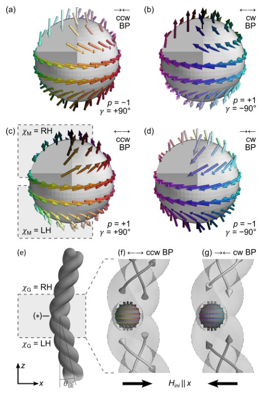 
Figure 1: Geometrical control of Bloch point spin texture using a chirality interface. (a-d) Circulating Bloch points with varying polarity p (head-to-head →←, p = −1 and tail-to-tail ←→, p = +1) and helicity γ describing clockwise (cw, γ = −90◦) and counter- clockwise (ccw, γ = +90◦) spin circulation. These parameters define the spin state around the Bloch point singularity. While each half of the spin texture around a Bloch point has a well-defined magnetic chirality χM, as shown in (c), the net Bloch point spin texture is achiral. (e) 3D nanowire connecting a left-handed (LH, bottom) with a right-handed (RH, top) double helix, with each segment tilted by ±θtilt away from the z direction....

📷 Fig 2

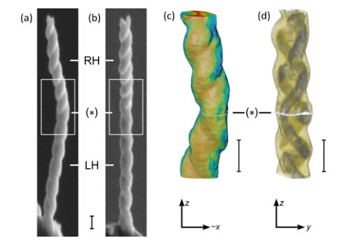 
Figure 2: 3D nanostructure defining the geometrical boundary conditions for Bloch point generation. (a) Side and (b) front view of FEBID-grown Co double-helix struc- tures, combining a bottom LH and top RH section tilted by ±15◦. (c) Opaque and (d) transparent volume rendering of the nanowire’s mean inner potential (proportional to material contrast) reconstructed by electron holographic tomography. The position of the chirality interface is marked by (∗) and defines the boundary where Bloch points are nucleated and their topology is imposed. Scale bars measure 100 nm.

📷 Fig 3

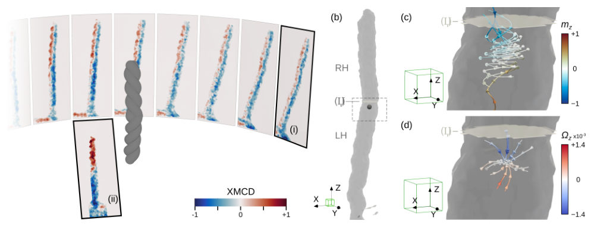 
Figure 3: Direct observation of Bloch points with controlled spin texture by XMCD to- mography. (a) Selection of XMCD images taken under different rotation and tilt angles for the reconstruction of the 3D magnetization. The XMCD contrast in the highlighted panels indicates (i) uniform circulation across the length of the nanostructure, and (ii) op- posite axial magnetization in both helical segments, implying the presence of a Bloch point. (b) Reconstructed electronic structure with voxel size of (10 nm)3. The chirality interface plane is highlighted with (∗). The region of interest around the Bloch point (gray sphere) shown in (c,d) is highlighted (dashed line). (c) Reconstructed...

📷 Fig 4

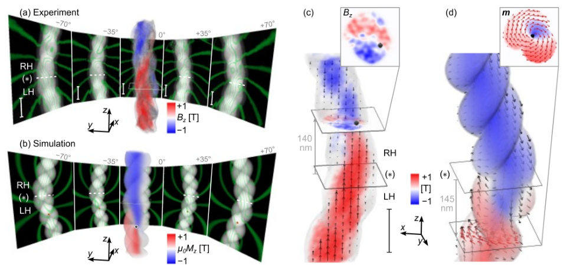 
Figure 4: Stray-field and internal magnetic induction revealing details of Bloch point domain walls. (a) Experimental and (b) simulated phase images after initialization of a Bloch-point state, viewed under different projection angles. The electric and magnetic contributions are shown in grayscale and as green iso-lines, respectively. The chirality interface (∗) is marked by dashed lines and cut planes. The monopole-like symmetry of the stray-field patterns is consistent with the presence of a Bloch point. (c) Tomographic reconstruction of the internal magnetic induction component Bz(r) [also shown in the foreground of (a)], showing the domain wall associated with the Bloch point. The...

📷 Fig 5

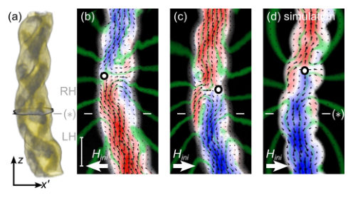 
Figure 5: Deterministic control of Bloch point polarity and position. (a) Volume render- ing of the structural contrast around the chirality interface (∗). (b,c) Maps of external (green lines) and internal magnetic induction ⟨Bx′z(x′, z)⟩y′ (arrows, blue/red denotes the magnitude of the Bz component) at remanence, after initialization with opposite Hini, demonstrating controlled switching between head-to-head and tail-to-tail Bloch point con- figurations. (d) Equivalent induction map calculated from micromagnetic simulations, showing the state equivalent to (c). Inferred positions of the Bloch point are marked with black circles; these always shows a displacement away from the chirality...

**Summary.** This work reports on the deterministic engineering of Bloch points—topological singularities in magnetization—within double-helix nanowires. By creating a structural defect at a chirality interface, the researchers impose competing topological constraints that allow precise control over the Bloch point's polarity and spin texture. The combination of X-ray tomography and micromagnetics provides strong evidence for this controlled topological state.

**Why it may be interesting.** While focused on condensed matter magnetism, the concept of topological defects (Bloch points) and their deterministic control via engineered boundaries relates to topological quantum matter, which is a key area of interest for quantum information.

Detailed structure

**Main problem.** The primary challenge is achieving deterministic control over the position and specific spin texture of Bloch points, which are 3D topological singularities in magnetization.

**Main result.** The authors demonstrate that engineering a chirality interface between double-helix nanowires allows for the deterministic control of Bloch point polarity, circulation, and position.

**Method.** The study combines advanced experimental techniques like X-ray Magnetic Circular Dichroism (XMCD) tomography and electron holography with micromagnetic simulations.

**Model / system.** The physical system is magnetic Co double-helix nanowires, where the topological control is achieved by creating a structural defect (chirality interface) that imposes competing topological constraints on the magnetization.

**Key observables.** 3D magnetization vector m(r), magnetic vorticity field $\Omega(\mathbf{r})$, stray-field symmetry (monopole-like vs. asymmetric), and the helicity angle $\gamma$.

**Important parameters / regimes.** The key parameters include the geometric chirality ($\chi_G$), the initial applied magnetic field ($H_{	ext{ini}}$), and the tilt angle ($	heta_{	ext{tilt}}$) used in fabrication.

**Assumptions / limitations.** The analysis assumes that the topological constraints imposed by the engineered interface are the dominant factor controlling the Bloch point structure, although pinning effects are noted as experimental limitations.

**Figures summary.** Figures illustrate the 3D structure, the chirality interface, and tomographic reconstructions of the magnetic induction ($\mathbf{B}$) and magnetization ($\mathbf{m}$), showing the characteristic symmetric stray-field patterns of Bloch points.

**Paper structure.** The paper progresses from establishing the theoretical need for controlled Bloch point generation to detailing the fabrication and characterization using multiple advanced imaging techniques (XMCD, holography), culminating in demonstrating deterministic control over the spin texture via field initialization and analyzing the underlying physical mechanisms (LLG dynamics).

Abstract

Bloch points are three-dimensional topological singularities in magnetization that play a key role in topological transformations of spin textures, such as skyrmion creation or annihilation. While topology often enforces the existence of Bloch points in confined geometries like cylindrical nanowires, deterministic control over their position and magnetic configuration remains challenging. Here we demonstrate the generation of Bloch points with controlled spin texture by engineering geometrical boundary conditions in three-dimensional nanomagnets. By introducing a chirality interface between two three-dimensional double-helix nanowires of opposite handedness, forming a kinked, non-collinear structure, we impose competing topological constraints that uniquely define the magnetization configuration surrounding the Bloch point. A saturating magnetic field nucleates head-to-head or tail-to-tail domain configurations at the chirality interface, producing a Bloch-point domain wall with deterministic polarity, circulation and helicity. This geometrical approach enables full three-dimensional control of Bloch point domain walls allowing deterministic engineering of their spin texture and its selective coupling to current-induced Oersted fields.

[↑ back to top](#top)

### [Nanoparticle manipulation with a carbon fiber tip in an electron microscope for $μ$-SQUID magnetometry](http://arxiv.org/abs/2605.29550v1)

**Authors:** Umesh Chandra Thuwal, Sumanta Maity, Clemens B. Winkelmann, Hervé Courtois, Anjan Kumar Gupta  
**Type:** experiment · **Category:** other · **PDF:** <https://arxiv.org/pdf/2605.29550v1>  
**Analysis basis:** full PDF text, analyzed in chunks
**Topic relevance:** `spintronics-quantum-optics interface` **3/5** · `QC/QI experiment` **1/5** · `analog quantum simulation` **1/5** · `exotic spin models in light-matter` **1/5** · `quantum measurements` **1/5**

📷 Fig 1

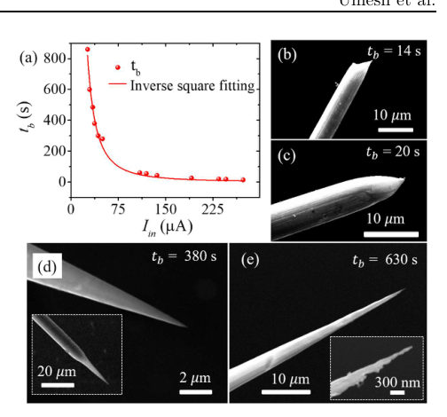 
Figure 1: (a) Breaking time tb variation with initial current Iin and an inverse-square fitting as given by Eq. 1. (b) and (c) show the tips etched at Iin = 272 and 236 µA, respectively. (d) Tip etched at Iin = 38 µA with tb = 380 s, yielding a well-tapered apex of ≲100 nm suitable for manipulation. The inset shows a larger-scale view. (e) Tip etched at Iin = 39 µA with tb = 630 s produces an ultrasharp, but fragile, tip of apex radius close to 35 nm.

📷 Fig 2

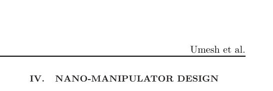 
Figure 2 shows the nanomanipulator system, which can be divided into two parts, namely, the tip holder assembly and the 2D walker which are rigidly fixed on an aluminum platform. Further zoomed-in pictures of the nanomanipulator are given in the Suppl-Info [39]. The tip holder assembly consists of a spring-loaded stage, a piezoelectric tube (PE tube) and a piezoelectric Z- bimorph. The Z-bimorph is used for fine tip motion in the Z-direction with about 10 nm precision using a DC-voltage and this motion is limited to about 100 µm. The bimorph is fixed on a PE tube [40] that has its outer electrode segmented into four quadrants and a common inner electrode. This tube provides fine movement, in...

📷 Fig 3

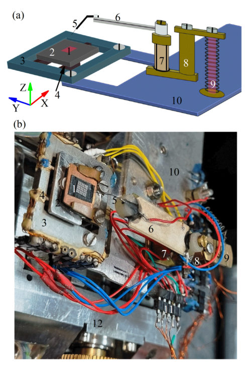 
Figure 2: (a) Simplified schematic of the nano-manipulator system with following components: sample (1), 2D walker platform (2), SS frame of 2D walker (3), PE bimorph actuators of 2D walker (4), tungsten wire with the carbon fiber tip (5), PE bimorph for z-motion of tip (6), PE tube (7), brass rod (8), spring loaded stage with setscrew (9) and aluminum platform (10). (b) Complete nano-manipulation assembly mounted inside the SEM with connecting wires (11) and SEM stage (12). In (b) one can make out the array of nine µ-SQUIDs, on the sample (1), with each SQUID having four contact pads.

📷 Fig 4

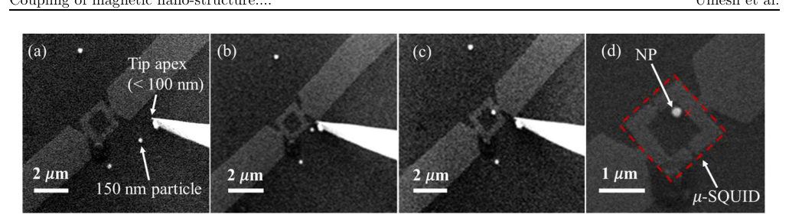 
Figure 3: Nano-particle manipulation using a sharp tip with an apex radius less than 100 nm. (a) The particle, approximately 150 nm in size, is initially located about 2 µm away from the µ-SQUID. (b) The particle is successfully dragged using the tip and brought closer to the µ-SQUID, at a distance of about 500 nm. (c) The NP is successfully placed in the middle of the top right inner edge of the µ-SQUID loop. (d) A closeup view of the µ-SQUID with the NP in the final state. The outer edge of the SQUID loop has been marked by red discontinuous line. The NP is slightly shifted by about 100 nm from its previous position (marked by the cross) of image (c) to its current position. Note that the...

📷 Fig 5

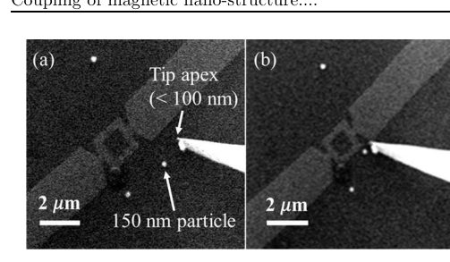 
Figure 3 shows the SEM images taken during the manipulation of a NP where an Fe3O4 NP is dragged by several microns and positioned on the µ-SQUID. In Fig. 3(a), the labeled NP, together with two other NPs, is seen at about 2 µm distance from the µ-SQUID edge. In this image, One can also see two NPs adhering to the side of the tip. This is found to happen occasionally but such attachment is typically seen to occur away from the apex due a larger contact area. However, the tip apex remains sharp and clean, permitting successful manip- ulation of a NP. The µ-SQUID loop with two parallel constrictions is marked in Fig. 3(d). In Fig. 3(b), the NP is moved close the right top corner of the SQUID...

**Summary.** This work reports the development and application of a novel carbon-fiber-tip nanomanipulation system integrated into an SEM. The system achieves sub-100 nm precision to position magnetic nanoparticles ($	ext{Fe}_3	ext{O}_4$) onto $\mu$-SQUID arrays. This technique successfully enables the high-resolution, single-particle measurement of magnetic properties, advancing nano-magnetic characterization for quantum sensing applications.

**Why it may be interesting.** While the core physics is classical magnetism and condensed matter characterization, the extreme precision required for manipulating quantum-scale objects near quantum sensors (SQUIDs) touches upon the interface between classical mechanics and quantum measurement, which is relevant to quantum sensing applications.

Detailed structure

**Main problem.** The primary goal was to develop a precise nanomanipulation system to position individual magnetic nanoparticles (NPs) near highly sensitive superconducting quantum interference devices ($\mu$-SQUIDs) for magnetic characterization.

**Main result.** The system successfully positioned $	ext{Fe}_3	ext{O}_4$ NPs onto $\mu$-SQUIDs, allowing for the measurement of anisotropic magnetic hysteresis loops from single NPs.

**Method.** The authors utilized a custom carbon-fiber-tip based nanomanipulator integrated into an SEM, employing piezoelectric actuators for sub-100 nm positioning precision.

**Model / system.** The platform combines a carbon-fiber tip, which is etched via electrochemical methods, with a multi-stage piezoelectric positioning system (bimorph, piezo-tube, walker). The sample consists of a silicon chip containing an array of $\mu$-SQUIDs.

**Key observables.** Anisotropic magnetic hysteresis loops ($	ext{B}_f-	ext{H}$), NP placement precision ($\sim 100 	ext{ nm}$), and SQUID response periodicity ($\Phi_0$).

**Important parameters / regimes.** Optimal tip apex radius ($\lesssim 100 	ext{ nm}$), initial etching current ($I_{	ext{in}}$) and resulting breakage time ($t_b$).

**Assumptions / limitations.** The van der Waals force calculation assumes a simple sphere–sphere contact model, and the mechanical fragility of ultra-sharp tips is noted as a limitation.

**Figures summary.** Figure 1 details the relationship between tip breakage time and etching current. Figure 2 shows the schematic of the nano-manipulator. Figure 3 illustrates the successful placement of an NP onto a $\mu$-SQUID, and Figure 4 displays the measured magnetic hysteresis loops.

**Paper structure.** The paper details the development of the nanomanipulator system, characterizes the tip fabrication process, demonstrates the precise positioning of magnetic NPs onto the SQUID array, and finally presents the magnetic characterization results.

Abstract

We report a carbon-fiber-tip based nanomanipulation system integrated into a scanning electron microscope for individual nanoparticle (NP) manipulation on a surface. Electrochemically etched amorphous carbon fiber tips with excellent mechanical rigidity and sub-100 nm apex radii effectively reduce the van der Waals adhesion and enable reliable positioning of about 100 nm size NPs with about 100 nm precision. This system combines a piezoelectric bimorph for vertical tip motion, a four-quadrant piezo-tube for two-dimensional fine tip control and a two-dimensional piezoelectric walker for coarse lateral translation. Using this setup, we successfully position single Fe$_3$O$_4$ magnetic NPs on micron sized superconducting quantum interference devices for optimal magnetic coupling between them and probe a NP's magnetism.

[↑ back to top](#top)

### [Thermodynamic and magnetocaloric properties of a triangular spin-1/2 cluster with Dzyaloshinskii-Moriya interaction](http://arxiv.org/abs/2605.29989v1)

**Authors:** Jordana Torrico, Romulo A. Silva, S. M. de Souza, Onofre Rojas  
**Type:** theory · **Category:** statistical mechanics · **PDF:** <https://arxiv.org/pdf/2605.29989v1>  
**Analysis basis:** full PDF text, analyzed in chunks
**Topic relevance:** `analog quantum simulation` **3/5** · `exotic spin models in light-matter` **3/5** · `entanglement & information structure` **1/5**

📷 Fig 1

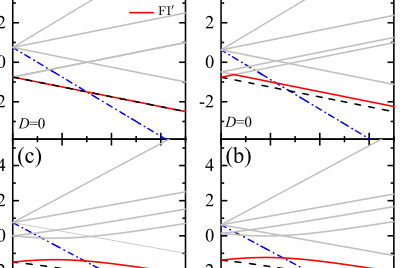 
Figure 2. (Left column) Energy spectrum as a function of the magnetic field B, for J1 = J2 = J3 = −1 and D = 0. (Right column) Energy spectrum as a function of B for J1 = −0.8, J2 = −1, J3 = −0.7 and D = −0.5. The black, red, and blue curves (as indicated in the legend) represent the lowest and most relevant energy levels that determine the ground state, while the gray curves correspond to higher-lying excitations.

📷 Fig 2

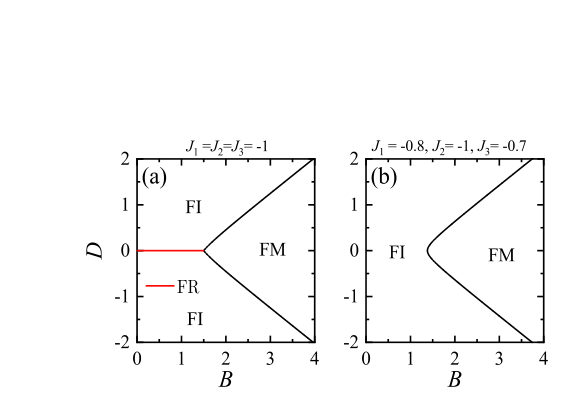 
Figure 3. (a) Zero-temperature phase diagram in the B −D plane for J1 = J2 = J3 = −1. (b) Phase diagram for J1 = −0.8, J2 = −1, and J3 = −0.7. The black solid line marks the transition between the FI and FM phases, while the red line indicates the region with a twofold degenerate ground state (denoted FR).

📷 Fig 3

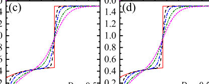 
Figure 4. Total magnetization M as a function of the mag- netic field B for different temperatures and values of D. (Left column) Results for J1 = J2 = J3 = −1. (Right column) Results for J1 = −0.8, J2 = −1, and J3 = −0.7.

📷 Fig 4

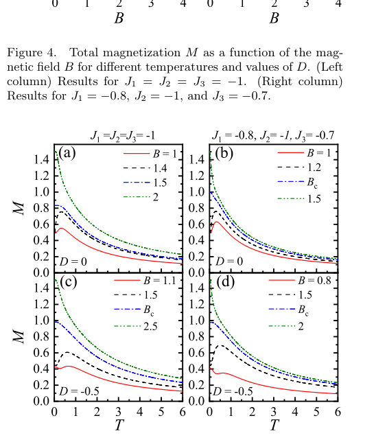 
Figure 5. Total magnetization M as a function of temperature T for different values of magnetic field B and D, with J1 = J2 = J3 = −1. (Right column) Corresponding results for J1 = −0.8, J2 = −1, and J3 = −0.7.

📷 Fig 5

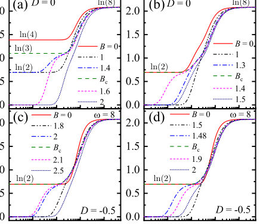 
Figure 7. Entropy S as a function of temperature T (loga- rithmic scale). (Left column) Results for J1 = J2 = J3 = −1, with different values of B and D. (Right column) Results for J1 = −0.8, J2 = −1, and J3 = −0.7, for various values of B and D.

**Summary.** This theoretical study explores the magnetic and thermodynamic behavior of a triangular spin-1/2 cluster featuring Dzyaloshinskii-Moriya interactions. The authors map out various magnetic phases and demonstrate that the DM interaction critically tunes the magnetocaloric effect. The findings are highly relevant for designing molecular magnets for applications like quantum refrigeration.

**Why it may be interesting.** The detailed analysis of entropy plateaus, phase transitions, and the MCE provides a rich playground for understanding how geometric frustration and anisotropic interactions (like DM) govern macroscopic thermodynamic responses in quantum magnetic materials.

Detailed structure

**Main problem.** The study investigates the magnetic and thermodynamic properties, particularly the magnetocaloric effect (MCE), of a triangular spin-1/2 cluster incorporating Dzyaloshinskii-Moriya (DM) interaction.

**Main result.** The system exhibits complex magnetic phases (FM, FI, FR) and shows that the DM interaction significantly enhances the complexity of the MCE, leading to nontrivial entropy variations.

**Method.** The research employs theoretical calculations involving the exact energy spectrum diagonalization, leading to the derivation of thermodynamic quantities like entropy, specific heat, and the isothermal entropy change ($\Delta S$).

**Model / system.** The system is a triangular spin-1/2 cluster, modeled by a spin-1/2 Heisenberg Hamiltonian augmented with antisymmetric Dzyaloshinskii-Moriya (DM) exchange interactions. This model is relevant to $\text{Cu}_3$-based molecular magnets.

**Key observables.** Magnetization, magnetic susceptibility, entropy ($S$), specific heat ($C$), and the isothermal entropy change ($	ext{-}\Delta S$) characterizing the MCE.

**Important parameters / regimes.** The DM interaction strength ($D$), the relative strengths of exchange couplings ($J_1, J_2, J_3$), and the external magnetic field ($B$).

**Assumptions / limitations.** The analysis often uses simplified effective parametrizations for the DM vectors and assumes periodic boundary conditions for the cluster geometry.

**Figures summary.** Figures illustrate the energy spectrum vs. magnetic field, phase diagrams showing FI, FM, and FR regions, and density plots mapping entropy variations in the $B-T$ and $B-D$ planes, alongside specific heat curves showing Schottky anomalies.

**Paper structure.** The paper systematically analyzes the Hamiltonian, derives the partition function and free energy, calculates key thermodynamic observables (M, $\chi$, S, C), maps out the ground-state phase diagram, and finally focuses on quantifying the MCE via entropy changes.

Abstract

We present a theoretical investigation of the magnetic and thermodynamic properties of the triangular spin-1/2 cluster with Dzyaloshinskii-Moriya (DM) interaction, described by a spin-1/2 Heisenberg Hamiltonian with antisymmetric exchange interactions. The energy spectrum and ground-state phase diagram reveal the presence of ferromagnetic (FM), ferrimagnetic (FI), and frustrated (FR) phases, strongly influenced by the total spin and the DM interaction. We analyze magnetization and susceptibility, showing that at low temperatures the system exhibits a characteristic 1/3 magnetization plateau, while thermal fluctuations suppress magnetic order at higher temperatures. The entropy and specific heat display residual entropies due to ground-state degeneracies, Schottky-type anomalies at intermediate temperatures, and additional low-temperature features related to phase transitions. Particular attention is given to the magnetocaloric effect (MCE), characterized by both direct and inverse regimes depending on the magnetic field variation. We find that the DM interaction enhances the complexity of the MCE, leading to nontrivial entropy variations as a function of the magnetic field. These results provide insights into the role of frustration and anisotropy in tuning the MCE of properties triangular spin clusters, with relevance to \mathrm{Cu}_{3}-based molecular magnets.

[↑ back to top](#top)

### [Carrier-coupled ultrafast structural dynamics and interlayer energy transport of supported transition metal dichalcogenide heterostructures](http://arxiv.org/abs/2605.30130v1)

**Authors:** Md. Shaikot Alam Shakil, Ting-Hsuan Wu, Xing He, Abu Montakim Tareq, Zhenjia Zhou, Libo Gao, Naihao Chiang, Ding-Shyue Yang  
**Type:** both · **Category:** other · **PDF:** <https://arxiv.org/pdf/2605.30130v1>  
**Analysis basis:** full PDF text, analyzed in chunks
**Topic relevance:** `non-equilibrium dynamics` **3/5** · `Keldysh / 2PI / non-Gaussian methods` **1/5** · `methods for driven-dissipative` **1/5**

📷 Fig 1

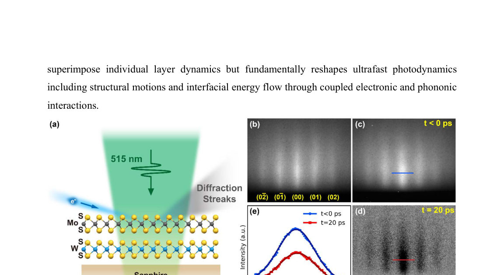 
Figure 1. Schematic of reflection UED experiments and diffraction images. (a) A schematic showing the optical excitation of sapphire-supported MoS2/WS2 by a 515-nm pulsed laser and probed by 30-keV electrons at a grazing incidence of ~2.4°. (b) Ordered diffraction streaks with the Miller indices acquired from the top 2D MoS2 layer of the HS using a parallel electron beam. (c) Broadened diffraction streaks as a result of the use of a gently focused electron beam. The image is a reference frame acquired prior to photoexcitation (t &lt; 0). (d) Diffraction differences observed at 20 ps with a laser fluence of 3.2 mJ cm−2. (e) Diffraction intensity profiles of the center streak along the...

📷 Fig 2

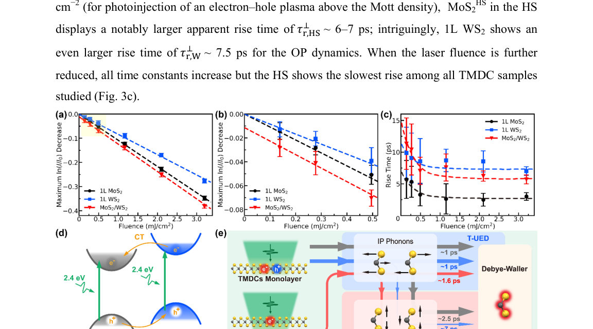 
Figure 3. Fluence dependence of diffraction changes and photoinduced processes in TMDC materials. (a) Maximum diffraction intensity decreases as a function of photoexcitation fluence for 1L MoS2, 1L WS2, and MoS2/WS2 HSs. Dashed lines are linear fits of the data. (b) Expanded view of the low-fluence range from panel a. (c) Apparent rise time constants ߬୰ ୄ of the individual monolayers and the HS as a function of laser fluence. Dashed lines are guides to the eye. (d) Type-II band alignment and ultrafast ICT in MoS2/WS2 HSs. (e) Schematic of photoinjection of charged carriers (left), carrier–phonon coupling, major phonon modes involved (middle, with black arrows indicating the atomic...

📷 Fig 3

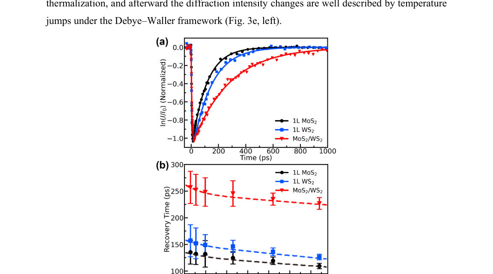 
Figure 4. Structural recovery dynamics of TMDC monolayers and HSs at longer times. (a) Time-dependent recovery of diffraction intensities of 1L MoS2, 1L WS2, and the MoS2/WS2 HS measured at 3.2 mJ cm−2. (b) Apparent recovery time constants for the individual monolayers and the HS as a function of excitation fluence. Dashed lines are guides to the eye.

📷 Fig 4

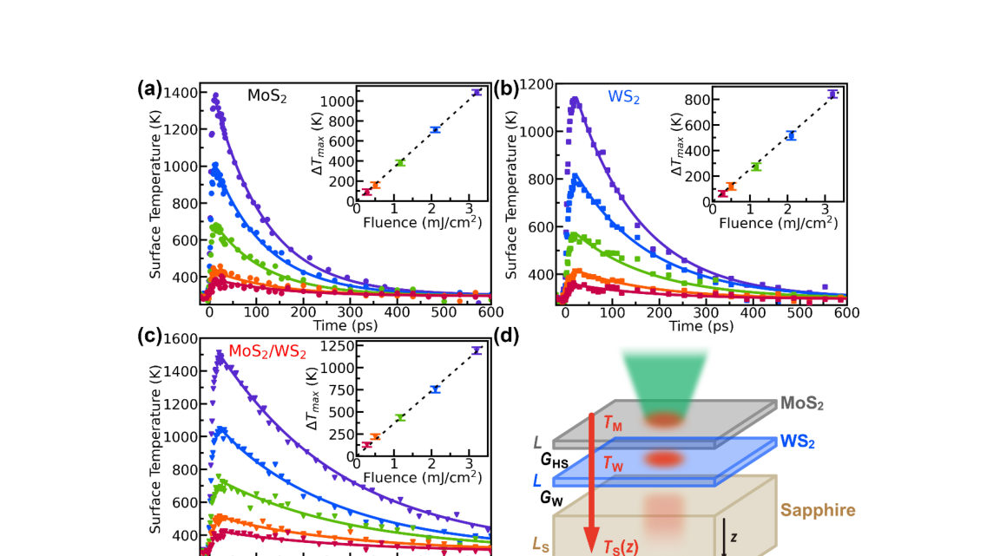 
Figure 5. Comparison of experimentally-derived temperature jumps with the thermal transport model of TMDC systems. (a–c) Effective lattice temperatures derived from the UED data (symbols) over excitation fluences ranging from 0.27 to 3.2 mJ cm−2 for (a) 1L MoS2, (b) 1L WS2, and (c) MoS2 HS in the HS. Solid lines are theoretical results. Insets display the corresponding maximum temperature jumps at select fluences, with the standard deviations indicated, as well as the linear dependence (dashed line). (d) Schematic of cross-plane heat dissipation in the supported HS, illustrating the layer thicknesses, the corresponding temperatures, and the two interfacial TBCs.

📷 Fig 5

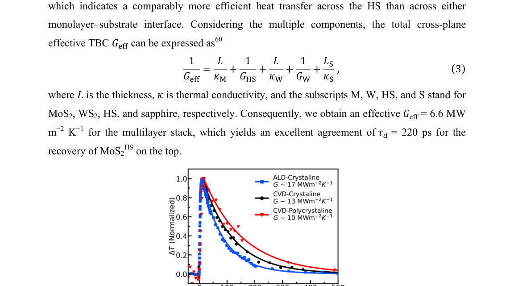 
Figure 6. Comparison of the recovery dynamics of photoexcited MoS2 fabricated as atomic layer deposition (ALD)–grown crystalline (blue; this work), chemical vapor deposition (CVD)–grown crystalline (black; this work), and CVD-grown polycrystalline (red; adapted from28) films. Solid lines represent fits using the thermal transport model.

**Summary.** This work investigates how energy and structure evolve in stacked 2D material heterostructures ($	ext{MoS}_2/	ext{WS}_2$) following intense laser excitation. Using ultrafast electron diffraction and thermal modeling, the authors demonstrate that interlayer coupling creates unique, ultrafast structural dynamics and influences heat dissipation across the interfaces. These findings are vital for engineering next-generation optoelectronic devices.

**Why it may be interesting.** The study provides quantitative insights into non-equilibrium energy transfer mechanisms (carrier-phonon coupling) in nanoscale materials, which is crucial for designing efficient energy harvesting and thermal management devices relevant to quantum technologies.

Detailed structure

**Main problem.** The study aims to understand the electronic coupling and energy flow (carrier and phonon transport) across layered two-dimensional (2D) heterostructures for use in next-generation optoelectronic devices.

**Main result.** The heterostructure exhibits ultrafast, carrier-coupled structural dynamics absent in individual monolayers, and the interlayer thermal boundary conductance (TBC) is comparable to, and potentially higher than, monolayer-substrate interfaces.

**Method.** The research combines ultrafast electron diffraction (UED) to probe structural dynamics with thermal transport modeling to analyze energy dissipation.

**Model / system.** The physical system is supported Transition Metal Dichalcogenide (TMD) heterostructures, specifically $	ext{MoS}_2/	ext{WS}_2$ bilayers, studied via photoexcitation. The analysis involves modeling heat diffusion across multiple interfaces using coupled partial differential equations.

**Key observables.** Photoinduced out-of-plane structural dynamics, interlayer charge transfer (ICT) dynamics, characteristic time constants ($	au_{	ext{OP}}$, $	au_{	ext{thermal}}$), and thermal boundary conductance (TBC).

**Important parameters / regimes.** Fluence levels ($\sim 3.2 	ext{ mJ cm}^{-2}$), time scales (femtoseconds to picoseconds), and TBC values ($	ext{MW m}^{-2} 	ext{K}^{-1}$).

**Assumptions / limitations.** The thermal model assumes local intralayer thermal equilibrium, and the UED analysis has limitations regarding probe depth and sensitivity to specific phonon modes.

**Figures summary.** Figures compare early-time diffraction intensity changes between the heterostructure and individual monolayers, illustrate the energy flow pathways involving ICT, and compare structural recovery dynamics and calculated temperatures using thermal models.

**Paper structure.** The paper progresses from characterizing the fundamental physical problem (energy flow in 2D HSs) to presenting ultrafast experimental measurements (UED) showing unique carrier-coupled dynamics, and finally applying thermal transport modeling to quantify energy dissipation across interfaces.

Abstract

Understanding the electronic coupling and energy flow across layered two-dimensional heterostructures (HSs) is crucial to the exploitation of carrier and phonon transports as well as thermal management in next-generation optoelectronic devices. By using reflection ultrafast electron diffraction, we directly examine photoinduced out-of-plane structural dynamics of supported MoS2/WS2 bilayer HSs and their individual monolayers. Experimental evidence reveals the launch of ultrafast carrier-coupled intralayer atomic motions due to interlayer charge transfer across the van der Waals (vdW) heterojunctions that is absent for individual monolayers. Such a notable carrier-lattice correlation is in addition to the electronic coupling manifested in the enhanced optical absorption for HSs. Also, different pathways of energy flow as a result of carrier-phonon coupling and phonon scattering are reported with the corresponding characteristic times. On longer timescales, relaxation of thermalized atomic motions can be sufficiently described by a thermal transport model. A higher thermal boundary conductance (TBC) across MoS2/WS2 HSs is obtained compared to those at the monolayer-substrate interfaces; however, the similar TBC values suggest comparable couplings of phonons across vdW contacts. These results further shed light on the optical, phonon, and interfacial thermal properties of vertically-stacked vdW HSs.

[↑ back to top](#top)

### [FunKit: A computer algebra toolkit for functional approaches](http://arxiv.org/abs/2605.28935v1)

**Authors:** Franz R. Sattler  
**Type:** theory · **Category:** other · **PDF:** <https://arxiv.org/pdf/2605.28935v1>  
**Analysis basis:** full PDF text, analyzed in chunks
**Topic relevance:** `Keldysh / 2PI / non-Gaussian methods` **3/5** · `driven-dissipative phase transition` **1/5** · `methods for driven-dissipative` **1/5**

📷 Fig 1

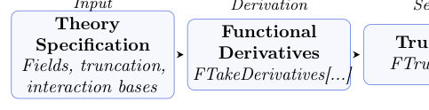 
Figure 1: FunKit workflow: From theory specification to numerical evaluation.

📷 Fig 2

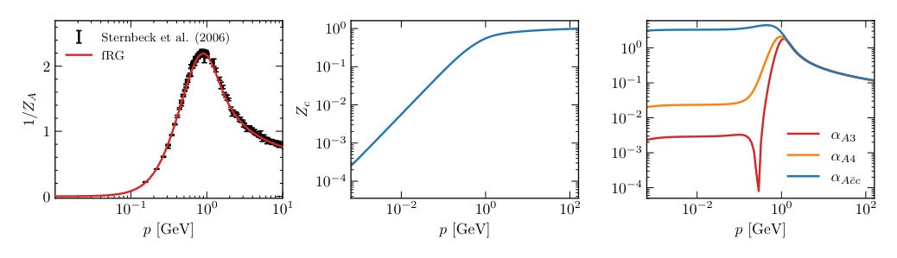 
Figure 2: Results of the Yang–Mills example in examples/Yang-Mills/. Left: Inverse gluon dressing 1/ZA(p) compared to lattice data from [43]. Center: Ghost dressing in the scaling limit. Right: Avatars of the strong coupling.

📷 Fig 3

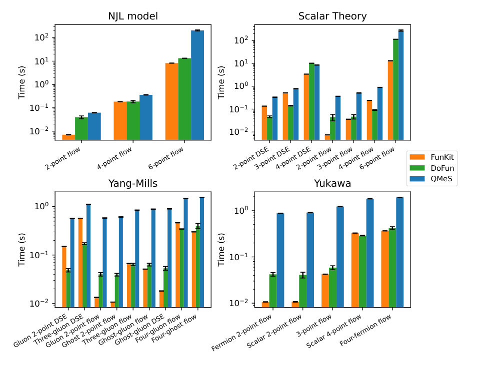 
Figure 3: Performance comparison between FunKit (v1.0.0), DoFun (v3.0) [27, 28] and QMeS (v1.2) [29]. In all cases, we measured the total time to take the derivatives and truncate the expression. Especially for very large expressions with several thousand diagrams, e.g. the six-point and four-point flows, FunKit excels. All benchmarks were performed on a 16-core AMD Ryzen 9 7945HX machine. Two warmup-cycles were used before five benchmark runs, which led to the error bars as shown in the plots.

**Summary.** This paper introduces FunKit, a sophisticated Mathematica toolkit designed to automate the derivation and tracing of functional equations in Quantum Field Theory. It allows physicists to systematically calculate complex quantities like flow equations and Dyson-Schwinger equations for various models. By integrating symbolic manipulation with code generation (C++/Julia/Fortran), FunKit provides a powerful, end-to-end computational platform for advanced theoretical physics research.

**Why it may be interesting.** While focused on QFT, the systematic, automated handling of complex functional derivatives, tensor contractions, and code generation is highly relevant to any field requiring the symbolic manipulation of high-dimensional correlation functions or master equations.

Detailed structure

**Main problem.** The paper addresses the complex task of deriving and systematically tracing functional equations arising from arbitrary master equations in Quantum Field Theories (QFTs). It aims to provide a comprehensive computational framework for these derivations.

**Main result.** The authors introduce FunKit, a powerful Mathematica package that automates the entire pipeline, from theory specification and functional differentiation to tensor tracing and code generation for numerical evaluation.

**Method.** The methodology involves defining the theory's field content and master equations, followed by sequential computational steps: taking functional derivatives, applying systematic truncations, routing momenta, and finally tracing the resulting large tensor expressions.

**Model / system.** The toolkit is applicable to a wide range of QFT functional approaches, including Dyson-Schwinger equations (DSEs), functional Renormalization Group (fRG) equations (like the Wetterich equation), $n$PI equations, and Slavnov-Taylor identities. Examples include Yang-Mills and scalar theories.

**Key observables.** Correlation functions ($\Gamma_N$), propagators ($G_{ab}$), flow equations ($	ext{Flow2F}$, $	ext{Flow4F}$), and the 1PI generating functional ($\Gamma$).

**Important parameters / regimes.** The calculation depends on the chosen regulator functions ($R_{ab}$), coupling constants ($\lambda[i]$), and the specific truncation scheme applied to the infinite set of diagrams.

**Assumptions / limitations.** The process relies on defining a global setup, specifying truncation rules, and assuming the ability to systematically manage large diagrammatic expressions through computer algebra.

**Figures summary.** Figure 1 illustrates the overall FunKit workflow, showing the pipeline from theory specification through functional derivation to final numerical code generation.

**Paper structure.** The paper details the toolkit's functionality across several sections, covering notation (Section 2), basic syntax (Section 3), tensor bases/diagrams (Section 4), code generation (Section 5), and culminating in full examples demonstrating the calculation of complex flow equations (Section 6).

Abstract

We introduce FunKit, a Mathematica package for the derivation and tracing of functional equations from arbitrary master equations. FunKit provides an expression vocabulary and a set of rules that allow for derivations in any given field theory and master equation. It also allows users to add extensions for more specific equation systems. Therefore, it can be used in a wide range of situations, for example Dyson--Schwinger or functional RG equations, flowing reparametrisations, nPI equations, (modified) STIs and WTIs, functional Polchinski and Wegner flows, functional master equations with sources, and many others. Besides interfacing with the \FORM language to trace large tensor expressions efficiently, FunKit also provides facilities to export arbitrary Mathematica expressions to C++, Julia or Fortran code, including the results of derivations, which can then be evaluated numerically. Both the tracing and code generation can also be used independently and in combination with other packages.

[↑ back to top](#top)

### [Revealing quantum metric multipoles in magnetic topological insulator MnBi2Te4](http://arxiv.org/abs/2605.29595v1)

**Authors:** Lars Sjöström, Prasanna Rout, Shahid Sattar, Alexander Tyner, Maurice E. Bal, Ankit Khola, Elias Rasmussen, Khadiza Ali, Arumugum Thamizhavel, Uli Zeitler, Carlo M. Canali, Saroj P. Dash  
**Type:** experiment · **Category:** other · **PDF:** <https://arxiv.org/pdf/2605.29595v1>  
**Analysis basis:** full PDF text, analyzed in chunks
**Topic relevance:** `spintronics-quantum-optics interface` **3/5** · `non-equilibrium dynamics` **1/5**

📷 Fig 1

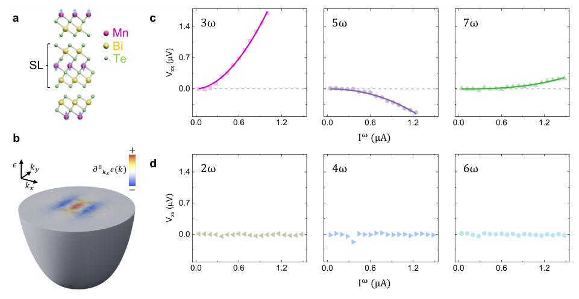 
Figure 1: Higher-harmonic nonlinear transport in multilayer MnBi2Te4. (a) Side-view schematic of the crystal structure of MnBi2Te4, showcasing the antiferromagnetic ordering of adjacent septuple layers (SLs) with an out-of-plane magnetization. The blue arrows indicate the spin direction of the respective Mn atoms. (b) Schematic of MnBi2Te4 band diagram with a quantum metric septupole as a color plot, which corresponds to the seventh-order nonlinear conductivity generated from the quantum metric. (c) Nonlinear IV characteristics for the third (3ω), fifth (5ω) and seventh (7ω) harmonic orders with power-law fits as guides to the eye (solid lines). (d) Nonlinear IV characteristics for the...

📷 Fig 2

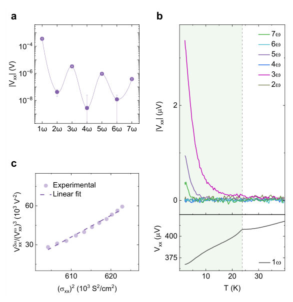 
Figure 2: Even-odd behavior and temperature-dependent higher-harmonic nonlinear trans- port. (a) The nonlinear voltage signals for different harmonic orders at T = 2 K, showing an even-odd behavior as well as a decreasing amplitude for increasing harmonic orders. (b) Nonlinear voltages |Vxx| of the second (2ω) to the seventh (7ω) harmonic order as a function of temperature. The first-harmonic signal is shown in the bottom panel for reference. The N´eel temperature TN = 23.8 K is indicated with a dashed line. (c) The third-harmonic voltage normalized by the cube of the first-harmonic voltage plotted against the square of the longitudinal conductivity for low temperatures T = 2.6 −5.3 K. The...

📷 Fig 3

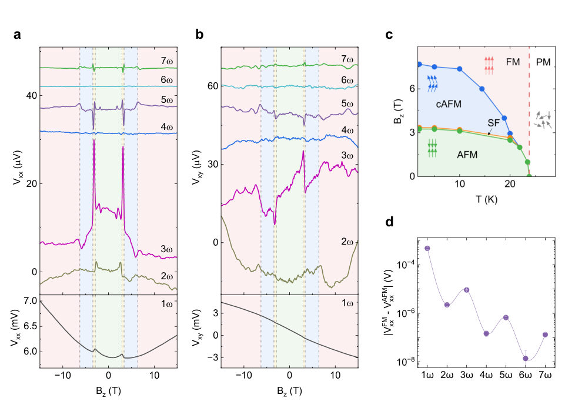 
Figure 3: Magnetic-field-dependent higher-order nonlinear transport. (a,b) Higher-harmonic longitudinal voltages Vxx (a) and transverse voltages Vxy (b) of the second (2ω) to the seventh (7ω) (top) and the first (1ω, bottom) harmonic orders for OOP magnetic field sweeps. The measurements were performed in Device 2 with Iω = 80 µA at T = 4.3 K. The data has been shifted vertically for clarity and the magnetic phase transitions are indicated with dashed lines. (c) A magnetic phase diagram for MBT, where the borders between the different magnetic phases have been mapped out from linear transport measurements. Antiferromagnetic (AFM), canted antiferromagnetic (cAFM), ferromagnetic (FM) and...

📷 Fig 4

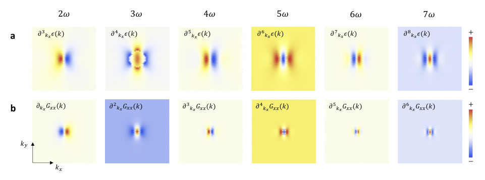 
Figure 4: Theory for higher-order Drude and quantum metric contributions. Qualitative overview of the calculated contributions to the nonlinear conductivities of second (2ω) to seventh (7ω) harmonic order from the Drude-like terms (a) and the quantum metric (b), respectively.

**Summary.** This work reports the observation of high-order nonlinear electronic transport in the magnetic topological insulator $	ext{MnBi}_2	ext{Te}_4$. By measuring harmonics up to the seventh order, the authors demonstrate that the nonlinear response is dominated by odd harmonics and correlates strongly with the material's magnetic phase. This evidence allows them to microscopically identify the quantum metric multipoles as the key physical origin of the observed quantum geometric effects.

**Why it may be interesting.** The connection between measurable transport coefficients (nonlinear response) and fundamental geometric invariants (quantum metric multipoles) provides a novel, experimentally accessible probe of topological band structure, which is relevant to understanding Berry curvature effects in condensed matter.

Detailed structure

**Main problem.** The study investigates higher-order nonlinear electronic transport in magnetic topological insulators to probe the underlying quantum geometry, specifically the quantum metric multipoles.

**Main result.** The researchers observed higher-order nonlinear transport up to the seventh harmonic order, confirming an even-odd behavior where odd harmonics dominate. Scaling analysis identified quantum metric multipoles and Drude-like conductivities as the microscopic origins of this nonlinear response.

**Method.** Nonlinear electronic transport measurements were performed using a lock-in technique at high harmonic orders ($n\omega$) on exfoliated multilayer $	ext{MnBi}_2	ext{Te}_4$. Theoretical modeling was used to interpret the observed scaling relationships.

**Model / system.** The physical system is the magnetic topological insulator $	ext{MnBi}_2	ext{Te}_4$, which exhibits rich band topology and magnetic ordering (A-type AFM). The analysis relies on fitting the transport response to models incorporating quantum metric and Drude-like contributions.

**Key observables.** Higher-harmonic voltage responses ($V_{3\omega}, V_{5\omega}, V_{7\omega}$), even-odd behavior, and the scaling relationship $V_{3\omega} / (V_{\omega})^3 = \alpha \sigma_{xx}^2 + eta$.

**Important parameters / regimes.** Temperature (T), applied magnetic field ($B$), and the harmonic order ($n$).

**Assumptions / limitations.** The analysis assumes that the observed longitudinal nonlinear transport is governed by quantum metric multipoles and Drude-like contributions, while ruling out spurious effects like thermoelectric or capacitive coupling.

**Figures summary.** Figures illustrate the higher-harmonic nonlinear transport, demonstrating the suppression of even harmonics and the strong correlation between the nonlinear signals and the magnetic phases of $	ext{MnBi}_2	ext{Te}_4$. Scaling plots confirm the linear relationship between the third harmonic and the square of the DC conductivity.

**Paper structure.** The paper progresses by first establishing the feasibility of measuring high-order harmonics, then analyzing the even-odd symmetry and magnetic field dependence, and finally using scaling analysis and theoretical modeling to attribute the observed nonlinearities to specific quantum geometric terms.

Abstract

Nonlinear electronic transport has emerged as a powerful probe of the quantum geometry in topological quantum materials, where the band topology and broken symmetries facilitate power law current voltage responses beyond Ohms law. While nonlinear transport of the second and third orders has been studied in several quantum materials, higher-order transport has so far mainly remained experimentally inaccessible, leaving more detailed features of the quantum geometry unexplored. Here, we observe higher order nonlinear electronic transport up to the seventh harmonic order in multilayer magnetic topological insulator MnBi2Te4. We find an even-odd behavior where the odd order nonlinear transport components dominate while the even-order ones are suppressed. Temperature and magnetic field dependent measurements show a strong correlation between the nonlinear transport and the magnetic phases of MnBi2Te4. Through scaling analysis and theoretical calculations, quantum metric multipoles and nonlinear Drude conductivities are identified as the microscopic origins of the nonlinear transport.

[↑ back to top](#top)

### [Visualizing orbital magnetism in electron doped rhombohedral multilayer graphene](http://arxiv.org/abs/2605.30316v1)

**Authors:** Owen I. Sheekey, Trevor B. Arp, Benjamin A. Foutty, Ruoxi Zhang, Tixuan Tan, Ludwig F. W. Holleis, Yi Guo, Sandesh S. Kalantre, Canxun Zhang, Mark Zakharyan, David Gong, Aidan Keough, Youngjoon Choi, Ysun Choi, Siyuan Xu, Tian Xie, Ben Hodder Alexander, Marisa Hocking, Qingrui Cao, Martin E. Huber, Takashi Taniguchi, Kenji Watanabe, Chenhao Jin, Etienne Lantagne-Hurtubise, Aaron Sharpe, Trithep Devakul, Andrea F. Young  
**Type:** both · **Category:** strongly correlated electrons · **PDF:** <https://arxiv.org/pdf/2605.30316v1>  
**Analysis basis:** full PDF text, analyzed in chunks
**Topic relevance:** `spintronics-quantum-optics interface` **3/5**

📷 Fig 1

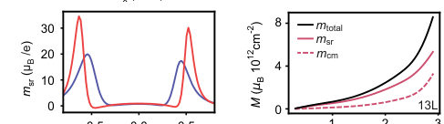 
FIG. 1. Orbital magnetization and ‘Berry ring of fire’ in rhom- bohedral multilayer graphene (a) Fringe field ∆B measured at a fixed spatial point above the 6L sample for applied (B||, B⊥) = (0 mT, 12 mT) (b) ∆B for the 13L sample with (B||, B⊥) = (0 mT, 19 mT). (c) ∆B along the grey dashed line in panel a. (d) ∆B along the grey dashed line in panel b. (e) Band dispersion near the K-point for 6L and 13L rhombohedral graphene for D = 0.9 V nm−1. (g) Corresponding self-rotation magnetization (msr) for D = 0.9 V nm−1. (f) msr as a function of kx and ky for the 6L and 13L for D = 0.9 V nm−1. (h) Comparison of self-rotation and center-of-mass contributions to the magnetization, as well as their...

📷 Fig 2

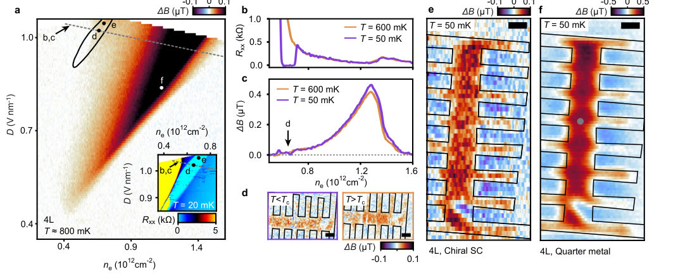 
FIG. 2. Orbital ferromagnetism and chiral superconductivity (a) Fringe field acquired at a fixed spatial point above the 4L sample for applied (B⊥, B∥) = (3 mT, 50 mT) and T ≈800mK. The contour shows the extent of zero resistance in the same sample at 20mK (inset) (b) Rxx and (c) local fringe field ∆B measured at T = 50 mK and T = 600 mK along the trajectory shown by the dashed line in panel a. (d) Spatial image taken at the (ne, D) point marked on the trajectory in panel c at T = 50 mK (left) and T = 600 mK (right), well below and above the Tc of the superconducting state, respectively. (e) Spatial image of ∆B in the zero resistance state, at the (ne, D) point indicated in panel a. (f)...

📷 Fig 3

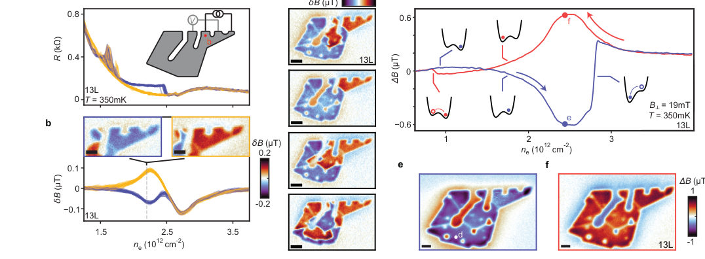 
FIG. 3. Capacitively driven magnetic reversal (a) Resistance measurement from the configuration illustrated in the inset, acquired along the ne −D trajectory of Fig. 1b. Each line represents a single gate sweep from low to high ne. Curves are colored according to their resistance at ne = 2.25 × 1012cm−2: curves with R &lt; 100 ohms are colored gold, curves with R &gt; 100 ohms are colored blue. (b) δB measured simultaneously with the transport in panel a at the point indicated in the inset to panel a. Color coding is consistent with panel a; i.e., by the resistance value. Insets show spatially resolved δB for an initialization to ne = 2.2 × 1012cm−2 for a blue and gold trajectory, respectively....

📷 Fig 4

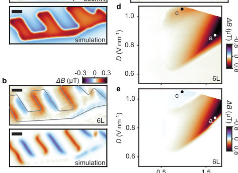 
FIG. 4. Competing ground states in the region of chiral supercon- ductivity in R6G. (a) Top: Fringe field ∆B acquired above the 6L device in the quarter-metal phase as indicated on panel d. Bottom: Simulated spatial pattern due to a uniform magnetic moment within the sample geometry (M = 650 nA) aligned out-of-plane. (b) Top: Fringe field of a spin-polarized phase at ne = (−1.77 × 1012 cm−2, D = 0 V nm−1. Bottom: Simulated spatial pattern due to a uni- form magnetic moment within the sample geometry (M = 116 nA) aligned in-plane in the same direction as the applied field. (c) Fringe field in the region of chiral superconductivity measured at the point in panel d showing domain structure...

**Summary.** This work investigates orbital magnetism and chiral superconductivity in multilayer graphene using nanoSQUID magnetometry. By correlating local magnetization measurements with transport data, the authors confirm the chiral nature of the superconducting state and reveal that the system's magnetic behavior is governed by the concentration of Berry curvature. The findings highlight a complex interplay between quantum geometry, doping, and superconducting pairing in these advanced 2D materials.

**Why it may be interesting.** The strong coupling between orbital magnetism (a topological/geometric property) and superconductivity in a 2D material like graphene is highly relevant to understanding exotic superconducting states and topological superconductivity, which are key areas in condensed matter theory.

Detailed structure

**Main problem.** The study aims to map and understand the orbital magnetization in electron-doped rhombohedral multilayer graphene, particularly in relation to its quantum geometric properties and superconducting states.

**Main result.** The research provides direct evidence of chiral superconductivity via a finite orbital magnetic moment and demonstrates that the orbital magnetization is highly sensitive to carrier density and displacement field due to Berry curvature concentration.

**Method.** The work combines advanced local magnetometry (nanoSQUID-on-tip) measurements with theoretical calculations based on continuum Hamiltonians to model the system's electronic structure.

**Model / system.** The physical system is electron-doped rhombohedral multilayer graphene (RMG) with thicknesses ranging from 3 to 13 layers. The theoretical modeling uses a continuum Hamiltonian incorporating interlayer hopping and electrostatic screening.

**Key observables.** Orbital magnetization ($\Delta B$), zero-resistance state (superconductivity), Berry curvature concentration ('Berry ring of fire'), and magnetic domain patterns.

**Important parameters / regimes.** Electron density ($n_e$), perpendicular displacement field ($D$), and layer number ($N=3$ to $13$).

**Assumptions / limitations.** The interpretation of transport anomalies relies on assumptions about sample homogeneity, and the study suggests a subtle energetic competition underlies the observed chiral superconductivity.

**Figures summary.** Figures illustrate $\Delta B$ measurements showing magnetization peaks at finite density, comparisons between orbital ferromagnetism and chiral superconductivity, and spatial mapping of magnetic inhomogeneity in the superconducting regime.

**Paper structure.** The paper progresses from characterizing the orbital magnetization using magnetometry across varying doping/field regimes, to linking this magnetism to the superconducting state, and finally investigating the complex phase competition and domain formation in the chiral superconducting region.

Abstract

Electron doped rhombohedral multilayer graphene at high displacement field features an exceptionally flat band minimum with near-ideal quantum geometry. Experiments in this regime observe the formation of a 'quarter metal,' in which the electron liquid condenses into a single spin- and valley flavor. Remarkably, recent experiments have found a zero resistance state in the same region of the density- and displacement-field-tuned parameter space, attributed to the formation of a chiral superconductor characterized by a finite-momentum Cooper pair condensate. Here, we use nanoSQUID-on-tip magnetometry to map the orbital magnetization of electron-doped rhombohedral graphene devices ranging in thickness between 3 and 13 layers. Magnetization within the quarter metal phases peaks at finite density, consistent with concentration of the Berry curvature in a finite-momentum 'ring of fire'. Correlating transport and local magnetometry data in a tetralayer sample reveals that the superconducting state has a finite orbital magnetic moment, providing direct evidence of its chiral nature. We further show that widely observed stochastic switching of the resistivity in the metallic regime arises from a density-tuned sign change in the valley-resolved total magnetic moment. This leads to the formation of metastable magnetic domains under typical gate control sequences and can also be harnessed for electric-field controlled switching of orbital moment across the entire device. Unexpectedly, we find magnetic inhomogeneity specific to the apparent normal state of the chiral superconductor, suggestive of a strain-tuned competition between magnetic and non-magnetic ground states. Our results point to a subtle energetic competition underlying the observation of chiral superconductivity in a narrow range of layer numbers.

[↑ back to top](#top)

### [Field-Driven Hybrid Filament Formation Governs Switching in Ta-HfO$_2$-Pt Memristors](http://arxiv.org/abs/2605.29127v1)

**Authors:** Ashutosh Krishna Amaram, Aditya Koneru, Subramanian KRS Sankaranarayanan  
**Type:** both · **Category:** numerical methods · **PDF:** <https://arxiv.org/pdf/2605.29127v1>  
**Analysis basis:** full PDF text, analyzed in chunks
**Topic relevance:** `Keldysh / 2PI / non-Gaussian methods` **2/5** · `methods for driven-dissipative` **2/5** · `non-equilibrium dynamics` **2/5** · `driven-dissipative phase transition` **1/5** · `non-equilibrium universality` **1/5**

📷 Fig 1

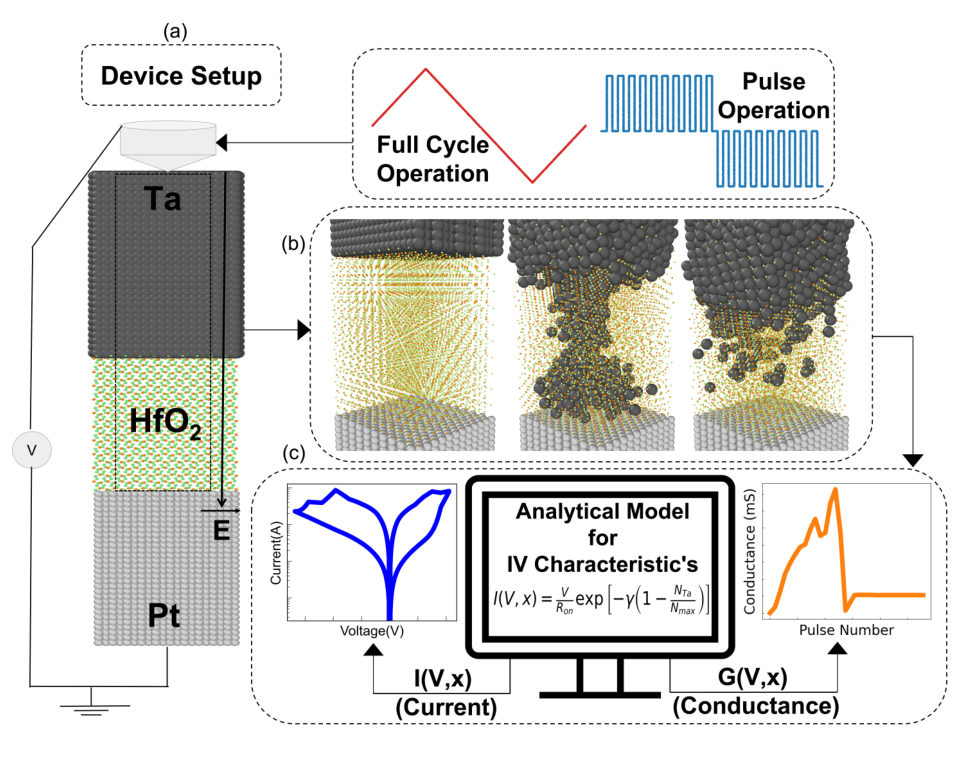 
Figure 1: An end to end atomistic simulation framework to understand switching mechanism in Ta-HfO2-Pt memristive devices.(a) Shows the MD setup of the device where pristine and defective(0.81% and 1.35% oxygen vacancies) were studied under two different electrical stimuli:(i) full cycle field operation and (ii) field pulse operation. (b) shows the MD trajectories of the device when studied under full cycle field operation. (c) The MD trajectories are then used to quantify the number of Ta cations participating in the filament formation and dissolution process. This information is then fed as an input to an analytical model to obtain an IV characteristic for a device under full cycle field...

📷 Fig 2

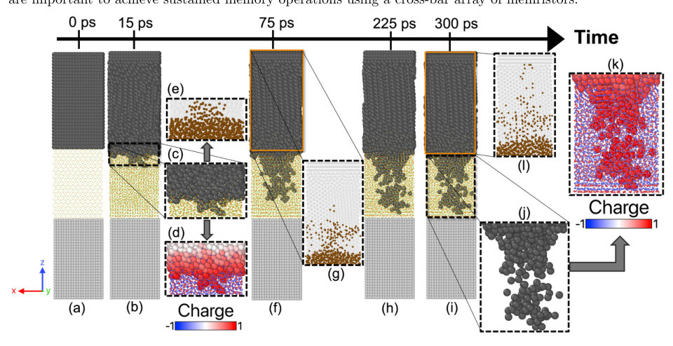 
Figure 2: A detailed step by step filament formation process of Ta-HfO2-Pt memristor. (a) The initial state of the device before an external electric field was applied, (b) shows the state of the system when a non-stoichiometric layer of TaOx at the Ta-HfO2 interface is formed, (c) The magnified snapshot of the non-stoichiometric layer of TaOx, (d) The charge distribution of the non-stoichiometric layer of TaOx, (e) highlights the diffusion of oxygen anions at the metal-semiconductor interface which is governing the formation of TaOx, (f) shows the state of the system when Ta cations begin to diffuse hence marking the onset of the filament formation process (g) points the position of oxygen...

📷 Fig 3

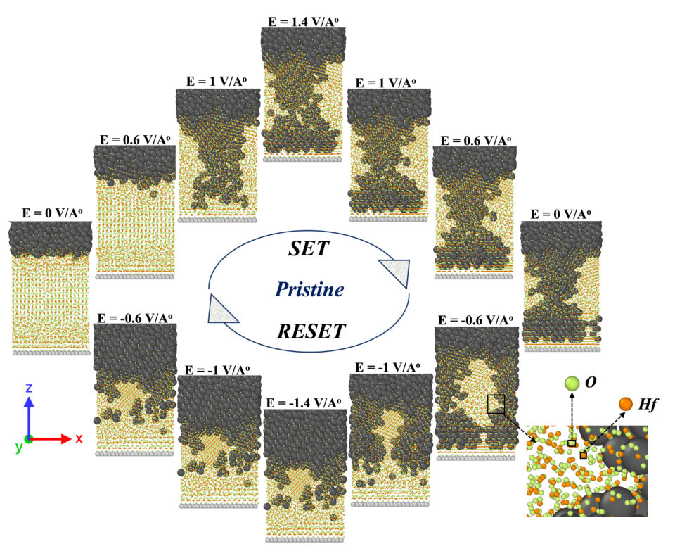 
Figure 3: Full-Cycle switching behavior of pristine device. After the completion of the set process a filament composed of Ta cations is formed between the electrodes causing the device to switch to LRS. The reset process of the device occurs in a step-wise manner with first filament constriction observed at E = -1 and -1.2 V/˚A followed by a full filament rupture at -1.4 V/˚A. After complete filament rupture the device switches back to HRS with the state being stable owing to minimal changes in the spatial distribution of atoms.

📷 Fig 4

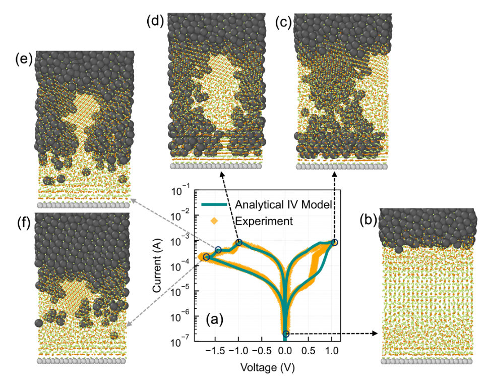 
Figure 4: Correlation between IV characteristics and filament evolution in pristine Ta-HfO2- Pt device.(a) shows the IV characteristics of pristine Ta-HfO2-Pt device. (b) Depicts the initial state of the device at 0 V, (c) highlights the LRS which structurally corresponds to a full filament composed of Ta cations. (d),(e) points towards the stepwise filament constriction before (f) full filament rupture occurs.

📷 Fig 5

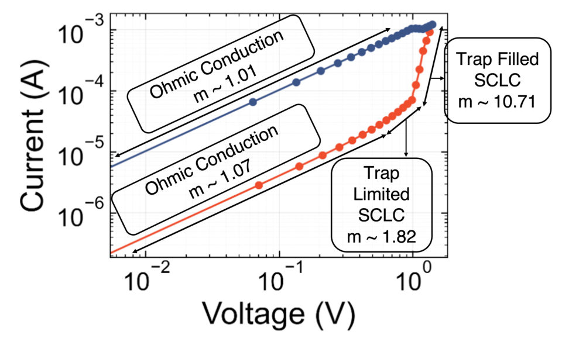 
Figure 5: Exploring electron conduction mechanism governing the resistive switching of the device. The log-log plot of current and applied bias voltage where before the set process the dominant mechanism is ohmic, during the transient state of SET process its trap limited SCLC, during the set process its trap filled SCLC and during the second half of positive voltage cycle the dominant mechanism again switches back to ohmic.

**Summary.** This work uses Molecular Dynamics simulations to reveal that resistive switching in Ta-HfO2-Pt memristors is controlled by the formation of a hybrid Ta-cation-rich filament, not just oxygen vacancies. By varying initial defect levels, the authors demonstrate that controlling defect engineering is crucial for achieving stable, reproducible device performance necessary for neuromorphic applications.

**Why it may be interesting.** While focused on solid-state electronics, the use of advanced MD simulations with dynamic charge transfer and the development of coupled atomistic/analytical models for non-equilibrium processes (like filament formation) showcases sophisticated computational techniques relevant to many-body dynamics.

Detailed structure

**Main problem.** The paper aims to understand the complex, atomistic mechanisms governing resistive switching in Ta-HfO2-Pt memristors, moving beyond simple oxygen vacancy models.

**Main result.** Switching is governed by the field-driven formation and rupture of a hybrid Ta-cation-rich, oxygen-deficient filament, and initial defect concentrations significantly influence device variability.

**Method.** The study employs Molecular Dynamics (MD) simulations with dynamic charge transfer, coupled with analytical modeling to correlate atomistic evolution with macroscopic IV characteristics.

**Model / system.** The physical system is a Ta-HfO2-Pt memristor. The simulation uses a Charge-Transfer Interatomic Potential (CTIP) and models the switching using first-order kinetic equations for filament growth (SET) and decay (RESET).

**Key observables.** Atomic charge distribution, stoichiometry, filament conductivity, IV characteristics, and conductance vs. pulse number.

**Important parameters / regimes.** Applied electric field (e.g., $\pm 1.4 	ext{ V/Å}$), initial oxygen vacancy concentration (e.g., 0.81% vs 1.35%), and temperature (300 K).

**Assumptions / limitations.** The analytical model is limited to filamentary memristors, and the simulation relies on specific potentials and kinetic rate laws derived from MD observations.

**Figures summary.** Figures illustrate the MD setup, the full cycle switching process showing $	ext{TaO}_x$ formation and step-wise constriction/rupture, and conductance stability under pulsed operation for different defect levels.

**Paper structure.** The paper progresses from establishing the need for a hybrid model, detailing the MD simulation setup and potential functions, presenting the kinetic modeling of SET/RESET processes, and finally comparing the results across varying defect concentrations to discuss device variability.

Abstract

Memristive devices have gained significant attention for their potential in next-generation non-volatile memory and neuromorphic computing architectures. Among emerging candidates, transition metal oxides have proven particularly promising. While the switching mechanism in Ta/HfO$_2$/Pt devices was long attributed solely to oxygen vacancy based filaments, recent experimental evidence suggests a more complex dual-regime: the diffusion of metal cations also contributes to the formation of a conductive bridge. However, the precise atomistic mechanisms governing this metal cation migration remain poorly understood. Additionally, the role of defects such as oxygen vacancies present in the transition metal oxide in determining the final filament size and shape is also not well understood. Here, we employ molecular dynamics (MD) simulations with dynamic charge transfer to provide a detailed analysis of the atomistic mechanisms governing the co-formation of Ta-cation and oxygen-deficient filaments. We clearly show how varying the initial oxygen vacancy concentrations and spatial configurations within the HfO$_2$ matrix influences the final morphology and dimensions of the conductive filament. The switching is governed by field-driven formation and rupture of a hybrid Ta-cation-rich, oxygen-deficient filament in HfO$_2$. Our simulations closely match experiment, validating the model as a robust framework for understanding switching in oxide memristors and guiding designs that reduce cycle-to-cycle and device-to-device variability -- key barriers to high-performance devices.

[↑ back to top](#top)

### [Surface Originated Cross-Field Anomalous Transport in Magnetoelectric Multilayers](http://arxiv.org/abs/2605.30050v1)

**Authors:** Jin Cao, Wei Du, Xue-Jin Zhang, Cong Xiao, Qian Niu, Shengyuan A. Yang  
**Type:** theory · **Category:** other · **PDF:** <https://arxiv.org/pdf/2605.30050v1>  
**Analysis basis:** full PDF text, analyzed in chunks
**Topic relevance:** `Keldysh / 2PI / non-Gaussian methods` **2/5** · `methods for driven-dissipative` **2/5** · `non-equilibrium dynamics` **1/5**

📷 Fig 1

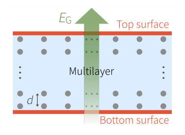 
FIG. 1. A multilayer system under gate field EG. The layer here may correspond to either real atomic sites or a lattice chosen for discretizing the low-energy model of the material system.

📷 Fig 2

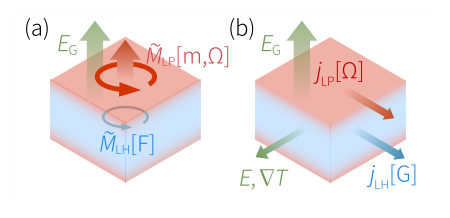 
FIG. 2. Schematics of (a) gate-field-induced orbital magneti- zation ˜ M and (b) cross-field anomalous thermoelectric trans- port. The responses consist of surface (LP) and bulk (LH) contributions. The symbols in the square brackets highlight their dependence on distinct band geometric quantities.

📷 Fig 3

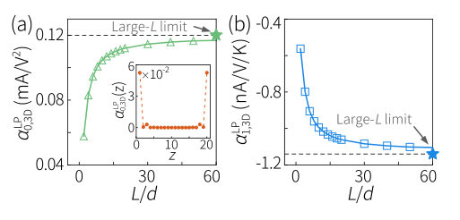 
FIG. 4. (a) Calculated cross-field anomalous Hall coefficient αLP 0,3D for MnBi2Te4 multilayers as a function of L (even- number of layers), at µ = 0.1 eV. The inset shows the layer- resolved contribution to αLP 0,3D for the case with L = 20. The star indicates the value for L →∞limit. (b) Same as (a), but for the Nernst response αLP 1,3D.

📷 Fig 4

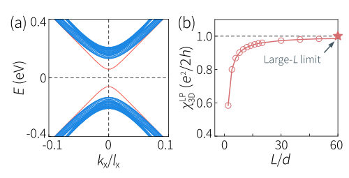 
FIG. 3. (a) Band structure of MnBi2Te4 multilayer model with a thickness of 20 septuple layers. The red color highlights the surface bands. (b) Calculated χLP 3D ≡χLP/L (at µ = 0) as a function of the slab thickness L (taking even-number of layers). The star indicates the value in the L →∞limit. The solid curve serves as a guide to the eyes.

**Summary.** This work demonstrates that surface effects in layered quantum materials do not necessarily vanish in the bulk limit, contrary to conventional wisdom. By developing a general framework, the authors show that surface-originated anomalous transport can persist and even dominate the response, particularly when bulk symmetries forbid the effect. This opens a new avenue for designing quantum devices based on surface quantum geometry.

**Why it may be interesting.** While focused on condensed matter transport, the rigorous mathematical decomposition of total response into distinct, non-trivial surface and bulk components provides a powerful, generalizable theoretical tool for analyzing boundary effects in quantum materials.

Detailed structure

**Main problem.** The paper challenges the conventional assumption that surface contributions to physical responses in slab geometries diminish rapidly with increasing thickness.

**Main result.** The surface contribution remains finite and scales with the bulk term even in the thick-slab limit, and it can dominate the overall response when the bulk contribution is symmetry-forbidden.

**Method.** The authors developed a general theoretical framework using linear response theory to decompose the total response into distinct surface- and bulk-contributions.

**Model / system.** The study focuses on magnetoelectric multilayers, modeled using a tight-binding Hamiltonian subjected to an external gate electric field ($E_G$).

**Key observables.** Cross-field anomalous transport coefficients (e.g., anomalous Nernst effect), gate-induced orbital magnetization, and the decomposition of response coefficients ($\chi = \chi_{LP} + \chi_{LH}$).

**Important parameters / regimes.** The thickness of the slab ($L$), the applied gate electric field ($E_G$), and the material system ($	ext{MnBi}_2	ext{Te}_4$).

**Assumptions / limitations.** The analysis is restricted to weak electric fields ($E_G$) and effects linear in $E_G$.

**Figures summary.** Figures illustrate the schematic decomposition of responses into surface (LP) and bulk (LH) parts, and show the thickness dependence of the surface contribution, demonstrating saturation to a finite limit.

**Paper structure.** The paper first introduces the problem of surface vs. bulk contributions, develops the general decomposition framework, analyzes the scaling behavior in the thick limit, and finally applies these findings to predict a strong surface-dominated anomalous Nernst effect in $	ext{MnBi}_2	ext{Te}_4$.

Abstract

In material systems with slab geometry, the surface contribution to physical responses is commonly expected to diminish rapidly with increasing thickness, giving way to the bulk response. Here, we show that this conventional wisdom is violated in a class of gate-induced responses, including gate-induced orbital and spin magnetization as well as cross-field anomalous thermoelectric transport. We develop a general framework for these effects, which naturally decomposes the total response into surface- and bulk-contributions treated on equal footing. Remarkably, the volume-averaged surface contribution remains finite in the thick-slab limit and exhibits the same thickness scaling as the bulk term. Furthermore, the surface response originates from band geometric quantities distinct from those in the bulk, being constrained solely by surface symmetries. As a result, it can dominate the overall response when the bulk contribution is symmetry-forbidden. Taking MnBi$_2$Te$_4$ multilayers as an example, we predict a strong surface-dominated cross-field anomalous Nernst effect arising from surface Berry curvature, which is readily accessible to experimental detection. These findings reveal a previously overlooked significance of surface response and open a new direction in the study of surface quantum geometry.

[↑ back to top](#top)

### [Induced nonlinear phase shift of forward volume spin waves in magnetic films and one-dimensional magnonic crystals](http://arxiv.org/abs/2605.30206v1)

**Authors:** Alexey B. Ustinov, Roman V. Haponchyk, Anton P. Burovikhin, Mitsuteru Inoue, Taichi Goto  
**Type:** experiment · **Category:** other · **PDF:** <https://arxiv.org/pdf/2605.30206v1>  
**Analysis basis:** full PDF text, analyzed in chunks
**Topic relevance:** `analog quantum simulation` **1/5** · `correlated / nonlocal dissipation` **1/5** · `driven-dissipative phase transition` **1/5** · `exotic spin models in light-matter` **1/5** · `non-equilibrium dynamics` **1/5** · `non-equilibrium universality` **1/5** · `spintronics-quantum-optics interface` **1/5**

📷 Fig 1

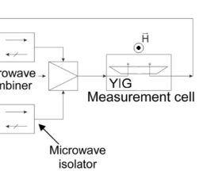 
Fig. 1. Schematic diagram of the experimental setup.

📷 Fig 2

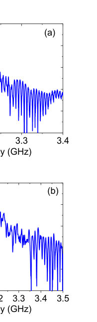 
Fig. 4. AFCs of the measurement cells based on YIG films with thicknesses of 5.7 µm (a)

📷 Fig 3

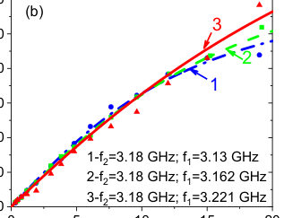 
Fig. 5. The induced nonlinear phase shift of the probe FVSWs measured for the 5.7-μm-thick YIG

📷 Fig 4

 
Figure 5(a) presents the measured nonlinear phase shift Δφ1INL as a function of the pumping

📷 Fig 5

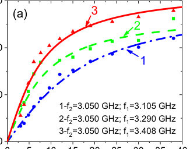 
Fig. 6. The induced nonlinear phase shift of the probe FVSWs measured for the 13.6-μm-thick YIG

**Summary.** This paper experimentally demonstrates a strong, low-power induced nonlinear phase shift in forward volume spin waves propagating in YIG magnetic films. The effect is superior to surface wave counterparts, suggesting a pathway for fast and energy-efficient control of magnon transport. This work is significant for developing next-generation magnonic logic circuits.

**Why it may be interesting.** While focused on magnonics, the concept of nonlinear wave interaction and energy-efficient control of wave propagation shares conceptual links with nonlinear dynamics studied in quantum optics and open quantum systems.

Detailed structure

**Main problem.** The study investigates the induced nonlinear phase shift of forward volume spin waves (FVSWs) in perpendicularly magnetized magnetic films and one-dimensional magnonic crystals.

**Main result.** The nonlinear phase shift is significantly stronger for FVSWs in perpendicularly magnetized films compared to surface spin waves, allowing a $180^\circ$ shift with pump powers as low as a few milliwatts.

**Method.** The research combines experimental measurements using a Vector Network Analyzer (VNA) with theoretical modeling based on nonlinear damping theory.

**Model / system.** The physical system involves Yttrium Iron Garnet (YIG) films, sometimes structured into 1D magnonic crystals, which are excited and measured using microstrip antennas.

**Key observables.** Induced nonlinear phase shift ($\Delta\varphi_{1INL}$), amplitude-frequency characteristic (AFC), and nonlinear damping parameters ($
u_2, \varsigma_2$).

**Important parameters / regimes.** Pump wave power ($P_2$), film thickness (e.g., 5.7-$\mu$m, 13.6-$\mu$m), and operating frequencies relative to magnonic band gaps.

**Assumptions / limitations.** The analysis relies on comparing experimental data with theoretical predictions derived from nonlinear damping theory.

**Figures summary.** Figures illustrate the experimental setup, phase vs. time measurements, AFCs for different film thicknesses, and plots showing $\Delta\varphi_{1INL}$ dependence on pump power, particularly highlighting saturation and band gap effects.

**Paper structure.** The paper details the experimental setup, presents measurements of the nonlinear phase shift dependence on pump power for various film geometries (bulk vs. 1D MC), and compares these results against theoretical models.

Abstract

A differential phase shift of a low-power spin wave (SW) induced by a high-power pumping wave co-propagating at different frequencies in perpendicularly magnetized magnetic films has been studied. We find that this effect for forward volume SWs propagating in yttrium iron garnet (YIG) films is stronger than that for surface SWs propagating in tangentially magnetized films. The results show that the induced nonlinear phase shift up to 180° takes place for pumping wave power of a few milliwatts. The phenomenon paves the way for fast and energy-efficient control of one-dimensional magnon transport.

[↑ back to top](#top)

### [Hysteretic Acoustic Band Structures in Shape-Memory Composite Thin Rods](http://arxiv.org/abs/2605.30028v1)

**Authors:** R. Esquivel-Sirvent, B. Manzanares-Martínez, J. Manzanares-Martínez  
**Type:** theory · **Category:** statistical mechanics · **PDF:** <https://arxiv.org/pdf/2605.30028v1>  
**Analysis basis:** full PDF text, analyzed in chunks
**Topic relevance:** `Frenkel-Kontorova` **1/5** · `analog quantum simulation` **1/5** · `driven-dissipative phase transition` **1/5** · `methods for driven-dissipative` **1/5** · `non-equilibrium dynamics` **1/5** · `non-equilibrium universality` **1/5**

📷 Fig 1

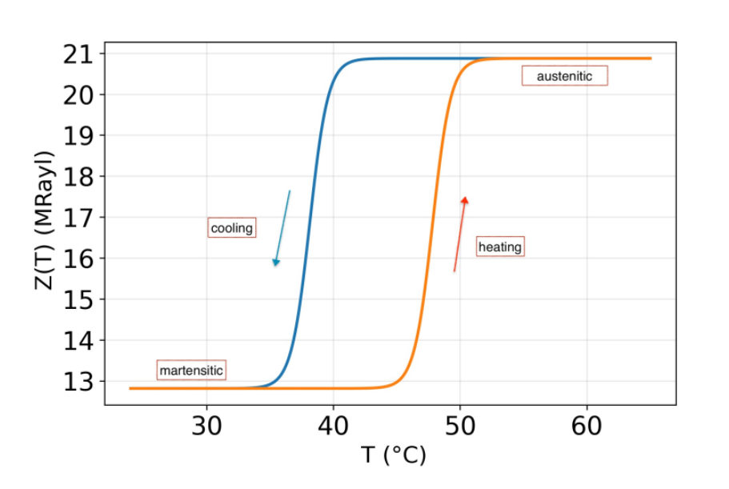 
FIG. 1. Temperature dependence of the specific acoustic impedance of NiTiCu during cooling (blue)

📷 Fig 2

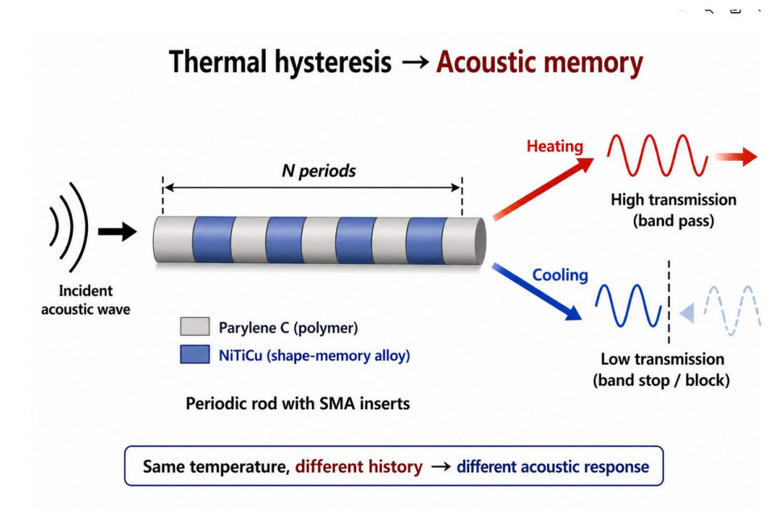 
FIG. 2. Schematic of the composite phononic rod under study. A one-dimensional periodic rod is

📷 Fig 3

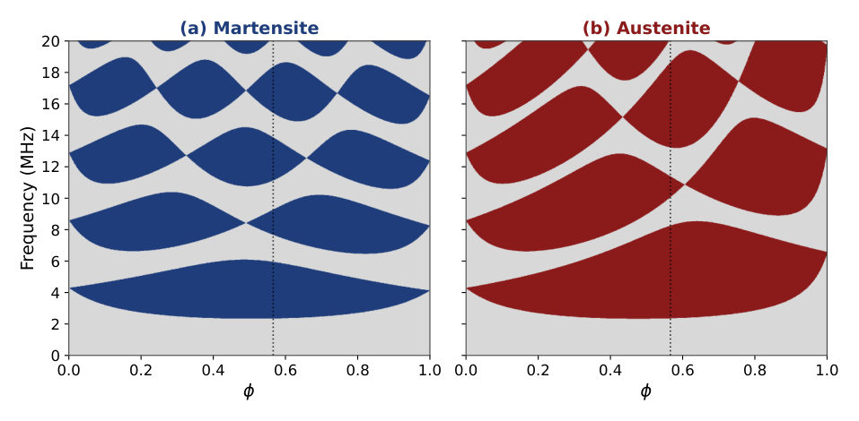 
FIG. 3. Band-gap maps of the infinite periodic rod in the (ϕ, ν) plane, computed from the cosine

📷 Fig 4

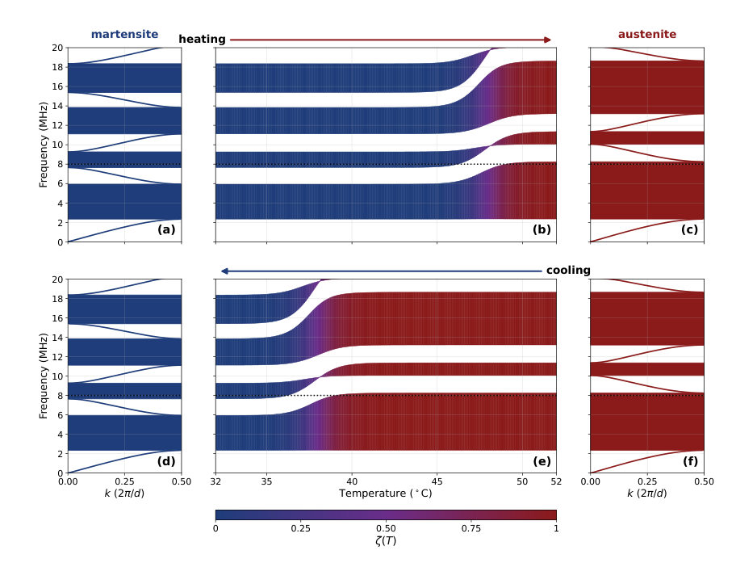 
FIG. 4. Thermal evolution of the Bloch band structure of the infinite periodic rod for the filling

📷 Fig 5

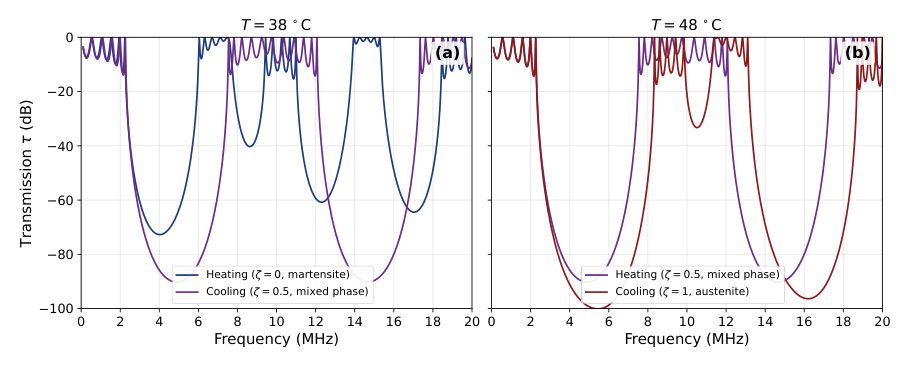 
FIG. 5. Transmission spectra τ(ν) of a finite composite rod of N = 6 unit cells immersed in water,

**Summary.** This theoretical study models acoustic wave propagation in composite rods containing a shape-memory alloy undergoing a first-order phase transition. It demonstrates that the material's inherent thermal hysteresis causes the resulting phononic band structure and transmission spectrum to become path-dependent. This highlights how macroscopic thermodynamic history can imprint itself onto the collective vibrational modes of a structured material.

**Why it may be interesting.** The concept of path-dependent properties (hysteresis) manifesting in collective excitations (phonons) is analogous to non-equilibrium dynamics studied in open quantum systems or driven many-body systems.

Detailed structure

**Main problem.** The study investigates how the intrinsic thermal hysteresis present in a shape-memory alloy (NiTiCu) influences the collective acoustic response of a periodic composite structure.

**Main result.** The material's path-dependent thermal hysteresis is transferred to the acoustic properties, causing the phononic band structure and transmission spectrum to depend on the thermal history (heating vs. cooling).

**Method.** The analysis employs the transfer-matrix method to compute the Bloch band structure and transmission spectrum for the periodic superlattice.

**Model / system.** The system is a one-dimensional periodic composite rod made of alternating segments of NiTiCu (shape-memory alloy) and a polymer spacer (Parylene C). Material properties are modeled as functions of temperature, exhibiting first-order phase transitions.

**Key observables.** Bloch band structure, transmission coefficient ($	au$), and the specific acoustic impedance ($Z$).

**Important parameters / regimes.** Temperature ($T$), geometric filling fraction ($\phi$), and the material's elastic modulus ($E$) and density ($
ho$).

**Assumptions / limitations.** The analysis relies on the thin-rod approximation, assuming acoustic wave amplitudes are insufficient to alter the phase fraction, and that the material properties are solely functions of temperature.

**Figures summary.** Figures illustrate the temperature dependence of acoustic impedance showing hysteresis, and the evolution of the phononic band structure, comparing distinct spectra for heating and cooling paths.

**Paper structure.** The paper progresses from analyzing the material's intrinsic hysteresis (acoustic impedance) to modeling the infinite periodic structure using the transfer-matrix method, and finally examining the measurable, path-dependent transmission spectrum of finite composite rods.

Abstract

We investigate the propagation of longitudinal elastic waves in one-dimensional periodic composite rods composed of alternating segments of a shape-memory alloy (NiTiCu) and a polymer spacer (Parylene C). In the thin-rod regime, the longitudinal phase velocity reduces to $c=\sqrt{E/ρ}$, which coincides with the regime in which the elastic modulus of NiTiCu has been measured directly through its acoustic response across the martensitic transformation. Using the standard transfer-matrix method along the heating and cooling branches of the transformation separately, we compute the Bloch band structure of the infinite periodic system and the transmission spectrum of finite composite rods. Because the elastic modulus of NiTiCu follows different paths upon heating and cooling, the same external temperature within the transformation interval corresponds to two different phase fractions and, consequently, to two different phononic spectra. The resulting hysteresis of the underlying material is thus transferred to the collective acoustic response of the periodic structure: stop-band edges trace closed loops in the temperature--frequency plane, and the transmission coefficient of a finite rod at a fixed temperature depends on the previous thermal history. We further show that the geometric filling fraction of the active segment provides a complementary tuning mechanism, modifying the width of the spectral hysteresis loops and the position of specific gap closures independently of temperature. These results illustrate how a first-order structural phase transition with intrinsic thermal hysteresis manifests itself in the dispersion relation of a periodic elastic medium.

[↑ back to top](#top)

### [Stability Analysis of Superconductivity in $\textit{P6/mmm}$-LaSc$_2$H$_{24}$ and its Experimental Reproducibility from La-Sc Alloys](http://arxiv.org/abs/2605.29985v1)

**Authors:** Dmitrii V. Semenok, Ivan A. Troyan, Di Zhou, Emil A. Yuzbashyan, Boris L. Altshuler, Viktor V. Struzhkin  
**Type:** both · **Category:** other · **PDF:** <https://arxiv.org/pdf/2605.29985v1>  
**Analysis basis:** full PDF text, analyzed in chunks
**Topic relevance:** `Keldysh / 2PI / non-Gaussian methods` **1/5**

📷 Fig 1

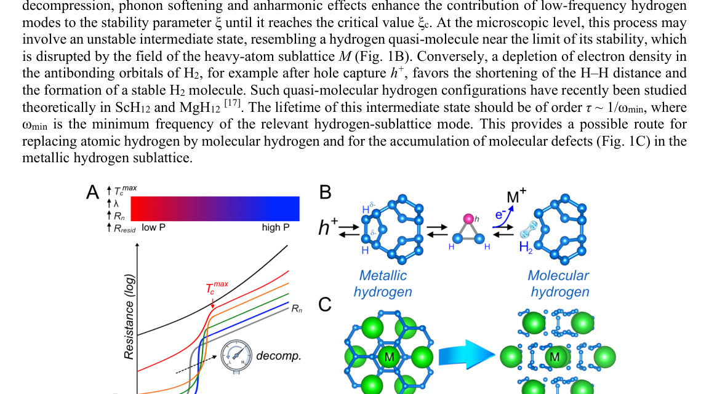 
Fig. 1. Qualitative mechanism of possible instability of the metallic hydrogen sublattice in superhydrides during decompression. (A) Experimental picture of hydride decompression with an increase in the critical temperature, sample resistance, electron-phonon interaction parameter, and, eventually, disappearance of superconductivity. The color scale corresponds to the transition from low (blue) to high (red) values of normal state and residual resistance, Tc, λ upon going from high pressures (high P) to low pressures (low P). (B) Potentially reversible mechanism of formation of a hydrogen quasi molecule inside of the metallic hydrogen sublattice due to fluctuations of the local electron...

📷 Fig 2

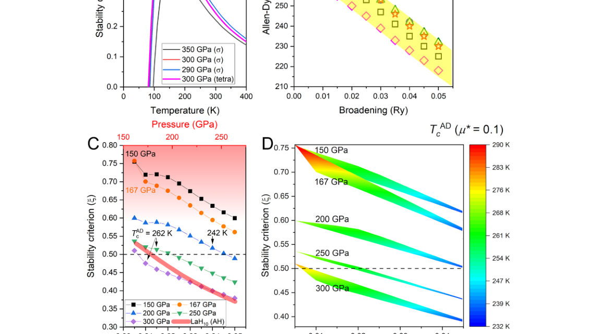 
Fig. 2. Metallic state stability and superconducting properties of P6/mmm-LaSc2H24 under pressure. (A) Temperature- dependent stability criterion ξ(T) for LaSc2H24 in harmonic approximation (HA) at 290-350 GPa, showing possible violation of the stability criterion (ξ &gt; 0.5) with the maximum ξmax = 0.55 at 290 GPa. “σ” corresponds to calculations using formula (3), and “tetra” corresponds to the tetrahedral method of calculating the electron-phonon interaction. (B) Critical temperature

📷 Fig 3

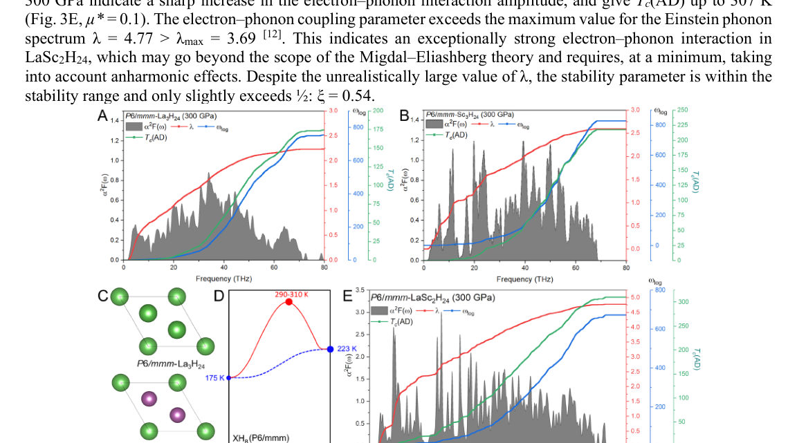 
Fig. 3. Harmonic Eliashberg functions and superconducting state parameters for isostructural (A) P6/mmm-La3H24, (B) Sc3H24, and (E) LaSc2H24 at 300 GPa in harmonic approximation. The tetrahedral method was used for Quantum Espresso calculations with a k-mesh of 12×12×12, a q-mesh of 4×4×4, and for the electron band structure calculations, we applied a

📷 Fig 4

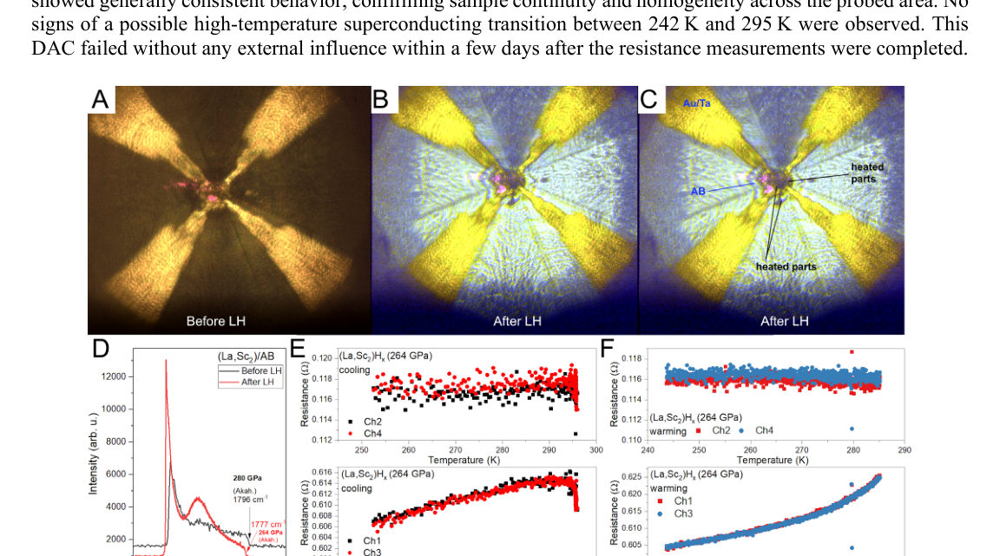 
Fig. 4. Synthesis of (La,Sc)Hx using infrared pulsed laser heating (LH) under high pressure in DAC SL-1. (A-C) Optical micrographs showing the sample chamber and electrical contacts before and after laser heating at high pressure. (A) Initial picture of the (La,Sc)/AB (ammonia borane) sample before LH. (B) State after LH showing a blackening of the sample’s surface. (C) View of sample after LH, highlighting the regions that experienced high temperatures (labeled "heated parts"), the Au/Ta electrodes, and AB/CaF2 insulating gasket. (D) Raman spectra collected before and after laser synthesis. During laser heating, pressure in the DAC decreased from 280 GPa to 264 GPa. (E, F) Electrical...

📷 Fig 5

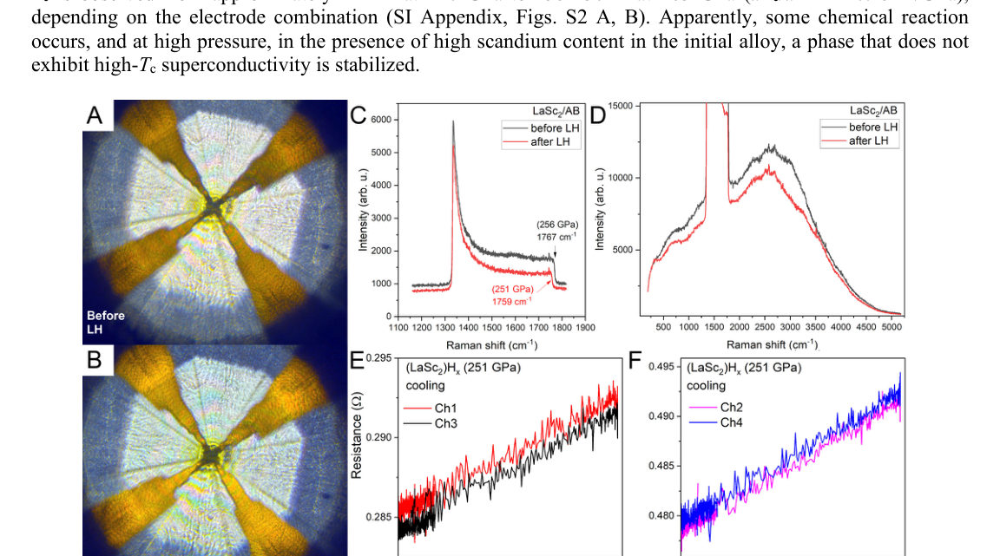 
Fig. 5. Synthesis of (La,Sc)Hx using infrared pulsed laser heating (LH) under high pressure in DAC SL-2. (a, b) Optical micrographs showing the sample chamber and electrical contacts before (A) and after (B) laser heating at high pressure. After LH we can see a blackening of the sample’s surface. (C, D) Raman spectra collected before and after laser synthesis in (C) the region of the diamond Raman edge, and in (D) the full range. During laser heating, pressure in the DAC decreased from 256 GPa to 251 GPa. (E, F) Electrical resistance (R) as a function of temperature (T) for the sample of (La,Sc)Hx at 251 GPa, measured in a four-probe van der Pauw configuration (channels Ch1-Ch4) using a...

**Summary.** This work investigates the potential for room-temperature superconductivity in $	ext{LaSc}_2	ext{H}_{24}$ by combining advanced theoretical calculations with multiple high-pressure electrical measurements. While theory suggests high $T_c$ under optimal conditions, the experimental results from synthesizing La-Sc alloys fail to confirm this superconductivity near room temperature. The paper highlights the significant gap between theoretical prediction and practical material synthesis.

**Why it may be interesting.** The interplay between complex theoretical models (like electron-phonon coupling) and challenging high-pressure experimental realization makes this relevant for understanding strongly correlated or exotic superconducting states in condensed matter.

Detailed structure

**Main problem.** The paper analyzes the theoretical feasibility and experimental reproducibility of room-temperature superconductivity in the high-pressure hydride $	ext{P6/mmm-LaSc}_2	ext{H}_{24}$. It contrasts theoretical predictions with results from high-pressure synthesis attempts.

**Main result.** While theory predicts high $T_c$ using specific methods, experimental synthesis attempts using La-Sc alloys failed to show superconductivity near room temperature, suggesting the material is difficult to realize or unstable under ambient synthesis conditions.

**Method.** The study combines theoretical calculations (Eliashberg function analysis, stability analysis using $\xi$) with multiple high-pressure electrical transport measurements using Diamond Anvil Cells (DACs).

**Model / system.** The physical system is the lanthanum-scandium hydride $	ext{LaSc}_2	ext{H}_{24}$ under extreme pressure (200-300 GPa). Theoretical modeling involves electron-phonon coupling calculations, while experiments use $	ext{La-Sc}$ alloy precursors reacted with hydrogen sources.

**Key observables.** Superconducting critical temperature ($T_c$), electrical resistance $R(T)$, stability parameter ($\xi$), and electron-phonon coupling constant ($\lambda$).

**Important parameters / regimes.** Pressure (220-300 GPa), Temperature (230-300 K), and the electron-phonon coupling broadening parameter ($\sigma$).

**Assumptions / limitations.** Theoretical calculations rely on approximations like the tetrahedral method or Gaussian broadening of the delta function; experimental results are limited by the synthesis method and measurement window.

**Figures summary.** Figures show stability analysis ($\xi$) and resistance measurements ($R$ vs $T$) under DAC conditions, detailing both superconducting transitions and metallic behavior in synthesized La-Sc-H phases.

**Paper structure.** The paper progresses from theoretical analysis of $T_c$ dependence on calculation parameters ($\sigma$) and stability ($\xi$), to comparing theoretical predictions with multiple high-pressure electrical measurements performed on synthesized La-Sc-H samples.

Abstract

In this work, we analyze the feasibility of room-temperature superconductivity in the lanthanum-scandium hydride $\textit{P6/mmm}$-LaSc$_2$H$_{24}$. We demonstrate that the electron-phonon coupling calculations performed using the $σ$-broadening of the double $δ$-function at the Fermi surface lead to a very strong dependence of $\textit{T$_c$}(σ)$ on the arbitrary $σ$, whereas the tetrahedral method for the electron-phonon interaction is free from this drawback and leads to $\textit{T$_c$}$ > 300 K at 300 GPa in agreement with previous predictions. By analyzing the stability of the metallic state of LaSc$_2$H$_{24}$ at 250-300 GPa, we show that this compound is at the edge of the stability region ($ξ$ = 0.54), similar to $\textit{fcc}$ LaH$_{10}$ at 140-150 GPa. Experimental attempts to synthesize LaSc$_2$H$_{24}$ at 250-280 GPa starting from the (La,Sc$_2$) alloy are unsuccessful and indicate the absence of even traces of superconductivity at 245-300 K in all the resulting La-Sc-H hydrides. The method for preparing the precursor by simultaneous deposition of La and Sc metals may be a key factor for the successful synthesis of LaSc$_2$H$_{24}$.

[↑ back to top](#top)

### Other secondary papers (3)

Show other secondary papers

### [Breaking Bipartite and Time Reversal Symmetries by Fusing Porphine Unit in-between two Zigzag-edge Graphene Nanoribbons](http://arxiv.org/abs/2605.29817v1)

**Authors:** R. K. Rohit, Jisvin Sam, Sudipta Dutta  
**Type:** theory · **Category:** other · **PDF:** <https://arxiv.org/pdf/2605.29817v1>  
**Analysis basis:** full PDF text, analyzed in chunks

📷 Fig 1

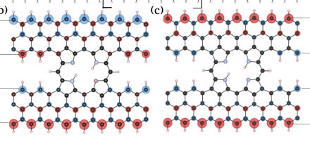 
FIG. 1. (a) Schematic of mm’Z-Por hybrid structure with fused porphine molecules in between two ZGNR segments at the top and at the bottom, with their widths marked by the numeric values, m and m’, respectively, that are the numbers of the zigzag chains along the y-axis. The inner edges are marked by 1 and 1’ and the outer edges are marked by m and m’. The super-cell is marked with the square bracket. The ground state spin densities of (b) AFM and (c) FM ground states of 33’Z-Por hybrid show different types of spin localiza- tions, namely majority (red) and minority (blue) spins on the two sublattices of the bipartite ZGNR segments. The AFM ground state shows two outer edges, i.e., m and m’...

📷 Fig 2

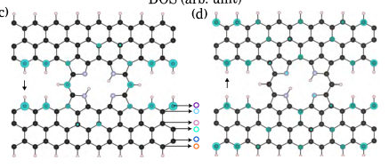 
FIG. 2. Spin polarized k-resolved projected band structures for (a) AFM and (b) FM ground states of 33’Z-Por hybrid. Left and right panels show minority and majority spin band dispersions. The middle panels show spin polarized density of states (DOS) with blue and red shades representing minor- ity and majority spins, respectively. (c) and (d) depict the probability density distributions corresponding to the states marked in boxes in the minority and majority spin band dis- persions of FM state. These two states correspond to the k-point where the minority and majority spin bands cross the Fermi energy. Different colored circles are used to represent zigzag chain-wise normalized carbon pz...

📷 Fig 3

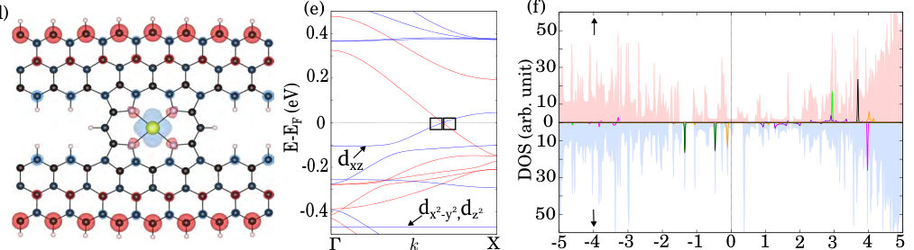 
FIG. 3. Spin densities of the 33’Z-(V)Por hybrid in (a) AFM and (d) FM ground states. The majority and minority spins are depicted in red and blue colors, respectively with V atom localizing the minority spin. The corresponding spin resolved band structures for these states are shown in (b) and (e), respectively with same color code. The bands orginating from the V d-orbitals are marked with arrows. Two boxes in (e) indicate the location of the k-points for which the wave-functions of the majority and minority spin bands at the Fermi energy are presented in Fig. S9(a) and (b), respectively. (c) and (f) present the total spin polarized DOS of 33’Z-(V)Por hybrid along with the individual V...

**Summary.** This theoretical study examines graphene nanoribbons fused with porphine units to engineer specific electronic and magnetic properties. By breaking bipartite and time-reversal symmetries, the system can stabilize a ferromagnetic ground state with distinct majority and minority spin channels. This dual spin-filtering capability makes the structure highly promising for advanced spintronic applications.

**Why it may be interesting.** The explicit control over spin-dependent electronic properties via molecular engineering (porphine fusion) and symmetry breaking is highly relevant to designing next-generation spintronic devices.

Detailed structure

**Main problem.** The study investigates how fusing a porphine unit between two zigzag-edge graphene nanoribbons modifies their electronic and magnetic properties by breaking bipartite and time-reversal symmetries.

**Main result.** The hybrid structure exhibits two nearly degenerate ground states: a semiconducting antiferromagnetic state and a conducting ferromagnetic state. The FM state is promising for dual spin-filtering due to opposite Fermi velocities for majority and minority spins.

**Method.** Density Functional Theory (DFT) calculations, employing the GGA+U formalism for transition metal atoms, were used to analyze the electronic structure.

**Model / system.** The physical system is a hybrid structure formed by fusing a porphine ring (Por) between two Zigzag-edge Graphene Nanoribbons (ZGNRs), denoted as $m m’Z-Por$. Substitutions with transition metals (V, Fe, Cu) are also studied.

**Key observables.** Ground state energy difference ($\Delta$), net magnetization ($\mu_B$), spin-polarized band structures, Density of States (DOS), and spin-resolved Fermi velocities.

**Important parameters / regimes.** ZGNR width, presence/type of transition metal dopant (V, Fe, Cu), and the symmetry breaking induced by the porphine ring.

**Assumptions / limitations.** The analysis relies on a mean-field description for interactions and assumes the porphine ligand geometry dictates the d-orbital splitting pattern.

**Figures summary.** Figures illustrate spin densities, spin-polarized band structures, and pDOS for various hybrid states (AFM vs. FM), detailing spin localization and orbital hybridization effects.

**Paper structure.** The paper systematically analyzes the electronic structure of the $m m’Z-Por$ system, comparing the AFM and FM ground states. It then details the effect of incorporating transition metals (V, Fe, Cu) and varying the ZGNR width, confirming the symmetry breaking mechanism and its implications for spin transport.

Abstract

Hybrid structure of two zigzag-edge graphene nanoribbons with a fused porphine ring in between, results in two distinct nearly degenerate ground states: a semiconducting antiferromagnetic state and a conducting ferromagnetic state with unequal and opposite Fermi velocities of majority and minority spins, the former having slightly higher stability. Such ground states result from the broken bipartite symmetry induced by the porphine ring. The incorporation of different transition metal atoms in the porphine cavity reduces their energy difference but keeps their electronic properties mostly unchanged. The splitting of the $d$-orbitals in the distorted square-planar ligand field of porphine produces a high spin ground state that breaks the global time reversal symmetry ($\mathcal{T}$). The opposite Fermi velocities of the majority and minority spins in the ferromagnetic ground state and lower sensitivity of the conducting majority spin channel to the edge disorder, make this class of quasi-one-dimensional hybrid structures promising for dual spin-filtering device applications.

[↑ back to top](#top)

### [Electron Doping of $\mathrm{La_3Ni_2O_7}$ Thin Films: Candidate Metal Dopants and Their Potential Impact on Superconductivity](http://arxiv.org/abs/2605.30297v1)

**Authors:** Shi-Cong Mo, Wéi Wú  
**Type:** theory · **Category:** strongly correlated electrons · **PDF:** <https://arxiv.org/pdf/2605.30297v1>  
**Analysis basis:** full PDF text, analyzed in chunks

📷 Fig 1

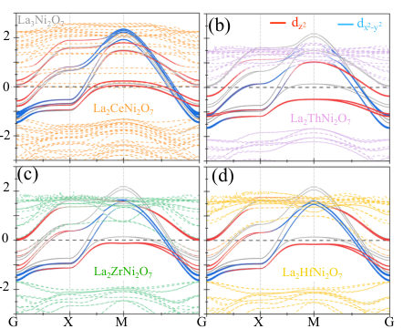 
Figure 1. Energy bands of 1UC La2−xRxNi2O7 thin films. (a) La2CeNi2O7, (b) La2ThNi2O7, (c) La2ZrNi2O7, (d) La2HfNi2O7. The dz2 and dx2−y2 orbitals weights in low- energy bands are denoted by red (dark) and blue (light) dots respectively. Low-energy bands of pristine La3Ni2O7 film on substrate are shown by gray lines for reference. Here substrate with a = 3.905 ˚A is assumed. For La2CeNi2O7 DFT+U is also applied to the 4f−orbitals of Ce. See also Appendix.

📷 Fig 2

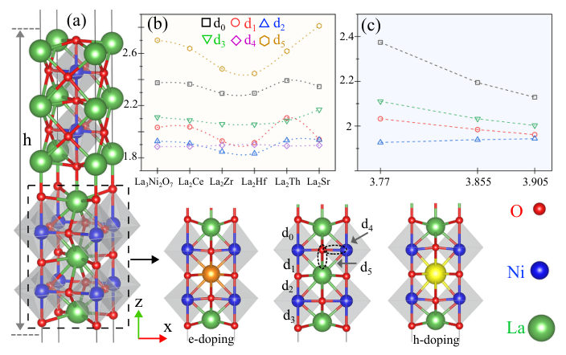 
Figure 2. (a) Structure of the 1UC La3Ni2O7 thin film, where h represents the distance between the apical oxygen atoms at the ends of the 1UC. The dashed box is enlarged to show the sites for electron doping, the pristine La3Ni2O7 structure, and hole doping. Here, different chemical bonds are labeled: d0–d4 are Ni–O bonds, and d5 is the R–O bond. (b) Bond length indicated in (a) for the thin-film La3Ni2O7 and La2RNi2O7 (R = La, Ce, Zr, Hf, Th, and Sr).(c)Bond lengths as functions of substrate in-plane lattices constant a.

📷 Fig 3

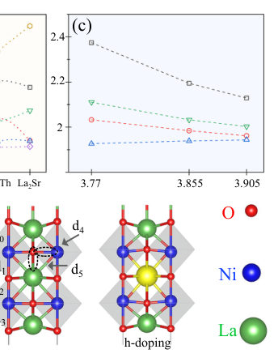 
Fig. 2c shows the variation of vertical Ni-O bond lengths d0 to d3 of pristine La3Ni2O7 on different sub- strates (LaAlO3, 3.77 ˚A) and tensile (NdGaO3, 3.855 ˚A; SrTiO3, 3.905 ˚A) [14, 70]. It can be seen that all verti- cal Ni-O bonds, except for d2 that remains nearly con- stant, generally decrease with increasing in-plane lattice constant. Doped compounds exhibit similar trend upon lattice constant variation (result not shown).

📷 Fig 4

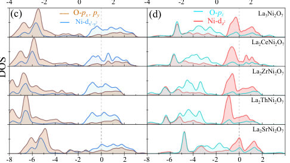 
Figure 3. Density of states of the thin-film La2ANi2O7. (a–b) The density of states for Ni and O, for t2g and eg orbitals, respectively. (c-d) The density of states of the in-plane Ni- dz2 orbital and its associated O-px and -py orbitals, as well as the out-of-plane Ni dz2 orbital and its associated O-pz orbital.

📷 Fig 5

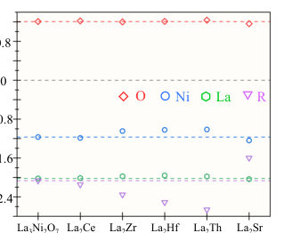 
Figure 4. Average charge transfer between O, Ni, La, and R (La, Zr, Hf, Th, Sr) elements. Here, O gains charge, while the other atoms lose charge. Dotted line denotes result of La3Ni2O7 for reference.

**Summary.** This theoretical study investigates electron doping in $\mathrm{La_3Ni_2O_7}$ using DFT calculations to understand its superconducting potential. The authors find that $\mathrm{Zr}$, $\mathrm{Hf}$, and $\mathrm{Th}$ are effective electron dopants, which enhances interlayer coupling ($t_{\perp}$) and suggests a pathway to higher $T_c$. The findings help clarify the complex pairing mechanisms in this class of nickelate superconductors.

**Why it may be interesting.** The work provides detailed theoretical insights into tuning superconductivity in nickelates by controlling electron doping, which is crucial for understanding unconventional pairing mechanisms in strongly correlated materials.

Detailed structure

**Main problem.** The study investigates electron doping in the Ruddlesden-Popper nickelate $\mathrm{La_3Ni_2O_7}$ to understand its potential impact on high-temperature superconductivity, contrasting it with existing hole-doping studies.

**Main result.** The authors identify $\mathrm{Zr}$, $\mathrm{Hf}$, and $\mathrm{Th}$ as efficient electron dopants, which can increase the interlayer hopping $t_{\perp}$ and potentially enhance the superconducting critical temperature ($T_c$).

**Method.** The research employs first-principles density functional theory (DFT) calculations, supplemented by the constrained random-phase approximation (cRPA) to estimate effective screened interactions.

**Model / system.** The physical system is the bilayer Ruddlesden-Popper nickelate $\mathrm{La_3Ni_2O_7}$ thin film, modeled with substitutions $\mathrm{La_{3-x}R_xNi_2O_7}$ where R is the dopant element. The analysis focuses on the electronic structure and interaction parameters governing superconductivity.

**Key observables.** Interlayer hopping integral ($t_{\perp}$), inter-layer superexchange coupling ($J_{\perp}$), electron counts in $e_g$ orbitals ($\mathrm{d}_{z^2}$ and $\mathrm{d}_{x^2-y^2}$), and Hubbard interaction parameters ($ar{U}$, $J_H/U$).

**Important parameters / regimes.** The key parameters include the dopant identity ($\mathrm{Zr}, \mathrm{Hf}, \mathrm{Th}$ vs. $\mathrm{Ce}$), the ratio $t_{\perp}/t_{1x}$, and the strength of Hund's coupling ($J_H/U$).

**Assumptions / limitations.** The study assumes that the superconducting properties are governed by the electronic structure changes induced by doping, particularly the modification of hopping integrals and correlation parameters.

**Figures summary.** Figures illustrate energy bands for various doped films, structural changes like bond length variations, and the fitting of band structures using a double-layer Hubbard model. Tables summarize calculated interaction parameters.

**Paper structure.** The paper systematically analyzes the effect of different dopants (electron vs. hole) on the electronic structure of $\mathrm{La_3Ni_2O_7}$ using DFT. It then uses these results to calculate key superconducting parameters like $t_{\perp}$ and $J_{\perp}$, proposing a unified mechanism for superconductivity based on the doping type.

Abstract

The bilayer Ruddlesden-Popper nickelate $\mathrm{La_3Ni_2O_7}$ has emerged as a promising platform for exploring and understanding high-temperature superconductivities. While most prior doping studies   have focused on hole doping via strontium (Sr) substitution or by tuning oxygen content, electron doping remains largely unexplored. In this work,we systematically investigate electron doping in $\mathrm{La_3Ni_2O_7}$ thin films through   tetravalent element substitution, employing first-principles density functional theory calculations.   Our results reveal that, unlike in cuprates, $\mathrm{cerium}$ (Ce) doping is difficult to effectively introduce electron carriers into the low-energy bands. In contrast, zirconium (Zr), hafnium (Hf), and thorium (Th) can act as efficient electron dopants. These element substitutions can significantly increase the interlayer hopping $t_{\perp}$ between $d_{z^2}$ orbitals, which may lead to enhanced superexchange coupling $J_{\perp}$ , and thereby potentially elevated superconducting $T_c$. We evaluate the interaction parameters using constrained random phase approximation. Our results identify candidate dopants for achieving electron-doped $\mathrm{La_3Ni_2O_7}$, offering a route to clarify the ongoing debate on pairing mechanisms in this system.

[↑ back to top](#top)

### [Hole-doped superconductivity above 100 K in infinite-layer cuprate thin films](http://arxiv.org/abs/2605.29352v1)

**Authors:** Biemeng Jin, Saurav Prakash, Zhaoyang Luo, Shengwei Zeng, Jing-Yang Chung, Xing Gao, Zhi Shiuh Lim, Jiangbo Luo, King Yip, Wei Zhang, Nurul Fitriyah, Shuhan Lu, Taiyu An, Ping Yang, Qian He, Silvija Gradečak, Huajun Liu, A. Ariando  
**Type:** experiment · **Category:** strongly correlated electrons · **PDF:** <https://arxiv.org/pdf/2605.29352v1>  
**Analysis basis:** full PDF text, analyzed in chunks

📷 Fig 1

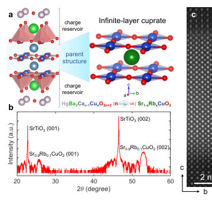 
Fig. 1 Structural characterization of infinite-layer cuprate thin films Sr1−xRbxCuO2. a, Schematic crystal structure of infinite-layer cuprate Sr1−xRbxCuO2 (right), representing the simplest cuprate structure which is derived from the infinite-layer limit of HgBa2Can−1CunO2n+2 (left) by removing the complex charge-reservoir blocks. b, X-ray diffraction symmetric θ–2θ scans of Sr0.9Rb0.1CuO2 thin films grown on SrTiO3 (001) substrates, showing clear (001) and (002) peaks of the infinite-layer cuprate. c, Cross-sectional STEM high-angle annular dark-field (HAADF) image showing the well-defined infinite-layer structure. a.u., arbitrary units.

📷 Fig 2

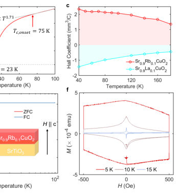 
Fig. 2 Observation of hole-doped superconductivity in infinite-layer cuprate Sr1−xRbxCuO2. a, Temperature dependence of resistance R(T) for hole-doped Sr0.9Rb0.1CuO2 (red) and electron-doped Sr0.9La0.1CuO2 (cyan) infinite-layer cuprates. The resistance of the electron-doped sample is multiplied by 10 for clarity. The hole-doped infinite-layer cuprate exhibits linear-in-temperature behavior at high temperatures and has a much higher critical tempera- ture compared to its electron-doped counterpart. b, Determination of the critical temperature for a representative superconducting Sr0.9Rb0.1CuO2 thin film. The onset temperature (Tc,onset) is approximately 75 K, defined by the deviation from a...

📷 Fig 3

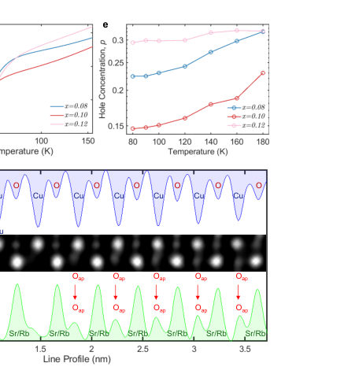 
Fig. 3 Synergistic hole doping via rubidium substitution and apical oxygen incor- poration in infinite-layer cuprate Sr0.9Rb0.1CuO2. a, Hole concentration of hole-doped Sr0.9Rb0.1CuO2 and electron-doped Sr0.9La0.1CuO2 infinite-layer cuprate, estimated from Hall mea- surements (Fig. 2c). The hole concentration for both compounds is exceeding the nominal x = 0.10 introduced purely by heterovalent substitution (p ≈0.15 for Rb+ doping at 80 K, and p ≈0.22 for La3+ doping at 40 K). In hole-doped Sr0.9Rb0.1CuO2, additional hole carriers arise from apical oxygen incorporation enabled by oxygen-rich annealing, whereas in electron-doped Sr0.9La0.1CuO2, extra electron carriers originate from oxygen...

**Summary.** This paper reports the successful observation of hole-doped superconductivity in infinite-layer cuprate thin films ($	ext{Sr}_{1-x}	ext{Rb}_x	ext{CuO}_2$). The research confirms that superconductivity is achieved through a synergistic doping mechanism involving both cation substitution and the incorporation of apical oxygen. This work provides a crucial, structurally simple platform for investigating fundamental puzzles in high-temperature superconductivity.

**Why it may be interesting.** The work directly addresses high-Tc superconductivity, a canonical problem in strongly correlated electron systems, providing experimental evidence on doping mechanisms in a minimal cuprate structure.

Detailed structure

**Main problem.** The fundamental challenge was achieving and understanding hole-doped superconductivity in the structurally simple infinite-layer cuprate $	ext{ACuO}_2$ system via chemical substitution.

**Main result.** Superconductivity was observed in $	ext{Sr}_{0.9}	ext{Rb}_{0.1}	ext{CuO}_2$ thin films, with an onset temperature around 75 K, confirming hole-type carriers.

**Method.** The study employed a combination of advanced material synthesis (PLD), structural characterization (XRD, STEM), and transport/magnetic measurements (resistivity, Hall effect, Meissner effect).

**Model / system.** The physical system is the hole-doped infinite-layer cuprate thin film, $	ext{Sr}_{1-x}	ext{Rb}_x	ext{CuO}_2$, which serves as a model for high-temperature superconductivity.

**Key observables.** Superconducting transition temperature ($T_c$), zero-resistance state, Meissner effect (diamagnetism), positive Hall coefficient, and the presence of apical oxygen ($	ext{O}_{	ext{ap}}$).

**Important parameters / regimes.** Doping ratios ($x=0.08, 0.10, 0.12$), critical magnetic fields ($H_{\perp c}$), and the temperature range up to 100 K.

**Assumptions / limitations.** The superconducting transition is described as 'broad,' potentially indicating a limited superconducting volume fraction.

**Figures summary.** Figures show structural confirmation via XRD/STEM, temperature-dependent resistivity curves, Hall measurements confirming hole doping, and M-H loops demonstrating the Meissner effect.

**Paper structure.** The paper systematically reports structural characterization, followed by transport measurements to confirm superconductivity, and finally uses advanced techniques like STEM-ABF to elucidate the role of apical oxygen in achieving the desired hole doping.

Abstract

Since the discovery of superconductivity in (La,Ba)2CuO2 (Ref.~\cite{bednorz1986possible}), a broad family of structurally distinct cuprate superconductors has been proposed or engineered to elucidate the physics of high-temperature superconductivity~\cite{chu2015hole,plakida2010high}. Among them, the infinite-layer cuprate has the simplest structure, consisting only of the essential ingredients for superconductivity: CuO$_2$ square planes separated by spacer ions~\cite{siegrist1988parent}. Despite being proposed nearly 40 years ago, the hole-doped superconductivity via chemical substitution in this compound has not yet been achieved, a fundamental open question in the field. Here, we report the observation of superconductivity in the hole-doped infinite-layer cuprate thin film. Measurements of resistivity and magnetic-field response in Sr1-xRbxCuO2 single-crystal thin films show superconducting transitions with a high onset temperature of 100 K. Hole doping is achieved via the synergistic effect of rubidium substitution and apical oxygen incorporation, as evidenced by structural analysis and transport measurements. As the parent structure of the cuprate family~\cite{chu2015hole}, hole-doped infinite-layer cuprate provides a unique platform for revisiting key puzzles in cuprate superconductors~\cite{keimer2015quantum,tsuei2000pairing,armitage2010progress,dagotto1994correlated}, including strange metal~\cite{proust2019remarkable,taillefer2010scattering} and electron-hole symmetry~\cite{tohyama2004asymmetry,segawa2010zero,lee2014asymmetry}, while bridging to cuprate-nickelate symmetry~\cite{li2019superconductivity,zeng2022superconductivity,chow2025bulk,lechermann2020late}.

[↑ back to top](#top)

