
# arxiv digest (quant-ph + cond-mat) — 2026-06-01

*102 papers · 22 relevant · 2 highlighted*

## 🔥 Most relevant (22)

*Every paper with at least one nonzero topic score, sorted by best-matching score. 🔥 marks scores ≥4/5. Click the title to jump to the full entry below; click [arXiv] to open the paper page. `(secondary)` marks papers from de-prioritized cond-mat archives.*

Show 22 relevant papers

- [Finite-time Scaling with Arbitrary Driving Rates: Bridging the Kibble-Zurek and De Grandi-Gritsev-Polkovnikov Limits](#paper-2605.30938) [[arXiv]](http://arxiv.org/abs/2605.30938v1) — 🔥 `non-equilibrium universality` **5/5** · 🔥 `non-equilibrium dynamics` **4/5** · `analog quantum simulation` **3/5** · `driven-dissipative phase transition` **3/5** · `methods for driven-dissipative` **2/5** · `Keldysh / 2PI / non-Gaussian methods` **1/5** · `correlated / nonlocal dissipation` **1/5** · `entanglement & information structure` **1/5**
- ⭐ [Dissipative generation of spin squeezing in the resolved vacuum Rabi splitting limit](#paper-2605.30815) [[arXiv]](http://arxiv.org/abs/2605.30815v1) — 🔥 `Tavis-Cummings & cavity-many-emitter` **4/5** · 🔥 `methods for driven-dissipative` **4/5** · `Keldysh / 2PI / non-Gaussian methods` **3/5** · `analog quantum simulation` **3/5** · `correlated / nonlocal dissipation` **3/5** · `correlated cavity matter` **3/5** · `driven-dissipative phase transition` **3/5** · `exotic spin models in light-matter` **3/5** · `entanglement & information structure` **2/5** · `non-equilibrium dynamics` **2/5** · `non-equilibrium universality` **2/5** · `quantum measurements` **1/5**
- [Superconductor-"Metal" Transition of One-dimensional Interacting Bosons with Ohmic Quantum Dissipation](#paper-2605.30746) [[arXiv]](http://arxiv.org/abs/2605.30746v1) — 🔥 `driven-dissipative phase transition` **4/5** · 🔥 `non-equilibrium universality` **4/5** · `analog quantum simulation` **3/5** · `correlated / nonlocal dissipation` **3/5** · `methods for driven-dissipative` **3/5** · `non-equilibrium dynamics` **3/5** · `Keldysh / 2PI / non-Gaussian methods` **2/5** · `Kondo & dissipative impurity` **2/5** · `Frenkel-Kontorova` **1/5** · `entanglement & information structure` **1/5**
- [Mitigating Noise-Induced Barren Plateaus Using a Non-Unitary Ansatz: Application to Molecular Electronic Transport](#paper-2605.30572) [[arXiv]](http://arxiv.org/abs/2605.30572v1) — 🔥 `methods for driven-dissipative` **4/5** · 🔥 `non-equilibrium dynamics` **4/5** · `Keldysh / 2PI / non-Gaussian methods` **3/5** · `analog quantum simulation` **3/5** · `correlated / nonlocal dissipation` **3/5** · `driven-dissipative phase transition` **3/5** · `Kondo & dissipative impurity` **2/5** · `non-equilibrium universality` **2/5** · `entanglement & information structure` **1/5**
- [Feasibility study of continuous electronic Pomeranchuk cooling with a flavor-degenerate Wigner crystal](#paper-2605.31307) [[arXiv]](http://arxiv.org/abs/2605.31307v1) `(secondary)` — 🔥 `driven-dissipative phase transition` **4/5** · `correlated / nonlocal dissipation` **3/5** · `methods for driven-dissipative` **3/5** · `non-equilibrium dynamics` **3/5** · `non-equilibrium universality` **3/5** · `Keldysh / 2PI / non-Gaussian methods` **2/5** · `analog quantum simulation` **2/5** · `Frenkel-Kontorova` **1/5** · `Kondo & dissipative impurity` **1/5**
- [Odd-Parity Magnons](#paper-2605.31411) [[arXiv]](http://arxiv.org/abs/2605.31411v1) `(secondary)` — 🔥 `non-equilibrium dynamics` **4/5** · 🔥 `spintronics-quantum-optics interface` **4/5** · `analog quantum simulation` **3/5** · `driven-dissipative phase transition` **3/5** · `exotic spin models in light-matter` **3/5** · `methods for driven-dissipative` **2/5** · `non-equilibrium universality` **2/5** · `Keldysh / 2PI / non-Gaussian methods` **1/5**
- [Two-qubit charger-battery system subject to weak, continuous measurements with quantum point contacts](#paper-2605.31319) [[arXiv]](http://arxiv.org/abs/2605.31319v1) — 🔥 `measurement-induced transitions` **4/5** · 🔥 `quantum measurements` **4/5** · `correlated / nonlocal dissipation` **3/5** · `driven-dissipative phase transition` **3/5** · `non-equilibrium dynamics` **3/5** · `methods for driven-dissipative` **2/5** · `non-equilibrium universality` **2/5** · `Keldysh / 2PI / non-Gaussian methods` **1/5**
- [Ab Initio Spinor Kadanoff-Baym Approach to Nonequilibrium Electron, Phonon and Magnon Dynamics in Itinerant Ferromagnets](#paper-2605.31467) [[arXiv]](http://arxiv.org/abs/2605.31467v1) `(secondary)` — 🔥 `Keldysh / 2PI / non-Gaussian methods` **4/5** · `methods for driven-dissipative` **3/5** · `non-equilibrium dynamics` **3/5** · `spintronics-quantum-optics interface` **3/5** · `correlated / nonlocal dissipation` **2/5** · `driven-dissipative phase transition` **2/5** · `non-equilibrium universality` **2/5** · `exotic spin models in light-matter` **1/5**
- [Charged Bose polarons at finite momentum](#paper-2605.31255) [[arXiv]](http://arxiv.org/abs/2605.31255v1) — 🔥 `Keldysh / 2PI / non-Gaussian methods` **4/5** · `Kondo & dissipative impurity` **3/5** · `analog quantum simulation` **3/5** · `methods for driven-dissipative` **3/5** · `correlated / nonlocal dissipation` **2/5** · `non-equilibrium dynamics` **2/5** · `driven-dissipative phase transition` **1/5** · `non-equilibrium universality` **1/5**
- [Floquet Engineering of Quantum Transport through two Driven Impurities](#paper-2605.31592) [[arXiv]](http://arxiv.org/abs/2605.31592v1) — 🔥 `non-equilibrium dynamics` **4/5** · `analog quantum simulation` **3/5** · `driven-dissipative phase transition` **2/5** · `interference shaping light` **2/5** · `methods for driven-dissipative` **2/5** · `non-equilibrium universality` **2/5** · `Keldysh / 2PI / non-Gaussian methods` **1/5** · `Kondo & dissipative impurity` **1/5**
- [Rydberg state engineering of trapped ions](#paper-2605.30483) [[arXiv]](http://arxiv.org/abs/2605.30483v1) — 🔥 `analog quantum simulation` **4/5** · `QC/QI experiment` **3/5** · `Rydberg arrays` **3/5** · `methods for driven-dissipative` **2/5** · `driven-dissipative phase transition` **1/5** · `entanglement & information structure` **1/5** · `non-equilibrium dynamics` **1/5** · `quantum measurements` **1/5** · `quantum optics experiment` **1/5**
- [Nonequilibrium scaling of drag forces in counterdriven fluid mixtures](#paper-2605.31479) [[arXiv]](http://arxiv.org/abs/2605.31479v1) — 🔥 `non-equilibrium dynamics` **4/5** · 🔥 `non-equilibrium universality` **4/5** · `Keldysh / 2PI / non-Gaussian methods` **2/5** · `methods for driven-dissipative` **2/5** · `Frenkel-Kontorova` **1/5** · `correlated / nonlocal dissipation` **1/5** · `driven-dissipative phase transition` **1/5**
- [A charge qubit on solid neon in a spin-qubit compatible circuit QED platform](#paper-2605.31185) [[arXiv]](http://arxiv.org/abs/2605.31185v1) — 🔥 `QC/QI experiment` **4/5** · `spintronics-quantum-optics interface` **3/5** · `quantum measurements` **2/5** · `Tavis-Cummings & cavity-many-emitter` **1/5** · `analog quantum simulation` **1/5** · `correlated cavity matter` **1/5** · `exotic spin models in light-matter` **1/5** · `quantum optics experiment` **1/5**
- ⭐ [Emergence of spin entanglement with the pseudogap onset in the Fermi-Hubbard model](#paper-2605.31240) [[arXiv]](http://arxiv.org/abs/2605.31240v1) — 🔥 `analog quantum simulation` **4/5** · 🔥 `entanglement & information structure` **4/5** · `Keldysh / 2PI / non-Gaussian methods` **2/5** · `non-equilibrium dynamics` **2/5** · `exotic spin models in light-matter` **1/5** · `methods for driven-dissipative` **1/5**
- [Experimental demonstration of quantum advantage in communication complexity for Euclidean distance problem](#paper-2605.31516) [[arXiv]](http://arxiv.org/abs/2605.31516v1) — 🔥 `QC/QI experiment` **4/5** · `interference shaping light` **3/5** · `quantum optics experiment` **3/5** · `analog quantum simulation` **1/5** · `entanglement & information structure` **1/5** · `quantum measurements` **1/5**
- [Benchmarking the ORCA PT-2 Boson Sampler using Minimum Dominating Set Problems](#paper-2605.30935) [[arXiv]](http://arxiv.org/abs/2605.30935v1) — 🔥 `QC/QI experiment` **4/5** · `analog quantum simulation` **3/5** · `quantum optics experiment` **3/5** · `interference shaping light` **2/5**
- [Eigenstate chaos in the presence of non-Abelian symmetries](#paper-2605.30798) [[arXiv]](http://arxiv.org/abs/2605.30798v1) — 🔥 `entanglement & information structure` **4/5** · `non-equilibrium dynamics` **3/5** · `non-equilibrium universality` **2/5** · `scars & prethermalization` **2/5** · `analog quantum simulation` **1/5**
- [Entanglement entropy of an acoustic black hole](#paper-2605.30540) [[arXiv]](http://arxiv.org/abs/2605.30540v1) — 🔥 `entanglement & information structure` **4/5** · `analog quantum simulation` **3/5** · `Keldysh / 2PI / non-Gaussian methods` **2/5** · `methods for driven-dissipative` **2/5** · `non-equilibrium dynamics` **1/5**
- [Metasurfaces for neutral-atom trapping](#paper-2605.30498) [[arXiv]](http://arxiv.org/abs/2605.30498v1) — 🔥 `QC/QI experiment` **4/5** · `analog quantum simulation` **3/5** · `interference shaping light` **3/5** · `quantum optics experiment` **2/5**
- [Engineered Randomness for Ubiquitous Quantum-Enhanced Metrology in Exponential-Dimensional Manifolds](#paper-2605.31442) [[arXiv]](http://arxiv.org/abs/2605.31442v1) — 🔥 `QC/QI experiment` **4/5** · `entanglement & information structure` **2/5** · `Rydberg arrays` **1/5** · `analog quantum simulation` **1/5**
- [Pseudoentanglement in constant depth: How trivial states can have non-trivial entanglement structure](#paper-2605.31448) [[arXiv]](http://arxiv.org/abs/2605.31448v1) — 🔥 `entanglement & information structure` **4/5** · `analog quantum simulation` **3/5** · `non-equilibrium dynamics` **1/5**
- [Experimental Implementation of the Quantum Volunteer's Dilemma on NISQ Hardware: Noise Analysis and Digital-Twin Validation](#paper-2605.30676) [[arXiv]](http://arxiv.org/abs/2605.30676v1) — 🔥 `QC/QI experiment` **4/5**

## ⭐ Highlighted (2)

*Papers by authors on your watch list. Click the title to jump to the full entry below; click [arXiv] to open the paper page.*

Show 2 highlighted papers

- ⭐ [Emergence of spin entanglement with the pseudogap onset in the Fermi-Hubbard model](#paper-2605.31240) [[arXiv]](http://arxiv.org/abs/2605.31240v1) — Immanuel Bloch
- ⭐ [Dissipative generation of spin squeezing in the resolved vacuum Rabi splitting limit](#paper-2605.30815) [[arXiv]](http://arxiv.org/abs/2605.30815v1) — Ana Maria Rey

## All papers (66, sorted by relevance)

*Papers from quant-ph and your primary cond-mat archives (quant-gas, stat-mech, str-el, dis-nn). Highlighted papers (⭐) come first, then everything else sorted by topic-relevance score, highest first.*

### ⭐ [Dissipative generation of spin squeezing in the resolved vacuum Rabi splitting limit](http://arxiv.org/abs/2605.30815v1)

**Highlighted author(s):** Ana Maria Rey  
**Authors:** Edwin Chaparro, Eric Yilun Song, Diego Barberena, James K. Thompson, Ana Maria Rey, Jeremy T. Young  
**Type:** theory · **Category:** other · **PDF:** <https://arxiv.org/pdf/2605.30815v1>  
**Analysis basis:** full PDF text, analyzed in chunks
**Topic relevance:** 🔥 `Tavis-Cummings & cavity-many-emitter` **4/5** · 🔥 `methods for driven-dissipative` **4/5** · `Keldysh / 2PI / non-Gaussian methods` **3/5** · `analog quantum simulation` **3/5** · `correlated / nonlocal dissipation` **3/5** · `correlated cavity matter` **3/5** · `driven-dissipative phase transition` **3/5** · `exotic spin models in light-matter` **3/5** · `entanglement & information structure` **2/5** · `non-equilibrium dynamics` **2/5** · `non-equilibrium universality` **2/5** · `quantum measurements` **1/5**

📷 Fig 1

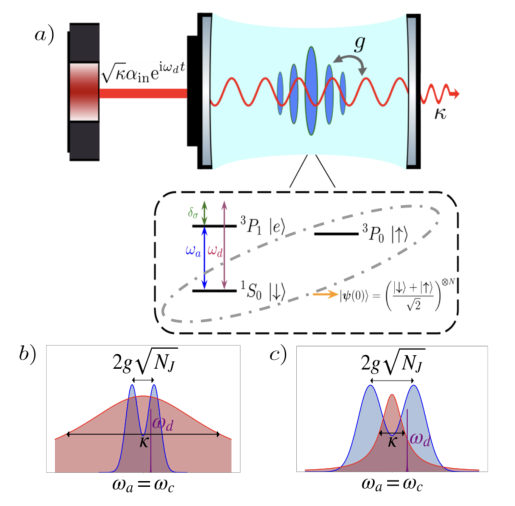 
FIG. 1. Cavity-QED platform and vacuum Rabi regimes. (a) An ensemble of three-level atoms (ground |↓⟩, clock |↑⟩, optical |e⟩) couples collectively to a single-mode cavity at rate g. The input drive at frequency ωd and ampli- tude √καin populates the mode, which loses photons at rate κ (equivalently, has linewidth κ). We take ωc = ωa unless stated otherwise; atoms are initially prepared in a coherent ground–clock superposition while the cavity starts in vacuum. (b)–(c) The hybridization of the collective atomic excitation with the cavity photon produces polaritons split by the low- excitation vacuum Rabi frequency (ΩVRS = 2g√NJ). In the unresolved vacuum Rabi splitting (UVRS) limit (left),...

📷 Fig 2

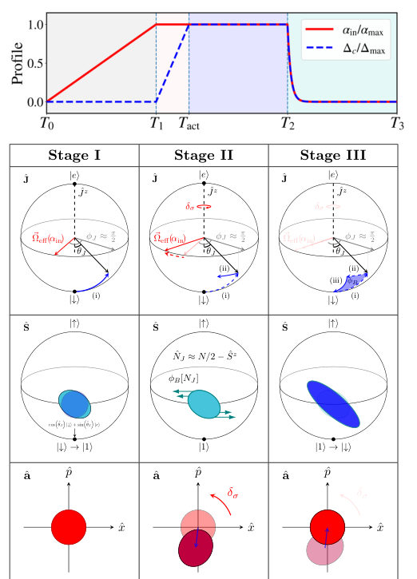 
FIG. 2. Multistage protocol for generating and stor- ing spin squeezing. The top panel shows a schematic of the time-dependent profiles of the detuning (blue dashed line) and the drive amplitude (solid red line). The panel below de- scribes the protocol. Stages I–III are displayed in separate columns; the top rows show the Bloch sphere of the driven manifold {|↓⟩, |e⟩} with collective spin ˆJ, the middle row the Bloch sphere of the encoded spin ˆS spanned by |0⟩≡|↑⟩and |1⟩≡α |↓⟩+β |e⟩, and the bottom row has a phase-space rep- resentation of the cavity mode ˆa. In Stage I, a resonant drive rotates ˆJ into a spin-polarized steady state, |1⟩, while the cav- ity relaxes to the vacuum state. In...

📷 Fig 3

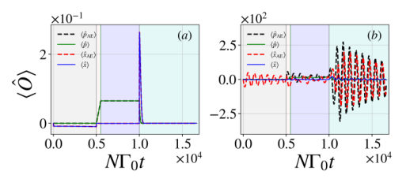 
FIG. 3. Dynamics of the cavity-mode quadratures ˆx and ˆp. The solid lines show the full cavity quadratures, while the dashed lines show the instantaneous adiabatic-elimination predictions ˆxAE and ˆpAE from Eq. (28). The shaded regions indicate the stages of the protocol. All curves are computed for N = 105, δσ/(NΓ0) = ∆c/(NΓ0) = 1.33 × 10−3, and g = 10 kHz. In panel (a), corresponding to the UVRS regime with κ = 15g√NJ and √καin = 0.5gNJ/2, the cavity closely follows the adiabatic estimate. In panel (b), corresponding to the RVRS regime with κ = 15g, κ/(g√NJ) = 6.7×10−2 ≪1, and √καin = 0.487gNJ/2, the full quadratures exhibit visible oscillatory deviations from the adiabatic estimate.

📷 Fig 4

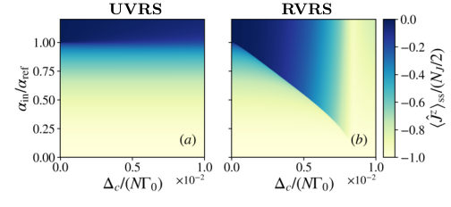 
FIG. 4. Mean-field phase diagram. Steady-state spin polarization ⟨ˆJz⟩ss/(NJ/2) as a function of scaled detuning ∆c/(NΓ0) and normalized drive αin/αref, for ωa = ωc. The reference amplitude αref is defined in Eq. (29). (a) UVRS: For κ/(g√NJ) = 15 ≫1, cavity dissipation overdamps the collective spin–photon response, giving a smooth operating landscape over the plotted region. (b) RVRS: For N = 105

📷 Fig 5

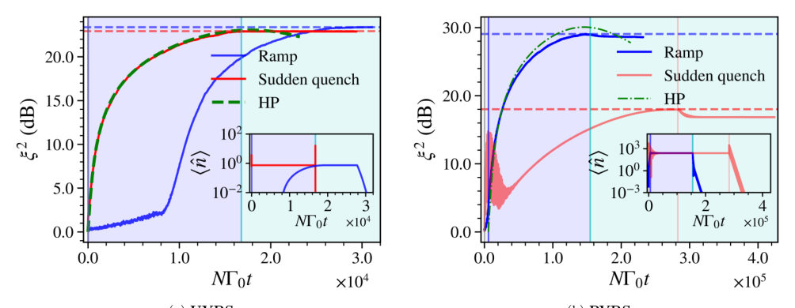 
FIG. 5. Spin-squeezing dynamics. Here we compare the ramped protocol (blue) and a sudden quench (red) with the HP predictions (green). The background color indicates the three stages of the multistage protocol. The insets show the intracavity photon number ⟨ˆn⟩, which remains low for the ramped protocol but can increase transiently after sudden switching. In both panels N = 105 and αin/αref = 0.5. The time axis is reported in units of NΓ0t, with Γ0 evaluated using the panel-specific cavity linewidth κ. (a) UVRS: κ = 15g√NJ and ∆c = 2.5 × 10−2NΓ0. The fast cavity relaxation makes the final squeezing plateau largely insensitive to abrupt changes; (b) RVRS: κ = 15g and ∆c = 2 × 10−3NΓ0, δσ =...

**Summary.** This paper presents a method to generate high levels of spin squeezing in atomic clocks by utilizing dissipative dynamics in the resolved vacuum Rabi splitting regime. By carefully controlling the system through a multi-stage protocol, the authors show that the cavity photons actively participate in the process without causing decoherence. This establishes a practical and experimentally relevant route to surpass the standard quantum limit in optical clock platforms.

**Why it may be interesting.** This work is highly relevant as it pushes the boundaries of quantum metrology by showing how to harness complex, non-adiabatic cavity dynamics (RVRS) for high-precision sensing, moving beyond simplified theoretical limits.

Detailed structure

**Main problem.** The paper addresses how to generate spin squeezing in atomic clocks using dissipative dynamics, specifically extending protocols to the resolved vacuum Rabi splitting (RVRS) regime where cavity photons cannot be adiabatically eliminated.

**Main result.** They demonstrate that symmetry-protected dissipative spin squeezing is achievable in the RVRS regime, achieving theoretical squeezing levels exceeding 25 dB for $10^5$ atoms on a shorter timescale than previously thought possible.

**Method.** The analysis utilizes the Lindblad master equation, employing techniques like the Dissipative Truncated-Wigner Approximation (DissTWA) and analyzing the accumulation of geometric (Berry) phases.

**Model / system.** The system is a three-level ensemble of $^{87}\mathrm{Sr}$ atoms coupled to an optical cavity. The dynamics are governed by a master equation incorporating cavity decay and atomic interactions.

**Key observables.** Spin squeezing ($\xi_2$), geometric phase ($\Phi_B$), and cavity quadrature amplitudes ($\hat{x}, \hat{p}$).

**Important parameters / regimes.** Resolved Vacuum Rabi Splitting (RVRS) regime, low-photon operating window, and the ratio of cavity decay rate ($\kappa$) to vacuum Rabi splitting ($\Omega_{	ext{VRS}}$).

**Assumptions / limitations.** The protocol relies on smooth ramps of drive amplitude and detunings to maintain a stable, low-photon operating window that suppresses nonadiabatic excitations and leakage.

**Figures summary.** Figures illustrate the comparison between the UVRS and RVRS regimes, showing the evolution of cavity quadratures and the three-stage protocol involving drive ramping, detuning, and turning off the drive.

**Paper structure.** The paper builds by first establishing the general framework for dissipative squeezing, then contrasting the solvable UVRS limit (where adiabatic elimination is valid) with the more complex RVRS limit, detailing a three-stage protocol to realize effective one-axis twisting.

Abstract

Harnessing dissipation in the presence of strong symmetries has recently emerged as a promising route for generating entanglement in atomic clocks. However, previous proposals relied on regimes where cavity photons can be adiabatically eliminated, significantly limiting their applicability to experimentally relevant cavity-QED regimes that lie in or near the resolved vacuum Rabi splitting regime. Here we show that symmetry-protected dissipative spin squeezing can be realized even when cavity photons actively participate in the dynamics, extending the experimental relevance of the protocol. We study a three-level ensemble of $^{87}\mathrm{Sr}$ atoms coupled to an optical cavity in the resolved vacuum Rabi splitting regime and demonstrate that, with smooth ramps of the drive amplitude and detunings, the driven-dissipative dynamics enters a stable low-photon regime in which nonadiabatic cavity excitations and sector-resolving photon leakage can be controlled. Within this low-photon operating window, sector-resolving photon leakage is suppressed and the sector-dependent geometric phase realizes effective one-axis twisting. At the end of the protocol the entanglement can also be efficiently transferred directly onto the long-lived clock states by turning the drive off. For experimentally realistic parameters, we theoretically show that more than $25\,\mathrm{dB}$ of squeezing can be generated for $10^5$ atoms, closely saturating the ideal one-axis twisting scaling $ξ_{\min}^2 \propto N^{-2/3}$. At fixed cooperativity, the optimized squeezing remains broadly comparable to the unresolved-regime implementation, while the resolved-regime implementation reaches comparable squeezing on a substantially shorter physical timescale. These results establish symmetry-protected dissipative dynamics as a practical route to beyond the standard-quantum-limit performance in optical-clock platforms.

[↑ back to top](#top)

### ⭐ [Emergence of spin entanglement with the pseudogap onset in the Fermi-Hubbard model](http://arxiv.org/abs/2605.31240v1)

**Highlighted author(s):** Immanuel Bloch  
**Authors:** Frederic Bippus, Thomas Chalopin, Gabriele Bellomia, Gergő Roósz, Titus Franz, Antoine Georges, Anna Kauch, Immanuel Bloch, Karsten Held  
**Type:** both · **Category:** strongly correlated electrons · **PDF:** <https://arxiv.org/pdf/2605.31240v1>  
**Analysis basis:** full PDF text, analyzed in chunks
**Topic relevance:** 🔥 `analog quantum simulation` **4/5** · 🔥 `entanglement & information structure` **4/5** · `Keldysh / 2PI / non-Gaussian methods` **2/5** · `non-equilibrium dynamics` **2/5** · `exotic spin models in light-matter` **1/5** · `methods for driven-dissipative` **1/5**

📷 Fig 1

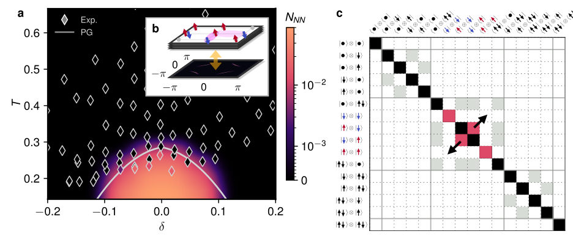 
FIG. 1. Entanglement in the Fermi-Hubbard model. (a) Quantum entanglement between

📷 Fig 2

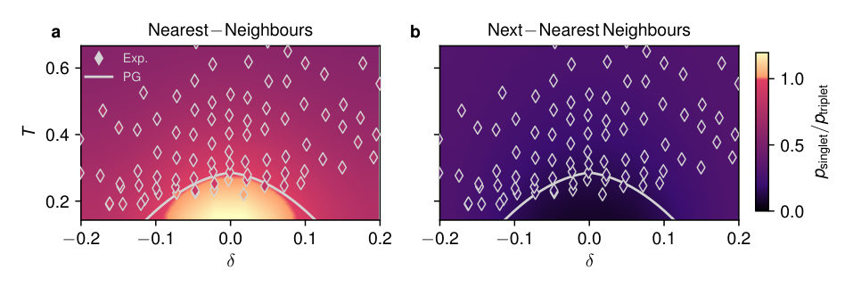 
FIG. 2. Ratio of spin-singlet to spin-triplet contributions. SSR entanglement emerges for a

📷 Fig 3

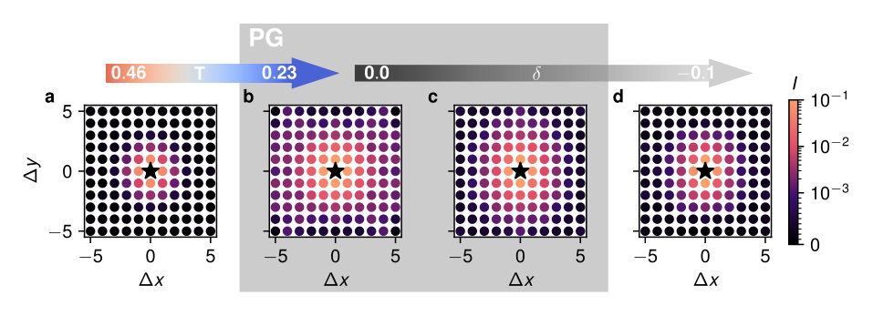 
FIG. 3. Experimental SSR mutual information. The mutual information I between two sites

**Summary.** This work investigates the Fermi-Hubbard model by measuring quantum entanglement, finding that spin-singlet entanglement appears only when the pseudogap opens. This result strongly suggests that the pseudogap physics requires genuine quantum correlations localized at nearest neighbors, ruling out purely classical explanations.

**Why it may be interesting.** The direct experimental measurement of entanglement in a clean quantum simulator platform provides a powerful, non-equilibrium diagnostic tool to distinguish between quantum and classical physics in strongly correlated materials.

Detailed structure

**Main problem.** To gain a microscopic understanding of the two-dimensional Fermi-Hubbard model, the authors move beyond traditional observables by measuring quantum entanglement.

**Main result.** They find that spin-singlet entanglement emerges precisely at the onset of the pseudogap regime and is strictly confined to nearest-neighbor sites, disfavoring purely classical fluctuation theories.

**Method.** The study combines ultracold-atom quantum simulation experiments with advanced numerical calculations using the dynamical vertex approximation (DΓA).

**Model / system.** The system is the two-dimensional Fermi-Hubbard model, simulated using ultracold atoms in an optical lattice, and analyzed theoretically via the DΓA.

**Key observables.** SSR negativity (entanglement), spin-singlet/spin-triplet ratio, and mutual information ($I$).

**Important parameters / regimes.** Pseudogap onset, nearest-neighbor distance, doping ($\delta$), and temperature ($T$).

**Assumptions / limitations.** The analysis relies on the Superselection Rules (SSR) to restrict entanglement measurements to operationally accessible components.

**Figures summary.** Figures compare the nearest-neighbor SSR negativity (experiment vs. theory) across temperature and doping, and show the spatial structure of mutual information.

**Paper structure.** The paper develops the entanglement diagnostic, applies it to the Fermi-Hubbard model across varying parameters, and contrasts the short-range quantum entanglement with longer-range classical correlations.

Abstract

Despite decades of intense theoretical and experimental investigation, the two-dimensional Fermi-Hubbard model still resists a complete microscopic understanding. Conventional approaches typically probe global observables and locally resolved correlation functions. Here, we develop a complementary perspective based on the measurement of entanglement. Using both an ultracold-atom quantum simulator and numerical simulations based on the dynamical vertex approximation, we find that entanglement is closely tied to the onset of the enigmatic pseudogap regime: spin-singlet entanglement emerges only as the pseudogap sets in and, in contrast to classical correlations, remains confined to nearest-neighbour sites in this regime. Our results, therefore, disfavour purely classical-fluctuation theories of the pseudogap and constrain microscopic models to those that develop nearest-neighbour spin-singlet entanglement at the pseudogap onset.

[↑ back to top](#top)

### [Finite-time Scaling with Arbitrary Driving Rates: Bridging the Kibble-Zurek and De Grandi-Gritsev-Polkovnikov Limits](http://arxiv.org/abs/2605.30938v1)

**Authors:** Shuai Yin  
**Type:** theory · **Category:** statistical mechanics · **PDF:** <https://arxiv.org/pdf/2605.30938v1>  
**Analysis basis:** full PDF text, analyzed in chunks
**Topic relevance:** 🔥 `non-equilibrium universality` **5/5** · 🔥 `non-equilibrium dynamics` **4/5** · `analog quantum simulation` **3/5** · `driven-dissipative phase transition` **3/5** · `methods for driven-dissipative` **2/5** · `Keldysh / 2PI / non-Gaussian methods` **1/5** · `correlated / nonlocal dissipation` **1/5** · `entanglement & information structure` **1/5**

📷 Fig 1

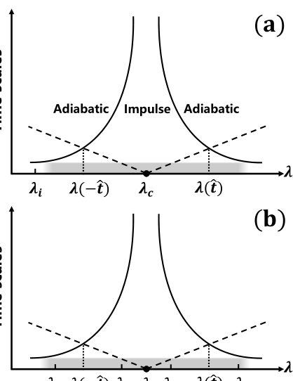 
FIG. 1. Time scales in driven critical dynamics. The correlation time scale (solid curve) and the time distance to the critical point (dotted line) divide the dynamics into adiabatic and impulse regimes. (a) Conventional KZ dynamics starting far from the critical point requires the impulse regime to lie within the critical region, imposing an upper bound on the driving rate. (b) For driven dynamics initiated and evolving within the critical region, robust scaling holds for arbitrary driving rates and is described by the generalized FTS theory.

📷 Fig 2

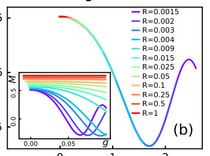 
FIG. 2. Driven critical dynamics for increasing 𝜆initiated from 𝜆𝑖close to the critical point. (a) The original FTS fails to collapse data for the fixed initial parameters 𝜆𝑖= 0.999 and ℎ= 0.00005. The inset compares dynamic evolutions for different initial states at fixed ℎ= 0.00005 and 𝑅= 0.002. (b) The generalized FTS gives excellent collapse over a wide range of 𝑅for fixed 𝑔𝑖𝑅−1/𝜈𝑟≈−0.2236 and ℎ𝑅−𝛽𝛿/𝜈𝑟≈0.0167.

📷 Fig 3

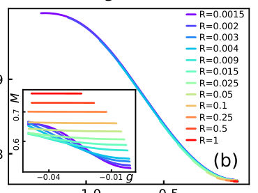 
FIG. 3. Driven critical dynamics for decreasing 𝜆initiated from 𝜆𝑖close to the critical point. (a) The original FTS fails to collapse data for the fixed initial parameters for the fixed initial parameters 𝜆𝑖= 0.999 and ℎ= 0.00005. The inset compares dynamic evolutions for different initial states at fixed ℎ= 0.00005 and 𝑅= 0.002. (b) The generalized FTS gives excellent collapse over a wide range of 𝑅 for fixed 𝑔𝑖𝑅−1/𝜈𝑟≈−0.2236 and ℎ𝑅−𝛽𝛿/𝜈𝑟≈0.0167.

📷 Fig 4

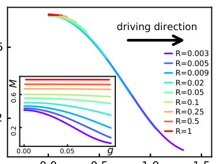 
FIG. 4. Driven critical dynamics for increasing 𝜆initiated from the tricritical point. For fixed 𝑔𝑖= 0 and ℎ𝑅−𝛽𝛿/𝜈𝑟≈0.1667, rescaled curves of 𝑀versus 𝑔collapse well for a wide range of 𝑅according to the generalized FTS.

**Summary.** This paper introduces a generalized Finite-Time Scaling (FTS) framework to provide a universal theory for non-equilibrium critical dynamics. It successfully unifies the Kibble-Zurek and De Grandi-Gritsev-Polkovnikov scaling limits by extending the theory to handle arbitrary driving rates within the critical region. This has broad implications for interpreting results from quantum quench experiments.

**Why it may be interesting.** This work provides a powerful, generalized theoretical tool for characterizing non-equilibrium dynamics in quantum systems, directly applicable to experimental quench protocols in AMO physics.

Detailed structure

**Main problem.** To develop a universal description for nonequilibrium critical dynamics in quantum many-body systems that overcomes the rate limitations of existing scaling theories like Kibble-Zurek (KZ) and De Grandi-Gritsev-Polkovnikov (DGP).

**Main result.** The authors propose a generalized Finite-Time Scaling (FTS) framework that unifies the scaling behavior across the full range of driving rates within the critical region, valid regardless of the quench rate magnitude.

**Method.** The theory involves developing and applying a generalized FTS form, which is then rigorously verified through numerical simulations.

**Model / system.** The theory is tested on quantum many-body systems, specifically using the quantum Ising critical point and the Ising tricritical point.

**Key observables.** Topological defect density ($n$) and the scaling behavior of a macroscopic quantity $P$.

**Important parameters / regimes.** Driving rate ($R$), initial parameter ($\lambda_i$), final parameter ($\lambda_f$), and the critical point ($\lambda_c$).

**Assumptions / limitations.** The generalized FTS is derived specifically for the case where the entire dynamic process, including initial and final states, remains within the critical region.

**Figures summary.** Figures illustrate the comparison between conventional KZ dynamics (which requires rate bounds) and the generalized FTS applicable within the critical region, showing data collapse for both the quantum Ising and tricritical points.

**Paper structure.** The paper first identifies the limitations of existing scaling theories, then develops the generalized FTS framework, and finally verifies this unified theory through numerical simulations on specific quantum critical models.

Abstract

The pursuit of a universal description for nonequilibrium critical dynamics in quantum many-body systems stands as a central frontier in modern statistical physics. For driven critical dynamics starting far from the critical point, the well-known Kibble-Zurek (KZ) scaling holds only when the driving rate lies below an upper bound. Here we study driven dynamics restricted to the critical region, and show that robust dynamic scaling behavior exists for arbitrary driving rates. We develop a generalized finite-time scaling (FTS) framework, which provides a unified understanding on the driven dynamics for the full range of quench rates, bridging the KZ scaling in the slow-driving regime and the De~Grandi-Gritsev-Polkovnikov (DGP) scaling in the sudden-quench limit. We verify this unified FTS form through numerical simulations in both quantum critical and tricritical points. The good agreement between theoretical predictions and numerical results confirms the generality of our theory. Our work establishes a universal theory for nonequilibrium critical dynamics spanning the full range of driving rates, with broad implications for quantum quench experiments and out-of-equilibrium statistical mechanics.

[↑ back to top](#top)

### [Superconductor-"Metal" Transition of One-dimensional Interacting Bosons with Ohmic Quantum Dissipation](http://arxiv.org/abs/2605.30746v1)

**Authors:** Miguel A. Cazalilla  
**Type:** theory · **Category:** quantum gases · **PDF:** <https://arxiv.org/pdf/2605.30746v1>  
**Analysis basis:** full PDF text, analyzed in chunks
**Topic relevance:** 🔥 `driven-dissipative phase transition` **4/5** · 🔥 `non-equilibrium universality` **4/5** · `analog quantum simulation` **3/5** · `correlated / nonlocal dissipation` **3/5** · `methods for driven-dissipative` **3/5** · `non-equilibrium dynamics` **3/5** · `Keldysh / 2PI / non-Gaussian methods` **2/5** · `Kondo & dissipative impurity` **2/5** · `Frenkel-Kontorova` **1/5** · `entanglement & information structure` **1/5**

📷 Fig 1

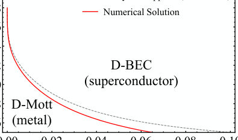 
FIG. 1. Phase diagram for the bosonized model (8) for a com- mensurate system (i.e. δ = 0) as a function of the Luttinger parameter, K, and the dimensionless dissipation strength, α. A comparison is shown between the approximate solu- tion (dashed line, obtained assuming a constant K) and the full numerical solution of the renormalization-group equations (10) to (12). The analytical curve is indicated by the dashed line, while the numerical solution is represented by the thick continuous line. The line α = 0 corresponds to a bosonic Mott insulator for K ≲2. For the numerical and analytical solutions the following values are assumed: gu(0) = 2 × 10−3

📷 Fig 2

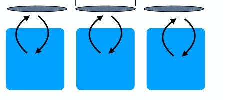 
FIG. 2. Sketch of the D-Mott/Metal phase after coarse- graining the system: The 1D boson system + bath breaks into an array of weakly Josephson-coupled bosonic puddles that are coupled to individual Ohmic baths. The latter col- lectively represent a nearby diffusive metal electrode. The bosons (Cooper pairs of a 1D superconductor) can leak in and out of the puddles as indicated by the arrows. The char- acteristic size of the puddles ≈ξu is (roughly) determined by the length scale beyond which phase slips caused by the underlying lattice suppress coherent boson tunneling (see dis- cussion in Sec. V).

📷 Fig 3

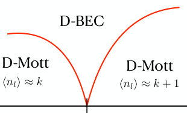 
FIG. 3. Sketch of the D-Mott/Metal phase diagram as a func- tion of the chemical potential µ and the dissipation strength α; k is an integer. The boson-boson interactions are assumed to be short ranged, meaning that the Luttinger parameter K in Eq. (8) fulfills K &gt; 1

**Summary.** This paper theoretically studies the superconductor-metal transition in 1D interacting bosons coupled to an Ohmic bath. Using advanced techniques like bosonization and RG analysis, the authors map the system to an effective field theory, predicting the critical transition belongs to the Wilson-Fisher universality class. It provides a deep understanding of how dissipation stabilizes different quantum phases in low-dimensional quantum matter.

**Why it may be interesting.** This work provides a detailed theoretical framework for understanding how dissipation fundamentally alters quantum phase transitions in low-dimensional systems, connecting microscopic models to universal critical behavior.

Detailed structure

**Main problem.** The paper investigates the quantum phase transition between a superconducting state (D-BEC) and a metallic state (D-Mott) in one-dimensional interacting bosons subjected to Ohmic quantum dissipation.

**Main result.** The critical transition belongs to the Wilson-Fisher universality class with a dynamical exponent $z \approx 2$. The system exhibits distinct behaviors depending on the doping level and dissipation strength.

**Method.** The analysis combines analytical techniques, including bosonization, renormalization group (RG) flow equations, and mapping the system to an effective nonlinear sigma model (NL$\sigma$M) or dissipative Ginzburg-Landau theory.

**Model / system.** The model consists of interacting bosons (Cooper pairs) hopping on a 1D lattice, coupled to a dissipative bath via onsite phase dissipation (Josephson tunneling). The system is analyzed in the continuum limit as an array of weakly coupled bosonic puddles.

**Key observables.** Phase coherence (long-range vs. exponentially decaying), compressibility ($\chi$), and the correlation function $G_	heta(x, 	au)$.

**Important parameters / regimes.** Dissipation strength ($\alpha$), inter-puddle Josephson coupling ($J$), and doping level.

**Assumptions / limitations.** The analysis relies on perturbative expansions in the coupling constants and utilizes continuum approximations (e.g., deriving the NL$\sigma$M).

**Figures summary.** Figures illustrate the phase diagram showing the boundary between the D-BEC and D-Mott phases, and show the decay of correlation functions in different regimes.

**Paper structure.** The paper progresses from defining the microscopic Hamiltonian and action, through bosonization and RG analysis of the continuum limit, to deriving effective field theories like the dissipative TDGL theory, and finally calculating correlation functions in the ordered and disordered phases.

Abstract

The phase diagram of a system of interacting bosons (Cooper pairs) hoping on a one-dimensional (1D) lattice with onsite phase dissipation describing the Josephson tunneling to a nearby diffusive normal-metal electrode is studied. Starting from the system at commensurate lattice filling, it is shown by a combination of analytical techniques that the phase diagram contains two quantum phases: A dissipative Bose-Einstein condensate (D-BEC) or superconductor with long-range phase coherence, and a dissipative Mott insulator (D-Mott) or "metal" with exponentially decaying phase correlations in space and local imaginary-time correlations decaying as the local pairing correlations of the electrode. The D-Mott/metal phase can be described as a 1D array of dissipative boson puddles, weakly coupled by Josephson tunneling. The puddle size roughly corresponds to the length scale beyond which phase slips suppress phase coherence. The dissipative time-dependent Ginsburg-Landau theory phenomenologically used by Sachdev, Werner, and Troyer [Phys. Rev. Lett. {\bf 92} 237003 (2004)] for the superconductor-metal transition in quasi-1D wires is derived from this microscopic puddle picture. Thus, the criticality of the D-Mott/D-BEC transition is shown to belong to the Wilson-Fisher universality class with dynamical exponent $z\approx 2$. At small doping, the D-Mott/metal phase remains stable due to its finite compressibility, which is computed to leading order in a perturbation expansion of the dissipation strength and the inter-puddle Josephson coupling. At larger doping, using a mapping to a pseudospin chain combined with bosonization, the D-BEC/superconductor phase is the ground state for non-vanishing but arbitrarily small dissipation. Similarities and differences with deconfinement transition of an array 1D bosonic Mott insulators in anisotropic optical lattices are also discussed.

[↑ back to top](#top)

### [Mitigating Noise-Induced Barren Plateaus Using a Non-Unitary Ansatz: Application to Molecular Electronic Transport](http://arxiv.org/abs/2605.30572v1)

**Authors:** Sasanka Dowarah, Abeda Sultana Shamma, Yazdan Maghsoud, G. Andrés Cisneros, Michael Kolodrubetz  
**Type:** theory · **Category:** quantum information and computing · **PDF:** <https://arxiv.org/pdf/2605.30572v1>  
**Analysis basis:** full PDF text, analyzed in chunks
**Topic relevance:** 🔥 `methods for driven-dissipative` **4/5** · 🔥 `non-equilibrium dynamics` **4/5** · `Keldysh / 2PI / non-Gaussian methods` **3/5** · `analog quantum simulation` **3/5** · `correlated / nonlocal dissipation` **3/5** · `driven-dissipative phase transition` **3/5** · `Kondo & dissipative impurity` **2/5** · `non-equilibrium universality` **2/5** · `entanglement & information structure` **1/5**

📷 Fig 1

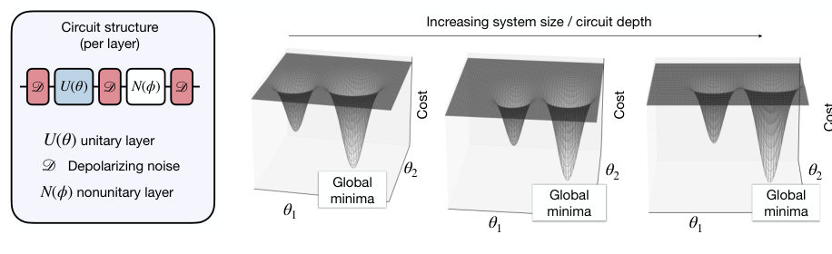 
FIG. 1. (a) Standard unitary variational ansatz with depolarizing noise interleaved between layers. As the system size or circuit depth increases, the cost-function landscape flattens due to noise-induced concentration of measure, causing gradients to vanish exponentially and leading to a barren plateau where optimization becomes impossible. (b) Nonunitary variational ansatz with interleaved noise, where each layer includes a controlled nonunitary channel N(ϕ) in addition to unitary operations. The inclusion of nonunitary dynamics reshapes the effective optimization landscape, preventing gradient suppression and enabling convergence toward the global minimum even at large depth or system...

📷 Fig 2

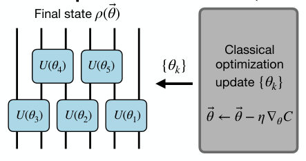 
FIG. 2. Schematic of a variational quantum algorithm. An initial quantum state ρ0 is evolved by a parameterized quan- tum circuit composed of gates U(θk), producing the trial state ρ(⃗θ). Measurements of suitable observables are used to eval- uate the cost function C[ρ(⃗θ)], which is then supplied to a classical optimizer. The optimizer updates the variational parameters {θk}, for example according to gradient descent rule ⃗θ ←⃗θ −η∇⃗θC, and the hybrid quantum–classical loop is repeated until convergence.

📷 Fig 3

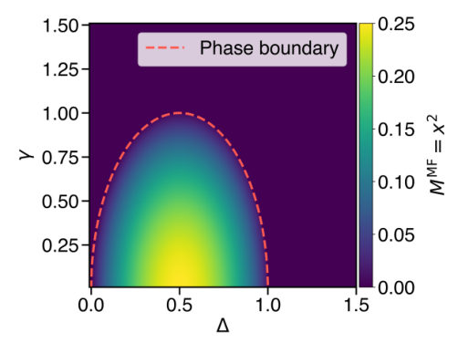 
FIG. 3. Steady state phase diagram with the mean-field order parameter as a function of dissipation rate γ and transverse field strength ∆. The color represents the value of the mean- field order parameter MF = x2. The red dashed line shows the analytically predicted phase boundary using Eq. (17).

📷 Fig 4

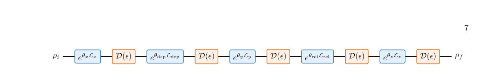 
FIG. 4. A single-layer variational quantum circuit for the mean-field model with each unitary and non-unitary gates sandwiched between two depolarizing noise channels.

📷 Fig 5

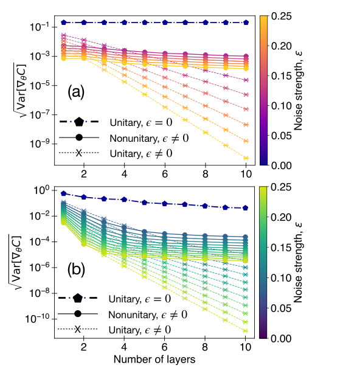 
FIG. 5. Plot of standard deviation of the gradients averaged over each layer and each parameters, as a function of number of layers for the unitary with no noise, unitary with noise and the nonunitary ansatz for different noise strengths, for the (a) energy cost function with ∆= 0.2 and the (b) Frobenius norm cost function for ∆= 0.5, γ = 0.1. Error bars indicate the standard error of the mean for 128 random initial angles.

**Summary.** This paper tackles the critical issue of Noise-Induced Barren Plateaus in VQAs used for open quantum systems. By incorporating nonunitary, dissipative elements into the variational ansatz, the authors demonstrate a scalable method that maintains gradient flow. This technique is successfully applied to simulate electron transport in molecular junctions, showing a path forward for quantum simulation on NISQ hardware.

**Why it may be interesting.** This work directly addresses a major bottleneck in near-term quantum simulation—the vanishing gradients caused by noise—by proposing a physically motivated modification to the variational ansatz suitable for open quantum dynamics.

Detailed structure

**Main problem.** The primary challenge is mitigating Noise-Induced Barren Plateaus (NIBPs) in Variational Quantum Algorithms (VQAs) when simulating open quantum systems on noisy hardware.

**Main result.** Introducing nonunitary elements into the variational ansatz successfully restores finite gradients, enabling convergence to the correct non-equilibrium steady state, even in the presence of depolarizing noise.

**Method.** The authors employ nonunitary variational ansätze, which incorporate tunable dissipative channels alongside unitary generators, and analyze the deep circuit limit using a Floquet-type construction.

**Model / system.** The work uses an infinite-range dissipative Ising model as a benchmark, and extends the method to simulate electron transport through the OPE-SMe molecular junction, governed by a Lindblad master equation.

**Key observables.** Steady-state charge currents ($I_{	ext{measured}}$), order parameters ($M_F$), and the vanishing/finite nature of the cost function gradients.

**Important parameters / regimes.** Depolarizing noise strength ($\epsilon$), circuit depth ($L$), and system parameters derived from QM/MM calculations.

**Assumptions / limitations.** The nonunitary elements are constrained to be Completely Positive and Trace Preserving (CPTP); the analysis often relies on mean-field approximations or zero-noise extrapolation.

**Figures summary.** Figures compare gradient variance for unitary vs. nonunitary ansätze under noise, and illustrate the circuit implementation of dissipative channels and the final molecular transport setup.

**Paper structure.** The paper first establishes the problem of NIBPs using the Ising model, demonstrates the nonunitary ansatz solution, analyzes the deep circuit limit via Floquet theory, and finally applies the robust method to the realistic OPE-SMe molecular electronic transport problem.

Abstract

Variational quantum algorithms (VQAs) offer a promising route toward simulating many-body quantum systems on noisy intermediate-scale quantum (NISQ) hardware. However, their scalability is severely limited by noise-induced barren plateaus (NIBPs), where hardware noise causes the gradients of the cost function to vanish exponentially with circuit depth, rendering optimization impossible. In this work, we demonstrate that introducing nonunitary elements into the variational ansatz can mitigate NIBPs in open-quantum systems. Using an analytically tractable infinite-range dissipative Ising model, we show that a nonunitary ansatz restores finite gradients in the presence of depolarizing noise, enabling convergence to the correct symmetry-broken steady state. We also develop a Floquet-type variational ansatz in which each layer repeats the same parameters, reducing the deep variational circuit to an effective quantum channel whose fixed points can be analyzed directly. We then extend these ideas to a realistic quantum-chemistry system by simulating electron transport through Oligophenylethynylene-sulfurmethyl (OPE-SMe) using Hamiltonians and jump operators of the model derived from first-principles polarizable QM/MM calculations. Our results show that nonunitary variational ansätze provide a scalable and physically grounded route for simulating open-system steady states on NISQ hardware, offering a pathway to overcoming one of the limitations of current quantum hardware.

[↑ back to top](#top)

### [Two-qubit charger-battery system subject to weak, continuous measurements with quantum point contacts](http://arxiv.org/abs/2605.31319v1)

**Authors:** Banumathy Manickam, Anil Shaji  
**Type:** theory · **Category:** statistical mechanics · **PDF:** <https://arxiv.org/pdf/2605.31319v1>  
**Analysis basis:** full PDF text, analyzed in chunks
**Topic relevance:** 🔥 `measurement-induced transitions` **4/5** · 🔥 `quantum measurements` **4/5** · `correlated / nonlocal dissipation` **3/5** · `driven-dissipative phase transition` **3/5** · `non-equilibrium dynamics` **3/5** · `methods for driven-dissipative` **2/5** · `non-equilibrium universality` **2/5** · `Keldysh / 2PI / non-Gaussian methods` **1/5**

📷 Fig 1

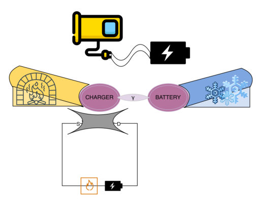 
FIG. 1. Charger-battery setup with the charger capacitively coupled to a QPC device performing weak, continuous mea- surement.

📷 Fig 2

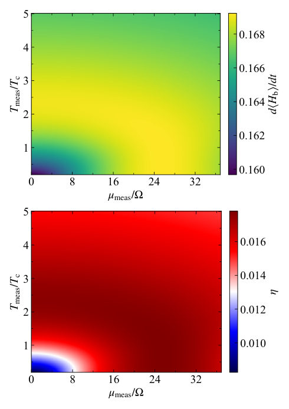 
FIG. 2. The figure on top shows the charging rate of the quantum battery as a function of the measurement strength parameters, Tmeas/Tc and µmeas/Ω. The Difference in the charging rate between the measured and unmeasured con- figurations is shown in the bottom figure. We see that the charging rate initially increases and has a maximum for cer- tain values of the measurement parameters. For higher mea- surement strengths, the charging rate is suppressed.

📷 Fig 3

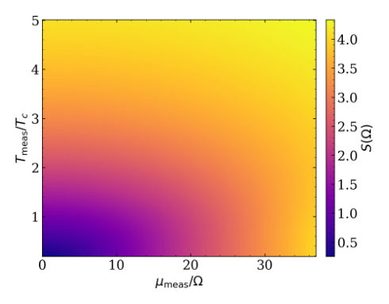 
FIG. 3. Dependence of S(Ω) on µmeas and Tmeas. We see that the noise power of the detector is a monotonically increasing function of both measurement parameters.

📷 Fig 4

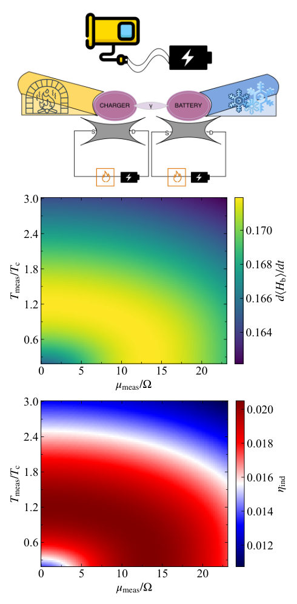 
FIG. 4. Independent two-QPC measurement configuration. The top panel shows the schematic of the two QPC configu- ration in which both the charger and battery qubits are in- dependently and continuously monitored. The middle panel shows the charging rate of the quantum battery as a function of Tmeas/Tc and µmeas/Ωwhile the bottom panel show the en- hancement in charging rate, ηind relative to the unmeasured baseline.

📷 Fig 5

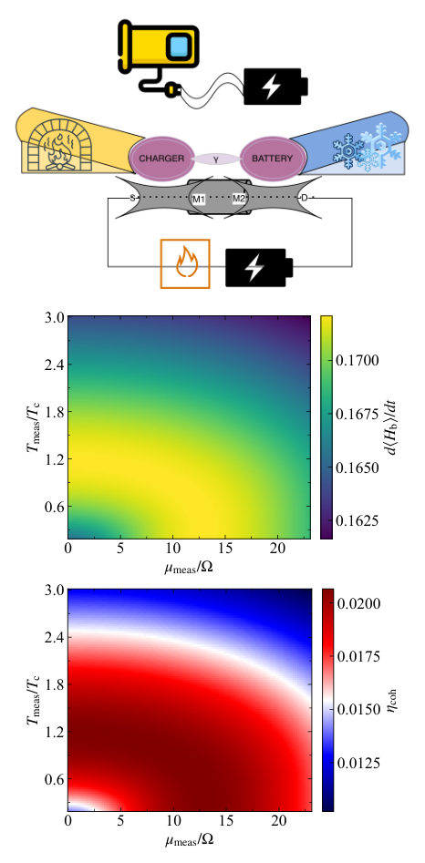 
FIG. 5. Coherent two-QPC measurement configuration. The top panel shows a schematic diagram of the series-coupled QPC geometry. The middle panel shows the steady-state charging rate of the quantum battery as a function of the measurement parameters Tmeas/Tc and µmeas/Ω. The bot- tom panel shows the charging rate enhancement ηcoh = ˙E(coh) B −˙E(unmeas) B relative to the unmeasured baseline, demon- strating improvement over the single-QPC case both in terms of charging rate as well as resource requirements.

**Summary.** This theoretical study analyzes how weak, continuous measurements using Quantum Point Contacts (QPCs) enhance the energy charging rate in a two-qubit quantum battery. The authors compare single, independent, and coherently coupled measurement schemes. They find that implementing a coherent measurement across both qubits yields the optimal enhancement with the lowest associated resource cost.

**Why it may be interesting.** This work directly addresses non-equilibrium thermodynamics and measurement back-action, showing how engineered measurement coupling can optimize energy transfer processes beyond simple thermal driving.

Detailed structure

**Main problem.** The paper investigates how weak, continuous quantum measurements enhance the charging rate of a quantum battery system while quantifying the associated thermodynamic resource cost.

**Main result.** A coherent measurement scheme coupling both the charger and battery qubits provides the highest charging rate enhancement (13.64%) while requiring the lowest resource expenditure compared to single or independent measurements.

**Method.** The analysis uses the Born and Markov approximations to derive a Lindblad master equation incorporating measurement back-action from Quantum Point Contacts (QPCs).

**Model / system.** The system is a two-qubit charger-battery model coupled to thermal reservoirs and subjected to weak, continuous measurements via QPCs. The dynamics are governed by a master equation incorporating measurement-induced dissipators and energy shifts.

**Key observables.** Charging rate enhancement ($\eta$), energy flow rate from charger to battery, and the resource cost (temperature/potential gradients) required for measurement.

**Important parameters / regimes.** Temperature gradient ($T_{	ext{meas}}/T_c$) and chemical potential gradient ($\mu_{	ext{meas}}/\Omega$) driving the QPCs.

**Assumptions / limitations.** The analysis relies on the Born and Markov approximations, and Lamb shift terms are often ignored in final simulations as they represent virtual processes.

**Figures summary.** Figures illustrate the non-monotonic dependence of the charging rate enhancement on measurement strength parameters, and compare the performance of single, independent two-QPC, and coherent two-QPC measurement setups.

**Paper structure.** The paper builds from deriving the general open evolution master equation, introducing the QPC measurement Hamiltonian, analyzing the non-monotonic enhancement, and finally comparing the performance hierarchy across the three measurement configurations.

Abstract

Quantum batteries modeled as two-qubit systems coupled to Markovian thermal reservoirs have been shown to benefit from measurement-assisted charging, where projective measurements enhance the charging rate at an infinite thermodynamic resource cost. In this work, we consider weak, continuous measurements implemented via quantum point contact detectors (QPC), which enhance the charging rate at a definite and quantifiable resource cost. We analyze three measurement configurations namely, a single QPC, two independent QPCs, and a series-coupled (coherent) two-QPC scheme, and study their effect on the steady-state charging rate, defined as the rate of energy flow from the charger qubit to the battery qubit, relative to the unmeasured baseline. We find that the charging rate enhancement is non-monotonic as a function of the temperature gradient and potential gradient required to drive the QPCs, exhibiting a plateau of near-optimal enhancement. Comparing the three configurations, the plateau of optimal enhancement contracts toward lower temperature and chemical potential for both the cases with two QPCs compared to the single QPC case. The coherent measurement further shows a lowering of the resource requirement relative to the two independent QPC case for achieving the same enhancement. The hierarchy is coherent greater than two independent QPCs which is greater than single QPC with respect to both the magnitude of the charging rate enhancement and the minimization of measurement resources.

[↑ back to top](#top)

### [Charged Bose polarons at finite momentum](http://arxiv.org/abs/2605.31255v1)

**Authors:** Grover Andrade Sánchez, Arturo Camacho Guardian  
**Type:** theory · **Category:** quantum gases · **PDF:** <https://arxiv.org/pdf/2605.31255v1>  
**Analysis basis:** full PDF text, analyzed in chunks
**Topic relevance:** 🔥 `Keldysh / 2PI / non-Gaussian methods` **4/5** · `Kondo & dissipative impurity` **3/5** · `analog quantum simulation` **3/5** · `methods for driven-dissipative` **3/5** · `correlated / nonlocal dissipation` **2/5** · `non-equilibrium dynamics` **2/5** · `driven-dissipative phase transition` **1/5** · `non-equilibrium universality` **1/5**

📷 Fig 1

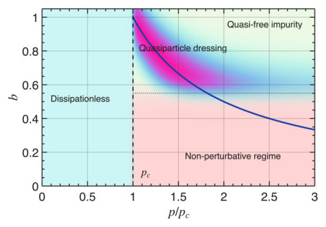 
FIG. 1. Schematic phase diagram of the finite-momentum charged Bose polaron for the ion-atom interaction. The ver- tical dashed line marks the Landau threshold. Above this threshold, quasiparticle dressing is strongest around the char- acteristic scale p ∼1/b. For larger momenta or larger effec- tive ranges, the impurity enters a weakly dressed, quasi-free regime where the damping is suppressed. The red shadow in- dicates the non-perturbative regime associated with two-body bound-state formation. The blue curve marks p = 1/b.

📷 Fig 2

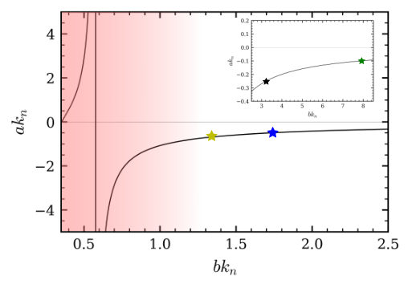 
FIG. 2. Scattering length akn of the ion–atom potential as a function of the dimensionless parameter bkn. For sufficiently large b, the system lies in the perturbative regime. As b de- creases, akn exhibits a divergence signaling the onset of a bound state in the two-body problem. The shaded region indicates the regime where bound states emerge and the per- turbative description breaks down.

📷 Fig 3

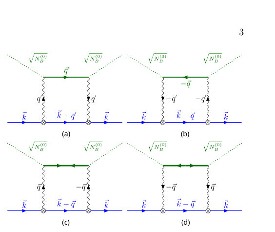 
FIG. 3. Second-order Feynman diagrams contributing to the self-energy of the charged polaron. Solid blue lines denote the ion propagator, solid green lines represent bosonic prop- agators, wavy lines indicate the ion-boson interaction, and dashed lines correspond to condensate lines. Panels (a)–(d) account for different processes including normal and anoma- lous BEC propagators.

📷 Fig 4

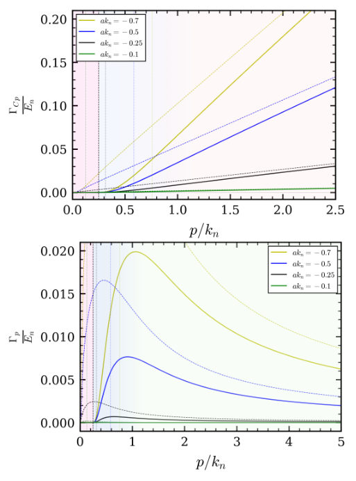 
FIG. 4. Damping rate Γp/En as a function of momentum p/kn for (top) contact and (bottom) ion-atom interactions, shown for equivalent impurity-boson scattering lengths. Solid (dashed) lines correspond to an interacting (ideal) Bose gas. The shaded regions indicate the dissipationless, dissipative, and perturbative breakdown regime (red shadow) or quasi- free regime (green shadow)

📷 Fig 5

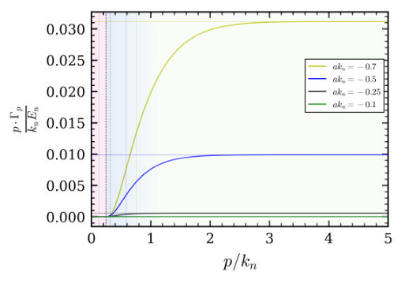 
FIG. 5. Momentum dependence of the scaled damping rate p Γp/En for different interaction strengths akn. This reveals that all curves approach a constant asymptotic value, demon- strating the asymptotic high-momentum scaling Γp ∝1

**Summary.** This paper theoretically examines how charged impurities (polarons) behave in a Bose-Einstein Condensate at finite momentum. By using a diagrammatic approach, the authors show that incorporating the finite range of the ion-atom interaction fundamentally changes the predicted damping rate compared to simple contact models. The key finding is the emergence of a characteristic momentum scale and a physically realistic high-momentum decay law ($\Gamma_p \sim 1/p$).

**Why it may be interesting.** This work is highly relevant as it provides detailed, momentum-resolved predictions for impurity dynamics in quantum gases, offering a crucial theoretical benchmark for interpreting future momentum-resolved transport measurements in ultracold atomic systems.

Detailed structure

**Main problem.** The study investigates the finite-momentum behavior of charged Bose polarons, moving beyond static properties to understand transport and quasiparticle stability.

**Main result.** The finite-range ion-atom interaction leads to a non-monotonic damping rate peaking at a characteristic momentum scale, and crucially, predicts a high-momentum scaling law $\Gamma_p \sim 1/p$, unlike contact interaction predictions.

**Method.** The analysis employs a diagrammatic approach using imaginary-time Green's functions and perturbative calculations up to second order in the ion-boson coupling.

**Model / system.** The system models a charged impurity (ion) coupled to a Bose-Einstein Condensate (BEC) of bosons. The Hamiltonian includes terms for kinetic energy, boson-boson interaction, and the ion-boson coupling potential.

**Key observables.** Quasiparticle energy ($\omega_p$), damping rate ($\Gamma_p$), and quasiparticle residue ($Z_p$).

**Important parameters / regimes.** Momentum ($p$), interaction range scale ($b$), and the boson-boson scattering length ($a_{BB}$).

**Assumptions / limitations.** The analysis is restricted to weak coupling and perturbative treatment up to second order; it assumes the BEC is well-described by Bogoliubov theory.

**Figures summary.** Figures illustrate the non-monotonic dependence of $\Gamma_p$ and $\Delta E$ on momentum, the scaling $\Gamma_p \propto 1/p$ at high momentum, and the dependence of the residue $Z$ on the boson-boson scattering length $a_{BB}$.

**Paper structure.** The paper develops the theory by calculating the self-energy ($\Sigma_2$) via Feynman diagrams, determining quasiparticle properties from the Green's function poles, and comparing the results obtained using a realistic finite-range potential versus a simple contact interaction.

Abstract

Charged impurities in quantum fluids have unveiled new classes of strongly correlated many-body states across condensed matter, ultracold gases, and hybrid atom-ion platforms. While previous studies have primarily focused on their ground-state and static properties, much less is known about their finite-momentum behavior, which governs transport, dissipation, and quasiparticle stability. Here, we investigate the momentum-dependent properties of a charged Bose polaron using a diagrammatic approach within second-order perturbation theory, explicitly accounting for the finite-range nature of the ion-atom interaction. We show that the interaction range introduces a characteristic momentum scale at which many-body dressing and dissipation are maximized, leading to a non-monotonic behavior of the damping rate and quasiparticle energy. In the high-momentum regime, we uncover a scaling law $Γ_p \sim 1/p$, signaling the suppression of many-body dressing and the recovery of quasi-free impurity dynamics, in stark contrast to the divergent behavior predicted by contact-interaction perturbative treatments.

[↑ back to top](#top)

### [Floquet Engineering of Quantum Transport through two Driven Impurities](http://arxiv.org/abs/2605.31592v1)

**Authors:** Vincenzo Bruno, Corinna Kollath, Roberta Citro, Ameneh Sheikhan  
**Type:** theory · **Category:** other · **PDF:** <https://arxiv.org/pdf/2605.31592v1>  
**Analysis basis:** full PDF text, analyzed in chunks
**Topic relevance:** 🔥 `non-equilibrium dynamics` **4/5** · `analog quantum simulation` **3/5** · `driven-dissipative phase transition` **2/5** · `interference shaping light` **2/5** · `methods for driven-dissipative` **2/5** · `non-equilibrium universality` **2/5** · `Keldysh / 2PI / non-Gaussian methods` **1/5** · `Kondo & dissipative impurity` **1/5**

📷 Fig 1

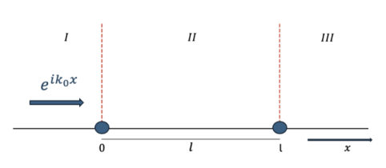 
FIG. 1. Sketch of the one-dimensional system with two im- purities. The arrow indicates the incoming particle with mo- mentum k0, while the two vertical red dashed lines represent the localized, periodically driven impurities.

📷 Fig 2

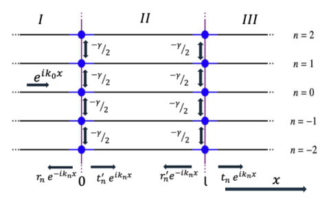 
FIG. 2. Sketch of the multi-channel setup arising from the Floquet mapping of the time-dependent Hamiltonian H(t) onto the extended Hilbert space. The coupling γ1 = γ2 = γ correspond to the drive amplitudes of the time-dependent model and ν1 = ν2 = ν are the amplitudes of the static poten- tial. The incoming plane wave eik0x , along with the possible reflection and transmission pathways, are depicted by arrows. The reflection and transmission amplitudes are denoted by r(′) n and t(′) n , respectively.

📷 Fig 3

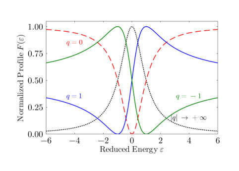 
FIG. 3. Normalized Fano profile, F(ϵ) = T(ϵ)/(1 + q2), with T given by Eq. (20). For q &gt; 0, the profile exhibits a dip-peak structure, while for q &lt; 0 it shows a peak-dip structure. The Lorentzian limits correspond to q →±∞(peak) and q = 0 (dip).

📷 Fig 4

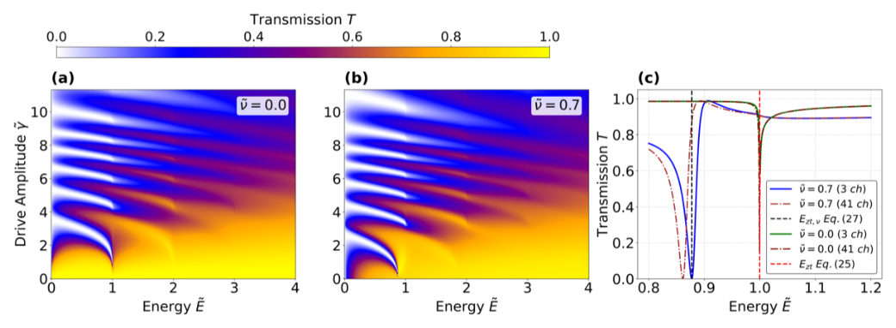 
FIG. 4. Transport properties of a single periodically driven impurity . Transmission probability as a function of incident energy ˜E and driving amplitude ˜γ are displayed for (a) the case ˜ν = 0 and (b) with an additional static potential (˜ν = 0.7). For both numerical solutions 41 channels have been taken into account. Panel (c) shows the energy profiles of the transmission probability at fixed drive amplitude (˜γ = 0.5). The solid curves represent the results obtained within the 2-channel approximation, while the dotted curves correspond to the 41-channel case. For both ˜ν = 0 and ˜ν = 0.7, the vertical dotted lines mark the theoretical predictions derived from Eq. (25) for ˜ν = 0 and...

📷 Fig 5

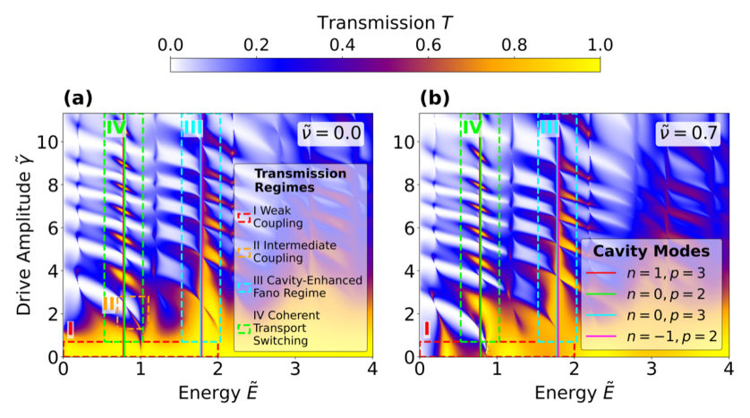 
FIG. 5. Transmission probability T for the symmetric two-impurity system as a function of energy of the incoming particle ˜E and driving amplitude ˜γ, with an inter-impurity distance ˜l = 7.07. (a) Case without static potential (˜ν = 0). The solid vertical lines indicate the theoretical positions of the Fabry-Pérot cavity modes [Eq. (30)] as indicated in the legend in panel (b). The squared dashed rectangles represent the regions of the transmisison spectrum I, II, III and IV characterized by different regimes. (b) Case with static potential (˜ν = 0.7).

**Summary.** This work uses Floquet engineering to study quantum transport through two driven impurities in a 1D channel. By mapping the time-dependent problem to a multi-channel scattering model, the authors reveal that the system's transport properties are governed by the interplay of Fabry-Pérot cavity modes and Fano interference. This allows for the active control of quantum states, enabling programmable delay lines and robust coherent trapping mechanisms.

**Why it may be interesting.** The combination of Floquet engineering, cavity physics, and resonance phenomena (Fano/BIC) makes this highly relevant for AMO physicists working on engineered quantum systems, especially those involving cold atoms.

Detailed structure

**Main problem.** The paper investigates how periodically driving two impurities in a 1D channel modifies quantum transport, leading to complex interference and trapping phenomena.

**Main result.** The system exhibits tunable transport regimes, allowing switching between perfect transparency/reflection and strong localization via Quasi-Bound States (Quasi-BICs) with giant Wigner time delays.

**Method.** The time-dependent Hamiltonian is mapped onto a time-independent, multi-channel scattering problem using Floquet theory.

**Model / system.** The model is a mesoscopic 1D channel containing two impurities, whose potentials are periodically driven by an external field. The analysis uses the Floquet formalism to solve the resulting multi-channel scattering problem.

**Key observables.** Reflection and transmission amplitudes, Bound States in the Continuum (BICs), Quasi-BICs, and Wigner time delays.

**Important parameters / regimes.** Inter-impurity distance ($l$), drive amplitude ($\gamma$), and static potentials ($
u$).

**Assumptions / limitations.** The analysis relies on mapping the time-dependent problem to a stationary multi-channel scattering problem using Floquet theory, though approximations are noted for high-order channels.

**Figures summary.** Figures illustrate the 1D system setup, the multi-channel scattering diagram, and spectral shapes showing Fano resonance profiles (dip-peak vs. peak-dip) and transmission probability vs. energy.

**Paper structure.** The paper progresses from analyzing the single-impurity case (showing Fano resonances) to the two-impurity system, which is treated as a dynamical Fabry-Pérot cavity, culminating in the demonstration of tunable trapping and delay lines.

Abstract

Floquet engineering offers powerful tools to manipulate quantum states by periodically driving physical parameters. In this work, we investigate the quantum transport through two periodically driven impurities in a mesoscopic one-dimensional channel. By mapping the time-dependent Hamiltonian into an effective multichannel scattering problem, we unveil a rich landscape of transport phenomena arising from the interplay between Fabry-Perot cavity modes and Fano interference. We demonstrate that the inter-impurity distance acts as a critical control parameter, allowing for the formation of Bound States in the Continuum (BICs). Furthermore, we identify Quasi-BICs, extremely narrow resonances with finite lifetimes, that can be dynamically tuned by the drive amplitude. We show that these states enable a robust coherent trapping mechanism, allowing the system to switch from perfect transparency or reflection to strong localization with giant Wigner time delays. Our results suggest possible applications for tunable delay lines and quantum memories, with feasible experimental realizations in the context of cold atoms.

[↑ back to top](#top)

### [Rydberg state engineering of trapped ions](http://arxiv.org/abs/2605.30483v1)

**Authors:** Robin Thomm, Vinay Shankar, Natalia Kuk, Marion Mallweger, Ivo Straka, Markus Hennrich  
**Type:** experiment · **Category:** other · **PDF:** <https://arxiv.org/pdf/2605.30483v1>  
**Analysis basis:** full PDF text, analyzed in chunks
**Topic relevance:** 🔥 `analog quantum simulation` **4/5** · `QC/QI experiment` **3/5** · `Rydberg arrays` **3/5** · `methods for driven-dissipative` **2/5** · `driven-dissipative phase transition` **1/5** · `entanglement & information structure` **1/5** · `non-equilibrium dynamics` **1/5** · `quantum measurements` **1/5** · `quantum optics experiment` **1/5**

📷 Fig 1

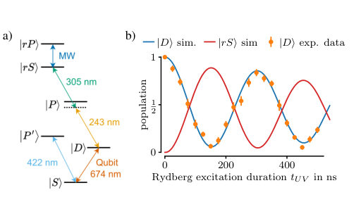 
FIG. 2. a) Simplified level scheme (see the main text for details), with the main transitions indicated by arrows (repump transitions from metastable states are not shown for clarity). All shown excited S and P states have a lifetime of below 100 µs and ultimately decay to the ground state S (or a metastable state that is repumped to S ). Excitation to one of these states followed by decay can therefore be distinguished from population remaining in the metastable state D by fluorescence detection. b) Rabi oscillations between the D and rS state for n = 46. We measure the population in D (detected as no fluorescence = dark) after a two-photon Rydberg excitation pulse; population in other...

📷 Fig 2

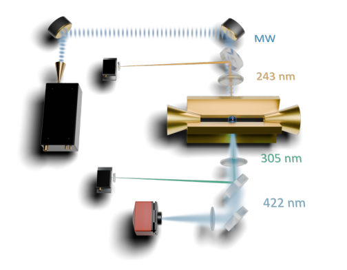 
FIG. 1. Sketch of the experimental setup. Shown are all lasers needed for Rydberg excitation and manipulation as well as the imaging path. The first Rydberg excitation laser (243 nm) is overlapped with the MW radiation, the second one (305 nm) addresses the ion antiparallel to the first one to reduce Doppler broadening of the two-photon reso- nance and is overlapped with the imaging path (422 nm). Not shown are the qubit, Doppler cooling, and repumping lasers, which address the ion from the bottom. Furthermore, fluorescence light is collected from above and detected with a photomultiplier tube (PMT).

📷 Fig 3

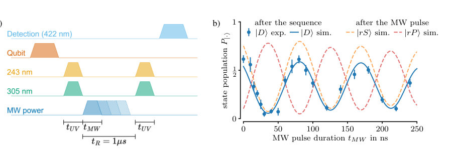 
FIG. 3. a) Pulse sequence used for exciting and manipulating the Rydberg state. We start with an ion initialized in its electronic and motional ground state. A qubit π-pulse excites it into the metastable D state. From there we excite the ion via a two-photon process to the Rydberg state (cf. Fig. 2). Once in the Rydberg manifold, we coherently transfer population between different Rydberg states via MW radiation. We probe the success of the coherent manipulation by driving the fraction remaining in the Rydberg rS state back to D with a two-photon de-excitation pulse, all other population decays to S . The experiment is concluded with a fluorescence measurement. b) MW Rabi oscillations...

📷 Fig 4

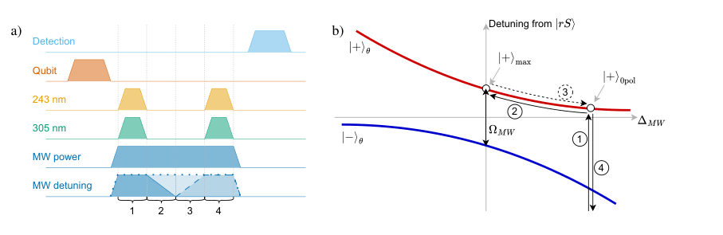 
FIG. 4. Experimental sequence for probing the adiabatic transfer between different MW-dressed Rydberg states. In a) the pulse sequence is shown, in b) the dressed state energies dependent on the MW detuning ∆MW. We again start by transferring population to D. The Rydberg excitation and manipulation is then divided into four periods. In periods 1 and 4 both Rydberg lasers are switched simultaneously to transfer population between D and |+⟩0pol. In periods 2 and 3 the MW detuning can be swept (see the text for a more detailed description of the periods). During the whole time of periods 1 to 4, the MW irradiates the ion with variable detunings. We investigate 3 different cases, a constant...

📷 Fig 5

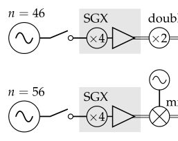 
FIG. 5. MW generation for both principal quantum numbers n = 46 (top) and n = 56 (bottom). A seed signal is switched before being quadrupled in frequency and amplified in a signal generator exten- sion (SGX) module (azure background). For n = 46, the signal, in the WR15 frequency range, is once more frequency doubled, result- ing in a signal in the WR8 frequency range. For n = 56, the signal after the SGX is upconverted with an RF signal of (200 −400) MHz. In both cases, the signal is coupled to free space with a conical horn antenna. Single lines indicate coaxial connections; double lines indi- cate waveguides.

**Summary.** This paper reports the first demonstration of coherent population transfer between multiple Rydberg states in a trapped ion. By using microwave dressing, the researchers engineered new eigenstates with tunable properties, allowing for both noise-resilient excitation and strong dipole-dipole interactions in a single sequence. This significantly expands the toolbox for quantum simulation and quantum information processing using trapped ions.

**Why it may be interesting.** This work provides a robust, controllable platform for quantum simulation by enabling fast, coherent switching between states with vastly different polarizabilities and interaction strengths, crucial for advanced quantum simulation protocols.

Detailed structure

**Main problem.** The primary goal was to demonstrate coherent population transfer between different Rydberg states of a trapped ion, overcoming previous limitations of using only a single state per experiment.

**Main result.** The authors achieved a high population transfer efficiency (91.5%) in a single microwave $\pi$-pulse and demonstrated adiabatic transfer between engineered zero-polarizability and maximally interacting dressed states.

**Method.** The work combines microwave dressing/driving with precise laser control to manipulate the quantum states of trapped ions, probing both Rabi oscillations and adiabatic passage.

**Model / system.** The physical system is a trapped $^{88}	ext{Sr}^+$ ion. The dynamics are modeled using the Lindblad master equation, describing interactions between bare Rydberg states ($rS, rP$) and engineered dressed states ($|+
angle, |-
angle$) via microwave coupling.

**Key observables.** Population transfer efficiency, Rabi oscillation frequencies ($\Omega_{MW}$), and the fidelity of adiabatic passage.

**Important parameters / regimes.** Rydberg principal quantum number ($n=46$), microwave detuning ($\Delta_{MW}$), and state lifetimes ($	au_{rS} = 8.2 \mu s$).

**Assumptions / limitations.** The primary limitations noted are Rydberg state dephasing, blackbody radiation induced decay, and non-adiabatic loss mechanisms during sweeping.

**Figures summary.** Figures illustrate the experimental setup, Rabi oscillations between D and $rS$, the pulse sequence for state manipulation, and the dependence of adiabatic transfer efficiency on the microwave detuning.

**Paper structure.** The paper details the experimental setup, first demonstrating Rabi oscillations between bare states, then introducing microwave dressing to create tunable eigenstates, and finally demonstrating adiabatic transfer between these engineered dressed states.

Abstract

Microwave dressing of Rydberg ions creates tunable eigenstates with controllable polarizability and interaction strength, but coherent navigation between these states has remained elusive. Here, we report on the first demonstration of coherent population transfer between different Rydberg states of a trapped ion. We investigate both microwave-mediated Rabi oscillations between Rydberg S and P states and adiabatic transfer between microwave-dressed Rydberg states. Between Rydberg S and P states we achieve a population transfer efficiency of 91.5(5)% in a single microwave $π$-pulse. Microwave dressing hybridizes the S and P Rydberg states into new eigenstates with tunable polarizability, enabling both noise-resilient zero-polarizability states and maximally interacting states. We demonstrate adiabatic transfer between these zero-polarizability and maximally dressed states, enabling experiments that combine noise-resilient excitation with strong dipole-dipole interactions and Förster resonance control within a single measurement sequence.

[↑ back to top](#top)

### [Nonequilibrium scaling of drag forces in counterdriven fluid mixtures](http://arxiv.org/abs/2605.31479v1)

**Authors:** Jonas Köglmayr, Florian Sammüller, Matthias Schmidt  
**Type:** theory · **Category:** statistical mechanics · **PDF:** <https://arxiv.org/pdf/2605.31479v1>  
**Analysis basis:** full PDF text, analyzed in chunks
**Topic relevance:** 🔥 `non-equilibrium dynamics` **4/5** · 🔥 `non-equilibrium universality` **4/5** · `Keldysh / 2PI / non-Gaussian methods` **2/5** · `methods for driven-dissipative` **2/5** · `Frenkel-Kontorova` **1/5** · `correlated / nonlocal dissipation` **1/5** · `driven-dissipative phase transition` **1/5**

📷 Fig 1

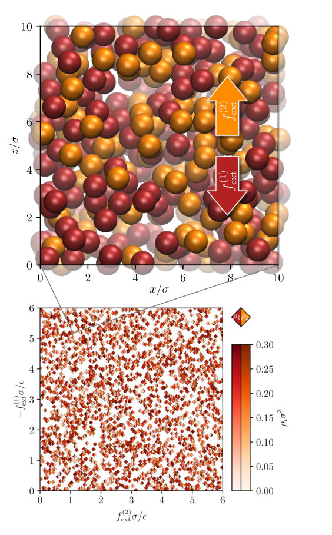 
FIG. 1. Top panel: Representative simulation snapshot of the binary mixture under counterdrive. The particles of species 1 (dark red spheres) and of species 2 (light orange spheres) are driven in opposite directions along the z-axis by species- dependent external force fields f (1) ext(z) and f (2) ext(z), which are first taken to be spatially uniform and are later considered to be position-dependent on the z-coordinate. The system is on average homogeneous in the lateral x- and y-directions and lengths are scaled with the common particle size σ. Bottom panel: Illustration of the range of simulated systems with spa- tially homogeneous driving, shown across the plane of scaled force...

📷 Fig 2

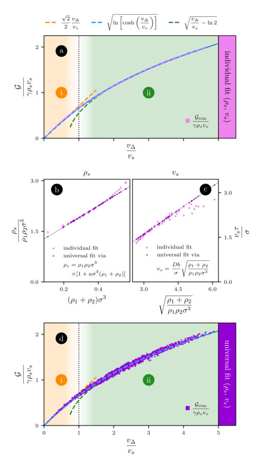 
FIG. 2. Nonequilibrium scaling of drag forces. a) Drag force ratio G/(γρsvs) shown as a function of the counterdrive ve- locity ratio v∆/vs. Simulation results are obtained over wide ranges of partial densities and driving strengths, see Fig. 1. The ‘individual fit’ results (pink data points) collapse onto the general scaling function (7) (dashed blue curve). Indicated is the asymptotic behaviour for i) near-equilibrium (dashed or- ange) and ii) far-nonequilibrium (dashed green), see Eq. (8). b) Scaled effective density ρs/(ρ1ρ2σ3) as a function of the scaled total density (ρ1 + ρ2)σ3, obtained from the individual fits (pink symbols) and for the ‘universal fit’ (thin black line), where the...

📷 Fig 3

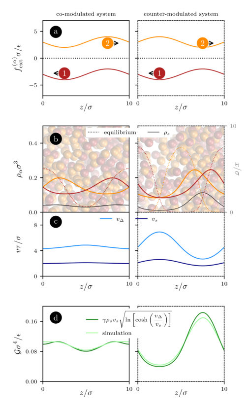 
FIG. 3. Inhomogeneous systems with co-modulated (left col- umn) and counter-modulated driving (right column) along the z-direction. a) The inhomogeneous external force fields f (α) ext (z)σ/ϵ for species α = 1 (dark red) and 2 (light orange). b) The resulting species-resolved nonequilibrium density pro- files ρ1(z)σ3 and ρ2(z)σ3 together with the corresponding equilibrium density profiles (dashed lines) and the local scal- ing density ρs(z)σ3 (black line). The background shows rep- resentative simulation snapshots (with horizontal z-direction) to illustrate the spatial concentration and density variations. c) The local velocity difference profile v∆(z)τ/σ (light blue line), as obtained from...

**Summary.** This paper develops a theoretical framework to quantify the nonequilibrium drag force in counterdriven fluid mixtures. Using power functional scaling arguments, the authors derive a universal scaling law that accurately describes the transition between linear and square-root force dependencies. This work advances the understanding of non-equilibrium physics beyond standard density functional theory.

**Why it may be interesting.** The development of a universal scaling law for non-equilibrium forces in driven classical fluids provides a powerful, generalizable theoretical tool for understanding energy dissipation and transport in complex many-body systems, which has analogues in quantum many-body dynamics.

Detailed structure

**Main problem.** To establish a quantitative scaling law describing the effective nonequilibrium drag force field in steady states of counterdriven binary fluid mixtures.

**Main result.** The study successfully derives a universal power functional scaling form that captures the crossover between near-equilibrium linear response and far-nonequilibrium square root asymptotics.

**Method.** The authors employ power functional scaling arguments applied to adaptive Brownian dynamics computer simulations, extending classical density functional theory concepts.

**Model / system.** The system is a binary fluid mixture ($\alpha=1, 2$) subjected to external forces driving the species in opposite directions (counterdriven). The dynamics are modeled using overdamped Brownian dynamics.

**Key observables.** Partial density profiles ($
ho_\alpha(r)$), partial interparticle force density ($F_{\alpha}^{	ext{int}}(r)$), and the drag force characterized by $G^{	ext{int}}(z)$.

**Important parameters / regimes.** The counterflow velocity difference ($v_\Delta$), the crossover velocity ($v_s$), and the effective density ($
ho_s$) are key parameters defining the scaling regimes.

**Assumptions / limitations.** The analysis initially focuses on planar geometry and assumes the applicability of a local power functional approximation for inhomogeneous systems.

**Figures summary.** Figure 1 shows a simulation snapshot of the binary mixture under counterdrive. Subsequent figures illustrate the successful fitting of simulation data across various driving strengths using the derived scaling function.

**Paper structure.** The paper systematically develops the force balance equation, derives the scaling ansatz for the drag force, validates this ansatz against simulation data across different regimes (near vs. far nonequilibrium), and finally extends the framework to describe spatially inhomogeneous systems using a local functional approximation.

Abstract

We address the effective nonequilibrium drag force field that emerges from the microscopic interparticle interactions in steady states of counterdriven binary fluid mixtures. Using power functional scaling arguments for adaptive Brownian dynamics computer simulation results, we establish quantitatively the crossover between near-equilibrium linear response and far-nonequilibrium square root asymptotics. An algebraic expression captures both limiting cases and remains applicable in the crossover regime. Using simulation results as benchmarks, we verify that a local power functional approximation based on the scaling law reproduces the spatial nonequilibrium structure formation in inhomogenously driven systems. The crossover scenario transcends dynamical density functional theory and it sheds light on general nonequilibrium scaling of driven fluids.

[↑ back to top](#top)

### [A charge qubit on solid neon in a spin-qubit compatible circuit QED platform](http://arxiv.org/abs/2605.31185v1)

**Authors:** J. Wang, Y. Tian, I. Grytsenko, A. Jennings, X. Zhou, H. Terai, D. Jin, E. Kawakami  
**Type:** experiment · **Category:** quantum information and computing · **PDF:** <https://arxiv.org/pdf/2605.31185v1>  
**Analysis basis:** full PDF text, analyzed in chunks
**Topic relevance:** 🔥 `QC/QI experiment` **4/5** · `spintronics-quantum-optics interface` **3/5** · `quantum measurements` **2/5** · `Tavis-Cummings & cavity-many-emitter` **1/5** · `analog quantum simulation` **1/5** · `correlated cavity matter` **1/5** · `exotic spin models in light-matter` **1/5** · `quantum optics experiment` **1/5**

📷 Fig 1

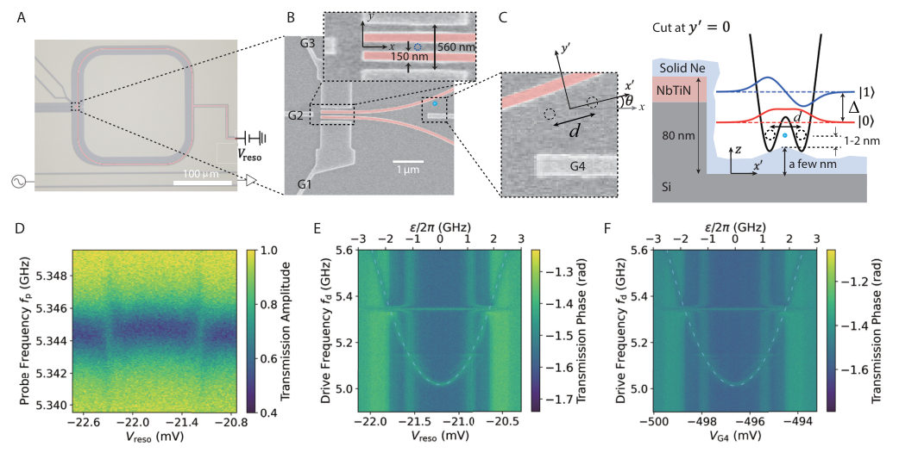 
FIG. 1. (A) Optical micrograph of the NbTiN nanowire resonator (false-color pink). The resonator is capacitively and inductively coupled to a feed line (bottom), through which microwave transmission is measured. The dotted square indicates the electron trapping region (enlarged in panel B). (B) Scanning electron micrograph of the electron trapping region, where the two ends of the nanowire resonator center conductor (highlighted in pink) approach each other with a 100 nm separation, with trapping electrodes G1–G4 located nearby. The light blue sphere denotes the electron position inferred from the experimental results (enlarged in panel C). Inset: Expanded view around the originally...

📷 Fig 2

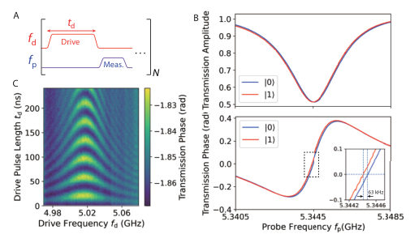 
FIG. 2. (A) Schematic of the Rabi measurement sequence. A drive pulse at frequency fd with length td is followed by a probe pulse at frequency fp with a length of 2 µs. Each data point is averaged over N = 300 measurements with a waiting time of 1 ms between repetitions. The drive strength is set to A/A0 = 0.3. (B) Transmission amplitude and calibrated phase of the probe signal as a function of the probe frequency fp around fr for the electron in states |0⟩(blue, no drive pulse) and |1⟩(red, with a π drive pulse), showing the dispersive shift of the resonator frequency of 63 kHz depending on the qubit state. (C) Rabi oscillations of the qubit measured by sweeping the drive frequency fd...

📷 Fig 3

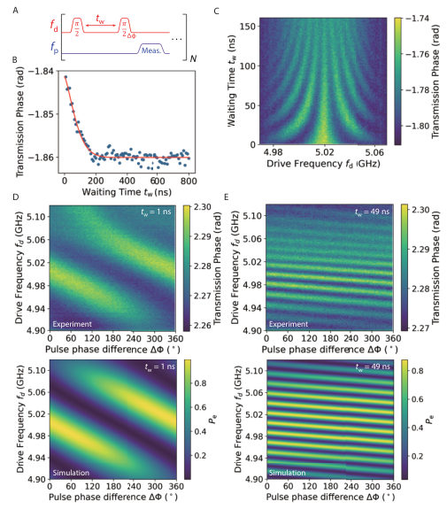 
FIG. 3. (A) Schematic of the Ramsey measurement sequence. Two π/2 pulses are applied with a waiting time tw between them and a relative phase difference ∆Φ. A probe pulse with a pulse duration of 1 µs is applied a few hundred nanoseconds after the second π/2 pulse. Each data point is averaged over N = 100 ∼1000 measurements with a waiting time of 1 ms between repetitions. (B) Ramsey decay at ∆Φ = 0. The solid line shows a fit to exp [ −(tw/T ∗ 2 )β] , yielding β = 1.4±0.4 and T ∗ 2 = 91 ± 23 ns. (C) Ramsey fringes measured by varying the drive frequency fd and the waiting time tw between the two π/2 pulses (D,E) Demonstration of π/2 rotations around an arbitrary axis in the xy plane of the...

📷 Fig 4

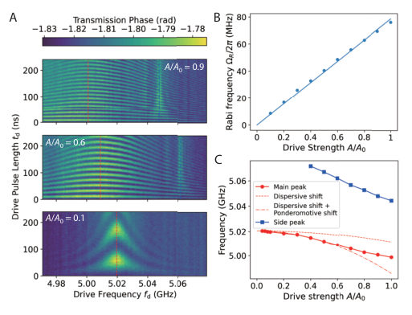 
FIG. 4. Strong drive regime. The pulse sequence used here is the same as that shown in Fig. 2A. (A) Rabi oscillations for varying drive strength A/A0. The Rabi-chevron pattern of the resonance (referred to as the main peak) is clearly vis- ible. With increasing drive strength, this resonance shifts to- ward lower frequencies, indicating a reduction of the qubit fre- quency fq. A side peak also emerges on the higher-frequency side. Vertical dashed red and blue lines indicate the cen- ter frequencies of the main and side peaks, respectively. (B) Rabi frequency of the main peak as a function of the drive strength; the solid line shows a linear fit. The uncertainty in the Rabi frequency...

📷 Fig 5

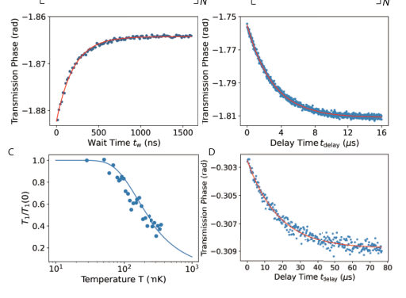 
FIG. 5. (A) Hahn-echo measurement. The decay is fitted with a single-exponential form exp(−t/T2), yielding T2 = 202 ± 5 ns. (B) Energy relaxation measurement. The solid line is a fit to exp(−tdelay/T1), yielding T1 = 3.056±0.015 µs. (C) Temperature dependence of the relaxation time T1, fit- ted by T1(T) = T1(0) tanh[hfq/(2kBT)]. (D) Energy relax- ation measurement after annealing the solid neon by warming it to 8.6 K, cooling back to below 10 mK, and redepositing electrons. The measured qubit here corresponds to a differ- ent single-electron realization from those used elsewhere in this work. The solid line is a fit to exp(−tdelay/T1), yielding T1 = 17.7 ± 0.6 µs.

**Summary.** This paper reports on the experimental realization and characterization of a charge qubit using an electron trapped on solid neon coupled to a superconducting resonator. The researchers demonstrated coherent control, measured high Rabi frequencies, and analyzed frequency shifts caused by strong microwave driving. The results strongly suggest that this platform is viable for future spin-qubit quantum computation.

**Why it may be interesting.** This work directly addresses the experimental realization of solid-state qubits, combining concepts from circuit QED, solid-state physics, and quantum control, making it highly relevant for AMO and quantum computing researchers.

Detailed structure

**Main problem.** The research aims to demonstrate and characterize the coherent control of a charge qubit realized using an electron trapped on solid neon, with the ultimate goal of realizing a functional spin-qubit platform.

**Main result.** The authors successfully demonstrated microwave readout and coherent control, achieving Rabi frequencies up to 76 MHz and estimating that spin-qubit fidelities approaching 99.5% are feasible.

**Method.** The study employs microwave spectroscopy, Rabi oscillation measurements, and coherence time characterization (Hahn-echo) on a superconducting circuit QED platform.

**Model / system.** The system consists of a single electron confined in a double-well potential on solid neon, coupled to a superconducting NbTiN nanowire resonator. The qubit Hamiltonian describes the orbital energy splitting, and the coupling allows for state readout via resonator frequency shifts.

**Key observables.** Rabi frequencies (up to 76 MHz), qubit frequency shifts (due to nonlinear/ponderomotive effects), coherence times ($T_2^*, T_2$), and single-qubit gate fidelities.

**Important parameters / regimes.** Coupling strength ($g \approx 2.1 	ext{ MHz}$), resonator frequency ($	ext{fr} \approx 5.3 	ext{ GHz}$), and the achievable fidelity ($\approx 99.5\%$).

**Assumptions / limitations.** Deterministic electron trapping is difficult due to surface roughness, and the analysis relies on fitting resonator response to infer electron position and coupling parameters.

**Figures summary.** Figures illustrate device structures, potential energy diagrams (double-well), Rabi oscillation measurements vs. drive strength, and frequency shifts attributed to dispersive and ponderomotive effects.

**Paper structure.** The paper progresses from demonstrating basic charge qubit control and readout, to characterizing coherence times, analyzing frequency shifts under strong driving (dispersive/ponderomotive effects), and finally projecting these results onto the feasibility and fidelity of a spin-qubit realization.

Abstract

Electrons floating in vacuum provide a clean platform for quantum information processing due to their isolation from material defects; electrons on solid neon have emerged as a promising qubit platform for its long coherence times. Here, toward spin-qubit realization, we couple a single electron on solid neon to a magnetic-field-compatible superconducting NbTiN nanowire resonator. We realize a charge qubit and demonstrate microwave readout and coherent control, with Rabi frequencies up to 76 MHz, an order of magnitude larger than in previous studies. Under strong driving, we observe a qubit frequency shift from nonlinear interactions with the intense microwave field. Deterministic electron trapping at an intended position remains challenging due to solid neon surface roughness; we characterize the electron's position from its differential coupling to distinct electrodes. Although not trapped at an intended position, our estimates indicate that spin-qubit demonstrations remain feasible.

[↑ back to top](#top)

### [Experimental demonstration of quantum advantage in communication complexity for Euclidean distance problem](http://arxiv.org/abs/2605.31516v1)

**Authors:** Verena Yacoub, Niraj Kumar, Iordanis Kerenidis, Eleni Diamanti  
**Type:** experiment · **Category:** quantum information and computing · **PDF:** <https://arxiv.org/pdf/2605.31516v1>  
**Analysis basis:** full PDF text, analyzed in chunks
**Topic relevance:** 🔥 `QC/QI experiment` **4/5** · `interference shaping light` **3/5** · `quantum optics experiment` **3/5** · `analog quantum simulation` **1/5** · `entanglement & information structure` **1/5** · `quantum measurements` **1/5**

📷 Fig 1

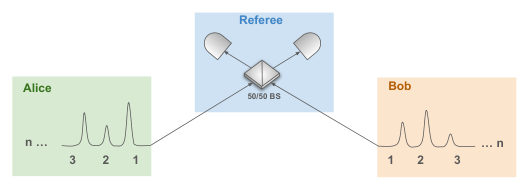 
FIG. 1: General scheme of the Euclidean distance protocol in the simultaneous message passing model. The real valued information vector is encoded on the amplitudes of the coherent pulses constituting the fingerprints.

📷 Fig 2

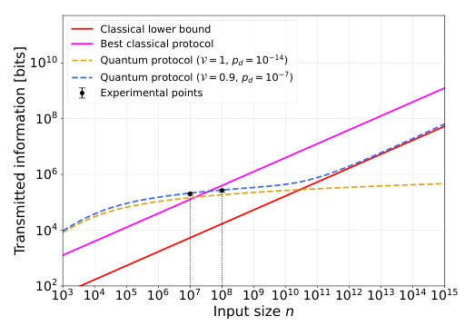 
FIG. 2: Log-log plot of the transmitted information as a function of input size n for solving the ED problem with additive accuracy ϵ = 0.1 and failure probability δ ≤10−6. We compare the ideal (V = 1, pd ≈10−14) and realistic (V = 0.9, pd ≈10−7) ED protocol against the classical lower bound and the best known classical protocol for Equality. Experimental points are shown with black symbols. Quantification of the the quantum advantage is in Section III and the detailed calculations in Appendix C.

📷 Fig 3

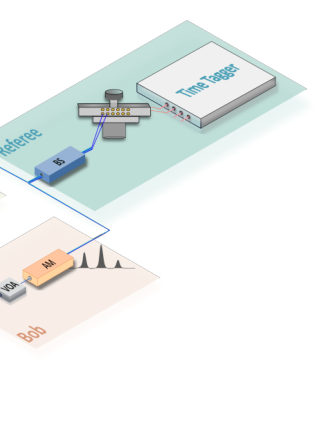 
FIG. 3: Experimental setup for the implementation of the Euclidean distance protocol.

📷 Fig 4

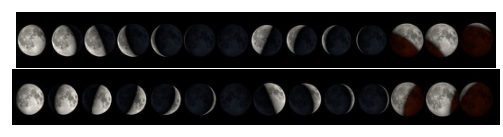 
FIG. 4: Grayscale images used as Alice’s (upper row) and Bob’s (lower row) input data sets in the real-data experiment.

📷 Fig 5

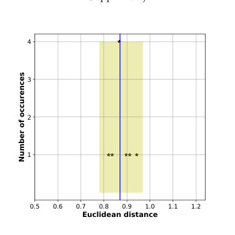 
FIG. 5: Distributions of the estimated Euclidean distance over repeated protocol runs. The shaded pink region indicates the ±0.1 error bound.

**Summary.** This work experimentally proves a quantum advantage for calculating the Euclidean distance in a communication complexity setting using photonic quantum states. By encoding real-valued data into coherent pulse amplitudes, the authors achieved a quantum advantage factor of $\approx 1.48$ for $n=10^8$ compared to classical bounds. The demonstration validates the potential of quantum communication protocols for practical data processing tasks.

**Why it may be interesting.** It provides a concrete, large-scale experimental realization of a quantum advantage in a fundamental information-theoretic task (communication complexity) using photonic systems, which is highly relevant to quantum communication research.

Detailed structure

**Main problem.** The paper experimentally demonstrates a quantum advantage in communication complexity for calculating the Euclidean distance between two high-dimensional real vectors.

**Main result.** A quantum advantage was shown for an input size of $10^8$, where the quantum protocol achieved a transmitted information rate significantly surpassing the best known classical protocol bound.

**Method.** The protocol uses quantum fingerprinting adapted for real-valued vectors, implemented via weak coherent pulse trains interfering on a beam splitter.

**Model / system.** The experiment utilizes an interferometric setup with superconducting nanowire single-photon detectors (SNSPDs) to encode non-binary data in the amplitudes of coherent states.

**Key observables.** Estimated Euclidean distance ($	ilde{E}$), quantum transmitted information ($I_Q$), and the quantum advantage factor ($A_{best}$).

**Important parameters / regimes.** Input size ($n$) up to $10^8$; mean photon number ($\mu$) tuned in the range of $10^{-5}$ to $10^{-4}$; visibility ($
u$) and detector quantum efficiency ($\eta$).

**Assumptions / limitations.** The analysis relies on the weak-pulse approximation and the use of the private-coin simultaneous message passing (SMP) model.

**Figures summary.** Figures show histograms confirming the estimated Euclidean distances for random and grayscale image inputs, verifying the results within a specified error bound.

**Paper structure.** The paper builds from the theoretical background of communication complexity and quantum fingerprinting, derives the necessary bounds (Chernoff/Gaussian), details the experimental implementation using coherent states, and concludes with the quantitative demonstration of the quantum advantage.

Abstract

When considering the complexity of communication protocols, the aim is to perform a certain task with the minimum amount of communication resources, such as time and transmitted information. The use of quantum states may lead to an exponential advantage in the use of such resources. Here, we are interested in the task of calculating the Euclidean distance between two vectors representing real data sets. It has been previously shown that it is possible to obtain an advantage for this task based on quantum fingerprinting. This protocol is defined in the simultaneous message passing model of communication complexity, where the two parties do not communicate with each other but send data to a third party, and exploits practical fingerprints generated using trains of coherent state pulses instead of highly entangled qubit states that are hard to generate for large input sizes needed to demonstrate an exponential advantage. We perform a proof-of-principle experimental demonstration of the Euclidean distance protocol using amplitude modulation techniques for encoding non-binary data sets and high-performance superconducting nanowire single-photon detectors required to increase the accessible input size. We show a quantum advantage in transmitted information surpassing the best classical protocol for an input size of $10^8$, for diverse types of data sets, including those corresponding to real grayscale images, and with reasonable precision and error bounds. Our results highlight the potential of quantum communication complexity for use in a broad set of applications.

[↑ back to top](#top)

### [Benchmarking the ORCA PT-2 Boson Sampler using Minimum Dominating Set Problems](http://arxiv.org/abs/2605.30935v1)

**Authors:** Jessica Park, Susan Stepney, Irene D'Amico  
**Type:** both · **Category:** quantum information and computing · **PDF:** <https://arxiv.org/pdf/2605.30935v1>  
**Analysis basis:** full PDF text, analyzed in chunks
**Topic relevance:** 🔥 `QC/QI experiment` **4/5** · `analog quantum simulation` **3/5** · `quantum optics experiment` **3/5** · `interference shaping light` **2/5**

📷 Fig 1

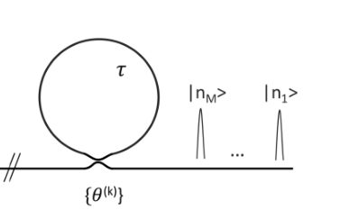 
Fig. 1: Diagrammatic representation of time-bin interferometry. Taken from Bradler and Wallner (2021).

📷 Fig 2

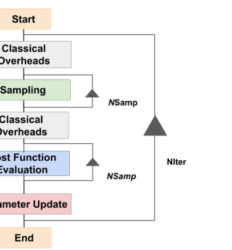 
Fig. 2: A visual representation of the Binary Bosonic Solver run in practice on the PT- 2 device with the various timing metrics labelled. titer is the time for a single iterations; tserv is the time taken accessing the PT-2 device including classical overheads and sampling; tS is the time for an individual sample to be generated from the PT-2 device; tC is the time taken for the local CPU to evaluate the cost function for a single bit string instance.

📷 Fig 3

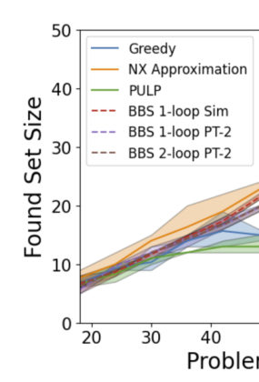 
Fig. 3: Comparisons between the found solution size of three classical methods for solving the dominating set problem (Greedy, NX Approximation and PULP) and three implementations of the binary bosonic solver (BBS); a 1 loop CPU simulation (BBS 1-loop Sim), a 1-loop PT-2 implementation (BBS 1-loop PT-2), and a 2-loop PT-2 implementation (BBS 2-loop PT-2). The lines represent the mean value over three different graphs (for each value of n), and the shaded areas shows the minimum and maximum of results.

📷 Fig 4

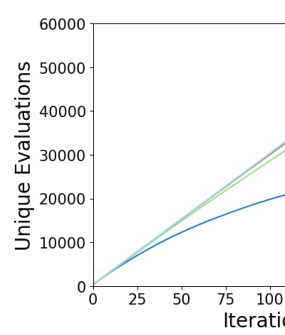 
Fig. 4: The cumulative number of unique cost function evaluations carried out as the Binary Bosonic Solver progresses through the iterations, for different problem sizes.

📷 Fig 5

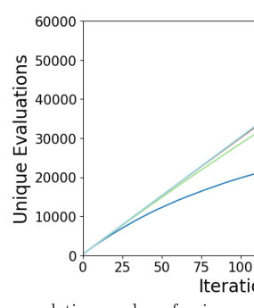 
Figure 5 shows the wall-clock runtime for the three classical algorithms, and the three BBS implementations (1-loop Sim, 1-loop PT-2 and 2-loop PT-2). There are also lines that show the estimated convergence time as calculated by 4 for both the real and simulated PT-2 device running the gradient-free BBS algorithm. Overall the runtime for the BBS algorithm is higher than that of the classical methods whether being enacted on a CPU simulation or with the real PT-2 device. Although higher than the classical methods, the runtime of the BBS simulations in this experiment are approximately an order of magnitude smaller than shown in the previous study (Park et al., 2026). This may be due to the...

**Summary.** This work benchmarks using boson sampling on a physical photonic interferometer (PT-2) to solve the Minimum Dominating Set problem. The authors compare this quantum approach against several classical algorithms, finding that current performance is limited by insufficient sampling resources. The study is important for guiding future hardware development by identifying the necessary scaling of resources for quantum advantage.

**Why it may be interesting.** It provides a concrete, near-term benchmark for quantum advantage by applying boson sampling to a known hard problem, directly relevant to photonic quantum computation.

Detailed structure

**Main problem.** The paper benchmarks the use of boson sampling, implemented on a physical quantum device, to solve the NP-hard Minimum Dominating Set problem.

**Main result.** While the boson sampler is currently outperformed by classical algorithms with limited resources, the study validates the simulation process and suggests that performance will improve as hardware complexity and loss are reduced.

**Method.** The authors compare the results of the Binary Bosonic Solver (BBS) on the physical PT-2 device against established classical heuristics and exact solvers.

**Model / system.** The experiment uses the physical PT-2 time-bin interferometer from ORCA Computing, which samples from non-Gaussian squeezed states. The problem solved is the Minimum Dominating Set problem on a graph $G(n, p, s)$.

**Key observables.** Best found solution quality (size of the dominating set) and overall wall-clock runtime.

**Important parameters / regimes.** The number of samples ($N_{Samp}$) and iterations ($N_{Iter}$) are critical parameters whose insufficient values are hypothesized to limit current performance.

**Assumptions / limitations.** The primary assumption is that the current performance gap is due to insufficient sampling and iteration counts, not a fundamental limitation of the quantum approach.

**Figures summary.** Figures compare runtimes across various methods, show the scaling of unique cost function evaluations, and compare simulated vs. real hardware sampling times for the interferometer.

**Paper structure.** The paper introduces the problem and platform, details the comparison between the quantum (BBS) and classical solvers, presents results comparing solution quality and runtime, and concludes with recommendations for future resource scaling.

Abstract

We use boson sampling as part of a gradient-free variational algorithm (the Binary Bosonic Solver) to solve a minimum dominating set problem and compare these results to a number of exact and heuristic classical algorithms. The boson sampling has been performed on the physical PT-2 time-bin interferometer from ORCA Computing. The PT-2 device has been tested here using both a single- and double-loop configuration and the results are compared based on the best found solution and the overall run time. With the parameters used in this experiment, the boson sampler is outperformed by the classical methods, but we hypothesise that this is due to insufficient samples and iterations. We classically simulate boson sampling in a single-loop configuration to break down the runtime for individual algorithmic components, allowing for estimates of when boson sampling may outperform classical methods. This study recommends a watching brief on boson sampling as the complexity of the interferometer is improved and the loss in the hardware is reduced allowing for better performance from the associated algorithms.

[↑ back to top](#top)

### [Eigenstate chaos in the presence of non-Abelian symmetries](http://arxiv.org/abs/2605.30798v1)

**Authors:** Siddharth Jindal, Pavan Hosur  
**Type:** theory · **Category:** statistical mechanics · **PDF:** <https://arxiv.org/pdf/2605.30798v1>  
**Analysis basis:** full PDF text, analyzed in chunks
**Topic relevance:** 🔥 `entanglement & information structure` **4/5** · `non-equilibrium dynamics` **3/5** · `non-equilibrium universality` **2/5** · `scars & prethermalization` **2/5** · `analog quantum simulation` **1/5**

📷 Fig 1

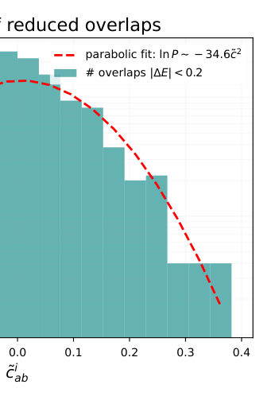 
Figure 1: Numerical evidence for the non-Abelian ergodic bipartition. We diago- nalized a 14 site next-neighbor Heisenberg chain bipartitioned into 7 site subsys- tems with next neighbor interaction t = 0.5 and open boundary conditions without resolving discrete symmetries. Nonzero values of the reduced overlap were com- puted by explicitly resolving the SU(2) symmetry and dividing out the appropriate Clebsch–Gordan coefficients and found to agree with eq. (14). We plot only states with Ja = Jb = 0.5, Ji = 0. (a) The modulus squared |˜ci ab|2 versus energy. The win- dow function is obtained by a Savitzky–Golay filter of degree 2 with bins of 2000 data points. (b) The distribution of ˜ci ab...

📷 Fig 2

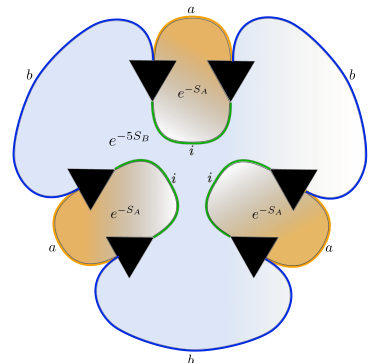 
Figure 2: Diagrammatic calculus of the ergodic bipartition. ˜c vertices are black tri- angles and eigenstate pairings are colored lines. The interior of each loop is shaded; leading order contributions to a monomial are always planar and admit a planar

📷 Fig 3

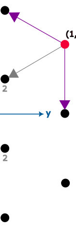 
Figure 3: (2,1) irrep of SU(3) with highest weight isospin T = 1 and hypercharge Y = 4/3. The highest weight state is shown in red, but notice that a state with larger isospin than the highest weight state also exists in the irrep; a choice of high- est weight state and associated roots is fundamentally conventional. Lattice sites indicate allowed weights. The three interior weights each have multiplicity 2. Exte- rior weights are always multiplicity one. Roots are unit lattice translations and the 3 negative roots of SU(3) are drawn as arrows and the two simple roots are colored purple. Any site in the lattice can be reached by an application of simple negative roots onto the highest...

**Summary.** This work develops a generalized framework for thermalization in quantum systems with non-Abelian symmetries, extending the ETH concept. By comparing non-Abelian microcanonical entropy to entanglement entropy, the authors derive universal logarithmic corrections that quantify the intrinsic entanglement associated with symmetry constraints. This advances our understanding of how local quantum information relates to global thermodynamic properties in complex many-body systems.

**Why it may be interesting.** It provides a rigorous theoretical framework for understanding thermalization in complex, interacting quantum systems where simple conservation laws are insufficient, directly impacting the understanding of quantum chaos and thermalization in strongly interacting regimes.

Detailed structure

**Main problem.** The paper extends the Eigenstate Thermalization Hypothesis (ETH) to quantum many-body systems possessing non-Abelian symmetries, aiming to understand how thermalization occurs when multiple non-commuting conserved charges are present.

**Main result.** The non-Abelian microcanonical entropy is shown to be closely related to the symmetry-resolved entanglement entropy, with conventional entanglement entropy differing by a universal logarithmic correction dependent on the charge density regime.

**Method.** The analysis employs non-Abelian symmetry resolution techniques, utilizing the replica trick and advanced techniques from representation theory (like the Wigner-Eckart theorem) to calculate entropy measures.

**Model / system.** The study considers general quantum many-body systems with symmetries described by compact Lie groups (e.g., SU(2)), using the N-site next-neighbor Heisenberg chain as a prototypical model.

**Key observables.** Non-Abelian microcanonical entropy, symmetry-resolved entanglement entropy, conventional entanglement entropy, and the global Casimir charge.

**Important parameters / regimes.** Finite and zero charge density regimes, and the global Casimir charge (e.g., total spin).

**Assumptions / limitations.** The analysis relies on the concept of simple reducibility and assumes the applicability of the Non-Abelian ETH ansatz.

**Figures summary.** Figures illustrate the scaling of the squared Clebsch-Gordan coefficients and the relationship between different entropy measures in various polarization regimes.

**Paper structure.** The paper develops the theory by first establishing the non-Abelian ETH, then calculating the non-Abelian microcanonical entropy using replica methods, and finally comparing this result to entanglement entropy measures to quantify the logarithmic corrections.

Abstract

The eigenstate thermalization hypothesis (ETH) posits that energy eigenstates encode local properties of the microcanonical ensemble. Motivated by recent interest in the physics of non-commuting conserved charges and the non-Abelian ETH, we study chaotic eigenstates in the presence of symmetries described by general compact Lie groups, such as SU(2). By applying non-Abelian symmetry resolution, we develop a non-Abelian microcanonical entropy and relate this entropy to the entanglement entropy of chaotic eigenstates. We find that microcanonical entropy is closely related to the symmetry-resolved entanglement entropy, which differs from conventional entanglement entropy by a universal logarithmic correction. Our results depend on the global Casimir charge, e.g. total spin. At finite charge density, we find a logarithmic enhancement to conventional entanglement entropy. At zero density, we find no such correction to entanglement entropy, but a logarithmic reduction to microcanonical entropy and symmetry-resolved entanglement entropy. We discuss the implications of our approach for non-Abelian eigenstate thermalization.

[↑ back to top](#top)

### [Entanglement entropy of an acoustic black hole](http://arxiv.org/abs/2605.30540v1)

**Authors:** P. C. van de Graaf, H. T. C. Stoof  
**Type:** theory · **Category:** quantum gases · **PDF:** <https://arxiv.org/pdf/2605.30540v1>  
**Analysis basis:** full PDF text, analyzed in chunks
**Topic relevance:** 🔥 `entanglement & information structure` **4/5** · `analog quantum simulation` **3/5** · `Keldysh / 2PI / non-Gaussian methods` **2/5** · `methods for driven-dissipative` **2/5** · `non-equilibrium dynamics` **1/5**

📷 Fig 1

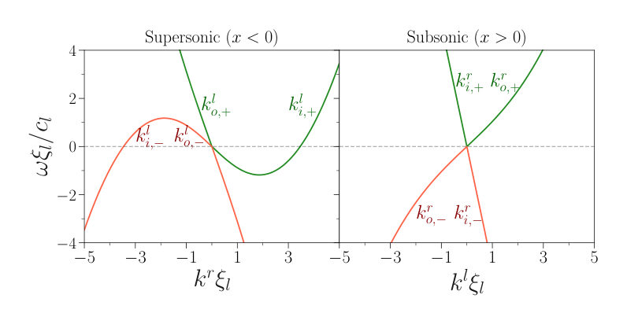 
Figure 2: The dispersion relation of the continuous Bogoliubov theory in the supersonic (left), and the subsonic (right) regions. Positive and negative normed branches are colored green and red respectively. The momenta are labeled by i/o referring to ingoing and outgoing modes respectively, and ± to differentiate between positive and negative normed solutions. The flow profile has cl/|v| = 1/2 and cr/|v| = 3/2.

📷 Fig 2

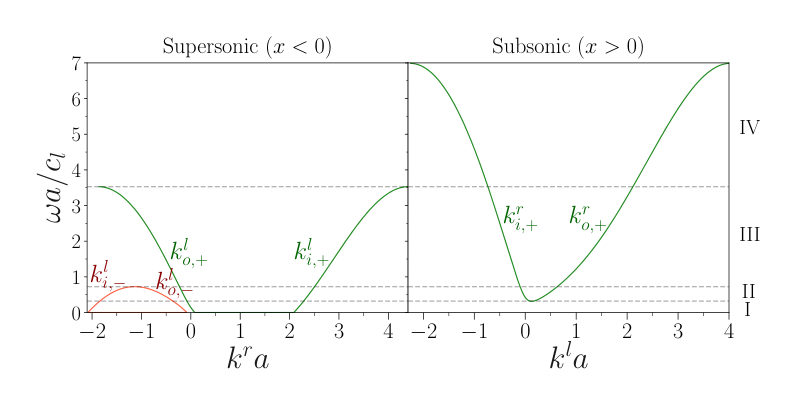 
Figure 3: The dispersion relation of the modified Bogoliubov theory in the supersonic (left), and the subsonic (right) regions for positive frequencies. Positive and negative normed branches are colored green and red, respectively. The momenta are labeled by i, o referring to ingoing and outgoing modes respectively, and ± to differentiate between positive and negative normed solutions. Different matching regimes are labeled by the roman numerals I to IV. The flow profile has cl/|v| = 1/2 and cr/|v| = 3/2. For visibility, a relatively large mass parameter ω0a/cl = 0.001 and small healing length ξl = 0.1a are used.

📷 Fig 3

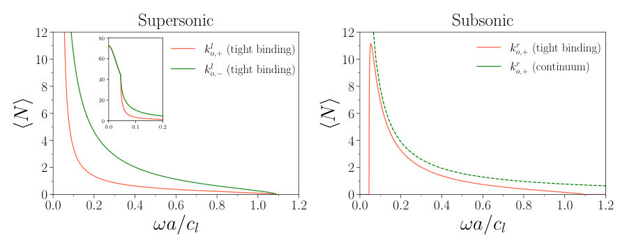 
Figure 4: The occupation numbers of outgoing Hawking pairs in the supersonic (left) and subsonic (right) regions as a function of frequency for the tight-binding model with gap ω0a/cl = 5 · 10−5, and healing length ξl = 4a. The flow profile is chosen such that cl/|v| = 1/2 and cr/|v| = 3/2. The subsonic region is compared to the analytical results for the continuous theory found by Ref. [25].

📷 Fig 4

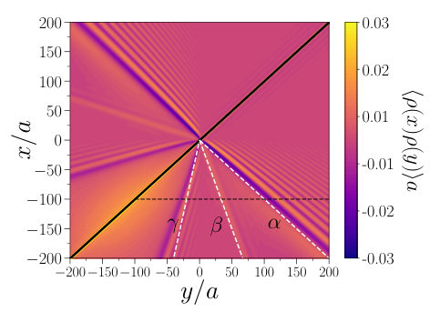 
Figure 5: The density-density correlation function of the analogue black hole. The flow profile has cl/|v| = 1/2 and cr/|v| = 3/2, with the healing length ξl = a and gap ω0a/cl = 10−4. In order to see the long-distance correlations clearly, the short-distance correlations (diagonal) are masked. Dashed white lines correspond to the peaks as described by Eq. (29), and are labeled by the Greek letters α, β and γ. The horizontal dashed line denotes the cut corresponding to Fig. 10.

📷 Fig 5

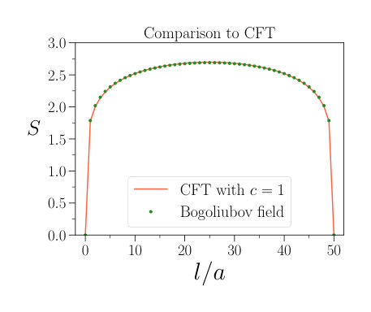 
Figure 6: The entanglement entropy of a finite-size homogeneous Bogoliubov theory for ξ = 0.01a and gap ω0a/cr = 10−8, compared to the exact results from conformal field theory.

**Summary.** This work develops a method to calculate the entanglement entropy for an acoustic black hole analogue in a Bose-Einstein condensate. The authors demonstrate that due to long-distance correlations induced by the horizon, the entanglement entropy scales with volume rather than the expected area law. This result connects condensed matter physics phenomena to fundamental concepts in quantum gravity.

**Why it may be interesting.** It provides a concrete, solvable analogue system (BEC) to study fundamental concepts from quantum gravity, such as Hawking radiation and entanglement entropy scaling laws (area vs. volume law).

Detailed structure

**Main problem.** The paper computes the entanglement entropy of an acoustic black hole analogue system.

**Main result.** The entanglement entropy exhibits a volume law scaling far from the horizon, which is well approximated by the local thermal entropy of the outgoing Hawking radiation.

**Method.** The calculation uses the correlator method for Gaussian states, involving mode-function decomposition and solving Bogoliubov-de Gennes equations.

**Model / system.** The system is an acoustic black hole realized in a superfluid Bose-Einstein condensate, governed by fluctuations described by a modified Heisenberg equation.

**Key observables.** Entanglement entropy ($S_E$), density-density correlation function, and outgoing phonon occupation numbers.

**Important parameters / regimes.** The local healing length ($\xi$) acts as the natural Planck scale; the analysis depends on the transsonic flow regime at the horizon.

**Assumptions / limitations.** The analysis relies on Bogoliubov theory and assumes the system can be treated as a continuum or a tight-binding model approximation.

**Figures summary.** Figures illustrate the acoustic black hole setup, dispersion relations showing supersonic/subsonic regions, and plots comparing entanglement entropy scaling (logarithmic vs. volume law) against subsystem size.

**Paper structure.** The paper develops the theory by first setting up the Hamiltonian and solving the Bogoliubov equations, then calculating particle creation via scattering theory, and finally applying the correlator method to derive the entanglement entropy scaling laws.

Abstract

We introduce a method to numerically compute the entanglement entropy of an acoustic black hole. It is shown that the entanglement entropy of sufficiently large subregions scales linearly with size and thus shows a volume law instead of an area law. The origin of this scaling can be traced back to the non-separable long-distance correlations due to the production of phonon pairs at the horizon. The system is shown to be locally thermal, such that the part of the entanglement entropy scaling with volume is well approximated by the thermal entropy of the outgoing Hawking radiation.

[↑ back to top](#top)

### [Metasurfaces for neutral-atom trapping](http://arxiv.org/abs/2605.30498v1)

**Authors:** Chengyu Fang, Minjeong Kim, Mark Saffman, Jennifer T. Choy, Mikhail Kats  
**Type:** both · **Category:** other · **PDF:** <https://arxiv.org/pdf/2605.30498v1>  
**Analysis basis:** full PDF text, analyzed in chunks
**Topic relevance:** 🔥 `QC/QI experiment` **4/5** · `analog quantum simulation` **3/5** · `interference shaping light` **3/5** · `quantum optics experiment` **2/5**

📷 Fig 1

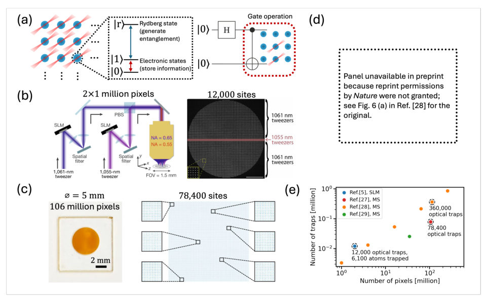 
Figure 1: Approaches to scale neutral-atom tweezer arrays. (a) Schematic of a neutral-atom quan- tum computer, where atoms are trapped in an optical-tweezer array, with qubits encoded in two electronic states (|0⟩and |1⟩). A Rydberg state (|r⟩) enables entanglement between neighboring atoms, enabling multi-qubit gates such as the CNOT shown on the right. (b) An array of 12,000 tweezer sites generated by two 1024 × 1024 SLMs (∼2 million pixels in total) using 1061 nm and 1055 nm laser, with 6,100 atoms loaded; adapted from [5]. (c) An array of 78,400 tweezer sites gen- erated by a single 5-mm-diameter metasurface with 106 million pixels (no atoms loaded); adapted from [27]. (d) An array of...

📷 Fig 2

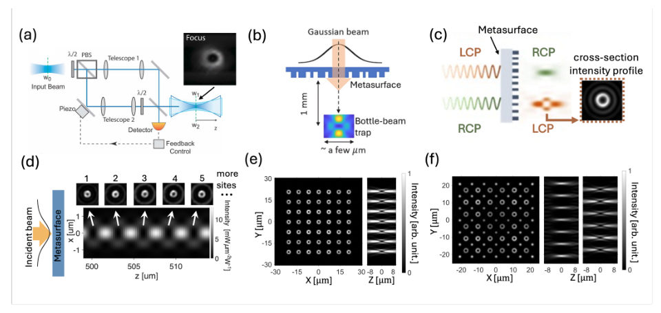 
Figure 2: Generation of optical bottle beams. (a) Bottle-beam trap generated by destructive interference of two co-propagating Gaussian beams with different waists, stabilized by an active phase lock; adapted from [56]. (b) Single dark trap generated from an incident Gaussian beam by a ∼1-mm metasurface, optimized for high efficiency and trap quality; adapted from [57]. (c) Polarization-multiplexed metasurface that generates a bright trap for one circular polarization and a dark trap for the opposite circular polarization; adapted from [58]. (d) One-dimensional array of ten dark traps generated by a metasurface; five of the sites are shown in X-Z and Y-Z, for the optic axis along Z; adapted...

📷 Fig 3

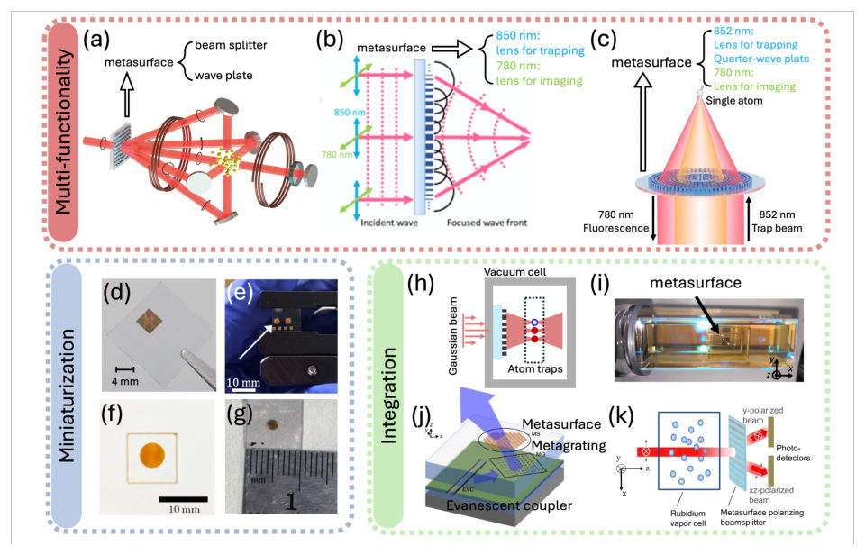 
Figure 3: Multi-functionality, miniaturization, and integration enabled by metasurfaces in atom- trapping optical systems. (a) Multi-functional metasurface for generating a MOT, combining beam splitting and polarization control to generate five cooling beams from one incident beam; adapted from [64]. (b) Polarization-multiplexed metalens, operating for two wavelengths (780 nm and 850 nm) for two orthogonal linear polarizations; adapted from [38]. (c) Wavelength-multiplexed metalens at 780 nm and 852 nm, which adds quarter-wave-plate functionality only at 852 nm; adapted from [66]. (d–g) Representative compact metasurfaces that range from sub-millimeter to a few millimeters; adapted from...

📷 Fig 4

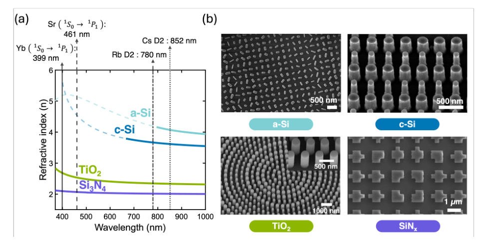 
Figure 4: Optical materials for neutral-atom trapping metasurfaces (a) Refractive index (n) as a function of wavelength for metasurface materials, including a-Si [85], c-Si [29], TiO2 [79], Si3N4 [86]. Solid curves indicate low-loss regions with κ &lt; 0.01, while dashed curves indicate absorbing regions with a larger extinction coefficient. Vertical dashed lines mark several representative atomic transitions: Yb at 399 nm, Sr at 461 nm, Rb D2 at 780 nm, Cs D2 at 852 nm. (b) Scanning electron microscope (SEM) images of metasurfaces fabricated from a-Si [65], c-Si [29], TiO2 [59], SiNx [64].

**Summary.** This review argues that optical metasurfaces are crucial for advancing neutral-atom quantum technologies by overcoming the scaling limitations of existing optical devices. They enable the creation of massive, highly controllable arrays of optical traps, such as bottle-beams, which are necessary for utility-scale quantum computing. The integration of metasurfaces promises to miniaturize and simplify complex atomic trapping setups.

**Why it may be interesting.** This work directly addresses the hardware limitations for building large quantum simulators or quantum computers based on neutral atoms, bridging the gap between fundamental quantum physics and practical quantum engineering.

Detailed structure

**Main problem.** Scaling neutral-atom arrays to the millions of sites required for utility-scale quantum computing presents a major engineering challenge.

**Main result.** Optical metasurfaces are presented as a highly scalable enabling technology that surpasses the pixel limitations of active devices like SLMs for generating complex, large-scale optical trap arrays.

**Method.** The authors review and propose using metasurfaces to generate optical tweezers and complex trapping profiles, comparing this approach against traditional active and passive optical components.

**Model / system.** The system involves trapping neutral atoms (e.g., for quantum computing) using light fields generated by optical metasurfaces. These metasurfaces provide subwavelength control over the phase, amplitude, and polarization of light.

**Key observables.** Trap site count (scaling to hundreds of thousands or millions), phase/amplitude/polarization control, and diffraction efficiency.

**Important parameters / regimes.** Pixel count (bottleneck for SLMs), trap array size (millions of sites), and operational bandwidth.

**Assumptions / limitations.** The primary assumption is that metasurfaces can effectively replace multiple complex optical components, enabling miniaturization and high scalability.

**Figures summary.** Figures illustrate the comparison of scaling capabilities between SLMs and metasurfaces, and demonstrate the generation of complex 3D trapping profiles like optical bottle-beams using metasurfaces.

**Paper structure.** The paper structure moves from identifying the scaling bottleneck in current trapping methods (SLMs, MLAs) to proposing metasurfaces as the superior solution, detailing their capabilities for complex beam shaping and integration.

Abstract

Trapped neutral atoms are one of the leading platforms for quantum information technologies, in particular for quantum computing, but scaling them to array sizes needed for utility-scale quantum computing is a major engineering challenge. Here we review optical metasurfaces as an enabling technology that provides fine control over the phase, amplitude, and polarization of light, with pixel counts far exceeding what is available with spatial light modulators (SLMs) and other active devices. The large pixel counts have recently led to demonstrations of arrays of optical tweezers with hundreds of thousands of sites and arrays of optical bottle-beams with complex three-dimensional trapping profiles. The flexibility and scalability of optical metasurfaces provides a route towards miniaturized, integrated, and highly scalable atomic experiments and instruments.

[↑ back to top](#top)

### [Engineered Randomness for Ubiquitous Quantum-Enhanced Metrology in Exponential-Dimensional Manifolds](http://arxiv.org/abs/2605.31442v1)

**Authors:** Yaoming Chu, Baiyi Yu, Hartmut Häffner, Markus Heyl, Nathan Goldman, Jianming Cai  
**Type:** both · **Category:** other · **PDF:** <https://arxiv.org/pdf/2605.31442v1>  
**Analysis basis:** full PDF text, analyzed in chunks
**Topic relevance:** 🔥 `QC/QI experiment` **4/5** · `entanglement & information structure` **2/5** · `Rydberg arrays` **1/5** · `analog quantum simulation` **1/5**

📷 Fig 1

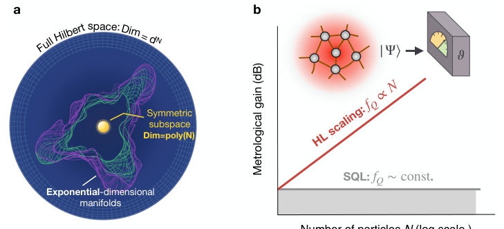 
Figure 1: Quantum-enhanced metrology from the exponentially vast Hilbert space. (a) Generic

📷 Fig 2

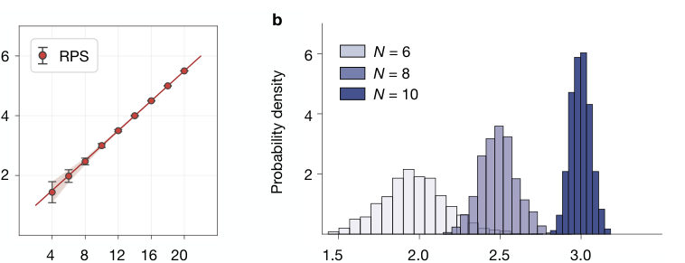 
Figure 2: Heisenberg-limited scaling emerging from engineered random unitary ensembles.

📷 Fig 3

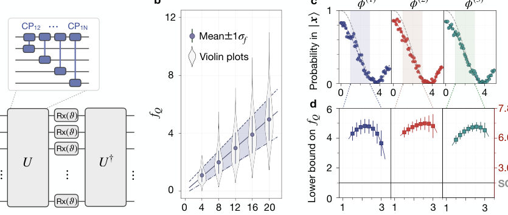 
Figure 3: Quantum-enhanced metrology using ERSs in a trapped-ion platform. (a) Time-

📷 Fig 4

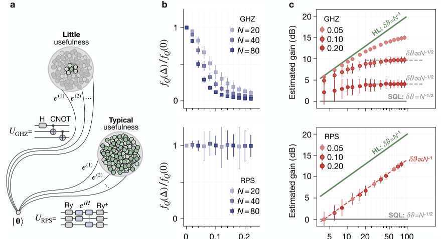 
Figure 4: Numerical analysis of metrological resilience against parameter disorder. (a)

**Summary.** This paper introduces Engineered Random States (ERSs) as a universal resource for quantum metrology, proving that superior precision scaling (Heisenberg limit) is statistically generic across exponentially large Hilbert spaces. The theoretical framework uses random unitary ensembles to calculate the average Quantum Fisher Information, which is experimentally validated on a trapped-ion quantum processor, demonstrating a significant metrological enhancement.

**Why it may be interesting.** This work provides a powerful, general paradigm showing that quantum enhancement can be accessed robustly from the vast, complex structure of high-dimensional quantum systems, directly applicable to trapped-ion and superconducting circuit platforms.

Detailed structure

**Main problem.** The core challenge is overcoming the exponential scaling barrier of the many-body Hilbert space to achieve quantum-enhanced metrology.

**Main result.** The authors demonstrate that quantum advantage (Heisenberg-limited scaling) can be a statistically generic property of Engineered Random States (ERSs) generated by random unitaries.

**Method.** The analysis uses ensemble averaging over random unitary ensembles ($\alpha$-random unitaries) to calculate the average Quantum Fisher Information ($	ext{QFI}$), confirming the scaling theoretically and experimentally.

**Model / system.** The work analyzes quantum systems of $N$ particles, focusing on ERSs generated by random unitaries, and validates the findings using a trapped-ion processor platform.

**Key observables.** Quantum Fisher Information ($	ext{QFI}$), metrological gain (in dB) beyond the Standard Quantum Limit (SQL), and the ensemble average $\mathbb{E}[F_Q]$.

**Important parameters / regimes.** The randomness parameter $\alpha$, the number of particles $N$, and the degree of disorder $\Delta$.

**Assumptions / limitations.** The analysis relies heavily on the concentration-of-measure phenomenon in high-dimensional spaces to prove that the average scaling holds for most states.

**Figures summary.** Figures compare metrological gain across the vast Hilbert space vs. the symmetric subspace; simulations show $	ext{QFI}$ density following $\mathbb{E}[f_Q] = N/4$; and the experiment shows a $6.98 \pm 0.38$ dB gain on a trapped-ion processor.

**Paper structure.** The paper systematically develops the theory by first establishing the $	ext{QFI}$ scaling using $\alpha$-random unitaries (Theory), then analyzing specific state constructions like Random Phase States and Chimera-superposition states (Theory), and finally validating the framework using random quantum circuits on a trapped-ion platform (Experiment).

Abstract

The exponential growth of many-body Hilbert space presents a fundamental barrier to quantum technology, obscuring the search for physically significant states within an astronomically vast landscape. Consequently, resources for quantum-enhanced metrology have been largely confined to the symmetric subspace whose dimensionality scales only polynomially with the particle number-leaving the vast majority of the Hilbert space largely unexplored and poorly understood. Here we challenge this paradigm by demonstrating that metrological advantage can arise as a ubiquitous feature across exponential-dimensional manifolds. By tailoring the first-moment structure of random unitaries, we uncover dense manifolds of engineered random states (ERSs) where Heisenberg-limited scaling emerges as a statistically generic property. This ubiquity endows these resource states with inherent resilience against parameter disorder. We experimentally validate this framework on a trapped-ion processor, achieving a metrological enhancement of $6.98 \pm 0.38$ dB beyond the standard quantum limit. Potential applications extend to diverse platforms, ranging from superconducting circuits and waveguide QED to solid-state spins and polar molecules. Our results establish a powerful paradigm where quantum-enhanced precision can be harvested from the exponential vastness of the Hilbert space.

[↑ back to top](#top)

### [Pseudoentanglement in constant depth: How trivial states can have non-trivial entanglement structure](http://arxiv.org/abs/2605.31448v1)

**Authors:** Alexandru Gheorghiu  
**Type:** theory · **Category:** quantum information and computing · **PDF:** <https://arxiv.org/pdf/2605.31448v1>  
**Analysis basis:** full PDF text, analyzed in chunks
**Topic relevance:** 🔥 `entanglement & information structure` **4/5** · `analog quantum simulation` **3/5** · `non-equilibrium dynamics` **1/5**

📷 Fig 1

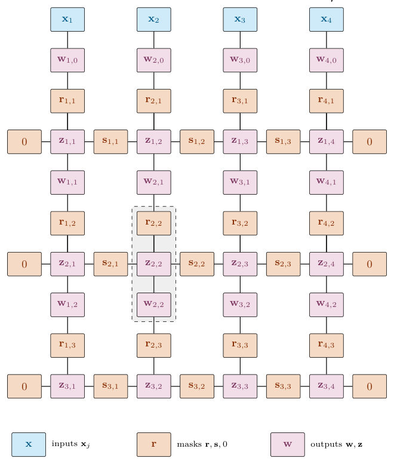 
Fig. 1: Schematic 2D layout of the randomized encoding with four input columns and three representative rows. Sky-blue boxes are input bits, vermillion boxes are mask bits, and purple boxes are outputs. The w-outputs are computed by column-local nearest-neighbor gadgets: wj,0 depends only on xj and rj,1, while wj,1 and wj,2 depend only on adjacent r-masks in the same column. The z-outputs are computed inside constant-size plaquettes: zi,j depends only on the two neighboring horizontal masks si,j−1 and si,j, and, when Mi,j = 1, the local vertical mask rj,i. The vertical wires through the w-boxes should be read as connections to the adjacent r-masks above and below them, not as connections to...

📷 Fig 2

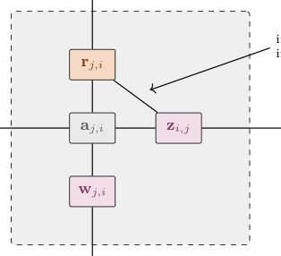 
Fig. 2: Local implementation of one plaquette. The four external ports carry rj,i from above, rj,i+1 to the row below, and the two horizontal masks si,j−1 and si,j. The plaquette computes wj,i = rj,i ⊕rj,i+1 and zi,j = si,j−1 ⊕si,j ⊕Mi,jrj,i. The gray register aj,i is only local workspace, initialized to 0 and uncomputed to 0 after use. One possible local schedule is as follows. First copy rj,i into the workspace, apply it to wj,i, and uncompute the workspace: rj,i →aj,i →wj,i followed by rj,i →aj,i. Then apply the incoming rj,i+1 from the bottom port to wj,i. Next reuse the same workspace for the horizontal mask: copy si,j−1 into aj,i, apply it to zi,j, and uncompute it; then apply si,j...

**Summary.** This paper constructs 'pseudoentangled' quantum states using shallow, local circuits whose entanglement structure is hard for quantum computers to measure. By mapping these states to local Hamiltonians, the authors prove that determining the ground state entanglement structure of 1D and 2D quantum systems is quantumly hard, provided certain cryptographic assumptions hold.

**Why it may be interesting.** This work provides a powerful tool to establish computational hardness for characterizing the ground state properties of quantum many-body systems, which is crucial for understanding the limits of quantum simulation and quantum phase detection.

Detailed structure

**Main problem.** The paper aims to construct quantum states whose entanglement structure is computationally hard to determine (pseudoentanglement), thereby separating this property from pseudorandomness in the shallow-circuit regime.

**Main result.** It constructs families of 2D-local, constant-depth quantum circuits whose output states exhibit a large, non-negligible gap in entanglement entropy across a fixed cut, demonstrating quantum hardness for learning the entanglement structure of local Hamiltonians.

**Method.** The construction relies on the quantum intractability of the Dense-Sparse Learning Parity with Noise problem, utilizing a perfect randomized encoding of a linear map to generate the pseudoentangled states.

**Model / system.** The model involves 2D-local, constant-depth quantum circuits acting on qubits, which are then mapped to local Hamiltonians on 1D and 2D lattices for physical applications.

**Key observables.** Entanglement Entropy (specifically the gap $\Delta(n)$ across a fixed cut $W$), and the spectral gap of the resulting Hamiltonians.

**Important parameters / regimes.** Circuit Depth (constant depth), System Size ($n$), and the gap size ($\Delta(n) = \omega(\log n)$).

**Assumptions / limitations.** The primary assumption is the intractability of the Dense-Sparse LPN problem for quantum polynomial-time (QPT) adversaries.

**Figures summary.** Figures schematically illustrate the 2D layout of the randomized encoding and the local implementation of a single plaquette, detailing how the output bits depend on input masks and neighboring bits.

**Paper structure.** The paper builds from cryptographic preliminaries (randomized encoding) to the main pseudoentanglement theorem, and finally applies this result to prove quantum hardness for learning the entanglement structure of ground states of 1D and 2D local Hamiltonians.

Abstract

We construct a family of 2D-local constant-depth quantum circuits that output states whose entanglement entropy across a specified cut cannot be estimated in quantum polynomial time. As constant-depth quantum circuits can be learned from polynomially many quantum samples, our resulting pseudoentangled states are implicitly public-key and not pseudorandom. This separates pseudoentanglement from pseudorandomness in the shallow-circuit regime: the former is possible, while the latter is not. The construction is based on the quantum intractability of the Dense-Sparse Learning Parity with Noise problem introduced in [DJ25] and uses a bounded-fan-in, bounded-fan-out classical randomized encoding for linear maps $\mathbf{x} \mapsto \mathbf{Mx},$ which could be of independent interest. As applications, we obtain quantum hardness for the problem of learning the entanglement structure (across a fixed cut) of the ground-state of 1D and 2D local Hamiltonians. The 1D Hamiltonian has an inverse polynomial gap, whereas the 2D one has a constant gap. This complements the result of [BZZ24] that showed only factoring-based hardness for the 1D case, though achieving a volume versus area entanglement difference.

[↑ back to top](#top)

### [Experimental Implementation of the Quantum Volunteer's Dilemma on NISQ Hardware: Noise Analysis and Digital-Twin Validation](http://arxiv.org/abs/2605.30676v1)

**Authors:** Germán D. Díaz Agreda, Jhon Alejandro Andrade Hoyos, Carlos A. Durán Paredes, Sebastián Cajas Ordoñez, Noah Dane Hebdon, Siong Thye Goh, Dax Enshan Koh  
**Type:** experiment · **Category:** quantum information and computing · **PDF:** <https://arxiv.org/pdf/2605.30676v1>  
**Analysis basis:** full PDF text, analyzed in chunks
**Topic relevance:** 🔥 `QC/QI experiment` **4/5**

📷 Fig 1

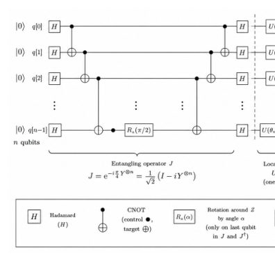 
Fig. 1 Quantum circuit implementing the N-player Quantum Volunteer’s Dilemma following the EWL protocol. The circuit consists of: (i) an entangling operator J = e−i π

📷 Fig 2

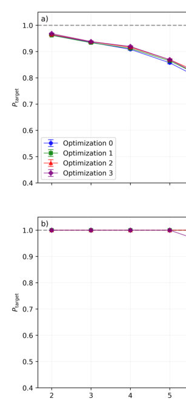 
Fig. 2 Target-state fidelity P(|1⟩⊗N) as a function of the number of players for all four optimization levels. a) raw QPU measurements. b) readout-corrected measurements. Shaded bands represent 95% t-Student confidence intervals across 20 repetitions.

📷 Fig 3

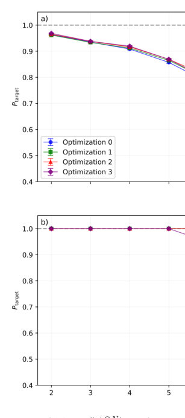 
Figure 4 compares the target-state fidelity P(|1⟩⊗N) obtained from raw QPU mea- surements, readout-corrected QPU measurements, and the Digital Twin simulation, all at optimization level L2. The Digital Twin was executed with 20 independent random seeds to assess model stability under stochastic variation; the low variance across seeds confirms that the model’s stochastic component is small relative to its systematic noise structure. For N ≤6, the Digital Twin overestimates the noise present in the raw QPU data, that is, it predicts a lower fidelity than what is experimentally observed. For N &gt; 6, the model transitions to underestimating the noise in the raw counts: the hardware degrades...

📷 Fig 4

 
Fig. 3 Heatmap of measurement outcome counts grouped by Hamming distance from the target state |1⟩⊗N, aggregated over 20 repetitions at optimization level 2. Each row corresponds to a player count N; columns represent Hamming distances dH = 0, 1, . . . , N. Color intensity encodes normalized count frequency.

📷 Fig 5

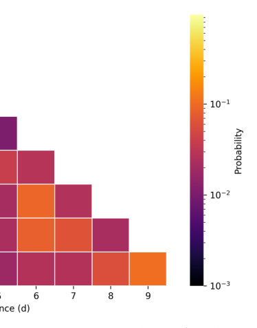 
Figure 5 presents two complementary but distinct payoff metrics at optimization level L2. Panel (a) shows the target-state weighted payoff contribution P(|1⟩⊗N)·(b−c/N): the share of the total expected payoff attributable solely to the |1⟩⊗N outcome, which decreases as that state loses probability to noise. Panel (b) shows the global average payoff Πi summed over all 2N outcomes: the full game-theoretic result that a player actually receives, which includes contributions from non-target states. These two metrics can behave very differently under noise: panel (a) tracks how well the

**Summary.** This work experimentally tests the Quantum Volunteer's Dilemma on NISQ hardware to quantify quantum advantage under noise. The results show that while the aggregate payoff remains quantum-enhanced, the fidelity of the desired quantum state degrades rapidly, limiting observable advantage to smaller system sizes. The study critically compares hardware performance against idealized noise models, highlighting the need for advanced error mitigation.

**Why it may be interesting.** It provides a concrete, game-theoretic testbed for assessing the practical limits of quantum advantage in the presence of realistic, non-ideal hardware noise, which is crucial for developing fault-tolerant quantum algorithms.

Detailed structure

**Main problem.** To experimentally determine if a quantum advantage exists in the multiplayer Quantum Volunteer's Dilemma when implemented on noisy intermediate-scale quantum (NISQ) hardware.

**Main result.** The global average payoff robustly exceeds the classical Nash equilibrium across the tested range, demonstrating aggregate quantum advantage despite noise. However, the practical observability of state-level advantage is limited to $N \le 8$ under readout correction.

**Method.** The study uses experimental measurements on superconducting quantum processors, comparing raw data against readout-corrected results and a theoretical 'Digital Twin' simulation.

**Model / system.** The system is the multiplayer Quantum Volunteer's Dilemma, implemented using the EWL quantization protocol on the ibm_kingston NISQ backend. The analysis systematically varies the number of players ($N=2$ to $9$) and transpiler optimization levels.

**Key observables.** Target-state fidelity, global average payoff, and the comparison against the classical Nash equilibrium payoff.

**Important parameters / regimes.** Number of players ($N$), readout error correction effectiveness, and the transition point where single-qubit errors give way to multi-qubit contributions ($N \approx 6$).

**Assumptions / limitations.** The Digital Twin model assumes first-order, independent per-qubit noise channels, which fails to capture higher-order effects like crosstalk or temporal drift at large $N$.

**Figures summary.** Figures compare target-state fidelity decay across different noise mitigation levels and show the comparison between target-state weighted payoff and the global average payoff relative to classical benchmarks.

**Paper structure.** The paper follows a structure of problem definition (Quantum Volunteer's Dilemma), methodology (NISQ implementation, error mitigation, Digital Twin comparison), results presentation (fidelity decay, payoff analysis), and concluding discussion on the limits of quantum advantage observability.

Abstract

We present an experimental implementation of the multiplayer Quantum Volunteer's Dilemma on noisy intermediate-scale quantum (NISQ) hardware, executed on the ibm_kingston backend via Qiskit Runtime. The game is evaluated for N = 2 to 9 players under four transpiler optimization levels, with 20 independent repetitions per configuration and 2048 shots per circuit, including post-processing readout error correction via mthree. Target-state fidelity decays with system size but remains above 70% (corrected) through N = 9. With readout correction, the global average payoff reproduces the quantum theoretical benchmark exactly for N <= 6 and exceeds the classical Nash equilibrium across the full tested range. Optimization level 2 is selected as the reference configuration after gate count analysis reveals that levels 2 and 3 produce identical transpiled circuits, with level 2 achieving superior fidelity stability. A Hamming distance analysis of raw measurement counts shows that single-qubit errors dominate at small N, with multi-qubit contributions growing beyond N = 6. A calibration-based digital twin captures global payoff trends but exhibits a linear fidelity decay profile that diverges from the hardware behavior at large N, exposing the limits of first-order independent per-qubit noise models. These results demonstrate that aggregate quantum advantage in multiplayer games is robust to NISQ noise conditions across the full tested range, while the practical observability of state-level advantage is constrained to N <= 8 under post-processed readout correction.

[↑ back to top](#top)

### [Graph automorphisms to obtain Clifford symmetries in open and closed qudit models](http://arxiv.org/abs/2605.30428v1)

**Authors:** Charlie Nation, Rick P. A. Simon, Shreya Banerjee, Francesco Martini, Alessandro Ricottone, Federico Cerisola, Luca Dellantonio  
**Type:** theory · **Category:** quantum information and computing · **PDF:** <https://arxiv.org/pdf/2605.30428v1>  
**Analysis basis:** full PDF text, analyzed in chunks
**Topic relevance:** `correlated / nonlocal dissipation` **3/5** · `driven-dissipative phase transition` **3/5** · `methods for driven-dissipative` **3/5** · `Keldysh / 2PI / non-Gaussian methods` **2/5** · `analog quantum simulation` **2/5** · `non-equilibrium dynamics` **2/5** · `non-equilibrium universality` **2/5** · `Kondo & dissipative impurity` **1/5** · `correlated cavity matter` **1/5** · `entanglement & information structure` **1/5**

📷 Fig 1

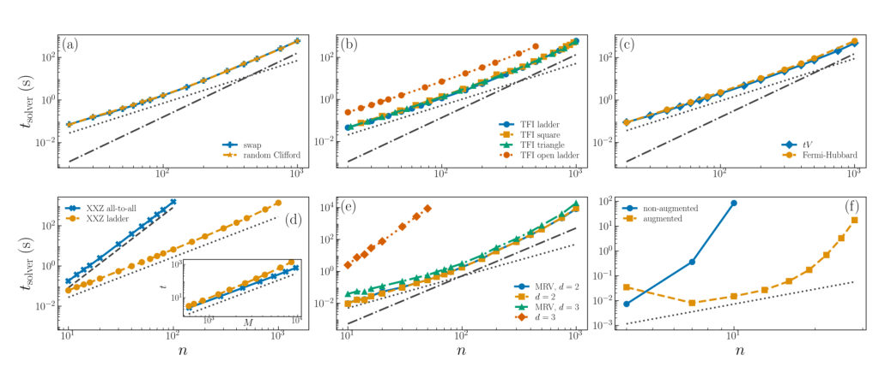 
FIG. 1. Time taken to find Clifford symmetries on the models in Appendix F. (a) Random Pauli Hamiltonian with an injected SWAP (blue) and RCC (yellow, see main text) symmetry. (b) TFI model on differing geometries for open and closed systems. (c) Fermionic models after Jordan-Wigner transformation (see Appendix F): the disordered tV ladder (blue), and a Fermi-Hubbard chain (yellow). (d) Heisenberg XXZ with local fields on each site for a ladder (yellow) and all-to-all connected (blue) geometries. Scaling with number of Paulis M shown in inset. (e) Highly symmetric Toric code (cg = 0) for d = 2, 3, comparing bliss method to MRV search in Appendix E. (f) Toric code (cg , cz , cx), comparing...

📷 Fig 2

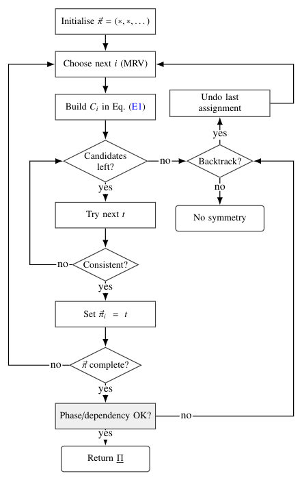 
FIG. 2. Search algorithm for constructing a permutation Π.

**Summary.** This paper develops a general algorithmic approach to find Clifford symmetries in qudit systems by reformulating the problem as a Graph Automorphism (GA) problem. It constructs a graph based on Pauli commutation invariants and uses advanced search heuristics like WL refinement and MRV to find the symmetries. The method is robust enough to handle both closed Hamiltonians and open Liouvillian dynamics.

**Why it may be interesting.** This work provides a powerful, general algorithmic framework for characterizing symmetries in complex quantum models, which is crucial for understanding conserved quantities and simplifying the analysis of quantum dynamics in both closed and open settings.

Detailed structure

**Main problem.** The paper addresses the theoretical challenge of finding Clifford symmetries for quantum systems, which is mapped to a computationally hard Graph Automorphism (GA) problem.

**Main result.** An algorithm is presented that successfully finds these symmetries for general qudit systems, extending the formalism from closed Hamiltonians to open Liouvillian systems.

**Method.** The core method involves constructing a colored, edge-labeled graph based on the Pauli commutation relations and encoding the symmetry search as finding a graph automorphism that preserves these invariants.

**Model / system.** The work applies to general qudit systems, covering both closed systems described by Hamiltonians (e.g., Toric Code, TFI) and open systems governed by GKSL master equations.

**Key observables.** Clifford symmetries ($\hat{S}$), graph automorphisms ($\Pi$), Pauli commutation relations ($\langle \vec{p}_i, \vec{p}_j 
angle$), and phase correction vectors ($\vec{\phi}$).

**Important parameters / regimes.** The local dimension $d$ of the qudits, the number of qudits $n$, and the structure of the Hamiltonian/Liouvillian.

**Assumptions / limitations.** The search relies on mapping the symmetry problem to GA, which is computationally intensive, and the phase correction step requires careful handling beyond the pure graph structure.

**Figures summary.** Figures illustrate the time scaling of symmetry finding for various models (Random Pauli, TFI, Heisenberg XXZ, Toric Code) comparing different search heuristics (MRV vs. bliss).

**Paper structure.** The paper builds from establishing the GA mapping for symmetries, detailing the graph construction using Pauli invariants, refining the search using WL coloring and MRV heuristics, and finally extending the formalism to open systems and specific physical examples like the ladder structure.

Abstract

In the recent article [arXiv:2605.18966], we demonstrated that finding Clifford symmetries can be mapped to a Graph Automorphism (GA) problem. Here, we provide an algorithm to obtain such symmetries on general qudit systems, that works on the principle of encoding Clifford invariants of a Hamiltonian onto properties of a graph. Labelling Hamiltonian terms as vertices, a permutation of such vertices that respects the Clifford invariants (a GA) is both a valid Clifford, and a symmetry up to phase correction checks. We test this on multiple physical models and discuss the scaling with respect to the number of qudits and Pauli strings, as well as various strategies for optimisation in different regimes. We further show that the graph automorphism representation of Clifford symmetries can be expanded to open quantum systems.

[↑ back to top](#top)

### [A mathematical framework for dynamic emergent constraints in climate science](http://arxiv.org/abs/2605.30684v1)

**Authors:** Francesco Ragone, Valerio Lucarini  
**Type:** theory · **Category:** statistical mechanics · **PDF:** <https://arxiv.org/pdf/2605.30684v1>  
**Analysis basis:** full PDF text, analyzed in chunks
**Topic relevance:** `Keldysh / 2PI / non-Gaussian methods` **3/5** · `methods for driven-dissipative` **3/5** · `correlated / nonlocal dissipation` **2/5** · `driven-dissipative phase transition` **2/5** · `non-equilibrium dynamics` **2/5** · `non-equilibrium universality` **2/5** · `analog quantum simulation` **1/5** · `entanglement & information structure` **1/5**

📷 Fig 1

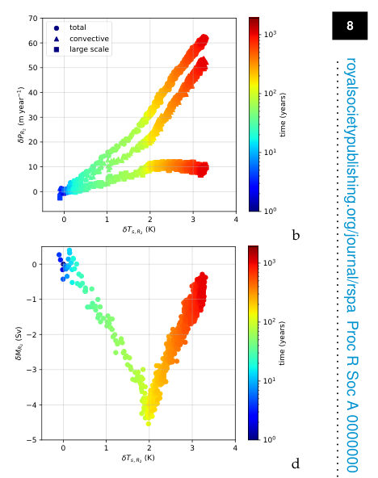 
Figure 1. Scatter plot of ensemble average response of global precipitation (total, convective and large scale) vs

📷 Fig 2

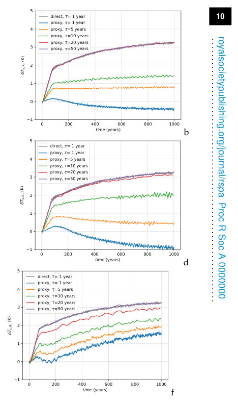 
Figure 2. Global surface temperature response, original direct simulation at one year average (grey) and proxy

📷 Fig 3

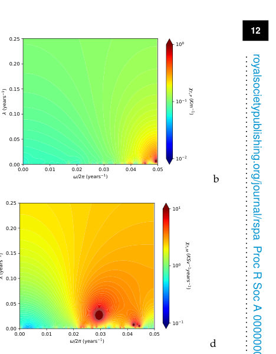 
Figure 3. a) Causality index as function of coarse graining time scale τ, in red (blue) global surface temperature as

📷 Fig 4

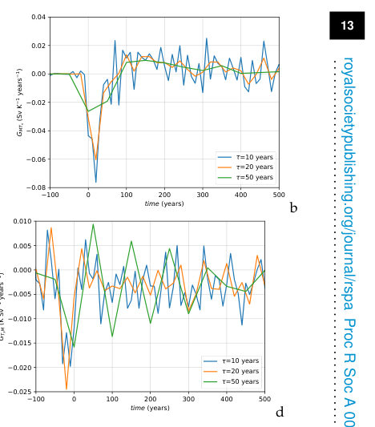 
Figure 4. a) AMOC index response, observed annual averages (grey) and proxy reconstructed using global surface

**Summary.** This work establishes a mathematical framework for dynamic emergent constraints in climate science by generalizing linear response theory. It uses proxy Green's functions and causality indices to determine how relationships between observables (like temperature and precipitation) are constrained by the observation time scale. This provides a powerful, mathematically grounded protocol for analyzing complex, non-equilibrium physical systems.

**Why it may be interesting.** The rigorous mathematical machinery developed—using linear response theory, Green's functions, and causality indices—is highly transferable to analyzing non-equilibrium dynamics in open quantum systems, such as those involving dissipation or environmental coupling.

Detailed structure

**Main problem.** To develop a rigorous mathematical framework for quantifying 'dynamic emergent constraints' between different physical observables in complex systems like the climate, aiming to reduce projection uncertainties.

**Main result.** The framework generalizes traditional constraints to 'integral dynamic emergent constraints,' showing that the existence and form of these constraints depend critically on the causality of the system's proxy Green's function and the coarse-graining time scale.

**Method.** The study employs linear response theory, utilizing susceptibility ratios and proxy Green's functions derived from climate model simulations to establish integral relationships between observable responses to external forcing.

**Model / system.** The analysis is applied to global warming simulations using the MPI-ESM climate model, focusing on observables such as global surface temperature, precipitation, and AMOC intensity.

**Key observables.** Global surface temperature (T_s), Precipitation (P), Atlantic Meridional Overturning Circulation (M), and their respective responses ($\delta\Phi$).

**Important parameters / regimes.** Coarse-graining time scale ($	au$), which dictates whether the relationship is instantaneous, directional, or reciprocal.

**Assumptions / limitations.** The theory relies on the assumption that the system dynamics can be described by a stochastic dynamical system amenable to linear response theory, and that the relationship can be captured by the proxy Green's function.

**Figures summary.** Figures illustrate the causality index ($C_{\Phi_1\Phi_2}$) as a function of the time scale $	au$, showing how the predictive power and directionality of constraints change with the observation window.

**Paper structure.** The paper builds from defining the problem using linear response theory to generalizing constraints into integral forms. It then applies this theory to climate model data, analyzing how the causality index and proxy Green's functions reveal the dependence of emergent constraints on the coarse-graining time scale $	au$.

Abstract

Emergent constraints in climate science are empirical relations that link the response to a forcing of a physical observable to the properties of other observables, with the aim of reducing climate change projection uncertainties. Here we use recent results in linear response theory to develop a mathematical framework for dynamic emergent constraints, a class of emergent constraints linking the response of different observables to the same forcing. We show how traditional dynamic emergent constraints are a special case of more general relations, that we call integral dynamic emergent constraints. These relations allow to compute the response of a predictand as the convolution of the response of a predictor and the proxy Green's function of the predictand-predictor pair. The conditions for the existence of integral emergent constraints are related to the causality of the proxy Green's function and the time scales at which the system is observed. We apply this framework to global warming simulations with the MPI-ESM climate model, to study dynamic emergent constraints between different observables. These results allow to put the theory of dynamic emergent constraints on firm mathematical ground, and suggest a protocol to identify necessary conditions for the existence of such relations in climate data.

[↑ back to top](#top)

### [Activity-Enhanced Ordering in Fluctuation-Induced First-Order Transitions](http://arxiv.org/abs/2605.30887v1)

**Authors:** Suvendra K. Sahoo  
**Type:** theory · **Category:** statistical mechanics · **PDF:** <https://arxiv.org/pdf/2605.30887v1>  
**Analysis basis:** full PDF text, analyzed in chunks
**Topic relevance:** `Keldysh / 2PI / non-Gaussian methods` **3/5** · `driven-dissipative phase transition` **3/5** · `non-equilibrium universality` **3/5** · `methods for driven-dissipative` **2/5** · `non-equilibrium dynamics` **2/5** · `Frenkel-Kontorova` **1/5** · `correlated / nonlocal dissipation` **1/5**

📷 Fig 1

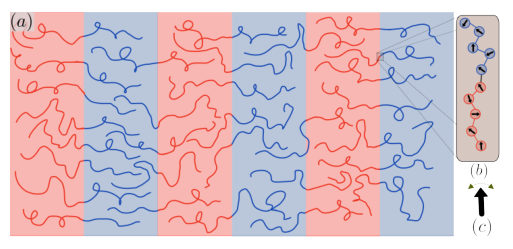 
FIG. 1. (a) Schematic illustration of active diblock copoly- mer with equal length subchains exhibiting microphase sepa- ration, (b) Red and blue segments represent distinct monomer species; interactions between unlike monomers are energeti- cally unfavorable compared to like-like interactions, (c) Each monomer possesses a self-propulsion velocity, with its direc- tion (indicated by arrows) evolving via diffusive dynamics.

📷 Fig 2

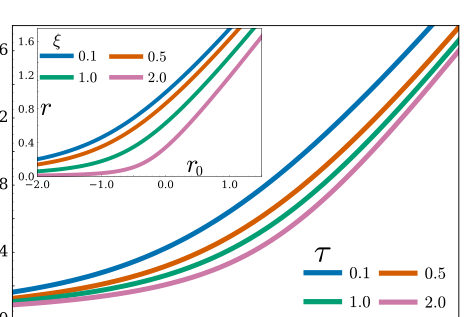 
FIG. 2. Renormalized mass parameter r as a function of r0 for different activity strengths τ. Increasing τ suppresses fluctua- tion corrections, reduces r, and shifts the transition to higher temperatures. The renormalized mass r remains strictly pos- itive, indicating the absence of a spinodal instability. Inset: Dependence on activity ξ.

📷 Fig 3

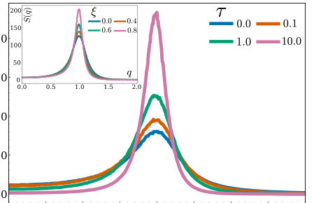 
FIG. 3. Static structure factor S(q) as a function of wave number q for increasing activity τ, showing an enhanced and sharpened dominant peak. Inset: S(q) for increasing ξ. Pa- rameters: r0 = −0.5, u = κ = q0 = 1.0, D = 0.5, ξ = a = 0; τ = 1.0 in the inset.

📷 Fig 4

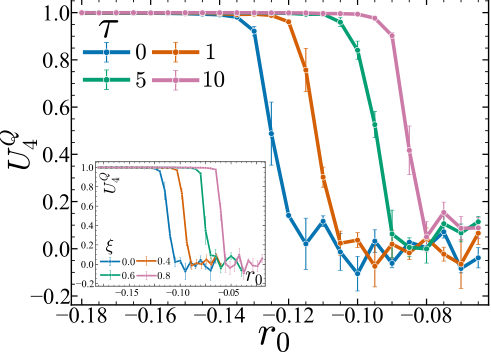 
FIG. 4. Binder cumulant U Q 4 for the isotropic–nematic tran- sition at different activity strengths τ (inset: dependence on ξ). Increasing activity shifts the transition to higher temper- atures, indicating enhanced stability of the nematic phase. Parameters: u = κ = q0 = 1.0, D = 0.02, ξ = a = 0, L = 16π, R = 256; τ = 1.0 in the inset.

**Summary.** This work analyzes how active noise modifies fluctuation-driven first-order phase transitions in condensed matter systems. The authors show that increasing activity systematically suppresses the fluctuation corrections, thereby stabilizing the ordered phase at higher temperatures. This establishes activity as a powerful, generic control parameter for tuning the transition strength.

**Why it may be interesting.** The study provides a general theoretical framework for understanding how non-equilibrium driving forces (activity) can tune the nature of phase transitions, moving them away from purely equilibrium predictions.

Detailed structure

**Main problem.** The paper investigates how introducing activity, modeled by correlated noise, modifies fluctuation-induced first-order phase transitions, particularly those governed by the Brazovskii mechanism.

**Main result.** Activity systematically suppresses the fluctuation effects driving the first-order transition, shifting the transition to higher temperatures and enhancing ordering without causing spinodal instability.

**Method.** The analysis employs response field formalism, Dyson equations, and functional integral methods to calculate renormalized propagators and effective potentials in the presence of colored noise.

**Model / system.** The system is modeled by a scalar order parameter $\phi(x, t)$ governed by a relaxational dynamics equation derived from a Swift–Hohenberg-like free energy functional. Activity is introduced via non-equilibrium, spatiotemporally correlated noise $\zeta(x, t)$.

**Key observables.** Renormalized mass parameter ($r$), static structure factor $S(q)$, and the Binder cumulant $U_Q^4$ for the nematic order parameter $Q$.

**Important parameters / regimes.** Activity strength (controlled by noise correlation time $	au$ and length $\xi$), and the bare parameters of the free energy functional ($r_0, u, \kappa$).

**Assumptions / limitations.** The analysis relies on perturbative expansions (e.g., decoupling interaction terms) and assumes the system dynamics are well-described by the given relaxational equation.

**Figures summary.** Figures illustrate the suppression of fluctuation effects (e.g., Fig. 2 showing $r$ vs. $	au$) and the enhancement of ordering, with the Binder cumulant (Fig. 4) confirming the transition shift with activity.

**Paper structure.** The paper progresses by first establishing the theoretical framework using response field methods to analyze the effect of activity on the transition character. It then develops the necessary equations of state and compares results across different activity limits ($	au 	o 0$ vs. $	au 	o \infty$), culminating in numerical simulations confirming the suppression of fluctuations.

Abstract

Fluctuations can drive otherwise continuous phase transitions to first order through the Brazovskii mechanism. We study how these fluctuation-induced transitions are modified in active systems by introducing nonequilibrium spatiotemporally correlated noise. We show that, while the transition remains fluctuation-induced first order, activity systematically suppresses these fluctuation effects, shifting the transition to higher temperatures and rendering it increasingly weakly first order. As a result, ordering is enhanced without inducing a spinodal instability of the isotropic phase, as confirmed by direct numerical simulations. In the strong-activity limit, fluctuation effects disappear and mean-field behavior is recovered. Our results identify activity as a generic control parameter for tuning the strength of fluctuation-induced first-order transitions.

[↑ back to top](#top)

### [Mean-squared displacements of rough particles in polydisperse granular gases](http://arxiv.org/abs/2605.30474v1)

**Authors:** Anna S. Bodrova  
**Type:** theory · **Category:** statistical mechanics · **PDF:** <https://arxiv.org/pdf/2605.30474v1>  
**Analysis basis:** full PDF text, analyzed in chunks
**Topic relevance:** `non-equilibrium dynamics` **3/5** · `non-equilibrium universality` **3/5** · `Keldysh / 2PI / non-Gaussian methods` **2/5** · `methods for driven-dissipative` **2/5** · `Frenkel-Kontorova` **1/5** · `analog quantum simulation` **1/5** · `correlated / nonlocal dissipation` **1/5** · `driven-dissipative phase transition` **1/5** · `scars & prethermalization` **1/5**

📷 Fig 1

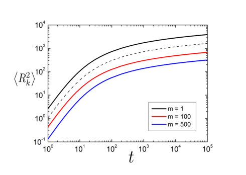 
FIG. 1. Time dependence of partial MSDs (Eq. 29) in a ternary granular mixture. The restitution coefficients ε = 0.5, β = 0.5. The partial number densities of particles are n1 = n2 = n3 = 0.001. The masses of species are m1 = 1, m2 = 100, m3 = 500 the diameters σ1 = 1, σ2 = 1001/3, σ3 = 5001/3. The initial translational granular temperatures are T tr 1 (0) = 1, T tr 2 (0) = 16.6522, T tr 3 (0) = 24.4936, The ini- tial rotational granular temperatures are T rot 1 (0) = 1.39492, T rot 2 (0) = 24.3036, T rot 3 (0) = 42.4045. The black dashed line corresponds to the total MSD R2(t) (Eq. (32)).

📷 Fig 2

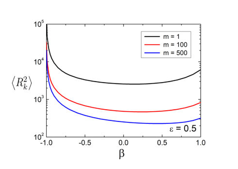 
FIG. 2. Time dependence of partial MSDs R2 k(t) (Eq. 29) in a ternary granular mixture at time t = 10000. The normal restitution coefficient ε = 0.5. The partial number densities of particles are n1 = n2 = n3 = 0.001. The masses of species are m1 = 1, m2 = 100, m3 = 500 the diameters σ1 = 1, σ2 = 1001/3, σ3 = 5001/3.

📷 Fig 3

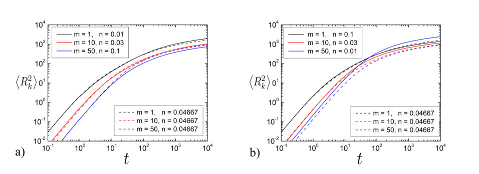 
FIG. 3. Time dependence of partial MSDs (Eq. 29) in a ternary granular mixture. The restitution coefficients are ε = 0.9, β = 0.9. The masses of species are m1 = 1, m2 = 10, m3 = 50 the diameters are equal σ1 = 1, σ2 = 1, σ3 = 1. The total number density is n = 0.14.

📷 Fig 4

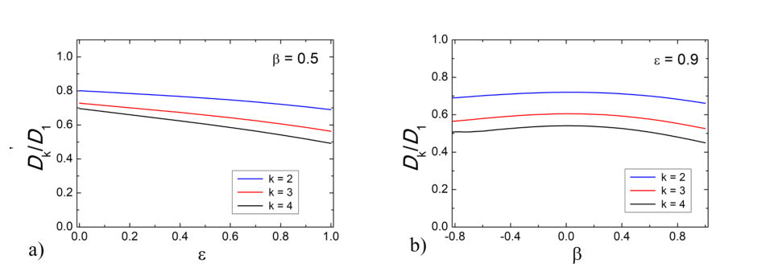 
FIG. 4. The dependence of the ratio of the diffusion coefficients D2/D1, D3/D1, D4/D1 (Eq. 23)) in a mixture of rough granular particles of four different types on the restitution coefficient ε (a) and tangential restitution coefficient β (b). The masses are m1 = 1, m2 = 2, m3 = 3, m4 = 4 the diameters σ1 = 1, σ2 = 21/3, σ3 = 31/3, σ4 = 41/3. The partial number densities of the particles are n1 = n2 = n3 = n4 = 0.1.

**Summary.** This theoretical work analyzes the diffusion and mean-squared displacements of rough particles in a granular gas. By incorporating particle roughness via restitution coefficients, the authors show that particle motion is highly sensitive to these mechanical properties. The key finding is the emergence of ultraslow, logarithmic diffusion at long times, providing insights into non-equilibrium transport phenomena.

**Why it may be interesting.** While focused on classical granular dynamics, the study of non-equilibrium energy dissipation, cooling laws (Haff's law), and anomalous diffusion ($\log t$ scaling) provides theoretical tools relevant to understanding energy relaxation in complex many-body systems, which has parallels in quantum many-body physics.

Detailed structure

**Main problem.** The paper investigates the diffusion coefficients and mean-squared displacements (MSDs) of rough particles within a polydisperse granular gas undergoing a homogeneous cooling state.

**Main result.** The MSD exhibits ultraslow motion characterized by a logarithmic time-dependence ($\langle R^2(t) 
angle \propto \log t$) at long times, and the particle motility is strongly influenced by surface roughness.

**Method.** The analysis uses kinetic theory approaches, deriving MSDs from velocity correlation functions by solving coupled differential equations for granular temperatures.

**Model / system.** The system is a polydisperse granular gas modeled by binary collisions, incorporating particle roughness via normal ($\epsilon$) and tangential ($eta$) restitution coefficients. The dynamics are analyzed in the homogeneous cooling state.

**Key observables.** Diffusion coefficients ($D_k(t)$), Mean-Squared Displacements ($\langle \mathbf{R}^2(t) 
angle$), and partial granular temperatures ($T_{tr,k}, T_{rot,k}$).

**Important parameters / regimes.** Normal and tangential restitution coefficients ($\epsilon, eta$), particle size/mass polydispersity, and time scales ($	au_0$).

**Assumptions / limitations.** The system is assumed to be in a rarefied gas regime dominated by binary collisions, and approximations like the adiabatic limit and molecular chaos hypothesis are employed.

**Figures summary.** Figures illustrate the time dependence of partial MSDs for ternary mixtures, showing dependence on parameters like $eta$ and particle mass/density.

**Paper structure.** The paper progresses from defining the system dynamics and collision rules to deriving the MSD in terms of velocity correlation functions, applying approximations like the adiabatic limit, and finally presenting the long-time asymptotic behavior of the MSD.

Abstract

We investigate the diffusion coefficients and mean-squared displacements in a polydisperse granular gas in a homogeneous cooling state by considering the roughness of the particles. We study their dependence on the normal and tangential restitution coefficients. We show that the motility of particles is strongly affected by their mechanical properties and surface characteristics.

[↑ back to top](#top)

### [Topological Phenomena Protected by Diabolical Textures](http://arxiv.org/abs/2605.30421v1)

**Authors:** Sayantan Mandal, Neelima Pulletikurty, Abhishodh Prakash  
**Type:** theory · **Category:** other · **PDF:** <https://arxiv.org/pdf/2605.30421v1>  
**Analysis basis:** full PDF text, analyzed in chunks
**Topic relevance:** `analog quantum simulation` **3/5** · `Keldysh / 2PI / non-Gaussian methods` **2/5** · `driven-dissipative phase transition` **2/5** · `entanglement & information structure` **2/5** · `methods for driven-dissipative` **2/5** · `non-equilibrium universality` **2/5** · `non-equilibrium dynamics` **1/5**

📷 Fig 1

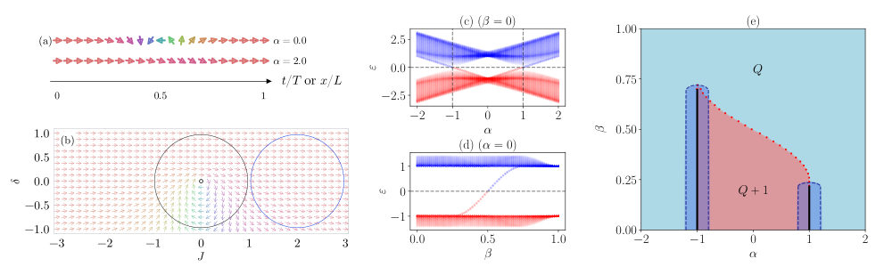 
FIG. 1. (a,b) The Thouless charge pump can be interpreted as a non-trivial temporal texture generated by dynamically encircling the diabolical point of the Rice-Mele model. The texture and the corresponding charge pump is trivial when the diabolical point is not enclosed. (c) These textures can also be embedded in the spatial directions when the ground state carries an extra charge. As the non-trivial texture is eliminated by tuning α in Eq. (4), the spectral gap closes as the charge is expelled at the trap-scaling critical points α = ±1. (d) By tuning β in Eq. (10), the texture and trapped charge can be squeezed into the boundary (for open boundary conditions) or a defect (for periodic...

📷 Fig 2

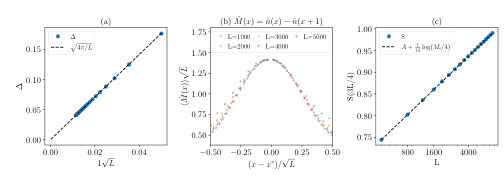 
FIG. 2. Finite size scaling of the spectral gap (a), local ob- servables (b) and von Neumann entanglement entropy for a cut placed at the trapping node (c) at the trap-scaling criti- cal point α∗= −1 in Eq. (4). These compare with the usual forms by replacing the infrared length scale with Lϑ. For our model of free fermions, ϑ = 1/2.

📷 Fig 3

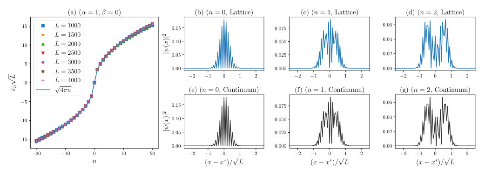 
FIG. 3. Single particle energy levels (a) and eigenfunctions (b-d) of the microscopic model near the Fermi level compared with the continuum energy levels (a) wavefunctions (e-g) in Eqs. (20) and (21) derived from analogy with Dirac Landau levels.

**Summary.** This work introduces 'diabolical textures' as a new source of topological phenomena in inhomogeneous quantum systems, modeled using fermions on a lattice. The authors show that these textures create distinct gapped phases separated by unique 'trap-scaling' critical points. By combining continuum field theory with homotopy methods, they establish a general classification scheme for these robust topological features.

**Why it may be interesting.** The concept of 'diabolical textures' provides a powerful, geometrically motivated framework for classifying topological phases beyond standard symmetry protection, which is highly relevant for designing novel quantum materials.

Detailed structure

**Main problem.** The paper investigates a novel class of topological phenomena arising from the adiabatic spatial variation of quantum states, termed 'diabolical textures,' in inhomogeneous electronic systems.

**Main result.** These distinct topological textures lead to gapped states separated by unique 'trap-scaling' critical points, which are stable against weak perturbations and can be systematically classified using homotopy theory.

**Method.** The analysis combines continuum field theory (bosonization) with finite-size scaling arguments, mapping the low-energy physics near criticality to a 2D Dirac fermion in a magnetic field.

**Model / system.** The primary model is a non-interacting fermion system described by a lattice Hamiltonian, exemplified by the spatially embedded Thouless pump (Rice-Mele model). The theory is generalized to arbitrary spatial dimensions and symmetries.

**Key observables.** Spectral gap ($\Delta$), entanglement entropy ($S(b)$), and the critical scaling exponent ($\vartheta$).

**Important parameters / regimes.** The parameters defining the texture, such as $\delta$ and $J$, and the critical point characterized by $\alpha^* = \pm 1$.

**Assumptions / limitations.** The analysis assumes slow spatial variation of parameters and relies on bosonization techniques near the critical points.

**Figures summary.** Figures illustrate the Thouless pump's spatial embedding, the finite-size scaling of the spectral gap ($\Delta \sim L^{-1/2}$), and the comparison of single-particle energy spectra between lattice and continuum descriptions.

**Paper structure.** The paper progresses from introducing the physical model (Thouless pump/Rice-Mele), deriving the low-energy continuum theory, establishing the unique trap-scaling critical behavior, and finally generalizing the classification framework using homotopy theory.

Abstract

We present a new class of topological phenomena in inhomogeneous systems arising from the adiabatic spatial embedding of parametrized families of quantum states such as charge pumps and their generalizations. We demonstrate that each topologically distinct class of these "diabolical textures" gives rise to distinct gapped states that are separated by "trap-scaling" critical points. When the texture varies sufficiently rapidly in space, the critical line terminates abruptly, producing an "unnecessary critical" surface. We demonstrate our results using a microscopic model of non-interacting fermions with a spatially embedded Thouless pump. We study its phase diagram comprehensively and establish its stability to arbitrary perturbations, including interactions, in the vicinity of the critical regions. For systems in arbitrary spatial dimensions and global symmetries, we present a framework to systematically classify diabolical textures using Kitaev's $Ω$ spectrum conjecture.

[↑ back to top](#top)

### [Functional methods for quantum thermodynamics](http://arxiv.org/abs/2605.31112v1)

**Authors:** Sibo Wang, Samuel Degen, Haozhao Liang  
**Type:** theory · **Category:** statistical mechanics · **PDF:** <https://arxiv.org/pdf/2605.31112v1>  
**Analysis basis:** full PDF text, analyzed in chunks
**Topic relevance:** `Keldysh / 2PI / non-Gaussian methods` **3/5** · `analog quantum simulation` **3/5** · `methods for driven-dissipative` **2/5** · `driven-dissipative phase transition` **1/5** · `entanglement & information structure` **1/5** · `non-equilibrium dynamics` **1/5** · `non-equilibrium universality` **1/5**

📷 Fig 1

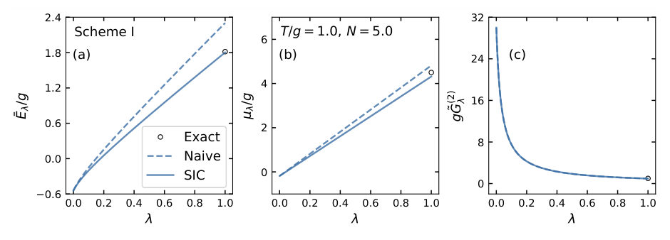 
FIG. 1. Flow evolution for scheme I (minimal closure) at T/g = 1.0 and N = 5.0. Panels (a)–(c) show the running free energy per particle, chemical potential, and connected two-density correlator as functions of λ, respectively. Dashed and solid lines denote the naive and SIC formulations, respectively. The open circle marks the exact result in the fully interacting theory at λ = 1.

📷 Fig 2

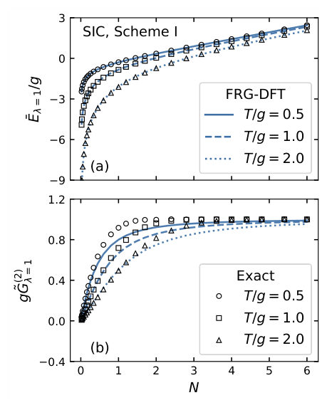 
FIG. 2. Equation of state from scheme I (minimal closure) with SIC at three different temperatures T/g. Panels (a) and (b) show ¯E/g and g ˜G(2), respectively, compared with the exact thermodynamics.

📷 Fig 3

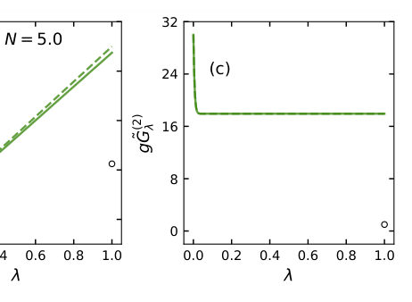 
FIG. 3. The same as Fig. 1, but for the truncation scheme II (frozen closure).

📷 Fig 4

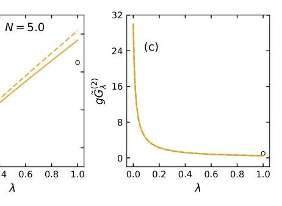 
FIG. 4. The same as Fig. 1, but for the truncation scheme III (effective occupation closure).

📷 Fig 5

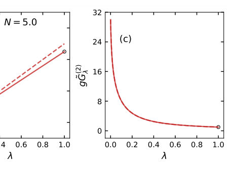 
FIG. 5. The same as Fig. 1, but for the truncation scheme IV (maximum-entropy closure).

**Summary.** This work advances Functional Renormalization Group Density Functional Theory (FRG-DFT) to quantum thermodynamics by benchmarking it against the exactly solvable single-site Bose-Hubbard model. The authors identify that a self-interaction correction term is necessary for formal consistency, and they demonstrate that the maximum-entropy closure scheme provides the most accurate description of thermodynamic observables and density correlations. This establishes a controlled foundation for deriving quantum many-body functionals.

**Why it may be interesting.** The rigorous development of FRG-DFT provides a powerful, non-perturbative tool for calculating quantum thermodynamic properties, offering a systematic path to derive ab initio functionals applicable across condensed matter, ultracold atoms, and nuclear physics.

Detailed structure

**Main problem.** The paper aims to develop a systematic and controllable functional route using Functional Renormalization Group (FRG) to derive energy functionals for quantum many-body systems in the context of quantum thermodynamics.

**Main result.** The maximum-entropy closure scheme (Scheme IV) is shown to be the most accurate, successfully reproducing exact thermodynamic quantities and the low-temperature oscillatory structure of density correlators.

**Method.** The core method is FRG-DFT, which involves deriving flow equations for the effective action by systematically truncating an infinite hierarchy of equations derived from the imaginary-time path integral.

**Model / system.** The primary testbed is the single-site Bose-Hubbard model, which is analytically solvable and allows for rigorous benchmarking against exact finite-temperature thermodynamics.

**Key observables.** Free energy, chemical potential, and connected density correlators ($	ilde{G}^{(2)}, 	ilde{G}^{(3)}, 	ilde{G}^{(4)}$).

**Important parameters / regimes.** Temperature ($T$), interaction strength ($g$), and particle density ($
ho$ or $N$). The low-temperature (strong-coupling) regime is a key diagnostic test.

**Assumptions / limitations.** The derivation requires a careful Hubbard-Stratonovich transformation and the inclusion of a Self-Interaction Correction (SIC) term to maintain formal consistency. The analysis relies on comparing results across various closure approximations.

**Figures summary.** Figures compare the flow evolution of $	ilde{G}^{(2)}$ and other correlators across different closure schemes (I, II, III, IV), demonstrating that Scheme IV best reproduces exact results, especially the oscillatory structure at low temperatures.

**Paper structure.** The paper first establishes the general FRG-DFT formalism, then applies it to the single-site Bose-Hubbard model, deriving the necessary SIC term. It then systematically compares four different truncation/closure schemes (I-IV) by benchmarking their predictions for thermodynamic observables against exact solutions.

Abstract

The functional renormalization group provides a nonperturbative and systematically improvable route to constructing density functionals for quantum many-body systems from microscopic Hamiltonians. Here we advance this program by benchmarking functional-renormalization-group density functional theory (FRG-DFT) against the exact thermodynamics of the single-site Bose-Hubbard model. This model provides an ideal testing ground because it is analytically solvable, yet remains subtle in the imaginary-time coherent-state path integral, where a naive continuum treatment generates a spurious self-interaction. We show that a careful Hubbard-Stratonovich derivation identifies the self-interaction correction term that must be included in the FRG-DFT flow to recover the exact thermodynamics. We then systematically compare several closures of the resulting hierarchy of flow equations for the free energy, chemical potential, and connected density correlators over broad ranges of density, temperature, and interaction strength. The benchmark shows that the free energy is comparatively robust, whereas the chemical potential and fluctuation observables provide much sharper diagnostics of the hierarchy closure. A maximum-entropy closure gives the most accurate overall description and reproduces even the low-temperature oscillatory structure of the connected two-density correlator. These results identify two general requirements for functional approaches to quantum thermodynamics: the renormalization group flow equation must retain the equal-time contact subtraction to avoid spurious self-interactions, and any closure of the hierarchy must preserve the statistical consistency of density correlators. This work provides a controlled foundation for deriving ab initio density functionals for quantum many-body systems across condensed-matter, ultracold-atom, and nuclear physics, as well as quantum chemistry.

[↑ back to top](#top)

### [Global thermodynamics for heat-conducting fluids under weak gravity](http://arxiv.org/abs/2605.31233v1)

**Authors:** Naoko Nakagawa, Shin-ichi Sasa  
**Type:** theory · **Category:** statistical mechanics · **PDF:** <https://arxiv.org/pdf/2605.31233v1>  
**Analysis basis:** full PDF text, analyzed in chunks
**Topic relevance:** `Keldysh / 2PI / non-Gaussian methods` **3/5** · `non-equilibrium dynamics` **3/5** · `driven-dissipative phase transition` **2/5** · `methods for driven-dissipative` **2/5** · `non-equilibrium universality` **2/5**

📷 Fig 1

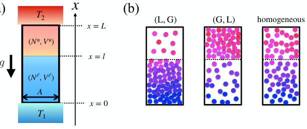 
Fig. 1 (a) System setup under gravity and heat flow. The lower and upper coarse-grained regions are separated by the formal dividing position x = l and are characterized by (N ℓ, V ℓ) and (Nu, V u). In a heterogeneous state, the actual liquid-gas interface is at x = xθ. (b) The three configuration classes: (L, G), (G, L), and homogeneous. In the homogeneous panel, the dashed line indicates only the formal partition, not a macroscopic interface.

📷 Fig 2

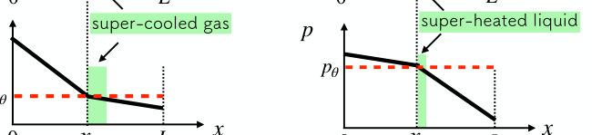 
Fig. 2 Interfacial metastable patterns for T2 &gt; T1. In the lower-free-energy (L, G) branch for geff &gt; 0, θ &lt; Tc(pθ) and the gas adjacent to the interface is supercooled. In the lower-free-energy (G, L) branch for geff &lt; 0, θ &gt; Tc(pθ) and the liquid adjacent to the interface is superheated. The green shaded layers are schematic; reversing the heat-flow direction exchanges the two patterns.

📷 Fig 3

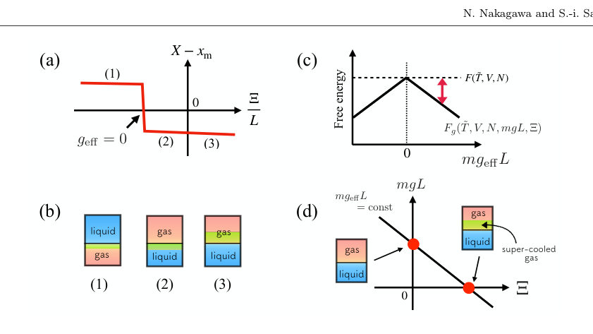 
Fig. 3 Configurational transition reproduced and adapted from Figs. 2(a), 2(b), 3(a), and 3(b) of Ref. [17] under the Creative Commons Attribution 4.0 International license. (a) Center-of-mass displacement under fixed gravity. (b) Representative configurations; light-green regions indicate interfacial metastable layers. (c) Cusp of Fg at geff = 0. (d) Constant-mgeffL lines in the (mgL, Ξ) plane.

📷 Fig 4

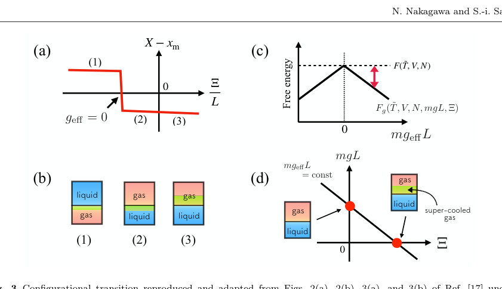 
Figure 3 summarizes the configurational-transition scenario of Ref. [17], now expressed using the stationary values derived above and the equilibrium gravity formulation of Ref. [16]. Figure 3(a) plots the stationary center-of-mass displacement obtained by applying (3.19) with g replaced by geff. Fig- ure 3(b) displays the corresponding phase configurations, using the ordering in (5.15) and the interfacial metastable patterns classified by (5.23) and Fig. 2. The labels (1)–(3) mark the same representative states in panels (a) and (b): state (1) is the minimizing (G, L) configuration, whereas states (2) and (3) are minimizing (L, G) configurations. The light-green layer represents a...

📷 Fig 5

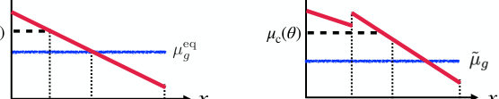 
Fig. 4 Schematic comparison of the chemical-potential profile in (a) equilibrium under gravity and (b) a heat-conducting steady state under gravity. (a) In equilibrium, µ(x) is continuous and linear in x with slope −mg. (b) In heat conduction, shown for (ℓ, u) = (L, G) and Ξ &gt; 0, µ(x) is generally discontinuous at xθ because θ ̸= Tc(pθ). The dashed line indicates µc(θ), and the blue line schematically represents the global chemical potential ˜µg.

**Summary.** This paper develops a global thermodynamic framework to analyze liquid-gas coexistence in fluids subjected to both heat conduction and weak gravity. It constructs a variational free-energy function, decomposing it to show that while the effective gravity dictates the primary phase ordering, a residual term is crucial for correctly calculating macroscopic thermodynamic observables. This work provides a general methodology for incorporating non-equilibrium driving forces into phase coexistence theory.

**Why it may be interesting.** The rigorous application of global thermodynamics to non-equilibrium systems, particularly separating the ordering principle from residual non-equilibrium corrections, provides a powerful theoretical template for analyzing complex phase transitions in open quantum or classical systems.

Detailed structure

**Main problem.** The study investigates the global thermodynamics of liquid-gas coexistence in heat-conducting fluids subjected to weak gravity.

**Main result.** The free-energy landscape is decomposed into an effective-gravity part determining the primary phase ordering, and a residual excess-latent-heat contribution necessary for deriving fundamental thermodynamic relations and observables.

**Method.** The authors employ a global variational free-energy function approach, extending equilibrium thermodynamics to incorporate non-equilibrium effects from heat conduction and gravity.

**Model / system.** The system is a fluid undergoing liquid-gas coexistence in a container under weak gravity and imposed temperature gradients. The analysis uses the van der Waals model for numerical illustration.

**Key observables.** Spatially averaged pressure, global chemical potential, and the variational free-energy landscape structure.

**Important parameters / regimes.** Weak gravity ($mgL$), temperature difference ($\Xi$), and the dimensionless parameter $\varepsilon$ characterizing the weak coupling regime.

**Assumptions / limitations.** The analysis assumes a sharp interface and operates in the linear response regime, neglecting explicit interfacial transport processes.

**Figures summary.** Figures illustrate variational free-energy landscapes in $(\xi_1, \xi_2)$ space, showing how temperature differences ($\Xi$) deform the barrier shape and how the ordering changes across different physical regimes.

**Paper structure.** The paper builds from setting up the global thermodynamic framework, deriving steady-state conditions via variational minimization, decomposing the free energy into effective-gravity and residual parts, and finally analyzing the resulting free-energy landscape structure.

Abstract

We study liquid-gas coexistence under gravity and heat conduction from the viewpoint of global thermodynamics. We construct a variational free-energy function for the fixed-global-temperature description and decompose it into two parts. The first has the same configurational form as the equilibrium weak-gravity free energy with gravity replaced by the effective gravity, and it determines the first-order configurational transition between the two separated liquid-gas arrangements. The second is a residual excess-latent-heat contribution that vanishes without heat conduction. Although it does not decide which separated liquid-gas arrangement is thermodynamically favored, this residual part is needed to derive the fundamental relation in the laboratory variables and to recover thermodynamic observables such as the spatially averaged pressure. The same residual contribution reshapes the barrier geometry, ridge/valley structure, and interfacial anomalies of the fixed-global-temperature free-energy landscape. Numerical examples based on the van der Waals model illustrate the resulting landscape structure, and estimates of experimental scales suggest a setup for detecting the effective-gravity inversion.

[↑ back to top](#top)

### [Non-linear density scaling of spin noise reveals atomic correlations in warm vapors](http://arxiv.org/abs/2605.31262v1)

**Authors:** Joseph Delpy, Elwyn Cardoz, Adwaith KV, Nikos Fayard, Nadia Belabas, Fabien bretenaker, Fabienne Goldfarb  
**Type:** experiment · **Category:** other · **PDF:** <https://arxiv.org/pdf/2605.31262v1>  
**Analysis basis:** full PDF text, analyzed in chunks
**Topic relevance:** `exotic spin models in light-matter` **3/5** · `spintronics-quantum-optics interface` **3/5** · `analog quantum simulation` **2/5** · `correlated / nonlocal dissipation` **1/5** · `entanglement & information structure` **1/5** · `quantum measurements` **1/5** · `quantum optics experiment` **1/5**

📷 Fig 1

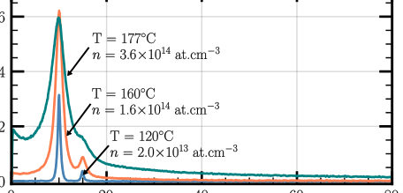 
Figure 2. Experimental spin noise spectra. Examples of spin noise PSD obtained for densities below and above 1014 at.cm−3, for a detuning ∆/2π = +1.5 GHz and a 2 mW input probe power.

📷 Fig 2

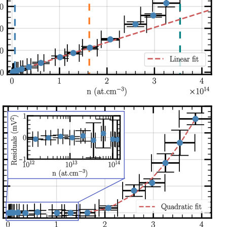 
Figure 3. Evolution of the absolute spin noise vari- ance with vapor density. (a) Evolution of the integrated spin noise variance as a function of atom density for a de- tuning ∆/2π = +1.5 GHz, a 2 mW probe power and 0.4 mW detected power. Red dashed line: linear fit to the data up to n = 1014 at.cm−3. Color dashed lines indicate the cor- responding spin noise PSD in Fig. 2. (b) Residuals from the linear regression, fitted with a quadratic function for n &gt; 1.5 × 1014 at.cm−3 (red dashed line). Inset: close-up view of the low-density data points.

📷 Fig 3

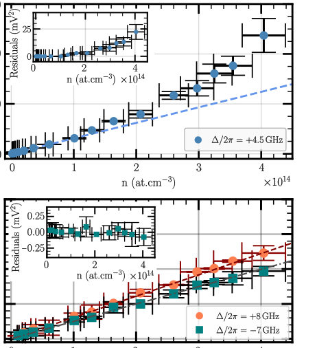 
Figure 4. Dependence of the spin noise scaling on the probe detuning. Evolution of the spin noise vari- ance as a function of vapor density for a detuning of (a) ∆/2π = +4.5 GHz and (b) ∆/2π = −7 GHz (green squares), ∆/2π = 8 GHz (orange dots). Dashed and dash-dotted lines are linear fit to the data for n &lt; 1014 at.cm−3. Insets: resid- uals from linear fits from respective color-coded data.

📷 Fig 4

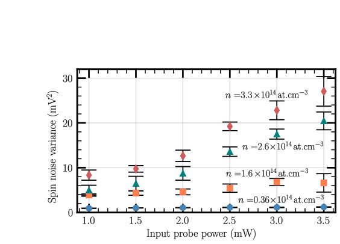 
Figure 5. Evolution of the measured spin noise on the input probe power. Detected spin noise variance as a function of input probe power for different vapor densities. The detected power is fixed to 160 µW for all points, and the detuning is ∆/2π = +1.5 GHz.

📷 Fig 5

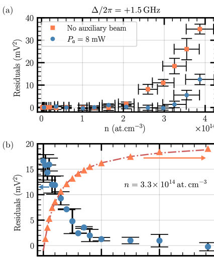 
Figure 6. Impact of the auxiliary beam on the de- tected spin noise variance. (a) Density dependence of the residuals from the low-density linear trend with (blue dots) and without (orange squares) auxiliary beam. Param- eters are Pp = 2 mW, Pd = 0.4 mW and ∆/2π = +1.5 GHz. (b) Blue dots: evolution of the residuals with auxiliary beam power at a fixed density of 3.3 × 1014 at.cm−3. Orange tri- angles: transmission of the auxiliary beam, fitted with a saturated optical depth function (red dash-dotted line).

**Summary.** The researchers used high-bandwidth spin noise spectroscopy on warm rubidium vapor to measure how spin noise changes with atomic density. They found a non-linear, quadratic increase in noise at high densities, which they attribute to resonant dipole-dipole interactions between atoms. By experimentally quenching these interactions, they confirmed that this non-linear scaling is indeed a signature of atomic cross-correlations.

**Why it may be interesting.** This work provides a direct, measurable spectroscopic signature (non-linear noise scaling) for many-body quantum correlations in a simple, controllable atomic system, extending SNS beyond simple magnetization measurements.

Detailed structure

**Main problem.** To experimentally characterize non-linear atomic correlations in warm alkali vapors by measuring the density dependence of spin noise.

**Main result.** The spin noise variance exhibits a quadratic, superlinear dependence on atomic density at high concentrations, which is attributed to resonant dipole-dipole interactions (DDI).

**Method.** High-bandwidth Spin Noise Spectroscopy (SNS) is employed to measure Faraday rotation fluctuations in a warm rubidium vapor.

**Model / system.** The system is a warm alkali vapor (rubidium) probed by a detuned laser, where the noise measurement probes spin correlations arising from resonant dipole-dipole interactions (DDI).

**Key observables.** Spin noise variance ($\langle \delta	heta^2 
angle$) and the spin noise power spectral density (PSD).

**Important parameters / regimes.** Vapor density ($n$), detuning ($\Delta$), and input probe power ($P_p$).

**Assumptions / limitations.** The non-linear scaling is assumed to arise from DDI, which is tested by quenching the interaction using an auxiliary resonant beam.

**Figures summary.** Figures show the non-linear (quadratic) scaling of spin noise variance vs. density, and demonstrate the suppression of this non-linearity and spectral distortions when the DDI is quenched.

**Paper structure.** The paper establishes the linear regime (non-interacting) and then presents evidence for a superlinear, quadratic scaling at high densities. The core argument is built by introducing and then experimentally suppressing the DDI via an auxiliary beam, confirming the correlation origin.

Abstract

We experimentally demonstrate a non-linear dependence of the spin noise variance on atomic density in a warm alkali vapor. Implementing high-bandwidth spin noise spectroscopy (SNS) near the D2 transition of rubidium, a quadratic spin noise contribution is shown to arise at high densities, in contrast with the linear dependence valid in non-interacting ensembles. This non-linear scaling is shown to crucially depend on the residual optical excitation of the vapor by the probe beam, suggesting it stems from atomic cross-correlations due to resonant dipole-dipole interaction (DDI) in the vapor. We support this claim by introducing an additional experimental protocol to quench the ddi, resulting in a suppression of both the quadratic scaling of the spin variance and the distortions of the spin noise spectrum induced by the interaction. These results extend the applications of SNS to the characterization of many-body correlations in complex quantum systems.

[↑ back to top](#top)

### [Can a spin-half particle ever give more than two spots in a Stern-Gerlach experiment? -- the subtle physics of effective Hamiltonians](http://arxiv.org/abs/2605.31435v1)

**Authors:** Noah Linden, Sandu Popescu, Anthony J. Short  
**Type:** theory · **Category:** other · **PDF:** <https://arxiv.org/pdf/2605.31435v1>  
**Analysis basis:** full PDF text, analyzed in chunks
**Topic relevance:** `analog quantum simulation` **3/5** · `quantum measurements` **2/5** · `entanglement & information structure` **1/5** · `exotic spin models in light-matter` **1/5** · `measurement-induced transitions` **1/5** · `spintronics-quantum-optics interface` **1/5**

📷 Fig 1

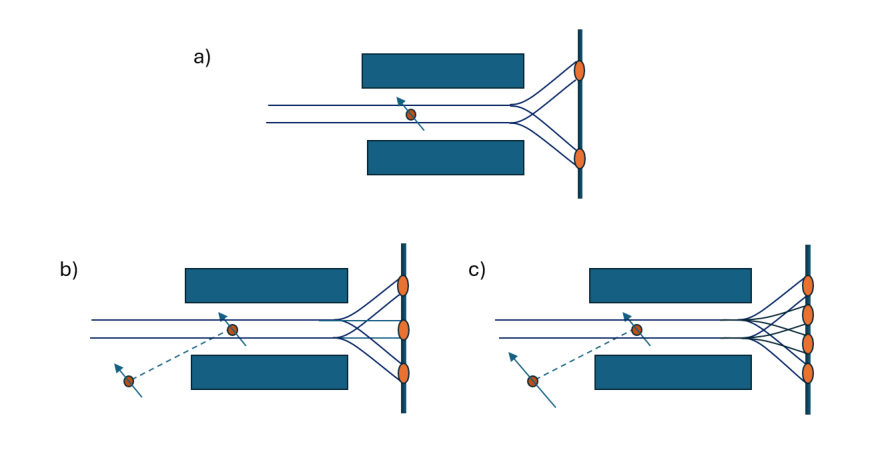 
Figure 1: a) A standard Stern-Gerlach experiment for a spin-half particle. b) The same Stern- Gerlach experiment, but the spin passing through the device interacts with an external spin-half particle which remains outside the device and constrains the spins to be parallel. Note that the outer spots in the second figure are in same positions as in the first figure. c) Similar to figure b), but the spin-half particle inside the device is interacting with a spin-one particle outside.

📷 Fig 2

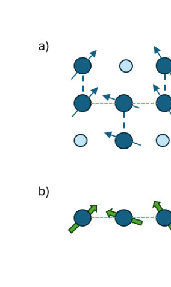 
Figure 2: a) shows a hypothetical three-layer material composed of spin 1

**Summary.** This theoretical paper demonstrates that strong coupling between a spin-half particle and another spin can induce an effective spin-$s$ behavior. This allows the particle to yield $2s+1$ distinct outcomes in a Stern-Gerlach measurement, contrary to expectations based on its intrinsic spin. The analysis relies on projecting the system dynamics onto a low-energy subspace defined by the total spin quantum number.

**Why it may be interesting.** This work is highly relevant to AMO physics as it explores how strong, engineered interactions (like those in coupled quantum systems or artificial lattices) can induce emergent, higher-dimensional quantum behavior from fundamentally lower-dimensional constituents.

Detailed structure

**Main problem.** The paper investigates whether a spin-half particle, when strongly coupled to another spin, can exhibit measurement outcomes in a Stern-Gerlach experiment corresponding to a higher effective spin value.

**Main result.** A spin-half particle can effectively behave as if it has a spin-$s$ character, leading to $2s+1$ distinct spots in the Stern-Gerlach measurement, despite its fundamental spin being $1/2$.

**Method.** The analysis uses the theory of effective Hamiltonians to approximate the dynamics generated by the full Hamiltonian, particularly in the limit of large energy gaps ($E_0$).

**Model / system.** The system involves a spin-half particle coupled to an arbitrary spin ($S_2$) via an interaction Hamiltonian ($H_0$). The measurement is modeled by coupling the system to a spatially varying magnetic field ($V_{	ext{SG}}$).

**Key observables.** The number of distinct spots observed in the Stern-Gerlach experiment ($2s+1$), the effective gyromagnetic ratio ($\gamma_{	ext{eff}}^1$), and the trace distance ($\mu(t)$) between state evolutions.

**Important parameters / regimes.** The coupling strength ($eta$), the energy scale ($E_0$), and the spatial confinement width ($z_0$) are crucial parameters governing the validity of the approximations.

**Assumptions / limitations.** The analysis relies on approximating the evolution using effective Hamiltonians, assuming the coupling is strong enough to keep spins parallel, and that the measurement process can be bounded by a finite region.

**Figures summary.** Figure 1 compares standard SG measurements with those involving external spin particles. Figure 2 illustrates a hypothetical three-layer material where strong inter-layer interactions constrain spins, effectively modeling a larger spin system.

**Paper structure.** The paper first establishes the problem using the full Hamiltonian, then derives the effective Hamiltonian by projecting onto the total spin subspace ($\Pi_s$). It rigorously proves that the effective operators act like standard spin-$s$ operators, leading to the prediction of multiple spots. Finally, it analyzes the measurement fidelity using state distance metrics.

Abstract

We show that a spin-1/2 particle can behave as if it were spin-$s$, and generate $2s+1$ spots in a Stern Gerlach measurement (albeit with a smaller gyromagnetic ratio). This arises from some subtle properties of effective Hamiltonians and Hamiltonians with constraints. Examples of implications of the effect in condensed matter are discussed. We also give some simple non-perturbative bounds for a system subjected to strong constraints.

[↑ back to top](#top)

### [Asymptotic distinguishability of Haar-averaged measurement models](http://arxiv.org/abs/2605.31168v1)

**Authors:** Ludmiła Marcinkowska, Łukasz Pawela, Marcin Markiewicz, Zbigniew Puchała  
**Type:** theory · **Category:** quantum information and computing · **PDF:** <https://arxiv.org/pdf/2605.31168v1>  
**Analysis basis:** full PDF text, analyzed in chunks
**Topic relevance:** `entanglement & information structure` **3/5** · `measurement-induced transitions` **2/5** · `quantum measurements` **2/5** · `correlated / nonlocal dissipation` **1/5**

📷 Fig 1

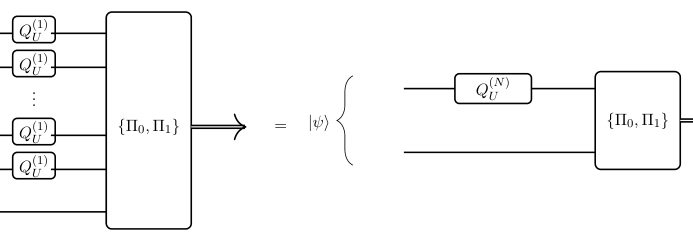 
Figure 1: Discrimination protocol between the identity channel I and the Haar-random measurement channel Q(N) U . The maximally entangled state |ψ⟩is prepared across N subsystems. The channel Q(N) U acts collectively on these subsystems, followed by the joint measurement {Π0, Π1}.

📷 Fig 2

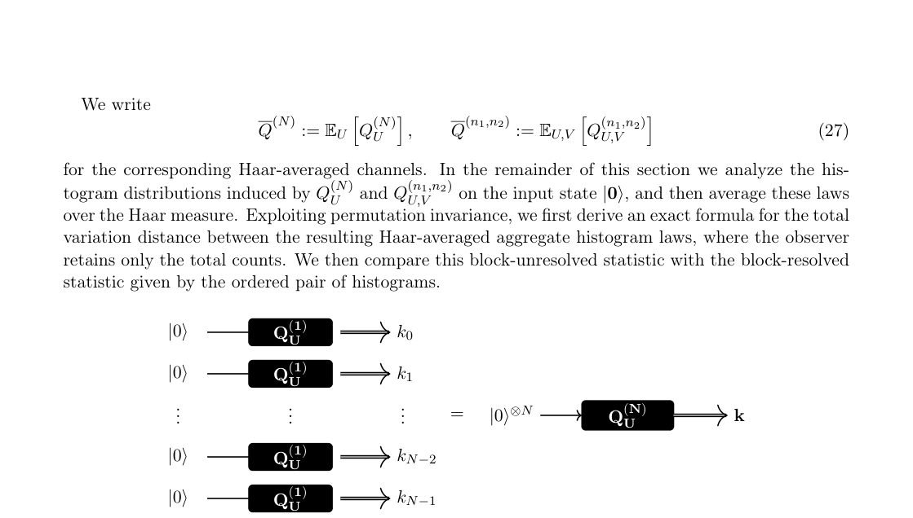 
Figure 2: Equivalent representations of the collective model. The multipartite implementation using N copies of Q(1) U is equivalent to the collective channel Q(N) U acting on the product input state |0⟩⊗N, producing the classical outcome vector k = (k0, . . . , kN−1).

📷 Fig 3

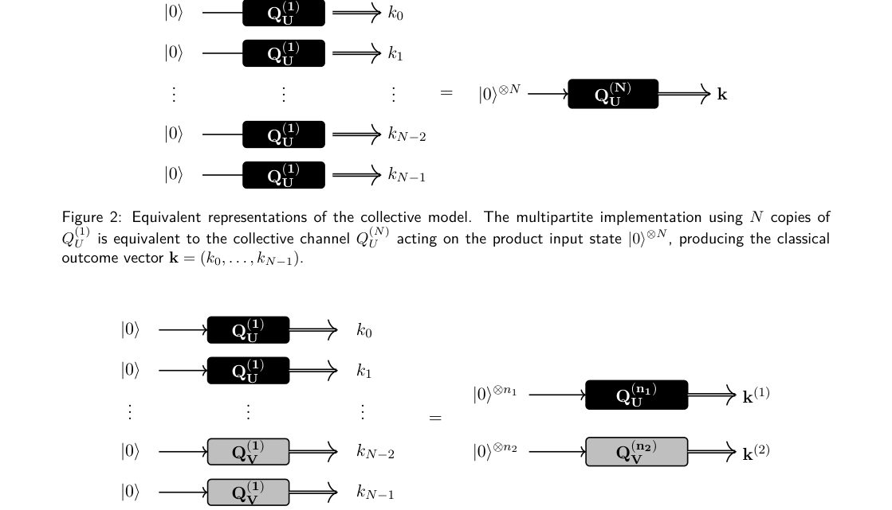 
Figure 3: Equivalent representations of the block model. The multipartite implementation using n1 copies of Q(1) U and n2 copies of Q(1) V is equivalent to two collective channels Q(n1) U and Q(n2) V acting independently on the corresponding subsystems, producing the classical outcome vectors k(1) and k(2). In the aggregate experiment, the observer retains only the total histogram obtained after forgetting the block assignment of the outcomes.

📷 Fig 4

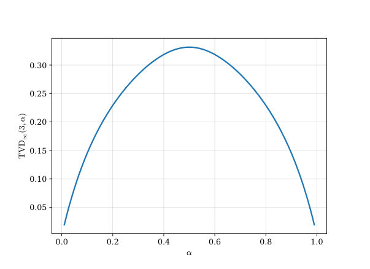 
Figure 4: Limiting aggregate total variation distance between P (N)(λ) and P (n1,n2)(λ), i.e. TVD∞(3, α), as a function of α.

📷 Fig 5

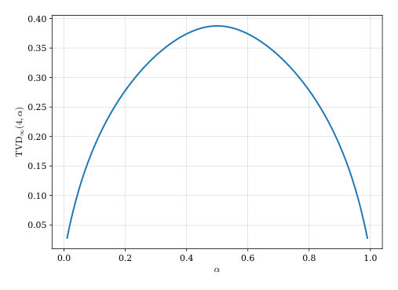 
Figure 5: Limiting aggregate total variation distance between P (N)(λ) and P (n1,n2)(λ), i.e. TVD∞(4, α), as a function of α.

**Summary.** This work rigorously analyzes how distinguishable two measurement models are when the underlying randomness is either collective (shared unitary) or local (independent unitaries). By calculating the Total Variation Distance in various asymptotic limits, the authors show that the level of observation—whether aggregate or block-resolved—fundamentally changes the measurable distinguishability.

**Why it may be interesting.** The rigorous mathematical tools developed for quantifying distinguishability between structured vs. unstructured quantum processes (shared vs. independent unitaries) are highly relevant for understanding resource quantification in quantum information theory.

Detailed structure

**Main problem.** The paper studies the asymptotic distinguishability between measurement models generated by a single collective unitary versus those generated by independent local unitaries.

**Main result.** The distinguishability, quantified by the Total Variation Distance (TVD), depends critically on the observation level: the aggregate statistics yield a nontrivial limit, while the block-resolved statistics show perfect distinguishability in certain limits.

**Method.** The authors use Weingarten calculus and combinatorial analysis to derive closed-form expressions and asymptotic limits for the TVD in various scaling regimes.

**Model / system.** The model involves Haar-random measurement-and-prepare channels acting on a composite system of $N=n_1+n_2$ subsystems of local dimension $d$. The comparison is between the collective channel $Q(N)_U$ and the block-separated channel $Q(n_1, n_2)_{U,V}$.

**Key observables.** Type-II error probability, Total Variation Distance (TVD) between aggregate and block-resolved histogram laws, and the block-resolved pair-of-histograms law.

**Important parameters / regimes.** The analysis covers multiple asymptotic regimes: fixed-$N$, large-$d$; fixed-$d$, large-$N$; sparse joint-scaling ($N = o(\sqrt{d})$); and critical scaling ($N/\sqrt{d} 	o c$).

**Assumptions / limitations.** The analysis distinguishes between the aggregate (block-unresolved) and block-resolved statistics, and relies on asymptotic expansions derived from Haar measure integration.

**Figures summary.** Figures illustrate the discrimination protocol using entangled testers and show the relationship between the collective and multipartite measurement models.

**Paper structure.** The paper first addresses channel discrimination (Type-II error) and then focuses on comparing the aggregate vs. block-resolved histogram laws using the TVD, deriving specific asymptotic limits for different scaling regimes.

Abstract

We study discrimination problems generated by the same basic Haar-random measurement mechanism at two observational levels. First, we derive an explicit expression for the type-II error in the task of discriminating a Haar-random measure-and-prepare channel from the identity channel $\mathbb{I}$, using a coherence-sensitive entangled tester. Second, after passing to the induced classical measurement records, we compare two random measurement models: one induced by a single collective unitary of the form $U^{\otimes (n_1+n_2)}$ with $U\in U(d)$, and another induced by independent local unitaries $U_1^{\otimes n_1}\otimes U_2^{\otimes n_2}$. For the associated Haar-averaged aggregate histogram laws, in which the block of origin of each count is not retained, we obtain closed-form formulas and quantify their discrepancy through the total variation distance. We derive asymptotic expressions in the fixed-$N$, large-$d$ regime, the fixed-$d$, large-$N$ regime, the sparse joint-scaling regime $N=o(\sqrt d)$, and the critical scaling regime $N/\sqrt d\to c$. We also identify the block-resolved pair-of-histograms law, showing that the aggregate total variation distance is a coarse-grained lower bound on the distinguishability available when block labels are retained.

[↑ back to top](#top)

### [Rényi divergences and binary state discrimination error exponents for fermionic quasi-free states](http://arxiv.org/abs/2605.31379v1)

**Authors:** Milán Mosonyi, Gábor Maróti-Zareczky  
**Type:** theory · **Category:** statistical mechanics · **PDF:** <https://arxiv.org/pdf/2605.31379v1>  
**Analysis basis:** full PDF text, analyzed in chunks
**Topic relevance:** `entanglement & information structure` **3/5** · `Keldysh / 2PI / non-Gaussian methods` **2/5** · `analog quantum simulation` **2/5** · `methods for driven-dissipative` **1/5**

📷 Fig 1

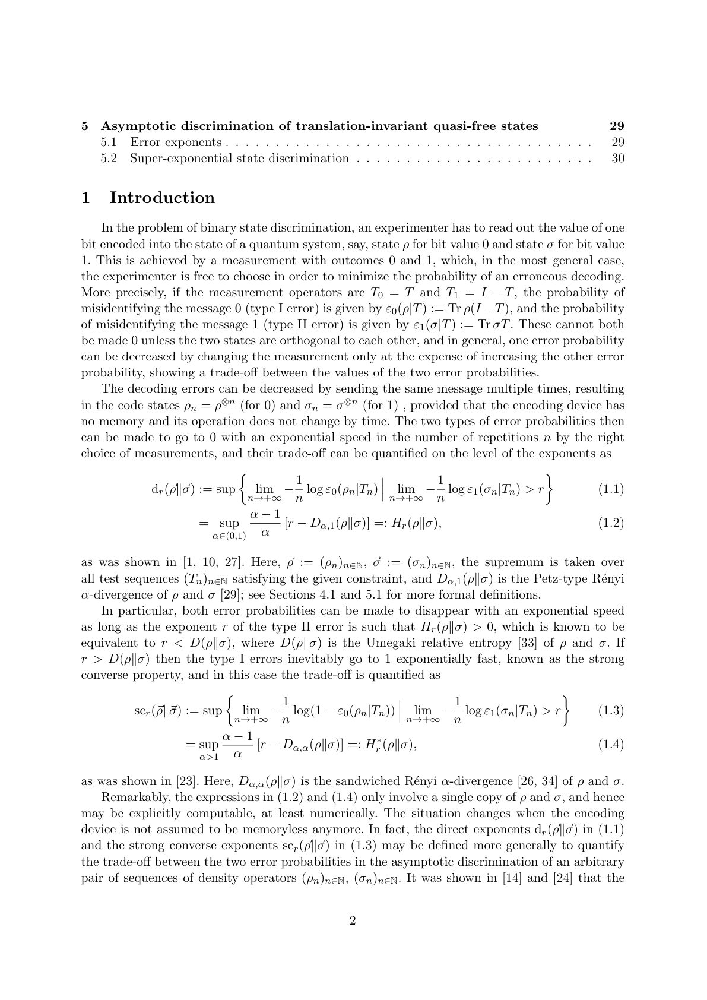 
Low-resolution page preview, page 2

📷 Fig 2

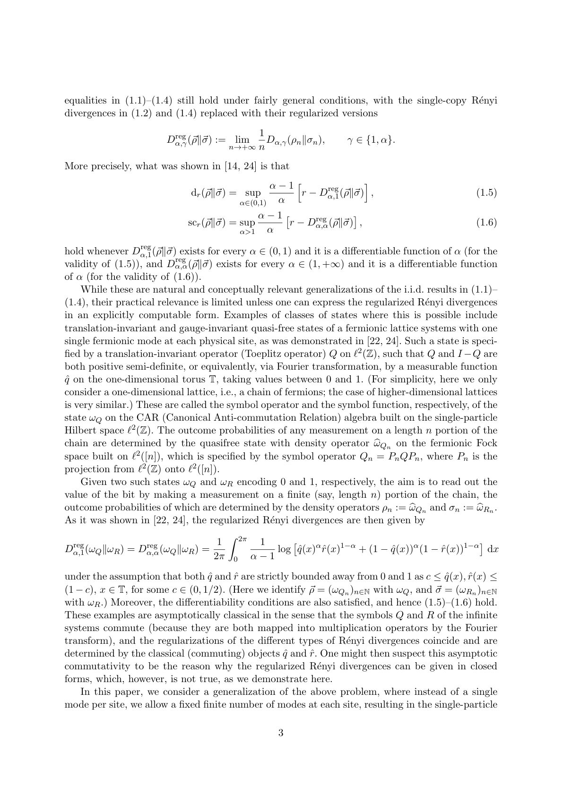 
Low-resolution page preview, page 3

📷 Fig 3

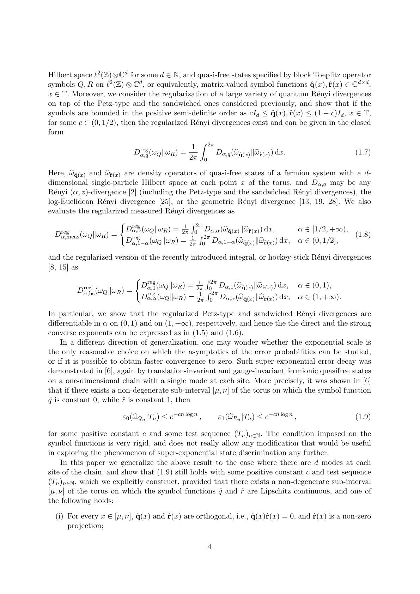 
Low-resolution page preview, page 4

📷 Fig 4

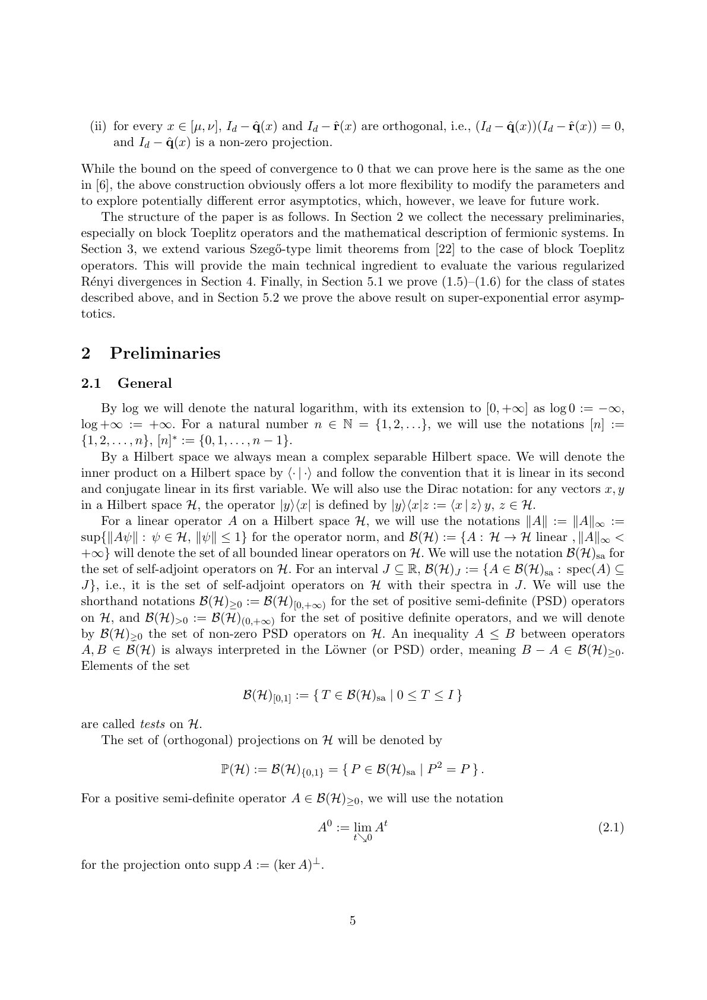 
Low-resolution page preview, page 5

📷 Fig 5

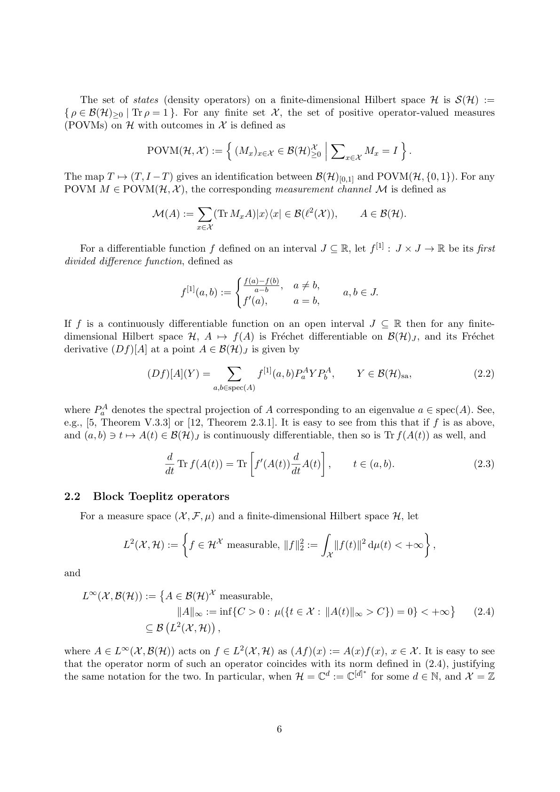 
Low-resolution page preview, page 6

**Summary.** This paper develops explicit formulas for various regularized Rényi divergences applicable to fermionic quasi-free states on infinite chains. By relating these divergences to the error exponents in quantum state discrimination, it provides a rigorous mathematical framework for quantifying distinguishability in complex quantum many-body systems.

**Why it may be interesting.** The explicit calculation of divergences in the thermodynamic limit for fermionic systems provides powerful tools to analyze quantum correlations and distinguishability in many-body quantum matter models.

Detailed structure

**Main problem.** The paper quantifies the trade-off relations between error probabilities in binary quantum state discrimination, particularly for non-i.i.d. settings.

**Main result.** It derives explicit, closed-form formulas for various regularized Rényi divergences for a specific class of fermionic quasi-free states, establishing links between these divergences and the achievable error exponents.

**Method.** The analysis heavily relies on extending Szegő-type limit theorems from the theory of block Toeplitz operators to calculate the thermodynamic limit of quantum divergences.

**Model / system.** The system under study is a doubly infinite fermionic chain modeled by quasi-free states ($\omega_Q, \omega_R$) defined on the CAR-algebra. The states are characterized by single-particle symbols ($\hat{q}, \hat{r}$) acting on the torus.

**Key observables.** Error probabilities ($\epsilon_0, \epsilon_1$), error exponents ($d_r, s_r$), and various regularized Rényi divergences ($	ext{D}_{	ext{reg}}^{\alpha, \gamma}$).

**Important parameters / regimes.** The R\'enyi parameter $\alpha$, the internal dimension $d$ (number of modes per site), and the spectral properties of the symbols $\hat{q}(x)$ and $\hat{r}(x)$.

**Assumptions / limitations.** The derivation requires the symbols $\hat{q}(x)$ and $\hat{r}(x)$ to be bounded away from 0 and 1, and for the symbols to be Lipschitz continuous on a non-degenerate interval.

**Paper structure.** The paper builds from defining various Rényi divergences for quasi-free states (using limit theorems) to deriving explicit formulas for regularized divergences, and finally applying these results to establish the asymptotic error exponents for state discrimination.

Abstract

The trade-off relations between the two types of error probabilities in binary i.i.d. quantum state discrimination can be expressed by single-copy formulas in terms of the Petz-type and the sandwiched Rényi divergences of the two states representing the two hypotheses. In the non-i.i.d. setting, the error exponents can usually be expressed in terms of regularized Rényi divergences, which do not admit explicit formulas in general. Here, we consider a class of states, translation-invariant and gauge-invariant quasifree states on doubly infinite fermionic chains, and give explicit formulas for a wide range of regularized Rényi divergences between such states, including $(α,z)$, log-Euclidean, maximal, measured, and the recently introduced integral Rényi divergences. We show that the case where there is a single mode at each lattice site becomes asymptotically classical, with all the different types of regularized Rényi divergences being equal, while in the case of multiple modes per site, non-commutativity persists under regularization, and for any fixed $α$, the regularized Rényi $(α,z)$-divergences give different regularized values for different $z$ parameters in general. We also generalize a previous construction from [Bunth, Maróti, Mosonyi, Zimborás, Lett.~Math.~Phys.~113:(7), 2023] to the case of multiple modes per lattice site to obtain a large class of states exhibiting super-exponential decay of the discrimination error probabilities.

[↑ back to top](#top)

### [Solving models with generalized free fermions II: Path-product expansion and conserved charges](http://arxiv.org/abs/2605.31453v1)

**Authors:** Kohei Fukai, Balázs Pozsgay, István Vona  
**Type:** theory · **Category:** statistical mechanics · **PDF:** <https://arxiv.org/pdf/2605.31453v1>  
**Analysis basis:** full PDF text, analyzed in chunks
**Topic relevance:** `analog quantum simulation` **3/5** · `exotic spin models in light-matter` **3/5** · `entanglement & information structure` **1/5** · `non-equilibrium dynamics` **1/5**

📷 Fig 1

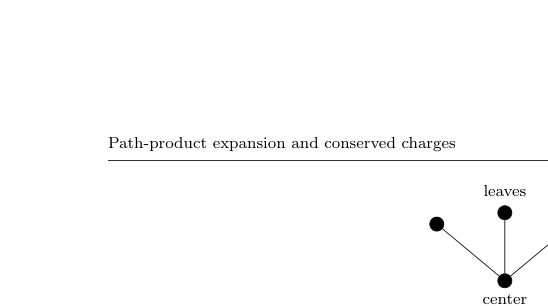 
Fig. 1 The claw graph K1,3, consisting of a center vertex connected to three mutually non-adjacent leaves.

📷 Fig 2

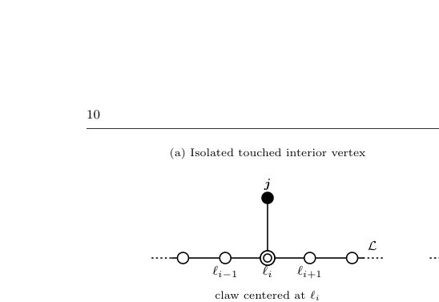 
Fig. 2 The two claw obstructions used in Lemma 3.3. In (a), an interior path vertex ℓi touched by j but not accompanied by either neighboring touched vertex would have three pairwise non-adjacent neighbors ℓi−1, ℓi+1, j. In (b), three touched path vertices no two of which are consecutive along the induced path are pairwise non-adjacent, so they form a claw with center j. The double-circled vertex marks the center of the forbidden claw in each panel. Black dotted path segments indicate omitted continuations of the induced path.

📷 Fig 3

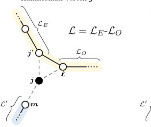 
Fig. 5 The (2, 1) mixed-touch cancellation. The filled vertex is the Hamiltonian vertex of the commutator term: j in panel (a) and j′ in panel (b). Black dotted segments indicate omitted continuations of induced paths. Gray dashed edges indicate touching edges from the Hamiltonian vertex to the packed components. Yellow and blue halos mark the doubly touched side and the singly touched side, respectively. The braces label the path pieces LO, LE, L′, and L′ E used in the decompositions before and after the move. In the left panel the doubly touched component is denoted by L = LE-LO, where LE = L′ E-j′, while the singly touched component is denoted by L′. In the right panel the doubly touched...

📷 Fig 4

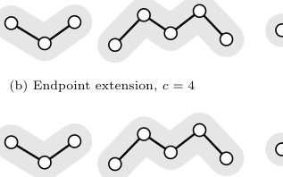 
Fig. 6 Schematic one-component touch with spectators for c = 4. Only packing vertices and the Hamiltonian vertex are drawn; unrelated vertices and edges of the ambient graph are suppressed. The gray and red halos schematically indicate the closed neighborhoods of the spectator components and of the active component, respectively. Distinct halos may themselves overlap, but the packing condition Γ[La] ∩Lb = ∅for a ̸= b requires that no vertex of one packed component lie in the halo of another. Black path edges are the drawn induced paths, and the spectator components are carried along unchanged. The active packed path is drawn inside the red halo, while the filled black vertex is the...

📷 Fig 5

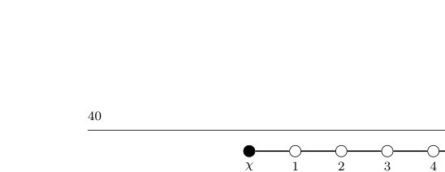 
Fig. 7 Extended frustration graph Gχ for the Ising algebra, shown for the case M = 7. In general, the frustration graph G = PM is the path graph with M = 2L −1 vertices (white), where adjacent vertices correspond to anticommuting generators. The edge vertex χ (black) is connected to the simplicial clique Ks = {1}.

**Summary.** This work develops a path-product expansion technique to explicitly determine the hidden free-fermion modes and local conserved charges in quantum spin systems defined on frustration graphs. By utilizing the Krylov basis generating function, the authors establish a direct link between graph structure and integrability, providing a unified framework for understanding conserved quantities in these models.

**Why it may be interesting.** The explicit, graph-theoretic construction of conserved charges provides a powerful, general tool for analyzing integrability in complex quantum spin models, applicable beyond standard lattice symmetries.

Detailed structure

**Main problem.** To derive an explicit, graph-theoretic structure for the hidden free-fermion modes and local conserved charges in quantum spin systems solvable by free fermions.

**Main result.** The free-fermion modes are shown to be expressible as path-product expansions along induced paths, and local conserved charges are determined by path products along induced paths with an odd number of vertices.

**Method.** The authors employ a path-product expansion derived from the generating function of the Krylov basis, bypassing the need for the transfer matrix or nonlocal charges.

**Model / system.** The study focuses on quantum spin systems defined on a frustration graph, particularly those belonging to the Even-Hole-Free and Claw-Free (ECF) classes. The Hamiltonian is governed by a graph Clifford algebra.

**Key observables.** Free-fermion modes, local conserved charges, and infinite-temperature dynamical correlation functions.

**Important parameters / regimes.** The structure of the frustration graph (ECF or claw-free); the path length $|L|$ of induced paths.

**Assumptions / limitations.** The graph must be ECF for the primary mode derivation, but the charge construction extends to general claw-free graphs.

**Figures summary.** Figures illustrate claw obstructions and the structure of the extended frustration graph ($G_\chi$) used in the path-product expansion.

**Paper structure.** The paper develops the framework by first introducing the graph-Clifford algebra, then deriving the path-product expansion for the free-fermion modes using the Krylov basis generating function, and finally applying this to derive explicit local and generalized conserved charges.

Abstract

Free-fermion solvability in quantum spin systems is increasingly understood to be governed by a graph Clifford algebra defined from the frustration graph of the Hamiltonian. When the frustration graph belongs to certain classes, such as the even-hole-free and claw-free (ECF) class, the Hamiltonian is solvable by hidden free fermions: it admits a free-fermion solution although it does not reduce to a Majorana bilinear under the Jordan-Wigner transformation. However, unlike in the Jordan-Wigner case, where each mode is a linear combination of single Majorana fermions, the explicit operator structure of the hidden free-fermion modes -- and that of the local conserved charges -- has remained obscure. In this work, we derive a path-product expansion that expresses each free-fermion mode as a linear combination of path products along induced paths in the extended frustration graph. The expansion is obtained from the generating function of the Krylov basis and yields the modes directly, without using the transfer matrix or the nonlocal conserved charges as input. As an application, the mode decomposition computes infinite-temperature dynamical correlation functions for arbitrary ECF frustration graphs. We further obtain explicit expressions for local conserved charges as linear combinations of path products along induced paths; these charges apply beyond the free-fermion (ECF) class to more general claw-free frustration graphs. We also identify a unified family of generalized conserved charges that contains both the previously known nonlocal conserved charges and these local conserved charges as special cases. For Fendley's original FFD chain with homogeneous couplings and periodic boundary conditions, in a suitable basis, the structure of these local conserved charges exhibits the same Catalan-tree pattern as in the spin-$1/2$ XXX chain.

[↑ back to top](#top)

### [Dimensionality of a strongly interacting 2D-3D Fermi-Fermi mixture from the perspective of superfluid instability and excitation properties](http://arxiv.org/abs/2605.30986v1)

**Authors:** Haruka Takeda, Saki Hirai, Shumpei Iwasaki, Yoji Ohashi  
**Type:** theory · **Category:** quantum gases · **PDF:** <https://arxiv.org/pdf/2605.30986v1>  
**Analysis basis:** full PDF text, analyzed in chunks
**Topic relevance:** `Keldysh / 2PI / non-Gaussian methods` **3/5** · `analog quantum simulation` **3/5** · `methods for driven-dissipative` **1/5**

📷 Fig 1

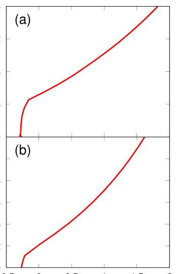 
FIG. 1. Mean-field BCS results for (a) superfluid order pa- rameter ∆at T = 0, and (b) superfluid phase transition tem- perature Tc, in a two-component 2D-3D Fermi-Fermi mixture with an s-wave pairing interaction. ǫF = k2 F/(2m) and kF is given in Eq. (5), where m is an atomic mass. aefff is the effective s-wave scattering length in Eq. (4). We have used the mean-field theory in Ref. [31] to obtain these results, and the outline of this theory is explained in Appendix A.

📷 Fig 2

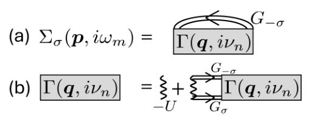 
FIG. 3. (a) SCTMA self-energy Σσ(p, iωm) in Eq. (7). The double solid line is the dressed Green’s function Gσ in Eq. (6). (b) Scattering matrix Γ(q, iνn) in Eq. (8). The wavy line de- scribes the paring interaction −U. In this figure, pseudospin −σ represents the opposite spin component to σ = ↑, ↓.

📷 Fig 3

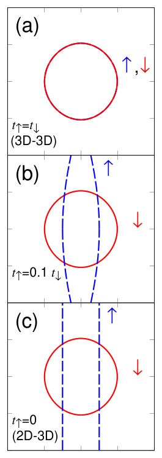 
FIG. 2. Difference of Fermi surfaces between spin-↑(dashed line) and spin-↓(solid line) components in a non-interacting mixed-dimensional Fermi gas with the kinetic energy in Eq. (3). p⊥and pz denote the momentum in the in-plane direction and the inter-layer direction, respectively. We set N↑= N↓= 1/(6π2d3 z).

📷 Fig 4

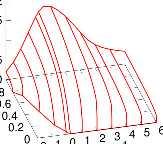 
FIG. 4. Calculated BCS-type superfluid phase transition temperature Tc in SCTMA, as a function of the interaction strength (kFaeff)−1 and the hopping parameter t↑. In this fig- ure, 3D-3D and 2D-3D cases are, respectively, realized when t↑/ǫF = 1 and 0.

📷 Fig 5

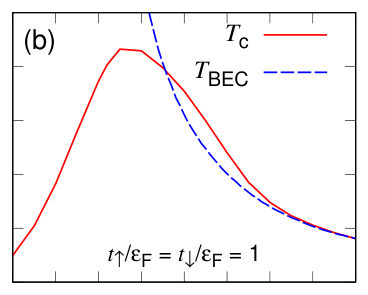 
FIG. 5. Comparison of the calculated Tc in SCTMA with TBEC obtained from Eq. (23). (a) Tc and TBEC as functions of t↑/ǫF in the strong-coupling regime when (kFaeff)−1 = 6. (b) Interaction dependence in the 3D-3D case (t↑/ǫF = t↓/ǫF = 1).

**Summary.** This theoretical study examines how superfluidity behaves in a Fermi gas whose dimensionality is tuned between 3D-3D and 2D-3D. Using advanced many-body techniques, the authors find that pairing fluctuations suppress the critical temperature to zero in the 2D-3D limit. Crucially, they show that while the superfluid instability is dominated by the 2D component, the precursor pseudogap retains a 3D character, highlighting the observable dependence on dimensionality.

**Why it may be interesting.** This work provides detailed insights into how dimensionality fundamentally alters superfluidity and pairing mechanisms in ultracold atomic gases, distinguishing between mean-field predictions and fluctuation-dominated regimes.

Detailed structure

**Main problem.** The study investigates the strong-coupling properties and superfluid instability of an attractively interacting Fermi-Fermi mixture as its dimensionality is tuned from 3D-3D to 2D-3D.

**Main result.** Pairing fluctuations suppress the superfluid transition temperature ($T_c$) to zero in the 2D-3D limit, which is governed by the lower-dimensional component. However, the pseudogap phenomenon retains a 3D character.

**Method.** The analysis employs the Self-Consistent T-matrix Approximation (SCTMA) and Generalized Random Phase Approximation (GRPA) to calculate superfluid properties and excitation spectra.

**Model / system.** The system is a two-component Fermi atomic gas with tunable s-wave pairing interaction, loaded in a mixed-dimensionality trap (2D in-plane, 3D along z).

**Key observables.** Superfluid transition temperature ($T_c$), superfluid order parameter ($\Delta$), Goldstone mode velocity ($\mathbf{v}_\varphi$), and single-particle spectral weight ($A_\sigma$).

**Important parameters / regimes.** Interaction strength ($U$), dimensional imbalance (2D-3D limit), and the pairing interaction strength.

**Assumptions / limitations.** The use of SCTMA is crucial for including pairing fluctuations, and the analysis relies on the Thouless criterion for determining $T_c$.

**Figures summary.** Figures illustrate the $T_c$ dependence, the vanishing $v_{\phi,z}$ component of the Goldstone mode velocity in the 2D-3D limit, and the pseudogap structure in the single-particle density of states.

**Paper structure.** The paper progresses by first establishing the theoretical framework using SCTMA, then analyzing the superfluid instability via $T_c$ calculations, and finally examining the single-particle excitation spectrum, particularly the pseudogap, in the mixed-dimensional limit.

Abstract

We theoretically investigate strong-coupling properties of an attractively interacting Fermi atomic gas, where the Cooper-pair formation occurs between atoms belonging to different dimensional bands. Including pairing fluctuations within the framework of the self-consistent $T$-matrix approximation (SCTMA), we examine how the BCS-type superfluid phase transition temperature $T_\mathrm{c}$ varies as one moves from the 3D-3D to the 2D-3D system, in the wide parameter region with respect to the strength of the pairing interaction. In the 2D-3D limit, we find that, while the mean-field BCS theory predicts $T_\mathrm{c}>0$ in the strong-coupling regime, $T_\mathrm{c}$ is remarkably suppressed down to zero by pairing fluctuations that are strongly enhanced by the mixed-dimensionality of the system. As the origin of this, we clarify that the lower-dimensional (2D) component dominates the superfluid instability, so that the vanishing $T_\mathrm{c}$ is the same phenomenon as that in the 2D-2D case. We also point out that this can already be seen in the mean-field level, when one examines the propagation of the Goldstone mode. On the other hand, we find that the pseudogap phenomenon, which is known as a precursor of Cooper-pair formation, exhibits a 3D character of the 2D-3D system. These results indicate that the dimensionality of a strongly interacting Fermi gas depends on what we observe.

[↑ back to top](#top)

### [Dually tunable YBCO coplanar waveguide resonators based on helium-ion-generated Josephson inductances](http://arxiv.org/abs/2605.30425v1)

**Authors:** Kenny Fohmann, Timo J. Glebe-Märklin, Benedikt Wilde, Mohamad Kazouini, Christoph Schmid, Dieter Koelle, Reinhold Kleiner, Daniel Bothner  
**Type:** experiment · **Category:** strongly correlated electrons · **PDF:** <https://arxiv.org/pdf/2605.30425v1>  
**Analysis basis:** full PDF text, analyzed in chunks
**Topic relevance:** `QC/QI experiment` **3/5** · `analog quantum simulation` **2/5** · `correlated cavity matter` **1/5** · `driven-dissipative phase transition` **1/5**

📷 Fig 1

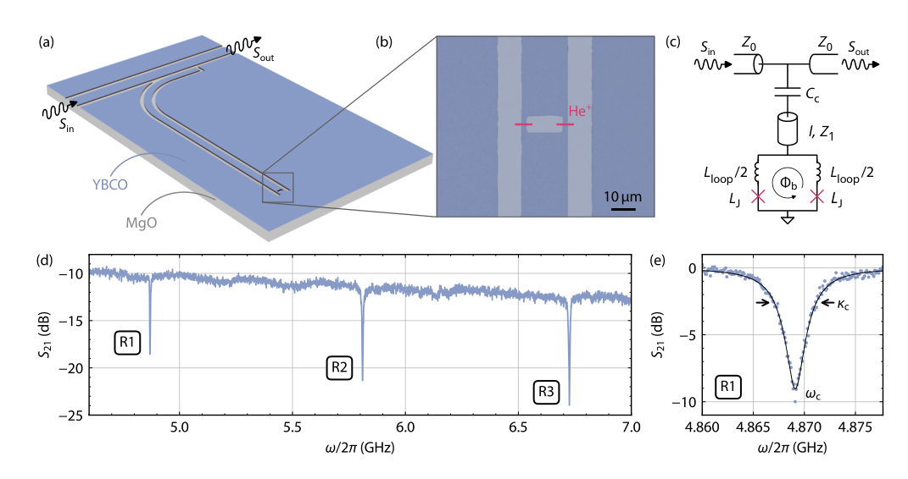 
Fig. 1: YBCO coplanar waveguide cavities for integration with helium-ion-generated Josephson inductances. (a) Schematic of a quarter-wave coplanar waveguide (CPW) cavity as used in this work (not to scale), capacitively side-coupled to a CPW transmission line. The substrate material is MgO, the superconducting film is 50 nm thick M-type YBCO. For capacitive coupling to the feedline, the cavity has a coupling elbow near its open end. Close to its shorted end far from the feedline, the cavity contains a loop in the CPW center conductor for the SQUID. Characterization is performed by measurements of the scattering matrix element 𝑆21 = 𝑆out/𝑆in. (b) False-color optical microscopy image around...

📷 Fig 2

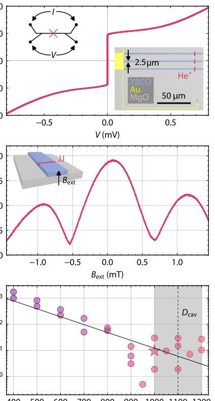 
Fig. 2: Transport characteristics and critical-current ion-dose dependence of M-type YBCO He-bJJs. (a) IVC of a He-FIB bJJ with an ion line dose of 𝐷𝓁= 1000 ions/nm. Critical current is 𝐼c ≈9.5 µA. Top-left inset shows a schematic of the four-terminal IV measurement. Bottom-right inset shows a false-color optical image of the 𝑎dc = 2.5 µm wide bridge structures used for these experi- ments, depicting one set of three parallel bridges that are connected to a common ground but biased and measured individually. (b) Crit- ical junction current 𝐼c vs applied magnetic field 𝐵ext for the junction of panel (a). Inset schematically shows the application of 𝐵ext per- pendicular to the chip surface,...

📷 Fig 3

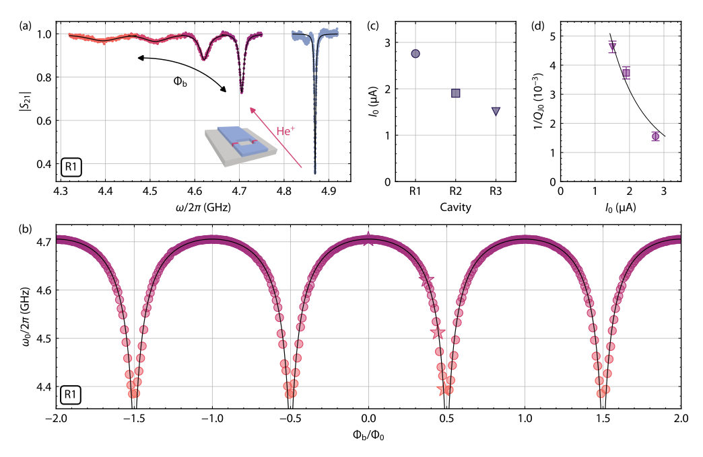 
Fig. 3: Flux-tuning of a helium-ion-generated YBCO SQUID-cavity and parameters of the integrated Josephson junctions. (a) Transmission |𝑆21| around the resonance frequency of R1 without (light blue) and with (purple, pink, red, orange) He-bJJs for different values of bias flux Φb through the SQUID. Introducing the junctions shifts the resonance frequency from 𝜔c = 2𝜋×4.869 GHz to 𝜔0 = 2𝜋×4.705 GHz, mainly due to the additional inductance of the JJs. When a magnetic field perpendicular to the chip surface is applied, equivalent to a bias magnetic flux Φb through the SQUID, the resonance dip shifts further to lower values, here down to 𝜔0 = 2𝜋× 4.39 GHz at Φb/Φ0 ∼0.48. Symbols are data, black...

📷 Fig 4

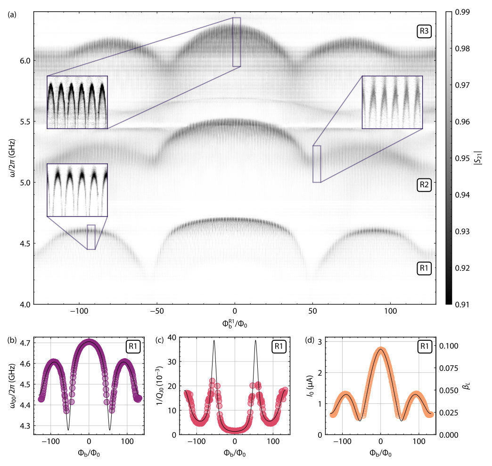 
Fig. 4: Single-bJJ Fraunhofer-diffraction decouples resonance frequency from flux responsivity and allows modeling losses. (a) Gray-scale-coded transmission |𝑆21| vs VNA probe frequency (covering the resonance frequencies of all three cavities) and vs bias flux coupling into the SQUID of R1. Beyond a few flux quanta Φ0, all three modes show a Fraunhofer-like modulation of their resonance frequencies enveloping the periodic modulations of the SQUIDs, which are still clearly visible over the complete field range, even around the Fraunhofer minima or at the first side-maxima, cf. the three zoom windows. Note here that the zoom window for R2 reveals skewed flux arcs, a signature for Josephson...

📷 Fig 5

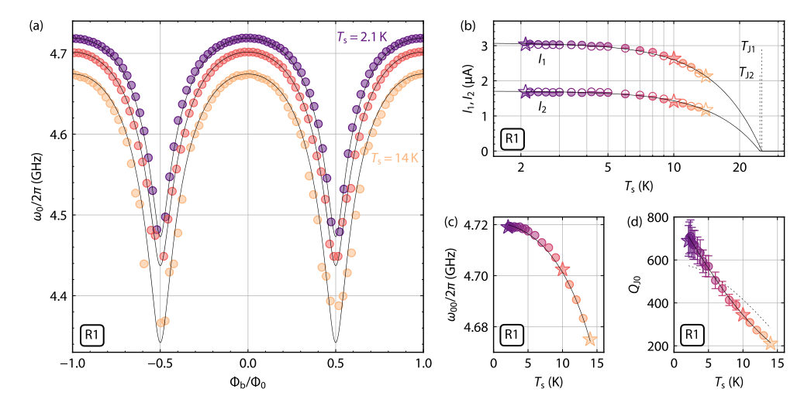 
Fig. 5: Operating flux-tunable YBCO SQUID cavities between 2.1 K and 14 K. (a) Flux-tuning arcs of the resonance frequency 𝜔0 of R1 at three different sample temperatures 𝑇s = 2.1 K, 10 K and 14 K, plotted in purple, red, and orange, respectively. With increasing temperature, the sweetspot resonance frequency decreases, and the tuning range increases from 𝜔00 −𝜔min ∼2𝜋× 240 MHz at 2.1 K to ∼2𝜋× 320 MHz at 14 K. Circles are experimental data, lines are fit curves considering potentially different critical currents of the two bJJs in the SQUID, i.e., an asymmetric SQUID. (b) Critical currents 𝐼1, 𝐼2 of the two bJJs in the SQUID vs 𝑇s obtained from the arc fits in panel (a). Top-filled symbols...

**Summary.** This paper reports on the creation and characterization of highly tunable superconducting microwave resonators using YBCO thin films and Josephson junctions formed by helium ion irradiation. The key achievement is demonstrating that the resonators exhibit both periodic SQUID oscillations and a superimposed Fraunhofer-like modulation, allowing for independent control over resonance frequency and magnetic flux responsivity. This paves the way for advanced quantum sensing and circuit applications at elevated temperatures.

**Why it may be interesting.** The work directly addresses superconducting circuits using high-temperature superconductors (YBCO), which are central to the study of strongly correlated electron systems, and integrates quantum circuit elements (SQUIDs) into a measurable microwave platform.

Detailed structure

**Main problem.** The primary goal is to develop a flexible and reliable platform for superconducting microwave circuits capable of operating in high-magnetic-field and high-temperature regimes.

**Main result.** The authors successfully demonstrated strongly flux-tunable microwave resonators using YBCO coplanar waveguides integrated with helium-ion-generated Josephson junctions, exhibiting Fraunhofer-like modulation.

**Method.** The study involves fabricating YBCO CPW cavities, generating Josephson junctions via focused helium ion beam irradiation, and characterizing the resulting SQUID-resonator system using a Vector Network Analyzer (VNA) under applied magnetic flux.

**Model / system.** The physical system is a coplanar waveguide resonator made of YBCO, incorporating Josephson junctions (bJJs) forming SQUID loops. The analysis models the resonance frequency ($\omega_0$) and losses ($1/Q_{J0}$) as functions of the applied magnetic flux ($\Phi_b$) and temperature ($T_s$).

**Key observables.** Resonance frequency ($\omega_0$), linewidths ($\kappa$), critical junction current ($I_c$), and the Fraunhofer-like modulation envelope.

**Important parameters / regimes.** Operating temperatures up to 14 K; flux quantum ($\Phi_0$); ion dose ($D_{\ell}$); and the junction resistance ($R_J$).

**Assumptions / limitations.** The analysis relies on fitting the data to established SQUID and Josephson junction models, though limitations regarding the simple model for $1/Q_{J0}$ are noted.

**Figures summary.** Figures illustrate the SQUID flux-tuning curves showing periodic oscillations, overlaid with a broader Fraunhofer-like modulation envelope, and also show the temperature dependence of these characteristics.

**Paper structure.** The paper progresses from initial characterization of the YBCO platform and junction formation (dose dependence) to measuring the fundamental SQUID flux-tuning response, and finally analyzing the complex interplay between the periodic SQUID modulation and the superimposed Fraunhofer envelope, including temperature studies.

Abstract

Superconducting microwave circuits with and without Josephson inductances are the Swiss Army knife for many experiments and technologies from quantum information science to astrophysical particle detectors. Despite a large variety of existing circuit types, thin film materials and Josephson junction technologies, a flexible and reliable platform for high-magnetic-field and high-temperature applications is yet to be found. In this manuscript, we investigate coplanar waveguide cavities made of the high-temperature cuprate superconductor YBa$_2$Cu$_3$O$_7$ (YBCO), integrated with Josephson inductances and quantum interferometers that are generated by the controlled local irradiation of the YBCO with a focused helium ion beam. We obtain strongly flux-tunable microwave resonators, which not only display periodic interferometer oscillations of resonance frequency and decay rate, but also a superimposed Fraunhofer-like modulation pattern. The latter originates from the magnetic field tuning of the individual Josephson junction critical currents due to the out-of-plane junction barriers. It allows adjusting resonance frequency and flux responsivity independently of each other, potentially enabling tunable microwave circuits with low sensitivity to external magnetic-field noise over a broad range of frequencies. Finally, we investigate the temperature dependence of the cavities, show that they have promising characteristics up to 14$\,$K, and present a model for the junction-induced cavity losses.

[↑ back to top](#top)

### [Migdal-Eliashberg and SUS-$Y^2$-SYK](http://arxiv.org/abs/2605.31540v1)

**Authors:** D. V. Khveshchenko  
**Type:** theory · **Category:** strongly correlated electrons · **PDF:** <https://arxiv.org/pdf/2605.31540v1>  
**Analysis basis:** full PDF text, analyzed in chunks
**Topic relevance:** `Keldysh / 2PI / non-Gaussian methods` **3/5** · `Kondo & dissipative impurity` **1/5** · `analog quantum simulation` **1/5** · `methods for driven-dissipative` **1/5**

📷 Fig 1

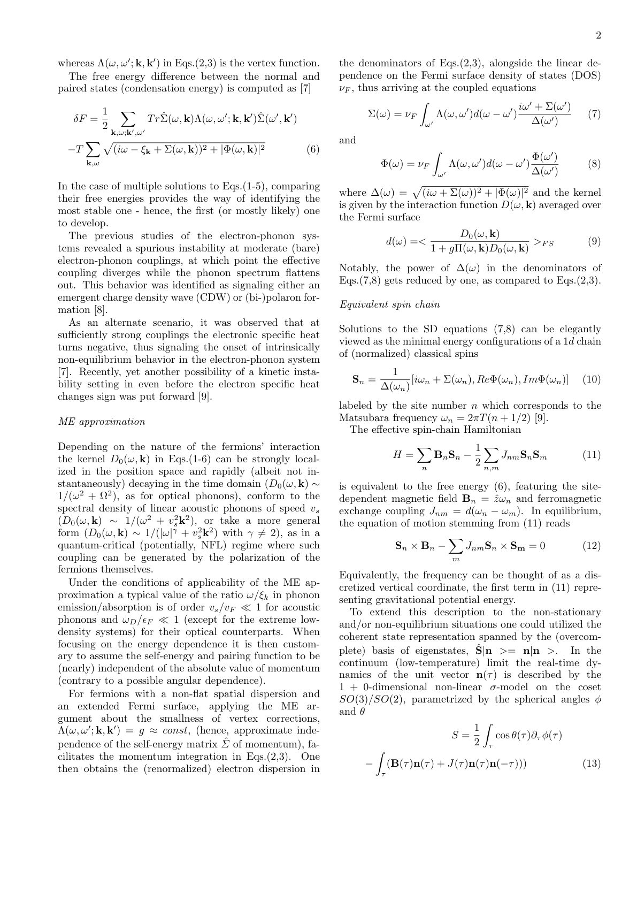 
Low-resolution page preview, page 2

📷 Fig 2

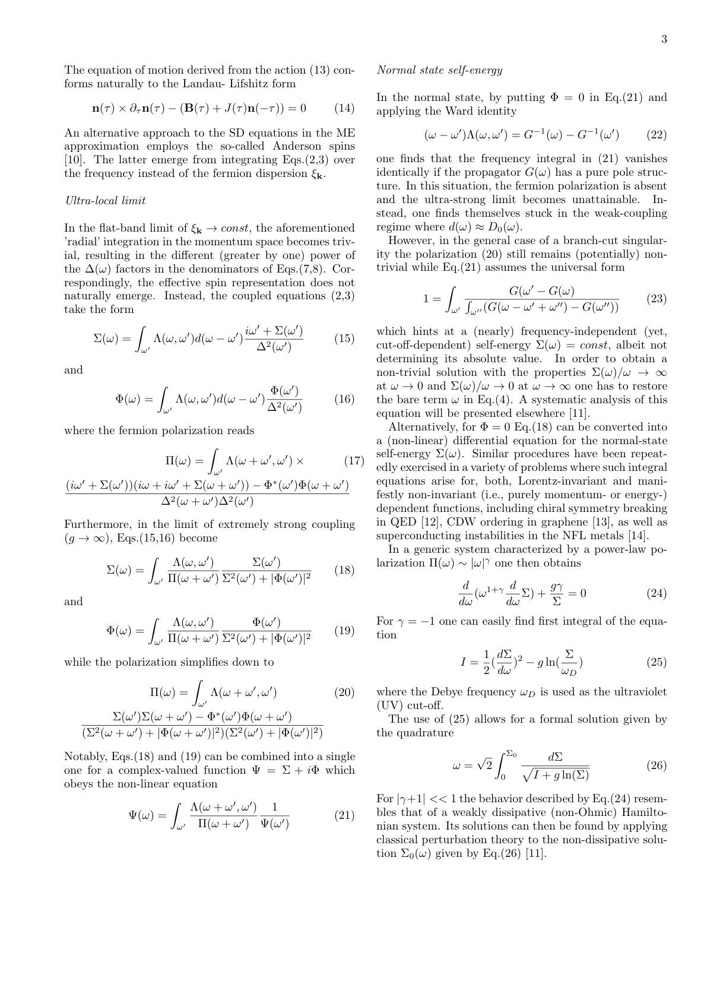 
Low-resolution page preview, page 3

📷 Fig 3

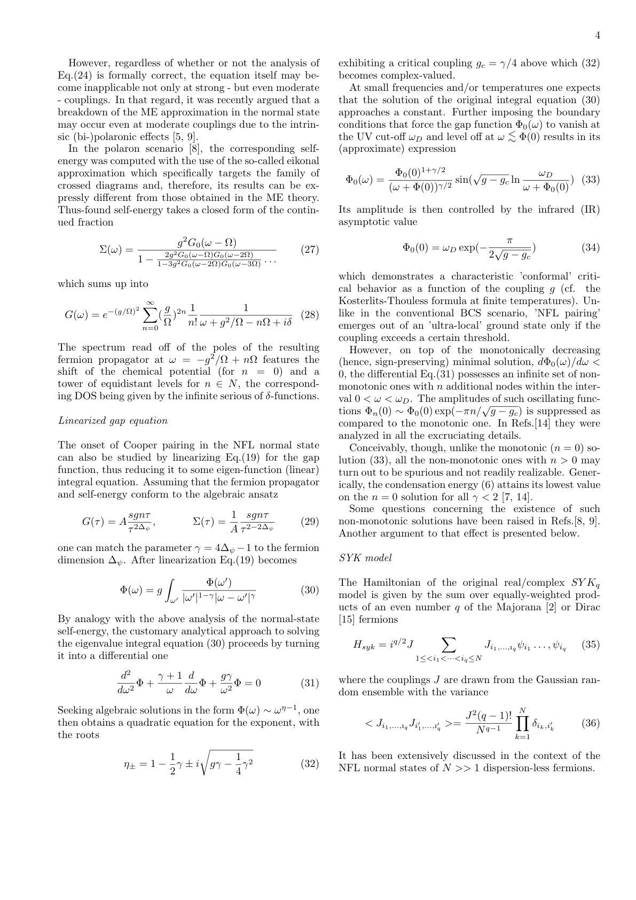 
Low-resolution page preview, page 4

📷 Fig 4

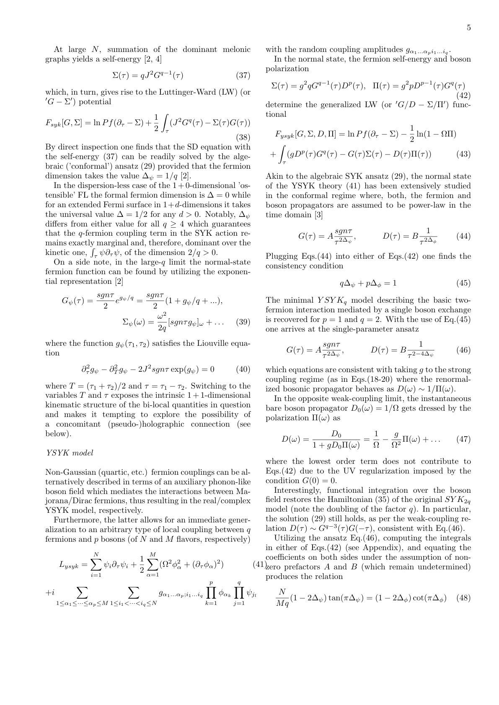 
Low-resolution page preview, page 5

📷 Fig 5

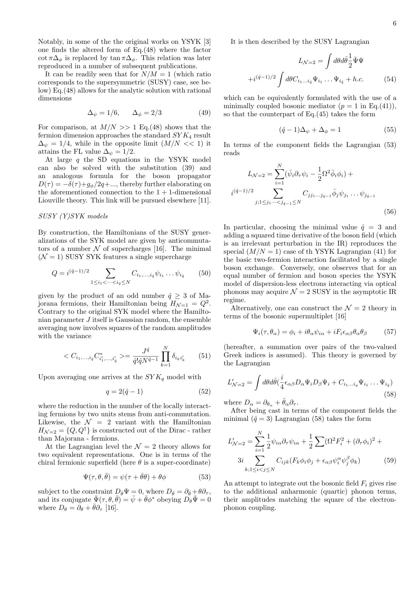 
Low-resolution page preview, page 6

**Summary.** This theoretical note tackles the complex physics of strong electron-boson coupling, bridging established theories like Migdal-Eliashberg superconductivity with modern models of quantum chaos, such as the SYK model. It develops sophisticated mathematical tools to analyze the self-energy and pairing mechanisms in these strongly correlated regimes. The work is significant for its attempt to unify descriptions of high-Tc superconductivity and quantum criticality using advanced field-theoretic techniques.

**Why it may be interesting.** The deep connection between superconductivity (Eliashberg theory) and quantum chaos models (SYK) provides a powerful, non-trivial theoretical lens for understanding emergent quantum phases in strongly correlated materials.

Detailed structure

**Main problem.** The paper addresses subtle issues in strong phonon-like fermion-boson coupling and analyzes self-energy and gap functions in strongly correlated systems, extending concepts to supersymmetric generalizations of the SYK model.

**Main result.** The analysis provides simplified, coupled equations for the self-energy and gap function, showing how the ME approximation simplifies the Dyson-Schwinger equations, and establishes specific constraints for the SUSY-SYK model.

**Method.** The work employs advanced theoretical techniques including the Schwinger-Dyson equations, Migdal-Eliashberg approximations, algebraic ansatz solutions, and analysis using conformal field theory dimensions.

**Model / system.** The primary models are electron-phonon coupled systems (relevant for superconductivity) and the Sachdev-Ye-Kitaev (SYK) model, including its Yukawa and supersymmetric generalizations (YSYK, SUSY-SYK).

**Key observables.** Self-energy $\Sigma(\omega)$, pairing function $\Phi(\omega)$, condensation energy ($\delta F$), and the pairing susceptibility.

**Important parameters / regimes.** Coupling constants ($g$), frequency ($\omega$), and various dimensional exponents ($\Delta_\psi, \Delta_\phi$).

**Assumptions / limitations.** The analysis frequently relies on the Migdal-Eliashberg approximation (neglecting vertex corrections) and the large-N limit for simplification.

**Paper structure.** The paper progresses by first establishing the framework for electron-phonon coupling via the ME approximation, then generalizing the self-energy analysis to NFL behavior using SYK/YSYK models, and finally applying these concepts to the highly constrained framework of SUSY-SYK models.

Abstract

This note addresses a number of subtle issues pertaining to the long-standing problem of strong phonon-like fermion-boson coupling. Among the central topics are the customary Migdal-Eliashberg approximation in the pertinent Schwinger-Dyson gap equation and its solutions. The previously gained insight is assessed by contrasting it against the various (non-)supersymmetric variants of the Yukawa-Sachdev-Ye-Kitaev model. Also, some previously discussed (pseudo-)holographic aspects of fermion pairing in such models are commented upon.

[↑ back to top](#top)

### [The $O(2,1)$ algebra and two-dimension electron Green's function in the field of magnetic monopole](http://arxiv.org/abs/2605.30874v1)

**Authors:** P. S. Sidorov, N. A. Vlasov, I. S. Terekhov, A. I. Milstein  
**Type:** theory · **Category:** strongly correlated electrons · **PDF:** <https://arxiv.org/pdf/2605.30874v1>  
**Analysis basis:** full PDF text, analyzed in chunks
**Topic relevance:** `Keldysh / 2PI / non-Gaussian methods` **3/5** · `methods for driven-dissipative` **3/5**

📷 Fig 1

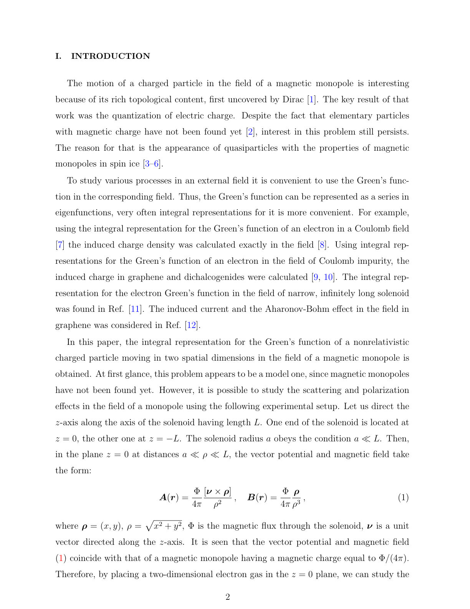 
Low-resolution page preview, page 2

📷 Fig 2

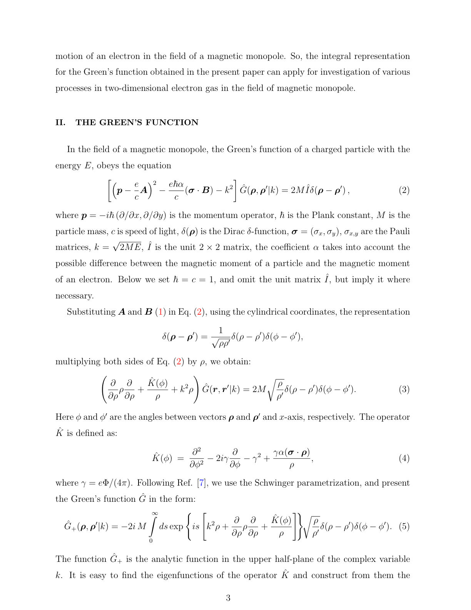 
Low-resolution page preview, page 3

📷 Fig 3

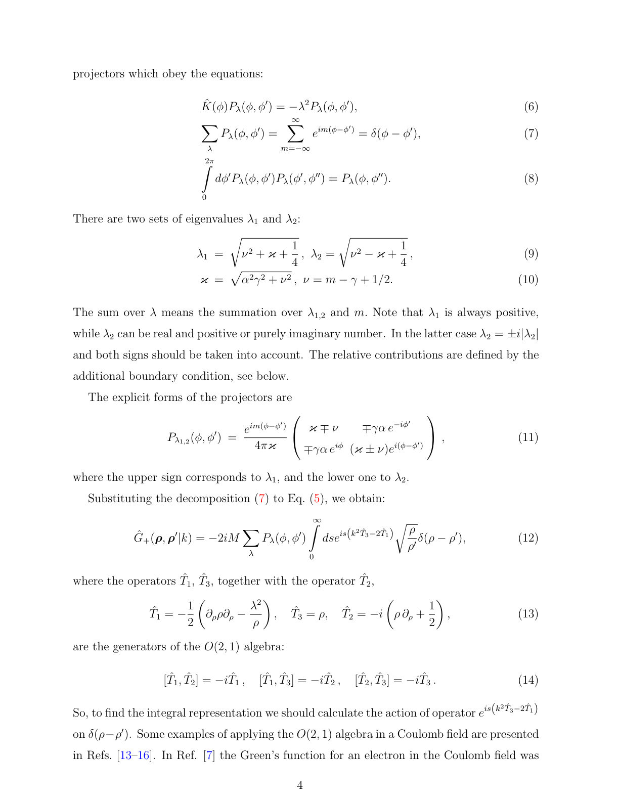 
Low-resolution page preview, page 4

📷 Fig 4

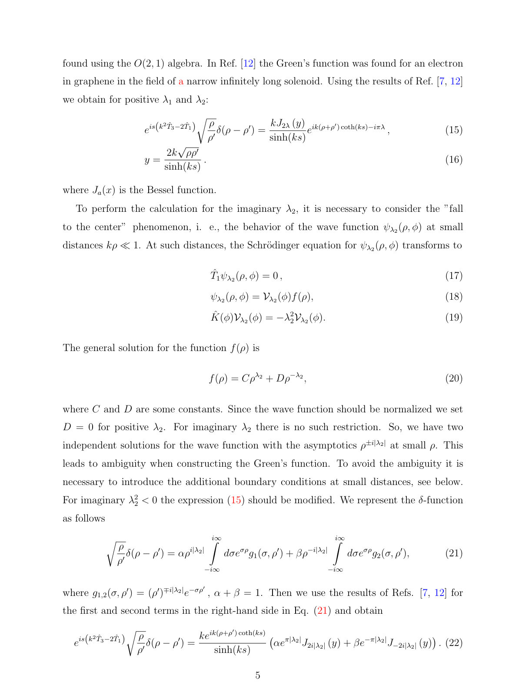 
Low-resolution page preview, page 5

📷 Fig 5

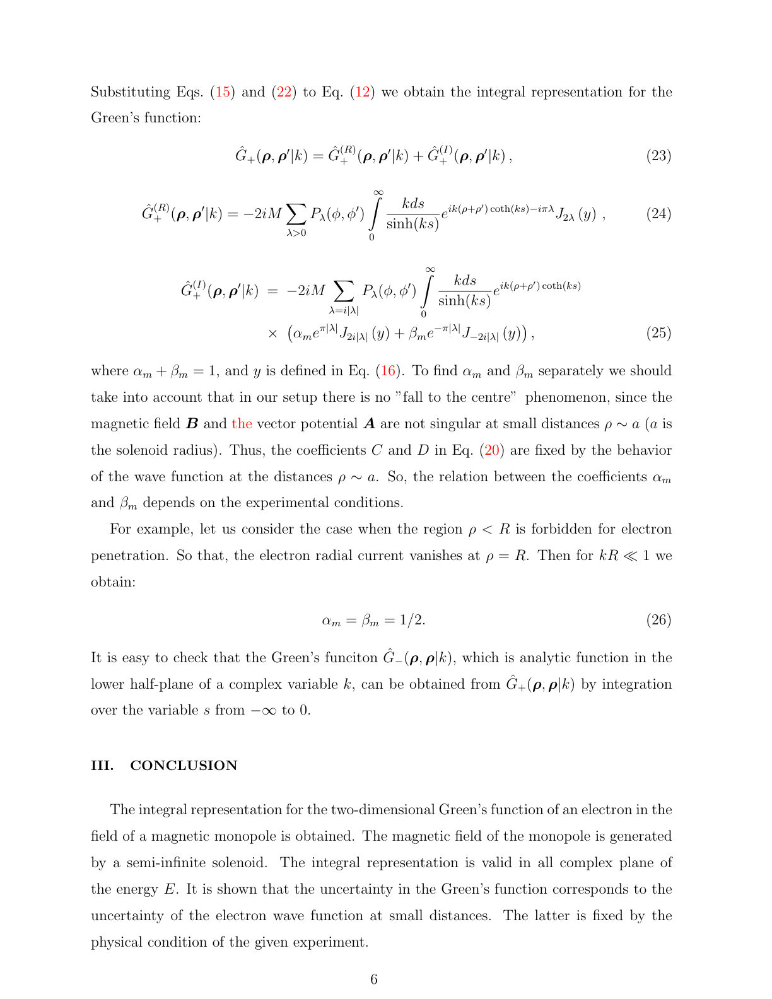 
Low-resolution page preview, page 6

**Summary.** This theoretical paper derives the integral representation for the two-dimensional electron Green's function in the presence of a magnetic monopole field. It employs advanced mathematical tools, specifically the O(2,1) algebra and the operator method, to solve the governing master equation. The result provides a detailed spectral description of electron behavior in such topologically non-trivial magnetic environments.

**Why it may be interesting.** The connection between topological defects (monopoles) and advanced algebraic structures like O(2,1) algebra, applied to fundamental quantities like the Green's function, provides deep insights into how topology influences electronic band structure in condensed matter systems.

Detailed structure

**Main problem.** The paper aims to find the integral representation for the two-dimensional Green's function of an electron moving in the presence of a magnetic monopole field.

**Main result.** A full integral representation for the Green's function is derived, decomposing it into real and imaginary contributions involving Bessel functions.

**Method.** The methodology combines the operator method with the mathematical framework of the O(2,1) algebra, utilizing the Schwinger parametrization for the Green's function.

**Model / system.** The system models a nonrelativistic electron in 2D subjected to the magnetic field of a monopole, analogous to a 2DEG between solenoid ends. The governing equation is a master equation involving the electron's kinetic energy and the monopole field.

**Key observables.** The two-dimensional Green's function, G(rho, rho'|k).

**Important parameters / regimes.** Magnetic charge (related to $\Phi$), electron energy ($k$), and the geometry parameters ($
ho, 
ho'$).

**Assumptions / limitations.** The derivation assumes the physical setup avoids the singularity at the center ($
ho \sim a$).

**Paper structure.** The paper proceeds by setting up the master equation for the Green's function, applying the Schwinger parametrization, and then decomposing the solution using the properties of the O(2,1) algebra to yield the final integral form.

Abstract

Using the operator method and properties of $O(2,1)$ algebra, the integral representation for the two-dimensional Green's function of an electron in the field of a magnetic monopole is found. This representation is valid in all complex plane of the electron energy.

[↑ back to top](#top)

### [New quantum information perspectives in the axion--photon and neutrino systems](http://arxiv.org/abs/2605.30419v1)

**Authors:** Aaditya Datar, Arun M. Thalapillil, Palak Thareja  
**Type:** theory · **Category:** quantum information and computing · **PDF:** <https://arxiv.org/pdf/2605.30419v1>  
**Analysis basis:** full PDF text, analyzed in chunks
**Topic relevance:** `entanglement & information structure` **3/5** · `non-equilibrium dynamics` **1/5**

📷 Fig 1

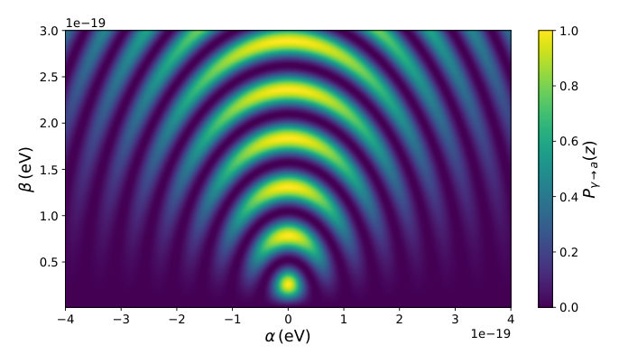 
Figure 1: Representative plot of the transition probability Pγ→a(z), for a fixed z = 6 × 1019 eV−1, merely to illustrate its dependence on the physical parameters α and β. Realistic values of the physical parameters α and β lead to very small transition probabilities.

📷 Fig 2

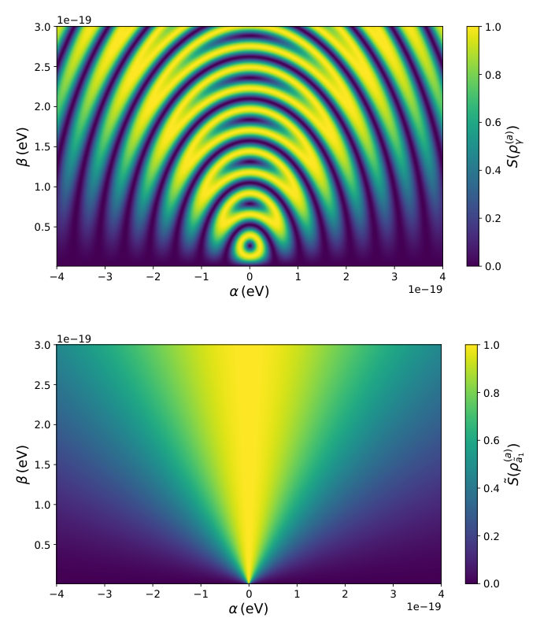 
Figure 2: An illustrative plot of the von Neumann entropy for the photon subsystem in the interaction and propagation basis, plotted as a function of the system parameters α and β. The interaction basis entropy is calculated at a fixed z = 6 × 1019 eV−1 (as for the transition probability in Fig. 1). Notice how the z-dependence in the interaction basis changes the behaviour of the entropy in comparison to the static behaviour present in the propagation basis, we observe that it is modulated by the sinusoidal behaviour characteristic of the transition probability Pγ→a(z).

📷 Fig 3

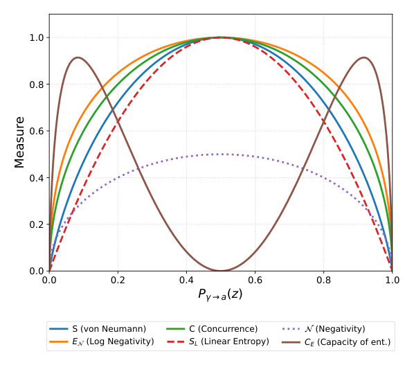 
Figure 3: Quantum information measures calculated for the axion–photon system, plotted as func- tions of the transition probability Pγ→a(z). Notice that all measures, except the capacity of entan- glement (which measures the fluctuation rather than the magnitude of the entanglement spectrum), follow a similar evolution—the measures, although providing complementary perspectives, are related to each other as they involve the same Schmidt weight in different functional forms. It is also impor- tant to emphasise again that the maximum transition probability attained depends on the values of α and β, and does not necessarily always span the full range [0, 1].

📷 Fig 4

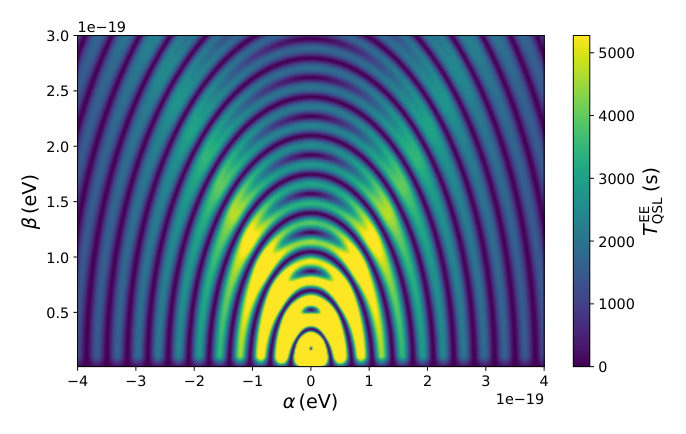 
Figure 4: An illustrative figure depicting the entanglement QSL T EE QSL in the (α, β) parameter space for the axion–photon system.

📷 Fig 5

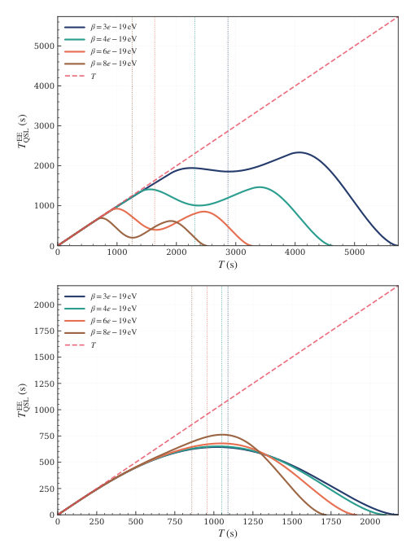 
Figure 5: The entanglement QSL time T EE QSL plotted as a function of the evolution time T, over the respective full oscillation time periods for different values of β. In the plots α = 2 × 10−19 eV (top) and α = 9 × 10−19 eV (bottom), corresponding to the regimes α &lt; β and α &gt; β, respectively. The vertical lines correspond to the respective oscillation half-periods, where the transition probabilities are at their maxima. The diagonal, dashed line denotes a reference line T EE QSL = T. One observes that the entanglement bound is attained and saturated till some T, making the bound tight, and beyond that point the bound is weak with T &gt; T EE QSL.

**Summary.** This work applies quantum information theory to study axion-photon mixing, treating it as a quantum oscillation problem analogous to neutrino oscillations. By analyzing entanglement measures and deriving an entanglement quantum speed limit, the authors establish fundamental, quantifiable limits on the rate and nature of the conversion process. This connects particle phenomenology directly to the fundamental principles of quantum information theory.

**Why it may be interesting.** The rigorous application of quantum information theory tools, such as entanglement speed limits, to particle physics phenomena like axion-photon conversion provides a novel, fundamental constraint on particle physics models.

Detailed structure

**Main problem.** The paper develops a quantum information-theoretic framework to analyze axion-photon mixing, drawing parallels with neutrino oscillations.

**Main result.** It identifies characteristic thresholds for quantum information measures and derives an entanglement quantum speed limit that characterizes the intrinsic timescales of the conversion process.

**Method.** The analysis employs various quantum information measures (e.g., entanglement entropy, concurrence, discord) and compares multiple quantum speed limits (Mandelstam-Tamm, Margolus-Levitin, and entanglement-specific bounds).

**Model / system.** The system is the axion-photon pair coupled in the presence of a transverse external magnetic field, analyzed in the single-excitation sector. The dynamics are compared to the two-flavor neutrino oscillation model.

**Key observables.** Entanglement entropy, concurrence, negativity, quantum mutual information, discord, capacity of entanglement, and various quantum speed limits.

**Important parameters / regimes.** Axion mass ($\alpha$), mixing parameter ($eta$), detuning, and the external magnetic field strength ($B_{	ext{ext}}$).

**Assumptions / limitations.** The analysis focuses on the single-excitation sector, and comparisons between bases (interaction vs. propagation) highlight structural differences in entanglement measures.

**Figures summary.** Figures illustrate the dependence of entanglement measures and the entanglement quantum speed limit on the mixing parameters ($\alpha$ and $eta$), showing distinct saturation and functional behaviors in different parameter regimes.

**Paper structure.** The paper systematically reviews axion-photon mixing, investigates various quantum information measures, and concludes with a detailed study and comparison of multiple quantum speed limits applicable to the system.

Abstract

In this work, we broach a quantum information-theoretic treatment of axion--photon mixing. Motivated by an emerging class of quantum-enhanced axion searches, we analyse the two-level single-excitation sector of axion--photon oscillations, demonstrating how the coupled dynamics naturally generate bipartite axion--photon mode entanglement. We study in detail the ensuing aspects of entanglement entropy, concurrence, negativity, quantum mutual information and discord, and capacity of entanglement, and the corresponding neutrino analogues wherever novel and previously unaddressed. In particular, we highlight the characteristic features that connect maximal axion--photon entanglement to resonant or strong-mixing conversion, and the distinct thresholds for the extremal values attained by the quantum information measures. We study aspects of the Mandelstam--Tamm and Margolus--Levitin quantum speed limits for both the axion--photon and neutrino systems. While orthogonalisation occurs only at axion--photon resonance, or at maximal neutrino mixing, where the two bounds coincide, away from these limits, the Margolus--Levitin bound is saturated at maximal conversion, while the Mandelstam--Tamm bound is generally weaker. We also study an entanglement quantum speed limit for axion--photon conversion, that separates into detuning-dominated and magnetic-mixing-dominated regimes, and find that it is saturated for a period and then the bound becomes weak. The results in this work identify the quantum resources and limiting timescales intrinsic to axion--photon conversion, and connect axion phenomenology, neutrino oscillations and quantum information theory.

[↑ back to top](#top)

### [Co-optimization of spin coherence and valley splitting in Si/SiGe heterostructures](http://arxiv.org/abs/2605.31342v1)

**Authors:** Peihong Zhang, Xuedong Hu, Saif Ullah, Jason R. Petta  
**Type:** theory · **Category:** quantum information and computing · **PDF:** <https://arxiv.org/pdf/2605.31342v1>  
**Analysis basis:** full PDF text, analyzed in chunks
**Topic relevance:** `spintronics-quantum-optics interface` **3/5**

📷 Fig 1

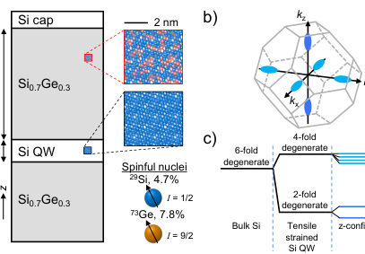 
FIG. 1. (a) Growth profile of a typical Si/SiGe heterostructure. The silicon quantum well (QW) has a thickness tQW and is buried by a Si0.7Ge0.3 spacer layer of thickness ts. Spinful 29Si and 73Ge nu- clei result in electron spin decoherence through the contact hyperfine interaction. Inset: Atomic scale renderings of the Si and Si0.7Ge0.3 layers. (b) First Brillouin zone of bulk silicon with six equivalent val- leys along the high-symmetry directions in k-space. (c) The six-fold valley degeneracy is lifted by tensile strain and confinement along the growth direction (ˆz).

📷 Fig 2

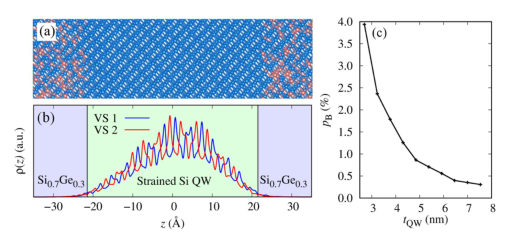 
FIG. 2. (a) An ideal Si/Si0.7Ge0.3 heterostructure with atomically abrupt interfaces. (b) Charge density, ρ(z), of the two valley states (VS 1 and VS 2) in the Si QW as obtained from DFT calculations us- ing the heterostructure illustrated above. (c) Percentage of the elec- tronic wavefunction residing in the SiGe barrier layers, pB, as a func- tion of tQW. pB rapidly increases as tQW is decreased below ∼5 nm, exacerbating the effects of hyperfine coupling to spinful 73Ge nuclei.

📷 Fig 3

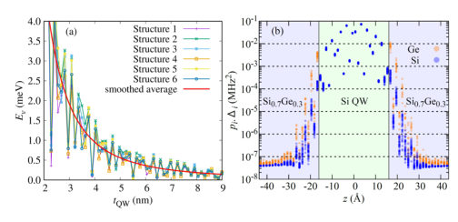 
FIG. 3. (a) Ev as a function of tQW for idealized structures with atomically abrupt interfaces. The solid red line depicts the average valley splitting ⟨Ev⟩. (b) Contributions from individual nuclear spins to the contact hyperfine coupling in a QW with tQW = 3.2 nm. The blue (orange) dots represent contributions from 29Si (73Ge) lattice nuclei.

📷 Fig 4

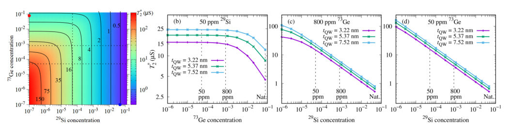 
FIG. 4. (a) Color-scale plot of the inhomogeneous spin dephasing time T ∗ 2 as a function of 29Si and 73Ge concentrations. (b–d) Linecuts extracted from panel (a). In panel (b), T ∗ 2 is plotted as a function of 73Ge concentration for 50 ppm 29Si. In panels (c,d), T ∗ 2 is plotted as a function of 29Si concentration for 800 ppm and 50 ppm 73Ge.

📷 Fig 5

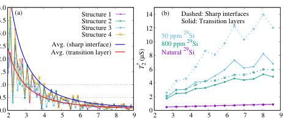 
FIG. 5. (a) Ev for QWs bounded by 1 nm thick Si0.85Ge0.15 transi- tion layers. Results from four different SiGe structures are shown. The red solid line shows the average valley splitting ⟨Ev⟩for these structures. For comparison, the results from Fig. (3) are plotted here as well (blue line, abrupt interface). (b) A comparison of T ⋆ 2 as a function of tQW for abrupt interfaces (dashed lines) and broadened interfaces (solid lines).

**Summary.** This theoretical study uses DFT to optimize Si/SiGe heterostructures for quantum computing by balancing two competing factors: valley splitting and spin coherence. The authors find that achieving high performance requires narrow quantum wells (3-4 nm) combined with precise isotopic purification to mitigate detrimental hyperfine coupling from nuclear spins.

**Why it may be interesting.** This work directly tackles the material science bottlenecks for solid-state qubits, providing quantitative guidelines on how structural parameters (like interface sharpness) and material composition (isotopic purification) must be controlled to realize functional quantum hardware.

Detailed structure

**Main problem.** The paper addresses the challenge of co-optimizing spin coherence time and valley splitting in Si/SiGe heterostructures for use in semiconductor quantum devices.

**Main result.** Optimal performance requires balancing the competing effects of quantum well width, suggesting that 3-4 nm wide wells with specific isotopic concentrations can yield both large valley splittings (>500 ueV) and long coherence times (>15 uS).

**Method.** Density Functional Theory (DFT) calculations were employed to model the electronic structure and calculate the hyperfine coupling responsible for spin dephasing.

**Model / system.** The system is based on Si/SiGe heterostructures, specifically modeling the confinement of electron spins in Si quantum wells (QWs) sandwiched between SiGe barriers.

**Key observables.** Valley splitting (E_v), spin dephasing time (T_2*), and the percentage of electronic wavefunction in the barriers (p_B).

**Important parameters / regimes.** Quantum well width (t_QW), isotopic concentrations (e.g., 50 ppm of 73Ge and 29Si).

**Assumptions / limitations.** The analysis relies on DFT calculations, and the dephasing rate is calculated using the Fermi contact term approximation for hyperfine interaction.

**Figures summary.** Figures illustrate how growth profiles and confinement lift valley degeneracy (Fig. 1), how wavefunction overlap with Ge nuclei increases in narrow wells (Fig. 2), and how interface quality affects T_2* (Fig. 3).

**Paper structure.** The paper first establishes the physical challenges (small E_v, hyperfine coupling) and then uses DFT to model the system. It analyzes the trade-off between narrowing the QW (which increases E_v but also increases coupling) and proposes optimal structural and isotopic parameters to maximize both metrics.

Abstract

Single electron spins can be used to encode and process information in semiconductor quantum devices. Progress has been hindered by materials challenges, such as the small energy splitting between low-lying valley states and hyperfine coupling to nuclear spins. Here we use density functional theory to optimize the valley splitting and spin dephasing time in realistic Si/SiGe heterostructures. Reductions in the Si quantum well width generally increase the valley splitting. However, in narrow quantum wells, a larger fraction of the electronic wavefunction resides in the SiGe buffer layers, which increases the hyperfine coupling with spinful $^{73}$Ge. Our work shows that Si/SiGe heterostructures with 3~--~4~nm wide quantum wells and $^{73}$Ge and $^{29}$Si concentrations of 50 ppm should support average valley splittings $E_{v}$~$>$~500~$μ$eV and spin dephasing times $T_2^*$ exceeding 15~$μ$s assuming an effective quantum dot area of 700 nm$^2$. In addition, sharper Si/SiGe interfaces in general result in larger valley splittings and longer spin dephasing times.

[↑ back to top](#top)

### [Fidelity bounds for spin-dependent kicks with pulsed lasers](http://arxiv.org/abs/2605.31409v1)

**Authors:** C. Sagaseta, H. Liu, V. D. Vaidya, C. R. Viteri, J. J. García-Ripoll, E. Torrontegui  
**Type:** theory · **Category:** other · **PDF:** <https://arxiv.org/pdf/2605.31409v1>  
**Analysis basis:** full PDF text, analyzed in chunks
**Topic relevance:** `QC/QI experiment` **3/5**

📷 Fig 1

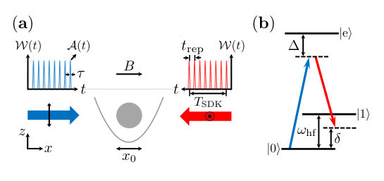 
Figure 1. Schematic of the pulsed Raman SDK. Two counter-propagating beams in the lin ⊥lin polarization configuration interact with a single ion (grey ball) confined in a harmonic potential (grey parabola) with characteristic length x0, that corresponds to the zero-point spread of the motional wavepacket of the ion. The quantization axis is defined by the magnetic field B = Bx, with x the unit vector along x. A SDK is generated by two pulse trains W(t) of duration TSDK composed of pulses A(t) of duration τ separated by equispaced intervals trep. (b) Generic energy level diagram (not to scale) of the Raman transition, where the Raman beams have a frequency difference δ that does not...

📷 Fig 2

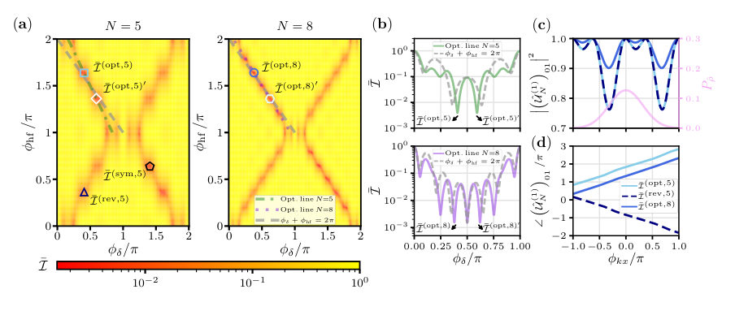 
Figure 2. (a) Infidelity landscape comparison between protocols with N = 5 (left) and N = 8 (right) delta pulses and ion in motional ground state |f⟩= |0⟩, where the lowest-infidelity points fall in the vicinity of the anti-diagonal line in Eq. (17). ¯I(opt,N) and ¯I(opt,N)′ denote the optimal infidelity (that define the optimal line where the local minima are located, which is tilted with respect to the anti-diagonal), ¯I(sym,N) is the corresponding symmetry point, while ¯I(rev,N) denotes the “reverse-kick” optimal infidelity that best approximates ˆUSDK(−ϕkx). (b) Cuts comparing local infidelity minima along the anti-diagonal line in Eq. (17) (dashed), and the optimal lines (solid)...

📷 Fig 3

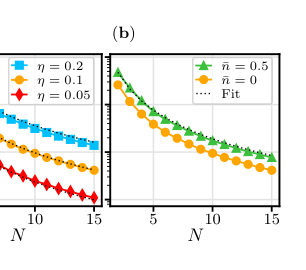 
Figure 3. Delta-pulse optimal state-averaged infidelity versus pulse number in the protocol. (a) Results for ion in motional ground state |f⟩= |0⟩for different values of the Lamb–Dicke parameter. The fit parameters {K, r} of the power-law decay ¯I(opt,N) = KN−r (dotted lines) are {0.33, 1.96}, {0.11, 2.05} and {0.03, 2.13} for η = 0.2, 0.1, 0.05, respectively. (b) Comparison of the optimal infidelity for the ground state (¯n = 0) and a thermal state with ¯n = 0.5, both for η = 0.1. The fit parameters for ¯n = 0.5 are {0.19, 2.00}.

📷 Fig 4

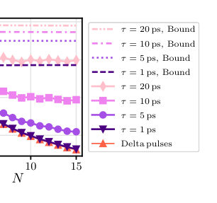 
Figure 4. Infidelity versus pulse number evaluated at  ϕ(opt,N) δ , ϕ(opt,N) hf for different pulse widths (the points  ϕ(opt,N)′

📷 Fig 5

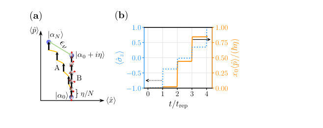 
Figure 5. (a) Phase space picture of a 5-pulse SDK with (path A) and without (path B) taking into account the secular motion of the ion, assuming equal-strength momentum kicks p = η/N (in units of ℏ/x0) depicted as black arrows. The error ϵν is regarded as the distance between the final states |αN⟩and |α0 + iη⟩. The red arrows represent the spin state, which rotates with every momentum displacement (only shown in path B for visibility). (b) SDK simulation including ion motion for N = 5 pulses of duration 5 ps at the delta-pulse optimal point with trep ≈0.28 ns in a trap of frequency ωt = 2π × 2 MHz. The expectation values ⟨ˆσz⟩(left axis, dotted) and ⟨ˆp⟩(right axis, solid) are depicted...

**Summary.** This paper rigorously analyzes the fidelity of Spin-Dependent Kicks (SDKs) used in trapped-ion quantum computing. By moving beyond idealized assumptions, the authors determine that the primary source of error limiting gate fidelity is the finite duration of the laser pulses, not the ion's residual motion. The results provide actionable guidelines for achieving high-fidelity, sub-microsecond quantum operations.

**Why it may be interesting.** This work provides crucial, quantitative design rules for implementing fundamental quantum gates (SDKs) in trapped ions by precisely quantifying the limitations imposed by realistic pulse laser technology.

Detailed structure

**Main problem.** The paper aims to characterize the control parameters required to maximize the fidelity of single-ion Spin-Dependent Kicks (SDKs) for implementing fast, high-fidelity two-qubit gates in trapped-ion quantum computing.

**Main result.** Finite pulse duration is found to be the dominant source of error, exceeding the contribution of secular motion by orders of magnitude for nanosecond-scale SDKs. Low infidelities below $10^{-3}$ are achievable with picosecond pulses.

**Method.** The analysis uses analytical methods and numerical simulations to model the evolution operator under pulsed Raman laser interactions, systematically relaxing approximations used in previous studies.

**Model / system.** The physical system is trapped ions with qubits encoded in hyperfine levels. The interaction is governed by a time-dependent Hamiltonian involving the trap frequency, qubit frequency, and pulsed laser fields, modeled as a train of short pulses.

**Key observables.** Fidelity of the SDK, state-averaged process fidelity ($ar{F}$), and state-averaged infidelity ($ar{I}$).

**Important parameters / regimes.** Raman frequency difference ($\delta$), pulse arrival times ($t_n$), Lamb–Dicke parameter ($\eta$), pulse width ($	au$), and total SDK time ($T_{SDK}$).

**Assumptions / limitations.** The analysis moves beyond previous approximations by incorporating finite pulse width and considering the effects of ion secular motion, though the error from motion is found to be negligible compared to pulse duration errors.

**Figures summary.** Figures schematically illustrate the pulsed Raman SDK structure and energy level diagrams. Other figures compare infidelity vs. pulse number for different pulse widths, and show phase space pictures of SDK evolution.

**Paper structure.** The paper builds by first defining the ideal SDK operator, then analyzing the protocol by sequentially relaxing approximations (from large $N$ to finite $	au$ and motion), culminating in quantitative design rules based on the dominant error source.

Abstract

Excitation of trapped-ion hyperfine qubits with fast optical Raman pulses enables faster-than-trap-period entangling gates with qubits of long coherence time for practical quantum computation. Achieving high-fidelity fast two-qubit gates requires high-quality spin-dependent kicks (SDKs), which form their fundamental building blocks. Here, we characterize the control parameters (including Raman frequency difference, pulse arrival times, Lamb--Dicke parameter, temperature, pulse width, and SDK time) that maximize the performance of single-ion SDKs for protocols compatible with performed experiments involving a small number of fast pulses. We demonstrate through analytical methods and numerical simulations that, within the model commonly used for infidelity optimization, finite pulse duration is the dominant source of error, exceeding the contribution of secular motion by orders of magnitude for nanosecond-scale SDKs. Low infidelities -- below $10^{-3}$ for schemes with $\gtrsim10$ fixed-amplitude, equispaced, picosecond pulses -- are achievable in SDK times on the order of nanoseconds. These results provide quantitative design rules for achieving competitive SDK fidelities with current pulsed-laser technology, laying the foundation for sub-microsecond trapped-ion quantum entangling operations.

[↑ back to top](#top)

### [Multiparameter quantum estimation and entanglement in top--antitop quark production](http://arxiv.org/abs/2605.30688v1)

**Authors:** Omar Bachain, Elhabib Jaloum, Mohamed Amazioug, Rachid Ahl Laamara  
**Type:** theory · **Category:** other · **PDF:** <https://arxiv.org/pdf/2605.30688v1>  
**Analysis basis:** full PDF text, analyzed in chunks
**Topic relevance:** `entanglement & information structure` **3/5**

📷 Fig 1

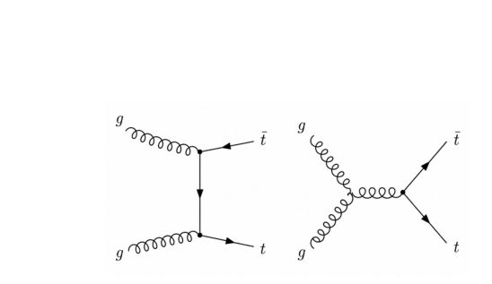 
Fig. 1: Representative leading-order Feynman diagrams contributing to the gluon-fusion production process gg →t¯t.

📷 Fig 2

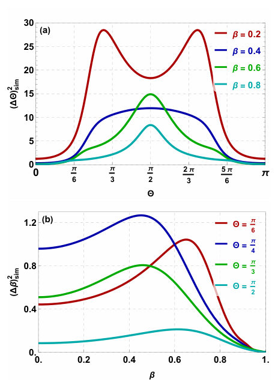 
Fig. 2: Simultaneous-estimation variances associated with the relativistic parameters β and Θ. (a) (∆Θ)2 sim as a function of Θ for different values of β. (b) (∆β)2 sim as a function of β for different values of Θ.

📷 Fig 3

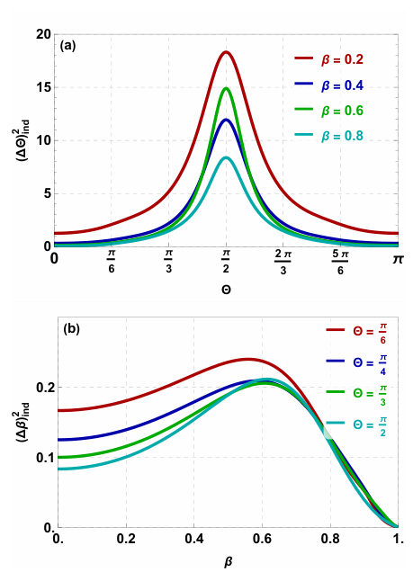 
Fig. 3: Individual-estimation variances associated with the relativistic parameters β and Θ. (a) (∆Θ)2 ind as a function of Θ for different values of β. (b) (∆β)2 ind as a function of β for different values of Θ.

📷 Fig 4

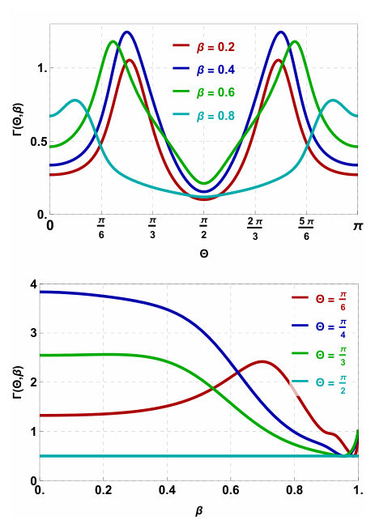 
Fig. 4: Ratio Γ(Θ, β) between the simultaneous- and individual-estimation variances associated with the relativistic parameters β and Θ. (a) Γ(Θ, β) as a function of Θ for different values of β. (b) Γ(Θ, β) as a function of β for different values of Θ.

📷 Fig 5

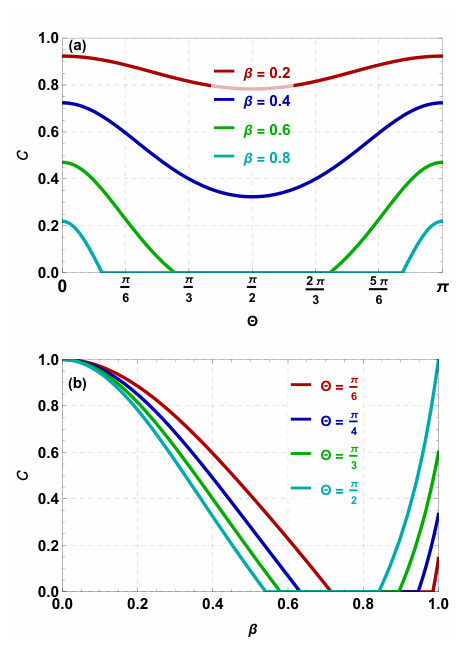 
Fig. 5: Concurrence C of the produced top–antitop quantum state. (a) C as a function of the production angle Θ for different values of the relativistic parameter β. (b) C as a function of β for different values of the production angle Θ.

**Summary.** This theoretical study explores how quantum entanglement in top-antitop quark production can enhance the precision of measuring kinematic parameters like velocity and production angle. By calculating the Quantum Fisher Information Matrix and the concurrence, the authors demonstrate a direct link: strong quantum correlations signal regimes where quantum metrology offers superior measurement capabilities compared to classical methods.

**Why it may be interesting.** While the application is in particle physics, the core methodology—using quantum information measures (entanglement, QFIM) to enhance parameter estimation beyond classical limits—is directly applicable to quantum sensing and metrology problems in AMO physics.

Detailed structure

**Main problem.** The paper investigates the interplay between quantum correlations (entanglement) and the precision limits achievable in simultaneously estimating multiple physical parameters ($eta$ and $\Theta$) during top-antitop quark pair production.

**Main result.** The simultaneous estimation strategy can yield a significant metrological advantage over individual estimations, and this advantage is strongly correlated with the degree of quantum entanglement present in the produced state.

**Method.** The authors utilized the spin density matrix formalism to model the system, deriving the Quantum Fisher Information Matrix (QFIM) to set the ultimate precision bounds, alongside calculating the concurrence to quantify entanglement.

**Model / system.** The physical system is top-antitop quark pair production ($g+g 	o tar{t}$) at high-energy colliders, modeled effectively as a bipartite spin-1/2 quantum state governed by relativistic parameters like velocity ($eta$) and production angle ($\Theta$).

**Key observables.** Quantum Fisher Information Matrix (QFIM), Concurrence, Estimation Variances ($\Deltaeta)^2, (\Delta\Theta)^2$, and the metrological advantage ratio $\Gamma(\Theta, eta)$.

**Important parameters / regimes.** Relativistic velocity ($eta$), production angle ($\Theta$), and the ultrarelativistic limit ($eta 	o 1$).

**Assumptions / limitations.** The analysis is performed at leading order in QCD, and the effective two-qubit description is valid due to the top quark's short lifetime.

**Figures summary.** Figures illustrate the dependence of estimation variances on $\Theta$ and $eta$, showing optimal regimes, and plot the Concurrence versus $\Theta$ and $eta$, demonstrating entanglement revival in the ultrarelativistic limit.

**Paper structure.** The paper systematically derives the quantum state using spin density matrices, calculates the QFIM for simultaneous estimation, compares this to individual estimations using the ratio $\Gamma$, and finally correlates the resulting metrological advantage with the calculated entanglement (concurrence).

Abstract

We investigate the interplay between quantum correlations and multiparameter quantum estimation in top--antitop quark pair production through the gluon-fusion channel. Using the spin density matrix formalism, we construct an effective two-qubit quantum state governed by the relativistic parameters associated with the scattering process. Within the framework of quantum metrology, we derive the quantum Fisher information matrix for the simultaneous estimation of the relativistic velocity parameter and the production angle, and we analyze the corresponding quantum precision bounds. Our results reveal highly nontrivial estimation regimes strongly controlled by relativistic spin correlations and scattering geometry. We further characterize the produced state through the concurrence and demonstrate the existence of strong connections between entanglement structures and multiparameter estimation sensitivity. Finally, we discuss the experimental feasibility of probing these effects at the Large Hadron Collider through spin-correlation observables and reconstructed top--antitop density matrices. Our results identify top--antitop production as a unique relativistic platform for exploring quantum information theory and multiparameter quantum metrology in high-energy physics.

[↑ back to top](#top)

### [Non-Perturbative Renormalization Group for Ising-Nematic Criticality: A Closed-Form Nonlocal Ansatz](http://arxiv.org/abs/2605.30715v1)

**Authors:** Hyeon Jung Kim, Kyoung-Min Kim, Ki-Seok Kim  
**Type:** theory · **Category:** strongly correlated electrons · **PDF:** <https://arxiv.org/pdf/2605.30715v1>  
**Analysis basis:** full PDF text, analyzed in chunks
**Topic relevance:** `Keldysh / 2PI / non-Gaussian methods` **3/5**

📷 Fig 1

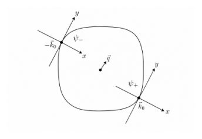 
FIG. 1. Schematic representation of the antipodal patches on the Fermi surface and the low-energy scattering processes governed by the effective action.

📷 Fig 2

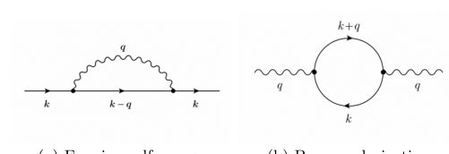 
FIG. 2. The leading one-loop Feynman diagrams in the two- patch effective theory: (a) the one-loop fermion self-energy correction and (b) the one-loop boson polarization diagram, where solid lines represent dressed fermion propagators and wavy lines represent the nonlocal boson propagator.

📷 Fig 3

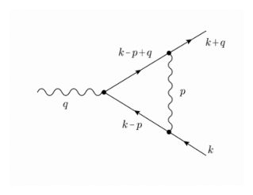 
FIG. 3. The one-loop Yukawa vertex correction diagram.

📷 Fig 4

 
FIG. 3 shows the one-loop correction to the Yukawa vertex. In the infrared limit, this correction vanishes, since the fermionic poles in the kx integration combine into a double pole whose residue gives no additional in- frared singularity. As a result, the one-loop vertex cor- rection does not introduce any additional infrared singu- larity, nor does it alter the leading scaling behavior of the Yukawa interaction. Thus, at this level of approximation, the Yukawa vertex may be consistently replaced by the coupling constant g in the low-energy effective action. The scaling structure is determined by requiring the three dominant terms in the dressed fermion propagator, namely

📷 Fig 5

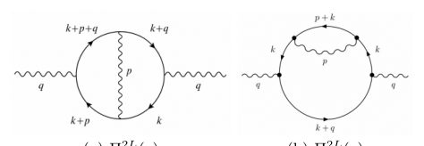 
FIG. 4. The two-loop Feynman diagrams contributing to the boson self-energy: (a) the Maki-Thompson vertex-type cor- rection and (b) the diagram with a one-loop fermion self- energy insertion.

**Summary.** This paper applies a non-perturbative Renormalization Group technique to analyze the critical behavior of a metallic Ising-nematic quantum critical point. The authors calculate loop corrections up to three loops, finding that the system lacks a self-consistent fixed point for the critical exponent $a$. They conjecture that the required solution necessitates incorporating four-loop bosonic self-energy terms to achieve full theoretical consistency.

**Why it may be interesting.** The rigorous, multi-loop RG approach to determine critical exponents in strongly correlated systems provides advanced theoretical tools applicable to understanding quantum phase transitions in materials.

Detailed structure

**Main problem.** The study aims to non-perturbatively determine the critical exponent $a$ characterizing the metallic Ising-nematic quantum critical point in two dimensions.

**Main result.** The three-loop analysis fails to yield a self-consistent fixed-point solution for $a$, suggesting that higher-order (four-loop) corrections are necessary to constrain the critical exponent.

**Method.** The authors employ a non-perturbative Renormalization Group (RG) analysis using a closed-form ansatz applied to a low-energy effective field theory.

**Model / system.** The model describes a metallic quantum critical point involving low-energy fermions coupled to a gapless bosonic nematic order parameter ($\phi$) in two dimensions.

**Key observables.** The critical exponent $a$, the fermion self-energy ($\Sigma$), the boson polarization ($\Pi$), and the Yukawa vertex correction ($\Gamma$).

**Important parameters / regimes.** The dynamical critical exponent $a$, and the anisotropic scaling dimensions $[k_0]=a+1$, $[k_x]=2$, $[k_y]=1$.

**Assumptions / limitations.** The analysis assumes the validity of a closed-form RG ansatz and relies on matching conditions derived from scale invariance across multiple loop orders.

**Figures summary.** Figures illustrate schematic diagrams of scattering processes, one-loop and two-loop Feynman diagrams for self-energies and polarization, and numerical plots showing the lack of intersecting fixed points at three loops.

**Paper structure.** The paper systematically develops the RG framework by calculating loop corrections (self-energy, polarization, vertex) up to three loops, demonstrating structural asymmetries, and concluding that the fixed point requires higher-order, non-trivial bosonic counter-terms.

Abstract

The two-dimensional metallic quantum critical problem is a long-standing puzzle that is widely believed to hold the key to resolving ubiquitous non-Fermi liquid behavior in strongly correlated electronic systems. In this study, we present a non-perturbative renormalization group (RG) analysis of the metallic Ising-nematic quantum critical point in two dimensions, formulated directly around an intrinsically nonlocal infrared (IR) boson propagator. Rather than treating the anomalous dynamical critical exponent $a$ as a fixed phenomenological parameter, we regard it as an intrinsic component of the fixed-point data to be determined from the internal consistency of the low-energy patch field theory under highly anisotropic scaling dimensions ($[k_0]=a+1$, $[k_x]=2$, $[k_y]=1$). While the leading two-loop diagrammatics vanish identically due to kinematic pole configurations, our three-loop evaluation reveals a profound structural asymmetry between the sectors: the fermion self-energy and Yukawa vertex receive non-vanishing logarithmic corrections, whereas the corresponding bosonic counter-term remains strictly zero. Consequently, we find that no self-consistent, intersecting fixed-point solution for the exponent $a$ exists within the three-loop truncation, failing to reproduce the physical value of $a \approx 1.85$ observed in quantum Monte Carlo simulations. We conjecture that the cross-linked topology of the four-loop boson self-energy diagrams is exactly marginal and yields the minimal, mandatory bosonic counter-term required to restore multi-sector self-consistency. Our framework establishes a rigid multi-loop matching scheme necessary to uniquely pin down the critical exponent, and uncovers a stable phase space for field anomalous dimensions.

[↑ back to top](#top)

### [Erasing photons from bright squeezed vacuum light via above-threshold ionization](http://arxiv.org/abs/2605.31160v1)

**Authors:** J. Rivera-Dean, T. Rook, G. Singh, P. Stammer, M. Khokhlova, E. Pisanty, C. Figueira de Morisson Faria  
**Type:** theory · **Category:** quantum information and computing · **PDF:** <https://arxiv.org/pdf/2605.31160v1>  
**Analysis basis:** full PDF text, analyzed in chunks
**Topic relevance:** `entanglement & information structure` **2/5** · `measurement-induced transitions` **2/5** · `quantum measurements` **2/5** · `Keldysh / 2PI / non-Gaussian methods` **1/5** · `analog quantum simulation` **1/5** · `driven-dissipative phase transition` **1/5** · `interference shaping light` **1/5** · `methods for driven-dissipative` **1/5**

📷 Fig 1

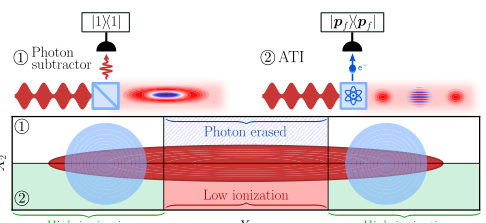 
FIG. 1. Pictorial representation highlighting the similarities between photon subtraction and photoelectron heralding. In the first case (①), a low intensity squeezed vacuum state passes through a high transmissivity beam splitter; the de- tection of a single-photon state on the reflected mode heralds the presence of a small optical Schrödinger cat state in the transmitted one. In the second case (②), a bright squeezed vacuum state interacts with an atomic system; the generation of high-energy photoelectrons heralds the presence of a large optical Schrödinger cat state. In both cases, the detection of either a single photon on the reflected mode or high-energy electrons effectively induces...

📷 Fig 2

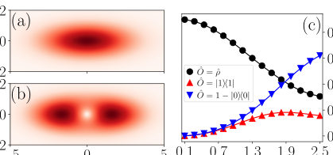 
FIG. 2. Norm of the coherent state probability amplitudes before [|c(α)|, panel (a)] and after [|ct(α)|, panel (b)] pho- ton subtraction for a squeezed state input. Panel (c) shows the expectation value of different operators ˆO with respect to ˆρ = |Φ⟩⟨Φ| in Eq. (5). Specifically, we display the purity ( ˆO = ˆρ, black curve with circular markers); the probability of detecting a single photon in the reflected mode ( ˆO = |1⟩⟨1|, red curve with upward triangles); and the probability of de- tecting any other state than a vacuum state in the reflected mode ( ˆO = 1 −|0⟩⟨0|, blue curve with downward triangles).

📷 Fig 3

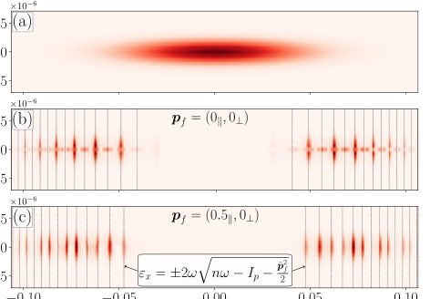 
FIG. 3. Norm of the coherent state probability amplitudes before [panel (a)] and after [panel (b), (c)] the ATI heralding. In panel (b), the heralding is performed for pf = 0, while in panel (c) for pf = (0.5∥, 0⊥). The vertical dashed lines high- light the location of the ATI rings, computed as indicated in the inset of panel (c). The numerical evaluation is carried out for r = 10 and g(ωL) = 10−6 a.u., considering a light-matter interaction lasting four optical cycles (ωL = 0.057 a.u.) and involving hydrogen atoms (Ip ≃0.5 a.u.). A discrete coher- ent state expansion is employed on a rectangular lattice with spacing k = 0.2√π (see Supplementary Material C).

📷 Fig 4

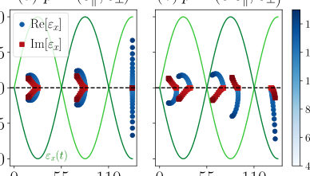 
FIG. 4. Solutions to Eqs. (22) and (23) for (a) pf = 0 and (b) pf = (0.5∥, 0⊥). The real (blue circles) and imaginary (red squares) parts of εx are shown as a function of the real part of the ionization time, with the opacity indicating the squeezing strength r. The electric field is depicted by the green curves: the darker curve corresponds to α &gt; 0, while the lighter one to α &lt; 0, highlighting the presence of two solutions associated with different regions of phase-space. In this analysis, we set g(ωL) = 10−8 a.u., ωL = 0.057 a.u., and used hydrogen (Ip ≃ 0.5 a.u.) as the atomic system.

📷 Fig 5

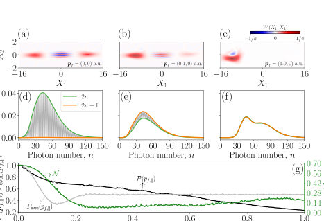 
FIG. 5. Non-Gaussian properties of the generated state, where each row presents a different measure. (a)-(c) Wigner functions of the ATI-heralded state for photoelectrons with p∥= 0, 0.1, 1.0 a.u., respectively, with p⊥= 0 a.u. held fixed in all cases. (d)-(f) Photon number probability distributions corresponding to the Wigner functions shown in the upper row, with the green (orange) curve connecting the even (odd) photon numbers. (g) Wigner negativity (green curve) of the resulting states as a function of the photoelectron energy, with the dark curve showing the photoelectron probability (nor- malized to maximum), and the gray one the probability of having even photon numbers in the state....

**Summary.** This paper shows that the process of Above-Threshold Ionization (ATI) driven by squeezed light can serve as a powerful, scalable mechanism analogous to photon subtraction in quantum optics. By detecting photoelectrons, the system filters the quantum state to generate large-amplitude optical Schrödinger cat states. These states exhibit clear non-classical features, allowing for the violation of Bell inequalities, thus opening strong-field physics for quantum state engineering.

**Why it may be interesting.** This work bridges fundamental quantum optics concepts (cat states, photon subtraction) with high-intensity, non-linear strong-field physics (ATI), proposing a novel, scalable platform for generating macroscopic quantum states.

Detailed structure

**Main problem.** The primary challenge is generating large-amplitude optical Schrödinger cat states, as standard photon subtraction protocols are limited in scalability and achievable macroscopicity.

**Main result.** The authors demonstrate that Above-Threshold Ionization (ATI) driven by bright squeezed light acts as a scalable, strong-field analogue of photon subtraction, enabling the generation of large-amplitude cat states that can violate a Bell inequality.

**Method.** The work employs a combination of quantum optics theory (photon subtraction formalism) and strong-field physics (ATI path integrals) to establish an analogy between the two processes.

**Model / system.** The system involves bright squeezed vacuum light interacting with atoms undergoing Above-Threshold Ionization (ATI). The theoretical framework models the post-selected optical state $|\Phi(\mathbf{p}_f, t)
angle$ resulting from photoelectron detection.

**Key observables.** Wigner function negativity, violation of Bell inequalities (CHSH value), and the structure of the photoelectron probability amplitude $	ilde{c}(\alpha)$.

**Important parameters / regimes.** The squeezing strength ($r$), the detected photoelectron momentum ($\mathbf{p}_f$), and the finite momentum resolution ($\sigma_\mu$) are key parameters analyzed.

**Assumptions / limitations.** The analysis relies on semiclassical approximations (saddle-point methods) and assumes that the photoelectron detection acts as a highly selective, non-linear filter on the quantum state.

**Figures summary.** Figures illustrate the comparison between photon subtraction and photoelectron heralding, show the transformation of probability amplitudes, and display Wigner functions confirming cat-like features and Bell inequality violations.

**Paper structure.** The paper builds by first establishing the theoretical analogy between photon subtraction and ATI heralding. It then uses path integrals and semiclassical methods to derive the post-selected state, characterizes its non-Gaussian features, and finally tests its non-classicality by violating a Bell inequality while analyzing the impact of experimental noise.

Abstract

While the interface between strong-field physics and quantum optics offers a unique regime for combining extreme nonlinearity with quantum optical resources, its potential for generating non-classical states of light remains largely unexplored. Standard protocols for generating optical Schrödinger cat states, such as photon subtraction from squeezed light, are inherently limited in the achievable macroscopicity of the state and its scalability. In this work, we bridge this gap by demonstrating that above-threshold ionization driven by bright squeezed light provides a strong-field analogue of photon subtraction, where photoelectron detection acts as a high-intensity heralding mechanism, enabling the generation of large amplitude optical Schrödinger cat states. We characterize the resulting non-Gaussian features and show that they can be tuned via the detected photoelectron momentum, and study their robustness against the experimental imperfections arising from finite momentum resolution at the heralding step. Despite the noise, we show that the generated states can be manipulated to violate a Bell inequality, thereby highlighting their potential for foundational and practical applications. Our results establish strong-field processes as a scalable platform for macroscopic quantum state engineering, opening a route to quantum optics in previously inaccessible regimes.

[↑ back to top](#top)

### [Search at bounded speed with immigration](http://arxiv.org/abs/2605.30629v1)

**Authors:** Hwai-Ray Tung, Sean D Lawley  
**Type:** theory · **Category:** statistical mechanics · **PDF:** <https://arxiv.org/pdf/2605.30629v1>  
**Analysis basis:** full PDF text, analyzed in chunks
**Topic relevance:** `non-equilibrium dynamics` **2/5** · `non-equilibrium universality` **2/5** · `Keldysh / 2PI / non-Gaussian methods` **1/5** · `driven-dissipative phase transition` **1/5** · `methods for driven-dissipative` **1/5**

📷 Fig 1

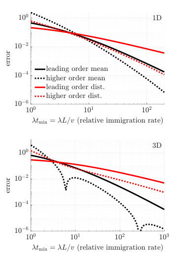 
Figure 1: Comparison of theory of section 3 with stochastic simulations of four search models. The black curves plot the relative error for approximations to the mean fFPT. The red curves plot the error for the approximations to the full distribution of the fFPT, where the error is the Kolmogorov-Smirnov distance (i.e. the maximum absolute difference between the cumulative distribution func- tions).

📷 Fig 2

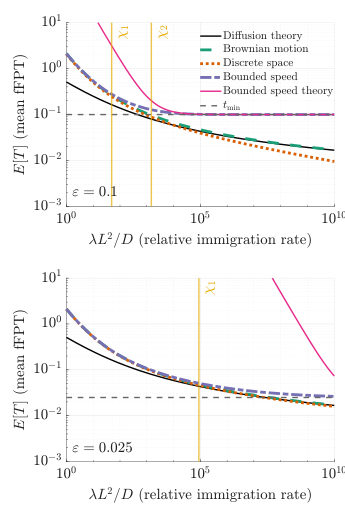 
Figure 2: Comparison of the mean fFPTs for the three “diffusion” processes of sections 5.1-5.3.

**Summary.** This paper develops rigorous mathematical results for estimating the time required for a search process to find a target when searchers arrive continuously (immigrate). It extends existing theory to account for searchers moving at a bounded speed, deriving exact distributions and moments in the fast immigration limit. The results are applied to canonical models like Brownian motion and run-and-tumble dynamics.

**Why it may be interesting.** While the core topic is stochastic search, the mathematical machinery involving convergence theorems, moment calculations, and the comparison between different physical diffusion models (BM vs. run-and-tumble) is highly relevant to non-equilibrium statistical physics and transport phenomena.

Detailed structure

**Main problem.** The paper investigates the search times for searchers that progressively enter or 'immigrate' into a domain at a constant Poissonian rate, specifically addressing the case where searchers move at a bounded speed.

**Main result.** In the fast immigration limit, the probability distribution and moments of the $k$-th search time ($T_k$) are determined, showing convergence to Erlang distributions.

**Method.** The analysis uses properties of inhomogeneous Poisson point processes and derives survival probabilities based on the short-time behavior of the single-searcher first passage time distribution.

**Model / system.** The models analyzed include 1D, 2D, and 3D run-and-tumble processes, Brownian motion, and linear PDMPs, all subjected to a constant immigration rate ($\lambda$).

**Key observables.** The $k$-th First Passage Time ($T_k$) and its moments ($E[T_k^m]$).

**Important parameters / regimes.** Immigration rate ($\lambda$), system size ($L$), searcher speed ($v$), and the characteristic time scale ($t_{\min} = L/v$).

**Assumptions / limitations.** The analysis is rigorously performed in the fast immigration limit ($\lambda 	o \infty$) and assumes the underlying single-searcher process ($	au$) has a specific short-time distribution.

**Figures summary.** Figure 1 compares the relative error of theoretical approximations against stochastic simulations for four different search models. Figure 2 compares the mean first passage time across three processes (BM, discrete, run-and-tumble) showing convergence/divergence regimes.

**Paper structure.** The paper develops general theorems for the fast immigration limit, applies these theorems to various physical models (run-and-tumble, BM), and compares the theoretical predictions against numerical simulations, paying close attention to the breakdown of approximations in different parameter regimes.

Abstract

Many biophysical search processes employ searchers which enter or "immigrate" into the domain progressively over time. Existing search time estimates can become unphysical for fast immigration since they imply that searchers move at infinite speed. In this paper, we investigate search times of immigrating searchers that move at bounded speed. In the fast immigration limit, we determine the full probability distribution and all the moments of the $k$th search time in terms of the early time probability distribution of a single searcher. We apply these rigorous mathematical results to several canonical models of stochastic search. We further analyze different models of "diffusion" and use these results to investigate when and how the minutiae of searcher dynamics affect search times. We compare our theory to numerical simulations.

[↑ back to top](#top)

### [(Non-)Traversable Quantum Phase Transitions](http://arxiv.org/abs/2605.31472v1)

**Authors:** Federico Balducci, Paul M. Schindler, Andrea Solfanelli, Marin Bukov  
**Type:** theory · **Category:** statistical mechanics · **PDF:** <https://arxiv.org/pdf/2605.31472v1>  
**Analysis basis:** full PDF text, analyzed in chunks
**Topic relevance:** `analog quantum simulation` **2/5** · `driven-dissipative phase transition` **1/5** · `entanglement & information structure` **1/5** · `non-equilibrium dynamics` **1/5** · `non-equilibrium universality` **1/5**

📷 Fig 1

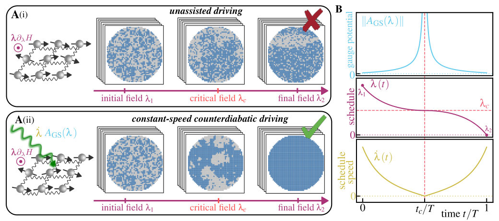 
FIG. 1. Constant-speed protocol and traversability of quantum phase transitions A, in this work we consider groundstate manipulation by driving along control parameter 𝜆from 𝜆1 to 𝜆2 through a phase transitions at 𝜆= 𝜆𝑐: (i) unassisted driving 𝐻(𝜆) leads to excitations in the final state; using the constant-speed counterdiabatic driving schedule, 𝐻+ ¤𝜆cs𝐴GS, transitionless driving can be achieved. B, amplitude of gauge potential 𝐴GS(𝜆) (blue) diverges at the critical point. The idea of the constant-speed protocol is to use a singular driving schedule 𝜆CS (red)—with speed ¤𝜆= 0 (orange) at the critical point—which cancels the gauge potential’s divergence; consequently, the quantum phase...

📷 Fig 2

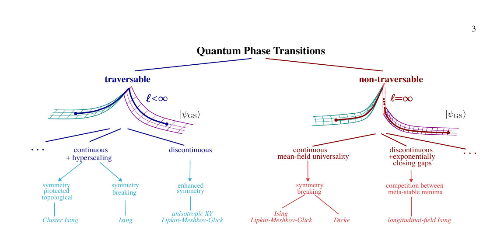 
FIG. 2. Genealogy of Traversable Quantum Phase Transitions. Quantum phase transitions can be divided into traversable (blue branch) and non-traversable (red branch) phase transitions according to the geometric length across the phase transition point remaining finite or not. Traversable quantum phase transitions, Sec. IV, include continuous ones obeying hyperscaling—including symmetry breaking phases (e.g., Ising chains, Sec. IV A 1) and symmetry protected topological phases (e.g., Cluster Ising chain, Sec. IV A 2)—and discontinuous ones with an enhanced continuous symmetry (e.g., the anisotropic XY Lipkin-Meshkov-Glick model, Sec. IV B). Likewise, non-traversable quantum phase transitions...

📷 Fig 3

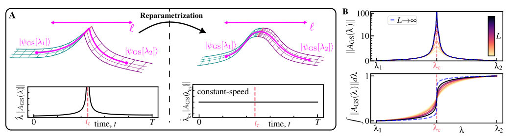 
FIG. 3. Constant-speed counterdiabatic driving. A, geometric interpretation of constant-speed parametrization: using a singular reparametrization, the non-analyticity in the counterdiabatic term, ¤𝜆𝐴GS(𝜆), at the quantum phase transition is cured. B, sketch of constant- speed reparametrization procedure: while the adiabatic gauge potential ∥𝐴GS∥diverges, its integral across the quantum phase transition ∫𝜆2&gt;𝜆𝑐 𝜆1&lt;𝜆𝑐∥𝐴GS∥d𝜆can remain finite, implying the existence of a finite-length path connecting the two ground states. The constant-speed parametrization follows this path at a constant speed 𝑣, i.e., with each time-element d𝑡we increase ∥𝐴GS∥d𝜆by a finite amount 𝑣. This cures the divergence...

📷 Fig 4

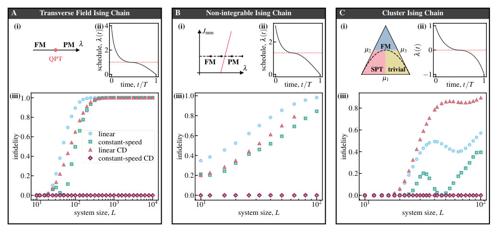 
FIG. 4. Examples of traversable phase transitions for transverse field Ising (15) (A), and its non-integrable next-nearest neighbor version (19) (B), and cluster Ising chain (20) (C); behavior for all three models is qualitatively same: (i) Sketch of traversed phase transition; dashed line indicates path through phase diagram. (ii) constant-speed schedules with characteristic slowing down at critical point; for TFIC and CIM one can obtain the exact 𝐿= ∞-schedule, for non-integrable Ising chain the schedule can be derived from finite system-size scaling, see App. A for more details. (iii) Scaling of infidelity with system size at fixed ramp time 𝑇(=100, 20, 320) for (A-C), respectively;...

📷 Fig 5

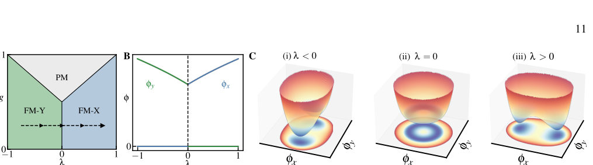 
FIG. 5. Traversable discontinuous phase transition: A, sketch of phase diagram of the anisotropic XY LMG model (24): at 𝑔= 𝑔𝑐a continuous phase transition between a ferromagnet (FM) and paramagnet (PM) occurs (see also Fig. 6); for 𝑔&lt; 𝑔𝑐a discontinuous phase transition between an X-ferromagnet and a Y-ferromagnet occurs at 𝜆=0. B, order parameters 𝜙𝑥and 𝜙𝑦vs anisotropy parameter 𝜆: at the phase transition, 𝜙𝑥and 𝜙𝑦undergo a discontinuous jump indicating the transition is discontinuous (first-order). C, (i) for 𝜆&lt; 0, the Landau-Ginburg potential Eq. (28) has two degenerate minima on the y-axis (FM-Y); (ii) at 𝜆= 0, the model becomes 𝑈(1)-symmetric and the groundstate manifold becomes a...

**Summary.** This paper introduces a novel geometric criterion to classify Quantum Phase Transitions (QPTs) as either 'traversable' or 'nontraversable'. Traversability is determined by whether the ground-state manifold has a finite geometric distance across the transition point, which is tested using counterdiabatic driving techniques. This classification offers a fundamental, dynamical understanding of QPTs, independent of local order parameters.

**Why it may be interesting.** This work provides a powerful, geometry-based diagnostic tool that transcends traditional classifications (like symmetry breaking or RG fixed points) for understanding the dynamical feasibility of quantum state preparation.

Detailed structure

**Main problem.** The paper aims to develop a geometric classification of Quantum Phase Transitions (QPTs) based on whether the transition can be dynamically connected (traversed) between the two phases.

**Main result.** A QPT is classified as 'traversable' if the geometric distance between the ground states in the thermodynamic limit is finite, allowing for exact counterdiabatic driving; otherwise, it is 'nontraversable'.

**Method.** The authors use the framework of counterdiabatic (CD) driving and analyze the geometry of the ground-state manifold using the fidelity susceptibility ($\chi_F$) to define a finite geometric length ($\ell$).

**Model / system.** The analysis applies to general many-body systems described by a tunable Hamiltonian $H(\lambda)$, with specific examples including the Transverse Field Ising Chain (TFIC) and the Ising Lipkin-Meshkov-Glick (LMG) model.

**Key observables.** Geometric distance ($\ell$), Fidelity Susceptibility ($\chi_F$), and the constant-speed CD driving schedule.

**Important parameters / regimes.** The thermodynamic limit ($L 	o \infty$), the divergence exponent $\alpha_F$, and the control parameter $\lambda$ near the critical point $\lambda_c$.

**Assumptions / limitations.** The analysis relies on constructing a constant-speed parametrization $\lambda_{cs}(t)$ to tame the divergence of the adiabatic gauge potential in the thermodynamic limit.

**Figures summary.** Figures illustrate the constant-speed CD driving protocol, showing how it maintains unit fidelity across the transition, and provide a genealogy summarizing examples of traversable (blue) and non-traversable (red) QPTs.

**Paper structure.** The paper introduces the geometric concept of traversability, develops the mathematical machinery using CD driving and the fidelity susceptibility, derives the constant-speed parametrization, and applies this criterion to classify known QPTs.

Abstract

Quantum phase transitions manifest as an abrupt change in the ground state of a many-body system; yet it is an open question whether this sudden change necessarily precludes a continuous dynamical connection between the two phases. We introduce a classification of quantum phase transitions based on this geometric aspect of the ground-state manifold, that differs from known classifications. By leveraging the framework of counterdiabatic driving, we explicitly construct schedules that dynamically connect one phase to another. This strategy allows us to uncover a large class of quantum phase transitions, where the states on both sides are separated only by a finite geometric distance in the thermodynamic limit. We term such transitions traversable, since exact counterdiabatic driving links the two phases via a finite dynamical protocol in the thermodynamic limit. We show that multiple known transitions fall into this class -- e.g., symmetry-breaking transitions obeying hyperscaling and discontinuous transitions with an enhanced continuous symmetry. We further show the existence of quantum phase transitions that cannot be crossed dynamically even with the help of nonlocal counterdiabatic driving, as they would require divergent amplitudes and frequencies. Geometrically, these nontraversable transitions correspond to an infinite distance separating the two phases of matter; we show that the class comprises continuous transitions exhibiting mean-field universality, and discontinuous transitions arising from the competition between metastable minima. Our geometric classification goes beyond the known taxonomy, is independent of local order parameters and renormalization group fixed points, and has direct implications for the complexity of state preparation and adiabatic quantum computation.

[↑ back to top](#top)

### [How To Track Qubits Through Space and Time (Or: Sailing in a Quantum Boat)](http://arxiv.org/abs/2605.30732v1)

**Authors:** James Bartusek, Zikuan Huang, Leo Orshansky, Henry Yuen  
**Type:** theory · **Category:** quantum information and computing · **PDF:** <https://arxiv.org/pdf/2605.30732v1>  
**Analysis basis:** full PDF text, analyzed in chunks
**Topic relevance:** `entanglement & information structure` **2/5** · `measurement-induced transitions` **1/5** · `quantum measurements` **1/5**

📷 Fig 1

 
Figure 1: A quantum anchor. Generated by GPT.

📷 Fig 2

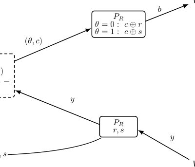 
Figure 2: Non-localizability attack on 𝑓-BB84

📷 Fig 3

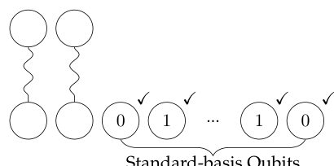 
Figure 3: The Non-collapsing Test.

📷 Fig 4

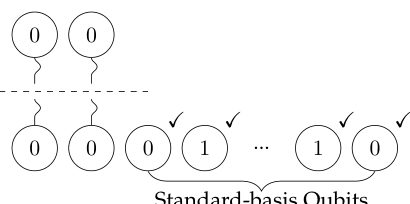 
Figure 4: The Collapsing Test.

📷 Fig 5

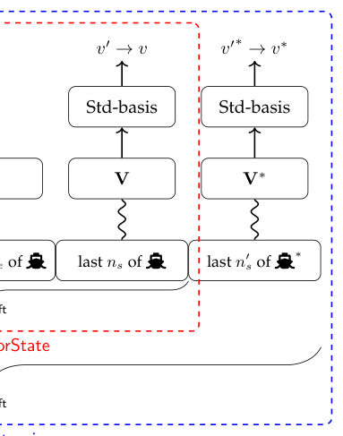 
Figure 5: Compact state-generation diagram. 𝖦𝖾𝗇𝖠𝗇𝖼𝗁𝗈𝗋𝖲𝗍𝖺𝗍𝖾and 𝖣𝗈𝗆𝖺𝗂𝗇𝖤𝗑𝗍𝖾𝗇𝗌𝗂𝗈𝗇.

**Summary.** This paper advances quantum cryptography by proposing 'quantum localization' and 'trajectory verification' to overcome security flaws in existing position verification schemes. It constructs protocols using quantum anchor states to verifiably track quantum information through space and time. This work establishes stronger theoretical foundations for position-based cryptography by localizing both quantum states and computational functions.

**Why it may be interesting.** While highly abstract, the concepts of localizing quantum information and computational capabilities in space and time provide novel theoretical tools for understanding the physical constraints on quantum information processing and security.

Detailed structure

**Main problem.** Existing quantum position verification security definitions are insufficient because they fail to prevent distributed adversarial simulation across space and time.

**Main result.** The authors introduce and construct protocols for 'quantum localization' and 'trajectory verification,' providing stronger foundations for position-based cryptography.

**Method.** The work develops protocols using 'quantum anchor states' and generalizes concepts from unclonable cryptography to track quantum information through spacetime.

**Model / system.** The framework relies on quantum information theory, specifically utilizing bipartite entangled states and the concept of tracking quantum states or computations across a specified spacetime trajectory.

**Key observables.** Fidelity of the joint state between anchor and vessel registers, and the success probability ($\eta$) of the extraction process.

**Important parameters / regimes.** The security proofs are established in the classical oracle (ideal obfuscation) model, which is heuristically instantiated using post-quantum indistinguishability obfuscation.

**Assumptions / limitations.** The security proofs rely on the existence of one-way functions and the ideal obfuscation model.

**Figures summary.** Figure 2 illustrates a non-localizability attack on the f-BB84 protocol involving three provers, demonstrating how entanglement can be nonlocally distributed.

**Paper structure.** The paper progresses from defining the weakness in existing QPV to introducing stronger notions (quantum, state, functionality localization). It then constructs protocols for trajectory verification, details the mathematical machinery using quantum anchor states, and concludes by addressing public verifiability.

Abstract

While quantum position verification aims to certify a prover's location using quantum information, existing security definitions only guarantee that part of the successful adversarial party is in the claimed location. This leaves open the possibility that a distributed team of adversaries can jointly simulate a prover in a way that defeats the intended meaning of ``being at a location'' in position-based cryptography.   We introduce stronger notions of position verification that we call quantum localization, which requires that there is a specified, unclonable state at the verified spacetime point -- and that this state can be found nowhere else. We show that quantum localization leads naturally to a meaningful notion of trajectory verification, in which quantum information is verifiably tracked through space and time. We construct quantum localization and trajectory verification protocols using quantum anchor states, which generalize coset states from unclonable cryptography. The security of our schemes is proven in the classical oracle (i.e. ideal obfuscation) model, which can be heuristically instantiated in the plain model using post-quantum indistinguishability obfuscation.   We also introduce and instantiate the concept of functionality localization, which guarantees that the adversary has the ability to compute a secret function at the verified spacetime point, and this function cannot be computed anywhere else. This raises the intriguing possibility of localizing computational capabilities in space and time.   More broadly, we believe our notions of quantum localization and our feasibility results provide stronger foundations for position-based cryptography.

[↑ back to top](#top)

### [An efficient Progressive Swapping to the Middle distribution protocol adapted to imperfect quantum memories in quantum networks](http://arxiv.org/abs/2605.31493v1)

**Authors:** Claire Mesny, Fabrice Guillemin, Claire Goursaud  
**Type:** theory · **Category:** quantum information and computing · **PDF:** <https://arxiv.org/pdf/2605.31493v1>  
**Analysis basis:** full PDF text, analyzed in chunks
**Topic relevance:** `entanglement & information structure` **2/5** · `correlated / nonlocal dissipation` **1/5**

📷 Fig 1

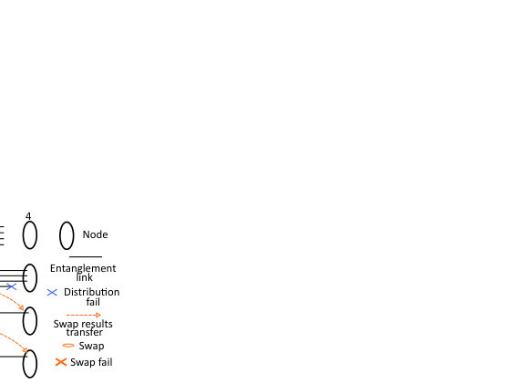 
Figure 1. Scheme for the BS distribution protocol with length lr = 4 and n = 4 generations per node

📷 Fig 2

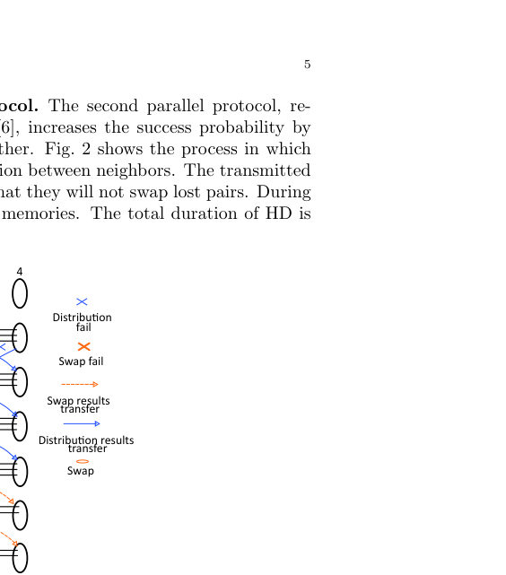 
Figure 2. Scheme for the HD distribution protocol with length lr = 4 and n = 4 generations

📷 Fig 3

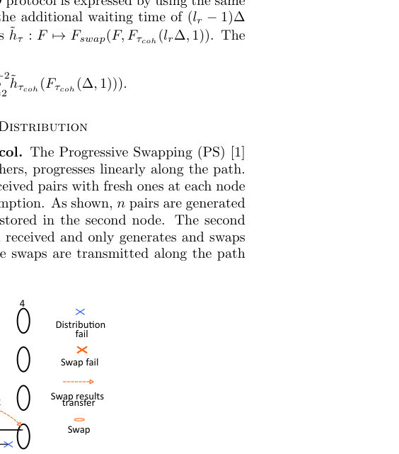 
Figure 3. Scheme for the PS with route length lr = 4 and n = 4 generations

📷 Fig 4

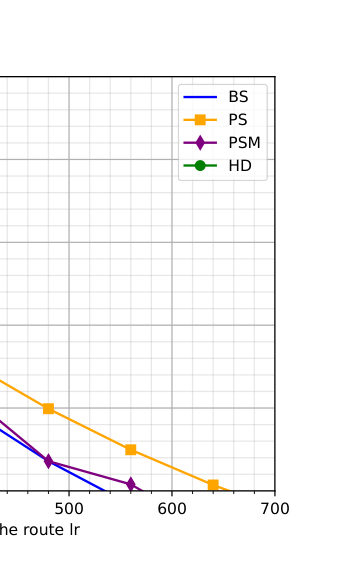 
Figure 5. Link fidelity as a function of the length of the route for a distance of L = 80km between nodes, n = 30 generations, a memory life-time τ = 40ms, a time-slot of ∆= 2ms and a swap probability of pswap = 0.9

📷 Fig 5

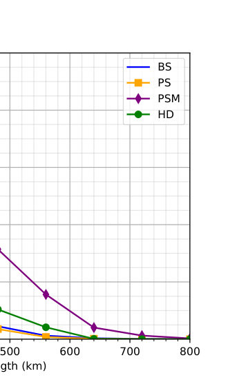 
Figure 6. Probability to establish at least one end-to-end pair as a function of the length of the route for a distance of L = 80km between nodes, n = 30 generations, a memory life-time τ = 40ms, a time-slot of ∆= 2ms and a swap probability of pswap = 0.9

**Summary.** This paper introduces the Progressive Swapping to the Middle (PSM) protocol for quantum networks to improve long-distance qubit transmission. By comparing PSM against other established protocols, the authors demonstrate that PSM offers superior resource efficiency and link probability while maintaining high fidelity, especially when quantum memories are imperfect. This advances the practical feasibility of quantum networking.

**Why it may be interesting.** This work directly tackles the scalability and resource limitations of quantum communication networks, which is a core area of quantum information theory relevant to quantum optics and open quantum systems.

Detailed structure

**Main problem.** The paper addresses the challenge of efficiently transferring quantum bits (qubits) over long distances in quantum networks by optimizing entanglement distribution and swapping protocols.

**Main result.** The proposed Progressive Swapping to the Middle (PSM) protocol is shown to be highly resource-efficient, yielding better link probabilities and lower resource consumption compared to existing protocols like PS and BS, especially under imperfect memory conditions.

**Method.** The authors compare PSM against several established protocols (PS, BS, HD) by calculating key performance metrics like link probability, link fidelity, and minimum required resource consumption.

**Model / system.** The system modeled is a quantum network utilizing entangled photon pairs distributed over links, requiring Bell state measurements and teleportation for end-to-end qubit transfer. The analysis incorporates decoherence from imperfect quantum memories and fiber loss.

**Key observables.** Link probability (success rate), Link Fidelity ($F$), and Resource Consumption (minimum number of generated pairs required).

**Important parameters / regimes.** Memory decay time ($	au$), time-slot ($\Delta$), and the swap success probability ($p_{swap} \approx 0.9$).

**Assumptions / limitations.** The analysis assumes exponential decay for memory and fiber loss, and compares protocols based on metrics derived for imperfect quantum memories.

**Figures summary.** Figures compare performance metrics (fidelity, success probability, resource consumption) of PSM against other protocols (BS, HD, PS) as a function of increasing route length ($l_r$ or $L$).

**Paper structure.** The paper introduces the PSM protocol, derives its performance metrics, and systematically compares it against parallel (BS, HD) and sequential (PS) protocols using quantitative analysis of link fidelity, success probability, and resource cost.

Abstract

The distribution of entangled pairs of photons on the links composing a quantum network, combined with Bell state measurements and teleportation, is the basic apparatus to transfer quantum bits (qubits) over long distances. Entanglement distribution establishes an end-to-end entangled pair while consuming intermediate pairs on links and holding them for a certain time period. The technical literature identifies two main kinds of protocols, parallel and sequential ones, the latter having an advantage in resource consumption over the former. In this paper, we introduce an efficient swapping protocol called Progressive Swapping to the Middle (PSM) as it combines the existing Progressive Swapping (PS) protocol from both extremities of a path that meet in the middle where the received pairs are swapped. We compare PSM with two parallel protocols and PS; in our evaluation, we take into account imperfect memories and fidelity degradation. We demonstrate that PSM yields a much better link probability than PS while keeping a reasonable link fidelity, and shows an advantage in resource consumption over other protocols.

[↑ back to top](#top)

### [Entanglement distribution protocols under imperfect fidelity and quantum memory conditions](http://arxiv.org/abs/2605.31347v1)

**Authors:** Claire Mesny, Fabrice Guillemin, Claire Goursaud  
**Type:** theory · **Category:** quantum information and computing · **PDF:** <https://arxiv.org/pdf/2605.31347v1>  
**Analysis basis:** full PDF text, analyzed in chunks
**Topic relevance:** `entanglement & information structure` **2/5** · `correlated / nonlocal dissipation` **1/5**

📷 Fig 1

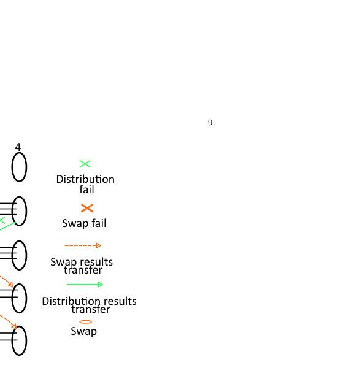 
Figure 4. Locally Heralded Swapping scheme for four nodes and a width of n = 4 generations

📷 Fig 2

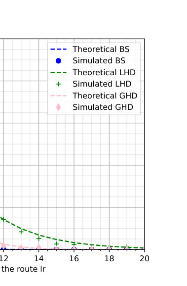 
Figure 5. Link probability for the three protocols as a function of the route length for a width of n = 20 generations and a distance between nodes of L = 50km. The attenuation parameter is α = 0.14dB/km with a celerity through fiber of c = 220.106m.s−1.

📷 Fig 3

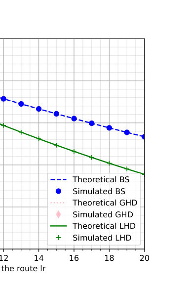 
Figure 6. Link fidelity as a function of the route length lr for a time slot ∆= 2ms.

**Summary.** This paper proposes and analyzes the Locally Heralded Distribution (LHD) protocol for generating long-distance entanglement over quantum repeaters. By incorporating realistic noise models for quantum memory and fiber loss, the authors demonstrate that LHD significantly improves upon existing protocols like Blind Swapping, making it a more viable candidate for future quantum internet infrastructure.

**Why it may be interesting.** The explicit modeling of combined fiber loss and memory decoherence, alongside the comparative analysis of repeater protocols, provides crucial theoretical benchmarks for building quantum networks.

Detailed structure

**Main problem.** The paper addresses the challenge of establishing long-distance quantum entanglement necessary for a quantum Internet, specifically accounting for photon fragility and imperfect quantum memory.

**Main result.** The proposed Locally Heralded Distribution (LHD) protocol is shown to outperform previous methods (Blind Swapping and Globally Heralded Distribution) by achieving higher link success probabilities.

**Method.** The authors develop and compare several entanglement distribution protocols (BS, GHD, LHD) by deriving formulas for link success probability and end-to-end fidelity under realistic noise models.

**Model / system.** The model involves distributing entangled photon pairs over segmented links connected by repeater nodes, utilizing quantum memories whose fidelity and loss are explicitly modeled over time.

**Key observables.** End-to-end entanglement fidelity, link success probability, and the comparison between different protocol performance metrics.

**Important parameters / regimes.** Memory lifetime ($	au$), coherence time ($	au_{coh}$), fiber attenuation ($\alpha$), and the number of links ($l_r$).

**Assumptions / limitations.** The analysis incorporates both fiber-induced and memory-induced decoherence, and assumes deterministic write-in/read-out operations for quantum memories.

**Figures summary.** Figures illustrate the path schemes and compare link probabilities (BS, LHD, GHD) and link fidelities as a function of increasing route length ($l_r$).

**Paper structure.** The paper introduces the problem, details the physical models for decoherence and loss, develops the LHD protocol, and concludes by benchmarking LHD against established protocols using simulation results.

Abstract

The rapid development of quantum computers and sensors urges for the development of a quantum Internet capable of transmitting quantum bits over long distances. Photons used for quantum data transfer are fragile over time and sensitive to their environment, so that they cannot be directly used over long distances. To remedy this problem, long distance paths are segmented into shorter links and entangled pairs of photons are distributed over these links and swapped to create end-to-end entangled pairs over long distances, eventually used for teleportation. In this paper, we develop an existing protocol taking account of fidelity and imperfect memories. We shorten the execution time and thus increase its link success probability creating the so-called Locally Heralded Distribution (LHD). It turns out that the proposed protocol outperforms some previous protocols. We benchmark through simulation the performances of protocols considered in this paper by using a blind entanglement protocol as a baseline.

[↑ back to top](#top)

### [Support Vector Machine with a Scalable Quantum Kernel](http://arxiv.org/abs/2605.31449v1)

**Authors:** Anant Agnihotri, Michael Krebsbach, Florentin Reiter, Thomas Wellens  
**Type:** both · **Category:** quantum information and computing · **PDF:** <https://arxiv.org/pdf/2605.31449v1>  
**Analysis basis:** full PDF text, analyzed in chunks
**Topic relevance:** `quantum measurements` **2/5** · `entanglement & information structure` **1/5**

📷 Fig 1

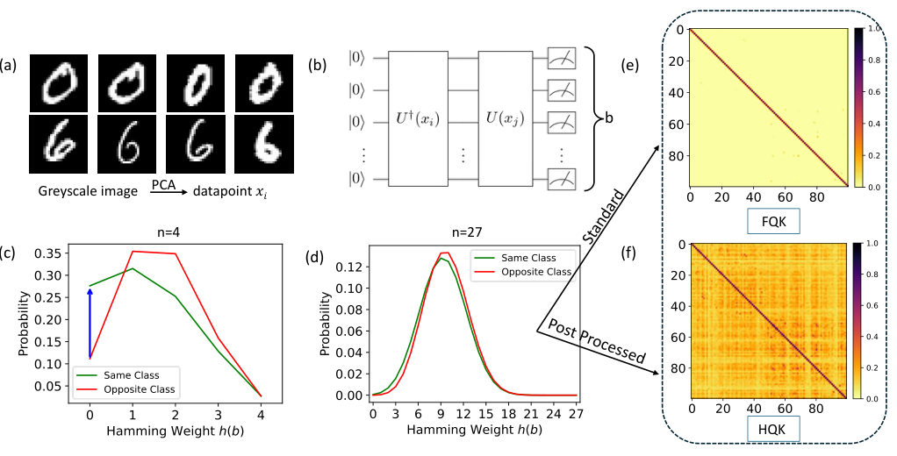 
FIG. 1. Illustration of the quantum kernel method presented in this work: (a) The datapoints xi are real vectors with n = 2 to n = 27 dimensions. We use different datasets including MNIST data downscaled by Principle Component Analysis, on the one hand and synthetic data originating from a quantum process, on the other hand. (b) Pairs of datapoints xi and xj are compared to one another using an n qubit quantum circuit. The underlying assumption is that datapoints of the same class are more similar than datapoints of different classes, leading to a higher probability of measuring the all-zero bitstring. The FQK uses this probability as kernel entries, ignoring all other bitstrings. Instead,...

📷 Fig 2

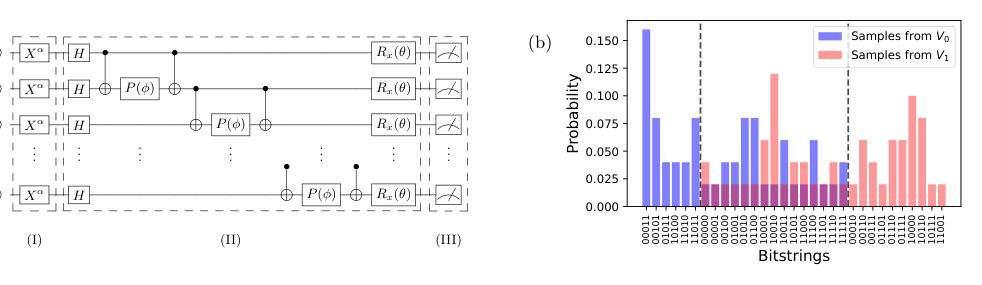 
FIG. 2. (a) Quantum circuits Vα (α = 0 or 1) used to generate quantum datasets. (I) Depending on the binary label α, the initial state is either |0⟩⊗nq (for α = 0) or |1⟩⊗nq (for α = 1), nq is the number of qubits in the circuit. (II) A sequence of ZZ-rotations, i.e., exp(−i ϕ

📷 Fig 3

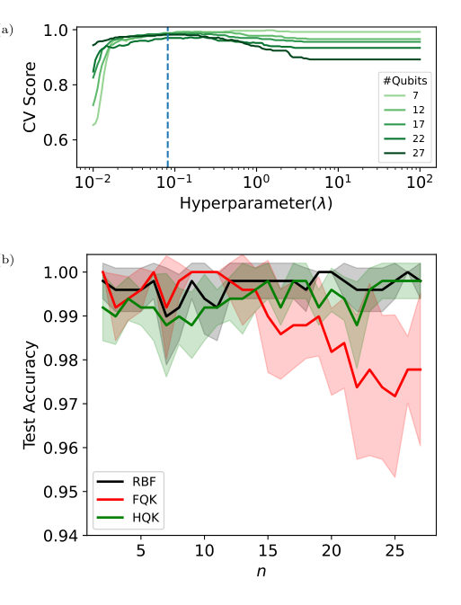 
FIG. 3. Comparison of test scores for classification of MNIST digits 0 and 1. (a) HQK hyperparameter optimization: Cross- validation scores as a function of λ for different numbers of qubits (see inset). The value of λ selected for the test set eval- uation is 0.08 (vertical dashed line). (b) Test accuracy for the different kernels (RBF: classical Gaussian kernel, FQK: standard fidelity quantum kernel and HQK: Hamming quan- tum kernel, see inset) as a function of data dimensionality n (or, equivalently, number of qubits used for the quantum kernels). Mean values (solid lines) and standard deviations (shaded regions) for five independent runs are shown. For all kernels, two principal...

📷 Fig 4

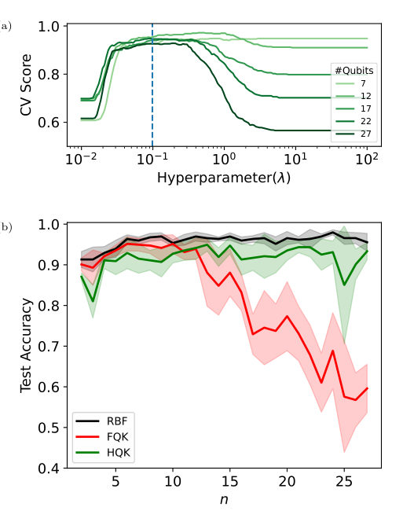 
FIG. 4. Same as Fig. 3, for classification of MNIST dig- its 0 and 6. (a) The optimized value of the HQK hyperpa- rameter λ for this dataset is 0.1 (vertical dashed line). (b) Maximum test accuracy is achieved at eight principal com- ponents (n = 8), enabling near-perfect classification of 0 and 6. Beyond n = 8, additional dimensions introduce more noise than relevant information. FQK accuracy drops for larger n, whereas HQK remains relatively stable and almost reaches RBF performance, demonstrating higher robustness to noisy data than FQK.

📷 Fig 5

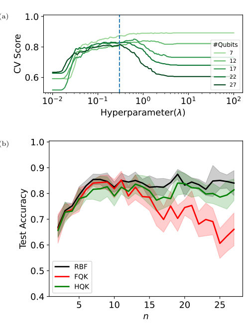 
FIG. 5. Same as Figs. 3 and 4, for classification of odd and even MNIST digits. (a) The optimal value of the HQK hyper- parameter λ selected for this dataset is 0.30 (vertical dashed line). (b) Test accuracy peaks at approximately 0.85 for the RBF kernel. This is due to the limited number of training samples, with an average of only 10 samples per digit within each class, making classification more challenging. However, the comparative behavior of FQK and HQK remains consis- tent: FQK accuracy drops for larger n, whereas HQK remains stable. Both HQK and RBF plateau at high n, while FQK shows a continued downward trend.

**Summary.** This paper introduces the Hamming quantum kernel (HQK) to overcome the exponential concentration problem plaguing standard quantum kernels in Support Vector Machines. By utilizing the full measurement statistics weighted by Hamming weight, the HQK maintains high classification accuracy even as the number of qubits increases significantly. This demonstrates a scalable and robust method for quantum feature mapping.

**Why it may be interesting.** While the focus is on machine learning kernels, the underlying challenge—extracting robust, scalable information from quantum measurements—is central to quantum information processing and quantum characterization.

Detailed structure

**Main problem.** The standard fidelity quantum kernel suffers from exponential concentration when scaling to large quantum systems, limiting its practical use in Support Vector Machines (QSVMs).

**Main result.** The proposed Hamming quantum kernel (HQK) successfully mitigates this concentration issue, showing superior and stable performance compared to the standard fidelity kernel and classical kernels for systems with 15 or more qubits.

**Method.** The HQK is a classical post-processing method that utilizes the full measurement statistics of quantum circuits, weighted by the Hamming weight, rather than relying on a single fidelity value.

**Model / system.** The work uses QSVMs trained on two types of data: classical MNIST digits (reduced via PCA) and synthetic data generated from quantum circuits. The core model involves comparing the performance of three kernels: RBF (classical), FQK, and HQK.

**Key observables.** Test accuracy, kernel matrix values, and the theoretical distinguishability $D(P_0, P_1)$.

**Important parameters / regimes.** Number of qubits ($n$, ranging from 2 to 27), the HQK weighting parameter ($\lambda$), and the RBF bandwidth ($\gamma$).

**Assumptions / limitations.** The HQK assumes that similar data points lead to measurable shifts in the Hamming distributions, and the analysis relies on the ability to perform full measurement statistics.

**Figures summary.** Figures compare test accuracy vs. dimensionality ($n$) for MNIST and quantum data, consistently showing HQK outperforming FQK and RBF at large $n$. One figure illustrates the concentration issue in FQK versus the informative kernel from HQK.

**Paper structure.** The paper introduces the problem of FQK concentration, details the HQK formulation using full measurement statistics, and then evaluates the method by comparing its performance against RBF and FQK across multiple classification tasks (MNIST, synthetic quantum data) as the system size increases.

Abstract

Quantum support vector machines are classification algorithms that rely on quantum-generated kernels. The fidelity quantum kernel commonly used in quantum support vector machines suffers from exponential concentration as system size increases, preventing an efficient scaling beyond fewqubit systems. We introduce the Hamming quantum kernel, a classical post-processing method that is based on the same measurement outcomes as the fidelity quantum kernel. However, it avoids the exponential concentration problem by using the full measurement statistics rather than a single fidelity value. We evaluate the approach on both classical data (MNIST) and synthetic data generated from quantum circuits, using systems ranging from 2 to 27 qubits. Throughout the simulations, the Hamming quantum kernel outperforms the fidelity quantum kernel whenever 15 or more qubits are used. Furthermore, for synthetic quantum data, our method consistently outperforms the classical Gaussian kernel. This demonstrates that the Hamming quantum kernel improves the expressivity and robustness at larger qubit scales without requiring any additional quantum ressources.

[↑ back to top](#top)

### [Entanglement in quantum channel discrimination: sometimes less is more](http://arxiv.org/abs/2605.31519v1)

**Authors:** Kristin Sundal Lien, Marco Túlio Quintino  
**Type:** theory · **Category:** quantum information and computing · **PDF:** <https://arxiv.org/pdf/2605.31519v1>  
**Analysis basis:** full PDF text, analyzed in chunks
**Topic relevance:** `entanglement & information structure` **2/5**

📷 Fig 1

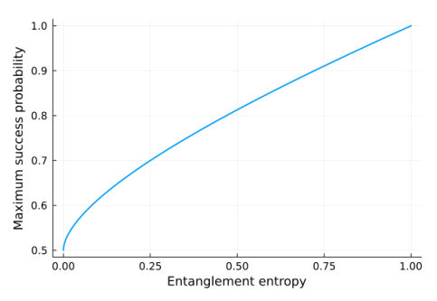 
Figure 1: Maximal success probability of discrimination between the four Pauli channels. Success probability of dis- crimination increases with increasing entanglement.

📷 Fig 2

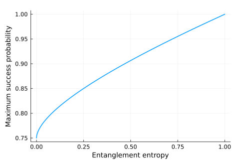 
Figure 2: Maximal success probability of discrimination between Werner-Holevo channels. Success probability of discrimination increases with increasing entanglement.

📷 Fig 3

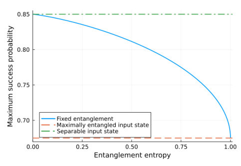 
Figure 3: Maximal success probability of discrimination between two measurement channels. Success probability of discrimination decreases with increasing entanglement. The top horizontal (green) dot-dashed line is the maximal suc- cess probability with separable states, the bottom horizontal (orange) dashed line is the maximal success probability with separable states, and the (blue) filled curve is the optimal success probability with a fixed value of entanglement entropy.

📷 Fig 4

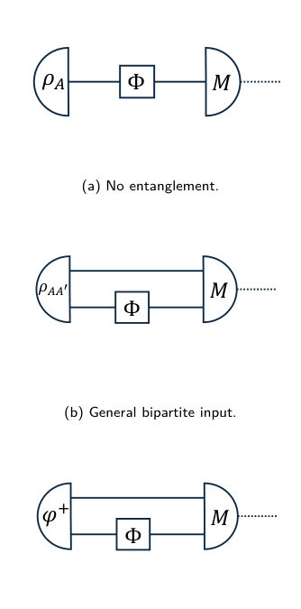 
Figure 4: The figure shows three different types of strategies for measuring the channel Φ. The simplest strategy, shown in (a), uses no ancilla. The most general strategy, shown in (b), uses a bipartite input state ρAA′ that may or may not be entangled with the auxiliary system A′. In (c), a maximally entangled input state ϕ+ is used, and we effectively measure the Choi state J(Φ)

📷 Fig 5

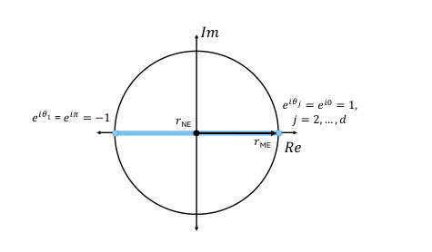 
Figure 6: The eigenvalues of the unitary W = diag(−1, 1, 1, .., 1) on the complex unit circle. We see that the origin is within the convex hull of the eigenvalues, but the centroid approaches one as the dimension d increases.

**Summary.** This work explores the limits of entanglement in quantum channel discrimination, proving that entanglement is not always beneficial. By introducing the MEWC/MEBC framework, the authors demonstrate that for certain channel pairs, using maximally entangled states actively reduces the maximum achievable success probability compared to using separable input states.

**Why it may be interesting.** It provides a rigorous theoretical framework for understanding when entanglement, typically viewed as a resource, fails to provide an advantage in quantum information tasks, which is crucial for designing practical quantum protocols.

Detailed structure

**Main problem.** The paper investigates quantum channel discrimination, specifically identifying scenarios where the use of maximally entangled input states is suboptimal or actively detrimental to the discrimination success probability.

**Main result.** It establishes that for certain pairs of channels (MEWC pairs), the optimal input state must be separable, and excessive entanglement can significantly reduce the maximum achievable discrimination probability.

**Method.** The analysis employs concepts like the Diamond Norm ($\|\cdot\|_\diamond$) and the ME-norm ($\|\cdot\|_{ME}$), introducing the Maximal Entanglement Worst Case (MEWC) and Best Case (MEBC) classifications to systematically characterize the role of entanglement.

**Model / system.** The study models the task of distinguishing between two or more quantum channels ($\Phi_i$), using the Choi-Jamiołkowski isomorphism to translate the problem into analyzing the difference map $\Delta\Phi$. The analysis compares performance using separable vs. maximally entangled input states.

**Key observables.** Success probability of discrimination ($P^*_s$), the M-operator ($M(\Delta\Phi)$), and the relationship between the diamond norm and the ME-norm.

**Important parameters / regimes.** The entanglement entropy of the input state, the dimension of the Hilbert space ($d$), and the structure of the difference map $\Delta\Phi$.

**Assumptions / limitations.** The analysis often focuses on the uniform prior probability case and compares the optimal strategy (using the diamond norm) against the maximally entangled strategy (using the ME-norm).

**Figures summary.** Figures illustrate the success probability for discriminating Pauli channels, showing an increase with entanglement, but also show cases where the probability decreases with increasing entanglement, favoring separable states.

**Paper structure.** The paper develops from general channel discrimination theory, introduces the MEWC/MEBC concepts, derives mathematical bounds relating different norms, and applies these concepts to specific examples like Pauli and measurement channels to prove when entanglement is detrimental.

Abstract

Entanglement is known to be a powerful resource that improves performance in various quantum information and computational tasks. A standard example of such a phenomenon is the possibility of perfectly discriminating all four Pauli operations in a single shot via the superdense coding protocol. While entanglement is often a powerful resource for quantum channel discrimination, this is not necessarily the case. In this work, we identify scenarios in which the maximally entangled state is a bad choice of input state and, more generally, show that excessive entanglement can reduce channel discriminability dramatically. To do so, we present an explicit pair of unitary channels which are perfectly discriminable without entanglement, but for which any strategy with maximally entangled input states is $ε$-close to a blind uniform guessing strategy. To develop a systematic approach, we introduce the concepts of Maximal Entanglement Worst Case (MEWC) and Maximal Entanglement Best Case (MEBC) pairs of channels, and present conditions for a pair of channels to be MEWC or MEBC. With these conditions, we show that the optimal input states for discriminating MEWC pairs of channels are necessarily separable, and provide non-trivial examples of measurement channels for which entanglement necessarily reduces the maximum probability of discrimination.

[↑ back to top](#top)

### [Parity-induced generalized Brillouin zone without non-Hermitian skin effect](http://arxiv.org/abs/2605.30978v1)

**Authors:** Alexander Felski  
**Type:** theory · **Category:** other · **PDF:** <https://arxiv.org/pdf/2605.30978v1>  
**Analysis basis:** full PDF text, analyzed in chunks
**Topic relevance:** `Frenkel-Kontorova` **1/5** · `analog quantum simulation` **1/5** · `driven-dissipative phase transition` **1/5** · `methods for driven-dissipative` **1/5** · `non-equilibrium dynamics` **1/5**

📷 Fig 1

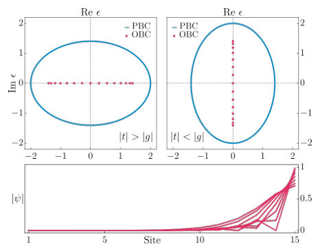 
Figure 1: Features of HHN. Top: Eigenvalue spectra under periodic (blue) and open (red) boundary conditions in the complex energy plane. Bottom: Macroscopic localization of bulk states under open boundaries, displaying the non-Hermitian skin effect.

📷 Fig 2

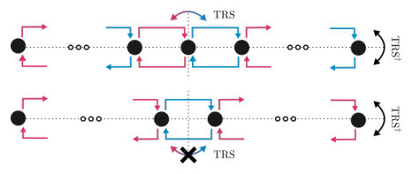 
Figure 2: Schematic illustration of the TRS† and TRS symmetries in finite-chain realizations of HSSH∗at odd (top) and even (bottom) chain length.

📷 Fig 3

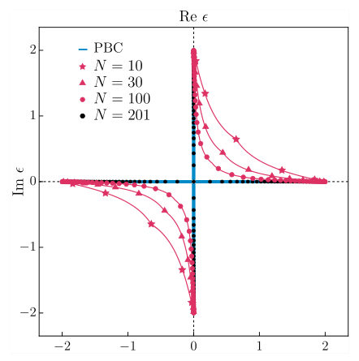 
Figure 3: Spectrum of HSSH∗with t = δ in the complex energy plane. Shown is the Bloch spectrum (blue), an illustrative example of the eigenvalues obtained for odd chain lengths (black), and eigenvalues found for various even chain lengths (red) displaying an acute sensitivity to the boundary conditions. Red lines indicate the non-Bloch bands along the reconstructed generalized Brillouin zone found at even chain lengths.

📷 Fig 4

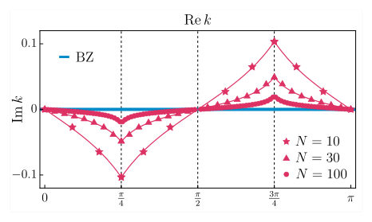 
Figure 4: Complex quasimomenta of the generalized Brillouin zone description for the HSSH∗model at even chain lengths and t = δ. The behavior of Im k is amplitude suppressed with increasing chain lengths, but remains structurally unchanged. The reconstructed shape of the generalized Brillouin zone is indicated as red lines. The conventional Brillouin zone is indicated in blue for reference.

📷 Fig 5

 
Fig. 3. Clearly, this behavior is no longer captured by the conventional band spectrum (10) found under peri- odic boundaries. It marks an acute parity-induced sen- sitivity to the boundary conditions, reminiscent of the non-Hermitian skin effect. Moreover, and curiously in light of the absence of a closed-loop spectral structure under periodic boundaries, the analysis within the generalized Brillouin zone formal- ism identifies a consistent standing-wave construction for the description of bulk states at kj ∈C with Rekj ∈(0,π) satisfying

**Summary.** This work investigates spectral features in non-Hermitian quantum systems, specifically challenging the notion that complex quasimomenta and generalized Brillouin zones always imply the non-Hermitian skin effect. By analyzing the SSH* model, the authors prove that these complex features can instead originate from parity-induced even-odd effects inherent to finite chain lengths, even when the system remains fundamentally delocalized.

**Why it may be interesting.** It provides a crucial theoretical distinction between two superficially similar phenomena—spectral sensitivity due to finite-size parity effects versus the true non-Hermitian skin effect—which is vital for interpreting experimental measurements in open quantum systems.

Detailed structure

**Main problem.** To demonstrate that spectral sensitivity and the formation of a generalized Brillouin zone (GBZ) can occur in non-Hermitian systems due to parity-induced even-odd effects, even when the conventional non-Hermitian skin effect (NHSE) is absent.

**Main result.** The study shows that the complex quasimomentum structure and GBZ deviation can arise purely from finite-size parity effects in the SSH* model, independent of the NHSE, while wavefunctions remain delocalized.

**Method.** The analysis employs the generalized Brillouin zone formalism, analyzing the Hamiltonian's spectrum for finite chains of odd and even lengths using symmetry classification (Altland-Zirnbauer classes).

**Model / system.** The primary model is the SSH* tight-binding Hamiltonian, which is a non-Hermitian generalization of the Su-Schrieffer-Heeger model, studied on finite chains of length N.

**Key observables.** Eigenvalue spectra, generalized Brillouin zone structure, Inverse Participation Ratio (IPR), and the comparison between open vs. periodic boundary conditions.

**Important parameters / regimes.** Chain length N (odd vs. even), the coupling strengths t and delta, and the thermodynamic limit (N -> infinity).

**Assumptions / limitations.** The analysis relies on constructing specific compound states to satisfy eigenvalue relations and distinguishing between parity-induced effects and the true NHSE.

**Figures summary.** Figures illustrate eigenvalue spectra comparing periodic and open boundary conditions for both the Hatano-Nelson model (showing NHSE) and the SSH* model (showing parity-induced GBZ deviations).

**Paper structure.** The paper systematically contrasts systems exhibiting NHSE with the SSH* model, deriving the GBZ for finite chains, and finally separating the observed spectral sensitivity into contributions from parity effects versus the NHSE.

Abstract

Acute spectral sensitivity to boundary conditions and the formation of a generalized Brillouin zone associated with complex quasimomenta are features frequently attributed to systems with non-trivial non-Hermitian topology, showcasing the non-Hermitian skin effect. We show that, away from the thermodynamic limit, these features themselves are not uniquely tied to this phenomenon; they can similarly arise as parity-induced even-odd effects in non-Hermitian systems without skin effect. Despite an underlying generalized Brillouin zone description, wavefunctions remain delocalized. In addition, the effect can arise in skin-effect models as entirely separate distinguishable feature

[↑ back to top](#top)

### [Pure State Transformations under Block Coherence](http://arxiv.org/abs/2605.30588v1)

**Authors:** Dipayan Chakraborty, Priyabrata Char, Indrani Chattopadhyay, Debasis Sarkar  
**Type:** theory · **Category:** other · **PDF:** <https://arxiv.org/pdf/2605.30588v1>  
**Analysis basis:** full PDF text, analyzed in chunks
**Topic relevance:** `correlated / nonlocal dissipation` **1/5** · `driven-dissipative phase transition` **1/5** · `entanglement & information structure` **1/5** · `methods for driven-dissipative` **1/5** · `non-equilibrium dynamics` **1/5**

📷 Fig 1

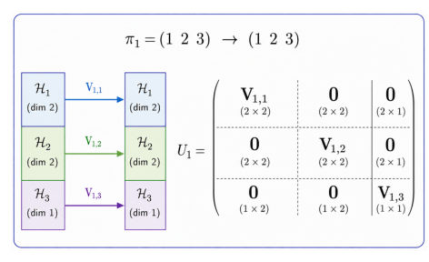 
FIG. 1: Schematic diagram of the block incoherent unitary U1

📷 Fig 2

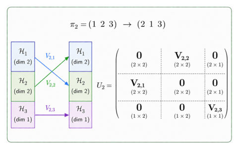 
FIG. 2: Schematic diagram of the block incoherent unitary U2

📷 Fig 3

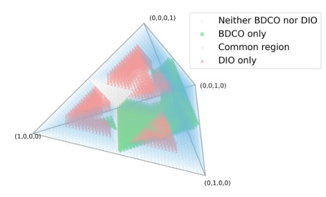 
FIG. 4: Achievable target state region for a fixed input prob- ability vector ˜p

📷 Fig 4

 
FIG. 3: Input state region for a fixed target probability vector ˜q

📷 Fig 5

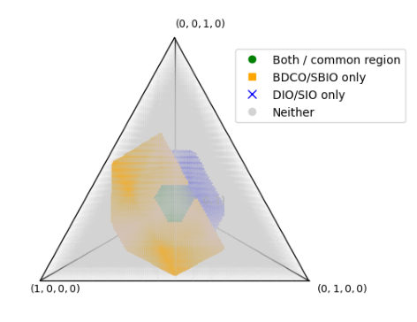 
Figure 4 shows the achievable target state region from the fixed input probability vector

**Summary.** This paper develops a resource theory framework for 'block coherence' by analyzing pure state transformations under three generalized incoherent operations: PBIO, SBIO, and BDCO. It proves that for SBIO and BDCO, the ability to transform one pure state to another is mathematically equivalent to a majorization condition on their respective block probability vectors. This advances the understanding of how coherence resources constrain quantum operations.

**Why it may be interesting.** This work provides a rigorous mathematical framework for quantifying and characterizing quantum resources (block coherence) by establishing precise, necessary, and sufficient conditions for state transformations under generalized incoherent dynamics.

Detailed structure

**Main problem.** The paper investigates the necessary and sufficient conditions for deterministically transforming one pure quantum state to another using specific types of incoherent quantum operations.

**Main result.** For Strictly Block Incoherent Operations (SBIO) and Block Dephasing Covariant Operations (BDCO), pure state conversion is completely characterized by the majorization relation between the input and output block probability vectors.

**Method.** The authors employ resource theory concepts, utilizing majorization relations and constructing explicit Kraus representations to prove the equivalence between the physical process and the mathematical ordering condition.

**Model / system.** The system is a quantum state $|\psi
angle$ defined on a Hilbert space $H$ with a fixed orthogonal decomposition $H = \sum_{\alpha} H_\alpha$. The operations studied are PBIO, SBIO, and BDCO, which generalize standard coherence models.

**Key observables.** Block probability vectors ($	ilde{p}$ and $	ilde{q}$), and the resulting state transformation $|\psi
angle 	o |\phi
angle$.

**Important parameters / regimes.** The nondegeneracy condition for PBIO, and the block structure defined by the orthogonal decomposition.

**Assumptions / limitations.** The analysis assumes a fixed orthogonal decomposition of the Hilbert space and relies on establishing necessary and sufficient conditions for the transformation.

**Figures summary.** Figures schematically illustrate the structure of block incoherent unitaries and compare the achievable state transformation regions under DIO versus BDCO.

**Paper structure.** The paper systematically analyzes the conversion criteria for PBIO, then establishes the majorization criterion for BDCO and SBIO, proving equivalence and constructing the required Kraus operators for the converse direction.

Abstract

Block coherence provides a natural generalization of standard quantum coherence by treating superpositions across different subspaces as a resource. This work studies deterministic pure-state conversion under three free operations: physically block incoherent operations (PBIO), strictly block incoherent operations (SBIO), and block dephasing covariant incoherent operations (BDCO). For PBIO, we prove that, under a natural nondegeneracy condition on the active Kraus branches, any deterministic conversion from one pure state to another must be implemented by a block incoherent unitary. When the nondegeneracy requirement is removed, the condition becomes more general. It demands that the blockwise action of every active branch reproduce the target block structure with a common proportionality factor across all output blocks. For SBIO and BDCO, we show that deterministic pure-state transformation is completely characterized by the majorization relation between the input and output block probability vectors. The converse proof is constructive, yielding an explicit Kraus representation for every admissible BDCO transformation. In the rank-one limit, these conditions reduce to the known pure-state transformation criteria for physically incoherent operations (PIO), strictly incoherent operations (SIO), and dephasing covariant incoherent operations (DIO) in the standard resource theory of coherence. Using the majorization condition, a maximally block-coherent state with uniform block weights is also identified as a universal pure-state resource under BDCO and SBIO. We have also provided geometric numerical illustrations comparing the state transformation power of BDCO and DIO for a fixed input state, fixed output state and mutual convertibility scenarios.

[↑ back to top](#top)

### [Rigorous extension of semilocal collinear functionals to noncollinear DFT using $SU(2)$ rotations](http://arxiv.org/abs/2605.31203v1)

**Authors:** Konstantin Gaul  
**Type:** theory · **Category:** strongly correlated electrons · **PDF:** <https://arxiv.org/pdf/2605.31203v1>  
**Analysis basis:** full PDF text, analyzed in chunks
**Topic relevance:** `Keldysh / 2PI / non-Gaussian methods` **1/5** · `analog quantum simulation` **1/5** · `exotic spin models in light-matter` **1/5** · `spintronics-quantum-optics interface` **1/5**

📷 Fig 1

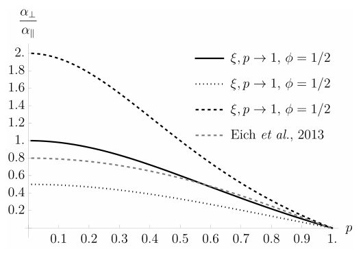 
Figure 1. Ratio α⊥/α∥of linear coefficients for transverse and longitudinal magnetization gradients as a function of the polarization. Comparison of the approximation ξ ∼ 1−⟨ϕ⟩(1−p2) for representative values of ⟨ϕ⟩with the result of Ref. [29].

📷 Fig 2

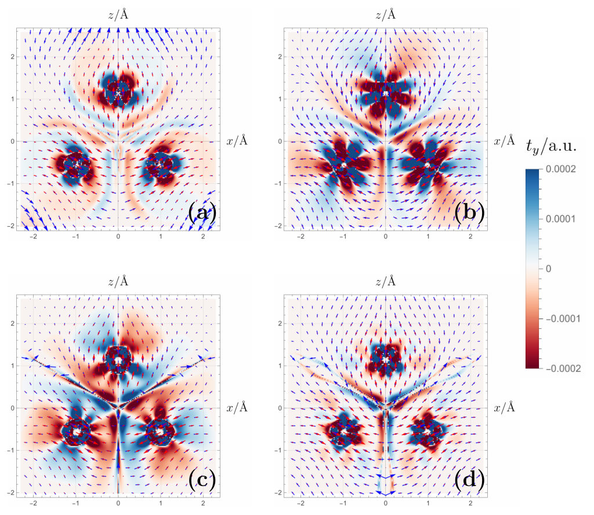 
Figure 2. Magnetization (red), XC magnetic field (blue) and local magnetic torque (heat map) in Cr3 oriented in the x–z plane. The magnetization density was oriented in the same plane. All calculations were performed with the PBE XC-functional. We show different levels of approximation to γ: the lowest order solution g γ(0) based on the Kohn-Sham orbitals of NC-SU(2) (a), the NC-SU(2)-SF [eq. (21)] (b), the NC-SU(2)-PT1 approximation [eq. (39)] (c) and the full NC-SU(2) (d).

📷 Fig 3

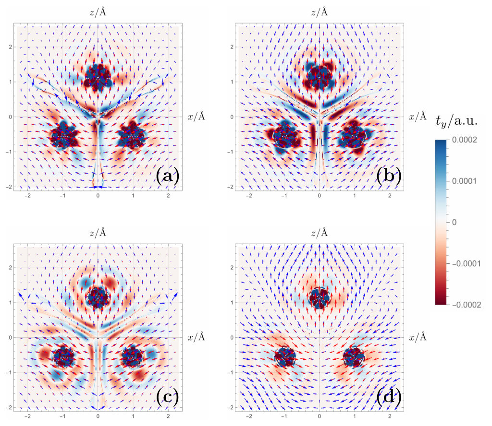 
Figure 3. Magnetization (red), XC magnetic field (blue) and local magnetic torque (heat map) in Cr3 oriented in the x–z plane. The magnetization density was oriented in the same plane. We show results with the NC-SU(2) approach for different XC functionals: BLYP (a), OLYP (b), KT3 (c) and the correlation torque from LYP (d).

**Summary.** This work develops a rigorous, first-principles method to generalize standard collinear exchange-correlation functionals to the noncollinear regime required for accurate DFT in magnetically frustrated systems. By employing $SU(2)$ rotations in a $u(2)$ matrix framework, the authors provide a mathematically consistent way to calculate magnetic properties like local torques and hyperfine couplings. This advances the theoretical tools available for studying strongly correlated magnetic materials.

**Why it may be interesting.** While focused on solid-state magnetism, the rigorous mathematical framework for handling non-collinearity via group theory ($SU(2)$) and gradient expansions is highly relevant to any theoretical work involving complex, symmetry-broken quantum states or spin dynamics.

Detailed structure

**Main problem.** The paper addresses the lack of a rigorous, first-principles connection between established semilocal collinear exchange-correlation (XC) functionals and their necessary noncollinear generalizations required for accurate DFT calculations in magnetically complex materials.

**Main result.** A locally exact relationship between collinear and noncollinear XC functionals is derived using a $u(2)$ matrix representation and implemented via numerically robust $SU(2)$ rotations.

**Method.** The authors derive the relationship by expanding the energy functional using a gradient expansion formalism in the $u(2)$ space, transforming collinear derivatives to noncollinear space via unitary rotations.

**Model / system.** The theory is applied to noncollinear magnetism, which is crucial when spin-orbit coupling or geometric frustration is present. Demonstrations include calculating local magnetic torques in the $	ext{Cr}_3$ cluster and hyperfine couplings in Uranium.

**Key observables.** Local magnetic torque structure, hyperfine coupling constants ($A$), and magnetic moments ($\langle \hat{S}^2 
angle$).

**Important parameters / regimes.** The degree of noncollinearity, the ratio of transverse to longitudinal magnetization gradients ($\alpha_{\perp}/\alpha_{\parallel}$), and the small deviation parameter $\epsilon$ for regularization.

**Assumptions / limitations.** The primary approximation is that the exact noncollinear functional can be represented in a locally collinear parameterization, which is only strictly true if certain coefficient tensors commute with gradient variables.

**Figures summary.** Figures compare the local magnetic torque structure for $	ext{Cr}_3$ using various noncollinear approximations (NC-SU(2), SF, etc.) and different XC functionals (BLYP, OLYP, KT3). Table II compares calculated hyperfine coupling constants for U and $	ext{U}^+$ across multiple methods.

**Paper structure.** The paper builds from establishing the mathematical framework (using $u(2)$ representation and $SU(2)$ rotations) to deriving the energy-invariant relationship, applying this formalism to calculate local magnetic torques in $	ext{Cr}_3$, and finally extending the methodology to calculate relativistic properties like hyperfine couplings in Uranium.

Abstract

In the presence of spin-orbit coupling and in geometrically frustrated materials, a noncollinear treatment the magnetization density is essential. However, in density functional theory most exchange--correlation functional approximations were originally developed for locally collinear magnetization. Many practical approaches to noncollinear DFT have emerged over the past decade. However, a first-principles connection between widely used semilocal collinear functionals and their noncollinear generalizations remains lacking. In this work, a locally exact relation between collinear and noncollinear exchange--correlation functionals is derived at the level of gradient expansions within a $u(2)$ matrix representation of the energy functional. Within this framework, collinear semilocal variables naturally acquire distinct dependencies on transverse and longitudinal magnetization gradient components. The widely used Scalmani--Frisch scheme emerges as a first-order approximation. The transformation of collinear functional derivatives to noncollinear space is implemented through numerically robust $SU(2)$ rotations. A consistent description of local magnetic torques is demonstrated for the prototypical spin-frustrated Cr$_3$ cluster. The approach further extends to fully nonlocal functionals and provides a direct route towards numerically stable relativistic response calculations. The influence on magnetic properties in presence of spin-orbit coupling is illustrated through calculations of hyperfine couplings in the high-spin ground states of uranium and the uranium ion.

[↑ back to top](#top)

### [Cover time statistics of one-dimensional Brownian motion under stochastic resetting](http://arxiv.org/abs/2605.31207v1)

**Authors:** Anirban Ghosh, Sanjib Sabhapandit  
**Type:** theory · **Category:** statistical mechanics · **PDF:** <https://arxiv.org/pdf/2605.31207v1>  
**Analysis basis:** full PDF text, analyzed in chunks
**Topic relevance:** `driven-dissipative phase transition` **1/5** · `non-equilibrium dynamics` **1/5** · `non-equilibrium universality` **1/5**

📷 Fig 1

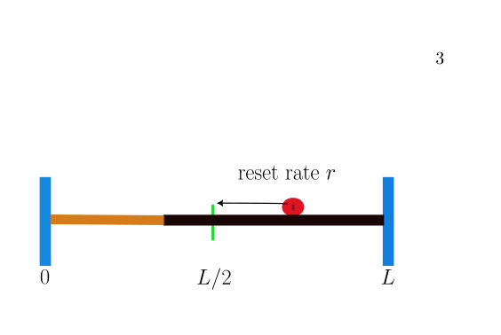 
FIG. 1. Brownian motion (BM) with reflecting boundary con- dition at x = 0 and x = L, which are shown in blue. The black region indicates the space already covered by the walker up to time t, starting at x0 = L/2. The Orange region is yet to be covered. The Brownian particle is resetting at L/2 with a rate r. The cover time tc is the first time at which the entire domain becomes black.

📷 Fig 2

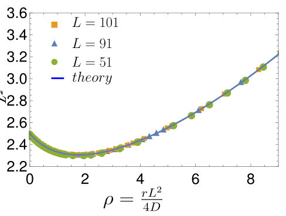 
FIG. 2. Simulation results of scaled mean cover time with scaled resetting rate ρ = rL2/4D for different values of L shown in the figure. D is kept fixed at 0.5. The solid line represents the analytical result found in Eq.(20) for different values of L. The minima is calculated at the scaled reset rate ρ∗= 1.76976, and the minimum scaled mean cover time is found as 2.30625.

📷 Fig 3

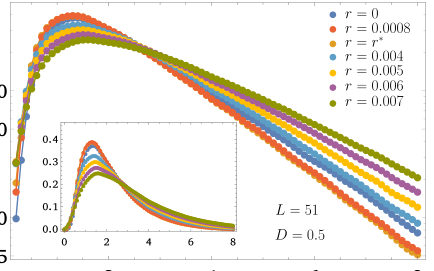 
FIG. 4. The PDFs of the scaled cover time for a continuous Brownian motion with RBC in log-linear scale for different values of resetting rate r at D = 0.5. The solid lines are representations of theoretical expression of the distribution function written in Eqs.(41) and (42) and closed circles are the representation of the simulation results for different values of r written in the legends for L = 51. The inset: the PDF is shown in linear scale.

📷 Fig 4

 
FIG. 3. Plot of A1,2(ρ) and B1,2(ρ), obtained by using the expressions (35)–(36).

📷 Fig 5

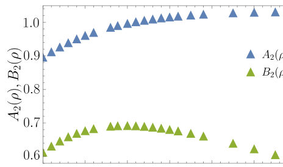 
Fig. 4 shows an excellent agreement between the analyt- ical prediction and numerical simulations.

**Summary.** This work analyzes how stochastic resetting modifies the time required for a Brownian particle to explore an entire confined space (the cover time). The authors find that there is an optimal resetting rate that minimizes this search time, providing a quantitative tool for optimizing exploration processes in confined physical systems.

**Why it may be interesting.** The concept of optimizing search times via external driving (resetting) is highly relevant to open quantum systems, particularly in quantum computation or quantum sensing where initialization or measurement resets are common.

Detailed structure

**Main problem.** The paper investigates how stochastic resetting affects the statistics of the cover time for a one-dimensional Brownian motion confined to a finite interval.

**Main result.** The mean cover time exhibits a non-monotonic dependence on the scaled reset rate, achieving a minimum at an optimal rate $\rho^*$, demonstrating that resetting can efficiently optimize search processes.

**Method.** The analysis involves deriving exact analytical expressions for the cover time distribution and its moments using Laplace transforms and residue calculus.

**Model / system.** The system is a single Brownian particle undergoing diffusion on the line segment $[0, L]$ with reflecting boundaries. The dynamics are modified by introducing stochastic resetting to the center of the interval at a constant rate $r$.

**Key observables.** Cover time ($	ext{t}_c$), mean cover time $\langle 	ext{t}_c 
angle$, and the probability density function (PDF) of $	ext{t}_c$.

**Important parameters / regimes.** Diffusion constant $D$, interval length $L$, and the scaled reset rate $\rho = rL^2/4D$.

**Assumptions / limitations.** The resetting process is modeled as Poissonian, and the mathematical derivations rely heavily on Laplace transforms and residue calculus for solving the associated renewal equations.

**Figures summary.** Figure 2 shows the scaled mean cover time decreasing, reaching a minimum at $\rho^*$, and then increasing with the scaled resetting rate $\rho$.

**Paper structure.** The paper first establishes the non-resetting case, then introduces the stochastic resetting mechanism, and finally derives the full cover time distribution and its asymptotic limits using advanced mathematical techniques.

Abstract

We investigate the effect of stochastic resetting on the statistics of the cover time of a one-dimensional Brownian motion with a diffusion constant $D$, confined to a finite interval of length $L$. The cover time $t_c$, defined as the minimum time required for the particle to visit every point of the interval at least once, exhibits a non-monotonic dependence on the scaled reset rate $ρ= rL^2/4D$. The scaled mean cover time $4D\langle t_c\rangle/L^2$ initially decreases with increasing $ρ$, attains a minimum at an optimal value $ρ^*$, and then increases with $ρ$, indicating an optimal resetting rate that minimizes the search duration. Furthermore, we derive an exact analytical expression for the cover time distribution, including its asymptotic limits, which agree well with numerical simulations. These results demonstrate that stochastic resetting serves as an efficient mechanism for optimizing cover-time processes in confined geometries.

[↑ back to top](#top)

### [Preventing the Breakdown of Tight-Binding Waveguide Optics by Löwdin Orthogonalization](http://arxiv.org/abs/2605.31074v1)

**Authors:** Konrad Tschernig, Florian H. Huber, Janik Wolters, Jasmin Meinecke  
**Type:** theory · **Category:** other · **PDF:** <https://arxiv.org/pdf/2605.31074v1>  
**Analysis basis:** full PDF text, analyzed in chunks
**Topic relevance:** `analog quantum simulation` **1/5** · `interference shaping light` **1/5** · `methods for driven-dissipative` **1/5**

📷 Fig 1

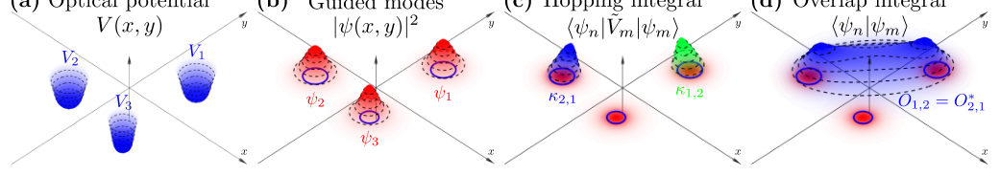 
FIG. 1. Standard Tight-binding Method (a) Transverse optical potential in (x, y)-plane consisting of 3 waveguides (blue surfaces) with different shapes fm(x, y), refractive index contrasts ∆nm and positions (xm, ym). (b) Intensity distribution of the guided modes |ψm(x, y)|2 (red surfaces) of the individual waveguides shown in (a) and their positions indicated by the blue circles. (c) The coupling coefficients computed from the hopping integrals κn,m = ⟨ψn| ˜Vm|ψm⟩= R ψ∗ n(x, y)[V (x, y) − Vm(x, y)]ψm(x, y) dx dy, which is the volume under the green (κ1,2) and blue surfaces (κ2,1). (d) The overlap ⟨ψ1|ψ2⟩= R ψ∗ 1(x, y)ψ2(x, y) dx dy between two guided modes visualized as the volume under...

📷 Fig 2

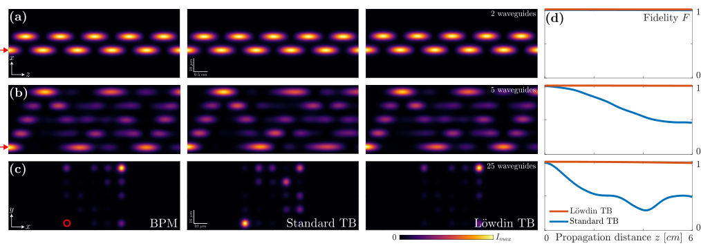 
FIG. 2. Propagation in different Waveguide Systems Intensity evolution in waveguide arrays with (a) M = 2, (b) M = 5 and (c) M = 25 waveguides, respectively. The exact results are obtained by solving the paraxial wave equation using the beam propagation method (BPM), left panels, while the middle panels show the results of the standard tight-binding method and the right panels the L¨owdin TB method. The red arrows (circle) indicate the input waveguide. In (a) and (b) the waveguides are arranged in a 1D lattice in the x −z-plane and we show the full evolution of the field in the x −z plane (cut at y = 0). In (c) the waveguides are arranged in a 5 × 5 square lattice and we show the field in...

📷 Fig 3

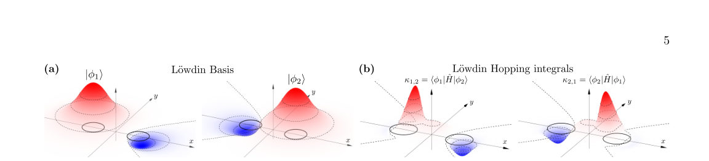 
FIG. 3. L¨owdin Tight-binding Method (a) Amplitude distributions |ϕn⟩in the x-y-plane of the L¨owdin modes for two identical coupled waveguides. Red (blue) surfaces correspond to positive (negative) amplitude. (b) Visualization of the hopping integrals in the L¨owdin TB method. The L¨owdin coupling coefficient κn,m = ⟨ϕn| ˆH|ϕm⟩is the volume enclosed by the red (positive contribution) and blue (negative contribution) surface and the x-y plane. In both (a) and (b) the position of the waveguides is indicated by the black circles and the dashed lines are surface contours to enhance the 3D visualization.

📷 Fig 4

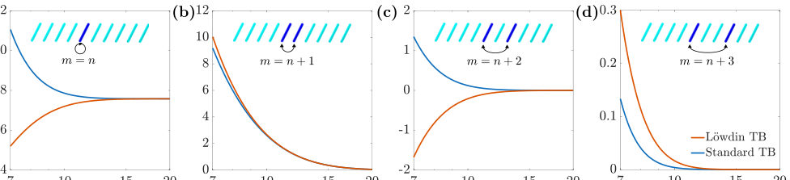 
FIG. 4. Propagation Constants and Coupling Coefficients in Standard- and L¨owdin-TB We plot the matrix elements Hn,m of a linear array of 10 identical, coupled waveguides (see in-sets) as a function of the nearest neighbor distance d for (a) m = n (effective propagation constants), (b) m = n + 1 (nearest neighbor coupling), (c) m = n + 2 (next-nearest neighbor coupling) and (d) m = n + 3 (next-next-nearest neighbor coupling). The blue (red) lines show the Standard-TB (L¨owdin-TB) Hamiltonian. In the L¨owdin-TB Hamiltonian the effective propagation constants are smaller and the coupling coefficients are larger than in the Standard-TB Hamiltonian. Importantly, the next-nearest neighbor...

📷 Fig 5

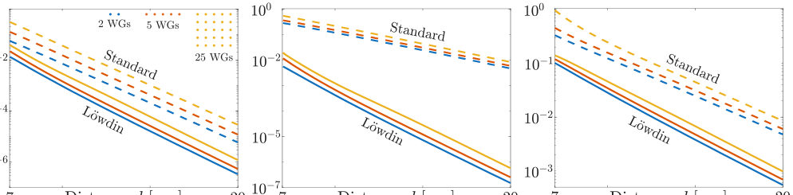 
FIG. 5. Comparison of the Accuracy of the Standard and L¨owdin TB Methods We plot the (a) Spectral distance S, (b) Completeness distance C and (c) the Frobenius distance F to the exact eigenmode expansion, according to Eqs. (10-12), of the Standard TB method (dashed lines) and L¨owdin TB method (solid lines) as a function of the waveguide lattice constant d. The line colors correspond to 1D arrays with M = 2 waveguides (blue) and M = 5 waveguides (red) and a 2D array with M = 25 waveguides (yellow). Smaller values of S, C and F correspond a better match with the exact eigenmode expansion. We observe a significant advantage for the L¨owdin method over the whole range of distances d in all...

**Summary.** This paper addresses the failure of the standard tight-binding model for coupled optical waveguides when mode overlap is significant. The authors propose using Löwdin orthogonalization to generate an orthonormal basis, which corrects the Hamiltonian and restores the model's accuracy. This improved Löwdin-TB method accurately predicts complex coupling effects, such as negative next-nearest-neighbor hopping phases, previously missed by standard approximations.

**Why it may be interesting.** This work provides a rigorous mathematical tool (Löwdin orthogonalization) to correct a fundamental approximation in coupled-mode theory, which is essential for accurately modeling light-matter or light-waveguide interactions in complex photonic structures.

Detailed structure

**Main problem.** The standard tight-binding approximation for light propagation in waveguide arrays fails when waveguides are closely spaced because the underlying assumption of mode orthogonality breaks down.

**Main result.** The proposed Löwdin-TB method successfully restores the standard eigenvalue problem and accurately reproduces exact beam propagation simulations, capturing crucial physical effects like negative next-nearest-neighbor coupling.

**Method.** The authors introduce a modified tight-binding framework using Löwdin orthogonalization to construct an orthonormal basis from the non-orthogonal guided modes.

**Model / system.** The system is a linear array of coupled single-mode optical waveguides, whose dynamics are governed by the paraxial wave equation. The model is analyzed using a tight-binding Hamiltonian approach.

**Key observables.** Fidelity (comparison to BPM), Spectral Distance (S), Completeness Distance (C), and Frobenius Distance (F) are used to quantify the accuracy of the approximation.

**Important parameters / regimes.** Waveguide separation distance ($d$), number of waveguides ($M$), and the overlap matrix elements ($\langle\psi_n|\psi_m
angle$).

**Assumptions / limitations.** The standard TB method assumes guided modes are mutually orthogonal, which is the primary flawed assumption addressed by the work.

**Figures summary.** Figures illustrate the breakdown of standard TB fidelity versus BPM for increasing waveguide count, and plot the modified Hamiltonian elements ($H_{n,m}$) showing the emergence of negative NNN coupling phases in the Löwdin approach.

**Paper structure.** The paper first establishes the failure of standard TB due to non-orthogonality, then introduces the Löwdin orthogonalization procedure, and finally validates the new method by comparing its results against exact beam propagation simulations using multiple quantitative error metrics.

Abstract

Many advancements in optics have relied on the tight-binding approximation, which simplifies the description and prediction of complex system behaviors. This approximation describes the dynamics of the total light field by examining the coupling between the guided modes of individual single-mode substructures -- also known as coupled mode theory. However, the underlying assumption, that the guided modes of individual waveguides form an orthogonal basis, breaks down when waveguides are brought into close proximity or when larger arrays are considered. In this work, we systematically analyze the consequences of this non-orthogonality and show that it leads to a generalized eigenvalue problem involving an overlap matrix, causing a fundamental mismatch between the standard TB model and solutions of the paraxial wave equation. To resolve this issue, we introduce a modified TB framework based on the Löwdin orthogonalization, which constructs an orthonormal basis from the non-orthogonal guided modes while minimally altering their physical shape and preserving their symmetry properties. The resulting Löwdin-TB method restores the standard eigenvalue problem and yields excellent agreement with exact beam propagation simulations across a wide range of system sizes and waveguide separations. Furthermore, it captures important physical effects, such as enhanced long-range coupling and nontrivial hopping phases, that are absent in the standard approach.

[↑ back to top](#top)

### [Twin Algebras: Condensable Algebras beyond Anyons](http://arxiv.org/abs/2605.31602v1)

**Authors:** Yuhan Gai, Sakura Schafer-Nameki, Alison Warman  
**Type:** theory · **Category:** strongly correlated electrons · **PDF:** <https://arxiv.org/pdf/2605.31602v1>  
**Analysis basis:** full PDF text, analyzed in chunks
**Topic relevance:** `analog quantum simulation` **1/5** · `driven-dissipative phase transition` **1/5** · `entanglement & information structure` **1/5**

📷 Fig 1

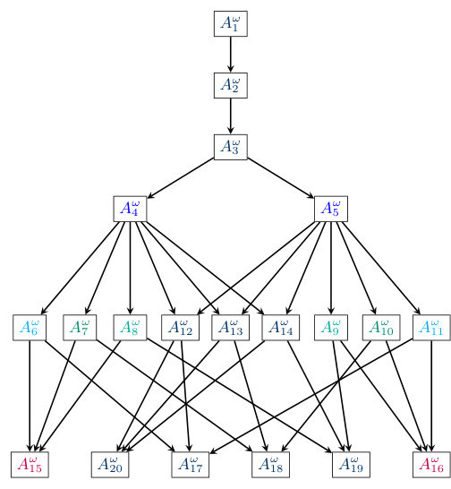 
Figure 2. Partial Hasse diagram for Z(Vecω G32). The algebras are detailed in Table IX. The top most algebra is the identity algebra. The bottom row are the Lagrangian algebras, that correspond to topological boundary conditions. Twin alge- bras are (Aω 4 ,Aω 5 ), (Aω 6 ,Aω 11), (Aω 8 ,Aω 9 ), (Aω 7 ,Aω 10), (Aω 15,Aω 16).

📷 Fig 2

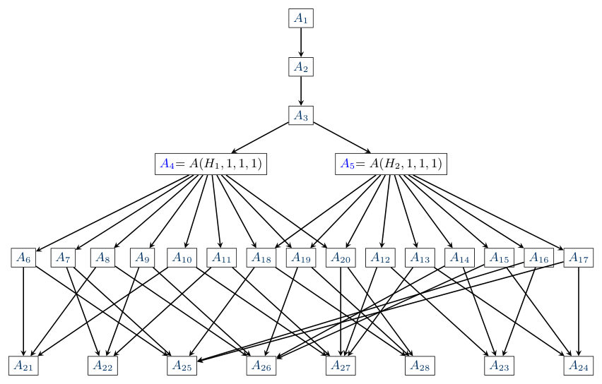 
Figure 3. Part of the Hasse diagram for Z(Vec(Z2×Z2)⋉Z8) that connects to the twin algebras A4 = A(H1, 1, 1, 1) and A5 = A(H2, 1, 1, 1). The algebra A14, A21, A24 are condensable algebras that contain both twins. The algebras are detailed in table VIII. The top most algebra is the identity algebra. The bottom row are the Lagrangian algebras, that correspond to topological boundary conditions.

**Summary.** This theoretical work classifies 'twin condensable algebras' in 2+1D topological orders, which are generalizations of standard anyon models. By introducing the concept of twin algebras—those with the same anyon content but different algebraic structures—the authors identify new candidates for quantum phase transitions. This provides a powerful mathematical tool for distinguishing between physically distinct symmetric phases.

**Why it may be interesting.** The concept of distinct phases with isomorphic ground state spaces but inequivalent order parameters is highly relevant for understanding exotic quantum phases in condensed matter systems.

Detailed structure

**Main problem.** The paper aims to classify and characterize 'twin condensable algebras' in 2+1 dimensional non-chiral topological orders, which go beyond simple anyon descriptions.

**Main result.** Twin algebras exist, representing distinct symmetric phases that share the same anyon content but possess inequivalent algebra structures, leading to phase transitions beyond Landau theory.

**Method.** The classification uses the framework of Symmetry Topological Field Theory (SymTFT) applied to group-theoretical topological orders, parameterizing algebras by subgroups and cocycles.

**Model / system.** The study focuses on symmetric gapped phases in 2+1 dimensions, analyzed using the structure of the Drinfeld center Z(Vec_omega^G) for finite group symmetries G.

**Key observables.** The primary observables are the condensable algebras themselves, characterized by their algebra structure, and the resulting order parameters $\mathcal{O}_a$.

**Important parameters / regimes.** The classification depends on parameters $(H, N, \gamma, \epsilon)$, and the existence of Gassmann triples $(G, H_1, H_2)$ is crucial for identifying twins.

**Assumptions / limitations.** The analysis is restricted to group-theoretical symmetries $	ext{Z}(	ext{Vec}^{\omega}G)$, and the identification of twins relies on algebraic structures like Gassmann triples.

**Figures summary.** Figures illustrate the SymTFT for S-symmetric phases, showing the relationship between symmetry and physical boundaries, and the structure of the algebras.

**Paper structure.** The paper systematically defines condensable algebras, introduces the concept of twin algebras, develops classification criteria using algebraic invariants (like Gassmann triples), and demonstrates physical consequences regarding phase transitions.

Abstract

Condensable algebras in 2+1d non-chiral topological orders characterize gapped boundary conditions and interfaces. Applied to the Symmetry Topological Field Theory, they allow classification of symmetric gapped phases and impose sharp constraints on possible phase transitions. A condensable algebra is specified not only by its underlying set of anyons, which end on the boundary or interface, but also by its algebra structure. We introduce the concept of twin condensable algebras, which have the same anyon decomposition, but inequivalent algebra structure. We revisit the classification of condensable algebras in $\mathcal{Z}(\text{Vec}_G^ω)$, i.e. in group-theoretical topological orders for finite groups $G$ with anomaly $ω$. In this context we are able to identify twin algebras that arise from different mechanisms, such as subgroup data, SPT cocycles, and symmetry actions. In particular, we construct infinite families of examples of twins from so-called Gassmann triples, and exhibit cases in which the reduced topological orders are inequivalent despite having identical anyon content. Physically, twin algebras describe distinct symmetric phases that have isomorphic spaces of ground states, but inequivalent order parameters. Such twin phases never exhibit relative spontaneous symmetry breaking, and can be used to construct phase transitions without hidden symmetry breaking, which are intrinsically beyond Landau transitions.

[↑ back to top](#top)

### [Complex Magnetic Behavior of the Ce sawtooth chains in CeRhSn$_2$](http://arxiv.org/abs/2605.31118v1)

**Authors:** P. Opletal, J. Fikáček, E. Duverger-Nédellec, A. Thamizhavel, Z. Hossain, R. Tarasenko, V. Tkáč, D. Legut, Bin Shen, P. Gegenwart, J. Custers  
**Type:** both · **Category:** strongly correlated electrons · **PDF:** <https://arxiv.org/pdf/2605.31118v1>  
**Analysis basis:** full PDF text, analyzed in chunks
**Topic relevance:** `analog quantum simulation` **1/5** · `exotic spin models in light-matter` **1/5**

📷 Fig 1

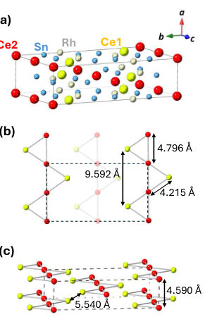 
FIG. 1. Picture of the crystal structure of CeRhSn2 empha- sizing (a) the two inequivalent Ce sites. The view from above of the bc plane (b) shows the magnetic lattice of CeRhSn2. Ce2 (Wyckoffposition 4a) sites align in linear chains along the c-axis and link with Ce1 (Wyckoffposition 4c) sites to create a pattern of alternating sawtooth-shaped isosceles tri- angles. The shortest Ce2–Ce2 distance (c) is along the a–axis.

📷 Fig 2

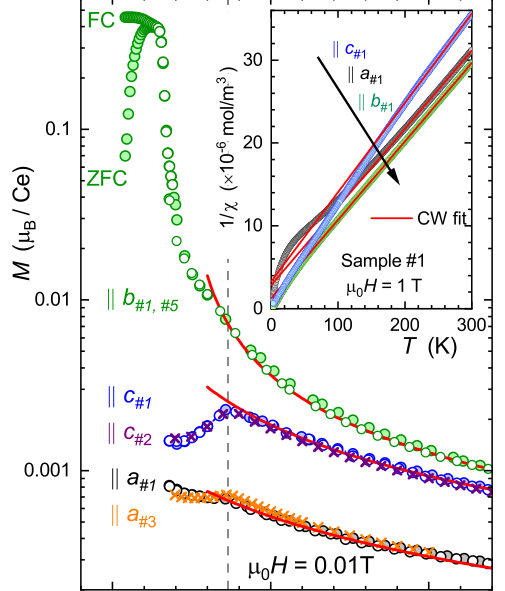 
FIG. 2. Evolution of the magnetization M at low temperature and in an applied field of µ0H = 0.01 T. Closed and open symbols denote zero-field-cooled (ZFC) and field-cooled (FC) measurements, respectively, with subscripts indicating sample numbers. The red lines are low-temperature Curie-Weiss fits (4 &lt; T &lt; 10 K). Measurements T &lt; 2 K (T ≥1.8) K in the orientation H ∥b were carried out on sample #5 (#1). The inset plots the inverse of magnetic susceptibility χ−1 = H/M vs temperature T in a field of µ0H = 1 T along the a axis (black circle), b axis (green circle), and c axis (blue circle).The red lines represent Curie-Weiss fits applied to the data within the temperature range of 200 &lt; T &lt; 300 K.

📷 Fig 3

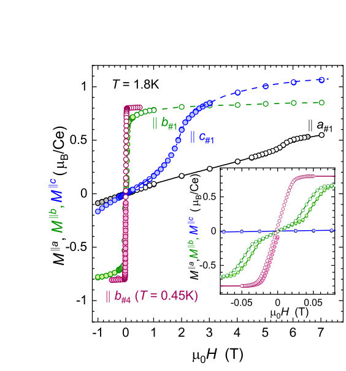 
FIG. 3. Field dependence of the magnetization for field ap- plied a, b, and c axis measured at 1.8 K and at T = 0.45 K (∥b). The inset shows a zoom-in of the low-field region of M vs H. Closed (open) symbols show the data in increasing (decreasing) field. The data ∥a and ∥c overlap in low fields. A finite M at zero field persists along b in the T = 0.45 K measurement.

📷 Fig 4

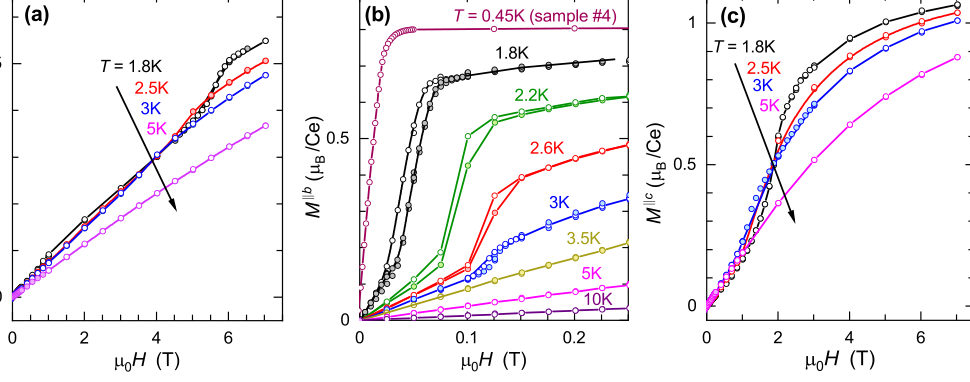 
FIG. 4. Magnetic field isotherms of CeRhSn2 at various temperatures for H parallel (a) a axis, (b) b axis, and (c) c axis, respectively. Open (closed) symbols depict ZFC (FC) results.

📷 Fig 5

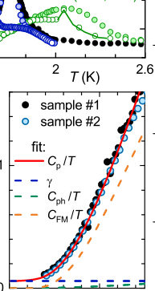 
FIG. 5. The heat capacity Cp divided by temperature T vs T in various fields applied parallel b-axis. Open (closed) sym- bols is in cooling down (warming up) cycle. The upper inset enlarges the region around the double transition in zero field and from a second sample (#2). The lower inset presents the fit to the data using Eq. 1.

**Summary.** This work investigates the complex magnetic behavior of CeRhSn2, a material with a geometrically frustrated structure. By combining detailed measurements of magnetization, specific heat, and resistivity with DFT calculations, the authors resolve conflicting reports to establish a clear sequence of magnetic transitions. They conclude that the material exhibits a ferromagnetic ground state, while attributing the large electronic specific heat coefficient to weak Kondo hybridization.

**Why it may be interesting.** The study provides a detailed, multi-faceted investigation into magnetic ordering in a heavy fermion material, directly addressing the interplay between crystal structure, magnetic frustration, and electronic correlations, which is central to strongly correlated electron physics.

Detailed structure

**Main problem.** The paper aims to resolve conflicting reports regarding the ground state of the intermetallic compound CeRhSn2, which is complicated by a sawtooth-like arrangement of Ce sites suggesting magnetic frustration.

**Main result.** The study establishes three successive magnetic transitions (AFM at 3.65 K, FM at 1.7 K, and a final transition at 1.5 K) and concludes that the system possesses a ferromagnetic ground state, despite initial signs of frustration.

**Method.** The research combines extensive experimental measurements (magnetization, specific heat, resistivity) on high-quality single crystals with ab initio Density Functional Theory (DFT) calculations.

**Model / system.** The physical system is the intermetallic compound CeRhSn2, which has an orthorhombic structure and exhibits complex magnetic anisotropy due to its crystal structure and electronic interactions.

**Key observables.** Magnetization (M), specific heat divided by temperature (Cp/T), resistivity (rho), and magnetic transition temperatures (TN, TC).

**Important parameters / regimes.** Sommerfeld coefficient (gamma = 76.5 mJ/mol·K^2), magnetic anisotropy (b-axis easy axis), and critical temperatures (3.65 K, 1.7 K, 1.5 K).

**Assumptions / limitations.** The authors assume that the observed magnetic transitions and thermodynamic anomalies provide definitive evidence for the magnetic ground state, while acknowledging that the enhancement of gamma might be due to Kondo hybridization rather than frustration.

**Figures summary.** Figures illustrate the crystal structure showing two inequivalent Ce sites and the sawtooth pattern; magnetization curves show field-dependent transitions; and Cp/T vs. T plots reveal anomalies corresponding to the magnetic ordering temperatures.

**Paper structure.** The paper follows a structure of literature review/problem statement, detailed experimental characterization across multiple physical properties (M, Cp, rho), analysis of field and temperature dependencies to pinpoint multiple transitions, and finally, theoretical calculations to confirm the magnetic ground state.

Abstract

Conflicting reports exist on the ground state of the intermetallic compound CeRhSn$_2$. This can be rooted in the sawtooth-like arrangement of two inequivalent Ce sites in the unit cell, which suggests potential geometric magnetic frustration. To resolve, we conducted a comprehensive study on high-quality single crystals of CeRhSn$_2$ by means of magnetization ($M$), specific heat ($C_p/T$), and resistivity ($ρ$). The system exhibits strong magnetic anisotropy, confirming the $b$-axis as the easy magnetic axis. We establish three successive transitions, an AFM order at $T_{N} = 3.65$K, a first-order FM order at $T_{C} = 1.7$K and final transition, at $T = 1.5$K. The transition temperatures are highly field-directional dependent: in a magnetic field, the lowest transition is immediately suppressed while $\mathbf{H} \parallel b$ rapidly merges $T_{C}$ and $T_{N}$ into a single second-order transition. Conversely, $\mathbf{H}\parallel c$ suppresses the FM order and reduces $T_{N}$. Additional ab initio calculations affirm the FM ground state of CeRhSn$_2$. The observation of an enhancement of the Sommerfeld coefficient ($γ= 76.5$mJ/mol$\cdot$K$^2$) may arise from geometric frustration, but it is most consistently attributed to weak Kondo hybridization as frustration cannot be conclusively established through our data.

[↑ back to top](#top)

### [Twin Phases: Phase Transitions Without Hidden Symmetry Breaking](http://arxiv.org/abs/2605.31601v1)

**Authors:** Alison Warman, Yuhan Gai, Sakura Schafer-Nameki  
**Type:** theory · **Category:** statistical mechanics · **PDF:** <https://arxiv.org/pdf/2605.31601v1>  
**Analysis basis:** full PDF text, analyzed in chunks
**Topic relevance:** `analog quantum simulation` **1/5** · `driven-dissipative phase transition` **1/5**

📷 Fig 1

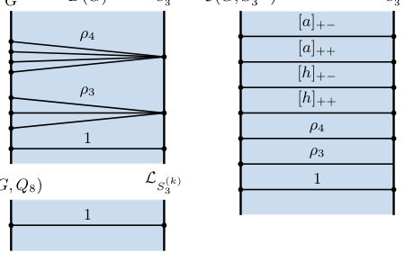 
Figure 2. Three twin gapped phases: the physical boundaries are the twin Lagrangian algebras LS(1) 3 and LS(2) 3 . Changing

📷 Fig 2

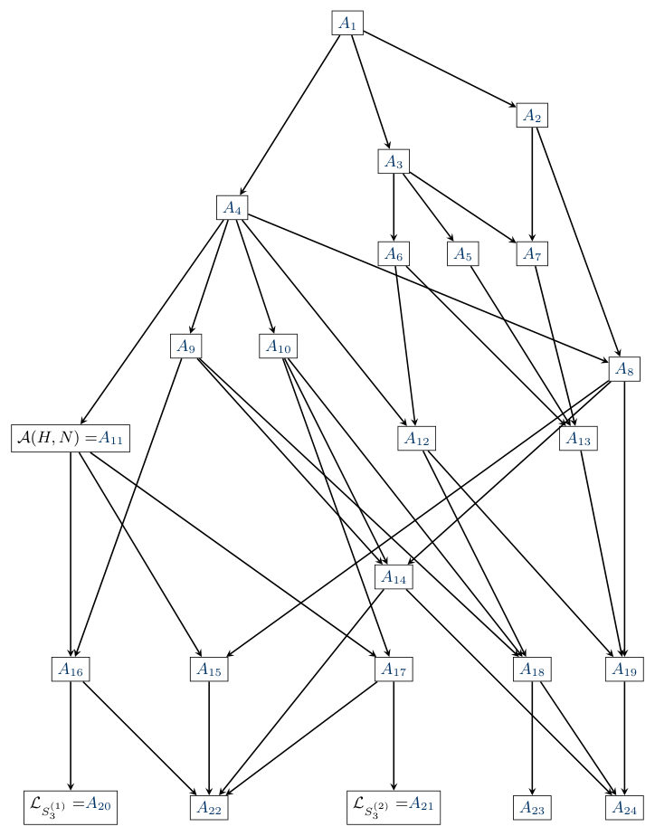 
Figure 3. Hasse diagram for Dω(G). The algebras are ordered by increasing quantum dimension from top to bottom, and are detailed in Tab. II. The top most algebra is the identity algebra. The bottom row are the Lagrangian algebras, that correspond to topological boundary conditions. The twin algebras are Lagrangians twins A20 and A21 and non-maximal twins A15, A16 and A9, A10. The details of the algebras are in table II.

**Summary.** This paper introduces the concept of 'twin phases' to challenge the assumption that all 1+1 dimensional phase transitions must involve spontaneous symmetry breaking. Using advanced tools from Topological Field Theory, the authors construct a model based on the $	ext{GL}(2, 3)$ symmetry group, demonstrating a stable, second-order phase transition between two distinct phases without any hidden symmetry breaking.

**Why it may be interesting.** The concept of twin phases offers a new mechanism for understanding continuous phase transitions in quantum matter that bypasses the standard SSB paradigm, which is relevant for understanding exotic quantum critical points in condensed matter systems.

Detailed structure

**Main problem.** To provide counterexamples to the conjecture that all 1+1d phase transitions are Spontaneous Symmetry Breaking (SSB) transitions, even after gauging.

**Main result.** The authors demonstrate the existence of 'twin phases' and stable, second-order phase transitions between them that are intrinsically beyond Landau transitions and do not involve hidden SSB.

**Method.** The analysis utilizes the Symmetry Topological Field Theory (SymTFT) framework to classify gapped phases and constructs interpolating Hamiltonians between distinct topological orders.

**Model / system.** The study uses a theoretical framework based on a finite group symmetry $G = 	ext{GL}(2, 3)$ in 1+1 dimensions, modeling the system via lattice Hamiltonians $H(\lambda)$ that interpolate between two distinct gapped phases.

**Key observables.** Order parameters (OPs) belonging to the same generalized charge, and the critical point $\lambda = 1/2$ in the interpolating Hamiltonian.

**Important parameters / regimes.** The mixed anomaly $\omega \in H^3(G, U(1))$ is crucial for stabilizing the transition; the transition occurs at $\lambda = 1/2$.

**Assumptions / limitations.** The analysis assumes the validity of the SymTFT description for gapped phases and relies on the structure of condensable algebras.

**Figures summary.** Figure 1 illustrates the SymTFT for twin gapped phases; Figure 2 shows the three twin gapped phases; Figure 3 is a Hasse diagram of condensable algebras, highlighting the twin Lagrangian algebras $A20$ and $A21$.

**Paper structure.** The paper develops the theoretical framework using SymTFT, analyzes the symmetry structure of $G=	ext{GL}(2,3)$ via its character table and anomalies, constructs the twin phases using specific Lagrangian algebras, and finally models the transition using an interpolating Hamiltonian $H(\lambda)$.

Abstract

We introduce the concept of twin phases for a symmetry $\mathcal{S}$, defined as inequivalent phases, whose order parameters are part of the same generalized charge under $\mathcal{S}$. Stable, direct transitions between such twin phases are never spontaneous-symmetry-breaking transitions, even after (partially) gauging the initial symmetry $\mathcal{S}$: they are phase transitions without hidden symmetry breaking. We illustrate this with an (anomalous) finite group symmetry in 1+1d, which exhibits such intrinsically beyond Landau transitions.

[↑ back to top](#top)

### [Using graph neural networks to predict many-body interactions in amorphous materials](http://arxiv.org/abs/2605.30822v1)

**Authors:** Mehryar Jannesari Ghomsheh, Donald L. Koch, Sarah Hormozi  
**Type:** theory · **Category:** disordered systems and neural networks · **PDF:** <https://arxiv.org/pdf/2605.30822v1>  
**Analysis basis:** full PDF text, analyzed in chunks
**Topic relevance:** `methods for driven-dissipative` **1/5** · `non-equilibrium dynamics` **1/5**

📷 Fig 1

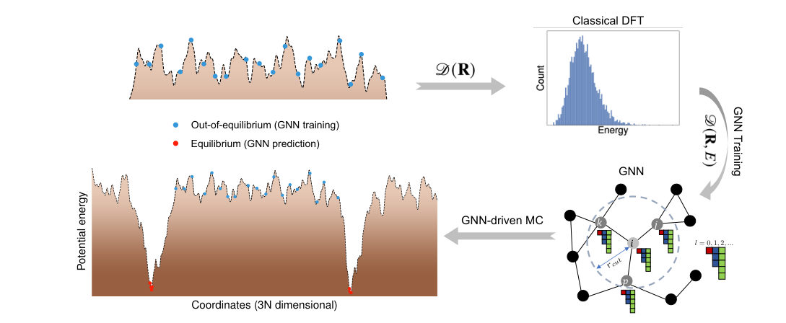 
Figure 1. Overview of the computational framework. Out-of-equilibrium particle configurations, 𝒟(R), are sampled via hard-sphere dynamics and their many-body potential energies are evaluated with classical DFT, producing a dataset 𝒟(R, 𝐸) that spans the high-energy region of the PEL (top left). The GNN is trained on this dataset. Each particle is represented as a node connected to its neighbors within a cutoff radius, 𝑟cut, and node features are updated using tensor representations of increasing angular resolution, 𝑙= 0, 1, 2, . . . . The trained GNN drives MC simulations, enabling exploration of the deep minima of the PEL (bottom left) that are inaccessible during training. The equilibrium...

📷 Fig 2

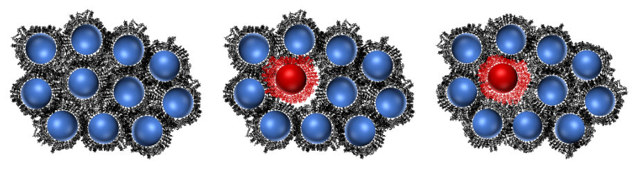 
Figure 2. Schematic of solvent-free PGNs. (a) Polymers uniformly fill the void space for a given configuration of particles. (b) Same configuration as (a) but with an arbitrary displacement of a random particle (shown in red). (c) Displacement of a single particle creates a cascade of polymer rearrangements to minimize the free energy by reaching a uniform number density.

📷 Fig 3

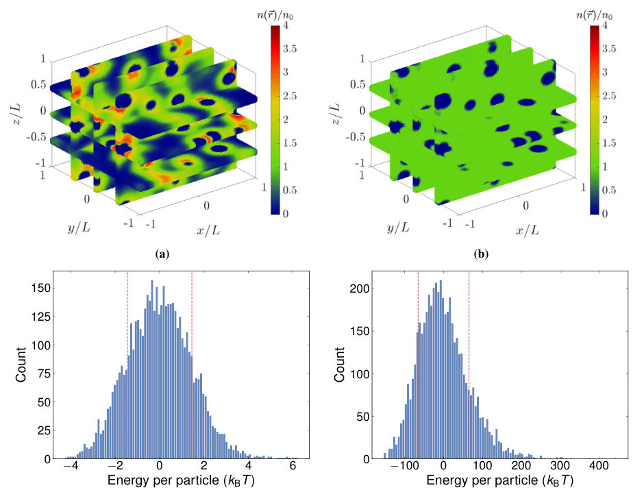 
Figure 3. Classical DFT results for 100 PGNs with a core volume fraction of 𝜙𝑐= 0.1, polymer molecular weight of 𝑀𝑤= 5 𝑘𝐷𝑎, and a grafting density of 𝜎𝑔= 1.8 chains/𝑛𝑚2. The normalized number density of the grafted polymers is shown across multiple planes for (a) the system with excess implicit solvent, displaying significant density fluctuations, and (b) the solvent-free system, showing a uniform density distribution. The dark blue regions represent the cores. Per particle energy distribution, shifted by the mean, for (c) the system with solvent and (d) the solvent-free system. The red vertical lines represent the standard deviation.

📷 Fig 4

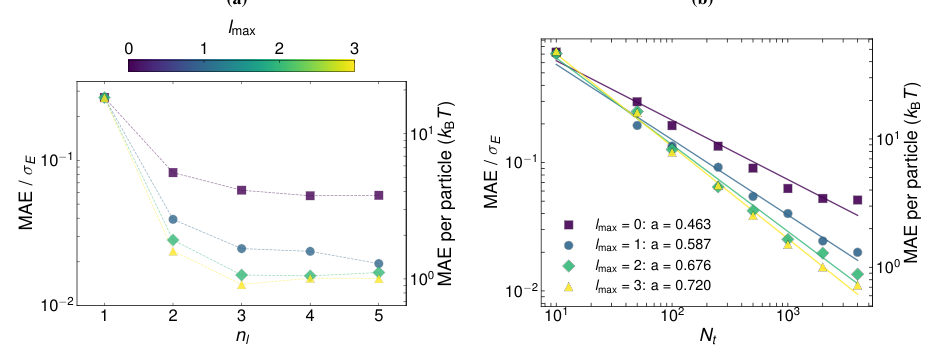 
Figure 4. (a) Parity plot comparing GNN predictions to classical DFT energies for solvent-free PGNs across varying design parameters. The energies are shifted by the mean value, 𝜇, and scaled by the standard deviation, 𝜎𝐸, for each sample. All samples have a polymer molecular weight of 𝑀𝑤= 5 𝑘𝐷𝑎, except for the sample with a grafting density of 𝜎𝑔= 1.0 chains/𝑛𝑚2 which has 𝑀𝑤= 9 𝑘𝐷𝑎. (b) The energy MAE as a function of the normalized cutoff radius. In (b)-(d), the left y-axis corresponds to energy MAE of validation dataset normalized by the standard deviation of energy, and the right y-axis shows MAE per particle. (c) The energy MAE as a function of number of message-passing layers for...

📷 Fig 5

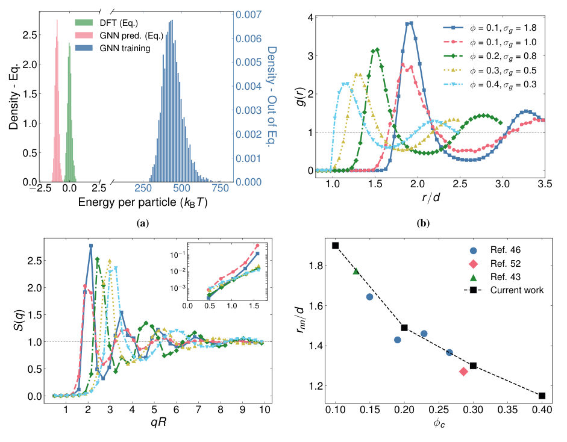 
Figure 5. (a) Per particle energy distribution for out-of-equilibrium configurations (sampled by hard-sphere dynamics and used for training GNN) and equilibrium configurations evaluated by GNN and classical DFT for the sample with 𝜙𝑐= 0.1 and 𝜎𝑔= 1.8 chains/𝑛𝑚2. (b) Equilibrium pair distribution function and (c) static structure factor for solvent-free PGNs with different design parameters. (d) Nearest neighbors distance normalized by particle diameter predicted by GNN-driven MC simulations compared with experimental measurements for solvent-free PGNs with polymer molecular weight of 𝑀𝑤= 5 𝑘𝐷𝑎.

**Summary.** This work introduces NequIP, an equivariant GNN, to overcome the limitations of pairwise potentials in modeling amorphous materials like PGNs. By training on high-energy configurations sampled via DFT, the network accurately predicts the system's complex potential energy landscape. This allows for the simulation of equilibrium structures, revealing local icosahedral ordering, which is crucial for understanding glassy dynamics.

**Why it may be interesting.** The ability to use ML potentials trained on high-energy, non-equilibrium data to predict low-energy, equilibrium states is a powerful paradigm for simulating complex, glassy systems where traditional sampling methods fail.

Detailed structure

**Main problem.** Accurately modeling the complex, high-dimensional, and rugged potential energy landscape (PEL) associated with many-body interactions in amorphous materials, which are often restricted to computationally cheaper pairwise-additive frameworks.

**Main result.** The proposed GNN, NequIP, successfully learns the complex PEL by training on out-of-equilibrium data and accurately predicts the system's equilibrium structure, matching experimental observations.

**Method.** The authors employ an equivariant message-passing Graph Neural Network (GNN) trained on energy data derived from classical Density Functional Theory (DFT) simulations of out-of-equilibrium configurations.

**Model / system.** The system studied is a model soft glass composed of solvent-free polymer-grafted nanoparticles (PGNs). The interactions are governed by the polymer free energy, leading to strong, angular-dependent many-body forces.

**Key observables.** Potential energy landscape (PEL), equilibrium structure (e.g., icosahedral-like local order), pair distribution function, and static structure factor.

**Important parameters / regimes.** Grafting density ($\sigma_g$), core volume fraction ($\phi_c$), and the GNN hyperparameters ($l_{	ext{max}}=3, n_l=3$).

**Assumptions / limitations.** The core relaxation is assumed to be much slower than individual polymer relaxation, allowing for a Born-Oppenheimer-like approximation.

**Figures summary.** Figures illustrate the computational workflow (out-of-equilibrium sampling $
ightarrow$ GNN training $
ightarrow$ equilibrium prediction). They compare structural metrics (like bond order parameters and Voronoi volumes) and energy predictions between the GNN, DFT, and experimental results.

**Paper structure.** The paper details the physical model (PGNs and polymer-mediated interactions), describes the computational framework (DFT sampling of high-energy states), introduces the NequIP GNN architecture, and validates its predictive power by running GNN-driven Monte Carlo simulations to reach equilibrium.

Abstract

Many-body interactions govern the complex behavior of many amorphous materials, from metallic glasses to biological tissues, yet are often replaced by pairwise additive frameworks for computational efficiency. Here, we use classical density functional theory (DFT) to study a model soft glass of solvent-free polymer-grafted nanoparticles (PGNs), where the absence of solvent forces grafted chains to uniformly fill the interstitial space, generating strong angular-dependent many-body interactions between the cores. We show that NequIP, an equivariant message-passing graph neural network (GNN), learns the high-dimensional, rugged potential energy landscape of the system and reproduces classical DFT energies across a range of PGN design parameters at four orders of magnitude lower cost. Systematic analysis of GNN hyperparameters offers physical insights into the range, anisotropy, and effective body order of interactions. GNN-driven Monte Carlo simulations reveal locally favored icosahedral-like structures at equilibrium, and strikingly, recover equilibrium structures in agreement with experiments, despite the network being trained only on high-energy, out-of-equilibrium configurations.

[↑ back to top](#top)

### [$q$-Exponential Random Graphs: higher-order networks from simple constraints](http://arxiv.org/abs/2605.31209v1)

**Authors:** David Dobáš, Diego Garlaschelli, Petr Jizba  
**Type:** theory · **Category:** statistical mechanics · **PDF:** <https://arxiv.org/pdf/2605.31209v1>  
**Analysis basis:** full PDF text, analyzed in chunks
**Topic relevance:** `entanglement & information structure` **1/5**

📷 Fig 1

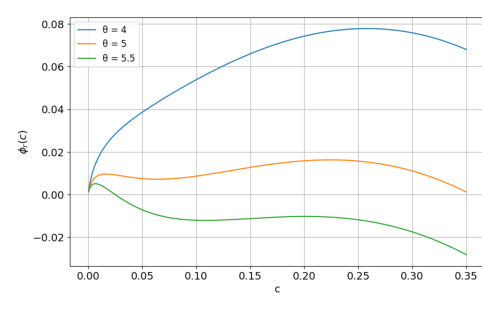 
FIG. 1: The effective free entropy density ϕr(c, θ) for r = 2.7 as a function of link density c for different values of θ. The global maxima of these curves determine the typical configu- ration.

📷 Fig 2

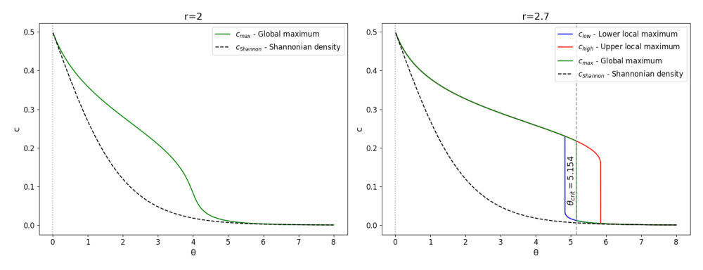 
FIG. 2: On the left, we show the behavior of the typical configuration link density cmax for r = 2 as a function of θ. On the right, for r = 2.7, we plot the local and global maxima of the effective free entropy density ϕr(c, θ) as a function of θ. In the range θ ∈[4.831, 5.846], there are two local maxima clow and chigh, where one is stable and one metastable. The phase transition happens at θcrit ≈5.154. For reference, we also show the Shannonian network density cShannon = (1 + eθ)−1.

📷 Fig 3

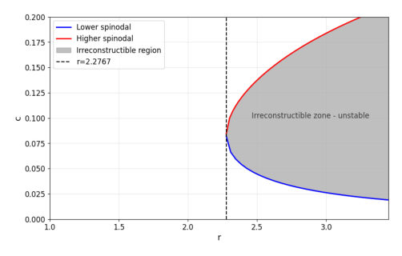 
FIG. 4: For different values of r, we numerically approximated boundaries of the region, where density reconstruction in the q-ER model is not possible. Such a region is determined by the lowest possible value of chigh and the highest possible value of clow in the metastable regime. We also show r value of the critical point, rcp = 2.2767.

📷 Fig 4

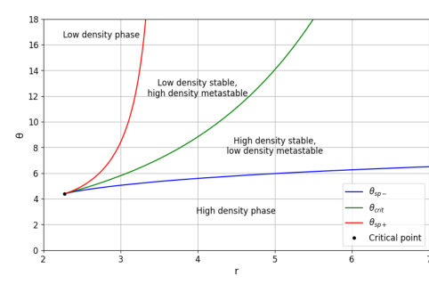 
FIG. 3: The phase diagram of the q-ER model. For each value of r, we show the spinodal points θsp−and θsp+ as well as the phase transition θcrit. The critical point (rcp, θcp) ≈ (2.2767, 4.3994) is shown as the black dot.

📷 Fig 5

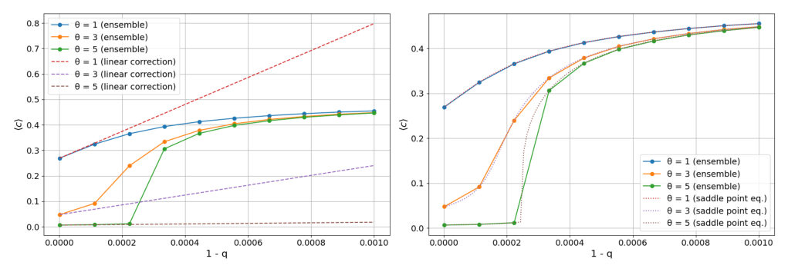 
FIG. 5: For ensembles of 1000 graphs with 100 nodes, we compute the average link density ⟨c⟩and compare with the perturbative linear correction [Eq. (91)] and with the solutions of the saddle-point equation [Eq. (71), on the right].

**Summary.** This work develops $q$-Exponential Random Graph Models by replacing the standard Shannon entropy maximization with generalized $q$-entropies. This generalization allows the model to capture higher-order network correlations, such as tunable clustering and phase transitions, using only simple constraints. It shows that the non-Shannon parameter $q$ acts as a control knob for these complex structural features.

**Why it may be interesting.** The framework provides a powerful, information-theoretic tool to model complex network structures that exhibit non-trivial correlations (like high clustering at low density) without needing to explicitly add higher-order constraints to the model Hamiltonian.

Detailed structure

**Main problem.** The paper generalizes the Maximum Entropy Principle (MEP) for network ensemble construction from the standard Shannon entropy to a broader class of $q$-entropies (Uffink entropies). It seeks to model complex networks in a more agnostic way than the standard Boltzmann-Gibbs framework.

**Main result.** The resulting $q$-Exponential Random Graphs ($q$-ERGs) and $q$-Exponential Configuration Models ($q$-CMs) exhibit higher-order structural dependencies, such as tunable clustering and phase transitions, even when only simple constraints (like total link count or degree sequence) are imposed.

**Method.** The methodology involves maximizing generalized entropy functionals (like Tsallis entropy) subject to expected structural constraints, leading to $q$-exponential probability distributions. This is analyzed through mathematical derivations, saddle-point approximations, and MCMC simulations.

**Model / system.** The model is the random graph ensemble, generalizing the Erdős–Rényi and Configuration Models. The core mathematical structure is the $q$-exponential distribution, $P_q(G) \propto \exp_{2-q}(-\sum 	ilde{	heta}_i c_i(G))$, where $q$ controls the deviation from the standard Shannon case.

**Key observables.** Link density, degree-resolved clustering coefficient $\langle C 
angle(k)$, average nearest-neighbor degree $\langle k_{nn} 
angle(k)$, and the order parameter $S$ (fraction of nodes in the largest connected component).

**Important parameters / regimes.** The entropic parameter $q$ (or $r = 1-q$), which controls the degree of non-extensivity and the strength of higher-order correlations.

**Assumptions / limitations.** The primary assumption is that maximizing generalized entropies provides a more agnostic description of physical systems than maximizing Shannon entropy. The analysis relies on consistent generalizations of the Maximum Entropy Principle.

**Figures summary.** Figures illustrate how the non-Shannon parameter $r$ independently controls higher-order properties like clustering ($\langle C 
angle$) and nearest-neighbor degree ($\langle k_{nn} 
angle$) in the $q$-CM, while the $q$-ER model shows enhanced critical fluctuations near the percolation threshold.

**Paper structure.** The paper progresses by first establishing the mathematical necessity of generalized entropies, then applying this framework to generalize the ER and CM models, deriving the $q$-exponential forms, and finally analyzing the resulting structural properties, phase transitions, and the independent control offered by the parameter $r$.

Abstract

Exponential Random Graphs (ERGs) are among the most widely used network models, derived as principled least-bias graph ensembles that maximize Shannon entropy under constraints on the expected values of given structural properties. However, it has been recently (re)discovered that, in the absence of additional information privileging Shannon entropy, the most agnostic inferential construction should maximize the broader class of Uffink entropies. The resulting entropy-maximizing distribution changes from the exponential (Boltzmann-Gibbs) to the so-called q-exponential one. Since maximizing Shannon entropy may produce an unjustified independence between degrees of freedom, here we investigate how the most popular ERGs with independent edges (namely, the Erdos-Renyi and configuration models) generalize to higher-order q-Exponential Random Graphs with dependent edges in the non-Shannon case, while keeping their defining constraints (number of links and degree sequence, respectively) unchanged. We find features, such as a phase transition between sparse and dense regimes, that are absent in the original ERGs but typical of higher-order networks, plus novel phenomena such as richer assortativity and clustering profiles, which allow for the coexistence of link sparsity and triadic closure. These results show that higher-order networks do not necessarily require higher-order constraints, as they naturally arise from simpler ones in a framework that is even more agnostic than Shannon's.

[↑ back to top](#top)

### [A Phase Space Signature of Quantum Roaming in Chesnavich's Model](http://arxiv.org/abs/2605.30872v1)

**Authors:** Stephen Wiggins  
**Type:** theory · **Category:** other · **PDF:** <https://arxiv.org/pdf/2605.30872v1>  
**Analysis basis:** full PDF text, analyzed in chunks
**Topic relevance:** `non-equilibrium dynamics` **1/5**

📷 Fig 1

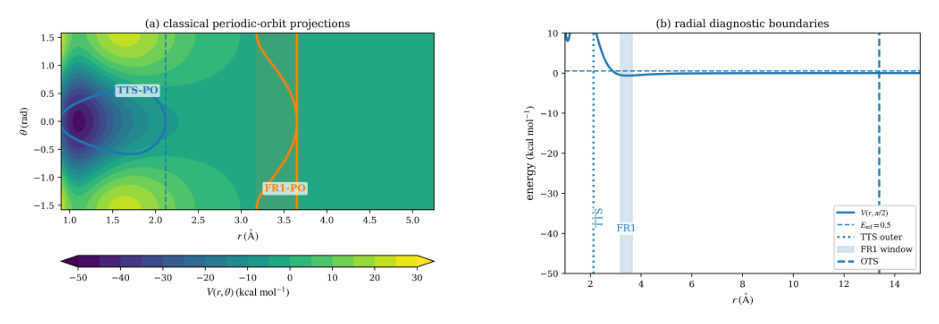 
FIG. 1. Classical reference structures and radial diagnostic boundaries used to define the projected

📷 Fig 2

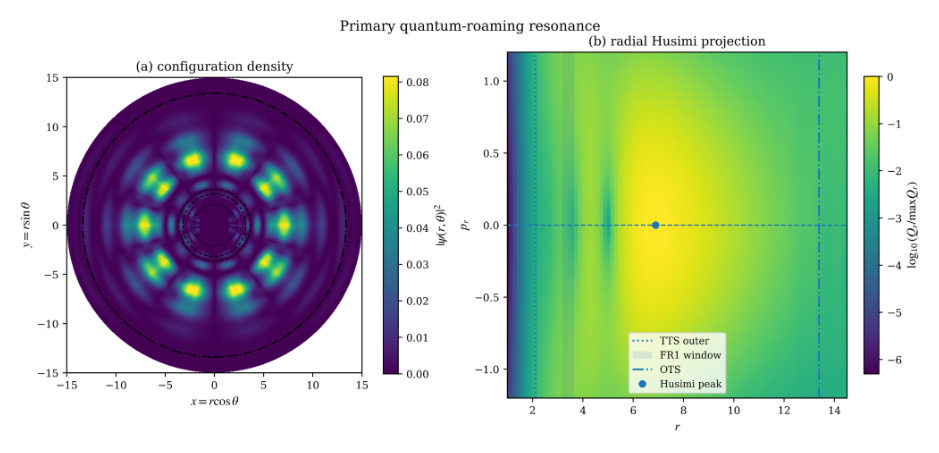 
FIG. 2. Primary quantum-roaming resonance. Left: configuration-space density |ψ(r, θ)|2 with

📷 Fig 3

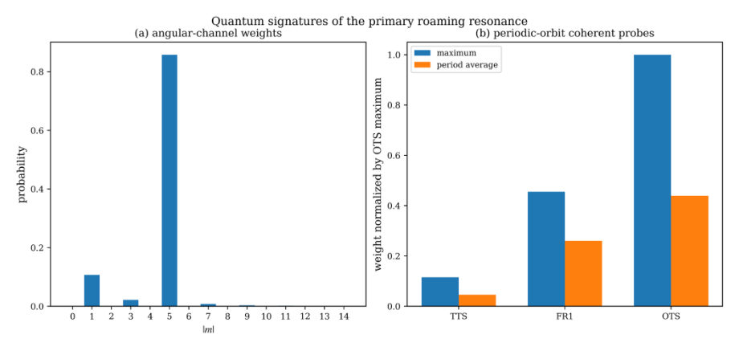 
FIG. 3. Quantum signatures of the primary resonance. Left: angular-channel weights, showing

📷 Fig 4

 
FIG. 4. Selection of the primary quantum-roaming resonance from the computed CAP resonance

📷 Fig 5

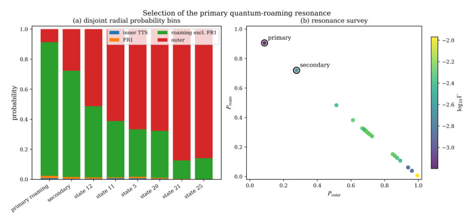 
Figure 5 compares radial marginal densities for the primary, secondary, and representative

**Summary.** This paper investigates quantum roaming in the $\mathrm{CH}_4^+$ ion-molecule reaction using a two-dimensional model. By computing resonance states with a Complex Absorbing Potential, the authors analyze the wavefunctions using phase-space diagnostics. They successfully identify a primary resonance whose localization in phase space—characterized by specific radial and angular distributions—serves as a controlled quantum analogue of the classically observed roaming mechanism.

**Why it may be interesting.** This work directly bridges classical reaction dynamics (roaming) with quantum mechanics by providing a rigorous, diagnostic-based identification of a quantum resonance state that mirrors a complex classical trajectory feature. This methodology is highly relevant for understanding non-adiabatic quantum dynamics.

Detailed structure

**Main problem.** The paper addresses the fundamental quantum question of whether a single quantum resonance state can carry a recognizable signature of the classically defined 'roaming' region in chemical reactions.

**Main result.** The authors identify a specific resonance state whose wavefunction and phase-space diagnostics are localized in the region between the inner and outer transition-state structures, providing a controlled quantum analogue of classical roaming.

**Method.** Quantum resonance states are computed using a Complex Absorbing Potential (CAP) method, and their wavefunctions are analyzed using phase-space diagnostics like radial Husimi projections and angular-momentum channel weights.

**Model / system.** The study uses Chesnavich's two-degree-of-freedom model for the ion--molecule reaction $\mathrm{CH}_4^+
ightarrow\mathrm{CH}_3^+ + \mathrm{H}$. This model contains the necessary structures (inner and outer transition-state bottlenecks) to exhibit classical roaming dynamics.

**Key observables.** Projected roaming probability ($P_{	ext{roam}}$), outer probability ($P_{	ext{outer}}$), radial Husimi projection peak location ($p_{r,H}=0$), and angular-momentum weights.

**Important parameters / regimes.** The analysis is performed at a fixed reference energy ($E_{	ext{ref}}=0.5$) and involves tuning the CAP parameters.

**Assumptions / limitations.** The definition of 'quantum roaming' is operational: it requires the state to be localized in the classically defined roaming region, and the diagnostics are analogues of classical phase-space signatures.

**Figures summary.** Figures illustrate the classical reference structures (TTS, FR1, OTS), the radial Husimi projection showing a peak at intermediate radius with zero radial momentum, and comparisons of probabilities locating the primary state in the projected roaming region.

**Paper structure.** The paper establishes the classical roaming concept, details the quantum resonance calculation using CAP, and then systematically analyzes the resulting wavefunctions using multiple phase-space diagnostics to pinpoint the state matching the classical description.

Abstract

Roaming reactions occur when a molecule enters a near-dissociation region, avoids immediate separation, and later forms products by a pathway not controlled by the conventional tight transition-state bottleneck. Classical studies have shown that roaming is best understood in phase space: inner and outer transition-state structures, together with their invariant manifolds, organize trapping, return, and dissociation. The corresponding quantum question is less settled. Can a single quantum resonance carry a recognizable signature of the classical roaming region? We address this question in Chesnavich's two-degree-of-freedom model for the ion--molecule reaction $\mathrm{CH}_4^+\rightarrow\mathrm{CH}_3^+ + \mathrm{H}$. Resonance states are computed with a complex absorbing potential and analyzed using diagnostics designed to mirror the classical phase-space picture: radial probability weights derived from the tight and outer transition-state structures, radial Husimi projections, angular-momentum channel weights, and coherent-state probes of the classical periodic orbits. One resonance is distinguished from the rest of the computed resonance ensemble. Its wavefunction is concentrated in the projected region between the inner and outer transition-state structures, its radial phase-space distribution is centered at intermediate radius with nearly zero radial momentum, and its angular structure is consistent with a standing rather than a directed rotating component. We interpret this state as a phase-space-localized quantum analogue of classical roaming. The result provides a controlled example in which quantum roaming is identified directly from a resonance wavefunction and its phase-space diagnostics, rather than only from product-state or scattering signatures.

[↑ back to top](#top)

### [Attention-based optimizer for symmetry finding](http://arxiv.org/abs/2605.30429v1)

**Authors:** Shreya Banerjee, Vinodh Raj Rajagopal Muthu, Charlie Nation, Rick P. A. Simon, Francesco Martini, Alessandro Ricottone, Federico Cerisola, Luca Dellantonio  
**Type:** theory · **Category:** disordered systems and neural networks · **PDF:** <https://arxiv.org/pdf/2605.30429v1>  
**Analysis basis:** full PDF text, analyzed in chunks
**Topic relevance:** `analog quantum simulation` **1/5**

📷 Fig 1

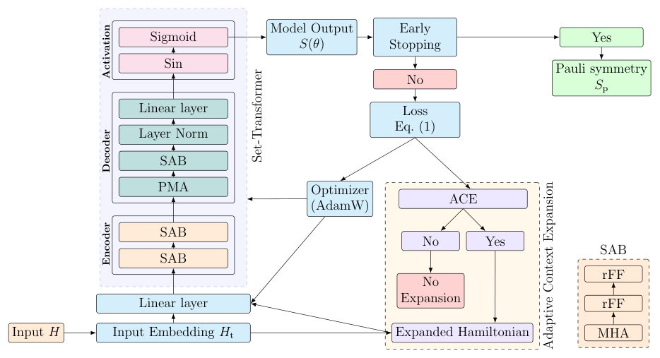 
FIG. 1: Schematic diagram for the attention-based optimization framework to find a Pauli symmetry Sp of the input Hamiltonian H. H is first embedded into its tableau representation Ht [49, 50] in the input embedding layer, and then is passed through a linear row-wise projection layer [51, 52]. The underlying machine-learning model is a Set-Transformer [51, 53] (light-blue box with dashed border in left), consisting of Encoder-Decoder stacks and an activation module. The encoder (light-orange) contains stacked Set Attention Blocks (SAB) [51] (two in the figure). The Decoder (dark green) includes a Pooling Multi-head Attention layer (PMA) [54], followed by a SAB, layer-norm [55], and a linear...

📷 Fig 2

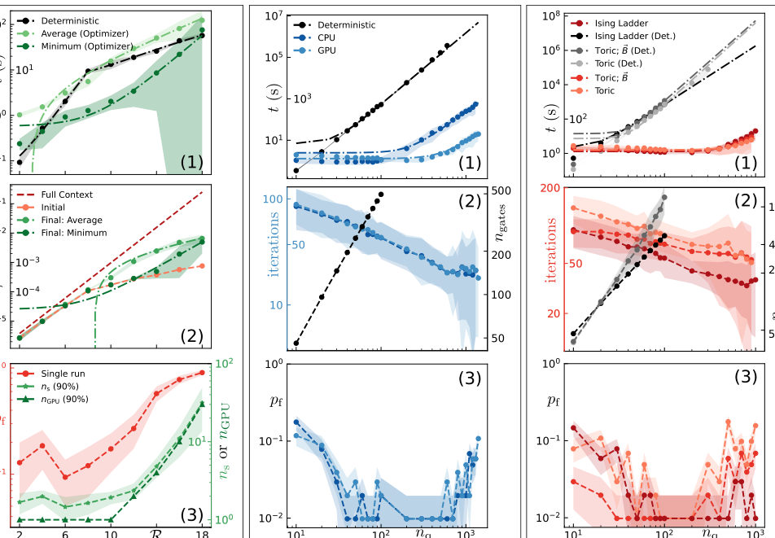 
FIG. 2: (a): Benchmark on random Hamiltonians with 10 qubits and increasing R. a(1) shows the average (light- green) and minimum (dark-green) times taken to find a symmetry. a(2) showcases the performance of the ACE module. We plot the average (light-green) and minimum (dark-green) contexts N needed to find a symmetry, rescaled by the full context (red dashed line) 2R. The orange dashed line reports the initial number of Pauli-Strings ≈R2. a(3) presents the probability of failure pf (red) of the attention-based framework and the number of parallel starts ns (green stars) required by the optimizer to achieve a 90% success rate, as well as the number of GPUs nGPU (green triangles) to enable...

**Summary.** This paper introduces an attention-based optimization framework that uses a Set-Transformer to automatically discover Pauli symmetries of quantum Hamiltonians. By minimizing a loss function derived from the commutation relation, the method achieves state-of-the-art performance on physical models like the Ising and Toric codes. This represents a significant integration of machine learning into the field of quantum many-body physics.

**Why it may be interesting.** This work directly addresses the structure of quantum Hamiltonians by using deep learning to discover fundamental symmetries, which is crucial for simplifying and understanding complex many-body physics models.

Detailed structure

**Main problem.** The core problem is to automatically find the Pauli symmetries of a given quantum Hamiltonian, merging automated symmetry detection with machine learning techniques.

**Main result.** The proposed attention-based optimizer successfully finds symmetries for physical Hamiltonians (Ising, Toric code) with near-deterministic probability, significantly outperforming state-of-the-art deterministic methods.

**Method.** The framework uses a Set-Transformer architecture to encode correlations among Pauli-Strings, optimizing a loss function based on the commutation relation between the Hamiltonian and the candidate symmetry.

**Model / system.** The method is applied to various quantum systems, including random Pauli Hamiltonians, the transverse-field Ising model (1D and 2D), and the Toric code. The Hamiltonian is represented in a tableau form.

**Key observables.** Commutation loss ($	ext{C}_{	ext{com}}$), failure probability ($p_f$), required computational resources (parallel starts, GPUs), and the resulting symmetry vector $S_p$.

**Important parameters / regimes.** The rank ($R$) of the Hamiltonian, the system size ($n_q$), and regularization coefficients ($\alpha_{com}, \alpha_{zp}, \alpha_{bin}, \alpha_{lin}$).

**Assumptions / limitations.** The use of $\sin^2(rac{\pi}{2} x)$ as a differentiable proxy for modulo 2 arithmetic introduces a highly multi-modal loss landscape, requiring multiple optimization starts.

**Figures summary.** Figures benchmark the optimizer against deterministic methods on random and physical Hamiltonians, showing speedups in time and iterations required to find symmetries.

**Paper structure.** The paper introduces the ML framework (Set-Transformer, loss function, ACE module) and then validates it by benchmarking performance across random, 1D Ising, and 2D Ising/Toric code Hamiltonians, comparing results against established deterministic algorithms.

Abstract

Finding symmetries is crucial for understanding physical models. In this work, we present an optimization framework that searches Pauli symmetries of Hamiltonians, merging the fields of machine learning with automated symmetry finding. Built on a Set-Transformer architecture, our framework uses self-attention to encode the pairwise and higher-order correlations among the Pauli-Strings. The relations are then decoded as a candidate, which is further optimized with a custom commutation-based objective, and mapped to a symmetry of the input Hamiltonian. We apply our method to random Pauli Hamiltonians, periodic one and two dimensional transverse-field Ising model and the Toric code. We show that for physical Hamiltonians (Ising and Toric), our framework succeeds with near-deterministic probability while providing substantial advantage compared to state-of-the-art strategies. For random Pauli Hamiltonians, we estimate the required computational resources, specifically the number of parallel starts and the number of GPUs, to find a symmetry with high success probability under fixed design specifications.

[↑ back to top](#top)

### [High-rate and computationally-efficient seedless extractors for device-independent quantum cryptography](http://arxiv.org/abs/2605.31525v1)

**Authors:** Simone Lin, Cameron Foreman, Lluis Masanes  
**Type:** theory · **Category:** quantum information and computing · **PDF:** <https://arxiv.org/pdf/2605.31525v1>  
**Analysis basis:** full PDF text, analyzed in chunks
**Topic relevance:** `entanglement & information structure` **1/5**

📷 Fig 1

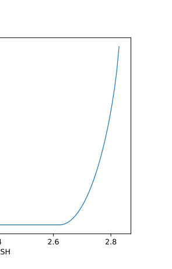 
FIG. 1: Key rate R versus CHSH violation (8we −4) in the large-n regime.

**Summary.** This paper introduces a novel, efficient proof technique for constructing seedless randomness extractors essential for device-independent quantum cryptography. By employing a truncation method, the authors overcome previous limitations regarding the number of required experimental rounds. This results in a protocol that achieves the optimal key generation rate, advancing the practical security guarantees of quantum key distribution.

**Why it may be interesting.** The work provides rigorous, advanced theoretical tools (truncation methods, spectral analysis) for quantifying security in quantum communication protocols, which is fundamental to quantum information theory.

Detailed structure

**Main problem.** The paper addresses the need for high-rate and computationally-efficient seedless randomness extractors for device-independent (DI) quantum cryptography.

**Main result.** The authors present a new proof technique using a truncation method that achieves the optimal key rate of one bit per singlet for one-party DI randomness generation.

**Method.** The core method involves developing a new proof technique based on truncation to estimate protocol parameters, circumventing the need for many rounds previously required when bounding Bell inequality expectations.

**Model / system.** The protocol is set in the context of DI quantum cryptography, utilizing two non-communicating quantum devices (Alice and Bob) whose security relies on violating a Bell inequality (like CHSH). The analysis involves bounding the trace distance between actual and ideal key states.

**Key observables.** Bell Violation (CHSH inequality), Key Rate (bits per singlet), Trace Distance ($\epsilon$), and the raw key vector $\mathbf{a}_r$.

**Important parameters / regimes.** The asymptotic key rate, the error parameter $\epsilon$, and the threshold winning frequency $w_e$ for the CHSH game.

**Assumptions / limitations.** The security proof relies on bounding the trace distance using spectral decomposition and a truncation method, which is shown to be effective for the CHSH setting.

**Figures summary.** Figure 1 illustrates the positive region for the key rate $R$ as a function of the CHSH violation ($8w_e - 4$).

**Paper structure.** The paper develops proofs for several lemmas, including those related to state dilation (Lemma 1), spectral decomposition of measurement operators (Lemma 2), bounding the trace distance via truncation (Lemma 3), and finally establishing the key rate bound using linear algebra and probability tools (Lemma 7).

Abstract

Device-independent (DI) quantum cryptography provides secure cryptography with minimal trust in, or characterisation of, the used quantum devices. An essential component of DI protocols is the use of randomness extractors for privacy amplification, but these typically require an initial seed of randomness that introduces a potential vulnerability. To solve this problem, the security of seedless extractors was proven in Quantum 9, 1654 (2025). The core idea was to use the Bell violation of the raw data, rather than its min-entropy, as the extractor promise. However, the large fluctuations in the Bell inequality used required many rounds to precisely estimate the Bell violation, consuming substantial randomness and making the protocol very inefficient. In this work, we present a new proof technique based on a truncation method that allows the user to estimate the protocol parameters with an asymptotically vanishing fraction of rounds and, as a consequence, achieves the optimal rate of one key bit per singlet. Notably, we prove this result using seedless extractors that can be implemented efficiently.

[↑ back to top](#top)

### [Intrinsic locality dimension of quantum codes](http://arxiv.org/abs/2605.31441v1)

**Authors:** Yimin Lu, Esther Xiaozhen Fu, Zi-Wen Liu  
**Type:** theory · **Category:** quantum information and computing · **PDF:** <https://arxiv.org/pdf/2605.31441v1>  
**Analysis basis:** full PDF text, analyzed in chunks
**Topic relevance:** `entanglement & information structure` **1/5**

📷 Fig 1

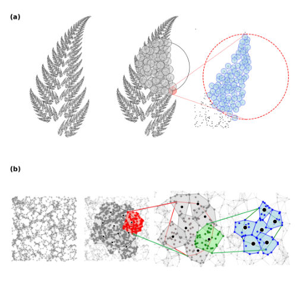 
FIG. 1. Assouad dimension. (a) After “zooming out” so that a ball of radius r becomes a “unit” ball. The number of such r- balls required to cover a ball Nx(R) is at most C(R/r)β where β is the Assouad dimension given by the infimum over all such exponents for all scales r &gt; 0. (b) Doubling condition: An example of the doubling condition for R = 4, 2, 1 on a random unweighted graph with 1500 vertices, where each polygon is a discrete ball of radius R centered at a black dot.

📷 Fig 2

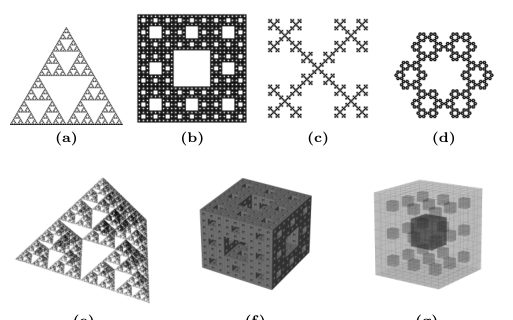 
FIG. 2. Representetive self-similar quasi-convex fractal mod- els and their Assouad dimensions.

📷 Fig 3

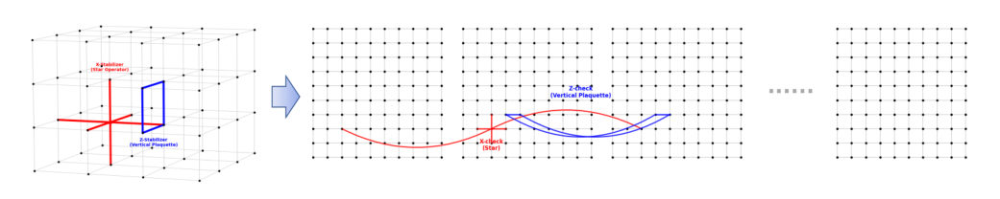 
FIG. 3. Illustration of the mapping from 3D toric code to 2D planar code with long range connectivity: the X-star check 1 + x−1 + x + y−1 + y + z−1 + z ∈F2 [x, y, z] /(xL −1, yL −1, zL −1) maps to 1 + x−1 + x + y−1 + y + x−L + xL ∈F2 [x, y] /(xL2 −1, yL −1), and the vertical Z-plaquette check 1 + x + z + xz maps to 1 + x + xL + xL+1.

📷 Fig 4

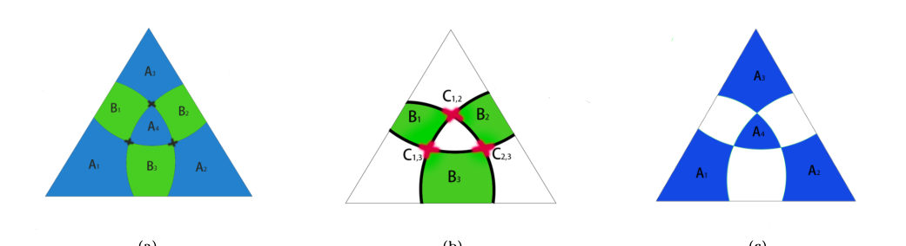 
FIG. 4. Illustration of the generalized BPT partition. (a) A tri-partition for a triangle. (b) C is the union of the thickened red crosses. The black interfaces are absorbed into the green regions B = S ⃗f B ⃗f. (c) A = S ⃗f′ A ⃗f′ is the union of the blue regions without the interfaces.

📷 Fig 5

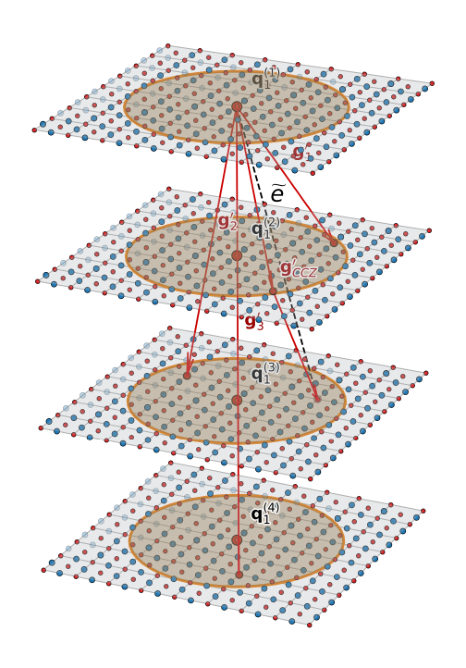 
FIG. 5. Illustration of multi-code-block gates. The red dot q(i) 1 denotes the unique physical qubit parallel to q1 on i-th code block. The arrows g′ 1, g′ 2, g′ 3, g′ CCZ are virtually graph- local cross-block multi-qubit gates, whose support is con- tained in a constant-radius ball centered at q(i) 1 on different blocks. The dashed black line e stands for a new virtual edge on eGλ. By our definition, its weight we = dG(3) λ (q(3) 1 , q3)+1 =

**Summary.** This work introduces the intrinsic locality dimension, based on the Assouad dimension, as a unifying geometric parameter for quantum error-correcting codes. It demonstrates that this dimension characterizes code properties, generalizing existing bounds for topological and lattice codes. The theory provides a versatile mathematical foundation for understanding the fundamental geometric limits of fault tolerance.

**Why it may be interesting.** The geometric framework provides a powerful, abstract tool to constrain the fundamental capabilities of quantum error correction, linking algebraic structure to geometric measure theory.

Detailed structure

**Main problem.** To develop a general, intrinsic geometric characterization of quantum error-correcting codes that is independent of the background geometry.

**Main result.** The intrinsic locality dimension, defined via the Assouad dimension, serves as a fundamental parameter unifying code properties and generalizing known bounds for code parameters and fault-tolerant gates.

**Method.** The authors employ concepts from fractal geometry, specifically the Assouad dimension, to analyze the connectivity graphs associated with stabilizer codes.

**Model / system.** The study focuses on stabilizer quantum codes, analyzing their connectivity graphs, which can be derived from topological structures, fractal sets, or lattice constructions.

**Key observables.** Intrinsic locality dimension ($eta$), code parameters ($k, d, n$), and the Assouad dimension of the connectivity graph.

**Important parameters / regimes.** The intrinsic dimension $eta$ can take non-integer values; the analysis depends on the structure of the underlying manifold or lattice.

**Assumptions / limitations.** The analysis assumes the existence of good triangulations for topological codes and quasi-convexity for fractal constructions to establish dimension equivalences.

**Figures summary.** Figures illustrate the Assouad dimension concept using covering numbers and show examples of fractal structures (like the Sierpiński gasket) whose dimensions are calculated.

**Paper structure.** The paper builds from defining the intrinsic locality dimension using the Assouad dimension, applies this to specific code types (topological, fractal, lattice), derives general bounds, and concludes with implications for thermal stability.

Abstract

Quantum error-correcting codes are a cornerstone of quantum computing, with broad and profound connections to physics and mathematics. In this work, we introduce the notion of intrinsic locality dimension of stabilizer codes that is independent of any background geometry and naturally incorporates flexible architectures and accommodates noninteger values, drawing on mathematical machinery from fractal geometry and geometric measure theory. Important scenarios include topological codes and algebraic codes such as bivariate-bicycle-type codes. We show how the intrinsic dimension serves as a fundamental organizing parameter that unifies code properties. In particular, we prove general limitations on code parameters and compatible fault-tolerant logical gates induced by the intrinsic dimension, generalizing the Bravyi--Poulin--Terhal and Bravyi--König bounds for regular topological codes, respectively. Furthermore, we discuss implications on thermal properties, presenting a conditional no-go result for self-correcting quantum memories in dimension $3-ε$ for any $ε>0$. Our theory lays a versatile and unifying mathematical foundation for studying the fundamental capabilities and geometric implementations of quantum error correction and fault tolerance.

[↑ back to top](#top)

### [Optimization of multisite reactions in complex compartmentalized media](http://arxiv.org/abs/2605.31418v1)

**Authors:** T. V. Mendes, T. Guérin  
**Type:** theory · **Category:** statistical mechanics · **PDF:** <https://arxiv.org/pdf/2605.31418v1>  
**Analysis basis:** full PDF text, analyzed in chunks
**Topic relevance:** `non-equilibrium dynamics` **1/5**

📷 Fig 1

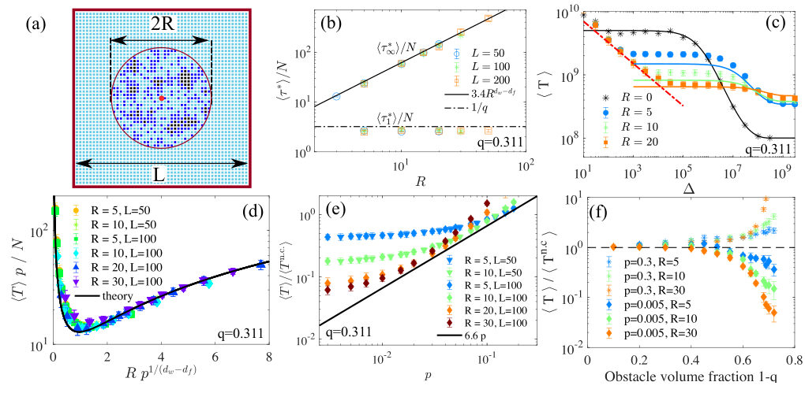 
FIG. 1. (a) Sketch of the system investigated in our simulations, consisting of a crowded sphere of radius R embedded in a regular lattice of side L (the surrounding medium). Light blue : free sites that are connected to the surrounding medium. Deep blue: obstructed sites. Black: free sites that are not connected to the surrounding medium. Red: target site. Here, the system is in two-dimensions, with q = 0.59, but our simulations are in three dimensions. (b) ⟨τ ∗ ∞⟩and ⟨τ ∗ 1 ⟩as a function of the compartment size. Symbols: simulations, with r = 23 for L = 50, r = 44 for L = 100, r = 88 for L = 200. Continuous black line: scaling (4), with α ≃3.4 (obtained from a fit). Dash-dotted black...

📷 Fig 2

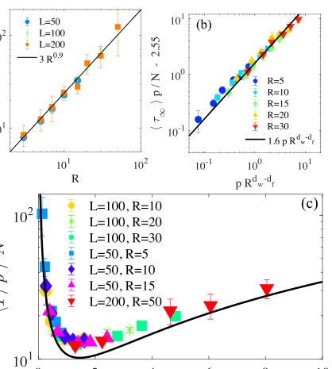 
FIG. 2. Results for mobile targets, with q = 0.311. (a) Mean first passage time versus compartment radius R. (b) Valida- tion of the expression (17) for the activation time for weak reactivity (p &lt; 0.1). (c) Reaction time versus R for different reactivities and ∆= 104 for L = 50, ∆= 105 for L = 100, ∆= 106 for L = 200 and reactivities p &lt; 0.1. The line repre- sents the prediction (18).

📷 Fig 3

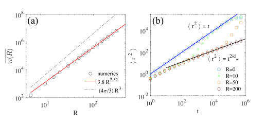 
FIG. 3. (a) Symbols: measured average number of sites of the compartment n(R) that are connected to the external medium. We also show the power-law behavior n(R) ∼Rdf with df ≃2.52 (red line) and the volume occupied by the compartment 4πR3/3 (dash-dotted line). (b) Symbols: mean square displacement for a random walker starting at the cen- ter of the compartment (r = 0), with L = 800 and R indicated in the legend. We also show the power-law ⟨r2⟩= t2/dw with dw ≃3.78 (black line) and the diffusive law ⟨r2⟩= t (blue line).

**Summary.** This theoretical work analyzes how confining a reaction target within a compartment characterized by sub-diffusion can optimize the rate of multisite chemical reactions. By deriving scaling laws for mean first passage times, the authors show that the resulting reaction time can be minimized at an optimal compartment size, demonstrating kinetic acceleration despite local transport slowing.

**Why it may be interesting.** The core concept of kinetic optimization via geometric confinement is relevant to understanding reaction rates in complex biological environments, which often exhibit fractal or disordered structures.

Detailed structure

**Main problem.** The paper investigates how the geometry and dynamics of a complex, compartmentalized medium influence the kinetics of multisite chemical reactions.

**Main result.** The presence of a crowded compartment can accelerate the reaction rate compared to an unconfined system, provided the target is weakly reactive, by optimizing the search process.

**Method.** The authors derive analytical expressions for mean first passage times and reaction times by adapting arguments from random walk theory in fractal and diffusive media.

**Model / system.** The model involves a random walker searching for two or more activation events (dual-site reactions) within a compartment exhibiting fractal sub-diffusion, contrasting this with classical 3D diffusion outside.

**Key observables.** Mean reaction time ($\langle T 
angle$), mean first passage time ($\langle 	au^*_r 
angle$), and the speed-up factor relative to the no-compartment case.

**Important parameters / regimes.** Compartment size ($R$), reaction probability ($p$), time window ($\Delta$), and diffusion exponents ($d_w, d_f$).

**Assumptions / limitations.** The analysis focuses on the weakly reactive limit ($p \ll 1$) and the regime where the time window $\Delta$ is much smaller than the characteristic escape time ($\Delta \ll \langle 	au_\infty 
angle$).

**Figures summary.** Figures illustrate the optimization of $\langle T 
angle$ with respect to compartment radius ($R$) and the comparison of the acceleration factor ($\langle T 
angle / \langle T 
angle_{n.c.}$) versus reactivity ($p$).

**Paper structure.** The paper builds from calculating mean first passage times in confined/fractal media to deriving the reaction time for multisite events, culminating in showing the optimal size $R_m$ that minimizes $\langle T 
angle$.

Abstract

In complex media, transport and geometric properties deeply influence the kinetics of random encounters between reactants. Here, we consider the situation where a random walker, moving in a regularly diffusing medium, has to reach and activate a target located inside a compartment characterized by fractal (obstructed) sub-diffusion. We focus on dual-site reactions, which end when two activation events occur within a given time window. Each activation event happens with a finite probability whenever the random walker visits the target. For weakly reactive targets, we demonstrate that the reaction time can be minimized for an optimal compartment size and can even be accelerated when compared to the same system without compartment. Our analytical predictions are validated through simulations of a random walker on a cubic lattice, where some sites inside the compartment are obstructed at the critical percolation threshold. Our theory illustrates the fact that adding a crowded compartment around a target, even if it slows down the motion in its vicinity, can accelerate the kinetics of complex reactions, especially for weakly reactive targets.

[↑ back to top](#top)

### [Real-Time Quantum Error Correction System Stack: Architecture, Algorithms, and Engineering Practice](http://arxiv.org/abs/2605.30765v1)

**Authors:** Yaojian Chen, Chun-Yang Luan, Peilin Zheng, Xianghong Zeng, Jia-Yi Hou, Zhuo Fu, Yirong Jin, Fei Wang, Guangwen Yang, Dingshun Lv  
**Type:** theory · **Category:** quantum information and computing · **PDF:** <https://arxiv.org/pdf/2605.30765v1>  
**Analysis basis:** full PDF text, analyzed in chunks
**Topic relevance:** `QC/QI experiment` **1/5**

📷 Fig 1

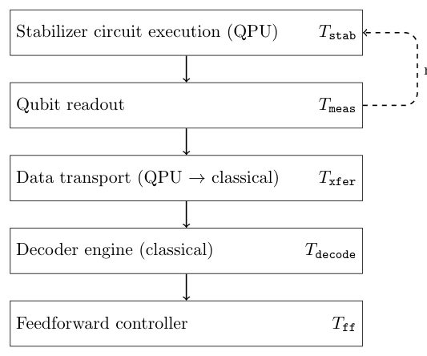 
FIG. 1. End-to-end data path from syndrome extraction to classical feedback. After readout, the

📷 Fig 2

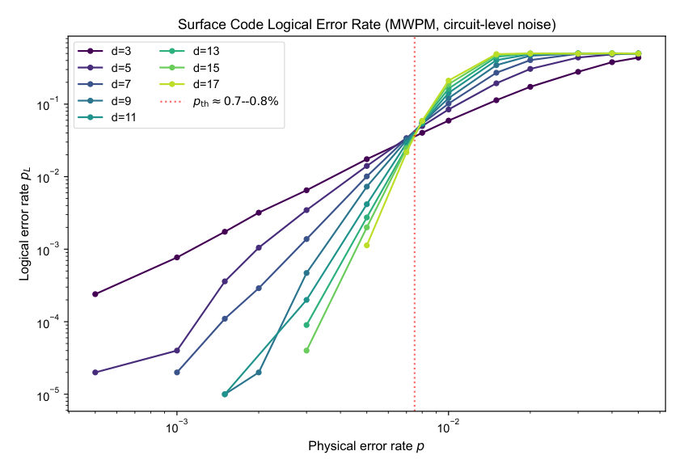 
FIG. 2. Logical error rate vs. physical error rate for rotated surface codes at d = 3–17 using the

📷 Fig 3

 
FIG. 3. Batch mode: per-round mean decode latency vs. code distance at different p. Each point

📷 Fig 4

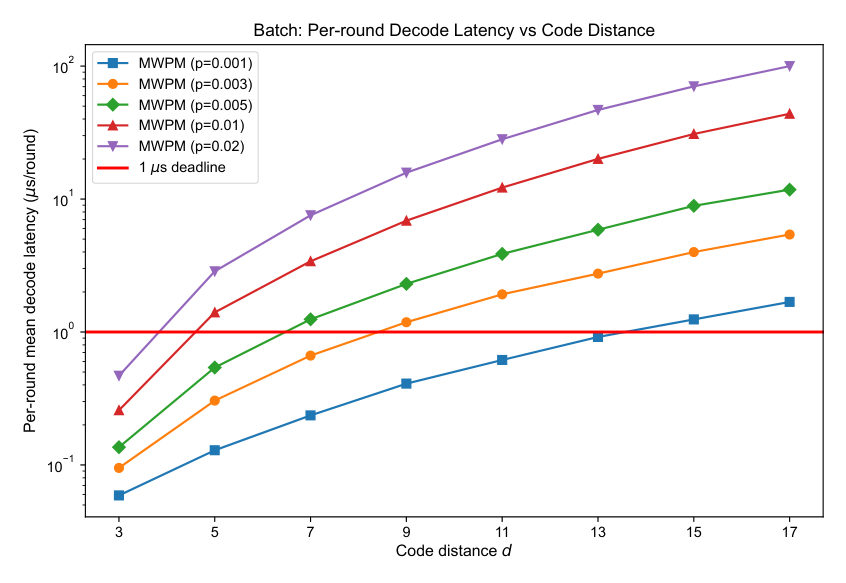 
Figure 3 shows the mean per-round decode latency in mode at five physical error rates,

📷 Fig 5

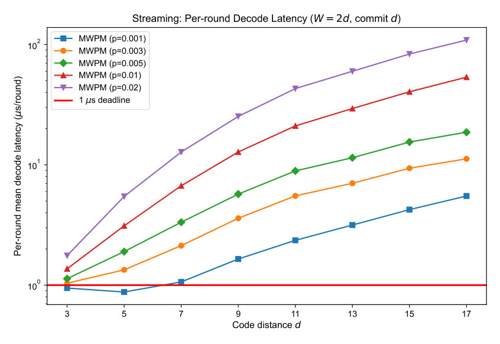 
FIG. 4. Window mode: per-round mean decode latency vs. code distance at different p. Each

**Summary.** This white paper addresses the engineering gap preventing scalable quantum computation by analyzing the real-time constraints of Quantum Error Correction (QEC). It proposes a detailed, multi-layer system architecture and benchmarks decoders to show that system latency, not just algorithmic speed, is the primary bottleneck. The work is vital for guiding the development of fault-tolerant quantum hardware.

**Why it may be interesting.** It provides a crucial systems-level roadmap for quantum computing hardware, detailing the necessary classical control stack and timing budgets required to make fault-tolerant computation practical.

Detailed structure

**Main problem.** The core challenge is transitioning Quantum Error Correction (QEC) from theoretical feasibility to a scalable, real-time systems engineering challenge for Fault-Tolerant Quantum Computing (FTQC).

**Main result.** The bottleneck for scalable QEC is not purely algorithmic but resides in system-level engineering constraints, particularly managing tail latency and end-to-end data path coordination.

**Method.** The authors propose a six-layer reference architecture and benchmark major decoder algorithms (e.g., MWPM, BP+OSD) across different code types (Surface, qLDPC) to quantify real-time readiness.

**Model / system.** The system is modeled as a multi-stage data path: syndrome acquisition, classical decoding, error inference, and correction application, which must operate within strict time budgets.

**Key observables.** QEC round time, tail latency (p99), sustained decode throughput ($\mu$), and the accumulated decoding backlog $B(t)$.

**Important parameters / regimes.** The operational regime shifts between streaming (Clifford gates) and synchronization barriers (non-Clifford gates like T gates), which dictate the required feedforward latency.

**Assumptions / limitations.** The analysis often assumes a uniform depolarizing noise model, though the paper notes that real-device effects like leakage and crosstalk are omitted in current benchmarks.

**Figures summary.** The notes reference a multi-stage data path diagram (Figure 1) and tables comparing various decoders and platform-specific timing constraints.

**Paper structure.** The paper systematically analyzes the QEC cycle, identifies the shift from algorithmic to engineering bottlenecks, proposes a layered reference architecture, and benchmarks performance across different physical platforms and code families.

Abstract

Quantum error correction (QEC) is transitioning from physical feasibility demonstrations to systems engineering challenges. Google has achieved below-threshold performance on distance-5/7 surface codes, while Riverlane and Rigetti have demonstrated hardware-integrated low-latency feedback loops. These milestones indicate that the core challenge of real-time decoding has shifted from algorithmic capability to system-level engineering. However, a substantial engineering gap remains between laboratory demonstrations and scalable fault-tolerant quantum computing (FTQC). This white paper addresses three questions: (1) Where are the real bottlenecks in real-time QEC: beyond average decoder speed, the constraints lie in QEC round time, tail latency, and end-to-end data path coordination; (2) How mature are mainstream decoder algorithms: we benchmark the major decoders for both surface codes and quantum low-density parity-check (qLDPC) codes, evaluating their real-time readiness; (3) What system stack do we propose: a six-layer reference architecture from syndrome acquisition to logical operations, with interface definitions and latency budget models. Our results quantify the gap between current decoder performance and real-time requirements, and identify the architectural choices needed to close it.

[↑ back to top](#top)

### [Shallow Electronic State Preparation for Quantum Chemistry with Quantum Monte Carlo Pre-Selection](http://arxiv.org/abs/2605.31139v1)

**Authors:** Eline Welling, Lila Cadi-Tazi, Alex J. W. Thom, Maria-Andreea Filip  
**Type:** both · **Category:** other · **PDF:** <https://arxiv.org/pdf/2605.31139v1>  
**Analysis basis:** full PDF text, analyzed in chunks
**Topic relevance:** `QC/QI experiment` **1/5**

📷 Fig 1

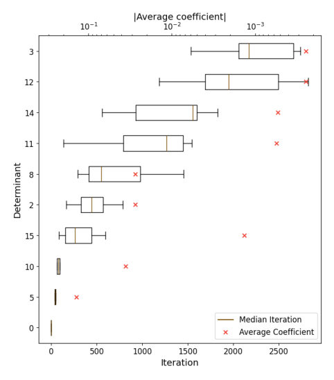 
Fig. 1 BeH2: Boxplots show the distribution of iterations at which each determinant is first spawned across 10 independent QMC-Givens runs of BeH2. Medians are indicated by vertical lines, with boxes spanning the interquartile range. Crosses (×) mark the absolute value of the average coefficient of each determinant at convergence, averaged over the same 10 runs. Determinants are given an index and then ordered by spawning iteration in the plot; those spawned earlier tend to carry larger weights in the converged wavefunction.

📷 Fig 2

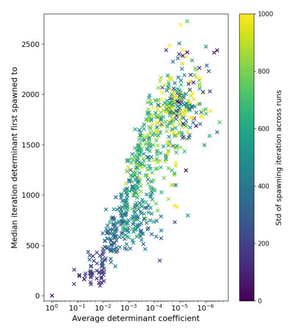 
Fig. 2 N2: Average determinant coefficient magnitude versus median spawning iteration across 10 independent QMC-Givens runs. Each cross marks one determinant, with color indicating the standard deviation of its spawning iteration across the 10 runs. Although individual spawning events show substantial run-to-run variation, the overall ordering is reproducible across runs: determinants with larger converged coefficients are consistently spawned earlier in the sampling (see Table I).

📷 Fig 3

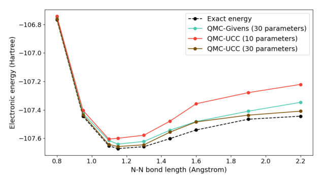 
Fig. 3 N2 binding curve. Solid curves show statevector VQE energies for the QMC-Givens ansatz (30 excitation parameters) and QMC-UCCSD ans¨atze with 10 and 30 parameters. The black dashed curve is the exact ground-state energy obtained by full diagonalization of the electronic Hamiltonian in this basis. We note that as this is a stochastic procedure, some variation in the results is possible.

📷 Fig 4

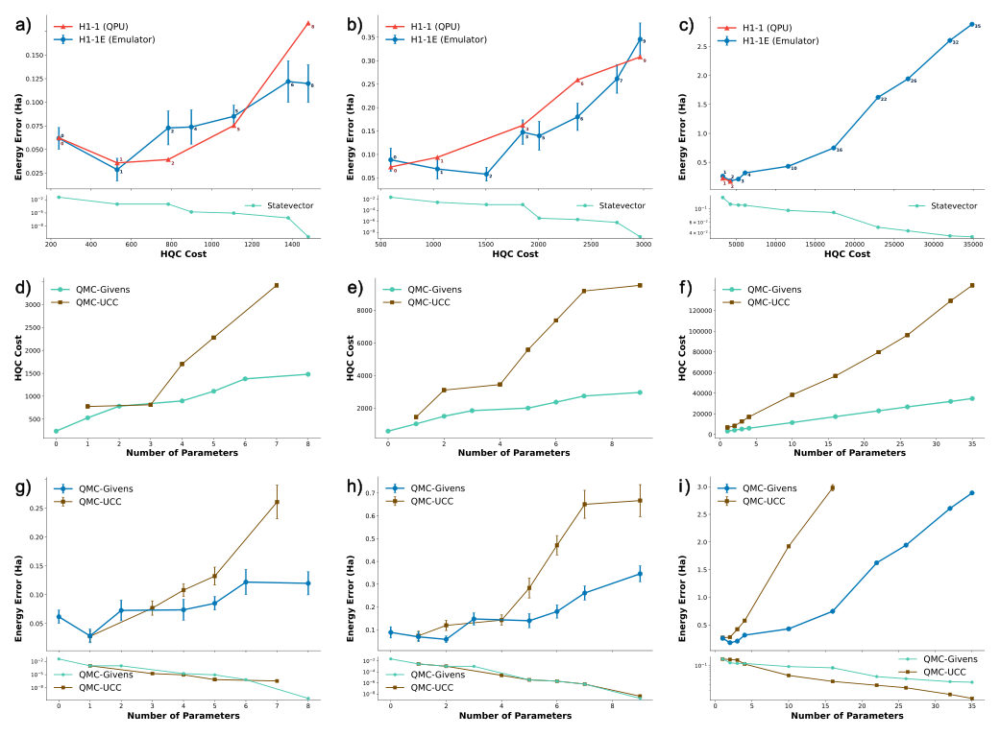 
Fig. 4 Performance of the QMC-Givens and QMC-UCC ans¨atze for LiH, BeH2, and N2. Columns correspond to molecular systems, as indicated at the top. All energies were computed using 1000 shots; where applicable, error bars are estimated from 10 independent samples. a) - c): Energy accuracy as a function of HQC cost for increasing circuit sizes, shown for H1 hardware, the H1-1E noisy emulator, and ideal statevector simulations. d) - e): HQC cost versus number of variational parameters for QMC-Givens and QMC-UCC circuits. f) - i): Energy accuracy versus number of parameters, comparing QMC-Givens and QMC-UCC on the H1-1E emulator (upper curves) and the statevector simulator (lower curves).

📷 Fig 5

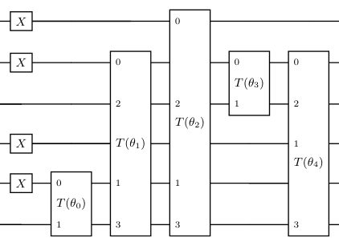 
Fig. 5 QMC-Givens and QMC-UCC ansatz circuits for LiH with 5 parameters.

**Summary.** This paper introduces a novel Quantum Monte Carlo (QMC) pre-screening technique to construct shallow, hardware-efficient quantum circuits for molecular electronic structure calculations. By using Givens rotations, the method significantly reduces circuit depth compared to standard UCC ansätze, enabling chemical accuracy on current noisy quantum devices. This provides a crucial, tunable trade-off between computational power and hardware feasibility for quantum chemistry.

**Why it may be interesting.** This work directly addresses the gap between theoretical quantum chemistry requirements and the physical limitations of near-term quantum hardware by proposing a resource-aware ansatz construction technique.

Detailed structure

**Main problem.** The core challenge is developing quantum algorithms for molecular electronic structure simulation that are shallow enough to run reliably on current, noisy quantum hardware.

**Main result.** The proposed QMC-Givens ansatz provides a significantly shallower and more hardware-efficient alternative to conventional Unitary Coupled Cluster (UCC) methods, especially in the presence of noise.

**Method.** The authors combine Quantum Monte Carlo (QMC) pre-screening to identify crucial wavefunction components with the use of Givens rotation ansätze within the Variational Quantum Eigensolver (VQE) framework.

**Model / system.** The work focuses on simulating the electronic structure of small molecules ($	ext{LiH}$, $	ext{BeH}_2$, $	ext{N}_2$) using fermionic operators mapped to qubits. Benchmarking was performed on the Quantinuum System Model H1.

**Key observables.** Ground state energy, circuit depth, Hardware Quantum Credits (HQC) cost, and the Spearman rank correlation coefficient ($
ho$) quantifying parameter importance.

**Important parameters / regimes.** The trade-off between circuit expressivity (depth) and circuit depth is a key parameter space explored, tailored for current high-noise devices.

**Assumptions / limitations.** The controlled Givens ansatz is used for its relative ease of classical implementation; furthermore, the final analysis suggests that zero-initialization might outperform QMC-initialization for certain systems.

**Figures summary.** Figures illustrate the correlation between early determinant spawning and final amplitudes (Fig. 1, 2), compare energy error vs. parameters (Fig. 3), and compare initialization strategies (Fig. 4).

**Paper structure.** The paper introduces the QMC-Givens method as an improvement over UCC for quantum chemistry. It details the QMC pre-screening procedure, benchmarks the ansatz on molecular systems using hardware metrics (HQC), and concludes by demonstrating the practical advantages of shallow circuits on noisy hardware.

Abstract

Quantum computers hold great promise for molecular simulation, but noise remains a fundamental obstacle. We introduce a Quantum Monte Carlo (QMC) pre-screening procedure that constructs compact, physically motivated Givens rotation ansätze tailored to realistic quantum hardware. By identifying the most important wavefunction contributions early in a QMC simulation, we build circuits that are shallower that conventional alternatives while preserving number symmetry. Benchmarked on Quantinuum System Model H1, QMC-prescreened circuits outperform more complex ansätze under realistic noise conditions. The method offers a practical path toward chemical accuracy on quantum devices, by providing an adjustable trade-off between expressivity and circuit depth to generate shallow circuits suited to current high-noise devices, as well as deeper, more expressive circuits that can be deployed on future lower-noise devices.

[↑ back to top](#top)

### [Symmetry-Resolved Second Harmonic Generation in Quantum and Functional Materials](http://arxiv.org/abs/2605.30584v1)

**Authors:** Xiaoyu Guo, Chang Jae Roh, Youngjun Ahn  
**Type:** both · **Category:** strongly correlated electrons · **PDF:** <https://arxiv.org/pdf/2605.30584v1>  
**Analysis basis:** full PDF text, analyzed in chunks
**Topic relevance:** `interference shaping light` **1/5**

📷 Fig 1

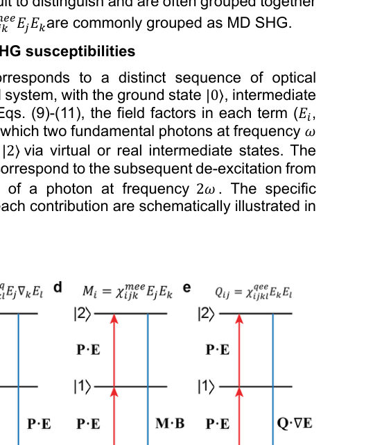 
Fig. 1. Optical transitions and the corresponding radiation sources

📷 Fig 2

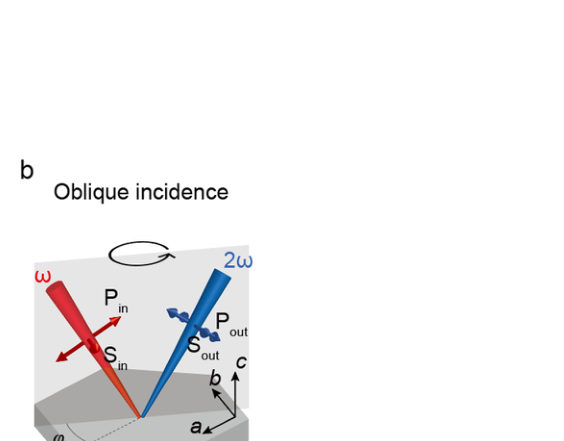 
Fig. 2. Schematic illustration of RA-SHG measurement geometries. (a) Normal-incidence RA-SHG geometry, where the fundamental beam at 𝜔 is incident normal to the sample surface and the reflected SHG signal at 2𝜔 is collected along the same optical axis. The incident and detected polarizations are rotated by an azimuthal angle 𝜑 with respect to the crystallographic axes. Parallel and cross channels denote configurations in which the two polarizations are parallel and perpendicular, respectively. (b) Oblique-incidence RA-SHG geometry, where the incident and reflected beams propagate at finite angles from the surface normal. This geometry provides access to both in-plane and out-of-plane tensor...

📷 Fig 3

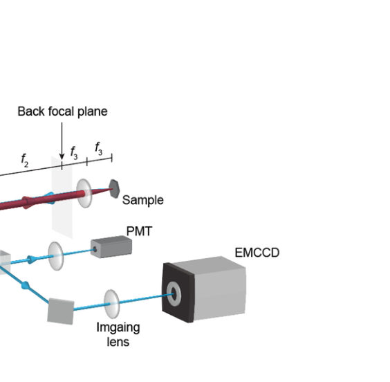 
Fig. 3. Schematic of the optical platform of RA-SHG scanning microscopy and wide- field SHG imaging. The incident fundamental beam is conditioned by a low-pass filter (LPF), and its polarization varies by half-wave plate (HWP). The galvo mirrors scan the focused beam across the sample. The reflected SHG signal is separated by a dichroic mirror (DM) and analyzed by a linear polarizer (LP). The remaining fundamental light is further removed by a set of filters. The signal is then directed to a photomultiplier tube (PMT) for scanning SHG microscopy or to an electron-multiplying charge-coupled device (EMCCD) for wide-field imaging. BS: beam splitter.

📷 Fig 4

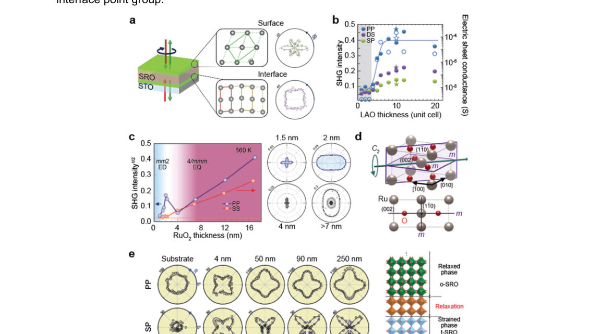 
Fig. 4. Surface and interface symmetry characterization of oxide heterostructures using SHG. (a) Schematic of front-side and back-side reflection geometries used to distinguish surface and interface SHG responses in SrRuO3/SrTiO3 heterostructures. The corresponding RA-SHG patterns reveal different local crystalline symmetries at the film surface and interface. (b) Thickness-dependent SHG response of LaAlO3/SrTiO3, showing the onset of interface SHG near the critical LaAlO3 thickness where interfacial conductivity

📷 Fig 5

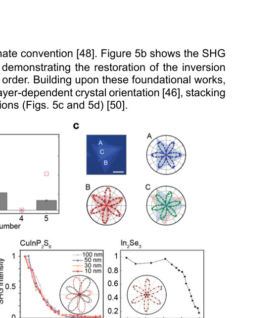 
Fig. 5. Crystal symmetry characterization in vdW materials using RA-SHG. (a) Crystal structure of monolayer MoS2 and representative RA-SHG patterns measured in parallel and cross polarization channels, consistent with 6ത𝑚2 point group. (b) Layer-number dependence of SHG intensity, showing finite SHG responses from odd-layer MoS2 and suppressed SHG responses from even-layer MoS2. (c) RA-SHG patterns from MoS2 flakes with different in-plane crystal orientations. (d) Schematic of uniaxially strained monolayer MoS2, with strain applied along 𝑥-axis, and corresponding RA-SHG patterns under different strain magnitudes. (e) Temperature- and thickness-dependent SHG intensity from ferroelectric...

**Summary.** This review details how Second Harmonic Generation (SHG) acts as a symmetry-resolved optical technique to probe hidden order parameters in quantum and functional materials. By analyzing polarization-resolved rotational anisotropy (RA-SHG), researchers can map out the symmetry-allowed components of the nonlinear susceptibility tensor. This methodology provides a crucial link between fundamental group theory and the measurable electronic and magnetic states of complex condensed matter systems.

**Why it may be interesting.** The connection between symmetry group theory, nonlinear optics, and emergent electronic order parameters provides a powerful, non-perturbative diagnostic tool for studying symmetry breaking in strongly correlated systems, which is highly relevant to modern condensed matter theory.

Detailed structure

**Main problem.** The central problem is identifying the symmetry of ordered phases in quantum and functional materials, as these phases are defined by the symmetries they break.

**Main result.** The paper establishes that Second Harmonic Generation (SHG) spectroscopy, particularly polarization-resolved rotational anisotropy (RA-SHG), serves as a powerful, symmetry-resolved optical probe to map out these hidden order parameters.

**Method.** The methodology combines rigorous quantum mechanical derivations of nonlinear susceptibility tensors ($\chi$) with group-theoretical constraints (Landau theory) to predict symmetry-allowed SHG responses.

**Model / system.** The analysis focuses on condensed matter systems, including polar, magnetic, and electronic materials, using the nonlinear optical process of SHG ($\omega 	o 2\omega$). The theoretical framework involves multipole expansions (ED, MD, EQ) and symmetry analysis within point groups like $C_{4v}$.

**Key observables.** Nonlinear susceptibility tensor components ($\chi_{ijk}$), SHG intensity as a function of rotation angle ($\varphi$), and the symmetry-allowed coupling terms related to order parameters ($\phi$).

**Important parameters / regimes.** Crystallographic and magnetic point group symmetries, polarization states (P/C, SS/SP/PS/PP), and the order parameter magnitude ($\phi$).

**Assumptions / limitations.** The quantum mechanical formalism is rigorous but may struggle with materials exhibiting strong electronic correlations or complex orbital hybridization; the symmetry analysis relies on the invariance principles of the parent point group.

**Figures summary.** Figures illustrate the multipole sources (ED, MD, EQ) for SHG radiation and schematically depict the various geometries for RA-SHG measurements (normal vs. oblique incidence).

**Paper structure.** The paper progresses from the basic theoretical background of SHG sources (multipole expansion) to the quantum mechanical derivation of susceptibility tensors, followed by a comprehensive review of RA-SHG applications across various symmetry-breaking phenomena, and concluding with future research directions.

Abstract

Second harmonic generation (SHG) has evolved from a probe of noncentrosymmetric crystals into a symmetry-resolved optical method for identifying order parameters in quantum and functional materials. In particular, polarization-resolved rotational anisotropy (RA) measurements of SHG can connect nonlinear susceptibility tensors to the crystallographic and magnetic point groups of the underlying materials. This capability is especially powerful when the ordered state is weak, spatially confined, multipolar, magnetic, or hidden from conventional linear probe techniques. In this review article, we provide a comprehensive overview of RA-SHG studies across a broad range of condensed matter systems. We begin with basic theoretical background for the multipole origins of SHG radiation, the construction of nonlinear susceptibility tensors, and group-theoretical framework connecting tensor components to order parameters. We then review the applications of RA-SHG to polar materials, magnetic orders, and other hidden electronic materials. Finally, we outline challenges and future research directions for using SHG to reveal, image, and control hidden, intertwined, and nonequilibrium phases in quantum and functional materials.

[↑ back to top](#top)

## Other papers (16)

*Papers from primary archives without highlighted authors or any topic match. Click to expand.*

Show other papers

### [A Denser Planar Surface Code](http://arxiv.org/abs/2605.30455v1)

**Authors:** Guang Hao Low, William J. Huggins, Dominic W. Berry, Tanuj Khattar, Alec F. White, Nicholas C. Rubin, Ryan Babbush  
**Type:** theory · **Category:** quantum information and computing · **PDF:** <https://arxiv.org/pdf/2605.30455v1>  
**Analysis basis:** full PDF text, analyzed in chunks

📷 Fig 1

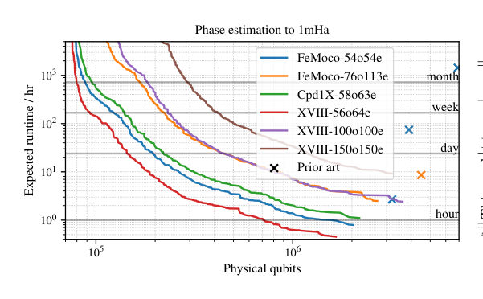 
FIG. 1. Pareto frontier of physical resources for chemically-accurate ground state phase estimation of ‘utility-scale’ benchmark molecules with 54 to 150 orbitals, assuming quantum hardware with nearest-neighbor connectivity, a 10−3 physical error rate, a surface code cycle time of 1µs, and a reaction time of 10µs. Shown are estimates for the FeMo-cofactor for nitrogen fixation, the XVIII configuration of a Ruthenium-based catalyst for carbon fixation, and the Cpd1X configuration of a metabolic cofactor p450. We present new space-time tradeoffs in quantum circuits and quantum error correction for compiling the second-quantized Double-Factorized-Tensor-HyperContracted (DFTHC) electronic...

📷 Fig 2

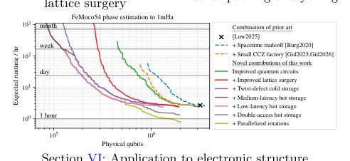 
FIG. 2. Summary of our key contributions. Section II: We reduce the lattice surgery bounding box of a distance d rotated surface code patch from 2(d + 1)2 to 2d2 physical qubits. Section III: We introduce an optimal-depth, hook-error-free, and efficiently decodable implementation of surface code twist defects using nearest-neighbor gates on a degree-3 hex grid. This enables a packing of three logical qubits into a rectangular patch with a 1.5× encoding rate. By merging boundaries of three-qubit rectangles, we obtain a dense packing of logical qubits in twist defects with asymptotically a 2× encoding rate. By yoking this dense packing of twist defects, we obtain logical qubit “cold storage”...

📷 Fig 3

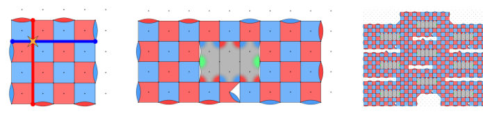 
FIG. 3. (Left) Rotated surface code patch with weight-4 Pauli-Z (blue) and X (red) stabilizers occupying a footprint of d2

📷 Fig 4

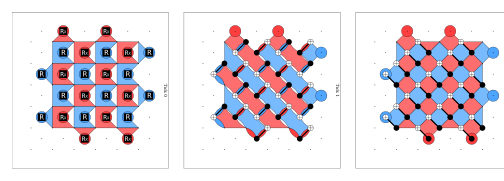 
FIG. 4. The N-

📷 Fig 5

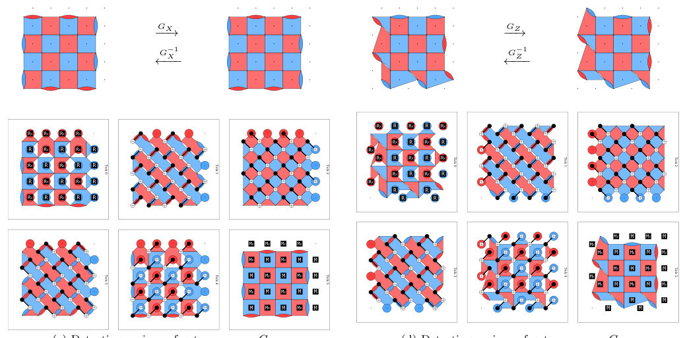 
FIG. 5. Surface code patch encoding one logical qubit using Z (blue) and X (red) stabilizers with a footprint of d2 data qubits and d2 −1 measurement qubits for (left) the case previously known X-top configuration. All stabilizers are measured by preparing either a |+⟩or |0⟩state followed by a sequence GX of four layers of CX gates. The alternating sequence GX, G−1 X of [3] is a Floquet code that alternates between two end-cycles and achieves circuit-level distance d [27]. In this work, we demonstrate (right) a new Z-top configuration that permits lattice surgery operations within a bounding box of 2d2 qubits per patch. The gate sequence (bottom right) GZ is identical to GX in the bulk but...

**Summary.** This paper introduces a novel, denser planar surface code architecture by efficiently packing twist defects into a 2D hex grid. This advancement boosts the encoding rate by 4.5x, leading to substantial reductions in the required physical qubits and computational time for simulating complex electronic structures, such as nitrogen fixation catalysts.

**Why it may be interesting.** The focus on optimizing resource scaling for quantum simulation, particularly by improving the encoding rate of topological codes, directly impacts the feasibility timeline for quantum chemistry simulations.

Detailed structure

**Main problem.** The primary challenge is achieving utility-scale quantum simulation for electronic structure problems while drastically reducing the required physical quantum resources.

**Main result.** The authors propose a dense packing of surface code twist defects, achieving an estimated encoding rate up to 4.5x that of standard surface codes, leading to significant improvements in resource estimates.

**Method.** The work develops new stabilizer measurement cycles and padding-free lattice surgery protocols to implement a denser, more efficient planar surface code architecture.

**Model / system.** The system is a quantum computer utilizing the surface code for fault-tolerant quantum error correction, implemented on a regular 2D hex grid. The target application is ground state phase estimation for electronic structure problems.

**Key observables.** Encoding rate (up to 4.5x improvement), minimum physical quantum volume (1.3 mega-qubit-hours), and resource trade-offs across space, time, and qubit count.

**Important parameters / regimes.** Noise model: one- and two-qubit $10^{-3}$ error uniform depolarizing model. Time scales: $1\mu$s cycle time, $10\mu$s reaction time. Target: Chemical accuracy for FeMoco catalyst.

**Assumptions / limitations.** Assumes an ideal outer decoder for lattice surgery and uses circuit-level noise modeling; the comparison to prior art relies on specific resource estimates (e.g., Toffoli gate counts).

**Figures summary.** Figure 1 illustrates the Pareto frontier of physical resources for ground state phase estimation, comparing the new dense-packing approach against prior art across 'Compact', 'Balanced', 'Efficient', and 'Fast' regimes.

**Paper structure.** The paper progresses by first identifying the resource bottleneck of standard surface codes, then introducing the dense-packing twist defect strategy, detailing the optimized lattice surgery protocols, and finally applying the resulting resource estimates to benchmark utility-scale quantum simulation tasks.

Abstract

We present a quantum code implementable on a regular $2$D hex grid with an estimated encoding rate up to $4.5\times$ of that of a rotated surface code patch using circuit-level noise in a one- and two-qubit $10^{-3}$ error uniform depolarizing model. Our approach is based on yoking a dense packing of surface code twist defects, enabled by new stabilizer measurement cycles with an optimal four layers of nearest-neighbor two-qubit gates, almost no distance-reducing hook errors, and efficient decoding. We demonstrate a space-efficient architecture for computing on densely packed logical qubits, including new padding-free lattice surgery protocols in an optimal bounding box of $2d^2$ data and measurement qubits per patch. Assuming a $1μ$s surface code cycle time and a $10μ$s reaction time, these developments enable chemically accurate ground state phase estimation of a broad class of `utility-scale' electronic structure simulation problems such as the $108$ spin-orbital FeMoco-based nitrogen fixation catalyst in under a month with $89$k noisy superconducting qubits. We elucidate a Pareto frontier of space-time trade-offs and find a minimum physical quantum volume of $1.3$ mega-qubit-hours. These correspond to a $36\times$ space and $6.6\times$ spacetime improvement, respectively, over our previous state-of-the-art minimum-Toffoli resource estimates (Phys. Rev. X 15, 041016).

[↑ back to top](#top)

### [Ambiguity problem of the Bootstrap Method in Quantum Mechanics](http://arxiv.org/abs/2605.30536v1)

**Authors:** Takeshi Morita, Worapat Piensuk, Pushkar Soni  
**Type:** theory · **Category:** other · **PDF:** <https://arxiv.org/pdf/2605.30536v1>  
**Analysis basis:** full PDF text, analyzed in chunks

📷 Fig 1

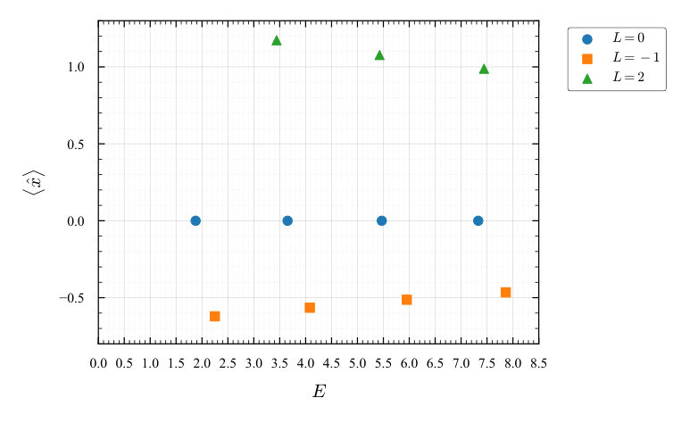 
Figure 1: The spectrum of the Hamiltonian with the mixed potential (2.2) for L = 0, −1, and 2. We plot the energy eigenvalues E against the expectation values ⟨ˆx⟩. The spectrum clearly depends on the value of L. We use the NDEigensystem package in Mathematica to solve the Schr¨odinger equation numerically, and we later compare this spectrum with the results obtained using the bootstrap method.

📷 Fig 2

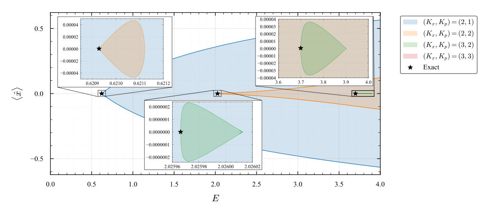 
Figure 2: Numerical bootstrap result for the anharmonic oscillator (2.1). The colored regions show the allowed regions on the (E, ⟨ˆx⟩)-plane that satisfy the condition M ⪰0. We use the bootstrap matrix M with Kx and Kp defined in Eq. (2.4). “Numerical” refers to the result obtained using the NDEigensystem package in Mathematica. Some of the allowed regions are difficult to see in this figure because they are extremely small, almost point-like, and their detailed values are listed in Table 1. As Kx and Kp increase, the allowed regions shrink, and converge to the numerical results. Here, ⟨ˆx⟩converges to 0, as expected from the parity symmetry.

📷 Fig 3

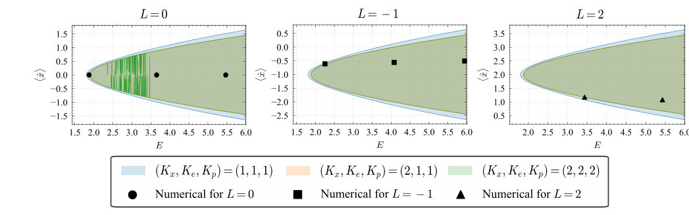 
Figure 3: Allowed regions for the mixed potential (2.2) with L = 0, −1 and 2, obtained using the conventional bootstrap method. The “numerical” points correspond to those shown in Fig. 1. Up to (Kx, Ke, Kp) = (2, 2, 2), no isolated allowed regions appear. The result for (Kx, Ke, Kp) = (2, 2, 2) at L = 0 shows some numerical noise. These three figures become almost identical once we shift ⟨x⟩→⟨x⟩−L as shown in Fig. 4, indicating that the bootstrap method cannot distinguish between different values of L and therefore fails to reproduce the spectrum.

📷 Fig 4

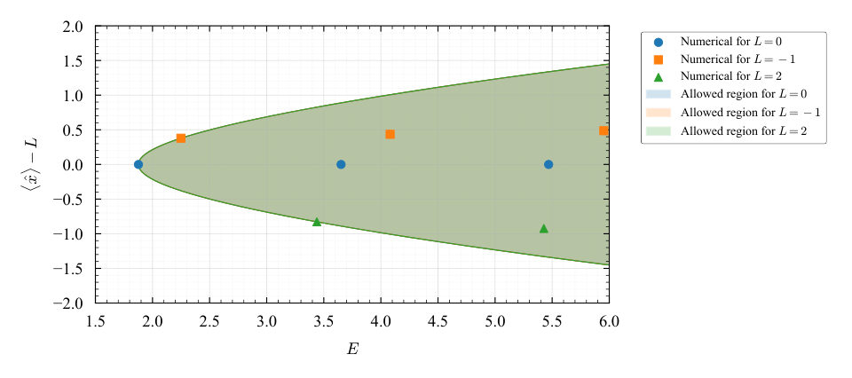 
Figure 4: Allowed regions of the mixed potential (2.2) for L = 0, −1 and 2 on the (E, ⟨x⟩−L) plane. The dots represent the numerical results shown in Fig. 1. We use the bootstrap matrix at (Kx, Ke, Kp) = (2, 2, 1). The three allowed regions for the different values of L, obtained using the conventional bootstrap method and shown in Fig. 3, coincide up to numerical errors, and therefore cannot be distinguished in this plot. This demonstrates that the conventional bootstrap method cannot reproduce the energy spectrum, which depends on L.

📷 Fig 5

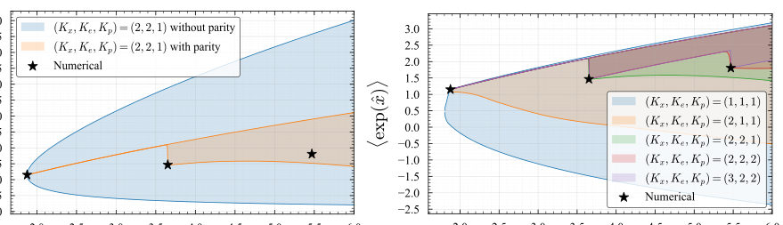 
Figure 5: The allowed regions of the mixed potential (2.2) for L = 0 obtained using the bootstrap method with the parity condition (3.2). The vertical axis is ⟨exp(ˆx)⟩instead of ⟨ˆx⟩, because the condition ⟨ˆx⟩= 0 has been imposed. (left panel) Comparison of the allowed region with and without imposing the parity condition at (Kx, Ke, Kp) = (2, 2, 1). The allowed region is drastically reduced by imposing the parity condition. (right panel) Results at various (Kx, Ke, Kp). As we increase the size of the bootstrap matrix, the allowed region shrinks and kinks appear. The energy eigenvalues are located at these kinks, indicating that the bootstrap analysis captures the eigenstates. Although...

**Summary.** This paper investigates the ambiguity problem inherent in applying the bootstrap method to quantum Hamiltonians with mixed potentials. The authors demonstrate that the method fails for such potentials but propose and test several resolutions, including imposing additional positivity constraints. These resolutions successfully recover the correct energy spectrum for specific cases, providing a more robust theoretical framework.

**Why it may be interesting.** The work tackles a fundamental theoretical limitation of a powerful mathematical tool (the bootstrap method) used to determine quantum spectra, offering systematic ways to resolve ambiguities arising from operator structure.

Detailed structure

**Main problem.** The bootstrap method for quantum mechanics suffers from an ambiguity problem, failing to yield the correct energy spectrum when the potential contains mixed functional forms (e.g., polynomial and exponential terms).

**Main result.** The ambiguity can be resolved by imposing additional positivity conditions, such as $M_{\cosh} \succeq 0$, which successfully reproduce the true energy spectrum for certain potentials.

**Method.** The authors use the bootstrap method, which constrains energy eigenvalues by enforcing the positive semi-definite condition ($M \succeq 0$) on a constructed bootstrap matrix derived from expectation values.

**Model / system.** The analysis focuses on quantum mechanical Hamiltonians, specifically comparing the anharmonic oscillator ($H_{AHO}$) with a mixed potential $H_{mixed} = rac{1}{2} \hat{p}^2 + (\hat{x} - L)^2 + \cosh(\hat{x})$.

**Key observables.** Energy eigenvalues ($E$) and expectation values ($\langle \hat{x} 
angle$, $\langle e^{\hat{x}} 
angle$).

**Important parameters / regimes.** The potential shift parameter $L$, and the size parameters ($K_x, K_p$) used in the bootstrap matrix construction.

**Assumptions / limitations.** The primary assumption is that the energy spectrum must satisfy the positivity condition on the bootstrap matrix; resolutions involve imposing additional constraints like parity or specific positivity inequalities.

**Figures summary.** Figures illustrate the allowed regions in the $(E, \langle \hat{x} 
angle)$-plane for both the anharmonic oscillator (convergence shown) and the mixed potential (failure/resolution shown using different constraints).

**Paper structure.** The paper first establishes the failure of the bootstrap method for mixed potentials, then proposes and analyzes three resolutions: Taylor expansion, imposing parity, and imposing an additional positivity condition, culminating in the successful resolution for $L=0$ using the combined constraints.

Abstract

The bootstrap method for quantum mechanics is a powerful tool for computing the energy eigenvalues of a Hamiltonian. However, we point out that this method suffers from an ambiguity problem: it fails to yield the correct spectrum when the potential contains different types of functions, such as polynomial and exponential terms. Similarly, the bootstrap method may break down when evaluating the expectation values of operators of different types. This issue can arise in a wide range of systems, including statistical models and matrix models. We propose three possible resolutions to this problem.

[↑ back to top](#top)

### [Competing heterogeneities shape ordering via higher-order interactions](http://arxiv.org/abs/2605.30948v1)

**Authors:** Gangmin Son, Federico Battiston, Deok-Sun Lee, K. -I. Goh  
**Type:** theory · **Category:** statistical mechanics · **PDF:** <https://arxiv.org/pdf/2605.30948v1>  
**Analysis basis:** full PDF text, analyzed in chunks

📷 Fig 1

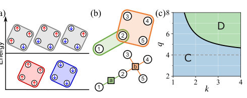 
FIG. 1. Model and role of node degree and hyperedge size. (a) Interaction rule in the simplicial Ising model (SIM). Pos- sible spin configurations for a four-body group are shown along the energy levels. All non-unanimous states share the same excited-state energy, so that ordering requires the si- multaneous alignment of all members. (b) A hypergraph (top) and its factor graph representation (bottom). Each hyperedge (shaded enclosure) of nodes (circle, top) can be mapped into a factor (filled square, bottom) connected to the nodes, i.e., ∂a = {1, 2} and ∂b = {2, 3, 4, 5}. (c) Phase diagram of the SIM on k-regular q-uniform hypergraphs. The solid line is the tri- critical point (TP) line...

📷 Fig 2

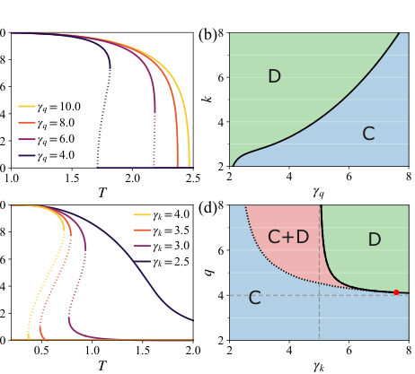 
FIG. 2. Phase transitions on heterogeneous hypergraphs. [(a),(c)] m(T) for size- (a) and degree-heterogeneous (c) cases, with varying γq (at k = 7) and γk (at q = 7). [(b),(d)] Phase diagrams in the (γq, k) (b) and (γk, q) (d) planes. In (d), in addition to C and D regimes, a regime for continuous– discontinuous double transitions (C+D) appears. The black dotted line is the boundary between the C and (C+D) re- gions, the red circle marks the special tricritical point (STP) at which the (C+D) region emerges, and the gray dashed lines show the asymptotes of the TP line, q = 4 and γk = 5, respec- tively.

📷 Fig 3

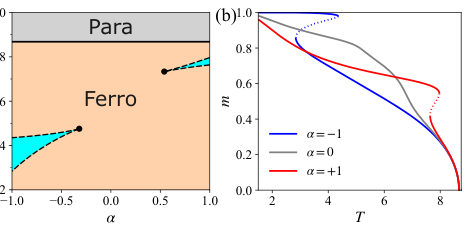 
FIG. 4. Effect of cross-order degree correlations (CODC) on (2, 20)-biuniform (2, 20)-biregular hypergraphs. (a) Phase diagram in the (α, T) plane, where α ∈[−1, 1] controls the CODC (α = +1: pair-hubs and group-hubs coincide; α = −1: pair-hubs and group-hubs are disjoint). The gray and orange regions denote the paramagnetic (Para) and ferromagnetic (Ferro) phases, respectively. The solid line marks the contin- uous transition between the two phases. Within the Ferro phase, the cyan region bounded by dashed lines indicates where an additional discontinuous jump and hysteresis occur. Black circles mark critical points where continuous transition occurs. (b) m(T) for α = −1, 0, and +1.

📷 Fig 4

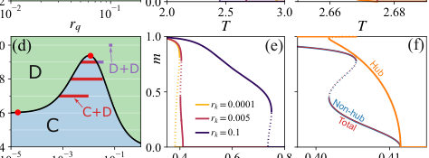 
FIG. 3. Phase transitions on (2, 10)-biuniform k-regular [(a)– (c)] and q-uniform (2, 10)-biregular [(d)–(f)] hypergraphs. [(a),(d)] Phase diagrams in the (rq, k) (a) and (rk, q) (d) planes. Red horizontal bars represent (C+D) region. Purple horizontal bars represent a region for double discontinuous transitions (D+D). [(b),(e)] m(T) for several rq at k = 10 (b) and several rk at q = 7 (e). [(c),(f)] Size-specific (c) and degree-specific (f) magnetizations. (c) mpair, mgroup, and to- tal m for rq = 0.125 from (b). (f) mnon-hub, mhub, and total m for rk = 0.005 from (e); m is almost hidden behind mnon-hub.

**Summary.** This work analyzes the phase transitions of the Simplicial Ising Model on hypergraphs with varying structural disorder. By developing a cavity method framework, the authors show that size and degree heterogeneities fundamentally alter the transition type, leading to complex double transitions. The findings highlight the intricate interplay between these structural features in collective ordering phenomena.

**Why it may be interesting.** The detailed analysis of phase transitions driven by structural disorder (heterogeneity) in interacting systems is a core topic in statistical mechanics, providing theoretical tools applicable to complex network dynamics.

Detailed structure

**Main problem.** The paper investigates how structural heterogeneity, specifically in group size and node degree, influences the collective phase transitions in systems governed by higher-order interactions.

**Main result.** Size heterogeneity sharpens the transition via large-group unanimity, while degree heterogeneity softens it; the coexistence of both can lead to complex double transitions and hysteretic regions modulated by cross-order degree correlations.

**Method.** The study develops a cavity-method framework and applies it to the Simplicial Ising Model (SIM) on heterogeneous hypergraphs, utilizing the Effective Medium Approximation (EMA) near the critical point.

**Model / system.** The system is the Simplicial Ising Model (SIM) defined on heterogeneous hypergraphs. The Hamiltonian involves higher-order interactions ($\delta_{\{S_i\}_{i\in\partial_a}}$) that enforce that all spins within a hyperedge must be identical.

**Key observables.** Magnetization ($m$), phase transition types (Continuous (C), Discontinuous (D), Double (C+D)), and Cross-Order Degree Correlation (CODC).

**Important parameters / regimes.** Size heterogeneity ($\gamma_q$) and degree heterogeneity ($\gamma_k$), and the cross-order correlation parameter ($\alpha$).

**Assumptions / limitations.** The analysis relies on the cavity method, which is exact only on locally treelike hypergraphs, and uses the Effective Medium Approximation (EMA) near the critical point.

**Figures summary.** Figures illustrate the phase diagrams showing the emergence of (C+D) regions in planes defined by heterogeneity parameters ($\gamma_q$ vs $k$, $\gamma_k$ vs $q$) and the effect of CODC ($\alpha$ vs $T$).

**Paper structure.** The paper builds from the general framework of the SIM on hypergraphs, derives cavity equations, applies EMA, and then systematically analyzes the distinct roles of size and degree heterogeneities, culminating in the effect of cross-order correlations on the phase diagram.

Abstract

Higher-order interactions admit richer structural heterogeneity than pairwise networks. To understand how heterogeneity impacts collective phenomena we develop a framework based on the cavity method and apply it to the simplicial Ising model on heterogeneous hypergraphs. Unlike in homogeneous structures, group size and node degree play fundamentally different roles: size heterogeneity sharpens the transition via large-group unanimity, while degree heterogeneity softens it as hubs cooperatively seed ordering with non-hubs. Under either type of heterogeneity, continuous--discontinuous double transitions can arise, where the symmetry-breaking continuous transition is driven by pairs or by hubs, respectively. When both heterogeneities coexist, cross-order degree correlations further modulate the phase diagram, with anticorrelation delaying the group-driven discontinuous jump and broadening the hysteretic region. Our results reveal the intricate interplay between size and degree heterogeneities in collective phenomena beyond pairwise interactions.

[↑ back to top](#top)

### [Evaluating higher-order product formulae for molecular ground-state energy estimation](http://arxiv.org/abs/2605.30967v1)

**Authors:** Hiromu Abe, Keita Kanno, Ryosuke Kimura, Masahiko Kamoshita, Kosuke Mitarai  
**Type:** theory · **Category:** other · **PDF:** <https://arxiv.org/pdf/2605.30967v1>  
**Analysis basis:** full PDF text, analyzed in chunks

📷 Fig 1

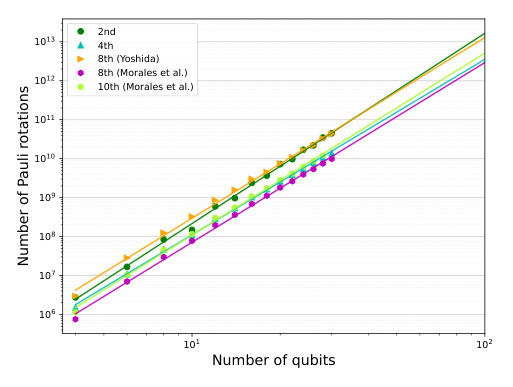 
FIG. 1. For H-chains at the target energy error εE = 1.6 × 10−4 Ha, we plot the total gate count F (number of Pauli rotations) as dots for each qubit count. The colored straight lines show the fitted scaling on logarithmic scales for both axes. Legend entries are, in order, second order (green), conventional fourth order (cyan; labeled “4th” in the figure), eighth order by Yoshida (orange), eighth order by Morales et al. (magenta), and tenth order by Morales et al. (greenyel- low).

📷 Fig 2

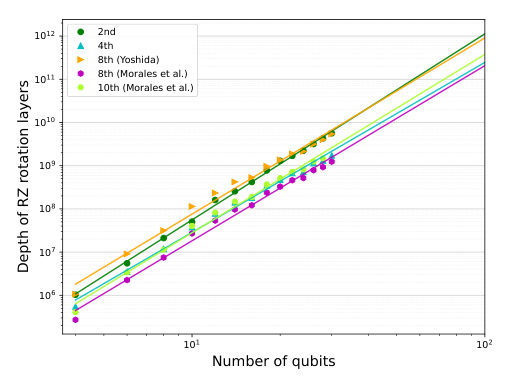 
FIG. 2. For H-chains at the target energy error εE = 1.6 × 10−4 Ha, we plot the depth of RZ-rotation layers as dots for each qubit count. The colored straight lines show the fitted scaling on logarithmic scales for both axes. Legend entries are, in order, second order (green), conventional fourth order (cyan; labeled “4th” in the figure), eighth order by Yoshida (orange), eighth order by Morales et al. (magenta), and tenth order by Morales et al. (greenyellow).

📷 Fig 3

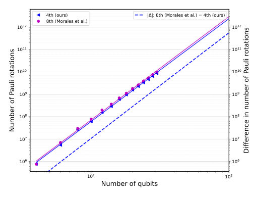 
FIG. 3. As in Fig. 1, we plot the total gate count F at the target energy error εE = 1.6 × 10−4 Ha together with the fit- ted scaling on log–log axes. We compare the eighth-order product formula by Morales et al. (magenta, “8th (Morales et al.)”) with our newly constructed fourth-order product formula (blue, “4th (ours)”). The dashed curve shows the ab- solute difference between the two estimated total gate counts, plotted on the right axis.

📷 Fig 4

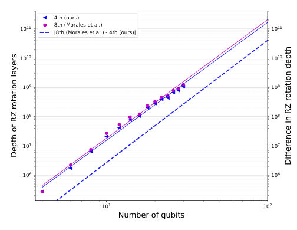 
FIG. 4. As in Fig. 2, we plot the depth of RZ-rotation lay- ers at the target energy error εE = 1.6 × 10−4 Ha together with the fitted scaling on log–log axes. We compare our new fourth-order product formula (blue, “4th (ours)”) with the eighth-order product formula by Morales et al. (magenta, “8th (Morales et al.)”). The dashed curve shows the absolute difference between the two estimated depths of RZ-rotation layers, plotted on the right axis.

📷 Fig 5

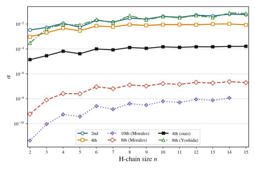 
FIG. 5. Values of α obtained by fitting with p fixed to the order of each product formula for the H-chain instances con- sidered in this work.

**Summary.** This paper rigorously compares the resource costs (gate count and circuit depth) of different higher-order product formulae for simulating molecular ground-state energies. Using hydrogen chains as benchmarks, the authors demonstrate that the optimal formula depends on the required accuracy, proposing a new fourth-order method that achieves superior performance over existing state-of-the-art formulae near chemical accuracy.

**Why it may be interesting.** This work directly addresses the practical resource estimation for quantum chemistry simulations, providing concrete guidelines on selecting the most efficient quantum circuit decomposition method for molecular energy calculations.

Detailed structure

**Main problem.** The paper evaluates and compares the computational cost of various deterministic higher-order product formulae used to estimate the ground-state energy of molecules via quantum simulation.

**Main result.** A newly constructed fourth-order product formula was shown to outperform established eighth-order formulae in minimizing both the total gate count and the RZ-layer depth near chemical accuracy.

**Method.** The cost is evaluated by estimating the total gate count and the depth of RZ-rotation layers required to achieve a target energy error ($\epsilon_E$) using perturbative analysis.

**Model / system.** The benchmarks use one-dimensional hydrogen chains ($	ext{H}_2$ to $	ext{H}_{15}$) modeled by a Hamiltonian approximated via product formulae for the time-evolution operator.

**Key observables.** Total gate count ($F$), depth of RZ-rotation layers ($D_{	ext{RZ}}$), and the energy error ($\epsilon_E$).

**Important parameters / regimes.** Target energy error ($\epsilon_E = 1.6 	imes 10^{-4} 	ext{ Ha}$), formal order of the product formula ($p$), and system size ($N$).

**Assumptions / limitations.** The analysis uses a perturbative method to estimate eigenvalue error, and the layer depth estimate neglects the depth contribution from the Clifford basis-change circuit.

**Figures summary.** Figures compare the total gate count and RZ-layer depth for different formulae across H-chain sizes, and show the scaling relationships between these costs and system size.

**Paper structure.** The paper first analyzes the phase estimation error scaling, then details the cost metrics (gate count and layer depth) derived from product formulae approximations, compares various orders (2nd, 4th, 8th, 10th), and concludes by proposing and validating a new optimized fourth-order formula.

Abstract

We evaluate deterministic higher-order product formulae for molecular ground-state energy estimation. Motivated by recent fault-tolerant architectures in which non-Clifford operations may be generated more locally and cheaply than in conventional assumptions, we re-examine such formulae as practical candidates for quantum chemistry. Using one-dimensional hydrogen chains from $\mathrm{H}_2$ to $\mathrm{H}_{15}$ as benchmarks, we estimate both the total gate count and the depth of $R_Z$-rotation layers required to reach a target energy error. To make this comparison feasible at larger system sizes, we use a perturbative method to estimate the eigenvalue error induced by each product formula and thereby evaluate the cost of the corresponding phase-estimation procedure. Among the previously considered formulae, the eighth-order construction introduced by Morales et al. [M. E. S. Morales et al., "Greatly improved higher-order product formulae for quantum simulation," arXiv:2210.15817v2 (2024)] minimizes both cost metrics in the benchmark at a chemically relevant target error. We also find that increasing the formal order does not automatically reduce the total cost: near chemical accuracy, the tenth-order formula introduced in the same work can be less efficient than the eighth-order one. Motivated by this observation, we construct a new fourth-order formula; it achieves the lowest total gate count among the formulae considered for all H-chain instances near chemical accuracy and over much of the 0.1-10 mHa target-error window for most instances, while also reducing the $R_Z$-layer depth. These results clarify how deterministic higher-order product formulae should be selected for molecular ground-state energy estimation.

[↑ back to top](#top)

### [Generative Quantum Data Embeddings for Supervised Learning](http://arxiv.org/abs/2605.30866v1)

**Authors:** Jaewoong Heo, Daniel K. Park  
**Type:** theory · **Category:** quantum information and computing · **PDF:** <https://arxiv.org/pdf/2605.30866v1>  
**Analysis basis:** full PDF text, analyzed in chunks

📷 Fig 1

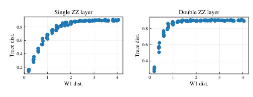 
FIG. 1. Demonstration of the trace-distance upper bound as a func- tion of the input-space 1-Wasserstein distance. The simulations use a single-layer ZZ feature map (left) and a double-layer ZZ feature map (right). To control the Wasserstein distance between the two classes, the distribution of one class is fixed while the other is spatially trans- lated.

📷 Fig 2

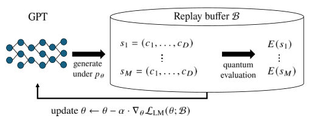 
FIG. 2. Overview of the Energy-based Generative Architecture Search (EGAS) training. In each iteration, a generative pre-trained transformer (GPT) parameterized by 𝜃autoregressively samples 𝑀 candidate sequences, 𝑠1, . . . , 𝑠𝑀. Each sequence is an ordered length- 𝐷list of subcircuit tokens drawn from the predefined pool C. The sequences are translated into quantum embedding circuits and evalu- ated using a quantum simulator or hardware. This evaluation assigns an energy value 𝐸(𝑠𝑚) to each circuit based on the pairwise fidelity surrogate loss. The evaluated sequence-energy pairs (𝑠𝑚, 𝐸(𝑠𝑚)) are stored in a replay buffer B. During the update phase, the GPT pa- rameters are updated by a...

📷 Fig 3

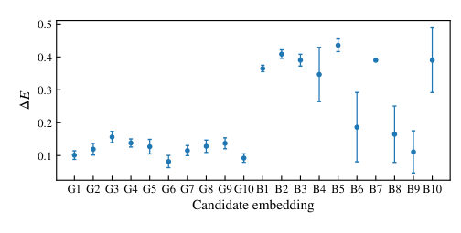 
FIG. 3. Surrogate energy reduction (Δ𝐸) achieved by continuous bias refinement on the Phishing Website dataset. The x-axis labels 𝐺and 𝐵denote the ten unique lowest-energy and ten unique highest-energy circuit architectures identified during EGAS, respectively. Each can- didate embedding was refined ten times. Blue circles represent the mean energy reduction, and error bars indicate the standard deviation over repeated runs.

📷 Fig 4

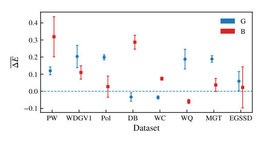 
FIG. 4. Continuous parameter refinement across eight datasets: PW, WDGV1, Pol, DB, WC, WQ, MGT, and EGSSD. The y-axis shows the mean surrogate energy reduction Δ𝐸. For each dataset and group, ten embeddings were considered, each with ten repetitions, and the summary statistics are plotted. Blue circles and error bars represent the mean and standard deviation for group 𝐺, and red squares and error bars represent the mean and standard deviation for group 𝐵. The dashed line at 𝑦= 0 is used to indicate the sign of the bias refinement effect.

📷 Fig 5

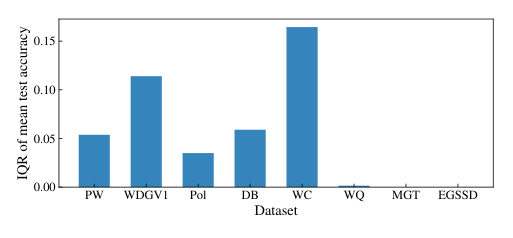 
FIG. 6. Dataset-level dispersion of QKSVM test accuracy across the evaluated quantum embeddings. For each evaluated embedding, we first compute the mean test accuracy over the ten train-test splits. For each dataset, the bar height gives the interquartile range (IQR) of these mean accuracies over the fixed quantum baselines (ZZ and NQE) and the EGAS-derived candidate embeddings from the 𝐺and 𝐵groups, both before and after bias refinement. The classical linear SVM baseline is excluded from this dispersion. A larger IQR indi- cates stronger variation in classification accuracy across the evaluated embeddings, whereas a smaller IQR indicates relative insensitivity to the embedding choice.

**Summary.** This paper introduces a generative, energy-based framework to optimize quantum data embeddings for supervised learning, moving beyond fixed circuit designs. It uses an LLM to search for optimal quantum circuits and refines them with learnable biases. Crucially, it provides a theoretical bound linking the achievable quantum classification error to the 1-Wasserstein distance of the input data, offering a diagnostic tool for embedding optimization.

**Why it may be interesting.** The rigorous connection drawn between the achievable quantum classification error and the classical Wasserstein distance provides a powerful, data-geometry-informed diagnostic tool for quantum algorithm design.

Detailed structure

**Main problem.** The core problem is improving the performance of supervised quantum machine learning (QML) when using classical data inputs by optimizing the quantum data embedding structure.

**Main result.** The proposed generative framework successfully optimizes embedding structures, and the achievable performance gains are diagnosable using the Wasserstein distance of the underlying classical data geometry.

**Method.** The authors use an energy-based generative learning framework, employing a Large Language Model (LLM) to synthesize and optimize quantum circuit sequences, guided by a fidelity-based surrogate objective.

**Model / system.** The system involves mapping classical inputs $x$ to quantum states $
ho_{\Phi}(x)$ via an embedding circuit $\Phi$. The optimization targets the structure of $\Phi$ itself, moving beyond fixed ansatzes.

**Key observables.** QKSVM classification accuracy, the trace distance $D_{tr}(
ho_+(\Phi), 
ho_-(\Phi))$, and the 1-Wasserstein distance $W_1(\hat{P}_+(x), \hat{P}_-(x))$ between class-conditional distributions.

**Important parameters / regimes.** The fidelity-based surrogate objective $\ell_{ij}(\Phi)$ and the geometric bound derived from the Wasserstein distance.

**Assumptions / limitations.** The process separates discrete architecture search (LLM/EGAS) from continuous parameter refinement (learnable bias function), and the performance is bounded by the geometry of the classical input space.

**Figures summary.** Figures demonstrate the EGAS training process, the reduction in surrogate energy ($\Delta E$) upon refinement, and split-wise comparisons of QKSVM accuracy versus classical baselines.

**Paper structure.** The paper develops from establishing the fundamental limit on class separation via the trace distance, proposing the generative search (EGAS) using fidelity loss, and finally refining the best structures using learnable biases, all while providing a geometric diagnostic via the Wasserstein distance.

Abstract

Many practically relevant applications of quantum machine learning involve classical data, for which performance depends critically on how inputs are embedded into quantum states. Yet the use of a fixed embedding circuit ansatz remains standard practice. We propose an energy-based generative learning framework that synthesizes gate sequences to optimize embedding structures and refine data-tailored parameters, using a fidelity-based surrogate objective to guide the search toward improved class distinguishability. Empirically, the method improves classification performance across diverse settings, while also revealing datasets where architecture search within the present embedding family yields only limited additional gains. We explain this saturation by deriving bounds on the achievable empirical risk in terms of the Wasserstein distance in the input space, showing that classical data geometry provides an \emph{a priori} diagnostic for regimes in which substantial gains from embedding optimization are unlikely. The results establish a practically useful and theoretically motivated framework for searching effective quantum data embeddings through generative optimization, with the attainable gains diagnosed through the geometry of the underlying classical data.

[↑ back to top](#top)

### [Geometric dependence of critical-current variation in Al/AlO${\rm _x}$/Al Josephson junctions: a model-based analysis](http://arxiv.org/abs/2605.30768v1)

**Authors:** K. Kakuyanagi, N. Teran, H. Toida, S. Saito  
**Type:** both · **Category:** other · **PDF:** <https://arxiv.org/pdf/2605.30768v1>  
**Analysis basis:** full PDF text, analyzed in chunks

📷 Fig 1

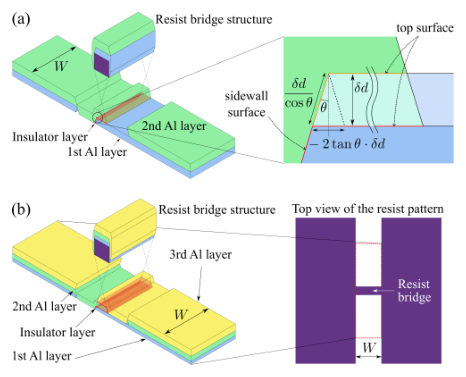 
FIG. 1. (a) Cross-sectional schematic of the Al/AlOx/Al bilayer junc- tion formed by the Dolan-bridge (purple) double-angle deposition. The blue (green) layer represents the first (second) deposited Al film. The surfaces highlighted in red correspond to the junction interfaces with area S, and the perimeter of these surfaces corresponds to the junction-edge length L. The magnified schematic illustrates the rela- tionship among the deposition angle θ, the film-thickness fluctuation δd, and the junction interfaces (red and orange). The sidewall sur- face and the top surface constitute the junction interfaces. When the film thickness increases by δd, the junction interface shifts from the line shown...

📷 Fig 2

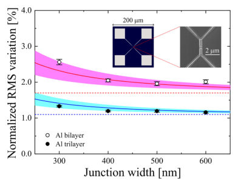 
FIG. 2. Geometry dependence of the measured normalized RMS variation and the corresponding model fitting results. White (black) circles represent the measured data for the bilayer (trilayer) junc- tions, and the error bars are estimated from the unbiased sample vari- ance. The red (blue) solid line represents the model fitting results for the bilayer (trilayer) junctions. The dashed horizontal lines indi- cate the asymptotic values of the normalized RMS variation for the bilayer and trilayer junctions, which correspond to the contribution from film-thickness fluctuations. The magenta (cyan) shaded region indicates the uncertainty of the fitted curve for the bilayer (trilayer) junctions,...

📷 Fig 3

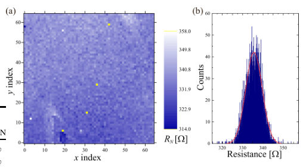 
FIG. 3. Results of room-temperature resistance measurements for the 9.75 mm square junction array. (a) Two-dimensional map of the measured resistance. The four yellow points correspond to open or shorted junctions, which are excluded from the statistical analysis. (b) Histogram of the resistance values for all valid junctions. The red dashed line is a Gaussian curve shown as a guide to the eye.

📷 Fig 4

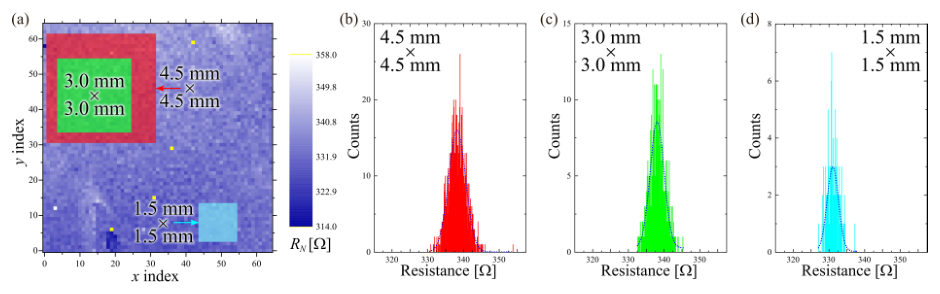 
FIG. 4. (a) Schematic of three representative regions: 4.5 mm square (red), 3.0 mm square (green), and 1.5 mm square (cyan). The dataset is the same as that in Fig. 3. These regions are chosen to minimize standard deviations. (b–d) Corresponding histograms of the measured resistance values in these three regions. The dashed lines are Gaussian curves shown as guides to the eye.

**Summary.** This work investigates the sources of variation in the critical current of Al/AlO_x/Al Josephson junctions essential for quantum circuit scaling. Through model-based statistical analysis, the authors pinpoint film thickness fluctuations as the main cause of variation. They demonstrate that optimizing the deposition angle to 30 degrees significantly improves junction uniformity, providing crucial guidelines for nanofabrication.

**Why it may be interesting.** While focused on superconducting materials, the rigorous statistical modeling of geometric variation and the quantitative link between deposition parameters (angle) and device uniformity are highly relevant to engineering quantum devices where nanoscale precision is paramount.

Detailed structure

**Main problem.** The primary challenge addressed is achieving uniform critical current across Josephson junctions, which is critical for scaling superconducting quantum circuits.

**Main result.** The analysis shows that fluctuations in the Al film thickness are the dominant source of critical current variation, and using a 30-degree deposition angle significantly improves junction uniformity.

**Method.** The study combines statistical analysis of room-temperature tunnel resistance with a model-based approach that decomposes the total variance into contributions from different physical sources.

**Model / system.** The system is the Al/AlO_x/Al Josephson junction fabricated using the Dolan-bridge technique. The model relates the critical current variation to the variance of the junction's tunnel resistance, decomposing this variance based on geometric factors and film thickness fluctuations.

**Key observables.** Critical current (I_C), room-temperature tunnel resistance (R_N), relative standard deviation (r.s.d.) of I_C, and the geometric factor f_2(theta, N_L).

**Important parameters / regimes.** Deposition angle (theta), junction width (W), number of deposited layers (N_L), and the size of the measurement region (e.g., 1.5 mm).

**Assumptions / limitations.** The analysis assumes that the variance can be decomposed into statistically independent components, and that thickness fluctuations of different layers are uncorrelated.

**Figures summary.** Figures illustrate cross-sectional schematics of the junctions, show normalized RMS variation vs. junction width, and present resistance histograms for different sized measurement regions demonstrating decreasing r.s.d. with smaller regions.

**Paper structure.** The paper establishes the need for uniform I_C, models the variance of the junction resistance as a sum of independent components (geometry-independent, thickness-related, etc.), derives a geometric factor quantifying thickness effects, and then uses statistical analysis on fabricated junctions to identify thickness variation as dominant and quantify the improvement achieved by specific deposition angles.

Abstract

Achieving uniform critical current across Josephson junctions is essential for the large-scale integration of superconducting quantum circuits. In this work, we statistically analyzed the variation of the critical current of Al/AlO${\rm _x}$/Al junctions using room-temperature tunnel resistance statistics, and identified the dominant contribution among the modeled sources of the variation based on their dependence on geometry and deposition conditions of junctions. Our model-based analysis reveals that fluctuations in the Al film thickness play the dominant role among the modeled contributing factors. Based on this analysis, we found that, in Dolan-bridge double-angle deposition, adopting a deposition angle of 30-degree for bilayer junctions significantly improves uniformity, yielding a relative standard deviation of 1.2% (0.5%) across a 9.75 mm (1.5 mm) square region.

[↑ back to top](#top)

### [More efficient Clifford+T synthesis for small-angle rotations and application to Trotterization](http://arxiv.org/abs/2605.31544v1)

**Authors:** Marius Bothe, Christoph Sünderhauf, Michael J. Witham, Earl T. Campbell, Nick S. Blunt  
**Type:** theory · **Category:** quantum information and computing · **PDF:** <https://arxiv.org/pdf/2605.31544v1>  
**Analysis basis:** full PDF text, analyzed in chunks

📷 Fig 1

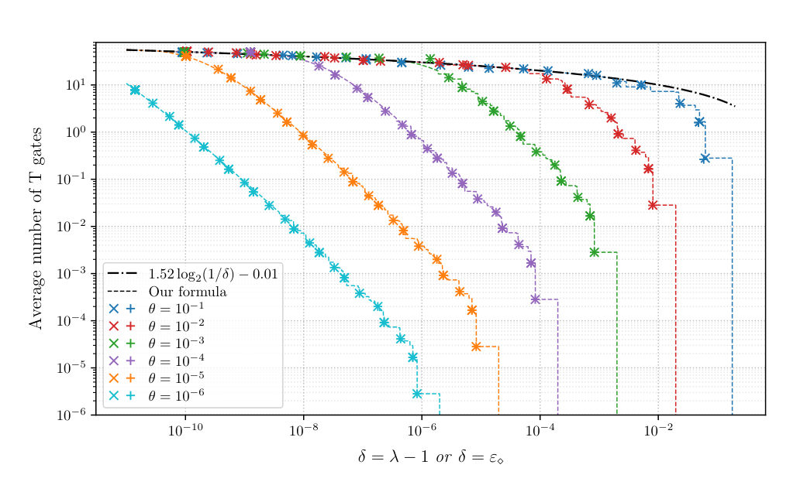 
Figure 1. Average T gate counts to implement a rotation channel Zθ in the ancilla-free scheme for two different formulations of our results, first in terms of quasi-probability mixtures with L1 norm λ (results marked as “×”), and second in terms of strict probability mixtures with diamond norm error ε⋄(results marked as “+”). The black dashed-dotted line indicates the previous angle-independent formula for the mixed diagonal approximation from Kliuchnikov et al [19]. Data points represent the obtained results for different angles, θ, for the quasi-probability and quantum channel approaches. We see that, while results for all angles eventually converge to the angle-dependent formula, for...

📷 Fig 2

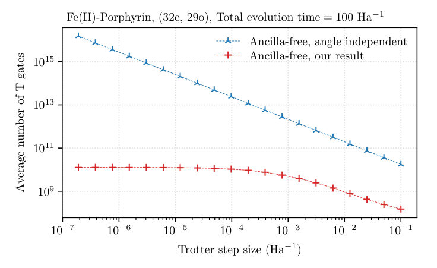 
Figure 2. Average T gate cost to implement a first-order Trotterization circuit using the quasi-probability Clifford+T approach, as a function of Trotter step size. The system is the Fe(II)-Porphyrin complex in a (32e,29o) active space and using localized orbitals. The total evolution time is fixed to T = 100 Ha−1. The ancilla-free Clifford+T synthesis scheme is used. Results in blue show the costing results using the previous angle-independent formula, while the results in red used our angle-dependent formula. The cost of Trotterization becomes independent of the step size in the limit of small steps sizes, while the cost is reduced by two orders of magnitude even for large step sizes....

📷 Fig 3

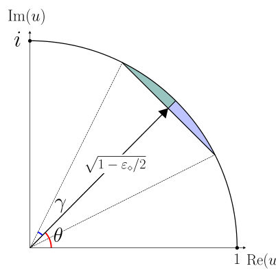 
Figure 3. Regions of the complex plane for selecting the under- and over-rotation in the mixed diagonal approximation of Ref. [19]. The target angle is θ, and γ = arcsin( p

📷 Fig 4

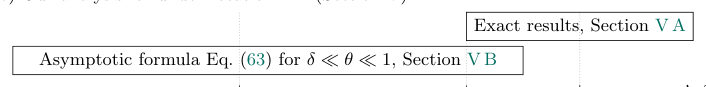 
Figure 4. Schematic overview of methods for various regimes of θ and δ = λ −1. (a) shows the preferable method in each regime. In the main plot, Figure 1, this crossover is visible at δ just below θ2. (b) summarizes our analysis in Section V of the method with the under-rotation fixed as the identity. Results are approximately the same for δ = ε⋄, see Appendix F.

📷 Fig 5

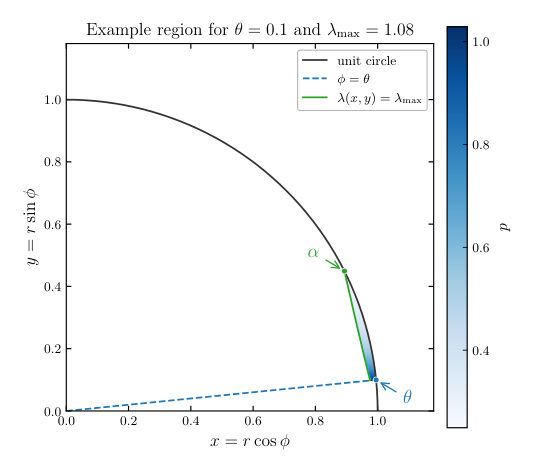 
Figure 5. Example region, defined in Eq. (51), for selecting the over-rotation with quasi-probabilities. Each unitary with upper left entry u = x+iy inside the shaded region has a sample complexity λ, Eq. (43), within the desired target λmax. Here we take θ = 0.1 and λmax = 1.08 as an illustrative example. The shading indicates the sampling probability p, Eq. (40) (and thereby average T count, p·T-count), which varies within the region. The lower end of the region is at the target angle θ due to the assumption φ &gt; θ, while the upper end of the region is at angle α, Eq. (44). As λmax increases, α and the area size increase.

**Summary.** This work significantly improves the theoretical understanding of synthesizing rotation gates for fault-tolerant quantum computing. By developing angle-dependent resource estimation formulas, the authors demonstrate that the T gate cost for small rotations scales favorably with $	heta^2$, rather than remaining high and independent of the angle. This has major implications for the resource requirements of quantum simulation algorithms like Trotterization.

**Why it may be interesting.** The findings provide concrete, resource-aware improvements for compiling quantum simulation circuits, directly impacting the feasibility estimates for fault-tolerant quantum computation.

Detailed structure

**Main problem.** The paper addresses the high resource overhead associated with synthesizing arbitrary-angle rotation gates ($Z_	heta$) using Clifford+T gates in fault-tolerant quantum computation.

**Main result.** They show that for small rotation angles ($	heta$), the T gate cost can be significantly reduced from an angle-independent scaling to $	ilde{O}(	heta^2/\delta)$, and they develop scalable quasi-probability methods for resource estimation.

**Method.** The authors employ advanced techniques involving quasi-probability and probability mixtures of quantum channels, alongside optimizing the Linear Combination of Channels (LCC) representation for the rotation gate.

**Model / system.** The focus is on synthesizing the $RZ(	heta) = e^{i	heta Z}$ rotation gate using a Clifford+T gate set, which is critical for implementing quantum algorithms like Trotterization.

**Key observables.** T gate cost (resource estimate), average T gate count, and the total error ($\epsilon_{	ext{total}}$).

**Important parameters / regimes.** Rotation angle $	heta$, error parameter $\delta$, and the Trotter step size $t$.

**Assumptions / limitations.** The analysis relies on comparing quasi-probability mixtures ($\lambda^{-1}$) against standard probability mixtures ($\epsilon_{\diamond}$), and assumes the applicability of the LCC representation.

**Figures summary.** Figures compare average T gate counts across different regimes ($	heta$ vs. $\delta$), illustrating the crossover from angle-independent to angle-dependent scaling, and showing the advantage of quasi-probabilities over standard methods.

**Paper structure.** The paper builds from initial LCC representations to probability/quasi-probability mixtures, derives angle-dependent resource formulas, and applies these results to show cost reductions for Trotterization circuits.

Abstract

Clifford+T synthesis of rotation gates is an important routine in fault-tolerant quantum compilation. While Clifford+T synthesis is scalable, it has a high overhead of tens of T gates per rotation in practice, translating to high resource estimates for many fault-tolerant algorithms. However, these well-known results, including those using probabilistic mixtures [Quantum 7, 1208 (2023)], are independent of the rotation angle $θ$, requiring $O(\log 1/δ)$ T gates. We show that it is possible to do much better for small angles, reducing the T cost to $\tilde O(θ^2/δ)$, and returning to existing $O(\log1/δ)$ results in the worst case. This is particularly important since many algorithms, such as Trotterization, are dominated by small-angle rotations. Further, we perform a detailed theoretical and numerical study of quasi-probabilities, which can further reduce the total T cost of large circuits by orders of magnitude with only a small overhead in sample complexity. We also develop a scheme based on quasi-probability mixtures of Clifford+T fallback channels. We derive new $θ$-dependent formulas that can be used for resource estimation of fault-tolerant quantum algorithms. As an application of our results, we show that the gate cost of Trotterization circuits compiled to a Clifford+T gate set is constant in the small Trotter step size limit, and can be reduced by orders of magnitude even for large step sizes. The cost of fault-tolerant Trotterization for a variety of applications should be re-examined in light of these results. Our work dispels the widely-stated claim that Clifford+T rotation synthesis has a high cost independent of $θ$, and further develops a scalable quasi-probability method for rotation synthesis. We also expect our results to bring forward useful early fault-tolerant quantum computing by reducing required magic state resources.

[↑ back to top](#top)

### [Multi-point functions of a full-plane two-state fuzzy $4$-Potts model](http://arxiv.org/abs/2605.31374v1)

**Authors:** Hong-Bin Chen, Jiaming Xia  
**Type:** theory · **Category:** statistical mechanics · **PDF:** <https://arxiv.org/pdf/2605.31374v1>  
**Analysis basis:** full PDF text, analyzed in chunks

📷 Fig 1

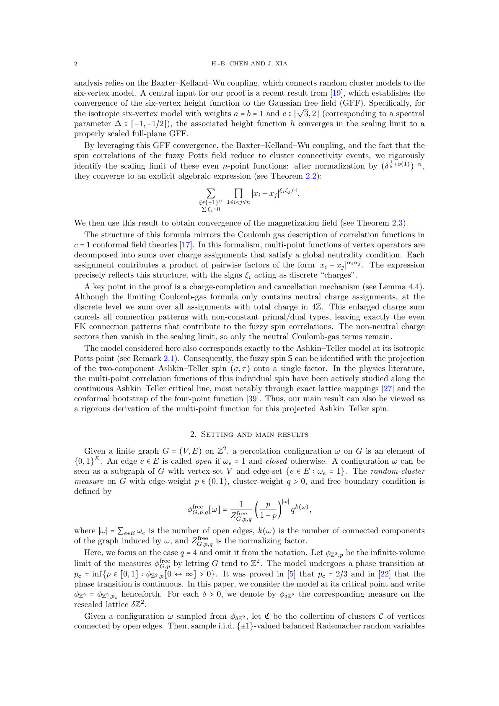 
Low-resolution page preview, page 2

📷 Fig 2

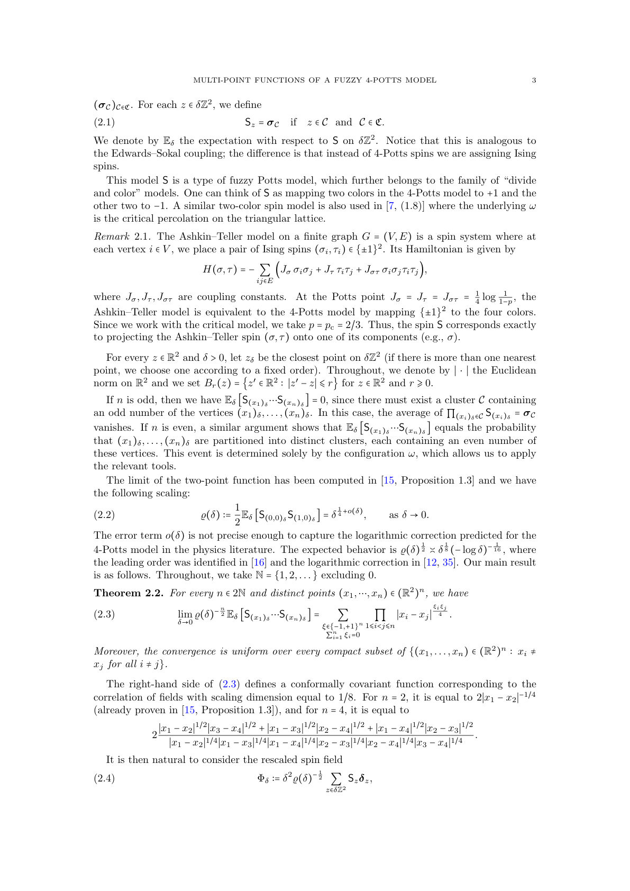 
Low-resolution page preview, page 3

📷 Fig 3

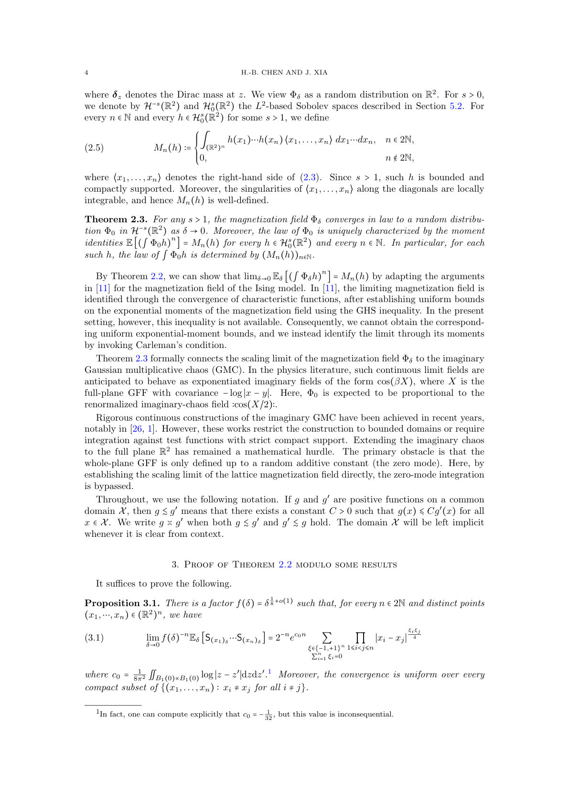 
Low-resolution page preview, page 4

📷 Fig 4

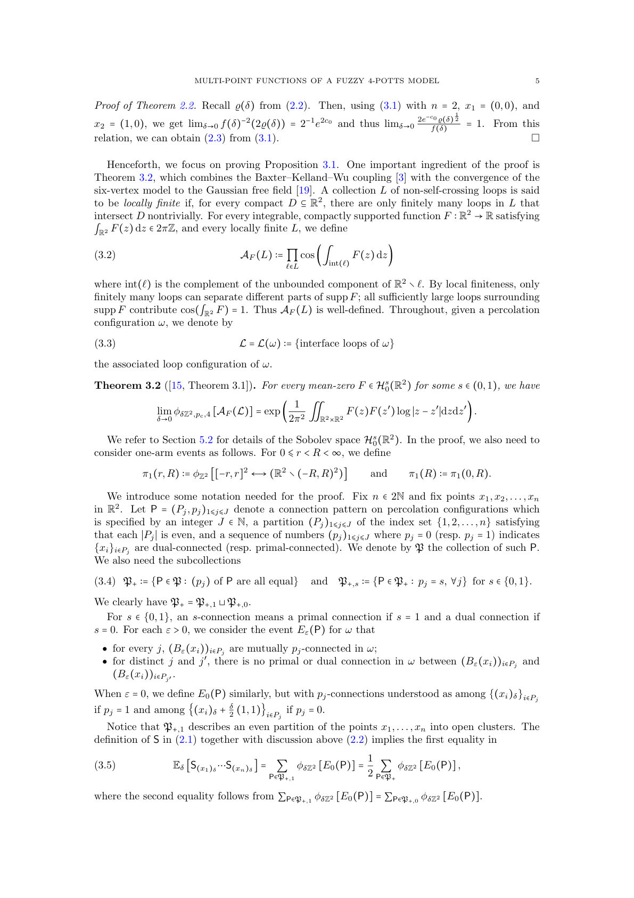 
Low-resolution page preview, page 5

📷 Fig 5

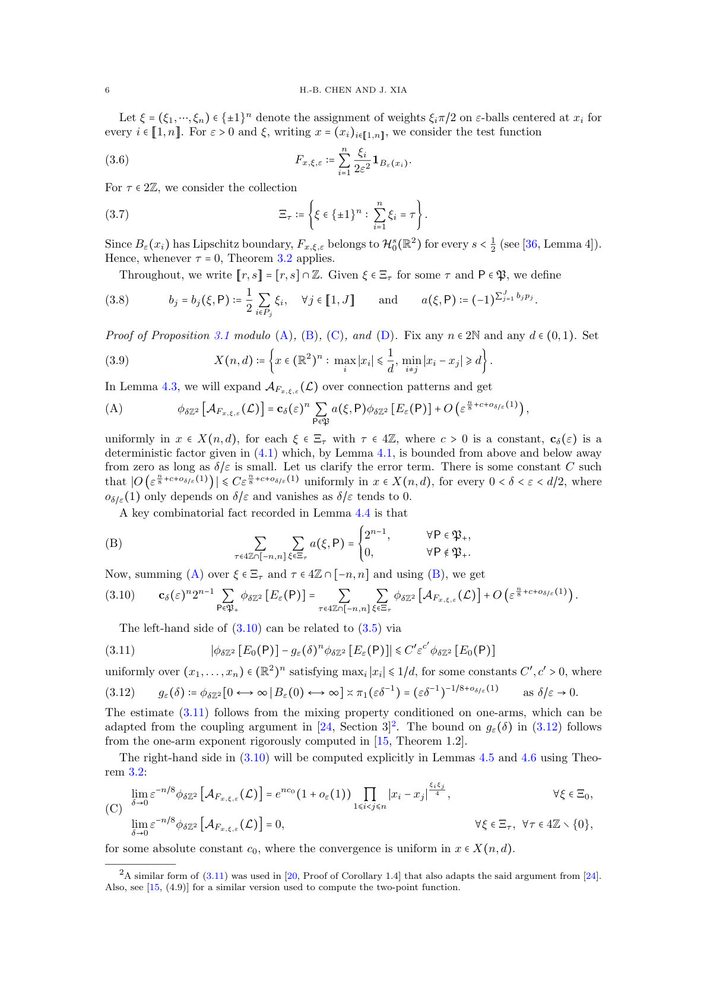 
Low-resolution page preview, page 6

**Summary.** This theoretical paper analyzes the critical behavior of the fuzzy 4-Potts model on the plane. It proves that the model's multi-point correlation functions converge to explicit, conformally covariant forms characteristic of Coulomb gas theories. The work establishes the continuum limit of the magnetization field, providing deep insights into the scaling properties of lattice statistical models near criticality.

**Why it may be interesting.** The rigorous connection between lattice statistical mechanics models (like the Potts model) and continuous field theories (like the GFF/CFT) is fundamental to understanding critical phenomena in many physical systems, including those relevant to quantum many-body physics.

Detailed structure

**Main problem.** The study focuses on determining the scaling limits of multi-point spin correlation functions for the full-plane two-state fuzzy 4-Potts model.

**Main result.** The even multi-point spin correlation functions converge to explicit conformally covariant Coulomb-gas type neutral charge sums, and the rescaled magnetization field converges in law to a continuum field $\Phi_0$.

**Method.** The proof combines advanced techniques including the Baxter-Kelland-Wu coupling, the convergence of the six-vertex height function to the Gaussian Free Field (GFF), and a rigorous charge-completion mechanism.

**Model / system.** The model is the full-plane two-state fuzzy 4-Potts model, derived from assigning spins to open clusters of a critical q=4 random-cluster configuration, which is equivalent to the single-spin projection of the isotropic Ashkin-Teller model at its Potts point.

**Key observables.** Multi-point spin correlation functions, the rescaled magnetization field ($\Phi_\delta$), and their limiting moments ($M_n(h)$).

**Important parameters / regimes.** The critical point ($p_c = 2/3$), the scaling factor $f(\delta) \sim \delta^{1/8}$, and the limit $\delta 	o 0$ (the continuum limit).

**Assumptions / limitations.** The analysis relies on the convergence of the six-vertex height function to the GFF and the ability to establish convergence in law via moment matching in Sobolev spaces.

**Paper structure.** The paper proceeds by first establishing the convergence of even multi-point functions to a Coulomb-gas sum (Theorem 2.2), then defining the continuum limit of the magnetization field ($\Phi_\delta 	o \Phi_0$ in $H^{-s}$), and finally completing the proof by deriving necessary combinatorial and scaling relations (A, B, C, D) to confirm the final scaling limit (Proposition 3.1).

Abstract

We study the full-plane two-state fuzzy $4$-Potts model, obtained by assigning independent balanced $\{\pm1\}$ spins to the open clusters of a critical $q=4$ random-cluster configuration. This model corresponds exactly to the single-spin projection of the isotropic Ashkin-Teller model at its Potts point. We prove that, after proper normalization, all even multi-point spin correlation functions converge to explicit conformally covariant Coulomb-gas type neutral charge sums. As a consequence, we prove convergence in law of the rescaled magnetization field and identify the moments of the limiting field. The proof combines the Baxter-Kelland-Wu coupling, convergence of the six-vertex height function to the Gaussian free field, and a charge-completion mechanism: an enlarged discrete sum over charge assignments with total charge in $4\mathbb Z$ produces a combinatorial cancellation of connection patterns, while only the neutral charge sector survives in the scaling limit.

[↑ back to top](#top)

### [Ni-O hybridization-driven electronic reconstruction across the superconducting dome in an infinite-layer nickelate](http://arxiv.org/abs/2605.30752v1)

**Authors:** Chi Sin Tang, Shengwei Zeng, Xing Gao, Zhaoyang Luo, Xiongfang Liu, Zhi Shiuh Lim, Saurav Prakash, Ping Yang, Caozheng Diao, Xinmao Yin, Changjian Li, Huajun Liu, Mark B. H. Breese, A. Ariando  
**Type:** experiment · **Category:** strongly correlated electrons · **PDF:** <https://arxiv.org/pdf/2605.30752v1>  
**Analysis basis:** full PDF text, analyzed in chunks

📷 Fig 1

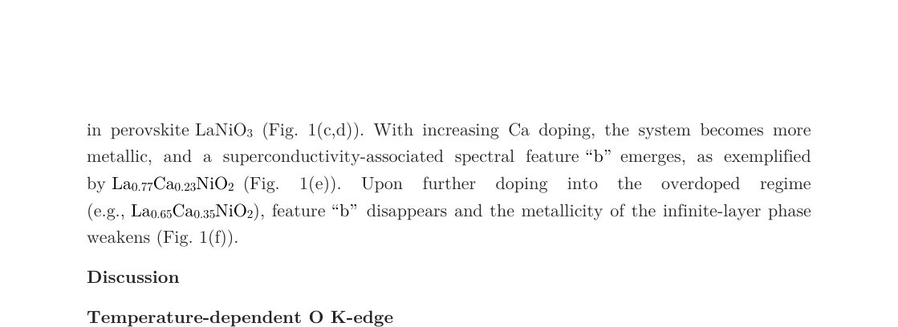 
Figure 2(a) shows representative O K-edge spectra of La0.82Ca0.18NiO2 measured at 30 K and

📷 Fig 2

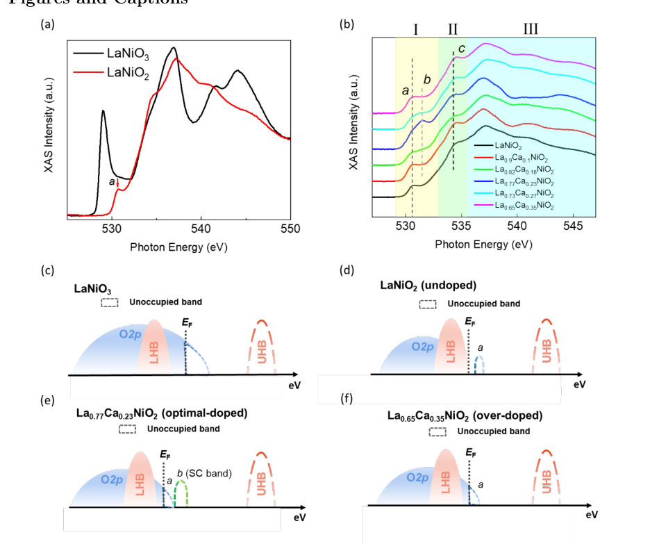 
Fig. 1: Doping-dependent O K-edge spectra. (a) Representative O K-edge spectra

📷 Fig 3

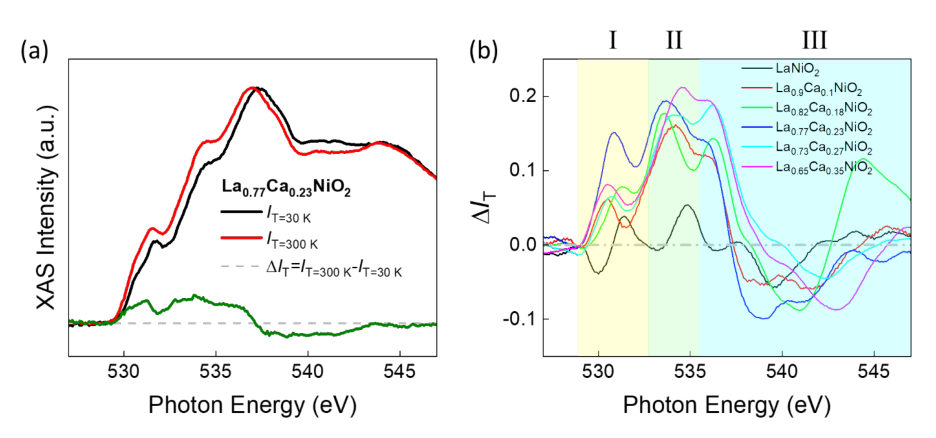 
Fig. 2: Temperature-dependent O K-edge spectra. (a) Representative XAS spectra of

📷 Fig 4

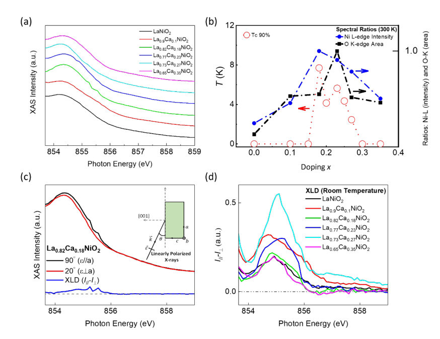 
Fig. 3: Ni L3-edge XAS spectra. (a) Ni L3-edge from the undoped through the over-doped

**Summary.** This experimental study investigates the electronic structure of infinite-layer nickelates across their superconducting dome using X-ray Absorption Spectroscopy. The researchers found that the superconducting state correlates with a doping-induced, orbital-selective crossover in Ni-O hybridization. This work provides a key orbital-resolved mechanism linking electronic structure changes to the superconducting properties.

**Why it may be interesting.** The direct link established between measurable spectroscopic signatures (orbital hybridization) and macroscopic superconducting behavior provides a powerful experimental handle for understanding correlated electron physics in unconventional superconductors.

Detailed structure

**Main problem.** The study aims to understand how the electronic structure of infinite-layer nickelates evolves with hole doping, specifically linking these changes to the superconducting dome.

**Main result.** A doping-dependent orbital-selective crossover in Ni-O covalency, evidenced by spectral weight redistribution, was found to coincide with transport anomalies like the Hall coefficient sign reversal and the reduction of the superconducting critical temperature.

**Method.** The research utilized X-ray Absorption Spectroscopy (XAS) at the O K-edge and Ni L-edge, combined with temperature-dependent measurements and X-ray Linear Dichroism (XLD).

**Model / system.** The physical system is the infinite-layer nickelate $	ext{La}_{1-x}	ext{Ca}_x	ext{NiO}_2$, which serves as a cuprate analogue for studying high-temperature superconductivity.

**Key observables.** O K-edge spectral weight redistribution (especially features 'a' and 'b'), Ni $L_3$-edge intensity, Hall coefficient sign, and superconducting critical temperature ($T_c$).

**Important parameters / regimes.** Hole doping concentration ($x$), temperature ($T$), and the doping range $0.18 \le x \le 0.27$ where superconductivity occurs.

**Assumptions / limitations.** The analysis assumes that the observed spectral weight changes directly reflect orbital reorganization and covalency changes in the Ni-O bonds, and that the pre-peaks are intrinsic electronic features.

**Figures summary.** Figures summarize the doping dependence of O K-edge spectra across the superconducting dome, showing spectral weight transfer; they also present temperature-dependent measurements and XLD results correlating electronic structure changes with $T_c$.

**Paper structure.** The paper systematically maps the doping and temperature dependence of electronic states using XAS, correlating the observed orbital reorganization (spectral weight transfer) directly with measurable transport properties (Hall coefficient, $T_c$) across the superconducting dome.

Abstract

Superconductivity in infinite-layer nickelates has drawn wide interest as a cuprate analogue, yet how the electronic structure evolves with hole doping remains unsettled. Here we map the doping- and temperature-dependent unoccupied states of the La-based infinite-layer nickelate La1-xCaxNiO2 using O K-edge and Ni L-edge x-ray absorption spectroscopy. Superconductivity occurs for 0.18<=x<=0.27. Near x~0.20-0.23, low-energy spectral weight redistributes: Ni3d-dominated states decrease while O2p-hybridized states increase, indicating an orbital-selective crossover in Ni-O covalency. This crossover coincides with a sign reversal of the Hall coefficient and precedes the reduction of the superconducting critical temperature at higher doping. By directly linking transport anomalies and the superconducting dome to a measurable Ni-O orbital reorganization, our results provide a key step toward a unified, orbital-resolved phase diagram for infinite-layer nickelates and a practical route to engineer superconductivity via hybridization control.

[↑ back to top](#top)

### [Nonperturbative renormalization of Haldane pseudopotentials from the exact two-electron spectrum](http://arxiv.org/abs/2605.31537v1)

**Authors:** G. -Q. Hai, M. T. Matsubara, L. Cândido, B. G. A. Brito  
**Type:** theory · **Category:** strongly correlated electrons · **PDF:** <https://arxiv.org/pdf/2605.31537v1>  
**Analysis basis:** full PDF text, analyzed in chunks

📷 Fig 1

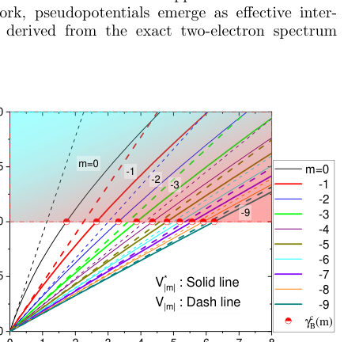 
FIG. 1. Renormalized pseudopotentials V ∗ |m| (solid lines) and conventional Haldane pseudopotentials V|m| (dash lines) as functions of interaction strength γB for m = 0, −1, −2, ..., −9. The exact pseudopotentials remain systematically smaller than the LLL-projected values due to dynamical correlation effects associated with higher-Landau-level virtual processes. The shaded region corresponds to V ∗ |m| &gt; 1 or equivalently Erel 0m &gt; 3/2 where the lowest relative branch enters the higher- sublevel energy window. Red semi-dots indicate the threshold values γc B(m) = p

📷 Fig 2

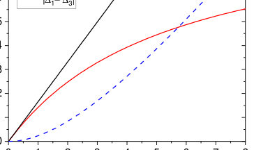 
FIG. 3. Renormalization of the short-range pseudopotential difference relevant to the Laughlin ν = 1/3 state. The figure compares the conventional LLL difference δLLL 13 = V1 −V3 (black-solid line), the renormalized difference δ∗ 13 = V ∗ 1 −V ∗ 3 (red-solid line), and the dynamical correction δ∆= |∆1 −∆3| (blue-dashed line) as functions of γB.

📷 Fig 3

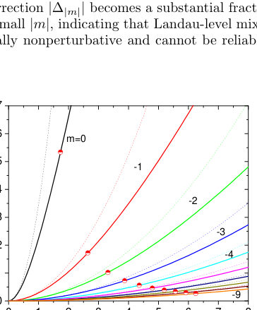 
FIG. 4. Exact dynamical correction ∆|m| (solid lines) and perturbative Landau-level-mixing correction κ2V2(m) from Ref. [8] (dash lines) as functions of the interaction strength of γB for m=0,-1,-2,..., -9. At small γB, the exact results agree quantitatively with perturbation theory. At larger γB, substantial deviations emerge. Red semi-dots indicate the threshold values γc B(m).

**Summary.** This work establishes a nonperturbative framework to calculate effective electron interactions in the fractional quantum Hall regime by going beyond the standard Lowest Landau Level approximation. By using the exact two-electron spectrum, the authors derive renormalized pseudopotentials that incorporate dynamical correlations from higher Landau levels. This shows that strong interactions significantly modify the effective interaction hierarchy, a crucial finding for understanding strongly correlated materials like ZnO/MgZnO heterostructures.

**Why it may be interesting.** The methodology of deriving effective interactions from the exact spectrum, rather than relying on perturbative expansions, provides a powerful, nonperturbative tool applicable to strongly correlated electron systems where simple approximations fail.

Detailed structure

**Main problem.** To develop a nonperturbative description of effective electron-electron interactions (Haldane pseudopotentials) in the fractional quantum Hall regime by accounting for virtual transitions to higher Landau levels.

**Main result.** The exact renormalized pseudopotentials ($V^*|m|$) show a systematic, negative dynamical correction ($\Delta|m|$) compared to the standard Lowest Landau Level (LLL) approximation, which is crucial in strongly interacting systems.

**Method.** The authors solve the relative-motion problem using the exact two-electron spectrum in a magnetic field, defining renormalized pseudopotentials directly from the exact eigenenergies.

**Model / system.** The system is two interacting electrons confined to a 2D plane under a perpendicular magnetic field, analyzed via the relative-motion Hamiltonian which separates into center-of-mass and relative-motion sectors.

**Key observables.** Renormalized pseudopotentials ($V^*|m|$), dynamical correction ($\Delta|m|$), and the difference between short-range interaction scales ($\delta^*_{13}$).

**Important parameters / regimes.** Dimensionless interaction strength ($\gamma_B$), and characteristic thresholds ($\gamma_c^B(m)$) marking the onset of strong Landau-level mixing.

**Assumptions / limitations.** The conventional pseudopotentials are only valid in the LLL approximation; the exact formulation is necessary when Landau-level mixing is nonperturbative.

**Figures summary.** Figures compare the LLL pseudopotentials ($V|m|$) against the exact renormalized values ($V^*|m|$) across various angular momenta ($m$) and interaction strengths ($\gamma_B$), highlighting the magnitude of the correction $\Delta|m|$.

**Paper structure.** The paper contrasts the conventional LLL projection method with the exact spectrum approach, deriving the renormalized pseudopotentials and quantifying the dynamical correction $\Delta|m|$ which reveals the breakdown of perturbation theory in the strong-mixing regime.

Abstract

Haldane pseudopotentials $V_{|m|}$ provide the effective interaction parameters governing correlated states in the fractional quantum Hall regime. In conventional formulations, these quantities are obtained by projecting the Coulomb interaction onto relative-angular-momentum states within the lowest Landau level, thereby neglecting virtual transitions to higher Landau levels. Here, we formulate a nonperturbative description of effective interactions directly from the exact two-electron spectrum in a magnetic field. By solving the relative-motion problem beyond the lowest-Landau-level approximation, we define renormalized pseudopotentials $V^*_{|m|}$ from the exact eigenenergies and introduce dynamical corrections $Δ_{|m|}=V^*_{|m|}-V_{|m|}$. The corrections remain systematically negative and depend strongly on both interaction strength and relative angular momentum, reflecting dynamical correlation effects associated with higher-state virtual admixture. The exact results reproduce the perturbative Landau-level-mixing limit at weak coupling while exhibiting substantial deviations in the strong-mixing regime, signaling the breakdown of low-order perturbative expansions. In particular, the short-range interaction channels relevant to Laughlin-type correlations undergo strong renormalization, leading to substantial modification of the effective interaction hierarchy in strongly interacting systems such as ZnO/MgZnO heterostructures. The present formulation establishes a microscopic framework for incorporating nonperturbative Landau-level-mixing effects into effective interaction theories of quantum Hall systems.

[↑ back to top](#top)

### [Quantum State Preparation via Neural Network Encoding in Quantum Machine Learning](http://arxiv.org/abs/2605.31006v1)

**Authors:** Kevin W. Aoun, Florian J. Kiwit, Carlos A. Riofrío, Samer Saab, Charbel Al Bateh, Joe Tekli, Andre Luckow  
**Type:** both · **Category:** quantum information and computing · **PDF:** <https://arxiv.org/pdf/2605.31006v1>  
**Analysis basis:** full PDF text, analyzed in chunks

📷 Fig 1

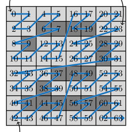 
FIG. 1. Hierarchical (Z-order) pixel indexing. Pixels are tra- versed by recursively partitioning the image into quadrants. This mapping reduces the entanglement entropy of the target state.

📷 Fig 2

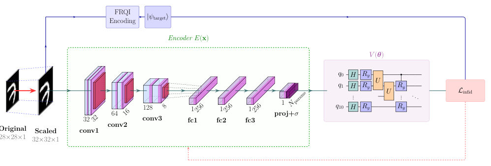 
FIG. 2. Direct state preparation framework. Input images x are encoded via a CNN E(x) into PQC parameters θ ∈RNparams. The circuit generates a quantum state |ψ(θ)⟩trained to match the ground-truth FRQI state, |ψtarget⟩, via an infidelity loss.

📷 Fig 3

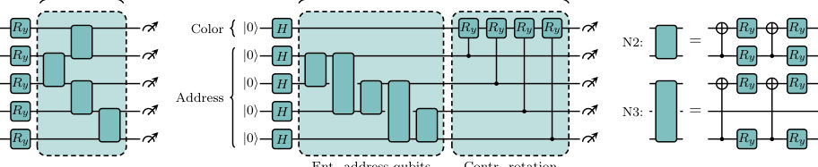 
FIG. 3. Architectural designs for the quantum generator and constituent gate decompositions. (a) center- sequential circuit: an integrated layer design where the color qubit and address register are entangled through a sequential arrangement of multi-qubit blocks. (b) FRQI-specific circuit: a structured layer implementation for a 4 × 4-pixel image. The process begins with Hadamard (H) gates preparing an initial uniform superposition across all qubits. The layer is partitioned into two functional blocks: an entangling address-qubits block, which utilizes alternating N2 and N3 blocks to create correlations within the address register, and controlled rotations, where the color qubit undergoes...

📷 Fig 4

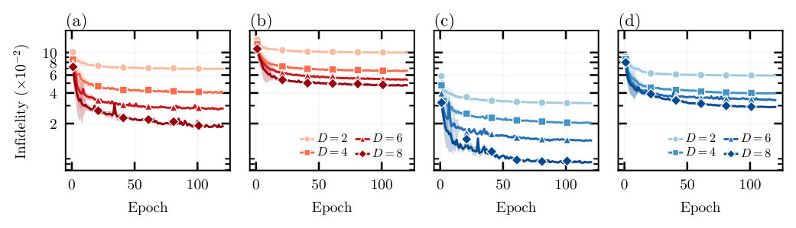 
FIG. 4. Validation infidelity vs. training epoch for circuit depths D ∈{2, 4, 6, 8}. Red curves correspond to MNIST and blue curves to Fashion-MNIST; within each color family, darker shades indicate greater depth. (a) MNIST, FRQI ansatz. (b) MNIST, center-sequential ansatz. (c) Fashion-MNIST, FRQI ansatz. (d) Fashion-MNIST, center-sequential ansatz. Both architectures show consistent improvement with depth. F-MNIST converges to lower infidelity than MNIST at equivalent depth, though the FRQI ansatz at D ∈{6, 8} (Nparams = 468 and 624) exhibits some training instability on both datasets.

📷 Fig 5

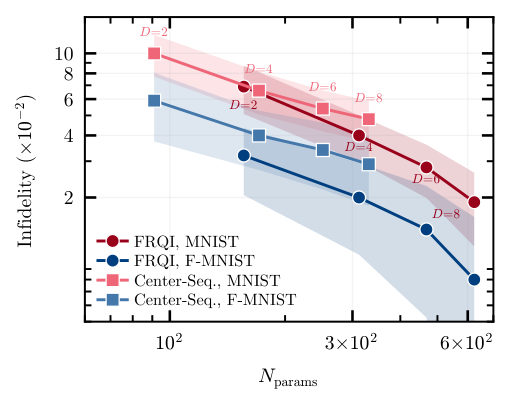 
FIG. 5. Scaling of the infidelity with an increase in circuit pa- rameters Nparams for the FRQI and center-sequential ans¨atze on MNIST and Fashion-MNIST. Each marker corresponds to a circuit depth D ∈{2, 4, 6, 8}. The shaded areas show the 25th-75th percentiles, scaled down for visual purposes. At matched parameter counts, FRQI consistently achieves higher fidelity, confirming that the gain is architectural rather than a consequence of increased model capacity. Red denotes MNIST and blue denotes Fashion-MNIST; darker shades cor- respond to the FRQI ansatz and lighter shades to the center- sequential ansatz.

**Summary.** This work tackles the computational bottleneck of preparing quantum states from classical data by training a classical neural network to output the necessary parameters for a fixed quantum circuit. By shifting optimization offline, the method achieves state preparation with high fidelity and a massive speedup, demonstrating a scalable pathway for near-term QML applications.

**Why it may be interesting.** While focused on data loading rather than fundamental quantum dynamics, the efficiency gains and the use of classical ML to control quantum circuits are highly relevant to developing practical quantum algorithms for physical simulations or data analysis.

Detailed structure

**Main problem.** The primary challenge addressed is the 'state preparation bottleneck' in Quantum Machine Learning (QML), which involves the prohibitive computational cost of loading high-dimensional classical data into a quantum state.

**Main result.** The authors successfully demonstrated a scalable method by training a classical neural network to map input data directly to quantum circuit parameters, achieving high fidelity (up to 0.992) on unseen images with a massive runtime speedup (over 5000-fold).

**Method.** They propose training a classical Convolutional Neural Network (CNN) encoder to generate the continuous parameters ($	heta$) for a fixed Parameterized Quantum Circuit (PQC), bypassing the need for iterative optimization for every data instance.

**Model / system.** The system involves encoding classical image data (MNIST/Fashion-MNIST) into quantum states using two types of PQCs: a Center-sequential circuit and an FRQI-native circuit. The encoding relies on amplitude encoding principles.

**Key observables.** Fidelity (Linfid), Peak Signal-to-Noise Ratio (PSNR), and Structural Similarity Index (SSIM) are used to quantify state preparation quality and image reconstruction accuracy.

**Important parameters / regimes.** Circuit depth ($D \in \{2, 4, 6, 8\}$), number of qubits ($n=11$ for $32 	imes 32$ images), and the number of trainable weights in the CNN encoder ($\approx 749,000$).

**Assumptions / limitations.** The approach assumes that the data structure allows for approximation by quantum states, and the core assumption is that offloading optimization to an offline training phase is beneficial.

**Figures summary.** Figures illustrate the direct state preparation pipeline ($x 	o E(x) 	o 	heta 	o |\psi
angle$), compare the architectural designs of the two PQCs, and show image reconstructions comparing the proposed FRQI encoding against other methods.

**Paper structure.** The paper first identifies the state preparation bottleneck, proposes the CNN-to-PQC parameter mapping, details the two ansatz architectures (Center-sequential vs. FRQI-native), and validates the method on MNIST and Fashion-MNIST using multiple reconstruction metrics and runtime comparisons.

Abstract

A central challenge in quantum machine learning is the state preparation bottleneck that describes the prohibitive computational cost of loading high-dimensional classical data into a quantum state. Although amplitude encoding can represent $2^n$-dimensional data using only $n$ qubits in principle, preparing arbitrary states remains computationally expensive, typically requiring variational optimization of a parameterized quantum circuit for each individual data instance. In this work, we propose a method that avoids iterative optimization by training a classical neural network to map input data directly to the continuous parameters of a fixed quantum circuit. We demonstrate the generation of quantum image states with high fidelity on data not seen during training. Since all optimization is performed once during training, the resulting model encodes new inputs in a single inference step, providing a scalable pathway for data loading in near-term quantum algorithms. We validate our method on the MNIST and Fashion-MNIST datasets, achieving fidelities up to 0.992 on unseen images and reducing the per-data-instance runtime by more than 5000-fold.

[↑ back to top](#top)

### [Research progress on quantum neural networks and quantum machine learning](http://arxiv.org/abs/2605.30724v1)

**Authors:** Yifan Sun, Boyuan Sun, Jiameng Tian, Xiangdong Zhang  
**Type:** theory · **Category:** quantum information and computing · **PDF:** <https://arxiv.org/pdf/2605.30724v1>  
**Analysis basis:** full PDF text, analyzed in chunks

📷 Fig 1

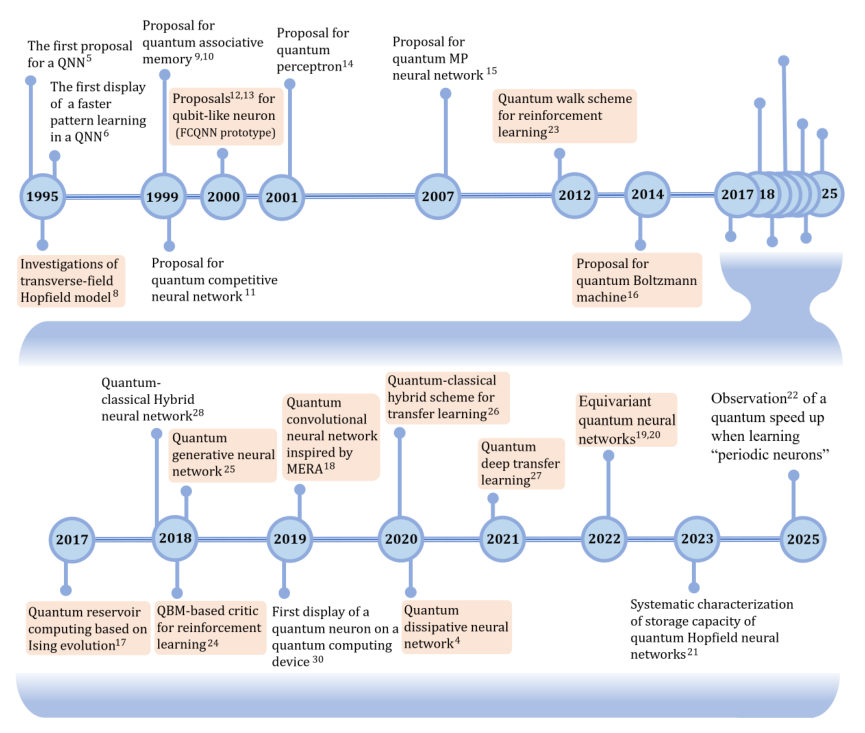 
Figure 1: Timeline highlighting major advancements several basic structures of QNNs and quantum machine learning. Those ones highly relevant to this review are marked out by colored background.

📷 Fig 2

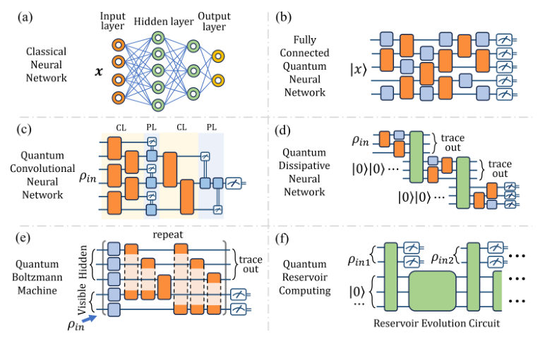 
Figure 2: (a) A sketch of a Classical NN, with input data vector 𝑥. (b) The FCQNN, with input data carried by quantum state |𝑥⟩. (c) The QCNNs. 𝜌𝑖𝑛denotes the density matrix of the input. (d) The QDNNs. (e) The QBMs. Several qubits are used as the hidden ones, and others are used as the visible ones. (f) The QRCs. The blue blocks, orange blocks, and the green blocks represent single qubit gates, two-qubit gates, and multi-qubit gates, respectively.

📷 Fig 3

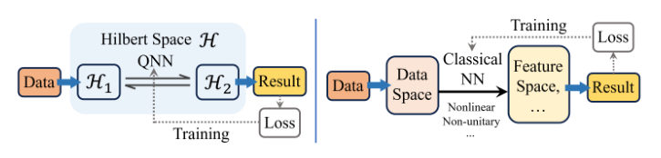 
Figure 3: The learning process of a QNN vs a classical NN, in a generalized perspective of data flow. By using a QNN (the left panel), the data is encoded by quantum states (in the subspace 1), and transformed to other states (in the subspace 2). The training is done by computing the loss function of the output states, and updating the parameters of the QNN. By using a classical NN (the right panel), the data is encoded by the states of digital electrical circuit states. The size of the state space when data is processed often changes. The training is also done by computing the loss function of the output states, and updating the model parameters.

📷 Fig 4

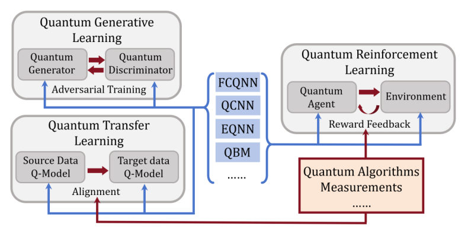 
Figure 4: A graphic illustration of the core requirements of QRL, QGL, and QTL. The roles of the basic types of the QNN for those learning paradigms are also illustrated, as indicated by blue arrows. The quantum operations on states, such as applying quantum algorithms or performing measurements, can be employed as a quantum version of alignment and reward feedback, as indicated by red arrows. combine into more complex architectures for these learning tasks.

📷 Fig 5

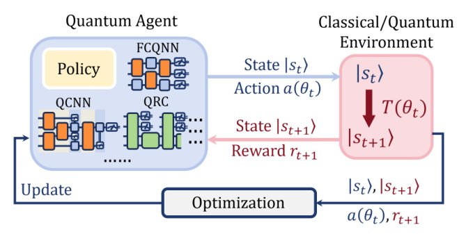 
Figure 5: Schematic of a QTL framework. A QNN-based agent interacts with an environment by observing a state 𝑠𝑡, selecting an action 𝑎𝑡according to its policy, and receiving a reward 𝑟𝑡as the environment transitions to a new state 𝑠𝑡+1 with probability 𝑝(𝑠𝑡+1|𝑠𝑡, 𝑎𝑡). After collecting a set of transitions (𝑠𝑡, 𝑎𝑡, 𝑟𝑡, 𝑠𝑡+1), the agent is updated using a suitable optimization algorithm.

**Summary.** This survey provides a comprehensive review of Quantum Neural Networks (QNNs) and Quantum Machine Learning (QML). It details various QNN architectures and critically analyzes the optimization challenges, such as barren plateaus, while comparing gradient-based and gradient-free training methods. The paper maps out the current state-of-the-art for leveraging quantum computation in artificial intelligence.

**Why it may be interesting.** It provides a comprehensive overview of how quantum principles (superposition, entanglement) are being mapped onto computational models for ML, which is highly relevant for understanding quantum information processing paradigms.

Detailed structure

**Main problem.** The need for more powerful machine learning strategies to solve complex data analysis, pattern recognition, and optimization tasks.

**Main result.** The paper surveys various Quantum Neural Network (QNN) architectures and discusses the systematic challenges in training them, such as the barren plateau problem.

**Method.** It reviews multiple QNN approaches (e.g., QCNNs, QBMs) and compares optimization techniques like Parameter-Shift Rules, Quantum Natural Gradient Descent, and gradient-free methods like SPSA.

**Model / system.** The core model is the Quantum Neural Network (QNN), which processes data encoded into quantum states (qubits) via unitary operations. These are compared against classical NNs, highlighting the Hilbert space feature mapping.

**Key observables.** Learning accuracy, training time, resource requirements, and the cost function L(theta).

**Important parameters / regimes.** Number of qubits (p), learning rate (eta), and the structure of the unitary gates.

**Assumptions / limitations.** The primary assumption is that QNNs can be effectively trained, despite challenges like the barren plateau problem and significant classical overhead for state preparation.

**Figures summary.** Figures illustrate the timeline of QNN advancements, the structural comparison between QNNs and classical NNs, and the generalized learning process flow for both paradigms.

**Paper structure.** The review is systematic, first establishing the need for QML, then detailing various QNN types, followed by a deep dive into the mathematical and computational methods for training these quantum models.

Abstract

Machine learning holds fundamental computational significance due to the increasing demand for efficient solutions to complex tasks in data analysis, pattern recognition, and optimization, which are essential for addressing the multifaceted challenges of modern society. As the volume of data proliferates at an unprecedented rate, the need for more powerful machine learning strategies becomes increasingly evident. Quantum neural networks (QNNs) represent an emerging and transformative research field that seeks to harness the unique principles of quantum mechanics to enhance the capabilities of machine learning algorithms. This survey examines various QNN approaches, including fully connected QNNs, quantum convolutional neural networks, equivariant QNNs, quantum Hopfield networks, quantum Boltzmann machines, quantum reservoir computing, and composite networks for quantum reinforcement learning, quantum generative learning, and quantum transfer learning. We summarize the relevant investigations on their performance, including learning accuracy, training time, and resource requirements, etc. Each QNN type has unique strengths and weaknesses, offering diverse solutions for different applications.

[↑ back to top](#top)

### [Richardson-Gaudin states of non-zero seniority III: The Perfect-Pairing limit](http://arxiv.org/abs/2605.31582v1)

**Authors:** Paul A. Johnson  
**Type:** theory · **Category:** strongly correlated electrons · **PDF:** <https://arxiv.org/pdf/2605.31582v1>  
**Analysis basis:** full PDF text, analyzed in chunks

📷 Fig 1

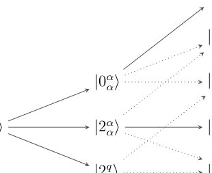 
FIG. 1: Single and double excitations from the PP reference |ω⟩: solid edges represent

📷 Fig 2

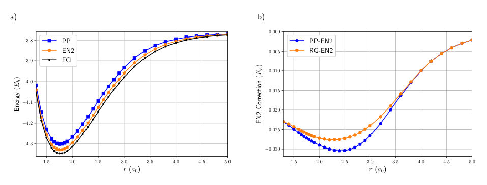 
FIG. 2: (a) Symmetric bond dissociation of linear H8 in the STO-6G basis: EN2 computed

📷 Fig 3

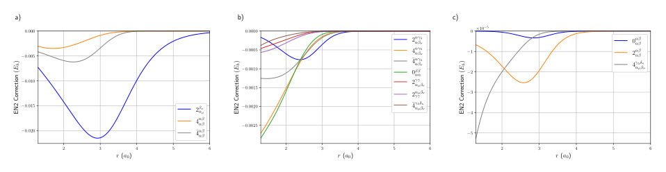 
FIG. 3: Symmetric bond dissociation of linear H8 in the STO-6G basis: comparison of

📷 Fig 4

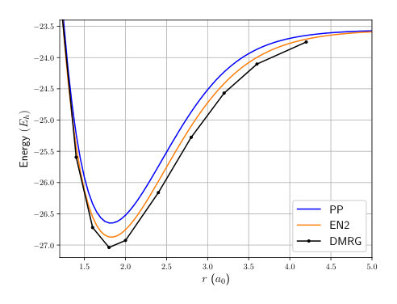 
FIG. 4: Symmetric bond dissociation of linear H50 in the STO-6G basis: PP and EN2

📷 Fig 5

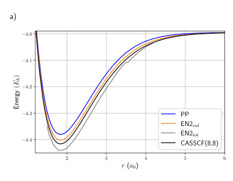 
FIG. 5: Symmetric bond dissociation of linear H8 in the cc-pVDZ basis: PP and EN2

**Summary.** This work develops a computationally efficient method to calculate correlation energies for strongly correlated electron systems by simplifying the Richardson-Gaudin states to the Perfect-Pairing limit. By applying second-order perturbative corrections (EN2) within this simplified framework, the authors achieve accuracy comparable to expensive full CI methods. This provides a powerful, scalable tool for studying bond dissociation and electronic structure in correlated materials.

**Why it may be interesting.** The systematic reduction of complexity from full CI/CASSCF to the PP limit while maintaining high accuracy is a significant algorithmic advance for treating strong correlation, providing a computationally tractable alternative for molecular simulations.

Detailed structure

**Main problem.** The paper addresses the computational challenge of treating strongly correlated electrons, which are poorly described by simple single Slater determinants, especially when the active space is large.

**Main result.** The authors demonstrate that simplifying the Richardson-Gaudin states to the Perfect-Pairing (PP) limit allows for the calculation of high-accuracy correlation energy corrections (EN2) with substantially reduced computational cost.

**Method.** The core method involves using the PP state as a reference wavefunction and applying second-order Epstein-Nesbet (EN2) perturbative corrections, alongside analyzing excitation energies via VBS gaps and pair amplitudes.

**Model / system.** The system is modeled using the Coulomb Hamiltonian, decomposed into seniority-conserving channels. The theoretical framework builds upon Richardson-Gaudin states and utilizes the Valence-Bond Subsystem (VBS) approximation to simplify the calculation.

**Key observables.** Dissociation energy curves (e.g., N2), excitation energies (singles, doubles, pair-transfers), and correlation energy corrections ($	ext{EN2}$).

**Important parameters / regimes.** The VBS Gap ($\omega_\alpha$), the Perfect-Pairing (PP) limit, and the seniority quantum number (focusing on non-zero seniority III).

**Assumptions / limitations.** The primary assumption is that the PP approximation yields results comparable in quality to the full Richardson-Gaudin state approach, and that the EN2 correction can be accurately calculated perturbatively.

**Figures summary.** Figures illustrate dissociation curves (e.g., N2) comparing PP, EN2, and EN2d corrections, and show the structure of single and double excitation channels from the PP reference state.

**Paper structure.** The paper progresses from establishing the need for simplified correlated methods (PP limit) to deriving the necessary mathematical machinery (VBS gaps, generalized Fock matrices) for calculating the EN2 correction, and finally applying this to molecular dissociation problems.

Abstract

Strongly correlated electrons can be treated with a configuration interaction of Slater determinants grouped by number of unpaired electrons with exponential cost. The first two papers in this series demonstrated that single reference methods built from Richardson-Gaudin states gave results of similar quality at polynomial cost. In this contribution, the states are simplified substantially yielding the perfect-pairing state as a reference along with its low-lying excitations. The states are much simpler, the computational cost is substantially reduced, and there is no sacrifice in numerical accuracy. Second-order Epstein-Nesbet perturbative corrections for the valence electrons are similar in quality to the complete active space self-consistent field.

[↑ back to top](#top)

### [Software Platform for Hybrid Pseudo-Random Sequence Generation and Predictability Analysis Based on LFSR and Mersenne Twister](http://arxiv.org/abs/2605.30977v1)

**Authors:** Ali Abdolrahimi Zarnagh, Ali Motazedifard  
**Type:** theory · **Category:** other · **PDF:** <https://arxiv.org/pdf/2605.30977v1>  
**Analysis basis:** full PDF text, analyzed in chunks

📷 Fig 1

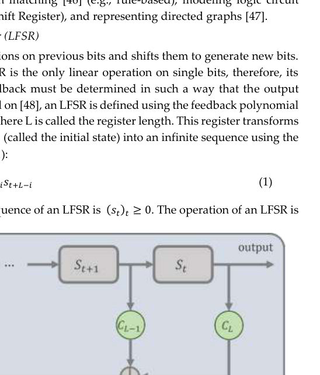 
Figure 1 Structure of LFSR generation process

📷 Fig 2

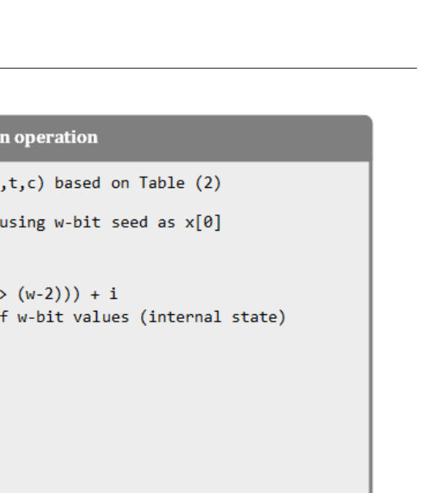 
Figure 2 MT generation algorithm pseudo code

📷 Fig 3

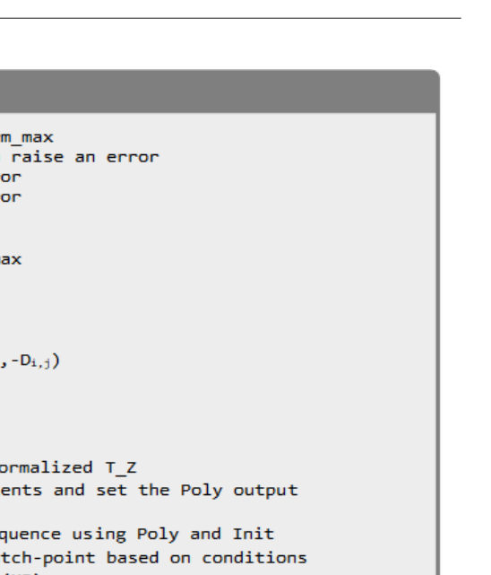 
Figure 3 LFSR structure breaking algorithm pseudo code

📷 Fig 4

 
Figure 4 Block diagram of the method used for breaking the LFSR structure

📷 Fig 5

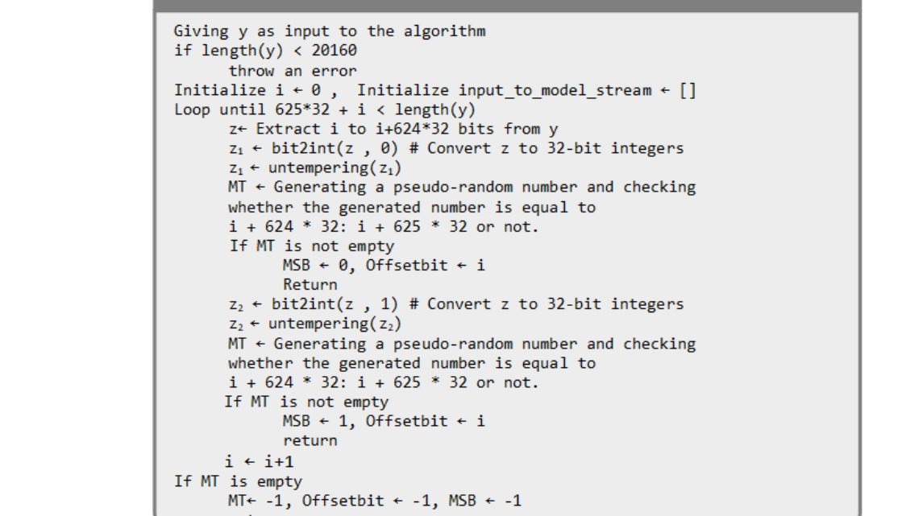 
Figure 5 MT structure breaking algorithm pseudo code

**Summary.** This work introduces a software platform to systematically analyze and benchmark various random number generators, including LFSRs and Mersenne Twister. It demonstrates that these classical generators are fundamentally predictable by reconstructing their internal states using advanced statistical and machine learning techniques. The findings strongly advocate for the use of quantum random number generators due to their inherent, non-algorithmic source of true randomness.

**Why it may be interesting.** While not directly focused on quantum dynamics, the paper's rigorous comparison between deterministic algorithmic randomness and non-deterministic quantum randomness provides a strong theoretical justification for the necessity of quantum sources in high-security quantum information protocols.

Detailed structure

**Main problem.** The paper addresses the fundamental problem of generating and analyzing the predictability of random bit sequences, comparing classical pseudo-random generators (LFSR, MT) against truly random quantum sources.

**Main result.** Classical PRNGs are shown to be deterministic and predictable using statistical and AI-based reconstruction techniques, whereas quantum random sequences offer superior, inherent unpredictability for security applications.

**Method.** The authors developed a software platform to generate, analyze, and attempt to 'hack' the internal states and parameters of LFSRs and MTs, contrasting these methods with testing quantum random number streams.

**Model / system.** The models analyzed are classical PRNGs, specifically Linear Feedback Shift Registers (LFSRs) and the Mersenne Twister (MT). The comparison benchmark is the physical process generating quantum random numbers (QRNGs).

**Key observables.** Sequence complexity, resistance to prediction, match-point rate (for prediction success), and the statistical distribution of reconstructed states.

**Important parameters / regimes.** LFSR feedback polynomial coefficients, MT state vector size (e.g., 624 states), and the required input bit length for successful state reconstruction.

**Assumptions / limitations.** The predictability of PRNGs relies on exploiting underlying algorithmic patterns, and the analysis assumes quantum randomness is fundamentally non-deterministic.

**Figures summary.** Figures illustrate the structural diagrams of LFSR and MT generation processes, alongside pseudo-code and block diagrams detailing the specific algorithms used for structure breaking and state estimation.

**Paper structure.** The paper is structured around developing a comprehensive software platform with two modes: Generation Mode (implementing LFSR, MT, and hybrid combinations) and Hacking Mode (applying statistical, algebraic, and deep learning techniques to estimate internal states).

Abstract

Generating reliable random and pseudo-random sequences is important in many electronic and signal processing systems, such as secure communications, radar, spread-spectrum methods, and autonomous platforms. Although true and quantum random number generators provide stronger unpredictability, classical pseudo-random number generators, including Linear Feedback Shift Registers (LFSRs) and the Mersenne Twister (MT), are still widely used because they are efficient and easy to implement. This work introduces a user-friendly software platform for generating, analyzing, and evaluating the predictability of pseudo-random bit sequences. The software supports two main functions: generating sequences using classical PRNGs and hybrid combinations, and analyzing input sequences through statistical measures and data-driven methods. In particular, hybrid LFSR-MT structures are studied to examine how they affect sequence complexity and resistance to prediction. The platform also includes machine-learning and deep-learning tools to investigate when deterministic PRNGs may remain partially predictable, even when their structure becomes more complex. The results show that algorithmic random sequence generators have inherent limitations in terms of unpredictability, which supports the use of quantum random sequences in security-critical applications. A comparative study between classical LFSR-MT sequences and quantum random sequences shows that quantum randomness offers higher unpredictability due to its non-deterministic physical origin. The potential use of quantum random sequences in jamming applications is also discussed, highlighting their improved robustness against prediction-based attacks. Overall, the proposed software provides a practical tool for analyzing, comparing, and benchmarking random sequence generators in modern electronic, sensing, and quantum-enabled communication systems.

[↑ back to top](#top)

### [Trainable Quantum Spectral Models for Partial Differential Equations](http://arxiv.org/abs/2605.31248v1)

**Authors:** Gabriel Mejia, Eileen Kuehn, Melvin Strobl, Achim Streit  
**Type:** theory · **Category:** numerical methods · **PDF:** <https://arxiv.org/pdf/2605.31248v1>  
**Analysis basis:** full PDF text, analyzed in chunks

📷 Fig 1

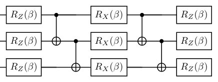 
Fig. 1. Compact schematic of the richer spectral architecture Bϵ. Trainable diagonal spectral layers D(θ(ℓ)) are interleaved with forward and reverse entangling mixers, which introduce controlled coupling between spectral modes. The parameter β(ϵ) controls the mixer strength.

📷 Fig 2

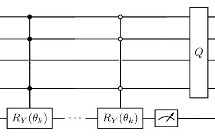 
Fig. 2. HHL-inspired model. In the spectral basis, each mode |k⟩controls a sequence of ancilla rotations RY (θk). Post-selection of the ancilla induces the learned spectral filtering, followed by the inverse transform Q to recover the solution state in physical coordinates.

📷 Fig 3

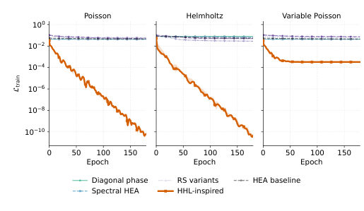 
Fig. 3. Training loss evolution Ltrain = median( 1

📷 Fig 4

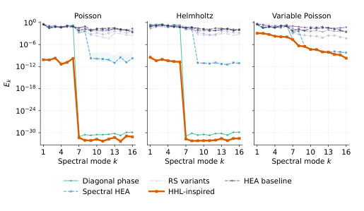 
Fig. 5. Mode-wise spectral error Ek = median(|ˆuθ,k −ˆuk|2). All spectral models, except the richer spectral model with ϵ &gt; 0.5, accurately recover dominant modes and suppress spurious high-frequency components.

📷 Fig 5

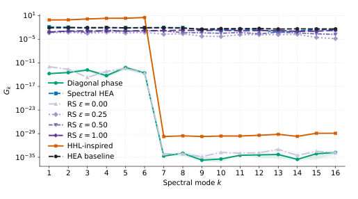 
Fig. 6. Mode-wise gradient power Gk. All spectral models, except the richer spectral model with ϵ &gt; 0.5, exhibit better sensitivity on the gradients of modes of the true solution.

**Summary.** This paper proposes using trainable Quantum Spectral Models (QSMs) to solve PDEs by learning the inverse operator in a spectral basis rather than the physical basis. By structuring the quantum circuit based on the PDE's natural basis, the models achieve faster convergence and higher fidelity compared to generic quantum circuits. This highlights that incorporating physical structure into quantum algorithms is crucial for practical scientific computation.

**Why it may be interesting.** This work provides a structured, physically informed quantum ansatz for scientific computing, suggesting that incorporating prior knowledge (like spectral decomposition) into quantum algorithms can overcome limitations in raw expressibility.

Detailed structure

**Main problem.** Developing trainable quantum spectral models (QSMs) to efficiently solve linear Partial Differential Equations (PDEs) by learning the inverse differential operator in a spectral basis.

**Main result.** Operator-aware spectral representations significantly outperform generic quantum circuits, showing faster convergence and more stable gradients for solving PDEs.

**Method.** The approach involves mapping the PDE problem into a spectral basis and designing parameterized quantum circuits (QSMs) that operate on this transformed representation, rather than the physical basis.

**Model / system.** The models are tested on linear PDEs, including the Poisson and Helmholtz equations, and variable-coefficient versions. The quantum circuit learns the inverse operator $A^{-1}$ via a parameterized unitary $M_	heta$ acting in the spectral domain.

**Key observables.** Mean Squared Error (MSE), Fidelity ($F$), mode-wise spectral error ($E_k$), gradient variance ($	ext{Var}(\partial 	heta_i L)$), and convergence speed.

**Important parameters / regimes.** The mixing parameter $\epsilon$ in richer spectral models, which controls the trade-off between expressibility and trainability, with an optimal regime found around $\epsilon \approx 0.5$.

**Assumptions / limitations.** The performance gains are observed even when the chosen spectral basis does not perfectly diagonalize the underlying differential operator.

**Figures summary.** Figures illustrate the training loss and fidelity improvements of spectral models over generic circuits, show mode-wise spectral error concentration in spectral models, and compare gradient variance across different model architectures.

**Paper structure.** The paper systematically introduces QSMs, compares various architectures (diagonal, richer spectral, HHL-inspired) against HEA baselines, analyzes the expressibility vs. trainability trade-off using the mixing parameter $\epsilon$, and validates performance on multiple benchmark PDEs.

Abstract

This work studies trainable quantum spectral models (QSMs) for solving linear partial differential equations (PDEs). Instead of learning solutions directly in physical space, QSMs learn the inverse differential operator in a spectral representation, embedding prior knowledge of the equation's natural basis.   We systematically study the expressibility and trainability of several QSM architectures, ranging from near-diagonal to fully parameterized unitaries. In particular, we introduce a family of richer spectral models that interpolate between purely diagonal operators and fully mixing unitaries through a parameterized mixer controlled by $ε$. Our results reveal an intermediate regime, typically around $ε\approx 0.5$, where models achieve the best tradeoff between expressibility and trainability. Beyond this threshold, increased circuit complexity degrades convergence without improving accuracy.   Among the architectures considered, models inspired by the inverse step of the Harrow-Hassidim-Lloyd (HHL) algorithm achieve the fastest training convergence while maintaining high solution fidelity. Numerical experiments on the (variable-coefficient) Poisson and Helmholtz equations show that trainable operations in the spectral basis outperform standard variational quantum circuits acting directly in the computational basis. These advantages appear through faster convergence, more stable gradients, and more accurate recovery of the reference solution spectrum, particularly through stronger suppression of spurious high-frequency components, even when the operator is not exactly diagonal in the chosen spectral basis. Our results identify operator-aware spectral representations as a promising route toward trainable and physically grounded quantum methods for scientific computing.

[↑ back to top](#top)

### [Vertex-transitive quantum graphs](http://arxiv.org/abs/2605.30730v1)

**Authors:** Mac Hayes, Trevor Jess, Andre Kornell, Remi Salinas Schmeis  
**Type:** theory · **Category:** other · **PDF:** <https://arxiv.org/pdf/2605.30730v1>  
**Analysis basis:** full PDF text, analyzed in chunks

📷 Fig 1

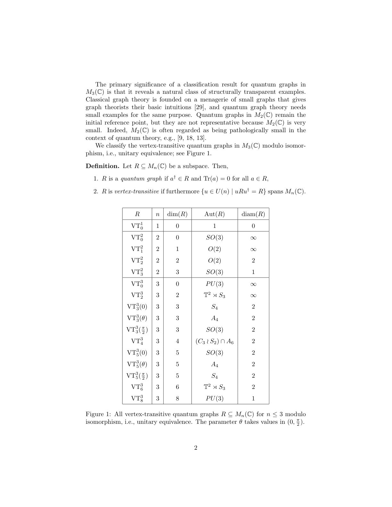 
Low-resolution page preview, page 2

📷 Fig 2

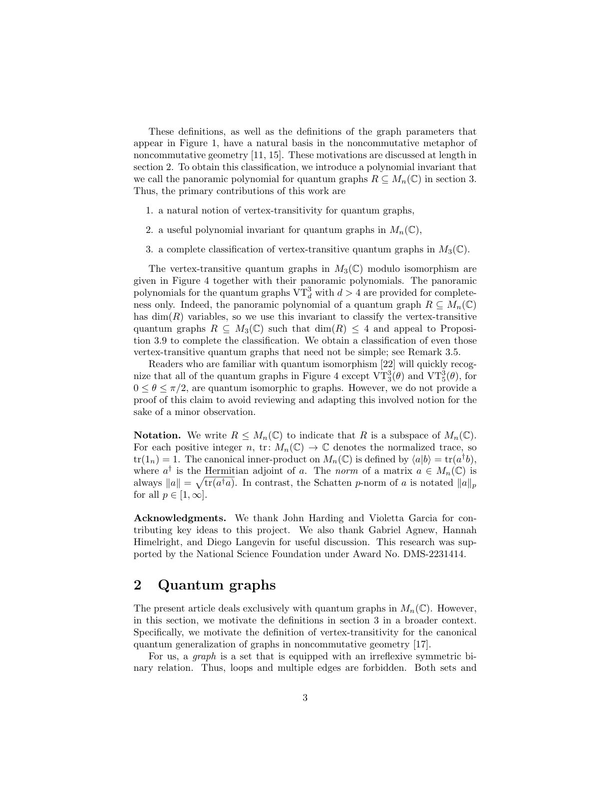 
Low-resolution page preview, page 3

📷 Fig 3

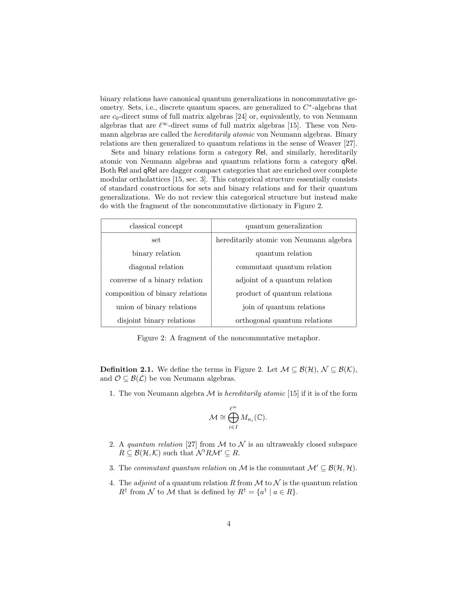 
Low-resolution page preview, page 4

📷 Fig 4

 
Low-resolution page preview, page 5

📷 Fig 5

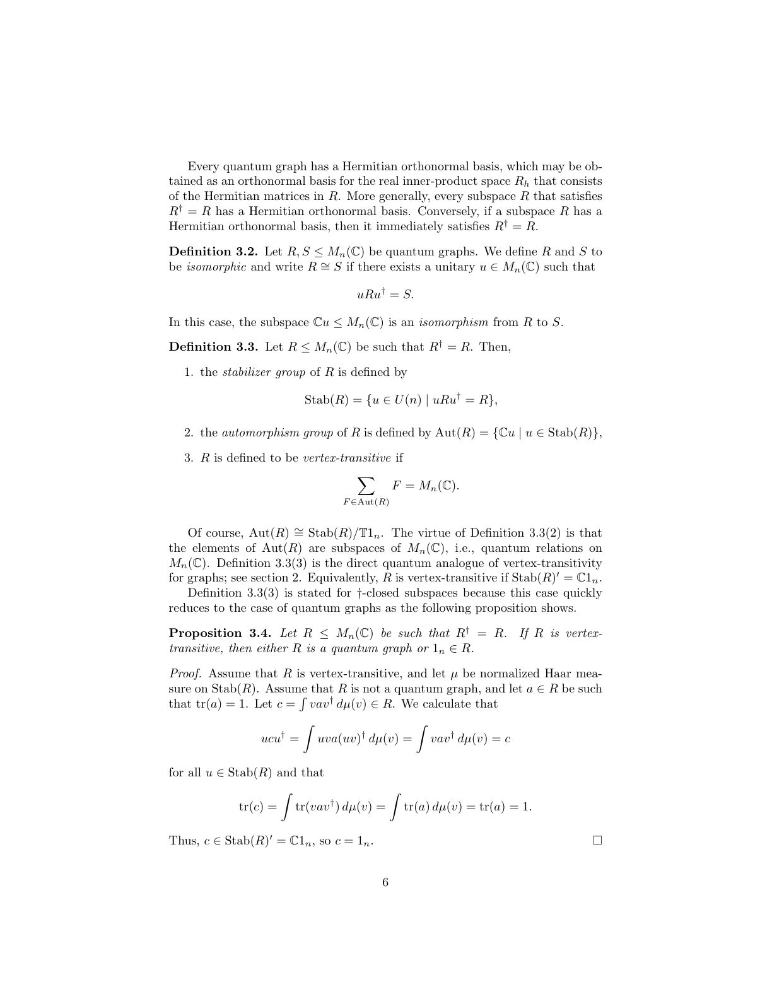 
Low-resolution page preview, page 6

**Summary.** This paper rigorously classifies vertex-transitive quantum graphs, which are subspaces of matrices in $M_n(\mathbb{C})$. The authors introduce the panoramic polynomial as a key invariant and use spectral analysis of the automorphism group to prove a complete, exhaustive list of all such graphs for the $M_3(\mathbb{C})$ case. This work provides deep structural insights into the symmetries of these quantum algebraic objects.

**Why it may be interesting.** While the subject is abstract algebra/noncommutative geometry, the rigorous classification of highly symmetric structures (like vertex-transitive graphs) using algebraic invariants is a powerful theoretical tool applicable to characterizing symmetries in quantum physical models.

Detailed structure

**Main problem.** The primary goal is to provide a complete classification of vertex-transitive quantum graphs, with a specific focus on those embedded in $M_3(\mathbb{C})$.

**Main result.** The authors provide a complete classification of all vertex-transitive quantum graphs in $M_3(\mathbb{C})$ up to isomorphism, identifying several distinct families parameterized by angles $	heta$.

**Method.** The classification relies on introducing and utilizing a polynomial invariant called the panoramic polynomial, alongside analyzing the spectrum of the adjoint action of unitaries in the automorphism group.

**Model / system.** The system studied is the quantum graph, mathematically defined as a $\dagger$-closed subspace $R$ of matrices in $M_n(\mathbb{C})$, where $n$ is the dimension of the ambient space (primarily $n=3$).

**Key observables.** The panoramic polynomial $p_R$, the automorphism group $	ext{Aut}(R)$, the dimension $	ext{dim}(R)$, and the spectrum of the adjoint action $	ext{Spec}(	ext{Ad}_R(u))$ are key observables.

**Important parameters / regimes.** The dimension $n$ (especially $n=3$) and the continuous parameter $	heta \in [0, \pi/2]$ used to parameterize certain graph families are important parameters.

**Assumptions / limitations.** The classification heavily assumes that the dimension of the quantum graph is an isomorphism invariant, and that the graphs under consideration are regular.

**Figures summary.** Figure 4 summarizes the complete classification of vertex-transitive quantum graphs in $M_3(\mathbb{C})$ modulo isomorphism, listing 8 distinct types, each characterized by its defining elements, panoramic polynomial, and automorphism group.

**Paper structure.** The paper builds from general definitions of quantum graphs and vertex-transitivity, introduces the panoramic polynomial invariant, proves structural theorems relating regularity and vertex-transitivity, and culminates in the explicit, exhaustive classification of all such graphs in $M_3(\mathbb{C})$ using spectral analysis.

Abstract

We define a quantum graph to be vertex-transitive if the join of its automorphism group is the maximum quantum relation on its quantum vertex set, in direct analogy with the classical case. All simple quantum graphs in $M_2(\mathbb C)$ are vertex-transitive, but many simple quantum graphs in $M_3(\mathbb C)$ are not vertex-transitive. We provide a complete classification of vertex-transitive quantum graphs in $M_3(\mathbb C)$ up to isomorphism. To do this, we introduce a polynomial invariant for quantum graphs in $M_n(\mathbb C)$, which we call the panoramic polynomial.

[↑ back to top](#top)

## Secondary cond-mat archives

*Papers from  mes-hall, other, soft, supr-con. These archives are de-prioritized — they appear at the end regardless of relevance score.*

### Relevant in secondary archives (15)

### [Feasibility study of continuous electronic Pomeranchuk cooling with a flavor-degenerate Wigner crystal](http://arxiv.org/abs/2605.31307v1)

**Authors:** Robin J. Dolleman, Ammon Fischer, Lennart Klebl, Alexander Rothstein, Dante M. Kennes, Bernd Beschoten, Florian Libisch, Christoph Stampfer  
**Type:** theory · **Category:** statistical mechanics · **PDF:** <https://arxiv.org/pdf/2605.31307v1>  
**Analysis basis:** full PDF text, analyzed in chunks
**Topic relevance:** 🔥 `driven-dissipative phase transition` **4/5** · `correlated / nonlocal dissipation` **3/5** · `methods for driven-dissipative` **3/5** · `non-equilibrium dynamics` **3/5** · `non-equilibrium universality` **3/5** · `Keldysh / 2PI / non-Gaussian methods` **2/5** · `analog quantum simulation` **2/5** · `Frenkel-Kontorova` **1/5** · `Kondo & dissipative impurity` **1/5**

📷 Fig 1

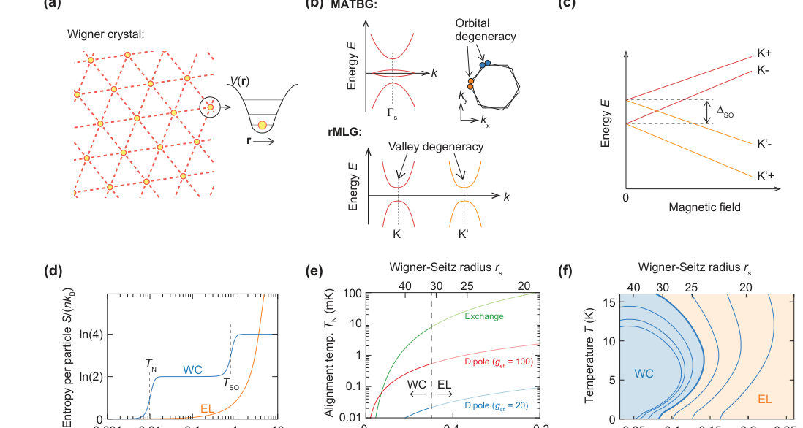 
FIG. 1. (a) Illustration of the triangular lattice of charge carriers in the WC. Each charge carrier in confined within a potential created by the surrounding carriers. (b) Exemplary band structures of magic-angle twisted bilayer graphene (MATBG) and gapped rhombohedrally stacked multilayer graphene (rMLG); for two layers, rMLG corresponds to Bernal-stacked bilayer graphene. Depending on the system, each carrier can carry an orbital and/or valley degree of freedom close to the band gaps. (c) Evolution of the four lowest energy states of a confined charge carrier in a valley-degenerate system as a function of out-of-plane magnetic field (schematically). K and K′ indicate the valleys and...

📷 Fig 2

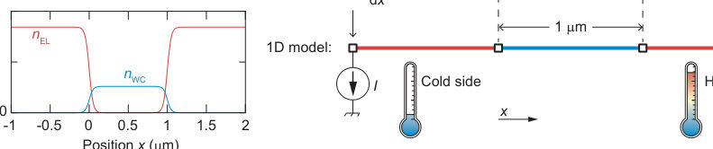 
FIG. 2. (a) Sketch of the proposed thermodynamic cycle as an ideal isothermal process in the entropy–temperature diagram. (b) Schematic of the locally top-gated multilayer graphene device and the simplified one-dimensional model used for the simulations. (c) Exemplary spatial distribution of nEL and nWC that is assumed for the simulations.

📷 Fig 3

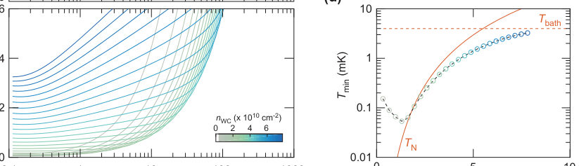 
FIG. 3. Simulations to determine the minimum possible electron temperature. Fixed simulation parameters are the electrical resistivity Rs = 1 kΩ, bath temperature Tbath = 4 mK. (a) Temperature in the cold region as a function of bias current for different values of the relative Lorenz number λWC. (b) Exemplary temperature T(x) for different values of the bias current I, for the case nEL = 2.6 × 1011 cm−2, nWC = 4.88 × 1010 cm−2 and λWC = 1 × 10−6. (c) Temperature in the cold region as a function of bias current for different densities nWC in units of cm−2, assuming λWC = 1 × 10−6. (d) Minimal attainable temperature as a function of nWC.

📷 Fig 4

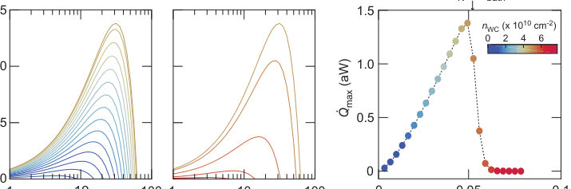 
FIG. 4. Cooling power and its dependence on sheet resistance, Tbath = 4 mK and λWC = 1 × 10−6. (a) Cooling power ˙Qcool versus current for several sheet resistances Rs, the colours correspond to panel (b). Inset shows the temperature profile T(x) for currents I = 25 pA and I = 100 pA. (b) The maximum cooling power ˙Qmax as a function of Rs. (c) ˙Qcool versus current for different densities nWC (units cm−2). With increasing nWC the cooling power initially increases (left panel), reaches a maximum and then rapidly decreases (right panel). The colour scale corresponds to panel (d). (d) Maximum cooling power ˙Qmax as a function of nWC.

📷 Fig 5

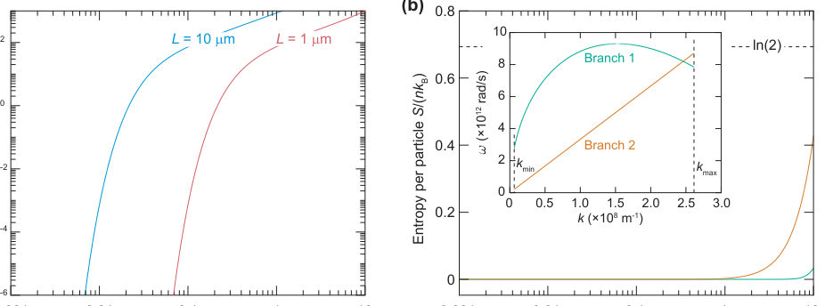 
FIG. 5. (a) Relative Lorenz number λWC versus temperature for a sample lengths L = 1 µm and L = 10 µm. (b) Contribution of the phonon branches to the entropy per particle. Inset shows the two phonon branches.

**Summary.** This paper proposes a novel method for continuous, on-chip electronic cooling by exploiting the large entropy difference between an Electron Liquid and a Wigner Crystal phase in 2D materials. By tuning the carrier density to induce this phase transition, heat is extracted from the electron system, potentially reaching temperatures below $1 	ext{ mK}$. The analysis uses advanced thermal transport simulations to model this non-equilibrium cooling cycle.

**Why it may be interesting.** This work connects fundamental concepts of phase transitions (WC formation) and entropy maximization/minimization to a practical, non-equilibrium thermodynamic process (cooling), which is highly relevant to open quantum systems and energy dissipation studies.

Detailed structure

**Main problem.** The primary challenge is achieving continuous, on-chip cooling of electron temperatures to sub-millikelvin levels in nanoelectronic devices.

**Main result.** The authors propose a cooling cycle based on the entropy difference between an Electron Liquid (EL) and a Wigner Crystal (WC) phase, demonstrating potential cooling powers up to $8.4 	ext{ aW}/\mu	ext{m}$ below $1 	ext{ mK}$.

**Method.** The cooling is modeled by simulating a 1D convection-diffusion equation that accounts for heat sources from Joule heating, entropic cooling ($\Delta S$), and phonon coupling.

**Model / system.** The system is a 2D, flavor-degenerate material (like multilayer graphene) where the charge carriers undergo a phase transition between an EL and a WC when the local gate voltage is tuned.

**Key observables.** Cooling power ($\dot{Q}_{	ext{cool}}$), minimum attainable temperature ($T_{	ext{min}}$), and the temperature profile $T(x)$.

**Important parameters / regimes.** Low current densities ($< 1 	ext{ nA}/\mu	ext{m}$), WC density ($n_{WC}$), and the bath temperature ($T_{	ext{bath}}$).

**Assumptions / limitations.** The cooling mechanism relies on the entropy difference ($\Delta S = S_{WC} - S_{EL}$), and the model assumes the validity of the Wiedemann-Franz relation in the EL phase while accounting for phonon backflow in the WC phase.

**Figures summary.** Figures illustrate the WC lattice structure, band structures for graphene variants, the entropy difference between EL and WC, and simulation results showing the temperature profile and minimum attainable temperature.

**Paper structure.** The paper establishes the physical problem, details the EL-WC phase transition mechanism driven by entropy, derives the thermodynamic cycle using the Clausius-Clapeyron relation, and finally simulates the heat transport using a 1D convection-diffusion equation.

Abstract

Achieving sub-millikelvin electron temperatures in nanoelectronic devices could unveil new transport phenomena, extend quantum coherence times, and enhance the precision of quantum metrology. However, maintaining such low temperatures continuously remains a long-standing challenge. Here, we propose and simulate an on-chip cooling cycle that harnesses the entropy difference between an electron liquid (EL) and a Wigner crystal (WC) in flavor-degenerate flat-band materials. Cooling is driven by a current through a device with a locally gated region. Within this region, the charge carrier density is tuned such that a WC forms beneath the gate. As carriers transition from an EL to WC phase, their entropy increases, extracting heat and the sliding WC advects this heat along the device. The heat is then released when carriers transition back to the EL phase, which establishes distinct hot and cold regions and a steady temperature gradient over the device. Simulations show net cooling for sufficiently low current densities, typically below $1~\mathrm{nA}/μ\mathrm{m}$, whereas Joule heating dominates at higher currents. Within the gated region, we estimate cooling powers of up to $8.4~\mathrm{aW}/μ\mathrm{m}$ at a bath temperature of $4~\mathrm{mK}$. Our approach can achieve electron temperatures well below $1~\mathrm{mK}$ under suitable conditions, promising a route towards continuous on-chip cooling in this temperature regime. Our approach applies to any flat-band material with low-energy flavor degeneracy (valley and/or orbital) and low disorder, including gapped Bernal-stacked bilayer graphene, rhombohedral-stacked multilayer graphene, and magic-angle twisted bilayer graphene.

[↑ back to top](#top)

### [Odd-Parity Magnons](http://arxiv.org/abs/2605.31411v1)

**Authors:** Pu Zhang, Sun-Bo Xie, Junxi Yu, Yichen Liu, Cheng-Cheng Liu  
**Type:** theory · **Category:** other · **PDF:** <https://arxiv.org/pdf/2605.31411v1>  
**Analysis basis:** full PDF text, analyzed in chunks
**Topic relevance:** 🔥 `non-equilibrium dynamics` **4/5** · 🔥 `spintronics-quantum-optics interface` **4/5** · `analog quantum simulation` **3/5** · `driven-dissipative phase transition` **3/5** · `exotic spin models in light-matter` **3/5** · `methods for driven-dissipative` **2/5** · `non-equilibrium universality` **2/5** · `Keldysh / 2PI / non-Gaussian methods` **1/5**

📷 Fig 1

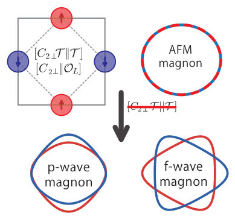 
FIG. 1. Schematic of the physical mechanism for odd-parity magnons in collinear antiferromagnets. (Top) A collinear an- tiferromagnetic lattice has the joint symmetries [C2⊥T ||T ] and [C2⊥||OL] with OL = P, m, C2z, S3 3z, or C3 6z. The red and blue spheres denote the two sublattices with spin- down and spin-up polarizations, and the magnon branches are spin-degenerate. Breaking the effective time-reversal symme- try [C2⊥T ||T ], for example by circularly polarized light or loop currents, while preserving [C2⊥||OL], induces odd-parity magnon spin splitting. (Bottom) Odd-parity magnon states dictated by different lattice symmetries, illustrating the p- wave (left) and f-wave (right)...

📷 Fig 2

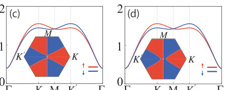 
FIG. 2. Optically driven odd-parity magnon spin splitting. (a) Magnon band structure in the absence of optical driv- ing, where the two spin/chirality branches are degenerate. (b) Band structure under circularly polarized light driving. The inset highlights the f-wave odd-parity characteristics protected by the C3z symmetry. (c), (d) Evolution of the magnon bands under elliptically polarized light, where the reduced symmetry changes the splitting from an f-wave to a p-wave form. The optical field parameters are λ = 0.5 in (b), λx = 0.2, λy = 0.5 in (c), and λx = 0.5, λy = 0.2 in (d), with a driving frequency of ℏΩ/J = 1.

📷 Fig 3

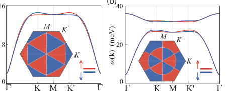 
FIG. 4. Odd-parity magnon band structures of real van der Waals antiferromagnets. (a), (b) Magnon dispersions of monolayer MnPS3 and bilayer FeBr3 under optical driving with dimensionless coupling strength λ = 0.2 and frequency ℏΩ= 1 meV. The insets show the corresponding f-wave spin- splitting patterns. Results for slid bilayer CrI3 and CrVI6 are provided in the Supplemental Material.

📷 Fig 4

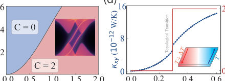 
FIG. 3. Light-induced topological magnon phase transition and magnon thermal Hall effect. (a) Schematic of the bilayer A-type antiferromagnetic lattice structure featuring spatial asymmetry S1 ̸= S2. (b) f-wave magnons under circularly polarized light driving with λ = 0.4 and ℏΩ/J = 1. (c) Topological phase diagram in the plane of the optical driv- ing frequency Ωand the dimensionless coupling strength λ, illustrating the system’s evolution from a trivial phase C = 0 to a topological magnon phase C = 2. The inset shows the corresponding chiral edge states. (d) Evolution of the ther- mal Hall conductivity κxy (blue dots, left axis) with J=1 meV and T=50 K and the Chern number (red line,...

**Summary.** This theoretical study establishes a general framework for odd-parity magnon splitting in antiferromagnets by classifying symmetry constraints. By applying Floquet engineering using light fields, the authors show how to induce tunable $p$- and $f$-wave magnon splittings and drive the system into a topological magnon phase. This work provides a foundation for designing ultrafast, optically controlled spintronic devices.

**Why it may be interesting.** This work is highly relevant to AMO physics and open quantum systems because it uses time-periodic driving (Floquet engineering) to induce and control topological quantum states (topological magnon phases) in magnetic materials, offering a pathway for optically controlled quantum devices.

Detailed structure

**Main problem.** The paper addresses the theoretical challenge of realizing and classifying odd-parity magnon band splitting in collinear antiferromagnets, a phenomenon forbidden by effective time-reversal symmetry.

**Main result.** The authors provide a complete spin-point-group classification for this splitting and demonstrate that breaking time-reversal symmetry (e.g., via circularly polarized light) induces tunable $p$- and $f$-wave magnon splitting, leading to topological magnon phases.

**Method.** The study employs symmetry analysis (spin-point-group classification), Floquet theory for time-periodic driving, and continuum effective Hamiltonian modeling derived from the Holstein-Primakoff transformation.

**Model / system.** The research focuses on 2D collinear antiferromagnets, specifically modeling bilayer systems like $	ext{MnPS}_3$, $	ext{FeBr}_3$, and $	ext{CrI}_3$. The physics is governed by the interplay between exchange interactions and light-induced effective Dzyaloshinskii-Moriya interactions.

**Key observables.** Odd-parity magnon splitting ($\Delta\omega(k)$), magnon thermal Hall conductivity ($\kappa_{xy}$), and the total Chern number ($C_{	ext{total}}$).

**Important parameters / regimes.** The transition occurs at a critical light-field coupling strength ($\lambda \approx 0.3$), and the splitting patterns are classified as $p$-wave or $f$-wave.

**Assumptions / limitations.** The analysis relies on truncating bulk structures to model the bilayer limit and assumes the effective time-reversal symmetry can be broken by external fields like CPL or loop currents.

**Figures summary.** Figures illustrate the schematic mechanism of symmetry breaking, the resulting magnon dispersion curves showing $p$-wave or $f$-wave splitting patterns, and the topological phase transition marked by the Chern number change.

**Paper structure.** The paper progresses from establishing the general symmetry constraints for odd-parity splitting (classification) to applying Floquet theory to specific lattice models (honeycomb/bilayer) to calculate the effective Hamiltonian and predict the topological phase transition via $\kappa_{xy}$ jumps.

Abstract

Magnons, as charge-neutral spin excitations, can transport spin information without Joule heating and therefore offer a promising platform for low-power spintronics. However, in collinear magnets, the effective time-reversal symmetry forbids odd-parity magnon band splitting. Here we propose odd-parity magnons and establish a general mechanism for realizing them in collinear antiferromagnets. We provide a complete spin-point-group classification of odd-parity magnon splitting in two-dimensional collinear antiferromagnets by identifying the leading splitting types and their symmetry-allowed basis functions. This classification serves as a practical guide for searching for odd-parity magnons. We show that breaking effective time-reversal symmetry, for example by circularly polarized light or loop currents, can induce highly tunable $p$- and $f$-wave magnon splitting. In bilayer systems, the dynamical modulation can drive a topological magnon phase transition, accompanied by chiral edge modes and an abrupt jump in the magnon thermal Hall conductivity. Material-specific first-principles calculations further demonstrate the feasibility of this mechanism in real van der Waals antiferromagnets. Our study identifies the odd-parity magnons as a new class of spin excitations and provides a theoretical foundation for odd-parity magnons and ultrafast optically controlled topological magnonic devices.

[↑ back to top](#top)

### [Ab Initio Spinor Kadanoff-Baym Approach to Nonequilibrium Electron, Phonon and Magnon Dynamics in Itinerant Ferromagnets](http://arxiv.org/abs/2605.31467v1)

**Authors:** Giovanni Marini  
**Type:** theory · **Category:** statistical mechanics · **PDF:** <https://arxiv.org/pdf/2605.31467v1>  
**Analysis basis:** full PDF text, analyzed in chunks
**Topic relevance:** 🔥 `Keldysh / 2PI / non-Gaussian methods` **4/5** · `methods for driven-dissipative` **3/5** · `non-equilibrium dynamics` **3/5** · `spintronics-quantum-optics interface` **3/5** · `correlated / nonlocal dissipation` **2/5** · `driven-dissipative phase transition` **2/5** · `non-equilibrium universality` **2/5** · `exotic spin models in light-matter` **1/5**

📷 Fig 1

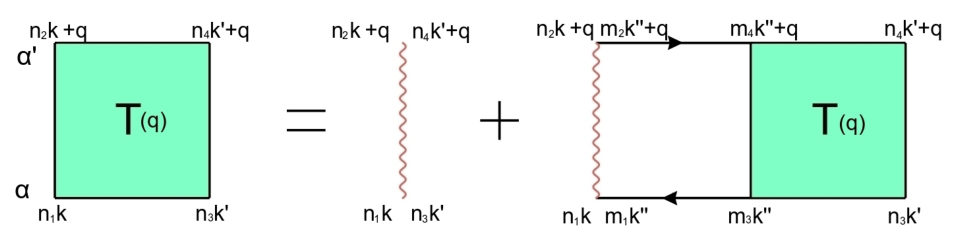 
FIG. 1: Diagrammatic representation124 of the transverse particle-hole T matrix Bethe-Salpeter equation in the Bloch space.

📷 Fig 2

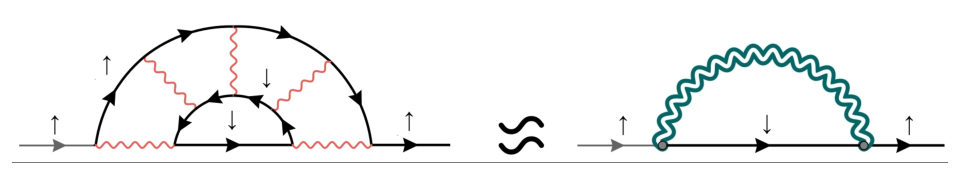 
FIG. 2: Pictorial representation124 of the GT self-energy approximation as an emergent boson in proximity to a pole. Here, the wiggly red line represents the time-local screened interaction W, the black arrow represents the dressed electronic propagator, the grey arrow represents the bare electronic propagator and the wiggly double green line represents the magnon.

📷 Fig 3

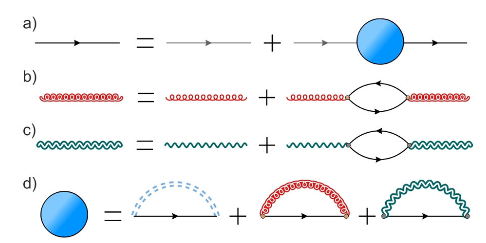 
FIG. 3: Diagrammatic representation124 of the electron (a), phonon (b) and magnon (c) Dyson equation. Panel (d): electron self-energy. The black arrow represents the dressed electron propagator, the grey arrow represents the bare electron propagator, the single wiggly red line represents the bare phonon propagator, the double wiggly red line represents the dressed phonon propagator, the orange vertex represents the screened electron-phonon coupling, the single wiggly green line represents the bare magnon propagator, the double wiggly green line represents the dressed magnon propagator, the grey vertex represents the electron-magnon interaction, the double light-blue dashed line represents...

📷 Fig 4

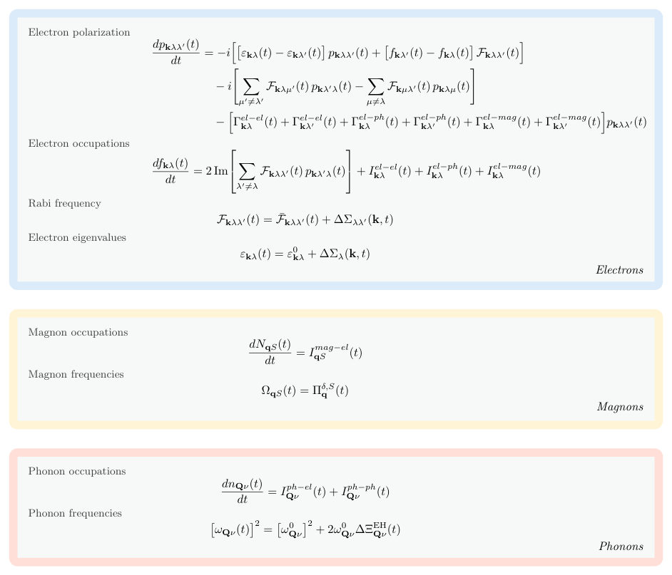 
FIG. 4: Equations of motion for coupled electrons (light-blue rectangle), magnons (yellow rectangle) and phonons (red rectangle).

**Summary.** This work introduces an advanced theoretical framework using Kadanoff-Baym equations to model how magnetization changes ultrafast in itinerant ferromagnets. By treating electrons, phonons, and magnons simultaneously, it provides a first-principles method to understand demagnetization. This is crucial for developing predictive theories of femtomagnetism.

**Why it may be interesting.** The treatment of coupled, non-equilibrium dynamics involving multiple bosonic and fermionic excitations (magnons, phonons) within a Green's function framework is highly relevant to open quantum systems and non-equilibrium statistical mechanics.

Detailed structure

**Main problem.** The paper aims to develop a first-principles theoretical framework to study ultrafast magnetization dynamics in itinerant ferromagnetic systems.

**Main result.** It derives a tractable set of coupled equations for electron, phonon, and magnon dynamics, allowing for a unified description of coherent and incoherent magnetic dynamics.

**Method.** It employs the Kadanoff-Baym equations in spinor space, utilizing many-body perturbation theory and the Markov approximation.

**Model / system.** The system is itinerant ferromagnets, modeled using an ab initio relativistic Hamiltonian that includes spin-orbit coupling (SOC). The dynamics are treated via spinor Green's functions.

**Key observables.** Ultrafast magnetization dynamics, demagnetization, electron density matrix, and phonon density matrix.

**Important parameters / regimes.** Spin-orbit coupling strength, time scales (ultrafast/femtosecond), and coupling strengths between electron, phonon, and magnon sectors.

**Assumptions / limitations.** The use of the Markov approximation and various approximations (like time-locality for the screened interaction W) are necessary to close the coupled equations of motion.

**Figures summary.** Not specified in the notes, but the text references diagrammatic representations of the transverse particle-hole T matrix and the resulting effective electron-boson coupling.

**Paper structure.** The paper builds from the general Kadanoff-Baym formalism in spinor space, incorporates SOC effects, derives equations for electron and phonon dynamics, and finally formulates the coupled equations including electron-magnon interactions via the transverse T matrix.

Abstract

This work introduces a theoretical framework based on the Kadanoff-Baym equations in spinor space to study ultrafast magnetization dynamics in itinerant ferromagnetic systems from first principles. By incorporating spin-orbit coupling into the ab initio Hamiltonian and generalizing the self-energies to include terms beyond the charge sector, I derive scattering integrals within the Markov approximation and quasiparticle renormalizations for electrons and phonons in the presence of spin-dependent effective interactions within a many-body perturbation theory approach. I explicitly discuss how magnons emerge in this framework, and derive, through suitable approximations, a close and tractable set of equations for coupled electron,phonon and magnon dynamics that can be solved from first principles. This approach allows to treat coherent and incoherent magnetic dynamics on an equal footing, paving the way for a first principles understanding of ultrafast magnetic dynamics and demagnetization, and opening to a truly predictive theory of femtomagnetism in periodic systems.

[↑ back to top](#top)

### [Pure Spin Photocurrent in Altermagnetic Photovoltaic Battery](http://arxiv.org/abs/2605.30909v1)

**Authors:** Qiang Li, Shibo Fang, Zongmeng Yang, Xingyue Yang, Jianhua Wang, Rui Peng, Lin Zhu, Shuhua Wang, Dexing Liu, Min Zhang, Dahua Ren, Mai Zhang, Han Zhang, Yee Sin Ang  
**Type:** theory · **Category:** other · **PDF:** <https://arxiv.org/pdf/2605.30909v1>  
**Analysis basis:** full PDF text, analyzed in chunks
**Topic relevance:** `spintronics-quantum-optics interface` **3/5** · `Keldysh / 2PI / non-Gaussian methods` **2/5** · `exotic spin models in light-matter` **2/5** · `methods for driven-dissipative` **2/5** · `non-equilibrium dynamics` **2/5** · `driven-dissipative phase transition` **1/5** · `non-equilibrium universality` **1/5**

📷 Fig 1

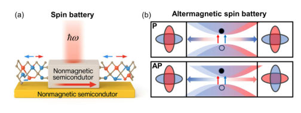 
FIG. 1. Schematic illustration of the altermagnetic spin pho- tovoltaic battery. (a) Device configuration, consisting of a nonmagnetic semiconducting layer sandwiched between two altermagnetic electrodes under illumination. (b) Operating mechanism for parallel (P) and antiparallel (AP) N´eel con- figurations of the electrodes. Red and blue arrows denote spin-up- and spin-down-polarized currents, respectively.

📷 Fig 2

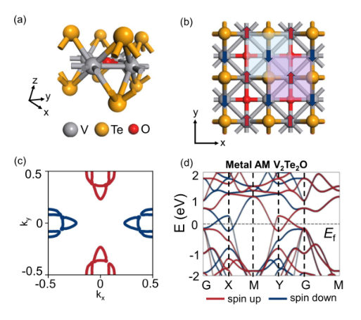 
FIG. 2. Structural and electronic properties of monolayer V2Te2O. (a) Crystal structure of V2Te2O, with V, Te, and O atoms shown in gray, yellow, and red, respectively. (b) Real-space magnetic configuration of the altermagnetic state. (c) Fermi surface in the kx–ky plane, showing anisotropic spin splitting between spin-up (red) and spin-down (blue) channels. (d) Electronic band structure along high-symmetry paths, exhibiting momentum-dependent spin splitting char- acteristic of altermagnetism. The dashed line indicates the Fermi level.

📷 Fig 3

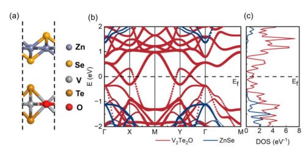 
FIG. 3. Electronic structure of the V2Te2O/ZnSe heterostruc- ture. (a) Atomic structure of the interface, with Zn, Se, V, Te, and O atoms shown in blue, yellow, gray, orange, and red, re- spectively. (b) Projected band structure, where red and blue denote contributions from V2Te2O and ZnSe, respectively. (c) Corresponding projected density of states (DOS). The dashed line indicates the Fermi level.

📷 Fig 4

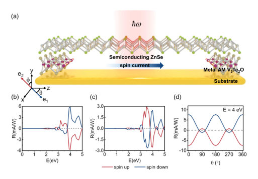 
FIG. 4. Photoresponse of the altermagnetic spin photovoltaic device. (a) Schematic illustration of the device under illumi- nation, with a ZnSe semiconducting layer sandwiched between altermagnetic electrodes. (b,c) Spin-resolved photocurrent as a function of photon energy for parallel (P) and antiparallel (AP) N´eel configurations. (d) Polarization angular depen- dence of the photocurrent at E = 4 eV. Red and blue curves denote spin-up and spin-down photocurrents, respectively. θ represents the angle between the polarization direction and the vector e1.

**Summary.** This theoretical study proposes an altermagnetic photovoltaic battery to generate a pure spin photocurrent using light. By simulating a $	ext{V}_2	ext{Te}_2	ext{O}/	ext{ZnSe}/	ext{V}_2	ext{Te}_2	ext{O}$ junction, the authors show that an antiparallel alignment of the altermagnetic electrodes breaks inversion symmetry, enabling a pure spin current without a net charge current. This establishes a promising, light-driven route for pure spin-current generation in spintronic devices.

**Why it may be interesting.** While the primary focus is condensed matter spintronics, the use of quantum transport simulations (DFT+NEGF) to model light-matter interaction and spin currents is relevant to open quantum systems and quantum optics.

Detailed structure

**Main problem.** The paper addresses the generation of a pure spin photocurrent using light in an altermagnetic photovoltaic battery, aiming for a light-driven pure spin-current generation mechanism.

**Main result.** The device successfully generates a pure spin photocurrent when the two altermagnetic electrodes are in an antiparallel (AP) Néel configuration, characterized by spin-up and spin-down photocurrents of equal magnitude but opposite sign.

**Method.** The study employs first-principles quantum-transport simulations, combining Density-Functional Theory (DFT) with the Nonequilibrium Green's Function (DFT+NEGF) method.

**Model / system.** The physical system is an altermagnetic spin photovoltaic battery structured as $	ext{V}_2	ext{Te}_2	ext{O}/	ext{ZnSe}/	ext{V}_2	ext{Te}_2	ext{O}$. Altermagnets are used as electrodes because they exhibit momentum-dependent spin splitting without net magnetization.

**Key observables.** Pure spin photocurrent ($	ext{I}_{\uparrow} = -	ext{I}_{\downarrow}$), photoresponse ($R$), and the dependence of the photocurrent on light polarization (linear vs. circular) and photon energy.

**Important parameters / regimes.** The effect is maximized in the AP state and is tunable by photon energy and polarization angle. The simulation uses a $	ext{V}_2	ext{Te}_2	ext{O}$ platform.

**Assumptions / limitations.** The mechanism relies on the spin-selective photocurrent extraction imposed by the altermagnetic electrodes, and the central $	ext{ZnSe}$ region is assumed to be photoactive.

**Figures summary.** Figures illustrate the device schematic, the operating mechanism for parallel (P) and antiparallel (AP) Néel vectors, and show the spin-resolved photocurrent response as a function of photon energy and light polarization.

**Paper structure.** The paper establishes the theoretical framework by detailing the physical system and the simulation methods (DFT+NEGF). It then presents the core results, contrasting the zero photocurrent in the P state with the finite pure spin photocurrent in the AP state, demonstrating tunability with light polarization.

Abstract

Altermagnets, featuring momentum-dependent spin splitting without net magnetization, provide a promising platform for spintronic functionalities beyond conventional ferromagnets and antiferromagnets. Here, we propose an altermagnetic spin photovoltaic battery consisting of a nonmagnetic semiconducting layer sandwiched between two altermagnetic electrodes. Using first-principles quantum-transport simulations, we show that a V2Te2O/ZnSe/V2Te2O junction supports a pure spin photocurrent for opposite Néel vectors in the two altermagnetic electrodes, with spin-up and spin-down photocurrents equal in magnitude and opposite in sign. The effect persists under both linearly and circularly polarized light and remains tunable with photon energy and polarization angle. Our results establish a realistic route toward light-driven pure spin-current generation in altermagnetic junctions.

[↑ back to top](#top)

### [Valley-polarized Orbital and Spin Magnetism Induced by Femtosecond Optical Pulses in Two-Dimensional Semiconductors](http://arxiv.org/abs/2605.31263v1)

**Authors:** M. S. Mrudul, Peter M. Oppeneer  
**Type:** theory · **Category:** other · **PDF:** <https://arxiv.org/pdf/2605.31263v1>  
**Analysis basis:** full PDF text, analyzed in chunks
**Topic relevance:** `exotic spin models in light-matter` **3/5** · `spintronics-quantum-optics interface` **3/5** · `Keldysh / 2PI / non-Gaussian methods` **2/5** · `methods for driven-dissipative` **2/5** · `non-equilibrium dynamics` **2/5** · `driven-dissipative phase transition` **1/5**

📷 Fig 1

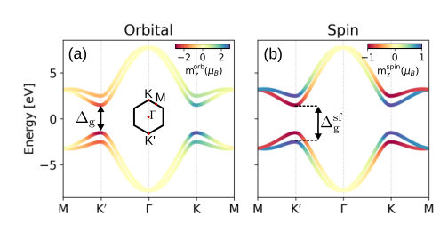 
FIG. 1. Electronic band structure of an archetypal 2D semi- conductor. (a) Orbital and (b) spin components of magnetic moments (mnk,z) projected onto the band structure along the high-symmetry directions. The inset in (a) shows the high- symmetry points in the first Brillouin zone.

📷 Fig 2

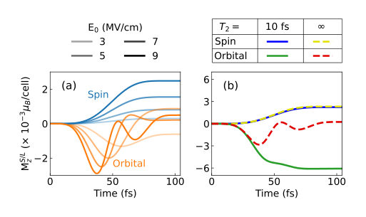 
FIG. 3. (a) Laser-driven femtosecond dynamics of orbital (orange) and spin (blue) magnetization under laser pulses with ¯hω ≈∆sf g and different electric field strengths, indi- cated by the transparency of the line plots. (b) Laser-driven dynamics of magnetization with an electron-hole dephasing time T2 of 10 fs (blue for spin and green for orbital contri- butions) and in the absence of dephasing (∞; yellow dashed for spin and red dashed for orbital). The peak laser intensity is I0 = 1011 W/cm2, corresponding to the field amplitude E0 = 8.7 MV/cm.

📷 Fig 3

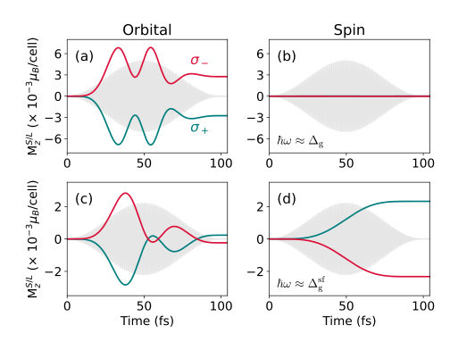 
FIG. 2. Laser-driven dynamics of the orbital (left panels) and spin (right panels) magnetization. Red and blue curves correspond to magnetization induced by left (σ−) and right (σ+) circularly polarized laser pulses, respectively. The top panels show the response to a laser pulse with photon energy 3.1 eV (¯hω ≈∆g), while the bottom panels correspond to excitation at 4.1 eV (¯hω ≈∆sf g ). The grey shaded regions indicate the temporal profile of the 100 fs long laser pulse with a peak intensity of 1011 W/cm2.

📷 Fig 4

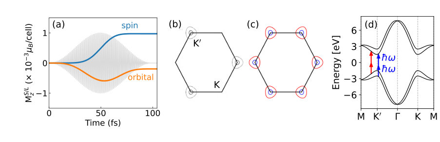 
FIG. 4. (a) Laser-driven dynamics of the orbital (orange) and spin (light blue) magnetization for a laser pulse with photon energy ¯hω = 2.1 eV. (b) Electron population in the first conduction band (CB1) in reciprocal space at the end of the laser pulse. (c) Contours in the first Brillouin zone satisfying ECB1,k −EVB1,k = 2¯hω (red) and ECB1,k −EVB2,k = 2¯hω (blue). (d) Schematic illustration of two-photon excitation induced by a right-circularly polarized laser field. The population generated in the first conduction band arises from transitions from the first valence band (VB1 →CB1, blue arrows) and the second valence band (VB2 →CB1, red arrows).

📷 Fig 5

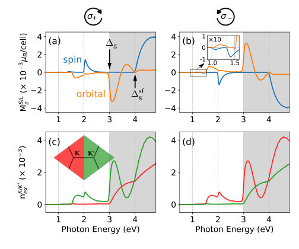 
FIG. 5. Laser-induced spin (blue) and orbital (orange) rem- nant magnetization (calculated at the end of the laser pulse) as a function of the driving photon energy for (a) left- and (b) right-circularly polarized laser pulses. Panels (c) and (d) show the laser-excited electron population in the conduction bands at the end of the laser pulse, integrated around the K (red) and K′ (green) valleys, for (c) left- and (d) right-circularly polarized laser pulses. The separation of the reciprocal space unit-cell around the K and K′ valleys is illustrated in the inset of panel (c). The gray-shaded region indicates photon ener- gies above the band gap, ∆g.

**Summary.** This theoretical work models how femtosecond laser pulses generate non-equilibrium spin and orbital magnetism in 2D semiconductors like TMDs. It shows that orbital and spin responses are governed by distinct physical mechanisms, leading to different temporal behaviors. The findings highlight the crucial role of orbital contributions in future ultrafast spintronic and magnetoelectronic devices.

**Why it may be interesting.** The explicit separation and comparison of orbital and spin dynamics, particularly the role of direct electric field coupling versus SOC mediation, provides a rich platform for understanding ultrafast quantum control in condensed matter systems.

Detailed structure

**Main problem.** The study investigates the ultrafast generation and distinct dynamics of spin and orbital magnetism in two-dimensional (2D) semiconductors using femtosecond optical pulses.

**Main result.** The paper demonstrates that orbital and spin magnetic moments evolve via fundamentally different light-matter coupling mechanisms, allowing for selective control and distinct temporal dynamics.

**Method.** The dynamics are modeled using a time-dependent density-matrix formalism solved numerically, incorporating electron-hole dephasing effects.

**Model / system.** The system is a 2D gapped Dirac semiconductor, representative of TMDs, modeled by a tight-binding Hamiltonian incorporating spin-orbit coupling. The interaction is driven by circularly polarized femtosecond laser pulses.

**Key observables.** Time evolution of spin ($\mathbf{m}_{	ext{spin}}$) and orbital ($\mathbf{m}_{	ext{orb}}$) magnetization, and the dependence of remnant magnetization on photon energy.

**Important parameters / regimes.** Laser pulse duration (100 fs), peak intensity ($10^{11} 	ext{ W/cm}^2$), and specific photon energies relative to the band gap ($\Delta_g$) and spin-flip gap ($\Delta_{sf}g$).

**Assumptions / limitations.** The analysis relies on the minimal coupling in the dipole approximation and includes decoherence effects ($T_2$).

**Figures summary.** Figures illustrate the projected components of orbital and spin magnetic moments, the time evolution of magnetization under different excitation conditions, and the connection between remnant magnetism and valley-polarized conduction band populations.

**Paper structure.** The paper systematically analyzes the generation of magnetization using time-dependent density matrix equations, comparing resonant vs. multiphoton excitation regimes, and contrasting the distinct dynamics of orbital (Rabi-like, fast) versus spin (gradual, SOC-mediated) responses.

Abstract

We theoretically investigate the ultrafast generation of spin and orbital magnetism in a two-dimensional gapped Dirac system with spin-orbit coupling. This system is representative of two-dimensional hexagonal semiconductors, such as transition-metal dichalcogenides that exhibit valley-selective optical selection rules arising from the valley-contrasting magnetic texture of their band structure. Using a time-dependent density-matrix formalism, we demonstrate that circularly polarized laser pulses generate nonequilibrium magnetization under both resonant and multiphoton resonant conditions. We show that the induced spin and orbital magnetic moments can be distinctly controlled via the photon energy and polarization of the driving field. Furthermore, spin and orbital dynamics originate from fundamentally different light-matter coupling mechanisms, leading to qualitatively dissimilar temporal behaviors. The orbital magnetic moment couples directly to the external electric field, resulting in faster dynamics and pronounced Rabi-like oscillations, whereas the spin response develops gradually through spin-orbit coupling. Consequently, orbital dynamics is significantly more sensitive to electron-hole dephasing than the spin response. Our results highlight the importance of properly accounting for orbital contributions in future technologies that utilize femtosecond control of magnetism.

[↑ back to top](#top)

### [Observation and Control of the Magnetic Photogalvanic Effect from Strongly Bound Excitons](http://arxiv.org/abs/2605.30575v1)

**Authors:** Xianfan Nie, Tarun Patel, Hyunggeun Lee, Chuangtang Wang, Meixin Cheng, Mingrui Lai, Bowen Yang, Matteo Pennacchietti, Shiyu Liu, Hechang Lei, Liuyan Zhao, Michael E. Reimer, Su Ying Quek, Adam W. Tsen  
**Type:** experiment · **Category:** other · **PDF:** <https://arxiv.org/pdf/2605.30575v1>  
**Analysis basis:** full PDF text, analyzed in chunks
**Topic relevance:** `exotic spin models in light-matter` **3/5** · `spintronics-quantum-optics interface` **3/5** · `analog quantum simulation` **1/5** · `interference shaping light` **1/5** · `quantum optics experiment` **1/5**

📷 Fig 1

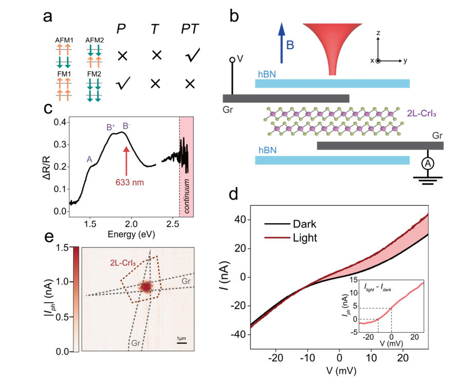 
Figure 1 | Device geometry of bilayer CrI3 tunnel junctions and photocurrent measurement scheme.

📷 Fig 2

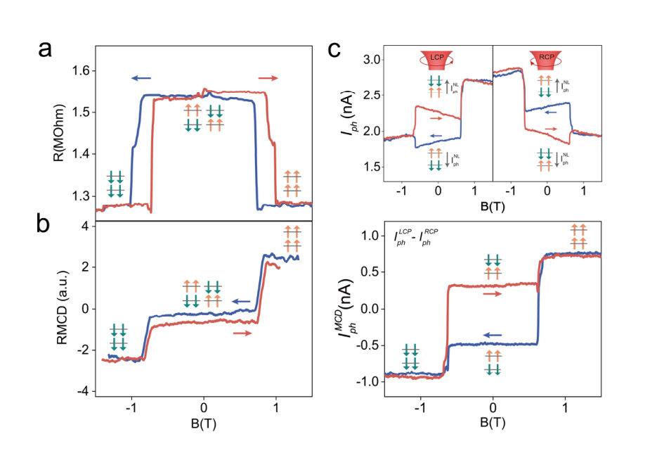 
Figure 2 | Magnetic-field-switching of spin states and circular magnetic photogalvanic eƯect in bilayer CrI3.

📷 Fig 3

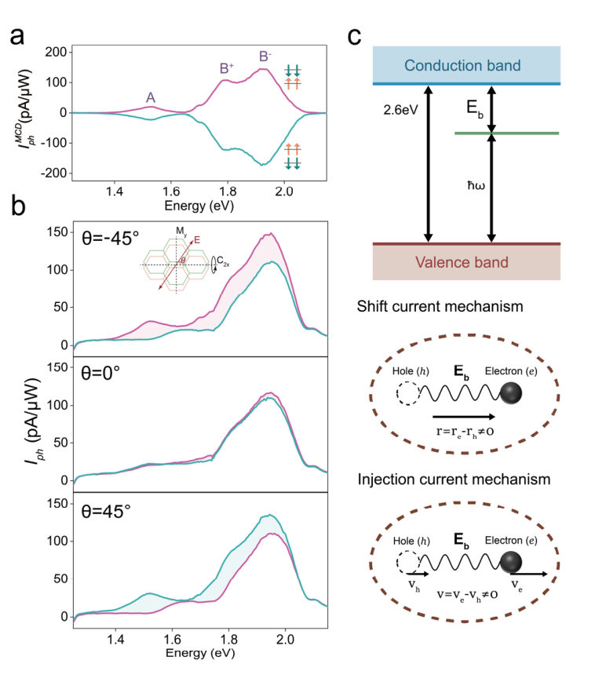 
Figure 4 | Spectral dependence of circular and linear magnetic photogalvanic responses and schematic illustrations of the shift and injection current mechanisms for bound excitons.

**Summary.** This paper reports the observation and control of the magnetic photogalvanic effect in bilayer CrI3, a 2D magnetic material. The researchers demonstrated that this nonlinear photocurrent is strongly enhanced and controlled by the resonant excitation of strongly bound excitons. The findings highlight the potential of these 2D magnets for next-generation, tunable optoelectronic detectors.

**Why it may be interesting.** The work provides experimental evidence of a nonlinear optical effect (photogalvanic) whose mechanism is tied to many-body excitonic physics and magnetic symmetry breaking, which is highly relevant for understanding light-matter interaction in quantum materials.

Detailed structure

**Main problem.** The study aims to observe and control the magnetic photogalvanic effect, particularly demonstrating its origin from strongly bound excitons in magnetic materials.

**Main result.** A sizable magnetic photogalvanic effect was demonstrated in bilayer CrI3, showing a clear signature dependent on light handedness and the magnetic state, which is unique to the bilayer structure.

**Method.** The research employed photocurrent measurements, varying bias, and using circularly/linearly polarized light, alongside TMR and RMCD measurements.

**Model / system.** The physical platform is a bilayer CrI3 tunnel junction, which acts as a magnetic tunnel barrier. The effect is analyzed within a many-body framework considering strongly bound Wannier-type excitons.

**Key observables.** Photocurrent ($	ext{I}_{	ext{ph}}$), photocurrent MCD ($\Delta 	ext{I}_{	ext{ph}}$), and the dependence of these signals on light polarization angle ($	heta$) and magnetic field ($B$).

**Important parameters / regimes.** Exciton binding energies (e.g., 1.1 eV, 0.8 eV), magnetic field switching, and electric field tuning of interlayer symmetry.

**Assumptions / limitations.** The analysis assumes that the photogalvanic response is strongly linked to the excitonic resonances and that the effect is suppressed when inversion symmetry is restored (e.g., in trilayer CrI3).

**Figures summary.** Figures illustrate the symmetry properties of the magnetic states, the device geometry, exciton peaks via reflectance, and the dependence of photocurrent on bias and polarization angle.

**Paper structure.** The paper systematically investigates the magnetic photogalvanic effect by first establishing the theoretical basis, then demonstrating the effect in bilayer CrI3 using polarization and field control, and finally confirming the exciton origin and layer dependence.

Abstract

Photogalvanic effects arising from the quantum geometry of noncentrosymmetric materials are promising for next-generation light-harvesting devices that do not require a built-in electric field. Recent theories predict photogalvanic currents generated in magnetic systems with spin-dependent symmetry breaking as well as by bound exciton states, allowing for potential magnetic field control of the photoresponse and enhanced detection of deep sub-gap signals, respectively. We demonstrate the magnetic photogalvanic effect in a bilayer CrI3 tunnel junction with both magnetic field switching and electric field tuning of interlayer symmetry. By controlling for the polarization and energy of light illumination, we disentangle the shift and injection current contributions and find that the peak response occurs under resonant excitation of strongly bound excitons in CrI3. Our results can be captured within a many-body framework of the photogalvanic effect, while our devices function as tunable, multispectral helicity- and polarization-sensitive detectors that highlight the potential of 2D magnets for future optoelectronic applications.

[↑ back to top](#top)

### [Crystal Dislocations as Atomic Scale Ratchets](http://arxiv.org/abs/2605.30764v1)

**Authors:** Wu-Rong Jian, Yifan Wang, Wei Cai  
**Type:** theory · **Category:** statistical mechanics · **PDF:** <https://arxiv.org/pdf/2605.30764v1>  
**Analysis basis:** full PDF text, analyzed in chunks
**Topic relevance:** `analog quantum simulation` **2/5** · `driven-dissipative phase transition` **2/5** · `non-equilibrium dynamics` **2/5** · `non-equilibrium universality` **2/5** · `Frenkel-Kontorova` **1/5** · `methods for driven-dissipative` **1/5**

📷 Fig 1

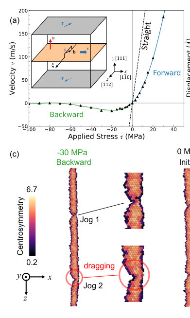 
Figure 1: (a) Velocity of jogged (solid line) and straight (dashed line) dislocation with character angle θ = 30◦as a function of applied stress τ. The inset shows a schematics of the simulation cell containing a jogged dislocation with Burgers vector b and line direction ξ. The dislocation moves on its glide plane with normal vector n. The arrows on the top and bottom surfaces indicate the direction of applied stress τ when it is positive, which causes the dislocation to move in the positive x-direction (forward). (b) Displacement- time curve of the dislocation motion under sinusoidal cyclic loading at a stress amplitude of 30 MPa. (c) Atomic structure of the jogged dislocation under...

📷 Fig 2

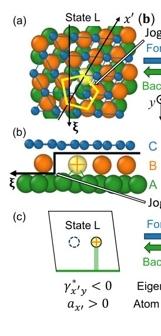 
Figure 2: (a) Energy minimized atomic structures near Jog 2 of the two states (L and R) before and after jog motion, viewing from the top of the slip plane x-z. ±x′ is the jog motion direction, aligned with the Burgers vector b direction. The jog core is marked as a yellow petagon and the highlighted atom with the cross mark is the core atom that moves in the opposite direction of the jog motion. (b) Side view (x′-y plane) of the atomic structure of Jog 2. The dislocation line is illustrated as a black arrowed line. The coupling between the core atom and the neighboring layers are represented as three colored struts. (c) Simplified schematic of the two states, where State L corresponds to...

📷 Fig 3

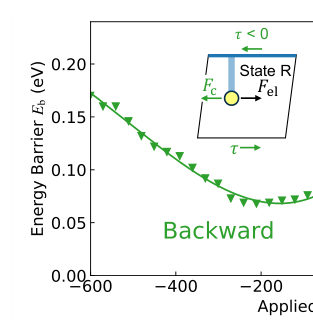 
Figure 3: Energy barriers of forward and backward mechanisms at different applied stresses. The corresponding inset schematics demonstrate the force analysis of the for- ward and backward mechanisms.

**Summary.** This work demonstrates that jogged dislocations in FCC crystals act as atomic-scale ratchets, exhibiting asymmetric mobility when subjected to cyclic stress. Using MD simulations, the authors pinpoint the physical origin of this asymmetry to a unique coupling between atomic displacement and the jog's strain field. This finding has major implications for understanding fatigue and plastic deformation mechanisms.

**Why it may be interesting.** While focused on solid-state mechanics, the concept of an intrinsic, geometry-rooted ratchet mechanism driven by non-linear coupling ($\mathbf{a}$ and $\gamma^*$) provides an analogy for engineered quantum ratchets or directed transport in mesoscopic quantum systems.

Detailed structure

**Main problem.** The primary goal is to identify and characterize intrinsic, atomic-scale mechanisms that break symmetry to produce a rectified (asymmetric) response to external cyclic stimuli.

**Main result.** Jogged dislocations in FCC crystals exhibit significant mobility asymmetry under opposite applied stresses, which is attributed to an unconventional coupling between atomic displacement and the jog's eigenstrain.

**Method.** The study employs Molecular Dynamics (MD) simulations and Nudged Elastic Band (NEB) calculations to model dislocation motion and calculate energy barriers.

**Model / system.** The system modeled is the jogged edge dislocation within face-centered cubic (FCC) nickel. The analysis focuses on the local atomic structure at the jog, which acts as an intrinsic 'lattice ratchet.'

**Key observables.** Dislocation velocity ($v$) vs. applied stress ($	au$), net directional drift under cyclic loading, and the coupling between the atomic displacement vector ($\mathbf{a}$) and the eigenstrain ($\gamma^*$).

**Important parameters / regimes.** Applied shear stress ($	au$), crystal structure (FCC), and the specific geometry of the jog.

**Assumptions / limitations.** Conventional micromechanics models assume a symmetric response to stress, which the work challenges. The asymmetry is found to be general for jogged dislocations in FCC crystals.

**Figures summary.** Figures illustrate the asymmetry in velocity vs. stress curves (Fig. 1a, S4-S6), net directional drift under cyclic loading (Fig. 1b, S8), and the atomic configurations detailing the force balance during forward versus backward jog movement (Fig. 2, 3).

**Paper structure.** The paper progresses from establishing the general problem of symmetry breaking in materials, to simulating the asymmetric mobility using MD, and finally deriving the microscopic physical origin of this asymmetry through force analysis (NEB calculations).

Abstract

The symmetry of a system's response to external stimuli is a fundamental concept in physics and materials science. At the microscopic scale, breaking this symmetry to achieve a rectified response is exceptionally difficult to engineer and remains rare in nature. Conventional micromechanics models of crystalline solids assume a symmetric response to applied stress, where reversing the load simply inverts the direction of defect velocity without altering its magnitude. In this work, we report an atomic-scale, geometry-rooted mechanism that breaks this symmetry. Molecular dynamics simulations of face-centered cubic nickel reveal that dislocations containing atomic-scale jogs exhibit asymmetric mobility under opposite applied stresses, reversing the loading direction triggers significantly higher drag. This asymmetry arises from an unconventional coupling between an atomic displacement vector and the second-order tensorial eigenstrain of the jog motion mechanism. Because jogs are ubiquitous structures in plastic deformation, this discovery challenges classical descriptions of plastic deformation mechanisms, with direct implications to cyclic creep, and opens new pathways for defect engineering to enhance fatigue resistance.

[↑ back to top](#top)

### [Surface lone-pair polarization probed by quantum-geometric transport in tellurium](http://arxiv.org/abs/2605.31197v1)

**Authors:** Nathanael N. Batista, Wendel S. Paz, Manuel Suárez-Rodríguez, Pierpaolo Fontana, Victor Velasco, Marcus V. O. Moutinho, Chang Niu, Peide D. Ye, Marco Gobbi, Fèlix Casanova, Luis E. Hueso, Caio Lewenkopf, Marcello B. Silva Neto  
**Type:** both · **Category:** other · **PDF:** <https://arxiv.org/pdf/2605.31197v1>  
**Analysis basis:** full PDF text, analyzed in chunks
**Topic relevance:** `Keldysh / 2PI / non-Gaussian methods` **2/5** · `methods for driven-dissipative` **2/5** · `non-equilibrium dynamics` **2/5**

📷 Fig 1

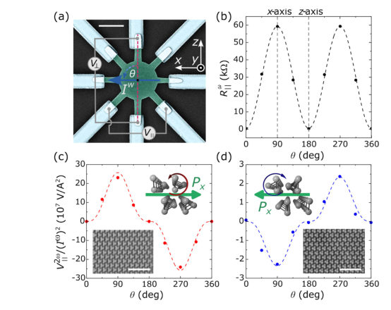 
Figure 1. Quantum-geometric transport. Experimental data from Ref. [15]. (a) An AC current Iω is injected while the sample is rotated in the xz plane by an angle θ with respect to the crystallographic axes. (b) First-harmonic longitudi- nal resistance V ω ∥/Iω = Rω ∥measured as a function of θ. The linear response is proportional to −δσgeo xx (E2 0) sin2 θ, with δσgeo xx &lt; 0 for any E0. (c) and (d) Second-harmonic V 2ω ∥ /(Iω)2

📷 Fig 2

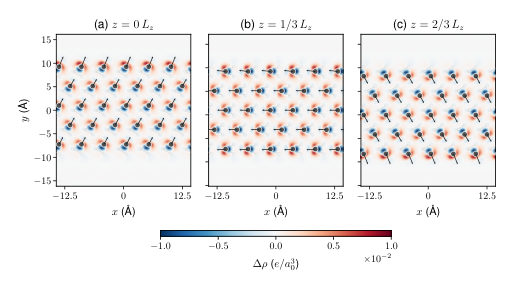 
Figure 3. Excess electronic density (red) and charge de- pletion (blue) relative to the atomic densities of constituent atoms. The three panels correspond to slices at (a) z = 0, (b) z = Lz/3, and (c) z = 2Lz/3, for the three non-equivalent atoms in the unit cell. The black arrows indicate the local inversion-odd dipolar slopes computed from the gradient of the Hartree potential, providing the directions of the local lone-pair dipoles.

📷 Fig 3

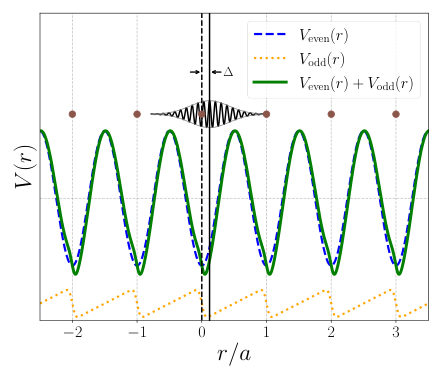 
Figure 2. Inversion-odd wavepacket shift. Schematic il- lustration of the one-dimensional crystal potential, V (r) = Veven(r)+Vodd(r). The inversion-even component Veven(r) de- fines symmetric wells centered at the ionic positions r0 (brown circles). The inversion-odd component Vodd(r) introduces an asymmetric local slope −eE0 ≡∇Vodd|rc≃r0, which shifts the total potential minimum away from the centrosymmetric ref- erence (dashed line) by an offset ∆(solid line). This inversion- breaking crystal field causes a positional shift in the center of mass of the localized Bloch wavepacket.

📷 Fig 4

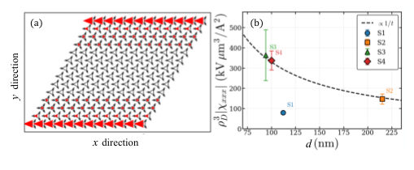 
Figure 5. Lone-pair polarization. (a) Schematic showing how the loss of coordination at the boundaries breaks the bulk C3 symmetry, generating a finite polarization near the surfaces. Here, E0 &lt; 0 (and thus χxxx(E0) &gt; 0) produce the angular dependence shown in Fig. 1(d). (b) Measured ρ3 D|χxxx(d)| as a function of flake thickness d for samples S1, S2, S3, and S4 [40], demonstrating a clear 1/d dependence. The deviation of S1 from this scaling is discussed in the main text.

📷 Fig 5

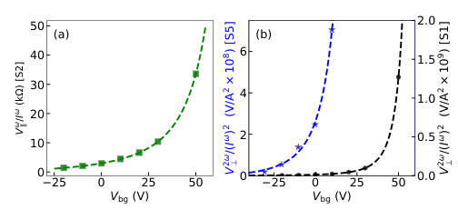 
Figure 4. Gate-voltage dependence. Experimental data from Ref. [40] showing scaling behavior of the harmonic re- sponses as a function of the applied back-gate voltage Vbg for selected samples (labeled on the y-axis). (a) First-harmonic response, V ω ∥/Iω ∼µ−5/2, and (b) second-harmonic response, V 2ω ⊥/(Iω)2 ∼µ−7/2, displaying the scaling laws predicted from the QG correction to δσgeo xx and χxxx, respectively.

**Summary.** This work establishes that surface lone-pair polarization in materials like tellurium can be probed using quantum-geometric transport measurements. By analyzing nonlinear electrical responses, the authors successfully map measurable quantities to the first and second moments of the surface polarization field. This provides a powerful, microscopic route for engineering polarization-driven electronic devices.

**Why it may be interesting.** The methodology provides a concrete, measurable link between a subtle, symmetry-breaking microscopic property (lone-pair polarization) and macroscopic, nonlinear electronic transport phenomena, which is valuable for designing quantum-geometric devices.

Detailed structure

**Main problem.** The paper aims to develop a microscopic understanding of how surface lone-pair polarization in crystals, like tellurium, influences electronic transport properties.

**Main result.** Quantum-geometric transport theory successfully links measurable nonlinear electrical responses (second and third harmonics) to the first and second moments of the surface polarization field.

**Method.** The authors combine first-principles calculations (DFT) with quantum-geometry transport theory, deriving effective Hamiltonians and analyzing nonlinear current expansions.

**Model / system.** The system is trigonal tellurium, where the surface lone-pair polarization is modeled as an inversion-odd dipolar component of the crystal potential, leading to quantum-geometric corrections to Bloch wavepacket dynamics.

**Key observables.** Linear and nonlinear transport coefficients ($\delta\sigma_{	ext{geo}}^{xx}, \chi_{xxx}$), DC rectification voltage ($V_{	ext{DC}}$), and temperature/thickness scaling of harmonic responses.

**Important parameters / regimes.** Surface lone-pair polarization field ($E_0$), temperature ($T$), flake thickness ($d$), and gate voltage ($\mu$).

**Assumptions / limitations.** The analysis relies on perturbative expansions in electric fields and current densities, and the use of a coarse-grained lattice model for polarization thermodynamics.

**Figures summary.** Figures show experimental data confirming angular dependencies ($\sin^2	heta, \sin^3	heta$) for harmonic responses, and theoretical plots mapping polarization moments ($\langle P_x 
angle_T, \langle P_x^2 
angle_T$) against temperature or thickness.

**Paper structure.** The paper progresses from establishing the physical origin of surface polarization, deriving the quantum-geometric transport formalism, linking transport coefficients to polarization moments, and finally demonstrating the predictive power of this framework using harmonic response measurements.

Abstract

Stereochemically active lone pairs are ubiquitous microscopic sources of polarity in molecules and solids, but their collective behavior in crystals is often hidden by symmetry or confined to surfaces. Here we show that quantum-geometry transport provides a sensitive probe of surface lone-pair polarization in trigonal tellurium. This surface polarization appears microscopically as an inversion-odd dipolar component of the crystal potential, which shifts the center of mass of Bloch wavepackets and produces quantum-geometric corrections to their velocity. We describe this lone-pair polar texture through a minimal three-component lattice model, and we show that the resulting linear and nonlinear transport coefficients probe, respectively, the second and first moments of the net polarization field. Because rectified voltages in tellurium flakes are directly proportional to the surface lone-pair polarization, our results provide a microscopic route to understanding and engineering polarization-driven, quantum-geometric electronic devices based on tellurium allotropes.

[↑ back to top](#top)

### [Nonlinear Schrodinger Equations for Dense Bose Fluid and He4 Film at Low Temperatures](http://arxiv.org/abs/2605.30704v1)

**Authors:** Vladimir I. Kruglov  
**Type:** theory · **Category:** quantum gases · **PDF:** <https://arxiv.org/pdf/2605.30704v1>  
**Analysis basis:** full PDF text, analyzed in chunks
**Topic relevance:** `Keldysh / 2PI / non-Gaussian methods` **2/5** · `analog quantum simulation` **1/5** · `non-equilibrium dynamics` **1/5**

📷 Fig 1

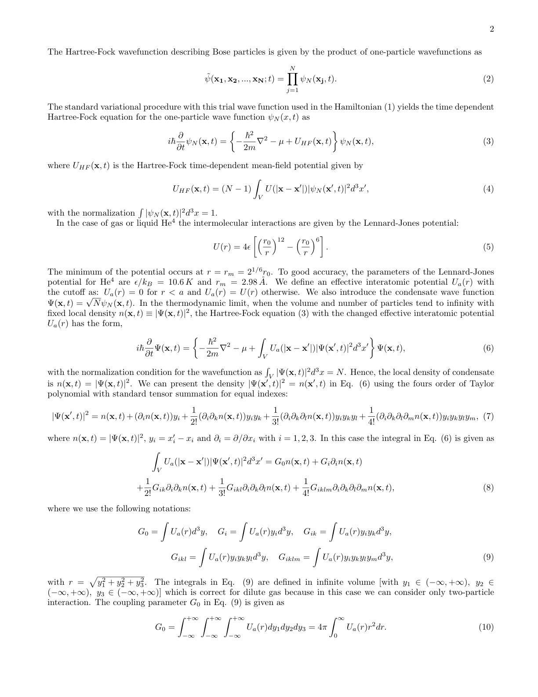 
Low-resolution page preview, page 2

📷 Fig 2

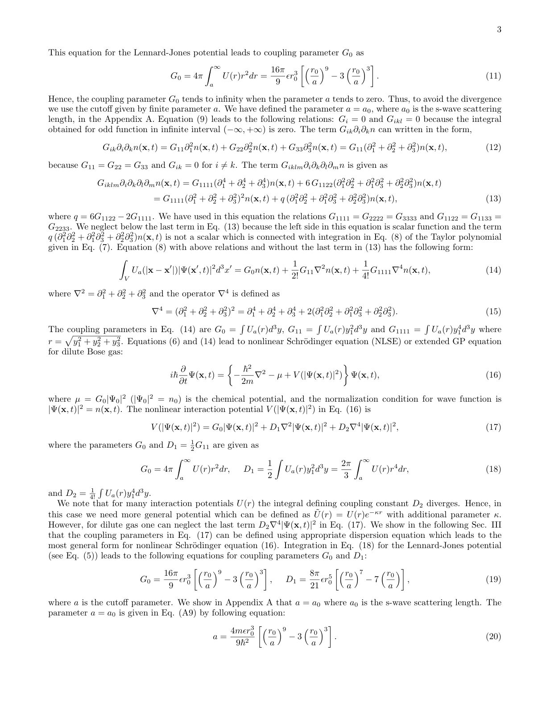 
Low-resolution page preview, page 3

📷 Fig 3

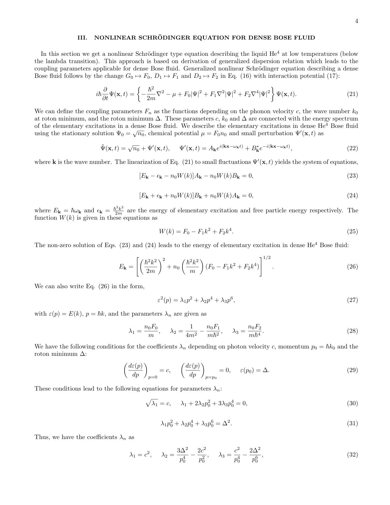 
Low-resolution page preview, page 4

📷 Fig 4

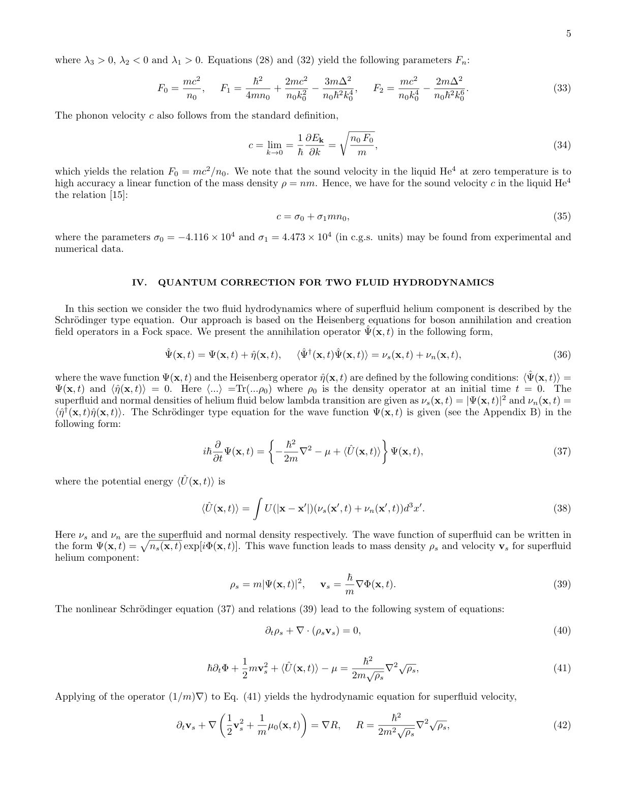 
Low-resolution page preview, page 5

📷 Fig 5

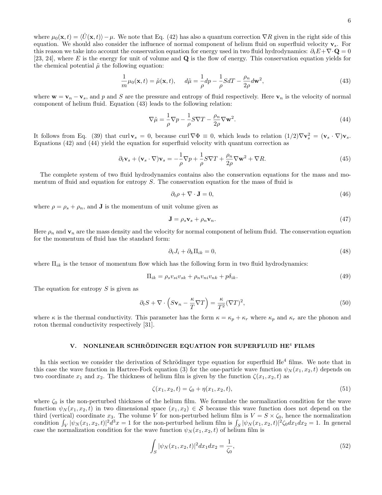 
Low-resolution page preview, page 6

**Summary.** This paper develops generalized nonlinear Schrödinger equations to describe the quantum dynamics of Bose fluids, including dense Bose gases and superfluid Helium-4. By linearizing these equations, the authors successfully derive the characteristic phonon-roton dispersion relation for superfluid films. The work provides a comprehensive theoretical framework connecting mean-field theory to observable excitation spectra in quantum fluids.

**Why it may be interesting.** This work is highly relevant as it applies advanced mean-field quantum field theory techniques (NLSE) to model superfluid dynamics, which is a cornerstone topic in AMO physics and quantum gases research.

Detailed structure

**Main problem.** The paper derives and applies generalized nonlinear Schrödinger equations (NLSE) to model the dynamics of Bose fluids, specifically dense Bose gas and superfluid Helium-4 films at low temperatures.

**Main result.** The analysis yields the phonon-roton dispersion relation for superfluid He4 films and provides generalized NLSE forms applicable to both dilute and dense Bose fluids.

**Method.** The methodology involves using the Hartree-Fock time-dependent mean-field theory, linearizing the resulting NLSE to study elementary excitations, and deriving coupled hydrodynamic equations for the two-fluid model.

**Model / system.** The system under study includes dilute Bose gases, dense Bose fluids (like liquid He4), and superfluid He4 films. The theoretical framework relies on deriving and analyzing nonlinear Schrödinger equations derived from many-body Hamiltonians.

**Key observables.** Phonon-roton dispersion relation, superfluid velocity corrections, and the energy spectrum of elementary excitations $\epsilon(p)$.

**Important parameters / regimes.** Phonon velocity ($c$), roton minimum energy ($\Delta$), and the coupling parameters ($F_n$ or $\lambda_n$) derived from these physical constants.

**Assumptions / limitations.** Approximations include neglecting higher-order gradient terms in the dilute gas limit and assuming the validity of the mean-field approximation for the Bose fluid.

**Figures summary.** The notes detail the derivation of dispersion relations $\epsilon(p)$ and the final form of the energy spectrum $E(k)$ as a polynomial in $k^2$, relating it to the coefficients $G, eta, \sigma$.

**Paper structure.** The paper progresses from deriving the generalized NLSE for dilute Bose gas, extending it to dense Bose fluids, then analyzing the two-fluid hydrodynamics for superfluid He4, and finally focusing on the specific NLSE and dispersion relation for superfluid He4 films.

Abstract

We have derived the nonlinear Schrodinger equation generalizing the Gross-Pitaevskii (GP) equa tion for dilute Bose gas. The derivation is based on the Hartree-Fock time-dependent mean-field theory with an arbitrary intermolecular interaction potential. It is shown that obtained nonlinear Schrodinger equation with appropriate redefinition of coefficients can be used for description of dense Bose fluid at low temperatures. We also present the Schrodinger type equation describing the superfluid component of helium in two fluid hydrodynamics. This approach leads to quantum correction for superfluid component of velocity in two fluid hydrodynamics. We also have derived the nonlinear Schrodinger equation for superfluid He4 film at low temperatures. It is shown that this Schrodinger type equation for superfluid He4 film leads to phonon-roton dispersion relation for elementary excitation at low temperatures.

[↑ back to top](#top)

### [Optimisation and Precision Tuning of Localised Surface Plasmon Resonance in AuFON Systems](http://arxiv.org/abs/2605.31350v1)

**Authors:** Luis Alfonso Guerra Hernández, Osmar Gil Salas, Jorge Enrique Rueda Parada, Alejandro Fainstein, Andrés Alejandro Reynoso  
**Type:** both · **Category:** other · **PDF:** <https://arxiv.org/pdf/2605.31350v1>  
**Analysis basis:** full PDF text, analyzed in chunks
**Topic relevance:** `analog quantum simulation` **1/5** · `interference shaping light` **1/5** · `quantum optics experiment` **1/5**

📷 Fig 1

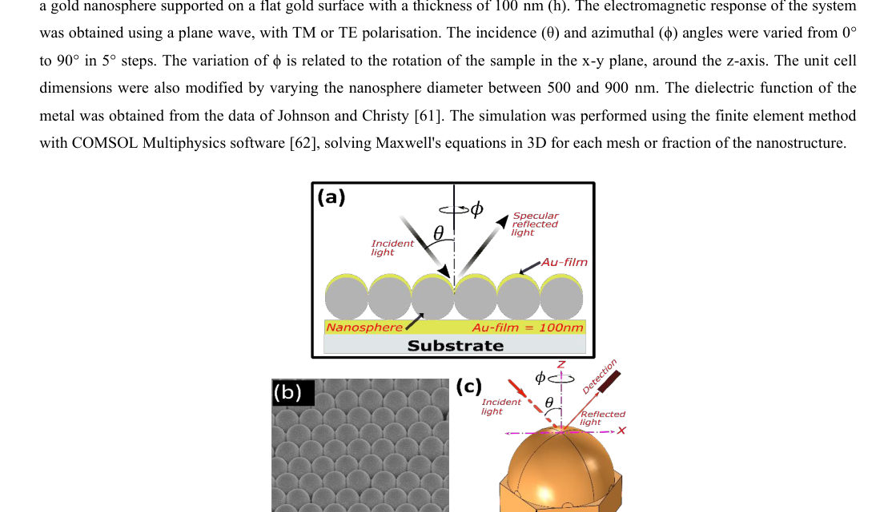 
Fig. 1. (a) Schematic of the optical reflectivity, where the incident light interacts with an AuFON nanostructured system. (b) High-resolution SEM image of a typical AuFON nanostructure with polystyrene nanospheres of 500 nm in diameter. (c) Unit cell of the simulated nanostructured system. The plane wave with TM or TE polarisation is incident on the metallic nanostructure. The incidence (θ) and azimuthal (ϕ) angles can be varied in the simulation, as well as the dimensions of the nanostructure.

📷 Fig 2

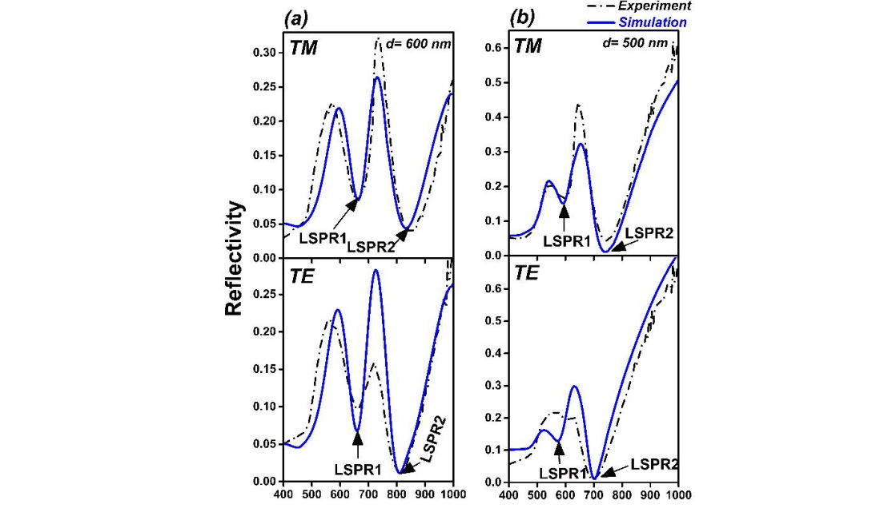 
Fig. 2. Simulation and experimental results of the spectral response of localised plasmonic modes in AuFON systems for TM (top) and TE (bottom) polarisations; in (a) for a 600 nm diameter sample and in (b) for a 500 nm diameter sample. The incidence angle (θ) was 25°, and the azimuthal angle (ϕ) was 0°.

📷 Fig 3

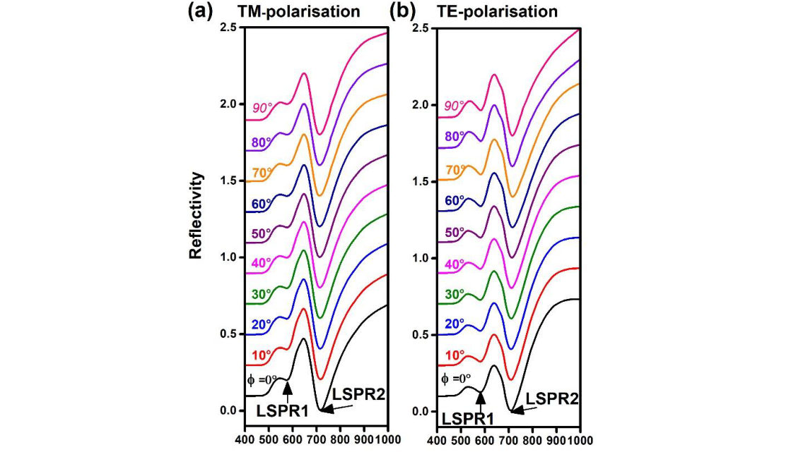 
Fig. 3. Simulation of the plasmonic response for a 500 nm diameter AuFON sample, for TM polarisation (panel (a)) and TE polarisation (panel (b)). The incidence angle was fixed at θ=25°, and ϕ was varied from 0° to 90° in 10° increments. The curves are vertically shifted by 0.2 for clarity. The in-plane dependence with the angle ϕ of the plasmonic response for a 500 nm diameter sample under TM polarisation (panel

📷 Fig 4

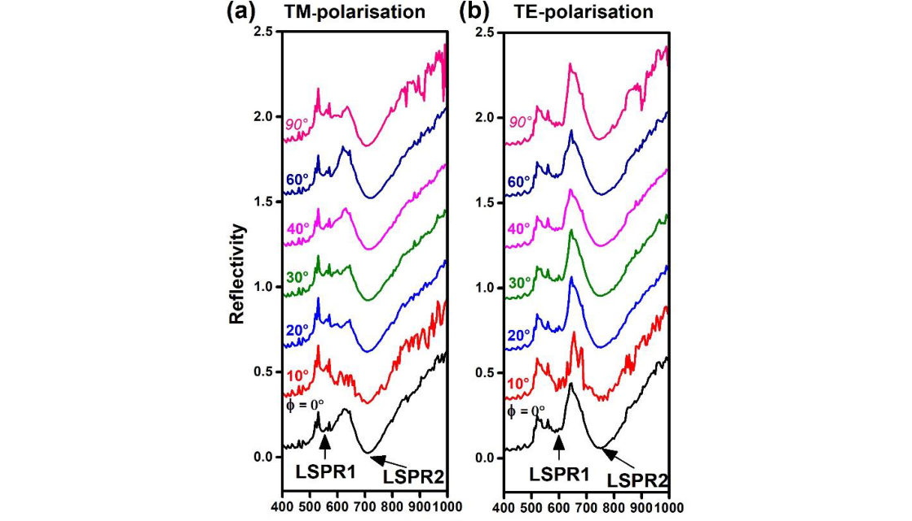 
Fig. 4. Experimental results of the plasmonic response for a 500 nm diameter AuFON sample, for TM polarisation (panel (a)) and TE polarisation (panel (b)). The angle of incidence was fixed at 25°, and ϕ was varied from 0° to 90°. Each reflectivity curve was shifted vertically for clarity. Figure 5 shows simulated results of the spectral response of a 500 nm diameter AuFON nanostructured system, with TE

📷 Fig 5

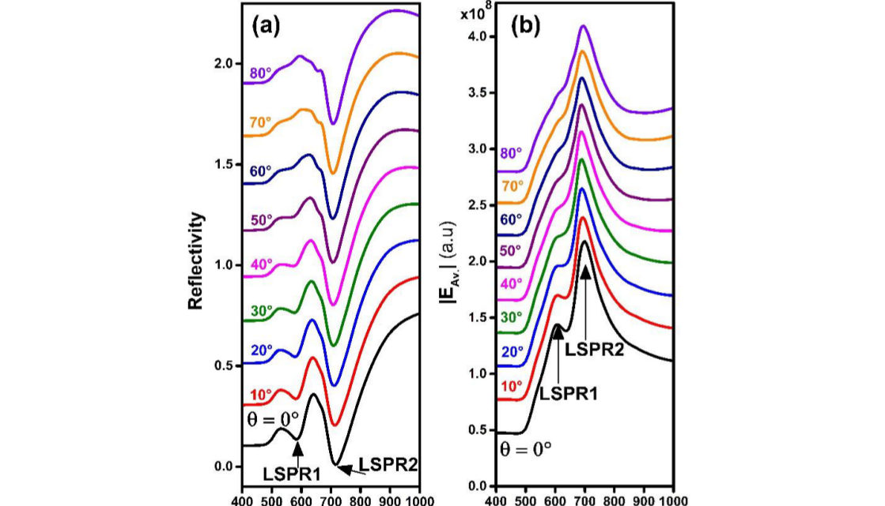 
Fig. 5. Simulated spectral response for a 500 nm diameter AuFON sample with different values of θ. (a) Optical reflectivity, and (b) the associated average electric field amplitude. For these results, ϕ=25° and TE polarisation were used. The curves are vertically shifted by 0.3 for clarity.

**Summary.** This work characterizes and optimizes the plasmonic properties of Au-film on nanosphere (AuFON) systems using a combination of advanced optical measurements and 3D electromagnetic simulations. By systematically varying parameters like nanosphere size and light polarization, the authors demonstrate precise control over the LSPR resonance energy. This tunability makes the AuFON platform highly promising for developing sensitive optical sensors for molecular detection.

**Why it may be interesting.** While focused on classical electromagnetism, the strong field enhancement and resonance phenomena are foundational to understanding light-matter interaction in nanoscale systems, which has parallels in cavity QED and quantum optics.

Detailed structure

**Main problem.** The paper aims to optimize and precisely tune the Localised Surface Plasmon Resonance (LSPR) in Gold-film on nanosphere (AuFON) systems to enhance optical signal amplification for molecular detection.

**Main result.** The LSPR resonance energy is highly dependent on the nanosphere diameter and polarization, with the LSPR2 mode showing the highest electric field intensification capacity for sensing applications.

**Method.** The study combines experimental characterization using variable-angle spectroscopic ellipsometry with detailed numerical simulations solving Maxwell's equations in 3D using the finite element method.

**Model / system.** The physical system is Au-film deposited on polystyrene nanosphere arrays (AuFON). The analysis involves modeling the interaction of incident light (varying in angle, polarization, and wavelength) with the plasmonic nanostructure.

**Key observables.** Resonance energies of LSPR modes (LSPR1 and LSPR2), spectral reflectivity response, and the spatial distribution/amplitude of the electric field.

**Important parameters / regimes.** Nanosphere diameter (500-900 nm), metal film thickness ($\approx 140$ nm), angle of incidence ($	heta$), and incident light polarization (TM/TE).

**Assumptions / limitations.** The simulation relies on the dielectric function provided by Johnson and Christy, and the analysis assumes good ordering of the nanosphere array.

**Figures summary.** Figures illustrate the spectral response (reflectivity) for varying diameters and polarizations, and show the dependence of resonance energy on the azimuthal angle ($\phi$) and the angle of incidence ($	heta$).

**Paper structure.** The paper systematically characterizes the LSPR modes by varying key parameters (diameter, angle, polarization) through both simulation and experiment, culminating in an optimized understanding of the system's tunability for sensing.

Abstract

Metal film on nanosphere (MFON) plasmonic systems have emerged as nanostructures with useful properties for molecular detection. This work presents the optimisation and discussion of the characterisation results of Au-film on nanosphere (AuFON) systems. Through experiments and numerical simulations, the resonance energies of localised surface plasmon modes and the spatial distribution of light on the nanostructured surface were identified. The results highlight the dependence of these modes on changes in nanostructure dimensions and the optical conditions of the incident radiation, thereby optimising the amplification of optical signals for applications in molecular detection.

[↑ back to top](#top)

### [Kohn-Luttinger Superconductivity of Weyl Fermi Arcs in PtBi$_2$](http://arxiv.org/abs/2605.31501v1)

**Authors:** Reuel Dsouza, Nikolaos Parthenios, Brian M. Andersen, Morten H. Christensen  
**Type:** theory · **Category:** strongly correlated electrons · **PDF:** <https://arxiv.org/pdf/2605.31501v1>  
**Analysis basis:** full PDF text, analyzed in chunks
**Topic relevance:** `Keldysh / 2PI / non-Gaussian methods` **1/5** · `analog quantum simulation` **1/5**

📷 Fig 1

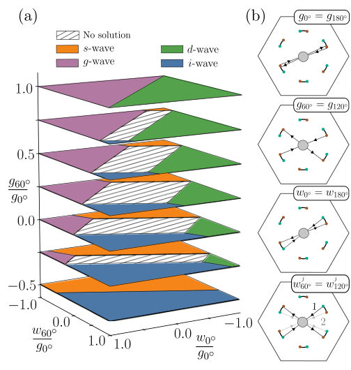 
FIG. 1. Phenomenological model. (a) Phase diagram of the 12-patch model assuming g0◦&gt; 0. To visualize the parameter space we additionally set w1 60◦= w2 60◦. The re- gion marked ’No solution’ is characterized by the absence of a positive eigenvalue in the 12-patch model. (b) Electronic interactions gθ and wθ of the 12-patch model. These corre- spond to intra- and inter-chirality scattering processes with fermionic indistinguishability taken into account.

📷 Fig 2

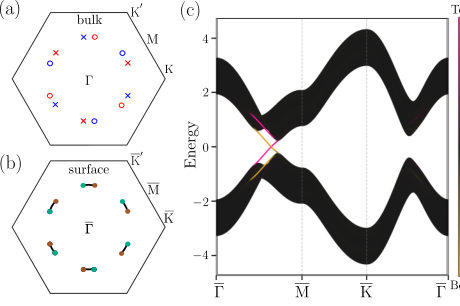 
FIG. 2. Electronic structure of minimal model. (a) Top view of the bulk Brillouin zone (BZ) with 12 Weyl points. Cir- cles/crosses denote Weyl points above/below the kz = 0 plane with blue being positive chirality and red negative chirality. (b) Fermi arcs at E = 0 on the surface BZ with the projected Weyl points colored green and brown. (c) Band structure for the slab geometry along the Γ −M −K −Γ path.

📷 Fig 3

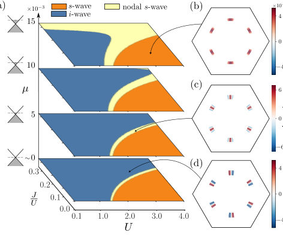 
FIG. 4. Kohn-Luttinger phase diagram and supercon- ducting order parameters. (a) Symmetry of the supercon- ducting order parameter as a function of U, J/U and µ, the chemical potential relative to the Weyl point. Near the Weyl point, the i-wave state is dominant, while the nodal s-wave state becomes increasingly favored as the Fermi level moves away from the Weyl point. Superconducting order parame- ters appearing in the phase diagram: (b) s-wave, (c) nodal s-wave, and (d) i-wave.

**Summary.** This theoretical work calculates the superconducting instability in the Weyl semimetal PtBi2 using the Kohn-Luttinger mechanism. By analyzing the pairing interaction on the topological surface Fermi arcs, the authors predict that the superconducting state is most likely an i-wave symmetry. This provides a microscopic mechanism for observing topological superconductivity in such materials.

**Why it may be interesting.** While focused on condensed matter superconductivity, the use of symmetry analysis (noncentrosymmetry, topological features) and pairing mechanisms driven by repulsive interactions connects to general many-body physics concepts relevant to open quantum systems.

Detailed structure

**Main problem.** The study investigates the nature and symmetry of unconventional superconductivity arising from electron-mediated pairing interactions in Weyl semimetals.

**Main result.** The Kohn-Luttinger approach predicts a dominant nodal i-wave superconducting state in a large region of the phase diagram for PtBi2, suggesting a mechanism for topological superconductivity on the surface.

**Method.** The authors use the Kohn-Luttinger approach, calculating the effective pairing interaction by dressing the bare Coulomb repulsion and solving the linearized gap equation projected onto the Weyl Fermi arcs.

**Model / system.** The physical system is the noncentrosymmetric Weyl semimetal PtBi2. The model employs a phenomenological patch model derived from the surface Weyl Fermi arcs, built upon a tight-binding Hamiltonian describing the bulk electronic structure.

**Key observables.** Superconducting order parameter symmetry (i-wave, s-wave), the superconducting gap structure, and the phase diagram dependence on interaction parameters.

**Important parameters / regimes.** Bare repulsive interaction strength (U), chemical potential ($\mu$), and various hopping/coupling parameters ($\alpha, \gamma$).

**Assumptions / limitations.** The superconductivity instability is assumed to be driven purely by Coulomb repulsion, and the model simplifies the complex surface physics into a patch approximation.

**Figures summary.** Figures illustrate the phase diagram showing regions for different superconducting symmetries (s-wave, i-wave) and schematic representations of the electronic interactions governing the pairing.

**Paper structure.** The paper first establishes the electronic structure of the Weyl semimetal using a tight-binding model, then applies the Kohn-Luttinger formalism to derive the effective pairing interaction, culminating in a phase diagram analysis of the superconducting symmetry.

Abstract

Recent experimental observations in the noncentrosymmetric Weyl semimetal PtBi$_2$ indicate unconventional superconductivity hosted by topological surface states -- Weyl Fermi arcs -- with a node at the center of each arc. Focusing on these Fermi arcs, we calculate the electronically mediated pairing interaction using a Kohn-Luttinger approach and find that, in a large region of the phase diagram, the leading superconducting instability has an $i$-wave symmetry featuring precisely such an intra-arc node. We study the dependence of the leading superconducting instabilities on electronic interaction parameters and chemical potential and show that the $i$-wave state is robust to changes in the model parameters. Our results provide a possible mechanism for the observation of topological $i$-wave superconductivity on the surface of PtBi$_2$ and may have implications for the broader landscape of superconducting instabilities arising from repulsive interactions on the surfaces of Weyl semimetals.

[↑ back to top](#top)

### [Saturated and Anisotropic Magnetostriction in an Altermagnet](http://arxiv.org/abs/2605.30773v1)

**Authors:** Zhiyuan Duan, Qiyun Xu, Peixin Qin, Li Liu, Guojian Zhao, Yuzhou He, Xiaoyang Tan, Sixu Jiang, Jingyu Li, Xiaoning Wang, Qinghua Zhang, Wenhui Duan, Yong Xu, Ziang Meng, Peizhe Tang, Chengbao Jiang, Zhiqi Liu  
**Type:** both · **Category:** other · **PDF:** <https://arxiv.org/pdf/2605.30773v1>  
**Analysis basis:** full PDF text, analyzed in chunks
**Topic relevance:** `analog quantum simulation` **1/5** · `spintronics-quantum-optics interface` **1/5**

📷 Fig 1

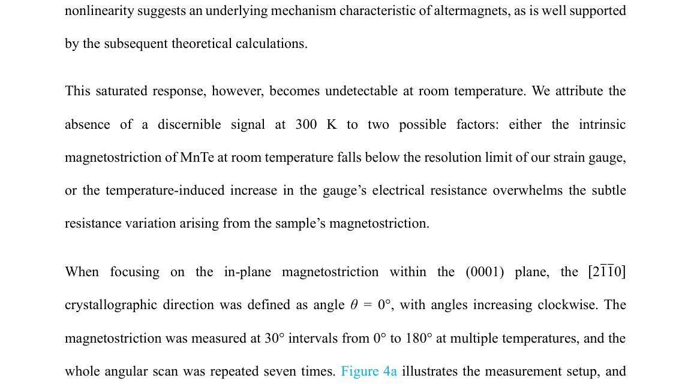 
Figure 4b shows the magnetostriction curves measured at 50 K, allowing a direct comparison

📷 Fig 2

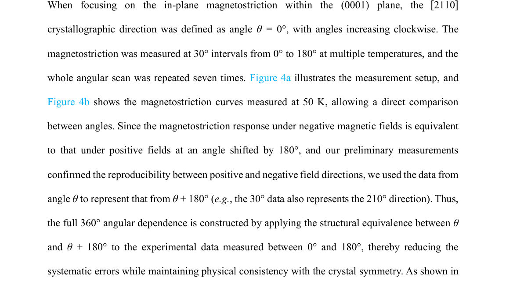 
Figure 4c, the resulting angular-dependent pole figure of saturated magnetostriction (λS) exhibits

📷 Fig 3

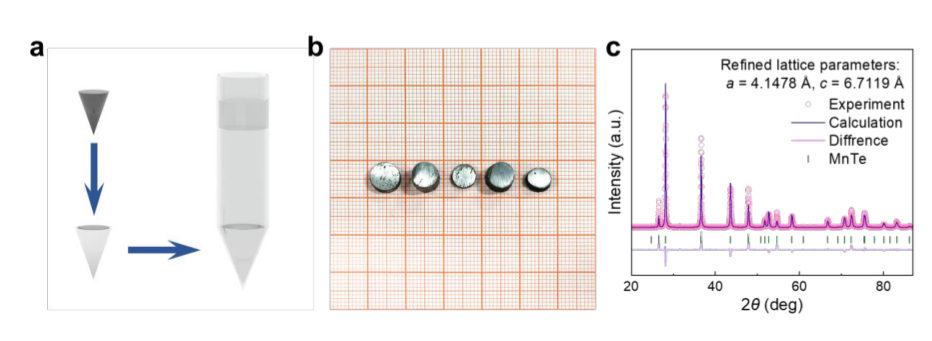 
Figure 1. Synthesis, Morphology, and Structural Analysis of MnTe Single Crystals. (a) Illustration of the

📷 Fig 4

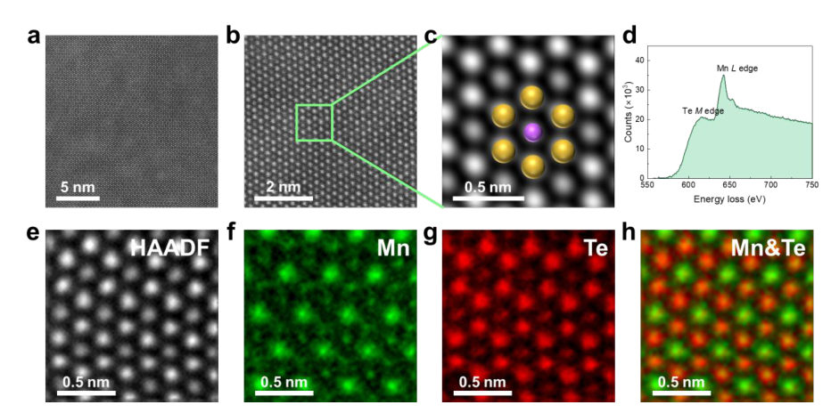 
Figure 2. Atomic-resolution imaging and elemental analysis of MnTe single crystals. (a,b) STEM-HAADF

📷 Fig 5

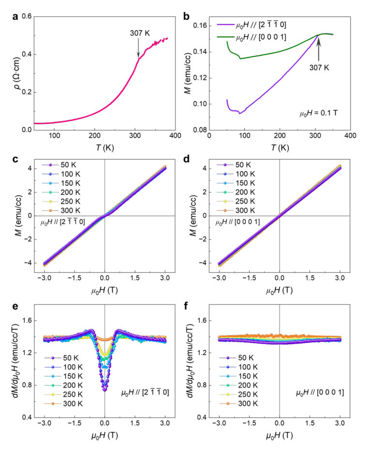 
Figure 3. Electronic Transport and Magnetic Properties of MnTe. (a) Temperature-dependent resistance (R) of

**Summary.** This work reports the discovery of a saturated and anisotropic magnetostriction effect in the altermagnet MnTe. By combining detailed magnetometry and strain measurements with first-principles calculations, the authors demonstrate that this effect arises from a symmetry-allowed coupling between strain and the Néel order parameter. This challenges traditional understanding of AFM magnetostriction and highlights altermagnets as promising materials for magnetostrictive applications.

**Why it may be interesting.** While focused on condensed matter magnetism, the study's rigorous coupling of electronic structure (DFT) to macroscopic mechanical response (magnetostriction) provides a model for understanding coupled order parameters, which has parallels in quantum materials research.

Detailed structure

**Main problem.** The study investigates the magnetostriction, a coupling between magnetism and mechanics, specifically in antiferromagnets (AFMs) and the emerging class of altermagnets.

**Main result.** The authors report observing a saturated and highly anisotropic magnetostriction in the altermagnet MnTe, which is theoretically linked to symmetry-allowed coupling between elastic strain and the Néel order parameter.

**Method.** The research combines extensive experimental measurements (magnetostriction, magnetization, resistivity) with first-principles density functional theory (DFT) calculations and Landau theory analysis.

**Model / system.** The physical system is the MnTe single crystal, which exhibits altermagnetic properties. The theoretical framework involves modeling the total free energy, including lattice and magnetoelastic terms, based on the material's crystal symmetry ($D_{6h}$).

**Key observables.** Saturated magnetostriction ($\lambda_S$), two-fold symmetry anisotropy in the (0001) plane, Néel transition temperature ($\sim 307$ K), and the spin-flop field ($\sim 0.7$ T).

**Important parameters / regimes.** Elastic coefficients ($c_{11}, c_{12}$), coupling strengths ($\lambda_{1N0}^2, \lambda_{2N0}^2$), and the saturation field ($\sim 0.7$ T).

**Assumptions / limitations.** The analysis assumes that the saturated magnetostriction is dominated by the spin-flop-related spin reorientation and that the magnetoelastic coupling can be described by symmetry-allowed terms.

**Figures summary.** Figures detail crystal growth, structural characterization (XRD, STEM), magnetic transitions (M vs T, M vs H), and most critically, the angular dependence of the saturated magnetostriction via pole figures.

**Paper structure.** The paper follows a structure of experimental characterization (synthesis, structure, magnetic transitions) leading to the core measurement of magnetostriction, which is then theoretically explained using DFT and Landau theory to explain the observed saturation and anisotropy.

Abstract

Magnetostriction, a fundamental phenomenon bridging magnetism and mechanics, has enabled a broad spectrum of applications. For almost two centuries, it has been mainly investigated for ferromagnets. Regarding the magnetostriction of antiferromagnets (AFMs), limitedly known examples for both conventional collinear AFMs and noncollinear AFMs predominantly exhibit non-saturating magnetic-field dependence. Herein, we report an easily saturated magnetostriction effect in a prototypical altermagnet - MnTe, which is an emerging class of collinear AFMs with special crystal symmetries. For high-quality MnTe single crystals, the magnetostriction saturates under a moderate field of ~0.7 T with an intriguing two-fold-symmetry anisotropy. First-principles calculations reveal that the saturated and anisotropic magnetostriction originates from symmetry-allowed coupling between elastic strain and its Néel order parameter. These findings break the traditional wisdom on antiferromagnetic magnetostriction.

[↑ back to top](#top)

### [Explicit Turn Resolution with Anisotropic Homogenisation for Efficient 3D Magneto-Thermal Finite-Element Simulation of Large-Scale No-Insulation HTS Magnets](http://arxiv.org/abs/2605.31009v1)

**Authors:** Louis Denis, Erik Schnaubelt, Julien Dular, Mariusz Wozniak, Benoît Vanderheyden, Christophe Geuzaine  
**Type:** theory · **Category:** numerical methods · **PDF:** <https://arxiv.org/pdf/2605.31009v1>  
**Analysis basis:** full PDF text, analyzed in chunks
**Topic relevance:** `methods for driven-dissipative` **1/5**

📷 Fig 1

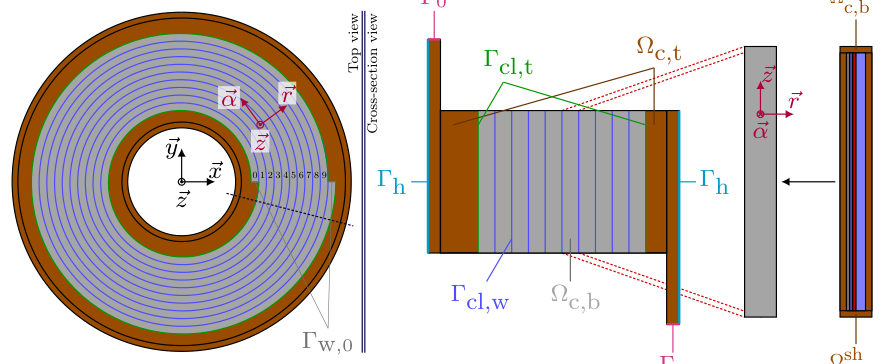 
Figure 1: Reference model visualised on a conceptual pancake coil geometry. Top view (left) and coil cross- section (center), along a single CC turn cross-section (right). Copper terminals Ωc,t are shown in brown, while the homogenised bare CC turns Ωc,b are shown in light gray. The terminal CLs Γcl,t are shown in green, while the turn-to-turn CLs Γcl,w are shown in blue. The winding longitudinal entries Γw,0 are shown in dark gray. The global and local winding coordinates are shown in the left panel, as well as the turn index convention. The homogenisation of the layered structure of the CC into effective anisotropic material properties in Ωc,b is summarised in the right panel, with the...

📷 Fig 2

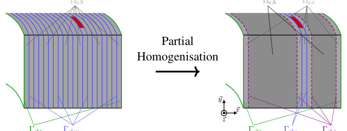 
Figure 2: Principle of the proposed EXTRA homogenisation method on a conceptual HTS magnet cross- section containing a localised Jc defect represented in red. (Left) In the reference model, all bare CC turns Ωc,b, terminal Γcl,t and turn-to-turn Γcl,w CLs are resolved. (Right) In the EXTRA homogenised model, specific resolved turns Ωc,r (in contact with the terminals and the Jc defect) are described with their resolved effective material properties, while all other turns are merged into homogenised turns Ωc,h that account for the T2TCL properties. Terminal CLs Γcl,t, as well as T2TCLs Γcl,r between the resolved turns, are explicitly resolved. The T2TCLs Γcl,p between homogenised and...

📷 Fig 3

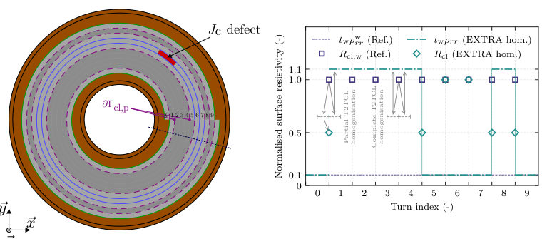 
Figure 3: Homogenisation of the radial electric resistivity of the T2TCLs illustrated with the EXTRA homogenised method on a conceptual pancake coil made of 10 turns. Top view of the magnet (left), with a localised Jc defect in turn 6, and corresponding normalised radial resistivity distribution (right) in the turn-resolved reference (ref.) and EXTRA homogenised (hom.) models. Turns {0,5,6,7,9} are resolved (in light gray), while turns {1,2,3,4,8} are homogenised (in dark gray). The distinction between the terminal CLs (solid green lines), the resolved T2TCLs (solid blue lines) and the partially-homogenised T2TCLs (dashed violet lines) is similar to what is shown in Fig. 2. The top view...

📷 Fig 4

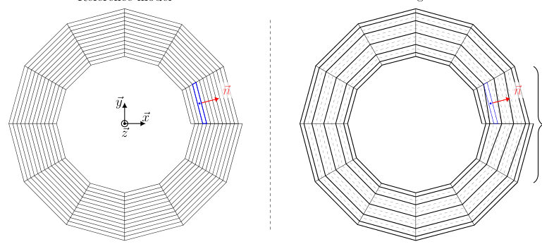 
Figure 4: Visualisation of the normal vector ⃗n on the reference (left) and EXTRA homogenised (right) meshes. The normal vector is defined as a piecewise constant vector along the discretised winding mesh, and it does not vary along the z-direction. The reference mesh is shown with dashed lines next to the homogenised mesh with solid lines. The transition layer between neighbouring effective turns of different thicknesses is shown (right). In this figure, the meshes are significantly coarser along the longitudinal direction than practical meshes, for clearer visibility.

📷 Fig 5

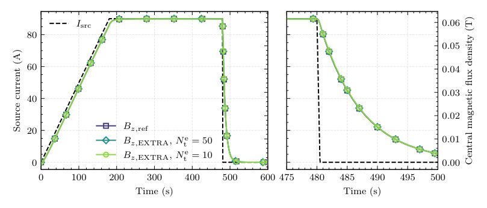 
Figure 5: Source current Isrc during the sudden discharge test and central axial magnetic flux density Bz computed with the reference and EXTRA homogenised (N e t = 50 and N e t = 10) models, with Rcl,t = 10−6 Ωm2. The right figure focuses on the quasi-exponential decay during the discharge. Both figures share the same legend.

**Summary.** This paper introduces the EXTRA homogenisation method, a novel technique for performing 3D Finite-Element simulations of massive HTS magnets. It efficiently reduces computational load by homogenizing most turns while explicitly resolving critical areas near contacts or defects. This allows researchers to simulate unprecedentedly large magnets while maintaining high accuracy compared to full turn-resolved models.

**Why it may be interesting.** While focused on superconducting magnets, the core contribution is a sophisticated, multi-scale numerical technique (anisotropic homogenization combined with adaptive resolution) that is highly relevant to developing efficient solvers for complex, multi-physics systems in condensed matter theory.

Detailed structure

**Main problem.** Developing an efficient and accurate 3D Finite-Element (FE) simulation method for the magneto-thermal behavior of large-scale No-Insulation (NI) High-Temperature Superconducting (HTS) magnets.

**Main result.** The proposed EXTRA homogenisation method achieves significant computational speedups (up to 13x) while maintaining accuracy, enabling simulations of magnets with 10,000 turns, which was previously computationally infeasible.

**Method.** The method combines anisotropic homogenization of turn-to-turn contact layers (T2TCLs) with the explicit resolution of critical turns (inner/outermost) to balance computational cost and physical accuracy.

**Model / system.** The system is a large-scale HTS magnet, modeled as stacked pancake coils. The simulation solves coupled magneto-thermal equations in 3D, accounting for current distribution, heat generation, and material properties.

**Key observables.** AC losses, temperature distributions, current density ($\vec{J}$), and magnetic field ($\vec{H}$) evolution during operation and thermal runaway.

**Important parameters / regimes.** Number of turns (up to 10,000), contact resistance ($R_{cl}$), and local critical current density ($J_c$).

**Assumptions / limitations.** The method relies on the Surface Contact Approximation (SCA) for homogenized layers and assumes that local defects only require explicit resolution of neighboring turns.

**Figures summary.** Figures illustrate the conceptual geometry of the coil, the principle of separating turns into homogenized and resolved sections, and convergence studies comparing the new method against turn-resolved reference models.

**Paper structure.** The paper introduces the physical challenge, details the mathematical formulation of the coupled FE equations, rigorously derives the EXTRA homogenization procedure by separating turns, validates the method on smaller benchmarks, and concludes with large-scale simulations demonstrating efficiency and accuracy.

Abstract

No-insulation (NI) and metal-insulation (MI) high-temperature superconducting (HTS) magnets require three-dimensional (3D) models to describe the current distribution around critical current defects. In this work, we design and validate the EXTRA homogenisation method, standing for explicit turn resolution with anisotropic homogenisation method. It allows 3D magneto-thermal finite-element (FE) simulations of large-scale magnets to be performed with high accuracy at a reasonable computational cost. The method combines the anisotropic homogenisation of turn-to-turn contact layers (T2TCLs) and their neighbouring winding turns with the explicit resolution of specific T2TCLs. In particular, the inner- and outermost winding turns and adjacent contact layers are explicitly resolved to properly describe the current distribution near current leads. In addition, the method is able to simulate local $J_{\textrm{c}}$ defects for a broad range of turn-to-turn contact resistances, provided the winding turns and T2TCLs next to the defect are explicitly resolved. For efficiency, the resolved T2TCLs are modelled using the surface contact approximation. The consistency of the proposed method is first verified on a 50-turn single pancake benchmark. It is shown to reproduce AC losses and temperature distributions obtained with a turn-resolved FE reference model, for both nominal operation and during thermal runaway. The computational efficiency of the EXTRA method is demonstrated with the simulation of a stack of three 150-turn pancake coils, for which computation time is reduced by a factor of up to 13 with respect to a turn-resolved FE reference model. Finally, the results of a large-scale 3D FE simulation, currently out of reach of turn-resolved models, are provided for an insert HTS magnet with 10,000 turns. The EXTRA method is open-source and input files to reproduce all results are made available.

[↑ back to top](#top)

### [Terahertz Electrodynamics and Kinetic Inductance of Disordered Titanium-Vanadium Alloy Thin Films](http://arxiv.org/abs/2605.30847v1)

**Authors:** Shekhar Chandra Pandey, Shilpam Sharma, Ashish Khandelwal, M. K. Chattopadhyay  
**Type:** both · **Category:** other · **PDF:** <https://arxiv.org/pdf/2605.30847v1>  
**Analysis basis:** full PDF text, analyzed in chunks
**Topic relevance:** `Keldysh / 2PI / non-Gaussian methods` **1/5**

📷 Fig 1

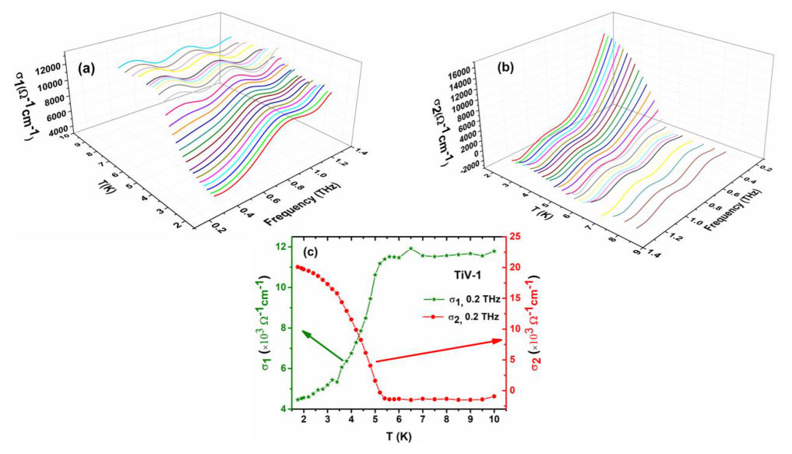 
Fig. 1 (a) Three-dimensional plots of the real part of the THz conductivity for the TiV-1 thin film. The dip in the low-frequency region below the TC indicates a superconducting gap in the quasiparticle states. (b) The imaginary part of the conductivity as a function of frequency exhibits

📷 Fig 2

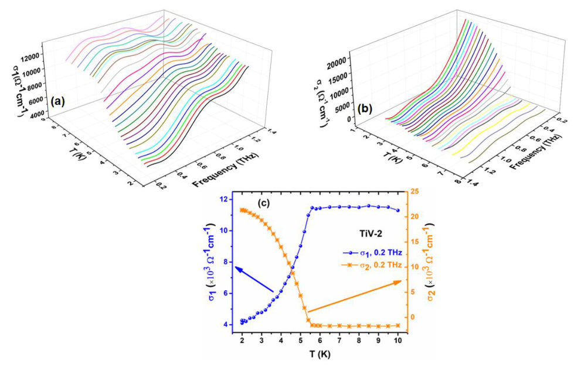 
Fig. 2 (a) Three-dimensional plots of the real part of the THz conductivity for the TiV-2 thin film. The dip in the low-frequency region below the TC indicates a superconducting gap in the quasiparticle states. (b) The Imaginary part of the conductivity as a function of frequency exhibits a 1/ω dependence and becomes negative at higher frequencies. (c) Temperature dependence of the real and imaginary parts of THz conductivity of TiV-2 measured at 0.2 THz.

📷 Fig 3

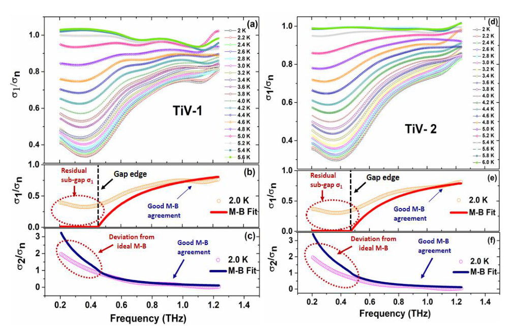 
Fig. 3 (a) and (d) Frequency dependence of the normalized real part of complex conductivity at different temperatures below the TC for TiV-1 and TiV-2 respectively. (b) and (e) Normalized real part of complex conductivity of TiV-1 and TiV-2 respectively, at 2 K, along with the M-B fits. (c) and (f) Normalized imaginary part of complex conductivity of TiV-1 and TiV-2 respectively at 2 K, along with the corresponding M-B fit.

📷 Fig 4

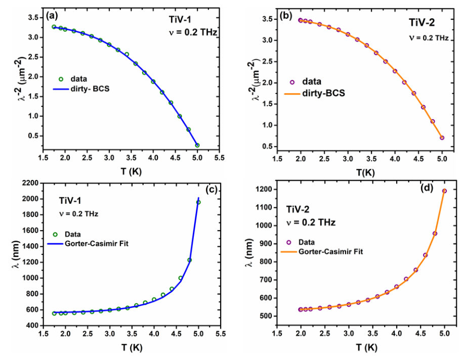 
Fig. 4 Temperature dependence of the magnetic penetration depth: (a, b) The inverse square of the penetration depth, λ-2(T), evaluated at 0.2 THz for TiV-1 and TiV-2, respectively. The solid lines denote theoretical fits to the experimental data using the dirty-limit BCS formulation. (c, d) The absolute penetration depth plotted as a function of temperature for TiV-1 and TiV-2. The solid lines represent fits based on the empirical Gorter-Casimir two-fluid model.

**Summary.** This paper uses $	ext{THz-TDS}$ to study the electrodynamics of disordered $	ext{TiV}$ superconducting thin films. By analyzing the complex conductivity and kinetic inductance, the authors show that structural disorder offers a simple, tunable method to control superconducting properties. These findings position $	ext{TiV}$ alloys as excellent candidates for next-generation quantum detectors.

**Why it may be interesting.** The work bridges condensed matter theory (superconductivity, disorder effects) with advanced experimental techniques ($	ext{THz-TDS}$), providing quantitative data on superconducting response relevant to quantum sensing.

Detailed structure

**Main problem.** The study investigates how structural disorder affects the high-frequency electrodynamic response and kinetic inductance of superconducting thin films, which is vital for advanced quantum detectors.

**Main result.** The research demonstrates that structural disorder in $	ext{Ti}_{40}	ext{V}_{60}$ alloys can be systematically tuned to control the inductive response, establishing these alloys as promising materials for kinetic inductance detectors.

**Method.** Terahertz time-domain spectroscopy ($	ext{THz-TDS}$) was used to measure complex conductivity and penetration depth, which were then analyzed using the Mattis-Bardeen formalism and BCS theory.

**Model / system.** The physical system is disordered Titanium-Vanadium ($	ext{TiV}$) alloy thin films. The analysis employs theoretical models like the Mattis-Bardeen formalism and the Gorter-Casimir two-fluid model to describe the superconducting electrodynamics.

**Key observables.** Complex conductivity ($\sigma_1, \sigma_2$), penetration depth ($\lambda$), superfluid density ($	ext{n}_s$), and kinetic inductance ($	ext{L}_K$).

**Important parameters / regimes.** Superconducting energy gaps ($\Delta$), critical temperature ($	ext{T}_C$), and the ratio $2\Delta(0)/k_B T_C$ (indicating strong coupling).

**Assumptions / limitations.** The Mattis-Bardeen formalism is used for fitting, though deviations are noted in the low-frequency sub-gap regime.

**Figures summary.** Figures show temperature and frequency dependence of $\sigma_1$ and $\sigma_2$, illustrating the suppression of $\sigma_1$ and the characteristic $1/\omega$ inductive response in $\sigma_2$ below $	ext{T}_C$.

**Paper structure.** The paper follows a structure of problem definition, experimental measurement ($	ext{THz-TDS}$), theoretical modeling (M-B formalism, BCS fitting), and detailed analysis of superconducting parameters ($	ext{L}_K, \Delta, 	ext{n}_s$).

Abstract

Disordered superconductors represent an important area in modern condensed matter physics, where superconductivity survives even in the presence of strong electron scattering and localization effects. Understanding how disorder modifies the high-frequency electrodynamic response is not only important from physics point of view, but is also essential for developing next-generation quantum detectors and superconducting devices. In this work, we investigate the terahertz electrodynamics of disordered Ti40V60 alloy thin films using terahertz time-domain spectroscopy (THz-TDS) to understand the relationship between disorder, quasiparticle dynamics, and kinetic inductance. By analysing the complex conductivity, penetration depth and superfluid response, we show that structural disorder can be systematically used to tune the inductive response while maintaining a robust superconducting phase. Unlike conventional nitride superconductors that require tightly controlled reactive growth conditions, Ti40V60 alloys provide a simpler and more adaptable route for tuning the superconducting energy scales directly through the deposition conditions. These findings establish Ti40V60 alloys as a promising material for kinetic inductance detectors and provide useful insights into the electrodynamics of strongly disordered superconductors.

[↑ back to top](#top)

### [Wetting as an emergent property of water: reformulating Young equation on molecular grounds](http://arxiv.org/abs/2605.30661v1)

**Authors:** Nicolas Loubet, Gustavo Appignanesi  
**Type:** theory · **Category:** statistical mechanics · **PDF:** <https://arxiv.org/pdf/2605.30661v1>  
**Analysis basis:** full PDF text, analyzed in chunks
**Topic relevance:** `analog quantum simulation` **1/5**

📷 Fig 1

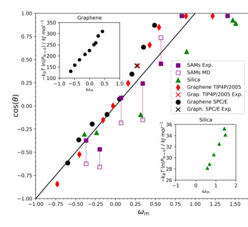 
FIG. 1: Universal molecular description of aqueous wetting. Contact angles for chemically diverse systems plotted as a function of the molecular wetting coefficient ωm. Experimental data for self-assembled monolayers (SAMs) with different functionalization (from apolar to polar groups), together with results for dispersive graphene (with variable Lennard–Jones attractions) and polar silica (with varying polarity), collapse onto a single master curve defined by cos θ = ωm. Inset: Cavitation free energy for a small (methane-like sized) sphere tangent to the surface, −kBT ln P(N = 0), plotted against ωm for graphene and silica, demonstrating a thermodynamic closure linking wetting, adhesion,...

📷 Fig 2

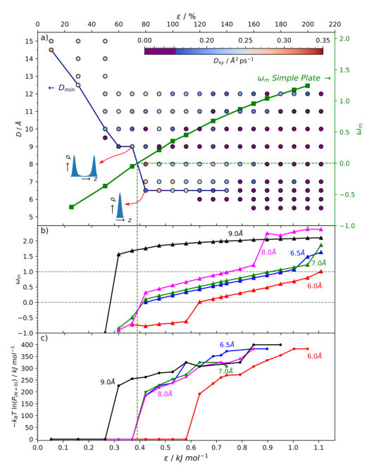 
FIG. 2: Nanoconfinement, filling, and thermodynamic closure controlled by the molecular wetting coefficient. (a) Minimum stable plate separation Dmin for water confined between two parallel graphene sheets as a function of interaction strength ε. Water density profiles for 70%–9 ˚A and 80%–6.5 ˚A are sketched as insets. The green curve reports ωm for a single graphene surface; the vertical dashed green line (that extends down to the other two panels of the figure) marks the value of ε for which ωm = 0. The color of the symbols indicates the in-plane (2D) diffusion coefficient of confined water, from more mobile (red) to nearly arrested or frozen configurations (violet). (b) Molecular...

**Summary.** This work provides a molecular reformulation of wetting theory, moving beyond empirical macroscopic equations like Young's. By introducing a molecular wetting coefficient ($\omega_m$), the authors demonstrate that wetting is an emergent property dictated by water's internal hydrogen-bond energetics. This framework unifies wetting, adhesion, and cavitation into a single, predictive physical principle.

**Why it may be interesting.** While focused on classical liquids, the rigorous thermodynamic closure and the development of a universal, microscopic parameter ($\omega_m$) to govern macroscopic phase behavior provides a powerful analogy for understanding emergent order in complex quantum many-body systems.

Detailed structure

**Main problem.** The molecular origin of macroscopic wetting descriptions, such as Young's equation, particularly for water, has remained theoretically elusive.

**Main result.** Wetting is shown to be an emergent property of water's intrinsic hydrogen-bond energetic scales, unifying wetting, adhesion, and cavitation into a single molecular criterion.

**Method.** The authors reformulate wetting using a molecular wetting coefficient ($\omega_m$) derived from microscopic interaction measures ($V_{4S}$) and test this framework using molecular dynamics simulations.

**Model / system.** The system involves aqueous interfaces (solid-liquid-vapor, etc.) where the behavior is governed by the energetic cost associated with hydrogen-bond defects in the water network.

**Key observables.** Molecular wetting coefficient ($\omega_m$), contact angle ($\cos 	heta$), adhesion work ($W_{adh}$), and cavitation free energy ($\Delta G_{cav}$).

**Important parameters / regimes.** The molecular wetting coefficient ($\omega_m$), which quantifies the energetic compensation of HB defects relative to bulk water.

**Assumptions / limitations.** The framework assumes that interfacial behavior can be mapped onto the intrinsic energetic scales of the water hydrogen-bond network, allowing for a universal description across different chemistries.

**Figures summary.** Figures illustrate that contact angles for diverse surfaces collapse onto a single master curve defined by $\cos 	heta = \omega_m$, and that thermodynamic quantities like cavitation energy show linear closure with $\omega_m$.

**Paper structure.** The paper establishes the macroscopic problem (Young's equation), introduces the molecular parameter ($\omega_m$), demonstrates its universality across various surfaces, and finally closes the thermodynamic loop by linking wetting, adhesion, and cavitation via $\omega_m$.

Abstract

Young equation provides a remarkably successful macroscopic description of wetting, yet its molecular origin (particularly for water) has remained elusive for over two centuries. Here we make the molecular basis of aqueous wetting explicit by reformulating it in terms of a molecular wetting coefficient, omega m, which quantifies how an interface compensates the intrinsic energetic cost of hydrogen-bond defects relative to bulk water. Across a broad and continuous spectrum of hydrophilicities, spanning chemically diverse experimental and model surfaces, macroscopic contact angles collapse onto a single universal master curve when expressed through omega m. This molecular reformulation closes Young and Young-Dupre relations on energetic grounds, establishing a unified and predictive physical link between wetting, adhesion, cavitation, and nanoconfined filling. By anchoring interfacial behavior to waters intrinsic hydrogen-bond energetic scales, our results reveal wetting as an emergent property of water itself, rather than a surface-specific attribute and provide a transferable molecular framework that recalibrates energetic intuition and guides the rational design of aqueous interfaces. (This document is the unedited Author version of a Submitted Manuscript subsequently accepted for publication in J. Am. Chem. Soc. For the published version, which includes a more complete molecular-thermodynamics grounding of the method see the published version)

[↑ back to top](#top)

### Other secondary papers (5)

Show other secondary papers

### [Bending-like stress induced by solder joint under uniaxial tensile testing in 2G-HTS tapes: Impact and optimization approach](http://arxiv.org/abs/2605.30760v1)

**Authors:** Dean Liu, Yue Wu, Haoliang Xiang, Xiaofen Li, Caida Fu, Chiheng Dong, Yue Zhao  
**Type:** both · **Category:** other · **PDF:** <https://arxiv.org/pdf/2605.30760v1>  
**Analysis basis:** full PDF text, analyzed in chunks

📷 Fig 1

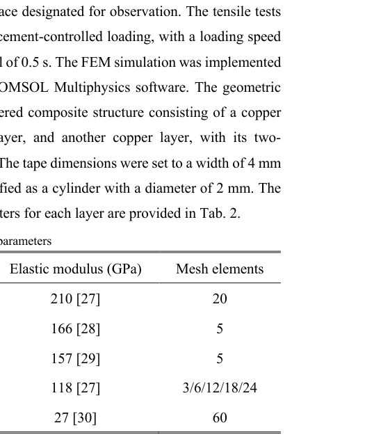 
Fig. 1 (a) illustrates the uniaxial tensile test results for a short sample of Tape Ⅰ. In this test, the

📷 Fig 2

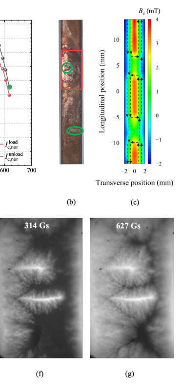 
Fig. 1 Uniaxial tensile test and post-mortem characterization of a Tape Ⅰ short sample. (a) Ic degradation as a

📷 Fig 3

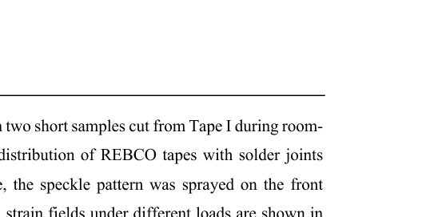 
Fig. 2 (b) ~ (d). Prominent high-strain regions consistently develop at both the upper-right and

📷 Fig 4

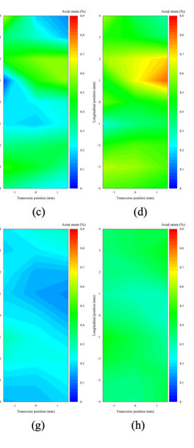 
Fig. 2 The DIC results of the Tape Ⅰ. (a) Photograph of one sample front surface with speckle, and the solder joint

📷 Fig 5

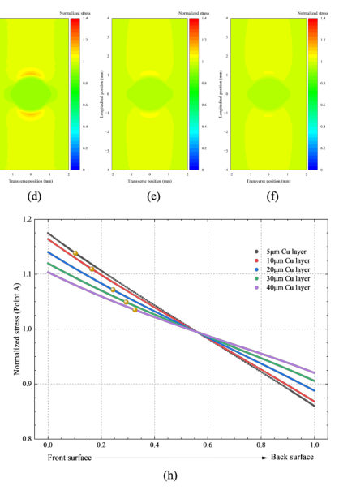 
Fig. 3 FEM results of REBCO tapes with solder joint attached to the front surface under 600 MPa uniaxial tensile

**Summary.** This work addresses the critical issue of inaccurate mechanical testing of high-temperature superconducting tapes due to stress concentrations from solder joints. By combining experimental measurements with FEM simulations, the authors prove that the joint induces damaging bending-like stresses. They propose and validate an optimized back-surface soldering technique, leading to significantly more accurate characterization of the tapes' true performance limits.

**Why it may be interesting.** While focused on materials science, the rigorous application of continuum mechanics (FEM) to model localized stress fields and their impact on a critical performance metric (Ic) demonstrates advanced multiscale modeling techniques applicable to complex quantum devices.

Detailed structure

**Main problem.** The accuracy of measuring the reversible stress limit (Rrev) of 2G-HTS tapes is compromised by stress concentration induced by the voltage tap solder joint during uniaxial tensile testing.

**Main result.** Optimizing the soldering location to the back surface mitigates this stress interference, significantly increasing the measured Rrev (e.g., 42% increase for one tape configuration).

**Method.** The study combines integrated experimental characterization (tensile testing, DIC, SHPM) with detailed numerical simulations using the Finite Element Method (FEM).

**Model / system.** The physical system is a multi-layered 2G-HTS tape (REBCO) subjected to uniaxial tensile loading, with the primary focus on the mechanical stress state induced by the solder joint.

**Key observables.** Reversible stress limit (Rrev), critical current (Ic) degradation, local strain fields, and stress distribution maps.

**Important parameters / regimes.** Copper layer thickness ($5 \mu	ext{m}$ example), applied tensile stress, and the location of the solder joint (front vs. back surface).

**Assumptions / limitations.** The FEM model simplifies the tape into a multi-layered composite structure, and the analysis assumes the stress concentration mechanism is dominated by geometric inhomogeneity.

**Figures summary.** Figures illustrate the comparison of Ic degradation and Rrev between front-surface and back-surface soldering approaches, alongside FEM stress maps demonstrating the induced bending-like stress profile.

**Paper structure.** The paper first establishes the problem using front-surface testing results, then uses FEM and experimental diagnostics (DIC, SHPM) to mechanistically prove the existence of bending-like stress. Finally, it proposes and validates the back-surface soldering approach, showing quantitative improvements across multiple tape types.

Abstract

The reversible stress limit (\mathit{R}_{rev}) of second-generation high-temperature superconducting (2G-HTS) tapes is a critical performance indicator, typically characterized through uniaxial tensile testing. In practice, the accuracy of the measured Rrev value is often compromised by stress concentration induced by the voltage tap solder joint. The present study investigates the underlying interference mechanism using integrated experimental and numerical methods. Mechanistic analysis reveals that under uniaxial tensile loading, the local geometric inhomogeneity introduced by the solder joint induces an external, bending-like stress in the vicinity of the solder joint, transitioning from additional tensile stress in the zone adjacent to the joint to additional compressive stress in the zone remote from it. When the solder joint is attached to the front surface of the tape (the side closer to the superconducting layer), the superconducting layer experiences localized additional tensile stress, triggering premature damage and early \mathit{I}_{c} degradation. Consequently, an optimized back-surface soldering approach is proposed, which positions the superconducting layer in a localized compressive zone. Experimental validation demonstrates that the proposed approach effectively mitigates testing errors for various tape configurations. Notably, for the tape with a copper layer thickness of 5 μm, the measured \mathit{R}_{rev} increased from 546 MPa to 734 MPa, corresponding to a 42% increase, and moved closer to the actual value. The findings provide essential insights for the precision characterization of the electromechanical performances (EMPs) of 2G-HTS tapes.

[↑ back to top](#top)

### [In-situ operation of amorphous circuits under heavy-ion irradiation](http://arxiv.org/abs/2605.31206v1)

**Authors:** Xuanzhe Sha, Shun Liao, Xiaoxi Li, Chengyuan Li, Jianli Liu, Yu Pan, Wenhai Wang, Yu Ye, Chengxin Zhao, Liyi Li, Hanwen Wang, Zheng Vitto Han, Jianming Lu  
**Type:** both · **Category:** other · **PDF:** <https://arxiv.org/pdf/2605.31206v1>  
**Analysis basis:** full PDF text, analyzed in chunks

📷 Fig 1

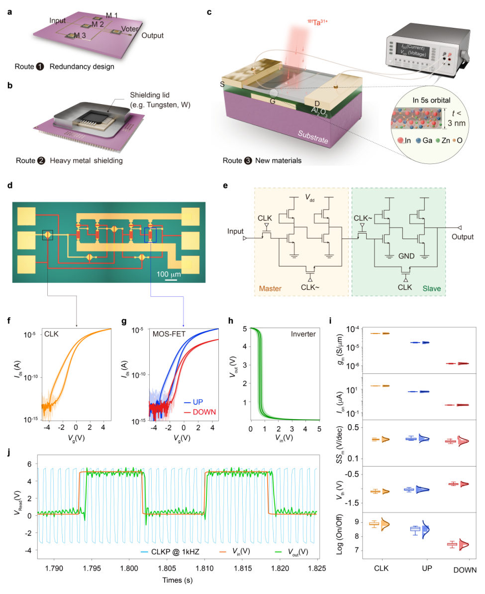 
Fig. 1 Design concept, device platform and circuit validation of amorphous IGZO timing circuits. a, Schematic illustration of a redundancy-based design strategy for radiation-resilient circuits, in which parallel logic units are combined through a voter architecture to mitigate single-unit failure. b, Schematic illustration of a shielding-based strategy, where heavy-metal packaging is used to attenuate incoming radiation before it reaches the active circuit. c, Schematic of the ultrathin-semiconductor route explored in this work, in which the active amorphous semiconductor channel is confined to a nanometre- scale thickness, thereby minimizing the interaction volume for heavy-ion energy...

📷 Fig 2

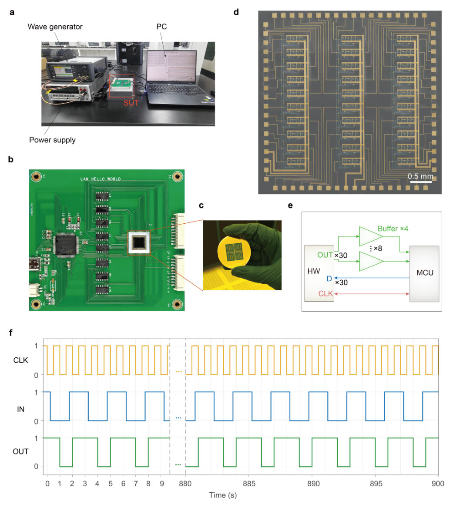 
Fig. 2 Experimental platform and cascaded DFF circuits for sequential digital output. a, Photograph of the electrical measurement setup used to test the amorphous thin-film timing circuits, including the wave generator, power supply, sample under test and computer-controlled readout. b, Photograph of the custom printed circuit board designed for interfacing and testing the timing-circuit chip. c, Photograph of the fabricated amorphous thin-film chip mounted for measurement. d, Optical micrograph of a representative cascaded DFF array forming a parallel-register circuit. Scale bar, 1000 µm. e, Schematic diagram of the measurement and readout architecture, showing the hardware timing circuit,...

📷 Fig 3

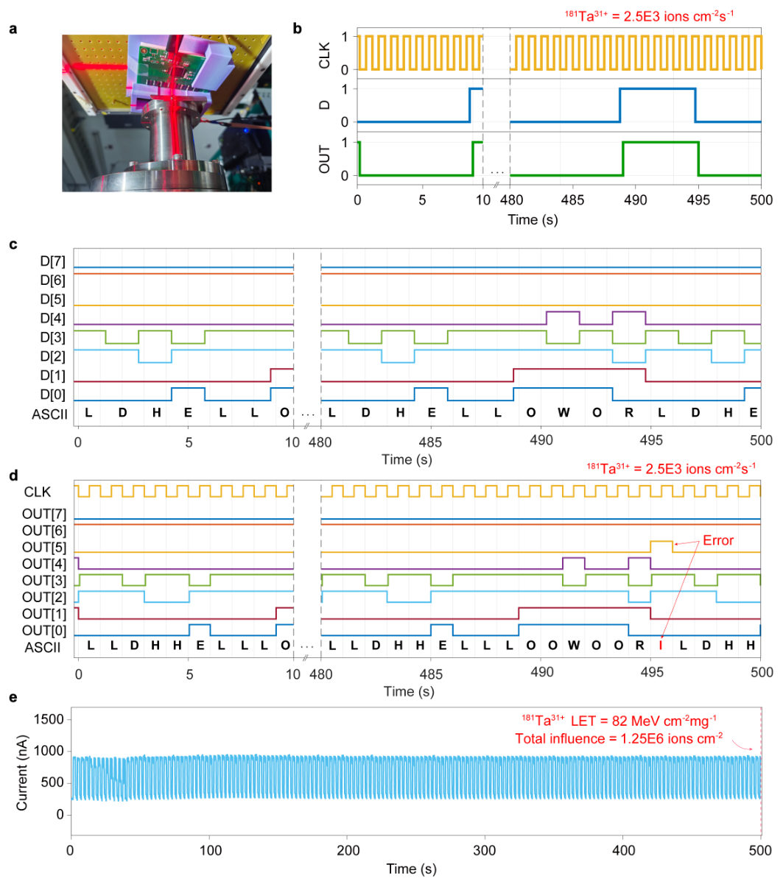 
Fig. 3 Powered heavy-ion irradiation test of amorphous thin-film timing circuits. a, Photograph of the in situ heavy-ion irradiation experiment under electrical bias. The red laser beam was used only for sample alignment and was switched off during irradiation and measurement. b, Representative input, clock and output waveforms of a D-type flip-flop measured during continuous irradiation by 181Ta ions at a flux of 2.5 × 103 s−1, showing stable operation over 500 s. c input and d output of 8-bit ASCII sequence of the cascaded timing circuit under non-irradiated operation, reproducing the programmed string “HELLO WORLD”. The timing circuits were measured during continuous powered irradiation...

📷 Fig 4

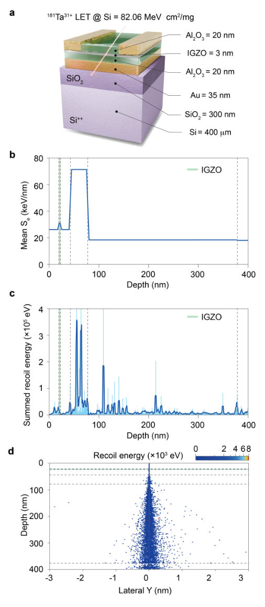 
Fig. 4 Simulated heavy-ion interaction with the ultrathin IGZO transis- tor structure. a, Schematic of a 181Ta ions traversing the multilayer device stack. b, Electronic stopping power Se as a function of depth, showing lim- ited energy deposition in the ∼2 nm IGZO channel. c, Depth-dependent summed recoil energy, indicating reduced displacement damage in the IGZO layer compared to surrounding materials. d, Lateral distribution of collision events, showing highly localized damage along the ion track with minimal lateral spreading.

**Summary.** This work demonstrates the feasibility of building functional, digital electronic circuits using amorphous IGZO thin-film semiconductors that can operate reliably under intense heavy-ion irradiation. By leveraging the ultrathin nature of the semiconductor channel, the authors show that the circuit maintains stable logic operation, establishing a key milestone for radiation-tolerant electronics in harsh environments.

**Why it may be interesting.** While not directly quantum, the study addresses reliability in extreme physical environments, which is a critical engineering challenge for quantum computing hardware deployed outside controlled lab settings.

Detailed structure

**Main problem.** Developing radiation-hardened electronics for reliable operation in extreme environments subjected to heavy-ion irradiation.

**Main result.** The amorphous IGZO-based digital circuit demonstrated robust, functional operation, successfully outputting a 'Hello World' sequence during prolonged, powered heavy-ion bombardment.

**Method.** The study combines device fabrication, electrical characterization, and *in situ* testing using heavy-ion accelerators, supplemented by particle transport simulations (SRIM/Geant4).

**Model / system.** The system utilizes amorphous IGZO thin-film transistors configured into D-type flip-flops and cascaded timing circuits, fabricated on a multilayer stack structure.

**Key observables.** Stable digital output sequence ('Hello World'), operating current vs. time during irradiation, and the area-normalized Single Event Upset (SEU) cross section ($\sigma_{	ext{SEU}}$).

**Important parameters / regimes.** High particle flux ($2.5 	imes 10^3 	ext{ ions } 	ext{cm}^{-2} 	ext{ s}^{-1}$), total fluence ($1 	imes 10^6 	ext{ ions } 	ext{cm}^{-2}$), and the ultrathin channel thickness ($\approx 2 	ext{ nm}$).

**Assumptions / limitations.** The intrinsic geometric confinement of the active channel in amorphous semiconductors is sufficient to provide radiation resilience, mitigating the need for external shielding or redundancy.

**Figures summary.** Figures illustrate the circuit design (DFF, timing sequence), the electrical testing platform, and the core results showing stable operation and preserved 'Hello World' output during heavy-ion irradiation.

**Paper structure.** The paper progresses from establishing the need for radiation-hard electronics, detailing the IGZO device structure and fabrication, demonstrating functional testing, and culminating in the *in situ* heavy-ion irradiation tests and physical analysis of ion interactions.

Abstract

Radiation-hardened electronics using semiconductors beyond silicon are essential for computation and control in extreme environments. Yet complex digital circuits based on such material platforms operating in situ under heavy-ion irradiation remain largely unexplored. Here, we show a timing circuit based on amorphous thin-film semiconductors at the 100-transistor scale, and demonstrate its robust operation through a functional "Hello World" ASCII output sequence. Beyond static device characterization, we evaluate the circuit under powered heavy-ion irradiation using tantalum ions, providing an operationally relevant assessment of radiation tolerance at the system level. Under a high particle flux of 2.5 x 10^3 ions cm^-2 s^-1, the circuit maintains stable operation during the irradiation test, achieving a total fluence of 1 x 10^6 ions cm^-2, establishing a milestone of prolonged powered digital operation under extreme conditions. Our work expands the design space of radiation-tolerant electronics, highlighting amorphous semiconductors as a promising foundation for digital circuits deployed in harsh environments.

[↑ back to top](#top)

### [Interplay of Cl Substitution and He$^{+}$ Irradiation in CrSBr$_{1-x}$Cl$_{x}$](http://arxiv.org/abs/2605.31134v1)

**Authors:** Satyam Sahu, Adeel Bukhari, Arijit Kayal, Valerie Černá, Bing Wu, Aljoscha Söll, Gregor Hlawacek, Zdeněk Sofer, Martin Kalbáč, Matěj Velický, Otakar Frank  
**Type:** experiment · **Category:** other · **PDF:** <https://arxiv.org/pdf/2605.31134v1>  
**Analysis basis:** full PDF text, analyzed in chunks

📷 Fig 1

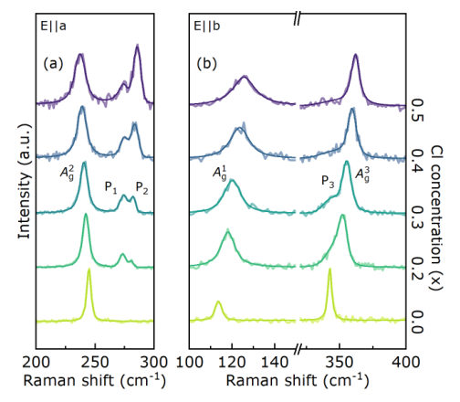 
FIG. 1. Composition-dependent Raman spectra of bulk CrSBr1−xClx under 2.33 eV excitation for (a) E∥a and (b) E∥b, respectively. Here, the light curves are the raw data, while the darker ones are the fits using a Voigt function.

📷 Fig 2

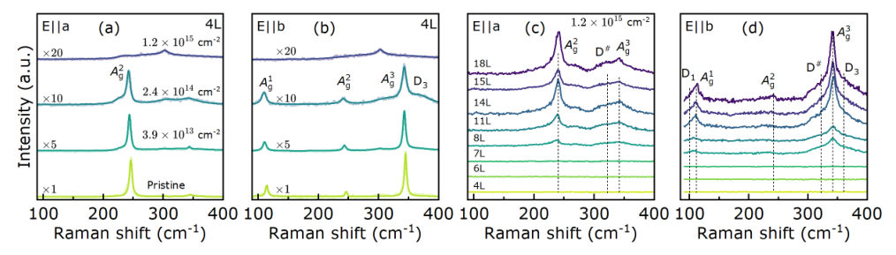 
FIG. 2. Defects in He+ irradiated CrSBr. (a-b) Fluence-dependent Raman spectra of 4L CrSBr, and (c-d) thickness-dependent normalized (w.r.t. Si) Raman spectra at a fluence of 1.2 × 1015 cm−2 excited using a 2.33 eV laser for E∥a (a, c) and E∥b configurations (b, d). The positions of the parent Ag modes and He+ induced D1, D3, and D# modes are highlighted by dotted vertical lines.

📷 Fig 3

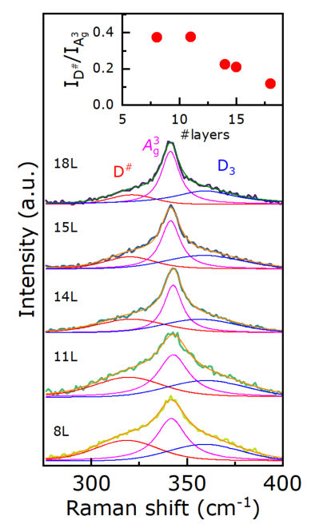 
FIG. 3. Thickness evolution of D# and D3 modes in CrSBr at a fluence of 1.2 × 1015 cm−2 under 2.33 eV excitation for E∥b configuration. Here, the light curves are the raw data, while the darker ones are the fits using the Voigt function for the peaks highlighted using vertical lines in Figure 2. Inset: ID#/IA3g as a function of number of layers.

📷 Fig 4

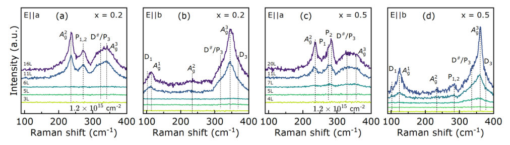 
FIG. 4. Defects in He+ irradiated CrSBr1−xClx . Thickness-dependent normalized Raman spectra at a fluence of 1.2 × 1015

📷 Fig 5

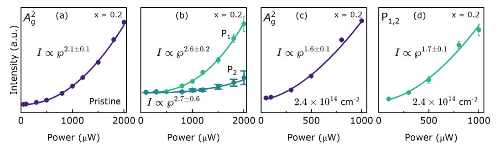 
FIG. 5. Raman intensities as a function of illumination power under resonant (1.96 eV) excitation for E∥a configuration for x = 0.2. (a-b) A2 g, P1, and P2 modes in non-irradiated samples. (c-d) He+ irradiated (2.4 × 1014 cm−2) A2 g and P1,2-modes. Solid circles are the fitted intensities with the bars as the fitting error, while the curves are the fits using I ∝℘θ.

**Summary.** This work uses Raman spectroscopy to examine how introducing disorder via chlorine substitution and physical damage via helium ion irradiation affects the vibrational modes of $	ext{CrSBr}_{1-x}	ext{Cl}_x$. The findings show that while disorder significantly alters the spectrum, the underlying strong electron-phonon coupling mechanism persists, indicating the material's resilience in its electronic response.

**Why it may be interesting.** The study provides detailed experimental evidence on how lattice dynamics are modified by two distinct sources of disorder (chemical vs. physical), which is relevant for understanding material stability and electronic coupling in engineered quantum materials.

Detailed structure

**Main problem.** The study investigates how combining compositional disorder (Cl substitution) and external physical damage ($	ext{He}^+$ irradiation) affects the vibrational properties of the layered magnetic semiconductor $	ext{CrSBr}_{1-x}	ext{Cl}_x$.

**Main result.** The combined disorder leads to anisotropic reconstruction of the Raman spectra, but the resonance-enhanced electron-phonon coupling, evidenced by superlinear power scaling, remains robust even in defect-engineered samples.

**Method.** The research employs polarization-resolved Raman spectroscopy, supplemented by power-dependent measurements to probe the vibrational response.

**Model / system.** The physical system is the mixed-halide magnetic semiconductor $	ext{CrSBr}_{1-x}	ext{Cl}_x$, which is analyzed in thin flakes. Disorder is introduced via controlled $	ext{Cl}$ substitution and external $	ext{He}^+$ ion irradiation.

**Key observables.** Phonon frequencies, linewidths, polarization dependence ($E\parallel a$ vs $E\parallel b$), and the nonlinear scaling exponent ($	heta$) of Raman intensities.

**Important parameters / regimes.** Cl substitution concentration ($x$), $	ext{He}^+$ irradiation fluence (up to $1.2 	imes 10^{15} 	ext{ cm}^{-2}$), and excitation energy (1.96 eV).

**Assumptions / limitations.** The analysis assumes that the observed spectral changes can be systematically attributed to the distinct effects of alloying disorder versus irradiation-induced defects.

**Figures summary.** Figures illustrate composition-dependent spectra, fluence-dependent defect mode activation ($	ext{D}1, 	ext{D}3, 	ext{D}\#$), and the power-law scaling of various phonon modes before and after irradiation.

**Paper structure.** The paper systematically analyzes the effects of Cl substitution first, then the effects of He+ irradiation on pure $	ext{CrSBr}$, and finally combines these analyses to study the interplay in $	ext{CrSBr}_{1-x}	ext{Cl}_x$, concluding with nonlinear response measurements.

Abstract

Two-dimensional magnetic semiconductors provide a promising platform for exploring the interplay between disorder, lattice dynamics, and resonant light--matter interactions. Among them, CrSBr exhibits strong in-plane anisotropy and pronounced resonance-enhanced Raman scattering. Here, we investigate the effects of Cl substitution and He$^{+}$ irradiation on the vibrational response of CrSBr using polarization-resolved Raman spectroscopy. Cl substitution activates additional phonon modes associated with local symmetry breaking, while He$^{+}$ irradiation introduces distinct defect-related scattering channels and enhanced phonon broadening. The combined effects of alloy disorder and externally introduced defects lead to strong anisotropic reconstruction of the Raman spectra and modification of the nonlinear Raman response under near-resonant 1.96 eV excitation. Power-dependent measurements reveal robust superlinear scaling of both intrinsic and substitution-induced phonon modes, indicating persistent resonance-enhanced electron--phonon coupling even in defect-engineered samples.

[↑ back to top](#top)

### [Spin Hall effect in two-dimensional materials with inverted bands and Mexican-hat dispersion](http://arxiv.org/abs/2605.30881v1)

**Authors:** Bagun S. Shchamkhalova, Vladimir A. Sablikov  
**Type:** theory · **Category:** other · **PDF:** <https://arxiv.org/pdf/2605.30881v1>  
**Analysis basis:** full PDF text, analyzed in chunks

📷 Fig 1

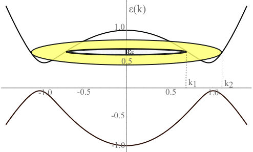 
FIG. 1. MHD and ring-shaped Fermi surface for𝑎= 0.25 and𝛿= −0.2, conduction band minimum is at 𝐸0 = 0.43.

📷 Fig 2

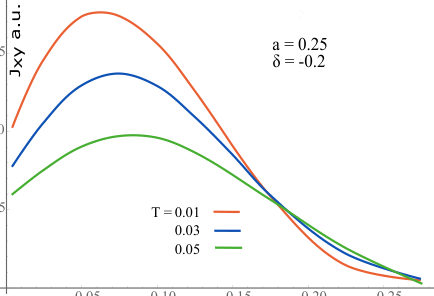 
FIG. 2. Extrinsic SHC versus 𝐸𝐹for two systems: 1) 𝑎= 0.2,𝛿= −0.1 (a); 2) 𝑎= 0.25,𝛿= −0.2 (b) and three temperatures, 𝑁𝑖= 1. Inset shows the Hall angle versus 𝐸𝐹for the first system.

📷 Fig 3

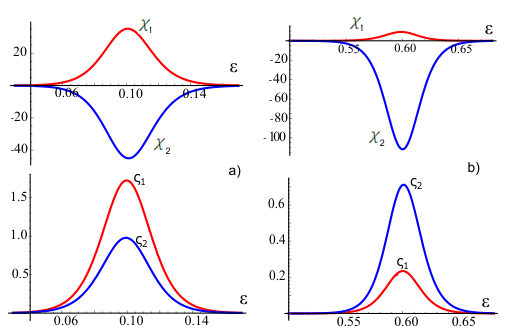 
FIG. 3. The additions to the distribution function for two 𝐸𝐹: a) 𝐸𝐹= 0.1 above the conduction band minimum; b)𝐸𝐹= 0.6 (about 0.1 lower than the Mexican hat top). The symmetric (upper curves) and asymmetric (lower curves) in scattering angle parts are shown at temperature T = 0.01, 𝑁𝑖= 1 .

📷 Fig 4

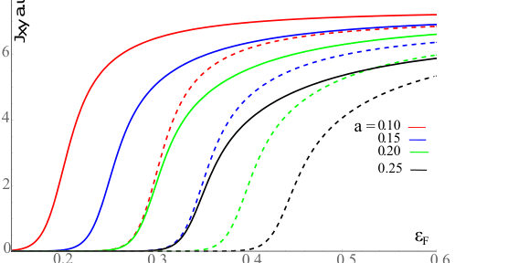 
FIG. 5. Intrinsic SHC dependencies on 𝐸𝐹for three values of parame- ter 𝑎and two values of 𝛿: 𝛿= -0.1 (thick curves) and 𝛿= -0.2 (dashed curves). Dashed curves are shifted for clarity.

📷 Fig 5

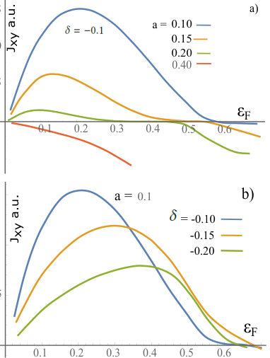 
FIG. 4. Extrinsic SHC dependencies on 𝐸𝐹for: a) 𝛿= −0.1 and different values of parameter 𝑎; b) 𝑎= 0.1 and 𝛿= −0.1; −0.15; −0.2 at temperature T = 0.01, 𝑁𝑖= 1

**Summary.** This work theoretically examines the Spin Hall Effect in 2D topological insulators exhibiting Mexican-hat dispersion. The authors find that extrinsic scattering mechanisms can generate a spin Hall current that surpasses the intrinsic contribution. Crucially, this extrinsic current displays a complex, non-monotonic dependence on the Fermi energy, which is dictated by the interplay between inter- and intra-contour electron transitions.

**Why it may be interesting.** The complex, energy-dependent behavior of the SHE, particularly the dominance of extrinsic effects over intrinsic ones at certain energies, provides rich physics related to topological transport phenomena.

Detailed structure

**Main problem.** The study investigates the Spin Hall Effect (SHE) in two-dimensional topological insulators characterized by 'Mexican-hat' dispersion and a ring-shaped Fermi surface.

**Main result.** The extrinsic SHE current can significantly exceed the intrinsic SHE current, and its dependence on the Fermi energy ($E_F$) is highly non-monotonic, exhibiting maxima, minima, and sign changes.

**Method.** The analysis employs the Boltzmann equation solved for two dispersion branches, incorporating spin-dependent skew scattering enabled by second-order impurity scattering processes.

**Model / system.** The system is modeled using the Bernevig-Hughes-Chang (BHZ) Hamiltonian for topological insulators. Key features include the Mexican-hat dispersion leading to two isoenergetic contours and a ring-shaped Fermi surface.

**Key observables.** Extrinsic Spin Hall Current (SHC), Intrinsic Spin Hall Current (SHC), and the dependence of these currents on Fermi energy ($E_F$).

**Important parameters / regimes.** Fermi energy ($E_F$), hybridization parameter ($a$), and band asymmetry ($\delta$).

**Assumptions / limitations.** The analysis initially ignores boundary effects, and the screening potential calculation utilizes the Random Phase Approximation (RPA).

**Figures summary.** Figures illustrate the MHD and ring-shaped Fermi surface, and show the non-monotonic dependence of the extrinsic SHE current on $E_F$ for varying material parameters.

**Paper structure.** The paper develops the theory by calculating scattering amplitudes via the $t$-matrix formalism and solving the resulting Boltzmann equation system of linear equations to determine the non-equilibrium distribution functions and resulting currents.

Abstract

We study the spin Hall effect in two-dimensional topological insulators with "Mexican hat" dispersion and a ring-shaped Fermi surface which are formed due to the band inversion. Electron transitions between different isoenergetic contours and the quantum metric of band states play an important role in the transport properties of such materials, since they largely determine the spatial distribution of the electron charges screening the impurity potential and the scattering probability [Phys.B, 719, 417942 (2025)]. Here we study a spin-dependent skew scattering, which is enabled by the second-order scattering processes, and show that the extrinsic spin-Hall current (SHC) can significantly exceed the intrinsic SHC arising from the Berry curvature. Furthermore, due to Mexican-hat dispersion, the SHC exhibits a very unusual dependence on the Fermi energy ($E_F$). The extrinsic SHC reaches a maximum at some $E_F$, then decreases with increasing $E_F$ and can even change a sign. This complicated behavior reflects an interplay of energy dependencies of such important factors as probabilities of inter- and intra-contour transitions, as well as different electron velocities in two contours.

[↑ back to top](#top)

### [What controls the superconducting dome of electron-doped FeSe?](http://arxiv.org/abs/2605.31459v1)

**Authors:** Paul T. Malinowski, Chad J. Mowers, Yaoju Tarn, Darrell G. Schlom, Brendan D. Faeth, Kyle M. Shen  
**Type:** experiment · **Category:** strongly correlated electrons · **PDF:** <https://arxiv.org/pdf/2605.31459v1>  
**Analysis basis:** full PDF text, analyzed in chunks

📷 Fig 1

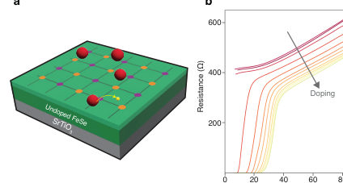 
Figure 1. Electronic transport as a function of doping via Cs surface deposition. (a) 4

📷 Fig 2

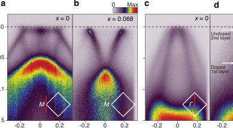 
Figure 2. Evolution and surface confinement of doping observed in ARPES. (a - d) 16

📷 Fig 3

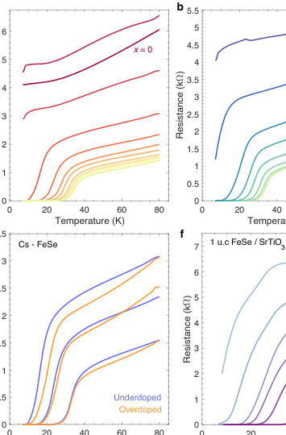 
Figure 3. Extracted sheet resistance of the doped surface layer. (a, b) Temperature 27

📷 Fig 4

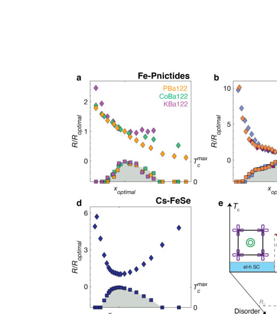 
Figure 4. Comparison of systems exhibiting superconducting domes. Normal state 39

**Summary.** This work investigates the superconducting dome in electron-doped FeSe using advanced epitaxial and transport measurements. The key finding is a robust linear scaling between the critical temperature ($T_c$) and the residual resistivity ($
ho_0$) across the entire doping range. This suggests that the superconductivity in this material is fundamentally limited by disorder scattering rather than solely by the carrier concentration.

**Why it may be interesting.** The strong correlation between $T_c$ and disorder ($
ho_0$) suggests a universal mechanism for high-$T_c$ superconductivity driven by scattering, which is relevant to understanding pairing mechanisms in strongly correlated systems.

Detailed structure

**Main problem.** To determine the physical mechanism controlling the superconducting dome observed in electron-doped FeSe, as its full phase diagram remains unexplored.

**Main result.** The superconducting transition temperature ($T_c$) scales robustly and linearly with the residual resistivity ($
ho_0$) across the entire dome, suggesting that disorder, rather than carrier doping alone, is the primary control parameter.

**Method.** The study combines molecular beam epitaxy synthesis, alkali surface doping, in-vacuum electrical transport measurements, and ARPES to map the phase diagram.

**Model / system.** The system is electron-doped FeSe thin films, where doping is controlled by Cs surface deposition. The analysis models the film as a stack of resistors to extract the sheet resistivity ($
ho_0$).

**Key observables.** Superconducting transition temperature ($T_c$), residual resistivity ($
ho_0$), and the evolution of the electronic band structure (Fermiology) via ARPES.

**Important parameters / regimes.** The doping level (controlled by Cs deposition), the residual resistivity ($
ho_0$), and the elastic scattering rate ($	au^{-1}$).

**Assumptions / limitations.** The analysis assumes the system can be modeled as a stack of resistors, and that the charge transfer of deposited Cs is confined to the topmost FeSe layer.

**Figures summary.** Figures show the doping dependence of $T_c$ and resistivity, highlighting a non-monotonic evolution of $
ho_0$ and a clear linear scaling plot of $T_c$ vs. $
ho_0$ across the dome.

**Paper structure.** The paper systematically explores the entire superconducting dome using multiple techniques, establishing the $T_c$-$
ho_0$ scaling, contrasting this behavior with other superconductors, and proposing that disorder limits superconductivity in this material.

Abstract

Superconducting domes are conspicuous features of the phase diagrams of most unconventional and high-temperature superconductors. The superconducting transition temperature ($T_{c}$) of FeSe can be dramatically enhanced with electron doping, but unlike all other high-temperature and unconventional superconductors, its full phase diagram and superconducting dome have yet to be fully explored. Here, we employ a combination of molecular beam epitaxy synthesis, alkali surface doping, in-vacuum electrical transport, and angle-resolved photoemission spectroscopy to investigate the entire superconducting dome of electron-doped FeSe, achieving a fully metallic state where superconductivity is suppressed in the heavily overdoped regime. We discover a robust scaling between $T_{c}$ and the residual resistivity ($ρ_{0}$) which holds across the entire superconducting dome, suggesting that the evolution of $T_{c}$ is heavily influenced by the evolution of the elastic scattering rate in the high-$T_{c}$ electron-doped phase. This in turn suggests that the superconducting dome in electron-doped FeSe appears to be fundamentally different than that of other unconventional superconductors where doping plays the primary role, and may be driven primarily by the sensitivity of the superconductivity to disorder.

[↑ back to top](#top)

