
# arxiv digest (quant-ph + cond-mat) — 2026-06-02

*196 papers · 47 relevant · 2 highlighted*

## 🔥 Most relevant (47)

*Every paper with at least one nonzero topic score, sorted by best-matching score. 🔥 marks scores ≥4/5. Click the title to jump to the full entry below; click [arXiv] to open the paper page. `(secondary)` marks papers from de-prioritized cond-mat archives.*

Show 47 relevant papers

- [Quantum optimal control of the Dicke manifold in Rydberg atom arrays](#paper-2606.02283) [[arXiv]](http://arxiv.org/abs/2606.02283v1) — 🔥 `Rydberg arrays` **5/5** · 🔥 `analog quantum simulation` **4/5** · `entanglement & information structure` **2/5** · `methods for driven-dissipative` **2/5** · `Dicke superradiance` **1/5**
- [Arbitrarily precise arrival time measurements in quantum mechanics](#paper-2606.01005) [[arXiv]](http://arxiv.org/abs/2606.01005v1) — 🔥 `quantum measurements` **5/5** · 🔥 `measurement-induced transitions` **4/5** · `correlated / nonlocal dissipation` **1/5** · `driven-dissipative phase transition` **1/5** · `methods for driven-dissipative` **1/5** · `non-equilibrium dynamics` **1/5**
- ⭐ [Non-destructive cavity readout of molecules for precision measurements](#paper-2606.01743) [[arXiv]](http://arxiv.org/abs/2606.01743v1) — 🔥 `quantum measurements` **4/5** · 🔥 `quantum optics experiment` **4/5** · `Tavis-Cummings & cavity-many-emitter` **3/5** · `analog quantum simulation` **3/5** · `correlated cavity matter` **3/5** · `QC/QI experiment` **2/5** · `measurement-induced transitions` **2/5** · `correlated / nonlocal dissipation` **1/5** · `driven-dissipative phase transition` **1/5** · `entanglement & information structure` **1/5** · `methods for driven-dissipative` **1/5** · `non-equilibrium dynamics` **1/5**
- [Most Subradiant Bound Photon Pairs from Chirality-Mediated Dispersion Softening](#paper-2606.01146) [[arXiv]](http://arxiv.org/abs/2606.01146v1) — 🔥 `correlated / nonlocal dissipation` **4/5** · `Dicke superradiance` **3/5** · `analog quantum simulation` **3/5** · `methods for driven-dissipative` **3/5** · `Tavis-Cummings & cavity-many-emitter` **2/5** · `driven-dissipative phase transition` **2/5** · `free-space correlated emission` **2/5** · `non-equilibrium dynamics` **2/5** · `Keldysh / 2PI / non-Gaussian methods` **1/5** · `correlated cavity matter` **1/5** · `entanglement & information structure` **1/5** · `non-equilibrium universality` **1/5**
- [Non-equilibrium glassy arrest and discontinuous transitions at avoided quantum critical points](#paper-2606.00580) [[arXiv]](http://arxiv.org/abs/2606.00580v1) — 🔥 `driven-dissipative phase transition` **4/5** · 🔥 `non-equilibrium dynamics` **4/5** · 🔥 `non-equilibrium universality` **4/5** · `Keldysh / 2PI / non-Gaussian methods` **3/5** · `methods for driven-dissipative` **3/5** · `analog quantum simulation` **2/5** · `correlated / nonlocal dissipation` **2/5** · `Frenkel-Kontorova` **1/5** · `entanglement & information structure` **1/5** · `scars & prethermalization` **1/5**
- [Stabilization of Granovskii-Zhedanov scars of the XYZ quantum spin chain via non-Hermitian spin relaxation](#paper-2606.01254) [[arXiv]](http://arxiv.org/abs/2606.01254v1) — 🔥 `scars & prethermalization` **4/5** · `correlated / nonlocal dissipation` **3/5** · `driven-dissipative phase transition` **3/5** · `methods for driven-dissipative` **3/5** · `non-equilibrium dynamics` **3/5** · `non-equilibrium universality` **2/5** · `Keldysh / 2PI / non-Gaussian methods` **1/5** · `Kondo & dissipative impurity` **1/5** · `analog quantum simulation` **1/5** · `entanglement & information structure` **1/5** · `exotic spin models in light-matter` **1/5** · `spintronics-quantum-optics interface` **1/5**
- [Strong-to-Weak Spontaneous Symmetry Breaking](#paper-2606.02555) [[arXiv]](http://arxiv.org/abs/2606.02555v1) — 🔥 `entanglement & information structure` **4/5** · `correlated / nonlocal dissipation` **3/5** · `driven-dissipative phase transition` **3/5** · `methods for driven-dissipative` **3/5** · `non-equilibrium dynamics` **3/5** · `non-equilibrium universality` **3/5** · `Keldysh / 2PI / non-Gaussian methods` **2/5** · `analog quantum simulation` **2/5** · `Kondo & dissipative impurity` **1/5**
- [Dynamical frustration in space-time metamaterials](#paper-2606.01797) [[arXiv]](http://arxiv.org/abs/2606.01797v1) — 🔥 `driven-dissipative phase transition` **4/5** · `analog quantum simulation` **3/5** · `methods for driven-dissipative` **3/5** · `non-equilibrium dynamics` **3/5** · `non-equilibrium universality` **3/5** · `correlated / nonlocal dissipation` **2/5** · `Frenkel-Kontorova` **1/5** · `Keldysh / 2PI / non-Gaussian methods` **1/5** · `correlated cavity matter` **1/5** · `entanglement & information structure` **1/5** · `exotic spin models in light-matter` **1/5**
- [Generating Fock state exceeding 10000 excitations with near unit fidelity by adaptive generalized-parity measurement](#paper-2606.01341) [[arXiv]](http://arxiv.org/abs/2606.01341v1) — 🔥 `measurement-induced transitions` **4/5** · 🔥 `quantum measurements` **4/5** · `Tavis-Cummings & cavity-many-emitter` **3/5** · `analog quantum simulation` **3/5** · `correlated cavity matter` **3/5** · `methods for driven-dissipative` **2/5** · `correlated / nonlocal dissipation` **1/5** · `driven-dissipative phase transition` **1/5** · `entanglement & information structure` **1/5** · `non-equilibrium dynamics` **1/5**
- [Non-Hermiticity-induced chirality imbalance of Weyl Landau levels](#paper-2606.00615) [[arXiv]](http://arxiv.org/abs/2606.00615v1) `(secondary)` — 🔥 `analog quantum simulation` **4/5** · `correlated / nonlocal dissipation` **3/5** · `driven-dissipative phase transition` **3/5** · `methods for driven-dissipative` **3/5** · `non-equilibrium dynamics` **2/5** · `non-equilibrium universality` **2/5** · `quantum optics experiment` **2/5** · `Keldysh / 2PI / non-Gaussian methods` **1/5** · `Kondo & dissipative impurity` **1/5** · `interference shaping light` **1/5**
- [Signatures of Rashba-Cavity-Induced Berry-curvature redistribution in the Spin-Hall Conductivity of Semiconductor Artificial Graphene](#paper-2606.01373) [[arXiv]](http://arxiv.org/abs/2606.01373v1) `(secondary)` — 🔥 `spintronics-quantum-optics interface` **4/5** · `analog quantum simulation` **3/5** · `correlated cavity matter` **3/5** · `exotic spin models in light-matter` **3/5** · `Tavis-Cummings & cavity-many-emitter` **2/5** · `driven-dissipative phase transition` **2/5** · `methods for driven-dissipative` **2/5** · `Keldysh / 2PI / non-Gaussian methods` **1/5** · `non-equilibrium dynamics` **1/5**
- [Chaotic spin dynamics of elongated spinor condensates](#paper-2606.02456) [[arXiv]](http://arxiv.org/abs/2606.02456v1) — 🔥 `non-equilibrium dynamics` **4/5** · `analog quantum simulation` **3/5** · `driven-dissipative phase transition` **3/5** · `exotic spin models in light-matter` **3/5** · `non-equilibrium universality` **3/5** · `methods for driven-dissipative` **2/5** · `Keldysh / 2PI / non-Gaussian methods` **1/5** · `entanglement & information structure` **1/5**
- [Higher-order exceptional points and enhanced quantum squeezing in a pseudo-Hermitian semiconductor optomechanical system](#paper-2606.01588) [[arXiv]](http://arxiv.org/abs/2606.01588v1) — 🔥 `driven-dissipative phase transition` **4/5** · `analog quantum simulation` **3/5** · `correlated cavity matter` **2/5** · `methods for driven-dissipative` **2/5** · `non-equilibrium dynamics` **2/5** · `non-equilibrium universality` **2/5** · `Keldysh / 2PI / non-Gaussian methods` **1/5** · `Tavis-Cummings & cavity-many-emitter` **1/5** · `correlated / nonlocal dissipation` **1/5** · `entanglement & information structure` **1/5**
- [Bath-induced deviations from Gibbs statistics for strongly interacting oscillators](#paper-2606.00239) [[arXiv]](http://arxiv.org/abs/2606.00239v1) — 🔥 `non-equilibrium dynamics` **4/5** · `correlated / nonlocal dissipation` **3/5** · `driven-dissipative phase transition` **3/5** · `methods for driven-dissipative` **3/5** · `non-equilibrium universality` **3/5** · `Keldysh / 2PI / non-Gaussian methods` **2/5**
- [Energy spectra and cascade in the spin turbulence of a driven spinor Bose-Einstein condensate](#paper-2606.00766) [[arXiv]](http://arxiv.org/abs/2606.00766v1) — 🔥 `non-equilibrium universality` **4/5** · `analog quantum simulation` **3/5** · `driven-dissipative phase transition` **3/5** · `exotic spin models in light-matter` **3/5** · `non-equilibrium dynamics` **3/5** · `methods for driven-dissipative` **1/5** · `spintronics-quantum-optics interface` **1/5**
- [Integer quantum Hall effect](#paper-2606.01744) [[arXiv]](http://arxiv.org/abs/2606.01744v1) `(secondary)` — 🔥 `non-equilibrium dynamics` **4/5** · `analog quantum simulation` **3/5** · `driven-dissipative phase transition` **3/5** · `non-equilibrium universality` **3/5** · `Keldysh / 2PI / non-Gaussian methods` **2/5** · `methods for driven-dissipative` **2/5** · `entanglement & information structure` **1/5**
- [Negative Interaction Quench Dynamics of Density-Ordered Dipolar Bosons in a One-Dimensional Optical Lattice](#paper-2606.01712) [[arXiv]](http://arxiv.org/abs/2606.01712v1) — 🔥 `non-equilibrium dynamics` **4/5** · `analog quantum simulation` **3/5** · `non-equilibrium universality` **3/5** · `Frenkel-Kontorova` **2/5** · `scars & prethermalization` **2/5** · `entanglement & information structure` **1/5** · `methods for driven-dissipative` **1/5**
- [Analog photonic simulator for large-scale transport](#paper-2606.00581) [[arXiv]](http://arxiv.org/abs/2606.00581v1) — 🔥 `analog quantum simulation` **4/5** · 🔥 `quantum optics experiment` **4/5** · `non-equilibrium dynamics` **2/5** · `quantum measurements` **2/5** · `QC/QI experiment` **1/5** · `entanglement & information structure` **1/5** · `methods for driven-dissipative` **1/5**
- [Boulder Lectures on Thermal Dynamics and Hydrodynamic EFTs](#paper-2606.02391) [[arXiv]](http://arxiv.org/abs/2606.02391v1) — 🔥 `Keldysh / 2PI / non-Gaussian methods` **4/5** · 🔥 `non-equilibrium dynamics` **4/5** · `non-equilibrium universality` **3/5** · `methods for driven-dissipative` **2/5** · `analog quantum simulation` **1/5** · `driven-dissipative phase transition` **1/5**
- [Microscopic Origin of Emergent Elliptic Flow and Molecule Formation in Strongly Interacting Quasi-Two-Dimensional Few-Body Systems](#paper-2606.01728) [[arXiv]](http://arxiv.org/abs/2606.01728v1) — 🔥 `analog quantum simulation` **4/5** · `Keldysh / 2PI / non-Gaussian methods` **3/5** · `methods for driven-dissipative` **3/5** · `non-equilibrium dynamics` **3/5** · `entanglement & information structure` **1/5** · `non-equilibrium universality` **1/5**
- [Tandem Exclusion Process](#paper-2606.01568) [[arXiv]](http://arxiv.org/abs/2606.01568v1) — 🔥 `non-equilibrium dynamics` **4/5** · `driven-dissipative phase transition` **3/5** · `methods for driven-dissipative` **3/5** · `non-equilibrium universality` **3/5** · `Frenkel-Kontorova` **1/5** · `Keldysh / 2PI / non-Gaussian methods` **1/5**
- [Programmable site-selective spin control in rotating Penning-trap ion crystals](#paper-2606.00940) [[arXiv]](http://arxiv.org/abs/2606.00940v1) — 🔥 `QC/QI experiment` **4/5** · `analog quantum simulation` **3/5** · `exotic spin models in light-matter` **2/5** · `entanglement & information structure` **1/5** · `non-equilibrium dynamics` **1/5** · `quantum measurements` **1/5** · `quantum optics experiment` **1/5** · `spintronics-quantum-optics interface` **1/5**
- [Voltage-driven transition from steady-state fluctuations to phase-transition noise in nanoscale VO$_2$ devices](#paper-2606.01872) [[arXiv]](http://arxiv.org/abs/2606.01872v1) `(secondary)` — 🔥 `driven-dissipative phase transition` **4/5** · `non-equilibrium dynamics` **3/5** · `non-equilibrium universality` **3/5** · `methods for driven-dissipative` **2/5** · `Frenkel-Kontorova` **1/5** · `Keldysh / 2PI / non-Gaussian methods` **1/5**
- [Complexity of tensor network simulation for noisy quantum circuits](#paper-2606.00474) [[arXiv]](http://arxiv.org/abs/2606.00474v1) — 🔥 `methods for driven-dissipative` **4/5** · `entanglement & information structure` **3/5** · `correlated / nonlocal dissipation` **2/5** · `driven-dissipative phase transition` **2/5** · `non-equilibrium dynamics` **1/5** · `non-equilibrium universality` **1/5**
- [Quantum light source with lithium tantalate for scalable photonic quantum circuits](#paper-2606.01657) [[arXiv]](http://arxiv.org/abs/2606.01657v1) — 🔥 `quantum optics experiment` **4/5** · `QC/QI experiment` **3/5** · `interference shaping light` **3/5** · `correlated cavity matter` **2/5** · `entanglement & information structure` **1/5**
- [Can scrambling protect quantum state distinguishability under noise?](#paper-2606.02122) [[arXiv]](http://arxiv.org/abs/2606.02122v1) — 🔥 `measurement-induced transitions` **4/5** · `entanglement & information structure` **3/5** · `quantum measurements` **2/5** · `Keldysh / 2PI / non-Gaussian methods` **1/5** · `correlated / nonlocal dissipation` **1/5** · `driven-dissipative phase transition` **1/5**
- [Ground-state phase diagram of Rydberg atoms in a triangular-prism array](#paper-2606.01116) [[arXiv]](http://arxiv.org/abs/2606.01116v1) — 🔥 `Rydberg arrays` **4/5** · 🔥 `analog quantum simulation` **4/5** · `entanglement & information structure` **3/5** · `exotic spin models in light-matter` **1/5**
- [Matter-Wave Interferometers as Open-System Dark Matter Detectors](#paper-2606.00237) [[arXiv]](http://arxiv.org/abs/2606.00237v1) — 🔥 `Keldysh / 2PI / non-Gaussian methods` **4/5** · `analog quantum simulation` **2/5** · `methods for driven-dissipative` **2/5** · `correlated / nonlocal dissipation` **1/5** · `driven-dissipative phase transition` **1/5** · `interference shaping light` **1/5** · `non-equilibrium dynamics` **1/5**
- [A tunable feedback-controlled magnetic trap for a magnet in free fall](#paper-2606.01056) [[arXiv]](http://arxiv.org/abs/2606.01056v1) — 🔥 `quantum measurements` **4/5** · `spintronics-quantum-optics interface` **3/5** · `exotic spin models in light-matter` **1/5** · `measurement-induced transitions` **1/5** · `methods for driven-dissipative` **1/5** · `non-equilibrium dynamics` **1/5**
- [Information scrambling in all-to-all interacting models](#paper-2606.02207) [[arXiv]](http://arxiv.org/abs/2606.02207v1) — 🔥 `entanglement & information structure` **4/5** · `non-equilibrium dynamics` **3/5** · `non-equilibrium universality` **2/5** · `analog quantum simulation` **1/5** · `scars & prethermalization` **1/5**
- [Iterative $C_Z$-gate-based protocol for squeezed Schrödinger cat state engineering](#paper-2606.02201) [[arXiv]](http://arxiv.org/abs/2606.02201v1) — 🔥 `measurement-induced transitions` **4/5** · 🔥 `quantum measurements` **4/5** · `Keldysh / 2PI / non-Gaussian methods` **1/5** · `entanglement & information structure` **1/5** · `methods for driven-dissipative` **1/5**
- [Learning Mid-circuit Measurement Backaction from Three Repeated Measurements](#paper-2606.00433) [[arXiv]](http://arxiv.org/abs/2606.00433v1) — 🔥 `QC/QI experiment` **4/5** · 🔥 `quantum measurements` **4/5** · `measurement-induced transitions` **2/5** · `methods for driven-dissipative` **1/5**
- [Phase-Sensitive Crystal-Edge Effects in Linear Optical Parametric Oscillators: Why Nominally Identical Squeezers Behave Differently](#paper-2606.00216) [[arXiv]](http://arxiv.org/abs/2606.00216v1) — 🔥 `quantum optics experiment` **4/5** · `interference shaping light` **3/5** · `QC/QI experiment` **1/5** · `correlated cavity matter` **1/5** · `driven-dissipative phase transition` **1/5**
- [Physics-Informed Learning of Effective Error Processes from Limited Noisy Transmon Measurements for Robust QAOA Reliability](#paper-2606.00353) [[arXiv]](http://arxiv.org/abs/2606.00353v1) — 🔥 `QC/QI experiment` **4/5** · `methods for driven-dissipative` **3/5** · `quantum measurements` **2/5** · `correlated / nonlocal dissipation` **1/5**
- [Topological Edge States from Molecular Chirality: A General Framework for Dimerized Dipolar Arrays](#paper-2606.00877) [[arXiv]](http://arxiv.org/abs/2606.00877v1) — 🔥 `analog quantum simulation` **4/5** · `exotic spin models in light-matter` **3/5** · `Keldysh / 2PI / non-Gaussian methods` **1/5** · `entanglement & information structure` **1/5** · `methods for driven-dissipative` **1/5**
- [Realizing leakage elimination operator-based adiabatic speedup on a superconducting quantum processor](#paper-2606.01226) [[arXiv]](http://arxiv.org/abs/2606.01226v1) — 🔥 `QC/QI experiment` **4/5** · `methods for driven-dissipative` **2/5** · `correlated / nonlocal dissipation` **1/5** · `driven-dissipative phase transition` **1/5** · `non-equilibrium dynamics` **1/5**
- [Sliding contact creates universal self-affine fractal surfaces](#paper-2606.00626) [[arXiv]](http://arxiv.org/abs/2606.00626v1) — 🔥 `non-equilibrium universality` **4/5** · `non-equilibrium dynamics` **3/5** · `Frenkel-Kontorova` **1/5** · `driven-dissipative phase transition` **1/5**
- [Spatial and particle-particle entanglement in 1D quantum walks of two distinguishable or indistinguishable bosonic particles](#paper-2606.02505) [[arXiv]](http://arxiv.org/abs/2606.02505v1) — 🔥 `entanglement & information structure` **4/5** · `analog quantum simulation` **3/5** · `non-equilibrium dynamics` **2/5**
- [Magneto-optical characterization of GeSn and GeSn/SiGeSn heterostructures](#paper-2606.01524) [[arXiv]](http://arxiv.org/abs/2606.01524v1) — 🔥 `QC/QI experiment` **4/5** · `spintronics-quantum-optics interface` **3/5** · `exotic spin models in light-matter` **1/5**
- [Nonequilibrium transport in epitaxial CsPbBr3 single crystals](#paper-2606.02460) [[arXiv]](http://arxiv.org/abs/2606.02460v1) `(secondary)` — 🔥 `non-equilibrium dynamics` **4/5** · `correlated / nonlocal dissipation` **1/5** · `driven-dissipative phase transition` **1/5** · `methods for driven-dissipative` **1/5** · `non-equilibrium universality` **1/5**
- [Thouless Pumping of Large Chern Numbers in Optical Floquet Quasicrystals](#paper-2606.02489) [[arXiv]](http://arxiv.org/abs/2606.02489v1) — 🔥 `analog quantum simulation` **4/5** · `non-equilibrium dynamics` **3/5** · `methods for driven-dissipative` **1/5**
- [Is Quantum Mechanics Universal? EWF Experiments and Non Absoluteness of Events](#paper-2606.01349) [[arXiv]](http://arxiv.org/abs/2606.01349v1) — 🔥 `quantum measurements` **4/5** · `measurement-induced transitions` **3/5**
- [Quantum Signal Processing for Linear PDEs: Circuit Design and Experimental Validation](#paper-2606.00368) [[arXiv]](http://arxiv.org/abs/2606.00368v1) — 🔥 `QC/QI experiment` **4/5** · `non-equilibrium dynamics` **1/5**
- [Software-based compensation of AC-line-induced control errors in qubits and qudits](#paper-2606.00358) [[arXiv]](http://arxiv.org/abs/2606.00358v1) — 🔥 `QC/QI experiment` **4/5** · `quantum measurements` **1/5**
- [Aharonov-Casher Chern bands for ultracold dark state atoms](#paper-2606.00207) [[arXiv]](http://arxiv.org/abs/2606.00207v1) — 🔥 `analog quantum simulation` **4/5**
- [Individually tunable Si/SiGe quantum dot operating voltages via gate-biased illumination](#paper-2606.00446) [[arXiv]](http://arxiv.org/abs/2606.00446v1) — 🔥 `QC/QI experiment` **4/5**
- [Optically programmable and erasable cryogenic flash memory on an undoped Si/SiGe heterostructure](#paper-2606.00711) [[arXiv]](http://arxiv.org/abs/2606.00711v1) `(secondary)` — 🔥 `QC/QI experiment` **4/5**

## ⭐ Highlighted (2)

*Papers by authors on your watch list. Click the title to jump to the full entry below; click [arXiv] to open the paper page.*

Show 2 highlighted papers

- ⭐ [Non-destructive cavity readout of molecules for precision measurements](#paper-2606.01743) [[arXiv]](http://arxiv.org/abs/2606.01743v1) — Vladan Vuletić
- ⭐ [Creating and Probing Spin-Squeezed States of Molecules](#paper-2606.02500) [[arXiv]](http://arxiv.org/abs/2606.02500v1) — Ana Maria Rey

## All papers (136, sorted by relevance)

*Papers from quant-ph and your primary cond-mat archives (quant-gas, stat-mech, str-el, dis-nn). Highlighted papers (⭐) come first, then everything else sorted by topic-relevance score, highest first.*

### ⭐ [Non-destructive cavity readout of molecules for precision measurements](http://arxiv.org/abs/2606.01743v1)

**Highlighted author(s):** Vladan Vuletić  
**Authors:** Alejandro Salas-Estrada, Silviu-Marian Udrescu, Geoffrey Zheng, Qian Wang, Arian Jadbabaie, Vladan Vuletić, David DeMille, Ronald F. Garcia Ruiz, Edwin Pedrozo-Peñafiel  
**Type:** experiment · **Category:** other · **PDF:** <https://arxiv.org/pdf/2606.01743v1>  
**Analysis basis:** full PDF text, analyzed in chunks
**Topic relevance:** 🔥 `quantum measurements` **4/5** · 🔥 `quantum optics experiment` **4/5** · `Tavis-Cummings & cavity-many-emitter` **3/5** · `analog quantum simulation` **3/5** · `correlated cavity matter` **3/5** · `QC/QI experiment` **2/5** · `measurement-induced transitions` **2/5** · `correlated / nonlocal dissipation` **1/5** · `driven-dissipative phase transition` **1/5** · `entanglement & information structure` **1/5** · `methods for driven-dissipative` **1/5** · `non-equilibrium dynamics` **1/5**

↔ Scroll figures horizontally

<figure class="paper-figure-card">
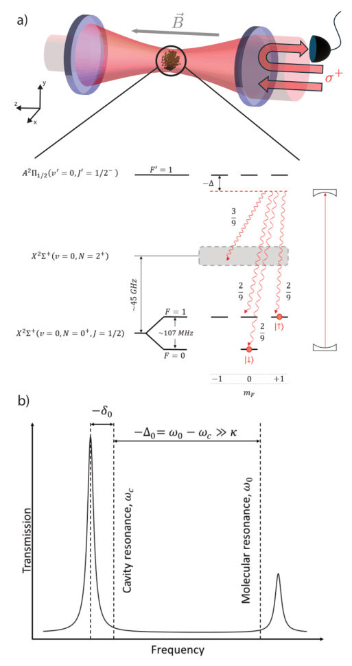
<figcaption class="paper-figure-caption"><b>Fig 1.</b> FIG. 1. Molecules interacting strongly with the light inside a high finesse optical cavity (a) Top: The molecules are op- tically trapped (trapping light not shown) close to the beam waist of the light building up inside the cavity (red). An ex- ternally applied magnetic field defines the quantization axis along the cavity (gray arrow). A photodetector captures the reflected light, which provides a dispersive measurement of the molecular state population. Bottom: Relevant energy levels in SrF. The transition |↓⟩→|e⟩is driven using off resonant light (red arrow) with a frequency close to the dressed cavity resonance. The light detuning from the molecular transition is ∆≫Γ. The possible...</figcaption>
</figure>
<figure class="paper-figure-card">
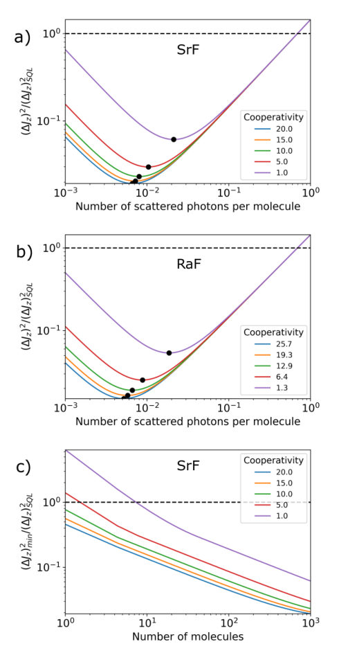
<figcaption class="paper-figure-caption"><b>Fig 2.</b> FIG. 2. (a) Measurement variance normalized to the SQL as a function of the number of scattered photons per molecule for an ensemble of N = 1000 SrF molecules with detection efficiency q = 0.4. Each curve corresponds to a cavity of length ∼5 cm, mode waist 10 µm, and detuning 1 GHz from the molecular resonance. The finesse ranges from ∼7,000 to 140,000, determining the cooperativity and linewidth. Black points indicate the optimal measurement positions where Ra- man noise equals photon shot noise. The dashed line marks the SQL. The corresponding measurement time is on the sub- millisecond scale. (b) Same as (a) for RaF, assuming identical ensemble size and cavity parameters. (c) Minimum...</figcaption>
</figure>

**Summary.** The authors present a novel, non-destructive cavity readout technique for measuring molecular quantum states in ultracold molecules like SrF. By monitoring the shift in a high-finesse optical cavity resonance, they can achieve measurement precision below the Standard Quantum Limit. This method is crucial for enabling high-cycle-rate quantum sensing experiments, especially for sensitive species like radioactive molecules.

**Why it may be interesting.** This work represents a state-of-the-art experimental realization of quantum sensing using molecular qubits coupled to cavities, directly relevant to open quantum systems and precision measurement protocols.

Detailed structure

**Main problem.** The paper proposes a non-destructive method to measure the population of molecular quantum states for high-precision measurements, particularly for rare or radioactive molecules.

**Main result.** The technique achieves measurement variances below the Standard Quantum Limit (SQL) on sub-millisecond timescales while minimizing molecular loss, enabling high-duty cycle measurements.

**Method.** The readout utilizes cavity quantum electrodynamics (cavity-QED) by measuring the shift in the high-finesse optical cavity resonance, which is proportional to the molecular population difference.

**Model / system.** The system involves ultracold molecules (e.g., SrF) trapped in an optical lattice/MOT and coupled to a high-finesse optical cavity. The measurement relies on dispersive coupling in the far-detuned regime.

**Key observables.** Cavity resonance shift ($\delta_0$), molecular population difference ($J_z$), and measurement variance ($\Delta J_z$).

**Important parameters / regimes.** Measurement time scale (< 1 ms), Standard Quantum Limit (SQL), single-molecule cooperativity ($\eta$), and molecular loss probability ($p_{	ext{loss}}$).

**Assumptions / limitations.** The readout is nearly nondestructive, and the measurement uncertainty is derived using the Cramér-Rao bound based on input-output formalism.

**Figures summary.** Figures illustrate the cavity transmission spectrum showing shifts proportional to molecule number, and plots compare the achievable measurement variance against the SQL limit.

**Paper structure.** The work progresses from establishing the need for non-destructive readout, detailing the cavity-QED measurement formalism (dispersive shift), quantifying the achievable precision relative to the SQL, and finally describing the necessary prerequisite steps like ultra-cold molecule trapping (CB MOT) and state preparation.

Abstract

We propose a non-destructive method to measure the population of molecules in a selected rotational-hyperfine state by coupling them to a high-finesse optical cavity. In contrast to traditional techniques, our approach enables fast (less than 1 ms) repeated measurements with reduced heating and losses, and with precision below the standard quantum limit. The method is particularly advantageous for radioactive molecules, systems of high interest for symmetry violation searches, for which production and sample size are limited, and repeated interrogation is essential for improved sensitivity.

[↑ back to top](#top)

### ⭐ [Creating and Probing Spin-Squeezed States of Molecules](http://arxiv.org/abs/2606.02500v1)

**Highlighted author(s):** Ana Maria Rey  
**Authors:** Connor M. Holland, Callum L. Welsh, Yukai Lu, David Wellnitz, Xing-Yan Chen, Ana Maria Rey, Lawrence W. Cheuk  
**Type:** experiment · **Category:** other · **PDF:** <https://arxiv.org/pdf/2606.02500v1>  
**Analysis basis:** full PDF text, analyzed in chunks
**Topic relevance:** `QC/QI experiment` **3/5** · `analog quantum simulation` **3/5** · `entanglement & information structure` **3/5** · `exotic spin models in light-matter` **3/5** · `non-equilibrium dynamics` **3/5** · `methods for driven-dissipative` **2/5** · `quantum measurements` **2/5** · `quantum optics experiment` **2/5** · `Rydberg arrays` **1/5**

↔ Scroll figures horizontally

<figure class="paper-figure-card">
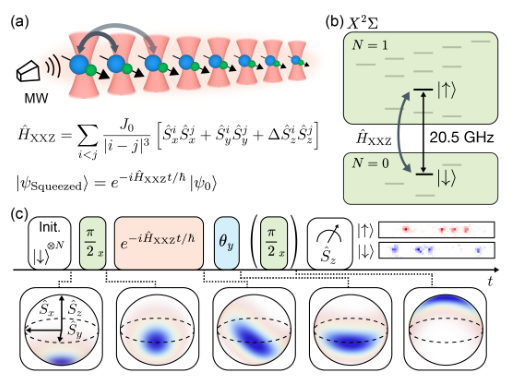
<figcaption class="paper-figure-caption"><b>Fig 1.</b> FIG. 1. Spin-Squeezing in a CaF Molecular Tweezer Array. (a) 1/r3 XXZ models are realized using Floquet engineering via periodic sequences of global microwave (MW) pulses. (b) CaF rotational qubit encoding. (c) Sequence for dynamically creating spin-squeezed states. Molecules are initialized along the y-axis of the collective Bloch sphere via a π/2 pulse about x, after which OAT-like dynamics shear the quantum state and produce squeezing. Rotation pulses applied after squeez- ing re-orient the state before spin-resolved population detec- tion, which measures ˆSz. Specifically, the spin noise Var[ ˆSθ] is measured after a rotation of angle θ about the y-axis, while the spin length requires...</figcaption>
</figure>
<figure class="paper-figure-card">
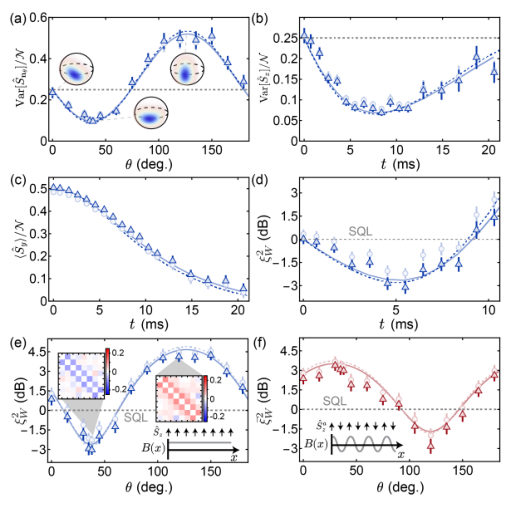
<figcaption class="paper-figure-caption"><b>Fig 2.</b> FIG. 2. XX Squeezing Dynamics and Metrological Perfor- mance. (a) Normalized variance of ˆSnθ versus orientation angle θ, measured after 4.55 ms of XX squeezing. (b) Nor- malized variance of ˆSz versus interaction time t at θ∗. (c) Normalized spin length |⟨ˆSy⟩| versus interaction time t. (d) Wineland parameter ξ2 W versus squeezing duration t at θ∗. (e) ξ2 W versus readout angle θ. Insets show the spin-spin correla- tors ⟨Si zSj z⟩c at θ = 38◦(left) and θ = 120◦(right), revealing predominantly short-ranged correlations. (f) The staggered Wineland parameter ¯ξ2 W versus readout angle θ. Inset: illus- tration of a spatially staggered magnetic field with alternating sign on even and odd sites...</figcaption>
</figure>
<figure class="paper-figure-card">
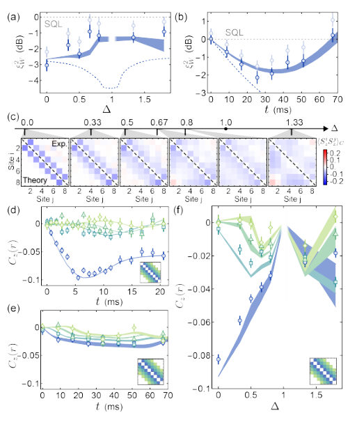
<figcaption class="paper-figure-caption"><b>Fig 3.</b> FIG. 3. Metrological Gain and Correlations for XXZ Squeez- ing. (a) Wineland parameter ξ2 W (t∗, θ∗) at the ideal squeezing optimum versus XXZ anisotropy ∆. (b) ξ2 W (t, θ∗) versus in- teraction time t for ∆= 0.8. For (a,b), the dashed line shows unitary dynamics from an ideal 1/r3 XXZ model. The shaded band shows the predictions of our noise model. (c) Connected spin-spin correlators ⟨Si zSj z⟩c measured at t∗for different ∆ (upper-right: experiment; lower-left: theory). The diagonals are not shown. (d) The mean spin-spin correlator Cz(r) for ∆= 0 versus t, where r is the spin separation. (e) Cz(r) versus t for ∆= 0.8. (f) Cz(r) versus ∆, revealing extended correlations near the Heisenberg...</figcaption>
</figure>
<figure class="paper-figure-card">
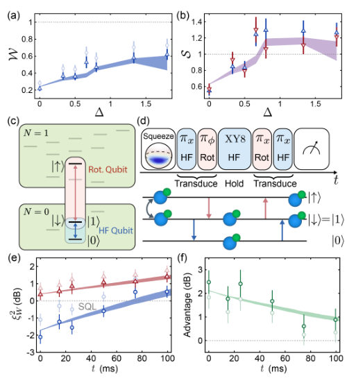
<figcaption class="paper-figure-caption"><b>Fig 4.</b> FIG. 4. Bipartite Entanglement, EPR Steering, and Storage of Spin-Squeezed States. (a) Separability witness W versus ∆. (b) EPR steering witness S versus ∆(red: A→B steering; blue: B→A steering). (c) Hyperfine qubit encoding |0⟩-|1⟩. (d) Squeezing and transduction protocol. Molecules in the ro- tational encoding (|↑⟩-|↓⟩) are squeezed, transferred into the non-interacting hyperfine encoding [25], and stored. For read- out, populations are transferred back to the rotational encod- ing for spin-resolved detection. (e) Wineland parameter ξ2 W versus storage time t. Red (blue) shows data for an unentan- gled coherent spin state (spin-squeezed state). (f) Practical metrological advantage of the...</figcaption>
</figure>
<figure class="paper-figure-card">
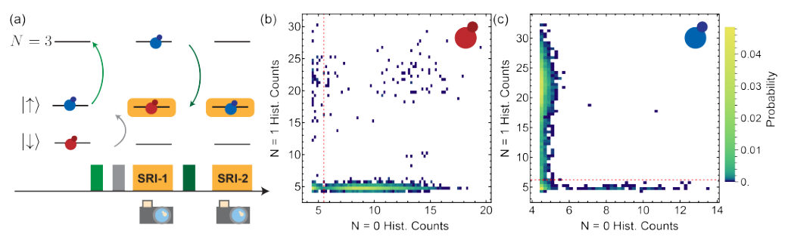
<figcaption class="paper-figure-caption"><b>Fig 5.</b> FIG. 1. SRI Sequence and Histograms: (a) SRI begins with molecules in the rotational encoding. Application of N12 and a MW π-pulse transfers |↑⟩→N = 3 and |↓⟩→|↑⟩. SRI-1 is applied to identify molecules originally in |↓⟩. Next, N32 is applied to return N = 3 →N = 1 before the SRI-2 image, which identifies molecules originally in |↑⟩. (b,c) Fluorescence histograms from the two images with molecules primarily initialized in either |↓⟩(b) or |↑⟩(c) and detection thresholds (red dashed).</figcaption>
</figure>

**Summary.** This paper reports the first observation of spin-squeezed states in polar CaF molecules trapped in optical tweezers. The researchers use engineered dipolar interactions to generate entanglement and demonstrate enhanced sensitivity for quantum sensing. Crucially, they show this quantum advantage can be preserved for long periods by storing the state in robust, non-interacting hyperfine levels.

**Why it may be interesting.** This work provides a concrete, scalable platform (molecular optical tweezer arrays) for generating and controlling complex quantum states, directly advancing the field of quantum sensing by demonstrating measurable metrological gains beyond the standard quantum limit.

Detailed structure

**Main problem.** The primary goal is to create and probe metrologically useful entangled states, specifically spin-squeezed states, in molecular systems for quantum-enhanced sensing.

**Main result.** The authors successfully observed spin-squeezed states in polar CaF molecules and demonstrated that the metrological enhancement persists for up to 100ms even after transferring the state to long-lived hyperfine levels.

**Method.** The study uses optical tweezer arrays to trap molecules, employing dynamical decoupling and Floquet engineering to generate and characterize entanglement, followed by site- and spin-resolved measurements.

**Model / system.** The physical system is polar CaF molecules trapped in a 1D optical tweezer array. The spin degree of freedom is encoded in rotational levels, which interact via dipolar exchange interactions, modeled by an effective XXZ Hamiltonian.

**Key observables.** Wineland squeezing parameter ($\xi^2_W$), bipartite entanglement witness ($W$), EPR steering witness ($S_{A	o B}$), and the decay of metrological gain over time.

**Important parameters / regimes.** Metrological gain up to 3.0(3) dB; storage time up to 100ms; interaction strength ($\Delta$ parameter in XXZ model); noise parameters ($\sigma$ for global noise).

**Assumptions / limitations.** The analysis relies on the ability to perform site- and spin-resolved readout, and later sections model decoherence using Lindblad master equations and Gaussian noise approximations.

**Figures summary.** Figures illustrate the experimental setup, the dynamics of spin squeezing under XXZ interactions, the quantification of entanglement and EPR steering, and the decay of metrological enhancement over storage time.

**Paper structure.** The paper progresses from establishing the physical platform (trapping/loading) to generating the entangled state via engineered Hamiltonians (Floquet engineering), characterizing the entanglement (bipartite entanglement, EPR steering), and finally demonstrating the long-term storage of the quantum enhancement in non-interacting hyperfine states.

Abstract

Polar molecules are a promising platform for quantum-enhanced sensing and precision tests of fundamental physics, owing to their strong long-range dipolar interactions, broad sensitivity to electromagnetic fields, and sensitivity to potential physics beyond the Standard Model. However, the creation of metrologically useful entangled states in molecular systems has remained elusive. Here, we report the first observation of a class of metrologically useful entangled states - spin-squeezed states - in polar CaF molecules trapped in an optical tweezer array. The spin degree of freedom is encoded in rotational levels which are directly coupled by dipolar exchange interactions. By harnessing appropriate dynamical decoupling schemes we observe up to 3.0(3)dB of metrological gain, (2.2(3)dB without measurement correction) from direct exchange interactions. Using Floquet engineering, we further realize richer Hamiltonians that preserve spin squeezing while enabling the development of longer-range quantum correlations. Using site- and spin-resolved measurements we demonstrate that these entangled states enhance sensitivity to both homogeneous and spatially varying fields, and reveal strong non-classical correlations, including bipartite entanglement and Einstein-Podolsky-Rosen steering. Finally, we transfer the spin-squeezed states into long-lived and non-interacting hyperfine states, where the metrological enhancement persists for up to 100ms. Our results establish molecular optical tweezer arrays as a scalable platform for generating, controlling, characterizing, and storing entangled states of molecules, opening new opportunities for quantum-enhanced sensing and precision tests of fundamental physics.

[↑ back to top](#top)

### [Quantum optimal control of the Dicke manifold in Rydberg atom arrays](http://arxiv.org/abs/2606.02283v1)

**Authors:** Ivy Pannier-Günther, Vikas Buchemmavari, Pablo M. Poggi, Ivan H. Deutsch  
**Type:** theory · **Category:** other · **PDF:** <https://arxiv.org/pdf/2606.02283v1>  
**Analysis basis:** full PDF text, analyzed in chunks
**Topic relevance:** 🔥 `Rydberg arrays` **5/5** · 🔥 `analog quantum simulation` **4/5** · `entanglement & information structure` **2/5** · `methods for driven-dissipative` **2/5** · `Dicke superradiance` **1/5**

↔ Scroll figures horizontally

<figure class="paper-figure-card">
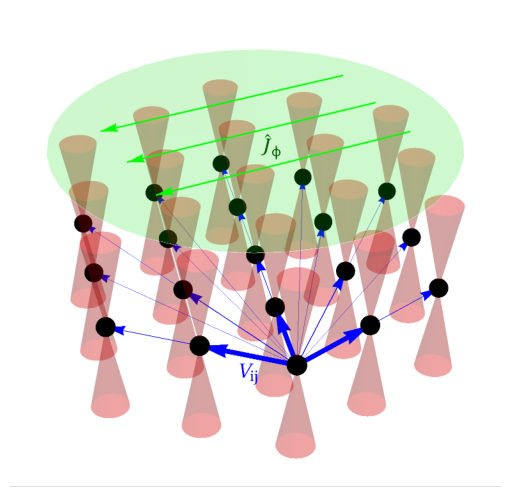
<figcaption class="paper-figure-caption"><b>Fig 1.</b> FIG. 1. Schematic diagram for quantum optimal control in the Dicke manifold. Rydberg atoms in a 2D array of optical tweezers arranged in a close-packed triangular lattice inter- act via resonant dipole-dipole interactions with an interac- tion graph Vij = V N ||i −j||−3 (blue). Control is designed by a time-dependent global field which drives Rabi oscillations, generated by the component collective spin, ˆJϕ (green).</figcaption>
</figure>
<figure class="paper-figure-card">
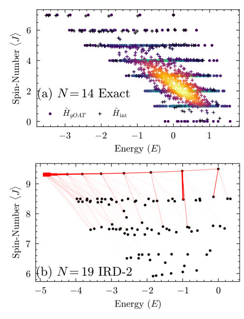
<figcaption class="paper-figure-caption"><b>Fig 2.</b> FIG. 2. (a) Eigenstates of the dipole-dipole interac- tion Hamiltonians ˆHint and ˆHgOAT , on triangular lattices of N = 14 two-level atoms. Eigenstates are plotted for eigenen- ergy E and spin-number expectation ⟨J⟩defined such that ⟨J⟩2 + ⟨J⟩= ⟨J2⟩. In purple-to-green, the gapped OAT, for which J is an exact quantum number. In black-to-orange, the dipole-dipole interaction, which forms a QMBS approxi- mating the Dicke manifold. (b) Eigenstates of ˆHint on H(2) D (using irrep distillation explained in Section II A) for N = 19, with red bonds showing QMBS off-diagonal couplings caused by the control Hamiltonian, ˆHcon = Ω(t) ˆJϕ(t).</figcaption>
</figure>
<figure class="paper-figure-card">
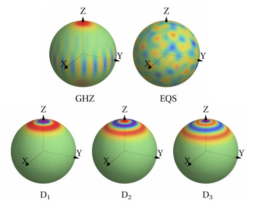
<figcaption class="paper-figure-caption"><b>Fig 3.</b> FIG. 3. Spin Wigner functions for control target states with J = 19</figcaption>
</figure>
<figure class="paper-figure-card">
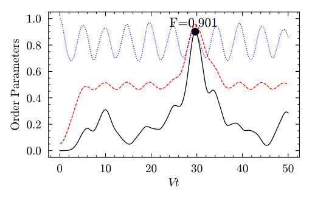
<figcaption class="paper-figure-caption"><b>Fig 4.</b> FIG. 4. Evolution of an initial spin coherent state |↑⟩⊗N</figcaption>
</figure>
<figure class="paper-figure-card">
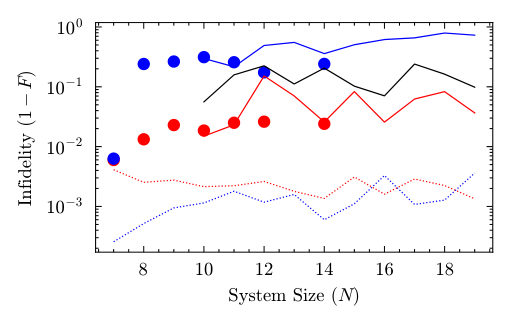
<figcaption class="paper-figure-caption"><b>Fig 5.</b> FIG. 5. Preparation of GHZ states with QOC with global driving. Pulse sequences are found with GrAPE on a Hilbert space truncated according to IRD-1. The resulting infidelities are plotted as a function of the number of qubits. These same pulses are then applied to dynamics on an extended Hilbert space based on IRD-2, and for small systems sizes the exact dynamics on the full Hilbert space to test convergence. Blue: pulses designed without leakage penalty (“na¨ıve control”) on IRD-1 (dotted), IRD-2 (solid), and full Hilbert space (circles). Red: global pulses with leakage penalty on IRD-1 (dotted), IRD-2 (solid), and full Hilbert space for N ≤14 (circles), with K = V T = N + 6. With IRD-2...</figcaption>
</figure>

**Summary.** This paper tackles the challenge of controlling quantum states in Rydberg atom arrays by focusing on the Dicke manifold. It introduces Irrep Distillation (IRD) to manage the exponential complexity arising from finite-range interactions. Through quantum optimal control simulations, the authors show that while global control is effective, local addressing is crucial for maintaining high fidelity when preparing complex, highly entangled quantum states.

**Why it may be interesting.** This work directly addresses the practical limitations of scaling quantum simulations in Rydberg arrays by providing a rigorous, computationally feasible method (IRD) to handle the leakage inherent in finite-range interactions.

Detailed structure

**Main problem.** The central challenge is achieving high-fidelity quantum control on the Dicke manifold of interacting Rydberg atoms while mitigating leakage errors caused by finite-range dipole-dipole interactions.

**Main result.** The authors demonstrate that while global control is possible for simple states, local addressing mechanisms are necessary for achieving high fidelity on complex, highly entangled states like large-$k$ Dicke states.

**Method.** The work employs Quantum Optimal Control (QOC) algorithms, specifically Gradient Ascent Pulse Engineering (GrAPE), combined with the novel Irrep Distillation (IRD) technique to truncate the exponentially large Hilbert space into a tractable, linearly scaling subspace.

**Model / system.** The system is modeled using Rydberg atoms in 2D tweezer arrays, interacting via dipolar, $1/r^3$ or $1/r^6$ interactions, leading to an XX-Hamiltonian structure. The dynamics are analyzed within the fully symmetric Dicke subspace.

**Key observables.** Fidelity ($F$), Quantum Speed Limit (QSL), and population leakage ($\langle \Pi(x) 
angle$) into higher irreducible representations (irreps).

**Important parameters / regimes.** System size ($N$), interaction range (dipolar $1/r^3$), and the control pulse parameters ($\Omega(t), \phi(t), \omega(t)$).

**Assumptions / limitations.** The primary assumption is that the leakage error can be effectively captured and managed by truncating the Hilbert space using the IRD method, which keeps the dimension linear in $N$.

**Figures summary.** Figures compare infidelity and leakage for various control schemes (naive vs. leakage-aware global vs. local) for preparing GHZ and Dicke states, showing the necessity of leakage penalty terms.

**Paper structure.** The paper builds from defining the physical model and the leakage problem, introduces the IRD method for subspace truncation, and then applies QOC/GrAPE to compare global vs. local control strategies for achieving target states like GHZ and Dicke states.

Abstract

The ability to engineer and control quantum states of many-body systems is a central challenge in quantum information science. For a register of $N$ qubits, the full Hilbert space dimension grows exponentially as $2^N$, rendering generic state preparation and control infeasible without exploiting structure or symmetry. A particularly important and physically motivated restriction is to the fully symmetric subspace, spanned by the Dicke states, which are simultaneous eigenstates of collective spin $J=N/2$. Ensembles of Rydberg atoms interacting via electric dipoles in two-dimensional tweezer arrays form a promising platform for achieving such control. However, the finite range of dipole-dipole interactions poses a challenge to generating and controlling the Dicke manifold because the Hamiltonian incurs leakage from the computational subspace. To counteract this leakage, we perform quantum optimal control algorithms on a truncated Hilbert space according to our newly developed method of ``irrep distillation'' (IRD), which captures the process by which the symmetric subspace couples to leakage error-spaces, using only linear-scaling Hilbert dimension. We implement gradient ascent pulse engineering (GrAPE) on control schemes with little or no local addressing, to generate resourceful states like Greenberger-Horne-Zeilinger, Dicke, and extremal quantum states. We benchmark each scheme of IRD-GrAPE for its quantum speed limit (QSL), as well as exactly testing pulse fidelities on small system sizes and predicting fidelities using higher-order IRD on larger systems.

[↑ back to top](#top)

### [Arbitrarily precise arrival time measurements in quantum mechanics](http://arxiv.org/abs/2606.01005v1)

**Authors:** Lawrence Frolov  
**Type:** theory · **Category:** other · **PDF:** <https://arxiv.org/pdf/2606.01005v1>  
**Analysis basis:** full PDF text, analyzed in chunks
**Topic relevance:** 🔥 `quantum measurements` **5/5** · 🔥 `measurement-induced transitions` **4/5** · `correlated / nonlocal dissipation` **1/5** · `driven-dissipative phase transition` **1/5** · `methods for driven-dissipative` **1/5** · `non-equilibrium dynamics` **1/5**

↔ Scroll figures horizontally

<figure class="paper-figure-card">
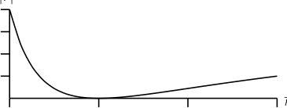
<figcaption class="paper-figure-caption"><b>Fig 1.</b> FIG. 1. Graph of the non-arrival probability |r|2 as a function of p in units of ℏκ.</figcaption>
</figure>

**Summary.** This paper tackles the quantum Zeno effect by constructing a theoretical measurement procedure for particle arrival time that remains physically viable even when precision is taken to the limit. By analyzing the coupled dynamics of the particle and a detector, the authors show that the process effectively reduces to an absorbing boundary condition, thus justifying the use of such conditions to model ideal quantum detectors.

**Why it may be interesting.** This work is highly relevant to open quantum systems and quantum measurement theory, providing a rigorous theoretical framework for modeling idealized, irreversible quantum measurements that challenge standard interpretations of quantum evolution.

Detailed structure

**Main problem.** The paper addresses the quantum Zeno effect, specifically challenging the notion that arbitrarily precise arrival time measurements in quantum mechanics must result in zero probability of detection.

**Main result.** It constructs a measurement procedure that allows for a non-zero probability of arrival even in the limit of arbitrarily precise measurement, demonstrating that the process converges to an absorbing boundary condition.

**Method.** The analysis involves constructing a coupled system of Schrödinger equations for the incoming particle and the detector, and then taking specific limits ($\epsilon 	o 0$, $\omega, M 	o \infty$) to derive the effective dynamics.

**Model / system.** The model uses an incoming particle wave function interacting with a two-level detector system localized at $x=0$. The dynamics are governed by coupled Schrödinger equations, which simplify in the limit to an effective single-particle equation with an absorbing boundary condition at the detection point.

**Key observables.** The probability current $j_x(0)$ and the non-arrival probability $|	ilde{r}|^2$ are key observables used to quantify the measurement outcome.

**Important parameters / regimes.** The analysis relies on the limit parameters $\omega, M 	o \infty$ while maintaining a finite ratio $2\hbar\omega/M 	o v_c^2 > 0$, which defines the effective coupling constant $\kappa$.

**Assumptions / limitations.** The primary assumption is the validity of the localized detection process and the ability to model the idealized detector using an absorbing boundary condition (ABC).

**Figures summary.** Figure 1 illustrates the non-arrival probability $|	ilde{r}|^2$ as a function of momentum $p$, showing its dependence on the apparatus-defined parameter $\hbar\kappa$.

**Paper structure.** The paper first sets up the coupled Hamiltonian system describing the particle and detector. It then analyzes the system by taking limits to derive the effective dynamics, which are governed by an absorbing boundary condition. Finally, it calculates the probability flux and compares it to the expected Born rule probability distribution.

Abstract

The quantum Zeno effect is often regarded as an obstruction to precise arrival time measurements in quantum mechanics. Here, an arbitrarily precise arrival time measurement procedure is constructed using a localized detection process and a suitably chosen boundary condition. The arrival time of an incoming particle is recorded in the position of a clock particle that is emitted by the apparatus upon detection. A non-zero probability of arrival is shown to survive even in the limit as the arrival time measurement procedure is made arbitrarily precise. In this limit, it is also found that the interaction between the incoming particle and the detector is described by an absorbing boundary condition. This justifies the claim of Tumulka that absorbing boundary conditions may be used to model idealized detectors capable of registering particles at the instant of their arrival.

[↑ back to top](#top)

### [Most Subradiant Bound Photon Pairs from Chirality-Mediated Dispersion Softening](http://arxiv.org/abs/2606.01146v1)

**Authors:** Kailin Tan, Xuanbing Jiang, Dong Wang, Saijun Wu  
**Type:** theory · **Category:** other · **PDF:** <https://arxiv.org/pdf/2606.01146v1>  
**Analysis basis:** full PDF text, analyzed in chunks
**Topic relevance:** 🔥 `correlated / nonlocal dissipation` **4/5** · `Dicke superradiance` **3/5** · `analog quantum simulation` **3/5** · `methods for driven-dissipative` **3/5** · `Tavis-Cummings & cavity-many-emitter` **2/5** · `driven-dissipative phase transition` **2/5** · `free-space correlated emission` **2/5** · `non-equilibrium dynamics` **2/5** · `Keldysh / 2PI / non-Gaussian methods` **1/5** · `correlated cavity matter` **1/5** · `entanglement & information structure` **1/5** · `non-equilibrium universality` **1/5**

↔ Scroll figures horizontally

<figure class="paper-figure-card">
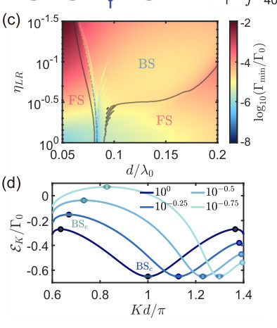
<figcaption class="paper-figure-caption"><b>Fig 1.</b> FIG. 1. (a) Schematic of the chiral waveguide QED model. (b) Probability distribution of a subradiant BSe for N = 40, d = 0.15λ0 and ηLR = 10−0.75. (c) Decay rate distribution of the most subradiant two-excitation state with respect to the lattice spacing d and the asymmetry parameter ηLR for N = 100. The solid curves separate regions where either the FS or the BS is the most subradiant. The dashed dotted curve corresponds to the emergence of a BS band inflection point with α2 = 0 (cf. Fig. 3). (d) BS dispersion relation for different values of ηLR indicated by the legend with d = 0.15λ0. Circles show the energies of BSc and BSe near the band extrema for an N = 100 array.</figcaption>
</figure>
<figure class="paper-figure-card">
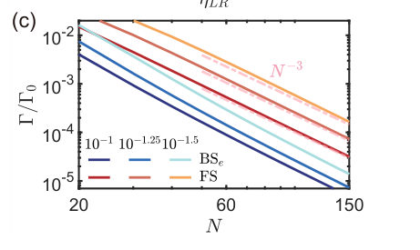
<figcaption class="paper-figure-caption"><b>Fig 2.</b> FIG. 2. (a) Decay rates of FS (red), BSe (blue), and BSc (green) as a function of ηLR with N = 100, where the values of d/λ0 are specified in the legend. (b) Dependence of |α2e| (blue) and se (red) on ηLR, with d/λ0 indicated by the legend. The extraction of se utilizes the BSe results from (a) for N = 100. (c) Decay rate scaling of BSe (blue) and FS (red) with respect to the atom number N for three different ηLR values at a fixed spacing d = 0.15λ0. The dash-dotted pink lines denote the analytical scaling of the FS decay rates.</figcaption>
</figure>
<figure class="paper-figure-card">
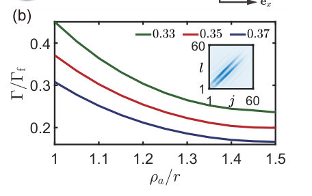
<figcaption class="paper-figure-caption"><b>Fig 3.</b> FIG. 4. (a) Schematic of an atom array coupled to a cylin- drical optical nanofiber. The coupling between the elliptical atomic dipoles and the spin-momentum locked guided mode leads to chiral emission. (b) Decay rates of the chiral BSs for an N = 60 array, with d/λf = 0.33 (green), 0.35 (red), and 0.37 (blue). Inset: probability distribution of a subradiant chiral BS, illustrated for parameters d = 0.35λf, ρa = r, and N = 60.</figcaption>
</figure>
<figure class="paper-figure-card">
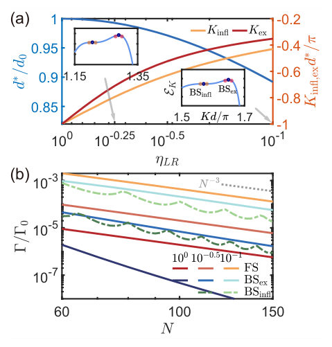
<figcaption class="paper-figure-caption"><b>Fig 4.</b> FIG. 3. (a) Blue solid curve is the critical spacing where the cubic band emerges for a given chirality. The inflection point and extremum point are represented by the yellow and red curves (shifted into the first Brillouin zone), respectively. Insets show the BS dispersion relations for ηLR = 10−0.25 and ηLR = 10−1, where the circles mark BSinfl (yellow) and BSex (red) for finite arrays with N = 100. (b) Decay rate scaling of FS, BSex, and BSinfl for ηLR = 1, 10−0.5 and 10−1 (indicated by the legend), evaluated at the critical spacing d = d∗for each chirality. The dotted line provides a reference for the N −3 dependence.</figcaption>
</figure>

**Summary.** This paper theoretically analyzes subradiant two-excitation states in an atom array coupled to a waveguide via chiral interactions. It demonstrates that the chirality induces a 'dispersion softening' mechanism that suppresses the state's decay rate. This suppression makes the bound photon pairs the most subradiant states, a crucial finding for quantum light sources.

**Why it may be interesting.** This work provides a detailed theoretical understanding of how engineered chiral couplings can fundamentally alter the decay dynamics of quantum emitters, leading to highly robust, long-lived quantum states.

Detailed structure

**Main problem.** The study investigates the conditions under which Bound Photon Pairs (BSs) become the most subradiant two-excitation states compared to Free-Fermion states (FSs) in a chirally coupled atom array.

**Main result.** Chirality-mediated dispersion softening suppresses the band curvature $|\alpha_2|$, leading to a decay rate scaling $\Gamma \sim |\alpha_2|/N^3$, which enhances subradiance and confirms BSs as the most subradiant states.

**Method.** The analysis involves deriving effective Hamiltonians, diagonalizing them to find bound eigenstates, and calculating decay rates using the Born-Markov approximation.

**Model / system.** The system is an array of N two-level atoms chirally coupled to a one-dimensional waveguide reservoir, modeled using an effective non-Hermitian Hamiltonian.

**Key observables.** Subradiance (decay rate $\Gamma$), band curvature $|\alpha_2|$, Fidelity ($F$), and the ratio of decay rates between BSs and FSs.

**Important parameters / regimes.** Chirality parameter ($\eta_{	ext{LR}}$), atom number ($N$), and the lattice spacing ($d$).

**Assumptions / limitations.** The analysis relies on approximations such as treating boundary scattering as negligible for large N and using the Born-Markov approximation for decay rate calculations.

**Figures summary.** Figures illustrate the comparison of decay rates (FS vs. BS) vs. chirality, the dispersion relation of BSs within the continuum gap, and the dependence of subradiance on disorder strength.

**Paper structure.** The paper systematically develops the theory by deriving the effective Hamiltonian, analyzing single-excitation (FS) and two-excitation (BS) states separately, and finally proving the scaling laws for the decay rates based on dispersion softening.

Abstract

We study the subradiant bound states (BSs) in a two-level atom array chirally coupled to a one-dimensional waveguide. We demonstrate that the chiral interaction can drive BSs to become the most subradiant two-excitation states across a wide spacing range. This phenomenon is rooted in a mechanism of chirality-mediated dispersion softening, where the BS band distortion suppresses the band curvature $|α_2|$ at an extremum point. We rigorously prove that the BS decay rate follows the scaling $Γ\sim |α_2|/N^3$, revealing that the reduction of $|α_2|$ is key to suppressing emission and enhancing subradiance. We also show the existence of chiral BSs in a realistic nanofiber interface.

[↑ back to top](#top)

### [Non-equilibrium glassy arrest and discontinuous transitions at avoided quantum critical points](http://arxiv.org/abs/2606.00580v1)

**Authors:** J J Pulikkotil  
**Type:** theory · **Category:** statistical mechanics · **PDF:** <https://arxiv.org/pdf/2606.00580v1>  
**Analysis basis:** full PDF text, analyzed in chunks
**Topic relevance:** 🔥 `driven-dissipative phase transition` **4/5** · 🔥 `non-equilibrium dynamics` **4/5** · 🔥 `non-equilibrium universality` **4/5** · `Keldysh / 2PI / non-Gaussian methods` **3/5** · `methods for driven-dissipative` **3/5** · `analog quantum simulation` **2/5** · `correlated / nonlocal dissipation` **2/5** · `Frenkel-Kontorova` **1/5** · `entanglement & information structure` **1/5** · `scars & prethermalization` **1/5**

↔ Scroll figures horizontally

<figure class="paper-figure-card">
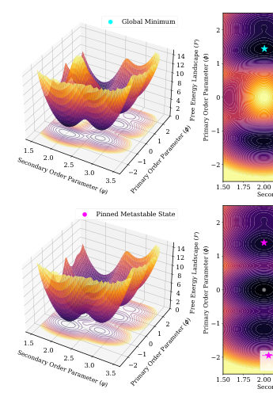
<figcaption class="paper-figure-caption"><b>Fig 1.</b> Figure 1: Phenomenological visualization of the constraint-induced free energy landscape F across the primary (ϕ) and secondary (ψ) order parameters. (a) Top panel, Strong Field Regime (RA = 15): Under an intense external con- straint field, the macroscopic gradient forces the order parameter trajectory to- ward an orthogonal minimum. (b) Bottom panel, Zero Field Regime (RA = 0): Upon removal of the external field, emergent high-frequency quenched barri- ers block the return trajectory. Lacking sufficient thermal activation (Teff) to overcome these microscopic traps, the system undergoes non-equilibrium glassy arrest.</figcaption>
</figure>
<figure class="paper-figure-card">
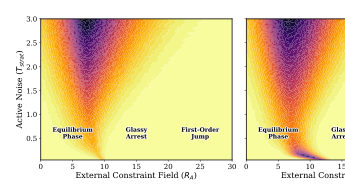
<figcaption class="paper-figure-caption"><b>Fig 2.</b> Figure 2: Persistence probability phase diagrams across active noise (Tstrat) and external constraint field intensity (RA). A U-shaped region of phase instability forms near the critical threshold. This trap deepens and widens significantly as quenched microscopic ruggedness (K) increases, dominating the macroscopic free-energy flattening and increasing the density of metastable states (configu- rational entropy).</figcaption>
</figure>
<figure class="paper-figure-card">
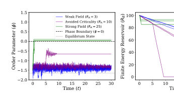
<figcaption class="paper-figure-caption"><b>Fig 3.</b> Figure 3: Non-equilibrium kinetic trajectories of the order parameter field. Left panel: First-order discontinuous trajectories of the effective scalar field under varying constraint fields. Middle panel: Corresponding strain energy and resource depletion of the finite dissipative bath (RB). Right panel: Divergence of relaxation time precisely at the avoided critical threshold (RA ≈10). This critical slowing down is driven by the pinning of the spatial correlation length against localized quenched traps.</figcaption>
</figure>
<figure class="paper-figure-card">
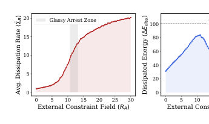
<figcaption class="paper-figure-caption"><b>Fig 4.</b> Figure 4: Thermodynamic signature and phase stability. Left panel: Diver- gence of the average entropy production rate (⟨˙ΣB⟩). Middle panel: Total dissipated energy (∆Ediss). The cost peaks non-monotonically precisely during the glassy arrest regime, while the first-order discontinuous jump (RA &gt; 20) bypasses the flat free-energy region entirely. Right panel: Persistence prob- ability mapping the characteristic U-shaped region of phase instability caused by disorder-induced metastability.</figcaption>
</figure>

**Summary.** This theoretical work models non-equilibrium dynamics in disordered systems near avoided quantum critical points using a generalized Ginzburg-Landau framework. It demonstrates that glassy arrest arises from disorder-induced trapping when the system's free energy flattens. Conversely, strong external fields can force the system into a rapid, discontinuous phase transition, bypassing the glassy state.

**Why it may be interesting.** The concepts of non-equilibrium dynamics, FDT violation, and glassy arrest are central to understanding open quantum systems and many-body relaxation processes, making it relevant for AMO physics and open quantum systems.

Detailed structure

**Main problem.** The paper investigates the non-equilibrium dynamics of order parameters subjected to external constraints, focusing on the mechanisms driving glassy arrest and discontinuous phase transitions near avoided quantum critical points.

**Main result.** It establishes a generic mechanism showing that glassy arrest occurs due to disorder-induced trapping when the macroscopic free energy flattens, while high external fields can induce a thermodynamically efficient discontinuous jump that bypasses this metastable region.

**Method.** The analysis uses a continuum field theory approach, modeling dynamics via a stochastic Ginzburg-Landau equation, and analyzing non-equilibrium observables like dissipation and persistence probability.

**Model / system.** The system is modeled using a spatially extended Belitz-Kirkpatrick-Vojta framework for an order parameter $\phi(\mathbf{r}, t)$, incorporating a macroscopic Landau-Ginzburg free energy functional and a quenched disorder potential.

**Key observables.** Dissipation peak, violation of the fluctuation-dissipation theorem (FDT), total dissipated energy ($\Delta E_{diss}$), and phase persistence probability.

**Important parameters / regimes.** External constraint field ($R_A$), disorder strength ($K$), and the effective temperature/noise scale ($T_{eff}$).

**Assumptions / limitations.** The analysis assumes adiabatic decoupling, where local fluctuations relax much faster than the global energy reservoir depletion ($	au_{fluct} \ll 	au_{depletion}$).

**Figures summary.** Figures visualize the constraint-induced free energy landscape, map phase persistence probability showing sharp drops at avoided critical thresholds, and track non-equilibrium kinetic trajectories under varying fields.

**Paper structure.** The paper progresses by defining the complex free energy landscape, analyzing the system's response in different field regimes (linear, avoided critical, high field), and deriving scaling relations for dissipation and arrest mechanisms.

Abstract

The non-equilibrium dynamics of an order parameter confined by an external constraint field are investigated within a spatially extended Belitz-Kirkpatrick-Vojta framework. A generic non-monotonic dissipation peak arises at avoided criticality due to the interplay between macroscopic free-energy flattening and microscopic disorder-induced trapping. Near this regime, suppressed deterministic forces enhance activated trapping, leading to an effective violation of the fluctuation-dissipation theorem and ultimate glassy arrest. At higher fields, the system undergoes a discontinuous phase transition that bypasses this flat free-energy region. These explicit analytical scalings establish a generic mechanism for non-equilibrium arrest in disordered condensed matter systems.

[↑ back to top](#top)

### [Stabilization of Granovskii-Zhedanov scars of the XYZ quantum spin chain via non-Hermitian spin relaxation](http://arxiv.org/abs/2606.01254v1)

**Authors:** Dhiman Bhowmick  
**Type:** theory · **Category:** other · **PDF:** <https://arxiv.org/pdf/2606.01254v1>  
**Analysis basis:** full PDF text, analyzed in chunks
**Topic relevance:** 🔥 `scars & prethermalization` **4/5** · `correlated / nonlocal dissipation` **3/5** · `driven-dissipative phase transition` **3/5** · `methods for driven-dissipative` **3/5** · `non-equilibrium dynamics` **3/5** · `non-equilibrium universality` **2/5** · `Keldysh / 2PI / non-Gaussian methods` **1/5** · `Kondo & dissipative impurity` **1/5** · `analog quantum simulation` **1/5** · `entanglement & information structure` **1/5** · `exotic spin models in light-matter` **1/5** · `spintronics-quantum-optics interface` **1/5**

↔ Scroll figures horizontally

<figure class="paper-figure-card">
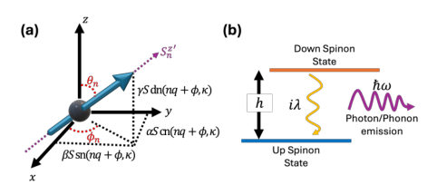
<figcaption class="paper-figure-caption"><b>Fig 1.</b> FIG. 1. (a) Direction of the spin (denoted by the blue arrow) at the n-th site in a GZ state. This schematic illustrates the parameters θn and ϕn appearing in Eq. 3, together with the corresponding expectation value of the components of the local spin operator ˆSn. It also indicates the z′-axis, which is aligned with the local spin direction, such that the spin component along this axis is denoted by Sz′ n . (b) Schematic of the spin relaxation process. In the presence of an external magnetic field |hn| = h, the local degenerate up and down spinon levels split and are separated by an energy gap h. The non-Hermitian term proportional to iλ physically represents spinon decay from the down...</figcaption>
</figure>
<figure class="paper-figure-card">
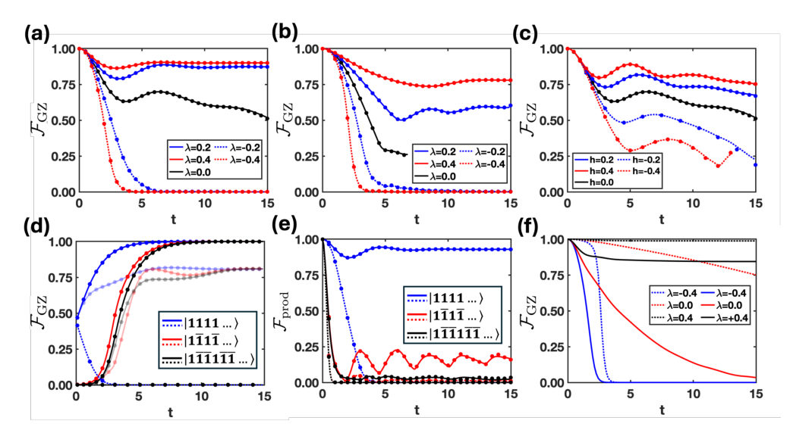
<figcaption class="paper-figure-caption"><b>Fig 2.</b> FIG. 2. Numerical plots showing the fidelity as a function of time for different scenarios. In all the simulations, the system is initiated with the GZ state except for the figures (d) and (e). Additionally, in all the simulations, the fidelity of the time-evolved state is measured relative to the GZ state, except for the figure (e). (a) Fidelity dynamics under the Hamiltonian in Eq. 10 with onsite perturbation µ = 0.3, shown for different values of the non-Hermitian strength λ, with the system initialized in the GZ state. (b) Fidelity dynamics under the Hamiltonian in Eq. 10 with hopping perturbation t = 0.3 (and zero onsite perturbation), shown for different values of the non-Hermitian...</figcaption>
</figure>
<figure class="paper-figure-card">
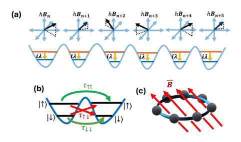
<figcaption class="paper-figure-caption"><b>Fig 3.</b> FIG. 3. (a) Schematic of the experimental arrangement using an optical lattice. A periodic potential is illustrated, within which the atoms are confined. A site-dependent magnetic field hBn is applied at each site n along the Sz′ n direction, aligned with the local magnetization of the GZ state. This field lifts the spin degeneracy, yielding lower-energy down-spinon (or- ange) and higher-energy up-spinon (blue) states. Coupling to the environment induces relaxation from the down-spinon to the up-spinon state at a rate λ. (b) Schematic of the hopping coefficients in the Hubbard model. In the absence of a mag- netic field, the spin-up and spin-down degrees of freedom are degenerate; they are...</figcaption>
</figure>
<figure class="paper-figure-card">
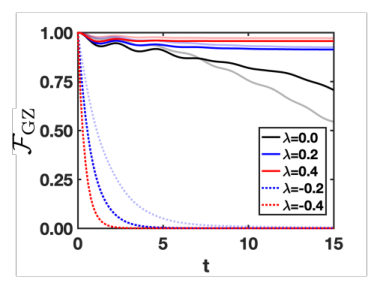
<figcaption class="paper-figure-caption"><b>Fig 4.</b> FIG. 4. Lindbladian dynamics governed by the system Hamiltonian ˆH0, in the presence of an onsite perturbation µ = 0.3, and with the Lindblad jump operator defined in Eq. 30. Results are shown for finite system sizes N = 3 (trans- parent lines) and N = 6 (dense lines). The parameter q is fixed to q = 4K(κ)/3, while the remaining system parame- ters are set to κ = 0.5, γ = 0.8, and S = 1. The simulation result for λ = −0.4 and system size N = 3 is not visible, as it lies below the blue dashed curve corresponding to λ = −0.2 for the system size N = 6.</figcaption>
</figure>
<figure class="paper-figure-card">
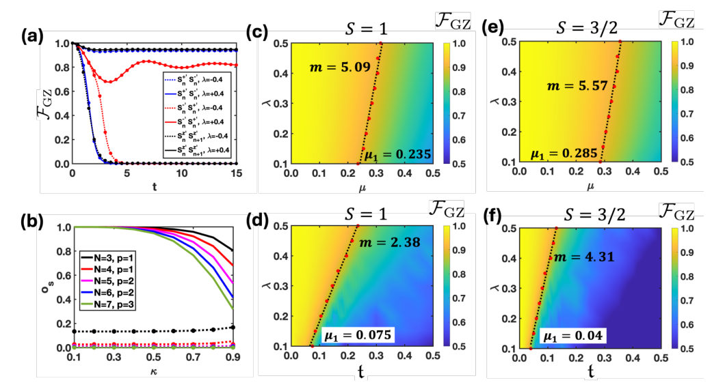
<figcaption class="paper-figure-caption"><b>Fig 5.</b> FIG. 5. (a) Stabilization of GZ state using alternative non-Hermitian terms in the presence of global onsite perturbation µ = 0.3. The simulations are done for parameters κ = 0.5, γ = 0.8, q = 4K(κ)/5. (b) The overlap os of the spin-1 states |1111 . . .⟩, |1¯11¯1 . . .⟩, and |1¯1¯11¯1¯1 . . .⟩with the GZ scar subspace for finite periodic chain of length N, is shown as a function of κ, represented by solid lines, dashed lines, and dots, respectively. The different colored plots correspond to the GZ scar subspace for different values of q, which is tuned by varying the parameters N and p, since q = 4pK(κ)</figcaption>
</figure>

**Summary.** This paper tackles the problem of stabilizing fragile GZ scar states in the XYZ quantum spin chain against environmental noise. It demonstrates that introducing engineered non-Hermitian spin relaxation terms can robustly stabilize these states, preventing complete thermalization. The findings provide a theoretical roadmap for realizing and controlling quantum coherence in complex, open quantum systems.

**Why it may be interesting.** This work directly addresses the challenge of maintaining fragile quantum coherence in realistic, dissipative environments, which is a central theme in modern quantum simulation and open quantum systems theory.

Detailed structure

**Main problem.** The paper investigates how to stabilize Granovskii-Zhedanov (GZ) scar states in the XYZ quantum spin chain against inevitable perturbations that typically cause thermalization.

**Main result.** The inclusion of effective non-Hermitian spin relaxation processes, which can arise from physical mechanisms like Purcell-enhanced emission, substantially stabilizes the GZ states, leading to a non-equilibrium steady state.

**Method.** The study employs theoretical analysis, including deriving equivalent Lindblad descriptions and analyzing dynamics using techniques like infinite time-evolving block decimation (iTEBD) and fidelity measurements.

**Model / system.** The primary system is the spin-S XYZ quantum spin chain. The dynamics are modeled using the XYZ Hamiltonian, augmented by a helical magnetic field term and a non-Hermitian spin relaxation term ($\hat{H}_\lambda$).

**Key observables.** Fidelity ($F_{GZ}$), which measures the overlap of the time-evolved state with the initial GZ state.

**Important parameters / regimes.** Non-Hermitian strength ($\lambda$), perturbation strengths ($\mu$ for onsite, $t$ for hopping), and the spin quantum number ($S$).

**Assumptions / limitations.** The ideal XYZ Hamiltonian is not experimentally realizable, necessitating stabilization protocols. The non-Hermitian term is assumed to originate from physical relaxation processes.

**Figures summary.** Figures illustrate fidelity dynamics comparing decay ($\lambda=0$) to saturation ($\lambda>0$) under different perturbations, and phase diagrams mapping stability boundaries in the $(\mu, \lambda)$ and $(t, \lambda)$ parameter spaces.

**Paper structure.** The paper first establishes the GZ state's properties under ideal conditions, then analyzes the decay due to perturbations ($\hat{H}_P$). It introduces stabilization via the helical field ($\hat{H}_h$) and, crucially, the non-Hermitian relaxation ($\hat{H}_\lambda$). The analysis progresses from general theory to specific numerical simulations and finally connects the model to physical realizations like optical lattices and the Lindblad master equation.

Abstract

The Granovskii-Zhedanov (GZ) states are exact scar states of the spin-S XYZ chain for S >= 1. As a result, local quantum information encoded in a GZ state remains preserved under the unitary dynamics of the XYZ Hamiltonian; thus, these states evade thermalization and violate ergodicity despite the system being otherwise nonintegrable and chaotic. However, in realistic experimental settings, the realization of an ideal XYZ Hamiltonian is not possible, as perturbations are inevitable. These perturbations ultimately lead to the decay and thermalization of the GZ state. We study the stability and dynamics of GZ states in the presence of generic perturbations and propose physically realistic mechanisms to stabilize them. We show that the product structure of the GZ state allows its lifetime to be enhanced in the presence of an external helical magnetic field, which slows down thermalization but does not prevent it at long times. We further demonstrate that the inclusion of effective non-Hermitian spin relaxation processes can substantially stabilize the GZ states, leading to a nonequilibrium steady state with finite fidelity with GZ state. Such dissipative processes can naturally originate from mechanisms such as Purcell-enhanced spontaneous emission or spin-lattice relaxation in the presence of the helical magnetic field. Using infinite time-evolving block decimation and exact time evolution, we systematically analyze the dynamics and robustness of the GZ states in the perturbed non-Hermitian XYZ model. To connect with experimental platforms, we introduce a Hubbard model that maps onto the XYZ spin system and propose that ring-shaped optical lattices may provide a viable route for realizing and stabilizing GZ states. Finally, we present an equivalent Lindblad description of the effective non-Hermitian dynamics.

[↑ back to top](#top)

### [Strong-to-Weak Spontaneous Symmetry Breaking](http://arxiv.org/abs/2606.02555v1)

**Authors:** Chong Wang  
**Type:** theory · **Category:** statistical mechanics · **PDF:** <https://arxiv.org/pdf/2606.02555v1>  
**Analysis basis:** full PDF text, analyzed in chunks
**Topic relevance:** 🔥 `entanglement & information structure` **4/5** · `correlated / nonlocal dissipation` **3/5** · `driven-dissipative phase transition` **3/5** · `methods for driven-dissipative` **3/5** · `non-equilibrium dynamics` **3/5** · `non-equilibrium universality` **3/5** · `Keldysh / 2PI / non-Gaussian methods` **2/5** · `analog quantum simulation` **2/5** · `Kondo & dissipative impurity` **1/5**

↔ Scroll figures horizontally

<figure class="paper-figure-card">
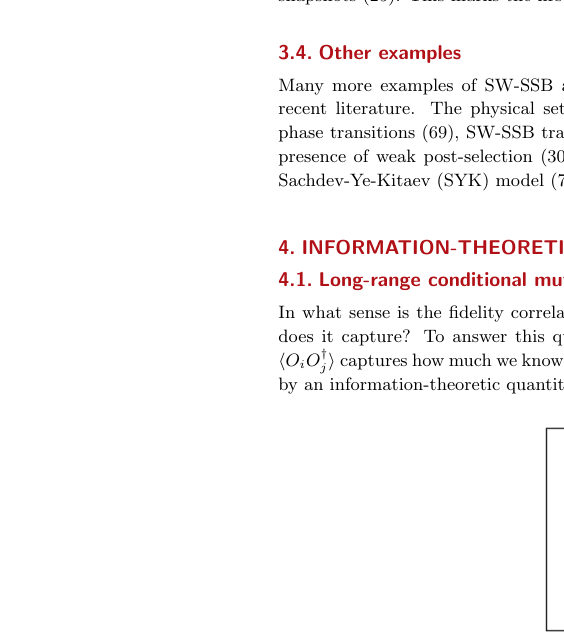
<figcaption class="paper-figure-caption"><b>Fig 1.</b> Figure 1</figcaption>
</figure>
<figure class="paper-figure-card">
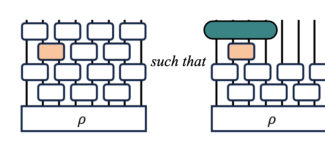
<figcaption class="paper-figure-caption"><b>Fig 2.</b> Figure 2</figcaption>
</figure>

**Summary.** This review introduces Strong-to-Weak Spontaneous Symmetry Breaking (SW-SSB) as a unifying concept for analyzing phases in open quantum systems. It shows that SW-SSB connects seemingly disparate fields, including topological order and emergent hydrodynamics, by using advanced tools like fidelity correlators and CMI. The work is crucial for understanding symmetry breaking in complex, realistic, and dissipative quantum matter.

**Why it may be interesting.** It provides a powerful, modern lens for understanding symmetry breaking in non-equilibrium and open quantum systems, linking concepts from statistical mechanics to quantum information theory.

Detailed structure

**Main problem.** The paper develops Strong-to-Weak Spontaneous Symmetry Breaking (SW-SSB) as a unifying framework to study phases of matter in open quantum or classical systems.

**Main result.** SW-SSB provides a comprehensive connection between topological orders, emergent hydrodynamics, and information-theoretic characterizations of mixed-state phases.

**Method.** The analysis employs advanced concepts from quantum information theory, comparing standard correlation functions with fidelity correlators and conditional mutual information.

**Model / system.** The framework applies to general open quantum systems (described by density matrices $\rho$) and classical stochastic systems, using examples like the Ising ferromagnet in mixed states.

**Key observables.** Fidelity correlator ($\langle O 
angle_F$), Conditional Mutual Information (CMI), and the fidelity susceptibility ($\chi_
ho^F$).

**Important parameters / regimes.** The distinction between strong symmetry (pure state) and weak symmetry (mixed state) breaking, and the role of the system size ($N$) or region size ($A$).

**Assumptions / limitations.** The definition of SW-SSB is a conceptual framework connecting various physical ideas, and local measurements may not capture global properties.

**Figures summary.** Not specified (The notes summarize concepts rather than describing specific figures).

**Paper structure.** The review progresses by defining the core concept (SW-SSB), detailing its origins in statistical mechanics and information theory, presenting diagnostic tools (fidelity correlators, CMI), and finally unifying its application across topological order, hydrodynamics, and experimental platforms.

Abstract

Strong-to-weak spontaneous symmetry breaking (SW-SSB) has recently emerged as a useful framework for studying phases of matter in open systems, quantum or classical. Beginning with the simple idea of extending symmetry breaking to general mixed states, and the familiar equivalence between canonical and grand-canonical ensembles in statistical mechanics, the concept has grown into a unifying perspective connecting many different ideas in physics, including topological orders, emergent hydrodynamics, and information-theoretic characterization of phases of matter. This review provides a bird's-eye view of some of these recent developments.

[↑ back to top](#top)

### [Dynamical frustration in space-time metamaterials](http://arxiv.org/abs/2606.01797v1)

**Authors:** Rupesh Mahore, Oleksandr Gamayun, Guillaume Noetinger, Romain Fleury, Corentin Coulais, Benjamin Apffel  
**Type:** both · **Category:** other · **PDF:** <https://arxiv.org/pdf/2606.01797v1>  
**Analysis basis:** full PDF text, analyzed in chunks
**Topic relevance:** 🔥 `driven-dissipative phase transition` **4/5** · `analog quantum simulation` **3/5** · `methods for driven-dissipative` **3/5** · `non-equilibrium dynamics` **3/5** · `non-equilibrium universality` **3/5** · `correlated / nonlocal dissipation` **2/5** · `Frenkel-Kontorova` **1/5** · `Keldysh / 2PI / non-Gaussian methods` **1/5** · `correlated cavity matter` **1/5** · `entanglement & information structure` **1/5** · `exotic spin models in light-matter` **1/5**

↔ Scroll figures horizontally

<figure class="paper-figure-card">
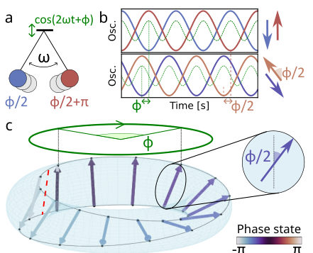
<figcaption class="paper-figure-caption"><b>Fig 1.</b> FIG. 1. Concept of dynamical frustration. (a) Parametric pumping of an oscillator and the two subharmonic limit cycles with opposite phase ϕ/2 and ϕ/2 + π. (b) When the pump is shifted by ϕ, the two phase states represented by opposite arrows are tilted by ϕ/2. (c) If the forcing phase is varied from 0 to 2π along a closed chain, the corresponding phase states lie on a Mobius strip due to subharmonic response. If neighboring phase state tend to align due to coupling, a frustration must appear (red line).</figcaption>
</figure>
<figure class="paper-figure-card">
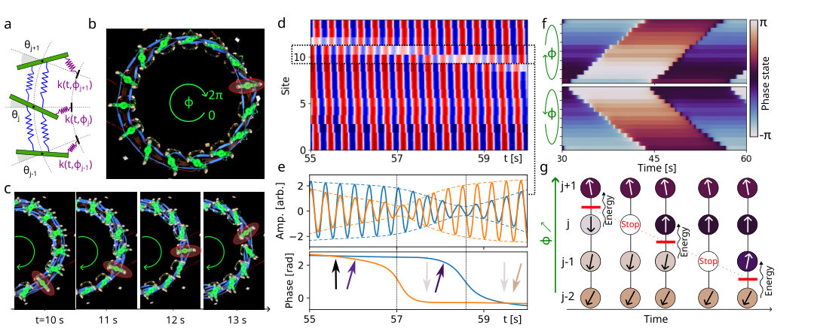
<figcaption class="paper-figure-caption"><b>Fig 2.</b> FIG. 2. Experimental observation. (a) Sketch of a piece of parametric chain. (b) Chain of coupled parametric oscillators displaying a phase dislocation. Green arrow shows winding of forcing phase. (c) Kinograms at different times showing dislocation propagation. (d) Angular position of oscillators along time showing the propagation of the phase dislocation. (e) A detail of such jump is shown, where both oscillator are initially in phase. The first one decreases its oscillation amplitude until (almost) cancellation at t = 57 s, and starts again with opposite phase. The two oscillators remain out of phase until the second one performs similar phase switch at t = 58.5 s. After the dislocation...</figcaption>
</figure>
<figure class="paper-figure-card">
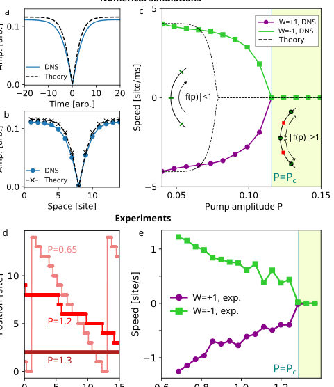
<figcaption class="paper-figure-caption"><b>Fig 3.</b> FIG. 3. Model and control of frustration velocity (a) Enve- lope as a function of time and (b) space from direct numeri- cal simulations (DNS) and soliton theory with no adjustable parameter (dashed line). (c) Velocity of the dislocation for W = ±1 as a function of forcing amplitude P from DNS (cir- cles/squares) and theory (dashed line). Dislocation freezes for P &gt; Pc. Inset: SNIC scenario on which attracting (black cir- cle) and repealing (red square) points appear for large enough forcing around each site. (d) Experimental tracking of the dislocation for forcing amplitude of P = 0.65, 1.2 and 1.3. Propagation goes from very regular to complete stopping. (e) Experimental result for...</figcaption>
</figure>
<figure class="paper-figure-card">
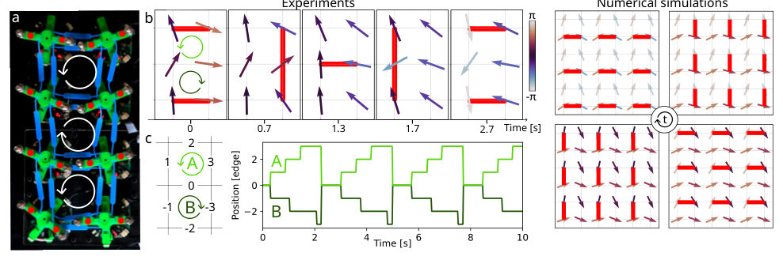
<figcaption class="paper-figure-caption"><b>Fig 4.</b> FIG. 4. Frustration in a two-dimensional network. (a) Tesselation of chains with opposite winding using X-shaped pendulums. (b) Phase state of the experimental lattice at different times. Red line materializes the dislocations, which are synchronized between adjacent cells. (c) Location of both dislocations along time. Regular visit of frustration on the shared edge triggers synchronization. (d) Numerical simulation on 6x6 network with fixed boundary condition, showing global synchronization of the network.</figcaption>
</figure>
<figure class="paper-figure-card">
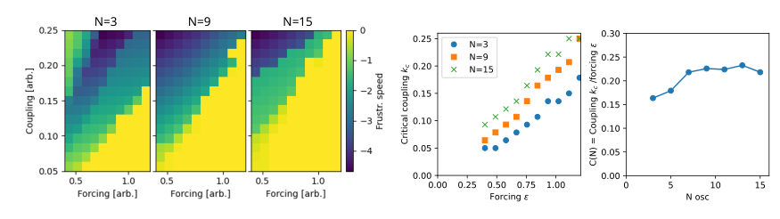
<figcaption class="paper-figure-caption"><b>Fig 5.</b> Figure 1: Numerical simulations of the nonlinear equation. (a) Velocity of the frustration for different values of forcing ϵ and coupling k. A clear transition between moving and nonmoving for k = kc(ϵ) is visible. (b) Critical coupling kc(ϵ) above which the frustration moves for different values of N. A linear fit allows to extract kc/ϵ = C(N) (c) Critical ratio C(N) as a function of N.</figcaption>
</figure>

**Summary.** This work explores dynamical frustration in engineered metamaterials by studying coupled, parametrically driven oscillators. The key finding is that frustration leads to stable, unidirectional phase defects (dislocations) that propagate due to non-reciprocal energy flow. The research validates this theory using both detailed mathematical modeling and comparison with physical experiments.

**Why it may be interesting.** It bridges concepts from nonlinear dynamics (solitons, parametric resonance) with condensed matter concepts (frustration, metamaterials), providing a concrete, tunable platform for studying non-equilibrium quantum phenomena.

Detailed structure

**Main problem.** The paper introduces and analyzes 'dynamical frustration,' a phenomenon where ground state degeneracy is replaced by a non-reciprocal, self-oscillating state in driven metamaterials.

**Main result.** Dynamical frustration leads to the formation of topologically protected, unidirectionally propagating phase dislocations whose velocity is governed by the system's parametric pumping and spatial modulation.

**Method.** The analysis combines theoretical derivations (e.g., multiple scale expansion, continuum limits) with numerical simulations and comparisons to experimental measurements.

**Model / system.** The system is modeled using coupled parametric oscillators forming metamaterials, which can be realized in various platforms like cold atoms, superconducting circuits, or mechanical pendulums.

**Key observables.** Topologically protected phase dislocations, non-reciprocal energy flux, and the dislocation velocity ($\dot{x}_0$).

**Important parameters / regimes.** Parametric pumping amplitude ($\epsilon$ or $P$), spatial winding number ($W$), and coupling strength ($k$ or $\kappa$).

**Assumptions / limitations.** The analysis relies on approximations such as the slowly varying envelope approximation and the continuum limit for deriving simplified governing equations.

**Figures summary.** Figures illustrate the concept of frustration via phase states (e.g., on a Möbius strip), show the agreement between simulated and experimental dislocation velocity, and map out parametric resonance instability boundaries (Arnold tongues).

**Paper structure.** The paper progresses from defining geometric vs. dynamical frustration, deriving the governing equations for coupled parametric oscillators, analyzing the resulting nonlinear wave dynamics (solitons), and finally validating the model against experimental measurements of resonance and defect motion.

Abstract

From spin ice and crumpled paper to cold atoms lattices and metamaterials, geometrical frustration occurs generically whenever local constraints cannot be satisfied all at once. The result is a ground state degeneracy, where many equivalent states, each of which contains unsatisfied constraints, coexist. Here, we introduce dynamical frustration, where the ground state degeneracy makes way to a non-reciprocal self-oscillating state instead. To create dynamical frustration, we construct metamaterials that are driven parametrically in time and modulated in space. The parametric pumping leads to period doubling and in turn to a discrete symmetry-breaking. This symmetry breaking, together with the spatial modulation enforces the existence of topologically protected phase dislocations, which propagate unidirectionally with a spontaneous phase that breaks a continuous symmetry. Tesselating 1d frustrated loops, one obtains a 2d metamaterial where phase dislocations self-organize into globally synchronized non-reciprocal phase defects. We expect dynamical frustration to be broadly applicable at any scale, from cold atoms and superconducting circuits to acoustics and RF circuits -- anywhere where space-time modulation can be pushed beyond linear stability.

[↑ back to top](#top)

### [Generating Fock state exceeding 10000 excitations with near unit fidelity by adaptive generalized-parity measurement](http://arxiv.org/abs/2606.01341v1)

**Authors:** Chen-yi Zhang, Jun Jing  
**Type:** theory · **Category:** other · **PDF:** <https://arxiv.org/pdf/2606.01341v1>  
**Analysis basis:** full PDF text, analyzed in chunks
**Topic relevance:** 🔥 `measurement-induced transitions` **4/5** · 🔥 `quantum measurements` **4/5** · `Tavis-Cummings & cavity-many-emitter` **3/5** · `analog quantum simulation` **3/5** · `correlated cavity matter` **3/5** · `methods for driven-dissipative` **2/5** · `correlated / nonlocal dissipation` **1/5** · `driven-dissipative phase transition` **1/5** · `entanglement & information structure` **1/5** · `non-equilibrium dynamics` **1/5**

↔ Scroll figures horizontally

<figure class="paper-figure-card">
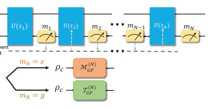
<figcaption class="paper-figure-caption"><b>Fig 1.</b> FIG. 1. Circuit diagram about constructing the adaptive gen- eralized parity measurement by repeatedly performing pro- jective measurements on the ancillary qubit with outcomes mk = e or g. The intervals τk between measurements depend on the last measurement record. After N rounds of mea- surements, the induced operation on the main system ρc is equivalent to a GPM M(N) GP [a displaced GPM T (N) GP ] if the final outcome is mN = e (mN = g).</figcaption>
</figure>
<figure class="paper-figure-card">
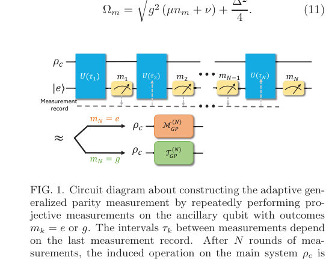
<figcaption class="paper-figure-caption"><b>Fig 2.</b> Figure 1 is the diagram of the our protocol, in which the duration of free evolution is adaptively updated ac- cording to the last measurement-outcome record. To ef- ficiently describe GPM on the main system, we set a GPM label nt(k) (an integer) to specify the center Fock state of the generalized-parity subspace after k rounds of measurement. k = 0 denotes the initial GPM label. The index of the final obtained Fock state is between nt(0) − p</figcaption>
</figure>
<figure class="paper-figure-card">
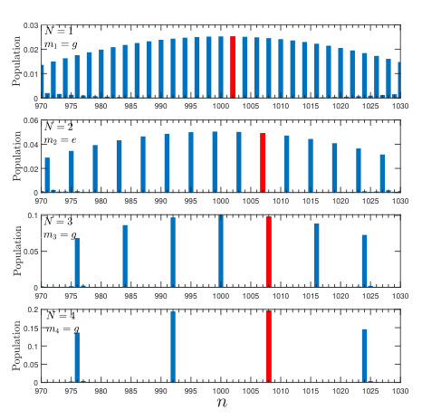
<figcaption class="paper-figure-caption"><b>Fig 3.</b> FIG. 2. An example about the variation of the population distribution in Fock space after the first 4 rounds for a spe- cific sequence of measurement results {|g⟩, |e⟩, |g⟩, |g⟩}. The initial GPM label is set as nt(0) = 1000. The red bar in each panel marks the updated GPM label nt(N) for measurements outcome mN = e or nt(N) + 1 for mN = g due to Eq. (16).</figcaption>
</figure>
<figure class="paper-figure-card">
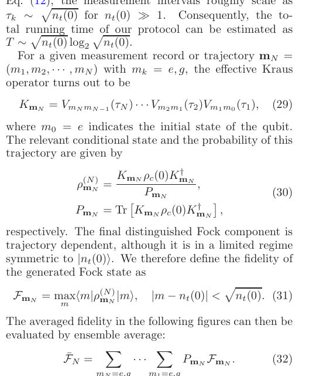
<figcaption class="paper-figure-caption"><b>Fig 4.</b> Figure 3 demonstrates the performance of our adaptive protocol for the large Fock-state generation under various initial coherent states |α⟩with |α|2 = nt(0). The numer- ical simulation is performed over 500 ≤nt(0) ≤20000. This range is mainly limited by our computer memory (we merely use a desktop with an Intel Core i7-7700 pro- cessor with 3.60 gigahertz in frequency and 16 gigabyte in memory) not by the protocol itself, which is irrelevant to the excitation number of Fock state. As shown in Fig. 3(a), the fidelity averaged over all measurement trajectories can rapidly converge to about 80% in less than 10 rounds of measurement, which is con- sistent with the logarithmic scaling behavior...</figcaption>
</figure>
<figure class="paper-figure-card">
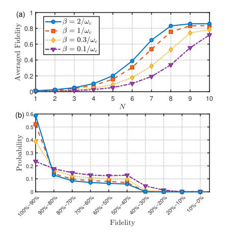
<figcaption class="paper-figure-caption"><b>Fig 5.</b> FIG. 4. Performance of our protocol when the resonator is prepared as a displaced thermal state D(α)ρthD†(α) under various initial inverse temperatures β. (a) Averaged fidelity as a function of the measurement round number N. (b) Prob- ability distribution of the final fidelity. α = p</figcaption>
</figure>

**Summary.** This paper details an adaptive generalized-parity-measurement protocol designed to create macroscopic Fock states exceeding 10,000 excitations in a bosonic system modeled by the JC Hamiltonian. By adaptively updating measurement intervals based on qubit outcomes, the protocol avoids the low success probabilities of traditional postselection methods. It demonstrates high-fidelity state generation, proving its utility for quantum information processing in cavity QED settings.

**Why it may be interesting.** This work directly addresses state preparation in cavity QED systems, which is a cornerstone of modern AMO physics and quantum optics. The adaptive measurement scheme offers a powerful, non-postselection alternative to generating complex quantum states.

Detailed structure

**Main problem.** The primary goal is to generate macroscopic Fock states containing over 10,000 excitations with high fidelity.

**Main result.** The proposed adaptive generalized-parity-measurement protocol successfully achieves this state preparation in about 10 rounds, demonstrating high fidelity and robustness.

**Method.** The protocol uses repeated, adaptively timed projective measurements on an ancillary qubit coupled to a bosonic mode, effectively implementing a generalized parity measurement.

**Model / system.** The system is modeled using the resonant Jaynes-Cummings (JC) model, involving a bosonic mode (like a cavity field) coupled to an ancillary qubit. The initial state can be a coherent or displaced thermal state.

**Key observables.** Fock state number ($n_t$), fidelity ($ar{F}_N$), and success probability for achieving high fidelity.

**Important parameters / regimes.** Number of excitations ($n_t = \mathcal{O}(10^4)$), number of measurement rounds ($\sim 10$), and the initial state parameters (e.g., temperature $eta$).

**Assumptions / limitations.** The protocol assumes the coupling allows for the derivation of a general rule for the adaptive GPM, and approximations are used in the resonant regime ($\Delta=0$).

**Figures summary.** Figures illustrate the adaptive measurement circuit, the population distribution evolution in Fock space over several rounds, and the convergence of the averaged fidelity and the probability distribution of the final fidelity for both pure and thermal states.

**Paper structure.** The paper introduces the problem, details the adaptive GPM protocol derived from the JC model, provides theoretical derivations for the measurement operators (Kraus operators), and concludes with numerical results demonstrating high-fidelity state preparation for large photon numbers.

Abstract

Macroscopic Fock states provide valuable resources for quantum information processing and quantum metrology. We here propose an adaptive generalized-parity-measurement protocol to create macroscopic Fock states with more than $10000$ excitations. For a general system with a discrete spectrum, e.g., a bosonic mode, that is coupled to an ancillary qubit, we derive a construction rule of either a diagonal generalized parity measurement (GPM) or a displaced GPM with intervals adaptive to the last outcome of repeated measurements on the qubit. Different from the probabilistic protocols based on postselection, in which only a single prescribed sequence of free-evolution-measurement is survived, our protocol retains every measurement trajectory by converting the outcome randomness of the ancillary-qubit measurement to the adaptive update of GPM. Using the resonant Jaynes-Cummings (JC) model, our protocol can transform a large coherent state to a large Fock state of photon numbers up to $n_t=\mathcal{O}(10^4)$ within $10$ rounds of measurements, where the averaged fidelity reaches about $80\%$. The probability for obtaining such a large Fock state with a fidelity above $99\%$ remains about $35\%$ with respect to the ensemble sampling. Our protocol also applies to displaced thermal states, indicating its robustness against a moderate thermal mixture.

[↑ back to top](#top)

### [Chaotic spin dynamics of elongated spinor condensates](http://arxiv.org/abs/2606.02456v1)

**Authors:** Jose Reyes-Calderón, Albert Gallemí, Carsten Klempt, Luis Santos  
**Type:** theory · **Category:** quantum gases · **PDF:** <https://arxiv.org/pdf/2606.02456v1>  
**Analysis basis:** full PDF text, analyzed in chunks
**Topic relevance:** 🔥 `non-equilibrium dynamics` **4/5** · `analog quantum simulation` **3/5** · `driven-dissipative phase transition` **3/5** · `exotic spin models in light-matter` **3/5** · `non-equilibrium universality` **3/5** · `methods for driven-dissipative` **2/5** · `Keldysh / 2PI / non-Gaussian methods` **1/5** · `entanglement & information structure` **1/5**

↔ Scroll figures horizontally

<figure class="paper-figure-card">
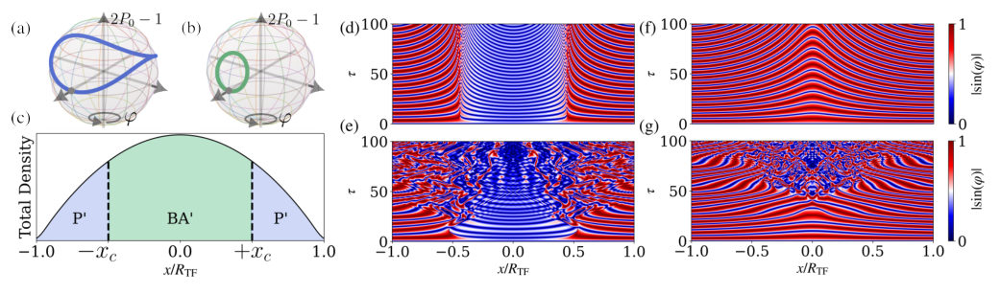
<figcaption class="paper-figure-caption"><b>Fig 1.</b> FIG. 1. Typical Bloch-sphere trajectories in the P′ phase (a) and the BA′ phase (b). (c) Sketch of of the Thomas-Fermi profile with spatial dynamical BA′ and P′ domains and an ESQPT at x = ±xc. Figures (d) and (e) show the spin dynamics in the LDR for η = 103.9 and ξ0 = 0.45 in the absence and the presence of quantum torque, respectively. Note the destabilization of the domain wall. Figures (f) and (g) show the same for η = 103.9 and ξ0 = 0.58. There are no domains in the LDR, but the different time scale of the local dynamics results eventually in a large quantum torque that destabilizes the LDR evolution.</figcaption>
</figure>
<figure class="paper-figure-card">
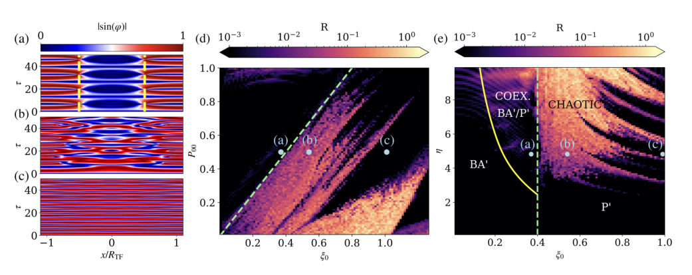
<figcaption class="paper-figure-caption"><b>Fig 2.</b> FIG. 2. Dynamics of | sin (φ(x, τ))| for P00 = 0.5, η = 4.82, and (a) ξ0 = 0.38 (a), ξ0 = 0.54 (b), and ξ0 = 1.01 (c). In Fig. (a) the yellow dashed lines indicate the ESQPT at x = ±xc. (d) Dynamical phase diagram as a function of ξ0 and P00, for η = 4.82. (e) Dynamical phase diagram as a function of ξ0 and η for P00 = 0.5. In plot (d) and (e), the color indicates the value of R (see text). Note the intricate structure of the chaotic regime. In plot (e), the solid yellow line marks the transition between the purely BA′ regime, and the coexistence regime. In both diagrams the dashed green lines indicate the transition between the regular coexistence regime and the irregular regime. We have...</figcaption>
</figure>
<figure class="paper-figure-card">
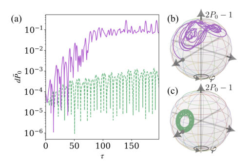
<figcaption class="paper-figure-caption"><b>Fig 3.</b> FIG. 3. (a) For η = 4.82 and P00 = 0.5, we depict the aver- age distance d ¯P0(τ) (see text) between the spatially-averaged population ¯P0(τ) for an unperturbed case and a perturbed one (initially d ¯P0(τ = 0) = 10−4). For ξ0 = 0.49 (irreg- ular regime), the purple continuous line shows an exponen- tial growth of the distance with time up to its maximum. In contrast, for ξ0 = 0.25 (regular coexistence regime), the distance (dashed green line) remains very small. The cor- responding Bloch-Sphere representations for the spatially- averaged spin are depicted in (b) and (c).</figcaption>
</figure>

**Summary.** This theoretical study investigates the complex, non-equilibrium dynamics of elongated spin-1 spinor BECs. The authors demonstrate that the interplay of quantum and nonlinear effects can lead to the coexistence of distinct dynamical domains separated by spatial quantum phase transitions. Furthermore, they map out a universal phase diagram revealing a chaotic regime, offering new diagnostic tools for experimental quantum gas research.

**Why it may be interesting.** This work is highly relevant to AMO physics as it explores non-equilibrium dynamics and quantum chaos in ultracold atomic systems, providing experimental signatures (like domain walls and chaotic signatures) that can be probed in BEC experiments.

Detailed structure

**Main problem.** The paper investigates the complex, non-trivial local magnetization dynamics in elongated spin-1 spinor Bose-Einstein condensates (BECs). It focuses on the interplay between nonlinear and quantum effects that can lead to chaotic dynamics and spatial excited-state quantum phase transitions (ESQPTs).

**Main result.** The system can exhibit the coexistence of distinct dynamical domains separated by a robust ESQPT, and the local dynamics can enter a chaotic regime characterized by exponential sensitivity to initial conditions. This behavior is mapped onto a universal dynamical phase diagram.

**Method.** The analysis involves solving coupled Gross-Pitaevskii equations (GPEs) in different regimes (SMA, LDR) and characterizing the dynamics using diagnostics like the power spectrum $P(\omega)$ and the divergence of perturbed trajectories.

**Model / system.** The system is an elongated spin-1 BEC, described by an energy functional involving spin components and interactions. The dynamics are analyzed in regimes ranging from the Transversal-SMA approximation to the Local Density Regime (LDR).

**Key observables.** Local magnetization dynamics, the existence and nature of ESQPTs, and the divergence of trajectories (used to quantify chaos).

**Important parameters / regimes.** The degree of inhomogeneity ($\eta$), the spin-interaction parameters ($g, c$), and the initial quench parameters ($\xi_0, P_{00}$).

**Assumptions / limitations.** The analysis assumes an elongated harmonic trap ($\omega_\perp \gg \omega$) and focuses on ferromagnetic BECs ($c < 0$). Approximations include the SMA and LDR limits.

**Figures summary.** Figures illustrate Bloch-sphere trajectories in different phases (P' and BA'), sketch the Thomas-Fermi profile showing ESQPT domains, and map out dynamical phase diagrams using metrics like $R$ to distinguish regular from chaotic regimes.

**Paper structure.** The paper develops the theory by first establishing the governing equations in various approximations (SMA, LDR), then analyzing the resulting dynamics, identifying the coexistence of distinct domains separated by ESQPTs, and finally mapping the universal phase diagram that distinguishes regular from chaotic evolution.

Abstract

Elongated spin-$1$ condensates present a highly non-trivial local magnetization dynamics, due to the interplay between nonlinear and quantum effects stemming from the inhomogeneous density profile. This interplay results in different dynamical regimes after an initial global quench. In particular, we show that the system may display the coexistence of markedly different dynamical domains separated by a robust interface that acts as a spatial excited-state quantum phase transition. Furthermore, the local spinor dynamics may enter a chaotic regime characterized by irregular evolution and exponential sensitivity to initial conditions. We map the universal phase diagram distinguishing regular and chaotic regimes, which may be probed in on-going experiments.

[↑ back to top](#top)

### [Higher-order exceptional points and enhanced quantum squeezing in a pseudo-Hermitian semiconductor optomechanical system](http://arxiv.org/abs/2606.01588v1)

**Authors:** Zi-Wei Jiang, Yan-Zi Jing, Zhen-Sen Lin, Rui Zhang, Wen-Quan Yang, Ya-Feng Jiao, Le-Man Kuang  
**Type:** theory · **Category:** other · **PDF:** <https://arxiv.org/pdf/2606.01588v1>  
**Analysis basis:** full PDF text, analyzed in chunks
**Topic relevance:** 🔥 `driven-dissipative phase transition` **4/5** · `analog quantum simulation` **3/5** · `correlated cavity matter` **2/5** · `methods for driven-dissipative` **2/5** · `non-equilibrium dynamics` **2/5** · `non-equilibrium universality` **2/5** · `Keldysh / 2PI / non-Gaussian methods` **1/5** · `Tavis-Cummings & cavity-many-emitter` **1/5** · `correlated / nonlocal dissipation` **1/5** · `entanglement & information structure` **1/5**

↔ Scroll figures horizontally

<figure class="paper-figure-card">
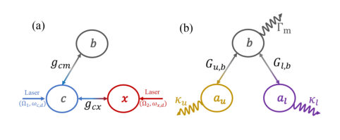
<figcaption class="paper-figure-caption"><b>Fig 1.</b> FIG. 1. Schematic of the semicondoctor exciton- optomechanical system. (a) The tripartite coupling config- uration among the cavity mode c, the exciton mode x, and the mechanical mode b. (b) The tripartite coupling configu- ration among the cavity mode c, polariton modes au and al after linearization in the strong-coupling regime.</figcaption>
</figure>
<figure class="paper-figure-card">
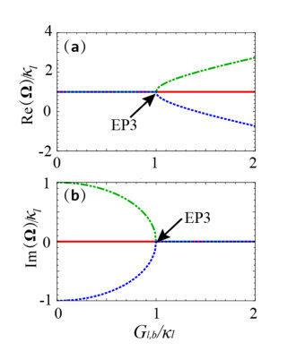
<figcaption class="paper-figure-caption"><b>Fig 2.</b> FIG. 2. Real and imaginary parts of the eigenvalues as func- tions of the dimensionless coupling strength Gl,b/κl. (a) and (b) show the real and imaginary parts of the eigenvalues, re- spectively. The solid (red) curve represents Ω0, the dash-dot (green) curve corresponds to Ω+, and the dot (blue) curve corresponds to Ω−. Here, λ = 2 and Ωm/κl = 1.</figcaption>
</figure>
<figure class="paper-figure-card">
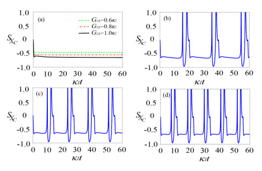
<figcaption class="paper-figure-caption"><b>Fig 3.</b> FIG. 3. Dynamic evolution of the quantum squeezing de- scribed by the squeezing parameter SXC versus the dimen- sionless time κlt for typical coupling strengths. (a) Cases of PT-symmetry broken phase (Gl,b/κl = 0.6, 0.8) and EP3 (Gl,b/κl = 1.0); (b)-(d) Cases of PT-symmetric phase for Gl,b/κl = 1.05, 1.10, and 1.15, respectively. Here we take λ = 2.</figcaption>
</figure>
<figure class="paper-figure-card">
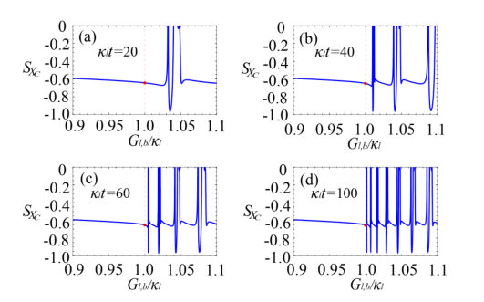
<figcaption class="paper-figure-caption"><b>Fig 4.</b> FIG. 4. The quantum squeezing described by the squeezing parameter SXC versus the dimensionless coupling strength Gl,b/κl at different dimensionless evolution times (a) κlt = 20; (b) κlt = 40; (c) κlt = 60; (d) κlt = 100. Here we take λ = 2. The red dot marks the EP3 at Gl,b/κl = 1.</figcaption>
</figure>

**Summary.** This paper theoretically explores how higher-order exceptional points (EP3) manifest in a pseudo-Hermitian semiconductor optomechanical system. It shows that the EP3 enhances two-mode quantum squeezing, and critically, the change in squeezing dynamics—from a frequency comb to a constant value—serves as a robust diagnostic tool to map out the system's quantum phase transitions.

**Why it may be interesting.** This work directly bridges non-Hermitian physics (EPs) with quantum optics (squeezing) in a solid-state platform (optomechanics), providing a mechanism to actively probe quantum phase transitions using measurable quantum noise signatures.

Detailed structure

**Main problem.** The study investigates the emergence of higher-order exceptional points (EP3) and their influence on quantum squeezing in a pseudo-Hermitian semiconductor optomechanical system.

**Main result.** The research demonstrates that an EP3 exists due to tripartite coupling, leading to enhanced two-mode quantum squeezing. The squeezing dynamics exhibit distinct behaviors (frequency comb vs. constant) depending on whether the system is in the PT-symmetric or PT-broken phase.

**Method.** The analysis involves deriving the effective Hamiltonian, linearizing quantum fluctuations, and calculating time-dependent squeezing parameters using quadrature operators.

**Model / system.** The system is a semiconductor optomechanical setup coupling photons, excitons, and phonons, modeled using a pseudo-Hermitian Hamiltonian. The analysis proceeds by examining the eigenvalues and the resulting quantum noise properties.

**Key observables.** Two-mode quantum squeezing parameters ($S_{XC}, S_{YC}$), the existence and location of Exceptional Points (EP3), and the time evolution of these parameters.

**Important parameters / regimes.** Coupling strengths ($G_{l,b}/\kappa_l$), detunings ($\Delta_u, \Delta_l$), and the dimensionless time ($\kappa l t$).

**Assumptions / limitations.** The analysis assumes the system operates in the strong-coupling regime and utilizes a linearization approach for quantum fluctuations.

**Figures summary.** Figures illustrate the coalescence of eigenvalues at the EP3 as a function of coupling strength, and show the time evolution of squeezing, revealing a 'squeezing comb' in the PT-symmetric phase versus constant squeezing in the broken phase.

**Paper structure.** The paper first establishes the model and Hamiltonian, then analyzes the conditions for pseudo-Hermiticity and the emergence of EPs. Subsequently, it quantifies quantum squeezing using quadrature operators, mapping out the distinct dynamical regimes around the EP3.

Abstract

We investigate higher-order exceptional points and quantum squeezing of exciton polaritons in a pseudo-Hermitian semiconductor optomechanical system. We show that a third-order exceptional point (EP3) can emerge from the tripartite coupling among photons, excitons, and phonons under pseudo-Hermitian conditions. A pronounced two-mode quantum squeezing of exciton polaritons is revealed, and we demonstrate that this squeezing is significantly enhanced in the vicinity of the EP3. Furthermore, we find that in the PT-symmetric phase, the squeezing dynamics produce a frequency comb of exciton polaritons, whereas the squeezing remains constant over time in the PT-symmetry broken phase and exactly at the EP3. The sudden change in quantum squeezing dynamics can be used to probe the phase transition and the EP3. Our work opens a pathway to manipulate quantum squeezing in semiconductor optomechanical platforms, offering potential advantages for quantum sensing and metrology.

[↑ back to top](#top)

### [Bath-induced deviations from Gibbs statistics for strongly interacting oscillators](http://arxiv.org/abs/2606.00239v1)

**Authors:** Felipe Recabal, Adrian E. Rubio Lopez, Johannes Schachenmayer, Felipe Herrera  
**Type:** theory · **Category:** statistical mechanics · **PDF:** <https://arxiv.org/pdf/2606.00239v1>  
**Analysis basis:** full PDF text, analyzed in chunks
**Topic relevance:** 🔥 `non-equilibrium dynamics` **4/5** · `correlated / nonlocal dissipation` **3/5** · `driven-dissipative phase transition` **3/5** · `methods for driven-dissipative` **3/5** · `non-equilibrium universality` **3/5** · `Keldysh / 2PI / non-Gaussian methods` **2/5**

↔ Scroll figures horizontally

<figure class="paper-figure-card">
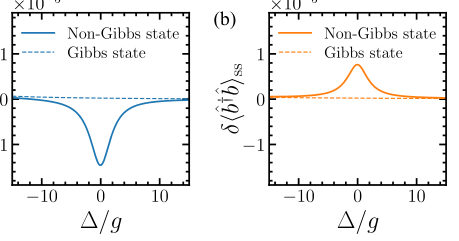
<figcaption class="paper-figure-caption"><b>Fig 1.</b> FIG. 1. Steady occupations of strongly interacting oscillators A and B as a function of the detuning ∆. Panels (a) and (b) correspond to values of δ⟨ˆa†ˆa⟩ss = ⟨ˆa†ˆa⟩ss −nth(ωa) and δ⟨ˆb†ˆb⟩ss = ⟨ˆb†ˆb⟩ss −nth(ωb), respectively. System parameters are {γa, γb, T, ωb, ωc} = {10−2, 2 × 10−2, 10, 102, 103}g.</figcaption>
</figure>
<figure class="paper-figure-card">
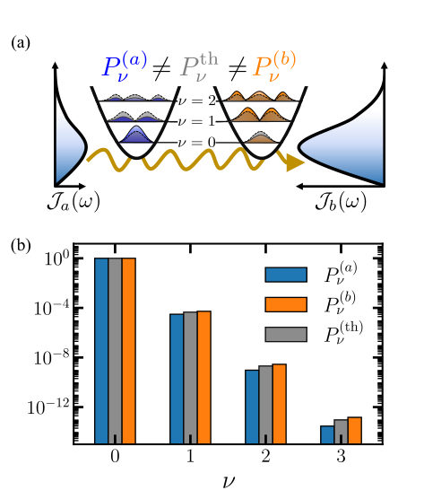
<figcaption class="paper-figure-caption"><b>Fig 2.</b> FIG. 2. (a) Scheme of unbalanced probability distributions of resonant strongly interacting oscillators under steady flux of excitations (yellow arrow) when damping rates are γa &lt; γb. (b) Excitation probability densities P (a) ν and P (b) ν over Fock states ν for resonant oscillators in the non-Gibbs states, compared to the thermal probability distribution P th ν .</figcaption>
</figure>

**Summary.** This theoretical study analyzes two strongly coupled quantum oscillators interacting with independent thermal baths. By extending the standard Redfield approach beyond the secular approximation, the authors demonstrate that the system can settle into a non-Gibbs steady state. This deviation is driven by a persistent excitation flux, particularly when the damping rates of the two oscillators are unequal.

**Why it may be interesting.** This work is highly relevant to open quantum systems and quantum optics, as it provides a detailed theoretical framework for understanding how non-Markovian or non-secular bath effects can fundamentally alter the expected thermal equilibrium state in interacting quantum systems.

Detailed structure

**Main problem.** The paper investigates how strong system-bath coupling can drive the steady state of interacting quantum oscillators away from the expected Gibbs thermal equilibrium state.

**Main result.** When oscillators are unequally damped and strongly coupled, the steady state is a non-Gibbs state sustained by a non-zero steady excitation flux, which is most pronounced under resonant conditions.

**Method.** The dynamics are analyzed using the Redfield quantum master equation, specifically employing a partial secular approximation to retain non-secular terms responsible for the non-Gibbs steady state.

**Model / system.** The system consists of two strongly interacting quantum harmonic oscillators (A and B), each coupled to an independent thermal bath at equal temperature. The dynamics are governed by the total Hamiltonian and analyzed via the Redfield master equation.

**Key observables.** Steady-state occupation numbers ($\langle \hat{a}^\dagger\hat{a} 
angle_{ss}, \langle \hat{b}^\dagger\hat{b} 
angle_{ss}$), steady-state coherence ($\langle \hat{a}\hat{b}^\dagger 
angle_{ss}$), and the steady excitation flux.

**Important parameters / regimes.** Strong coupling ($g$), unequal damping rates ($\gamma_a 
eq \gamma_b$), and the detuning ($\Delta$) relative to the coupling strength.

**Assumptions / limitations.** The analysis relies on the Born-Markov approximation and the partial secular approximation of the Redfield dynamics, assuming weak system-bath coupling.

**Figures summary.** Figures illustrate the deviation of steady-state occupations from the thermal distribution, showing resonant enhancement of the non-Gibbs state, and comparing probability distributions to the thermal case.

**Paper structure.** The paper first details the model Hamiltonian and the Redfield master equation, then analyzes the steady-state solutions by applying the partial secular approximation, culminating in the derivation of the non-Gibbs steady state characterized by energy flux.

Abstract

The Redfield quantum master equation is widely used to study the dynamics of interacting sub-systems that are weakly coupled to baths. Redfield dynamics under secular approximation preserves positivity of the reduced density operator and thermalizes the system into a Gibbs state at equilibrium. Long-time effects arising from non-secular terms are often neglected, but depending on the system spectrum and relative bath couplings, non-secular contributions are shown here to drive the system into a non-Gibbs state. For two strongly interacting quantum oscillators with independent baths at equal temperature, we analyze the microscopic origin of the deviations from Gibbs statistics. Provided that the oscillators are unequally damped by their baths, we show that steady state occupation numbers can significantly deviate from a Boltzmann distribution due to an excitation flux driven by bath-induced coherences between nearly-degenerate oscillator levels. Conditions for the recovery of thermal Gibbs statistics are discussed and experimental signatures suggested.

[↑ back to top](#top)

### [Energy spectra and cascade in the spin turbulence of a driven spinor Bose-Einstein condensate](http://arxiv.org/abs/2606.00766v1)

**Authors:** Junghoon Lee, Jongmin Kim, Donggyu Lee, Yong-il Shin  
**Type:** experiment · **Category:** quantum gases · **PDF:** <https://arxiv.org/pdf/2606.00766v1>  
**Analysis basis:** full PDF text, analyzed in chunks
**Topic relevance:** 🔥 `non-equilibrium universality` **4/5** · `analog quantum simulation` **3/5** · `driven-dissipative phase transition` **3/5** · `exotic spin models in light-matter` **3/5** · `non-equilibrium dynamics` **3/5** · `methods for driven-dissipative` **1/5** · `spintronics-quantum-optics interface` **1/5**

↔ Scroll figures horizontally

<figure class="paper-figure-card">
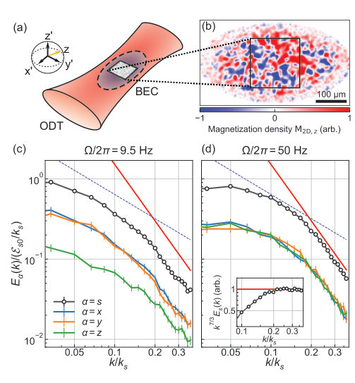
<figcaption class="paper-figure-caption"><b>Fig 1.</b> FIG. 1. Spin turbulence in a trapped spinor Bose-Einstein condensate (BEC). (a) Schematic of the experimental setup. A BEC of F = 1 23Na atoms was prepared in an optical dipole trap (ODT) under a uniform magnetic field along z and continuously driven by a transverse resonant RF mag- netic field with Rabi frequency Ω. (b) Representative image of the effective areal magnetization M2D,z in a steady turbulent BEC. The rectangular box indicates the region selected for de- termining the spin-interaction energy spectrum. (c,d) Energy spectra at two different driving strengths of (c) Ω/2π = 9.5 Hz and (d) 50 Hz. The colored lines show the directional energy spectra Ei(k) (i = x, y, z) and the black...</figcaption>
</figure>
<figure class="paper-figure-card">
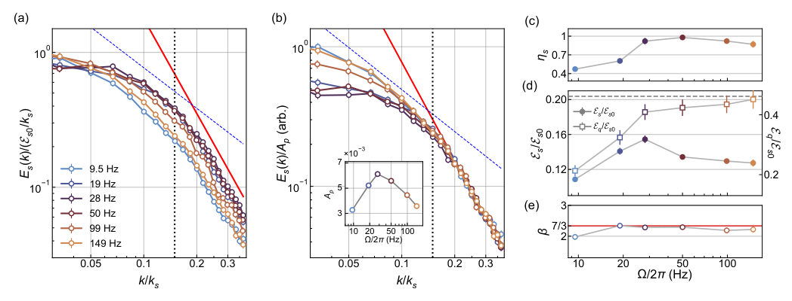
<figcaption class="paper-figure-caption"><b>Fig 2.</b> FIG. 2. Spin-interaction energy spectra in spin turbulence. (a) Energy spectra Es(k) at various driving strengths Ω. The vertical dotted line indicates ¯kℓ, the mean lower bound of the high-k scaling range across all Ωvalues [38]. (b) Rescaled energy spectra Es(k)/Ap. The prefactor Ap was extracted by fitting Es(k)/(Es0/ks) = Ap(k/ks)−7/3 to each spectrum in the range k ≥1.3 ¯kℓ. The inset shows Ap as a function of Ω(see Supplemental Material [38] for a model describing the energy injection rate). (c)–(e) Turbulence parameters as a function of Ω: (c) Energy anisotropy 2Ez/E⊥, where Ei = R Ei(k)dk and E⊥= Ex + Ey; (d) total spin-interaction energy Es = P</figcaption>
</figure>
<figure class="paper-figure-card">
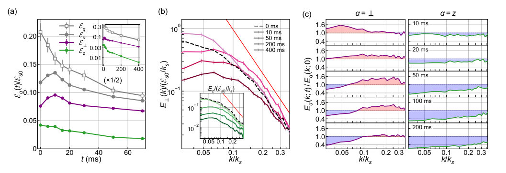
<figcaption class="paper-figure-caption"><b>Fig 3.</b> FIG. 3. Free decay of spin turbulence. (a) Time evolution of the quadratic Zeeman energy Eq (gray squares), total spin- interaction energy Es (gray circles), and its transeverse (E⊥= Ex + Ey, purple), and longitudinal (Ez, green) components. (b) Transverse spectra E⊥(k) = Ex(k)+Ey(k) for hold times t = 0, 10, 50, 200, 400-ms after switching off the drive. The inset shows the corresponding longitudinal spectra Ez(k). Red solid lines indicate the k−7/3 power law, and black dashed lines denote the spectra at t = 0. (c) Spectral ratio Eα(k, t)/Eα(k, 0) for the transverse (α =⊥, left) and longitudinal (α = z, right) components at different hold times. Red (blue) shading indicates spectral...</figcaption>
</figure>

**Summary.** This paper experimentally investigates spin turbulence in a driven spinor Bose-Einstein condensate. By measuring the spin-interaction energy spectrum, the authors confirm a universal power-law scaling of $k^{-7/3}$, characteristic of energy cascades. These results establish a quantitative tool for studying energy transport in spinor superfluids.

**Why it may be interesting.** This work provides direct experimental evidence of universal energy cascade scaling laws (like $k^{-7/3}$) in a controllable quantum many-body system, offering a clean platform to test theoretical models of nonlinear wave turbulence.

Detailed structure

**Main problem.** The study investigates the energy spectrum and cascade dynamics associated with spin turbulence in a driven spinor Bose-Einstein condensate.

**Main result.** The experiment confirms a robust energy-spectral hallmark of spin turbulence, observing a power-law scaling exponent consistent with $k^{-7/3}$ across various drive strengths.

**Method.** The research uses spin-selective imaging of a spinor BEC to reconstruct magnetization densities, followed by 2D Fourier analysis to extract the energy spectrum $E_s(\mathbf{k})$.

**Model / system.** The physical system is a spin-1 Bose-Einstein condensate (BEC) of $^{23}	ext{Na}$ atoms, which is driven by a continuous resonant RF magnetic field ($\Omega$) to induce a non-equilibrium steady state of spin turbulence.

**Key observables.** Spin-interaction energy spectrum $E_s(\mathbf{k})$, spectral anisotropy ($\eta_s$), and the power-law scaling exponent $eta$.

**Important parameters / regimes.** Driving strength ($\Omega$), quadratic Zeeman shift ($q$), and the characteristic exponent $-7/3$.

**Assumptions / limitations.** The analysis relies on correcting the measured power spectrum using the Modulation Transfer Function (MTF) and assumes negligible density redistribution during the short imaging delay.

**Figures summary.** Figures illustrate the dependence of the energy spectrum $E_s(\mathbf{k})$ on driving strength $\Omega$, demonstrating the universal $k^{-7/3}$ scaling, and show the time evolution of energy components during free decay.

**Paper structure.** The paper details the experimental setup and measurement techniques, analyzes the steady-state energy spectrum under continuous driving, examines the spectral anisotropy as a function of drive strength, and finally tracks the energy decay dynamics after switching off the drive to confirm the energy cascade.

Abstract

We investigate the spin-interaction energy spectrum of spin turbulence in a driven spinor Bose-Einstein condensate. Continuous spin driving of a spin-1 condensate produces a nonequilibrium steady state with spatially fluctuating magnetization. We observe a power-law scaling consistent with the $-7/3$ exponent predicted for spin-wave turbulence, which persists across our full range of drive strengths despite substantial changes in the spectral anisotropy. After switching off the drive, we track the free-decay evolution and find evidence consistent with a direct cascade of spin-interaction energy toward higher wavenumbers. These results establish an energy-spectral hallmark of spin turbulence and enable quantitative studies of cascade dynamics in spinor superfluids.

[↑ back to top](#top)

### [Negative Interaction Quench Dynamics of Density-Ordered Dipolar Bosons in a One-Dimensional Optical Lattice](http://arxiv.org/abs/2606.01712v1)

**Authors:** Rhombik Roy, N. D. Chavda, Barnali Chakrabarti, Arnaldo Gammal  
**Type:** theory · **Category:** quantum gases · **PDF:** <https://arxiv.org/pdf/2606.01712v1>  
**Analysis basis:** full PDF text, analyzed in chunks
**Topic relevance:** 🔥 `non-equilibrium dynamics` **4/5** · `analog quantum simulation` **3/5** · `non-equilibrium universality` **3/5** · `Frenkel-Kontorova` **2/5** · `scars & prethermalization` **2/5** · `entanglement & information structure` **1/5** · `methods for driven-dissipative` **1/5**

↔ Scroll figures horizontally

<figure class="paper-figure-card">
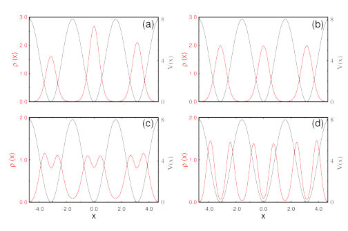
<figcaption class="paper-figure-caption"><b>Fig 1.</b> FIG. 1. One-body density ρ(x) (red curve) for N = 6 bosons in S = 3 lattice sites as a function of the dipolar interaction strength gd, with lattice depth fixed at V0 = 8. The calcu- lations are performed using M = 24 orbitals. (a) Superfluid (SF) phase (gd = 0): the density is delocalized, with a pro- nounced maximum in the central well due to the dominance of kinetic and lattice energies over interactions. (b) Mott- insulator (MI) phase (gd = 0.1): three equal density peaks across the wells indicate uniform distribution of two bosons per site and suppressed inter-well overlap. (c) Fermionized Mott (FMI) phase (gd = 1): the characteristic density dip within each well mimics...</figcaption>
</figure>
<figure class="paper-figure-card">
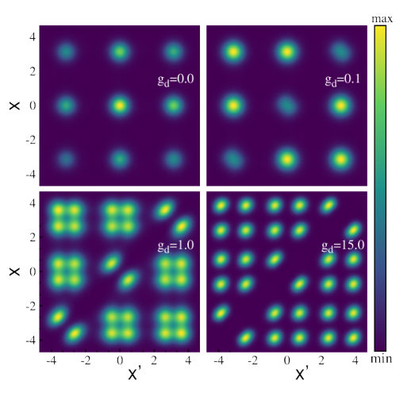
<figcaption class="paper-figure-caption"><b>Fig 2.</b> FIG. 2. Two-body density ρ(2)(x, x′) for six bosons in three lattice sites across the four emergent phases. For gd = 0, atoms cluster at the center with additional off-diagonal peaks due to superfluid delocalization. Increasing gd depletes the diagonal contribution ρ(2)(x, x), signaling enhanced correla- tions. At gd = 1.0, a correlation hole develops (fermionized Mott phase), while for gd = 15.0 a complete diagonal suppres- sion indicates crystallization driven by dominant long-range interactions.</figcaption>
</figure>
<figure class="paper-figure-card">
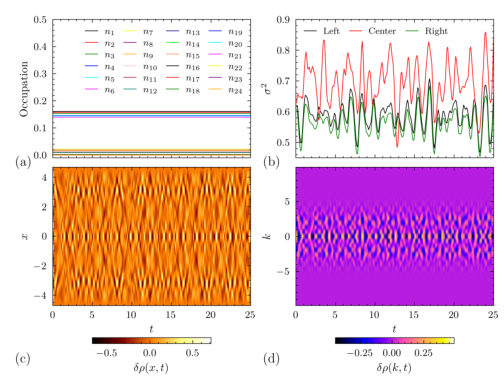
<figcaption class="paper-figure-caption"><b>Fig 3.</b> FIG. 3. Nonequilibrium dynamics of six dipolar bosons in a triple-well lattice following a negative interaction quench from gd = 15 (crystal state) to gd = 0 (superfluid). (a) Dy- namical fragmentation: time evolution of the natural occupa- tions ni/N illustrating the redistribution of particles among orbitals, (b) Lattice site-resolved position variance σ2(t), (c) Real-space density fluctuations δρ(x, t), (d) Momentum-space fluctuations δn(k, t). Computation is done with M = 24 or- bitals.</figcaption>
</figure>
<figure class="paper-figure-card">
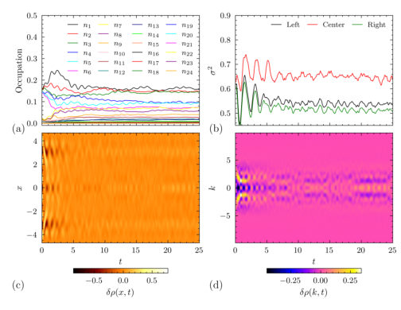
<figcaption class="paper-figure-caption"><b>Fig 4.</b> FIG. 4. Nonequilibrium dynamics of six dipolar bosons in a triple-well lattice following a negative interaction quench from gd = 15 (crystal state) to gd = 0.1 (MI). (a) Dynamical frag- mentation: time evolution of the natural occupations ni/N illustrating the redistribution of particles among orbitals, (b) Lattice site-resolved position variance σ2(t), (c) Real-space density fluctuations δρ(x, t), (d) Momentum-space fluctua- tions δn(k, t). Computation is done with M = 24 orbitals.</figcaption>
</figure>
<figure class="paper-figure-card">
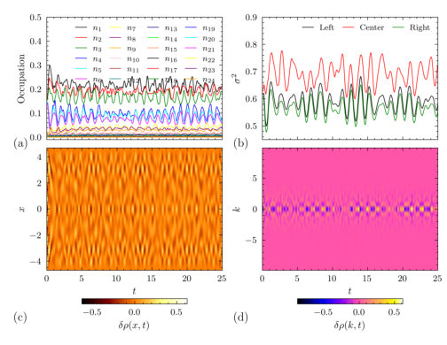
<figcaption class="paper-figure-caption"><b>Fig 5.</b> FIG. 5. Nonequilibrium dynamics of six dipolar bosons in a triple-well lattice following a negative interaction quench from gd = 15 (crystal state) to gd = 1.0 (fragmented MI). (a) Dynamical fragmentation: time evolution of the natural occu- pations ni/N illustrating the redistribution of particles among orbitals, (b) Lattice site-resolved position variance σ2(t), (c) Real-space density fluctuations δρ(x, t), (d) Momentum-space fluctuations δn(k, t). Computation is done with M = 24 or- bitals.</figcaption>
</figure>

**Summary.** This paper numerically explores how dipolar bosons in a 1D optical lattice behave after a sudden negative interaction quench. Using the MCTDHB method, the authors track various correlation and fluctuation observables across regimes spanning superfluid to Mott-insulating states. The key finding is the remarkable robustness of the initial crystal-state correlations despite the system undergoing significant dynamic changes.

**Why it may be interesting.** This work provides detailed insights into non-equilibrium quantum dynamics in dipolar systems, which are highly relevant for simulating complex quantum phases and understanding correlation persistence after sudden changes in interaction parameters.

Detailed structure

**Main problem.** The study investigates the non-equilibrium dynamics of a density-ordered dipolar Bose gas following a sudden negative interaction quench.

**Main result.** The system exhibits a robust persistence of underlying crystal-state correlations despite strong dynamical responses, with dynamics characterized by distinct intrawell excitations and suppressed interwell tunneling.

**Method.** The dynamics are simulated using the numerically exact multiconfigurational time-dependent Hartree method for bosons (MCTDHB/MCTDH-X).

**Model / system.** The system consists of dipolar bosons confined in a finite one-dimensional optical lattice. The Hamiltonian includes both kinetic, lattice potential, and long-range dipolar interaction terms, which undergo a sign reversal quench.

**Key observables.** Site-resolved position variance, real-space and momentum-space density fluctuations, one- and two-body Glauber correlation functions, and dynamical fragmentation.

**Important parameters / regimes.** The quench protocol involves varying the dipolar interaction strength ($g_d$) from a strongly interacting crystal state ($g_d=15$) through superfluid ($g_d=0$), Mott-insulator ($g_d=0.1$), and fermionized Mott ($g_d=1$) regimes.

**Assumptions / limitations.** Hard-wall boundary conditions are assumed, and the analysis relies on the MCTDH-X formulation, which is computationally intensive.

**Figures summary.** Figures illustrate the time evolution of the four key observables (fragmentation, variance, $\delta
ho$, $\delta n$) across different quench protocols, demonstrating the transition from coherent to localized dynamics.

**Paper structure.** The paper details the theoretical framework (Hamiltonian, quench protocol, MCTDH-X method), presents results analyzing the dynamics across various quench targets, and concludes by summarizing the findings regarding correlation robustness.

Abstract

We explore the nonequilibrium dynamics of a density-ordered dipolar Bose gas in a finite one-dimensional optical lattice following a negative interaction quench, using the numerically exact multiconfigurational time-dependent Hartree method for bosons. The interaction sign reversal, effectively driving a crossover from long-range to short-range interactions, generates rich intra- and interwell tunneling dynamics spanning superfluid, Mott-insulating, and fragmented regimes. A striking finding is the robustness of the underlying crystal-state correlations against the quench, despite the strong dynamical response. We identify emergent excitation modes, including local breathing and dipole-like oscillations, via real- and momentum-space observables, and quantify tunneling through site-resolved position variance. One- and two-body Glauber correlation functions further uncover a direct connection between tunneling and correlation dynamics. Moreover, we show that combining interaction quenches with lattice-depth ramping enables controllable dynamical engineering, establishing dipolar lattice systems as a promising platform for nonequilibrium quantum simulation.

[↑ back to top](#top)

### [Analog photonic simulator for large-scale transport](http://arxiv.org/abs/2606.00581v1)

**Authors:** Mengyu Zhao, Xuezhi Zhu, Nikita Guseynov, Yewei Yuan, Na Wang, Meihong Wang, Yunyun Cao, Shi Jin, Nana Liu, Changde Xie, Kunchi Peng, Xiaolong Su  
**Type:** both · **Category:** quantum information and computing · **PDF:** <https://arxiv.org/pdf/2606.00581v1>  
**Analysis basis:** full PDF text, analyzed in chunks
**Topic relevance:** 🔥 `analog quantum simulation` **4/5** · 🔥 `quantum optics experiment` **4/5** · `non-equilibrium dynamics` **2/5** · `quantum measurements` **2/5** · `QC/QI experiment` **1/5** · `entanglement & information structure` **1/5** · `methods for driven-dissipative` **1/5**

↔ Scroll figures horizontally

<figure class="paper-figure-card">
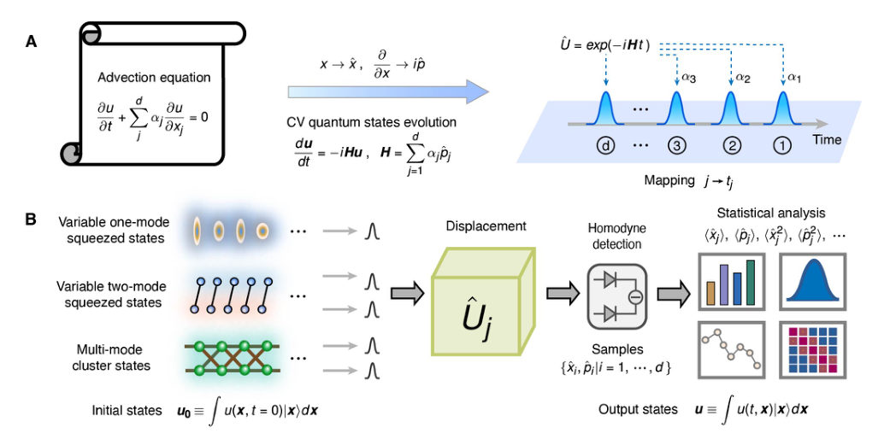
<figcaption class="paper-figure-caption"><b>Fig 1.</b> Figure 1: Conceptual diagram and experimental procedure for simulating the advection equation on a continuous-variable quantum platform. (A) The classical advection equation is mapped to an initial quantum state under displacement operations that act on the amplitude quadrature of the quantum states. Each dimension corresponds to an independent quantum mode (qumode). (B) Experimental workflow: the experiment begins with the preparation of the initial Gaussian quantum resources. Then controlled, variable displacement operations are applied to every quantum mode. The evolved quantum states are subsequently measured by homodyne detection. Finally, data acquisition and statistical analysis are...</figcaption>
</figure>
<figure class="paper-figure-card">
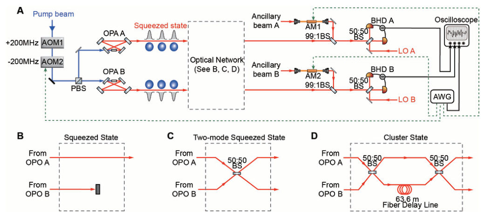
<figcaption class="paper-figure-caption"><b>Fig 2.</b> Figure 2: Experimental setup of the continuous variable photonic platform. (A) Main experimental setup. Two optical parametric oscillators (OPA A and OPA B) generate squeezed state sequences. The pump beam is modulated by cascaded acousto-optic modulators (AOMs), enabling dynamic control of the squeezing parameter. The generated squeezed states are injected into a reconfigurable optical network to generate the required quantum resources. Next, two amplitude-modulated (AM) ancillary beams are coupled with the signal beams to implement displacement operations. Finally, the output states are measured by two balanced homodyne detectors (BHDs). All modulators are driven by an arbitrary waveform...</figcaption>
</figure>
<figure class="paper-figure-card">
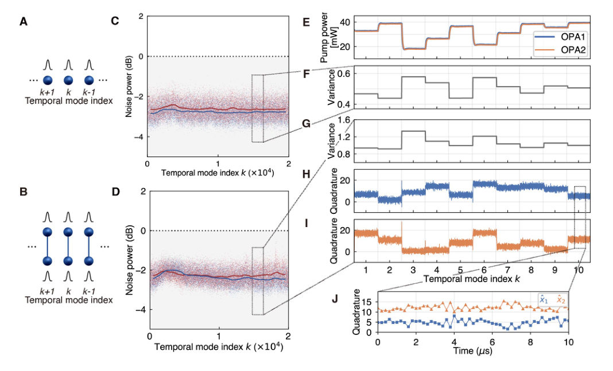
<figcaption class="paper-figure-caption"><b>Fig 3.</b> Figure 3: Measurements on time-bin-resolved single-mode and two-mode squeezed states. (A,B) Graphical representation of the single-mode (A) and two-mode (B) squeezed state sequences. (C,D) Noise power of the amplitude quadrature ˆx for the single-mode squeezed states (C) and ˆx1 + ˆx2 for the two-mode squeezed states (D) before and after displacement. All modes remain below the shot noise level. The red and blue scatter points represent the experimental data before and after displacement, respectively. Solid lines represent the corresponding moving averages. (E-I) Time-bin resolved sequences of modulated pump power, variance reflecting the single-mode squeezing parameter, variance...</figcaption>
</figure>
<figure class="paper-figure-card">
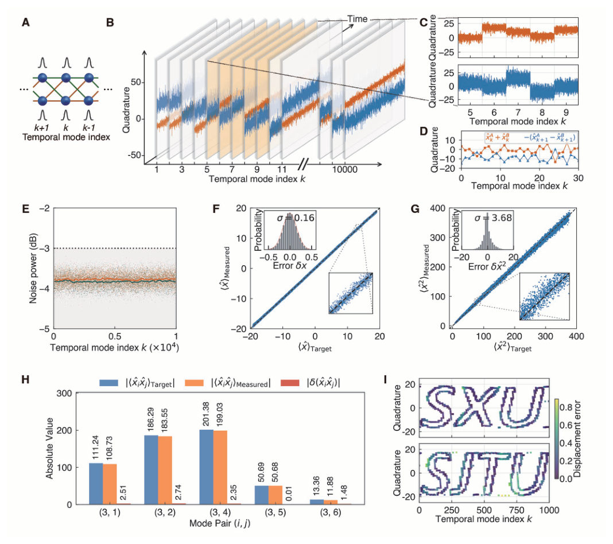
<figcaption class="paper-figure-caption"><b>Fig 4.</b> Figure 4: Results of the analog photonic simulation with CV cluster state. (A) Graphical representation of the CV cluster state. (B) The quadrature output after displacement crosses 10,000 temporal modes. The green and orange lines correspond to the amplitude quadrature of the two rails. (C) Amplitude quadrature values measured by BHD A and B over five consecutive temporal modes. (D) Amplitude quadrature combination evolution within one time bin. (E) ⟨(ˆxA k + ˆxB k + ˆxA k+1 −ˆxB k+1)2⟩before and after displacement. The green and orange scatter points represent the experimental data before and after displacement, respectively. Solid lines represent the corresponding moving averages. (F)...</figcaption>
</figure>
<figure class="paper-figure-card">
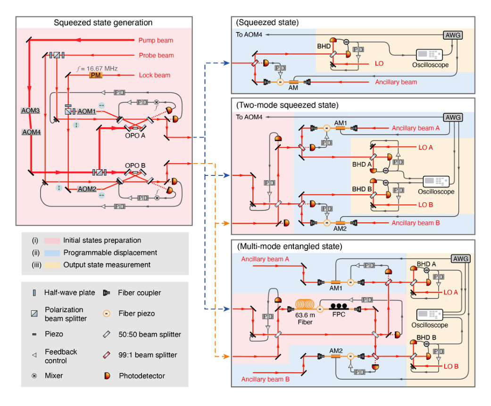
<figcaption class="paper-figure-caption"><b>Fig 5.</b> Figure 5: Experimental setup. The setup comprises three steps. First, OPA A and OPA B generate squeezed states, which are configured as single-mode squeezed state sequences, two-mode squeezed state sequences, or a time-domain continuous variable (CV) cluster state. Next, an arbitrary waveform generator (AWG) drives amplitude modulation of the ancillary beams, which is then coupled with the signal beam on a 99:1 beam-splitter. Finally, the output state is measured using balanced homodyne detection (BHD) with a local oscillator and recorded by an oscilloscope. PM, phase modulator; AOM, acousto-optic modulator; AM, amplitude modulator; FPC, fiber polarization controller.</figcaption>
</figure>

**Summary.** This work presents an analog photonic simulator for solving large-scale transport equations, specifically the advection equation. By encoding the PDE into the evolution of continuous-variable quantum modes, the authors bypass the exponential scaling issues of digital simulation. The results confirm that CV photonics is a powerful, programmable platform for simulating complex physical dynamics.

**Why it may be interesting.** It provides a concrete, hardware-implementable blueprint for simulating complex, continuous-variable dynamics that are otherwise intractable for current digital quantum simulators.

Detailed structure

**Main problem.** Simulating high-dimensional Partial Differential Equations (PDEs), like the advection equation, is computationally prohibitive for traditional digital quantum computers due to the curse of dimensionality.

**Main result.** The authors demonstrate that continuous-variable (CV) quantum photonics provides a scalable, programmable analog platform capable of simulating large-scale transport dynamics with high fidelity.

**Method.** The PDE evolution is mapped directly to programmable unitary operations (displacements) on a qumode state, which are then measured using homodyne detection to extract moment information.

**Model / system.** The system uses a time-domain CV quantum optical platform, employing squeezed states and cluster states to encode the solution of the advection equation into optical modes.

**Key observables.** First-order moments (mean collective coordinate) and second-order moments (mean carrier spatial spread) of the solution.

**Important parameters / regimes.** Number of modes ($d$ up to 20,000), relative error ($\le 0.92\%$), and the advection coefficient ($\alpha_j$).

**Assumptions / limitations.** The demonstration is limited to the constant-coefficient advection equation; simulating more general PDEs requires non-Gaussian operations.

**Figures summary.** Figures illustrate the conceptual mapping from PDE to optical displacement, the experimental setup using squeezed states and cluster states, and the measurement process via homodyne detection.

**Paper structure.** The paper establishes the problem (PDE simulation difficulty), proposes the CV photonic mapping, validates the simulation using large-scale squeezed and cluster states, and concludes by comparing resource scaling against digital qubit approaches.

Abstract

Transport equations describe how physical quantities -- such as mass, energy, momentum, concentration, probability, or fields -- are carried, propagated, or redistributed through space and time, forming a foundational class of partial differential equations across science and engineering. However, high-dimensional partial differential equations are difficult to represent on digital grids because the number of degrees of freedom grows exponentially with dimension. Continuous-variable quantum photonics on the other hand can represent and evolve these large-scale fields without first discretizing space into a discrete grid. We demonstrate a large-scale analog photonic simulator for the constant-coefficient advection equation, a transport equation that is a fundamental benchmark for scientific computing. The solution of a $d$-variable advection equation is encoded into $d$ optical modes, so that the partial differential equation evolution maps directly to programmable phase-space displacements generated by optical quadrature momenta. Using a time-domain continuous-variable quantum photonic platform, we validate programmable control with $20,000$ single-mode squeezed states and $20,000$ two-mode squeezed states, and implement transport dynamics on a $20,000$-mode cluster-state resource. Homodyne measurements then verifies mode-resolved displacement control, which can provide first and second-order moment information of the solution to the advection equation, with final achievable relative error as low as $0.8\%$ and $0.92\%$ for first and second-order moment observables respectively. Our results establish continuous-variable photonics as a suitable programmable analog platform for large-scale advection equations.

[↑ back to top](#top)

### [Boulder Lectures on Thermal Dynamics and Hydrodynamic EFTs](http://arxiv.org/abs/2606.02391v1)

**Authors:** Luca V. Delacretaz  
**Type:** theory · **Category:** statistical mechanics · **PDF:** <https://arxiv.org/pdf/2606.02391v1>  
**Analysis basis:** full PDF text, analyzed in chunks
**Topic relevance:** 🔥 `Keldysh / 2PI / non-Gaussian methods` **4/5** · 🔥 `non-equilibrium dynamics` **4/5** · `non-equilibrium universality` **3/5** · `methods for driven-dissipative` **2/5** · `analog quantum simulation` **1/5** · `driven-dissipative phase transition` **1/5**

↔ Scroll figures horizontally

<figure class="paper-figure-card">
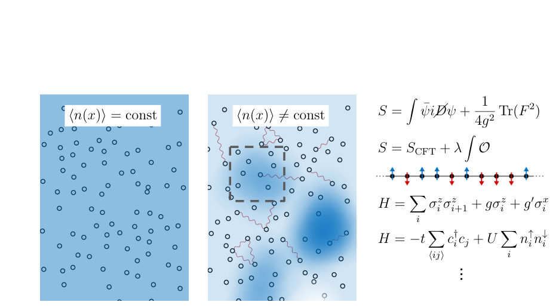
<figcaption class="paper-figure-caption"><b>Fig 1.</b> Figure 1: (a) Global equilibrium is reached after a time scale that grows with volume in</figcaption>
</figure>
<figure class="paper-figure-card">
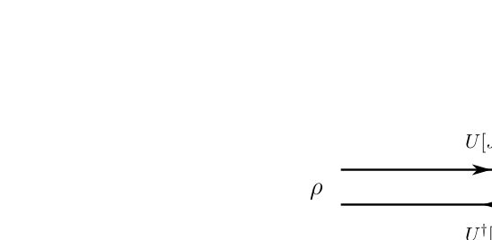
<figcaption class="paper-figure-caption"><b>Fig 2.</b> Figure 2: Schwinger-Keldysh contour with sources. Time increases from left to right.</figcaption>
</figure>
<figure class="paper-figure-card">
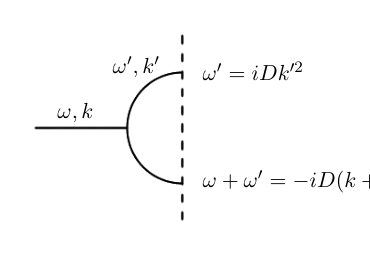
<figcaption class="paper-figure-caption"><b>Fig 3.</b> Figure 3: (a) On-shell condition for the two internal legs, leading to a branch point at</figcaption>
</figure>
<figure class="paper-figure-card">
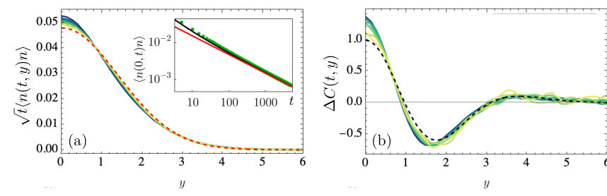
<figcaption class="paper-figure-caption"><b>Fig 4.</b> Figure 4: Density two-point function ⟨n(t, x)n⟩in a classical lattice gas from early times</figcaption>
</figure>
<figure class="paper-figure-card">
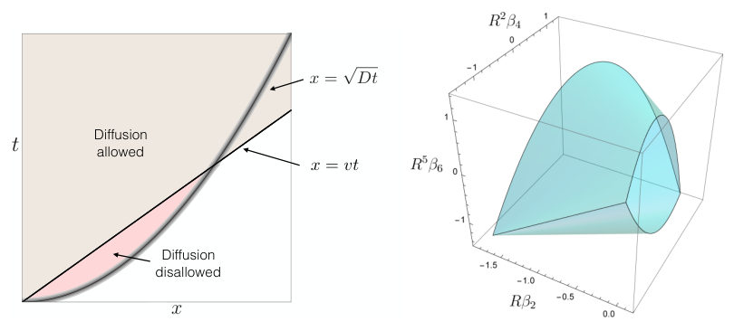
<figcaption class="paper-figure-caption"><b>Fig 5.</b> Figure 6: (a) Hydrodynamics cannot emerge too soon or it would violate microcausality</figcaption>
</figure>

**Summary.** This lecture series details the modern construction of Effective Field Theories (EFTs) to describe the thermal dynamics of quantum many-body systems. It shows that hydrodynamics governs late-time behavior and develops rigorous constraints on transport parameters by combining principles of causality, unitarity, and symmetry breaking. This work provides a systematic framework for analyzing thermalization across diverse physical models.

**Why it may be interesting.** The rigorous derivation of hydrodynamic behavior and the establishment of universal bounds on transport coefficients (like the Planckian bound) provide powerful theoretical tools applicable to understanding thermalization in complex quantum systems.

Detailed structure

**Main problem.** The paper addresses the fundamental challenge of developing nonperturbative tools to study the out-of-equilibrium dynamics of generic quantum many-body systems at finite temperature.

**Main result.** It establishes that fluctuating hydrodynamics emerges universally in local many-body systems at $T>0$, and it derives universal constraints on transport parameters using causality and unitarity bounds.

**Method.** The primary methods involve constructing and constraining the thermal effective action ($W$) via derivative expansions, utilizing the Schwinger-Keldysh formalism, and applying analytic continuation techniques to Green's functions.

**Model / system.** The analysis applies to a wide range of local many-body systems, including spin chains, metals, insulators, and relativistic Quantum Field Theories (QFTs), covering both equilibrium and non-equilibrium regimes.

**Key observables.** Dynamical correlation functions, conductivity $\sigma_{ij}(\omega)$, the thermal effective action $W$, and the energy density $\epsilon$ and pressure $P$.

**Important parameters / regimes.** Finite thermal correlation length ($\xi < \infty$), temperature ($T$), chemical potential ($\mu$), and transport parameters like diffusivity ($D$) and sound speed ($c_s$).

**Assumptions / limitations.** The EFT approach assumes a finite thermal correlation length ($\xi < \infty$), and derivations often rely on causality and unitarity constraints derived from analytic properties of correlation functions.

**Figures summary.** Figures illustrate the difference between global and local equilibrium time scales, the Schwinger-Keldysh contour with sources, and the conflict between diffusive spreading and subluminal propagation.

**Paper structure.** The structure moves from introducing the necessity of EFTs for out-of-equilibrium dynamics, to deriving the thermal effective action $W$ from equilibrium principles, and finally to constraining the parameters within $W$ using causality and unitarity bounds.

Abstract

Fluctuating hydrodynamics emerges in essentially any local many-body system at nonzero temperature. Effective field theory (EFT) approaches enable the quantitative study of this emergence, providing a controlled framework to capture late-time observables. These lectures introduce the organizing principles behind equilibrium and out-of-equilibrium dynamics in these thermalizing systems. A central focus is the modern construction of these EFTs, which frames fluctuating hydrodynamics through the lens of "strong-to-weak" spontaneous symmetry breaking. Drawing examples from both high-energy and condensed matter physics, we show how this paradigm adapts to systems ranging from spin chains to relativistic quantum field theories, including models with generalized symmetries or symmetries with 't Hooft anomalies. Finally, we discuss UV/IR constraints on transport parameters -- viewed as the Wilson coefficients of hydrodynamic EFTs -- both in continuum and on the lattice.

[↑ back to top](#top)

### [Microscopic Origin of Emergent Elliptic Flow and Molecule Formation in Strongly Interacting Quasi-Two-Dimensional Few-Body Systems](http://arxiv.org/abs/2606.01728v1)

**Authors:** Xin-Yuan Gao, Kai Yuen Lee, Qingze Guan, Yangqian Yan  
**Type:** theory · **Category:** quantum gases · **PDF:** <https://arxiv.org/pdf/2606.01728v1>  
**Analysis basis:** full PDF text, analyzed in chunks
**Topic relevance:** 🔥 `analog quantum simulation` **4/5** · `Keldysh / 2PI / non-Gaussian methods` **3/5** · `methods for driven-dissipative` **3/5** · `non-equilibrium dynamics` **3/5** · `entanglement & information structure` **1/5** · `non-equilibrium universality` **1/5**

↔ Scroll figures horizontally

<figure class="paper-figure-card">
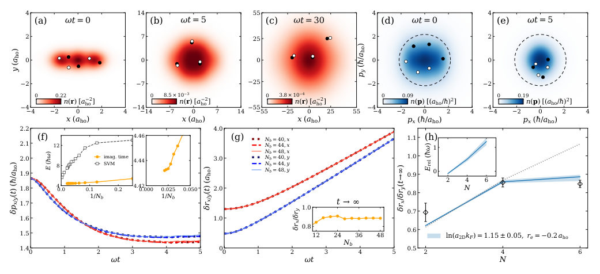
<figcaption class="paper-figure-caption"><b>Fig 1.</b> FIG. 1. Few-fermion 2D expansion: density snapshots, TDECG convergence, and emergence of elliptic flow. (a)- (e) One-body densities for N = 3+3 at ωt = 0, 5, 30 in real space and ωt = 0, 5 in momentum space, with representative single- shot particle positions overlaid; black/white markers indicate sampled spin-up/spin-down particles. Dashed circles in (d),(e) mark the non-interacting Fermi momentum ℏkF ≃2.17 ℏ/aho of the 3 + 3 ground state in the anisotropic trap, corresponding to a Fermi energy EF = ℏ(5ωx + ωy)/2. (f) Momentum-space widths δpx/y(t) after trap release, showing interaction-induced anisotropy, for basis sizes Nb = 40 (dark, thick dots), 44 (normal, dashed lines), and 48...</figcaption>
</figure>
<figure class="paper-figure-card">
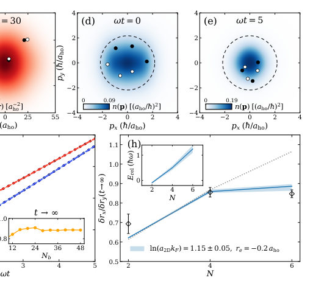
<figcaption class="paper-figure-caption"><b>Fig 2.</b> Figure 2 reveals a striking particle-number dependence in the relative momentum correlator C(2) R . At ωt = 0, all three systems exhibit a pair of positive back- to-back lobes near |pR| ≈ 2ℏkF [arrows in panels (a),(e),(i)], characteristic of Cooper-pair correlations in which opposite-spin fermions occupy nearly opposite momenta close to the Fermi surface [41, 42]. By ωt = 1, these lobes have migrated inward toward pR = 0 [arrows in (b),(f),(j)], signaling the onset of molecule formation; the 3+3 system already develops a pronounced positive central feature, whereas the 1+1 and 2+2 systems still show a near-zero central value, indicating a slower crossover to the molecular regime. At long...</figcaption>
</figure>
<figure class="paper-figure-card">
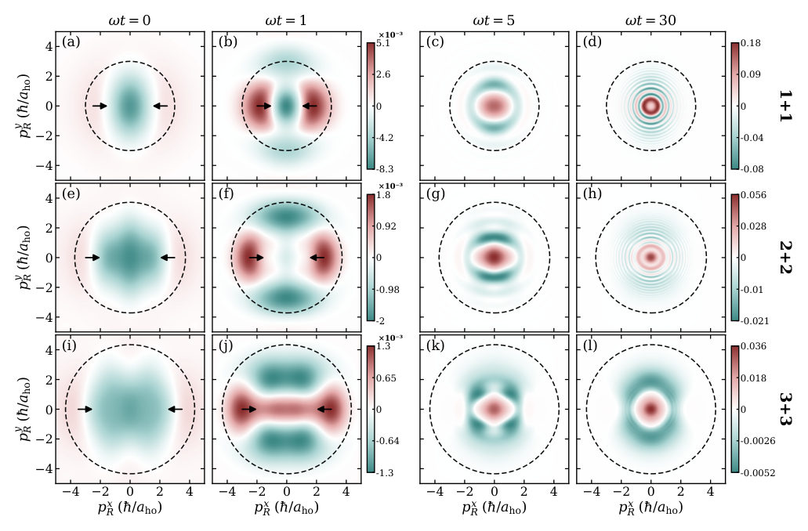
<figcaption class="paper-figure-caption"><b>Fig 3.</b> FIG. 2. Dynamical BCS-BEC crossover visualized through relative momentum correlations. Evolution of the relative momentum correlator C(2) R (pR) for the 1+1, 2+2, and 3+3 systems in the anisotropic trap, shown in the top, middle, and bottom rows, respectively. Red (green) regions correspond to enhanced (depleted) opposite-spin coincidence at relative momentum pR. From left to right, the four columns correspond to ωt = 0, 1, 5, 30. The dashed circles mark the eye-guide radius |pR| = 2ℏkF , and the black arrows in panels (a),(b),(e),(f),(i),(j) indicate the inward migration of the back-to-back positive lobes toward pR = 0.</figcaption>
</figure>
<figure class="paper-figure-card">
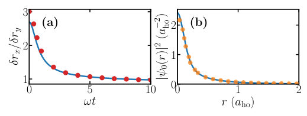
<figcaption class="paper-figure-caption"><b>Fig 4.</b> FIG. 3. Quantitative evidence for molecular formation. (a) Aspect ratio δrx/δry: blue line (red circles) shows the full ECG many-body calculation (Monte Carlo sampling that treats the system as three distinguishable molecules). (b) Radial probability density of the pair-relative coordinate: orange circles show Monte Carlo sampling at ωt = 30; blue line shows the s-wave bound-state probability density |ψ0(r)|2 of the two-body Schr¨odinger equation with potential V (r), Eq. (4).</figcaption>
</figure>
<figure class="paper-figure-card">
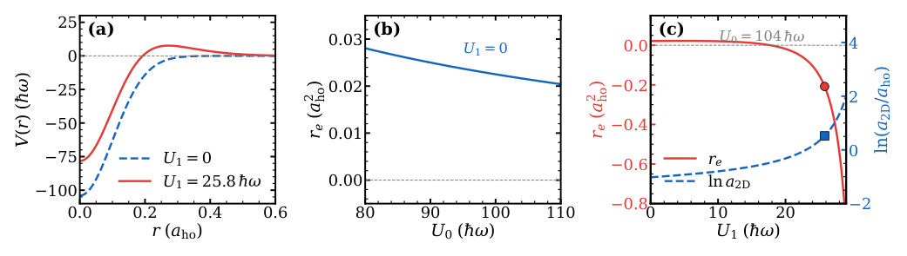
<figcaption class="paper-figure-caption"><b>Fig 5.</b> FIG. 1. Tunability of the 2D scattering length a2D and the effective-range parameter re for the double-Gaussian potential. (a) Potential shape for a single Gaussian (U1 = 0, blue dashed) and the double Gaussian with a potential barrier (U1 = 25.8ℏω, red solid), both with U0 = 104ℏω and σ = 0.1aho. (b) Effective-range parameter re for a single-Gaussian potential (U1 = 0) as a function of U0, where re remains strictly positive regardless of the value of U0. (c) Effective-range parameter re (left axis, red solid) and ln(a2D/aho) (right axis, blue dashed) for the double Gaussian as a function of U1 with fixed U0 = 104ℏω. As U1 increases, re decreases and becomes negative for U1 ≳15ℏω. The red...</figcaption>
</figure>

**Summary.** This work develops and applies the Time-Dependent Explicitly Correlated Gaussian (TDECG) method to simulate strongly interacting few-fermion systems in 2D. It successfully reproduces key experimental signatures, including interaction-driven elliptic flow and the BCS-BEC crossover, by tracking the formation of molecular pairs. The development also rigorously compares variational principles, establishing the Lagrangian approach as the most numerically stable tool for these complex dynamics.

**Why it may be interesting.** The combination of advanced numerical techniques (TDECG) with the study of fundamental quantum phenomena like BCS-BEC crossover and hydrodynamic flow in ultracold atomic systems makes this highly relevant to AMO physics and quantum gases.

Detailed structure

**Main problem.** The paper addresses the microscopic origin of emergent hydrodynamic behavior, specifically elliptic flow and molecule formation, in strongly interacting quasi-two-dimensional few-fermion systems.

**Main result.** The TDECG method successfully reproduces the experimentally observed elliptic flow and demonstrates a dynamical BCS-BEC crossover, providing a microscopic picture of chemical freeze-out.

**Method.** The study employs the Time-Dependent Explicitly Correlated Gaussian (TDECG) method, utilizing a Lagrangian variational principle for stable, real-time evolution of the many-body wavefunction.

**Model / system.** The system consists of spin-balanced N fermions in an anisotropic 2D harmonic trap, interacting via a short-range potential. The analysis covers few-body configurations up to N=6, examining the transition from a gas to molecular pairs.

**Key observables.** Elliptic flow ($\delta r_x/\delta r_y$), BCS-BEC crossover signatures (momentum distribution $C^{(2)}_R(p_R)$), and the pair-relative probability density.

**Important parameters / regimes.** The scattering length ($a_{2D}$) and effective range ($r_e$) are tuned using a double-Gaussian pseudopotential to match experimental parameters.

**Assumptions / limitations.** The primary assumption is the applicability and convergence of the TDECG method, which is shown to be numerically superior to the McLachlan formulation for long-time dynamics.

**Figures summary.** Figures illustrate density snapshots showing flow evolution, momentum distributions confirming pairing, and quantitative comparisons of the aspect ratio and pair-relative density against theoretical bounds.

**Paper structure.** The paper details the general variational framework, the model Hamiltonian, the ECG ansatz, and the numerical implementation, emphasizing the derivation and comparison between the Lagrangian and McLachlan variational principles for stable time evolution.

Abstract

Recent experiments simulating two-dimensional few-fermion systems have observed emergent hydrodynamic behavior, i.e., interaction-driven elliptic flow by adding fermions two at a time [S.~Brandstetter et al., Nat. Phys. (2025)]. Due to the curse of dimensionality and strong correlations, capturing such phenomena beyond two particles remains challenging. Here, we use the ab initio time-dependent explicitly correlated Gaussian (TDECG) method to quantitatively reproduce these experimental observations. With only a moderate number of correlated Gaussian basis functions, our approach obtains converged dynamical observables for systems up to six particles. Furthermore, real-time access to the many-body wavefunction and two-point correlation functions enables us to visualize the transformation from a strongly interacting gas to a stream of paired molecules, i.e., a dynamical BCS-BEC crossover.

[↑ back to top](#top)

### [Tandem Exclusion Process](http://arxiv.org/abs/2606.01568v1)

**Authors:** Ngo Phuoc Nguyen Ngoc, Lam Thi Nhung, Huynh Anh Thi  
**Type:** theory · **Category:** statistical mechanics · **PDF:** <https://arxiv.org/pdf/2606.01568v1>  
**Analysis basis:** full PDF text, analyzed in chunks
**Topic relevance:** 🔥 `non-equilibrium dynamics` **4/5** · `driven-dissipative phase transition` **3/5** · `methods for driven-dissipative` **3/5** · `non-equilibrium universality` **3/5** · `Frenkel-Kontorova` **1/5** · `Keldysh / 2PI / non-Gaussian methods` **1/5**

↔ Scroll figures horizontally

<figure class="paper-figure-card">

<figcaption class="paper-figure-caption"><b>Fig 1.</b> FIG. 1. Stationary current J(ρ; α, β) for q ∈{0.5, 1, 2} with α = 1. Solid curves: exact formula (10). Filled circles: Monte Carlo simulations (N = 60, 5 × 105 updates).</figcaption>
</figure>
<figure class="paper-figure-card">
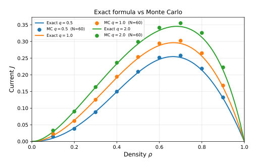
<figcaption class="paper-figure-caption"><b>Fig 2.</b> Figure 1 compares formula (10) with Monte Carlo sim- ulations over the full density range, showing excellent agreement at every value of q, and Figure 2 displays the corresponding phase diagram in the (ρ, q)-plane. The current exhibits three structural features, all originating from the cooperative nature of the dynamics.</figcaption>
</figure>
<figure class="paper-figure-card">
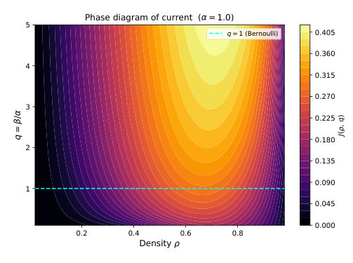
<figcaption class="paper-figure-caption"><b>Fig 3.</b> FIG. 2. Phase diagram of the stationary current J(ρ, q) with α = 1. Colors encode the current magnitude from low (dark) to high (bright); the dashed line q = 1 marks the Bernoulli locus.</figcaption>
</figure>
<figure class="paper-figure-card">
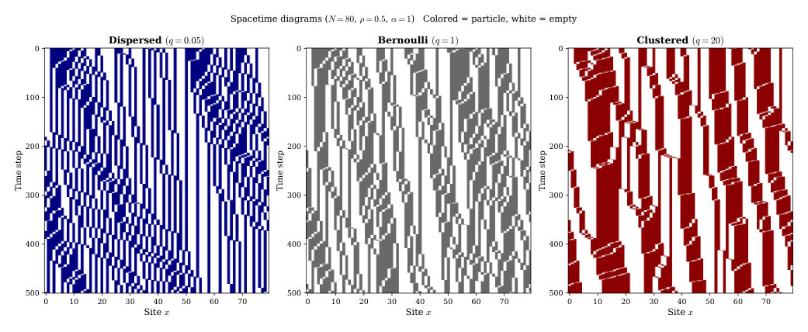
<figcaption class="paper-figure-caption"><b>Fig 4.</b> FIG. 3. Spacetime diagrams (N = 80, ρ = 0.5, α = 1). Left: dispersed regime (q = 0.05). Center: Bernoulli regime (q = 1). Right: clustered regime (q = 20), where coherent moving tandem groups appear as broad diagonal bands.</figcaption>
</figure>
<figure class="paper-figure-card">
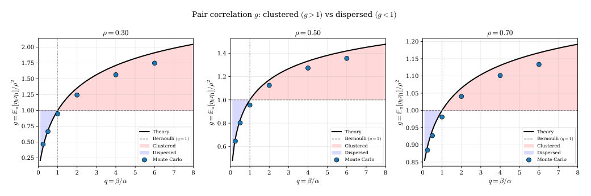
<figcaption class="paper-figure-caption"><b>Fig 5.</b> FIG. 4. Pair correlation ratio g = Eπ[η0η1]/ρ2 as a function of q = β/α for several densities. Solid curves: exact formula (16). Filled circles: Monte Carlo simulations (N = 50, 8000 samples). The crossover between clustered (g &gt; 1) and dispersed (g &lt; 1) regimes occurs at q = 1.</figcaption>
</figure>

**Summary.** This paper analyzes the Tandem Exclusion Process (TEP), a lattice model simulating cooperative particle movement. It proves the system reaches a Gibbs stationary state and derives exact formulas for the particle current and spatial correlations. The findings show that tandem coordination can significantly enhance collective transport efficiency, especially at high densities.

**Why it may be interesting.** The study provides a concrete example of how local, cooperative rules can lead to collective, non-trivial macroscopic transport properties, which is relevant for understanding driven many-body systems.

Detailed structure

**Main problem.** The paper investigates how local, cooperative interactions generate macroscopic transport phenomena in a non-equilibrium lattice gas model.

**Main result.** The stationary measure is a Gibbs state, and the resulting particle current is asymmetric, showing enhanced transport efficiency at high densities compared to simpler models like TASEP.

**Method.** The analysis employs transfer-matrix methods and the derivation of the stationary measure via the global balance identity.

**Model / system.** The Tandem Exclusion Process (TEP) is a 1D stochastic lattice model simulating particle movement based on two cooperative local transitions (leader advancement and follower recovery).

**Key observables.** Stationary particle current (J), nearest-neighbor pair correlation ratio (g), and asymptotic correlation length (xi).

**Important parameters / regimes.** The ratio q = beta/alpha, particle density (rho), and the comparison to the TASEP model.

**Assumptions / limitations.** The analysis is restricted to the dynamically active sector of the lattice configurations, as certain patterns lead to absorbing states.

**Figures summary.** Figures illustrate the dependence of the current on density and the pair correlation ratio g on the parameter q, showing crossovers between clustered and unclustered regimes.

**Paper structure.** The paper establishes the Gibbs stationary measure, derives closed-form expressions for the current and correlations using transfer-matrix methods, and analyzes the behavior in various parameter regimes (e.g., q->infinity).

Abstract

We introduce the \emph{tandem exclusion process} (TEP), a one-dimensional stochastic lattice model motivated by tandem running in ants. Particles evolve through two cooperative local transitions, $110\to101$ at rate $α$ (leader advancement) and $101\to011$ at rate $β$ (follower recovery). We prove that the stationary measure on the dynamically active sector is the Gibbs measure $π\propto q^{H(η)}$, where $q=β/α$ and $H(η)$ counts neighboring occupied pairs, and derive exact closed-form expressions for the stationary current and spatial correlations using transfer-matrix methods. The current is asymmetric under particle--hole exchange $ρ\mapsto1-ρ$, with its maximum occurring at densities strictly larger than $1/2$, in contrast to the symmetric current $ρ(1-ρ)$ of the totally asymmetric simple exclusion process (TASEP). For $q>1$, cooperative dynamics enhances the current above the TASEP value and generates strong spatial clustering; in the limit $q\to\infty$, the current approaches $J\toαρ$, corresponding to nearly unconstrained collective transport. These results suggest that tandem coordination alone can substantially enhance collective transport efficiency at moderate and high densities, even without pheromone-mediated long-range communication.

[↑ back to top](#top)

### [Programmable site-selective spin control in rotating Penning-trap ion crystals](http://arxiv.org/abs/2606.00940v1)

**Authors:** Nihar Makadia, Julian Y. Z. Jee, Gustavo Café de Miranda, Joseph H. Pham, Michael J. Biercuk, Athreya Shankar, Robert N. Wolf  
**Type:** experiment · **Category:** other · **PDF:** <https://arxiv.org/pdf/2606.00940v1>  
**Analysis basis:** full PDF text, analyzed in chunks
**Topic relevance:** 🔥 `QC/QI experiment` **4/5** · `analog quantum simulation` **3/5** · `exotic spin models in light-matter` **2/5** · `entanglement & information structure` **1/5** · `non-equilibrium dynamics` **1/5** · `quantum measurements` **1/5** · `quantum optics experiment` **1/5** · `spintronics-quantum-optics interface` **1/5**

↔ Scroll figures horizontally

<figure class="paper-figure-card">
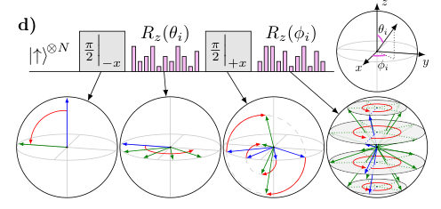
<figcaption class="paper-figure-caption"><b>Fig 1.</b> Figure 1. Experimental setup and protocol for pro- grammable site-selective spin control in a rotating Penning- trap crystal. (a) A focused off-resonant laser beam drives site-selective Rz spin rotations by introducing a differential AC Stark shift (δACSS) on the qubit levels of 9Be+ ions in a rotating crystal. The beam position can be rapidly steered along a linear path between the crystal centre and its bound- ary. Combined with the rigid-body rotation of the crystal at frequency ωr/2π, this provides access to individual ions throughout the crystal. Inset: Example of using this method to prepare the letters SYD in the crystal. Image reconstructed in the rotating frame of the ion crystal....</figcaption>
</figure>
<figure class="paper-figure-card">
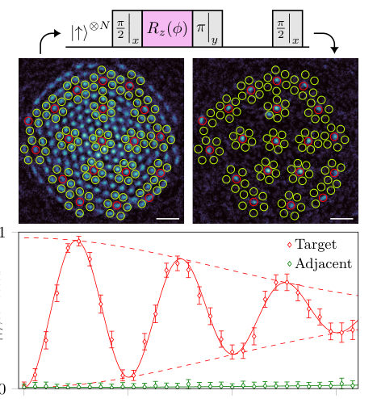
<figcaption class="paper-figure-caption"><b>Fig 2.</b> Figure 2. Evaluation of the addressing performance. (a) Ramsey spin-echo sequence used to characterise targeted spin rotations and crosstalk to neighbouring ions. During Doppler cooling and initialisation in |↑⟩⊗N, a reference image is ac- quired. A global π/2 pulse about the x axis prepares all spins in an equal superposition state, after which individu- ally targeted Rz(ϕ) phase rotations are applied. A global π pulse together with a free-precession interval forms a spin echo that compensates for slow magnetic-field drift-induced phase rotations. A final global π/2 pulse about the x axis maps the accumulated phase onto spin population for fluo- rescence detection. (b) Reference image...</figcaption>
</figure>
<figure class="paper-figure-card">
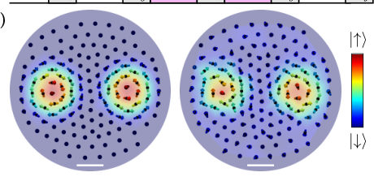
<figcaption class="paper-figure-caption"><b>Fig 3.</b> Figure 3. Experimental demonstrations of programmable site-resolved single-spin control in rotating ion crystals. (a) Ramsey spin-echo sequence used to address a bilayer crystal using site-selective Rz(π) gates. (b) Layer-selective address- ing in a partially bilayer crystal, where the bilayer region consists of two axially offset square lattices and all ions in one layer are addressed. The left image shows a radial im- age of the crystal, the middle shows a reference image with the fitted lattice overlay, and the right shows the correspond- ing state-preparation result after applying the addressing se- quence. Images are averaged over 50 repetitions. Scale bars: 20 µm. (c) Preparation of a...</figcaption>
</figure>
<figure class="paper-figure-card">
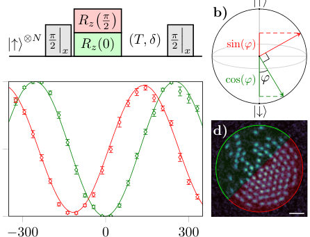
<figcaption class="paper-figure-caption"><b>Fig 4.</b> Figure 4. Dual-quadrature sensing demonstration. (a) Ram- sey sequence for spatially resolved quadrature readout. Fol- lowing initialisation in |↑⟩⊗N and a global π/2 pulse, the ad- dressing beam applies a local Rz(π/2) rotation to one half of the crystal. During the free-evolution interval T, a phase φ = δT accumulates for a microwave detuning δ. A final global π/2 pulse maps the phase onto spin populations. (b) Bloch-sphere representation of the quadrature encoding. The two spatial regions probe orthogonal quadratures of the ac- cumulated phase, yielding signals proportional to cos φ and sin φ. (c) Ramsey spectroscopy for T ≈2 ms. Green and red points show the SPAM-corrected bright-state...</figcaption>
</figure>
<figure class="paper-figure-card">
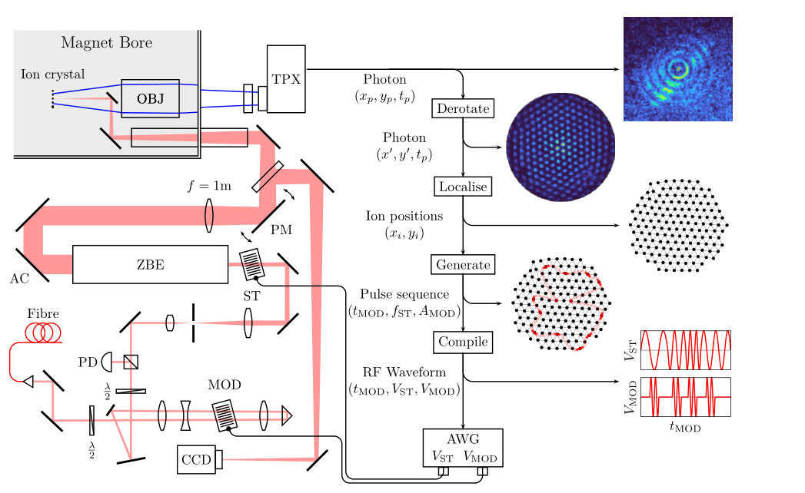
<figcaption class="paper-figure-caption"><b>Fig 5.</b> Figure 5. Illustration of the optical addressing setup and data processing. The left part of the figure shows a schematic of the addressing-beam delivery path. The fibre-delivered 313 nm beam is power-modulated (MOD) via an AOM, spatially filtered by a pinhole, radially steered (ST) via an AOM, expanded by a zoom beam expanded (ZBE), corrected for residual astigmatism (AC), and focused towards the ion crystal by a 1 m focal length lens. A piezo-actuated mirror (PM) enables precise beam alignment, while a weak pick-off beam is sent to a CCD camera for mode and position monitoring. The transmitted beam enters the magnet bore and is reflected by in-vacuum optics onto the ion crystal....</figcaption>
</figure>

**Summary.** This paper demonstrates programmable, site-selective spin control in large, rotating ion crystals trapped in a Penning trap. By synchronizing a focused laser beam with the crystal's rotation, the authors can address individual ions to create complex spin patterns and perform advanced quantum sensing. This establishes a new route for engineering quantum states in multi-dimensional trapped-ion systems.

**Why it may be interesting.** This work represents a significant engineering advance in trapped-ion quantum simulation, moving beyond global control to implement complex, spatially engineered quantum states in a scalable, rotating platform.

Detailed structure

**Main problem.** The primary challenge addressed is enabling flexible, local qubit control in large ion crystals confined within rotating Penning traps, overcoming limitations imposed by rigid-body rotation.

**Main result.** The authors successfully demonstrated programmable, site-selective spin control, enabling the preparation of complex spin textures like a biskyrmion and performing dual-quadrature Ramsey sensing in large, rotating ion crystals.

**Method.** Programmable control is achieved by using a tightly focused, off-resonant laser beam whose steering is synchronized with the crystal's rotation to drive local $R_z$ phase rotations via differential AC Stark shifts.

**Model / system.** The system is a large crystal of trapped ions (e.g., ${^9	ext{Be}^+}$) in a Penning trap, which can form 2D or bilayer structures. Control is implemented by precisely addressing individual ions using a steerable, pulsed laser beam.

**Key observables.** Programmable $R_z(\pi)$ gate fidelity (up to 94.6% or 98.2%), nearest-neighbour crosstalk (1.2%), and simultaneous measurement of $\cos \varphi$ and $\sin \varphi$ for sensing.

**Important parameters / regimes.** Ion crystal rotation frequency ($\omega_r/2\pi$): 79-85 kHz; addressing pulse duration ($	au$): 200 ns; beam waist ($w_0$) relative to ion spacing ($s$).

**Assumptions / limitations.** The analysis assumes the addressing beam is Gaussian and models errors based on position uncertainty ($\sigma$) and beam overlap, though physical sources of error are sometimes indistinguishable.

**Figures summary.** Figures illustrate the optical addressing setup and data processing pipeline, the protocol for site-selective rotations and layer-selective addressing, and the dual-quadrature sensing scheme used to measure orthogonal spin components.

**Paper structure.** The paper details the complex optical addressing hardware and localization pipeline, followed by demonstrations of site-selective single-qubit gates, preparation of structured spin states (biskyrmion), and finally, the advanced dual-quadrature sensing protocol.

Abstract

Large ion crystals in Penning traps provide a platform for quantum simulation and sensing with hundreds of spins, but their continuous rigid-body rotation has so far limited flexible local qubit control. Here we demonstrate programmable site-selective spin control across large rotating ${}^{9}\mathrm{Be}^{+}$ crystals in a Penning trap. A tightly focused off-resonant laser beam drives local $R_z$ phase rotations via differential AC Stark shifts. Beam steering synchronised with crystal rotation enables addressing of arbitrary ions throughout the crystal. Ramsey-based characterisation shows $R_z(π)$ gate fidelity of 94.6% and nearest-neighbour crosstalk of 1.2%. We use this capability to prepare spatially structured spin patterns, generating a biskyrmion spin texture in a single-layer crystal, then extending the method to bilayer crystals we perform layer-selective addressing operations. We further demonstrate dual-quadrature Ramsey sensing by imprinting a relative $π/2$ phase shift between spatial sub-ensembles, enabling simultaneous measurement of orthogonal spin components within a single experimental realisation. These results establish programmable local control in large rotating ion crystals, opening new routes for engineering spatially structured quantum states in multidimensional trapped-ion systems.

[↑ back to top](#top)

### [Complexity of tensor network simulation for noisy quantum circuits](http://arxiv.org/abs/2606.00474v1)

**Authors:** Yuguo Shao, Zishuo Zhao, Song Cheng, Zhengwei Liu  
**Type:** theory · **Category:** numerical methods · **PDF:** <https://arxiv.org/pdf/2606.00474v1>  
**Analysis basis:** full PDF text, analyzed in chunks
**Topic relevance:** 🔥 `methods for driven-dissipative` **4/5** · `entanglement & information structure` **3/5** · `correlated / nonlocal dissipation` **2/5** · `driven-dissipative phase transition` **2/5** · `non-equilibrium dynamics` **1/5** · `non-equilibrium universality` **1/5**

↔ Scroll figures horizontally

<figure class="paper-figure-card">
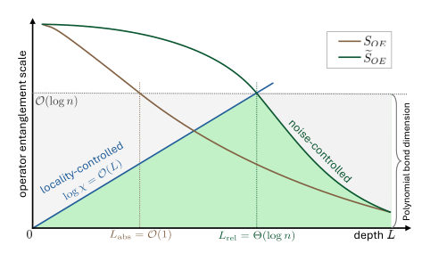
<figcaption class="paper-figure-caption"><b>Fig 1.</b> Figure 1. Depolarizing noise guarantees polynomial bond di- mension of TN simulation at all circuit depths. For arbitrary local circuits, the bond dimension is controlled by locality be- fore the respective crossover and by the noise-induced OEE thresholds after it: Labs = O(1) for absolute Hilbert-Schmidt error and Lrel = Θ(log n) for relative error, both geometry independent.</figcaption>
</figure>
<figure class="paper-figure-card">
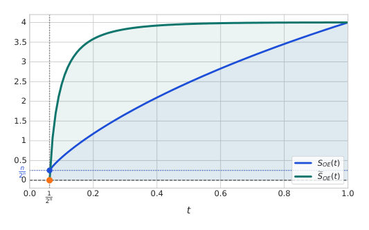
<figcaption class="paper-figure-caption"><b>Fig 2.</b> Figure 2. The maximum operator entanglement entropy Smax OE (t) and its normalized version eSmax OE (t) with respect to the purity t when DA = DB = 4.</figcaption>
</figure>
<figure class="paper-figure-card">
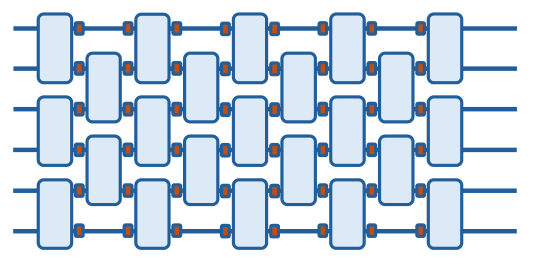
<figcaption class="paper-figure-caption"><b>Fig 3.</b> Figure 3. Schematic of a 1D circuit with nearest-neighbor two-qubit gates and noise applied after each layer of unitary gates. The noise is drawn in red color.</figcaption>
</figure>

**Summary.** This paper provides a rigorous theoretical framework to determine the classical simulability of noisy quantum circuits by analyzing the Operator Entanglement Entropy (OEE). It proves that for specific noise types, the required bond dimension for tensor network simulation remains polynomially bounded in system size, establishing a deep link between noise structure and computational complexity.

**Why it may be interesting.** This work provides concrete, quantitative thresholds (e.g., $c < 1/3$ or $c < 1/48$) that dictate when noisy quantum evolution remains classically simulable via tensor networks, which is crucial for understanding the limits of quantum computation.

Detailed structure

**Main problem.** The paper rigorously analyzes how local noise affects the classical simulability of quantum dynamics, benchmarking this using tensor-network methods.

**Main result.** It establishes that for certain noise models (like depolarizing noise), the required bond dimension for simulation remains polynomial in system size, even at deep circuit depths, connecting noise characteristics to classical tractability.

**Method.** The analysis heavily relies on Operator Entanglement Entropy (OEE) as a diagnostic tool, deriving rigorous bounds on the required bond dimension ($\chi$) based on absolute ($\epsilon$) or relative ($\delta$) error tolerances.

**Model / system.** The system under study is noisy quantum circuits, modeled by sequential application of local gates and single-qubit noise channels (e.g., depolarizing or amplitude damping noise). The simulation framework uses Matrix Product Operators (MPO) and Projected Entangled Pair Operators (PEPO).

**Key observables.** Operator Entanglement Entropy (SOE and eSOE), required bond dimension ($\chi$), and the contraction coefficient ($c$ or $\eta$).

**Important parameters / regimes.** Circuit depth ($L$), system size ($n$), error tolerances ($\epsilon, \delta$), and noise parameters (e.g., damping parameter $\gamma$).

**Assumptions / limitations.** The analysis often assumes specific noise models (e.g., depolarizing noise) or utilizes averaging over random gates (2-design) to achieve the best bounds.

**Figures summary.** Figures illustrate the scaling of OEE with depth for depolarizing noise, showing plateaus or logarithmic growth depending on the error metric and noise type.

**Paper structure.** The paper builds from defining the OEE measures (SOE vs eSOE) and their relationship, to applying these measures to analyze the effect of noise on the required bond dimension for simulating 1D and higher-dimensional circuits.

Abstract

We aim to rigorously address how local noise affects classical simulability of quantum dynamics benchmarked by tensor-network methods. Using operator entanglement entropy (OEE), we prove the following: (1) For single-qubit depolarizing noise on arbitrary circuits, tensor networks with $\mathrm{poly}(n)$ bond dimension suffice for fixed absolute Hilbert-Schmidt error after $\order{1}$ depth, while relative error demands $\order{\log n}$ depth; and this bound is optimal. (2) For single-qubit depolarizing noise on 1D local circuits, the existence of whole-trajectory error-bounded matrix product operator (MPO) of $\mathrm{poly}(n)$ bond dimension at all depths. (3) For general single-qubit noise in 1D brickwall circuits, random two-design gates with contraction coefficient $c<1/3$ yield an $\order{1}$ OEE plateau with probability $1-Te^{-Ω(n)}$, while arbitrary gates with $c<1/48$ give $\order{\log n}$ OEE in the worst case. (4) In higher dimensions, these bounds yield uniform-in-depth $\mathrm{poly}(n)$ average boundary-bond dimensions for projected entangled pair operators~(PEPO) across every cut -- under depolarizing noise at either absolute or relative accuracy, and under general noise with strong contraction at absolute accuracy. Our results establish a rigorous connection between certain noise models, circuit types, and their classical simulability.

[↑ back to top](#top)

### [Quantum light source with lithium tantalate for scalable photonic quantum circuits](http://arxiv.org/abs/2606.01657v1)

**Authors:** Yun-Ru Fan, Bo-Wen Chen, Dan Xu, Cheng-Li Wang, Hong Zeng, Jia-Qi Wang, Xu-Qiang Wang, Jia-Chen Cai, Hai-Zhi Song, Hao Li, Li-Xing You, Yan-Yu Wei, Kai Guo, Xin Ou, Guang-Can Guo, Qiang Zhou  
**Type:** experiment · **Category:** quantum information and computing · **PDF:** <https://arxiv.org/pdf/2606.01657v1>  
**Analysis basis:** full PDF text, analyzed in chunks
**Topic relevance:** 🔥 `quantum optics experiment` **4/5** · `QC/QI experiment` **3/5** · `interference shaping light` **3/5** · `correlated cavity matter` **2/5** · `entanglement & information structure` **1/5**

↔ Scroll figures horizontally

<figure class="paper-figure-card">
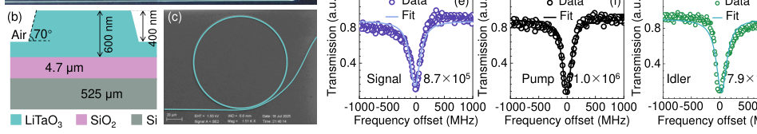
<figcaption class="paper-figure-caption"><b>Fig 1.</b> FIG. 1. Device design and characterization of the LiTaO3 MRR. (a) Optical image of the TFLT chip wtih a series of MRRs, underscoring the potential of the lithium tantalate platform for scalable large-scale quantum photonic circuits. (b) Schematic cross-section of the device, consisting of a 600-nm-thick LiTaO3 layer, a 4.7-µm-thick SiO2 buffer layer, and a 525-µm-thick silicon substrate. The waveguide is partially etched by 400 nm with a sidewall angle of about 70◦. (c) Scanning electron microscope (SEM) image of the fabricated MRR. (d) Measured transmission spectrum (green curve) and extracted loaded Q-factors (purple circles) from 1510 to 1570 nm, showing a free spectral range of about...</figcaption>
</figure>
<figure class="paper-figure-card">
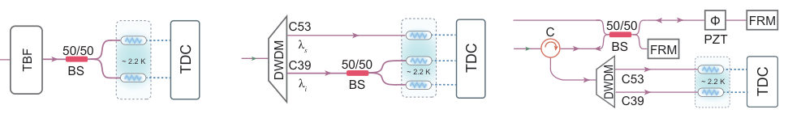
<figcaption class="paper-figure-caption"><b>Fig 2.</b> FIG. 2. Schematic diagram of experimental setups. (a) Generation of correlated photon pairs. (b) Correlation properties. (c) Photon spectrum. (d) Heralded single-photon with HBT experimental setup. (e) Energy-time entanglement with two-photon interference. TL: tunable laser, VOA: variable optical attenuator, PC: polarization controller, BS: beam splitter, PM: power meter, DWDM: dense wavelength division multiplexer, SNSPD: superconducting nanowire single-photon detector, TDC: time- to-digital converter, TBF: tunable bandpass filter, UMI: unbalanced Michelson interferometer. λs and λi are wavelengths of signal and idler photons, respectively. The SNSPDs are operated at a temperature of 2.2 K.</figcaption>
</figure>
<figure class="paper-figure-card">
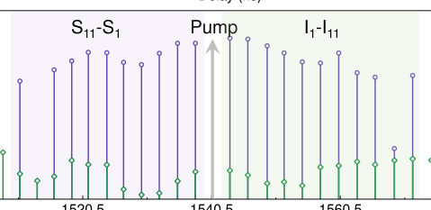
<figcaption class="paper-figure-caption"><b>Fig 3.</b> FIG. 3. Quantum correlations. (a) Single side count rate of signal photons at 1535.04 nm versus pump power. (b) Typical coincidence histogram measured at a pump power of 0.3 mW. (c) Coincidence count rate, accidental coincidence count rate, and calculated CAR. (d) Spectrum of correlated photons and noise photons in the on-resonance case.</figcaption>
</figure>

**Summary.** The research demonstrates the first quantum light source using Thin-film Lithium Tantalate (TFLT) via spontaneous four-wave mixing in a microring resonator. The source exhibits strong antibunching and high-visibility energy-time entanglement, proving TFLT's viability as a manufacturing-compatible platform for integrated quantum photonic circuits.

**Why it may be interesting.** This work directly addresses the hardware requirements for quantum information processing by demonstrating a scalable, integrated source of entangled photons using a promising material platform (TFLT).

Detailed structure

**Main problem.** To demonstrate a quantum light source using Thin-film Lithium Tantalate (TFLT) for scalable photonic quantum circuits, bridging the gap between classical TFLT and integrated quantum photonics.

**Main result.** The authors successfully demonstrated the first quantum light source with TFLT via spontaneous four-wave mixing, generating strongly antibunched heralded single photons and confirming energy-time entanglement.

**Method.** The experiment utilized a TFLT microring resonator (MRR) pumped by a telecom-wavelength laser to generate correlated photon pairs via SFWM, followed by detailed quantum characterization.

**Model / system.** The physical system is a TFLT microring resonator integrated photonics platform. The quantum process relies on spontaneous four-wave mixing (SFWM) within the high-Q cavity to generate entangled photon pairs.

**Key observables.** Heralded second-order autocorrelation $g^{(2)}_H(0) = 0.071 \pm 0.004$, unheralded $g^{(2)}(0) = 1.93 \pm 0.05$, and two-photon interference visibility of $92.55 \pm 0.94\%$.

**Important parameters / regimes.** Photon pair generation rate of $24 	ext{ MHz}/	ext{mW}^2$; cavity quality factor $Q \sim 10^6$; operating band 1510 to 1570 nm.

**Assumptions / limitations.** The work establishes TFLT as a manufacturing-compatible platform, implying future monolithic co-integration is feasible.

**Figures summary.** Figures illustrate the device design, transmission spectra, and experimental setups for measuring correlation properties, including coincidence histograms and $g^{(2)}$ measurements.

**Paper structure.** The paper details the TFLT platform characterization, the experimental setup for correlated photon generation, and the measurement and analysis of quantum statistics (antibunching and entanglement visibility).

Abstract

Thin-film lithium tantalate (TFLT) has emerged as a promising integrated photonic platform owing to its low photorefractive noise, high optical damage threshold, and reduced birefringence, attracting increasing interest for scalable photonic technologies. Here, to the best of our knowledge, we demonstrate the first quantum light source with TFLT via spontaneous four-wave mixing, bridging the gap between the rapidly advancing classical TFLT ecosystem and integrated quantum photonics. The fabricated microring exhibits a free spectral range of 350~GHz and an optical quality factor of $10^6$, enabling efficient cavity-enhanced nonlinear interactions. Correlated photon pairs are generated across the telecom band from 1510 to 1570~nm, with a photon pair generation rate of 24 $\mathrm{MHz/mW^{2}}$ at a wavelength of 1535.04 nm. The source delivers strongly antibunched heralded single photons with $g^{(2)}_{H}(0)=0.071\pm0.004$ at a heralding rate of 170 kHz, while the unheralded statistics yield $g^{(2)}(0)=1.93 \pm 0.05$, indicating near-single-temporal-mode emission. Energy-time entanglement is further confirmed by a raw two-photon interference visibility of $92.55\pm0.94\%$, well above the Bell-inequality violation threshold. These results establish TFLT as a manufacturing-compatible platform for scalable photonic quantum circuits, paving the way for the monolithic co-integration of classical and quantum photonic functionalities.

[↑ back to top](#top)

### [Can scrambling protect quantum state distinguishability under noise?](http://arxiv.org/abs/2606.02122v1)

**Authors:** Guoding Liu, Chushi Qin, Zitai Xu, Xiongfeng Ma, Zi-Wen Liu  
**Type:** theory · **Category:** quantum information and computing · **PDF:** <https://arxiv.org/pdf/2606.02122v1>  
**Analysis basis:** full PDF text, analyzed in chunks
**Topic relevance:** 🔥 `measurement-induced transitions` **4/5** · `entanglement & information structure` **3/5** · `quantum measurements` **2/5** · `Keldysh / 2PI / non-Gaussian methods` **1/5** · `correlated / nonlocal dissipation` **1/5** · `driven-dissipative phase transition` **1/5**

↔ Scroll figures horizontally

<figure class="paper-figure-card">
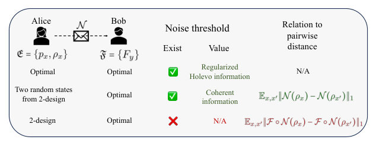
<figcaption class="paper-figure-caption"><b>Fig 1.</b> FIG. 1. Information-theoretic perspectives of our results. We unify the classical capacity of quantum channels and state distinguishability within an information-transmission framework. Optimal encoding and measurement yield the highest noise threshold, determined by the regularized Holevo information. Encoding with two random states from a 2-design features a more stringent threshold governed by coherent information. This corresponds to the quantum capacity of channel N, which is inherently smaller than the classical capacity. Below this threshold, reliable information delivery remains possible. Conversely, encoding with the entire 2-design ensemble yields no positive threshold: the...</figcaption>
</figure>
<figure class="paper-figure-card">
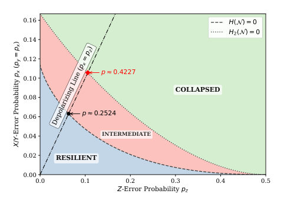
<figcaption class="paper-figure-caption"><b>Fig 2.</b> FIG. 2. Distinguishability phase diagram for local Pauli noise N(ρ) = (1 −px −py −pz)ρ + pxXρX + pyY ρY + pzZρZ, as- suming px = py. The zero-entropy bounds of the channel, H(N) = 0 and H2(N) = 0, sharply partition the noise space into resilient, intermediate, and collapsed phases. The local depolarizing noise trajectory (px = pz) intersects these phase transitions at threshold parameters p ≈0.2524 and p ≈0.4227, which correspond to the plotted axis values of p/4.</figcaption>
</figure>

**Summary.** This work analyzes how quantum state distinguishability degrades under noise for scrambled quantum ensembles modeled by 2-designs. It establishes a critical phase transition, showing that while unmeasured states can maintain high distinguishability in a resilient regime, post-measurement fundamentally destroys this protection. This has major implications for quantum communication and learning tasks.

**Why it may be interesting.** The sharp distinction between unmeasured and post-measured distinguishability provides fundamental insights into the limits of quantum information processing, suggesting that measurement itself can destroy noise resilience.

Detailed structure

**Main problem.** The paper investigates whether quantum state distinguishability, for ensembles modeled by 2-designs, can be protected from noise, addressing the competition between noise and information scrambling.

**Main result.** Unmeasured 2-design ensembles exhibit a sharp phase transition, retaining high distinguishability in a resilient phase, but post-measured ensembles lose all noise protection, collapsing exponentially.

**Method.** The authors use rigorous decoupling approaches and information-theoretic bounds (like average pairwise trace distance) to characterize distinguishability under noise channels.

**Model / system.** The system involves quantum state ensembles, specifically those modeled by 2-designs, evolving under general quantum noise channels (CPTP maps). The analysis compares distinguishability for unmeasured versus post-measured states.

**Key observables.** Average pairwise trace distance, mutual information $I(X:Y)$, and channel conditional entropies ($H(N), H_2(N)$).

**Important parameters / regimes.** Noise strength relative to entropic thresholds ($H(N)=0$ and $H_2(N)=0$), and the number of qubits $n$.

**Assumptions / limitations.** The analysis heavily relies on the 2-design model to characterize 'minimally' scrambled ensembles, and comparisons are drawn between unmeasured and post-measured scenarios.

**Figures summary.** Figures illustrate phase diagrams partitioning the noise space into RESILIENT, INTERMEDIATE, and COLLAPSED regions based on entropic thresholds, and compare information-theoretic measures across different encoding strategies.

**Paper structure.** The paper builds by first defining distinguishability for ensembles, then deriving bounds using decoupling methods, establishing the phase transitions for unmeasured states, and finally contrasting these results with the complete loss of protection observed in post-measured states.

Abstract

Quantum state distinguishability is a fundamental concept in quantum information science that underpins a wide range of important practical tasks. Traditionally formulated for pairs of states, quantum state distinguishability is here extended to quantum state ensembles, which we characterize through the average pairwise trace distance. Motivated by both theoretical and practical interest in noisy quantum information processing, we ask whether ``minimally'' scrambled ensembles modeled by 2-designs protect distinguishability under noise, which sheds light on the fundamental competition between noise and information scrambling. Using a rigorous decoupling approach, we establish tight bounds on noisy ensemble distinguishability. We show that the distinguishability of noisy 2-design ensembles exhibits a sharp threshold and phase-transition behavior governed by channel conditional entropy: below the threshold, the states remain mutually distinguishable with high probability, while above it, distinguishability undergoes a sudden power-law decay and then collapses exponentially. On the other hand, under local purity-shrinking noise, post-measured noisy 2-design ensembles become exponentially indistinguishable for any measurement, precluding a noise threshold for learning tasks such as shadow tomography. These results reveal a sharp difference between unmeasured and post-measured scrambled ensembles: the former can retain high distinguishability for sufficiently small noise, whereas the latter exhibits no such protected regime. We discuss the implications of these results for crucial tasks ranging from quantum communication and cryptography to learning.

[↑ back to top](#top)

### [Ground-state phase diagram of Rydberg atoms in a triangular-prism array](http://arxiv.org/abs/2606.01116v1)

**Authors:** Qing-Yuan Zuo, Shuo Geng, Shan-Wen Tsai, Jin Zhang  
**Type:** theory · **Category:** other · **PDF:** <https://arxiv.org/pdf/2606.01116v1>  
**Analysis basis:** full PDF text, analyzed in chunks
**Topic relevance:** 🔥 `Rydberg arrays` **4/5** · 🔥 `analog quantum simulation` **4/5** · `entanglement & information structure` **3/5** · `exotic spin models in light-matter` **1/5**

↔ Scroll figures horizontally

<figure class="paper-figure-card">
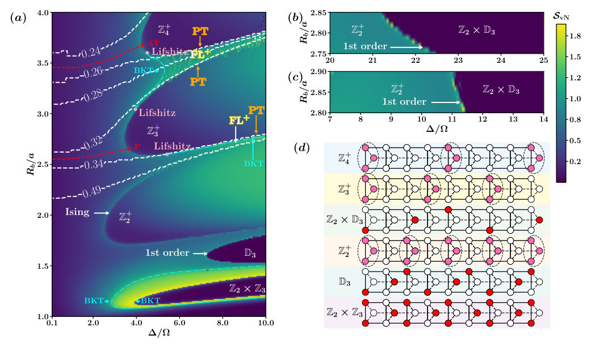
<figcaption class="paper-figure-caption"><b>Fig 1.</b> FIG. 1. (a) Ground-state phase diagram of the triangular-prism Rydberg atom array, obtained from the von Neumann entan- glement entropy SvN. The results are for L = 193 triangles with OBCs, and SvN is evaluated across the cut between the 96th and 97th triangles. We use the original Hamiltonian in Eq. (1) for Rb/a &lt; 2.95, and the effective Hamiltonian in Eq. (2) for Rb/a ≥2.95. The dark lobes denote distinct crystalline orders, whose density patterns are shown in (d). The dashed lines in the disordered region indicate constant-k lines, where k is the oscillation wave vector in the short-range density-density correlations; the labels on these lines give k/2π. There is an extended k = π regime...</figcaption>
</figure>
<figure class="paper-figure-card">
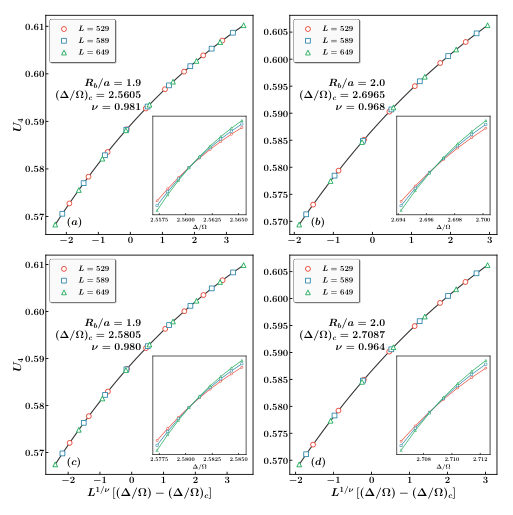
<figcaption class="paper-figure-caption"><b>Fig 2.</b> FIG. 2. Data collapse of the Binder cumulant U4 for the Ising transitions between the Z+ 2 phase and the disordered phase. Panels (a) and (b) are along the cuts Rb/a = 1.9 and 2.0, re- spectively, calculated from the original Hamiltonian (1). Pan- els (c) and (d) are for the same two cuts, but calculated from the effective Hamiltonian (2). The solid lines are polynomial fits to the collapsed data. The insets show U4 as a function of ∆/Ω. The DMRG truncation error is set to ε = 10−12.</figcaption>
</figure>
<figure class="paper-figure-card">
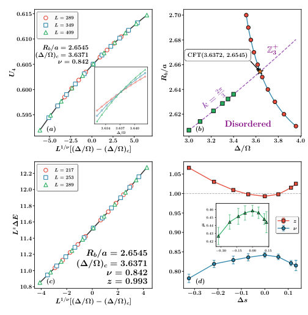
<figcaption class="paper-figure-caption"><b>Fig 3.</b> FIG. 3. (a) Data collapse of the Binder cumulant U4 for the quantum phase transition between the Z+ 3 phase and the dis- ordered phase at the Potts CFT point. (b) Phase boundary of the Z+ 3 phase and the commensurate line with k = 2π/3 in the disordered phase. Solid circles denote transition points determined from U4 data collapse and are connected by spline interpolation. Diamonds denote extrapolated points at which the structure-factor peak is located at k = 2π/3 in the ther- modynamic limit. These points are connected by spline in- terpolation, and the resulting curve is extrapolated to larger ∆/Ωuntil it intersects the phase boundary at the Potts CFT point. (c) Data collapse of the...</figcaption>
</figure>
<figure class="paper-figure-card">
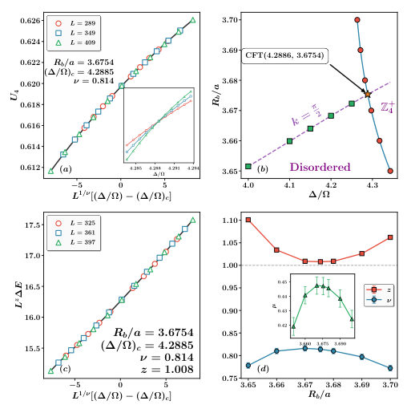
<figcaption class="paper-figure-caption"><b>Fig 4.</b> FIG. 4. Same as Fig. 3, but for the phase transition between the Z+ 4 phase and the disordered phase. The commensurate line in (b) has wave vector k = π/2, and its intersection with the phase boundary determines the Ashkin-Teller CFT point. The DMRG truncation error is set to ε = 10−12 in (a) and ε = 10−10 in (c).</figcaption>
</figure>
<figure class="paper-figure-card">
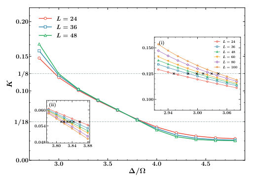
<figcaption class="paper-figure-caption"><b>Fig 5.</b> FIG. 6. Luttinger parameter K as a function of ∆/Ωfor vari- ous system sizes L, along the same cut as in Fig. 5, extracted from the crosscap overlaps under PBC. The same interaction truncation as in Fig. 5 is used. The curves of K intersect the two horizontal dashed lines at the critical values Kc = 1/18 and Kc = 1/8, which determine the two BKT transitions. The two insets show enlarged views near these two critical values using data for L = 24, 36, 48, 60, 72, 84, illustrating how the intersections with the critical values Kc evolve with sys- tem size. The bond dimension is set to D = 600.</figcaption>
</figure>

**Summary.** This paper uses DMRG to map the complex ground-state phase diagram of Rydberg atoms in a triangular-prism array. It reveals multiple density-wave phases characterized by spontaneous symmetry breaking, with transitions governed by distinct critical phenomena like BKT transitions and Ising/Potts universality classes. The study highlights how the geometry dictates the richness of the quantum phases accessible in these ultracold atomic systems.

**Why it may be interesting.** This work provides a detailed theoretical map of quantum phases in a highly tunable, geometrically constrained quantum simulator platform, linking specific symmetries ($D_3$) to complex critical behavior.

Detailed structure

**Main problem.** The study maps the ground-state phase diagram of Rydberg atoms confined in a triangular-prism optical tweezer array.

**Main result.** The system exhibits a rich variety of ordered phases, including density-wave states characterized by different symmetries ($Z_2 	imes D_3$, $Z_p$), and transitions between these phases are governed by various critical phenomena like BKT transitions and Ising/Potts universality classes.

**Method.** The Density Matrix Renormalization Group (DMRG) algorithm is employed, supplemented by diagnostics like Von Neumann entanglement entropy and finite-size scaling analysis of correlation functions.

**Model / system.** The system consists of Rydberg atoms in a triangular-prism lattice, modeled by a Hamiltonian incorporating Rabi coupling, detuning, and long-range Rydberg blockade interactions ($V_{r,r'}$).

**Key observables.** Von Neumann entanglement entropy ($S_{vN}$), connected density-density correlation function ($C(r)$), and order parameters ($\hat{M}_p$).

**Important parameters / regimes.** Detuning-to-Rabi-frequency ratio ($\Delta/\Omega$) and the Rydberg blockade radius ($R_b/a$).

**Assumptions / limitations.** The analysis often relies on projecting the Hilbert space to an effective Hamiltonian, particularly in the large blockade radius limit.

**Figures summary.** Figures illustrate the phase diagram in the $\Delta/\Omega - R_b/a$ plane, showing lobes corresponding to different crystalline orders, and plots of $S_{vN}$ and $C(r)$ used to locate critical points and crossovers.

**Paper structure.** The paper systematically explores the phase diagram by varying key parameters, analyzing transitions between different symmetry-broken phases ($Z_2 	imes Z_3 	o 	ext{Disordered}$ via BKT, $D_3 	o 	ext{Disordered}$ via first-order), and characterizing crossovers using entanglement entropy.

Abstract

We study the ground-state phase diagram of Rydberg atoms in a triangular-prism optical tweezer array using the density matrix renormalization group. By tuning the detuning-to-Rabi-frequency ratio and the Rydberg blockade radius, the system realizes several density-wave phases with spontaneous breaking of translational and leg-exchange symmetries. Unlike two-leg Rydberg ladders with $\mathbb{Z}_2$ leg-exchange symmetry, the triangular prism has $\mathbb{D}_3$ symmetry, leading to a richer set of ordered phases and transitions. For blockade radius moderately larger than the lattice spacing, a phase with alternating double and single Rydberg occupancy appears at large detuning. It breaks $\mathbb{Z}_2$ translational and $\mathbb{Z}_3$ rotational symmetry while preserving a rung reflection symmetry. Upon decreasing detuning, it melts through two Berezinskii-Kosterlitz-Thouless transitions with an intermediate critical phase described by a $\mathbb{Z}_6$ clock model. At larger blockade radius, a phase with one Rydberg excitation per triangle and broken $\mathbb{D}_3$ symmetry appears through a first-order transition. When double occupation of neighboring triangles is suppressed, rung-trimerized density waves develop as detuning increases from the disordered phase. Their melting follows the same structure as in Rydberg chains and two-leg ladders: the $\mathbb{Z}_2$ case has Ising critical lines, while the $\mathbb{Z}_3$ and $\mathbb{Z}_4$ cases have chiral critical lines, with Potts and Ashkin-Teller points only on the corresponding commensurate lines. Inside the $\mathbb{Z}_2$ rung-trimerized phase, an entanglement-entropy peak signals a crossover regime with enhanced period-2 density modulation before a first-order transition into a $\mathbb{Z}_2\times\mathbb{D}_3$ phase. Floating phases with incommensurate quasi-long-range order appear between trimerized states of different periods.

[↑ back to top](#top)

### [Matter-Wave Interferometers as Open-System Dark Matter Detectors](http://arxiv.org/abs/2606.00237v1)

**Authors:** Leonardo Badurina, Kathryn M. Zurek  
**Type:** theory · **Category:** other · **PDF:** <https://arxiv.org/pdf/2606.00237v1>  
**Analysis basis:** full PDF text, analyzed in chunks
**Topic relevance:** 🔥 `Keldysh / 2PI / non-Gaussian methods` **4/5** · `analog quantum simulation` **2/5** · `methods for driven-dissipative` **2/5** · `correlated / nonlocal dissipation` **1/5** · `driven-dissipative phase transition` **1/5** · `interference shaping light` **1/5** · `non-equilibrium dynamics` **1/5**

↔ Scroll figures horizontally

<figure class="paper-figure-card">
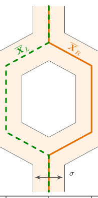
<figcaption class="paper-figure-caption"><b>Fig 1.</b> Figure 1. Spacetime diagram for the MWI sequence con- sidered in this work. The unperturbed classical worldlines XL,R(t) for a closed interferometric sequence geometry are shown in solid orange (right arm) and dashed green (left arm), together with the initial wavepacket of size σ (shaded tube).</figcaption>
</figure>

**Summary.** This paper establishes an open effective field theory framework to analyze how Matter-Wave Interferometers can detect Dark Matter by measuring phase shifts and decoherence. Using the Schwinger-Keldysh formalism, the authors show that the two observables respond differently to DM statistics, providing a powerful diagnostic tool for future quantum sensing experiments.

**Why it may be interesting.** This work directly applies advanced open quantum system techniques (SK formalism) to a physical platform (MWIs) relevant to AMO physics, providing quantitative predictions for environmental coupling effects.

Detailed structure

**Main problem.** To develop a theoretical framework for detecting Dark Matter (DM) using Matter-Wave Interferometers (MWIs) by analyzing phase shifts and decoherence induced by the DM environment.

**Main result.** The formalism reveals a structural asymmetry: decoherence inherits novel quantum statistical factors (Bose enhancement/Pauli blocking), while the phase shift is at most linear in the DM occupation number.

**Method.** The problem is treated as an open quantum system, utilizing the Schwinger-Keldysh formalism to construct an effective field theory and calculate the reduced density matrix via an influence functional.

**Model / system.** The system is an MWI (using atoms or mesoscopic objects) coupled to a background DM environment. The interaction is modeled via an effective Lagrangian describing monopole-monopole coupling.

**Key observables.** Phase shift and decoherence (contrast loss) of the matter wave.

**Important parameters / regimes.** DM mass, DM occupation number ($n_\chi$), coupling constant ($g$), and the ratio of interferometer time ($T$) to environment correlation time ($	au_c$).

**Assumptions / limitations.** The DM halo is assumed to be stationary, homogeneous, and virialized, and the DM state is Gaussian.

**Figures summary.** Figure 1 illustrates the spacetime diagram for the MWI sequence, showing the unperturbed classical worldlines for the two arms.

**Paper structure.** The paper systematically derives the reduced density matrix using the path integral approach, expanding in powers of worldline fluctuations, and deriving the influence action to separate the phase and decoherence contributions.

Abstract

Matter-wave interferometers (MWIs) offer a uniquely quantum route to dark matter (DM) detection: DM can reveal itself through phase and decoherence between spatially separated wavepackets, even when negligible energy deposition or resolvable recoil occurs. We formulate these effects in an open effective field theory for MWIs using the Schwinger-Keldysh formalism, which highlights a structural asymmetry between the two detection channels. For elastic spin-independent DM scattering, decoherence inherits novel Bose enhancement or Pauli blocking factors, while the phase is at most linear in the DM occupation number. By retaining the DM's coherence time, this framework spans Markovian and non-Markovian dynamics across a wide range of DM masses, and systematically organizes corrections beyond the heavy-probe limit.

[↑ back to top](#top)

### [A tunable feedback-controlled magnetic trap for a magnet in free fall](http://arxiv.org/abs/2606.01056v1)

**Authors:** Changhao Xu, Alexander Heidt, Mohammadreza Nematollahi, Christoph Lotz, Ernst Maria Rasel, Yan Liu, Wei Ji, Dmitry Budker  
**Type:** experiment · **Category:** other · **PDF:** <https://arxiv.org/pdf/2606.01056v1>  
**Analysis basis:** full PDF text, analyzed in chunks
**Topic relevance:** 🔥 `quantum measurements` **4/5** · `spintronics-quantum-optics interface` **3/5** · `exotic spin models in light-matter` **1/5** · `measurement-induced transitions` **1/5** · `methods for driven-dissipative` **1/5** · `non-equilibrium dynamics` **1/5**

↔ Scroll figures horizontally

<figure class="paper-figure-card">
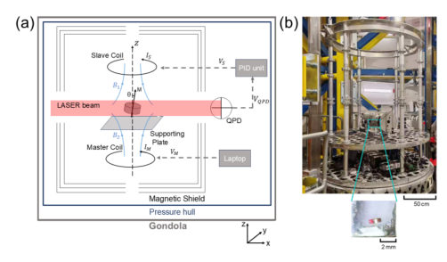
<figcaption class="paper-figure-caption"><b>Fig 1.</b> FIG. 1. Experimental setup in the Einstein-Elevator . (a) Schematic of the setup with the master-PID magnetic trap (MPIDMT). A mag- net is levitated between an upper slave coil and a lower master coil. The quadrant photodetector (QPD) is for position feedback. (b) Top: a photograph of the experimental setup inside the Einstein-Elevator. The optical and PID control units and the silver-colored cylindrical magnetic shield are mounted on the carrier and are shown at the cen- ter. Bottom: side view of the the levitated magnet illuminated with a laser beam.</figcaption>
</figure>
<figure class="paper-figure-card">
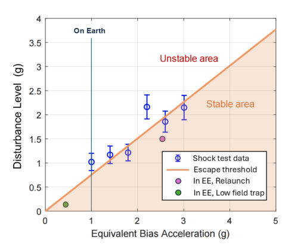
<figcaption class="paper-figure-caption"><b>Fig 2.</b> FIG. 2. Stability analysis under different equivalent bias accelera- tions. Both the applied disturbance and the bias field are expressed in units of g ≈9.8m/s2. When the shock-acceleration amplitude re- mains below the threshold—i.e., within the shaded region—the mag- net stays stably trapped.</figcaption>
</figure>
<figure class="paper-figure-card">
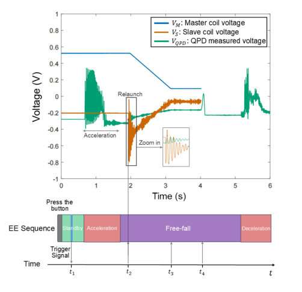
<figcaption class="paper-figure-caption"><b>Fig 3.</b> FIG. 3. Programmed sequence control on MPIDMT and the se- quence from Einstein-Elevator to be synchronized. The lower panel shows the programmed profile of the EE, including the launch (accel- eration), free fall, and deceleration phases. The upper trace displays the voltages for the master (blue) and slave (orange) coils, alongside the QPD measured voltage (green), marking the critical events: re- ceipt of the trigger signal at time t1, activation of PID control at t2, reduction of the bias field at t3, and cutoff of all currents at t4. The QPD-signal fluctuations during the EE launch and deceleration result from vibration-induced noise in the optical system. During t3 to t4 in...</figcaption>
</figure>
<figure class="paper-figure-card">
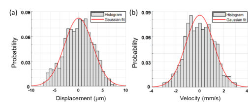
<figcaption class="paper-figure-caption"><b>Fig 4.</b> FIG. 4. Probability distributions of the (a) position and (b) velocity of the magnet during the trapped intervals t3 and t4. Both distribu- tions are well described by Gaussian functions. The 90% confidence intervals correspond to spatial and velocity spreads of 4.9 µm and 1.9 mm/s, respectively.</figcaption>
</figure>
<figure class="paper-figure-card">
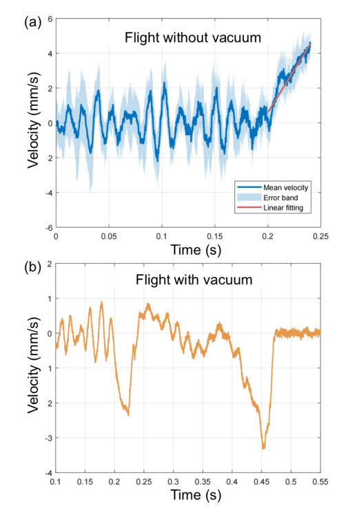
<figcaption class="paper-figure-caption"><b>Fig 5.</b> FIG. 5. Velocity profile— (a) Plot obtained by averaging different flights with ambient pressure in the gondola. The current cut off hap- pens at t0 = 0.2s (t4 in Fig. 3), a mean residual velocity of 0.6mm/s at the cut off moment mainly comes from oscillation inside the mag- netic trap. A clear residual acceleration upward is observed, with a mean value of 0.098m/s2. (b) Velocity profile after releasing the magnet for flight under a vacuum of 10 mbar between pressure hull and the gondola. The current is switched off at the same moment, t0 = 0.2s (t4 in Fig. 3).</figcaption>
</figure>

**Summary.** This paper presents the development and experimental testing of a novel Master Proportional-Integral-Differential Magnetic Trap (MPIDMT) designed to trap ferromagnetic particles in near-free-fall conditions. By using a master bias coil, the trap overcomes the inherent instability of conventional systems in microgravity. The successful demonstration allows for precise measurement of magnet dynamics, moving closer to observing fundamental phenomena like macroscopic Larmor precession in space.

**Why it may be interesting.** The work directly addresses the control and measurement of magnetic dynamics in near-zero gravity, which is crucial for quantum sensing applications involving magnetic moments, linking classical control theory to fundamental quantum physics measurements.

Detailed structure

**Main problem.** The primary goal is to observe pure Larmor precession of a macroscopic ferromagnetic particle in true free fall, which requires overcoming systematic errors from magnetic traps.

**Main result.** The authors successfully demonstrated stable levitation and controlled motion of the magnet in the microgravity phase of a drop tower, achieving stable trapping down to a low bias field of 0.4 g.

**Method.** They developed and tested a novel Master Proportional-Integral-Differential Magnetic Trap (MPIDMT) system, combining PID control with a master bias coil.

**Model / system.** The system uses a PID-controlled slave coil system biased by a master coil to maintain stable levitation. The experiment is performed on the Einstein-Elevator drop tower, allowing testing across various gravity regimes, including near-free fall.

**Key observables.** Position and velocity distributions of the magnet during low-field trapping and free-fall periods.

**Important parameters / regimes.** Stable operation against shock accelerations up to 1.5 g; stable trapping demonstrated at a low bias field of 0.4 g.

**Assumptions / limitations.** The PID model is a first-order linearized approximation, and the quality of free fall is limited by residual acceleration from the drop tower platform.

**Figures summary.** Figures illustrate the experimental setup in the Einstein-Elevator, the control scheme using a QPD, and velocity profiles showing residual motion after current cutoff in both ambient and vacuum conditions.

**Paper structure.** The paper introduces the physical challenge (Larmor precession in free fall), proposes the MPIDMT solution, details the experimental implementation and stability analysis using the drop tower, and presents results showing stable operation and controlled release.

Abstract

Ferromagnets in free space are predicted to exhibit pure Larmor precession at near-zero magnetic fields and provide exceptional sensitivity for magnetometry and gyroscopy. Notably, pure Larmor precession has not been observed in a macroscopic ferromagnetic particle, despite its fundamental importance and potential for probing relativistic effects and dark-matter interactions. Realizing such dynamics requires true free fall to eliminate clamping losses and trap-induced systematics. A central challenge is designing a tunable trap that is weak enough to permit near-free evolution yet robust enough to withstand the disturbances of launch and release. Here, we propose and demonstrate a novel master proportional-integral-differential magnetic trap (MPIDMT) combining a PID-controlled coil system with a master control coil system. Implemented in the third-generation drop tower - Einstein-Elevator, during the microgravity phase the system stably levitates a ferromagnetic particle against shock accelerations up to 1.5 g and resolves its motion in both a low-field (0.4 g) configuration and in pure free fall. These results represent a key step toward free-fall ferromagnetic magnetometry, the long-sought direct observation of macroscopic Larmor precession, and future space-based experiments.

[↑ back to top](#top)

### [Information scrambling in all-to-all interacting models](http://arxiv.org/abs/2606.02207v1)

**Authors:** Abhik Kumar Saha, Tanay Pathak, Masaki Tezuka  
**Type:** theory · **Category:** disordered systems and neural networks · **PDF:** <https://arxiv.org/pdf/2606.02207v1>  
**Analysis basis:** full PDF text, analyzed in chunks
**Topic relevance:** 🔥 `entanglement & information structure` **4/5** · `non-equilibrium dynamics` **3/5** · `non-equilibrium universality` **2/5** · `analog quantum simulation` **1/5** · `scars & prethermalization` **1/5**

↔ Scroll figures horizontally

<figure class="paper-figure-card">
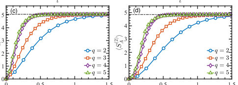
<figcaption class="paper-figure-caption"><b>Fig 1.</b> FIG. 1. Evolution of (a) the average von-Neumann EE and (b) the 2-RE with time for spin-SYK model with q = 2, 3, 4, 5 in natural timescale. (c) and (d) shows the same in energy fixed timescale. The initial state is given by Eq. (3). We consider L = 17, even parity block for even q and L = 16 with full Hilbert space for odd q. The sub-systems sizes are LA = LB = 8 for both the cases. The horizontal black dot–dashed line corresponds to the Haar random values. We consider 220−L Hamiltonian realizations and initial state is changed over each realization.</figcaption>
</figure>
<figure class="paper-figure-card">
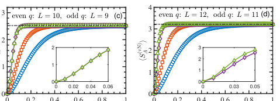
<figcaption class="paper-figure-caption"><b>Fig 2.</b> FIG. 2. The dynamics of the average von-Neumann EE for different values of q and (a) L = 6 (even q) and L = 5 (odd q), (b) L = 8 (even q) and L = 7 (odd q), (c) L = 10 (even q) and L = 9 (odd q), and (d) L = 12 (even q) and L = 11 (odd q), for the spin SYK-q model with the prefactor set to unity. We consider 220−L Hamiltonian realizations. The horizontal black dot-dashed lines indicate the Haar random values. The inset shows the zoomed view of the EE in the early time regime for q = 4 and q = 5.</figcaption>
</figure>
<figure class="paper-figure-card">
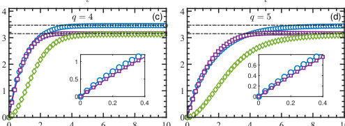
<figcaption class="paper-figure-caption"><b>Fig 3.</b> FIG. 3. The dynamics of the average of (I(1/2) A:B (t)), (2E(t)) and ( 2</figcaption>
</figure>
<figure class="paper-figure-card">
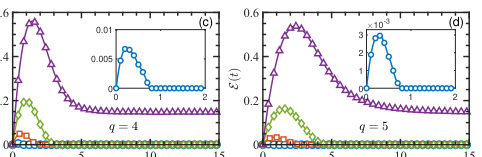
<figcaption class="paper-figure-caption"><b>Fig 4.</b> FIG. 4. The dynamics of the average (E(t)) for spin SYK- q model with (a) q = 2, (b) q = 3, (c) q = 4, (d) q = 5 and initial state is given by Eq. (3). Different colors and markers represent different subsystem sizes. The inset shows the zoomed view of E(t) for LA = LB = 1, LC = 14 in the early time regime for different values of q. We consider 220−L</figcaption>
</figure>
<figure class="paper-figure-card">
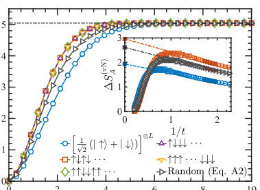
<figcaption class="paper-figure-caption"><b>Fig 5.</b> FIG. 1. The dynamics of the average von-Neumann EE for the spin SYK model with q = 4 for different initial states and averaged over 220−L Hamiltonian realizations. The system size considered here is L = 17 in the even-parity sector, with equal subsystem sizes LA = LB = 8,. The horizontal black dot-dashed line indicates the corresponding Haar random values given. The inset shows the instantaneous slope ∆S(vN) A (t), plotted as a function of 1/t. Filled markers indicate the approximate linear regime used for fitting, while the dot-dashed lines show linear extrapolations based on five selected points. The extrapolated lines intercept 1/t = 0 and provide the asymptotic entropy production rate,...</figcaption>
</figure>

**Summary.** This work analyzes information scrambling in the all-to-all interacting spin SYK-q model using advanced entanglement measures. It demonstrates that entanglement grows rapidly towards a random limit, confirming efficient quantum chaos. The research provides a detailed comparison of how different interaction orders and initial states affect this scrambling process.

**Why it may be interesting.** The study provides a generic framework for understanding how information spreads in complex, highly interacting quantum systems, drawing parallels between quantum chaos, thermalization, and concepts from quantum gravity (like black hole scrambling).

Detailed structure

**Main problem.** The paper investigates information scrambling and thermalization dynamics in highly interacting, all-to-all coupled quantum many-body systems.

**Main result.** Entanglement measures show rapid growth followed by saturation near Haar-random values, confirming efficient scrambling. The scrambling rate exhibits a non-trivial dependence on the interaction order and system size.

**Method.** The study employs numerical simulations to calculate various entanglement measures (von-Neumann, Rényi entropies, entanglement negativity) for the spin Sachdev-Ye-Kitaev (SYK)-q model.

**Model / system.** The primary model is the all-to-all interacting spin Sachdev-Ye-Kitaev (SYK)-q model, characterized by a Hamiltonian involving multi-body spin interactions. The analysis compares dynamics across different interaction orders ($q$) and initial quantum states.

**Key observables.** Von-Neumann and Rényi entropies, entanglement negativity, mutual information, and the scrambling rate.

**Important parameters / regimes.** Interaction order ($q$), system size ($L$), and the choice of initial quantum state (e.g., random, superposition, Néel state).

**Assumptions / limitations.** The analysis often compares results to the theoretical Haar-random limit and sometimes restricts calculations to specific parity sectors.

**Figures summary.** Figures illustrate the time evolution of entanglement measures for various $q$ and initial states, showing initial growth and eventual saturation towards random values. Comparisons are made between different entanglement measures and time scales.

**Paper structure.** The paper systematically analyzes entanglement dynamics by first establishing the general behavior in the SYK-q model, then comparing different entanglement measures (pure vs. mixed state), and finally investigating the dependence of scrambling on the initial quantum state and the interaction order $q$.

Abstract

Information scrambling is a hallmark of quantum chaos and thermalization in isolated quantum many-body systems. We investigate scrambling dynamics in the all-to-all interacting spin Sachdev-Ye-Kitaev (SYK)-$q$ model using both pure- and mixed-state entanglement measures. We show that von-Neumann and Rényi entropies exhibit rapid growth followed by saturation near Haar-random values, signaling efficient scrambling. The scrambling rate reveals a nontrivial dependence on the interaction order, system size, and Hamiltonian scaling. We further employ mixed-state entanglement as a powerful probe of information scrambling. We numerically find a universal relation between the Rényi-1/2 mutual information and entanglement negativity for minimal interaction order in the early growth regime. Furthermore, entanglement negativity displays a Page-curve-like behavior under unequal subsystem partitioning, characterized by the birth, spread, and eventual death of quantum correlations. Our results provide a generic description of information scrambling using entanglement dynamics in all-to-all interacting spin systems with multi-body interactions.

[↑ back to top](#top)

### [Iterative $C_Z$-gate-based protocol for squeezed Schrödinger cat state engineering](http://arxiv.org/abs/2606.02201v1)

**Authors:** Roman Goncharov, N. G. Veselkova, Alexei D. Kiselev  
**Type:** theory · **Category:** quantum information and computing · **PDF:** <https://arxiv.org/pdf/2606.02201v1>  
**Analysis basis:** full PDF text, analyzed in chunks
**Topic relevance:** 🔥 `measurement-induced transitions` **4/5** · 🔥 `quantum measurements` **4/5** · `Keldysh / 2PI / non-Gaussian methods` **1/5** · `entanglement & information structure` **1/5** · `methods for driven-dissipative` **1/5**

↔ Scroll figures horizontally

<figure class="paper-figure-card">
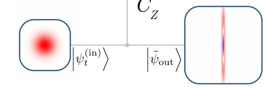
<figcaption class="paper-figure-caption"><b>Fig 1.</b> Figure 1. The scheme for conditional generation of squeezed optical SCSs based on the small-amplitude SCS of the ancilla |ψanc⟩as an elementary non-Gaussian resource, a vacuum state (or an arbitrary coherent state) of the target oscillator |ψ(in) t ⟩and a two-mode quantum nondemolition entangling operator ˆCZ = exp (iGˆq1ˆq2), followed by the projective homodyne measurement ⟨ym| of the ancilla momentum.</figcaption>
</figure>
<figure class="paper-figure-card">
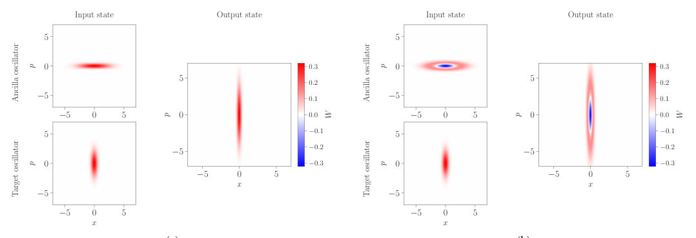
<figcaption class="paper-figure-caption"><b>Fig 2.</b> Figure 2. Wigner functions of the quantum states at the input and output of the investigated gate for parameter values δ = 2.0, r = 0.5, G = 1.2, a = √</figcaption>
</figure>
<figure class="paper-figure-card">
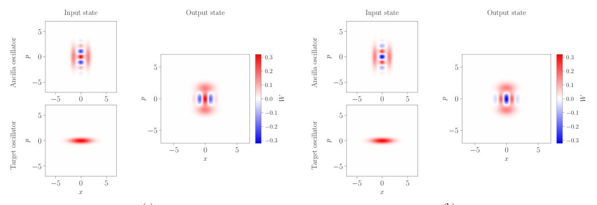
<figcaption class="paper-figure-caption"><b>Fig 3.</b> Figure 3. Wigner functions of the quantum states at the input and output of the investigated gate for parameter values δ = 0.5, r = 2.0, G = 1.2, a = √</figcaption>
</figure>
<figure class="paper-figure-card">
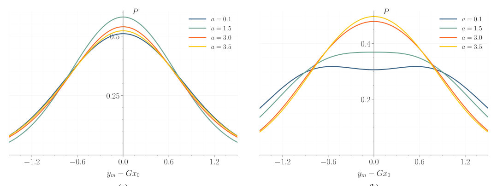
<figcaption class="paper-figure-caption"><b>Fig 4.</b> Figure 4. A series of graphs depicting the probability density (19) for the even (a) and odd (b) cat states as a function of ym −Gx0 for various sizes a = {0.1, 1.5, 3.0, 3.5} of the auxiliary SCS at the gate input, corresponding to the fixed parameter values: r = 0.5, δ = 2.0, and G = 1.2.</figcaption>
</figure>
<figure class="paper-figure-card">
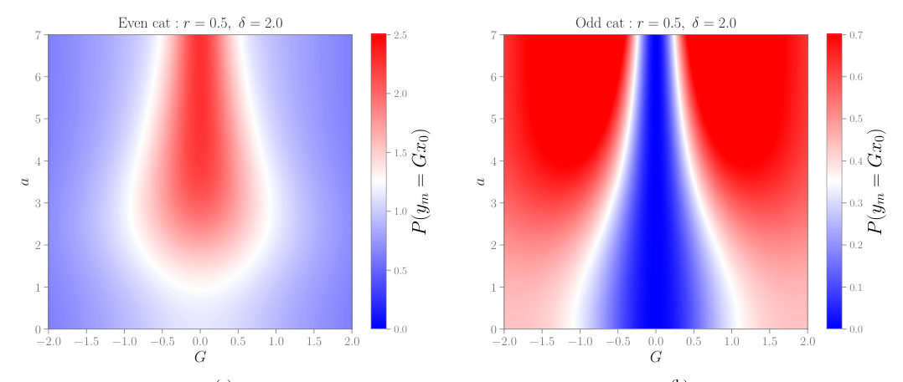
<figcaption class="paper-figure-caption"><b>Fig 5.</b> Figure 5. Phase diagrams of the probability density for observing the outcome ym = Gx0, which heralds the appearance of an undistorted SCS at the gate output when the ancilla is in the even (a) or odd (b) SCS, as a function of G and a at fixed r = 0.5 and δ = 2.0. The color scale indicates the probability density ranging from 0 (blue) to 1 (red).</figcaption>
</figure>

**Summary.** This paper details an iterative, measurement-assisted protocol for generating and amplifying squeezed Schrödinger cat states in continuous-variable quantum optics. By analyzing the joint probability density of sequential homodyne measurements, the authors derive closed-form expressions for the total success probability and the resulting mixed-state fidelity. This work establishes a scalable theoretical framework for utilizing non-Gaussian resources in quantum information processing.

**Why it may be interesting.** This work provides rigorous theoretical tools for engineering non-Gaussian quantum states using continuous-variable entanglement and measurement, directly impacting the feasibility of measurement-based quantum computation.

Detailed structure

**Main problem.** The paper addresses the challenge of generating and manipulating high-fidelity squeezed Schrödinger cat states (SCSs), which are crucial non-Gaussian resources for quantum computation and networking.

**Main result.** The authors propose a measurement-assisted gate and an iterative protocol that successfully generate and amplify SCSs, demonstrating a tunable trade-off between fidelity and success probability.

**Method.** The core method involves using a Quantum Nondemolition (QND) entangling operation ($\hat{C}_Z$) on an ancillary cat state and a target oscillator, followed by projective homodyne measurement and iterative post-selection.

**Model / system.** The system is modeled using continuous-variable quantum optics, involving two-component photonic SCSs. The process is analyzed via wave function evolution, Wigner function representations, and calculating joint probability densities for sequential measurements.

**Key observables.** Fidelity ($F$), success probability ($P^{(k)}(d)$), quadrature squeezing factor ($\gamma^{-1}$), and the effective cat-state size ($|G|^k a$).

**Important parameters / regimes.** Coupling strength ($G$), squeezing levels ($\delta$), cat-state size parameter ($a$), and the measurement acceptance window width ($d$).

**Assumptions / limitations.** The analysis relies on the assumption of linearity in the density matrix for the sequential operations and often assumes the measurement outcome is accepted within a finite window $d$.

**Figures summary.** Figures illustrate Wigner functions showing input/output states for different squeezing regimes, and phase diagrams showing the total success probability $P^{(k)}(d)$ dependence on the measurement window $d$ and coupling strength $G$ for $k=1, 2, 3$ iterations.

**Paper structure.** The paper develops the theory by first defining the measurement-assisted gate, then deriving the recursive structure for the wave function evolution across $k$ iterations, and finally calculating the total success probability and mixed-state fidelity using multi-dimensional integration techniques.

Abstract

Squeezed optical Schrödinger cat states constitute a key resource for both fundamental tests of quantum theory and up-to-date quantum technologies. We propose a measurement-assisted gate for the generation and manipulation of the cat states. In this scheme, an ancilla in the non-Gaussian small-amplitude (in general, squeezed) Schrödinger cat state and the target oscillator initially prepared in a squeezed vacuum (or coherent) state are subjected to a quantum nondemolition (QND) entangling operation followed by projective homodyne measurement. The proposed gate enables generation of high-fidelity squeezed Schrödinger cat states with controllable size and squeezing with tunable fidelity/success-probability trade-off. We also introduce an iterative, homodyne-conditioned $C_Z$-based protocol for cat-state amplification. The parameter regimes required to achieve the desired fidelity and the success probability are analyzed. The approach is well suited for applications in measurement-based quantum computing and hybrid quantum networks where non-Gaussian resources enhance computational and communication capabilities.

[↑ back to top](#top)

### [Learning Mid-circuit Measurement Backaction from Three Repeated Measurements](http://arxiv.org/abs/2606.00433v1)

**Authors:** Chia-Tung Chu, Su-un Lee, Han Zheng, Senrui Chen, Bibek Pokharel, Alireza Seif, Liang Jiang  
**Type:** experiment · **Category:** quantum information and computing · **PDF:** <https://arxiv.org/pdf/2606.00433v1>  
**Analysis basis:** full PDF text, analyzed in chunks
**Topic relevance:** 🔥 `QC/QI experiment` **4/5** · 🔥 `quantum measurements` **4/5** · `measurement-induced transitions` **2/5** · `methods for driven-dissipative` **1/5**

↔ Scroll figures horizontally

<figure class="paper-figure-card">
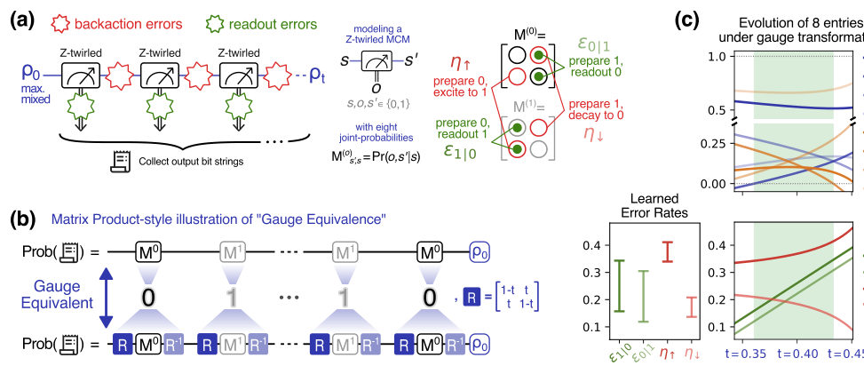
<figcaption class="paper-figure-caption"><b>Fig 1.</b> Figure 1. Learning mid-circuit measurements (MCMs): overview and gauge-aware reporting. (a) Protocol overview: starting from a maximally mixed single-qubit input, repeated 𝑍-twirled MCMs generate outcome bit strings used for learning; green/red markers indicate readout/backaction error channels. For a single 𝑍-twirled MCM, the effective model is a pair of 2 × 2 nonnegative matrices {𝑀(0), 𝑀(1)}, containing the 8 joint-probabilities Pr(𝑜, 𝑠′ |𝑠) for obtaining the outcome 𝑜and post-measurement state 𝑠′, conditioned on the pre-measurement state 𝑠. The two readout and two backaction error rates are obtained by summing selected entries of {𝑀(0), 𝑀(1)}. (b) Gauge-equivalent matrix-pair...</figcaption>
</figure>
<figure class="paper-figure-card">
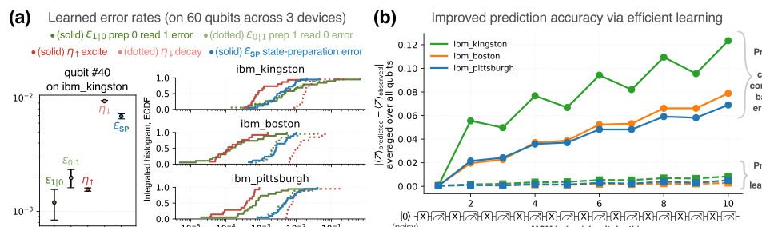
<figcaption class="paper-figure-caption"><b>Fig 2.</b> Figure 2. Experimental results on IBM superconducting processors. (a) Five types of learned error rates on 60 selected qubits across ibm_boston, ibm_kingston, and ibm_pittsburgh (20 qubits each). Left panel: a particular example of error rates derived from the learned instrument associated with qubit #40 on ibm_kingston. Gauge bands are shown as capped bars for each error rate, while the circle markers denote the gauge midpoints, which are then used to build the learned predictors in (b). Right panel: Integrated histogram (empirical cumulative distribution function, ECDF) of learned error rates (reported as the midpoints of their associated gauge bands) across all 20 qubits on each device....</figcaption>
</figure>

**Summary.** This paper introduces a novel, efficient protocol to characterize the complex noise associated with mid-circuit measurements in superconducting qubits. By analyzing readout bit strings from just three repetitions, the authors learn the full instrument, capturing crucial state-update backaction effects. This advanced characterization significantly outperforms standard error models, providing a vital tool for optimizing quantum error correction and state preparation.

**Why it may be interesting.** The rigorous characterization of non-unitary, state-altering processes like MCMs is crucial for advancing quantum error correction and fault-tolerant quantum computing architectures.

Detailed structure

**Main problem.** Accurately characterizing Mid-circuit Measurements (MCMs) is difficult because they introduce both classical readout outcomes and quantum state backaction, which conventional methods fail to capture.

**Main result.** The proposed protocol successfully learns the full MCM instrument from only three repeated measurements, significantly improving Pauli-observable prediction compared to simple confusion-matrix models.

**Method.** The authors develop a self-consistent protocol using a second-order recurrence relation derived from the Cayley–Hamilton identity to estimate the joint conditional distribution of outcomes and post-measurement states.

**Model / system.** The work is implemented on superconducting qubits (IBM processors) and models the MCM process using a pair of $2 	imes 2$ matrices, $\{M(0), M(1)\}$, which capture readout-backaction correlations.

**Key observables.** Readout error rates ($\epsilon_{1|0}, \epsilon_{0|1}$), backaction error rates ($\eta_{\uparrow}, \eta_{\downarrow}$), and the depth-resolved Pauli-Z observable deviation ($\Delta_{	ext{full}}(\ell)$).

**Important parameters / regimes.** The number of repeated measurements (three are sufficient), the initial state (maximally mixed state), and the gauge degree of freedom.

**Assumptions / limitations.** The noise model is assumed to be stationary, Markovian, and leakage-free; the analysis also deals with an unidentifiable gauge degree of freedom.

**Figures summary.** Figures compare the Pauli-Z observable prediction from the full learned instrument (dashed line) against a simpler confusion-matrix model (solid line), demonstrating the predictive advantage of including backaction.

**Paper structure.** The paper progresses from defining the physical problem (MCM backaction) to developing the mathematical framework (joint conditional distributions, recurrence relations), presenting the learning protocol (using three measurements), and finally validating the results by comparing predictions against longer, independent measurement chains.

Abstract

Accurate modeling of mid-circuit measurements (MCMs) is essential for dynamic-circuit operations such as syndrome extraction, measurement-based reset, and the separation of state-preparation and measurement (SPAM) error. Unlike terminal measurement, a noisy MCM both produces a classical outcome and alters the incoming quantum state, thereby influencing subsequent circuit operations. This makes conventional confusion-matrix or fidelity-level characterization insufficient. Here we introduce an efficient, self-consistent protocol for learning a single-qubit Z-twirled MCM instrument, retaining the readout-backaction correlations and excitation-decay asymmetry that are erased in Pauli-error descriptions. Remarkably, readout bit strings from only three repeated MCMs on a maximally mixed input determine all learnable parameters of the reduced instrument, up to a single unidentifiable gauge degree of freedom. Physicality constraints convert this non-identifiability into narrow, gauge-aware error intervals. Implemented on IBM superconducting processors, the learned instrument improves Pauli-observable prediction by ${\sim}100\times$ over a conventional confusion-matrix model and reveals a $T_1$-decay dominated backaction. Our protocol provides a compact characterization layer for SPAM error separation, reset optimization, and noise-aware quantum error correction.

[↑ back to top](#top)

### [Phase-Sensitive Crystal-Edge Effects in Linear Optical Parametric Oscillators: Why Nominally Identical Squeezers Behave Differently](http://arxiv.org/abs/2606.00216v1)

**Authors:** Jonas Junker, Donghwa Lee, Reda Louahaj, Oscar Cordero, Romain Brunel, Jens A. H. Nielsen, Ulrik L. Andersen, Jonas S. Neergaard-Nielsen  
**Type:** experiment · **Category:** quantum information and computing · **PDF:** <https://arxiv.org/pdf/2606.00216v1>  
**Analysis basis:** full PDF text, analyzed in chunks
**Topic relevance:** 🔥 `quantum optics experiment` **4/5** · `interference shaping light` **3/5** · `QC/QI experiment` **1/5** · `correlated cavity matter` **1/5** · `driven-dissipative phase transition` **1/5**

↔ Scroll figures horizontally

<figure class="paper-figure-card">
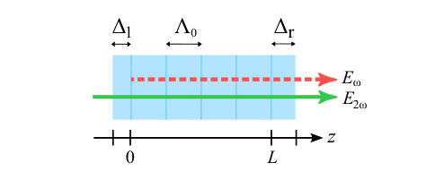
<figcaption class="paper-figure-caption"><b>Fig 1.</b> Fig. 1. Single-pass nonlinear interaction inside a periodically poled crystal with two participating electric fields Eω and E2ω. The poling period is given by Λ0. In general, the crystal facets can have arbitrary termination lengths ∆l and ∆r.</figcaption>
</figure>
<figure class="paper-figure-card">
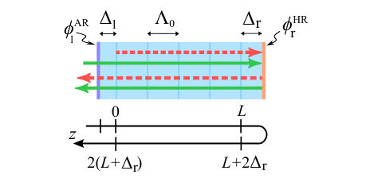
<figcaption class="paper-figure-caption"><b>Fig 2.</b> Fig. 2. Double-pass nonlinear interaction in a crystal with anti- reflective (AR) and high-reflective (HR) surfaces at which both fields are back-reflected.</figcaption>
</figure>
<figure class="paper-figure-card">
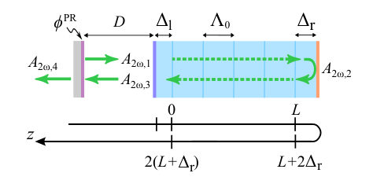
<figcaption class="paper-figure-caption"><b>Fig 3.</b> Fig. 4. Fundamental and second-harmonic fields in a linear cavity. The circulating cavity field contains forward- and backward-propagating components whose relative phases depend on the facet termination lengths ∆l and ∆r.</figcaption>
</figure>
<figure class="paper-figure-card">
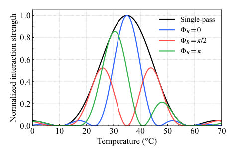
<figcaption class="paper-figure-caption"><b>Fig 4.</b> Fig. 3. Comparison of the nonlinear interaction strength for the single-pass and double-pass case with different phases ΦR. Plotting parameters: λω = 1550 nm, λ2ω = 775 nm, Λ0 = 24.7 µm, L = 405 × Λ0 ≈1 cm.</figcaption>
</figure>
<figure class="paper-figure-card">
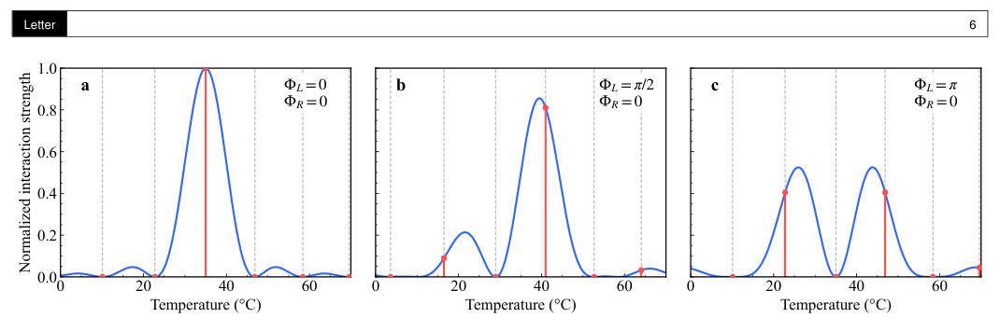
<figcaption class="paper-figure-caption"><b>Fig 5.</b> Fig. 5. Phase-sensitive nonlinear interaction in a doubly resonant linear cavity for representative phase combinations ΦL and ΦR. The blue curves show the cavity-enhanced nonlinear interaction envelope, while the gray dashed lines indicate the discrete doubly resonant operating points allowed by the cavity resonance condition. Depending on the phase contributions from the crystal-edge regions, the accessible operating points can strongly suppress the achievable nonlinear gain.</figcaption>
</figure>

**Summary.** This research demonstrates that the performance of linear OPOs is critically dependent on phase factors originating from crystal edges and optical coatings, not just bulk material properties. By combining SHG and OPO threshold measurements, the authors quantify these phase-sensitive effects. The findings establish a necessary 'phase-aware framework' for designing scalable, low-threshold quantum light sources.

**Why it may be interesting.** This work provides crucial design guidelines for building robust quantum light sources, showing that simple bulk phase matching is insufficient; phase control at the boundaries is paramount for reproducible quantum technology.

Detailed structure

**Main problem.** The performance of linear Optical Parametric Oscillators (OPOs) is highly sensitive to microscopic phase factors arising from crystal-edge termination and coating phases, causing nominally identical devices to behave differently.

**Main result.** Phase-sensitive cavity dynamics dictate the achievable nonlinear gain, leading to threshold variations up to nearly six-fold between similar devices.

**Method.** The study combines double-pass Second-Harmonic Generation (SHG) measurements to extract phase contributions with OPO threshold measurements to characterize the nonlinear gain.

**Model / system.** The system involves compact, doubly resonant standing-wave OPOs in periodically poled crystals, where the effective nonlinear gain is governed by the coherent superposition of forward- and backward-generated fields.

**Key observables.** OPO oscillation threshold power ($P_{	ext{thr}}$), normalized nonlinear interaction strength ($\eta_{nl}$), and extracted phase contributions ($\Phi_L, \Phi_R$).

**Important parameters / regimes.** Crystal-edge termination lengths ($\Delta l, \Delta r$), cavity resonance condition, and the relative round-trip phase ($\Phi_{rt}$).

**Assumptions / limitations.** The analysis assumes plane-wave propagation and focuses on the first-order quasi-phase-matched contribution.

**Figures summary.** Figures illustrate single-pass vs. double-pass nonlinear interactions, the dependence of nonlinear strength on relative phases, and experimental setups for both SHG and OPO measurements.

**Paper structure.** The paper progresses from modeling single-pass SHG, to incorporating double-pass interference effects, and finally applying this phase-aware framework to analyze and compare the threshold measurements of three distinct, yet nominally similar, OPO systems.

Abstract

Efficient and reproducible squeezed-light sources are essential for quantum information processing and precision metrology. Compact linear standing-wave optical parametric oscillators (OPOs) are attractive because they combine low optical loss, low pump-power requirements, and large longitudinal mode spacing. In doubly resonant cavities, however, the nonlinear interaction is not determined solely by bulk phase matching: forward- and backward-generated fields recombine coherently, making the effective gain sensitive to crystal-edge termination, wavelength-dependent coating phases, and the cavity resonance condition. Here, we show that these microscopic phase contributions can produce large threshold variations between nominally similar OPOs. We combine double-pass second-harmonic generation with OPO threshold measurements to extract the relevant crystal-cavity phases and analyse three linear OPO systems. The observed devices exhibit threshold variations of up to nearly six-fold, traced to the phase-dependent nonlinear-gain envelope at accessible doubly resonant operating points. Our results establish a phase-aware framework for compact linear OPOs and provide design guidelines for reproducible low-threshold squeezed-light sources in scalable photonic quantum systems.

[↑ back to top](#top)

### [Physics-Informed Learning of Effective Error Processes from Limited Noisy Transmon Measurements for Robust QAOA Reliability](http://arxiv.org/abs/2606.00353v1)

**Authors:** Ebrahim Khaleghian, Özgür E. Müstecaplıoğlu  
**Type:** both · **Category:** quantum information and computing · **PDF:** <https://arxiv.org/pdf/2606.00353v1>  
**Analysis basis:** full PDF text, analyzed in chunks
**Topic relevance:** 🔥 `QC/QI experiment` **4/5** · `methods for driven-dissipative` **3/5** · `quantum measurements` **2/5** · `correlated / nonlocal dissipation` **1/5**

↔ Scroll figures horizontally

<figure class="paper-figure-card">
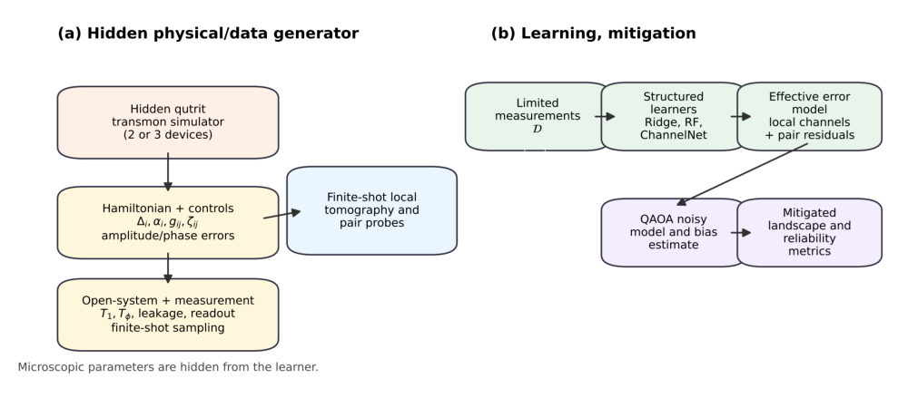
<figcaption class="paper-figure-caption"><b>Fig 1.</b> FIG. 1. Overall architecture. The simulator contains hidden qutrit transmon physics, Hamiltonian-level imperfections, open- system noise, leakage, readout assignment error, and finite-shot sampling. The learner sees only limited measurement data and predicts effective error processes. The final implemented experiments use fixed local and pair measurement budgets.</figcaption>
</figure>
<figure class="paper-figure-card">
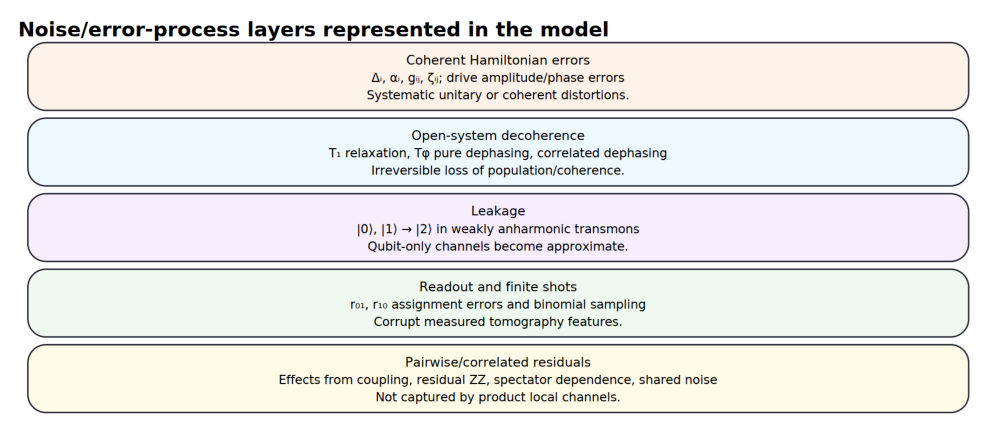
<figcaption class="paper-figure-caption"><b>Fig 2.</b> FIG. 2. Noise and error-process taxonomy. The simulator explicitly includes coherent Hamiltonian imperfections, open-system decoherence, leakage, readout assignment error, finite-shot noise, and pairwise/correlated residual effects.</figcaption>
</figure>
<figure class="paper-figure-card">
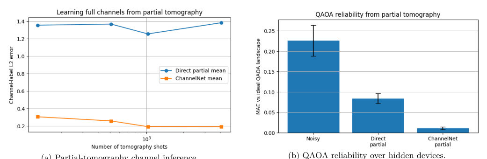
<figcaption class="paper-figure-caption"><b>Fig 3.</b> FIG. 3. Two-qubit case. In the underdetermined partial-tomography setting, ChannelNet learns a structured prior over hardware-generated effective channels and substantially outperforms direct partial reconstruction.</figcaption>
</figure>
<figure class="paper-figure-card">
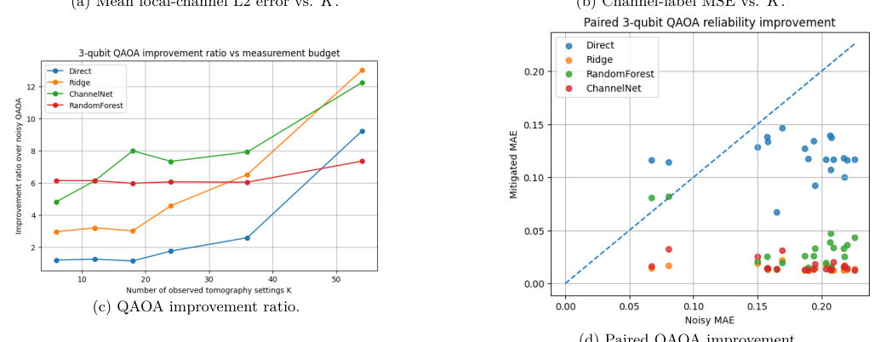
<figcaption class="paper-figure-caption"><b>Fig 4.</b> FIG. 4. Three-qubit local error learning. The local-channel result is shown across the full observed-tomography sweep K = 6, 12, 18, 24, 36, 54. Ridge is the strongest local estimator in the scaled run, while ChannelNet remains competitive.</figcaption>
</figure>
<figure class="paper-figure-card">
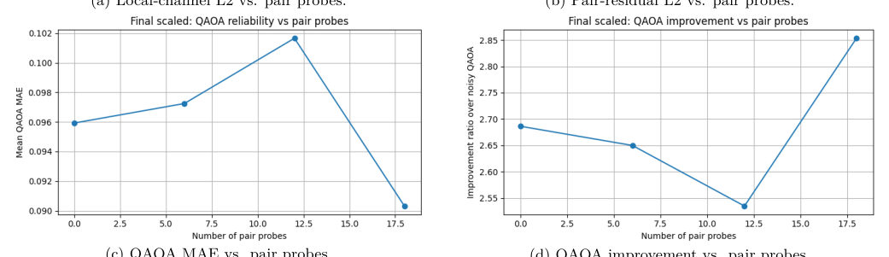
<figcaption class="paper-figure-caption"><b>Fig 5.</b> FIG. 5. Pair probes substantially improve pairwise correlated-error identifiability. Their downstream QAOA benefit is positive but modest under the current residual-correction rule, suggesting that calibrated or QAOA-aware use of pair residuals is an important future improvement.</figcaption>
</figure>

**Summary.** This work develops a physics-informed machine learning pipeline to estimate complex quantum error channels using only limited, noisy measurement data from transmon qubits. By learning these effective error processes, the authors successfully mitigate noise effects, leading to a significant and measurable improvement in the reliability of the Quantum Approximate Optimization Algorithm (QAOA) for MaxCut.

**Why it may be interesting.** It provides a concrete, data-driven methodology for mitigating hardware noise in near-term quantum computation, which is crucial for applying variational algorithms to real quantum hardware.

Detailed structure

**Main problem.** The paper addresses the challenge of learning effective quantum error processes from limited, noisy measurements to enhance the reliability of variational quantum algorithms like QAOA.

**Main result.** The proposed physics-informed learning pipeline significantly improves QAOA reliability, showing improvements up to 20.4x in a two-qubit proof-of-concept and substantial reductions in Mean Absolute Error in a three-qubit study.

**Method.** A physics-informed pipeline uses neural networks and regression techniques to infer compact effective error channels (local Bloch channels and pairwise residuals) from sparse local and pair-probe tomography data.

**Model / system.** The system is modeled using superconducting transmon qubits, treated as imperfect qutrits, whose evolution is governed by a Lindblad master equation incorporating leakage and readout errors.

**Key observables.** QAOA cost landscape (Mean Absolute Error, RMSE), local/pair-wise Pauli expectation values, and inferred effective error channel parameters.

**Important parameters / regimes.** Qubit number (2-qubit, 3-qubit), measurement budget (K local measurements), and the depth of the QAOA circuit (p=1).

**Assumptions / limitations.** The learned error model is an *operational* representation, not a full microscopic Hamiltonian recovery; the learning process is separated from the physical simulator.

**Figures summary.** Figures illustrate the architecture (Simulator -> Learner -> Mitigation), diagnostics for two- and three-qubit partial tomography, and the resulting QAOA performance metrics under various stress tests.

**Paper structure.** The paper progresses from a two-qubit proof-of-concept to a more complex, hardware-aware three-qubit extension, detailing the measurement protocols, the structured learning models (Ridge, NN), and the final evaluation via QAOA landscape correction.

Abstract

We present a physics-informed pipeline for learning effective quantum error processes from finite-shot measurements generated by hidden transmon-like simulators. Each physical transmon is modeled as an imperfect qutrit, while the learner only receives limited tomography data rather than microscopic Hamiltonian parameters. The learned representations are compact effective models: local affine Bloch channels for each qubit and, in the three-qubit extension, pairwise residuals that capture correlated errors. The learned error models are evaluated operationally by their ability to mitigate the cost landscape of the Quantum Approximate Optimization Algorithm (QAOA) for MaxCut. A two-qubit proof of concept shows that a neural-network approach can infer a full 24-parameter effective channel from only 12 local tomography values and improve QAOA landscape reliability by about $20.4\times$. A scaled three-qubit study shows that local structured learning still strongly improves QAOA reliability: at $K=18$ local measurements, Ridge regression and the neural-network approach reduce QAOA mean absolute error from about $0.1775$ to $0.0269$ and $0.0306$, respectively. Pair probes substantially improve correlated-error identifiability, reducing pair-residual L2 error from about $1.731$ to $1.122$. These results support effective error-process learning as a hardware-aware route toward more reliable variational quantum algorithms.

[↑ back to top](#top)

### [Topological Edge States from Molecular Chirality: A General Framework for Dimerized Dipolar Arrays](http://arxiv.org/abs/2606.00877v1)

**Authors:** Muhammad Arsalan Ali Akbar, Mohsin Raza, Sabre Kais  
**Type:** theory · **Category:** other · **PDF:** <https://arxiv.org/pdf/2606.00877v1>  
**Analysis basis:** full PDF text, analyzed in chunks
**Topic relevance:** 🔥 `analog quantum simulation` **4/5** · `exotic spin models in light-matter` **3/5** · `Keldysh / 2PI / non-Gaussian methods` **1/5** · `entanglement & information structure` **1/5** · `methods for driven-dissipative` **1/5**

↔ Scroll figures horizontally

<figure class="paper-figure-card">
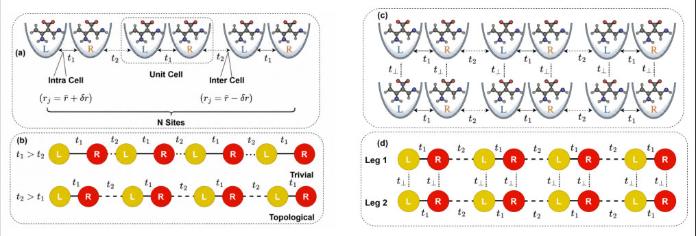
<figcaption class="paper-figure-caption"><b>Fig 1.</b> FIG. 1. Physical platform and effective models studied in this work. (a) Stark-dressed chiral molecular chain realized in an optical tweezer array. Alternating left-handed (L, blue) and right-handed (R, orange) enantiomers are individually trapped in optical potential wells. With the dimerization convention used in the text, 𝑟𝑗= ̄𝑟−(−1)𝑗𝛿𝑟, odd bonds are intracell bonds and even bonds are intercell bonds. Thus the intracell L–R bond carries hopping 𝑡1 and has separation 𝑟𝑗= ̄𝑟+ 𝛿𝑟, while the intercell bond connecting the R site of one unit cell to the L site of the next carries hopping 𝑡2 and has separation 𝑟𝑗= ̄𝑟−𝛿𝑟. For positive dimerization, the intercell bond is shorter and therefore...</figcaption>
</figure>
<figure class="paper-figure-card">
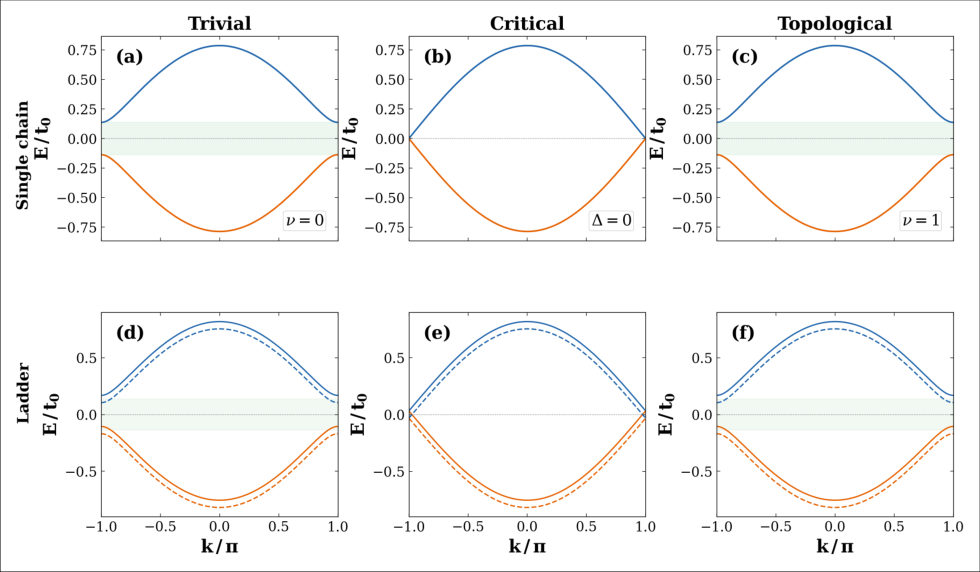
<figcaption class="paper-figure-caption"><b>Fig 2.</b> FIG. 2. Bulk energy spectra 𝐸±(𝑘) under periodic boundary conditions for the self-consistently treated dimerized chiral molecular model. The reference energy scale is 𝑡0 = 2 ̃𝐽𝑥𝑦(̄𝑟); the Ising coupling is 𝐽𝑧∕𝑡0 = −0.190 and the system is at half filling. The green-shaded band marks the bulk gap Δbulk = 2|𝑡eff 2 −𝑡eff 1 | in all panels; the horizontal dotted line marks 𝜀0 = 0. Single chain (upper row): the blue 𝐸+(𝑘) and orange 𝐸−(𝑘) bands are determined by the mean-field effective hoppings 𝑡eff 1 and 𝑡eff 2 in the (a) trivial (𝛿𝑟∕̄𝑟= −0.067, 𝜈= 0), (b) critical (𝛿𝑟= 0, Δbulk = 0), and (c) topological (𝛿𝑟∕̄𝑟= +0.067, 𝜈= 1) regimes. Ladder (lower row): corresponding two-leg ladder spectra...</figcaption>
</figure>
<figure class="paper-figure-card">
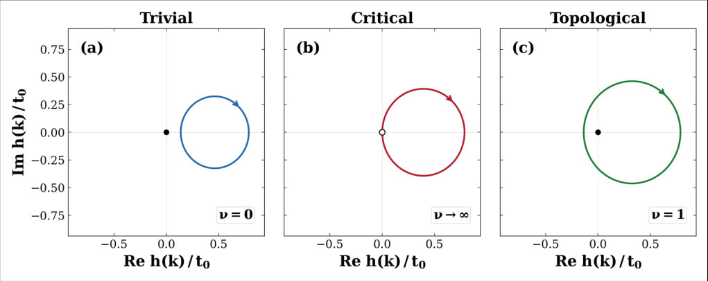
<figcaption class="paper-figure-caption"><b>Fig 3.</b> FIG. 3. Complex-plane winding trajectories of 𝑞(𝑘) = 𝑡eff 1 + 𝑡eff 2 𝑒−𝑖𝑘as 𝑘traverses the full Brillouin zone [0, 2𝜋), for the (a) trivial, (b) critical, and (c) topological phases. The coloured loop is the trajectory of 𝑞(𝑘); the filled black dot marks the origin (0, 0) in panels (a) and (c), while the open circle in panel (b) indicates that the loop passes exactly through the origin at the critical point. All three panels share the same axis scale, permitting direct comparison: in the trivial phase the loop lies entirely to the right of the origin (𝜈= 0); at the critical point the loop passes through the origin, so the winding number is undefined (Δbulk = 0); in the topological phase the...</figcaption>
</figure>
<figure class="paper-figure-card">
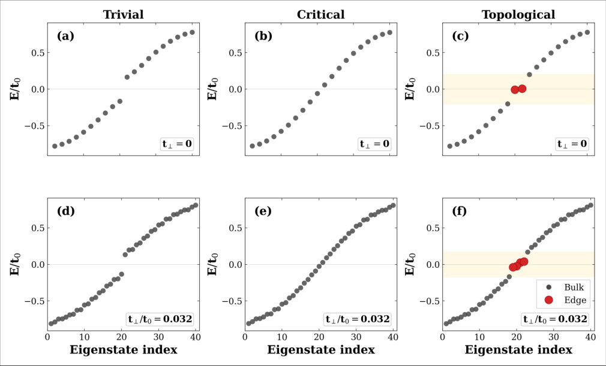
<figcaption class="paper-figure-caption"><b>Fig 4.</b> FIG. 4. Open-boundary energy spectra as a function of eigenstate index for a system of 𝑁= 20 sites per chain (𝑁𝑐= 10 unit cells, 40 total eigenstates). Gray circles denote bulk states; red circles highlight in-gap edge states (see legend in panel (f)). The solid horizontal line marks 𝜀0 = 0; the pale-yellow band in panels (c) and (f) indicates the spectral gap region containing the edge states. Upper row (a)–(c): two decoupled dimerized chains (𝑡⟂= 0) in the trivial, critical, and topological regimes. In the trivial regime (a) no isolated boundary sector appears. At the critical point (b) the bulk gap closes and no spectrally isolated edge sector exists. In the topological regime (c) two...</figcaption>
</figure>
<figure class="paper-figure-card">
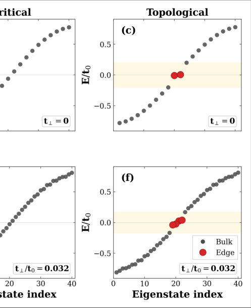
<figcaption class="paper-figure-caption"><b>Fig 5.</b> Fig. 6(a) displays the complete eigenvalue fan as 𝑡⟂is swept from zero to 0.17 𝑡0. At 𝑡⟂= 0 the spectrum consists of two independent SSH chains, each contributing one nearly degen- erate edge-state pair near 𝐸= 0, for a total of four midgap modes. As 𝑡⟂increases, the rung hybridization splits each bonding–antibonding sector of the bulk bands, broadening the overall bandwidth while progressively narrowing the gap. The four edge states, shown in red, fan outward from the midgap cluster and eventually reach the bulk band edges, at which point they lose their spectral isolation and merge into the con- tinuum.</figcaption>
</figure>

**Summary.** This paper develops a theoretical framework to study topological edge states in arrays of chiral dipolar molecules. By incorporating molecular handedness into a dimerized SSH model, the authors show that the edge states are uniquely labeled by the chirality of the boundary molecules. The framework is extended to a two-leg ladder, confirming the robustness of the topology and the chirality-addressability of the resulting edge modes.

**Why it may be interesting.** This work directly bridges molecular chirality (a concept from AMO/molecular physics) with topological quantum matter, providing a highly controllable, addressable platform for realizing exotic quantum states.

Detailed structure

**Main problem.** The paper establishes a general theoretical framework for realizing and characterizing topological edge states in dimerized arrays of chiral dipolar molecules.

**Main result.** The key finding is that the edge states carry opposite molecular chirality at the left and right boundaries, a stereochemical labeling unique to this system, and the ladder extension doubles the topological index.

**Method.** The analysis employs self-consistent mean-field theory, mapping the interacting spin model to a fermionic SSH-type Hamiltonian, and utilizing winding number calculations for topological classification.

**Model / system.** The system is a dimerized array of Stark-dressed chiral dipolar molecules, modeled by an effective pseudo-spin-1/2 Hamiltonian. The analysis extends from a single chain to a two-leg ladder structure, incorporating chirality via the Dzyaloshinskii–Moriya interaction.

**Key observables.** Topological invariant (winding number $
u$), bulk energy spectra, boundary-localized probability densities, and the chirality label of the edge modes.

**Important parameters / regimes.** Dimerization strength ($t_1, t_2$), interchain coupling ($t_{\perp}$), and the strength of the chirality-induced DM interaction ($D_j$).

**Assumptions / limitations.** The analysis relies on a mean-field (Hartree-Fock) approximation to treat the interacting spin model, and the stability of edge modes requires specific coupling conditions.

**Figures summary.** Figures illustrate the physical platform (chiral chain), the effective SSH model, the bulk spectra across trivial/critical/topological regimes for both single chains and ladders, and the complex-plane winding trajectories.

**Paper structure.** The paper progresses by first deriving the single-chain model and its topological properties, then extending the analysis to the two-leg ladder geometry, and finally detailing the spectral analysis and the role of chirality in defining the edge states.

Abstract

We establish a general theoretical framework for realizing topological edge states in dimerized arrays of chiral dipolar molecules and demonstrate that molecular handedness provides a natural and tunable route to SSH-like topology in an interacting one-dimensional setting. Starting from an effective spin-$\tfrac{1}{2}$ model generated by Stark-dressed chiral molecules, we introduce bond dimerization and show that the chirality-induced Dzyaloshinskii--Moriya interaction amplifies the effective hopping amplitudes and enlarges the bulk topological gap relative to an achiral chain of equivalent dipole strength. Using self-consistent mean-field theory with periodic- and open-boundary calculations, we map out the trivial, critical, and topological regimes through bulk spectra, complex-plane winding, and boundary-localized probability densities. A central result is that the two in-gap boundary modes carry \emph{opposite molecular chirality}: the left edge state localizes on a left-handed molecule and the right edge state on a right-handed molecule, a stereochemical labeling with no analogue in conventional SSH implementations. The two-leg ladder extension supports a richer four-band bulk structure and a rung-split edge sector whose robustness is characterized by a continuous sweep of the interchain coupling. All results are expressed in dimensionless units of the reference hopping scale $t_0$, making the framework directly applicable to any dipolar molecular platform -- from bialkali polar molecules at MHz coupling scales to future arrays of ultracold chiral polyatomic species. These findings establish dimerized chiral molecular arrays as a controllable and chirality-addressable platform for quasi-one-dimensional topological quantum matter.

[↑ back to top](#top)

### [Realizing leakage elimination operator-based adiabatic speedup on a superconducting quantum processor](http://arxiv.org/abs/2606.01226v1)

**Authors:** Jia-Yi Fan, Kai-Yu Yuan, Zong-Yuan Ge, Feng-Hua Ren, Zhao-Ming Wang  
**Type:** both · **Category:** quantum information and computing · **PDF:** <https://arxiv.org/pdf/2606.01226v1>  
**Analysis basis:** full PDF text, analyzed in chunks
**Topic relevance:** 🔥 `QC/QI experiment` **4/5** · `methods for driven-dissipative` **2/5** · `correlated / nonlocal dissipation` **1/5** · `driven-dissipative phase transition` **1/5** · `non-equilibrium dynamics` **1/5**

↔ Scroll figures horizontally

<figure class="paper-figure-card">
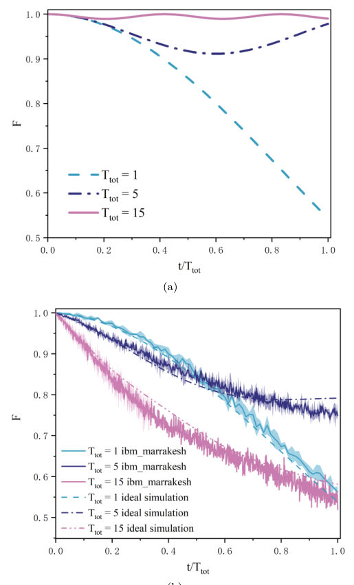
<figcaption class="paper-figure-caption"><b>Fig 1.</b> FIG. 1. (a) Simulated fidelity versus rescaled time t/Ttot for different Ttot without noise. (b) Comparison of adiabatic fidelity between simulation with a comprehensive noise model (including T1, T2 and depolarizing noise) and experimental data on the ibm marrakesh for Ttot = 1, 5, 15. For ibm marrakesh, the curves represent averages over three experimental runs, and the shaded regions indicate the error bars.</figcaption>
</figure>
<figure class="paper-figure-card">
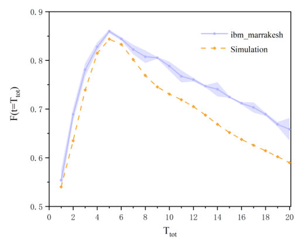
<figcaption class="paper-figure-caption"><b>Fig 2.</b> FIG. 2. Final fidelity F(t = Ttot) versus total evolution time Ttot from the ibm marrakesh processor (averages over three runs; shaded regions indicate error bars) and Qiskit simulations with a comprehensive noise model.</figcaption>
</figure>
<figure class="paper-figure-card">
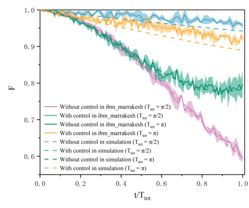
<figcaption class="paper-figure-caption"><b>Fig 3.</b> FIG. 3. Fidelity F versus rescaled time t/Ttot for simulations with a comprehensive noise model and the ibm marrakesh processor, at Ttot = π/2 and π, both with and without LEO control. For ibm marrakesh, curves are averages over three runs, shaded regions denote error bars.</figcaption>
</figure>
<figure class="paper-figure-card">
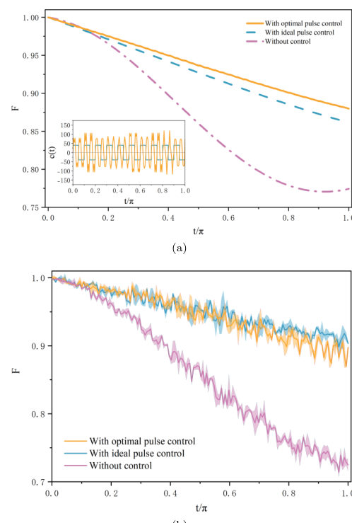
<figcaption class="paper-figure-caption"><b>Fig 4.</b> FIG. 4. (a) Simulated fidelity F versus t/π without control, with ideal pulse control, and optimized pulse control. Inset shows the corresponding ideal and optimized LEO pulse sequences. (b) Fidelity F versus t/π on the ibm marrakesh processor with ideal and optimized LEO pulse control. Curves are averages over three experimental runs; shaded regions are error bars. Ttot = π. For the ideal pulse, I = 40, τ = π/20.</figcaption>
</figure>
<figure class="paper-figure-card">
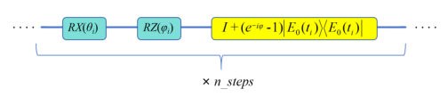
<figcaption class="paper-figure-caption"><b>Fig 5.</b> FIG. 5. Circuit diagram for a single Trotter step with LEO control.</figcaption>
</figure>

**Summary.** This paper demonstrates the feasibility of achieving adiabatic speedup on superconducting quantum processors by employing Leakage Elimination Operator (LEO) control. The authors show that LEO pulses significantly boost fidelity compared to uncontrolled evolution, allowing for faster computation times while mitigating noise effects. The methodology combines theoretical control design with practical optimization techniques like Bayesian optimization, validating the approach on real quantum hardware.

**Why it may be interesting.** This work directly addresses the critical challenge of noise-aware quantum control, providing a concrete, hardware-validated technique (LEO) to accelerate quantum computations beyond the limits imposed by environmental decoherence.

Detailed structure

**Main problem.** The inherent trade-off between achieving adiabatic evolution (requiring infinitely long times) and mitigating environmental noise accumulation on quantum processors.

**Main result.** The work validates that Leakage Elimination Operator (LEO) control can significantly enhance adiabatic fidelity, enabling speedup on superconducting quantum processors, although hardware optimization showed limitations.

**Method.** The authors characterized the noise-adiabaticity trade-off by implementing LEO pulses, refining them via Bayesian optimization, and testing the protocol on both simulation and physical superconducting hardware.

**Model / system.** The study uses superconducting quantum processors (IBM platform) to model adiabatic evolution governed by a time-dependent Hamiltonian $H(t) = H_0(t) + H_{LEO}(t)$. The dynamics are treated as an open quantum system incorporating thermal relaxation, dephasing, and depolarizing noise.

**Key observables.** Adiabatic fidelity ($F$), which is tracked as a function of total evolution time ($T_{tot}$) and rescaled time ($t/T_{tot}$).

**Important parameters / regimes.** Noise parameters ($T_1, T_2$), total evolution time ($T_{tot}$), and the number of Fourier harmonics ($K=10$) used for pulse optimization.

**Assumptions / limitations.** The ideal LEO pulses are derived for closed systems, and the noise model used is a calibrated phenomenological approximation of the actual hardware noise.

**Figures summary.** Figures illustrate the fidelity trade-off vs. time for different control methods (no control vs. LEO control) on the ibm marrakesh processor, showing fidelity peaks at an optimal, finite $T_{tot}$.

**Paper structure.** The paper first establishes the noise-adiabaticity trade-off, then introduces and implements the LEO control, followed by optimizing the control pulse using Bayesian optimization, and finally validating the speedup on superconducting hardware.

Abstract

The slow evolution required for adiabaticity in adiabatic quantum computation renders the system vulnerable to environmental noise. Leakage elimination operator (LEO) control provides an effective strategy to realize adiabatic speedup over a short timescale, thus mitigating the noise impact. Despite extensive theoretical investigations, the realization of LEO-based adiabatic speedup on realistic superconducting quantum processors remains absent. In this work, we present such a realization on IBM superconducting quantum processors. We first characterize the trade-off between adiabaticity and noise accumulation by varying the total evolution time on both the Qiskit simulator and the ibm_marrakesh processor, employing a comprehensive noise model that closely reproduces the experimental results. We then implement ideal LEO pulse derived for a closed system and achieve a significant enhancement of adiabatic fidelity within a short evolution time. To further improve the adiabatic fidelity, we refine the ideal LEO pulse via Bayesian optimization based on the comprehensive noise model. The optimized pulse yields a modest fidelity gain in simulation, yet on hardware it falls short of the ideal pulse under the present experimental conditions. Our work validates the feasibility of LEO-based adiabatic speedup on a superconducting quantum processor and highlights the potential of LEO for noise-aware adiabatic dynamics.

[↑ back to top](#top)

### [Sliding contact creates universal self-affine fractal surfaces](http://arxiv.org/abs/2606.00626v1)

**Authors:** Ruibin Xu, Haohao Ren, Adriane Clerc, Guilhem Mollon, Wenbo Sheng, Feng Zhou, B. N. J. Persson  
**Type:** both · **Category:** statistical mechanics · **PDF:** <https://arxiv.org/pdf/2606.00626v1>  
**Analysis basis:** full PDF text, analyzed in chunks
**Topic relevance:** 🔥 `non-equilibrium universality` **4/5** · `non-equilibrium dynamics` **3/5** · `Frenkel-Kontorova` **1/5** · `driven-dissipative phase transition` **1/5**

↔ Scroll figures horizontally

<figure class="paper-figure-card">
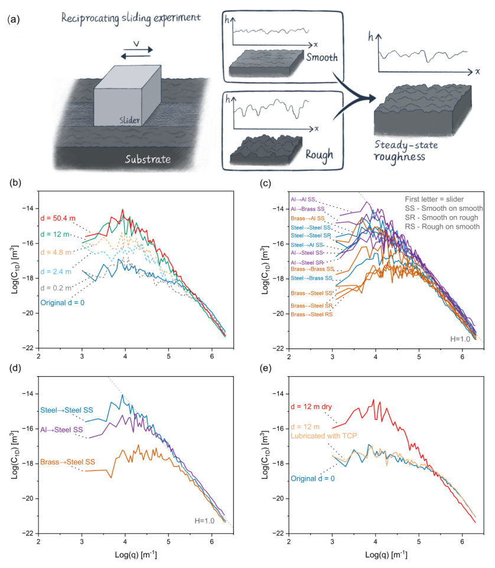
<figcaption class="paper-figure-caption"><b>Fig 1.</b> FIG. 1. Emergence of universal self-affine surface topography during sliding. (a) Schematic of the reciprocating sliding experiment and the resulting topographical evolution. Regardless of the initial roughness, the surfaces evolve toward a common steady state with universal self-affine characteristics. (b) Evolution of the 1D surface roughness PSD C1D(q) for a smooth steel slider sliding on a smooth steel substrate under dry reciprocating conditions. PSDs are computed from height profiles measured along the y direction, perpendicular to the sliding direction. The last two curves (12.0 m and 50.4 m) nearly coincide, indicating that run-in is completed after ∼12 m. The dashed line indicates...</figcaption>
</figure>
<figure class="paper-figure-card">
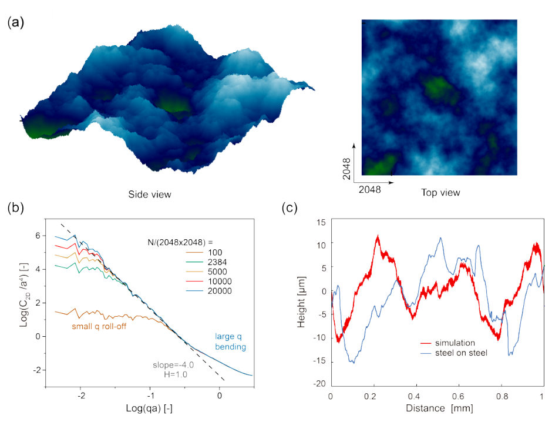
<figcaption class="paper-figure-caption"><b>Fig 2.</b> FIG. 2. Stochastic junction-transfer model reproducing the measured self-affine roughness. (a) A 2048×2048 surface generated after N ≈1011 steps of block addition and removal (left, side view; right, top view). (b) Two-dimensional PSDs of the generated surfaces after N steps, plotted as a function of qa, where q is the wavenumber and a is the block size; the roll-off shifts to smaller q as N increases. (c) Comparison between the line topography of a steel surface after run-in (blue) and a line profile extracted from the simulated surface in (a) (red), showing similar surface features within the measured range.</figcaption>
</figure>
<figure class="paper-figure-card">
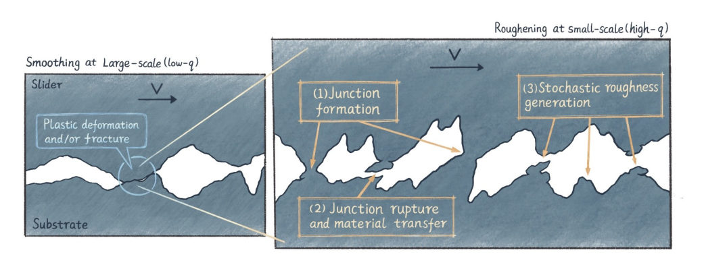
<figcaption class="paper-figure-caption"><b>Fig 3.</b> FIG. 3. Schematic illustration of the two-process mechanism proposed in this study. At large length scales (left), sliding promotes smoothing through plastic deformation and/or fracture of asperities. At small length scales (right), repeated junction formation and rupture drive discrete material-transfer events that generate multiscale roughening and H = 1 regime. The competition between roughening and smoothing defines a roll-off wavenumber qr, which separates the universal short-wavelength regime from the material-dependent long-wavelength morphology.</figcaption>
</figure>

**Summary.** This work investigates how surface roughness evolves during sliding contact, finding that the process exhibits universal self-similar scaling at small scales due to junction dynamics. This roughening is counteracted by a material-specific smoothing mechanism (like plastic deformation), leading to a characteristic roll-off in the surface's power spectrum. The findings establish a quantitative, two-process model for wear and friction.

**Why it may be interesting.** The concept of universal scaling laws emerging from microscopic, non-equilibrium processes (like junction dynamics) that are then arrested by macroscopic material failure mechanisms is relevant to non-equilibrium statistical physics and pattern formation.

Detailed structure

**Main problem.** The paper addresses the fundamental physical rule governing the final, steady-state roughness of surfaces after sliding contact (run-in), a process critical for understanding friction and wear.

**Main result.** The roughness exhibits universal self-affine scaling ($H \approx 1$) at short wavelengths, driven by junction formation/rupture, while a material-dependent roll-off at long wavelengths is set by competing smoothing mechanisms like plastic deformation or fracture.

**Method.** The study combines experimental measurements of surface topography (PSD analysis) with theoretical modeling based on a junction-transfer process.

**Model / system.** The system is a sliding contact between various materials (metals, rocks, glasses). The model posits that roughness evolves via a competition between a universal roughening process (junction dynamics) and a material-specific smoothing process (plasticity/fracture).

**Key observables.** Self-affine roughness characterized by the Hurst exponent ($H$), and the power spectral density (PSD) showing distinct short-wavelength ($H=1$) and long-wavelength (material-dependent roll-off) regimes.

**Important parameters / regimes.** The competition between junction formation/rupture (roughening) and plastic deformation/fracture (smoothing) defines the characteristic roll-off wavenumber ($q_r$).

**Assumptions / limitations.** The roughening mechanism is modeled by the random addition/removal of 'blocks' at microscopic junctions, and the steady state requires an additional smoothing mechanism beyond the junction dynamics to explain the finite roll-off.

**Figures summary.** Figures illustrate the emergence of universal self-affine topography, showing PSDs collapsing onto an $H=1$ regime at short scales, while also demonstrating the suppression of this scaling under boundary lubrication.

**Paper structure.** The paper establishes the physical problem, presents experimental evidence showing universal short-scale scaling, develops a two-process model explaining the competition between junction-driven roughening and material-limited smoothing, and validates this model using simulations.

Abstract

Surface roughness evolves during sliding, a process known as run-in, and the resulting topography controls friction, leakage, and failure from machines to geological faults. Yet the physical rule selecting this state remains unclear. We show that metals, rocks, and glasses develop universal self-similar roughness at short wavelengths, while retaining a material-dependent roll-off. A two-process model explains this behavior: junction formation and rupture drive universal roughening, whereas larger-scale deformation and/or fracture limit its growth.

[↑ back to top](#top)

### [Spatial and particle-particle entanglement in 1D quantum walks of two distinguishable or indistinguishable bosonic particles](http://arxiv.org/abs/2606.02505v1)

**Authors:** Christopher Mastandrea, Chih-Chun Chien  
**Type:** theory · **Category:** other · **PDF:** <https://arxiv.org/pdf/2606.02505v1>  
**Analysis basis:** full PDF text, analyzed in chunks
**Topic relevance:** 🔥 `entanglement & information structure` **4/5** · `analog quantum simulation` **3/5** · `non-equilibrium dynamics` **2/5**

↔ Scroll figures horizontally

<figure class="paper-figure-card">
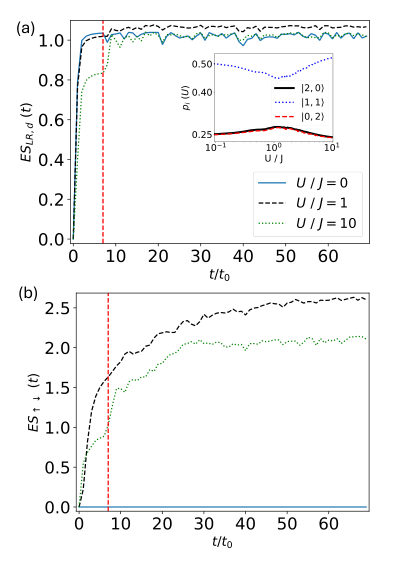
<figcaption class="paper-figure-caption"><b>Fig 1.</b> FIG. 1. (a) Left-right and (b) ↑, ↓entanglement measures for two distinguishable particles on a L = 70 lattice with the separable initial state of Eq. (8). The inset of (a) shows the probabilities of the |nL, nR⟩coarse-grained states taken at t/t0 = 20 for 0 &lt; U/J ≤10. In both figures, the red dashed vertical line indicates the time when the particles reach the boundary and reflect off.</figcaption>
</figure>
<figure class="paper-figure-card">
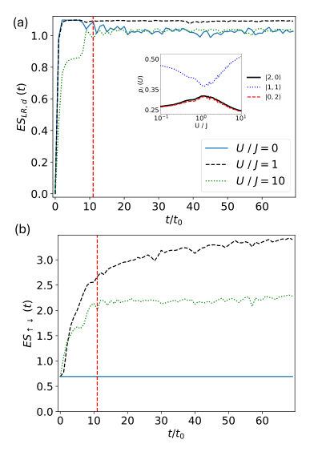
<figcaption class="paper-figure-caption"><b>Fig 2.</b> FIG. 2. (a) Left-right and (b) ↑, ↓entanglement measures for two distinguishable particles on a L = 70 lattice. The initial state is taken as the entangled state shown in Eq. (9). The inset in panel (a) shows the probabilities for the corse-grained states for 0 ≤U/t ≤10 taken at t/t0 = 20. For both panels, the red dashed vertical line indicates the time step at which the particles contact the boundary and reflect off.</figcaption>
</figure>
<figure class="paper-figure-card">
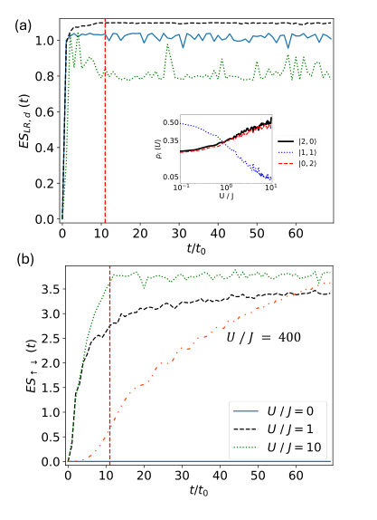
<figcaption class="paper-figure-caption"><b>Fig 3.</b> FIG. 3. (a) Left-right and (b) ↑, ↓entanglement measures for two distinguishable particles on a L = 70 lattice. The initial state is the doubly occupied state shown in Eq. (10). The inset in panel (a) shows the probabilities for the corse- grained states for onsite repulsion values 0 ≤U/J ≤10 taken at t/t0 = 20. The red dashed line indicates the time when the particles first contact the boundary and reflect off. The orange dash-dotted line in panel (b) shows the case of a high onsite repulsion (U/J = 400).</figcaption>
</figure>
<figure class="paper-figure-card">
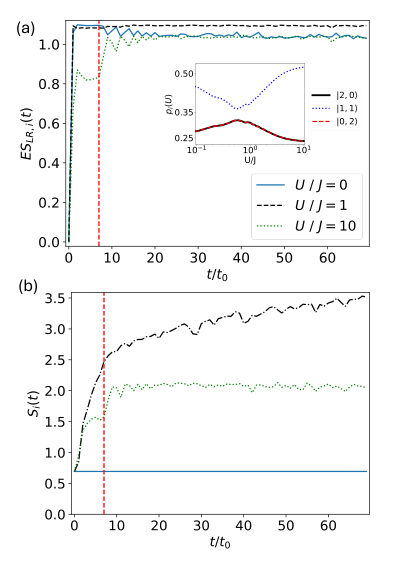
<figcaption class="paper-figure-caption"><b>Fig 4.</b> FIG. 4. (a) Left-right and (b) particle-particle correlation measures for two indistinguishable particles in a lattice of size L = 70. The initial state is taken as the adjacent, singly occupied state given in Eq. (11). For both panels, the vertical red dashed line indicates the time step where the particles first reach the lattice boundary. The inset in panel (a) shows the probabilities for the corse-grained states for onsite repulsion values 0 ≤U/J ≤10 taken at t/t0 = 20.</figcaption>
</figure>
<figure class="paper-figure-card">
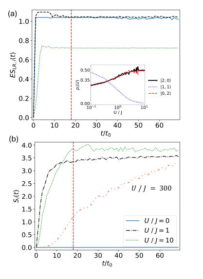
<figcaption class="paper-figure-caption"><b>Fig 5.</b> FIG. 5. (a) Left-right and (b) particle-particle correlation measures for two indistinguishable particles in a lattice of size L = 70. The initial state is taken as the doubly occupied state of Eq. (12). The red dashed line indicates the time at which the particles first reach the boundary and reflect off. The inset in panel (a) shows the probabilities for the corse- grained states for onsite repulsion values 0 ≤U/t ≤10 taken at t/t0 = 20. The orange dash-dotted line in panel (b) shows the case of a high onsite repulsion (U/J = 300).</figcaption>
</figure>

**Summary.** This paper analyzes the spatial and particle-particle entanglement in 1D quantum walks of two bosonic particles, comparing results for distinguishable and indistinguishable cases. Using various entanglement measures, the authors show that entanglement dynamics are highly sensitive to the onsite repulsion strength ($U/J$) and the initial state preparation. The findings highlight the general applicability of certain entanglement measures across particle statistics.

**Why it may be interesting.** This work provides a detailed quantitative comparison of entanglement dynamics in bosonic quantum walks, offering insights into how particle indistinguishability affects entanglement measures, which is crucial for understanding quantum simulation fidelity in many-body systems.

Detailed structure

**Main problem.** The paper investigates the spatial and particle-particle entanglement dynamics in one-dimensional quantum walks involving two bosonic particles.

**Main result.** The entanglement measures exhibit non-monotonic behavior as the onsite repulsion ($U/J$) increases, and the left-right entanglement measure proves robustly applicable to both distinguishable and indistinguishable particle cases.

**Method.** The study employs exact time evolution calculations using the time-evolution operator and calculates entanglement using measures derived from the entropy of coarse-grained states and singular value decompositions (SVD) of the Fock state coefficients.

**Model / system.** The system models two bosonic particles undergoing continuous-time quantum walks on a 1D lattice, governed by a Hamiltonian related to the Bose-Hubbard model. The analysis compares results for distinguishable and indistinguishable particles.

**Key observables.** Left-right entanglement entropy ($E_{SLR}$), particle-particle entanglement (based on SVD of Fock state coefficients), and time-evolved occupation numbers $\langle n(x) 
angle$.

**Important parameters / regimes.** Onsite repulsion ratio ($U/J$), initial state type (separable, entangled, doubly occupied), and lattice size ($L=70$).

**Assumptions / limitations.** The analysis focuses on two-particle systems to manage computational complexity, and the left-right entanglement measure is shown to be a generalizable tool for both particle types.

**Figures summary.** Figures illustrate the time evolution of entanglement measures (Left-right and $\uparrow, \downarrow$) for various initial states and varying $U/J$ ratios for both distinguishable and indistinguishable particles, alongside plots of occupation number dynamics.

**Paper structure.** The paper systematically introduces the physical model and Hamiltonian, defines multiple entanglement measures for both particle types, and then analyzes the time evolution and dependence of these measures on initial conditions and the onsite repulsion strength ($U/J$).

Abstract

We present entanglement measures between spatially separated regions and between two distinguishable or indistinguishable particles in one-dimensional two-particle continuous-time quantum walks governed by the Hubbard Hamiltonian. The left-right entanglement checks the entropy of coarse-grained states counting the numbers of particles on the left and right halves of the lattice while the particle-particle entanglement is based on the entropy of the singular values of the time-evolved Fock state. With separable, entangled, and doubly occupied initial states, we examine initial entanglement and the following growth in different entanglement measures. While the entanglement measures of the indistinguishable cases resemble those of the distinguishable cases when the initial states are comparable, the long-time limits of the entanglement measures are typically non-monotonic as the onsite repulsion increases. We also discuss possible implications for future research of entanglement in multi-particle quantum dynamics.

[↑ back to top](#top)

### [Magneto-optical characterization of GeSn and GeSn/SiGeSn heterostructures](http://arxiv.org/abs/2606.01524v1)

**Authors:** Mehdi Ashrafganjoie, Kelvin Dsouza, Prithu Bhatnagar, Khalid Hossain, Mangal Dhoubhadel, Preston Webster, Simone Assali, Patrick Daoust, Oussama Moutanabbir, Shui-Qing Yu, Daryoosh Vashaee, Demitry Farfurnik  
**Type:** experiment · **Category:** quantum information and computing · **PDF:** <https://arxiv.org/pdf/2606.01524v1>  
**Analysis basis:** full PDF text, analyzed in chunks
**Topic relevance:** 🔥 `QC/QI experiment` **4/5** · `spintronics-quantum-optics interface` **3/5** · `exotic spin models in light-matter` **1/5**

↔ Scroll figures horizontally

<figure class="paper-figure-card">
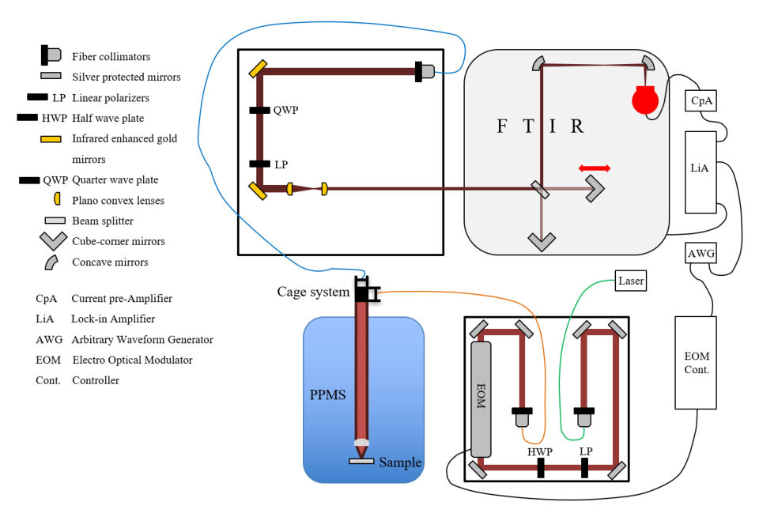
<figcaption class="paper-figure-caption"><b>Fig 1.</b> FIG. 1. The schematic of our magneto-optical characterization setup based on a DM of an FTIR spectrometer in a rapid scan mode; FTIR: Fourier Transform Infra-Red spectrometer, PPMS: Physical Properties Measurement System.</figcaption>
</figure>
<figure class="paper-figure-card">
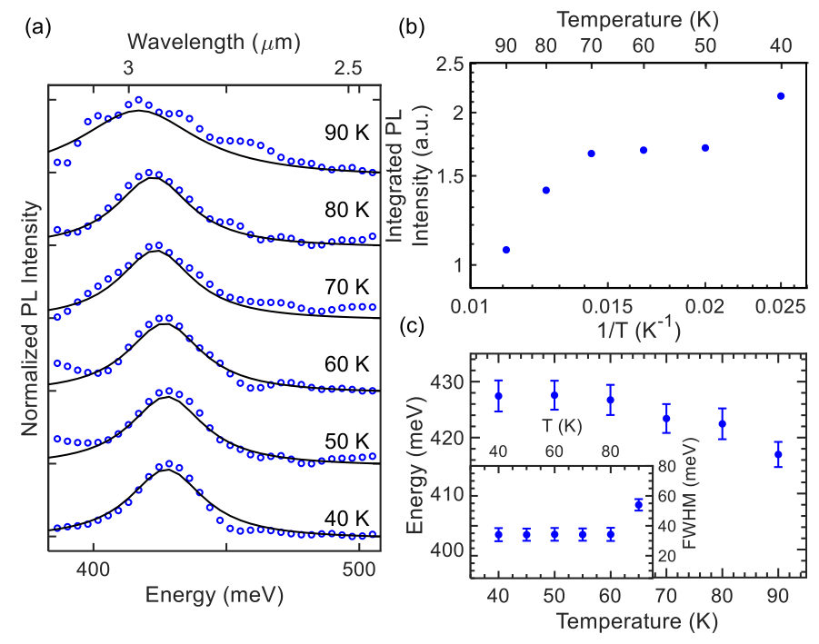
<figcaption class="paper-figure-caption"><b>Fig 2.</b> FIG. 2. The temperature-dependent PL spectra from bulk Ge0.852Sn0.148 using DM rapid-scan FTIR-based spectroscopy. (a) The normalized spectra at the temperature range 40-90 K (circles) and the fitted Lorentzian line shapes (solid lines). (b) The integrated PL intensity as a function of temperature. The decreasing intensity with temperature is consistent with thermally activated nonradiative quenching commonly observed in direct-gap GeSn. (c) The energy of the peak PL and FWHM (inset) extracted from the Lorentzian fits in (a) as a function of temperature exhibits a red shift expected in direct bandgap semiconductors and the constant FWHM (except for 90 K due to poor SNR) indicates thermal...</figcaption>
</figure>
<figure class="paper-figure-card">
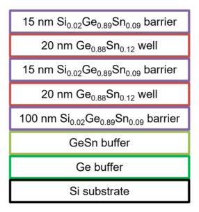
<figcaption class="paper-figure-caption"><b>Fig 3.</b> FIG. 3. The schematic of the double quantum well heterostructure.</figcaption>
</figure>
<figure class="paper-figure-card">
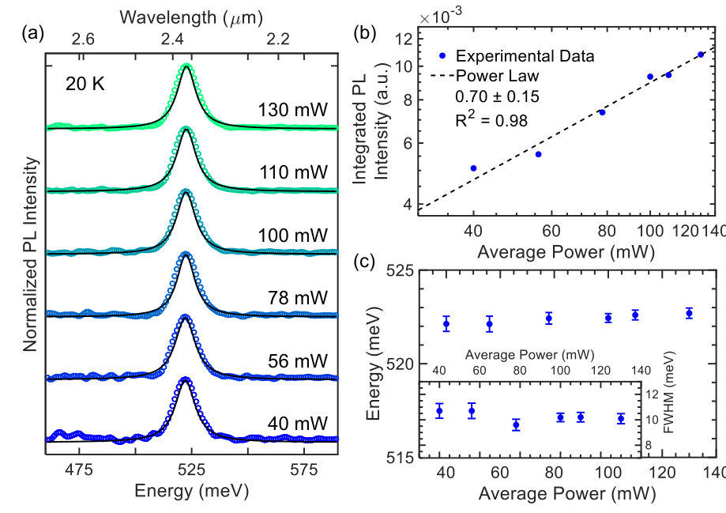
<figcaption class="paper-figure-caption"><b>Fig 4.</b> FIG. 4. PL emission from the DQW sample as a function of the excitation laser power at 20 K. (a)The normalized spectra at different excitation powers (circles), fitted to Lorentzian functions (solid lines). (b) The integrated PL intensity as a function of the laser power exhibits no saturation. (c) The photon energy as a function of the laser power. The negligible change of energy implies the lack of band structure renormalization. Inset: The FWHM as a function of the laser power. The unchanged linewidths suggest that the effect of laser broadening is negligible.</figcaption>
</figure>
<figure class="paper-figure-card">
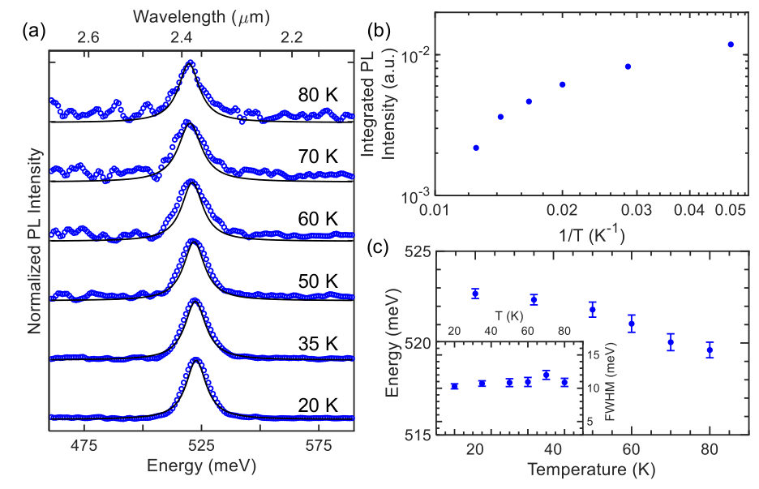
<figcaption class="paper-figure-caption"><b>Fig 5.</b> FIG. 5. (a) The normalized temperature-dependent PL spectra from DQW under study (circles) and fit to Lorentzian functions (solid lines) demonstrate an SNR reduction as the temperature increases. (b) The extracted integrated PL intensity as a function of temperature. The decreasing trend with temperature is consistent with the reduction in radiative recombination consistent with direct bandgap materials. (c) Photoluminescence peak energy as a function of temperature exhibiting a minimal redshift (~ 3 meV over 60 K) with increasing temperature. Inset: FWHM as a function of temperature. The constant values indicate that broadening is not dominated by thermal phonons.</figcaption>
</figure>

**Summary.** This work characterizes the magneto-optical properties of GeSn/SiGeSn quantum well heterostructures using advanced PL spectroscopy. By measuring shifts in photon energy under applied magnetic fields, the authors confirmed key parameters like the effective g-factor and excitonic mass. This research validates the material platform for developing scalable hole spin qubits for quantum information processing.

**Why it may be interesting.** The direct measurement of the effective g-factor and confirmation of spin-orbit coupling in a solid-state semiconductor platform directly addresses the requirements for realizing controllable spin qubits.

Detailed structure

**Main problem.** The study aims to characterize the magneto-optical properties of GeSn and GeSn/SiGeSn heterostructures to advance their use as platforms for hole spin qubits.

**Main result.** The measurements successfully confirmed theoretically expected magneto-optical effects, including diamagnetic shifts, Landau quantization, and Zeeman splitting, yielding an effective g-factor of ~2.

**Method.** Magneto-photoluminescence (PL) spectroscopy was performed using double modulation Fourier transform infrared-based techniques on double quantum well heterostructures.

**Model / system.** The physical system is a GeSn/SiGeSn double quantum well heterostructure, which utilizes the direct bandgap potential of GeSn to host hole spin qubits for quantum information processing.

**Key observables.** PL intensity, photon energy dependence on temperature and magnetic field, diamagnetic shift, Landau quantization, and Zeeman splitting.

**Important parameters / regimes.** Effective g-factor (~2), excitonic reduced mass (~0.04 me), and exciton binding energy (calculated).

**Assumptions / limitations.** The analysis assumes that the observed Zeeman splitting confirms strong spin-orbit interaction, enabling electrically driven spin control.

**Figures summary.** Figures illustrate temperature-dependent PL spectra, plots showing PL intensity and photon energy vs. temperature, and polarization-angle resolved PL spectra fitted to oscillatory functions under applied magnetic fields.

**Paper structure.** The paper follows a structure of initial characterization (temperature/power dependence) leading to detailed magneto-optical measurements (low and high magnetic fields) to extract fundamental parameters like the g-factor and exciton mass.

Abstract

Hole spin qubits in germanium (Ge)-based heterostructures have demonstrated their potential for scalable quantum information processing using all-electrical gate operations. Furthermore, the emerging material platform of germanium-tin (GeSn) can feature a direct bandgap, which makes it promising for establishing spin-photon interfaces for quantum networking. Here, we perform magneto-photoluminescence measurements of a Ge0.88Sn0.12/Si0.02Ge0.89Sn0.09 double quantum well using the double modulation Fourier transform infrared-based photoluminescence spectroscopy. Our measurements reveal theoretically expected diamagnetic shift at low magnetic fields as well as the linear trend of zeroth-level Landau quantization at higher fields and Zeeman-induced polarization-dependent energy shifts at +/- 12 T. We extract an effective g-factor of ~ 2 and an excitonic reduced mass of ~ 0.04 me consistent with previous estimations for heavy-hole Γ-valley excitons. The observation of sizable Zeeman splitting is consistent with strong spin-orbit interaction in Ge-based hole systems, which can enable electrically driven spin control. Our analysis can be adopted for studying and evaluating group-IV semiconductor heterostructures as hosts for hole spin qubits toward scalable quantum information processing.

[↑ back to top](#top)

### [Thouless Pumping of Large Chern Numbers in Optical Floquet Quasicrystals](http://arxiv.org/abs/2606.02489v1)

**Authors:** Shien Wan, Zecheng Li, Bo Song  
**Type:** theory · **Category:** other · **PDF:** <https://arxiv.org/pdf/2606.02489v1>  
**Analysis basis:** full PDF text, analyzed in chunks
**Topic relevance:** 🔥 `analog quantum simulation` **4/5** · `non-equilibrium dynamics` **3/5** · `methods for driven-dissipative` **1/5**

↔ Scroll figures horizontally

<figure class="paper-figure-card">
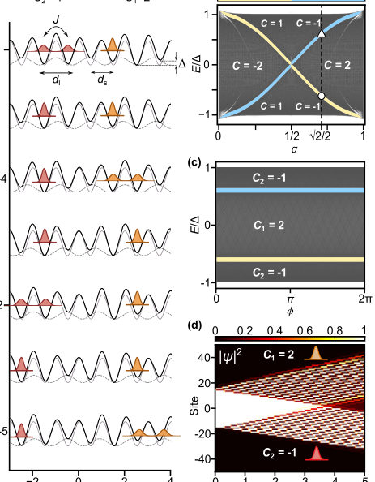
<figcaption class="paper-figure-caption"><b>Fig 1.</b> FIG. 1. Thouless pumping in an optical quasicrystal and corresponding topological quasienergy spectra. (a) Optical quasicrystal (black solid line) is created by su- perimposing two lattices (gray dashed and solid lines) with periodicities dl, ds = α dl and phase difference ϕ. Here α is set to √</figcaption>
</figure>
<figure class="paper-figure-card">

<figcaption class="paper-figure-caption"><b>Fig 2.</b> Fig. 1 shows atoms Thouless pumped by linearly mod- ulating the phase ϕ which can be experimentally realized by an optical moving lattice with cold atoms [34, 35]. Atoms initially located at different energy belts are pumped into different directions with different speeds, which is associated with corresponding Chern num-</figcaption>
</figure>
<figure class="paper-figure-card">
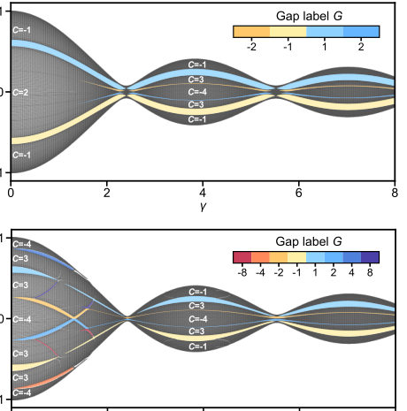
<figcaption class="paper-figure-caption"><b>Fig 3.</b> FIG. 2. Topological spectra in Floquet quasicrystals. (a) For off-resonant modulation at ω ≈1.26, three belts with Chern numbers C = −1, 2, −1 are separated by two dominant gaps with labels G = −1 and +1 and gap widths close to 2J. As γ approaches the zeros of J0, additional gaps with labels G = −2 and +2 emerge and the overall bandwidth is reduced to be comparable to J. (b) For resonant modulation at ω = 0.3, more Chern numbers emerge with additional arc- like gaps, as ω is comparable to the spectral bandwidth and can couple neighboring sites with energy difference nω. As J0(γ) approaches zero, these gaps merge, while their widths scale with the nth-order Floquet coupling, proportional to...</figcaption>
</figure>
<figure class="paper-figure-card">
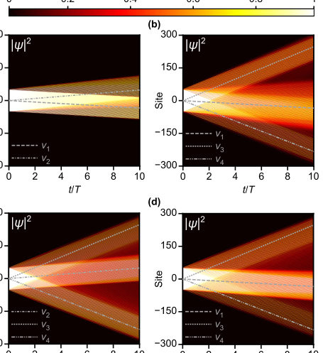
<figcaption class="paper-figure-caption"><b>Fig 4.</b> FIG. 3. Thouless pumping in Floquet quasicrystals. (a) Pumping in the off-resonant Floquet regime at γ &lt; 1. Slow velocities v1 and v2 associated with G = ±1 gaps are similar to the unmodulated quasicrystal. (b) Pumping in the off-resonant Floquet regime at γ ≈5. Larger velocities v3 and v4 associated with G = ±2 gaps emerge alongside v1 from the original G = ±1 gaps. (c) Pumping in the resonant Floquet regime at γ &lt; 1. Floquet driving opens more gaps and induces fast pumping with velocities v3 and v4. A residual v2 branch appears due to incomplete semi-adiabatic separation in the dense gap structure. (d) Pumping in the resonant Floquet regime at γ ≈5. Similar to the off-resonance case, but...</figcaption>
</figure>
<figure class="paper-figure-card">
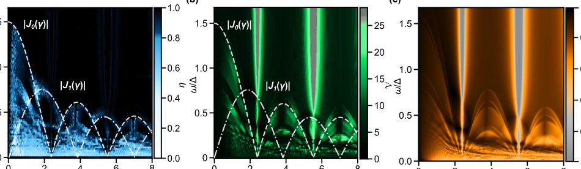
<figcaption class="paper-figure-caption"><b>Fig 5.</b> FIG. 4. Topological transport features in Floquet quasicrystals under different driving. (a) In the off-resonant regime, diffusion exponent η is generally close to 1, as the dynamics is similar to pumping in unmodulated quasicrystals or dominated by strong expansion near the zeros of J0(γ). In the resonant regime, the emergence of many smaller gaps breaks the semi-adiabatic condition, leading to η &lt; 1. This sublinear region is mainly below the |J0(γ)| envelope associated with the lowest-order Floquet coupling. (b) In the resonant regime, multiple fast velocities V reflect large Chern numbers, of which envelopes are proportional to |J0(γ)| with different coefficients (dashed line). The light...</figcaption>
</figure>

**Summary.** This paper details a method to engineer and measure large Chern numbers in optical Floquet quasicrystals using cold atoms. By analyzing the quasienergy spectrum and performing Thouless pumping measurements, the authors demonstrate that the transport properties are directly governed by the system's topological invariants. This opens new avenues for realizing and studying complex topological phases in controllable quantum simulators.

**Why it may be interesting.** This work directly bridges the concepts of topological invariants (Chern numbers) with controllable quantum simulation platforms (cold atoms in optical lattices) using time-periodic driving, which is a major focus in modern AMO physics.

Detailed structure

**Main problem.** The primary goal is to achieve and experimentally probe the realization of large Chern numbers in topological systems using optical Floquet quasicrystals.

**Main result.** The study proposes a scheme where Thouless pumping can directly measure these large Chern numbers, revealing a strong connection between transport features and the quasienergy spectrum.

**Method.** The analysis employs the gap labeling theorem to characterize Chern numbers and uses Thouless pumping measurements to probe the topological properties of the system.

**Model / system.** The system is an optical Floquet quasicrystal realized with cold atoms, modeled by a generalized Aubry-Andr´e-Harper (GAAH) Hamiltonian subjected to time-periodic driving.

**Key observables.** Chern numbers ($C_i$), Thouless pumping current/velocity, quasienergy spectrum, and the Inverse Participation Ratio (IPR).

**Important parameters / regimes.** The analysis explores different Floquet driving regimes, including off-resonant, resonant, and semi-adiabatic regimes, controlled by modulation frequency ($\omega$) and amplitude ($\gamma$).

**Assumptions / limitations.** The analysis relies on the high-frequency approximation for the effective Hamiltonian in the off-resonant regime, and approximations like the tight-binding limit.

**Figures summary.** Figures illustrate Thouless pumping dynamics, the quasienergy spectrum in different regimes (off-resonant vs. resonant), and the dependence of pumping velocities and IPR on modulation parameters.

**Paper structure.** The paper builds from establishing the model (GAAH Hamiltonian) to analyzing the quasienergy spectrum using gap labeling, then connecting this to transport properties via Thouless pumping measurements across various driving regimes.

Abstract

Chern numbers are central to correlated and topological phenomena, yet most topological systems are associated with Chern numbers of order unity. Here we propose a scheme to achieve large Chern numbers in an optical Floquet quasicrystal with cold atoms, which can be directly measured via Thouless pumping. We study the quasienergy spectrum of Floquet quasicrystals and characterize the emergent Chern numbers using gap labeling theorem. We further investigate the Thouless pumping in the Floquet quasicrystal at different driving frequencies and amplitudes, revealing the connection between transport features and the quasienergy spectrum. Our findings open new avenues for exploring rich topological dynamics in Floquet quasicrystals and realizing fractional Chern insulating states.

[↑ back to top](#top)

### [Is Quantum Mechanics Universal? EWF Experiments and Non Absoluteness of Events](http://arxiv.org/abs/2606.01349v1)

**Authors:** Herve Zwirn  
**Type:** theory · **Category:** other · **PDF:** <https://arxiv.org/pdf/2606.01349v1>  
**Analysis basis:** full PDF text, analyzed in chunks
**Topic relevance:** 🔥 `quantum measurements` **4/5** · `measurement-induced transitions` **3/5**

↔ Scroll figures horizontally

<figure class="paper-figure-card">
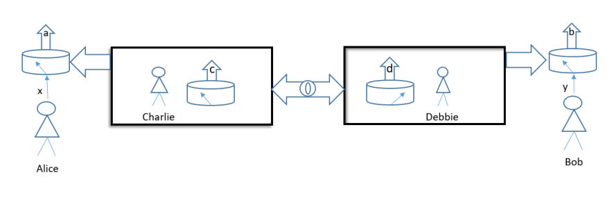
<figcaption class="paper-figure-caption"><b>Fig 1.</b> Figure 1: Charlie and Debbie inside their laboratories measure a pair of entangled particles and get respectively the results noted c and d. Super observers Alice and Bob outside of the laboratories make space-like separated measurements on the laboratories depending respectively on x and y and get results noted a and b.</figcaption>
</figure>
<figure class="paper-figure-card">
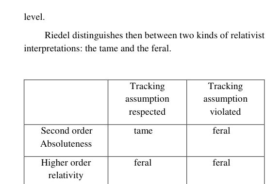
<figcaption class="paper-figure-caption"><b>Fig 2.</b> Fig 2. Tame and Feral quantum relativism</figcaption>
</figure>

**Summary.** This paper tackles the measurement problem by arguing that the conflict between unitary evolution and collapse postulates stems from assuming absolute, observer-independent reality. It proposes Convivial Solipsism, a formal framework asserting that physical events are relative to the observer's perspective. This shifts the foundation of scientific objectivity from shared facts to the internal coherence of individual perspectives.

**Why it may be interesting.** This is highly relevant as it tackles the foundational interpretation of quantum mechanics, which underpins all applications in AMO and quantum information theory by defining what 'measurement' and 'reality' mean in practice.

Detailed structure

**Main problem.** The paper addresses the fundamental conceptual tension in quantum mechanics arising from the measurement problem, specifically the conflict between unitary evolution and the projection postulate.

**Main result.** The authors propose Convivial Solipsism (ConSol) as a framework that preserves quantum universality by asserting that events are not absolute facts, but rather coherent structures within individual perspectives.

**Method.** The analysis employs conceptual structure analysis, comparative taxonomy of quantum interpretations (e.g., QBism, RQM), and the development of a formal logic to model perspectival statements.

**Model / system.** The discussion centers on abstract quantum systems (qubits, general quantum states) and the conceptual framework of observation, using thought experiments like Wigner's friend to test assumptions.

**Key observables.** The state vector ($\psi$), the outcome of measurements (Type-1 elements $	ext{PO}_{ij}$), and the consistency of personal experience.

**Important parameters / regimes.** The distinction between absolute facts and perspectival descriptions; the structural requirements for intersubjectivity.

**Assumptions / limitations.** The core assumption is that scientific objectivity relies on the internal coherence of perspectival structures rather than observer-independent facts.

**Figures summary.** The notes mention a comparative table (Table 1) summarizing how various interpretations address foundational questions regarding reality and state vector status.

**Paper structure.** The paper progresses by first detailing the measurement problem contradiction, then comparing major interpretations via a taxonomy, and finally developing a formal logic (syntax and axioms) for Convivial Solipsism to formalize the non-absoluteness of events.

Abstract

Extended Wigner-type experiments reveal a fundamental tension between the universality of quantum mechanics, the absoluteness of observed events, and the structure of physical reality. While recent no-go theorems suggest that these assumptions cannot be jointly maintained, their interpretation remains unclear. In particular, the claim that events are not absolute is often left at the level of an interpretive slogan, without a precise conceptual formulation. In this paper, we analyse the conceptual structure underlying these results and show that the non-absoluteness of events requires a precise formulation in order to avoid ambiguity. We argue that many existing approaches fail to provide such a formulation, either by implicitly reintroducing observer-independent structure or by leaving key notions underdetermined. Within this framework, Convivial Solipsism offers a coherent and fully articulated account of non-absolute events, preserving the universality of quantum mechanics while avoiding the need for a global viewpoint. We show in particular that this approach resolves the apparent conflict between perspectival outcomes and scientific intersubjectivity. These results suggest that scientific objectivity does not rely on observer-independent facts, but on the internal coherence of perspectival structures.

[↑ back to top](#top)

### [Quantum Signal Processing for Linear PDEs: Circuit Design and Experimental Validation](http://arxiv.org/abs/2606.00368v1)

**Authors:** Hyeongjin Kim, Revathi Jambunathan, Jan Balewski, Daan Camps  
**Type:** both · **Category:** quantum information and computing · **PDF:** <https://arxiv.org/pdf/2606.00368v1>  
**Analysis basis:** full PDF text, analyzed in chunks
**Topic relevance:** 🔥 `QC/QI experiment` **4/5** · `non-equilibrium dynamics` **1/5**

↔ Scroll figures horizontally

<figure class="paper-figure-card">
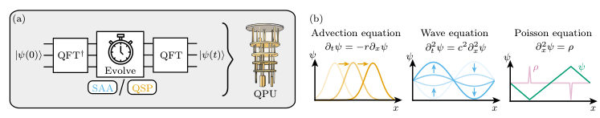
<figcaption class="paper-figure-caption"><b>Fig 1.</b> Fig. 1. (a) Our methodology for running the quantum circuit on a quantum processing unit (QPU) consists of (1) an initial state preparation step to load the state |ψ(x, t = 0)⟩at time t = 0, (2) an inverse quantum Fourier transform (QFT) to transform the problem to frequency space, (3) solve the system in frequency space using small-angle approximation (SAA) or quantum signal processing (QSP), and (4) transforming back to position space using QFT to obtain |ψ(x, t)⟩. This prepares the state |ψ(x, t)⟩at time t. (b) We develop end-to-end implementations for simulating the advection equation (left), wave equation (middle), and Poisson equation (right).</figcaption>
</figure>
<figure class="paper-figure-card">
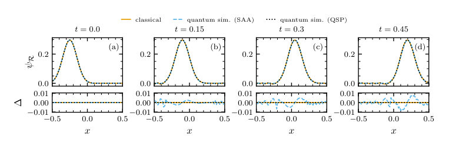
<figcaption class="paper-figure-caption"><b>Fig 2.</b> Fig. 3. Three numerical solutions to the advection equation (3.1) with r = 1 and discretized on 26 = 64 grid points. We solve the advection equation starting with the Gaussian wave-packet (3.10) at times t = 0, 0.15, 0.3, 0.45. The real part of the solution ψR is shown on the top panel. Orange solid lines are obtained from a traditional PDE solver ψclassical R . Blue dashed lines and black dotted lines correspond to the quantum circuit solutions using SAA and QSP, respectively. The bottom panel depicts the difference from the classical solution: ∆= ψR −ψclassical R .</figcaption>
</figure>
<figure class="paper-figure-card">
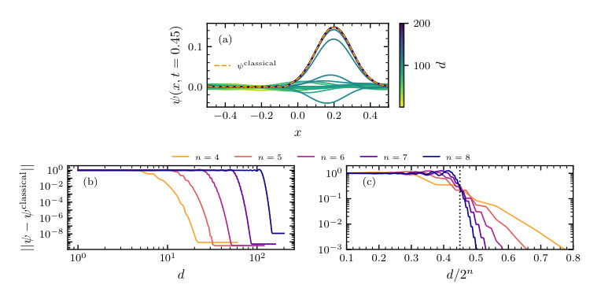
<figcaption class="paper-figure-caption"><b>Fig 3.</b> Fig. 4. Solving the advection equation (3.1) using the Jacobi-Anger expansion (3.9). We initialize with the Gaussian wavepacket (3.10) and compute ψ(x, t = 0.45). (a) We compare the quantum solution ψ(x, t = 0.45) using different truncation orders d against the classical solution ψclassical(x, t = 0.45) (dashed orange line) for n = 8 qubits (N = 28 = 256 grid points). (b,c) We plot ψ −ψclassical against d and d/2n = d/N, respectively, for different n. The dotted black line indicates the scaling crossover d∗/2n = 0.45, aligning with t = 0.45.</figcaption>
</figure>
<figure class="paper-figure-card">
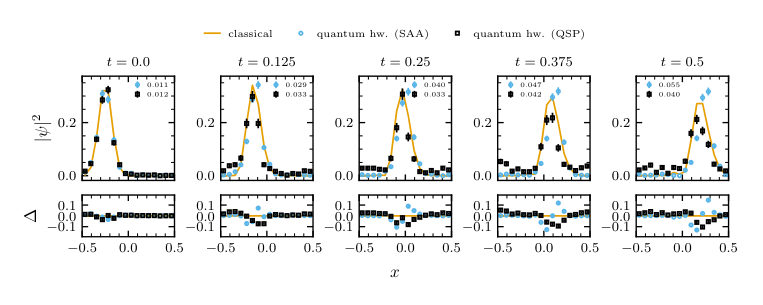
<figcaption class="paper-figure-caption"><b>Fig 4.</b> Fig. 5. IBMQ hardware results for solving the advection equation. We solve the advection equa- tion (3.1) at t = 0, 0.125, 0.25, 0.375, 0.5 on a classical computer (orange solid line) and on quantum hardware (blue dot for SAA (3.6) and black square for QSP with Jacobi-Anger expansion (3.9)). The top panel shows |ψ|2 and the bottom panel shows the error compared to the classical simulation, ∆= |ψ|2 −|ψclassical| 2. For the quantum results, we use IBM’s ibm miami with 1, 000 shots per run. We compute and display the root mean squared error (RMSE) to evaluate the quantum circuit’s overall performance. Parameters used: n = 4 system qubits (n + 1 = 5 total qubits for QSP-based circuits), r = 1,...</figcaption>
</figure>
<figure class="paper-figure-card">
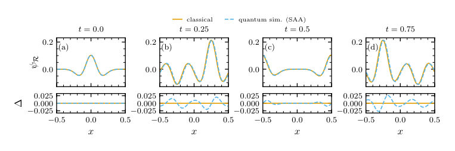
<figcaption class="paper-figure-caption"><b>Fig 5.</b> Fig. 6. Numerical solutions to the wave equation. Here, we initialize ψ(t = 0) with a Ricker wavelet (4.9) and evaluate at different times t. The real part of the solution ψR is plotted on the top panel, while the bottom panel shows the difference from the classical solution. Parameters used: n = 6 qubits and c = 1.</figcaption>
</figure>

**Summary.** This paper presents an end-to-end quantum circuit implementation for solving linear PDEs, including advection, wave, and Poisson equations. By comparing Small-Angle Approximation (SAA) against Quantum Signal Processing (QSP), the authors demonstrate that QSP offers superior accuracy for simulating these dynamics on NISQ hardware. The methodology is successfully generalized to handle complex non-homogeneous boundary conditions derived from plasma physics simulations.

**Why it may be interesting.** This work provides concrete, implementable quantum circuits for simulating fundamental physical dynamics (PDEs), directly bridging theoretical quantum algorithms with measurable results on near-term quantum hardware.

Detailed structure

**Main problem.** Developing and benchmarking end-to-end quantum algorithms for solving linear Partial Differential Equations (PDEs) like advection, wave, and Poisson equations.

**Main result.** The Quantum Signal Processing (QSP) augmented algorithm was experimentally shown to provide more accurate solutions than the Small-Angle Approximation (SAA) method under realistic NISQ hardware constraints.

**Method.** The approach involves transforming PDEs into the frequency domain using the Quantum Fourier Transform (QFT) and then implementing the time evolution operator using either SAA or the more robust QSP polynomial approximation.

**Model / system.** The study focuses on three linear PDEs: advection, wave, and Poisson equations. The implementation is benchmarked on numerical simulations and actual IBMQ quantum hardware, utilizing techniques like odd extension for boundary conditions.

**Key observables.** The state $|\psi(x, t)
angle$ at time $t$, the difference ($\Delta$) between quantum and classical solutions, and the Root Mean Squared Error (RMSE).

**Important parameters / regimes.** Time ($t$), system size ($N$), and the truncation degree ($d$) used in the QSP approximation.

**Assumptions / limitations.** The SAA method suffers from uncontrollable approximation error, while the QSP method requires post-selection for the Poisson solver, leading to very low success probabilities on current hardware.

**Figures summary.** Figures compare classical, SAA, and QSP quantum simulations for the advection equation, showing QSP's superior convergence. Other figures illustrate the circuit construction and the application to the Poisson equation with plasma source terms.

**Paper structure.** The paper introduces the quantum simulation workflow (QFT $
ightarrow$ Solve in Frequency Space $
ightarrow$ Inverse QFT). It details the comparison between SAA and QSP for the advection equation, then extends the methodology to solve the Poisson equation with non-homogeneous Dirichlet boundary conditions, culminating in hardware benchmarking.

Abstract

Quantum algorithms offer new avenues for solving partial differential equations (PDEs). While the potential for end-to-end quantum advantage is at present not well understood, recent literature presents explicit circuit constructions for solving certain classes of linear PDEs in the frequency domain and thus offers concrete examples to study. In this work, we develop end-to-end implementations of these quantum circuits compiled to machine-level instructions and benchmark them in both numerical simulations and IBMQ hardware experiments. We focus on the advection, wave, and Poisson equations and study quantum circuits that propagate the dynamics in frequency space via the quantum Fourier transform using approximate methods based on a first-order approximation which offer compact representations with uncontrollable approximation error, and polynomial approximation methods based on quantum signal processing (QSP) leading to deeper circuits with tunable algorithmic error. In addition, we experimentally demonstrate that the QSP-augmented algorithm can provide accurate solutions under realistic hardware constraints. Finally, we extend our method to address non-homogeneous Dirichlet boundary conditions and verify it numerically for a Poisson equation with source term obtained from high-fidelity physics simulations of a capacitively coupled plasma.

[↑ back to top](#top)

### [Software-based compensation of AC-line-induced control errors in qubits and qudits](http://arxiv.org/abs/2606.00358v1)

**Authors:** Gaurav A. Tathed, Nicholas C. F. Zutt, Collin J. C. Epstein, Crystal Senko  
**Type:** experiment · **Category:** quantum information and computing · **PDF:** <https://arxiv.org/pdf/2606.00358v1>  
**Analysis basis:** full PDF text, analyzed in chunks
**Topic relevance:** 🔥 `QC/QI experiment` **4/5** · `quantum measurements` **1/5**

↔ Scroll figures horizontally

<figure class="paper-figure-card">
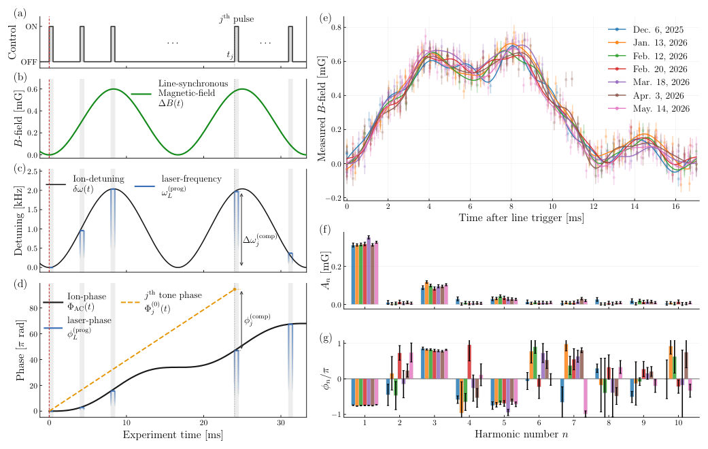
<figcaption class="paper-figure-caption"><b>Fig 1.</b> FIG. 1. Compensation protocol and AC line-synchronous magnetic-field reproducibility. (a) Control sequence starting at the line-trigger time origin. All pulse frequencies and phases are programmed relative to a common waveform start, with pulse j applied at time tj. (b) Example line-synchronous magnetic-field perturbation ∆B(t) (at purely 60 Hz) in the line-trigger- referenced time coordinate. (c) Corresponding transition frequency detuning and programmed laser frequency. For pulse j, the applied frequency offset is chosen to match the instantaneous detuning, ∆ω(comp) j = δω(tj), as indicated by the vertical arrow. (d) Phase accumulated by the qubit, ΦAC(t), due to the line-synchronous...</figcaption>
</figure>
<figure class="paper-figure-card">
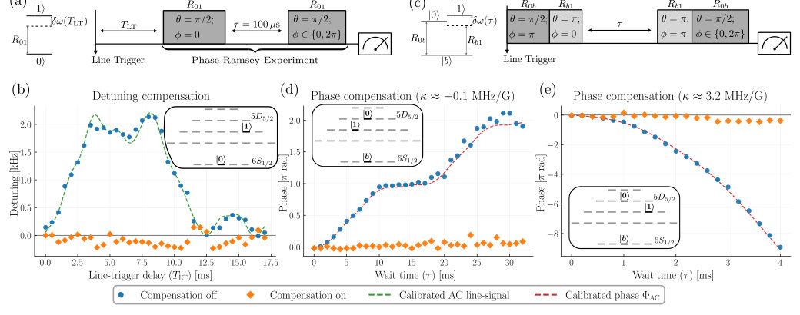
<figcaption class="paper-figure-caption"><b>Fig 2.</b> FIG. 2. Experimental measurement and compensation of AC line-synchronous detuning and phase errors. (a) Pulse sequence used to measure the instantaneous AC line-synchronous detuning. Each shot is synchronized to the line trigger, followed by a variable trigger delay TLT, and then a fixed-time Ramsey experiment. The analyzer phase is varied to extract the transition detuning at the selected trigger delay. (b) Measured detuning versus TLT with compensation disabled and enabled. The trigger delay is scanned over one full period of the line signal to reconstruct the detuning throughout the AC cycle. Without compensation, the fitted detuning follows the calibrated AC line signal, shown by the...</figcaption>
</figure>
<figure class="paper-figure-card">
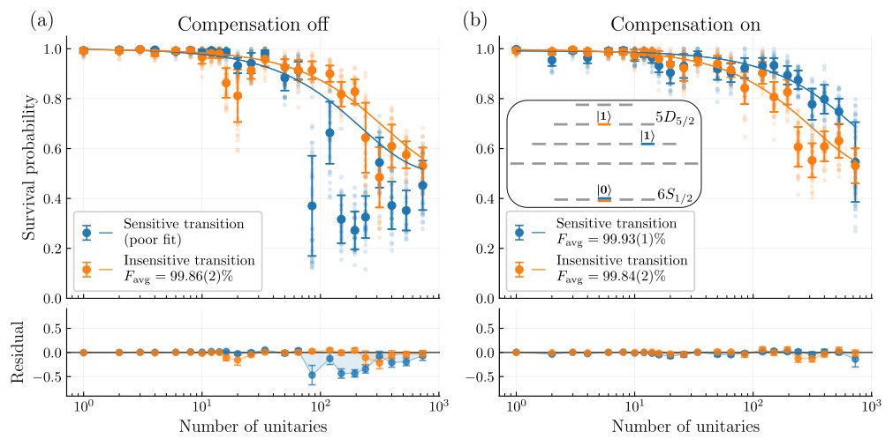
<figcaption class="paper-figure-caption"><b>Fig 3.</b> FIG. 3. Haar-randomized benchmarking of magnetic-field-sensitive and magnetic-field-insensitive optical transitions with and without AC line-synchronous compensation. (a) Randomized benchmarking with compensation disabled. The magnetic- field-sensitive transition, with sensitivity κ ≈3.2 MHz/G, exhibits large sequence-dependent fluctuations and cannot be well described by the zeroth-order randomized-benchmarking decay model, indicating coherent errors from uncompensated line- synchronous detuning during the random sequences. The comparatively magnetic-field-insensitive transition, with sensitivity approximately 40 Hz/G, is less affected and gives a fitted average fidelity of Favg =...</figcaption>
</figure>
<figure class="paper-figure-card">
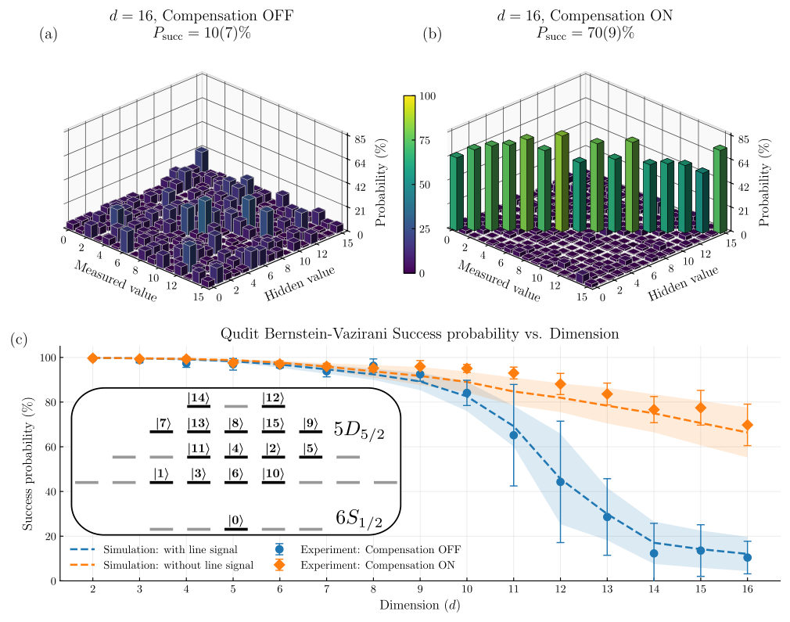
<figcaption class="paper-figure-caption"><b>Fig 4.</b> FIG. 4. Qudit Bernstein–Vazirani algorithm performance with and without line-synchronous compensation. (a) Measured output distribution for a d = 16 qudit Bernstein–Vazirani experiment with AC line-synchronous compensation disabled. The probability is broadly distributed over incorrect measured values, giving an average success probability of Psucc = 10(7)%. (b) Output distribution for the same d = 16 experiment with AC line-synchronous compensation enabled. The population is concentrated along the diagonal, where the measured value equals the hidden value, increasing the success probability to Psucc = 70(9)%. The color scale in panels (a) and (b) denotes the measured probability in...</figcaption>
</figure>

**Summary.** This paper presents a novel, software-only technique to compensate for systematic errors induced by the AC mains power line in trapped-ion quantum computing. By precisely measuring the line-synchronous detuning and phase accumulation, the authors update control pulses to cancel these deterministic errors. This results in substantial improvements in gate fidelity and the successful execution of complex qudit algorithms.

**Why it may be interesting.** This work provides a crucial, non-hardware-intensive method for error mitigation in trapped-ion quantum computing, directly addressing a major source of systematic noise that limits scalability.

Detailed structure

**Main problem.** AC mains power line-synchronous disturbances introduce coherent, time-dependent errors (detuning and phase) into precision quantum control experiments, degrading gate fidelity.

**Main result.** A software-based compensation protocol successfully mitigates these errors, recovering high gate fidelities (99.93%) and significantly boosting the success probability for qudit algorithms (e.g., 10% to 70%).

**Method.** The authors measure the line-synchronous error components (detuning and phase) in a line-triggered frame and update the control pulse sequences accordingly to cancel the deterministic error contribution.

**Model / system.** The experiment uses a trapped $^{137}	ext{Ba}^+$ ion as a quantum system, controlling transitions in both qubit and multilevel qudit regimes. The error is modeled as a time-dependent magnetic-field-induced shift in energy levels.

**Key observables.** Average gate fidelity ($F_{avg}$), success probability ($	ext{P}_{	ext{succ}}$) for algorithms like Bernstein-Vazirani, residual detuning ($\delta\omega(t)$), and accumulated phase ($\Phi_{AC}(t)$).

**Important parameters / regimes.** The compensation reduces the calibrated AC line contribution to detuning by factors up to $21(9)	imes$, and the phase residual by $90	imes$.

**Assumptions / limitations.** The method assumes the noise perturbation is reproducible with respect to the mains electrical phase, allowing for deterministic calibration.

**Figures summary.** Figures illustrate the compensation protocol, showing the required detuning and phase corrections, and compare gate performance (e.g., Randomized Benchmarking decay or qudit success probability) with and without compensation enabled.

**Paper structure.** The paper first identifies the problem of line-synchronous noise, details the measurement of detuning and phase using line-triggered Ramsey sequences, develops the software compensation protocol for both detuning and phase, and finally validates the method by testing gate fidelity via RB and algorithmic performance on qudits.

Abstract

AC mains power line-synchronous disturbances are a common source of coherent, time-dependent error in precision quantum-control experiments. We show that when these disturbances are reproducible with respect to the mains phase, their effect can be measured in a line-triggered frame and compensated through software updates to control sequences. In our system, the disturbances manifest as magnetic-field-induced shifts in the energy level structure of a trapped $^{137}\text{Ba}^+$ ion, resulting in time-dependent detunings between the ion transitions and a local oscillator, as well as additional phases accumulated on superpositions of energy levels. We demonstrate a compensation protocol that corrects for the instantaneous oscillator detuning during control pulses, and for the phase accumulated by the energy levels between pulses. The calibrated AC line contribution to the detuning is reduced by $21(9)\times$, while the fitted AC phase amplitude is reduced below the measurement uncertainty. We then study gate performance on a magnetic-field-sensitive qubit and find that uncompensated mains-synchronous errors produce time-dependent fluctuations that make the usual randomized-benchmarking decay model unreliable. With compensation enabled, these fluctuations are suppressed sufficiently to recover a standard benchmarking decay and extract an average gate fidelity of $99.93(1)\%$. Finally, we extend the framework to multilevel qudit control and apply it to a single-qudit Bernstein-Vazirani algorithm, where AC compensation increases the success probability on a 16-level qudit from $10(7)\%$ to $70(9)\%$. These results show that reproducible line-synchronous noise can be treated as a calibrated control-frame error and corrected without additional hardware.

[↑ back to top](#top)

### [Aharonov-Casher Chern bands for ultracold dark state atoms](http://arxiv.org/abs/2606.00207v1)

**Authors:** Domantas Burba, Dominykas Borodinas, Gediminas Juzeliūnas  
**Type:** theory · **Category:** other · **PDF:** <https://arxiv.org/pdf/2606.00207v1>  
**Analysis basis:** full PDF text, analyzed in chunks
**Topic relevance:** 🔥 `analog quantum simulation` **4/5**

↔ Scroll figures horizontally

<figure class="paper-figure-card">
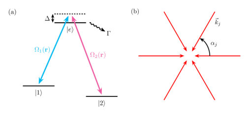
<figcaption class="paper-figure-caption"><b>Fig 1.</b> FIG. 1. a) The Lambda scheme of the atom-light coupling. Laser fields characterized by Rabi frequencies Ω1 and Ω2 cou- ple resonantly (or nearly resonantly with a single photon de- tuning ∆) two atomic ground states |1⟩and |2⟩with a com- mon excited state |e⟩. b) The AC condition can be fulfilled if the Rabi frequency Ω1 represents a superposition of the planes characterized by wave-vectors kj with equal widths |kj| = κ, whereas Ω2 is the corresponding superposition of the plane waves with wave-vectors −kj, and properly chosen amplitudes and phases (see Sec. IV D).</figcaption>
</figure>
<figure class="paper-figure-card">

<figcaption class="paper-figure-caption"><b>Fig 2.</b> FIG. 2. (a) Rabi frequencies Ω1,2 given by Eqs. (40)-(41) together with the total Rabi frequency Ωfor the perfect sit- uation where b = 1 and γ = 0. The arrows show the phase winding of Ω1 around its zero points. (b) The corresponding effective magnetic field for b and γ around b = 1 and γ = 0. Here and in other figures the distance is measured in the units of the lattice constant a = 2π/κ.</figcaption>
</figure>
<figure class="paper-figure-card">
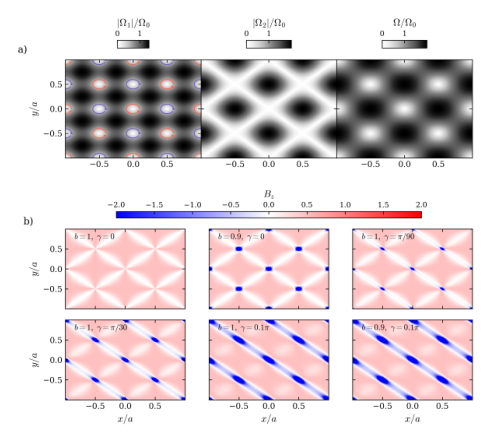
<figcaption class="paper-figure-caption"><b>Fig 3.</b> Figure 2(a) presents the Rabi frequencies given by Eqs. (40)-(41) with the upper sign of ± in Ω1 (r) and beiγ = 1, while Fig. 2(b) plots the corresponding effec- tive magnetic field Bz when beiγ is equal to unity or close to this value. The geometric scalar potential ϕ is related to the effective magnetic field by the AC con- dition (25), so it has not been plotted. For beiγ ̸= 1 and beiγ −1 ≪1, the magnetic field is composed of a smooth positive background magnetic field and nar- row spots of a large negative magnetic field concentrated around the minima of the total Rabi frequency Ω. The latter narrow spots compensate for the background mag- netic field, so that the total magnetic flux...</figcaption>
</figure>
<figure class="paper-figure-card">
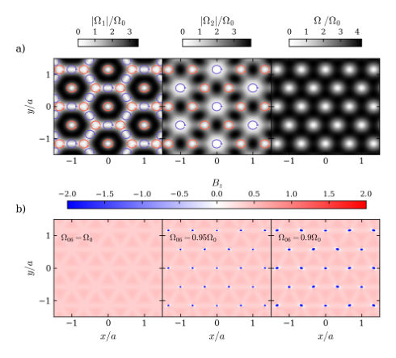
<figcaption class="paper-figure-caption"><b>Fig 4.</b> FIG. 4. (a) Rabi frequencies given by Eqs. (35), (38) and (39) with N = 6 for βj = 0 and Ω0j = Ω0, with j = 1, 2, . . . , 6. The arrows show the phase winding of Ω1 and Ω2 around their zero points. (b) The corresponding magnetic field when Ω0j = Ω0 for j ̸= 3 and Ω03 is close to Ω0.</figcaption>
</figure>
<figure class="paper-figure-card">
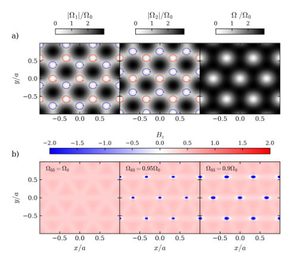
<figcaption class="paper-figure-caption"><b>Fig 5.</b> FIG. 3. (a) Rabi frequencies given by Eqs. (45)-(46) with Ω01 = Ω02 = Ω03 = Ω0. The arrows show the phase winding of Ω1 and Ω2 around their zero points. (b) The corresponding effective magnetic field for Ω01 = Ω02 = Ω0 and the values of Ω03 close to Ω0.</figcaption>
</figure>

**Summary.** This paper explores how to engineer topological flat bands in ultracold atoms by satisfying the Aharonov-Casher condition within a $\Lambda$-type coupling scheme. The authors demonstrate that while ideal conditions yield perfect topology, a specific combination of slight imperfections—deviation from perfect tuning and finite coupling strength—can actually restore the desired perfectly flat, topologically robust lowest energy band. This makes the system a powerful simulator for fractional quantum Hall physics.

**Why it may be interesting.** This work provides a concrete, controllable platform (ultracold atoms) to engineer and observe topological phenomena like Chern insulators, offering a pathway to simulate fractional quantum Hall states in a highly tunable setting.

Detailed structure

**Main problem.** The study investigates the conditions required to realize a perfectly flat, topologically non-trivial energy band (Chern band) for ultracold atoms by adiabatically following the dark state.

**Main result.** A completely flat lowest band with perfect topology can be achieved by combining two imperfections: deviation from perfect fine-tuning and finite atom-light coupling strength.

**Method.** The analysis uses the Aharonov-Casher (AC) condition, relating geometric potentials, and models the Rabi frequencies as superpositions of plane waves to engineer the required effective magnetic field.

**Model / system.** The system involves ultracold atoms in a $\Lambda$-type atom-light coupling scheme, where the dynamics are governed by the dark state manifold derived from the atom-light interaction Hamiltonian.

**Key observables.** Lowest energy band flatness, Chern number, geometric vector potential (A) and scalar potential ($\phi$), and the effective magnetic field ($B_z$).

**Important parameters / regimes.** Rabi frequencies ($\Omega_1, \Omega_2$), lattice parameters ($N=3, 4, 6$), amplitude imbalance ($1-b$), and phase mismatch ($\gamma$).

**Assumptions / limitations.** The analysis relies on the adiabatic approximation, which is valid for sufficiently strong coupling ($\Omega_0 	o \infty$).

**Figures summary.** Figures illustrate the Rabi frequencies and effective magnetic field for different plane wave superpositions ($N=3, 4, 5, 6$), showing the transition from ideal flux quantization to band broadening upon deviation from perfect tuning.

**Paper structure.** The paper establishes the AC condition, derives the necessary structure for Rabi frequencies using plane wave superpositions, analyzes specific cases ($N=3, 4$), and concludes by showing that combined imperfections can restore the ideal flat band topology.

Abstract

We consider the Aharonov-Casher (AC) condition for ultracold atoms adiabatically following the dark-state in a $Λ$-type atom-light coupling scheme. The AC condition establishes a relation between the geometric scalar potential and the synthetic magnetic field, resulting in a fully degenerate lowest Landau-level-like band even if the magnetic field is inhomogeneous but has a proper sign. We derive a general requirement for the atom-light coupling under which the AC condition applies. The requirement holds if the Rabi frequencies of the $Λ$ scheme are the superposition of plane waves with the appropriate amplitudes and phases. In particular, the Rabi frequencies made of $N=3,\,4,\,6$ fine tuned plane waves yield a smooth background magnetic field of definite sign, as well as an array of non-measurable Aharonov-Bohm flux singularities. Departing from the fine tuning, the latter singularities broaden into narrow subwavelength patches of the opposite magnetic field, which broaden the lowest energy band. The lowest band is broadened also for the fine tuned situation due to deviation from the adiabatic approach because of the finite atom-light coupling strength. It is shown that a proper combination of the two imperfections (departure from fine tuning and finite atom-light coupling strength) can lead to a completely flat lowest band, which furthermore is characterized by the perfect topology needed for simulating the fractional Hall states.

[↑ back to top](#top)

### [Individually tunable Si/SiGe quantum dot operating voltages via gate-biased illumination](http://arxiv.org/abs/2606.00446v1)

**Authors:** Jared Benson, Sanghyeok Park, Owen M. Eskandari, M. A. Wolfe, Brighton X. Coe, J. P. Dodson, S. N. Coppersmith, Mark Friesen, M. A. Eriksson  
**Type:** experiment · **Category:** quantum information and computing · **PDF:** <https://arxiv.org/pdf/2606.00446v1>  
**Analysis basis:** full PDF text, analyzed in chunks
**Topic relevance:** 🔥 `QC/QI experiment` **4/5**

↔ Scroll figures horizontally

<figure class="paper-figure-card">
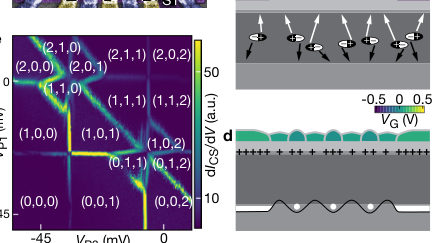
<figcaption class="paper-figure-caption"><b>Fig 1.</b> Figure 1: Gate-biased illumination enables low-voltage operation of quantum dots. a A false-color SEM micrograph of a device that is nominally identical to the one measured here. b-d Cross-sections of the gate stack and upper layers of the Si/Si0.7Ge0.3 heterostructure along the white dashed line in (a) showing the gate-biased illumination process. b Large and non-uniform gate voltages are required to form a triple quantum dot due to fixed oxide charges and interface trapped charges (not shown). c The device is illuminated with a 780 nm laser while its gates are biased with dc voltages. Photo-generated electron-hole pairs (white-black ovals) move to screen the electric fields in the quantum...</figcaption>
</figure>
<figure class="paper-figure-card">
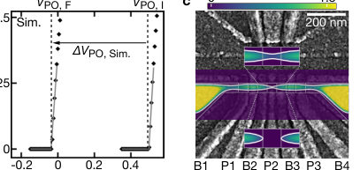
<figcaption class="paper-figure-caption"><b>Fig 2.</b> Figure 2: Characterizing gate-biased illumination by simulating and measuring gate pinch-off voltage shifts. a Experimental pinch-off curves for the P2 plunger gate measured before and after illuminating the device with VP2 = −0.5 V. The pinch-off voltages from each measurement are indicated by the vertical dashed lines and the pinch-off voltage shift is the difference between the initial and final pinch-off voltages. The voltages applied to the gates during this measurement are shown in the inset of (b). b The model used to solve the charge density at the oxide- semiconductor interface during the gate-biased illumination. Here, accumulation occurs in charge-trap states at the interface...</figcaption>
</figure>
<figure class="paper-figure-card">
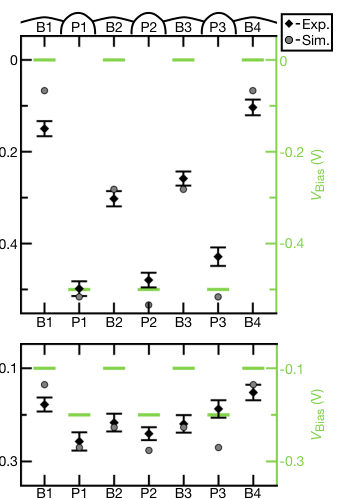
<figcaption class="paper-figure-caption"><b>Fig 3.</b> Figure 3: Experimental (diamonds) and simulated (circles) shifts in pinch-off voltages showing good agreement for the following cases of gate-biased illumination: a case 1, large voltage difference between plunger and barrier gates (−0.5 V P1-P3 and 0 V B1-B4), b case 2, smaller difference in plunger and barrier gate voltages (−0.2 V P1-P3 and −0.1 V B1-B4). For the experimental results, the data points are the mean pinch-off voltage shifts from 11 repetitions of each illumination and the error bars are the standard deviations. The green lines indicate the voltages applied to each gate during the illumination.</figcaption>
</figure>
<figure class="paper-figure-card">
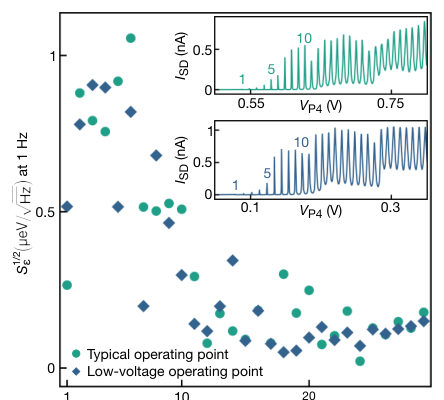
<figcaption class="paper-figure-caption"><b>Fig 4.</b> Figure 4: Charge noise comparison between a typical operating regime and a low-voltage operating regime. Main panel: charge noise S1/2 ε at 1 Hz for each of the first 29 charge sensor Coulomb peaks at a typical device operation point compared to the same peaks in a low-voltage operating regime following a gate-biased illumination. Inset panels: the Coulomb peaks used when measuring the charge noise in each case. More details about the charge noise measurements can be found in the Supporting Information.</figcaption>
</figure>

**Summary.** The authors demonstrate a technique called gate-biased illumination to precisely and repeatably tune the operating voltages of Si/SiGe quantum dot qubits. By trapping charges at the oxide interface using near-infrared light, they can achieve uniform, low-voltage operation across multiple gates without detrimentally affecting the measured charge noise, advancing the scalability of solid-state quantum computing.

**Why it may be interesting.** This work provides a novel, electrically controllable method to engineer the electrostatic environment of solid-state qubits, which is crucial for scaling up quantum processors and minimizing power consumption.

Detailed structure

**Main problem.** Semiconductor quantum dot qubits require significantly different gate voltages on each gate to reach the correct operating point, complicating device tuning and limiting low-power operation.

**Main result.** Gate-biased illumination allows for the controllable and repeatable tuning of operating voltages on a gate-by-gate basis, enabling uniform and small operating voltages without increasing charge noise.

**Method.** The technique involves illuminating the Si/SiGe quantum dot device with near-infrared light while applying specific DC gate voltages, which modifies the trapped charge distribution at the oxide-semiconductor interface.

**Model / system.** The platform is a Si/SiGe quantum dot device patterned on a heterostructure. The mechanism relies on photo-generated electron-hole pairs trapping charges at the oxide-semiconductor interface, which shifts the local electric fields and thus the operating voltages.

**Key observables.** Operating voltages, pinch-off voltages ($V_{PO}$), and charge noise ($S_{1/2}^{\epsilon}$ at 1 Hz).

**Important parameters / regimes.** Near-infrared illumination (e.g., 780 nm laser), gate voltages, and the resulting voltage shifts (e.g., reducing voltage difference from 340 mV to 114 mV).

**Assumptions / limitations.** The trapped charge distribution established during illumination remains 'frozen' in place, and the charge noise measurement is unaffected by this voltage shift.

**Figures summary.** Figures show the device structure, stability diagrams illustrating low-voltage operation after illumination, and comparisons of charge noise spectra before and after tuning.

**Paper structure.** The paper introduces the problem of non-uniform gate voltages, details the gate-biased illumination method, presents experimental measurements of voltage shifts and charge noise, and validates the underlying physics using self-consistent Schrödinger-Poisson simulations.

Abstract

Semiconductor quantum dot qubits often require very different voltages on each gate to bring them to a correct operating point. Here, we present a method by which one can controllably and repeatably alter the nanoscale trapped charge distribution at an oxide-semiconductor interface. We demonstrate this method on a Si/SiGe quantum dot device, and we find that the operating voltages can be controlled and made much more uniform. The method relies on illumination with near-infrared light in the presence of applied gate voltages, and it enables the tuning of the device operating point on a gate-by-gate basis. We present an explanation of the underlying physics using self-consistent Schrödinger-Poisson simulations. As an application of this method, we tune a triple quantum dot to have uniform and small operating voltages in the (1,1,1) charge configuration. Importantly, we show that shifting the operating voltages in this way does not change the measured charge noise.

[↑ back to top](#top)

### [A Mid-Infrared Platform Based on Strontium Tweezer Arrays](http://arxiv.org/abs/2606.02560v1)

**Authors:** Aaron Holman, Ximo Sun, Bojeong Seo, Joshua Corn, Zezheng Zhu, Yuan Xu, Jiahao Wu, Nanfang Yu, Dmytro Filin, Marianna Safronova, Sebastian Will  
**Type:** experiment · **Category:** other · **PDF:** <https://arxiv.org/pdf/2606.02560v1>  
**Analysis basis:** full PDF text, analyzed in chunks
**Topic relevance:** `Dicke superradiance` **3/5** · `analog quantum simulation` **3/5** · `correlated / nonlocal dissipation` **3/5** · `Rydberg arrays` **2/5** · `free-space correlated emission` **2/5** · `quantum optics experiment` **2/5** · `superradiant laser` **2/5** · `QC/QI experiment` **1/5** · `driven-dissipative phase transition` **1/5** · `interference shaping light` **1/5** · `non-equilibrium dynamics` **1/5** · `quantum measurements` **1/5**

↔ Scroll figures horizontally

<figure class="paper-figure-card">
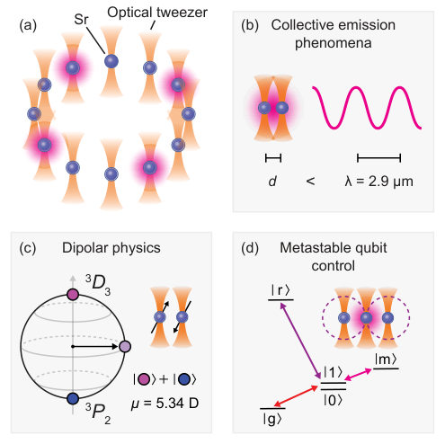
<figcaption class="paper-figure-caption"><b>Fig 1.</b> FIG. 1. Experimental potential of the strontium 2.9 µm transition in atomic tweezer arrays. (a) Optical tweezers, at a magic wave- length for the 2.9 µm transition, allow arrangements of single atoms with programmable geometries. (b) Subwavelength arrays, where the distance d is smaller than the emission wavelength λ, open a path to studying collective emission phenomena. (c) The transition dipole moment of 5.34 Debye can enable new systems with elastic dipole-dipole interactions, realizing effective spin-spin coupling. (d) Coupling of 2.9 µm light to the fine-structure qubit opens novel op- portunities for cooling and quantum state control.</figcaption>
</figure>
<figure class="paper-figure-card">
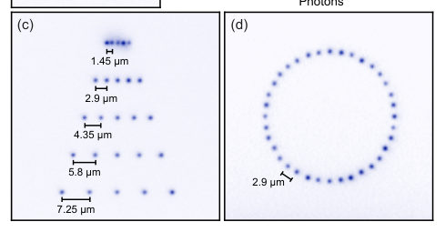
<figcaption class="paper-figure-caption"><b>Fig 2.</b> FIG. 3. Single-atom preparation and imaging in 597 nm tweezers. (a) An averaged image of a 5 × 5 atomic tweezer array with 5 µm spacing. (b) Back-to-back imaging analysis for a typical trap, high- lighted with a red box in panel (a). (c) Averaged fluorescence image of one-dimensional chains with λ/2, λ, 3/2λ, 2λ and 5/2λ spacing. (d) Averaged fluorescence image of a ring-shaped array with 36 sites spaced by λ. Each image in (a), (c), and (d) is an average of 100 individual images without parity projection.</figcaption>
</figure>
<figure class="paper-figure-card">
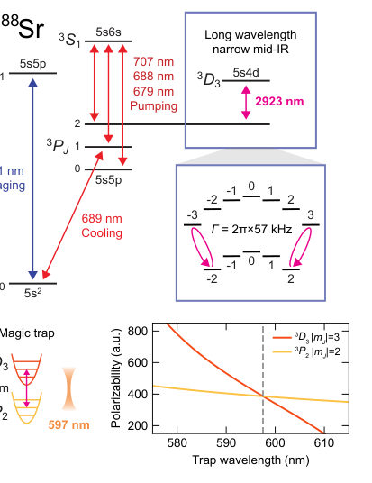
<figcaption class="paper-figure-caption"><b>Fig 3.</b> FIG. 2. Strontium level structure and trapping wavelength. (a) Level diagram of 88Sr and relevant transitions. The mid-infrared 2,923 nm transition from 3P2 to 3D3 is central to this work. The mJ = ±2 →±3 transitions form closed two-level systems. (b) (left) Under magic trapping conditions, the optical tweezer potentials for atoms in the 3P2 and 3D3 states are identical. (right) Theoretical prediction of the polarizability for the mJ = ±2 →±3 transitions, indicating magic conditions at around 597.5 nm.</figcaption>
</figure>
<figure class="paper-figure-card">
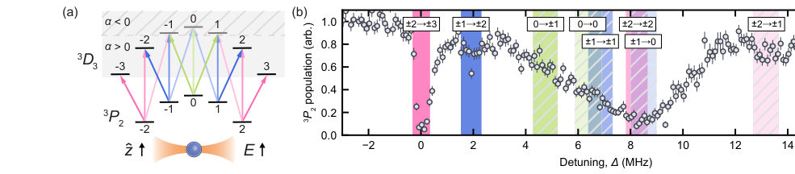
<figcaption class="paper-figure-caption"><b>Fig 4.</b> FIG. 4. Spectroscopy of the 2.9 µm 3P2 →3D3 transition in a Sr tweezer array at 597 nm. (a) An energy level diagram illustrating the shifts induced by 597 nm light on the Zeeman sublevels of the 3P2 and 3D3 manifolds; levels in the solid gray (hatched gray) are trapped (anti- trapped). The tweezer light is linearly polarized. (b) Loss spectrum of tweezer-trapped atoms following illumination with 2.9 µm light. Here, ∆is defined as the detuning relative to the free-space resonance. Vertical color bars indicate the predicted resonance shifts using the same color scheme as in (a); hatched color bars indicate transitions to anti-trapped levels.</figcaption>
</figure>
<figure class="paper-figure-card">
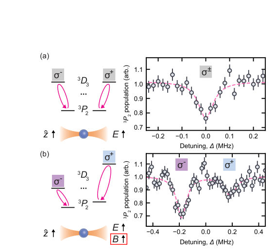
<figcaption class="paper-figure-caption"><b>Fig 5.</b> FIG. 5. Precision spectroscopy of the closed |mJ| = 2 →3 transition. (a) In the absence of a magnetic field, a linewidth of Γ/(2π) = 74(10) kHz is measured, obtained from a Lorentzian fit. (b) In the presence of a magnetic field the previously degenerate transitions mJ = ±2 → ±3 split symmetrically. The splitting is about 0.4 MHz. The mag- netic field is about 0.14(1) G and aligned along the polarization vec- tor of the optical tweezers. The linewidth of the left dip and the right dip are Γ/(2π) = 90(15) and 107(20) kHz, respectively.</figcaption>
</figure>

**Summary.** The research establishes a novel platform using strontium atoms trapped in optical tweezer arrays, specifically engineered to access a mid-infrared transition at 2,923 nm. Key achievements include high-fidelity single-atom trapping and demonstrating resolved-sideband cooling in the metastable state. This platform opens new avenues for studying dipolar many-body physics and quantum control beyond traditional lattice setups.

**Why it may be interesting.** This work significantly expands the accessible physics regime for trapped atoms by utilizing mid-infrared transitions, enabling studies of dipolar interactions and collective effects in flexible, subwavelength geometries.

Detailed structure

**Main problem.** To develop a versatile platform using subwavelength atomic tweezer arrays to study collective emission phenomena, such as superradiance and subradiance, by accessing mid-infrared transitions.

**Main result.** The authors successfully demonstrated single-atom preparation, high-fidelity imaging, and resolved-sideband cooling of trapped strontium atoms using a mid-infrared transition at 2,923 nm.

**Method.** The experiment utilizes optical tweezer arrays generated via holographic metasurfaces to trap strontium atoms, followed by precision spectroscopy and cooling measurements on the mid-IR transition.

**Model / system.** The system involves Strontium atoms trapped in optical tweezer arrays, leveraging a mid-infrared transition ($5s5p~^3P_2 
ightarrow 5s4d~^3D_3$) at 2,923 nm. The trapping is stabilized using a magic wavelength at 597.14 nm.

**Key observables.** Single-atom imaging fidelity (99.7%), cooling temperature ($\approx 14 \mu	ext{K}$ radial), and linewidth measurements ($\Gamma/(2\pi) = 74 \pm 10 	ext{ kHz}$).

**Important parameters / regimes.** Mid-IR transition wavelength (2,923 nm), magic trapping wavelength (597.14 nm), and trap frequencies ($\approx 95 	ext{ kHz}$).

**Assumptions / limitations.** The model for temperature extraction assumes the axial temperature remains constant during radial cooling measurements.

**Figures summary.** Figures illustrate the potential of the 2.9 $\mu$m transition for subwavelength arrays and qubit control; spectroscopy shows level structure and magnetic field effects; and cooling figures compare uncooled vs. cooled recapture probabilities.

**Paper structure.** The paper details the platform realization using metasurfaces, followed by single-atom preparation and imaging; then, it presents precision spectroscopy of the mid-IR transition; finally, it demonstrates resolved-sideband cooling using time-of-flight measurements.

Abstract

Subwavelength atomic tweezer arrays, in which atoms can be positioned at distances smaller than their emission wavelength, have been proposed as a versatile platform to study collective emission phenomena, such as superradiance and subradiance. Experimentally, the realization of such arrays has been a challenge as typical emission wavelengths in the visible or near-infrared are short compared to typical tweezer spacings in the micrometer range. Here, we use $^{88}$Sr atoms in optical tweezer arrays to access a mid-infrared transition at 2,923 nm ($5s5p\:^{3}P_{2} \rightarrow\, 5s4d\:^{3}D_{3}$). We identify a magic trapping wavelength at 597.14(3) nm and demonstrate single-atom preparation and imaging with high fidelity. In addition, using 2,923 nm light, we demonstrate resolved-sideband cooling of tweezer-trapped strontium. Beyond enabling studies of collective emission phenomena in flexible arrangements of atoms, our platform opens novel opportunities for dipolar many-body physics and enhanced control over Rydberg dynamics and the strontium fine-structure qubit.

[↑ back to top](#top)

### [Vibrational resonance in a one-dimensional dissipative Bose-Josephson junction](http://arxiv.org/abs/2606.02157v1)

**Authors:** Abhik Kumar Saha  
**Type:** theory · **Category:** quantum gases · **PDF:** <https://arxiv.org/pdf/2606.02157v1>  
**Analysis basis:** full PDF text, analyzed in chunks
**Topic relevance:** `analog quantum simulation` **3/5** · `driven-dissipative phase transition` **3/5** · `methods for driven-dissipative` **3/5** · `non-equilibrium dynamics` **3/5** · `Keldysh / 2PI / non-Gaussian methods` **2/5** · `correlated / nonlocal dissipation` **2/5** · `non-equilibrium universality` **2/5** · `Frenkel-Kontorova` **1/5**

↔ Scroll figures horizontally

<figure class="paper-figure-card">
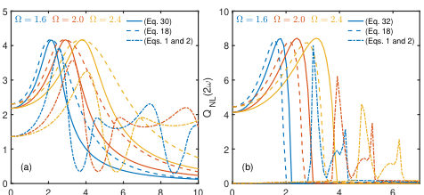
<figcaption class="paper-figure-caption"><b>Fig 1.</b> FIG. 1. (Color Online) (a) Linear response amplitude QL(ω) and (b) nonlinear response amplitude QNL(2ω) of the 1D dis- sipative BJJ for Λ0/γ = 0.5, with a positive interaction pa- rameter in the π-phase mode, in response to a low-frequency signal c cos(ωt) under the influence of a high-frequency drive g cos(Ωt). Results are shown for three different values of Ω= 1.6 (blue), 2.0 (orange), and 2.4 (yellow), with fixed pa- rameters c = 0.05 and ω = 0.1. The solid lines represent the analytical results for QL (Eq. (30)) and QNL (Eq. (32)). The dashed lines correspond to numerical simulations of QL(ω) and QNL(2ω) using Eq. (18). The dash-dotted lines repre- sent numerical simulations using Eqs....</figcaption>
</figure>
<figure class="paper-figure-card">
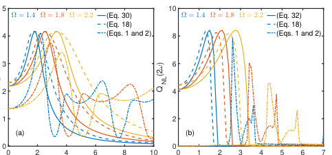
<figcaption class="paper-figure-caption"><b>Fig 2.</b> FIG. 2. (Color Online) (a) Linear response amplitude QL(ω) and (b) nonlinear response amplitude QNL(2ω) of the 1D dissipative BJJ for Λ0/γ = −0.5, with a negative interac- tion parameter in the zero-phase mode, in response to a low-frequency signal c cos(ωt) under the influence of a high- frequency drive g cos(Ωt). Results are shown for three dif- ferent values of Ω= 1.4 (blue), 1.8 (orange), and 2.2 (yel- low), with fixed parameters c = 0.05 and ω = 0.1. The solid lines represent the analytical results for QL (Eq. 30) and QNL (Eq. 32). The dashed lines correspond to numerical simula- tions of QL(ω) and QNL(2ω) using Eq. (18). The dash-dotted lines represent numerical simulations using Eqs....</figcaption>
</figure>
<figure class="paper-figure-card">
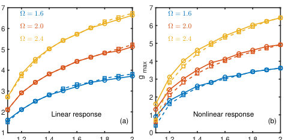
<figcaption class="paper-figure-caption"><b>Fig 3.</b> FIG. 3. (Color Online) The dependence of the position of the maximum amplitude (gmax) on the interaction parameter Λ0 is shown for (a) the linear response QL(ω) and (b) the nonlinear response QNL(2ω), for three different values of the high-frequency parameter Ω= 1.6 (blue), 2.0 (orange), and 2.4 (yellow). The solid lines with markers represent the re- sults obtained from Eq. (30) for QL and Eq. (32) for QNL, while the dashed lines with markers correspond to the results obtained from Eq. (18). Throughout the simulation, we have fixed the dissipation coefficient γ = 2.4 for both linear and nonlinear response cases. In both cases, the other parameters are fixed at ω = 0.1 and c = 0.05...</figcaption>
</figure>
<figure class="paper-figure-card">
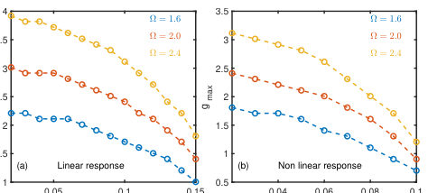
<figcaption class="paper-figure-caption"><b>Fig 4.</b> FIG. 5. (Color Online) The dependence of the position of the maximum amplitude (gmax) on c is shown for (a) the linear response QL(ω) and (b) the nonlinear response QNL(2ω), for three different values of the high-frequency parameter Ω= 1.6 (blue), 2.0 (orange), and 2.4 (yellow). The dashed lines with markers represent the results obtained from Eq. (18). Here, we fix Λ0/γ = 0.5, and the other parameters are set to ω = 0.1 and c = 0.05 throughout the simulations.</figcaption>
</figure>
<figure class="paper-figure-card">
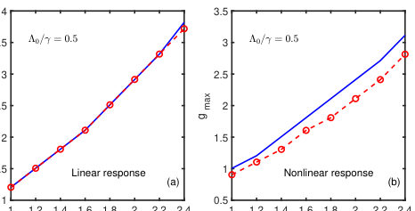
<figcaption class="paper-figure-caption"><b>Fig 5.</b> FIG. 4. (Color Online) The variation of the position of the maximum amplitude gmax with the high-frequency parameter Ωis shown for (a) the linear response QL(ω) and (b) the nonlinear response QNL(2ω), with Λ0/γ = 0.5. The blue solid line represents the results obtained from Eq. (30) for QL and Eq. (32) for QNL, while the dashed red line with markers corresponds to the results obtained from Eq. (18). In both cases, the other parameters are fixed at ω = 0.1 and c = 0.05 throughout the simulations.</figcaption>
</figure>

**Summary.** This study analyzes the vibrational and nonlinear response of a 1D dissipative Bose-Josephson junction driven by two distinct frequencies. By employing advanced perturbation techniques, the authors show that the high-frequency drive breaks symmetry, allowing for a measurable second-harmonic response. This confirms a controllable mechanism for generating nonlinear dynamics in such quantum bosonic systems.

**Why it may be interesting.** This work provides a concrete, analytically tractable model for observing nonlinear harmonic generation and vibrational resonance in a system relevant to ultracold atomic physics (Bose-Josephson junctions).

Detailed structure

**Main problem.** The paper investigates the linear and nonlinear response of a one-dimensional dissipative Bose-Josephson junction (BJJ) when subjected to simultaneous weak low-frequency probing and rapid high-frequency external driving.

**Main result.** The high-frequency modulation dynamically breaks the system's symmetry, enabling a finite second-harmonic response that would otherwise be forbidden, demonstrating controllable vibrational and nonlinear resonance.

**Method.** The authors employed time-scale separation and perturbative analysis on the dissipative two-mode BJJ equations to derive analytical expressions for the linear and nonlinear response amplitudes.

**Model / system.** The physical system is a one-dimensional dissipative Bose-Josephson junction, modeled using a two-mode approach derived from Bose-Einstein condensates in double-well potentials. The dynamics are governed by coupled, dissipative equations.

**Key observables.** Linear response amplitude ($Q_L(\omega)$) at the fundamental frequency and nonlinear response amplitude ($Q_{NL}(2\omega)$) at the second harmonic.

**Important parameters / regimes.** Dissipation ($\gamma$), interaction strength ($\Lambda_0$), low-frequency probe amplitude ($c$), and high-frequency driving strength ($g$ or $\Omega$).

**Assumptions / limitations.** The analysis relies on small approximations for the population imbalance ($z$) and relative phase ($	heta$), and the use of time-scale separation to decouple slow and fast dynamics.

**Figures summary.** Figures illustrate the resonance enhancement of both linear and nonlinear responses by varying the driving strength ($g$ or $\Omega$), and show the dependence of the resonance position ($g_{max}$) on the interaction parameter ($\Lambda_0$) and the probe amplitude ($c$).

**Paper structure.** The paper progresses by deriving an effective higher-order nonlinear equation, applying time-scale separation to simplify the dynamics, and then using perturbative analysis to calculate the analytical expressions for the linear and nonlinear responses, validating these results against direct numerical simulations.

Abstract

We investigate the linear and nonlinear response of a one-dimensional dissipative Bose-Josephson junction subjected simultaneously to a weak low-frequency probe and a rapidly oscillating high-frequency external drive. Starting from the dissipative two-mode Bose-Josephson equations, we derive an effective higher-order nonlinear equation for the population imbalance by retaining the leading nonlinear correction. Using time-scale separation and perturbative analysis, we obtain analytical expressions for both the linear response at the fundamental frequency and the nonlinear response at the second harmonic. We show that the high-frequency modulation modifies the effective potential landscape and dynamically breaks the symmetry around the stationary state, giving rise to a finite second-harmonic response that is absent without the rapidly oscillating field. Both the linear and nonlinear response amplitudes exhibit resonance-like enhancement for optimal values of the high-frequency driving strength. We further analyze the dependence of the resonance characteristics on interaction strength, dissipation, and driving parameters in both the zero-phase and $π$-phase modes and compare the analytical predictions with direct numerical simulations. Our results demonstrate a controllable mechanism toward realizing linear and nonlinear vibrational resonance in a one-dimensional dissipative Bose-Josephson junction and open new possibilities for controlling collective dynamics in driven ultracold bosonic systems.

[↑ back to top](#top)

### [Geometric Instability and Self-Limitation in Driven Quantum Systems](http://arxiv.org/abs/2606.00259v1)

**Authors:** A. M. Tishin  
**Type:** theory · **Category:** other · **PDF:** <https://arxiv.org/pdf/2606.00259v1>  
**Analysis basis:** full PDF text, analyzed in chunks
**Topic relevance:** `driven-dissipative phase transition` **3/5** · `methods for driven-dissipative` **3/5** · `non-equilibrium dynamics` **3/5** · `Keldysh / 2PI / non-Gaussian methods` **2/5** · `analog quantum simulation` **2/5** · `non-equilibrium universality` **2/5** · `correlated / nonlocal dissipation` **1/5** · `entanglement & information structure` **1/5**

↔ Scroll figures horizontally

<figure class="paper-figure-card">
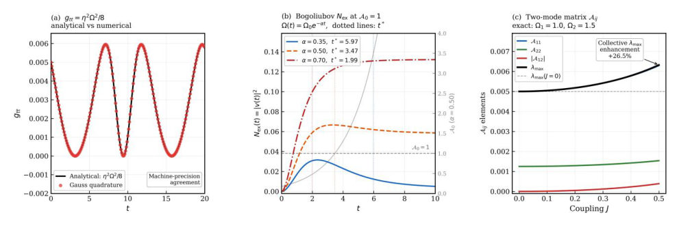
<figcaption class="paper-figure-caption"><b>Fig 1.</b> Figure 1. Numerical verification of the geometric non-adiabaticity framework. (a) Exact verification</figcaption>
</figure>

**Summary.** This paper establishes a universal geometric framework using the normalized Fubini–Study distinguishability speed to quantify non-adiabatic instability in driven quantum systems. It introduces a dimensionless parameter ($\mathcal{A}_n$) that predicts instability onset, connects this to quantum critical phenomena, and proves a self-limitation theorem for nonlinear systems. The theory offers a unified diagnostic tool applicable from superconducting qubits to magnonic resonators.

**Why it may be interesting.** This work provides a powerful, unified geometric diagnostic tool ($\mathcal{A}_n$) applicable across diverse quantum platforms (qubits, magnonics) to predict fundamental limits on control speed and stability.

Detailed structure

**Main problem.** The paper develops a unified geometric framework to quantify local non-adiabaticity and instability in general driven quantum systems, moving beyond traditional adiabatic theorems.

**Main result.** It introduces a universal, gauge-invariant instability parameter ($\mathcal{A}_n$) that governs the onset of non-adiabaticity, and proves a 'Geometric Self-Limitation' theorem for nonlinear systems.

**Method.** The framework utilizes the Fubini–Study metric and the Quantum Geometric Tensor (QGT) to define the instability parameter, which is then analyzed in both closed and open quantum system settings.

**Model / system.** The theory applies to general driven quantum systems, exemplified by parametric oscillators, coupled bosonic modes, and is extended to open systems using the Bures metric.

**Key observables.** Universal instability parameter ($\mathcal{A}_n$), Fubini–Study speed ($v_{FS}$), spectral gap ($\Delta_n$), and the maximum eigenvalue of the instability matrix ($\lambda_{\max}$).

**Important parameters / regimes.** The instability threshold ($\mathcal{A}_n \sim 1$), the minimum gate time ($T_{min} = 1/\sqrt{8\omega}$), and the nonlinear regulator strength ($U$).

**Assumptions / limitations.** The analysis relies on the assumption that the accessible low-occupancy manifold is compact and that the nonlinear regulator provides a monotonic gap condition for its self-limitation proof.

**Figures summary.** The notes reference calculations confirming the relationship between the FS metric and the geometric parameter ($\eta^2\Omega^2/8$), and show how the dominant eigenvalue ($\lambda_{\max}$) increases with inter-mode coupling ($J$).

**Paper structure.** The paper builds from defining the general geometric instability criterion ($\mathcal{A}_n$) using the FS speed and spectral gap, demonstrating its equivalence to older parameters, and then extending this to analyze self-limitation via nonlinear regulators and multi-mode coupling.

Abstract

We develop a unified geometric framework for local non-adiabaticity in driven quantum systems. We show that the previously introduced AMT non adiabaticity parameter arises as a special realization of a more general geometric instability criterion governed by the normalized Fubini Study distinguishability speed. The local geometric evolution speed is identified as the physically relevant quantity controlling the onset of non-adiabatic instability.   We introduce a universal dimensionless instability parameter measuring the competition between quantum-state evolution speed and spectral-gap protection. This quantity provides a local, gauge-invariant, and basis-independent criterion for arbitrary driven Hamiltonians. Near quantum critical points, the instability parameter diverges through inverse gap amplification, recovering the Kibble Zurek freeze-out condition directly from local geometric data.   We prove that monotonic occupation-dependent nonlinear regulators geometrically compress the quantum metric, establishing a self-limitation theorem in which nonlinear spectral deformation confines the accessible region of projective Hilbert space under strong driving. The multimode extension yields a matrix-valued instability criterion that identifies collective instability channels invisible to scalar descriptions.   The framework naturally extends to open quantum systems through the Bures metric and quantum Fisher geometry, where thermal mixing and Lindblad decay increase the instability threshold through geometric suppression of state distinguishability. The instability threshold further implies a universal geometric lower bound on coherent control time and quantum gate duration.

[↑ back to top](#top)

### [Localization of Active Particles on Random Arrays of Parallel Filaments](http://arxiv.org/abs/2606.00286v1)

**Authors:** Owen Santoso, Elena Koslover  
**Type:** theory · **Category:** disordered systems and neural networks · **PDF:** <https://arxiv.org/pdf/2606.00286v1>  
**Analysis basis:** full PDF text, analyzed in chunks
**Topic relevance:** `driven-dissipative phase transition` **3/5** · `non-equilibrium dynamics` **3/5** · `non-equilibrium universality` **3/5** · `Keldysh / 2PI / non-Gaussian methods` **2/5** · `methods for driven-dissipative` **2/5** · `Frenkel-Kontorova` **1/5** · `Kondo & dissipative impurity` **1/5** · `analog quantum simulation` **1/5** · `correlated / nonlocal dissipation` **1/5**

↔ Scroll figures horizontally

<figure class="paper-figure-card">
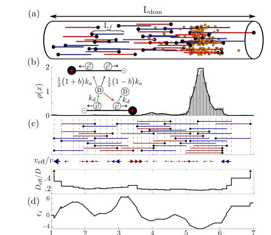
<figcaption class="paper-figure-caption"><b>Fig 1.</b> FIG. 1. (a) Simulation snapshot of biased particles (orange) navigating a parallel filament array, with filament plus ends pointing right (red) or left (blue). Only the axial dimension is resolved in the simulations. (b) Inset: schematic of transitions between motility states. Histogram: steady-state distribution from simulations, Line: analytic distribution from Eq. 3. (c) Region decomposition of the filament array, showing effective velocity (arrows) and diffusivity (black curve) in each region. (d) Energy landscape corresponding to the filament configu- ration. Parameters used: Lf = 1µm, n = 7, Ldom = 7µm, v = 1µm, D = 0.1µm2, ka = kd = 100s−1, b = 1.</figcaption>
</figure>
<figure class="paper-figure-card">
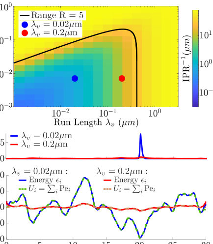
<figcaption class="paper-figure-caption"><b>Fig 2.</b> FIG. 2. (a) Steady-state localization width (IPR−1, color), plotted as a function of diffusive length λD and run length λv. Black curve tracks values where the energy landscape range (Eq. 7) reaches R = 5, marking a transition to tight localization. (b) Steady-state distribution of particles on a sample filament configuration for two different run lengths (λv = 0.02µm, 0.2µm). (c) Energy landscapes (ϵi) corre- sponding to the distributions in (b) are shown in blue and red. The potential function Ui (green and brown) provides a smoothed estimate of the landscape. Parameters used: Lf = 1µm, n = 40, ka = kd = 100s−1, b = 1 and Ldom = 100µm in (c). IPR−1 color plot is averaged over 200...</figcaption>
</figure>
<figure class="paper-figure-card">
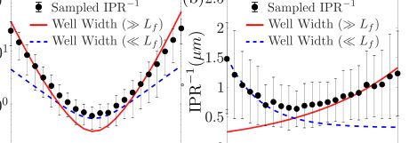
<figcaption class="paper-figure-caption"><b>Fig 3.</b> FIG. 4. Localization width, quantified by IPR−1, is plot- ted versus (a) particle velocity and (b) filament length. Black dots: mean values from 200 configurations, with error bars in- dicating standard deviation. Solid red and dashed blue curves show analytic approximations for the W ≫Lf (Eq. 8) and W ≪Lf (Eq. 9), respectively.</figcaption>
</figure>
<figure class="paper-figure-card">
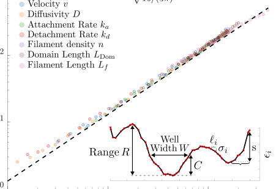
<figcaption class="paper-figure-caption"><b>Fig 4.</b> FIG. 3. Depth of energy landscape collapses to a universal curve as a function of the ratio of length scales λgeom/λkin. Inset illustrates the landscape range R, well width W, and correlated step size s for a truncated energy landscape, with red dots marking region boundaries. Dots show range of the bulk landscape ϵ, averaged over 200 sampled configurations, while kinetic and geometric parameters are varied. Dashed line gives analytic prediction from Eq. 7. Default param- eter values: b = 1, v = 1µm, D = 0.1µ2m/s, ka = kd = 100s−1, n = 40, Ldom = 100µm, Lf = 1µm. Edge regions within distance Lf of the domain boundaries are excluded from the calculation.</figcaption>
</figure>

**Summary.** This work analyzes particle localization on random arrays of filaments, drawing inspiration from biological microtubules. By modeling the system using an advection-diffusion equation, the authors show that particle accumulation (localization) is robust and strongest when the particle's active transport length is intermediate. This highlights how active processes interact with quenched disorder to create stable spatial organization.

**Why it may be interesting.** The framework of mapping transport dynamics onto an effective energy landscape due to quenched disorder is highly relevant to understanding energy barriers and trapping mechanisms in complex quantum or classical systems.

Detailed structure

**Main problem.** The paper investigates how disordered arrays of filaments govern the distribution of intermittently moving particles that switch between diffusive and processive transport.

**Main result.** The system exhibits robust particle localization, which is strongest for intermediate run-lengths, demonstrating emergent spatial organization from the interplay of active transport and quenched disorder.

**Method.** The analysis models the system using an advection-diffusion equation derived from the rapid attachment-detachment limit, mapping the steady-state density onto an effective energy landscape.

**Model / system.** The physical system is a 1D random array of parallel filaments, motivated by mixed-polarity microtubules in dendrites. Particles switch between passive diffusion and active, biased motion along these fixed filaments.

**Key observables.** Localization strength, quantified by the Inverse Participation Ratio (IPR), and the resulting particle density profile $
ho_i(x) \propto e^{-\epsilon_i(x)}$.

**Important parameters / regimes.** Diffusivity ($D$), attachment/detachment rates ($k_a, k_d$), bias parameter ($b$), and the particle run-length ($\lambda_v$).

**Assumptions / limitations.** The analysis relies on a 'single-layer' approximation, assuming attachment/detachment rates are much faster than filament traversal times, and the system is analyzed in a 1D axial coordinate.

**Figures summary.** Figures illustrate simulation snapshots of biased particles, the schematic of motility state transitions, the resulting energy landscape, and plots showing the condition for tight localization based on kinetic parameters.

**Paper structure.** The paper first establishes the physical model and the governing advection-diffusion equation. It then derives the effective energy landscape and analyzes the conditions (intermediate run-lengths) under which localization is maximized, providing quantitative diagnostics like the IPR.

Abstract

Quenched disorder in the environment can fundamentally alter transport dynamics in both active and passive systems. We explore how disordered arrays of filaments govern the distribution of intermittently moving particles which switch between diffusive and processive transport. Motivated by the mixed-polarity arrangements of parallel microtubules observed in mammalian dendrites, we show that such arrays tend to result in localization of particles at regions of convergent filament orientation. In the rapid attachment-detachment limit, the disordered system can be described by a noisy one-dimensional effective energy landscape, whose structure is approximated by a random walk. The depth and width of wells on this landscape are expressed as a function of the transport kinetics and system geometry. Localization is shown to be strongest at intermediate run-lengths, where biased transport persists long enough to sense the quenched filament polarity but not so long as to facilitate escape from local traps. These results demonstrate robust localization of particles moving on random filament networks, highlighting the emergent spatial organization that arises from an interplay of active transport and quenched disorder.

[↑ back to top](#top)

### [Noise spectroscopy of two-body loss as a probe of dynamical bulk viscosity in ultracold atomic gases](http://arxiv.org/abs/2606.01835v1)

**Authors:** Tingyu Zhang, Hiroyuki Tajima, Takeo Kato  
**Type:** theory · **Category:** quantum gases · **PDF:** <https://arxiv.org/pdf/2606.01835v1>  
**Analysis basis:** full PDF text, analyzed in chunks
**Topic relevance:** `correlated / nonlocal dissipation` **3/5** · `methods for driven-dissipative` **3/5** · `Keldysh / 2PI / non-Gaussian methods` **2/5** · `analog quantum simulation` **2/5** · `driven-dissipative phase transition` **2/5** · `non-equilibrium dynamics` **2/5** · `non-equilibrium universality` **2/5** · `quantum measurements` **1/5**

↔ Scroll figures horizontally

<figure class="paper-figure-card">
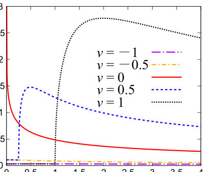
<figcaption class="paper-figure-caption"><b>Fig 1.</b> FIG. 1. Dimensionless noise power spectrum of the two-body loss current obtained from the second-order virial expansion with different values of v.</figcaption>
</figure>
<figure class="paper-figure-card">
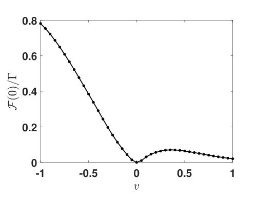
<figcaption class="paper-figure-caption"><b>Fig 2.</b> FIG. 2. Fano factor for correlated noise of pure two-body noise in DC limit as a function of v. Γ is a dimensionless normalizing factor given by Eq. (38). F(0) becomes zero at the unitary limit where v = 0, due to scale invariance. Its value becomes small at large positive v, namely, the system is in BEC regime.</figcaption>
</figure>

**Summary.** This paper proposes using the correlated noise generated by two-body particle loss in ultracold atomic gases to measure the dynamical bulk viscosity. By analyzing the noise power spectrum beyond the simple shot-noise background, the authors demonstrate a direct theoretical link between this measurable fluctuation and the bulk viscosity coefficient. This offers a powerful new experimental avenue for studying transport phenomena in quantum fluids.

**Why it may be interesting.** This work provides a novel, measurable diagnostic tool—noise spectroscopy—to probe a fundamental, but experimentally elusive, transport property (bulk viscosity) in quantum gases.

Detailed structure

**Main problem.** The research aims to establish a measurable link between the correlated noise spectrum of two-body particle loss and the dynamical bulk viscosity in weakly dissipative quantum gases.

**Main result.** The noise power spectrum of the two-body loss current is found to be directly proportional to the equilibrium correlation function of the contact operator, which in turn is related to the dynamical bulk viscosity via the Kubo formula.

**Method.** The authors derive the loss-current operator from the Lindblad equation and calculate the noise power spectrum, subtracting the Poissonian background to isolate the transport-sensitive terms.

**Model / system.** The system modeled is a two-component Fermi gas (ultracold atomic gas) undergoing weak inelastic two-body losses. The dynamics are governed by a Lindblad master equation, incorporating contact interactions.

**Key observables.** Loss-Current Noise Power Spectrum ($S_N$), Fano Factor ($F(\omega)$), and the dynamical bulk viscosity ($\zeta(\omega)$).

**Important parameters / regimes.** Weak-loss regime, unitarity, and the scattering length parameter ($v$).

**Assumptions / limitations.** The analysis relies on the Lindblad equation for weak losses and utilizes the Kubo formula to connect noise fluctuations to transport coefficients.

**Figures summary.** Figure 1 shows the dimensionless noise power spectrum dependence on the scattering length parameter, and Figure 2 illustrates the Fano factor vanishing at unitarity.

**Paper structure.** The paper proceeds by deriving the loss-current operator, calculating the noise correlator, and then establishing the proportionality between this noise spectrum and the retarded contact correlator, which is linked to the bulk viscosity via the Kubo formula.

Abstract

We show that the correlated noise of the two-body loss current provides access to the dynamical bulk viscosity in weakly dissipative quantum gases. Starting from the Lindblad equation for weak inelastic losses, we derive the loss-current operator. After subtracting the leading Poissonian shot-noise background, the remaining noise power spectrum of two-body loss current is found proportional to the equilibrium correlation function of the contact operator. Combining this result with the exact relation between contact correlations and bulk viscosity, we demonstrate the correspondence between the measurable loss-current noise and the bulk-viscosity. Our result identifies the higher-order fluctuation of two-body loss as a probe of dynamical bulk viscosity, whose measurement has remained elusive in experiments.

[↑ back to top](#top)

### [Quantum Ergodicity and Thermalization in Interval Quantum Mechanics](http://arxiv.org/abs/2606.00749v1)

**Authors:** Abbas Edalat  
**Type:** theory · **Category:** statistical mechanics · **PDF:** <https://arxiv.org/pdf/2606.00749v1>  
**Analysis basis:** full PDF text, analyzed in chunks
**Topic relevance:** `non-equilibrium dynamics` **3/5** · `measurement-induced transitions` **2/5** · `methods for driven-dissipative` **2/5** · `quantum measurements` **2/5** · `scars & prethermalization` **2/5** · `Keldysh / 2PI / non-Gaussian methods` **1/5** · `analog quantum simulation` **1/5** · `correlated / nonlocal dissipation` **1/5** · `driven-dissipative phase transition` **1/5** · `entanglement & information structure` **1/5** · `non-equilibrium universality` **1/5**

↔ Scroll figures horizontally

<figure class="paper-figure-card">
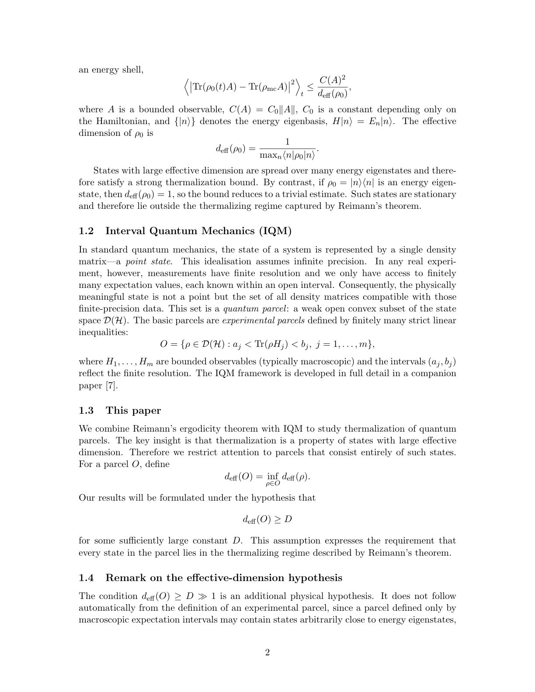
<figcaption class="paper-figure-caption"><b>Fig 1.</b> Low-resolution page preview, page 2</figcaption>
</figure>
<figure class="paper-figure-card">
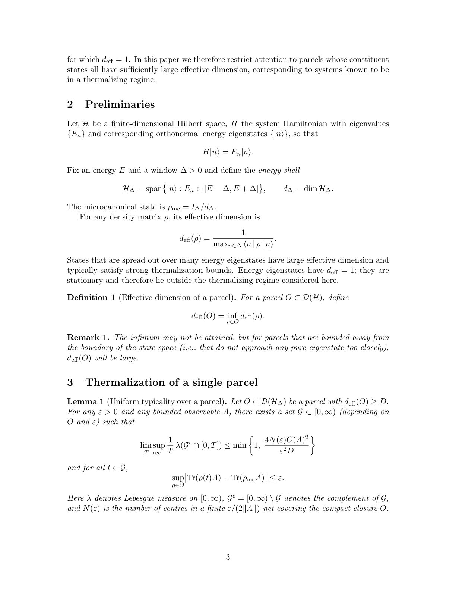
<figcaption class="paper-figure-caption"><b>Fig 2.</b> Low-resolution page preview, page 3</figcaption>
</figure>
<figure class="paper-figure-card">
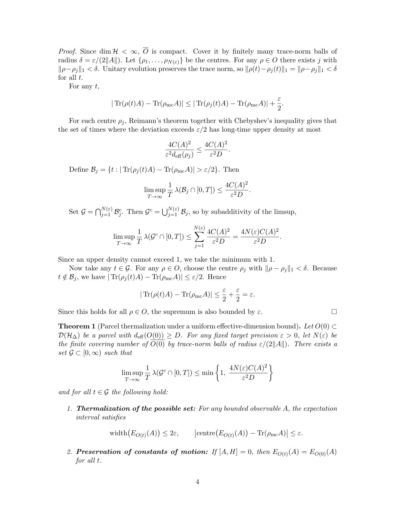
<figcaption class="paper-figure-caption"><b>Fig 3.</b> Low-resolution page preview, page 4</figcaption>
</figure>
<figure class="paper-figure-card">
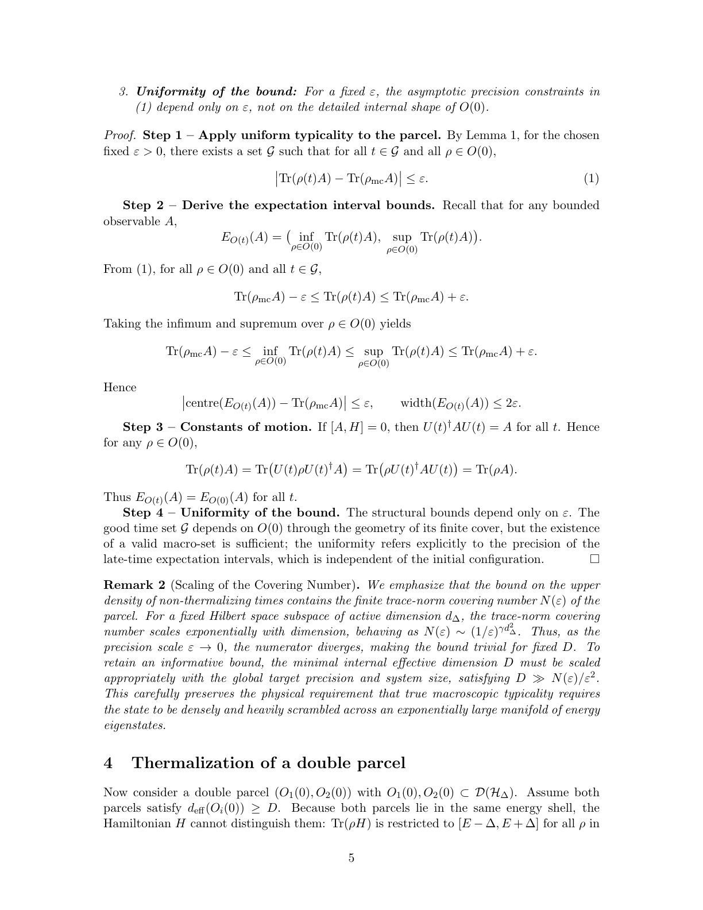
<figcaption class="paper-figure-caption"><b>Fig 4.</b> Low-resolution page preview, page 5</figcaption>
</figure>
<figure class="paper-figure-card">
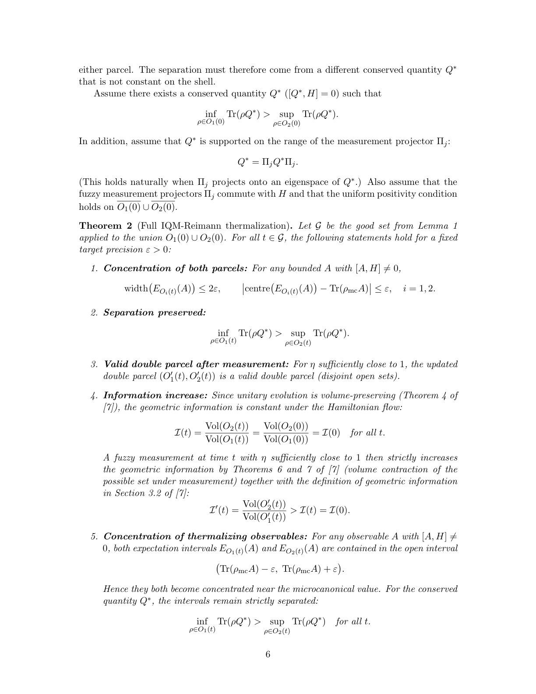
<figcaption class="paper-figure-caption"><b>Fig 5.</b> Low-resolution page preview, page 6</figcaption>
</figure>

**Summary.** This paper develops a framework using Interval Quantum Mechanics (IQM) to analyze quantum thermalization. It shows that when the system's knowledge is represented by a 'quantum parcel,' the expectation values of observables converge to microcanonical values, provided the parcel has sufficient effective dimension. The method is particularly strong for tracking multiple, separated components of the state simultaneously.

**Why it may be interesting.** This work provides a powerful, geometrically rigorous tool for studying thermalization in open or partially known quantum systems, moving beyond point-state assumptions common in standard quantum dynamics.

Detailed structure

**Main problem.** The paper combines quantum ergodicity theorems with Interval Quantum Mechanics (IQM) to rigorously study how quantum states, represented by epistemic 'quantum parcels,' approach thermal equilibrium.

**Main result.** It proves that for parcels with sufficient effective dimension, the expectation values of observables concentrate around the microcanonical ensemble values for late times, and this concentration is preserved even when tracking separated state components.

**Method.** The analysis uses Reimann's spectral typicality theorem within the IQM framework, treating quantum states as convex sets defined by measurement intervals.

**Model / system.** The system is a general quantum mechanical system governed by a Hamiltonian H. The state is not a point but a 'quantum parcel' ($\mathcal{O}$), which is a weak open convex set of density matrices reflecting finite-precision measurement knowledge.

**Key observables.** Expectation intervals of observables, effective dimension ($	ext{deff}$), and the separation maintained by a conserved quantity $Q^*$.

**Important parameters / regimes.** The minimal effective dimension $D$ (required to ensure thermalization) and the time $t$ (late times).

**Assumptions / limitations.** The analysis requires the initial state parcel to have a large effective dimension ($	ext{deff} \geq D \gg 1$) to ensure the system is in the thermalizing regime.

**Paper structure.** The paper builds from establishing the general framework of IQM for quantum states, applying Reimann's theorem to show single-parcel thermalization, and culminating in the proof for double parcels, which maintains both thermalization and separation under evolution.

Abstract

We combine Reimann's spectral typicality theorem -- a modern formulation of quantum ergodicity -- with the framework of Interval Quantum Mechanics (IQM). In IQM, quantum states are represented not by points but by \emph{quantum parcels}: weak open convex sets of density matrices defined by finitely many expectation intervals. Such parcels are the exact mathematical representation of the epistemic knowledge obtained from finite-precision measurements of macroscopic observables.   We prove that for a single parcel in which every state has large effective dimension (a condition that ensures thermalization), the expectation interval of any bounded observable becomes concentrated around the microcanonical value for most late times. The asymptotic bound depends only on the minimal effective dimension within the parcel, not on its detailed shape.   For a double parcel \((O_1,O_2)\) with both components contained in an energy shell, separated by a conserved quantity \(Q^*\) that is supported on the range of the measurement projector, we show that the expectation intervals of both parcels become concentrated near the microcanonical values of bounded observables, the separation is preserved exactly, and the updated double parcel after a fuzzy measurement remains valid.

[↑ back to top](#top)

### [Wasserstein-2 gradient flows and the geometry of entropy production in classical and quantum stochastic thermodynamics](http://arxiv.org/abs/2606.00698v1)

**Authors:** Olga Movilla Miangolarra, Ralph Sabbagh, Artemy Kolchinsky  
**Type:** theory · **Category:** statistical mechanics · **PDF:** <https://arxiv.org/pdf/2606.00698v1>  
**Analysis basis:** full PDF text, analyzed in chunks
**Topic relevance:** `driven-dissipative phase transition` **3/5** · `non-equilibrium dynamics` **3/5** · `non-equilibrium universality` **3/5** · `Keldysh / 2PI / non-Gaussian methods` **2/5** · `correlated / nonlocal dissipation` **2/5** · `entanglement & information structure` **2/5** · `methods for driven-dissipative` **2/5**

↔ Scroll figures horizontally

<figure class="paper-figure-card">
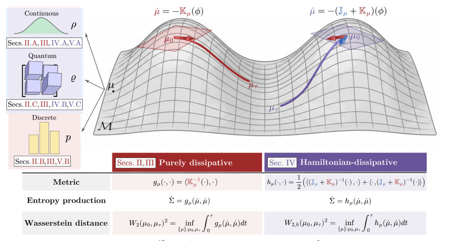
<figcaption class="paper-figure-caption"><b>Fig 1.</b> FIG. 1. Summary of the Wasserstein-2 geometric picture of stochastic and quantum thermodynamics in purely dissipative (left) and mixed Hamiltonian-dissipative (right) systems. The Wasserstein-2 geometry arises from a gradient flow structure in purely dissipative systems (continuous, discrete, and quantum), and from a combination of gradient and Hamiltonian flows in mixed systems (continuous and quantum). In all cases, the distance squared bounds entropy production in finite-time transitions.</figcaption>
</figure>
<figure class="paper-figure-card">
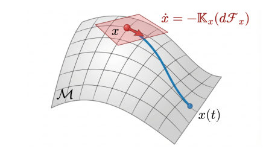
<figcaption class="paper-figure-caption"><b>Fig 2.</b> FIG. 2. The state x evolves on the Riemannian manifold (M, g) along the gradient flow of the free energy F.</figcaption>
</figure>
<figure class="paper-figure-card">
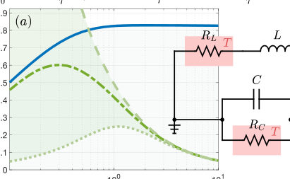
<figcaption class="paper-figure-caption"><b>Fig 3.</b> FIG. 3. (a) Entropy produced with the constant Hamilto- nian, ∫ τ 0 ˙Σdt, and with the optimal quadratic Hamiltonian, W G 2,h(ρ0, ργ τ)2/τ, between endpoints ρ0, ργ τ , as a function of the friction coefficient γ = RL = 1/RC. The shaded area il- lustrates the upper and lower bounds in terms of the purely dissipative metric. Constants τ, T, C, and L are set to 1. (b) RLC circuit with resistors at temperature T.</figcaption>
</figure>
<figure class="paper-figure-card">
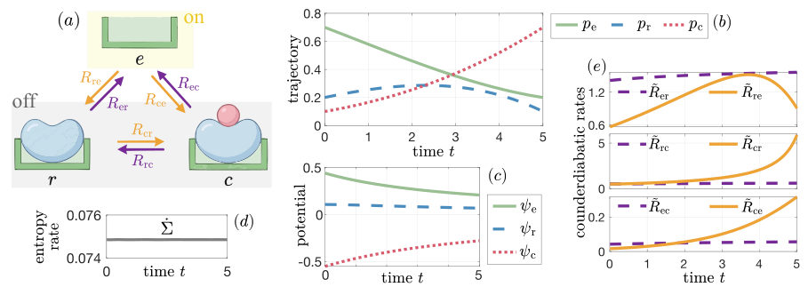
<figcaption class="paper-figure-caption"><b>Fig 4.</b> FIG. 4. Minimum entropy counterdiabatic switching for gene regulation. (a) Illustration of the discrete Markov process, the operator site is depicted in green, the repressor in blue, and the corepressor in red. Portrayal of (b) optimal trajectories, (c) optimal potentials, (d) resulting entropy production rate, and (e) detailed-balanced counterdiabatic rates that realize the optimal trajectory in finite time. We have set τ = 5 and T = 1.</figcaption>
</figure>
<figure class="paper-figure-card">
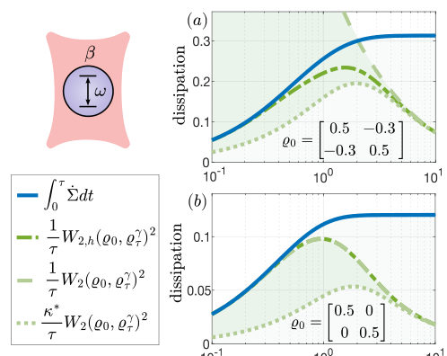
<figcaption class="paper-figure-caption"><b>Fig 5.</b> FIG. 5. Comparison between entropy produced and the de- rived bounds for different values of the decay rate γ; β, ω, τ are set to 1. (a) The initial state is not diagonal, and the Hamiltonian term plays a role. (b) The initial state is diago- nal, and the Hamiltonian term plays no role in the dynamics.</figcaption>
</figure>

**Summary.** This paper unifies the geometric understanding of entropy production in classical and quantum thermodynamics using Wasserstein-2 metrics derived from free energy gradient flows. It shows that these metrics provide finite-time refinements to the second law and rigorously connects optimal transport theory to fundamental thermodynamic quantities like thermodynamic length. The framework extends beyond simple dissipation to incorporate coherent (Hamiltonian) dynamics.

**Why it may be interesting.** This work provides a powerful geometric lens (optimal transport) to analyze non-equilibrium processes in quantum and classical systems, offering quantitative bounds on irreversible processes beyond the standard second law.

Detailed structure

**Main problem.** To provide a unified geometric description of entropy production in classical and quantum stochastic thermodynamics, extending the second law beyond purely dissipative dynamics.

**Main result.** The framework establishes that the Wasserstein-2 distance bounds entropy production, offering a finite-time refinement of the second law, and connects optimal transport to thermodynamic length.

**Method.** The authors utilize Wasserstein-2 structures arising from gradient flows of free energy, formulating relaxation dynamics for continuous, discrete, and quantum systems.

**Model / system.** The work covers classical overdamped diffusions, discrete Markov chains, and open quantum systems evolving under Lindblad dynamics. The geometry is defined on the space of states (probability distributions or density matrices).

**Key observables.** Entropy production, Free energy functional, Wasserstein-2 distance, Thermodynamic length.

**Important parameters / regimes.** Dissipative mobilities, Hamiltonian coupling strength ($\gamma$), Time ($	au$), Temperature ($eta$).

**Assumptions / limitations.** The analysis often assumes the existence of a smooth manifold of states and relies on establishing equivalence bounds between different geometric formulations (e.g., Hamiltonian-dissipative vs. purely dissipative).

**Figures summary.** Figure 1 summarizes the Wasserstein-2 geometric picture for purely dissipative and mixed Hamiltonian-dissipative systems. Figure 2 illustrates the gradient flow of the free energy functional on the state space.

**Paper structure.** The paper systematically reviews the gradient flow formulation across continuous, discrete, and quantum settings, deriving the associated Wasserstein-2 metrics. It then establishes bounds relating entropy production to these geometric distances, culminating in the recovery of thermodynamic length at equilibrium.

Abstract

The second law does more than set the direction of thermodynamic evolution: it endows nonequilibrium transformations with an underlying geometry. In this work, we provide a unified geometric description of entropy production in classical and quantum thermodynamics based on Wasserstein-2 structures arising from gradient flows of free energy. We review how relaxation to equilibrium, in overdamped diffusions, discrete detailed-balanced Markov chains, and dissipative Lindblad dynamics, can be formulated as a gradient flow on the space of states. The associated Wasserstein-2 distance bounds entropy production, yielding a finite-time refinement of the second law. We extend this framework beyond purely dissipative dynamics by introducing generalized Wasserstein-2 metrics that incorporate conservative (Hamiltonian) dynamics in both classical inertial systems and open quantum systems, yielding intrinsic distances that exactly characterize minimal entropy production under fixed dissipative mobilities. We establish equivalence bounds between purely dissipative and Hamiltonian-dissipative geometries, explicitly quantifying how inertial or coherent dynamics can reduce dissipation. Finally, when restricted to equilibrium distributions, we recover the thermodynamic length of linear response-including the quantum thermodynamic length-thereby linking optimal transport, thermodynamic length, and counterdiabatic protocols within a single geometric framework. All in all, our results extend the Riemannian program of thermodynamics further from equilibrium and provide a geometric foundation for optimal protocols beyond the overdamped setting.

[↑ back to top](#top)

### [Stress relaxation in fiber networks via force-dependent stochastic severing](http://arxiv.org/abs/2606.01752v1)

**Authors:** Prathamesh Kulkarni, Anatoly B. Kolomeisky, Fred C. MacKintosh  
**Type:** theory · **Category:** statistical mechanics · **PDF:** <https://arxiv.org/pdf/2606.01752v1>  
**Analysis basis:** full PDF text, analyzed in chunks
**Topic relevance:** `driven-dissipative phase transition` **3/5** · `non-equilibrium universality` **3/5** · `analog quantum simulation` **2/5** · `methods for driven-dissipative` **2/5** · `non-equilibrium dynamics` **2/5** · `Frenkel-Kontorova` **1/5** · `Keldysh / 2PI / non-Gaussian methods` **1/5** · `correlated / nonlocal dissipation` **1/5** · `entanglement & information structure` **1/5**

↔ Scroll figures horizontally

<figure class="paper-figure-card">
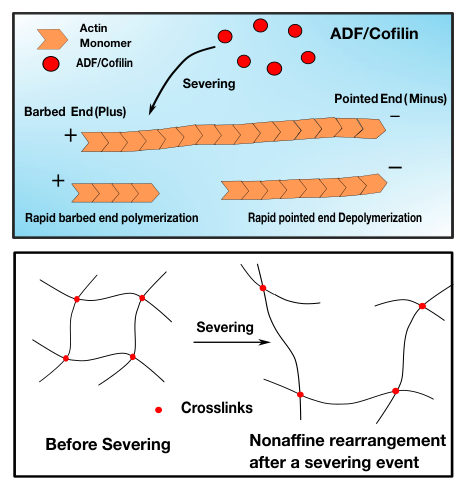
<figcaption class="paper-figure-caption"><b>Fig 1.</b> FIG. 1: The first panel of the schematic demonstrates severing via cofilin in an actin filament. Severing occurs when cofilin binds to an actin filament, resulting in fila- ments with free barbed (plus) and pointed (minus) ends. These filaments can undergo rapid polymerization (at the barbed end) and depolymerization (at the pointed end) in the presence of ATP/ADP, depending on local actin monomer concentration. The second panel shows a sev- ering event in the context of an actin network. Fragmen- tation results in dangling ends and nonaffine structural rearrangement due to relaxation.</figcaption>
</figure>
<figure class="paper-figure-card">
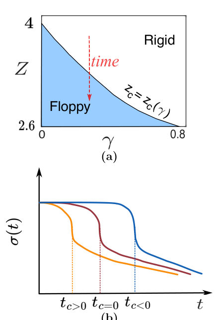
<figcaption class="paper-figure-caption"><b>Fig 2.</b> FIG. 2: (a) Diagram showing the mechanical phase tran- sition in fiber networks. Networks with central force in- teractions undergo a mechanical phase transition con- trolled by the applied shear strain γ and average connec- tivity z. In the absence of bending interactions, networks with a given connectivity z remain floppy when held un- der low applied shear strains and are rigid when held un- der high values of applied shear strains. With increasing applied strain, these networks exhibit a transition from a floppy to a rigid phase, and the transition, being critical in nature, can be depicted using the zc = zc(γ) curve in the figure. The mechanical transition is observed in the presence...</figcaption>
</figure>
<figure class="paper-figure-card">
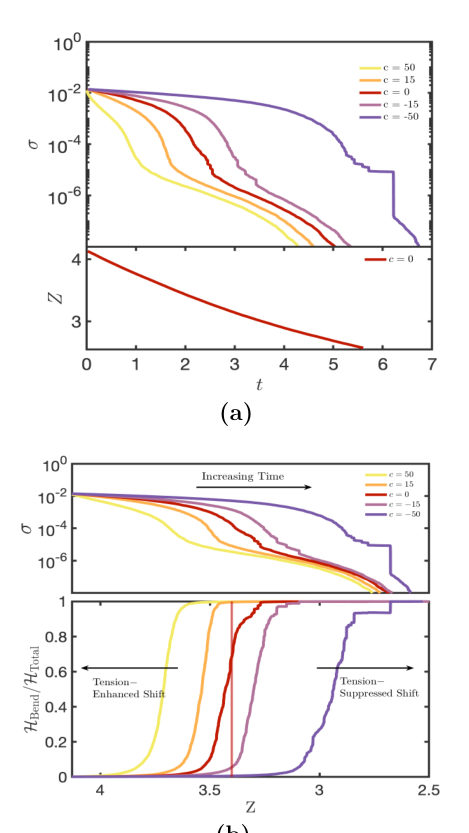
<figcaption class="paper-figure-caption"><b>Fig 3.</b> FIG. 3: (a) Stress relaxation σ and Average connectivity z as a function of time t for varying values of the ten- sion feedback parameter (positive, negative, and zero). (b) Variation of Stress σ and ratio of Bending energy HBend to Total energy HTotal with Connectivity z for the networks. The networks have a dimensionless bending rigidity of ˜κ = 10−5 and are held under an applied shear strain γ = 0.2. From Fig. 3a, it can be observed that connectivity z decreases with time due to the occurrence of severing events. For better physical understanding, stress σ can be analyzed with connectivity z, as shown in Fig. 3b, for the same networks. Connectivity z is plot- ted on the horizontal axis...</figcaption>
</figure>
<figure class="paper-figure-card">
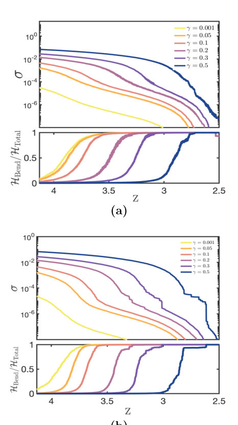
<figcaption class="paper-figure-caption"><b>Fig 4.</b> FIG. 4: Absence of feedback (c = 0): Stress σ and ra- tio of Bending energy HBend to Total energy HTotal with Connectivity z for the networks as a function of con- nectivity z for varying applied strain γ. Fig 4a and 4b correspond to behavior of networks with dimensionless bending rigidity of ˜κ = 10−4 and 10−5 respectively with no feedback present. Bending rigidity clearly affects the behavior near the phase transition, with higher bending rigidity making it more gradual. This is in agreement with fiber network behavior.</figcaption>
</figure>
<figure class="paper-figure-card">
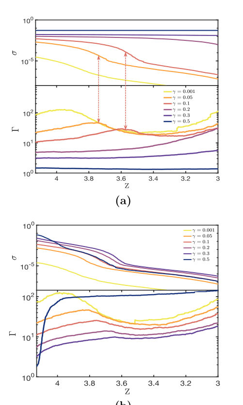
<figcaption class="paper-figure-caption"><b>Fig 5.</b> FIG. 5: Presence of Feedback: Stress σ and Nonaffinity Γ with connectivity z for the networks for varying applied strain γ. The top and bottom panels correspond to the behavior of networks with tension feedback parameter values of c = −50 and c = 50, respectively. For smaller strains, the behavior is similar to when the feedback is ab- sent. In the presence of moderately high strains, a clear shift in the transition can be observed in both tension- suppressed (c = −50) and tension-enhanced (c = 50) severing cases. The “shift” in the transition is depen- dent on the applied strain. The dramatic stress-drop aligns with a peak in Nonaffinity indicating the transi- tion into bending-dominated...</figcaption>
</figure>

**Summary.** This paper models stress relaxation in biological fiber networks subjected to random fiber severing whose rate depends on the local tension. By simulating different feedback mechanisms, the authors show that tuning this mechanochemical feedback can significantly alter the network's mechanical stability, shifting the critical point where the structure loses its rigidity. This provides insight into how biological systems might actively regulate their mechanical properties.

**Why it may be interesting.** While focused on classical mechanics, the concept of non-equilibrium phase transitions, critical points, and the influence of local feedback mechanisms on macroscopic stability echoes principles found in open quantum systems and non-equilibrium statistical mechanics.

Detailed structure

**Main problem.** The study investigates how stress relaxation occurs in fiber networks when the severing of fibers is stochastically dependent on the local mechanical stress.

**Main result.** The mechanochemical feedback mechanism significantly shifts the critical connectivity required for the network to maintain rigidity, delaying or accelerating the loss of mechanical integrity depending on whether severing is tension-suppressed or enhanced.

**Method.** The authors developed and employed a computational model using 2D triangular lattice simulations and an event-driven simulation approach (Gillespie algorithm) to track stress and connectivity changes over time.

**Model / system.** The system models fiber networks (like those in biological tissues) as spring networks subjected to applied shear strain. The model incorporates both stretching and bending energies, and the severing rate is governed by a feedback parameter ($c$) related to local tension.

**Key observables.** Stress relaxation ($\sigma(t)$), network connectivity ($Z(t)$), and the onset of the mechanical rigidity transition.

**Important parameters / regimes.** Applied shear strain ($\gamma$), network connectivity ($z$), and the feedback parameter ($c$) which defines tension-suppressed ($c<0$) or tension-enhanced ($c>0$) severing.

**Assumptions / limitations.** The analysis assumes fast fragmentation and relaxation timescales compared to the severing timescale, and the model simplifies by ignoring polymerization/depolymerization reactions.

**Figures summary.** Figures illustrate the mechanical phase transition ($\gamma$ vs. $z$) and stress vs. time curves for different feedback limits, showing the shift in the critical transition point.

**Paper structure.** The paper establishes the physical model, develops the computational framework incorporating force-dependent severing, analyzes the stress relaxation dynamics under different feedback regimes, and concludes by discussing the implications for designing mechanically robust systems.

Abstract

Fiber networks contribute to the mechanical stability of various biological systems, from cells to tissues. Such systems have been modeled by networks of springs or fibers that exhibit rigidity transitions as a function of either connectivity or applied strain. For a fiber network under constant applied strain, severing can reduce the connectivity and destabilize an initially rigid structure. Here, we investigate stress relaxation in spring and fiber networks in the presence of stochastic, force-dependent severing. A computational model to predict stress relaxation with mechanochemical feedback of stress on severing is developed. We also examine the effects of severing on the network topology and onset of rigidity transition. Using 2D triangular lattice-based computer simulations, we explore different limits of the feedback and demonstrate the shift in the onset of rigidity depending on the limit. The limit of tension-suppressed severing delays stress relaxation and shifts the transition into the bending-dominated regime to lower-than-expected connectivity. In contrast, tension-enhanced severing accelerates relaxation and shifts the transition to higher-than-expected connectivity. It is also found that the magnitude of this shift depends on the applied shear strain and the strength of the feedback. Our theoretical approach clarifies some microscopic aspects of these phenomena. Understanding the impact of such feedback mechanisms can provide valuable insights into designing systems by tuning the feedback to the desired response.

[↑ back to top](#top)

### [Chirality-free photon routing via giant atoms in waveguide QED ladders](http://arxiv.org/abs/2606.01439v1)

**Authors:** Glenn Ochsner, Vincent Schena, Arushi Deb, Imran M. Mirza  
**Type:** theory · **Category:** other · **PDF:** <https://arxiv.org/pdf/2606.01439v1>  
**Analysis basis:** full PDF text, analyzed in chunks
**Topic relevance:** `analog quantum simulation` **3/5** · `Tavis-Cummings & cavity-many-emitter` **2/5** · `correlated cavity matter` **2/5** · `methods for driven-dissipative` **2/5** · `Keldysh / 2PI / non-Gaussian methods` **1/5** · `correlated / nonlocal dissipation` **1/5** · `driven-dissipative phase transition` **1/5** · `entanglement & information structure` **1/5** · `interference shaping light` **1/5** · `non-equilibrium dynamics` **1/5**

↔ Scroll figures horizontally

<figure class="paper-figure-card">
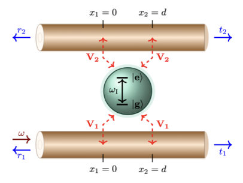
<figcaption class="paper-figure-caption"><b>Fig 1.</b> FIG. 1: (Color online) Single photon router using a single giant atom, coupled to each waveguide at x1 = 0 and x2 = d. The photon enters the setup from the bottom left.</figcaption>
</figure>
<figure class="paper-figure-card">
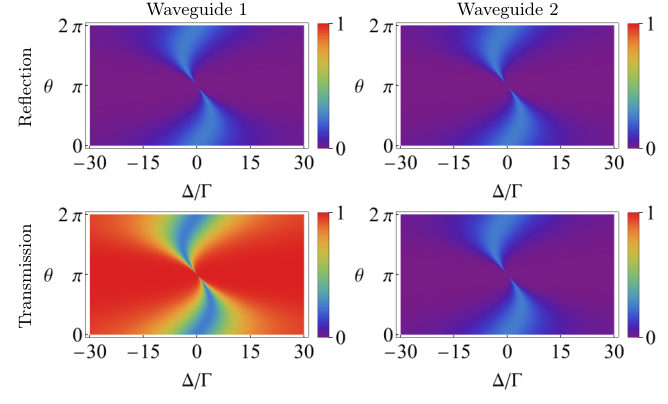
<figcaption class="paper-figure-caption"><b>Fig 2.</b> FIG. 2: (Color online) Photon transmission and reflection probabilities in waveguides 1 and 2 for a single giant atom. Detuning ∆is varied from −30 to +30 in units of the atom-waveguide coupling rate Γ. The phase θ, which incorporates the separation d between coupling points, is varied from 0 to 2π.</figcaption>
</figure>
<figure class="paper-figure-card">
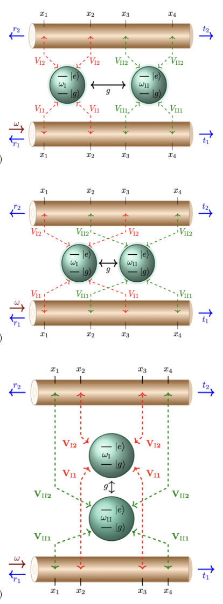
<figcaption class="paper-figure-caption"><b>Fig 3.</b> FIG. 3: (Color online) A single photon router using two giant atoms, coupled to a top and bottom waveguide at points x1, x2, x3, and x4 with coupling strength parameters VI1, VI2, VII1, and VII2 in a (a) fully separated, (b) simply braided, and (c) fully nested configuration.</figcaption>
</figure>
<figure class="paper-figure-card">
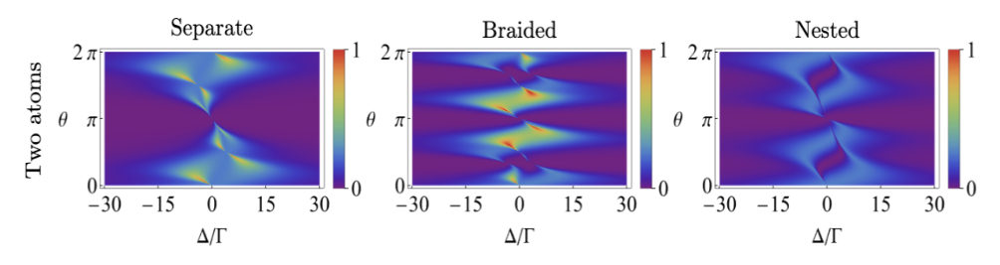
<figcaption class="paper-figure-caption"><b>Fig 4.</b> FIG. 4: (Color online) The routing efficiency |t2|2 as a function of the normalized detuning ∆/Γ and the accumulated phase θ, assuming identical atoms (∆I = ∆II = ∆), uniform decay rates (Γpql = Γ), and vanishing direct coupling (g/Γ = 0). For the separate and nested configurations, the coupling points are equally spaced such that the phase accumulation between any two adjacent coupling points is given by θ. For the braided configuration, the phase accumulation is non-uniform, satisfying 2θ = k(x2 −x1) = k(x4 −x3) and θ = k(x3 −x2).</figcaption>
</figure>
<figure class="paper-figure-card">
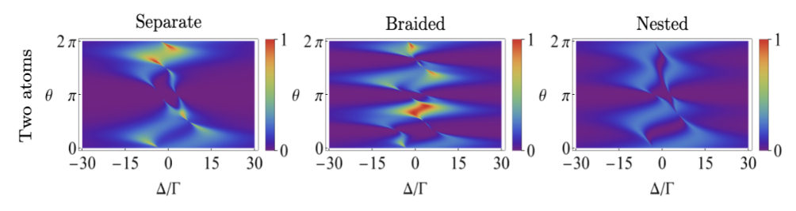
<figcaption class="paper-figure-caption"><b>Fig 5.</b> FIG. 5: (Color online) Routing efficiency |t2|2 is shown as a function of normalized detuning ∆/Γ and accumulated phase θ for a non-zero direct interaction strength g/Γ = 3. All other parameters and coupling configurations are identical to those in Fig. 4.</figcaption>
</figure>

**Summary.** This paper theoretically investigates single-photon routing in quantum electrodynamics ladders built with arrays of giant atoms. By analyzing different atomic arrangements—separated, braided, and nested—the authors demonstrate that the braided geometry offers superior, wideband, and robust routing capabilities. The results show that increasing the number of atoms enhances performance and provides resilience against environmental loss.

**Why it may be interesting.** This work is highly relevant to AMO physics and quantum optics as it uses engineered quantum systems (giant atoms) to control single-photon quantum information flow, moving beyond simple cavity QED setups into complex waveguide arrays.

Detailed structure

**Main problem.** The paper addresses the challenge of achieving highly efficient, deterministic, and chirality-free single-photon routing in complex quantum optical circuits.

**Main result.** The braided topology of multiple giant atoms proves to be the most robust architecture, enabling near-perfect routing even when environmental dissipation is present.

**Method.** The analysis employs a real-space quantum optics approach, solving the time-independent Schrödinger equation in the single-photon excitation sector using techniques derived from the Bethe Ansatz.

**Model / system.** The system models up to five 'giant atoms' coupled to two linear waveguides, forming various topological arrangements (separated, braided, nested). The dynamics are governed by a Hamiltonian incorporating atomic transitions, waveguide propagation, and coupling strengths.

**Key observables.** Photon routing efficiency ($T_q$ or $|t_2|^2$), which quantifies the probability of a photon entering the target waveguide.

**Important parameters / regimes.** Detuning ($\Delta$), phase accumulation ($	heta$), coupling rates ($\Gamma$), and the environmental loss parameter ($\gamma/\Gamma$).

**Assumptions / limitations.** The analysis is restricted to the single-photon excitation subspace, and the initial models assume specific coupling geometries (e.g., coupling at exactly two points for single-atom analysis).

**Figures summary.** Figures illustrate the schematic setups for the three topologies (separated, braided, nested) for $n$ atoms, and plot the routing probability $|t_2|^2$ as a function of detuning and phase, both in the lossless and lossy limits.

**Paper structure.** The paper progresses from single-atom analysis to two-atom systems, systematically comparing the performance of the three topologies. It then scales up to $n$ atoms, investigating the impact of direct interatomic interactions (all-to-all vs. nearest-neighbor) and environmental dissipation ($\gamma$).

Abstract

In this paper, we present an in-depth examination of single-photon routing in a multi-emitter waveguide quantum electrodynamics ladder with up to five giant atoms simultaneously coupled across two linear waveguides. Using a real-space approach, we analyze a non-chiral routing architecture and evaluate the impact of scaling the number of giant atoms in three topologically distinct configurations: fully separated, simply braided, and fully nested. Using numerical results, we show that increasing the number of giant atoms, in separate or braided configurations, greatly expands the operational parameter space for near-deterministic ($\sim$100%) photon routing into the target waveguide, achieving directionality through quantum interference alone. In contrast, the nested architecture is limited to a maximum routing efficiency of 25% due to rigid geometric symmetries, although this limitation could be mitigated by employing less symmetric coupling distances. Finally, we assess the system under direct interatomic interactions and environmental dissipation. Our results show that, while spontaneous emission reduces transport probabilities, the multi-atom-separated configuration maintains high routing efficiencies across broad operational windows of incoming photon frequency without requiring chiral coupling.

[↑ back to top](#top)

### [Giant magneto-optical rotation in a Rydberg atomic gas via symmetry-breaking wave mixing](http://arxiv.org/abs/2606.01030v1)

**Authors:** Lintian Luo, Yan Li  
**Type:** theory · **Category:** other · **PDF:** <https://arxiv.org/pdf/2606.01030v1>  
**Analysis basis:** full PDF text, analyzed in chunks
**Topic relevance:** `Rydberg arrays` **3/5** · `methods for driven-dissipative` **3/5** · `Keldysh / 2PI / non-Gaussian methods` **2/5** · `analog quantum simulation` **2/5** · `interference shaping light` **2/5** · `correlated / nonlocal dissipation` **1/5** · `driven-dissipative phase transition` **1/5** · `non-equilibrium dynamics` **1/5**

↔ Scroll figures horizontally

<figure class="paper-figure-card">
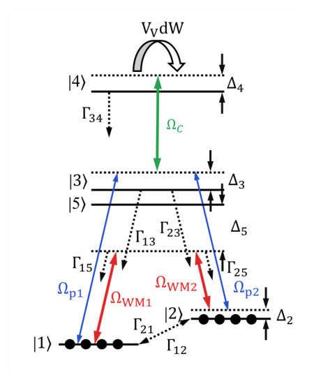
<figcaption class="paper-figure-caption"><b>Fig 1.</b> FIG. 1. Excitation scheme of the multi-level cold atomic system combining a wave-mixing (WM) field and long-range Rydberg inter- actions. Atoms initially populate the nearly degenerate Zeeman dual ground states |1⟩and |2⟩(black dots). The two circular polarization components (blue, Ω𝑝1, Ω𝑝2) of the weak probe light independently drive the transitions to the intermediate state |3⟩. A strong control field (green, Ω𝑐) couples |3⟩to the Rydberg state |4⟩, establish- ing a dual-EIT core configuration. The far-detuned WM field (red, Ω𝑊𝑀1, Ω𝑊𝑀2) couples the dual ground states to the auxiliary state |5⟩to break the initial symmetry of the polarization evolution. Here, Δ𝑗(𝑗= 2, 5) denotes the...</figcaption>
</figure>
<figure class="paper-figure-card">
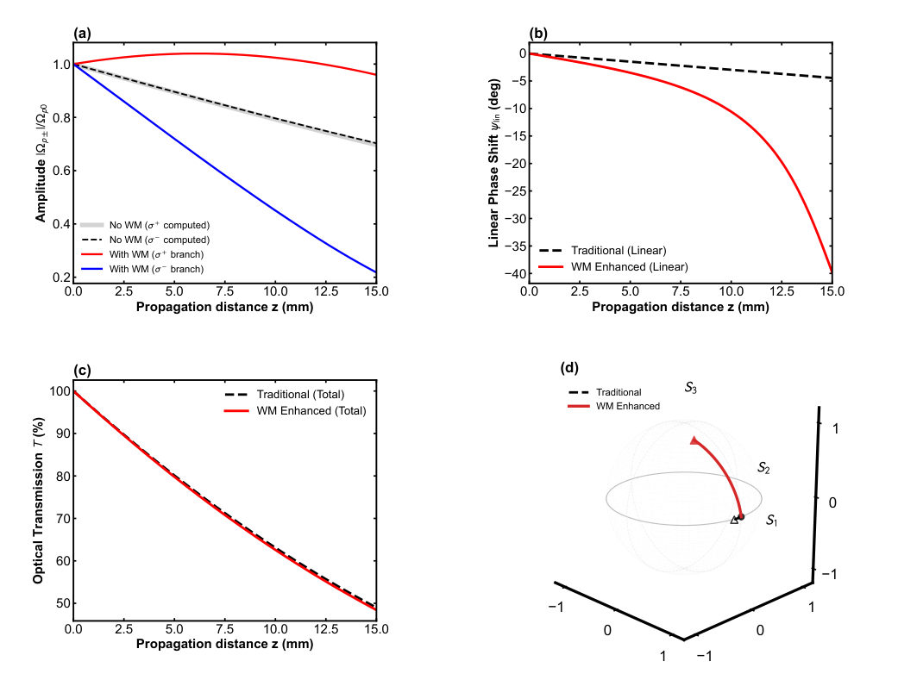
<figcaption class="paper-figure-caption"><b>Fig 2.</b> FIG. 2. Energy symmetry breaking and spatiotemporal dynamics of the macroscopic polarization driven by the WM field. The interaction length is 𝐿= 15 mm. (a) Asymmetric spatial evolution of normalized electric field amplitudes for the left-handed (𝜎+, red solid line) and right-handed (𝜎−, blue solid line) circular polarizations. Black dashed and gray solid lines indicate the symmetric, overlapping trajectories without the WM field. (b) Accumulation of the pure first-order linear background rotation angle 𝜓lin. The WM field establishes a substantial linear dispersion bias reaching −39.81◦. (c) Spatial evolution of the total optical transmission 𝑇. This confirms that the far-detuned breaking...</figcaption>
</figure>
<figure class="paper-figure-card">
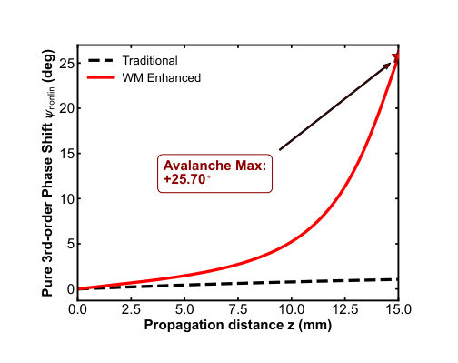
<figcaption class="paper-figure-caption"><b>Fig 3.</b> FIG. 3. Spatial avalanche of the pure third-order many-body non- local Kerr phase shift. The plot traces the accumulation of the pure third-order nonlinear rotation angle 𝜓nonlin against medium depth. To strictly isolate the local linear dispersion background, this metric is precisely extracted by subtracting the pure first-order linear background from the system’s total macroscopic rotation an- gle (which includes the long-range van der Waals integral), i.e., 𝜓nonlin = 𝜓total −𝜓lin. The black dashed line shows that under tradi- tional polarization excitation, the energy-symmetry-based blockade against propagation growth stifles the macroscopic spontaneous ac- cumulation of the strongly...</figcaption>
</figure>
<figure class="paper-figure-card">
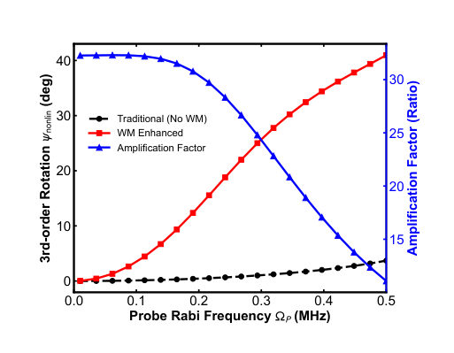
<figcaption class="paper-figure-caption"><b>Fig 4.</b> FIG. 4. Dependence of the third-order nonlinear rotation angle and the amplification factor on the probe field Rabi frequency. The plot displays the relationship between the third-order nonlinear rotation angle 𝜓nonlin and the probe field Rabi frequency Ω𝑝at 15 mm. The black dashed line with circles and the red solid line with squares denote the third-order nonlinear rotation angle without the WM field (traditional scheme) and with the WM field (WM enhanced scheme), respectively, corresponding to the left vertical axis. The blue solid line with triangles charts the amplification factor, corresponding to the right vertical axis. The horizontal axis represents the probe field Rabi frequency...</figcaption>
</figure>
<figure class="paper-figure-card">
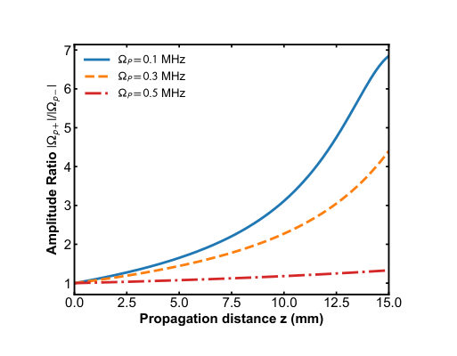
<figcaption class="paper-figure-caption"><b>Fig 5.</b> FIG. 5. Spatial evolution of the local amplitude ratio (|Ω𝑝+|/|Ω𝑝−|) between the two circular polarization components along the propaga- tion direction 𝑧under varying incident probe Rabi frequencies Ω𝑝.</figcaption>
</figure>

**Summary.** This theoretical study proposes using a far-detuned wave-mixing field in a Rydberg atomic gas to overcome an inherent energy-symmetry blockade limiting nonlinear magneto-optical rotation. By breaking this symmetry, the authors demonstrate a massive enhancement (over 24 times) of the measurable third-order nonlinear Kerr effect. This offers a highly efficient mechanism for developing next-generation ultrasensitive atomic magnetometers.

**Why it may be interesting.** This work provides a sophisticated theoretical blueprint for enhancing nonlinear optical effects in quantum media by actively engineering the system's symmetry using auxiliary fields, which is highly relevant to quantum sensing and nonlinear optics.

Detailed structure

**Main problem.** The paper addresses the limitation of the nonlinear magneto-optical rotation (NMOR) signal in conventional single-beam excitation systems due to an energy-symmetry-induced propagation blockade.

**Main result.** By introducing a far-detuned, counterpropagating wave-mixing field, the symmetry blockade is broken, leading to a giant enhancement (factor > 24) of the third-order nonlinear rotation angle.

**Method.** The authors employ adiabatic elimination, a perturbation expansion, and the Reduced Density-Matrix Expansion (RDME) method to self-consistently solve the many-body dynamics.

**Model / system.** The system is an ultracold five-level Rydberg atomic gas interacting with multiple laser fields (probe, control, wave-mixing) and long-range van der Waals interactions. The dynamics are governed by the Lindblad quantum master equation.

**Key observables.** Magneto-optical rotation angle ($\psi(z)$), pure third-order nonlinear rotation angle ($\psi_{	ext{nonlin}}$), and polarization asymmetry ratio ($|\Omega_{p+}|/|\Omega_{p-}|$).

**Important parameters / regimes.** The enhancement factor (>24), the Rydberg blockade radius ($R_b$), and the small parameters governing the approximations ($\epsilon_p, \epsilon_W$).

**Assumptions / limitations.** The WM field is treated as a steady-state dressing field, and the analysis relies on the weak-field and adiabatic approximations ($\epsilon_p \ll 1, \epsilon_W \ll 1$).

**Figures summary.** Figures illustrate the excitation scheme involving five levels and show the spatial evolution of Rabi frequency envelopes and the resulting polarization state on the Poincaré sphere.

**Paper structure.** The paper systematically develops the theoretical framework by first applying adiabatic elimination to incorporate the WM field's effect, followed by a perturbation expansion and the use of RDME to solve the resulting coupled, nonlocal differential equations for the macroscopic polarization state.

Abstract

The nonlinear magneto-optical rotation effect is central to precision measurements of weak magnetic fields and optical quantum information processing. In conventional single-beam excitation systems, the propagation of the nonlinear signal is restricted by an energy-symmetry-induced propagation blockade. This blockade originates from the symmetrical evolution of the orthogonal circularly polarized components of the probe field, which prevents spatial accumulation of the nonlinear polarization. We propose introducing a far-detuned, counterpropagating wave-mixing (WM) field into an ultracold five-level Rydberg atomic gas to actively break the excitation symmetry. Theoretically, the far-detuned WM field is treated as a steady-state dressing field. Through adiabatic elimination, the conventional third-order wave-mixing process is effectively reduced and incorporated into the first-order linear background of the system. Combined with the reduced density-matrix expansion method, this approach goes beyond both the mean-field and ground-state approximations, allowing for a self-consistent solution of the many-body dynamics that include nonlocal cascaded integrals governed by long-range van der Waals interactions. Our analytical derivations and numerical calculations demonstrate that this symmetry-breaking mechanism breaks the propagation blockade, enabling efficient utilization of the nonlocal Rydberg Kerr effect. As a result, the third-order nonlinear rotation angle is enhanced by a factor exceeding 24, offering a highly efficient mechanism for ultrasensitive atomic magnetometry and all-optical quantum information processing.

[↑ back to top](#top)

### [Frustrated neurons: Energy landscapes and relaxation dynamics in repulsive phase oscillators](http://arxiv.org/abs/2606.02512v1)

**Authors:** Brandon B. Le  
**Type:** theory · **Category:** disordered systems and neural networks · **PDF:** <https://arxiv.org/pdf/2606.02512v1>  
**Analysis basis:** full PDF text, analyzed in chunks
**Topic relevance:** `analog quantum simulation` **3/5** · `exotic spin models in light-matter` **3/5** · `driven-dissipative phase transition` **2/5** · `non-equilibrium dynamics` **2/5** · `non-equilibrium universality` **2/5** · `Frenkel-Kontorova` **1/5** · `methods for driven-dissipative` **1/5**

↔ Scroll figures horizontally

<figure class="paper-figure-card">
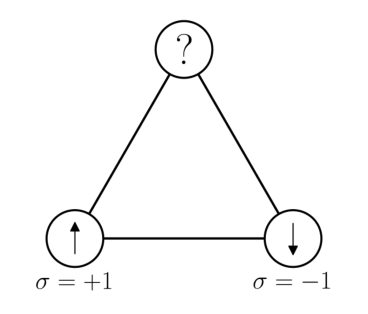
<figcaption class="paper-figure-caption"><b>Fig 1.</b> FIG. 1. Antiferromagnetic Ising frustration on a triangle. Fixing two neighboring spins to satisfy one bond leaves the third spin unable to be antiparallel to both, so at least one bond must remain unsatisfied.</figcaption>
</figure>
<figure class="paper-figure-card">
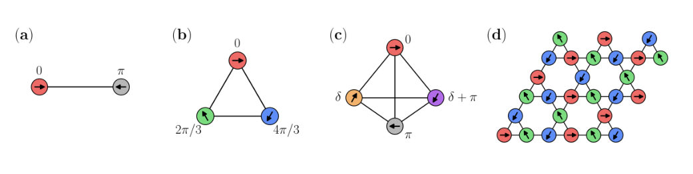
<figcaption class="paper-figure-caption"><b>Fig 2.</b> FIG. 2. Schematic hierarchy of frustrated phase-oscillator geometries studied in Sec. IV. (a) A two-oscillator pair provides the unfrustrated baseline: a single repulsive bond can be satisfied exactly by an antiphase relation. (b) The triangular motif is the minimal geometrically frustrated unit, where three repulsive bonds cannot all be satisfied simultaneously, so the reduced ground states form two chiral 120◦configurations. (c) The tetrahedral motif introduces a continuous reduced ground-state manifold, organized by antipodal pairings of planar spins. (d) A small kagome lattice extends the triangular constraint to a network of corner-sharing triangles, producing a many-state constrained...</figcaption>
</figure>
<figure class="paper-figure-card">
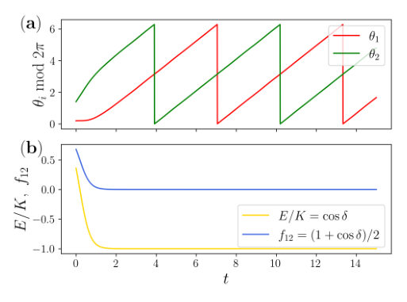
<figcaption class="paper-figure-caption"><b>Fig 3.</b> FIG. 4. Two-oscillator baseline for a single phase-repulsive bond. (a) The laboratory-frame phases θi, shown modulo 2π, continue to rotate while approaching a fixed antiphase separation. Passing to the rotating-frame variables ϕi = θi − ωt removes the common drift without changing the relative phase, δ = θ1 −θ2 = ϕ1 −ϕ2. (b) The one-bond energy E = K cos δ decreases toward its minimum value at δ = π, while the bond-frustration measure f12 = (1+cos δ)/2 relaxes to zero, indicating a fully satisfied antiphase bond.</figcaption>
</figure>
<figure class="paper-figure-card">
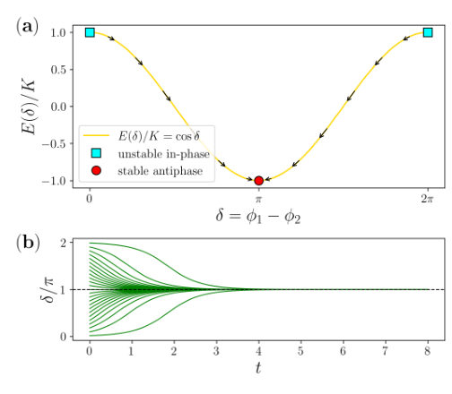
<figcaption class="paper-figure-caption"><b>Fig 4.</b> FIG. 3. Reduced energy-landscape description of the two- oscillator phase-repulsive bond. (a) The one-bond energy E(δ) = K cos δ has unstable in-phase maxima at δ = 0 and 2π, and a stable antiphase minimum at δ = π. Arrows indi- cate the direction of the reduced gradient flow in the relative phase δ. (b) Relative-phase trajectories from many initial conditions converge to the antiphase state δ = π. The ex- actly in-phase state is unstable and remains fixed only for the fine-tuned initial condition δ = 0 mod 2π.</figcaption>
</figure>
<figure class="paper-figure-card">
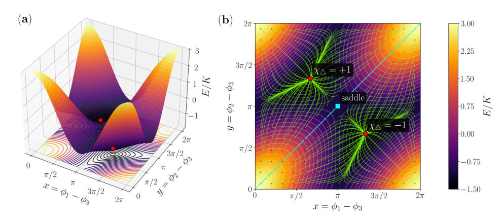
<figcaption class="paper-figure-caption"><b>Fig 5.</b> FIG. 5. Reduced energy landscape and gradient-flow dynamics of the frustrated triangular motif. The global phase degree of freedom is removed by working in the relative rotating-frame coordinates (x, y) = (ϕ1 −ϕ3, ϕ2 −ϕ3). (a) Three-dimensional surface plot of the energy E/K = cos(ϕ1 −ϕ2) + cos(ϕ2 −ϕ3) + cos(ϕ3 −ϕ1) expressed on the relative-phase plane. The two red points mark the degenerate 120◦minima, corresponding to the two possible chiral arrangements of the phases. (b) Contour plot of the same landscape with white energy contours and green gradient-flow trajectories from many initial conditions. The flow relaxes toward one of the two chiral minima, labeled by χ△= ±1. The cyan square...</figcaption>
</figure>

**Summary.** This work translates the concept of geometrical frustration from condensed matter physics into a minimal theory for neural timing. By mapping repulsive phase oscillators to an antiferromagnetic XY model, the authors show that local timing incompatibilities create structured energy landscapes. This suggests that weak global coherence in the brain may be a signature of complex, locally ordered dynamics rather than mere desynchronization.

**Why it may be interesting.** The use of established tools from frustrated magnetism (e.g., ground-state manifolds, metastable states) to diagnose collective behavior in neural oscillators provides a powerful, non-equilibrium diagnostic framework.

Detailed structure

**Main problem.** To develop a minimal theoretical framework that maps the concept of geometrical frustration, central to condensed matter physics, onto the dynamics of repulsively coupled rhythmic units in neural systems.

**Main result.** The paper shows that weak global coherence in neural systems can reflect structured local timing order dictated by a frustrated dynamical landscape, rather than indicating simple disorder.

**Method.** The authors use the language of antiferromagnetic XY models and analyze the energy landscapes and relaxation dynamics across a hierarchy of geometries (triangle, tetrahedron, kagome lattice).

**Model / system.** The model consists of repulsively coupled phase oscillators, mathematically analogous to the XY model Hamiltonian, where local constraints (anti-synchronizing phase preferences) are incompatible on non-bipartite motifs.

**Key observables.** Local chirality ($\chi_	riangle$), mean bond frustration ($ar{f}$), basin probabilities ($p_A$), and the Kuramoto order parameter ($R$).

**Important parameters / regimes.** Temperature ($T$) (noise strength), coupling strength ($K$), and the geometry of the lattice (e.g., triangle, kagome).

**Assumptions / limitations.** The theory relies on a minimal phase-oscillator limit, neglecting amplitude dynamics, synaptic delays, and assuming symmetric coupling.

**Figures summary.** Figures illustrate the $120^\circ$ pattern on a triangle and the general energy landscape analysis for various frustrated geometries.

**Paper structure.** The paper establishes a dictionary mapping magnetic concepts to neural timing analogs, derives the phase energy function for the XY model, and then analyzes the relaxation dynamics across increasing complexity of frustrated geometries.

Abstract

Geometrical frustration, a central paradigm in condensed matter physics, provides a unifying language for systems in which locally preferred interactions cannot be made globally compatible. Here, we use this language to formulate a minimal theory of frustrated neural timing, mapping repulsively coupled rhythmic units onto antiferromagnetic XY models. Within this framework, the condensed-matter concepts of local constraints, degenerate ground-state manifolds, metastability, and quench dynamics become a concrete diagnostic framework for structured neural phase dynamics. We analyze a hierarchy of geometries: a triangle as the minimal frustrated motif with two chiral 120° timing states, a tetrahedron whose reduced ground-state manifold consists of intersecting continuous branches associated with antipodal pairings, and a kagome lattice on which local constraints define a constrained three-coloring manifold. The kagome lattice reveals the central dynamical result: zero-temperature relaxation suppresses global synchrony but typically selects low-energy metastable torque-balanced states rather than exact ground states. Finally, we show how the phase theory can be carried back towards biophysical neural models by treating it as an effective-interaction target, where geometrical timing frustration is realized through preferred phase lags that become incompatible around closed motifs. This perspective suggests that weak global coherence in neural systems does not necessarily signal disordered activity, but can reflect structured local timing order shaped by a frustrated dynamical landscape.

[↑ back to top](#top)

### [Can the Brownian diffusion coefficient be reconstructed from Lyapunov exponents?](http://arxiv.org/abs/2606.01887v1)

**Authors:** I. G. Marchenko, I. I. Marchenko, D. Ivashchenko, J. Łuczka, J. Spiechowicz  
**Type:** theory · **Category:** statistical mechanics · **PDF:** <https://arxiv.org/pdf/2606.01887v1>  
**Analysis basis:** full PDF text, analyzed in chunks
**Topic relevance:** `non-equilibrium dynamics` **3/5** · `non-equilibrium universality` **3/5** · `Frenkel-Kontorova` **2/5** · `driven-dissipative phase transition` **2/5** · `methods for driven-dissipative` **2/5** · `Keldysh / 2PI / non-Gaussian methods` **1/5**

↔ Scroll figures horizontally

<figure class="paper-figure-card">
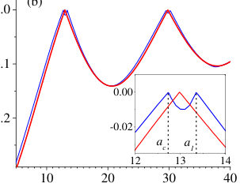
<figcaption class="paper-figure-caption"><b>Fig 1.</b> FIG. 1. (a) The rescaled diffusion coefficient D/D0 as a func- tion of the ac-driving amplitude a; here D0 = Q/γ denotes the Einstein diffusion coefficient for a force-free particle. The blue curve represents numerical simulations of Eq. (1) and the red curve corresponds to the approximate theory (24). (b) The maximal Lyapunov exponent λ1 of the deterministic counterpart (Q = 0), showing a similar dependence on a. The blue curve represents numerical analysis of Eq. (2), while the red curve corresponds to the approximate theory (22). Pa- rameters are set to γ = 3, ω = 1.59, and Q = 0.1.</figcaption>
</figure>
<figure class="paper-figure-card">
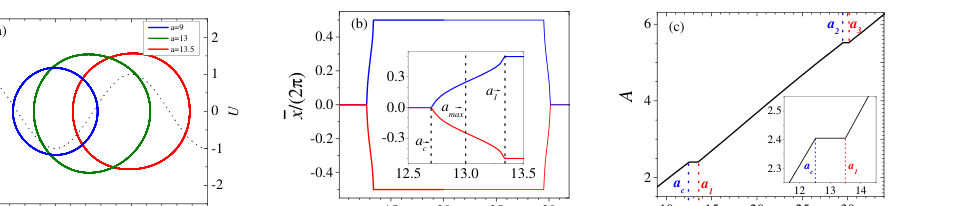
<figcaption class="paper-figure-caption"><b>Fig 2.</b> FIG. 2. Deterministic system (Q = 0): (a) The phase curves position-velocity in stationary states illustrating transition from normal (a &lt; ac) to symmetry-broken states (a &gt; ac) under variation of the driving amplitude a. The dotted curve represents the spatially periodic potential U(x) (b) Bifurcation diagram illustrating the bifurcation point a = ac where normal and inverted oscillations emerge; x is the asymptotic average of x(t) over one period 2π/ω of the driving. (c) Amplitude of the periodic orbits versus a. Other parameters are the same as in Fig. 1.</figcaption>
</figure>
<figure class="paper-figure-card">
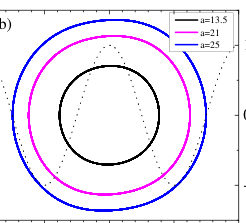
<figcaption class="paper-figure-caption"><b>Fig 3.</b> FIG. 3. Deterministic system (Q = 0): Periodic orbits for normal and symmetry-broken states illustrating the influence of the external driving amplitude a. Remaining parameters are consistent with Fig. 1.</figcaption>
</figure>
<figure class="paper-figure-card">
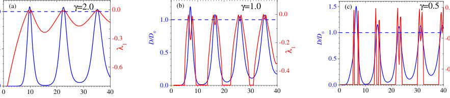
<figcaption class="paper-figure-caption"><b>Fig 4.</b> FIG. 4. Influence of dissipation on the system dynamics for damping constants γ = 2, 1, and 0.5. Other parameters are the same as in Fig. 1.</figcaption>
</figure>
<figure class="paper-figure-card">
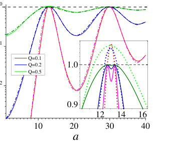
<figcaption class="paper-figure-caption"><b>Fig 5.</b> FIG. 5. Influence of temperature Q on the diffusion coeffi- cient. The doted curves are obtained from simulations of the Langevin equation (1), whereas continues - from Eq. (24). Other parameters are the same as in Fig. 1.</figcaption>
</figure>

**Summary.** This paper explores the relationship between the diffusion coefficient and Lyapunov exponents for a particle in a periodically driven potential. Despite no general theoretical link, the authors successfully propose and validate an approximate formula that reconstructs the diffusion coefficient using the maximal Lyapunov exponent from the zero-temperature deterministic system. This provides a novel diagnostic tool for characterizing non-equilibrium transport phenomena.

**Why it may be interesting.** The connection between transport coefficients (like D) and deterministic chaos indicators (like $\lambda$) is a fundamental topic in non-equilibrium statistical mechanics, providing a powerful tool to characterize complex dynamics.

Detailed structure

**Main problem.** The paper investigates whether the Brownian diffusion coefficient of a driven particle can be reconstructed from the maximal Lyapunov exponent of the corresponding deterministic system.

**Main result.** The authors demonstrate a strong, quantifiable relationship, proposing an approximate formula that allows the reconstruction of the quasiperiodic diffusion coefficient from the maximal Lyapunov exponent of the zero-temperature deterministic system.

**Method.** The analysis combines numerical simulations of the Langevin equation with theoretical approximations derived from analyzing the deterministic counterpart's periodic orbits and linearized dynamics.

**Model / system.** The system models a particle moving in a spatially periodic and symmetric potential, subjected to an AC-driven external force and thermal noise (Brownian motion).

**Key observables.** Diffusion Coefficient (D), Maximal Lyapunov Exponent ($\lambda_{	ext{max}}$), Mean Square Displacement ($\langle \Delta x^2(t) 
angle / 2t$).

**Important parameters / regimes.** External driving amplitude ($a$), friction coefficient ($\gamma$), temperature/noise intensity ($Q$), and system frequency ($\omega$).

**Assumptions / limitations.** The reconstruction formula is proposed as an approximation, showing good agreement but noting discrepancies near local maxima of D. The analysis relies on the system being ergodic at non-zero temperatures.

**Figures summary.** Figures illustrate the dependence of D and $\lambda_{	ext{max}}$ on the driving amplitude $a$, showing quasiperiodic behavior, and also show the influence of temperature $Q$ and damping $\gamma$ on these quantities.

**Paper structure.** The paper first establishes the physical model using the Langevin equation, then analyzes the dynamics in different parameter regimes (zero vs. non-zero temperature). It proceeds to derive and test an approximate formula linking D to $\lambda_{	ext{max}}$ by comparing theoretical predictions with extensive numerical simulations.

Abstract

We consider an ac-driven particle moving in a spatially periodic and symmetric potential. In the zero- temperature limit, for the analyzed parameter set, its dynamics is non-chaotic and the particle does not manifest diffusive properties. At non-zero temperatures, the asymptotic long-time motion follows normal (Brownian) diffusion. Recent studies have shown that within tailored parameter regimes, the diffusion coef- ficient is a quasiperiodic function of the external driving amplitude [1]. Although no general relation between Lyapunov exponents and Brownian diffusion exists, we demonstrate that the quasiperiodic diffusion coefficient at non-zero temperature can be accurately reconstructed from the maximal Lyapunov exponent of the corresponding deterministic system (at vanishing temperature). We propose an approximate formula for this purpose, which shows good agreement with numerical simulations, although some discrepancies are detected in the vicinity of the local maxima of the diffusion coefficient. Finally, we examine the robustness of the correlation between diffusion and the Lyapunov exponent under variations of the system parameters.

[↑ back to top](#top)

### [Experimental observation of strong field stabilization](http://arxiv.org/abs/2606.00242v1)

**Authors:** Anna R. Dardia, Spencer Walker, Yifei Bai, Petros Kousis, Alexandra S. Landsman, David M. Weld  
**Type:** both · **Category:** other · **PDF:** <https://arxiv.org/pdf/2606.00242v1>  
**Analysis basis:** full PDF text, analyzed in chunks
**Topic relevance:** `analog quantum simulation` **3/5** · `non-equilibrium dynamics` **3/5** · `driven-dissipative phase transition` **2/5** · `methods for driven-dissipative` **2/5** · `non-equilibrium universality` **2/5** · `Keldysh / 2PI / non-Gaussian methods` **1/5**

↔ Scroll figures horizontally

<figure class="paper-figure-card">
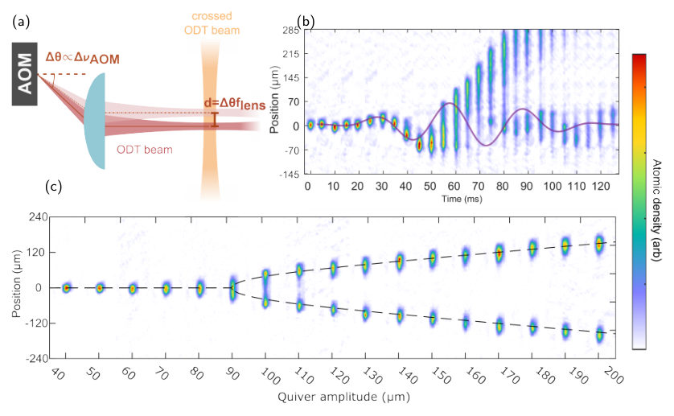
<figcaption class="paper-figure-caption"><b>Fig 1.</b> FIG. 1. Probing strong-field dynamics with trapped atoms. a) Diagram of the experimental setup. The trap position is varied by an acousto-optic modulator to induce inertial forces which correspond to the electric fields of a laser pulse. b) Absorption images of strontium atoms subjected to a 4-cycle pulse with amplitude A = 38.3 µm and frequency ωdrive = 1.14 ω0 (2π × 32 Hz), taken at various times during the pulse to reveal sub-cycle dynamics. Solid line indicates the time- dependent position of the trap center. The observed unbinding from the trap partway through the pulse corresponds to strong-field photoionization. c) Absorption images of atoms after a 250 ms ramp-up to a range of final...</figcaption>
</figure>
<figure class="paper-figure-card">
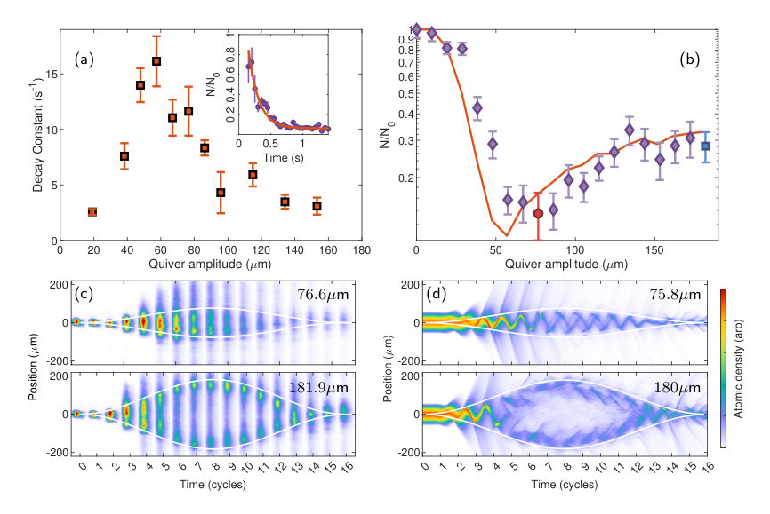
<figcaption class="paper-figure-caption"><b>Fig 2.</b> FIG. 2. Observation of strong-field stabilization. a) Measured unbinding rate in a constant amplitude field of frequency 1.43 ω0 (40 Hz), plotted versus quiver amplitude. After a 6-cycle ramp into a flat-top pulse, the surviving population is measured via absorption imaging after varying durations, and the decay constant is determined by an exponential fit. Note the sharp decrease in loss rate above a critical quiver amplitude. Error bars denote 95% confidence intervals; inset depicts one such fit. b) Surviving population fraction following a 16-cycle 1.43 ω0 (40 Hz) sin2-envelope pulse as a function of quiver amplitude. Symbols denote experimental data; solid red curve shows the results of...</figcaption>
</figure>
<figure class="paper-figure-card">
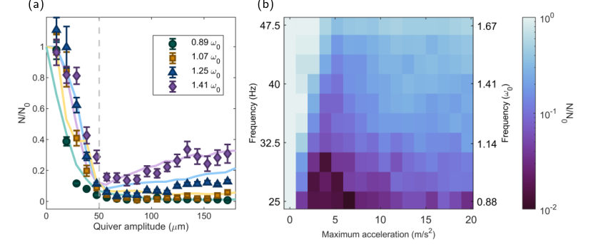
<figcaption class="paper-figure-caption"><b>Fig 3.</b> FIG. 3. Dependence of stabilization on frequency and amplitude. a) Normalized surviving population following a 16-cycle pulse with a sin2 envelope following the same procedure as in Fig 2(b), for drive frequencies of 0.89 ω0 to 1.43 ω0 (25 to 40 Hz). Dashed line indicates the point where the quiver amplitude equals w/2. Solid lines in corresponding shades represent the results of GPE numerics. b) 2D stability diagram exploring the dependence of strong-field stabilization on frequency and amplitude over a wider range of amplitudes, in terms of maximum acceleration: Aω2 drive. Each pixel denotes the surviving bound population following a 16-cycle sin2 pulse, normalized by the population in...</figcaption>
</figure>
<figure class="paper-figure-card">
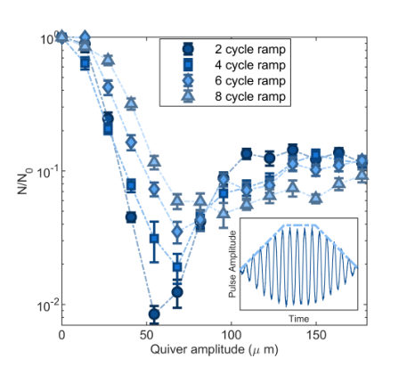
<figcaption class="paper-figure-caption"><b>Fig 4.</b> FIG. 4. Effect of pulse shape on ionization Measured surviving population versus amplitude following a 16-cycle trapezoidal pulse of frequency 1.34 ω0 (37.5 Hz), with the du- ration of the ramp-up and ramp-down varied. Error bars rep- resent standard error; lines are guides to the eye. Inset shows the trap center motion during a 6-cycle ramp, as measured by a position-sensitive photodiode.</figcaption>
</figure>
<figure class="paper-figure-card">
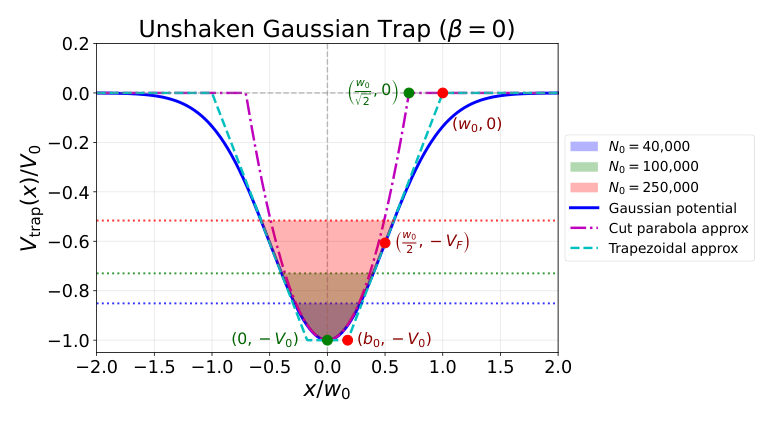
<figcaption class="paper-figure-caption"><b>Fig 5.</b> Figure 1: Unshaken Gaussian trap potential (β = 0) as a function of position scaled by the beam waist w. Blue solid: Gaussian potential Vtrap(x) = −V0 exp(−2x2/w2). Magenta dash–dot: cut– parabola approximation (harmonic oscillator truncated at V = 0). Cyan dashed: trapezoidal approximation. The potential depth is V0. Horizontal lines denote the chemical potentials for condensates with N0 = 40 k, 100 k, and 250 k, and the corresponding shaded regions indicate the Thomas–Fermi fillings for each case.</figcaption>
</figure>

**Summary.** This research reports the first experimental observation of strong-field stabilization in trapped atoms, confirming a decades-old prediction that intense laser fields can stabilize quantum states. By measuring ionization rates and observing wavepacket bifurcation, the authors validate the theory using ultracold atoms as an analogue for bound electrons. This work advances the understanding of quantum dynamics in extreme electromagnetic environments.

**Why it may be interesting.** This work provides a crucial experimental realization of a long-standing theoretical prediction in extreme quantum dynamics, offering a complementary tool to probe strong-field physics inaccessible with current pulsed laser technology.

Detailed structure

**Main problem.** The paper investigates the counter-intuitive phenomenon of strong-field stabilization, where intense oscillating fields stabilize bound quantum states against ionization.

**Main result.** The authors experimentally observe strong-field stabilization in trapped atoms and confirm the predicted wavefunction bifurcation, showing stabilization persists even at surprisingly low drive frequencies.

**Method.** The study combines experimental measurements on trapped ultracold atoms with detailed numerical simulations using the Gross-Pitaevskii Equation (GPE) to model the dynamics.

**Model / system.** The system uses trapped neutral atoms (e.g., Sr BEC) subjected to time-dependent inertial forces to emulate the dynamics of bound electrons in an intense laser field, modeled by the Kramers-Henneberger potential.

**Key observables.** Ionization rate (loss rate), spatial bifurcation/dichotomy of the wavepacket, and surviving population fraction as a function of field amplitude.

**Important parameters / regimes.** Quiver amplitude ($A$), drive frequency ($\omega$), and the critical amplitude ($A_{	ext{crit}}$) required to induce stabilization.

**Assumptions / limitations.** The single-active electron approximation is used in some analyses, and the GPE simulations are noted to neglect finite-temperature or beyond-mean-field effects.

**Figures summary.** Figures illustrate the experimental setup, sub-cycle dynamics, wavepacket bifurcation, and quantitative plots showing the non-monotonic dependence of the ionization rate on the quiver amplitude, confirming stabilization.

**Paper structure.** The paper progresses from establishing the theoretical prediction of stabilization, detailing the experimental platform using trapped atoms, presenting measurements of ionization rates and wavepacket bifurcation across varying field parameters, and concluding with a general confirmation of the phenomenon's robustness.

Abstract

Strong oscillating fields are expected to tear apart bound quantum states. Theoretical studies predict a striking reversal: that as the field intensity is raised above some threshold, bound states like atoms can become increasingly stable, accompanied by a spatial bifurcation of the bound state wavefunction. This strong field stabilization was predicted decades ago in the context of atoms in pulsed laser fields, but has resisted experimental observation due to extreme intensity requirements and theoretical controversy. Here we report the experimental observation of strong-field stabilization of a ground state, using trapped neutral atoms to emulate the dynamics of bound electrons in an extremely strong laser field. We image the predicted wavepacket bifurcation, measure an ionization rate non-monotonic in field amplitude, and map out the regime of stabilization. Stabilization persists down to surprisingly low drive frequencies, on the order of the lowest-energy excitations. These results confirm a long-standing prediction in extreme quantum dynamics, and showcase a complementary tool for probing strong-field phenomena near and beyond the frontier of current laser technology.

[↑ back to top](#top)

### [Linear optimal protocol for physical constraints in weakly driven processes](http://arxiv.org/abs/2606.01988v1)

**Authors:** Pierre Nazé  
**Type:** theory · **Category:** statistical mechanics · **PDF:** <https://arxiv.org/pdf/2606.01988v1>  
**Analysis basis:** full PDF text, analyzed in chunks
**Topic relevance:** `methods for driven-dissipative` **3/5** · `correlated / nonlocal dissipation` **2/5** · `driven-dissipative phase transition` **2/5** · `non-equilibrium dynamics` **2/5** · `non-equilibrium universality` **2/5** · `Keldysh / 2PI / non-Gaussian methods` **1/5**

↔ Scroll figures horizontally

<figure class="paper-figure-card">
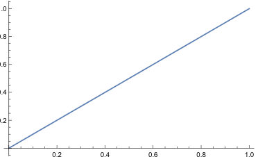
<figcaption class="paper-figure-caption"><b>Fig 1.</b> FIG. 1. Linear protocol observed for all relaxation functions proposed in this work and τ/τR = 0.1, 1, 10.</figcaption>
</figure>

**Summary.** This work determines the minimum irreversible work required to drive a weakly coupled quantum system between states under specific constraints. By reformulating the problem using periodic boundary conditions, the authors show that the optimal driving protocol is universally linear. This result highlights that the minimum dissipation is dictated by the global memory properties of the system, independent of the specific details of the relaxation kernel.

**Why it may be interesting.** It provides a rigorous, spectral understanding of optimal dissipation in non-equilibrium quantum processes, showing that simple linear protocols minimize work even when complex memory effects are present.

Detailed structure

**Main problem.** The paper minimizes the irreversible work done in weakly driven quantum systems while respecting physical constraints on the driving protocol's derivative.

**Main result.** The global optimal protocol is found to be linear, resulting in an optimal work value that depends only on the integrated relaxation function.

**Method.** The problem is formulated as a constrained variational minimization, leading to a shifted eigenvalue equation solved by exploiting the periodicity of the relaxation kernel in a Fourier basis.

**Model / system.** The study concerns weakly driven quantum systems analyzed within the framework of linear response theory. The dynamics are governed by an irreversible work functional involving a relaxation function $\Psi_0(t)$.

**Key observables.** Irreversible work ($	ext{Wirr}[v]$), the relaxation function $\Psi_0(t)$, and the optimal work ($	ext{W}^*_{	ext{irr}}$).

**Important parameters / regimes.** The driving time $	au$, the constraints on total variation ($\delta\lambda$), and the quadratic bound on the driving speed ($C$).

**Assumptions / limitations.** The analysis assumes the system is in the weak driving regime and requires extending the relaxation kernel periodically to restore translational invariance.

**Figures summary.** Tables compare numerical results for the optimal work across various relaxation functions ($\exp(-|t|/	au_R)$, $J_0$, $\sin$, $\cos$), showing convergence to an analytical prediction. Figure 1 illustrates the resulting linear protocol.

**Paper structure.** The paper establishes the variational problem, derives the associated shifted eigenvalue equation, solves it using Fourier analysis on a periodic domain, and confirms the universal linear solution through numerical testing across multiple kernel types.

Abstract

The minimization of irreversible work in weakly driven systems within linear response under physical constraints on the protocol derivative is studied. The problem reduces to a shifted eigenvalue equation involving the relaxation function. Owing to its dependence on time differences and its evenness, the relaxation kernel is naturally defined over a symmetric interval, where a periodic representation arises as a consistent closure that restores continuous translational invariance. Also, it shows how the irreversible work is defined in practice. Within this framework, the operator becomes diagonal in a Fourier basis. The global optimal solution is the zero mode, yielding a constant driving speed and a linear protocol. The corresponding optimal work depends only on the integrated relaxation function. Numerical results obtained via genetic programming confirm the robustness of this solution across different kernels.

[↑ back to top](#top)

### [Modular theory and affine representations on the Rindler horizon](http://arxiv.org/abs/2606.01071v1)

**Authors:** Michele Arzano, Paolo Palumbo  
**Type:** theory · **Category:** statistical mechanics · **PDF:** <https://arxiv.org/pdf/2606.01071v1>  
**Analysis basis:** full PDF text, analyzed in chunks
**Topic relevance:** `entanglement & information structure` **3/5** · `Keldysh / 2PI / non-Gaussian methods` **2/5** · `methods for driven-dissipative` **2/5** · `non-equilibrium dynamics` **2/5** · `correlated / nonlocal dissipation` **1/5** · `driven-dissipative phase transition` **1/5** · `non-equilibrium universality` **1/5**

↔ Scroll figures horizontally

<figure class="paper-figure-card">
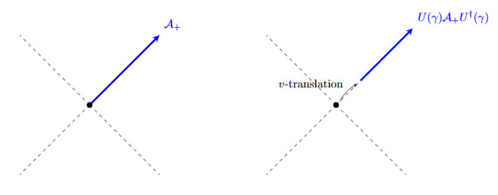
<figcaption class="paper-figure-caption"><b>Fig 1.</b> FIG. 1: Visualization of the algebra A+ and its v-translated U(γ)A+U †(γ) for positive γ. Notice that U(γ)A+U †(γ) ̸⊆A+ for γ &lt; 0, since points are moved across the horizon (in this sense, the origin).</figcaption>
</figure>

**Summary.** This paper provides a deep mathematical framework for understanding the Unruh effect by interpreting it through the lens of affine symmetry and modular theory. It shows that the thermal nature observed by an accelerated observer is mathematically equivalent to the modular flow of the restricted quantum field algebra. This establishes the affine group as the minimal symmetry governing horizon thermality.

**Why it may be interesting.** The connection between the Unruh effect, which is fundamentally about thermalization in curved spacetime, and the rigorous mathematical machinery of modular theory provides deep insights into how entanglement and thermal properties emerge from local algebraic structures.

Detailed structure

**Main problem.** The paper develops a group-theoretic interpretation of the Unruh effect by relating it to modular theory and affine symmetry on the Rindler horizon.

**Main result.** The affine group structure captures the minimal symmetry underlying the Unruh effect, which is confirmed by modular theory showing the dilation flow implements the KMS condition on the restricted vacuum.

**Method.** The analysis uses light-cone coordinates, compares Minkowski and Rindler mode expansions via the Mellin transform, and applies Tomita-Takesaki modular theory to characterize the thermal nature.

**Model / system.** The system is a massless scalar field in two spacetime dimensions, analyzed by restricting its vacuum state to a single Rindler wedge near a horizon.

**Key observables.** The thermal factor $e^{-2\pi\omega}$ derived from the overlap between Minkowski and Rindler bases, and the satisfaction of the KMS condition.

**Important parameters / regimes.** The proper acceleration $\alpha$ (related to the temperature $T=1/(2\pi)$), and the spectral parameter $\omega$.

**Assumptions / limitations.** The analysis assumes the existence of a suitable vacuum state $|\Omega
angle$ and relies on the algebraic structure of the half-line algebra $A^+$.

**Figures summary.** Not specified.

**Paper structure.** The paper progresses from establishing the physical problem (Unruh effect) to developing the mathematical tools (affine symmetry, Mellin transform) and finally confirming the thermal nature using the rigorous framework of modular theory and the KMS condition.

Abstract

We develop a group-theoretic interpretation of the Unruh effect based on affine symmetry on a light ray and relate it to modular theory. For a massless scalar field in two spacetime dimensions inertial and uniformly accelerated observers select two different flows within the same chiral one-particle structure, respectively, null translations and dilations. Minkowski modes are adapted to translations, while Rindler modes are adapted to dilations, with the Mellin transform providing the natural bridge between them. When a Minkowski positive-frequency mode is restricted to a single Rindler wedge, its comparison with Rindler modes is non-unitary within the positive-frequency sector. Modular theory gives the corresponding operator-algebraic interpretation: on the horizon the modular flow of the half-line algebra is implemented by dilations, and the restricted vacuum satisfies the KMS condition. The affine group thus appears as the minimal symmetry structure underlying thermality on the Rindler horizon.

[↑ back to top](#top)

### [Probing the scale-free hierarchy of the $p=3$ spherical spin glass via persistent Langevin dynamics](http://arxiv.org/abs/2606.02239v1)

**Authors:** Li Zhenpeng  
**Type:** theory · **Category:** disordered systems and neural networks · **PDF:** <https://arxiv.org/pdf/2606.02239v1>  
**Analysis basis:** full PDF text, analyzed in chunks
**Topic relevance:** `exotic spin models in light-matter` **3/5** · `non-equilibrium dynamics` **3/5** · `non-equilibrium universality` **3/5** · `analog quantum simulation` **1/5** · `driven-dissipative phase transition` **1/5** · `methods for driven-dissipative` **1/5**

↔ Scroll figures horizontally

<figure class="paper-figure-card">
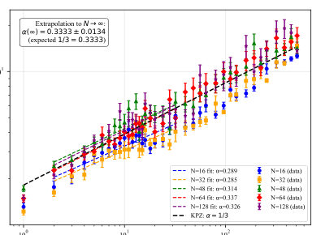
<figcaption class="paper-figure-caption"><b>Fig 1.</b> FIG. 1. Energy correlation time τcorr as a function of per- sistence time τp for N = 16, 32, 48, 64, 128 at T = 1.0. Data points are shown with error bars representing the standard error of the mean (SEM) calculated from n = 40–50 indepen- dent trajectories per τp (see Appendix C for exact ntrajs). Dashed lines are power-law fits for τp ∈[2, 32], yielding α values shown in the legend. The black dashed line indicates the KPZ prediction τcorr ∼τ 1/3 p . The annotation shows the finite-size extrapolation to α(∞) = 0.3333 ± 0.0134.</figcaption>
</figure>
<figure class="paper-figure-card">
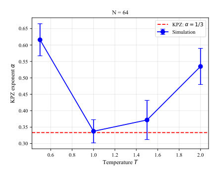
<figcaption class="paper-figure-caption"><b>Fig 2.</b> FIG. 2. KPZ exponent α as a function of temperature T for N = 64. The dashed line indicates the KPZ prediction α = 1/3. Error bars represent the standard error of the fitted exponent α obtained from weighted linear regression over τp ∈ [2, 32] (for T = 1.0) or τp ∈[4, 32] (for other temperatures).</figcaption>
</figure>

**Summary.** This work uses persistent Langevin dynamics to study the energy landscape of the $p=3$ spherical spin glass. By tuning the walker's inertia via the persistence time $	au_p$, the authors measure the energy correlation time and find it scales with the predicted KPZ exponent ($\alpha=1/3$). This confirms the scale-free hierarchical nature of the landscape and reveals distinct dynamical regimes based on temperature.

**Why it may be interesting.** The application of persistent dynamics to probe the energy landscape topology of a spin glass connects concepts from non-equilibrium statistical mechanics (KPZ universality) to disordered systems, which is relevant for understanding complex energy minima in quantum many-body systems.

Detailed structure

**Main problem.** The study investigates how a persistent random walker perceives the complex energy landscape of the $p=3$ spherical spin glass.

**Main result.** The energy correlation time scales with the persistence time as $	au_{	ext{corr}} \sim 	au_p^{1/3}$, confirming that the $p=3$ spherical spin glass belongs to the Kardar–Parisi–Zhang (KPZ) universality class.

**Method.** The authors use persistent Langevin dynamics simulations to measure the energy correlation time ($	au_{	ext{corr}}$) as a function of the persistence time ($	au_p$).

**Model / system.** The system is the $p=3$ spherical spin glass, governed by a Hamiltonian $H(\mathbf{x}) = rac{1}{3!} \sum_{i,j,k} J_{ijk} x_i x_j x_k$. The dynamics are simulated using persistent Langevin dynamics, which incorporates inertia via the persistence time $	au_p$.

**Key observables.** Energy correlation time ($	au_{	ext{corr}}$) and its scaling exponent $\alpha$ defined by $	au_{	ext{corr}} \sim 	au_p^\alpha$.

**Important parameters / regimes.** Persistence time $	au_p$, Temperature $T$, System size $N$. The analysis identifies three regimes: ballistic/inertial, KPZ, and noise-dominated.

**Assumptions / limitations.** The analysis relies on the assumption that $	au_p$ acts as a tunable probe for the energy resolution ($\delta E \sim 1/	au_p$), allowing the detection of the scale-free hierarchy.

**Figures summary.** The results show a U-shaped curve for $\alpha(T)$, identifying the three dynamical regimes, and confirm the KPZ scaling exponent $\alpha=1/3$ through finite-size scaling.

**Paper structure.** The paper establishes the physical problem, details the use of persistent Langevin dynamics, presents the key finding of KPZ scaling for $p=3$, and analyzes the temperature dependence to map out distinct dynamical regimes.

Abstract

How does a persistent random walker perceive a complex energy landscape? We address this question by studying the persistent Langevin dynamics of the p=3 spherical spin glass, a paradigmatic mean-field model with a scale-free hierarchical landscape. By tuning the persistence time tau_p, which controls the walker's inertia and effectively sets its energy resolution delta E proportional to 1/tau_p, we measure the energy correlation time tau_corr. At temperature T=1.0, we find tau_corr scales as tau_p to the power alpha with alpha = 0.337 plus or minus 0.035 for tau_p in the range [2,32] (for N=64), in excellent agreement with the Kardar-Parisi-Zhang (KPZ) universality class prediction alpha = 1/3. Finite-size scaling using N = 16,32,48,64,128 yields the thermodynamic limit alpha(infinity) = 0.3333 plus or minus 0.0134, fully consistent with 1/3. Thus, tau_p acts as a tunable probe that reveals the predicted scale-free hierarchy of the landscape. Moreover, the temperature dependence alpha(T) for T = 0.5,1.0,1.5,2.0 exhibits a clear U-shaped curve, identifying three dynamical regimes: ballistic/inertial, KPZ, and noise-dominated. Our results establish persistent Langevin dynamics as a powerful tool for uncovering hidden landscape topology and demonstrate that the p=3 spherical spin glass belongs to the KPZ universality class.

[↑ back to top](#top)

### [Topics on Foundations of Physics: From the quantum to the (semi) classical, gravity, thermodynamics, and (or beyond) our possible detections](http://arxiv.org/abs/2606.00255v1)

**Authors:** Ricardo Muciño  
**Type:** theory · **Category:** other · **PDF:** <https://arxiv.org/pdf/2606.00255v1>  
**Analysis basis:** full PDF text, analyzed in chunks
**Topic relevance:** `measurement-induced transitions` **3/5** · `quantum measurements` **3/5** · `Keldysh / 2PI / non-Gaussian methods` **2/5** · `entanglement & information structure` **2/5** · `correlated / nonlocal dissipation` **1/5** · `methods for driven-dissipative` **1/5**

↔ Scroll figures horizontally

<figure class="paper-figure-card">
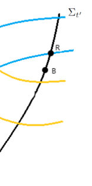
<figcaption class="paper-figure-caption"><b>Fig 1.</b> Figure 6.1: Spacetime diagram of the EPR setting with two foliations: in yellow th one with hypersurfaces Σt and in blue the one with hypersurfaces Σt′. A and B represent the events associated with Alice and Bob’s measurements in the z−spin basis respectively. P is an event in Alice’s worldline, before she makes her measurement, and R is an event in Bob’s worldline, after he makes his measurement.</figcaption>
</figure>
<figure class="paper-figure-card">
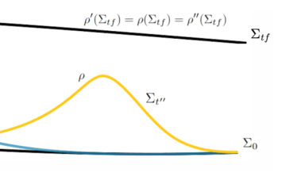
<figcaption class="paper-figure-caption"><b>Fig 2.</b> Figure 8.1: Different foliations sharing the same hypersurface Σtf. Independently of which foliation is used to arrive to the state in Σtf, e.g. the one that contains Σt′ with the associated state ρ′, or Σt′′ with ρ′′, the theory should assign the same ρ(Σtf) to Σtf. And any differences between the states ρ′ and ρ0 are due to what happens in Γ.</figcaption>
</figure>
<figure class="paper-figure-card">
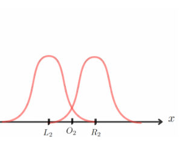
<figcaption class="paper-figure-caption"><b>Fig 3.</b> Figure 8.2: Matter density of two pointers in the superposition (8.17) showing just the x spatial dimension of Σ0.</figcaption>
</figure>
<figure class="paper-figure-card">
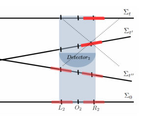
<figcaption class="paper-figure-caption"><b>Fig 4.</b> Figure 8.3: Spacetime diagram showing the hypersurfaces Σ0, Σt, Σt′ and Σt′′. The mass density is shown in red with transparency for m/2 and full color for m after detection, e.g. to the right, R1 and R2.</figcaption>
</figure>
<figure class="paper-figure-card">
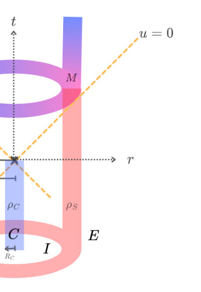
<figcaption class="paper-figure-caption"><b>Fig 5.</b> Figure 9.1: An spherically symmetric superposition of masses suffers a collapse at r = 0 and t = 0, localizing the entire mass M at the region of the shell. The central massive core has radius RC and uniform density ρC, and the shell has an inner radius RI, an outer radius RE and uniform density ρS.</figcaption>
</figure>

**Summary.** This thesis tackles the foundations of physics by bridging quantum theory, thermodynamics, and gravity. It develops a novel, self-consistent semiclassical gravity model where quantum collapse dynamics dictate the source of spacetime curvature. The work aims to resolve fundamental issues like the arrow of time and the measurement problem through testable predictions for gravitational experiments.

**Why it may be interesting.** While highly theoretical, the focus on objective collapse models and their coupling to gravity provides a unique, non-standard extension to quantum dynamics that could inform open quantum systems research by providing a mechanism for decoherence/collapse in a relativistic setting.

Detailed structure

**Main problem.** The central goal is to reconcile quantum mechanics with general relativity and to provide a fundamental understanding of physical laws, particularly addressing the arrow of time and the nature of measurement.

**Main result.** The work proposes a self-consistent semiclassical gravity framework where objective quantum collapse dynamics source the classical Einstein tensor, yielding testable predictions for gravitational entanglement experiments.

**Method.** The approach involves analyzing foundational paradoxes (like absolute velocity detection) and developing a novel coupling mechanism between quantum collapse models and classical general relativity.

**Model / system.** The models span Newtonian mechanics, de Broglie-Bohm pilot-wave theory, objective collapse theories (like GRW), and a semiclassical gravity framework coupling the expectation value of the energy-momentum tensor to the Einstein tensor.

**Key observables.** Relative phases in gravitationally-induced entanglement experiments, and the detectability of absolute velocities in hypothetical universes.

**Important parameters / regimes.** The energy-momentum density $	ext{Tab}(x)$ defining the source for gravity, and the time scale required for phase shifts ($	au \sim 3.5$s).

**Assumptions / limitations.** The framework assumes that the expectation value of the energy-momentum tensor provides a Lorentz-invariant and self-consistent source for classical gravity, and that fundamental physical properties are, in principle, detectable.

**Figures summary.** Figures illustrate the spacetime metric components ($ds^2$) for static, spherically symmetric systems, detailing the matching conditions across Core, Shell, and Exterior regions.

**Paper structure.** The thesis is structured in three interconnected parts: I) Investigating detectability in various regimes (Newtonian/QM), II) Explaining the approach to thermodynamic equilibrium, and III) Developing the self-consistent semiclassical gravity model.

Abstract

The work leading to this thesis focuses on assessing and extending quantum theories in order to explore and test their implications across various regimes -- including thermodynamics, semiclassical and quantum gravity scenarios, and the in principle detectable predictions of such theories. The general motivation stems from a basic desire to understand the world form its very foundations. For instance, how can we bridge the gap between what we observe or `perceive' and the fundamental quantum nature in our theories. In particular, this work originated from the search to a better understanding of the nature of time according to our physical theories and the common perception that it invariably `flows' to the future, or, in other words, why do we observe distinct natural processes evolving asymmetrically in time? These motivations led to three distinct, yet interconnected and successful, lines of research, presented here in three separate parts: I. On Possible Detections within Physical Theories; II. On Explaining the Approach to Thermodynamic Equilibrium; and III. Relativistic Collapse Theories and a Self-Consistent Model of Semiclassical Gravity.

[↑ back to top](#top)

### [Trajectories of Critical Unstable Qubits in and on the Bloch Sphere](http://arxiv.org/abs/2606.01405v1)

**Authors:** Snehit Panghal, Apostolos Pilaftsis  
**Type:** theory · **Category:** quantum information and computing · **PDF:** <https://arxiv.org/pdf/2606.01405v1>  
**Analysis basis:** full PDF text, analyzed in chunks
**Topic relevance:** `methods for driven-dissipative` **3/5** · `Keldysh / 2PI / non-Gaussian methods` **1/5** · `Kondo & dissipative impurity` **1/5** · `analog quantum simulation` **1/5** · `correlated / nonlocal dissipation` **1/5** · `driven-dissipative phase transition` **1/5** · `non-equilibrium dynamics` **1/5** · `non-equilibrium universality` **1/5** · `quantum measurements` **1/5**

↔ Scroll figures horizontally

<figure class="paper-figure-card">
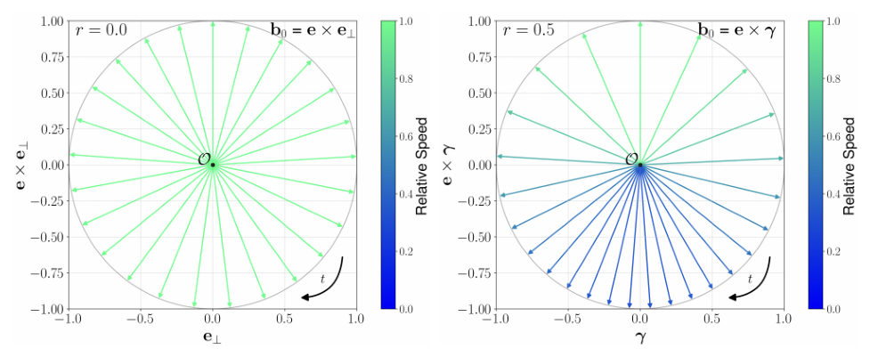
<figcaption class="paper-figure-caption"><b>Fig 1.</b> Figure 1: Comparative Bloch-sphere trajectories for pure state (a) Hermitian (Rabi) and (b) non-Hermitian (CUQ) oscillations. The vectors are the evolution of the initial state b0 captured in equal time intervals. The Bloch vector rotates in the clock-wise direction. The colour grading shows the speed of the moving Bloch vector (relative to the maximum speed in the trajectory) at that time interval.</figcaption>
</figure>
<figure class="paper-figure-card">
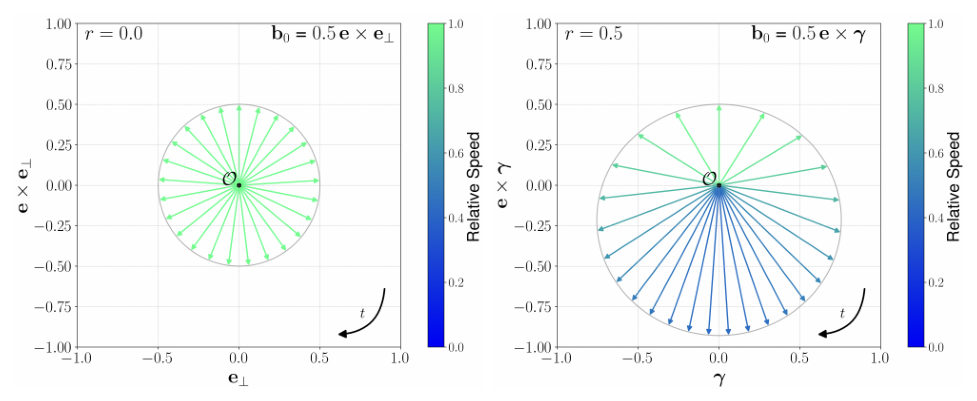
<figcaption class="paper-figure-caption"><b>Fig 2.</b> Figure 2: Comparative Bloch-sphere trajectories for mixed state Rabi and CUQ oscillations. The vectors are the evolution of the initial state b0 captured in equal time intervals. The colour grading shows the speed of the moving Bloch vector at that instant of time.</figcaption>
</figure>
<figure class="paper-figure-card">
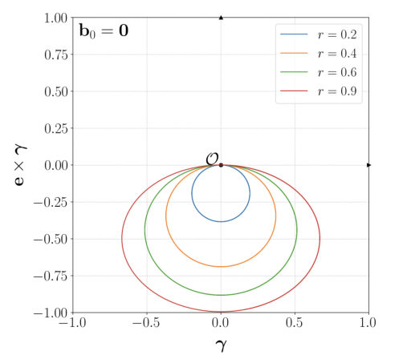
<figcaption class="paper-figure-caption"><b>Fig 3.</b> Figure 3: Bloch-sphere trajectories b(t) of the maximally-mixed CUQ for different values r.</figcaption>
</figure>
<figure class="paper-figure-card">
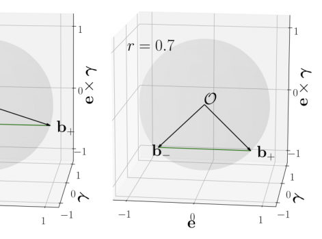
<figcaption class="paper-figure-caption"><b>Fig 4.</b> Figure 4: Eigenvectors of the CUQ Hamiltonian on the Bloch sphere</figcaption>
</figure>
<figure class="paper-figure-card">
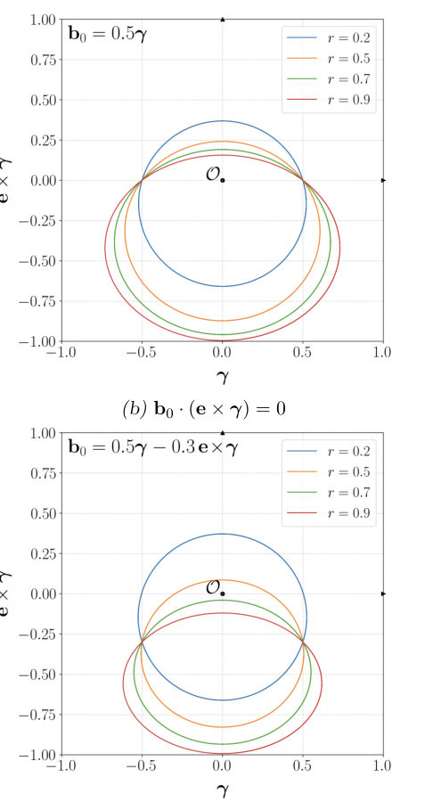
<figcaption class="paper-figure-caption"><b>Fig 5.</b> Figure 5: Plots of b(t) with an initial mixed state b0, for different values of r.</figcaption>
</figure>

**Summary.** This paper analyzes the quantum dynamics of Critical Unstable Qubits (CUQs) using the density matrix formalism in a co-decaying frame. It demonstrates that CUQs exhibit unique anharmonic oscillations, distinct from standard Rabi oscillations. The authors provide novel geometric methods to map the complex trajectories of these unstable qubits onto the Bloch sphere, with implications for non-Hermitian quantum simulations.

**Why it may be interesting.** The study provides a detailed geometric understanding of non-Hermitian dynamics on the Bloch sphere, which is crucial for understanding open quantum systems where decay and dissipation are present, linking fundamental quantum mechanics to practical quantum simulation.

Detailed structure

**Main problem.** The paper investigates the dynamics and trajectories of a novel class of unstable two-level systems called Critical Unstable Qubits (CUQs). It aims to characterize the state evolution in the Bloch sphere for these non-Hermitian systems.

**Main result.** CUQ states exhibit anharmonic and coherence-decoherence oscillations in the co-decaying frame, contrasting sharply with the harmonic Rabi oscillations of stable Hermitian qubits. The authors provide explicit geometric constructions for these trajectories.

**Method.** The analysis heavily relies on the density matrix formalism and the Bloch vector representation, solving the master equation in a specialized co-decaying frame.

**Model / system.** The system is an unstable two-level qubit governed by a non-Hermitian effective Hamiltonian. The dynamics are studied using the density matrix $\rho(t)$ and its evolution in the co-decaying frame, $\hat{\rho}(t)$.

**Key observables.** The Bloch vector $\mathbf{b}(t)$ describes the state trajectory; key observables include the anharmonicity of oscillations and the eccentricity of the resulting elliptical paths.

**Important parameters / regimes.** The ratio $r = |\Gamma|/(2|E|)$ characterizes the instability, and the initial coherence $\mathbf{b}_0$ determines the specific trajectory.

**Assumptions / limitations.** The analysis utilizes the Weisskopf-Wigner approximation and requires working in the co-decaying frame to maintain a physically meaningful description of coherence.

**Figures summary.** Figures illustrate the comparison between Rabi (Hermitian) and CUQ (non-Hermitian) oscillations, showing the anharmonicity and the geometric construction of the resulting elliptical orbits on the Bloch sphere.

**Paper structure.** The paper progresses from defining the CUQ model and its master equation, to deriving the Bloch vector evolution equations, and finally presenting novel geometric constructions for calculating the trajectories of both pure and mixed states.

Abstract

We extend previous studies on a novel class of unstable two-level systems which were called Critical Unstable Qubits (CUQs). In an appropriately defined co-decaying frame, the CUQs exhibit striking phenomena of indefinite anharmonic oscillations between two states and coherence-decoherence oscillations of mixed states. These features are distinct from the usual Rabi oscillations observed in the Hermitian counterpart of two-level systems, which are harmonic and preserve the coherence of the quantum state. We employ the density matrix formalism to study these phenomena for mixed states and delve into the nature of the trajectory traversed by these states in the Bloch sphere by studying the time evolution of the Bloch vector that describes the quantum state of the unstable qubit. In particular, we provide for the first time explicit geometric constructions to obtain trajectories of both pure and mixed CUQs in and on the Bloch sphere. This enables us to identify the stationary points of CUQs, at which the states do not evolve in time in the co-decaying frame. The potential implications of our findings for particle cosmology and quantum simulations of non-Hermitian Hamiltonians are discussed.

[↑ back to top](#top)

### [Cumulant dynamics in finite-memory diffusion](http://arxiv.org/abs/2606.02446v1)

**Authors:** Navid Abbasi, Xin An, Shanjin Wu  
**Type:** theory · **Category:** statistical mechanics · **PDF:** <https://arxiv.org/pdf/2606.02446v1>  
**Analysis basis:** full PDF text, analyzed in chunks
**Topic relevance:** `Keldysh / 2PI / non-Gaussian methods` **3/5** · `non-equilibrium dynamics` **3/5** · `methods for driven-dissipative` **2/5** · `correlated / nonlocal dissipation` **1/5** · `non-equilibrium universality` **1/5**

↔ Scroll figures horizontally

<figure class="paper-figure-card">
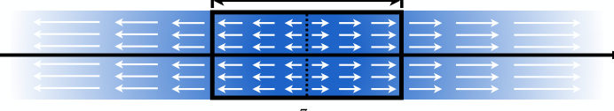
<figcaption class="paper-figure-caption"><b>Fig 1.</b> Figure 1: The mid-rapidity window in the longitudinal direction z at freezeout time. The window (box in the figure) is centered around z0 width ∆. The vertical direction denotes the transverse coordinate that is integrated out, resulting an effective spatial 1D description. The white arrows represent the fluid/particle velocities in Bjorken flow.</figcaption>
</figure>
<figure class="paper-figure-card">
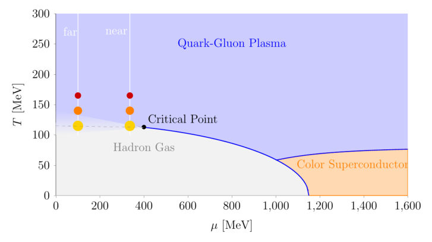
<figcaption class="paper-figure-caption"><b>Fig 2.</b> Figure 2: Schematic illustration of the background trajectories used in this work in the (T, µ) plane of QCD phase diagram. We consider constant-µ trajectories (vertical lines) with a prescribed cooling history T(t). The sequence of colored markers indicates representative times along each trajectory (earlier →later as T decreases). The progressive decreasing color intensity of the marker color encodes the decrease of temperature, while the increasing marker size is a purely schematic indication of the growth of an effective macroscopic domain size as the system evolves. The shaded regions label the phases of the schematic QCD phase diagram, and the lightly shaded band indicates the...</figcaption>
</figure>
<figure class="paper-figure-card">
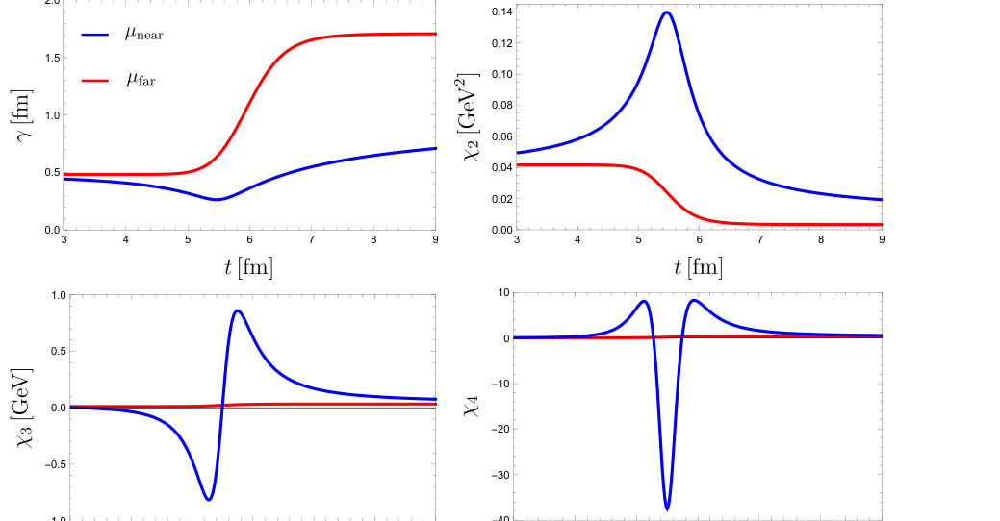
<figcaption class="paper-figure-caption"><b>Fig 3.</b> Figure 3: Time-dependent thermodynamic and transport inputs along the background evolution at fixed baryon chemical potential. Shown are the susceptibilities χ2(t), χ3(t), χ4(t) (from the 3D Ising mapping evaluated along fixed µ) and the diffusion coefficient γ(t) used in the evolution equations of stochastic MC diffusion. Results are displayed for two representative constant-µ trajectories, µ = µfar ≡0.100 GeV (red) and µ = µnear ≡0.366 GeV (blue). The pronounced non-monotonic structures in χn(t) for the larger µ reflect passing close to the critical region (with µc = 0.4 GeV in our parameter choice) and induce a corresponding time dependence of γ(t) through the adopted parametrization.</figcaption>
</figure>
<figure class="paper-figure-card">
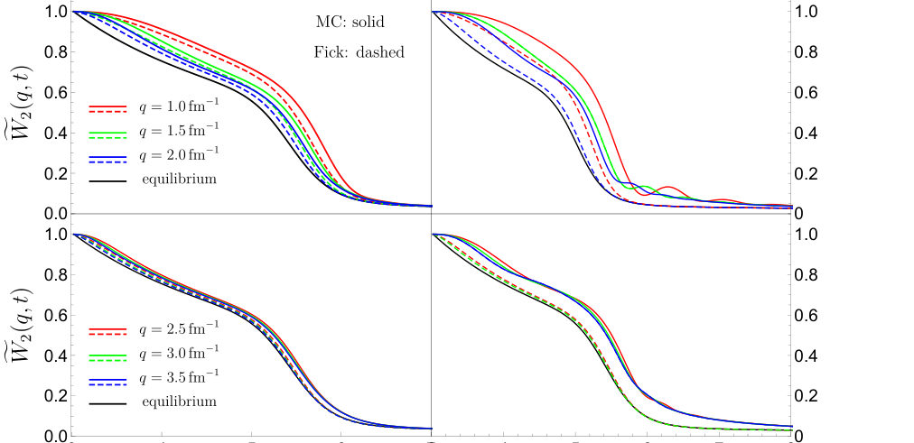
<figcaption class="paper-figure-caption"><b>Fig 4.</b> Figure 4: Time evolution of the normalized two-point Wigner function f W2(q, t) along the constant- µ trajectory at µ = µfar = 0.100 GeV, far from the critical region. Colored solid curves show the MC evolution with finite current-relaxation time, while colored dashed curves show the Fick- ian diffusion limit, τ = 0, for the same values of q. The black curve denotes the instantaneous local-equilibrium value W eq 2 (t), determined by the time-dependent susceptibility along the same background trajectory; it serves as a common reference for both the MC and Fickian evolutions. The left and right columns correspond to τ = 0.2 fm and τ = 1.2 fm, respectively. The upper panels show representative...</figcaption>
</figure>
<figure class="paper-figure-card">
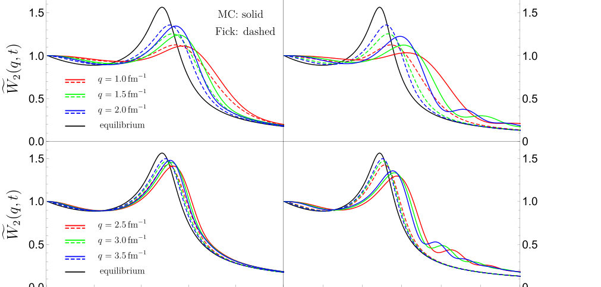
<figcaption class="paper-figure-caption"><b>Fig 5.</b> Figure 5: Same as Fig. 4, but for the constant-µ trajectory at µ = µnear = 0.366 GeV, which passes close to the critical region. Compared with Fig. 4, the near-critical trajectory makes the finite-τ effects more visible, especially for τ = τlarge = 1.2 fm, where the MC curves show both an additional delay and a mild reshaping of the relaxation profile relative to the Fickian baseline.</figcaption>
</figure>

**Summary.** This work develops a theoretical framework to describe how charge fluctuations evolve in the rapidly expanding QGP, moving beyond simple Fickian diffusion. By incorporating finite current relaxation time (Maxwell-Cattaneo diffusion), the authors show that memory effects significantly alter the measurable cumulants. This provides a more accurate diagnostic tool for probing the QCD critical point.

**Why it may be interesting.** The rigorous mathematical treatment of memory effects in transport coefficients, leading to modified evolution equations for correlation functions, provides a generalizable framework for non-equilibrium dynamics in complex systems, relevant to open quantum systems modeling.

Detailed structure

**Main problem.** The paper addresses the complex, non-equilibrium evolution of fluctuation correlators for conserved charges in the Quark-Gluon Plasma (QGP) fireball, especially when current relaxation effects are significant.

**Main result.** Finite current memory, modeled by Maxwell-Cattaneo diffusion, introduces an additional memory effect beyond standard diffusive lag, which can suppress, shift, and reshape the non-monotonic behavior of higher-order cumulants.

**Method.** The authors derive closed evolution equations for multi-point Wigner functions, extending the standard Fickian diffusion baseline to include finite current relaxation time scales.

**Model / system.** The system is the QGP undergoing rapid expansion, analyzed using theoretical frameworks that extend standard hydrodynamics to incorporate memory effects via the Maxwell-Cattaneo constitutive relation.

**Key observables.** Acceptance-dependent cumulants ($C_N(\Delta)$) of conserved charges, and the evolution of multi-point Wigner functions ($W_N$).

**Important parameters / regimes.** Current relaxation time ($	au$), diffusive lag time, and the proximity to the QCD critical point.

**Assumptions / limitations.** The analysis assumes the ability to derive closed deterministic evolution equations for multi-point correlators and compares results against the $	au 	o 0$ (Fickian) limit.

**Figures summary.** Figures illustrate the comparison of cumulant evolution under different diffusion models and potentially show background trajectories in the QCD phase diagram.

**Paper structure.** The paper builds from establishing the link between cumulants and correlators, deriving the Maxwell-Cattaneo evolution equations for the correlators, and finally numerically comparing the resulting cumulant dynamics against the standard Fickian baseline.

Abstract

Fluctuations of conserved charges are among the main proposed signatures of the quantum chromodynamics (QCD) critical point, but their interpretation requires a dynamical description of how fluctuation correlators evolve during the finite lifetime of the quark--gluon plasma (QGP) fireball. The standard baseline for this evolution is Fickian diffusion, in which the diffusive current follows the local density gradient instantaneously. This instantaneous-current limit can miss delayed-response effects when the current-relaxation time becomes comparable to the relaxation time of the relevant fluctuation modes. In this work we extend this baseline to Maxwell--Cattaneo diffusion, where the current relaxes on a finite time scale and therefore retains memory. We derive closed evolution equations for multi-point Wigner functions and convert the freezeout correlators into acceptance-dependent cumulants along representative trajectories in the QCD phase diagram. While Fickian diffusion already causes the correlators to lag behind their instantaneous equilibrium values, finite current relaxation introduces an additional memory effect beyond this diffusive lag. As a result, current memory can suppress, shift, and reshape the non-monotonic behavior of the cumulants relative to both instantaneous equilibrium and Fickian diffusion, with the most visible effects appearing in higher-order cumulants and their ratios.

[↑ back to top](#top)

### [High Resolution Study of the 2D ANNNI Model Using a Two-replica Cluster Algorithm and Population Annealing](http://arxiv.org/abs/2606.00882v1)

**Authors:** Shane Keiser, Jon Machta  
**Type:** theory · **Category:** statistical mechanics · **PDF:** <https://arxiv.org/pdf/2606.00882v1>  
**Analysis basis:** full PDF text, analyzed in chunks
**Topic relevance:** `analog quantum simulation` **3/5** · `exotic spin models in light-matter` **3/5** · `methods for driven-dissipative` **2/5** · `Frenkel-Kontorova` **1/5**

↔ Scroll figures horizontally

<figure class="paper-figure-card">
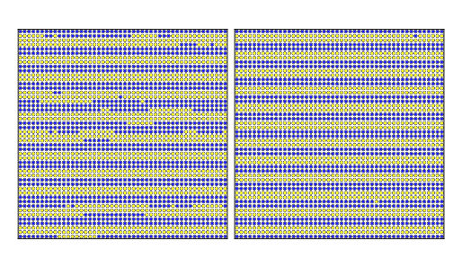
<figcaption class="paper-figure-caption"><b>Fig 1.</b> FIG. 1. Snapshots of two L = 48 replicas at β = 1.09 near the last specific heat peak with coexistence between a configuration in the IC phase (left panel) with four defect lines (k = 11/48) and a configuration in the ⟨2, 2⟩phase (k = 12/48).</figcaption>
</figure>
<figure class="paper-figure-card">
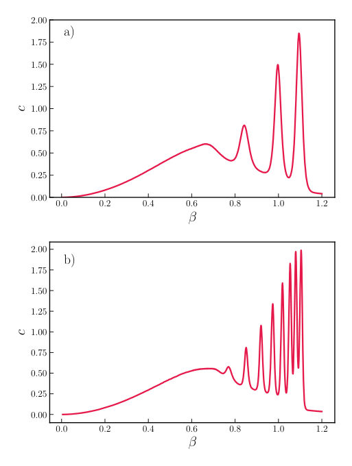
<figcaption class="paper-figure-caption"><b>Fig 2.</b> FIG. 2. Specific heat, c, as a function of β, for sizes (a) L = 48 and (b) L = 128.</figcaption>
</figure>
<figure class="paper-figure-card">
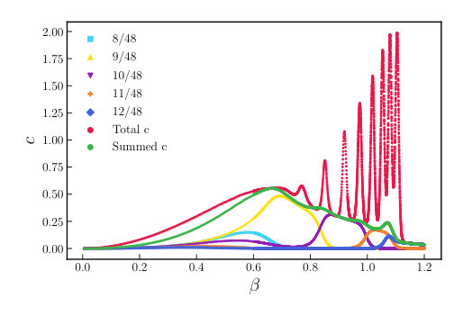
<figcaption class="paper-figure-caption"><b>Fig 3.</b> FIG. 3. Contributions to the specific heat as a function of β for system size L = 48. The total specific heat is the topmost (red) curve. The sum of the specific heats from each wavevec- tor state is second from the top (green). The contributions, ck, to this sum successively appear and then disappear with increasing β. Contributions are shown only for wavevectors k ≥1/6.</figcaption>
</figure>
<figure class="paper-figure-card">
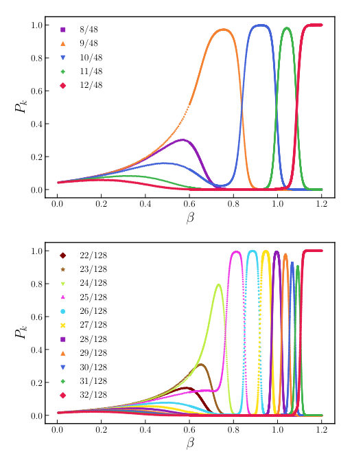
<figcaption class="paper-figure-caption"><b>Fig 4.</b> FIG. 4. Probability Pk, of wavevector state k, (a) L = 48 and (b) L = 128 for wave vectors k ≥1/6.</figcaption>
</figure>
<figure class="paper-figure-card">
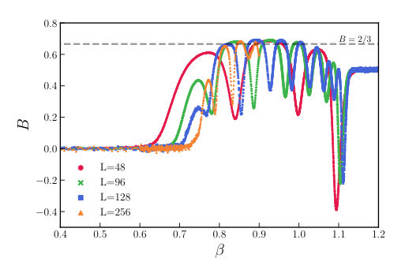
<figcaption class="paper-figure-caption"><b>Fig 5.</b> FIG. 6. Binder cumulant, B, as a function of β for sizes L = 48, 96, 128, and 256. The rise from zero is at larger β for larger L. Results for L = 256 plotted up to β = 0.9.</figcaption>
</figure>

**Summary.** This work investigates the phase transitions of the 2D ANNNI model using sophisticated simulation methods. The authors introduce and validate a powerful combination of Population Annealing and a two-replica cluster algorithm. This new technique successfully resolves the complex physics of the incommensurate floating phase, demonstrating superior equilibration capabilities over existing simulation tools.

**Why it may be interesting.** The development and rigorous testing of the two-replica cluster algorithm combined with PA represent a significant advancement in computational techniques for simulating highly frustrated magnetic systems, providing insights applicable to other complex lattice models.

Detailed structure

**Main problem.** The study focuses on resolving the sequence of sharp specific heat peaks that characterize the finite-size incommensurate floating (IC) phase in the 2D ANNNI model.

**Main result.** The combination of population annealing with a two-replica cluster algorithm proves significantly more effective at equilibrating the system than single-replica or Metropolis methods in the strongly frustrated regime.

**Method.** The authors employ advanced Monte Carlo techniques, specifically Population Annealing (PA) coupled with a novel two-replica cluster algorithm, to simulate the system's thermal properties.

**Model / system.** The system is the 2D Axial Next-Nearest-Neighbor Ising (ANNNI) model, described by a Hamiltonian involving nearest-neighbor and competing next-nearest-neighbor interactions. The model exhibits multiple phases, including ferromagnetic, ordered $\langle 2, 2 
angle$, and incommensurate floating (IC) phases.

**Key observables.** Specific heat ($c$), Binder cumulant of the overlap ($B$), line magnetization ($m_\ell$), and free energy estimators ($ar{F}$).

**Important parameters / regimes.** The coupling constant $\kappa$ (which dictates the phase), system size $L$ (tested up to 256), and the inverse temperature $eta$.

**Assumptions / limitations.** The analysis relies on assumptions regarding the physical origin of the specific heat peaks (e.g., coexistence of states differing by four three-spin defect lines) and the extrapolation methods used for transition temperatures.

**Figures summary.** Figures illustrate snapshots of replicas showing defect lines, comparisons of specific heat peaks across different algorithms (Metropolis vs. TR), and the evolution of the Binder cumulant $B$ across different phases.

**Paper structure.** The paper progresses by first establishing the physical model and the need for advanced simulation techniques. It then details the implementation and comparison of various Monte Carlo algorithms (Metropolis, Wolff, Two-replica Cluster) within the framework of Population Annealing. Finally, it analyzes key observables like specific heat and the Binder cumulant to characterize the phase transitions.

Abstract

The axial next-nearest-neighbor Ising (ANNNI) model in two dimensions is studied using population annealing combined with a two-replica cluster algorithm. We are able to fully resolve the sequence of sharp specific heat peaks that characterize the finite-size incommensurate floating phase. We also show that the two-replica cluster algorithm is much more effective in equilibrating the system than either single-replica cluster methods or the Metropolis algorithm when these are combined with population annealing. We argue that effectiveness of the new algorithm is due to its ability to move groups of defect lines between replicas combined with resampling in population annealing, which removes replicas from the population that have larger numbers of defect lines.

[↑ back to top](#top)

### [Magnon bandstructure and topology in a periodically deformed Kagome lattice with DM interaction](http://arxiv.org/abs/2606.00696v1)

**Authors:** Mohammed Abdullah Hammadi, Mohammed Salman Alsadah, Husam Abdulmajeed Noorwli, Hocine Bahlouli, Michael Vogl  
**Type:** theory · **Category:** strongly correlated electrons · **PDF:** <https://arxiv.org/pdf/2606.00696v1>  
**Analysis basis:** full PDF text, analyzed in chunks
**Topic relevance:** `analog quantum simulation` **3/5** · `exotic spin models in light-matter` **3/5** · `spintronics-quantum-optics interface` **3/5**

↔ Scroll figures horizontally

<figure class="paper-figure-card">
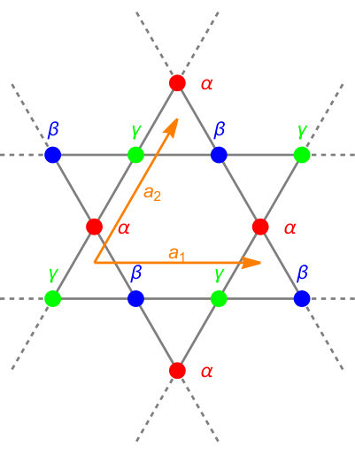
<figcaption class="paper-figure-caption"><b>Fig 1.</b> FIG. 1. Kagome lattice with its three inequivalent sites α,β,γ labeled.</figcaption>
</figure>
<figure class="paper-figure-card">
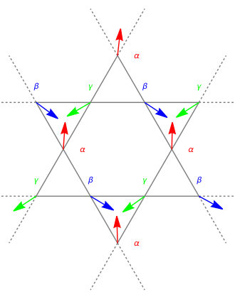
<figcaption class="paper-figure-caption"><b>Fig 2.</b> FIG. 2. Classical ground state configuration of the anti- ferromagnetic case. The spin directions are 120◦separated</figcaption>
</figure>
<figure class="paper-figure-card">
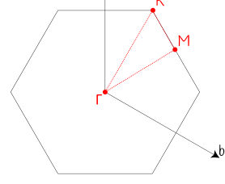
<figcaption class="paper-figure-caption"><b>Fig 3.</b> FIG. 3. Brillouin zone for the undeformed Kagome lattice. ΓMKΓ is a high-symmetry path used in later plots of band structures. Reciprocal lattice vectors that were used to con- struct high symmetry points are given as b1 =  π, −π √</figcaption>
</figure>
<figure class="paper-figure-card">
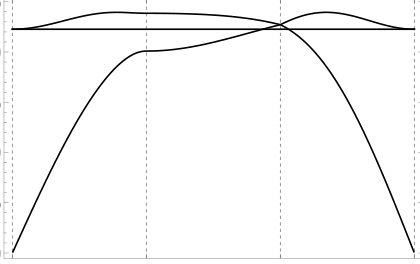
<figcaption class="paper-figure-caption"><b>Fig 4.</b> FIG. 4. Plot (a) shows the band structure of the undeformed Kagome lattice (antiferromagnetic case), where Dz/J = 0.1, while the second graph (b) shows the band structure of the same system but Dz/J = 0.8.</figcaption>
</figure>
<figure class="paper-figure-card">
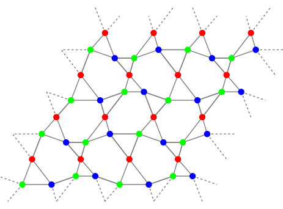
<figcaption class="paper-figure-caption"><b>Fig 5.</b> FIG. 6. Deformed Kagome Lattice for deformation strength C = 0.1.</figcaption>
</figure>

**Summary.** This work theoretically examines how periodic deformations on a Kagome lattice modify the magnon band structure when DM interactions are present. By comparing anti-ferromagnetic and ferromagnetic couplings, the authors show that deformation can induce rich topological features, evidenced by large Chern numbers. This highlights lattice engineering as a key tool for realizing novel topological physics in magnetic materials.

**Why it may be interesting.** The explicit connection between geometric deformation, magnetic interactions, and the emergence of non-trivial topology (quantized Chern numbers) provides a powerful mechanism for engineering exotic quantum states in condensed matter magnets.

Detailed structure

**Main problem.** The study investigates the magnon band structure and topological properties of a magnetic system subjected to periodic lattice deformations and Dzyaloshinskii-Moriya (DM) interactions.

**Main result.** The lattice deformation enriches the band structure, leading to rich topological features, particularly in the ferromagnetic coupling case where Chern numbers can reach $\pm 2$.

**Method.** The analysis employs linear spin-wave theory via the Holstein-Primakoff transformation, followed by diagonalizing the resulting bosonic Hamiltonian in momentum space to calculate topological invariants like the Chern number.

**Model / system.** The system is a Heisenberg model with DM interaction defined on a Kagome lattice. The model is analyzed on a periodically deformed lattice, which modifies the exchange and DM couplings.

**Key observables.** Magnon band structure, Chern numbers ($C_n$), and the presence/closing of band gaps.

**Important parameters / regimes.** The nature of coupling (anti-ferromagnetic vs. ferromagnetic), the strength of the DM interaction ($D_z/J$), and the strength of the lattice deformation ($C$).

**Assumptions / limitations.** The analysis relies on linear spin-wave theory and a $1/S$ expansion, which are approximations valid under certain conditions.

**Figures summary.** Figures illustrate band structures comparing undeformed vs. deformed lattices, and show the dependence of Chern numbers and band gaps on the deformation strength and DM interaction strength.

**Paper structure.** The paper systematically analyzes the Hamiltonian, first establishing the theoretical framework using spin-wave theory. It then compares the topological properties in the anti-ferromagnetic (trivial) versus ferromagnetic (rich) regimes, demonstrating how lattice deformation drives topological phase transitions.

Abstract

We study the band structure and topology of magnons for a Heisenberg model with DM interaction on a deformed Kagome lattice. For simplicity, we focus on a periodically deformed lattice with hexagonal symmetry and an enlarged unit cell. This enlarged unit cell gives rise to a richer band structure than in the undeformed case. Analyzing band topology, there is a distinction between the topologically trivial case with anti-ferromagnetic coupling and the topologically rich case with ferromagnetic coupling. In the anti-ferromagnetic case, a spin-space symmetry, also present in the classical ground state, enforces these topologically trivial states. In the ferromagnetic case, this symmetry is spontaneously broken by the classical ground state. Consequently, the band structure also hosts rich topological features. Specifically, we observe many topological transitions and bands with Chern numbers ranging from $+2$ to $-2$, which makes the system richer than in the undeformed case. This emergent rich topological structure demonstrates that deformed magnets can host new and exciting physics.

[↑ back to top](#top)

### [Quantum-inspired Topographic Stereovision](http://arxiv.org/abs/2606.02197v1)

**Authors:** Fanglin Bao, Youfei Xie  
**Type:** theory · **Category:** other · **PDF:** <https://arxiv.org/pdf/2606.02197v1>  
**Analysis basis:** full PDF text, analyzed in chunks
**Topic relevance:** `interference shaping light` **3/5** · `quantum optics experiment` **3/5** · `quantum measurements` **2/5** · `entanglement & information structure` **1/5**

↔ Scroll figures horizontally

<figure class="paper-figure-card">
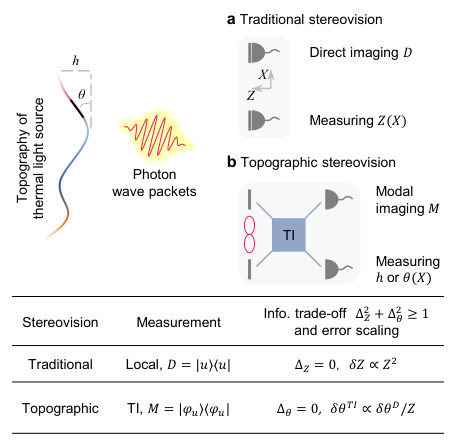
<figcaption class="paper-figure-caption"><b>Fig 1.</b> FIG. 1. Quantum-inspired topographic stereovision with to- pographic interferometer (TI, see Fig. 2). Cross-detector correlations encode unique topographic information beyond triangulation, trading distance precision for improved topo- graphic error scaling. ∆: information regret. u: image plane coordinate. φu: modal profile.</figcaption>
</figure>
<figure class="paper-figure-card">
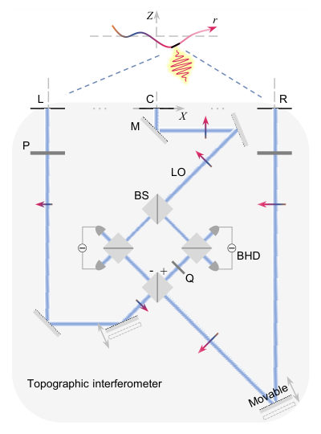
<figcaption class="paper-figure-caption"><b>Fig 2.</b> FIG. 2. Topographic interferometer. A thermal photon emitted by the light source (black line segment) propagates (dashed blue line) to the apparatus and is in a superposition across stereo spatial modes (L: left, R: right), which are fed into the bottom beam splitter (BS) for interference. This pro- cess resembles a Mach-Zehnder interferometer, in which the contrast between two spatial modes encodes the topography of the thermal light source. We introduce a central spatial mode (C) as the local oscillator (LO) for balanced homodyne detection (BHD) to fully extract the topographic information. M: mirror. P: variable phase retarder. Q: quarter-wave phase retarder. Arrows with varying lengths:...</figcaption>
</figure>

**Summary.** This work re-evaluates stereovision, arguing that topography is more fundamental than distance for distant objects. The authors propose a quantum-inspired topographic interferometer that uses quantum correlations to measure topography with precision surpassing classical limits. This establishes a new quantum framework for heat-assisted detection in fields like astronomy.

**Why it may be interesting.** It applies advanced quantum estimation theory (Quantum Fisher Information) to a complex, non-equilibrium sensing problem (thermal imaging), providing a quantum-enhanced framework for remote sensing.

Detailed structure

**Main problem.** The paper challenges the traditional reliance on triangulation for stereovision, arguing that for distant objects, topography is the more relevant observable than absolute distance.

**Main result.** The proposed topographic interferometer enables quantum-enhanced stereovision of thermal sources beyond the Rayleigh limit by exploiting cross-detector correlations.

**Method.** It introduces stereo regularization and proposes a topographic interferometer that uses Mach-Zehnder arms and balanced homodyne detection to probe topography.

**Model / system.** The system models the optical field from a thermal source in the X-Z plane, analyzing the superposition of photons across stereo spatial modes (L, R) fed into a beam splitter.

**Key observables.** Topography ($	heta$), absolute distance ($Z$), disparity ($\delta_q$), and the quantum Fisher information ($K_h$).

**Important parameters / regimes.** The analysis focuses on the long-range and weak-source limits ($\epsilon \ll 1$) and the incompatibility quantified by $\Delta^2 Z + \Delta^2 	heta \ge 	ext{constant}$.

**Assumptions / limitations.** The method assumes the sub-Rayleigh regime and addresses stereo anisotropies violating emitter-number conservation.

**Figures summary.** Figure 1 compares traditional stereovision (measuring Z) versus topographic stereovision.

**Paper structure.** The paper first establishes the observable-measurement mismatch, then introduces stereo regularization, and finally details the construction and analysis of the topographic interferometer to achieve quantum-enhanced ranging.

Abstract

We challenge the long-unquestioned triangulation in distant stereovision, where shape rather than distance is the relevant observable. Our information-regret analysis reveals that the optimal measurements for absolute distance and distance gradient are unexpectedly different and incompatible. To resolve this observable-measurement mismatch, we introduce stereo regularization to address stereo anisotropies that violate prevailing emitter-number conservation, and propose the topographic interferometer, which exploits cross-detector correlations to probe topography without measuring the distance profile. Our interferometer turns parallaxing paths into Mach-Zehnder arms and incorporates a central path as the local oscillator for balanced homodyne detection, saturating the quantum Fisher information with improved topographic error scaling. Our work enables topographic stereovision of thermal sources beyond the Rayleigh limit, thereby establishing a quantum-inspired framework for heat-assisted detection and ranging in remote sensing and astronomy.

[↑ back to top](#top)

### [Locality-Induced Hierarchical Backflow Wavefunctions for Correlated Fermions](http://arxiv.org/abs/2606.00924v1)

**Authors:** Yu-Tong Zhou, Zheng-Wei Zhou, Wen-Yuan Liu  
**Type:** theory · **Category:** strongly correlated electrons · **PDF:** <https://arxiv.org/pdf/2606.00924v1>  
**Analysis basis:** full PDF text, analyzed in chunks
**Topic relevance:** `analog quantum simulation` **3/5** · `Keldysh / 2PI / non-Gaussian methods` **2/5** · `methods for driven-dissipative` **2/5** · `entanglement & information structure` **1/5**

↔ Scroll figures horizontally

<figure class="paper-figure-card">
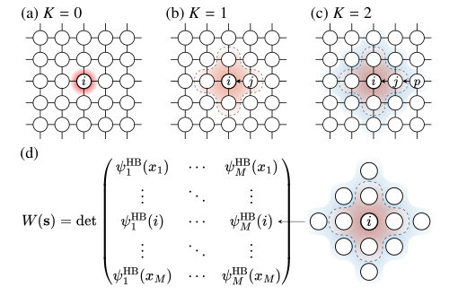
<figcaption class="paper-figure-caption"><b>Fig 1.</b> FIG. 1. Orbital structure of hierarchical backflow (HB) wavefunc- tions at a given site i for different path depths K, illustrating how K controls the range of backflow correlations. (a) K = 0: the orbital de- pends only on site i, corresponding to the Hartree-Fock state with no backflow correlations. (b) K = 1: the orbital at site i depends on its nearby sites j. (c) K = 2: the orbital further includes sites p that are neighbors of j; increasing K systematically enhances the expressive power. (d) Although each orbital depends only on local paths (here shown for K = 2), the Slater determinant couples them to generate many-body correlations in the wavefunction amplitude W(s).</figcaption>
</figure>
<figure class="paper-figure-card">
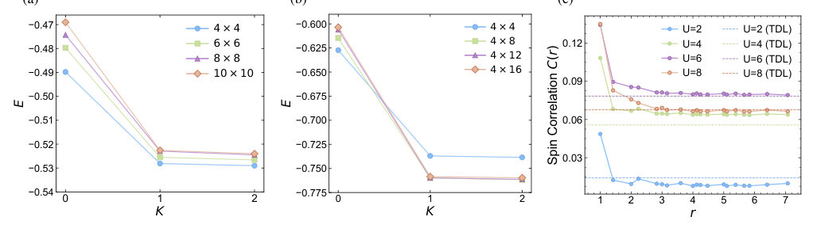
<figcaption class="paper-figure-caption"><b>Fig 2.</b> FIG. 2. Energies of the two-dimensional Hubbard model under PBC with U = 8 as a function of the path depth K (K = 0, 1, 2) at (a) half-filling and (b) nh = 0.125 hole doping. K = 0 corresponds to the Hartree-Fock state. Increasing K systematically lowers the energy. (c) Comparison of staggered spin correlation functions C(r) = (−1)x+y⟨S(0, 0) · S(x, y)⟩as a function of distance r = p</figcaption>
</figure>
<figure class="paper-figure-card">
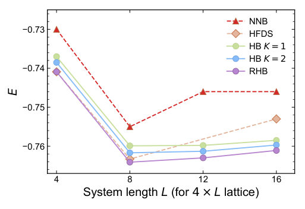
<figcaption class="paper-figure-caption"><b>Fig 3.</b> FIG. 4. Energy comparison with NNB [31] and HFDS [32] for dif- ferent sizes at nh = 0.125 and U = 8, including HB K = 1, K = 2 and the RHB.</figcaption>
</figure>
<figure class="paper-figure-card">
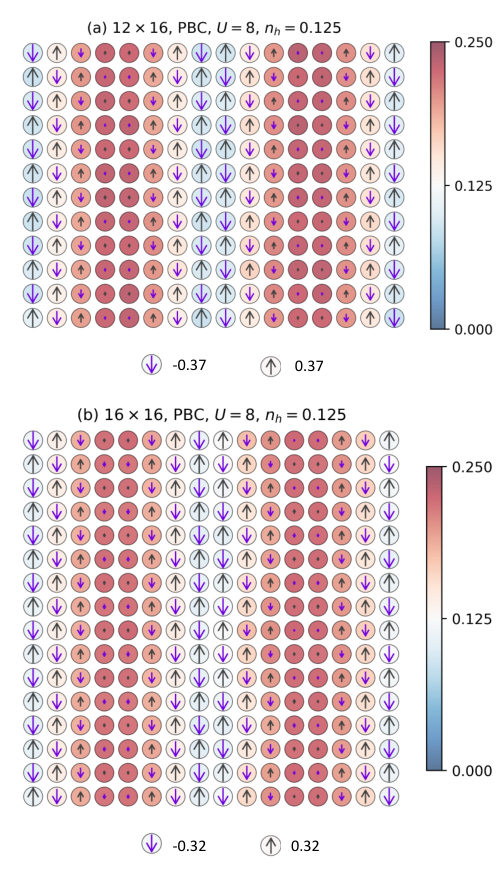
<figcaption class="paper-figure-caption"><b>Fig 4.</b> FIG. 3. The distribution of hole density (color map) and local spin S z moment (arrow length proportional to magnitude) on (a) 12 × 16 and (b) 16 × 16 PBC lattice at nh = 0.125 hole doping with U = 8.</figcaption>
</figure>
<figure class="paper-figure-card">
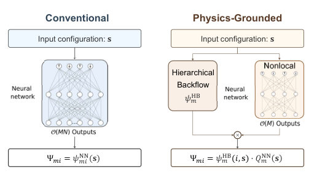
<figcaption class="paper-figure-caption"><b>Fig 5.</b> FIG. 5. Conventional neural network states employ a global archi- tecture (left), whereas our physics-grounded ansatz features a local- nonlocal structure (right). For the same number of determinants, which provides similar expressive power, the number of variational parameters in our representation scales as O(NneuronN) + O(N2), fa- vorable compared to O(NneuronN2) for global architectures.</figcaption>
</figure>

**Summary.** This work introduces the Hierarchical Backflow (HB) wavefunction, a novel, systematically improvable ansatz for correlated fermions, by leveraging the principle of locality. By extending this to the Residual HB (RHB) ansatz, the authors achieve high accuracy in simulating the Hubbard model, demonstrating a powerful, scalable framework for strongly correlated electron physics.

**Why it may be interesting.** While focused on condensed matter, the development of a structured, systematically improvable ansatz (HB/RHB) that bridges determinantal forms with neural network representations is highly relevant for developing general-purpose quantum state representations applicable across different physical domains.

Detailed structure

**Main problem.** The paper addresses the challenge of simulating and representing the ground state of strongly correlated fermionic systems, such as those described by the Hubbard model, due to the exponentially large Hilbert space.

**Main result.** The proposed Hierarchical Backflow (HB) and Residual Hierarchical Backflow (RHB) wavefunctions provide a systematically improvable and highly accurate variational ansatz, achieving results comparable to advanced quantum Monte Carlo methods.

**Method.** The core method involves constructing a variational wavefunction based on the backflow concept, which is systematically refined by introducing a path depth parameter K, and further enhanced by a nonlocal neural network factor (RHB).

**Model / system.** The study focuses on the two-dimensional Hubbard model, characterized by hopping ($t_{ij}$) and on-site repulsion ($U_{ik}$), applied to various doping levels and system sizes.

**Key observables.** Ground-state energy per site, staggered spin correlation function, and local spin/hole density distributions.

**Important parameters / regimes.** Path depth K (controlling correlation range), doping level ($n_h$), and interaction strength ($U$).

**Assumptions / limitations.** The method relies on the locality principle to organize backflow correlations, and the RHB ansatz uses a two-stage optimization scheme to overcome trapping in the optimization landscape.

**Figures summary.** Figures illustrate the orbital structure dependence on K, energy convergence curves showing systematic improvement with K, and spatial maps revealing the formation of stripe phases at finite doping.

**Paper structure.** The paper develops the HB ansatz by proposing locality as the organizing principle, systematically improving its expressive power via K. It then extends this to the RHB ansatz, which incorporates nonlocal correlations via a neural network, and validates this structure using advanced optimization techniques and comparisons to established benchmarks.

Abstract

We show that locality provides a natural principle to hierarchically organize backflow wavefunctions. This leads us to propose a family of variational fermionic states, termed hierarchical backflow (HB) wavefunctions. The expressive power of HB is systematically improvable, controlled by a path depth $K$ which reflects the range of backflow correlations. At half-filling, the HB with $K=1$ already achieves high energy precision, with an accuracy around $0.5\%$ for system sizes from $4\times 4$ to $10\times 10$. At hole doping $n_h=0.125$, the method scales efficiently to $12\times16$ and $16\times16$ systems, and the energy systematically achieves higher accuracy with $K$ increasing, yielding a clear stripe phase. The HB further enables a local-nonlocal decomposition, naturally bridging to neural quantum states, while featuring compact representations and efficient optimization. Our work reveals locality as a natural organizing principle of backflow wavefunctions, opening a new framework with systematic improvability and interpretability for large-scale simulations of correlated fermion systems.

[↑ back to top](#top)

### [Quenching of Nonrelativistic p-Wave Spin Splitting by c-f Decoupling in CeNiAsO](http://arxiv.org/abs/2606.02420v1)

**Authors:** Xinnuo Zhang, Zhicheng Jiang, Shibo Shen, Jian Yuan, Junseo Yoo, Changyoung Kim, Mao Ye, Jishan Liu, Zhengtai Liu, Yanfeng Guo, Yilin Wang, Dawei Shen  
**Type:** both · **Category:** strongly correlated electrons · **PDF:** <https://arxiv.org/pdf/2606.02420v1>  
**Analysis basis:** full PDF text, analyzed in chunks
**Topic relevance:** `Kondo & dissipative impurity` **3/5** · `spintronics-quantum-optics interface` **3/5** · `Keldysh / 2PI / non-Gaussian methods` **2/5**

↔ Scroll figures horizontally

<figure class="paper-figure-card">
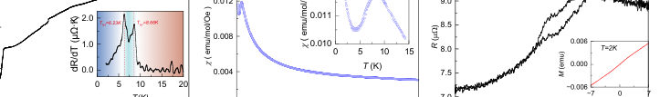
<figcaption class="paper-figure-caption"><b>Fig 1.</b> FIG. 1. (a) Schematic illustration of a universal one-dimensional model generating a p-wave magnet[25], where Jsd represents the local exchange coupling between the itinerant and localized spins on the same lattice site, t denotes the electron hopping matrix element between adjacent sites, and α indicates the propagation trajectory of the spiral configuration. (b) Schematic representation of the spin-polarized Fermi surfaces characteristic of a p-wave magnet, satisfying E(k, σ⊥) = E(−k, −σ⊥). (c) Crystal structure of tetragonal CeNiAsO highlighting the alternating stacking layered profiles. (d) Incommensurate spin- density-wave (SDW) state established below TN1, characterized by a collinear...</figcaption>
</figure>
<figure class="paper-figure-card">
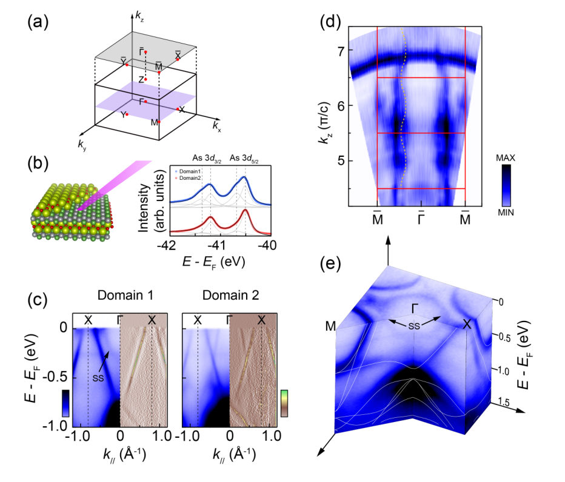
<figcaption class="paper-figure-caption"><b>Fig 2.</b> FIG. 2. (a) Schematic three-dimensional Brillouin zone of CeNiAsO and its projection onto the (001) surface Brillouin zone. (b) Schematic illustration of the cleaved CeNiAsO surface with possible terminations, together with spatially resolved As 3d core-level spectra measured on two representative surface domains. Gray curves denote the Lorentzian components used in the core-level fitting. (c) ARPES intensity plots and corresponding second-derivative images measured along the Γ-X direction on the two surface domains. The arrow marks an additional surface-related band observed on domain 1. (d) Photon-energy- dependent ARPES intensity map along the M-Γ-M direction, plotted as a function of...</figcaption>
</figure>
<figure class="paper-figure-card">
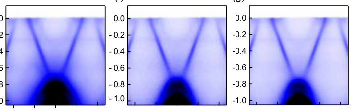
<figcaption class="paper-figure-caption"><b>Fig 3.</b> FIG. 3. (a1)-(a3) Schematic Fermi surfaces expected for the paramagnetic phase, the spin-density-wave phase below TN1, and the proposed p-wave altermagnetic phase below TN2, respectively. Below TN1, the magnetic unit-cell doubling is expected to induce band folding along the Γ-X/Y directions. Below TN2, the proposed p-wave altermagnetic order would further lift the spin degeneracy, as illustrated by the red and blue contours. (b)-(d) ARPES Fermi-surface intensity maps measured at 13.5 K, 7 K, and 5.9 K, respectively. Red dots mark the Γ points, and red squares indicate the projected Brillouin zone. (e)-(g) Corresponding ARPES spectra measured along the Γ-X direction at the same temperatures...</figcaption>
</figure>
<figure class="paper-figure-card">
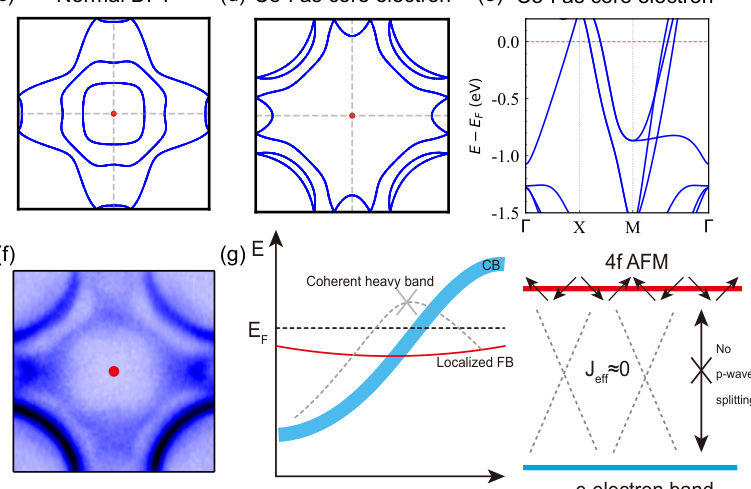
<figcaption class="paper-figure-caption"><b>Fig 4.</b> FIG. 4. Resonant ARPES results and proposed mechanism for the quenching of nonrelativistic p-wave order. (a) ARPES intensity plot measured along the Γ–X direction at 6.5 K using a near-resonant photon energy of 118 eV. The dashed lines mark the boundary of the first Brillouin zone, and the solid line indicates the Fermi level. (b) ARPES intensity plot measured along the Γ–X direction at 6.5 K using a near-resonant photon energy of 122 eV. The vertical dashed lines mark the boundary of the first Brillouin zone, the horizontal dashed lines indicate the two resonant 4f levels, 4f 5/2 and 4f 7/2, and the solid line denotes the Fermi level. (c) Fermi surface at the kz = 0 plane calculated by...</figcaption>
</figure>

**Summary.** This work experimentally investigates the predicted $p$-wave spin splitting in the correlated material CeNiAsO, which is theoretically expected based on magnetic symmetry. The authors report that ARPES measurements fail to detect this splitting, demonstrating that the strong electronic correlations force the Ce 4f electrons into a localized regime. This establishes a key many-body constraint: symmetry alone is insufficient to guarantee spin splitting if electron localization dominates the magnetic coupling.

**Why it may be interesting.** The core finding—that symmetry is necessary but not sufficient—provides a crucial lesson for modeling correlated electron systems, particularly those where local moments interact with itinerant carriers, which is relevant to understanding exotic quantum states in condensed matter.

Detailed structure

**Main problem.** The paper investigates the theoretical prediction versus experimental observation of nonrelativistic p-wave spin splitting in the heavy-fermion oxypnictide CeNiAsO, challenging symmetry-based predictions for magnetism.

**Main result.** Experimental ARPES data show no evidence of the expected spin splitting or band folding across magnetic transitions, suggesting that the Ce 4f electrons remain localized and decouple from the conduction bands.

**Method.** The study combines ultra-low-temperature, high-resolution ARPES measurements with theoretical calculations (DFT) comparing different treatments of the f-electrons.

**Model / system.** The system is the layered heavy-fermion oxypnictide CeNiAsO, which is studied across magnetic transitions into SDW and coplanar antiferromagnetic states. The physics involves the interplay between itinerant conduction electrons and localized Ce 4f moments.

**Key observables.** ARPES band dispersions, Fermi surface mapping, observation of $p$-wave band splitting, and the spectral weight of the Ce 4f electrons.

**Important parameters / regimes.** Magnetic transition temperatures ($T_{N1} \approx 9 	ext{ K}$, $T_{N2} \approx 6 	ext{ K}$), the ratio of Kondo coherence temperature ($T^*$) to Néel temperature ($T_N$), and the localized vs. itinerant limit.

**Assumptions / limitations.** The initial theoretical framework assumes that extending spin-space group symmetries predicts the splitting, but the experiment tests the validity of this assumption under strong correlations.

**Figures summary.** Figures illustrate magnetic transitions via transport measurements, ARPES intensity maps showing the absence of predicted band folding or spin splitting, and theoretical comparisons between different electronic structure treatments.

**Paper structure.** The paper establishes the theoretical prediction based on symmetry, presents the experimental ARPES measurements across magnetic phases, analyzes the failure to observe the predicted splitting, and concludes by revising the theoretical understanding to incorporate the many-body constraint imposed by electron localization.

Abstract

The extending of spin-space group symmetries to coplanar antiferromagnets has predicted the emergence of odd-parity nonrelativistic spin splittings, making the identification of a practical $p$-wave magnet a central pursuit in spintronics. The layered heavy-fermion oxypnictide CeNiAsO has been widely regarded as the prototypical platform to verify this paradigm, as its commensurate coplanar magnetic configuration is theoretically expected to induce a robust $p$-wave band splitting. Here, we investigate the electronic structure of single-crystal CeNiAsO using ultra-low-temperature, high-resolution, and resonant angle-resolved photoemission spectroscopy (ARPES). Across the consecutive magnetic transitions into the ordered phases, our spectroscopic data reveal neither the expected band folding associated with a spin density wave nor any observable $p$-wave band splitting, demonstrating that the conduction bands retain full Kramers degeneracy. By tracking the temperature dependence of the Ce 4$f$ spectral weight via resonant ARPES, we find no evidence of coherent $c-f$ hybridization near the Fermi level within the magnetically ordered states, confirming that the Ce 4$f$ electrons operate in the localized limit. Our findings establish a clear many-body constraint on projecting real-space magnetic symmetries onto momentum-space electronic bands, demonstrating that geometric symmetry classifications constitute a necessary framework but are not a sufficient condition for nonrelativistic spin splittings in the presence of strong electronic correlations.

[↑ back to top](#top)

### [Qutrit-based Synthetic Three-Level System](http://arxiv.org/abs/2606.00607v1)

**Authors:** Surajit Sen, Tushar Kanti Dey  
**Type:** theory · **Category:** other · **PDF:** <https://arxiv.org/pdf/2606.00607v1>  
**Analysis basis:** full PDF text, analyzed in chunks
**Topic relevance:** `analog quantum simulation` **3/5** · `entanglement & information structure` **3/5** · `Rydberg arrays` **1/5** · `non-equilibrium dynamics` **1/5**

↔ Scroll figures horizontally

<figure class="paper-figure-card">
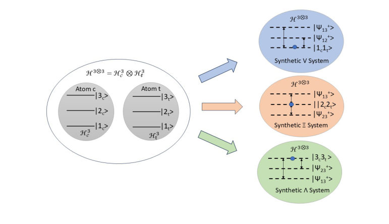
<figcaption class="paper-figure-caption"><b>Fig 1.</b> FIG. 1. Schematic illustration of the mapping of a two-qutrit system onto synthetic V , Ξ and Λ</figcaption>
</figure>

**Summary.** This theoretical work develops an SU(3) framework to engineer synthetic three-level quantum systems using two coupled qutrits. By leveraging the group's algebraic structure, the authors derive effective Hamiltonians for three distinct configurations without relying on problematic Rydberg interactions. Entanglement dynamics are rigorously quantified using novel SU(3) concurrence measures.

**Why it may be interesting.** This work provides a powerful, algebraically grounded alternative to conventional Rydberg-based quantum simulation platforms, offering a cleaner theoretical pathway to engineer controlled multi-level quantum dynamics.

Detailed structure

**Main problem.** The paper aims to construct synthetic three-level quantum systems using a two-qutrit architecture, specifically avoiding the use of Rydberg states and associated van der Waals interactions.

**Main result.** The authors successfully map the system dynamics onto an effective synthetic three-level manifold using the algebraic structure of SU(3) entangled states.

**Method.** The analysis involves deriving effective Hamiltonians by examining non-vanishing commutator relations between the free and interaction Hamiltonians, followed by quantifying entanglement using generalized SU(3) concurrence measures.

**Model / system.** The model is a two-qutrit system operating in the composite Hilbert space $\mathcal{H}_3 \otimes \mathcal{H}_3$, governed by an SU(3) framework. Three distinct synthetic configurations (VT, TU, UV) are analyzed.

**Key observables.** SU(3) I-concurrence and generalized Wootters-type SU(3) concurrence are used to quantify entanglement dynamics.

**Important parameters / regimes.** Rabi coupling strengths ($\Omega(x)$) and detuning offsets ($\Delta E_{Mij}$) define the Hamiltonian parameters.

**Assumptions / limitations.** The method relies on the algebraic structure of the SU(3) group and assumes the coupling mechanism circumvents the need for Rydberg-mediated interactions.

**Figures summary.** Figure 1 schematically illustrates the mapping of the two-qutrit system onto synthetic V, $\Xi$, and $\Lambda$ type three-level configurations.

**Paper structure.** The paper first establishes the theoretical framework using SU(3) algebra, then analyzes the dynamics by calculating commutators for the three configurations, derives the effective Hamiltonians for the reduced manifolds, and finally quantifies the entanglement using the specialized concurrence measures.

Abstract

We present a theoretical framework based on the $SU(3)$ group to construct synthetic three-level configurations from a two-qutrit system consisting of two three-level subsystems. Utilizing its underlying algebraic structure and a set of nine $SU(3)$ entangled states, we show that the system Hamiltonian can be mapped onto an effective synthetic three-level manifold without introducing Rydberg states. We investigate the entanglement dynamics of these synthetic configurations by introducing the $SU(3)$ I-concurrence and a generalized Wootters-type $SU(3)$ concurrence as quantitative measures of entanglement in such system.

[↑ back to top](#top)

### [Vestigial Nematic Order at Zero Temperature in Two-Dimensional Frustrated Quantum Antiferromagnets](http://arxiv.org/abs/2606.00211v1)

**Authors:** Matthew C. O'Brien, Eduardo Fradkin  
**Type:** theory · **Category:** strongly correlated electrons · **PDF:** <https://arxiv.org/pdf/2606.00211v1>  
**Analysis basis:** full PDF text, analyzed in chunks
**Topic relevance:** `analog quantum simulation` **3/5** · `exotic spin models in light-matter` **3/5** · `Keldysh / 2PI / non-Gaussian methods` **2/5**

↔ Scroll figures horizontally

<figure class="paper-figure-card">
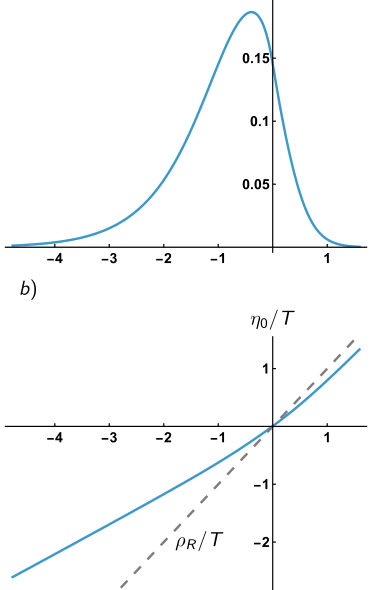
<figcaption class="paper-figure-caption"><b>Fig 1.</b> FIG. 1. (a) The dimensionless inverse correlation length ξ−1√b1/T, where ξ−2 = λ0 for η0 &gt; 0 and ξ−2 = λ0 −η2 0/4bQ for η0 &lt; 0, and (b) the dimensionless physical stiffness η0/T, both as a function of the renormalized stiffness parameter ρR/T, for b2 = 0, µ2b1/T 2 = 1 and γ0/b1 = 2. In (b), the physical stiffness, which is modified by higher derivative inter- actions, is compared to the renormalized stiffness parameter shown by the dashed gray line, which is the stiffness of the theory in the absence of higher derivative interactions.</figcaption>
</figure>
<figure class="paper-figure-card">
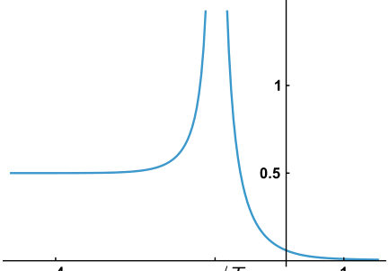
<figcaption class="paper-figure-caption"><b>Fig 2.</b> FIG. 2. Classical nematic susceptibility as a function of ρR/T for b2 = 0, µ2b1/T = 1, γ0/b1 = 2 and γ2/γ0 = −1/8. Here ρcΨ/T ≈−1.2. For ρR &lt; ρcΨ the susceptibility in the nematic phase follows from the Ginzburg-Landau analysis as χΨ = |2Γ(0,2)[0]|−1.</figcaption>
</figure>
<figure class="paper-figure-card">
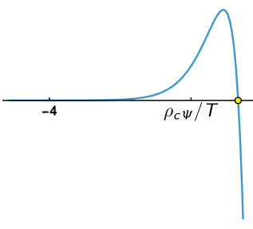
<figcaption class="paper-figure-caption"><b>Fig 3.</b> FIG. 3. Fourth order Ginzburg-Landau coefficient (arbitrary units) as a function of ρR/T for b2 = 0, µ2b1/T = 1, γ0/b1 = 2 and γ2/γ0 = −1/8. Here ρcΨ/T ≈−1.2 and the tricritical point marked with the yellow dot is at ρR/T ≈−0.3.</figcaption>
</figure>
<figure class="paper-figure-card">
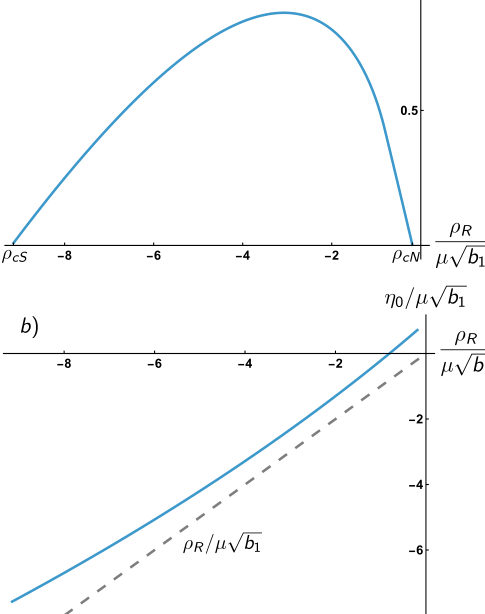
<figcaption class="paper-figure-caption"><b>Fig 4.</b> FIG. 4. (a) The dimensionless mass gap m0/µ, where m2 0 = λ0 for η0 &gt; 0 and m2 0 = λ0 −η2 0/4bQ for η0 &lt; 0. The N´eel and spiral ordering transitions occur where the gap closes at ρcN and ρcS, respectively. (b) The dimensionless physical stiffness η0/µ√b1, both as a function of the dimensionless renormal- ized stiffness parameter ρR/µ√b1, for b2 = 0, gR/√b1 = 8π and γ0/b1 = 2. In (b), the dimensionless physical stiffness is compared to the dimensionless renormalized stiffness param- eter ρR/µ√b1 shown by the dashed gray line.</figcaption>
</figure>
<figure class="paper-figure-card">
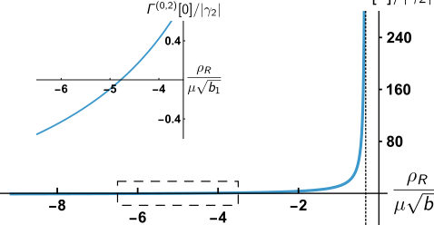
<figcaption class="paper-figure-caption"><b>Fig 5.</b> FIG. 5. Second order coefficient in the Ginzburg-Landau ex- pansion of the effective potential for b2 = 0, gR/√b1 = 8π, γ0/b1 = 2 and γ2/γ0 = −1/8. The inset shows a magnified view of the region in the dashed box. The dotted vertical line indicates the location of the pole in Γ(0,2)[0].</figcaption>
</figure>

**Summary.** This theoretical work investigates the complex phase diagram of a frustrated quantum antiferromagnet using advanced field theory techniques. It reveals that the system can stabilize a vestigial nematic order, even when long-range magnetic order is destroyed by quantum fluctuations. This provides a detailed theoretical framework for understanding symmetry breaking in frustrated quantum magnets.

**Why it may be interesting.** The focus on symmetry breaking (nematicity) and quantum fluctuations near a critical point is highly relevant to understanding exotic quantum phases in strongly correlated materials like cuprates.

Detailed structure

**Main problem.** The paper addresses the long-standing open problem of determining the quantum phase diagram of the two-dimensional $J_1$-$J_3$ Heisenberg antiferromagnet.

**Main result.** The study shows that previously overlooked interactions are crucial for stabilizing a vestigial nematic phase, which persists down to zero temperature, separating different quantum disordered and ordered regimes.

**Method.** The analysis employs a semiclassical approach using a continuum nonlinear sigma model effective field theory, enhanced by the nonperturbative large-$N$ technique.

**Model / system.** The system is the two-dimensional quantum $J_1$-$J_3$ Heisenberg antiferromagnet on a square lattice, described by a Hamiltonian involving nearest-neighbor ($J_1$) and next-nearest-neighbor ($J_3$) interactions.

**Key observables.** Nematic order parameters ($\Psi_1, \Psi_2$), static structure factor $S(q)$, and the correlation length $\xi$.

**Important parameters / regimes.** The ratio of coupling constants ($J_1, J_3$), the large-$N$ limit, and the proximity to the classical Lifshitz point.

**Assumptions / limitations.** The method is semiclassical and formally exact only in the limit $S 	o \infty$; the analysis often relies on assuming certain order parameters are energetically suppressed ($\Psi_1 \equiv 0$).

**Figures summary.** Figures illustrate the phase diagram showing the coexistence of spiral, vestigial nematic, and quantum disordered regions, and plot susceptibilities and structure factors across different parameter regimes.

**Paper structure.** The paper builds from introducing the continuum effective field theory, applying the large-$N$ technique to derive the effective potential, and finally solving the resulting saddle-point equations to map out the phase diagram.

Abstract

The phase diagram of the two-dimensional quantum $J_1$-$J_3$ Heisenberg antiferromagnet on a square lattice is a long-standing open problem. Despite recent advances in numerical techniques for quantum spin models, a detailed analytical theory is still lacking. We address this problem using a semiclassical approach based on a continuum nonlinear sigma model effective field theory, applying the nonperturbative large-$N$ technique to map out the phase diagram and determine the magnetic correlations. We show that previously-overlooked interactions are crucial for stabilizing a vestigial nematic phase, both at finite and zero temperature. Our results reveal that the spontaneous breaking of global symmetries in the $J_1$-$J_3$ model is controlled by the strength of infrared quantum fluctuations which are enhanced by proximity to the classical Lifshitz point.

[↑ back to top](#top)

### [Interplay between Quantum Metric and Hybridized Collective Modes in Flat-Band Superfluids](http://arxiv.org/abs/2606.01235v1)

**Authors:** Yi Liu, Mingyan Wang, Penghui Hu, Yao Lu  
**Type:** theory · **Category:** quantum gases · **PDF:** <https://arxiv.org/pdf/2606.01235v1>  
**Analysis basis:** full PDF text, analyzed in chunks
**Topic relevance:** `analog quantum simulation` **3/5** · `Keldysh / 2PI / non-Gaussian methods` **2/5** · `methods for driven-dissipative` **2/5**

↔ Scroll figures horizontally

<figure class="paper-figure-card">
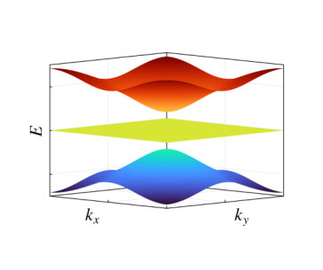
<figcaption class="paper-figure-caption"><b>Fig 1.</b> FIG. 1: Schematic illustration of the normal-state band structure for a prototypical isolated flat-band system.</figcaption>
</figure>
<figure class="paper-figure-card">
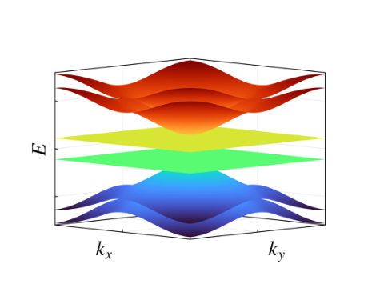
<figcaption class="paper-figure-caption"><b>Fig 2.</b> FIG. 2: Schematic of the 6 × 6 Bogoliubov–de Gennes (BdG) quasiparticle excitation spectrum for the Lieb lattice with a finite chemical potential and a staggered hopping amplitude fixed at δ = 0.3J. The spectrum features a pair of isolated perfectly flat bands separated by a distinct energy gap. (All energies are in units of J, and a = 1.)</figcaption>
</figure>
<figure class="paper-figure-card">
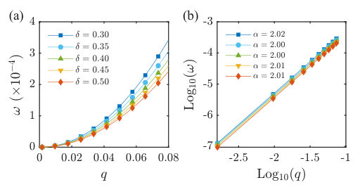
<figcaption class="paper-figure-caption"><b>Fig 3.</b> FIG. 4: Scaling analysis of the collective mode dispersion along the x-direction (q = qˆx). (a) The extracted low-energy dispersion curves ω(q) for various staggered hopping parameters δ. (b) Log-log plot of the dispersion data. The parallel linear fits yield power-law exponents of α ≈2.0, confirming the parabolic nature of the excitations and the absence of a linear term. (The frequency ω is plotted in units of J.)</figcaption>
</figure>
<figure class="paper-figure-card">
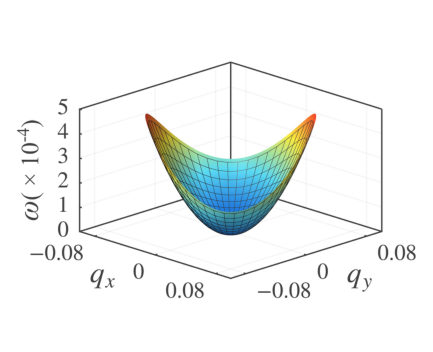
<figcaption class="paper-figure-caption"><b>Fig 4.</b> FIG. 3: The low-energy collective mode dispersion ω(qx, qy), obtained by numerically solving det[M(q, ω)] = 0 for small momenta at a fixed staggered hopping δ = 0.3J. The gapless excitation spectrum forms a parabolic surface. (Energies are in units of J, with a = 1.)</figcaption>
</figure>
<figure class="paper-figure-card">
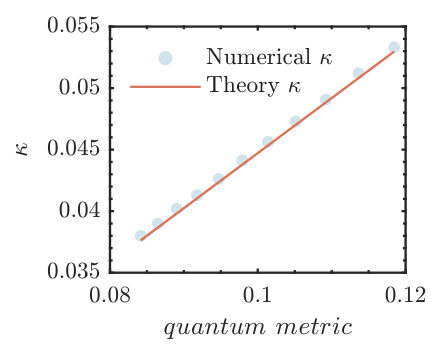
<figcaption class="paper-figure-caption"><b>Fig 5.</b> FIG. 5: Collective mode dispersion curvature κ (evaluated along the qx direction) versus the average normal-state quantum metric under varying staggered hoppings δ. The circular markers represent the data obtained directly from the multi-channel response matrix, while the solid line represents the analytical prediction κ = 2E</figcaption>
</figure>

**Summary.** This theoretical work investigates collective excitations in flat-band superfluids, showing that the mode dispersion is not linear (like conventional superfluids) but quadratic ($\omega \propto q^2$). The key finding is that the curvature of this parabolic dispersion is universally determined by the normal-state quantum metric of the underlying flat band.

**Why it may be interesting.** This work provides a rigorous, geometric understanding of superfluid dynamics in highly constrained systems (flat bands), linking macroscopic excitation properties directly to fundamental quantum geometric invariants (the quantum metric).

Detailed structure

**Main problem.** To determine the low-energy collective excitation dispersion relation in flat-band superfluids by analyzing the coupled dynamics of pairing, amplitude, and density fluctuations.

**Main result.** The collective mode exhibits a quadratic dispersion ($\omega \propto q^2$) at small momenta, and the coefficient governing this curvature is determined by the normal-state quantum metric of the flat band.

**Method.** The authors employ a path integral formalism with a Generalized Hubbard-Stratonovich transformation, analyzing the full dynamic response matrix via a multi-channel fluctuation expansion.

**Model / system.** The system is a time-reversal symmetric superfluid characterized by an isolated flat band, modeled using a mean-field Hamiltonian projected onto the flat-band subspace.

**Key observables.** Collective excitation dispersion relation $\omega(q)$, the quadratic curvature coefficient $\kappa$, and the quantum metric $g_{qq}(k)$.

**Important parameters / regimes.** Zero temperature ($T=0$), long-wavelength limit ($q 	o 0$), and the existence of an isolated flat band.

**Assumptions / limitations.** The analysis assumes the flat band is energetically well separated from other bands, and that the low-energy dynamics can be captured by projecting onto the degenerate null space of the static response matrix.

**Figures summary.** Figures illustrate the schematic band structure, the parabolic nature of the low-energy dispersion ($\omega \propto q^2$), and a direct comparison showing the fitted curvature tracking the theoretical quantum metric.

**Paper structure.** The paper progresses from defining the coupled fluctuation dynamics (GHS transformation) to constructing the full dynamic response matrix, solving for the zero-frequency modes, and finally calculating the second-order spatial derivative of the matrix to extract the curvature coefficient.

Abstract

We investigate collective excitations in flat-band superfluids by incorporating the coupled dynamics of pairing (phase and amplitude) and density fluctuations. We demonstrate that for any time-reversal symmetric superfluid system with an isolated flat band, only a single low-energy collective mode emerges in the long-wavelength limit. In contrast to the linearly dispersive Goldstone mode in conventional superfluids, this hybridized mode is gapless at zero momentum but exhibits a quadratic dispersion ($ω\propto q^2$) at small momenta. Analytically, we reveal that the dispersion coefficient of this collective mode is governed by the normal-state quantum metric of the flat band. These analytical predictions are in excellent agreement with numerical calculations. Our results are universally applicable to any generic $s$-wave flat-band superfluid, provided the flat band is energetically well separated from other dispersive bands.

[↑ back to top](#top)

### [Is the most random pattern random? Maximizing localization in a two-dimensional lattice with engineered disorder](http://arxiv.org/abs/2606.02291v1)

**Authors:** Morgan Berkane, Sahel Ashhab  
**Type:** theory · **Category:** disordered systems and neural networks · **PDF:** <https://arxiv.org/pdf/2606.02291v1>  
**Analysis basis:** full PDF text, analyzed in chunks
**Topic relevance:** `analog quantum simulation` **3/5** · `non-equilibrium dynamics` **2/5** · `entanglement & information structure` **1/5** · `methods for driven-dissipative` **1/5**

↔ Scroll figures horizontally

<figure class="paper-figure-card">
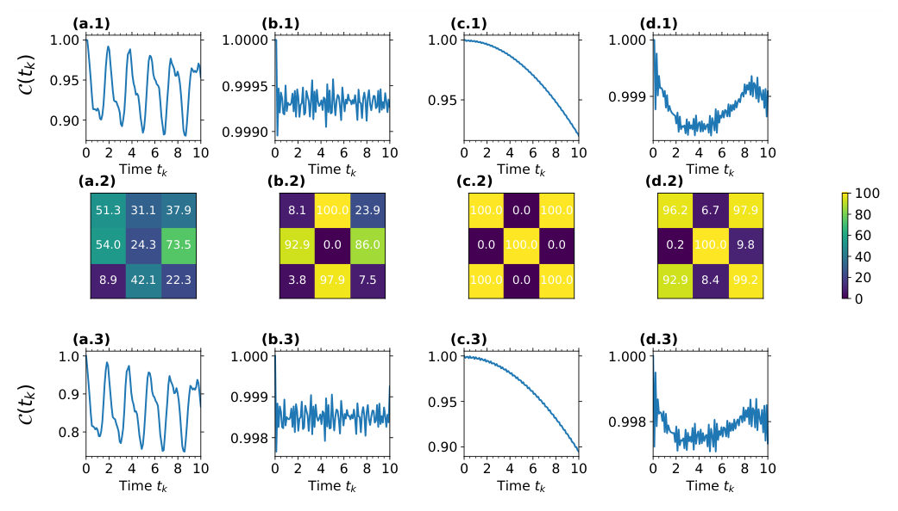
<figcaption class="paper-figure-caption"><b>Fig 1.</b> FIG. 1. Time evolution of the autocorrelation function (Eq. (2)) for different sets of on-site energies Wi on a 3×3 lattice. Panels (a) correspond to random on-site parameters, (b) to optimized lattice, (c) to the perfect chessboard lattice, and (d) to the perturbed chessboard lattice (see text). For each configuration, the upper panels (x.1) show the time dependant autocorrelation function for the single-particle case, the middle panels (x.2) display the corresponding lattice structure, and the lower panels (x.3) present the time dependant autocorrelation function for the FHS. The optimization procedure is performed at the single- particle level by minimizing the cost function defined in...</figcaption>
</figure>
<figure class="paper-figure-card">
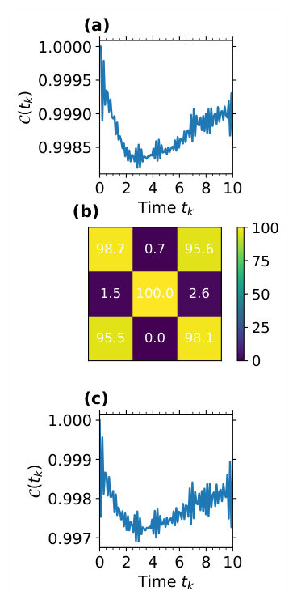
<figcaption class="paper-figure-caption"><b>Fig 2.</b> FIG. 2. Time evolution of the autocorrelation function (Eq. (2)) for different sets of on-site energies Wi on a 3 × 3 lattice. Panel (a) shows the time-dependent autocorrelation function in the full Hilbert space (FHS), panel (b) displays the corresponding lattice, and panel (c) presents the autocor- relation function in the single-particle case. The optimization is performed at the FHS level by minimizing the cost function defined in Eq. (4).</figcaption>
</figure>
<figure class="paper-figure-card">
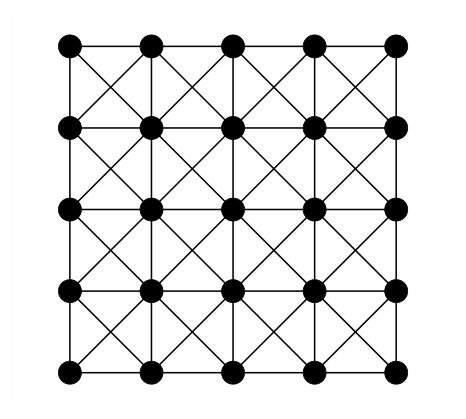
<figcaption class="paper-figure-caption"><b>Fig 3.</b> FIG. 3. Illustration of the effective connectivity of a 5 × 5 lattice to second order in perturbation theory. In addition to nearest-neighbor couplings, second-order processes generate effective next-nearest-neighbor connections, allowing nodes without a direct link to be connected via two-step hopping paths. For clarity, the graph represents the effective connec- tivity induced by these higher-order processes and does not correspond to the bare geometry of the underlying square lat- tice (see text).</figcaption>
</figure>
<figure class="paper-figure-card">
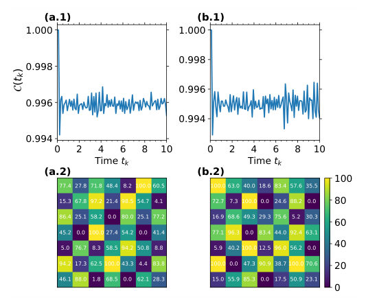
<figcaption class="paper-figure-caption"><b>Fig 4.</b> FIG. 4. Time evolution of the autocorrelation function (Eq. (2)) for a 7 × 7 lattice with on-site energies Wi in the single- particle case. Panel (a) shows the time-dependent autocorrelation function for the optimized lattice obtained by minimizing the cost function defined in Eq. (3), while panel (a.2) displays the corresponding lattice configuration. Panel (b) presents the autocorrelation function obtained from the perturbative optimization based on Eq. (15), and panel (b.2) shows the associated lattice configuration.</figcaption>
</figure>

**Summary.** This work explores engineering disorder in lattice systems to achieve maximal quantum state localization. By optimizing on-site energies, the authors show that engineered patterns outperform random disorder, and crucially, they demonstrate that the optimal single-particle settings can guide the design of highly decoupled qubit processors.

**Why it may be interesting.** The methodology of mapping complex many-body localization problems onto simpler, solvable single-particle optimization problems is highly valuable for designing quantum hardware.

Detailed structure

**Main problem.** The paper investigates whether engineered disorder can achieve stronger quantum state localization than purely random disorder in lattice systems.

**Main result.** Optimizing on-site energies to maximize localization in the single-particle model successfully identifies optimal settings that achieve maximum decoupling in the complex, many-body qubit lattice.

**Method.** The authors use optimization techniques (like genetic algorithms) on cost functions derived from autocorrelation functions and perturbation theory to suppress quantum transport.

**Model / system.** The study analyzes two models: a single particle on a 2D square lattice using a tight-binding Hamiltonian, and a two-dimensional square qubit lattice relevant for quantum processors.

**Key observables.** Site-averaged autocorrelation function C(t) (localization measure) and the cost function L_FHS (for qubit decoupling).

**Important parameters / regimes.** On-site energies {W_i}, hopping amplitudes J_ij, and the detuning parameters $\Delta_{ij} = |W_i - W_j|$.

**Assumptions / limitations.** The single-particle optimization constraints are assumed to be sufficient to guide the optimization for the exponentially complex full qubit Hilbert space.

**Figures summary.** Figures compare the time evolution of the autocorrelation function C(t) for random, optimized, and regular lattice configurations, demonstrating superior localization in the engineered cases.

**Paper structure.** The paper progresses from analyzing single-particle localization using cost functions, to applying these concepts to the full qubit lattice dynamics, and finally refining the optimization using perturbation theory to account for higher-order hopping processes.

Abstract

We investigate localization in two models: a single particle in a two-dimensional square lattice described by the tight binding Hamiltonian, and a two-dimensional square qubit lattice. It is well-known that Anderson localization occurs under suitable conditions in which the system parameters are chosen randomly from some statistical distribution. We propose a situation in which the parameters, specifically the on-site energies, are carefully chosen in such a way that a localization-quantifying parameter is maximized. We demonstrate the optimization procedure with numerical calculations in which the engineered localization significantly exceeds the average localization caused by a random distribution of the on-site energies. We explore the relation between spatial patterns and localization efficiency. Furthermore, we use perturbation theory to gain insight into the localization mechanism and obtain an improved cost function for optimization calculations, leading to enhanced localization in both the single-particle and full Hilbert spaces. Although large-scale simulations for qubit lattices are computationally infeasible, we use small-system simulations to demonstrate that results obtained using the single-particle tight binding model can be adapted to identify optimal settings for qubit lattice systems to achieve maximum decoupling between the qubits, which can be valuable for optimizing the idle-state settings on a quantum processor.

[↑ back to top](#top)

### [Large Alphabet Set Time-bin Encoded Measurement-Device-Independent Quantum Key Distribution](http://arxiv.org/abs/2606.01262v1)

**Authors:** Gokul Agasthilingam, Harinee Natarajan, Varun Raghunathan  
**Type:** experiment · **Category:** quantum information and computing · **PDF:** <https://arxiv.org/pdf/2606.01262v1>  
**Analysis basis:** full PDF text, analyzed in chunks
**Topic relevance:** `QC/QI experiment` **3/5** · `quantum optics experiment` **3/5** · `quantum measurements` **1/5**

↔ Scroll figures horizontally

<figure class="paper-figure-card">
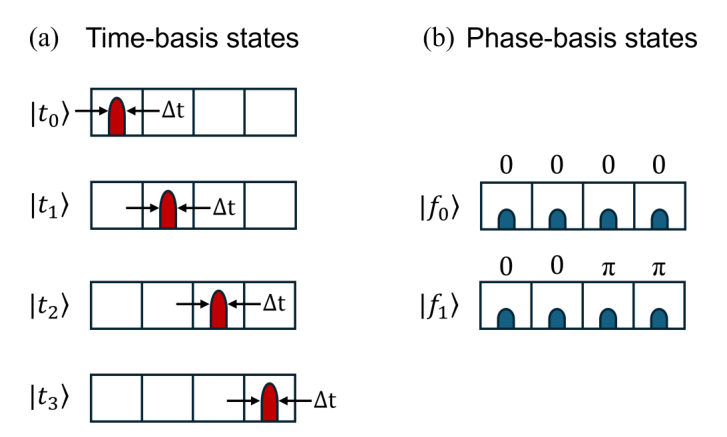
<figcaption class="paper-figure-caption"><b>Fig 1.</b> Figure 1: Illustration of time-bin encoded large alphabet set MDI-QKD with: (a) four encoded Z-basis states {|𝑡(⟩, |𝑡%⟩, |𝑡!⟩, |𝑡)⟩}, and (b) two encoded X-basis states {|𝑓(⟩, |𝑓%⟩}.</figcaption>
</figure>
<figure class="paper-figure-card">
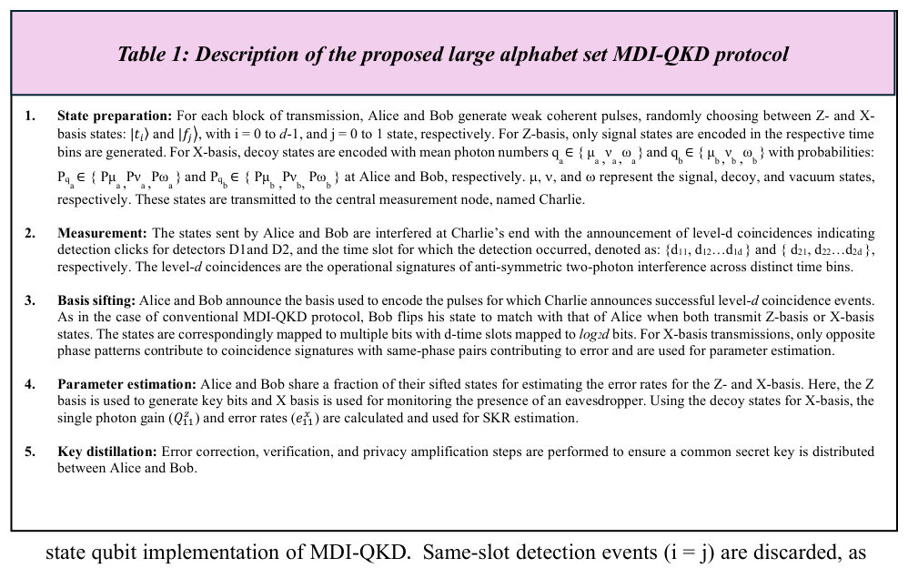
<figcaption class="paper-figure-caption"><b>Fig 2.</b> Figure 2: Illustration of MDI-QKD transmission for four state encoding at Alice and Bob, with coincidence measurements performed at Charlie. The level-d coincidence measurement outcomes correspond to detection events of the form: 7|𝑑%*⟩0𝑑!+18, with clicks at i-th and j-th time-bins for detectors D1 and D2, respectively. pairs are analyzed to distinguish whether Alice and Bob transmitted different states among {|𝑓(⟩, |𝑓%⟩}. Considering four-state time-bin encoding as an example, the different level-d coincidence events for the transmission of X-basis states are: (i) detection corresponding to |𝑑%%⟩ or |𝑑%!⟩ occurs, then look for coincidence detections corresponding to |𝑑!)⟩ or |𝑑!,⟩, or (ii)...</figcaption>
</figure>
<figure class="paper-figure-card">
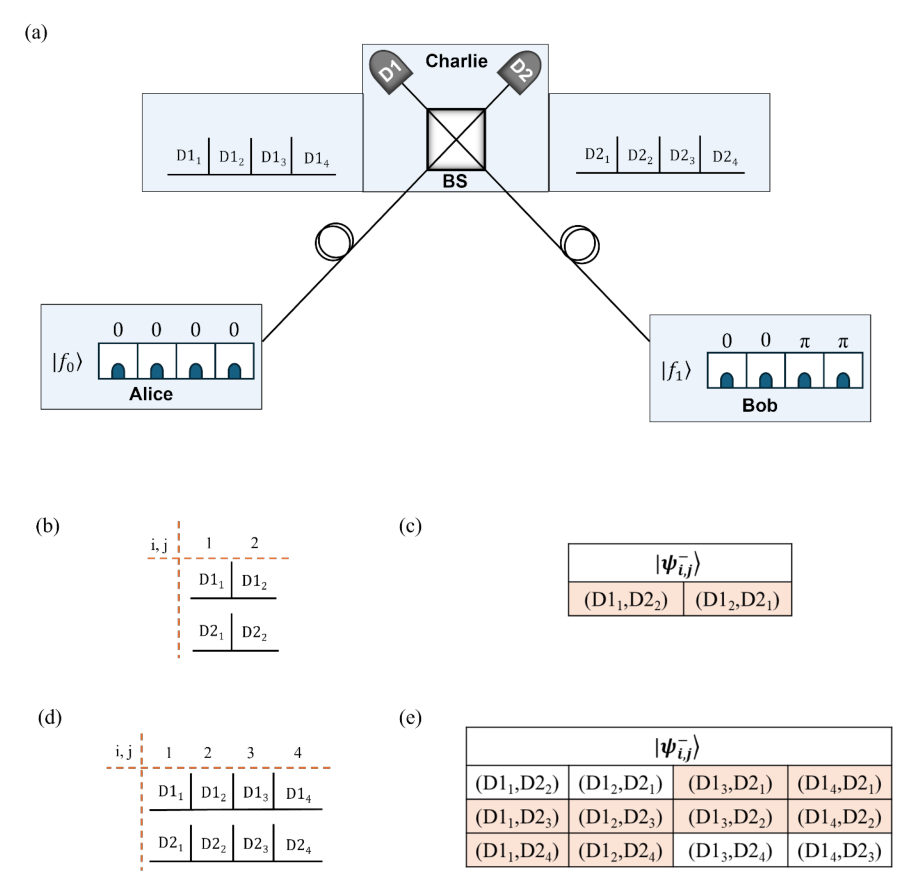
<figcaption class="paper-figure-caption"><b>Fig 3.</b> Figure 3 (a) Generation and detection of encoded states in X-basis with four states encoded. (b) Detection times slots for two-state encoding. (c) Possible detection pairs for extracting level-d coincidence pairs for two-state encoding. (d) Detection time slots for four-state encoding. (e) Possible detection pairs to extract level-d coincidence pairs for four-state encoding. The useful events for extracting level-d coincidence are shown as orange-shaded cells in (c) and (e). The Z basis states transmitted by Alice and Bob with optical pulses in the ith and jth time-bins with i ≠ j result in projections onto two-dimensional symmetric and antisymmetric states of the</figcaption>
</figure>
<figure class="paper-figure-card">
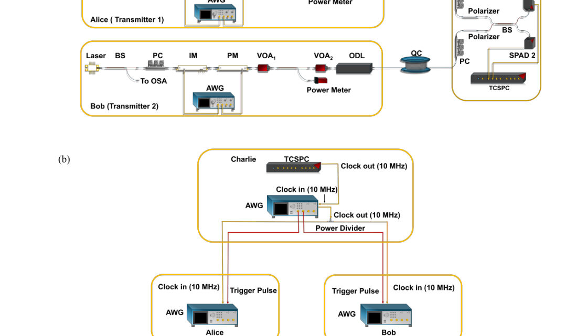
<figcaption class="paper-figure-caption"><b>Fig 4.</b> Figure 4: (a) Schematic of the MDI-QKD experimental setup. Continuous wave lasers at Alice and Bob are modulated using intensity modulator (IM) and phase modulator (PM). A 90:10 beam splitter directs 10% of the optical power to an optical spectral analyzer (OSA) for wavelength monitoring. The modulated pulses are then sent to variable optical attenuators (VOAs) to set the mean photon number. An optical delay line (ODL) ensures temporal alignment of pulses as they arrive at Charlie. The pulses received from both Alice and Bob are combined at Charlie’s end using a 2x2 beams combiner after matching their polarization states using motorized polarization controller (PC) and inline polarizers....</figcaption>
</figure>
<figure class="paper-figure-card">
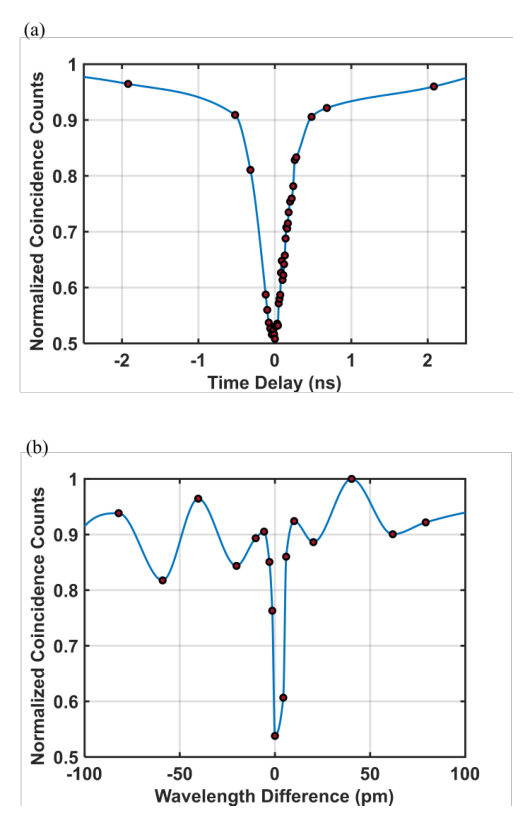
<figcaption class="paper-figure-caption"><b>Fig 5.</b> Figure 5: (a) HOM interference for the MDI-QKD experiment shown as the normalized coincidence versus the temporal delay between the two optical pulses arriving from the two transmitter nodes. (b) HOM Interference shown as the normalized coincidence as a function of wavelength difference between laser sources at Alice and Bob. The green data points represent the experimental and blue curve represents fit to the data. The SKRs obtained after subtracting the eavesdropper’s information, as a function of link length for the MDI-QKD experiments with d = 2, 4, and 8 state encoding, are shown in Figure 6(a). For shorter distances, a clear increase in SKR with d is observed, which can be attributed...</figcaption>
</figure>

**Summary.** The paper experimentally demonstrates a novel MDI-QKD protocol that utilizes a large alphabet set encoded across multiple time-bins. This technique overcomes the low key rate limitation of standard MDI-QKD by mapping each successful coincidence event to multiple bits. The results show substantial improvements in the achievable secret key rate, paving the way for more scalable quantum communication networks.

**Why it may be interesting.** This work directly addresses the scalability of quantum key distribution by increasing the information density per transmitted quantum state, which is a key area for quantum network development.

Detailed structure

**Main problem.** The primary goal is to improve the secret key rate (SKR) of Measurement-Device-Independent Quantum Key Distribution (MDI-QKD), which is inherently limited by coincidence measurements.

**Main result.** By encoding states across a large alphabet set using time-bin encoding, the authors achieved significant SKR improvements (e.g., 3-times improvement) compared to conventional two-state encoding.

**Method.** The protocol involves encoding states across multiple time-bins (large alphabet set $d$) and utilizing level-$d$ coincidence measurements at the central node to boost information capacity.

**Model / system.** The experiment uses a standard MDI-QKD setup implemented with real fiber spools and single-photon avalanche photodetectors (SPADs), employing time-bin encoding for the large alphabet set.

**Key observables.** Secret Key Rate (SKR) in bps, coincidence gain ($Q_s$), and phase-error rate ($\epsilon$).

**Important parameters / regimes.** Encoding dimension ($d$), link length (2 km and 50 km), and the comparison against two-state encoding and COW-QKD.

**Assumptions / limitations.** The analysis assumes that level-$d$ coincidence events are operationally equivalent to Bell-state measurements, and that discarding same-slot detection events is necessary due to detector deadtime limitations.

**Figures summary.** Figures illustrate the time-bin encoding scheme, the level-$d$ coincidence measurement outcomes, and plot the SKR as a function of link length and encoding dimension ($d$).

**Paper structure.** The paper details the protocol by describing state preparation (Z and X basis encoding), the measurement process using level-$d$ coincidences, parameter estimation via decoy states, and finally, calculating the secure key rate.

Abstract

We report on the experimental demonstration of an expanded basis set (called here as alphabet set) time-bin encoded measurement-device-independent quantum key distribution (MDI-QKD). While MDI-QKD is known to prevent detector-side attacks, it inherently suffers from reduced secret key rate (SKR) due to coincidence measurements performed at the central measurement node. To address this limitation, we encode states across multiple time-bins thereby increasing possible coincidence events and mapping each successful alphabet exchange to multiple bits, thereby increasing the information capacity per alphabet transmitted. Using a standard MDI-QKD set-up with real fiber spools and single-photon avalanche photodetectors, we achieve SKRs of 401 (133.6) bps and 28 (10.7) bps for 8 (2) encoded states for distances of 2 and 50 km, respectively, resulting in 3- and 2.63-times improvement, respectively when compared to the conventional two-state encoding. Furthemore, the large alphabet set MDIQKD results are compared with a similar encoding scheme implemented for coherent-one-way (COW) protocol. This comparison reveals a clear advantage of using a larger alphabet set for MDI-QKD, where increased Z-basis coincidence events yields increased SKR. These results provide important insights into the scalability of MDI-QKD key-rates without requiring additional hardware modifications, paving the way for next-generation, quantum key distribution networks.

[↑ back to top](#top)

### [Magnetic self-frustration from spontaneous structural distortion](http://arxiv.org/abs/2606.00339v1)

**Authors:** T. Vignau Costa, G. L. Rossini, D. C. Cabra, S. A. Grigera, R. A. Borzi  
**Type:** theory · **Category:** strongly correlated electrons · **PDF:** <https://arxiv.org/pdf/2606.00339v1>  
**Analysis basis:** full PDF text, analyzed in chunks
**Topic relevance:** `analog quantum simulation` **3/5** · `exotic spin models in light-matter` **3/5** · `methods for driven-dissipative` **1/5**

↔ Scroll figures horizontally

<figure class="paper-figure-card">
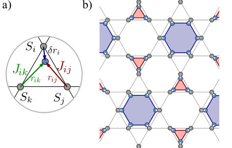
<figcaption class="paper-figure-caption"><b>Fig 1.</b> FIG. 1. a- A fragment of the kagom´e lattice. A distortion at site i is indicated together with its effect on the neighboring exchange couplings (Jij = 1 −α (rij −1), see Eq. (2)). Bond- shortening favors ferromagnetism, while enough lengthening leads to antiferromagnetism. b- The checkerboard configura- tion on the kagom´e lattice, stable at large α values. Arrows in- dicate ion displacements from the pristine lattice (gray dots). The distorted configuration (blue dots) consists of contracted triangles and hexagons; along the three kagom´e directions there is a length dimerization, seen as an alternation of short (ferro) and long (antiferro) bonds. Spins are aligned ferromag- netically in...</figcaption>
</figure>
<figure class="paper-figure-card">
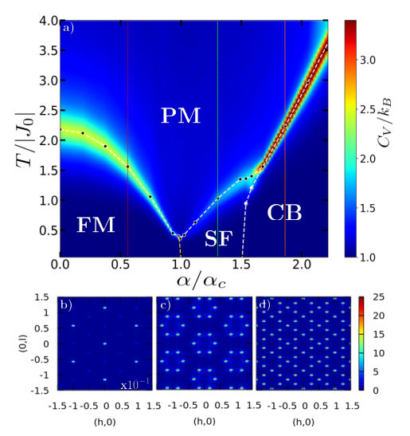
<figcaption class="paper-figure-caption"><b>Fig 2.</b> FIG. 2. a) The phase diagram α −T for the elastic kagom´e lattice. The color plot is an interpolation of the specific heat data from from the Monte Carlo curves. We use the CV peaks to trace the phase boundaries (black points; the white dashed lines are guides to the eye) between the paramagnetic phase (PM), ferromagnetic (FM), Checkerboard (CB), and self-frustrated (SF). The frontier between the SF and the CB phase is an exception, with white points taken from the max- imum of the order parameter fluctuations for the SF phase. Yellow dashed lines mark the steep low temperature bound- aries deduced from the measurement of entropies and energies at very low temperature. The vertical lines...</figcaption>
</figure>
<figure class="paper-figure-card">
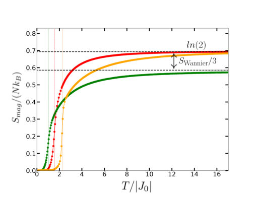
<figcaption class="paper-figure-caption"><b>Fig 3.</b> FIG. 4. Entropy per spin vs. temperature for representative values of the magnetoelastic coupling α/αc = 0.56, 1.3, 1.86 (using the same color code as in Fig. 3). The residual entropy (1/3 of the value of the residual entropy found by Wannier for the antiferromagnetic triangular lattice) for intermediate α evidences that in this case the order is partial.</figcaption>
</figure>
<figure class="paper-figure-card">
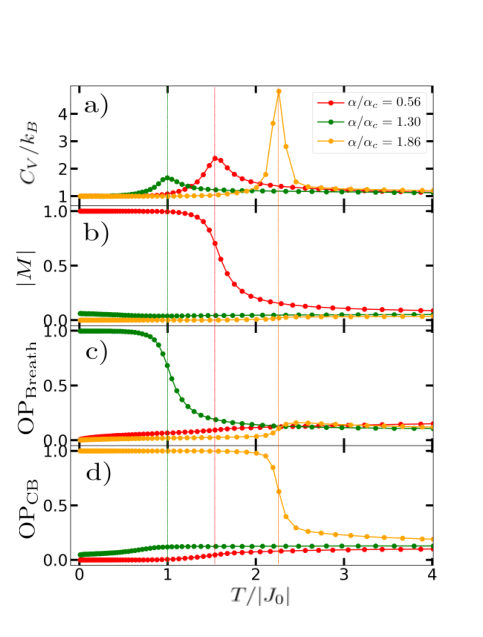
<figcaption class="paper-figure-caption"><b>Fig 4.</b> FIG. 3. Panel a): Specific heat vs. temperature for three rep- resentative values of the magnetoelastic coupling α/αc (see caption). The peak in CV in each curve marks a phase tran- sition into different ordered states, characterized by suitable order parameters. Panels b) to d): Order parameters as a function of temperature. Each parameter characterizes a dis- tinct type of order appearing in different ranges of the mag- netoelastic coupling: the magnetization modulus |M| for the FM phase at low α/αc (red data), the breathing parameter for the SF phase at intermediate α/αc (green data), and the CB order parameter for large α/αc (orange data).</figcaption>
</figure>
<figure class="paper-figure-card">
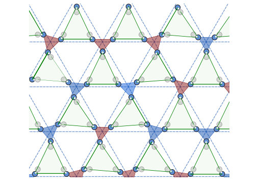
<figcaption class="paper-figure-caption"><b>Fig 5.</b> FIG. 5. A microstate within the degenerate SF phase ground state. The spontaneous symmetry breaking is reflected in that all “up” triangles (green) are stretched to antiferromagnetic exchanges (AFTs), while all “down” triangles (light red and blue according to their spin orientation) are compressed rein- forcing ferromagnetic couplings (FMTs). AFTs have isosceles distortions, with their symmetry axis lying along one of three possible directions. Their shape is robust: two particular val- ues of Jij &gt; 0 repeat along the lattice for all AFTs (thick and thin green lines), in all microstates. The associated short- enings of the sides of the FMTs produce several shapes but up to five different...</figcaption>
</figure>

**Summary.** This theoretical work models magnetic frustration arising from magnetoelastic coupling in a kagomé lattice. It shows that the system transitions through a self-frustrated phase, where structural distortions generate inherent magnetic frustration even when the initial magnetic interactions are simple. This mechanism provides a novel route to understanding complex magnetic ground states in correlated materials.

**Why it may be interesting.** The concept of dynamically generated frustration via lattice coupling is highly relevant to understanding emergent quantum phases in strongly correlated materials, particularly those exhibiting structural instabilities.

Detailed structure

**Main problem.** The paper investigates 'magnetic self-frustration,' a phenomenon where magnetoelastic coupling induces magnetic frustration in an otherwise non-frustrated system.

**Main result.** The system undergoes a magnetostructural transition into a self-frustrated (SF) phase, characterized by spontaneous structural distortions and residual magnetic entropy, separating the simple ferromagnetic and highly ordered checkerboard phases.

**Method.** The study employs classical Monte Carlo simulations and analytical linear approximations to model the coupled spin-lattice Hamiltonian.

**Model / system.** The system is an Ising spin model on a kagomé lattice coupled to local elastic distortions via a magnetoelastic coupling constant $\alpha$. The Hamiltonian includes terms for magnetic exchange and elastic energy.

**Key observables.** Magnetization modulus ($|M|$), Breathing order parameter ($OP_{Breath}$), Specific heat ($C_V$), and residual entropy.

**Important parameters / regimes.** The magnetoelastic coupling constant $\alpha$ relative to a critical value $\alpha_c$, and temperature $T$.

**Assumptions / limitations.** The analysis relies on expanding the exchange coupling to first order in the distance change and using harmonic oscillator models for site displacements.

**Figures summary.** Figures illustrate the phase diagram ($\alpha-T$) showing FM, SF, and CB boundaries, and show histograms of magnetic exchange couplings demonstrating the robustness of certain AFM bonds in the SF phase.

**Paper structure.** The paper progresses by defining the Hamiltonian, simulating the system across different $\alpha$ regimes (FM $\to$ SF $\to$ CB), and analyzing the resulting structural and magnetic order parameters to map out the phase diagram.

Abstract

In frustrated magnetism, lattice distortions mediated by magnetoelastic coupling are commonly invoked as an escape route from extensive degeneracy toward an ordered ground state and, in some cases, the onset of multiferroicity. Here we present a minimal classical model that illustrates the converse phenomenon, which we term ``magnetic self-frustration''. Monte Carlo simulations reveal that a kagomé lattice with trivial magnetic interactions -- namely, nearest-neighbor Ising ferromagnetism -- undergoes a magnetostructural transition into a breathing-like phase, characterized by irregular bond dimerization along the three kagomé directions. Structurally, the equilateral triangles belonging to one of the two kagomé sublattices spontaneously distort, expanding into isosceles triangles. An analysis to first order in the magnetoelastic coupling constant $α$ shows that the shape of these triangles is remarkably robust. Acting like rigid building blocks in a puzzle, their vertices determine the geometry of the second sublattice, giving rise to contracted ferromagnetic triangles with a variety of shapes. The magnetic sector can be mapped onto an effective antiferromagnetic triangular lattice, which remains disordered down to low temperatures and retains a finite residual entropy of one third of that of Wannier. This self-frustrated phase takes place at intermediate values of $α$, separating the conventional undistorted ferromagnetic phase at weak coupling from a strongly coupled ordered phase characterized by a regular dimerized up-up-down-down antiferromagnetic pattern along the three kagomé directions, built from ferromagnetic triangles and hexagons.

[↑ back to top](#top)

### [Symmetry-Protected Quantum Computing using Metamaterials](http://arxiv.org/abs/2606.00254v1)

**Authors:** Neil F. Johnson, Ferney J. Rodriguez, Luis Quiroga  
**Type:** theory · **Category:** quantum information and computing · **PDF:** <https://arxiv.org/pdf/2606.00254v1>  
**Analysis basis:** full PDF text, analyzed in chunks
**Topic relevance:** `analog quantum simulation` **3/5** · `interference shaping light` **3/5** · `entanglement & information structure` **1/5**

↔ Scroll figures horizontally

<figure class="paper-figure-card">
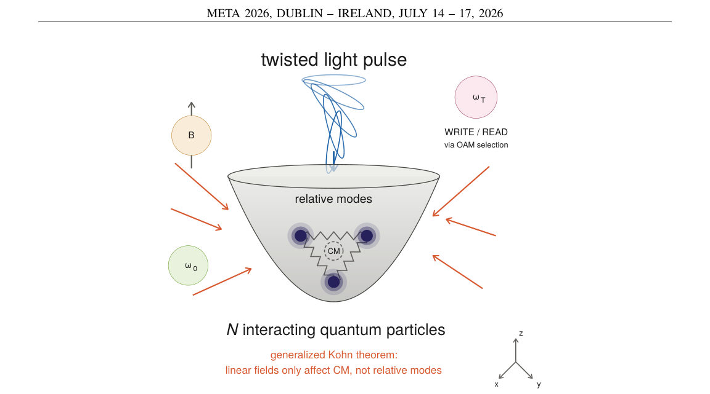
<figcaption class="paper-figure-caption"><b>Fig 1.</b> Fig. 1. Schematic of the symmetry-protected quantum-computing architecture. N interacting quantum particles in a parabolic confinement (frequency ω0). A twisted-light pulse with orbital angular momentum at central frequency ωT performs WRITE and READ operations through the OAM selection rule ∆|m| = ±(l +σ). Examples of the quantum particles include, but are not limited to, electrons or holes in a semiconductor system. A perpendicular magnetic field B can then be used to manipulate the relative-motion modes. Stray linear electric fields entering from any direction and at any temporal frequency couple only to the center-of-mass coordinate (generalized Kohn theorem) and therefore cannot...</figcaption>
</figure>

**Summary.** This paper outlines a novel, general architecture for quantum computing that achieves noise protection by leveraging the generalized Kohn theorem in parabolic confinement. It integrates this protection with precise control using twisted-light orbital angular momentum and solves the physical integration challenge using metamaterial nanofocusing on Weyl semimetals. The resulting framework is highly portable, applicable to diverse systems like cold atoms and semiconductor dots.

**Why it may be interesting.** This work is highly relevant as it proposes a unified, platform-agnostic blueprint for fault-tolerant quantum computation, bridging fundamental symmetry principles with cutting-edge photonic and solid-state engineering.

Detailed structure

**Main problem.** Proposing a general, practical architecture for quantum computing that combines symmetry protection, structured light control, and nanofocusing to overcome current limitations in qubit coherence and addressability.

**Main result.** The architecture successfully unifies the generalized Kohn theorem (symmetry protection), twisted-light OAM control, and metamaterial nanofocusing into a coherent, portable framework for quantum information processing.

**Method.** The approach combines theoretical analysis of symmetry protection (Kohn theorem) with advanced concepts from quantum optics (OAM-carrying light) and condensed matter physics (Weyl semimetal plasmonics).

**Model / system.** The system is modeled using interacting particles confined by a parabolic potential, applicable to semiconductor quantum dots, cold atoms, and trapped ions. The qubit encoding utilizes relative-motion correlation sectors.

**Key observables.** Qubit splitting frequency ($\hbar\omega_{	ext{qubit}}$), OAM selection rules ($\Delta|m|$), and the residual quadrupolar noise floor.

**Important parameters / regimes.** Parabolic confinement frequency ($\omega_0$), OAM quantum number ($l+\sigma$), and the characteristic length scales related to the wavelength-pitch mismatch.

**Assumptions / limitations.** The core assumption is the applicability of the generalized Kohn theorem for protection, and the technical assumption is the realizability of OAM-selective nanofocusing using magnetic Weyl semimetals.

**Figures summary.** Figure 1 schematically illustrates the architecture: N interacting particles in parabolic confinement ($\omega_0$) controlled by a twisted-light pulse ($\omega_T$) via OAM selection, leaving relative modes protected by the Kohn theorem.

**Paper structure.** The paper develops the architecture by first establishing the need for general symmetry protection (Kohn theorem), then detailing the control mechanism using OAM-light, and finally solving the integration challenge via metamaterial nanofocusing, presenting a portable framework applicable across multiple physical platforms.

Abstract

We propose a new architecture for practical quantum computing that combines three established principles: symmetry protection of relative-motion qubits via the generalized Kohn theorem, control via twisted-light orbital angular momentum, and metamaterial nanofocusing (e.g. using Weyl-semimetal plasmonics). Crucially, the core mechanism is generic: it applies to any current or future quantum computing system involving parabolic confinement, including cold atoms, ions, and semiconductor dots.

[↑ back to top](#top)

### [Doping- and temperature-dependent electronic structure and spin dynamics in the Hubbard model on a square lattice within cluster perturbation theory](http://arxiv.org/abs/2606.01716v1)

**Authors:** V. I. Kuz'min, S. G. Ovchinnikov  
**Type:** theory · **Category:** strongly correlated electrons · **PDF:** <https://arxiv.org/pdf/2606.01716v1>  
**Analysis basis:** full PDF text, analyzed in chunks
**Topic relevance:** `analog quantum simulation` **3/5** · `Keldysh / 2PI / non-Gaussian methods` **2/5** · `methods for driven-dissipative` **1/5**

↔ Scroll figures horizontally

<figure class="paper-figure-card">
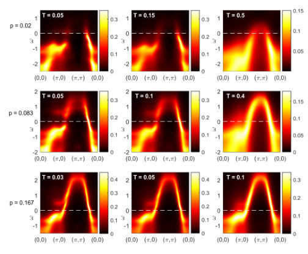
<figcaption class="paper-figure-caption"><b>Fig 1.</b> FIG. 1. The electronic spectral function calculated in CPT for three doping values along high-symmetry directions at various temperatures.</figcaption>
</figure>
<figure class="paper-figure-card">
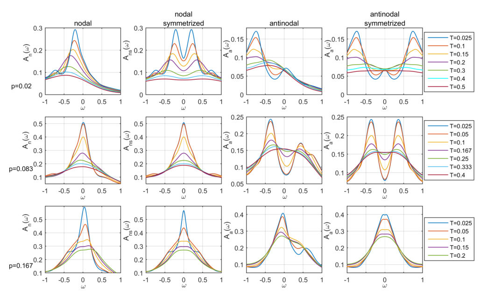
<figcaption class="paper-figure-caption"><b>Fig 2.</b> FIG. 2. The EDCs at the Fermi-sarface’s wave vector kF in the nodal and antinodal directions for the three values of doping concentration p and several temperatures indicated within the insets.</figcaption>
</figure>
<figure class="paper-figure-card">
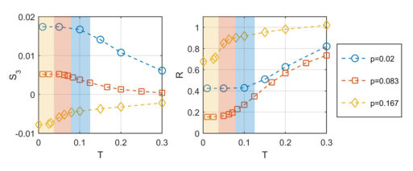
<figcaption class="paper-figure-caption"><b>Fig 3.</b> FIG. 4. The third coordination sphere’s spin correlations (left) and the Fermi level’s antinodal to nodal ratio (right). The colored (correspondingly to the lines) regions schemat- ically show the crossover temperature T ∗∗, below which the Fermi arc, as well as the spin correlations, remain almost un- changed.</figcaption>
</figure>
<figure class="paper-figure-card">
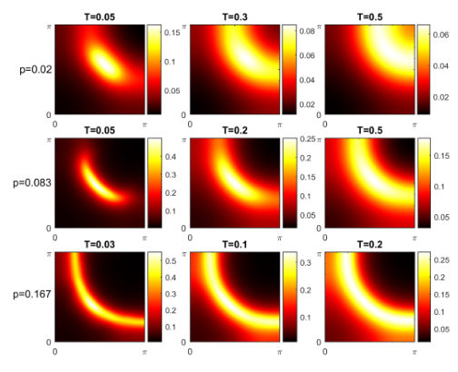
<figcaption class="paper-figure-caption"><b>Fig 4.</b> FIG. 3. The spectral weight at the Fermi level for various doping and temperature values.</figcaption>
</figure>
<figure class="paper-figure-card">
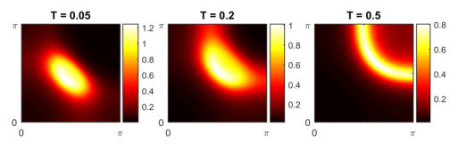
<figcaption class="paper-figure-caption"><b>Fig 5.</b> FIG. 7. (a)-(c) The temperature evolution of the GMFA Fermi surface at p=0.083.</figcaption>
</figure>

**Summary.** This work applies Cluster Perturbation Theory to the Hubbard model on a square lattice to map out the electronic and spin properties across different doping and temperature regimes. It successfully reproduces key features of the pseudogap state observed in cuprates, highlighting the critical role of short-range antiferromagnetic correlations in shaping the electronic spectrum. The study advances the theoretical understanding of strongly correlated electron systems near superconducting phases.

**Why it may be interesting.** The detailed study of the PG phase in the Hubbard model provides a theoretical framework for understanding high-temperature superconductivity, which involves complex, strongly correlated quantum dynamics relevant to open quantum systems.

Detailed structure

**Main problem.** The study investigates the doping and temperature dependencies of the electronic structure and dynamic spin susceptibility in the Hubbard model, focusing on the mysterious Pseudogap (PG) state observed in cuprate superconductors.

**Main result.** The calculations show that the electronic structure exhibits a nodal-antinodal dichotomy, and the PG signature is visible as a strong suppression of spectral weight, with short-range antiferromagnetism being crucial for this behavior.

**Method.** The primary theoretical tool is Cluster Perturbation Theory (CPT), supplemented by a Generalized Mean-Field Approximation (GMFA) to analyze spectral functions and spin dynamics.

**Model / system.** The system is modeled by the Hubbard Hamiltonian on a square lattice, incorporating nearest and next-nearest hopping terms and a local Coulomb repulsion U. The analysis covers varying doping levels and temperatures.

**Key observables.** Electronic spectral function A(k, omega), dynamic transverse spin susceptibility spectrum, and the degree of spectral weight suppression at the Fermi level.

**Important parameters / regimes.** Doping ($p$), Temperature ($T$), Coulomb repulsion ($U$), and hopping parameters ($t, t'$).

**Assumptions / limitations.** The use of CPT and GMFA introduces approximations, notably that the GMFA alone is insufficient to capture the full frequency dependence of the PG drop, suggesting the need for dynamic correlation terms.

**Figures summary.** Figures illustrate the electronic spectral function across different doping/temperature regimes, showing the nodal-antinodal dichotomy, and present the dynamic spin susceptibility spectra for specific doping levels.

**Paper structure.** The paper systematically analyzes the electronic and spin spectra using CPT, comparing results with experimental data (ARPES, INS). It progresses from general spectral analysis to discussing the role of short-range correlations in forming the PG, concluding with limitations regarding dynamic correlation inclusion.

Abstract

The doping and temperature dependencies of the electronic structure and the dynamic spin susceptibility of the Hubbard model on a square lattice are studied within cluster perturbation theory (CPT). The most general features of both electronic and spin spectra qualitatively agree with the experimental data on cuprates. Generalized mean-field calculations of the electronic structure using static short-range magnetic correlations from CPT are also implemented and compared with the results of CPT, allowing us to discuss the role of short-range antiferromagnetism in the formation of the pseudogap.

[↑ back to top](#top)

### [Information Hierarchy in Many-Body Berry Phase](http://arxiv.org/abs/2606.02155v1)

**Authors:** Kai Watanabe  
**Type:** theory · **Category:** strongly correlated electrons · **PDF:** <https://arxiv.org/pdf/2606.02155v1>  
**Analysis basis:** full PDF text, analyzed in chunks
**Topic relevance:** `entanglement & information structure` **3/5** · `analog quantum simulation` **2/5** · `Keldysh / 2PI / non-Gaussian methods` **1/5**

↔ Scroll figures horizontally

<figure class="paper-figure-card">
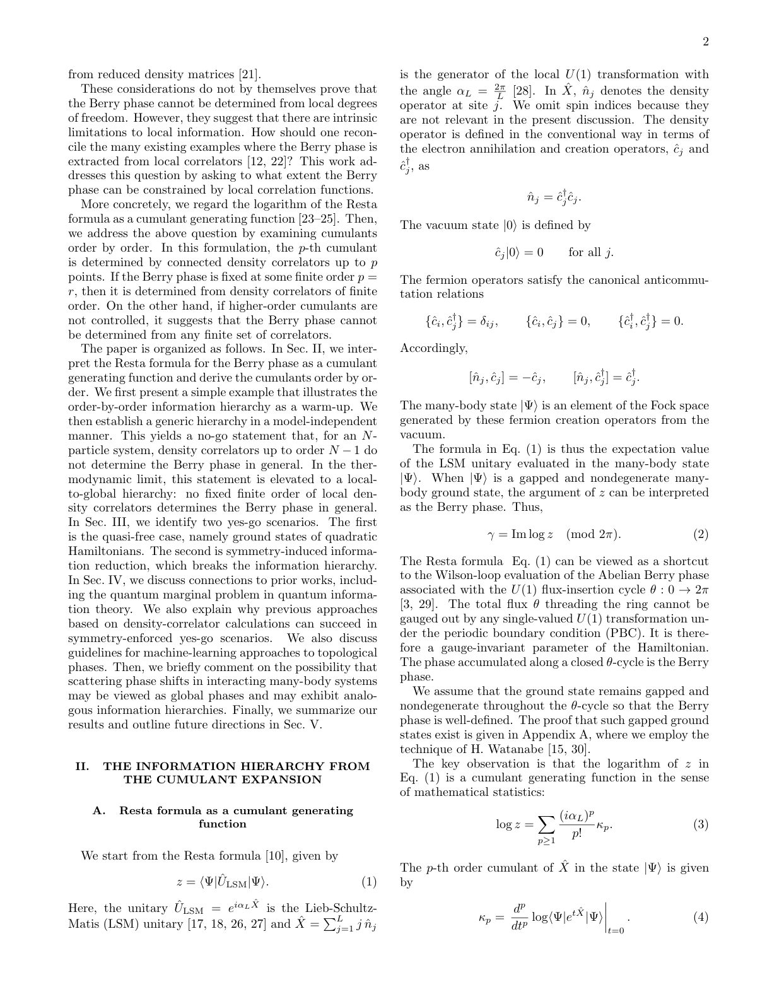
<figcaption class="paper-figure-caption"><b>Fig 1.</b> Low-resolution page preview, page 2</figcaption>
</figure>
<figure class="paper-figure-card">
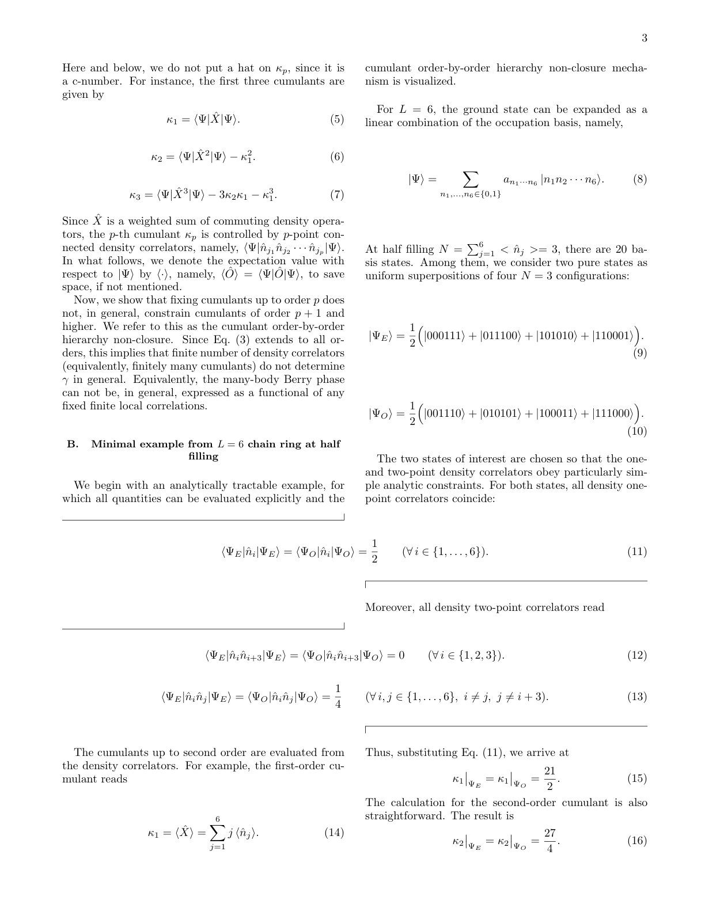
<figcaption class="paper-figure-caption"><b>Fig 2.</b> Low-resolution page preview, page 3</figcaption>
</figure>
<figure class="paper-figure-card">
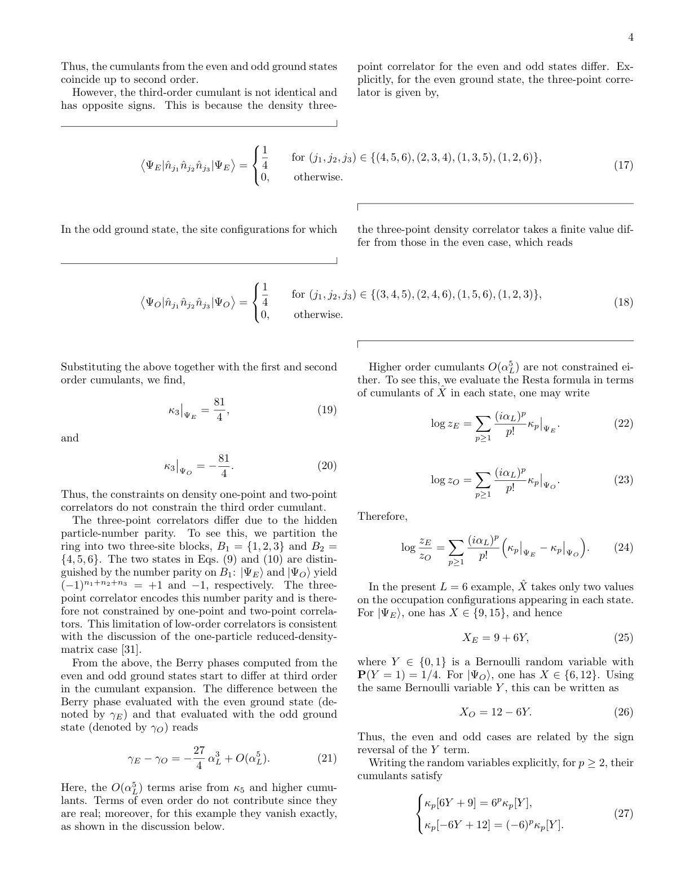
<figcaption class="paper-figure-caption"><b>Fig 3.</b> Low-resolution page preview, page 4</figcaption>
</figure>
<figure class="paper-figure-card">
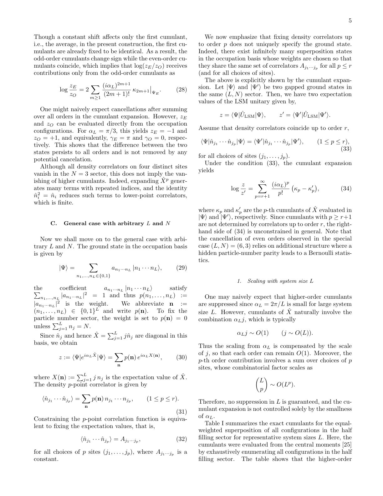
<figcaption class="paper-figure-caption"><b>Fig 4.</b> Low-resolution page preview, page 5</figcaption>
</figure>
<figure class="paper-figure-card">
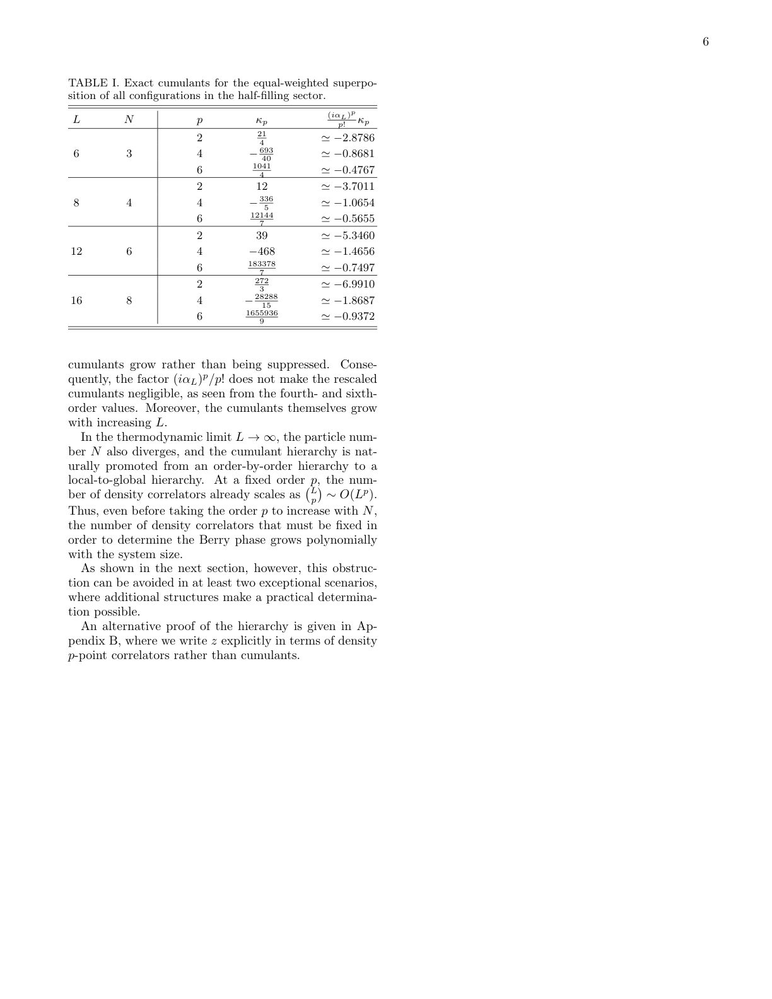
<figcaption class="paper-figure-caption"><b>Fig 5.</b> Low-resolution page preview, page 6</figcaption>
</figure>

**Summary.** This theoretical work establishes a rigorous information hierarchy showing that global topological invariants, like the Berry phase, generally cannot be determined solely from a finite number of local correlation measurements in interacting many-body systems. The authors identify that this limitation is overcome only in special cases, such as when the system is quasi-free or when strong symmetries are present.

**Why it may be interesting.** This work provides a fundamental theoretical boundary condition for how local measurements constrain global topological properties, which is critical for designing experimental protocols or interpreting numerical simulations of topological phases.

Detailed structure

**Main problem.** The central problem is determining the extent to which the geometric information of an interacting many-body ground state, specifically the Berry phase, can be inferred from a finite set of local correlation functions.

**Main result.** In general, no finite set of local correlators is sufficient to uniquely determine the global Berry phase in the thermodynamic limit, establishing a strict information hierarchy. Exceptions exist for quasi-free models or when symmetries impose strong constraints.

**Method.** The analysis uses the Resta formula, viewing the logarithm of the partition function as a cumulant generating function, and systematically compares the constraints imposed by low-order versus high-order density correlators.

**Model / system.** The study applies to general interacting many-body quantum systems, using the Berry phase derived from the expectation value of a unitary operator (LSM) threading a flux. Examples include analyzing chain rings and considering general fermionic Hamiltonians.

**Key observables.** The Berry phase ($\gamma$), the cumulants ($\kappa_p$), and various $p$-point density correlators ($\langle \hat{n}_{j_1} \cdots \hat{n}_{j_p} 
angle$).

**Important parameters / regimes.** The system size ($L$), the number of particles ($N$), and the order of the correlation ($p$). The thermodynamic limit ($L 	o \infty$) is crucial.

**Assumptions / limitations.** The argument is analytic and does not rely on a specific microscopic Hamiltonian, though specific cases like quasi-free models or symmetry constraints are analyzed.

**Figures summary.** The notes mention Table I, which explicitly calculates exact cumulants ($\kappa_p$) for various $(L, N)$ pairs, demonstrating the growth of these cumulants with system size.

**Paper structure.** The paper establishes the general information hierarchy using the cumulant generating function approach, presents a concrete counterexample (e.g., $L=6$ chain ring) showing the failure of low-order correlators to determine the phase, and then details the two exceptional 'yes-go' cases (quasi-free and symmetry-enforced) where the hierarchy closes.

Abstract

Many-body topology is a central concept in modern theories of solids, and identifying effective degrees of freedom that capture it is important both fundamentally and practically. This work studies the extent to which geometric information of an interacting many-body ground state can be inferred from a finite number of local correlations. Starting from the Resta formula, $ z=\left\langle \exp\!\left(\frac{2πi}{L}\hat X\right)\right\rangle$, we view $\log z$ as the cumulant generating function and establish a generic information hierarchy across cumulant orders. We show that, for an $N$-particle system, even complete knowledge of all density correlators up to order $N-1$ does not, in general, uniquely determine the Berry phase $γ=\operatorname{Im}\log z \, (\mathrm{mod}\ 2π)$. In the thermodynamic limit, the statement becomes stronger: no finite set of local correlators suffices to determine the global holonomy. We also identify two exceptional yes-go cases in which the hierarchy is broken. First, for quasi-free models, all cumulants are determined by the particle two-point correlation function. Second, symmetry-enforced constraints can reduce the infinite cumulant sum entering $\log z$ to finite information. The argument is analytic and does not rely on a specific microscopic Hamiltonian. Our results clarify a limitation of approaches based on local degrees of freedom for many-body holonomy and provide a minimal framework for distinguishing when global holonomies are encoded in local correlations and when they are not. We also comment on the possibility of analogous hierarchies in other contexts, such as the quantum marginal problem in quantum information theory and many-body scattering problems. Finally, we discuss implications for future numerical work, including machine-learning approaches to the search for topological phases.

[↑ back to top](#top)

### [Leveraging structural disorder to enhance topological phases](http://arxiv.org/abs/2606.02476v1)

**Authors:** Laura Gomez Paz, Peru d'Ornellas, Adolfo G Grushin  
**Type:** theory · **Category:** disordered systems and neural networks · **PDF:** <https://arxiv.org/pdf/2606.02476v1>  
**Analysis basis:** full PDF text, analyzed in chunks
**Topic relevance:** `analog quantum simulation` **3/5** · `driven-dissipative phase transition` **1/5** · `entanglement & information structure` **1/5** · `methods for driven-dissipative` **1/5**

↔ Scroll figures horizontally

<figure class="paper-figure-card">
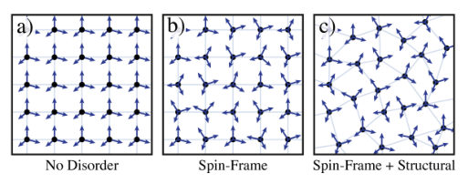
<figcaption class="paper-figure-caption"><b>Fig 1.</b> FIG. 1. A comparison between different types of disorder. (a) In a crystal the spin quantization reference frame and coordination is equal across sites. (b) Spin-frame disorder, scrambles the spin-quantization reference frame between sites. (c) In amorphous systems, spin-frame disorder can coexist with structural, bond and on-site disorder. We study the effect of these disorders and point out limitations that they bring to known real-space methods to characterise topology.</figcaption>
</figure>
<figure class="paper-figure-card">
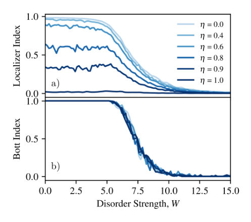
<figcaption class="paper-figure-caption"><b>Fig 2.</b> FIG. 2. Failure of the spin-Bott index in the presence of spin-frame disorder. (a) As the fraction of sites with spin-frame disorder is in- creased from η = 0 to η = 1 the spin-Bott index from Eq. (14) continuously drops to zero. At η = 1 if fails to diagnose the topologi- cal transition. The spin-Bott index requires a well defined spin gap, which is generically closed by spin-frame disorder. (b) The localizer index from Eq. (8) (with κ = 1) is independent of η and correctly captures the topological phase transition as a function of disorder strength W.</figcaption>
</figure>
<figure class="paper-figure-card">
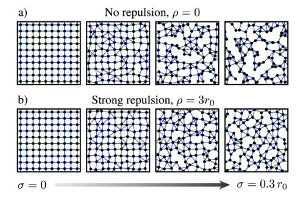
<figcaption class="paper-figure-caption"><b>Fig 3.</b> FIG. 3. Two examples of progressively disordering a system starting from a square lattice on the unit square. At each point, bonds are drawn between pairs of sites that are closer than 1.3 times the original lattice spacing r0. (a) With the repulsion parameter, ρ, set to zero, each point is moved to a new position sampled from a Gaussian distribution centred on the original position of the vertex with standard deviation σ. As σ is increased, this tunes smoothly between the square lattice and a set of uniformly distributed vertices. (b) With ρ set to 0.3, the probability of moving a vertex close to any other existing vertices is suppressed. Thus, as the system is progressively disordered by...</figcaption>
</figure>
<figure class="paper-figure-card">
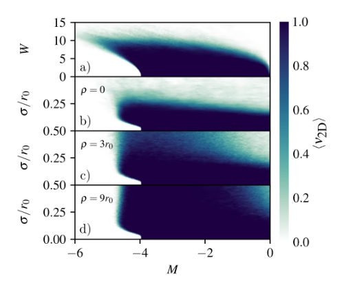
<figcaption class="paper-figure-caption"><b>Fig 4.</b> FIG. 4. Phase diagram of the localizer index for the two-dimensional BHZ model comparing the effect of on-site Anderson and structural disorder, with a small fraction of spin-frame disordered sites η = 0.15, for a system size L = 30. Each point is calculated with A = 1, and averaged over 100 realisations of disorder. The phase diagram is calculated in each case as a function of the parameter M in Eq. (4) and the respective type of disorder. The spectral localizer index given by Eq. (8) is computed for κ = 1 and E, x at the centre of the energy spectrum and the system, respectively. (a) The localizer index for the BHZ model as a function of Anderson disorder strength W. (b-d) The localizer...</figcaption>
</figure>
<figure class="paper-figure-card">
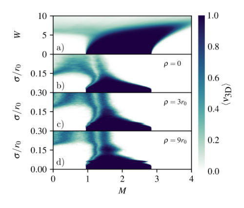
<figcaption class="paper-figure-caption"><b>Fig 5.</b> FIG. 5. Phase diagram of the localizer index for the three-dimensional topological insulating model in the presence of Anderson and struc- tural disorder. Each point is calculated with A = 1, and averaged over 100 realizations of disorder, for a system size L = 10. The localizer index, Eq. (10), is computed for κ = 2 and E, x at the bulk of the energy spectrum and the system, respectively. (a) Localizer index for the three-dimensional topological insulator model as a function of Anderson disorder strength W. (b-d) Localizer index as a function of M and the strength of Gaussian structural disorder, characterized by its standard deviation σ with the inter-site repulsion ρ. As in Fig. 4, three...</figcaption>
</figure>

**Summary.** This work develops robust theoretical tools, particularly the spectral localizer, to diagnose topological phases in the presence of structural disorder. It reveals that structural disorder's effect is highly dimension-dependent, favoring topological stability in 2D lattices with repulsive interactions but being generally destructive in 3D. This provides key design principles for realizing topological materials in amorphous or disordered solid-state systems.

**Why it may be interesting.** The development of basis-independent topological diagnostics like the spectral localizer is crucial for analyzing complex, disordered quantum systems where symmetries are easily broken or ill-defined.

Detailed structure

**Main problem.** The paper investigates how structural disorder, as opposed to on-site disorder, affects the ability to induce and sustain topological phases in quantum materials.

**Main result.** Structural disorder can enhance and sustain topological phases in two dimensions if atomic sites are penalized from being too close, but this effect is generally detrimental in three dimensions.

**Method.** The authors employ advanced theoretical diagnostics, notably the spectral localizer, to calculate topological invariants ($\mathbb{Z}_2$ invariants) in real space, circumventing limitations of traditional markers when spin-frame disorder is present.

**Model / system.** The study analyzes topological insulators (e.g., BHZ model) on lattices, modeling disorder through structural shifts ($\sigma$) and inter-site repulsion ($
ho$). The Hamiltonian incorporates hopping strengths exponentially dependent on atomic separation.

**Key observables.** Topological invariants ($\mathbb{Z}_2$ invariants), local gap, structure factor, and the spectral localizer index.

**Important parameters / regimes.** Dimensionality (2D vs 3D), structural disorder strength ($\sigma$), inter-site repulsion ($
ho$), and the disorder type (structural vs. on-site Anderson disorder $W$).

**Assumptions / limitations.** The spectral localizer is assumed to provide a basis-independent and robust diagnostic tool, especially when global spin-reference frames are scrambled by disorder.

**Figures summary.** Figures illustrate phase diagrams comparing topological regimes under Anderson vs. structural disorder in 2D and 3D, and show structure factors comparing systems with and without inter-site repulsion.

**Paper structure.** The paper progresses by first establishing the limitations of standard topological markers under disorder, then introducing and validating the spectral localizer, and finally applying this tool to systematically compare the effects of structural disorder in 2D versus 3D systems.

Abstract

On-site disorder can be leveraged to induce a transition from a trivial to a topological insulator. However it is unclear if structural disorder in the absence of on-site disorder can aid a similar transition and, if so, which kind of structural disorder is more favourable. We numerically show that structural disorder can enhance and sustain a topological phase up to strong disorder in two dimensions provided that one penalises atomic sites from being close to one another. However, we find this effect is absent in three dimensions, where structural disorder appears generically detrimental to the phase. In our calculations we include disorder that can scramble the global spin-reference frame, an overlooked type of disorder expected to exist in strongly disordered solids. This disorder fatally scrambles the information necessary for the spin-Bott and the spin-Chern marker to correctly diagnose a topological phase. By using the spectral localizer, a local marker directly defined using the time-reversal symmetry operator rather than a spin-projection, we show how one can circumvent this limitation, providing a basis-indifferent theory for calculating Z2 invariants. Our work showcases that not all structural disorders are equally beneficial to topology, and highlights guiding principles to enhance and detect topological phases in both solid-state and metamaterial realisations.

[↑ back to top](#top)

### [Shortcut to Adiabatic Isomeric Population Transfer of the $^{229}\mathrm{Th}$ Nucleus via Hyperfine Electronic Bridge](http://arxiv.org/abs/2606.00748v1)

**Authors:** Bo Liu, Wu Wang, Yong Li  
**Type:** theory · **Category:** other · **PDF:** <https://arxiv.org/pdf/2606.00748v1>  
**Analysis basis:** full PDF text, analyzed in chunks
**Topic relevance:** `methods for driven-dissipative` **3/5** · `correlated / nonlocal dissipation` **1/5** · `driven-dissipative phase transition` **1/5** · `non-equilibrium dynamics` **1/5**

↔ Scroll figures horizontally

<figure class="paper-figure-card">
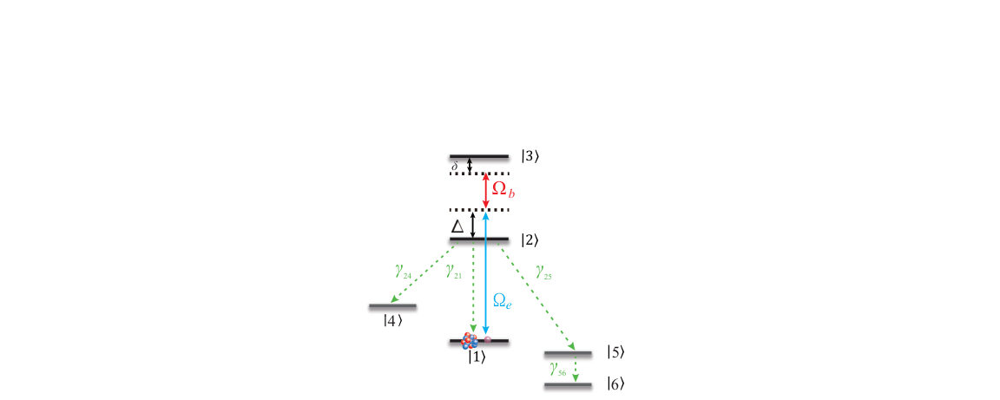
<figcaption class="paper-figure-caption"><b>Fig 1.</b> Figure 1: The six-level model for 229Th3+ ions begins with |1⟩≡|[Ig7s1/2]F = 2⟩and aims to excite the isomeric state |3⟩≡|[Ie7s1/2]F = 2⟩via the intermediate state |2⟩≡|[Ig7p1/2]F = 3⟩. An electron-assisting laser (with Rabi frequency Ωe) drives the transition between |1⟩and |2⟩, while a bridge-assisting laser (with Rabi frequency Ωb) couples |2⟩and |3⟩. The decay from |2⟩to |1⟩(with decay rate γ21), |4⟩≡|[Ig7s1/2]F = 3⟩(with decay rate γ24), and |5⟩≡|Ig, 6d3/2⟩(with decay rate γ25), as well as the decay from |5⟩to |6⟩≡|Ig, 5f5/2⟩(with decay rates γ56) are considered. Hyperfine structures of |5⟩and |6⟩are ignored, as they do not affect the isomeric population transfer from |1⟩to |3⟩. ∆= E2...</figcaption>
</figure>
<figure class="paper-figure-card">
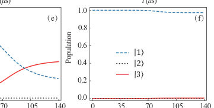
<figcaption class="paper-figure-caption"><b>Fig 2.</b> Fig. 2. The upper and lower panels correspond to total operation times of ttotal = 280 µs and ttotal = 140 µs, respectively. (a, d) Rabi frequencies ˜Ωe(t) and ˜Ωb(t) employed in the STIRSAP scheme. (b, e) Population transfer efficiencies from state |1⟩to state |3⟩achieved via the STIRSAP scheme, which are 79.38% and 35.63%, respectively. (c, f) Population transfer efficiencies obtained with the STIRAP scheme, corresponding to 41.88% and 0.36%, respectively. The parameters are: (a, b) σ = 54 µs, te = 120 µs, tb = 160 µs, Ωb/2π = Ωe/2π = 6.8×105 Hz, ∆= 1000|Ωb(tb)|; (c) σ = 67 µs, te = 120 µs, tb = 122 µs, Ωb/2π = Ωe/2π = 12.9 × 105 Hz, ∆= 1000|Ωb(tb)|; (d, b) σ = 20 µs, te = 67 µs, tb = 73...</figcaption>
</figure>
<figure class="paper-figure-card">
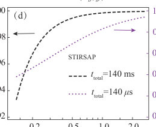
<figcaption class="paper-figure-caption"><b>Fig 3.</b> Fig. 3. (a) Influence of the total operation time ttotal on the population transfer efficiency of the STIRSAP scheme (red dashed line) and the STIRAP scheme (blue solid line), respectively. Parameters are set as Ωb(tb)/2π = Ωe(te)/2π = 6.8×105 Hz and ∆= 1000 |Ωb(tb)|. (b, c) Influence of the detuning ∆on the population transfer efficiency, comparing the STIRSAP (red dashed line) and the STIRAP scheme (blue solid line). Parameters are set as Ωb(tb)/2π = Ωe(te)/2π = 6.8 × 105 Hz. The total operation times are 140 ms for (b) and 140 µs for (c), respectively. (d) Influence of the peak Rabi frequencies Ωb(tb) = Ωe(te) on the population transfer efficiency of the STIRSAP scheme for long operation...</figcaption>
</figure>

**Summary.** This paper introduces the Stimulated Raman Shortcut-to-Adiabatic Passage (STIRSAP) method for manipulating the isomeric state of the $^{229}\mathrm{Th}$ nucleus. By employing counter-diabatic driving, the authors successfully accelerate the population transfer process from milliseconds down to microseconds. This advancement significantly enhances the feasibility of controlling nuclear isomers using electronic structure interactions.

**Why it may be interesting.** This work is highly relevant to AMO physics and open quantum systems as it applies advanced quantum control techniques (STAs/counter-diabatic driving) to manipulate nuclear quantum states using electronic structure as a bridge.

Detailed structure

**Main problem.** To significantly shorten the operation time for the isomeric population transfer of the $^{229}\mathrm{Th}$ nucleus while maintaining high efficiency.

**Main result.** The Stimulated Raman Shortcut-to-Adiabatic Passage (STIRSAP) method achieves transfer in hundreds of microseconds, dramatically faster than previous methods, while maintaining high efficiency and showing improved robustness.

**Method.** The study employs the STIRSAP quantum control technique, which utilizes counter-diabatic driving to accelerate the population transfer process compared to standard STIRAP.

**Model / system.** The system is modeled as a six-level structure involving the $^{229}\mathrm{Th}$ nucleus and its hyperfine electronic bridge. The time evolution is governed by a quantum master equation incorporating decay processes.

**Key observables.** Population transfer efficiency from the initial state to the isomeric state, and the operation time ($t_{	ext{total}}$).

**Important parameters / regimes.** Operation times (hundreds of microseconds vs. hundreds of milliseconds), two-photon detuning ($\delta$), and one-photon detuning ($\Delta$).

**Assumptions / limitations.** The system is modeled as a six-level system, and the analysis assumes the initial state is prepared in the metastable $7s_{1/2}$ level.

**Figures summary.** Figures compare the efficiency of STIRSAP versus STIRAP as a function of total operation time, detuning, Rabi frequency, and two-photon detuning, demonstrating STIRSAP's superior speed and robustness.

**Paper structure.** The paper first establishes the physical model and the need for faster control. It then derives the Hamiltonian and applies the STIRSAP technique using counter-diabatic driving. Finally, it systematically compares the results of STIRSAP against STIRAP across various parameter regimes (time, detuning) to prove its superiority.

Abstract

The $^{229}$Th nucleus is well known for its exceptionally low-lying nuclear isomeric level, which provides a unique platform for exploring electron-nucleus interactions and gives rise to a variety of rich physical phenomena. One such phenomenon is the hyperfine electronic bridge, which has recently been shown to enable efficient and precise manipulation of the nuclear isomeric levels of $^{229}$Th [W. Wang $et~ al.$, Phys. Rev. Lett. \textbf{133}, 223001 (2024)]. However, that study used the stimulated Raman adiabatic passage method, which requires relatively long operation times. In this work, we employ the stimulated Raman shortcut-to-adiabatic passage method, which dramatically shortens the operation time from the order of hundreds of milliseconds to hundreds of microseconds while maintaining a transfer efficiency of about $79.38\%$.

[↑ back to top](#top)

### [Correlated Quantum Sensing at the Seemingly Classical Limit](http://arxiv.org/abs/2606.01673v1)

**Authors:** K. P. Athulya, Sreenath K. Manikandan  
**Type:** theory · **Category:** other · **PDF:** <https://arxiv.org/pdf/2606.01673v1>  
**Analysis basis:** full PDF text, analyzed in chunks
**Topic relevance:** `quantum measurements` **3/5** · `Keldysh / 2PI / non-Gaussian methods` **1/5** · `correlated / nonlocal dissipation` **1/5**

↔ Scroll figures horizontally

<figure class="paper-figure-card">
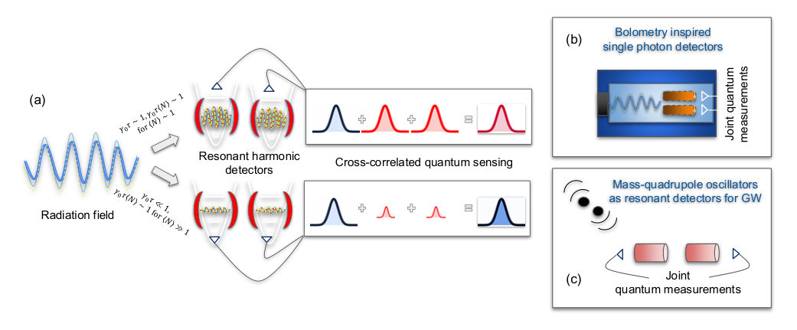
<figcaption class="paper-figure-caption"><b>Fig 1.</b> FIG. 1. (a) Cross-correlated quantum sensing using two or more high-quality, but barely functional resonant quantum harmonic detectors in the bolometric regime can offer a statistical advantage for probing the coherence properties of weak fields in the seemingly classical limit of large ⟨N⟩. We compare (b) the bolometric regime of good resonant harmonic detectors for probing quantum aspects of light to (c) the bolometric regime of barely functional resonant mass detectors for probing the quantum nature of gravitational radiation. The comparison is made in the functional detector regime, i.e., γ0τ⟨N⟩∼1 for both cases.</figcaption>
</figure>

**Summary.** This paper details advanced quantum sensing techniques to detect faint quantum fields, such as gravitons, by analyzing correlations across multiple detectors. It establishes that correlated measurements offer a statistical advantage over single-detector measurements, particularly in the weak coupling regime. The methodology involves deriving complex cross-correlators for counting and quadrature measurements, providing a theoretical roadmap for tabletop quantum gravity experiments.

**Why it may be interesting.** This work is highly relevant to quantum optics and open quantum systems because it extends the concept of quantum noise measurement into the challenging regime of weak coupling and high photon numbers, providing concrete statistical tools for experimental proposals.

Detailed structure

**Main problem.** The core problem is developing methods to detect the quanta of weakly interacting radiation fields, such as gravitons, by probing their quantum statistics, especially when the field is in a seemingly classical limit ($\langle N 
angle \gg 1$).

**Main result.** The authors show that correlated quantum sensing strategies, utilizing cross-correlators ($\kappa_2, \kappa_3$) or quadrature measurements (Homodyne/Heterodyne), provide a unique statistical advantage for detecting quantum noise even when detectors are only 'barely functional' (weakly coupled bolometric regime).

**Method.** The analysis employs quantum field theory techniques, calculating expectation values and correlators using the Glauber-Sudarshan P representation for multi-detector setups.

**Model / system.** The system involves coupling a quantized radiation field (photons or gravitons) to one or more resonant quantum harmonic detectors (e.g., mass quadrupole oscillators). The interaction is modeled via a time-dependent Hamiltonian, analyzed in the weak coupling limit ($\gamma_0 	au \ll 1$).

**Key observables.** Cross-correlators ($\kappa_2, \kappa_3$), mean number of detected quanta ($ar{n}$), number fluctuations ($\Delta n^2$), and quadrature correlations ($\langle x_1 x_2 
angle - \langle x_1 
angle \langle x_2 
angle$).

**Important parameters / regimes.** The critical regime is the weak coupling bolometric limit where $\gamma_0 	au \ll 1$ but the product $\gamma_0 	au \langle N 
angle \sim 1$.

**Assumptions / limitations.** The analysis assumes Markovian evolution and that the detectors are initialized in zero-mean preparations, such as thermal states.

**Figures summary.** Figure 1 compares cross-correlated quantum sensing across three regimes: quantum optics, and resonant mass detectors for gravitational waves (GW).

**Paper structure.** The paper systematically develops detection strategies by comparing correlated counting, homodyne, and heterodyne measurements for $k=2$ and $k=3$ detectors, deriving the necessary correlators for each scheme.

Abstract

It is a difficult task to detect the indivisible quanta of weakly interacting radiation fields, and even more challenging to probe their quantum statistics. Nevertheless, if barely functional high-quality resonant detectors are feasible for weakly interacting radiation fields, they do come with certain statistical advantages to probe quantum effects at the seemingly classical limit of a large number of quanta of the incoming radiation field. We present correlated counting, homodyne, and heterodyne detection strategies using high-quality resonant quantum harmonic detectors operating at this limit, initialized in bolometry-inspired zero-mean preparations such as thermal states. We compare the bolometric regime of good resonant harmonic detectors in quantum optics to the bolometric regime of barely functional resonant mass quadrupole oscillators as detectors for quantum gravity. Simple statistical tests are proposed using symmetric correlators for two and three such barely functional resonant mass detectors that could reveal the complementary quantum noise characteristics of gravitons in tabletop experiments.

[↑ back to top](#top)

### [Parallelizing Large-Scale Tensor Network Contraction on Multiple GPUs](http://arxiv.org/abs/2606.01852v1)

**Authors:** Feng Pan, Hanfeng Gu, Paul Springer, Xipeng Li  
**Type:** experiment · **Category:** numerical methods · **PDF:** <https://arxiv.org/pdf/2606.01852v1>  
**Analysis basis:** full PDF text, analyzed in chunks
**Topic relevance:** `analog quantum simulation` **3/5** · `entanglement & information structure` **1/5** · `methods for driven-dissipative` **1/5**

↔ Scroll figures horizontally

<figure class="paper-figure-card">
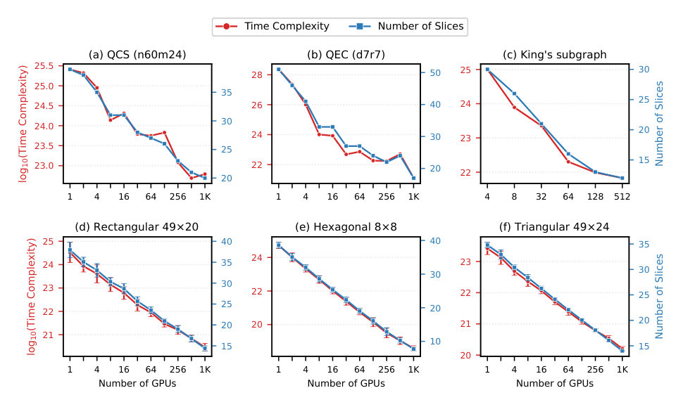
<figcaption class="paper-figure-caption"><b>Fig 1.</b> Fig. 1. Theoretical complexity reduction from distributing intermediate tensors across GPUs for six workloads: (a) quantum circuit simulation (Zuchongzhi n60m24), (b) exact QEC decoding (distance-7 rotated surface code), (c) independent-set enumeration on King’s subgraphs, and many-body dynamics on (d) rectangular, (e) hexagonal, and (f) triangular lattices. Red curves show log10(total FLOPs); blue curves show the number of sliced indices. In all cases, contraction cost drops rapidly—often close to exponentially—as more GPUs contribute shared memory. Many-body panels show mean ± std over 15 independent path-finding runs.</figcaption>
</figure>
<figure class="paper-figure-card">
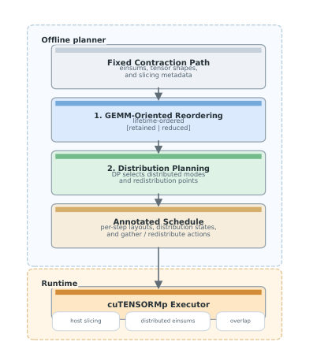
<figcaption class="paper-figure-caption"><b>Fig 2.</b> Fig. 2. End-to-end workflow. The offline planner takes a fixed contraction path and applies two transformations: mode reordering produces GEMM- ready tensor layouts via lifetime ordering, and distribution planning selects distributed modes and redistribution points via DP search. The resulting annotated schedule is replayed at runtime by the cuTENSORMp executor with compute–communication overlap.</figcaption>
</figure>
<figure class="paper-figure-card">
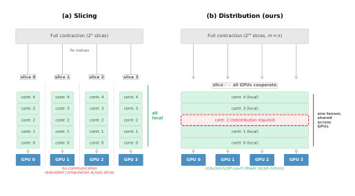
<figcaption class="paper-figure-caption"><b>Fig 3.</b> Fig. 4. Slicing vs. distribution. (a) Slicing fixes indices to create independent sub-tasks with no communication but redundant computation. (b) Distribution partitions a single tensor across GPUs, reducing total FLOPs at the cost of communication that our planner minimizes.</figcaption>
</figure>
<figure class="paper-figure-card">
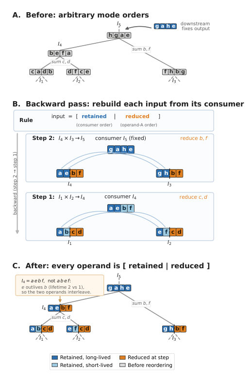
<figcaption class="paper-figure-caption"><b>Fig 4.</b> Fig. 3. GEMM-oriented mode reordering on a two-step subtree. Dashed edges show connections to the rest of the contraction tree. Panel A: arbitrary local orders plus the downstream request I5 = gahe. Panel B: the backward pass visits step 2 and then step 1; at each visit, each input is rebuilt as “shared modes in consumer order, then modes reduced here.” Panel C: the resulting tree has [retained | reduced] operand layouts (dashed split line), with modes shaded by remaining lifetime and reduction status. The output I4 interleaves modes from I1 and I2 by lifetime, so step 2 can use I4 as [retained | reduced] without a transpose.</figcaption>
</figure>
<figure class="paper-figure-card">
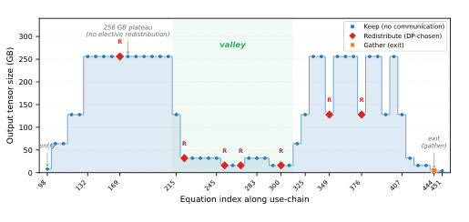
<figcaption class="paper-figure-caption"><b>Fig 5.</b> Fig. 5. DP redistribution-point selection for the Zuchongzhi n60m24 bench- mark on 8 H100 GPUs. The shaded area shows the distributed tensor’s output size along the use-chain. Blue dots are equations where distributed modes are kept (no communication); red diamonds mark DP-chosen redistributions. The DP avoids redistributing on the 256 GB plateau, instead concentrating transfers in the valley and at local minima of the second peak.</figcaption>
</figure>

**Summary.** This paper presents a novel, communication-aware multi-GPU framework to accelerate large-scale tensor network contractions, which are vital for quantum simulation. By intelligently reordering modes and distributing intermediate tensors across multiple GPUs, it overcomes the exponential scaling limits of traditional slicing methods. The results demonstrate massive, super-linear speedups, pushing the boundaries of what is computationally feasible for complex quantum systems.

**Why it may be interesting.** This work provides a critical computational tool for simulating complex quantum many-body systems by efficiently managing the massive data movement inherent in tensor network contractions, directly impacting the feasibility of large-scale quantum simulations.

Detailed structure

**Main problem.** The core challenge is accelerating exact tensor network (TN) contraction, which is fundamental to simulating quantum circuits and many-body systems, because standard parallelization techniques like slicing are inefficient.

**Main result.** The proposed communication-aware distribution framework achieves massive speedups (up to 67,869x extra speedup over slicing) on large GPU clusters, significantly surpassing the scaling limits of existing methods.

**Method.** The authors introduce an offline scheduling strategy involving GEMM-oriented mode reordering and communication-aware mode distribution planning to convert a fixed contraction path into an efficient, overlapping multi-GPU execution schedule.

**Model / system.** The work focuses on Tensor Networks (TNs) used to model quantum circuits, quantum error correction codes, and many-body dynamics on lattices (e.g., hexagonal, triangular). The implementation utilizes cuTENSORMp on NVIDIA DGX H100 nodes.

**Key observables.** Extra speedup beyond embarrassingly parallel slicing, projected full-contraction time, and complexity reduction ($R_P$).

**Important parameters / regimes.** Scaling from 8 GPUs (NVLink) to 1024 GPUs (InfiniBand); the ratio of communication cost to arithmetic computation cost.

**Assumptions / limitations.** The framework assumes an existing, fixed binary contraction path from an upstream optimizer, and the performance is limited by the interconnect bandwidth (communication).

**Figures summary.** Figures illustrate the theoretical complexity reduction across various workloads versus GPU count, and detail the end-to-end workflow from a fixed path to the annotated, overlapping execution schedule.

**Paper structure.** The paper details the limitations of slicing, proposes the two-stage offline planning (reordering and distribution planning), describes the runtime execution via cuTENSORMp, and validates the method through extensive scaling benchmarks on both single and multi-node hardware.

Abstract

Exact tensor network contraction underpins quantum circuit simulation, quantum error correction, combinatorial optimization, and many-body dynamics. The dominant parallelization strategy, slicing, scales exponentially and incurs redundant computation. We present a multi-GPU framework that instead distributes intermediate tensors across devices with explicit communication, converting a fixed contraction path into a communication-efficient schedule via GEMM-oriented mode reordering and communication-aware mode distribution planning. Within a single DGX H100 node (8 GPUs, NVLink), distribution delivers $7$--$173\times$ extra speedup beyond embarrassingly parallel slicing, capturing nearly all of the available compute reduction (87--101%) because NVLink's high bandwidth keeps communication small relative to compute. Scaling the same four workloads to 1024 H100 GPUs over InfiniBand, the extra speedup beyond slicing ranges from $42\times$ to $67{,}869\times$, demonstrating that communication-aware distributed contraction far surpasses slicing-based scaling limits for frontier tensor networks.

[↑ back to top](#top)

### [Quantum Algorithm for Distributed Reduction of Entanglements (QADR): A Trainable and Simulation-Efficient QML Framework](http://arxiv.org/abs/2606.01291v1)

**Authors:** Syed Farhan Ahmad, Gregory T. Byrd  
**Type:** both · **Category:** quantum information and computing · **PDF:** <https://arxiv.org/pdf/2606.01291v1>  
**Analysis basis:** full PDF text, analyzed in chunks
**Topic relevance:** `entanglement & information structure` **3/5** · `analog quantum simulation` **1/5** · `methods for driven-dissipative` **1/5**

↔ Scroll figures horizontally

<figure class="paper-figure-card">
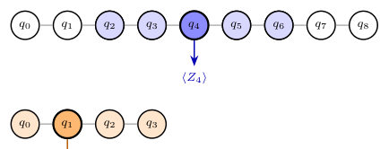
<figcaption class="paper-figure-caption"><b>Fig 1.</b> Fig. 1. Causal cone geometry for n = 9, d = 2. Top (interior cone): target q4 sits at the center of a full-width 2d+1 = 5-qubit cone (d qubits left + target + d right). Bottom (boundary cone): target q1 is only one hop from the left edge, so the cone is clipped to four qubits, with one left neighbor instead of two. There are always exactly 2d boundary cones.</figcaption>
</figure>
<figure class="paper-figure-card">
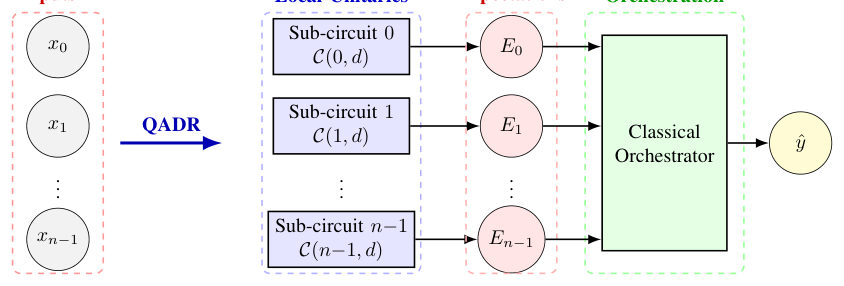
<figcaption class="paper-figure-caption"><b>Fig 2.</b> Fig. 2. QADR Pipeline: an n-qubit classification task is decomposed into n fixed-width local sub-circuits, each operating within its causal light cone C(i, d). Local ⟨Ztarget⟩expectation values are fused by a lightweight Classical Orchestrator, reducing simulation memory from O(2n) to O(n · 22d+1) while preserving end-to-end trainability.</figcaption>
</figure>
<figure class="paper-figure-card">
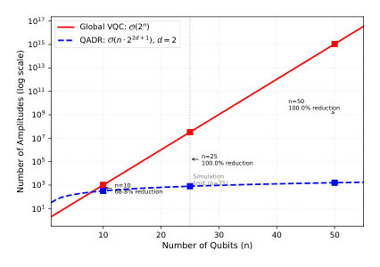
<figcaption class="paper-figure-caption"><b>Fig 3.</b> Fig. 3. Theoretical statevector simulation amplitude complexity comparison between Global VQC (O(2n)) and QADR (O(n·22d+1)) with a cone radius of d = 2 on a logarithmic scale.</figcaption>
</figure>
<figure class="paper-figure-card">
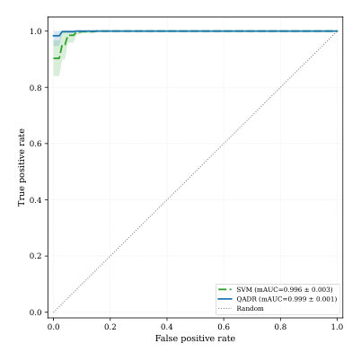
<figcaption class="paper-figure-caption"><b>Fig 4.</b> Fig. 4. ROC curves for QADR and SVM at nfeatures = 2000 (SelectKBest) on the NASA IMS fault classification task. Only these two architectures were capable of operating at this scale where a “curve of dimensionality” exists. QADR achieves an ROC-AUC of 0.9995 versus 0.9958 for SVM.</figcaption>
</figure>

**Summary.** This paper introduces QADR, a novel hybrid framework designed to overcome the exponential memory and barren plateau issues plaguing VQC training. By decomposing the quantum circuit into localized sub-circuits based on causal light cones, QADR achieves polynomial scaling in system size. It demonstrates that this approach maintains high classification accuracy even on massive, high-dimensional datasets where standard global quantum methods fail.

**Why it may be interesting.** While focused on ML, the concept of decomposing global quantum computations based on locality (causal light cones) is highly relevant to simulating complex quantum many-body systems or quantum field theories where entanglement structure dictates computational feasibility.

Detailed structure

**Main problem.** The paper addresses the severe computational limitations encountered when training Variational Quantum Circuits (VQCs) under NISQ constraints, specifically exponential memory scaling and barren plateaus.

**Main result.** The proposed QADR framework successfully scales to high-dimensional feature spaces (up to 2000) where global VQCs fail, matching or exceeding the performance of optimized classical machine learning models.

**Method.** QADR decomposes a global VQC into localized sub-circuits operating within the causal light cones of individual qubits, which are then processed by a classical orchestrator.

**Model / system.** The model is a hybrid quantum-classical machine learning framework applied to parameterized quantum unitaries (VQCs). It simulates quantum circuits on classical hardware, focusing on feature extraction from localized quantum expectations.

**Key observables.** Classification accuracy (MNIST, NASA IMS), ROC-AUC, and computational scaling complexity (memory and time).

**Important parameters / regimes.** Number of qubits ($n$), light cone radius ($d$), and feature dimensionality ($n_{	ext{features}}$).

**Assumptions / limitations.** The core assumption is that localizing the circuit operations via causal light cones can effectively approximate the global entanglement structure while drastically reducing computational overhead.

**Figures summary.** Figures illustrate the causal cone geometry, the QADR pipeline decomposition, and compare theoretical statevector simulation complexity between global and localized approaches.

**Paper structure.** The paper introduces the problem limitations, proposes the QADR decomposition method, details the hybrid training pipeline (local expectation gathering $
ightarrow$ classical projection), and benchmarks performance against global VQCs and advanced classical ML models on multiple datasets.

Abstract

Training Variational Quantum Circuits (VQCs) under Noisy Intermediate-Scale Quantum (NISQ) constraints introduces severe computational limitations: classical statevector simulation memory scales exponentially ($\mathcal{O}(2^n)$), and global cost functions suffer from barren plateaus where gradient variance decays exponentially ($\mathcal{O}(1/2^n)$). This paper introduces and evaluates the Quantum Algorithm for Distributed Reduction of Entanglements (QADR), a hybrid quantum-classical machine learning framework that decomposes a global $n$-qubit VQC into localized sub-circuits operating approximately within the causal light cones of individual target qubits. QADR reduces classical simulation memory scaling from $\mathcal{O}(2^n)$ to $\mathcal{O}(n \cdot 2^{2d+1})$ for a light cone radius $d$, while naturally mitigating global barren plateaus. We benchmark QADR against standard global VQCs, Support Vector Machines (SVM), and two customized classical parameter-matched neural networks (CANN and PMNN) on the MNIST dataset and the high-dimensional NASA IMS wind turbine drivetrain diagnostic task. QADR demonstrates excellent scalability, operating successfully at $n_{\text{features}}=2000$ where standard global VQCs crash due to memory exhaustion, while matching or exceeding the performance of optimized classical architectures.

[↑ back to top](#top)

### [Anisotropic Moiré Fractional Chern Insulators and Their Phase Transitions](http://arxiv.org/abs/2606.02094v1)

**Authors:** Bo Peng, Jin-Xin Hu  
**Type:** theory · **Category:** strongly correlated electrons · **PDF:** <https://arxiv.org/pdf/2606.02094v1>  
**Analysis basis:** full PDF text, analyzed in chunks
**Topic relevance:** `analog quantum simulation` **3/5** · `driven-dissipative phase transition` **1/5**

↔ Scroll figures horizontally

<figure class="paper-figure-card">
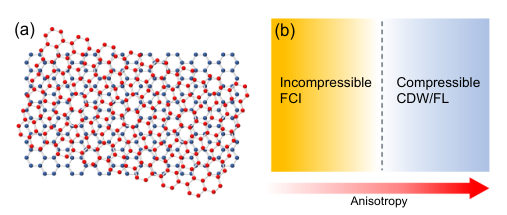
<figcaption class="paper-figure-caption"><b>Fig 1.</b> FIG. 1. Schematic picture of moir´e heterostructure formed by twisted bilayer honeycomb lattice such as graphene or tran- sition metal dichalcogenides. (b) When anisotropy is intro- duced, there is the phase transition from incompressible phase (FCI) with topological gap to compressible phase (CDW or Fermi liquid).</figcaption>
</figure>
<figure class="paper-figure-card">
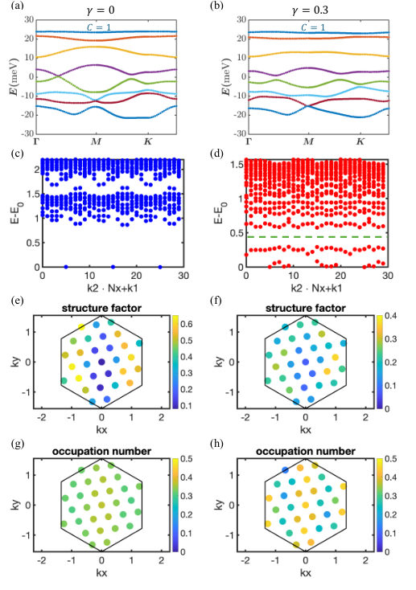
<figcaption class="paper-figure-caption"><b>Fig 2.</b> FIG. 2. Dispersion of the single-particle Hamiltonian, spec- tra of the screened Coulomb interaction projected onto the Chern band, Structure factor, and occupation number of ground states. (a,b) Energy dispersion of Eq. (1) without and with internal magnetic field modulation, corresponding to γ = 0 and γ = 0.3, respectively. (c,d) Spectra of the screened Coulomb interaction projected onto the Chern band for (γ = 0) and γ = 0.3, respectively. (e,f) Structure factor of the ground states under the projected screened Coulomb interaction for γ = 0 and γ = 0.3, respectively. (g,h) Orbital occupation number of the ground state for γ = 0 and γ = 0.3, respectively.</figcaption>
</figure>
<figure class="paper-figure-card">
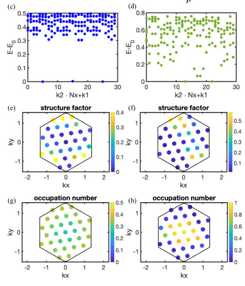
<figcaption class="paper-figure-caption"><b>Fig 3.</b> FIG. 3. (a) The schematic of stretching the lattice to in- duce anisotropy. (b) FCI gap and ground state bandwidth as functions of lattice ratio β. (c,d) The energy spectra of the Coulomb interaction on the ideal flat band corresponding to β = 1 and β = 0.5, respectively. (e,f) Structure factor of the ground states under the Coulomb interaction projected onto the ideal flat band corresponding to a regular honeycomb lat- tice (β = 1) and a stretched lattice (β = 0.5), respectively. (g,h) Orbital occupation number of the ground state for β = 1 and β = 0.5, respectively.</figcaption>
</figure>
<figure class="paper-figure-card">
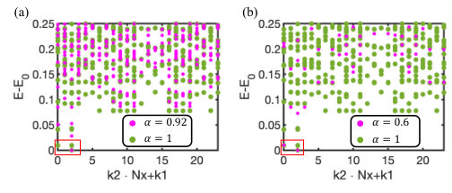
<figcaption class="paper-figure-caption"><b>Fig 4.</b> FIG. 4. The spectra of Coulomb interaction on the first Landau Level at filling ν = 1/2 for (a) gi = δab with α = 1 (green dots) and α = 0.92 (magenta dots). (b) gi = gm with α = 1 (green dots) and α = 0.6 (magenta dots). The α = 1 corresponds to the isotropic case, giving the sixfold Moore- Read states in the red boxes.</figcaption>
</figure>

**Summary.** This work explores how lattice anisotropy destabilizes Fractional Chern Insulator (FCI) phases in moiré materials. By tuning anisotropy, the system undergoes quantum phase transitions from a topological insulator to competing charge-density-wave or Fermi-liquid states. This establishes anisotropy as a powerful tool for engineering and exploring diverse correlated phases in moiré heterostructures.

**Why it may be interesting.** The mechanism of anisotropy-driven phase transitions from topological to symmetry-broken/compressible states provides a general framework for engineering correlated phases in moiré systems, relevant to understanding emergent quantum states in artificial lattices.

Detailed structure

**Main problem.** The study investigates the stability and nature of Fractional Chern Insulator (FCI) phases in moiré heterostructures when subjected to varying degrees of lattice anisotropy.

**Main result.** Sufficiently strong lattice anisotropy drives quantum phase transitions, destabilizing the incompressible FCI state into competing charge-density-wave (CDW) or Fermi-liquid (FL) phases.

**Method.** The research employs theoretical modeling using continuum Hamiltonians and analyzing key many-body observables like the structure factor and topological gap.

**Model / system.** The system is based on moiré heterostructures, such as twisted TMDs ($	ext{MoTe}_2$), modeled via a continuum Hamiltonian incorporating interlayer tunneling and electron-electron interactions.

**Key observables.** Hall conductivity ($\sigma_{xy}$), topological gap size, structure factor $S(\mathbf{q})$, and Bloch state occupation numbers ($n_k$).

**Important parameters / regimes.** Lattice anisotropy, controlled by interlayer momentum shift ($\gamma_q b(t)$) induced by heterostrain, or lattice stretching ($eta$).

**Assumptions / limitations.** The analysis often utilizes the single Landau Level (LL) approximation and treats the interaction via projection onto the Chern band.

**Figures summary.** Figures illustrate the phase transition from FCI (topological gap) to CDW/FL as anisotropy increases, showing changes in $S(\mathbf{q})$ and $n_k$.

**Paper structure.** The paper systematically analyzes the effect of anisotropy on the FCI state, first showing robustness to moderate strain, then detailing the transition mechanism to CDW/FL states, and finally comparing these findings to anisotropic FQHE models.

Abstract

Recently, moiré heterostructures have been observed to host fractional Chern insulator (FCI) phases at zero magnetic field. In this work, we show that the FCI phases are robust against moderate lattice anisotropy, while sufficiently strong anisotropy drives quantum phase transitions from incompressible topological phases to competing charge-density-wave (CDW) and Fermi-liquid (FL) phases. Specifically, in the case of twisted transition metal dichalcogenides (such as MoTe$_2$), the anisotropy arises from an interlayer momentum shift induced by heterostrain. We find that increasing anisotropy suppresses the many-body topological gap, eventually destabilizing the fractional topological phase. Beyond a critical anisotropy value, the system gradually transitions to a symmetry-broken state characterized by stripe-like CDW order. It has a Landau Level counterpart, where effective mass anisotropy provides an additional tuning knob for the fractional quantum Hall state; sufficiently strong anisotropy drives a transition to a charge-ordered phase. Moreover, in the anisotropic ideal Chern band model with lattice stretching, a Fermi liquid phase emerges as anisotropy increases. Our results establish that anisotropy provides a direct route for engineering and exploring competing correlated phases in FCI states based on moiré materials.

[↑ back to top](#top)

### [Bounds on Nonlocality and Random Access Codes from Extended Information Causality Principle](http://arxiv.org/abs/2606.02416v1)

**Authors:** Prabhav Jain, Nikolai Miklin, Mariami Gachechiladze  
**Type:** theory · **Category:** quantum information and computing · **PDF:** <https://arxiv.org/pdf/2606.02416v1>  
**Analysis basis:** full PDF text, analyzed in chunks
**Topic relevance:** `entanglement & information structure` **3/5** · `Keldysh / 2PI / non-Gaussian methods` **1/5**

↔ Scroll figures horizontally

<figure class="paper-figure-card">
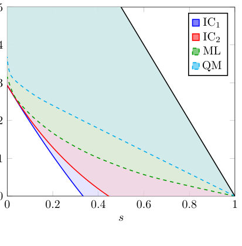
<figcaption class="paper-figure-caption"><b>Fig 1.</b> FIG. 2. A comparison of the inequalities obtained from the original formulation of IC (IC1) and its extension (IC2) in a chosen correlation slice in the d2dd scenario (d = 3). The axes correspond to the weights of each distribution described in Eq. (12). The dotted lines corresponding to ML and quantum mechanics (QM) were computed numerically using the NPA hierarchy.</figcaption>
</figure>
<figure class="paper-figure-card">
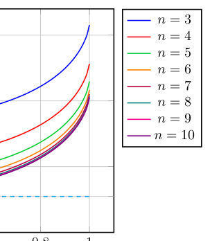
<figcaption class="paper-figure-caption"><b>Fig 2.</b> FIG. 3. Plot of critical values of e vs. the channel parameter ec for n = 3, . . . , 10.</figcaption>
</figure>

**Summary.** This paper develops an extended version of the Information Causality principle to place stronger constraints on quantum correlations and nonlocality. It applies these tools to analyze the performance limits of entanglement-assisted random access codes. While the extension yields stronger bounds in some Bell tests, it ultimately shows that for the specific RACs analyzed, the original IC bounds remain optimal.

**Why it may be interesting.** The rigorous derivation of new, tighter bounds on nonlocality using information-theoretic principles provides fundamental constraints on physical theories beyond quantum mechanics, which is crucial for understanding the limits of quantum correlations.

Detailed structure

**Main problem.** The paper aims to derive tighter theoretical bounds on quantum correlations (nonlocality) and the success probabilities of Random Access Codes (RACs) by extending the Information Causality (IC) principle.

**Main result.** The extended IC principle yields new, tighter quantum Bell inequalities in certain scenarios, although for entanglement-assisted random access codes, the extended principle does not improve the bounds over the original IC principle.

**Method.** The authors use advanced information-theoretic techniques, including deriving quantum Bell inequalities from the extended IC statement and applying optimization methods (like KKT conditions) to bound specific expressions.

**Model / system.** The analysis is conducted on non-signaling correlations (Bell scenarios) and applied to the theoretical framework of entanglement-assisted random access codes (EARACs) and general communication channels.

**Key observables.** Quantum Bell inequalities (e.g., $	ext{Inn}_{22}$ expression), winning probabilities for RACs, and Shannon mutual information.

**Important parameters / regimes.** The analysis explores limits such as zero classical channel capacity ($\gamma 	o 0$) and varying input correlation parameters ($\epsilon$).

**Assumptions / limitations.** The analysis relies on extending the IC principle to allow correlations among Alice's inputs, and in some parts, assumes uniform marginals or specific error channel structures.

**Figures summary.** Figures compare the bounds derived from the original IC, the extended IC, and other known bounds (ML, QM) across various dimensions ($d^2d$ scenario).

**Paper structure.** The paper progresses from establishing the extended IC principle and deriving new Bell inequalities for general scenarios, to applying these inequalities to derive bounds on EARACs, and finally confirming the optimality of the original IC bounds for the specific EARAC case.

Abstract

Information Causality was introduced as a physical principle for constraining the set of nonlocal correlations. In recent work, we proposed an extension of Information Causality that allows correlations among Alice's inputs. This extended principle yields tighter constraints than the original formulation and recovers part of the quantum boundary in certain Bell scenarios. In this work, we further investigate the implications of extended Information Causality and apply it to scenarios beyond binary inputs and outputs. We derive a family of quantum Bell inequalities that strengthen previously known constraints on quantum correlations. Using these inequalities, we obtain an improved analytical bound for the Collins-Gisin family of Bell inequalities. We also apply Information Causality to entanglement-assisted random access codes and derive new theory-independent analytical bounds on the winning probability. For this latter task, we prove that, despite being stronger in general, the extended principle does not improve the bounds obtained from the original Information Causality principle. This suggests that the existing Information Causality bounds are optimal for this class of random access codes.

[↑ back to top](#top)

### [Extracting central charge from ground-state overlaps of spatially deformed Hamiltonians](http://arxiv.org/abs/2606.00214v1)

**Authors:** Chen Bai, Xinyu Sun, Liang-Hong Mo, Hong-Hao Tu  
**Type:** theory · **Category:** strongly correlated electrons · **PDF:** <https://arxiv.org/pdf/2606.00214v1>  
**Analysis basis:** full PDF text, analyzed in chunks
**Topic relevance:** `entanglement & information structure` **3/5** · `analog quantum simulation` **1/5**

↔ Scroll figures horizontally

<figure class="paper-figure-card">
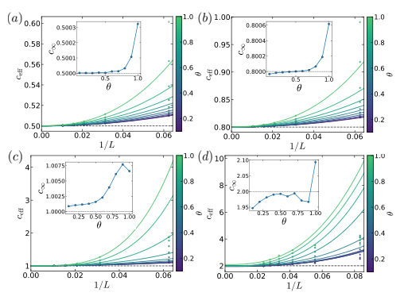
<figcaption class="paper-figure-caption"><b>Fig 1.</b> FIG. 1. Finite-size extrapolation of the effective central charge for q = 2 and different deformation parameters θ in four paradigmatic critical chains: (a) Ising, (b) three- state Potts, (c) spin- 1</figcaption>
</figure>
<figure class="paper-figure-card">
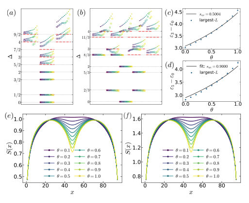
<figcaption class="paper-figure-caption"><b>Fig 2.</b> FIG. 2. Entanglement spectrum and entanglement entropy (S(x) = SA(x, 0)) of the q = 2 deformed Ising and three- state Potts chains. (a,b) Rescaled entanglement spectra for the (a) Ising and (b) three-state Potts chains, normalized by setting the stress-tensor level to ∆= 2. Different colors cor- respond to different θ values, as indicated in panels (e) and (f). Circles represent the numerical data for L = 96, squares show the thermodynamic-limit values extrapolated using the fitting form aL−p + b based on the last four largest sizes, and red dashed lines mark the boundary-CFT predictions (free boundary conditions on both entangling points). (c,d) Spec- tral gaps used for rescaling as...</figcaption>
</figure>
<figure class="paper-figure-card">
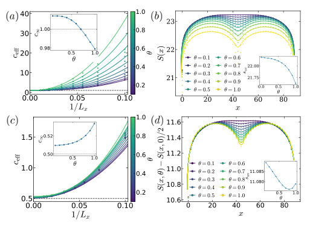
<figcaption class="paper-figure-caption"><b>Fig 3.</b> FIG. 3. Edge-state central charge and entanglement entropy in the q = 2 deformed QWZ model. (a) Finite-size extrap- olation of the effective central charge ceff for the two-edge deformation, using Lx = 10, 14, 18, 22, 30, 50, 70, 90 at fixed Ly = 30. Colored markers represent numerical data for dif- ferent deformation strengths θ, and solid curves show the cor- responding finite-size fits of the form aL−p +b, obtained from the four largest system sizes. The inset shows the extrapo- lated central charge c∞(θ) in the thermodynamic limit, with the dashed line indicating the expected CFT value. (b) En- tanglement entropy profile S(x) for the two-edge deformation. Numerical data are shown as...</figcaption>
</figure>

**Summary.** This work introduces a novel technique to measure the central charge of a CFT by analyzing the ground-state overlap of a system subjected to a $q$-Möbius spatial deformation. By applying this method to critical 1D chains and 2D topological insulators, the authors show that the overlap provides a simple, robust, and universal probe of fundamental CFT data using only wave-function properties.

**Why it may be interesting.** This provides a powerful, purely wave-function-based diagnostic tool to probe universal CFT properties (like $c$) in complex, interacting quantum many-body systems, which is highly relevant for understanding critical points in condensed matter.

Detailed structure

**Main problem.** The central problem is developing a method to extract the central charge ($c$) of a $(1+1)$-dimensional Conformal Field Theory (CFT) using only ground-state overlaps derived from spatially deformed Hamiltonians.

**Main result.** The ground-state overlap under $q$-Möbius deformations provides a simple and robust, wave-function-based probe for the central charge in critical quantum chains and topological edge modes.

**Method.** The authors derive an exact overlap formula using CFT techniques applied to the $q$-Möbius deformation, and then construct a lattice estimator based on this overlap.

**Model / system.** The study applies to gapless 1D quantum systems, including critical chains (Ising, Potts, Heisenberg) and the edge modes of 2D Chern insulators (QWZ model). The Hamiltonian is subjected to a spatially modulated $q$-Möbius deformation.

**Key observables.** Central charge ($c$), ground-state overlaps ($\langle 0|0_q(	heta) 
angle$), entanglement spectrum, and entanglement entropy ($S_A$).

**Important parameters / regimes.** Deformation parameters $q$ (modulation wave number) and $	heta$ (deformation strength); system size $L$.

**Assumptions / limitations.** The method relies on the deformation being generated by a finite conformal transformation to maintain analytical tractability.

**Figures summary.** Figures demonstrate the finite-size extrapolation of the effective central charge ($c_{	ext{eff}}$) for various critical chains, and show the entanglement spectrum and entropy for deformed Ising and Potts chains, as well as the 2D QWZ model.

**Paper structure.** The paper progresses from the CFT derivation of the overlap formula, to its lattice realization, and finally applies this estimator to calculate $c$ and analyze entanglement structures for both 1D and 2D topological models.

Abstract

We show that the conformal anomaly of a $(1+1)$-dimensional conformal field theory can be extracted directly from a ground-state wave-function overlap associated with a spatial conformal deformation. Focusing on the $q$-Möbius deformation, we derive an exact overlap formula between the deformed and undeformed ground states, whose exponent depends only on the central charge. Motivated by this result, we construct a lattice estimator based solely on ground-state overlaps and apply it to representative critical quantum chains and the gapless edge modes of a two-dimensional Chern insulator. Numerical results demonstrate that the resulting overlaps provide a simple and robust probe of the central charge in microscopic models. We further demonstrate that the deformed ground states retain universal geometric structures in their entanglement spectra and entanglement entropies. These results provide a simple wave-function-based route to probing conformal data in critical systems and topological edge modes.

[↑ back to top](#top)

### [Finite-Sample Selected Covariance Spectra in Classical Shadows](http://arxiv.org/abs/2606.00527v1)

**Authors:** Masahito Hayashi  
**Type:** theory · **Category:** quantum information and computing · **PDF:** <https://arxiv.org/pdf/2606.00527v1>  
**Analysis basis:** full PDF text, analyzed in chunks
**Topic relevance:** `quantum measurements` **3/5** · `entanglement & information structure` **1/5**

↔ Scroll figures horizontally

<figure class="paper-figure-card">
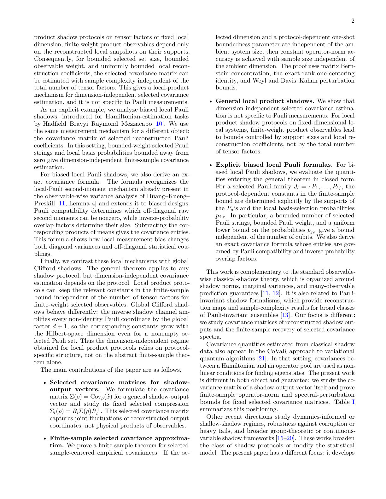
<figcaption class="paper-figure-caption"><b>Fig 1.</b> Low-resolution page preview, page 2</figcaption>
</figure>
<figure class="paper-figure-card">
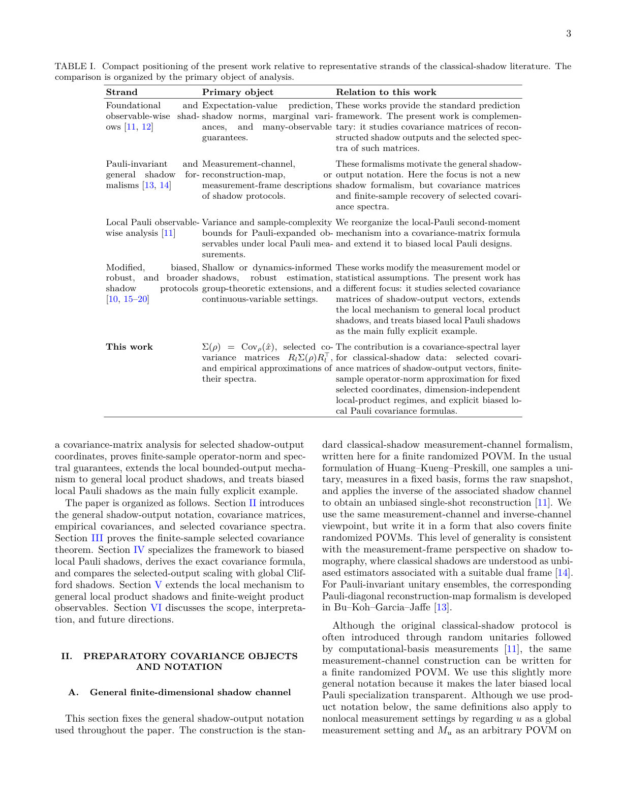
<figcaption class="paper-figure-caption"><b>Fig 2.</b> Low-resolution page preview, page 3</figcaption>
</figure>
<figure class="paper-figure-card">
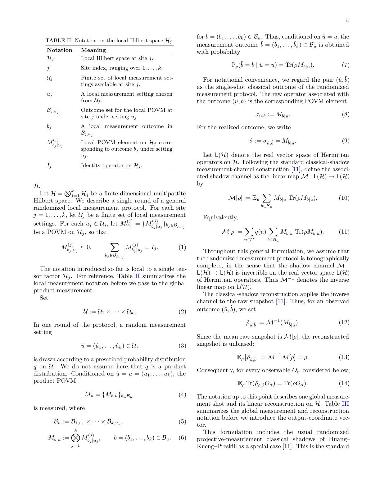
<figcaption class="paper-figure-caption"><b>Fig 3.</b> Low-resolution page preview, page 4</figcaption>
</figure>
<figure class="paper-figure-card">
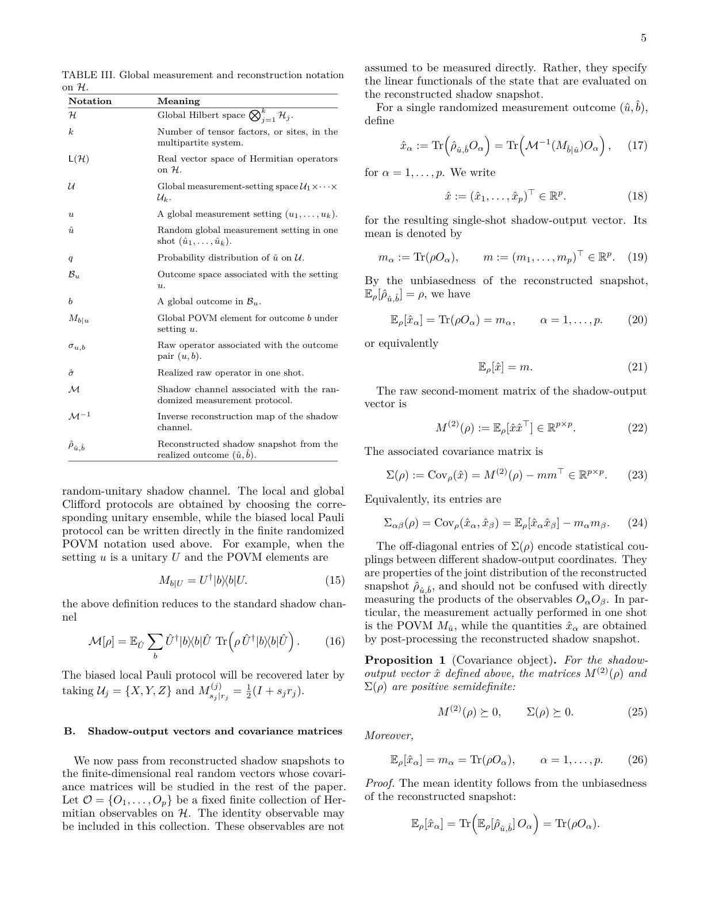
<figcaption class="paper-figure-caption"><b>Fig 4.</b> Low-resolution page preview, page 5</figcaption>
</figure>
<figure class="paper-figure-card">
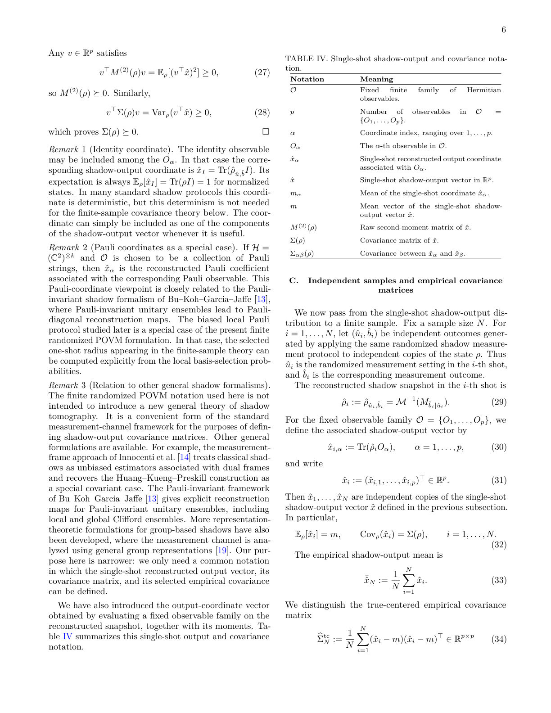
<figcaption class="paper-figure-caption"><b>Fig 5.</b> Low-resolution page preview, page 6</figcaption>
</figure>

**Summary.** This paper develops a rigorous finite-sample theory for estimating the covariance spectrum of quantum measurements reconstructed via classical shadows. It proves that for local measurement settings, the required sample size to estimate the selected covariance is independent of the total system dimension. This is a significant result for quantum tomography, as it shows that local structure can overcome the curse of dimensionality.

**Why it may be interesting.** It provides rigorous, quantitative tools for characterizing the statistical information contained in quantum measurements (shadows), which is crucial for understanding the limits of quantum state reconstruction.

Detailed structure

**Main problem.** The paper addresses the finite-sample estimation of selected covariance matrices derived from classical-shadow outputs in quantum measurements.

**Main result.** It establishes dimension-independent sample size bounds for selected covariance estimation when the measurement protocol is local (e.g., local Pauli shadows), contrasting this with protocols where the required sample size scales with system dimension.

**Method.** The analysis combines matrix Bernstein concentration inequalities with exact rank-one centering identities to control the error in the sample-centered empirical covariance matrix.

**Model / system.** The study uses the framework of classical shadows, where quantum state tomography is approximated by measuring a set of observables (Pauli strings) and reconstructing a shadow snapshot. The system is analyzed in terms of local product measurements versus global measurements.

**Key observables.** Selected covariance matrix ($\Sigma_l(
ho)$), shadow-output vector ($\hat{x}$), and the selected one-shot radius ($B_l$).

**Important parameters / regimes.** The selected dimension ($l$), the local support sizes, and the local reconstruction coefficients are critical parameters determining the sample complexity.

**Assumptions / limitations.** The primary assumption for the dimension-independent result is that the selected set of observables (or their associated coefficients) is bounded and local in nature (e.g., local product shadows).

**Figures summary.** The notes mention TABLE I comparing the work to other literature strands and TABLE II/III defining notation for local/global measurements, but no specific figure content is detailed.

**Paper structure.** The paper develops the theory by first defining the shadow-output vector and covariance, then proving the general finite-sample theorem, specializing to local product shadows, and finally deriving explicit, dimension-independent covariance formulas for biased local Pauli shadows.

Abstract

We study finite-sample estimation of selected covariance matrices of classical-shadow outputs. For a general shadow-output vector, we consider its covariance matrix and a fixed selected compression. Our main theorem applies to arbitrary shadow protocols and gives an operator-norm error bound for the selected sample-centered empirical covariance. When the protocol-dependent constants appearing in this bound remain independent of the ambient system size, the required sample size is also independent of the ambient dimension. The proof combines matrix Bernstein concentration, an exact rank-one centering identity, and Weyl and Davis--Kahan perturbation bounds.   We verify this bounded-output condition for local measurement settings. For general local product shadow protocols with fixed local dimension, finite-weight product observables lead to bounds controlled by support sizes and local reconstruction coefficients, not by the total number of tensor factors. Hence uniform bounds on selected set size, observable weight, and local reconstruction coefficients imply dimension-independent selected covariance estimation.   For biased local Pauli shadows, we evaluate the relevant bound in closed form from the selected Pauli supports and local basis-selection probabilities. We also derive an exact covariance formula governed by Pauli compatibility and inverse-probability overlap factors, showing how measurement bias affects both diagonal variances and off-diagonal statistical couplings. A comparison with global Clifford shadows shows that this dimension-independent local behavior is not automatic for every shadow protocol.

[↑ back to top](#top)

### [Optical Stability and Photophysics of NV Centers in Diamond up to 120 GPa](http://arxiv.org/abs/2606.02399v1)

**Authors:** Kin On Ho, Cassandra Dailledouze, Vytautas Žalandauskas, Grégoire Le Caruyer, Marek Maciaszek, Claire Roussy, Marie-Pierre Adam, Martin Schmidt, Loïc Toraille, Paul Loubeyre, Lukas Razinkovas, Jean-François Roch  
**Type:** both · **Category:** other · **PDF:** <https://arxiv.org/pdf/2606.02399v1>  
**Analysis basis:** full PDF text, analyzed in chunks
**Topic relevance:** `spintronics-quantum-optics interface` **3/5** · `QC/QI experiment` **1/5**

↔ Scroll figures horizontally

<figure class="paper-figure-card">
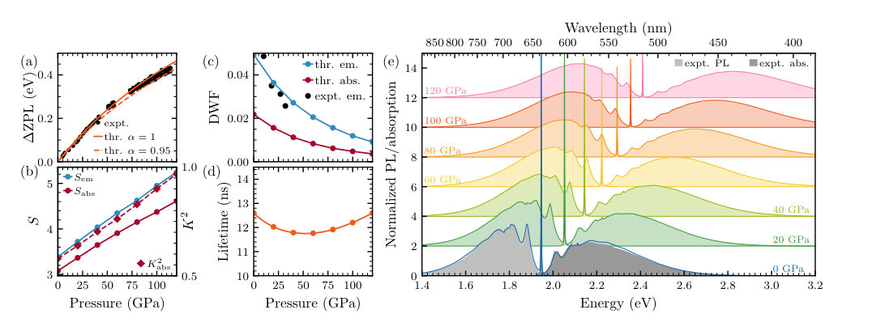
<figcaption class="paper-figure-caption"><b>Fig 1.</b> FIG. 1. (a) ZPL shift relative to ambient pressure. Black circles: experiment; orange solid line: theory (hydrostatic); orange dashed line: theory with near-hydrostaticity stress (α = 0.95). (b) Pressure-induced evolution of electron–phonon coupling parameters. Blue solid line: total HR factor S (emission); red solid line: HR factor for JT-inactive modes (absorption); red dashed line: squared vibronic coupling constants K2. (c) Pressure-induced evolution of Debye–Waller factors (DWF). Blue solid line: emission (theory); red solid line: absorption (theory); black circles: emission (experimental). (d) Pressure-induced evolution of theoretical radiative lifetime. (e) Theoretical PL and...</figcaption>
</figure>
<figure class="paper-figure-card">
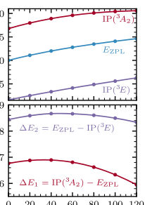
<figcaption class="paper-figure-caption"><b>Fig 2.</b> FIG. 2. (a) Photoionization of NV−from 3A2 and 3E states leading to 2E and 4A2 of NV0. (b) Pressure evolution of ion- ization thresholds IP(3A2) and IP(3E) alongside with ZPL. (c) Ionization energies relative to ZPL.</figcaption>
</figure>
<figure class="paper-figure-card">
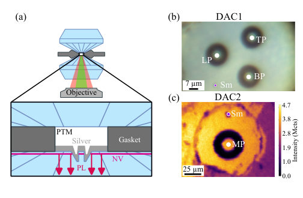
<figcaption class="paper-figure-caption"><b>Fig 3.</b> FIG. 3. (a) Illustration of the DAC with a micropillar struc- ture on (100)-diamond for reaching near-hydrostatic pres- sures [16]. We silver-coat the tip of the NV-implanted anvil to avoid interference from the top anvil and increase signal collection. (b) Image of DAC1 with three micropillars. (c) Confocal image of DAC2 with a single micropillar.</figcaption>
</figure>
<figure class="paper-figure-card">
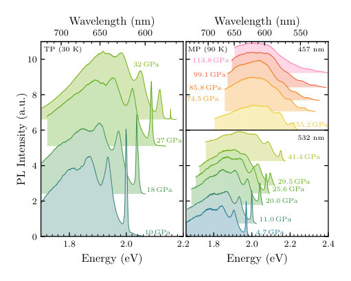
<figcaption class="paper-figure-caption"><b>Fig 4.</b> FIG. 4. Pressure evolution of the experimental NV PL spec- tra. (Left) Measurements from the TP micropillar at 30 K using 532 nm excitation. (Right) Measurements from the MP micropillar at ≈90 K: bottom panel – 532 nm excitation; top panel – 457 nm excitation. Spectra in each panel are verti- cally offset by pressure-dependent scaling factors.</figcaption>
</figure>
<figure class="paper-figure-card">
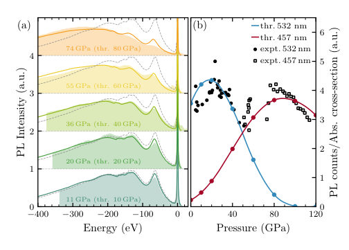
<figcaption class="paper-figure-caption"><b>Fig 5.</b> FIG. 5. (a) Comparison between experimental and theoreti- cal PSBs at approximately 10, 20, 40, 60, and 80 GPa. Solid lines and shaded areas represent calculations and experimen- tal results. Dashed lines indicate the ambient-pressure ref- erence. (b) PL photon yield (arbitrary units) as a function of pressure for excitation at 532 nm and 457 nm. Solid and open markers show the corresponding integrated experimen- tal PL intensities, while solid blue and red lines represent the pressure-dependent absorption cross sections (arbitrary units) sampled at 532 and 457 nm from theory.</figcaption>
</figure>

**Summary.** This research thoroughly investigates how the optical properties of NV centers in diamond change under extreme hydrostatic pressures up to 120 GPa. By combining advanced DFT calculations with DAC experiments, the authors demonstrate that the NV center remains a robust quantum sensor. The findings provide critical spectroscopic guidelines for utilizing NV centers in high-pressure quantum sensing applications.

**Why it may be interesting.** This work is highly relevant as it addresses the stability of a solid-state quantum emitter (NV center) under extreme conditions, which is crucial for developing quantum sensors for high-pressure physics.

Detailed structure

**Main problem.** To investigate the optical properties and stability of the Nitrogen Vacancy (NV) center in diamond under extreme hydrostatic pressures up to 120 GPa to optimize its use as a quantum sensor.

**Main result.** The NV center remains a robust quantum sensor under extreme hydrostatic pressures, maintaining stable quantum efficiency for optical readout, despite enhanced electron-phonon coupling.

**Method.** The study combines theoretical calculations using DFT (HSE06, r2SCAN) with experimental measurements performed in a Diamond Anvil Cell (DAC) setup.

**Model / system.** The physical system is the negatively charged nitrogen vacancy (NV-) center in diamond. The analysis models its electronic structure, optical transitions (ZPL, PSB), and photoionization pathways under varying hydrostatic pressures.

**Key observables.** Zero-Phonon Line (ZPL) position shift, radiative lifetimes, optical lineshapes, photoionization thresholds, and electron-phonon coupling parameters (HR factor, $K_2$).

**Important parameters / regimes.** Pressures up to 120 GPa; ZPL shift exceeding 400 meV at 120 GPa.

**Assumptions / limitations.** The analysis assumes near-hydrostatic conditions for comprehensive study, and theoretical modeling uses approximations like adiabatic Huang-Rhys theory for emission.

**Figures summary.** Figures illustrate the pressure dependence of ZPL shifts, electron-phonon coupling parameters, PL/absorption lineshapes, and photoionization thresholds up to 120 GPa.

**Paper structure.** The paper systematically investigates the pressure dependence of various optical parameters, comparing theoretical predictions (DFT calculations) with experimental results obtained using a DAC setup, culminating in guidelines for high-pressure optical measurements.

Abstract

The nitrogen vacancy (NV) center has emerged as a powerful quantum sensor in high-pressure research, with the observation of optically detected magnetic resonance at megabar pressures. However, some aspects of NV physics require further investigation to optimize the development of NV-based sensing under pressure. Here, we study both experimentally and theoretically the optical properties of the NV center under hydrostatic pressure. We investigate the evolution of the zero-phonon line (ZPL) position, radiative lifetimes, optical lineshapes, and photoionization thresholds of the NV center under pressures up to ~120 GPa. We also provide spectroscopic guidelines for performing high-pressure optical experiments. Our results confirm that the NV center remains a robust quantum sensor under extreme hydrostatic pressures, especially for magnetic characterization.

[↑ back to top](#top)

### [Quantum resonance encryption for secure data storage and communication with quantum kicked top](http://arxiv.org/abs/2606.01953v1)

**Authors:** Sreeram PG, M. S. Santhanam  
**Type:** theory · **Category:** quantum information and computing · **PDF:** <https://arxiv.org/pdf/2606.01953v1>  
**Analysis basis:** full PDF text, analyzed in chunks
**Topic relevance:** `non-equilibrium dynamics` **3/5** · `entanglement & information structure` **1/5**

↔ Scroll figures horizontally

<figure class="paper-figure-card">
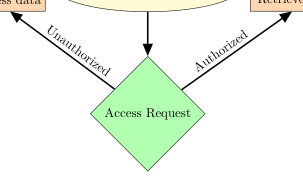
<figcaption class="paper-figure-caption"><b>Fig 1.</b> FIG. 1: Quantum secret storage and access protocol</figcaption>
</figure>
<figure class="paper-figure-card">
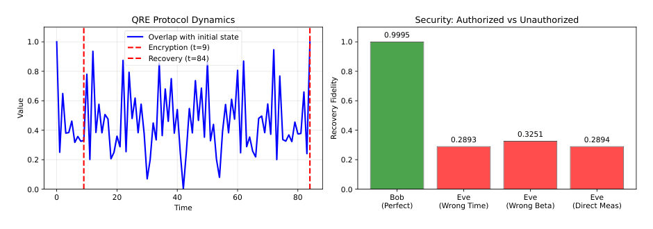
<figcaption class="paper-figure-caption"><b>Fig 2.</b> FIG. 2: Security demonstration of a four qubit encryption. Left figure shows the fidelity recurrence of the evolved state with respect to the initial state at resonance. Alice chooses the first and the third qubits to carry message; thus the bitmask is 1010 which is 10 in decimal. Alice also sets the parameter s = 3, K = 100 and saves the evolved state at thide = 9. Therefore, r = 10 × 100 + 9 = 1009. Eve, who is unauthorized to access the message/data cannot recover it without knowing message qubits, β, s, and the rule for encoding bitmask and thide in β. Any attempts by Eve without knowing all of them does not compromise data security, as the right figure shows. Fidelities marked ‘Wrong...</figcaption>
</figure>
<figure class="paper-figure-card">
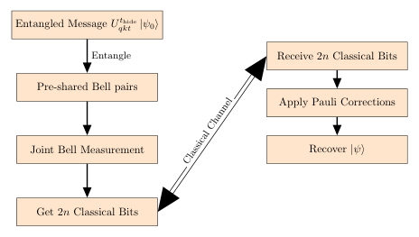
<figcaption class="paper-figure-caption"><b>Fig 3.</b> FIG. 3: Communication using quantum resonance en- cryption</figcaption>
</figure>
<figure class="paper-figure-card">
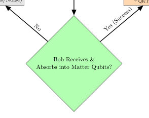
<figcaption class="paper-figure-caption"><b>Fig 4.</b> FIG. 4: Direct transmission of the message using a quan- tum channel.</figcaption>
</figure>

**Summary.** This paper introduces Quantum Resonance Encryption (QRE), a novel protocol for securing data in shared quantum computers. It leverages the unique, non-classical dynamics of the quantum kicked top system to scramble information. The method ensures that only authorized parties, knowing the precise resonance parameters, can recover the original data, offering robust security against eavesdropping.

**Why it may be interesting.** The application of quantum chaos and resonance dynamics from a physical model (kicked top) to solve a fundamental problem in quantum information security (QKD/data storage) is highly relevant for theoretical physicists studying open quantum systems and quantum computation.

Detailed structure

**Main problem.** The paper addresses the critical need for ensuring data privacy and secure communication within shared quantum computing environments, protecting data even from the service provider.

**Main result.** A Quantum Resonance Encryption (QRE) protocol is proposed that uses quantum kicked top dynamics to scramble data, ensuring perfect recovery for authorized users while rendering intercepted states mixed to eavesdroppers.

**Method.** The protocol involves encoding the secret state, scrambling it using the unitary evolution of the quantum kicked top ($U_{QKT}$), and then requiring a specific recovery unitary based on the system's quantum resonance period.

**Model / system.** The core physical model is the quantum kicked top, whose dynamics are governed by a Floquet operator. This system is used to generate the necessary unitary transformations for encryption and decryption.

**Key observables.** Fidelity recurrence (comparing perfect recovery vs. wrong time/wrong parameters), and the measurement outcome of ancillary qubits for tampering detection.

**Important parameters / regimes.** The resonance condition $eta = 4\pi j r / s$ is crucial for ensuring periodic dynamics ($U_{QKT}^T = I$).

**Assumptions / limitations.** The protocol assumes the availability of quantum memory and functioning quantum networks, though it can be demonstrated on current platforms.

**Figures summary.** Figures illustrate the schematic flow of the QRE protocol (Encode $
ightarrow$ Conceal $
ightarrow$ Store $
ightarrow$ Retrieve), security demonstrations via fidelity recurrence, and the extension to long-distance communication using multi-qubit teleportation.

**Paper structure.** The paper introduces the problem, details the QRE protocol using the quantum kicked top, demonstrates its security against eavesdropping, and extends the concept to multi-qubit teleportation for long-distance communication and QKD.

Abstract

In a shared quantum computer, how to ensure data privacy and protection from access by unauthorized parties? We propose a genuine quantum protocol for protecting user's data which is not accessible even to the service provider. The protocol is based on quantum kicked top -- the dynamics of a spin system --operating at quantum resonance regime. This protocol ensures perfect recovery for authorized users while making intercepted states appear mixed to eavesdroppers, with built-in tampering detection. This protocol can also be used for secure communication between two parties in geographically different locations, and also for quantum key distribution. The effectiveness of this protocol is demonstrated by assuming a quantum computer with quantum memory and functioning quantum networks. In the absence of the latter, at present, the protocol can be demonstrated in laboratory using currently available quantum computing platforms.

[↑ back to top](#top)

### [Spin Hamiltonian as Matrix-Free Linear Map](http://arxiv.org/abs/2606.02169v1)

**Authors:** Aditya Dev  
**Type:** theory · **Category:** numerical methods · **PDF:** <https://arxiv.org/pdf/2606.02169v1>  
**Analysis basis:** full PDF text, analyzed in chunks
**Topic relevance:** `analog quantum simulation` **3/5** · `methods for driven-dissipative` **1/5**

↔ Scroll figures horizontally

<figure class="paper-figure-card">
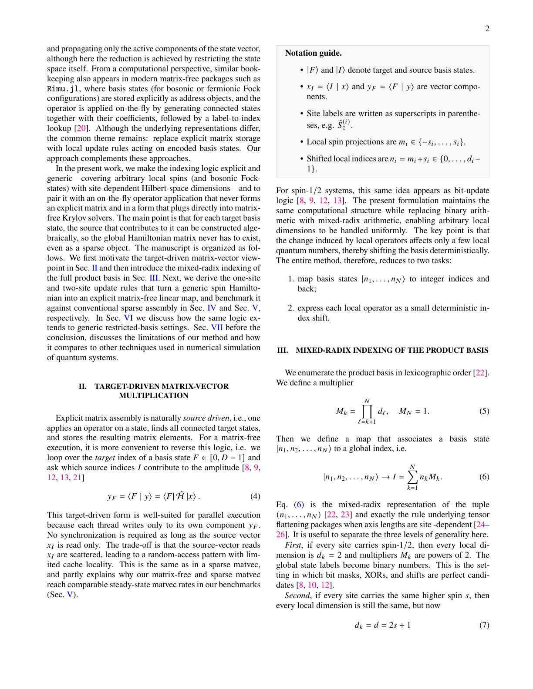
<figcaption class="paper-figure-caption"><b>Fig 1.</b> Low-resolution page preview, page 2</figcaption>
</figure>
<figure class="paper-figure-card">
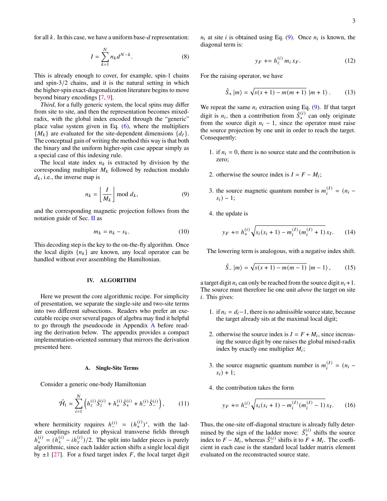
<figcaption class="paper-figure-caption"><b>Fig 2.</b> Low-resolution page preview, page 3</figcaption>
</figure>
<figure class="paper-figure-card">
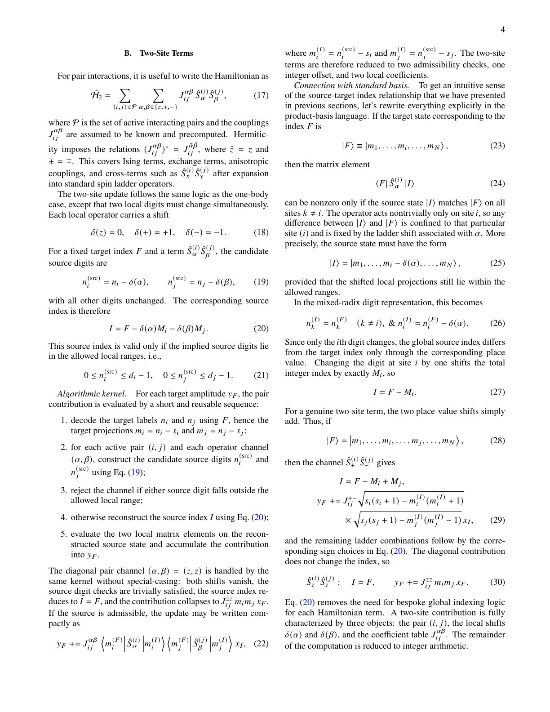
<figcaption class="paper-figure-caption"><b>Fig 3.</b> Low-resolution page preview, page 4</figcaption>
</figure>
<figure class="paper-figure-card">
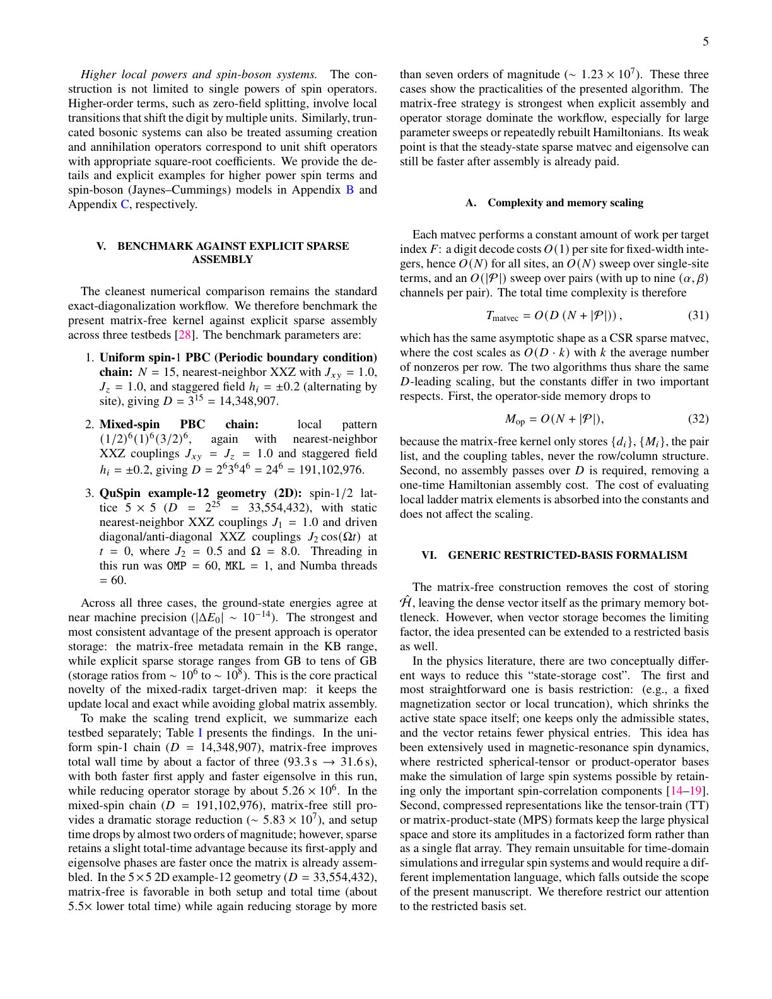
<figcaption class="paper-figure-caption"><b>Fig 4.</b> Low-resolution page preview, page 5</figcaption>
</figure>
<figure class="paper-figure-card">
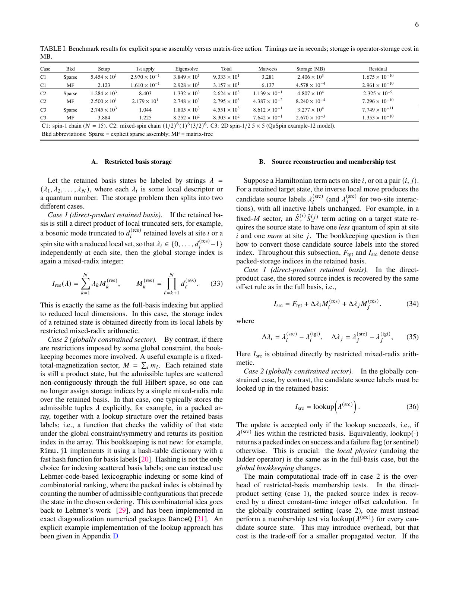
<figcaption class="paper-figure-caption"><b>Fig 5.</b> Low-resolution page preview, page 6</figcaption>
</figure>

**Summary.** This paper introduces a highly efficient, matrix-free algorithm to compute the action of a spin Hamiltonian on a quantum state vector. By using mixed-radix indexing, it avoids the massive memory overhead of explicitly assembling the Hamiltonian matrix. This makes simulating large, complex quantum spin systems feasible for workflows requiring frequent Hamiltonian updates.

**Why it may be interesting.** This is highly relevant as it provides a general, scalable computational backbone for simulating complex Hamiltonians in AMO physics, especially when the Hamiltonian structure changes frequently (e.g., parameter sweeps).

Detailed structure

**Main problem.** The primary challenge is overcoming the memory limitations associated with explicitly assembling the Hamiltonian matrix for simulating large quantum many-body systems.

**Main result.** The authors present a generic, memory-conserving algorithm to compute the action of the Hamiltonian on a state vector entirely on the fly, avoiding explicit matrix storage.

**Method.** The method utilizes a mixed-radix indexing scheme for the full tensor-product basis, translating local spin operations into simple integer offsets to perform the matrix-vector product.

**Model / system.** The framework applies to quantum many-body systems on arbitrary spin lattices, handling local spin operators ($\hat{S}$) and allowing for mixed-spin or bosonic degrees of freedom.

**Key observables.** The core operation is the matrix-vector product $\hat{H}|\mathbf{x}
angle$; key diagnostics include computational time and operator memory scaling.

**Important parameters / regimes.** The method's efficiency is measured against the system dimension $D$ and the number of local interactions ($N+|P|$).

**Assumptions / limitations.** The method assumes the state vector itself can be stored (the state vector bottleneck) and that the required index arithmetic is feasible within hardware word limits.

**Figures summary.** The notes reference a comparison (Table I) showing the superior storage scaling of the matrix-free method versus explicit sparse assembly as system dimension grows.

**Paper structure.** The paper develops the mixed-radix indexing logic, details the target-driven approach for calculating matrix elements, and provides pseudocode for the matrix-free matrix-vector product ($	ext{MATVEC!}$).

Abstract

We present an algorithm that computes the action of a generic spin Hamiltonian on a state vector on the fly, entirely avoiding explicit matrix assembly. This is achieved through mixed-radix indexing of the full tensor-product basis, which translates local spin operations into simple integer offsets. The result is an explicit framework for evaluating single- and two-site terms across arbitrary spin lattices, including mixed-spin systems. Our construction bridges the basis-indexing logic familiar from exact diagonalization with the matrix-free state-update philosophy of address-based frameworks. By writing the indexing logic in closed form, a single uniform loop applies to every site regardless of its local Hilbert-space dimension. The method is parallelizable and memory-conserving, and can be extended to restricted basis or truncated bosonic levels.

[↑ back to top](#top)

### [Accelerating Surface Radiation Content to Investigate the Impact of Radon Progeny on Superconducting Qubits](http://arxiv.org/abs/2606.00473v1)

**Authors:** Sagar S. Poudel, Dylan J. Temples, Ryan Linehan, Alejandro Rodriguez, Matthew Hall, Dax Kay, Nathaniel Rodenburg, Daniel Baxter, Enectali Figueroa-Feliciano, Richard W. Schnee, Lauren Hsu  
**Type:** both · **Category:** quantum information and computing · **PDF:** <https://arxiv.org/pdf/2606.00473v1>  
**Analysis basis:** full PDF text, analyzed in chunks
**Topic relevance:** `QC/QI experiment` **3/5**

↔ Scroll figures horizontally

<figure class="paper-figure-card">
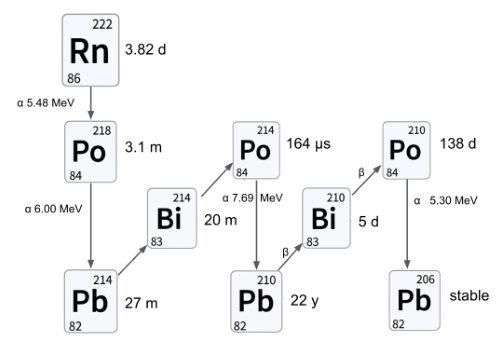
<figcaption class="paper-figure-caption"><b>Fig 1.</b> FIG. 1: 222Rn decay chain. Only prominent α decays (vertical arrows) are shown. β decays are indicated by the upward-pointing diagonal arrows.</figcaption>
</figure>
<figure class="paper-figure-card">
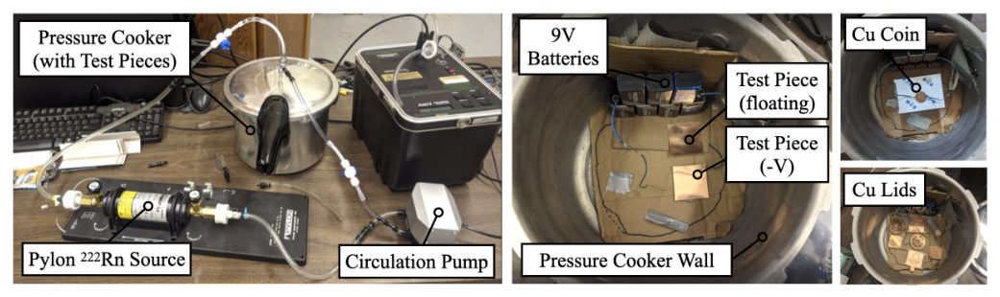
<figcaption class="paper-figure-caption"><b>Fig 2.</b> FIG. 2: Left: The radon exposure apparatus showing the flow-through 222Rn pylon source and circulation pump that drives the gas into the pressure vessel (exposure chamber). The radon concentration is measured with the Rad7 radon detector. Right: Internal images of the pressure vessel showing exposure configurations for various work pieces. The cardboard provides insulation from chassis ground, enabling the at-field plate-out.</figcaption>
</figure>
<figure class="paper-figure-card">
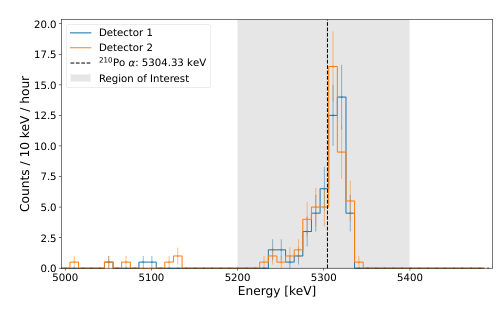
<figcaption class="paper-figure-caption"><b>Fig 3.</b> FIG. 3: 210Po alpha spectrum for the same copper sample measured in the two detectors of the Alpha Duo. In both cases, the top surface of the strip was 4 mm away from the detectors. These data were acquired two hours apart, so the grow-in of 210Po during measurements is minimal.</figcaption>
</figure>
<figure class="paper-figure-card">
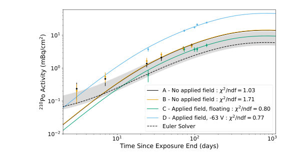
<figcaption class="paper-figure-caption"><b>Fig 4.</b> FIG. 4: Measurements of total surface activity (per sq. cm) of Cu Foils “A”, “B”, “C”, and “D”. Each pair (A &amp; B and C &amp; D) was placed in the radon exposure ves- sel separately for 7 days. All solid curves are best fits to the simplified Bateman Equation (Eq. C29), in which the only free parameter is the initial activity of 210Pb, and the initial surface activities of 210Bi and 210Po are fixed to be zero. Also shown is a forward-Euler solution to Eqs. C4 and C5 (black dashed), modified to allow for a decaying 222Rn concentration, for a 7-day exposure (with ρA = 7.3 MBq/m3 and A/V = 38.2 m−1) which qualita- tively captures the early time behavior (seen in A and B), whereas the simplified...</figcaption>
</figure>
<figure class="paper-figure-card">
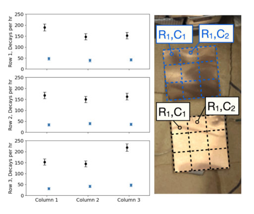
<figcaption class="paper-figure-caption"><b>Fig 5.</b> FIG. 5: Left: Rates of the nine sub-squares of Foil C (floating, blue) and Foil D (-63 V, black), demonstrat- ing uniformity of plateout across both. Right: Diagram showing orientation and clocking of the rows and columns referenced in the plots on the left.</figcaption>
</figure>

**Summary.** This paper quantifies the threat posed by radon progeny contamination to superconducting qubits. By developing an enhanced experimental setup, the authors measure the accumulation of radioactive daughters on surfaces. The findings establish that this environmental source of ionizing radiation must be accounted for when scaling quantum computing architectures.

**Why it may be interesting.** The work directly addresses environmental noise sources that limit the scalability of quantum processors, providing critical dosimetry data for hardware engineers designing radiation-hard quantum systems.

Detailed structure

**Main problem.** The paper investigates how long-lived, unstable daughters of Radon-222, which plate out on device surfaces, induce decoherence in superconducting qubits.

**Main result.** The authors demonstrate that radon progeny plate-out can create a significant, localized source of ionizing radiation, potentially dominating the background noise, especially in shielded or underground environments.

**Method.** The study combines experimental measurements using enhanced radon exposure setups with theoretical modeling (e.g., solving coupled differential equations) and particle simulations (Geant4) to quantify surface contamination and resulting energy depositions.

**Model / system.** The physical system is a superconducting qubit device. The contamination source is modeled by the decay chain of Radon-222 progeny, which plate out on surfaces over time, creating a quasi-permanent source of alpha-decaying isotopes like Po-210.

**Key observables.** Surface activity density of Po-210 ($A_{3y}$), event rates from $	ext{Rn}$ progeny vs. cosmic rays, and the resulting crystalline defects (Frenkel defects).

**Important parameters / regimes.** Plate-out enhancement factor ($7 	imes 10^4$), ambient radon concentrations ($	ext{Bq/m}^3$), and the time delay for measurement (3 years).

**Assumptions / limitations.** The dead-air model is used for background calculation, and the study assumes that the $\alpha$ decay of Po-210 is the most disruptive component to qubit coherence.

**Figures summary.** Figures illustrate the radon decay chain, the experimental apparatus, the spatial uniformity of plate-out, and the time evolution of the calculated Po-210 activity density for both ambient and enhanced exposure scenarios.

**Paper structure.** The paper progresses from identifying the problem (radon plate-out) to presenting an enhanced experimental setup for measurement, developing mathematical models for time-dependent deposition, and finally quantifying the resulting background radiation rates relevant to qubit operation.

Abstract

Ionizing radiation in the form of $α$, $β$, $γ$, and additional high-energy particles can induce decoherence via phonon and quasiparticle poisoning in superconducting qubits. Recent studies have explored this effect using cosmic rays or controlled radioactive sources held in the proximity of a qubit package, and have concluded that reductions in such ``external'' environmental radiation may benefit stable operation of qubit devices. However, the effect of long-lived, unstable daughters of $^{222}$Rn that ``plate out'' directly on device and packaging surfaces has not been as extensively explored. This plate-out process, well-known to the dark matter direct detection field, occurs throughout the fabrication and testing lifecycle of a device and (separately) its packaging, and produces a local source of $α$-decays which can remain active for decades. As this scales with chip area, understanding and managing this source of ionizing radiation is relevant for successfully scaling quantum computing architectures to larger numbers of qubits in a radiation-robust way. We present a setup capable of accelerating and enhancing radon daughter plateout by a factor of $7\times10^4$ over ambient, in order to study, \textit{in situ}, the impact of these events on superconducting qubits. We also provide outlook on the potential impact of this source of ionizing radiation on current and future qubit arrays.

[↑ back to top](#top)

### [An Explicit Scott-Type Bound for Absolutely Maximally Entangled States with Arbitrary Defect](http://arxiv.org/abs/2606.01943v1)

**Authors:** Shixuan Zeng, Xiande Zhang  
**Type:** theory · **Category:** quantum information and computing · **PDF:** <https://arxiv.org/pdf/2606.01943v1>  
**Analysis basis:** full PDF text, analyzed in chunks
**Topic relevance:** `entanglement & information structure` **3/5**

↔ Scroll figures horizontally

<figure class="paper-figure-card">
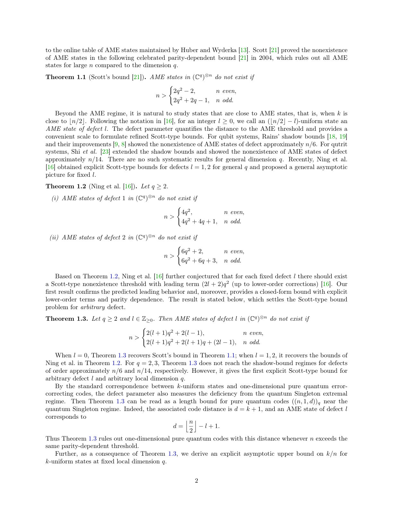
<figcaption class="paper-figure-caption"><b>Fig 1.</b> Low-resolution page preview, page 2</figcaption>
</figure>
<figure class="paper-figure-card">
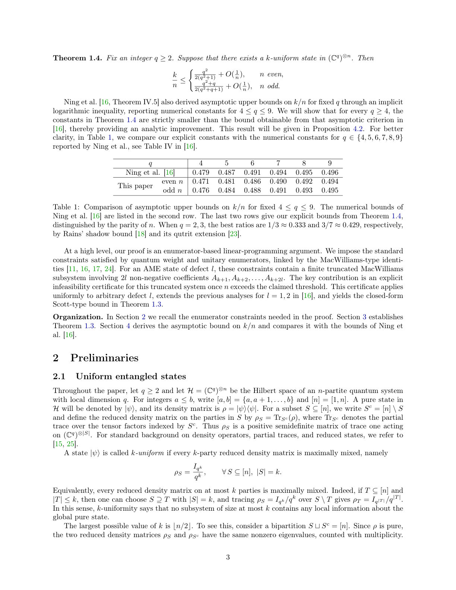
<figcaption class="paper-figure-caption"><b>Fig 2.</b> Low-resolution page preview, page 3</figcaption>
</figure>
<figure class="paper-figure-card">
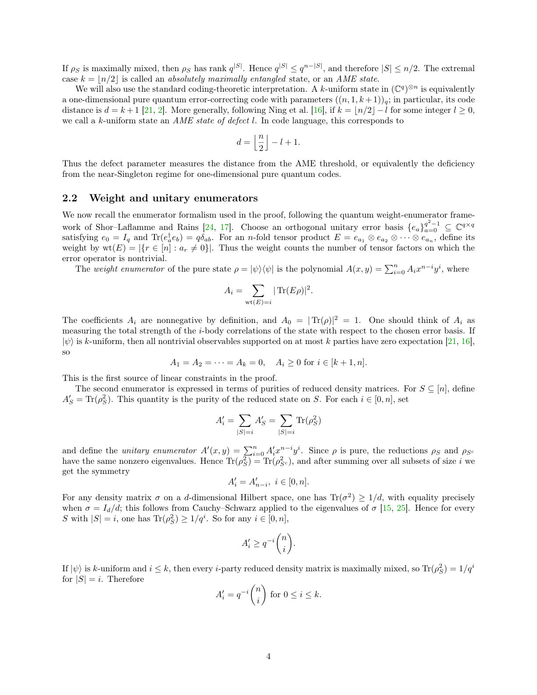
<figcaption class="paper-figure-caption"><b>Fig 3.</b> Low-resolution page preview, page 4</figcaption>
</figure>
<figure class="paper-figure-card">
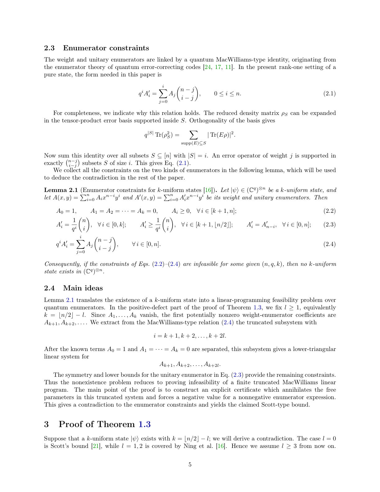
<figcaption class="paper-figure-caption"><b>Fig 4.</b> Low-resolution page preview, page 5</figcaption>
</figure>
<figure class="paper-figure-card">
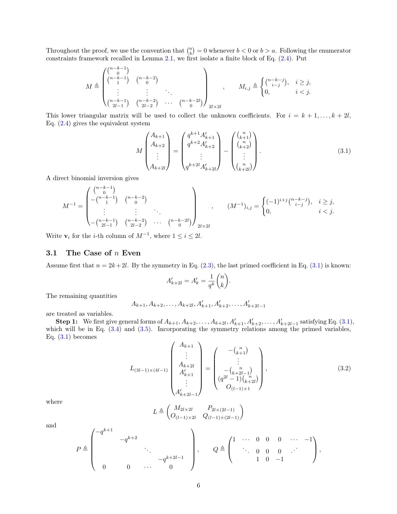
<figcaption class="paper-figure-caption"><b>Fig 5.</b> Low-resolution page preview, page 6</figcaption>
</figure>

**Summary.** This paper establishes a comprehensive and explicit Scott-type upper bound for the existence of highly entangled quantum states (AME states) with an arbitrary defect $l$. By employing advanced techniques involving linear programming on quantum enumerators, the authors provide a general nonexistence criterion, significantly improving previous results and yielding explicit asymptotic bounds on the entanglement ratio $k/n$.

**Why it may be interesting.** This work provides deep mathematical constraints on the structure of highly entangled quantum states, which are fundamental resources in quantum information theory, particularly for quantum error correction and secret sharing protocols.

Detailed structure

**Main problem.** The paper aims to establish explicit Scott-type upper bounds for the existence of Absolutely Maximally Entangled (AME) states and generalized $k$-uniform states with an arbitrary defect $l$. This is equivalent to finding nonexistence bounds for specific one-dimensional pure quantum error-correcting codes.

**Main result.** The authors derive a fully explicit Scott-type upper bound for AME states with arbitrary defect $l$, providing a general result that encompasses previous bounds for $l=0, 1, 2$. They also establish explicit asymptotic upper bounds on the ratio $k/n$.

**Method.** The proof utilizes a truncated MacWilliams linear-programming system derived from quantum weight and unitary enumerators. The core technique involves solving linear systems and deriving contradictions based on the non-negativity of solution vectors.

**Model / system.** The system under study is pure quantum states $|\psi
angle$ within the Hilbert space $(\mathbb{C}^q)^{\otimes n}$, where $q$ is the local dimension and $n$ is the number of parties. These states are characterized by their $k$-uniformity, relating them directly to quantum error-correcting codes.

**Key observables.** The existence or nonexistence of $k$-uniform states; the ratio $k/n$; and the values of the quantum weight and unitary enumerators.

**Important parameters / regimes.** Local dimension $q$, number of parties $n$, and the defect parameter $l$ (where $k = \lfloor n/2 
floor - l$).

**Assumptions / limitations.** The analysis assumes the existence of a $k$-uniform state and proceeds by contradiction using linear programming constraints derived from the enumerator formalism. The bounds are strongest for $q \ge 4$.

**Figures summary.** A table is mentioned comparing the derived explicit bound with previous results for small local dimensions $q \in \{4, 5, 6, 7, 8, 9\}$.

**Paper structure.** The paper introduces the problem by reviewing existing bounds (Scott's, Ning et al.'s). It then develops the general theory using MacWilliams identities, translates the problem into a linear-programming feasibility problem, and solves the system to derive the explicit upper bounds for both finite $n$ and the asymptotic ratio $k/n$.

Abstract

Absolutely maximally entangled (AME) states and, more generally, $k$-uniform states in $(\C^q)^{\otimes n}$ are central objects in multipartite entanglement theory, with applications to quantum secret sharing, quantum masking, and quantum error correction. In the extremal case $k=\lfloor n/2\rfloor$, Scott (2004) proved a sharp nonexistence bound showing that AME states cannot exist once the number of parties $n$ exceeds a threshold of order $2q^{2}$ (with a parity dependence on $n$), where $q$ is the local dimension. Recently, Ning et al.\ studied \emph{defective} AME states (i.e., $k=\lfloor n/2\rfloor-l$ with $l>0$), gave explicit Scott-type bounds for defects $l=1,2$ and conjectured a general $(2l+2)q^{2}+o(q^{2})$ behavior. In this paper, we solve this conjecture and establish a fully explicit Scott-type upper bound for AME states with arbitrary defect $l\ge 0$, yielding Scott's bound for $l=0$ and Ning et al.'s bounds for $l=1,2$ as special cases. Equivalently, this gives nonexistence bounds for one-dimensional pure quantum error-correcting codes near the quantum Singleton regime. The proof uses a truncated MacWilliams linear-programming system and an explicit infeasibility certificate. As a direct application, we derive explicit asymptotic upper bounds on $k/n$ for fixed local dimension $q$, improving the implicit upper bounds given by Ning et al.

[↑ back to top](#top)

### [Imaging the Magnetically Driven Reconstruction of the Electronic States in the Antiferromagnetic Topological Insulator EuSn$_2$As$_2$](http://arxiv.org/abs/2606.00337v1)

**Authors:** Luka Khizanishvili, Erekle Jmukhadze, Anika Raisa, Divyanshi Sar, Mingda Gong, Tetiana Romanova, Dariusz Kaczorowski, Wei-Cheng Lee, Pegor Aynajian  
**Type:** both · **Category:** strongly correlated electrons · **PDF:** <https://arxiv.org/pdf/2606.00337v1>  
**Analysis basis:** full PDF text, analyzed in chunks
**Topic relevance:** `spintronics-quantum-optics interface` **3/5**

↔ Scroll figures horizontally

<figure class="paper-figure-card">
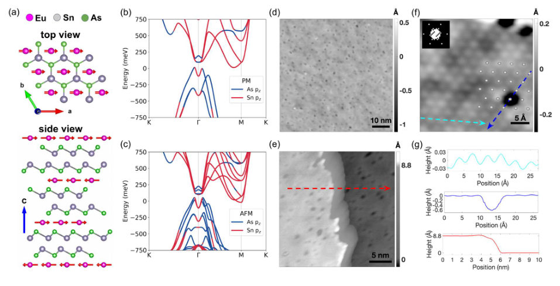
<figcaption class="paper-figure-caption"><b>Fig 1.</b> FIG. 1. Crystal structure and electronic topology of EuSn2As2. (a) Crystal structure of</figcaption>
</figure>
<figure class="paper-figure-card">
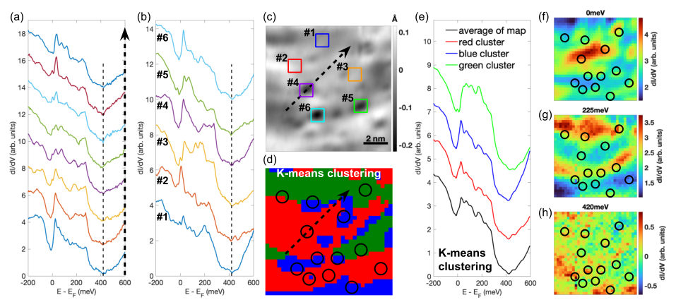
<figcaption class="paper-figure-caption"><b>Fig 2.</b> FIG. 2. Density of states and differential-conductance on EuSn2As2. (a) Spatially resolved dI/dV</figcaption>
</figure>
<figure class="paper-figure-card">
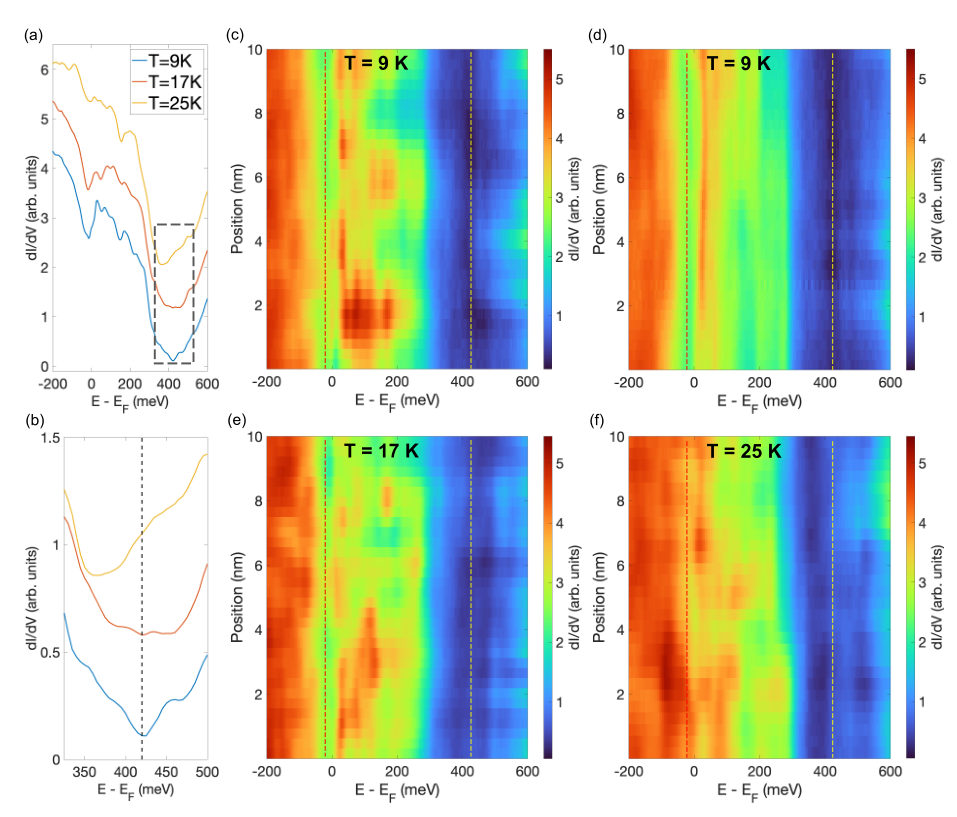
<figcaption class="paper-figure-caption"><b>Fig 3.</b> FIG. 3. Temperature-dependence of the electronic density of states across the AFM transition.</figcaption>
</figure>
<figure class="paper-figure-card">
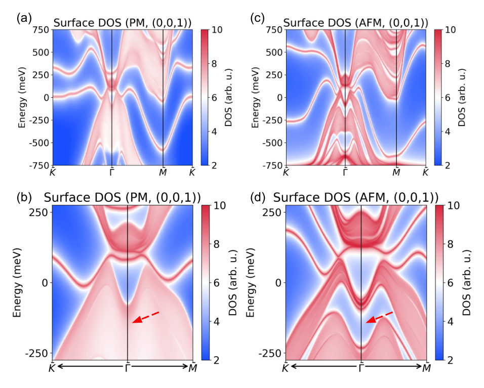
<figcaption class="paper-figure-caption"><b>Fig 4.</b> FIG. 4. Surface electronic structure calculations. (a,c) Calculated surface spectral function for</figcaption>
</figure>

**Summary.** This work uses STM and DFT to probe the electronic structure of the magnetic topological insulator EuSn2As2 across its magnetic transition. The key finding is the appearance of two distinct energy gaps below the Néel temperature, which the authors attribute to magnetic ordering and symmetry breaking. This highlights the material's potential for realizing axion-insulator-based devices.

**Why it may be interesting.** The strong coupling between localized magnetic moments (Eu 4f) and itinerant topological states is a key area of modern condensed matter physics, relevant to spintronics and topological quantum materials.

Detailed structure

**Main problem.** The study investigates the magnetically driven reconstruction of electronic states in the antiferromagnetic topological insulator EuSn2As2 across its Néel transition.

**Main result.** The research observes two distinct magnetically driven gaps (100 meV and 50 meV) opening below the Néel temperature, providing real-space evidence of strong coupling between localized magnetic moments and itinerant topological states.

**Method.** The study combines variable-temperature Scanning Tunneling Microscopy/Spectroscopy (STM/STS) with Density Functional Theory (DFT) calculations.

**Model / system.** The system is the antiferromagnetic topological insulator EuSn2As2, which is studied in both paramagnetic and antiferromagnetic phases. The electronic structure evolution is mapped across the magnetic transition temperature (T_N = 24 K).

**Key observables.** Emergence of two distinct energy gaps (100 meV near E_F and 50 meV at the Dirac point), electronic inhomogeneity due to Sn vacancies, and temperature dependence of the gaps.

**Important parameters / regimes.** Néel temperature (T_N = 24 K), gap energies (100 meV, 50 meV), and the magnetic ordering parameter.

**Assumptions / limitations.** The 50 meV gap opening is attributed to the lifting of mirror-symmetry protection by Sn vacancies, although contributions from AFM-induced folding hybridization cannot be entirely ruled out.

**Figures summary.** Figures show crystal structures, DFT calculations for PM and AFM phases, and STM/STS spectra/maps illustrating the opening of the 100 meV gap and the 50 meV gap at different energies and defect locations.

**Paper structure.** The paper progresses by first establishing the physical system and methods (STM/STS, DFT), then detailing the observation of surface defects and the two distinct temperature-dependent gaps, and finally attributing the origin of these gaps to specific symmetry breakings (magnetic/structural).

Abstract

The realization of the axion insulator phase in magnetic topological insulators is often hindered by crystalline symmetries that protect gapless surface states, even when time-reversal symmetry is broken. Here, we use variable-temperature scanning tunneling microscopy (STM) and spectroscopy (STS), complemented with density functional theory (DFT), to investigate the local electronic structure of the antiferromagnetic (AFM) topological insulator EuSn$_2$As$_2$ across its Néel transition at $T_N = 24$ K. On the (001) surface, we observe a substantial density of intrinsic Sn vacancies that introduce nanoscale electronic inhomogeneity and p-type doping. Upon cooling below $T_N$, we resolve the emergence of two distinct magnetically driven gaps: a $\sim$100 meV gap near the Fermi level and a $\sim$50 meV gap at the ARPES-resolved Dirac point. We attribute the former gap to AFM Brillouin-zone folding and hybridization. The characteristics of the 50 meV gap point toward the lifting of mirror-symmetry protection by Sn vacancies and the consequent mass gapping of the Dirac point, although contributions from AFM-induced folding hybridization cannot be entirely ruled out. Our findings provide real-space evidence for strong coupling between localized moments and itinerant topological states, highlighting exfoliable EuSn$_2$As$_2$ as a potential candidate for realizing axion-insulator-based devices.

[↑ back to top](#top)

### [Microwave Crosstalk in Planar Superconducting Quantum Devices](http://arxiv.org/abs/2606.02440v1)

**Authors:** Yongxin Song, Dominic Hagmann, Kieran Dalton, Felix Henrich, Felix Wagner, Mohsen Bahrami Panah, Marek Pechal, Andreas Wallraff  
**Type:** both · **Category:** quantum information and computing · **PDF:** <https://arxiv.org/pdf/2606.02440v1>  
**Analysis basis:** full PDF text, analyzed in chunks
**Topic relevance:** `QC/QI experiment` **3/5**

↔ Scroll figures horizontally

<figure class="paper-figure-card">
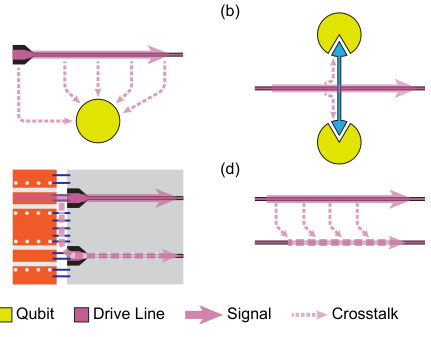
<figcaption class="paper-figure-caption"><b>Fig 1.</b> FIG. 1. Microwave crosstalk channels. Schematic view of (a) a drive line (pink) routed in the proximity of a cross- coupled qubit (yellow), (b) a drive line crossing a qubit-qubit coupler (blue) with an air bridge crossover, (c) neighboring signal lines connected to the PCB (orange) with wire bonds (blue), and (d) signal lines running in parallel. The drive (solid) and crosstalk (dashed) signals are indicated with trans- parent pink arrows.</figcaption>
</figure>
<figure class="paper-figure-card">
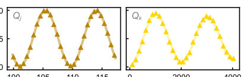
<figcaption class="paper-figure-caption"><b>Fig 2.</b> FIG. 2. Crosstalk characterization. (a) A drive line j coupled to its target qubit Qj (brown) with coupling rate Γj,j and to a cross-coupled qubit Qk (yellow) with coupling rate Γk,j. During the crosstalk characterization, a set of flat-top Gaussian filtered microwave pulses (pink) with a fixed ampli- tude and varying durations t are applied from the drive line to excite the two qubits. (b) Example of measured (triangles) excited-state population P|e⟩of the target (brown) and cross- coupled (yellow) qubit as a function of drive pulse duration t. Solid lines of the same color show the fits to exponentially damped sinusoidal oscillations.</figcaption>
</figure>
<figure class="paper-figure-card">
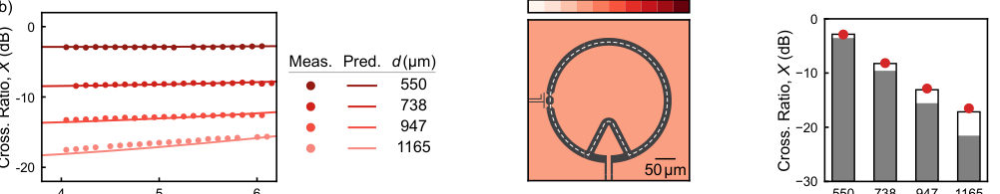
<figcaption class="paper-figure-caption"><b>Fig 3.</b> FIG. 3. Characterizing and modeling the proximity-induced microwave crosstalk. (a) False-colored micrograph of a test structure for the proximity-induced microwave crosstalk. d denotes the distance between the drive line and the cross-coupled qubit. (b) Crosstalk drive ratio X as a function of qubit frequency ω/2π at different distances d. Circles show the measured crosstalk and the lines of the same color show the model. (c) Schematic of driving the qubit via the direct capacitive coupling from the drive line. The brown curve shows the distribution of the voltage amplitude as a function of length x from the open end. The circuit highlighted in pink illustrates the distributed capacitance...</figcaption>
</figure>
<figure class="paper-figure-card">
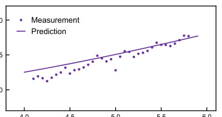
<figcaption class="paper-figure-caption"><b>Fig 4.</b> FIG. 4. Driving the qubit via a shorted bonding pad. (a) False-colored micrograph of the test structure where a cross-coupled qubit (yellow) is driven by a microwave signal applied to a shorted bonding pad (black). (b) Measured (cir- cles) and simulated (line) crosstalk drive ratio X relative to the qubit’s designated drive line as a function of the qubit frequency ω/2π.</figcaption>
</figure>
<figure class="paper-figure-card">
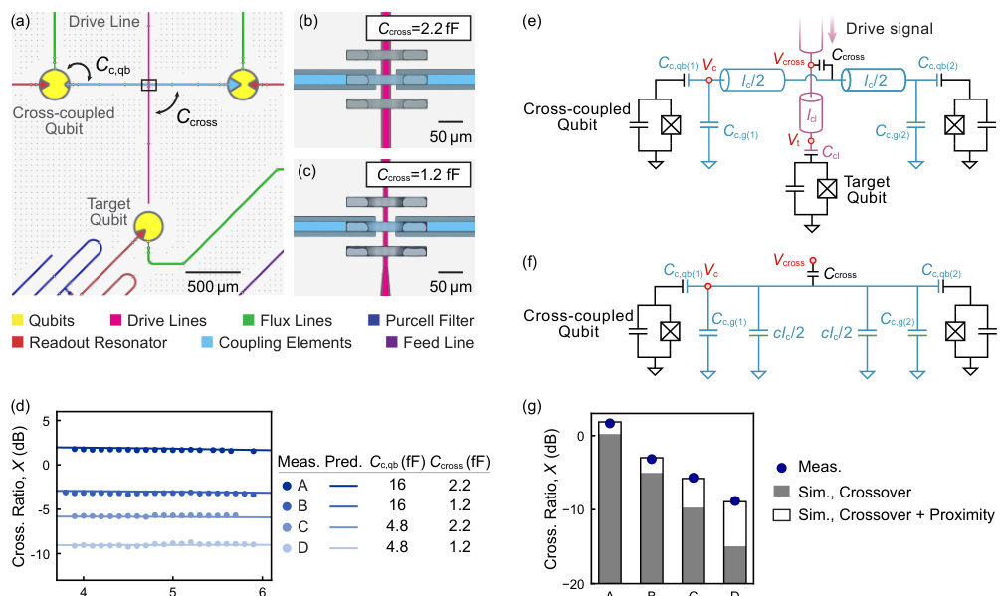
<figcaption class="paper-figure-caption"><b>Fig 5.</b> FIG. 5. Characterizing and modeling the crossover-induced microwave crosstalk. (a) False-colored micrograph of a test structure for the crossover-induced microwave crosstalk. Control parameters include the cross-capacitance Ccross, which depends on the geometry of the air bridge crossover, and the coupler capacitance to qubit Cc,qb which depends on the coupler size. The black box marks the position of the air bridge crossover. In this experiment, we measured crossover designs with (b) Ccross = 2.2 fF and (c) Ccross = 1.1 fF. (d) Crosstalk drive ratio X as a function of qubit frequency ω/2π for different combinations of Cc,qb and Ccross. Circles show the measured crosstalk, and the solid...</figcaption>
</figure>

**Summary.** This work addresses the critical issue of microwave crosstalk in superconducting quantum chips by developing quantitative physical models. The authors identify two main crosstalk sources—proximity and crossover—and show that the total error requires accounting for both direct capacitive coupling and package-mediated stray fields. The results offer practical design rules to minimize these errors for building larger quantum processors.

**Why it may be interesting.** The detailed modeling of crosstalk mechanisms—especially the distinction between direct capacitance and package-mediated stray fields—provides crucial physical insight into scaling limitations for superconducting quantum hardware.

Detailed structure

**Main problem.** Microwave crosstalk in planar superconducting quantum devices introduces excess control errors, posing a major challenge for scaling quantum processors.

**Main result.** The study identifies proximity-induced and crossover-induced crosstalk as dominant sources, providing quantitative models to guide low-crosstalk device layouts.

**Method.** The authors developed quantitative physical models by combining analytical circuit theory (for capacitive coupling) with RF finite-element simulations (for package-mediated effects).

**Model / system.** The system involves planar superconducting devices with transmon qubits, CPW drive lines, and crossovers. Crosstalk is modeled as a combination of direct capacitive coupling, package-mediated coupling, and air-bridge coupling.

**Key observables.** Cross-drive ratio ($X_{k,j}$), Rabi rates ($\Omega$), and the resulting quantum error ($\epsilon$).

**Important parameters / regimes.** Distance ($d$), frequency ($\omega$), and coupling capacitances ($C_{cross}$, $C_{dl,eff}$).

**Assumptions / limitations.** The analysis often relies on quasi-lumped-element approximations and assumes linear behavior for the package/ground plane capacitance.

**Figures summary.** Figures illustrate schematic crosstalk channels (proximity, crossover, package-induced), measurement procedures for extracting Rabi rates, and quantitative comparisons between simulated and measured crosstalk ratios as a function of distance and geometry.

**Paper structure.** The paper systematically identifies the physical sources of crosstalk, develops separate quantitative models for proximity and crossover effects, compares these models against experimental measurements, and concludes with design guidelines for mitigation.

Abstract

Microwave crosstalk poses a major challenge to scaling superconducting quantum devices as it introduces excess control errors. Although its magnitude and impact have been explored in various experimental settings, quantitative physical models capable of explaining measured crosstalk for a given device geometry remain scarce. Here, we address this gap by investigating microwave crosstalk in planar superconducting devices with crossovers. We identify two structures that can lead to strong crosstalk: a drive line routed in close proximity to another qubit, and a drive line crossing a qubit-qubit coupler using an air bridge. We design and characterize devices involving these structures and develop physical models that quantitatively explain the experimentally observed crosstalk. Based on these models, we discuss the design considerations for reducing microwave crosstalk. Our results provide practical guidance for low-crosstalk device layouts and establish a basis for the systematic investigation of weaker crosstalk mechanisms.

[↑ back to top](#top)

### [Polytopic Quantum Resource Theories: Geometry and Structures](http://arxiv.org/abs/2606.00429v1)

**Authors:** Moein Naseri, Chirag Srivastava, Chandan Datta, John H. Selby, Shubhayan Sarkar  
**Type:** theory · **Category:** other · **PDF:** <https://arxiv.org/pdf/2606.00429v1>  
**Analysis basis:** full PDF text, analyzed in chunks
**Topic relevance:** `entanglement & information structure` **3/5**

↔ Scroll figures horizontally

<figure class="paper-figure-card">
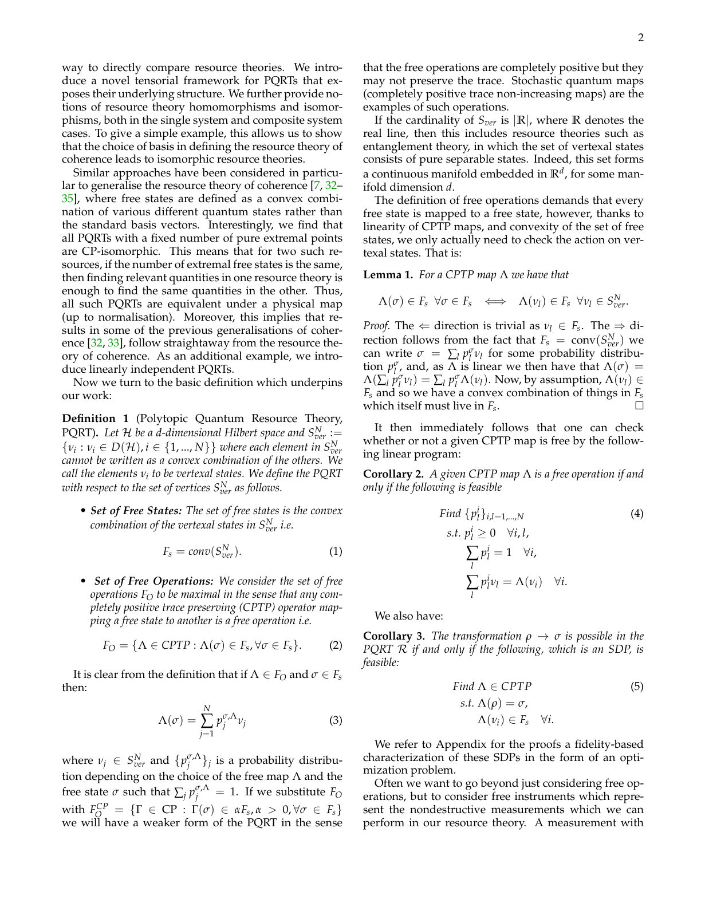
<figcaption class="paper-figure-caption"><b>Fig 1.</b> Low-resolution page preview, page 2</figcaption>
</figure>
<figure class="paper-figure-card">
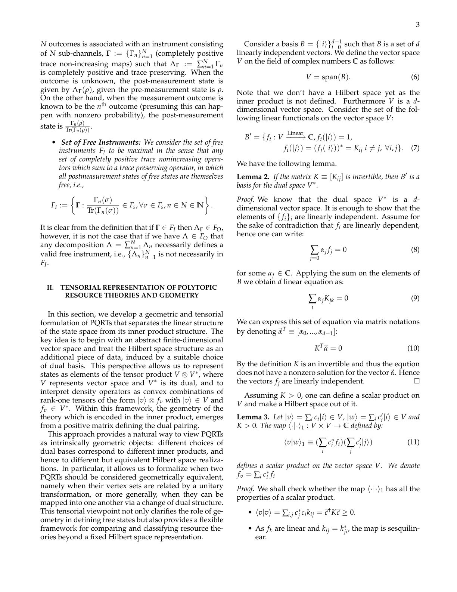
<figcaption class="paper-figure-caption"><b>Fig 2.</b> Low-resolution page preview, page 3</figcaption>
</figure>
<figure class="paper-figure-card">
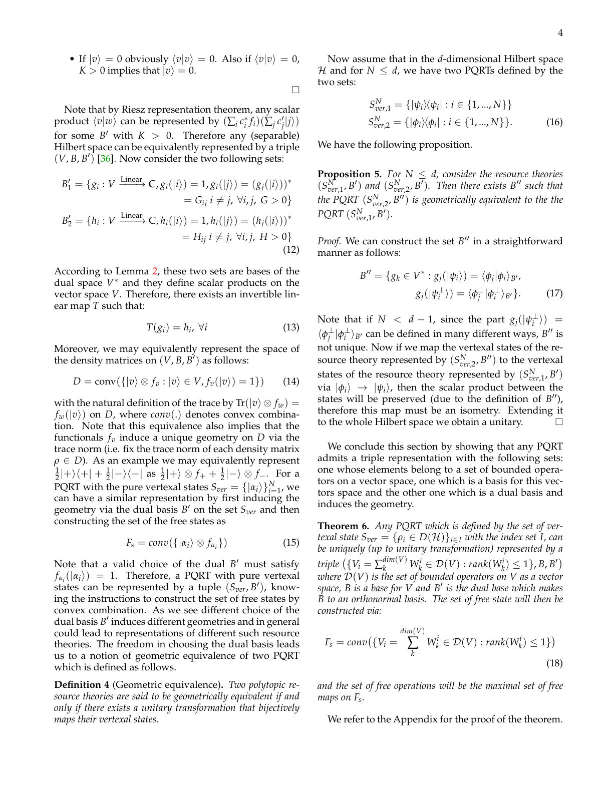
<figcaption class="paper-figure-caption"><b>Fig 3.</b> Low-resolution page preview, page 4</figcaption>
</figure>
<figure class="paper-figure-card">
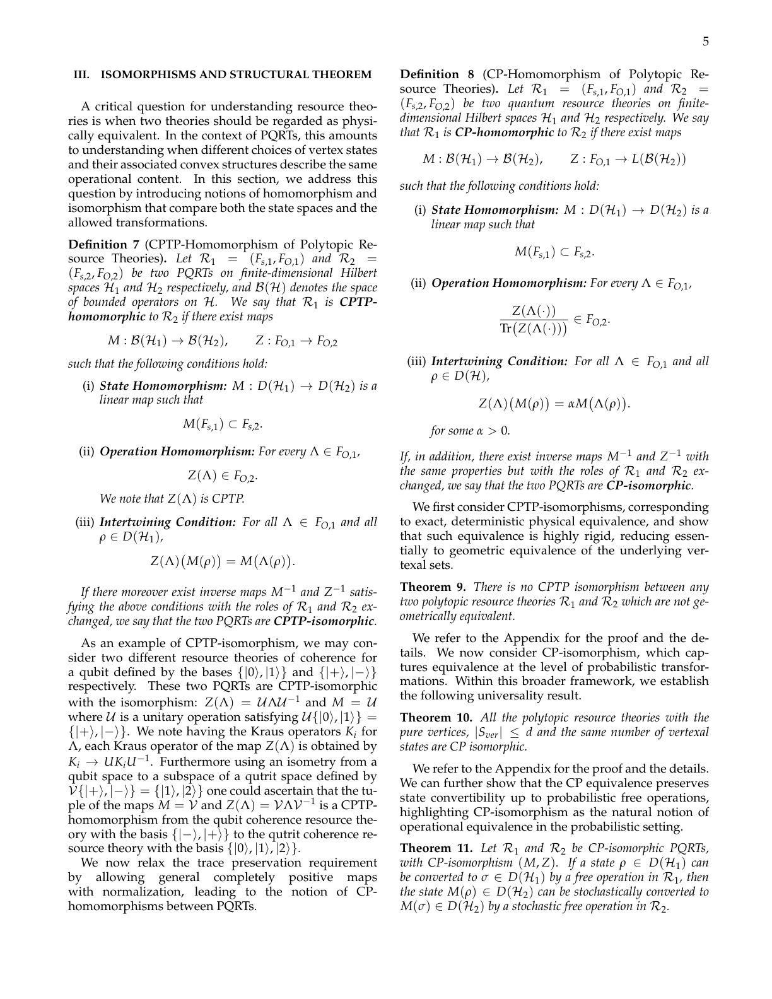
<figcaption class="paper-figure-caption"><b>Fig 4.</b> Low-resolution page preview, page 5</figcaption>
</figure>
<figure class="paper-figure-card">
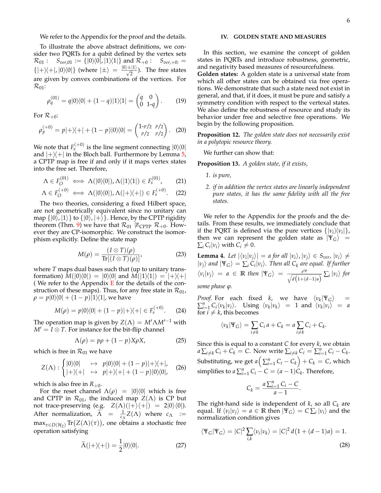
<figcaption class="paper-figure-caption"><b>Fig 5.</b> Low-resolution page preview, page 6</figcaption>
</figure>

**Summary.** This paper introduces Polytopic Quantum Resource Theories (PQRTs) as a geometric framework to unify the study of quantum resources. It develops sophisticated mathematical tools, including homomorphisms and isomorphisms, to rigorously compare different resource theories. The work reveals deep structural equivalences between these theories and provides monotonicity properties for various resource measures.

**Why it may be interesting.** This work provides a deep mathematical structure to resource theories, which is fundamental for understanding the limits of quantum information processing and resource quantification in any quantum physical system.

Detailed structure

**Main problem.** The paper develops a general, unified framework to quantify, compare, and manipulate various quantum resources (like entanglement or coherence) under operational constraints.

**Main result.** It establishes that all Polytopic Quantum Resource Theories (PQRTs) sharing a fixed number of pure extremal states are equivalent under a physical map, and introduces rigorous mathematical tools (homomorphism/isomorphism) to compare their structures.

**Method.** The authors use convex geometry, linear algebra, and tensor representations to model the set of free states as a polytope, allowing for the formulation of equivalence criteria via homomorphisms and isomorphisms.

**Model / system.** The theory applies to general quantum systems described by finite-dimensional Hilbert spaces, where the resource is defined by the convex hull of a finite set of extremal pure states.

**Key observables.** Resource measures such as Robustness ($MR$), Geometric Measure ($MF$), and Negativity ($MN$) are analyzed for their monotonicity under free operations.

**Important parameters / regimes.** The number of pure extremal states ($|S_{	ext{ver}}|$), the dimension of the Hilbert space ($d$), and the structure of the underlying basis are key parameters.

**Assumptions / limitations.** The analysis often assumes finite-dimensional Hilbert spaces and relies on the ability to characterize free operations using Semidefinite Programming (SDP) feasibility problems.

**Figures summary.** Not specified, but the notes detail the mathematical structure of the equivalence proofs, involving tensor representations and mapping diagrams.

**Paper structure.** The paper progresses by first defining PQRTs geometrically, then introducing tensorial representations, followed by developing formal notions of homomorphism and isomorphism to compare theories, and finally analyzing the monotonicity of various resource measures.

Abstract

Quantum resource theories provide a unifying framework to quantify, compare, and manipulate quantum resources under well-defined operational constraints. Here, we consider any resource theory where the set of free states can be expressed as a convex combination of a set of quantum states, referred to as extremal states and name them as polytopic quantum resource theories (PQRT). These include some of the most studied resource theories, such as coherence and magic. We formulate a novel tensorial representation of PQRTs that reveals the underlying geometry of these theories and provides insight into the origin of the resources. We further address a fundamental question in resource theories that when two theories should be regarded as physically equivalent, and to this purpose we introduce notions of homomorphism and isomorphism that compare both the structure of free states and the allowed transformations. Using the tools we develop, we find results revealing the geometrical and structural foundations of such theories. Interestingly, we find that all polytopic resource theories with a fixed number of pure extremal points are equivalent under a physical map, up to normalisation. Additionally, we introduce linearly independent polytopic resource theories (resource theory of ``basis-non-convexity''), where the set of extremal free states forms a basis of the quantum density operators. We further study the categorical structures of PQRTs beyond single systems.

[↑ back to top](#top)

### [Quantum secure blind decryption with two users](http://arxiv.org/abs/2606.01949v1)

**Authors:** Masahito Hayashi, Yuki Ito  
**Type:** theory · **Category:** quantum information and computing · **PDF:** <https://arxiv.org/pdf/2606.01949v1>  
**Analysis basis:** full PDF text, analyzed in chunks
**Topic relevance:** `entanglement & information structure` **3/5**

↔ Scroll figures horizontally

<figure class="paper-figure-card">
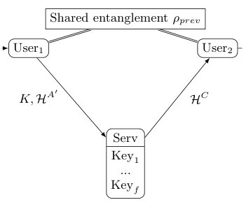
<figcaption class="paper-figure-caption"><b>Fig 1.</b> FIG. 1. Secure decryption protocol without key index secrecy.</figcaption>
</figure>
<figure class="paper-figure-card">
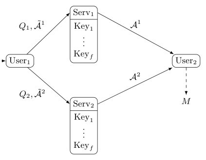
<figcaption class="paper-figure-caption"><b>Fig 2.</b> FIG. 2. two-server protocol.</figcaption>
</figure>

**Summary.** This paper proposes and analyzes quantum protocols for blind decryption involving two users and multiple servers. It introduces a superior two-server protocol that guarantees message and key secrecy, even when considering post-attack scenarios. The work demonstrates a clear quantum advantage over classical cryptographic schemes in maintaining information security.

**Why it may be interesting.** While the core topic is cryptography, the rigorous use of quantum state analysis, entanglement, and information-theoretic security proofs provides deep theoretical insights into the limits of secure quantum communication.

Detailed structure

**Main problem.** The paper addresses the challenge of achieving quantum secure blind decryption involving two users and multiple servers while maintaining strong secrecy guarantees.

**Main result.** The proposed two-server quantum protocol successfully achieves message, key, and key-index secrecy, and crucially, maintains security even under post-attack scenarios where classical methods fail.

**Method.** The authors develop and analyze two quantum protocols (one-server and two-server) using quantum information theory tools like entanglement, Pauli operators, and mutual information calculations.

**Model / system.** The model involves quantum information processing using quantum states and channels (TPCP maps) applied across a system involving two users and two servers, utilizing concepts from quantum cryptography.

**Key observables.** Message secrecy, key secrecy, key-index secrecy, and the final state of the composite system ($\kappa_1 \otimes \kappa_2$).

**Important parameters / regimes.** The number of users/servers (two servers are preferred), the key index $K$, and the ciphertext $E$.

**Assumptions / limitations.** The analysis assumes the message $M$ is uniformly distributed and relies on the 'specious condition' to prove security against sophisticated attacks.

**Figures summary.** Figure 1 illustrates the one-server protocol (lacking key index secrecy), and Figure 2 illustrates the superior two-server protocol structure.

**Paper structure.** The paper progresses by first analyzing a one-server protocol, identifying its limitations (especially regarding key index secrecy), and then introducing and proving the security of a more robust two-server protocol, culminating in a comparison with classical counterparts.

Abstract

We propose two types of protocols for quantum secure blind decryption, involving two users and servers. User 1 holds the encrypted ciphertext. The servers store several indexed keys including the key encrypting the ciphertext. User 2 aims to obtain the decrypted text. The protocols are designed to preserve the following types of secrecy: Users ensure the secrecy of the text from the servers. Servers maintain the secrecy of the keys from the users. Our protocols enable User 2 to obtain the decrypted text while preserving these secrecy requirements. Additionally, the second protocol ensures the secrecy of the key index to identify the key encrypting the ciphertext from the servers, and the second protocol requires two non-commuting servers. Furthermore, we analyze the secrecy of the second protocol under post-attack scenarios, where the two servers communicates with each other after the completion of the protocol. We show that our quantum protocol satisfies the secrecy under these attacks, whereas its classical counterpart fails to do so.

[↑ back to top](#top)

### [Suppression of p-Wave Altermagnetism by Localized 4f Electrons in CeNiAsO](http://arxiv.org/abs/2606.02422v1)

**Authors:** Jiuxiang Zhang, Yueyang Sun, Honglin Zhou, Jumin Shi, Di Wu, Hongze Gu, Wenjin Mao, Hengrui Dong, Yu Xu, Yinghao Li, Ziling Cao, Taimin Miao, Bo Liang, Neng Cai, Wenpei Zhu, Mingkai Xu, Jiaqi Chen, Chunhong Deng, Bo Liu, Xun Ma, Zhengtai Liu, Mao Ye, Shenjin Zhang, Zhimin Wang, Fengfeng Zhang, Feng Yang, Qinjun Peng, Zuyan Xu, Guodong Liu, Xintong Li, Hanqing Mao, Shiliang Li, Hongming Weng, Lin Zhao, X. J. Zhou  
**Type:** both · **Category:** strongly correlated electrons · **PDF:** <https://arxiv.org/pdf/2606.02422v1>  
**Analysis basis:** full PDF text, analyzed in chunks
**Topic relevance:** `Kondo & dissipative impurity` **3/5**

↔ Scroll figures horizontally

<figure class="paper-figure-card">
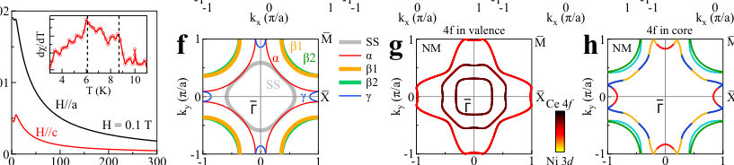
<figcaption class="paper-figure-caption"><b>Fig 1.</b> FIG. 1. Single-crystal characterization and itinerant electronic structure of CeNiAsO.</figcaption>
</figure>
<figure class="paper-figure-card">
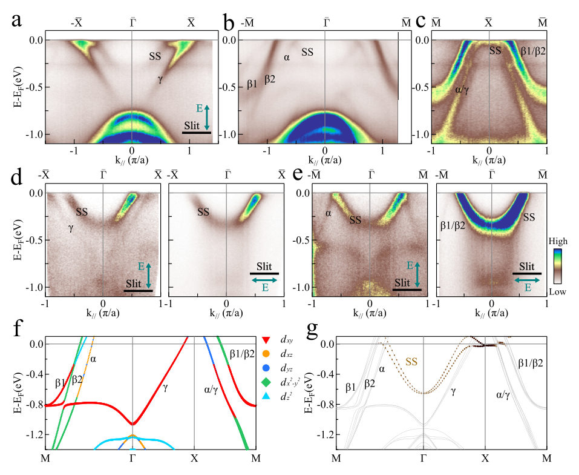
<figcaption class="paper-figure-caption"><b>Fig 2.</b> FIG. 2. Orbital character and surface-state contribution in the electronic structure</figcaption>
</figure>
<figure class="paper-figure-card">
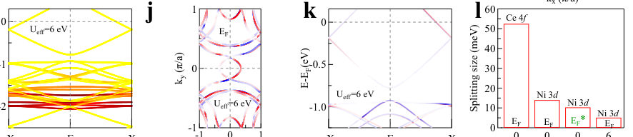
<figcaption class="paper-figure-caption"><b>Fig 3.</b> FIG. 3. Spectroscopic evidence on Ce 4f states and reassessment of the calculated</figcaption>
</figure>
<figure class="paper-figure-card">
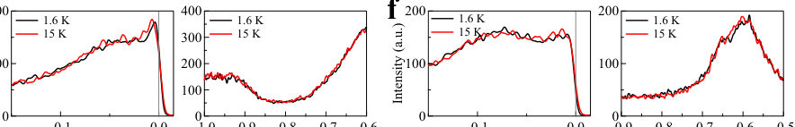
<figcaption class="paper-figure-caption"><b>Fig 4.</b> FIG. 4. Absence of resolvable low-energy exchange splitting across the successive mag-</figcaption>
</figure>

**Summary.** This work investigates p-wave altermagnetism in the heavy-fermion material CeNiAsO using ARPES and DFT calculations. The key finding is that strong correlations from localized Ce 4f electrons suppress the expected single-particle band-splitting signature. This suggests that the material operates in a strongly correlated limit where simple weak-coupling theories fail to describe the magnetic electronic structure.

**Why it may be interesting.** The concept of correlation-driven suppression of magnetic signatures is highly relevant to understanding exotic quantum states in strongly correlated materials, bridging magnetism and electronic structure theory.

Detailed structure

**Main problem.** To understand how symmetry-allowed p-wave altermagnetism manifests in heavy-fermion materials where magnetic exchange competes with Kondo correlations.

**Main result.** Strong $4f$ correlations, when treated correctly using DFT+U, suppress the observable single-particle band-splitting signature expected from a weak-correlation picture of p-wave magnetism.

**Method.** The study combines high-resolution Angle-Resolved Photoemission Spectroscopy (ARPES) measurements with first-principles calculations using DFT, comparing itinerant vs. localized $4f$ electron treatments.

**Model / system.** The system studied is CeNiAsO, a heavy-fermion candidate for p-wave altermagnetism, involving the interplay between Ni $3d$ conduction bands and localized Ce $4f$ magnetic moments.

**Key observables.** Resolvable near-Fermi-level p-wave exchange splitting on Ni $3d$ bands, Fermi-surface topology, and the spectral weight of Ce $4f$ states.

**Important parameters / regimes.** The comparison between uncorrected itinerant-4f description and the localized-4f treatment ($U_{	ext{eff}}$) is critical; the residual splitting is found to be in the few-meV range.

**Assumptions / limitations.** The analysis assumes that the strong $4f$ correlations fundamentally alter the single-particle spectral signature of the altermagnetic order, making the weak-correlation picture inapplicable.

**Figures summary.** Figures detail the crystal structure, magnetic susceptibility, ARPES Fermi-surface mappings, and critically compare calculated band structures using different $U_{	ext{eff}}$ values to show the suppression of splitting.

**Paper structure.** The paper first establishes the experimental context using ARPES to probe the magnetic state. It then uses DFT calculations, contrasting itinerant vs. localized $4f$ treatments, to theoretically explain the observed suppression of the expected p-wave splitting.

Abstract

Altermagnetism, characterized by momentum-dependent spin splitting and zero net magnetization, has so far been explored mainly in weakly or moderately correlated d-electron systems. How such symmetry-allowed band splitting manifests in heavy-fermion materials, where magnetic exchange competes with Kondo correlations, remains unclear. Here we use high-resolution angle-resolved photoemission spectroscopy to investigate CeNiAsO, a heavy-fermion candidate for p-wave altermagnetism. Despite macroscopic signatures consistent with the proposed p-wave magnetic order, we find no resolvable near-Fermi-level p-wave exchange splitting on the Ni 3d-derived conduction bands across the Neel transitions. Fermi-surface mapping, orbital-resolved ARPES identify that the low-energy electronic structure is dominated by Ni 3d bands, while resonant photoemission reveals that the Ce 4f states remain predominantly localized with residual c-f hybridization. First-principles calculations further show that an uncorrected itinerant-4f description produces dispersive Ce 4f bands and additional Fermi-surface pockets that are absent in experiment, thereby overestimating both the low-energy c-f hybridization and the exchange splitting transferred to the Ni 3d bands. When the localized Ce 4f character is incorporated through DFT+U , the experimental Fermi-surface topology is recovered and the residual p-wave splitting on the Ni 3d-derived bands is reduced to only a few meV, below the effective experimental resolution. These results identify CeNiAsO as a strongly correlated f-electron limit of p-wave magnetism, in which localized 4f electrons suppress the observable single-particle band-splitting signature expected from a weak-correlation picture.

[↑ back to top](#top)

### [Towards Heisenberg Scaling: Measurement-Efficient Non-Orthogonal Quantum Eigensolver](http://arxiv.org/abs/2606.01589v1)

**Authors:** Hang Ren, Yipei Zhang, Thilo Scharnhorst, K. Birgitta Whaley  
**Type:** theory · **Category:** quantum information and computing · **PDF:** <https://arxiv.org/pdf/2606.01589v1>  
**Analysis basis:** full PDF text, analyzed in chunks
**Topic relevance:** `quantum measurements` **3/5**

↔ Scroll figures horizontally

<figure class="paper-figure-card">
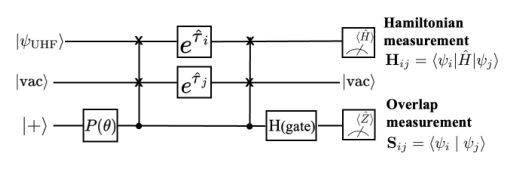
<figcaption class="paper-figure-caption"><b>Fig 1.</b> Figure 1: Circuit diagram of the original NOQE method [1], modified to absorb the basis rotations into the ansatz operators eˆτi(j) (see text). Two N-qubit non-orthogonal ansatz states, |ψi⟩and |ψj⟩, are prepared and combined using controlled operations to enable modified Hadamard tests that measure Hij and Sij. After measuring these matrix elements, one solves the generalized eigenvalue problem (Eq. 2) to obtain the electronic energies. This circuit requires 2N + 1 qubits. A more compact version using N +1 physical qubits and requiring longer circuits was also presented in Ref. [1].</figcaption>
</figure>
<figure class="paper-figure-card">
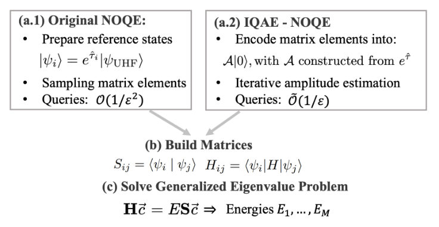
<figcaption class="paper-figure-caption"><b>Fig 2.</b> Figure 2: Overview of the NOQE and IQAE–NOQE workflows. (a.1) In the original NOQE protocol, non-orthogonal ansatz states |ψi⟩= eˆτi |ψUHF⟩are prepared and the overlap and Hamiltonian matrix elements between these states are estimated via statistical sampling, leading to a measurement cost scaling as O(1/ε2). (a.2) In IQAE–NOQE, the same matrix elements are coherently encoded as amplitudes of a quantum state A |0n⟩, with A constructed from state-preparation unitaries, and are estimated using iterative quantum amplitude estimation, achieving a near-Heisenberg scaling of ˜O(1/ε). (b) The estimated overlap and Hamiltonian matrices are assembled. (c) Solving the resulting generalized eigenvalue...</figcaption>
</figure>
<figure class="paper-figure-card">
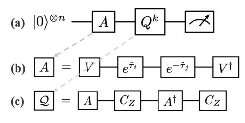
<figcaption class="paper-figure-caption"><b>Fig 3.</b> Figure 3: Circuit structure for IQAE–NOQE. (a) Standard IQAE setting, where an operator A prepares a state encoding the target amplitude, followed by repeated applications of the Grover operator Qk and measurement. (b) Construction of the state-preparation operator A for NOQE matrix-element estimation. Here A is built from the NOQE ansatz-state preparation and auxiliary unitaries, typically of the form V eˆτi e−ˆτj V †, such that the desired overlap or Hamiltonian matrix element is encoded into the measurement probability. (c) Definition of the Grover operator Q = A CZ A† CZ, which amplifies the encoded amplitude and enables near-Heisenberg scaling in the estimation of matrix elements. Here...</figcaption>
</figure>
<figure class="paper-figure-card">
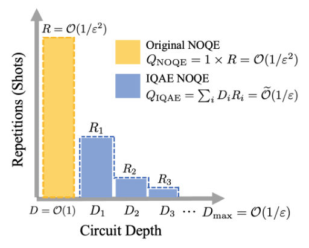
<figcaption class="paper-figure-caption"><b>Fig 4.</b> Figure 4: Conceptual resource comparison between the original sampling-based NOQE and IQAE–NOQE. In the original NOQE protocol, each circuit execution uses the ansatz state-preparation blocks eˆτi(j) for the two ansatz states i(j) once, including their correlation operators and basis-rotation blocks. These can be viewed as having a reference circuit depth D = O(1). The matrix elements are then estimated by repeated sampling. Reaching additive precision ε requires R = O(1/ε2) repetitions, giving QNOQE = 1 × R = O(1/ε2) total queries. In IQAE–NOQE, the estimation is performed using a sequence of circuits with different Grover depths D1, D2, . . . , Dmax, where Dmax = O(1/ε). If the circuit at...</figcaption>
</figure>
<figure class="paper-figure-card">
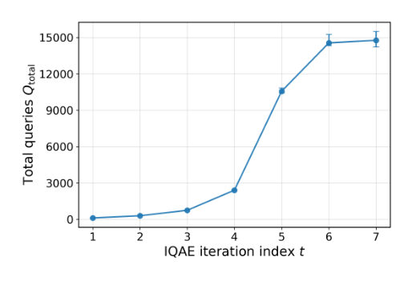
<figcaption class="paper-figure-caption"><b>Fig 5.</b> Figure 5: Cumulative total query count Qtotal as a function of the IQAE iteration index t for the full H2 numerical experiment. Here Qtotal(t) denotes the accumulated number of IQAE queries up to iteration t, summed over all IQAE subroutines entering the overlap and Hamiltonian matrix reconstruction, rather than the query count for a single matrix element. At each iteration index t, we report the median cumulative query count across the trials that reached iteration t, and the error bars denote the interquartile range (25%–75%). The plot ends at t = 7 because no trial in this set of experiments required more than seven IQAE iterations, demonstrating a stable and reproducible stopping...</figcaption>
</figure>

**Summary.** This paper addresses the measurement bottleneck in the Non-Orthogonal Quantum Eigensolver (NOQE) by replacing inefficient sampling with Iterative Quantum Amplitude Estimation (IQAE). By reformulating matrix element estimation as amplitude estimation, the authors achieve a significant reduction in query complexity from $O(1/\epsilon^2)$ to $	ilde{O}(1/\epsilon)$. This demonstrates a general principle for making quantum algorithms more measurement-efficient.

**Why it may be interesting.** This work provides a concrete example of how to systematically improve the resource scaling of a quantum algorithm by replacing statistical averaging with coherent quantum techniques, which is a major theme in quantum computation.

Detailed structure

**Main problem.** The primary challenge is improving the measurement-limited scaling of the Non-Orthogonal Quantum Eigensolver (NOQE) used for electronic structure calculations.

**Main result.** The authors propose an IQAE–NOQE protocol that replaces sampling-based estimation with coherent amplitude amplification, achieving a near-Heisenberg query complexity of O(1/epsilon).

**Method.** The method reformulates matrix element estimation as amplitude estimation tasks and integrates Iterative Quantum Amplitude Estimation (IQAE) into the NOQE workflow.

**Model / system.** The work applies to electronic structure calculations, specifically estimating the Hamiltonian and overlap matrices for molecular systems like the hydrogen molecule ($	ext{H}_2$).

**Key observables.** Electronic energies, Overlap matrix elements ($S_{ij}$), and Hamiltonian matrix elements ($H_{ij}$).

**Important parameters / regimes.** Target additive precision $\epsilon$, and the scaling improvement from $O(1/\epsilon^2)$ to $	ilde{O}(1/\epsilon)$.

**Assumptions / limitations.** The original NOQE method's cost is dominated by sampling-based measurement, which the IQAE approach systematically reformulates to leverage quantum coherence.

**Figures summary.** Figures compare the resource scaling, showing the quadratic improvement in query complexity from the original sampling method to the proposed IQAE method, and demonstrate energy convergence for $	ext{H}_2$.

**Paper structure.** The paper first identifies the $O(1/\epsilon^2)$ bottleneck in NOQE, then introduces IQAE to map estimation to amplitude estimation, details the circuit construction for both overlap and Hamiltonian terms, and concludes with numerical simulations comparing the resource efficiency.

Abstract

The Non-Orthogonal Quantum Eigensolver (NOQE) provides an accurate framework for electronic-structure calculations, but the estimation of its Hamiltonian and overlap matrix elements relies on sampling and requires $O(1/\varepsilon^2)$ circuit repetitions to achieve additive precision $\varepsilon$. Here, we reformulate this matrix-element estimation step as a collection of amplitude-estimation tasks and integrate iterative quantum amplitude estimation into the NOQE workflow. The resulting protocol achieves near-Heisenberg query complexity $O(1/\varepsilon)$ for these estimation tasks, by replacing incoherent statistical averaging with coherent amplitude amplification. We present explicit circuit constructions and the corresponding implementation procedure. Numerical simulations for the electronic states of the hydrogen molecule show that the proposed method reaches chemical accuracy with substantially fewer total queries than the original sampling-based protocol. Overall, this work provides a measurement-efficient route to high-precision energy estimation and illustrates how sampling-limited quantum algorithms can be systematically reformulated to leverage quantum coherence and achieve lower measurement costs.

[↑ back to top](#top)

### [A Minimal Duality Estimate for the Surface-Code Threshold under Nearest-Neighbor Correlated Errors](http://arxiv.org/abs/2606.02052v1)

**Authors:** Masayuki Ohzeki  
**Type:** theory · **Category:** disordered systems and neural networks · **PDF:** <https://arxiv.org/pdf/2606.02052v1>  
**Analysis basis:** full PDF text, analyzed in chunks
**Topic relevance:** `Keldysh / 2PI / non-Gaussian methods` **2/5** · `analog quantum simulation` **2/5** · `methods for driven-dissipative` **2/5** · `entanglement & information structure` **1/5** · `exotic spin models in light-matter` **1/5**

↔ Scroll figures horizontally

<figure class="paper-figure-card">
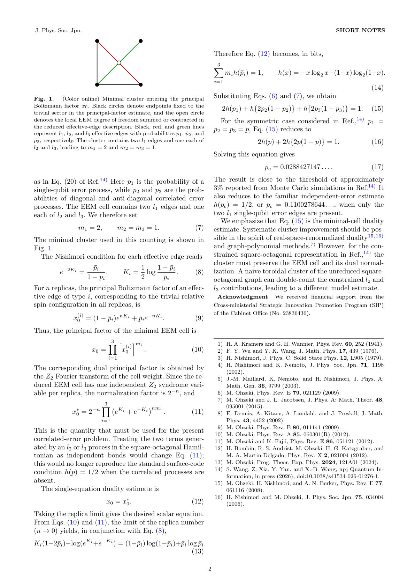
<figcaption class="paper-figure-caption"><b>Fig 1.</b> Low-resolution page preview, page 2</figcaption>
</figure>

**Summary.** This theoretical paper calculates the error threshold for the surface code when errors are correlated, modeling the problem as a random-bond Ising model. By applying the single-equation duality criterion, the authors derive a precise estimate for the critical error probability. This result provides a strong theoretical benchmark for fault-tolerant quantum computation in the presence of correlated noise.

**Why it may be interesting.** While focused on QEC, the underlying mathematical machinery—mapping a physical constraint problem to a statistical mechanics model (RBIM) and using duality/replica techniques—is highly relevant to disordered systems studied in AMO and condensed matter theory.

Detailed structure

**Main problem.** The paper aims to determine the threshold error rate for quantum error correction (QEC) applied to the surface code when nearest-neighbor correlated errors are present.

**Main result.** For the symmetric case of error probabilities, the calculated threshold is $p_c = 0.0288427147$, which closely matches existing numerical estimates of about 3%.

**Method.** The analysis employs the single-equation duality criterion applied to a random-bond Ising model derived from the error-edge map.

**Model / system.** The physical system is the surface code under nearest-neighbor correlated errors, which is mapped onto a random-bond Ising model (RBIM) on a square-octagonal lattice. The Hamiltonian involves quenched bond variables $	au_e$ and local constraints.

**Key observables.** The critical threshold probability ($p_c$) where the system transitions between phases.

**Important parameters / regimes.** The error probabilities ($p_1, p_2, p_3$) governing the correlated errors, and the effective error probabilities $ar{p}_i$.

**Assumptions / limitations.** The estimate is derived using a 'minimal-cell duality estimate,' and the authors note difficulties in performing systematic cluster improvements.

**Figures summary.** Figure 1 illustrates the minimal cluster entering the principal Boltzmann factor, showing the structure of the effective edges ($l_1, l_2, l_3$).

**Paper structure.** The paper applies the duality criterion to the RBIM partition function, derives a scalar equation using the replica limit, and solves this equation for the symmetric case to find the threshold.

Abstract

We apply the single-equation duality criterion to the square-octagonal random-bond Ising model recently obtained from an exact error-edge map for a surface code with nearest-neighbor correlated errors. The calculation is performed for the minimal cell after the error-edge reduction. For the symmetric case \(p_1=p_2=p_3=p\), this gives \(p_c=0.0288427147\), in close agreement with the reported numerical threshold of about \(3\%\).

[↑ back to top](#top)

### [Role of System-Bath Interaction in Non-Markovian Quantum Brownian Otto Cycles](http://arxiv.org/abs/2606.01750v1)

**Authors:** Haena Shim, Joonhyun Yeo  
**Type:** theory · **Category:** statistical mechanics · **PDF:** <https://arxiv.org/pdf/2606.01750v1>  
**Analysis basis:** full PDF text, analyzed in chunks
**Topic relevance:** `non-equilibrium dynamics` **2/5** · `Keldysh / 2PI / non-Gaussian methods` **1/5** · `correlated / nonlocal dissipation` **1/5** · `driven-dissipative phase transition` **1/5** · `methods for driven-dissipative` **1/5** · `non-equilibrium universality` **1/5**

↔ Scroll figures horizontally

<figure class="paper-figure-card">
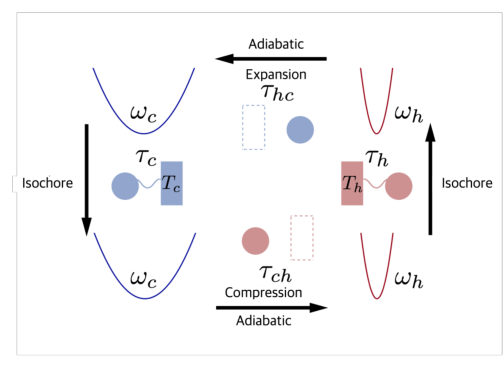
<figcaption class="paper-figure-caption"><b>Fig 1.</b> FIG. 1. Schematic diagram showing the four stages of the quantum Otto cycle</figcaption>
</figure>
<figure class="paper-figure-card">
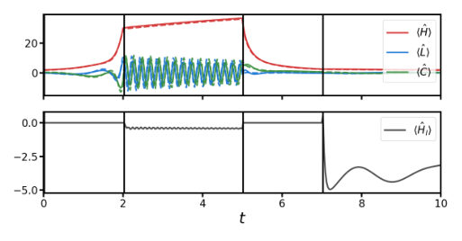
<figcaption class="paper-figure-caption"><b>Fig 2.</b> FIG. 2. The upper panel shows the time evolution of the state variables ⟨H⟩(red), ⟨L⟩(blue) and ⟨C⟩(green) of the periodic steady state for the Otto cycle which consists of the adiabatic processes with τh = τc = 3 and the isochoric ones with τhc = τch = 2 (see Eq. (31). The parameters used are ωc = 1, ωh = 15, Tc = 1, Th = 50, Ω= 20 and γ = 0.1. The solid lines are results from the exact solutions of the Heisenberg-Langevin equations and the dashed lines are from the Lindblad equation. The lower panel shows the time evolution of the average interaction energy ⟨HI(t)⟩during the same Otto cycle.</figcaption>
</figure>
<figure class="paper-figure-card">
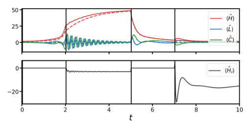
<figcaption class="paper-figure-caption"><b>Fig 3.</b> FIG. 3. Same as Fig. 2 except for the coupling strength γ = 0.7 between the system and the bath.</figcaption>
</figure>
<figure class="paper-figure-card">
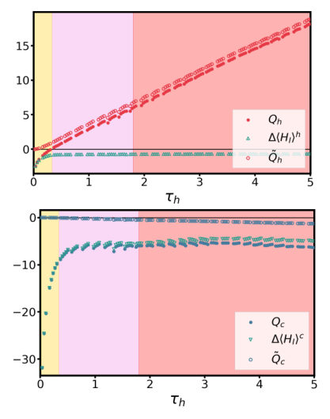
<figcaption class="paper-figure-caption"><b>Fig 4.</b> FIG. 5. Filled circles are the heat from the hot and cold bath, Qh, Qc, respectively as a function of τh for fixed τhc = 2.33 for the case shown in Fig. 4. eQh and g PQc are the corresponding heat when the interaction energy is not included (see Eq. (39)). ⟨∆H(ν) I ⟩(triangles) is the change in the interaction energy during the hot ν = h and cold ν = c isochoric processes (see Eq. (43)).</figcaption>
</figure>
<figure class="paper-figure-card">
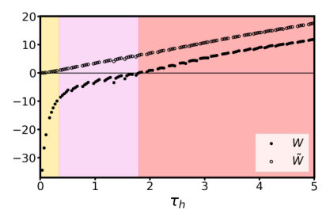
<figcaption class="paper-figure-caption"><b>Fig 5.</b> FIG. 4. The work output W (filled circles) as a function of τh for fixed τhc = 2.33. The parameters used are ωc = 1, ωh = 15, Tc = 1, Th = 100 and Ω= 10. Open circles are f W, which is the work when the interaction energy is not included (see Eq. (38)).</figcaption>
</figure>

**Summary.** This paper analyzes quantum Otto cycles operating in the non-Markovian regime by exactly treating the system-bath interaction. The authors demonstrate that this interaction significantly modifies the cycle's thermodynamics, showing that the Markovian approximation fails to capture the true behavior. Crucially, they show that the non-Markovian engine's performance falls below the Markovian power-efficiency bound.

**Why it may be interesting.** This work is highly relevant as it pushes beyond the standard Markovian assumptions in quantum thermodynamics, providing quantitative insights into how memory effects (non-Markovianity) fundamentally alter the performance limits of quantum heat engines.

Detailed structure

**Main problem.** The study investigates the role of system-bath interaction in determining the thermodynamic properties of non-Markovian quantum Otto cycles.

**Main result.** The non-Markovian engine's power-efficiency data fall below the established Markovian power-efficiency bound, and neglecting the interaction energy leads to unphysical thermodynamic predictions.

**Method.** The authors analytically solve the exact Heisenberg-Langevin equations to track the time evolution of the system and interaction energy, comparing these results against the standard Markovian Lindblad equation.

**Model / system.** The system is a quantum harmonic oscillator (working medium) undergoing an Otto cycle, coupled to two heat baths (hot and cold) via a Caldeira-Leggett model interaction.

**Key observables.** Work output (W), heat absorbed (Q_h, Q_c), and the change in interaction energy during isochoric processes.

**Important parameters / regimes.** Coupling strength ($\gamma$), bath spectral density parameters ($\Omega$), and the duration of the isochoric processes ($	au_h$).

**Assumptions / limitations.** The primary assumption is the ability to solve the exact Heisenberg-Langevin equations, allowing for a direct comparison against the weak-coupling Markovian approximation.

**Figures summary.** Figures illustrate the four stages of the cycle, compare exact vs. Markovian time evolutions, and plot work, heat, efficiency, and power versus cycle time parameters, highlighting the impact of interaction energy.

**Paper structure.** The paper develops the framework by first defining the Hamiltonian and solving the exact dynamics via Heisenberg-Langevin equations. It then applies this to calculate work and heat for the Otto cycle, explicitly incorporating interaction energy corrections, and finally compares these non-Markovian results against the established Markovian bounds and theoretical limits.

Abstract

We study finite-time quantum Otto cycles whose working medium is a harmonic oscillator undergoing a quantum Brownian motion described by the Caldeira-Leggett model when the oscillator is in contact with heat baths in isochoric processes. The time evolution of the Otto cycle is studied by analytically solving the exact Heisenberg-Langevin equations for the system variables and the interaction energy between the system and the bath. This enables us to investigate non-Markovian strong-coupling effects on the quantum Otto cycle. We obtain cyclic steady states and study the thermodynamic properties of the Otto cycle for various values of the parameters describing the heat baths and the coupling between the system and the bath. We compare our results with those obtained in the Markovian limit, where the time evolution is described by the Lindblad equation. We find that the change in the interaction energy during the isochoric process contributes to both work and heat, and plays a crucial role in determining thermodynamic behavior of the cycle. In particular, we find that when the Otto cycle operates as an engine, the effect of the interaction energy is to reduce the work output. We also compare our results with the power-efficiency trade-off relation recently proposed for the Markovian quantum Otto engine. We find that the power of our non-Markovian engine for a given efficiency value falls below the Markovian power-efficiency bound.

[↑ back to top](#top)

### [Quantum Simulation of Nucleon-Antinucleon Interaction in Large-$N$ QCD$_2$ on an IBM Quantum Nighthawk Processor](http://arxiv.org/abs/2606.02574v1)

**Authors:** Cameron V. Cogburn, Sebastian Grieninger, Dmitri E. Kharzeev  
**Type:** both · **Category:** numerical methods · **PDF:** <https://arxiv.org/pdf/2606.02574v1>  
**Analysis basis:** full PDF text, analyzed in chunks
**Topic relevance:** `analog quantum simulation` **2/5** · `methods for driven-dissipative` **2/5** · `Frenkel-Kontorova` **1/5** · `Keldysh / 2PI / non-Gaussian methods` **1/5**

↔ Scroll figures horizontally

<figure class="paper-figure-card">
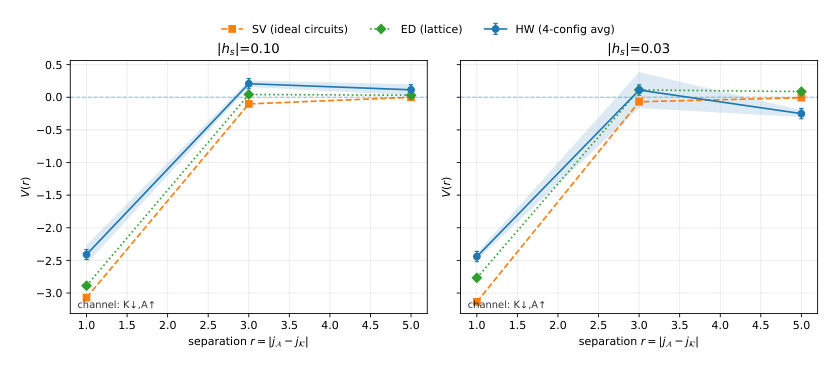
<figcaption class="paper-figure-caption"><b>Fig 1.</b> FIG. 1. Kink–antikink interaction potential V (r) extracted on quantum hardware (HW) compared with exact diagonalization (ED) for an L = 14 chain, shown for |hs| = 0.10 (left) and |hs| = 0.03 (right). The HW points show the 4-configuration average within the domain wall channel. Error bars denote the statistical uncertainty and the shaded band indicates the min/max spread across the contributing configurations. For L = 14 this channel occurs at odd endpoint separations r = |jA −jK| ∈{1, 3, 5}.</figcaption>
</figure>
<figure class="paper-figure-card">
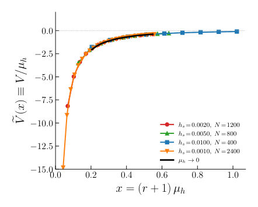
<figcaption class="paper-figure-caption"><b>Fig 2.</b> FIG. 2. Scaling collapse of the four primary large-L DMRG datasets. The µh →0 continuum extrapolation (solid black line) with one-sigma uncertainty band (gray) is obtained by a linear-in-µh fit at each fixed x; the four field values agree to 1.7% RMS over the common overlap window.</figcaption>
</figure>
<figure class="paper-figure-card">
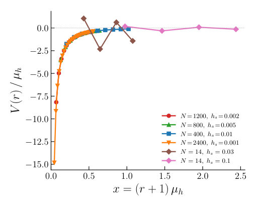
<figcaption class="paper-figure-caption"><b>Fig 3.</b> FIG. 3. Rescaled kink–antikink potential V (r)/µh versus x = (r +1)µh for the four large-L DMRG datasets (odd r≥3, aligned channel) alongside L=14 DMRG data at |hs| = 0.03 and 0.1 (diamonds). The large-L data collapse onto a single universal curve; the L = 14 curves show the finite-size struc- ture expected for a 14-site chain, consistent with the hardware data of Fig. 1.</figcaption>
</figure>
<figure class="paper-figure-card">
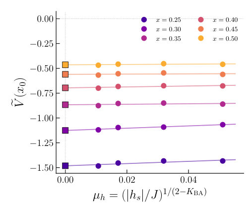
<figcaption class="paper-figure-caption"><b>Fig 4.</b> FIG. 4. Rescaled potential eV (x0) at fixed scaled distances x0, plotted against µh for the four field values. Linear fits (lines) extrapolate to µh =0 (filled squares), giving the contin- uum scaling function Fcont(x0). The monotonic dependence is consistent with a leading-order lattice correction ∝µh; the residuals of the linear fit provide an estimate of the remaining lattice corrections.</figcaption>
</figure>
<figure class="paper-figure-card">
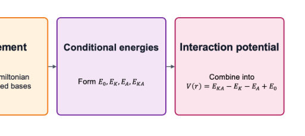
<figcaption class="paper-figure-caption"><b>Fig 5.</b> FIG. 5. A summary of the quantum-centric workflow used in this work.</figcaption>
</figure>

**Summary.** This paper reports a quantum simulation of the nucleon-antinucleon interaction in large-N QCD2 by mapping the problem onto an XXZ spin chain. The authors use the IBM Quantum Nighthawk processor to measure the interaction potential between topological solitons (kinks/antikinks). By benchmarking the quantum results against large-scale DMRG calculations, they successfully extract the continuum interaction potential, confirming its expected attractive behavior.

**Why it may be interesting.** The work demonstrates a sophisticated hybrid approach, combining quantum hardware simulation with advanced classical numerical techniques (DMRG, tensor networks) to solve a fundamental problem in quantum field theory.

Detailed structure

**Main problem.** The paper simulates the nucleon-antinucleon interaction in large-N two-dimensional quantum chromodynamics (QCD2). The goal is to extract the interaction potential between the resulting topological solitons (kinks/antikinks).

**Main result.** The quantum simulation successfully extracts an attractive kink-antikink interaction potential, which is confirmed by classical DMRG calculations that show the potential collapses onto a universal continuum scaling function.

**Method.** The simulation maps the QCD2 problem to an XXZ spin chain Hamiltonian, which is then implemented on a quantum processor using variational ansatzes and postselected nonunitary disorder operators. Results are benchmarked against DMRG and exact diagonalization.

**Model / system.** The system is large-N QCD2, which is bosonized into the sine-Gordon model and subsequently mapped to an anisotropic XXZ spin chain. The excitations correspond to kink/antikink solitons representing the nucleon/antinucleon pair.

**Key observables.** The separation-dependent kink-antikink interaction potential, $V(r)$, and its continuum limit scaling function, $F_{	ext{cont}}(x)$.

**Important parameters / regimes.** Large-$N$ limit, the anisotropy parameter $\Delta$ of the XXZ model, and the staggered field strength $|h_s|$ used for perturbation.

**Assumptions / limitations.** The approach relies on a controlled theoretical mapping sequence ($	ext{QCD}_2 	o 	ext{SG} 	o 	ext{XXZ}$), and the continuum limit is extracted via rescaling and extrapolation.

**Figures summary.** Figures show the extracted potential $V(r)$ on quantum hardware compared to exact diagonalization, and demonstrate the collapse of large-L DMRG data onto a single universal curve when rescaled by the mass gap $\mu_h$.

**Paper structure.** The paper follows a theoretical mapping from QCD2 to the XXZ model, details the quantum hardware implementation using specific operators, presents the extraction of the potential via conditional energies, and validates the results by comparing quantum hardware data against large-scale classical DMRG benchmarks to achieve continuum extrapolation.

Abstract

We report a quantum simulation of the nucleon--antinucleon interaction in large-$N$ two-dimensional quantum chromodynamics (QCD$_2$) on the IBM Quantum Nighthawk processor. In the large-$N$ limit, QCD$_2$ admits a bosonized description in which baryons emerge as topological solitons (kinks) of an effective mesonic field theory, providing a controlled, nonperturbative framework for baryon--antibaryon dynamics.   We formulate the problem by mapping the continuum bosonized Hamiltonian to a spin-chain representation equivalent to an XXZ model with anisotropy set by the QCD parameters. In this mapping, nucleon and antinucleon states correspond to kink and antikink excitations, respectively, while their interaction is encoded in the spin correlations of the chain. Using Jordan--Wigner encoding, we implement the resulting XXZ Hamiltonian on a finite set of qubits and realize it via a variational ground state ansatz and postselected nonunitary disorder operator insertions optimized for the Nighthawk architecture. We then show the kink--antikink interaction potential built from the conditional energies of these nonunitary string operators can be robustly extracted from the quantum hardware due to structured error cancelation. The resulting potential exhibits the expected attractive behavior. The quantum simulation results are benchmarked against exact diagonalization, ideal statevector evaluation showing good agreement. To connect the device result to the continuum field theory, we extract the potential in the continuum limit using large-$L$ matrix product state calculations.

[↑ back to top](#top)

### [Supersymmetric quantum criticality with discrete symmetry](http://arxiv.org/abs/2606.00657v1)

**Authors:** Teng-Yue Wang, Shuai Yin  
**Type:** theory · **Category:** statistical mechanics · **PDF:** <https://arxiv.org/pdf/2606.00657v1>  
**Analysis basis:** full PDF text, analyzed in chunks
**Topic relevance:** `Keldysh / 2PI / non-Gaussian methods` **2/5** · `analog quantum simulation` **1/5** · `driven-dissipative phase transition` **1/5** · `non-equilibrium universality` **1/5**

↔ Scroll figures horizontally

<figure class="paper-figure-card">
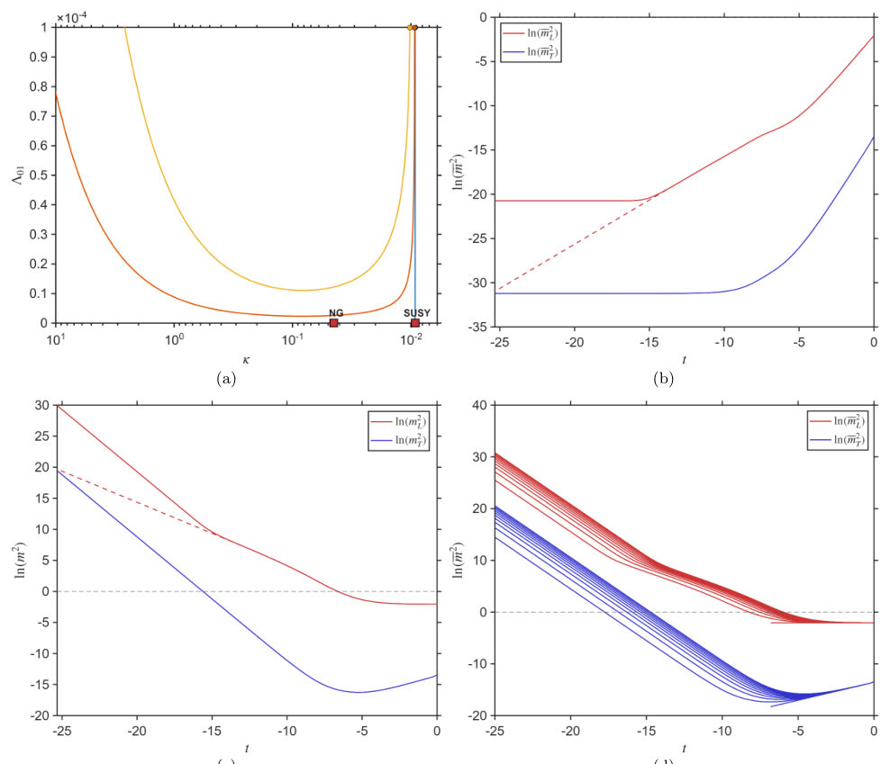
<figcaption class="paper-figure-caption"><b>Fig 1.</b> FIG. 1. Ordered-phase RG flow and mass flows for the Z4 model at Nf = 0.5. (a) Ordered-phase RG flow in the (κ, Λ01) plane, illustrated by three representative trajectories. (b) Flow of the dimensionful longitudinal mass ln m2 L (red) and transverse mass ln m2 T (blue) along a representative trajectory. For each mass, the dashed line corresponds to zero initial anisotropic coupling Λ01, while the solid line corresponds to nonzero initial Λ01. (c) Flow of the corresponding dimensionless masses ln m2 L (red) and ln m2 T (blue), with the same line-style convention as in (b). (d) Multi-trajectory dimensionless mass flows for different initial values of κ, used to determine the RG times tL and...</figcaption>
</figure>
<figure class="paper-figure-card">
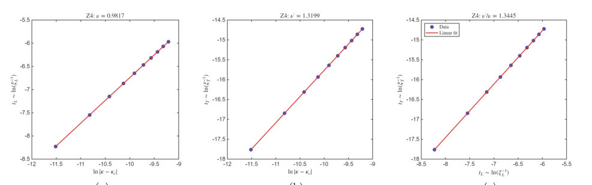
<figcaption class="paper-figure-caption"><b>Fig 2.</b> FIG. 2. Extraction of ν, ν′ and ν′/ν for the Z4 model from linear fits. (a) tL against ln |κ −κc|, whose slope gives ν. (b) tT against ln |κ −κc|, whose slope gives ν′. (c) tT against tL, whose slope gives ν′/ν. The first near-critical trajectory shown in Fig. 1(d) is excluded from the fits, and the remaining ten off-critical trajectories are used.</figcaption>
</figure>
<figure class="paper-figure-card">
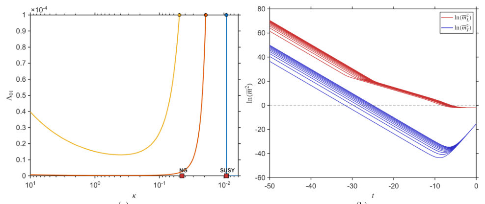
<figcaption class="paper-figure-caption"><b>Fig 3.</b> FIG. 3. Ordered-phase RG flows for the Z5 model at Nf = 0.5. (a) Phase portrait in the (κ, Λ01) plane. (b) Multi-trajectory dimensionless mass flows for different initial values of κ, used to determine tL and tT from the crossings ln m2 L = 0 and ln m2 T = 0.</figcaption>
</figure>
<figure class="paper-figure-card">
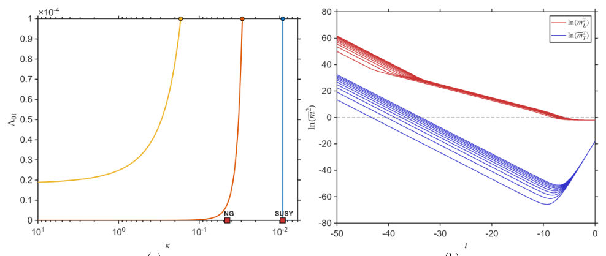
<figcaption class="paper-figure-caption"><b>Fig 4.</b> FIG. 4. Ordered-phase RG flows for the Z6 model at Nf = 0.5. (a) Phase portrait in the (κ, Λ01) plane. (b) Multi-trajectory dimensionless mass flows for different initial values of κ, used to determine tL and tT from the crossings ln m2 L = 0 and ln m2 T = 0.</figcaption>
</figure>
<figure class="paper-figure-card">
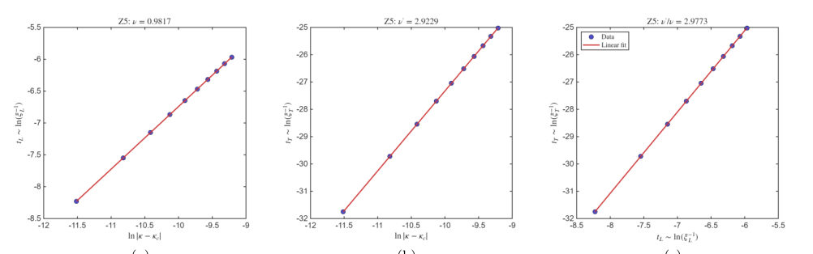
<figcaption class="paper-figure-caption"><b>Fig 5.</b> FIG. 5. Extraction of ν, ν′ and ν′/ν for the Z5 model from linear fits. (a) tL against ln |κ −κc|. (b) tT against ln |κ −κc|. (c) tT against tL.</figcaption>
</figure>

**Summary.** This work investigates supersymmetric quantum criticality in fermionic systems constrained by discrete $Z_n$ symmetries using the Functional Renormalization Group. The authors find that for $n>3$, the system flows to an $\mathcal{N}=2$ SUSY fixed point, while the ordered phase reveals a second characteristic length scale. This leads to a quantifiable scaling relation between the two critical exponents, $
u'/
u = 1 + |y_n|/2$.

**Why it may be interesting.** The study provides a rigorous theoretical framework for understanding how microscopic discrete symmetries constrain and modify emergent quantum critical behavior, which is highly relevant for designing and interpreting measurements in novel quantum materials.

Detailed structure

**Main problem.** The paper investigates the emergence of supersymmetry at quantum critical points in condensed matter systems that are constrained by microscopic discrete symmetries, moving beyond models with continuous symmetries.

**Main result.** For $Z_n$ symmetries with $n>3$, the anisotropic perturbations are irrelevant at the critical fixed point, leading to an emergent $\mathcal{N}=2$ Wess-Zumino supersymmetric critical point. Furthermore, the ordered phase exhibits two distinct characteristic length scales, $\xi$ and $\xi'$, whose exponents satisfy a specific scaling relation.

**Method.** The Functional Renormalization Group (FRG) method is employed, utilizing both Symmetric (SYM) and Symmetry-Broken (SSB) expansions to analyze the renormalization group flow equations.

**Model / system.** The system is modeled by (2+1)-dimensional Gross-Neveu-Yukawa (GNY) theories coupling Dirac fermions to a complex bosonic order parameter exhibiting $Z_n$ anisotropy.

**Key observables.** Critical exponents ($
u, 
u'$), the ratio $
u'/
u$, and the emergence of two characteristic length scales ($\xi, \xi'$).

**Important parameters / regimes.** The discrete symmetry index $n$ (specifically $n>3$), and the anisotropy eigenvalue $|y_n|$.

**Assumptions / limitations.** The analysis relies on the Functional Renormalization Group (FRG) formalism, employing approximations like the improved local potential approximation ($	ext{LPA}'$) and assuming an isotropic Euclidean spacetime ansatz at the critical point.

**Figures summary.** Figures illustrate the ordered-phase RG flows for $Z_5$ and $Z_6$ in the $(\kappa, \Lambda_{01})$ plane, and show the extraction of critical exponents ($
u, 
u', 
u'/
u$) for $Z_5$ and $Z_6$ via linear fits to the flow trajectories.

**Paper structure.** The paper develops the FRG flow equations for the GNY model, first analyzing the fixed point in the symmetric phase (SYM) to confirm SUSY emergence for $n>3$. It then analyzes the flow into the ordered phase (SSB) by tracking mass thresholds to extract the two distinct critical exponents $
u$ and $
u'$, confirming the scaling relation $
u'/
u = 1 + |y_n|/2$.

Abstract

Supersymmetry, originally proposed in high-energy physics, can emerge as a remarkable low-energy structure in condensed matter systems. While emergent supersymmetry at quantum critical points is widely discussed in models with continuous symmetries, real materials are constrained by microscopic discrete symmetries. To address this, we investigate (2+1)-dimensional Gross-Neveu-Yukawa theories coupling Dirac fermions to a complex order parameter with discrete $Z_n$ anisotropy. Using the functional renormalization group, we find that for $n>3$, the anisotropic perturbations are irrelevant at the fixed point, yielding a $\mathcal{N}=2$ Wess-Zumino supersymmetric critical point. In the ordered phase, this dangerously irrelevant anisotropy gives rise to a second characteristic length scale, $ξ'$, alongside the usual correlation length, $ξ$. By tracking mass thresholds along symmetry-broken renormalization group trajectories, we extract the exponents $ν'$ and $ν$ without imposing prior scaling assumptions. For the $Z_4$, $Z_5$, and $Z_6$ models, our results support the scaling relation $ν'/ν= 1+|y_n|/p$ with $p=2$ in the isotropic framework used here.

[↑ back to top](#top)

### [Electrical observation via spin Seebeck effect of fractionalized excitations in a magnetic insulator](http://arxiv.org/abs/2606.02501v1)

**Authors:** Nan Tang, Josef Willsher, Stephan Glamsch, Aisha Aqeel, Ludwig Scheuchenpflug, Michael Schulze, Christoph Liebald, Daniel Rytz, Christo Guguschev, Manfred Albrecht, Roderich Moessner, Philipp Gegenwart  
**Type:** experiment · **Category:** strongly correlated electrons · **PDF:** <https://arxiv.org/pdf/2606.02501v1>  
**Analysis basis:** full PDF text, analyzed in chunks
**Topic relevance:** `analog quantum simulation` **2/5** · `exotic spin models in light-matter` **1/5** · `spintronics-quantum-optics interface` **1/5**

↔ Scroll figures horizontally

<figure class="paper-figure-card">
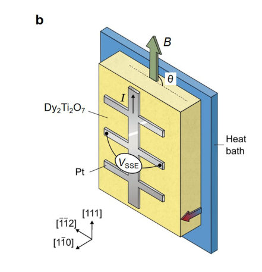
<figcaption class="paper-figure-caption"><b>Fig 1.</b> Figure 1 | Schematic of the experimental geometry of the pyrochlore oxide Dy2Ti2O7.</figcaption>
</figure>
<figure class="paper-figure-card">
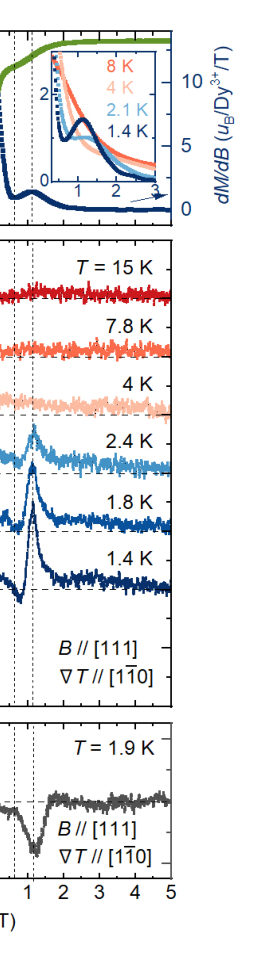
<figcaption class="paper-figure-caption"><b>Fig 2.</b> Figure 2 | Magnetic field B dependence of Magnetization M and spin Seebeck voltage</figcaption>
</figure>
<figure class="paper-figure-card">
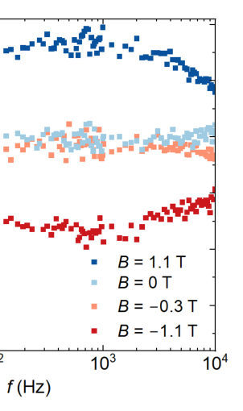
<figcaption class="paper-figure-caption"><b>Fig 3.</b> Figure 3 | Frequency f dependence of the characteristic peaks in VSSE. f scans of VSSE</figcaption>
</figure>
<figure class="paper-figure-card">
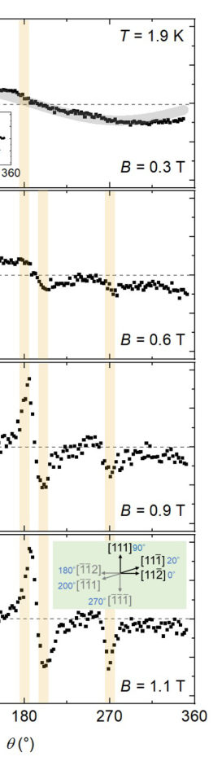
<figcaption class="paper-figure-caption"><b>Fig 4.</b> Figure 4 | In-plane angle (θ) dependence of VSSE. The angular dependence of VSSE as a</figcaption>
</figure>

**Summary.** This work uses the Spin Seebeck Effect (SSE) to electrically probe the exotic magnetic excitations, specifically magnetic monopoles, within the insulating magnet Dy2Ti2O7. By measuring the voltage response as a function of magnetic field and frequency, the authors confirm that the observed anomalies are signatures of fractionalized magnetic dynamics. This demonstrates a powerful spintronic tool for studying emergent quantum phenomena in insulators.

**Why it may be interesting.** The use of spintronics (SSE) to probe charge-neutral, emergent excitations like monopoles provides a novel, electrical handle on complex many-body physics, bridging condensed matter magnetism with quantum transport.

Detailed structure

**Main problem.** The primary goal is the electrical observation and characterization of fractionalized excitations, such as magnetic monopoles, in insulating quantum magnets.

**Main result.** The Spin Seebeck Effect (SSE) successfully detected characteristic peaks in the voltage signal corresponding to monopole proliferation in the 3D fractionalized magnet Dy2Ti2O7.

**Method.** The SSE technique is used, where a temperature gradient generated by an AC current in a Pt layer drives magnetic excitations in the insulator, generating a measurable voltage via the Inverse Spin Hall Effect.

**Model / system.** The study focuses on the non-collinear Ising magnet Dy2Ti2O7, a pyrochlore oxide exhibiting spin-ice behavior, which hosts fractionalized excitations like magnetic monopoles.

**Key observables.** Spin Seebeck Voltage (V_SSE) dependence on magnetic field (B), frequency (f), and in-plane angle (theta).

**Important parameters / regimes.** Low temperatures (down to 1.4 K), magnetic fields near 1.1 T, and characteristic frequencies in the 0.5–1 kHz range.

**Assumptions / limitations.** The analysis assumes the interfacial spin current conversion is instantaneous within the measurement frequency range, and that the SSE signal is dominated by the magnetic excitation dynamics.

**Figures summary.** Figures show V_SSE vs B, V_SSE vs f, and V_SSE vs theta, demonstrating field- and frequency-dependent anomalies linked to magnetic transitions and monopole physics.

**Paper structure.** The paper establishes the SSE measurement protocol on Dy2Ti2O7, presents measurements showing field- and frequency-dependent peaks, and interprets these features as evidence for the dynamics of fractionalized magnetic excitations.

Abstract

Fractionalized excitations are among the most striking signatures of emergence in quantum matter. While widely sought in frustrated magnets, their detection and characterization remain challenging, motivating the exploration of new probes. Meanwhile, Spintronics offers versatile tools for probing spin-related phenomena. In particular, the spin Seebeck effect (SSE) converts thermally driven magnetic excitations into a voltage in an adjacent metal, providing electrical access to the underlying dynamics and transport properties. Here we employ the SSE to probe emergent magnetic monopoles in the non-collinear Ising magnet Dy$_2$Ti$_2$O$_7$, a rare instance of a three-dimensional fractionalized magnet. We observe an SSE signal featuring a pronounced peak at monopole proliferation, accompanied by characteristic frequency and angular dependence. Our results broaden the scope of spintronic methods for detecting exotic excitations, provide new insights into magnetic insulators generally and monopole physics specifically, and suggest the potential of quantum materials as functional interfaces.

[↑ back to top](#top)

### [Microscopic Theory of the Phonon Thermal Hall Effect in Chiral Mott Insulators](http://arxiv.org/abs/2606.01876v1)

**Authors:** Junha Kang, Taekoo Oh  
**Type:** theory · **Category:** strongly correlated electrons · **PDF:** <https://arxiv.org/pdf/2606.01876v1>  
**Analysis basis:** full PDF text, analyzed in chunks
**Topic relevance:** `Keldysh / 2PI / non-Gaussian methods` **2/5** · `analog quantum simulation` **1/5** · `exotic spin models in light-matter` **1/5**

↔ Scroll figures horizontally

<figure class="paper-figure-card">
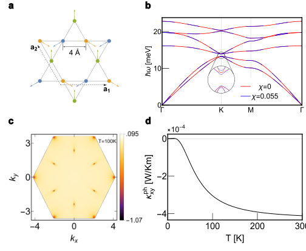
<figcaption class="paper-figure-caption"><b>Fig 1.</b> FIG. 1. Intrinsic phonon thermal Hall effect in the kagome Mott insulator. (a) Kagome lattice geometry with a canted antiferromagnetic order. The 10◦out-of-plane cant- ing yields a uniform scalar spin chirality χ = 0.055. (b) Phonon band structure. Solid red curves denote the unper- turbed dispersion (χ = 0); dashed blue curves incorporate the emergent gauge field (t/J = 0.3, γ = 4 ˚A−1). Calculations assume an interatomic spacing 4 ˚A, nuclear mass 10−25 kg, and longitudinal/transverse spring constants 20 N/m and 10 N/m, respectively. (c) Momentum-resolved thermal Hall con- ductivity integrand evaluated at T = 100 K. (d) Macroscopic thermal Hall conductivity κph xy as a function of...</figcaption>
</figure>
<figure class="paper-figure-card">
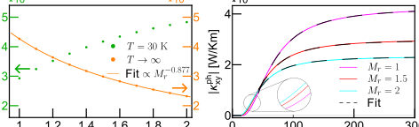
<figcaption class="paper-figure-caption"><b>Fig 2.</b> FIG. 2. Isotope effect and mass scaling. (a) Absolute value of thermal Hall conductivity as a function of the rela- tive isotopic mass Mr. At low temperatures (T = 30 K, green dots, left axis), heavier masses enhance the transport, whereas in the high-temperature limit (orange dots, right axis), the macroscopic signal is strictly suppressed. The solid orange line indicates a power-law fit κph xy ∝M −0.877 r . (b) Temper- ature dependence of |κph xy| for Mr = 1 (magenta), 1.5 (red), and 2 (cyan). The dotted lines are fits to the ansatz [Eq. (15)] over the range 43 K ≤T ≤300 K.</figcaption>
</figure>

**Summary.** This work establishes a fully microscopic theory for the Phonon Thermal Hall Effect in chiral Mott insulators. By deriving the effect from an emergent gauge field linked to spin chirality, the authors propose a definitive experimental protocol using isotopic substitution. This allows researchers to cleanly separate the phonon contribution to thermal transport from other background electronic signals.

**Why it may be interesting.** The rigorous derivation of the PTHE links lattice vibrations (phonons) directly to electronic magnetic order (spin chirality) via emergent gauge fields, providing a powerful new diagnostic tool for strongly correlated materials.

Detailed structure

**Main problem.** The paper develops a microscopic theory for the Phonon Thermal Hall Effect (PTHE) in chiral Mott insulators, aiming to provide a definitive method to isolate this phonon contribution.

**Main result.** The PTHE is shown to be governed by an emergent gauge field, which is proportional to the scalar spin chirality, and its signal can be quantitatively separated using isotopic substitution and a derived scaling law.

**Method.** The theory employs advanced many-body techniques, including inverse Schrieffer-Wolff perturbation theory, Born-Oppenheimer approximations, and the calculation of Abelian phonon Berry curvature using projector formalisms.

**Model / system.** The study focuses on chiral Mott insulators, modeled using the double exchange Hamiltonian at half-filling, and specifically investigates the 2D kagome lattice.

**Key observables.** Phonon thermal Hall conductivity ($\kappa_{ph}^{\mu
u}$), emergent gauge field ($F_{em}^{ab}$), and the temperature/mass dependence of $\kappa_{ph}^{\mu
u}$.

**Important parameters / regimes.** Scalar spin chirality ($\chi_{ijk}$), temperature ($T$), and isotopic mass ratio ($M_r$).

**Assumptions / limitations.** The calculation assumes hopping amplitudes depend only on inter-atomic displacement, and the method relies on the Born-Oppenheimer approximation for separating electron and nuclear dynamics.

**Figures summary.** Figures illustrate the intrinsic PTHE in the kagome model, showing band structure changes and the temperature dependence of $\kappa_{ph}^{xy}(T)$, and demonstrate the isotope effect where $\kappa_{ph}^{xy}$ changes dependence on $M_r$ at low vs. high temperatures.

**Paper structure.** The paper progresses from deriving the effective lattice Hamiltonian via BO approximation, calculating the emergent gauge field via perturbation theory, and finally establishing the experimental protocol using isotopic substitution and scaling laws to isolate the pure PTHE signal.

Abstract

The thermal Hall effect (THE) probes charge-neutral excitations in insulators, where the charge gap blocks electronic transport. Recently, phonons have been shown to induce a THE comparable in magnitude to the spin contribution, underscoring their critical role in thermal transport. Here, we develop a microscopic theory of the phonon thermal Hall effect (PTHE) in chiral Mott insulators. First, we derive the exact analytic form of the effective Raman interaction in half-filled Mott insulators, showing that its strength is directly proportional to the scalar spin chirality. Next, we demonstrate the intrinsic PTHE explicitly on the kagome lattice. Crucially, our formulation reveals a temperature-dependent crossover in the transport behavior under isotopic substitution. Using this result, we establish a scaling law that quantitatively separates the phonon contribution to the THE from other background signals. Our results not only provide the first fully microscopic derivation of the PTHE, but also establish a definitive experimental standard for isolating microscopic heat carriers in chiral Mott insulators.

[↑ back to top](#top)

### [Wilson Holonomy and Spectral Monodromy in Spin-Orbit Rings: Effective Gauge Connections and Loop Observables](http://arxiv.org/abs/2606.01029v1)

**Authors:** N. Bolivar  
**Type:** theory · **Category:** other · **PDF:** <https://arxiv.org/pdf/2606.01029v1>  
**Analysis basis:** full PDF text, analyzed in chunks
**Topic relevance:** `analog quantum simulation` **2/5** · `interference shaping light` **1/5** · `non-equilibrium dynamics` **1/5**

↔ Scroll figures horizontally

<figure class="paper-figure-card">
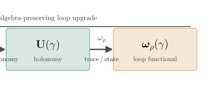
<figcaption class="paper-figure-caption"><b>Fig 1.</b> Figure 1: (Color online) Two-stage upgrade from the SOC Hamiltonian to effective connection data, then to holonomy and loop functionals. The second step preserves path composition and the ∗-structure.</figcaption>
</figure>
<figure class="paper-figure-card">
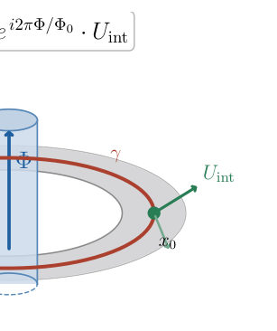
<figcaption class="paper-figure-caption"><b>Fig 2.</b> Figure 2: (Color online) Ring holonomy factorization. The AB sector contributes a central phase, while SOC induces internal transport based at x0. When the U(1) factor is central, the total loop datum factorizes as Utot(Φ) = ei2πΦ/Φ0 Uint.</figcaption>
</figure>
<figure class="paper-figure-card">
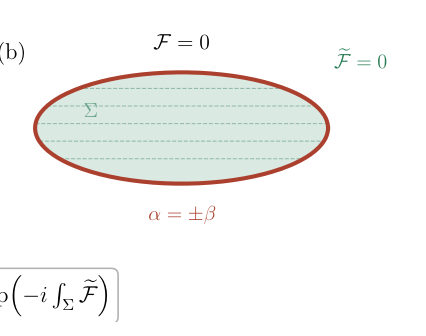
<figcaption class="paper-figure-caption"><b>Fig 3.</b> Figure 3: (Color online) Surface lift of the Wilson loop. The loop holonomy is rewrit- ten as a surface-ordered exponential of transported curvature. The RD locus α = ±β is a pure-gauge checkpoint with vanishing curvature. [11,18]</figcaption>
</figure>
<figure class="paper-figure-card">
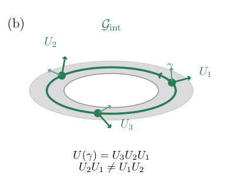
<figcaption class="paper-figure-caption"><b>Fig 4.</b> Figure 4: (Color online) Abelian versus non-Abelian transport around the same loop. The U(1) sector reduces to a scalar phase, whereas the internal non-Abelian sector is an ordered product of segment propagators.</figcaption>
</figure>
<figure class="paper-figure-card">
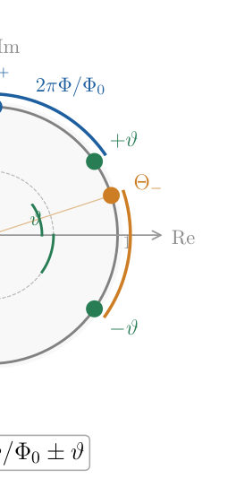
<figcaption class="paper-figure-caption"><b>Fig 5.</b> Figure 5: (Color online) Eigenphase representation of the conjugacy class. Internal phases ±ϑ are shifted by the central AB contribution, yielding total phases Θ±.</figcaption>
</figure>

**Summary.** This work develops a rigorous gauge-theoretic framework to analyze spin-orbit coupling in quantum rings. It achieves a crucial separation between the energy-independent Wilson holonomy, which governs interference, and the energy-dependent monodromy, which dictates spectral quantization. The methodology successfully maps complex SOC Hamiltonians onto computable loop observables, providing deep insights into spin-dependent transport.

**Why it may be interesting.** It provides a powerful, general mathematical machinery (loop/holonomy algebra) to analyze complex quantum transport phenomena in condensed matter systems, linking topology to measurable spectral properties.

Detailed structure

**Main problem.** To construct a precise, computable bridge between the loop/holonomy representation of gauge theories and condensed-matter spin-orbit transport in quantum rings.

**Main result.** The paper successfully separates the energy-independent Wilson holonomy (governing interference) from the energy-dependent monodromy (quantizing the spectrum), providing a unified framework for SOC systems.

**Method.** The analysis involves mapping the SOC Hamiltonian to an effective $U(1) \oplus A_{	ext{int}}$ connection, reducing the problem to a first-order transport equation, and analyzing the resulting loop operators.

**Model / system.** The primary models are spin-orbit coupled quantum rings, specifically analyzing Dirac (graphene) rings with Aharonov-Bohm flux and Rashba-Dresselhaus rings exhibiting non-Abelian $SU(2)$ transport.

**Key observables.** Wilson holonomy, spectral monodromy, curvature, and eigenphases.

**Important parameters / regimes.** Rashba coupling ($\alpha$), Dresselhaus coupling ($eta$), Aharonov-Bohm flux ($\Phi$), and the pure-gauge locus ($\alpha = \pm eta$).

**Assumptions / limitations.** The non-Abelian Stokes theorem and Magnus expansion are used as diagnostic tools, and the spectral quantization condition is derived from the monodromy operator, distinct from the holonomy.

**Figures summary.** Figures illustrate the factorization of the total holonomy into Abelian and internal parts for the graphene ring, and show the non-vanishing curvature of the internal connection for generic SOC parameters.

**Paper structure.** The paper systematically develops the gauge theory formalism, first establishing the separation of holonomy and monodromy, then applying this to the Dirac ring (factorization), and finally tackling the non-Abelian case (Rashba-Dresselhaus) using first-order reduction and curvature diagnostics.

Abstract

A spin-orbit Hamiltonian with an effective gauge structure carries two distinct loop objects that are routinely conflated: an energy-independent Wilson holonomy, which organizes interference and internal spin transport, and an energy-dependent monodromy, which quantizes the spectrum. We show that cleanly separating these objects supplies a precise, computable bridge between the loop/holonomy representation of gauge theories and condensed-matter spin-orbit transport. The construction maps a spin-orbit Hamiltonian to an effective $U(1)$ plus internal non-Abelian connection, reduces it to a first-order transport problem, and reads physical predictions from holonomy, monodromy, curvature, and eigenphase data. Two rings make the separation explicit. For a Dirac (graphene) ring with Rashba coupling and Aharonov-Bohm flux, the total holonomy factorizes exactly into a commuting $U(1)$ flux phase times an internal spin/pseudospin holonomy, and the spectrum follows from a holonomy-eigenvalue condition. For a Rashba-Dresselhaus ring, the internal $SU(2)$ transport is genuinely non-Abelian away from the $α=\pmβ$ pure-gauge locus, where curvature controls path ordering; spectral quantization then requires an explicit first-order reduction obtained by phase-space doubling of the second-order Schrödinger problem. A non-Abelian Stokes formulation and Magnus expansion serve as ordering diagnostics rather than spectral tools. Spin-network ideas enter only as historical geometric motivation, not as a dynamical import into spintronics.

[↑ back to top](#top)

### [Three- and four-boson systems expanded around the unitarity limit: Application to $^4$He](http://arxiv.org/abs/2606.00854v1)

**Authors:** Feng Wu, Xincheng Lin, Ubirajara van Kolck, Sebastian König  
**Type:** theory · **Category:** quantum gases · **PDF:** <https://arxiv.org/pdf/2606.00854v1>  
**Analysis basis:** full PDF text, analyzed in chunks
**Topic relevance:** `Keldysh / 2PI / non-Gaussian methods` **2/5** · `analog quantum simulation` **1/5**

↔ Scroll figures horizontally

<figure class="paper-figure-card">
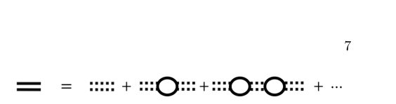
<figcaption class="paper-figure-caption"><b>Fig 1.</b> Figure 1. Dressed dimer propagator (double solid line) as a sum of bare dimer propagators (double dotted lines) with insertions of loops with boson propagators (single solid lines).</figcaption>
</figure>
<figure class="paper-figure-card">
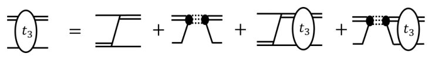
<figcaption class="paper-figure-caption"><b>Fig 2.</b> Figure 2. Diagrammatic representation of the integral equation for the boson-dimer amplitude t3. The bare trimer propagator is represented by a triple dotted line. Other lines as in Fig. 1.</figcaption>
</figure>
<figure class="paper-figure-card">
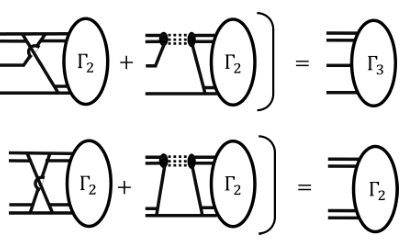
<figcaption class="paper-figure-caption"><b>Fig 3.</b> Figure 3. Diagrammatic representation of the four-body integral equations. Lines as in Figs. 1 and 2.</figcaption>
</figure>
<figure class="paper-figure-card">
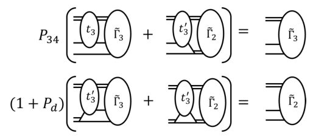
<figcaption class="paper-figure-caption"><b>Fig 4.</b> Figure 4. Diagrammatic representation of the four-body in- tegral equations in terms of three-body amplitudes t3 and t′ 3. Both single-boson legs attached to t3 are on-shell, whereas for t′ 3 only the single-boson leg on the side of the (3+1) fragmen- tation is on-shell [35]. Lines as in Figs. 1 and 2.</figcaption>
</figure>
<figure class="paper-figure-card">
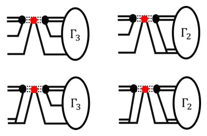
<figcaption class="paper-figure-caption"><b>Fig 5.</b> Figure 5. Contributions of the four-body force g4, represented by a red pentagon, in the diagrammatic four-body integral equation depicted in Fig. 3.</figcaption>
</figure>

**Summary.** This paper develops a rigorous Effective Field Theory framework to study three- and four-boson systems near the unitarity limit, applying it to $^4$He. By systematically calculating corrections beyond the leading order, the authors show that the resulting binding energies and radii match established phenomenological results, confirming the underlying physics is robustly described by small deviations from scale invariance.

**Why it may be interesting.** This work provides a highly systematic, quantum-field-theoretic approach to few-body physics, which is crucial for understanding ultracold atomic gases tuned near Feshbach resonances (unitarity limit).

Detailed structure

**Main problem.** The study investigates three- and four-boson systems near the unitarity limit, applying the theoretical framework to the Helium-4 ($^4$He) system.

**Main result.** The binding energies and radii of $^4$He three- and four-atom systems calculated using the EFT approach converge well with sophisticated phenomenological potentials, suggesting the physics is governed by small deviations from discrete scale invariance.

**Method.** The authors employ Short-Range Effective Field Theory (SREFT) combined with the Faddeev-Yakubovsky formalism and diagrammatic techniques to systematically calculate corrections beyond the leading-order unitarity limit.

**Model / system.** The system consists of three- and four-boson interactions, modeled using an EFT Lagrangian. The calculations are performed by systematically including corrections from finite scattering lengths and effective ranges, necessitating the introduction of four-body forces at next-to-leading order.

**Key observables.** Binding energies ($B_3, B_4$) and radii ($r_3, r_4$) of the few-boson clusters.

**Important parameters / regimes.** The unitarity limit, the three-body scale parameter ($\Lambda_{\star}$), the two-body scattering length ($a$), and the effective range ($r_2$).

**Assumptions / limitations.** The analysis assumes that the physics is dominated by small deviations from discrete scale invariance, allowing for a systematic perturbative expansion around the unitarity limit.

**Figures summary.** Figures compare the tetramer ground-state binding energy and radius against the regulator cutoff ($\Lambda/\kappa_{3,0}$) using different angular momentum cutoffs ($l_{max}$) and theoretical orders (LO/NLO), demonstrating convergence.

**Paper structure.** The paper systematically builds the theory from the two-body sector (Lippmann-Schwinger) to the three-body (Faddeev) and four-body (FY) equations, detailing the necessary renormalization procedures and the removal of deep trimer states via pseudopotential projection.

Abstract

The three- and four-boson systems with a large scattering length and a short effective range in the two-body sector are studied in the framework of Short-Range Effective Field Theory. The starting point (leading order) of the EFT is taken to be the universal unitarity limit, where the two-body sector is parameter-free and only one three-body parameter enters. In this limit, physical systems manifests discrete scale invariance. Deviations from universality arising from finite scattering-length and effective-range corrections, as well as a four-body force required by renormalization, are included perturbatively at next-to-leading order. The three-body ground state and its associated four-body ground and first-excited states are studied using the Faddeev-Yakubovsky formalism and a complementary diagrammatic approach. By employing techniques to remove contributions from deep trimers in tetramer calculations, we extend our analysis to larger cutoffs than previously accessible within the FY approach. Our results for binding energies and radii of $^4$He three- and four-atom systems converge well to results obtained with sophisticated phenomenological potentials. These successes suggest that the physics of $^4$He atomic clusters is governed by only small deviations from discrete scale invariance.

[↑ back to top](#top)

### [Extensible Fluxonium Architecture Using Tunable Couplers with Low Shunt Capacitance](http://arxiv.org/abs/2606.01647v1)

**Authors:** Peng Zhao, Peng Xu, Zheng-Yuan Xue  
**Type:** theory · **Category:** quantum information and computing · **PDF:** <https://arxiv.org/pdf/2606.01647v1>  
**Analysis basis:** full PDF text, analyzed in chunks
**Topic relevance:** `QC/QI experiment` **2/5**

↔ Scroll figures horizontally

<figure class="paper-figure-card">
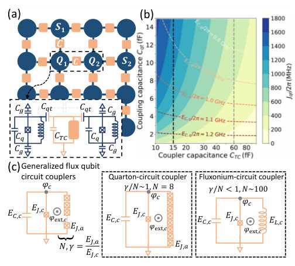
<figcaption class="paper-figure-caption"><b>Fig 1.</b> FIG. 1. (a) A 2D square lattice comprising fluxonium qubits (circles) coupled via couplers (squares). The inset depicts a tunable capacitive coupling architecture, where qubits are capacitively coupled (Cqt) to a tunable coupler with shunt ca- pacitance CT C. (b) Coupling energies Jqt (filled contours) and qubit charging energies EC,q (dashed contours) as functions of the coupling capacitance Cqt and the coupler capacitance CT C for the unit cell. The unit cell consists of two floating fluxonium qubits [Cq (g) = 7 (13) fF] coupled via a grounded coupler, embedded in the 2D lattice shown in (a). The verti- cal dashed grey and black lines mark, respectively, the typical shunt capacitances for...</figcaption>
</figure>
<figure class="paper-figure-card">
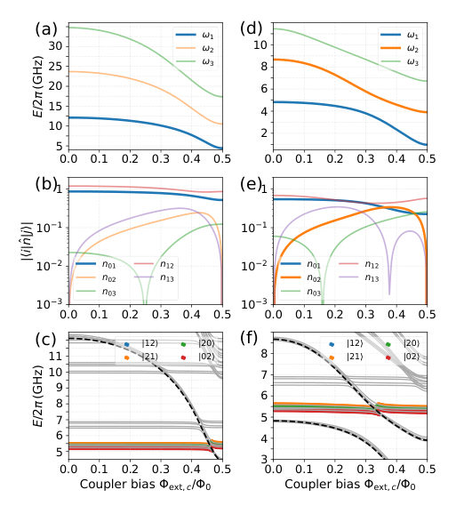
<figcaption class="paper-figure-caption"><b>Fig 2.</b> FIG. 2. (a) Energy levels of the quarton coupler, (b) magni- tudes of the electric transition dipole moments for the quarton transitions, and (c) full energy levels of the coupled system consisting of two fluxonium qubits coupled via the quarton coupler, versus coupler flux bias. The noncomputational en- ergy levels {|20⟩, |02⟩, |21⟩, |12⟩} associated with the plasmon transition |1⟩↔|2⟩, together with the bare coupler frequency [black dashed lines, as in (a)], are highlighted. (d)–(f) Corre- sponding results for the fluxonium-circuit coupler.</figcaption>
</figure>
<figure class="paper-figure-card">
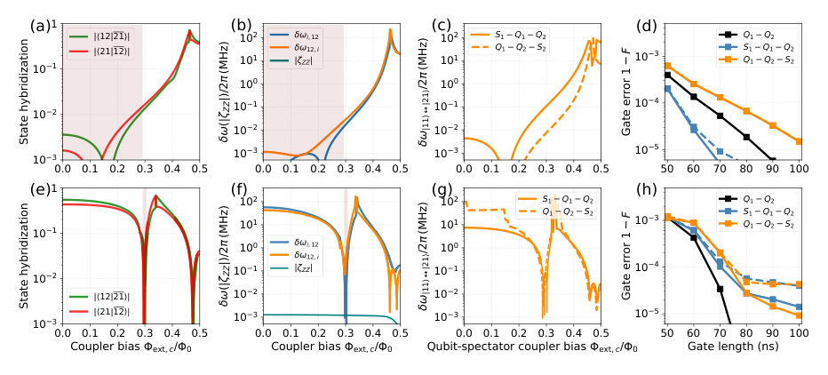
<figcaption class="paper-figure-caption"><b>Fig 3.</b> FIG. 3. (a) State hybridization and (b) state-dependent frequency shift of the transition |1⟩↔|2⟩versus coupler bias, for fluxonium qubits Q1 and Q2 coupled via the quarton-circuit coupler. The shaded region marks the bias range where plasmon interactions are strongly suppressed. (c) Frequency shift in the gate transition |11⟩↔|21⟩induced by residual spectator- qubit coupling, controlled by the flux bias applied to the qubit-spectator coupler. Solid and dashed lines correspond to the configurations S1 −Q1 −Q2 and Q1 −Q2 −S2, respectively [see Fig. 1(a)]. (d) CZ gate errors for Q1 and Q2 in the two three-qubit systems as a function of gate length. Solid and dashed lines correspond to the...</figcaption>
</figure>

**Summary.** This paper presents an extensible architecture for scaling fluxonium qubits into large 2D arrays by employing low-shunt-capacitance tunable couplers. The proposed couplers, based on quarton and fluxonium circuits, overcome limitations in coupling strength and capacitance loading inherent to small-footprint qubits. This design successfully enables strong, tunable interactions while actively suppressing error sources to support practical quantum processors.

**Why it may be interesting.** This work directly addresses the physical implementation challenges of scaling superconducting qubits, which is a major focus area for quantum information scientists working on solid-state quantum hardware.

Detailed structure

**Main problem.** The central challenge is scaling fluxonium qubits into large, high-performance 2D arrays while maintaining controllable strong interactions despite the small physical footprint of the qubits.

**Main result.** The authors propose using low-shunt-capacitance tunable couplers based on quarton and fluxonium circuits, enabling strong, tunable coupling and suppressing spectator-induced errors for 2D grid integration.

**Method.** The work involves theoretical modeling of coupled superconducting circuits, deriving Hamiltonians for the system, and analyzing coupling strengths and error sources.

**Model / system.** The system utilizes fluxonium qubits coupled via tunable couplers realized using generalized flux-qubit circuits (quarton and fluxonium). The Hamiltonian describes the interaction between multiple qubits and couplers in a 2D lattice.

**Key observables.** Gate fidelity, coupling strength ($g_{qt}$), spectator-induced frequency shifts, and the ability to tune interactions on/off.

**Important parameters / regimes.** Low shunt capacitance ($C_{qt}$), charging energy ($E_C$), Josephson energy ($E_J$), and the ratio of coupling to qubit capacitance.

**Assumptions / limitations.** The analysis assumes that the computational subspace remains nearly decoupled from the coupler's non-computational states when interactions are turned off.

**Figures summary.** Figures illustrate the 2D lattice structure, the coupler circuit, energy level diagrams showing tunability, and plots demonstrating the suppression of gate frequency shifts and errors.

**Paper structure.** The paper introduces the scaling problem, proposes the low-shunt-capacitance coupler architecture, derives the relevant Hamiltonians, analyzes the coupling mechanisms (including plasmon interactions), and concludes by demonstrating error suppression and scalability for 2D arrays.

Abstract

Fluxonium qubits have demonstrated high-fidelity operations and long coherence times in small-scale systems, highlighting their promise for quantum computing. However, large-scale integration into a high-performance two-dimensional (2D) qubit array remains the central challenge for practical applications. In this work, we introduce an extensible architecture for scaling up fluxonium qubits in 2D grids. To address the key challenges, namely achieving controllable strong interaction and high connectivity for qubits featuring small shunting capacitors (footprints), we propose using low-shunt-capacitance couplers to enable tunable interactions between fluxonium qubits. When embedded into 2D square lattices, large couplings can be achieved even with relatively small coupling capacitances, thus enabling multiple connections with sufficient capacitance budget. We further propose coupler realizations based on generalized flux qubit circuits, specifically the quarton and the fluxonium, and demonstrate that both enable fast, high-fidelity gates with low spectator errors, while supporting multiple connections on 2D grids.

[↑ back to top](#top)

### [Half the Interference, Most of the Answer: Approximate Quantum Simulation via Path-Sum Pruning](http://arxiv.org/abs/2606.01922v1)

**Authors:** Sinan Pehlivanoglu, Srinivasan Iyengar, Amr Sabry  
**Type:** theory · **Category:** numerical methods · **PDF:** <https://arxiv.org/pdf/2606.01922v1>  
**Analysis basis:** full PDF text, analyzed in chunks
**Topic relevance:** `methods for driven-dissipative` **2/5**

↔ Scroll figures horizontally

<figure class="paper-figure-card">
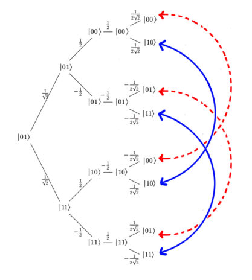
<figcaption class="paper-figure-caption"><b>Fig 1.</b> Figure 2: An abstract view of the ChAM model</figcaption>
</figure>
<figure class="paper-figure-card">
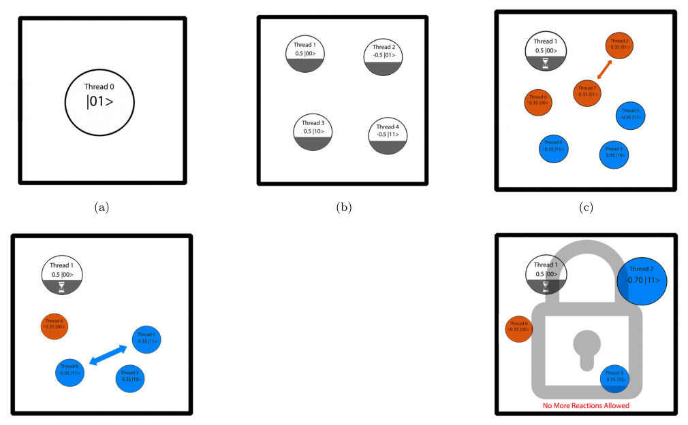
<figcaption class="paper-figure-caption"><b>Fig 2.</b> Figure 3: Evolution of the chemical solution system throughout quantum interference simulation. Each panel represents a key transformation step: (a) Initial state, (b) Hadamard gate application, (c) Destructive interference of |01⟩, (d) Constructive interference preparation for |11⟩, and (e) Final state before sampling.</figcaption>
</figure>
<figure class="paper-figure-card">
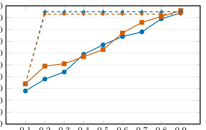
<figcaption class="paper-figure-caption"><b>Fig 3.</b> Figure 4: Fraction of runs in which the thresholded simulation returns the correct output for tagged-state and 3-SAT Grover instances across a range of threshold values. Dashed curves correspond to the early-selection variant.</figcaption>
</figure>
<figure class="paper-figure-card">
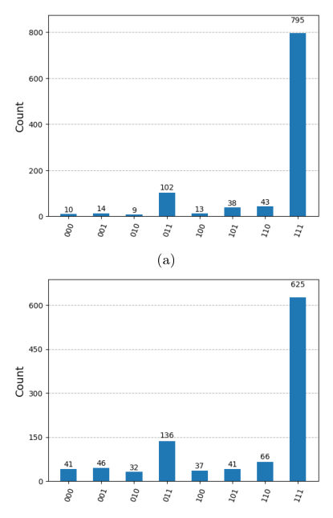
<figcaption class="paper-figure-caption"><b>Fig 4.</b> Figure 5: Sampling counts for Grover’s algorithm with tagged state |111⟩on the IBM Brisbane machine: (a) two iterations and (b) a single iteration.</figcaption>
</figure>
<figure class="paper-figure-card">
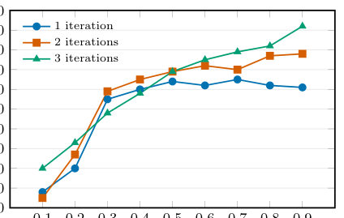
<figcaption class="paper-figure-caption"><b>Fig 5.</b> Figure 6: Percentage of runs in which partial accumulation with threshold T produced the correct result under one, two, and three reduced iterations of Grover’s algorithm.</figcaption>
</figure>

**Summary.** This work proposes a novel approximation technique called statistical interference sampling to tackle the computational bottleneck of quantum interference in circuit simulation. By modeling interference explicitly and introducing a threshold rule, the authors demonstrate that significant portions of the interference calculation can be safely pruned. This suggests that interference arithmetic is a structured resource amenable to targeted approximation strategies.

**Why it may be interesting.** The explicit separation and approximation of interference arithmetic provide a novel, structured resource that can be pruned, offering insights applicable to path-sum and tensor-network simulation techniques.

Detailed structure

**Main problem.** Classical simulation of quantum circuits is computationally expensive due to the exponential state-space size and the high cost associated with coherently combining many computational histories (interference).

**Main result.** The proposed method can omit nearly 50% of the endpoint interference work while retaining over 90% output accuracy for benchmark quantum algorithms.

**Method.** It introduces statistical interference sampling, treating endpoint interference as a separately schedulable computation using a Chemical Abstract Machine (ChAM) model and employing a threshold rule for early termination.

**Model / system.** The simulation models quantum circuits using a path-integral formulation, where weighted path contributions evolve like concurrent molecular species undergoing time evolution, tagging, and interference reactions.

**Key observables.** Output distribution, output accuracy, and the fraction of omitted endpoint interference work.

**Important parameters / regimes.** The threshold parameter T, which dictates when the simulation halts based on accumulated amplitude.

**Assumptions / limitations.** The method does not improve worst-case complexity, and the formal error analysis assumes a uniform random arrival order for path contributions.

**Figures summary.** Figures illustrate the Deutsch-Jozsa circuit, the ChAM model structure, and concrete execution traces showing the benefit and error associated with early termination.

**Paper structure.** The paper first identifies the two bottlenecks (state-space and interference), introduces the ChAM model and statistical interference sampling, demonstrates its application to benchmark circuits (Deutsch-Jozsa, Grover, Simon, Shor), and concludes with a formal analysis of error bounds.

Abstract

Classical simulation of quantum circuits is expensive for two distinct reasons. The obvious one is state-space size: an n-qubit system requires exponentially many amplitudes. The less obvious one is interference: useful output distributions emerge only after many computational histories have been coherently combined at common endpoints, and this aggregation step is itself a substantial source of cost. We introduce statistical interference sampling, a framework that makes this second bottleneck explicit by treating endpoint interference as a separately schedulable computation. Using the Chemical Abstract Machine (ChAM) as our model, weighted path contributions evolve as concurrent molecular species, and interference reactions combine contributions that share a common output state. A threshold rule terminates the process once an endpoint accumulates sufficient amplitude, discarding the remaining reactions. The method does not improve worst-case complexity and is not intended as a general-purpose simulator. Its purpose is to ask a more targeted question: how much of the interference calculation can be skipped while still recovering a useful output distribution? On benchmark circuits for Deutsch-Jozsa, Grover search, Simon's problem, and small Shor period-finding instances, we find that nearly 50% of endpoint interference reactions can be omitted while maintaining over 90% output accuracy for most algorithms tested. These results suggest that interference arithmetic is a structured resource that admits meaningful approximation, and that exposing it explicitly opens new opportunities for pruning strategies across path-sum, Pauli-path, and tensor-network simulation methods.

[↑ back to top](#top)

### [Multidimensional Reconciliation in Continuous-Variable QKD: Review, Coding Schemes, and Open Source Simulation](http://arxiv.org/abs/2606.02323v1)

**Authors:** Martial Lucien, Rosio Alexis, Diamanti Eleni, Cassagne Adrien, Gouraud Baptiste  
**Type:** theory · **Category:** quantum information and computing · **PDF:** <https://arxiv.org/pdf/2606.02323v1>  
**Analysis basis:** full PDF text, analyzed in chunks
**Topic relevance:** `entanglement & information structure` **2/5**

↔ Scroll figures horizontally

<figure class="paper-figure-card">
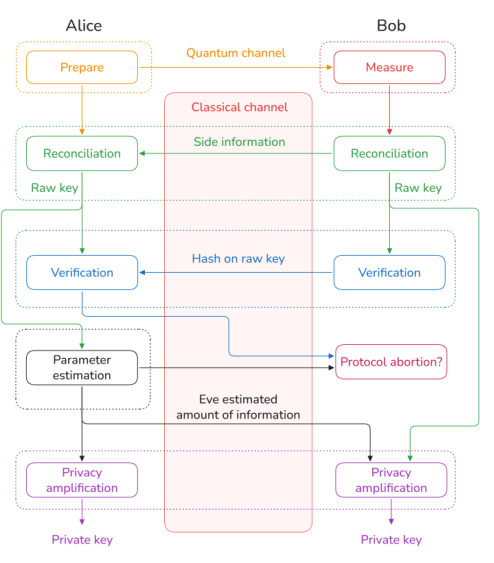
<figcaption class="paper-figure-caption"><b>Fig 1.</b> Figure 1: Overview of the general steps of a prepare-and- measure QKD protocol.</figcaption>
</figure>
<figure class="paper-figure-card">
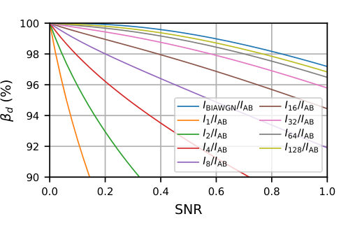
<figcaption class="paper-figure-caption"><b>Fig 2.</b> Figure 2: Intrinsic reconciliation efficiency of the virtual channel as a function of SNR.</figcaption>
</figure>
<figure class="paper-figure-card">
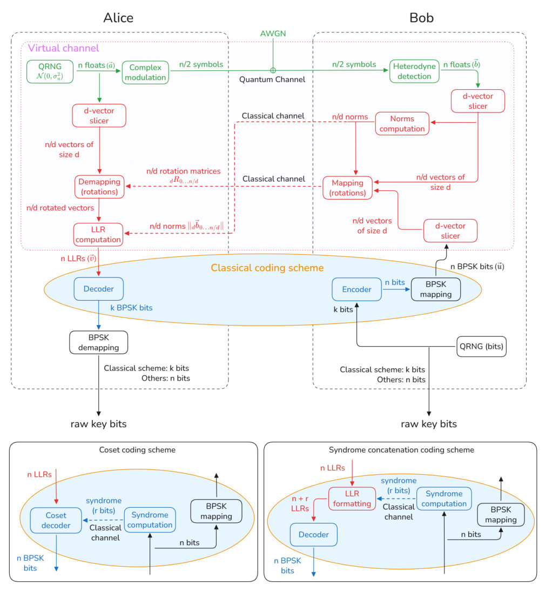
<figcaption class="paper-figure-caption"><b>Fig 3.</b> Figure 3: Linear block coding schemes for multidimensional reverse reconciliation. The physical layer (prepare and measure steps of the protocol) is highlighted in green, the multidimensional mapping in red, (virtual) channel coding in blue, and bit generation/mapping in black. QRNG: Quantum Random Number Generator (or any true random number generator). Refer to sections 3 and 4 for a description of the individual components.</figcaption>
</figure>
<figure class="paper-figure-card">
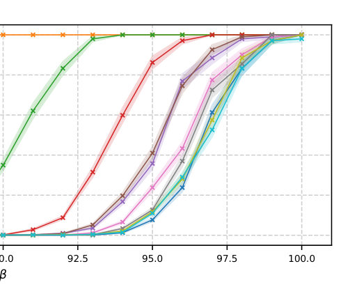
<figcaption class="paper-figure-caption"><b>Fig 4.</b> Figure 4: FER as a function of β for R ≈0.1 (k = 20000, n = 204800) and coset coding.</figcaption>
</figure>
<figure class="paper-figure-card">
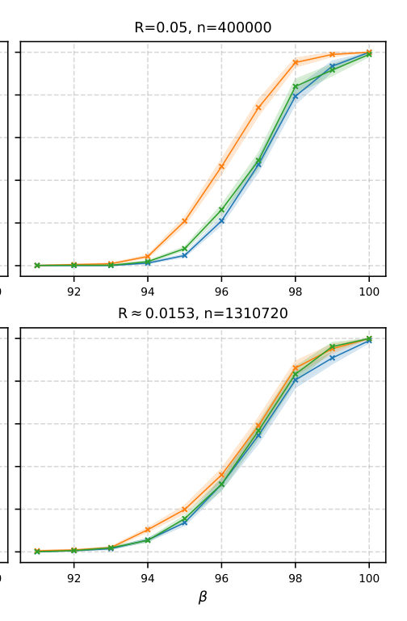
<figcaption class="paper-figure-caption"><b>Fig 5.</b> Figure 5: FER as a function of β for various R, fixed k = 20000 and coset coding.</figcaption>
</figure>

**Summary.** This paper provides a comprehensive review of multidimensional reconciliation for CV-QKD, a critical technique for long-distance quantum key distribution. It details how the physical quantum channel is mapped to a virtual BIAWGN channel, enabling the use of powerful classical error-correcting codes. The work provides practical guidance by analyzing the trade-offs between reconciliation dimension, coding strategy, and achievable key rate.

**Why it may be interesting.** While focused on quantum communication, the mathematical machinery—transforming a continuous physical process into a discrete, coded virtual channel—shares conceptual links with advanced quantum error correction codes and information bounding techniques relevant to open quantum systems.

Detailed structure

**Main problem.** The core challenge is developing highly efficient reconciliation techniques for Continuous-Variable Quantum Key Distribution (CV-QKD) to maintain a positive secret key rate over long distances and low Signal-to-Noise Ratio (SNR).

**Main result.** Multidimensional reconciliation successfully transforms the physical Gaussian quantum channel into a virtual BIAWGN channel, allowing the application of modern error-correcting codes like LDPC codes to achieve high reconciliation efficiency.

**Method.** The authors review the theory by mapping the physical channel to a virtual channel in dimension $d$, and then apply advanced classical coding techniques (e.g., Coset Coding) for error correction.

**Model / system.** The system is CV-QKD, which encodes information in the quadratures ($\hat{x}, \hat{p}$) of coherent states. The analysis models the channel as linear and lossy, requiring reconciliation to extract the secret key.

**Key observables.** Secret Key Rate (SKR), Reconciliation Efficiency ($eta$), Frame Error Rate (FER), and Mutual Information ($I_d$).

**Important parameters / regimes.** Dimension ($d$), Signal-to-Noise Ratio (SNR), Code Rate ($R$), and the security parameter ($\epsilon$).

**Assumptions / limitations.** The analysis assumes the physical channel can be modeled by an additive white Gaussian noise (AWGN) process, and the security analysis relies on bounding Eve's information.

**Figures summary.** Figures illustrate the trade-offs between FER and reconciliation efficiency ($eta$) for different code rates and dimensions, and compare the throughput of different coding schemes (Coset vs. Syndrome-Concatenation).

**Paper structure.** The paper progresses from reviewing the necessity of multidimensional reconciliation, detailing the mathematical transformation to the virtual BIAWGN channel, comparing various coding schemes (Coset vs. Syndrome-Concatenation), and finally presenting simulation results using the HDirac framework to guide system design.

Abstract

Continuous-variable quantum key distribution (CV-QKD) requires highly efficient reconciliation techniques to operate at low signal-to-noise ratios and long distances. Multidimensional reconciliation addresses this challenge by transforming the physical Gaussian quantum channel into a virtual binary-input additive white Gaussian noise (BIAWGN) channel, enabling the use of modern errorcorrecting codes. In this work, we review the principles of multidimensional reconciliation, with a particular focus on high-dimensional constructions beyond the algebraic dimensions 1, 2, 4, 8. We describe the construction of the virtual channel, discuss practical coding schemes for reverse reconciliation, and analyse their integration with linear error-correcting codes. We also present an opensource simulation framework, HDirac, implementing multidimensional reconciliation for arbitrary dimensions, and use it to evaluate state-of-the-art LDPC codes. The results highlight key trade-offs between dimension, reconciliation efficiency, and frame error rate, providing practical guidance for CV-QKD system design.

[↑ back to top](#top)

### [Reduce dimensional quantum criticality for Non-Fermi liquids](http://arxiv.org/abs/2606.02534v1)

**Authors:** Phumudzo T. Rabambi, Mario Solís  
**Type:** theory · **Category:** strongly correlated electrons · **PDF:** <https://arxiv.org/pdf/2606.02534v1>  
**Analysis basis:** full PDF text, analyzed in chunks
**Topic relevance:** `Keldysh / 2PI / non-Gaussian methods` **2/5**

↔ Scroll figures horizontally

<figure class="paper-figure-card">
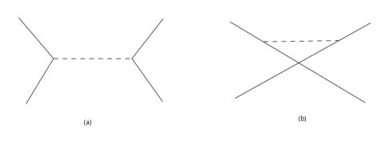
<figcaption class="paper-figure-caption"><b>Fig 1.</b> FIG. 1. Tree-level boson exchange process diagram and 1- loop four-Fermi diagram</figcaption>
</figure>
<figure class="paper-figure-card">
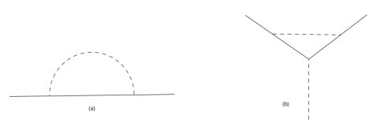
<figcaption class="paper-figure-caption"><b>Fig 2.</b> FIG. 2. 1-loop fermion self energy and 1-loop Yukawa cou- pling</figcaption>
</figure>

**Summary.** This work introduces a reduced-dimension theoretical framework to study Non-Fermi liquid physics near quantum critical points. By spatially separating bosonic and fermionic degrees of freedom, the authors significantly simplify the Renormalization Group analysis. This approach successfully eliminates problematic higher-order divergences, allowing for a controlled perturbative study of strongly correlated electron behavior.

**Why it may be interesting.** The technique of dimensional separation to regularize divergences is a powerful theoretical tool applicable to other strongly coupled systems where standard perturbative methods fail.

Detailed structure

**Main problem.** The paper addresses the theoretical challenge of understanding Non-Fermi liquid (NFL) behavior near quantum critical points (QCPs) in strongly correlated electronic systems.

**Main result.** By employing a reduced-dimension framework where bosons and fermions occupy different spatial dimensions, the authors successfully tame problematic higher-order divergences ($\log^2, \log^3$) found in conventional Renormalization Group (RG) analyses.

**Method.** The core method involves dimensional separation of degrees of freedom (bosons in bulk, fermions on a boundary) to simplify the RG analysis of boson-fermion coupling and calculate loop corrections.

**Model / system.** The study analyzes quantum field theories at finite density, modeling the breakdown of Landau Fermi liquid theory near a QCP, involving massless bosons coupled to a fermion Fermi surface.

**Key observables.** The finiteness of the tree-level boson exchange propagator ($\delta V_0$) and the reduction of 1-loop divergences from $\log^2/\log^3$ to simple logarithms are key diagnostics.

**Important parameters / regimes.** The analysis is performed using a perturbative $\epsilon$-expansion in $d = 3 - \epsilon$, focusing on the flow of coupling constants and anomalous dimensions.

**Assumptions / limitations.** The analysis assumes a weakly coupled theory and focuses on marginal interactions; it also notes limitations regarding UV-IR mixing and the need for higher-loop calculations.

**Figures summary.** Figures illustrate the tree-level boson-mediated scattering process and 1-loop four-fermion coupling diagrams, comparing the conventional approach with the reduced-dimension scheme.

**Paper structure.** The paper builds by first identifying the divergence issues in standard treatments, then introducing the reduced-dimension framework, and finally demonstrating through explicit calculations (e.g., for $\delta V_0$ and $\Gamma_4$) that the divergences are controlled, leading to a tractable RG flow analysis.

Abstract

We present a reduced dimension theoretical framework for studying quantum field theories at finite density, providing a tractable model for investigating non-Fermi liquid (NFL) behavior near quantum phase transitions. Our approach departs from the standard paradigm by placing bosons and fermions in different spatial dimensions: bosonic fields reside in a $(d+1)$-dimensional bulk, while fermionic fields are confined on a $d$-dimensional boundary. This dimensional separation significantly simplifies the renormalization group (RG) analysis of gapless boson-fermion coupling. We demonstrate that the tree-level boson exchange contributions, which typically exhibit logarithmic divergences, become finite in our reduced-dimension scheme. Furthermore, the $\log^2$ and $\log^3$ divergences that characterize 1-loop four-fermion interactions in conventional treatments are reduced to logarithmic divergences within this framework, substantially improving the convergence properties of the perturbative expansion and allowing controlled theoretical analysis of NFL physics.

[↑ back to top](#top)

### [On the synaptic matrix eigenvalues of sparsely connected neural networks](http://arxiv.org/abs/2606.00326v1)

**Authors:** Mohd. Gayas Ansari, Pragya Shukla  
**Type:** theory · **Category:** disordered systems and neural networks · **PDF:** <https://arxiv.org/pdf/2606.00326v1>  
**Analysis basis:** full PDF text, analyzed in chunks
**Topic relevance:** `Keldysh / 2PI / non-Gaussian methods` **1/5** · `analog quantum simulation` **1/5** · `driven-dissipative phase transition` **1/5** · `methods for driven-dissipative` **1/5** · `non-equilibrium dynamics` **1/5** · `non-equilibrium universality` **1/5**

↔ Scroll figures horizontally

<figure class="paper-figure-card">
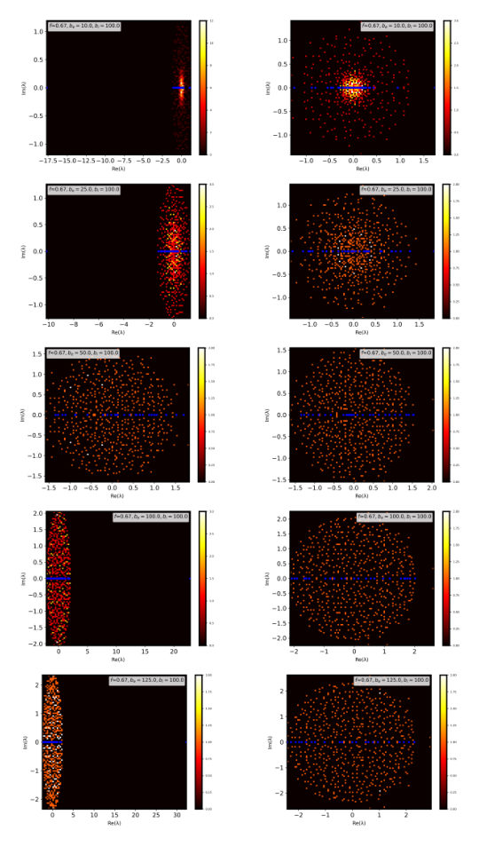
<figcaption class="paper-figure-caption"><b>Fig 1.</b> Figure 1: Eigenvalue density spectra for the UCE (constant variance) model of a random</figcaption>
</figure>
<figure class="paper-figure-card">
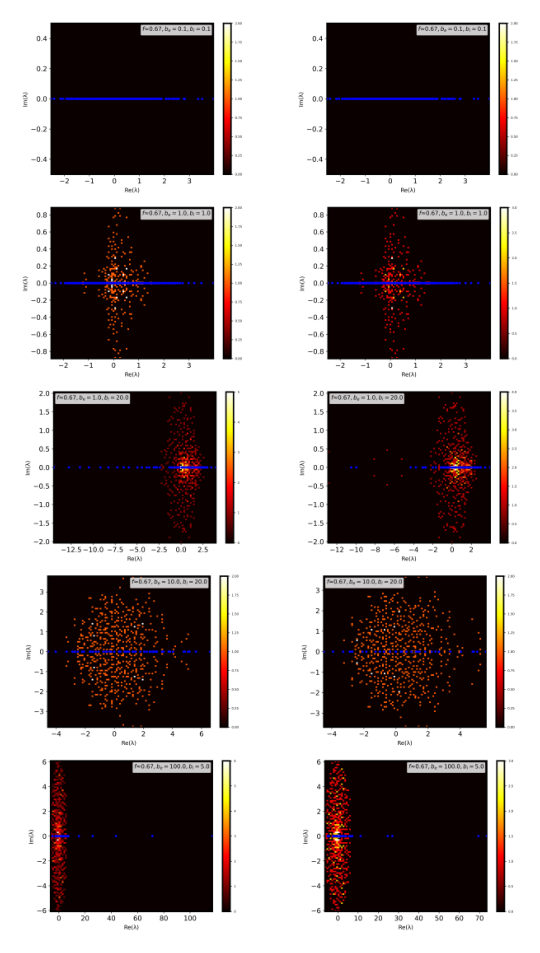
<figcaption class="paper-figure-caption"><b>Fig 2.</b> Figure 2: Eigenvalue density spectra for the PCE (Power-Law Decay) model of a synaptic</figcaption>
</figure>
<figure class="paper-figure-card">
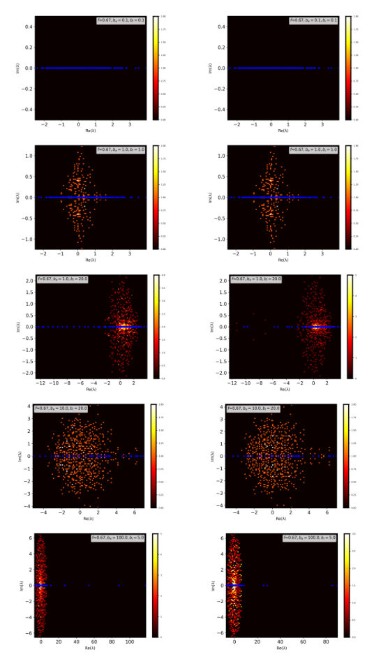
<figcaption class="paper-figure-caption"><b>Fig 3.</b> Figure 3: Eigenvalue density spectra for the ECE (Exponential Decay) model of a synaptic</figcaption>
</figure>
<figure class="paper-figure-card">
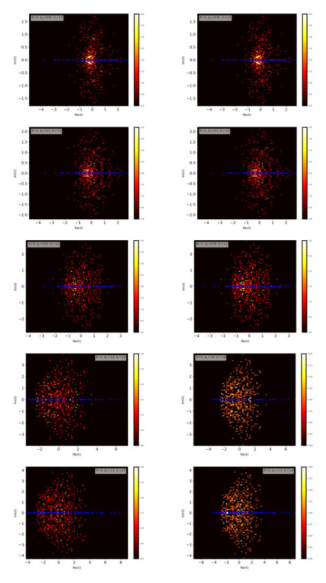
<figcaption class="paper-figure-caption"><b>Fig 4.</b> Figure 4: Eigenvalue spectra for SCE model (N = 600, interaction range R = 5) across</figcaption>
</figure>
<figure class="paper-figure-card">
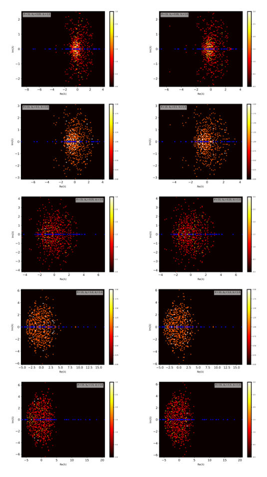
<figcaption class="paper-figure-caption"><b>Fig 5.</b> Figure 5: Eigenvalue spectra for SCE model (N = 600, R = 15) across increasing variance be.</figcaption>
</figure>

**Summary.** This theoretical work investigates how the spectral properties of synaptic matrices dictate the stability and dynamics of neural networks. By comparing various sparsity models, the authors show that local structural correlations can induce instabilities (positive outliers) that are robust even when global homeostatic balance is imposed. This highlights that local topology, rather than global constraints, governs the network's functional state.

**Why it may be interesting.** The rigorous mathematical framework used to analyze spectral stability in complex, non-equilibrium systems like the brain is highly relevant to understanding the dynamics of open quantum systems or many-body systems near criticality.

Detailed structure

**Main problem.** The paper analyzes the spectral behavior of the synaptic matrix to understand the stability, dynamics, and memory capacity of complex, sparsely connected neural networks.

**Main result.** The spectral properties are highly sensitive to the type of connectivity structure (e.g., Power-Law vs. Uniform) and show that global homeostatic constraints (like row-sum zero) are insufficient to stabilize the network against instabilities arising from local spatial correlations.

**Method.** The authors use spectral analysis of the synaptic matrix eigenvalues, comparing ensemble averages across various connectivity models (UCE, PCE, ECE, SCE) and testing the impact of balance constraints.

**Model / system.** The system is a neural network whose connectivity is defined by a synaptic matrix J. The analysis moves from dense to highly sparse models, incorporating biological constraints like Dale's Law and spatial decay functions.

**Key observables.** Eigenvalues ($\lambda_k$), spectral radius, spectral bulk density ($
ho_J(z)$), and the real part of eigenvalues ($	ext{Re}(\lambda)$) relative to the stability line $	ext{Re}(\lambda) = 1$.

**Important parameters / regimes.** Sparsity level (controlled by interaction range $R$), population bias ($f$), and the specific decay function (Uniform, Power-Law, Exponential).

**Assumptions / limitations.** The analysis assumes the synaptic matrix is a real asymmetric matrix and often employs statistical fitting techniques (e.g., Skew-Student-t distribution) to model the spectral bulk.

**Figures summary.** Figures compare spectral distributions for UCE, PCE, and ECE models under unbalanced vs. balanced conditions, illustrating spectral 'blades' and the failure of global balance to suppress positive real outliers in spatially correlated models.

**Paper structure.** The paper progresses by first establishing the need for statistical spectral analysis over exact determination, then comparing different connectivity models (UCE, PCE, ECE, SCE), and finally demonstrating how local correlations induce instabilities that global balancing rules cannot correct.

Abstract

The spectral behaviour of the synaptic matrix, representing the neuronal connection strengths, is an important tool to analyze the stability and transient dynamics of a typical brain as well as its learning process and memory capacity. The complexity of the brain due to large number of neurons as well as underlying transient mechanisms e.g. homeostasis, seizure or synaptic plasticity can lead to networks with time-varying degree and type of sparsity. This renders an exact determination of the synaptic matrix not only technically difficult but also meaningless, leaving its statistical analysis as the best available theoretical approach. This motivates us to pursue a spectral analysis of the synaptic matrix models with different type of sparsity and thereby analyze latter's role on various aspects of network dynamics and stability. Our results have potential relevance for detemining the type of synaptic sparsity required to induce a specific brain function or desired transient mechanism e.g for pharmacological effects or physiological modulators.

[↑ back to top](#top)

### [Resonant Coupling and the Non-Phononic Flat Band in Amorphous Solids](http://arxiv.org/abs/2606.01593v1)

**Authors:** Matteo Baggioli, Bingyu Cui  
**Type:** theory · **Category:** disordered systems and neural networks · **PDF:** <https://arxiv.org/pdf/2606.01593v1>  
**Analysis basis:** full PDF text, analyzed in chunks
**Topic relevance:** `Keldysh / 2PI / non-Gaussian methods` **1/5** · `analog quantum simulation` **1/5** · `correlated / nonlocal dissipation` **1/5** · `driven-dissipative phase transition` **1/5** · `methods for driven-dissipative` **1/5** · `non-equilibrium dynamics` **1/5**

↔ Scroll figures horizontally

<figure class="paper-figure-card">
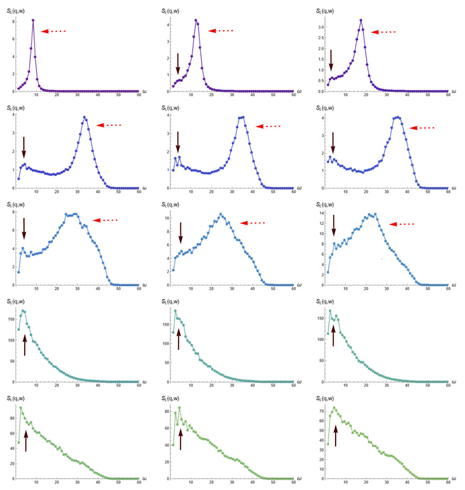
<figcaption class="paper-figure-caption"><b>Fig 1.</b> FIG. 1: The emergence of the non-phononic flat band in the dynamic structure factor of amorphous solids: the example of metallic glasses. Constant-q cuts of the longitudinal dynamical structure factor SL(q, ω) as a function of frequency ω for a simulated three-dimensional metallic glass. The wave vector q increases from the top-left panel to the bottom-right panel; q = 0.1, 0.2, 0.3, 0.9, 1, 1.1, 1.7, 1.8, 1.9, 2.5, 2.6, 2.7, 3.2, 3.3, 3.4. The red dashed arrow indicates the dispersing phononic peak, while the filled black arrow marks the non-phononic peak associated with the flat band. The data are reproduced with permission from Ref. [10].</figcaption>
</figure>
<figure class="paper-figure-card">
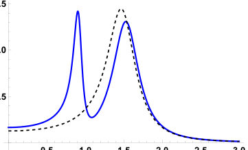
<figcaption class="paper-figure-caption"><b>Fig 2.</b> FIG. 2: Example of the hybridized excitation spec- trum. Top: Density map of the dynamic structure factor S(q, ω) and dispersion relation of the modes (black dashed curves) showing the avoided crossing and frequency splitting around qres = 1. Bottom: dynamic structure factor at fixed q = 1.5 (red vertical dashed line in top panel), displaying the characteristic two-peak structure, which is absent in the limit of vanishing coupling to QLVs (black dashed curve). Parameters: ωLV = kBT = M = 1 with Ω(q) = q, γ = 0.1, Γ(q) = 0.2q2 and g(q) = 0.1q2. The power-law scalings of Γ(q), g(q) do not carry any specific physical meaning at this stage.</figcaption>
</figure>
<figure class="paper-figure-card">
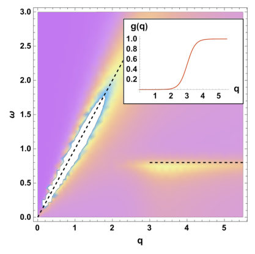
<figcaption class="paper-figure-caption"><b>Fig 3.</b> FIG. 3: Resonant coupling and flat-band intensity. Ex- ample of a resonant coupling g(q) that vanishes below a crit- ical wavevector q∗≈2.5 (inset). The corresponding density map of S(q, ω) displays a flat-band signal emerging only for q &gt; q∗. Here, M = kBT = 1, Ω(q) = q, Γ(q) = 0.2q2, γ = 0.15, and ωQLV = 0.8 (horizontal black dashed line).</figcaption>
</figure>
<figure class="paper-figure-card">
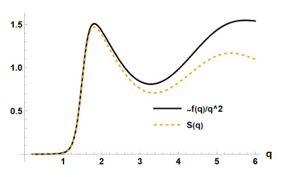
<figcaption class="paper-figure-caption"><b>Fig 4.</b> FIG. 4: Static structure factor and flat-band intensity. A representative example in which the normalized flat-band intensity, f(q)/q2, closely follows the trend of an artificial static structure factor S(q) (orange dashed line), introduced in the model through the simplified choice g(q) ∝S(q). The remaining parameters are set to kBT = M = 1, γ = 0.1, Ω(q) = 0.5 q, Γ(q) = 5 × 10−4 q2, and ωQLV = 10. For clarity of visualization, the black curve is rescaled by an appropriate constant.</figcaption>
</figure>
<figure class="paper-figure-card">
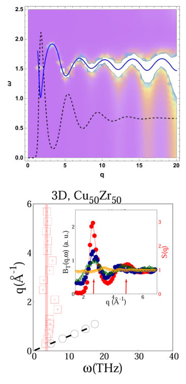
<figcaption class="paper-figure-caption"><b>Fig 5.</b> FIG. 5: Anti-correlation between flat-band dispersion and resonant coupling/static structure factor. Top panel: Illustration of the anti-correlation between the flat- band dispersion (color background and solid blue line) and the resonant coupling g(q) (black dashed line), modeled here as an oscillatory function to mimic the behavior of a realistic static structure factor S(q). For clarity, the amplitude of g(q) is rescaled by a factor of 30. The others parameters used in this figure are: Γ = 10−3q2, kB = T = M = 1, γ = 0.01, ωQLV = 2, while the long-wavelength phonon dispersion is taken as Ω(q) = 3q + . . . The phonon dispersion is not visible because of the small frequency range chose and...</figcaption>
</figure>

**Summary.** This work investigates the non-phononic flat band in amorphous solids by developing a resonant-coupling model. The model posits that the flat band arises from the resonant interaction between acoustic phonons and localized vibrational modes (QLVs). This framework successfully explains the observed spectral features and links the flat band's energy directly to the characteristic Boson Peak frequency.

**Why it may be interesting.** The concept of resonant coupling between propagating modes (phonons) and localized excitations (QLVs) is relevant to understanding energy dissipation and mode hybridization in complex, disordered quantum systems, which has parallels in open quantum systems theory.

Detailed structure

**Main problem.** The paper addresses the physical origin and nature of the non-phononic flat band observed in the dynamical structure factor of amorphous solids.

**Main result.** A resonant-coupling model successfully reproduces the key features of the flat band, establishing its connection to the boson peak via coupling between acoustic phonons and quasi-localized vibrations.

**Method.** The authors employ a resonant-coupling model derived from a soft-potential scenario, analyzing the renormalized phonon Green's function.

**Model / system.** The system is two- and three-dimensional amorphous solids. The model involves coupling acoustic phonons (phononic modes) with single-frequency quasi-localized vibrations (QLVs) via a resonant interaction term.

**Key observables.** Dynamical structure factor $S(q, \omega)$, the non-phononic flat band signal, and the Boson Peak (BP) in the vibrational density of states.

**Important parameters / regimes.** The critical wave vector $q^*$ (related to the first diffraction peak) and the coupling strength $g(q)$ which is hypothesized to scale with the static structure factor $S(q)$.

**Assumptions / limitations.** The model assumes a single QLV frequency and damping, and the resonant coupling framework is fundamentally macroscopic and phenomenological.

**Figures summary.** Figures illustrate the flat band signal relative to the phononic peak, show the correlation between flat-band intensity and $S(q)$, and demonstrate the emergence of the flat band at the QLV frequency.

**Paper structure.** The paper introduces the problem using experimental observations, develops the resonant-coupling model (RCM) by modifying the phonon Green's function, derives the resulting flat-band intensity, and compares the model's predictions against known structural correlations.

Abstract

Recent experiments and simulations provide compelling evidence for the emergence of a non-phononic flat band in the dynamical structure factor of two- and three-dimensional amorphous solids. This feature has been suggested to be connected to the excess in the reduced vibrational density of states of glasses, commonly known as the boson peak, and displays several apparently universal characteristics. First, it is nearly dispersionless, with an energy close to the boson-peak frequency. Second, its intensity is negligible below a critical wave vector of the order of the first diffraction peak. Third, its reduced intensity exhibits a strong correlation with the static structure factor. Here, we revisit the resonant-coupling model, a single-mode harmonic realization of the soft-potential scenario in which acoustic phonons interact with single frequency quasi-localized vibrations. We show that this minimal framework naturally reproduces the main features of the observed flat band and clarifies its connection to the boson peak.

[↑ back to top](#top)

### [Entangled Two-Photon Absorption in Cesium Atoms and the Limitations of the Far-Off-Resonance Approximation](http://arxiv.org/abs/2606.01318v1)

**Authors:** Michael Caracas Núñez, Dario Egloff, Mayerlin Nuñez Portela  
**Type:** theory · **Category:** other · **PDF:** <https://arxiv.org/pdf/2606.01318v1>  
**Analysis basis:** full PDF text, analyzed in chunks
**Topic relevance:** `Keldysh / 2PI / non-Gaussian methods` **1/5** · `analog quantum simulation` **1/5** · `entanglement & information structure` **1/5** · `interference shaping light` **1/5** · `methods for driven-dissipative` **1/5**

↔ Scroll figures horizontally

<figure class="paper-figure-card">
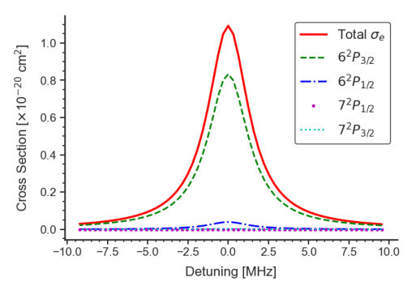
<figcaption class="paper-figure-caption"><b>Fig 1.</b> Figure 1. Far-off-resonance ETPA cross section as a function of the detuning, ∆/2π, of the pump beam with respect to the two-photon transition 62S1/2 →82S1/2 in cesium atoms. The solid line corresponds to the total ETPA cross section, i.e, considering all the spectroscopic information in Appendix E. Dashed lines are the individual cross sections for each of the intermediate states. This graphic is obtained considering an entanglement time of Te = 100 fs and an entanglement area of A0 = 1.8 × 10−8 m2.</figcaption>
</figure>
<figure class="paper-figure-card">
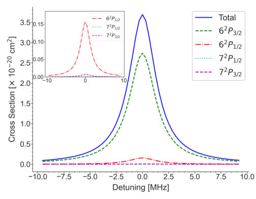
<figcaption class="paper-figure-caption"><b>Fig 2.</b> Figure 2. ETPA cross section without the far-off-resonance approximation as a function of the detuning ∆/2π for the TPA transition 62S1/2 →82S1/2 in cesium atoms. The inset shows the cross section for the intermediate transition paths with the lowest contributions to the total ETPA cross section.</figcaption>
</figure>
<figure class="paper-figure-card">
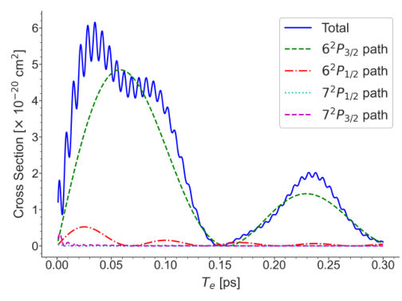
<figcaption class="paper-figure-caption"><b>Fig 3.</b> Figure 3. ETPA cross section without the far-off-resonance approximation as a function of the entanglement time Te for ∆= 0 (resonance) for the TPA transition 62S1/2 →82S1/2 in cesium atoms. The inset shows the cross section for the intermediate transition paths with the lowest contributions to the total ETPA cross section.</figcaption>
</figure>
<figure class="paper-figure-card">
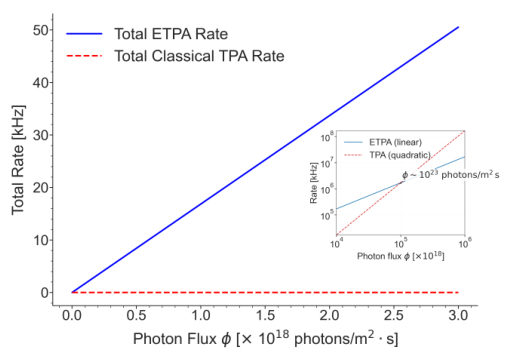
<figcaption class="paper-figure-caption"><b>Fig 4.</b> Figure 5. Total rate of the TPA and ETPA processes as a function of the photon flux. The ETPA rate is computed from Eq. (40), while the TPA rate is computed from the numbers reported in [29]. For this calculation, we assumed an entan- glement area of A0 = 1.8 × 10−8 m2, an entanglement time Te = 95.44 fs, and an atomic density of 1019 atoms per m3. The inset shows the same plot with values around the photon flux required to have the same rates for the TPA and ETPA processes in logarithmic scale.</figcaption>
</figure>
<figure class="paper-figure-card">
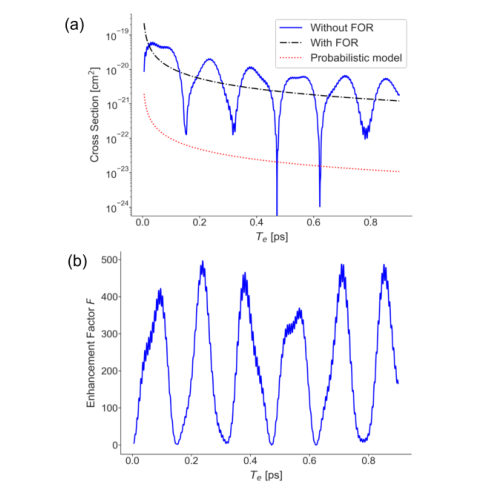
<figcaption class="paper-figure-caption"><b>Fig 5.</b> Figure 4. a) ETPA cross section as a function of the entan- glement time for the three approximations considered in this work. b) shows the enhancement factor F obtained without the FOR approximation as a function of the entanglement time Te.</figcaption>
</figure>

**Summary.** This theoretical study calculates the entangled two-photon absorption cross-section in Cesium atoms using entangled photon pairs. It critically analyzes the limitations of the Far-Off-Resonance approximation, demonstrating that neglecting full spectral details causes the predicted enhancement factor to deviate significantly from the true, oscillating quantum value. The findings provide a crucial theoretical benchmark for future experimental measurements of ETPA.

**Why it may be interesting.** This work is highly relevant to AMO physics and quantum optics as it tackles a complex, non-linear quantum process (ETPA) and provides a rigorous comparison between simplified theoretical approximations and the full quantum treatment.

Detailed structure

**Main problem.** The paper investigates the discrepancies between theoretical and experimental results concerning the entangled two-photon absorption (ETPA) process in atomic systems.

**Main result.** The calculation shows that neglecting the Far-Off-Resonance (FOR) approximation leads to significant differences, with the enhancement factor oscillating and reaching values much higher than the constant value predicted by the FOR approximation.

**Method.** The study employs a theoretical framework using the density operator formalism and calculates the ETPA cross-section by comparing results derived with and without the FOR approximation.

**Model / system.** The system is Cesium atoms undergoing the $6S_{1/2} 
ightarrow 8S_{1/2}$ transition, driven by entangled photon-pairs generated via Spontaneous Parametric Down-Conversion (SPDC).

**Key observables.** ETPA cross section ($\sigma_e$), enhancement factor ($F$), and the rate of ETPA ($R_{ETPA}$).

**Important parameters / regimes.** Entanglement time ($T_e$), Entanglement Area ($A_0$), and the detuning ($\Delta$) relative to the two-photon transition.

**Assumptions / limitations.** The analysis critically compares results derived under the Far-Off-Resonance (FOR) approximation against the full calculation, which accounts for interference effects.

**Figures summary.** Figures illustrate the ETPA cross-section dependence on detuning ($\Delta$) and entanglement time ($T_e$), explicitly comparing results obtained with and without the FOR approximation.

**Paper structure.** The paper builds the calculation by first defining the system using the joint spectral amplitude of the photon pairs, then deriving the cross-section using the density operator formalism, and finally contrasting the simplified FOR result against the full, oscillatory result.

Abstract

The discrepancies between theoretical and experimental results in the process of entangled two-photon absorption (ETPA) are not fully understood. Atomic systems are a promising alternative for investigating this process without the systematic effects present in molecules. We present a theoretical study of the ETPA process in cesium atoms, focusing on the 6S1/2 --> 8S1/2 transition. The ETPA cross section is evaluated both with and without the far-off-resonance (FOR) approximation, including the contributions from intermediate atomic states and decoherence effects. The quantum state of light considered is described by the joint spectral amplitude of photon-pairs produced by the spontaneous parametric down-conversion process. When the FOR approximation is applied, the enhancement factor is constant (36*pi). In contrast, without this approximation the enhancement factor oscillates with the entanglement time, and achieves a maximum value of ~500. These results show the limitations of approximations when calculating the ETPA cross section and contribute to the understanding of the discrepancies between theoretical and experimental values for the ETPA cross section in different samples. The numbers presented in this work can be a starting point for designing experiments aimed at measuring ETPA cross sections in alkali atoms.

[↑ back to top](#top)

### [The Longest Increasing Subsequence Problem revisited](http://arxiv.org/abs/2606.01501v1)

**Authors:** Silvio Franz, Roberto Mulet  
**Type:** theory · **Category:** disordered systems and neural networks · **PDF:** <https://arxiv.org/pdf/2606.01501v1>  
**Analysis basis:** full PDF text, analyzed in chunks
**Topic relevance:** `analog quantum simulation` **1/5** · `driven-dissipative phase transition` **1/5** · `methods for driven-dissipative` **1/5** · `non-equilibrium dynamics` **1/5** · `non-equilibrium universality` **1/5**

↔ Scroll figures horizontally

<figure class="paper-figure-card">
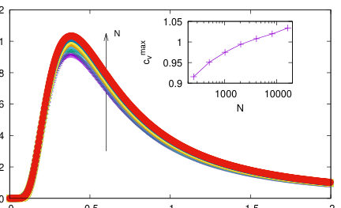
<figcaption class="paper-figure-caption"><b>Fig 1.</b> FIG. 2. Specific heat as a function of temperature for different system sizes N = 256, 512, 1024, 2048, 4096, 8192, 16384. The peak at Tcross ∼0.38 indicates a finite-size crossover, while the behavior at lower temperatures reveals a freezing transition at Tcond = 0.10 ± 0.02.</figcaption>
</figure>
<figure class="paper-figure-card">
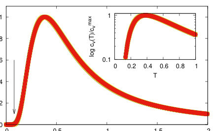
<figcaption class="paper-figure-caption"><b>Fig 2.</b> FIG. 3. The specific heat cv(T, N) scaled by cv(N)max for different system sizes N = 256, 512, 1024, 2048, 4096, 8192, 16384. The arrow indi- cates the condensation transition. In the inset we reproduce the same plot on logarithmic scale to show the exponential decay at Tcond ≈0.1.</figcaption>
</figure>
<figure class="paper-figure-card">
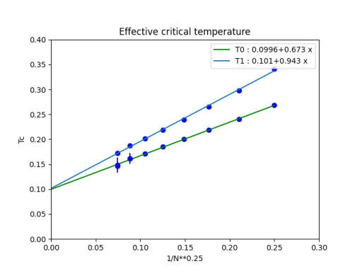
<figcaption class="paper-figure-caption"><b>Fig 3.</b> FIG. 4. The ground state and the first excited state tem- perature T0 and T1 respectively as a function of 1/N 1/4. A linear fit indicates that both temperatures converge to Tcond = 0.10 ± 0.02 for N →∞, signaling a freezing tran- sition in the thermodynamic limit.</figcaption>
</figure>
<figure class="paper-figure-card">
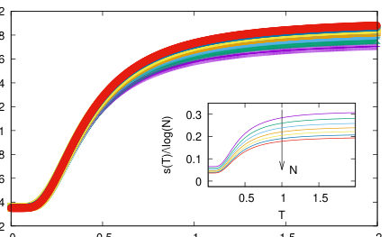
<figcaption class="paper-figure-caption"><b>Fig 4.</b> FIG. 5. Main panel: entropy density s(T) = S(T)/ √</figcaption>
</figure>
<figure class="paper-figure-card">
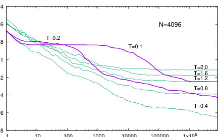
<figcaption class="paper-figure-caption"><b>Fig 5.</b> FIG. 7. Energy versus time for Monte Carlo simulations at various temperatures, N = 4096. The dramatic slowing down below Tcross is indicative of the appearance of a complex land- scape.</figcaption>
</figure>

**Summary.** This paper analyzes the Longest Increasing Subsequence problem by mapping it onto a statistical mechanical model exhibiting phase transitions. It identifies a condensation transition that causes the system's ground state manifold to become thermodynamically sparse. This sparsity is shown to be the root cause of dynamic trapping, making the problem computationally hard for local search methods, even though polynomial-time solutions exist.

**Why it may be interesting.** The connection between a combinatorial optimization problem (LIS) and glassy dynamics, driven by thermodynamic sparsity, provides a powerful analogy for understanding computational hardness in complex physical systems, relevant to disordered models studied in AMO and condensed matter.

Detailed structure

**Main problem.** The paper revisits the Longest Increasing Subsequence (LIS) problem, treating it as a system whose thermodynamic properties and dynamical behavior can be analyzed using statistical mechanics.

**Main result.** The LIS problem exhibits a condensation transition at a finite temperature, suggesting that thermodynamic sparsity, rather than simple energetic barriers, causes local search algorithms to become dynamically trapped in glassy states.

**Method.** The authors employ thermodynamic formalism (microcanonical/canonical ensembles) alongside Monte Carlo simulations to study the system's phase transitions and dynamics.

**Model / system.** The LIS problem is mapped onto a system defined on a sequence of random numbers, modeled as a directed polymer on a random graph (Ulam random graph). The energy is related to the length of the subsequence.

**Key observables.** Specific heat ($C_v$), configurational entropy ($S(\ell)$), and dynamical overlap ($Q(t)$).

**Important parameters / regimes.** Two critical temperatures: a Schottky crossover ($T_{	ext{cross}} \approx 0.38$) and a condensation transition ($T_{	ext{cond}} = 0.10 \pm 0.02$).

**Assumptions / limitations.** The analysis assumes the quenched sequence is i.i.d., and the low-energy sector can be modeled by independent two-level systems.

**Figures summary.** Figures illustrate the specific heat peak at $T_{	ext{cross}}$ and the condensation transition at $T_{	ext{cond}}$, alongside entropy density convergence to a plateau below $T_{	ext{cond}}$.

**Paper structure.** The paper progresses by establishing the thermodynamic framework, identifying two distinct temperature scales ($T_{	ext{cross}}$ and $T_{	ext{cond}}$), and then contrasting the dynamics observed during sudden quenches (glassy trapping) versus controlled annealing.

Abstract

The Longest Increasing Subsequence problem - a classic combinatorial challenge with deep connections to statistical mechanics- exhibits a rich thermodynamic landscape. Introducing a temperature we identify two distinct energy scales: A Schottky-like crossover at T_cross and a condensation transition at T_cond, below which the number of maximum-length configurations becomes sub-exponential in system size. We also show that despite the existence of polynomial-time dynamic programming algorithms for the ground state, local Monte Carlo dynamics, after sudden quenches at low temperatures, become trapped in metastable state configurations displaying characteristic glassy signatures: two-step relaxation, persistent dynamical overlaps and aging. On the other hand, logarithmic annealing tracks equilibrium down to the ground state. These results establish that thermodynamic sparsity - not energetic barriers - can render local search dynamically intractable, positioning the LIS problem as a bridge between exactly solvable optimization and glassy spin-glass phenomenology.

[↑ back to top](#top)

### [Pre-failure response spectra predict finite-amplitude fragility](http://arxiv.org/abs/2606.00789v1)

**Authors:** Surachate Limkumnerd  
**Type:** theory · **Category:** statistical mechanics · **PDF:** <https://arxiv.org/pdf/2606.00789v1>  
**Analysis basis:** full PDF text, analyzed in chunks
**Topic relevance:** `Frenkel-Kontorova` **1/5** · `driven-dissipative phase transition` **1/5** · `non-equilibrium dynamics` **1/5** · `non-equilibrium universality` **1/5**

↔ Scroll figures horizontally

<figure class="paper-figure-card">
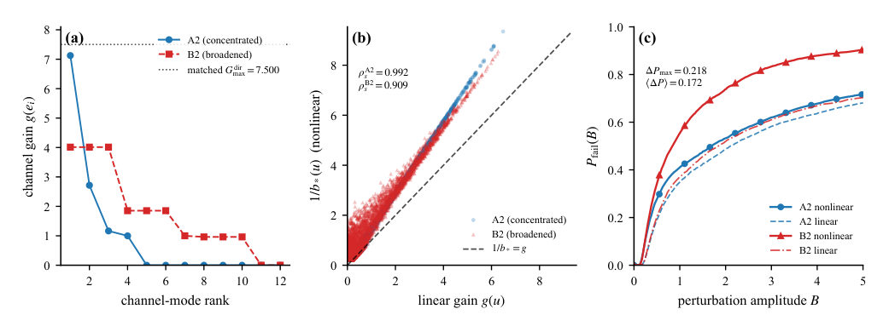
<figcaption class="paper-figure-caption"><b>Fig 1.</b> FIG. 1. Direct high-dimensional validation of response-spectrum fragility in a controlled nonlinear non-normal branched network. The geometry separates strongest-direction gain from response-channel breadth. Two stable N = 12 systems have matched strongest directional gain Gmax,dir but different channel-mode breadth. (a) Ranked response-channel weights show a concentrated system A and a broader system B. (b) Boundary-normalized gain g(u) predicts the nonlinear inverse failure distance 1/b∗(u) across sampled directions; the relation is strongly monotone though offset from the identity, consistent with nonlinear correction. (c) The broader system has a larger nonlinear fragility curve even...</figcaption>
</figure>

**Summary.** This work introduces the concept of 'finite-amplitude fragility,' arguing that system failure susceptibility depends not just on the worst-case path but on the volume of near-dangerous perturbations. The authors show that this volume dependence, or 'breadth,' can be predicted using only linear response diagnostics, providing a powerful, pre-failure diagnostic tool for complex nonlinear systems.

**Why it may be interesting.** The concept of 'response-spectrum breadth' as a pre-failure coordinate is highly relevant for understanding robustness in complex, non-normal systems, which has parallels in analyzing stability in open quantum systems or coupled nonlinear oscillators.

Detailed structure

**Main problem.** The paper distinguishes between failure susceptibility determined by the single most unstable mode versus that dependent on the volume of nearly dangerous perturbations (finite-amplitude fragility).

**Main result.** The breadth of the response spectrum, quantified by measures like channel min-entropy, predicts the finite-amplitude fragility curve independently of the strongest directional gain.

**Method.** The authors develop a pre-failure predictor based on the tail of the boundary-normalized fragility gain, validating it against nonlinear measurements in complex networks and traffic models.

**Model / system.** The analysis uses high-dimensional nonlinear non-normal networks, a weakly nonlinear system ($\dot{x} = Ax + eta x^{\circ 2}$), and a deterministic traffic breakdown model on a periodic ring.

**Key observables.** Fragility curve ($P_{	ext{fail}}(B)$), boundary-normalized fragility gain ($g(u)$), Response-Spectrum Breadth ($	ext{Sch}_{\min}, n_{	ext{ch}}^{	ext{eff}}$), and deterministic jam thresholds ($B_{th}$).

**Important parameters / regimes.** The strongest directional gain ($G_{\max, 	ext{dir}}$) is held fixed while varying the response-spectrum breadth.

**Assumptions / limitations.** The primary predictor $Q_g(s)$ is shown to predict the nonlinear failure distance, though the linear approximation cost only provides bounds.

**Figures summary.** Figures compare concentrated vs. broadened channel weights, showing the broader system has a larger nonlinear fragility curve despite matched strongest directional gain. Traffic analysis shows threshold shifts correlating with response-path entropy.

**Paper structure.** The paper establishes the theoretical distinction between extremal failure and volume-dependent fragility, develops the linear predictor based on gain tails, validates this predictor in a branched network, and finally confirms the effect using a deterministic traffic flow model.

Abstract

Failure theories often identify a single leading route to failure: the most unstable mode, weakest link, minimum-action escape path, or optimal perturbation. Yet finite-amplitude susceptibility depends not only on the nearest route but on how much of perturbation space lies near dangerous directions. We cast this distinction as a fragility problem: for each perturbation direction, the failure distance is the smallest amplitude that crosses a prescribed boundary, and the fragility curve is the fraction of directions that fail below a given amplitude. Measuring this curve directly requires nonlinear trials over many directions; instead, we show that it is predicted, before any failure occurs, by the tail of a single pre-failure quantity: the boundary-normalized fragility gain computed from the linearized response. The breadth of the associated response spectrum sets how many near-dangerous pathways coexist beyond the strongest direction. We demonstrate the mechanism in a high-dimensional nonlinear non-normal network with the strongest directional gain held fixed: the system with broader response-channel breadth has a larger nonlinear fragility curve, isolating breadth from the worst direction. An independent scalar test in deterministic traffic breakdown confirms the predicted sign: response breadth lowers calibrated jam thresholds once the strongest response is matched, with residual margins screening but never reversing the effect. Response-spectrum breadth thus emerges as a pre-failure coordinate for finite-amplitude fragility beyond the strongest path.

[↑ back to top](#top)

### [Solving 2D Black Scholes Equation via Hermitian Block Embedding and Generalised Quantum Signal Processing](http://arxiv.org/abs/2606.00458v1)

**Authors:** James W. Greenwell, Jingbo Wang, Des Hill  
**Type:** theory · **Category:** numerical methods · **PDF:** <https://arxiv.org/pdf/2606.00458v1>  
**Analysis basis:** full PDF text, analyzed in chunks
**Topic relevance:** `Keldysh / 2PI / non-Gaussian methods` **1/5** · `analog quantum simulation` **1/5** · `methods for driven-dissipative` **1/5**

↔ Scroll figures horizontally

<figure class="paper-figure-card">
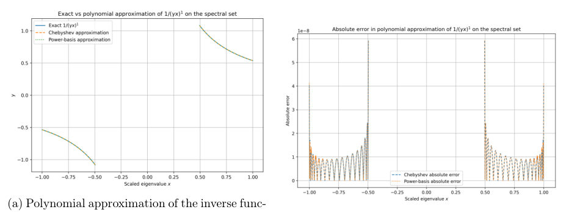
<figcaption class="paper-figure-caption"><b>Fig 1.</b> Figure 1: Polynomial approximation and corresponding absolute error for the two-dimensional inverse step.</figcaption>
</figure>
<figure class="paper-figure-card">
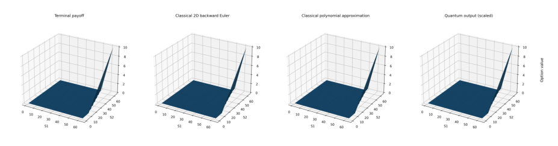
<figcaption class="paper-figure-caption"><b>Fig 2.</b> Figure 2: Comparison of the two-dimensional terminal payoff, classical backward Euler solu- tion, polynomial approximation and the scaled quantum/GQSP output. The terminal payoff is given by the basket call payoff at maturity, while the classical and quantum surfaces show the result after one backward time step. The close agreement between the scaled quantum output, polynomial approximation and the classical backward Euler solution indicates that the GQSP block-embedding construction reproduces the intended inverse time-step action.</figcaption>
</figure>
<figure class="paper-figure-card">

<figcaption class="paper-figure-caption"><b>Fig 3.</b> Figure 4, shows a slice of the payoff, by fixing one asset and varying the other, this reveals that the two-dimensional solution is working well for both assets, with different financial parameters, it is clear to see that indeed each asset has been evolved independently.</figcaption>
</figure>
<figure class="paper-figure-card">
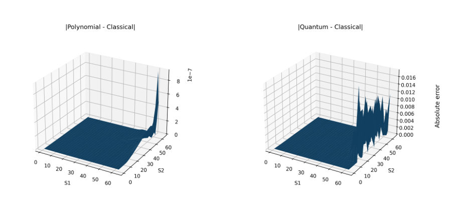
<figcaption class="paper-figure-caption"><b>Fig 4.</b> Figure 3: Absolute error surfaces for the two-dimensional simulation. The left panel shows |Vpoly −VBE|, comparing the polynomial approximation with the same classical benchmark. The right panel shows |VQ −VBE|, comparing the scaled quantum/GQSP output with the classical backward Euler solution.</figcaption>
</figure>
<figure class="paper-figure-card">
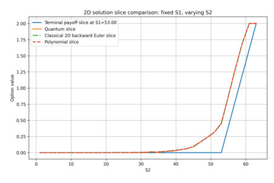
<figcaption class="paper-figure-caption"><b>Fig 5.</b> Figure 4: Two-dimensional Black–Scholes solution slices for fixed S1 and fixed S2.</figcaption>
</figure>

**Summary.** This paper adapts quantum linear algebra techniques, specifically GQSP, to solve the complex 2D Black-Scholes equation. It overcomes the challenge of non-Hermitian operators by developing a Hermitian block-embedding method. The results prove the feasibility of using this quantum approach for multidimensional option pricing, benchmarking against classical methods.

**Why it may be interesting.** While the application is financial, the underlying mathematical technique—transforming a non-Hermitian operator into a Hermitian one for quantum simulation—is highly relevant to open quantum systems and quantum dynamics where Hamiltonian simulation is common.

Detailed structure

**Main problem.** The paper addresses the challenge of solving the two-dimensional Black-Scholes equation, which models no-arbitrage option pricing, by implementing the required matrix function inversion using quantum algorithms.

**Main result.** The authors successfully demonstrate that a Hermitian block-embedding method allows the application of Generalised Quantum Signal Processing (GQSP) to the 2D Black-Scholes problem, yielding results that closely match classical benchmarks.

**Method.** The core method involves embedding the non-Hermitian time-step matrix into a larger Hermitian block matrix, which then allows the use of GQSP to approximate the inverse matrix function via an odd polynomial transformation.

**Model / system.** The model is the two-dimensional Black-Scholes equation for pricing two-asset European options. After finite-difference discretization, this results in a linear algebra problem requiring the inversion of a non-Hermitian time-step matrix.

**Key observables.** Option value $V(S_1, S_2, t)$ at different time steps; absolute error surfaces comparing quantum, polynomial, and classical solutions.

**Important parameters / regimes.** Volatility ($\sigma_1, \sigma_2$), correlation ($
ho$), time step ($\Delta	au$), and the spectral gap ($\delta$) of the Hermitian embedding.

**Assumptions / limitations.** The method assumes that the inverse action can be accurately captured by an odd polynomial approximation applied to the spectrum of the Hermitian block-embedded matrix.

**Figures summary.** Figures compare the terminal payoff and absolute error surfaces between the quantum GQSP solution, a classical polynomial approximation, and the standard backward Euler benchmark for the 2D case.

**Paper structure.** The paper progresses by first establishing the 1D case success, identifying the failure of simple diagonalization in 2D due to closed loops, and then introducing and validating the Hermitian block-embedding technique to enable GQSP application for the 2D inverse step.

Abstract

The Black Scholes equation provides a fundamental model for the no arbitrage pricing of financial derivatives. After finite difference discretisation, the pricing problem can be formulated as a finite dimensional linear algebra problem involving the inverse of a non Hermitian time step matrix. Recent advances in quantum linear algebra algorithms, particularly the generalised quantum signal processing (GQSP)algorithm, enable matrix functions to be implemented through polynomial transformations of a suitable unitary or Hermitian form. In this paper, we develop a Hermitian block embedding method that enables GQSP to be applied to the two dimensional Black Scholes equation. Numerical simulations for two asset European call options are performed to evaluate the proposed approach. GQSP based solutions are benchmarked against the classical polynomial approximation with backward Euler finite difference method, showing close agreement. This indicates that the Hermitian block embedding construction accurately captures the dynamics of the original non Hermitian operator. These results demonstrate the feasibility of combining Hermitian block embeddings with GQSP for multidimensional Black Scholes problems and provide a proof of principle for applying modern quantum linear algebra techniques to option pricing.

[↑ back to top](#top)

### [Spin Dynamics from Niu-Kleinman Adiabatic Approach and Slave Boson Mean Field Theory](http://arxiv.org/abs/2606.01984v1)

**Authors:** Xuan Yang, Tianyang Xie, Shaohang Shi, Kun Jiang, Jiangping Hu  
**Type:** theory · **Category:** strongly correlated electrons · **PDF:** <https://arxiv.org/pdf/2606.01984v1>  
**Analysis basis:** full PDF text, analyzed in chunks
**Topic relevance:** `Keldysh / 2PI / non-Gaussian methods` **1/5** · `analog quantum simulation` **1/5** · `methods for driven-dissipative` **1/5**

↔ Scroll figures horizontally

<figure class="paper-figure-card">
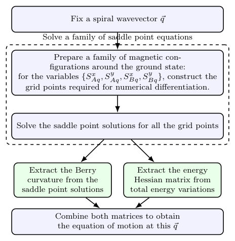
<figcaption class="paper-figure-caption"><b>Fig 1.</b> FIG. 1: Workflow for computing the spin wave energy at a fixed spiral wavevector ⃗q. The central step is to obtain a family of saddle point solutions for the same ⃗q, including the reference state and nearby perturbed states, from which the Berry curvature matrix and the energy Hessian are constructed.</figcaption>
</figure>
<figure class="paper-figure-card">
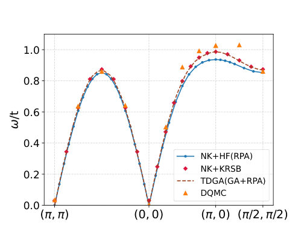
<figcaption class="paper-figure-caption"><b>Fig 2.</b> FIG. 2: Spin wave dispersion of the half filled single orbital Hubbard model obtained from different methods. The parameters are U = 8.0 and n = 1.0. The method developed in this work is denoted by NK+KRSB, and the calculation is performed on 80 × 80 magnetic unit cells. The triangle markers show DQMC results on an 8 × 8 lattice, which has no sign problem at half filling. NK+KRSB, similar to TDGA, agrees better with the DQMC results than RPA does, especially around ⃗q = (π, 0).</figcaption>
</figure>
<figure class="paper-figure-card">
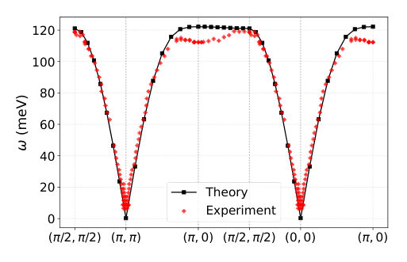
<figcaption class="paper-figure-caption"><b>Fig 3.</b> FIG. 3: Spin wave dispersion of La2NiO4. In the calculation, the interaction parameters are chosen as U = 6.0 eV and JH = 1.8 eV, and the lattice has 64 × 64 magnetic unit cells. The gap in the experimental spectrum originates from spin orbit coupling, which is not included in the present calculation.</figcaption>
</figure>
<figure class="paper-figure-card">
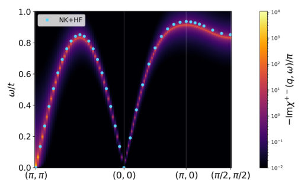
<figcaption class="paper-figure-caption"><b>Fig 4.</b> FIG. 4: Comparing the result of RPA and NK+HF method. U = 8.0. The RPA result is almost the same as NK+HF, which indicates that the Niu-Kleinman adiabatic equation captures the essential physics in RPA, at least in the low energy regime.</figcaption>
</figure>

**Summary.** This paper introduces a novel theoretical framework combining the Niu-Kleinman adiabatic theory with slave-boson mean-field theory to study spin dynamics in correlated materials. By solving the constrained slave-boson saddle point self-consistently, the authors derive spin-wave dispersions for the Hubbard model and $\text{La}_2\text{NiO}_4$. This method successfully incorporates strong correlation effects while remaining computationally tractable for studying low-energy magnetic excitations.

**Why it may be interesting.** The methodology provides a powerful, computationally efficient way to calculate low-energy excitations in strongly correlated systems, bridging the gap between simple mean-field theories and highly accurate but complex benchmarks like DQMC.

Detailed structure

**Main problem.** Developing an efficient theoretical framework to study low-energy spin excitations (spin dynamics) in strongly correlated quantum materials.

**Main result.** The combined Niu-Kleinman adiabatic theory with slave-boson mean-field theory yields spin-wave dispersions that show substantially improved agreement with Quantum Monte Carlo benchmarks compared to simpler approximations like RPA.

**Method.** The approach combines the Niu-Kleinman adiabatic formalism with the Kotliar-Ruckenstein slave-boson mean-field theory (NK+KRSB) to derive the spin dynamics equation of motion.

**Model / system.** The method is applied to the single-orbital Hubbard model and extended to a two-orbital model relevant to $\text{La}_2\text{NiO}_4$, allowing study of realistic multi-orbital correlated systems.

**Key observables.** Spin-wave dispersion ($\omega(\mathbf{q})$) and the Berry-curvature matrix.

**Important parameters / regimes.** Half-filled filling, strong interaction $U$, and the lattice structure (square lattice for the Hubbard model).

**Assumptions / limitations.** The primary assumption is the adiabatic separation of low-energy spin dynamics from higher-energy charge/orbital excitations, and the use of saddle-point approximations for the slave bosons.

**Figures summary.** Figure 2 compares the calculated spin-wave dispersion against benchmarks; Figure 3 shows the calculated dispersion for $\text{La}_2\text{NiO}_4$ compared to inelastic neutron scattering data.

**Paper structure.** The paper reviews the NK formalism, develops the method for the single-orbital Hubbard model, extends it to multi-orbital systems ($\text{La}_2\text{NiO}_4$), and concludes by demonstrating the method's utility.

Abstract

Spin-wave excitations provide a central probe of magnetic order and electronic correlations in strongly correlated materials. In this work, we develop an adiabatic theory of spin dynamics by combining the Niu-Kleinman formalism with Kotliar-Ruckenstein slave-boson theory (NK+KRSB). For each frozen spin configuration, the constrained slave-boson saddle point is solved self-consistently, allowing the Berry-curvature matrix and energy Hessian entering the linearized adiabatic equations of motion to be extracted directly. Applied to the half-filled single-orbital Hubbard model, the resulting spin-wave dispersion shows substantially improved agreement with determinant quantum Monte Carlo benchmarks compared with the random phase approximation and closely approaches results from the time-dependent Gutzwiller approximation. We further extend the method to a two-orbital model of $\mathrm{La}_2\mathrm{NiO}_4$, demonstrating its applicability to realistic multi-orbital correlated systems. Because the approach only requires saddle-point solutions near the magnetic ground state, it remains computationally efficient while incorporating strong-correlation effects beyond conventional weak-coupling descriptions, providing a practical framework for studying low-energy spin excitations in correlated quantum materials.

[↑ back to top](#top)

### [Accelerating physics-informed neural networks for full waveform inversion using a hybrid quantum-classical finite-basis architecture](http://arxiv.org/abs/2606.01110v1)

**Authors:** Hoang Anh Nguyen, Divakar Vashisth, Ali Tura  
**Type:** theory · **Category:** numerical methods · **PDF:** <https://arxiv.org/pdf/2606.01110v1>  
**Analysis basis:** full PDF text, analyzed in chunks
**Topic relevance:** `analog quantum simulation` **1/5** · `methods for driven-dissipative` **1/5**

↔ Scroll figures horizontally

<figure class="paper-figure-card">
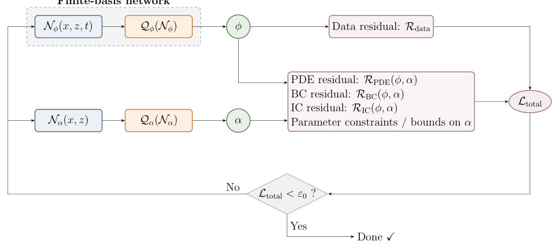
<figcaption class="paper-figure-caption"><b>Fig 1.</b> Figure 1: Schematic of the finite-basis classical-quantum hybrid architecture, combining classical neural networks and quantum circuits with physics-informed constraints. Blue boxes denote classical networks N, orange boxes quantum circuits Q, green circles the predicted fields ϕ and α, and purple nodes the physics- and data-based residuals contributing to Ltotal.</figcaption>
</figure>
<figure class="paper-figure-card">
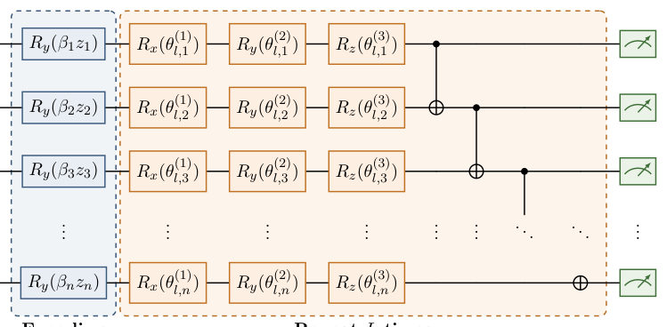
<figcaption class="paper-figure-caption"><b>Fig 2.</b> Figure 2: Multilayer PQC Q. Each input feature zi is angle-encoded via an Ry(βi zi) rotation (blue encoding layer), where βi is a trainable scaling parameter. Variational layers of single-qubit rotations Rx, Ry, Rz followed by a linear CNOT ladder are repeated L times (orange block). Each qubit is measured in the Pauli-Z basis (green meters), and the outputs are averaged to yield a scalar in [−1, 1].</figcaption>
</figure>
<figure class="paper-figure-card">
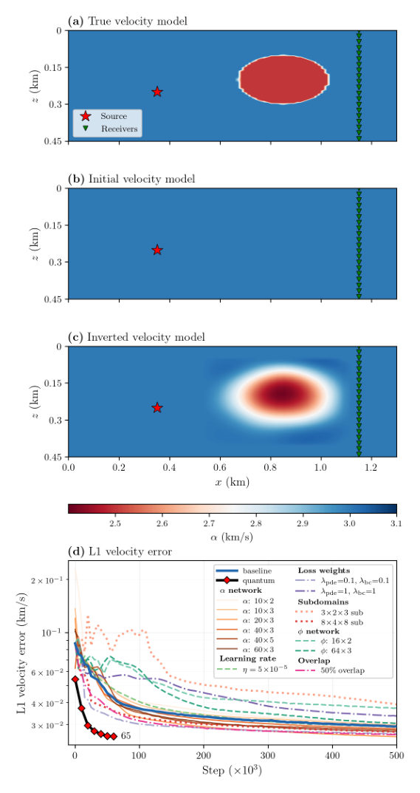
<figcaption class="paper-figure-caption"><b>Fig 3.</b> Figure 3: Anomaly benchmark inversion and convergence. (a) True velocity model used for the spectral-element forward simulation, with source (red star) and receiver array (green triangles). (b) Initial homogeneous velocity model. (c) Inverted velocity model from the quantum hybrid FBPINN at 65,000 training iterations. (d) L1 velocity error versus training iteration for the classical FBPINN baseline (blue), the quantum hybrid (red markers labeled 65k), and 14 of the 15 classical hyperparameter variants (thin colored lines). Traces begin at different initial L1 values because each velocity (α) network initializes to a different (nominally homogeneous) field; this initial spread reflects...</figcaption>
</figure>
<figure class="paper-figure-card">
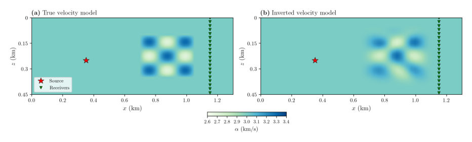
<figcaption class="paper-figure-caption"><b>Fig 4.</b> Figure 4: Checkerboard benchmark inversion. (a) True velocity model: a 3 × 3 checkerboard of alternating ±0.4 km/s perturbations on a 3.0 km/s background, with source (red star) and receiver array (green triangles). (b) Inverted velocity model from the quantum hybrid FBPINN, using the identical network configuration from the anomaly benchmark with only the collocation point density increased.</figcaption>
</figure>

**Summary.** This work accelerates Full Waveform Inversion (FWI) by creating a hybrid quantum-classical neural network. It replaces parts of the classical network with Parameterized Quantum Circuits (PQCs) simulated on classical hardware. The resulting model significantly reduces the required training time and parameters compared to purely classical PINN baselines for wave-based inverse problems.

**Why it may be interesting.** While the primary application is geophysics, the methodology of embedding complex physical PDEs into a quantum-enhanced neural network structure is highly relevant for simulating quantum many-body dynamics or solving time-dependent quantum Hamiltonians where classical simulation struggles.

Detailed structure

**Main problem.** The paper addresses the computational bottleneck of Full Waveform Inversion (FWI) for reconstructing material properties from wave data.

**Main result.** A hybrid quantum-classical architecture significantly accelerates the inversion process, achieving comparable or better accuracy in approximately 8 times fewer training iterations than the best classical baseline.

**Method.** It proposes integrating Parameterized Quantum Circuits (PQCs) into a Physics-Informed Neural Network (PINN) framework, allowing end-to-end automatic differentiation through the quantum components.

**Model / system.** The system models acoustic wave propagation governed by the acoustic wave equation, solved using a domain-decomposed FBPINN structure. The quantum component utilizes a PQC realized via differentiable JAX statevector simulators.

**Key observables.** L1 velocity error, number of training iterations, and number of trainable parameters.

**Important parameters / regimes.** The number of qubits (e.g., 4 qubits), the depth of the PQC (L layers), and the loss function weights ($\lambda_{data}, \lambda_{PDE}, \dots$).

**Assumptions / limitations.** The quantum advantage is demonstrated using classical statevector simulation, and the comparison is not strictly parameter-matched across all classical baselines.

**Figures summary.** Figures illustrate the hybrid architecture, convergence curves showing error vs. iterations for both classical and quantum models, and the recovery of structured spatial variations (checkerboard pattern).

**Paper structure.** The paper introduces FWI and PINNs, details the hybrid quantum-classical FBPINN architecture, presents the methodology for end-to-end differentiation, and validates the approach on two benchmarks: a geophysical anomaly and a checkerboard pattern.

Abstract

Full waveform inversion (FWI) reconstructs heterogeneous material properties from receiver data but remains computationally demanding. Physics-informed neural networks (PINNs) and their domain-decomposed variants (FBPINNs) offer a mesh-free alternative but face convergence challenges when representing complex velocity fields. We present a hybrid quantum-classical FBPINN for acoustic FWI, bringing together quantum computing and classical machine learning, in which the decomposed wavefield network and the global velocity network are implemented as classical-to-quantum pipelines terminating in parameterized quantum circuits (PQCs). The PQCs are realized as differentiable JAX statevector simulators, enabling end-to-end automatic differentiation through the classical PINN, the quantum circuit, and the physics-informed loss. On a geophysical anomaly benchmark, the quantum hybrid reaches a lower L1 velocity error than the primary classical FBPINN baseline in approximately 8x fewer training iterations, despite using approximately 33% fewer trainable parameters, and it outperforms all 15 classical hyperparameter variants tested. A second benchmark (checkerboard) demonstrates the generality of the inversion pipeline, confirming that the quantum hybrid architecture can recover structured spatial variations beyond the localized anomaly benchmark. Our framework is broadly applicable to wave-based inverse problems beyond geophysics, including medical ultrasound tomography and non-destructive evaluation.

[↑ back to top](#top)

### [Attention-Like Hebbian Learning from Quantum Probability Flow and Quantum-Annealer Tests](http://arxiv.org/abs/2606.02098v1)

**Authors:** Masayuki Ohzeki  
**Type:** both · **Category:** disordered systems and neural networks · **PDF:** <https://arxiv.org/pdf/2606.02098v1>  
**Analysis basis:** full PDF text, analyzed in chunks
**Topic relevance:** `analog quantum simulation` **1/5** · `driven-dissipative phase transition` **1/5**

↔ Scroll figures horizontally

<figure class="paper-figure-card">
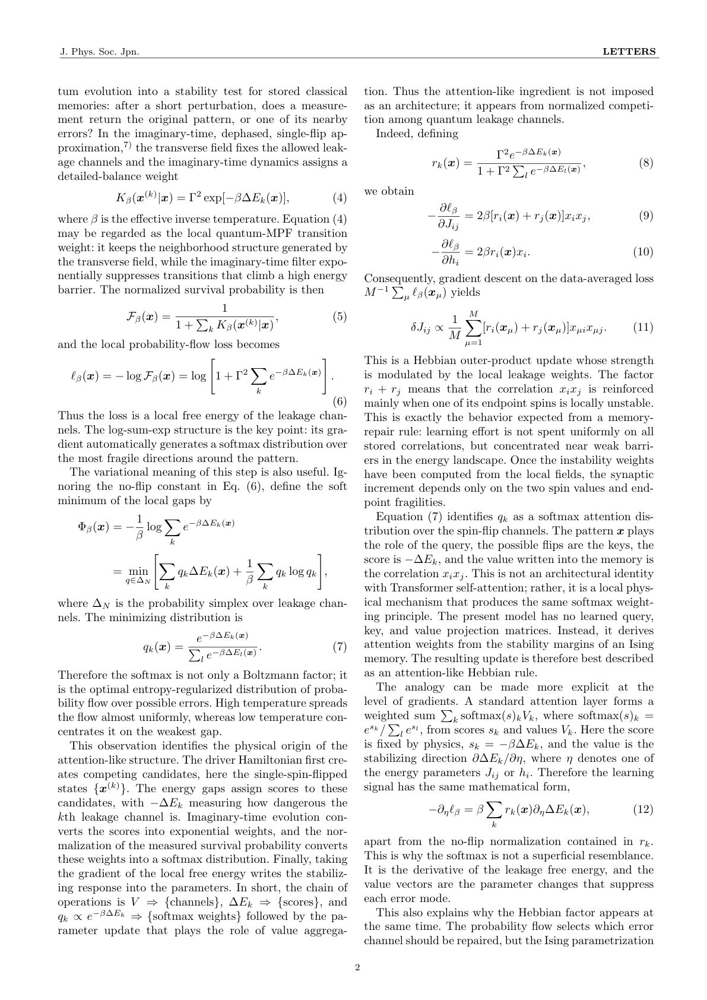
<figcaption class="paper-figure-caption"><b>Fig 1.</b> Low-resolution page preview, page 2</figcaption>
</figure>
<figure class="paper-figure-card">
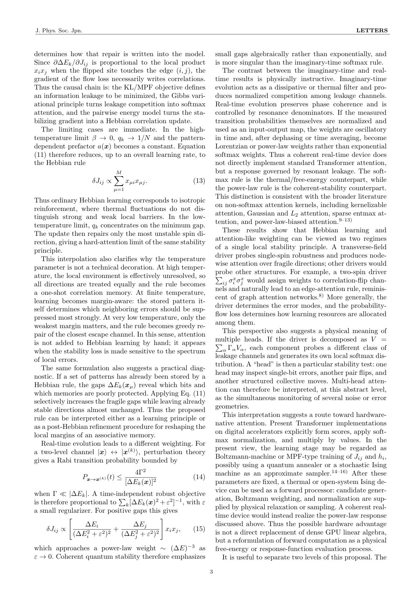
<figcaption class="paper-figure-caption"><b>Fig 2.</b> Low-resolution page preview, page 3</figcaption>
</figure>
<figure class="paper-figure-card">
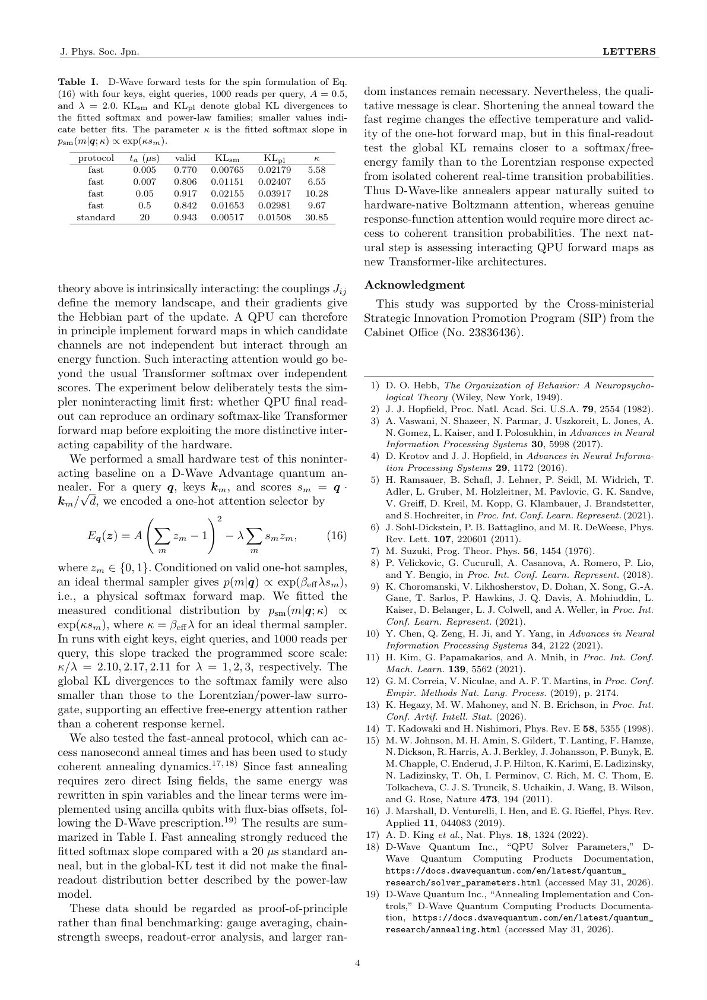
<figcaption class="paper-figure-caption"><b>Fig 3.</b> Low-resolution page preview, page 4</figcaption>
</figure>

**Summary.** This work introduces a quantum probability-flow principle to derive learning rules for associative memory, showing that the attention mechanism emerges naturally from minimizing the quantum leakage loss. The resulting update rule is a softmax-weighted Hebbian rule, which is validated by comparing theoretical predictions with actual measurements on a quantum annealer.

**Why it may be interesting.** It connects fundamental concepts of quantum stability and energy gaps to the highly successful, but often ad-hoc, mathematical structures of modern deep learning attention mechanisms.

Detailed structure

**Main problem.** The paper seeks a physical principle to derive local learning rules that naturally interpolate between classical Hebbian learning and modern attention mechanisms for associative memory.

**Main result.** The attention-like weighting emerges naturally from minimizing a quantum probability-flow loss, which is governed by the local energy gaps of the system.

**Method.** The authors propose a quantum probability-flow principle, analyzing the gradient of the survival loss derived from imaginary-time quantum dynamics.

**Model / system.** The model is an Ising memory described by a Hamiltonian, analyzed using quantum probability flow principles applied to data patterns as basis states.

**Key observables.** Local energy gaps ($\Delta E_k$), the quantum probability-flow loss ($\ell_eta(x)$), and the resulting softmax-weighted Hebbian update rule.

**Important parameters / regimes.** The inverse temperature parameter ($eta$), which controls the transition between standard Hebbian learning ($eta 	o 0$) and the hard-attention limit ($eta 	o \infty$).

**Assumptions / limitations.** The analysis relies on the imaginary-time, dephased, single-flip approximation for deriving the core learning rule.

**Figures summary.** Table I compares D-Wave annealer test results for a spin formulation, fitting global KL divergences to both softmax and power-law models across different anneal protocols.

**Paper structure.** The paper develops the quantum probability-flow principle, derives the softmax-weighted Hebbian update rule, analyzes the temperature limits, and concludes with hardware tests on a quantum annealer to validate the softmax fit.

Abstract

We propose a quantum probability-flow principle for deriving local learning rules in associative memory. A transverse field defines leakage channels from data states, and minimizing the measured survival loss gives stability-driven updates. For imaginary-time, dephased dynamics, the local leakage free energy is the log-sum-exp of energy gaps; its gradient is a softmax-weighted Hebbian rule. Real-time stability instead yields a power-law weighting. D-Wave standard- and fast-anneal tests of a one-hot attention forward map are better fitted by an effective softmax than by a Lorentzian power law.

[↑ back to top](#top)

### [Closed-loop Structure of Quantum Probabilities from Unitarity](http://arxiv.org/abs/2606.02504v1)

**Authors:** M. J. Rave  
**Type:** theory · **Category:** other · **PDF:** <https://arxiv.org/pdf/2606.02504v1>  
**Analysis basis:** full PDF text, analyzed in chunks
**Topic relevance:** `interference shaping light` **1/5** · `quantum measurements` **1/5**

↔ Scroll figures horizontally

<figure class="paper-figure-card">
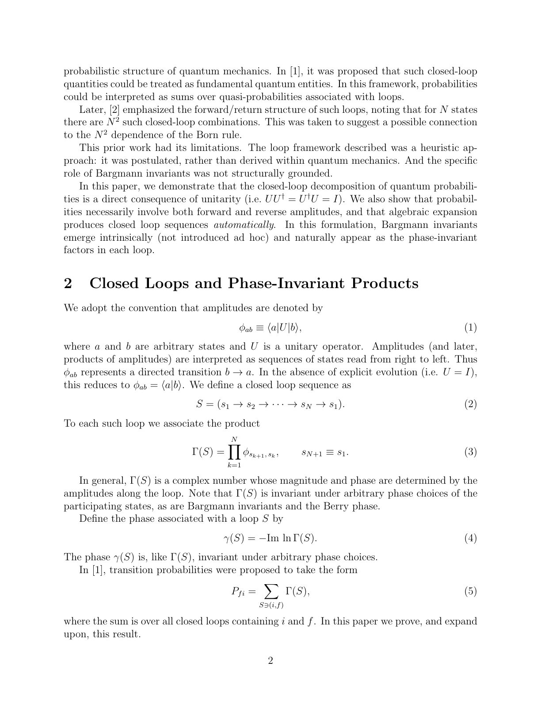
<figcaption class="paper-figure-caption"><b>Fig 1.</b> Low-resolution page preview, page 2</figcaption>
</figure>
<figure class="paper-figure-card">
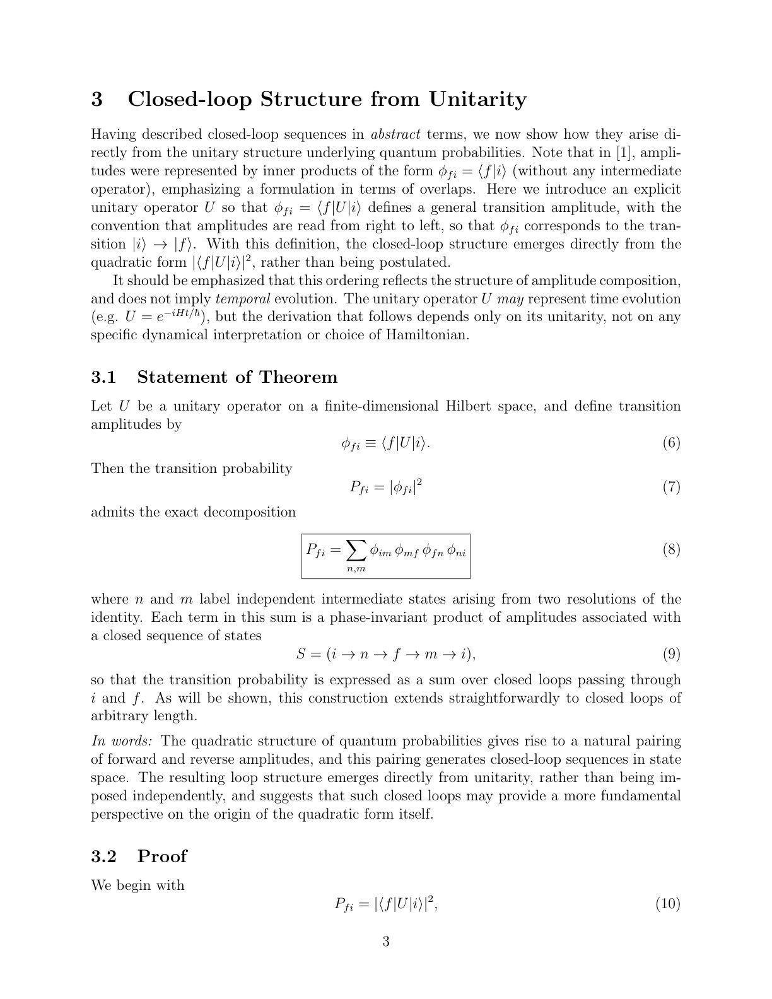
<figcaption class="paper-figure-caption"><b>Fig 2.</b> Low-resolution page preview, page 3</figcaption>
</figure>
<figure class="paper-figure-card">
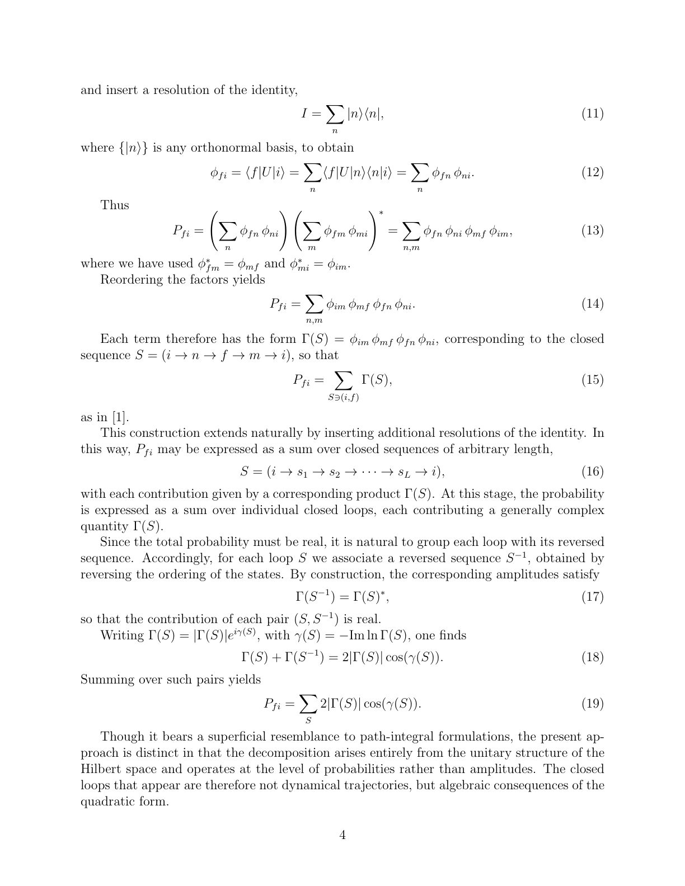
<figcaption class="paper-figure-caption"><b>Fig 3.</b> Low-resolution page preview, page 4</figcaption>
</figure>
<figure class="paper-figure-card">
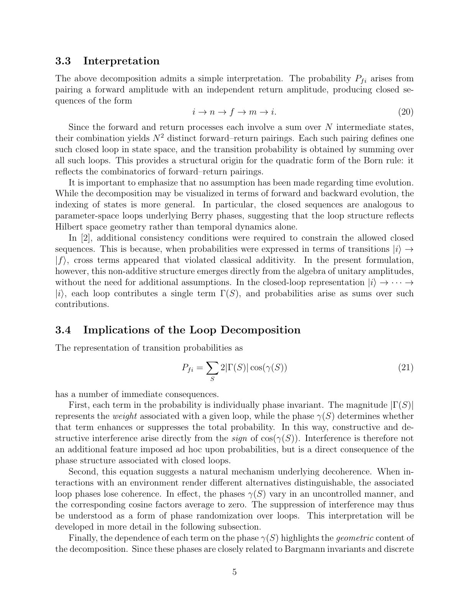
<figcaption class="paper-figure-caption"><b>Fig 4.</b> Low-resolution page preview, page 5</figcaption>
</figure>
<figure class="paper-figure-card">
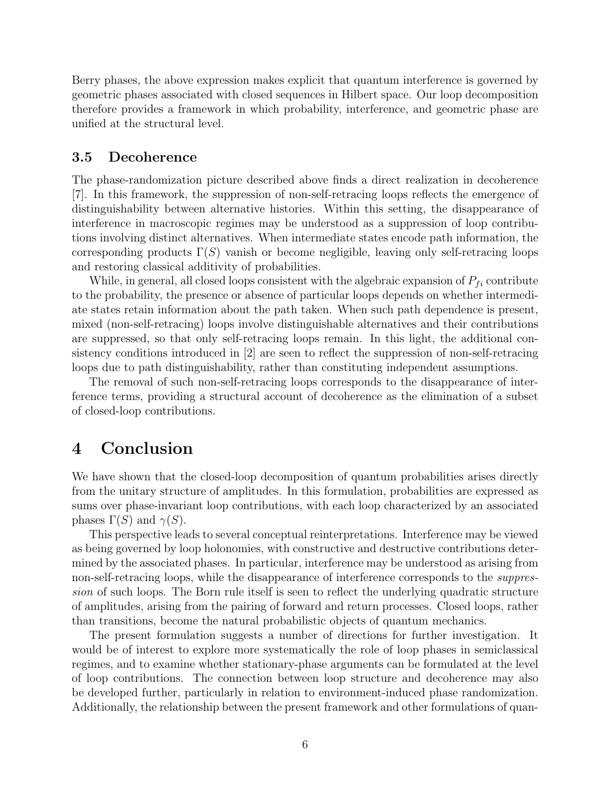
<figcaption class="paper-figure-caption"><b>Fig 5.</b> Low-resolution page preview, page 6</figcaption>
</figure>

**Summary.** This theoretical paper demonstrates that the closed-loop decomposition of quantum probabilities is a direct mathematical consequence of unitarity, rather than an added postulate. It explains quantum interference as arising from the weighted contributions of distinct closed loops, and shows the Born rule emerges naturally from pairing forward and reverse amplitudes defining these loops. The framework suggests quantum probability is fundamentally a geometric phenomenon.

**Why it may be interesting.** This work offers a highly fundamental, structural reinterpretation of quantum probability, linking interference and the Born rule directly to the geometry of closed paths in Hilbert space, which has implications for understanding quantum measurement and decoherence.

Detailed structure

**Main problem.** The paper seeks to derive the fundamental origin of quantum probabilities, specifically explaining interference and the Born rule's quadratic structure, purely from the principle of unitarity.

**Main result.** The closed-loop decomposition of quantum probabilities is shown to be a direct consequence of unitarity, identifying interference as contributions from distinct closed loops weighted by associated Bargmann phases.

**Method.** The authors employ a closed-loop decomposition framework, expanding transition probabilities using the unitary property and relating the resulting terms to products of forward and reverse amplitudes.

**Model / system.** The analysis is performed on quantum mechanical transition probabilities ($P_{fi} = |\langle f|U|i
angle|^2$) governed by a unitary operator $U$ acting on a finite-dimensional Hilbert space.

**Key observables.** Transition probability ($P_{fi}$), closed loop product ($\Gamma(S)$), and associated Bargmann phase ($\gamma(S)$).

**Important parameters / regimes.** Unitarity of the evolution operator $U$, and the phase structure of the closed loops.

**Assumptions / limitations.** The derivation relies solely on the unitarity of the evolution operator, treating the closed-loop structure as the fundamental mathematical consequence.

**Paper structure.** The paper builds from the initial proposal of closed loops to demonstrate that this decomposition is a necessary consequence of unitarity, explaining interference and the Born rule structure through loop combinatorics and phase analysis.

Abstract

In previous work (Rave, 2008) it was proposed that closed loops should be treated as fundamental quantum entities, and such loops were presented in a quasi-probability framework. We demonstrate that the closed-loop decomposition of quantum probabilities is a direct consequence of unitarity, and that Bargmann invariants arise naturally as the phase-invariant quantities associated with these loops, rather than being introduced independently. This identifies interference not as mysterious cross terms, but as contributions from distinct classes of closed loops weighted by their associated Bargmann phases. Additionally, the Born rule is seen to reflect the fundamental quadratic structure arising from the product of forward and reverse amplitudes, which together define such loops.

[↑ back to top](#top)

### [Efficient and Expressive Boundary Conditions in Quantum Lattice Boltzmann Methods](http://arxiv.org/abs/2606.01426v1)

**Authors:** Călin A. Georgescu, Matthias Möller  
**Type:** theory · **Category:** quantum information and computing · **PDF:** <https://arxiv.org/pdf/2606.01426v1>  
**Analysis basis:** full PDF text, analyzed in chunks
**Topic relevance:** `methods for driven-dissipative` **1/5** · `quantum measurements` **1/5**

↔ Scroll figures horizontally

<figure class="paper-figure-card">
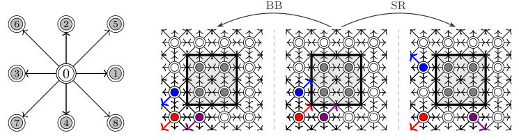
<figcaption class="paper-figure-caption"><b>Fig 1.</b> Fig. 1: Overview of halfway bounce-back and specular reflection boundary conditions.</figcaption>
</figure>
<figure class="paper-figure-card">
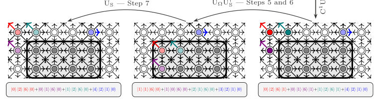
<figcaption class="paper-figure-caption"><b>Fig 2.</b> Fig. 2: Example of zone-agnostic imposition of bounce-back boundary conditions on a 6 × 3 D2Q9 lattice with a rectangle obstacle spanning [1, 4] × [0, 1].</figcaption>
</figure>
<figure class="paper-figure-card">
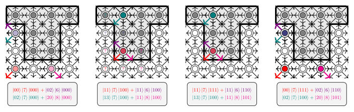
<figcaption class="paper-figure-caption"><b>Fig 3.</b> Fig. 5: Example of zone-agnostic imposition of specular reflection boundary conditions on a 6 × 3 D2Q9 lattice with a rectangle obstacle spanning [1, 4] × [0, 1].</figcaption>
</figure>
<figure class="paper-figure-card">
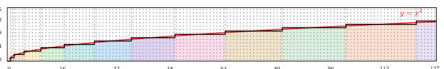
<figcaption class="paper-figure-caption"><b>Fig 4.</b> Fig. 7: Staircase discretization of the region Ω= {(x, y) | x &gt; y2} on a 128 × 16 lattice. The area under the red curve determines the solid domain Ω, with colors and dashed lines outlining a possible segment-wise breakdown.</figcaption>
</figure>
<figure class="paper-figure-card">
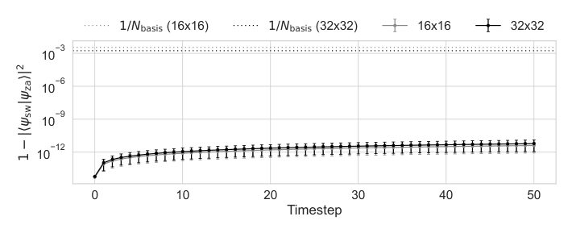
<figcaption class="paper-figure-caption"><b>Fig 5.</b> Fig. 8: 95% confidence interval for fidelity of quantum states obtained by the SW and ZA boundary conditions on 16×16 and 32×32 grids for 50 timestep of 5 configurations with between 1 and 8 rectangle obstacles.</figcaption>
</figure>

**Summary.** This paper presents a novel, quantum-algorithmic approach to enforcing boundary conditions in Quantum Lattice Boltzmann Methods (QLBM). By developing a Zone-Agnostic (ZA) method, the authors overcome the exponential resource scaling limitations of previous segment-based techniques. This advancement is crucial for accurately simulating quantum fluid dynamics in complex geometries.

**Why it may be interesting.** The work demonstrates how complex physical constraints (like fluid-solid interaction) can be mapped onto fundamental quantum computational primitives (oracles and unitary transformations), providing a blueprint for simulating non-equilibrium quantum dynamics.

Detailed structure

**Main problem.** The core challenge is developing quantum algorithms to implement efficient and expressive boundary conditions (BCs) within Quantum Lattice Boltzmann Methods (QLBM).

**Main result.** The authors introduce a Zone-Agnostic (ZA) method that outperforms segment-wise approaches by applying BCs via a single, coherent quantum operation, proving correctness for various boundary types.

**Method.** The method utilizes quantum circuits, including an oracle operator ($U_{\Omega}$) and trajectory-based inference, to encode boundary interactions without domain partitioning.

**Model / system.** The model is QLBM, an extension of the Lattice Boltzmann Method (LBM) to a quantum setting, typically using D2Q9 discretizations for fluid dynamics simulations.

**Key observables.** Efficiency (resource scaling) and expressivity of BC implementation; state evolution of ancilla qubits tracking boundary crossings.

**Important parameters / regimes.** The complexity scales are compared between segment-wise ($O(2^{n_g})$) and zone-agnostic methods; the analysis is restricted to unit-speed stencils.

**Assumptions / limitations.** The analysis assumes the solid boundary ($\Omega$) can be described by an oracle, and the stencil must be unit-speed to allow decomposition into cardinal links.

**Figures summary.** Figures illustrate the D2Q9 stencil, the quantum circuits for bounce-back and specular reflection ($	ext{UP}_x, 	ext{UP}_y$), and the step-wise execution of the ZA algorithms for various boundary geometries (corners, walls).

**Paper structure.** The paper progresses from establishing the need for better BCs, detailing the ZA-BB algorithm, extending it to the more complex ZA-SR for specular reflection, and finally providing exhaustive, step-by-step correctness proofs for various boundary crossing scenarios (corners, walls).

Abstract

Quantum Lattice Boltzmann Methods (QLBM) have emerged as a promising candidate for quantum realizations of computational fluid dynamics solvers. However, despite intensive research into the QLBM in recent years, methods for imposing boundary conditions remain limited both in terms of efficiency and expressivity. In this work, we introduce a new method for imposing simple boundary conditions on QLBM that overcomes several limitations of current approaches. Our method forgoes the partitioning of the solid domain into segments and instead applies a single, coherent operation on the entire boundary. We show that our method requires fewer resources both asymptotically and practically for bounce-back and specular reflection boundary conditions.

[↑ back to top](#top)

### [Fundamental Limit for One versus Two Point Sources Detection using Direct Imaging](http://arxiv.org/abs/2606.00968v1)

**Authors:** Parth Hemant Darekar, Amit Kumar Jha, Michael R. Grace, Aqil Sajjad, Saikat Guha  
**Type:** theory · **Category:** other · **PDF:** <https://arxiv.org/pdf/2606.00968v1>  
**Analysis basis:** full PDF text, analyzed in chunks
**Topic relevance:** `interference shaping light` **1/5** · `quantum measurements` **1/5**

↔ Scroll figures horizontally

<figure class="paper-figure-card">
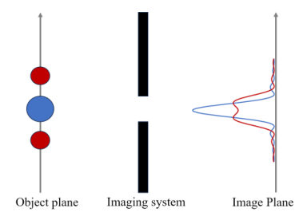
<figcaption class="paper-figure-caption"><b>Fig 1.</b> Fig. 1. Schematic of the setup. Under H1, we have a weak thermal source (in blue) at the origin. Under H2, we have two equally bright, weak thermal sources (in red) with an image plane separation of θ that is scaled to the PSF width. For small separation, the intensity distributions of light on the image plane under each hypothesis become difficult to distinguish.</figcaption>
</figure>
<figure class="paper-figure-card">
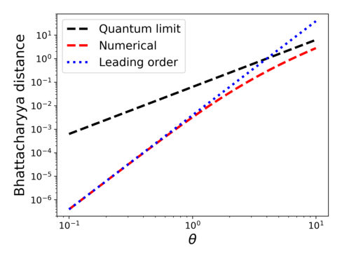
<figcaption class="paper-figure-caption"><b>Fig 2.</b> Fig. 2. Bhattacharyya distance for ideal direct imaging for the Gaussian Amplitude Spread Function (ASF) as a function of θ. The numerical results (red, dashed) show good agreement with the leading order term (blue, dotted) when the separation θ is small. The Bhattacharyya distance scales as O  θ4</figcaption>
</figure>
<figure class="paper-figure-card">
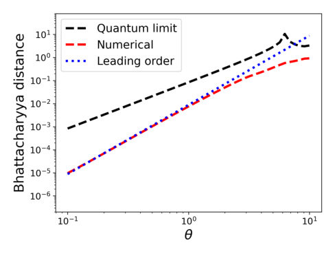
<figcaption class="paper-figure-caption"><b>Fig 3.</b> Fig. 3. Bhattacharyya distance for ideal direct imaging for the Sinc Amplitude Spread Function (ASF) as a function of θ. The numerical results (red, dashed) show good agreement with the leading order term (blue, dotted) when the separation θ is small. The Bhattacharyya distance scales as O  θ3 in the sub-Rayleigh regime (θ ≪1). The black dashed line is the quantum Chernoff exponent that scales as O  θ2 .</figcaption>
</figure>

**Summary.** This theoretical paper determines the fundamental limit for distinguishing between one or two weak optical point sources using ideal direct imaging. It calculates the Bhattacharyya distance, finding that the achievable scaling depends on the system's Amplitude Spread Function (ASF). Specifically, the scaling is $O(\theta^4)$ if the ASF has no zeros, but improves to $O(\theta^3)$ if the ASF has zeros, providing a crucial comparison point against the quantum limit.

**Why it may be interesting.** This work provides a rigorous, quantitative comparison of measurement limits in quantum optics, showing how the mathematical properties (zeros) of the system's transfer function (ASF) fundamentally alter the achievable detection scaling, which is crucial for designing optimal quantum measurements.

Detailed structure

**Main problem.** The paper addresses the fundamental limit for distinguishing between a single weak incoherent optical point source and two symmetrically placed weak incoherent point sources using ideal direct imaging.

**Main result.** The scaling of the Bhattacharyya distance depends critically on the Amplitude Spread Function (ASF): it scales as $O(\theta^4)$ if the ASF has no zeros, but improves to $O(\theta^3)$ if the ASF possesses zeros.

**Method.** The analysis uses the Bhattacharyya distance, derived from comparing the probability distributions of the single-source and two-source intensity patterns, employing Maclaurin series expansions and asymptotic analysis near zeros.

**Model / system.** The system is modeled using ideal direct imaging with a focal plane array (FPA) of intensity detectors. The image intensity is governed by the Point Spread Function (PSF), which is the squared magnitude of the Amplitude Spread Function (ASF), $\psi(x)$.

**Key observables.** Bhattacharyya distance ($\xi_{	ext{direct}}(	heta)$), which quantifies the distinguishability between the two source configurations.

**Important parameters / regimes.** $	heta$, the separation between the two point sources scaled to the PSF width; the sub-Rayleigh regime ($	heta \ll 1$).

**Assumptions / limitations.** The analysis assumes ideal direct imaging conditions and relies on asymptotic expansions that fail or require modification when the ASF has zeros.

**Figures summary.** Figure 2 illustrates the $O(\theta^4)$ scaling for a Gaussian ASF, while Figure 3 demonstrates the improved $O(\theta^3)$ scaling for a Sinc ASF.

**Paper structure.** The paper first sets up the problem using the Bhattacharyya distance. It then analyzes the case where the ASF has no zeros, yielding an $O(\theta^4)$ scaling. Subsequently, it tackles the more complex case where the ASF has zeros, requiring a specialized asymptotic analysis that reveals an $O(\theta^3)$ scaling.

Abstract

We consider the task of distinguishing between a single weak incoherent optical point source and two weak incoherent optical point sources located symmetrically about the first source. $θ$ is the separation between the two point sources scaled to the Point Spread Function (PSF) width in the image plane. Using an ideal focal plane array of intensity detectors (ideal direct imaging), we quantify the performance using the Bhattacharyya distance and find the scaling of its leading order term in terms of $θ$ in the sub-Rayleigh regime. A suite of previous analyses of this problem lacked a comprehensive analysis for when the amplitude spread function (ASF) of the imaging system has zeros and reported a scaling that we find to be incorrect. We complete this analysis by explicitly calculating the leading order term of the Bhattacharyya distance for ideal direct imaging with any ASF, for small $θ$ and show the difference in scaling based on the presence or absence of zeros in the ASF. This is similar to the ASF dependent performance in the task of estimating the separation between the two point sources and the task of detecting a change to an object. We then apply our results to the specific example of a Gaussian and a Sinc ASF and show good agreement with numerical calculations. Our results allow the accurate comparison of other measurement schemes with ideal direct imaging, and to the quantum limit.

[↑ back to top](#top)

### [Low-Temperature Suppression of Intertwined Orders in La$_{1/3}$Sr$_{2/3}$FeO$_{3}$ Thin Films](http://arxiv.org/abs/2606.00769v1)

**Authors:** Mayia A. Vranas, Robin Glefke, Katherine Matthews, Xiaoke Li, Tianxing Wang, Henry Navarro, I-Ching Lin, Sarmistha Das, Biswajit Sahoo, Rourav Basak, Wei He, Holden Bauer, Ella Di Liberti, Jacob Butler, Elliot Kisiel, Erik Lamb, Jun-Sik Lee, Cheng-Tai Kuo, Heemin Lee, Christie Nelson, Sophie Morley, Sujoy Roy, Christoph Klewe, Fanny Rodolakis, Jessica McChesney, Oleg Shpyrko, Yimei Zhu, Eric Fullerton, Ivan Schuller, Alex Frano  
**Type:** experiment · **Category:** strongly correlated electrons · **PDF:** <https://arxiv.org/pdf/2606.00769v1>  
**Analysis basis:** full PDF text, analyzed in chunks
**Topic relevance:** `analog quantum simulation` **1/5** · `spintronics-quantum-optics interface` **1/5**

↔ Scroll figures horizontally

<figure class="paper-figure-card">
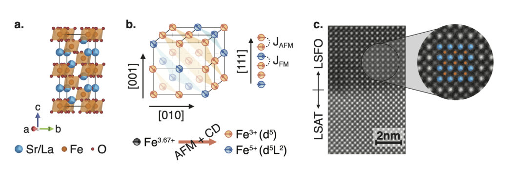
<figcaption class="paper-figure-caption"><b>Fig 1.</b> FIG. 1. LSFO Structure and Order. a) Crystal structure of LSFO, modified from [11]. b) Schematic of the CD (indicated by cation color) and AFM order (indicated by arrow direction) in LSFO. c) Transmission electron microscopy (TEM) image of a cross-section of LSFO grown on an LSAT(100) substrate. The Sr/La and Fe cation sites are labeled with blue and orange circles, respectively.</figcaption>
</figure>
<figure class="paper-figure-card">
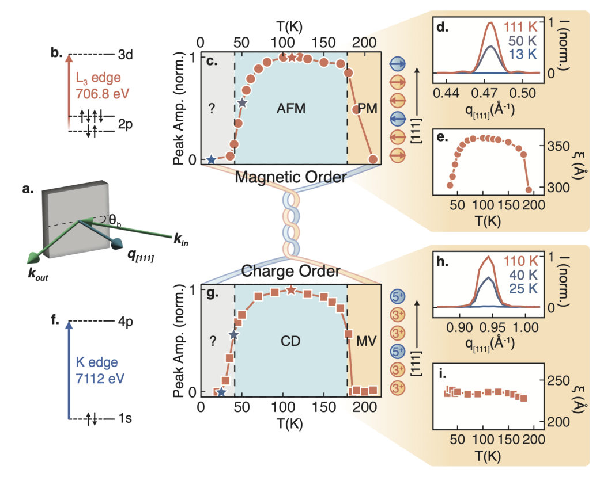
<figcaption class="paper-figure-caption"><b>Fig 2.</b> FIG. 2. Resonant X-Ray Scattering Results. a) Horizontal scattering geometry of our soft resonant X-ray scattering (RSXS) experiments. Hard resonant X-ray scattering (REXS) was done in a vertical scattering geometry instead. b,f) Energy level diagrams of the electronic excitations for our Fe L3 edge RSXS and Fe K edge REXS measurements, respectively. c,g) Temperature dependence of the amplitudes of LSFO’s AFM and CD Bragg peaks, ⃗q =  1</figcaption>
</figure>
<figure class="paper-figure-card">
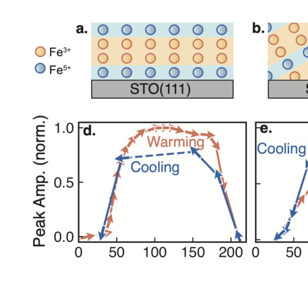
<figcaption class="paper-figure-caption"><b>Fig 3.</b> FIG. 3. Substrate Comparison. Temperature dependence of the ⃗q =  1</figcaption>
</figure>
<figure class="paper-figure-card">
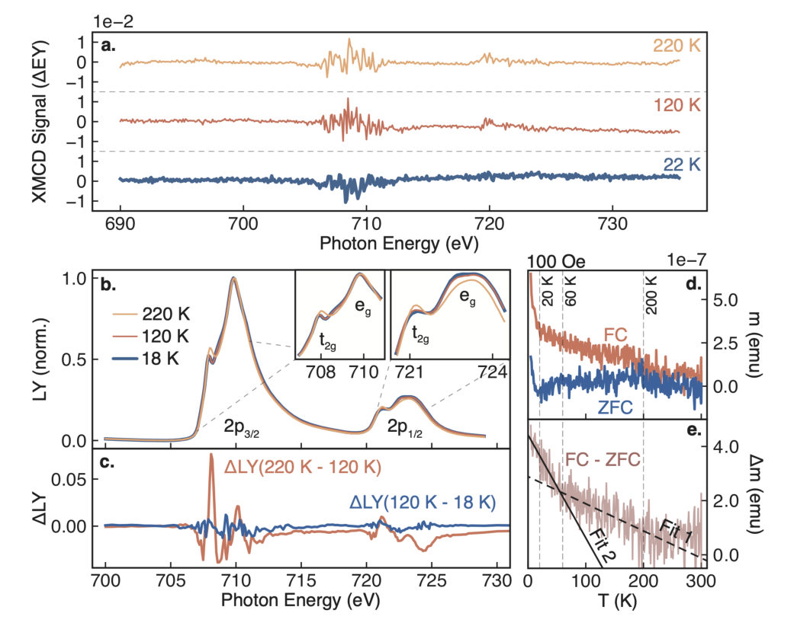
<figcaption class="paper-figure-caption"><b>Fig 4.</b> FIG. 4. Low Temperature Magnetic and Electronic Probes. a) Fe L2,3 edge XMCD measurements at three temperatures between 22 K and 220 K. b) Fe L2,3 edge X-ray absorption spectroscopy (XAS) of LSFO at three temperatures taken in luminescence yield (LY). The L-edge peaks are labeled according to excited core state (L3 - 2p3/2; L2 - 2p1/2) and final crystal field split valence states (3d eg and t2g)[8, 26]. c) The difference in absorption spectra from 220 K to 120 K (orange) and from 120 K to 18 K (blue), highlighting the changes in spectral weight across both transition temperatures. d) Field-cooled (FC) and zero field-cooled (ZFC) moment vs temperature measurements of LSFO. e) Difference...</figcaption>
</figure>
<figure class="paper-figure-card">
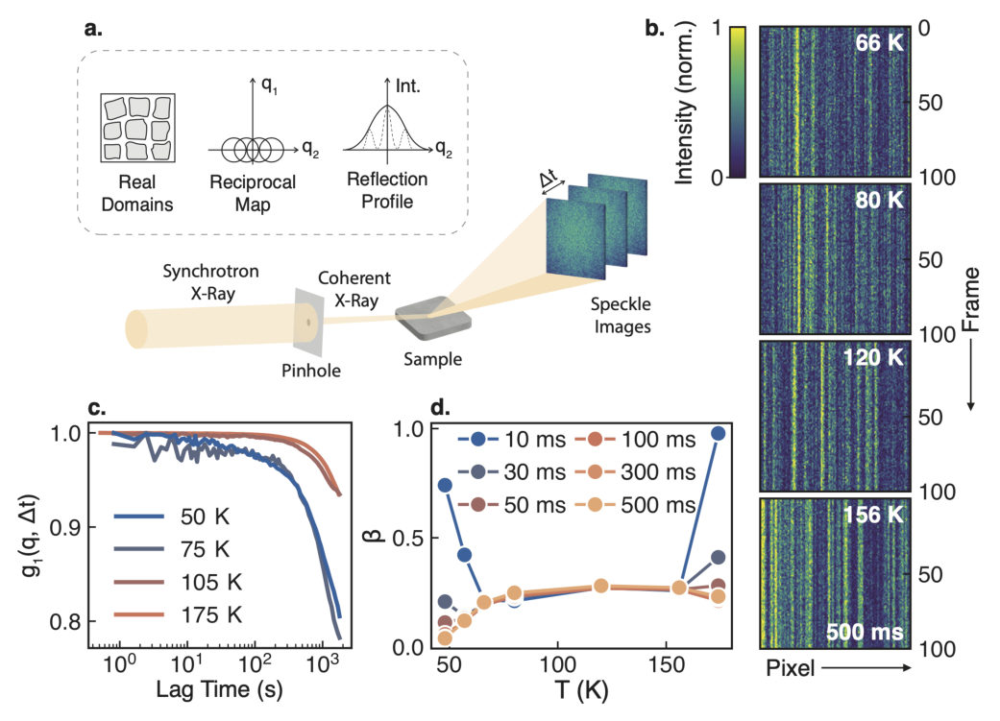
<figcaption class="paper-figure-caption"><b>Fig 5.</b> FIG. 5. X-ray Photon Correlation Spectroscopy (XPCS) of the AFM Peak. a) A schematic of the coherent scattering process, in which a coherent beam scattering off of magnetic domains in the sample creates a speckle pattern that varies over time. b) Waterfall plots for four temperatures, where a line cut across the Bragg peak is plotted for every frame recorded during measurement, showing the evolution of speckled in time. c) The intermediate scattering function, g1, plotted for four temperatures. The low temperature and high temperature dynamics show different timescales. d) Temperature-dependent contrast of speckles for six exposure times, showing an increase in contrast at low temperatures.</figcaption>
</figure>

**Summary.** This work uses synchrotron X-ray scattering to investigate the low-temperature phase diagram of LSFO thin films, which exhibit coupled magnetic and charge ordering. The primary finding is the sharp suppression of both orders below 25 K, suggesting the system enters a novel, less ordered ground state. The research highlights the critical role of dimensionality and competing interactions in determining the final electronic state of strongly correlated perovskites.

**Why it may be interesting.** The study provides detailed experimental evidence of how competing interactions and reduced dimensionality can destabilize complex, coupled electronic orders in strongly correlated oxides, which is a key area of modern condensed matter physics.

Detailed structure

**Main problem.** The study investigates the low-temperature behavior of intertwined magnetic and charge orders in La1/3Sr2/3FeO3 (LSFO) thin films, focusing on the regime below 100 K.

**Main result.** The paper reports the complete suppression of both the antiferromagnetic and charge ordering signals below approximately 25 K, suggesting a complex, low-temperature ground state.

**Method.** The research employs advanced X-ray scattering and spectroscopy techniques, including Resonant X-ray Scattering (RSXS), X-ray Photon Correlation Spectroscopy (XPCS), and X-ray Magnetic Circular Dichroism (XMCD).

**Model / system.** The system is the perovskite oxide La1/3Sr2/3FeO3 (LSFO) grown as epitaxial thin films on various substrates. The material exhibits strong coupling between spin, charge, and lattice degrees of freedom, leading to coupled magnetic and charge ordering.

**Key observables.** Temperature dependence of AFM and CD Bragg peak amplitudes, out-of-plane correlation lengths, dynamic timescales ($	au$) from XPCS, and valence state ratios from XAS.

**Important parameters / regimes.** Low temperature regime ($<100 	ext{ K}$), critical suppression temperatures ($T^* \sim 60 	ext{ K}$, $T_{	ext{supp}} \sim 20 	ext{ K}$), and film thickness/dimensionality effects.

**Assumptions / limitations.** The order suppression is intrinsic to the LSFO film, ruling out substrate-induced effects, and the low-temperature phase is not ferromagnetic.

**Figures summary.** Figures show temperature dependence of magnetic/charge peaks (RSXS), correlation length analysis (CD stable, AFM decreases), and XPCS waterfall plots illustrating dynamic changes near transition temperatures.

**Paper structure.** The paper systematically uses multiple techniques (RSXS, XPCS, XMCD, XAS) to map the phase transitions, first establishing the high-temperature coupled order, then tracking its decay upon cooling, and finally proposing that the collapse is driven by the instability of the long-range AFM order in reduced dimensions.

Abstract

The strong coupling between spin, charge, and lattice degrees of freedom in perovskite oxides leads to an array of exotic phenomena, giving these materials rich phase diagrams that can include coupled orders. This is exemplified by the A-site doped ferrite La$_{1/3}$Sr$_{2/3}$FeO$_{3}$ (LSFO), which exhibits a coupled paramagnetic-antiferromagnetic and charge ordering phase transition at $\sim$190 K that has been well studied in thin films, bulk, and polycrystalline samples. However, the low temperature behavior of LSFO thin films below $\sim$100 K has not been thoroughly explored. This work uses several X-ray scattering and spectroscopy techniques to directly probe LSFO's magnetic and charge order down to low temperature. Using resonant X-ray scattering, we observe a complete suppression of LSFO's known antiferromagnetic and charge order below $\sim$25 K. Further spectroscopy and coherent scattering measurements provide insight into LSFO's electronic structure and domain dynamics in this new low temperature phase, and we propose possible explanations for the observed order suppression based on reduced dimensionality of domains in our thin films. Our findings provide insight into the effects of competing interactions in strongly correlated materials, particularly those with coupled orders.

[↑ back to top](#top)

### [No-Go Theorem for Ancilla-Assisted Gaussian Enhancement in Passive-Unitary Estimation](http://arxiv.org/abs/2606.00256v1)

**Authors:** Zihao Gong, Saikat Guha  
**Type:** theory · **Category:** quantum information and computing · **PDF:** <https://arxiv.org/pdf/2606.00256v1>  
**Analysis basis:** full PDF text, analyzed in chunks
**Topic relevance:** `entanglement & information structure` **1/5** · `quantum measurements` **1/5**

↔ Scroll figures horizontally

<figure class="paper-figure-card">
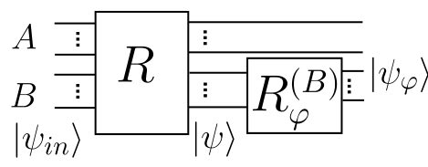
<figcaption class="paper-figure-caption"><b>Fig 1.</b> Fig. 1. Setup for ancilla-assisted single-parameter estimation using Gaussian probes. The probe consists of mA ancilla modes and mB signal modes. The initial state |ψin⟩is taken to be a tensor product of single-mode squeezed coherent states. By applying a passive linear interferometer R, we obtain the general pure Gaussian probe state |ψ⟩. The mB signal modes are transmitted through the passive lossless Gaussian unitary Rφ = I(A) ⊗R(B) φ , which encodes the unknown parameter φ, while the mA ancilla modes remain unchanged. The final output state is denoted by |ψφ⟩.</figcaption>
</figure>

**Summary.** This paper derives a no-go theorem for quantum parameter estimation in lossless passive-unitary channels. It proves that constraining the energy only in the signal modes, while allowing infinite energy in ancilla modes, does not improve the ultimate estimation precision (QFI). The result shows that the optimal measurement is entirely determined by the energy budget allocated to the signal modes.

**Why it may be interesting.** This work provides fundamental limits on quantum estimation precision in passive quantum channels, which is crucial for understanding the ultimate performance of quantum sensors and quantum communication protocols.

Detailed structure

**Main problem.** The paper investigates the maximum Quantum Fisher Information (QFI) achievable for estimating a parameter encoded in a passive-unitary transformation applied to a multimode Gaussian state.

**Main result.** It establishes a no-go theorem proving that allowing arbitrarily large energy in locally retained ancilla modes does not enhance the maximum QFI beyond the limit set by the signal-energy constraint.

**Method.** The authors calculate the QFI by deriving and bounding contributions from the covariance matrix and displacement vector, utilizing matrix inequalities and analyzing the structure of optimal probe states.

**Model / system.** The system models a bipartite sensing setup involving $m_A$ ancilla modes and $m_B$ signal modes, where the probe state is a pure Gaussian state evolving under a passive Gaussian unitary. The parameter is encoded via a passive Gaussian unitary acting only on the signal modes.

**Key observables.** Quantum Fisher Information (QFI), $	ext{F}_\varphi$; covariance matrix ($\Gamma$); mean photon number ($ar{n}$).

**Important parameters / regimes.** Mean photon number constraint ($ar{n}$) on the signal modes; the structure of the passive Gaussian unitary transformation.

**Assumptions / limitations.** The estimation process is restricted to lossless passive-unitary transformations, and the probe state is a pure Gaussian state.

**Figures summary.** Figure 1 illustrates the general setup involving ancilla and signal modes for the estimation process.

**Paper structure.** The paper analyzes the QFI by decomposing it into parts related to the covariance matrix and displacement vector, deriving upper bounds using matrix inequalities, and ultimately proving the no-go theorem by showing the optimal state requires zero signal displacement energy.

Abstract

We study the maximum quantum Fisher information (QFI) for estimating a single parameter embedded in a generic multimode lossless passive Gaussian unitary using general Gaussian probes under a signal-energy constraint. Unlike previous work, which imposed a total energy constraint on the full probe, we constrain only the transmitted signal modes while allowing an arbitrary number of locally retained ancilla modes with arbitrarily large energy. We prove that this additional freedom does not increase the maximum achievable QFI; the optimum remains identical to that attainable without extra ancilla energy. The same conclusion also extends to the sequential setting under a total energy constraint. We also characterize the family of optimal probe states and show that entanglement is not necessary to attain the optimum in the lossless setting. This extends the result of Matsubara et al. to the physically motivated signal-energy-constrained scenario and establishes a no-go theorem for ancilla-assisted Gaussian enhancement in noiseless passive-unitary estimation.

[↑ back to top](#top)

### [Significance of time-convolutionless mode-coupling theory in capturing the dynamics of glass-forming liquids](http://arxiv.org/abs/2606.01696v1)

**Authors:** Michio Tokuyama  
**Type:** theory · **Category:** statistical mechanics · **PDF:** <https://arxiv.org/pdf/2606.01696v1>  
**Analysis basis:** full PDF text, analyzed in chunks
**Topic relevance:** `Keldysh / 2PI / non-Gaussian methods` **1/5** · `non-equilibrium dynamics` **1/5**

↔ Scroll figures horizontally

<figure class="paper-figure-card">
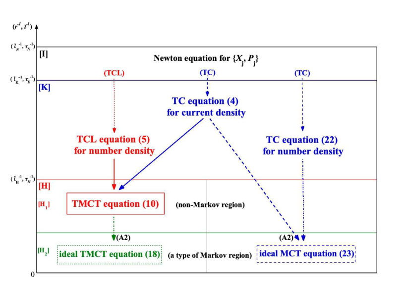
<figcaption class="paper-figure-caption"><b>Fig 1.</b> FIG. 1: (Color online) Classification of the basic equations discussed in the present paper into three stages, [N], [K], and [H], depending on a space (r)-time (t) scale, where ℓi and τi indicate the characteristic length and time of interest, respectively. Numbers in the figure indicate equation numbers.</figcaption>
</figure>

**Summary.** This paper rigorously compares Time-Convolutionless Mode-Coupling Theory (TMCT) against standard MCT for glass-forming liquids. It argues that the choice between time-convolution (TC) and time-convolutionless (TCL) formalisms is crucial, showing that TMCT correctly captures the dynamics across different time scales. The results indicate that TMCT yields more physically accurate predictions for the glass transition compared to ideal MCT.

**Why it may be interesting.** The rigorous comparison of different theoretical frameworks (MCT vs. TMCT) for non-equilibrium dynamics, especially concerning the choice of mathematical formalism (TC vs. TCL), provides deep insights into the limitations of standard theoretical tools when applied to complex many-body systems.

Detailed structure

**Main problem.** The paper aims to demonstrate the superiority of the Time-Convolutionless Mode-Coupling Theory (TMCT) over conventional Mode-Coupling Theory (MCT) in accurately describing the complex dynamics of glass-forming liquids.

**Main result.** TMCT provides a fundamentally different and more physically consistent description of the dynamics, particularly in the intermediate and long-time regimes, leading to critical parameters that align better with experimental expectations than ideal MCT.

**Method.** The authors compare two projection operator methods (Time-Convolution vs. Time-Convolutionless) and apply them to derive and solve coupled equations for correlation functions, utilizing Laplace transforms and asymptotic analysis.

**Model / system.** The system studied is a three-dimensional equilibrium glass-forming liquid, modeled using density-density correlation functions and analyzed across different space-time scales (microscopic, kinetic, hydrodynamic).

**Key observables.** Intermediate scattering function $f_\alpha(q, t)$, non-Gaussian parameter $\alpha_2(t)$, self-diffusion coefficient $D_L^s$, and the non-ergodicity parameter $f_\alpha(q)$.

**Important parameters / regimes.** Critical volume fraction ($\phi_c$ or $\phi_g$), temperature $T$, and wavevector $q$.

**Assumptions / limitations.** The analysis relies on comparing the full TMCT against ideal MCT, noting that approximations like (A2) lead to unphysical results ($\alpha_2(t) < 0$) in both formalisms.

**Figures summary.** Figure 1 illustrates the classification of basic equations into three distinct space-time scale stages: microscopic [N], kinetic [K], and hydrodynamic [H].

**Paper structure.** The paper reviews the theoretical basis by comparing TC and TCL projection operators, applies these to the glass-forming liquid dynamics, derives the full TMCT equation, simplifies it into a recursion equation, and finally compares its predictions against ideal MCT across various physical observables and asymptotic limits.

Abstract

This paper demonstrates the significance of the recently proposed time-convolutionless mode-coupling theory (TMCT) in capturing the dynamics of glass-forming liquids. The origin of the primary differences between ideal MCT and TMCT is comprehensively explored from a unified perspective. First, we review two distinct projection operator methods in the Heisenberg picture: the time-convolution (TC) formulation proposed by Mori and the time-convolutionless (TCL) formulation proposed by Tokuyama and Mori. We show that the appropriate choice between these frameworks fundamentally depends on the space-time scales of the relevant variables. In TMCT, the TC formulation is applied to the current density, whereas the TCL formulation is applied to the number density because the latter operates on a significantly longer space-time scale. In contrast, ideal MCT applies the TC formulation to both densities. Consequently, the governing equation in TMCT is timeconvolutionless, whereas the ideal MCT equation features a time-convolution form. This fundamental difference significantly affects various physical quantities near the glass transition. Finally, the full TMCT equation is transformed into a simplified recursion equation to facilitate numerical analysis, and the key predictions of TMCT are compared with those of ideal MCT

[↑ back to top](#top)

### [Surface Excitations, Energy Loss, and Decoherence in Electron Interferometry](http://arxiv.org/abs/2606.01004v1)

**Authors:** David Kordahl  
**Type:** theory · **Category:** other · **PDF:** <https://arxiv.org/pdf/2606.01004v1>  
**Analysis basis:** full PDF text, analyzed in chunks
**Topic relevance:** `correlated / nonlocal dissipation` **1/5** · `interference shaping light` **1/5**

↔ Scroll figures horizontally

<figure class="paper-figure-card">
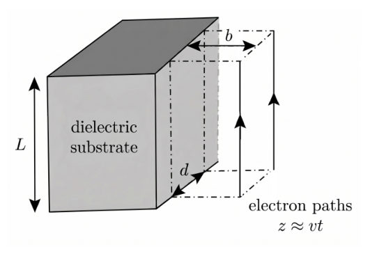
<figcaption class="paper-figure-caption"><b>Fig 1.</b> FIG. 1. Schematic of the interaction geometry. Two electron paths are separated by a distance d, propagate at a height b above the substrate with velocity v, over a length L.</figcaption>
</figure>
<figure class="paper-figure-card">
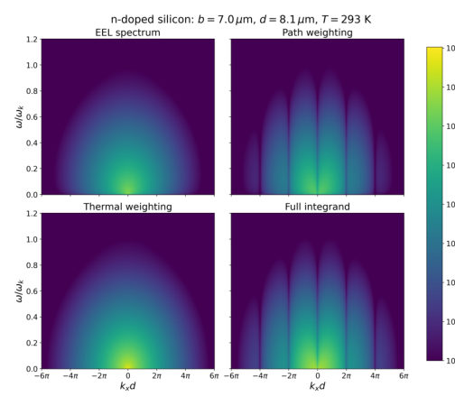
<figcaption class="paper-figure-caption"><b>Fig 2.</b> FIG. 2. Mode-resolved contributions to the decoherence rate integrand in the (kx, ω) plane for an electron beam at height b = 7.0 µm above an n-doped silicon surface, with path sepa- ration d = 8.1 µm, and at temperature T = 293 K. (Dielectric parameters are given in Eq. 38.) Top left: differential EEL spectrum d3P/(dz dω dkx). Top right: product of the EEL spectrum with the path weighting factor 1 −cos(kxd). Bot- tom left: product of EEL spectrum with the thermal factor coth(ℏω/2kBT). Bottom right: the full integrand entering γ(b, d, T)—the differential EEL spectrum multiplied both by the path and the thermal weighting.</figcaption>
</figure>
<figure class="paper-figure-card">
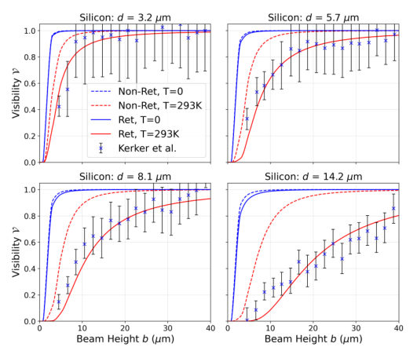
<figcaption class="paper-figure-caption"><b>Fig 3.</b> FIG. 3. Visibility V as a function of surface distance b for several fixed path separations d (indicated in each panel), for a split electron passing over n-doped silicon. Discrete points show digitized results from Kerker et al. Dashed curves cor- respond to non-retarded models (Eq. 28), and solid curves correspond to retarded models (Eq. 32); blue curves use the zero-temperature decoherence rate (Eq. 22), while red curves include the thermal correction at T = 293 K (Eq. 37). Both thermal and retardation effects are important to the experi- mental signal.</figcaption>
</figure>
<figure class="paper-figure-card">
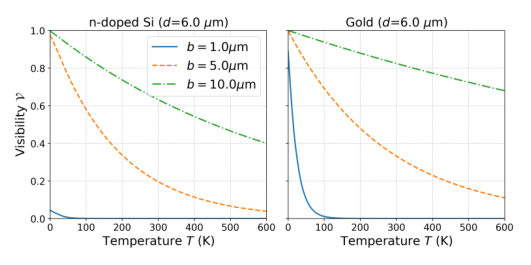
<figcaption class="paper-figure-caption"><b>Fig 4.</b> FIG. 5. Fringe visibility V as a function of substrate temper- ature T for three impact parameters b, at fixed path separa- tion d = 6.0 µm, computed using the retarded model (Eq. 32) with thermal weighting (Eq. 37) for n-doped silicon parame- ters (Eq. 38) and for gold parameters (Eq. 39).</figcaption>
</figure>
<figure class="paper-figure-card">
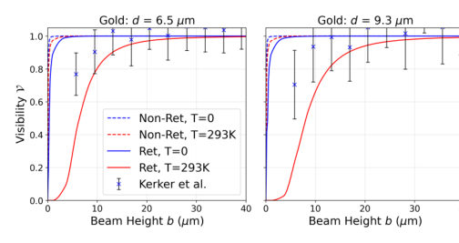
<figcaption class="paper-figure-caption"><b>Fig 5.</b> FIG. 4. Results as in Fig. 3, but for gold instead of n-doped silicon. The retarded predictions require a low-frequency cut- off to avoid the ω →0 Drude divergence, discussed in text. As in silicon, both thermal and retardation effects are impor- tant, but here the retardation effects dominate.</figcaption>
</figure>

**Summary.** This paper models decoherence in electron interferometry near surfaces by linking the loss of fringe visibility to the substrate's electronic excitation spectrum (EELS). The authors show that the decoherence rate depends on the EELS spectrum weighted by the path separation, concluding that both finite temperature and retardation effects are crucial for accurate quantitative predictions. This suggests that fringe visibility can be used as a sensitive, near-field thermometer for the substrate.

**Why it may be interesting.** This work provides a concrete, measurable link between quantum interference phenomena (visibility loss) and the continuum of excitations in a material (EELS), offering a novel, near-field thermometric probe.

Detailed structure

**Main problem.** The paper develops a mode-resolved description of decoherence in split-beam electron interferometry near dielectric surfaces and connects this process to Electron Energy-Loss Spectroscopy (EELS).

**Main result.** The decoherence rate is found to be a weighted integral over the differential EELS spectrum, and both retardation and finite temperature effects are necessary for quantitative agreement with experiments.

**Method.** The analysis involves deriving a rate equation for fringe visibility decay, relating the decoherence rate to the EELS spectrum via a path distinguishability factor.

**Model / system.** The system is electron interferometry using two electron trajectories separated by distance $d$ above a dielectric substrate. The substrate response is modeled using its dielectric function $\epsilon(\omega)$.

**Key observables.** Fringe visibility ($V$), decoherence rate ($\gamma(b, d)$), and the differential EELS spectrum.

**Important parameters / regimes.** Path separation ($d$), electron height ($b$), interaction length ($L$), temperature ($T$), and the substrate's dielectric function $\epsilon(\omega)$.

**Assumptions / limitations.** The analysis uses the Markovian approximation and initially considers first-order coupling to the substrate excitations.

**Figures summary.** Figures illustrate the geometry of the interaction, compare predicted visibility vs. beam height for different models (thermal vs. retarded), and show temperature dependence of visibility.

**Paper structure.** The paper builds from the fundamental decoherence rate calculation, derives the rate equation for visibility decay, and then compares the resulting model against established experimental results, emphasizing the necessity of thermal and retardation corrections.

Abstract

We develop a mode-resolved description of decoherence in split-beam electron interferometry near dielectric surfaces, and show how it connects to models from electron energy-loss spectroscopy (EELS). The central result is that the decoherence rate is a weighted integral over the differential EELS spectrum, with a factor $1-\cos(k_x d)$ encoding the path distinguishability of the two electron trajectories. Incorporating retardation and thermal occupation reproduces the macroscopic QED model of Scheel and Buhmann. We compare non-retarded vs. retarded and non-thermal vs. thermally weighted variants of the model against published results from Kerker et al., finding that both retardation and finite temperature are required for reasonable quantitative agreement. The thermal weighting suggests an application: fringe visibility as a near-field thermometric probe of the substrate, sensitive to the evanescent regime inaccessible to far-field methods.

[↑ back to top](#top)

### [Chutes and Ladders: Dynamical Automorphisms via the ZX-Calculus](http://arxiv.org/abs/2606.02542v1)

**Authors:** Alexander Frei, Sascha Zakaib-Bernier, Zachary Mann, Michael Vasmer, Victor V. Albert  
**Type:** theory · **Category:** quantum information and computing · **PDF:** <https://arxiv.org/pdf/2606.02542v1>  
**Analysis basis:** full PDF text, analyzed in chunks
**Topic relevance:** `entanglement & information structure` **1/5**

↔ Scroll figures horizontally

<figure class="paper-figure-card">
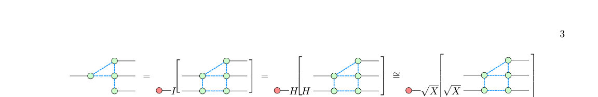
<figcaption class="paper-figure-caption"><b>Fig 1.</b> FIG. 1. ZX-encoding graphs of subsystem codes that gauge fix into a stabilizer code. From left to right, we have the ZX- encoding graph of a stabilizer code and, in brackets, the subsystem codes that Z/X/Y gauge fix into the stabilizer code.</figcaption>
</figure>
<figure class="paper-figure-card">
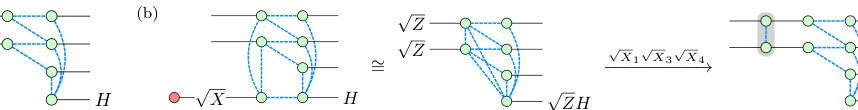
<figcaption class="paper-figure-caption"><b>Fig 2.</b> FIG. 2. Dynamical automorphism of the [[4, 2, 2]] code. We extend the original ZX-encoding graph (a) to construct a subsystem code (b) that Y gauge-fixes into the [[4, 2, 2]] code up to some local Clifford gates and a logical CZ gate (highlighted in gray).</figcaption>
</figure>
<figure class="paper-figure-card">
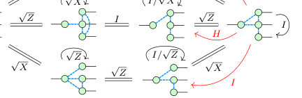
<figcaption class="paper-figure-caption"><b>Fig 3.</b> FIG. 4. Local Clifford (LC) orbit of the 3-qubit code from Fig. 3a, whose ZX-encoding graph is on the far right side of the diagram. Here, the equalities between ZX-encoding graphs refer to LC equivalence, whereas the looping arrows represent LC gates that bring the graph to itself. The gates above them keep track of the logical gate induced by the given LC, and we do not keep track of the physical gates they in- duce. The red arrows correspond to the X and Y gauge fixings seen in Fig. 3b &amp; Fig. 3c, respectively.</figcaption>
</figure>
<figure class="paper-figure-card">
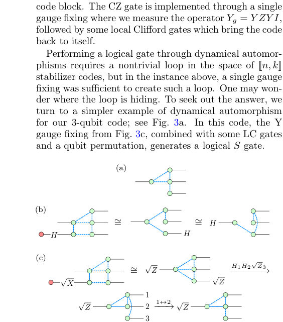
<figcaption class="paper-figure-caption"><b>Fig 4.</b> FIG. 3. Gauge fixing examples and dynamical automorphism for a 3-qubit code. (a) ZX-encoding graph of this code. (b) X gauge fixing of a subsystem code built by extending (a), giving two equivalent ZX-encoding graphs. (c) Dynamical automorphism generating a logical S gate consisting of a Y gauge fixing, local Clifford gates, and a qubit permutation.</figcaption>
</figure>
<figure class="paper-figure-card">
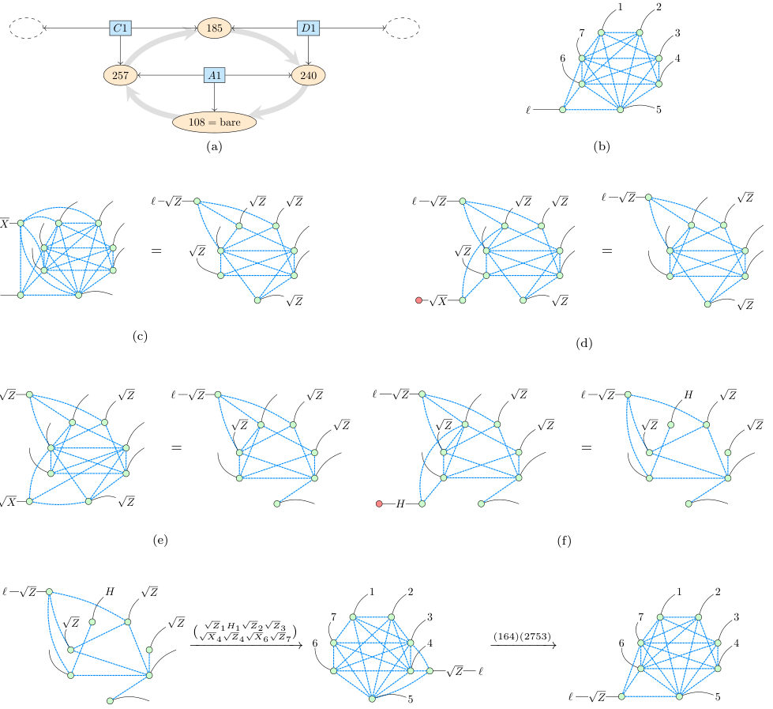
<figcaption class="paper-figure-caption"><b>Fig 5.</b> FIG. 5. Dynamical automorphism for the bare code implementing a logical S gate: (a) Closed loop in the space of [[7, 1, 3]] stabilizer codes. The blue squares are subsystem codes that Z/X/Y gauge fix into stabilizer codes (orange bubbles). See [64, Figure 12] for more details. (b) ZX-encoding graph of the [[7, 1, 3]] bare code [68]. We label the logical qubit wire ℓand the physical qubit wires 1, . . . , 7. (c) Y -gauge fixing of subsystem A1 from the bare code (108) into stabilizer code (257). (d) Y -gauge fixing of C1 from (257) into (185). (e) Y -gauge fixing of D1 from (185) into (240). (f) X-gauge fixing of A1 from (240) back into the bare code (up to local Cliffords and qubit...</figcaption>
</figure>

**Summary.** This paper introduces a powerful graphical method using the ZX-calculus to study dynamical automorphisms in quantum error correction codes. By modeling code switching as a path in the space of stabilizer codes, the authors provide a systematic way to construct these automorphisms. This machinery allows for the theoretical design and search for implementations of complex logical quantum gates.

**Why it may be interesting.** The rigorous mathematical framework connecting gauge fixing, graph theory, and code structure provides powerful tools for understanding the underlying symmetries and computational capabilities of quantum error-correcting codes.

Detailed structure

**Main problem.** To develop a machine-interpretable method for constructing dynamical automorphisms for quantum error correction (QEC) codes, particularly for handling dynamical stabilizer codes.

**Main result.** The authors show that dynamical automorphisms can be constructed by viewing code switching as a closed loop in the space of stabilizer codes, which they term 'chutes and ladders' relative to local Clifford operations.

**Method.** The core method extends the ZX-calculus to model gauge fixing, which is used to implement these paths in the space of stabilizer codes by combining gauge-fixing steps.

**Model / system.** The work focuses on stabilizer codes, represented by their ZX-encoding graphs, and extends this framework to subsystem codes and dynamical codes. The mathematical tools involve the ZX-calculus, graph theory, and symplectic representations.

**Key observables.** Dynamical automorphisms, logical gates (e.g., logical S or phase gate), and the structure of the Local Clifford (LC) orbit graph.

**Important parameters / regimes.** The code parameters $[[n, k, d]]$ (e.g., the 7-qubit code), and the local Clifford group elements.

**Assumptions / limitations.** The method relies on the connection between measurement-based code-switching and gauge fixing, and the ability to define a unique normal form for ZX-encoding graphs.

**Figures summary.** Figures illustrate ZX-encoding graphs, showing how gauge fixing creates closed loops (dynamical automorphisms) in the space of stabilizer codes, and demonstrating the implementation of specific logical gates.

**Paper structure.** The paper systematically develops the ZX-calculus formalism for subsystem codes, establishes a unique normal form for these graphs, and then applies this framework to show that gauge fixing generates dynamical automorphisms that can implement desired logical gates.

Abstract

The ZX-calculus is a powerful graphical language for manipulating quantum circuits, which has recently found many applications in quantum error correction. We extend this language to handle Floquet and other dynamical stabilizer codes via the connection between measurement-based code switching and gauge fixing (arXiv:1810.10037). We combine gauge-fixing steps to implement a closed loop in the space of stabilizer codes, returning to the original codespace up to a logical Clifford gate. These measurement-based paths in the space of stabilizer codes can be viewed as shortcuts, or "chutes and ladders", relative to single-qubit Clifford operations and qubit permutations. This yields a machine-interpretable method for constructing dynamical automorphisms and facilitates the search for implementations of desired logical gates. As an example, we implement a logical phase gate via distance-preserving code switching for the seven-qubit code bare code (arXiv:1702.01155), which has no non-trivial logical Clifford gates based on single-qubit Clifford operations and qubit permutations (arXiv:2409.18175).

[↑ back to top](#top)

### [Computational Phase Transitions in Binary Compressed Sensing: Quantum Annealing Inside the Relaxation Gap](http://arxiv.org/abs/2606.00806v1)

**Authors:** William Hahn, Natalia Romero  
**Type:** both · **Category:** quantum information and computing · **PDF:** <https://arxiv.org/pdf/2606.00806v1>  
**Analysis basis:** full PDF text, analyzed in chunks
**Topic relevance:** `QC/QI experiment` **1/5**

↔ Scroll figures horizontally

<figure class="paper-figure-card">
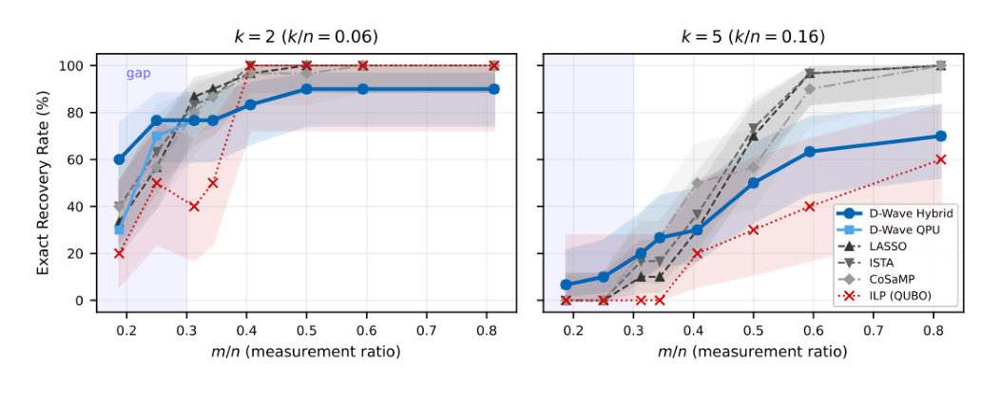
<figcaption class="paper-figure-caption"><b>Fig 1.</b> Fig. 1. Phase transition in exact recovery rate versus measurement ratio m/n for k = 2 (left) and k = 5 (right) at n = 32. Shaded region indicates the relaxation gap. At k = 2, D-Wave Hybrid leads at low m/n; AMP is competitive. At k = 5, D-Wave is the only solver with any recovery at m/n ≤0.25. Bands: 95% Wilson CIs.</figcaption>
</figure>
<figure class="paper-figure-card">
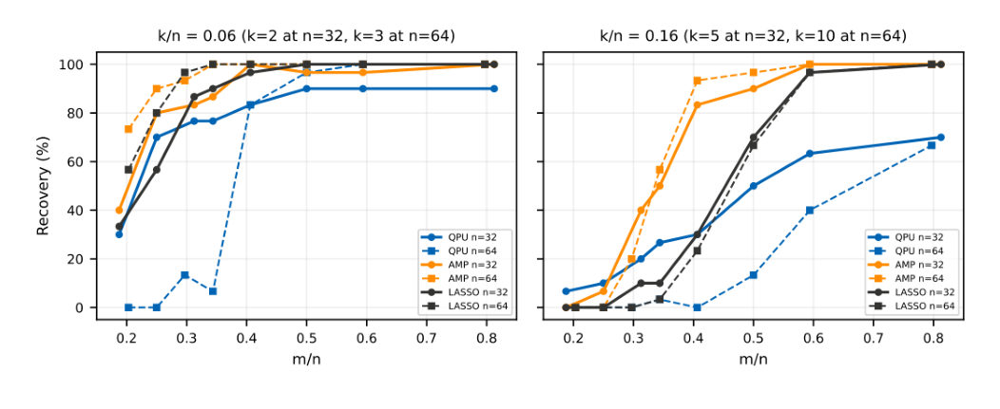
<figcaption class="paper-figure-caption"><b>Fig 2.</b> Fig. 2. Scaling comparison: n = 32 (solid, circles) versus n = 64 (dashed, squares) at matched sparsity ratios. Left: k/n ≈0.06. Right: k/n ≈0.16. The QPU advantage at n = 32 does not extend to n = 64, where AMP dominates. The embedding boundary is visible as the gap between QPU curves at the two scales.</figcaption>
</figure>
<figure class="paper-figure-card">
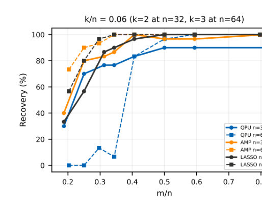
<figcaption class="paper-figure-caption"><b>Fig 3.</b> Fig. 4 (right panel) maps the quantum advantage topol- ogy ∆R = RD-Wave −Rclassical across the full (k/n, m/n) plane. The positive (blue) region corresponds to the re- laxation gap: the advantage is largest at low k/n and low m/n, precisely where the Donoho-Tanner theory predicts ℓ1 failure. This landscape structure—where the QUBO ground state is shallow relative to surrounding incorrect basins—may generalize to other dense QUBO problems arising from Gram matrices AT A, suggesting quantum annealing’s advantage is not specific to compressed sensing</figcaption>
</figure>
<figure class="paper-figure-card">
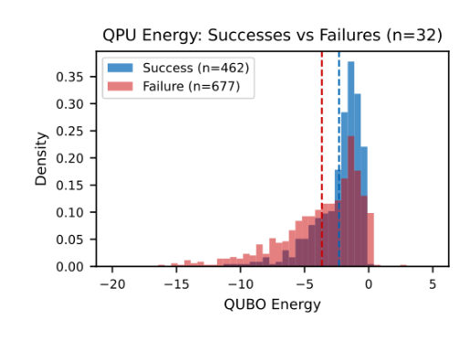
<figcaption class="paper-figure-caption"><b>Fig 4.</b> Fig. 3. QUBO energy distribution for D-Wave QPU successes versus failures at n = 32. Successful recoveries find lower energies (ground state basin). Failures are trapped in higher-energy local minima. Dashed lines: means.</figcaption>
</figure>
<figure class="paper-figure-card">
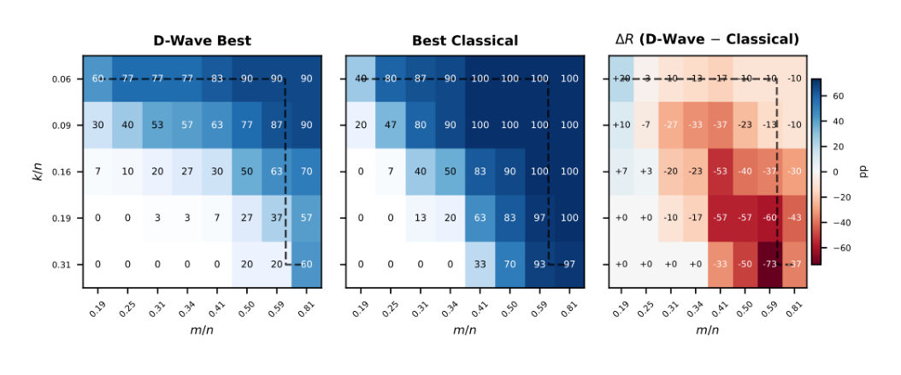
<figcaption class="paper-figure-caption"><b>Fig 5.</b> Fig. 4. Recovery heatmaps with Donoho-Tanner phase transition boundary [4]–[6] (dashed). Left: D-Wave best (hybrid or QPU). Center: Best classical solver. Right: Quantum advantage topology ∆R = RD-Wave−Rclassical (blue = quantum advantage, red = classical advantage). The advantage concentrates below the DT boundary.</figcaption>
</figure>

**Summary.** This paper explores quantum annealing for solving sparse signal recovery problems in compressed sensing, focusing on a regime called the 'relaxation gap'. The authors report that quantum annealing successfully recovers signals in this gap where even the best classical algorithm, AMP, fails. While the advantage is shown empirically for small systems, the work suggests a potential role for quantum tunneling in solving classically intractable optimization barriers.

**Why it may be interesting.** The work directly applies quantum computation (quantum annealing) to a hard optimization problem (sparse recovery), providing empirical evidence of quantum advantage in a regime where classical methods are theoretically optimal, which is highly relevant to quantum algorithms for optimization.

Detailed structure

**Main problem.** The paper investigates the computational phase transition boundary in binary compressed sensing, specifically identifying a regime where quantum annealing outperforms all tested classical recovery methods.

**Main result.** At a specific point in the 'relaxation gap' ($n=32$), quantum annealing achieved exact signal recovery (7%) where the best classical solver (AMP) failed entirely (0%), suggesting a quantum advantage in this finite-size setting.

**Method.** The authors compared the performance of D-Wave quantum annealing against established classical algorithms like AMP, using energy landscape analysis to hypothesize that quantum tunneling is responsible for the observed advantage.

**Model / system.** The problem is formulated as recovering sparse binary signals ($\mathbf{x} \in \{0, 1\}^n$) from measurements ($\mathbf{y} = \mathbf{A}\mathbf{x}$), mapped onto a QUBO Hamiltonian solved on a D-Wave quantum annealer.

**Key observables.** Exact recovery rate (%), QUBO ground state energy, and comparison against the Bayes-optimal classical threshold.

**Important parameters / regimes.** The critical regime is the 'relaxation gap' (below the Donoho-Tanner $\ell_1$ threshold), with specific tested parameters being $n=32, k=5, m/n=0.19$.

**Assumptions / limitations.** The observed advantage is preliminary, finite-size evidence, and the mechanism relies on the hypothesis that quantum tunneling overcomes local minima trapping classical search.

**Figures summary.** Figures map the phase transition boundaries and compare recovery rates across different system sizes ($n=32$ vs $n=64$), highlighting the quantum advantage in the gap region.

**Paper structure.** The paper establishes the problem in compressed sensing, details the comparison between quantum and classical solvers, presents empirical results showing quantum advantage in the gap, analyzes the energy landscape, and concludes by outlining the limitations and need for larger-scale confirmation.

Abstract

We map the computational phase transition boundary in binary compressed sensing and identify a regime where D-Wave's quantum annealer recovers signals in a region where all tested classical methods fail, including Approximate Message Passing (AMP), which achieves the Bayes-optimal recovery threshold asymptotically for Gaussian matrices. In 19,775 experiments (n in {32, 64}, nine classical solvers, two D-Wave modes), we find that quantum annealing recovers sparse binary signals in the relaxation gap -- the regime below the Donoho-Tanner l1 phase transition where the l0 solution exists but convex relaxations fail. At n=32, k=5, m/n=0.19, D-Wave achieves 7% exact recovery while AMP and eight other solvers score 0% across 250 combined trials (Fisher exact p=0.018). At n=64, embedding overhead limits the QPU, but D-Wave's hybrid solver remains competitive with AMP. Energy landscape analysis reveals that the QUBO ground state contains the true signal, but incorrect solutions occupy shallower local basins that trap classical search -- a structure consistent with quantum tunneling dynamics. To our knowledge, this constitutes preliminary finite-size evidence that quantum annealing succeeds in a narrow regime where all tested classical methods, including the Bayes-optimal AMP, fail within a well-characterized combinatorial inference problem. Confirmation at larger n, higher trial counts, and with stronger classical controls remains an open problem.

[↑ back to top](#top)

### [Defect Holonomy Near Rank-Deficient Mixed States](http://arxiv.org/abs/2606.02343v1)

**Authors:** Yu-Huan Huang, Xu-Yang Hou, Hao Guo  
**Type:** theory · **Category:** other · **PDF:** <https://arxiv.org/pdf/2606.02343v1>  
**Analysis basis:** full PDF text, analyzed in chunks
**Topic relevance:** `entanglement & information structure` **1/5**

↔ Scroll figures horizontally

<figure class="paper-figure-card">
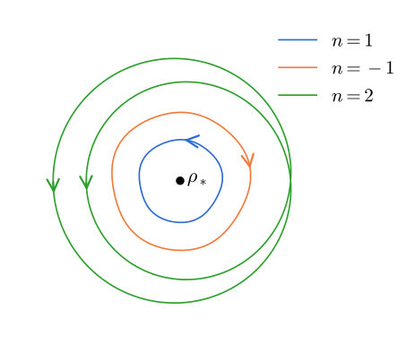
<figcaption class="paper-figure-caption"><b>Fig 1.</b> Figure 1: Schematic illustration of the punctured manifold M× = M \ {ρ∗}. The removed rank-deficient point ρ∗acts as a geometric defect, rendering loops encircling the puncture noncontractible. The three representative loops correspond to winding numbers n = 1, n = 2, and n = −1, which generate distinct homotopy classes in π1(M×) ≃Z.</figcaption>
</figure>
<figure class="paper-figure-card">
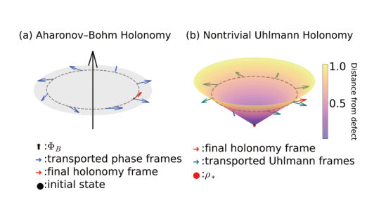
<figcaption class="paper-figure-caption"><b>Fig 2.</b> Figure 2: Comparison between the Aharonov–Bohm effect and the Uhlmann defect holonomy. (a) Parallel transport around a magnetic flux tube in the Aharonov–Bohm effect, illustrating the acquired geometric phase ΦB. (b) Paral- lel transport on the punctured mixed-state manifold M× = M \ {ρ∗}, where a loop encircling the rank-deficient point ρ∗ acquires a nontrivial Uhlmann holonomy.</figcaption>
</figure>
<figure class="paper-figure-card">
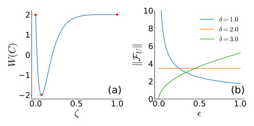
<figcaption class="paper-figure-caption"><b>Fig 3.</b> Figure 3: (a) Wilson loop variable W (C) = Tr U(C) as a function of the spectral ratio ζ. The red points mark the representative values ζ = 1, ζ = 7−4 √</figcaption>
</figure>

**Summary.** This work analyzes the geometry of mixed quantum states near rank-changing singularities, identifying these points as geometric defects. The authors show that while local curvature diverges path-dependently, the global topological invariant—the Uhlmann holonomy—remains robust. This holonomy provides a continuous classification of the defect, generalizing concepts from Berry phase physics to mixed systems.

**Why it may be interesting.** It provides a powerful geometric tool (holonomy) to characterize singularities in the space of quantum states that are robust against local perturbations, which is crucial for understanding quantum phase transitions or decoherence effects.

Detailed structure

**Main problem.** The paper investigates the geometric structure of mixed quantum states near points where the rank of the density matrix changes, treating these singularities as effective geometric defects.

**Main result.** The robust geometric information is encoded not in the path-dependent Uhlmann curvature, but in the global, asymptotically robust Uhlmann holonomy around the defect, which is classified by a continuous, non-quantized variable.

**Method.** The authors use the Uhlmann connection and holonomy, generalizing Berry phase concepts to mixed states, by analyzing the topology of the punctured state manifold.

**Model / system.** The analysis is performed on the manifold of mixed quantum states ($
ho$), using an exactly solvable qutrit model ($	ext{SU}(2)$ sector) as a primary test case.

**Key observables.** Uhlmann holonomy, Wilson loop variable $W(C) = 	ext{Tr} U(C)$, and the Uhlmann curvature $\lVert F_U 
Vert$.

**Important parameters / regimes.** Spectral ratios of vanishing eigenvalues ($\zeta$), and the scaling exponents ($\alpha_a$) governing eigenvalue approach to the singularity.

**Assumptions / limitations.** The analysis requires restricting to the full-rank sector and working on the punctured manifold $M^	imes$ to define the holonomy.

**Figures summary.** Figures schematically illustrate the punctured manifold $M^	imes$ and the non-trivial fundamental group $\pi_1(M^	imes) \simeq \mathbb{Z}$. They also plot the continuous dependence of the Wilson loop variable $W(C)$ on spectral ratios and the power-law scaling of the curvature magnitude.

**Paper structure.** The paper establishes the singularity at rank-deficient points, contrasts the path-dependent curvature singularity (Theorem 2) with the robust asymptotic holonomy (Theorem 1), and derives the continuous classification of the defect via the Wilson loop variable.

Abstract

We investigate the geometry of mixed quantum states near rank-changing points, showing that these singularities function as effective geometric defects. The Uhlmann connection is well-defined only on the full-rank sector of the density-matrix manifold, while rank-deficient states form singular boundary strata where the bundle structure degenerates. By restricting to a punctured state manifold that excludes the singular set, we obtain a well-defined gauge structure and identify an asymptotically robust invariant: the Uhlmann holonomy around noncontractible loops encircling the defect. In an exactly solvable qutrit model, a restricted submanifold emerges on which the connection is locally flat yet carries nontrivial monodromy, analogous to flat connections with Aharonov--Bohm-type transport. The holonomy depends only on the ratios of the vanishing eigenvalues under frozen radial dependence of the eigenbasis geometry and a fixed angular loop. In contrast, the Uhlmann curvature may diverge path-dependently when eigenvalues shrink with distinct powers, with a leading spectral-prefactor scaling law, establishing that the holonomy survives as a universal asymptotic invariant while the curvature remains non-universal. Within the effective SU(2) defect sector, the conjugacy class of the holonomy, equivalently the Wilson loop variable, provides a continuous, non-quantized classification of the asymptotic monodromy surrounding the rank-deficient defect. This non-quantization does not imply a lack of robustness: the asymptotic holonomy is protected by the topology of the punctured manifold and is insensitive to smooth deformations of the loop or the radial profile.

[↑ back to top](#top)

### [Dynamics of the Density Cube](http://arxiv.org/abs/2606.02421v1)

**Authors:** Nabin Bhatta, Djordje Minic, Tatsu Takeuchi  
**Type:** theory · **Category:** other · **PDF:** <https://arxiv.org/pdf/2606.02421v1>  
**Analysis basis:** full PDF text, analyzed in chunks
**Topic relevance:** `interference shaping light` **1/5**

↔ Scroll figures horizontally

<figure class="paper-figure-card">
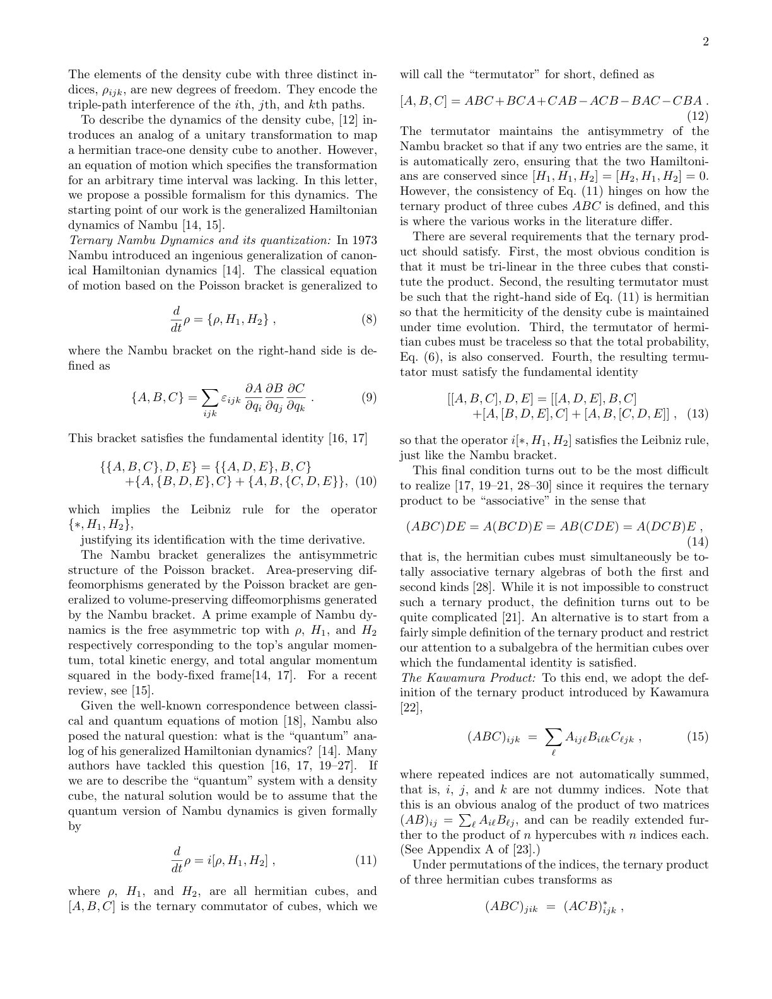
<figcaption class="paper-figure-caption"><b>Fig 1.</b> Low-resolution page preview, page 2</figcaption>
</figure>
<figure class="paper-figure-card">
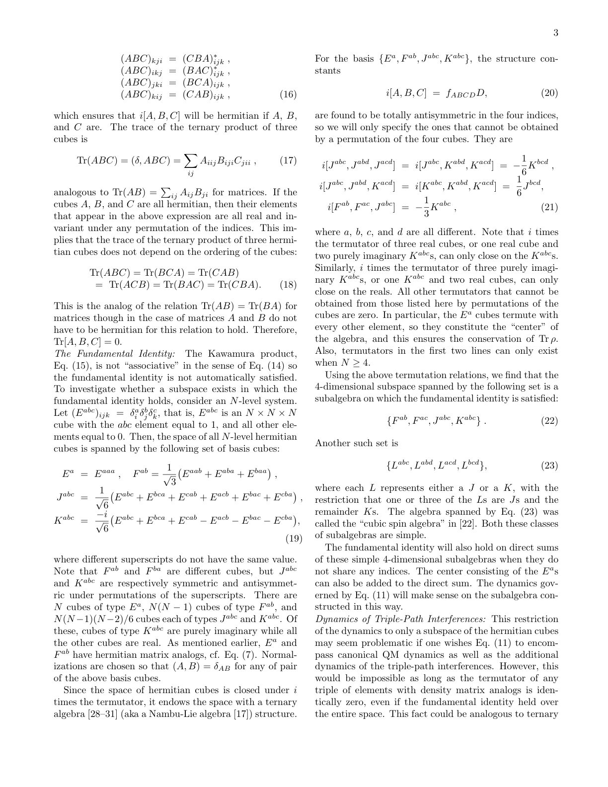
<figcaption class="paper-figure-caption"><b>Fig 2.</b> Low-resolution page preview, page 3</figcaption>
</figure>
<figure class="paper-figure-card">
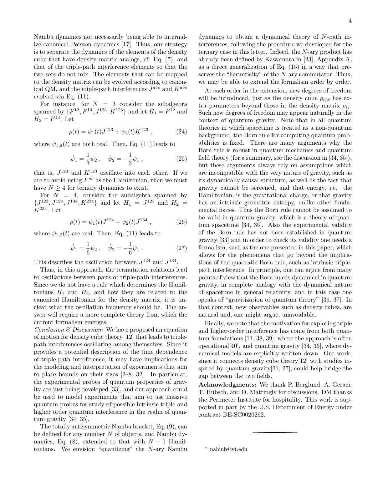
<figcaption class="paper-figure-caption"><b>Fig 3.</b> Low-resolution page preview, page 4</figcaption>
</figure>
<figure class="paper-figure-card">
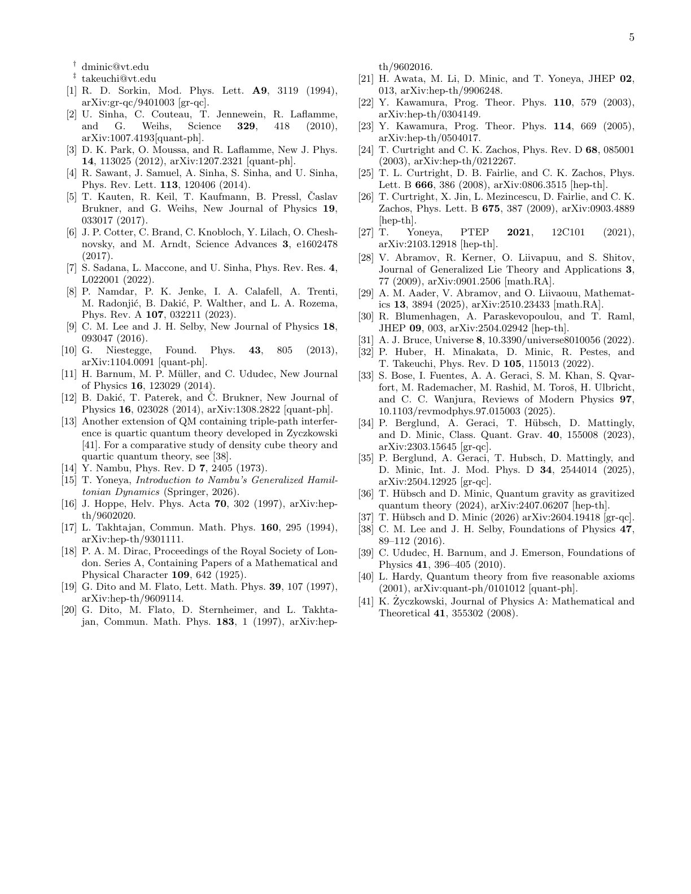
<figcaption class="paper-figure-caption"><b>Fig 4.</b> Low-resolution page preview, page 5</figcaption>
</figure>

**Summary.** This theoretical paper introduces 'Density Cube Theory' to model quantum dynamics beyond standard pairwise interference by using a three-index density cube. The authors derive the evolution equation from quantizing ternary Nambu dynamics, predicting that triple-path interference terms exhibit oscillatory behavior. This work suggests a new framework for understanding higher-order quantum correlations.

**Why it may be interesting.** This work proposes a fundamental extension to quantum dynamics that models higher-order interference effects, which is highly relevant for theoretical investigations into quantum gravity or non-standard quantum foundations.

Detailed structure

**Main problem.** The paper aims to extend standard quantum mechanics formalism beyond pairwise path interference to incorporate and describe triple-path interference.

**Main result.** The authors derive an equation of motion for the density cube based on quantizing ternary Nambu dynamics, finding that pairs of triple-path interferences oscillate into each other.

**Method.** The formalism involves extending the density matrix to a three-index 'density cube' ($
ho_{ijk}$) and deriving its dynamics using a quantum analog of the Nambu bracket.

**Model / system.** The model is the 'Density Cube Theory,' which describes quantum states using a three-index tensor ($
ho_{ijk}$). The dynamics are governed by a structure derived from ternary Nambu dynamics, requiring the use of a specific 'Kawamura Product' to maintain algebraic consistency.

**Key observables.** Triple-path interference elements ($
ho_{ijk}$ with distinct indices) and the conservation of the trace ($	ext{Tr}
ho = 1$).

**Important parameters / regimes.** The system is analyzed for $N$-level systems, with specific calculations shown for $N=3$ and $N=4$.

**Assumptions / limitations.** The dynamics are assumed to follow the form $d
ho/dt = i[
ho, H_1, H_2]$, and the authors adopt the Kawamura Product to bypass full associativity requirements.

**Figures summary.** Not specified (The notes only mention equations and structural results, not figure content).

**Paper structure.** The paper introduces the density cube formalism, derives the equation of motion from quantized ternary Nambu dynamics, calculates the structure constants for the resulting ternary algebra, and finally demonstrates the oscillatory behavior of the triple-path interference terms.

Abstract

Density cube theory extends the canonical quantum density matrix $ρ_{ij}$ with the addition of an extra index to $ρ_{ijk}$. The elements of the density cube with two different indices, $ρ_{iij}$ and $ρ_{ijj}$, correspond to the real and imaginary parts of the off-diagonal element $ρ_{ij}$ of the density matrix and describe double-path interference, while those with three different indices describe non-canonical triple-path interference. In this letter, we propose an equation of motion for the density cube, obtained from the quantization of ternary Nambu dynamics, and find that pairs of triple-path interferences oscillate into each other.

[↑ back to top](#top)

### [Evolution of the intertwining correlated topological phases in iron-based superconductor Fe(Te,Se)](http://arxiv.org/abs/2606.01786v1)

**Authors:** Yue Sun, Shiying He, Zhongyi Zhang, Yong Huang, Jingheng Chen, Weixiang Yan, Chunbo Yu, Yuyang Dong, Kohei Aido, Xin Zhou, Zhengtai Liu, Mao Ye, Jishan Liu, Haruhisa Kitano, Zhixiang Shi, Hong Ding, Takeshi Kondo, Xianxin Wu, Peng Zhang  
**Type:** experiment · **Category:** strongly correlated electrons · **PDF:** <https://arxiv.org/pdf/2606.01786v1>  
**Analysis basis:** full PDF text, analyzed in chunks
**Topic relevance:** `analog quantum simulation` **1/5**

↔ Scroll figures horizontally

<figure class="paper-figure-card">
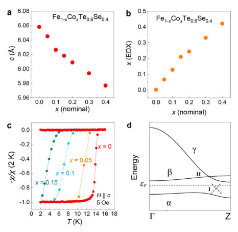
<figcaption class="paper-figure-caption"><b>Fig 1.</b> Fig. 1. Structure, composition and Tc of Co-doped FeTe0.6Se0.4. a, Lattice constant c for Fe1−xCoxTe0.6Se0.4 (0 ≤x ≤0.4) obtained from the X-ray diffraction measure- ments. b, EDX results for the actual Co concentrations. c, Temperature dependence of the reduced magnetic susceptibil- ities -χ/χ(2 K) under 5 Oe for Fe1−xCoxTe0.6Se0.4 (0 ≤x ≤ 0.15). d, Sketch of band dispersion along kz direction. There are two band inversions (Band inversion I and II). α/β band consists of dxz/yz orbital, while γ band mainly consists of pz orbital. In undoped Fe(Te,Se), Fermi level is located roughly at the dashed line, in the SOC gap of the band inversion I.</figcaption>
</figure>
<figure class="paper-figure-card">
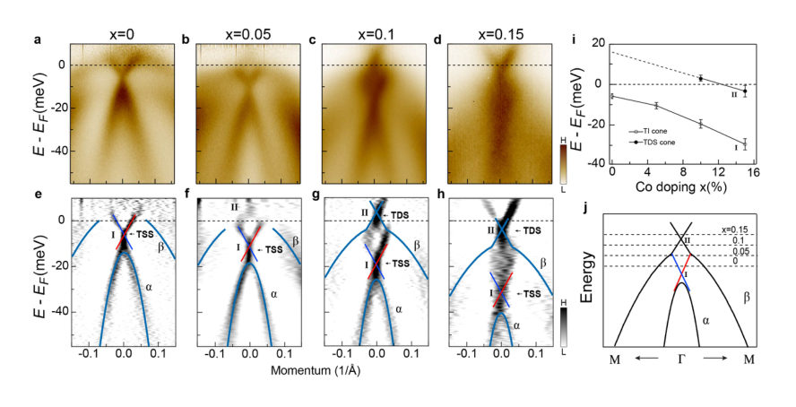
<figcaption class="paper-figure-caption"><b>Fig 2.</b> Fig. 2. Evolution of the TI and TDS Dirac bands with Co doping. a-d, Band structure of Fe1−xCoxTe0.6Se0.4 (x = 0, 0.05, 0.1, 0.15) near Γ at 30 K, with a laser delivering p-polarized 7-eV photons. e-h, Curvature intensity plots of a-d. i, Shift of the TI (I) and TDS (II) Dirac points with Co doping. Extraction method of the Dirac point positions can be found in Supplementary Information, Section S2. j, Sketch of the in-plane band structure along ΓM. The Dirac band (I) with red and blue lines is the TI Dirac band. The Dirac band (II) on top is the TDS band. The dashed lines represent the corresponding Fermi level at different Co doping.</figcaption>
</figure>
<figure class="paper-figure-card">
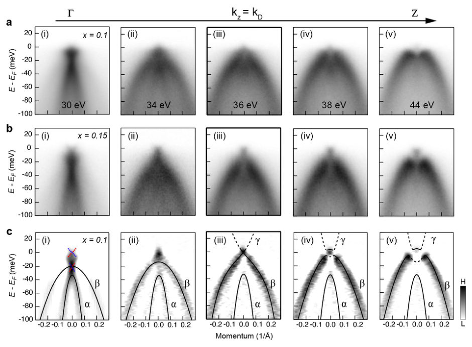
<figcaption class="paper-figure-caption"><b>Fig 3.</b> Fig. 3. Photon-energy dependence of band structure in Fe1−xCoxTe0.6Se0.4 (x = 0.1 and 0.15) at 30K. a, ARPES spectra of x = 0.1 sample at different photon energies from 30 eV to 44 eV. b, The same as a but with x = 0.15 sample. c, EDC curvature plot of a. The bulk Dirac point is determined to be at around 36 eV. The black lines indicate the bulk bands. The blue and red dashed lines in c(i) indicated the TI surface band and TDS surface components, which are unclear at higher photon energies.</figcaption>
</figure>
<figure class="paper-figure-card">
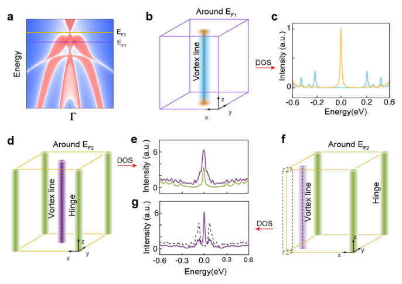
<figcaption class="paper-figure-caption"><b>Fig 4.</b> Fig. 4. Possible Majorana modes in electron-doped Fe(Te,Se). a, Schematic surface spectrum of the (001) surface in the normal state. b, Hybrid vortex phase around EF1 with conventional s-wave pairing, exhibiting both Majorana zero mode (yellow) at the end of vortex and 1D Majorana mode (cyan) along the vortex. c, Calculated local density of states of the two Majorana modes in b. d, e, Majorana mode in the vortex (purple) and Majorana mode at the hinge (green) with B1u/2u pairing around EF2. d shows the distribution of the two Majorana modes in real space, and e shows their calculated local density of states. f, When the Majorana mode in the vortex is close to a hinge, the two Majorana modes...</figcaption>
</figure>

**Summary.** This work uses ARPES on Co-doped iron-based superconductors to study how multiple topological electronic states coexist and interact under electron doping. The key finding is the direct observation of two distinct topological bands intersecting at the Fermi level, which establishes the material as an excellent platform for exploring complex Majorana mode physics in correlated superconductors.

**Why it may be interesting.** The explicit focus on correlated topological superconductivity and the detailed mapping of multiple interacting topological states (TI/TDS) provides a rich playground for understanding emergent quantum phenomena beyond simple BCS theory.

Detailed structure

**Main problem.** The study investigates the complex interplay between multiple coexisting topological superconducting states and strong correlation effects within iron-based superconductors.

**Main result.** The authors directly resolved two distinct intertwining topological states (TI surface and TDS bulk) in Co-doped Fe(Te,Se), showing that their intersection at the Fermi level enables the existence of multiple Majorana modes.

**Method.** The research employed high-resolution Angle-Resolved Photoelectron Spectroscopy (ARPES) to map the band structure evolution, supplemented by X-ray diffraction and magnetic susceptibility measurements.

**Model / system.** The physical system is the iron-based superconductor $	ext{Fe}(	ext{Te},	ext{Se})$, specifically $	ext{Co}$-doped $	ext{Fe}(	ext{Te},	ext{Se})$, which serves as an ideal platform to study correlated topological superconductivity.

**Key observables.** Band dispersion, Dirac point positions (TI and TDS), superconducting transition temperature ($T_c$) dependence on doping, and the presence/evolution of Majorana zero modes.

**Important parameters / regimes.** Electron doping level ($x$ via Co substitution), Fermi level position ($E_F$), and the energy separation between the two topological bands ($\approx 20 	ext{ meV}$).

**Assumptions / limitations.** The topological states observed are significantly affected by the strong correlation effect, and the $	ext{Co}$ substitution successfully tunes the system to isolate the relevant topological physics.

**Figures summary.** Figures show the evolution of TI and TDS Dirac bands with Co doping, confirming their relative positions and the shift of Dirac points. Other figures illustrate the $k_z$ dispersion and schematic representations of hybrid Majorana vortex phases.

**Paper structure.** The paper progresses by first characterizing the material structure and doping dependence (Fig. 1), then using ARPES to map the coexisting topological bands (Fig. 2), and finally analyzing the implications for Majorana modes by tracking band evolution and theoretical modeling (Fig. 3, 4).

Abstract

Multiple topological electronic phases can coexist within a single quantum material and induce different topological superconducting states, offering deeper insights into interplay of topological superconducting states and Majorana modes, which may also be influenced and modified by correlation effect. Iron-based superconductors, with both topological states and correlation effect, is an ideal platform to study these phenomena. Here, with high resolution angle resolved photoelectron spectroscopy, we directly resolve two distinct intertwining topological states in iron-based superconductor Co-doped Fe(Te,Se), and study their evolution with electron doping. We identify a region where both topological insulator surface states and topological Dirac semimetal states intersect the Fermi level. The topological states are affected by the strong correlation effect and are isolated from trivial bulk states. The evolution between distinct topological phases offers a good opportunity to study various Majorana modes from different superconducting phases according to theoretical analysis. Our findings establish an ideal platform for exploring the interaction between multiple topological superconducting states and the related Majorana modes.

[↑ back to top](#top)

### [Excitonic-Superconducting Coexistence and Emergent Nematic Superconductivity Driven by Spontaneous Symmetry Breaking](http://arxiv.org/abs/2606.01785v1)

**Authors:** Fei Yang, Ruigang Li, Junwei Liu, Binghai Yan  
**Type:** theory · **Category:** strongly correlated electrons · **PDF:** <https://arxiv.org/pdf/2606.01785v1>  
**Analysis basis:** full PDF text, analyzed in chunks
**Topic relevance:** `Keldysh / 2PI / non-Gaussian methods` **1/5**

↔ Scroll figures horizontally

<figure class="paper-figure-card">
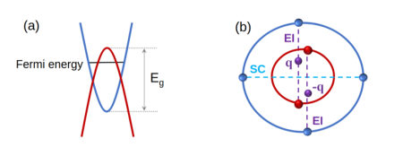
<figcaption class="paper-figure-caption"><b>Fig 1.</b> FIG. 1. (a) Bare band structure showing the conduction and valence bands with a negative band gap 𝐸𝑔. (b) Schematic illustration of SC and EI pairing on mismatched Fermi surfaces. The purple dashed lines denote interband electron-hole EI pairings. Due to the electron- hole Fermi-surface mismatch, the EI pairing spontaneously acquires finite CM momenta ±q, forming an LO-like excitonic state composed of two time-reversal-related pairing components. Here, q is chosen along the 𝑦direction, reflecting the spontaneous rotational-symmetry breaking of the underlying isotropic model. As a result, conduction- band states with momenta perpendicular to ±q do not participate in EI pairing, leaving parts...</figcaption>
</figure>
<figure class="paper-figure-card">
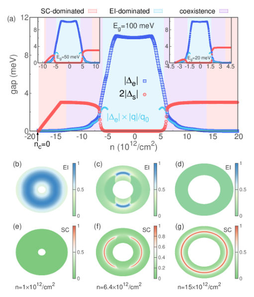
<figcaption class="paper-figure-caption"><b>Fig 2.</b> FIG. 2. (a) Carrier-density dependence of the EI gap, SC gap, and ordering wave vector magnitude 𝑞for 𝐸𝑔= 100 meV. Here, 𝑛= 𝑛𝑐−𝑛𝑣denotes the net carrier density and 𝑞0 = |𝑘𝐹,𝑣−𝑘𝐹,𝑐|. Inset: corresponding results for 𝐸𝑔= 50 meV and 20 meV. (b)- (d) and (e)-(g) show the momentum-resolved EI and SC correlations for conduction-band electrons within a momentum shell around the Fermi surface, respectively, at three representative electron-doped carrier densities corresponding to the EI-dominated, coexistence, and SC-dominated regimes when 𝐸𝑔= 100 meV.</figcaption>
</figure>
<figure class="paper-figure-card">
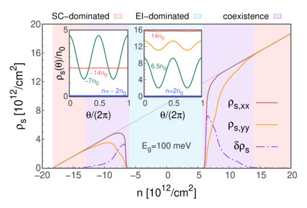
<figcaption class="paper-figure-caption"><b>Fig 3.</b> FIG. 3. Superfluid-density tensor components 𝜌𝑠,𝑥𝑥and 𝜌𝑠,𝑦𝑦, and the nematic component 𝛿𝜌𝑠= 𝜌𝑠,𝑥𝑥−𝜌𝑠,𝑦𝑦, versus net carrier density 𝑛= 𝑛𝑐−𝑛𝑣. Insets show the angular dependence of 𝜌𝑠(𝜃) in the EI- dominated, coexistence, and SC-dominated regimes on both the hole- and electron-doped sides. Here, 𝑛0 = 1012 cm−2. The dashed line denotes the conduction-band density 𝑛𝑐, where superconductivity resides; thus, in the SC-dominated regime (|𝑛| &gt; 14𝑛0), 𝜌𝑠,𝑥𝑥≈ 𝜌𝑠,𝑦𝑦≈𝑛𝑐. The phase regimes are determined from Fig. 2(a).</figcaption>
</figure>

**Summary.** This theoretical work demonstrates that the competition between excitonic and superconducting orders can lead to a novel coexistence regime driven by Fermi surface mismatch. This coexistence forces the superconducting state to inherit an anisotropic structure, resulting in intrinsic nematic superconductivity even without external symmetry-breaking fields. The findings suggest a general mechanism for generating electronic nematicity in correlated quantum materials.

**Why it may be interesting.** The mechanism of generating intrinsic nematicity purely from the competition between two competing many-body orders (EI and SC) is a general concept applicable to understanding anisotropic electronic states in correlated materials, which is highly relevant to modern condensed matter theory.

Detailed structure

**Main problem.** The paper investigates the competition and coexistence between Excitonic Insulating (EI) and Superconducting (SC) orders, which are generally considered mutually exclusive instabilities.

**Main result.** The intrinsic mismatch between electron and hole Fermi surfaces stabilizes a finite-momentum excitonic order, which reconstructs the pairing phase space to allow for the coexistence of EI and SC states, leading to emergent nematic superconductivity.

**Method.** The study employs a self-consistent mean-field theory, solving coupled gap equations for both SC and EI order parameters.

**Model / system.** The model considers correlated quantum materials, using a two-band Hamiltonian approach that incorporates both superconducting pairing and interband Coulomb interactions driving the excitonic instability.

**Key observables.** Superfluid density tensor components ($
ho_{s,xx}, 
ho_{s,yy}$), EI gap ($\Delta_{EI}$), SC gap ($\Delta_{SC}$), and the excitonic ordering wave vector ($\mathbf{q}$).

**Important parameters / regimes.** Carrier density ($n$), temperature ($T$), and the degree of Fermi surface mismatch.

**Assumptions / limitations.** The analysis relies on mean-field approximations and often assumes an isotropic parabolic band structure for initial simplicity, though extensions consider intervalley effects.

**Figures summary.** Figures illustrate the schematic pairing on mismatched Fermi surfaces, the momentum-resolved SC correlation, and the superfluid density tensor components showing anisotropy ($
ho_{s,xx} > 
ho_{s,yy}$) in the coexistence regime.

**Paper structure.** The paper progresses by establishing the theoretical framework (Hamiltonian, gap equations), analyzing the role of Fermi surface mismatch in stabilizing finite-momentum excitonic order, demonstrating the resulting phase space reconstruction, and finally calculating the anisotropic superfluid response as the signature of nematic coexistence.

Abstract

Excitonic insulating (EI) and superconducting (SC) orders are generally regarded as mutually exclusive electronic instabilities. Within a self-consistent microscopic theory, we study electronic systems hosting an EI phase in the presence of SC pairing and show that an intrinsic mismatch between electron and hole Fermi surfaces fundamentally reshapes this competition. This mismatch stabilizes FFLO-like electron-hole pairing and drives spontaneous symmetry breaking of the EI state. The resulting symmetry breaking reconstructs the pairing phase space for SC and EI state, such that different regions of the Fermi surface complementarily support either EI or SC correlations, leading to a natural coexistence of the two orders. Notably, the emergent SC state consequently breaks rotational symmetry and develops intrinsic nematic superconductivity, even in the absence of explicit symmetry-breaking fields (such as magnetic fields, spin-orbit coupling, or bare band-structure anisotropy). Our results suggest that candidate materials such as monolayer 1T$'$-MoTe$_2$ and the square-net semimetal NaAlSi may provide promising platforms for observing this phenomenon. More broadly, these findings reveal a unique mechanism by which competing many-body orders generate electronic nematicity, suggesting a broader route toward spontaneous anisotropic electronic states in correlated quantum materials.

[↑ back to top](#top)

### [How to make quantum cheese: efficient geometry oracles for exponentially many pseudorandom microstructures](http://arxiv.org/abs/2606.00222v1)

**Authors:** Alice Barthe  
**Type:** theory · **Category:** quantum information and computing · **PDF:** <https://arxiv.org/pdf/2606.00222v1>  
**Analysis basis:** full PDF text, analyzed in chunks
**Topic relevance:** `analog quantum simulation` **1/5**

↔ Scroll figures horizontally

<figure class="paper-figure-card">
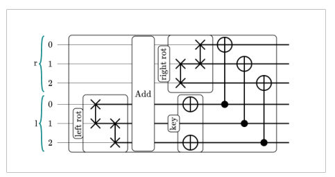
<figcaption class="paper-figure-caption"><b>Fig 1.</b> Figure 1: Quantum circuit for a single round of SPECK cipher [4] for n = 6 bits, with key k = 5, and rotation parameters u = 1 and v = 1.</figcaption>
</figure>
<figure class="paper-figure-card">
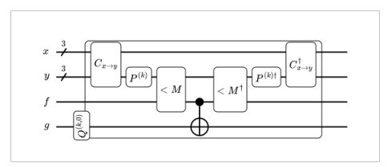
<figcaption class="paper-figure-caption"><b>Fig 2.</b> Figure 2: Quantum circuit flagging M random centres. x is the input register, copied into the register y. The pseudorandom permutation P (k) made of multiple rounds of Figure 1 is applied to y. The result is compared to M using a comparator &lt; M raising flag f. The result is stored in g, and uncomputation is performed to leave y and f clean.</figcaption>
</figure>
<figure class="paper-figure-card">
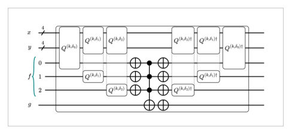
<figcaption class="paper-figure-caption"><b>Fig 3.</b> Figure 4: Quantum circuit for the fixed-shape hole oracle, for a set ∆of T = 3 offsets δt. Each Q(k,δt) retrieves whether the site shifted by δt is a centre in a flag qubit ft using the circuit in Figure 2 . Then the result of W</figcaption>
</figure>
<figure class="paper-figure-card">
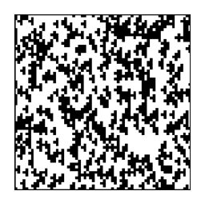
<figcaption class="paper-figure-caption"><b>Fig 4.</b> Figure 5: A realisation of quantum cheese: For a quan- tum oracle solving Problem 1 for a material where holes of fixed shape have been hollowed out, result of simu- lating the oracle by querying all coordinates (x, y) on a 26 ×26 = 64×64 grid. We select M = 512 holes shaped as in Figure 3, with rotations parameters (u, v) = (1, 7) and m = 5 rounds with key k = [38, 51, 28, 14, 42].</figcaption>
</figure>
<figure class="paper-figure-card">
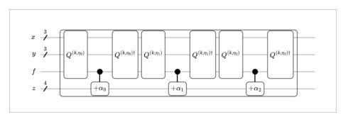
<figcaption class="paper-figure-caption"><b>Fig 5.</b> Figure 6: Quantum circuit to apply a convolution with the kernel Λ = {(ηr, αr)}1≤r≤R (here R = 3) to the binary field given by Q(k,0), that is the permutation oracle shifted by 0, as in Figure 2. For each shift ηr, the flag f is raised or not. If it is raised, the controlled operation on f adds αr to the accumulator register z. The result of the convolution is stored in z, that can be further thresholded with a comparator to yield a geometry oracle.</figcaption>
</figure>

**Summary.** This paper develops a theory for efficiently encoding the geometry of complex, structured materials into quantum oracles. It proves that while arbitrary material patterns are computationally hard to query, patterns generated by local, pseudorandom rules can be efficiently simulated using polynomial-size quantum circuits. This bridges quantum computation theory with condensed matter physics modeling.

**Why it may be interesting.** The work provides a rigorous quantum computational framework for simulating complex, disordered materials, moving beyond simple Hamiltonian simulation by addressing the computational cost of defining the system's geometry itself.

Detailed structure

**Main problem.** The paper investigates the fundamental question of when quantum oracles for materials defined by generative rules (rather than exhaustive lists) can be implemented efficiently by polynomial-size quantum circuits.

**Main result.** It shows that while arbitrary geometries lead to intractable oracles, imposing local structure, such as those derived from pseudorandom generation or convolution, allows for the construction of efficient, polynomial-size quantum oracles.

**Method.** The authors use complexity theory arguments, establishing lower bounds via reductions to unstructured search problems, and then provide explicit circuit constructions based on pseudorandom permutations and local convolution operations.

**Model / system.** The model involves textured materials (e.g., porous media, foams) whose geometry is determined by local rules acting on an exponentially large grid ($N=2^n$). The complexity is analyzed by constructing oracles for membership testing in these structured geometries.

**Key observables.** The primary observable is the quantum query complexity required to evaluate the geometry oracle, compared against the circuit size (gate count) required for implementation.

**Important parameters / regimes.** The key parameters include the grid size $N=2^n$, the number of holes $M$, and the structure of the local kernel $\Lambda$ used in the convolution.

**Assumptions / limitations.** The efficiency relies critically on the geometry possessing sufficient local structure (e.g., being generated by a pseudorandom process or a fixed kernel convolution).

**Figures summary.** Figures illustrate the quantum circuits for random-centre oracles and convolution oracles, and show examples of complex, physically relevant textures (like reaction-diffusion patterns) generated using these structured methods.

**Paper structure.** The paper progresses from establishing the general intractability of unstructured geometry oracles to introducing structured methods. It details the random-centre oracle, generalizes this via convolution and thresholding to model complex microstructures, and concludes with cost analyses and connections to quantum sampling hardness.

Abstract

Quantum algorithms for simulating linear systems are often formulated under oracle access assumptions. A central question is when such oracles can be implemented by polynomial-size quantum circuits. In this paper, we study this question for materials specified by rules rather than by exhaustive descriptions. We focus on textured materials with exponentially many geometric features. In two settings, we show that, without additional structure, describing such geometries yields Grover-type lower bounds, making the corresponding quantum oracles intractable in general. In contrast, when suitable structure is imposed, we identify a broad family of pseudorandom locally textured materials whose geometry can be queried through a polynomial-size quantum circuit. We provide explicit circuit constructions for these oracles and verify their behaviour through numerical simulation.

[↑ back to top](#top)

### [Lie Algebra-Based Quantum Optimal Controls Interpolation](http://arxiv.org/abs/2606.02014v1)

**Authors:** Piero Luchi, Francesco Pederiva  
**Type:** theory · **Category:** quantum information and computing · **PDF:** <https://arxiv.org/pdf/2606.02014v1>  
**Analysis basis:** full PDF text, analyzed in chunks
**Topic relevance:** `methods for driven-dissipative` **1/5**

↔ Scroll figures horizontally

<figure class="paper-figure-card">
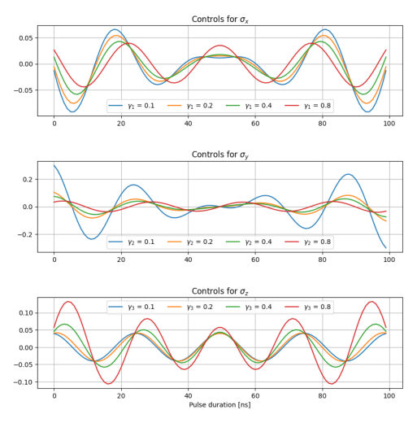
<figcaption class="paper-figure-caption"><b>Fig 1.</b> FIG. 1: Example of controls ϵ1(t) for different values of the parameters γ1, γ2, γ3 in the generator of SU(2), as shown in the text. Small changes in the parameters lead to small changes in the controls, which is a consequence of the smooth manifold structure of SU(2). In this work this feature is crucial to interpolate between controls.</figcaption>
</figure>
<figure class="paper-figure-card">
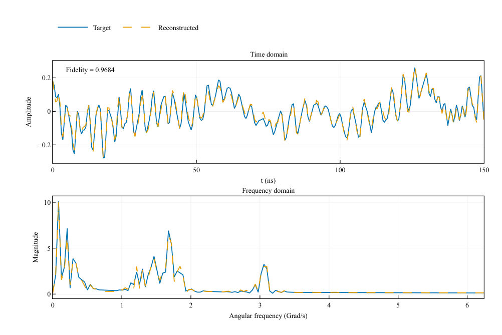
<figcaption class="paper-figure-caption"><b>Fig 2.</b> FIG. 2: Representative example of the control field Ωx(t) reconstructed by the LA-CPR method for a 3-qubit system with z = π/4. Upper panel: time-domain profile of the exact (target) control and its LA-CPR reconstruction; the inset reports the corresponding fidelity. Lower panel: frequency spectra of both signals. The peak at ∼0.03 GHz reflects the qubit–qubit interaction frequencies (see Tab. III); peaks above 1 GHz correspond to individual qubit transition frequencies; the feature near 3 GHz is a second-order harmonic artifact introduced by the optimizer due to the finite temporal discretization of the pulse.</figcaption>
</figure>
<figure class="paper-figure-card">
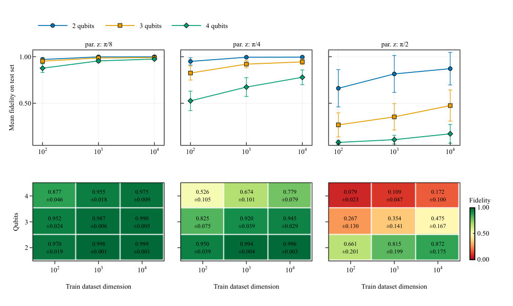
<figcaption class="paper-figure-caption"><b>Fig 3.</b> FIG. 3: Average fidelity of the LA-CPR method as a function of the training dataset size, for z = π/8 (left), z = π/4 (center), and z = π/2 (right). Upper row: mean fidelity on the test set versus training dataset dimension, with curves for Nq = 2, 3, 4 qubits; error bars indicate one standard deviation across independent training runs. Lower row: heatmaps of the same data, where each cell reports the mean fidelity ± one standard deviation as a function of the training dataset dimension (102, 103, 104) and the number of qubits (Nq = 2, 3, 4); the color scale spans fidelities from 0 to 1 and provides a direct visualization of the joint dependence on dataset size and system dimension. In all...</figcaption>
</figure>
<figure class="paper-figure-card">
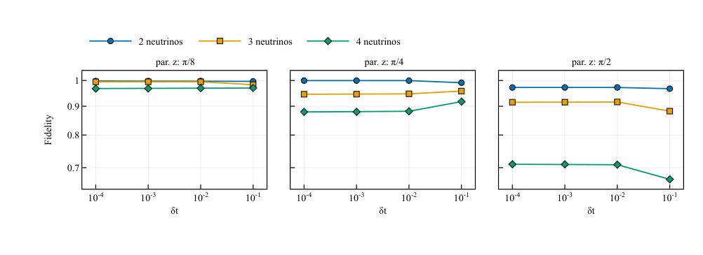
<figcaption class="paper-figure-caption"><b>Fig 4.</b> FIG. 4: Reconstruction fidelity of the LA-CPR method for the neutrino Trotter propagator Uneutr = e−i δt Hneutr, shown as a function of the time step δt and the number of neutrinos Nn, for z = π/8 (left), z = π/4 (center), and z = π/2 (right). All models are trained on a dataset of 20 000 elements. The fidelity decreases systematically with both δt and z: larger time steps displace the target propagators away from the group identity, while larger values of z broaden the training distribution, both increasing the difficulty of the reconstruction task.</figcaption>
</figure>
<figure class="paper-figure-card">
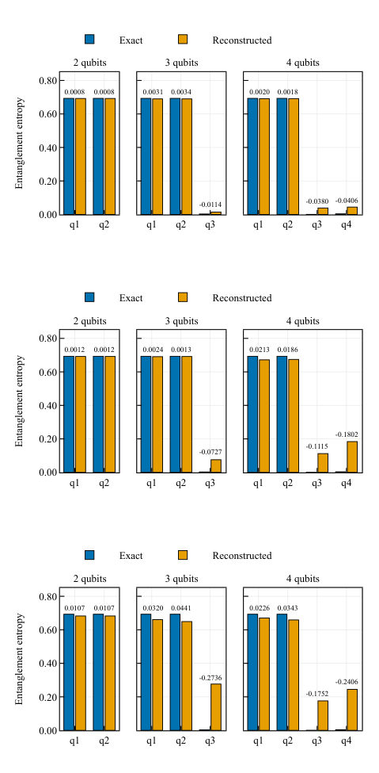
<figcaption class="paper-figure-caption"><b>Fig 5.</b> FIG. 5: Single-qubit von Neumann entropy Sk of the output state |ψ⟩= U |ψ0⟩for the exact (solid) and reconstructed (dashed) neutrino propagators, shown for Nn = 2, 3, 4 neutrinos and z = π/8 (top), z = π/4 (middle), and z = π/2 (bottom). The number over the bars represent the differences between them. The exact and reconstructed entropy profiles are in close agreement for small z, while the discrepancy grows with increasing z, mirroring the trend observed in the gate fidelity and confirming that reconstruction accuracy degrades as the training distribution broadens.</figcaption>
</figure>

**Summary.** This paper introduces a novel, scalable method called LA-CPR to generate quantum optimal control pulses for arbitrary unitary operations in superconducting qubits. By mapping the unitary structure onto a Lie algebra and training neural networks, it bypasses the need for computationally expensive optimization at runtime. This allows for the rapid design of control sequences for complex quantum simulations, such as those modeling neutrino oscillations.

**Why it may be interesting.** This work provides a powerful, scalable tool for quantum control, moving beyond iterative optimization methods by leveraging deep learning on the underlying mathematical structure of quantum evolution, which is highly relevant for designing complex quantum circuits.

Detailed structure

**Main problem.** The paper addresses the computational bottleneck in quantum optimal control by developing a method to generate control pulses for arbitrary unitary operations without requiring explicit, time-consuming optimization at inference time.

**Main result.** The proposed Lie Algebra-based Control Pulse Reconstruction (LA-CPR) framework successfully trains neural networks to map target unitaries to their required control pulses, achieving high reconstruction fidelity for systems up to 4 qubits.

**Method.** It combines Lie group theory to parameterize the space of target unitaries ($SU(N)$) with feed-forward neural networks trained on a dataset of pre-optimized control pulses to enable fast, non-iterative pulse generation.

**Model / system.** The study focuses on controlling superconducting qubit systems, modeling the dynamics using Hamiltonians involving drift, interaction, and time-dependent control terms. The underlying mathematical structure is the Lie group $SU(N)$ acting on the $N$-dimensional Hilbert space.

**Key observables.** Reconstruction Fidelity ($F$), Single-qubit von Neumann Entropy ($S_k$), and the control envelopes ($\Omega_x(t), \Omega_y(t)$).

**Important parameters / regimes.** Number of qubits ($N_q=2, 3, 4$), sampling radius ($z$), and time step ($\delta t$).

**Assumptions / limitations.** The method assumes that the target unitaries can be effectively sampled from a neighborhood of the identity element within the Lie group, and that the required controls can be approximated by a mapping learned from this sampled data.

**Figures summary.** Figures illustrate the reconstruction fidelity vs. dataset size and sampling radius, and show the reconstructed control field profiles for various qubit numbers and physical applications like neutrino oscillations.

**Paper structure.** The paper first establishes the physical problem (QOC bottleneck), then details the mathematical framework using Lie algebra theory to parameterize the unitary space. It introduces the LA-CPR method involving dataset sampling, NN training, and finally demonstrates its application to complex systems like neutrino flavor oscillations.

Abstract

We present a framework combining Lie group theory and feed-forward neural networks to efficiently generate quantum optimal control pulses for arbitrary unitary operations in superconducting qubit systems, bypassing the need for explicit optimization at inference time. The exponential scaling of the Hilbert space dimension with qubit number makes standard optimization approaches computationally prohibitive when large ensembles of distinct propagators must be processed, a bottleneck that is particularly acute in Trotterized quantum simulation. Our method addresses this limitation by pre-computing a representative set of control pulses via Lie group theory and training neural networks to map target propagators to their corresponding pulses. We demonstrate the approach on superconducting qubit systems of 2, 3, and 4 qubits, finding high reconstruction fidelity for specific combinations of Lie algebra parameters. As a physically motivated benchmark, we apply the methodology to reconstruct control pulses for the Trotter propagators of a neutrino system undergoing collective flavor oscillations. The successful generalization across system types demonstrates that a single model -- trained once on hardware-specific random propagators -- can serve as a universal control-pulse generator for any target quantum system of compatible Hilbert space dimension, offering a promising route toward scalable quantum simulation.

[↑ back to top](#top)

### [Practical Limits on Integrated Squeezers](http://arxiv.org/abs/2606.02524v1)

**Authors:** Devin J. Dean, Taewon Park, Lars S. Madsen, Alex Terrasson, Sam Robison, Geun Ho Ahn, Ziyu Wang, Hubert S. Stokowski, Luke Qi, Jesse J. Slim, Joel Corney, Darwin Serkland, Warwick P. Bowen, Martin M. Fejer, Amir H. Safavi-Naeini  
**Type:** theory · **Category:** other · **PDF:** <https://arxiv.org/pdf/2606.02524v1>  
**Analysis basis:** full PDF text, analyzed in chunks
**Topic relevance:** `methods for driven-dissipative` **1/5**

↔ Scroll figures horizontally

<figure class="paper-figure-card">
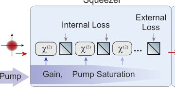
<figcaption class="paper-figure-caption"><b>Fig 1.</b> Fig. 1. Noise sources in squeezing experiments. A generic squeezing measurement consists of a squeezer, a mixer, and a detector. Each section has different noise contributions that can limit the total measured squeezing. Red circle on the left represents vacuum noise in phase space, which is transformed by the squeezer into the squeezed ellipse shown in the mixer section, which after detection is shown by the reduced noise on the electronic spectrum analyzer. 𝜒(2) nonlinear sections are depicted within the squeezer for concreteness - some squeezers instead utilize 𝜒(3) nonlinear sections. The squares with diagonal slashes represent the effective beamsplitters that model how many processes...</figcaption>
</figure>
<figure class="paper-figure-card">
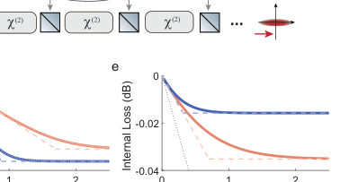
<figcaption class="paper-figure-caption"><b>Fig 2.</b> Fig. 3. Effects of External and Internal Loss. (a) External loss - loss after a squeezer introduces vacuum fluctuations, which reduces the squeezing as shown in the phase space diagrams. (b) Effect of external loss on squeezed variance (equation (11)), for input squeezing of 5 dB (blue) and 10 dB (red), with dotted lines representing simplified model of equation (12). (c) Internal Loss model of a lossy nonlinear region as a series of infinitesimal nonlinear regions and loss regions. (d) Squeezing evolution with length for two gain rates (𝑔= 12 dB/cm red and 𝑔= 27 dB/cm blue) and fixed loss rate 𝛼= 10 dB/m for a nonresonant squeezer (equation (16). Dashed lines represent the approximate...</figcaption>
</figure>
<figure class="paper-figure-card">
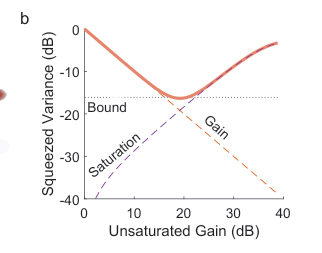
<figcaption class="paper-figure-caption"><b>Fig 3.</b> Fig. 4. Squeezer Saturation. A coherent seed at the same frequency as the signal is input to the squeezer and gets amplified and depletes the pump’s energy. The pump’s noise gets transferred to the signal, degrading the squeezing. (b) Saturation limit on</figcaption>
</figure>
<figure class="paper-figure-card">
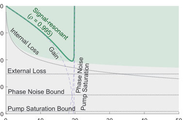
<figcaption class="paper-figure-caption"><b>Fig 4.</b> Fig. 6. Fundamental bounds on squeezed light generation. Plotted as a function of gain rate g, for different kinds of squeezers. Light green shaded region represents the feasible squeezing region, for all possible squeezer designs (nonlinear length, resonance, etc). Large dotted lines show noise bounds, for all possible squeezer designs. Solid green and faint dotted lines show the total expected squeezing and the gain-dependent noise limitations for specific squeezer designs. Plotted for internal loss rate 𝛼= 0.1 dB/cm, external loss 1 −𝜂𝑒= −25 dB, phase noise 𝛿𝜃= 0.5 mrad, signal leakage into</figcaption>
</figure>
<figure class="paper-figure-card">
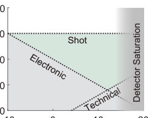
<figcaption class="paper-figure-caption"><b>Fig 5.</b> Fig. 7. Squeezed light detection. (a) Balanced homodyne detection mixes the squeezed signal (light red) with a strong local oscillator reference beam (red) and detects the difference photocurrent out of two photodetectors. (b) Parametric homodyne detection mixes the squeezed signal (light red) with a strong pump (blue) and detects the amplified signal. (c) Contributions to detection noise, in decibel shot-noise units, as a function of detected power. Parameters assumed include electronic noise with 20 dB shot noise clearance at 10 mW, excess relative intensity noise of -150 dBc/Hz for 𝜆= 1550 nm reference beam, suppressed by balanced detection with a common mode rejection ratio of 40 dB,...</figcaption>
</figure>

**Summary.** This paper develops a comprehensive, unified theoretical model to determine the practical limits on generating and measuring highly squeezed light in integrated photonic circuits. It quantifies how various noise sources—including internal loss, pump saturation, and phase noise—degrade the quantum squeezing. The resulting model offers crucial design guidance for advancing integrated quantum light sources.

**Why it may be interesting.** This work provides essential theoretical tools for designing and benchmarking quantum optical devices, directly impacting the feasibility of quantum sensing and communication protocols that rely on non-classical light.

Detailed structure

**Main problem.** The paper quantifies the fundamental limits imposed by various noise sources on measuring highly squeezed light, particularly for next-generation integrated squeezed-light systems.

**Main result.** A unified model is developed that combines limitations from generation (e.g., internal loss, pump saturation) and detection (e.g., phase noise, electronic noise) into a single variance budget.

**Method.** The authors use the Gaussian quantum optics framework, deriving variance evolution equations and applying noise mixing approximations to model the cumulative effect of multiple loss and noise processes.

**Model / system.** The focus is on integrated nonlinear photonic circuits used as squeezed light sources (e.g., OPA). The analysis covers nonresonant, pump-resonant, and signal-resonant squeezing regimes.

**Key observables.** Squeezed quadrature variance ($V_{-}$), anti-squeezed variance ($V_{+}$), and the overall achievable squeezing level (in dB).

**Important parameters / regimes.** Nonlinearity-to-loss ratio ($g/\alpha$), internal loss rates ($\eta_i$), external loss ($\eta_e$), and phase error ($\delta	heta$).

**Assumptions / limitations.** The analysis relies on the Gaussian quantum optics framework and often uses the low-loss approximation for noise summation ($1 - \eta \ll 1$).

**Figures summary.** Figures illustrate noise sources in a generic measurement setup, the comprehensive variance budget combining multiple noise terms, and plots showing fundamental bounds on achievable squeezing versus gain rate.

**Paper structure.** The paper progresses by first establishing the general variance budget, then deriving specific gain formulas for different squeezer types (nonresonant, signal-resonant), and finally unifying these limitations into a practical, comprehensive model.

Abstract

Recent experiments have demonstrated the successful generation and detection of moderately squeezed vacuum states with integrated photonics. However, in order to benefit from the reduced noise of highly squeezed light, many different noise sources must be mitigated. Here, we quantify the fundamental limits these noise sources impose on squeezing measurements and find surprising generality across different platforms and designs. We combine these different limitations into a simple model that provides practical guidance for the design and benchmarking of next-generation integrated squeezed-light systems.

[↑ back to top](#top)

### [Relativistic transformation of temperature revisited](http://arxiv.org/abs/2606.00521v1)

**Authors:** Soroor Pouryazdan, Babak Vakili  
**Type:** theory · **Category:** statistical mechanics · **PDF:** <https://arxiv.org/pdf/2606.00521v1>  
**Analysis basis:** full PDF text, analyzed in chunks
**Topic relevance:** `Keldysh / 2PI / non-Gaussian methods` **1/5**

↔ Scroll figures horizontally

<figure class="paper-figure-card">
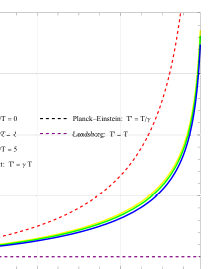
<figcaption class="paper-figure-caption"><b>Fig 1.</b> Figure 1: Dependence of the effective temperature ratio Teff/T on the velocity v for several values of the dimensionless mass-to-temperature ratio m/T, obtained from Eq. (35). The solid curve corresponds to the photon limit (m/T →0), approaching Teff≃T(1 + 1</figcaption>
</figure>
<figure class="paper-figure-card">
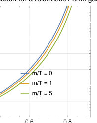
<figcaption class="paper-figure-caption"><b>Fig 2.</b> Figure 2: Effective temperature ratio Teff/T versus observer velocity v/c for representa- tive values of the dimensionless parameter AF (approximating m/T): AF = 0 (m/T ≈0), AF = 1 (m/T ∼1) and AF = 5 (m/T ≫1). Curves are obtained from the relation Teff/T = [γ2(1 + v2/(AF + 3))]1/4 and show the smooth interpolation between the ultra- relativistic (Teff≃T(1 + 1</figcaption>
</figure>

**Summary.** This paper re-examines the relativistic transformation of temperature using a rigorous thermodynamic approach based on the energy-momentum tensor. It demonstrates that temperature is not a Lorentz invariant scalar, showing that the effective temperature measured by a moving observer increases with velocity. The work unifies these concepts by introducing the inverse-temperature four-vector into a consistent relativistic framework.

**Why it may be interesting.** While focused on classical thermodynamics, the rigorous handling of observer-dependence and the covariant formulation of temperature are foundational concepts relevant to relativistic quantum field theory and non-equilibrium statistical mechanics.

Detailed structure

**Main problem.** The paper addresses the long-standing controversy regarding the relativistic transformation of temperature, as classical laws yield conflicting results.

**Main result.** The effective temperature inferred by a moving observer consistently increases with velocity, supporting the Ott-Eddington interpretation, and temperature is shown to be an observer-dependent quantity.

**Method.** The analysis uses a relativistic thermodynamic and statistical framework, starting from the energy-momentum tensor of an isotropic perfect fluid and defining an effective temperature from transformed energy densities.

**Model / system.** The study analyzes three paradigmatic systems: a photon gas (blackbody radiation), a relativistic ideal gas (Maxwell-Jüttner), and a relativistic electron gas (Fermi-Dirac statistics).

**Key observables.** Effective temperature ($T_{	ext{eff}}$), the ratio $T_{	ext{eff}}/T$, and the inverse-temperature four-vector ($eta_\mu$).

**Important parameters / regimes.** Observer velocity ($v$), system equation of state ($P/
ho$), and the mass-to-temperature ratio ($m/T$).

**Assumptions / limitations.** The analysis assumes the standard energy-momentum tensor for a perfect fluid, neglecting dissipative effects like heat conduction or shear viscosity.

**Figures summary.** Figures illustrate the smooth interpolation of the effective temperature ratio ($T_{	ext{eff}}/T$) versus velocity for various particle mass regimes, confirming the dependence on the equation of state.

**Paper structure.** The paper reviews conflicting classical transformation laws, develops the general formalism using the energy-momentum tensor, analyzes specific gases (photon, ideal, Fermi), and concludes by unifying the description via the inverse-temperature four-vector.

Abstract

The relativistic transformation of temperature has long remained controversial, with the classical laws of Planck-Einstein, Ott-Eddington-Moller and Landsberg yielding conflicting results. We reexamine this issue from a relativistic thermodynamic and statistical perspective, starting from the energy-momentum tensor of an isotropic system and defining the effective temperature Teff as that inferred by a moving observer from the transformed energy density. Analyses of a photon gas, a relativistic ideal gas and an electron gas show that Teff consistently increases with velocity, supporting the Ott-Eddington interpretation while depending on the system's equation of state. These results indicate that temperature is not a Lorentz-invariant scalar but an observer-dependent quantity. A consistent relativistic description emerges when temperature is related to the inverse-temperature four-vector beta, linking operational and invariant viewpoints within a unified thermodynamic framework.

[↑ back to top](#top)

### [Revisiting the Quantum-Guided Cluster Algorithm: Improvements and Numerical Experiments](http://arxiv.org/abs/2606.01826v1)

**Authors:** Peter J. Eder, Sarah Braun  
**Type:** experiment · **Category:** disordered systems and neural networks · **PDF:** <https://arxiv.org/pdf/2606.01826v1>  
**Analysis basis:** full PDF text, analyzed in chunks
**Topic relevance:** `methods for driven-dissipative` **1/5**

↔ Scroll figures horizontally

<figure class="paper-figure-card">
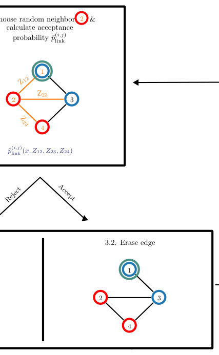
<figcaption class="paper-figure-caption"><b>Fig 1.</b> FIG. 1: Illustration of the cluster-building process, characterizing the pseudocode function CreateCluster() for NNNs, similar to [1, Figure 3]. Starting from a randomly selected seed node (here, i = 1), neighboring vertices are iteratively considered for inclusion in the cluster with probability ˜p(i,j) link from Equation (6), determined by the correlation matrix Z. Accepted nodes undergo a shrinking step before further expansion, while rejected nodes have their edge to the cluster removed. © 2025 IEEE.</figcaption>
</figure>
<figure class="paper-figure-card">
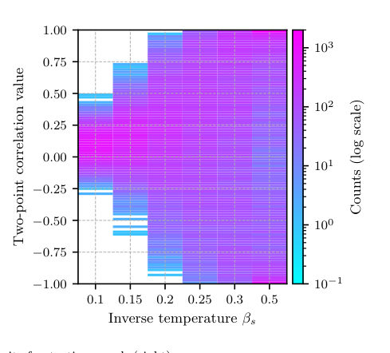
<figcaption class="paper-figure-caption"><b>Fig 2.</b> FIG. 2: The plots in (a) and the left panel of (b) show the percentage of optimal solutions found as a function of the number of iterations for the CA considering next-nearest neighbors (NNN) guided by various correlations, as well as nearest neighbors (NN) guided by coupling constants (CCs). In (a), the same graph instances as in [1] are used, while in (b) ten random 40-regular graphs of size n = 100 are considered. Together, these subfigures illustrate the performance of the CA guided by CCs, semidefinite programming (SDP) correlations, and thermal correlations sampled from Monte Carlo (MC) simulations at different inverse temperatures βs for NNN interactions. The right panel of (b) shows...</figcaption>
</figure>
<figure class="paper-figure-card">
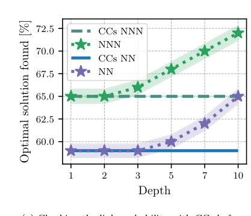
<figcaption class="paper-figure-caption"><b>Fig 3.</b> FIG. 3: The percentage of optimal solutions found is shown for the CA with nearest neighbor (NN) and next-nearest neighbor (NNN) interactions, guided by QAOA correlations at different depths and coupling constants (CCs). The graphs have regular degree 27 with n = 28 nodes; 50 mutations with 50n iterations are performed. In (a), the link probability ˜plink using CCs is evaluated at each iteration when adding a node to the cluster: updates with ˜plink &lt; 0 are rejected, updates with ˜plink = 0 are accepted, and correlations are considered only otherwise. In (b), this evaluation using CCs is omitted.</figcaption>
</figure>
<figure class="paper-figure-card">
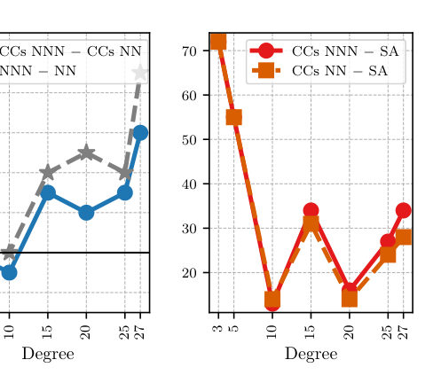
<figcaption class="paper-figure-caption"><b>Fig 4.</b> FIG. 4: The percentage point differences in optimal solutions found are shown for n = 28 for the CA considering nearest neighbors (NNs) and next-nearest neighbors (NNNs), using QAOA correlations at depth three, coupling constants (CCs), and for simulated annealing (SA). Each data point is obtained from 50 mutations with 50n iterations. The left panel presents the difference between the QAOA-guided CAs and the CC-guided CAs, the middle panel shows the individual performance differences for both approaches, and the right panel compares the CC-guided CAs with SA.</figcaption>
</figure>
<figure class="paper-figure-card">
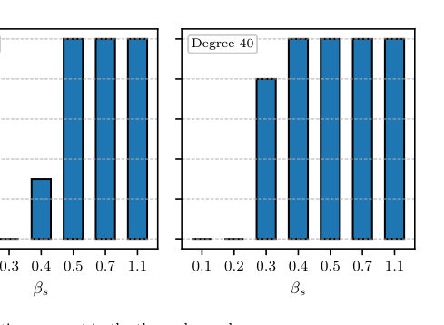
<figcaption class="paper-figure-caption"><b>Fig 5.</b> FIG. 5: In (a), the times to solution (TTS) with successful run probability r = 99 % are shown for the CA considering next-nearest neighbor (NNN) interactions guided by thermal correlations (MC) on graphs with n = 100 and degrees three, 20, and 40, together with the coupling-constant (CC) version of the CA and simulated annealing (SA). The values in brackets on the x-axis denote the mean approximation ratios of the samples used to compute the correlations guiding the CA. In (b), bar diagrams are shown that indicate, for each of the ten graph instances and inverse sample temperatures βs, whether the thermal samples contain an optimal solution.</figcaption>
</figure>

**Summary.** This work revisits and significantly extends the Quantum-Guided Cluster Algorithm (QGCA) for solving Max-Cut problems on spin glasses. By incorporating structural information like next-nearest-neighbor correlations and developing an MCMC variant, the authors demonstrate substantial performance gains over classical methods. The findings highlight the power of using quantum-derived information to accelerate sampling and optimization in disordered quantum systems.

**Why it may be interesting.** The use of quantum-inspired correlations (like those from QAOA or SDP) to guide classical sampling algorithms for hard optimization problems is highly relevant to developing efficient simulation techniques for complex quantum many-body systems.

Detailed structure

**Main problem.** The paper addresses the NP-hard Max-Cut problem by improving classical optimization algorithms using quantum-inspired correlation information.

**Main result.** The Quantum-Guided Cluster Algorithm (QGCA), especially when incorporating Next-Nearest-Neighbor (NNN) information or advanced correlations like SDP, significantly outperforms standard Simulated Annealing and simpler cluster updates.

**Method.** The core method is an iterative cluster update algorithm guided by precomputed two-point correlations derived from various sources (SDP, QAOA, thermal MC).

**Model / system.** The model is the Max-Cut problem on undirected graphs, mathematically equivalent to finding the ground state of an Ising spin glass Hamiltonian. The analysis is performed on random regular graphs and tile-planted instances.

**Key observables.** Percentage of optimal solutions found, Time-to-Solution (TTS), autocorrelation functions of magnetization and energy, and approximation ratios.

**Important parameters / regimes.** Inverse temperature ($eta$), QAOA depth ($p=1, 3$), graph degree (e.g., 3, 27), and the inclusion of NNN interactions.

**Assumptions / limitations.** The analysis often assumes the validity of the MCMC formulation for sampling the Boltzmann distribution and relies on the quality of the input correlation sources.

**Figures summary.** Figures compare optimal solution percentages and autocorrelation decay rates for various algorithms (QGCA vs. SA vs. SSF) across different graph degrees and correlation depths.

**Paper structure.** The paper builds from the basic correlation-guided CA, extends it to include NNN information, and culminates in developing and analyzing its extension into a full Markov-Chain Monte Carlo (MCMC) sampling algorithm.

Abstract

We study correlation-guided cluster algorithms for solving the Max-Cut problem that iteratively try to improve solutions by updating clusters of nodes. Building on the recently proposed quantum-guided cluster algorithm (QGCA) [arXiv:2508.10656], which leverages precomputed two-point correlations to guide collective updates, we extend the cluster construction by incorporating next-nearest-neighbor (NNN) information. We evaluate this extension across different correlation sources on random regular graphs and non-degenerate tile-planted instances. Notably, we observe particularly strong performance on non-degenerate instances and provide a scaling analysis for this class. Finally, we outline an extension toward a correlation-guided Markov-chain Monte Carlo algorithm, whose detailed analysis remains an open direction for future work.

[↑ back to top](#top)

### [Smooth velocity shuttling for suppressing valley excitations in disordered Si/SiGe quantum dots](http://arxiv.org/abs/2606.01541v1)

**Authors:** Ryo Nagai, Takashi Takemoto, Hiroyuki Mizuno  
**Type:** theory · **Category:** quantum information and computing · **PDF:** <https://arxiv.org/pdf/2606.01541v1>  
**Analysis basis:** full PDF text, analyzed in chunks
**Topic relevance:** `non-equilibrium dynamics` **1/5**

↔ Scroll figures horizontally

<figure class="paper-figure-card">
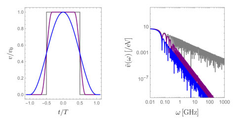
<figcaption class="paper-figure-caption"><b>Fig 1.</b> FIG. 1. Shuttling velocity profiles (left) and spectra (right). The black curve corresponds to the time-dependence of the conventional shuttling velocity control (β = 0), and the light- blue and blue curves correspond to that of our proposed shut- tling controls with β = 0.5 and β = 1, respectively.</figcaption>
</figure>
<figure class="paper-figure-card">
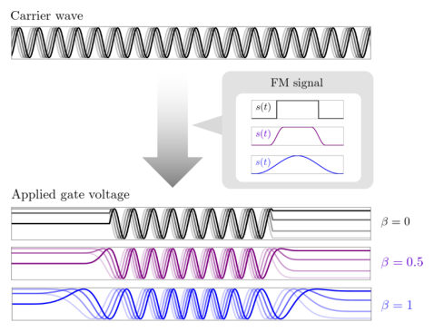
<figcaption class="paper-figure-caption"><b>Fig 2.</b> FIG. 2. Gate-voltage waveforms for implementing the pro- posed shuttling method (smooth velocity shuttling). The gate- voltage waveforms (12) can be generated by frequency modu- lation of the conventional sine waveforms (10) by signal s(t). The time dependence of the waveforms are shown in the top, middle, and bottom panels corresponding to β = 0, 0.5, and 1, respectively.</figcaption>
</figure>
<figure class="paper-figure-card">
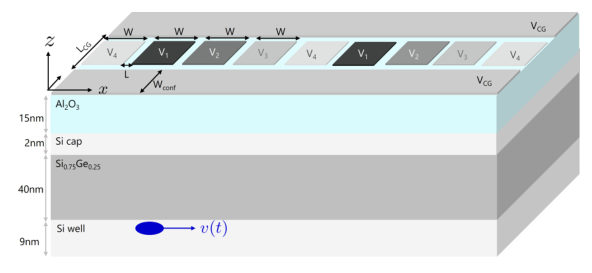
<figcaption class="paper-figure-caption"><b>Fig 3.</b> FIG. 3. Schematic diagram of the SiGe/Si/SiGe quantum dot shuttling device used in the numerical simulations. Gate electrodes are arranged at intervals of L along the shuttling direction (x-axis), and a frequency-modulated (FM) voltage Vm(t) with a period of N = 4 is applied. Rectangular gates for confining electrons in the y-direction are placed on both sides of the shuttling path, and a constant DC voltage VCG is applied. Electrons are confined within the quantum dots formed by these electrodes and transported through the Si well.</figcaption>
</figure>
<figure class="paper-figure-card">
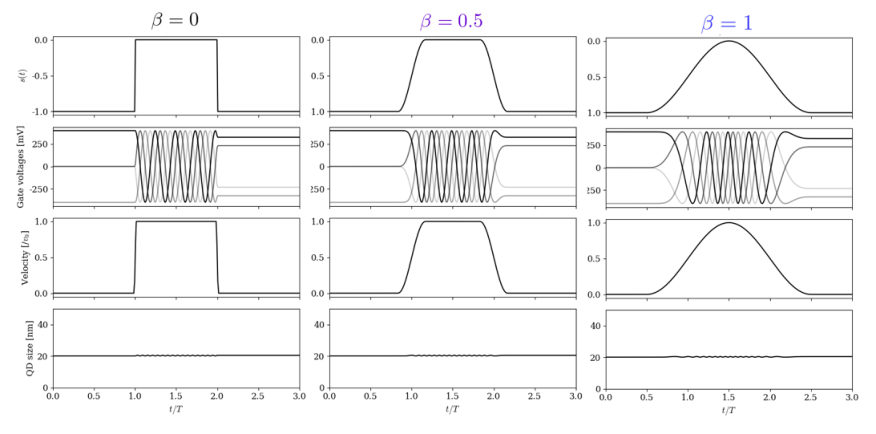
<figcaption class="paper-figure-caption"><b>Fig 4.</b> FIG. 4. Numerical calculation results of the smooth velocity shuttling protocol. From top to bottom, the changes of the signal wave s(t), the applied gate voltage Vn(t), the shuttling velocity v(t), and the quantum dot size ax(t) against the normalized time t/T are shown. It can be confirmed that the acceleration during transport is modulated by the velocity shaping parameter β, and the high-frequency components are suppressed.</figcaption>
</figure>
<figure class="paper-figure-card">
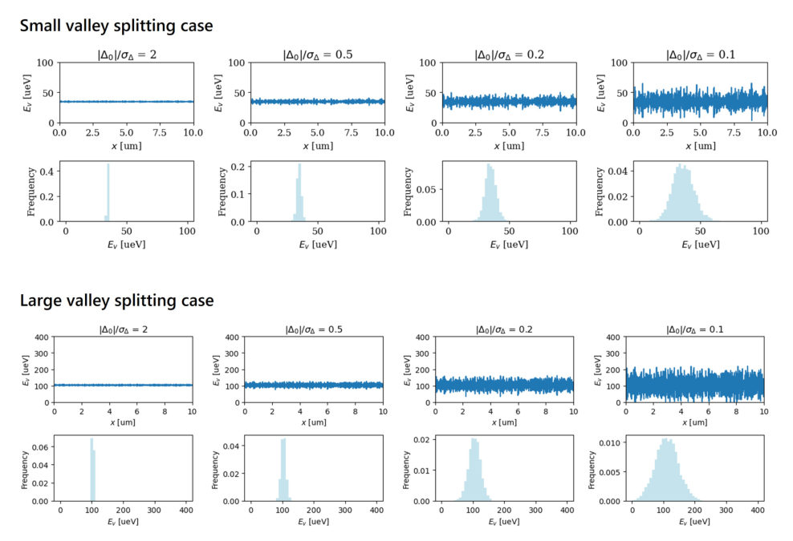
<figcaption class="paper-figure-caption"><b>Fig 5.</b> FIG. 5. Examples of the valley coupling landscape ∆(x) along the shuttling path. Random spatial variations of the valley coupling are shown for various disorder strengths characterized by the ratio |∆0|/σ∆. A smaller ratio corresponds to a stronger influence of disorder induced by alloy fluctuations.</figcaption>
</figure>

**Summary.** This paper introduces a novel, analytically derived method—smooth velocity shuttling—to suppress detrimental valley excitations in silicon quantum dots. By shaping the gate voltage using frequency modulation, the authors suppress high-frequency components in the shuttling velocity spectrum. This technique significantly improves spin coherence and fidelity, offering a robust pathway for large-scale silicon quantum computing architectures.

**Why it may be interesting.** This work provides a concrete, control-level engineering solution for mitigating decoherence sources (valley mixing) in solid-state qubits, which is highly relevant to building scalable quantum processors.

Detailed structure

**Main problem.** The primary challenge is suppressing non-adiabatic valley excitations during electron shuttling in silicon quantum dots, as these transitions cause spin dephasing and limit qubit fidelity.

**Main result.** The authors propose a smooth velocity shuttling protocol, mathematically equivalent to window function design, which significantly reduces spin infidelity in the moderate-to-low disorder regime.

**Method.** They derive an analytical guideline by mapping the time-domain velocity profile design onto signal processing window function theory, implementing this via frequency-modulated gate voltages.

**Model / system.** The system is modeled using Si/SiGe quantum dots hosting spin qubits, analyzed via an effective Hamiltonian that includes valley and spin degrees of freedom. The dynamics are governed by the time-dependent shuttling velocity $v(t)$.

**Key observables.** Average spin infidelity, spin purity $P_s(t)$, and the probability of valley excitation $p_v$.

**Important parameters / regimes.** Disorder strength ratio $|\Delta_0|/\sigma_\Delta$, the smoothness parameter $eta$, and the deterministic valley coupling $|\Delta_0|$.

**Assumptions / limitations.** The analysis relies on the perturbation approximation for valley transitions and assumes the applicability of the effective mass approximation for the potential landscape.

**Figures summary.** Figures illustrate the comparison of velocity waveforms (conventional vs. smooth/Tukey-window based) and show the time evolution of spin impurity and infidelity, demonstrating fidelity maintenance with smooth control.

**Paper structure.** The paper introduces the problem (valley excitation during shuttling), derives the connection to signal processing window functions, proposes the FM gate voltage implementation, and validates the method through numerical simulations showing fidelity improvement.

Abstract

Coherent electron shuttling is a key requirement for realizing scalable silicon quantum computing architectures. However, in silicon qubits, the existence of nearly degenerate conduction-band valleys poses a significant challenge because non-adiabatic transitions to excited valley states cause spin dephasing via spin-valley mixing. In this paper, we propose a smooth velocity shuttling protocol to suppress these valley excitations. By mapping the time-domain design of the shuttling velocity profile onto the design problem of window functions in signal processing, we establish an analytical and intuitive design guideline that does not require computationally expensive numerical optimization. We demonstrate that the high-frequency sidelobes of the shuttling velocity spectrum can be effectively suppressed by applying a frequency-modulated gate voltage based on the Tukey window. Through numerical simulations incorporating realistic spatial randomness of the valley landscape, we show that the proposed smooth velocity control significantly reduces the average spin infidelity in the moderate-to-low disorder regime ($|Δ_0|/σ_Δ\simeq \mathcal{O}(1)$). Furthermore, we clarify that in devices designed with a large deterministic valley coupling $|Δ_0|$, combining it with this smoothing technique improves robustness against valley disorder. Our results underscore that this simple, control-level velocity shaping provides a robust pathway toward high-fidelity spin transport in large-scale silicon quantum processors.

[↑ back to top](#top)

### [Successes and challenges of using Semidefinite Programming for the study of Spin Chain Hamiltonians](http://arxiv.org/abs/2606.02013v1)

**Authors:** David Berenstein, P. N. Thomas Lloyd  
**Type:** theory · **Category:** statistical mechanics · **PDF:** <https://arxiv.org/pdf/2606.02013v1>  
**Analysis basis:** full PDF text, analyzed in chunks
**Topic relevance:** `analog quantum simulation` **1/5**

↔ Scroll figures horizontally

<figure class="paper-figure-card">
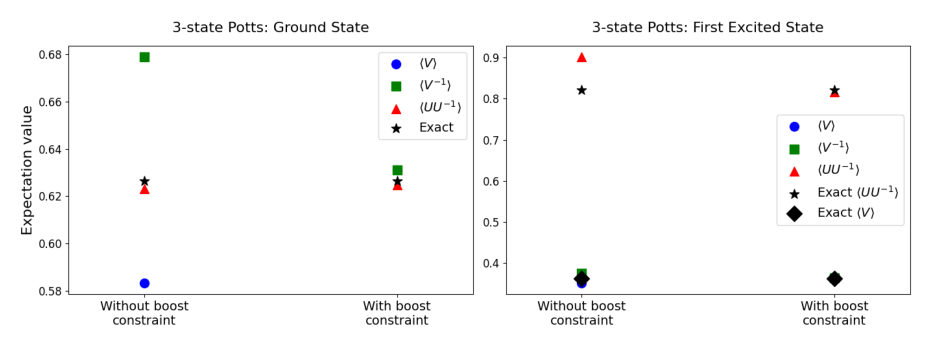
<figcaption class="paper-figure-caption"><b>Fig 1.</b> FIG. 1. The addition of the additional charge constraints generated from the boost operator have</figcaption>
</figure>
<figure class="paper-figure-card">
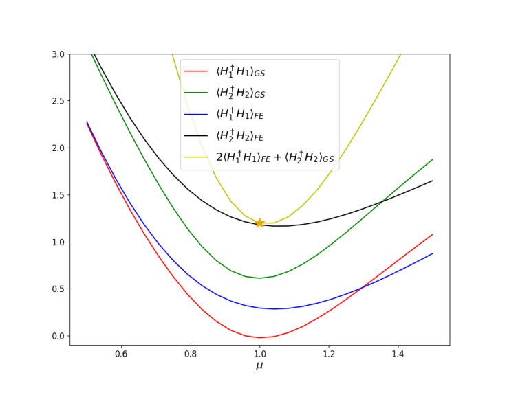
<figcaption class="paper-figure-caption"><b>Fig 2.</b> FIG. 2. Building up the Virasoro generators for the Ising model allowed us to explore if there</figcaption>
</figure>
<figure class="paper-figure-card">
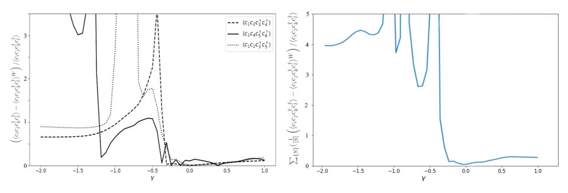
<figcaption class="paper-figure-caption"><b>Fig 3.</b> FIG. 3. The left figure is the ratio,  ⟨cicjc† kc† l ⟩−⟨cicjc† kc† l ⟩W  /⟨cicjc† kc† l ⟩, where ⟨cicjc† kc† l ⟩is cal-</figcaption>
</figure>
<figure class="paper-figure-card">
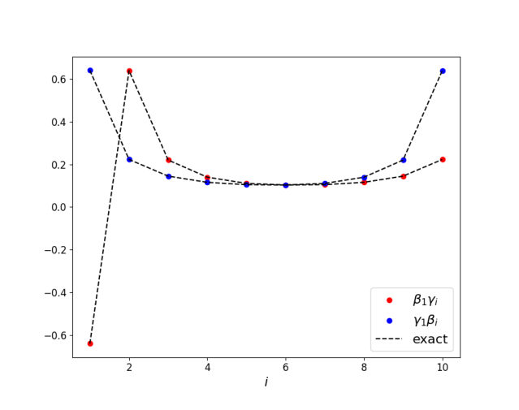
<figcaption class="paper-figure-caption"><b>Fig 4.</b> FIG. 4. Here we plot ⟨β1γi⟩and ⟨γ1βi⟩for a N = 10 lattice. The circles represent the SDP results</figcaption>
</figure>
<figure class="paper-figure-card">
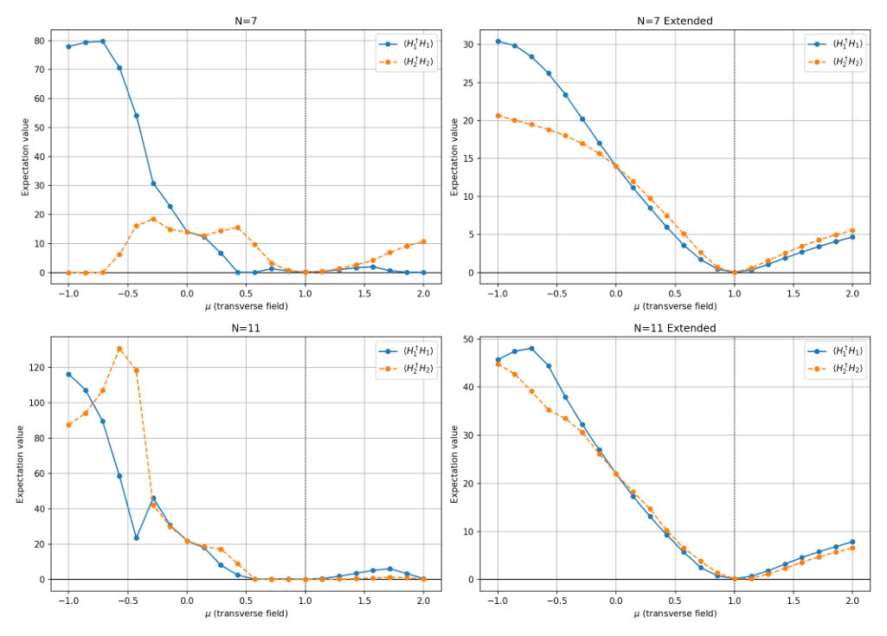
<figcaption class="paper-figure-caption"><b>Fig 5.</b> FIG. 5. ⟨H† nHn⟩for the three-state Potts model as a function of the transverse field µ, using the</figcaption>
</figure>

**Summary.** This paper analyzes the utility of Semidefinite Programming (SDP) for studying quantum spin chains, testing its ability to calculate ground state energies and correlation functions for models like the Ising and Potts chains. While SDP provides exact results for free fermion systems, its performance degrades for interacting models, highlighting the need for incorporating deeper physical constraints to make the method scalable and accurate.

**Why it may be interesting.** The rigorous application of convex optimization (SDP) to quantum many-body systems provides a powerful, albeit computationally demanding, theoretical tool for bounding and calculating quantum observables, especially useful for understanding critical phenomena.

Detailed structure

**Main problem.** The paper investigates the effectiveness and limitations of using Semidefinite Programming (SDP) methods to analyze spin chain Hamiltonians, aiming to determine when and why the method successfully extracts physical properties.

**Main result.** SDP successfully finds the exact ground state energy and two-point functions for free fermion systems, but its ability to estimate higher-order correlators degrades significantly for interacting models, and the method suffers from poor scaling with lattice volume.

**Method.** The core method is formulating the problem as a convex optimization problem (minimizing the expectation value of the Hamiltonian) subject to positivity constraints on the density matrix, which is solved via SDP.

**Model / system.** The study focuses on spin chain Hamiltonians, specifically applying the technique to the transverse-field Ising model and the 3-state Potts model, and analyzing the behavior in the free fermion limit.

**Key observables.** Ground state energy ($E_0/N$), first excited state energy ($E_1/N$), ground state correlators, and conformal data (central charge, critical exponents) at criticality.

**Important parameters / regimes.** The coupling constant ($\mu$), lattice volume ($N$), and the specific symmetry constraints (charge, Virasoro generators) used in the SDP formulation.

**Assumptions / limitations.** The method relies on the ability to express the problem as a convex optimization problem, and its success is strongly tied to the system being exactly solvable (free fermions).

**Figures summary.** Figures illustrate the convergence of SDP results for $E_0/N$ and $E_1/N$ for the Ising and Potts models, and show the construction and consistency checks using lattice Virasoro generators.

**Paper structure.** The paper systematically introduces the SDP formulation, applies it to specific models (Ising, Potts), and then explores advanced diagnostics by incorporating symmetry constraints (charge, Virasoro) and analyzing the free fermion limit.

Abstract

We study semidefinite programming (SDP) methods to analyze spin chain Hamiltonians. We examine the ground state energy, the first excited charged states and ground state correlators in two simple models: the Ising model in a transverse magnetic field and the closely related 3-state Potts model. Our goal is to understand precisely what the SDP program is doing and when it works well, why it does so. We focus on the following novel ingredients: using charge constraints to obtain excited states and to see if additional constraints from integrable models are effective at improving the method.   At criticality we also explore to what extent we can use approximate Virasoro correlators to extract conformal data: the central charge and some critical exponents of charged states. We also use these to identify the location of the phase transition. In the special case where the system is made of free fermions we prove that the SDP finds the exact energy of the ground state and produces the correct two point functions of the fermions. Away from free fermion theories, the SDP gets progressively worse at estimating data beyond the value of the ground state energy (like correlation functions), although it qualitatively matches these. In order to be effective, the SDP seems to run into scaling issues where the amount of input needed scales poorly with the lattice volume.

[↑ back to top](#top)

## Other papers (23)

*Papers from primary archives without highlighted authors or any topic match. Click to expand.*

Show other papers

### [A NISQ-Aware Hybrid Quantum-Classical Framework for Scalable Combinatorial Optimization](http://arxiv.org/abs/2606.00541v1)

**Authors:** Haolong Ding, Mohan Wu, Yin Xu, Hua Xu  
**Type:** both · **Category:** quantum information and computing · **PDF:** <https://arxiv.org/pdf/2606.00541v1>  
**Analysis basis:** full PDF text, analyzed in chunks

↔ Scroll figures horizontally

<figure class="paper-figure-card">
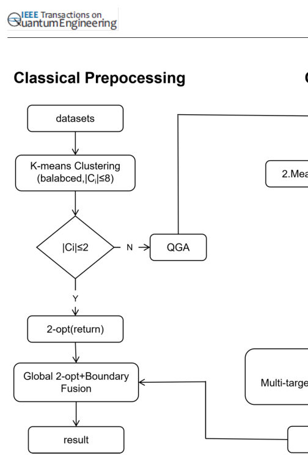
<figcaption class="paper-figure-caption"><b>Fig 1.</b> FIGURE 1. Hybrid Quantum-Classical Workflow.</figcaption>
</figure>
<figure class="paper-figure-card">
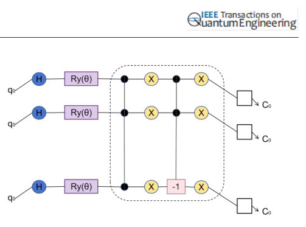
<figcaption class="paper-figure-caption"><b>Fig 2.</b> FIGURE 2. Localized Grover Amplitude Amplification Circuit</figcaption>
</figure>
<figure class="paper-figure-card">
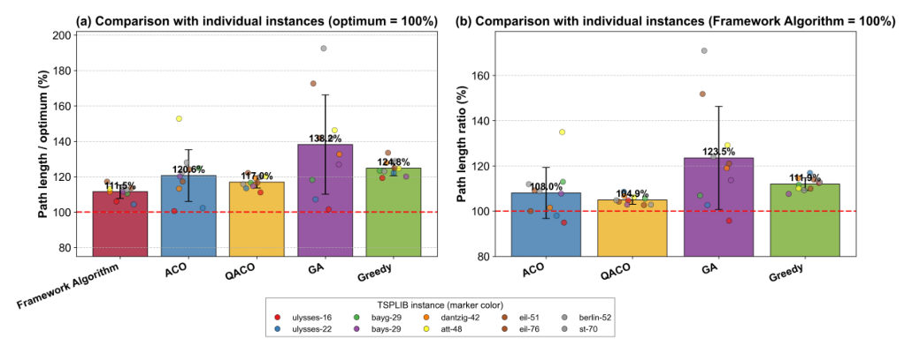
<figcaption class="paper-figure-caption"><b>Fig 3.</b> FIGURE 3. Comparison of route-length statistics and normalized ratios for ACO, QACO, GA, Greedy, and Hybrid Framework Algorithm.</figcaption>
</figure>
<figure class="paper-figure-card">
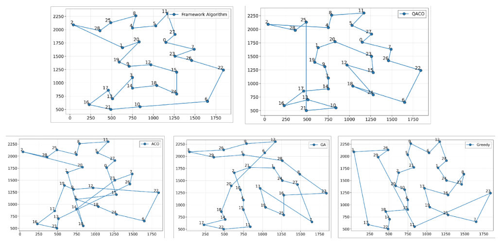
<figcaption class="paper-figure-caption"><b>Fig 4.</b> FIGURE 4. Route geometry comparison on the Bays-29 dataset for the proposed hybrid framework, QACO, ACO, GA, and Greedy methods.</figcaption>
</figure>
<figure class="paper-figure-card">
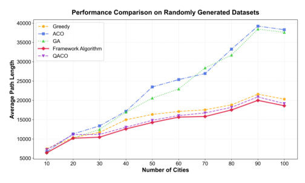
<figcaption class="paper-figure-caption"><b>Fig 5.</b> FIGURE 5. Algorithm comparison on random datasets.</figcaption>
</figure>

**Summary.** This paper introduces a NISQ-aware hybrid framework to solve large combinatorial optimization problems by breaking them down into manageable subproblems. It uses a quantum genetic algorithm enhanced by periodic amplitude amplification for local search, followed by classical refinement. The method proves scalable and robust, offering a practical paradigm for quantum advantage in the near-term quantum era.

**Why it may be interesting.** This work directly addresses the practical limitations of current quantum hardware by proposing a structured, resource-aware methodology for applying quantum computation to classically hard optimization problems, which is a key area for quantum information scientists.

Detailed structure

**Main problem.** The core challenge is achieving scalable combinatorial optimization for NP-hard problems like TSP under the severe resource constraints of Noisy Intermediate-Scale Quantum (NISQ) hardware.

**Main result.** The proposed hybrid framework consistently outperforms classical and quantum-inspired baselines, demonstrating that scalability is achieved through structured decomposition rather than increasing quantum circuit complexity.

**Method.** It employs a three-stage pipeline: clustering-based decomposition to create resource-bounded subproblems, followed by a Quantum Genetic Algorithm (QGA) for probabilistic local search, and concluding with a classical refinement stage for global consistency.

**Model / system.** The model is a hybrid quantum-classical optimization framework designed for NISQ devices. It operates by evolving a probabilistic distribution over the solution space, utilizing parameterized quantum states and localized amplitude amplification.

**Key observables.** Solution quality (minimum path length), scalability (performance gain vs. problem size), and robustness under simulated noise.

**Important parameters / regimes.** Subproblem size limit (M), amplitude amplification interval (Delta G), and noise levels (up to 10%).

**Assumptions / limitations.** The framework assumes that large problems can be effectively decomposed into smaller, qubit-compatible subproblems, and that periodic, localized quantum enhancements are sufficient for convergence.

**Figures summary.** Figures illustrate the three-stage workflow, localized Grover amplitude amplification circuits, and comparative performance ratios/scaling trends against various baselines.

**Paper structure.** The paper details the necessity of the hybrid approach due to NISQ limitations, introduces the decomposition $
ightarrow$ QGA/Amplitude Amplification $
ightarrow$ Classical Refinement pipeline, validates performance on benchmark datasets, and analyzes robustness via ablation studies.

Abstract

Scalable combinatorial optimization under resource-constrained quantum hardware remains a fundamental challenge in the Noisy Intermediate-Scale Quantum (NISQ) era, due to the mismatch between exponentially growing solution spaces and limited quantum computational capacity. In this work, we propose a NISQ-aware hybrid quantum-classical optimization framework that reformulates large-scale combinatorial optimization as a resource-bounded distribution evolution process. Instead of directly optimizing individual solutions, the proposed framework operates on a probabilistic representation of the solution space, enabling efficient exploration under hardware constraints. Specifically, large problem instances are decomposed into qubit-compatible subproblems via clustering-based decomposition, ensuring resource-bounded optimization. Within each subproblem, a quantum genetic algorithm evolves the solution distribution, while periodically embedded amplitude amplification acts as a controlled quantum enhancement mechanism that accelerates convergence without increasing circuit depth. A classical refinement stage ensures global solution consistency. Extensive experiments on benchmark and synthetic datasets demonstrate that the proposed framework consistently outperforms classical and quantum-inspired baselines, with performance gains that become more pronounced as problem scale increases. This scale-dependent behavior indicates that scalability is achieved through structured decomposition rather than increased quantum complexity. Noise simulations further confirm robustness under realistic NISQ conditions, and ablation studies validate that both quantum evolutionary search and amplitude amplification contribute significantly to performance improvements.

[↑ back to top](#top)

### [A Retinomorphic Optical Spiking Neuron for Camouflaged Object Detection](http://arxiv.org/abs/2606.00818v1)

**Authors:** Srilagna Sahoo, Adwaaiit Pande, Kartikey Thakar, Shubham Sahay, Saurabh Lodha  
**Type:** both · **Category:** disordered systems and neural networks · **PDF:** <https://arxiv.org/pdf/2606.00818v1>  
**Analysis basis:** full PDF text, analyzed in chunks

↔ Scroll figures horizontally

<figure class="paper-figure-card">
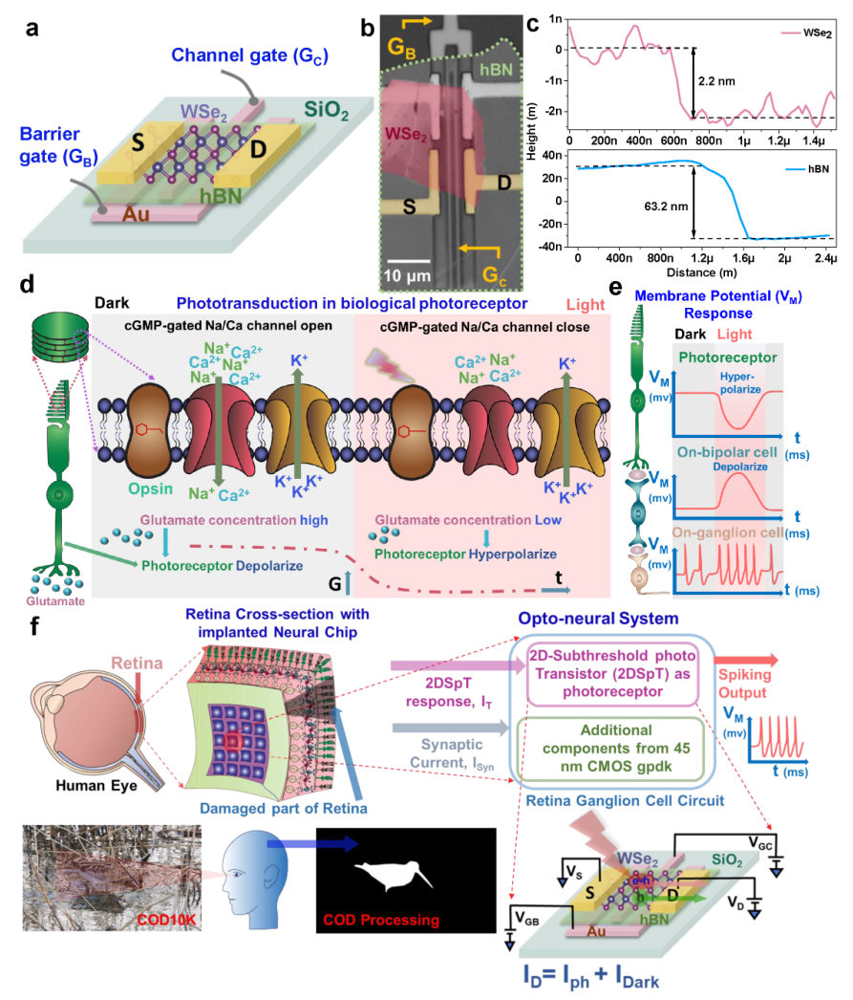
<figcaption class="paper-figure-caption"><b>Fig 1.</b> Fig. 1: Device architecture, the biological phototransduction process, temporal membrane potentials (VM), and artificial retinomorphic vision system. (a) Device schematic of a three- back-gated (channel gate (GC) and two barrier gates (GBs) shorted together) 2D-WSe2 subthreshold phototransistor (2DSpT) with hBN as the gate dielectric. (b) A false-colored optical micrograph image of the fabricated 2DSpT. The green dashed line indicates the boundary of the hBN flake, and the red shaded region defines the WSe2 flake. (c) Thickness profiles of WSe2 and hBN flakes. (d) The biological phototransduction process, under dark and illuminated conditions, is highlighted in the plasma membrane of the...</figcaption>
</figure>
<figure class="paper-figure-card">
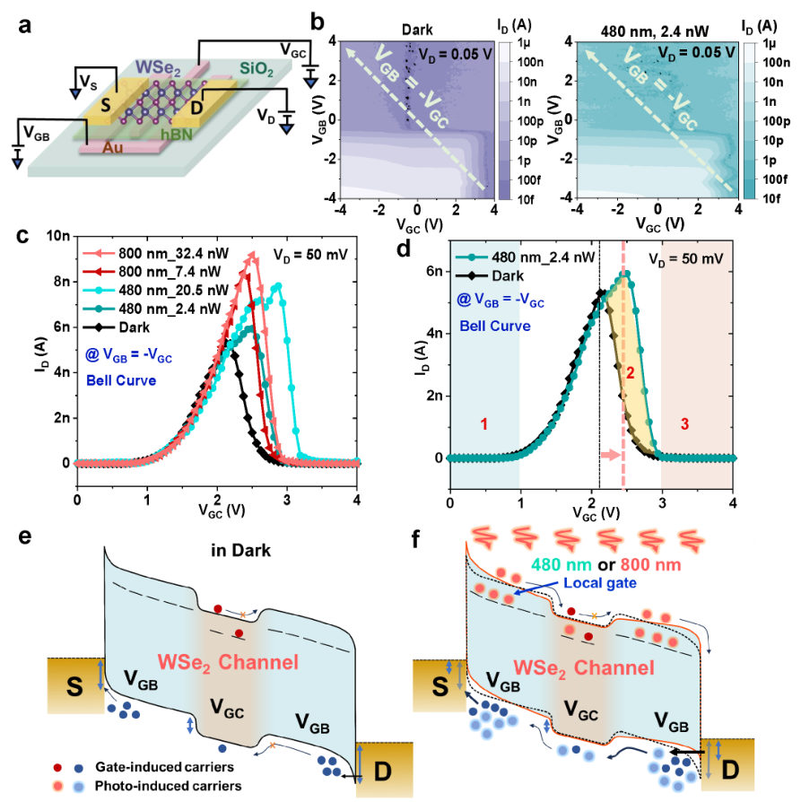
<figcaption class="paper-figure-caption"><b>Fig 2.</b> Fig. 2: Optoelectronic anti-ambipolar response (bell-shaped transfer characteristic) of 2DSpT and underlying device physics. (a) Biasing schematic for 2DSpT is configured to measure the device drain current (ID) as a function of the channel gate (VGC) and barrier gate (VGB) biases. The two color maps show 2DSpT drain currents (b) in dark and 480 nm (2.4 nW) illuminated conditions with respect to VGC and VGB. (c) Bell-shaped ID was extracted along the diagonal arrow marked in the color maps under dark, 480 nm and 800 nm illuminated conditions for varying intensities, where VGB = -VGC. (d) Right-shifted bell-shaped current at 480 nm (2.4 nW) relative to dark condition is shown to elucidate...</figcaption>
</figure>
<figure class="paper-figure-card">
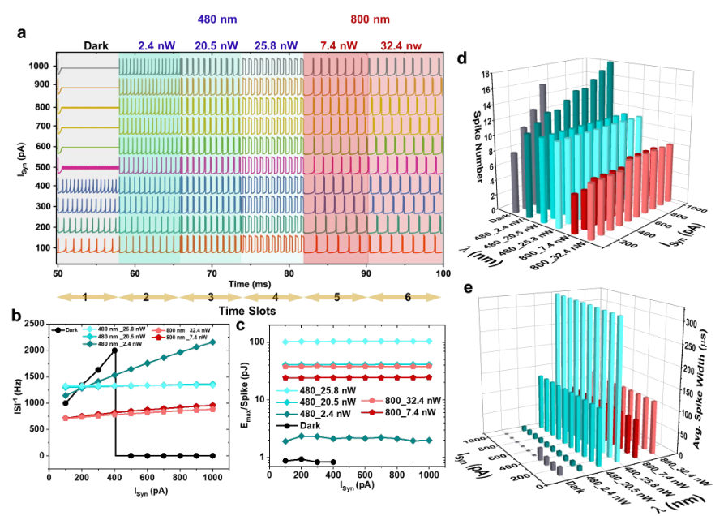
<figcaption class="paper-figure-caption"><b>Fig 3.</b> Fig. 3: Wavelength- and intensity-sensitive spike encoding by a biomimetic optical spiking HH-neuron (OSHN) incorporating 2DSpT as a photo-modulated Na-channel and the spiking properties under dark and 480 nm, and 800 nm illumination at varying intensities. (a) Action potential, VM of OSHN as a function of external synaptic current, Isyn. Time slots have been numerically assigned based on changes in illumination conditions. (b) The spike rate, ISI−1, and (c) the maximum energy consumption per spike (EPS) extracted from (a) as a function of Isyn. Additional spike properties, including (d) spike number and (e) average spike width vs. Isyn, as extracted from (a).</figcaption>
</figure>
<figure class="paper-figure-card">
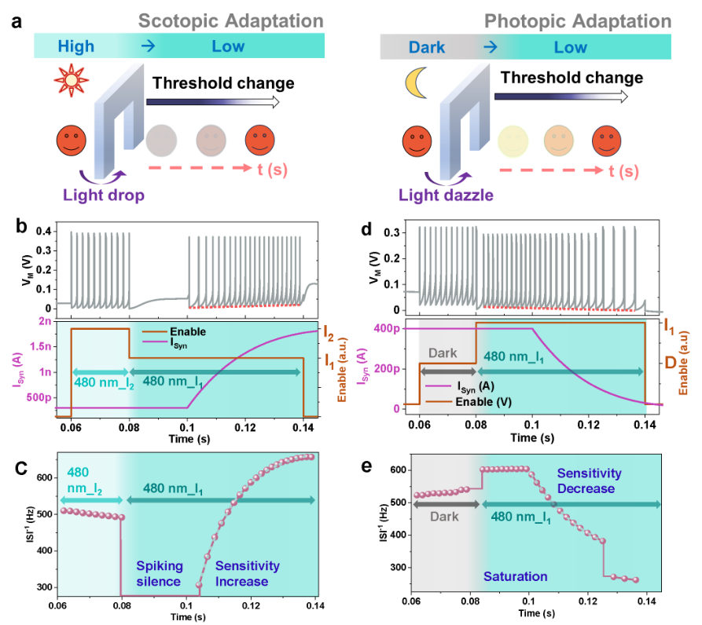
<figcaption class="paper-figure-caption"><b>Fig 4.</b> Fig. 4: Biomimicking of visual adaptation. (a) The concepts of scotopic and photopic vision illustrate illumination intensity adaptation and changes in detection threshold. Demonstration of (b) scotopic and (d) photopic adaptive action potential (VM) by OSHN that responds to variation in illumination by adjusting the post-hyperpolarization times and spiking threshold of VM, portraying effective gain control of ganglion cells. (c), (e) The extracted instantaneous spiking rate from (b) and (d), respectively, illustrates the effective emulation of sensitivity adjustment of rods and cones in response to variation in illumination.</figcaption>
</figure>
<figure class="paper-figure-card">
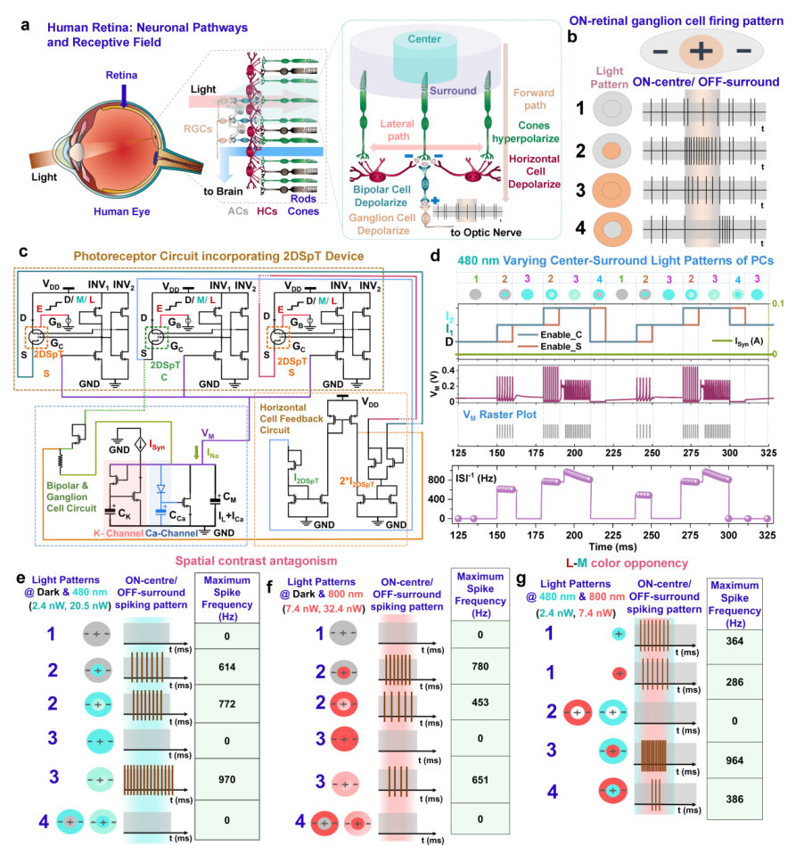
<figcaption class="paper-figure-caption"><b>Fig 5.</b> Fig. 5: Biomimetic center-surround receptive field (CSRF) mediated ON-RGC spiking. (a) Light interpretation path of human retina (light→RGC→BC→PC→synaptic response→BC→RGC→optic nerve) and CSRF field of RGC highlighting PCs, BCs, HCs, ACs, and ganglion cells. (b) Schematic of biological ON-center/OFF-surround RGC spiking for different dark and illumination patterns. (c) Circuit schematic used to emulate the ON-center/OFF-surround recep- tive field of RGCs with lateral inhibition to regulate the forward retinal response. (d) Action potential of OSHN in response to the center-surround light pattern of the PCs, corresponding extracted raster plot and spiking rates under dark and varying...</figcaption>
</figure>

**Summary.** This paper presents a novel, energy-efficient neuromorphic system for camouflage object detection by building an Optical Spiking Neuron (OSHN) based on a 2D phototransistor. The OSHN successfully mimics complex retinal functions, including Center-Surround Receptive Fields and visual adaptation. By integrating these bio-realistic stages into an SNN, the system achieves state-of-the-art accuracy while operating with ultra-low power consumption.

**Why it may be interesting.** The work represents a strong convergence of condensed matter physics (2D materials, phototransistors) and computational neuroscience (SNNs, retinal modeling), offering a hardware-level approach to bio-inspired computation.

Detailed structure

**Main problem.** Developing energy-efficient, low-latency, and highly accurate vision systems capable of detecting camouflaged objects by mimicking complex retinal preprocessing functions.

**Main result.** A Center-Surround Receptive Field (CSRF)-augmented Spiking Neural Network (SNN) achieved significant accuracy improvements (up to 28.4%) over conventional methods on camouflage detection benchmarks.

**Method.** The system integrates a Hodgkin-Huxley-based Optical Spiking Neuron (OSHN) built from a 2D phototransistor (2DSpT) to emulate retinal pathways like CSRF, visual adaptation, and color opponency.

**Model / system.** The core is the OSHN, which uses a 2DSpT operating in the subthreshold regime to achieve low energy per spike (e.g., 2 pJ at 480 nm). The overall framework models the photoreceptor $	o$ Bipolar Cell $	o$ RGC pathway.

**Key observables.** Spike rate (0-2 kHz), Energy per Spike (0.9 pJ - 24.5 pJ), Classification Accuracy (up to 95.9% on synthetic data), and Center-Surround spiking patterns.

**Important parameters / regimes.** Wavelengths (480 nm, 800 nm), Time constants ($	au_s = 30 	ext{ ms}$, $	au_p = 27 	ext{ ms}$), and specific gate biases for the 2DSpT.

**Assumptions / limitations.** The system assumes that CSRF processing and visual adaptation are key mechanisms for enhancing contrast sensitivity, which is crucial for distinguishing camouflaged objects.

**Figures summary.** Figures illustrate the 2DSpT structure, the OSHN action potential under varying light conditions, the CSRF implementation using DoG filters, and the final performance comparison of the SNN on COD datasets.

**Paper structure.** The paper progresses from detailing the physical device (2DSpT) and its phototransduction mechanism, to modeling the OSHN circuit dynamics (HH model), then implementing multi-stage biomimetic preprocessing (CSRF, VA), and finally applying the full framework to achieve high performance in camouflaged object detection.

Abstract

Advanced vision systems require retinomorphic, energy-efficient spike-based preprocessing of dynamic visual scenes. Here, we demonstrate multiple retinal preprocessing functionalities by leveraging a Hodgkin-Huxley-based optical spiking neuron (OSHN) that incorporates a two-dimensional anti-ambipolar phototransistor operated in the subthreshold regime to minimize power consumption. OSHN exhibits wavelength- and intensity-sensitive spike encoding with energy consumption per spike of 0.9 pJ under dark, 2 pJ at 480 nm (mid wavelength, M), and 24.5 pJ at 800 nm (long wavelength, L). The low (biological)-to-high spiking rate (0 - 2 kHz) with substantially faster response times (4.2 $μ$s - 1.25 ms) than the human retina (30 ms - 60 ms), reveal OSHN's fast decision-making capability. OSHN facilitates concurrent spectral-spatial processing by emulating retinal antagonistic center-surround receptive fields (CSRFs) at a single wavelength (480 nm or 800 nm) with varying intensities, visual adaptation (at 480 nm) to prevent system saturation, and L-M cone opponency in midget ganglion cells. Finally, a CSRF-augmented spiking neural network (SNN) has been developed for camouflaged object detection, achieving 4.4%, 10.4%, and 28.4% improvements in accuracy over conventional SNN on FMNIST, COD10K, and synthetic camouflaged datasets, outperforming existing photoactive spiking architectures while enabling event-driven intelligent edge vision systems.

[↑ back to top](#top)

### [Asymptotic Recovery in Fourier Spectral Methods for the Schrödinger Equation with Point Singularities](http://arxiv.org/abs/2606.01718v1)

**Authors:** Yanjie Li, Sihong Shao  
**Type:** theory · **Category:** numerical methods · **PDF:** <https://arxiv.org/pdf/2606.01718v1>  
**Analysis basis:** full PDF text, analyzed in chunks

↔ Scroll figures horizontally

<figure class="paper-figure-card">
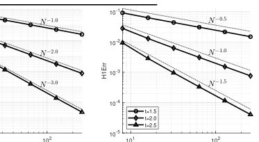
<figcaption class="paper-figure-caption"><b>Fig 1.</b> Fig. 2: FSM benchmark: Convergence of EigErr (left), pH1Err (middle), H1Err (right) against N in 1D test case with different values of in (4.4). The black curves with markers represent the numerical errors, where the markers correspond to N = 8, 16, 32, 64, 128, 256. The dotted lines indicate the theoretical convergence slopes. The observed convergence orders are in excellent agreement with the theoretical predic- tions.</figcaption>
</figure>
<figure class="paper-figure-card">
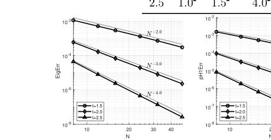
<figcaption class="paper-figure-caption"><b>Fig 2.</b> Fig. 3: FSM benchmark: Convergence of EigErr (left), pH1Err (middle), H1Err (right) against N in 3D test case with different values of in (4.5). The black curves with markers represent the numerical errors, where the markers correspond to N = 8, 12, 16, 24, 32, 48. The dotted lines indicate the reference slopes corresponding to the- oretical orders. The observed convergence orders are in excellent agreement with the theoretical predictions.</figcaption>
</figure>
<figure class="paper-figure-card">
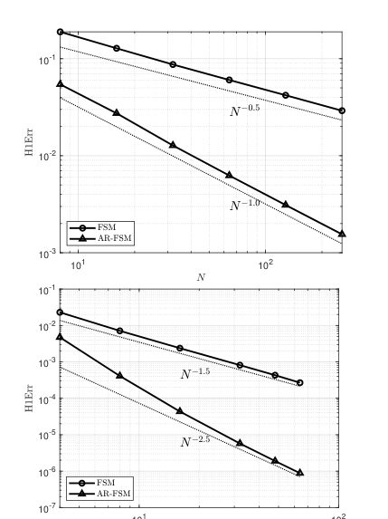
<figcaption class="paper-figure-caption"><b>Fig 3.</b> Fig. 4: FSM v.s. AR-FSM: Convergence of EigErr (left) and H1Err (right) against N for the 1D Dirac-delta potentials (top) and the 3D Coulomb potentials (bottom). The bold curves with markers represent the numerical error, where the markers correspond to N = 8, 16, 32, 64, 128, 256 in the 1D case, and N = 4, 8, 16, 32, 48, 64 in the 3D case. The results confirm the theoretical predictions and demonstrate the superior performance of AR-FSM over FSM.</figcaption>
</figure>

**Summary.** This paper introduces the Asymptotic-Recovery Fourier Spectral Method (AR-FSM) to solve the eigenvalue problem for the Schrödinger equation with singular potentials. It rigorously proves that AR-FSM significantly improves the convergence rates compared to standard Fourier Spectral Methods. This advancement is crucial for accurately simulating quantum systems governed by potentials with point singularities.

**Why it may be interesting.** The development of AR-FSM provides a powerful, theoretically grounded tool for simulating quantum systems with singular interactions, pushing the limits of accuracy in spectral methods for condensed matter physics.

Detailed structure

**Main problem.** Developing highly accurate numerical techniques to compute the eigenpairs of the Schrödinger equation when the potential contains point singularities.

**Main result.** The proposed Asymptotic-Recovery Fourier Spectral Method (AR-FSM) significantly enhances convergence rates over standard Fourier Spectral Methods (FSM), achieving superior convergence orders for both eigenvalues and eigenfunctions.

**Method.** The core technique involves combining the Fourier Spectral Method with an Asymptotic-Recovery (AR) post-processing step that exploits the known asymptotic behavior of eigenfunctions near singular points.

**Model / system.** The study focuses on the $d$-dimensional Schrödinger operator, $H = -
abla^2 + V(x)$, where the potential $V$ belongs to a Sobolev space $H^s$ and can include singular potentials like the 3D Coulomb potential or the 1D Dirac-delta potential.

**Key observables.** Eigenvalues ($\lambda_n$) and eigenfunctions ($\psi_n$) of the Schrödinger operator; convergence error ($	ext{EigErr}, 	ext{H1Err}$).

**Important parameters / regimes.** Potential regularity index ($s$), spatial dimension ($d$), and the parameter $b$ derived from $s$ and $d$.

**Assumptions / limitations.** The analysis assumes the potential $V \in H^s$ with $s > \max\{d/2 - 2, -1\}$ and relies on developing a rigorous framework for point singularities.

**Figures summary.** Figures compare numerical convergence rates for 1D (Dirac-delta) and 3D (Coulomb) potentials, demonstrating the superior convergence of AR-FSM over standard FSM.

**Paper structure.** The paper builds from establishing the FSM convergence rates, deriving the super-convergence phenomenon, and then introducing the AR technique. The structure involves developing asymptotic expansions, proving error bounds using spectral gap analysis, and finally validating the enhanced convergence rates for AR-FSM.

Abstract

This paper studies the Fourier spectral method (FSM) for the Schrödinger equation with singular potentials $V \in H^{s}$, where $s > \max\{d/2-2,-1\}$ and $d$ denotes the spatial dimension. This setting includes a broad class of singular potentials, such as the 3D Coulomb potential and the 1D Dirac-delta potential. First, we combine the Feshbach-Schur map with a refined perturbation argument to derive sharp convergence orders for FSM, yielding order $2s+2$ for eigenvalues and order $s+1$ for eigenfunctions in the $H^1$ norm. More importantly, the $H^1$ error with respect to the projected eigenfunction converges with a higher order $s+1+b$, where $b=\min\{s+2-d/2-\varepsilon,\; s+1,\; 2\}>0$ for arbitrarily small $\varepsilon>0$, revealing a super-convergence phenomenon. Second, in the presence of potentials with isolated point singularities, we develop an asymptotic-recovery (AR) technique to post-process the FSM solutions. The resulting method, dubbed AR-FSM, fully exploits the super-convergence property and achieves convergence orders $2s+2+2b$ for eigenvalues and $s+1+b$ for eigenfunctions in the $H^1$ norm, while the AR post-processing requires only a computational cost that is linear in the number of FSM degrees of freedom. The analysis introduces a rigorous definition of point singularities and develops a foundational framework for their study. It further establishes an asymptotic expansion of eigenfunctions consisting of a regular component in $H^{s+4}$ together with $d+1$ asymptotic functions associated with each singular point. Numerical experiments confirm the sharpness of these theoretical bounds.

[↑ back to top](#top)

### [Branch-Aware Quantum Constant Propagation for Dynamic Quantum Circuits](http://arxiv.org/abs/2606.02018v1)

**Authors:** Innocenzo Fulginiti, Yanbin Chen  
**Type:** theory · **Category:** quantum information and computing · **PDF:** <https://arxiv.org/pdf/2606.02018v1>  
**Analysis basis:** full PDF text, analyzed in chunks

↔ Scroll figures horizontally

<figure class="paper-figure-card">
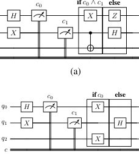
<figcaption class="paper-figure-caption"><b>Fig 1.</b> Fig. 1: Dynamic circuit example assuming all qubits are initially in |0⟩and all classical bits are 0: Fig. 1a shows the original circuit, and Fig. 1b shows a semantically equivalent simplified circuit.</figcaption>
</figure>
<figure class="paper-figure-card">
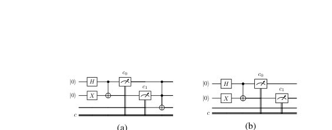
<figcaption class="paper-figure-caption"><b>Fig 2.</b> Fig. 2: Example of BQCP eliminating an unreachable Toffoli gate: Fig. 2a shows the original circuit, while Fig. 2b shows the simplified circuit. The first two qubits are prepared in the Bell state (|01⟩+ |10⟩)/ √</figcaption>
</figure>
<figure class="paper-figure-card">
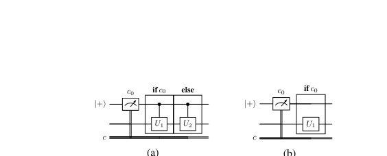
<figcaption class="paper-figure-caption"><b>Fig 3.</b> Fig. 3: Example of a block-local simplification with BQCP: Fig. 3a shows the original circuit, while Fig. 3b shows the corresponding simplified circuit.</figcaption>
</figure>
<figure class="paper-figure-card">
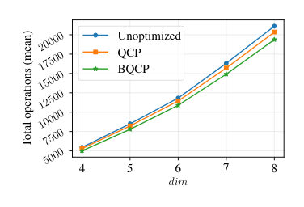
<figcaption class="paper-figure-caption"><b>Fig 4.</b> Fig. 4: Random circuits: Comparison of the mean number of operations (unitary, measurement, reset, and conditional) for the original unoptimized circuits and the circuits obtained after applying QCP (with nmax = 512) and BQCP (with nmax = 512, bmax = 8), as a function of the size parameter dim. Results are averaged over 10 circuits for each dim.</figcaption>
</figure>
<figure class="paper-figure-card">
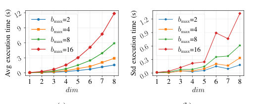
<figcaption class="paper-figure-caption"><b>Fig 5.</b> Fig. 5: Random circuits: Mean execution time and standard deviation of BQCP with nmax = 512 for different values of bmax, over 10 circuits for each dim. Fig. 5a shows the mean execution time, and Fig. 5b shows the standard deviation.</figcaption>
</figure>

**Summary.** This paper introduces Branch-Aware Quantum Constant Propagation (BQCP), a compile-time optimization technique for dynamic quantum circuits. BQCP extends standard constant propagation by explicitly tracking the classical outcomes and resulting quantum states across all possible execution branches. This allows for precise, path-sensitive simplification, leading to significantly optimized circuits compared to methods that ignore classical control flow.

**Why it may be interesting.** This work directly addresses the practical compilation challenges for near-term quantum hardware by providing a rigorous, state-of-the-art optimization pass that accounts for the complex classical control flow inherent in modern quantum algorithms.

Detailed structure

**Main problem.** Improving the efficiency and reliability of quantum circuits running on noisy hardware by performing compile-time optimizations.

**Main result.** The proposed Branch-Aware Quantum Constant Propagation (BQCP) method consistently achieves larger circuit reductions than existing passes, especially on dynamic circuits involving mid-circuit measurements.

**Method.** BQCP extends Quantum Constant Propagation (QCP) by tracking the classical information and corresponding post-measurement quantum states across all possible execution branches induced by conditional logic.

**Model / system.** The analysis targets dynamic quantum circuits operating on an $n$-qubit register $Q$ and a classical register $C$. The state is tracked as an abstract state $B$, which is a finite disjunction of abstract branches, combining classical and quantum information.

**Key observables.** Circuit simplification (reduction in the number of unitary gates, measurements, resets, and conditionals) and the resulting semantically equivalent, optimized circuit.

**Important parameters / regimes.** The analysis is controlled by two bounds: $n_{	ext{max}}$ (for quantum state representation size) and $b_{	ext{max}}$ (for the total number of tracked execution branches).

**Assumptions / limitations.** The analysis relies on bounding the number of branches ($b_{	ext{max}}$) and the quantum state representation size ($n_{	ext{max}}$) to maintain polynomial time complexity, accepting potential over-approximation when these bounds are hit.

**Figures summary.** Figures illustrate the comparison between an original dynamic circuit and the semantically equivalent, simplified circuit derived using BQCP, demonstrating the removal of redundant operations.

**Paper structure.** The paper introduces the problem of optimizing dynamic circuits, details the BQCP framework by defining abstract state representations for classical and quantum components, and systematically defines transfer functions for measurements, resets, and conditionals to enable sound, path-sensitive simplification rules.

Abstract

Compile-time optimization is important for improving the efficiency and reliability of quantum circuits on current noisy hardware. While many existing methods simplify circuits using structural patterns or quantum-state information, most of them target only unitary circuits and do not support dynamic circuits with mid-circuit measurements and classical feedforward. In this work, we present Branch-Aware Quantum Constant Propagation (BQCP), a compile-time analysis for dynamic circuits. BQCP extends Quantum Constant Propagation (QCP) by tracking the classical information produced by mid-circuit measurements together with the corresponding post-measurement quantum states across different execution branches. This enables path-sensitive reasoning inside conditional blocks and more precise information propagation than QCP. To keep the analysis scalable, we bound both the size of the quantum-state representation and the number of tracked branches. Using the information inferred by the analysis, we apply semantics-preserving simplifications to circuit operations. We prove the soundness of both the analysis and the simplifications. Experimental results on both application-driven and synthetic benchmarks show that, on dynamic circuits, our method consistently achieves larger reductions than other existing passes including QCP.

[↑ back to top](#top)

### [Electron vs. hole doping in infinite-layer nickelates: electronic structure, magnetism and correlations](http://arxiv.org/abs/2606.00223v1)

**Authors:** Ezra Day-Roberts, Fabio Bernardini, Harrison LaBollita, Yi-Feng Zhao, Andres Cano, Antia S. Botana  
**Type:** theory · **Category:** strongly correlated electrons · **PDF:** <https://arxiv.org/pdf/2606.00223v1>  
**Analysis basis:** full PDF text, analyzed in chunks

↔ Scroll figures horizontally

<figure class="paper-figure-card">
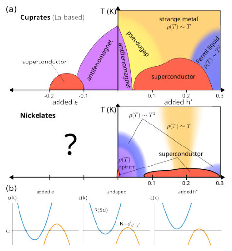
<figcaption class="paper-figure-caption"><b>Fig 1.</b> FIG. 1. (a) Electron- and hole-doped phase diagrams for su- perconducting cuprates (top) and nickelates (bottom) where distinct electronic phases are denoted in different colors. Cuprate diagram adapted from Ref. [34]. Nickelate phase diagram adapted from transport data in Refs. [35, 36]. (b) Schematic of the near Fermi level band structure for electron- doped vs. hole-doped infinite-layer nickelates.</figcaption>
</figure>
<figure class="paper-figure-card">
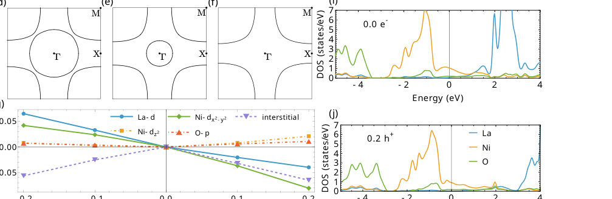
<figcaption class="paper-figure-caption"><b>Fig 2.</b> FIG. 2. (a-c) Nonmagnetic DFT band structure of LaNiO2 for selected electron/hole doping levels. Panels (d-f) show the corresponding Fermi surfaces for kz = 0 and (h-j) the Density of States (DOS). (g) Evolution of selected orbital projected occupations (in electrons) under electron and hole doping. Note that main changes take place in the interstitial, La-d and Ni-dx2−y2 orbitals. While the La-d and Ni-dx2−y2 occupations increase(decrease) upon electron(hole) doping, the interstitial occupation decreases in both doping regimes.</figcaption>
</figure>
<figure class="paper-figure-card">
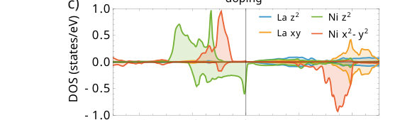
<figcaption class="paper-figure-caption"><b>Fig 3.</b> FIG. 3. (a) Energy difference between different magnetic con- figurations (AFM-C, AFM-G, FM) with respect to a nonmag- netic (NM) state for U = 5, J = 0.8 eV. (b) Corresponding evolution of magnetic moments in the AFM-C state and dif- ferent U, all with J = 0.8 eV. Similar moment trends are obtained in a FM and AFM-C state. (c) Projected local spin- polarized DOS for the undoped C-type AFM state at U = 5, J = 0.8 eV. The DOS for a G-type state is very similar (as shown in Appendix C).</figcaption>
</figure>
<figure class="paper-figure-card">
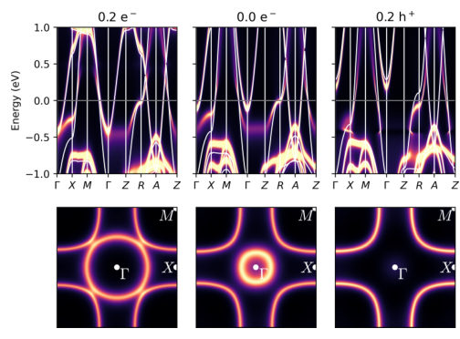
<figcaption class="paper-figure-caption"><b>Fig 4.</b> FIG. 4. Momentum resolved spectral functions (top) and Fermi surfaces (bottom) at three levels of doping from DFT+DMFT calculations.</figcaption>
</figure>
<figure class="paper-figure-card">
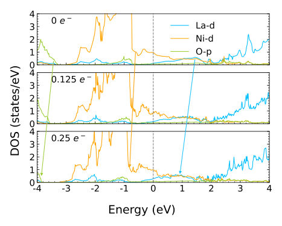
<figcaption class="paper-figure-caption"><b>Fig 5.</b> FIG. 5. Atom and orbital-resolved DOS for La1−xCexNiO2 in supercell calculations. Arrows have been added to illustrate the shift in the DOS with doping.</figcaption>
</figure>

**Summary.** This theoretical study investigates the electronic structure and magnetism of infinite-layer nickelates across both electron- and hole-doped regimes. Using DFT+DMFT, the authors highlight a significant asymmetry, noting that electron doping preserves antiferromagnetism while hole doping suppresses it. The work suggests that the $	ext{Ni-}d_{x^2-y^2}$ orbital governs low-energy physics in both regimes.

**Why it may be interesting.** The focus on strongly correlated transition metal oxides, particularly the comparison between electron and hole doping asymmetries, is central to understanding high-temperature superconductivity mechanisms, a key area in condensed matter theory.

Detailed structure

**Main problem.** The study re-examines the electronic structure, magnetism, and correlations in infinite-layer nickelates ($	ext{RNiO}_2$) by extending the investigation from the well-studied hole-doped regime to the less explored electron-doped regime.

**Main result.** The research reveals a striking asymmetry between electron and hole doping, particularly in the self-doping of the $	ext{Ni-}d_{x^2-y^2}$ band and the magnetic ground state, which remains antiferromagnetic upon electron doping.

**Method.** The authors employed a combination of Density-Functional Theory (DFT) and Dynamical Mean-Field Theory (DMFT) calculations, utilizing supercell and Variable Cell Approximation (VCA) methods.

**Model / system.** The physical system is the infinite-layer nickelate $	ext{RNiO}_2$. The calculations model the electronic structure and correlation effects arising from the $	ext{Ni-}d_{x^2-y^2}$ orbital, considering doping variations.

**Key observables.** Electronic structure evolution, magnetic response (AFM vs. FM), orbital occupations, self-doping effect, and orbital-resolved mass enhancement ($m^*/m$).

**Important parameters / regimes.** Doping level (hole vs. electron), Hubbard U parameter, and the nature of the rare earth $R(5d)$ states.

**Assumptions / limitations.** The analysis suggests that despite the complexity, the low-energy correlation physics is dominated by the $	ext{Ni-}d_{x^2-y^2}$ orbital, potentially allowing for a single-band description.

**Figures summary.** Figures illustrate band structures, Fermi surface evolution at specific momenta, energy differences between magnetic states ($	ext{AFM-C}$, $	ext{AFM-G}$, $	ext{FM}$), and orbital-resolved spectral functions and self-energies across doping levels.

**Paper structure.** The paper systematically compares the electronic and magnetic properties under hole and electron doping, detailing the observed asymmetries in band filling, magnetic stability, and correlation strength using advanced theoretical techniques.

Abstract

The observation of superconductivity in undoped infinite-layer nickelates $R$NiO$_2$ ($R$ = rare earth) challenges our current understanding and calls for a re-examination of the underlying electronic structure of this family of materials. In this context, it is particularly important to extend the investigation of $R$NiO$_2$ compounds from the intensively studied hole-doped regime to the almost unexplored electron-doped one. Here, we use a combination of density-functional theory and dynamical mean-field theory to study the evolution of the electronic structure of infinite-layer nickelates in these two doping regimes. We find a striking asymmetry in the self-doping of the Ni-$d_{x^2-y^2}$ band due to the $R(5d)$ states: while this effect is strongly suppressed upon hole doping, electron doping instead leads to an increase in the size of the $R(5d)$ electron pockets, but without effectively hole-doping the Ni-$d_{x^2-y^2}$ band. This asymmetry has an important impact on the magnetic response as antiferromagnetism is rapidly suppressed upon hole doping, whereas it remains the ground state upon electron doping. Despite these differences, electronic correlations on both sides of the phase diagram are dominated by the Ni $d_{x^2-y^2}$ orbital, suggesting that a single-band description may be appropriate for infinite-layer nickelates in both the electron- and hole-doped regimes.

[↑ back to top](#top)

### [Evolutionary Discovery of Bivariate Bicycle Codes with LLM-Guided Search](http://arxiv.org/abs/2606.02418v1)

**Authors:** Juan Cruz-Benito, Andrew W. Cross, David Kremer, Ismael Faro  
**Type:** theory · **Category:** quantum information and computing · **PDF:** <https://arxiv.org/pdf/2606.02418v1>  
**Analysis basis:** full PDF text, analyzed in chunks

↔ Scroll figures horizontally

<figure class="paper-figure-card">
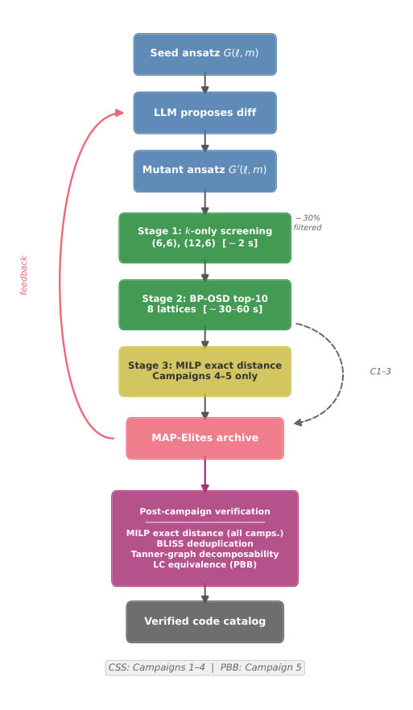
<figcaption class="paper-figure-caption"><b>Fig 1.</b> FIG. 1. Evolution pipeline. An LLM proposes diffs to a seed generator ansatz G(ℓ, m); each mutant is screened by a multi- stage cascade (Stage 1: k-only, Stage 2: BP-OSD distance) and inserted into a MAP-Elites archive that feeds back con- text to the LLM. Campaigns 4–5 add in-loop MILP exact dis- tance (Stage 3, added in response to BP-OSD overestimation discovered in Campaigns 1–3; see Sec. VI E); Campaigns 1–3 use post-hoc MILP (dashed bypass). Post-campaign verifica- tion (MILP distance computation →BLISS deduplication → Tanner-graph decomposability →LC equivalence for PBB) ensures all reported codes are genuine.</figcaption>
</figure>
<figure class="paper-figure-card">
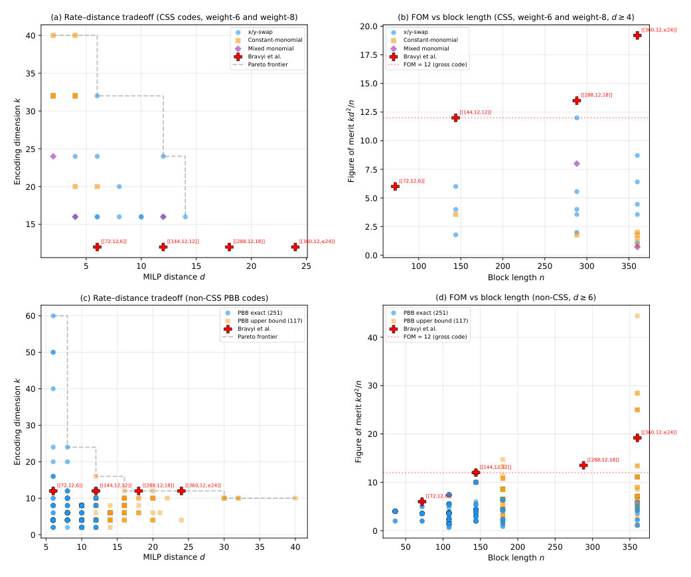
<figcaption class="paper-figure-caption"><b>Fig 2.</b> FIG. 2. Rate–distance landscape across all five campaigns. Left panels: k vs. d with Pareto frontier (dashed). Right panels: FOM = kd2/n vs. block length. Top: 97 CSS codes (weight-6 and weight-8); bottom: 368 non-CSS PBB codes. Red markers: Bravyi et al. [2] baselines; dotted line: FOM = 12 (gross code). The [[288, 24, 12]] (d = 12, k = 24) is a direct sum of two gross codes (Sec. VI A); the highest-k indecomposable code at d = 12 is [[288, 16, 12]] (k = 16). Among weight-6 codes, k &gt; 24 implies d ≤4; weight-8 codes reach k = 50 at d = 8; non-CSS codes occupy the same envelope.</figcaption>
</figure>
<figure class="paper-figure-card">
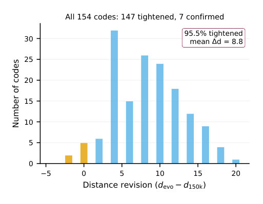
<figcaption class="paper-figure-caption"><b>Fig 3.</b> FIG. 4. Distance revisions across 154 Campaigns 1–3 poly- nomial representations. 147 (95.5%) had bounds tightened under the 150k-trial multi-decoder protocol, with mean reduc- tion ∼8.4 points. Even tightened bounds remain gross over- estimates: MILP reveals dtrue = 2 for codes with dBP ≤24.</figcaption>
</figure>
<figure class="paper-figure-card">
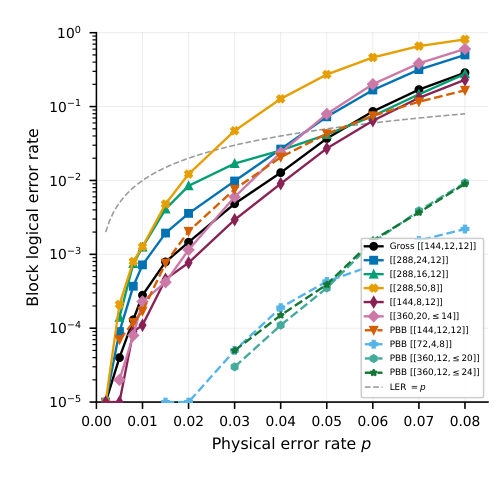
<figcaption class="paper-figure-caption"><b>Fig 4.</b> FIG. 3. Block logical error rate vs. physical bit-flip rate p for six CSS and four non-CSS codes (100,000 shots per rate, BP-OSD with OSD-CS order 7). Dashed line: LER = p. Weight-6 codes with d ≥12 achieve LER &lt; p through p ≈5%; the PBB [[360, 12, ≤24]] and [[72, 4, 8]] achieve LER &lt; 1% at p = 8%. The weight-8 [[288, 50, 8]] (d = 8, k = 50) crosses LER = p between p = 2% and 3%, illustrating the rate– distance tradeoff.</figcaption>
</figure>
<figure class="paper-figure-card">
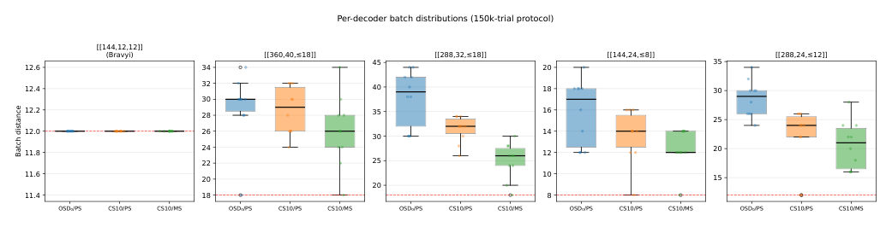
<figcaption class="paper-figure-caption"><b>Fig 5.</b> FIG. 1. Per-batch distance distributions under the 150,000-trial multi-decoder protocol. Red dashed lines show the global minimum across all 30 batches. The gross code (k = 12) is perfectly stable; all four higher-k codes show inter-batch variance. The three evolution-highlighted codes (dMILP = 2, 4, 6) show dramatic overestimation; even the [[288, 24, 12]] (dMILP = 12; a direct sum of two gross codes) has OSD0 medians ≈2.4× the true distance, with only 2 of 30 batches finding the exact value.</figcaption>
</figure>

**Summary.** This paper introduces an LLM-guided evolutionary search method to discover new and high-performing quantum LDPC codes, specifically Bivariate Bicycle variants. By combining generative AI with rigorous mathematical verification (like MILP), the authors efficiently explore massive code design spaces. The results confirm that this AI-assisted approach is a powerful, practical tool for advancing quantum error correction theory.

**Why it may be interesting.** The integration of large language models into the highly structured, combinatorial search space of quantum error correction codes represents a novel computational paradigm for theoretical quantum information science.

Detailed structure

**Main problem.** The core challenge is the systematic and reliable discovery of high-performing quantum Low-Density Parity-Check (qLDPC) codes within vast algebraic design spaces.

**Main result.** The LLM-guided evolutionary workflow successfully identified 465 distinct candidate codes, including new representatives and demonstrating that the method is a practical tool for structured quantum-code discovery.

**Method.** The authors employed an LLM-guided evolutionary workflow where language models mutate Python programs generating code ansätze, followed by a rigorous, multi-stage validation pipeline including MILP and graph theory checks.

**Model / system.** The focus is on Bivariate Bicycle (BB) and perturbed Bivariate Bicycle (PBB) quantum error-correcting codes, which are defined by polynomial structures over finite fields, suitable for near-term fault-tolerant quantum computing.

**Key observables.** Code parameters ($n, k, d$), Figure of Merit (FOM = $kd^2/n$), and error rates (LER, $p_L$) under various noise models.

**Important parameters / regimes.** Block length $n \le 360$, noise probability $p$ (e.g., up to 8%), and the computational cost ($\sim 140$ hours, $\sim$US\$400).

**Assumptions / limitations.** The reported LERs are lower bounds on the optimal depolarizing threshold, and the comparison between CSS and PBB codes is noted to be decoder-dependent.

**Figures summary.** The figures summarize code parameters, performance metrics (FOM, LER), and comparison of simulation bounds versus exact MILP distances across various noise channels.

**Paper structure.** The paper establishes the need for better code discovery methods, introduces the LLM-guided evolutionary framework, details the staged validation pipeline (from rank computation to MILP), and concludes with performance comparisons under noise models.

Abstract

Quantum LDPC code discovery requires searching large algebraic design spaces while reliably certifying the parameters and equivalence classes of any candidates found. We introduce an LLM-guided evolutionary workflow in which language models mutate Python programs that generate bivariate-bicycle and perturbed bivariate-bicycle code ansätze. Across five campaigns, the system performed approximately 1{,}650 evolutionary iterations, screened about $2 \times 10^5$ candidate codes, and required ${\sim}140$ hours of computation and ${\sim}$US\$400 in LLM inference cost. Candidate codes are evaluated through a staged validation pipeline combining $\mathrm{GF}(2)$ rank computation, distance estimation and certification, mixed-integer linear programming, BLISS Tanner-graph deduplication, decomposability analysis, and local-Clifford equivalence checks. At block length $n \leq 360$, the workflow identifies 465 distinct candidate codes: 97 CSS bivariate-bicycle codes and 368 non-CSS perturbed variants. The CSS search recovers known high-performing codes and finds new finite-length representatives, including an indecomposable [[288,16,12]] code and higher-weight codes with up to $k = 50$ at distance $d = 8$. The non-CSS search produces perturbed codes matching the gross-code figure of merit at [[144,12,12]], along with additional high-distance candidates reported as certified values or upper bounds according to MILP status. Overall, these results show that LLM-guided program evolution can serve as a practical tool for structured quantum-code discovery when paired with independent evaluation.

[↑ back to top](#top)

### [Hidden $\mathfrak{u}(2,1)$ symmetry and Jordan chains in a resonant ghostly three-dimensional model](http://arxiv.org/abs/2606.02290v1)

**Authors:** Andreas Fring, Ian Marquette  
**Type:** theory · **Category:** other · **PDF:** <https://arxiv.org/pdf/2606.02290v1>  
**Analysis basis:** full PDF text, analyzed in chunks

↔ Scroll figures horizontally

<figure class="paper-figure-card">
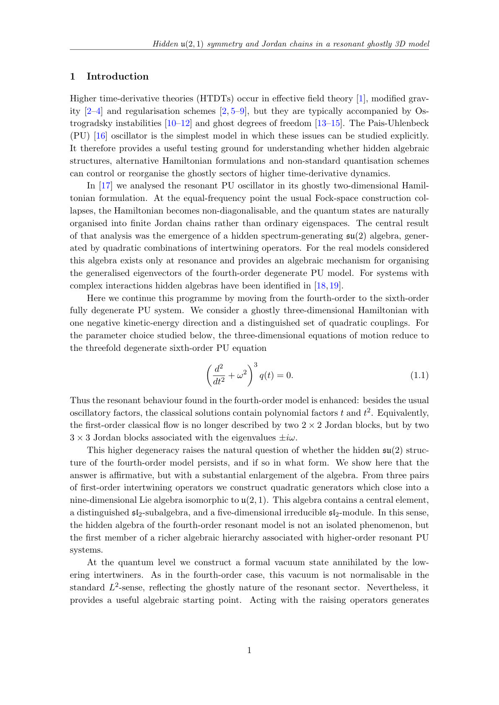
<figcaption class="paper-figure-caption"><b>Fig 1.</b> Low-resolution page preview, page 2</figcaption>
</figure>
<figure class="paper-figure-card">
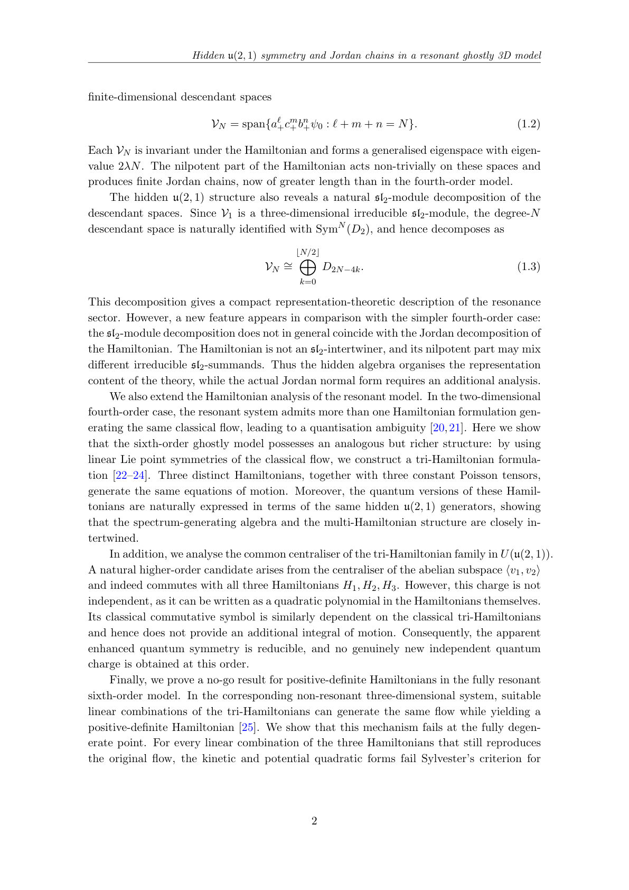
<figcaption class="paper-figure-caption"><b>Fig 2.</b> Low-resolution page preview, page 3</figcaption>
</figure>
<figure class="paper-figure-card">
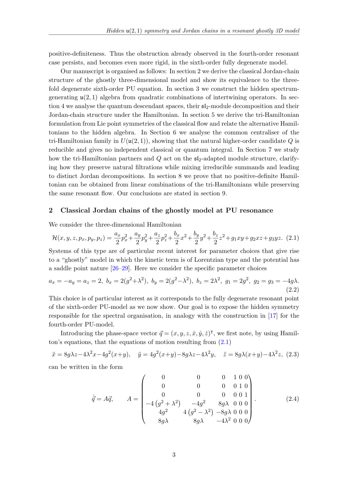
<figcaption class="paper-figure-caption"><b>Fig 3.</b> Low-resolution page preview, page 4</figcaption>
</figure>
<figure class="paper-figure-card">
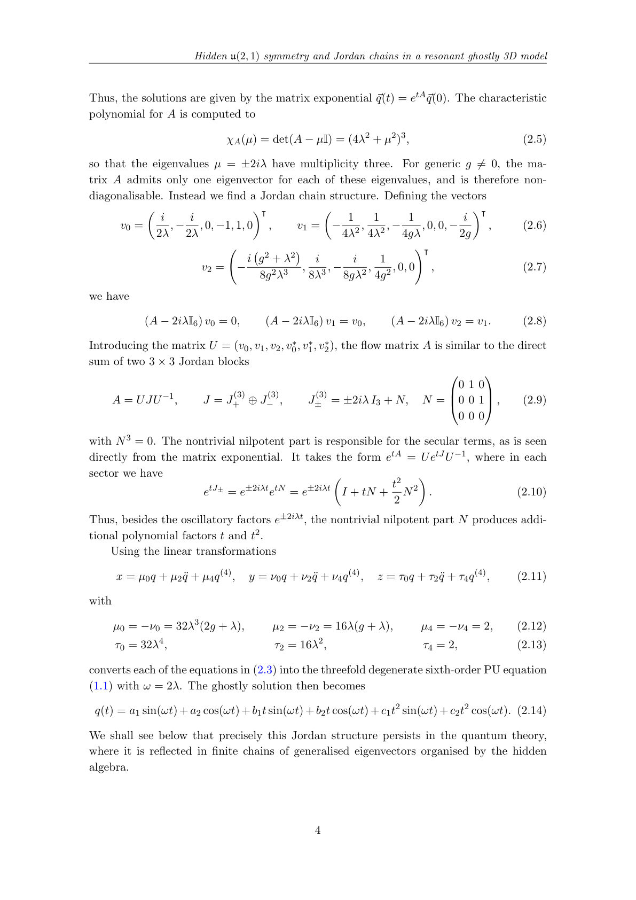
<figcaption class="paper-figure-caption"><b>Fig 4.</b> Low-resolution page preview, page 5</figcaption>
</figure>
<figure class="paper-figure-card">
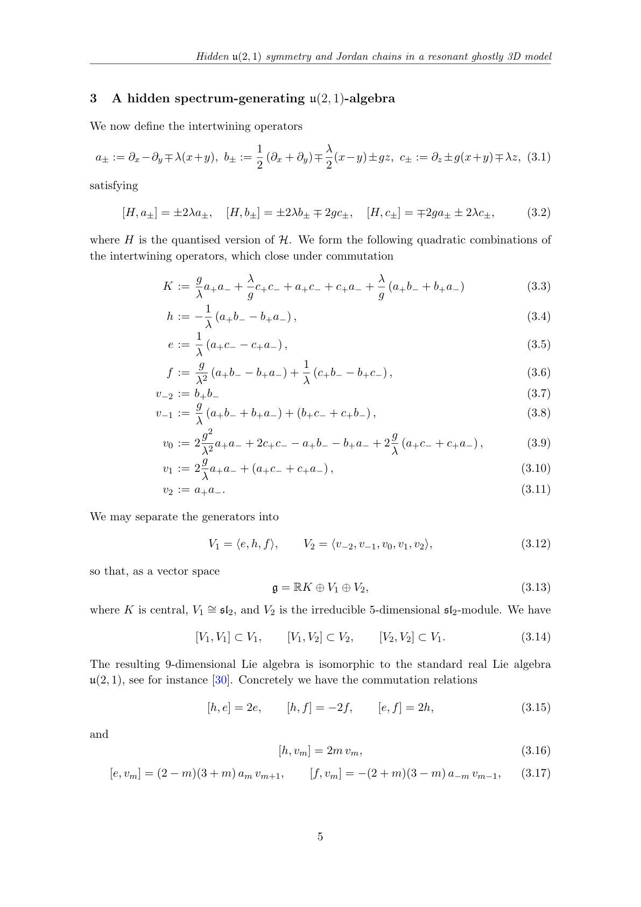
<figcaption class="paper-figure-caption"><b>Fig 5.</b> Low-resolution page preview, page 6</figcaption>
</figure>

**Summary.** This theoretical paper studies a highly resonant, higher-derivative physical model, revealing a hidden $\mathfrak{u}(2,1)$ symmetry algebra alongside a multi-Hamiltonian structure. Despite the rich algebraic structure, the authors demonstrate that the system is genuinely singular, as the expected positive-definite conserved Hamiltonian fails to materialize.

**Why it may be interesting.** The deep connection between hidden symmetries ($\mathfrak{u}(2,1)$), non-standard integrability structures (multi-Hamiltonian systems), and the breakdown of standard quantization techniques (positive-definite Hamiltonians) is highly relevant for understanding complex, non-linear quantum dynamics.

Detailed structure

**Main problem.** The paper investigates the hidden algebraic structure ($\mathfrak{u}(2,1)$ symmetry) and the complex Jordan chain behavior in a highly degenerate, resonant, higher-derivative physical system.

**Main result.** The system exhibits a hidden $\mathfrak{u}(2,1)$ symmetry and a multi-Hamiltonian structure, but the analysis shows that the natural higher-order conserved charge is reducible, and the positive-definite Hamiltonian mechanism fails due to the resonance.

**Method.** The authors analyze the classical phase-space flow using matrix diagonalization (Jordan chains) and construct the quantum symmetry algebra using intertwining operators, followed by a multi-Hamiltonian analysis.

**Model / system.** The model is a three-dimensional ghostly Hamiltonian realization of the fully degenerate resonant sixth-order Pais-Uhlenbeck (PU) oscillator, governed by equations of motion derived from a sixth-order differential equation.

**Key observables.** Jordan chains (classical and quantum), hidden $\mathfrak{u}(2,1)$-algebra, tri-Hamiltonian family ($H_1, H_2, H_3$), and the failure of positive-definite conserved charges.

**Important parameters / regimes.** The resonance condition leading to the sixth-order PU equation; the structure constants defining the $\mathfrak{u}(2,1)$ algebra.

**Assumptions / limitations.** The analysis assumes the existence of a hidden $\mathfrak{u}(2,1)$ symmetry and relies on the specific parameter choice leading to the fully degenerate resonant point.

**Figures summary.** Not specified.

**Paper structure.** The paper proceeds by analyzing the classical flow and its non-diagonalizable Jordan structure, then constructs the hidden $\mathfrak{u}(2,1)$ algebra and its quantum representations, followed by deriving the tri-Hamiltonian formulation and concluding with the analysis of higher-order integrals and the failure of the positive-definite mechanism.

Abstract

We investigate a three-dimensional ghostly Hamiltonian realisation of the fully degenerate resonant sixth-order Pais-Uhlenbeck oscillator. On the classical level, the phase-space flow is non-diagonalisable and decomposes into two complex-conjugate Jordan chains of length three, explaining the appearance of oscillatory solutions with secular terms.   Upon quantisation, we construct intertwining operators whose quadratic combinations generate a hidden spectrum-generating $\mathfrak{u}(2,1)$-algebra. The associated descendant spaces are finite-dimensional invariant subspaces carrying non-trivial Jordan structure. Although these spaces admit a natural decomposition into irreducible modules of a distinguished $\mathfrak{sl}_2$-subalgebra, this decomposition does not in general coincide with the Jordan decomposition of the Hamiltonian.   We further derive a tri-Hamiltonian formulation from Lie point symmetries of the classical flow and show that the corresponding Hamiltonians are naturally encoded by the same hidden algebra. Nevertheless, unlike in the non-resonant case, no positive-definite linear combination of them generates the same dynamics. Finally, we analyse the common centraliser of the tri-Hamiltonian family in $U(\mathfrak u(2,1))$, showing that the natural higher-order candidate $Q$ is reducible and yields no independent classical or quantum integral.   The model thus provides a resonant higher-derivative system in which hidden $\mathfrak{u}(2,1)$ symmetry, classical and quantum Jordan structures, and multi-Hamiltonian geometry coexist.

[↑ back to top](#top)

### [Hybrid Clifford Codes via Operator Algebra Quantum Error Correction and Projective Representation Theory](http://arxiv.org/abs/2606.02531v1)

**Authors:** Jonas Eidesen, David W. Kribs, Andrew Nemec  
**Type:** theory · **Category:** quantum information and computing · **PDF:** <https://arxiv.org/pdf/2606.02531v1>  
**Analysis basis:** full PDF text, analyzed in chunks

↔ Scroll figures horizontally

<figure class="paper-figure-card">
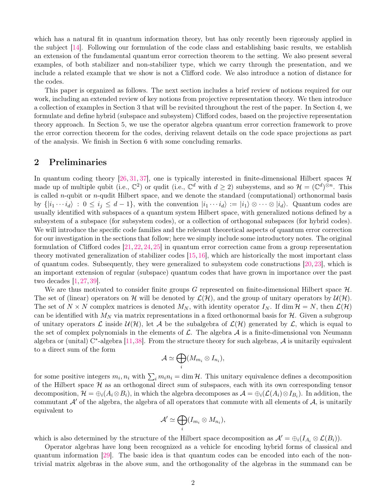
<figcaption class="paper-figure-caption"><b>Fig 1.</b> Low-resolution page preview, page 2</figcaption>
</figure>
<figure class="paper-figure-card">
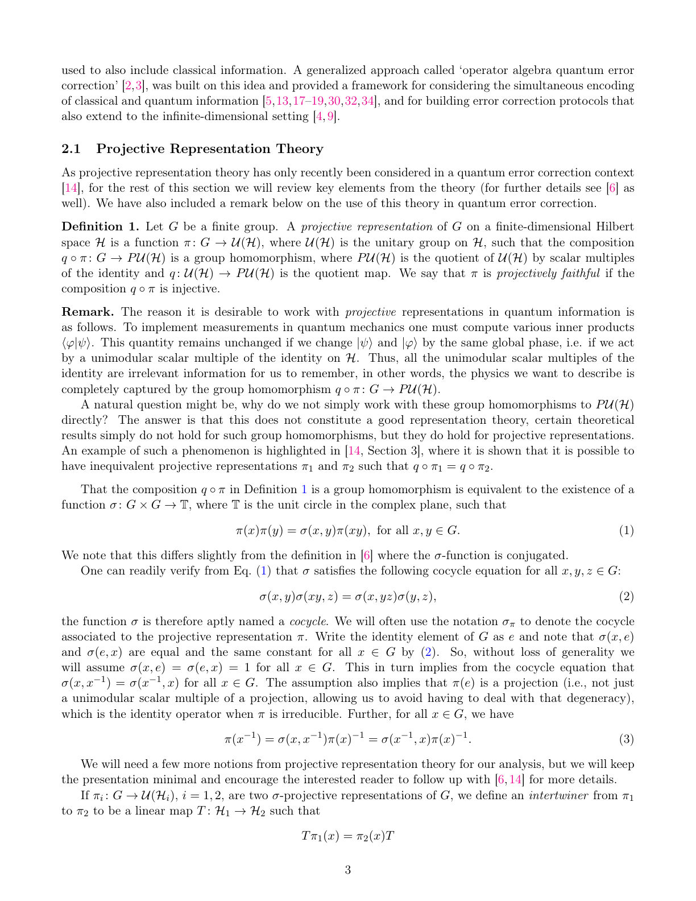
<figcaption class="paper-figure-caption"><b>Fig 2.</b> Low-resolution page preview, page 3</figcaption>
</figure>
<figure class="paper-figure-card">
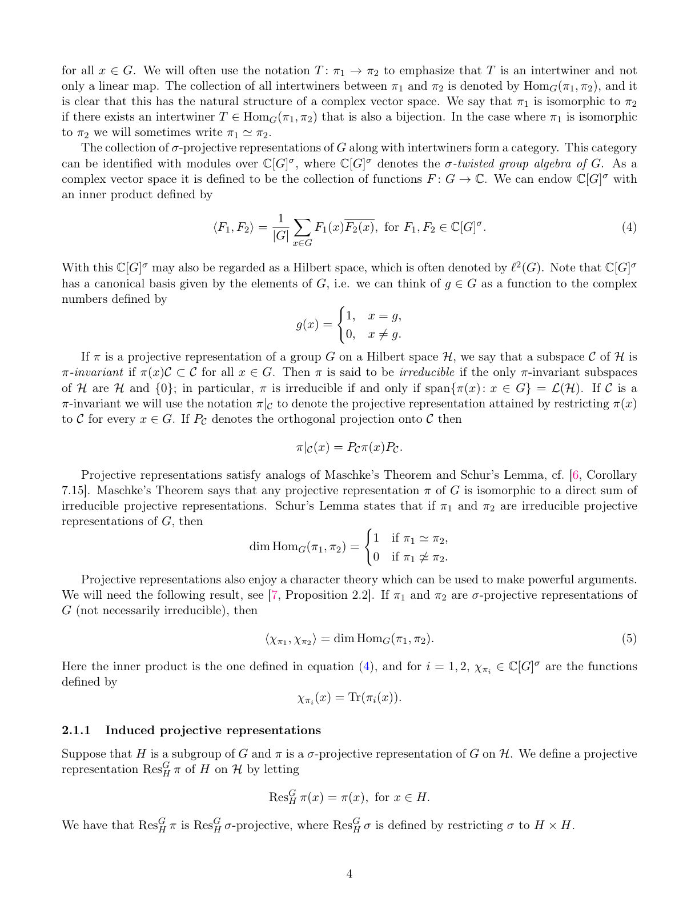
<figcaption class="paper-figure-caption"><b>Fig 3.</b> Low-resolution page preview, page 4</figcaption>
</figure>
<figure class="paper-figure-card">
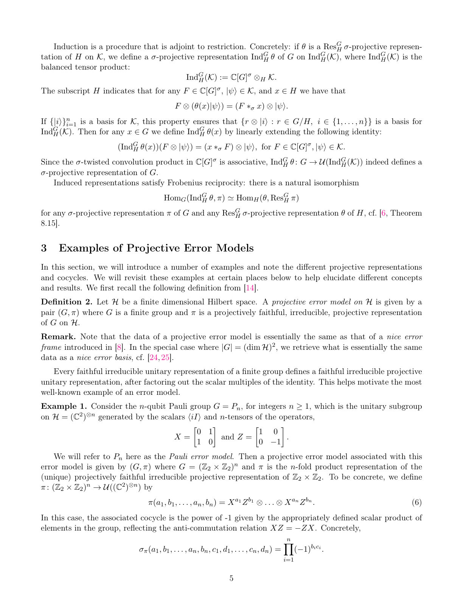
<figcaption class="paper-figure-caption"><b>Fig 4.</b> Low-resolution page preview, page 5</figcaption>
</figure>
<figure class="paper-figure-card">
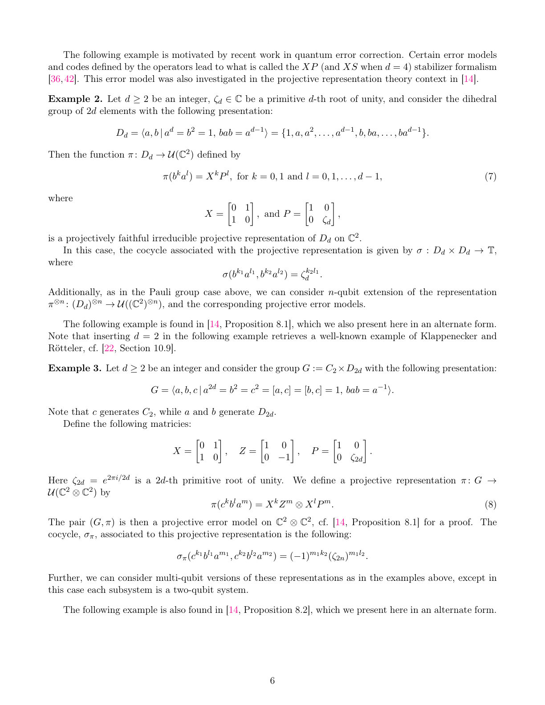
<figcaption class="paper-figure-caption"><b>Fig 5.</b> Low-resolution page preview, page 6</figcaption>
</figure>

**Summary.** This paper develops a highly generalized framework for quantum error correction by defining 'Hybrid Clifford Codes' using projective representation theory and operator algebras. It extends fundamental theorems to characterize these new codes and derives necessary and sufficient conditions for their error correctability. This advances the theoretical understanding of fault-tolerant quantum computation beyond standard stabilizer codes.

**Why it may be interesting.** This work provides a deep mathematical generalization of QEC theory, connecting it to abstract algebra (representation theory) in a way that could inspire new code constructions beyond standard Pauli stabilizer models.

Detailed structure

**Main problem.** The paper aims to formulate and prove error correction theorems for a generalized class of codes called "Hybrid Clifford Codes," integrating concepts from projective representation theory and operator algebra quantum error correction.

**Main result.** The core result is the extension of the fundamental quantum error correction theorem to these new hybrid, projective representation-based codes, providing explicit formulas for code space projections and correctability conditions.

**Method.** The methodology relies heavily on advanced mathematical tools, including projective representation theory (analyzing cocycles and intertwiners), operator algebras, and group theory (induction/restriction of representations).

**Model / system.** The physical system is a quantum error correction code defined on a finite-dimensional Hilbert space $H$, utilizing a projective error model $(G, \pi)$ derived from a finite group $G$. The codes are generalizations of stabilizer and Clifford codes.

**Key observables.** Code distance $d(G, \pi, L, G, T_0)$, the orthogonal projection operators $P_C$ and $P_t$, and the group structure of stabilizers $S(G, \pi)(C)$ and logical operators $L(G, \pi)(C)$.

**Important parameters / regimes.** The finite group $G$, the projective representation $\pi$, the associated cocycle function $\sigma$, and the structure of the normal subgroup $L$.

**Assumptions / limitations.** The derivation of projections relies on $L$ being a normal subgroup of $G$, and the final correctability theorem depends on specific commutation relations involving the error operators.

**Figures summary.** Not specified in the notes, but the text describes deriving explicit formulas for projection operators ($P_C, P_t$) and establishing a necessary and sufficient condition (Theorem 2) for error correctability.

**Paper structure.** The paper systematically reviews the mathematical preliminaries (projective representations, character theory), introduces the generalized code types (Clifford subspace, subsystem, hybrid), derives the projection formulas, and culminates in proving the generalized error correction theorem.

Abstract

Clifford codes are a natural generalization of quantum stabilizer codes based primarily on representation theory. This class of codes has previously been extended to the setting of quantum subsystem codes. We formulate a two-fold generalization of Clifford codes, for both the hybrid classical and quantum information and projective representation theory settings. This leads to new classes of hybrid subspace and subsystem Clifford codes. We extend the fundamental representation theoretic quantum error correction theorem to include these codes, based on the operator algebra quantum error correction framework. We also discuss several examples throughout the presentation, of both stabilizer and non-stabilizer type.

[↑ back to top](#top)

### [Joint Optimization of Qubit Leasing and Quantum Circuit Distribution](http://arxiv.org/abs/2606.00501v1)

**Authors:** Anoushka Dey, Gaurav S. Kasbekar  
**Type:** theory · **Category:** quantum information and computing · **PDF:** <https://arxiv.org/pdf/2606.00501v1>  
**Analysis basis:** full PDF text, analyzed in chunks

↔ Scroll figures horizontally

<figure class="paper-figure-card">
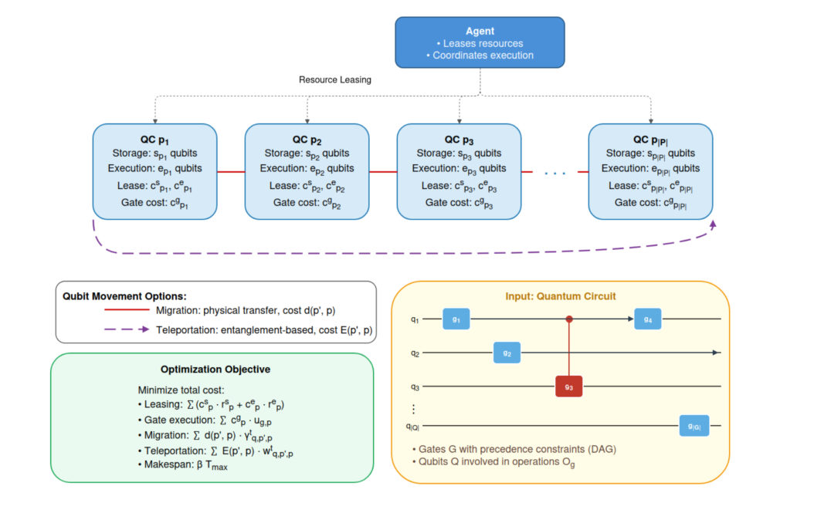
<figcaption class="paper-figure-caption"><b>Fig 1.</b> Fig. 1. The figure illustrates the system model. The agent leases resources from multiple QCs (QC p1 to QC p|P |) connected by a quantum network. Each QC p has qubit storage capacity sp and qubit execution capacity ep, and charges costs cs p and ce p for leasing storage and execution qubits, respectively. The execution cost of gate g at QC p is cg p. The figure also shows the quantum circuit that the agent would like to run using the leased resources.</figcaption>
</figure>
<figure class="paper-figure-card">
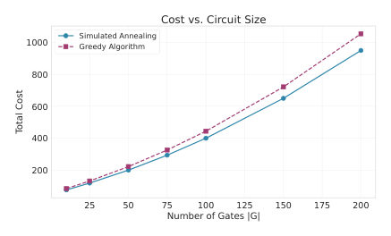
<figcaption class="paper-figure-caption"><b>Fig 2.</b> Fig. 2. The figure shows the total cost versus number of gates for the greedy algorithm and SA.</figcaption>
</figure>
<figure class="paper-figure-card">

<figcaption class="paper-figure-caption"><b>Fig 3.</b> Fig. 3 compares the execution times for the same problem instances as for Fig. 2. The greedy algorithm is consistently 50 −200× faster than SA. The greedy algorithm’s execution time grows approximately as O(|G|1.2), close to the theoretical O(|G|) bound, while SA’s execution time grows super-linearly at approximately O(|G|1.8). For the largest instances (|G| = 200), the greedy algorithm completes in less than 1 second, while SA requires over 100 seconds.</figcaption>
</figure>
<figure class="paper-figure-card">
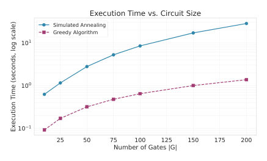
<figcaption class="paper-figure-caption"><b>Fig 4.</b> Fig. 3. The figure shows the execution time versus number of gates for the greedy algorithm and SA.</figcaption>
</figure>
<figure class="paper-figure-card">
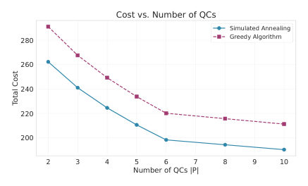
<figcaption class="paper-figure-caption"><b>Fig 5.</b> Fig. 4. The figure shows the total cost versus number of QCs for the greedy algorithm and SA.</figcaption>
</figure>

**Summary.** This paper tackles the complex JQLQCD problem of scheduling quantum circuits across multiple quantum computers by jointly optimizing qubit leasing, storage, gate execution, and qubit movement. After proving the problem is NP-complete, the authors introduce a fast and effective greedy heuristic that achieves near-optimal results, making large-scale quantum circuit deployment more computationally feasible.

**Why it may be interesting.** This work provides a crucial, computationally tractable framework for optimizing resource utilization in large-scale, distributed quantum computing architectures, which is a major bottleneck for near-term quantum applications.

Detailed structure

**Main problem.** The paper addresses the Joint Qubit Leasing and Quantum Circuit Distribution (JQLQCD) problem, which involves optimally scheduling and allocating qubits across multiple quantum computers connected by a network.

**Main result.** The problem is proven to be NP-complete, but the authors propose a highly efficient greedy heuristic that performs comparably to simulated annealing while being significantly faster.

**Method.** The core methodology involves formulating the problem as an Integer Linear Program (ILP) and then developing and analyzing a greedy algorithm with local search refinement to solve large instances.

**Model / system.** The model simulates a quantum circuit executed by an agent across a set of Quantum Computers (QCs) connected by a quantum network. The system must jointly manage qubit leasing, storage location, gate execution assignment, and qubit movement (migration vs. teleportation).

**Key observables.** Total system cost (minimization objective), circuit makespan ($T_{max}$), and computational execution time.

**Important parameters / regimes.** Leasing costs ($c_{s,p}, c_{e,p}$), gate execution costs ($c_{g,p}$), communication costs (migration $d$, teleportation $E$), and the weight $eta$ assigned to the makespan.

**Assumptions / limitations.** The model assumes passive QCs providing resources to a single agent, and the complexity analysis relies on bounding the circuit tree-width ($w_t$) for fixed-parameter tractability.

**Figures summary.** Figures compare the total cost and execution time of Optimal, Greedy, and Simulated Annealing algorithms across varying circuit sizes, number of QCs, and makespan weights, demonstrating the greedy algorithm's superior speed.

**Paper structure.** The paper reviews related work, presents the comprehensive ILP formulation, proves NP-completeness via reduction from $P|	ext{prec}|C_{max}$, analyzes solvable special cases, proposes the greedy heuristic, and concludes with extensive numerical performance evaluations.

Abstract

We consider an agent, who would like to execute a given quantum circuit using resources leased from a set of quantum computers (QCs) connected by a quantum network. For this purpose, the agent needs to make the following four key decisions: (i) how many qubits to lease from each QC, (ii) at which QCs to store different circuit qubits in different time slots, (iii) at which QC to execute each gate in the circuit, and (iv) how to move qubits between QCs, choosing between migration and teleportation. We refer to this problem facing the agent as the joint qubit leasing and quantum circuit distribution (JQLQCD) problem, and provide a comprehensive integer linear programming (ILP) formulation for it. We show that the JQLQCD problem is NP-complete. Next, we identify several special cases in which the problem can be optimally solved in closed form or via polynomial-time algorithms. Also, we propose a greedy algorithm with local search refinement to solve large instances of the general JQLQCD problem. Finally, we evaluate the performance of the proposed greedy algorithm using extensive numerical computations.

[↑ back to top](#top)

### [Learning with Active Quantum Subspaces: Scalable Hybrid Advantage without Full Quantum Data-Encoding](http://arxiv.org/abs/2606.00932v1)

**Authors:** Jeongho Bang, Wooyeong Song, Kyoungho Cho, Taewan Kim, Yongsoo Hwang  
**Type:** theory · **Category:** quantum information and computing · **PDF:** <https://arxiv.org/pdf/2606.00932v1>  
**Analysis basis:** full PDF text, analyzed in chunks

↔ Scroll figures horizontally

<figure class="paper-figure-card">
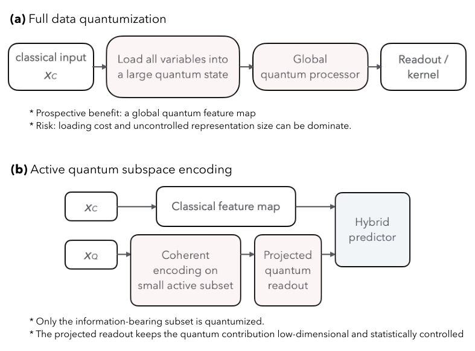
<figcaption class="paper-figure-caption"><b>Fig 1.</b> FIG. 1. Two views of data encoding for hybrid quantum learning. In a full quantum data-encoding approach, one attempts to load all relevant structure of the classical input into a quantum state and then process it with a global quantum model. In the active-quantum-subspace data- encoding approach proposed here, the input is split into a classical part xC and a selectively quantum-encoded part xQ. Only the information- bearing subset is lifted into a coherent quantum sector, while the remaining variables stay classical. The projected readout keeps the quantum contribution low-dimensional and statistically controlled. The main analytical question of this paper is when one can simultaneously...</figcaption>
</figure>
<figure class="paper-figure-card">
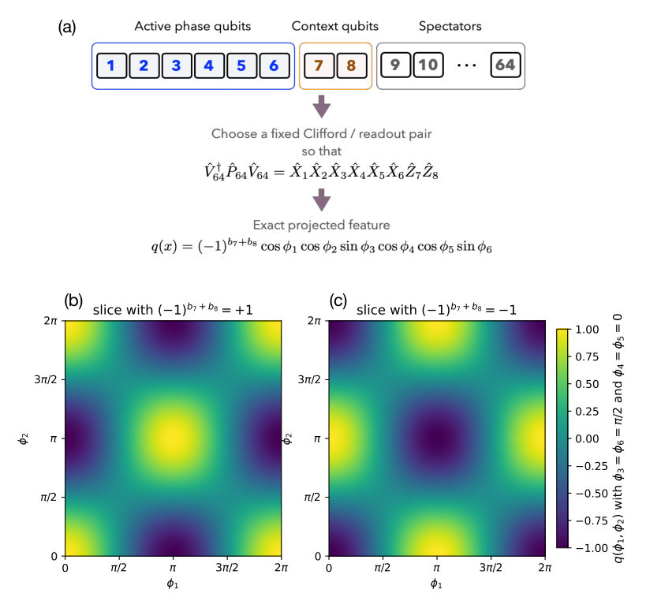
<figcaption class="paper-figure-caption"><b>Fig 2.</b> FIG. 2. Sixty-four-qubit toy family. Panel (a) shows the architecture of Eq. (82): qubits 1–6 are the active phase qubits, qubits 7 and 8 are the informative context bits, and the remaining 56 qubits stay on the classical path at data loading while still being available to the fixed Clifford block ˆV64. Panels (b) and (c) show two-dimensional slices of the exact projected feature q(x) for the two parities (−1)b7+b8 = ±1 after fixing ϕ3 = ϕ6 = π/2 and ϕ4 = ϕ5 = 0. Thus the familiar cos ϕ1 cos ϕ2 pattern survives as a visible slice of a much larger active-subspace model.</figcaption>
</figure>
<figure class="paper-figure-card">
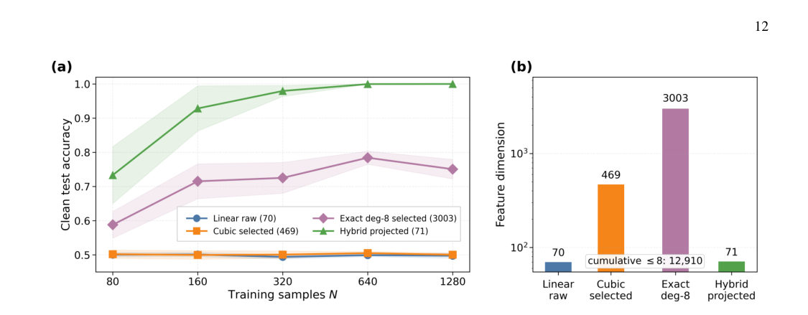
<figcaption class="paper-figure-caption"><b>Fig 3.</b> FIG. 3. Benchmark numerics for the 64-qubit toy family. Panel (a) shows clean-test accuracy versus the number of training samples N under 10% symmetric label noise. The low-order classical baselines remain near chance. An exact degree-eight interaction-only baseline on the selected 14 variables becomes nontrivial but still remains well below the hybrid projected model, which reaches essentially perfect accuracy by N = 640. Panel (b) reports the explicit feature dimensions. The exact degree-eight selected family uses 3003 features, while the cumulative interaction-only family up to degree 8 would use 12,910; Appendix E records both counts.</figcaption>
</figure>
<figure class="paper-figure-card">
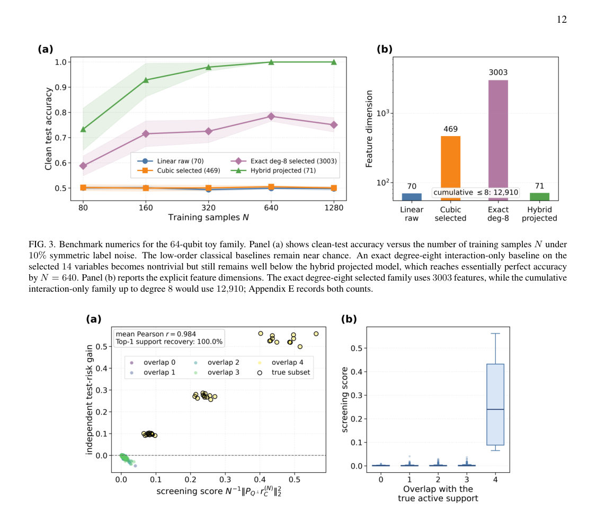
<figcaption class="paper-figure-caption"><b>Fig 4.</b> FIG. 4. Residual screening for candidate active subspaces. Panel (a) plots the finite-sample screening score from Proposition A.2 against the independent test-risk gain obtained by adding the corresponding candidate feature to the classical regressor. Each point is a candidate 4-subset from an eight-generator family; colors indicate its overlap with the true active support, and the exact support is marked explicitly. Panel (b) shows the distribution of the screening scores versus support overlap. Across the runs used here, the mean Pearson correlation between the screening score and the observed test-risk gain is 0.984, and the exact support is selected as the top-scoring candidate in every...</figcaption>
</figure>
<figure class="paper-figure-card">
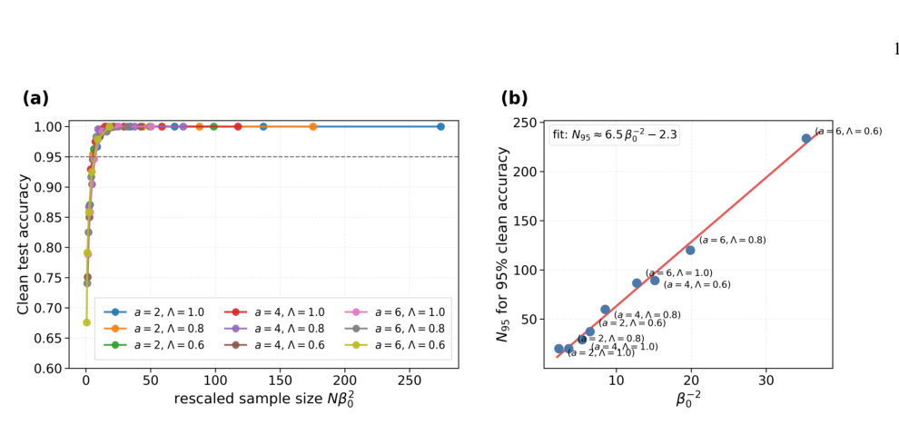
<figcaption class="paper-figure-caption"><b>Fig 5.</b> FIG. 5. Noise scaling and the β−2 0 sample demand. Panel (a) shows clean-test accuracy for several (a, Λ) pairs after rescaling the horizontal axis by Nβ2 0, where β0 = Λca 0 is the oracle reliability floor. The learning curves nearly collapse after this rescaling. Panel (b) reports the sample size N95 needed to reach 95% clean accuracy versus β−2 0 ; the fitted line is approximately linear in β−2 0 , in agreement with Theorem 3.</figcaption>
</figure>

**Summary.** This work proposes 'active quantum subspace data-encoding' to achieve quantum machine learning advantage by only encoding the most informative parts of a large classical input into a quantum state. The authors prove that this approach avoids the exponential resource scaling of full quantum encoding while maintaining statistically efficient learning guarantees. This offers a scalable, NISQ-compatible pathway for quantum advantage.

**Why it may be interesting.** It provides a concrete, theoretically bounded framework for achieving quantum advantage in machine learning that is directly relevant to near-term, resource-constrained quantum hardware (NISQ).

Detailed structure

**Main problem.** Investigating whether quantum learning advantage can be achieved scalably without fully encoding large classical inputs into highly superposed quantum states.

**Main result.** The authors prove that a scalable hybrid advantage can be maintained by using active quantum subspace data-encoding, which keeps the quantum contribution low-dimensional and polynomially costly.

**Method.** They introduce Active Quantum Subspace Data-Encoding (AQSE) and derive structural results concerning the projected hybrid kernel, the necessary conditions for quantum improvement, and PAC sample-complexity bounds.

**Model / system.** The model involves partitioning an input $\mathbf{x}$ into a classical part $\mathbf{x}_C$ and an active quantum part $\mathbf{x}_Q$, encoding the quantum information using a polynomial-cost gate sequence on a subset of qubits.

**Key observables.** Projected hybrid kernel, projected quantum feature map $\Phi_Q(x)$, oracle reliability $eta(x)$, and sample complexity $N$.

**Important parameters / regimes.** The number of projected observables ($M$), the oracle reliability ($eta$), and the polynomial scaling of the encoding gate complexity ($G_{enc}(n) = 	ext{poly}(n)$).

**Assumptions / limitations.** The analysis relies on the projected hybrid kernel being positive semidefinite and the existence of a direction in the quantum sector orthogonal to the classical span that correlates with the residual error.

**Figures summary.** Figures illustrate the comparison between full data quantumization and active subspace encoding, showing the projected model's superior performance and controlled effective degrees of freedom compared to global kernels.

**Paper structure.** The paper builds theoretically by defining the AQSE model, proving structural properties of the resulting kernel (Theorem 1), establishing the necessary and sufficient condition for quantum advantage (Theorem 2), and finally deriving the PAC sample-complexity bounds under noise (Theorem 3).

Abstract

We study whether quantum learning advantage can persist without fully embedding a large classical input into a highly superposed quantum state. To address this question, we introduce active quantum subspace data-encoding, in which only an information-bearing subset of the input is lifted to a quantum representation while the remaining variables stay classical. For this model, we define a projected hybrid readout and prove three structural results. First, the projected hybrid kernel is positive semidefinite and its sample regularized dimension is bounded by the number of projected observables, so the dimension blow-up of naive global kernels is avoided. Second, we give a necessary and sufficient criterion for improvement over a purely classical predictor in squared loss: the projected quantum sector must contain a direction that lies outside the classical feature span and correlates with the classical residual. Third, in a realizable noisy-oracle setting, we derive a PAC sample-complexity bound proportional to the inverse square of the oracle reliability. We then show, for a canonical Clifford active-subspace family under local dephasing noise, that this reliability can remain inverse-polynomial even when the encoding gate complexity grows polynomially with system size. Hence, the polynomial encoding cost does not by itself destroy the hybrid learning advantage. A sixty-four-qubit family and a synthetic contextual classification task illustrate how one projected quantum feature can compress a useful high-order interaction into a low-dimensional hybrid model. Our results generalize QRAM-free hybrid learning and provide a scalable route toward NISQ-compatible quantum advantage without full quantum data-encoding.

[↑ back to top](#top)

### [Magnetic control of electron scattering in silicene quantum dots](http://arxiv.org/abs/2606.01938v1)

**Authors:** Mohamed El Azar, Elmustapha Feddi, Pablo Díaz, David Laroze, Ahmed Jellal  
**Type:** theory · **Category:** other · **PDF:** <https://arxiv.org/pdf/2606.01938v1>  
**Analysis basis:** full PDF text, analyzed in chunks

↔ Scroll figures horizontally

<figure class="paper-figure-card">
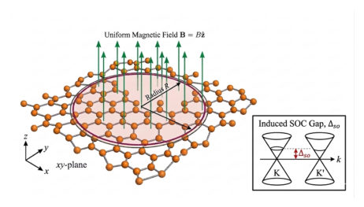
<figcaption class="paper-figure-caption"><b>Fig 1.</b> FIG. 1. A silicene quantum dot of radius R is placed in the horizontal plane xy. The magnetic field B is oriented perpen- dicular to the dot z-plane .</figcaption>
</figure>
<figure class="paper-figure-card">
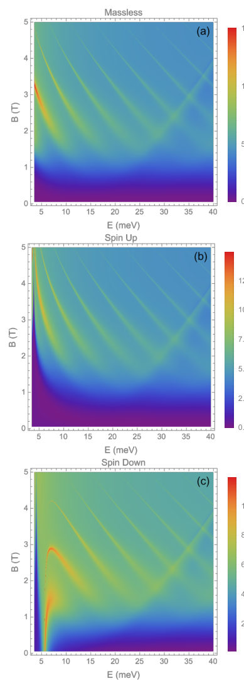
<figcaption class="paper-figure-caption"><b>Fig 2.</b> FIG. 2. Scattering efficiency Q versus the incident energy E and magnetic field B for a circular SQD of radius R = 50 nm, three spin–orbit coupling intensities, and spin projections (a): λSO = 0, (b): λSO = 3.9 meV and sz = +1, and (c): λSO = 3.9 meV and sz = −1.</figcaption>
</figure>
<figure class="paper-figure-card">
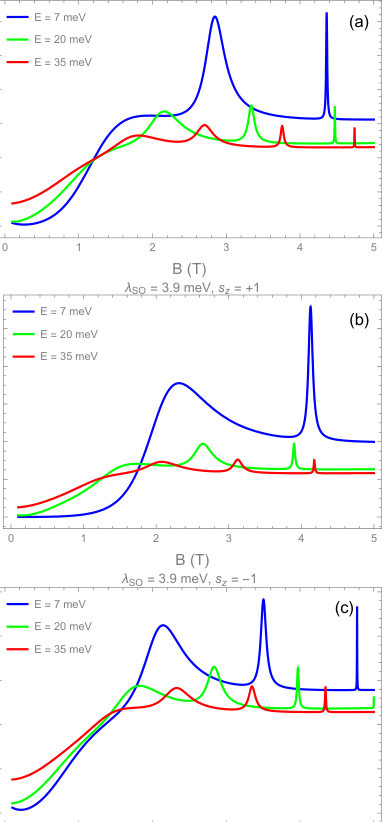
<figcaption class="paper-figure-caption"><b>Fig 3.</b> FIG. 3. Scattering efficiency Q as a function of the magnetic field B for a circular SQD of radius R = 50 nm, three incident energies, spin–orbit coupling intensities, and spin projections.</figcaption>
</figure>
<figure class="paper-figure-card">

<figcaption class="paper-figure-caption"><b>Fig 4.</b> FIG. 4. Scattering efficiency Q as a function of the incident energy E for a circular SQD of radius R = 50 nm, three magnetic fields B, spin–orbit coupling intensities, and spin projections.</figcaption>
</figure>
<figure class="paper-figure-card">
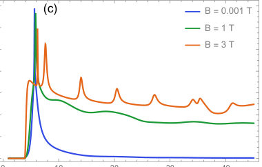
<figcaption class="paper-figure-caption"><b>Fig 5.</b> Figure 4 shows the spectral evolution of the scattering efficiency Q as a function of the incident energy E for three distinct magnetic field intensities. The spectrum immediately exhibits sharp, well-defined peaks, which are unmistakable signatures of the formation of quasi-bound states within the structure. A comparison between the massless case in Fig. 4a and the silicene configurations in Figs. 4(b,c) reveals a fundamental difference. In the graphene limit (λSO = 0), the resonances appear rela- tively broad and weak, reflecting significant electron leak-</figcaption>
</figure>

**Summary.** This work theoretically investigates how magnetic fields and intrinsic spin-orbit coupling control electron scattering within silicene quantum dots. By exploiting the SOC-induced energy gap, the authors demonstrate that confinement is significantly enhanced, leading to robust, spin-selective electron trapping. This suggests silicene is a promising platform for spintronics and quantum information applications.

**Why it may be interesting.** The mechanism of using intrinsic material properties (SOC) to engineer quantum confinement and spin filtering in a solid-state nanostructure is highly relevant for designing next-generation quantum devices.

Detailed structure

**Main problem.** The study analyzes the mechanism of electron diffusion and achieving robust, spin-selective confinement in silicene quantum dots (SQDs) subjected to a perpendicular magnetic field.

**Main result.** The intrinsic spin-orbit coupling (SOC) in silicene opens an energy gap, suppressing Klein tunneling and enabling superior carrier localization and spin-selective confinement when combined with an external magnetic field.

**Method.** The authors derive solutions to the Dirac equation at low energy and use continuity conditions at the dot interfaces to obtain exact expressions for diffusion coefficients and scattering efficiencies.

**Model / system.** The system is a silicene quantum dot (SQD) modeled using the low-energy Dirac equation, incorporating the effects of a perpendicular magnetic field and the intrinsic SOC.

**Key observables.** Diffusion coefficients, scattering efficiency (Q), spatial probability density (rho), and probability current density (j).

**Important parameters / regimes.** Magnetic field strength (B), SOC strength (lambda_SO), and dot radius (R).

**Assumptions / limitations.** The analysis relies on the Dirac fermion framework and assumes the SOC gap is the dominant mechanism for overcoming Klein tunneling limitations.

**Figures summary.** Figures illustrate the scattering efficiency (Q) vs. energy/B-field, showing sharp resonances in the SOC regime compared to the weak trapping in the massless (graphene) limit. Spatial plots show localized probability and current loops.

**Paper structure.** The paper follows a theoretical derivation (Dirac equation solutions), formal scattering analysis (matching coefficients), and numerical investigation demonstrating the synergistic effects of the B-field and SOC.

Abstract

The Klein tunnel effect phenomenon makes it impossible to permanently confine charge carriers in massless nanostructures. However, applying a constant magnetic field allows these electrons to be temporarily localized, thus forming quasi-bound states. In this study, we analyze the mechanism of electron diffusion through a silicene quantum dot (SQD) subjected to a perpendicular magnetic field. To enhance spatial localization, we exploit the spin-orbit coupling (SOC) specific to silicene, which generates a natural energy gap by acting as an effective mass. We first derive the solutions to the Dirac equation at low energy. Subsequently, by imposing the continuity conditions at the SQD interfaces, we obtain exact expressions for the diffusion coefficients. These results are then used to map the scattering efficiency together with the spatial distributions of probability and current densities. Our simulations demonstrate that the presence of this intrinsic gap significantly enhances electron trapping at the center of the SQD. Finally, we prove that the interplay between the external field and SOC breaks spin symmetry, thereby enabling robust and spin-selective confinement.

[↑ back to top](#top)

### [On Jean-Marie Souriau's geometric quantization of the relativistic electron](http://arxiv.org/abs/2606.01121v1)

**Authors:** Géry de Saxcé  
**Type:** theory · **Category:** other · **PDF:** <https://arxiv.org/pdf/2606.01121v1>  
**Analysis basis:** full PDF text, analyzed in chunks

↔ Scroll figures horizontally

<figure class="paper-figure-card">
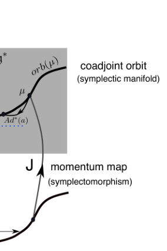
<figcaption class="paper-figure-caption"><b>Fig 1.</b> Figure 1: Coadjoint orbit method</figcaption>
</figure>
<figure class="paper-figure-card">
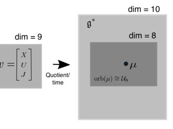
<figcaption class="paper-figure-caption"><b>Fig 2.</b> Figure 2: Coadjoint orbit of a particle with spin for Poincar´e group</figcaption>
</figure>
<figure class="paper-figure-card">
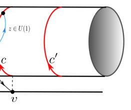
<figcaption class="paper-figure-caption"><b>Fig 3.</b> Figure 3: Prequantum manifold</figcaption>
</figure>
<figure class="paper-figure-card">
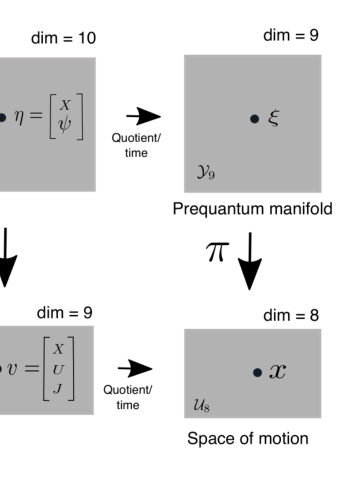
<figcaption class="paper-figure-caption"><b>Fig 4.</b> Figure 4: Prequantization of the particle with spin with spin 1/2</figcaption>
</figure>
<figure class="paper-figure-card">
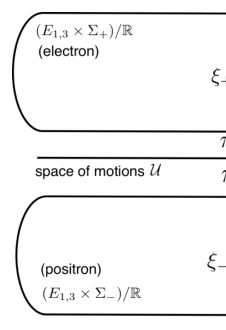
<figcaption class="paper-figure-caption"><b>Fig 5.</b> Figure 5: Prequantum manifolds of the electron and the positron</figcaption>
</figure>

**Summary.** This paper provides a rigorous mathematical re-examination of geometric quantization for the relativistic electron, building on Souriau's work. It successfully derives the Dirac equation and proves the conservation of both probability and spin currents. The work is significant for its systematic use of advanced mathematical tools like coadjoint orbits and Kaluza-Klein theory to establish fundamental symmetries.

**Why it may be interesting.** While highly abstract, the rigorous development of conserved currents and symmetries ($C, P, T$) using advanced geometric quantization techniques provides a deep theoretical underpinning for relativistic quantum field theory, which informs many modern quantum theories.

Detailed structure

**Main problem.** The paper revisits and rigorously justifies Jean-Marie Souriau's geometric quantization procedure applied to the relativistic electron, addressing ambiguities in the original formulation.

**Main result.** The authors successfully derive the Dirac equation and establish the conservation laws for both the probability and spin currents using a systematic geometric quantization framework.

**Method.** The core method involves applying the coadjoint orbit method, equipping the prequantum manifold with symplectic and contact structures, and utilizing Kaluza-Klein theory to systematically construct symmetries.

**Model / system.** The system is the relativistic particle with spin 1/2 (the electron), analyzed using the Poincaré group and formulated via quaternionic matrices and spinor representations.

**Key observables.** Dirac equation, conservation of probability current, conservation of spin current, and the systematic construction of $C, P, T$ symmetries.

**Important parameters / regimes.** Rest mass ($m_0$), spin ($	ext{spin}$), and the quantization constant $\hbar$.

**Assumptions / limitations.** The existence of a prequantum manifold $Y$ and the applicability of the Sommerfeld quantization condition are key assumptions.

**Figures summary.** Figures illustrate the prequantum manifold structure for the electron and positron, and tables summarize the action of symmetry transformations ($C, P, T$) on spinors and coordinates.

**Paper structure.** The paper progresses by reviewing the coadjoint orbit method, establishing keystone theorems for symplectic/contact structures, applying these to the spin-1/2 case to derive the Dirac equation, and finally using Kaluza-Klein theory for symmetry construction.

Abstract

The aim of this paper is to revisit, in Souriau's book "Structure of Dynamical Systems", the chapter devoted to the geometric quantization where the justifications of important results and formulae are not given and are difficult to prove. After recalling the coadjoint orbit method and its application to the relativistic particle with spin, we state and prove two keystone theorems that allow to equip its prequantum manifold with the symplectic and contact structures. We apply them to the relativistic particle with spin 1/2, leading to the Dirac equation and the conservation of the probability current. We propose also an identity of conservation of the spin current and, invoking the Kaluza-Klein theory, a systematic construction of the symmetries of charge conjugation, parity transformation and time reversal which seems to us more convenient and readable than that of the classical presentations.

[↑ back to top](#top)

### [Optimized Point Addition Circuits for Elliptic Curve Discrete Logarithms](http://arxiv.org/abs/2606.02235v1)

**Authors:** André Schrottenloher  
**Type:** theory · **Category:** quantum information and computing · **PDF:** <https://arxiv.org/pdf/2606.02235v1>  
**Analysis basis:** full PDF text, analyzed in chunks

↔ Scroll figures horizontally

<figure class="paper-figure-card">
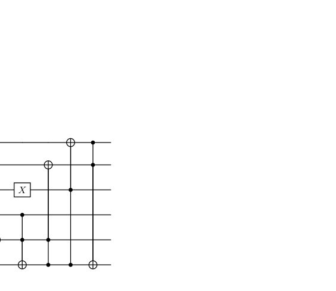
<figcaption class="paper-figure-caption"><b>Fig 1.</b> Fig. 1. “Compression” circuit mapping 3 pairs (b0, b0&amp;b1) into 5 bits. On valid inputs, the last bit is always 0 and can be reused.</figcaption>
</figure>

**Summary.** This paper presents an optimized quantum logical circuit architecture for performing point addition on elliptic curves, a critical subroutine for breaking discrete logarithm cryptography via Shor's algorithm. By redesigning the underlying modular arithmetic using a space-efficient, two-stage EEA approach, the authors achieve resource costs comparable to the best published results. This work provides a detailed blueprint for implementing complex quantum algorithms on near-term or fault-tolerant quantum hardware.

**Why it may be interesting.** While focused on cryptography, the detailed quantum circuit optimization techniques—especially the space-saving arithmetic implementations—represent advanced quantum circuit design principles applicable to any complex quantum computation.

Detailed structure

**Main problem.** The primary goal is to reduce the quantum resource cost (qubit and gate count) required to compute elliptic curve discrete logarithms, which is a major threat posed by Shor's algorithm to modern cryptography.

**Main result.** The authors detail a quantum logical circuit architecture for point addition that achieves results comparable to recent state-of-the-art work, offering a slight reduction in Toffoli gates compared to previous methods.

**Method.** The optimization involves implementing the Extended Euclidean Algorithm (EEA) in a two-step process: an Euclidean algorithm circuit followed by a Bézout reconstruction circuit to enable in-place modular multiplication.

**Model / system.** The model is a quantum circuit designed for point addition on elliptic curves over prime fields, specifically targeting the secp256k1 curve. The circuits operate at the logical level, abstracting away error correction details.

**Key observables.** Qubit count, Toffoli gate count (CCX, CCZ, And gates), and the total resource cost for running Shor's algorithm.

**Important parameters / regimes.** The bit-size of the curve (e.g., 256 bits), the failure probability (stated to be at most $2^{-13.3}$), and the asymptotic space complexity ($\approx 4.355n + O(\sqrt{n})$ qubits).

**Assumptions / limitations.** The circuits are not exact and include a failure probability. The analysis often relies on approximations, such as using only the most significant bits (MSBs) for modular arithmetic steps.

**Figures summary.** Table 1 compares qubit and Toffoli gate counts for point addition circuits across different methods. Table 2 compares the total resource cost for running Shor's algorithm.

**Paper structure.** The paper builds upon prior work by first detailing the structure of point multiplication via windowed addition. It then focuses on optimizing the core modular arithmetic components by adapting the EEA into a space-saving, two-step process (Euclidean Algorithm $	o$ Bézout Reconstruction) to achieve in-place modular multiplication.

Abstract

Shor's algorithm represents the main threat of quantum computers to cryptography. In order to precisely understand its feasibility, many authors have worked towards reducing its costs, either at the logical level (assuming a fault-tolerant architecture), or at the physical level (taking into account the constraints of envisioned hardware). In particular, recent works by Chevignard et al. (CRYPTO 2024) and Gidney (arXiv 2025) used improved arithmetic to significantly reduce the qubit cost of factoring RSA public keys.   Even more recently, Babbush et al. (arXiv 2026) improved the cost of computing elliptic curve discrete logarithms, with a reduction of a factor 2 to 3 in gate count and qubit count compared to a previous work by Litinski (arXiv 2023). Their result relies on optimized point addition circuits on elliptic curves over prime fields. However they did not reveal their logical quantum circuits, relying instead on a zero-knowledge proof.   In this paper, we detail a quantum logical circuit architecture which gives similar results as Babbush et al., with a slightly higher number of qubits (around 1.5% increase) and a slightly smaller Toffoli gate count (between 6.5% and 10% reduction) for the curve secp256k1. We also give gate counts for a generic variant of the circuit, which is valid for any prime field.

[↑ back to top](#top)

### [Palindromic structure of depth-efficient quantum search algorithms](http://arxiv.org/abs/2606.00960v1)

**Authors:** Kun Zhang, Hai-Long Shi, Xiao-Hui Wang, Vladimir Korepin  
**Type:** theory · **Category:** quantum information and computing · **PDF:** <https://arxiv.org/pdf/2606.00960v1>  
**Analysis basis:** full PDF text, analyzed in chunks

↔ Scroll figures horizontally

<figure class="paper-figure-card">
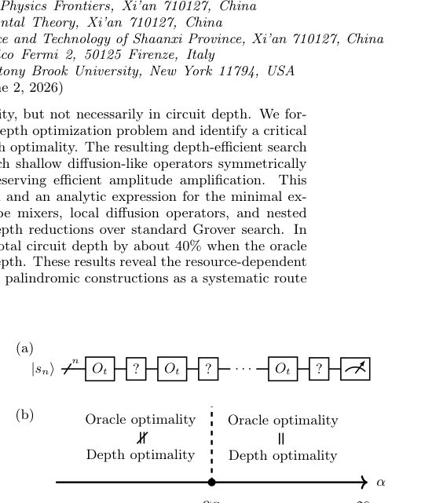
<figcaption class="paper-figure-caption"><b>Fig 1.</b> FIG. 1. (a) Depth-optimization formulation of quantum search, allowing the oracle-independent interleaving operators to vary by layer. (b) For α &gt; αG, Grover’s query-optimal con- struction is also depth optimal, whereas for α &lt; αG shallower- than-Grover search circuits exist. Here α and αG are defined in Eqs. (4) and (5).</figcaption>
</figure>
<figure class="paper-figure-card">
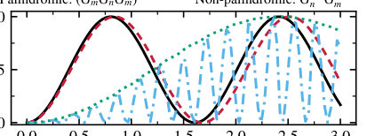
<figcaption class="paper-figure-caption"><b>Fig 2.</b> FIG. 2. Comparison of the success probabilities of Grover search Gk n, the palindromic operator (GmGnGm)k/3, and two non-palindromic operators, Gk/3 m Gk/3 n Gk/3 m and Gk/3 n G2k/3 m . Here Gm = DmOt, with Dm defined in Eq. (11). For fixed total oracle count k, the three non-Grover operators have the same circuit depth. Parameters are n = 20 and m = 5.</figcaption>
</figure>
<figure class="paper-figure-card">
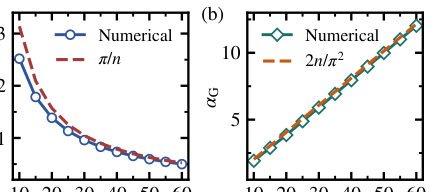
<figcaption class="paper-figure-caption"><b>Fig 3.</b> FIG. 3. (a) Optimal angle φ for the unit-depth mixer U = Rx(φ)⊗n, obtained by minimizing η(Pφ). The large-n predic- tion is φmax = 2π/n. (b) Critical depth ratio αG with large-n prediction αG = 2n/π2.</figcaption>
</figure>
<figure class="paper-figure-card">
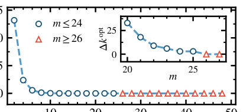
<figcaption class="paper-figure-caption"><b>Fig 4.</b> FIG. 4. (a) Critical depth ratio αG for the local-diffusion con- struction U = Dm, with large-n prediction αG = 2n−1/n. (b) Optimal local size m minimizing η(Pm), with prediction m = ⌊log2(nα)⌋. (c) Oracle-count difference ∆kmax := kmax m −kmax n between the palindromic construction and Grover search; the red triangle marks ∆kmax = 0. The qubit number is set to n = 50.</figcaption>
</figure>
<figure class="paper-figure-card">
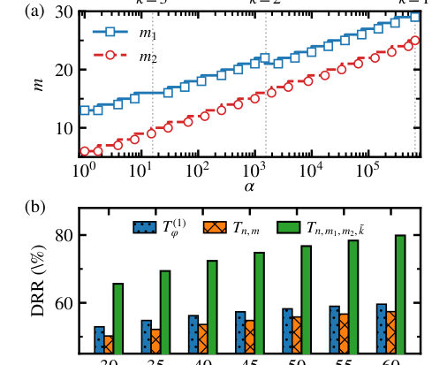
<figcaption class="paper-figure-caption"><b>Fig 5.</b> FIG. 5. (a) Optimal m1, m2, and ˜k for Pm1,m2,˜k in Eq. (15) as functions of α for n = 30. Vertical dotted lines separate regions with different optimal ˜k. (b) DRR at α = 1 for three palindromic constructions: the single-qubit mixer Pφ, the lo- cal diffusion construction Pm, and the nested local-diffusion construction Pm1,m2,˜k, assuming linear scaling ℓ(Dn) ∝n.</figcaption>
</figure>

**Summary.** This work analyzes unstructured quantum search by treating it as a circuit-depth optimization problem rather than just a query complexity problem. It discovers that the optimal search operators possess a palindromic structure, which allows for significant reductions in the required circuit depth. This provides a systematic method for designing depth-efficient quantum algorithms.

**Why it may be interesting.** It provides a systematic, structural understanding (palindromic construction) of how to improve quantum algorithms beyond simple query complexity bounds, which is highly relevant for designing practical, resource-constrained quantum circuits.

Detailed structure

**Main problem.** The paper addresses the discrepancy between query-optimal and circuit-depth-optimal quantum search algorithms, specifically for unstructured search.

**Main result.** The optimal search operators exhibit a palindromic structure, which systematically allows for substantial depth reductions compared to standard Grover search.

**Method.** The authors formulate the search as a circuit-depth optimization problem, defining a critical depth ratio that separates the two optimality regimes.

**Model / system.** The model is unstructured quantum search over $N=2^n$ items, utilizing the oracle operator ($O_t$) and the diffusion operator ($D_n$).

**Key observables.** Depth Ratio ($\alpha$), Critical Depth Ratio ($\alpha_G[U]$), Depth Efficiency Parameter ($\eta(P_U)$), and Minimum Expected Depth ($E_{\min}$).

**Important parameters / regimes.** The depth ratio $\alpha = \ell(O_t) / \ell(D_n)$, and the system size $N=2^n$.

**Assumptions / limitations.** The analysis assumes that the standard Grover diffusion operator requires depth scaling with $n$ qubits, and that the palindromic structure represents the optimal pattern.

**Figures summary.** Figures illustrate the depth-optimization formulation, comparing success probabilities for Grover search versus palindromic operators, and showing the dependence of $\alpha_G$ on mixer type.

**Paper structure.** The paper progresses by formulating the depth optimization problem, deriving the palindromic structure, establishing the depth-efficiency criterion, and applying this framework to various mixer types (local, nested local) to quantify depth reductions.

Abstract

Grover's algorithm is optimal in query complexity, but not necessarily in circuit depth. We formulate unstructured quantum search as a circuit-depth optimization problem and identify a critical depth ratio separating query optimality from depth optimality. The resulting depth-efficient search operators exhibit a palindromic structure, in which shallow diffusion-like operators symmetrically replace selected Grover diffusion layers while preserving efficient amplitude amplification. This structure yields a simple depth-efficiency criterion and an analytic expression for the minimal expected depth. Applying the framework to $X$-type mixers, local diffusion operators, and nested local diffusion operators, we obtain substantial depth reductions over standard Grover search. In particular, nested local constructions reduce the total circuit depth by about $40\%$ when the oracle and Grover diffusion operators have comparable depth. These results reveal the resource-dependent nature of quantum-search optimality and establish palindromic constructions as a systematic route to depth-efficient quantum search algorithms.

[↑ back to top](#top)

### [Pauli-structured preconditioning for quantum linear system solvers](http://arxiv.org/abs/2606.01733v1)

**Authors:** Hantao Nie, Zhijian Lai, Dong An  
**Type:** theory · **Category:** quantum information and computing · **PDF:** <https://arxiv.org/pdf/2606.01733v1>  
**Analysis basis:** full PDF text, analyzed in chunks

↔ Scroll figures horizontally

<figure class="paper-figure-card">
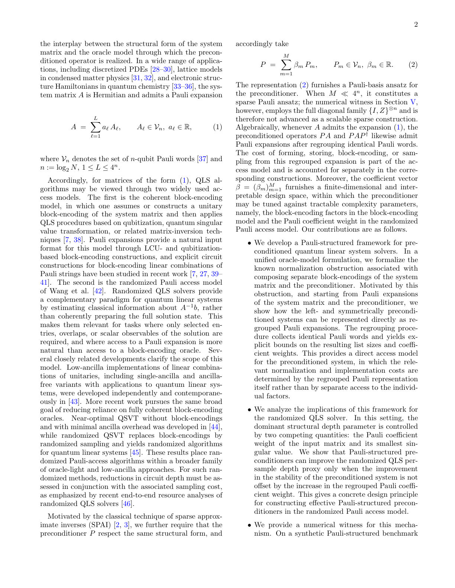
<figcaption class="paper-figure-caption"><b>Fig 1.</b> Low-resolution page preview, page 2</figcaption>
</figure>
<figure class="paper-figure-card">
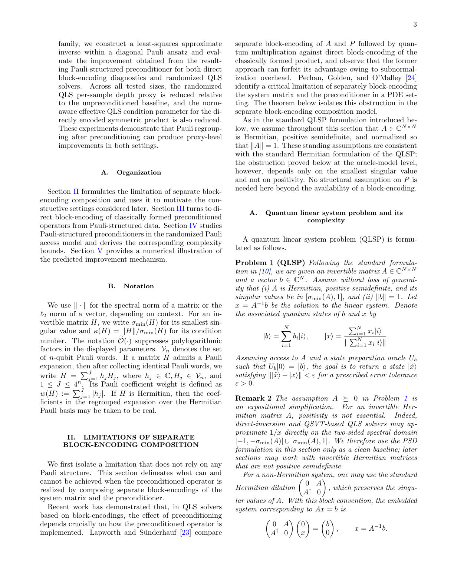
<figcaption class="paper-figure-caption"><b>Fig 2.</b> Low-resolution page preview, page 3</figcaption>
</figure>
<figure class="paper-figure-card">
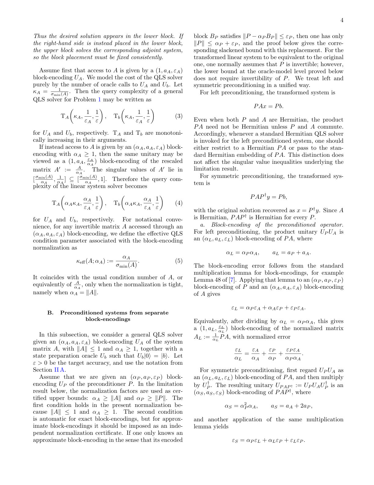
<figcaption class="paper-figure-caption"><b>Fig 3.</b> Low-resolution page preview, page 4</figcaption>
</figure>
<figure class="paper-figure-card">
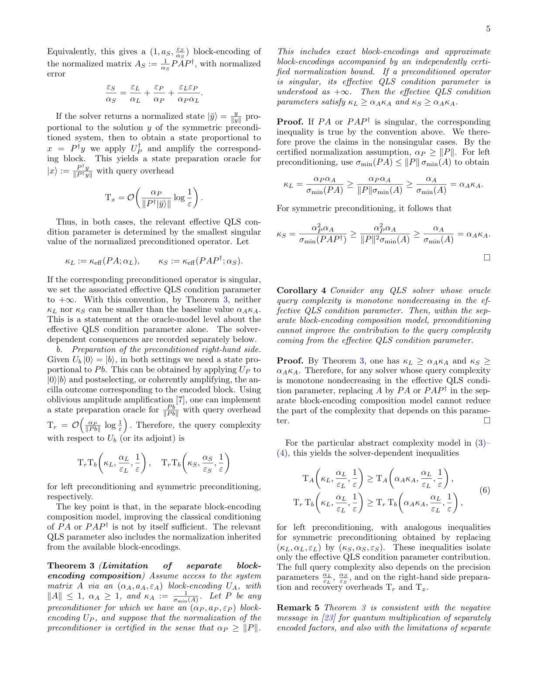
<figcaption class="paper-figure-caption"><b>Fig 4.</b> Low-resolution page preview, page 5</figcaption>
</figure>
<figure class="paper-figure-card">
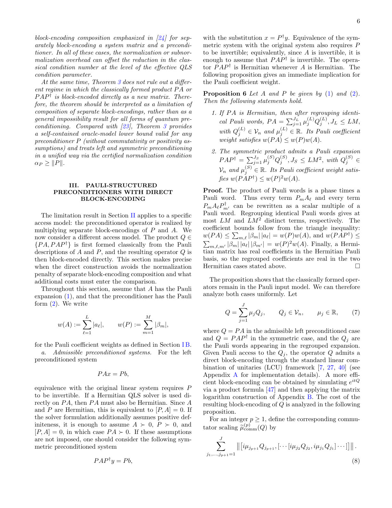
<figcaption class="paper-figure-caption"><b>Fig 5.</b> Low-resolution page preview, page 6</figcaption>
</figure>

**Summary.** This paper investigates the feasibility of using preconditioning in quantum linear system solvers by analyzing the underlying algebraic structure using Pauli expansions. It demonstrates that by exploiting Pauli-structured representations, the overhead associated with composing the preconditioned operator can be reduced. This confirms that Pauli-structured preconditioning can lead to genuine improvements in the complexity of randomized QLS algorithms.

**Why it may be interesting.** It provides a rigorous theoretical framework for determining when structural algebraic properties (Pauli structure) can overcome fundamental overheads (normalization/synthesis) that limit the practical quantum advantage in solving linear systems.

Detailed structure

**Main problem.** The paper addresses whether preconditioning techniques can genuinely improve the complexity of Quantum Linear System (QLS) solvers, given that normalization overheads can negate classical condition number improvements.

**Main result.** Pauli-structured representations allow for a regrouping of Pauli products that can reduce the effective Pauli coefficient weight of the preconditioned operator, leading to genuine complexity reductions in the randomized QLS solver model.

**Method.** The authors analyze the QLS problem using Pauli-structured representations, comparing the complexity derived from separate block-encoding composition versus direct block-encoding of the preconditioned operator.

**Model / system.** The model is the Quantum Linear System (QLS) problem, $Ax=b$, where the system matrix $A$ and preconditioner $P$ are assumed to admit Pauli expansions. The analysis considers both coherent block-encoding and randomized Pauli access models.

**Key observables.** Pauli coefficient weight, effective QLS condition parameter ($\kappa_{	ext{eff}}$), and the randomized QLS per-sample depth proxy ($DRQLS$).

**Important parameters / regimes.** The Pauli coefficient weight ($w(\cdot)$), the minimum singular value ($\sigma_{\min}(\cdot)$), and the normalization factors ($\alpha_A, \alpha_P$).

**Assumptions / limitations.** The analysis assumes that the system matrix $A$ and preconditioner $P$ can be accurately represented by Pauli expansions, and it distinguishes between the limitations of separate block-encoding versus direct encoding.

**Figures summary.** Table I summarizes the performance comparison for a synthetic benchmark, showing the ratio $R_n$ (preconditioned/unpreconditioned depth proxy) and direct block-encoding diagnostics for the $A_n$ family.

**Paper structure.** The paper first establishes the limitation of separate block-encoding composition (Theorem 3), then introduces the Pauli-structured approach, deriving bounds on Pauli coefficient weights for the preconditioned operator, and finally applying this to the randomized QLS solver to show genuine complexity improvements.

Abstract

Preconditioning is a fundamental technique for accelerating classical linear system solvers, and understanding when its benefits persist in quantum linear system (QLS) solvers is important for assessing the practical resource requirements of quantum linear algebra. In QLS algorithms, however, the potential advantage of preconditioning may be offset by the normalization overhead incurred by composing separate block-encodings of the system matrix and the preconditioner, as observed in recent work. This limitation leaves open whether additional algebraic structure can make preconditioning effective in quantum access models. Motivated by this question, we show that Pauli-structured representations of both the system matrix and the preconditioner allow the preconditioned operator to be accessed through regrouped Pauli expansions. In this setting, algebraic regrouping of Pauli products can reduce the Pauli coefficient weight of the preconditioned operator, thereby altering the normalization parameters relevant to quantum algorithms. We derive explicit size and coefficient-weight bounds for the regrouped Pauli representations, and we trace their consequences for both direct block-encoding constructions and randomized Pauli linear system solvers. These results identify when Pauli-structured preconditioning can reduce the effective complexity parameters of QLS algorithms, rather than merely improving the classical condition number. Numerical experiments on a finite-dimensional synthetic benchmark show reductions in norm-aware direct block-encoding diagnostics and in the randomized QLS per-sample depth proxy.

[↑ back to top](#top)

### [Penalty-free quantum optimization applied to lattice protein folding](http://arxiv.org/abs/2606.02104v1)

**Authors:** Leif Gellsersen, Anders Irbäck, Lucas Knuthson, Stefan Prestel  
**Type:** theory · **Category:** quantum information and computing · **PDF:** <https://arxiv.org/pdf/2606.02104v1>  
**Analysis basis:** full PDF text, analyzed in chunks

↔ Scroll figures horizontally

<figure class="paper-figure-card">
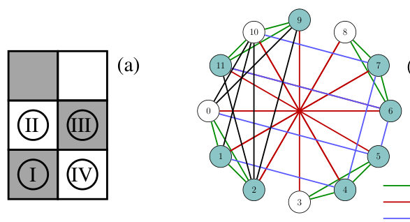
<figcaption class="paper-figure-caption"><b>Fig 1.</b> FIG. 1. Folding the sequence HPPH on a 3 × 2 lattice. (a) A valid chain conformation with</figcaption>
</figure>
<figure class="paper-figure-card">
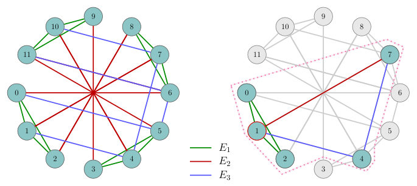
<figcaption class="paper-figure-caption"><b>Fig 2.</b> FIG. 3. (Left) Conflict graph for the sequence HPPH on a 3 × 2 lattice. The edges represent</figcaption>
</figure>
<figure class="paper-figure-card">
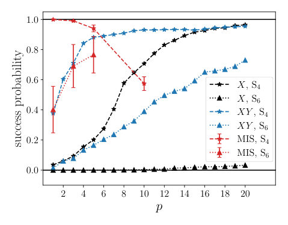
<figcaption class="paper-figure-caption"><b>Fig 3.</b> FIG. 4. Success probability, defined as the squared overlap with the known ground state, as a</figcaption>
</figure>
<figure class="paper-figure-card">
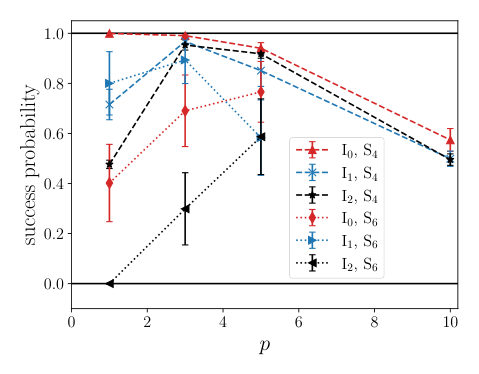
<figcaption class="paper-figure-caption"><b>Fig 4.</b> FIG. 5. Success probability, defined as the squared overlap with the known ground state, as a</figcaption>
</figure>
<figure class="paper-figure-card">
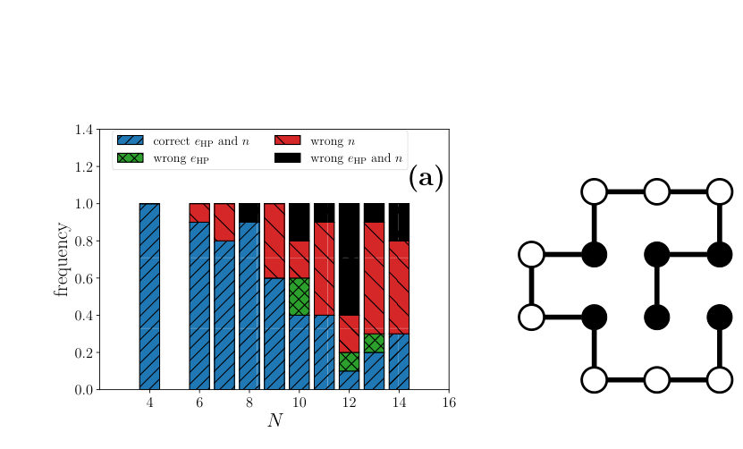
<figcaption class="paper-figure-caption"><b>Fig 5.</b> FIG. 6. (a) Fractions of correct and incorrect solutions in runs with the QLS approach described</figcaption>
</figure>

**Summary.** This work applies quantum optimization techniques, specifically a penalty-free QAOA variant (QAOAMIS), to solve the lattice protein folding problem. By restricting the search space to independent sets, the authors avoid complex penalty terms, allowing them to successfully fold proteins up to N=14 using a local search extension. This shows a promising quantum computational route for biophysics problems.

**Why it may be interesting.** It demonstrates a sophisticated application of quantum algorithms (QAOA variants) to a complex, classically hard optimization problem (protein folding), providing a pathway to tackle larger systems via local search heuristics.

Detailed structure

**Main problem.** The paper addresses the challenging discrete optimization problem of finding the minimum-energy structure of lattice proteins.

**Main result.** A novel QAOA variant (QAOAMIS) that avoids quadratic penalty terms by restricting the search space to independent sets successfully folds lattice proteins up to N=14 using a heuristic local search scheme.

**Method.** The authors adapt the Quantum Approximate Optimization Algorithm (QAOA) to solve the Maximum Independent Set (MIS) problem formulation of protein folding, supplemented by a heuristic Quantum Local Search (QLS) for larger systems.

**Model / system.** The physical system is lattice protein folding, modeled using the minimal HP (Hydrophobic-Polar) model on a 2D square lattice. The problem is mapped onto a QUBO formulation solvable via quantum optimization.

**Key observables.** Success probability (fraction of correct solutions), minimum energy ($E_{min}^{HP}$), and the number of beads ($n$) in the folded structure.

**Important parameters / regimes.** Protein length N (up to 14), circuit depth p, and the size limit of local subgraphs ($\le 26$ qubits).

**Assumptions / limitations.** The standard QAOA formulation is modified to use a mixer designed for MIS, and a heuristic QLS is necessary to overcome the exponential state space growth of full-scale QAOA circuits.

**Figures summary.** Figures illustrate energy landscapes $F(	heta)$ for QAOAX and QAOAXY circuits, and show the success probability vs. circuit depth $p$ for various QAOA variants on small proteins.

**Paper structure.** The paper introduces the problem, contrasts standard QAOA with the penalty-free QAOAMIS variant, validates the approach on small systems ($N=4, 6$), and extends the methodology to larger chains ($N=14$) using a heuristic local search scheme.

Abstract

Identifying minimum-energy structures of lattice proteins is a challenging discrete optimization problem. Quantum approaches such as analog quantum annealing and the gate-based quantum approximate optimization algorithm (QAOA) can address this problem after mapping it to a binary representation, which typically involves introducing penalty terms to enforce valid chain configurations. However, in this and many related problems, the use of quadratic penalty terms can be avoided by restricting the search space to independent sets in a conflict graph and using a QAOA mixer designed for the maximum independent set problem. In this work, we implement and explore this QAOA variant for lattice protein folding. Here, the objective function consists solely of the protein energy together with a simple linear bias term, without quadratic penalties. We validate this approach through classical simulations of the quantum circuits for lattice proteins of lengths $N=4$ and $N=6$. To explore larger systems, we further introduce a heuristic iterative local-search scheme, with which we successfully fold lattice proteins with lengths up to $N=14$ using local subgraphs with at most 26 qubits.

[↑ back to top](#top)

### [Program-Level Curriculum Analysis of U.S. Quantum Masters Degrees; Implications for Workforce Preparation](http://arxiv.org/abs/2606.00841v1)

**Authors:** Tunde Kushimo, Bradley Holt, Muhammad Talal  
**Type:** theory · **Category:** other · **PDF:** <https://arxiv.org/pdf/2606.00841v1>  
**Analysis basis:** full PDF text, analyzed in chunks

↔ Scroll figures horizontally

<figure class="paper-figure-card">
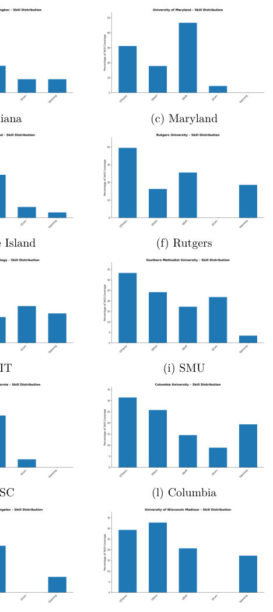
<figcaption class="paper-figure-caption"><b>Fig 1.</b> Figure 2: Skill distribution per quantum master’s program.</figcaption>
</figure>
<figure class="paper-figure-card">
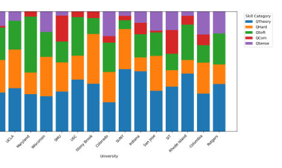
<figcaption class="paper-figure-caption"><b>Fig 2.</b> Figure 3: Cross-program comparison of skill distributions.</figcaption>
</figure>
<figure class="paper-figure-card">

<figcaption class="paper-figure-caption"><b>Fig 3.</b> Figure 3a presents a heatmap summarizing skill emphasis across all fifteen programs, with rows representing skill categories and columns representing universities. Color intensity reflects the relative proportion of each skill within a program, enabling direct visual comparison of curricular emphasis across institutions. Complementing this view, Figure 3b presents a stacked bar chart of normalized technical skill distributions, with each bar corresponding to a program and segmented by skill category. Together, these visualizations highlight both commonalities and substantial variation across U.S. primary master’s programs in quantum science and technology. Overall, Figure 3 illustrates a...</figcaption>
</figure>
<figure class="paper-figure-card">
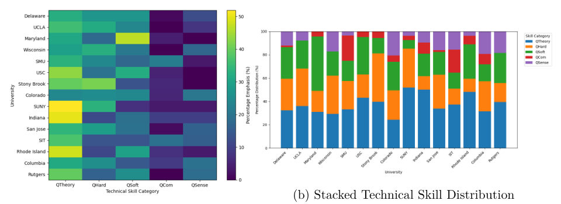
<figcaption class="paper-figure-caption"><b>Fig 4.</b> Figure 4 presents a pie chart summarizing the distribution of formal applied learning opportu- nities across the fifteen U.S.-based primary master’s programs analyzed. Applied learning was coded based on the presence of explicitly stated experiential components in program descriptions, including industry internships, research-based laboratory experiences, or capstone-style projects. As shown in Figure 4, one-third of the programs (33.3%) explicitly incorporate industry in- ternships as part of their curriculum or degree requirements. An additional 33.3% emphasize research-based laboratory experiences, typically conducted within university research groups or af- filiated laboratories....</figcaption>
</figure>
<figure class="paper-figure-card">
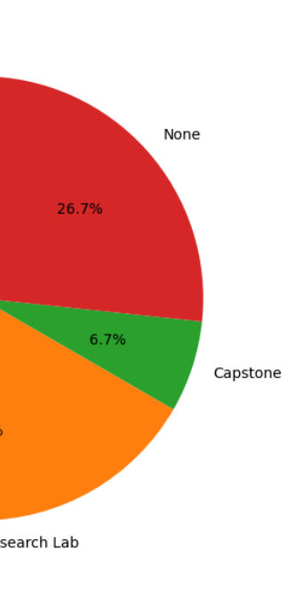
<figcaption class="paper-figure-caption"><b>Fig 5.</b> Figure 4: Applied Learning Opportunities</figcaption>
</figure>

**Summary.** This paper analyzes the curricula of U.S. quantum master's programs to determine how well they prepare graduates for the quantum industry. By systematically coding course content against industry skills, the study finds that while theory is well-covered, applied, computational, and professional skills show significant inconsistency. It provides a framework for improving quantum education policy and curriculum design.

**Why it may be interesting.** While not focused on physical quantum dynamics, the identification of skill gaps in applied and professional competencies is crucial for any theoretical physicist looking to transition research into industry applications.

Detailed structure

**Main problem.** The study aims to assess the alignment between U.S. quantum master's program curricula and the documented skill needs of the quantum technology industry workforce.

**Main result.** While programs share a strong foundation in quantum theory, there is significant variability and persistent gaps in applied skills, professional development, and cross-disciplinary integration necessary for workforce readiness.

**Method.** The researchers conducted a systematic curriculum analysis of multiple U.S. master's programs, using a structured coding framework to map course offerings across six defined quantum-relevant skill categories.

**Model / system.** The focus is on the educational system and workforce skill profile, not a physical quantum system. The 'model' is a structured taxonomy of quantum skills (QTheory, QHard, QSoft, Qcom, QSense, Non-Technical Skills).

**Key observables.** Program-level skill profiles, skill distribution across categories, and the degree of alignment/divergence between curricular emphasis and industry competencies.

**Important parameters / regimes.** The analysis uses an ordinal coding scale (0, 1, 2) and employs normalization and discretization techniques to aggregate skill emphasis across programs.

**Assumptions / limitations.** The analysis assumes that publicly available curriculum materials accurately reflect the intended scope of the degree, and that the structured coding framework captures the necessary skill dimensions.

**Figures summary.** Figures illustrate the mapping of coursework to skill categories, show skill distribution bar charts for individual programs, and use heatmaps/stacked bar charts to compare aggregate skill emphasis across all analyzed programs.

**Paper structure.** The paper systematically defines the problem (workforce gap), details the methodology (curriculum coding, aggregation), presents findings on common foundations vs. variability, and concludes with actionable policy recommendations for curriculum design.

Abstract

Quantum technologies are increasingly recognized as a strategic priority for economic competitiveness, national security, and technological innovation in the United States. As quantum systems transition from research prototypes to deployable technologies, attention has shifted toward the preparedness of the quantum workforce, particularly the alignment between higher education and industry skill needs. While prior research has examined individual aspects of quantum education or workforce demand, few studies integrate systematic curriculum analysis with documented industry expectations. This study addresses that gap by analyzing primary U.S. masters programs in quantum science and technology, focusing on curriculum structure and skill development. Using a structured coding framework, course offerings were mapped across six quantum-relevant skill categories and aggregated to produce program-level skill profiles. These profiles were then compared with industry-identified competencies reported in recent workforce studies. The findings reveal strong emphasis on quantum theory across programs, alongside substantial variability in technical skills, applied learning opportunities, and professional development components. The results highlight areas of alignment as well as persistent gaps related to workforce readiness, cross-disciplinary integration, and emerging technological demands. This study provides a scalable framework for evaluating quantum education programs and offers evidence-based insights for curriculum design, workforce policy, and the continued development of the U.S. quantum ecosystem.

[↑ back to top](#top)

### [Quantum Dynamics of a Particle in a Linear Potential: Invariant Operator Approach and Discrete Spectrum Solutions](http://arxiv.org/abs/2606.02112v1)

**Authors:** Mustapha Maamache, Aymen Bendjoudl  
**Type:** theory · **Category:** other · **PDF:** <https://arxiv.org/pdf/2606.02112v1>  
**Analysis basis:** full PDF text, analyzed in chunks

↔ Scroll figures horizontally

<figure class="paper-figure-card">
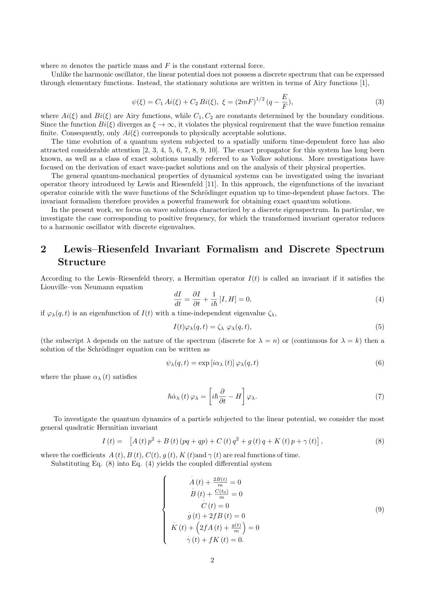
<figcaption class="paper-figure-caption"><b>Fig 1.</b> Low-resolution page preview, page 2</figcaption>
</figure>
<figure class="paper-figure-card">
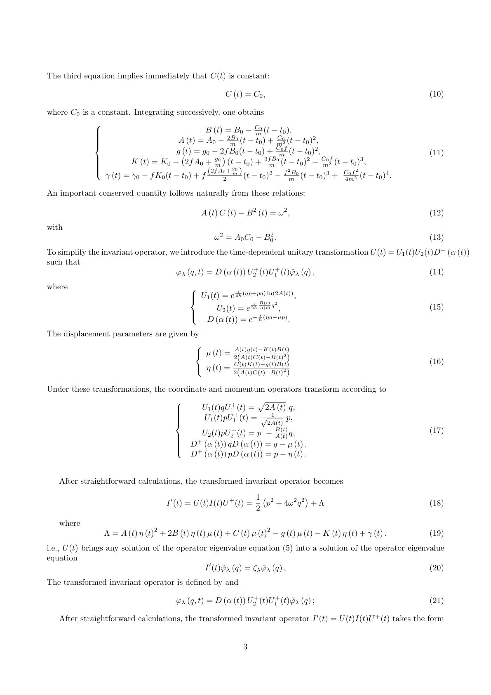
<figcaption class="paper-figure-caption"><b>Fig 2.</b> Low-resolution page preview, page 3</figcaption>
</figure>
<figure class="paper-figure-card">
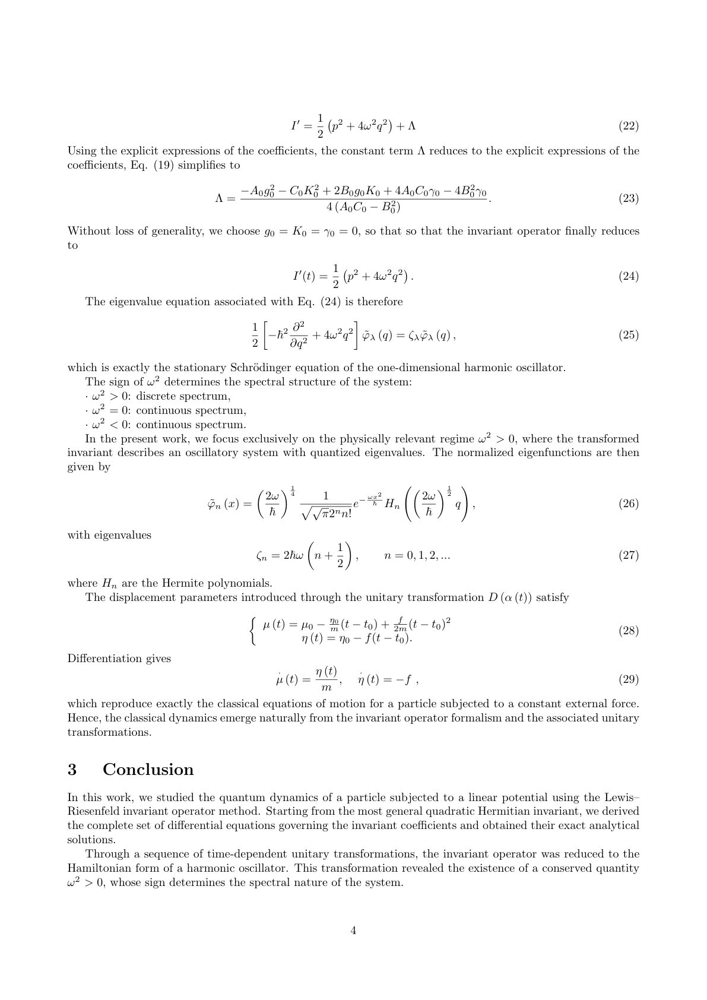
<figcaption class="paper-figure-caption"><b>Fig 3.</b> Low-resolution page preview, page 4</figcaption>
</figure>
<figure class="paper-figure-card">
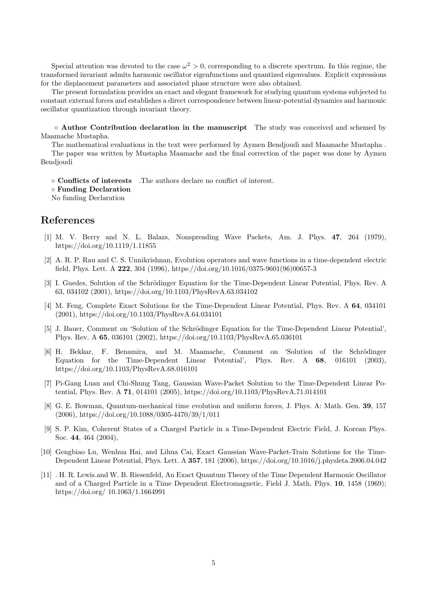
<figcaption class="paper-figure-caption"><b>Fig 4.</b> Low-resolution page preview, page 5</figcaption>
</figure>

**Summary.** This paper uses the Lewis–Riesenfeld invariant operator method to solve the quantum dynamics of a particle in a linear potential. By constructing and transforming a conserved invariant operator, the authors demonstrate that the system's dynamics are mathematically equivalent to those of a harmonic oscillator when the conserved quantity $\omega^2$ is positive. This establishes a direct and exact connection between constant-force motion and harmonic oscillator quantization.

**Why it may be interesting.** This work provides a rigorous, exact quantum mechanical description of a fundamental problem (constant force) by mapping it onto the well-understood harmonic oscillator framework using invariant theory, which is a powerful tool in quantum dynamics.

Detailed structure

**Main problem.** The paper investigates the quantum dynamics of a particle confined by a linear potential, which models motion under a constant external force.

**Main result.** The dynamics are shown to be exactly equivalent to the quantization of a harmonic oscillator when the conserved quantity $\omega^2 > 0$, yielding a discrete energy spectrum.

**Method.** The core method employed is the Lewis–Riesenfeld invariant operator technique, which constructs a time-dependent Hermitian invariant operator $I(t)$ to simplify the time-dependent Schrödinger equation.

**Model / system.** The system is a single particle governed by a Hamiltonian $H(q, p) = rac{1}{2}mp^2 - Fq$, representing motion in a linear potential. The analysis relies on finding quadratic invariants.

**Key observables.** The conserved quantity $\omega^2$ determines the spectral structure; the eigenvalues for $\omega^2 > 0$ are $\zeta_n = 2\hbar\omega(n + 1/2)$.

**Important parameters / regimes.** The sign of the conserved quantity $\omega^2$ dictates whether the spectrum is discrete ($\omega^2 > 0$) or continuous.

**Assumptions / limitations.** The analysis focuses on the physically relevant regime where $\omega^2 > 0$ to obtain a discrete spectrum, and it assumes the applicability of the Lewis–Riesenfeld formalism.

**Paper structure.** The paper proceeds by applying the Lewis–Riesenfeld method to the time-dependent Schrödinger equation for the linear potential. It derives the general quadratic invariant, reduces it via unitary transformations to a harmonic oscillator form, and analyzes the resulting spectrum based on the sign of $\omega^2$.

Abstract

We investigate the quantum dynamics of a particle subjected to a linear potential using the Lewis--Riesenfeld invariant operator method. Starting from the time-dependent Schrödinger equation associated with a constant external force, we construct the most general Hermitian quadratic invariant and derive the corresponding coupled differential equations for its time-dependent coefficients. By means of an appropriate sequence of unitary transformations, the invariant operator is reduced to the form of a harmonic oscillator Hamiltonian. This reduction enables a clear classification of the system according to the sign of the conserved quantity ω2. Particular attention is devoted to the physically relevant case ω2 >0, which yields a discrete eigenspectrum. Explicit analytical expressions for the invariant coefficients, the displacement parameters, and the transformed wave functions are obtained. The resulting formalism provides an exact quantum description of a particle under a constant force and establishes a direct connection between invariant theory and harmonic oscillator quantization.

[↑ back to top](#top)

### [Spatial Search by Nonlinear Quantum Walk](http://arxiv.org/abs/2606.01403v1)

**Authors:** David A. Meyer, Thomas G. Wong  
**Type:** theory · **Category:** quantum information and computing · **PDF:** <https://arxiv.org/pdf/2606.01403v1>  
**Analysis basis:** full PDF text, analyzed in chunks

↔ Scroll figures horizontally

<figure class="paper-figure-card">
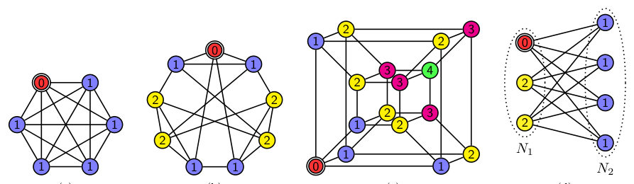
<figcaption class="paper-figure-caption"><b>Fig 1.</b> FIG. 1. (a) A complete graph of N = 6 vertices. Subfigures (b) through (d) are sufficiently complete graphs, with (b) a Paley graph of N = 9 vertices, (c) a 4-dimensional hypercube with 24 = 16 vertices, and (d) a complete bipartite graph with N1 = 3 and N2 = 4 vertices in each partite set. In all, a vertex is marked by an oracle, indicated by a double circle. Identically evolving vertices are identically colored and numerically labeled.</figcaption>
</figure>
<figure class="paper-figure-card">
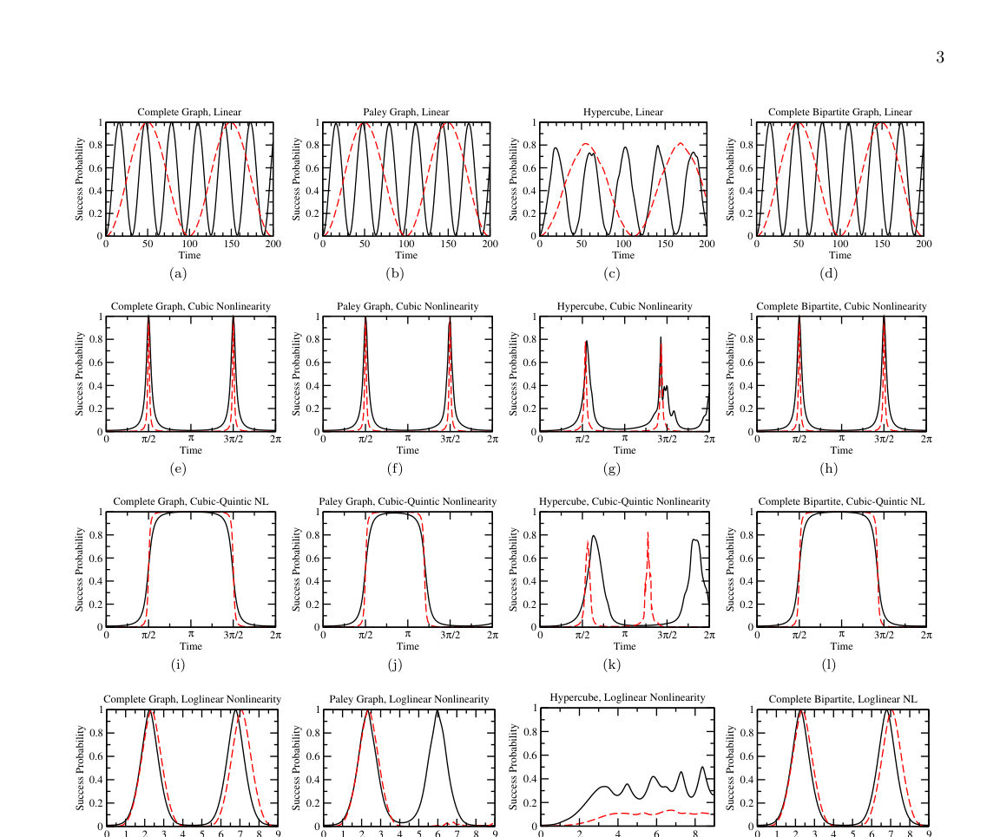
<figcaption class="paper-figure-caption"><b>Fig 2.</b> FIG. 2. Success probability as a function of time for quantum search on various graphs with various nonlinearities (NLs) using γc(t) (13) with ℓ= 1. The first row [subfigures (a)-(d)] is the linear (g = 0) algorithm, the second row [subfigures (e)-(h)] is the cubic nonlinearity f(p) = p with g = N −1, the third row [subfigures (i)-(l)] is the cubic-quintic nonlinearity f(p) = p −p2</figcaption>
</figure>
<figure class="paper-figure-card">
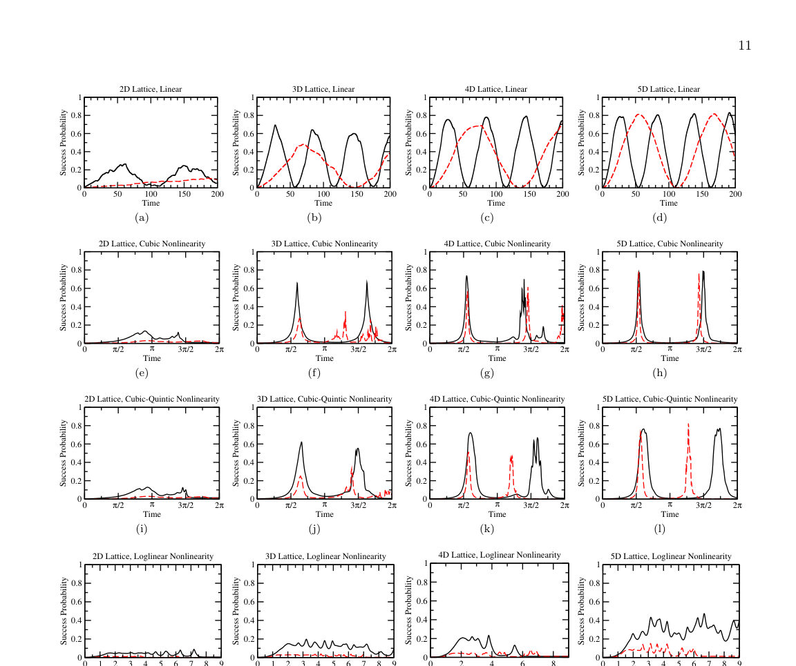
<figcaption class="paper-figure-caption"><b>Fig 3.</b> FIG. 3. Success probability as a function of time for quantum search on various graphs with various nonlinearities using γc(t) (13) with ℓchosen to be the vertices adjacent to the marked vertex. The first row [subfigures (a)-(d)] is the linear (g = 0) algorithm, the second row [subfigures (e)-(h)] is the cubic nonlinearity f(p) = p with g = N −1, the third row [subfigures (i)-(l)] is the cubic-quintic nonlinearity f(p) = p −p2 with g = N −1, and the last row [subfigures (m)-(p)] is the loglinear nonlinearity f(p) = ln p with g = √</figcaption>
</figure>

**Summary.** This paper explores using nonlinear quantum walks to perform spatial search on incomplete graphs, moving beyond the idealized all-to-all connectivity of the complete graph. By analyzing the dynamics using nonlinear Schrödinger equations, the authors prove that specific nonlinearities can maintain the quantum speedup on graphs like Paley graphs and complete bipartite graphs. This demonstrates that nonlinear quantum search remains viable even when the underlying physical network is sparse.

**Why it may be interesting.** This work directly addresses the practical limitations of quantum search algorithms by showing that nonlinear interactions can extend the speedup capability to real-world, incomplete network structures, which is a key area of research in quantum information.

Detailed structure

**Main problem.** The paper investigates how nonlinear quantum walks can be used to achieve quantum search on graphs that are not fully connected (incomplete graphs), extending the concept beyond the standard complete graph search.

**Main result.** Nonlinear quantum walks can successfully speed up the search process on specific incomplete graphs, such as Paley graphs and complete bipartite graphs, provided the nonlinearity coefficients are appropriately chosen.

**Method.** The authors employ theoretical analysis using nonlinear Schrödinger equations, comparing the nonlinear evolution to the known linear evolution via error bounding techniques like Duhamel's formula.

**Model / system.** The model is a continuous-time quantum walk governed by a nonlinear Hamiltonian, which includes a nonlinear self-potential term dependent on the probability density. The analysis is applied to various graph structures, including complete graphs, Paley graphs, hypercubes, and cubic lattices.

**Key observables.** Success Probability (probability of finding the particle at the marked vertex), Energy Gap ($\Delta E$), and the required search time $T_N$.

**Important parameters / regimes.** Nonlinearity coefficients ($g$), graph size ($N$), and the lattice dimension ($d$). The analysis often requires conditions like $g \ll \sqrt{N}$ or $g=N-1$.

**Assumptions / limitations.** The analysis relies on the graphs being 'sufficiently complete' to mimic the behavior of a complete graph, and the mathematical proofs depend on bounding the accumulated error term ($\eta(t)$) to be negligible.

**Figures summary.** Figures illustrate the success probability vs. time for linear and nonlinear searches on various graphs (Complete, Paley, Hypercube, Bipartite) across different dimensions, showing the maintenance of high success probability under nonlinear control.

**Paper structure.** The paper progresses from establishing the linear search baseline on complete graphs, extending the concept to 'sufficiently complete' graphs, and then rigorously analyzing the nonlinear dynamics using error bounding techniques to prove speedups for specific nonlinearities (cubic, cubic-quintic) on these graphs.

Abstract

Many-body quantum systems with effective nonlinearities have been shown to speed up quantum search on the complete graph, \textit{i.e.}, the combinatorial version of Grover's algorithm, at the expense of the number of particles needed for the effective nonlinearity to hold. Physically, however, data may not be arranged in an all-to-all network, and the task of searching incomplete graphs is the spatial search problem. We explore spatial search using a continuous-time nonlinear quantum walk on a variety of graphs. First, we consider incomplete graphs that are ``sufficiently complete'' so as to asymptotically search like the complete graph under a continuous-time (linear) quantum walk, which includes strongly regular graphs such as Paley graphs, regular graphs such as hypercubes, and irregular graphs such as complete bipartite graphs. For these sufficiently complete graphs, we analytically prove nonlinear speedups for Paley graphs and for complete bipartite graphs whose two partite sets both have size $Θ(N)$, for suitable cubic and cubic-quintic nonlinearities, and we give numerical evidence for stronger nonlinearities and for hypercubes. Second, we explore arbitrary-dimensional cubic lattices, and we numerically show that certain nonlinearities speed up search on sufficiently high dimensional lattices. Thus, nonlinear quantum search can remain viable even when the underlying graph is incomplete.

[↑ back to top](#top)

### [Spin Correlations in Two-Particle Systems: A Pedagogically Motivated Comparison of Computational Approaches](http://arxiv.org/abs/2606.02361v1)

**Authors:** S. Martins-Filho  
**Type:** theory · **Category:** other · **PDF:** <https://arxiv.org/pdf/2606.02361v1>  
**Analysis basis:** full PDF text, analyzed in chunks

↔ Scroll figures horizontally

<figure class="paper-figure-card">
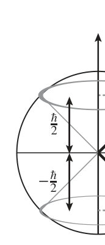
<figcaption class="paper-figure-caption"><b>Fig 1.</b> Fig. 1 The spin-1/2 degrees of freedom. For a measurement along the z axis, the possible outcomes are only Sz = +ℏ/2 and Sz = −ℏ/2. The arrows represent a visual aid and should not be interpreted as classical spin vectors.</figcaption>
</figure>
<figure class="paper-figure-card">
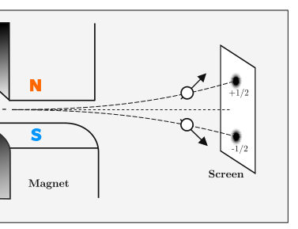
<figcaption class="paper-figure-caption"><b>Fig 2.</b> Fig. 2 Schematic representation of a Stern–Gerlach measurement for a spin-1/2 system. The inhomo- geneous magnetic field produced by the magnet separates particles according to the measured value of the spin component along a selected direction. In this case, only two outcomes are possible, +ℏ/2 and −ℏ/2, corresponding respectively to spin “up” and spin “down” along the chosen axis.</figcaption>
</figure>
<figure class="paper-figure-card">
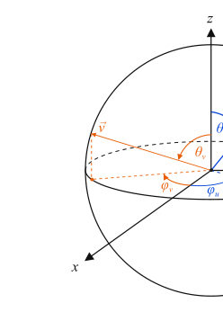
<figcaption class="paper-figure-caption"><b>Fig 3.</b> Fig. 3 Geometrical representation of the measurement directions ˆu and ˆv in a unit sphere (r2 = 1) using spherical coordinates. The polar angles θu and θv are measured from the positive z-axis, while the azimuthal angles φu and φv are measured in the xy-plane from the positive x-axis to the projections of ˆu and ˆv, respectively.</figcaption>
</figure>

**Summary.** This paper compares three distinct mathematical approaches—direct algebra, matrix formalism, and symmetry analysis—for calculating spin correlations in two spin-1/2 particles. Its goal is pedagogical: to clarify the interplay between tensor structure, entanglement, and rotational symmetry. It shows that while the singlet state exhibits simple rotational symmetry, the triplet state requires a more careful treatment than naive symmetry extensions allow.

**Why it may be interesting.** The detailed comparison of calculation techniques (algebraic vs. matrix vs. symmetry) is highly valuable for students learning quantum formalism, particularly how tensor products and symmetries constrain physical observables.

Detailed structure

**Main problem.** The paper aims to provide a pedagogically motivated comparison of different computational methods for calculating spin correlation expectation values in a two-particle quantum system.

**Main result.** It demonstrates that while symmetry arguments are useful for the singlet state due to its rotational invariance, they fail for triplet states unless the state transformation is accounted for.

**Method.** The authors compare three methods: direct algebraic evaluation in the product basis, using a matrix representation based on $2	imes2$ complex matrices, and applying symmetry arguments.

**Model / system.** The system is a two-particle quantum system composed of two spin-1/2 particles, analyzed using the tensor-product structure of the total Hilbert space. Key states include the singlet and triplet spin states.

**Key observables.** The primary observable is the spin correlation function $B[\psi] = \langle\psi|S^{(1)}\hat{u} S^{(2)}\hat{v}|\psi
angle$, which measures the average product of spin measurements along directions $\hat{u}$ and $\hat{v}$.

**Important parameters / regimes.** The relative angles ($	heta, \phi$) between the measurement directions $\hat{u}$ and $\hat{v}$ are crucial parameters.

**Assumptions / limitations.** The primary limitation addressed is the conceptual difficulty in interpreting the tensor-product structure, and the symmetry argument is shown to be inapplicable to the triplet state without careful state transformation.

**Figures summary.** Figures illustrate the spin-1/2 degrees of freedom and the geometry of measurement directions on a unit sphere, while equations detail the explicit forms of basis states in the product basis and the matrix representations.

**Paper structure.** The paper progresses by introducing the problem, detailing the product-basis approach, presenting the more concise matrix representation, and finally contrasting these with the symmetry-based argument, culminating in a discussion of the limitations of each method.

Abstract

In this work we present a pedagogically motivated analysis of spin-correlation calculations in a quantum system composed of two spin-$1/2$ particles. Rather than aiming at new physical results, our purpose is to clarify and bring attention to different strategies for evaluating expectation values of the form $\langle ψ| S^{(1)}_{\hat{\boldsymbol{u}}} S^{(2)}_{\hat{\boldsymbol{v}}} | ψ\rangle$, which play an important role in discussions of entanglement and Bell-type correlations. We compare three complementary approaches. The first follows a direct algebraic evaluation in the product basis, closely related to standard textbook methods. The second uses a matrix representation of bipartite states, in which the tensor-product structure is expressed in terms of $2\times2$ complex matrices. This representation keeps the calculation close to the familiar Pauli-matrix algebra and makes the independent action of operators on each subsystem more transparent. The third explores a symmetry-based argument, highlighting both its usefulness and its limitations when applied beyond the singlet state. We show explicitly that the singlet state is rotationally invariant, which explains why the symmetry argument successfully reproduces its correlation function, while a naive extension fails for triplet states. The discussion illustrates how entanglement, tensor-product structure, and rotational symmetry interplay in spin correlations.

[↑ back to top](#top)

### [Surface Reconstruction in Low-Temperature ARPES Spectra of Charge-Ordered EuAl$_4$](http://arxiv.org/abs/2606.00453v1)

**Authors:** Hao Liu, Bo Chen, Chen Zhang, Qi-Yi Wu, Sheng-Tao Cui, Zhe Sun, Zhong-Tuo Fu, Ying Zhou, Yang Luo, Jun Liu, Yu-Xia Duan, Jian-Qiao Meng  
**Type:** experiment · **Category:** strongly correlated electrons · **PDF:** <https://arxiv.org/pdf/2606.00453v1>  
**Analysis basis:** full PDF text, analyzed in chunks

↔ Scroll figures horizontally

<figure class="paper-figure-card">
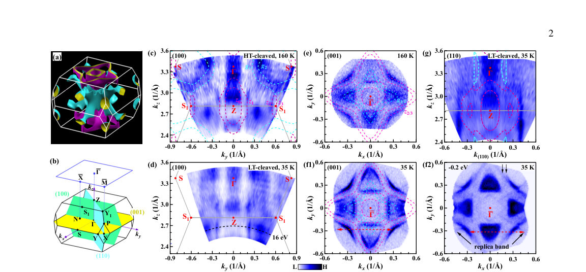
<figcaption class="paper-figure-caption"><b>Fig 1.</b> FIG. 1. Calculated and measured Fermi surfaces of EuAl4. (a) DFT-calculated 3D bulk Fermi surface. (b) Bulk Brillouin zone with the ARPES momentum planes indicated. (c), (d) Photon-energy-dependent ARPES intensity maps in the ky-kz plane measured on HT-cleaved and LT-cleaved surfaces, respectively. Colored dashed curves denote calculated bulk Fermi-surface contours; the black dashed line marks the 16 eV cut. (e) In-plane kx-ky Fermi-surface maps measured with hν = 16 eV at 160 K on an HT-cleaved surface, with calculated Γ- and Z-plane contours overlaid. (f1), (f2) In-plane constant-energy contours measured at 35 K on an LT-cleaved surface at EF and E - EF = -0.2 eV, respectively. (g)...</figcaption>
</figure>
<figure class="paper-figure-card">
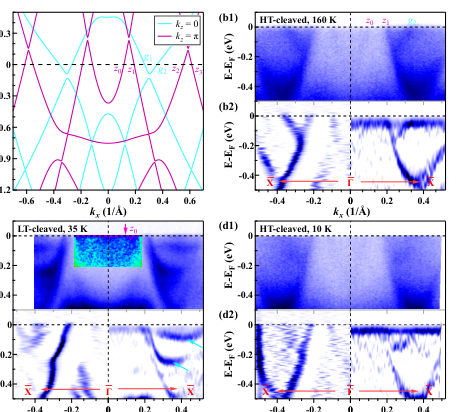
<figcaption class="paper-figure-caption"><b>Fig 2.</b> FIG. 2. Calculated and measured band dispersions of EuAl4 at hν = 16 eV. (a) DFT-calculated bulk band dispersions along S-Γ-S (kz = 0) and S1-Z-S1 (kz = π), with near-EF bands labeled. (b1), (b2) ARPES intensity plot and corresponding second-derivative im- ages measured at 160 K on an HT-cleaved surface. (c1), (c2) Corre- sponding spectra measured at 35 K on an LT-cleaved surface. Arrows mark two additional near-EF electron-like bands near the z1 and z2 bulk bands. (d1), (d2) Spectra measured at 10 K after cooling the same HT-cleaved surface used in (b1). For (b2)-(d2), the left and right panels show the momentum- and energy-derivative images, re- spectively.</figcaption>
</figure>
<figure class="paper-figure-card">
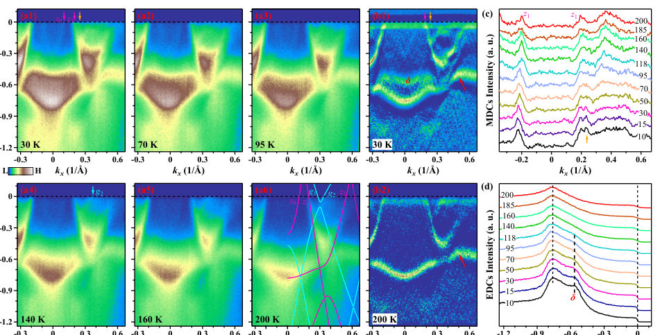
<figcaption class="paper-figure-caption"><b>Fig 3.</b> FIG. 3. Temperature evolution of an LT-cleaved EuAl4(001) surface at hν = 16 eV. (a1)-(a6) ARPES spectra measured at selected temper- atures. (b1), (b2) Second-derivative images of the spectra measured at 30 and 200 K, respectively. The shallow electron-like δ band near -0.57 eV is marked in (b1). (c) Momentum-distribution curves at EF for selected temperatures. (d) Energy-distribution curves integrated around kx = 0. The δ-band peak is progressively suppressed upon warming and becomes difficult to distinguish from the background by approximately 118 K.</figcaption>
</figure>

**Summary.** This experimental study uses advanced ARPES techniques on EuAl4 to distinguish between bulk electronic effects and surface reconstruction. By comparing spectra from surfaces cleaved at different temperatures, the authors demonstrate that complex low-temperature features are due to a thermally fragile surface reconstruction, resolving a key ambiguity regarding CDW physics in this material class.

**Why it may be interesting.** This work provides a rigorous spectroscopic methodology for separating surface physics from bulk electronic correlations in correlated materials, a crucial technique for understanding many strongly correlated systems.

Detailed structure

**Main problem.** The study aims to resolve the microscopic origin of complex low-temperature ARPES spectra in EuAl4, specifically distinguishing between intrinsic bulk Charge-Density-Wave (CDW) reconstruction and surface-derived spectral weight.

**Main result.** The additional, complex low-temperature spectral weight observed on low-temperature-cleaved surfaces is predominantly attributed to a thermally fragile surface reconstruction, rather than being a signature of bulk CDW-induced band folding.

**Method.** The researchers combined Angle-Resolved Photoemission Spectroscopy (ARPES) measurements—analyzing photon-energy, temperature, and cleavage-history dependence—with first-principles electronic structure calculations.

**Model / system.** The physical system is EuAl4, a correlated semimetal in the BaAl4-family, which exhibits a CDW transition. The analysis compares experimental spectra from high-temperature-cleaved versus low-temperature-cleaved surfaces against calculated 3D bulk electronic structures.

**Key observables.** Photon-energy dependence, temperature evolution of spectral weight (suppression upon warming), and the comparison of measured Fermi surface topology to bulk calculations.

**Important parameters / regimes.** The CDW transition temperature (T_CDW ~ 140 K); the temperature dependence of spectral features (e.g., suppression upon warming); and the cleavage history (HT vs. LT).

**Assumptions / limitations.** The analysis assumes that the bulk CDW folding signal can be distinguished from surface effects by exploiting the sensitivity to cleavage history and temperature stability.

**Figures summary.** Figures compare ARPES spectra from HT-cleaved (bulk-like) vs. LT-cleaved (additional features) surfaces, showing the progressive suppression of anomalous features upon warming, and illustrating the photon-energy dependence of these features.

**Paper structure.** The paper follows a comparative analysis structure: first, establishing the bulk baseline using HT-cleaved surfaces; second, identifying anomalous features on LT-cleaved surfaces; and finally, using temperature and cleavage history dependence to argue that these anomalies are surface-derived and not intrinsic to the bulk CDW state.

Abstract

Charge ordering in EuAl$_4$ has been widely discussed in connection with band reconstruction, magnetism,and topological electronic states, yet the microscopic origin of the complex low-temperature ARPES spectra remains unresolved. Here we combine photon-energy-, temperature-, and cleavage-history-dependent ARPES with firstprinciples calculations to separate intrinsic bulk bands from surface-derived spectral weight. Spectra measured on high-temperature-cleaved surfaces, both at 160 K and after cooling to 10 K, are well described by the calculated three-dimensional bulk electronic structure, whereas low-temperature-cleaved surfaces exhibit additional electron-like bands, replica-like Fermi-surface contours, and nearly kz-independent surface-derived features that are absent from the bulk calculations. These extra features are progressively suppressed upon warming, whereas the bulk-derived bands remain largely unchanged across the charge-density-wave transition within the experimental resolution. The combined analysis of photon-energy dependence, temperature evolution, and cleavage history identifies the reconstructed low-temperature spectral weight as arising predominantly from a thermally fragile surface reconstruction rather than from intrinsic bulk CDW-induced band folding. These results resolve an important ambiguity in EuAl$_4$ and provide spectroscopic criteria for distinguishing surface reconstruction from bulk charge-order effects in BaAl$_4$-family correlated semimetals.

[↑ back to top](#top)

### [Topological Surface States and Anisotropic Magnetotransport in SnSb$_6$Te$_{10}$](http://arxiv.org/abs/2606.01043v1)

**Authors:** Mohit Mudgal, Subhajit Mandal, Bishal Das, Priyanka Meena, Amarjyoti Choudhury, Vishnu Kumar Tiwari, Yogendra Kumar, Vivek Kumar Malik, Tulika Maitra, Kiyohisa Tanaka, Shinichiro Ideta, Kenya Shimada, Aftab Alam, Jayita Nayak  
**Type:** both · **Category:** other · **PDF:** <https://arxiv.org/pdf/2606.01043v1>  
**Analysis basis:** full PDF text, analyzed in chunks

↔ Scroll figures horizontally

<figure class="paper-figure-card">
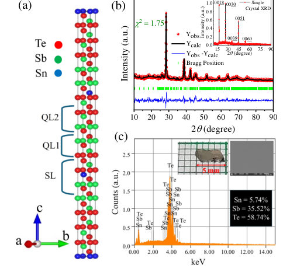
<figcaption class="paper-figure-caption"><b>Fig 1.</b> FIG. 1. (a) Crystal structure of Sn-based ternary compound SnSb6Te10, with the ions of Sn, Sb, and Te shown in blue, green, and red colors, respectively. It is built with alternat- ing SL and two QL blocks along the hexagonal c-axis. (b) Rietveld refinement of powder XRD pattern of SnSb6Te10 at 300 K. The inset shows the single crystal XRD of SnSb6Te10 at 300 K. (c) EDS spectrum over an area of SnSb6Te10 single crystal and SEM image (inset) and the atomic composition. A picture of the SnSb6Te10 crystal is shown in the inset with a typical size of 5 mm.</figcaption>
</figure>
<figure class="paper-figure-card">
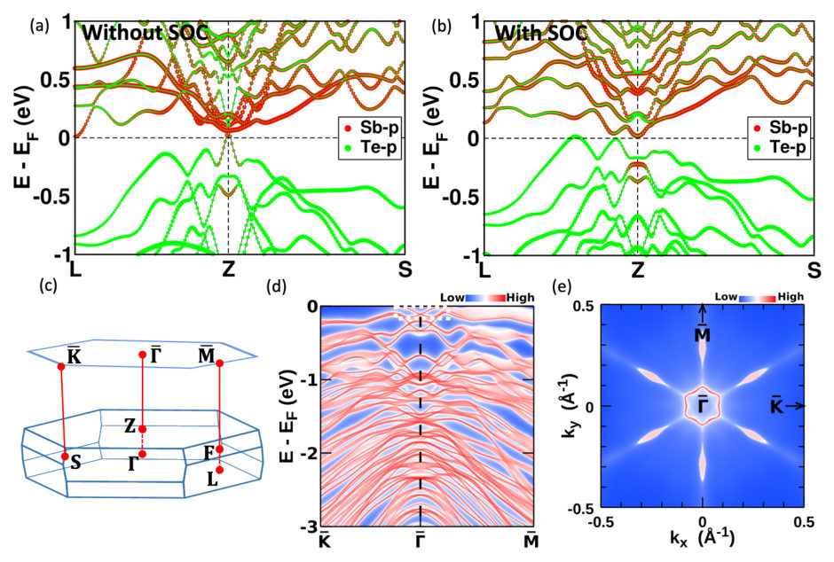
<figcaption class="paper-figure-caption"><b>Fig 2.</b> FIG. 2. Electronic band structure of SnSb6Te10 along with the atomic orbital projections of Sb-p (red color) and Te-p (green color) atoms (a) without and (b) with SOC. (c) Bulk and surface BZ, marked with different high-symmetry points. (d) Simulated surface band dispersion and (e) Fermi surface for the conventional hexagonal (0001) surface of SnSb6Te10. The surface Dirac cone has been highlighted by a white dotted box in (d). The hexagonal warping of this surface Dirac cone is visible in (e) with projected bulk Fermi pockets along Γ-M.</figcaption>
</figure>
<figure class="paper-figure-card">
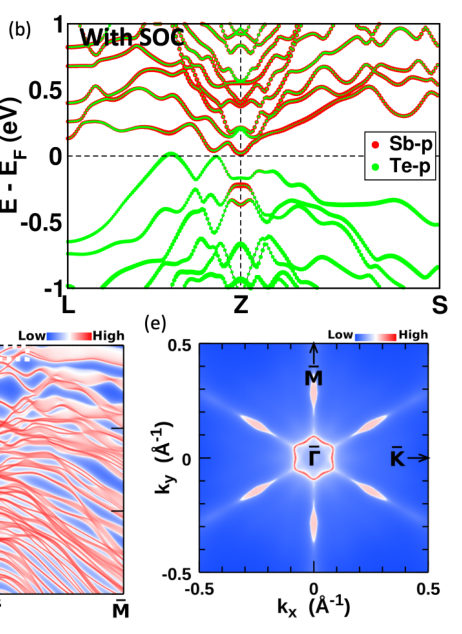
<figcaption class="paper-figure-caption"><b>Fig 3.</b> Figure 2(d) shows the calculated surface band disper- sion for the (0001) surface obtained by cleaving between the QL2 and SL (see Fig. 1(a)), where a Dirac-like sur- face state is observed around ¯Γ in close proximity to the Fermi level (highlighted by a white dotted box). The cor- responding surface Fermi contour is presented in Fig. 2(e) showing hexagonal warping of the surface Dirac cone. Experimentally, Hall measurements reveal a hole car- rier density of the order of 1021 cm−3 (see Fig. 4(d)), which quantitatively matches with the calculated hole carrier density of 1.58×1021 cm−3 at EF−0.33 eV. To ac- count for this difference and enable a direct comparison with ARPES measurements,...</figcaption>
</figure>
<figure class="paper-figure-card">
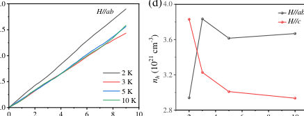
<figcaption class="paper-figure-caption"><b>Fig 4.</b> FIG. 4. (a) Temperature dependence of longitudinal resis- tance of SnSb6Te10. The red line represents the fitting curve. (b, c) Hall resistivity at different temperatures for H ∥c and H ∥ab, respectively. (d) Temperature-dependence of carrier density for H ∥c and H ∥ab.</figcaption>
</figure>
<figure class="paper-figure-card">

<figcaption class="paper-figure-caption"><b>Fig 5.</b> Figure 4(a) shows the temperature dependence of the longitudinal resistance Rxx measured at zero magnetic field. The resistance decreases with decreasing tem- perature, indicating an overall metallic behavior, fol- lowed by a weak upturn below approximately 25 K. Such low-temperature upturns are commonly observed in sev- eral topological materials and may arise from enhanced surface-state contributions and quantum interference ef- fects associated with WAL [35, 36]. No clear anomaly corresponding to a structural or magnetic phase transi- tion is observed over the measured temperature range. The temperature dependence of Rxx can be described using</figcaption>
</figure>

**Summary.** This work characterizes SnSb6Te10 as a strong topological insulator by combining DFT calculations with advanced measurements like ARPES and magnetotransport. The results confirm the existence of topological surface states, evidenced by the Z2 invariant, Dirac-like behavior, and pronounced transport anisotropy. This establishes the material as a promising platform for topological transport research.

**Why it may be interesting.** The strong evidence for topological surface states and the detailed study of anisotropic transport in a layered material make it highly relevant for understanding topological phenomena in condensed matter systems.

Detailed structure

**Main problem.** To investigate the electronic structure and magnetotransport properties of the layered telluride compound SnSb6Te10 to establish it as a strong topological insulator.

**Main result.** The material is confirmed as a strong topological insulator, exhibiting topological surface states, hole-type carriers, and pronounced magnetotransport anisotropy.

**Method.** A combination of theoretical calculations (DFT) and multiple experimental techniques, including ARPES, Hall measurements, and angle-dependent magnetotransport measurements.

**Model / system.** The physical system is the single crystal SnSb6Te10, a layered telluride compound. The theoretical analysis involves calculating the topological invariant (Z2) and modeling transport phenomena using models like the Hikami-Larkin-Nagaoka equation.

**Key observables.** Non-trivial Z2 topological invariant, surface-state dispersion matching ARPES, hole carrier density ($\sim 10^{21} 	ext{ cm}^{-3}$), weak antilocalization (WAL), and Berry phase close to $\pi$ from SdH oscillations.

**Important parameters / regimes.** Temperature (2 K to 5 K), magnetic field strength (up to 12 T), and angle ($	heta$) dependence for transport measurements.

**Assumptions / limitations.** The analysis assumes the crystal structure belongs to the rhombohedral space group $Rar{3}m$, and that transport measurements involve a coexistence of bulk and surface contributions.

**Figures summary.** Figures illustrate the crystal structure, electronic band structures (with/without SOC), surface band dispersion vs. ARPES, temperature dependence of resistance, and angular dependence of magnetotransport (WAL and AMR).

**Paper structure.** The paper follows a structure of theoretical prediction (DFT/Topological invariant) followed by experimental verification across multiple fronts: ARPES confirms surface states, Hall measurements confirm carrier type/density, and magnetotransport confirms topological signatures (WAL, Berry phase, anisotropy).

Abstract

We have investigated the electronic structure and magnetotransport properties of SnSb$_6$Te$_{10}$ single crystals using density functional theory (DFT), synchrotron-based angle-resolved photoemission spectroscopy (ARPES), and quantum transport measurements. Our DFT calculations reveal a clear spin-orbit coupling driven band inversion between the Sb-$p$ and Te-$p$ states together with a non-trivial $\mathbb{Z}_2$ topological invariant. The calculated surface-state dispersion and hexagonally warped Fermi surface contours agree well with the ARPES measurements. Temperature-dependent transport measurements indicate dominant electron-phonon scattering, while Hall measurements confirm hole-type carriers with carrier density of the order of $10^{21}$ cm$^{-3}$. Both transverse and longitudinal magnetotransport exhibit weak antilocalization behavior, while Shubnikov-de Haas oscillations observed for $H \parallel c$ yield a Berry phase close to $π$, consistent with Dirac-like surface states. Furthermore, angle-dependent magnetotransport measurements reveal pronounced anisotropy associated with an anisotropic Fermi surface topology and mixed bulk-surface transport behavior. Our combined theoretical and experimental results establish SnSb$_6$Te$_{10}$ as a strong topological insulator and a promising platform for investigating topological transport phenomena in layered telluride systems.

[↑ back to top](#top)

### [Toward Efficient End-to-End Quantum Elliptic PDE Solvers: a Multilevel Correction Algorithm for Direct Observable Estimation](http://arxiv.org/abs/2606.01270v1)

**Authors:** Xiantao Li  
**Type:** theory · **Category:** numerical methods · **PDF:** <https://arxiv.org/pdf/2606.01270v1>  
**Analysis basis:** full PDF text, analyzed in chunks

↔ Scroll figures horizontally

<figure class="paper-figure-card">
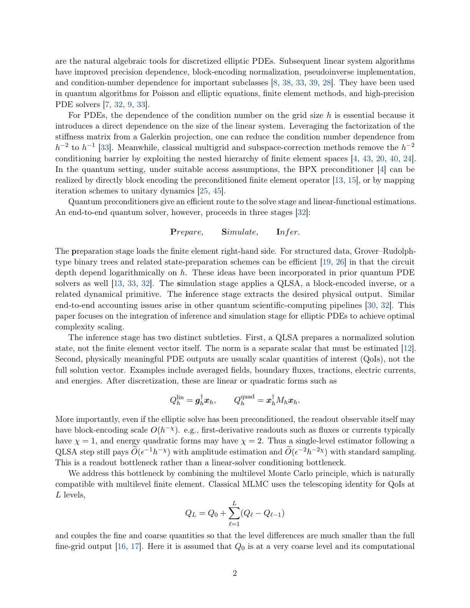
<figcaption class="paper-figure-caption"><b>Fig 1.</b> Low-resolution page preview, page 2</figcaption>
</figure>
<figure class="paper-figure-card">
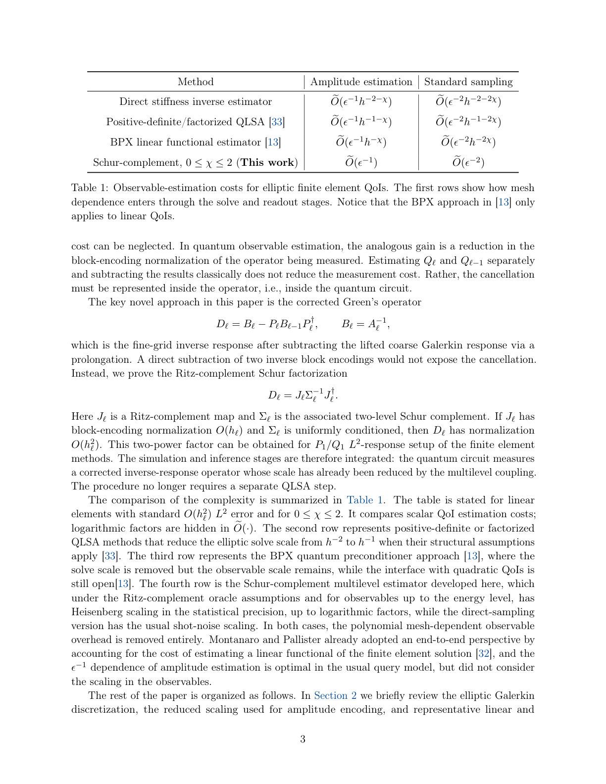
<figcaption class="paper-figure-caption"><b>Fig 2.</b> Low-resolution page preview, page 3</figcaption>
</figure>
<figure class="paper-figure-card">
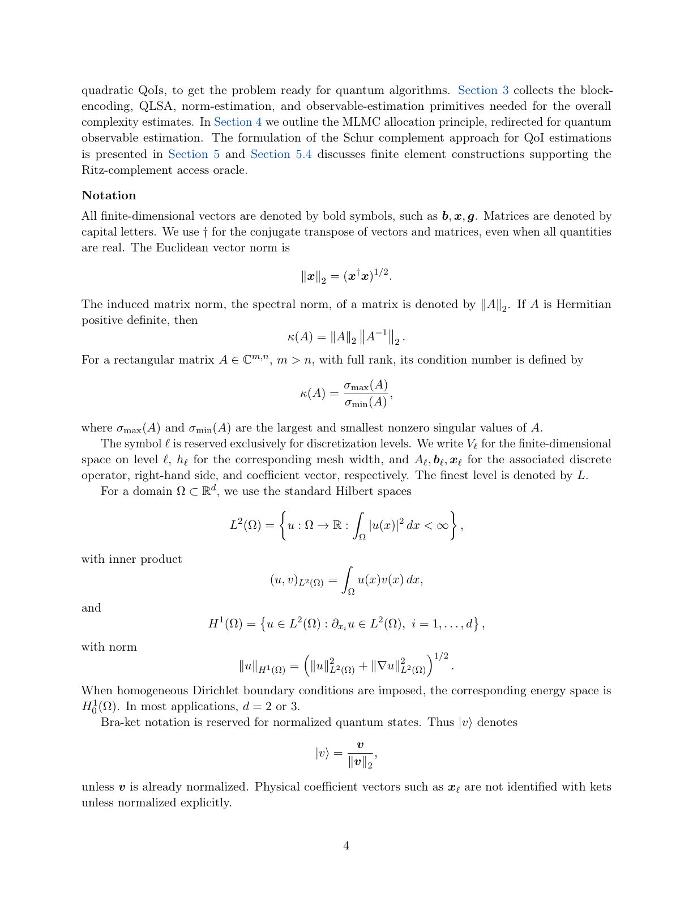
<figcaption class="paper-figure-caption"><b>Fig 3.</b> Low-resolution page preview, page 4</figcaption>
</figure>
<figure class="paper-figure-card">
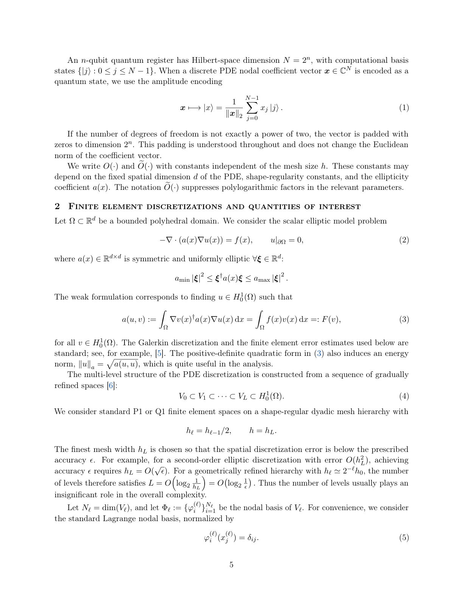
<figcaption class="paper-figure-caption"><b>Fig 4.</b> Low-resolution page preview, page 5</figcaption>
</figure>
<figure class="paper-figure-card">
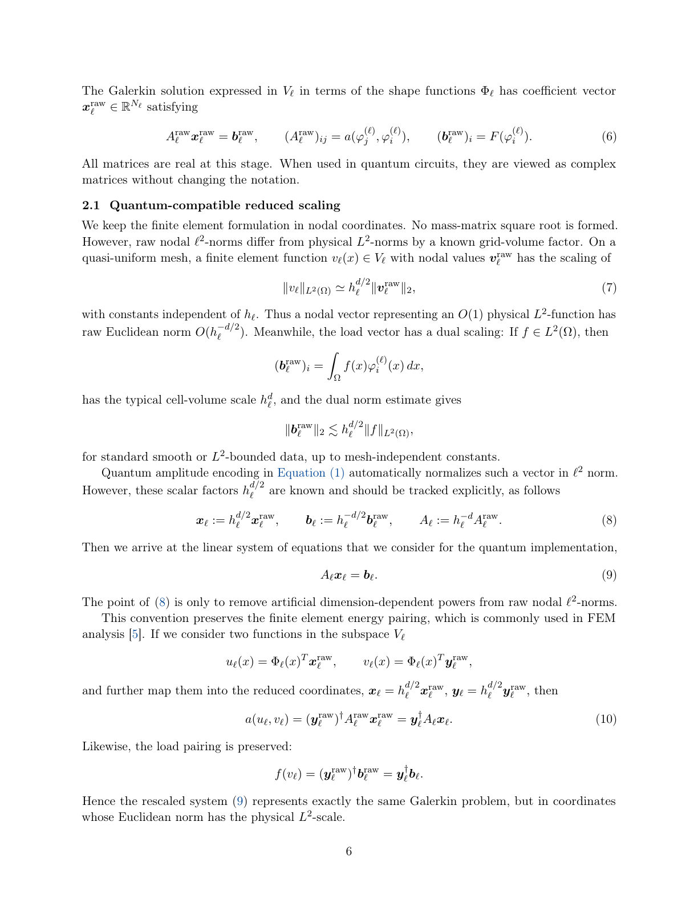
<figcaption class="paper-figure-caption"><b>Fig 5.</b> Low-resolution page preview, page 6</figcaption>
</figure>

**Summary.** This paper presents a novel multilevel framework to overcome the readout bottleneck when using quantum algorithms to solve elliptic PDEs. By estimating the observable through a telescoping sum of interlevel corrections derived from the Schur complement, the method removes the polynomial dependence on the mesh size $h$. This significantly improves the scaling of quantum computation for extracting physical quantities of interest.

**Why it may be interesting.** While focused on PDEs, the rigorous analysis of error propagation and the development of multilevel correction techniques are highly relevant to quantum algorithms for simulating complex physical systems where observables must be extracted efficiently.

Detailed structure

**Main problem.** Developing efficient end-to-end quantum algorithms to solve elliptic Partial Differential Equations (PDEs) while accurately estimating physical observables of interest.

**Main result.** The proposed multilevel framework successfully removes the polynomial $h$-dependent readout overhead for observables with readout order $\chi \le 2$, achieving Heisenberg scaling ($	ext{eO}(\epsilon^{-1})$) with amplitude estimation.

**Method.** The method adapts Multilevel Monte Carlo (MLMC) principles by estimating a telescoping sum of interlevel corrections, utilizing the Schur-complement factorization of the corrected Green's operator.

**Model / system.** The model is the scalar elliptic PDE, $-
abla \cdot (a(x)
abla u(x)) = f(x)$, discretized using the Finite Element Method (FEM) on a multi-level mesh hierarchy.

**Key observables.** Fluxes, currents, tractions, and energy (general physical quantities of interest, QoIs), which are estimated via linear or quadratic forms.

**Important parameters / regimes.** Mesh size $h$, statistical precision $\epsilon$, and the readout order $\chi$ of the observable.

**Assumptions / limitations.** The method relies on the Ritz-complement oracle assumptions and assumes the Schur complement $\Sigma_\ell$ is uniformly conditioned.

**Figures summary.** Table 1 compares the complexity scaling of observable estimation for various methods (Direct stiffness inverse, BPX, Schur-complement) for elliptic finite element QoIs.

**Paper structure.** The paper establishes the problem of readout bottlenecks in quantum PDE solvers, introduces the multilevel framework based on MLMC, details the mathematical machinery using Schur-complement factorization of the corrected Green's operator, and analyzes the resulting complexity scaling for both amplitude estimation and direct sampling.

Abstract

A central test case for quantum linear system algorithms (QLSA) is elliptic PDEs after a finite element discretization. Most existing analyses focus on preparing a normalized solution state. But an end-to-end quantum PDE solver must also extract physical quantities of interest, such as fluxes, currents, tractions, and energy. These outputs require quantum measurement, and their observable norms may grow like $h^{-χ} $ with mesh size $h $, creating a readout bottleneck even when a quantum preconditioner reduces the condition-number dependence on $h$.   We present a multilevel framework for this readout problem, motivated by the variance-reduction mechanism of multilevel Monte Carlo (MLMC), which is naturally compatible with a multi-level finite element discretization. Instead of estimating the full fine-grid observable directly, the method estimates a telescoping sum of interlevel corrections, so that the fine-coarse cancellation is exposed before quantum measurement. Our algorithm is based on Schur-complement factorization of the corrected Green's operator through a Ritz-complement map. For quantities of interest with readout order $χ\leq 2$, the multilevel estimator removes the polynomial $h$-dependent readout overhead. With amplitude estimation, the remaining statistical dependence is $ \widetilde{O}(1/\varepsilon)$, i.e., Heisenberg scaling in the inference precision up to logarithmic factors and with direct sampling, the complexity is reduced to standard Monte Carlo scaling $\widetilde{O}(1/ε^2)$.

[↑ back to top](#top)

## Secondary cond-mat archives

*Papers from cond-mat.mtrl-sci, mes-hall, other, soft, supr-con. These archives are de-prioritized — they appear at the end regardless of relevance score.*

### Relevant in secondary archives (32)

### [Non-Hermiticity-induced chirality imbalance of Weyl Landau levels](http://arxiv.org/abs/2606.00615v1)

**Authors:** Sachin Vaidya, Alaa Bayazeed, André Grossi Fonseca, Adolfo G. Grushin, Marin Soljačić, Christina Jörg  
**Type:** both · **Category:** other · **PDF:** <https://arxiv.org/pdf/2606.00615v1>  
**Analysis basis:** full PDF text, analyzed in chunks
**Topic relevance:** 🔥 `analog quantum simulation` **4/5** · `correlated / nonlocal dissipation` **3/5** · `driven-dissipative phase transition` **3/5** · `methods for driven-dissipative` **3/5** · `non-equilibrium dynamics` **2/5** · `non-equilibrium universality` **2/5** · `quantum optics experiment` **2/5** · `Keldysh / 2PI / non-Gaussian methods` **1/5** · `Kondo & dissipative impurity` **1/5** · `interference shaping light` **1/5**

↔ Scroll figures horizontally

<figure class="paper-figure-card">
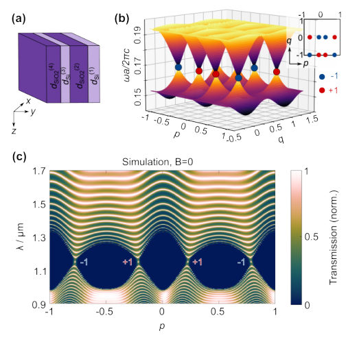
<figcaption class="paper-figure-caption"><b>Fig 1.</b> FIG. 1. (a) Schematic of one unit cell of the photonic multilayer stack with alternating Si and SiO2 layers. (b) Band structure of frequency (𝜔𝑎/2𝜋𝑐) vs. the two synthetic momenta 𝑝and 𝑞, at 𝑘𝑦= 0, showing eight Weyl points between bands 2 and 3 with topological charges +1 (red) and -1 (blue). (c) Transfer-matrix simulation for 20 unit cells of the multilayer stack at 𝑞= 0, 𝑘𝑦= 0. Along this cut, four Weyl points with charges −1, +1, +1, −1 (from left to right) are visible.</figcaption>
</figure>
<figure class="paper-figure-card">
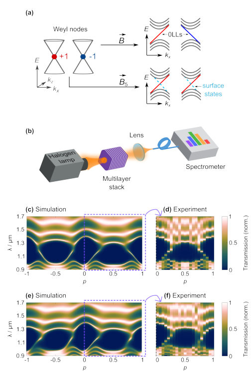
<figcaption class="paper-figure-caption"><b>Fig 2.</b> FIG. 2. (a) The two oppositely charged Weyl points transform into dispersive zeroth Landau levels (0LLs) under an applied magnetic field. The Landau levels have opposite slopes under a homogeneous B-field and the same slope under an axial magnetic field (B5). Surface states are indicated by dashed light blue lines. (b) A schematic of the experimental measurement setup: broadband light from a halogen lamp illuminates the multilayer stack and the transmitted spectrum is recorded using a spectrometer. (c) Transfer matrix simulation of the spectrum for 𝑞= 0, 𝑘𝑦= 0 under a homogeneous B-field. The zeroth Landau levels inherit their chirality from that of the Weyl nodes shown in Fig. 2c. (d)...</figcaption>
</figure>
<figure class="paper-figure-card">
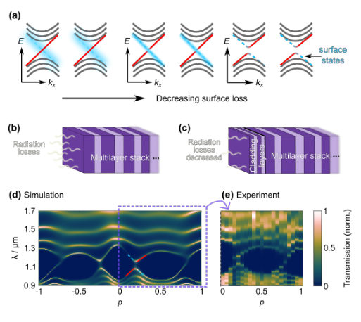
<figcaption class="paper-figure-caption"><b>Fig 3.</b> FIG. 3. (a) Schematic of Landau levels under an axial magnetic field (B5) and boundary loss: in the transmission spectrum, the surface states (pale blue) are highly broadened and unobservable. Upon decreasing surface loss, they become long-lived and are visible as sharp resonances that hybridize with the zeroth Landau levels (red) in both transfer-matrix simulations (d) and the experiment (e). To reduce the loss, two bilayers of cladding have been added to the top of the multilayer stack, as shown in (b) and (c).</figcaption>
</figure>
<figure class="paper-figure-card">
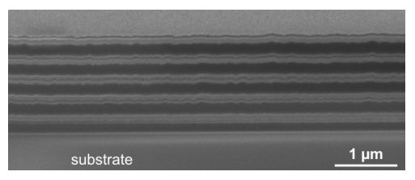
<figcaption class="paper-figure-caption"><b>Fig 4.</b> FIG. 4. Focused ion beam (FIB) cut through a typical multilayer stack revealing the different layers. The silicon layers appear dark gray while the silicon dioxide layers appear light gray.</figcaption>
</figure>
<figure class="paper-figure-card">
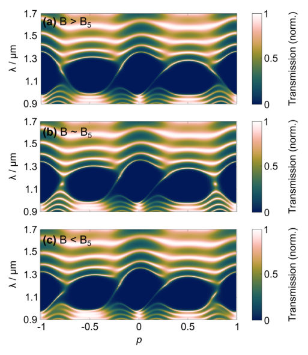
<figcaption class="paper-figure-caption"><b>Fig 5.</b> FIG. 5. Competition between the 𝐵and 𝐵5-fields. (a) For 𝐵&gt; 𝐵5 (𝛿= 0.3) the four zeroth Landau levels disperse in opposite directions, whereas for (c) 𝐵&lt; 𝐵5 (𝛿= 0.8) they disperse in the same direction. (b) At the crossover point 𝐵≈𝐵5 (𝛿= 0.6), the outer two zeroth Landau levels collapse to Weyl points.</figcaption>
</figure>

**Summary.** This research demonstrates that non-Hermiticity in photonic systems can manipulate topological constraints governing Weyl semimetals. By applying an axial magnetic field, the chiral balance is spatially separated into bulk and surface states. Crucially, radiative boundary loss selectively removes the surface states, creating an observable chirality imbalance that can be recovered by modifying the boundaries.

**Why it may be interesting.** This work is highly relevant to AMO/Quantum Optics because it uses engineered photonic systems to simulate complex topological phenomena, demonstrating how dissipation (non-Hermiticity) acts as a controllable physical mechanism to modify fundamental quantum constraints.

Detailed structure

**Main problem.** The paper investigates how non-Hermiticity, inherent in open photonic systems, can induce and control an observable chirality imbalance in Weyl Landau levels, thereby bypassing fundamental topological constraints like the Nielsen-Ninomiya theorem.

**Main result.** By engineering an axial magnetic field and exploiting radiative boundary loss, the surface-localized chiral states are selectively suppressed, leading to an apparent net chirality imbalance in the long-lived bulk spectrum.

**Method.** The study combines theoretical modeling using effective Hamiltonians and transfer matrix simulations with experimental measurements of light transmission through multilayer photonic structures.

**Model / system.** The system is a synthetic photonic Weyl semimetal realized in multilayer Bragg stacks of Si/SiO2. The physics is governed by the 1D Maxwell eigenvalue equation, emulating 3D Weyl physics via synthetic momenta and engineered gauge fields (homogeneous and axial magnetic fields).

**Key observables.** Zeroth Landau level dispersion, chiral spectral flow, and the measured transmission spectrum showing the recovery of avoided crossings upon boundary modification.

**Important parameters / regimes.** The relative strengths of the homogeneous ($B$) and axial ($B_5$) magnetic fields, and the strength of the radiative boundary loss ($\eta$).

**Assumptions / limitations.** The system is treated as an open, dissipative photonic structure where boundary loss dictates the observable spectral flow; the initial state assumes periodicity enforcing the theorem in the closed limit.

**Figures summary.** Figures illustrate the unit cell structure, the transformation of Weyl nodes into Landau levels under different fields, and critically, the comparison of transmission spectra with and without a dielectric Bragg reflector, showing the re-emergence of surface states.

**Paper structure.** The paper progresses by first establishing the theoretical framework of chirality constraints in Weyl systems, then demonstrating the effect of an axial field ($B_5$) leading to spatial separation of chiral channels, and finally showing that non-Hermitian boundary loss selectively removes the compensating surface states, thus inducing the imbalance.

Abstract

Weyl semimetals obey a global chirality constraint: the net chiral topological charge and any associated chiral spectral flow must vanish, as required by the Nielsen-Ninomiya theorem. Under magnetic fields, this constraint manifests through counter-propagating zeroth Landau levels associated with Weyl nodes of opposite chirality. Here, we experimentally demonstrate how non-Hermiticity can reshape this balance in a synthetic photonic Weyl semimetal. Using engineered gauge fields in one-dimensional multilayer structures, we realize both homogeneous and axial magnetic fields and directly probe the resulting Landau-level spectra. While a homogeneous field produces the expected chirality-balanced zeroth Landau levels, an axial field spatially separates the compensating chiral channels: co-propagating bulk pseudo-Landau levels carry one chirality, whereas the opposite chirality resides in boundary-localized surface states. We show that radiative boundary loss selectively suppresses these surface states, removing them from the long-lived observable spectrum and producing an experimentally accessible chirality imbalance. By reducing boundary loss, we recover the hidden chiral channel and reveal its surface-state origin. These results show that non-Hermiticity, present naturally in photonics, can control and relax fundamental chirality constraints in topological systems, enabling access to otherwise forbidden spectral responses.

[↑ back to top](#top)

### [Signatures of Rashba-Cavity-Induced Berry-curvature redistribution in the Spin-Hall Conductivity of Semiconductor Artificial Graphene](http://arxiv.org/abs/2606.01373v1)

**Authors:** Maryam Mansouri, Vram Mughnetsyan, Armen Harutyunyan, Albert Kirakosyan, Vidar Gudmundsson  
**Type:** theory · **Category:** other · **PDF:** <https://arxiv.org/pdf/2606.01373v1>  
**Analysis basis:** full PDF text, analyzed in chunks
**Topic relevance:** 🔥 `spintronics-quantum-optics interface` **4/5** · `analog quantum simulation` **3/5** · `correlated cavity matter` **3/5** · `exotic spin models in light-matter` **3/5** · `Tavis-Cummings & cavity-many-emitter` **2/5** · `driven-dissipative phase transition` **2/5** · `methods for driven-dissipative` **2/5** · `Keldysh / 2PI / non-Gaussian methods` **1/5** · `non-equilibrium dynamics` **1/5**

↔ Scroll figures horizontally

<figure class="paper-figure-card">
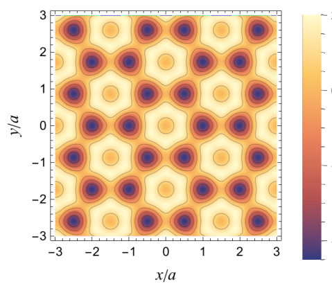
<figcaption class="paper-figure-caption"><b>Fig 1.</b> FIG. 1. The potential profile Vh/V0 of the AG.</figcaption>
</figure>
<figure class="paper-figure-card">
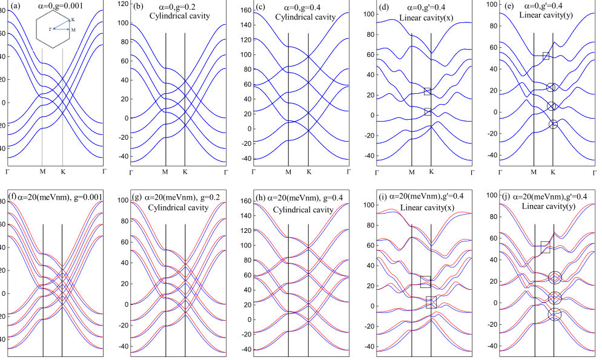
<figcaption class="paper-figure-caption"><b>Fig 2.</b> FIG. 2. Energy miniband dispersion along the chosen k-space path for α = 0, 20(meV nm) and interaction constants g = 0.001, 0.4 for cylindrical and linear cavity.</figcaption>
</figure>
<figure class="paper-figure-card">
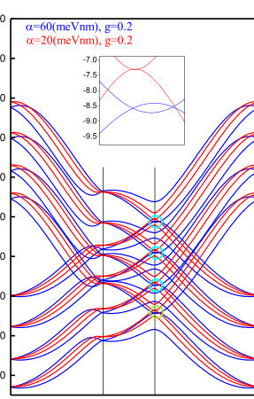
<figcaption class="paper-figure-caption"><b>Fig 3.</b> FIG. 3. Energy miniband dispersion along the chosen k-space path for α = 60, 20(meV nm) and interaction constant g = 0.2.</figcaption>
</figure>
<figure class="paper-figure-card">
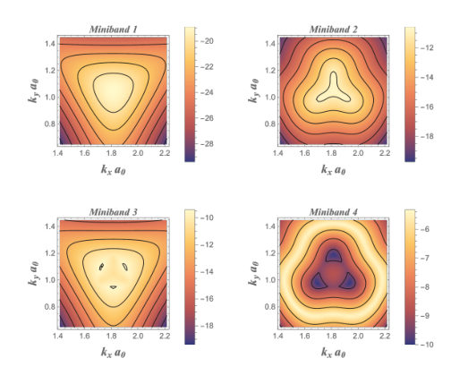
<figcaption class="paper-figure-caption"><b>Fig 4.</b> FIG. 4. Density plots of the lowest four energy minibands in the vicinity of ‘‘K’’ point for α = 60meV nm and g = 0.001.</figcaption>
</figure>
<figure class="paper-figure-card">
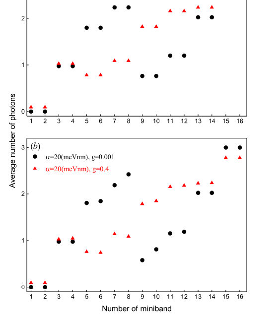
<figcaption class="paper-figure-caption"><b>Fig 5.</b> FIG. 6. Mean photon number in each miniband for the AG inside a cylindrical cavity.</figcaption>
</figure>

**Summary.** This theoretical work examines how coupling an artificial graphene structure to a cavity field, while simultaneously including Rashba spin-orbit interaction, modifies its electronic band structure. The key finding is that this interplay allows for the precise engineering of topological features, such as opening gaps at specific Dirac points, which manifests as strong, tunable oscillations in the spin-Hall conductivity.

**Why it may be interesting.** The explicit coupling between spin-orbit coupling (a key ingredient in topological physics) and cavity photons (a core concept in cavity QED) to engineer transport properties like $\sigma_{SH}$ is highly relevant for designing novel quantum devices.

Detailed structure

**Main problem.** The study investigates the combined influence of a far-infrared (FIR) cavity field and Rashba spin-orbit interaction (SOI) on the electronic band structure and transport properties of artificial graphene.

**Main result.** The interplay between Rashba SOI and cavity coupling governs Dirac-point physics, allowing for the opening of gaps at type-II Dirac points and producing pronounced, oscillatory modifications in the spin-Hall conductivity.

**Method.** The authors employ a theoretical Hamiltonian approach, constructing a basis that is a tensor product of the electronic Hilbert space and the photon Fock space, followed by exact diagonalization and the use of the Kubo formalism.

**Model / system.** The system is artificial graphene (AG) made of InAs/GaAs quantum dots, modeled as a honeycomb lattice, coupled to a quantized cavity photon mode. The Hamiltonian includes terms for kinetic energy, periodic potential, Rashba SOI, and electron-photon interaction.

**Key observables.** Spin-Hall conductivity ($\sigma_{SH}$), band structure dispersion, mean photon number ($\langle \hat{N}_{ph} 
angle$), and the existence/nature of Dirac points (Type-I vs. Type-II).

**Important parameters / regimes.** Cavity geometry (cylindrical vs. linear), Rashba coupling strength, and cavity coupling strength ($g$).

**Assumptions / limitations.** The analysis uses the long-wavelength approximation for the vector potential and treats the electron-photon interaction perturbatively in some derivations.

**Figures summary.** Figures illustrate energy miniband dispersion for different cavity types and coupling constants, and show the evolution of $\sigma_{SH}$ as a function of chemical potential, highlighting oscillatory behavior.

**Paper structure.** The paper builds from defining the full Hamiltonian incorporating all interactions, deriving matrix elements for the coupling terms, solving the effective Hamiltonian via unitary transformations, and finally calculating the transport observable ($\sigma_{SH}$) using the Kubo formula.

Abstract

We investigate the combined effect of a far-infrared cavity field and Rashba spin-orbit interac- tion on the band structure and transport properties of artificial graphene composed of quazi-2D InAs/GaAs quantum dots. The coupling to cavity photons is modeled by constructing a complete basis as the tensor product of the electronic Hilbert space and the Fock space. Our calculations for the system embedded in a linear cavity predict the existence of both type-I and type-II Dirac points which can be distinguished by their response to Rashba interaction. Namely, Rashba coupling opens a gap at type-II Dirac points, while type-I Dirac points remain gapless. For both cylindrical and linear cavities, we demonstrate the formation of electron-photon hybrid states and Rabi oscillations between energy minibands. Multiple splittings, crossings, and anticrossings between Dirac-band replicas produce pronounced modifications of the spin-Hall conductivity, including strong anisotropy and oscillatory behavior controlled by cavity geometry and polarization. Our results show that the interplay between Rashba and cavity couplings governs Dirac-point physics and provides a route toward tunable polaritonic transport and topological phases in engineered nanostructures.

[↑ back to top](#top)

### [Integer quantum Hall effect](http://arxiv.org/abs/2606.01744v1)

**Authors:** Hideo Aoki  
**Type:** both · **Category:** other · **PDF:** <https://arxiv.org/pdf/2606.01744v1>  
**Analysis basis:** full PDF text, analyzed in chunks
**Topic relevance:** 🔥 `non-equilibrium dynamics` **4/5** · `analog quantum simulation` **3/5** · `driven-dissipative phase transition` **3/5** · `non-equilibrium universality` **3/5** · `Keldysh / 2PI / non-Gaussian methods` **2/5** · `methods for driven-dissipative` **2/5** · `entanglement & information structure` **1/5**

↔ Scroll figures horizontally

<figure class="paper-figure-card">
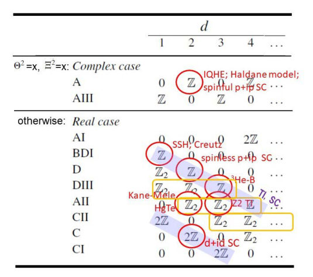
<figcaption class="paper-figure-caption"><b>Fig 1.</b> Figure 2: Another representation of the table of topological systems, after A.P. Schnyder, S. Ryu, A. Furusaki, and A.W.W. Ludwig, Phys. Rev. B 78, 195125 (2008); S. Ryu et al, New J. Phys. 12, 065010 (2010). Purple bands highlight TI (topological insulator) and SC (superconductor) series, orange squares (Z2, Z2, Z) triplets, while red inscriptions denote examples of the quantum states as in the previous figure.</figcaption>
</figure>
<figure class="paper-figure-card">
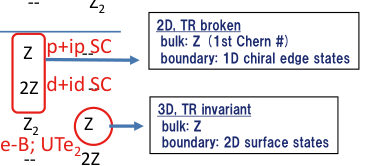
<figcaption class="paper-figure-caption"><b>Fig 2.</b> Figure 3: Topological boundary states for various topological states on the table of topological systems. TR stands for the time-reversal symmetry.</figcaption>
</figure>
<figure class="paper-figure-card">
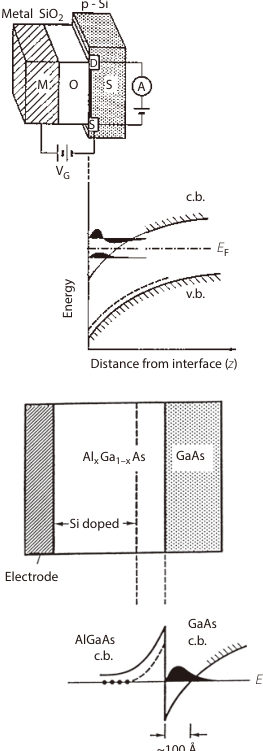
<figcaption class="paper-figure-caption"><b>Fig 3.</b> Figure 4: Structures of MOSFET (a) and semiconductor heterostructure (b). In each frame, the upper panel shows the sample structure, while the lower panel the electronic band struc- ture around the interface. Typical wavefunctions are plotted in black against the direction perpecdicular to the interface.</figcaption>
</figure>
<figure class="paper-figure-card">
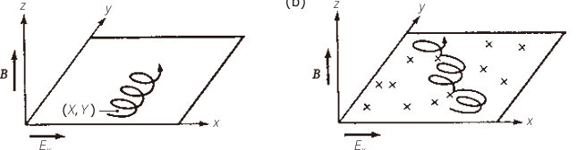
<figcaption class="paper-figure-caption"><b>Fig 4.</b> Figure 5: Classical orbits for a charged particle in a magnetic field (∥z) in an applied electric field (∥x) for a clean system (a) and in a disordered system with scatterers (crosses) (b).</figcaption>
</figure>
<figure class="paper-figure-card">
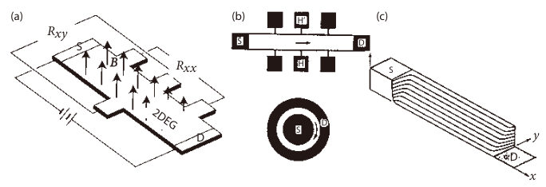
<figcaption class="paper-figure-caption"><b>Fig 5.</b> Figure 6: (a) Hall-bar sample geometry for measuring the QHE. (b) Top views of a Hall bar and a Corbino sample, with source (S) and drain (D) electrodes. (c) A birds-eye view of the equipotential lines in the QHE condition.</figcaption>
</figure>

**Summary.** This comprehensive review details the Integer Quantum Hall Effect, establishing its foundation in topological physics. It then advances the concept by analyzing its realization in disordered systems and, most significantly, extends it to non-equilibrium Floquet topological insulators driven by light. This shows how topological quantization can emerge from time-dependent quantum dynamics.

**Why it may be interesting.** The extension to Floquet systems provides a direct link between quantum optics/AMO physics (laser driving) and fundamental condensed matter phenomena (topological quantization), making it highly relevant for open quantum systems research.

Detailed structure

**Main problem.** The paper reviews the Integer Quantum Hall Effect (IQHE), explaining its underlying physics from theoretical and experimental standpoints, and placing it within the broader context of topological systems.

**Main result.** The IQHE is fundamentally linked to topological invariants, and the concept has been extended to non-equilibrium systems like Floquet topological insulators, realizing anomalous QHE without a static magnetic field.

**Method.** The analysis employs theoretical tools ranging from effective-mass approximations and Kubo formalism to advanced concepts like Floquet theory and Berry's curvature integration.

**Model / system.** The primary systems studied are two-dimensional electron gases (2DEGs) in strong magnetic fields, realized in semiconductor heterostructures, and graphene subjected to time-periodic driving fields (Floquet systems).

**Key observables.** Quantized Hall conductivity ($\sigma_{xy}$), Landau levels, topological invariants (Chern number), and quasi-energies.

**Important parameters / regimes.** Magnetic field strength ($B$), filling factor ($
u$), magnetic length ($\ell$), and laser frequency ($\Omega$).

**Assumptions / limitations.** The analysis relies on the clean limit, the lowest subband approximation, and approximations like the self-consistent Born approximation or high-frequency expansions for Floquet systems.

**Figures summary.** Figures illustrate the topological classification of quantum states, the energy spectra (Landau levels and Floquet subbands), and the characteristic plateaus in Hall and longitudinal conductivity ($\sigma_{xy}$ vs. gate voltage).

**Paper structure.** The paper progresses from the classical and quantum description of the IQHE in static fields, through the inclusion of disorder (localization theory), and culminates in the extension of QHE concepts to time-periodically driven (Floquet) systems.

Abstract

Integer quantum Hall effect, which is the Hall effect quantized into integer times $e^2/h$ ($e$: elementary charge, $h$: Planck's constant) observed first in two-dimensional electron gases in strong magnetic fields, is reviewed from both theoretical and experimental standpoints. Basic physics underlying the phenomenon is explained. Specifically in this new edition we have a fresh look at how the quantum Hall effect is captured in a perspective of topological systems, since, while the quantum Hall effect is historically the first realization of the topological systems, the field has been delved into a much wider realm of physics of topological systems. We also mention diverse advances such as the quantum Hall effect (QHE) in various materials and contexts that include graphene, oxides and narrow-gap semiconductors, a relation with the fractional quantum Hall effect, and the quantum Hall effect as the resistance standard and further roles in the new SI system. We also expound the Floquet topological insulator (a light-matter coupled system) as a new paradigm in nonequilibrium topological systems, where an anomalous quantum Hall effect in zero magnetic field is realized as theoretically predicted to occur in graphene illuminated by a circularly-polarized laser and experimentally verified recently.

[↑ back to top](#top)

### [Voltage-driven transition from steady-state fluctuations to phase-transition noise in nanoscale VO$_2$ devices](http://arxiv.org/abs/2606.01872v1)

**Authors:** Sebastian Werner Schmid, Zoltán Balogh, Botond Sánta, Tímea Nóra Török, Zsombor Sinóros-Szabó, György Molnár, János Volk, László Pósa, András Halbritter  
**Type:** both · **Category:** statistical mechanics · **PDF:** <https://arxiv.org/pdf/2606.01872v1>  
**Analysis basis:** full PDF text, analyzed in chunks
**Topic relevance:** 🔥 `driven-dissipative phase transition` **4/5** · `non-equilibrium dynamics` **3/5** · `non-equilibrium universality` **3/5** · `methods for driven-dissipative` **2/5** · `Frenkel-Kontorova` **1/5** · `Keldysh / 2PI / non-Gaussian methods` **1/5**

↔ Scroll figures horizontally

<figure class="paper-figure-card">
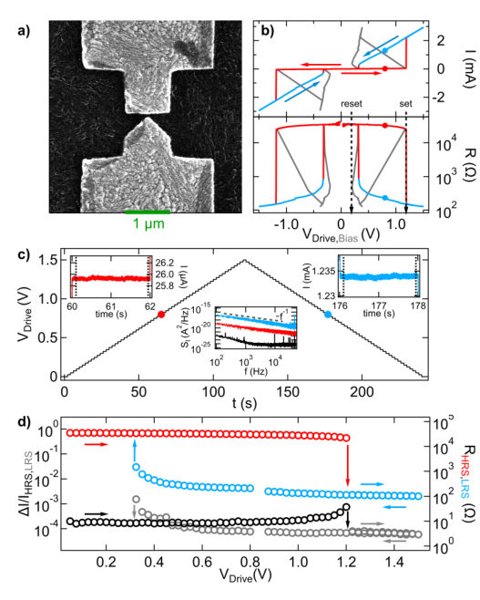
<figcaption class="paper-figure-caption"><b>Fig 1.</b> Figure 1 Current-voltage and noise characterization of the VO2 memristors. a) SEM image of the fabricated platinum contacts (gray) forming an ≈40 nm wide gap on the top of the thin VO2 film (black). The green scalebar demonstrates 1 µm dis- tance. b) Current and resistance curves measured with a 380 Ωserial resistance. The arrows indicate the ramping direction of VDrive for the insulating (red) and metallic (blue) state. The gray line shows the VBias dependence. The red and blue dot mark the current and resistance for the HRS and LRS at VDrive = 0.8 V respectively. c) Voltage signal applied during the noise spectroscopy. Each plateau has a length of t = 2 s and a voltage step of ∆V = 25 mV....</figcaption>
</figure>
<figure class="paper-figure-card">
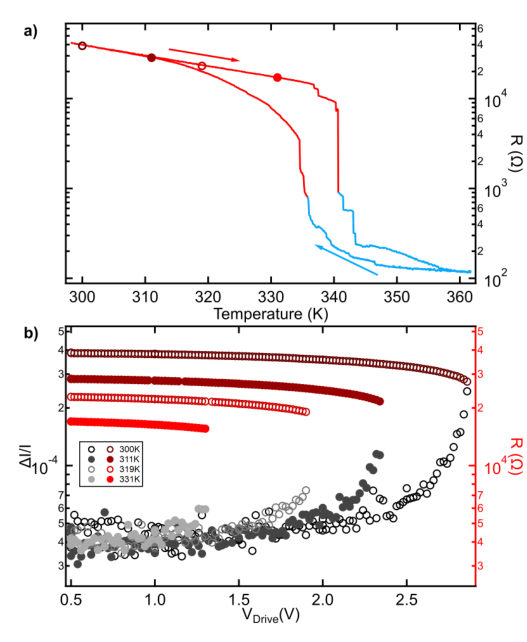
<figcaption class="paper-figure-caption"><b>Fig 2.</b> Figure 2 The influence of the device temperature on the resistance and current noise. a) The temperature dependent resistance of VO2 probed with a low readout voltage VDrive = 10 mV. The arrows indicate the ramping direction of the temperature. b) Resistance (red) and relative current noise ∆I</figcaption>
</figure>
<figure class="paper-figure-card">
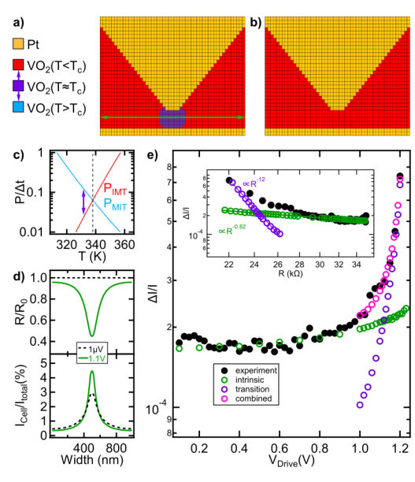
<figcaption class="paper-figure-caption"><b>Fig 3.</b> Figure 3 Simulating the noise signal of the HRS in the 2-dimensional resistor network. a-b) Schematic structure of the sample geometry used in the two-dimensional resistor network simulations (not to scale). Yellow squares indicate the metallic contacts, red ones are insulating VO2 and purple squares can be either insulating or metallic. While a) indicates the local cell temperature at high voltages close to VSet, b) shows the case for low voltages. c) Temperature dependence of the switching probability per timestep of the IMT (red) and MIT (blue) used to simulate the transition. d) Local resistance and relative current of the cells indicated by the green line in a) during the simulations....</figcaption>
</figure>
<figure class="paper-figure-card">
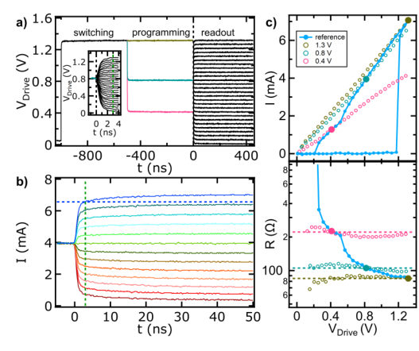
<figcaption class="paper-figure-caption"><b>Fig 4.</b> Figure 4 Investigation of the voltage dependence of resistance in LRS. a) Voltage pulse sequence applied on our VO2 nanostructure to investigate the voltage depen- dence of the resistance in the LRS. The sequence contains an initial switching pulse, driving the system from HRS into LRS, a set pulse, to settle the sample into a resis- tive state, and readout pulses to measure the resistive response of the set state under varying voltage inputs. The inset magnifies the transition from the 800 mV set pulse to the readout pulses. The dotted black line marks the starting time of the voltage change and the green dotted line indicates the time t = 3 ns of the readout for figure c). b) Time...</figcaption>
</figure>
<figure class="paper-figure-card">
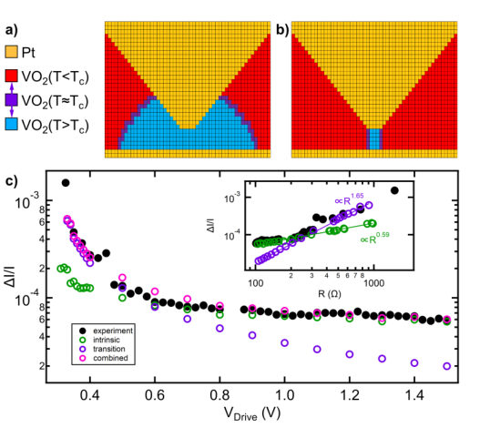
<figcaption class="paper-figure-caption"><b>Fig 5.</b> Figure 5 Simulating the noise signal of the LRS in the 2-dimensional resistor net- work. a-b) schematic structure of the sample geometry used in the two-dimensional resistor network simulations (not to scale) for high voltages (a) and low voltages (b). Yellow squares indicate the metallic contacts, red is insulating VO2, blue is metallic VO2 and purple squares can be either insulating or metallic. c) Voltage dependence of the relative current noise from experiments (black) and simulations of the transi- tion noise (purple) as well as the intrinsic noise (green), which combined (magenta) follows the trend of the experimental data of the LRS. The inset shows the resistance scaling of ∆I</figcaption>
</figure>

**Summary.** This paper analyzes the current noise in nanoscale VO2 devices undergoing a metal-to-insulator transition. By combining noise spectroscopy with 2D network simulations, the authors demonstrate that the large noise enhancement near switching thresholds originates from amplified phase fluctuations at the percolation threshold. This work provides fundamental insights into non-equilibrium dynamics governing phase transitions in nanoscale electronic materials.

**Why it may be interesting.** The work provides a detailed, mesoscopic model of a non-equilibrium phase transition, which shares conceptual links with critical phenomena studied in statistical mechanics, particularly concerning fluctuation-induced noise near critical points.

Detailed structure

**Main problem.** The study investigates the origin of enhanced current noise during the electrically driven metal-to-insulator transition (MIT) in nanoscale VO2 devices.

**Main result.** The enhanced noise is attributed to amplified phase fluctuations near the percolation threshold, which sets a lower bound on the achievable variance of the switching threshold voltage.

**Method.** The research combines noise spectroscopy measurements with detailed two-dimensional resistor network simulations.

**Model / system.** The physical system is a nanoscale VO2 Mott memristor undergoing resistive switching. The model simulates the thermal and electrical dynamics using a 2D resistor network coupled with temperature-dependent resistance and phase transition probabilities.

**Key observables.** Relative current noise (dI/I), resistive switching (RS) cycle, threshold voltages (V_Set, V_Reset), and the scaling exponent of noise with resistance.

**Important parameters / regimes.** Transition temperature (Tc = 338 K), characteristic fluctuation time constants (tau), and energy barrier variations (epsilon_IMT, epsilon_MIT).

**Assumptions / limitations.** The analysis assumes that the noise can be decomposed into intrinsic fluctuations and phase transition noise, and that the system's behavior can be modeled by coupling thermal and electrical transport equations.

**Figures summary.** Figures illustrate I-V curves, noise spectra (showing 1/f behavior), and simulations comparing experimental noise measurements against models incorporating intrinsic and transition noise contributions.

**Paper structure.** The paper progresses from initial noise measurements across the switching cycle to detailed simulations that separate intrinsic noise from phase transition noise, culminating in a quantitative comparison between the predicted noise scaling and the observed threshold voltage variability.

Abstract

We investigate the electrically driven metal-to-insulator transition (MIT) in nanoscale vanadium dioxide (VO$_2$) Mott memristor through noise spectroscopy and two-dimensional resistor network simulations. Our experiments focus on both the insulating phase as the applied voltage approaches the threshold voltage (set transition) and the metallic phase as the voltage is reduced toward the reset voltage (reset transition). In both regimes, we observe an order of magnitude increase in relative current noise near the transition points. To analyze the origin of this noise enhancement, we use simulations that capture the stochastic dynamics of the phase transition. The simulations indicate that the increased noise stems from amplified phase fluctuations near the percolation threshold, where competing metallic and insulating domains lead to dynamic reconfiguration of the conduction paths. In addition, we show that the precursor current fluctuations observed near the switching threshold are consistent with the threshold voltage variability measured in repeated switching cycles, indicating that the noise sets a lower bound on the achievable variance. These findings offer key insights into the non-equilibrium processes governing phase transitions in nanoscale VO$_2$ devices under electrical stimuli.

[↑ back to top](#top)

### [Nonequilibrium transport in epitaxial CsPbBr3 single crystals](http://arxiv.org/abs/2606.02460v1)

**Authors:** Seryio Saris, Roberto Rosati, Vladimir Bruevich, Thomas J. Sheehan, Maksim Roman, Vitaly Podzorov, Ermin Malic, William A. Tisdale  
**Type:** both · **Category:** statistical mechanics · **PDF:** <https://arxiv.org/pdf/2606.02460v1>  
**Analysis basis:** full PDF text, analyzed in chunks
**Topic relevance:** 🔥 `non-equilibrium dynamics` **4/5** · `correlated / nonlocal dissipation` **1/5** · `driven-dissipative phase transition` **1/5** · `methods for driven-dissipative` **1/5** · `non-equilibrium universality` **1/5**

↔ Scroll figures horizontally

<figure class="paper-figure-card">
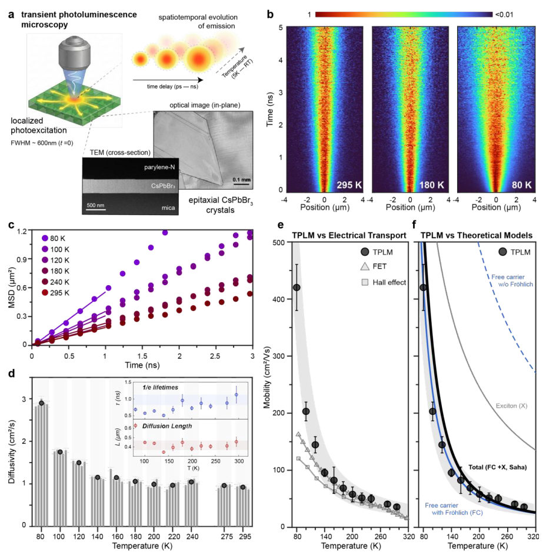
<figcaption class="paper-figure-caption"><b>Fig 1.</b> Figure 1 | Benchmarking temperature-dependent carrier transport in epitaxial CsPbBr₃ perovskite. (a) Transient photoluminescence microscopy (TPLM) scheme, an optical micrograph of the crystals showing millimeter-scale regions and smaller crystalline domains, and a cross-sectional TEM image of the sample (b) Temperature-dependent TPLM maps showing the evolution of the PL profile following localized excitation. (c) Corresponding mean-squared-displacement (MSD) curves extracted from (b), illustrating linear, diffusive growth. (d) Diffusivities extracted from the MSD slopes as a function of temperature; insets show the associated PL lifetimes and diffusion lengths ( 𝐿= √2𝐷𝜏 ). Each vertical bar...</figcaption>
</figure>
<figure class="paper-figure-card">
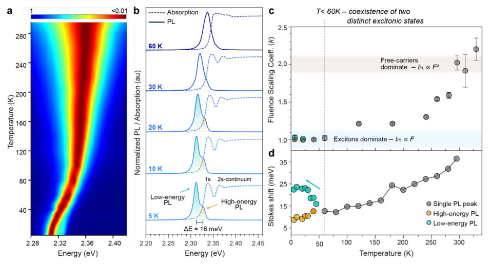
<figcaption class="paper-figure-caption"><b>Fig 2.</b> Figure 2 | Emerging excitonic regime at low temperatures. (a) Temperature-dependent PL map under pulsed non-resonant excitation at 5 MHz, normalized to highlight the evolution of the spectral shape (b) Normalized PL (solid) and absorption (dashed) spectra at selected temperatures. The single PL peak splits into two distinct features separated by ΔE ≈ 16 meV, assigned to high-energy (HE) and low-energy (LE) excitonic states. While the time-integrated spectra here show this splitting only below ~30 K, time-resolved spectral dynamics reveal that the two features persist up to 60 K (see Extended Data Fig. 6). (c) Scaling coefficient 𝑘 extracted from fluence dependence (𝐼∝𝐹𝑘), showing a...</figcaption>
</figure>
<figure class="paper-figure-card">
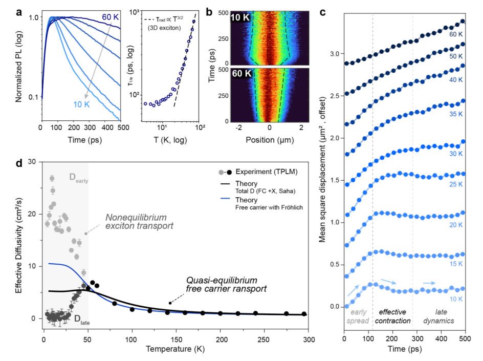
<figcaption class="paper-figure-caption"><b>Fig 3.</b> Figure 3 | Nonequilibrium transport at low temperatures. (a) Spatially integrated total PL dynamics and associated 1/e lifetimes. The dashed line shows the expected 𝜏rad ∝𝑇3/2scaling for thermalized 3D excitons for a comparison. (b) Spatiotemporal PL maps at 10 K and 60 K, showing distinct transport behavior, dashed lines here serve as guides to the eye. (c) MSD curves with strong non-linear dynamics, showing rapid early-time expansion, apparent contraction, and a slower, long-lived component at low temperatures. (d) Early-time (&lt;100ps) and late-time (&gt;250ps) effective diffusivities, 𝐷early and 𝐷late, compared with the free carrier and Saha-weighted total quasi-equilibrium models. At this...</figcaption>
</figure>
<figure class="paper-figure-card">
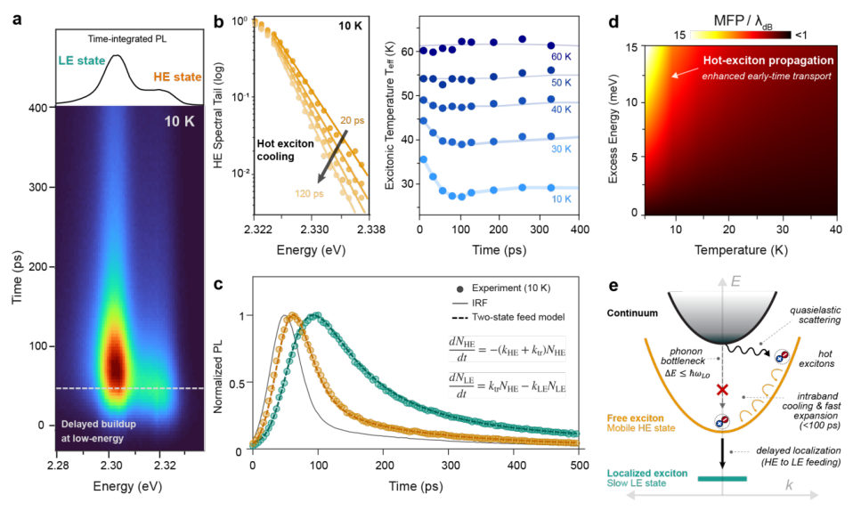
<figcaption class="paper-figure-caption"><b>Fig 4.</b> Figure 4 | Nonequilibrium two-population dynamics and hot-exciton transport (a) Spectrally resolved PL dynamics at 10 K showing that the high-energy (HE) channel decays rapidly while the low-energy (LE) channel exhibits a delayed buildup. Top panel shows the time-integrated PL spectrum. (b) Left: High-energy tail of the PL spectrum at selected delay times, showing a transient Boltzmann-like distribution. The slope steepens over time, indicating cooling of a hot exciton population on sub-100 ps timescales. Right: Extracted effective exciton temperature, Teff , as a function of time for different lattice temperatures (c) Normalized PL dynamics of the HE and LE states (symbols), overlaid with...</figcaption>
</figure>

**Summary.** This work demonstrates that carrier transport in $	ext{CsPbBr}_3$ perovskites deviates significantly from equilibrium theory at low temperatures. By resolving two coupled populations—a fast hot-exciton gas and a slower localized state—the authors show that energy flow involves coupled kinetics, proving that transport and thermalization are intrinsically linked processes.

**Why it may be interesting.** The explicit breakdown of the separation between transport and thermalization provides a rich platform for studying non-equilibrium energy relaxation, which is highly relevant to open quantum systems and energy harvesting in solid-state quantum emitters.

Detailed structure

**Main problem.** The paper investigates the breakdown of the quasi-equilibrium picture for carrier transport in $	ext{CsPbBr}_3$ perovskites at low temperatures due to significant excitonic effects.

**Main result.** Transport is governed by coupled, non-equilibrium kinetics between a fast, hot-exciton gas and a slower, quasi-localized state, showing that transport and thermalization are not separable processes.

**Method.** The study combines transient photoluminescence microscopy (TPLM) measurements with detailed kinetic modeling (two-state feeding model) to track carrier populations and spatial dynamics.

**Model / system.** The system is epitaxial $	ext{CsPbBr}_3$ single crystals. The model treats carrier dynamics using a two-state kinetic framework (Hot Exciton $\leftrightarrow$ Low-Energy Exciton) coupled with diffusion equations to describe energy flow.

**Key observables.** Diffusivity ($D$), Mean-Squared Displacement ($	ext{MSD}$), effective excitonic temperature ($	ext{T}_{	ext{eff}}$), and population transfer rates ($\lambda_1, \lambda_2$).

**Important parameters / regimes.** Low temperature regime ($< 60$ K), characteristic timescales ($\sim 10-100 	ext{ ps}$), and the energy difference between exciton states ($\Delta E \approx 16 	ext{ meV}$).

**Assumptions / limitations.** The analysis assumes that the transport dynamics can be decomposed into distinct, coupled kinetic populations (hot vs. localized) rather than a single thermalized ensemble.

**Figures summary.** Figures illustrate the convergence of transport measurements at high T, the divergence below 140 K, and the characteristic two-population signature in MSD curves and PL transients at low T.

**Paper structure.** The paper progresses by first validating the equilibrium model at high T, then demonstrating its failure at low T by resolving two coupled populations (hot/low-energy excitons), and finally quantifying the non-equilibrium nature of the energy flow.

Abstract

Transport of optically excited carriers in semiconductors is typically described within a quasi-equilibrium picture, where energy is carried by a single thermalized quasiparticle population characterized by well-defined transport coefficients. Here, we demonstrate that in epitaxial CsPbBr3 perovskite single crystals, this picture holds near room temperature - but breaks down dramatically at low temperature. Using transient microscopy, we show that optically measured carrier mobilities match device-scale Hall-effect and field-effect transistor measurements across a broad temperature range, resolving reported discrepancies and validating the equilibrium framework in the free-carrier regime. Below ~60 K, however, when excitonic effects become significant, equilibrium models begin to fail. We observe two coupled populations: a transient (<100 ps) hot-exciton gas with a diffusivity ~25-30 cm2/s - greatly exceeding the diffusivity expected for thermalized excitons - and a quasi-localized state that is fed by the cooling of the hot-exciton gas. These results reveal that in CsPbBr3, transport and thermalization are not separable processes: carriers move while still redistributing among internal degrees of freedom, breaking the timescale separation that underpins equilibrium transport theory in conventional semiconductors. By resolving transport at the population level, we can directly access the competing kinetics of exciton formation, interconversion, and cooling, offering a new space for controlling energy flow in perovskite materials and their photonic applications.

[↑ back to top](#top)

### [Optically programmable and erasable cryogenic flash memory on an undoped Si/SiGe heterostructure](http://arxiv.org/abs/2606.00711v1)

**Authors:** S Rastogi, S Samanta, V Jangir, L Patra, K Modi, A Jain, G Scappucci, U Mukhopadhyay, S Mahapatra  
**Type:** experiment · **Category:** quantum information and computing · **PDF:** <https://arxiv.org/pdf/2606.00711v1>  
**Analysis basis:** full PDF text, analyzed in chunks
**Topic relevance:** 🔥 `QC/QI experiment` **4/5**

↔ Scroll figures horizontally

<figure class="paper-figure-card">
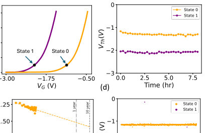
<figcaption class="paper-figure-caption"><b>Fig 1.</b> FIG. 2. (a) Transfer characteristics showing the two memory states. (b) Retention of the extracted threshold voltage over time. (c) Ex- trapolation of the measured retention of the states. (d) Endurance of the two states over repeated switching cycles.</figcaption>
</figure>
<figure class="paper-figure-card">
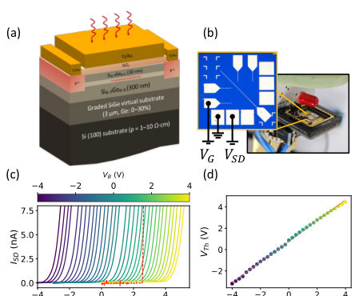
<figcaption class="paper-figure-caption"><b>Fig 2.</b> FIG. 1. (a) Schematic of an undoped Si/SiGe heterostructure under in-situ LED illumination. (b) Image of a typical LCC24 chip carrier and in-situ LED diode, and an optical image of the HFET used in the experiment (c) Transfer characteristics measured after successive gate-biased illuminations (the very first turn-on curve before appli- cation of any optical illumination has been shown with red dotted curve) (d) Extracted threshold voltage as a function of programming bias VB.</figcaption>
</figure>
<figure class="paper-figure-card">
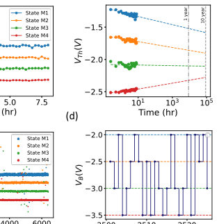
<figcaption class="paper-figure-caption"><b>Fig 3.</b> FIG. 3. (a) Retention of the four programmed states over time (b) Ex- trapolated retention behavior for multi-bit operation (c) Endurance of the programmed states over repeated cycles (d) Programming se- quence of different states used in the endurance measurement, shown for the cycles within the rectangle in (c).</figcaption>
</figure>
<figure class="paper-figure-card">
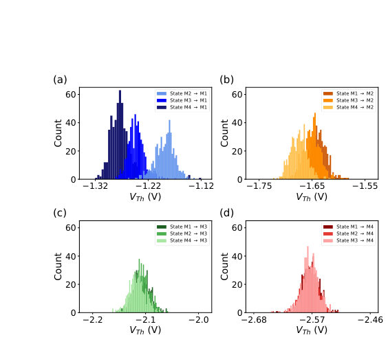
<figcaption class="paper-figure-caption"><b>Fig 4.</b> FIG. 4. Histograms of threshold voltage (Vth) obtained from en- durance measurements for (a) State M1, (b) State M2 (c) State M3, and (d) State M4.</figcaption>
</figure>

**Summary.** This paper reports on the development of an optically programmable and erasable cryogenic flash memory using an undoped Si/SiGe HFET. By leveraging interface traps, the device achieves stable, non-volatile storage of multiple bits at 1.5 K. The results confirm its viability for integration into large-scale, solid-state quantum computing architectures.

**Why it may be interesting.** This work directly addresses hardware requirements for quantum computation by proposing a solid-state, non-volatile memory element compatible with silicon-based quantum platforms, which is highly relevant to quantum information engineering.

Detailed structure

**Main problem.** The paper addresses the critical need for scalable, non-volatile memory elements within cryogenic quantum computing architectures to overcome information shuttling bottlenecks.

**Main result.** They successfully demonstrated both binary and multi-bit memory operation in an HFET, showing stable state retention for years and endurance exceeding $10^3$ cycles at 1.5 K.

**Method.** The memory functionality is realized by exploiting the interplay between optical excitation (using an LED) and gate bias in an undoped Si/SiGe HFET to deterministically tune and 'lock' the threshold voltage.

**Model / system.** The physical platform is an undoped Si/SiGe heterojunction field-effect transistor (HFET) fabricated on a Si (100) substrate. The memory state is stored by trapping charges at the semiconductor-oxide interface, which shifts the threshold voltage ($V_{Th}$).

**Key observables.** Threshold voltage ($V_{Th}$), state retention time, cycling endurance, and the distribution of $V_{Th}$ across multiple programmed states.

**Important parameters / regimes.** Operation temperature of 1.5 K; high interface trap density ($D_{it} > 1.6 	imes 10^{12} 	ext{ eV}^{-1}	ext{cm}^{-2}$); endurance $> 10^3$ cycles; retention $> 10^4$ s.

**Assumptions / limitations.** The initial $V_{Th}$ without illumination is unstable, requiring a reset step; state stability relies on charge trapping/detrapping processes at the interface.

**Figures summary.** Figures illustrate the schematic setup, transfer characteristics showing $V_{Th}$ tuning via LED illumination, and quantitative data on state retention over time and endurance over repeated switching cycles for both binary and multi-bit operation.

**Paper structure.** The paper details the physical mechanism, demonstrates the deterministic tuning of $V_{Th}$ using optical excitation, and then rigorously characterizes the device's reliability by measuring state retention and cycling endurance for both two-state and multi-bit operation.

Abstract

Scalable cryogenic memory is a critical yet unresolved requirement for large-scale quantum computing architectures, particularly for computing-in-memory schemes. We exploit the interplay between optical excitation and gate bias in an undoped Si/SiGe heterojunction field-effect transistor (HFET) to realize non-volatile memory functionality. The device exploits a high interface trap density ($D_{it} > 1.6 \times 10^{12}$~eV$^{-1}$cm$^{-2}$), which, in conjunction with the oxide thickness and dielectric constant, enables effective "locking" of the threshold voltage to the applied gate bias over a wide voltage range. Two of these states can be selected for binary operation, while the availability of multiple stable states within the same device enables multibit data storage. Robust cycling endurance ($>~10^3$ cycles) and long-term state retention ($>~10^4$~s) of the memory states at 1.5 K confirm the suitability of this approach for integration into Si/SiGe-based quantum computing architectures.

[↑ back to top](#top)

### [The Uhlmann phase of Higher-Order Topological Insulators at Finite Temperature](http://arxiv.org/abs/2606.00479v1)

**Authors:** Shiyu Chen, Yan He  
**Type:** theory · **Category:** statistical mechanics · **PDF:** <https://arxiv.org/pdf/2606.00479v1>  
**Analysis basis:** full PDF text, analyzed in chunks
**Topic relevance:** `driven-dissipative phase transition` **3/5** · `Keldysh / 2PI / non-Gaussian methods` **2/5** · `entanglement & information structure` **2/5** · `methods for driven-dissipative` **2/5** · `non-equilibrium dynamics` **2/5** · `non-equilibrium universality` **2/5** · `analog quantum simulation` **1/5** · `correlated / nonlocal dissipation` **1/5**

↔ Scroll figures horizontally

<figure class="paper-figure-card">
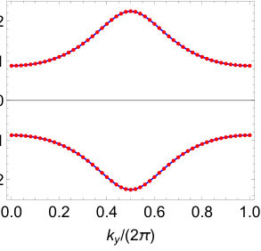
<figcaption class="paper-figure-caption"><b>Fig 1.</b> Figure 1. The Wannier centers ν of the BBH model as a function of ky with m = 0.5.</figcaption>
</figure>
<figure class="paper-figure-card">
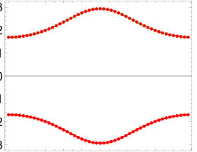
<figcaption class="paper-figure-caption"><b>Fig 2.</b> Figure 2. The Uhlmann-Wannier center νU of the BBH model as a function of ky with m = 0.5.</figcaption>
</figure>
<figure class="paper-figure-card">
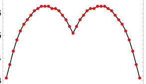
<figcaption class="paper-figure-caption"><b>Fig 3.</b> Figure 4. The topological transition temperature Tc of the BBH model as a function of m.</figcaption>
</figure>
<figure class="paper-figure-card">
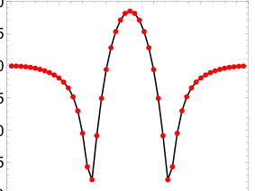
<figcaption class="paper-figure-caption"><b>Fig 4.</b> Figure 5. The Uhlmann phase ΦU of Eq.(40) as a function of ky with m = 0.5 and T = 0.5.</figcaption>
</figure>
<figure class="paper-figure-card">
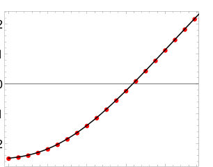
<figcaption class="paper-figure-caption"><b>Fig 5.</b> Figure 6. The Uhlmann overlap Tr(ρ0W U) of the BBH model with m = 0 as a function of temperature T . The black line is the analytical result of Eq.(54) and the red dot are numerical results.</figcaption>
</figure>

**Summary.** This work develops the Uhlmann phase as a robust topological invariant for Higher-Order Topological Insulators (HOTIs) at finite temperatures. By analyzing the BBH model, the authors show that the topological phase is characterized by the quantization of this phase, and the transition to a trivial phase is precisely located by observing where these quantized jumps vanish at a critical temperature $T_c$.

**Why it may be interesting.** The extension of topological invariants from ground-state properties (like Berry curvature) to finite-temperature mixed states using quantum information concepts (Uhlmann phase) provides a powerful, generalizable tool for studying thermal phase transitions in quantum materials.

Detailed structure

**Main problem.** The study focuses on characterizing the topological phase of Higher-Order Topological Insulators (HOTIs) when the system is subjected to finite temperatures.

**Main result.** The Uhlmann phase serves as a finite-temperature topological index, where the topological transition is marked by the disappearance of abrupt jumps in this phase at a critical temperature ($T_c$).

**Method.** The analysis generalizes the topological concept from zero temperature (using the Berry connection) to finite temperature by employing the Uhlmann connection and calculating the Uhlmann phase from the density matrix.

**Model / system.** The primary model is the Benalcazar-Bernevig-Hughes (BBH) model, a 2D tight-binding Hamiltonian. The analysis involves calculating the density matrix $
ho$ using Boltzmann weights at finite temperature $T$.

**Key observables.** The Uhlmann phase ($\Phi_U$), which is quantized to 0 or $\pi$ in the topological phase, and the critical temperature ($T_c$).

**Important parameters / regimes.** Temperature ($T$), the parameter $m$ in the Hamiltonian, and the lattice momenta ($k_x, k_y$).

**Assumptions / limitations.** The analysis assumes that the Uhlmann phase correctly captures the topological invariant at finite temperatures, and approximations are made regarding the dominant components of the density matrix at low temperatures.

**Figures summary.** Figures illustrate the Wannier centers of the BBH model and plot the Uhlmann phase ($\Phi_U$) or the Uhlmann overlap ($	ext{Tr}(
ho_0 \mathcal{W}_U)$) as a function of temperature or momentum, demonstrating quantization or continuous variation.

**Paper structure.** The paper first establishes the BBH model and its zero-temperature topology using nested Wilson loops. It then introduces the Uhlmann connection and phase to generalize this concept to finite temperature, deriving the critical temperature $T_c$ from the behavior of the Uhlmann phase.

Abstract

We have studied the finite-temperature topology of higher-order topological insulators (HOTIs) based on the Uhlmann phase, which is a phase angle of the Uhlmann overlap. As an example of HOTIs, the Hamiltonian of the Benalcazar-Bernevig-Hughes (BBH) model is constructed from Gamma matrices satisfying the Clifford algebra. This specific algebraic structure underpins the model's higher-order topological properties, including the quantization of the Uhlmann phase to $0$ or $π$. This quantization enables us to treat the abrupt jumps of the Uhlmann phase as an indication of the nontrivial topological phase of the BBH model at finite temperature. From the disappearance of these jumps, we determine the critical temperature at which the topological transition occurs. For a special choice of parameters, the Uhlmann overlap and the critical temperature can be computed analytically.

[↑ back to top](#top)

### [Impact of Disorder Dynamics and Multi-Domain Kinetics on the Sliding Ferroelectricity of CVD-Grown 3R-WSe2 Bilayers](http://arxiv.org/abs/2606.00665v1)

**Authors:** Sourav Paul, Prasenjit Ghosh, Krishna Prasad Maity, Vineet Pandey, Abhijith M. B., Premananda Chatterjee, Kenji Watanabe, Takashi Taniguchi, Nicholas R. Glavin, Ajit K. Roy, Atindra Nath Pal, Vidya Kochat  
**Type:** experiment · **Category:** disordered systems and neural networks · **PDF:** <https://arxiv.org/pdf/2606.00665v1>  
**Analysis basis:** full PDF text, analyzed in chunks
**Topic relevance:** `driven-dissipative phase transition` **3/5** · `non-equilibrium dynamics` **3/5** · `non-equilibrium universality` **3/5** · `analog quantum simulation` **1/5** · `correlated / nonlocal dissipation` **1/5** · `methods for driven-dissipative` **1/5** · `spintronics-quantum-optics interface` **1/5**

↔ Scroll figures horizontally

<figure class="paper-figure-card">
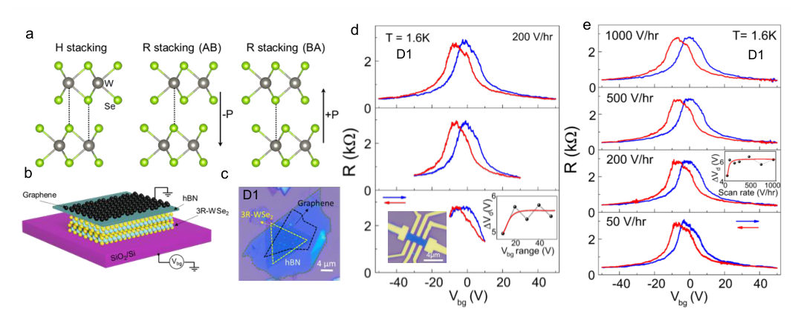
<figcaption class="paper-figure-caption"><b>Fig 1.</b> Fig. 1 (a) Atomic arrangement of bilayer WSe2 with different stacking configurations. While Hexagonal (H) stacking preserves inversion symmetry, a Rhombohedral (R) stacked WSe2 bilayer with broken inversion symmetry exhibits out-of-plane polarization in opposite directions for the two different stacking sequences (−P for AB and +P for BA). (b) Schematic representation of Graphene/hBN/3R-WSe2 heterostructure on SiO2/Si substrate for graphene-FE-FET device. (c) Optical image of graphene/hBN/3R-WSe2 heterostructure for device D1. (d) Resistance (R) of graphene (device D1) as a function of bottom gate voltage (Vbg) at temperature T = 1.6 K for different sweep ranges of Vbg with scan rate 200...</figcaption>
</figure>
<figure class="paper-figure-card">
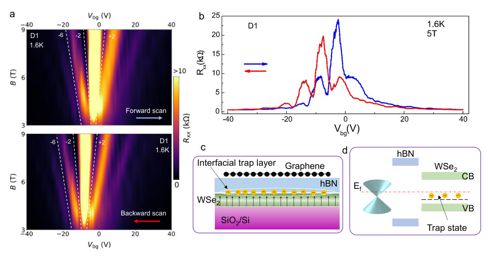
<figcaption class="paper-figure-caption"><b>Fig 2.</b> Fig. 2 (a) The Landau fan diagram for device D1 at T= 1.6 K illustrates the longitudinal resistance, Rxx, plotted against the magnetic field on the vertical axis and the gate bias on the horizontal axis for both the forward (top) and backward (bottom) sweeps. Different filling factor values are marked in white dashed lines. (b) Rxx as a function of Vbg voltage sweep for both forward and backward scans at B = 5 T for device D1. (c) The schematic illustrates the formation of the interfacial charge layer at the hBN-WSe2 interface. (d) A schematic of band diagram for graphene/hBN/3R-WSe2 heterostructure shows the formation of localized defect states near the valence band (VB) maxima of WSe2.</figcaption>
</figure>
<figure class="paper-figure-card">
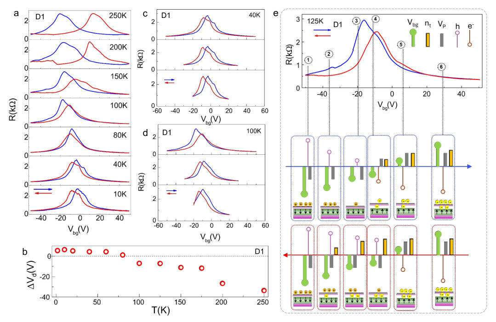
<figcaption class="paper-figure-caption"><b>Fig 3.</b> Fig. 3 (a) Hysteresis and anti-hysteresis in transfer characteristics of device D1 as a function of Vbg with scan rate 200 V/hr for different temperatures. (b) △Vd as a function of temperature. (c-d) Hysteresis, and anti-hysteresis observed in transfer characteristics for different sweep ranges of Vbg with fixed scan rate of 200 V/hr at temperature (c) T = 40 K and (d) T = 100 K. (e) Illustration of trap-sensitive electrostatic model for R −Vbg characteristics of D1 at 125 K.</figcaption>
</figure>
<figure class="paper-figure-card">
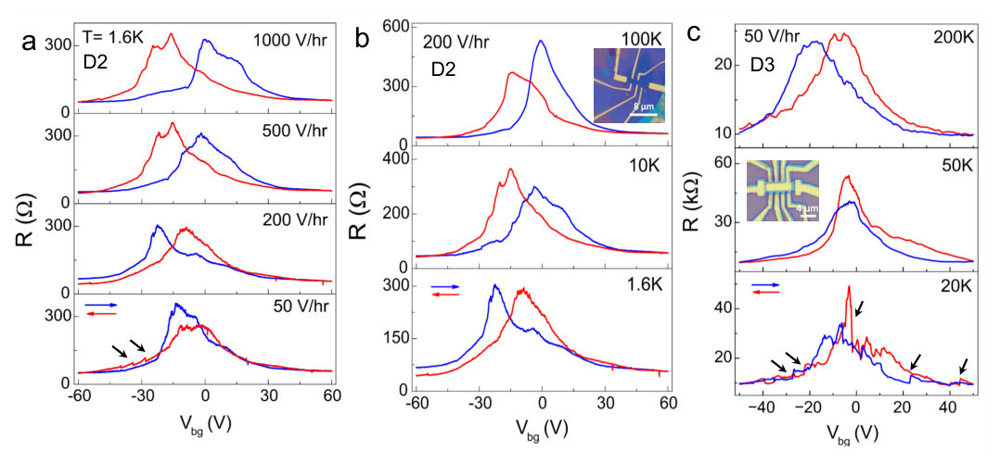
<figcaption class="paper-figure-caption"><b>Fig 4.</b> Fig. 4 (a) R−Vbg characteristics as a function of Vbg at 1.6 K for different gate voltage scan rates for device D2. (b,c) Transfer characteristics for device (b) D2 and (c) D3 at different temperatures. Inset: Optical image of devices D2 and D3, respectively. Black arrow marks in fig. (a) and (c) indicate the sudden resistances jumps in graphene transport due to the relaxation of domains in 3R-WSe2.</figcaption>
</figure>

**Summary.** This work uses a graphene-FET setup to study ferroelectricity in 2D WSe2, revealing that while polarization switching is present, the measured electrical response is heavily influenced by structural disorder and charge trapping. The study distinguishes between intrinsic FE switching and disorder-dominated effects, which manifest as a temperature-dependent transition between hysteresis and anti-hysteresis.

**Why it may be interesting.** The interplay between intrinsic polarization switching (a non-equilibrium, ordered state) and disorder-induced charge trapping/relaxation dynamics provides a rich platform for studying complex, non-equilibrium many-body physics relevant to open quantum systems.

Detailed structure

**Main problem.** The study investigates the ferroelectric (FE) switching characteristics of CVD-grown 3R-stacked WSe2 bilayers, focusing on how intrinsic structural disorder and multi-domain kinetics affect polarization switching.

**Main result.** The research demonstrates that while FE switching is observable via hysteresis in FET measurements, the response is significantly complicated by disorder, leading to transitions between conventional hysteresis and anti-hysteresis depending on temperature and sweep rate.

**Method.** The authors used a graphene-based ferroelectric field-effect transistor (graphene-FE-FET) architecture to probe the polarization switching of WSe2 bilayers at cryogenic temperatures.

**Model / system.** The physical system is the 3R-stacked WSe2 bilayer grown by CVD, which exhibits sliding ferroelectricity. The device structure is a Graphene/hBN/3R-WSe2 heterostructure, where graphene acts as a highly sensitive charge probe.

**Key observables.** Hysteresis in the R-V_bg curve, shift in the Charge Neutrality Point (CNP) resistance peak, and the transition between hysteresis and anti-hysteresis behavior.

**Important parameters / regimes.** Low temperatures (e.g., 1.6 K), gate voltage sweep rate, and temperature dependence (showing transitions around 80 K and 200 K).

**Assumptions / limitations.** The analysis assumes that the observed hysteresis is due to FE switching, but later notes that trap-assisted effects (Interfacial Charge Layer formation) can obscure or dominate this intrinsic switching.

**Figures summary.** Figures illustrate the atomic stacking, device fabrication, R-V_bg hysteresis loops at low T, and temperature-dependent sweeps showing the transition from hysteresis to anti-hysteresis due to trap dynamics.

**Paper structure.** The paper progresses from establishing the basic FE switching signature (hysteresis) at low T, to analyzing the temperature dependence revealing the competition between FE switching and charge trapping, and finally detailing the role of domain kinetics in causing apparent anti-hysteresis.

Abstract

Sliding ferroelectricity in van der Waals (vdW) layered systems has emerged as a promising route toward non-volatile nanoscale devices, where interlayer displacement in non-centrosymmetric bilayers generates an out-of-plane polarization. In particular, 3R-stacked bilayer transition metal dichalcogenides (TMDs) grown via chemical vapor deposition (CVD) have been shown to host such polarization due to broken inversion symmetry. However, a detailed investigation of the 2D ferroelectric (FE) properties of CVD-grown 2D films, particularly the role of intrinsic disorder, such as structural defects and domain structure, remains poorly understood. Here, we investigate the FE switching characteristics of CVD-grown 3R-stacked WSe2 using a graphene-based ferroelectric field-effect transistor (graphene-FE-FET) architecture, where graphene serves as a highly sensitive probe of induced charge modulation due to polarization switching of FEs. We show that the growth-induced structural disorder significantly impacts polarization switching, while multi-domain kinetics governs the evolution of the FE response. These findings provide important insights into the design and optimization of FE devices based on vdW materials.

[↑ back to top](#top)

### [Phase-dependent parametric amplification of propagating spin waves in YIG nanostructures enabled by local inhomogeneities](http://arxiv.org/abs/2606.02139v1)

**Authors:** Akira Lentfert, Ephraim Spindler, Björn Heinz, Mathias Weiler, Philipp Pirro  
**Type:** both · **Category:** other · **PDF:** <https://arxiv.org/pdf/2606.02139v1>  
**Analysis basis:** full PDF text, analyzed in chunks
**Topic relevance:** `driven-dissipative phase transition` **3/5** · `spintronics-quantum-optics interface` **3/5** · `non-equilibrium dynamics` **2/5** · `non-equilibrium universality` **2/5** · `analog quantum simulation` **1/5** · `exotic spin models in light-matter` **1/5** · `methods for driven-dissipative` **1/5**

↔ Scroll figures horizontally

<figure class="paper-figure-card">
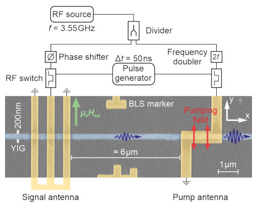
<figcaption class="paper-figure-caption"><b>Fig 1.</b> FIG. 1. SEM micrograph image and schematic setup of the inves- tigated structure (colored). All experiments were conducted for an external magnetic field of 95 mT, applied perpendicular to the YIG waveguide. Spin waves, excited by the signal antenna at x=0 propa- gate towards the pump antenna, where a delayed pump pulse allows for the parametric amplification of the signal spin waves.</figcaption>
</figure>
<figure class="paper-figure-card">
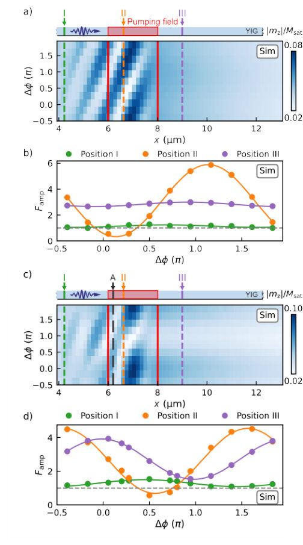
<figcaption class="paper-figure-caption"><b>Fig 2.</b> FIG. 2. Micromagnetic simulations of the phase dependence in a), b) an ideal waveguide and c), d) a waveguide with a inhomogeneity at position A at x = 6.2µm. In a), c) the normalized amplitude of the spin-wave pulse extracted from micromagnetic simulations is shown as a function of the phase difference ∆φ and the position along the waveguide. The pumping field is applied in the region between the red vertical lines. b), d) The amplification factor, extracted for the highlighted distinct positions are shown.</figcaption>
</figure>
<figure class="paper-figure-card">
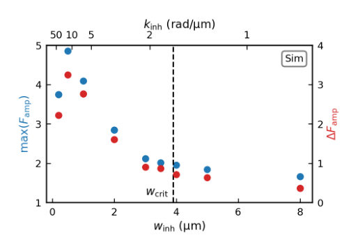
<figcaption class="paper-figure-caption"><b>Fig 3.</b> FIG. 3. Simulated dependence of max(Famp) and the amplitude of the modulation by the phase ∆Famp is shown as a function of the width winh and the maximum linear momentum kinh. In black, the transition between adiabatic and non-adiabatic amplification at wcrit is highlighted.</figcaption>
</figure>
<figure class="paper-figure-card">
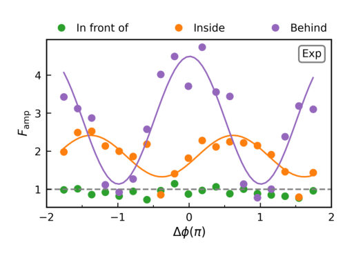
<figcaption class="paper-figure-caption"><b>Fig 4.</b> FIG. 4. Measured phase dependence of the amplification at different positions. The amplification factor Famp, obtained by evaluating the pulse amplitudes according to 5, for varying phase differences ∆φ at the center of the pump antenna and 1.5 µm behind and in front of it are shown.</figcaption>
</figure>
<figure class="paper-figure-card">
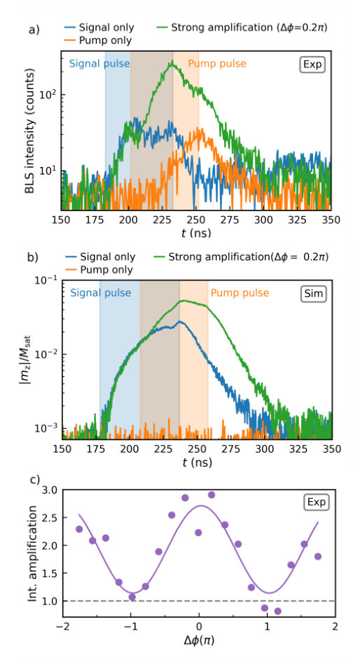
<figcaption class="paper-figure-caption"><b>Fig 5.</b> FIG. 5. a) Time-resolved BLS measurements for strong amplifica- tion at ∆φ = 0.2π are shown. The shaded areas highlight the time intervals of the applied RF pulses. b) Simulated spin-wave pulses in case of the inhomogeneity enabled amplification process at position 3 (see Fig. 2 c)) for the same phase difference ∆φ. c) The ampli- fication ratio of the time-integrated signals from a) is plotted as a function of the phase difference ∆φ.</figcaption>
</figure>

**Summary.** This work demonstrates that local inhomogeneities in YIG nanostructures can induce phase-dependent, non-adiabatic parametric amplification of spin waves. By providing extra linear momentum, these defects enable efficient amplification in larger structures, a key finding validated by both micromagnetic simulations and Brillouin light scattering experiments. This mechanism offers a promising pathway for developing large-scale, phase-sensitive magnonic circuits for future computing applications.

**Why it may be interesting.** The investigation into engineered material defects (inhomogeneities) to control wave dynamics and enhance nonlinear processes is relevant to understanding how boundary conditions or disorder can be harnessed in quantum/wave systems, analogous to engineered potentials in AMO physics.

Detailed structure

**Main problem.** The paper addresses the need for phase-conserving and phase-sensitive amplification mechanisms for spin waves in magnonics for advanced computing applications.

**Main result.** Local inhomogeneities in YIG nanostructures enable non-adiabatic parametric amplification of spin waves, allowing this effect to occur even in structures larger than the spin-wave wavelength.

**Method.** The study combines micromagnetic simulations with experimental validation using micro-focused Brillouin light scattering (BLS) spectroscopy.

**Model / system.** The physical system is Yttrium Iron Garnet (YIG) waveguides. The model investigates spin-wave dynamics under parametric pumping, contrasting ideal (adiabatic) amplification with enhanced, non-adiabatic amplification induced by engineered local inhomogeneities.

**Key observables.** Phase-dependent amplification factor, $F_{amp}(\Delta\varphi)$, and time-resolved intensity measurements of the spin-wave pulse.

**Important parameters / regimes.** The critical role of the additional linear momentum ($k_{inh}$) provided by inhomogeneities, which enables the non-adiabatic regime in larger structures.

**Assumptions / limitations.** The study assumes that the introduction of local inhomogeneities is the key mechanism to overcome size limitations inherent in achieving non-adiabatic parametric amplification.

**Figures summary.** Figures illustrate the setup, compare simulation results for ideal vs. inhomogeneous waveguides showing phase dependence, and present time-resolved BLS measurements confirming the phase-dependent amplification factor.

**Paper structure.** The paper establishes the need for phase-sensitive amplification, presents the theoretical framework involving parametric pumping and the role of inhomogeneities, details the simulation and experimental results demonstrating the non-adiabatic regime, and concludes with implications for large-scale magnonic circuits.

Abstract

As magnonics evolves towards non-conventional computing, the development of phase-conserving and phase-sensitive amplification mechanisms becomes increasingly important. A particularly promising approach is non-adiabatic parametric amplification. In this work, the influence of local inhomogeneities on the parallel parametric amplification of spin waves in nano-scale Yttrium Iron Garnet waveguides is investigated. Micromagnetic simulations reveal that in larger pump regions, where only adiabatic amplification is expected, scattering centers provide additional linear momentum that enables non-adiabatic amplification of propagating spin waves. Importantly, the coherence of the process remains unaffected by the scattering and the generation of co-propagating spin waves enhance the effective amplification. Our simulations are confirmed by micro-focused Brillouin light scattering spectroscopy experiments, reproducing both the phase-dependent behavior and the characteristic features of the time-resolved dynamics. These findings demonstrate the flexibility of the parametric amplification process and provide a key mechanism for the development of large-scale spin-wave computing circuits.

[↑ back to top](#top)

### [Noncollinear spin textures and 90° domain walls in twisted XY magnets](http://arxiv.org/abs/2606.00604v1)

**Authors:** Guanghui Cheng, Shiva T. Konakanchi, Andres E. Llacsahuanga Allcca, Sanjeev Khare, Nithin Abraham, Yuqing Cao, Hechang Lei, Kenji Watanabe, Takashi Taniguchi, Pramey Upadhyaya, Yong P. Chen  
**Type:** both · **Category:** other · **PDF:** <https://arxiv.org/pdf/2606.00604v1>  
**Analysis basis:** full PDF text, analyzed in chunks
**Topic relevance:** `analog quantum simulation` **3/5** · `exotic spin models in light-matter` **3/5** · `spintronics-quantum-optics interface` **3/5** · `driven-dissipative phase transition` **2/5** · `non-equilibrium dynamics` **1/5**

↔ Scroll figures horizontally

<figure class="paper-figure-card">

<figcaption class="paper-figure-caption"><b>Fig 1.</b> Figure 1. Schematics of twisted CrCl3 and magnetic tunnel junctions. (A) XY spin model with continuous in-plane rotational symmetry, and one-to-one correspondence between M (R) stackings and interlayer AFM (FM) couplings. (B) Moiré superlattice of twisted CrCl3 with a twist angle 𝜃.</figcaption>
</figure>
<figure class="paper-figure-card">
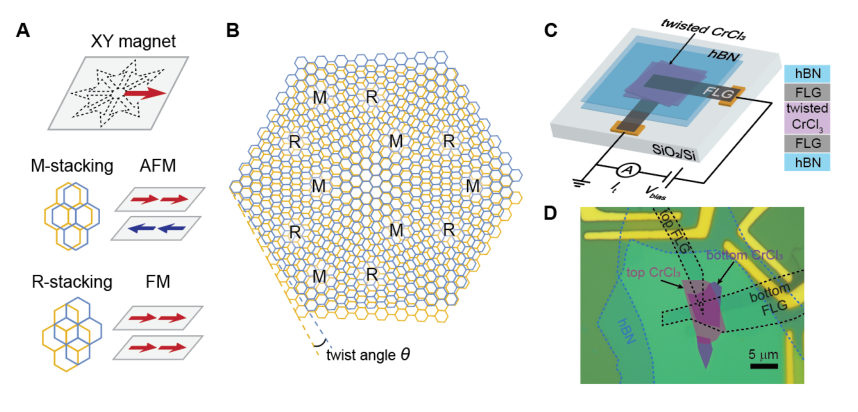
<figcaption class="paper-figure-caption"><b>Fig 2.</b> Figure 1D shows a representative junction of twisted CrCl3 with a twist angle of 𝜃 = 0.5°.</figcaption>
</figure>
<figure class="paper-figure-card">
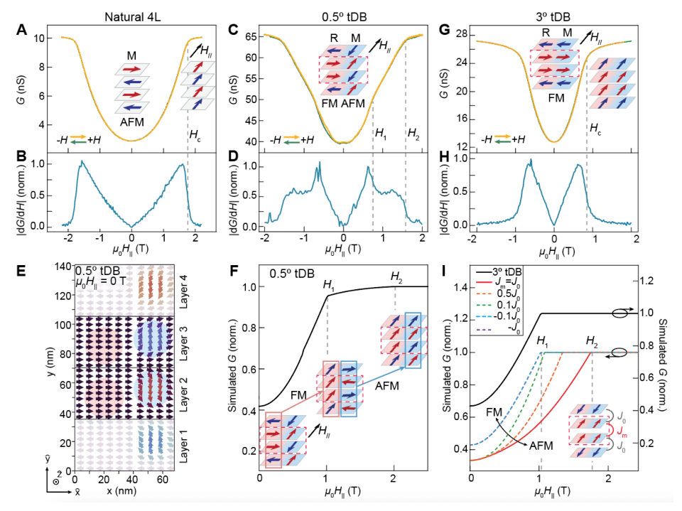
<figcaption class="paper-figure-caption"><b>Fig 3.</b> Figure 2. Tunneling conductance of natural four-layer (4L) and twisted double bilayer (tDB) CrCl3. Magnetoconductance G(H) and its derivative |dG/dH| of (A and B) natural 4L and (C and</figcaption>
</figure>
<figure class="paper-figure-card">
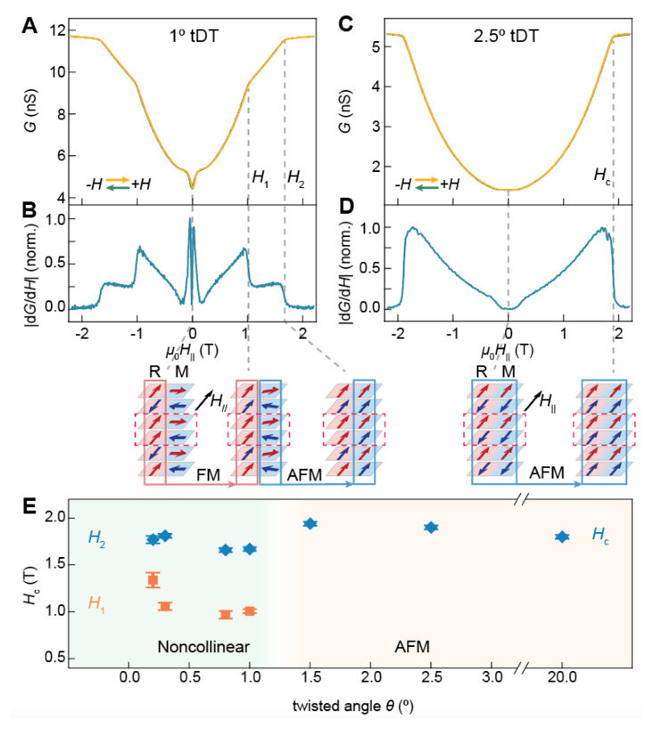
<figcaption class="paper-figure-caption"><b>Fig 4.</b> Figure 3. Tunneling conductance of twisted double trilayer (tDT) CrCl3. G(H) and |dG/dH| of (A and B) 1°-tDT and (C and D) 2.5°-tDT CrCl3 under 𝐻∥ at Vbias = 2.4 V. H1,2 and Hc are marked</figcaption>
</figure>
<figure class="paper-figure-card">

<figcaption class="paper-figure-caption"><b>Fig 5.</b> Figure 3, A and B, shows G(H) and |dG/dH| of 1°-tDT CrCl3 under 𝐻∥. The presence of two kinks</figcaption>
</figure>

**Summary.** This work reports on the discovery and characterization of moiré magnetism in twisted $	ext{CrCl}_3$ XY magnets. By measuring tunneling magnetoconductance, the authors observe field-induced transitions indicative of coexisting antiferromagnetic and ferromagnetic domains. Crucially, they demonstrate that the noncollinear ground state, featuring $90^\circ$ domain walls, can be electrically tuned using bias voltage, advancing the field of twist-spintronics.

**Why it may be interesting.** The ability to electrically tune magnetic phases via voltage control in a moiré magnet system provides a direct platform for studying spin-charge coupling and novel spintronic functionalities, which is relevant to open quantum systems dynamics.

Detailed structure

**Main problem.** The study aims to explore noncollinear magnetic phases in twisted magnets, overcoming the limitations imposed by previous studies restricted to uniaxial magnetic systems.

**Main result.** The authors experimentally demonstrate moiré magnetism in twisted $	ext{CrCl}_3$, identifying a robust ground state characterized by $90^\circ$ domain walls and showing voltage control over these noncollinear spin textures.

**Method.** The research combines experimental measurements of tunneling magnetoconductance ($G(H)$) in magnetic tunnel junctions with micromagnetic simulations to model the spin configurations.

**Model / system.** The physical system is twisted $	ext{CrCl}_3$, an easy-plane XY magnet, studied in natural few-layer, twisted double bilayer (tDB), and twisted double trilayer (tDT) configurations. The magnetic behavior is governed by interlayer coupling modulated by the twist angle.

**Key observables.** Tunneling magnetoconductance $G(H)$ and its derivative $|dG/dH|$, which exhibit field-driven kinks corresponding to magnetic phase transitions.

**Important parameters / regimes.** Twist angle (e.g., $0.5^\circ$, $1^\circ$), external magnetic field ($H$), bias voltage ($V_{	ext{bias}}$), and temperature ($T$).

**Assumptions / limitations.** The analysis assumes that the tunneling probability is determined by the interlayer spin alignment, and the micromagnetic model captures the essential physics of the interlayer exchange coupling.

**Figures summary.** Figures illustrate the XY spin model and Moiré superlattice structure; $G(H)$ vs. $H$ curves show field-induced kinks for tDB and tDT; phase diagrams map out the dependence of magnetic phases on temperature and field, and bias control is shown via $G(H)$ vs. $V_{	ext{bias}}$.

**Paper structure.** The paper progresses by first establishing the experimental platform using $	ext{CrCl}_3$ in twisted bilayers (tDB), demonstrating the two-kink feature. It then extends the analysis to twisted double trilayers (tDT), revealing the noncollinear ground state and mapping out control mechanisms via temperature and bias voltage.

Abstract

Twisted moiré magnets are promising in exploring noncollinear magnetic phases, yet current experimental studies have been restricted to uniaxial magnets, limiting the accessible phase space. Here, we demonstrate noncollinear moiré magnetism based on XY magnet CrCl3. The tunneling magnetoconductance of twisted CrCl3 exhibits multiple field-driven transitions in small-twist-angle devices, attributed to the coexisting antiferromagnetic and ferromagnetic domains with distinct susceptibilities. The inferred spin configuration depends on the layer number, reflecting the interlayer coupling strength between twisted layers. This moiré magnetism is remarkably robust, persisting up to twisted double nine-layer stacks. Combined with micromagnetic simulations, we identify the ground state as the predicted "twisted-s" phase featuring 90° domain walls. Finally, we demonstrate voltage control of these noncollinear phases, highlighting the electrically tunable twist-spintronics.

[↑ back to top](#top)

### [Electronic screening of the friction acting on ions and water molecules in narrow carbon nanotubes](http://arxiv.org/abs/2606.00314v1)

**Authors:** A. W. C. Lau, J. B. Sokoloff  
**Type:** both · **Category:** other · **PDF:** <https://arxiv.org/pdf/2606.00314v1>  
**Analysis basis:** full PDF text, analyzed in chunks
**Topic relevance:** `non-equilibrium dynamics` **3/5** · `Keldysh / 2PI / non-Gaussian methods` **2/5** · `methods for driven-dissipative` **2/5** · `Frenkel-Kontorova` **1/5** · `driven-dissipative phase transition` **1/5** · `non-equilibrium universality` **1/5**

↔ Scroll figures horizontally

<figure class="paper-figure-card">
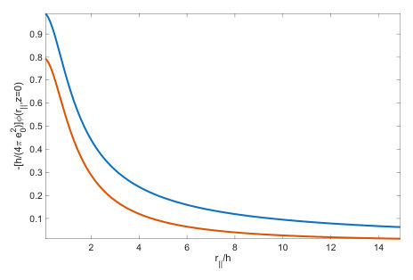
<figcaption class="paper-figure-caption"><b>Fig 1.</b> FIG. 1: The blue (the upper) figure is a plot of −ϕ(r||, z = 0) versus r||/h for λTF/h = 1000 and the red (the lower) figure is a plot of −ϕ(r||, z = 0) versus r||/h for λTF/h = 10.</figcaption>
</figure>
<figure class="paper-figure-card">
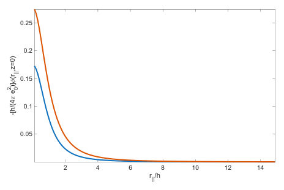
<figcaption class="paper-figure-caption"><b>Fig 2.</b> FIG. 3: The blue (the lower) figure is a plot of −ϕ(r||, z = 0) versus r||/h for λTF/h = 0.25 and the red (the upper) figure is a plot of −ϕ(r||, z = 0) versus r||/h for λTF/h = 0.5.</figcaption>
</figure>
<figure class="paper-figure-card">
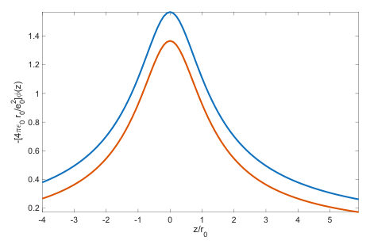
<figcaption class="paper-figure-caption"><b>Fig 3.</b> FIG. 2: The red (the inner) figure is a plot of −ϕ(z) versus z/r0 for λTF/r0 = 10 and the blue (the outer) figure is plot of −ϕ(z) versus z/r0 for λTF/r0 = 1000.</figcaption>
</figure>
<figure class="paper-figure-card">
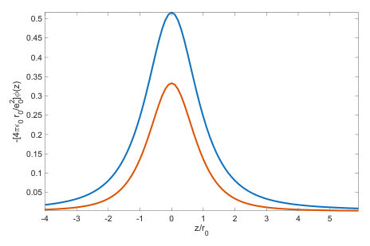
<figcaption class="paper-figure-caption"><b>Fig 4.</b> FIG. 4: The red (the inner) figure is a plot of −ϕ(z) versus z/r0 for λTF/r0 = 0.25 and the blue (the outer) figure is plot of −ϕ(z) versus z/r0 for λTF/r0 = 0.5.</figcaption>
</figure>

**Summary.** This work theoretically models the friction acting on ions and water in carbon nanotubes, using electronic screening from conduction electrons within the Thomas-Fermi framework. The authors compare calculated electronic friction to other sources, concluding that while screening is important, phonon interactions likely dominate the observed ion transport behavior. The study is crucial for understanding nanoscale electrochemistry and ion conduction in confined geometries.

**Why it may be interesting.** The detailed analysis of charge dynamics, screening, and transport mechanisms in nanoscale conductors provides insights into open quantum systems where boundary conditions and environmental coupling (like the electron gas) dictate macroscopic transport properties.

Detailed structure

**Main problem.** The paper investigates the friction experienced by ions and water molecules moving through narrow carbon nanotubes (CNTs), focusing on how electronic screening from conduction electrons modifies this friction.

**Main result.** Electronic and image-dragging friction contributions are found to be small compared to phonon friction, suggesting that ion transport is governed by other mechanisms like the Grotthuss mechanism or osmotic pressure.

**Method.** The authors employ theoretical modeling using the Thomas-Fermi approximation to calculate the induced charge density and resulting friction forces, supplemented by analyzing charge establishment time scales.

**Model / system.** The system involves ions and water molecules confined within metallic and semiconducting CNTs. The theory models the electrostatic potential ($\phi$) using Poisson's equation, incorporating screening effects via the Thomas-Fermi length ($\lambda_{	ext{TF}}$).

**Key observables.** Flow rate/mobility of ions and water, induced charge density ($
ho_{	ext{ind}}$), and various friction forces ($F_{	ext{fric}}$).

**Important parameters / regimes.** Screening length ($\lambda_{	ext{TF}}$), CNT length ($L$), and the ratio of measurement time to charge establishment time ($t$).

**Assumptions / limitations.** The Thomas-Fermi approximation is used for screening, and the analysis often assumes the CNT is an equipotential region during measurement for certain regimes.

**Figures summary.** Figures reference experimental setups for measuring ion conduction and pH changes, and theoretical results illustrate potential profiles ($\phi(x)$) and force calculations.

**Paper structure.** The paper progresses from analyzing experimental observations (differences in flow rates between metallic and semiconducting CNTs) to developing a theoretical framework using the Thomas-Fermi model to calculate electronic screening effects on friction, and finally comparing these calculated forces to other known friction sources.

Abstract

Li, et. al., have observed a larger flow rate, resulting from osmotic pressure, of protons and water molecules in nanometer scale diameter metallic carbon nanotubes compared to that in semiconducting carbon nanotubes. The flow rate of potassium ions, however, under an applied electric field is almost the same in metallic and semiconducting nanotubes. We propose a simple physical picture to understand these experimental results by examining the effects of screening by conduction electrons in electrically conducting carbon nanotubes on the friction experienced by protons, water molecules, and ions flowing through the nanotube.

[↑ back to top](#top)

### [Ultrafast formation of a large dynamic magnetic soliton](http://arxiv.org/abs/2606.00849v1)

**Authors:** Ondřej Wojewoda, Sina Mayr, Miela J. Gross, Jan Klíma, Jaganandha Panda, Jakub Krčma, Jakub Holobrádek, Kristýna Davídková, Andrii V. Chumak, Igor Gerasimchuk, Roman Verba, Philipp Pirro, Markus Weigand, Simone Finizio, Morris Lindner, Carsten Dubs, Qi Wang, Sebastian Wintz, Caroline A. Ross, Michal Urbánek  
**Type:** experiment · **Category:** other · **PDF:** <https://arxiv.org/pdf/2606.00849v1>  
**Analysis basis:** full PDF text, analyzed in chunks
**Topic relevance:** `spintronics-quantum-optics interface` **3/5** · `exotic spin models in light-matter` **2/5** · `non-equilibrium dynamics` **2/5** · `driven-dissipative phase transition` **1/5** · `non-equilibrium universality` **1/5**

↔ Scroll figures horizontally

<figure class="paper-figure-card">
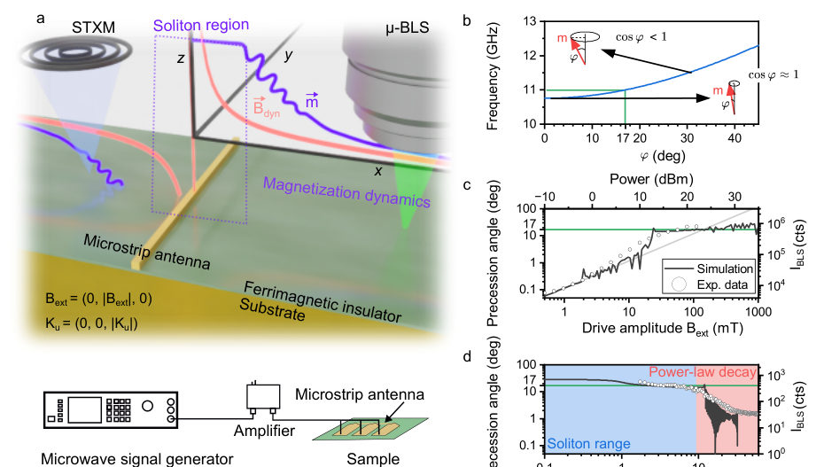
<figcaption class="paper-figure-caption"><b>Fig 1.</b> Fig. 1 Schematic picture of the soliton formation and spin-wave emission. a Experimental geometry. The exci- tation stripline is driven by an RF (radio frequency) generator with a single-frequency signal. The resulting magnetization dynamics (purple line) is subsequently measured by µ-BLS with intensity, time, and phase resolution or by time-resolved STXM. b Nonlinear shift of the ferromagnetic resonance as a function of the precession angle (φ). The inset illustrates an increase in the precession amplitude. The excitation frequency of 11 GHz is marked by the green line. Calculations use Bi:YIG material parameters (see Methods) and an in-plane external magnetic field of 550 mT. c Precession...</figcaption>
</figure>
<figure class="paper-figure-card">
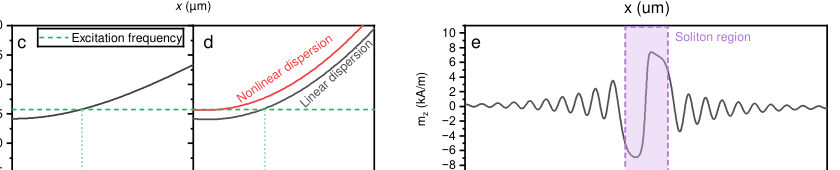
<figcaption class="paper-figure-caption"><b>Fig 2.</b> Fig. 2 Emission of spin waves at the soliton boundary in Ga:YIG. a, b Snapshots from time-resolved STXM (a) and simulation (b) at a fixed driving frequency of 3.57 GHz while sweeping the external magnetic field. c, d Nonlinear FMR shift at a precession angle of approx. 20◦(c) and the corresponding linear and nonlinear dispersion relations (d) for the Ga:YIG sample at an external field of 190 mT. The green dashed line shows the driving field frequency of 3.57 GHz. Dashed lines show the expected precession angle and wavenumber. e, Line profiles of the simulated intensity in (b) at 190 mT.</figcaption>
</figure>
<figure class="paper-figure-card">
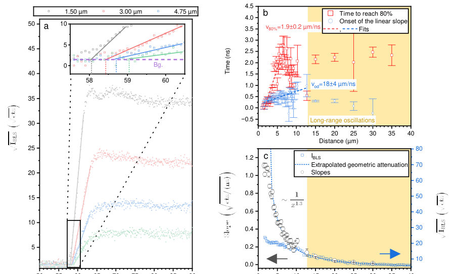
<figcaption class="paper-figure-caption"><b>Fig 3.</b> Fig. 3 Time-resolved observation of the soliton formation and long-range oscillations in Bi:YIG. a, Time traces of the square root of the BLS intensity recorded at different distances x from the antenna. Linear fits to the rising edges are depicted as faded solid lines. The inset highlights the distance-dependent onset delay of the soliton.b, Times of arrival extracted from the time to reach 80 % (red circles) and a linear fit used to determine the onset delay velocity in the nonlinear region (slope). In the linear region, the long-range oscillations follow the antenna excitation without a measurable delay. c, Slopes of the rising-edge fits from panel (a) (black circles). Blue squares...</figcaption>
</figure>
<figure class="paper-figure-card">
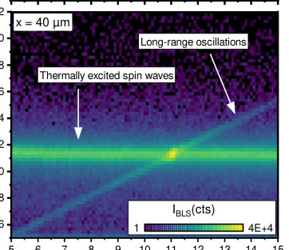
<figcaption class="paper-figure-caption"><b>Fig 4.</b> Fig. 4 Frequency sweeps near and far from the antenna in Bi:YIG. a, b µ-BLS measurement of mag- netization dynamics at x = 1 µm (a) and x = 40 µm (b). The acquisition time for panel (b) was significantly longer. In panel (a) we used pulsed excitation to limit the heating effects. The color code is logarithmic. The signal with neg- ative slope is caused by the high signal and higher-order transmission through the interferometer.</figcaption>
</figure>

**Summary.** This work demonstrates the ultrafast creation of large dynamic magnetic solitons in garnet films using microwave excitation. By combining advanced microscopy techniques, the authors characterize the soliton's unique formation mechanism and its subsequent collapse into propagating spin waves. This establishes a controllable, nonlinear method for manipulating magnetic states in thin films.

**Why it may be interesting.** The study of nonlinear wave phenomena, such as solitons, in magnetic systems provides a physical realization of nonlinear wave dynamics, which has parallels in nonlinear optics and other areas of AMO physics.

Detailed structure

**Main problem.** The paper reports on the ultrafast formation and dynamics of large dynamic magnetic solitons in thin ferrimagnetic garnet films.

**Main result.** They established that microwave-driven solitons are a robust nonlinear phenomenon, characterized by formation inside the linear spin-wave band and subsequent emission of short-wavelength spin waves upon collapse.

**Method.** The research combines time-resolved Brillouin light scattering microscopy ($\mu$-BLS) and scanning transmission X-ray microscopy (STXM) to track magnetization dynamics driven by a microstrip antenna.

**Model / system.** The system involves thin ferrimagnetic garnet films (Bi:YIG and Ga:YIG) exhibiting perpendicular magnetic anisotropy. The dynamics are governed by nonlinear magnetization equations, which are analyzed against linear spin-wave theory.

**Key observables.** Precession angle ($\varphi$), nonlinear frequency shift, spatial decay of magnetization, and emitted short-wavelength spin waves.

**Important parameters / regimes.** The soliton exhibits an exceptionally large spatial extent (tens of microns) and forms much faster than linear spin-wave propagation.

**Assumptions / limitations.** The analysis assumes the soliton is a dissipative excitation requiring continuous pumping, and that the transition from nonlinear to linear dynamics is rapid.

**Figures summary.** Figures illustrate the experimental geometry, the nonlinear shift of FMR vs. precession angle, spatial decay of the precession angle, and time-resolved measurements showing oscillations and onset delays.

**Paper structure.** The paper systematically presents experimental characterization of the system, detailing the observation of the soliton, explaining its formation via a self-limiting mechanism, and finally demonstrating its collapse and subsequent spin-wave emission.

Abstract

Nonlinear magnetization dynamics offers a rich variety of phenomena ranging from bistability to chaos. Here, we report the ultrafast formation of a dynamic magnetic soliton in thin ferrimagnetic garnet films with perpendicular magnetic anisotropy, driven by the microwave magnetic field of a microstrip antenna. Using time-resolved Brillouin light scattering microscopy and scanning transmission X-ray microscopy, we directly track the build-up of the large-angle precession state. The observed soliton is distinct from other nonlinear magnetic excitations in two key aspects: (i) it forms inside the linear spin-wave frequency band, and (ii) it is exceptionally large, reaching tens of microns beyond the antenna. We explain the soliton formation by the self-limiting mechanism upon a positive nonlinear frequency shift and the spatial extent of the near-field of the antenna. At large distances from the drive, the soliton collapses and emits short-wavelength spin waves via almost instantaneous spatial wavenumber conversion. Time-resolved measurements further reveal a small finite delay during soliton formation, while coherent long-range oscillations appear essentially simultaneously over distances up to 40 micrometers. These results establish microwave-driven solitons as a robust nonlinear phenomenon in thin-film garnets and suggest opportunities for fast, nonlocal manipulation of magnetic states and for applications in novel computational schemes.

[↑ back to top](#top)

### [Hot carrier diffusion-assisted ideal carrier multiplication in monolayer MoSe2](http://arxiv.org/abs/2606.01125v1)

**Authors:** Joonsoo Kim, Hong-Guk Min, Sehwan Park, Jin Cheol Park, Junhyeok Bang, Youngkuk Kim, Ji-Hee Kim  
**Type:** both · **Category:** other · **PDF:** <https://arxiv.org/pdf/2606.01125v1>  
**Analysis basis:** full PDF text, analyzed in chunks
**Topic relevance:** `non-equilibrium dynamics` **3/5** · `Keldysh / 2PI / non-Gaussian methods` **1/5** · `driven-dissipative phase transition` **1/5** · `methods for driven-dissipative` **1/5** · `non-equilibrium universality` **1/5**

↔ Scroll figures horizontally

<figure class="paper-figure-card">
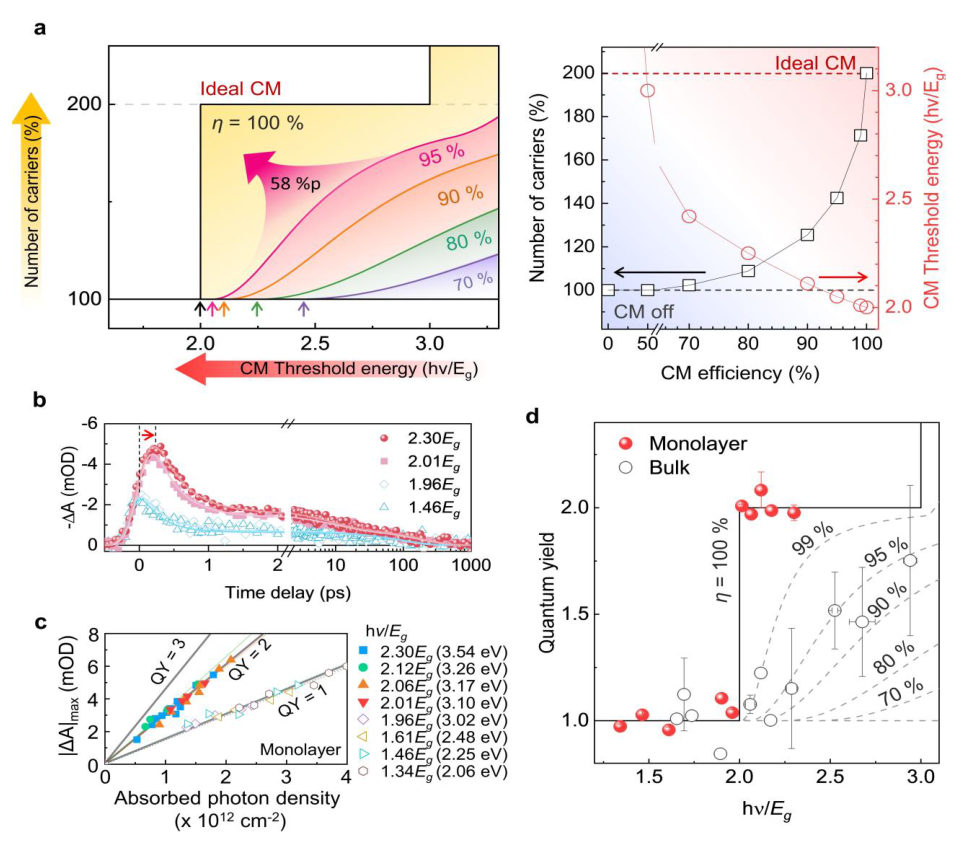
<figcaption class="paper-figure-caption"><b>Fig 1.</b> Figure 1. Carrier multiplication (CM) in monolayer MoSe2. a) The number of generated carriers</figcaption>
</figure>
<figure class="paper-figure-card">
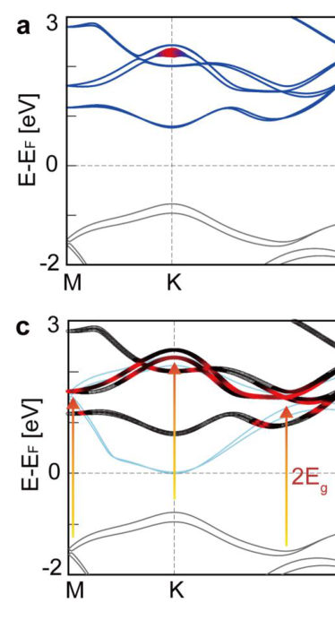
<figcaption class="paper-figure-caption"><b>Fig 2.</b> Figure 2. DFT calculations of CM efficiency in monolayer and bulk MoSe2.</figcaption>
</figure>
<figure class="paper-figure-card">
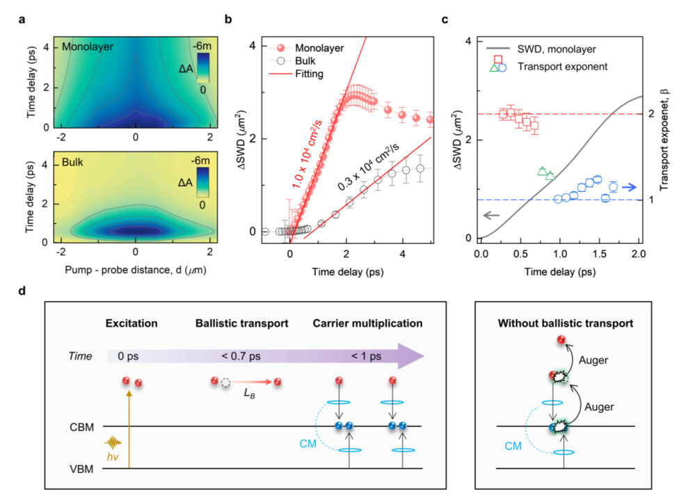
<figcaption class="paper-figure-caption"><b>Fig 3.</b> Figure 3. Hot-carrier diffusion in monolayer and bulk MoSe2 and impact of ballistic diffusion</figcaption>
</figure>
<figure class="paper-figure-card">
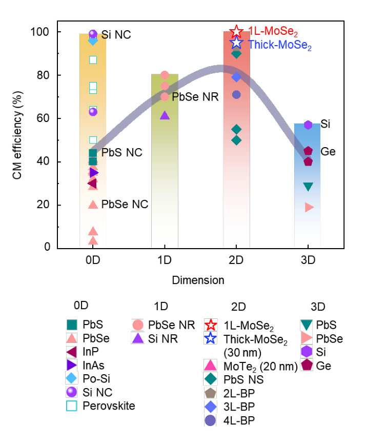
<figcaption class="paper-figure-caption"><b>Fig 4.</b> Figure 4. Carrier multiplication conversion efficiency by dimensionality. The CM efficiency is</figcaption>
</figure>

**Summary.** This work demonstrates that monolayer MoSe2 can achieve ideal Carrier Multiplication efficiency, a key step toward next-generation photovoltaics. This breakthrough is attributed to the material's unique electronic structure, specifically 2Eg band nesting, combined with superior hot-carrier dynamics characterized by ballistic transport. The combination of theory and ultrafast spectroscopy validates MoSe2 as a highly promising platform for energy conversion.

**Why it may be interesting.** The study provides a clear, measurable pathway (ballistic transport and band nesting) to engineer high-efficiency energy conversion materials, which is relevant to open quantum systems where energy dissipation and transport dynamics are central.

Detailed structure

**Main problem.** The primary goal is to achieve ideal Carrier Multiplication (CM) efficiency in photovoltaic applications to surpass the Shockley-Queisser limit.

**Main result.** Monolayer MoSe2 demonstrates ideal CM efficiency, attributed to superior hot-carrier dynamics (ballistic transport) and favorable band nesting, significantly outperforming bulk MoSe2.

**Method.** The study combines ultrafast transient absorption spectroscopy (experiment) with first-principles DFT calculations (theory) to characterize carrier dynamics and electronic structure.

**Model / system.** The system under study is monolayer and bulk MoSe2, a transition metal dichalcogenide (TMD). The analysis focuses on hot-carrier transport, CM pathways enabled by 2Eg band nesting, and the suppression of energy loss mechanisms.

**Key observables.** Ideal CM efficiency (quantified by QY doubling at 2Eg), hot-carrier diffusion coefficient (D), ballistic transport exponent (beta), and the number of CM channels N(I1).

**Important parameters / regimes.** The critical energy threshold is twice the bandgap (2Eg); high diffusion coefficients (up to 1.0 x 10^4 cm^2 s^-1) and ballistic transport regimes are key parameters.

**Assumptions / limitations.** The analysis assumes the ability to resolve scatter-free ballistic transport of hot carriers and that low photon density minimizes nonlinear effects.

**Figures summary.** Figures illustrate the quantized jump in quantum yield at 2Eg, the comparison of CM efficiency across different dimensionalities, and spatiotemporal maps comparing ballistic vs. diffusive hot-carrier spreading in monolayer vs. bulk materials.

**Paper structure.** The paper progresses by first establishing the theoretical benchmark for ideal CM, then using ultrafast spectroscopy to demonstrate this ideal efficiency in monolayer MoSe2, followed by detailed analysis using DFT to explain the mechanism via band nesting and hot-carrier diffusion measurements to confirm the role of ballistic transport.

Abstract

Carrier multiplication (CM), the process of generating multiple charge carriers from a single photon, offers an opportunity to exceed the Shockley-Queisser limit in photovoltaic applications. Despite extensive research, no material has yet achieved ideal CM efficiency, primarily owing to significant energy losses from carrier-lattice scattering. In this study, we demonstrate that monolayer MoSe2 can attain the theoretical maximum CM efficiency permitted by energy-momentum conservation principle, using ultrafast transient absorption spectroscopy. By resolving the scatter-free ballistic transport of hot carriers and validating our findings with first-principles calculations, we identify the cornerstone of optimal CM in monolayer MoSe2: superior hot-carrier dynamics characterized by suppressed energy dissipation via minimized carrier-lattice scattering, and the availability of abundant CM pathways facilitated by 2Eg band nesting. Comparative analysis with bulk MoSe2 further emphasizes the enhanced CM efficiency in the monolayer, attributed by superior hot-carrier diffusion and access to additional CM pathways. These results position monolayer MoSe2 as a promising candidate for high-performance optoelectronic applications, providing a robust platform for next-generation energy conversion technologies.

[↑ back to top](#top)

### [Quantum control of spin qubits using SOT-driven nanomagnets](http://arxiv.org/abs/2606.00824v1)

**Authors:** Aniruddha Chakraborty, Kanishk Modi, Dhritiman Bhattacharya, Uditendu Mukhopadhyay, Suddhasatta Mahapatra, Jayasimha Atulasimha  
**Type:** theory · **Category:** quantum information and computing · **PDF:** <https://arxiv.org/pdf/2606.00824v1>  
**Analysis basis:** full PDF text, analyzed in chunks
**Topic relevance:** `spintronics-quantum-optics interface` **3/5** · `QC/QI experiment` **2/5**

↔ Scroll figures horizontally

<figure class="paper-figure-card">
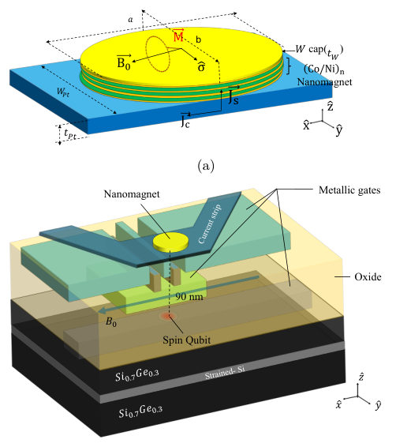
<figcaption class="paper-figure-caption"><b>Fig 1.</b> FIG. 1: (a) Schematic representation of magnetization dynamics in the NM. B0 is the externally applied magnetic field, and the magnetization of the NM ( ⃗M) is shown precessing around ⃗B0. (b) Schematic representation of the spin qubit device, showing the gate layers, the SOT strip-line, the NM, and the QD hosting the spin qubit in the strained-Si QW of the Si/SiGe heterostructure. The NM is positioned directly above the QD, 90 nm above the Si-QW plane.</figcaption>
</figure>
<figure class="paper-figure-card">
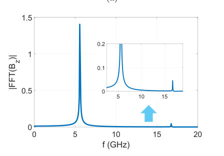
<figcaption class="paper-figure-caption"><b>Fig 2.</b> FIG. 2: (a) The three components of the oscillating magnetic field generated by the precessing magnetization of the NM. (b) The frequency components of the Bz component, with the higher harmonic enlarged in the inset.</figcaption>
</figure>
<figure class="paper-figure-card">
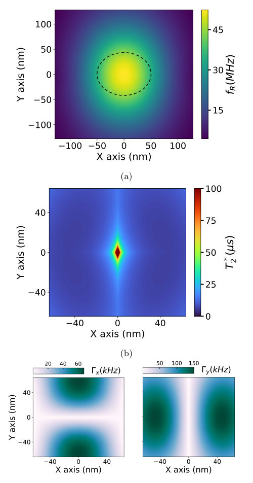
<figcaption class="paper-figure-caption"><b>Fig 3.</b> FIG. 3: Color-maps of various qubit parameters at the qubit plane. (a) Calculated Rabi frequency at the qubit- site, plotted for a region encompassing the footprint of the entire NM (shown by the dotted ellipse). (b) Plot of T ∗ 2 = (Γx + Γy)−1 over a smaller region, according to Eq. 2. Plots of the decoherence rate (Γx, Γy) contribution from gradient of Zeeman field along (c) X- and (d) Y- axes respectively.</figcaption>
</figure>
<figure class="paper-figure-card">
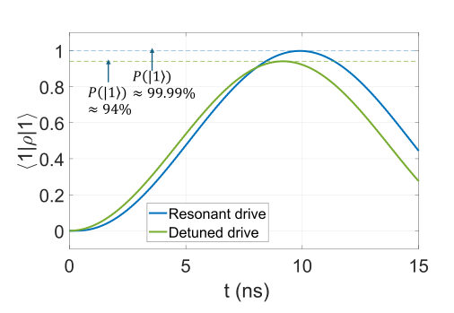
<figcaption class="paper-figure-caption"><b>Fig 4.</b> FIG. 1: Rabi oscillations driven by the resonant stray fields originating from the nanomagnet, located at (0,0,90) nm with respect to the qubit location, exhibit a gate fidelity of 99.99%, whereas the non-resonant drive (green) shows considerably lower fidelity (94%).</figcaption>
</figure>
<figure class="paper-figure-card">
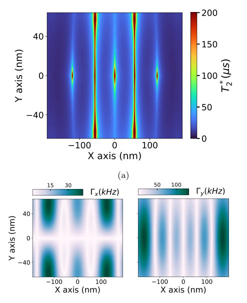
<figcaption class="paper-figure-caption"><b>Fig 5.</b> FIG. 2: Figures show the results for the case of 3 NMs placed next to each other along their major axis with a gap of 20 nm. (a) Plot of T ∗ 2 . Plots of the decoherence rate contribution from gradient of Zeeman field along (b) X- and (c) Y- axes.</figcaption>
</figure>

**Summary.** This paper proposes using spin-orbit-torque (SOT)-driven nanomagnets to generate localized, oscillating magnetic fields for controlling spin qubits. By simulating the system dynamics, the authors demonstrate that this method achieves fast gate operations and long coherence times, offering a highly scalable alternative to current quantum control techniques.

**Why it may be interesting.** This work directly addresses the physical implementation challenges of solid-state quantum computing by proposing a scalable, CMOS-compatible method for coherent qubit manipulation using spintronics.

Detailed structure

**Main problem.** The core challenge is achieving fast, high-fidelity spin rotation (SR) for quantum gates in spin qubits while minimizing decoherence caused by external magnetic fields.

**Main result.** The proposed technique using SOT-driven nanomagnets generates highly localized, oscillating magnetic fields that enable fast Rabi frequencies (e.g., 52.25 MHz) and maintain long coherence times ($T_2^* \sim 40-250 \mu s$), rivaling or exceeding existing methods.

**Method.** The authors simulate the system dynamics using micromagnetics (LLG equation) to model the SOT-driven magnetization precession, which generates the oscillating stray B-field used to drive the qubit.

**Model / system.** The system involves spin qubits in semiconductor quantum dots controlled by oscillating magnetic fields generated by SOT-driven nanomagnets (Co-Ni/Pt/W). The control mechanism relies on the Spin-Hall effect generating a torque on the nanomagnet's magnetization.

**Key observables.** Rabi frequency ($f_R$), coherence time ($T_2^*$), and the spatial profile of the oscillating magnetic field.

**Important parameters / regimes.** RF charge current ($I_c = 200 \mu	ext{A}$), nanomagnet dimensions (e.g., 100 nm $	imes$ 80 nm), and the target ESR frequency ($\approx 5.6$ GHz).

**Assumptions / limitations.** The analysis assumes that the primary decoherence source is related to the gradient of the static stray field, and that higher harmonics of the oscillating field have negligible impact on fidelity.

**Figures summary.** Figures compare Rabi oscillations showing high fidelity (99.99%) under resonant driving, and plot $T_2^*$ and decoherence rate contributions ($\Gamma_X, \Gamma_Y$) based on the placement of multiple nanomagnets.

**Paper structure.** The paper progresses by first establishing the need for better SR control, detailing the SOT-driven mechanism via micromagnetics simulations, and finally quantifying the performance by calculating Rabi frequencies and coherence times ($T_2^*$) compared to established methods like EDSR.

Abstract

Spin rotation (SR) is an essential capability for realization of single and two-qubit gates in spin quantum computing (SQC) architectures. To perform SR, resonant AC magnetic fields are either generated by microwave current pulses fed to an antenna, or voltage pulses applied to a gate, in presence of an inhomogeneous Zeeman field. While the former approach is limited by gate-speed and site-selectivity of SR, the latter adds to the decoherence of the spin qubits. Here, we propose an alternative technique for driving high-speed SR without compromising the qubit coherence, by employing spin-orbit-torque (SOT)-driven nanomagnets to produce oscillating magnetic fields, locally at the qubit site. The proposed scheme is highly energy-efficient, scalable, and compatible with the CMOS fabrication technology.

[↑ back to top](#top)

### [Ultrafast internal dynamics of chiral domain walls probed by time-resolved XRMS](http://arxiv.org/abs/2606.02154v1)

**Authors:** Dmitriy Ksenzov, Flavio Capotondi, Nicolas Jaouen, Raphael Gruber, Vincent Cros, Mathias Kläui, Matteo Pancaldi, Emanuele Pedersoli, Nicolas Reyren, Christian Gutt  
**Type:** experiment · **Category:** other · **PDF:** <https://arxiv.org/pdf/2606.02154v1>  
**Analysis basis:** full PDF text, analyzed in chunks
**Topic relevance:** `spintronics-quantum-optics interface` **3/5** · `non-equilibrium dynamics` **1/5**

↔ Scroll figures horizontally

<figure class="paper-figure-card">
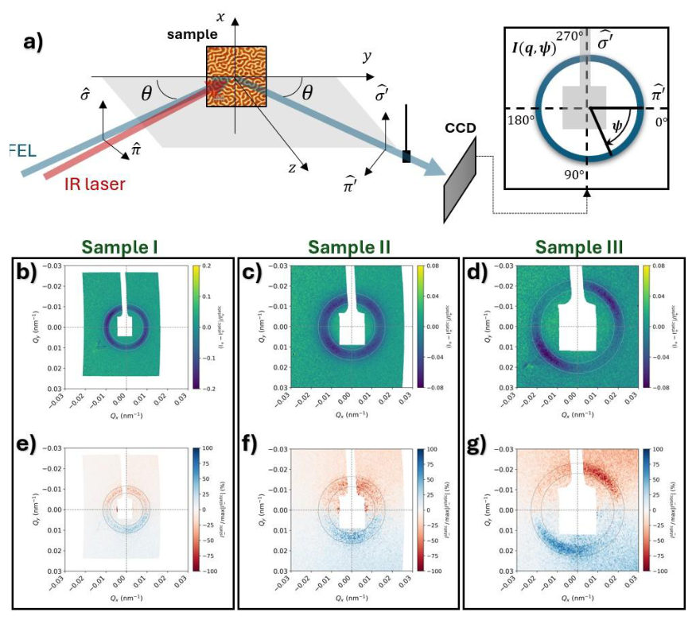
<figcaption class="paper-figure-caption"><b>Fig 1.</b> FIG 1: (a) Schematic of the time-resolved XRMS experiment. Infrared (IR) pump pulses (𝜆𝐿= 790 𝑛𝑚) excite the multilayer. Circularly polarized FEL pulses tuned to the Fe M2,3 edge (𝜆= 22.75 𝑛𝑚) probe the response in reflection geometry at 𝜃≈45° . The sample-to-detector distance was 150 mm for sample I, 100 mm for sample II, and 75 mm for sample III. (b-d) Normalized differential sum signal, (𝐼+</figcaption>
</figure>
<figure class="paper-figure-card">
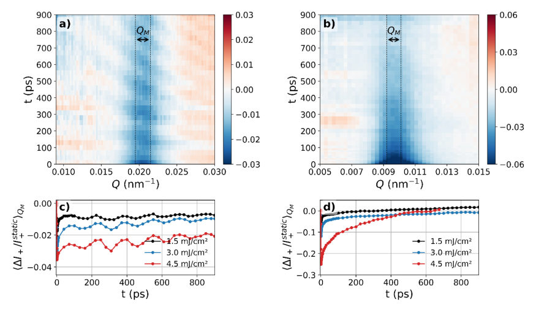
<figcaption class="paper-figure-caption"><b>Fig 2.</b> FIG. 2: (a,b) Time–momentum maps of Δ𝐼+ 𝐼+𝑠𝑡𝑎𝑡𝑖𝑐 ⁄ at F = 3.0 mJ cm⁻² for samples III (a) and I (b), respectively. (c,d) Corresponding momentum–integrated responses averaged around 𝑄𝑀, shown as a function of pump–probe delay for F = 1.5 (black), 3.0 (blue), and 4.5 mJ cm⁻² (red).</figcaption>
</figure>
<figure class="paper-figure-card">
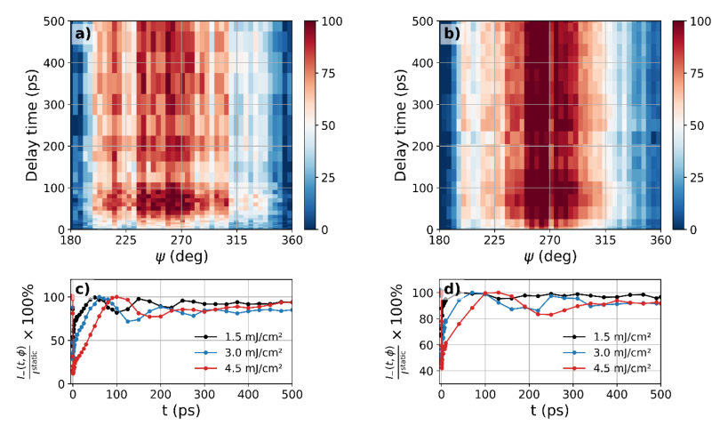
<figcaption class="paper-figure-caption"><b>Fig 3.</b> FIG. 3: (a, c) Time–azimuth maps of the normalized dichroic response 𝐼−(𝑡, 𝜓)/𝐼−static, for samples I (a) and II (c) at a pump fluence of F = 3.0 mJ cm⁻². (b,d) Corresponding azimuthally integrated transient dichroic responses shown as a function of pump–probe delay for pump fluences of 1.5 (black), 3.0 (blue), and 4.5 mJ cm⁻² (red).</figcaption>
</figure>
<figure class="paper-figure-card">
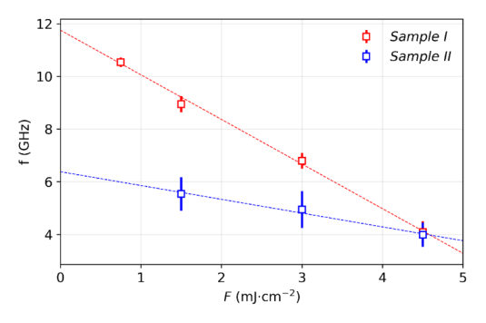
<figcaption class="paper-figure-caption"><b>Fig 4.</b> FIG.4: Fluence dependence of the extracted frequency for samples I (red) and II (blue). Markers show data and dashed lines show linear fits 𝑓(𝐹) = 𝑓0 −𝑘𝐹.</figcaption>
</figure>

**Summary.** This work uses time-resolved X-ray Magnetic Scattering (XRMS) to investigate how chiral domain walls evolve on picosecond timescales. By analyzing the dichroic signal, the researchers successfully isolated the dynamics of the internal domain-wall mode. The key finding is that this mode's oscillation frequency softens as the pump fluence increases, providing insight into how external energy modifies the magnetic anisotropy and restoring forces within the domain walls.

**Why it may be interesting.** The use of time-resolved X-ray techniques to isolate and track internal, collective excitations (like domain-wall modes) in magnetic materials provides a powerful, non-equilibrium probe of magnetic order parameters, relevant to understanding ultrafast magnetization dynamics.

Detailed structure

**Main problem.** The study aims to probe the ultrafast internal dynamics of chiral domain walls within magnetic multilayers on picosecond timescales.

**Main result.** The dichroic signal exhibits a strong oscillatory response whose frequency decreases with increasing pump fluence, indicating pump-induced changes in the effective anisotropy and saturation magnetization that modify the internal domain-wall mode restoring field.

**Method.** Time-resolved x-ray resonant magnetic scattering (XRMS) is employed using femtosecond optical pumping and circularly polarized FEL probes.

**Model / system.** The physical system involves magnetic multilayers with perpendicular magnetic anisotropy hosting chiral Néel-type domain walls stabilized by the interfacial Dzyaloshinskii-Moriya interaction. The in-plane wall magnetization is modeled using a 1D Walker domain-wall profile.

**Key observables.** Helicity-summed signal ($\Delta I_+$) and the dichroic signal ($I_-$), which is sensitive to the in-plane magnetization inside the Néel walls.

**Important parameters / regimes.** Picosecond time scales, pump fluence, and the characteristic frequency of the internal domain-wall mode.

**Assumptions / limitations.** The analysis assumes the dichroic term arises from charge-magnetic interference, and the frequency dependence on fluence is treated phenomenologically.

**Figures summary.** Figures show time-momentum maps and azimuthally integrated transient dichroic responses demonstrating the fluence dependence of the oscillation frequency for different samples.

**Paper structure.** The paper details the experimental setup and diagnostics, analyzes the time-resolved signals by separating contributions, and presents the quantitative findings regarding the frequency softening of the internal domain-wall mode.

Abstract

We measure picosecond dynamics of labyrinthine stripe domains with chiral Néel-type domain walls using time-resolved x-ray resonant magnetic scattering (XRMS). At the stripe-domain wavevector, the helicity-summed signal shows ultrafast demagnetization, recovery, and a weak oscillatory contribution that we identify as a signature of laser-launched coherent surface phonons. In contrast, the dichroic signal, which is sensitive to the in-plane magnetization inside the Néel walls, shows a strong oscillatory response whose frequency decreases with increasing pump fluence. We attribute this softening to pump-induced changes in the effective anisotropy and saturation magnetization, which modify the restoring field of an internal domain-wall mode. Time-resolved XRMS thus isolates wall-specific dynamics and provides access to internal domain-wall motion in disordered stripe textures on picosecond time scales.

[↑ back to top](#top)

### [A Visible-Frequency Excitonic Reststrahlen Band in (PEA)$_2$PbI$_4$ Slabs](http://arxiv.org/abs/2606.00682v1)

**Authors:** Michael Pfeufer, Patrick Grenzer, Friedrich Schöppler, Tobias Hertel  
**Type:** both · **Category:** other · **PDF:** <https://arxiv.org/pdf/2606.00682v1>  
**Analysis basis:** full PDF text, analyzed in chunks
**Topic relevance:** `interference shaping light` **3/5**

↔ Scroll figures horizontally

<figure class="paper-figure-card">
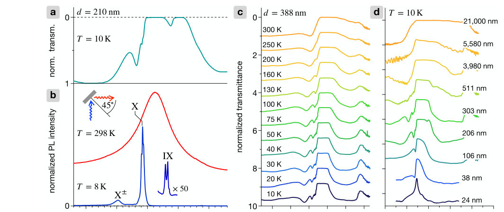
<figcaption class="paper-figure-caption"><b>Fig 1.</b> Figure 1: Excitonic energy scales and slab-transmission phenomenology of PEPI. (a) Inverted normalized trans- mittance spectrum of a 𝑑= 210 nm slab at 10 K, showing a stop-band-like response near the intralayer exciton. (b) Room- and low-temperature PL spectra of a ∼200 nm slab, resolving at 8 K a trion-like feature near 2.30 eV and the intralayer-exciton manifold near 2.34 eV. Inset: expanded PL of a comparable flake showing a weak doublet near 2.38 eV, assigned in PL to interlayer excitons.11 (c) Temperature-dependent normalized transmittance of a 𝑑= 388 nm slab from 10 to 300 K. (d) Thickness-dependent normalized transmittance at 10 K for slabs from 24 nm to 21,000 nm, showing the...</figcaption>
</figure>
<figure class="paper-figure-card">
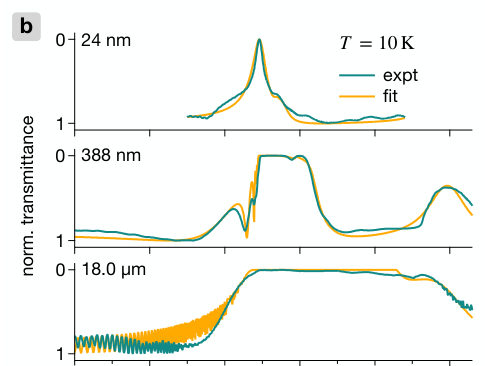
<figcaption class="paper-figure-caption"><b>Fig 2.</b> Figure 2: Transfer-matrix modeling of the thickness- dependent transmittance. (a) Model workflow combining an effective Lorentz-oscillator dielectric response, transfer-matrix propagation through the air/PEPI/sapphire stack, and parameter extraction from measured spectra. (b) Normalized transmittance spectra and fits at 𝑇= 10 K for representative slab thicknesses of 24 nm, 388 nm, and 18.0 𝜇m.</figcaption>
</figure>
<figure class="paper-figure-card">
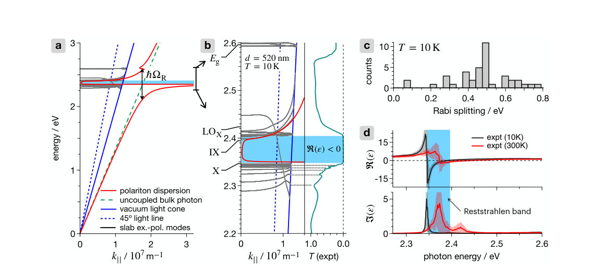
<figcaption class="paper-figure-caption"><b>Fig 3.</b> Figure 3: (a) Bulk-like polariton dispersion derived from the reconstructed dielectric response of a representative 520 nm slab at 10 K, together with the vacuum light cone (solid blue), the corresponding 45◦light line (dashed blue), the uncoupled bulk-photon dispersion (green dashed), and the calculated finite-slab exciton–polariton branches (gray). The resulting Rabi splitting between upper and lower branches is indicated by ℏΩ𝑅. (b) Mode structure calculated for the fitted 𝑑= 520 nm slab at 10 K, shown together with the corresponding experimental transmittance spectrum. The blue background marks the spectral interval with Re(𝜀) &lt; 0. Labels indicate the intralayer exciton (X), interlayer...</figcaption>
</figure>
<figure class="paper-figure-card">
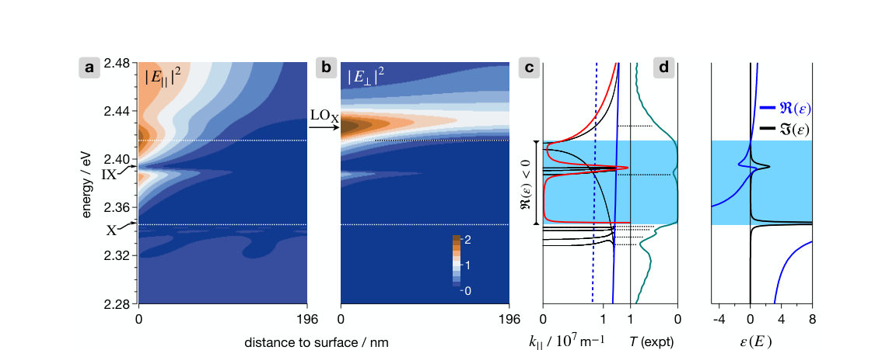
<figcaption class="paper-figure-caption"><b>Fig 4.</b> Figure 4: Calculated 𝑝-polarized field distributions, 𝑝-polarized slab-mode structure and dielectric response for a 196 nm PEPI slab on a substrate. Panels (a,b) show false color plots of the field intensities parallel and perpendicular to the slab surface, |𝐸∥|2 and |𝐸⊥|2, as functions of photon energy and distance from the air/slab interface. Panel (c) shows the corresponding slab-mode dispersion together with the experimental transmittance spectrum, using the same color code convention as in Figure 3b. Within the negative-Re(𝜀) stop-band region, |𝐸∥|2 is strongly suppressed inside the slab, whereas |𝐸⊥|2 develops a slab-spanning high-field feature near the upper 𝜀= 0 crossing, labeled...</figcaption>
</figure>

**Summary.** This paper investigates the optical response of $(	ext{PEA})_2	ext{PbI}_4$ perovskite slabs, demonstrating a thickness-dependent transition from simple excitonic absorption to a visible-frequency stop band. By modeling the dielectric response with a Lorentz oscillator, the authors confirm the existence of a negative real permittivity window, classifying the material as a natural excitonic Reststrahlen medium.

**Why it may be interesting.** This work directly addresses the strong light-matter coupling regime in solid-state materials, providing experimental and theoretical evidence for an excitonic stop band analogous to the infrared Reststrahlen effect, which is highly relevant to quantum optics and photonics.

Detailed structure

**Main problem.** The study aims to determine if the intrinsic exciton oscillator strength in layered perovskites is sufficient to drive the real permittivity ($	ext{Re}(\epsilon)$) negative, thereby creating a visible-frequency excitonic Reststrahlen-like stop band.

**Main result.** The authors show that $(	ext{PEA})_2	ext{PbI}_4$ slabs exhibit a thickness-dependent crossover from an excitonic dip to a broad near-zero-transmission interval, confirming its status as a cavity-free visible-frequency excitonic Reststrahlen material.

**Method.** The research combines low-temperature transmission spectroscopy of varying thickness slabs with transfer-matrix analysis using an effective Lorentz-oscillator dielectric response model.

**Model / system.** The physical system is the layered halide perovskite $(	ext{PEA})_2	ext{PbI}_4$. The optical response is modeled using a Lorentz-oscillator form for the dielectric function, $\epsilon(E)$, which is then propagated through the slab thickness using transfer-matrix methods.

**Key observables.** Transmittance spectra, the development of a finite negative-$	ext{Re}(\epsilon)$ window, suppressed in-plane field penetration ($|E_\parallel|^2$), and enhanced surface-normal field ($|E_\perp|^2$).

**Important parameters / regimes.** Low temperature (10 K), slab thickness ($d$), and the Rabi splitting ($\hbar\Omega_R \approx 0.5 	ext{ eV}$).

**Assumptions / limitations.** The analysis assumes the intralayer exciton manifold is the dominant oscillator driving the optical response, and the negative permittivity window is responsible for the stop-band behavior.

**Figures summary.** Figures illustrate the thickness-dependent crossover from an excitonic dip to a stop-band, the reconstructed negative-$	ext{Re}(\epsilon)$ window, and calculated field maps showing field suppression/enhancement within this band.

**Paper structure.** The paper progresses by first observing the thickness-dependent spectral evolution (experiment), then modeling this crossover using a Lorentz-oscillator dielectric response (theory), and finally interpreting the resulting negative permittivity as evidence for a visible-frequency excitonic Reststrahlen band.

Abstract

Layered halide perovskites host exceptionally strong excitons, whose optical signatures are usually interpreted as absorptive resonances on a smooth dielectric background. Strong excitons, however, can also reshape the dielectric response itself and drive the real permittivity negative, opening a reflective band: the visible, excitonic analogue of an infrared Reststrahlen band. Whether bare (PEA)$_2$PbI$_4$ slabs reach this regime has remained unclear. Here we show that low-temperature transmission of (PEA)$_2$PbI$_4$ slabs, driven by the intralayer-exciton manifold, evolves with increasing thickness from an excitonic dip into a broad near-zero-transmission interval with compressed Fabry-Pérot-like fringes. Transfer-matrix analysis with an effective Lorentz-oscillator dielectric response reproduces this crossover, reconstructs a finite negative-Re($\varepsilon$) window, and implies near-ultrastrong exciton-photon coupling. Calculated field maps show suppressed in-plane field penetration within this interval and a driven longitudinal response near the high-energy ($\varepsilon=0$) edge. These results identify (PEA)$_2$PbI$_4$ slabs as a cavity-free visible-frequency excitonic Reststrahlen material.

[↑ back to top](#top)

### [Unified Theory of Quartz Tuning Fork Resonators](http://arxiv.org/abs/2606.00681v1)

**Authors:** Hankyul Koh, Wonho Jhe  
**Type:** theory · **Category:** other · **PDF:** <https://arxiv.org/pdf/2606.00681v1>  
**Analysis basis:** full PDF text, analyzed in chunks
**Topic relevance:** `Keldysh / 2PI / non-Gaussian methods` **2/5** · `entanglement & information structure` **2/5** · `methods for driven-dissipative` **2/5** · `analog quantum simulation` **1/5** · `correlated / nonlocal dissipation` **1/5** · `driven-dissipative phase transition` **1/5** · `measurement-induced transitions` **1/5** · `non-equilibrium dynamics` **1/5** · `non-equilibrium universality` **1/5** · `quantum measurements` **1/5**

↔ Scroll figures horizontally

<figure class="paper-figure-card">
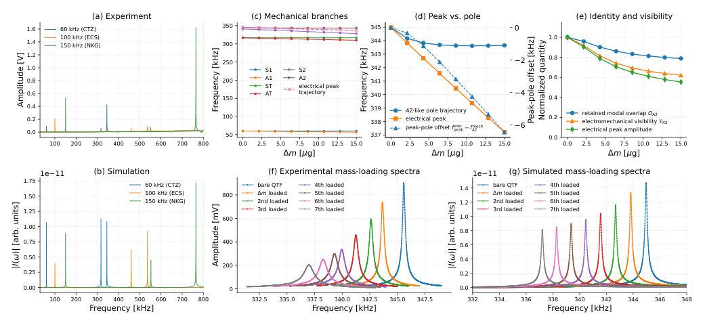
<figcaption class="paper-figure-caption"><b>Fig 1.</b> FIG. 1. Experimental and theoretical evolution of electromechanically observable resonance branches in QTFs under asymmetric mass loading. (a), (b) Experimental and simulated wide-band electrical spectra for representative QTF devices. (c) Mechanical pole evolution under progressive mass perturbation. (d) Comparison between the tracked A2-like mechanical pole and the observed electrical resonance peak. (e) Evolution of retained modal overlap, electromechanical visibility, and electrical peak amplitude. (f), (g) Experimental and simulated spectra near the second antisymmetric flexural branch under progressive mass loading. In the simulations, hydrodynamic loading was incorporated using...</figcaption>
</figure>

**Summary.** This paper introduces a unified continuum electroelastic theory to accurately model the electrical resonance spectra of quartz tuning forks. It demonstrates that the measurable electrical signal depends critically on the overlap between the mechanical mode's excitation strength and the electrode's readout efficiency. This provides a rigorous, first-principles basis for precision electromechanical characterization of piezoelectric resonators.

**Why it may be interesting.** While focused on classical solid-state physics, the rigorous mathematical framework of projecting a complex coupled system onto observable subspaces, and quantifying observability via overlap integrals, shares conceptual parallels with analyzing coupling strengths in open quantum systems or cavity QED.

Detailed structure

**Main problem.** Existing theories fail to explain the robust, electrode-dependent features observed in the electrical resonance spectra of quartz tuning forks (QTFs).

**Main result.** The measured electrical response requires non-zero overlap in both the excitation ($\Theta$) and readout ($H$) coupling terms, providing a unified framework for electromechanical characterization.

**Method.** The authors developed a unified continuum electroelastic framework by combining piezoelectric electrodynamics, variational structural dynamics, and symmetry-selected observability.

**Model / system.** The system is a quartz tuning fork, modeled as an electrically driven piezoelectric resonator. The theory uses continuum mechanics and projects the full electroelastic problem onto reduced mechanical and electrode-defined subspaces.

**Key observables.** Electromechanical Visibility ($V_n$), Effective Excitation ($\Theta_{	ext{eff}n\ell}$), Effective Readout ($H_{	ext{eff}\ell n}$), and the measured current $	ilde{I}_{	ext{meas}}(\omega)$.

**Important parameters / regimes.** Resonance frequencies ($\omega_n$), damping rates ($\gamma_n$), and coupling coefficients derived from the material's piezoelectric tensor ($e_{kij}$).

**Assumptions / limitations.** The electric field adjusts instantaneously to electrode boundary conditions because the mechanical resonance frequency is much lower than the electromagnetic propagation timescale.

**Figures summary.** Figure 1 compares wide-band electrical spectra under mass loading, showing the evolution of mechanical poles versus observed electrical peak trajectories.

**Paper structure.** The paper develops the unified electroelastic theory, derives the effective coupling operators ($\Theta, H$), and then applies perturbation theory to analyze how imperfections (mass loading, nonuniformity) affect the measurable spectral weight and pole positions.

Abstract

Quartz tuning forks, functioning as electrically driven piezoelectric resonators, have long served as exceptionally stable and widely adopted timing references in diverse domains of research and industry. Yet, electrically measured resonance spectra often exhibit robust features that remain unexplained within existing theoretical descriptions. Here we develop a unified continuum electroelastic framework that combines piezoelectric electrodynamics, variational structural dynamics, and symmetry-selected electromechanical observability. Such a first-principles theory shows quantitative agreement with experimental results, which demonstrates electrical observability emerges not just from the underlying mechanical eigenmodes alone. Our results provide a unified framework for electrically driven piezoelectric resonators as well as a rigorous basis for precision electromechanical characterization.

[↑ back to top](#top)

### [Exact Charge, Current, and Velocity Fields of Interacting Korteweg-de Vries Solitons](http://arxiv.org/abs/2606.02043v1)

**Authors:** Thibault Bonnemain, François Copie, Pierre Suret, Stéphane Randoux  
**Type:** theory · **Category:** statistical mechanics · **PDF:** <https://arxiv.org/pdf/2606.02043v1>  
**Analysis basis:** full PDF text, analyzed in chunks
**Topic relevance:** `non-equilibrium dynamics` **2/5** · `Keldysh / 2PI / non-Gaussian methods` **1/5**

↔ Scroll figures horizontally

<figure class="paper-figure-card">
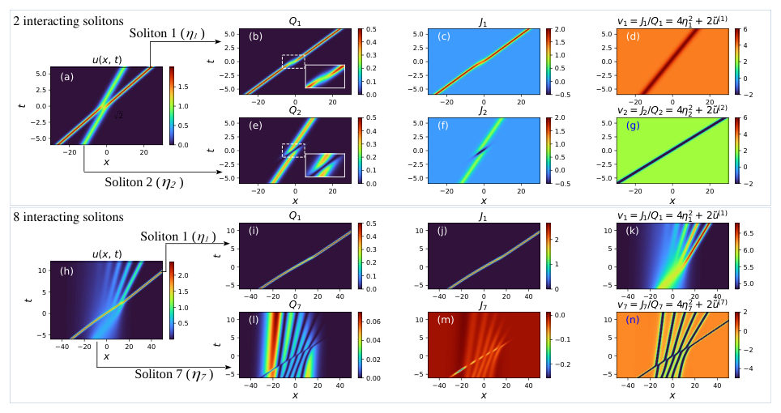
<figcaption class="paper-figure-caption"><b>Fig 1.</b> Figure 1. Numerical simulation showing the interaction between 2 (upper panel) and 8 (lower panel) KdV solitons. (a) The field u(x, t) is computed from Eq. (3) while the eigenfunctions ψm(x, t) are determined by solving the Marchenko system (4) using arbitrary numerical precision. (b), (e), (i), (l) Charge densities Qm(x, t) = ψ2 m(x, t) associated with solitons with eigenvalues ηm. (c), (f), (j), (m) Associated currents Jm(x, t) computed using Eq. (8). (d), (g), (k), (n) Associated velocity fields vm(x, t) computed using the definition vm = Jm/Qm or equivalently the Darboux-deleted relation given by Eq. (13). In the upper panel, η1 = 1, η2 = 1/ √</figcaption>
</figure>
<figure class="paper-figure-card">
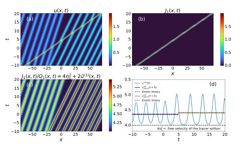
<figcaption class="paper-figure-caption"><b>Fig 2.</b> Figure 2. Numerical simulation showing the interaction of a tracer soliton with a bichromatic dilute SG composed of two noninteracting species. (a) KdV field u(x, t). (b) Current field J1(x, t) of the tracer soliton with eigenvalue η1 = 1. (c) Velocity field v1(x, t) = J1/Q1 of the tracer soliton. (d) Time evolution of the instantaneous velocity vinst 1 (Eq. (24)) of the tracer soliton. The mean value of the fluctuations, veff micro, coincide with prediction of the kinetic theory (given by Eq. (10) of Ref. [67]), as indicated by horizontal full and dashed lines.</figcaption>
</figure>
<figure class="paper-figure-card">
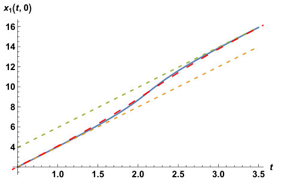
<figcaption class="paper-figure-caption"><b>Fig 3.</b> Figure 3. Characteristic trajectory (blue curve) starting at initial position ¯x1 = 0 computed for solitons with pa- rameters η1 = 1, η2 = 0.75, ξ2 = 4.7. The orange dotted curve corresponds to the free trajectory x = 4η2 1t start- ing at the initial position ¯x1 = 0; the green dotted curve represents the same trajectory shifted by ϕ(η1, η2). The dashed red curve corresponds to the approximation (30).</figcaption>
</figure>
<figure class="paper-figure-card">
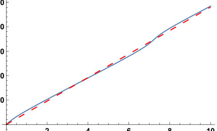
<figcaption class="paper-figure-caption"><b>Fig 4.</b> Figure 4. Characteristic trajectory of a soliton (ηt = 1, ¯xt = 0) within a genus 1 condensate (a = .1, b = .92, c = 1), obtained by solving (40) (full blue line) compared to the trajectory x = veff(η)t (dashed red line) where veff</figcaption>
</figure>

**Summary.** This paper develops a microscopic, field-based theory for interacting KdV solitons by deriving exact charge, current, and velocity fields from the Inverse Scattering Transform. It successfully tracks individual solitons through complex interactions, demonstrating that the system's collective behavior naturally recovers established macroscopic theories like Generalized Hydrodynamics. This unifies wave-based and particle-like descriptions of soliton dynamics.

**Why it may be interesting.** The connection drawn between the wave-based IST formalism and emergent particle-like descriptions, especially the recovery of kinetic theory, provides a powerful, unified framework for understanding non-equilibrium dynamics in nonlinear wave systems relevant to AMO and quantum optics.

Detailed structure

**Main problem.** The primary challenge is developing a microscopic framework to track individual solitons as distinct entities during strong interactions, moving beyond the limitations of asymptotic approximations.

**Main result.** The authors establish that the dynamics of interacting solitons can be described by independent continuity equations for their charges, leading to the recovery of kinetic theory and Generalized Hydrodynamics (GHD) as scaling limits.

**Method.** The work utilizes the Inverse Scattering Transform (IST) of the Korteweg-de Vries (KdV) equation to derive exact space-time fields for charge, current, and velocity associated with individual solitons.

**Model / system.** The system under study is the interaction of Korteweg-de Vries (KdV) solitons. The analysis develops a field-based description using conserved quantities derived from the IST spectral framework.

**Key observables.** Charge density ($Q_m$), current density ($J_m$), and the derived velocity field ($v_m$) of individual solitons.

**Important parameters / regimes.** The analysis explores different regimes, including the strongly interacting regime, the rarefied gas regime, and the thermodynamic limit ($N 	o \infty$).

**Assumptions / limitations.** The framework assumes that the dynamics can be decomposed into independent evolutions for each soliton's charge, with interactions being encoded in initial correlations.

**Figures summary.** Figures illustrate the computed charge, current, and velocity fields during soliton interactions, showing localization and perturbation. Other figures compare exact characteristic trajectories against approximations derived from effective velocity theories.

**Paper structure.** The paper progresses from defining the microscopic field description using IST to deriving continuity equations for individual soliton charges. It then shows how these equations yield effective velocity fields, ultimately connecting the microscopic description to macroscopic kinetic theories like GHD.

Abstract

Solitons in integrable systems exhibit a dual wave-particle character, yet their identification as individual objects becomes ambiguous during interactions, where they deform and delocalize. We develop a microscopic, field-based description that resolves this issue by introducing exact space-time fields of charge, current, and velocity derived from the inverse scattering transform (IST) of the Korteweg-de Vries (KdV) equation. This framework enables individual KdV solitons to be tracked throughout interactions, providing a quantitative description of their trajectories and deformation beyond the asymptotic regime. We show that the dynamics of $N$ interacting solitons can be formulated in terms of $N$ independent continuity equations, in which interactions are encoded in initial correlations that are subsequently propagated. From this microscopic viewpoint, effective velocities and hydrodynamic behavior emerge upon coarse graining, recovering kinetic theory of soliton gases and Generalized Hydrodynamics as scaling limits. Our results establish a direct connection between the wave-based IST formalism and particle-like emergent descriptions, offering a unified framework for soliton dynamics across scales.

[↑ back to top](#top)

### [Phonon-driven nodal surface superconductivity of Fermi arcs](http://arxiv.org/abs/2606.02371v1)

**Authors:** Francesco Buccheri, Alessandro de Martino, Jeroen van den Brink  
**Type:** theory · **Category:** other · **PDF:** <https://arxiv.org/pdf/2606.02371v1>  
**Analysis basis:** full PDF text, analyzed in chunks
**Topic relevance:** `Keldysh / 2PI / non-Gaussian methods` **2/5**

↔ Scroll figures horizontally

<figure class="paper-figure-card">
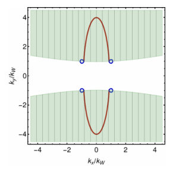
<figcaption class="paper-figure-caption"><b>Fig 1.</b> FIG. 1. Fermi arcs, with fixed energy E/  Dk2 W  = 0.25, boundary parameter α = 0.05. The blue circular contours delimit the projections of the bulk Fermi surface around each node. The shaded region indicates the surface BZ in which the exponential solution corresponding to a pair of Fermi-arc states is normalizable for z &lt; 0.</figcaption>
</figure>
<figure class="paper-figure-card">
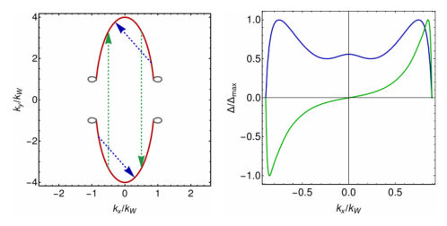
<figcaption class="paper-figure-caption"><b>Fig 2.</b> FIG. 2. Left: illustration of the intra- (blue) and inter-arc (green) scattering processes in the Cooper channel, with ini- tial and final states on the Fermi arcs. Right: the nodal and node-less solutions (normalized to their maximum value) of the gap equation (7) projected to the Fermi surface, in pres- ence of intra- (blue) or inter- (green) arc scattering. Here α = 0.05, Vep = 0.025Dk2 W .</figcaption>
</figure>
<figure class="paper-figure-card">
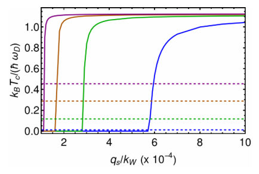
<figcaption class="paper-figure-caption"><b>Fig 3.</b> FIG. 3. Critical temperature for intra- (solid) and inter- (dashed) arc pairing, as a function of the Thomas-Fermi screening momentum. For weak screening inter-arc pairing prevails and the gap is nodal. Here α = 0.05 and three values of the bare electron-phonon interaction rae Vep/Dk2 W = 0.025 (blue), 0.035 (green), 0.045 (orange), 0.055 (purple).</figcaption>
</figure>
<figure class="paper-figure-card">
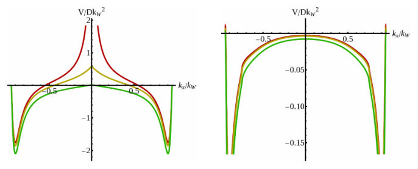
<figcaption class="paper-figure-caption"><b>Fig 4.</b> FIG. 4. Left: intra-arc interaction potentials Right: inter-arc kx →−kx scattering potential. Left: inter-arc τ →−τ scattering potential, for various values of the Thomas-Fermi wavevector, qs/kW = 5 (green), 0.5 (yellow), 0.025 (red).</figcaption>
</figure>

**Summary.** This work theoretically explains how phonon interactions, combined with Coulomb repulsion, can induce superconductivity exclusively on the topological Fermi arcs of Weyl semimetals. The key finding is that weak surface screening favors an inter-arc pairing channel, which results in the observationally important nodal superconducting gap structure. This suggests that surface engineering of the dielectric environment can control the superconducting properties.

**Why it may be interesting.** The detailed theoretical framework for deriving pairing mechanisms from lattice vibrations and surface topology is highly relevant for understanding emergent superconducting states in topological materials, bridging concepts from lattice dynamics and superconductivity theory.

Detailed structure

**Main problem.** The paper addresses the mechanism driving the formation of a superconducting gap specifically on the topological surface states (Fermi arcs) of Weyl semimetals, while the bulk remains non-superconducting.

**Main result.** Nodal superconductivity arises generically from the combination of phonon-mediated attraction and weakly screened long-range Coulomb repulsion acting on disconnected Fermi-arc segments.

**Method.** The authors use a continuum description, deriving effective electron-electron interactions (Coulomb and electron-phonon) and solving the resulting gap equation in the mean-field approximation.

**Model / system.** The system is time-reversal-invariant Weyl semimetals, modeled using a tight-binding approach that yields surface Fermi arcs. The theory incorporates coupling to both surface and bulk phonons and long-range Coulomb interactions.

**Key observables.** Superconducting gap structure (nodal vs. nodeless), critical temperature ($T_c$), and the relative strengths of intra-arc and inter-arc pairing channels.

**Important parameters / regimes.** Coulomb screening strength ($q_s$), phonon frequencies ($\omega$), and the geometry of the Fermi arcs.

**Assumptions / limitations.** The bulk density of states is negligible compared to the surface DOS near the chemical potential, and the analysis relies on linearizing the gap equation near $T_c$.

**Figures summary.** Figures illustrate the Fermi arcs in the surface Brillouin zone, the competition between intra-arc and inter-arc scattering processes, and the dependence of $T_c$ on the screening momentum.

**Paper structure.** The paper progresses by first deriving the electronic structure and the electron-phonon coupling Hamiltonian, then formulating the effective electron-electron interaction, and finally solving the gap equation by distinguishing between intra-arc and inter-arc pairing channels to determine the superconducting gap symmetry and $T_c$.

Abstract

According to recent observations, the topological surface states of Weyl semimetals may develop a superconducting gap, while bulk superconductivity remains absent. What drives the formation of this novel superconducting state is an open question. Here, we show that this phenomenon can arise from the interaction of Fermi arc electrons with both surface and bulk phonons in time-reversal-invariant Weyl semimetals. We identify two competing pairing channels, intra-arc and inter-arc, whose relative strength is governed by the efficiency of Coulomb screening at the surface. The combined effect of the Fermi arcs being disconnected and the weak screening of the Coulomb repulsion at the system's surface causes nodes to appear in the superconducting gap, as observed recently by photoelectron spectroscopy experiments on PtBi2. This suggests manipulation of the Coulomb screening, e.g. by a surface layer coating, as a pathway to engineer the critical temperature, as well as size and symmetry of the surface superconducting gap.

[↑ back to top](#top)

### [Bragg-enhanced time-domain Brillouin scattering from a propagating acoustic grating](http://arxiv.org/abs/2606.02012v1)

**Authors:** O. S. Ken, D. O. Horiachyi, V. L. Korenev, A. V. Trifonov, I. A. Akimov, D. R. Yakovlev, M. Bayer  
**Type:** experiment · **Category:** other · **PDF:** <https://arxiv.org/pdf/2606.02012v1>  
**Analysis basis:** full PDF text, analyzed in chunks
**Topic relevance:** `Frenkel-Kontorova` **1/5** · `analog quantum simulation` **1/5** · `driven-dissipative phase transition` **1/5** · `interference shaping light` **1/5** · `non-equilibrium dynamics` **1/5** · `quantum optics experiment` **1/5**

↔ Scroll figures horizontally

<figure class="paper-figure-card">
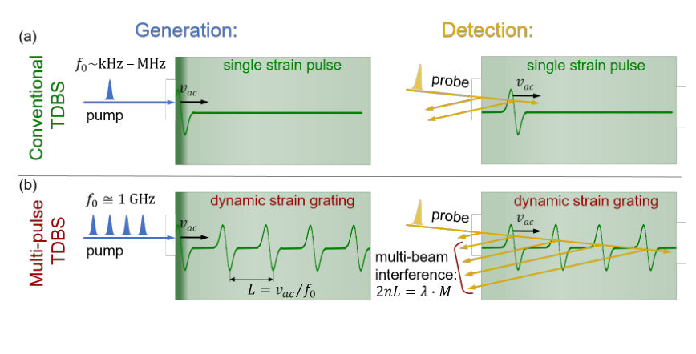
<figcaption class="paper-figure-caption"><b>Fig 1.</b> Figure 1: Schematic illustration of the conventional and multi-pulse TDBS approaches. (a) In conventional TDBS, a single pump pulse generates a propagating strain pulse that scatters the probe light; interference between the scattered field and the probe light reflected from the sample surface gives rise to the TDBS signal. (b) In the multi-pulse approach, a high-repetition-rate (∼1 GHz) train of pump pulses generates a propagating acoustic grating. When the Bragg condition is satisfied, constructive interference of probe light scattered from successive grating planes leads to a pronounced enhancement of the TDBS signal amplitude.</figcaption>
</figure>
<figure class="paper-figure-card">
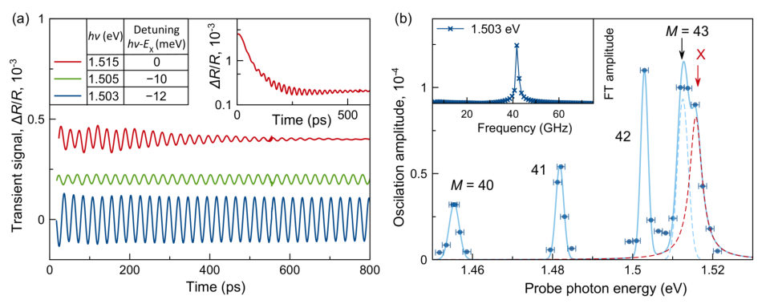
<figcaption class="paper-figure-caption"><b>Fig 2.</b> Figure 2: Results for GaAs. (a) Oscillatory component of the transient signals measured at different probe photon energies hν (the exponential background has been subtracted, and the curves are vertically offset for clarity). The inset shows the raw signal at hν = EX = 1.515 eV. (b) Spectral dependence of the oscillatory signal amplitude (blue dots) revealing peaks which correspond to the interference orders M = 40 −43 and the exciton (X) line. Horizontal error bars indicate the probe spectral width. The solid blue curve shows a global fit given by the sum of Gaussian functions for the interference peaks and a Lorentzian function for the exciton. The dashed light-blue and red curves...</figcaption>
</figure>
<figure class="paper-figure-card">
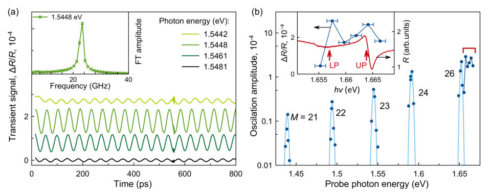
<figcaption class="paper-figure-caption"><b>Fig 3.</b> Figure 3: Results for (Cd,Zn)Te. (a) Variation of the oscillatory components of the transient signals along the contour of the M = 23 Bragg maximum (the exponential background has been subtracted, and the curves are vertically offset for clarity). Inset shows the FT spectrum of the oscillatory component of the signal measured at a probe photon energy hν = 1.5448 eV. (b) Spectral dependence of the oscillatory signal amplitude (blue dots) showing peaks which correspond to interference orders M = 21 −26 and their fit by Gaussian functions (light-blue solid line). Inset shows enlarged spectral region indicated by the bracket in the main panel: the oscillatory signal amplitude (blue dots...</figcaption>
</figure>
<figure class="paper-figure-card">
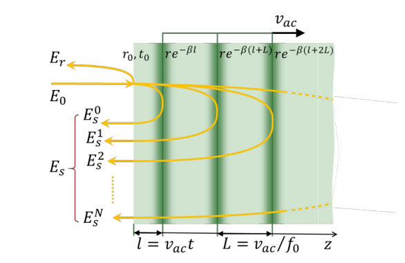
<figcaption class="paper-figure-caption"><b>Fig 4.</b> Figure 4: Schematic illustration of Bragg reflection from a propagating acoustic grating, giving rise to multi- beam interference of the probe light scattered by the different acoustic pulses.</figcaption>
</figure>

**Summary.** This work demonstrates a novel method to enhance the detection of coherent acoustic phonons in semiconductors by generating a propagating acoustic grating using a high-repetition-rate laser pulse train. By exploiting Bragg reflection, the Brillouin light scattering signal is resonantly enhanced by factors up to 30 times compared to single-pulse excitation. This technique provides a highly sensitive tool for studying high-frequency acoustic dynamics in solid-state materials.

**Why it may be interesting.** The use of periodic excitation to engineer a macroscopic optical/acoustic resonance (Bragg enhancement) is a powerful analogy to engineered quantum systems, particularly in cavity QED or photonic structures, demonstrating controlled enhancement of a fundamental physical signal.

Detailed structure

**Main problem.** The study aims to enhance the detection of Brillouin light scattering (BLS) from coherent acoustic phonons in semiconductors by utilizing a propagating acoustic grating.

**Main result.** The multi-pulse approach generates a propagating acoustic grating, leading to a significant resonant enhancement of the BLS signal, observed to be 10-30-fold in GaAs and (Cd,Zn)Te.

**Method.** The technique involves using a high-repetition-rate laser pulse train to create the grating, followed by time-domain Brillouin scattering measurements in a pump-probe configuration.

**Model / system.** The experiment is performed on bulk semiconductors (GaAs and (Cd,Zn)Te) at cryogenic temperatures, utilizing a two-color differential reflectivity pump-probe setup.

**Key observables.** Resonant peaks in the spectral dependence of the TDBS amplitude, the acoustic phonon frequency (f_ac), and the enhancement factor.

**Important parameters / regimes.** The enhancement factor is limited by the number of strain pulses (N) and the finite spectral width of the probe pulse; the resonance condition is governed by the Bragg reflection relation.

**Assumptions / limitations.** The analysis models the signal using a geometric series sum for the total scattered field, assuming normal incidence of the probe beam.

**Figures summary.** Figures illustrate the comparison between conventional single-pulse and multi-pulse TDBS approaches, and show the spectral dependence of the enhanced signal.

**Paper structure.** The paper progresses from introducing the concept of coherent phonon generation to detailing the multi-pulse grating formation, deriving the enhanced signal mathematically via geometric series summation, and finally presenting experimental results on GaAs and (Cd,Zn)Te.

Abstract

Generation and detection of coherent phonons in semiconductors by femtosecond optical pulses is a powerful tool for high-frequency acoustic control of their electronic properties. Here, we demonstrate a propagating one-dimensional acoustic grating in bulk semiconductors using above-band-gap excitation by a train of laser pulses with high repetition rate of 1 GHz. This approach enables shaping of the coherent acoustic phonon spectrum and leads to a significant enhancement of Brillouin light scattering at selected probe wavelengths in pump-probe configuration. We demonstrate this effect at a cryogenic temperature of 5 K in prototypical semiconductor systems, namely bulk crystalline GaAs and (Cd,Zn)Te, which serve as benchmark materials for the proposed method. The spectral dependence of the time-domain Brillouin light scattering amplitude exhibits resonant peaks at discrete probe wavelengths arising from Bragg reflection of the probe light by the propagating acoustic grating. A 10-30-fold resonant enhancement of the signal amplitude is observed for GaAs and (Cd,Zn)Te, determined by the finite spectral width of the probe pulse. With further spectral narrowing, enhancements of the order ~ 100-150 are expected, set by the number N of strain pulses in the acoustic grating within the sample and ultimately limited by the material parameters and sample thickness.

[↑ back to top](#top)

### [Complexity Reveals the Microscopic Origins of Macroscopic Dynamics](http://arxiv.org/abs/2606.01735v1)

**Authors:** Haoyang Qian, Beata Casiday, Gabriel Hood, Malbor Asllani  
**Type:** theory · **Category:** disordered systems and neural networks · **PDF:** <https://arxiv.org/pdf/2606.01735v1>  
**Analysis basis:** full PDF text, analyzed in chunks
**Topic relevance:** `correlated / nonlocal dissipation` **1/5** · `driven-dissipative phase transition` **1/5** · `methods for driven-dissipative` **1/5** · `non-equilibrium dynamics` **1/5** · `non-equilibrium universality` **1/5**

↔ Scroll figures horizontally

<figure class="paper-figure-card">
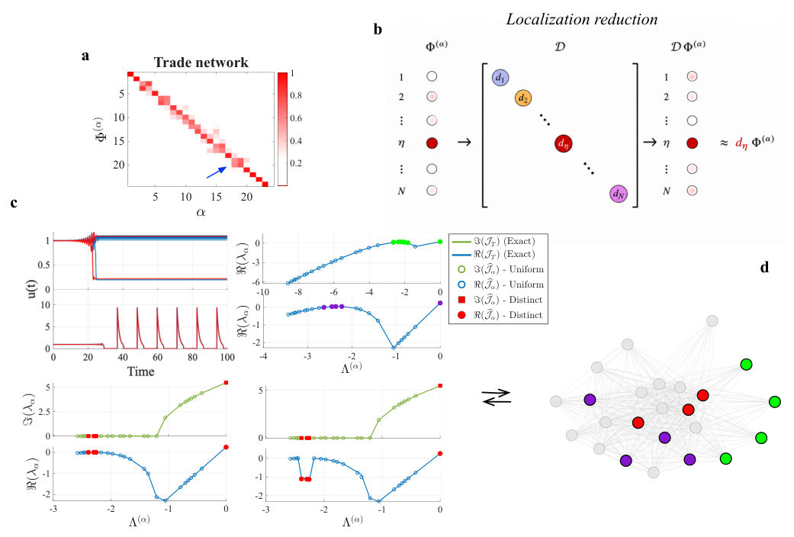
<figcaption class="paper-figure-caption"><b>Fig 1.</b> Figure 1. Localization-based mode–node mapping reveals node-driven dynamics. (a) Heatmap of the Laplacian eigenvector matrix in absolute value for the International Trade Network of Manufactured Goods [42], showing strong spectral localization. The blue arrow highlights an overlap region where multiple localized modes are associated with the same dominant node. (b) Schematic illustration of the localization reduction: when a Laplacian eigenvector Φ(α) localizes around node η, the action of a diagonal heterogeneous matrix D is approximated by DΦ(α) ≈dηΦ(α), establishing an approximate correspondence between localized spectral modes and dominant physical nodes. (c) Master Stability spectra...</figcaption>
</figure>
<figure class="paper-figure-card">
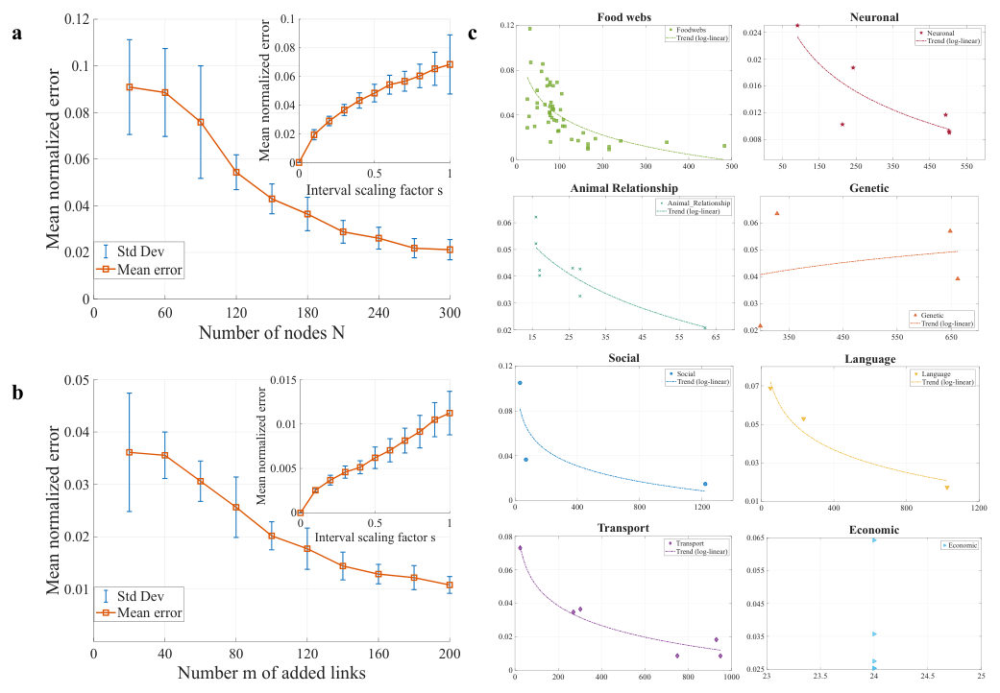
<figcaption class="paper-figure-caption"><b>Fig 2.</b> Figure 2. Accuracy of the spectral reduction and relation to eigenvector localization. (a–b) Mean normalized error (MNE) between the full Jacobian JT and its localized approximation b Jα under two structural variations: increasing system size N in Erd˝os–R´enyi (ER) networks (p = 0.2) (a) and increasing the attachment parameter m in Barab´asi–Albert (BA) networks (b). Each point averages over 50 independent connected realizations (self-loops excluded) with node-level heterogeneity in both diffusion and reaction parameters, sampled independently from fixed intervals. The error decreases with system size and connectivity, respectively, with error bars indicating one standard deviation. Insets...</figcaption>
</figure>
<figure class="paper-figure-card">
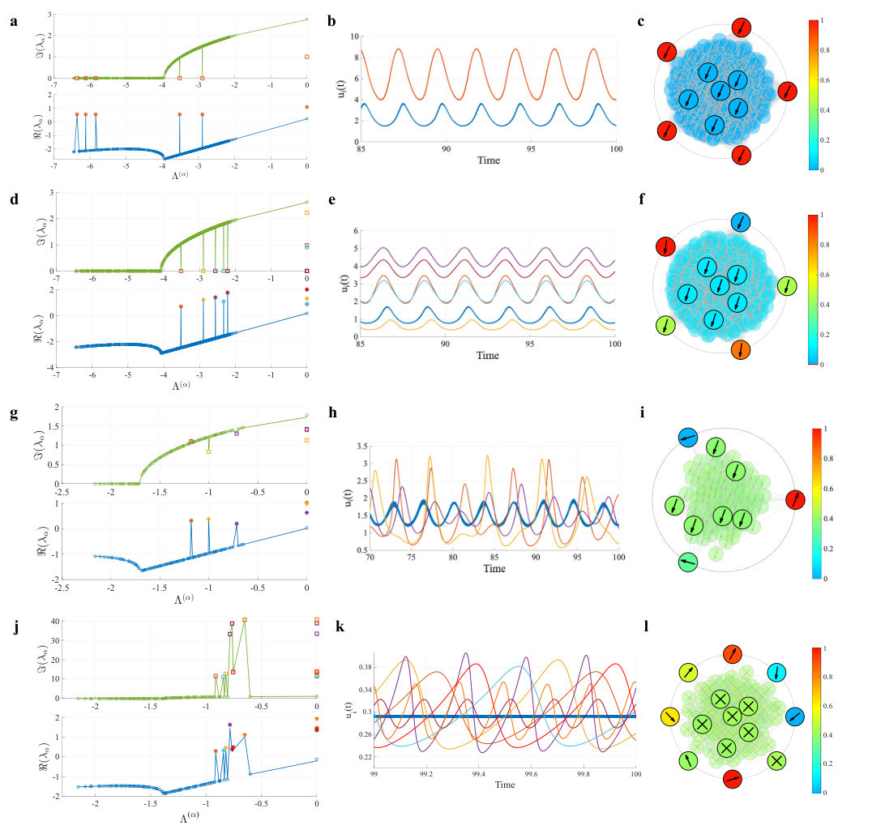
<figcaption class="paper-figure-caption"><b>Fig 3.</b> Figure 3. Spectral localization progressively breaks collective synchronization. Each regime is illustrated by the corresponding Master Stability Function (left), representative node trajectories (middle), and the spatial configuration of the network (right). (a–c) Cluster synchronization: the transverse spectrum splits into two groups of exponents, leading to two internally synchronized clusters that remain frequency-locked through network coupling. (d–f) Amplitude chimera: differences in transverse growth rates generate persistent amplitude segregation while phases remain aligned. (g–i) Amplitude–phase chimera: unstable modes acquire non-zero imaginary parts, leading to simultaneous...</figcaption>
</figure>

**Summary.** This work introduces a node-resolved framework to analyze collective dynamics in complex networks by exploiting spectral localization in the graph Laplacian. By showing that structural disorder concentrates spectral modes onto specific nodes, the authors allow stability analysis to be performed directly in physical node space rather than abstract spectral space. This restores physical interpretability and predicts the onset and nature of emergent collective behaviors.

**Why it may be interesting.** The concept of spectral localization and mapping abstract spectral modes back to physical nodes is a powerful tool for interpreting complex, high-dimensional dynamics, which has parallels in understanding collective excitations in quantum many-body systems.

Detailed structure

**Main problem.** The paper addresses how to restore physical interpretability to collective dynamics in complex, heterogeneous systems whose stability is traditionally analyzed only in abstract spectral space.

**Main result.** Structural disorder in networks induces spectral localization, allowing stability properties to be interpreted directly in node space and enabling the identification of specific nodes driving collective transitions.

**Method.** The authors develop a node-resolved framework by exploiting spectral localization of the graph Laplacian eigenvectors to decouple the full system Jacobian into localized, node-dependent components.

**Model / system.** The analysis uses general networked systems, exemplified by reaction-diffusion models (like the Brusselator) and SIS dynamics, coupled via the network Laplacian structure.

**Key observables.** Localized Master Stability Function (MSF), Mean Normalized Eigenvalue Error (MNE), and the identification of dominant nodes responsible for instability.

**Important parameters / regimes.** Network size (N), parameter heterogeneity (s), and the coupling structure (Adjacency vs. Laplacian).

**Assumptions / limitations.** The core assumption is the existence of strong spectral localization, which allows the complex dynamics to be accurately approximated by local dynamics governed by a 'host node.'

**Figures summary.** Figures illustrate mode-node mapping via heatmaps of Laplacian eigenvectors, compare MNE across different network types (ER, BA, real-world), and show time series demonstrating various collective states like amplitude chimera and oscillon patterns.

**Paper structure.** The paper progresses from establishing the failure of classical spectral theory to proposing the localization-based node-resolved framework. It then applies this framework to analyze stability, predict transition onsets, and characterize various nonlinear collective states (e.g., chimera states) based on the localized spectrum.

Abstract

Real complex systems often exhibit collective transitions emerging from interactions across many components. Classical stability theory describes such transitions in spectral space, where dynamics is organized by spatially extended global eigenmodes whose collective nature obscures direct association with individual physical components. Here, we show that structural disorder in empirical random networks can fundamentally alter this picture. These properties induce spectral localization, causing Laplacian modes to concentrate on small subsets of nodes and producing a mode--node correspondence in which collective dynamics becomes governed predominantly by the local behavior of a dominant node together with their effective coupling to the surrounding network. As a consequence, stability properties can be interpreted directly in node space rather than purely in spectral space. Exploiting this principle, we develop a node-resolved framework that predicts transition onsets, identifies the nodes responsible for emergent collective behavior, and restores interpretability in systems where classical modal theories fail. In heterogeneous reaction networks, the same mechanism gives rise to exotic collective states where different subsets of nodes develop distinct dynamical behaviors beyond those associated with homogeneous assumptions. Our results show that complex network structures naturally generate spectral localization, revealing the microscopic drivers of macroscopic dynamics.

[↑ back to top](#top)

### [Moire-Engineered Excitonic Landscape and Phonon-Mediated Recombination in Twisted WSe2 Bilayers](http://arxiv.org/abs/2606.02131v1)

**Authors:** Memansa Thapa, Aksa Thomas, Jayalekshmi U. J., Krishna Prasad Bera, Darshit Solanki, Kenji Watanabe, Takashi Taniguchi, Ajay Kumar Shukla, Anindya Das, Ajay Soni  
**Type:** experiment · **Category:** other · **PDF:** <https://arxiv.org/pdf/2606.02131v1>  
**Analysis basis:** full PDF text, analyzed in chunks
**Topic relevance:** `analog quantum simulation` **1/5** · `correlated / nonlocal dissipation` **1/5** · `driven-dissipative phase transition` **1/5** · `methods for driven-dissipative` **1/5** · `non-equilibrium dynamics` **1/5**

↔ Scroll figures horizontally

<figure class="paper-figure-card">
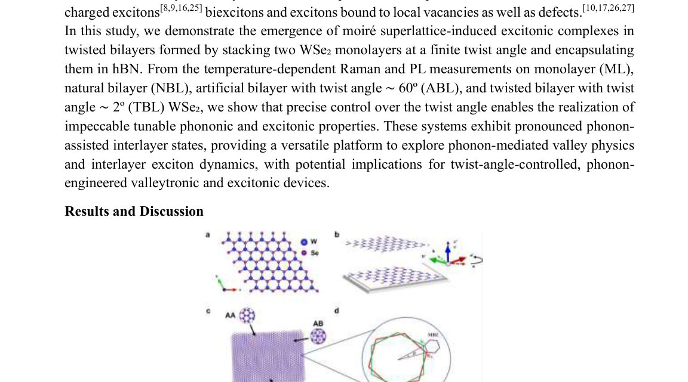
<figcaption class="paper-figure-caption"><b>Fig 1.</b> Figure 1. Structural configuration of twisted bilayers. (a) Top-view of the crystal structure of 2H-WSe2. (b) Schematic of twisting of bilayer WSe2. (c) Schematic representation of the moiré superlattice resulting from the twisting of two WSe2 monolayers, with insets showing the various atomic stackings AA, AB, and SP (saddle point). (d) The Brillouin zones of top (green) and</figcaption>
</figure>
<figure class="paper-figure-card">
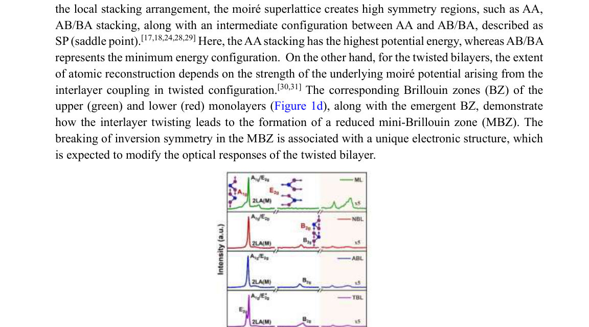
<figcaption class="paper-figure-caption"><b>Fig 2.</b> Figure 2. Raman spectra at 3 K for various stackings of WSe2 layers. Raman spectra of monolayer (ML), natural bilayer (NBL), and fabricated bilayers with twist angle, θ ∼ 60º (artificial bilayer, ABL) and θ ∼ 2º (twisted bilayer, TBL). The insets illustrate the schematics of atomic displacements of the A1g, E2g and B2g modes, where blue and purple spheres denote W and Se atoms, respectively. The intensity of high frequency modes (370 - 425 cm-1) is amplified ~ 5 times for better visibility.</figcaption>
</figure>
<figure class="paper-figure-card">
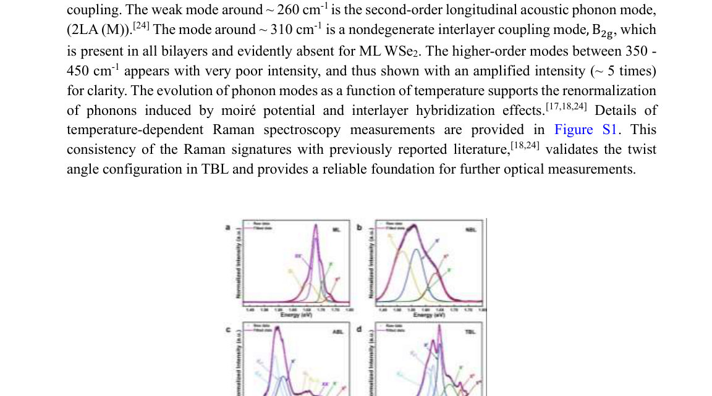
<figcaption class="paper-figure-caption"><b>Fig 3.</b> Figure 3. Normalized PL spectra at 3 K for various stacking layers of WSe2. (a) Monolayer (ML), (b) natural bilayer (NBL), (c) artificial bilayer fabricated with twist angle, θ ∼ 60º (ABL), and (d) twisted bilayer with θ ∼ 2º (TBL).</figcaption>
</figure>
<figure class="paper-figure-card">
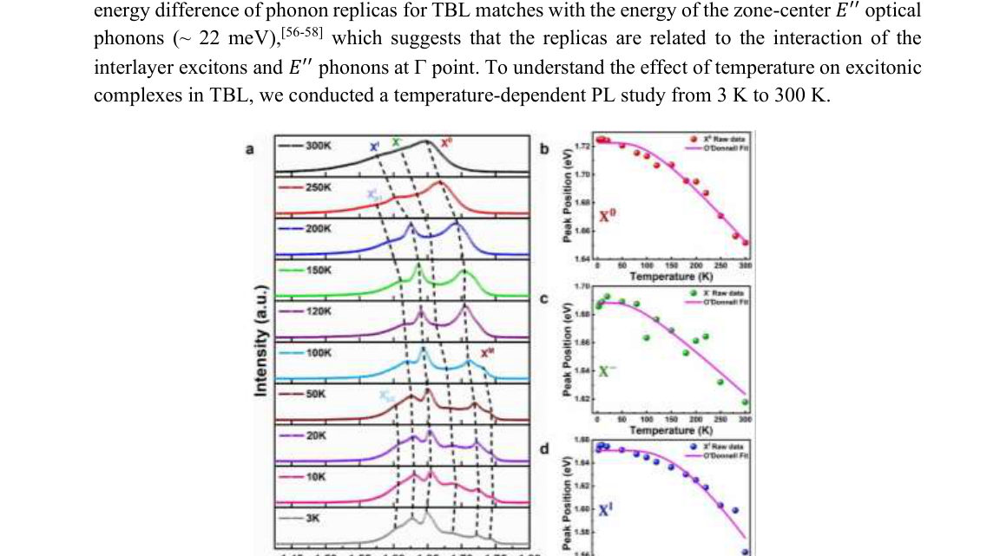
<figcaption class="paper-figure-caption"><b>Fig 4.</b> Figure 4. Temperature dependence of PL for TBL. (a) Normalized PL spectra of TBL between 3 K to 300 K. Temperature-dependent shifting of (b) neutral exciton (X0), (c) trion (X−), and (d) interlayer exciton (XI), with solid lines representing the O’Donnell equation fit.[8,59]</figcaption>
</figure>
<figure class="paper-figure-card">
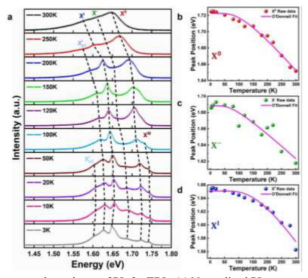
<figcaption class="paper-figure-caption"><b>Fig 5.</b> Figure 4a shows the evolution of the PL spectrum as a function of temperature in the range 3 K to 300 K. Notably, within the temperature range 3 K - 50 K, the phonon replicas are well resolved and prominent, signifying strong exciton-phonon coupling. However, as the temperature rises, the replicas gradually smear their individual prominence and broaden. This merging arises as the</figcaption>
</figure>

**Summary.** This work reports on the use of moiré engineering in twisted WSe2 bilayers to control optoelectronic properties. By tuning the twist angle, researchers observe enhanced interlayer exciton emission and strong exciton-phonon coupling. This establishes the TBL as a highly tunable platform for studying quantum phenomena in 2D materials.

**Why it may be interesting.** The detailed study of exciton-phonon coupling in a tunable, engineered quantum material platform (TBL) provides quantitative parameters for understanding open quantum systems dynamics in 2D semiconductors.

Detailed structure

**Main problem.** The study investigates how engineering the twist angle in twisted WSe2 bilayers modifies the excitonic landscape and controls phonon-mediated recombination processes.

**Main result.** The moiré potential significantly enhances interlayer exciton emission and stabilizes these excitons by redistributing carriers into indirect valleys, while also suppressing defect-related emission.

**Method.** The research employs low-temperature photoluminescence (PL) spectroscopy and temperature-dependent Raman spectroscopy to probe electronic and vibrational properties.

**Model / system.** The physical system is a twisted bilayer of tungsten diselenide (WSe2/WSe2) encapsulated in hBN, forming a moiré superlattice. The analysis models temperature dependence using the Varshni and O’Donnell equations.

**Key observables.** Interlayer exciton emission ($	ext{X}_{	ext{I}}$), phonon replicas ($	ext{X}_{	ext{p}1	ext{I}}, 	ext{X}_{	ext{p}2	ext{I}}$), PL intensity, and Raman mode splittings.

**Important parameters / regimes.** Twist angle ($	heta$), temperature (3 K to 300 K), and fitting parameters like Varshni ($\alpha, eta$) and O’Donnell ($S, \hbar\omega$) constants.

**Assumptions / limitations.** The electronic structure modification is assumed to be dictated by the moiré potential, and temperature effects are modeled using established empirical equations (Varshni/O’Donnell).

**Figures summary.** Figures show PL spectra comparing different stacking orders (ML, NBL, TBL) and Raman spectra demonstrating mode splitting due to moiré potential hybridization.

**Paper structure.** The paper systematically compares PL and Raman signatures across various stacking configurations (ML, NBL, ABL, TBL) to quantify how twist angle controls exciton localization, phonon coupling, and temperature-dependent bandgap renormalization.

Abstract

We report light emission from the moire superlattice of a twisted bilayer of tungsten diselenide (WSe2/WSe2) encapsulated in insulating hexagonal boron nitride (hBN). The low-temperature photoluminescence (PL) spectroscopy reveals signatures of moire-potential induced strong interlayer excitonic emission and phonon-assisted recombination, while the twisting significantly suppresses the emission from localized defect-bound excitons. The moire potential redistributes carriers into indirect valleys, thereby enhancing recombination efficiency and stabilizing the interlayer excitons. Our findings establish that precise control of twist angle and dielectric environment provides a new route for engineering excitonic systems for exploring exciton-phonon interactions and associated quantum phenomena in transition metal dichalcogenides.

[↑ back to top](#top)

### [Magnum.np.distributed: Accelerating Finite Difference Micromagnetic Simulations with Multiple GPUs](http://arxiv.org/abs/2606.01114v1)

**Authors:** Tsz Chung Cheng, Yuichiro Kurokawa, Hiromi Yuasa  
**Type:** theory · **Category:** numerical methods · **PDF:** <https://arxiv.org/pdf/2606.01114v1>  
**Analysis basis:** full PDF text, analyzed in chunks
**Topic relevance:** `analog quantum simulation` **1/5** · `exotic spin models in light-matter` **1/5** · `methods for driven-dissipative` **1/5** · `spintronics-quantum-optics interface` **1/5**

↔ Scroll figures horizontally

<figure class="paper-figure-card">
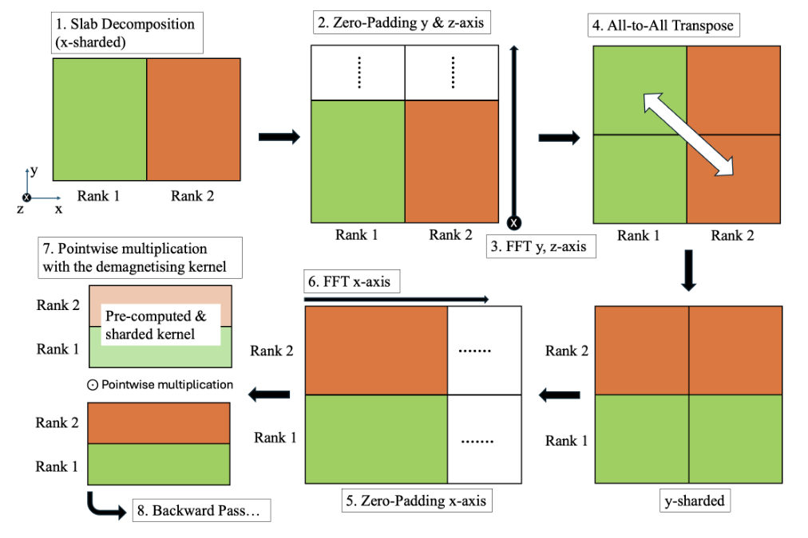
<figcaption class="paper-figure-caption"><b>Fig 1.</b> Figure 1. Schematic diagram of the distributed 3D FFT implementation. The magnetisation is first split along the x-axis using slab decomposition. The magnetisation is padded, and the FFT is computed along the y and x axes. An all-to-all transpose is then performed to shard the vectors along the y-axis, followed by zero-padding and FFT computation along the x-axis. Then, a point-to-point multiplication is performed using the demagnetisation kernel. For the backward pass, the steps are reverted with truncation replacing padding and inverse FFT replacing the forward FFT.</figcaption>
</figure>
<figure class="paper-figure-card">
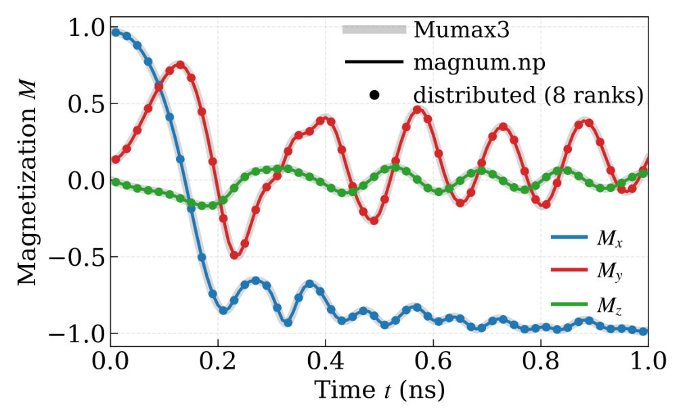
<figcaption class="paper-figure-caption"><b>Fig 2.</b> Figure 2. Simulated magnetisation components in the muMAG standard problem 4. The results from Mumax3 and the original non-distributed version of magnum.np were compared with those from the distributed implementation using 8 ranks. The results match both references, validating the implementation of the distributed LLG-RKF45 solver, demagnetisation, and exchange effective field.</figcaption>
</figure>
<figure class="paper-figure-card">
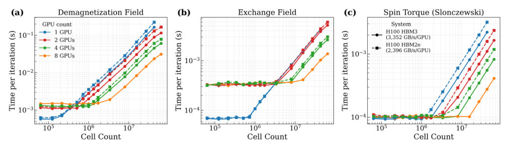
<figcaption class="paper-figure-caption"><b>Fig 3.</b> Figure 3. Performance (time per iteration) of various effective fields on two single-node NVIDIA H100 Hopper GPU systems: HBM3 (solid lines, 3,352 GB/s/GPU, up to 8 GPUs via NVSwitch) and HBM2e (dashed lines, 2,396 GB/s/GPU, up to 4 GPUs via NVLink). (a) The demagnetisation field is computationally and communication-intensive; performance gains begin at around 106 cells on both systems. Despite the 40% difference in memory bandwidth, both systems exhibit near-identical relative scaling, confirming that speedup is governed by the algorithm’s communication-to-computation ratio. (b) The exchange field requires a halo exchange at each slab boundary. Significant overhead is observed below 106...</figcaption>
</figure>
<figure class="paper-figure-card">
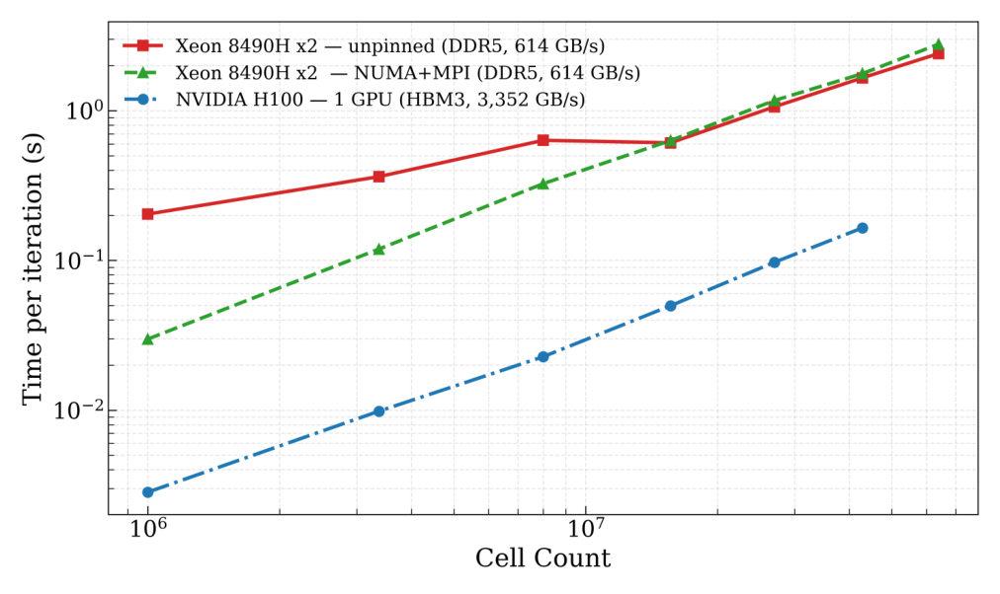
<figcaption class="paper-figure-caption"><b>Fig 4.</b> Figure 4. Performance (time per iteration) of the demagnetisation field. Non-distributed magum.np was evaluated on a single NVIDIA H100 HBM3 GPU, and a CPU compute node with 2 Intel Xeon Platinum 8490H 60-core CPUs (no NUMA-pinning). The distributed magnum.np implementation enabled NUMA-based pinning to reduce cross-NUMA communication and yielded a significant performance gain at 106 cells, bringing it to within 10 times slower than a single GPU.</figcaption>
</figure>
<figure class="paper-figure-card">
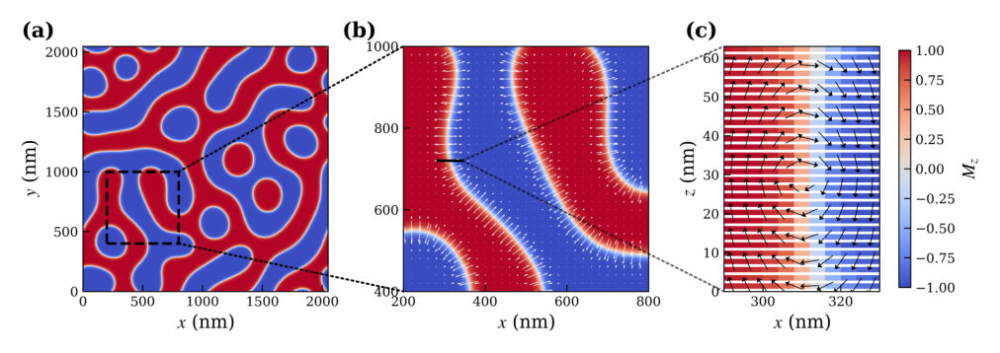
<figcaption class="paper-figure-caption"><b>Fig 5.</b> Figure 5. A simulated i-DMI inducing multilayer. (a) Mz at the top layer after relaxation via LLG-RKF45 solver. (b) A zoom-in view of (a) with arrows depicting in-plane components. (c) Cross-section across a domain wall where arrows depict the x and z-components. A vortex is formed in the film with weak i-DMI.</figcaption>
</figure>

**Summary.** This work presents a novel, Python-native, multi-GPU framework built on PyTorch Distributed to accelerate micromagnetic simulations. By efficiently distributing the computational mesh, the authors achieve substantial speedups in calculating critical effective fields like the demagnetization field. This advancement allows researchers to model larger and more complex spintronic devices previously out of reach due to computational limitations.

**Why it may be interesting.** While focused on classical micromagnetics, the core contribution is a highly optimized, portable, and scalable numerical framework using modern deep learning infrastructure (PyTorch Distributed) for solving complex partial differential equations, which is highly relevant for simulating quantum many-body dynamics.

Detailed structure

**Main problem.** The primary goal is to accelerate computationally intensive finite difference micromagnetic simulations, which are essential for studying nanomagnetism and spintronics.

**Main result.** The authors achieved significant speedups, reporting up to a 7.0x acceleration for demagnetization field calculations across 8 GPUs via NVLink, and a 6.8x speedup on CPU using NUMA pinning.

**Method.** They extended the Python-native FDM solver `magnum.np` by integrating PyTorch Distributed to enable efficient, multi-GPU computation across sharded simulation meshes.

**Model / system.** The simulations model micromagnetism using the Landau-Lifshitz-Gilbert (LLG) equation, applied to systems like permalloy magnets and Pt/Gd/Co/Ni stacks.

**Key observables.** Simulation time per iteration step, calculated effective fields (demagnetization, exchange), and magnetization components ($M_z$, in-plane components).

**Important parameters / regimes.** The simulation size can reach $23.6$ million cells; performance is benchmarked across various hardware, including H100 GPUs and multi-socket CPUs.

**Assumptions / limitations.** The framework assumes the simulation mesh can be sharded along one axis, and performance scaling is limited by communication overheads like halo exchange latency.

**Figures summary.** Figures illustrate the schematic of the distributed 3D FFT implementation, comparisons of simulated magnetization components for standard problems, and performance scaling plots comparing GPU vs. CPU execution times.

**Paper structure.** The paper details the extension of the solver using PyTorch Distributed, presents performance benchmarks across different effective field calculations (demagnetization, exchange), and validates the results against established solvers like Mumax3.

Abstract

Micromagnetic simulations are essential tools in nanomagnetism and spintronics research. Although widely adopted solvers like Mumax3 and the Python-native magnum.np use GPU acceleration to improve performance, these tools are limited to single-device computation. In this work, we present the first Python-native multi-GPU micromagnetic framework by extending magnum.np with PyTorch Distributed. This leverages high-speed communication and computation across multiple GPUs while retaining the benefits of ease of installation, platform-agnostic design, and compatibility with Python. For computationally intensive demagnetisation effective-field calculations, we achieve a 7.0x speedup across 8 GPUs connected via NVLink, whereas Halo exchange required for Heisenberg exchange shows limited scaling due to kernel dispatch latency. We also demonstrated the framework's versatility by achieving a 6.8x speedup in demagnetisation field computation on CPU with NUMA pinning via the MPI backend of PyTorch Distributed. Faster turnaround times will enable researchers to explore larger, more complex systems and accelerate the design cycle for novel spintronic devices.

[↑ back to top](#top)

### [Rogue waves from noise-induced modulational instability of a plane wave](http://arxiv.org/abs/2606.01406v1)

**Authors:** D. S. Agafontsev  
**Type:** theory · **Category:** other · **PDF:** <https://arxiv.org/pdf/2606.01406v1>  
**Analysis basis:** full PDF text, analyzed in chunks
**Topic relevance:** `analog quantum simulation` **1/5** · `driven-dissipative phase transition` **1/5** · `non-equilibrium dynamics` **1/5** · `non-equilibrium universality` **1/5**

↔ Scroll figures horizontally

<figure class="paper-figure-card">
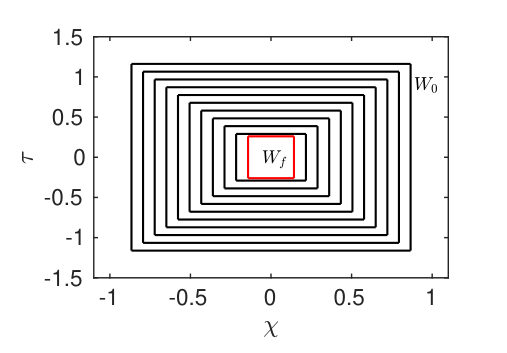
<figcaption class="paper-figure-caption"><b>Fig 1.</b> FIG. 1. (Color on-line) Rectangular regions in the (χ, τ)- variables, over which the deviations (41) between RWs and their fits with various exact solutions are calculated. Black lines show the nested rectangles Wm, m = 0, ..., 9, while red lines indicate the rectangular region Wf, in which the param- eters of the fits with exact solutions are calculated.</figcaption>
</figure>
<figure class="paper-figure-card">
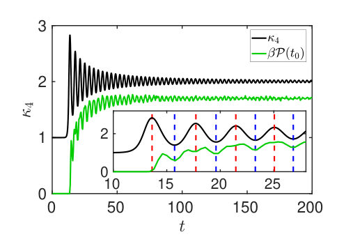
<figcaption class="paper-figure-caption"><b>Fig 2.</b> FIG. 2. (Color on-line) Evolution of the fourth-order mo- ment of amplitude κ4 = ⟨|ψ|4⟩/⟨|ψ|2⟩2 (black) and distribu- tion P(t0) of moments of time t0 when RWs reach their max- imum amplitude (green), scaled with a coefficient β = 307 for better visualization. The inset shows a zoomed-in beginning of the nonlinear stage of MI (the transient regime), with the red dashed lines indicating the moments of the first four local maximums of κ4 at t = 13.6, 17.7, 21.4 and 25, and the blue dashed lines – the moments of the first four local minimums at t = 15.7, 19.6, 23.3 and 26.8.</figcaption>
</figure>
<figure class="paper-figure-card">
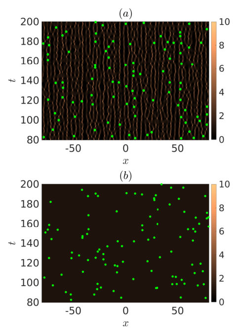
<figcaption class="paper-figure-caption"><b>Fig 3.</b> FIG. 4. (Color on-line) (a) Space-time evolution near the statistically stationary state of MI, t ∈[80, 200], from one re- alization of initial conditions (36). Color shows the intensity |ψ|2, while green dots indicate the positions of RW maxi- mums. (b) Random uniformly distributed positions (green dots) of the same number as the number of RWs detected in the experiment from panel (a). The color background is added for ease of comparison with panel (a) and corresponds to unit intensity.</figcaption>
</figure>
<figure class="paper-figure-card">
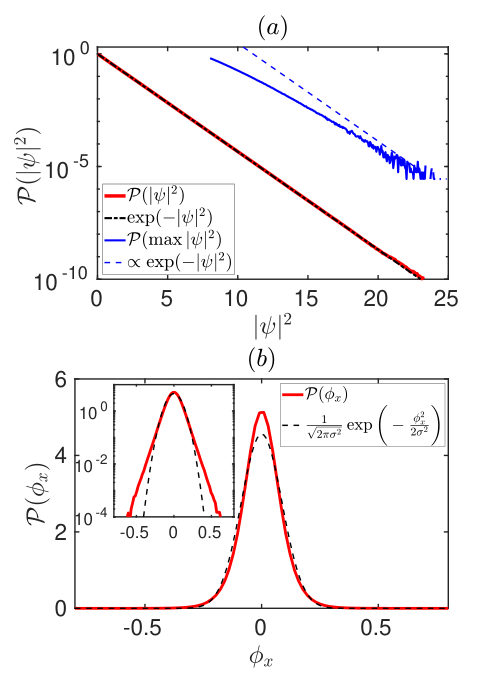
<figcaption class="paper-figure-caption"><b>Fig 4.</b> FIG. 3. (Color on-line) (a) PDFs of intensity for the whole wavefield P(|ψ|2) (red) and for the maximums of collected RWs P(max |ψ|2) (blue), and (b) PDF of chirp ϕx = ∂arg ψ/∂x at the RW maximums, for RWs close to the statistically stationary state t ∈[80, 200] of MI. In panel (a), the black dash-dot line shows the exponential distribution exp(−|ψ|2), while the blue dashed line indicates exponential dependency ∝exp(−|ψ|2). In panel (b), the inset shows the same PDF in semi-logarithmic scale, while the black dashed line marks the Gaussian distribution of the same variance.</figcaption>
</figure>
<figure class="paper-figure-card">
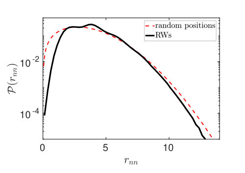
<figcaption class="paper-figure-caption"><b>Fig 5.</b> FIG. 5. (Color on-line) Ensemble-averaged PDFs of space- time distance to the nearest neighbor rnn for RW maxi- mums (thick black) and random uniformly distributed posi- tions (47) with density µ = 2.12×10−2 per unit area (dashed red). When calculating rnn, the space-time distance between two points is measured according to Eq. (46) and the pe- riodic boundary conditions are forced in the time interval t ∈[80, 200] to model points outside of this interval.</figcaption>
</figure>

**Summary.** This paper numerically studies rogue wave formation in the 1D-NLSE under noise-induced modulational instability. It systematically analyzes these extreme events by comparing them against known exact solutions, finding that the dynamics are best described by the collision of a few nonlinear modes. The results suggest that RWs arise from the synchronization of these underlying nonlinear structures.

**Why it may be interesting.** This work is highly relevant to the study of open quantum systems and quantum optics because the 1D-NLSE is a canonical model for nonlinear wave propagation, and the study of extreme events like rogue waves provides insights into nonlinear energy localization and wave-wave interactions.

Detailed structure

**Main problem.** The paper investigates the formation and characteristics of rogue waves (RWs) that emerge during the nonlinear stage of noise-induced modulational instability (MI) in a plane wave.

**Main result.** The study shows that RWs are significantly more numerous than in linear systems, and their dynamics are best approximated by the collision of two nonlinear modes, such as solitons or breathers.

**Method.** The analysis combines numerical simulations of the 1D-NLSE with rigorous comparisons of the observed RWs against known exact solutions derived via the Inverse Scattering Transform (IST).

**Model / system.** The primary model is the one-dimensional nonlinear Schrödinger equation (1D-NLSE) of the focusing type. The analysis compares RWs generated from noise-induced MI against various exact solutions, including multi-soliton and multi-breather collision models.

**Key observables.** Frequency of RW occurrence (monitored via the fourth-order moment $\kappa_4$), the intensity distribution of RWs, and the deviation measure $D_\Lambda$ used to quantify the fit quality between observed RWs and theoretical models.

**Important parameters / regimes.** The analysis depends on the initial noise spectrum (Gaussian vs. MI spectrum) and the parameters defining the best-fit models, such as soliton/breather eigenvalues ($\lambda_n$) and collision parameters.

**Assumptions / limitations.** The core hypothesis tested is that RWs emerge due to the synchronization of only a few nonlinear modes (solitons or breathers) within the complex wavefield, although this is noted as potentially naive.

**Figures summary.** Figures compare the Probability Density Functions (PDFs) of intensity and phase slope across different spectral regimes (MI vs. Gaussian) and show nested rectangular regions used for calculating the deviation measure $D_\Lambda$ during model fitting.

**Paper structure.** The paper progresses from establishing the physical model (1D-NLSE) and the phenomenon (RWs from MI) to developing advanced mathematical tools (IST, dressing method) and finally comparing the numerically observed RWs against a comprehensive database of known exact solutions (soliton/breather collisions).

Abstract

In the framework of the one-dimensional nonlinear Schrodinger equation (1D-NLSE) of the focusing type, the present paper studies numerically rogue waves (RWs) that emerge in the nonlinear stage of noise-induced modulational instability of a plane wave. For a large ensemble of simulations, all sufficiently large local maximums of the wavefield (i.e., RWs) are systematically collected and analyzed. It is shown that the frequency of occurrence of such maximums begins to increase from zero at the time, when the fourth-order moment of amplitude reaches its first (largest) local maximum, and then grows in an oscillatory manner approaching its asymptotic value at long time. Near the statistically stationary state, the 1D-NLSE generates a much larger number of RWs than a comparable linear system, but, in average, one RW affects a much smaller spatiotemporal area. The distribution of these RWs by maximum intensity represents an exponential-like function without noticeable changes in behavior, indicating a similar origin for RWs of significantly different amplitudes. The collected RWs are compared within a sufficiently large spatiotemporal window with nine exact solutions, of which two models reproduce RW dynamics much better than the others: a general collision of two solitons and a general collision of two Tajiri-Watanabe breathers; RWs are fitted with these collisions using pre-compiled databases of such solutions. The parameters of the two models turn out to be quite similar to the direct scattering transform spectrum of the whole wavefield, supporting a hypothesis that RWs may emerge due to synchronization of a few nonlinear modes (solitons or breathers) in presence of many other nonlinear modes of the wavefield.

[↑ back to top](#top)

### [Quantum Statistics and Structural Topology Govern Thermal Transport in Two-Dimensional Monolayer Amorphous Carbon](http://arxiv.org/abs/2606.01408v1)

**Authors:** Gizem Kurt, Haldun Sevincli  
**Type:** theory · **Category:** disordered systems and neural networks · **PDF:** <https://arxiv.org/pdf/2606.01408v1>  
**Analysis basis:** full PDF text, analyzed in chunks
**Topic relevance:** `Keldysh / 2PI / non-Gaussian methods` **1/5** · `methods for driven-dissipative` **1/5** · `non-equilibrium dynamics` **1/5**

↔ Scroll figures horizontally

<figure class="paper-figure-card">
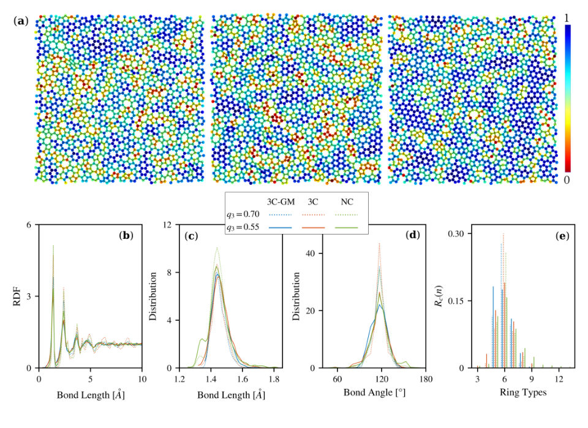
<figcaption class="paper-figure-caption"><b>Fig 1.</b> Figure 1: (a) Continuous random network (CRN) and embedded nanocrystallite (NC@RN) structures obtained using 3C-GM, 3C, and nC algorithms are shown in the left, center, and right panels. The colors represent the value of the local bond order parameter, q3. The average q3 value is 0.6 and it is the same for all structures shown in (a). Radial distribution function (b), bond length distribution (c), bond angle distribution (d), and ring statistics (e) of the configurations with different structural types and two different q3 parameters are shown in the lower panels.</figcaption>
</figure>
<figure class="paper-figure-card">
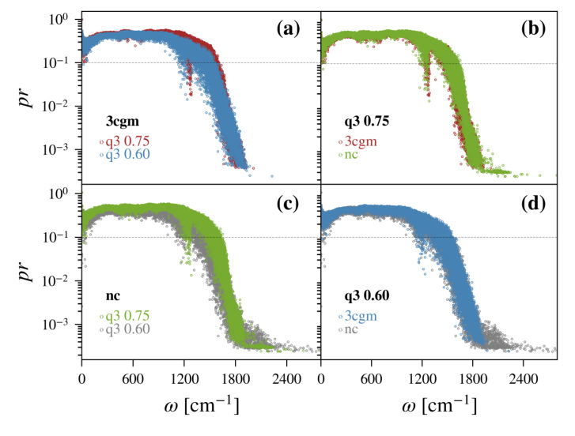
<figcaption class="paper-figure-caption"><b>Fig 2.</b> Figure 2: Mode participation ratios (PRs) for 3C-GM and NC@RN structures with order parameter values of q3 = 0.60 and q3 = 0.75.</figcaption>
</figure>
<figure class="paper-figure-card">
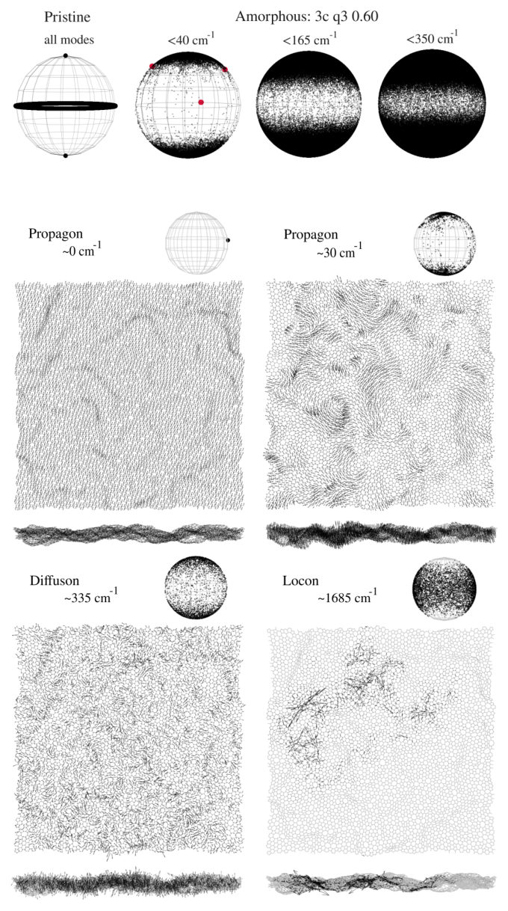
<figcaption class="paper-figure-caption"><b>Fig 3.</b> Figure 3: (a) Polarization spheres of 2D crystalline graphene (all modes) and amorphous carbon (certain frequency ranges) contrast the directionality of crystalline and amorphous structures in 2D. (b) Atomic displacements and corresponding polarizations of four selected modes illustrate the distinctive features of propagons, diffusons and locons. 20</figcaption>
</figure>
<figure class="paper-figure-card">
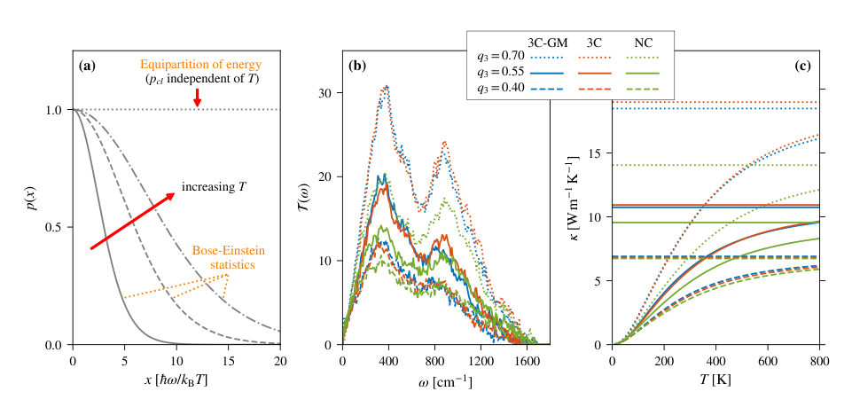
<figcaption class="paper-figure-caption"><b>Fig 4.</b> Figure 4: Classical and quantum mechanical weight functions are plotted as a function of x = ℏω/kBT (a). The classical weight function is equal to unity independent of temper- ature, whereas the quantum mechanical one peaks at x = 0 and approaches pcl at the high-temperature limit. Transmission (b) and conductivity (c) for different structure types and q3 values. Blue, red, and green colors represent 3C-GM, 3C, and nC schemes, while dotted, solid, and dashed curves stand for q3 values of 0.7, 0.55, and 0.4, respectively. In (b), the horizontal lines depict thermal conductivity values at the classical limit.</figcaption>
</figure>
<figure class="paper-figure-card">
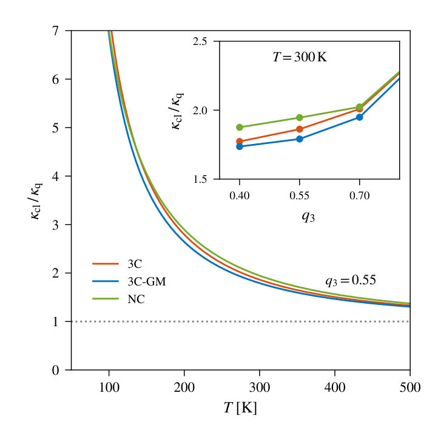
<figcaption class="paper-figure-caption"><b>Fig 5.</b> Figure 5: The ratio of classical and quantum thermal conductivities in MAC with q3 = 0.55 is plotted as a function of temperature (main plot), and at room temperature for varying q3 values (inset).</figcaption>
</figure>

**Summary.** This work theoretically investigates heat conduction in 2D amorphous carbon by coupling structural disorder ($q_3$) with quantum statistics. Using the Landauer formalism, the authors show that quantum effects significantly suppress thermal conductivity compared to classical models. The findings establish that the overall degree of amorphization is the dominant factor controlling heat flow in these disordered quantum materials.

**Why it may be interesting.** The rigorous quantum mechanical treatment of heat transport in amorphous solids, particularly the comparison between quantum and classical limits, provides insights into energy dissipation mechanisms in disordered quantum materials.

Detailed structure

**Main problem.** The study investigates how structural topology, degree of amorphization, and quantum statistics govern the thermal transport in two-dimensional amorphous solids.

**Main result.** Quantum thermal conductivity is significantly lower than classical predictions, and the thermal transport is primarily governed by the global degree of amorphization ($q_3$) rather than specific microscopic structural details.

**Method.** The authors employ a fully quantum mechanical framework using the Landauer formalism and Green's function techniques to calculate thermal conductivity ($\kappa$).

**Model / system.** The physical system is two-dimensional monolayer amorphous carbon (MAC). Configurations are generated using various amorphization algorithms (e.g., Zachariasen-type networks) and characterized by the local bond order parameter, $q_3$.

**Key observables.** Quantum Thermal Conductivity ($	ext{TC}$), Participation Ratio ($	ext{PR}$), Local bond order parameter ($q_3$), and vibrational mode characteristics (propagons, diffusons, locons).

**Important parameters / regimes.** Temperature ($T$), degree of amorphization ($q_3$), and the ratio of classical to quantum conductivity ($\kappa_{cl}/\kappa_q$).

**Assumptions / limitations.** The analysis relies on the Landauer formalism and assumes the system can be modeled by partitioning it into a central amorphous region and semi-infinite crystalline reservoirs.

**Figures summary.** Figures illustrate representative MAC structures, the dependence of $\kappa$ on $T$ and $q_3$, and comparisons between quantum and classical conductivity predictions.

**Paper structure.** The paper systematically analyzes structural characterization (using $q_3$ and bond statistics), vibrational mode analysis (using PR and polarization spheres), and finally calculates $\kappa(T)$ by comparing quantum (Bose-Einstein) and classical limits.

Abstract

We investigate the quantum thermal conductivity (TC) of two-dimensional monolayer amorphous carbon (MAC). We employ three distinct amorphization algorithms to generate various possible MAC configurations, ranging from Zachariasen-type continuous random networks to nanocrystallites embedded in random networks. The local bond order parameter, q3, is used to quantify the amorphousness of the structures, and TC is computed as functions of q3 and temperature. This framework enables us to assess how structural topology, degree of amorphization, and quantum statistics contribute to heat conduction in a two-dimensional amorphous solid. At room temperature, TC values are predicted to range between 3.5 to 10 W/m/K, in agreement with recent experiments. Analysis of vibrational modes reveals that, while the modes of these 2D amorphous structures fall into the usual categories, namely, propagons, diffusons, and locons, their polarization characteristics display distinct behavior. Owing to the fully quantum mechanical framework, we examine both low- and high-temperature characteristics of this 2D amorphous system. By examining the classical limit, we show that classical treatments substantially overestimate the TC of MAC; namely, the quantum TC is less than half of the classical value at room temperature and up to nearly an order of magnitude lower at low temperatures.

[↑ back to top](#top)

### [Ferroelectric hysteresis in singly aligned graphene-hBN moiré superlattices](http://arxiv.org/abs/2606.02338v1)

**Authors:** Bao Q. Tu, Tanweer Ahmed, Garen Avedissian, Suzanne Lancaster, Mayank Sharma, Kenji Watanabe, Takashi Taniguchi, Fèlix Casanova, Marco Gobbi, Luis E. Hueso  
**Type:** experiment · **Category:** other · **PDF:** <https://arxiv.org/pdf/2606.02338v1>  
**Analysis basis:** full PDF text, analyzed in chunks
**Topic relevance:** `analog quantum simulation` **1/5** · `driven-dissipative phase transition` **1/5**

↔ Scroll figures horizontally

<figure class="paper-figure-card">
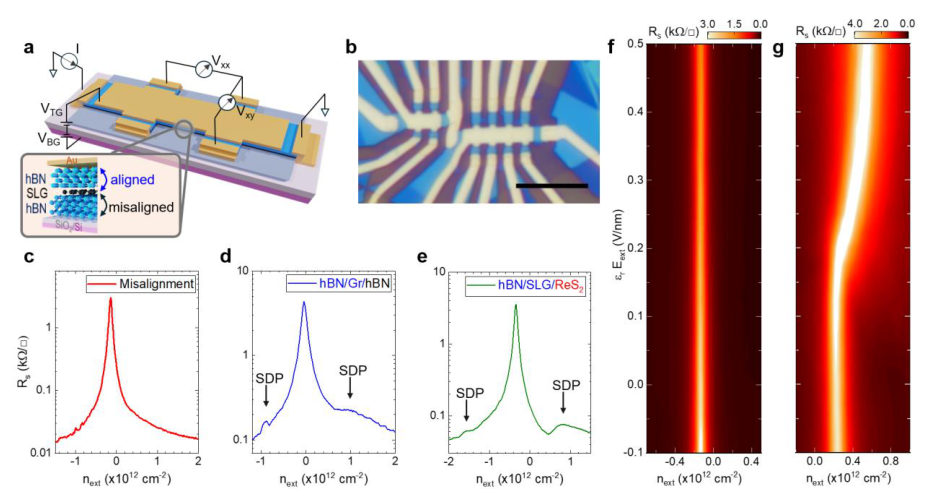
<figcaption class="paper-figure-caption"><b>Fig 1.</b> Figure 1. (a) Device schematic and measurement configurations. The inset shows the cross-</figcaption>
</figure>
<figure class="paper-figure-card">
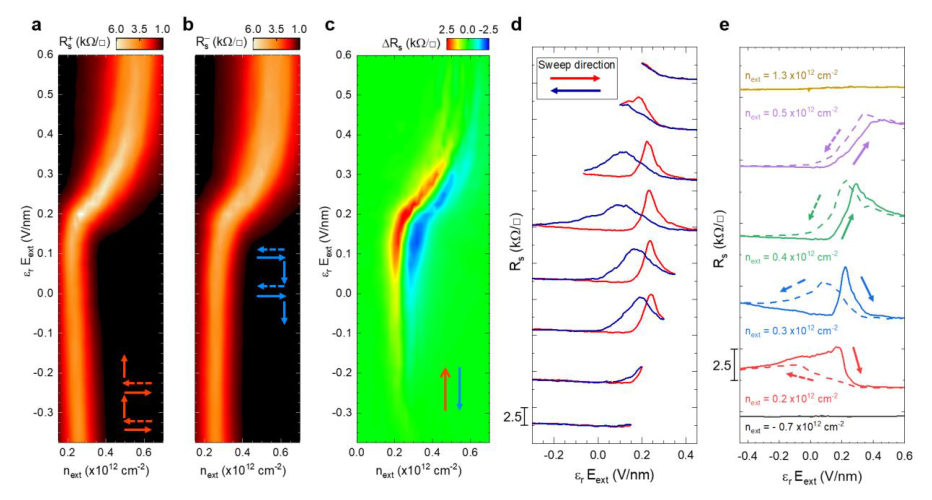
<figcaption class="paper-figure-caption"><b>Fig 2.</b> Figure 2. (a, b), 𝑛ext −𝐸𝑒𝑥𝑡 phase diagram of Device B1 for forward (backward) 𝐸𝑒𝑥𝑡 sweep</figcaption>
</figure>
<figure class="paper-figure-card">
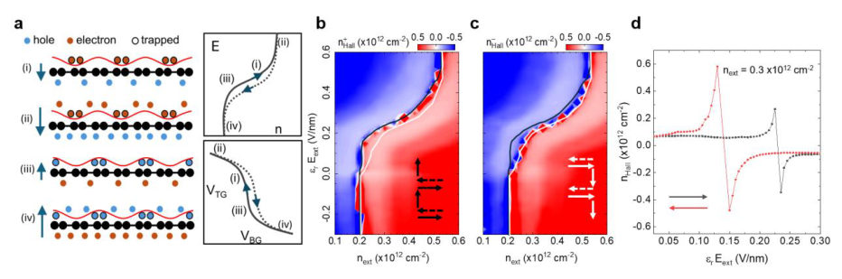
<figcaption class="paper-figure-caption"><b>Fig 3.</b> Figure 3. (a) Schematic illustration of the charge-trapping mechanism at the top moiré</figcaption>
</figure>
<figure class="paper-figure-card">
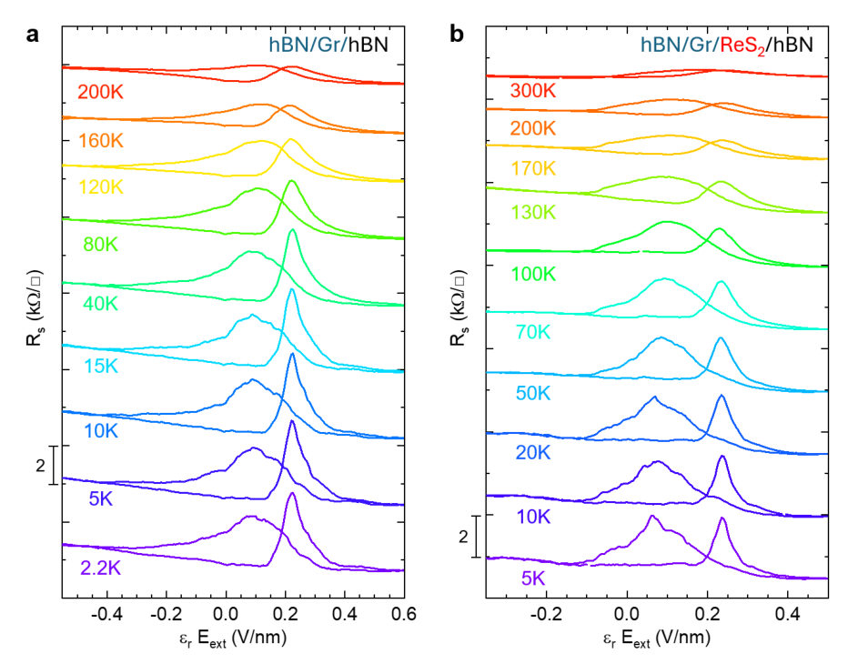
<figcaption class="paper-figure-caption"><b>Fig 4.</b> Figure 4. Temperature dependence of ferroelectric hysteresis in singly aligned hBN/SLG on</figcaption>
</figure>

**Summary.** The researchers successfully demonstrated ferroelectric hysteresis in single-layer graphene/hBN moiré superlattices, proving that single-interface alignment is sufficient to induce this effect. By analyzing the $n_{ext} - E_{ext}$ phase space, they attributed the hysteresis to abnormal charge screening within the moiré band. This work establishes a promising, scalable platform for developing ultrathin, non-volatile electronic devices.

**Why it may be interesting.** While focused on condensed matter electronics, the study of emergent polarization and charge screening in moiré heterostructures touches upon concepts of broken symmetry and emergent order parameters relevant to quantum materials.

Detailed structure

**Main problem.** To determine if ferroelectric hysteresis exists in single-layer graphene (SLG)-hBN moiré superlattices, contrasting with previous work on doubly-aligned systems.

**Main result.** A robust ferroelectric response was demonstrated in the SLG-hBN moiré superlattice, persisting from 2K to room temperature, suggesting a viable platform for non-volatile electronics.

**Method.** Electrical characterization using Hall measurements and sweeping the external electric field ($E_{ext}$) and carrier concentration ($n_{ext}$) to observe hysteretic behavior.

**Model / system.** The physical system is the SLG-hBN moiré superlattice, where the moiré potential dictates the electronic structure and charge screening mechanisms.

**Key observables.** Hysteretic behavior in sheet resistance ($R_S$) vs. $E_{ext}$, deviation of the Charge Neutrality Point (CNP) in the $n_{ext} - E_{ext}$ phase space, and the spontaneous polarization magnitude.

**Important parameters / regimes.** Temperature range (2K to 300K), external electric field ($E_{ext}$), and carrier concentration ($n_{ext}$).

**Assumptions / limitations.** The hysteretic behavior is attributed to abnormal charge screening due to the moiré superlattice band structure, and that single alignment is sufficient to induce the effect.

**Figures summary.** Figures illustrate device schematics, $R_S$ vs. $n_{ext}$ and $n_{ext} - E_{ext}$ phase space diagrams showing hysteresis loops, and temperature dependence confirming the effect's stability.

**Paper structure.** The paper systematically investigates the ferroelectric response by comparing different alignment conditions, mapping the $n_{ext} - E_{ext}$ phase space, quantifying the hysteresis, and confirming the temperature stability of the effect.

Abstract

Ferroelectric materials have the unique ability to maintain an electric polarization which can be reversed under an external applied electric field. This property makes them valuable for applications such as non-volatile random-access memories, transducers, actuators and electro optic modulators. Recently, emergent unconventional ferroelectricity has been demonstrated in moiré superlattices of bilayer graphene and hexagonal boron nitride (hBN) hosting non centrosymmetric stacking order. Whether this phenomenon is also present in noncentrosymmetric single layer graphene (SLG)-hBN moiré superlattices is still under debate. Here we demonstrate a ferroelectric response in an SLG-hBN moiré superlattice. Through Hall measurements, we pinpoint the origin of the hysteretic behavior to abnormal charge screening due to the moiré superlattice band and estimate the spontaneous polarization magnitude in the moiré superlattice structure. Temperature dependent measurements confirm that the hysteretic behavior persists from 2K up to room temperature, opening opportunities for high-mobility, ultrathin non-volatile devices

[↑ back to top](#top)

### [Universal Right-Hand Chirality of Evanescent Vector Fields](http://arxiv.org/abs/2606.01585v1)

**Authors:** Yilin Qing, Ji Zou, Yi-Pu Wang, Gerrit E. W. Bauer, Tao Yu  
**Type:** theory · **Category:** other · **PDF:** <https://arxiv.org/pdf/2606.01585v1>  
**Analysis basis:** full PDF text, analyzed in chunks
**Topic relevance:** `exotic spin models in light-matter` **1/5** · `spintronics-quantum-optics interface` **1/5**

↔ Scroll figures horizontally

<figure class="paper-figure-card">
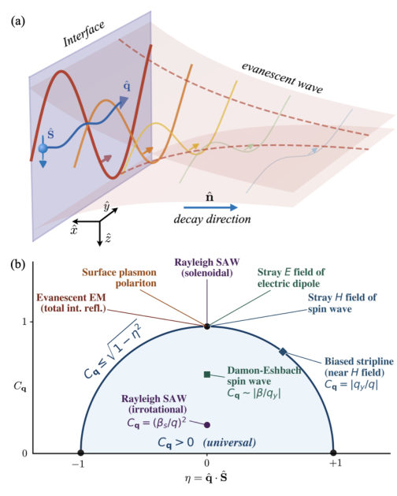
<figcaption class="paper-figure-caption"><b>Fig 1.</b> FIG. 1. (a) Artistic impression of a source-free evanescent vector field propagating along the interface in the ˆy direc- tion, with exponentially decaying amplitude along the inter- face normal −ˆx. (b) Chirality index Cq vs. spin-orbit pa- rameter η. The semicircle Cq = p</figcaption>
</figure>
<figure class="paper-figure-card">
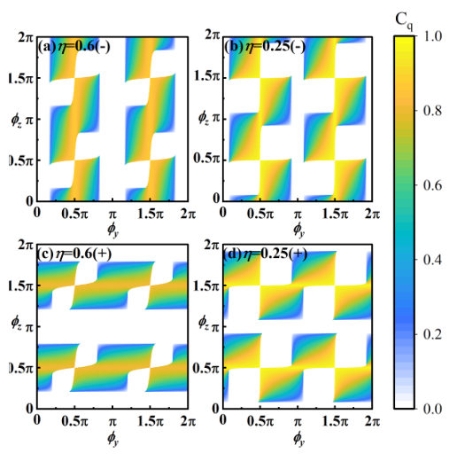
<figcaption class="paper-figure-caption"><b>Fig 2.</b> FIG. 2. Universal dependence of the chirality index Cq on the phases {ϕy, ϕz} for different spin-orbit parameter η. “−” in (a,b) and “+” in (c,d) indicate the two solutions (qz/qy)+ and (qz/qy)−in Eq. (12). In the calculation, we take β = |q|.</figcaption>
</figure>

**Summary.** This work establishes a universal physical law stating that any source-free, evanescent vector field must possess a fixed, right-handed chirality defined by the relationship between its propagation direction, spin, and surface normal. The authors derive a fundamental upper bound for this chirality, demonstrating that the absence of left-handed configurations underscores a deep physical non-equivalence between mirror-image wave states.

**Why it may be interesting.** The concept of universal chirality locking in fundamental wave phenomena (like surface waves) provides a powerful, model-independent diagnostic tool for distinguishing between source-free physical regimes and those containing internal sources or higher-order multipoles.

Detailed structure

**Main problem.** To determine the general conditions under which an evanescent vector field possesses definite chirality and to prove a universal upper bound for this chirality.

**Main result.** The paper proves that any source-free, evanescent vector field must exhibit a rigid, right-handed chirality ($C_q > 0$), bounded by $C_q \le \sqrt{1 - \eta^2}$.

**Method.** The derivation uses the source-free condition ($
abla \cdot \mathbf{V} = 0$) applied to time-harmonic evanescent plane wave modes to constrain the relationship between propagation ($\hat{\mathbf{q}}$), spin ($\hat{\mathbf{S}}$), and surface normal ($\hat{\mathbf{n}}$).

**Model / system.** The analysis focuses on source-free, time-harmonic evanescent vector fields, applicable to various physical systems like surface plasmons, spin waves, and acoustic waves at interfaces.

**Key observables.** The chirality index, $C_q \equiv \hat{\mathbf{n}} \cdot (\hat{\mathbf{S}} 	imes \hat{\mathbf{q}})$, and the spin-orbit parameter, $\eta = \hat{\mathbf{q}} \cdot \hat{\mathbf{S}} / |\mathbf{q}||\mathbf{S}|$.

**Important parameters / regimes.** The chirality index $C_q$ is bounded by $\sqrt{1 - \eta^2}$; the analysis is simplified under the approximation $eta \ll |\mathbf{q}|$.

**Assumptions / limitations.** The field must be source-free ($
abla \cdot \mathbf{V} = 0$) and time-harmonic ($e^{-i\Omega t}$).

**Figures summary.** Figure 1 illustrates the universal right-handed rule and the general bound $0 \le C_q \le \sqrt{1 - \eta^2}$. Table I summarizes the chirality index for various prototypical evanescent waves, confirming the universal chirality.

**Paper structure.** The paper establishes the physical problem of chirality in evanescent waves, derives the mathematical constraints using the source-free condition, proves the universal right-handed nature and the upper bound, and discusses the physical implications of this chirality.

Abstract

A locking between propagation direction $\hat{\bf q}$, spin $\hat{\bf S}$, and surface or interface normal $\hat{\bf n}$ -- a phenomenon broadly termed \textit{chirality} -- pervades evanescent or surface waves in optics, magnetism, plasmonics, and acoustics. Yet, it is not known whether the phenomenon is universal or bound to conditions. Here, we unveil that any \textit{source-free} vector field that propagates along $\hat{\bf q}$ and is evanescent along $\hat{\bf n}$, the existence of a spin automatically enforces a rigid, right-handed locking among $\hat{\bf q}$, $\hat{\bf S}$, and $\hat{\bf n}$, that is characterized by a chirality index $C_{\bf q}\equiv \hat{\bf n}\cdot(\hat{\bf S}\times \hat{\bf q})>0$. For an arbitrary propagation direction defined by $\hat{\bf q}\cdot \hat{\bf S}\equiv η\in [-1,1]$, i.e., not necessarily transverse spin, we derive a fundamental upper bound $C_{\bf q}\le \sqrt{1-η^2}$. The universal absence of left-handed evanescent (source-less) vector fields underscores the fundamental physical non-equivalence of mirror-image configurations -- a principle echoed by parity violation, the natural excess of enantiomers in chiral molecules, and the fixed chirality of DNA.

[↑ back to top](#top)

### [Universal theory of domain-wall width in multi-sublattice Heisenberg magnets](http://arxiv.org/abs/2606.02360v1)

**Authors:** José M. Lendínez, Marta Yanguas, Theodor Griepe, Michael Saur, Rubén M. Otxoa, Levente Rózsa, Unai Atxitia  
**Type:** theory · **Category:** statistical mechanics · **PDF:** <https://arxiv.org/pdf/2606.02360v1>  
**Analysis basis:** full PDF text, analyzed in chunks
**Topic relevance:** `analog quantum simulation` **1/5** · `spintronics-quantum-optics interface` **1/5**

↔ Scroll figures horizontally

<figure class="paper-figure-card">
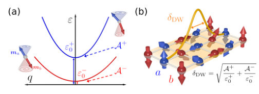
<figcaption class="paper-figure-caption"><b>Fig 1.</b> FIG. 1. (a) Schematic representation of the spin-wave spec- trum of a two-sublattice ferrimagnet, characterized by en- ergy modes ε± q with gaps ε± 0 and spin-wave stiffnesses A± ∝ ∂2 qε± q q=0. (b) Sketch of a domain-wall of width δDW in a two- sublattice ferrimagnet. The orange line indicates the transver- sal component of the sublattice magnetization.</figcaption>
</figure>
<figure class="paper-figure-card">
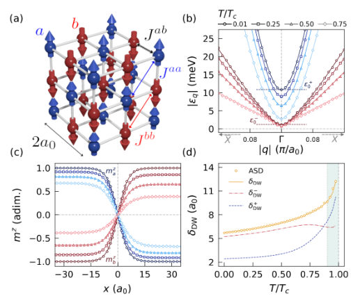
<figcaption class="paper-figure-caption"><b>Fig 2.</b> FIG. 2. (a) Sketch of the rock-salt–type magnet used in the atomistic spin model, illustrating ferrimagnetic (FI) ordering. (b) Spin-wave spectrum of the FI system near Γ along the ΓX direction (ΓX = π/a0) at selected reduced temperatures T/Tc. (c) Reduced sublattice magnetization mz r profiles at T/Tc. (d) DW width as a function of T/Tc. Symbols corre- spond to ASD simulations in panels (b-d). Solid lines indicate fits to the SW dispersion in (b) and the universal-relation val- ues from Eq. (1) in (c,d). The green-shaded area in (d) marks the region above the compensation temperature of the FI sys- tem.</figcaption>
</figure>
<figure class="paper-figure-card">
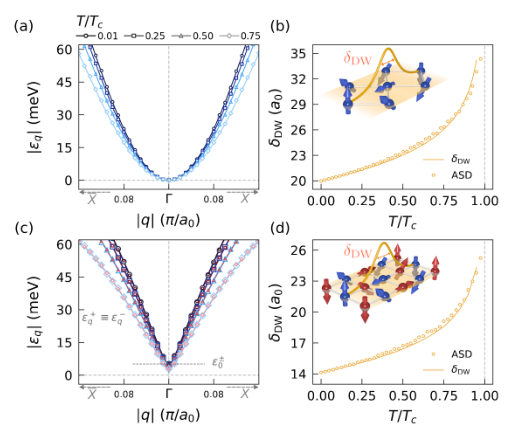
<figcaption class="paper-figure-caption"><b>Fig 3.</b> FIG. 3. Face-centered cubic ferromagnet: (a) Spin-wave spec- trum near Γ along ΓX direction at selected T/Tc. (b) DW width as a function of T/Tc. Simple cubic antiferromagnet: (c) Spin-wave spectrum near Γ along ΓX direction at selected T/Tc (b) DW width as a function of T/Tc. Symbols corre- spond to ASD simulations in all panels. Solid lines in (a,c) and in (b,d) indicate fits to the SW dispersion and values from the universal relation in Eq. (1), respectively. Panels (b, d) include a sketch of the DW profile for a slice of the system.</figcaption>
</figure>
<figure class="paper-figure-card">
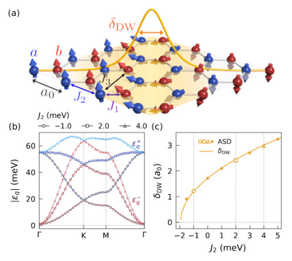
<figcaption class="paper-figure-caption"><b>Fig 4.</b> FIG. 4. (a) Sketch of a DW profile in a 2D honeycomb ferromagnet. (b) Spin-wave spectrum along the indicated high-symmetry path at zero temperature for selected values of J2. (c) DW width as a function of J2. Solid lines denote LSWT and analytical results for panels (b) and (c), respec- tively. Symbols correspond to ASD simulations; open symbols in (c) correspond to the selected cases shown in (b).</figcaption>
</figure>
<figure class="paper-figure-card">
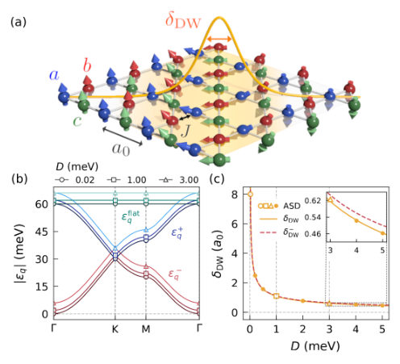
<figcaption class="paper-figure-caption"><b>Fig 5.</b> FIG. 5. (a) Sketch of a DW profile in a 2D kagome ferro- magnet. (b) Spin-wave spectrum along the indicated high- symmetry path at zero temperature for selected values of the uniaxial anisotropy D. Solid lines denote LSWT results and symbols serve as a visual guide. (c) δDW and δ− DW contribu- tion as a function of D. Solid lines correspond to analyti- cal results and symbols correspond to ASD simulations, open symbols correspond to the selected cases shown in (b). The inset shows a zoom of the region with high anisotropies.</figcaption>
</figure>

**Summary.** This work develops a universal theoretical framework to calculate the domain-wall width in complex multi-sublattice magnets, unifying descriptions for ferro-, antiferro-, and ferrimagnetic orders. The key method links the DW width directly to the parameters of the long-wavelength spin-wave dispersion. The results provide quantitative agreement with atomistic simulations, offering a powerful tool for understanding magnetic textures across diverse spin systems.

**Why it may be interesting.** While focused on classical magnetism, the connection between macroscopic domain structure (DW width) and microscopic excitations (SW spectrum) is a fundamental problem in many-body dynamics, relevant to understanding thermal fluctuations in quantum magnetic materials.

Detailed structure

**Main problem.** The paper aims to derive a universal expression for the domain-wall (DW) width in complex multi-sublattice Heisenberg magnets, applicable across different magnetic ordering types.

**Main result.** A universal relation, $\delta_{DW} = \sqrt{A_{eta}/\epsilon_{eta}^0}$, is proposed that successfully unifies the description of DW width across ferromagnetic, antiferromagnetic, and ferrimagnetic systems.

**Method.** The derivation relies on an exact theoretical connection between the DW profile and the long-wavelength spin-wave (SW) dispersion relation.

**Model / system.** The study focuses on multi-sublattice Heisenberg magnets, modeled using Hamiltonians incorporating Heisenberg exchange and uniaxial anisotropy, tested on lattices like rock-salt, honeycomb, and kagome.

**Key observables.** Domain-wall width ($\delta_{DW}$), spin-wave spectrum parameters (gaps $\epsilon_{\pm}^0$ and stiffnesses $A_{\pm}$), and the temperature dependence of $\delta_{DW}$.

**Important parameters / regimes.** Exchange coupling constants ($J$), anisotropy constants ($D$), temperature ($T$), and the ratio $T/T_c$.

**Assumptions / limitations.** The approach assumes the validity of connecting the DW profile to the long-wavelength spin-wave theory, and it analyzes the system up to the magnetic ordering transition ($T_c$).

**Figures summary.** Figures illustrate the SW spectrum for various magnets, show the calculated DW width versus temperature, and display magnetization profiles confirming the theoretical predictions.

**Paper structure.** The paper establishes the problem by noting the failure of simple models, introduces the universal relation derived from SW theory, applies it to various lattice types (FM, AFM, FI), and validates the results against atomistic spin dynamics simulations, including temperature dependence.

Abstract

We propose a universal expression for the domain-wall width in generic multi-sublattice Heisenberg magnets, applicable to ferro-, antiferro-, and ferrimagnetic orders. The result follows from an exact connection between the domain-wall profile and the long-wavelength spin-wave dispersion, yielding a unified framework for describing magnetic textures across distinct ordering types. The predictions show excellent quantitative agreement with large-scale atomistic spin dynamics simulations over a broad range of exchange and anisotropy values and spin multi-sublattice structures, including three-dimensional rock-salt-type magnets and two-dimensional honeycomb and kagome ferromagnets. Moreover, we establish a general microscopic foundation for the temperature dependence of the domain-wall width. Our approach offers a powerful tool for understanding domain-wall profiles in complex spin systems.

[↑ back to top](#top)

### [Edge Detection Framework Utilizing SOT-MTJ Bit-Cell Arrays](http://arxiv.org/abs/2606.00744v1)

**Authors:** Kushagra Singh, Debasis Das  
**Type:** theory · **Category:** other · **PDF:** <https://arxiv.org/pdf/2606.00744v1>  
**Analysis basis:** full PDF text, analyzed in chunks
**Topic relevance:** `spintronics-quantum-optics interface` **1/5**

↔ Scroll figures horizontally

<figure class="paper-figure-card">
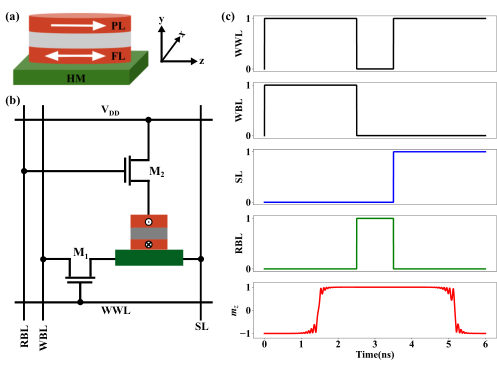
<figcaption class="paper-figure-caption"><b>Fig 1.</b> Fig. 1: (a) Schematic of the SOT-MTJ device, on top of the heavy-metal (HM) layer. (b) Schematic of the bit-cell of SOT- MTJ with the access transistors for the write, read, and reset mechanisms. (c) Variation of different signals across the bit- cell and the mz with time.</figcaption>
</figure>
<figure class="paper-figure-card">
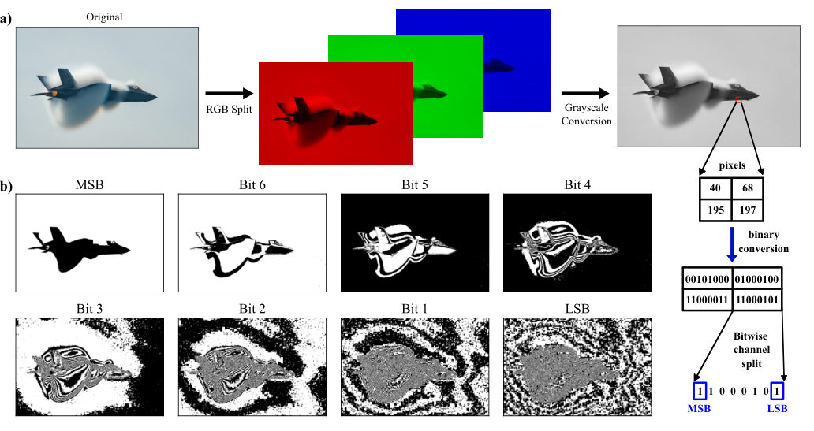
<figcaption class="paper-figure-caption"><b>Fig 2.</b> Fig. 2: (a) Preprocessing: Original image split to RGB channels, and converted to a single-channel grayscale image. A sample of 2×2 pixels demonstrating binary conversion and bit-wise channel split. (b) Splitting of the grayscale images according to unsigned 8-bit integer channels.</figcaption>
</figure>
<figure class="paper-figure-card">
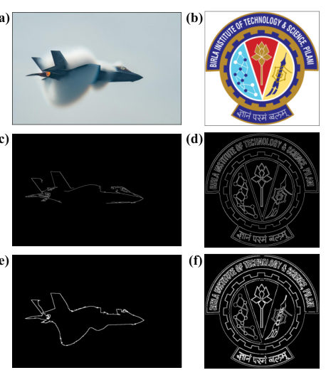
<figcaption class="paper-figure-caption"><b>Fig 3.</b> Fig. 4: Comparison between the proposed SOT-MTJ-based edge detection method and the conventional Canny algorithm. (a) and (b) show the original test images used for evaluation. (c) and (d) present the corresponding edge maps generated by Canny operator, (e) and (f) demonstrate the edge detected image using our SOT-MTJ based approach.</figcaption>
</figure>
<figure class="paper-figure-card">
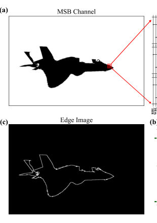
<figcaption class="paper-figure-caption"><b>Fig 4.</b> Fig. 3: (a) A 3×3 kernel (red squares) is convolved over the MSB channel of the image. Each pixel of the kernel is implemented using a SOT-MTJ bit cell along with two access transistors, shown in enlarged scale. (b) Electrical readout from the kernel, illustrating the three possible cur- rent levels—9IP for all-1 input (no edge), 9IAP for all-0 input (no edge), and intermediate summed current values for mixed inputs (edge detected). (c) The resulting binary edge image produced after thresholding the read current response, highlighting detected object boundaries in the original image.</figcaption>
</figure>

**Summary.** This paper proposes an energy-efficient hardware accelerator for edge detection by leveraging the switching properties of SOT-MTJ magnetic tunnel junctions. By mapping the convolution operation onto the read/write cycles of these spintronic cells, it achieves low latency and significantly reduced power consumption compared to conventional CMOS-based algorithms. This work demonstrates a viable path for integrating advanced memory devices into real-time image processing hardware.

**Why it may be interesting.** While the core physics is spintronics/solid-state, the integration of device physics (LLGS, SOT) to solve a classical signal processing problem (edge detection) is highly relevant to emerging memory computing paradigms.

Detailed structure

**Main problem.** Traditional edge detection algorithms are too computationally expensive and energy-intensive for resource-constrained hardware.

**Main result.** The proposed spintronics-based approach using SOT-MTJ arrays achieves low-power, high-speed image processing, significantly outperforming standard methods like Canny detection.

**Method.** The method involves converting color images to grayscale, splitting pixel values into bit channels, and then performing convolution using the switching characteristics of SOT-MTJ cells.

**Model / system.** The system utilizes Magnetic Tunnel Junction (MTJ) devices integrated into an SOT-MTJ bit-cell array for in-memory computing. The physics is governed by the Landau-Lifshitz-Gilbert-Slonczewski (LLGS) equation, using Spin-Orbit Torque (SOT) for switching.

**Key observables.** Energy consumption (e.g., $1.5 	ext{ fJ}$ read), latency ($\sim 6 	ext{ ns}$ cycle time), and the resulting binary edge map derived from read current thresholds.

**Important parameters / regimes.** TMR (150%), $
ho_{HM}$ ($100 	ext{ } \mu\Omega	ext{-cm}$), and the specific current levels corresponding to '1' (high current) and '0' (low current) inputs.

**Assumptions / limitations.** The read operation is designed to avoid read disturbance by applying a small voltage ($\sim 0.1 	ext{ V}$), and the analysis relies on specific material parameters for the MTJ structure.

**Figures summary.** Figure 1 details the SOT-MTJ schematic and bit-cell operation. Figure 2 shows the image preprocessing pipeline (RGB to Grayscale to Bit Channels). Figure 3 illustrates the $3 	imes 3$ kernel convolution readout. Figure 4 compares the SOT-MTJ output against the conventional Canny output for test images.

**Paper structure.** The paper first establishes the limitations of classical edge detection. It then details the physical model of the SOT-MTJ device, including its switching physics and operational cycles. The core contribution is the implementation of the edge detection algorithm using these devices, followed by a quantitative performance comparison against established methods.

Abstract

Traditional edge detection algorithms, foundational to computer vision, face significant challenges in energy efficiency and processing latency on conventional CMOS-based hardware. Existing algorithms, such as Canny, are computationally expensive, posing challenges in resource-constrained hardware where energy efficiency and low latency are critical. This study introduces a novel, hardware-efficient algorithm that leverages the intrinsic characteristics of magnetic tunnel junction (MTJ) devices. We present a detailed device-level analysis of an MTJ-based system for edge detection, outlining its operational cycles, including write, read, and reset methods. The algorithm's efficacy is evaluated against the standard Canny edge detection method. We provide a quantitative performance analysis, including metrics such as energy consumption and latency, which demonstrates that our proposed spintronics-based approach offers a promising solution for achieving low-power, high-speed image processing.

[↑ back to top](#top)

### [Enhanced Spin-to-Charge Conversion in Bi2Se3/NiFe via Interface Engineering with a Ti Spacer Layer](http://arxiv.org/abs/2606.01201v1)

**Authors:** Sourav Rajat Subhra Maitra, Poulami Manna, Ravi Prakash Singh, Chandrasekhar Murapaka, Arabinda Haldar  
**Type:** experiment · **Category:** other · **PDF:** <https://arxiv.org/pdf/2606.01201v1>  
**Analysis basis:** full PDF text, analyzed in chunks
**Topic relevance:** `non-equilibrium dynamics` **1/5**

↔ Scroll figures horizontally

<figure class="paper-figure-card">
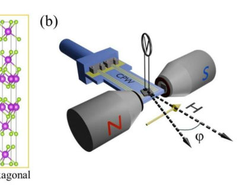
<figcaption class="paper-figure-caption"><b>Fig 1.</b> Figure 1: (a) Schematic diagram of spin-to-charge conversion in the heterostructure, with the</figcaption>
</figure>
<figure class="paper-figure-card">
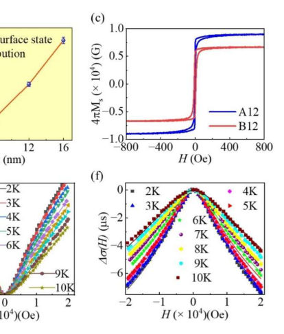
<figcaption class="paper-figure-caption"><b>Fig 2.</b> Figure 2: (a) The XRD pattern (-2 scan) of A12: Bi2Se3 (12)/Ti (3)/NiFe (10), B12: Bi2Se3</figcaption>
</figure>
<figure class="paper-figure-card">

<figcaption class="paper-figure-caption"><b>Fig 3.</b> Figure 3: (a) FMR spectra at rf frequency of 9 GHz in the sample Bi2Se3 (t)/Ti (3)/NiFe (10),</figcaption>
</figure>
<figure class="paper-figure-card">
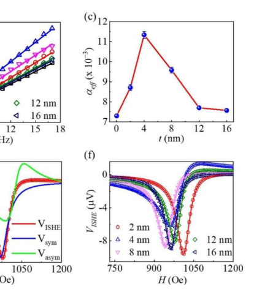
<figcaption class="paper-figure-caption"><b>Fig 4.</b> Figure 3(a) shows the FMR spectra of Bi2Se3 (t)/Ti (3)/NiFe (10), with t = 0, 2, 4, 8, 12, and</figcaption>
</figure>
<figure class="paper-figure-card">
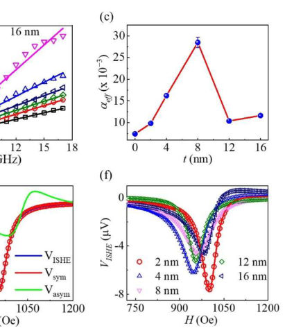
<figcaption class="paper-figure-caption"><b>Fig 5.</b> Figure 4: (a) FMR spectra at 9 GHz rf frequency in the sample Bi2Se3 (t)/NiFe (10), where t =</figcaption>
</figure>

**Summary.** This work investigates how to boost spin-to-charge conversion in topological insulator spintronic devices by engineering the interface. By introducing a titanium spacer layer between $	ext{Bi}_2	ext{Se}_3$ and $	ext{NiFe}$, the researchers successfully prevented material interdiffusion, leading to a dramatic, order-of-magnitude enhancement in the spin Hall angle. This highlights the critical role of interface chemistry in realizing high-efficiency topological spintronic devices.

**Why it may be interesting.** While focused on condensed matter spintronics, the study's reliance on interface engineering, quantum confinement effects (surface states), and spin transport mechanisms (spin pumping) provides relevant experimental benchmarks for understanding open quantum systems dynamics at material interfaces.

Detailed structure

**Main problem.** The primary goal is to enhance the spin-to-charge conversion efficiency in spintronic devices utilizing topological insulators.

**Main result.** The insertion of a titanium spacer layer significantly enhances the spin Hall angle (SHA) by an order of magnitude compared to direct interfaces.

**Method.** The study uses spin pumping measurements via Ferromagnetic Resonance (FMR) spectroscopy and measures the resulting transverse voltage using the Inverse Spin Hall Effect (ISHE).

**Model / system.** The system is a sputter-deposited heterostructure: a topological insulator ($	ext{Bi}_2	ext{Se}_3$) coupled with a ferromagnetic film ($	ext{NiFe}$) separated by a titanium ($	ext{Ti}$) spacer layer, deposited on a silicon substrate.

**Key observables.** Spin Hall Angle (SHA), Gilbert damping parameter ($\alpha_{	ext{eff}}$), ISHE voltage ($V_{	ext{ISHE}}$), and magnetoresistance ($\Delta\sigma(H)$).

**Important parameters / regimes.** The optimal $	ext{Bi}_2	ext{Se}_3$ thickness appears to be around 4 nm, and the enhancement factor is an order of magnitude.

**Assumptions / limitations.** The enhancement is attributed to the $	ext{Ti}$ spacer layer suppressing detrimental interdiffusion between the $	ext{Bi}_2	ext{Se}_3$ and $	ext{NiFe}$ layers, thereby preserving the topological surface states.

**Figures summary.** Figures illustrate schematics of the spin-to-charge conversion setup, FMR spectra showing damping parameter changes with thickness, and ISHE voltage measurements comparing samples with and without the Ti spacer.

**Paper structure.** The paper systematically compares spin-to-charge conversion in $	ext{Bi}_2	ext{Se}_3/	ext{NiFe}$ versus $	ext{Bi}_2	ext{Se}_3/	ext{Ti}/	ext{NiFe}$ structures, analyzing thickness dependence, quantifying the SHA, and attributing the improvement to interface protection.

Abstract

Topological insulators have attracted significant attention in spintronics due to their topological surface states and spin-momentum-locking-driven spin-to-charge conversion. Among these, Bi2Se3 has been extensively investigated because of its large bulk bandgap and single Dirac cone band structure. However, spin-to-charge conversion strongly depends on the quality of the topological insulator/ferromagnet interface. Here, we investigate spin-to-charge conversion in a sputter-deposited heterostructure comprising a topological insulator (Bi2Se3) and a ferromagnetic NiFe thin film separated by a titanium spacer layer. The Bi2Se3 layer is deposited on a silicon substrate for industrial compatibility. Pure spin current is injected into the Bi2Se3 layer through the titanium spacer via spin pumping induced by spin precession during microwave-driven ferromagnetic resonance of the ferromagnetic film. Spin pumping studies are performed by varying the Bi2Se3 thickness. The Gilbert damping parameter exhibits a significant 55% increase at a Bi2Se3 thickness of 4 nm, indicating a pure surface-state contribution. The spin Hall angle, which quantifies the spin-to-charge conversion efficiency, increases by an order of magnitude upon insertion of the titanium spacer layer. This enhancement is attributed to the suppression of interdiffusion between the Bi2Se3 and NiFe layers by titanium, thereby preserving the topological surface states. These findings highlight the important role of titanium spacer layers in spintronic devices based on topological materials.

[↑ back to top](#top)

### [High-quality Nano-patterning of Oxide Interfaces Using Transferred Gold Mask](http://arxiv.org/abs/2606.01345v1)

**Authors:** Qing Xiao, Yanling Liu, Changjian Ma, Danqing Liu, Zhiyuan Qin, Qianyi Zhao, Chengyuan Huang, Mengke Ha, Zhenhao Li, Guanglei Cheng  
**Type:** experiment · **Category:** strongly correlated electrons · **PDF:** <https://arxiv.org/pdf/2606.01345v1>  
**Analysis basis:** full PDF text, analyzed in chunks
**Topic relevance:** `analog quantum simulation` **1/5**

↔ Scroll figures horizontally

<figure class="paper-figure-card">
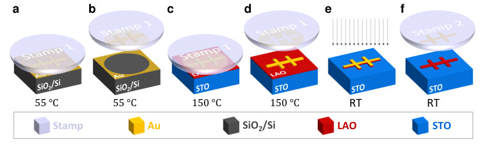
<figcaption class="paper-figure-caption"><b>Fig 1.</b> Figure 1: Illustration of an Au Hall bar mask transfer in the top-down patterning approach. (a,b) A stamp is used to pick up a pre-patterned Au Hall bar mask with the thin Au layer on SiO2/Si. (c,d) The Au Hall bar, along with the thin Au layer directly beneath it, is released on the LAO/STO sample. The thin Au layer outside the patterned area remains adhered to the stamp, thereby preventing direct contact between the stamp and the sample. (e) Oxygen-enriched Ar+ ion milling removes the exposed LAO. (f) A second stamp is used to pick up the Au mask on the LAO/STO.</figcaption>
</figure>
<figure class="paper-figure-card">

<figcaption class="paper-figure-caption"><b>Fig 2.</b> Figure 1a, 1b) at 55 ◦C. Subsequently, the Au pattern is released on LAO/STO at 150 ◦C,</figcaption>
</figure>
<figure class="paper-figure-card">
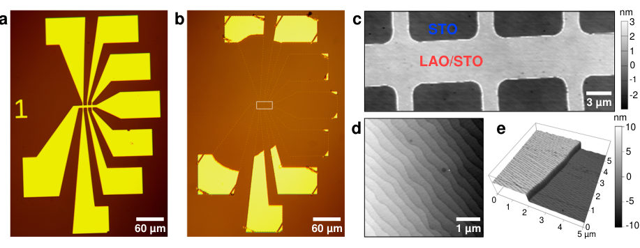
<figcaption class="paper-figure-caption"><b>Fig 3.</b> Figure 2: A Hall bar fabricated using a transferred Au mask in the top-down approach. (a) The transferred Au Hall bar pattern on LAO/STO. (b) The final LAO/STO Hall bar device. (c) AFM topography image of area highlighted within the white rectangle in (b). (d) AFM topography image of the surface of the Hall bar, preserving the atomic terraces of the pristine LAO/STO sample. (e) The abrupt edge between the device and the etched region.</figcaption>
</figure>
<figure class="paper-figure-card">

<figcaption class="paper-figure-caption"><b>Fig 4.</b> Figure 2a presents an optical micrograph of a transferred Au Hall bar structure (20 µm×</figcaption>
</figure>
<figure class="paper-figure-card">
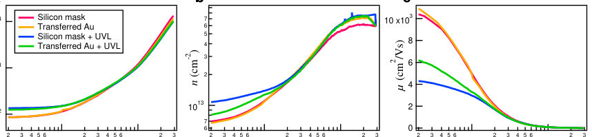
<figcaption class="paper-figure-caption"><b>Fig 5.</b> Figure 3: Temperature-dependent transport properties of patterned squares on Sample A: (a) sheet resistance Rs, (b) carrier density n, and (c) mobility µ as functions of temperature extracted from vdP measurement.</figcaption>
</figure>

**Summary.** This work introduces a novel, solvent-free nanofabrication technique for complex oxide interfaces using transferred gold masks and oxygen-enriched ion milling. The method successfully patterns oxide heterostructures while preserving their high electronic quality, enabling the creation of high-performance nanoscale electronic devices for studying correlated phenomena.

**Why it may be interesting.** While the focus is on materials science, the ability to create highly controlled, clean nanoscale junctions in correlated oxides is crucial for realizing quantum devices, making the clean interface control relevant to quantum engineering.

Detailed structure

**Main problem.** The primary challenge is achieving high-quality, clean, and controlled nano-patterning of complex oxide interfaces, which are highly susceptible to contamination and defect formation during fabrication.

**Main result.** The developed solvent-free method using transferred gold masks and oxygen-enriched Ar+ milling successfully enables residue-free nanofabrication, preserving the intrinsic high carrier mobilities of the oxide interfaces.

**Method.** The technique involves depositing and patterning a transferable gold mask, transferring it onto the oxide sample, and then using oxygen-enriched Ar+ ion milling to pattern the oxide layer.

**Model / system.** The study focuses on complex oxide heterostructures, such as LAO/STO, which host rich correlated phenomena like 2DEG and metal-insulator transitions. The patterning is performed at the nanoscale to probe these intrinsic electronic properties.

**Key observables.** High carrier mobilities ($\mu$), sheet resistance ($R_s$), carrier density ($n$), and surface topography confirmed by AFM.

**Important parameters / regimes.** Feature sizes down to $\sim 100 	ext{ nm}$; $	ext{Ar}/	ext{O}_2$ gas mixture ratio (1:5); cryogenic temperatures (e.g., $2 	ext{ K}$).

**Assumptions / limitations.** The method is assumed to be residue-free and that the patterned regions maintain the intrinsic electronic quality of the pristine interfaces.

**Figures summary.** Figures illustrate the step-by-step Au mask transfer process (top-down approach) and show AFM images confirming pattern transfer and surface quality. Transport measurements compare the performance of devices patterned using the Au mask versus conventional methods.

**Paper structure.** The paper details the fabrication process using transferred Au masks combined with oxygen-enriched Ar+ milling. It presents transport measurements comparing the resulting device performance against other patterning techniques, demonstrating the method's success in preserving high-quality electronic properties.

Abstract

Complex oxide interfaces, such as \mathrm{SrTiO_3} and \mathrm{KTaO_3} based heterostructures, host rich correlated phenomena with strong potential for advanced device applications. However, these interfaces are extremely susceptible to contamination and defect formation during nanofabrication, which often compromises device performance. Here, we present a solvent-free method for patterning oxide interfaces by employing high-resolution transferable thin metal masks in conjunction with oxygen-enriched Ar+ milling, which enables a clean and well-controlled nanofabrication process. Transport measurements demonstrate that the fabricated devices preserve their intrinsic properties, including high carrier mobilities, with negligible degradation compared to the pristine interfaces. This technique offers a convenient and robust route for engineering high-performance oxide electronic devices with precisely tailored transport characteristics.

[↑ back to top](#top)

### [Resonant Raman scattering in bilayer 3R-MoS$_{2}$](http://arxiv.org/abs/2606.01350v1)

**Authors:** Chinmay K. Mohanty, Kacper Walczyk, Tomasz Woźniak, Chengcheng Jiang, Adam Babiński, Clement Faugeras, Zhaolong Chen, Maciej R. Molas  
**Type:** both · **Category:** other · **PDF:** <https://arxiv.org/pdf/2606.01350v1>  
**Analysis basis:** full PDF text, analyzed in chunks
**Topic relevance:** `non-equilibrium dynamics` **1/5**

↔ Scroll figures horizontally

<figure class="paper-figure-card">
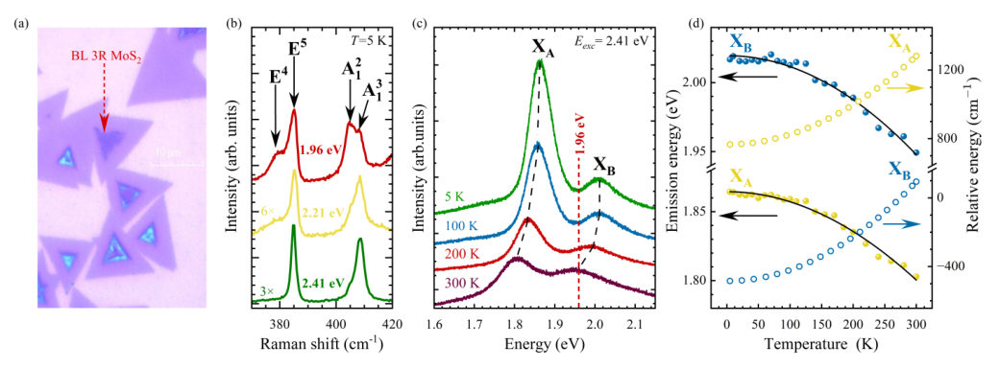
<figcaption class="paper-figure-caption"><b>Fig 1.</b> FIG. 1. (a) Optical microscopy image of a CVD-grown bilayer 3R-MoS2 flake, indicated by a red arrow. (b) Raman scattering spectra of bilayer 3R-MoS2 measured at 5 K using excitation energies of 1.96, 2.21, and 2.41 eV with an excitation power of 300 µW. (c) Temperature evolution of PL spectra obtained under 2.41 eV laser excitation. The black dashed lines denote the energies of the XA and XB lines. The vertical red dashed line indicates the energy of the 1.96 eV excitation. (d) Emission energies of XA (yellow) and XB (blue) as a function of temperature. Solid black curves represent Varshni fits, and open yellow and blue symbols correspond to the energies of XA and XB relative to the...</figcaption>
</figure>
<figure class="paper-figure-card">
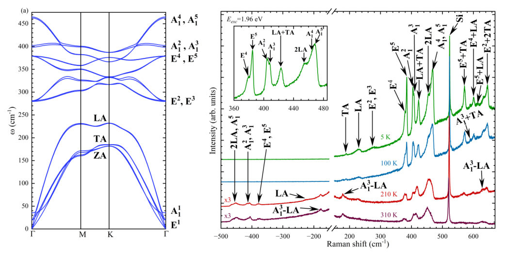
<figcaption class="paper-figure-caption"><b>Fig 2.</b> FIG. 2. (a) Calculated phonon dispersion of 3R-stacked MoS2 BL. Raman-active modes at the Γ point of the BZ are indicated. (b) Temperature evolution of the Stokes and anti-Stokes branches in high-resolution RS spectra measured under resonant excitation (1.96 eV) at T = 5, 100, 210, and 310 K. The assigned phonon peaks, including Raman-active and acoustic modes, as well as their combinations arising from higher-order processes, are labelled.</figcaption>
</figure>
<figure class="paper-figure-card">
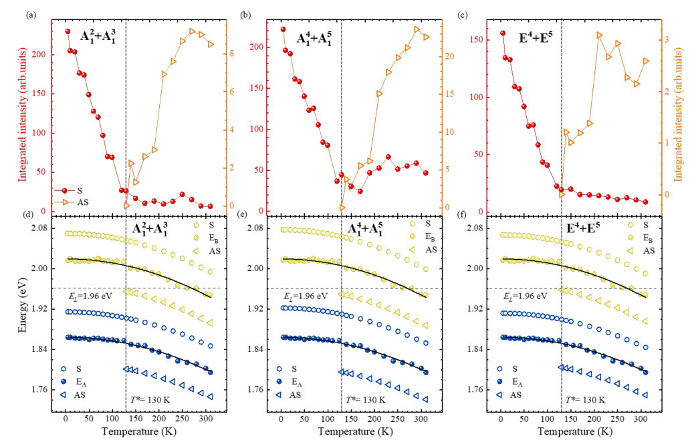
<figcaption class="paper-figure-caption"><b>Fig 3.</b> FIG. 3. Temperature evolution of the resonant Raman response of bilayer 3R-MoS2. Panels (a)–(c) show the integrated intensities of the Stokes (red points) and anti-Stokes (orange points) components for the A2 1 +A3 1, A4 1 +A5 1, and E4 +E5 modes, respectively. Note that the vertical axis ranges are adjusted to the maximum intensity of each phonon mode. Panels (d)–(f) present the corresponding Stokes and anti-Stokes scattering energies together with the XA and XB excitonic transitions. The horizontal dashed line denotes the excitation energy EL = 1.96 eV, while the solid black curves represent the Varshni fits of the excitonic transitions. The vertical dashed line marks the characteristic...</figcaption>
</figure>
<figure class="paper-figure-card">
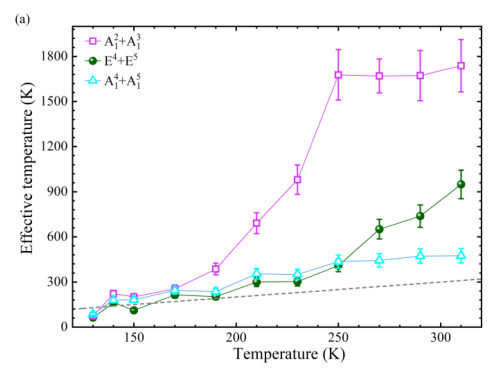
<figcaption class="paper-figure-caption"><b>Fig 4.</b> FIG. 4. (a) Effective temperature extracted using the Boltz- mann relation as a function of temperature for the A2 1 + A3 1, A4 1 + A5 1, and E4 + E5 modes.The grey dashed line represents the condition Teff = T, corresponding to the equality be- tween the effective and measured temperatures.</figcaption>
</figure>

**Summary.** This work uses resonant Raman spectroscopy to probe the temperature dependence of lattice dynamics in bilayer 3R-MoS2. By correlating changes in excitonic transitions with phonon scattering intensities, the authors demonstrate that the Raman response is dictated by resonant coupling rather than simple thermal equilibrium. This offers deep insight into exciton-phonon interactions in van der Waals materials.

**Why it may be interesting.** The strong coupling between electronic excitations (excitons) and lattice vibrations (phonons) under resonant conditions provides a rich platform for studying non-equilibrium dynamics and energy transfer in low-dimensional quantum materials.

Detailed structure

**Main problem.** The study investigates the temperature-dependent resonant Raman scattering response in bilayer 3R-MoS2, focusing on how excitonic resonances govern lattice dynamics.

**Main result.** The resonant Raman response is strongly governed by the interplay between incoming and outgoing exciton resonances, leading to deviations from simple thermal population models, particularly in the anti-Stokes/Stokes intensity ratio.

**Method.** The research combines multi-wavelength Raman spectroscopy, photoluminescence measurements, and DFT calculations to analyze temperature evolution.

**Model / system.** The physical system is bilayer 3R-MoS2, a transition metal dichalcogenide. The analysis models temperature dependence using the Varshni relation for excitonic energy shifts and the Boltzmann relation for intensity ratios.

**Key observables.** Raman intensity (Stokes/anti-Stokes), effective phonon temperature (T*), excitonic transition energies (XA and XB), and the temperature dependence of these quantities.

**Important parameters / regimes.** Temperature range (5–310 K), excitation laser energies (e.g., 1.96 eV), and the material structure (3R stacking).

**Assumptions / limitations.** The analysis assumes that the observed deviations in the intensity ratio are due to resonant scattering mechanisms rather than solely thermal population effects.

**Figures summary.** Figures show optical microscopy, temperature evolution of PL spectra, and the energy dependence of XA/XB excitons. Other figures illustrate phonon dispersion, temperature-dependent Stokes/anti-Stokes intensities, and the effective temperature derived from the intensity ratio.

**Paper structure.** The paper systematically analyzes the temperature dependence of excitons (Varshni fitting), then examines the resulting changes in the Stokes/anti-Stokes intensity ratio, culminating in the demonstration that resonance conditions dictate the observed phonon temperature.

Abstract

Raman scattering is a powerful spectroscopic technique widely employed to investigate light-matter interactions and lattice dynamics in two-dimensional materials. Here, we investigate the temperature-dependent resonant Raman response of bilayer 3R-MoS$_2$. The study combines multi-wavelength Raman spectroscopy, photoluminescence measurements, and density functional theory calculations to track the evolution of excitonic transitions and resonance conditions. We observe contributions from both zone-centre and finite-momentum phonons, a pronounced quenching of the Stokes intensity at low temperatures followed by saturation, the emergence of anti-Stokes scattering above 130~K, and a strong deviation of the effective phonon temperature from the lattice temperature induced by resonance effects. These results demonstrate that the Raman response is governed by the interplay between incoming and outgoing resonance processes, providing deeper insight into exciton-phonon coupling in van der Waals materials.

[↑ back to top](#top)

### Other secondary papers (5)

Show other secondary papers

### [Electronic Hall viscosity: hidden indicator for antiferromagnets](http://arxiv.org/abs/2606.01003v1)

**Authors:** Ding Li, Tao Qin, Jianhui Zhou  
**Type:** theory · **Category:** other · **PDF:** <https://arxiv.org/pdf/2606.01003v1>  
**Analysis basis:** full PDF text, analyzed in chunks

↔ Scroll figures horizontally

<figure class="paper-figure-card">
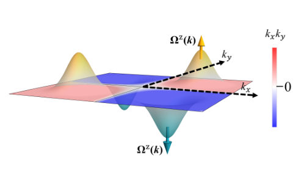
<figcaption class="paper-figure-caption"><b>Fig 1.</b> Figure 1. Schematic of the electronic Hall viscosity ηxyz = kxkyΩz(k) for systems with C4 symmetry on the kx-ky plane. The d-orbital function kxky is plotted on the plane. The colored peaks denote the Berry curvature Ωz(k) with the up/down arrow for the positive/negative sign, implying zero anomalous Hall conductivity.</figcaption>
</figure>
<figure class="paper-figure-card">
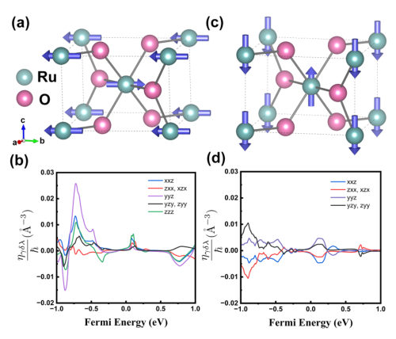
<figcaption class="paper-figure-caption"><b>Fig 2.</b> Figure 2. Two different magnetic configurations of the al- termagnet RuO2 with Néel vector L along (a) a-axis and (c) c-axis. (b) and (d) The corresponding EHV tensor versus the Fermi level.</figcaption>
</figure>
<figure class="paper-figure-card">
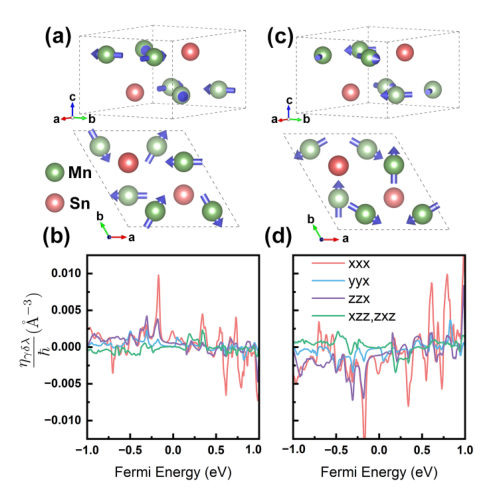
<figcaption class="paper-figure-caption"><b>Fig 3.</b> Figure 3. Magnetic structure of the noncollinear antifer- romagnets Mn3Sn and the calculated EHV tensor. (a) the type-III configuration of Mn3Sn and (b) selected nonzero com- ponents of the EHV. (c) the type-IV configuration of Mn3Sn and (d) selected nonzero components of the EHV.</figcaption>
</figure>

**Summary.** This work introduces the Electronic Hall Viscosity (EHV) as a novel, fundamental quantum geometric quantity to probe antiferromagnetism. It shows that EHV is related to the quadrupole Berry curvature and provides symmetry-dictated rules to detect magnetic order even when standard measurements fail. The theory is validated using DFT calculations on materials like RuO2 and Mn3Sn, offering a new design principle for spintronic devices.

**Why it may be interesting.** While focused on condensed matter magnetism, the rigorous use of Berry curvature, symmetry analysis, and the introduction of a novel transport tensor (EHV) provides a sophisticated theoretical framework for characterizing quantum geometric properties in ordered magnetic systems.

Detailed structure

**Main problem.** The paper addresses the challenge of detecting and characterizing the nontrivial Berry curvature in antiferromagnets, which is obscured by vanishing magnetization and anomalous Hall conductivity.

**Main result.** Electronic Hall Viscosity (EHV) is proposed as a new, fundamental quantum geometry quantity that can characterize antiferromagnetic ordering even when the linear anomalous Hall response is forbidden.

**Method.** The authors derive theoretical relationships between EHV and the quadrupole Berry curvature, establishing symmetry constraints using Magnetic Point Groups and calculating bounds using quantum volume moments.

**Model / system.** The study focuses on generic antiferromagnets, exemplified by the d-wave altermagnet RuO2 and the noncollinear antiferromagnet Mn3Sn, analyzed using first-principle calculations.

**Key observables.** Electronic Hall Viscosity (EHV, $\eta_{\gamma\delta\lambda}$), Berry curvature ($\Omega_{\alpha}$), and the quadrupole moment of the Berry curvature.

**Important parameters / regimes.** The analysis involves symmetry operations (e.g., $C'_{n
u}$) and is applicable in the long-wavelength limit ($\lim_{\omega	o 0}\lim_{q	o 0}$).

**Assumptions / limitations.** The derivation relies on classifying constraints using Magnetic Laue Groups (MLGs) and assumes the applicability of the theory to generic antiferromagnets.

**Figures summary.** Figures illustrate the relationship between EHV components and symmetry operations for specific materials like RuO2 and Mn3Sn, showing how different magnetic configurations yield distinct, non-zero EHV tensors.

**Paper structure.** The paper progresses from identifying the detection limitation in antiferromagnets to deriving the EHV as a diagnostic tool. It then establishes the mathematical relationship between EHV and the Berry curvature's quadrupole moment, derives symmetry constraints based on crystal/magnetic symmetries, and finally validates these findings using DFT calculations on model materials.

Abstract

The antiferromagnets with negligible stray fields and ultrafast spin dynamics play a crucial role in the fields of energy-efficient spintronics and topological electronics. However, the detection and control of the underlying nontrivial Berry curvature become extremely limited by the vanishing magnetization and anomalous Hall conductivity. Here, we show the electronic Hall viscosity is closely related to the quadruple Berry curvature of Bloch bands and is bounded by the $d$-orbit factor modulated second moment of the quantum volume. Moreover, we derive the symmetry requirement for nonzero electronic Hall viscosity that could characterize antiferromagnetic ordering even when the linear anomalous Hall response gets forbidden. We further examine our key findings in two archetypal antiferromagnets: $d$-wave altermagnet $\mathrm{RuO}_{2}$, and noncollinear $\mathrm{Mn_{3}Sn}$ through direct first-principle calculations. Thus, our work reveals a new and fundamental quantum geometry quantity of generic antiferromagnets and offers a broadly applicable way to design antiferromagnetic spintronics devices via unconventional Hall viscosity.

[↑ back to top](#top)

### [Physically-Motivated Primitive Path Analysis of Entangled Polymer Networks](http://arxiv.org/abs/2606.02174v1)

**Authors:** B M Shahi Sifat Mottaqin, Benjamin Morrow, Robert J. Wagner  
**Type:** theory · **Category:** statistical mechanics · **PDF:** <https://arxiv.org/pdf/2606.02174v1>  
**Analysis basis:** full PDF text, analyzed in chunks

↔ Scroll figures horizontally

<figure class="paper-figure-card">
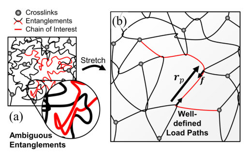
<figcaption class="paper-figure-caption"><b>Fig 1.</b> FIG. 1. Primitive Paths. (a-b) Illustrations of a 2D, crosslinked polymer network at (a) low and (b) high biax- ial stretch. (a) Close up of a highly coiled entanglement il- lustrates the topological ambiguity of entanglements at low stretch. (b) A primitive path vector, rp, between two entan- glements is denoted along with the corresponding chain force, f, acting at the entanglements. Load paths are relatively in- tuitive to identify in highly stretched networks.</figcaption>
</figure>
<figure class="paper-figure-card">
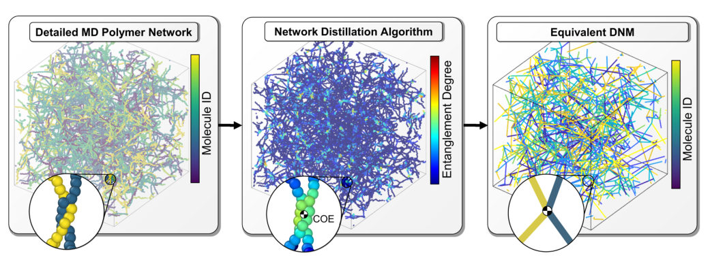
<figcaption class="paper-figure-caption"><b>Fig 2.</b> FIG. 2. Primitive Path Distillation of Entangled Polymer Networks. For any highly entangled polymer network modeled using CGMD (left), local entanglements may be algorithmically identified (center), so that the network may be distilled into a representative, reduced-order DNM (right).</figcaption>
</figure>
<figure class="paper-figure-card">
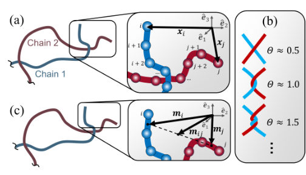
<figcaption class="paper-figure-caption"><b>Fig 3.</b> FIG. 3. Characterizing Entanglements. (a) Vector con- vention for computing Θ. (b) Interpretation of the Gaussian linking number, Θ. (c) Vector convention for computing xc.</figcaption>
</figure>
<figure class="paper-figure-card">
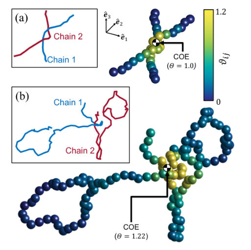
<figcaption class="paper-figure-caption"><b>Fig 4.</b> FIG. 4. Visualizing the COE. (a) Benchmark case in which N1 = N2 = 20, all chain ends are in xy-plane, and Θ ≈1. (b) Stochastically generated system with N1 = 62 and N2 = 60 for which the COE is less intuitive. The color map in both panels denotes the local weighting, ϑij of each segment to the overall linking number. For visual clarity, the red and blue curves of the insets illustrate the distinct paths of chains 1 and 2, respectively.</figcaption>
</figure>
<figure class="paper-figure-card">
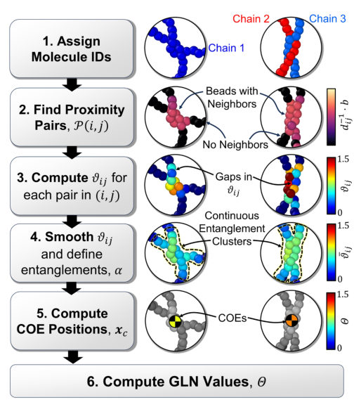
<figcaption class="paper-figure-caption"><b>Fig 5.</b> FIG. 5. Defining local entanglements. The procedu- ral algorithm for identifying local entanglements along the backbone of chains is outlined, along with visualizations for each step from actual CGMD networks. Instances of both in- tramolecular (left) and intermolecular (right) entanglements are depicted. Step 1: Define CGMD network and assign molecule numbers to each chain. Step 2: Identify set of prox- imity pairs, P(i, j), within distance dc of one another. Color bar represents normalized inverse distance to closest nearest neighbor, b/dij. Step 3: Compute ϑij for all segment pairs i →i + 1 and j →j + 1. Step 4: Smooth ϑij over a window of length ℓw. Steps 5-6: Compute xc and Θ for each...</figcaption>
</figure>

**Summary.** This work develops a novel, computationally efficient method to model entangled polymer networks by distilling complex Coarse-Grained Molecular Dynamics (CGMD) data into simplified Discrete Network Models (DNMs). By quantifying local entanglements using the Gaussian Linking Number, the authors create a predictive framework that accurately predicts mechanical stress while drastically reducing computational cost.

**Why it may be interesting.** While focused on polymer physics, the methodology of distilling complex, high-dimensional dynamics (CGMD) into a low-dimensional, predictive topological model (DNM) shares conceptual parallels with coarse-graining techniques used in many-body quantum systems.

Detailed structure

**Main problem.** The primary challenge is relating the microscopic physics of transient polymer entanglements to the macroscopic mechanical properties of elastomers and gels.

**Main result.** The proposed Discrete Network Model (DNM) successfully reproduces the small-strain virial stress predictions of the full CGMD model with a 97% reduction in computational cost.

**Method.** The authors introduce a topological distillation algorithm that converts detailed CGMD simulations into simplified DNMs by identifying load-transmitting primitive paths using the Gaussian Linking Number and a Center of Entanglement.

**Model / system.** The system is entangled polymer networks (elastomers/gels) modeled using Coarse-Grained Molecular Dynamics (CGMD) simulations based on the Kremer-Grest model. The analysis focuses on topological constraints (entanglements) and their mechanical consequences.

**Key observables.** Gaussian Linking Number ($\Theta$), Geometric Center of Entanglement (COE), virial stress ($\sigma$), and the alignment of time-averaged chain forces ($\langle\hat{f} \cdot \hat{r}_p
angle$).

**Important parameters / regimes.** Packing fraction ($\phi$), Kuhn length ($b$), and the ratio of simulation time to relaxation time ($ar{	au}_R$).

**Assumptions / limitations.** The COE is hypothesized to be the physical location through which entropic chain forces are transmitted, and the DNM accurately captures the essential mechanical physics despite neglecting full chain sliding.

**Figures summary.** Figures illustrate the distillation process from CGMD to DNM, show the alignment of entropic forces along primitive paths, and compare stress-strain curves between the two models at different stretches.

**Paper structure.** The paper progresses by first defining the physical problem (entanglement ambiguity), developing the quantitative tools (GLN, COE), applying these tools to define local entanglements and primitive paths, and finally validating the resulting reduced-order DNM against full CGMD simulations for mechanical prediction.

Abstract

Physical entanglements between polymer chains enhance the moduli, strength, and toughness of elastomers and gels, yet relating entanglement micromechanics to macroscopic mechanical benefits remains difficult. Experimentally investigating entanglements is challenging due to their nanoscale sizes, subsurface locations, and chemical indistinguishability from their surroundings. Computationally mapping structure-property relations is costly when using physics-based models that enable direct entanglement observation, such as coarse-grained molecular dynamics (CGMD). Entanglements are also transient, configuration-dependent features without clear quantitative definitions. To address this ambiguity, we introduce an approach that quantitatively defines local entanglements along simulated polymer backbones using the Gaussian Linking Number, and introduce a geometric center of entanglement verified to represent the position through which entropic chain forces are transmitted via Kremer-Grest CGMD simulations. Unlike existing approaches, which output a single linking number for chain pairs, our method identifies the multitude of load-transmitting inter- and intra-chain entanglements along a polymer's backbone. To bridge scales, we introduce a topological distillation algorithm that converts entangled CGMD networks into representative discrete network models (DNMs), representing entanglements as vertices and primitive paths as load-transmitting edges. Our DNMs reproduce small-strain virial stress predictions of the Kremer-Grest model with a 97% reduction in computational cost, verifying both physical accuracy and computational efficiency. This distillation procedure will facilitate physics-based, predictive modeling of entangled network mechanics, from polymers to architected metamaterials.

[↑ back to top](#top)

### [Quantized Conductance through Surface States in High Quality Three-Dimensional Dirac Semimetal Cd$_3$As$_2$ Nanowire/Nanoribbon p-n Junctions](http://arxiv.org/abs/2606.02297v1)

**Authors:** Sungjin An, Zhuo Bin Siu, Vardan Kaladzhyan, Jens H. Bardarson, Sunghun Lee, Myoung-Jae Lee, Kidong Park, Jeunghee Park, Mansoor B. A. Jalil, Jungpil Seo, Minkyung Jung  
**Type:** both · **Category:** other · **PDF:** <https://arxiv.org/pdf/2606.02297v1>  
**Analysis basis:** full PDF text, analyzed in chunks

↔ Scroll figures horizontally

<figure class="paper-figure-card">

<figcaption class="paper-figure-caption"><b>Fig 1.</b> Figure 1. (a) Transmission electron microscopy (TEM) image of 3D Dirac semimetal Cd3As2</figcaption>
</figure>
<figure class="paper-figure-card">
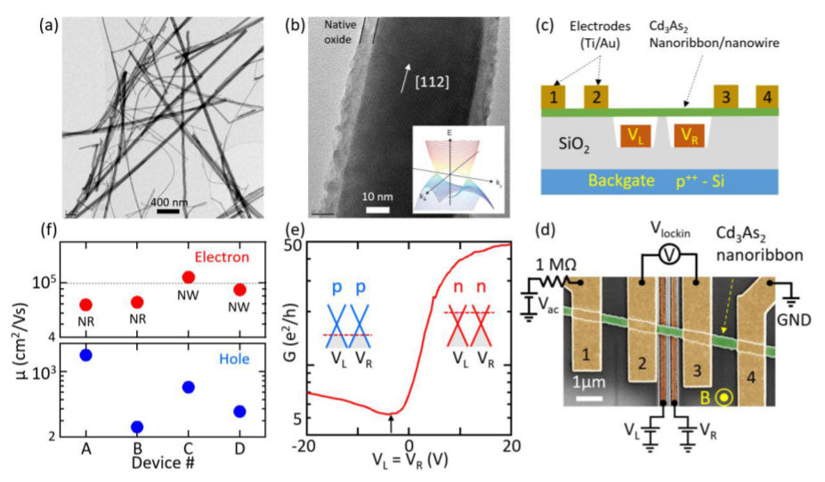
<figcaption class="paper-figure-caption"><b>Fig 2.</b> Figure 1(e) presents the differential conductance, G, of Device A measured as a function of the</figcaption>
</figure>
<figure class="paper-figure-card">
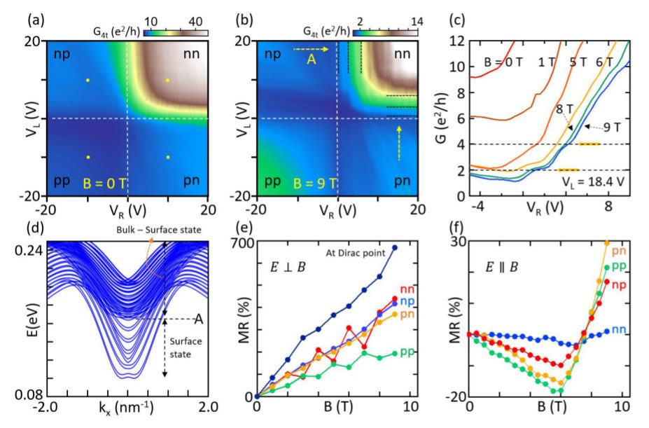
<figcaption class="paper-figure-caption"><b>Fig 3.</b> Figure 2. Four-terminal differential conductance map of Device A as a function of VL and VR</figcaption>
</figure>
<figure class="paper-figure-card">
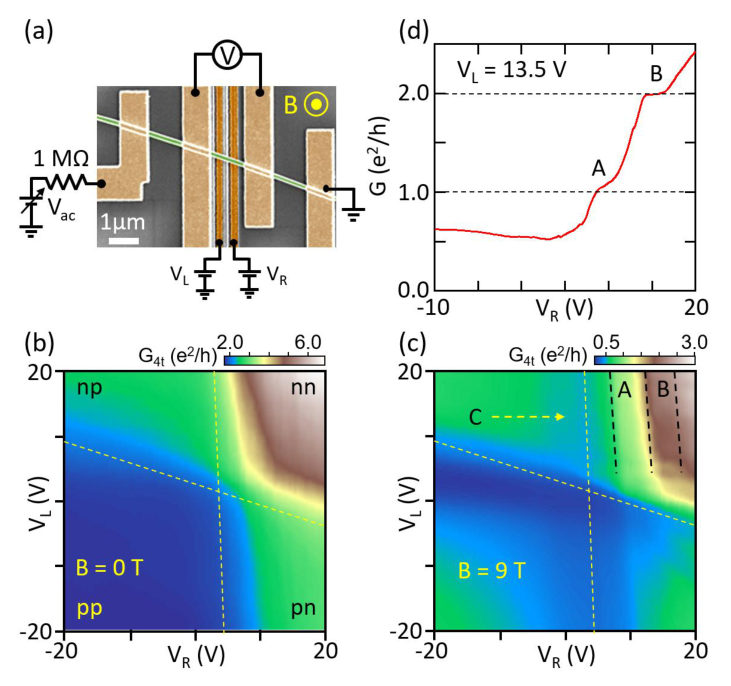
<figcaption class="paper-figure-caption"><b>Fig 4.</b> Figure 3. (a) Four-terminal Cd3As2 nanowire device with recessed bottom gates (Device B).</figcaption>
</figure>
<figure class="paper-figure-card">
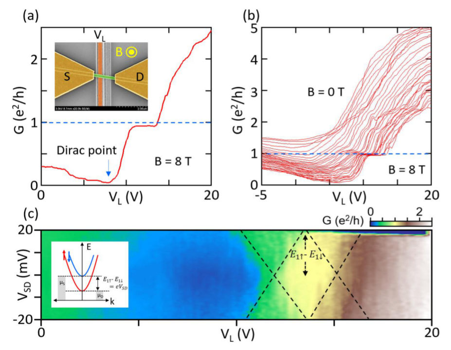
<figcaption class="paper-figure-caption"><b>Fig 5.</b> Figure 4. (a) Conductance measured in Device C at B = 8 T. The inset show a SEM image of</figcaption>
</figure>

**Summary.** This paper reports on the observation of quantized conductance in Cd3As2 Dirac semimetal nanostructures, using suspended p-n junctions. By comparing conductance plateaus in different geometries, the authors distinguish between spin-resolved subband transport ($1e^2/h$) and surface-state-dominated conduction ($2e^2/h$). The findings establish the material as a promising platform for quantum electronics.

**Why it may be interesting.** The work provides experimental evidence of quantum transport phenomena (quantization, MR) in a topological material, linking macroscopic transport measurements to underlying electronic band structure physics (Dirac/Weyl fermions).

Detailed structure

**Main problem.** The study aims to observe and characterize quantized conductance in high-quality three-dimensional Dirac semimetal Cd3As2 nanowire/nanoribbon p-n junctions.

**Main result.** The conductance quantization exhibits different plateaus ($1e^2/h$ vs $2e^2/h$) depending on the nanostructure width, suggesting spin-resolved subband transport in narrower devices and surface-state-dominated conduction generally.

**Method.** The research combines low-temperature, high-field transport measurements (four-terminal geometry) with detailed numerical simulations based on a low-energy effective Hamiltonian.

**Model / system.** The physical system is Cd3As2, a 3D Dirac semimetal, fabricated into suspended nanowire/nanoribbon p-n junctions. The theoretical modeling uses a low-energy effective Hamiltonian incorporating orbital and Zeeman effects.

**Key observables.** Quantized conductance plateaus at integer multiples of $e^2/h$ or $2e^2/h$, Magnetoresistance (MR) measurements (positive for $\vec{E}\perp\vec{B}$, negative for $\vec{E}\parallel\vec{B}$), and extracted effective Landé $g$-factor ($\sim 43$).

**Important parameters / regimes.** Low temperature ($T \approx 2	ext{ K}$), high magnetic fields ($	ext{B} = 9	ext{ T}$), and geometric confinement (nanowire vs. wide nanoribbon).

**Assumptions / limitations.** The analysis assumes that the observed quantization is dominated by surface states, and the use of four-terminal measurements successfully eliminates contact resistance effects.

**Figures summary.** Figures show TEM images of the material, SEM images of the fabricated suspended devices, and differential conductance maps/plots illustrating the quantized conductance plateaus and magnetoresistance dependence on magnetic field.

**Paper structure.** The paper details the experimental setup (device fabrication, transport measurements) to observe quantized conductance and MR in Cd3As2 junctions. It then uses theoretical modeling and simulation results to interpret the observed differences in quantization plateaus ($1e^2/h$ vs $2e^2/h$) based on confinement effects and surface state physics.

Abstract

We report the observation of quantized conductance in high-mobility three-dimensional Dirac semimetal Cd$_3$As$_2$ nanowire and nanoribbon p-n junctions. By employing suspended device geometries with dual local gates, we form tunable p-n junctions and realize ballistic transport across sub-micron channel lengths. In a wide nanoribbon device with a channel width of $\sim 330$ nm, conductance plateaus appear at integer multiples of $2e^2/h$ in the n-n regime under high magnetic fields. Numerical simulations suggest that these features represent unresolved spin-split subbands due to the smaller subband spacing in wider channels, and support the interpretation that the observed quantization may originate from surface-state-dominated conduction. In contrast, narrower nanoribbons and nanowires exhibit conductance steps of $1e^2/h$, demonstrating spin-resolved subbands likely due to enhanced confinement effects. From spin-resolved subband spectroscopy, we extract an effective Landé $g$-factor of $\sim 43$ for the first subband in the bulk gap, establishing these nanostructures as a prospective platform for fault-tolerant quantum electronics.

[↑ back to top](#top)

### [Quantized orbital and spin Hall transport: interplay between $sp$-hybridization, altermagnetism and spin-orbit coupling](http://arxiv.org/abs/2606.01404v1)

**Authors:** Saikat Saha, Banasree Sadhukhan, Tanay Nag  
**Type:** theory · **Category:** other · **PDF:** <https://arxiv.org/pdf/2606.01404v1>  
**Analysis basis:** full PDF text, analyzed in chunks

↔ Scroll figures horizontally

<figure class="paper-figure-card">
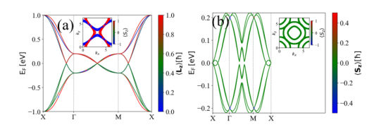
<figcaption class="paper-figure-caption"><b>Fig 1.</b> FIG. 1. Band Structure (a) with the distribution of ⟨Lz⟩and (b) with the distribution of ⟨Sz⟩, computed from the model Hamiltonian H. The inset plot in (a) shows the Fermi surface contour for Fermi energy EF = 0.1 eV with distribution of ⟨Sz⟩in units of ℏand the inset plot of (b) shows the Fermi surface contour for Fermi energy EF = 0.075 eV with distri- bution of ⟨Sz⟩. We consider ∆= 1 eV and γ = 0.25 eV with JA = 1 eV, λR = 0 eV in (a) and JA = 0 eV, λR = 0.1 eV in (b).</figcaption>
</figure>
<figure class="paper-figure-card">
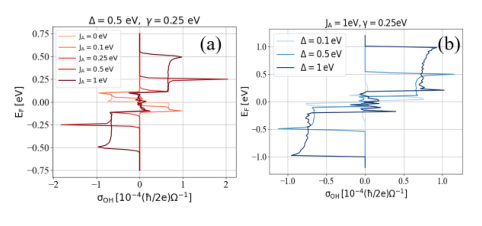
<figcaption class="paper-figure-caption"><b>Fig 2.</b> FIG. 2. Variation of orbital Hall (OH) conductivities with Fermi energy EF is shown in (a) and (b), respectively, for different values of altermagnetic strength JA and the onsite energy ∆. We consider λR = 0.</figcaption>
</figure>
<figure class="paper-figure-card">
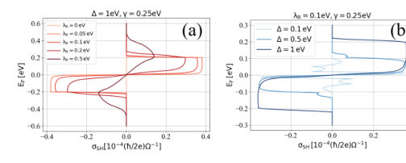
<figcaption class="paper-figure-caption"><b>Fig 3.</b> FIG. 3. Variation of spin Hall (SH) conductivities with Fermi energy EF is shown in (a) and (b), respectively, for different values of SOC λR and the on-site orbital energy ∆. We con- sider JA = 0.</figcaption>
</figure>
<figure class="paper-figure-card">
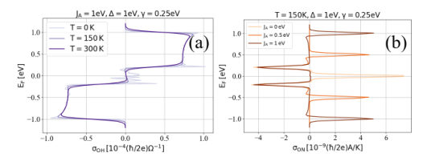
<figcaption class="paper-figure-caption"><b>Fig 4.</b> FIG. 4. Variation of OH conductivity with EF for different values of temperature is shown in (a). The Orbital Nernst (ON) conductivity for different values of JA with respect to the Fermi energy is displayed in (b).</figcaption>
</figure>
<figure class="paper-figure-card">
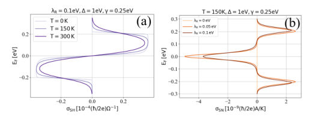
<figcaption class="paper-figure-caption"><b>Fig 5.</b> FIG. 5. Variation of SH conductivity with EF for different values of temperature is shown in (a). The spin Nernst (SN) conductivity for different values of λR with respect to the Fermi energy is displayed in (b).</figcaption>
</figure>

**Summary.** This theoretical work explores quantized orbital and spin Hall transport in 2D materials by modeling the interplay between $sp$-hybridization, altermagnetism, and SOC. The key finding is that the Hall responses become quantized over a specific Fermi energy window when magnetic order is tuned relative to hybridization scales. This quantization is microscopically rooted in the Berry curvature of the occupied electronic states.

**Why it may be interesting.** The focus on topological transport phenomena (Hall effects) driven by orbital and spin degrees of freedom, and the explicit modeling of hybridization and magnetic order, connects to modern condensed matter physics research areas.

Detailed structure

**Main problem.** The paper investigates the emergence and quantization of orbital and spin Hall effects in systems beyond standard L-S coupling, focusing on the interplay between $sp$-hybridization, altermagnetism (AM) order, and spin-orbit coupling (SOC).

**Main result.** Quantized orbital and spin Hall responses are found when the AM order strength is tuned relative to the $sp$-hybridization scale, with the quantization being robustly linked to Fermi surface-activated Berry curvatures.

**Method.** The study employs theoretical calculations using a two-dimensional model Hamiltonian to compute orbital and spin Berry curvatures and corresponding Hall/Nernst conductivities.

**Model / system.** The model is a 2D Hamiltonian incorporating $sp$-hybridization, Rashba SOC ($\lambda_R$), and AM order ($J_A$) in a basis set spanning orbital and spin degrees of freedom.

**Key observables.** Orbital Hall (OH) and Spin Hall (SH) conductivities ($\sigma_{OH}, \sigma_{SH}$), and Orbital/Spin Nernst coefficients ($\sigma_{ON}, \sigma_{SN}$).

**Important parameters / regimes.** AM order strength ($J_A$), Rashba SOC ($\lambda_R$), $sp$-hybridization strength ($\gamma$), and Fermi energy ($E_F$).

**Assumptions / limitations.** The analysis relies on a two-dimensional model Hamiltonian and assumes the quantization mechanism is governed by Fermi surface-activated Berry curvatures.

**Figures summary.** Figures illustrate band structures showing angular momentum distributions, and plots show the quantized plateau structures of OH and SH conductivities as functions of Fermi energy and various coupling strengths.

**Paper structure.** The paper systematically analyzes the Hamiltonian, calculates the relevant Berry curvatures, and then computes the transport coefficients ($\sigma_{OH}, \sigma_{SH}, \sigma_{ON}, \sigma_{SN}$) across different parameter regimes to demonstrate the quantization.

Abstract

We here explore the emergence of orbital and spin Hall effects, originating beyond the $L$-$S$ coupling, and investigate the interplay between inter-orbit hybridization, relativistic Rashba spin-orbit coupling (SOC), and non-relativistic SOC, namely altermagnetic (AM) order, in a two-dimensional model Hamiltonian. The orbital (spin) Hall responses are remarkably found to be quantized within a window of Fermi energy when the strength of AM order (Rashba SOC) exceeds (falls below) the scale set by $sp$-hybridization. Importantly, orbital and spin Hall quantizations are independent of Rashba SOC and AM order, respectively, while the uniform profiles of finite orbital and vanishingly small spin moments of bands around the Fermi energy. The microscopic origin of such quantization comes from the Fermi surface-activated orbital and spin Berry curvatures. The extent of the quantized regime is strongly controlled by the intra-orbital coupling strength. As the temperature increases, the quantization is significantly compromised in the spin Hall case. We extend our analysis to the orbital and spin Nernst coefficients where the pronounced dip-peak structures signal the existence of the quantization leading to experimental relevance.

[↑ back to top](#top)

### [Structure, Composition, and High-Field Superconductivity in Metal-Rich $\mathrmη$-Carbide-Type Compounds](http://arxiv.org/abs/2606.00894v1)

**Authors:** Manuele Balestra, KeYuan Ma, Harald O. Jeschke, Fabian O. von Rohr  
**Type:** both · **Category:** strongly correlated electrons · **PDF:** <https://arxiv.org/pdf/2606.00894v1>  
**Analysis basis:** full PDF text, analyzed in chunks

↔ Scroll figures horizontally

<figure class="paper-figure-card">
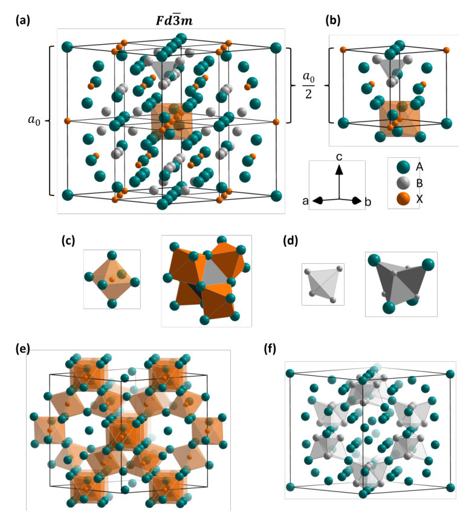
<figcaption class="paper-figure-caption"><b>Fig 1.</b> FIG. 1. Crystal structure of the η-carbide–type compounds with space group Fd3m. (a) Cubic unit</figcaption>
</figure>
<figure class="paper-figure-card">
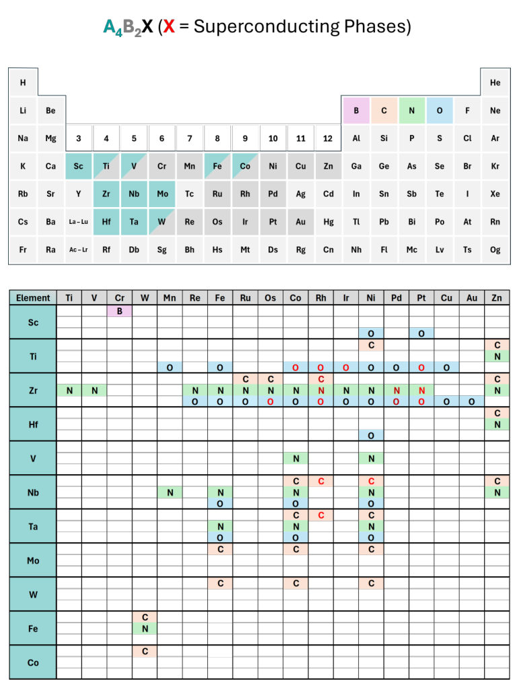
<figcaption class="paper-figure-caption"><b>Fig 2.</b> FIG. 2. Overview of known η-carbide–type compounds with composition A4B2X, organized by</figcaption>
</figure>
<figure class="paper-figure-card">
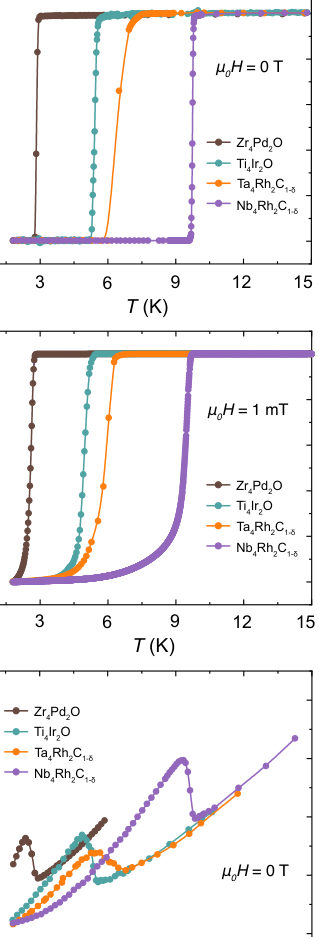
<figcaption class="paper-figure-caption"><b>Fig 3.</b> FIG. 3. Superconducting properties of Zr4Pd2O, Ti4Ir2O, Ta4Rh2C1−δ, and Nb4Rh2C1−δ. (a) nor-</figcaption>
</figure>
<figure class="paper-figure-card">
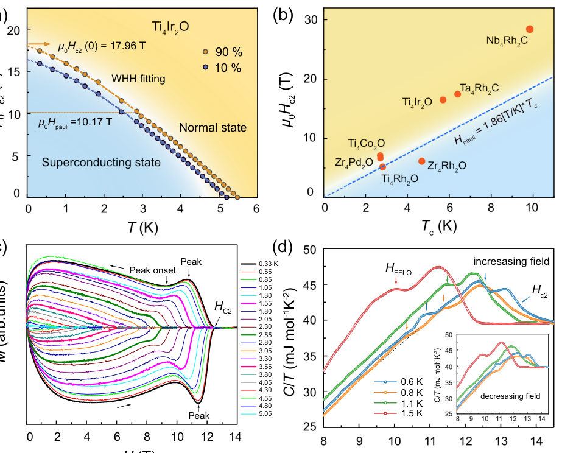
<figcaption class="paper-figure-caption"><b>Fig 4.</b> FIG. 4. Upper critical field behavior and high-field thermodynamic signatures in η-carbide–type</figcaption>
</figure>
<figure class="paper-figure-card">
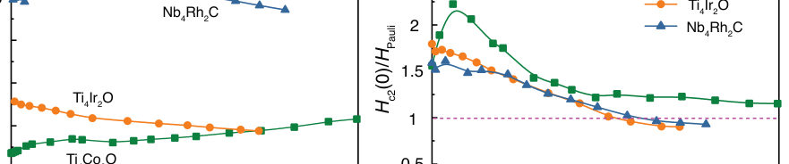
<figcaption class="paper-figure-caption"><b>Fig 5.</b> FIG. 5. Pressure-dependent superconducting properties of η-carbide–type compounds. (a) Nor-</figcaption>
</figure>

**Summary.** This review synthesizes research on $\eta$-carbide superconductors, highlighting their structural tunability and unusual superconducting properties. The core focus is explaining why their upper critical fields often exceed theoretical limits, pointing towards strong electronic correlations and symmetry-protected pairing mechanisms. The combination of experimental measurements and advanced DFT calculations provides a comprehensive picture of this fascinating class of quantum materials.

**Why it may be interesting.** The investigation into Pauli-limit violation and the role of SOC in determining $H_{c2}$ is highly relevant to understanding unconventional superconductivity, a key area in condensed matter physics.

Detailed structure

**Main problem.** The paper reviews the superconducting properties of $\eta$-carbide-type compounds, focusing on understanding the mechanisms behind their high upper critical fields ($H_{c2}$) which often violate the weak-coupling Pauli limit.

**Main result.** These materials exhibit superconductivity governed by complex electronic structures, and the large $H_{c2}$ values suggest unconventional pairing mechanisms, potentially involving strong spin-orbit coupling or multiband superconductivity.

**Method.** The work combines systematic experimental characterization (transport, magnetization, specific heat) with advanced theoretical calculations, including DFT incorporating spin-orbit coupling (SOC) and $k_p$ theory.

**Model / system.** The physical system is the $\eta$-carbide-type compound ($A_4B_2X$), a class of metal-rich quantum materials with high crystallographic symmetry ($Fdar{3}m$). The electronic structure is complex, featuring multiple $d$ bands near the Fermi level.

**Key observables.** Superconducting transition temperature ($T_c$), upper critical field ($H_{c2}(0)$), specific-heat jump ($\Delta C/\gamma T_c$), and the effective electronic $g$-factor.

**Important parameters / regimes.** The Pauli paramagnetic limit ($\mu_0H_{	ext{Pauli}}$), crystal symmetry, and the degree of spin-orbit coupling (SOC).

**Assumptions / limitations.** The analysis often assumes the applicability of BCS theory modified by strong coupling or that the observed $H_{c2}$ enhancement is due to SOC or FFLO states.

**Figures summary.** Figures illustrate the crystal structure, map the chemical phase space of superconductors, and show $H_{c2}(T)$ curves, often comparing experimental data against the theoretical Pauli limit.

**Paper structure.** The paper follows a review structure, first introducing the material class and synthesis challenges, then detailing superconducting diagnostics ($T_c, H_{c2}$), and finally delving into theoretical explanations for the high critical fields using DFT and advanced pairing models.

Abstract

$\mathrmη$-Carbide-type compounds have recently emerged as a diverse class of materials in the study of superconductivity. These phases contribute to a growing family of metal-rich quantum materials that exhibit unusual superconducting properties emerging from complex metallic bonding. Several members of the $\mathrmη$-carbide-type phases have been found to be bulk superconductors -- such as Nb$_4$Rh$_2$C$_{1-δ}$, Ta$_4$Rh$_2$C$_{1-δ}$, Ti$_4$Ir$_2$O$_{1-δ}$, and Ti$_4$Co$_2$O$_{1-δ}$ -- with transition temperatures up to $T_{\rm c} \approx$ 10 K and upper critical fields as high as $μ_0 H_{\rm c2}(0) \approx$ 30 T. Whereas the transition temperatures may fall within the range typical for intermetallic superconductors, the pronounced violation of the weak-coupling Pauli limit in many of these crystallographically high-symmetry materials is noteworthy. Here, we review recent progress on superconducting $\mathrmη$-carbide-type phases, emphasizing how crystal symmetry, synthetic challenges, transition-metal composition, and electronic structure govern their superconducting properties. Furthermore, we outline open questions and future directions, including the possible discovery of new $\mathrmη$-carbide-type materials.

[↑ back to top](#top)

