
# arxiv digest (quant-ph + cond-mat) — 2026-06-03

*121 papers · 28 relevant · 0 highlighted*

## 🔥 Most relevant (28)

*Every paper with at least one nonzero topic score, sorted by best-matching score. 🔥 marks scores ≥4/5. Click the title to jump to the full entry below; click [arXiv] to open the paper page. `(secondary)` marks papers from de-prioritized cond-mat archives.*

Show 28 relevant papers

- [Photonic Analog Quantum Simulation of (1+1)-Dimensional $U(1)$ Lattice Gauge Theory with Dynamical Matter](#paper-2606.02756) [[arXiv]](http://arxiv.org/abs/2606.02756v1) — 🔥 `analog quantum simulation` **5/5** · 🔥 `quantum optics experiment` **4/5** · `Tavis-Cummings & cavity-many-emitter` **3/5** · `correlated cavity matter` **3/5** · `exotic spin models in light-matter` **3/5** · `non-equilibrium dynamics` **2/5** · `QC/QI experiment` **1/5** · `driven-dissipative phase transition` **1/5** · `entanglement & information structure` **1/5** · `methods for driven-dissipative` **1/5**
- [20 Second Parity Lifetime in an InAs--Pb Tetron Device](#paper-2606.03884) [[arXiv]](http://arxiv.org/abs/2606.03884v1) — 🔥 `QC/QI experiment` **5/5** · `quantum measurements` **3/5**
- [Post-Selection Free Generation of Multi-Photon Added Coherent States](#paper-2606.03167) [[arXiv]](http://arxiv.org/abs/2606.03167v1) — 🔥 `quantum optics experiment` **4/5** · `correlated cavity matter` **3/5** · `driven-dissipative phase transition` **3/5** · `methods for driven-dissipative` **3/5** · `Tavis-Cummings & cavity-many-emitter` **2/5** · `analog quantum simulation` **2/5** · `non-equilibrium dynamics` **2/5** · `quantum measurements` **2/5** · `Keldysh / 2PI / non-Gaussian methods` **1/5** · `QC/QI experiment` **1/5** · `correlated / nonlocal dissipation` **1/5** · `entanglement & information structure` **1/5** · `interference shaping light` **1/5** · `measurement-induced transitions` **1/5** · `non-equilibrium universality` **1/5**
- [Populating topologically protected edge states of a Chern insulator with the cold-atom elevator scheme and measurements](#paper-2606.03438) [[arXiv]](http://arxiv.org/abs/2606.03438v1) — 🔥 `analog quantum simulation` **4/5** · 🔥 `measurement-induced transitions` **4/5** · 🔥 `quantum measurements` **4/5** · `driven-dissipative phase transition` **3/5** · `methods for driven-dissipative` **3/5** · `non-equilibrium dynamics` **2/5** · `Keldysh / 2PI / non-Gaussian methods` **1/5** · `Kondo & dissipative impurity` **1/5** · `correlated / nonlocal dissipation` **1/5** · `entanglement & information structure` **1/5** · `exotic spin models in light-matter` **1/5** · `non-equilibrium universality` **1/5**
- [A mean-field description of strong-to-weak symmetry breaking in the monitored three-dimensional Bose-Hubbard model](#paper-2606.02713) [[arXiv]](http://arxiv.org/abs/2606.02713v1) — 🔥 `driven-dissipative phase transition` **4/5** · 🔥 `measurement-induced transitions` **4/5** · `analog quantum simulation` **3/5** · `methods for driven-dissipative` **3/5** · `non-equilibrium universality` **3/5** · `quantum measurements` **3/5** · `Keldysh / 2PI / non-Gaussian methods` **2/5** · `non-equilibrium dynamics` **2/5** · `correlated / nonlocal dissipation` **1/5**
- [Many-Body Non-Hermitian Physics in the Generalized Brillouin Zone](#paper-2606.03124) [[arXiv]](http://arxiv.org/abs/2606.03124v1) — 🔥 `entanglement & information structure` **4/5** · `analog quantum simulation` **3/5** · `driven-dissipative phase transition` **3/5** · `methods for driven-dissipative` **3/5** · `non-equilibrium dynamics` **3/5** · `Kondo & dissipative impurity` **2/5** · `correlated / nonlocal dissipation` **2/5** · `non-equilibrium universality` **2/5** · `Keldysh / 2PI / non-Gaussian methods` **1/5**
- [Geometric Decoherence Time in Lindbladian Dynamics](#paper-2606.02743) [[arXiv]](http://arxiv.org/abs/2606.02743v1) — 🔥 `entanglement & information structure` **4/5** · `correlated / nonlocal dissipation` **3/5** · `driven-dissipative phase transition` **3/5** · `methods for driven-dissipative` **3/5** · `non-equilibrium dynamics` **3/5** · `analog quantum simulation` **2/5** · `non-equilibrium universality` **2/5** · `Keldysh / 2PI / non-Gaussian methods` **1/5** · `exotic spin models in light-matter` **1/5**
- [Criticality and Quench Dynamics at the Anderson Transition of a Chern Insulator](#paper-2606.03426) [[arXiv]](http://arxiv.org/abs/2606.03426v1) — 🔥 `non-equilibrium dynamics` **4/5** · 🔥 `non-equilibrium universality` **4/5** · `analog quantum simulation` **3/5** · `driven-dissipative phase transition` **3/5** · `methods for driven-dissipative` **2/5** · `Keldysh / 2PI / non-Gaussian methods` **1/5** · `Kondo & dissipative impurity` **1/5** · `entanglement & information structure` **1/5**
- [Drag-induced skin effect in a Bose-Fermi mixture](#paper-2606.03403) [[arXiv]](http://arxiv.org/abs/2606.03403v1) — 🔥 `analog quantum simulation` **4/5** · `driven-dissipative phase transition` **3/5** · `non-equilibrium dynamics` **3/5** · `methods for driven-dissipative` **2/5** · `non-equilibrium universality` **2/5** · `Keldysh / 2PI / non-Gaussian methods` **1/5** · `Kondo & dissipative impurity` **1/5** · `correlated / nonlocal dissipation` **1/5** · `entanglement & information structure` **1/5**
- [Observation of residual entanglement in chip-based entanglement purification](#paper-2606.03343) [[arXiv]](http://arxiv.org/abs/2606.03343v1) — 🔥 `QC/QI experiment` **4/5** · `entanglement & information structure` **3/5** · `quantum optics experiment` **3/5** · `quantum measurements` **2/5** · `analog quantum simulation` **1/5** · `correlated / nonlocal dissipation` **1/5** · `correlated cavity matter` **1/5** · `interference shaping light` **1/5** · `methods for driven-dissipative` **1/5** · `non-equilibrium dynamics` **1/5**
- [Generation and time evolution of anomalous Floquet Majorana flat edge modes in two-dimensional noncolinear magnet-superconductor heterostructures](#paper-2606.03193) [[arXiv]](http://arxiv.org/abs/2606.03193v1) `(secondary)` — 🔥 `non-equilibrium dynamics` **4/5** · `analog quantum simulation` **3/5** · `driven-dissipative phase transition` **3/5** · `methods for driven-dissipative` **3/5** · `non-equilibrium universality` **2/5** · `Keldysh / 2PI / non-Gaussian methods` **1/5** · `exotic spin models in light-matter` **1/5**
- [Maximizing Information Flow in Three-Coin Quantum Walk: from Initial Entanglement to Integrated Photonic Implementation](#paper-2606.02942) [[arXiv]](http://arxiv.org/abs/2606.02942v1) — 🔥 `entanglement & information structure` **4/5** · `analog quantum simulation` **3/5** · `quantum optics experiment` **3/5** · `QC/QI experiment` **2/5** · `non-equilibrium dynamics` **2/5** · `interference shaping light` **1/5** · `methods for driven-dissipative` **1/5**
- [Parametrically induced strong coupling between a superconducting quantum circuit and a solid-state spin ensemble](#paper-2606.03897) [[arXiv]](http://arxiv.org/abs/2606.03897v1) — 🔥 `QC/QI experiment` **4/5** · `spintronics-quantum-optics interface` **3/5** · `Tavis-Cummings & cavity-many-emitter` **2/5** · `exotic spin models in light-matter` **2/5** · `analog quantum simulation` **1/5** · `correlated cavity matter` **1/5** · `driven-dissipative phase transition` **1/5** · `quantum optics experiment` **1/5**
- [Two-mode collapse and revival of quantum coherent state in a tilted optical lattice](#paper-2606.03630) [[arXiv]](http://arxiv.org/abs/2606.03630v1) — 🔥 `analog quantum simulation` **4/5** · `non-equilibrium dynamics` **3/5** · `non-equilibrium universality` **3/5** · `methods for driven-dissipative` **2/5** · `Frenkel-Kontorova` **1/5** · `driven-dissipative phase transition` **1/5** · `entanglement & information structure` **1/5**
- [Coexistence of dipolar and quadrupolar higher-order topology](#paper-2606.03950) [[arXiv]](http://arxiv.org/abs/2606.03950v1) — 🔥 `analog quantum simulation` **4/5** · `driven-dissipative phase transition` **3/5** · `correlated cavity matter` **2/5** · `methods for driven-dissipative` **2/5** · `non-equilibrium dynamics` **2/5** · `Frenkel-Kontorova` **1/5**
- [Dynamical Josephson Effect Between a Singlet and a Triplet Superconductor](#paper-2606.02694) [[arXiv]](http://arxiv.org/abs/2606.02694v1) `(secondary)` — 🔥 `Keldysh / 2PI / non-Gaussian methods` **4/5** · `methods for driven-dissipative` **2/5** · `non-equilibrium dynamics` **2/5** · `correlated / nonlocal dissipation` **1/5** · `driven-dissipative phase transition` **1/5** · `exotic spin models in light-matter` **1/5** · `non-equilibrium universality` **1/5** · `spintronics-quantum-optics interface` **1/5**
- [Fast single-atom preparation in optical tweezers via Rydberg blockade](#paper-2606.03922) [[arXiv]](http://arxiv.org/abs/2606.03922v1) — 🔥 `QC/QI experiment` **4/5** · 🔥 `Rydberg arrays` **4/5** · `analog quantum simulation` **3/5** · `non-equilibrium dynamics` **1/5** · `quantum optics experiment` **1/5**
- [FPGA Based Feedforward System for Photonic Quantum Computing Applications](#paper-2606.03500) [[arXiv]](http://arxiv.org/abs/2606.03500v1) — 🔥 `QC/QI experiment` **4/5** · `quantum measurements` **3/5** · `quantum optics experiment` **3/5** · `analog quantum simulation` **1/5** · `measurement-induced transitions` **1/5**
- [Trapping 11,000 Atoms in a Tweezer Array Generated by a Single Metasurface](#paper-2606.02715) [[arXiv]](http://arxiv.org/abs/2606.02715v1) — 🔥 `analog quantum simulation` **4/5** · `QC/QI experiment` **3/5** · `Rydberg arrays` **2/5** · `entanglement & information structure` **1/5** · `interference shaping light` **1/5** · `quantum optics experiment` **1/5**
- [A Tutorial for Characterizing Transmon Qubits](#paper-2606.03815) [[arXiv]](http://arxiv.org/abs/2606.03815v1) — 🔥 `QC/QI experiment` **4/5** · `correlated / nonlocal dissipation` **1/5** · `driven-dissipative phase transition` **1/5** · `entanglement & information structure` **1/5** · `methods for driven-dissipative` **1/5** · `non-equilibrium dynamics` **1/5** · `quantum measurements` **1/5** · `quantum optics experiment` **1/5**
- [Observation of interaction-induced fast Thouless pumping of solitons](#paper-2606.03044) [[arXiv]](http://arxiv.org/abs/2606.03044v1) — 🔥 `analog quantum simulation` **4/5** · `non-equilibrium dynamics` **3/5** · `Frenkel-Kontorova` **1/5** · `driven-dissipative phase transition` **1/5** · `non-equilibrium universality` **1/5**
- [Fast Tensor Network Imaginary Time Evolution by Implicit Stepping on Logarithmic Grids](#paper-2606.02930) [[arXiv]](http://arxiv.org/abs/2606.02930v1) — 🔥 `Kondo & dissipative impurity` **4/5** · `methods for driven-dissipative` **3/5** · `analog quantum simulation` **2/5**
- [Efficient Quantum Error Mitigation for Unitary k-Designs](#paper-2606.03891) [[arXiv]](http://arxiv.org/abs/2606.03891v1) — 🔥 `QC/QI experiment` **4/5** · `correlated / nonlocal dissipation` **1/5** · `entanglement & information structure` **1/5** · `methods for driven-dissipative` **1/5** · `non-equilibrium dynamics` **1/5**
- [Exact Solutions for Spin Conserving Models and the Wigner-Araki-Yanase Theorem](#paper-2606.02861) [[arXiv]](http://arxiv.org/abs/2606.02861v1) — 🔥 `quantum measurements` **4/5** · `measurement-induced transitions` **3/5**
- [Informational completeness of qubit measurements and IC preservability of qubit channels: Characterization and Quantification](#paper-2606.03964) [[arXiv]](http://arxiv.org/abs/2606.03964v1) — 🔥 `quantum measurements` **4/5** · `entanglement & information structure` **2/5** · `measurement-induced transitions` **1/5**
- [Operator spreading in random circuits with orthogonal or symplectic symmetry](#paper-2606.03956) [[arXiv]](http://arxiv.org/abs/2606.03956v1) — 🔥 `entanglement & information structure` **4/5** · `non-equilibrium dynamics` **3/5**
- [Pure states for subregions in gravity and their entanglement entropy](#paper-2606.03977) [[arXiv]](http://arxiv.org/abs/2606.03977v1) — 🔥 `entanglement & information structure` **4/5**
- [Testing the ${\rm ER=EPR}$ conjecture with entangled photons](#paper-2606.02943) [[arXiv]](http://arxiv.org/abs/2606.02943v1) — 🔥 `entanglement & information structure` **4/5**

## All papers (87, sorted by relevance)

*Papers from quant-ph and your primary cond-mat archives (quant-gas, stat-mech, str-el, dis-nn). Highlighted papers (⭐) come first, then everything else sorted by topic-relevance score, highest first.*

### [Photonic Analog Quantum Simulation of (1+1)-Dimensional $U(1)$ Lattice Gauge Theory with Dynamical Matter](http://arxiv.org/abs/2606.02756v1)

**Authors:** Nathan R. Gonzalez, Thea Budde, Klemen Kersic, Zia Steele, Alex H. Rubin, Joao C. Pinto Barros, Marina Radulaski, Marina Krstic Marinkovic  
**Type:** both · **Category:** other · **PDF:** <https://arxiv.org/pdf/2606.02756v1>  
**Analysis basis:** full PDF text, analyzed in chunks
**Topic relevance:** 🔥 `analog quantum simulation` **5/5** · 🔥 `quantum optics experiment` **4/5** · `Tavis-Cummings & cavity-many-emitter` **3/5** · `correlated cavity matter` **3/5** · `exotic spin models in light-matter` **3/5** · `non-equilibrium dynamics` **2/5** · `QC/QI experiment` **1/5** · `driven-dissipative phase transition` **1/5** · `entanglement & information structure` **1/5** · `methods for driven-dissipative` **1/5**

📷 Fig 1

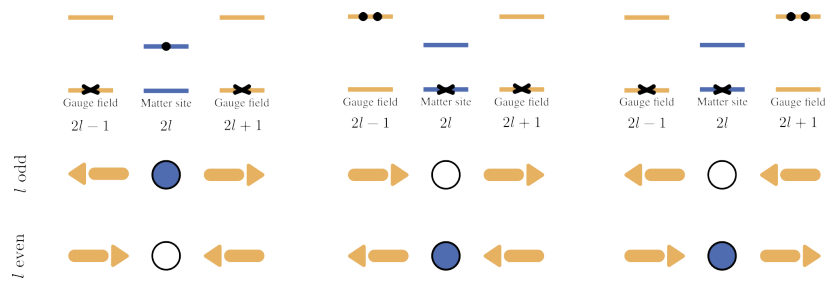 
Figure 1. The U(1) gauge theory can be mapped exactly onto a bosonic chain with 2L −1 sites. The bosonic occupations are uniquely mapped to a gauge-theory configuration depending on the site’s parity. The left/right pointing yellow arrows represent the polarization of the gauge field ⟨Sz l ⟩= ±1/2. A filled/empty circle indicates an occupied/empty fermionic site. An occupied bosonic matter site corresponds to the presence of a charge in the QLM, while the location of doubly occupied gauge field sites indicates the polarization of the gauge field.

📷 Fig 2

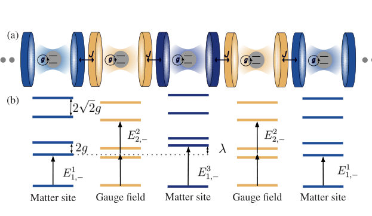 
Figure 2. Mapping between the JCH model and the spin-1/2 QLM. (a) Schematic of a coupled cavity array in the strong coupling regime (g ≫J), consisting of alternating matter (blue) and gauge (orange) sites, each composed of a cavity coupled to a two-level emitter with a coupling rate g. Photon hopping between cavities occurs at a rate J. Colors indicate varying cavity frequency ωe. (b) Polariton energy level structure for each cavity. The anharmonic splitting of the JC ladder is tuned to support the resonance conditions E2i 2,−= E2i−1 1,−+ E2i+1 1,− to be satisfied simultaneously for all i across the array.

📷 Fig 3

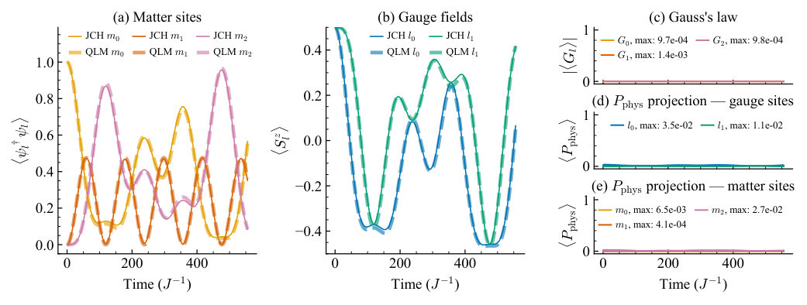 
Figure 3. Real-time dynamics for the JCH model on a chain of five coupled cavities compared to the spin-1/2 QLM. (a) Matter site and (b) gauge field JCH occupation mapped to QLM observables (charge density and electric flux, respectively) as described by Eqs. (8) and (9). (c) Absolute value of the expectation value for the Gauss’s law operator |⟨Gl⟩| for each matter site l and the two adjacent gauge sites, which remains close to zero for all times, confirming confinement to the physical subspace by the gauge protection term λ. Gauss’s law Gl is defined in Eq. (4). Projection onto the physical state for (d) gauge fields and (e) matter sites as described by the set of equations in Eq. (10)....

📷 Fig 4

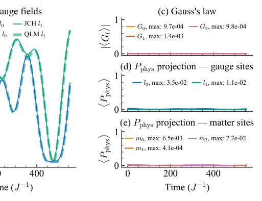 
Figure 3 shows the real-time evolution comparison be- tween the full JCH model and spin-1/2 QLM for param- eters ωe/J = 500, ∆0/J = 111.1, g/J = 333.3, and λ/J = 40. The cavity modes are restricted to hold at most Nc = 3 photons to reduce the simulation runtime. To make comparisons, we map observables from one model to the other. On matter sites, this mapping is given by

📷 Fig 5

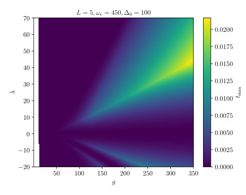 
Figure 4. The possible strength of the effective interaction t varies with the parameters. The color indicates the maximum value of t that can be engineered while keeping J perturba- tively small. This ensures gauge invariance at intermediate timescales. White indicates that there is no valid solution to the resonance condition for these parameters.

**Summary.** This paper proposes using coupled cavity arrays in cavity QED to analog quantum simulate a 1D U(1) Lattice Gauge Theory. By engineering the Jaynes-Cummings-Hubbard model, the authors successfully map the system's dynamics onto the target gauge theory, confirming its gauge-invariant evolution. This establishes a novel, scalable platform for studying complex many-body physics beyond classical simulation capabilities.

**Why it may be interesting.** This work is highly relevant as it uses advanced cavity QED techniques (a core AMO topic) to tackle a fundamental problem in high-energy/condensed matter theory (LGTs), providing a concrete, experimentally viable quantum simulation blueprint.

Detailed structure

**Main problem.** The paper addresses the challenge of developing a quantum simulation platform to study the real-time dynamics of a (1+1)-Dimensional U(1) Lattice Gauge Theory (LGT) coupled to dynamical matter.

**Main result.** The authors demonstrate that the dynamics of the target LGT can be accurately replicated by engineering the Jaynes-Cummings-Hubbard (JCH) model in a coupled cavity array, confirming its potential for simulating gauge-invariant physics.

**Method.** The simulation relies on mapping the LGT onto the JCH model using resonant engineering of polaritonic excitations, followed by verifying the dynamics using exact diagonalization.

**Model / system.** The physical system is an array of interacting cavities operating in the strong-coupling regime of Cavity Quantum Electrodynamics (QED). The underlying model is the JCH Hamiltonian, which is engineered to mimic the spin-1/2 Quantum Link Model (QLM) Hamiltonian.

**Key observables.** Gauge invariance (monitored via Gauss's law expectation value $\langle G_l 
angle$) and the confinement of the evolution to the physical subspace are key diagnostics.

**Important parameters / regimes.** The simulation requires operating in the strong-coupling regime ($g \gg J$) and precise tuning of cavity detunings ($\Delta_i$) to achieve resonant coupling.

**Assumptions / limitations.** The analysis assumes the system can be effectively described by the JCH model and relies on deriving an effective Hamiltonian via second-order perturbation theory.

**Figures summary.** Figures illustrate the mapping of the U(1) gauge theory onto a bosonic chain and schematically depict the mapping between the JCH model and the spin-1/2 QLM in a coupled cavity array.

**Paper structure.** The paper introduces the LGT problem, details the mapping from the QLM to the JCH model using cavity QED principles, shows the successful replication of real-time dynamics via numerical simulation, and concludes by discussing scalable implementations in photonic and superconducting platforms.

Abstract

We propose a photonic scheme for analog quantum simulation of a $U(1)$ Lattice Gauge Theory (LGT) with dynamical matter based on the Jaynes-Cummings-Hubbard (JCH) model. Here, an array of interacting cavities in the strong-coupling regime of cavity Quantum Electrodynamics is mapped onto the alternating matter and gauge-field sites of the spin-1/2 Quantum Link Model. In contrast to other analog LGT quantum simulation methods, our approach implements the desired gauge-invariant dynamics through the hopping of polaritonic excitations among the array sites. The hopping is mapped to the gauge theory via precise tuning of polaritonic resonances in individual cavities. Using exact diagonalization, we show that the real-time evolution of the JCH model accurately replicates that of a Quantum Link Model. Finally, we discuss feasible routes to the beyond-classical simulation capability with scalable implementations in photonic and superconducting systems. This provides a novel route towards understanding the real-time dynamics of lattice gauge theories with matter in higher dimensions.

[↑ back to top](#top)

### [20 Second Parity Lifetime in an InAs--Pb Tetron Device](http://arxiv.org/abs/2606.03884v1)

**Authors:** Morteza Aghaee, Zulfi Alam, Mariusz Andrzejczuk, Andrey Antipov, Theodora Asimakidis, Mikhail Astafev, Lukas Avilovas, Ahmad Azizimanesh, Amin Barzegar, Bela Bauer, Jonathan Becker, Umesh Kumar Bhaskar, Andrea G. Boa, Srini Boddapati, Nichlaus Bohac, Jouri Bommer, Jan Borovsky, Léo Bourdet, Samuel Boutin, Srivatsa Chakravarthi, Benjamin J. Chapman, Nikolaos Chatzaras, Tzu-Chiao Chien, Jason Cho, Patrick T. Codd, William Cole, Paul W. Cooper, Fabiano Corsetti, Ajuan Cui, Tareq El Dandachi, Konstantinos Divanis, Clayton Doyle, Andreas Ekefjard, Javier A. Falcon, Saeed Fallahi, Luca Galletti, Geoffrey C. Gardner, Haris Gavranovic, João Pedro Morais Gomes, Deshan Govender, Flavio Griggio, Ruben Grigoryan, Sebastian Grijalva, Sergei Gronin, Jan Gukelberger, Marzie Hamdast, Esben Bork Hansen, Sebastian Heedt, Samantha Ho, Laurens Holgaard, Kevin van Hoogdalem, Jinnapat Indrapiromkul, Henrik Ingerslev, Lovro Ivancevic, Max Jantos, Thomas Jensen, Jaspreet Singh Jhoja, Vidul R. Joshi, Konstantin V. Kalashnikov, Ray Kallaher, Rachpon Kalra, Farhad Karimi, Torsten Karzig, Maren Elisabeth Kloster, Christina Knapp, Jonathan Knoblauch, Jonne Koski, Anders Kringhøj, Tom Laeven, Jeffrey Lai, Gijs de Lange, Thorvald W. Larsen, Kyunghoon Lee, Kongyi Li, Shuang Liang, Tyler Lindemann, Luna Lochmatter, Marijn Lucas, Roman Lutchyn, Morten Hannibal Madsen, Nasiari Madulid, Ivan Maliyov, Yanick Mampaey, Michael Manfra, Signe Brynold Markussen, Esteban A. Martinez, J. R. Mattinson, Mónica Meira, Camille A. Mikolas, Sarang Mittal, Gopakumar Mohandas, Christian Mollgaard, Michiel W. A. de Moor, Chris Moore, George Moussa, Bhargav Nabar, Anirudh Narla, Ahmad Naseri, Chetan Nayak, Bjørn Funch Schrøder Nielsen, Jens Hedegaard Nielsen, Michael J. Nystrom, Eoin O'Farrell, Keita Ohtani, Theodore Rex Orth, Sara Di Paolo, Camille Papon, Luca Petit, Dima Pikulin, Mohana Rajpalke, Alejandro Alcaraz Ramirez, Katrine Rasmussen, David Razmadze, Yuan Ren, Mariya Romanova, Loïc Roure, Ivan Sadovskyy, Lauri Sainiemi, Juan Carlos Estrada Saldaña, Irene Sanlorenzo, Tatiane Pereira dos Santos, Carl Vincent C. Saruda, Simon Schaal, John Schack, Emma R. Schmidgall, Christina Sfetsou, Cristina Sfiligoj, Zahra Shekason, Sarat Shankar Sinha, Patrick Sohr, Maria João Lourenço de Sousa, Kasper Roed Spiegelhauer, Tomas Stankevic, Henri J. Suominen, Judith Suter, Attila Szénási, Samuel M. L. Teicher, Naganivetha Thiyagarajah, Raj Tholapi, Mason Thomas, Dennis Tom, Emily Toomey, Joshua Tracy, Michelle Turley, Matthew D. Turner, Ivan Urban, Aakash Valliappan, Dmitrii V. Viazmitinov, Anna Wulff Viazmitinova, Dominik Johannes Vogel, Wenbo Wang, Christopher A. Watson, John Watson, Alex Webster, Timothy Williamson, Georg W. Winkler, David J. van Woerkom, Brian Paquelet Wuetz, Cécile X. Yu, Emrah Yucelen, Jesús Herranz Zamorano, Roland Zeisel, Guoji Zheng, A. M. Zimmerman  
**Type:** experiment · **Category:** quantum information and computing · **PDF:** <https://arxiv.org/pdf/2606.03884v1>  
**Analysis basis:** full PDF text, analyzed in chunks
**Topic relevance:** 🔥 `QC/QI experiment` **5/5** · `quantum measurements` **3/5**

📷 Fig 1

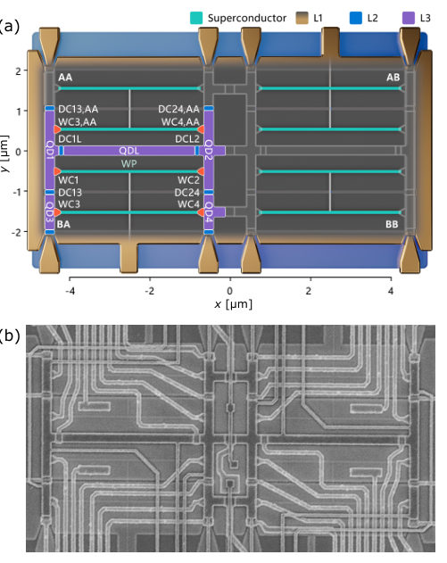 
FIG. 1. Scalable unit cell for multi-qubit tetron array. (a) Schematic of the tetron-based unit cell used for multi-qubit devices. Each tetron consists of two parallel proximitized NWs connected by a superconducting backbone, forming an H-shaped island that hosts four Majorana zero modes (MZMs) at the wire ends when tuned into the topological regime. Color- coded gates illustrate the three-layer architecture: electrostatic tuning gates set the nanowire density, junction and cutter gates control tunnel couplings to define and reconfigure interfero- metric loops, and gate-defined quantum dots (QDs) provide dispersive parity readout. Neighboring tetrons are coupled via shared QDs, enabling...

📷 Fig 2

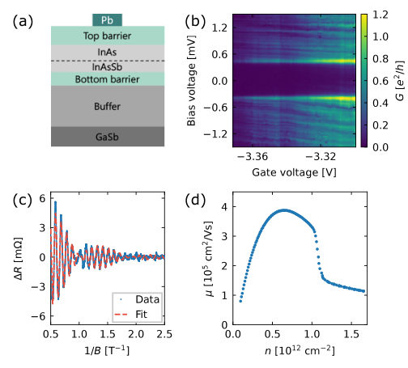 
FIG. 2. Enhanced material stack. (a) Schematic of a hybrid material stack combining Pb with a composite quantum well. (b) Conductance as a function of bias voltage and split- gate voltage in a superconducting quantum point contact to a 2D Pb-covered half-plane in the tunneling regime. A large induced gap is clearly visible. (c) Shubnikov–de Haas oscillations, showing long quantum lifetime and large spin- orbit coupling in a shallow quantum well under Pb, as obtained via the analysis procedure of Ref. 78. We extract a density of 0.49±0.02×1012 cm−2, a spin-orbit coupling of 12±2 meV nm, and a quantum lifetime of 0.37 ± 0.14 ps. (d) Mobility as a function of density in a buried quantum well...

📷 Fig 3

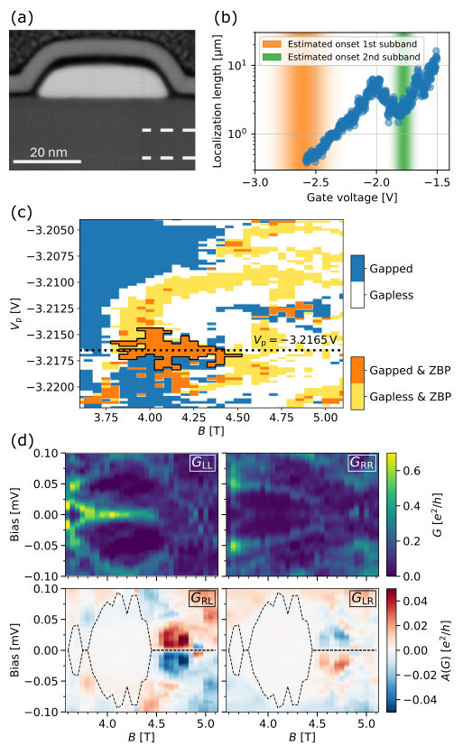 
FIG. 3. (a) Cross-sectional TEM of a narrow Pb strip on the surface of semiconductor barrier and quantum well, dashed lines indicate interfaces at the top and bottom of the quantum well. (b) Measured localization length as a function of gate voltage extracted from 14 wires with different lengths of 1.25 µm and 3 µm. The estimated 1D subband onsets are extracted from quantized local conductance steps. (c) Phase diagram obtained from a TGP analysis of transport data from a 3 µm-long nanowire test structure. (d) B-field line cut along Vp = 3.2165 V showing local and anti-symmetrized non-local conductance along the dashed line in panel (c). Zero-bias peaks at the opposite ends of the NW persist...

📷 Fig 4

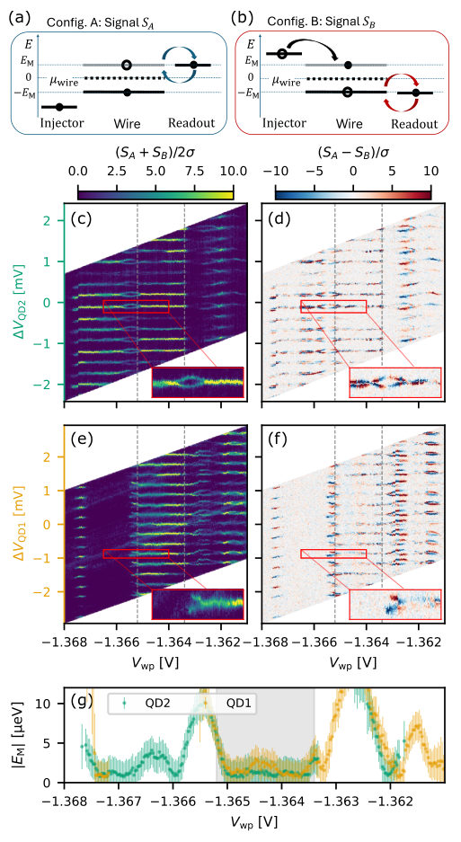 
FIG. 4. Wire spectroscopy. (a,b) Schematic of the quasi- particle injection procedure. The injector QD leads to a parity switch of the wire state, which, for finite EM, shifts the wire- readout QD resonance condition. (c,e) Mean of the normalized rf signal measured on QD1 (QD2) averaged over QD2 (QD1) configurations where S is the measured rf signal along the quadrature with maximal signal and σ the noise along the orthogonal quadrature. (d,f) Difference of the normalized signal measured in configurations (a) and (b). For better visibility, the insets in panels (c–f) each show a zoom-in on parts of a single QD-wire transition. (g) Extracted wire state energy EM based on analyzing the...

📷 Fig 5

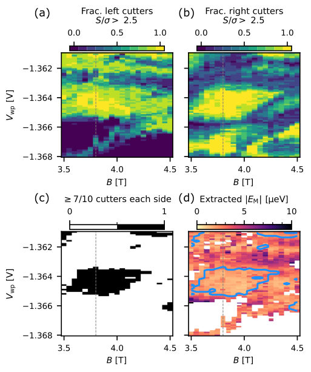 
FIG. 5. Regions with a stable low-energy state at both ends of the wire detected by rf-based wire tuning. (a,b) Fraction of measured left (right) wire cutter configura- tions where the signal measured on the left (right) QD is above the selected threshold S/σ &gt; 2.5 where S is the measured rf signal along the quadrature with maximal signal and σ the noise along the orthogonal quadrature. (c) Regions where the measured signal at both ends of the wire is above threshold for at least 7/10 cutter configurations. (d) Estimated energy EM of the wire low-energy mode averaged over the value extracted from the measurements at each end of the wire. Overlaid in blue is the contour of the region of...

**Summary.** This work experimentally validates the use of high-gap superconductors (Pb) in InAs tetron devices to enhance topological protection. By measuring the parity switching time, the authors report a lifetime of $\sim 20$ seconds, significantly exceeding current qubit timescales. This demonstrates that increasing the superconducting gap effectively suppresses quasiparticle poisoning, a key requirement for scalable topological quantum computation.

**Why it may be interesting.** The demonstrated long parity lifetime directly addresses a major decoherence bottleneck in topological quantum computing, providing a crucial experimental benchmark for fault-tolerant quantum information processing.

Detailed structure

**Main problem.** To experimentally validate that increasing the superconducting excitation gap improves the robustness and lifetime of topological superconducting phases used for quantum computing.

**Main result.** The authors achieved an extremely long parity lifetime of $\sim 20$ seconds in an InAs--Pb tetron device, which is orders of magnitude longer than typical qubit operation times.

**Method.** The study employs interferometric single-shot parity measurements and develops a novel RF measurement technique to probe low-energy wire-end states.

**Model / system.** The physical platform is an InAs--Pb tetron device, a superconductor-semiconductor hybrid structure designed to host Majorana zero modes (MZMs) for topological quantum computation. The system's robustness is enhanced by using the higher-gap superconductor Lead (Pb) instead of Aluminum (Al).

**Key observables.** Parity switching time ($	au_Z$), quantum capacitance shifts, and the topological gap ($\Delta_T$).

**Important parameters / regimes.** Parity lifetime ($\sim 20$ s), Topological Gap ($\Delta_T \sim 70 \mu	ext{eV}$), Majorana hybridization splitting ($E_M < 1 \mu	ext{eV}$).

**Assumptions / limitations.** The improvement in robustness is directly attributed to the increased superconducting gap, which suppresses quasiparticle poisoning effects.

**Figures summary.** Figures illustrate the device architecture, material characterization (SdH oscillations, mobility), the RF spectroscopy setup, and time-resolved measurements showing the exponential decay of the parity state over seconds.

**Paper structure.** The paper progresses from demonstrating improved material quality and gap size using Pb, to developing high-precision RF spectroscopy to measure low-energy states, and finally culminates in time-resolved measurements to quantify the dramatically extended parity lifetime.

Abstract

A central promise of topological quantum computing is that increasing the excitation gap improves device performance significantly. Here, we experimentally validate this principle in an InAs--Pb tetron device via interferometric single-shot parity measurements. By replacing aluminum with the higher-gap superconductor lead in our superconductor-semiconductor hybrid devices, we have improved the robustness of our topological phase. In addition, to enable fast and precise bring-up at scale, we have developed an rf measurement technique that resolves low-energy wire-end states and directly measures their energy splitting with $μ\text{eV}$ precision. We employ this technique to bring up a device in a multi-tetron array and perform parity measurements of one of the tetron's hybrid nanowires (NWs). By controllably switching the wire parity, we observe $h/2e$-periodic bimodal shifts in the quantum capacitance of a quantum dot coupled to the hybrid nanowire in an interference loop. Further time-resolved measurements reveal a characteristic parity switching time of $\sim 20$ s with some instances reaching minute-scale. Such extremely long parity lifetimes are orders of magnitude longer than typical qubit operation times, which are on the order of $μ\text{s}$. Finally, we discuss potential implications for the fidelity of Pauli measurements.

[↑ back to top](#top)

### [Post-Selection Free Generation of Multi-Photon Added Coherent States](http://arxiv.org/abs/2606.03167v1)

**Authors:** Mariano Uria, Ricardo Gutiérrez-Jáuregui, Carla Hermann-Avigliano, Pablo Solano  
**Type:** both · **Category:** other · **PDF:** <https://arxiv.org/pdf/2606.03167v1>  
**Analysis basis:** full PDF text, analyzed in chunks
**Topic relevance:** 🔥 `quantum optics experiment` **4/5** · `correlated cavity matter` **3/5** · `driven-dissipative phase transition` **3/5** · `methods for driven-dissipative` **3/5** · `Tavis-Cummings & cavity-many-emitter` **2/5** · `analog quantum simulation` **2/5** · `non-equilibrium dynamics` **2/5** · `quantum measurements` **2/5** · `Keldysh / 2PI / non-Gaussian methods` **1/5** · `QC/QI experiment` **1/5** · `correlated / nonlocal dissipation` **1/5** · `entanglement & information structure` **1/5** · `interference shaping light` **1/5** · `measurement-induced transitions` **1/5** · `non-equilibrium universality` **1/5**

📷 Fig 1

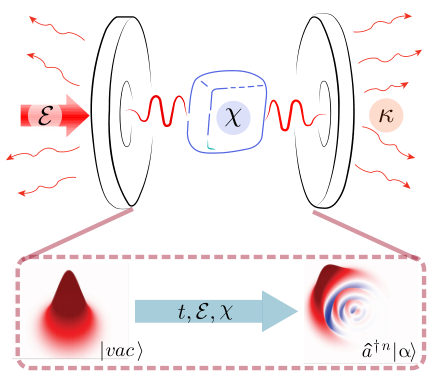 
FIG. 1. Schematic of the protocol for high fidelity gener- ation of PACS. A coherent drive of amplitude E excites a single-mode cavity with Kerr nonlinearity χ and decay rate κ. Starting from the vacuum state |vac⟩, the system reaches a state resembling a displaced multi-photon added coherent state ˆa†n |α⟩at a time t. The lower panel illustrates the trans- formation in phase space, highlighting the emergence of non- classical features from an initially Gaussian state.

📷 Fig 2

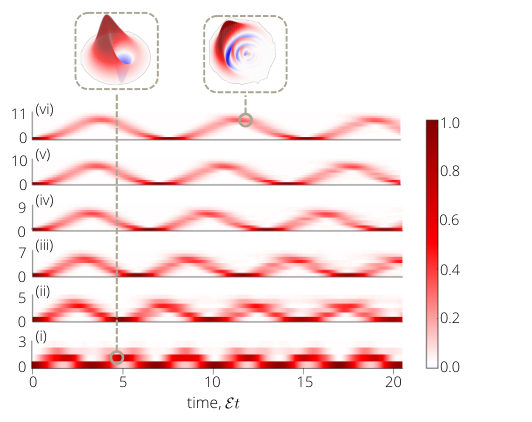 
FIG. 2. Photon number distribution as a function of evolution time for different driving values (E/χ = 1.5, 4.5, 7.25, 10, 13, 16) and fixed δ = 2χ. The roman nu- merals represent the number of added photons for the best PACS generated in each driving regime. The insets on the top represent the Wigner function of the best PACS found in the left (n = 1) and right (n = 6) cases.

📷 Fig 3

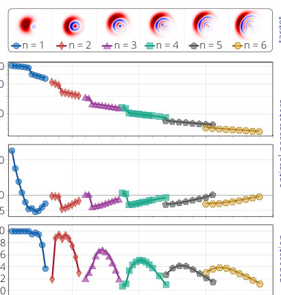 
FIG. 3. Fidelities and optimal parameters for PACS gen- eration. The horizontal axis represents the drive amplitude E normalized by the nonlinear parameter χ. From top to bottom: Wigner function representations, optimal evolution time, amplitude of the coherent component, and optimal fi- delity of the obtained PACS. The shapes connected by colored curves represent the different number of photons added n in the obtained PACS. We considered a drive detuning δ = 2χ for all the calculations.

📷 Fig 4

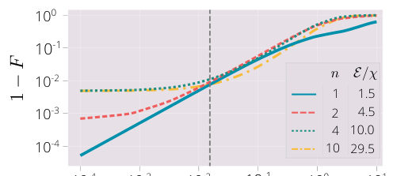 
FIG. 4. Infidelity for the optimal cases under decoherence for different driving amplitudes E, with optimized numbers of added photons n. The vertical dashed gray line indicates the experimental state-of-the-art relation between the deco- herence rate κ and the nonlinearity χ, as reported in Ref. [21].

**Summary.** This paper presents a deterministic method to generate multi-photon added coherent states (PACS) using a driven Kerr nonlinear resonator. By leveraging the photon blockade effect, the protocol avoids probabilistic measurement steps, achieving high fidelity even when considering realistic cavity dissipation. This provides a robust platform for creating complex non-classical resources for quantum technologies.

**Why it may be interesting.** This work directly applies advanced concepts from cavity QED and nonlinear quantum optics (Kerr media, photon blockade) to create a deterministic source of complex non-classical states, which is a major goal in quantum information science.

Detailed structure

**Main problem.** The paper addresses the challenge of deterministically generating high-fidelity multi-photon added coherent states (PACS) without relying on probabilistic post-selection schemes.

**Main result.** A protocol is proposed and demonstrated that achieves fidelities exceeding 99% for generating PACS using a driven Kerr nonlinear resonator, even under realistic dissipative conditions.

**Method.** The generation relies on exploiting the photon blockade effect within the cavity dynamics, monitored using a frame-independent witness called the remnant photon number ($n_r$).

**Model / system.** The system is a single-mode cavity containing a Kerr nonlinear medium, modeled by a Hamiltonian $H_R$ in the rotating frame. The dynamics are analyzed using both unitary evolution and the Lindblad master equation to account for dissipation.

**Key observables.** Remnant Photon Number ($n_r$), Fidelity ($F(t)$), Mean Photon Number ($\langle\hat{n}(t)
angle$), and the time evolution of the state in phase space.

**Important parameters / regimes.** The Kerr nonlinearity ($\chi$), cavity detuning ($\delta$), external drive power ($E$), and cavity decay rate ($\kappa$). The condition $\delta = 2\chi$ is noted as central for certain analyses.

**Assumptions / limitations.** The initial state is assumed to be the vacuum state. The analysis involves heuristic approximations and the assumption that $n_r$ is a superior, displacement-independent witness for non-classicality.

**Figures summary.** Figures illustrate the protocol schematic, the photon number distribution showing blockade effects, and quantitative results showing fidelity vs. time/parameters for PACS generation.

**Paper structure.** The paper develops the theoretical framework by defining the Hamiltonian and the remnant photon number witness. It then details the protocol, showing how the system dynamics naturally lead to the desired state, followed by numerical and analytical confirmation of high fidelity.

Abstract

Non-Gaussian quantum states are essential resources for continuous-variable quantum information processing and for metrology. Among these, multi-photon added coherent states bridge classical and non-classical behaviors; however, their generation typically relies on small photon numbers and probabilistic heralding schemes. Here, we propose a protocol for the post-selection free generation of high fidelity multi-photon added coherent states using the photon blockade effect in a driven Kerr nonlinear resonator, where such states emerge naturally during the dynamics. We demonstrate that high-fidelity states can be prepared by optimizing the external drive power and the interaction time. Furthermore, we show that the protocol is robust under realistic experimental conditions, achieving fidelities of $\approx 99\%$ with current state-of-the-art parameters. Our results unlock a deterministic route to complex non-classical states using well-established quantum optical platforms.

[↑ back to top](#top)

### [Populating topologically protected edge states of a Chern insulator with the cold-atom elevator scheme and measurements](http://arxiv.org/abs/2606.03438v1)

**Authors:** Toke Marstrand Pontoppidan Lindhard, Anne E. B. Nielsen  
**Type:** theory · **Category:** other · **PDF:** <https://arxiv.org/pdf/2606.03438v1>  
**Analysis basis:** full PDF text, analyzed in chunks
**Topic relevance:** 🔥 `analog quantum simulation` **4/5** · 🔥 `measurement-induced transitions` **4/5** · 🔥 `quantum measurements` **4/5** · `driven-dissipative phase transition` **3/5** · `methods for driven-dissipative` **3/5** · `non-equilibrium dynamics` **2/5** · `Keldysh / 2PI / non-Gaussian methods` **1/5** · `Kondo & dissipative impurity` **1/5** · `correlated / nonlocal dissipation` **1/5** · `entanglement & information structure` **1/5** · `exotic spin models in light-matter` **1/5** · `non-equilibrium universality` **1/5**

📷 Fig 1

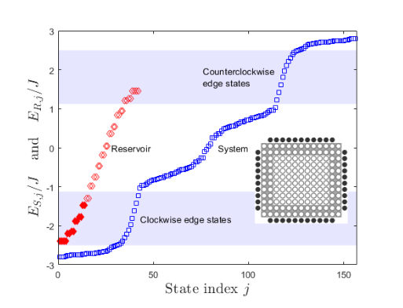 
FIG. 1. Single-particle energy spectrum (blue squares) of the system with 13 × 12 sites (white sites in inset) and magnetic flux ϕ = π/2. States with at least 97% of their particles on the two outermost rows or columns (the region with gray back- ground in the inset) are marked as edge states. The clockwise group consists of the states C = {31, . . . , 42}, and the coun- terclockwise group consists of the states CC = {115, . . . , 126}. The single-particle spectrum (red diamonds) of the reservoir (black sites in the inset) with ϵR given in Eq. (2) is also shown. The filled (empty) diamonds indicate single-particle states that are initially occupied (unoccupied).

📷 Fig 2

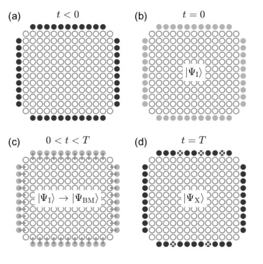 
FIG. 2. The proposed scheme. Each circle represents a site on the two-dimensional lattice. The circles with white filling constitute the 13 × 12 system, while the circles with gray or black filling constitute the reservoir of sizes 1 × 10 and 11 × 1. The reservoir does not wrap around the corners of the system to avoid a too strong coupling between the corner sites and the reservoir. (a) For t &lt; 0, the system and the reservoir are decoupled, either by putting JB equal to zero or by choosing |εR| to be sufficiently large. This is represented by the dark color of the reservoir sites. (b) At t = 0, the coupling between the system and the reservoir is turned on by putting JB = J and instantly...

📷 Fig 3

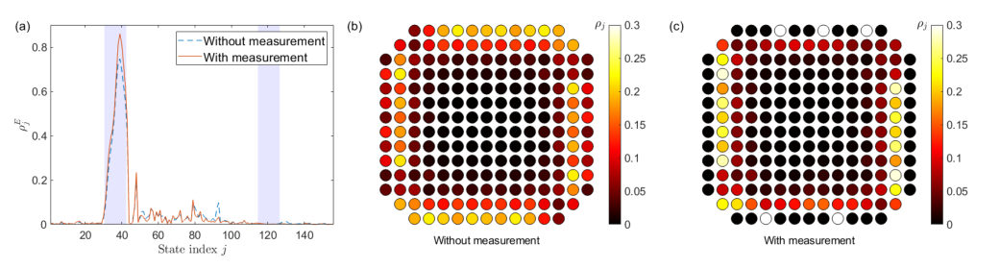 
FIG. 3. Particle population of the energy eigenstates of the system and of the lattice sites for T = π/(2J) and the measurement outcome illustrated in Fig. 2(d). (a) The particle population of the energy eigenstates as a function of the state index. The blue background color indicates the clockwise (left) and counterclockwise (right) edge groups as given in Fig. 1. For this example, the total number of particles in the clockwise edge group is RC = 5.74 without measurement and RC = 6.47 with measurement. The corresponding numbers for the counterclockwise edge modes are RCC = 0.025 and RCC = 0.024, respectively. (b) The particle population of the sites when no measurement is performed. In...

📷 Fig 4

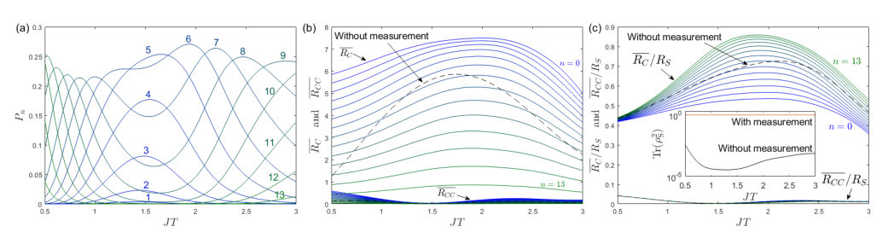 
FIG. 4. (a) Probability Pn to measure n particles in the reservoir as a function of the time the system and reservoir are coupled. The individual curves are labeled by n. (b) The expectation value of the total number of particles in the clockwise (counterclockwise) edge states averaged over all measurement outcomes detecting a total of n particles in the reservoir. For comparison, the dashed lines show the expectation value of the number of particles in the two sets of edge states when no measurement is performed. (c) The same data as in panel (b), except that we here divide by the expectation value of the total number of particles in the system. The inset shows the purity of the state of...

**Summary.** This paper analyzes a method to populate the chiral edge states of a Chern insulator simulated with ultracold atoms. By introducing an instantaneous projective measurement on the particle reservoir, the system state can be projected into a pure state. The key finding is that postselecting on specific measurement outcomes allows researchers to significantly enhance the population of the desired edge states compared to standard preparation methods.

**Why it may be interesting.** This work directly bridges topological physics (Chern insulators) with advanced experimental platforms (cold atoms) and complex quantum measurement theory, providing concrete, calculable protocols for state preparation.

Detailed structure

**Main problem.** The paper investigates how to populate topologically protected, chiral edge states in a Chern insulator using the cold-atom elevator scheme.

**Main result.** Performing an instantaneous, projective measurement on the reservoir allows for the preparation of pure system states and can enhance the population of chiral edge states through postselection.

**Method.** The authors developed a numerical method to calculate measurement probabilities and expectation values for the post-measurement state, which scales linearly with lattice sites.

**Model / system.** The system models a Chern insulator using spinless fermions in the Harper-Hofstadter model on a 2D lattice, coupled to a reservoir via an 'elevator' mechanism using ultracold atoms in optical lattices.

**Key observables.** Particle populations in clockwise ($R_C$) and counterclockwise ($R_{CC}$) edge states, system purity ($	ext{Tr}(
ho_S^2)$), and the probability distribution $P_n$ of measuring $n$ particles in the reservoir.

**Important parameters / regimes.** Coupling time $T$, the number of particles measured in the reservoir ($n$), and the magnetic flux $\phi$. Optimal transfer occurs around $T \approx \pi/(2J)$.

**Assumptions / limitations.** The measurement is assumed to be instantaneous, and the reservoir is assumed to be topologically trivial. The method is derived for noninteracting, fermionic models conserving particle number.

**Figures summary.** Figures illustrate the energy spectrum, the experimental scheme involving coupling and measurement, and show how particle populations ($R_C, R_{CC}$) and measurement probabilities ($P_n$) change as a function of coupling time $T$ and measurement outcome $n$.

**Paper structure.** The paper first introduces the physical setup and the challenge of measurement. It then details the theoretical framework for calculating post-measurement observables, showing how the measurement step leads to pure states. Finally, it presents results demonstrating that postselection can optimize the population of desired edge states.

Abstract

Two-dimensional Chern insulators support topologically protected, chiral edge currents, and these can be detected in experiments with ultracold atoms in optical lattices. It has previously been shown that one can populate a selected group of edge states of a Chern insulator by transferring particles from a reservoir. Here, we numerically investigate the effect of performing an instantaneous, projective measurement on the reservoir before the reservoir is discarded. In this way, the final state of the system is pure and described by a wavefunction. We also show that quite likely measurement outcomes can help to increase the final number or percentage of particles in the chiral edge states through postselection. Without the measurement step, the physics can be described in terms of single-particle physics. The measurement significantly complicates the description. By appropriately rewriting the analytical expressions, we show that measurement probabilities, expectation values, averages of expectation values, and purity can nevertheless be computed from the state before the measurement in a way that scales only linearly with the number of lattice sites for a fixed number of particles. This enables us to investigate a setup with, for instance, 14 particles and 198 lattice sites numerically. The approach applies generally to noninteracting, fermionic models that conserve the number of particles.

[↑ back to top](#top)

### [A mean-field description of strong-to-weak symmetry breaking in the monitored three-dimensional Bose-Hubbard model](http://arxiv.org/abs/2606.02713v1)

**Authors:** Yicheng Tang, Pradip Kattel, J. H. Pixley  
**Type:** theory · **Category:** statistical mechanics · **PDF:** <https://arxiv.org/pdf/2606.02713v1>  
**Analysis basis:** full PDF text, analyzed in chunks
**Topic relevance:** 🔥 `driven-dissipative phase transition` **4/5** · 🔥 `measurement-induced transitions` **4/5** · `analog quantum simulation` **3/5** · `methods for driven-dissipative` **3/5** · `non-equilibrium universality` **3/5** · `quantum measurements` **3/5** · `Keldysh / 2PI / non-Gaussian methods` **2/5** · `non-equilibrium dynamics` **2/5** · `correlated / nonlocal dissipation` **1/5**

📷 Fig 1

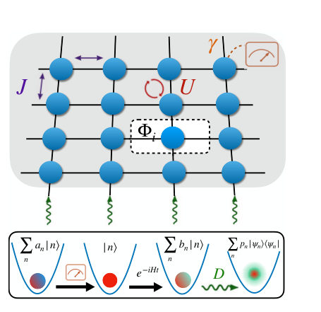 
FIG. 1: Illustration of the Bose-Hubbard model with hopping J (blue arrows) and onsite interaction U (red arrows), subject to measurement (orange dashed lines) at rate γ and dissipation (green wavy lines) at rate D. The system is simulated using GMFT, where the local mean-field Hamiltonian at site i (unshaded) is obtained by tracing out all other sites (shaded) and depends on the mean field Φi defined in Eq. (5). The lower panel il- lustrates the interplay of measurement, Hamiltonian dy- namics, and dissipation. Measurement projects the state onto a number eigenstate |n⟩(single-color circle), de- stroying quantum coherence. Subsequent Hamiltonian evolution regenerates coherence...

📷 Fig 2

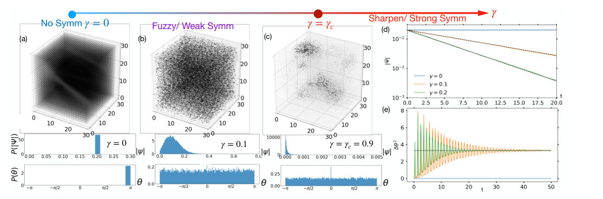 
FIG. 2: Panels (a)–(c) show the configuration of the superfluid order parameter Ψi = |Ψi|eiθi with arrows for a single shot in the steady state t = 50 with model parameter D = 0, U = J = 1, α = 0.2 and system size L = 30 for various measurement rate γ. The norm |Ψ| sets the length of a single arrow, and the arrow direction is determined by the phase in the direction (sin θ, cos θ, 0). (a) γ = 0 has broken symmetry with coherent phases θi = θj and Ψi = Ψj with a delta-function distribution in both variables over sites. (b) γ = 0.1 in the weak symmetry (charge fuzzy) phase, where |Ψi| ̸= 0 but with phases for each site that are randomly distributed. (c) γ = 0.9 at criticality. To visualize...

📷 Fig 3

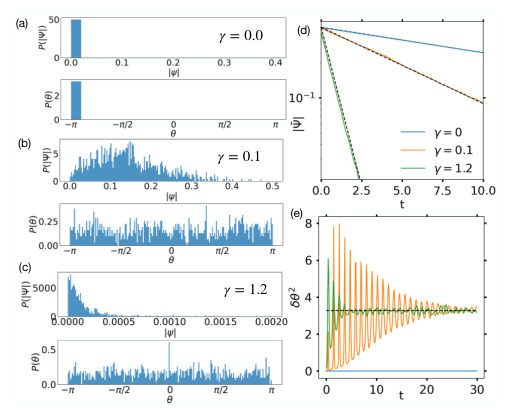 
FIG. 3: Configuration of the local superfluid order pa- rameter Ψi for a single quantum trajectory at t = 50, with dissipation rate D = 0.1, U = J = 1, α = 0.2, and L = 30. Panels (a)–(c) show the evolution from the weak-symmetry to the strong-symmetry regime as γ increases. Unlike the nondissipative case, the system at γ = 0 evolves toward the infinite-temperature mixed state ρi ∝I, which is a weak-symmetry state. Panel (d) shows the decay of |¯Ψ(t)| ≃αe−(D/2+γ)t, indicated by the dashed line.

📷 Fig 4

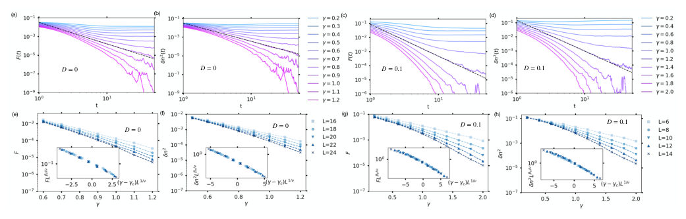 
FIG. 4: Upper four panels (a-d) show the time evolution for two order parameters, with varying measurement rate γ. (a) shows F(t) with βF /νz = 2.252 ± 0.005 and (b) shows δn2(t) with βn/νz = 1.979 ± 0.004 at L = 24, α = 0.2 and D = 0. (c) shows F(t) with βF /νz = 2.253 ± 0.006 and (d) shows δn2(t) with βn/νz = 2.179 ± 0.008, at L = 14, α = 0.4 and D = 0.1. The dashed line is the fitting of the scaling behavior at criticality O(t) = A tβ/νz . The lower four panels (e-h) show the scaling behavior at time t = L, with the insets showing the data collapse using the scaling ansatz defined in Eq.9. (e) gives critical values γc = 0.894 ± 0.02, ν = 1.30 ± 0.06, (f) gives γc = 0.873 ± 0.01, ν = 1.18...

📷 Fig 5

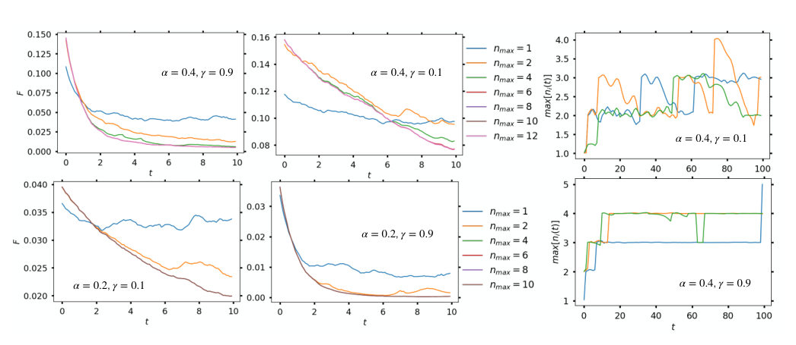 
FIG. 5: The left and middle panels show the time evolution of the R´enyi-2 correlator F(t) for different local Hilbert- space truncations nmax, fillings α, and measurement rates γ. The right panels show the corresponding maximum occupation number max[n(t)]. All panels use the common color scheme indicated by the legend.

**Summary.** This paper develops a mean-field theory to study symmetry breaking in monitored Bose-Hubbard systems. By analyzing local order parameters, the authors establish a local diagnostic for strong-to-weak symmetry breaking. They find that this transition is critically linked to the charge-sharpening transition, suggesting a unified critical physics in open quantum systems.

**Why it may be interesting.** This work provides a concrete, local diagnostic tool (the local order parameter) to study a complex non-equilibrium phenomenon (SWSSB) in a system relevant to quantum gas experiments, linking it to established critical phenomena.

Detailed structure

**Main problem.** The paper aims to characterize strong-to-weak spontaneous symmetry breaking (SWSSB) in open quantum systems and establish its connection to the charge-sharpening transition.

**Main result.** The local order parameter characterizing SWSSB is found to be critical near the same measurement strength as the charge-sharpening transition, suggesting they share a common underlying critical point.

**Method.** The authors develop and apply a Gutzwiller mean-field framework to simulate the stochastic measurement dynamics of the Bose-Hubbard model.

**Model / system.** The system is the monitored three-dimensional Bose-Hubbard model, whose dynamics are governed by a combination of the Bose-Hubbard Hamiltonian, Lindbladian dissipation, and local density measurements.

**Key observables.** Local order parameter, charge variance ($\delta n^2$), and the Rényi-2 correlator ($F$), which serve as diagnostics for SWSSB and charge sharpening, respectively.

**Important parameters / regimes.** Measurement strength ($\gamma$), dissipation rate ($D$), and the critical measurement rate ($\gamma_c$).

**Assumptions / limitations.** The primary approximation is the use of the Gutzwiller Mean-Field Theory (GMFT), which assumes the state remains unentangled, simplifying the many-body problem to local single-site dynamics.

**Figures summary.** Figures illustrate the Bose-Hubbard model dynamics across different measurement rates ($\gamma$), showing the evolution of the superfluid order parameter ($\Psi_i$) from coherent to number-eigenstate dominated regimes.

**Paper structure.** The paper introduces the model and the challenge of characterizing SWSSB. It develops the GMFT approach, applies it to analyze the local order parameter and charge variance, and concludes by establishing the critical connection between the two transitions.

Abstract

Strong-to-weak spontaneous symmetry breaking has emerged as a novel form of ordering in monitored and open quantum systems, yet its characterization has so far primarily relied on nonlocal diagnostics. Here, we develop a Gutzwiller mean-field framework for monitored bosonic lattice systems, enabling the direct simulation of stochastic measurement dynamics in three spatial dimensions. Applying this approach to the monitored Bose-Hubbard model with local density measurements and Lindbladian dissipation, we identify strong-to-weak symmetry breaking through a trajectory-averaged local order parameter. We find that this local order parameter becomes critical near the same measurement strength as the charge-sharpening transition and exhibits Lorentz invariance with a correlation-length exponent, $ν\simeq 1.2$, comparable to that of the charge-sharpening transition, suggesting that the two phenomena may originate from a common underlying critical point. Our work establishes a local characterization of strong-to-weak symmetry breaking, reveals its connection to charge sharpening, and provides concrete predictions for future experiments on the monitored Bose-Hubbard model.

[↑ back to top](#top)

### [Many-Body Non-Hermitian Physics in the Generalized Brillouin Zone](http://arxiv.org/abs/2606.03124v1)

**Authors:** Chaoze Lu, Chuanshu Xu, Zhenghao Yang, Xiancong Lu  
**Type:** theory · **Category:** strongly correlated electrons · **PDF:** <https://arxiv.org/pdf/2606.03124v1>  
**Analysis basis:** full PDF text, analyzed in chunks
**Topic relevance:** 🔥 `entanglement & information structure` **4/5** · `analog quantum simulation` **3/5** · `driven-dissipative phase transition` **3/5** · `methods for driven-dissipative` **3/5** · `non-equilibrium dynamics` **3/5** · `Kondo & dissipative impurity` **2/5** · `correlated / nonlocal dissipation` **2/5** · `non-equilibrium universality` **2/5** · `Keldysh / 2PI / non-Gaussian methods` **1/5**

📷 Fig 1

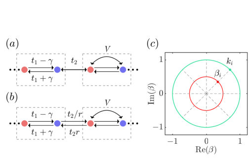 
FIG. 1. Schematic diagram of the non-Hermitian interacting SSH model (a) and the corresponding quasi-reciprocal model (b). (c) The correspondence between βi in the circular gen- eralized Brillouin zone and crystal momentum ki in the con- ventional Brillouin zone.

📷 Fig 2

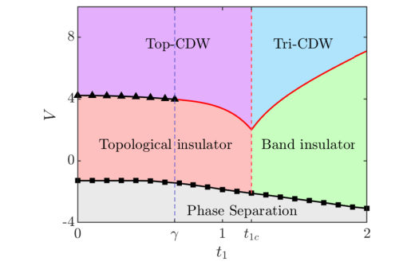 
FIG. 2. Phase diagram of the quasi-reciprocal SSH model in the t1 −V plane. The Top-CDW and Tri-CDW represent topological and trivial CDW phases, respectively. The red line shows the fitted CDW phase boundary given in the main text, while the black line with triangles denotes the phase boundary obtained from numerical extrapolation. The black line with squares indicates the phase-separation boundary ob- tained numerically for L = 20. The red dashed line (t1c ≈1.2 ) marks the topological phase boundary, and the blue dashed line (t1 = γ) indicates the non-Hermitian exceptional point. For t1 &lt; γ, the energy spectrum becomes complex. Other parameter: t2 = 1 and γ = 2/3.

📷 Fig 3

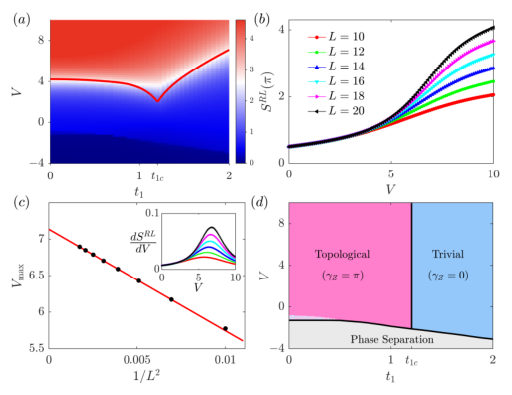 
FIG. 3. (a) Charge-density-wave structure factor SRL(π) in the t1–V plane for a fixed lattice size L = 20. (b) SRL(π) as a function of the interaction V at t1 = 2 for various lattice sizes L. (c) Finite-size extrapolation of Vmax as a function of 1/L2, where Vmax denotes the point at which the derivative dSRL(π)/dV is maximized. The inset shows the derivative dSRL(π)/dV corresponding to the data in panel (b). (d) Zak phase γZ of ˜ H under PBC. The black line indicates the topo- logical phase boundary, with γZ = π in the topological region and γZ = 0 in the trivial region. Other parameters are t2 = 1 and γ = 2/3.

📷 Fig 4

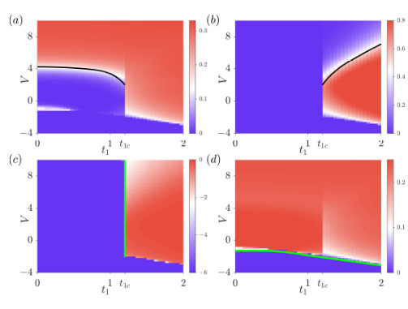 
FIG. 4. Degeneracy structure D(n) of the entanglement spec- trum of the quasi-reciprocal Hamiltonian ˜ H in the t1–V plane. (a) D(4). (b) D(2). (c) log10[D(2) + 10−6], where 10−6 is in- troduced to avoid the divergence of log10(0). (d) D(5). The black and green lines represent the phase boundary in Fig. 2. Common parameters: L = 20, N = 10, t2 = 1, and γ = 2/3.

**Summary.** This paper extends the Generalized Brillouin Zone theory to interacting non-Hermitian systems by constructing a quasi-reciprocal Hamiltonian. The authors demonstrate that the topological properties of this complex system are robustly characterized by analyzing the entanglement spectrum degeneracy of the derived quasi-reciprocal model. This establishes a crucial theoretical pathway for studying many-body non-Hermitian physics.

**Why it may be interesting.** This work provides a powerful, generalized theoretical tool (GBZ formalism) to analyze complex, interacting, non-Hermitian quantum systems, which is highly relevant for understanding open quantum systems and topological phases in condensed matter.

Detailed structure

**Main problem.** The primary challenge addressed is extending the Generalized Brillouin Zone (GBZ) theory, which resolves bulk-boundary correspondence breakdown in non-Hermitian systems, to interacting many-body systems.

**Main result.** The authors successfully construct a quasi-reciprocal many-body Hamiltonian whose topological properties are encoded in the entanglement spectrum of the quasi-reciprocal model, providing a route to study interacting non-Hermitian physics.

**Method.** The study employs a GBZ transformation to map the original non-Hermitian Hamiltonian (under OBC) to a quasi-reciprocal Hamiltonian (under PBC). Phase diagrams are analyzed using exact diagonalization, calculating the Zak phase and the entanglement spectrum degeneracy.

**Model / system.** The model is an interacting non-Hermitian SSH-type model. The theory relies on constructing a quasi-reciprocal Hamiltonian ($	ilde{H}$) that mimics the physics of the original model ($H$) under different boundary conditions.

**Key observables.** Zak phase, structure factor of the charge-density-wave (CDW) phase ($S_{RL}(k)$), and the degeneracy of the low-lying entanglement spectrum (ES).

**Important parameters / regimes.** Interaction strength ($V$), hopping parameters ($t_1, t_2$), and the topological transition point ($t_{1c}$).

**Assumptions / limitations.** The analysis assumes the applicability of the GBZ transformation to interacting systems and that the quasi-reciprocal Hamiltonian accurately captures the physics of the original model.

**Figures summary.** Figures illustrate the mapping between the original and quasi-reciprocal models, show the phase diagram in the $t_1-V$ plane identifying different CDW and topological phases, and plot the dependence of the structure factor and ES degeneracy on system parameters.

**Paper structure.** The paper first establishes the theoretical framework using the GBZ to derive the quasi-reciprocal Hamiltonian. It then applies this formalism to the interacting SSH model, using multiple diagnostics (CDW structure factor, Zak phase, ES) to map out the phase diagram and confirm the topological nature of the system.

Abstract

The breakdown of conventional bulk-boundary correspondence (BBC) in   non-Hermitian system can be resolved by the generalized Brillouin   zone (GBZ) theory. However, extending the GBZ theory to interacting   many-body systems remains an open problem. Here, we consider an   interacting non-Hermitian model characterized by a circular GBZ. We   show that, based on a GBZ transformation, a quasi-reciprocal   many-body Hamiltonian can be constructed which, under periodic   boundary conditions (PBC), captures the physics of the original   non-Hermitian model under open boundary conditions (OBC). Using   exact diagonalization (ED), we determine the phase diagram for the   quasi-reciprocal many-body Hamiltonian by computing the Zak phase   and the structure factor of the charge-density-wave (CDW) phase. We   further investigate the entanglement properties and find that the   degeneracy of the low-lying entanglement spectrum characterizes each   phase in the phase diagram. These findings demonstrate that the   topological properties in interacting non-Hermitian system is encoded in   the entanglement spectrum of the quasi-reciprocal model. Our work   establishes a route to studying many-body non-Hermitian physics   within the GBZ formalism.

[↑ back to top](#top)

### [Geometric Decoherence Time in Lindbladian Dynamics](http://arxiv.org/abs/2606.02743v1)

**Authors:** Rishabh Jha, Stephan Haas, Abhinav Prem  
**Type:** theory · **Category:** statistical mechanics · **PDF:** <https://arxiv.org/pdf/2606.02743v1>  
**Analysis basis:** full PDF text, analyzed in chunks
**Topic relevance:** 🔥 `entanglement & information structure` **4/5** · `correlated / nonlocal dissipation` **3/5** · `driven-dissipative phase transition` **3/5** · `methods for driven-dissipative` **3/5** · `non-equilibrium dynamics` **3/5** · `analog quantum simulation` **2/5** · `non-equilibrium universality` **2/5** · `Keldysh / 2PI / non-Gaussian methods` **1/5** · `exotic spin models in light-matter` **1/5**

📷 Fig 1

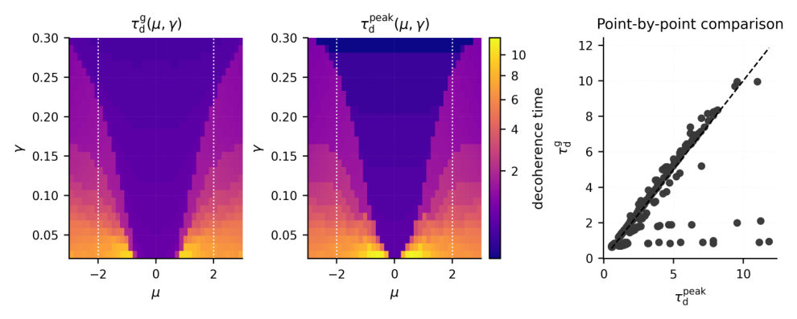 
Figure 1: Decoherence-time landscape for the balanced gain/loss Kitaev chain in the (µ, γ) plane. Left: geometric decoherence time τ g d(µ, γ). Center: peak-based estimate τ peak d (µ, γ). Right: point-by-point comparison, with dashed diagonal τ peak d = τ g d. Vertical guide lines at µ = ±2J mark the closed-system topological phase boundaries. The topological phase |µ| &lt; 2J sustains longer τ g d than the trivial phase, and within the topological phase τ g d shows a local suppression at the chiral-symmetric point µ = 0 and decreases again toward |µ| = 2J. The comparison panel shows that τ peak d is correlated with τ g d, while exhibiting qualitatively significant discrepancies in the...

📷 Fig 2

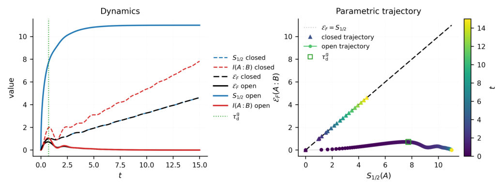 
Figure 2: Geometric decoherence time in the topological phase of the open Kitaev chain (µ = 0.5, J = ∆= 1, L = 128, LA = 11, balanced gain/loss γ = 0.15, N´eel initial state). Left: time evolution of EF (fermionic Gaussian negativity), S1/2(A), and I(A:B) under unitary dynamics (dashed) and Lindbladian dynamics (solid); the vertical marker indicates τ g d. Right: parametric trajectory Γ(t) = (S1/2, EF ) colored by time; triangles denote unitary dynamics, circles denote Lindbladian dynamics. Under unitary dynamics, the trajectory is pinned to the diagonal; under Lindbladian dynamics it bends away at τ g d (square marker). At late times EF and I(A:B) both vanish, signaling asymptotic...

📷 Fig 3

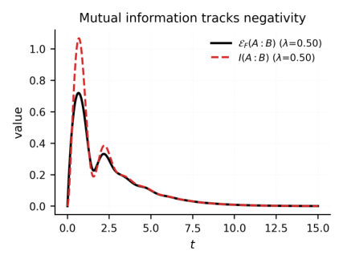 
Figure 3: Mutual information I(A:B) and fermionic Gaussian negativity EF as functions of time for the same parameters as Fig. 2. The two quantities share the same peak and trough times as well as the same asymptotic decay rate, consistent with Theorem 1 (see Sec. II C). Exponential fits over the second half of the time window yield λEF ≈λI ≈0.50, confirming a shared decay expo- nent to two significant figures.

📷 Fig 4

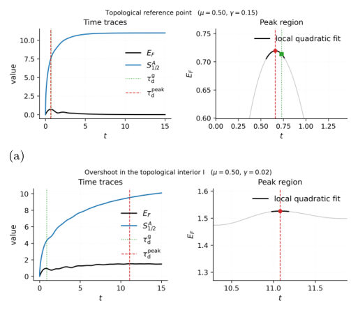 
Figure 4: Fixed-µ comparison within the topological phase. Left: topological reference point, µ = 0.50 and γ = 0.15. Right: weaker dissipation, µ = 0.50 and γ = 0.02. The weak-dissipation panel shows the clear overshoot of τ peak d relative to τ g d where the peak is at- tained at much later time and is comparatively flat. In both panels τ g d is extracted from Definition 1 via the entropy–negativity trajectory, which is not shown here.

📷 Fig 5

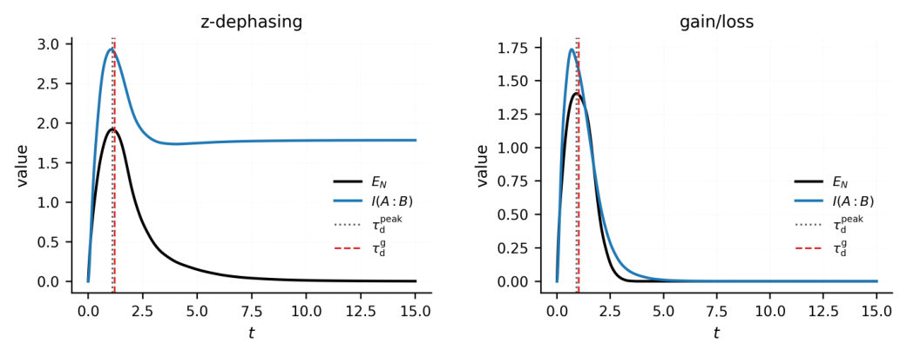 
Figure 5: Time evolution of exact logarithmic negativity EN and von Neumann mutual information I(A:B) for the interacting XXZ chain under two dissipative protocols. (a) Under local z-dephasing (which preserves a strong U(1) symmetry), EN →0 while I(A:B) saturates to a nonzero plateau, signaling a separable but non-product NESS. The mutual-information tracking implied by Proposition 1 and Theorem 1 does not apply because the NESS does not factorize. (b) Under local gain/loss, which removes the Sz tot conservation, both EN and I(A:B) decay to zero with aligned peak and decay times, consistent with asymptotic factorization (Proposition 1 and Theorem 1). Parameters: open XXZ chain, L = 10,...

**Summary.** This paper introduces the geometric decoherence time ($	au_{g}^{	ext{d}}$) as a precise measure for the onset of decoherence in open quantum systems. By analyzing the breakdown of monotonicity between entanglement measures and entropy, the authors demonstrate that this timescale is sensitive to underlying physics, such as topological order in the Kitaev chain. It provides a powerful tool for characterizing the transition from coherent quantum dynamics to a classical steady state.

**Why it may be interesting.** This work provides a rigorous, operational measure ($	au_{g}^{	ext{d}}$) to quantify when a quantum system effectively loses its quantum coherence due to environmental coupling, which is crucial for understanding quantum computation and thermalization.

Detailed structure

**Main problem.** The paper addresses the challenge of defining a clear dynamical timescale for the onset of decoherence in open many-body systems, where entanglement loss and entropy growth occur concurrently.

**Main result.** The geometric decoherence time ($	au_{g}^{	ext{d}}$), defined by the breakdown of a monotone relation between logarithmic negativity and Rényi entropy, is established as a robust diagnostic scale for decoherence onset.

**Method.** The authors analyze the time evolution of quantum correlations using the Lindblad master equation, deriving specific criteria based on the monotonicity of entanglement measures.

**Model / system.** The study applies to open many-body systems, including the Kitaev chain and the interacting XXZ spin chain, evolving under Lindbladian dynamics characterized by gain and loss jump operators.

**Key observables.** Logarithmic Negativity ($	ext{EN}$), Rényi-1/2 Entropy ($S_{1/2}$), Quantum Mutual Information ($I(A:B)$), and the geometric decoherence time ($	au_{g}^{	ext{d}}$).

**Important parameters / regimes.** Dissipation rates ($\gamma$), system parameters ($\mu, J, \Delta$), and the comparison between topological and trivial phases.

**Assumptions / limitations.** The geometric criterion is assumed to hold for both single-particle Gaussian dynamics and interacting Lindbladian evolution, though symmetry can cause tracking failures.

**Figures summary.** Figures compare $	au_{g}^{	ext{d}}$ against $	au_{	ext{peak}}^{	ext{d}}$ for the Kitaev chain, showing topological protection, and illustrate the time evolution of $	ext{EN}$ and $I(A:B)$ for different dissipation protocols in the XXZ chain.

**Paper structure.** The paper develops the geometric criterion ($	au_{g}^{	ext{d}}$) by analyzing the entropy-negativity trajectory, applies this to the Kitaev chain to show topological protection, and extends the analysis to the interacting XXZ chain to distinguish between symmetry-protected classical correlations and true decoherence.

Abstract

The onset of decoherence in open many-body systems lacks a dynamical timescale grounded in the loss of bipartite entanglement. Here, we introduce the $geometric$ $decoherence$ $time$, defined as the earliest moment the monotone relation between logarithmic negativity and Rényi-$\tfrac{1}{2}$ entropy -- exactly equal across any bipartition for pure states -- breaks down under open-system evolution, signaling entropy growth without accompanying entanglement growth. We establish this criterion in both single-particle Gaussian dynamics and many-body Lindbladian evolution. We show that quantum mutual information provides a complementary long-time diagnostic: its asymptotic vanishing is equivalent to factorization of the steady state across the bipartition, a condition strictly stronger than separability, and whenever a product steady state is approached exponentially in trace norm, negativity and mutual information share the same decay rate. In the presence of a strong symmetry, this tracking can fail -- residual classical correlations can survive after entanglement has vanished. In the Kitaev chain with balanced gain and loss, we derive a closed-form solution and show that the topological phase sustains longer coherence times than the trivial phase at identical dissipation, with a local minimum at the chiral-symmetric point. In the interacting XXZ chain, exact many-body evolution shows that local $Z$-dephasing preserves residual classical correlations, whereas gain and loss restore the mutual-information tracking of negativity. Our results establish the geometric decoherence time as a dynamical scale tracking the onset of decoherence.

[↑ back to top](#top)

### [Criticality and Quench Dynamics at the Anderson Transition of a Chern Insulator](http://arxiv.org/abs/2606.03426v1)

**Authors:** Lara Ulčakar, Jernej Mravlje, Gal Lemut, Tomaž Rejec  
**Type:** theory · **Category:** other · **PDF:** <https://arxiv.org/pdf/2606.03426v1>  
**Analysis basis:** full PDF text, analyzed in chunks
**Topic relevance:** 🔥 `non-equilibrium dynamics` **4/5** · 🔥 `non-equilibrium universality` **4/5** · `analog quantum simulation` **3/5** · `driven-dissipative phase transition` **3/5** · `methods for driven-dissipative` **2/5** · `Keldysh / 2PI / non-Gaussian methods` **1/5** · `Kondo & dissipative impurity` **1/5** · `entanglement & information structure` **1/5**

📷 Fig 1

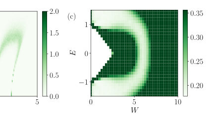 
FIG. 1. Phase diagram in the (u, W) parameter space of the (a) Chern number and (b) the electrical conduc- tance. (c) The energy level-spacing variance of the states per energy window of width 0.1, at u = −1. Data is averaged over (a) 10, (b) 50 and (c) 100 disorder realizations. Dashed line indicates the values of parameters during the quench.

📷 Fig 2

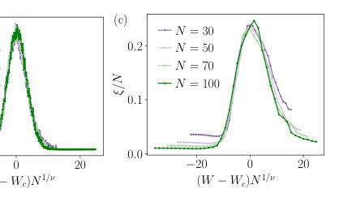 
FIG. 2. Finite-size scaling plots across the phase transition of (a) the Chern number, (b) the electrical conductance and (c) the correlation length ξ/N estimated from the LCM profile. Quantities are presented as functions of the rescaled control parameter (W −Wc)N 1/ν for different system sizes.

📷 Fig 3

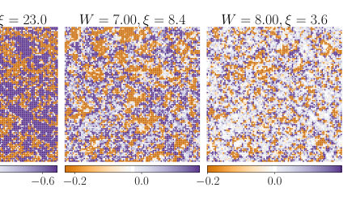 
FIG. 3. Real-space profile of the local Chern marker of the ground state at different disorder strengths that range across the phase transition.

📷 Fig 4

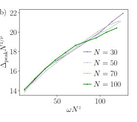 
FIG. 4. (a) AC conductivity σxx as a function of disorder strength at various ω. (b) Full width at half maximum of σxx as function of the rescaled frequency ωN z for different system sizes.

📷 Fig 5

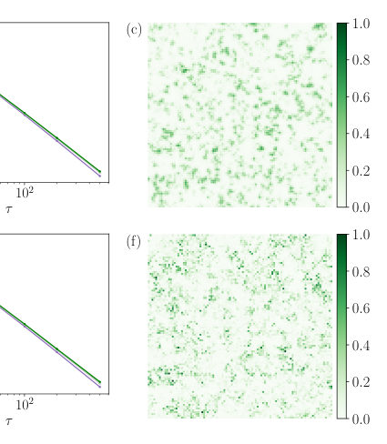 
FIG. 5. Excitation density (a), (d) during quenches with different τ and (b), (e) at the end of the quench as a function of τ. (c), (f) show spatial distribution of excitations after a quench with τ = 10 and N = 100. (a), (b) and (c) correspond to the trivial-to-topological protocol and (d), (e) and (f) to the topological-to-trivial protocol.

**Summary.** This work analyzes the topological Anderson transition in a disordered Chern insulator, finding critical exponents consistent with the Integer Quantum Hall Effect. Crucially, the study examines non-equilibrium dynamics during disorder quenches, revealing that the excitation generation and the associated length scale deviate from standard Kibble-Zurek scaling, depending on the quench direction.

**Why it may be interesting.** The study bridges topological physics, Anderson localization, and non-equilibrium dynamics, providing insights into how topological protection breaks down under disorder and quench protocols, which is relevant for understanding quantum phase transitions in engineered materials.

Detailed structure

**Main problem.** The study investigates the critical properties and non-equilibrium dynamics across the topological Anderson phase transition in a strongly disordered Chern insulator.

**Main result.** The transition is characterized by critical exponents consistent with the Integer Quantum Hall Effect, but the non-equilibrium excitation density does not follow standard Kibble-Zurek scaling, showing direction-dependent behavior.

**Method.** The authors employ finite-size scaling, analysis of the Local Chern Marker (LCM) profile, and quench dynamics simulations to extract critical exponents and non-equilibrium scaling laws.

**Model / system.** The system is a disordered Chern insulator modeled by the half-filled disordered Qi-Wu-Zhang (QWZ) model, which exhibits a transition between a topological and a trivial Anderson insulating phase.

**Key observables.** Chern number, electrical conductance, Local Chern Marker (LCM) profile, correlation length ($\xi$), excitation density, and critical exponents ($
u, z$).

**Important parameters / regimes.** Disorder strength ($W$), system size ($N$), and quench time ($	au$).

**Assumptions / limitations.** The analysis relies on comparing results to established universality classes (IQHE) and the Kibble-Zurek mechanism, while acknowledging potential limitations regarding convergence in the thermodynamic limit.

**Figures summary.** Figures illustrate the phase diagram (Chern number vs. conductance vs. disorder), finite-size scaling plots for critical observables, and real-space profiles of the LCM at different disorder strengths.

**Paper structure.** The paper first establishes the critical nature of the transition using ground-state properties (conductance, Chern number) and extracts critical exponents. It then moves to non-equilibrium dynamics, studying the quench evolution of excitation density and the characteristic length scale, comparing these findings to the Kibble-Zurek prediction.

Abstract

We study the critical properties of the topological Anderson phase transition in a strongly disordered Chern insulator, separating the topological phase from a trivial Anderson insulator. We show that the transition is characterized by a non-zero electrical conductance and by the emergence of a critical length scale in the real-space profile of the local Chern marker. From this, we extract the correlation-length and the dynamical critical exponents, which are consistent with those of non-interacting models of the integer quantum Hall effect. We then ramp the disorder strength across the transition and study the ensuing dynamics. In contrast to clean topological systems, we find that the excitation density does not follow the Kibble-Zurek scaling. The non-equilibrium length scale associated with the local Chern marker is decoupled from the generation of excitations. For studied system sizes, we find it to be close to the Kibble-Zurek prediction for the topological-to-trivial quench, while it deviates from it for the reverse direction.

[↑ back to top](#top)

### [Drag-induced skin effect in a Bose-Fermi mixture](http://arxiv.org/abs/2606.03403v1)

**Authors:** Wenjie Liu, Ching Hua Lee, Yi Qin  
**Type:** theory · **Category:** quantum gases · **PDF:** <https://arxiv.org/pdf/2606.03403v1>  
**Analysis basis:** full PDF text, analyzed in chunks
**Topic relevance:** 🔥 `analog quantum simulation` **4/5** · `driven-dissipative phase transition` **3/5** · `non-equilibrium dynamics` **3/5** · `methods for driven-dissipative` **2/5** · `non-equilibrium universality` **2/5** · `Keldysh / 2PI / non-Gaussian methods` **1/5** · `Kondo & dissipative impurity` **1/5** · `correlated / nonlocal dissipation` **1/5** · `entanglement & information structure` **1/5**

📷 Fig 1

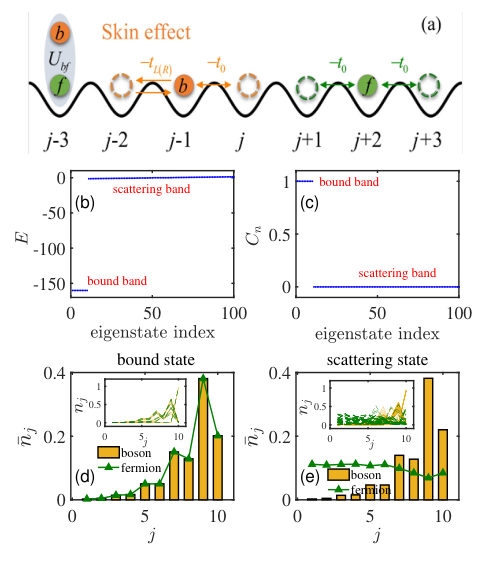 
FIG. 1: (a) Schematic of the Bose–Fermi mixture. Bosons (orange) experience non-reciprocal hopping (tL ̸= tR), whereas fermions (green) remain Hermitian and couple to bosons via the on-site interaction Ubf. (b) Energy spectrum and (c) boson–fermion correlation Cn for the one-boson–one-fermion system. (d),(e) Density distributions for the bound and scattering sectors, respectively, with insets showing representative bosonic and fermionic profiles. Only the strongly correlated bound states exhibit a drag-induced NHSE, where fermions inherit the bosonic boundary accumulation; scattering states remain largely insensitive to the bosonic skin localization. Parameters: t0 = 0.2, tL = 0.5, tR = 1.5,...

📷 Fig 2

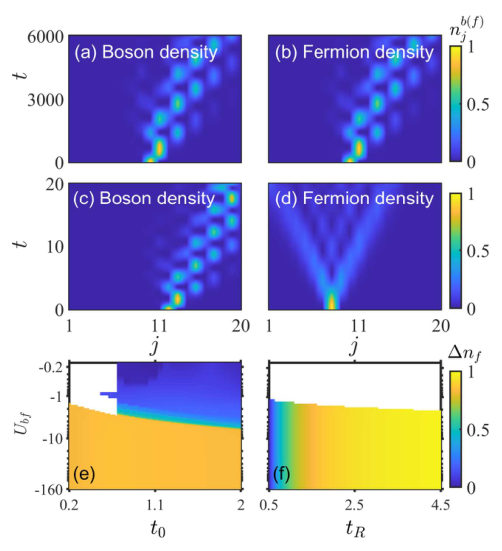 
FIG. 2: Dynamical stability and parameter dependence of the drag-induced NHSE. (a),(b) Time evolution of bosonic and fermionic densities for an initial Bose–Fermi bound pair, showing correlated rightward accumulation of both species. (c),(d) Corresponding dynamics for an initial scattering state, where bosons remain skin-localized while fermions exhibit nearly symmetric ballistic transport. (e),(f) Average fermion density imbalance ∆nf in the parameter spaces (t0, Ubf) and (tR, Ubf), respectively. The drag-induced skin effect strengthens with increasing |Ubf| and saturates in the strong-coupling regime, whereas larger tR substantially enhances fermionic boundary accumulation, demonstrating...

📷 Fig 3

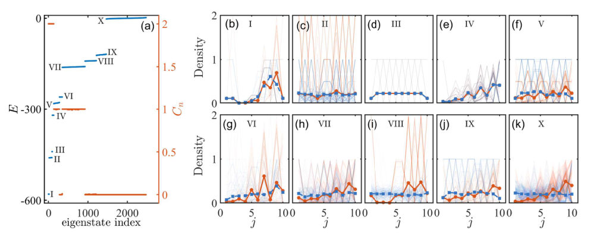 
FIG. 3: Band-resolved spectrum and density structures of a two-boson–two-fermion system. (a) Energy spectrum and boson–fermion correlation Cn as functions of the eigenstate index. The spectrum separates into ten clusters, labeled I–X. (b)–(k) Density distributions for the ten corresponding bands. The faint lines show the density profiles of individual eigenstates within each band, while the thick lines with markers denote the band-averaged densities. Blue and orange curves correspond to bosons and fermions, respectively. This representation reveals not only the average boundary accumulation, but also the intra-band structure of the many-body states. In several bands, individual eigenstates...

📷 Fig 4

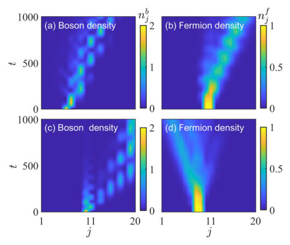 
FIG. 4: Dynamical manifestation of the interaction blockade effect in a two-boson–two-fermion system (L = 20). (a),(b): Initial state with bosons to the left of fermions. (c),(d): Initial state with bosons to the right of fermions. The blockade arises from the interaction-induced many-body domain formed collectively by Ubf, which kinetically suppresses selected fermionic transport channels. Parameters: t0 = 0.2, tL = 0.2, tR = 0.5, Uff = −120, Ubb = −140, Ubf = −160.

**Summary.** This paper reveals a drag-induced Non-Hermitian Skin Effect in Bose-Fermi mixtures, where strong interactions enable fermions to exhibit boundary accumulation even though their isolated dynamics are Hermitian. The effect is robustly demonstrated through theoretical modeling and is proposed to be realized in ultracold atomic systems using Floquet engineering.

**Why it may be interesting.** This work bridges non-Hermitian physics (NHSE) with interacting quantum gases, providing a concrete, interaction-mediated mechanism for emergent non-Hermitian behavior in ultracold atomic systems.

Detailed structure

**Main problem.** The paper investigates a novel mechanism where strong interactions allow fermions, which are otherwise Hermitian, to inherit the Non-Hermitian Skin Effect (NHSE) from bosons in a Bose-Fermi mixture.

**Main result.** A drag-induced NHSE is demonstrated, showing that the fermionic boundary accumulation is dynamically stable and requires strong, non-Hermitian bosonic hopping to be induced.

**Method.** The analysis uses a strong-coupling expansion to derive an effective Hamiltonian for the bound-state subspace, followed by time-evolution simulations.

**Model / system.** The system is a one-dimensional Bose-Fermi mixture modeled by a Hamiltonian incorporating bosonic asymmetric hopping ($t_L 
eq t_R$) and inter-species interaction ($U_{bf}$). The platform is proposed for realization using ultracold atoms in optical lattices.

**Key observables.** Fermion density imbalance ($\Delta n_f$), correlation function ($C_n$), and time-evolved density profiles.

**Important parameters / regimes.** Strong interaction coupling ($|U_{bf}|$), non-reciprocal hopping ratio ($t_R/t_L$), and the ratio of interaction to hopping scales.

**Assumptions / limitations.** The analysis relies on the strong-coupling limit for deriving the effective Hamiltonian, though the effect is shown to persist beyond this regime.

**Figures summary.** Figures illustrate the energy spectrum and correlation for bound vs. scattering states, time evolution confirming localization, and parameter maps showing $\Delta n_f$ dependence on interaction and hopping rates.

**Paper structure.** The paper progresses from establishing the basic NHSE in bosons, to deriving the effective Hamiltonian for the interacting bound states, demonstrating the drag-induced transfer of the skin effect, and finally mapping the parameter dependence and stability of this interaction-mediated localization.

Abstract

The non-Hermitian skin effect (NHSE) represents one of the most distinctive phenomena in non-Hermitian physics. Here, we uncover a new drag-induced NHSE mechanism in interacting Bose--Fermi mixtures where only bosons and not fermions experience asymmetric hoppings. %While bosons exhibit intrinsic skin localization due to asymmetric hopping, fermions remain Hermitian in isolation and do not independently support NHSE. We show that strong Bose--Fermi interactions enable fermions to inherit boundary accumulation through correlated bound states. %In the few-body regime, The interplay of interactions, quantum statistics, and non-Hermitian dynamics gives rise to an interaction-induced blockade mechanism, leading to highly asymmetric fermionic transport. We demonstrate that the drag-induced NHSE is dynamically stable and propose a feasible realization in ultracold Bose--Fermi mixtures with Floquet-engineered asymmetric tunneling. Our results establish a general interaction-mediated mechanism for emergent non-Hermitian localization in hybrid quantum matter.

[↑ back to top](#top)

### [Observation of residual entanglement in chip-based entanglement purification](http://arxiv.org/abs/2606.03343v1)

**Authors:** Yonghe Yu, Mujtaba Zahidy, Siyan Zhou, Caterina Vigliar, Karsten Rottwitt, Leif Katsuo Oxenløwe, Yunhong Ding  
**Type:** experiment · **Category:** quantum information and computing · **PDF:** <https://arxiv.org/pdf/2606.03343v1>  
**Analysis basis:** full PDF text, analyzed in chunks
**Topic relevance:** 🔥 `QC/QI experiment` **4/5** · `entanglement & information structure` **3/5** · `quantum optics experiment` **3/5** · `quantum measurements` **2/5** · `analog quantum simulation` **1/5** · `correlated / nonlocal dissipation` **1/5** · `correlated cavity matter` **1/5** · `interference shaping light` **1/5** · `methods for driven-dissipative` **1/5** · `non-equilibrium dynamics` **1/5**

📷 Fig 1

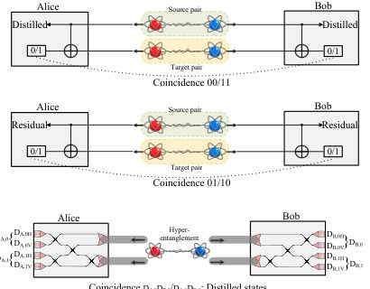 
FIG. 1. Observation of residual entanglement in entanglement purification experiments. (a) Collection of distilled entangle- ment and residual entanglement in the purification process. (b) Chip-based entanglement purification experiment based on hyperentanglement [21]. The hyperentangled photon pairs are distributed into two pairs of optical fibers, where flip er- rors are introduced. Alice and Bob receive the hyperentangled states and map them onto high-dimensional entanglement on chip. The entanglement is then processed by on-chip purifica- tion circuits composed of waveguide crossings. The distilled states and residual entanglement are postselected according to the coincidence detection...

📷 Fig 2

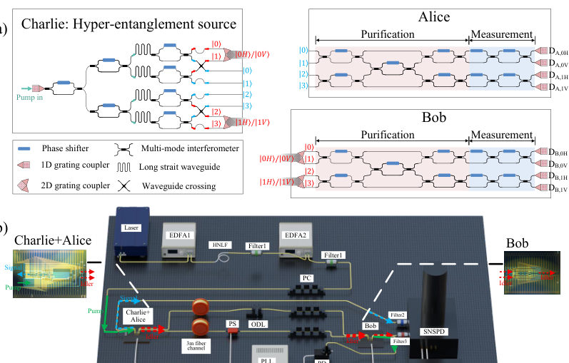 
FIG. 2. The chip layout and experimental setup for chip-based entanglement purification and residual entanglement observation. (a) The layout of the chips used in this work, including the hyperentanglement source and the purification circuit of Alice and Bob. Entangled photon pairs are generated by spontaneous four-wave mixing (SFWM). The signal photons keep the high- dimensional encoding and are routed to Alice through waveguides, while the idler photons are converted into polarization-spatial hyper-encoding and delivered to Bob via single-mode fibers. The Mach-Zehnder interferometers (MZI) on Alice and Bob can be configured to implement the purification protocol shown in Fig. 1(b) or the...

📷 Fig 3

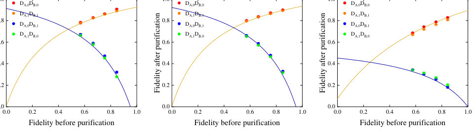 
FIG. 3. Experimental results of the fidelity of the distilled entangled state and the residual entanglement under BF noise (a), PF noise (b), and white noise (c). As we explained in Fig. 1(b), coincidence events DA,0DB,0 or DA,1DB,1 correspond to the distilled state, while DA,0DB,1 or DA,1DB,0 indicate purification failure, where residual entanglement may exist. In this figure, to reveal the residual entanglement, the fidelity of the spatial qubit is fixed, while different levels of noise are applied to the polarization qubit. The theoretical calculated fidelity of the distilled and residual entanglement as a function of Fp is also provided.

📷 Fig 4

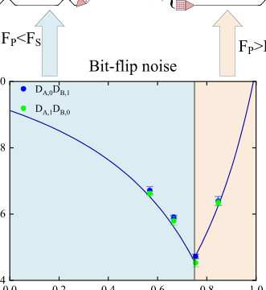 
FIG. 4. Experimental demonstration of the residual entangle- ment as a function of the polarization-state fidelity Fp under different circuit configurations. For Fp &lt; Fs, the original purification circuit is applied (light blue arrow), whereas for Fp &gt; Fs, the reconfigured circuit indicated by the light red arrows is used. The experimental results for the residual en- tanglement after purification also show good agreement with the theoretical calculation.

**Summary.** This paper reports the experimental observation of residual entanglement in a chip-based entanglement purification system utilizing hyperentanglement. By leveraging the reconfigurability of integrated photonics, the authors show that usable residual entanglement can always be obtained, even when noise affects the different quantum degrees of freedom unequally. This advances the feasibility of building robust, on-chip quantum repeaters.

**Why it may be interesting.** This work provides a highly practical, integrated platform demonstration for quantum networking, showing how to salvage valuable quantum information (residual entanglement) that would otherwise be lost in noisy channels.

Detailed structure

**Main problem.** The paper addresses the challenge of maximizing the utility of quantum resources by observing and utilizing residual entanglement generated during entanglement purification processes.

**Main result.** The authors experimentally demonstrate a chip-based scheme that reliably obtains residual entanglement suitable for further purification, even when the error rates across different degrees of freedom are unbalanced.

**Method.** They implemented a single-copy entanglement purification scheme using integrated silicon photonics, analyzing coincidence detection events to distinguish between successfully distilled and residual entangled states.

**Model / system.** The physical platform is chip-based quantum optics using silicon photonics, which supports hyperentanglement encoding across multiple degrees of freedom (e.g., polarization and spatial modes). The system is designed to simulate and mitigate bit-flip and phase-flip noise.

**Key observables.** Fidelity of distilled entanglement and residual entanglement; coincidence rates; and the ability to maintain residual fidelity above a critical threshold (e.g., 0.5).

**Important parameters / regimes.** The relative fidelities of the two degrees of freedom ($F_p$ vs $F_s$); noise types (BF, PF, white noise); and the reconfigurability of the integrated photonic circuits.

**Assumptions / limitations.** The analysis assumes the initial state is a hyperentangled state and relies on the reconfigurability of integrated photonics to manage unequal error rates between DOFs.

**Figures summary.** Figures illustrate the chip layout, experimental setup, and crucial results showing the fidelity of both distilled and residual entanglement under various noise conditions (BF, PF, white noise).

**Paper structure.** The paper progresses by first establishing the need for purification, detailing the chip-based hyperentanglement setup, presenting the methodology for observing residual entanglement from failed events, and finally quantifying the success of the scheme under different noise models.

Abstract

Entanglement purification is an essential component of quantum repeaters, as it can improve the fidelity of the distributed entangled states and mitigate the effects of the noisy channel. Successful purification yields entangled states with increased fidelity, whereas failed events can still retain residual entanglement that remains usable for further purification when the error rates of the two degrees of freedom (DOFs) are unbalanced. In this paper, we demonstrate a single-copy entanglement purification scheme based on hyperentanglement using silicon chips and experimentally observe the presence of residual entanglement. Leveraging the reconfigurability of integrated photonics, our scheme ensures that, under bit-flip noise acting on the two DOFs, residual entanglement suitable for further purification can always be obtained, regardless of which DOF has the higher error rate. Our results demonstrate the advantages of integrated photonics for quantum information processing and provide guidance for the optimized utilization of entanglement resources in on-chip entanglement purification and future quantum repeater systems.

[↑ back to top](#top)

### [Maximizing Information Flow in Three-Coin Quantum Walk: from Initial Entanglement to Integrated Photonic Implementation](http://arxiv.org/abs/2606.02942v1)

**Authors:** Seyed Mohsen Moosavi Khansari  
**Type:** both · **Category:** quantum information and computing · **PDF:** <https://arxiv.org/pdf/2606.02942v1>  
**Analysis basis:** full PDF text, analyzed in chunks
**Topic relevance:** 🔥 `entanglement & information structure` **4/5** · `analog quantum simulation` **3/5** · `quantum optics experiment` **3/5** · `QC/QI experiment` **2/5** · `non-equilibrium dynamics` **2/5** · `interference shaping light` **1/5** · `methods for driven-dissipative` **1/5**

📷 Fig 1

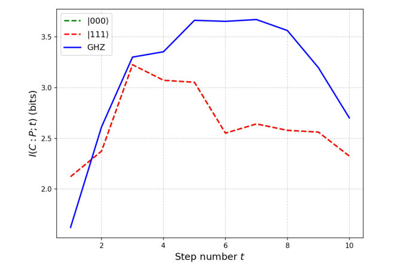 
Figure 2. Mutual information 𝐼(𝐶; 𝑃; 𝑡) versus step number 𝑡 for initial states ∣000⟩ (green dashed), ∣ 111⟩ (red dashed), and GHZ (blue solid) with 𝛼= 1, 𝐿= 5. The GHZ state starts lower (1.62 bits) but surpasses the separable states from 𝑡= 3 onward, reaching a value of 3.00 bits at 𝑡= 10, which is approximately 18% higher than the value for the ∣000⟩ state (2.54 bits) and 12% higher than for ∣ 111⟩ (2.68 bits). The non-monotonic behaviour stems from quantum interference due to initial entanglement.

📷 Fig 2

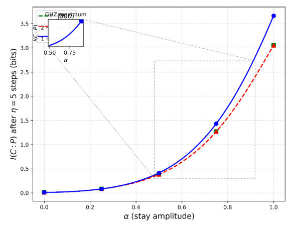 
Figure 3. Mutual information 𝐼(𝐶: 𝑃) after 𝑡= 5 steps as a function of the staying parameter 𝛼 for the initial states ∣000⟩ (green), ∣111⟩ (red), and GHZ (blue). The separable states exhibit a monotonic increase with 𝛼, while the GHZ state shows a distinct maximum at 𝛼≈0.71. The inset provides a magnified view of the maximum region.

**Summary.** This work investigates how to maximize information flow in a three-coin quantum walk by controlling the initial entanglement and the probability of non-displacement. The key finding is that initial three-partite entanglement is a powerful resource, and optimal performance is achieved by tuning a specific control parameter $\alpha$. The authors conclude by proposing a scalable implementation using integrated photonics.

**Why it may be interesting.** It directly addresses the use of entanglement as a quantifiable resource to enhance quantum transport and information processing, linking abstract quantum information measures to concrete physical implementations in photonics.

Detailed structure

**Main problem.** The paper aims to maximize the rate of information flow in a quantum walk system by controlling the initial entanglement and the dynamics of the walk.

**Main result.** Initial three-partite entanglement significantly accelerates the growth of mutual information, and the optimal information flow is achieved by tuning a non-displacement amplitude parameter $\alpha$ to a specific intermediate value ($\alpha \approx 0.71$).

**Method.** The authors use numerical simulation of the quantum state vector and compute the quantum mutual information $I(C; P; t)$ between the coin and position subsystems.

**Model / system.** The model is a Three-Coin Quantum Walk (TCQW) on a 1D lattice, where movement is conditionally coupled to the state of three entangled coins. The system is proposed to be implemented using integrated photonics utilizing polarization, spatial modes, and time bins.

**Key observables.** Mutual Information $I(C; P; t)$, Position Entropy $S(\rho_p(t))$, and the tunable parameter $\alpha$.

**Important parameters / regimes.** The initial state (separable vs. GHZ-type entanglement) and the non-displacement amplitude $\alpha$.

**Assumptions / limitations.** The analysis assumes the feasibility of implementing the walk using integrated photonics and models the dynamics based on the conditional movement rule.

**Figures summary.** Figures plot the mutual information $I(C: P; t)$ versus time $t$ for different initial states, and also plot $I(C: P)$ versus the tuning parameter $\alpha$ to identify the optimal control point.

**Paper structure.** The paper introduces the TCQW model, analyzes the effect of initial entanglement on mutual information growth, determines the optimal control parameter $\alpha$ via entropy analysis, and concludes with a detailed proposal for an integrated photonic realization.

Abstract

Discrete-time quantum walks are powerful platforms for simulating quantum transport and information processing. Here we introduce a walker on a one-dimensional lattice whose motion is controlled by three entangled coins, each initialized with the Hadamard gate, aiming to maximize information flow. The walker moves only when all three coins yield the same outcome (HHH or TTT), thus coupling the 8-dimensional coin Hilbert space to the position degree of freedom. By analyzing fully separable, fully entangled (GHZ-type) and intermediate initial states, and using the von Neumann entropy of reduced subsystems, we compute the mutual information $I(C;P;t)$ between coin and position. The results show that initial three-partite entanglement accelerates the growth of mutual information by up to 18\% after ten steps (when compared to the lower of the two separable states), although it exhibits short-term non-monotonic dynamics due to quantum interference. For the first time, we introduce a tunable parameter $α$ (amplitude of non-displacement states) and show that the GHZ state reaches a maximum of mutual information at $α\approx 0.71$ - a key finding for optimal control of information flow. Finally, an integrated photonic implementation using polarization, spatial modes and time bins is proposed, where $α$ can be tuned with nonlinear or electro-optic elements. A scalable numerical framework (Python code) for simulations up to $t = 5$ steps is provided. Our findings establish three-partite entanglement as a dynamical resource for maximizing information flow and spatial spreading, with direct applications in quantum state transfer, entanglement-assisted sensing and programmable photonic quantum processors.

[↑ back to top](#top)

### [Parametrically induced strong coupling between a superconducting quantum circuit and a solid-state spin ensemble](http://arxiv.org/abs/2606.03897v1)

**Authors:** Alejandro E. Baptista, Jinwoong Kim, Sonia Rani, Xi Cao, Wolfgang Pfaff  
**Type:** experiment · **Category:** quantum information and computing · **PDF:** <https://arxiv.org/pdf/2606.03897v1>  
**Analysis basis:** full PDF text, analyzed in chunks
**Topic relevance:** 🔥 `QC/QI experiment` **4/5** · `spintronics-quantum-optics interface` **3/5** · `Tavis-Cummings & cavity-many-emitter` **2/5** · `exotic spin models in light-matter` **2/5** · `analog quantum simulation` **1/5** · `correlated cavity matter` **1/5** · `driven-dissipative phase transition` **1/5** · `quantum optics experiment` **1/5**

📷 Fig 1

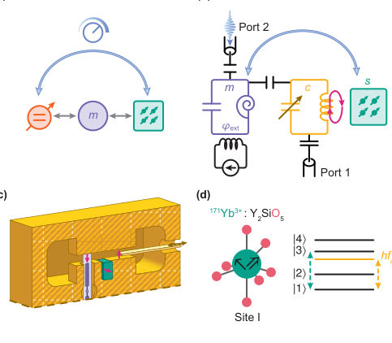 
FIG. 1. Experiment design. (a) Our goal is on-demand, tunable strong coupling via a mixer (purple), ˆm. (b) Lumped element circuit to illustrate our tunable coupling experiment. (c) 3D cross-section sketch of the cavity used to implement the architecture. The cavity (yellow), ˆc, hosts a chip containing a SNAIL coupler (purple), ˆm, spin ensemble crystal (green), ˆs, and dielectric slab (light yellow) for cavity frequency tun- ing. Red arrows show the oscillating fields for the differential cavity mode that couple capacitively to the SNAIL and induc- tively to the spins. A flux coil is inserted near the SNAIL loop for magnetic flux tuning. (d) Spin system: 171Yb3+:YSO; cav- ity frequency is...

📷 Fig 2

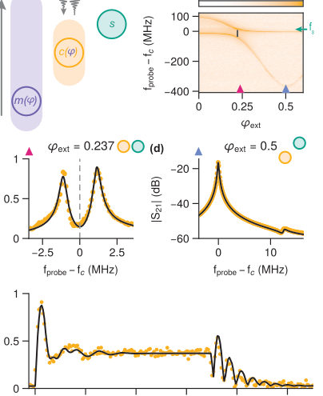 
FIG. 2. Mode characterization. (a) Measurement scheme: The cavity was probed as a function of the reduced external flux (φext = Φext/Φ0) applied to the SNAIL. Mode hybridization leads to a modest flux tuning of the cavity mode. System is probed by measuring transmission and re- flection of the cavity. (b) Cavity spectroscopy vs. φext. Gray bar indicates cavity-SNAIL coupling. The arrow labeled fs is at the spin transition frequency. (c) Line cut at φext = 0.237 (pink marker in (b)). (d) Line cut at φext = 0.5 (blue marker in (b)). (e) Polariton ring-up and ring-down at cavity-spin resonance (gray dashed line in (c)). The cavity was driven at fc with a 7-µs pulse, and response was recorded...

📷 Fig 3

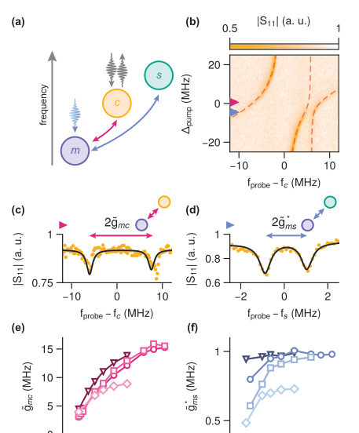 
FIG. 3. Parametrically induced strong coupling. (a) At fixed φext the SNAIL is driven near SNAIL-cavity (ma- genta) or SNAIL-spin (blue) difference frequency. (b) Cavity spectroscopy in the presence of the pump. Dashed lines are simulated frequencies of the 3 coupled modes in the system when the drive is on. Here ∆pump/2π = fpump −∆mc/2π is the difference between the pump frequency, fpump, and the cavity-SNAIL detuning, ∆mc/2π. (c) Line cut of the SNAIL-cavity avoided crossing (pink marker in (b)). (d) Line cut of the SNAIL-spin avoided crossing (blue marker in (b)). (e) SNAIL-cavity coupling, ˜gmc, extracted from normal mode splittings vs. pump strength, ξ, and external flux. (f) Observed...

📷 Fig 4

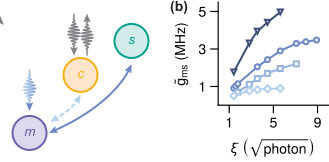 
FIG. 4. Suppression of observed parametric spin cou- pling. (a) Strong pump-induced coupling between SNAIL and spins (solid blue) also induces a detuned coupling to the nearby cavity (dashed light blue). (b) True parametric cou- pling, ˜gms, inferred from the observed coupling, ˜g∗ ms. (c) Overlap of each driven eigenmode of the system (as shown spectroscopically in Fig. 3(b)) with the bare SNAIL, cavity, and spin modes, from left to right.

📷 Fig 5

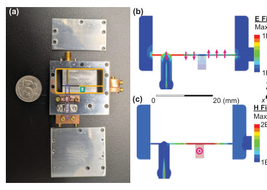 
FIG. 5. DisCoAlPaCa Design and Simulation. (a) Dis- CoAlPaCa assembly with caps and an American quarter for scale (24.257 mm diameter); colored outlines indicate mode elements following the paper’s color scheme. The tuning di- electric is held in the right cavity gap by a clamp. The flux coil is held in a copper cap over the SNAIL chip. Its position is indicated with a black dashed line. (b) Simulated electric and magnetic fields of the differential mode; magenta arrows indicate field direction.

**Summary.** This paper demonstrates a novel architecture for creating high-coherence quantum memories by coupling a superconducting quantum circuit to a solid-state spin ensemble. By using a parametric pump, the researchers induced dynamic strong coupling, enabling fast and controllable quantum state transfer between the two disparate quantum systems.

**Why it may be interesting.** This work directly addresses the hardware challenge of quantum memory integration by coupling superconducting circuits (a major QI platform) to long-coherence solid-state spins, which is a key area in quantum networking and computation.

Detailed structure

**Main problem.** The primary goal is to achieve efficient, on-demand, and tunable quantum state transfer between superconducting quantum circuits and solid-state spin ensembles to build high-coherence quantum memories.

**Main result.** The authors successfully demonstrated dynamic strong coupling using a parametric pump, enabling fast quantum state transfer between the superconducting circuit and the spin ensemble.

**Method.** The research employed microwave spectroscopy, measuring transmission and reflection, and analyzing avoided crossings induced by a parametric pump tone.

**Model / system.** The system is a hybrid device coupling a superconducting quantum circuit (SNAIL mixer) to a microwave cavity, which is dispersively coupled to a rare-earth spin ensemble ($	ext{}^{171}	ext{Yb}^{3+}:	ext{YSO}$). The dynamics are modeled by coupled Hamiltonian terms involving the circuit, cavity, and spin operators.

**Key observables.** Avoided crossings in spectroscopy, measured coupling strengths ($	ilde{g}_{mc}$, $	ilde{g}_{ms}$), and the resulting state transfer efficiency.

**Important parameters / regimes.** Operating temperature ($10 	ext{ mK}$), static couplings ($\approx 27 	ext{ MHz}$), and the pump amplitude ($\xi$).

**Assumptions / limitations.** The analysis relies on the dispersive regime approximation and the use of the Rotating-Wave Approximation (RWA) for modeling the coupled dynamics.

**Figures summary.** Figures illustrate the experimental setup (Josephson element $
ightarrow$ cavity $
ightarrow$ spin ensemble), mode characterization via spectroscopy, and the measurement scheme for pump-activated interactions showing avoided crossings.

**Paper structure.** The paper progresses from characterizing the static couplings in the dispersive regime to demonstrating the dynamic strong coupling mechanism using a parametric pump, culminating in the prediction of fast state transfer.

Abstract

Efficient quantum state transfer between superconducting circuits and solid-state spins would unlock high-coherence quantum memories for superconducting quantum processors. We demonstrate dynamically controlled strong coupling between a Josephson circuit and a rare-earth spin ensemble. Using a parametric pump, we realize on-demand coupling of several MHz, which will enable faithful state transfer between quantum circuits and spins. Our architecture enables quantum control of spin ensembles, and paves the way for hybrid memories with coherence far beyond those of superconducting circuits alone.

[↑ back to top](#top)

### [Two-mode collapse and revival of quantum coherent state in a tilted optical lattice](http://arxiv.org/abs/2606.03630v1)

**Authors:** Chi-Kin Lai, Shengjie Jin, Yuanzhe Hu, Zhongshu Hu, Fansu Wei, Congwen Li, Tianwei Zhou, Hepeng Yao, Xiaoji Zhou  
**Type:** both · **Category:** quantum gases · **PDF:** <https://arxiv.org/pdf/2606.03630v1>  
**Analysis basis:** full PDF text, analyzed in chunks
**Topic relevance:** 🔥 `analog quantum simulation` **4/5** · `non-equilibrium dynamics` **3/5** · `non-equilibrium universality` **3/5** · `methods for driven-dissipative` **2/5** · `Frenkel-Kontorova` **1/5** · `driven-dissipative phase transition` **1/5** · `entanglement & information structure` **1/5**

📷 Fig 1

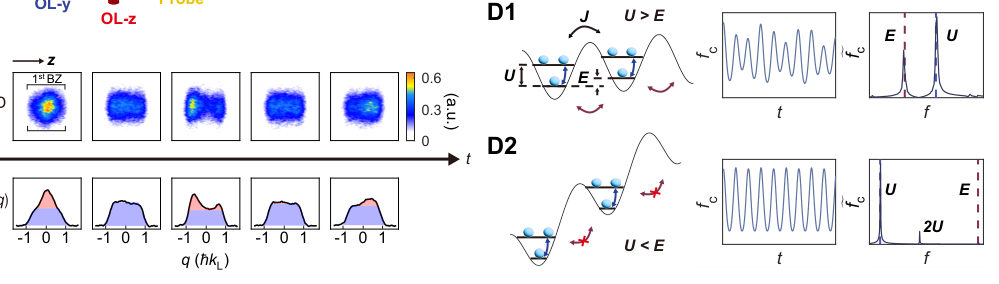 
Figure 1: Experimental setup and measurements of collapse and revival dynamics. (A) Schematic of the experimental system. A 3D cubic optical lattice is formed by three sets of lattice beams: two red-detuned beams (λ = 1064 nm) along the x and z axes, and one blue- detuned beam (λ′ = 760 nm) along the y axis. The probe beam intersects at an angle of 45◦with respect to the x axis in the x-y plane. The 1D bosonic gas is prepared with zero net force. By suddenly reducing the magnetic levitation along the z axis, a tilt quench is introduced, triggering the dynamics, while the lattice depth along the tube is either increased or held constant. (B) Measured quasi-momentum distribution n(q) as a...

📷 Fig 2

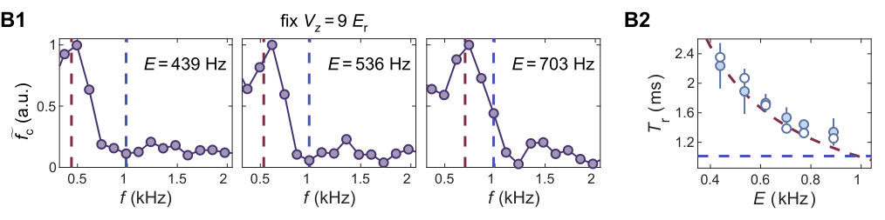 
Figure 2: Evidence of tilt-mode (E-mode) CR . (A1) Spectra of coherent fraction efc for Vz = 8, 9, and 11 Er with E = 772 Hz. Vz is kept fixed after the quench of E. (A2) CR period Tr as a function of Vz (green squares). (B1) efc for E = 439, 536, and 703 Hz, with Vz = 9 Er (J = 49 Hz, U = 987 Hz) held constant following the quench of tilt. (B2) CR period Tr as a function of tilt E (blue circles). In both A and B, the red and blue dashed lines denote the E and U, respectively. The CR period is extracted by fitting a sum of Gaussian functions (S3), with error bars obtained using the bootstrap method. The white data points indicate the numerical simulation results for Tr, analyzed with the...

📷 Fig 3

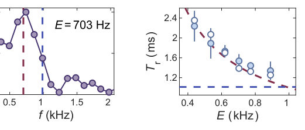 
Fig. 1B shows the quasi-momentum distribution n(q) mea- sured via the band mapping scheme during a typical CR pro- cess. Initially, a coherent peak appears at q = 0. After some evolution, the atoms dephase and spread nearly uniformly across the first Brillouin zone (BZ), with coherence later re- covering as the system undergoes both CR and BO. The distri- bution is given by n(q) = ncoh(q) + nincoh(q), with ncoh(q) (red shaded area) the coherent (condensed) atoms forming peaks, and nincoh(q) (blue shaded area) the incoherent (non- condensed) atoms forming a plateau. The coherent fraction is then calculated as fc = ´ dq ncoh(q)/N [49, 50], where N is the total atom number (see more details in...

📷 Fig 4

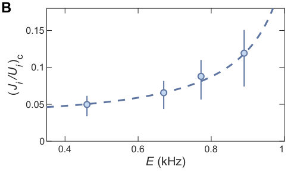 
Figure 3: Crossover of two-mode CR amplitudes. (A) Amplitudes of the E-mode (red squares) and U-mode (blue circles) CR as a func- tion of Ji/Ui for E = 772 Hz, Jf = 20 Hz, and Uf = 1105 Hz. Error bars are evaluated using the bootstrap method. The red and blue shaded regions denote the numerically predicted amplitudes of the E and U modes, respectively, with uncertainties obtained using the same fitting procedure as in the experiment. Inset: numerical simulation results for a homogeneous system. The black boxes indi- cate the crossing point at (Ji/Ui)c = 0.08. (B) Crossing points in the initial tunneling-to-interaction ratio for the amplitudes of the two modes at different tilts E. Error...

📷 Fig 5

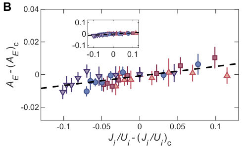 
Figure 4: Universal linear scaling of the two modes. Rescaled amplitudes of the U mode (A) and E mode (B) around the crossing point for various tilt values E. The black dashed lines indicate linear fits to the data. Error bars are obtained using the bootstrap method. Inset: numerical simulation results for a homogeneous system.

**Summary.** This paper investigates the collapse and revival dynamics of quantum coherence in bosons trapped in a tilted optical lattice. The key finding is the emergence of a two-mode oscillation, where the revival frequency depends on both the particle interactions and the external tilt. By combining experiments and theory, the authors reveal universal scaling laws governing this novel collective dynamic feature.

**Why it may be interesting.** This work provides deep insight into non-equilibrium collective dynamics in interacting quantum systems, showing how external driving fields (tilt) can couple to intrinsic interaction dynamics, leading to predictable, universal scaling laws.

Detailed structure

**Main problem.** The study investigates the collective dynamics, specifically the collapse and revival (CR) of phase coherence, in quantum coherent states of bosons confined in a tilted optical lattice.

**Main result.** The authors report the first observation of two-mode CR dynamics, showing that the revival frequencies are governed by both inter-site interactions and the external tilt, particularly when the tilt is weaker than the interaction.

**Method.** The research combines experimental measurements using band mapping to determine the coherent fraction with theoretical modeling and numerical simulations (DMRG/TEBD) to analyze the underlying physics.

**Model / system.** The system is modeled as one-dimensional (1D) ultracold bosons in an optical lattice subjected to a linear tilt potential, described by a Bose-Hubbard type Hamiltonian.

**Key observables.** Coherent fraction ($f_c$), its spectrum ($e_{fc}$), and the characteristic collapse and revival periods ($T_r$).

**Important parameters / regimes.** Tunneling strength ($J$), on-site interaction ($U$), and the tilt energy ($E$). The study compares regimes where $U$ dominates versus where $E$ becomes comparable to $U$.

**Assumptions / limitations.** The analysis often assumes the system can be effectively reduced to 1D tubes, and theoretical derivations rely on perturbation theory and small parameter approximations.

**Figures summary.** Figures illustrate the experimental setup, the time evolution of the coherent fraction $f_c$ showing beating patterns, and plots demonstrating the universal linear scaling of the two-mode amplitudes around a critical crossing point.

**Paper structure.** The paper progresses from establishing the physical model and experimental measurements of CR dynamics to identifying the two distinct modes (U-mode and E-mode). It then develops analytic models and simulations to predict the crossover between these modes and demonstrates the universal linear scaling of their amplitudes.

Abstract

Collective dynamics is an important out-of-equilibrium feature of quantum coherent states and usually reflects the intrinsic properties of the state. Collapse and revival (CR) dynamics of phase coherence is a well-known example for bosonic coherent states, which is usually induced by applying a quench. Previous studies have shown that the CR frequency is governed solely by interactions, even in the presence of a tilt quench. However, whether such interaction-dominated oscillation is a universal feature remains unknown. In this work, we show that an ensemble of one-dimensional bosons can undergo two-mode CR, with frequencies set by both the interaction and the tilt, particularly when the tilt is weaker than the interaction. The newly discovered tilt mode is enabled by tunneling between lattice sites. When the two modes coexist, the amplitudes of both modes exhibit universal linear scaling for various tilts. These findings clarify the general features of CR dynamics in tilted lattice models and the underlying mechanism, and provide deeper insight into collective dynamics in correlated systems.

[↑ back to top](#top)

### [Coexistence of dipolar and quadrupolar higher-order topology](http://arxiv.org/abs/2606.03950v1)

**Authors:** Konstantin Rodionenko, Maxim Mazanov, Maxim A. Gorlach  
**Type:** both · **Category:** other · **PDF:** <https://arxiv.org/pdf/2606.03950v1>  
**Analysis basis:** full PDF text, analyzed in chunks
**Topic relevance:** 🔥 `analog quantum simulation` **4/5** · `driven-dissipative phase transition` **3/5** · `correlated cavity matter` **2/5** · `methods for driven-dissipative` **2/5** · `non-equilibrium dynamics` **2/5** · `Frenkel-Kontorova` **1/5**

📷 Fig 1

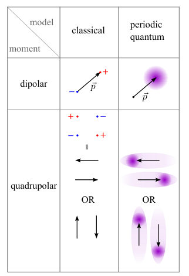 
FIG. 1. Schematic comparison of dipole and quadrupole moments arising in the collection of classical charges (left) and periodic quantum systems (right).

📷 Fig 2

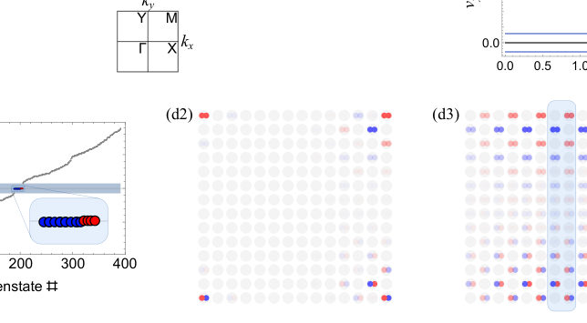 
FIG. 2. (a) Two-orbital model (a3) obtained by combining two π/2-rotated copies (a1,a2) of the orbital quadrupole insulator36. Positive and negative mode amplitudes and couplings are shown by gray and blue, respectively. The unit cell is shaded. (b) Representative band structures for the doubly-quadrupolar phase with dimerization α = 2 and κ = γ = 0 with four-fold degenerate bands (b1) and mixed dipolar-quadrupolar phase at κ = γ = ∆(b2). Gray areas highlight the topological bandgaps, while inset shows the first Brillouin zone. (c) Wannier bands νx(ky) and νy(kx) obtained via Wilson loops calculation along kx (c1) and ky directions (c2). The quadrupolar (dipolar) Wannier subsectors are...

📷 Fig 3

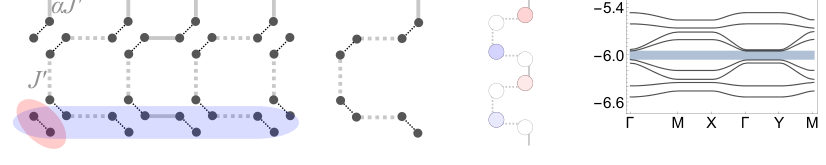 
FIG. 3. (a) The modes of a single four-site meta-atom. Couplings J are shown as dotted links. At energy −J, there is a degenerate doublet of quadrupolar (d-like) and dipolar (px+y-like) modes, while at +J – a doublet of monopolar (s-like) and orthogonal dipolar (px−y-like) modes. (b) The single-orbital model in the mixed dipolar-quadrupolar HOTI phase near the ±J energy, where J′, αJ′ ≪J. Edge (corner) states are highlighted schematically in blue (red). (c) The model disassembles into uncoupled quasi-1D “snake”-like generalized SSH chains with alternating nontrivial and trivial topology in the neighboring chains. Each quasi-1D chain contains two practically decoupled spectra formed by...

📷 Fig 4

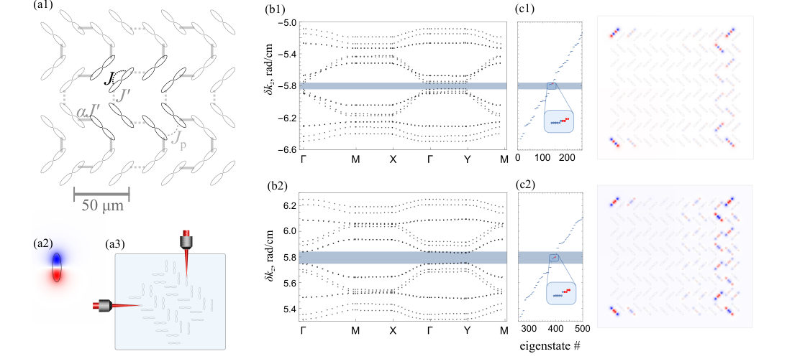 
FIG. 4. (a1) Geometry of the unit cell for the optical waveguide lattice in full-wave COMSOL simulation. Waveguides are assumed to be elliptical with refractive index contrast δn = 0.002, semi-axes 2.2 µm and 7.4 µm. Ambient refractive index is set to n = 1.48 corresponding to borosilicate glass. (a2) The p-mode profile for the isolated waveguide. (a3) Possible sequential fabrication method via the femtosecond laser writing technique from the two facets of the glass wafer. (b) Numerically calculated lower (b1) and upper (b2) band structures. (c1,c2) Corresponding numerical spectrum for a finite 4 × 4-unit-cell lattice, with localized corner states amplitude profiles shown on the right.

**Summary.** This paper demonstrates a physical realization, using coupled optical waveguides, that supports a mixed higher-order topological insulator exhibiting both dipolar and quadrupolar topological characteristics simultaneously. By analyzing the system's Hamiltonian and using advanced numerical techniques, the authors confirm the coexistence of these two distinct topological invariants in a single structure. This provides a crucial platform for engineering complex topological states in integrated photonics.

**Why it may be interesting.** This work is highly relevant to AMO/Quantum Optics as it proposes a concrete, experimentally realizable platform (optical waveguides) to host and study complex topological phases beyond simple SSH models, linking fundamental topology to photonics.

Detailed structure

**Main problem.** The paper addresses the theoretical tension in higher-order topological insulators (HOTIs) regarding the non-overlapping nature of dipolar and quadrupolar bulk moments, aiming to demonstrate a system exhibiting both simultaneously.

**Main result.** The authors propose and analyze a model that successfully hosts a mixed dipolar-quadrupolar higher-order topological phase, confirmed by observing both corner and edge localized states.

**Method.** The study employs Bloch Hamiltonian formulations, nested Wilson loop techniques, and full-wave numerical simulations to calculate topological invariants and analyze edge/corner spectra.

**Model / system.** The physical platform is suggested to be arrays of laser-written evanescently coupled optical waveguides. The model is based on a two-orbital or single-orbital meta-atom lattice, approximated by generalized Su-Schrieffer-Heeger (SSH) chains.

**Key observables.** Quantized bulk quadrupole moment ($q_{xy}$), bulk polarization ($\mathbf{P}$), corner-localized modes, and edge-localized modes.

**Important parameters / regimes.** Coupling strengths ($\kappa, \gamma, \Delta$), lattice geometry parameters ($J', \alpha$), and disorder strengths ($\deltaeta, \kappa, \gamma, \Delta$).

**Assumptions / limitations.** The analysis relies on approximating the system with effective two-band models and assumes that the topological character can be separated into dipolar and quadrupolar subsectors via Wannier center analysis.

**Figures summary.** Figures illustrate the construction of the two-orbital model, band structures for different topological phases, Wannier bands showing polarization, and finite-size spectra highlighting spectrally separated corner and edge states.

**Paper structure.** The paper progresses from establishing the theoretical conflict to proposing a specific lattice model, deriving the Hamiltonian, calculating topological invariants using Wilson loops, and finally confirming the coexistence of both topologies via numerical simulations on a finite lattice.

Abstract

Two-dimensional higher-order topological insulators are typically classified either as dipolar or quadrupolar depending on the relevant invariant. These two classes were previously considered non-overlapping. Here we put forward an example system exhibiting dipolar and quadrupolar higher-order topology simultaneously, suggest its implementation using the arrays of laser-written evanescently coupled optical waveguides and support our conclusions by the full-wave numerical simulations.

[↑ back to top](#top)

### [Fast single-atom preparation in optical tweezers via Rydberg blockade](http://arxiv.org/abs/2606.03922v1)

**Authors:** Yiyi Li, Vernon M. Hughes, Michael Peper, Yicheng Bao, Chenyuan Li, Sanzhar Bissenali, Jeff D. Thompson  
**Type:** experiment · **Category:** other · **PDF:** <https://arxiv.org/pdf/2606.03922v1>  
**Analysis basis:** full PDF text, analyzed in chunks
**Topic relevance:** 🔥 `QC/QI experiment` **4/5** · 🔥 `Rydberg arrays` **4/5** · `analog quantum simulation` **3/5** · `non-equilibrium dynamics` **1/5** · `quantum optics experiment` **1/5**

📷 Fig 1

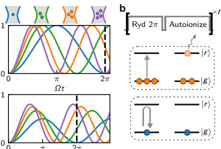 
FIG. 1. (a) Collective Rabi oscillations for various atom numbers N (colors indicated in the legend), with on-resonance excitation (top) and detuned excitation (bot- tom, ∆= Ωwhere the effective Rabi frequency is Ω′ = √

📷 Fig 2

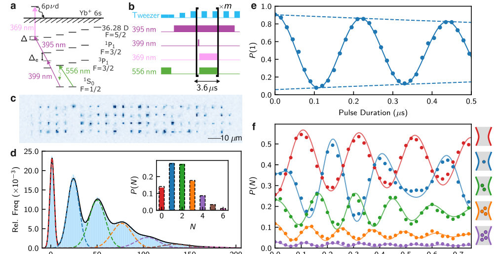 
FIG. 2. (a) Relevant transitions for the two-photon excitation scheme. The 556 nm laser is used for optical pumping, 399 nm and 395 nm are used for two-photon Rydberg excitations, and 369 nm is used for autoionization of the Rydberg state. (b) Timing diagram of the protocol for the two-photon excitation scheme. (c) Exemplary single-shot image of the 4×25 tweezer array with number-resolved imaging. (d) Photon-count histogram of number-resolved images recorded after loading N = 1.9 atoms per tweezer. Dashed lines show Gaussian fits for each atom number N, while the solid black line is the cumulative fit. The inset shows the extracted atom-number probability P(N), compared with a Poisson...

📷 Fig 3

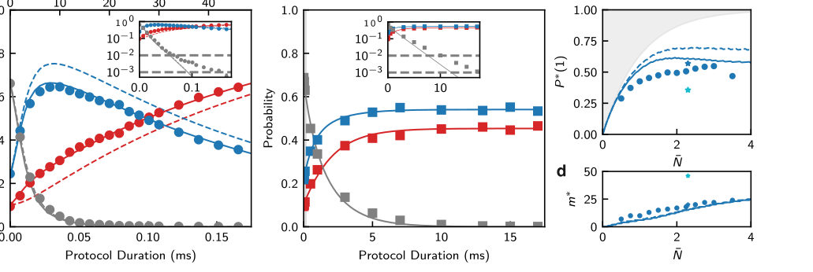 
FIG. 3. (a) Experimental results (circles) and simulations (dashed and solid lines) for P(0) (red), P(1) (blue), and P(&gt; 1) (gray) as a function of total protocol duration. Dashed lines depict master-equation-based simulations described in the main text. Solid lines include an additional 8% probability of N = 2 →0 loss per pulse. (b) Experimental data (squares) and simulations (solid lines) for LAC. The solid lines are based on population evolutions with fitted rates of γ1→0 = 0(3) s−1, γ2→0 = 353(4) s−1, and γ2→1 = 177(6) s−1. The insets in (a) and (b) show the same data on a logarithmic y-axis scale. The average initial number of atoms loaded is N = 2.3 for both (a) and (b). (c)...

📷 Fig 4

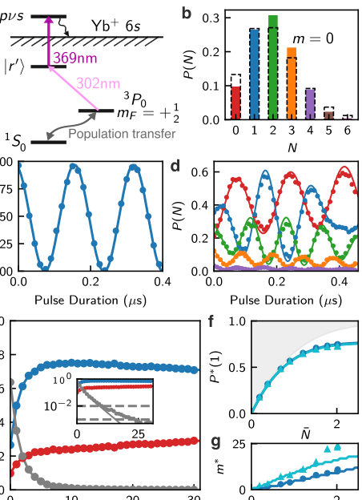 
FIG. 4. Single-atom preparation with single-photon Ryd- berg transitions. (a) Relevant energy levels for single-photon transitions from the metastable 3P0 state. (b) Probabil- ity distribution of atom number without applying Rydberg pulses (colored bars), compared with a Poisson distribution (black dashed bars). (c) Exemplary single-atom Rabi oscilla- tions. (d) Multi-atom collective Rabi oscillations, measured with N = 1.4. (e) P(0) (red), P(1) (blue), and P(&gt; 1) (gray) as a function of the number of cycles, m, starting from N = 2.0. The inset depicts logarithmic scaling of the y- axis, with dashed lines showing Pth = 10−2 and Pth = 10−3

📷 Fig 5

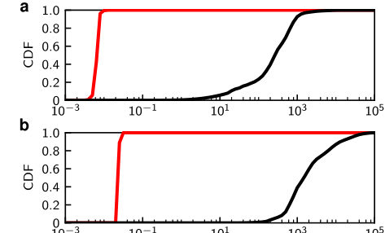 
FIG. 5. Cumulative distribution functions (CDF) of effective Rydberg interaction strengths for atom pairs within the same tweezer (black) and in neighboring tweezers (red): (a) for the |36.28, L = 2, F = 5/2⟩state, for a temperature of T = 80 µK and trap frequencies (ωrad, ωax) = 2π × (89 kHz, 15 kHz), with an inter-tweezer spacing of 6.25 µm; and (b) for the |52.31, L = 0, F = 1/2⟩state for a temperature of T = 9 µK and trap frequencies (ωrad, ωax) = 2π ×(65 kHz, 11 kHz), with an inter-tweezer spacing of 10 µm.

**Summary.** This paper presents a novel, fast protocol for preparing single atoms in optical tweezer arrays by leveraging intra-tweezer Rydberg blockade and autoionization. By operating on a microsecond timescale, the method significantly overcomes the slow cycle time limitations of current quantum circuit implementations. The research highlights the critical role of minimizing multi-atom loss to achieve scalable, high-fidelity quantum computation.

**Why it may be interesting.** This work directly addresses the scalability bottleneck in neutral atom quantum computing platforms by providing a fast, high-fidelity method for preparing single-atom qubits in arrays.

Detailed structure

**Main problem.** The primary bottleneck in continuously replenished optical tweezer arrays for quantum circuits is the slow cycle time associated with removing excess atoms from multiply occupied tweezers.

**Main result.** The authors demonstrated a microsecond-scale protocol using intra-tweezer Rydberg blockade and autoionization, achieving single-atom filling fractions up to 74.8% and showing a significant speedup over conventional methods.

**Method.** They propose and experimentally demonstrate a selective 'remove-one' protocol by cycling Rydberg excitation and autoionization to reduce multi-atom occupancy rapidly.

**Model / system.** The system involves neutral atoms (specifically Yb) trapped in optical tweezer arrays. The physics relies on controlled Rydberg blockade interactions and autoionization dynamics.

**Key observables.** Single-atom filling fraction ($P^*(1)$), multi-atom probability ($P(>1)$), and the time scale required to reach a target occupancy.

**Important parameters / regimes.** The protocol operates on the microsecond timescale, contrasting with millisecond timescales of previous methods; key regimes include two-photon vs. single-photon excitation.

**Assumptions / limitations.** The final filling fraction is limited by an unexplained two-body loss mechanism ($N 	o N-2$), which is the primary remaining challenge.

**Figures summary.** Figures illustrate collective Rabi oscillations for various atom numbers and show the time evolution of the filling fraction versus the target multi-atom probability threshold for both excitation regimes.

**Paper structure.** The paper develops the theory and experimental demonstration by first establishing the need for fast cycling, then comparing two excitation regimes (two-photon vs. single-photon), and finally analyzing the limiting loss mechanisms and optimizing the pulse sequence.

Abstract

Continuously replenished optical tweezer arrays will unlock unlimited-depth quantum circuits with neutral atom qubits. A key bottleneck limiting the cycle time of these systems is removing atoms from tweezers initially loaded with more than one atom. In the conventional technique of light-assisted collisions, slow collisional dynamics limit the timescale for removing excess atoms to several milliseconds. Here, we propose and demonstrate a scheme for selectively removing one atom at a time from multiply occupied tweezers on a microsecond timescale, using intra-tweezer Rydberg blockade and autoionization. We demonstrate the protocol in $^{171}$Yb in two complementary regimes. With two-photon Rydberg excitation from the ground state, we reduce multi-atom probability to 1% in 64.8 $μ$s, while retaining single atoms in 58.2(2)% of the tweezers, which is comparable to the filling fraction achieved with light-assisted collisions under the same experimental conditions, but over two orders of magnitude faster. With single-photon excitation from the metastable state $^3P_0$, reduced single-atom loss enables a higher filling fraction of 74.8(3)%, at the cost of additional temporal overhead to prepare the atoms in $^3P_0$. The final filling fraction is limited by an unexplained two-body loss mechanism, which, if solved, could enable fast, quasi-deterministic loading.

[↑ back to top](#top)

### [FPGA Based Feedforward System for Photonic Quantum Computing Applications](http://arxiv.org/abs/2606.03500v1)

**Authors:** Daniel Duggan, Simon Filgis, Axel B. Bregnsbo, Jürgen Saalmüller, Jonas S. Neergaard-Nielsen, Tobias Wintermantel, Ulrik L. Andersen  
**Type:** experiment · **Category:** quantum information and computing · **PDF:** <https://arxiv.org/pdf/2606.03500v1>  
**Analysis basis:** full PDF text, analyzed in chunks
**Topic relevance:** 🔥 `QC/QI experiment` **4/5** · `quantum measurements` **3/5** · `quantum optics experiment` **3/5** · `analog quantum simulation` **1/5** · `measurement-induced transitions` **1/5**

📷 Fig 1

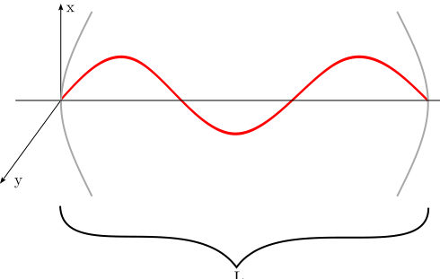 
Fig. 1: Standing wave inside a cavity with perfectly reflecting mirrors located at z = 0 and z = L. The wave is polarised in the x-direction.

📷 Fig 2

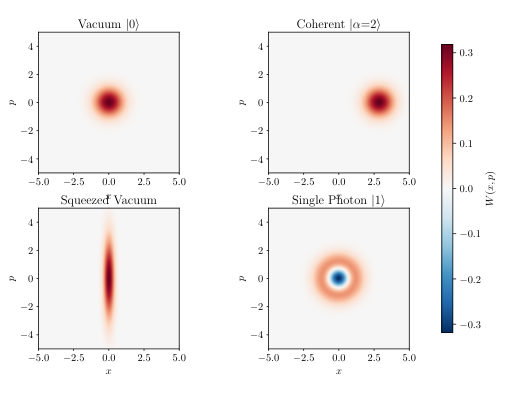 
Fig. 2: Wigner functions for vacuum, coherent (α = 2), squeezed vacuum, and single-photon states. The single-photon state is non-Gaussian and has a negative Wigner function.

📷 Fig 3

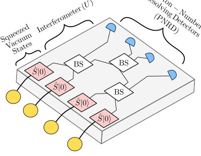 
Fig. 5: Concept of Gaussian Boson sampling. Squeezed vac- uum states enter on the left hand side, go through a series of phase shifters and beamsplitters (BS) that model a unitary U, and are detected on the right hand side by photon number resolving detectors (PNRD). In the original Boson Sampling proposal, the inputs are single photon states as opposed to Gaussian states.

📷 Fig 4

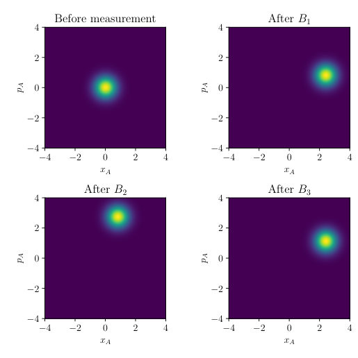 
Fig. 4: Wigner functions showing subsystem A before and after ˆx-measurement on subsystem B. Homodyne detection displaces A in phase space, requiring real-time correction.

📷 Fig 5

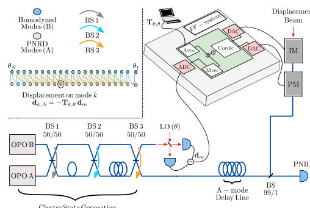 
Fig. 6: Schematic of the MB-GBS. A 2-D cluster state is generated via squeezed light and a system of delay lines and beamsplitters. Modes B are measured, inducing displacements in modes A, which enter a delay line to allow for feedforward- ing to occur. This is achieved via the FPGA-based feedforward system.

**Summary.** This paper presents an FPGA-based fast feedforward system designed to enable real-time signal processing for Continuous Variable Measurement-Based Quantum Information Processing. By integrating a high-efficiency homodyne detector with low-latency digital electronics, the system overcomes the limitations of post-processing, allowing for deterministic, real-time quantum gate operations in photonic quantum computing.

**Why it may be interesting.** This work is highly relevant as it provides a concrete, high-speed engineering solution (FPGA) to a critical bottleneck—real-time control—in the experimental realization of photonic quantum computation protocols.

Detailed structure

**Main problem.** The core challenge is enabling low-latency, real-time signal processing required for Continuous Variables (CV) Measurement-Based Quantum Information Processing (MB-QIP) protocols.

**Main result.** The authors successfully implemented and demonstrated an FPGA-based fast feedforward system capable of performing necessary signal conditioning and logic operations in real-time with a total system latency of 196 ns.

**Method.** The system uses an FPGA to process continuous measurement outcomes from a homodyne detector, performing real-time feedforward corrections necessary to maintain the quantum state during measurement-based computation.

**Model / system.** The system is built around a high quantum efficiency, fully fibre-based homodyne detector coupled to an FPGA. This platform processes CV observables ($\hat{x}, \hat{p}$) derived from quantum harmonic oscillator models, which are central to CV MB-QIP.

**Key observables.** Quadrature measurements ($\hat{x}, \hat{p}$), system latency (196 ns), detector clearance (15 dB at 1 GHz), and phase output oscillation patterns.

**Important parameters / regimes.** Quantum efficiencies $> 95\%$, total system latency of 196 ns, and the need to correct deterministic displacements in phase space.

**Assumptions / limitations.** The primary assumption is that the required feedforward corrections can be calculated and applied faster than the measurement rate, bridging the gap between theory and physical implementation.

**Figures summary.** Figures illustrate the system architecture (FPGA components, data flow), the performance of the homodyne detector (clearance vs. frequency), and simulated/measured phase output oscillations confirming real-time operation.

**Paper structure.** The paper establishes the theoretical need for real-time feedforward in CV MB-QIP, details the physical components (homodyne detector, FPGA), describes the implementation of the feedforward calculation (inner products, CORDIC), and concludes with experimental verification of the low-latency performance.

Abstract

Field-programmable gate arrays provide a high-performance solution for real-time signal processing in emerging quantum and photonic technologies. We present an FPGA-based fast feedforward system, that incorporates a high quantum efficiency fully fibre based homodyne detector, to enable low-latency signal processing critical for continuous variables (CV) measurement-based quantum information processing (MB-QIP) protocols. CV MB-QIP typically relies on adaptive measurements and/or displacements via feedforward to achieve scalability and universality, but existing implementations typically handle these operations in post-processing, limiting real-time applicability. Our system performs signal acquisition, conditioning, and logic operations in real-time, meeting the tight latency requirements of photonic quantum computing protocols. The detector exhibits a large clearance of 15 dB at 1 GHz with 4 mW linear oscillator and quantum efficiencies of >95% with a total system latency of 196 ns. This work highlights the role of FPGAs in bridging the gap between theoretical models and physical implementations in photonics-based technologies

[↑ back to top](#top)

### [Trapping 11,000 Atoms in a Tweezer Array Generated by a Single Metasurface](http://arxiv.org/abs/2606.02715v1)

**Authors:** Yuqing Wang, Zhongchi Zhang, Tao Zhang, Yuxuan Liao, Hanteng Wang, Ye Tian, Binjie Ji, Yujia Wu, Luming Ma, Chen Qing, Chengshu Li, Wei Zhang, Yidong Huang, Wenjun Zhang, Xue Feng, Wenlan Chen, Hui Zhai  
**Type:** both · **Category:** other · **PDF:** <https://arxiv.org/pdf/2606.02715v1>  
**Analysis basis:** full PDF text, analyzed in chunks
**Topic relevance:** 🔥 `analog quantum simulation` **4/5** · `QC/QI experiment` **3/5** · `Rydberg arrays` **2/5** · `entanglement & information structure` **1/5** · `interference shaping light` **1/5** · `quantum optics experiment` **1/5**

📷 Fig 1

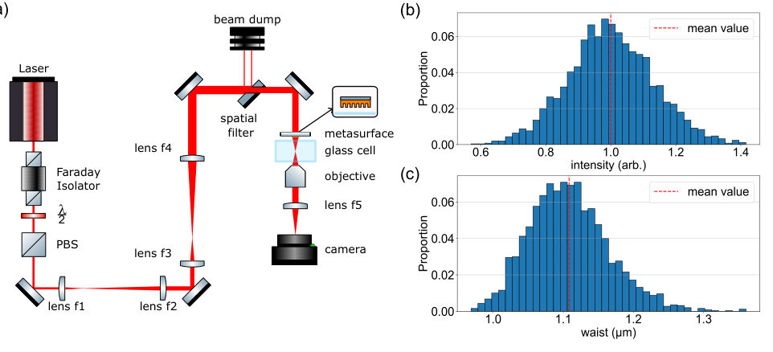 
FIG. 1. Experimental configuration and statistical characterization of the tweezer array. (a) Schematic of the experimental setup. Key components include a Faraday isolator and polarization optics for beam conditioning, two telescope stages (f1–f4) for beam expansion, a reflective spatial filter to truncate the Gaussian tail, the metasurface as the primary diffractive element, and a monitoring system comprising a high-NA objective, tube lens (f5), and camera. (b) Histogram of the normalized peak intensity distribution of individual tweezers. (c) Histogram of the measured Airy disk radius of tweezers in the focal plane.

📷 Fig 2

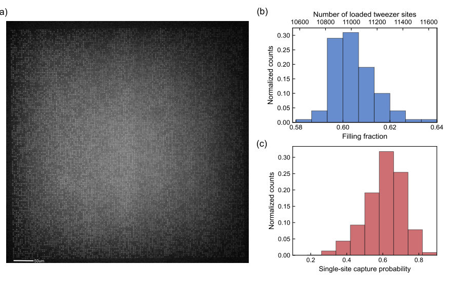 
FIG. 2. Large-scale single-atom trapping performance in the 18,225-site array. (a) Raw single-shot fluorescence image of 87Rb atoms stochastically loaded into the 135×135 metasurface tweezer array. Each bright spot represents a detected single atom; this single shot shows 11400 trapped atoms. (b) Statistical distribution of the filling fraction over 100 consecutive experimental iterations. The system achieves an average loading of 11,022 atoms with a standard deviation of σ = 167, demonstrating high macroscopic stability. (c) Histogram of the site-resolved loading probability across the entire array. The distribution peaks at approximately 60%.

📷 Fig 3

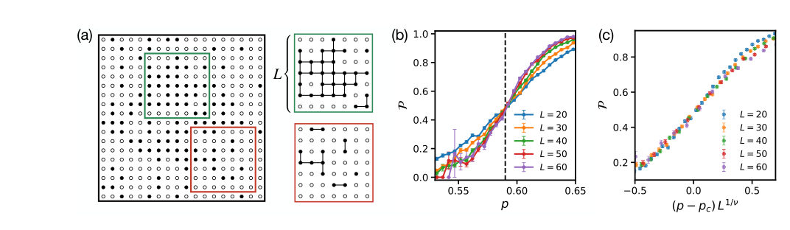 
FIG. 3. Percolation transition from atom-loading snapshots. (a) Example configurations. Samples of L × L config- urations are chosen within each experimental snapshot. Filled and open circles denote occupied sites and vacant tweezers, respectively, and solid bonds indicate connected links. The green patch illustrates a percolating configuration (X = 1); the red patch does not percolate (X = 0). (b) Percolation probability P(p, L) as a function of loading fraction p for different patch sizes L. The dashed vertical line marks pc ≈0.59. (c) Finite-size scaling collapse plotted against (p −pc)L1/ν with ν = 4/3.

**Summary.** This paper demonstrates a breakthrough in scaling atom-based quantum computers by trapping 11,000 atoms using a tweezer array generated by a single metasurface. This approach overcomes limitations of traditional optics, enabling the realization of large-scale quantum processors. Furthermore, the authors analyze the array's connectivity using percolation theory, providing both a physical platform and a theoretical characterization of the system's disorder.

**Why it may be interesting.** This work bridges advanced optical engineering (metasurfaces) with fundamental quantum simulation challenges (scaling and disorder), providing a robust platform for studying many-body physics in controllable, large-scale arrays.

Detailed structure

**Main problem.** The central challenge in quantum computing is scaling the number of physical qubits, which is limited by the number of controllable trapped atoms.

**Main result.** The authors successfully trapped 11,000 individual atoms in a tweezer array generated by a single metasurface, reaching the tens-of-thousands scale for qubit resources.

**Method.** They utilized a single metasurface to generate the entire tweezer array, avoiding complex in-vacuum optics, and characterized the resulting random array using percolation theory.

**Model / system.** The system uses neutral atoms (e.g., Rb) trapped in an optical tweezer array generated by a metasurface. The array size is large (18,225 sites), and the collective properties are analyzed using percolation theory.

**Key observables.** Average trapped atom count ($\sim 11,022$), site-resolved loading probability ($\sim 60\%$), percolation probability $P(p, L)$, and trap depth ($\sim 0.3$ mK).

**Important parameters / regimes.** Metasurface diameter ($\sim 2$ cm), working distance ($\sim 1.5$ cm), and the critical percolation probability ($p_c \approx 0.59$).

**Assumptions / limitations.** The metasurface is placed outside the vacuum cell to avoid technical complications, and the analysis accounts for propagation through air and glass.

**Figures summary.** Figures show the experimental setup, raw single-shot fluorescence images confirming $\sim 11,000$ atoms, and plots demonstrating the percolation transition using finite-size scaling.

**Paper structure.** The paper details the experimental setup using the metasurface, quantifies the trapping of a large number of atoms, and then applies statistical theory (percolation) to characterize the connectivity and disorder within the randomly loaded array.

Abstract

The scalability of physical qubit numbers is a central challenge toward a universal fault-tolerant quantum computer. The inherent scalability of atom array quantum computers stems from the identical nature of atomic qubits, so the available qubit resource is primarily limited by the number of atoms that can be trapped and controlled. Here, we robustly trap 11,000 individual atoms in a tweezer array, thereby enabling the available qubit resource to reach the tens-of-thousands scale for the first time among all quantum computation platforms. This advance is enabled by a single metasurface, approximately 2 cm in diameter, that generates the entire tweezer array without the need for microscope objectives, thereby maximizing laser-power efficiency. The large aperture ensures a working distance of about 1.5 cm, allowing the metasurface to be placed outside the vacuum cell and avoiding the technical complications of in-vacuum operation. We further characterize the randomly loaded atom array using the statistical theory of percolation phase transitions. This work takes an important first step toward a quantum computer at the 10,000-qubit scale.

[↑ back to top](#top)

### [A Tutorial for Characterizing Transmon Qubits](http://arxiv.org/abs/2606.03815v1)

**Authors:** Alexandre M. Souza, Davi A. D. Chaves, Carmem M. Gilardoni, Roberto S. Sarthour, João P. Sinnecker, Ivan S. Oliveira  
**Type:** experiment · **Category:** quantum information and computing · **PDF:** <https://arxiv.org/pdf/2606.03815v1>  
**Analysis basis:** full PDF text, analyzed in chunks
**Topic relevance:** 🔥 `QC/QI experiment` **4/5** · `correlated / nonlocal dissipation` **1/5** · `driven-dissipative phase transition` **1/5** · `entanglement & information structure` **1/5** · `methods for driven-dissipative` **1/5** · `non-equilibrium dynamics` **1/5** · `quantum measurements` **1/5** · `quantum optics experiment` **1/5**

📷 Fig 1

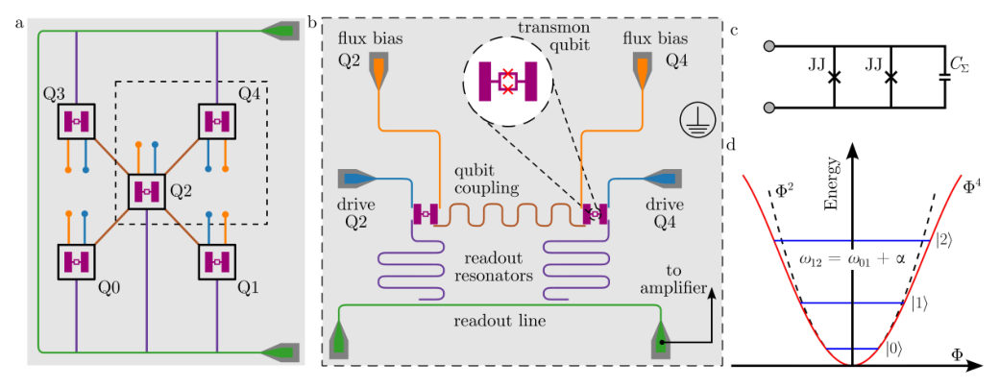 
FIG. 1. Overview of transmon qubits. (a) Schematic view of the five qubits Soprano-D2 chip. (b) Schematics of a typical chip containing two coupled transmon qubits, labeled Q2 and Q4 in accordance with panel (a). Panel (b) highlights in different colors all essential components for qubit control and readout. Contact pads at one or both ends of different transmission lines identify the components which are electrically connected to electronics outside of the chip. (c) Circuit representation of a capacitively shunted Josephson junction. (d) Energy level structure comparing a harmonic oscillator (dotted line) and a transmon (red solid line).

📷 Fig 2

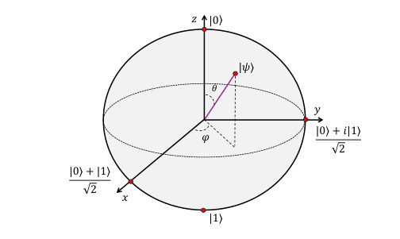 
FIG. 2. Bloch sphere representation of a qubit. Each point on the surface of the sphere represents a different quantum state.

📷 Fig 3

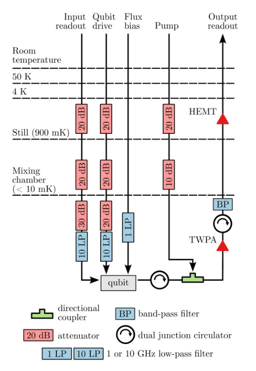 
FIG. 3. Representation of the experimental setup used in the exper- iments, highlighting the different temperature stages of the dilution refrigerator and all low-temperature electronic components. Tem- perature stages where attenuation is not required are connected us- ing 0 dB attenuators for thermal anchoring and impedance matching; these components are not explicitly shown in the figure.

📷 Fig 4

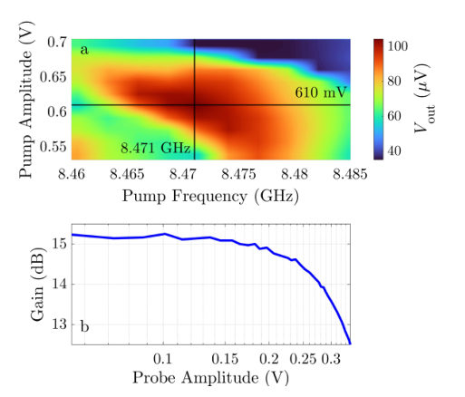 
FIG. 4. Calibration of traveling-wave parametric amplifier. (a) Signal amplification as a function of pump pulse amplitude and frequency. Optimal operation is achieved at the intersection of the highlighted black lines. (b) The average gain of the amplifier in the 7-8 GHz band as a function of the input signal amplitude. The gain was calcu- lated comparing the output signal with optimized amplification and without amplification.

📷 Fig 5

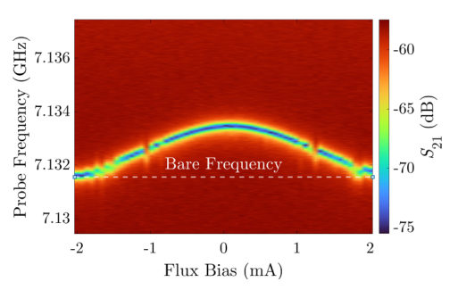 
FIG. 6. Readout probe frequency versus flux bias. The initial probe frequency and amplitude are chosen to enable dispersive resonator- qubit interaction with zero flux bias. The maximum readout fre- quency gives a first approximation for the qubit flux sweet spot.

**Summary.** This tutorial serves as an essential experimental guide for characterizing superconducting transmon qubits. It walks the reader through the entire process, covering everything from initial setup and single-qubit spectroscopy to advanced measurements of anharmonicity, readout fidelity, and qubit-qubit coupling. The paper is crucial for experimentalists aiming to bring up and operate transmon-based quantum processors.

**Why it may be interesting.** For a theoretical physicist, this paper provides a rich experimental realization of open quantum systems dynamics, offering concrete measurements of decoherence rates ($T_1, T_2$) and the practical application of error mitigation protocols like dynamical decoupling and composite pulses.

Detailed structure

**Main problem.** The paper provides a comprehensive, practical, and step-by-step guide for experimentalists to characterize and optimize tunable transmon qubits.

**Main result.** It details the entire workflow, from cryogenic setup and flux sweet-spot identification to single-shot readout and qubit-qubit coupling characterization.

**Method.** The methodology involves a combination of microwave spectroscopy (one-tone/two-tone), dispersive readout measurements, and advanced error characterization techniques like dynamical decoupling and composite pulses.

**Model / system.** The physical system is superconducting transmon qubits, whose dynamics are modeled using Hamiltonians that approximate weakly anharmonic quantum oscillators. The characterization relies on mapping bosonic operators to Pauli operators in the two-level approximation.

**Key observables.** Qubit transition frequency ($\omega_q$), anharmonicity ($\alpha$), readout fidelity ($f$), effective coupling strength ($J$), and coherence times ($T_1, T_2$).

**Important parameters / regimes.** Operating regimes include the dispersive regime ($g \ll \Delta$), and key parameters involve flux bias ($\Phi$), detuning ($\Omega$), and pulse parameters (amplitude, duration).

**Assumptions / limitations.** The procedures are highly dependent on the specific chip layout, fabrication details, and measurement hardware, and many advanced techniques rely on the qubit being well-described by the two-level approximation.

**Figures summary.** Figures illustrate the qubit energy level structure, Bloch sphere representations, resonator response vs. probe power (bare vs. dressed frequency), qubit spectroscopy vs. flux bias (showing the sweet spot), and fidelity decay curves comparing standard vs. composite pulses.

**Paper structure.** The tutorial progresses logically: first covering basic Hamiltonian models and setup; then detailing single-qubit control (Rabi oscillations, anharmonicity); followed by readout optimization (dispersive coupling, heterodyne detection); and finally addressing multi-qubit interactions and error mitigation (coupling strength $J$, composite pulses, DD).

Abstract

Superconducting transmon qubits are a leading technology for quantum information processing, yet their reliable operation rests on meticulous calibration and characterization routines. These processes have been fine-tuned and are relatively well understood by the quantum computing community. Nevertheless, it is often challenging for newcomers to compile all the available information into a practical experimental flow. In this tutorial, we present a comprehensive walkthrough for the characterization and optimization of tunable transmon qubits, demonstrated on a commercial five-qubit processor. Moving beyond theoretical description, we detail in a straightforward manner the complete workflow, from cryogenic setup and wiring to parametric amplifier optimum operation, flux sweet-spot identification, pulse calibration, and readout optimization. We also demonstrate the characterization of qubit-qubit coupling, covering all steps before multiqubit operations. This guide serves as a reference for experimentalists seeking to efficiently bring up transmon-based quantum devices.

[↑ back to top](#top)

### [Observation of interaction-induced fast Thouless pumping of solitons](http://arxiv.org/abs/2606.03044v1)

**Authors:** Yuqing Li, Jinxiong Jia, Yunfei Wang, Huiying Du, Zhong An, Zhenhua Qiao, Liantuan Xiao, Suotang Jia, Qian Niu, Jie Ma  
**Type:** experiment · **Category:** quantum gases · **PDF:** <https://arxiv.org/pdf/2606.03044v1>  
**Analysis basis:** full PDF text, analyzed in chunks
**Topic relevance:** 🔥 `analog quantum simulation` **4/5** · `non-equilibrium dynamics` **3/5** · `Frenkel-Kontorova` **1/5** · `driven-dissipative phase transition` **1/5** · `non-equilibrium universality` **1/5**

📷 Fig 1

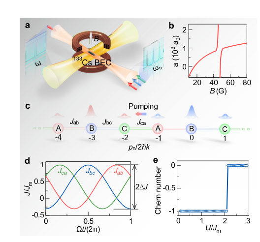 
FIG. 1. Realization of Thouless pumping with tunable in- teraction. a, Sketch of experimental setup for coupling dis- crete momentum states of condensed 133Cs atoms via multiple counter-propagating Bragg laser pairs, whose frequency dif- ferences are controlled by engineering multi-frequency compo- nents ωn. b, Atomic interaction is adjusted by tuning the s- wave scattering length a, which varies with the magnetic field B through a broad Feshbach resonance. c, Atomic discrete momentum states pn = 2nℏk (n = −9, · · · , 11) are coupled by the Bragg laser pairs to realize an off-diagonal Aubry-Andr´e- Harper model with three sites (A, B, C) per unit cell. d, Peri- odic modulation of coupling...

📷 Fig 2

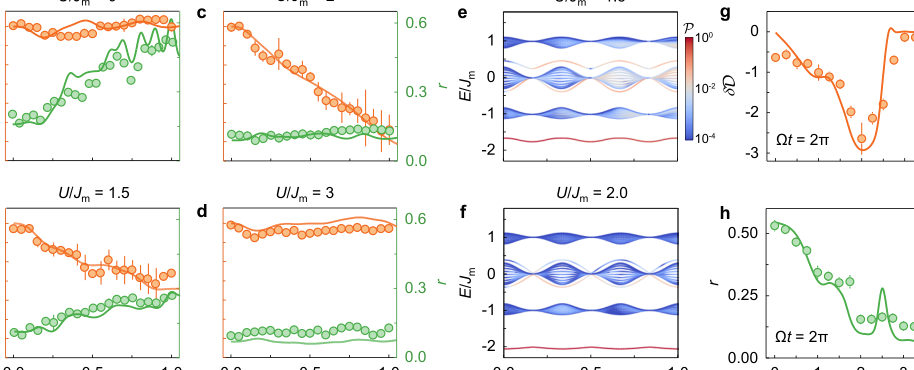 
FIG. 2. Interaction-driven fast quantized Thouless pumping. a-d, Measured atomic center-of-mass displacement δD (orange circles) and participation ratio r (green circles) as a function of evolution time Ωt for different interactions U/Jm. e,f, Numeri- cally calculated instantaneous energy bands for U/Jm = 1.5 and 2 under the mean-field approximation and periodic boundary condition. Color scale represents the projection of time-evolved state |ϕ(t)⟩onto the instantaneous eigenstates |ψNL(t)⟩. g,h, Variations of δD and r measured after a pump cycle Ωt = 2π with U/Jm. The solid lines in a-d, g and h are numerical simulations based on Eq. (1). The error bars denote standard deviations. The...

📷 Fig 3

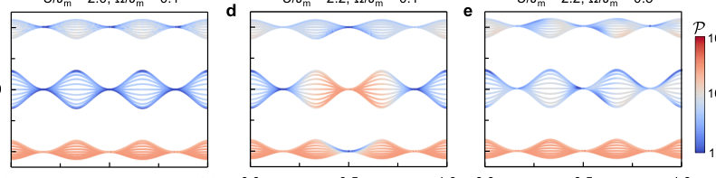 
FIG. 3. Interaction-induced nonadiabatic quantized Thouless pumping. a,b, Phase diagrams of Thouless pumping under the interplay between interaction U/Jm and modulation frequency Ω/Jm. Measured (a) and calculated (b) atomic center-of-mass displacement δD obtained after a pump cycle as a function of U/Jm and Ω/Jm, where the hatched regime in a denotes the experimentally inaccessible low-frequency region due to the limitation of decoherence on the long-time propagation. Star points in b mark the parameters of (U/Jm, Ω/Jm) = (2, 0.1), (2.2, 0.1) and (2.2, 0.5), respectively. Nonadiabatic quantized Thouless pumping emerges at the blue region beyond the phase boundary (dashed line). c-e, The...

📷 Fig 4

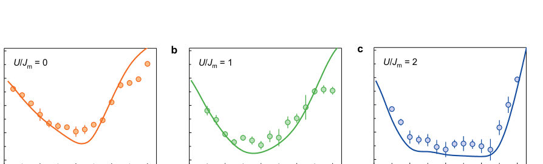 
FIG. 4. Dependence of Thouless pumping on the modulation amplitude. a-c, The atomic center-of-mass displacement δD measured after a pump cycle Ωt = 2π as a function of modulation amplitude ∆J/Jm for different interactions U/Jm. The solid lines are numerical simulations based on Eq. (1). The error bars denote standard deviations. The modulation frequency is Ω/Jm = 0.5 with Jm/ℏ= 2π × 1kHz.

**Summary.** This paper experimentally investigates Thouless pumping in an atomic Bose-Einstein condensate, demonstrating that interactions can induce fast, non-adiabatic topological transport of matter-wave solitons. By modulating the lattice and tuning interactions, the researchers achieved quantized pumping regimes inaccessible under purely adiabatic conditions. This opens new avenues for engineering fast topological quantum devices using ultracold atoms.

**Why it may be interesting.** This work directly bridges concepts from topological physics (Thouless pumping) with experimental quantum simulation using ultracold atoms, providing a clean platform to study nonlinear, interaction-driven quantum phenomena.

Detailed structure

**Main problem.** The study investigates how interparticle interactions influence topological transport, specifically Thouless pumping, in periodically driven quantum systems, aiming to operate beyond the limitations of adiabatic driving.

**Main result.** The authors observed fast, interaction-induced Thouless pumping of matter-wave solitons at intermediate interaction strengths, and demonstrated nonadiabatic quantized pumping at high modulation frequencies.

**Method.** The research uses experimental realization in an atomic Bose-Einstein condensate, measuring the center-of-mass displacement and participation ratio to diagnose topological transport.

**Model / system.** The physical system is an atomic Bose-Einstein condensate (BEC) of ${}^{133}	ext{Cs}$ atoms trapped in a periodically modulated lattice in momentum space. The dynamics are modeled by a nonlinear Schrödinger equation incorporating both lattice hopping and mean-field interaction terms.

**Key observables.** Center-of-mass displacement ($\delta D$), participation ratio ($r$), and the Chern number (quantized pumping value).

**Important parameters / regimes.** Interaction strength ($U$), modulation frequency ($\Omega$), and modulation amplitude ($\Delta J/J_m$).

**Assumptions / limitations.** The analysis relies on the mean-field approximation, and initial state preparation is noted as an approximation.

**Figures summary.** Figures illustrate the experimental setup, the dependence of the Chern number on interaction, and measurements of $\delta D$ and $r$ over pump cycles for varying interaction and modulation parameters.

**Paper structure.** The paper progresses by introducing the physical platform and model, presenting experimental measurements of key observables ($\delta D, r$) across different interaction regimes, and finally developing the theoretical understanding of the nonadiabatic pumping mechanism.

Abstract

Thouless pumping provides a paradigmatic platform for studying the effects of interactions on topological transport in periodically driven systems. However, most studies have been constrained by adiabatic conditions, which preclude exploration of interaction-driven novel topological states at high driving frequencies. Here, we experimentally investigate the interplay between interaction and modulation frequency in Thouless pumping realized in a periodically modulated lattice in momentum space of atomic Bose-Einstein condensate. We observe fast Thouless pumping of matterwave solitons at intermediate interactions, with no counterpart in the non- or weakly interacting regimes. Beyond the boundary of topological phase transition induced by interaction, nonadiabatic quantized pumping of solitons emerges at high modulation frequencies over a broad interaction range, in good agreement with theoretical calculations, while the solitons remain trapped in the low-frequency adiabatic pumping regime. Our work opens new avenues for accelerating topological transport in driven quantum systems and engineering fast topological devices.

[↑ back to top](#top)

### [Fast Tensor Network Imaginary Time Evolution by Implicit Stepping on Logarithmic Grids](http://arxiv.org/abs/2606.02930v1)

**Authors:** John P. Zima, E. Miles Stoudenmire, Steven R. White, Olivier Parcollet, Jason Kaye  
**Type:** theory · **Category:** strongly correlated electrons · **PDF:** <https://arxiv.org/pdf/2606.02930v1>  
**Analysis basis:** full PDF text, analyzed in chunks
**Topic relevance:** 🔥 `Kondo & dissipative impurity` **4/5** · `methods for driven-dissipative` **3/5** · `analog quantum simulation` **2/5**

📷 Fig 1

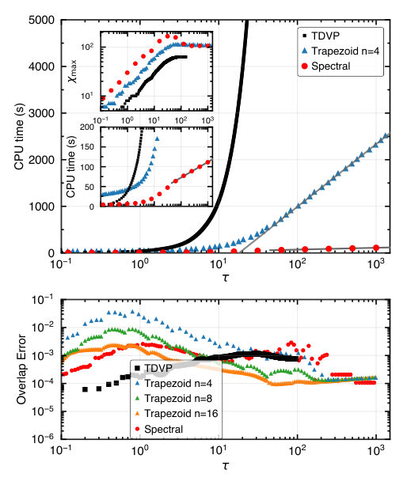 
FIG. 1. Imaginary time evolution, starting from a N´eel state, for a 100-spin Heisenberg chain. Top panel: CPU time vs. τ for uniform-stepping TDVP with a time step of 0.1, trapezoid method with n = 4 time steps per panel, and spectral method with comparable accuracy. Upper inset: bond dimensions of methods shown (taking max over all bonds), fixing the dis- carded weight (i.e., total discarded squared Schmidt weight at a bond) to 10−10. Lower inset: zoom of CPU times. The gray lines are linear fits of the last decade in τ, showing loga- rithmic scaling with respect to τ of the trapezoid and spectral methods once the bond dimension saturates. Bottom panel: Overlap error p

📷 Fig 2

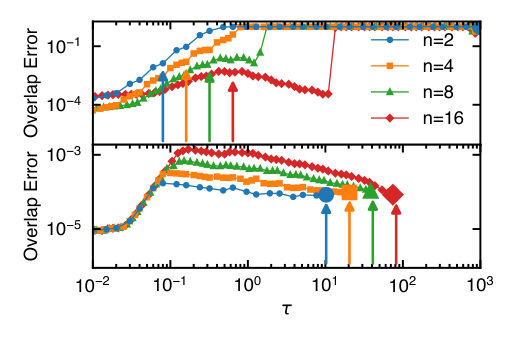 
FIG. 2. (Top) Overlap errors p

📷 Fig 3

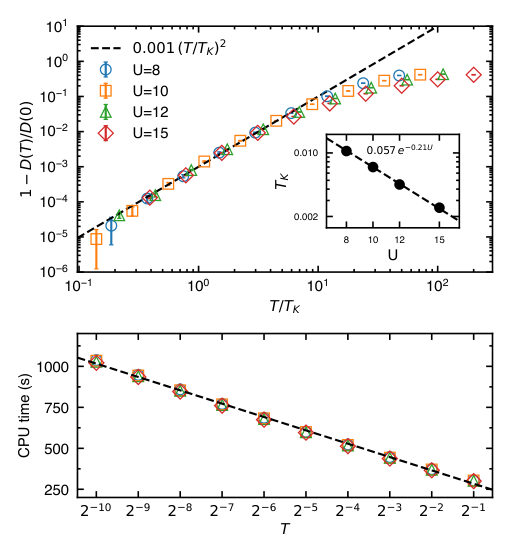 
FIG. 3. (Top) Double occupancy D(T) of the Anderson im- purity model vs. T/TK(U). TK(U) are adjusted to obtain a collapse of the curves for various U. Error bars are 95% confi- dence intervals of METTS sampling error. D(0) is measured directly in the ground state. (Inset) TK vs. the interaction strength U, showing an exponential dependence on U. The dashed curve is a fit TK(U) ≈0.057 × e−0.21U. (Bottom) Average CPU time of the computation of individual METTS versus temperature for different U, showing a log β scaling. The straight dashed line is a linear fit.

**Summary.** This paper introduces a novel, highly efficient technique for simulating imaginary time evolution of quantum many-body systems using Tensor Networks. By combining logarithmic time grids with A-stable implicit solvers, the method achieves a dramatic reduction in computational cost, scaling logarithmically with the required evolution time. This breakthrough allows for accurate simulations of complex models like the Anderson impurity model to very low temperatures.

**Why it may be interesting.** This work provides a powerful, scalable numerical tool for simulating thermal and ground-state properties of strongly correlated materials, directly impacting research in high-Tc superconductivity and quantum impurity physics.

Detailed structure

**Main problem.** The primary goal is to achieve an efficient and stable method for performing imaginary time evolution of quantum many-body wavefunctions represented by Matrix Product States (MPS).

**Main result.** The combination of using a logarithmic time grid and A-stable implicit time-stepping methods allows for an exponential reduction in the required number of time steps compared to standard uniform-step approaches.

**Method.** The authors employ A-stable implicit time-stepping methods (like the trapezoid rule) applied to the imaginary time evolution ODE, utilizing a logarithmic time grid to resolve long-time dynamics efficiently.

**Model / system.** The method is tested on the Heisenberg spin chain and the single-site Anderson impurity model with a metallic bath, which are canonical models in strongly correlated electron physics.

**Key observables.** Overlap error, Kondo temperature dependence, and the double occupancy $D(T)$ in the Anderson model.

**Important parameters / regimes.** The maximum imaginary time $	au_{\max}$ (or inverse temperature $eta$), and the bond dimension $\chi$.

**Assumptions / limitations.** The method assumes the Hamiltonian is positive semi-definite and relies on the stability properties of A-stable implicit solvers, which overcome the stability constraints of explicit methods.

**Figures summary.** Figures compare CPU time and overlap error showing logarithmic scaling for advanced methods on the Heisenberg chain, and demonstrate the collapse of $D(T)/D(0)$ vs. $T/T_K(U)$ for the Anderson model.

**Paper structure.** The paper introduces the problem, details the logarithmic grid and implicit solver combination, validates the approach on the Heisenberg chain (showing speedup), and applies it to the Anderson impurity model to observe physical phenomena like the Kondo temperature.

Abstract

We present a new method for the efficient imaginary time evolution of quantum many-body wavefunctions represented by matrix product states (MPS). We first show that logarithmic time grids are sufficient to resolve long imaginary time dynamics, yielding an exponential reduction in the number of time steps compared with standard approaches. We then show that A-stable implicit time-stepping methods for ordinary differential equations allow stable propagation for any time step size. The resulting scheme requires only matrix-vector products and linear solves, standard operations in the MPS toolbox. We validate our approach with two examples: a Heisenberg spin chain, which we use to demonstrate a speedup of several orders of magnitude over the standard time-dependent variational principle method with uniform time steps, and a single-site Anderson impurity model with a metallic bath, for which propagation to large imaginary times allows one to observe the exponential dependence of the Kondo temperature on the interaction strength.

[↑ back to top](#top)

### [Efficient Quantum Error Mitigation for Unitary k-Designs](http://arxiv.org/abs/2606.03891v1)

**Authors:** Ayush Pancholy, K. Birgitta Whaley  
**Type:** both · **Category:** quantum information and computing · **PDF:** <https://arxiv.org/pdf/2606.03891v1>  
**Analysis basis:** full PDF text, analyzed in chunks
**Topic relevance:** 🔥 `QC/QI experiment` **4/5** · `correlated / nonlocal dissipation` **1/5** · `entanglement & information structure` **1/5** · `methods for driven-dissipative` **1/5** · `non-equilibrium dynamics` **1/5**

📷 Fig 1

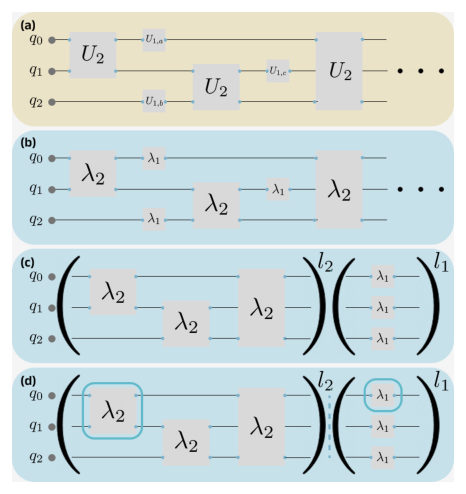 
FIG. 1. Our approach for deriving each noisy gate’s contri- bution to global depolarization. (a) Assume we have some circuit, each of whose qubit pairs experiences the same num- ber of two-qubit gates, and each of whose qubits experiences the same number of single-qubit gates. (b) We can write the local depolarizing elements under our assumption that single- qubit gates all have depolarizing parameter λ1 and two-qubit gates have depolarizing parameter λ2. (c) Depolarizing error channels commute, so we can gather the two-qubit depolariz- ing elements in blocks of fully-connected motifs; likewise, we gather single-qubit depolarizing elements in complete layers of gates. In this case, we find...

📷 Fig 2

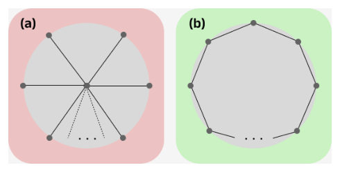 
FIG. 2. Example device connectivity graphs, where qubits are denoted by nodes, and connections by edges. In (a), qubits are connected in a star configuration; more qubits are added by radially connecting them to a central qubit. In (b), qubits are connected in a circular configuration.

📷 Fig 3

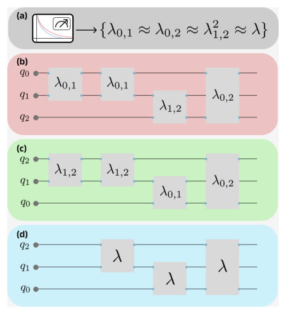 
FIG. 3. An example of circuit balancing. (a) Suppose we have conducted a routine set of benchmarking on a three- qubit device and found this approximate relationship over the depolarizing parameters corresponding to the pairwise two- qubit gates. (b) We are given a circuit using four two-qubit gates, which amount two four local depolarizations. Without circuit balancing, the total local depolarization on each two- qubit pair is different. (c) By permuting the qubit labels in the register (which is simply a form of layout selection for an all-to-all connected device), we enforce similar total local depolarization across qubit pairs. (d) Using the relationships determined through benchmarking...

📷 Fig 4

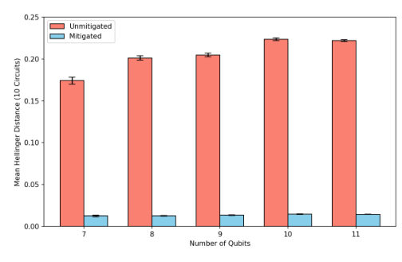 
FIG. 4. We construct 10 approximate unitary 2-designs for several register sizes (depicted on the x axis), and we plot the mean Z-basis measurement distribution Hellinger distance from the ideal (depicted on the y axis; lower is better) for both the mitigated and unmitigated methods. Mean distance is reduced by at least 92% in each case. The error model here contains only depolarization (no coherent errors).

📷 Fig 5

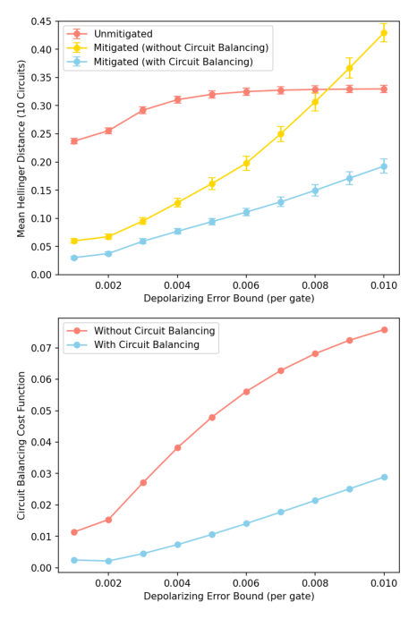 
FIG. 5. A comparison of methods over 10 asymmetric Haar- random circuits, run on 10 simulated backends with different error profiles. In this case, the error models contain only gate-based depolarization (no coherent error), but the uniform distribution from which error per gate is selected broadens as the bound on the depolarizing error increases along the x axis. Top: the mean Hellinger distance from the ideal (lower is better) of the three methods are compared over various gate error ranges for 6-qubit random unitaries. Even for fixed circuit balancing optimization, there is a broad error regime where mitigation with circuit balancing outperforms the default and is more resilient to...

**Summary.** This paper presents a novel, overhead-free error mitigation protocol for quantum circuits approximating unitary k-designs. It combines 'circuit balancing' with Pauli twirling to estimate and invert global depolarization caused by both depolarizing and coherent noise. The technique demonstrates significant fidelity improvements on superconducting quantum hardware, making complex simulations more feasible on noisy devices.

**Why it may be interesting.** The focus on mitigating errors in circuits designed to mimic complex physical dynamics (like quantum chaos) is highly relevant for simulating strongly correlated or non-equilibrium quantum systems using current NISQ hardware.

Detailed structure

**Main problem.** Developing efficient quantum error mitigation techniques for quantum circuits representing unitary k-designs, especially in the presence of both depolarizing and coherent errors, without incurring significant quantum overhead.

**Main result.** The proposed method significantly reduces average random circuit infidelity on both simulated and real superconducting quantum hardware (IBM Fez) without adding two-qubit gate overhead.

**Method.** The authors introduce 'circuit balancing' to estimate global depolarization by leveraging the structure of k-design Pauli support distributions, followed by inverting the noise model using Pauli twirling.

**Model / system.** The work analyzes quantum circuits approximating unitary k-designs, relevant for simulating quantum chaos (e.g., near black holes). Testing is performed on superconducting quantum computers (IBM Fez) and simulated for various connectivity graphs.

**Key observables.** Mean Hellinger distance, Loschmidt echo survival probability, and estimated global depolarizing parameters ($\lambda_{	ext{avg}, 2Q}$).

**Important parameters / regimes.** Depolarizing parameter ($\lambda$), coherent error angle ($	heta$), circuit depth, and the number of twirls ($t$).

**Assumptions / limitations.** The method assumes the availability of regular device benchmarking data and relies on asymptotic scaling arguments for the required number of twirls.

**Figures summary.** Figures compare Hellinger distance reduction across different error models (depolarizing only vs. depolarizing + coherent) and show that circuit balancing and twirling stabilize fidelity on real hardware.

**Paper structure.** The paper progresses from establishing the need for mitigation in k-designs, deriving theoretical bounds for global depolarization on structured graphs, introducing circuit balancing to optimize local error variance, and finally applying Pauli twirling to invert the noise model for practical error suppression.

Abstract

Quantum circuit ensembles that have the properties of unitary k-designs represent applications where there is no obvious bias toward any particular Pauli support, as is the case in simulating systems exhibiting ''quantum chaos,'' which range from quantum dynamics near black holes to gapless spin fluid analysis. However, noisy hardware makes quantum circuits prone to a myriad of error sources, of which depolarizing and coherent error can be particularly destructive. To combat depolarizing error, popular techniques typically involve circuit or gate folding, which can be time-intensive procedures due to increased circuit depth and shot overhead. Other tensor-network-based mitigation techniques suffer from intractability in high-entanglement regimes. In this work, we leverage the structure of unitary k-design Pauli support distributions by introducing a technique we name ''circuit balancing,'' along with gate benchmarking data, in order to estimate circuit-wide depolarization. We describe how to invert the diagnosed circuit depolarization even in the presence of coherent error, via Pauli twirling. We provide asymptotics to estimate the number of twirls needed to maintain a desired output fidelity. We test our method numerically in a variety of simulation settings and find that it can significantly reduce average random circuit infidelity. Further, we employ our methods to find significant infidelity reductions when running a random circuit ensemble on a contemporary superconducting quantum computer, IBM Fez. Overall, we show that the method effectively reduces gate-based error for unitary k-designs without incurring any two-qubit gate overhead.

[↑ back to top](#top)

### [Exact Solutions for Spin Conserving Models and the Wigner-Araki-Yanase Theorem](http://arxiv.org/abs/2606.02861v1)

**Authors:** Michael Steiner, Ronald Rendell  
**Type:** theory · **Category:** other · **PDF:** <https://arxiv.org/pdf/2606.02861v1>  
**Analysis basis:** full PDF text, analyzed in chunks
**Topic relevance:** 🔥 `quantum measurements` **4/5** · `measurement-induced transitions` **3/5**

📷 Fig 1

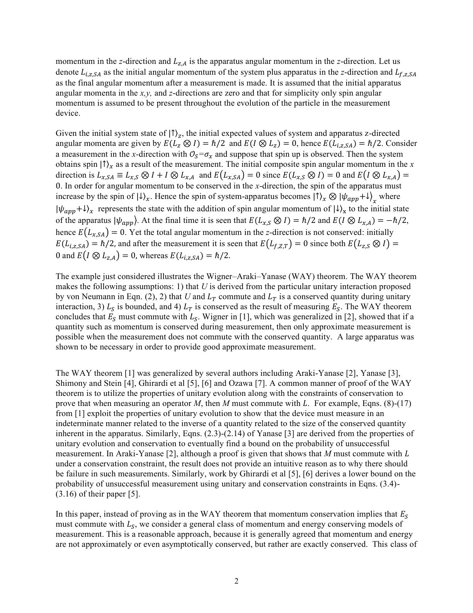 
Low-resolution page preview, page 2

📷 Fig 2

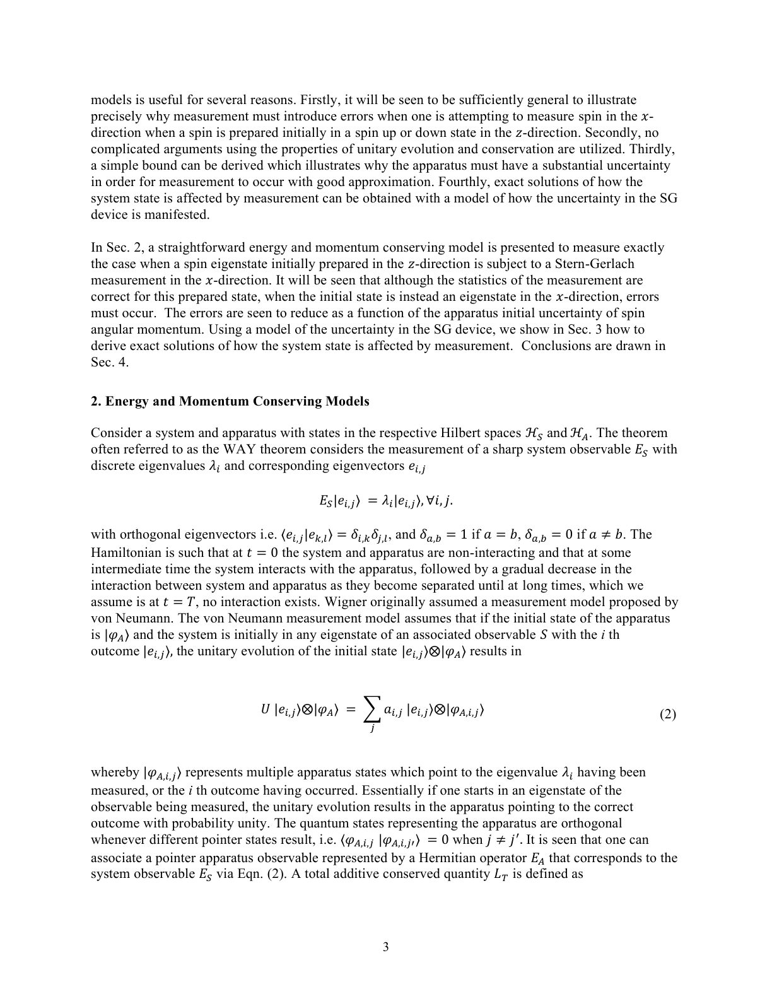 
Low-resolution page preview, page 3

📷 Fig 3

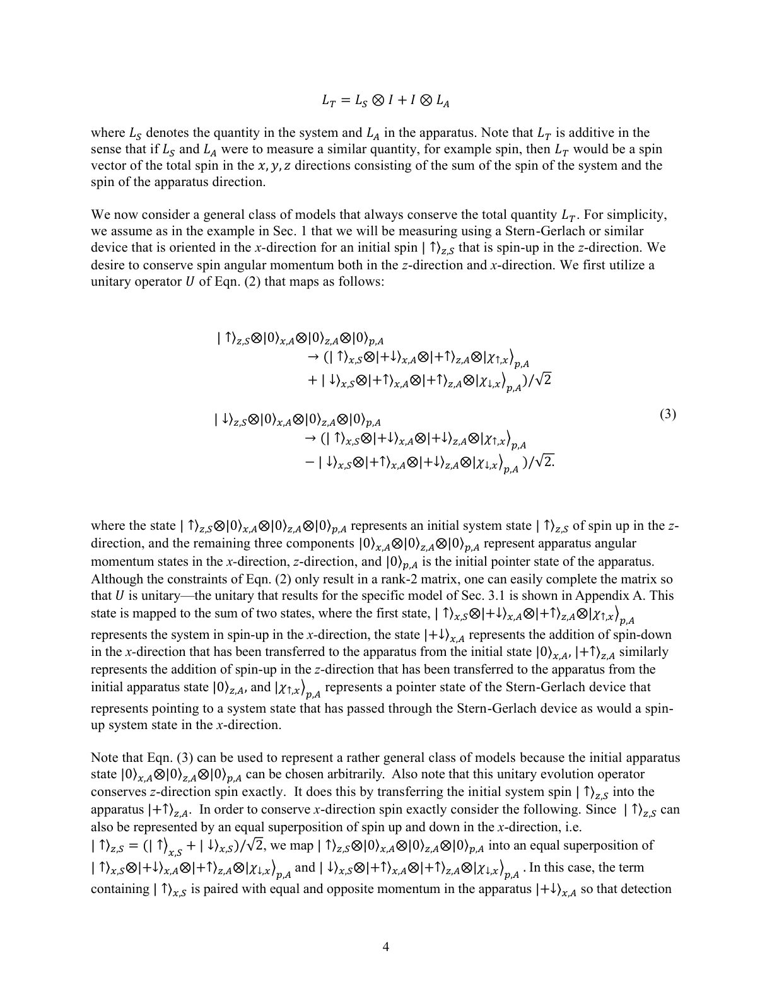 
Low-resolution page preview, page 4

📷 Fig 4

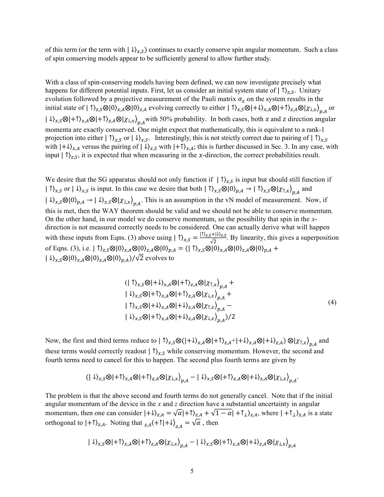 
Low-resolution page preview, page 5

📷 Fig 5

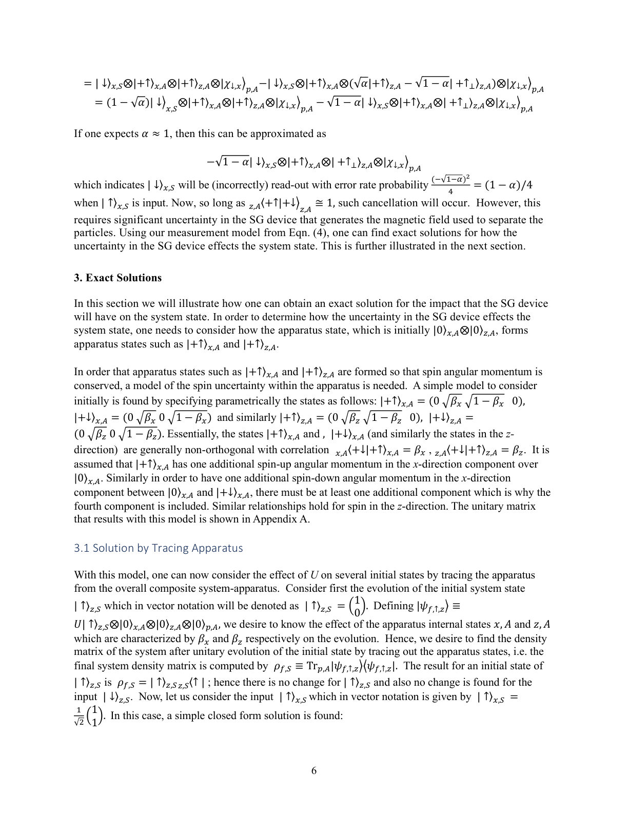 
Low-resolution page preview, page 6

**Summary.** This paper re-examines the Wigner-Araki-Yanase theorem by developing a general model based on exact total angular momentum conservation. Using both density matrix tracing and Kraus operators, the authors show that measurement outcomes are constrained by apparatus uncertainties, providing a deeper physical understanding of measurement limitations.

**Why it may be interesting.** This work is highly relevant to open quantum systems and quantum measurement theory, providing a rigorous, generalized framework for understanding how conservation laws constrain measurement outcomes beyond standard assumptions.

Detailed structure

**Main problem.** The paper investigates the fundamental limitations of quantum measurement in the presence of additive conservation laws, specifically addressing the Wigner-Araki-Yanase (WAY) theorem.

**Main result.** By developing a general angular momentum conserving model of measurement, the authors provide a simple explanation for the major implications of the WAY theorem, showing that measurement errors depend on apparatus uncertainty.

**Method.** The analysis uses both tracing out the apparatus from the density matrix and developing a system-only channel model based on Kraus operators to analyze the measurement process.

**Model / system.** The model involves a quantum system (e.g., spin) interacting with an apparatus (like a Stern-Gerlach device) under the assumption of exact total angular momentum conservation.

**Key observables.** Expected values of angular momenta ($E(L_{i,z,SA})$), the final system density matrix ($
ho_{f,S}$), and the correlation parameters ($eta_x, eta_z$).

**Important parameters / regimes.** The correlation parameters $eta_x$ and $eta_z$ characterizing the non-orthogonality of apparatus states.

**Assumptions / limitations.** The primary assumption is the exact conservation of total angular momentum ($L_T$) during measurement, moving beyond the standard von Neumann model assumptions.

**Paper structure.** The paper first reviews the WAY theorem and then develops a general angular momentum conserving model. It proceeds by calculating the evolution using unitary operators and then deriving the system-only channel model via Kraus operators to analyze the resulting state.

Abstract

The Wigner-Araki-Yanase (WAY) theorem is a well-known theorem regarding limitations of quantum measurement in the presence of additive conservation laws. Under the assumptions of the von Neumann measurement model, for which the system conserved quantity $L_{S}$ is bounded, given a conserved total additive system plus apparatus quantity $L_{SA}$, the measurement operator $E_{S}$ must commute with $L_{S}$. Prior proofs have exploited the properties of unitary evolution constrained by momentum conserving operations that tend to obscure the physical nature of the WAY theorem and as well lead to bounds on performance. As it is generally agreed that momentum is always exactly conserved in measurement, we instead develop a general angular momentum conserving model of measurement. This model is shown to lead to a simple explanation of the major implications of the WAY theorem and provides exact results of the effects of measurement based on the apparatus model. This is shown by both tracing the apparatus from the density matrix and also via a system-only channel model based on Kraus operators.

[↑ back to top](#top)

### [Informational completeness of qubit measurements and IC preservability of qubit channels: Characterization and Quantification](http://arxiv.org/abs/2606.03964v1)

**Authors:** Jatin Ghai, Arindam Mitra  
**Type:** theory · **Category:** quantum information and computing · **PDF:** <https://arxiv.org/pdf/2606.03964v1>  
**Analysis basis:** full PDF text, analyzed in chunks
**Topic relevance:** 🔥 `quantum measurements` **4/5** · `entanglement & information structure` **2/5** · `measurement-induced transitions` **1/5**

📷 Fig 1

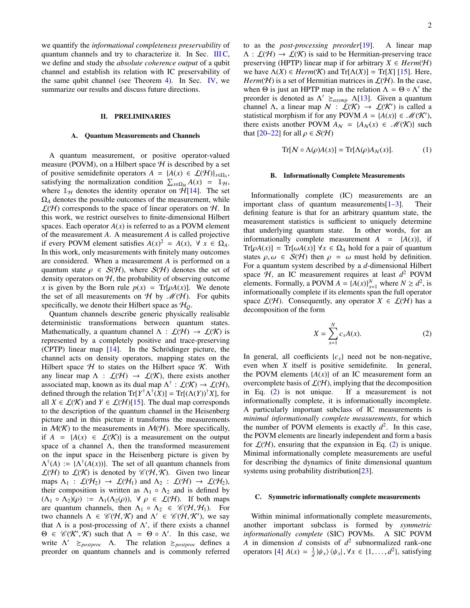 
Low-resolution page preview, page 2

📷 Fig 2

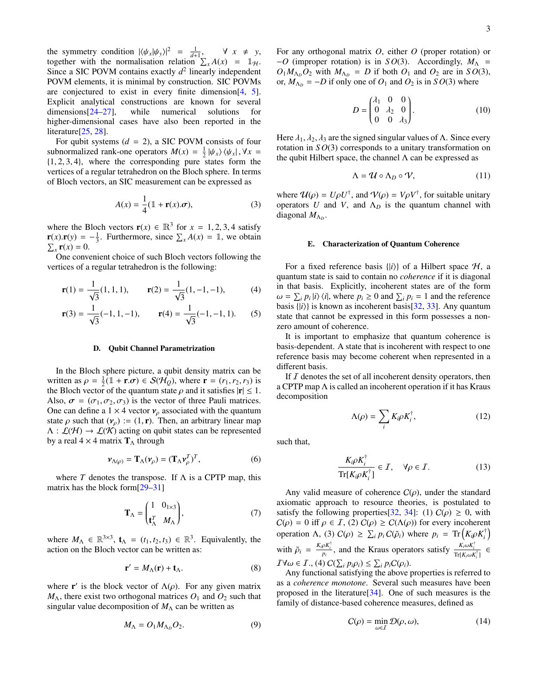 
Low-resolution page preview, page 3

📷 Fig 3

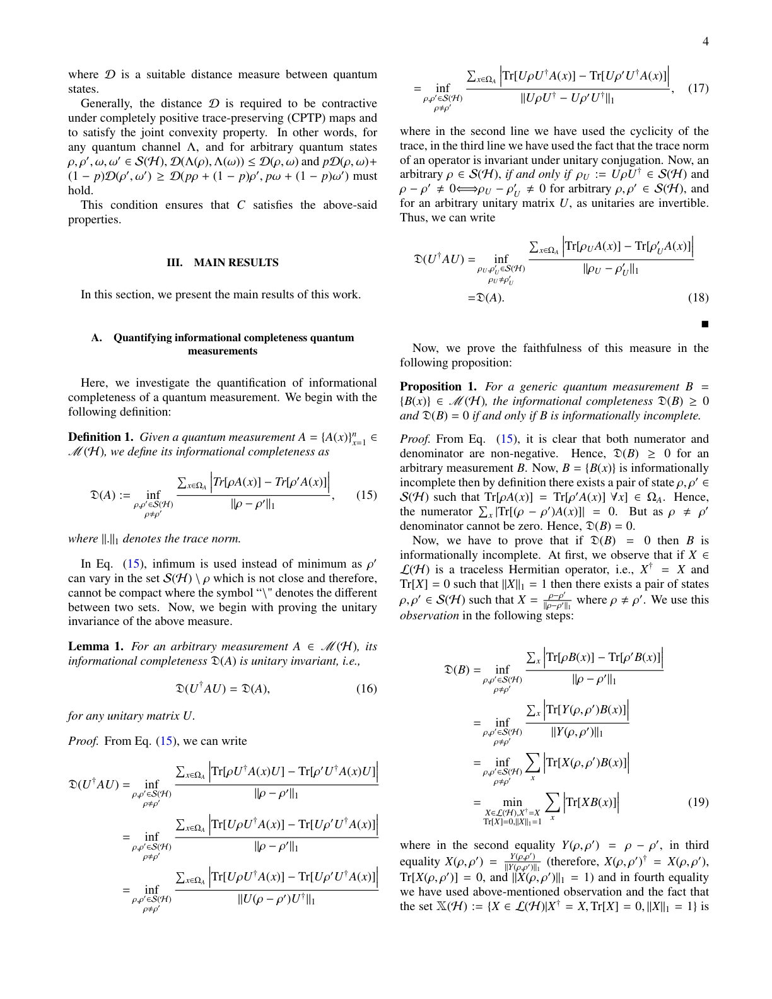 
Low-resolution page preview, page 4

📷 Fig 4

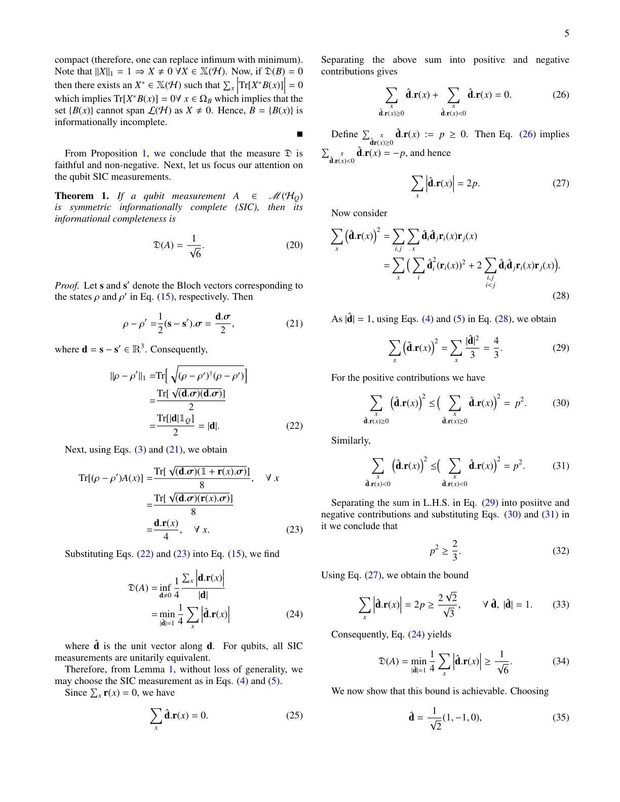 
Low-resolution page preview, page 5

📷 Fig 5

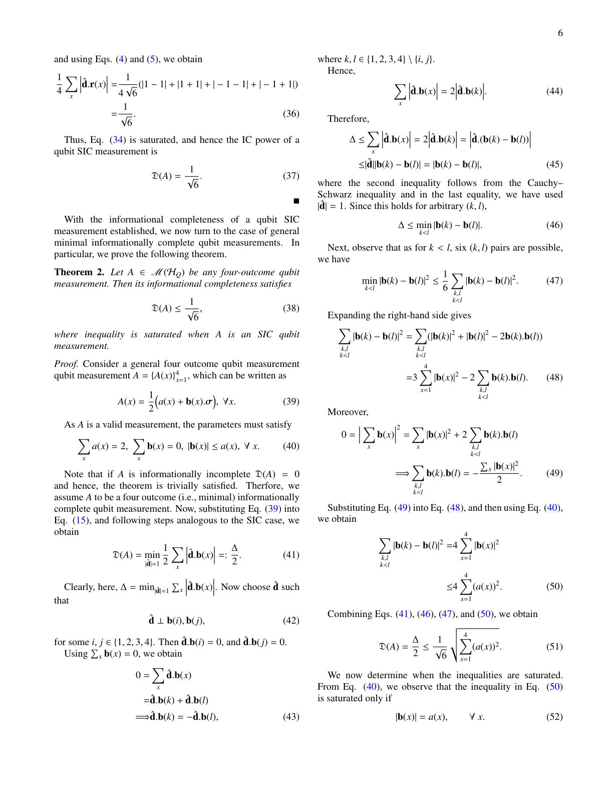 
Low-resolution page preview, page 6

**Summary.** This paper develops quantitative measures for informational completeness of quantum measurements and the ability of quantum channels to preserve this property. Using qubit systems, the authors establish that SIC measurements saturate the upper bound for IC. Crucially, they derive bounds linking this preservation measure to the channel's absolute output coherence, providing a deep conceptual link between information theory and quantum coherence.

**Why it may be interesting.** This work provides rigorous, quantitative tools to measure how much information a quantum channel preserves about the initial state, linking fundamental concepts like measurement distinguishability (IC) to coherence measures.

Detailed structure

**Main problem.** The paper aims to quantify the informational completeness (IC) of quantum measurements and characterize the ability of quantum channels to preserve this property (IC preservability).

**Main result.** The authors establish a quantitative framework showing that the IC of qubit SIC measurements is $1/\sqrt{6}$, and they derive bounds relating IC preservability ($	ilde{D}(\Lambda)$) to the channel's absolute output coherence ($C(\Lambda)$).

**Method.** The work involves defining and characterizing faithful measures for informational completeness, analyzing the action of quantum channels in the Heisenberg picture, and using singular value decompositions of the channel map.

**Model / system.** The primary focus is on qubit systems ($d=2$), analyzing general quantum measurements (POVMs) and arbitrary quantum channels ($\Lambda$) acting on these qubits.

**Key observables.** Informational Completeness ($D(A)$), Informational Completeness-Preservability ($	ilde{D}(\Lambda)$), and Absolute Output Coherence ($C(\Lambda)$).

**Important parameters / regimes.** The dimension $d=2$ (qubits); the singular values ($\lambda_i$) of the channel $\Lambda$.

**Assumptions / limitations.** The analysis is heavily focused on the qubit case; the derivation of bounds for $	ilde{D}(\Lambda)$ relies on assuming the measurement $A'$ is a qubit SIC measurement.

**Paper structure.** The paper progresses by first quantifying IC for measurements (establishing the $1/\sqrt{6}$ bound via SIC measurements), then defining and analyzing IC preservability ($	ilde{D}(\Lambda)$) for channels, and finally establishing the relationship between $	ilde{D}(\Lambda)$ and the absolute output coherence $C(\Lambda)$.

Abstract

Informationally complete (IC) measurements are a useful class of measurements, as their outcome statistics uniquely determine an unknown quantum state. Hence, they are important for certain tasks such as quantum state tomography, quantum process tomography, etc. In this work, we study the quantification of informational completeness for arbitrary quantum measurements by introducing and characterizing a faithful measure for it. We explicitly evaluate the informational completeness of qubit symmetric informationally complete (SIC) measurements and show that it is an upper bound for all qubit minimal informationally complete measurements. Furthermore, by introducing a faithful measure, we try to quantify and characterize the ability of an arbitrary quantum channel to preserve informational completeness of any IC measurement when the channel acts on it in the Heisenberg picture. We call this measure informational completeness-preservability (IC preservability) of quantum channels. After studying its properties, we finally establish its relation to another quantity, namely, the absolute output coherence of a quantum channel, which quantifies the minimum amount of coherence (w.r.t. an arbitrary incoherent basis) that can always be obtained from the output of that channel. Thus, in this work, not only do we try to provide a quantitative framework for studying both the informational completeness of quantum measurements and the ability of quantum channels to preserve it, but we also try to offer key insight into the conceptual relation between informational completeness and quantum coherence.

[↑ back to top](#top)

### [Operator spreading in random circuits with orthogonal or symplectic symmetry](http://arxiv.org/abs/2606.03956v1)

**Authors:** Zhiyang Tan, Piet W. Brouwer  
**Type:** theory · **Category:** statistical mechanics · **PDF:** <https://arxiv.org/pdf/2606.03956v1>  
**Analysis basis:** full PDF text, analyzed in chunks
**Topic relevance:** 🔥 `entanglement & information structure` **4/5** · `non-equilibrium dynamics` **3/5**

📷 Fig 1

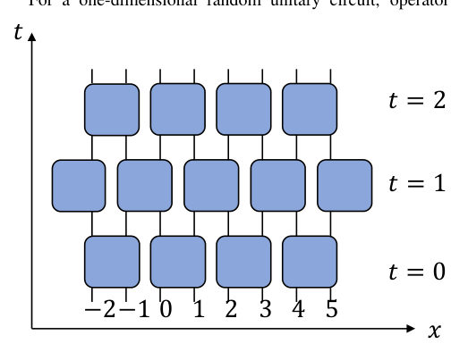 
FIG. 1: Schematic of a random unitary circuit with a brickwork structure. The random circuit is composed of two-qudit gates (shown in blue) uncorrelated in space and time.

📷 Fig 2

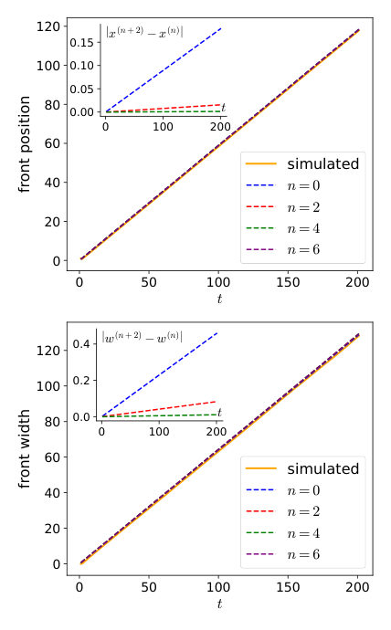 
FIG. 2: Front position (top panel) and front width (variance of front position, bottom panel) vs. time t for a random unitary circuit with Haar-orthogonal two-qudit gates and qudit dimension q = 2. The solid lines in both panels represent results from direct numerical sim- ulations of the classical stochastic growth process with system size L = 200, based on N = 2 × 105 independent realizations. In the top panel, the slopes of the lines correspond to the butterfly velocity vB, while in the bottom panel, the slopes yield the diffusion constant D. The dashed curves indicate analytical results obtained from the truncation scheme at orders n = 0, 2, 4, and 6. Due to the rapid convergence of the...

📷 Fig 3

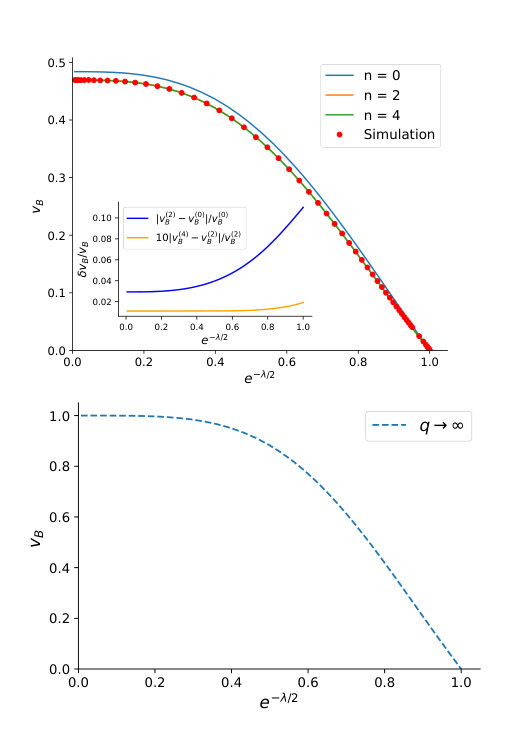 
FIG. 3: Butterfly velocity for Brownian special orthogonal circuits with local dimension q = 2 and in the limit q →∞. The parameter λ interpolates between a trivial circuit and the Haar-random limit. Top panel: Solid curves represent the analytical approximations v(n) B for q = 2 at orders n = 0, 2, and 4. Symbols denote data from direct numerical simulations (system size L = 320, evolved for 200 time steps, averaged over N = 2 × 105 realizations). Due to the rapid convergence of the truncation scheme, the analytical results for all orders are virtually indistinguishable from the numerical data. Inset: Relative differences between the approximations of order n = 4 and n = 2, and between n =...

📷 Fig 4

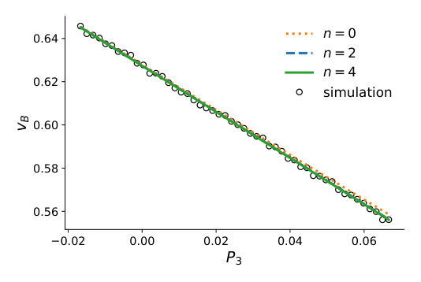 
FIG. 5: Butterfly velocity for a SO−1 circuit at q = 2. The pa- rameter space of the circuit is one-dimensional and can be param- eterized by P3, which in turn determines other parameters P1 and P2. The data points represent the results of a direct numerical sim- ulation conducted on a system of size L = 320 for 200 time steps, with averaging over N = 5000 independent realizations. The curves indicate analytical predictions derived from a truncation scheme at successive orders n = 0, 2, and 4. Due to the rapid convergence of the truncation scheme, the analytical results for orders n = 2 and 4 are indistinguishable.

📷 Fig 5

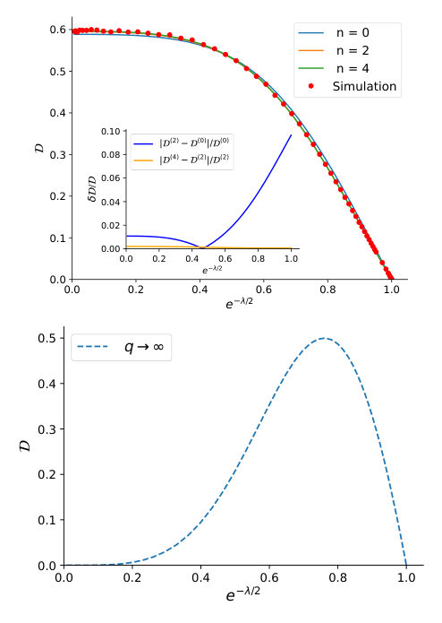 
FIG. 4: Same as Fig. 3, but for the diffusion constant D for a Brow- nian special orthogonal circuit. The small fluctuations of the data points around the theoretical curve are attributed to statistical noise from the large, but finite, number of realizations N in the numerical simulations. Due to the rapid convergence of the truncation scheme, the analytical results for orders n = 2 and 4 are indistinguishable in the upper panel.

**Summary.** This work analyzes how symmetry constraints (orthogonal or symplectic) modify operator spreading in random quantum circuits compared to the standard unitary case. It shows that these symmetries force the system's state representation into a ternary structure and predict specific, symmetry-dependent values for key dynamical parameters like the butterfly velocity. This is vital for understanding quantum thermalization in physical systems with underlying symmetries.

**Why it may be interesting.** It provides a detailed, mathematically rigorous framework for understanding how fundamental symmetries (like time-reversal or particle-hole symmetry) constrain the scrambling dynamics in quantum many-body systems, which is crucial for understanding thermalization and quantum chaos.

Detailed structure

**Main problem.** The paper investigates operator spreading in random quantum circuits when the gates are constrained by orthogonal or symplectic symmetries, contrasting these results with the standard unitary-invariant case.

**Main result.** For orthogonal/symplectic circuits, the Pauli-string weights relax to a ternary-valued structure, and the domain wall separating trivial and scrambled regions has a finite width, unlike the sharp wall in the unitary case.

**Method.** The analysis uses the Heisenberg picture evolution, deriving closed Markovian equations for projected ternary-string distributions and modeling the dynamics via drift-diffusion equations.

**Model / system.** The system is a random quantum circuit acting on qudits ($q$-dimensional degrees of freedom) arranged in a 1D lattice, with gates drawn from orthogonal or symplectic invariant ensembles.

**Key observables.** Operator spreading, butterfly velocity ($v_B$), diffusion constant ($D$), and the structure of the steady-state Pauli-string weights ($ar{
ho}_{ar{p}}$).

**Important parameters / regimes.** Qudit dimension ($q$), symmetry type (orthogonal/symplectic), and the degree of randomness (Haar vs. Brownian).

**Assumptions / limitations.** The analysis relies on projecting the full state space onto a simplified binary or ternary string distribution to derive tractable Markovian evolution equations.

**Figures summary.** Figures illustrate the front position and width of operator spreading for random unitary circuits, comparing analytical approximations with numerical simulations.

**Paper structure.** The paper progresses from establishing the general problem and the difference between symmetry classes, deriving the Markovian evolution equations for the projected ternary distribution, and finally deriving the drift-diffusion equation governing the long-time dynamics.

Abstract

We investigate operator spreading in random quantum circuits with gates drawn from orthogonal-invariant or symplectic-invariant ensembles, revealing several key distinctions from the well-studied unitary-invariant case. We find that the ensemble-averaged Pauli-string weights relax to a ternary-valued structure, instead of the binary structure of unitary-invariant circuits. For orthogonal- or symplectic-invariant circuits, the domain wall separating trivial and scrambled regions has a finite width even for Haar-random gates, whereas domain walls are sharp for Haar-distributed random unitary circuits. We further find a fundamental dichotomy between random circuits with two-qubit gates from the two disconnected components of the orthogonal group: While the butterfly velocity for the special orthogonal ensemble lies between zero and the Haar value, the negative-determinant sector exhibits a non-zero lower bound for any gate distribution. Moreover, for qudit size $q=2$, the butterfly velocity can exceed that of the Haar-random ensemble.

[↑ back to top](#top)

### [Pure states for subregions in gravity and their entanglement entropy](http://arxiv.org/abs/2606.03977v1)

**Authors:** Zixia Wei  
**Type:** theory · **Category:** other · **PDF:** <https://arxiv.org/pdf/2606.03977v1>  
**Analysis basis:** full PDF text, analyzed in chunks
**Topic relevance:** 🔥 `entanglement & information structure` **4/5**

📷 Fig 1

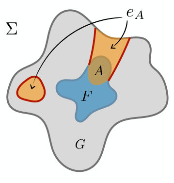 
FIG. 1. Sketch of the computation of the entanglement en- tropy using (16). Shown is a spatial slice Σ with nontrivial gravitating boundary ∂Σ. The frozen subregion F is shown in blue, and the ambient gravitating region G is shown in gray. Given a subregion A ⊂F, a representative eA satis- fying the frozen condition (17) is shown in yellow. The red surface γ|F (eA) is the codimension-2 surface defined in (18).

**Summary.** This paper proposes that spatial subregions in quantum gravity can be described by pure quantum states, not mixed ones. It introduces a novel holographic formula for calculating the entanglement entropy of these subregions. The key achievement is demonstrating that this formula is mathematically consistent with core principles of quantum information theory, such as strong subadditivity.

**Why it may be interesting.** While highly theoretical, the rigorous derivation of entanglement entropy in a gravitational context provides deep insights into how quantum information principles (like SSA) must constrain the structure of spacetime itself, which is relevant for understanding quantum correlations in complex many-body systems.

Detailed structure

**Main problem.** The paper addresses whether spatial subregions in quantum gravity can be assigned pure quantum states, moving beyond the standard mixed reduced density matrix description.

**Main result.** It proposes a holographic prescription for the entanglement entropy that satisfies fundamental consistency conditions like strong subadditivity and complementarity, and reduces to known formulas like Ryu-Takayanagi.

**Method.** The authors use a partially frozen gravitational path integral (GPI) to prepare the state and conjecture a holographic formula involving minimizing over surfaces constrained by the frozen region.

**Model / system.** The system is quantum gravity, modeled using a gravitational path integral coupled to a QFT, focusing on the entanglement structure of spatial subregions within a larger, fixed gravitational background.

**Key observables.** Entanglement Entropy ($S_{|F}A$), the pure state $|\Psi(	ext{MF} / \mathbb{Z}_2)
angle_{	ext{F} \cup \partial 	ext{F}}$, and the area of minimal surfaces ($	ext{Area}(\gamma_{|F}(eA))$).

**Important parameters / regimes.** The gravitational constant ($G_N$), the geometry of the frozen region ($	ext{F}$), and the specific subregions ($	ext{A}, 	ext{B}$).

**Assumptions / limitations.** The analysis assumes the partially frozen GPI is dominated by a saddle geometry, and the derivation relies on specific constraints related to the frozen subregion.

**Paper structure.** The paper first establishes the pure state nature of the subregion using the GPI, then conjectures the holographic EE formula, and finally verifies its consistency by checking fundamental properties like SSA and complementarity.

Abstract

It is proposed that spatial subregions in quantum gravity can be assigned pure states, rather than mixed reduced density matrices. The state is prepared by a partially frozen gravitational path integral, in which a spacetime subregion containing the spatial subregion is fixed while the field configurations and ambient geometry are summed over. In the semiclassical regime, we further propose a holographic prescription for the entanglement entropy of bipartitions of this state, with a frozen-region analogue of the homology constraint. The prescription satisfies nontrivial self-consistency conditions, including strong subadditivity, complementarity, and entanglement wedge nesting, and reproduces several known entropy formulas in holography and gravity as special cases. The construction suggests an observer-dependent entanglement wedge labeled by the frozen subregion.

[↑ back to top](#top)

### [Testing the ${\rm ER=EPR}$ conjecture with entangled photons](http://arxiv.org/abs/2606.02943v1)

**Authors:** Kimet Jusufi, Francisco S. N. Lobo, Douglas Singleton  
**Type:** theory · **Category:** other · **PDF:** <https://arxiv.org/pdf/2606.02943v1>  
**Analysis basis:** full PDF text, analyzed in chunks
**Topic relevance:** 🔥 `entanglement & information structure` **4/5**

📷 Fig 1

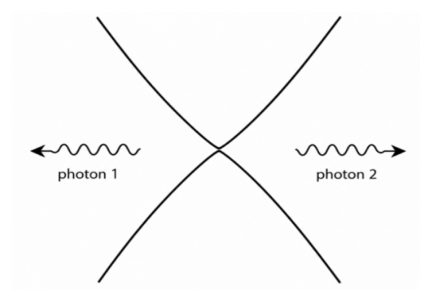 
FIG. 1. An entangled e+ + e−→2γ results in a pair of entangled photons. There is an ER bridge connecting the particles. A schematic plot inspired from [29] but with a difference that our wormhole is non-traversable.

**Summary.** This work provides a rigorous theoretical framework to test the ER=EPR conjecture using entangled photons. By calculating the gravitational self-energy within a regularized wormhole geometry, the authors show that the energy scales match predictions derived from entanglement entropy. The results suggest that quantum gravity effects for photons are extremely weak, leading to an immunity from collapse over cosmological timescales.

**Why it may be interesting.** It provides a concrete, quantitative link between quantum entanglement (information theory) and spacetime geometry (general relativity) using ultra-relativistic quanta, which is a major frontier in theoretical physics.

Detailed structure

**Main problem.** The paper tests the ER=EPR conjecture by investigating the gravitational self-energy associated with entangled photon pairs.

**Main result.** The gravitational self-energy is found to be suppressed by the photon's wavelength ($1/L$), and the entanglement entropy calculation successfully reproduces this scaling, confirming the conjecture.

**Method.** The authors use a regularized Aichelburg-Sexl shock-wave metric to model the geometry and calculate the self-energy, complementing this with an entanglement-entropy interpretation derived from CFT.

**Model / system.** The system involves entangled photon pairs generated in $e^+e^- 	o 2\gamma$, modeled using a regularized shock-wave metric that forms a zero-throat Einstein-Rosen wormhole.

**Key observables.** Gravitational Self-Energy (EGSE), Entanglement Entropy (SEE), and the collapse time ($	au_{	ext{collapse}}$).

**Important parameters / regimes.** Longitudinal extent ($L$), transverse separation ($d$), and the string-inspired smearing length scale ($l_0$).

**Assumptions / limitations.** The analysis relies on linearizing the metric and using a T-duality-inspired smearing scale ($l_0$) to regularize divergences.

**Paper structure.** The paper develops the regularized geometry, calculates the EGSE for separated pairs, and then provides a complementary calculation using entanglement entropy to confirm the scaling and normalization of the self-energy.

Abstract

We regularize the Aichelburg-Sexl shock-wave metric for massless particles by smearing the point-like source over a string-inspired length scale $l_0$, obtaining a singularity-free gravitational potential. A coordinate transformation reveals that the transverse geometry is a zero-throat Einstein-Rosen wormhole, providing an explicit geometric realization of the ER=EPR conjecture for entangled photons. Crucially, we show that the gravitational self-energy depends on the photon's longitudinal extent $L$ (its wavelength) and, for a transversely separated photon pair, is suppressed by a factor $1/L$, giving $E^{\rm GSE}\sim 4G(\hbarω)^2/(c^4 L)\ln(d^2/l_0^2)$. For the coincident back-to-back pair created in $e^{+} e^{-}\to2γ$, the wormhole carries no additional binding energy; the logarithmic interaction energy emerges only after the entangled photons separate to a distance $d$, stretching the ER bridge. We further provide an entanglement-entropy interpretation: by computing the entanglement entropy of null intervals in the shock-wave geometry and introducing an effective entanglement temperature $k_B T_{\rm ent}\sim\hbar c/(2πL)$, we recover the same scaling and normalization of the gravitational self-energy. For optical photons the corresponding collapse time exceeds $10^{30}$ years, making isolated photons immune to gravity-induced wave-function collapse. These findings establish a rigorous playground for testing ER=EPR and reveal a deep suppression of quantum-gravity effects for ultra-relativistic quanta.

[↑ back to top](#top)

### [Coexistence of topologically nontrivial and trivial insulating states in topological Anderson Chern insulator](http://arxiv.org/abs/2606.02733v1)

**Authors:** Bo Yin, Yan Zhang, Anqi Wang, Jie Shen, Zhijun Wang, Quansheng Wu  
**Type:** theory · **Category:** disordered systems and neural networks · **PDF:** <https://arxiv.org/pdf/2606.02733v1>  
**Analysis basis:** full PDF text, analyzed in chunks
**Topic relevance:** `Keldysh / 2PI / non-Gaussian methods` **3/5** · `analog quantum simulation` **3/5** · `driven-dissipative phase transition` **3/5** · `methods for driven-dissipative` **3/5** · `spintronics-quantum-optics interface` **3/5** · `Kondo & dissipative impurity` **2/5** · `exotic spin models in light-matter` **2/5** · `non-equilibrium dynamics` **2/5** · `non-equilibrium universality` **2/5**

📷 Fig 1

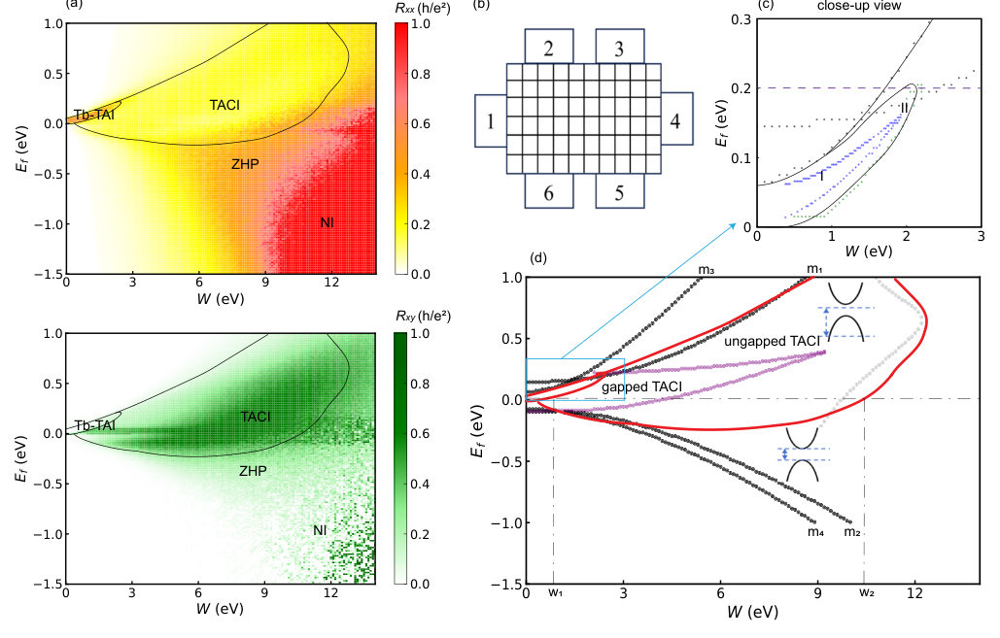 
FIG. 1. Transport calculations by NEGF. (a)Phase diagram calculated by NEGF. Rxx, Rxy versus disorder strength W and Fermi energy Ef. The size is chosen as 200a×200a, a is the lattice constant, with 200 averages. Rxx and Rxy are plotted in red and green color boxes with phase boundaries in black lines, respectively.(b)Schematic diagram of six-terminal Hall bar. (c)Zoom-in on the light blue lines from Fig. 1(d). Region I, demarcated by the blue line, represents gapped TAI(ρ2 = 0). Region II, demarcated by the green line, represents ungapped TAI(ρ2 ≤1/∆2). (d)Phase diagram with phase boundaries only(red lines). Black lines are effective band edges by SCBA labeled as m1 to m4 in which m1 and...

📷 Fig 2

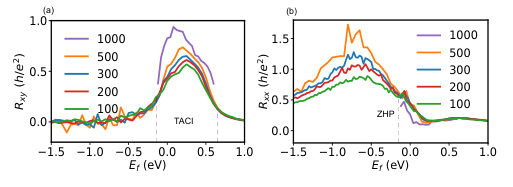 
FIG. 2. Transport calculations by NEGF. (a) Rxy versus Fermi energy Ef at W = 8.5 eV.(b) Rxx versus Fermi energy Ef at W = 8.5 eV. We averaged over 2000 samples for system sizes N=100, 200 and 300, over 400 samples for size 500, and over 100 samples for size N=1000.

📷 Fig 3

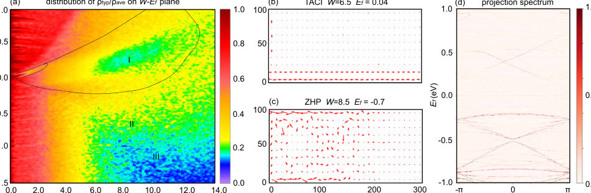 
FIG. 3. Numerical evidence supporting edge states. (a)ρtyp/ρave is calculated in a square sample with size 100 under pe- riodic boundary conditions on the W-Ef plane. (b)Current distribution for device of size 300*100 at W=6.5 eV, Ef=0.04 eV. (c)Current distribution for device of size 300*100 at W=8.5 eV, Ef=-0.7 eV. The calculations are averaged over 5000 configurations. (d)Edge projection of disordered energy spectrum of generalized momentum space, device of size 400*150 at W=8.5 eV.

📷 Fig 4

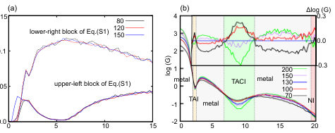 
FIG. 4. Scaling calculations of phase transitions. (a)The dependence of the averaged density of states per site on dis- order strength with size N=80,120,150 at Ef=0.2 eV under periodic boundary conditions. Solid and dashed lines denote upper-left and lower-right blocks of Eq. (S1), respectively. (b)Scaling of logarithmic average of the bulk conductance with size N=70,100,130,150,200 at Ef=0.2 eV under periodic boundary conditions. The upper inset is the difference rel- ative to 130. The calculations were performed by averaging over 4000 realizations.

**Summary.** This work explores how disorder can drive a time-reversal-broken quantum spin Hall state into a topological Anderson Chern insulator (TACI) in MnBi4Te7. Using advanced theoretical methods like NEGF and SCBA, the authors construct a phase diagram revealing multiple disorder-induced phases. The key finding is the stabilization of the TACI and the prediction of a unique zero Hall plateau insulating state at strong disorder.

**Why it may be interesting.** The mechanism by which disorder stabilizes a topological phase (TACI) by controlling band inversions is a rich topic relevant to understanding robustness in engineered quantum materials, which shares conceptual links with disorder effects in quantum computation.

Detailed structure

**Main problem.** The study investigates the complex interplay between disorder and topology, specifically demonstrating that disorder can actively induce topological phases rather than merely destroying them.

**Main result.** The research identifies a novel topological Anderson Chern insulator (TACI) phase, which coexists with a zero Hall plateau insulating state at strong disorder, providing a distinct signature from conventional Chern insulators.

**Method.** The authors employ Density Functional Theory (DFT), Nonequilibrium Green's Function (NEGF) calculations, and the Self-Consistent Born Approximation (SCBA) to map out a comprehensive phase diagram.

**Model / system.** The system under study is the ferromagnetic (FM) monolayer MnBi4Te7, which is modeled using an effective Hamiltonian subjected to Anderson disorder.

**Key observables.** Longitudinal and Hall resistances ($R_{xx}, R_{xy}$), density of states (via SCBA), and the local Chern marker ($\langle 	ext{C}_{	ext{bulk}} 
angle_{	ext{dis}}$).

**Important parameters / regimes.** Disorder strength ($W$), Fermi energy ($E_f$), and critical disorder strengths ($W_{c1}, W_{c2}$).

**Assumptions / limitations.** The analysis relies on finite-size scaling analysis and assumes the initial state is a T-broken QSHE state.

**Figures summary.** Figures illustrate phase diagrams mapping $R_{xx}$ and $R_{xy}$ against disorder strength and Fermi energy, and show the evolution of edge transport signatures and local density of states under varying disorder.

**Paper structure.** The paper progresses by establishing the theoretical framework (DFT/NEGF/SCBA), mapping the phase diagram across different disorder regimes (T-broken TAI $	o$ TACI $	o$ NI), and finally proposing and analyzing the unique zero Hall plateau state.

Abstract

The interplay between disorder and topology has become a central theme in condensed matter physics. Disorder can not only destroy topological phases but also induce them, as exemplified by the topological Anderson insulator (TAI). Here we show that, in close analogy, disorder can drive the clean-limit, time-reversal-broken(T-broken) quantum spin Hall state of ferromagnetic(FM) monolayer MnBi4Te7 into a quantum anomalous Hall phase, which was called topological Anderson Chern insulator (TACI). Using density functional theory (DFT) and nonequilibrium Green's func tion (NEGF) calculations in the presence of disorder, we identify disorder induced phases-including T-broken TAI, TACI, Normal insulator, etc., then construct a comprehensive phase diagram. To discriminate multiple phases in the strong disorder regime, we further use the density of states computed within the self-consistent Born approximation (SCBA), which in particular distinguishes gapped and ungapped topological phases. We find that the two effective band inversions of Hamiltonian are suppressed at distinct critical disorder strengths; the survival of a single inversion over a finite disorder window stabilizes the TACI. Remarkably, at strong disorder, we further propose a zero Hall plateau insulating state characterized by an insulating bulk and edge channels subject to diffusive scattering that can coexist with the TACI. This behavior is distinct from a conventional band-gap Chern insulator and provides a clear experimental signature.

[↑ back to top](#top)

### [Macroscopic Spin GHZ States with a Levitated Ferromagnet](http://arxiv.org/abs/2606.03676v1)

**Authors:** Xueqi Ni, Zhixing Zou, Ping Koy Lam, Tao Wang, Jiangbin Gong  
**Type:** both · **Category:** other · **PDF:** <https://arxiv.org/pdf/2606.03676v1>  
**Analysis basis:** full PDF text, analyzed in chunks
**Topic relevance:** `entanglement & information structure` **3/5** · `spintronics-quantum-optics interface` **3/5** · `analog quantum simulation` **2/5** · `driven-dissipative phase transition` **2/5** · `exotic spin models in light-matter` **2/5** · `methods for driven-dissipative` **2/5** · `non-equilibrium dynamics` **2/5** · `Keldysh / 2PI / non-Gaussian methods` **1/5** · `QC/QI experiment` **1/5** · `correlated / nonlocal dissipation` **1/5** · `correlated cavity matter` **1/5** · `non-equilibrium universality` **1/5** · `quantum measurements` **1/5** · `quantum optics experiment` **1/5**

📷 Fig 1

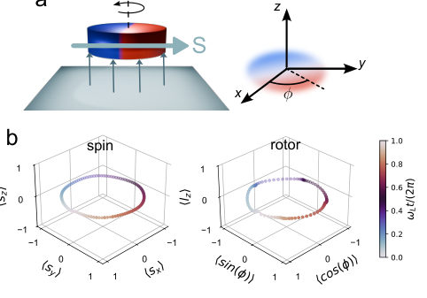 
FIG. 1. Spin-lattice coupling in a levitated ferromag- net. (a) Schematic of a levitated ferromagnet, where the collective spin couples to the mechanical rotation of the lat- tice. The orientation of the lattice is depicted by a rotation angle ˆϕ in Cartesian coordinates. (b) Time evolution of the spin (left) and mechanical rotor (right) degrees of freedom in a static magnetic field, demonstrating locked precessional motion with finite-size dynamical fluctuations arising from spin-lattice angular-momentum exchange.

📷 Fig 2

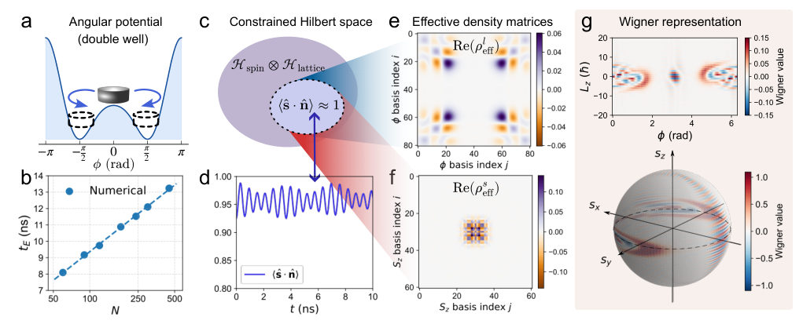 
FIG. 2. Generation and phase space representation of macrospin GHZ states. (a) Illustration of a levitated fer- romagnet in an angular double-well potential. (b) Delocalization time tE versus spin number N. Numerical simulation results (dots) follow a logarithmic dependence fitted by tE ≈2.48 ln N (dashed line), using parameters (V1, V2, V3)/NℏωL = (−0.015, 0.05, −0.025). (c) Conceptual mapping of the full tensor-product Hilbert space onto the constrained subspace. (d) ⟨ˆs · ˆn⟩vs time, reflecting strong spin-lattice locking. (e) Real part of effective density matrix ˆρl eff in the rotor basis. Basis indices are ordered from 0 to 2π. (f) Real part of the effective density matrix ˆρs eff in...

📷 Fig 3

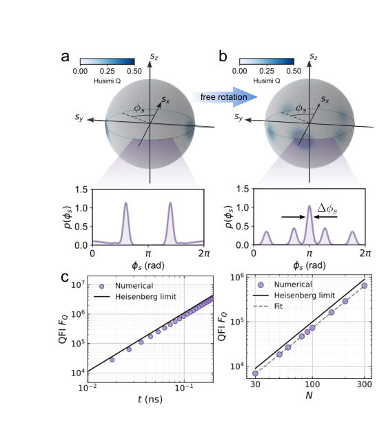 
FIG. 3. Readout protocol and Heisenberg-limited magnetometry. (a-b) Spin Husimi Q distributions repre- senting the recombination of superimposed states via free ro- tation, and corresponding probability distributions of magne- tization angle ϕs (a) before and (b) after recombination. (c) Quantum Fisher information for a transverse magnetic field By as a function of time (left) and number of spins (right).

📷 Fig 4

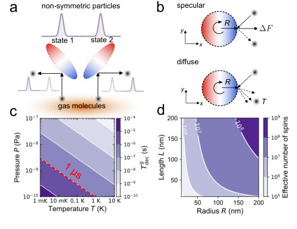 
FIG. 4. Gas collisions and decoherence time scales. (a) For a non-symmetric object, a single gas-molecule collision can reveal the underlying orientation and thus induce rapid decoherence. (b) Schematics of specular and diffuse collisions, as explained in the main text. (c) Required pressures and tem- peratures corresponding to different decoherence time scales due to diffuse gas collisions for a cylinder with aspect ratio R/L = 0.5 and N = 107, surrounded by N2 gas molecules. The dashed line corresponds to a 1 µs coherence window. (d) Effective spin numbers for a cylindrical nanomagnet calcu- lated using N = MsπR2L/gµB, where Ms = 1.44 × 106 A/m is the saturated magnetization, g is the...

**Summary.** This paper proposes using a levitated ferromagnet to generate macroscopic spin GHZ states by exploiting strong coupling between the collective spin and the mechanical rotor. By analyzing the constrained dynamics, the authors demonstrate that the system can achieve Heisenberg-limited precision for quantum sensing. The work is significant for both fundamental tests of quantum mechanics and developing ultra-sensitive quantum sensors.

**Why it may be interesting.** This work is highly relevant as it merges concepts from cavity QED (trapping/levitation), quantum sensing (QFI scaling), and open quantum systems (Lindblad master equations) to realize a macroscopic quantum system.

Detailed structure

**Main problem.** The work focuses on generating and characterizing macroscopic quantum states, specifically GHZ states, using a levitated ferromagnet to study quantum-to-classical transitions and test fundamental physics.

**Main result.** The strong spin-lattice coupling allows the mechanical degree of freedom to coherently drive the spin system into a non-classical regime, achieving near-Heisenberg-limited metrological scaling.

**Method.** The authors employ a top-down approach, analyzing the system dynamics by constraining the Hilbert space based on the spin-lattice locking condition and calculating the Quantum Fisher Information.

**Model / system.** The physical system is a levitated ferromagnet whose collective spin is coupled to its mechanical rotation (lattice). The dynamics are governed by a Hamiltonian involving spin-lattice coupling, and the evolution is analyzed using master equations and Wigner quasiprobability distributions.

**Key observables.** Quantum Fisher Information (QFI), macroscopic spin superposition state signatures (GHZ state), and the spin-lattice locking correlator $\langle \hat{s} \cdot \hat{n} 
angle$.

**Important parameters / regimes.** Decoherence rates ($\Gamma_{	ext{dec}}$), required ultrahigh vacuum pressures ($\sim 10^{-9} 	ext{ Pa}$), and the spin number $N$ (up to $10^7$).

**Assumptions / limitations.** The analysis relies heavily on the strong spin-lattice locking condition to define a constrained subspace, and approximations are made for decoherence modeling (e.g., high-temperature limits).

**Figures summary.** Figures illustrate the spin-lattice coupling schematic, the double-well potential for GHZ state generation, the phase space representation of the macrospin GHZ states, and the scaling of QFI with spin number.

**Paper structure.** The paper progresses from establishing the physical platform and the strong coupling mechanism, to deriving the effective dynamics and constrained Hilbert space, quantifying the metrological advantage via QFI, and finally analyzing decoherence from environmental noise sources.

Abstract

The generation of macroscopic quantum states can drive both fundamental physics and quantum technologies. This work proposes a top-down approach to the generation of macroscopic spin GHZ states using a levitated ferromagnet, where a strong locking between the collective spin and the lattice rotation enables mechanical control of the collective spin. We quantify the metrological advantage of the resulting macrospin superposition state by showing that Heisenberg scaling of the quantum Fisher information is achievable. Roles of symmetry and geometry are analyzed in terms of decoherence due to gas collisions, identifying accessible conditions for experimental realization. The usefulness of a macrospin superposition state of a levitated cylindrical ferromagnet in testing spin-dependent wavefunction collapse models is also discussed.

[↑ back to top](#top)

### [Generating quantum ensembles via reverse-time quantum diffusions](http://arxiv.org/abs/2606.03848v1)

**Authors:** Maël Bompais, Mădălin Guţă, Juan P. Garrahan  
**Type:** theory · **Category:** statistical mechanics · **PDF:** <https://arxiv.org/pdf/2606.03848v1>  
**Analysis basis:** full PDF text, analyzed in chunks
**Topic relevance:** `measurement-induced transitions` **3/5** · `methods for driven-dissipative` **3/5** · `quantum measurements` **3/5** · `non-equilibrium dynamics` **2/5** · `Keldysh / 2PI / non-Gaussian methods` **1/5** · `analog quantum simulation` **1/5** · `correlated / nonlocal dissipation` **1/5** · `driven-dissipative phase transition` **1/5** · `entanglement & information structure` **1/5** · `non-equilibrium universality` **1/5**

📷 Fig 1

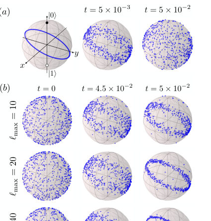 
FIG. 1: (a) Forward (noising) dynamics for the 2-level example for samples from an initial measure over pure states µ0(ψ) corresponding to a great circle in the Bloch sphere. Under the noising dynamics the samples evolve towards a uniform µinv = 1/4π. (b) Backward denoising dynamics starting from uniformly distributed samples, for various levels ℓmax of approximation of the score, see [13] for details. At long times the initial µ0(ψ) is reconstructed, thus transforming noisy initial pure states to samples of the distribution of interest.

📷 Fig 2

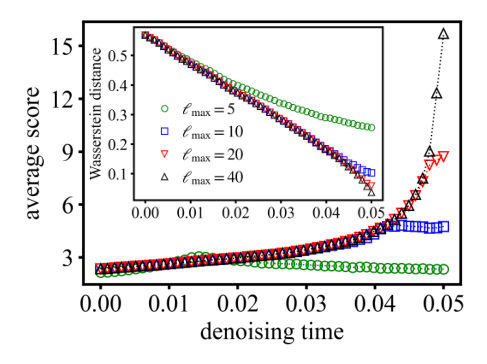 
FIG. 2: Norm of the average reverse Hamiltonian in Eq.(20) as a function of denoising time in the two-level example, for several variational cut-offs ℓmax. Inset: Wasserstein distance of the learned distribution of ˜ψ to the target distribution, as a function of denoising time.

**Summary.** This paper develops a rigorous theory for generating complex quantum state ensembles by implementing a reverse-time quantum diffusion process. It shows that the reverse dynamics is a controlled quantum diffusion whose Hamiltonian acts as a quantum score function. This provides a general, principled method for quantum state preparation from simple noise distributions.

**Why it may be interesting.** This work provides a powerful, general mathematical tool for quantum state preparation and tomography, linking modern machine learning generative models (diffusion models) directly to fundamental open quantum system dynamics.

Detailed structure

**Main problem.** The paper establishes a principled framework to generate complex quantum state ensembles by reversing a quantum diffusion process, analogous to classical score-based generative models.

**Main result.** It derives the exact reverse-time dynamics, showing it is a feedback-controlled quantum diffusion governed by a state-dependent Hamiltonian that acts as the quantum analogue of the score function.

**Method.** The derivation involves analyzing the reverse-time transition kernel using Bayes' formula and solving the corresponding backward Kolmogorov equation to find the required stochastic differential equation (SDE).

**Model / system.** The system involves quantum states evolving via continuous measurement, modeled by a forward Stochastic Schrödinger Equation (SSE) leading to an invariant distribution. The reverse process is a controlled quantum diffusion.

**Key observables.** The Wasserstein distance $W_1(	ilde{\mu}_t, \mu_0)$ is used to confirm convergence to the target distribution $\mu_0$. The mean Frobenius norm of the reverse Hamiltonian $\mathbb{E}[\|	ilde{H}_t(	ilde{\psi}_t)\|^2]$ is also monitored.

**Important parameters / regimes.** The time parameter $t$ (or $T-t$), the initial distribution $\mu_0$, and the invariant distribution $\mu_{	ext{inv}}$ are key. The Hamiltonian $	ilde{H}_t(\psi)$ depends explicitly on the instantaneous state $\psi$.

**Assumptions / limitations.** The derivation assumes suitable regularity conditions for the transition kernel and relies on the Markov property. For specific examples, rotational symmetry around an axis $\hat{n}$ is assumed.

**Figures summary.** Figure 1 illustrates the forward noising dynamics spreading samples from $\mu_0$ towards $\mu_{	ext{inv}}$ and the reverse-time dynamics reconstructing $\mu_0$ from $\mu_{	ext{inv}}$. Figure 2 shows the convergence of the Wasserstein distance and the Hamiltonian norm for a qubit example.

**Paper structure.** The paper first establishes the general theory by deriving the reverse-time SDE from the forward process's transition kernel. It then proves necessary algebraic conditions for the reverse Hamiltonian and applies these results to specific, solvable models (like the qubit) to explicitly calculate the score function and the final Hamiltonian.

Abstract

We establish a reverse-time denoising theory for quantum diffusions of continuously measured quantum systems. Starting from the stochastic Schrödinger equation of a forward noising dynamics, we derive the exact reverse-time dynamics for quantum trajectories, whose law coincides with the time-reversal of the original process. We prove that the denoising dynamics is a physically admissible quantum diffusion, with the same measurement-induced noise but a state-dependent feedback Hamiltonian, a direct analogue of the "score function" of generative classical diffusion models. This provides a principled framework for converting samples of a simple distribution into those of a more complex ensemble of quantum states. We show how the denoising dynamics can be directly learnt from forward trajectory data, and how to exploit purification to initialise the denoising process.

[↑ back to top](#top)

### [Triple exceptional point with unitary paths of unfolding in a three-site fermionic Swanson-like model](http://arxiv.org/abs/2606.03789v1)

**Authors:** Bijan Bagchi, Aritra Ghosh, Miloslav Znojil  
**Type:** theory · **Category:** other · **PDF:** <https://arxiv.org/pdf/2606.03789v1>  
**Analysis basis:** full PDF text, analyzed in chunks
**Topic relevance:** `driven-dissipative phase transition` **3/5** · `methods for driven-dissipative` **3/5** · `Keldysh / 2PI / non-Gaussian methods` **2/5** · `analog quantum simulation` **2/5** · `non-equilibrium dynamics` **2/5** · `non-equilibrium universality` **2/5** · `Kondo & dissipative impurity` **1/5** · `correlated / nonlocal dissipation` **1/5** · `entanglement & information structure` **1/5**

📷 Fig 1

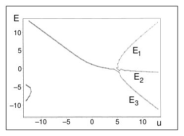 
Figure 2: Numerical localization of the real (i.e., bound-state) energy levels suggesting their degeneracy near u ≈u(EP 3) = 5.

📷 Fig 2

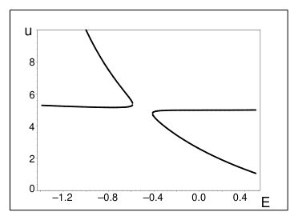 
Figure 3: Avoided crossing of energy levels in the central part of Figure 2 (magnified).

**Summary.** This theoretical paper studies a three-site fermionic model to analyze the complex physics occurring at a Triple Exceptional Point (EP3) singularity. Using advanced techniques from quasi-Hermitian quantum mechanics, the authors map out the conditions under which the system's energy spectrum remains real and observable during the singularity's unfolding. The findings highlight the necessity of fine-tuning parameters to maintain physical stability near such degeneracies.

**Why it may be interesting.** This work provides a detailed, exactly solvable model to study non-Hermitian quantum dynamics, which is crucial for understanding open quantum systems, parity-time symmetry breaking, and spectral singularities in quantum optics and AMO physics.

Detailed structure

**Main problem.** The paper investigates the quantum-mechanical unitary evolution process leading to the loss of observability at a Triple Exceptional Point (EP3) singularity.

**Main result.** The authors demonstrate that the EP3 singularity exists in a three-site fermionic model and that the system's stability (real spectrum) near this point requires fine-tuning of parameters, avoiding naive level crossings.

**Method.** The analysis employs quasi-Hermitian quantum mechanics (QHQM), perturbation theory, and the construction of transition matrices to analyze the spectral flow near the singularity.

**Model / system.** The system is a three-site fermionic generalization of the bosonic Swanson model, described by a five-parametric Hamiltonian. The analysis extends known two-site results to this three-site structure.

**Key observables.** Energy eigenvalues (E), the degree of degeneracy (EP3), and the reality/complexity of the energy spectrum during unfolding.

**Important parameters / regimes.** The five Hamiltonian parameters (a, A, B, d, u), and the small perturbation parameter $\lambda$ (or $
ho = |\lambda|^{1/3}$).

**Assumptions / limitations.** The analysis relies on the mathematical framework of QHQM and assumes that the system's physical interpretation is maintained by restricting the parameters to a specific 'channel of unitarity'.

**Figures summary.** Figures illustrate the avoided crossing of energy levels near the EP3 singularity, showing that the expected real-level crossing is avoided, and the spectrum exhibits complex (resonant) branches for certain parameter ranges.

**Paper structure.** The paper progresses from analyzing the two-site model exhibiting an EP2, to generalizing the Hamiltonian to three sites, establishing the five-parametric form, and finally analyzing the unfolding dynamics near the EP3 singularity using perturbation theory.

Abstract

A fermionic three-site generalization of the popular bosonic Swanson model is studied as providing an exactly solvable five-parametric example of the quantum-mechanical unitary-evolution process leading to an ultimate loss of the observability and fall in an exceptional-point singularity (EP3). The instant of degeneracy is found to have an explicit one-parametric form. Its unitarity-compatible vicinity (i.e., the corridor of access to EP3) is also specified in closed form. The exact, numerical-error-independent solvability is found essential due to another, avoided, false energy-level crossing which is found to occur not too far from the true EP3 singularity.

[↑ back to top](#top)

### [Geometric Bounds on the Finite-Time Performance of Active Machines](http://arxiv.org/abs/2606.03205v1)

**Authors:** Geng Li, Z. C. Tu  
**Type:** theory · **Category:** statistical mechanics · **PDF:** <https://arxiv.org/pdf/2606.03205v1>  
**Analysis basis:** full PDF text, analyzed in chunks
**Topic relevance:** `driven-dissipative phase transition` **3/5** · `non-equilibrium dynamics` **3/5** · `non-equilibrium universality` **3/5** · `Keldysh / 2PI / non-Gaussian methods` **2/5** · `correlated / nonlocal dissipation` **2/5** · `methods for driven-dissipative` **2/5** · `analog quantum simulation` **1/5**

📷 Fig 1

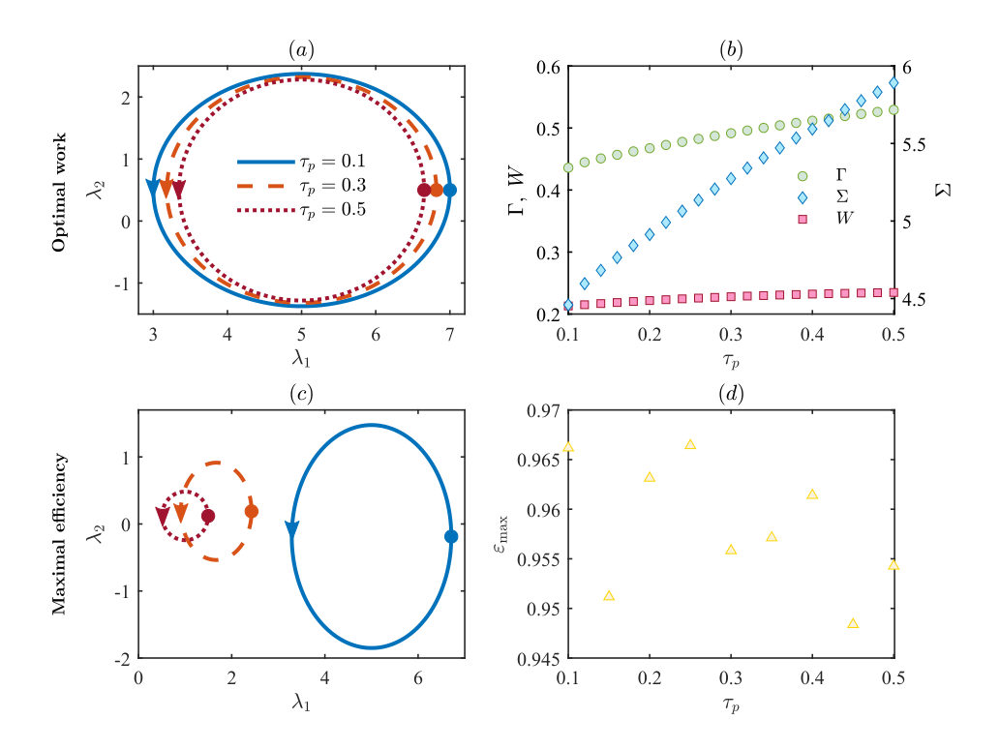 
FIG. 1. Optimal driving cycles in parameter space. Throughout the simulations, we set γ = 1, T = 1, and v = 1. Panels (a) and (c) show the optimal protocols maximizing the output power and efficiency, respectively, for different persistence times τp. The circular markers denote the initial points of the cycles, while the arrows indicate the driving directions. The protocol duration is fixed at τ = 20. As τp increases, the optimal cycles progressively shrink toward weakly dissipative regions, reflecting the increasing energetic cost associated with irreversible driving. Panels (b) and (d) display the corresponding optimal power and maximal efficiency. Increasing persistence enhances the...

**Summary.** This work introduces a geometric thermodynamic framework to analyze how active matter machines convert energy over finite time scales. It shows that the system's performance is governed by a decomposition of work into a curvature term (work extraction) and a metric term (dissipation). This establishes a fundamental, geometric link between active matter physics and established concepts like thermoelectric efficiency.

**Why it may be interesting.** The geometric framework linking work extraction to curvature, and the direct analogy drawn to thermoelectric devices, provides powerful, general tools for analyzing non-equilibrium energy conversion in complex systems, which is relevant to open quantum systems.

Detailed structure

**Main problem.** The paper develops a unified thermodynamic framework to characterize the finite-time performance of interacting active machines operating far from equilibrium.

**Main result.** It establishes that the performance bounds (efficiency and power) of active machines share the functional form of thermoelectric devices with broken time-reversal symmetry, linking active matter geometry to energy conversion limits.

**Method.** The analysis uses stochastic thermodynamics, linear response theory, and geometric decomposition, showing that work decomposes into an antisymmetric curvature term and a symmetric dissipation metric.

**Model / system.** The model involves $N$ interacting overdamped self-propelled particles (active matter) driven by external protocols ($\lambda(t)$) and subject to thermal noise. The dynamics are analyzed using Langevin equations.

**Key observables.** Cyclic work ($W$), heat ($Q$), power ($P$), efficiency ($\varepsilon$), asymmetry parameter ($r$), and the figure of merit ($\phi$).

**Important parameters / regimes.** The asymmetry parameter ($r$), the protocol shape ($C$), and the time scale ($	au$) are crucial for determining performance bounds.

**Assumptions / limitations.** The analysis relies heavily on the slow-driving and weak-driving limits, utilizing linear response theory approximations.

**Figures summary.** Figures illustrate optimal driving cycles in parameter space, showing how increasing persistence shrinks optimal cycles toward weakly dissipative regions.

**Paper structure.** The paper progresses by first defining the thermodynamic framework, decomposing work into geometric components, deriving scaling relations for work and heat using linear response, and finally applying these results to determine maximal efficiency and power output.

Abstract

Optimizing energy conversion in active matter remains a central challenge in nonequilibrium physics. Here, we develop a unified thermodynamic framework that characterizes the finite-time performance of interacting active machines. We show that cyclic work admits a geometric decomposition into an antisymmetric thermodynamic curvature, governing work extraction, and a symmetric metric, controlling dissipation. Minimal-dissipation protocols follow geodesics in parameter space, while optimal work extraction deviates from them due to a curvature-induced, Lorentz-like effect. This geometric structure directly determines the finite-time scaling of work and dissipation, enabling a mapping onto Onsager-type quasi-linear current--force relations. We show that both the maximal efficiency and the efficiency at maximum power are governed by an asymmetry parameter and a figure of merit, establishing a formal correspondence between active machines and thermoelectric devices with broken time-reversal symmetry. Our results reveal a fundamental geometric origin of energy-conversion performance and provide a general framework for optimizing active machines.

[↑ back to top](#top)

### [Simulating Condensed Matter Physics on Quantum Hardware](http://arxiv.org/abs/2606.02721v1)

**Authors:** Ruizhe Shen, Tianqi Chen, Tommy Tai, Jin Ming Koh, Pouyan Ghaemi, Ching Hua Lee  
**Type:** both · **Category:** strongly correlated electrons · **PDF:** <https://arxiv.org/pdf/2606.02721v1>  
**Analysis basis:** full PDF text, analyzed in chunks
**Topic relevance:** `analog quantum simulation` **3/5** · `entanglement & information structure` **3/5** · `non-equilibrium dynamics` **3/5** · `QC/QI experiment` **2/5** · `Rydberg arrays` **2/5** · `exotic spin models in light-matter` **1/5** · `methods for driven-dissipative` **1/5**

📷 Fig 1

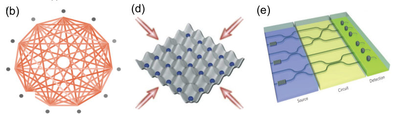 
FIG. 1. Representative platforms for quantum simulation. (a) Superconducting qubits arranged in a two-dimensional lattice with tunable couplers [83], (b) Trapped-ion processor with all-to-all qubit connectivity [177], (c) Rydberg atoms in optical tweezers with interactions among excited levels [75], (d) Ultracold atoms in an optical lattice, where laser fields create periodic trapping potentials [178], (e) Photonic quantum simulator comprising single-photon sources, integrated optical circuits, and detection modules [90].

📷 Fig 2

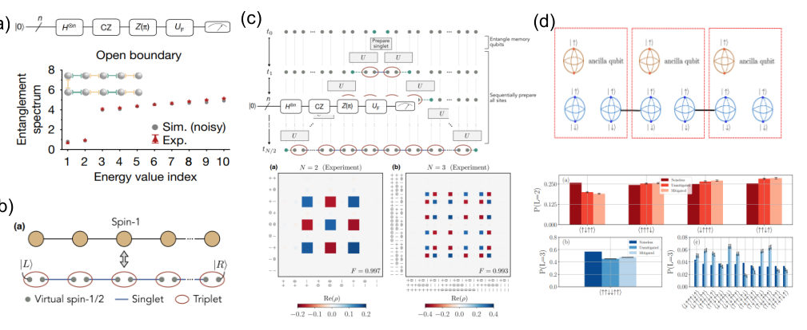 
FIG. 2. Experimental demonstrations of exactly solved SPT and AKLT-type quantum states on noisy quantum hardware. (a) Preparation and characterization of a one-dimensional symmetry-protected topological (SPT) state using a circuit composed of global Hadamard gates and controlled-Z gates. The lower plot shows the corresponding entanglement spectrum extracted from experimental measurements (red triangles) and noisy simulations (gray circles), revealing the expected low-lying degeneracies associated with the open-boundary SPT phase. [411]. (b) Conceptual illustration of the Affleck–Kennedy–Lieb–Tasaki (AKLT) construction, where each physical spin-1 is represented by two virtual spin-1/2...

📷 Fig 3

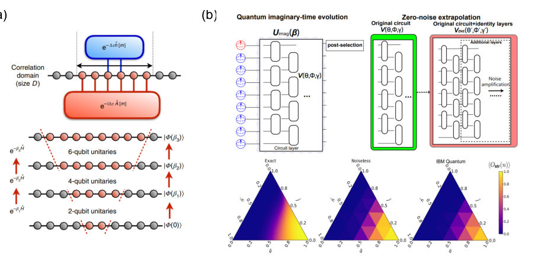 
FIG. 3. Quantum imaginary-time evolution and error-mitigated simulation of quantum phases. (a) Schematic illustration of the quantum imaginary-time evolution (QITE) algorithm. The non-unitary imaginary-time operator is approximated by a sequence of local unitary transformations [423]. (b) Experimental workflow combining QITE with zero-noise extrapolation (ZNE). Left: the parametric unitary ansatz. Right: ZNE evaluates observables using the original circuit (green) and its noise- amplified versions with extra identity layers (red) inserted. Bottom: comparison of the string-order parameter, predicted by exact theory, a noiseless simulator, and data collected on IBM Quantum hardware. The...

📷 Fig 4

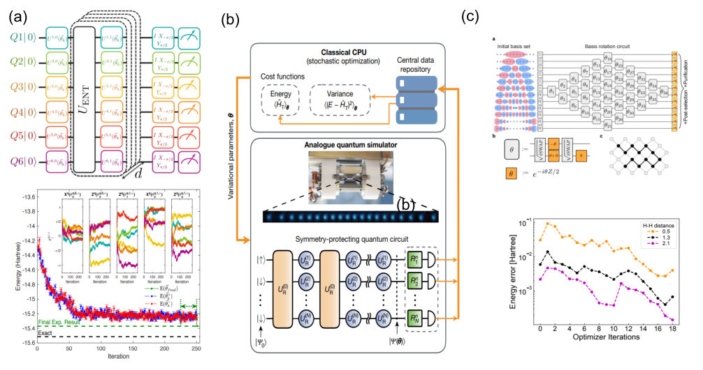 
FIG. 4. Representative quantum hardware demonstrations of variational quantum solvers. (a) First proof-of-principle hard- ware implementation of the variational quantum eigensolver (VQE) using a programmable superconducting-qubit processor. An entangling unitary followed by local single-qubit rotations prepares parameterized trial states. The lower panel shows measured energy trajectories compared with exact theoretical values. [211]. (b) Demonstration of a hybrid analog–digital VQE approach. A classical optimizer updates the variational parameters, while an analog trapped-ion quantum simulator evaluates cost functions, such as the energy. A symmetry-protecting quantum circuit enhances the...

📷 Fig 5

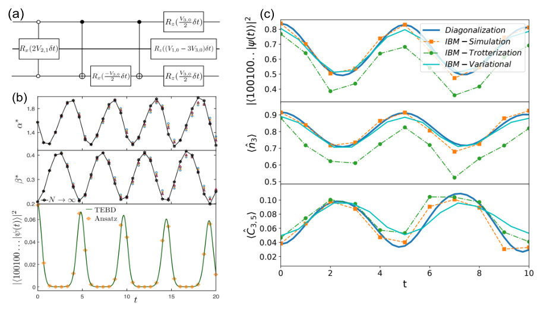 
FIG. 5. (a) Circuit implementation of the trotterized unitary Uℓrepresenting one local unit of the FQH spin chain in Eq. 43. (b) Top two panels: Optimal variational parameters α∗and β∗[Eq. 48] for the 1/3-filled FQH ground state for N = 7 to 13 particles, and their extrapolation to N→∞(solid black line). These optimal parameters vary smoothly with time and importantly exhibit negligible variation with system size. Bottom panel: Excellent agreement in the overlap of the time evolved state with the root state between that computed from TEBD simulations for N=60, and that from the variational ansatz [Eq. 48] extrapolated to the same system size. TEBD simulations were performed using a bond...

**Summary.** This review surveys the state-of-the-art in using quantum hardware to simulate condensed matter physics, covering platforms from superconducting qubits to ultracold atoms. It details the methodologies for simulating complex phenomena like strong correlations and topological phases using both analog and digital quantum simulation techniques. The paper emphasizes that current noisy experiments are vital for prototyping the error control necessary for future fault-tolerant quantum simulation.

**Why it may be interesting.** It provides a comprehensive roadmap connecting the theoretical necessity of simulating strongly correlated matter to the practical, hardware-specific implementations and necessary error-correction protocols.

Detailed structure

**Main problem.** The core challenge is simulating the complex, many-body collective behavior of quantum materials, such as those exhibiting strong electronic correlations, topological order, or non-equilibrium dynamics.

**Main result.** The review surveys the progress across multiple quantum hardware platforms, demonstrating that current noisy simulations serve as crucial prototypes for developing the error control and encoding strategies needed for future fault-tolerant quantum simulation.

**Method.** The paper reviews both analog simulation (engineering continuous dynamics) and digital simulation (implementing evolution via programmable quantum gates) across various hardware architectures.

**Model / system.** The scope covers diverse physical models including the Hubbard model, topological phases, lattice gauge theories, and non-equilibrium systems. Hardware platforms discussed include superconducting qubits, trapped ions, ultracold atoms in optical lattices, and Rydberg arrays.

**Key observables.** Entanglement entropy, topological invariants, ground-state energies, and real-time dynamics are key diagnostics used to characterize quantum phases.

**Important parameters / regimes.** Coherence times, gate fidelity, interaction strengths (e.g., $E_J/E_C$), and lattice geometry (1D, 2D, 3D) are critical parameters defining platform capabilities.

**Assumptions / limitations.** The primary assumption is that quantum simulation is a viable path forward, viewing current NISQ devices as necessary stepping stones toward fault-tolerant computation.

**Figures summary.** The figures illustrate the diverse quantum hardware platforms available for simulation, including superconducting lattices, trapped-ion processors, Rydberg arrays, and optical lattices.

**Paper structure.** The review is structured by first surveying major hardware platforms, then introducing the basic building blocks of digital quantum simulation, and finally discussing representative applications across ground-state, topological, and non-equilibrium physics.

Abstract

Quantum hardware platforms are getting increasingly sophisticated in their ability to simulate condensed matter, including but not limited to strongly-correlated, topological, and non-equilibrium phenomena. This review surveys recent progress in quantum-hardware-based simulations of condensed matter, primarily emphasizing gate-based digital quantum computer simulation, with analog experiments discussed as complementary benchmarks. We first review major hardware platforms, including superconducting qubits, trapped-ions, ultracold atoms, Rydberg arrays, photonic systems, and moire quantum materials. We then introduce the basic ingredients of digital quantum simulation. Building on this foundation, we discuss representative applications to condensed-matter physics, spanning ground-state problems, strongly correlated matter, topological phases, non-equilibrium dynamics, open-system physics, and high-energy-physics-inspired simulations. Finally, we summarize key methodological tools used in state-of-the-art quantum-simulation workflows. We emphasize that present noisy quantum simulations serve not only as near-term demonstrations, but also as prototypes for the encodings, diagnostic protocols and error-control strategies required for future fault-tolerant quantum simulation.

[↑ back to top](#top)

### [Deterministic generation of cat states with more than $100$ photons under dissipation](http://arxiv.org/abs/2606.03293v1)

**Authors:** Zhu-yao Jin, Jun Jing  
**Type:** theory · **Category:** quantum information and computing · **PDF:** <https://arxiv.org/pdf/2606.03293v1>  
**Analysis basis:** full PDF text, analyzed in chunks
**Topic relevance:** `driven-dissipative phase transition` **3/5** · `methods for driven-dissipative` **3/5** · `Keldysh / 2PI / non-Gaussian methods` **2/5** · `non-equilibrium dynamics` **2/5** · `non-equilibrium universality` **2/5** · `correlated / nonlocal dissipation` **1/5** · `entanglement & information structure` **1/5**

📷 Fig 1

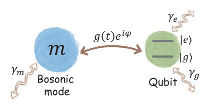 
FIG. 1. Sketch of the open hybrid qubit-bosonic system, where the qubit is longitudinally coupled to the bosonic mode with the coupling strength g(t) and the phase ϕ. γe, γg and γm denote the gain or loss rates of the levels |e⟩and |g⟩and the bosonic mode, respectively. When γa = 0, a = e, g, m, it reduces to a closed qubit-bosonic system.

📷 Fig 2

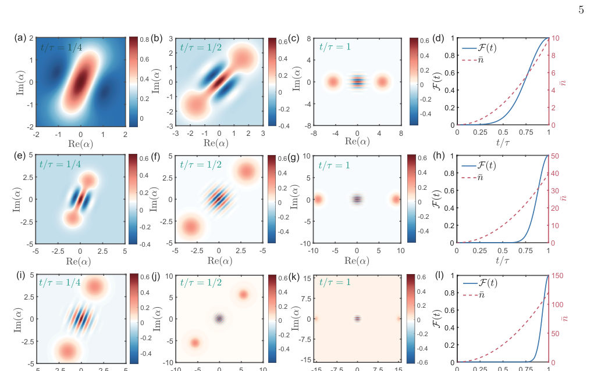 
FIG. 2. Wigner functions of specific moments t/τ describing the evolution process of the resonator from vacuum state to cat state. The first three panels of each line, e.g., (a-c), (e-g), and (i-k) are associated with the resonator states |ψb(t)⟩with various amplitudes or |α|, obtained by performing projective measurement on the basis |+⟩of the qubit. The relevant dynamics about the target state fidelity and the mean photon number for the final entangled states |Ψ(τ)⟩= (|C+ α (τ)⟩⊗|+⟩−|C− α (τ)⟩⊗|−⟩)/ √

📷 Fig 3

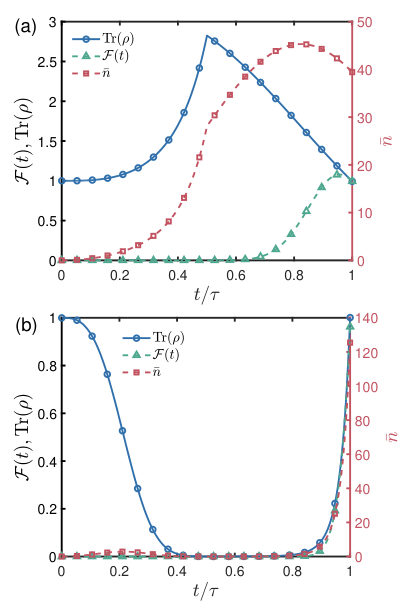 
FIG. 3. Dynamics of the density-matrix trace about the whole system Tr[ρ(t)], the fidelity F(t) with respect to the target state |Ψ(τ)⟩= (|C+ α (τ)⟩⊗|+⟩−|C− α (τ)⟩⊗|−⟩)/ √

📷 Fig 4

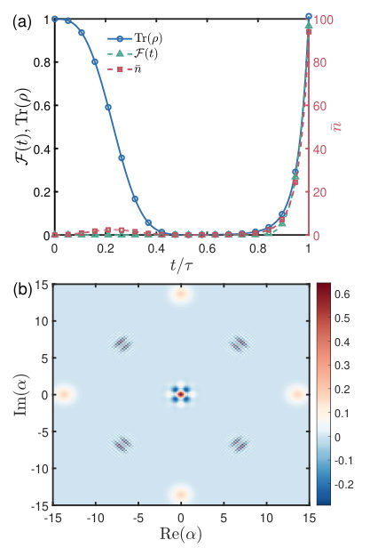 
FIG. 4. (a) Dynamics of the density-matrix trace of Tr(ρ), the target state fidelity F(t), and the mean photon num- ber ¯n of the final entangled state |Ψ(τ)⟩in Eq. (42), and (b) Wigner function for the relevant four-legged cat state |ψb(τ)⟩= |C+ α (τ)⟩+ |C+ iα(τ)⟩at t = τ, obtained by a projec- tive measurement on |+⟩1|+⟩2 of the composite system. The parameters are set the same as Fig. 3(b) except θ(t) = 3πt/τ.

**Summary.** This paper presents a theoretical protocol for deterministically generating large-amplitude Schrödinger cat states in hybrid qubit-bosonic systems, even when dissipation is present. By leveraging the dynamical invariant within the framework of Universal Quantum Control, the authors achieve high-fidelity generation of states with over 100 photons. This advances the control theory for hybrid quantum systems, making large-scale quantum state preparation more feasible.

**Why it may be interesting.** This work provides a powerful theoretical extension of UQC theory to hybrid discrete-continuous variable systems, offering a robust method to create macroscopic quantum states essential for quantum metrology and computation despite environmental decoherence.

Detailed structure

**Main problem.** The paper addresses the challenge of deterministically generating large-size Schrödinger cat states (with over 100 photons) while operating under the influence of dissipation.

**Main result.** A protocol was developed that deterministically generates these large cat states with high fidelity, achieving a mean photon number exceeding 120 in both Hermitian and non-Hermitian regimes.

**Method.** The methodology utilizes Universal Quantum Control (UQC) theory by analyzing the dynamical invariant of the hybrid qubit-bosonic system under time-dependent, potentially non-Hermitian Hamiltonians.

**Model / system.** The system modeled is a hybrid qubit-bosonic system, whose dynamics are governed by a time-dependent Hamiltonian, analyzed through the dynamical invariant $\mu(t)$ in the ancillary picture.

**Key observables.** Fidelity ($F$), mean photon number ($ar{n}$), and the evolution of the dynamical invariant $\mu(t)$.

**Important parameters / regimes.** Mean photon number $ar{n} > 100$; fidelity $>0.962$ (non-Hermitian); cat state amplitude $|\alpha|$; time evolution parameters $eta(t)$ and $	heta(t)$.

**Assumptions / limitations.** The analysis relies on transforming the system dynamics into a rotating frame and constraining the Hamiltonian such that the dynamical invariant can be controlled.

**Figures summary.** Figures illustrate the Wigner functions showing the interference pattern of the generated cat states, and plots track the fidelity, mean photon number, and trace of the density matrix across different stages of the generation protocol.

**Paper structure.** The paper builds from the general theory of UQC for hybrid systems, details the Hamiltonian and transformation into the rotating frame, derives the evolution of the dynamical invariant, and finally applies this framework to generate specific types of cat states (intrinsic and four-legged) in both closed and open systems.

Abstract

Large-size cat states are especially meaningful and fundamental for exploring the quantum-to-classical transition, as well as promising resources for quantum metrology and fault-tolerant quantum computation. However, amplifying the magnitude of cat states remains challenging because of the growing fragility under decoherence. We propose to generate large cat states by using the dynamical invariant of hybrid qubit-bosonic systems under Hermitian or non-Hermitian time-dependent Hamiltonian. It is a study with the universal quantum control (UQC) theory, in which the system dynamics is analyzed in the ancillary picture via a unitary transformation conditional on the qubit state. The controllable dynamics that can be encoded in the evolution of the dynamical invariant is presented by the Heisenberg equation, which imposes constrains on the Hamiltonian. When the qubit is prepared in a balanced superposed state, the bosonic mode can evolve deterministically from the vacuum state to the cat state of a mean photon number over $120$. In the Hermitian case, the generation is perfect; and in the non-Hermitian case, the fidelity is over $0.962$. Our protocol can also be applied to the generation of the intrinsic cat states and the four-component cat states of large size. Through the preparation of macroscopic quantum states, our work essentially advances UQC to hybrid discrete-continuous variable systems.

[↑ back to top](#top)

### [Characterizing quantum channels from local-unitary invariants](http://arxiv.org/abs/2606.03722v1)

**Authors:** Salwa Shaglel, Satoya Imai  
**Type:** theory · **Category:** quantum information and computing · **PDF:** <https://arxiv.org/pdf/2606.03722v1>  
**Analysis basis:** full PDF text, analyzed in chunks
**Topic relevance:** `entanglement & information structure` **3/5** · `correlated / nonlocal dissipation` **2/5** · `driven-dissipative phase transition` **2/5** · `methods for driven-dissipative` **2/5** · `Keldysh / 2PI / non-Gaussian methods` **1/5** · `non-equilibrium dynamics` **1/5** · `non-equilibrium universality` **1/5**

📷 Fig 1

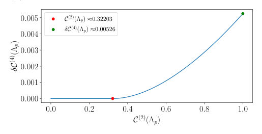 
Figure 1. (a) Representation of entangling and non-entangling channels in the space spanned by the second and fourth mo- ments, C(2)(Λp) and C(4)(Λp), for a two-qubit channel model Λp defined in Eq. (10). All non-entangling cases are contained in the hashed region characterized by the dashed red curves with FNE[C(2)(Λp), C(4)(Λp)] ≥0, presented in Observation 2. The blue region corresponds to entanglement-creating cases, which marks the improvement of the criterion in Observa- tion 1. The inset shows several well-known unitaries with p = 1 according to their canonical parameters c given in Ta- ble I. (b) The gap δC(4)(Λp) between the red and black lower curves in Fig. 1 (a) with increasing...

📷 Fig 2

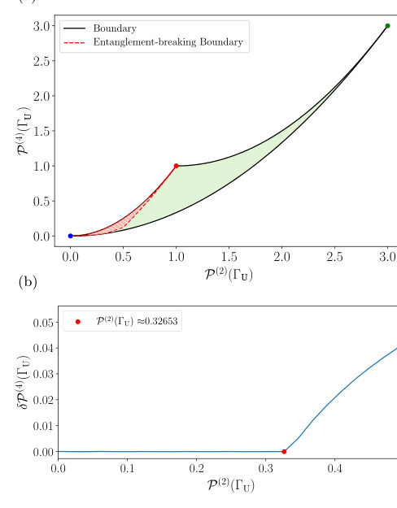 
Figure 2. (a) Representation of entanglement-preserving and entanglement-breaking channels in the space spanned by the second and fourth moments, P(2)(ΓU) and P(4)(ΓU), for a single-qubit unital channel ΓU. All entanglement- breaking channels are contained in the red hashed region with FEB[P(2)(ΓU), P(4)(ΓU)] ≥0, presented in Observation 4. The green region corresponds to entanglement-preserving cases, which marks the improvement of the criterion in Obser- vation 3. (b) The gap δP(4)(ΓU) between the dashed red and solid black lower curves in Fig. 2 (a) with increasing P(2)(ΓU).

📷 Fig 3

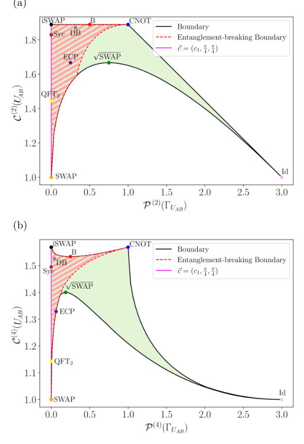 
Figure 3. Representation of entanglement-preserving and entanglement-breaking channels in the space spanned by the second moments, P(2)(ΓUAB) and C(2)(UAB) in (a), or the fourth moments, P(4)(ΓUAB) and C(4)(UAB) in (b), for a two-qubit unitary UAB and the induced single-qubit chan- nel ΓUAB. All entanglement-breaking channels are contained in the hashed red area with F (t) EB[P(t)(ΓUAB), C(t)(UAB)] ≥0, presented in Observation 5. The green region corresponds to entanglement-preserving cases, which again marks the im- provement of the criterion in Observation 3. Several well- known unitaries from Table I are located.

**Summary.** This work introduces averaged local-unitary invariants, or 'moments,' to systematically characterize how two-qubit quantum channels affect entanglement. By calculating these moments for $t=2$ and $t=4$, the authors establish computable criteria to distinguish between channels that create, preserve, or destroy bipartite entanglement, extending methods beyond purely unitary dynamics.

**Why it may be interesting.** The development of moment-based diagnostics provides powerful, computable tools to quantify non-local correlations and entanglement changes in open quantum systems, which is crucial for understanding decoherence and quantum resource theories.

Detailed structure

**Main problem.** The paper develops systematic frameworks to characterize the entanglement properties (creation, preservation, or destruction) of two-qubit quantum channels, extending beyond the limitations of unitary settings.

**Main result.** The authors introduce averaged local-unitary invariants, or 'moments,' which provide computable criteria (e.g., $C(t)(\Lambda) \le 1$) to detect entanglement-creating and entanglement-preserving channels.

**Method.** The core method involves calculating moments, $C(t)(\Lambda)$, by taking Haar integrals of local-unitary invariants over input states or unitaries, allowing for analysis of general, non-unitary channels.

**Model / system.** The system under study is a two-qubit quantum channel ($\Lambda$) acting on a two-particle system AB. The analysis is generalized to include non-unitary channels, comparing them to the known behavior of unitary channels.

**Key observables.** Averaged local-unitary invariants, or 'moments,' denoted $C(t)(\Lambda)$ and $P(t)(\Gamma)$, for $t=2$ and $t=4$.

**Important parameters / regimes.** The order of the moment ($t=2, 4$) and the specific structure of the channel (e.g., mixtures of unitaries and depolarization).

**Assumptions / limitations.** The analysis relies on the assumption that these moments provide sufficient information to characterize entanglement properties, though limitations are noted regarding full distinguishability.

**Figures summary.** Figures illustrate the moment space spanned by $(C(2), C(4))$ and $(P(2), P(4))$, mapping out the boundaries between entanglement-creating, entanglement-preserving, and non-entangling regions for various channel types.

**Paper structure.** The paper systematically develops criteria by first establishing moment definitions for general channels, then applying these moments to characterize entanglement creation in two-qubit systems, and finally extending the analysis to induced single-qubit channels ($\Gamma$) to distinguish unitaries.

Abstract

We develop systematic frameworks for characterizing the entanglement properties of two-qubit channels beyond unitary settings. We introduce averaged local-unitary invariants, referred to as moments, obtained from Haar integrals over input states or unitaries. These moments provide computable descriptions of how a quantum channel can create, preserve, or destroy bipartite entanglement. We first show that second-order moments yield criteria for non-entangling and entanglement-breaking channels, which allow us to detect entanglement-creating and entanglement-preserving channels. We then demonstrate that higher-order moments can capture additional information and distinguish channels beyond second-order moments alone. Finally, we show that combinations of moments associated with different channel families improve the discrimination of locally inequivalent two-qubit unitaries.

[↑ back to top](#top)

### [Apparent Fermionic Spectra for Bosonic Radiation: Accelerated Charge Kinematics](http://arxiv.org/abs/2606.02824v1)

**Authors:** Michael R. R. Good, Evgenii Ievlev, Arsen Almaskhan  
**Type:** theory · **Category:** statistical mechanics · **PDF:** <https://arxiv.org/pdf/2606.02824v1>  
**Analysis basis:** full PDF text, analyzed in chunks
**Topic relevance:** `non-equilibrium dynamics` **3/5** · `Keldysh / 2PI / non-Gaussian methods` **2/5** · `methods for driven-dissipative` **2/5** · `non-equilibrium universality` **2/5** · `driven-dissipative phase transition` **1/5** · `interference shaping light` **1/5**

📷 Fig 1

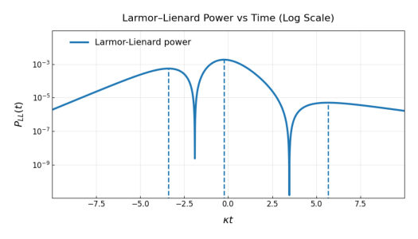 
FIG. 1. Instantaneous Larmor–Li`enard radiated power PLL(t), Eq. (10), plotted on a logarithmic vertical scale. The logarithmic scale makes visible the third local maximum, Eq. (36), which is obscured on a linear vertical scale, and confirms the asymmetric triple-peak structure of the radiated power. The dashed vertical lines mark the three local maxima given in Eqs. (38), (37), and (36).

**Summary.** This theoretical work shows that the electromagnetic radiation from an accelerating point charge can mimic a Fermi-Dirac spectrum using only classical electrodynamics. This spectral resemblance arises purely from the specific, non-equilibrium kinematics of the charge's motion, independent of quantum statistics or thermal equilibrium assumptions. The paper is significant because it reveals a 'thermodynamic illusion' generated purely by classical dynamics.

**Why it may be interesting.** It provides a purely classical, kinematic mechanism to generate spectral signatures (like the FD spectrum) typically associated with quantum statistical ensembles (like Bose-Einstein or Fermi-Dirac distributions), which is highly relevant for understanding non-equilibrium quantum optics.

Detailed structure

**Main problem.** The paper demonstrates that bosonic radiation emitted by an accelerated point charge can exhibit a Fermi-Dirac spectrum without invoking quantum statistics, thermal equilibrium, or the presence of event horizons.

**Main result.** The spectral shape matches the Fermi-Dirac form purely due to the specific, out-of-equilibrium kinematics of the accelerating charge, suggesting a kinematic origin for thermal-like spectra.

**Method.** The analysis uses semi-classical electrodynamics, relating the spectral distribution to the Fourier transform of the charge's trajectory, and analyzing the monodromy properties of the associated wave functions.

**Model / system.** The system is a classical point charge undergoing accelerated motion, analyzed in the non-relativistic limit. The mathematical machinery involves the Lambert W-function to define the specific trajectory $z(t)$ that yields the target spectrum.

**Key observables.** Fermi-Dirac spectrum $E_{FD}(\omega)$, radiated power $P(t)$, and the effective energy density $
ho_{eff}(T)$.

**Important parameters / regimes.** The energy scale $\kappa$ (related to effective temperature $T$), and the non-relativistic limit assumption ($|\dot{z}| \ll 1$).

**Assumptions / limitations.** The analysis relies on the non-relativistic approximation and assumes the radiation field propagates freely to infinity; the spectral match is shown to be a kinematic illusion.

**Figures summary.** Figure 1 shows the instantaneous Larmor–Liénard radiated power $P_{LL}(t)$ exhibiting an asymmetric triple-peak structure, confirming the nonstationary, burst-like nature of the emission.

**Paper structure.** The paper progresses by first establishing the connection between the spectrum and the trajectory's Fourier transform, deriving the required trajectory using the Lambert W-function, and then analyzing the resulting energy scaling to show recovery of standard thermodynamic laws despite the non-equilibrium process.

Abstract

An accelerated point charge can emit photons with an apparent Fermi-Dirac spectrum, even though the radiation is bosonic and its occupation numbers are not constrained to 0 or 1. The effect arises from a special class of acceleration kinematics and does not rely on thermal equilibrium, horizons, or statistical ensembles.

[↑ back to top](#top)

### [Mott transition of photons: quantum Monte Carlo study of Gross-Neveu criticality in a cavity](http://arxiv.org/abs/2606.03733v1)

**Authors:** João C. Inácio, Natanael C. Costa, Fakher F. Assaad  
**Type:** theory · **Category:** strongly correlated electrons · **PDF:** <https://arxiv.org/pdf/2606.03733v1>  
**Analysis basis:** full PDF text, analyzed in chunks
**Topic relevance:** `analog quantum simulation` **3/5** · `correlated cavity matter` **3/5** · `Keldysh / 2PI / non-Gaussian methods` **2/5** · `Tavis-Cummings & cavity-many-emitter` **1/5** · `driven-dissipative phase transition` **1/5** · `methods for driven-dissipative` **1/5**

📷 Fig 1

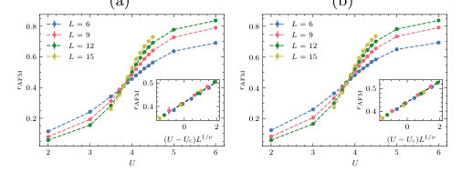 
FIG. 1. Correlation ratio of the antiferromagnetic order pa- rameter as a function of U for (a) g = 0.5 and (b) g = 4. Inset: data collapse of the AFM correlation ratio with Uc = 3.819(3) and ν = 1.06(2) [37]. We fit the scaling function to a linear form and obtain (a) y = 0.0438(7)x + 0.4174(4) and for (b) y = 0.0454(5)x + 0.4407(4).

📷 Fig 2

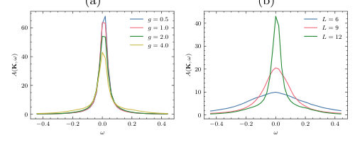 
FIG. 2. Electronic spectral function at the Dirac point A(K, ω) as a function (a) of g, for L = 12, and (b) of system size, at g = 4. All results are for fixed U = 2 in the DSM phase. The results are obtained through the SAC method on the imaginary-time data G(K, τ) = ⟨ˆc† K(τ)ˆcK(0)⟩.

📷 Fig 3

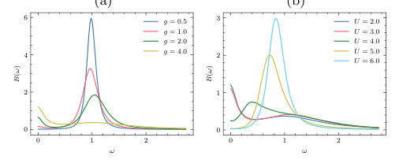 
FIG. 3. Photon function B(ω) as a function (a) of g, for U = 2 in the DSM phase, and (b) of U, for g = 4 across the GN transition. The data shown are for an L = 12 system. B(ω) is obtained through the SAC method on the imaginary- time data D(τ) = ⟨ˆ X(τ) ˆ X(0)⟩.

📷 Fig 4

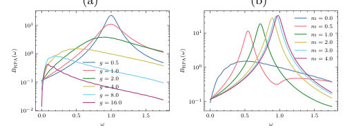 
FIG. 4. Polariton spectral function in the RPA (a) as a func- tion of g at m = 0 and (b) as a function of the mass gap m at g = 4. Here we use β = L = 108, η = 2π/L and Ω= 1.

**Summary.** This paper analyzes the coupling between a Mott-insulating electronic system (Hubbard model) and a cavity photon mode. Using advanced quantum simulation techniques, the authors demonstrate that while the coupling does not alter the fundamental quantum critical point, the photon's spectral response becomes directly coupled to the electronic optical conductivity. This establishes the cavity photon as a powerful, non-invasive diagnostic tool for observing metal-to-insulator transitions.

**Why it may be interesting.** This work bridges condensed matter theory (Mott physics, criticality) with quantum optics (cavity QED), showing how cavity modes can serve as sensitive, non-perturbative probes of intrinsic electronic quantum phases.

Detailed structure

**Main problem.** The study investigates whether coupling a Mott-transitioning electronic system (Hubbard model) to a cavity photon mode alters the quantum critical point associated with the Mott transition.

**Main result.** The coupling to the cavity photons is found to be irrelevant at the critical point, but the photon spectral function acts as a non-invasive probe for the electronic Mott transition via its coupling to the optical conductivity.

**Method.** The research employs Quantum Monte Carlo (QMC) simulations and advanced field-theoretic techniques, including path integrals and Random Phase Approximation (RPA), to analyze the coupled electron-photon dynamics.

**Model / system.** The model consists of the Hubbard model on a honeycomb lattice, representing the electronic system, coupled to a single, linearly polarized cavity photon mode. The coupling is analyzed within the context of Gross-Neveu (GN) criticality.

**Key observables.** Photon spectral function, electronic spectral function A(K, ω), optical conductivity ($\sigma_{dc}$), and the polariton spectral function.

**Important parameters / regimes.** Interaction strength ($U$), coupling strength ($g$), and the lattice geometry (honeycomb lattice).

**Assumptions / limitations.** The analysis assumes the long-wavelength limit for the cavity and that the electron-photon coupling is intensive in the thermodynamic limit.

**Figures summary.** Figures illustrate the stability of the critical point against coupling strength, the electronic spectral function near the Dirac point, and the emergence/suppression of polariton modes as the system crosses the Mott insulating phase.

**Paper structure.** The paper progresses by first establishing the coupled Hamiltonian, then using QMC and field theory to calculate spectral functions, demonstrating that the photon coupling only probes uniform charge fluctuations, and finally concluding that the photon spectrum tracks the Mott transition via polariton formation/disappearance.

Abstract

The Hubbard model on the honeycomb lattice is a pristine realisation of a semimetal-to-insulator Mott transition belonging to the Gross-Neveu O(3) universality class. We couple this system to a single linearly polarised cavity photon mode. The light-matter coupling is such that the photon number remains an intensive quantity as is the case for an empty cavity. For this interacting light-matter model, we formulate a negative-sign-free fermion quantum Monte Carlo algorithm that allows for bias-free results on finite system sizes. Our numerical results show that the coupling to the cavity is irrelevant at criticality, even at strong electron-photon coupling. On the other hand, we observe, and show analytically, that the photon spectral function couples to the optical conductivity of the electronic system. The cavity photons thereby undergo a Mott transition, and the photon spectral function acts as a contact-free non-invasive probe for Mott criticality.

[↑ back to top](#top)

### [Piston control in a two-ion quantum device](http://arxiv.org/abs/2606.03488v1)

**Authors:** Jing Li, E. Ya. Sherman, Andreas Ruschhaupt  
**Type:** theory · **Category:** other · **PDF:** <https://arxiv.org/pdf/2606.03488v1>  
**Analysis basis:** full PDF text, analyzed in chunks
**Topic relevance:** `analog quantum simulation` **3/5** · `QC/QI experiment` **2/5** · `non-equilibrium dynamics` **2/5** · `Keldysh / 2PI / non-Gaussian methods` **1/5** · `entanglement & information structure` **1/5** · `methods for driven-dissipative` **1/5** · `quantum measurements` **1/5**

📷 Fig 1

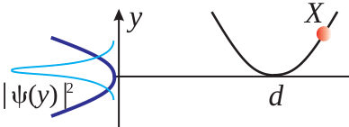 
FIG. 1. Schematic of the two-ion system in the x ⊗y geometry. The left ion is confined along the y direction and treated quantum me- chanically with the wavefunction ψ(y) corresponding to the effective potential V[eff] L . The right ion can move along the x axis in the po- tential VR(X) having the minimum at X = d and acts as an effective classical piston. Panels (a) and (b) illustrate the effective left-ion po- tential in the double-minimum and single-minimum realization, re- spectively. Details of the potential and corresponding notations will be presented below in the text.

📷 Fig 2

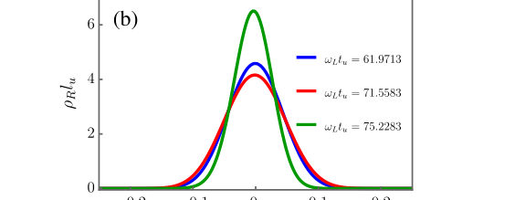 
FIG. 2. Stationary state, full quantum treatment: (a) right ion prob- ability densities ρR(X), (b) zoomed-in and shifted probability densi- ties ρR, and (c) the corresponding left ion probability densities ρL(y) for the values of ωL shown in the plots, see also Eq. (31). Here ωRtu = 20, d/lu = 10.

📷 Fig 3

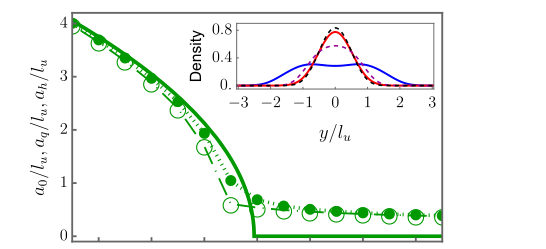 
FIG. 4. Stationary state: Zoom in the transition region between the double-minimum and single-minimum regimes of Fig. 3 (b); full quantum treatment (joined filled marks), hybrid approxima- tion (joined open marks), classical approximation (solid line). In- set: probability density of the left ion in the full quantum calcu- lation ρL(y) (solid) and the hybrid approximation ψ(y) (dashed) for ωLtu = 75.22 (blue solid/magenta dashed) and ωLtu = 75.25 (red solid/black dashed).

📷 Fig 4

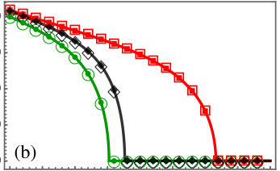 
FIG. 3. Stationary state: (a) Comparisons of positions of right ion among full quantum treatment ⟨ˆX⟩(filled markers), hybrid ap- proximation χ (open markers) and classical approximation X0 (solid lines) results are shown. (b) Corresponding positions of the left ion in the same three cases: aq, ah and a0 parameters as a function of ωL. Three parameter cases in both figures: ωRtu = 20, d/lu = 10 (green), ωRtu = 20, d/lu = 8 (black), and ωRtu = 25, d/lu = 10 (red).

📷 Fig 5

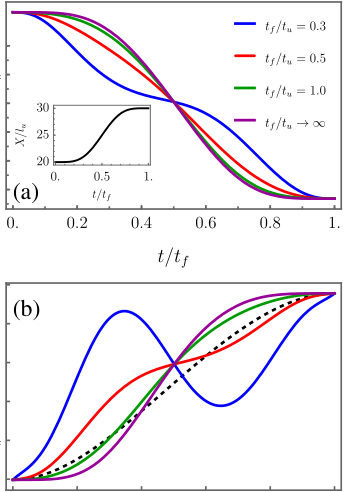 
FIG. 5. Control schemes corresponding to X0/lu = 20 and Xf /lu = 30, dR/lu = 10, ωRtu = 20. (a) Designed position of left particle a(t) for different final times t f . (inset) Designed position of right particle X(t). (b) Designed control schemes ωL(t) for different final times t f as well as the adiabatic reference scheme (dashed line).

**Summary.** This paper details a method to control the motion of a heavy ion (piston) coupled to a light ion (quantum medium) in a two-ion quantum device. By using an inverse-engineering approach, the required time-dependent trapping potential for the light ion is calculated to achieve precise piston trajectories. The results confirm that this control scheme works robustly across classical, hybrid, and full quantum theoretical treatments.

**Why it may be interesting.** This work provides a clean, controllable, and experimentally relevant model for studying quantum work extraction and controlled coupling dynamics using trapped ions, which is a cornerstone of modern AMO physics.

Detailed structure

**Main problem.** The paper proposes and analyzes a scheme for achieving controlled 'piston dynamics' in a two-ion quantum device.

**Main result.** An inverse-engineered control protocol for modulating the trapping potential of one ion successfully controls the motion of the other ion, showing high fidelity across multiple theoretical approximations.

**Method.** The study employs a hybrid quantum-classical approach, treating the heavy ion classically while solving the Schrödinger equation for the light ion, and uses inverse engineering to design the required time-dependent control fields.

**Model / system.** The system consists of two interacting ions confined in orthogonal harmonic traps, where the interaction is governed by the Coulomb potential. The lighter ion acts as a quantum working medium, and the heavier ion acts as a classical piston.

**Key observables.** Final-state fidelity (F), final excitation energy (Q), and the time-dependent mean position of the piston ($\langle \hat{X} 
angle$).

**Important parameters / regimes.** The time-dependent trapping frequency ($\omega_L(t)$) of the light ion, and the ratio of ion masses ($M/m$).

**Assumptions / limitations.** The heavy ion is treated classically due to its large mass, and the analysis relies on hybrid quantum-classical approximations which are shown to agree well with the full quantum treatment.

**Figures summary.** Figures illustrate the schematic setup, the comparison of stationary state regimes (single vs. double minimum), and crucially, compare the final excitation energy (Q) and fidelity (F) achieved by the inverse-engineered control versus an adiabatic reference protocol.

**Paper structure.** The paper first establishes the Hamiltonian and the hybrid quantum-classical framework. It then analyzes the stationary states by identifying distinct quantum regimes based on trap frequencies. Finally, it focuses on time-dependent control, using inverse engineering to design the control pulse $\omega_L(t)$ and comparing its performance against other protocols.

Abstract

We propose a scheme for piston control in a two-ion quantum device with motion confined to orthogonal axes. In this system, one ion plays the role of a ''classical'' piston driven by the Coulomb interaction with the other ion, whose quantum motion is controlled through modulation of its trapping potential. The stationary state is determined self-consistently, taking quantum effects into account. We identify a narrow quantum regime of the ground state connecting two broad classical regimes. We further design inverse-engineering protocols to control the motion of the ''classical'' ion. The proposed control scheme provides a useful route toward controlled piston dynamics in microscopic quantum devices.

[↑ back to top](#top)

### [Quantum Erasure Imaging: Complementary Modalities from Delayed-Choice Erasure](http://arxiv.org/abs/2606.03914v1)

**Authors:** Sean D Huver, Sanjaya Lohani  
**Type:** theory · **Category:** other · **PDF:** <https://arxiv.org/pdf/2606.03914v1>  
**Analysis basis:** full PDF text, analyzed in chunks
**Topic relevance:** `interference shaping light` **3/5** · `quantum measurements` **3/5** · `quantum optics experiment` **3/5** · `entanglement & information structure` **2/5**

📷 Fig 1

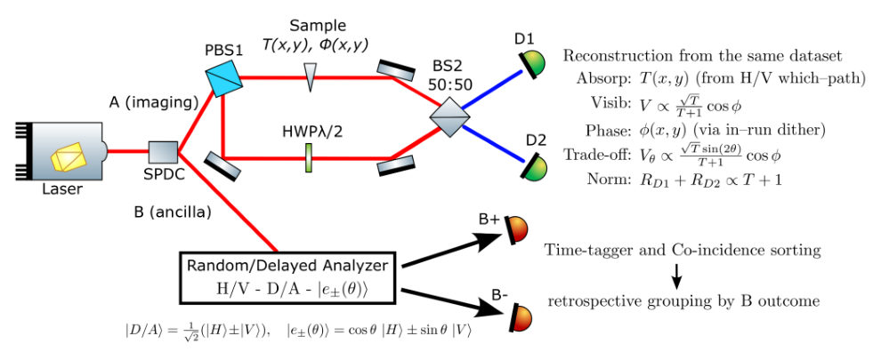 
FIG. 1. QEI schematic. The imaging photon A traverses a modified Mach–Zehnder: PBS1 encodes which–path on polariza- tion; the object in Arm 1 imparts T(x, y), ϕ(x, y); a HWP equalizes polarization; and BS2 recombines to two ports (D1,D2). The ancilla photon B is measured in a random/delayed analyzer (H/V, D/A, or a rotated orthonormal basis {|e±(θ)⟩}). All events are time–tagged and retrospectively sorted by B’s outcome to reconstruct co–registered absorption and phase images from a single run. Two–port normalization makes the denominator analyzer–independent (completeness/no–signaling).

📷 Fig 2

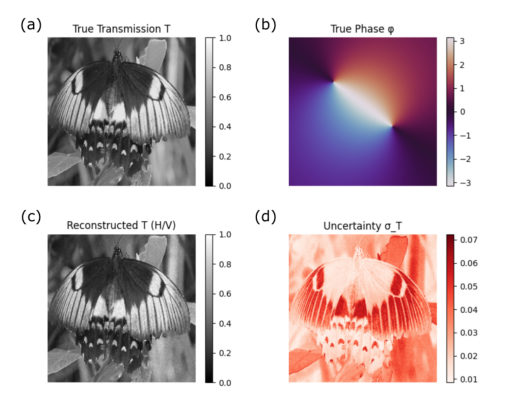 
FIG. 2. Illustration of the reconstruction of T(x, y) using H/V polarization bases. (a) Image representing True T(x, y). (b) A vortex phase map associated with the sample. Measur- ing B: (c) Reconstructed T(x, y). (d) Estimated uncertainty in the reconstructed T(x, y).

📷 Fig 3

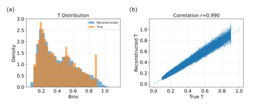 
FIG. 3. Measuring B on H/V bases. (a) T(x, y) Distribu- tion: brown and blue histograms, respectively, represent the true T(x, y) and reconstructed values of T(x, y). (b) Correla- tion coefficient between the true T and reconstructed T at a simulated 1000 photons per pixel.

📷 Fig 4

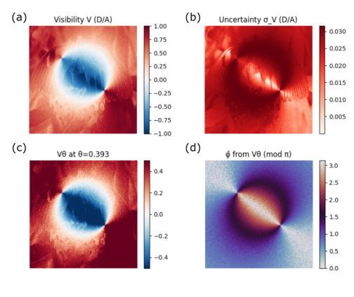 
FIG. 4. Measuring B on D/A bases: (a) Two-port normalized differential corresponding to the given image T(x, y). (b) Es- timated uncertainty in the visibility derived from coincidence counting statistics. Measuring B on rotational |e±(θ)⟩bases: (c) Visibility evaluated at θ = π/8. (d) Reconstruction of phase ϕ (modulo π) based on the visibility shown in panel (c).

**Summary.** This paper introduces Quantum Erasure Imaging (QEI), a novel protocol that uses polarization-entangled photons to simultaneously measure two complementary properties of an object: absorption and phase. By analyzing coincidence counts from a single run, the authors derive robust estimators and prove that the information gained is theoretically equivalent to time-division measurements, offering significant operational advantages for quantum imaging.

**Why it may be interesting.** This work is highly relevant to quantum optics and open quantum systems, providing a concrete, advanced protocol for quantum state tomography and imaging that leverages entanglement and delayed choice principles.

Detailed structure

**Main problem.** To develop Quantum Erasure Imaging (QEI) as a practical protocol to reconstruct two complementary classical modalities—absorption $T(x, y)$ and phase $\phi(x, y)$—from a single run of time-tagged coincidence measurements.

**Main result.** QEI enables single-run acquisition of co-registered complementary observables, and its information-theoretic performance (Fisher Information) is shown to be equivalent to time-division measurements under labeled randomization.

**Method.** The authors derive balanced two-port estimators and calculate the Fisher Information Matrix (FIM) and Cramér-Rao Bounds (CRBs) based on coincidence counting statistics from polarization-entangled photon pairs.

**Model / system.** The system uses polarization-entangled photon pairs generated via Type-II SPDC. The imaging process involves the imaging photon passing through an object imparting $T(x, y)$ and $\phi(x, y)$, while the ancilla photon measurement dictates the reconstruction modality.

**Key observables.** Absorption $T(x, y)$, phase $\phi(x, y)$, interference visibility $V(x, y)$, and the generalized visibility $V_	heta(x, y)$.

**Important parameters / regimes.** The analyzer angle $	heta$ which continuously trades between path information and interference contrast.

**Assumptions / limitations.** The FIM equivalence proof assumes equal detection efficiencies across ancilla outcomes and negligible system drift.

**Figures summary.** Figure 1 illustrates the QEI setup; other figures show the estimation of the phase $\phi$ using specific analyzer angles and quantify the performance using the FIM and CRBs.

**Paper structure.** The paper introduces QEI, details the reconstruction formulas for $T$ and $\phi$ based on different ancilla measurements (H/V vs D/A), derives the robust estimators, calculates the FIM, and finally establishes the operational advantages by comparing it to time-division methods.

Abstract

Quantum Erasure Imaging (QEI) turns delayed-choice erasure into a practical imaging protocol. Entangled photon pairs encode two classical modalities, absorption $T(x,y)$ and a phase-sensitive cosine quadrature of $φ(x,y)$, reconstructed from a single run of time-tagged coincidences by retrospective sorting on a remote ancilla. Measuring the ancilla in H/V yields $T$ via which-path information; D/A yields interference visibility $\propto \frac{2\sqrt{T}}{T+1}\cosφ$; and a rotated orthonormal analyzer continuously trades between them. We derive balanced two-port estimators whose denominators are analyzer independent (completeness / no signaling), together with Fisher information (FI) and Cramér--Rao bounds (CRBs) that establish an equivalence to time division under labeled randomization. The advantages of QEI are operational: single-run acquisition, perfect co-registration, and remote / delayed mode choice. We illustrate the protocol with Monte-Carlo simulations and open source our code.

[↑ back to top](#top)

### [Demonstration of a Spherical Penning Trap for Single Electrons](http://arxiv.org/abs/2606.03639v1)

**Authors:** Zirui Fang, Xing Fan  
**Type:** experiment · **Category:** other · **PDF:** <https://arxiv.org/pdf/2606.03639v1>  
**Analysis basis:** full PDF text, analyzed in chunks
**Topic relevance:** `quantum optics experiment` **3/5** · `correlated cavity matter` **2/5** · `QC/QI experiment` **1/5** · `Tavis-Cummings & cavity-many-emitter` **1/5** · `analog quantum simulation` **1/5** · `quantum measurements` **1/5** · `spintronics-quantum-optics interface` **1/5**

📷 Fig 1

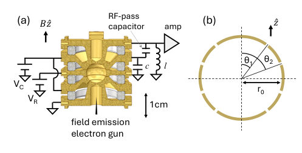 
FIG. 1. (a) The spherical trap’s geometry and (b) definition of the coordinates of the interior trap volume.

📷 Fig 2

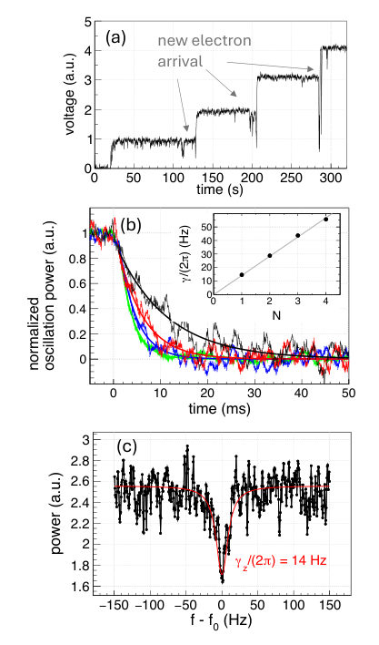 
FIG. 2. (a) Counting the number of loaded electrons by moni- toring the oscillation amplitude with a parametric drive while firing the electron gun. (b) Direct measurement of γ = Nγz by exciting to a large amplitude and monitoring its decay. Different colors correspond to different numbers of trapped electrons. The inset shows the linearity of the measured γ. (c) Fourier transform of the output signal, showing a dip of a single electron.

📷 Fig 3

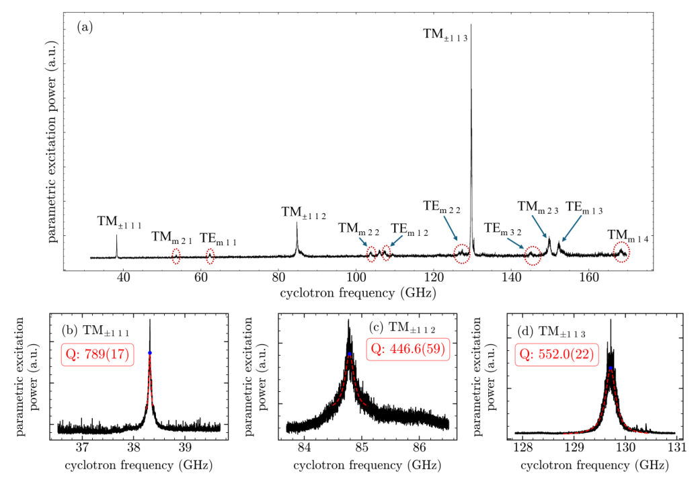 
FIG. 3. Measured microwave spectrum of the spherical trap. (a) Fast magnet-current sweep over B = 0.7–6 T (fc = 31.40– 167.99 GHz). The three dominant peaks at 38, 85, and 130 GHz are identified with TM±111, TM±11 2, and TM±11 3, respectively. The additional, weaker peaks marked with red dotted ovals correspond to the higher-order modes listed in Table II. (b)–(d) Slow re-scans of the three TM±11p resonances at ∼0.157 GHz/min, together with the Lorentzian fits (red dashed) used to extract the center frequency and quality factor quoted in each panel.

📷 Fig 4

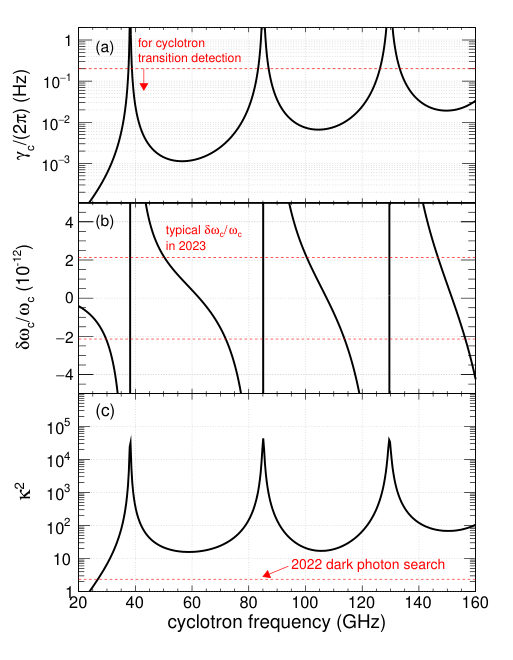 
FIG. 4. (a) Calculated cyclotron damping rate γc. The typical condition to detect a quantum cyclotron transition is also shown by the red dotted line. (b) Cavity shift δωc/ωc from the measured microwave resonances, compared to the typical shift in the 2023 measurement[1]. (c) Enhancement factor κ2 for dark-photon and axion searches from the measured spherical trap’s microwave resonances.

**Summary.** The authors successfully demonstrated single-electron trapping in a novel spherical Penning trap geometry. They characterized the trap's microwave resonance spectrum, finding three distinct, measurable modes. This work validates the trap's suitability for next-generation precision measurements, such as determining the electron magnetic moment or searching for exotic particles like dark photons.

**Why it may be interesting.** This work is highly relevant to AMO physics, specifically in the areas of cavity QED and precision measurements. The characterization of the mode structure and the use of the trap for fundamental constant measurements (g-factor) are core topics in the field.

Detailed structure

**Main problem.** The paper demonstrates single-electron trapping in a spherical Penning trap and characterizes its microwave resonance structure.

**Main result.** The measured cavity spectrum revealed three dominant resonance peaks (at ~38, 85, and 130 GHz), successfully characterizing the trap's microwave mode structure.

**Method.** The resonance structure was characterized by sweeping the superconducting magnet field and fitting the resulting spectral peaks to a Lorentzian function.

**Model / system.** The physical system is a spherical Penning trap containing a single electron, designed for high-precision measurements like electron g-factor determination or searches for dark photons/axions.

**Key observables.** Three dominant microwave resonance frequencies ($f_{TM\pm 11p}$), the quality factors ($Q$), and the derived cold-cavity radius ($r_0$).

**Important parameters / regimes.** The required relative precision for g-factor measurement ($<10^{-12}$), and the enhancement factor ($\kappa_2$) for dark-photon searches.

**Assumptions / limitations.** The theoretical mode calculation assumes a perfectly conducting spherical boundary, and the analysis relies on fitting resonance peaks to Lorentzian profiles.

**Figures summary.** Figure 2 demonstrates single-electron detection via oscillation amplitude decay, while Figure 3 maps the cavity spectrum showing the three dominant resonance peaks.

**Paper structure.** The paper proceeds by detailing the trap geometry and its advantages, demonstrating single-electron trapping, characterizing the microwave resonances through field sweeps, and finally presenting the extracted mode frequencies and derived physical parameters.

Abstract

A spherical Penning trap has well-separated, clean microwave resonances, making it attractive for precision measurements of the electron magnetic moment and for dark-photon and axion searches with trapped electrons. We demonstrate single-electron trapping in a spherical Penning trap and characterize its microwave resonance structure. The design, single-electron detection, microwave mode characterization, and advantages of this geometry are presented.

[↑ back to top](#top)

### [Enhanced qubit performance by integrating altermagnets into superconducting qubit designs](http://arxiv.org/abs/2606.02761v1)

**Authors:** Johanne Bratland Tjernshaugen, Morten Amundsen, Jacob Linder  
**Type:** theory · **Category:** quantum information and computing · **PDF:** <https://arxiv.org/pdf/2606.02761v1>  
**Analysis basis:** full PDF text, analyzed in chunks
**Topic relevance:** `spintronics-quantum-optics interface` **3/5** · `QC/QI experiment` **2/5** · `Keldysh / 2PI / non-Gaussian methods` **1/5** · `correlated / nonlocal dissipation` **1/5** · `driven-dissipative phase transition` **1/5** · `exotic spin models in light-matter` **1/5** · `methods for driven-dissipative` **1/5**

📷 Fig 1

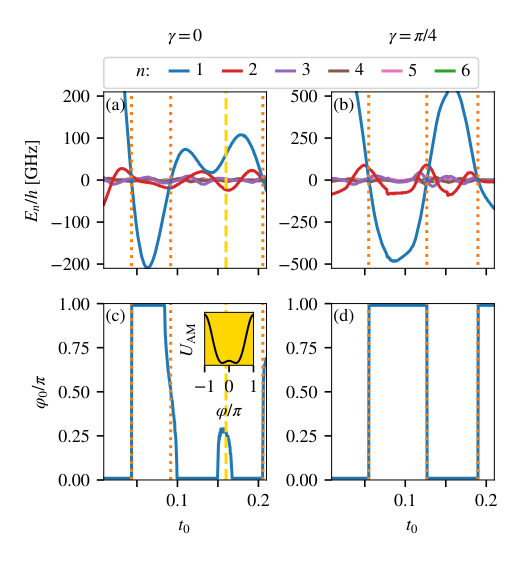 
FIG. 2. Properties of the altermagnetic potential for 𝛾= 0 (left column) and 𝛾= 𝜋/4 (right column). (a) and (b) show the harmonic content of the potential 𝑈AM(𝜑) = −Í 𝑛𝐸𝑛cos(𝑛𝜑). The coefficients 𝐸𝑛were found using the method of least squares on the raw data, and the figure shows the first three components. (c) and (d) shows the phase value 𝜑0 at the minima of 𝑈AM for 𝜑∈[0, 𝜋]. The inset in (c) shows the potential profile at 𝑡0 ≈0.16, and this 𝑡0 strength is marked with yellow dashed lines in (a) and (c).

📷 Fig 2

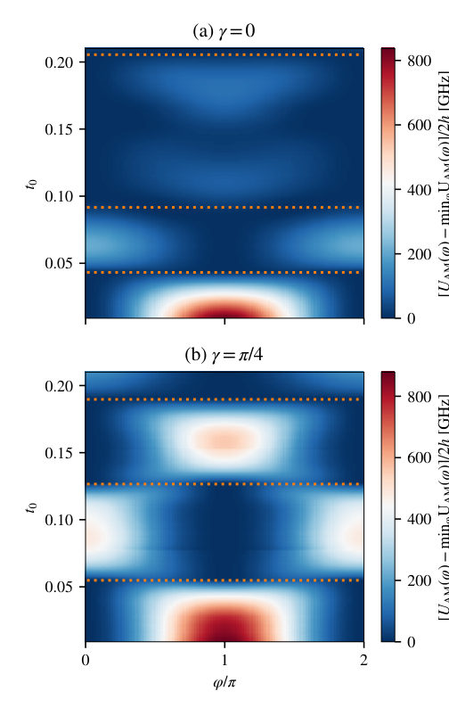 
FIG. 1. Altermagnetic Josephson potential 𝑈AM(𝜑) as a function of the superconducting phase 𝜑and the altermagnetic strength 𝑡0 for (a) pure 𝑑𝑥𝑦altermagnetism and (b) pure 𝑑𝑥2−𝑦2 altermagnetism. The orange dashed lines are visual guides for the 0 −𝜋transitions upon increasing 𝑡0. We have subtracted the minimum value of 𝑈AM. The parameters used are the junction length 𝑑= 0.2𝜉and width 𝑊= 10𝑑 with 𝜉the superconducting coherence length, the interface parameter 𝑍= 0.4, the superconducting gap Δ = 0.15 meV, and the Fermi wave vector 𝑘𝐹𝜉= 100.

📷 Fig 3

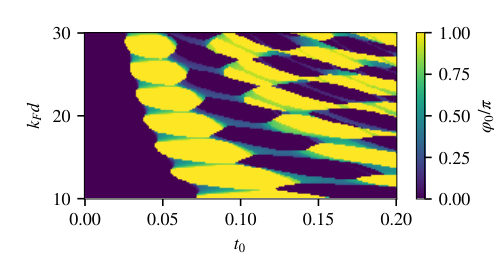 
FIG. 3. The location of the Josephson potential minima depends on the length 𝑑and 𝑡0 in the 𝛾= 0 configuration. When 𝜑0 ≠{0, 𝜋}, the junction is in a 𝜙-state. We used the analytical expressions in [14] with transmission probability Γ = 0.86.

📷 Fig 4

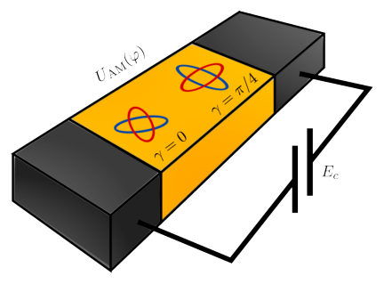 
FIG. 4. We focus on a transmon qubit design where an altermagnetic Josephson junction is parallel-coupled to a capacitor. The JJ has a free energy 𝑈AM(𝜑) and we consider two crystallographic orientations of the altermagnetic lattice relative the interfaces to the superconductors, depicted in the figure.

📷 Fig 5

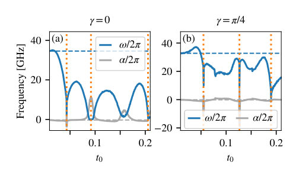 
FIG. 5. Qubit frequency 𝜔(blue) and anharmonicity 𝛼(gray) for (a) 𝛾= 0 and (b) 𝛾= 𝜋/4. The horizontal dashed lines represent the 𝑡0 →0 values, while the orange dotted lines are visual guides for the 0 −𝜋transitions in the altermagnetic potential. We set 𝐸𝑐/ℎ= 0.25 GHz, which is a typical experimental value [28].

**Summary.** This theoretical study proposes using altermagnets to enhance superconducting qubits by modifying the Josephson junction properties. By calculating the resulting energy-phase relation, the authors show that these junctions can yield qubits with superior anharmonicity and reduced decoherence. This integration offers a pathway to building more robust and controllable quantum processors.

**Why it may be interesting.** This work directly addresses the materials science challenge in quantum computing by proposing a novel magnetic material class (altermagnets) to engineer superconducting qubit parameters, which is highly relevant to open quantum systems and superconducting circuit QED.

Detailed structure

**Main problem.** The primary hurdle in realizing practical quantum computation is finding qubit materials that are both tunable and resilient to environmental noise.

**Main result.** Integrating altermagnets into superconducting qubits significantly improves performance by offering superior anharmonicity and robust protection against decoherence near specific operational regimes.

**Method.** The study uses microscopic calculations, generalized Blonder-Tinkham-Klapwijk (BTK) theory, and Hamiltonian analysis to model the energy-phase relation of altermagnetic Josephson junctions.

**Model / system.** The system involves superconducting qubits, particularly the transmon design, interfaced with altermagnetic Josephson junctions. The analysis models the resulting Josephson potential $U_{AM}(\varphi)$ and the full qubit Hamiltonian.

**Key observables.** Qubit splitting, anharmonicity ($\alpha$), decoherence rates ($\Gamma_1, \Gamma_\varphi$), and single/coupled-qubit gate operation times ($T_\pi$).

**Important parameters / regimes.** Strength of the Néel field, crystallographic orientation ($\gamma$), and the superconducting phase difference ($\varphi$).

**Assumptions / limitations.** The analysis relies on approximations like truncating the energy-phase relation to a Fourier series and assuming zero temperature for some free energy calculations.

**Figures summary.** Figures illustrate the Josephson potential $U_{AM}(\varphi)$ dependence on altermagnet strength, the harmonic content of the potential, and the resulting decoherence rates and $\pi$-pulse times as a function of material parameters.

**Paper structure.** The paper progresses from establishing the need for new qubit materials, deriving the Josephson energy via microscopic calculations, analyzing the resulting potential features ($\phi$-states, $0-\pi$ transitions), and finally applying these findings to calculate key performance metrics like decoherence and gate times for various qubit types.

Abstract

Identifying a materials platform for creating qubits that are both tunable and resilient towards environmental noise is one of the main hurdles that need to be overcome to realize quantum computation that is practically useful. One pursued avenue to this end is to use superconducting qubits with intrinsic spin-dependent interactions, such as spin-orbit coupling or magnetism. However, the recently discovered class of materials known as altermagnets remain largely unexplored in this context. We here use microscopic calculations to determine how the properties of superconducting qubits are modified when altermagnetic Josephson junctions are included. The key qubit performance parameters, including splitting, anharmonicity, decoherence, and single/coupled-qubit gate operation times, display rich behavior depending on the characteristic properties of the altermagnetic material, such as the strength of the Néel field and the crystallographic orientation of the altermagnetic relative interfaces in the system. We focus in particular on the transmon design and show that the qubit is very well protected against decoherence and simultaneously shows superior anharmonicity both near 0-$π$ transition points and when it is in a $φ$-state. We propose that by using strain, the altermagnetic qubit can be moved out of its protected regime to enable faster gate-operation times, and then moved back to its protected state. We also discuss how the altermagnetic properties influence flux qubits and fluxonium. Our results suggest that integration of altermagnetic materials into existing superconducting qubit design can substantially improve their performance due to the unique properties of the altermagnetic band-structure.

[↑ back to top](#top)

### [Global adiabatic criterion for fast topological photon transfer in Fock-state lattices](http://arxiv.org/abs/2606.03409v1)

**Authors:** Jin-Lei Wu, Pei-Yao Song, Jia Li, Ya Gao, Yan Wang, Shi-Lei Su  
**Type:** theory · **Category:** other · **PDF:** <https://arxiv.org/pdf/2606.03409v1>  
**Analysis basis:** full PDF text, analyzed in chunks
**Topic relevance:** `analog quantum simulation` **3/5** · `non-equilibrium dynamics` **2/5** · `Tavis-Cummings & cavity-many-emitter` **1/5** · `correlated cavity matter` **1/5** · `entanglement & information structure` **1/5** · `methods for driven-dissipative` **1/5**

📷 Fig 1

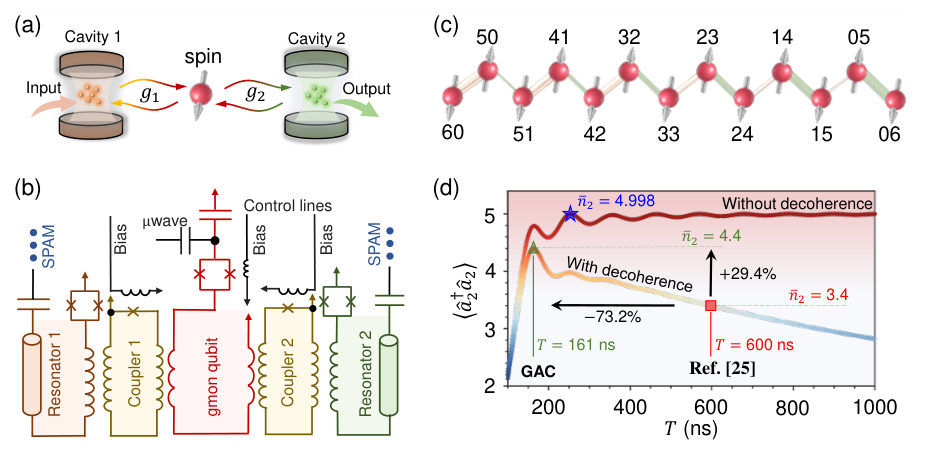 
FIG. 1. Topological photon transfer in a two-mode JC model. (a) Schematic of the two-mode JC model: two cavity modes (resonators) are coupled to a common spin (qubit) with time-dependent strengths g1(t) and g2(t). (b) Superconducting circuit implementation of the device (adapted from Ref. [25]), consisting of a central gmon qubit inductively coupled to two resonators via tunable couplers. (c) 1D FSL for total excitation number N = 6, where each site represents a Fock state | ↓/ ↑; n1, n2⟩. The site-dependent hopping amplitudes are proportional to g1√n1 (brown) and g2√n2 (green). (d) Final average photon number in the superconducting resonator 2 as a function of duration T for N = 5 with α =...

📷 Fig 2

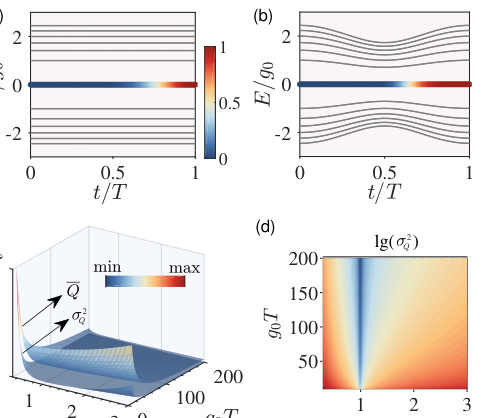 
FIG. 2. Global adiabatic criterion applied to the coupling family in Equation (6). (a) Time-independent energy spec- trum for α = 1 (constant gap ∆E = √

📷 Fig 3

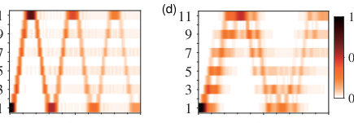 
FIG. 3. Numerical evaluation of topological photon transfer and decoherence effects. (a) Fidelity as a function of α and g0T for N = 6 (initial state | ↓; 6, 0⟩). The green dashed line marks the 0.95-fidelity contour, showing that α = 1 requires the smallest g0T to reach this fidelity. (b) Final average pho- ton number ¯n2 = ⟨a† 2a2⟩versus duration T for different total photon numbers N (solid: α = 1, dashed: α = 2). For each curve, a peak appears due to competition between unitary transfer and decoherence. (c) Time-dependent populations on the 11 FSL sites for N = 5, α = 1, and the optimal dura- tion T = 161 ns. Coherent edge-to-edge pumping is observed, though even-numbered sites are also...

📷 Fig 4

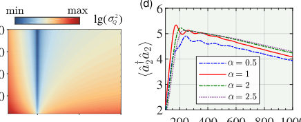 
FIG. 4. Constant energy gaps do not always guarantee fast transfer. (a) Time-dependent coupling strengths for α = 2 using the alternative coupling family in Equation (10) that keeps g2 1 + g2 2 = g2 0 constant for any α. (b) Corresponding eigenenergies, which are time- and α-independent. Color on the zero-energy line indicates |⟨↓; 0, 6|ψdark(t)⟩|2. (c) Numer- ically computed variance σ2 Q of the nonadiabaticity factor as a function of α and g0T, showing that σ2 Q = 0 only at α = 1. (d) Final average photon number ¯n2 versus duration T for dif- ferent α (initial state | ↓; 6, 0⟩) including decoherence. The α = 1 curve yields the shortest duration and the highest peak ¯n2, confirming that...

**Summary.** This paper develops a Global Adiabatic Criterion (GAC) to explain fast topological photon transfer in Fock-state lattices. It proves that the key to speed is minimizing the variance of the nonadiabatic coupling, not just maintaining a constant energy gap. The optimal protocol uses a sinusoidal coupling profile, predicting significantly faster and more efficient transfer times than previously reported.

**Why it may be interesting.** This work provides a quantitative, general theoretical framework for optimizing quantum light transport, moving beyond simple gap-closing arguments to focus on the uniformity of nonadiabatic dynamics.

Detailed structure

**Main problem.** To provide a rigorous explanation for the fast topological photon transfer observed in Fock-state lattices and establish a general framework for fast topological photonics engineering.

**Main result.** The essential condition for fast transfer is the vanishing temporal variance of the nonadiabatic coupling factor ($\sigma_Q^2 = 0$), which is achieved optimally using a sinusoidal coupling profile ($\alpha=1$).

**Method.** The authors developed a Global Adiabatic Criterion (GAC) to bound infidelity using the mean and variance of the nonadiabatic factor, analyzing power-law coupling profiles.

**Model / system.** The system is modeled using a two-mode Jaynes-Cummings (JC) model applied to Fock-state lattices (FSLs), which simulates topological photon transfer.

**Key observables.** Transferred photon number ($ar{n}_2$), infidelity ($\epsilon$), and the nonadiabaticity variance ($\sigma_Q^2$).

**Important parameters / regimes.** Optimal transfer duration for a five-photon state is predicted to be 161 ns, showing a linear scaling with photon number $N$.

**Assumptions / limitations.** The analysis incorporates experimental decoherence parameters and relies on the validity of the Global Adiabatic Criterion.

**Figures summary.** Figures illustrate the setup (JC model, FSL), compare fidelity/photon number vs. coupling exponent ($\alpha$), and show the variance $\sigma_Q^2$ vanishing only for the sinusoidal case ($\alpha=1$).

**Paper structure.** The paper introduces the physical model and the GAC, analyzes power-law coupling profiles, determines the optimal profile by minimizing nonadiabaticity variance, and finally predicts significantly faster transfer times compared to previous experimental benchmarks.

Abstract

Topological state transfer in Fock-state lattices has been demonstrated with high speed using sinusoidal profiles of coupling, yet the underlying reason has remained unclear. A global adiabatic criterion (GAC) is developed to bound the infidelity by the mean and variance of the nonadiabatic factor. The GAC reveals that the key to fast transfer is not a constant energy gap but the vanishing nonadiabaticity variance. For power-law coupling profiles, the variance vanishes only for the sinusoidal shape, which is thus globally optimal. Incorporating experimental decoherence parameters, it is predicted that the optimal transfer duration for a five-photon state is 161 ns, far shorter than 600 ns used in the experiment, reducing time by over 73% while increasing transferred photons by 29%. The optimal duration follow a simple linear scaling with photon number, providing a practical guideline. Through constructing an alternative constant-gap coupling family, it is confirmed that a constant gap alone is not sufficient for fast topological photon transfer. The essential condition is uniformity of nonadiabaticity. This work offers a rigorous explanation for the observed speed and a general framework for fast topological photonics engineering.

[↑ back to top](#top)

### [Scaling Laws for Neural-Network Quantum States](http://arxiv.org/abs/2606.02794v1)

**Authors:** Riccardo Rende, Alessandro Sinibaldi, Luciano Loris Viteritti, Roeland Wiersema, Antoine Georges, Giuseppe Carleo  
**Type:** theory · **Category:** disordered systems and neural networks · **PDF:** <https://arxiv.org/pdf/2606.02794v1>  
**Analysis basis:** full PDF text, analyzed in chunks
**Topic relevance:** `analog quantum simulation` **3/5** · `exotic spin models in light-matter` **3/5** · `methods for driven-dissipative` **2/5** · `entanglement & information structure` **1/5**

📷 Fig 1

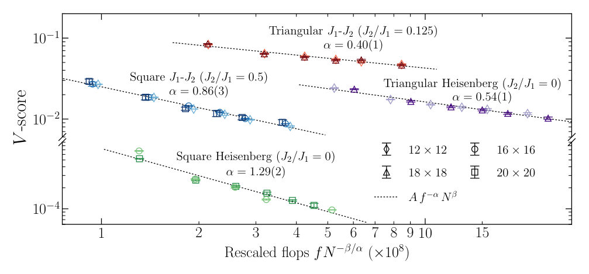 
FIG. 1. Scaling collapse of the V -score for transformer wave function on four two-dimensional spin Hamiltonians: square Heisenberg, triangular Heisenberg, square J1-J2 Heisenberg, and triangular J1-J2 Heisenberg model (see Section II). For each model, V -score data obtained at linear system sizes L = 12, 16, 18, 20 are plotted against the rescaled compute fN −β/α, where f is the training compute in FLOPs and α, β are the exponents of the scaling Ansatz of Eq. (3). After rescaling, data from all system sizes collapse onto a single power law V -score = A f −α N β (dashed black lines), with the fitted exponent α indicated next to each data set. The exponent varies systematically across...

📷 Fig 2

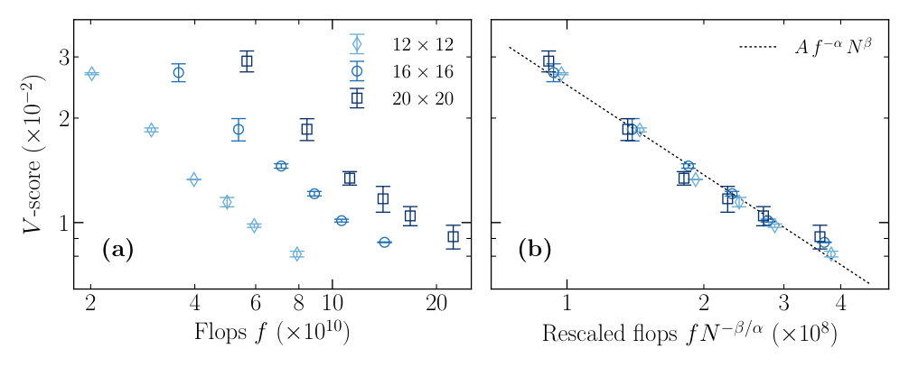 
FIG. 2. Illustration of the scaling collapse procedure for the square J1-J2 Heisenberg model. Panel (a): V -score as a function of the training compute f (FLOPs) for linear system sizes L = 12, 16, 20. Panel (b): The same data plotted against the rescaled compute fN −β/α, with α and β taken from Table I, collapse onto a single curve well described by the power law V -score = A f −αN β (dashed black line) [see Eq. (4)].

📷 Fig 3

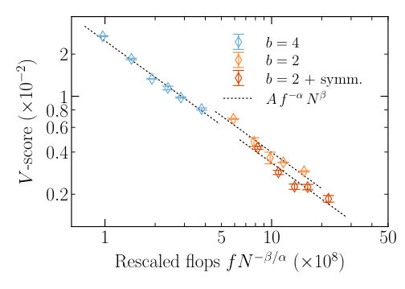 
FIG. 3. V -score as a function of the rescaled compute fN −β/α and corresponding power law fit for different ar- chitectural choices: the transformer architecture with linear patch size b = 4 as in Fig. 1, the architecture with a smaller b = 2, and the architecture with b = 2 and augmented with translation symmetries. The system considered here is the square J1-J2 Heisenberg model with L = 12.

📷 Fig 4

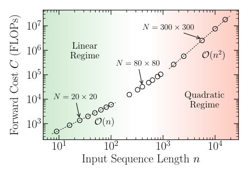 
FIG. 4. Cost C of a single forward evaluation of the trans- former wave function on one spin configuration measured in FLOPs as a function of the length of the input sequence n = L2/b2. The transformer architecture considered for this analysis has linear patch size b = 4, number of layers nl = 8 and embedding dimension d = 72. A linear scaling regime of the cost C with n (highlighted in green) and a quadratic scaling regime (highlighted in red) are identifiable.

📷 Fig 5

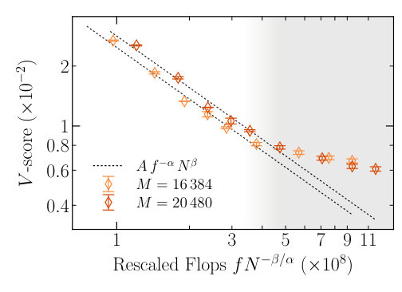 
FIG. 5. V -score as a function of the rescaled compute fN −β/α and corresponding power law fit for optimizations performed using two numbers of Monte Carlo samples, M = 16 384 and M = 20 480. The system considered here is the square J1-J2 Heisenberg with L = 12. The regime where the scaling laws cease to apply is highlighted in grey.

**Summary.** This work applies scaling laws from deep learning to variational quantum simulations of spin models. By analyzing how the approximation error decays with training compute, the authors establish a quantitative measure ($\alpha$) that characterizes the intrinsic difficulty of the target quantum ground state. This suggests scaling laws can serve as a general benchmark for variational quantum algorithms.

**Why it may be interesting.** It provides a novel, quantitative framework—the scaling exponent $\alpha$—to benchmark the difficulty of approximating quantum ground states, linking machine learning theory directly to condensed matter physics complexity.

Detailed structure

**Main problem.** The paper investigates whether the scaling laws observed in modern neural networks can be used to characterize the computational complexity of solving physical problems using Neural-Network Quantum States (NQS).

**Main result.** The accuracy measure ($V$-score) decays as a power law in training compute, and the scaling exponent systematically decreases with physical frustration, suggesting it quantifies the ground state's representational difficulty.

**Method.** The authors use a variational approach with transformer wave functions to approximate ground states, fitting the resulting error metric ($V$-score) to a power law dependent on training compute and system size.

**Model / system.** The study focuses on the $J_1$-$J_2$ Heisenberg model on 2D lattices (square and triangular) to generate target ground states spanning different levels of magnetic frustration.

**Key observables.** The $V$-score (a measure of variational accuracy), and the scaling exponents ($\alpha, eta$) derived from the power-law fit of the $V$-score vs. compute.

**Important parameters / regimes.** Frustration level ($J_2/J_1$ ratio), system size ($L 	imes L$ up to $20 	imes 20$), and training compute ($f$).

**Assumptions / limitations.** The primary assumption is that the scaling behavior follows a power law, and that the training compute scales linearly with system size ($f \approx aN$).

**Figures summary.** Figure 1 shows the scaling collapse of the $V$-score for various spin Hamiltonians against rescaled compute. Figure 2 illustrates the data collapse procedure for the square $J_1-J_2$ model.

**Paper structure.** The paper introduces the problem of applying ML scaling laws to physics, details the use of transformer wave functions for the $J_1-J_2$ model, presents the power-law fitting and data collapse, and concludes by interpreting the scaling exponent as a measure of physical complexity.

Abstract

Scaling laws, the power-law relations between loss, architecture size, and compute observed in modern neural networks, offer a quantitative way to characterize the complexity of a learning problem, with the exponent governing the decay of the loss reflecting how rapidly additional resources translate into improved accuracy, and thus how hard the target is to learn. Whether an analogous framework can characterize the complexity of physical problems remains open. We address this question for Neural-Network Quantum States, a leading variational approach for strongly correlated quantum many-body systems. Using transformer wave functions to approximate ground states of the $J_1$-$J_2$ Heisenberg model on triangular and square lattices with up to $20\times 20$ sites, we find that the $V$-score, a measure of accuracy of a variational state, decays as a power law in training compute. Under an appropriate rescaling of compute, results for different system sizes collapse onto a single curve, analogous to scaling collapse in critical phenomena. The resulting power law is, to a good approximation, independent of the number of sites, showing that the transformer Ansatz is size-consistent for the systems considered. The exponent decreases systematically with frustration, identifying it as a quantitative measure of representational difficulty of the ground state and establishing scaling laws as a general framework for benchmarking variational ansätze.

[↑ back to top](#top)

### [Vector Magnetometry with Broadband Microwave Fields in Nitrogen-Vacancy Centers in Diamond](http://arxiv.org/abs/2606.02749v1)

**Authors:** Tom R. Rieckmann, Arezoo Afshar, Aaron Z. Goldberg, Lilian Childress, Stefan Scheel, Khabat Heshami  
**Type:** both · **Category:** disordered systems and neural networks · **PDF:** <https://arxiv.org/pdf/2606.02749v1>  
**Analysis basis:** full PDF text, analyzed in chunks
**Topic relevance:** `QC/QI experiment` **3/5** · `spintronics-quantum-optics interface` **3/5** · `methods for driven-dissipative` **2/5** · `quantum measurements` **1/5**

📷 Fig 1

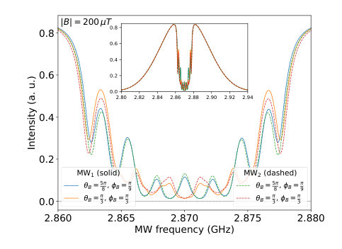 
FIG. 1. Frequency-domain response of the NV ensembles at a magnetic field of |B| = 200 µT for two orthogonal mi- crowave polarization components. The first polarization vector, bMW1 (solid lines), is aligned along the +z-axis (θ1 = 0, ϕ1 = 0) with unit amplitude. The second polar- ization vector, bMW2 (dashed lines), lies in the transverse xy-plane with θ2 = π/2 and ϕ2 = 7π/12, also with unit amplitude. Each set of curves corresponds to a different field orientation (θ, ϕ), illustrating the distinct spectral re- sponses associated with the two linear MW polarization directions. The inset provides a zoomed-out view over the broader frequency range, illustrating the full resonance structure...

📷 Fig 2

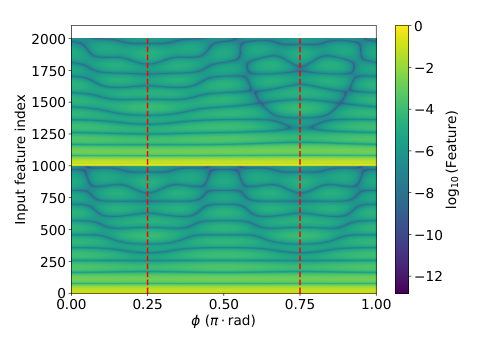 
FIG. 2. Concatenated signals IMW1(t) and IMW2(t) on the vertical axis after preprocessing for different ϕ with |B| = 100µT and θ = 3π/8. The red dashed lines show symmetry axes for the local behavior around them.

📷 Fig 3

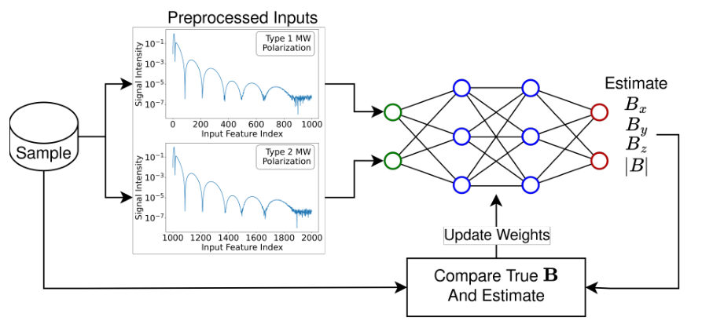 
FIG. 3. Depiction of NN-based Vector Magnetometry. Apart from a few simple preprocessing steps, the NN is tasked with directly giving Bx, By, Bz, |B| as output. The weights of the NN are updated during training using the mean square error between the true and estimated B.

📷 Fig 4

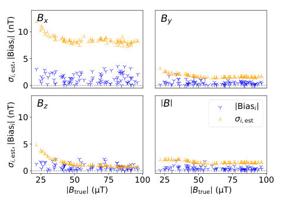 
FIG. 5. σi,est and Bias of the estimation for all Bi with an SNR of 70 dB in Method A. Each data point is extracted from a distribution of a series of estimations at the same Btrue, as depicted in Figure 4. One can see σi,est strongly depends on |Btrue|, whereas the Bias is mostly indepen- dent. Values for the minimum, maximum, and median of σi,est are given in Table I.

📷 Fig 5

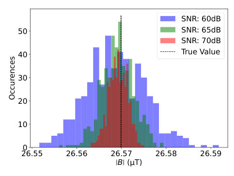 
FIG. 4. Example histogram from the estimation of |B| using 500 different noisy samples at each SNR.

**Summary.** This paper presents a breakthrough method for full vector magnetometry using Nitrogen-Vacancy centers in diamond. It overcomes the limitations of single-polarization measurements by employing two orthogonal microwave pulses and analyzing the resulting signals with deep neural networks. The technique achieves high sensitivity, enabling accurate magnetic field measurements down to the microtesla range without needing an external bias field.

**Why it may be interesting.** This work bridges quantum sensing (NV centers) with advanced machine learning techniques (NNs) to solve a complex inverse problem in condensed matter physics, providing a robust, high-precision measurement tool.

Detailed structure

**Main problem.** The paper addresses the challenge of performing full vector magnetometry ($	ext{B}_x, 	ext{B}_y, 	ext{B}_z$) using Nitrogen-Vacancy (NV) centers in diamond.

**Main result.** A novel method utilizing two orthogonally polarized microwave pulses and deep neural networks achieves high sensitivity ($\sim 5-100 	ext{ pT}/\sqrt{	ext{Hz}}$) and accuracy ($	ext{nT}$) for measuring the full magnetic field vector.

**Method.** The technique involves measuring the transmission of broadband microwave pulses through the NV ensemble, which is then analyzed using deep neural networks trained on simulated data.

**Model / system.** The physical system is the NV center in diamond, whose spin Hamiltonian governs the magnetic response. The measurement relies on analyzing the spectral line splitting induced by the Zeeman effect using two distinct, orthogonally polarized microwave fields.

**Key observables.** Measured microwave signal intensities ($I_{MW1}(t), I_{MW2}(t)$) and the estimated magnetic field components ($	ext{B}_x, 	ext{B}_y, 	ext{B}_z$).

**Important parameters / regimes.** Sensitivities ranging from $5 	ext{ pT}/\sqrt{	ext{Hz}}$ to $100 	ext{ pT}/\sqrt{	ext{Hz}}$; measurement down to $25 	ext{ }\mu	ext{T}$; $	ext{SNR}$ of $70 	ext{ dB}$.

**Assumptions / limitations.** The method requires using two orthogonal microwave polarizations to resolve all three magnetic field components independently; the analysis relies on training deep neural networks on simulated data.

**Figures summary.** Figures illustrate the frequency-domain response of NV ensembles, the dependence of estimation statistics ($\sigma_{i,est}$ and Bias) on the true field magnitude $|\mathbf{B}_{true}|$, and the improvement gained by using two microwave polarizations over one.

**Paper structure.** The paper develops the theory for vector magnetometry using two MW polarizations, details the inverse problem solving via deep neural networks, analyzes the performance metrics (sensitivity, bias) as a function of the true field strength, and discusses limitations and potential improvements.

Abstract

We present a novel method for full vector magnetometry using nitrogen-vacancy (NV) centers. In contrast to conventional optically detected magnetic resonance techniques, our method employs two distinct broadband microwave pulses and measures them after transmission through the NV sensor medium, thus capturing the line splitting of the ground state triplet due to the Zeeman effect. Two orthogonally polarized microwave pulses allow resolving all magnetic field components independently by reading out differently oriented NV centers. Simulated data is analyzed using deep neural networks, whose efficacy we expect to translate very well to experiments. Our method yields sensitivities between $5~\mathrm{pT}/\sqrt{\mathrm{Hz}}$ and $100~\mathrm{pT}/\sqrt{\mathrm{Hz}}$ across different magnetic field vector components, while achieving approximately $\mathrm{nT}$ accuracy at a signal-to-noise (SNR) ratio of $70~\mathrm{dB}$. By being capable of accurately measuring magnetic fields down to $25~\mathrm{μT}$, the need for a bias field beyond Earth's magnetic field is eliminated.

[↑ back to top](#top)

### [Energy-selective quantum search with Ising Hamiltonian phase oracles](http://arxiv.org/abs/2606.03380v1)

**Authors:** A. S. Plyashechnik, A. A. Zhukov, A. V. Lebedev, W. V. Pogosov  
**Type:** theory · **Category:** disordered systems and neural networks · **PDF:** <https://arxiv.org/pdf/2606.03380v1>  
**Analysis basis:** full PDF text, analyzed in chunks
**Topic relevance:** `analog quantum simulation` **3/5** · `exotic spin models in light-matter` **3/5** · `entanglement & information structure` **1/5** · `non-equilibrium dynamics` **1/5**

📷 Fig 1

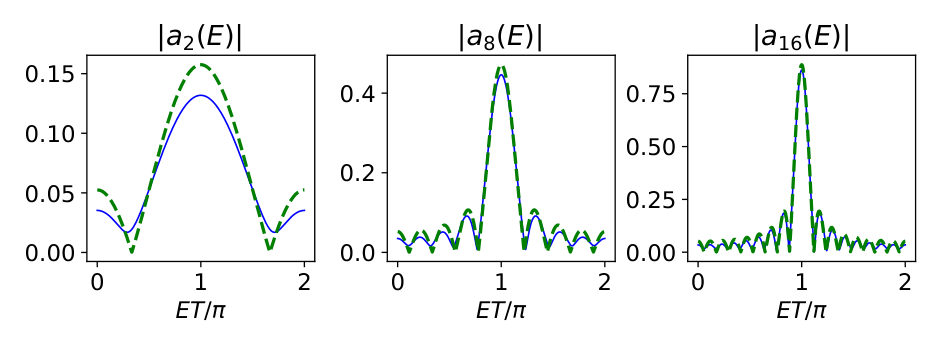 
FIG. 1. Amplification profile for an annealed Gaussian spectrum near the principal phase resonance ET = π. The horizontal axis is the dimensionless phase ET/π, and the three panels show the amplitude magnitude after K = 2, 8, 16 iterations. Solid curves are obtained from the exact spectral recurrence, while dashed curves show the local resonant approximation. The parameters are chosen such that ΣT ≃0.72. The agreement near ET/π = 1 illustrates that the local response captures the growth and narrowing of the Gaussian resonance.

📷 Fig 2

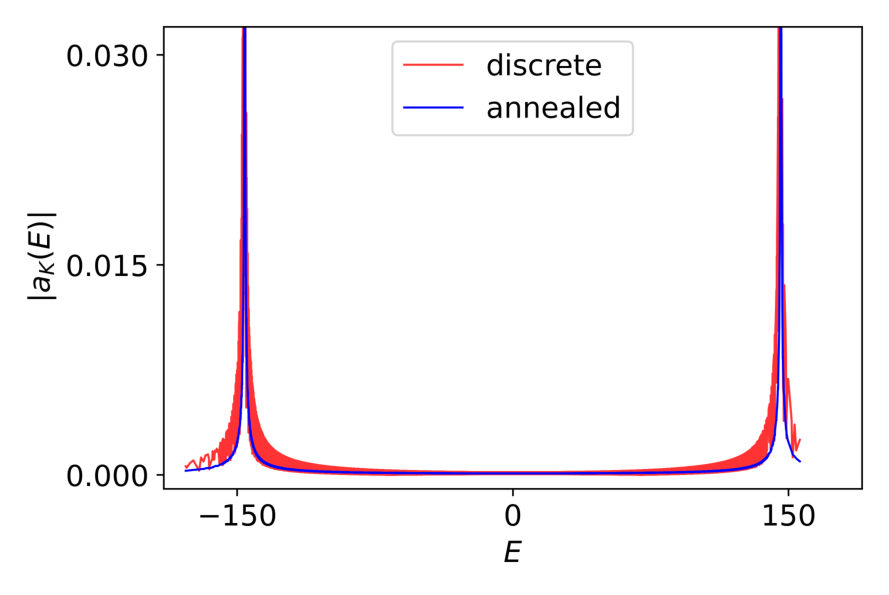 
FIG. 2. Energy-space amplification profile for a single zero-field random Ising instance compared with the annealed Gaussian prediction. The Ising instance has n = 24, hi = 0, and independent couplings Jij ∼N(0, 1). The red curve shows the response of the discrete Ising spectrum, while the blue curve shows the annealed Gaussian model with the same energy variance. Both profiles develop resonances near ET = ±π, but the discrete Ising response is shifted and distorted by spectral correlations.

📷 Fig 3

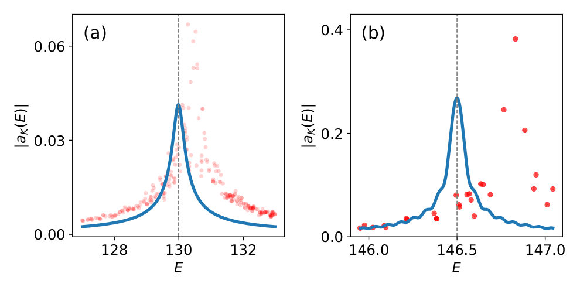 
FIG. 3. Zoom of the positive-energy resonance for zero-field random Ising spectra at n = 24. Blue curves show the annealed Gaussian response, red points show the amplitudes on the discrete Ising energy levels, and the vertical dashed line marks the Gaussian target energy E∗= π/T. Panel (a) corresponds to a denser spectral tail, approximately µ ≃0.6, with a broader and lower peak. Panel (b) corresponds to a sparser tail, approximately µ ≃1.2, with a narrower and higher peak. In both cases the discrete Ising peak is displaced relative to the Gaussian target, illustrating the realization-dependent phase shift φ0.

📷 Fig 4

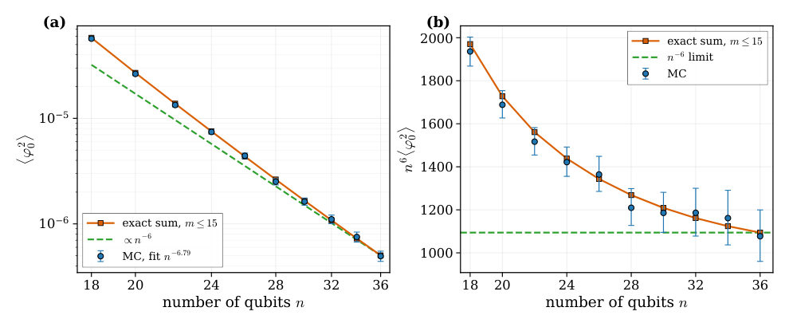 
FIG. 4. Scaling of the correlation-induced resonance displacement in the zero-field random Ising ensemble. The simulations use σJ = 1, Jij ∼N(0, 1), hi = 0, µ = 3/2, and the truncated characteristic function with m ≤15. Panel (a) shows the disorder-averaged second moment ⟨φ2 0⟩for n = 18, . . . , 36. Circles are Monte Carlo estimates, with error bars denoting 95% bootstrap confidence intervals over disorder realizations. Monte Carlo sampling is over disorder realizations, not over spin configurations. Squares show the finite-n covariance sum evaluated with the same truncation, and the dashed line indicates the asymptotic n−6 scaling. Panel (b) shows the scaled quantity n6⟨φ2 0⟩, which...

**Summary.** This paper develops a theory for an energy-selective quantum search using the natural phase accumulation from an Ising Hamiltonian's time evolution. It shows that this method achieves Grover-like speedups, while also providing crucial theoretical tools to correct for spectral shifts caused by real-world Hamiltonian correlations. This advances the understanding of quantum computation on disordered physical systems.

**Why it may be interesting.** The work provides a deep theoretical link between quantum search algorithms and the spectral properties of disordered Hamiltonians, offering insights into how physical constraints (like spectral correlations) affect quantum computational scaling.

Detailed structure

**Main problem.** The paper investigates an energy-selective quantum search primitive that uses the physical evolution of an Ising Hamiltonian as a continuous phase oracle, contrasting it with standard Boolean oracles.

**Main result.** The algorithm successfully achieves a Grover-type amplification peak, and the required oracle calls scale according to a square-root law in the annealed Gaussian limit.

**Method.** The analysis employs spectral theory, generating functions, and recurrence relations to model the quantum amplitude evolution in energy space.

**Model / system.** The system is modeled by the Ising Hamiltonian, $H(\mathbf{s})$, which describes disordered magnets and is used in optimization problems. The oracle is the time evolution operator $U_T = \exp(-iTH)$, which imparts a phase proportional to the state's energy $E_s$.

**Key observables.** The primary observables are the resonance peak position, width, and height, which determine the success probability of the search.

**Important parameters / regimes.** Key parameters include the evolution time $T$, the target energy $E^*$, and the correlation-induced spectral shift $\varphi_0 = O(n^{-3})$.

**Assumptions / limitations.** The analysis relies on approximations such as the annealed Gaussian density of states and the ability to correct for spectral correlations using spectral symmetrization or iterative calibration.

**Figures summary.** Figures compare the discrete random Ising spectrum response against the annealed Gaussian prediction, illustrating the measurable shift and distortion caused by spectral correlations.

**Paper structure.** The paper progresses from defining the energy-selective oracle to deriving the recurrence relations, analyzing the idealized annealed Gaussian case, and finally tackling the complexities introduced by spectral correlations through calibration techniques.

Abstract

Ising Hamiltonians are basic models of disordered magnets and a standard language for quantum and classical optimization. We study an energy-selective quantum search primitive in which the physical evolution \(\exp(-\mathrm{i} T H)\) is used directly as a Hamiltonian phase oracle. Unlike a Boolean oracle, this oracle marks configurations continuously by their phases and selects a finite resonance band rather than a preassigned marked set. We show that alternating it with the Grover diffusion operator nevertheless produces a Grover-type amplification peak. An exact spectral recurrence and a generating-function representation determine the peak position, width, and height. For an annealed Gaussian density of states, target energies in a high-density tail require \(Θ(\sqrt{2^n/M})\) oracle calls when the resonance contains \(M\) configurations. For random Ising spectra, overlap-induced correlations shift and distort the peak; spectral symmetrization and iterative calibration remove this detuning for prescribed-energy targeting.

[↑ back to top](#top)

### [Multiscale Phase Separation in Chemophoretic Active Matter](http://arxiv.org/abs/2606.03474v1)

**Authors:** Manisha Jhajhria, Subir K. Das, Snigdha Thakur  
**Type:** theory · **Category:** statistical mechanics · **PDF:** <https://arxiv.org/pdf/2606.03474v1>  
**Analysis basis:** full PDF text, analyzed in chunks
**Topic relevance:** `non-equilibrium dynamics` **3/5** · `non-equilibrium universality` **3/5** · `driven-dissipative phase transition` **1/5**

📷 Fig 1

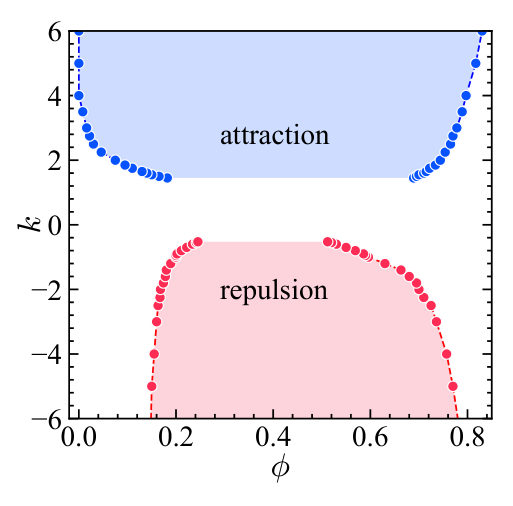 
FIG. 2. Steady-state coexistence curves for the binary sus- pensions in the phoretic strength (k) vs local packing fraction (ϕ) plane. For k &lt; 0, the system exhibits a phase separation due to chemorepulsion (red), and for k &gt; 0, the system mod- els chemoattraction (blue).

📷 Fig 2

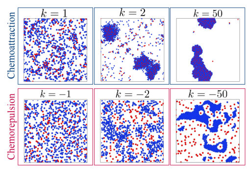 
FIG. 1. Instantaneous late time (t = 2000) simulation snapshots showing aggregation in binary mixtures of source (red) and phoretic (blue) particles. The top panels display chemoattractive cases with clusters containing both S and P particles. The bottom panels show cases for chemorepulsion, where the clusters consist solely of P particles. The diffusio- phoretic strength in both cases has been kept at |k| = 1, 2, 50. Only (L/4)×(L/4) parts of the original system (L = 150) are shown for clarity.

📷 Fig 3

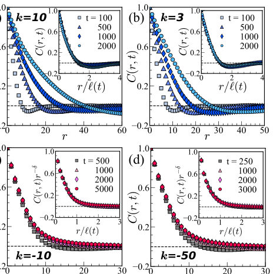 
FIG. 3. Two-point equal time correlation function, C(r, t), is plotted against r. In (a) and (b) we show results for the chemoattractive case with k = 10 and k = 3, respectively. The insets of these figures show the scaling plots of C(r, t), where the distance is divided by the time-dependent domain lengths ℓ(t). In (c) and (d), we show C(r, t) for the chemore- pulsive case with k = −10 and k = −50, respectively. Due to the fractal nature of clusters in this system, the scaling form of C(r, t) gets modified via the introduction of df. The dashed horizontal lines represent the ordinate value “0”.

📷 Fig 4

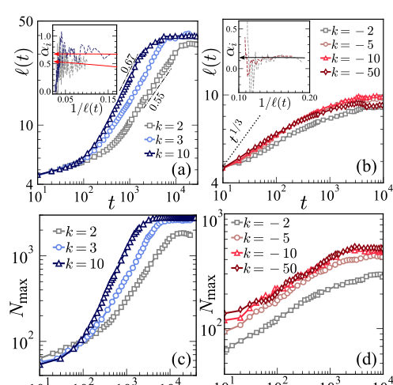 
FIG. 4. Evolutions of domain lengths ℓ(t) for different k val- ues, for the cases of (a) chemoattraction and (b) chemorepul- sion. These results are obtained from the scaling of C(r, t). The insets of both (a) and (b) show the instantaneous growth exponent, αi, as a function of 1/ℓ(t). The arrow-headed lines point towards the ℓ→∞limit. (c-d) Evolutions of maximum cluster size (Nmax), as a function of time, for chemoattractive and chemorepulsive cases, respectively.

📷 Fig 5

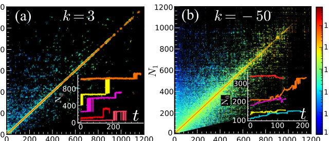 
FIG. 5. Transition probability matrix P(N1|N0, τs), analyzed for time interval τs = 10τ, for (a) chemoattractive (k = 3) and (b) chemorepulsive (k = −50) cases. The color-bar represents P(N1|N0, τs) on log scale. Insets of (a) and (b) show the number of particles in clusters of different sizes tracked over time t. (c) Conditional growth-fragmentation bias B(N0), for k = 3, 50 and k = −50, are shown against N0. Here B &gt; 0 indicates growth dominated dynamics and B &lt; 0 means fragmentation-dominated dynamics.

**Summary.** This work analyzes phase separation in active matter driven by chemical gradients, contrasting chemoattractive and chemorepulsive coupling. The key finding is that attraction leads to continuous, macroscopic domain growth, whereas repulsion causes growth to arrest at a microscale due to dynamical trapping. The study uses advanced diagnostics like growth exponents and transition matrices to distinguish these fundamentally different non-equilibrium pathways.

**Why it may be interesting.** The study provides a detailed, non-equilibrium characterization of phase separation driven by active, non-reciprocal forces, offering insights into pattern formation far from equilibrium that can inform models of active matter dynamics relevant to AMO systems.

Detailed structure

**Main problem.** The study investigates how nonreciprocal interactions in chemophoretic active matter lead to multiscale phase separation, comparing the kinetics in chemoattractive versus chemorepulsive coupling regimes.

**Main result.** Chemoattraction drives sustained, macrophase separation via cluster coalescence, while chemorepulsion leads to arrested, microscale phase separation due to strong caging and fragmentation.

**Method.** The research employs simulations and scaling analysis using the two-point equal-time correlation function, cluster transition matrices, and Mean-Squared Displacement (MSD) to characterize growth dynamics.

**Model / system.** The system models binary mixtures of chemically active source (S) and phoretic (P) particles whose motion is governed by Langevin dynamics and asymmetric chemophoretic forces. The interaction strength is controlled by the parameter k, determining attraction or repulsion.

**Key observables.** Growth exponents ($\alpha$), fractal dimension ($d_f$), cluster transition matrices, and Mean-Squared Displacements (MSD).

**Important parameters / regimes.** Phoretic strength parameter $k$ (sign determines attraction/repulsion), particle density ($\phi$), and temperature ($k_B T$).

**Assumptions / limitations.** The analysis involves mapping continuum systems to a 2D square lattice and applying coarse-graining techniques to analyze domain morphology.

**Figures summary.** Figures illustrate simulation snapshots comparing aggregation in both regimes, phase coexistence curves, and the evolution of cluster size and MSD, showing distinct scaling behaviors.

**Paper structure.** The paper systematically compares the phase-ordering kinetics by analyzing the structural evolution (correlation functions), the cluster size dynamics (transition matrices and growth/fragmentation bias), and the particle transport (MSD) across the chemoattractive ($k>0$) and chemorepulsive ($k<0$) regimes.

Abstract

Nonreciprocal interactions in active matter provide interesting structure and dynamics. Here we investigate chemophoretic systems in which nonreciprocity arises from the asymmetric coupling between agents: first species produces certain chemicals and the other phoretically responds to it. This leads to phase separation at varying scales. Our study uncovers a re-entrant steady-state phase diagram as the nature of the coupling changes from chemoattractive to chemorepulsive character. Chemoattraction provides sustained domain growth, leading to macrophase separation via cluster coalescence. Aggregation in the chemorepulsive case, on the other hand, leads to a steady-state situation that displays phase separation only at a microscale, owing to strong caging effect and frequent fragmentation. The overall far-from-steady-state dynamics is quantified via calculations of growth exponents, cluster transition matrices, and mean-squared displacements.

[↑ back to top](#top)

### [Modification of Charge and Spin Textures by Light Chemical Substitution in Eu(Al$_{1-x}$Ga$_{x}$)$_4$ ($x=0.1$)](http://arxiv.org/abs/2606.03869v1)

**Authors:** Zétény Bacsó, Fellipe Carneiro, Kevin Allen, Aly H. Abdeldaim, Rebecca Scatena, Jaime M. Moya, Emilia Morosan, Alessandro Bombardi, Roger D. Johnson  
**Type:** experiment · **Category:** strongly correlated electrons · **PDF:** <https://arxiv.org/pdf/2606.03869v1>  
**Analysis basis:** full PDF text, analyzed in chunks
**Topic relevance:** `exotic spin models in light-matter` **3/5** · `spintronics-quantum-optics interface` **3/5**

📷 Fig 1

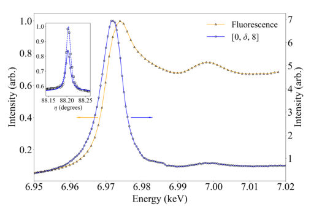 
FIG. 3. The energy dependence of the (0, δm, 8) magnetic satellite intensity (blue), showing a large resonant enhance- ment at 6.9715 keV, just below the L3 edge of the known magnetic ion Eu2+ at 6.977 keV. For reference, the x-ray fluorescence measured away from the diffraction condition is shown (orange). Inset: Diffraction intensities of opposite po- larised circular light (dashed and solid lines, respectively). Both dataset were measured at Tbase, and normalized to the maximum resonant intensity at ψ = 250◦(see Fig. 7 for definiton of azimuthal angle ψ).

📷 Fig 2

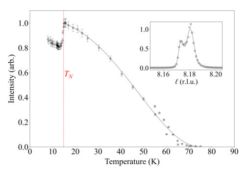 
FIG. 1. Evolution of the (1, 1, 8.18) CDW diffraction in- tensity as function of temperature. Inset: An example the CDW intensity measured along k at Tbase = 7.5 K. The peak splitting was also observed for the (1, 1, 8) structural peak, suggesting it originates in structural inhomogeneities.

📷 Fig 3

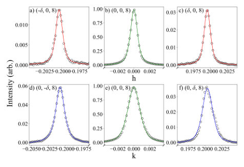 
FIG. 2. The (0, 0, 8) structural diffraction intensity b) e) (green) and its four magnetic satellites a) c) (red) and d) f) (blue), measured in the h and k reciprocal space directions. The respective magnetic wave vector was measured to be δh = δk = 0.2002(4). Measurements were carried out at Tbase = 7.45 ± 0.08 K. The above colour code is adopted throughout the paper unless stated otherwise, to differentiate the two k- domains propagating along h and k, respectively. Note that the data were renormalized to the maximum intensity of the (0, 0, 8) peak measured along k.

📷 Fig 4

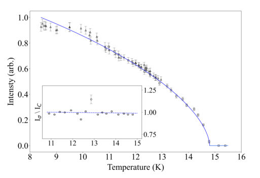 
FIG. 4. The temperature evolution of the (0, 0.2, 8) magnetic satellite measured on cooling. Long-range magnetic order de- velops at TN = 14.8 K. Inset: the normalized ratio of inten- sities measured with linear (Iσ) and circularly polarised (IC) incident light.

📷 Fig 5

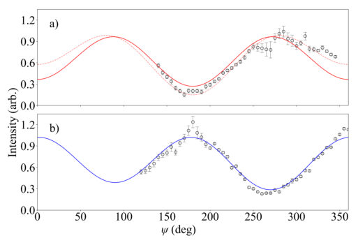 
FIG. 5. The azimuthal dependence of the a) k1 = (-0.2, 0, 8) and b) k2 = (0, 0.2, 8) magnetic satellite intensities. Elliptical helix model fit is shown as solid red and blue lines. The helicoidal model fit is shown by the dashed line on panel a). The zero point in azimuth corresponds to a sample orientation for which the (1, 0, 0) reciprocal space vector points away from the source, and within the scattering plane.

**Summary.** This experimental study uses resonant X-ray diffraction to characterize the coupled charge and spin ordering in Eu(Al1-xGa_x)4. The researchers found evidence for a Charge Density Wave and a complex magnetic structure below the Néel temperature. The work highlights the strong coupling between these two orders and details the specific helical nature of the magnetic moments in different crystal domains.

**Why it may be interesting.** The strong coupling observed between charge and spin order in a topological magnet provides a rich platform for studying emergent quantum phenomena, which is relevant to understanding correlated electron physics in novel materials.

Detailed structure

**Main problem.** The study investigates how light chemical substitution modifies the coupled charge and spin textures in the topological magnet Eu(Al1-xGa_x)4.

**Main result.** The system exhibits strong coupling between the Charge Density Wave (CDW) and magnetic order, with the magnetic structure characterized as a single helical arrangement in the k2 domain and a tilted helicoid in the k1 domain below the Néel temperature.

**Method.** Resonant X-ray diffraction experiments were performed at the Eu L3 edge, utilizing polarization analysis and azimuthal measurements to resolve both charge and spin modulations.

**Model / system.** The physical system is the intermetallic topological magnet Eu(Al1-xGa_x)4, where the substitution of Al by Ga ($x=0.1$) is used to tune the electronic and magnetic properties. The analysis focuses on the interplay between CDW formation and long-range magnetic ordering.

**Key observables.** CDW propagation vector (kCDW ~ (0, 0, 0.18)), magnetic satellite positions (k = (±δ_m, 0, 0) and (0, ±δ_m, 0)), and the ratio of intensities measured with linear vs. circularly polarized light.

**Important parameters / regimes.** Temperature (especially the transition temperatures $\approx 75 	ext{ K}$ for CDW and $T_N = 14.8 	ext{ K}$ for magnetism), and the substitution concentration ($x=0.1$).

**Assumptions / limitations.** The analysis assumes that the observed magnetic scattering can be modeled using elliptical helix or helicoidal structures, and that the temperature invariance of the polarization ratio suggests a single magnetic phase below $T_N$.

**Figures summary.** Figures illustrate the temperature evolution of CDW intensity showing a sharp drop near 15 K, and show magnetic satellites in reciprocal space, with further analysis using azimuthal dependence to model the spin structure.

**Paper structure.** The paper first establishes the presence of CDW and magnetic order, noting the coincidence of the CDW drop and $T_N$. It then uses azimuthal measurements to fit the magnetic satellite intensities, distinguishing between different types of helical spin arrangements in the two observed magnetic domains.

Abstract

We present the results of a resonant X-ray diffraction experiment, resolving both charge and spin textures in the intermetallic topological magnet Eu(Al$_{1-x}$Ga$_{x}$)$_4$, $x$ = 0.1. Below $\approx$ 75 K the system develops a charge density wave (CDW) with propagation vector kCDW ~ (0, 0, 0.18). The CDW order parameter grows monotonically on cooling until ~ 15 K, when a sudden decrease in the CDW amplitude occurs. Pairs of magnetic satellites of the (0, 0, 8) Bragg reflection corresponding to two distinct domains, k = ($\pm δ_\text{m}$, 0, 0), k2 = (0, $\pmδ_\text{m}$, 0), $δ_\text{m} = 0.2002(4)$ were studied at the Eu L3 edge, appearing below TN = 14.8 K. Our measurement of TN is exactly coincident with the sudden drop in the CDW amplitude, which suggests strong coupling between the charge and spin orders, as observed in other compounds of the Eu(Al$_{1-x}$Ga$_{x}$)$_4$ series. Azimuthal measurements revealed a single helical spin arrangement with an elliptical envelope of $μ_\text{Y}/μ_\text{Z}$ = 1.19(6) for the k2 domain, and a tilted helical (helicoidal) spin arrangement for the k1 domain, with $μ_\text{Y}/μ_\text{Z}$ = 1.14(4) and $μ_\text{X}/μ_\text{Z}$ = 0.20(2) that may be hidden for the k2 domain due to multiple subdomains. Temperature evolution of the magnetic satellite intensities in linear and circularly polarised light found the respective ratio to be invariant with temperature, suggesting a single magnetic phase below TN. This behaviour is unlike the x = 0 material, in which a spin density wave forms first, transitioning to a helical ground state on cooling through intermediate phases. Future theoretical work on the Eu electronic ground state, supported by related experiments, will help understand the effects of Ga substitution on the evolution of the magnetic structure.

[↑ back to top](#top)

### [Tailoring pure valley-Zeeman spin-orbit coupling in WSe$_2$-encapsulated monolayer graphene](http://arxiv.org/abs/2606.03278v1)

**Authors:** Yaqing Han, Siqi Jiang, Jingkuan Xiao, Jiawei Jiang, Yulu Liu, Jiabei Huang, Yu Du, Di Zhang, Fuzhuo Lian, Wanting Xu, Siqin Wang, Kenji Watanabe, Takashi Taniguchi, Xiaoxiang Xi, Alexander S. Mayorov, Renjun Du, Kai Chang, Hongxin Yang, Lei Wang, Geliang Yu  
**Type:** both · **Category:** other · **PDF:** <https://arxiv.org/pdf/2606.03278v1>  
**Analysis basis:** full PDF text, analyzed in chunks
**Topic relevance:** `spintronics-quantum-optics interface` **3/5** · `exotic spin models in light-matter` **2/5** · `analog quantum simulation` **1/5**

📷 Fig 1

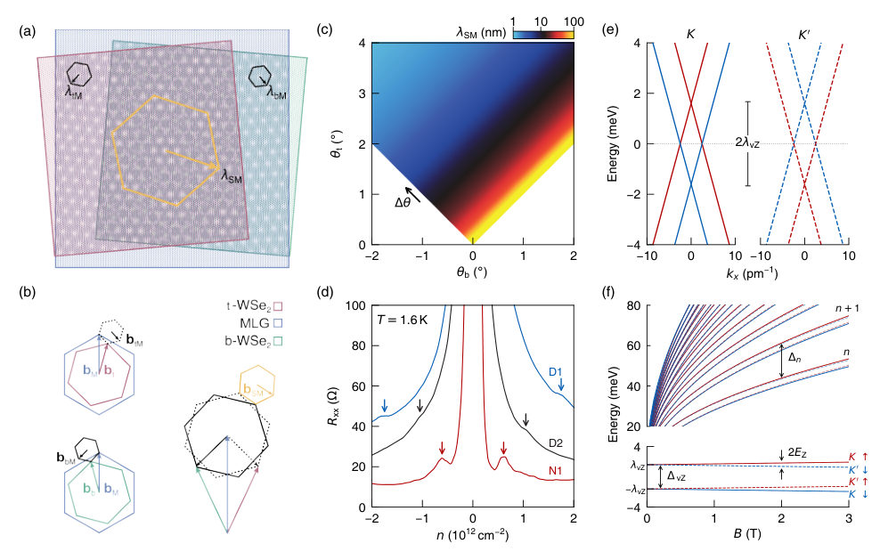 
FIG. 1. (a) Schematic of the WSe2/MLG/WSe2 super-moiré lattice. Top- and bottom-WSe2 monolayers are twisted relative to MLG by θt and θb, constructing moiré superlattices with wavelengths of λtM and λbM, respectively. Their overlap forms a super-moiré lattice with λSM. (b) Schematic of Brillouin zones of top-WSe2 (red), MLG (blue) and bottom-WSe2 (green). The reciprocal vectors of the primary moiré (super-moiré) lattices are denoted by black (yellow) arrows. (c) Calculated λSM as functions of θb and θt for a small twist-angle between WSe2 layers ∆θ = |θt −θb|. (d) Rxx as a function of n in investigated devices measured at B = 0 T and T = 1.6 K. Arrows indicate the positions of SDPs. (e)...

📷 Fig 2

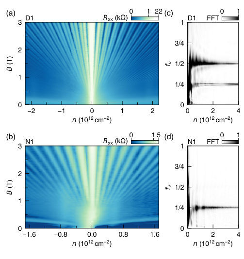 
FIG. 2. (a),(b) Rxx as functions of n and B measured at D = 0 for the devices D1 and N1, respectively. (c),(d) FFT spectra obtained from the Landau fans shown in (a) and (b), respectively, plotted as functions of carrier density n and nor- malized frequency fν = f/(nϕ0). Here, f is the oscillation frequency calculated for each density in Tesla, and ϕ0 = h/e is the magnetic flux quantum.

📷 Fig 3

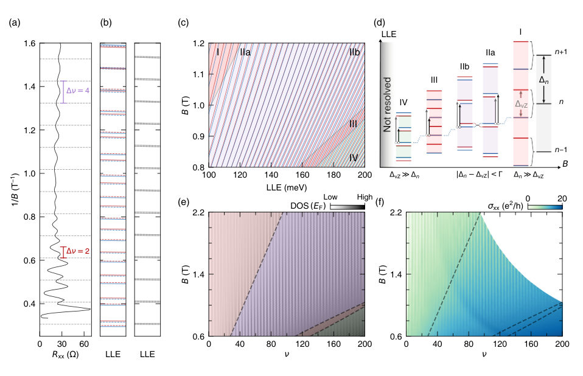 
FIG. 3. (a) Rxx as a function of 1/B at n = 1.05 × 1012 cm−2, replotted from Fig. 2(a). The gray-dashed lines denote the integer quantum Hall sequence of LL filling factor ν = 4N, where the index N is an integer. (b) Calculated LL energy (LLE) as a function of 1/B at λvZ = 1.6 (left-panel) and 0 meV (right-panel), respectively. The color code (red and blue) represents the out-of-plane spin (up and down), and gray denotes the states of pristine MLG. Solid and dashed lines denote LLs from K and K′ valleys, respectively. (c) Calculated LLE as a function of B at λvZ = 1.6 meV. (d) Schematic of LLs as a function of B, depicting the competition between ∆vZ and ∆n. Only the LLs of the K valley are...

📷 Fig 4

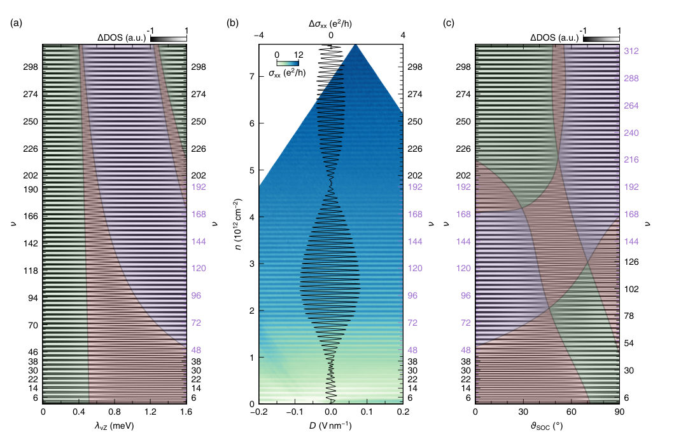 
FIG. 4. (a) Calculated ∆DOS(EF) as functions of λvZ and ν at λR = 0 meV and B = 1 T. (b) Experimentally measured σxx as functions of D and n at B = 1 T. The line slice of SdH oscillations ∆σxx extracted from D = 0.07 V nm−1. (c) Calculated ∆DOS(EF) as functions of ϑSOC = arctan(λR/λvZ) and ν at λSOC = 1.6 meV and B = 1 T. ∆DOS(EF) and ∆σxx are obtained by subtracting the corresponding smooth background. The black and purple ticks on the y-axis denote that the quantization sequence is half-integer and integer, respectively. The shaded regions in (a) and (c) use the same color scheme as in Fig. 3.

**Summary.** This research reports the successful experimental realization of pure valley-Zeeman spin-orbit coupling in graphene by sandwiching it between twisted WSe2 layers. By analyzing quantum oscillations and Landau level spectra, the authors demonstrate precise control over the SOC components, showing a transition between symmetry-broken and highly degenerate quantum Hall states. This work establishes a powerful platform for designing novel electronic properties in van der Waals heterostructures.

**Why it may be interesting.** This work provides a clean, tunable platform for engineering fundamental spin-valley coupling in 2D materials, which is crucial for developing topological quantum devices and spintronics.

Detailed structure

**Main problem.** The primary goal is to experimentally realize and control pure valley-Zeeman spin-orbit coupling (SOC) in monolayer graphene using a van der Waals heterostructure.

**Main result.** The authors successfully demonstrated pure valley-Zeeman SOC via WSe2/graphene/WSe2 encapsulation, evidenced by the reordering of Landau levels and the ability to tune the SOC strength and even quench it.

**Method.** The study combines magneto-transport measurements (Shubnikov-de Haas effect, $
ho_{xx}$ vs $B$) with theoretical modeling (tight-binding) and Fast Fourier Transforms (FFT) analysis of quantum oscillations.

**Model / system.** The system is graphene encapsulated between two parallel twisted WSe2 monolayers. The physics is governed by the Dirac Hamiltonian perturbed by proximity-induced SOC terms, specifically the valley-Zeeman ($\lambda_{vZ}$) and Rashba ($\lambda_R$) components.

**Key observables.** Landau level reordering, symmetry-enforced transitions between twofold and fourfold degenerate quantum Hall states, frequency splitting ($\Delta f_
u$) in FFT spectra, and the effective SOC strength ($\lambda_{SOC}$).

**Important parameters / regimes.** Twist angle ($\Delta	heta$), magnetic field ($B$), carrier density ($n$), and the relative strengths of the SOC components ($\lambda_{vZ}$ vs $\lambda_R$).

**Assumptions / limitations.** The proximity effect is modeled by adding specific SOC terms to the graphene Hamiltonian, and the electronic structure is analyzed using tight-binding models.

**Figures summary.** Figures illustrate the super-moiré lattice structure and calculated LL spectra for pure valley-Zeeman SOC, alongside $
ho_{xx}$ vs $B$ measurements showing phase transitions between symmetry-broken and fourfold-degenerate states.

**Paper structure.** The paper progresses by establishing the platform (WSe2/graphene/WSe2), theoretically modeling the SOC components, and then presenting experimental evidence from transport measurements (SdH, FFT) to confirm the selective realization and tunability of the pure valley-Zeeman SOC regime.

Abstract

Engineering proximity effects in twisted van der Waals heterostructures offers a powerful platform for designing electronic properties. While theoretical predictions of quantum interference in transition metal dichalcogenide-encapsulated graphene can selectively control the spin-orbit coupling component, experimental realizations have remained elusive. Here, we report pure valley-Zeeman spin-orbit coupling in monolayer graphene, achieved by encapsulation between two parallel twisted WSe$_2$ monolayers. We observed a symmetry-enforced reordering of Landau levels, which is driven by the competition between the fixed valley-Zeeman energy and the magnetic-field-dependent cyclotron energy. This reordering is characterized by a transition from symmetry-broken states in the quantum Hall effect to a restored fourfold degeneracy with integer or half-integer quantum Hall sequences. We also demonstrate the ability to completely quench the proximity spin-orbit coupling by tuning the encapsulated geometry.

[↑ back to top](#top)

### [Skyrmion and meron phases induced by spin-phonon coupling](http://arxiv.org/abs/2606.02793v1)

**Authors:** E. Iroulart, F. A. Gómez Albarracín, H. Diego Rosales  
**Type:** theory · **Category:** statistical mechanics · **PDF:** <https://arxiv.org/pdf/2606.02793v1>  
**Analysis basis:** full PDF text, analyzed in chunks
**Topic relevance:** `analog quantum simulation` **3/5** · `exotic spin models in light-matter` **1/5** · `methods for driven-dissipative` **1/5**

📷 Fig 1

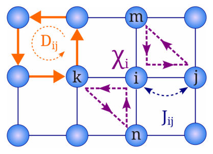 
FIG. 1. Illustration of the square lattice, indicating near- est neighbors exchange Jij between sites (i, j) (blue) and Dzyaloshinskii-Moriya interaction Dij. Purple dashed arrows indicate the orientation used to compute the scalar chirality (Eq. 9) from spins at sites (i, j, m).

📷 Fig 2

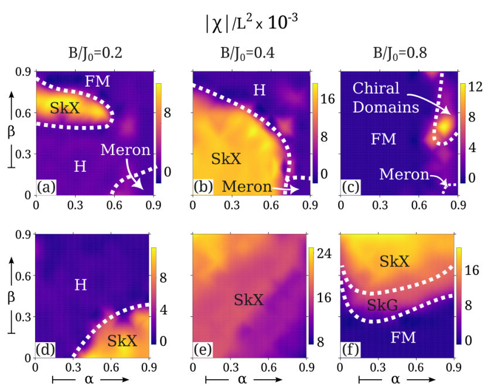 
FIG. 2. (Color online) Density plots of the absolute normalized chirality |χ|/L2 as a function of α and β for magnetic fields B/J0 = 0.2, 0.4 and 0.8 at the lowest simulated temperature T/J0 = 1.2×10−3. Top row: Einstein site-phonon model. Bottom row: Bond-phonon model.

📷 Fig 3

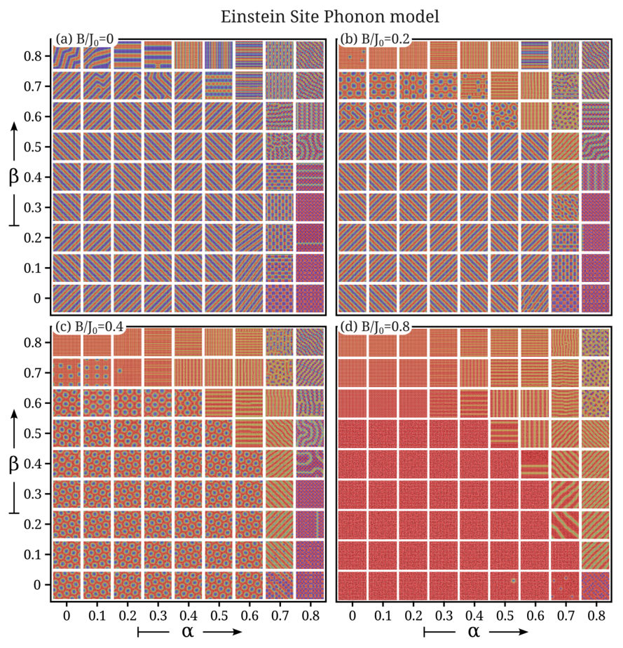 
FIG. 3. (Color online) Representative magnetic configurations for the Einstein site-phonon model as a function of α and β ∈[0, 0.8] at the lowest simulated temperature T/J0 = 1.2 × 10−3. Panels correspond to magnetic fields (a) B/J0 = 0, (b) 0.2, (c) 0.4, and (d) 0.8. The grid illustrates the evolution of magnetic textures across parameter space, including helical (H), skyrmion crystal (SkX), meron–antimeron, and mixed phases.

📷 Fig 4

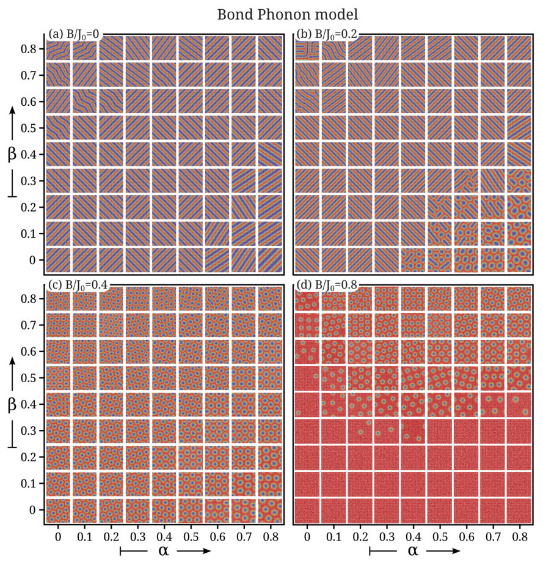 
FIG. 4. (Color online) Representative magnetic configurations for the bond-phonon model as a function of α and β ∈[0, 0.8] at the lowest simulated temperature T/J0 = 1.2 × 10−3. Panels correspond to magnetic fields (a) B/J0 = 0, (b) 0.2, (c) 0.4, and (d) 0.8. Compared to the ESP model, the BP coupling predominantly stabilizes skyrmion textures over a wider region of parameter space, with fewer competing phases.

📷 Fig 5

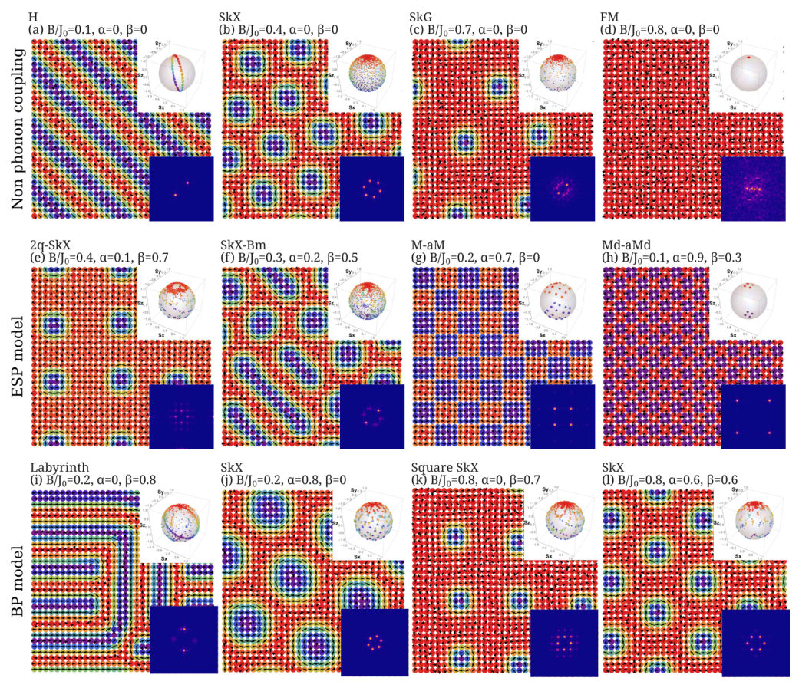 
FIG. 5. (Color online) Representative magnetic configurations under different magnetic fields and spin-phonon coupling schemes. The first row (panels (a)-(d)) shows the reference model without SP coupling (α = β = 0) for B/J0 = 0.0, 0.4, 0.6, and 0.8, corresponding to: (a) helical phase (H), (b) hexagonal skyrmion crystal (SkX), (c) skyrmion gas (SkG), and (d) fully polarized phase (FM). The second row (panels (e)-(h)) displays configurations in the ESP model, illustrating phases induced by SP coupling, including: (e) square double-q skyrmion crystal (2q-SkX), (f) skyrmion–bimeron (SkX-Bm) phase, (g) meron- antimeron crystal (M-aM), and (h) compact meron-antimeron (CM-aM) phase. The third...

**Summary.** This work explores how coupling between magnetic spins and lattice vibrations (spin-phonon coupling) alters the magnetic ground state of chiral magnets. Using Monte Carlo simulations on two distinct coupling models (ESP and BP), the authors demonstrate that lattice effects can stabilize novel topological phases, such as meron-antimeron crystals, and tune the transition between different skyrmion lattice structures.

**Why it may be interesting.** The explicit inclusion of lattice degrees of freedom (phonons) provides a concrete, tunable mechanism for controlling topological magnetic order, which is highly relevant for understanding emergent quantum phenomena in solid-state systems.

Detailed structure

**Main problem.** The study investigates how spin-phonon (SP) coupling modifies magnetic interactions and the resulting topological spin textures, such as skyrmions and merons, in chiral magnets.

**Main result.** Lattice effects provide a simple mechanism to tune topological magnetic phases, stabilizing exotic structures like M-aM crystals and distorting conventional skyrmion lattices into square arrangements.

**Method.** The research employs Monte Carlo simulations to analyze the effective Hamiltonians derived from two simplified spin-phonon coupling models: Einstein site-phonon (ESP) and bond-phonon (BP).

**Model / system.** The system is a two-dimensional skyrmion model on a square lattice, starting from a Heisenberg model Hamiltonian modified by SP coupling terms. The analysis compares the effects of site-based (ESP) versus bond-based (BP) phonon interactions.

**Key observables.** Local and total scalar chirality ($\chi$), topological charge ($Q$), and the structure factor ($S_{\perp}(\mathbf{q})$) are used to characterize the magnetic phases.

**Important parameters / regimes.** The coupling strengths ($\alpha, eta$) and the external magnetic field ($B/J_0$) are the key tuning parameters explored in the phase diagrams.

**Assumptions / limitations.** The analysis assumes that lattice distortions modify the magnetic interactions (Exchange and DM) linearly, and it compares results from two distinct, simplified models for SP coupling (ESP vs. BP).

**Figures summary.** Figures illustrate phase diagrams showing stabilization regions for various textures (e.g., 2q-SkX, M-aM) as a function of coupling parameters, and density plots visualizing chirality in different phases.

**Paper structure.** The paper systematically compares the predictions of the ESP and BP models, detailing how the resulting effective Hamiltonians lead to different topological phases, culminating in a discussion of how lattice effects tune the magnetic ground state.

Abstract

In chiral magnets, magnetic skyrmions are typically stabilized by the competition between exchange and Dzyaloshinskii-Moriya interactions under an external magnetic field, while the role of lattice degrees of freedom has received comparatively less attention. Here we study how spin-phonon (SP) coupling modifies magnetic interactions and the resulting spin textures in a two-dimensional skyrmion model in the square lattice. Using Monte Carlo simulations, we compare two simplified models describing the SP coupling: the Einstein site-phonon (ESP) and bond-phonon (BP) models. We find that ESP coupling stabilizes skyrmion crystals in field regimes that are topologically trivial in the uncoupled model and also induces additional textures, including meron-antimeron (M-aM) crystals and mixed skyrmion-bimeron (SkX-Bm) phases. Furthermore, for sufficiently strong phonon coupling, the conventional triple-$\textbf{q}$ hexagonal skyrmion lattice is distorted into a double-$\textbf{q}$ square skyrmion lattice. Overall, our results show that lattice effects provide a simple mechanism to tune topological magnetic phases.

[↑ back to top](#top)

### [Spin-$s$ model with competing interactions on diamond-decorated lattices](http://arxiv.org/abs/2606.02766v1)

**Authors:** D. V. Dmitriev, V. Ya. Krivnov, O. A. Vasilyev  
**Type:** theory · **Category:** statistical mechanics · **PDF:** <https://arxiv.org/pdf/2606.02766v1>  
**Analysis basis:** full PDF text, analyzed in chunks
**Topic relevance:** `analog quantum simulation` **3/5** · `entanglement & information structure` **1/5** · `exotic spin models in light-matter` **1/5**

📷 Fig 1

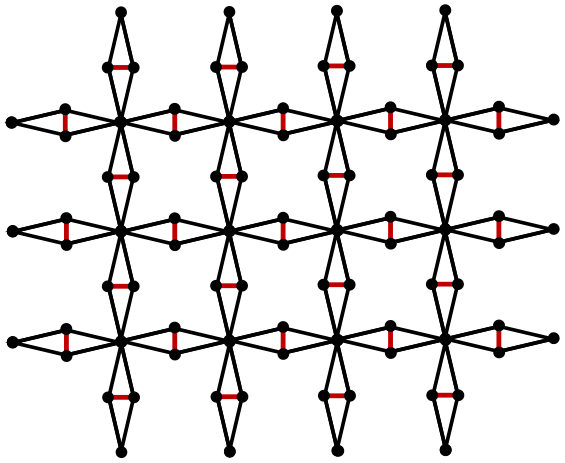 
FIG. 1. Spin-s Heisenberg model on the ideal diamond-decorated square lattice. Black lines denote

📷 Fig 2

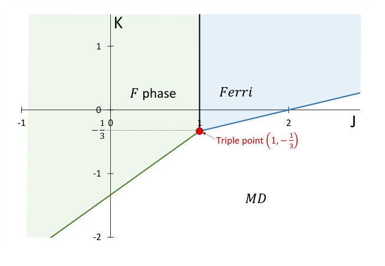 
FIG. 3. Ground state phase diagram of the ideal diamond-decorated spin-1 model in the (J, K)

📷 Fig 3

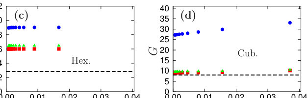 
FIG. 4. The values of G = W 1/N as a function of 1/N for (a) square; (b) triangular; (c) honeycomb;

📷 Fig 4

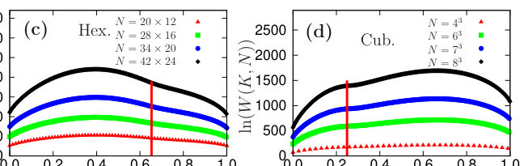 
FIG. 5. Contributions to the partition function ln W(K, N) (Eq. (37)) at the triple point as a

📷 Fig 5

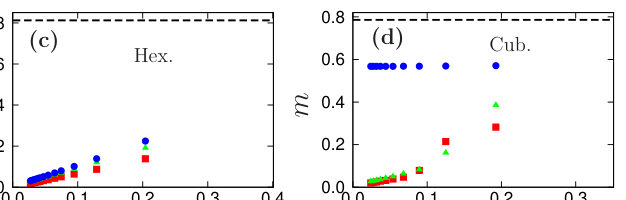 
FIG. 6. Magnetization per spin calculated according to Eq. (48) as a function of N−1/2 for (a)

**Summary.** This theoretical work analyzes a complex spin model on diamond-decorated lattices exhibiting competing magnetic interactions. By exploiting local spin conservation, the authors map out a phase diagram featuring three distinct magnetic phases. The key findings highlight that the system achieves maximal ground state degeneracy and high residual entropy at a multicritical point, suggesting applications in quantum cooling technologies.

**Why it may be interesting.** The study of high residual entropy and macroscopic degeneracy at multicritical points is highly relevant to understanding quantum phase transitions and the potential for quantum thermal engines.

Detailed structure

**Main problem.** The paper investigates the ground state properties, magnetization, and low-temperature thermodynamics of a spin-$s$ model with competing ferromagnetic and antiferromagnetic interactions on diamond-decorated lattices.

**Main result.** The system exhibits rich phase diagrams (F, Ferri, MD) meeting at a multicritical point where the ground state degeneracy is maximal, leading to high residual entropy.

**Method.** The analysis combines exact diagonalization for the 1D chain with mapping the 2D/3D problem onto a bond percolation framework for calculating ground state degeneracy and magnetization.

**Model / system.** The model is a spin-$s$ Heisenberg model defined on diamond-decorated lattices, incorporating bilinear and higher-order exchange interactions. Local conservation of the composite spin on each diamond diagonal allows for the exact analysis of local energy minimization.

**Key observables.** Ground state degeneracy ($W$), residual entropy per spin ($S_0$), low-temperature magnetization ($m$), and the excitation spectrum (gapped/gapless).

**Important parameters / regimes.** The spin values ($s, \sigma$), the coupling ratios ($J, K$), and the lattice dimensionality (1D chain, 2D, 3D).

**Assumptions / limitations.** The analysis relies on the local conservation of the composite spin on each diamond unit, and for higher dimensions, the problem is mapped onto a bond percolation framework.

**Figures summary.** Figures illustrate the lattice structure and couplings (Fig. 1, 2). Phase diagrams show the three competing phases (F, Ferri, MD) meeting at a triple point (Fig. 3). Further figures detail magnetization curves and percolation exponents (Fig. 4, 5, 6).

**Paper structure.** The paper first establishes the general formalism using local spin conservation. It then analyzes the pure Heisenberg case, detailing $2\sigma$ transitions. The focus shifts to the $s=\sigma=1$ case, mapping the phase diagram and calculating degeneracy/entropy. Finally, it analyzes magnetization and specific heat across different lattice dimensions and critical lines.

Abstract

We investigate the ground state properties, magnetization, and low-temperature thermodynamics of the ferromagnetic-antiferromagnetic spin-$s$ model on diamond-decorated lattices with ideal diamond units, incorporating bilinear Heisenberg and higher-order exchange interactions between diagonal spins-$σ$. Local conservation of the composite spin on each diamond diagonal enables exact analysis. For the pure Heisenberg case, the system undergoes a series of $2σ$ transitions between monomer-dimer (MD), ferrimagnetic (Ferri) and ferromagnetic (F) phases with different optimal composite spin values as the coupling ratio varies. In the presence of higher-order interactions, a multicritical point exists where the states with all possible values of composite spin are degenerate, leading to maximal ground state degeneracy. The case $s=σ=1$ with bilinear and biquadratic interactions is studied in detail. Its phase diagram comprises three phases - F, Ferri and MD, which meet at a triple point. On the phase boundaries, the ground state becomes macroscopically degenerate. For the diamond chain, we calculate the ground state degeneracy exactly; for higher dimensions, the problem maps onto a bond percolation framework, solved numerically. The residual entropy per spin reaches up to $60\%$ of the maximal value, peaking at the triple point. Low-temperature magnetization curves in external magnetic fields exhibit plateaus and jumps. The excitation spectrum is gapped in the MD phase, gapless in the F phase, and resembles that of the Lieb-Mattis ferrimagnet in the Ferri phase. The high residual entropy suggests potential applications in ultra-low-temperature cooling and quantum thermal machines.

[↑ back to top](#top)

### [Spin-chiral electron-phonon coupling in metallic strontium titanate](http://arxiv.org/abs/2606.03908v1)

**Authors:** N. Somun, L. Rogić, I. Khayr, E. Tafra, M. Basletić, A. Kundu, J. Dzian, F. Le Mardele, M. Orlita, M. Greven, B. Büchner, A. Alfonsov, M. N. Gastiasoro, A. Klein, D. Pelc  
**Type:** both · **Category:** strongly correlated electrons · **PDF:** <https://arxiv.org/pdf/2606.03908v1>  
**Analysis basis:** full PDF text, analyzed in chunks
**Topic relevance:** `spintronics-quantum-optics interface` **3/5** · `exotic spin models in light-matter` **2/5**

📷 Fig 1

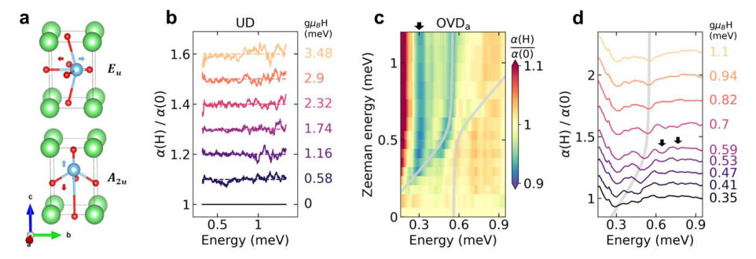 
Figure 1 | Magnetic field effects on soft polar phonons in STO. a, Sketch of atomic displacements for the two softest transverse optic polar phonon modes in the tetragonal phase of STO, with Eu and A2u symmetry; the displacements correspond to antiphase motion of the titanium atom and oxygen cage (Slater mode). b, Magneto-optical absorption across the Eu phonon in undoped (UD) insulating STO in magnetic fields up to H = 30 T, at 1.3 K and normalized by the zero-field absorption; the field is expressed as the Zeeman energy 𝐸𝑍= 𝑔𝜇𝐵𝐻 using the free- electron gyromagnetic ratio g = 2. We do not observe any changes within the noise, which puts an upper limit on the phonon magnetic moment of...

📷 Fig 2

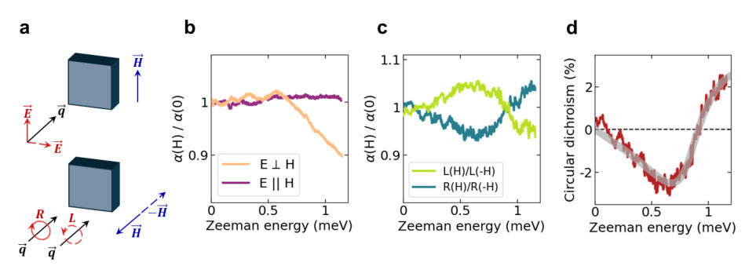 
Figure 2 | Effects of light polarization on the magneto-optical response of metallic STO. a, Sketch of the experimental geometry for linear and circularly polarized light. H is the external magnetic field, q is the light propagation direction, E the electric field, and R and L denote left- and right-hand circularly polarized light. b, Magneto-optical absorption for light linearly polarized perpendicular and along the direction of the magnetic field, measured at photon energy 1 meV for sample OVDb with carrier concentration 7.2 ⋅1018 cm-3. A field-induced change is only observed in the perpendicular direction, in line with theoretical predictions. c, Absorption of circularly polarized light...

📷 Fig 3

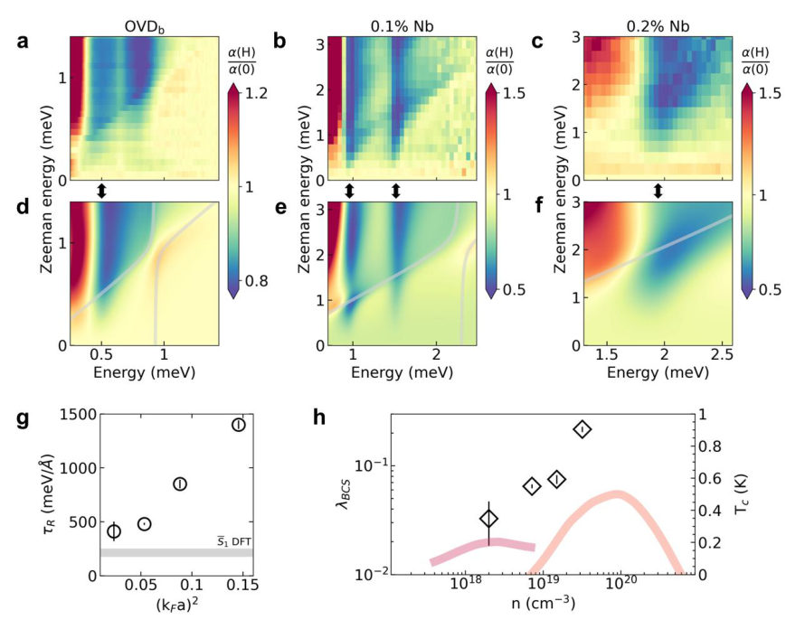 
Figure 3 | Doping dependence of the magneto-optical response of metallic STO. a-c, Data for samples with three different electron concentrations: 7.2 ⋅1018 cm-3 (OVDb), 1.5 ⋅1019 cm-3 (0.1% Nb-Ti substitution) and 3.2 ⋅1019 cm-3 (0.2% Nb-Ti substitution). In all cases, the hybridized phonon-spin-flip chiral excitations partially overlap with plasma absorption edges (blue vertical features around 0.5 meV in (a), 1 and 1.6 meV in (b) and 2 meV in (c)), but they are clearly visible as sloped lines below the anticrossing point, especially in (a) and (b). d-f, Colormaps: fits of theoretical magneto-optical absorption to the data in (a-c), showing excellent agreement (see Methods for details of...

**Summary.** This work reveals a previously unappreciated, direct spin-mediated coupling between conduction electrons and polar phonons in strontium titanate. Using magneto-optical measurements, the authors quantify this coupling, finding it is strong enough to explain the material's superconductivity. This suggests that spin-orbit coupling plays a crucial role in determining electronic properties in polar oxides.

**Why it may be interesting.** The discovery of a spin-mediated EPC mechanism provides a novel coupling channel that can be relevant to understanding superconductivity and spintronics in polar materials, bridging concepts from condensed matter magnetism and superconductivity.

Detailed structure

**Main problem.** The paper investigates the role of electronic spin in electron-phonon coupling (EPC), proposing a direct spin-mediated coupling mechanism contrary to conventional assumptions.

**Main result.** A strong spin-mediated EPC was observed in metallic strontium titanate, generating chiral phonon modes whose coupling strength is large enough to potentially explain superconductivity in the material.

**Method.** The study combines far-infrared light absorption measurements in a magnetic field (experiment) with theoretical modeling using Rashba-like coupling Hamiltonians (theory).

**Model / system.** The model system is Strontium Titanate (STO), studied in its metallic state via doping. The theoretical framework involves a Rashba-like EPC Hamiltonian interacting with transverse polar phonons.

**Key observables.** Spin-phonon hybridization signatures in optical absorption spectra, Magnetic Circular Dichroism (CD) response, and the electron-phonon coupling strength ($	au_R$).

**Important parameters / regimes.** The coupling strength ($	ilde{\lambda}_R$), carrier concentration (e.g., OVDb, 0.1% Nb), and the BCS coupling parameter ($\lambda_{BCS}$).

**Assumptions / limitations.** Approximations include assuming a simple antiphase oscillation for atomic displacement and simplifying the electronic dispersion (e.g., parabolic dispersion).

**Figures summary.** Figures show evidence of hybridized spin-phonon excitations in magneto-optical spectra, demonstrating polarization and doping dependence, and confirming the chiral nature of the coupling.

**Paper structure.** The paper progresses by first establishing the existence of the spin-mediated EPC via optical measurements, then quantifying its dependence on carrier concentration, and finally relating the coupling strength to superconducting parameters.

Abstract

Electron-phonon coupling (EPC) - the interaction between conduction electrons and quantized atomic vibrations - plays a central role in condensed matter physics and determines some of the most important properties of materials, such as electrical resistivity and superconductivity. Conventionally, EPC is assumed to be induced by the ionic electrostatic background, and electronic spin plays no role in the process. In stark contrast with this view, here we uncover a direct spin-mediated coupling mechanism between electrons and transverse polar phonons in a metal. Using far-infrared light absorption measurements of the model system SrTiO$_3$ in a magnetic field, we observe a strong spin-mediated EPC that is quantitatively consistent with recent theoretical predictions, and that generates chiral phonon modes with large effective magnetic moments. The extracted coupling strength is in good agreement with ab initio estimates and sufficiently high to explain superconductivity in SrTiO$_3$, thereby resolving a long-standing conundrum. Spin-chiral EPC should generically appear in all metals with polar phonons, and the present work could be of relevance to spintronics applications and to uncovering the origins of superconductivity in layered materials, metals with Dirac points in their electronic dispersions, and nearly ferroelectric superconductors.

[↑ back to top](#top)

### [Squeezed-state semi-device-independent quantum randomness generation](http://arxiv.org/abs/2606.03898v1)

**Authors:** Hamid Tebyanian  
**Type:** theory · **Category:** quantum information and computing · **PDF:** <https://arxiv.org/pdf/2606.03898v1>  
**Analysis basis:** full PDF text, analyzed in chunks
**Topic relevance:** `quantum measurements` **3/5** · `entanglement & information structure` **2/5**

📷 Fig 1

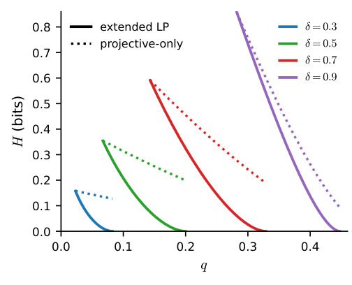 
FIG. 1. Extended-LP closed form Hext Sh = r · h(p) (solid) and projective-only LP value h(pproj) (dotted), on the rate- positive interval q ∈(qb, qz) at δ ∈{0.3, 0.5, 0.7, 0.9}.

📷 Fig 2

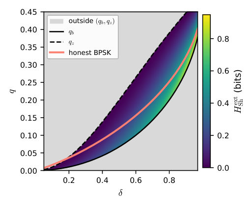 
FIG. 2. Hext Sh (δ, q) on the rate-positive interior q ∈(qb, qz). Curves: qb (solid black), qz (dashed black), honest BPSK q = (1 −erf√2µeff)/2 at δ = e−2µeff (salmon). Gray: outside the displayed positive-rate branch; below qb the observation is outside the feasible moment region, while above qz the de- terministic/projective zero-cost decomposition gives the rate- zero plateau.

📷 Fig 3

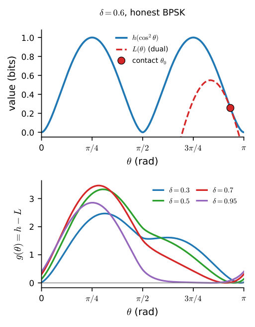 
FIG. 3. Top: h(cos2 θ) (solid) and dual witness Lδ,q(θ) (dashed) over the full angular range θ ∈[0, π] at δ = 0.6 for the honest BPSK observation, using the active branch θ0 = π −arccos √p ∈(π/2, π). Filled marker: tangent con- tact at θ0. Bottom: residual g(θ) = h(cos2 θ) −Lδ,q(θ) at δ ∈{0.3, 0.5, 0.7, 0.95} for the honest (nominal) BPSK obser- vation.

📷 Fig 4

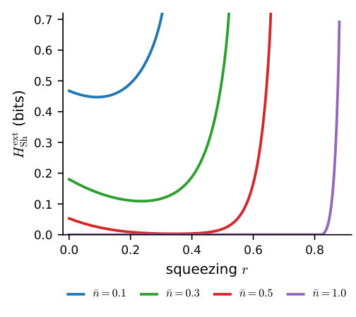 
FIG. 4. Hext Sh along the honest BPSK locus vs squeezing r, at fixed ¯n ∈{0.1, 0.3, 0.5, 1.0}; lossless source. Each curve runs from r = 0 to rmax(¯n) = sinh−1 √¯n where N →0. The regime µeff &lt; 0.019 in which Hext Sh is an upper bound on Hcert rather than the certified rate occurs only on the extreme high- r tails, below the BPSK-meaningful cutoff N = 0.05, and is not used for any certified operating point.

📷 Fig 5

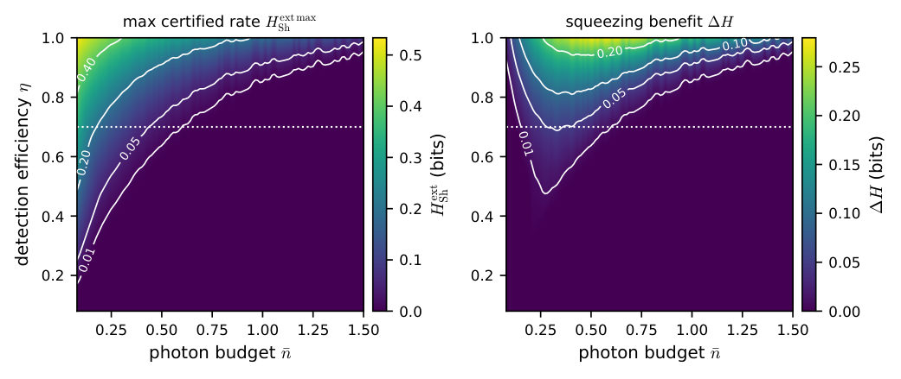 
FIG. 5. Left: maximum certified rate Hext Sh max(¯n, η) := maxr Hext Sh subject to N ≥0.05 and the dual-feasibility condition m2(δ, q; 5 × 10−3) ≥0. Right: additive squeezing benefit ∆H := Hext Sh max −Hext Sh |r=0. Honest BPSK observation under Eq. (5). Dotted line: η = 0.7.

**Summary.** This work derives a precise, closed-form upper bound for the rate of quantum randomness generation under semi-device-independent assumptions. By correctly solving the full POVM optimization, the authors correct previous overestimations and analyze how squeezing affects the achievable randomness rate. This is crucial for designing practical, high-security quantum random number generators.

**Why it may be interesting.** It provides rigorous, quantifiable bounds on randomness extraction from quantum sources, which is a core topic in quantum information theory and quantum optics.

Detailed structure

**Main problem.** The paper investigates the theoretical limit for generating quantum randomness in a semi-device-independent setting.

**Main result.** A closed-form, unconditional upper bound for the certified asymptotic Shannon rate is derived, which is shown to be tight on a numerically verified dual-feasibility region.

**Method.** The problem is formulated as a Linear Program (LP) over binary POVMs, requiring the inclusion of deterministic extreme points for an accurate rate calculation.

**Model / system.** The model uses a trusted binary pure-state source and an untrusted binary detector whose side information is classical, specifically tested with squeezed-coherent BPSK sources.

**Key observables.** Certified asymptotic i.i.d. Shannon rate ($H_{	ext{cert}}$), Gram overlap ($\delta$), and single-symbol error probability ($q$).

**Important parameters / regimes.** Squeezing parameter ($r$), photon budget ($ar{n}$), and the error probability $q$ relative to critical thresholds ($q_b, q_z$).

**Assumptions / limitations.** The adversary's side information ($\lambda$) is assumed to be classical; the rate formula is an upper bound, though tight in the verified region.

**Figures summary.** Figures illustrate the comparison between the extended LP closed form and projective-only treatments, mapping the rate in the $(\delta, q)$ plane, and showing the trade-off between squeezing and randomness.

**Paper structure.** The paper proceeds by deriving the rate expression via LP optimization, establishing the necessary and sufficient conditions for the rate to be achievable (the dual-feasibility region), and finally applying the result to the specific physical case of squeezed-coherent BPSK sources.

Abstract

This paper investigates semi-device-independent quantum randomness generation with a trusted binary pure-state source and an untrusted binary detector whose side information is classical. We derive a closed-form Shannon-rate expression for this setting, depending only on the trusted Gram overlap of the two source states and the observed symmetric error probability. The key point is that the full binary-qubit POVM optimisation must include the two deterministic extreme points omitted by the projective-only treatment; including them gives a substantially lower, and correct, certified rate. The closed form is an unconditional upper bound on the certified asymptotic i.i.d.\ Shannon rate, and becomes tight on a numerically verified dual-feasibility region containing all operating points used in the paper. Outside this region the same expression remains an upper bound. We then apply the result to squeezed-coherent BPSK sources, showing how squeezing changes the trade-off between state distinguishability and certified randomness in the lossless and lossy regimes. Finally, we clarify the adversary model if the adversary is allowed to hold a detector-purification register that tags the outcome.

[↑ back to top](#top)

### [The quantum-gravitational imitation game](http://arxiv.org/abs/2606.03688v1)

**Authors:** Kristian Toccacelo  
**Type:** theory · **Category:** other · **PDF:** <https://arxiv.org/pdf/2606.03688v1>  
**Analysis basis:** full PDF text, analyzed in chunks
**Topic relevance:** `entanglement & information structure` **3/5** · `analog quantum simulation` **2/5**

📷 Fig 1

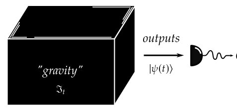 
Figure 1: The quantum-gravitational imitation game. Alice and Bob feed some input state to

📷 Fig 2

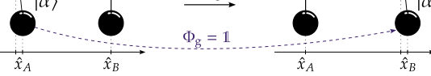 
Figure 2: Gravitational teleportation. The gravitational interaction between two harmonic

**Summary.** This paper proposes using quantum information theory to test the quantum nature of gravity by framing the problem as a 'quantum-gravitational imitation game.' The authors analyze how gravitational interactions affect quantum state teleportation, establishing a measurable fidelity bound that can distinguish between quantum and classical gravitational predictions. This provides a theoretical roadmap for future tabletop experiments testing quantum gravity.

**Why it may be interesting.** It connects fundamental quantum information concepts (teleportation, LOCC) to the most challenging area of physics—quantum gravity—using measurable, tabletop-scale quantum systems.

Detailed structure

**Main problem.** The paper aims to empirically distinguish between quantum and classical descriptions of gravity by testing what quantum gravity can do that classical theories cannot.

**Main result.** The test involves comparing the measured fidelity ($\mathcal{F}$) against a classical threshold ($\mathcal{F}_{	ext{cl}}$); violation ($\mathcal{F} > \mathcal{F}_{	ext{cl}}$) would suggest quantum gravitational effects.

**Method.** The authors frame the test as a 'quantum-gravitational imitation game' involving four parties and analyzing the fidelity of quantum state teleportation mediated by gravitational interaction.

**Model / system.** The model uses mechanical oscillators (Alice and Bob) whose joint state undergoes evolution ($\Im_t$) representing the gravitational interaction, analogous to quantum teleportation.

**Key observables.** Fidelity ($\mathcal{F}$) and the classical threshold ($\mathcal{F}_{	ext{cl}}$).

**Important parameters / regimes.** The coupling constant $\gamma_g = G m / (\omega d^3)$ and the time $t$ relative to the full teleportation time $t_s$.

**Assumptions / limitations.** The test assumes an effective description for the null hypothesis (perturbatively quantized gravity) and relies on comparing results against the LOCC framework.

**Figures summary.** Figure 1 illustrates the quantum-gravitational imitation game setup, and Figure 2 illustrates the dynamics of gravitational teleportation using beamsplitter analogies.

**Paper structure.** The paper introduces the problem, defines the imitation game setup, analyzes the dynamics of gravitational teleportation, derives the classical bounds ($\mathcal{F}_{	ext{cl}}$) for partial dynamics, and discusses the implications of violating the LOCC hypothesis.

Abstract

Gravity is the most apparent force in our everyday existence. Yet its fundamental nature remains the most opaque of the known interactions. This gap in our understanding is, in large part, due to the weakness of the gravitational interaction, which makes its empirical probing exceedingly hard. Nevertheless, on the backdrop of rapid advances in quantum technologies, hope has mounted that tests of the quantum nature of gravity could be realized in tabletop experiments. In this essay, we frame these recently proposed tests as quantum-gravitational imitation games. In particular, we examine how gravitational interactions among mechanical oscillators enable the teleportation of arbitrary quantum states and how this can inform fundamental tests of gravity.

[↑ back to top](#top)

### [Structural glasses model using disorder fields: the boson peak from local ground states](http://arxiv.org/abs/2606.02808v1)

**Authors:** M. M. Balbino, I. P. de Freitas, A. M. S. Macedo, G. Krein, N. F. Svaiter  
**Type:** theory · **Category:** disordered systems and neural networks · **PDF:** <https://arxiv.org/pdf/2606.02808v1>  
**Analysis basis:** full PDF text, analyzed in chunks
**Topic relevance:** `Keldysh / 2PI / non-Gaussian methods` **3/5** · `methods for driven-dissipative` **1/5**

📷 Fig 1

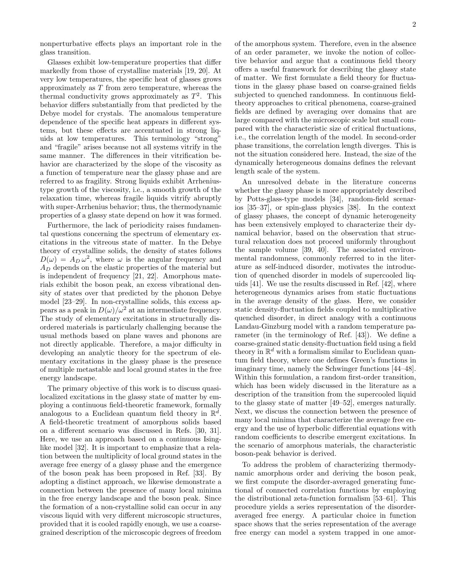 
Low-resolution page preview, page 2

📷 Fig 2

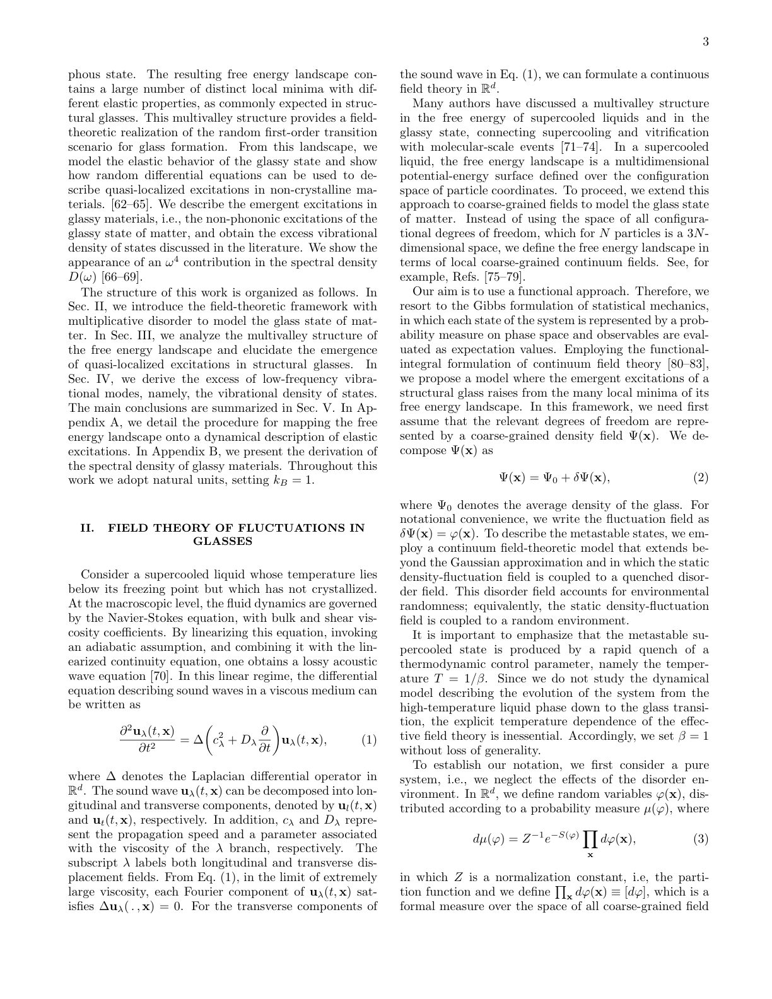 
Low-resolution page preview, page 3

📷 Fig 3

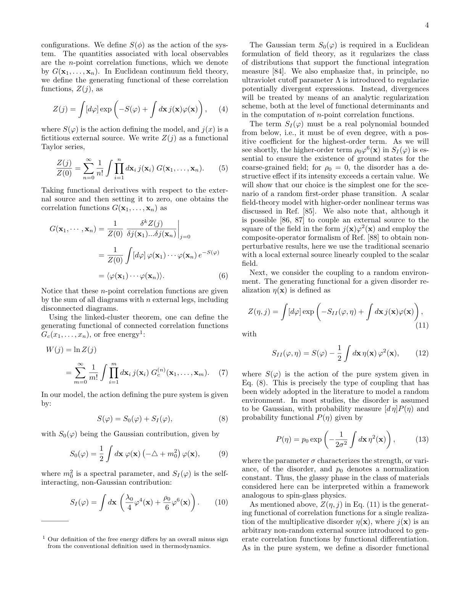 
Low-resolution page preview, page 4

📷 Fig 4

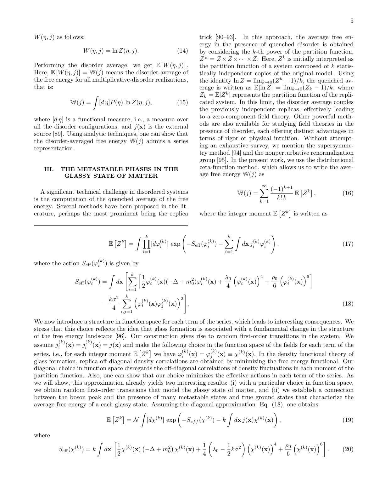 
Low-resolution page preview, page 5

📷 Fig 5

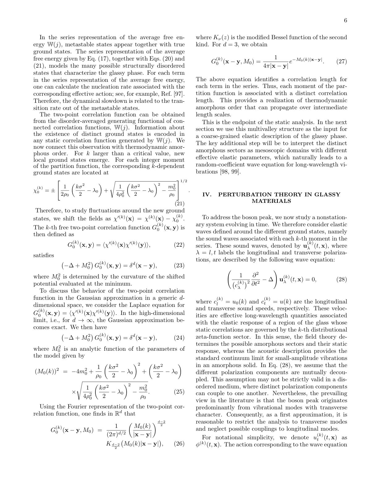 
Low-resolution page preview, page 6

**Summary.** This theoretical work models structural glasses by treating them as systems with quenched disorder within a field-theoretic framework. It derives the random first-order transition from the free energy landscape and successfully predicts the characteristic boson peak in the vibrational density of states. This connects the structural complexity of amorphous materials to their measurable low-frequency excitation spectrum.

**Why it may be interesting.** The connection drawn between the complex, multi-valley free energy landscape (a hallmark of disordered systems) and a specific, measurable excitation spectrum (the boson peak) provides a powerful theoretical link between static structural disorder and low-energy dynamics, relevant for understanding amorphous materials.

Detailed structure

**Main problem.** The paper aims to theoretically explain the emergence of the boson peak in the vibrational density of states of structural glasses and to characterize the non-ergodic glassy phase.

**Main result.** The formalism naturally yields a description of the random first-order transition, establishing a link between the multiplicity of local ground states and the characteristic $\omega^4$ excess contribution to the spectral density (the boson peak).

**Method.** The authors employ a functional field-theoretic approach, utilizing ensemble averaging over quenched disorder realizations and analyzing the resulting free energy landscape via replica methods and zeta-function formalisms.

**Model / system.** The system is structural glasses (amorphous solids) modeled using a coarse-grained density field coupled to a multiplicative quenched disorder field. The analysis is performed in the context of continuum field theory.

**Key observables.** Average free energy functional, effective actions, spectral density $g(\omega)$, and the boson peak ($\delta g(\omega) \propto \omega^4$).

**Important parameters / regimes.** Disorder strength (covariance $C$), temperature/inverse temperature ($eta$), and the dimensionality of the system ($d$).

**Assumptions / limitations.** The analysis relies on a coarse-grained description, the use of the replica trick, and approximations such as the diagonal approximation in function space for simplifying the disorder average.

**Paper structure.** The paper progresses from establishing the functional framework for the average free energy in the presence of quenched disorder, to analyzing the resulting multivalley structure that characterizes the random first-order transition, and finally applying this to the dynamic problem to derive the low-frequency spectral density exhibiting the boson peak.

Abstract

We show the emergence of a contribution characteristic of the boson peak in the spectral density of structural glasses. To model the vitreous state, we consider static density-fluctuation fields coupled to a multiplicative quenched disorder. Performing an ensemble average over all disorder realizations, a functional series representation of the average free energy is obtained. In this series representation of the average free energy for the glassy state of matter, we identify in the function space effective actions. These effective actions present a large number of metastable states and ground states. Random first-order transition, widely discussed in the literature as a description of the transition from the supercooled liquid to the glassy state of matter, emerges naturally in our formalism. We establish the connection between the use of hyperbolic differential equations with random coefficients and the presence of many ground states in the average free energy. This connection allows us to study emergent excitations in such amorphous materials.

[↑ back to top](#top)

### [Effective scatterings and universal clusters of heteronuclear ultracold mixtures in quasi-low dimensions](http://arxiv.org/abs/2606.02988v1)

**Authors:** Tingting Shi, Xiaoling Cui  
**Type:** theory · **Category:** quantum gases · **PDF:** <https://arxiv.org/pdf/2606.02988v1>  
**Analysis basis:** full PDF text, analyzed in chunks
**Topic relevance:** `analog quantum simulation` **3/5**

📷 Fig 1

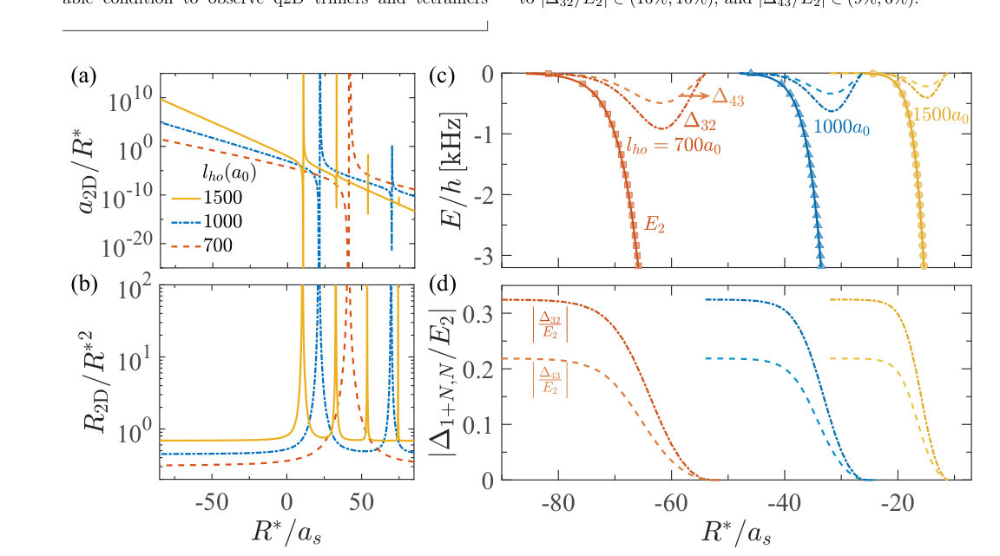 
FIG. 1. Quasi-2D effective scattering and bound states for 6Li-53Cr mixture, under longitudinal harmonic confinement with equal confinement length lho = (mhωh)−1/2 = (mlωl)−1/2. (a, b) The reduced 2D scattering length a2D and effective range R2D as functions of R∗/as. Here, as and R∗= 6000a0 are respectively the 3D scattering length and effective range. (c) Two-body binding energy E2 and relative binding energies ∆1+N,N ≡E1+N −EN of (1 + N) clusters (with N = 2, 3) as functions of R∗/as. For E2, discrete data and solid line are respectively from exact solution and effective 2D model; For ∆32 and ∆43, they are all from effective 2D model. (d) Relative ratios |∆1+N,N/E2| (N = 2, 3) as...

📷 Fig 2

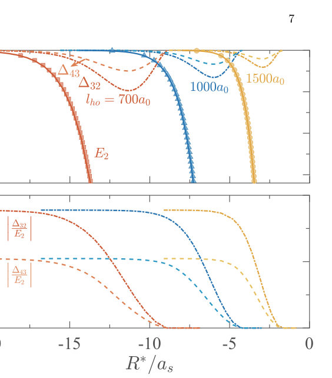 
FIG. 2. The same as Fig.1 except for 6Li-40K mixture with effective range R∗= 2400a0.

📷 Fig 3

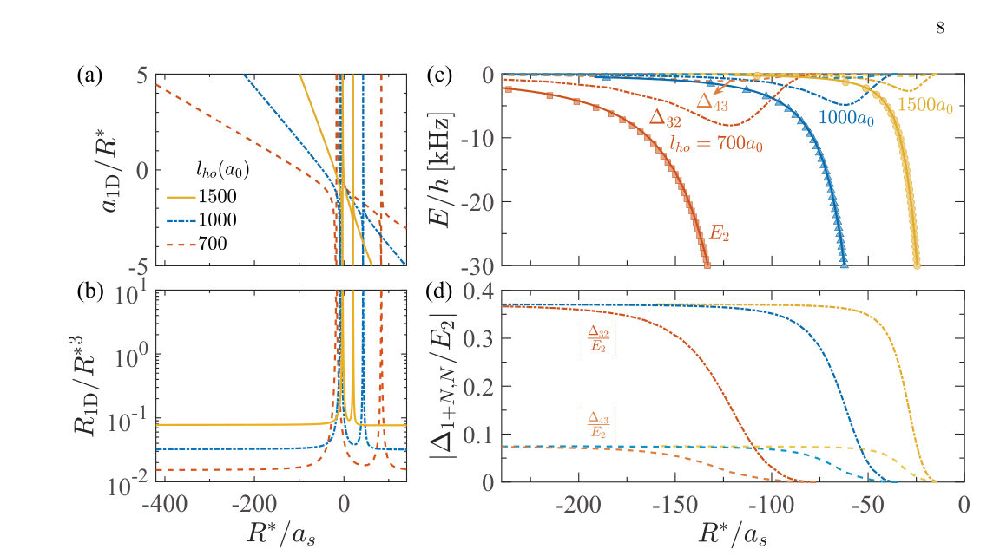 
FIG. 3. Quasi-1D effective scattering and bound states for 6Li-53Cr mixture, under transverse harmonic confinement with equal confinement length lho = (mhωh)−1/2 = (mlωl)−1/2. (a, b) The reduced 1D scattering length a1D and effective range R1D as functions of R∗/as. (c) Two-body binding energy E2 and relative binding energies ∆1+N,N ≡E1+N −EN of (1 + N) clusters (with N = 2, 3) as functions of R∗/as. For E2, discrete data and solid line are respectively from exact solution and effective 2D model; For ∆32 and ∆43, they are all from effective 2D model. (d) Relative ratios |∆1+N,N/E2| (N = 2, 3) as functions of R∗/as. In all plots, R∗= 6000a0 and we take three different lho = 1500, 1000,...

📷 Fig 4

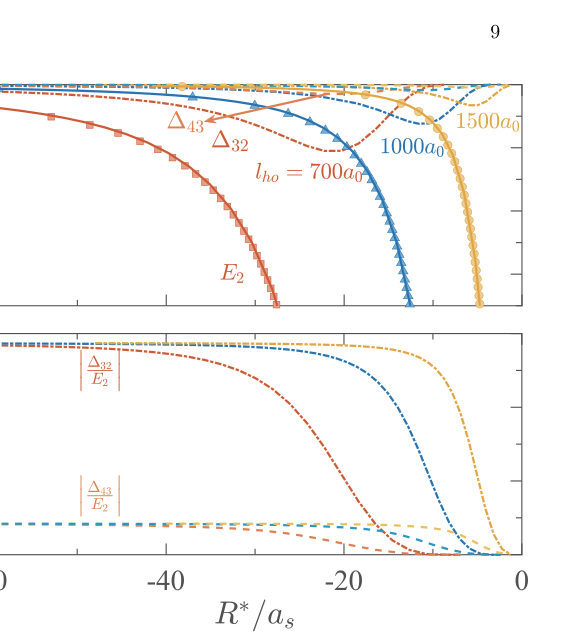 
FIG. 4. The same as Fig.3 except for 6Li-40K mixture with effective range R∗= 2400a0.

**Summary.** This theoretical paper investigates the effective scattering properties and cluster binding energies of heteronuclear ultracold atomic mixtures confined in quasi-low dimensions. By solving the scattering problem in 1D and 2D using advanced techniques like the Lippmann-Schwinger equation, the authors predict conditions favorable for observing universal few-body quantum phases in experiments.

**Why it may be interesting.** This work directly addresses the theoretical modeling of few-body physics in highly controllable quantum systems, providing quantitative predictions for the observation of universal many-body states in reduced dimensions.

Detailed structure

**Main problem.** The study aims to derive the effective s-wave scattering parameters and compute the binding energies of universal $(1+N)$ clusters in heteronuclear ultracold mixtures confined in quasi-low dimensions.

**Main result.** The calculations provide a theoretical pathway for practically observing universal clusters and their associated many-body phases in low-dimensional ultracold heteronuclear systems.

**Method.** The authors employ the Lippmann-Schwinger equation framework, solving coupled scattering problems in 2D and 1D geometries, and utilizing matrix diagonalization techniques to handle divergences.

**Model / system.** The system involves two heteronuclear atoms (unequal masses) harmonically confined in quasi-low dimensions (q1D and q2D), exemplified by Li-K and Li-Cr mixtures.

**Key observables.** Effective 2D/1D scattering lengths ($a_{2D}, a_{1D}$) and effective ranges ($R_{2D}, R_{1D}$), and the binding energies of $(1+N)$ clusters ($\Delta_{1+N,N}$).

**Important parameters / regimes.** Confinement strengths, 3D scattering parameters, and the ratio $R^*/a_s$ are critical parameters governing the effective low-dimensional physics.

**Assumptions / limitations.** The analysis relies on approximations such as decoupling the transverse center-of-mass motion for 2D, and using specific regularization techniques (e.g., short-time/long-time cutoffs) to handle divergences.

**Figures summary.** Figures illustrate the effective scattering parameters and the binding energies of two-body and few-body clusters for Li-Cr and Li-K systems in both quasi-2D and quasi-1D geometries.

**Paper structure.** The paper proceeds by first deriving the effective low-dimensional scattering parameters using the Lippmann-Schwinger equation for 2D, then extending the analysis to 1D, and finally applying these effective parameters to calculate the binding energies of universal clusters.

Abstract

We study the effective s-wave scattering of two heteronuclear atoms harmonically confined in quasi-low dimensions, where the atoms have unequal masses and are subject to different confinement frequencies. The resulting effective scattering parameters in low dimensions, including scattering length and effective range, are derived as functions of three-dimensional scattering parameters and confinement strengths. Using realistic Li-K and Li-Cr mixtures as examples, we further compute the binding energies of universal $(1+N)$ clusters in quasi-low dimensions using the effective scattering parameters. Our findings suggest a promising pathway for practically observing universal clusters and their associated many-body phases in low-dimensional ultracold heteronuclear systems.

[↑ back to top](#top)

### [On the saturated cases of the distillability conjecture](http://arxiv.org/abs/2606.03561v1)

**Authors:** Saiqi Liu, Lin Chen  
**Type:** theory · **Category:** quantum information and computing · **PDF:** <https://arxiv.org/pdf/2606.03561v1>  
**Analysis basis:** full PDF text, analyzed in chunks
**Topic relevance:** `entanglement & information structure` **3/5**

📷 Fig 1

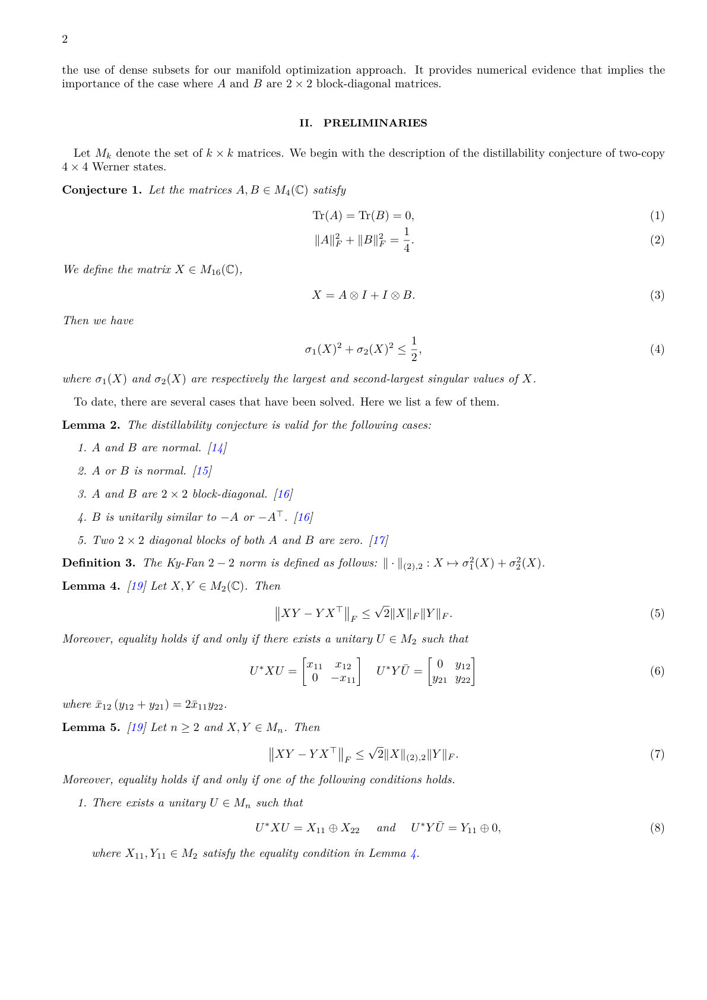 
Low-resolution page preview, page 2

📷 Fig 2

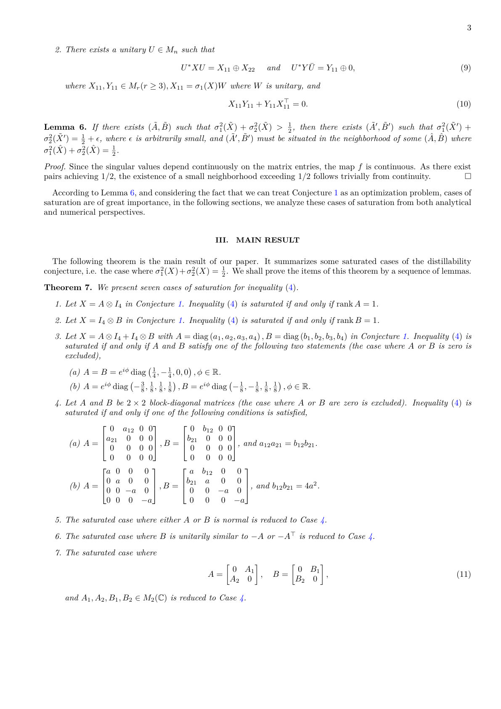 
Low-resolution page preview, page 3

📷 Fig 3

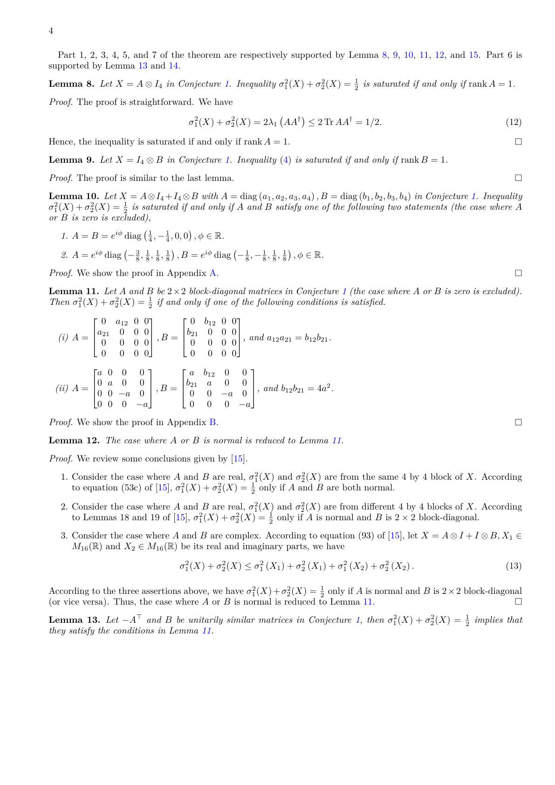 
Low-resolution page preview, page 4

📷 Fig 4

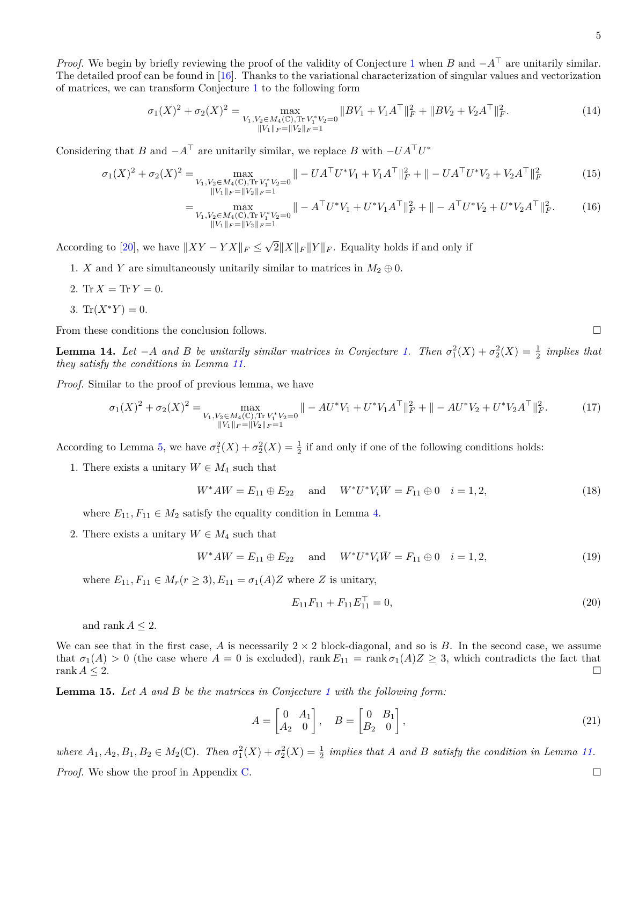 
Low-resolution page preview, page 5

📷 Fig 5

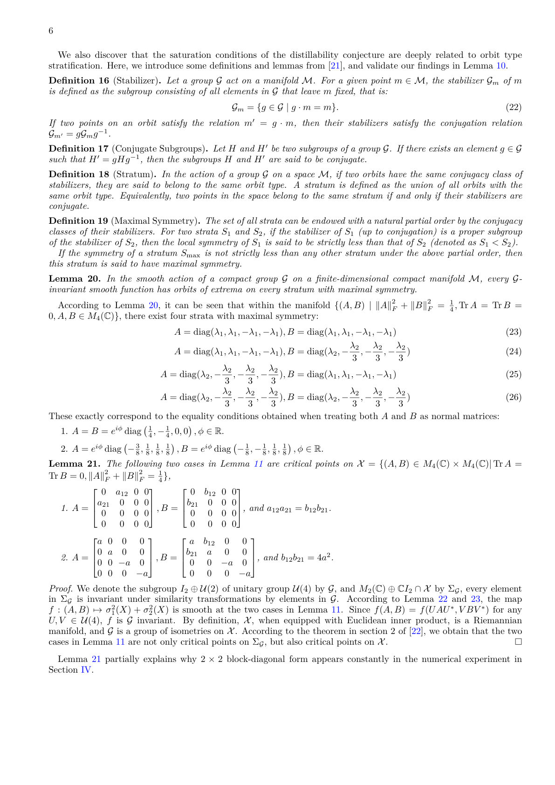 
Low-resolution page preview, page 6

**Summary.** This paper tackles the distillability conjecture for Werner states by finding the exact conditions under which the associated inequality becomes an equality. Through extensive mathematical analysis involving singular values and optimization, the authors prove that saturation necessitates a highly constrained, $2 	imes 2$ block-diagonal structure for the defining matrices. This provides a major structural breakthrough in quantum information theory.

**Why it may be interesting.** The rigorous mathematical characterization of saturation points for entanglement measures provides deep structural insights into the limits of quantum information processing protocols.

Detailed structure

**Main problem.** The paper investigates the saturation conditions for the distillability conjecture concerning two-copy four-by-four Werner states.

**Main result.** Saturation of the inequality $\sigma_1(X)^2 + \sigma_2(X)^2 \le 1/2$ forces the underlying matrices $A$ and $B$ to adopt a specific $2 	imes 2$ block-diagonal structure.

**Method.** The authors combine theoretical characterization of saturation cases with advanced mathematical tools, including manifold optimization and eigenvalue/singular value analysis.

**Model / system.** The problem is framed using matrices $A, B \in M_4(\mathbb{C})$ that define the state $X = A \otimes I + I \otimes B$, relating to the distillability of entangled quantum states.

**Key observables.** The primary observable is the sum of the squares of the two largest singular values, $\sigma_1(X)^2 + \sigma_2(X)^2$, which is compared against the bound of $1/2$.

**Important parameters / regimes.** The matrices $A$ and $B$ are constrained by $	ext{Tr}(A) = 	ext{Tr}(B) = 0$ and $\|A\|_F^2 + \|B\|_F^2 = 1$.

**Assumptions / limitations.** The analysis often relies on assuming specific equalities hold (e.g., for optimization) or that restricting the analysis to invertible matrices is sufficient due to density arguments.

**Figures summary.** The notes do not describe specific figures, but mention numerical examples (e.g., Example 24) used to support the theoretical bounds.

**Paper structure.** The paper systematically reviews known results, develops the main theorem by analyzing multiple structural cases (Case i, ii, iii), and uses optimization/eigenvalue analysis to reduce all possibilities to the common $2 	imes 2$ block-diagonal structure.

Abstract

The distillability conjecture for two-copy four-by-four Werner states has been an open problem in quantum information for years. We investigate the conditions under which the conjectured inequality becomes an equality. For all known cases where the conjecture has been verified, we characterize the saturation conditions and show that equality forces the matrices $A$ and $B$ to be two-by-two block-diagonal. In particular, several previously obtained partial results, including the cases of one normal matrix, unitary similarity between $B$ and $-A$ or $-A^T$, and anti-diagonal block structures, are reduced to this common block-diagonal structure. We also employ a manifold optimization method, which provides numerical evidence that the two-by-two block-diagonal structure is essential for saturating the inequality. Furthermore, we prove that the identified saturation points are critical points of the objective function on the constraint manifold.

[↑ back to top](#top)

### [Optoelectronics and Magnetic properties calculation of RE2MnNiO6 (RE=La-Lu,Y) using Density Functional Theory](http://arxiv.org/abs/2606.02760v1)

**Authors:** Debidutta Pradhan  
**Type:** theory · **Category:** strongly correlated electrons · **PDF:** <https://arxiv.org/pdf/2606.02760v1>  
**Analysis basis:** full PDF text, analyzed in chunks
**Topic relevance:** `spintronics-quantum-optics interface` **3/5**

📷 Fig 1

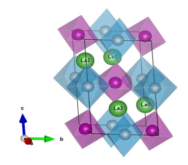 
FIG. 1. LMNO crystal structure.

📷 Fig 2

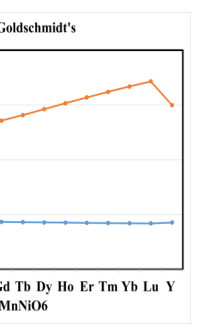 
FIG. 2. Tolerance factor estimation RMNO.

📷 Fig 3

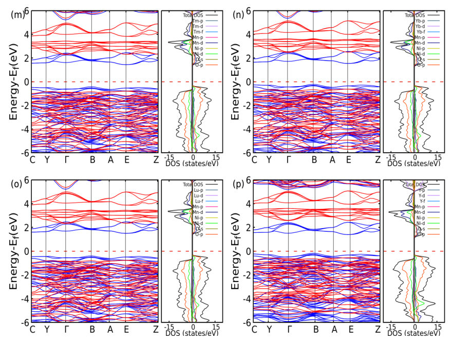 
FIG. 3. Band structures of Re2MnNiO6, where Re stands for (a)La, (b)Ce, (c)Pr, (d)Nd, (e)Pm, (f)Sm, (g)Eu, (h)Gd, (i)Tb, (j)Dy, (k)Ho, (l)Er, (m)Tm, (n)Yb, (o)Lu and (p)Y, without considering f-electrons in valence band.

📷 Fig 4

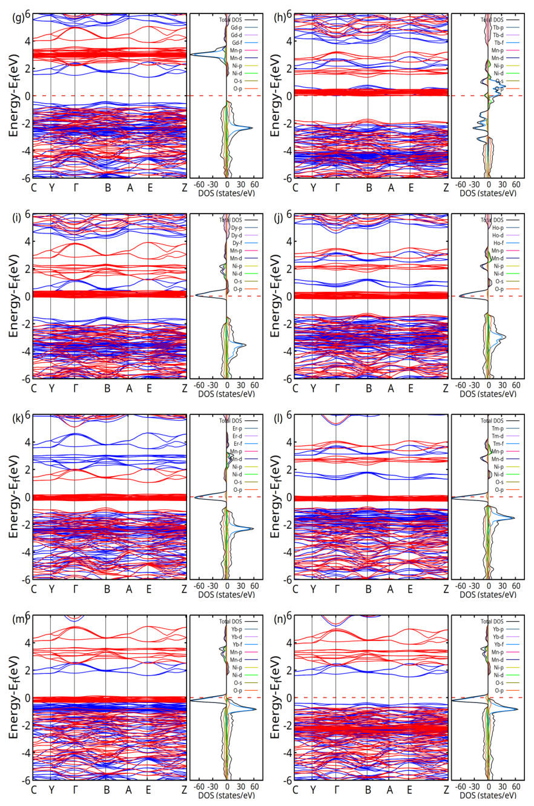 
FIG. 4. Band structures of Re2MnNiO6, where Re stands for (a)Ce, (b)Pr, (c)Nd, (d)Pm, (e)Sm, (f)Eu, (g)Gd, (h)Tb, (i)Dy, (j)Ho, (k)Er, (k)Tm, (m)Yb and (n)Lu with f-electrons in valence band.

📷 Fig 5

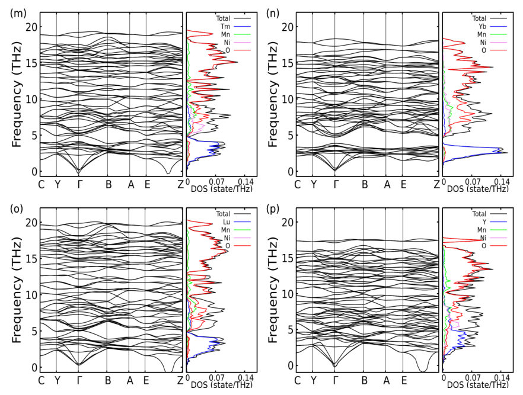 
FIG. 5. Phonon band structures of Re2MnNiO6, where Re stands for (a)La, (b)Ce, (c)Pr, (d)Nd, (e)Pm, (f)Sm, (g)Eu, (h)Gd, (i)Tb, (j)Dy, (k)Ho, (l)Er, (m)Tm, (n)Yb, (o)Lu and (p)Y.

**Summary.** This theoretical study investigates the electronic, magnetic, and optical properties of $	ext{RE}_2	ext{MnNiO}_6$ double-perovskites using DFT+U. By systematically varying the rare earth element, the authors demonstrate how lattice contraction and $4f-d$ hybridization govern the material's potential for optoelectronic applications. The work provides a comprehensive picture of structure-property relationships in this class of correlated oxides.

**Why it may be interesting.** The explicit treatment of $4f$ electrons and the investigation of hybridization effects in transition metal oxides directly addresses strong electronic correlations, which is central to understanding many correlated materials.

Detailed structure

**Main problem.** To systematically study the optoelectronic and magnetic properties of the $	ext{RE}_2	ext{MnNiO}_6$ double-perovskite oxide family, focusing on the influence of the A-site ionic radius via lanthanide contraction.

**Main result.** The study establishes a unified picture showing that the magnetic and optoelectronic potential of these materials is determined by the interplay between $4f$ electron occupancy and octahedral distortion.

**Method.** The research employs first-principles calculations using the DFT+U framework, analyzing electronic structure, lattice dynamics, and optical properties.

**Model / system.** The physical system is the $	ext{RE}_2	ext{MnNiO}_6$ double-perovskite oxide, where $	ext{RE}$ ranges from $	ext{La}$ to $	ext{Lu}$. The calculations treat the challenging $4f$ electrons both as frozen core states and explicitly in the valence manifold.

**Key observables.** Electronic band structure, dielectric function, phonon dispersion, magnetic moments (up to $30 \mu_B$), and optical absorption edges.

**Important parameters / regimes.** A-site ionic radius (governing lanthanide contraction), DFT+U parameters ($U=4 	ext{ eV}, J=5 	ext{ eV}$), and temperature (for thermodynamic analysis).

**Assumptions / limitations.** The calculations assume the monoclinic $P2_1/c$ phase is the most relevant structure, and the methodology must account for the strong localization challenge of $4f$ electrons.

**Figures summary.** Figures illustrate the crystal structure ($	ext{LMNO}$), phonon band structures showing $	ext{Re}$ dependence, and comprehensive optical properties ($\varepsilon(\omega)$, $\alpha(\omega)$, $R(\omega)$) across the series.

**Paper structure.** The paper follows a systematic computational approach: first establishing the structural and electronic ground state using DFT+U, then analyzing lattice dynamics and thermal properties, and finally detailing the optical response, all while tracking the systematic changes across the lanthanide series.

Abstract

RE2NiMnO6 (RE = La-Lu) family of ordered double-perovskite oxides hosts a corner-sharing network of alternating NiO6 and MnO6 octahedra whose electronic and magnetic ground states are systematically governed by the A-site ionic radius through the lanthanide contraction. The strong localisation of RE 4f electrons poses a fundamental challenge to density-functional treatments, yet the hybridisation between 4f and neighbouring 5d (RE) or 3d (Ni, Mn) states is central to the origin of exchange interactions and optoelectronic response across the series. We present a comprehensive first-principles study of the electronic structure, lattice dynamics, and optical properties of representative RE2NiMnO6 compounds within the DFT+U framework. To disentangle the role of Kondo-type 4f - d hybridisation, calculations are performed with the RE 4f electrons treated both as frozen core states and explicitly in the valence manifold, enabling a direct assessment of their contribution to the band structure, dielectric function, and phonon dispersion. Spin-polarised calculations reveal significant spin-channel asymmetry, with magnetic moments reaching up to 30 μB per formula unit for select members of the series. The results establish a unified picture of how 4f occupancy and octahedral distortion collectively determine the magnetic and optoelectronic potential of this double-perovskite family.

[↑ back to top](#top)

### [Scalable On-Hardware Training of Quantum Neural Networks and Application to Clinical Data Imputation](http://arxiv.org/abs/2606.03517v1)

**Authors:** Natansh Mathur, Panagiotis Kl. Barkoutsos, Masako Yamada, Martin Roetteler, Iordanis Kerenidis  
**Type:** both · **Category:** quantum information and computing · **PDF:** <https://arxiv.org/pdf/2606.03517v1>  
**Analysis basis:** full PDF text, analyzed in chunks
**Topic relevance:** `QC/QI experiment` **3/5**

📷 Fig 1

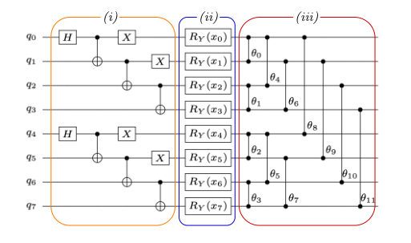 
FIG. 1. The quantum component of the hybrid imputation pipeline, shown for n = 8 qubits, consists of three mod- ules. (i) Non-Gaussian state initialisation: each group of four qubits is prepared in the entangled state |ϕ⟩= (|0011⟩+ |1100⟩)/ √

📷 Fig 2

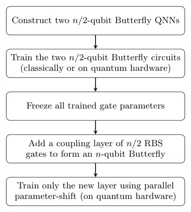 
FIG. 2. Layer-wise training workflow for the Butterfly quan- tum neural network. Smaller n/2-qubit Butterfly subcircuits are trained first (classically or on quantum hardware) and then frozen. A final coupling layer is added to form an n- qubit circuit, and only this newly introduced layer is opti- mised on quantum hardware using parallel parameter-shift, substantially reducing measurement and optimisation cost.

📷 Fig 3

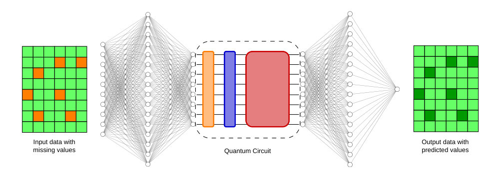 
FIG. 3. Overview of the hybrid classical-quantum imputation pipeline. Given a partially observed patient vector, observed features (green) are used as inputs and missing entries (orange) are predicted. The Quantum circuit has multiple components. The first orange box corresponds to the Magic State Loader (Section II A 1), the second blue box corresponds to the data loader (Section II A 2) and the final red box signifies the trainable PQC (Section II A 3).

📷 Fig 4

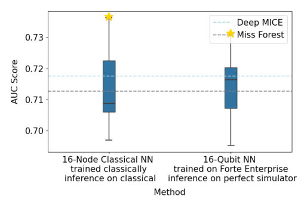 
FIG. 4. Downstream survival prediction AUC for a classi- cal 16 × 16 neural network trained classically and a hybrid classical-quantum neural network with a 16-qubit quantum layer trained directly on the IonQ Forte Enterprise trapped- ion processor (16-Qubit Hybrid DeepImputer). Both models share the same overall architecture; inference is performed on a classical simulator in both cases. The hybrid model achieves a higher median AUC with reduced variance across random seeds, demonstrating that on-hardware training via the par- allel parameter-shift rule yields models competitive with clas- sical counterparts.

📷 Fig 5

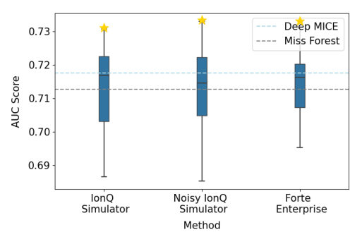 
FIG. 5. Comparison of the 16-Qubit hybrid neural net- work model performance when the quantum neural network is trained using ideal simulation, noisy simulation, and direct execution on IonQ Forte Enterprise hardware. No statisti- cally significant degradation is observed when moving from simulation to hardware. The inference was performed on the classical simulator for all.

**Summary.** This paper presents a novel, scalable training framework for QNNs designed to overcome the quadratic scaling bottleneck of gradient estimation on quantum hardware. By combining a structured Butterfly circuit with a layer-wise training strategy and parallel gradient evaluation, the authors reduce the cost to $O(\log n)$. They successfully demonstrate this approach by training hybrid QNNs on trapped-ion hardware for clinical data imputation, achieving performance comparable to state-of-the-art classical methods while exhibiting lower variance.

**Why it may be interesting.** The work directly addresses the practical scalability of quantum machine learning by providing a concrete, hardware-aware optimization technique that reduces resource scaling from polynomial to logarithmic.

Detailed structure

**Main problem.** Training Quantum Neural Networks (QNNs) on near-term quantum hardware is bottlenecked by the prohibitively high cost of gradient estimation using standard parameter-shift methods.

**Main result.** The authors introduce a framework that reduces the gradient estimation cost from $O(n^2)$ to $O(\log n)$ circuit evaluations per step, enabling scalable, hardware-feasible QNN training.

**Method.** The framework combines a structured Butterfly circuit architecture, a layer-wise training strategy, and a parallelized parameter-shift rule that exploits the commuting structure within each layer.

**Model / system.** The model is a hybrid classical-quantum QNN utilizing a Butterfly ansatz. The physical platform is demonstrated on IonQ Forte Enterprise trapped-ion hardware (16 qubits), with simulation up to 32 qubits.

**Key observables.** Area Under the ROC Curve (AUC) for downstream patient survival prediction, and the reduction in circuit evaluations per optimization step.

**Important parameters / regimes.** The complexity scales as $O(\log n)$ circuit evaluations per step, and the hardware training limit is demonstrated at 16 qubits.

**Assumptions / limitations.** The layer-wise training approach is a greedy approximation, and the framework relies on exploiting the commuting structure within the Butterfly layers.

**Figures summary.** Figures illustrate the QNN architecture modules, the layer-wise training workflow, and performance comparisons showing hardware-trained models matching or exceeding classical baselines.

**Paper structure.** The paper first identifies the gradient estimation bottleneck, then proposes the three-part co-designed framework (Butterfly circuit, layer-wise training, parallel gradient rule). It validates this on clinical data imputation using MIMIC-III, showing hardware feasibility and competitive performance against classical methods.

Abstract

Training quantum neural networks (QNNs) on quantum hardware is currently bottlenecked by the cost of gradient estimation: standard parameter-shift methods require a number of circuit evaluations that grows quadratically with the number of trainable parameters, making hardware-based optimisation impractical beyond small system sizes. In this work, we introduce a training framework that reduces this cost to logarithmic in the number of qubits, making gradient-based QNN optimisation feasible on near-term hardware at increasing scales.   Our framework combines three co-designed ingredients: (i) a structured, subspace-preserving Butterfly circuit architecture with $O(n \log n)$ parameters and logarithmic depth; (ii) a layer-wise training strategy that confines on-hardware optimisation to one small, well-structured layer at a time; and (iii) a parallelised parameter-shift rule that exploits the commuting structure within each Butterfly layer to extract all gradients in a constant number of circuit executions. Together these reduce the number of distinct circuit evaluations per optimisation step from $O(n^2)$ to $O(\log n)$.   We validate the framework on clinical data imputation using the MIMIC-III electronic health record dataset, a demanding benchmark sensitive to optimisation instability and model variance. Hybrid classical-quantum models are trained directly on IonQ Forte Enterprise trapped-ion hardware at 16 qubits without performance degradation relative to ideal or noisy simulation and via tensor-network simulation at 32 qubits, with 32-qubit inference executed on hardware. The resulting models match or exceed strong classical neural baselines in downstream patient survival prediction while exhibiting reduced variance across runs, demonstrating that the proposed framework enables practical, scalable QNN training under realistic hardware constraints.

[↑ back to top](#top)

### [Scattering and Bound States of Two Heteronuclear Ultracold Atoms in a Quasi-Two-Dimensional Confinement](http://arxiv.org/abs/2606.02987v1)

**Authors:** B. Wang, F. Yang, P. Zhang  
**Type:** theory · **Category:** other · **PDF:** <https://arxiv.org/pdf/2606.02987v1>  
**Analysis basis:** full PDF text, analyzed in chunks
**Topic relevance:** `analog quantum simulation` **3/5**

📷 Fig 1

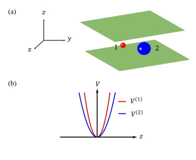 
FIG. 1. (a): Schematic diagram of two heteronuclear ultra- cold atoms in a quasi-2D confinement, which is realized via a strong confinement along the longitudinal (z-) direction. (b): Schematic diagram of the harmonic longitudinal confinement potentials V (1) and V (2), experienced by atoms 1 and 2, re- spectively.

📷 Fig 2

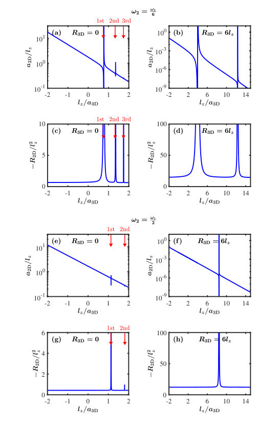 
FIG. 2. The 2D scattering length a2D and effective range parameter R2D for a 6Li-53Cr system (m1 : m2 = 6 : 53), in the case ω1 &gt; ω2. In panels (a–d) and (e–h) show the results for ω1 : ω2 = 6 : 1 and ω1 : ω2 = 2 : 1, respec- tively. For both frequency ratios, the results are presented as functions of ℓz/a3D, with R3D = 0 in panels (a,c,e,g) and R3D = 6ℓz in panels (b,d,f,h). Here ℓz = p

📷 Fig 3

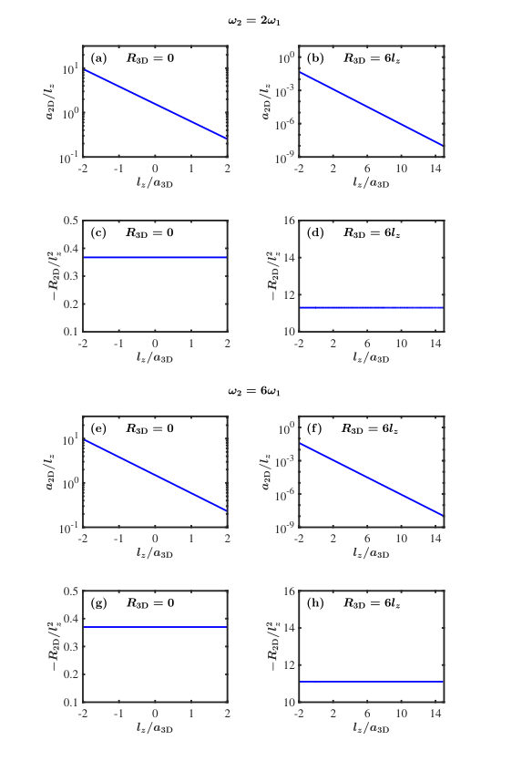 
FIG. 3. The 2D scattering length a2D and effective range pa- rameter R2D for a 6Li-53Cr system (m1 : m2 = 6 : 53), in the case ω1 &lt; ω2. In panels (a–d) and (e–h) show the results for ω1 : ω2 = 1 : 2 and ω1 : ω2 = 1 : 6, respectively. For both fre- quency ratios, the results are presented as functions of ℓz/a3D, with R3D = 0 in panels (a,c,e,g) and R3D = 6ℓz in panels (b,d,f,h). Here ℓz = p

📷 Fig 4

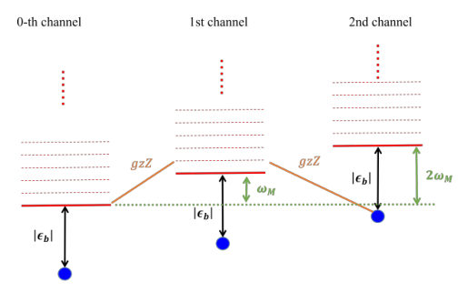 
FIG. 4. Schematic illustration of the multichannel structure of the system. For clarity, only the lowest three CoM chan- nels are shown. The solid red lines represent the threshold energies of the channels, the red dashed lines denote scatter- ing states, and the blue dots indicate the bound states in the corresponding channels. The orange lines represent the inter- channel couplings induced by the term gzZ. For details, see Sec. III A.

📷 Fig 5

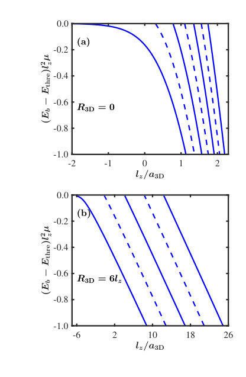 
FIG. 5. Bound-state energies Eb of a 6Li-53Cr system with m1 : m2 = 6 : 53 and ω1 : ω2 = 6 : 1. Panels (a) and (b) show the results for R3D = 0 and R3D = 6ℓz, respectively. Here Ethre ≡(ω1 +ω2)/2 is the scattering threshold, corresponding to the longitudinal zero-point energy. The solid and dashed lines represent the bound states in the P = +1 and P = −1 subspaces, respectively.

**Summary.** This paper provides an exact theoretical solution to the two-body problem for heteronuclear ultracold atoms in a quasi-2D trap. By analyzing the coupling between the center-of-mass and relative motion, the authors derive expressions for the effective 2D scattering parameters. The results demonstrate that these parameters can be rapidly tuned by adjusting the trap frequencies and the underlying 3D scattering interactions, offering a powerful tool for manipulating interatomic forces.

**Why it may be interesting.** This work provides a detailed theoretical framework for controlling effective interactions in highly confined quantum systems, which is crucial for designing quantum simulators and realizing novel quantum phenomena.

Detailed structure

**Main problem.** To solve the two-body scattering problem for heteronuclear ultracold atoms confined in a quasi-two-dimensional geometry.

**Main result.** The study derives the 2D scattering length ($a_{2D}$) and effective range ($R_{2D}$), showing that the coupling between longitudinal center-of-mass and relative motion can induce multiple 2D scattering resonances.

**Method.** The problem is solved exactly by treating it as a multichannel system, involving the separation of the center-of-mass motion and solving coupled integral equations for the scattering and bound states.

**Model / system.** The system consists of two heteronuclear ultracold atoms trapped in a quasi-2D harmonic potential, where the longitudinal confinement frequencies for the two atoms differ ($\omega_1 
eq \omega_2$). The interaction is modeled by a zero-range pseudopotential characterized by 3D scattering parameters.

**Key observables.** 2D scattering length ($a_{2D}$), 2D effective range ($R_{2D}$), and bound-state energies ($E_b$).

**Important parameters / regimes.** Longitudinal confinement frequencies ($\omega_1, \omega_2$), 3D scattering length ($a_{3D}$), and 3D effective range ($R_{3D}$).

**Assumptions / limitations.** The analysis is restricted to the low-energy regime, and the derivation relies on short-range expansions and the use of Hadamard finite part integrals to regularize divergences.

**Figures summary.** Figures illustrate the schematic confinement setup, the dependence of $a_{2D}$ and $R_{2D}$ on $a_{3D}$ for different frequency ratios ($\omega_1 > \omega_2$ vs $\omega_1 < \omega_2$), and the multichannel structure of the Hamiltonian.

**Paper structure.** The paper systematically derives the scattering and bound state properties by first setting up the coupled Hamiltonian, then solving the resulting Lippmann-Schwinger type integral equations for the scattering state, and finally deriving the homogeneous integral equation for the bound state energy.

Abstract

We solve the two-body problem of ultracold heteronuclear atoms in a quasi-two-dimensional (quasi-2D) geometry. The quasi-2D confinement is realized by a harmonic trap along the longitudinal ($z$-) direction, with different trap frequencies for the two atoms, as in many current experiments on ultracold heteronuclear gases. As a consequence, the longitudinal center-of-mass (CoM) motion is coupled to the relative motion, which significantly complicates the two-body problem. We solve this problem exactly and derive the 2D scattering length $a_{\rm 2D}$, the 2D effective range parameter $R_{\rm 2D}$, and the bound-state energies, as functions of the $s$-wave scattering length and effective range of the two atoms in free three-dimensional (3D) space. We show that multiple 2D scattering resonances can be induced by the coupling between the longitudinal CoM and relative motion. Around these resonances, $a_{\rm 2D}$ varies rapidly with the 3D scattering parameters, while $R_{\rm 2D}$ is strongly enhanced. Since the effective pairwise interaction in quasi-2D ultracold gases is determined by i.e., the two-body scattering amplitudes and bound-state energies, our results can be used for manipulating the effective 2D interatomic interaction in quasi-2D ultracold heteronuclear gases by tuning the confinement frequencies and the 3D scattering parameters.

[↑ back to top](#top)

### [Logarithmic Sobolev inequality and hypercontractivity for the Navier-Stokes Fokker-Planck operator](http://arxiv.org/abs/2606.03182v1)

**Authors:** Zhi-Wei Wang, Samuel L. Braunstein  
**Type:** theory · **Category:** statistical mechanics · **PDF:** <https://arxiv.org/pdf/2606.03182v1>  
**Analysis basis:** full PDF text, analyzed in chunks
**Topic relevance:** `driven-dissipative phase transition` **2/5** · `entanglement & information structure` **2/5** · `non-equilibrium dynamics` **2/5** · `non-equilibrium universality` **2/5** · `Keldysh / 2PI / non-Gaussian methods` **1/5** · `analog quantum simulation` **1/5** · `correlated / nonlocal dissipation` **1/5** · `methods for driven-dissipative` **1/5**

📷 Fig 1

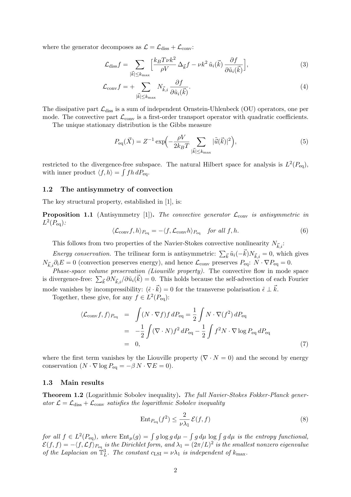 
Low-resolution page preview, page 2

📷 Fig 2

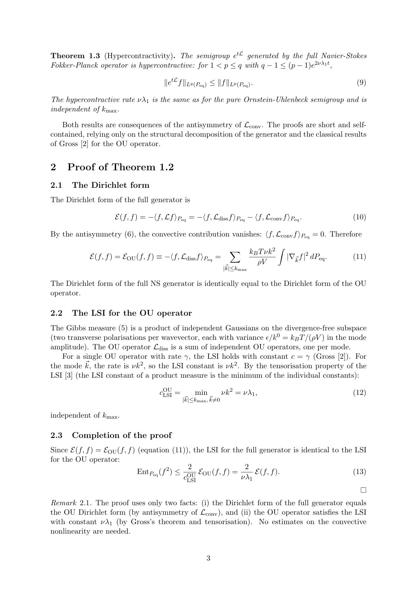 
Low-resolution page preview, page 3

📷 Fig 3

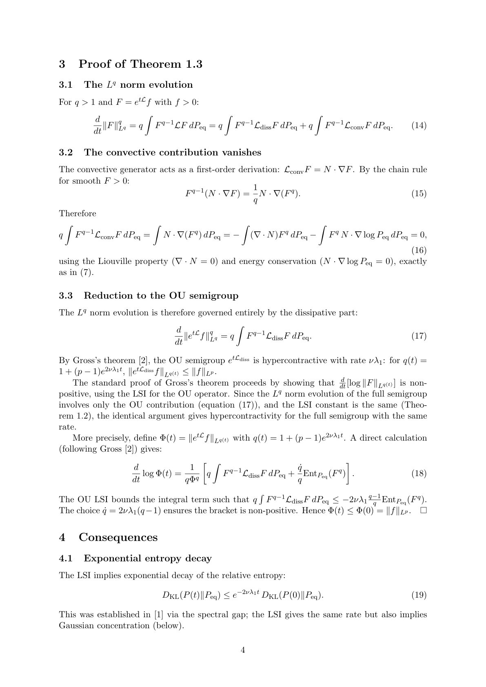 
Low-resolution page preview, page 4

📷 Fig 4

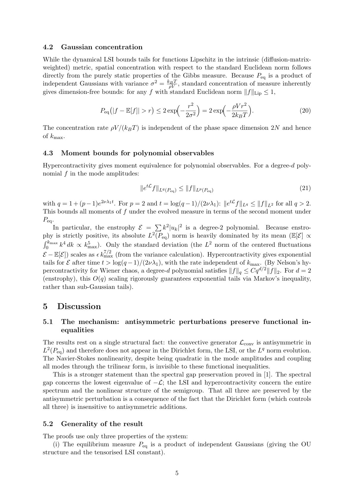 
Low-resolution page preview, page 5

📷 Fig 5

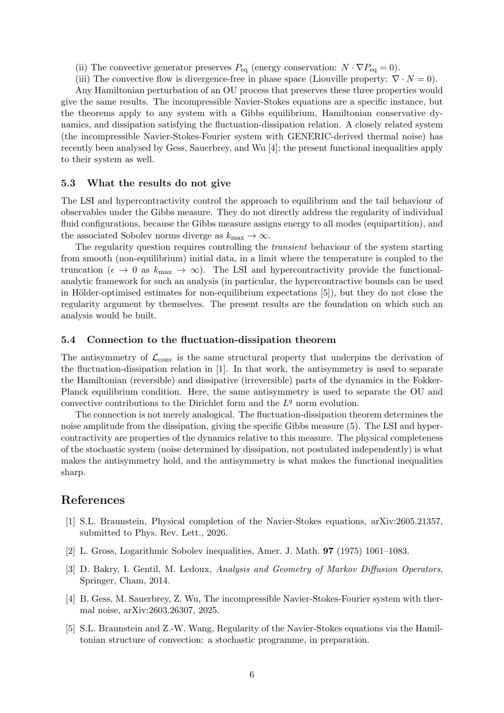 
Low-resolution page preview, page 6

**Summary.** This paper proves that the stochastic Navier-Stokes system satisfies the Logarithmic Sobolev Inequality and is hypercontractive, even with the addition of nonlinear convective terms. This remarkable result stems from the fact that the convective dynamics are antisymmetric with respect to the equilibrium measure, leaving the key functional properties unchanged from the simpler dissipative case. It provides a powerful mathematical tool for analyzing the rate of approach to thermal equilibrium in complex fluid dynamics.

**Why it may be interesting.** The mathematical techniques used to prove these functional inequalities (LSI, hypercontractivity) are highly relevant to analyzing the approach to equilibrium in complex, non-equilibrium systems, including those studied in AMO physics and quantum optics.

Detailed structure

**Main problem.** The paper aims to prove functional inequalities, specifically the Logarithmic Sobolev Inequality (LSI) and hypercontractivity, for the Fokker-Planck generator associated with the stochastic incompressible Navier-Stokes equations.

**Main result.** The LSI and hypercontractivity hold for the full generator, with optimal constants matching those of the pure Ornstein-Uhlenbeck operator, independent of the number of retained Fourier modes.

**Method.** The proof hinges on a structural property: the convective part of the generator is antisymmetric in the $L^2$ space weighted by the equilibrium measure, which causes it to vanish in the Dirichlet form and $L^q$ norm evolution.

**Model / system.** The system is the stochastic incompressible Navier-Stokes equations on the three-torus ($	ext{T}^3$), modeled by a Fokker-Planck generator $L = L_{	ext{diss}} + L_{	ext{conv}}$. The equilibrium state is the Gibbs measure $P_{	ext{eq}}$.

**Key observables.** Entropy functional ($	ext{Ent}$), Dirichlet form ($E(f, f)$), and the evolution of the $L^q$ norm ($\|F\|_{L^q}$).

**Important parameters / regimes.** Viscosity ($
u$) and the smallest non-zero eigenvalue of the Laplacian ($\lambda_1$).

**Assumptions / limitations.** The system possesses a Gibbs equilibrium, Hamiltonian conservative dynamics, and dissipation satisfying the fluctuation-dissipation relation.

**Paper structure.** The paper establishes the decomposition of the generator into dissipative (OU) and antisymmetric (convective) parts. It then uses the antisymmetry property to show that the Dirichlet form and $L^q$ evolution are unaffected by the convective term, leading to the proofs of LSI and hypercontractivity.

Abstract

The stochastic incompressible Navier-Stokes equations on $\TT^3$, completed by the fluctuation-dissipation noise, have a Fokker-Planck generator that decomposes into a self-adjoint Ornstein-Uhlenbeck (dissipative) part and an antisymmetric (convective) part. We prove two results about this generator. First, the logarithmic Sobolev inequality holds with the same optimal constant as the pure Ornstein-Uhlenbeck operator, $c_\mathrm{LSI} = νλ_1$ (where $ν$ is the viscosity and $λ_1$ is the smallest nonzero eigenvalue of the Laplacian on $\TT^3$), independent of the number of retained Fourier modes. Second, the full semigroup is hypercontractive with the same rate as the Ornstein-Uhlenbeck semigroup. Both results follow from a single structural property: the convective generator is antisymmetric in $L^2(P_\mathrm{eq})$ (where $P_\mathrm{eq}$ is the Gibbs measure), and therefore contributes nothing to the Dirichlet form or the $L^q$ norm evolution. The antisymmetry is a consequence of two properties of the incompressible Navier-Stokes nonlinearity: energy conservation and phase-space volume preservation (the Liouville property). These are the same properties that underpin the fluctuation-dissipation theorem for the nonlinear Navier-Stokes equations.

[↑ back to top](#top)

### [Nielsen complexity with multiple cost factors](http://arxiv.org/abs/2606.02817v1)

**Authors:** Marcos Rios Ribeiro, Diego Trancanelli  
**Type:** theory · **Category:** other · **PDF:** <https://arxiv.org/pdf/2606.02817v1>  
**Analysis basis:** full PDF text, analyzed in chunks
**Topic relevance:** `Keldysh / 2PI / non-Gaussian methods` **2/5** · `entanglement & information structure` **2/5** · `methods for driven-dissipative` **2/5** · `analog quantum simulation` **1/5** · `non-equilibrium dynamics` **1/5**

📷 Fig 1

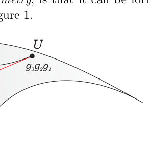 
Figure 1: Schematic representation of a unitary manifold and a quantum circuit as a sequence of elementary gates. A geodesic path (black) is depicted from the identity to some target unitary U. The red straight segments represent the construction of a circuit using some elementary gates gi. In this example, the final unitary is U = g3g2g1. The geodesic is parametrized by a parameter s and it approximates the circuit smoothly by varying a control velocity V (s), analogous to an infinitesimal elementary gate.

📷 Fig 2

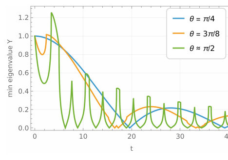 
Figure 2: Left: Time evolution of the minimum eigenvalue of the Jacobi operator for three anisotropy angles at fixed µ = 3 and ω = 1. Conjugate times are identified by zero crossings. As θ increases, the oscillatory frequency increases and zero crossings appear earlier. Right: First conjugate time tmin as a function of θ with ω = 1. Larger values of µ delay conjugate times in the symmetric regime, while near θ →π/2 the curves approach tmin ≈6.4.

📷 Fig 3

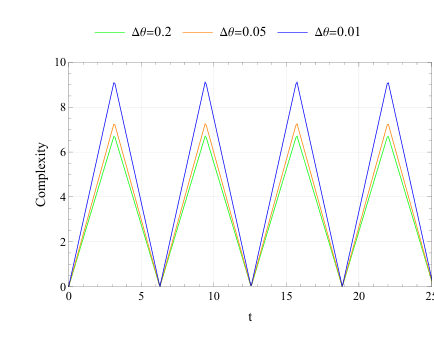 
Figure 3: Complexity evolution as a function of the cost factors, using the polar parametrization introduced in (2.66). We set J = 1 and define ∆θ ≡π/2 −θ. In the right panel, ∆θ = 0.1 is kept fixed, whereas in the left panel we fix µ = 1000.

📷 Fig 4

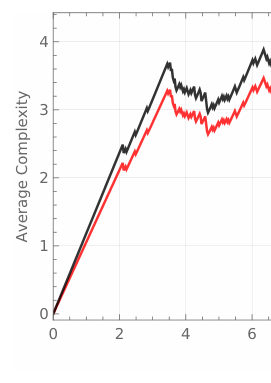 
Figure 4: Average complexity for the same random sample with σ = 1. In the parametrization of (2.66) we set µ = 200 and consider two different values of ∆θ ≡π/2 −θ. After the initial transient, the complexity oscillates around the value

📷 Fig 5

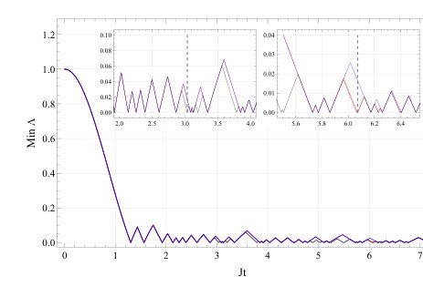 
Figure 5: Time evolution of the minimum eigenvalue of the Jacobi operator Yµ for different values of µ1 at fixed µ2 = 15. The left panel corresponds to N = 8, while the right panel corresponds to N = 6. The insets mark the first visible non-local conjugate times associated with the NL1 directions.

**Summary.** This work refines the geometric theory of quantum complexity by generalizing the cost function to include multiple penalty factors associated with different non-local degrees of freedom. By analyzing the resulting modified geodesic equations and the Jacobi operator, the authors show that these multiple costs create distinct families of conjugate points. This provides a more detailed and physically realistic description of how quantum complexity scales in many-body systems.

**Why it may be interesting.** The geometric understanding of complexity via generalized metrics and the detailed analysis of conjugate points provide powerful tools for characterizing the dynamical limitations and information processing capacity of complex quantum systems.

Detailed structure

**Main problem.** The paper extends Nielsen's geometric approach to quantum complexity by incorporating multiple cost factors to better model the geometry of quantum evolution on the group manifold.

**Main result.** The introduction of multiple cost factors leads to a richer structure of conjugate points, distinguishing between local and non-local contributions to quantum complexity.

**Method.** The analysis involves generalizing the Euler-Arnold and Jacobi equations using a Finsler metric approach, leading to the study of the Jacobi operator's spectrum.

**Model / system.** The study is applied to N-qubit systems evolving on the unitary group SU(2N), modeled using Dyson equations and analyzed in the context of SYK-type many-body models.

**Key observables.** Complexity $C(U, 	ilde{U})$, geodesic distance, and the location/scaling of conjugate points.

**Important parameters / regimes.** Multiple cost factors ($\mu_1, \mu_2, \dots$), anisotropy angle ($	heta$), and system size ($N$).

**Assumptions / limitations.** The complexity is formulated using a cost function satisfying specific mathematical properties, and the analysis often relies on approximations like high-frequency expansions or specific Hamiltonian limits.

**Figures summary.** Figures illustrate the time evolution of the minimum eigenvalue of the Jacobi operator, showing zero crossings (conjugate times) as a function of cost factors and system type (e.g., 3-body vs 4-body Hamiltonians).

**Paper structure.** The paper builds from the standard single cost factor framework to a generalized formalism incorporating multiple penalties, deriving modified geodesic equations and analyzing the resulting structure of conjugate points in specific models like single-qubit and SYK systems.

Abstract

We investigate Nielsen's geometric approach to quantum complexity in the presence of multiple cost factors, extending the standard framework where a single penalty distinguishes easy from hard directions of the group manifold. By introducing a hierarchy of penalties associated with different degrees of non-locality, we develop a generalized right-invariant complexity geometry and analyze its implications for geodesic evolution. We derive the modified Euler-Arnold and Jacobi equations and study how multiple cost factors reshape the structure and scaling of conjugate points, where geodesic optimality breaks down. The formalism is illustrated in two settings: a single-qubit system with two cost factors, where we derive approximate analytic solutions for the complexity growth and its dependence on penalty hierarchies, and SYK-type models, where we analyze both free and chaotic regimes. In these many-body systems, we show that distinct non-local sectors generate multiple families of conjugate points whose occurrence depends on both the cost hierarchy and the system size. Our results highlight how refining the penalty structure provides a richer and more realistic description of quantum complexity and its dynamical behavior.

[↑ back to top](#top)

### [Certifying coherence in quantum devices under classical control](http://arxiv.org/abs/2606.03699v1)

**Authors:** Gabriele Cobucci, Nicola D'Alessandro, Raphael Brinster, Alexander Bernal, Nikolai Wyderka, Armin Tavakoli  
**Type:** theory · **Category:** quantum information and computing · **PDF:** <https://arxiv.org/pdf/2606.03699v1>  
**Analysis basis:** full PDF text, analyzed in chunks
**Topic relevance:** `entanglement & information structure` **2/5** · `correlated / nonlocal dissipation` **1/5** · `driven-dissipative phase transition` **1/5** · `methods for driven-dissipative` **1/5** · `quantum measurements` **1/5**

📷 Fig 1

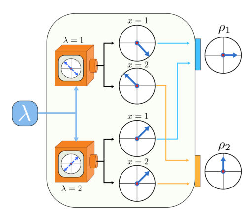 
FIG. 1: Classical model simulating the non-commuting states ρ1 = v |0⟩⟨0| + 1−v

📷 Fig 2

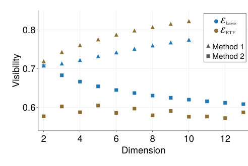 
FIG. 2: Bounds on the critical isotropic noise required to certify coherence for the two sets Ebases and EETF. The points were obtained using the methods introduced in section III A (triangles) and in section III B (squares). The results from the second method are not monotone for EETF because different families are used to construct the equiangular tight frame for different d.

📷 Fig 3

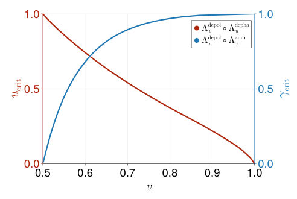 
FIG. 3: Bounds on coherence properties in the channels Λdepol v ◦Λdepha u (red) and Λdepol v ◦Λamp γ (blue). We have computed bounds both for the channels being coherence-preserving and coherence-breaking, but only one is displayed since they are nearly identical (due to the polyhedron’s shrinking factor being r ≈0.9879). For any given depolarising parameter v, channels with dephasing parameter u below the red curve are coherence breaking, whereas those with values of the dampening parameter γ below the blue line are coherence preserving.

**Summary.** This work provides a powerful mathematical toolbox to certify quantum coherence when the preparation process is corrupted by unknown classical variables. It achieves this by developing and comparing SDP-based criteria, offering both theoretically complete and computationally efficient methods. The results are crucial for analyzing the robustness of quantum superposition in real-world quantum devices and channels.

**Why it may be interesting.** The rigorous mathematical tools developed for characterizing coherence in the presence of unknown classical noise are directly applicable to benchmarking quantum hardware and understanding decoherence mechanisms in open quantum systems.

Detailed structure

**Main problem.** The paper develops complete and practical methods to certify quantum coherence in devices whose preparation process is subject to hidden classical control parameters.

**Main result.** It establishes that coherence can be fully characterized by a hierarchy of Semidefinite Programs (SDPs) and provides computationally efficient SDP criteria for practical use.

**Method.** The core methodology involves formulating coherence certification as checking the feasibility of increasingly complex SDP constraints, often utilizing dual formulations and iterative optimization.

**Model / system.** The study analyzes quantum states ($
ho_x$) generated by a preparation device under hidden classical control ($\lambda$), and the effect of quantum channels ($\Lambda$) on these states.

**Key observables.** Coherence quantifiers like $v^*(E)$ (based on isotropic noise) and the coherence witness $W(\Lambda(E))$ are central diagnostics.

**Important parameters / regimes.** The dimensionality of the Hilbert space ($d$), the number of states ($N$), and the noise parameters ($v, u, \gamma$) are key parameters.

**Assumptions / limitations.** The practical SDP criterion is an approximation of the full, infinite SDP hierarchy, and some analyses rely on approximating the Bloch sphere with a polyhedron.

**Figures summary.** Figures compare the bounds on critical isotropic noise ($v$) derived from different SDP methods, showing superior accuracy for the proposed practical method. Another figure plots coherence bounds for composed channels.

**Paper structure.** The paper builds from defining the problem (coherence under classical control) to developing the full SDP hierarchy, proposing a practical SDP criterion, and finally applying these tools to analyze coherence preservation through various quantum channels.

Abstract

Quantum states that do not commute exhibit coherence, but only when the device preparing them is assumed to be unaffected by classical parameters inaccessible to the experimenter. Such hidden classical control arises both in fundamental tests of quantum phenomena and in quantum information protocols that operate under limited control assumptions. Here, we address the problem of coherence certification by developing complete and practically efficient methods. First, we prove that coherence can be fully characterised through a hierarchy of semidefinite programs. Second, we introduce a practical semidefinite programming approach that achieves useful accuracy while remaining computationally efficient even for preparation devices generating many, potentially high-dimensional, quantum states. For the important special case of qubits, we further exploit conceptual connections with the theory of joint measurability to obtain highly accurate coherence characterisation that scales to more than one thousand qubits. Finally, we apply these methods to determine whether quantum channels are able to preserve coherence or are inherently coherence-breaking. Together, these results provide a powerful toolbox for analysing quantum superposition in the presence of hidden classical control.

[↑ back to top](#top)

### [Kinematical correlations via $κ$-Poincaré coproducts](http://arxiv.org/abs/2606.03004v1)

**Authors:** Mohammad Ali Gorji, Babak Vakili  
**Type:** theory · **Category:** other · **PDF:** <https://arxiv.org/pdf/2606.03004v1>  
**Analysis basis:** full PDF text, analyzed in chunks
**Topic relevance:** `Keldysh / 2PI / non-Gaussian methods` **2/5** · `methods for driven-dissipative` **2/5** · `analog quantum simulation` **1/5** · `entanglement & information structure` **1/5**

📷 Fig 1

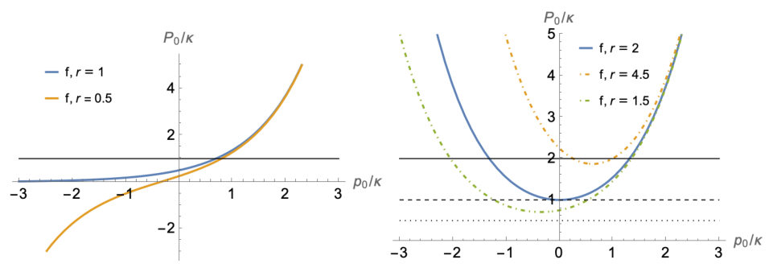 
Figure 1: The solid curves show f  p0/κ; r  , defined in (3.4), plotted versus p0/κ for fixed

**Summary.** This theoretical paper explores the kinematics of two-particle states in $\kappa$-Minkowski spacetime, a model incorporating quantum gravity effects via a deformation scale $\kappa$. The core finding is that the momentum composition law forces the appearance of distinct, branch-dependent correlations when the system enters a high-momentum regime. This mechanism is shown to be mathematically distinct from simpler nonrelativistic quantum models.

**Why it may be interesting.** While not directly related to AMO, the mathematical techniques used—analyzing non-linear mappings, branch cuts, and symmetry deformations—are highly relevant to understanding effective Hamiltonians in strongly coupled or highly constrained quantum systems.

Detailed structure

**Main problem.** The paper investigates the kinematical consequences of the Hopf-algebraic momentum composition law within $\kappa$-Minkowski spacetime, focusing on how this structure dictates two-particle momentum correlations.

**Main result.** The structure leads to branch-dependent $\kappa$-deformed back-to-back momentum correlations in the high-momentum regime ($|\vec{P}| > \kappa$), which is a unique feature distinguishing it from standard nonrelativistic minimal-length models.

**Method.** The analysis involves comparing two parameterizations of the curved momentum space (ordered-plane-wave labels $p_\mu$ vs. classical-basis momenta $P_\mu$) and analyzing the resulting nonlinear map and its associated coproduct structure.

**Model / system.** The system is $\kappa$-Minkowski spacetime, governed by the $\kappa$-Poincaré Hopf algebra, which introduces a deformation scale $\kappa$ related to the Planck energy. The study focuses on the two-particle state structure derived from the coproduct constraint.

**Key observables.** Deformed back-to-back momentum correlations, the branch-sensitive quantity $P^+ \equiv P_0 + P_4$, and the Jacobian determinant $\det \partial P_\mu / \partial p_
u$.

**Important parameters / regimes.** Deformation scale $\kappa$, the classical four-momentum $P_\mu$, and the ordered-plane-wave labels $p_\mu$.

**Assumptions / limitations.** The analysis assumes the existence of a regime where the inverse map $P 	o p$ is multi-valued (the two-branch regime), and it contrasts this with standard nonrelativistic models that lack this specific type of local inversion.

**Figures summary.** Figures illustrate the function $f$ and the graphical solution of the inverse map, showing the transition from a single-valued to a two-branch structure as the momentum magnitude $|\vec{P}|$ crosses the threshold $\kappa$.

**Paper structure.** The paper systematically compares the bicrossproduct basis (one-to-one map) with the classical basis (nonlinear map), derives the branch-resolving nature of the coproduct in the classical basis, and concludes by contrasting this structure with nonrelativistic models.

Abstract

We study a kinematical consequence of the Hopf-algebraic momentum composition law in $κ$-Minkowski spacetime. The same curved momentum space can be described in different coordinates. In the bicrossproduct basis the ordered-plane-wave labels are the translation-generator eigenvalues, so the relevant map is one-to-one. In the classical basis, instead, the translation eigenvalues $P_μ$ are nonlinearly related to the ordered-plane-wave labels $p_μ$. This relation can fail to be globally one-to-one in a high-momentum region. When a given classical-basis four-momentum admits more than one real auxiliary preimage, the branch-sensitive quantity $P_+\equiv P_0+P_4=κe^{p_0/κ}$ enters the coproduct and resolves the branches in two-particle states. Imposing the vanishing total-momentum constraint therefore gives branch-dependent $κ$-deformed back-to-back momentum correlations. In a single-branch regime this is just a deformed correlated product, while in a multibranch regime a state specified only by $P_μ$ can be expanded into distinct auxiliary branches. If $P_μ$ are taken as the directly meaningful momenta, the physical content is the resulting deformed correlation pattern. If the auxiliary variables $p_μ$ are assigned operational meaning, the same constrained state can be interpreted as a superposition over different auxiliary branches. We also compare this structure with standard regular self-adjoint nonrelativistic minimal-length models and find no analogous smooth local two-real-branch inversion on their physical domains.

[↑ back to top](#top)

### [Modeling Discrete Data with High-Order Vector Potts Models](http://arxiv.org/abs/2606.03429v1)

**Authors:** Aaron De Clercq, Merijn Moody, Clélia de Mulatier  
**Type:** theory · **Category:** disordered systems and neural networks · **PDF:** <https://arxiv.org/pdf/2606.03429v1>  
**Analysis basis:** full PDF text, analyzed in chunks
**Topic relevance:** `entanglement & information structure` **2/5** · `Keldysh / 2PI / non-Gaussian methods` **1/5** · `analog quantum simulation` **1/5** · `exotic spin models in light-matter` **1/5** · `methods for driven-dissipative` **1/5**

📷 Fig 1

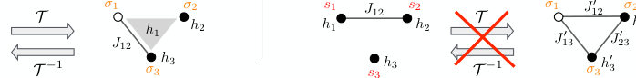 
Figure 1: Example illustrating equivariant model selection for binary datasets ˆs = {s(i)}N i=1, where each datapoint s(i) is a state of a three-spin system s = (s1, s2, s3) ∈{−1, +1}3. A model selection procedure is equivariant if, for a basis transformation of the dataset T : s →σ, the models obtained from the model selection procedure on ˆs (Bob’s data) and ˆσ (Alice’s data) are related by the same transformation T . The left panel shows an example of an equivariant model selection procedure, for which the spin model found in Alice’s data representation corresponds to the model found in Bob’s representation rewritten in Alice’s basis, i.e. MAlice = T [MBob]. In the right panel, Alice and...

📷 Fig 2

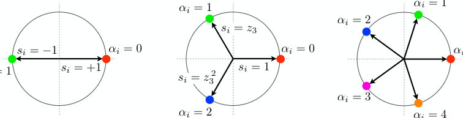 
Figure 2: Representation for q-state spin variables in the complex plane for different values of q. For a given value of q, the color variable αi can take any integer value modulo q, αi ∈(Z/qZ)n. The corresponding q-state spin variable then takes the complex value si = z αi q , where zq is the first q-th root of unity. The spin variable can thus be represented in the complex plane by a random unit vector which can point in any of the q different directions corresponding to the q-th roots of unity. Observe that zq−αi q and z αi q are complex conjugate spin values, zq−αi q = (z αi q )∗, which correspond to mirrored directions of si with respect to the x-axis.

📷 Fig 3

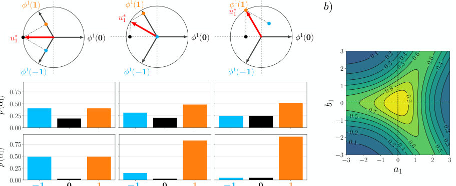 
Figure 3: Example for q = 3. One-spin system α = (α1) modeled by a single interaction µ = (1), corresponding to the operator ϕ1(α) = exp  2iπ

📷 Fig 4

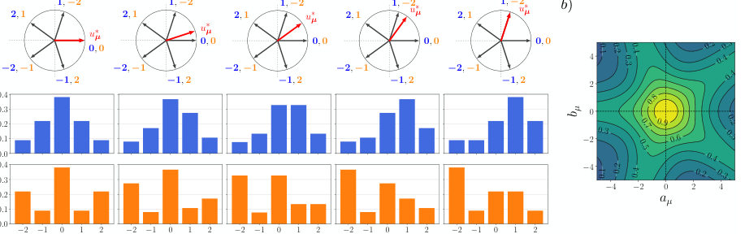 
Figure 4: Example for q = 5 and two types of 1-body operator. One-spin system α = (α1) modeled by two examples of a single-spin interaction: an interaction µ = (1) corresponding to the operator ϕ1(α) = exp  2iπ

📷 Fig 5

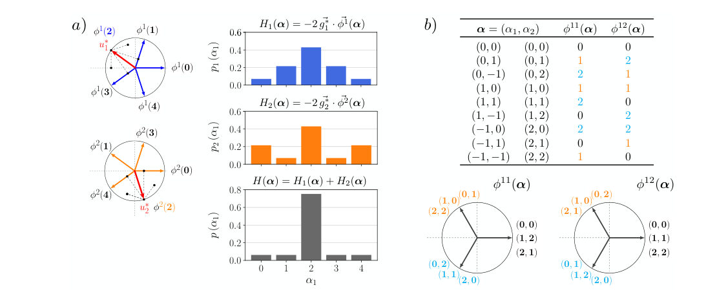 
Figure 5: a) Example of a model for q = 5 with two types of one-body interactions. One-spin system α = (α1) modeled by the operators ϕ1(α) = zα1 5 and ϕ2(α) = z2α1 5 (same as in Fig. 4). At the top is the probability distribution p1(α1) of the model with operator ϕ1 (and its c.c.) parameterized by g∗ 1 = r1u∗ 1 with u∗ 1 = z 2 5 (see red arrow in the unit circle). In the middle is the distribution p2(α1) with operator ϕ2 (and c.c.) parameterized by g∗ 2 = r2u∗ 2 with u∗ 2 = z 4 5 . In both cases, the parameter is aligned with the direction of ϕµ(α1 = 2) and has a strength rµ = 0.5. At the bottom is the distribution p(α1) of the model containing both operators (and their c.c.) with the same...

**Summary.** This work introduces $q$-state spin models as a generalized maximum entropy framework for analyzing high-dimensional discrete data. It establishes that these models are characterized by gauge invariance, allowing for the identification of equivalent underlying statistical structures. The authors provide practical methods, including closed-form evidence calculations, for selecting the most parsimonious model describing complex systems.

**Why it may be interesting.** The rigorous mathematical treatment of model equivalence via gauge transformations and the connection to information geometry provides powerful tools for analyzing complex, high-dimensional data structures, which is relevant for characterizing emergent order in quantum many-body systems.

Detailed structure

**Main problem.** The paper addresses the challenge of modeling high-dimensional discrete data to infer the underlying microscopic constraints governing complex systems.

**Main result.** It develops a comprehensive framework using $q$-state spin models that are invariant under gauge transformations, allowing for robust model selection.

**Method.** The authors employ maximum entropy principles, utilizing loop expansions and deriving closed-form expressions for the marginal likelihood of Minimally Complex Models (MCMs).

**Model / system.** The model is a generalization of the Potts model to $q$-state spin systems defined on discrete variables, capturing arbitrary high-order correlations in data like protein sequences or neural activity.

**Key observables.** Marginal likelihood, partition function ($Z_M(g)$), and the geometric complexity of the model.

**Important parameters / regimes.** The number of states ($q$), the number of variables ($n$), and the interaction parameters ($g_\mu$).

**Assumptions / limitations.** The analysis relies on the large $N$ limit for model selection and assumes the data can be effectively described by the moments captured by the spin model.

**Figures summary.** Figures illustrate gauge transformations relating different model representations and show comparisons of entropy values for different discretization schemes.

**Paper structure.** The paper progresses from defining the $q$-state spin models and their relation to discrete Fourier analysis, through the mathematical framework of gauge invariance, to deriving the closed-form evidence for MCMs, and finally applying this to model selection.

Abstract

Modeling high-dimensional data is challenging, yet essential to understanding many complex systems. Maximum entropy models such as Ising and Potts models have been used extensively to capture pairwise interactions from correlation patterns in data, allowing to infer graphical representations of complex systems from observations (e.g., from protein sequences or neural population activity). Recently, there has been growing interest in modeling higher-order correlation patterns involving simultaneously three or more variables. While progress has been made in binary data with high-order Ising models, we extend this framework to the more general case of discrete data.   We introduce q-state spin models, a complete family of maximum entropy models that generalize the vector Potts model to include long-range and arbitrary high-order interactions. In the pairwise case, our models allow for more diverse interaction types compared to the standard vector Potts model. We discuss their statistical interpretation with examples and relate them to discrete Fourier analysis. Using a loop expansion of the partition function, we show that the statistical properties of spin models are fully captured by the algebraic structure of their interactions. We define gauge transformations under which this structure, and thus the partition function, remains invariant. Models equivalent under gauge transformations can be seen as different representations of the same abstract statistical model, despite generally having interactions of different orders, extending results from the binary case. For practical application to data analysis, we focus on a subset of models known in the binary case as Minimally Complex Models, generalizing them to discrete data. We obtain a closed-form expression for the marginal likelihood of these models, enabling fast model selection. We illustrate their use with simple real-world examples.

[↑ back to top](#top)

### [Predicting the conditions for observing the Mpemba effect](http://arxiv.org/abs/2606.03445v1)

**Authors:** Yue Liu, Tan Van Vu, Raphaël Chétrite, Frédéric van Wijland, Hisao Hayakawa  
**Type:** theory · **Category:** statistical mechanics · **PDF:** <https://arxiv.org/pdf/2606.03445v1>  
**Analysis basis:** full PDF text, analyzed in chunks
**Topic relevance:** `non-equilibrium dynamics` **2/5** · `Keldysh / 2PI / non-Gaussian methods` **1/5** · `driven-dissipative phase transition` **1/5** · `methods for driven-dissipative` **1/5** · `non-equilibrium universality` **1/5**

📷 Fig 1

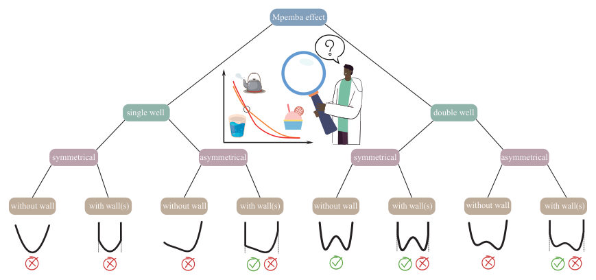 
FIG. 1. Summary of the conditions for observing the Mpemba effect across various potential landscapes. The decision tree categorizes one-dimensional potentials based on the number of wells (single well vs. double well), their parity (symmetrical vs. asymmetrical), and the boundary conditions (without wall vs. with wall(s)). The green checkmark and red cross denote the guaranteed presence and absolute absence of the Mpemba effect, respectively. Simultaneous checkmark and cross mean that the existence of the effect is conditionally dependent on the position of the wall(s).

📷 Fig 2

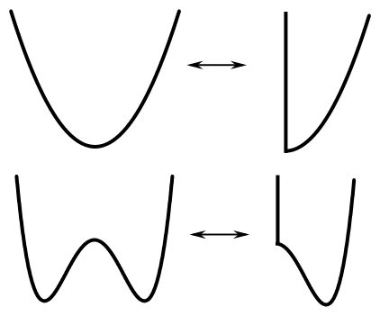 
FIG. 2. (a) A symmetric single-well potential is equivalent to an asymmetric single-well potential with a wall at the center. (b) The symmetric double-well potential is equivalent to an asymmetric single-well potential with a wall at the center of the symmetric potential.

📷 Fig 3

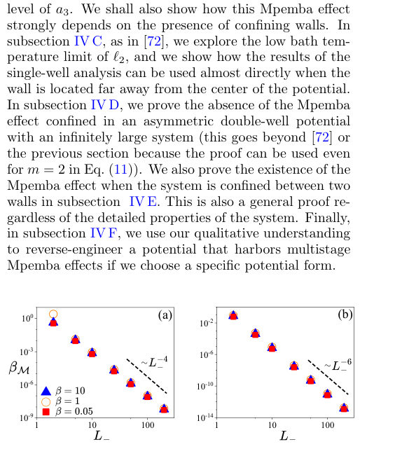 
FIG. 3. (a) The inverse temperature βM is shown as a function of L−for various bath temperatures in a quartic po- tential V (x) ∼x4 with a hard wall at x = −L−= −LBL. (b) Same as in which the quartic potential is replaced by a sextic potential V (x) ∼x6. In both (a) and (b), the analyt- ical result, Eq. (45), obtained for large β and L−is shown as a dashed line as a guide for the eye. Remarkably, no no- table deviations are observed, even very far from the regime in which the analytical expression was derived. We have used L+ = 2L−(LBR = 2LBL).

📷 Fig 4

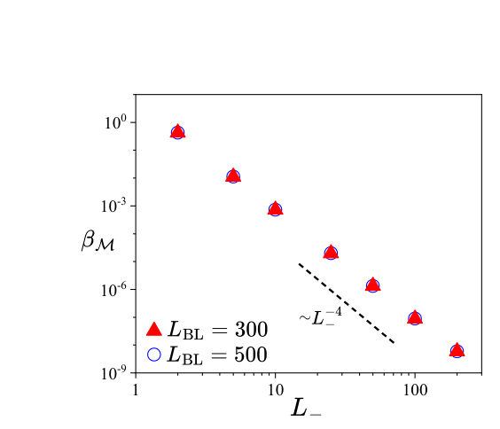 
FIG. 4. Plot of the Mpemba inverse temperature βM as a function of the position L−of the soft wall is shown for two different simulation boxes LBL = 300 (red solid triangles) and 500 (blue open circles), and the result is independent of LBL. The dashed line shows excellent agreement with our prediction. We have used m = 4, a bath temperature β = 1, and the soft soft wall grows as V (x) ∼x6 (q = 6) for −LBR &gt; x &gt; −L−. Here, we have used L+ = LBR = 2LBL.

📷 Fig 5

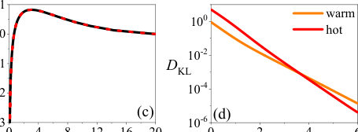 
FIG. 5. (a) The overlap coefficient a3 as a function of βi for the symmetric double-well potential constructed by a piece- wise harmonic potential, which exhibits a non-monotonic be- havior, indicating the existence of the (inverse) Mpemba ef- fect. The analytical result (black solid line) is consistent with the numerical result (red dashed line). (b) The time evolution of the KL divergence for cold initial temperature (βi = 20, blue solid line) and warm initial temperature (βi = 8, orange solid line), which cross each other, thereby confirming the (in- verse) Mpemba effect. The inverse bath temperature is set to β = 4 for both panels (a) and (b). (c) The same as (a) but β = 20. (d) The...

**Summary.** This theoretical study predicts the necessary structural conditions for observing the Mpemba effect in overdamped Langevin systems. It shows that the effect is fundamentally governed by the presence of boundaries (walls) rather than the internal details of the potential wells. The analysis uses spectral methods to classify potentials and engineer systems exhibiting this counterintuitive thermal relaxation behavior.

**Why it may be interesting.** This work provides a rigorous, mathematically grounded classification of the Mpemba effect, linking it directly to boundary conditions and spectral properties of the underlying dynamics, which is highly relevant for understanding non-equilibrium relaxation in complex systems.

Detailed structure

**Main problem.** The paper investigates the fundamental structural features of the energy landscape required for the Mpemba effect, a counterintuitive phenomenon where a hotter system relaxes faster than a colder one.

**Main result.** The existence of the Mpemba effect is primarily driven by the presence of boundaries (hard or soft walls), rather than the specific internal structure of the potential landscape. The analysis provides a unified classification across single- and double-well potentials.

**Method.** The study employs spectral decomposition of the Fokker-Planck operator and analyzes the behavior of the first nontrivial eigenmode, relating the effect to the non-monotonic dependence of the overlap coefficient on initial temperature.

**Model / system.** The system is modeled using one-dimensional overdamped Langevin dynamics for a particle in a potential V(x), governed by the Fokker-Planck equation. The analysis covers single-well and double-well potentials, considering the influence of hard or soft boundaries.

**Key observables.** Overlap coefficient ($a_2$), Mpemba temperature ($eta_M$), and the behavior of the first nontrivial eigenmode.

**Important parameters / regimes.** Initial temperature ($T_i$) or inverse temperature ($eta_i$), and the presence/location of boundaries ($L_-, L_+$).

**Assumptions / limitations.** The analysis relies on asymptotic approximations, particularly in the low-bath-temperature regime, and assumes the potential grows fast enough at the boundaries.

**Figures summary.** Figures illustrate decision trees summarizing conditions for the Mpemba effect, and plots show the dependence of $eta_M$ on wall separation for various potential types.

**Paper structure.** The paper progresses by establishing the mathematical framework using the Fokker-Planck operator, deriving the condition for the Mpemba effect via the overlap coefficient $a_2$, and finally classifying the necessary structural elements (boundaries) required for the effect to manifest.

Abstract

The Mpemba effect, a counterintuitive phenomenon where a hotter system relaxes faster than a colder one, has been widely observed in various nonequilibrium systems. Despite this progress, the fundamental structural features of the energy landscape required for its emergence remain a subject of debate. In this study, we investigate the conditions for the Mpemba effect within one-dimensional overdamped Langevin dynamics. We classify the potential landscapes based on the presence of single or double wells, their symmetry properties, and the existence of walls. We establish that the existence of the effect is primarily driven by the presence of boundaries, either hard or soft, rather than the specific internal structure of the potential landscape, such as metastability or the number of minima. By employing a spectral decomposition of the Fokker-Planck operator, we analyze the behavior of the first nontrivial eigenmode and demonstrate that its derivative acts as a Dirac delta peak in the low-temperature regime. This helps us elucidate the mechanism underlying the Mpemba effect: it appears as the interplay between this behavior and the initial population dynamics in a non-trivial way induced by the presence of the wall. Our analysis provides a unified classification across single- and double-well potentials, highlighting the crucial role of boundary conditions and asymmetry. Furthermore, we demonstrate that this framework allows for the engineering of potential landscapes capable of producing multistage Mpemba transitions.

[↑ back to top](#top)

### [Quantum Optimization Algorithms for Strongly Correlated Many-Body Systems](http://arxiv.org/abs/2606.03147v1)

**Authors:** G. E. L. Pexe, L. A. M. Rattighieri, P. M. Prado, A. R. Fritsch, F. F. Fanchini  
**Type:** theory · **Category:** strongly correlated electrons · **PDF:** <https://arxiv.org/pdf/2606.03147v1>  
**Analysis basis:** full PDF text, analyzed in chunks
**Topic relevance:** `analog quantum simulation` **2/5** · `entanglement & information structure` **2/5** · `non-equilibrium dynamics` **1/5** · `quantum measurements` **1/5**

📷 Fig 1

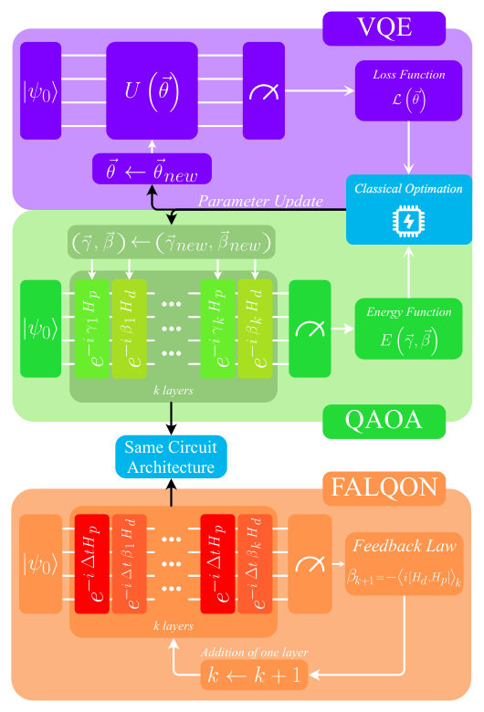 
Figure 1. Comparative schematic of the main quantum optimization algorithms from a NISQ perspective. (a) In VQE, a variational circuit prepares an ansatz and measures the expectation value of the Hamiltonian, while a classical optimizer iteratively updates the parameters. (b) In QAOA, an alternating sequence of evolutions under the problem Hamiltonian Hp and the mixer Hamiltonian Hd is applied for a fixed depth p, followed by classical optimization of the angles. (c) In FALQON, the dynamics are guided by feedback based on measuring the commutator i[Hd, Hp], eliminating the external classical optimizer and introducing an iterative evolution with progressive growth of the circuit depth.

📷 Fig 2

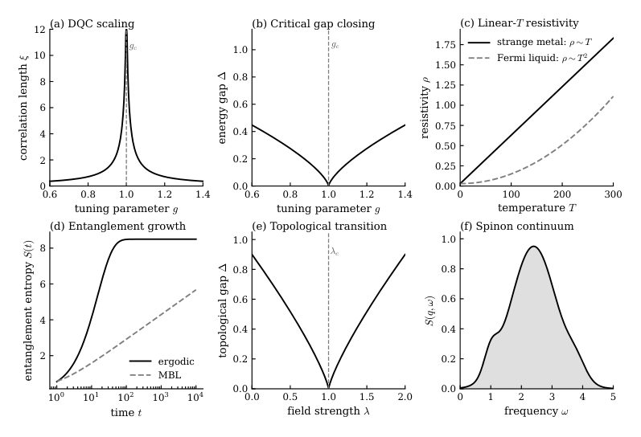 
Figure 2. Phenomenological signatures of quantum phase transitions and strongly correlated states targeted for investigation via quantum algorithms in the NISQ regime. (a) Divergence of the correlation length ξ and (b) algebraic closing of the energy gap ∆in the vicinity of a Deconfined Quantum Criticality (DQC) point gc. (c) Anomalous transport in the strange metal phase, evidenced by T-linear resistivity (ρ ∝T), in contrast to the quadratic dependence of a Fermi liquid. (d) Non-equilibrium dynamics of the entanglement entropy S(t) following a global quench: the Many-Body Localization (MBL) phase exhibits ultra-slow logarithmic growth, while the ergodic phase rapidly saturates following a...

📷 Fig 3

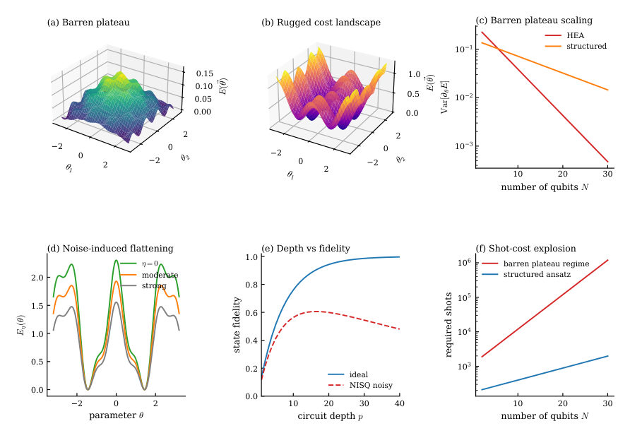 
Figure 3. Representation of the fundamental challenges for variational quantum algorithms in condensed matter within the NISQ regime. (a) Visualization of a barren plateau, characterized by an exponentially flat cost landscape that renders gradient-based methods unfeasible. (b) Rugged cost landscape exhibiting multiple spurious local minima that trap classical optimizers. (c) Scaling of the gradient variance Var[∂θE] with the number of qubits N, demonstrating the severe exponential decay for Hardware Efficient Ans¨atze (HEA) compared to structured circuits. (d) Effect of experimental noise (η) on the flattening of the energy landscape and the displacement of the global minimum. (e)...

**Summary.** This perspective article analyzes the use of quantum optimization algorithms to study phase transitions in strongly correlated quantum systems. It critiques Variational Quantum Algorithms for suffering from barren plateaus and proposes Feedback-based Quantum Algorithms as a more robust alternative. The work highlights the necessity of physics-informed circuit design to achieve quantum advantage in condensed matter physics.

**Why it may be interesting.** It directly addresses the computational bottleneck in simulating complex quantum matter, proposing a specific algorithmic pathway (FQAs) to overcome the limitations of current NISQ hardware for studying exotic phases.

Detailed structure

**Main problem.** Investigating phase transitions in strongly correlated quantum many-body systems, which are intractable for classical simulation due to exponential Hilbert space growth or the fermionic sign problem.

**Main result.** Feedback-based quantum algorithms (FQAs) are argued to provide geometrically more robust trajectories for navigating the energy landscape than traditional Variational Quantum Algorithms (VQAs) in the NISQ era.

**Method.** The paper reviews and compares VQAs (VQE, QAOA) against FQAs (like FALQON), focusing on their application to quantum simulation.

**Model / system.** The study covers various strongly correlated models, including the SYK model (strange metals), the $J-Q$ model (DQC), the MBL model (disordered systems), and the Toric Code (topological phases).

**Key observables.** Energy expectation value, correlation length ($\xi$), entanglement entropy ($S$), dynamic structure factor ($S(q, \omega)$), and gap closing ($\Delta$).

**Important parameters / regimes.** NISQ era constraints, circuit depth, noise levels, and the ratio of coupling constants in specific Hamiltonians.

**Assumptions / limitations.** The primary limitations discussed are the exponential barren plateaus in VQAs and the sensitivity of all quantum methods to noise and circuit depth.

**Figures summary.** Figures compare VQE, QAOA, and FALQON approaches, illustrating challenges like barren plateaus, rugged cost landscapes, and the depth vs. fidelity trade-off.

**Paper structure.** The paper progresses by establishing the classical limitations, reviewing VQAs, introducing FQAs as an improvement, and then applying these methods to specific condensed matter problems like DQC, MBL, and QSLs.

Abstract

This perspective article analyzes the potential and critical challenges of employing quantum optimization algorithms to investigate phase transitions in quantum many-body systems during the Noisy Intermediate-Scale Quantum era. The simulation of strongly correlated systems is frequently intractable on classical computers due to the exponential growth of the Hilbert space and the fermionic sign problem. In this context, we review and compare the performance of traditional Variational Quantum Algorithms, such as the Variational Quantum Eigensolver and the Quantum Approximate Optimization Algorithm, against emerging heuristic approaches, specifically Feedback-based Quantum Algorithms, such as FALQON. We explore the applicability of these methods in the study of open phenomena in condensed matter physics, including Deconfined Quantum Criticality, strange metals, Many-Body Localization, topological phase transitions, and quantum spin liquids. We discuss how fundamental operational bottlenecks, notably expressibility- and noise-induced barren plateaus, severely compromise gradient-based optimization. We conclude that deterministic feedback-guided methods provide geometrically more robust trajectories for navigating the energy landscape of these systems, arguing that further advancement in the field will rely on deep hybridization and physics-informed circuit co-design towards fault tolerance.

[↑ back to top](#top)

### [Magnetic field effects on spin-split band and magnon transport in altermagnets and emergent compensated ferrimagnets](http://arxiv.org/abs/2606.03451v1)

**Authors:** Kazushi Aoyama, Hikaru Kawamura  
**Type:** theory · **Category:** strongly correlated electrons · **PDF:** <https://arxiv.org/pdf/2606.03451v1>  
**Analysis basis:** full PDF text, analyzed in chunks
**Topic relevance:** `analog quantum simulation` **2/5** · `Keldysh / 2PI / non-Gaussian methods` **1/5** · `non-equilibrium dynamics` **1/5** · `spintronics-quantum-optics interface` **1/5**

📷 Fig 1

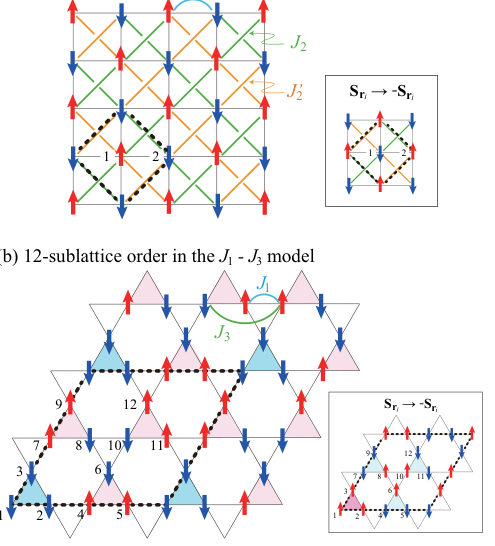 
FIG. 1: Schematic pictures of the models and their collinear antiferromagnetic ground states at zero field, where the mag- netic unit cells are indicated by dotted lines. (a) The 2- sublattice altermagnetic state in the J1-J2-J′ 2 model on the square lattice, where cyan, green, and orange lines represent the exchange interactions J1, J2, and J′ 2, respectively. (b) The 12-sublattice state with compensated ferrimagnetic nature in the J1-J3 model on the kagome lattice, where cyan and green curves represent J1 and J3, respectively. In (b), pink and cyan upward triangles possess the local magnetization of +1 (two-up and one-down) and −3 (three-down), respectively. In each of (a) and (b), numbers...

📷 Fig 2

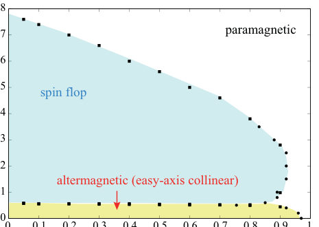 
FIG. 2: Temperature and magnetic-field phase diagram of the easy-axis altermagnet on the square lattice with J2/J1 = −0.5, J′ 2/J1 = −0.25, and D/J1 = 0.02. Yellow and cyan regions denote the stability regions of the easy-axis collinear and spin-flop states, respectively. The result is obtained in the MC simulation.

📷 Fig 3

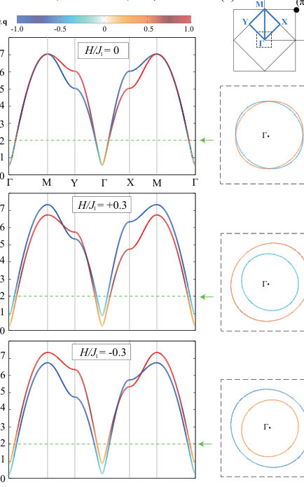 
FIG. 3: Field dependence of the magnon band in the alter- magnetic collinear state with the 2 sublattice structure (see the yellow region in Fig. 2). (a)-(c) The magnon dispersions at H/J1 = 0, +0.3, and −0.3 (from top to bottom) along the path connecting high symmetry points shown in Fig. 3 (d), where the color represents the spin polarization of the magnon hn,q (reddish and bluish colors represent up and down spins, respectively). In each figure, the right panel shows the cross section of the magnon band at ǫn,q/J1 = 2, where the box enclosed by the dashed lines corresponds to the one near the Γ point in (d). In (d), the inner diamond denotes the Bril- louin zone. The interaction...

📷 Fig 4

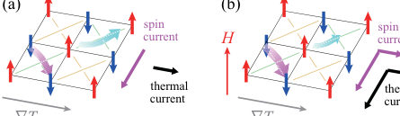 
FIG. 5: A schematic image of the origin of the longitudinal and transverse responses in the altermagnetic states at (a) H/J1 = 0 and (b) H/J1 = +0.3, where magenta and cyan arrows represent the flow of the positively and negatively po- larized magnons, respectively.

📷 Fig 5

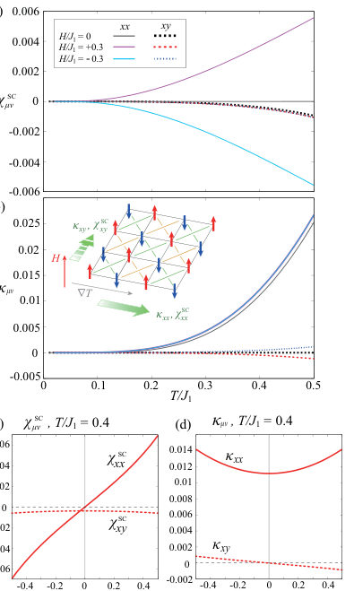 
FIG. 4: Spin and thermal currents driven by thermal gradient in the altermagnetic state [see the system setup shown in the inset of (b)]. (a) Temperature dependence of the spin-current conductivity χSC µν and (b) that of the thermal conductivity κµν, where black, reddish, and bluish solid (dashed) curves represent to the longitudinal xx (transverse xy) components at H/J1 = 0, +0.3, and −0.3, respectively. Other parameters are the same as those in Figs. 2 and 3. In (b), the xx com- ponents for H/J1 = ±0.3 (magenta and cyan curves) exactly overlap. (c) and (d) Associated field dependences of (c) χSC µν and (d) κµν at T/J1 = 0.4. χSC µν and κµν are normalized by S3J1/γ and S4J2 1 /γ,...

**Summary.** This theoretical work examines how magnetic fields influence spin-split magnon bands in altermagnets and compensated ferrimagnets. By analyzing the magnon Hamiltonian and calculating transport coefficients, the authors demonstrate that the field induces Zeeman-like shifts and that the specific magnetic symmetry dictates the resulting spin and thermal current response. This is crucial for understanding spin-charge/heat transport in complex magnetic materials.

**Why it may be interesting.** The study connects fundamental magnetic ordering (altermagnetism/ferrimagnetism) to measurable transport phenomena (spin/heat currents) under external fields, providing theoretical insights into emergent quantum magnet behavior.

Detailed structure

**Main problem.** The paper investigates how an external magnetic field affects the spin-split magnon band structure and the resulting spin and thermal transport properties in altermagnets and compensated ferrimagnets.

**Main result.** The study shows that the magnetic field induces Zeeman-like shifts in the magnon bands, and the specific magnetic structure dictates whether the resulting spin/thermal conductivity exhibits an asymmetric field dependence or a purely longitudinal response.

**Method.** The analysis uses theoretical modeling, transforming the spin Hamiltonian into a Bogoliubov magnon Hamiltonian, and calculating transport coefficients ($\chi^{SC}, \kappa$) using linear response theory.

**Model / system.** The systems modeled are altermagnets (using the $J_1-J_2-J'_2$ model on a square lattice) and compensated ferrimagnets (using the $J_1-J_3$ model on a kagome lattice). Both exhibit spin splitting without net magnetization.

**Key observables.** Spin-conductivity ($\chi^{SC}_{\mu
u}$), thermal conductivity ($\kappa_{\mu
u}$), magnon band dispersion, and spin polarization of magnon bands.

**Important parameters / regimes.** External magnetic field ($H$), easy-axis anisotropy ($D$), and lattice coupling constants ($J_1, J_2, J_3$).

**Assumptions / limitations.** The analysis assumes the energy scale of the magnetic field is smaller than the anisotropy gap, and transport coefficients are calculated using the relaxation-time approximation.

**Figures summary.** Figures illustrate the field dependence of magnon bands (showing shifts), and the resulting spin/thermal currents driven by thermal gradients in both altermagnetic and ferrimagnetic states.

**Paper structure.** The paper progresses from defining the physical models and Hamiltonians for the two magnetic systems, to calculating the magnon band structure and spin polarization, and finally analyzing the resulting spin and thermal transport coefficients as a function of magnetic field and temperature.

Abstract

In altermagnets and fully compensated ferrimagnets, not only the electron band but also the magnon band exhibits spin splitting without net magnetization, which enables thermal activation of the magnon spin current. Here, we theoretically investigate magnetic field effects on the magnon properties of these antiferromagnets in the presence of a weak easy-axis anisotropy which makes the collinear states robust against the magnetic field. For the altermagnet and compensated ferrimagnet, we analyze a 2 sublattice order in the $J_1$-$J_2$-$J_2^\prime$ model on the square lattice and a triple-${\bf Q}$ 12-sublattice order in the $J_1$-$J_3$ model on the kagome lattice, respectively, each accompanied by $d$-wave and $s$-wave spin splitting at zero field. It is shown that for positive (negative) magnetic field $H$ whose energy scale is smaller than the anisotropy gap, the up- and down-spin magnon bands are shifted to lower (higher) and higher (lower) energies, respectively, similarly to the Zeeman coupling in electron systems. In the altermagnet, with increasing field, the $d$-wave splitting tends to be deformed into the $s$-wave one, which is reflected as the change in the direction of the spin current generated by thermal gradient. In the compensated ferrimagnet, the $s$-wave nature, i.e., the population imbalance between the up- and down-spin magnons at $H=0$, results in an asymmetric field dependence of the longitudinal spin and thermal conductivities.

[↑ back to top](#top)

### [Towards Efficient Synthesis of Quantum Graph States by Fusing Graph Motifs](http://arxiv.org/abs/2606.02880v1)

**Authors:** Tingxiang Ji, Hansika Weerasena, Demitry Farfurnik, Jianqing Liu  
**Type:** theory · **Category:** quantum information and computing · **PDF:** <https://arxiv.org/pdf/2606.02880v1>  
**Analysis basis:** full PDF text, analyzed in chunks
**Topic relevance:** `analog quantum simulation` **2/5** · `QC/QI experiment` **1/5** · `entanglement & information structure` **1/5** · `quantum optics experiment` **1/5**

📷 Fig 1

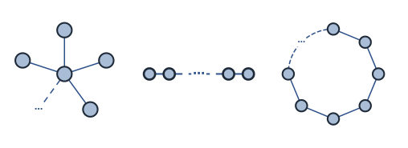 
Fig. 1: Resource graph state motifs used in this work. (a) Star motif: a GHZ-type graph state with one central qubit connected to N −1 others, totaling N qubits. (b) Linear motif: a path-like graph state with N qubits connected sequentially. (c) Ring motif: a cyclic graph state with N qubits. These three motifs serve as the primitive building blocks in the proposed CFD framework.

📷 Fig 2

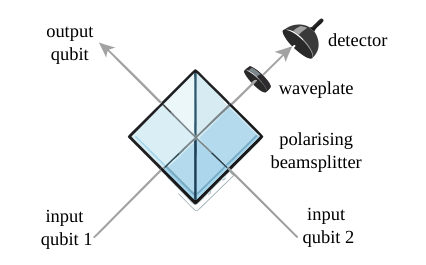 
Fig. 2: Schematic of the Type-I fusion in a photonic imple- mentation. Two input qubits, one from each graph state, are interfered on a polarising beamsplitter followed by waveplate and detector, probabilistically merging the two fragments into a larger graph state with success probability 1/2.

📷 Fig 3

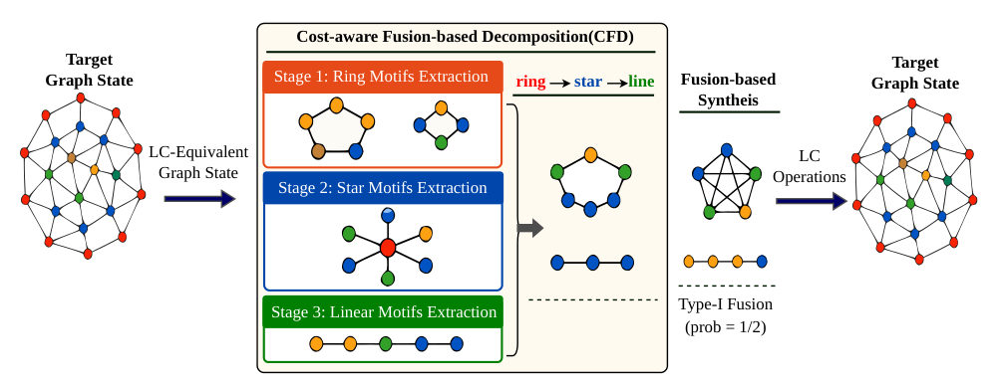 
Fig. 3: Overview of the proposed Cost-aware Fusion-based Decomposition (CFD) framework. Given a target graph state, CFD first identifies the LC-equivalent graph state with the minimum number of edges, then decomposes it into ring, star, and linear motifs through three successive extraction stages. The resulting motifs are realized as photonic resource states and connected via Type-I fusion operations to synthesize the LC-equivalent graph state, from which the target graph state is recovered by applying LC operations in the reverse order.

📷 Fig 4

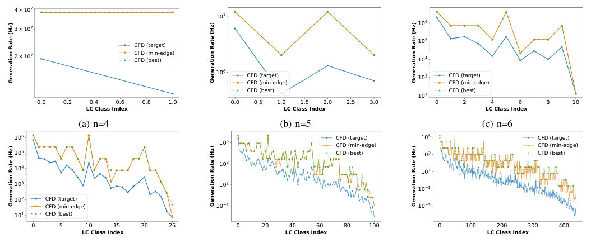 
Fig. 4: Photonic generation rates for graph states of size n = 4 to 9 across LC equivalence classes using the CFD framework. For each target graph state, CFD is applied to every graph state in its LC equivalence class and the generation rate is computed from the resulting motif decomposition. The plotted quantities correspond to the three cases defined in the Evaluation Method: CFD (min-edge), the generation rate obtained by applying CFD to the LC-equivalent graph state with the minimum number of edges; CFD (target), the generation rate obtained by applying CFD directly to the target graph state; and CFD (best), the minimum resource overhead achieved by CFD across the LC equivalence class.

📷 Fig 5

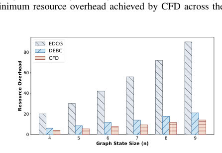 
Fig. 5: Resource overhead comparison of EDCG, DEBC, and the proposed CFD framework across graph states of size n = 4 to 9. EDCG incurs a fixed overhead of n(n −1) regardless of target topology, while DEBC and CFD both take the minimum-edge LC-equivalent graph state as input. Lower resource overhead corresponds to higher photonic generation rate.

**Summary.** This paper introduces a novel, cost-aware decomposition method (CFD) to overcome the exponential resource limitations in synthesizing photonic graph states. By leveraging local Clifford equivalence and decomposing the target state into fundamental motifs (ring, star, linear), the authors significantly reduce resource overhead. This provides a practical and scalable pathway toward building complex quantum circuits using photonic hardware.

**Why it may be interesting.** This work provides a concrete, scalable algorithmic blueprint for realizing complex quantum resources (graph states) in photonic systems, directly impacting the feasibility of measurement-based quantum computation.

Detailed structure

**Main problem.** The core challenge is efficiently synthesizing complex photonic graph states required for advanced quantum computing and sensing applications.

**Main result.** The proposed Cost-aware Fusion-based Decomposition (CFD) framework achieves up to an 84.6% reduction in resource overhead compared to baseline methods, leading to massive improvements in the photonic generation rate.

**Method.** The method involves a three-stage heuristic decomposition: first, finding an LC-equivalent state with minimum edges; second, decomposing this state into fundamental motifs (ring, star, linear); and third, assembling these motifs via Type-I fusion operations.

**Model / system.** The work focuses on photonic graph states, where qubits are vertices and CZ entangling operations form the edges. The synthesis is performed on a photonic platform using Type-I fusion operations.

**Key observables.** Resource overhead (total photon cost $M$), photonic generation rate $R(G)$, and physical-qubit consumption.

**Important parameters / regimes.** The exponential dependence of the generation rate on the number of fusion operations ($k$) and the resource cost.

**Assumptions / limitations.** The primary assumption is that selecting the LC-equivalent graph state with the minimum number of edges serves as a highly effective proxy for near-optimal synthesis.

**Figures summary.** Figures illustrate the three resource motifs (Star, Linear, Ring), the schematic of the Type-I fusion process, and quantitative comparisons showing CFD's superior performance in resource overhead and generation rate across various graph sizes and lattice structures.

**Paper structure.** The paper establishes the problem limitations, introduces the concept of LC equivalence, details the CFD heuristic framework (motif decomposition $
ightarrow$ fusion $
ightarrow$ LC operations), and validates the approach through extensive numerical comparisons against baseline constructions on lattice and general graph states.

Abstract

Photonic graph states with advanced topologies can enable measurement-based quantum computing, distributed quantum sensing, and quantum interconnects. However, the efficient generation of photonic graph states is limited by the probabilistic nature of photonic entangling operations and the exponential dependence of generation rate on resource cost. In this work, we study photonic graph state synthesis as a cost-aware decomposition problem, exploiting local Clifford (LC) equivalence to identify more synthesis-friendly representations of the target graph state before decomposition. Specifically, we propose Cost-aware Fusion-based Decomposition (CFD), a three-stage heuristic framework that decomposes a target graph state into ring, star, and linear motifs, and assembles them via Type-I fusion operations to minimize fusion overhead and physical-qubit consumption. We further show that selecting the LC-equivalent graph state with the minimum number of edges provides a highly effective proxy for near-optimal synthesis: in many cases it matches the best generation rate observed within the LC equivalence class under CFD, and in most remaining cases it remains close to it. Numerical evaluations on graph state orbit data and 2D and 3D lattice graph states demonstrate that CFD achieves up to 84.6\% reduction in resource overhead compared to baseline constructions, and yields improvements in photonic generation rate spanning multiple orders of magnitude. These results suggest that combining structure-aware motif decomposition with LC equivalence is a practical and scalable strategy for photonic graph state synthesis.

[↑ back to top](#top)

### [The pseudogap in high-$T_c$ superconductors from SU(2) gauge symmetry and dynamic correlation effects](http://arxiv.org/abs/2606.02838v1)

**Authors:** I. A. Goremykin, A. A. Katanin  
**Type:** theory · **Category:** strongly correlated electrons · **PDF:** <https://arxiv.org/pdf/2606.02838v1>  
**Analysis basis:** full PDF text, analyzed in chunks
**Topic relevance:** `Keldysh / 2PI / non-Gaussian methods` **2/5** · `analog quantum simulation` **1/5** · `methods for driven-dissipative` **1/5**

📷 Fig 1

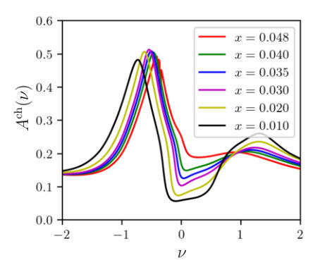 
FIG. 1. Spectral functions of chargons with pseudogap for- mation for U = 5.6t for various levels of hole’s concentrations x at T = 0.1t.

📷 Fig 2

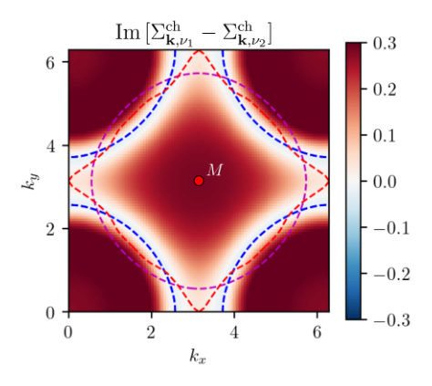 
FIG. 2. Imaginary part of the difference of self-energies of chansons at first and second Matsubara frequencies Σch k,ν1 − Σch k,ν2 as a function of wave vector k for x = 0.04 for T = 0.2t. The blue, red, and purple dotted lines denote the solution of Eq. (21), the local extrema of Ach k (ν = 0), and the noninter- acting Fermi surface, respectively.

📷 Fig 3

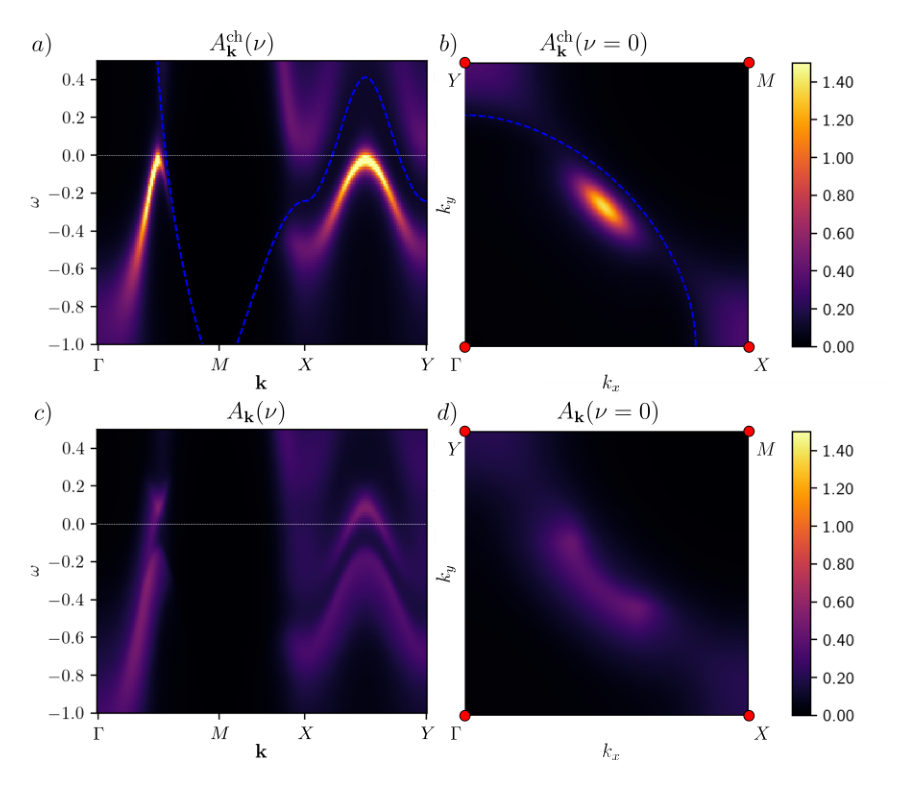 
FIG. 3. Spectral density of chargons (a,b) Ach(k, ω) and physical electrons (c,d) A(k, ω) and for U = 5.6t and x = 0.040 at T = 0.2t. The blue dotted line corresponds to the solution of Eq. (21).

📷 Fig 4

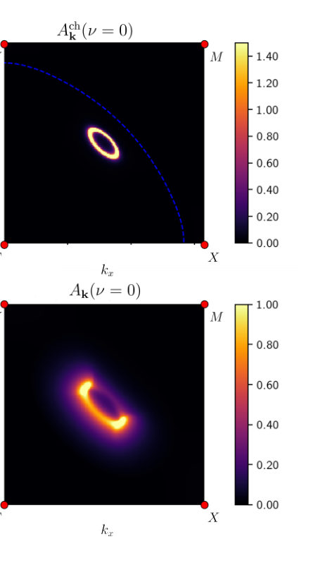 
FIG. 4. The same as Fig. 3 for T = 0.1t.

📷 Fig 5

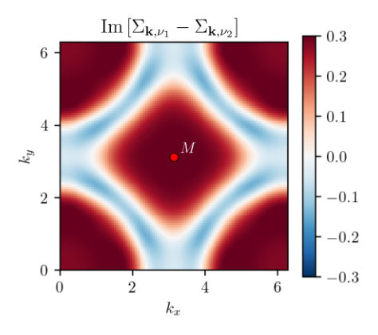 
FIG. 5. Imaginary part of self-energies differences of electrons Σk,ν1 −Σk,ν2 as a function of wave vector k for x = 0.04 for T = 0.2t.

**Summary.** This theoretical work models high-Tc superconductors using an SU(2) gauge theory applied to the Hubbard model, separating electrons into chargon and spinon components. By combining DMFT with spinon fluctuations, the authors show that magnetic correlations are essential for explaining the characteristic pseudogap physics, specifically the formation of asymmetric Fermi arcs in the underdoped state.

**Why it may be interesting.** The detailed treatment of gauge symmetry and the explicit inclusion of spinon dynamics provide a sophisticated theoretical mechanism for understanding spectral features (like Fermi arcs) that are hallmarks of strongly correlated quantum materials.

Detailed structure

**Main problem.** The paper addresses the pseudogap phenomenon in high-temperature superconducting cuprates, aiming to explain the spectral reconstruction and the formation of Fermi arcs.

**Main result.** The inclusion of long-wavelength magnetic fluctuations beyond standard DMFT is crucial, as it generates an asymmetry in the damping that successfully describes the formation of Fermi arcs in the underdoped regime.

**Method.** The authors employ an SU(2) gauge theory framework applied to the Hubbard model, utilizing Dynamic Mean-Field Theory (DMFT) for the chargon subsystem supplemented by spinon fluctuations.

**Model / system.** The system is the two-dimensional Hubbard model describing high-Tc superconductors, which is theoretically mapped onto a fractionalized description involving chargons and spinons within an SU(2) gauge theory.

**Key observables.** Spectral weight, damping asymmetry, Fermi arcs (observed in ARPES), and small, closed Fermi surface pockets (from quantum oscillation measurements).

**Important parameters / regimes.** Low hole doping regime, temperature ($T=0.1t, 0.2t$), and the coupling strength $U$ relative to the hopping $t$.

**Assumptions / limitations.** The approach assumes the physical state can be mapped onto chargons with long-ranged magnetic order and small fluctuations of the gauge field $R_x$.

**Figures summary.** Figures illustrate chargon spectral functions and pseudogap formation as doping changes, showing the transition from a hole pocket to an arc-like structure due to correlation effects.

**Paper structure.** The paper progresses from establishing the theoretical framework (SU(2) gauge theory/Hubbard model) to applying DMFT supplemented by spinon fluctuations, culminating in the demonstration that these correlations are necessary to explain the observed asymmetric spectral weight transfer leading to Fermi arcs.

Abstract

We consider the spectral properties of the two-dimensional Hubbard model, describing the electronic properties of high-$T_c$ compounds, within the SU(2) gauge theory, which assumes the separation of electronic degrees of freedom into those of spinon and chargon subsystems. We use the dynamic mean-field theory (DMFT) approach to describe magnetic long-range order in the chargon subsystem while also treating spinon fluctuations on top of this state. We show that DMFT supplemented by long-wavelength magnetic fluctuations is essential for describing the asymmetry in the damping between the inner and outer regions of the hole pockets and the resulting formation of Fermi arcs in the underdoped regime, especially at low hole doping. The underlying hole pockets in the chargon subsystem can be associated with those observed in quantum oscillation measurements.

[↑ back to top](#top)

### [Fracton Topological Holography](http://arxiv.org/abs/2606.03582v1)

**Authors:** Yu-Tao Hu, Jie-Yu Zhang, Peng Ye  
**Type:** theory · **Category:** strongly correlated electrons · **PDF:** <https://arxiv.org/pdf/2606.03582v1>  
**Analysis basis:** full PDF text, analyzed in chunks
**Topic relevance:** `analog quantum simulation` **2/5** · `entanglement & information structure` **1/5**

📷 Fig 1

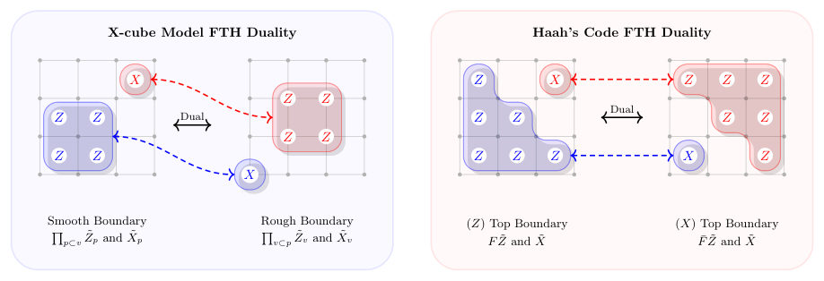 
Fig. 1: Overview of the Fracton Topological Holography (FTH) framework. (a) The topological holography sandwich structure. A d-dimensional fracton bulk is terminated by a gapped top boundary and a dynamical bottom boundary. Transport operators T connect the two boundaries. Changing the top boundary condition (e.g., between

📷 Fig 2

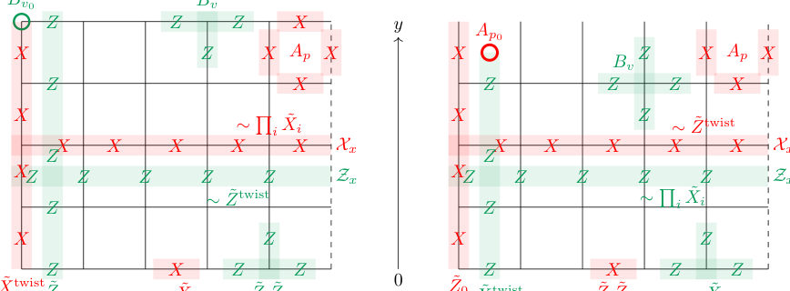 
Fig. 2: Microscopic lattice realization of the 1d Transverse Field Ising Model (TFIM) via 2d toric code topological holography (TH) on a cylinder (x-direction periodic, y-direction open and finite). (a) Under the smooth top boundary: the stabilizer generators are complete four-leg Bv terms, four-edge plaquette Ap terms, three-leg top Bv terms except Bv0. The absence of Bv0 allows to add an e defect on the top boundary. Adding an e on the top boundary realizes a twist in the identified 1d TFIM. The effective physical degrees of freedom on the dynamical bottom boundary are identified on the edges: single edge X acts as ˜Xi, and three-leg Bv acts as the Ising term ˜Zi ˜Zi+1. The uncontractible...

📷 Fig 3

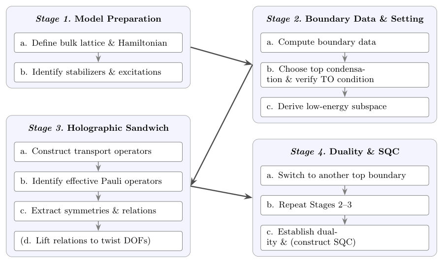 
Fig. 3: Systematic procedure for constructing a (fracton) topological holography. The workflow proceeds as following: after preparing the bulk model (Stage 1), one computes the boundary data and chooses a top boundary that satisfies TO condition (Stage 2), constructs transport operators, identifies the effective Pauli operators, symmetries, relations, lifts relations to twist DOFs (Stage 3), then repeats with another legal top boundary to establish a holographic duality and constructs the switching SQC (Stage 4). Words in parentheses stand for optional operations. A zigzag procedure is when lifting relations to twist DOFs is available: after lifting relations to twist DOFs, the low-energy...

📷 Fig 4

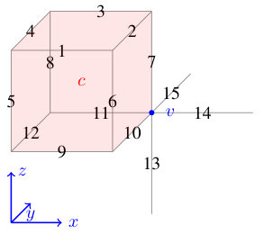 
Fig. 4: Illustration of A terms and B terms in the X-cube model. The A term associated with cube c is Ac = X1X2 · · · X12. The three different B terms attached to vertex v are Bv,xy = Z10Z11Z15Z14, Bv,xz = Z7Z11Z13Z14, and Bv,yz = Z7Z10Z13Z15.

📷 Fig 5

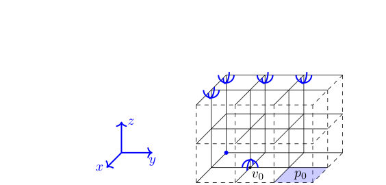 
Fig. 6: Illustration of the lattice and stabilizer setting of X-cube FTH under the planeon condensed top boundary. All the complete bulk stabilizers are in the stabilizer set. On the bottom boundary, the truncated Ac terms (e.g. Q

**Summary.** This paper introduces Fracton Topological Holography (FTH), an extension of Topological Holography, to study quantum systems with fracton excitations. It establishes a rigorous four-stage framework to analyze how boundary conditions induce dualities in both type-I and type-II fracton models. This offers a systematic route to understanding duality in complex topological phases of matter.

**Why it may be interesting.** The systematic development of FTH provides a powerful, general mathematical tool to analyze duality in complex, geometrically constrained quantum phases, which is highly relevant for understanding exotic correlated states.

Detailed structure

**Main problem.** To extend the concept of Topological Holography (TH) to systems exhibiting fracton topological orders, leading to Fracton Topological Holography (FTH).

**Main result.** FTH provides a concrete framework for organizing and understanding duality, successfully extending TH to both type-I (X-cube) and type-II (Haah's cubic code) fracton orders.

**Method.** The authors developed a systematic four-stage framework involving preparing the bulk model, determining boundary data, identifying low-energy preserving operator algebras, and switching between top boundaries to induce duality.

**Model / system.** The study uses abstract topological models like the X-cube model (type-I) and Haah's cubic code (type-II) as examples of fracton phases, analyzed using stabilizer formalisms.

**Key observables.** The low-energy effective Hamiltonian ($	ilde{H}$) on the bottom boundary, and the resulting duality mapping between different top boundary conditions.

**Important parameters / regimes.** The type of fracton order (I or II), and the boundary conditions (smooth vs. rough for X-cube; Z vs. X for Haah's code).

**Assumptions / limitations.** The framework assumes the existence of a systematic four-stage procedure for constructing the holographic sandwich, and that the low-energy dynamics can be captured by boundary operators.

**Figures summary.** Figure 1 illustrates the FTH framework, showing the holographic sandwich structure and specific operator interchanges/dualities for the X-cube and Haah's code.

**Paper structure.** The paper is structured around the general four-stage FTH framework, applying it first to the X-cube model to demonstrate a plaquette Ising Kramers-Wannier self-duality, and then to Haah's code to test its applicability to type-II fracton orders.

Abstract

Topological holography (TH), or SymTFT, realizes symmetries and dualities of a quantum system as boundary data of a topological bulk in one higher dimension. We formulate fracton topological holography (FTH), extending this mechanism from liquid topological orders to fracton stabilizer codes. The construction is organized as a general four-stage framework: prepare the bulk model and compute its excitations, determine boundary data and admissible gapped top boundaries, identify the low-energy preserving operator algebra together with its symmetry, relation, and twist data, and then switch among top boundaries to compare the induced boundary descriptions. As a type-I example, we develop FTH for the X-cube model with smooth and rough top boundaries; for a minimal effective Hamiltonian, both yield transverse-field plaquette Ising models, with exchanged subsystem symmetry and twist data, and the boundary switch is implemented by a linear-depth local unitary sequential quantum circuit (SQC). As a type-II example, we formulate FTH for Haah's cubic code in the Laurent-polynomial stabilizer formalism and analyze the natural $(Z)$ and $(X)$ top boundaries, which induce two two-dimensional qubit systems related locally by exchanging generalized plaquette Ising and transverse-field terms and nonlocally by a symmetry--relation duality. These results show that FTH is a genuine extension of TH to both type-I and type-II fracton orders. FTH therefore provides a concrete framework for organizing and understanding duality, with the prospect of offering a systematic route to new dualities.

[↑ back to top](#top)

### [Hierarchical crack patterns: Identification of crack generations](http://arxiv.org/abs/2606.03473v1)

**Authors:** Yuri Yu. Tarasevich, Andrei S. Burmistrov, Andrei V. Eserkepov  
**Type:** theory · **Category:** disordered systems and neural networks · **PDF:** <https://arxiv.org/pdf/2606.03473v1>  
**Analysis basis:** full PDF text, analyzed in chunks
**Topic relevance:** `methods for driven-dissipative` **2/5** · `analog quantum simulation` **1/5**

📷 Fig 1

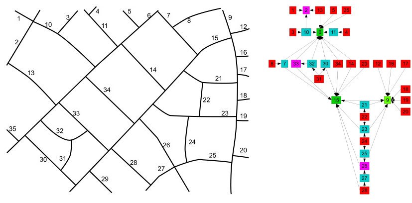 
Figure 1. Graph corresponding to the hierarchical crack pattern presented in [10, Fig. 4a] along with the corresponding DAG.

📷 Fig 2

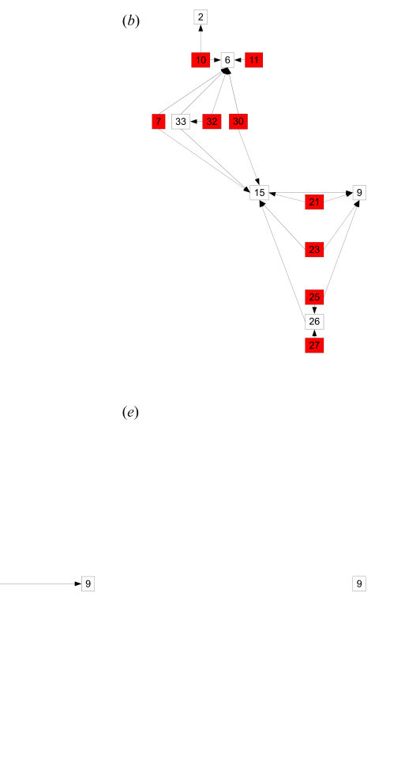 
Figure 2. Stages of DAG processing.

📷 Fig 3

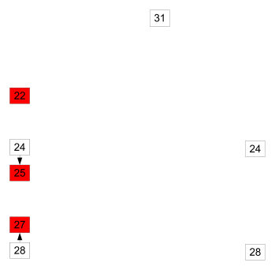 
Figure 3. Stages of DAG processing in algorithm [3].

📷 Fig 4

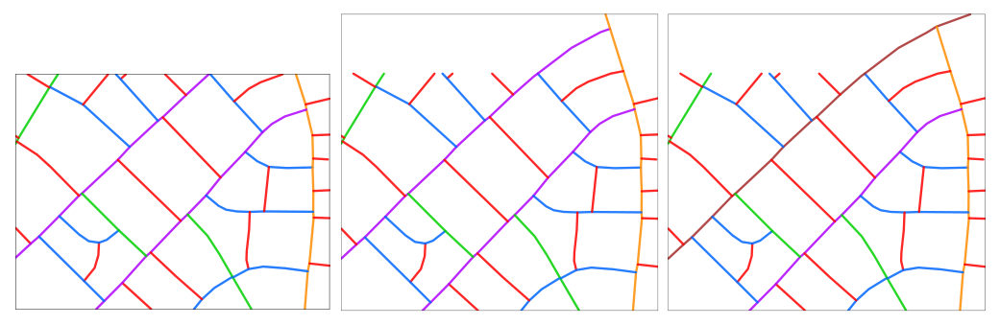 
Figure 4. An example of the change in crack generations determined using DAG for two possible situations when shifting the image boundary. The different shades correspond to distances measured in generations from the leaves.

📷 Fig 5

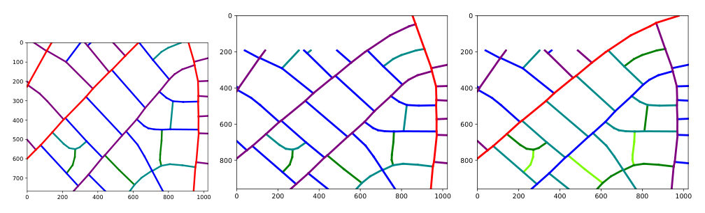 
Figure 5. An example of the change in crack generations determined using algorithm [3] for two possible situations when shifting the image boundary. Different shades correspond to different generations.

**Summary.** This paper proposes a robust graph-theoretic method to classify the generation sequence of cracks in hierarchical crack patterns. It models the pattern as a DAG and uses a leaf-removal algorithm, which successfully reduces the classification problem to topological sorting. The resulting method is shown to be highly stable against minor changes in the analyzed image boundaries.

**Why it may be interesting.** While the topic is materials science/image analysis, the methodology—reducing a complex structural classification problem to a graph-theoretic sorting problem—shares conceptual parallels with analyzing connectivity or structure in complex quantum systems.

Detailed structure

**Main problem.** The paper addresses the problem of classifying the generation order of cracks within a Hierarchical Crack Pattern (HCP) image fragment.

**Main result.** The proposed method successfully reduces the classification to topological sorting, yielding a robust generation assignment that is stable even when the image boundaries shift.

**Method.** The core method involves defining cracks as chains of edges near 180 degrees and constructing a Directed Acyclic Graph (DAG) where arcs point from child to parent at T-junctions. Generation is then determined by iteratively removing leaves (vertices with zero in-degree) until all vertices are processed.

**Model / system.** The physical system is the Hierarchical Crack Pattern (HCP) found in various materials, which is digitized and modeled as a graph structure. The analysis assumes the graph is connected, has vertex degrees $\le 3$, and contains no loops.

**Key observables.** Crack generations, represented by the topological ordering of the DAG vertices.

**Important parameters / regimes.** The acceptable angular deviation for defining a crack ($\le 30^\circ$).

**Assumptions / limitations.** The network must be strictly hierarchical, allowing for a clear child-parent relationship, and the graph must satisfy degree $\le 3$ and no loops.

**Figures summary.** Figures illustrate the construction of the graph and DAG, showing the step-by-step processing of the DAG using the proposed leaf-removal algorithm, and comparing results against older methods under boundary shifts.

**Paper structure.** The paper first introduces the problem and the concept of crack definition. It then details the DAG construction and the leaf-removal algorithm for topological sorting. Finally, it presents results demonstrating the method's robustness compared to existing techniques.

Abstract

Hierarchical crack patterns of various origins are ubiquitous in the world around us. We reduce the problem of classifying crack generations in an image of a part of the entire hierarchical crack pattern to the well-known topological sorting of a directed acyclic graph. The classification demonstrates robustness to reasonable shifts in the pattern image boundaries.

[↑ back to top](#top)

### [Machine-Learning Prediction of Quantum Fisher Information from Collective Spin and Spectral Features](http://arxiv.org/abs/2606.02986v1)

**Authors:** Yusef Maleki, Luis D. Zambrano Palma  
**Type:** theory · **Category:** quantum information and computing · **PDF:** <https://arxiv.org/pdf/2606.02986v1>  
**Analysis basis:** full PDF text, analyzed in chunks
**Topic relevance:** `entanglement & information structure` **2/5** · `analog quantum simulation` **1/5**

📷 Fig 1

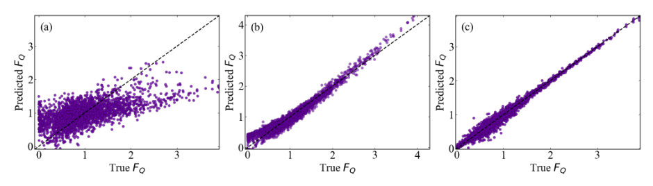 
FIG. 1. Comparison between exact and SVR-predicted quantum Fisher information using (a) linear, (b) polynomial (d = 2), and (c) RBF kernels. The dashed line denotes the ideal agreement between the exact and predicted QFI values.

📷 Fig 2

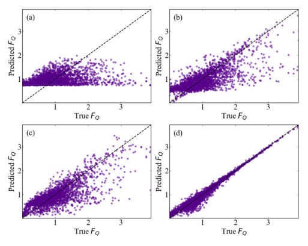 
FIG. 2. Prediction of the quantum Fisher information using differ- ent sets of collective observables within the RBF-SVR model. (a) First moments only, (b) second moments only, (c) symmetrized cor- relators only, and (d) second moments combined with symmetrized correlators. The dashed line denotes the ideal agreement between the exact and predicted QFI values.

📷 Fig 3

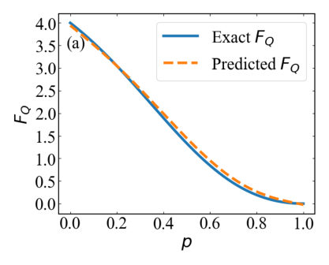 
FIG. 3. Comparison between the exact and SVR-predicted quan- tum Fisher information for external depolarized two-qubit Bell-state family as a function of the depolarizing parameter p. The solid and dashed curves represent the exact and SVR-predicted QFI values, re- spectively.

📷 Fig 4

 
FIG. 4. Comparison between exact and SVR-predicted quantum Fisher information for multipartite systems composed of (a) two qubits, (b) three qubits, (c) four qubits, and (d) five qubits using collective spin moment features. The dashed line denotes the ideal agreement between the exact and predicted QFI values.

📷 Fig 5

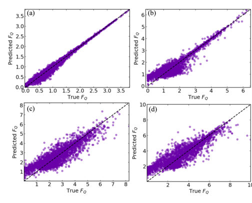 
Figure 4 shows the dispersion plots between the predicted and exact QFI values for the two-, three-, four-, and five-qubit cases. A clear progressive degradation in the prediction ac- curacy is observed as the number of qubits increases, indicat- ing that the selected 15 features set [Eq. (14)] become pro- gressively less informative as the dimension of the Hilbert space grows. Specifically, in Fig. 4(a), corresponding to the two-qubit case, the predicted values remain strongly local- ized around the diagonal prediction line, while the three-qubit system shown in Fig. 4(b), noticeable deviations from the ideal prediction line begin to emerge. This tendency becomes more pronounced in the...

**Summary.** This paper demonstrates that the Quantum Fisher Information (QFI), a key metric in quantum metrology, can be accurately predicted using machine learning (SVR) trained on low-order collective spin and spectral moments. The results show that while simple spin moments are insufficient, combining these with spectral quantities like purity significantly enhances predictive power, offering a pathway to estimate quantum sensitivity without full quantum state tomography.

**Why it may be interesting.** This work provides a powerful, data-driven methodology for characterizing metrological resources in complex quantum systems, suggesting practical ways to estimate quantum limits using limited experimental measurements.

Detailed structure

**Main problem.** The core problem is predicting the Quantum Fisher Information (QFI) for multipartite quantum systems without performing computationally intensive full quantum-state tomography.

**Main result.** QFI can be accurately predicted using machine learning models trained on a reduced set of physically accessible quantities, specifically the interplay between collective covariance and low-order spectral moments.

**Method.** Support Vector Regression (SVR) with an RBF kernel is employed to learn the nonlinear mapping between a set of low-order collective spin and spectral observables and the target QFI.

**Model / system.** The study focuses on multipartite quantum systems, ranging from two to five qubits, analyzed using random pure, mixed, and hybrid quantum states.

**Key observables.** Quantum Fisher Information (QFI), collective spin moments ($\langle\hat{J}_i
angle$), second-order moments ($\langle\hat{J}_i^2
angle$), symmetrized correlators ($\langle\hat{J}_i\hat{J}_j + \hat{J}_j\hat{J}_i
angle$), Purity ($	ext{Tr}(
ho^2)$), and the third spectral moment ($	ext{Tr}(
ho^3)$).

**Important parameters / regimes.** System size (number of qubits, $N=2$ to $5$), and the specific structure of the quantum state (pure, mixed, hybrid).

**Assumptions / limitations.** The primary assumption is that the metrological sensitivity (QFI) is governed by a compact, low-dimensional set of experimentally measurable observables, bypassing the need for full state reconstruction.

**Figures summary.** Figures compare exact QFI values against SVR predictions using different feature sets (e.g., spin moments only vs. spin moments + purity + $	ext{Tr}(
ho^3)$), showing increasing accuracy with the inclusion of higher-order spectral terms. One figure tracks performance degradation as the number of qubits increases.

**Paper structure.** The paper introduces QFI, details the SVR methodology, and then systematically tests the predictive power by comparing feature sets: first only spin moments, then adding purity ($	ext{Tr}(
ho^2)$), and finally adding the cubic spectral moment ($	ext{Tr}(
ho^3)$), analyzing results for both two-qubit and larger multipartite systems.

Abstract

Quantum Fisher information (QFI) is a fundamental quantifier in quantum metrology, determining the ultimate precision achievable in parameter-estimation protocols through the quantum Cramér-Rao bound. However, direct evaluation of the QFI generally requires detailed knowledge of the density matrix, making it increasingly demanding as the Hilbert-space dimension grows. In this work, we investigate the extent to which the QFI of multipartite quantum systems can be predicted from a limited set of experimentally accessible quantities using support vector regression (SVR). By comparing different physically motivated features, we identify a dominant feature set governing QFI and show that the predictive power of collective spin moments alone decreases as system size and consequently Hilbert-space dimension grows. We demonstrate that QFI is governed primarily by the interplay between collective covariance and low-order spectral moments of the density matrix. Our results identify the physically relevant information sectors governing the QFI and demonstrate that accurate estimation of metrological sensitivity can be achieved from a restricted set of experimentally accessible quantities without requiring full quantum-state tomography.

[↑ back to top](#top)

### [Subspace-selective unitary manipulation based on the Hilbert-space symmetric structures in the multiple-quantum operator algebra spaces in the quantum-computing speedup theory](http://arxiv.org/abs/2606.03859v1)

**Authors:** Xijia Miao  
**Type:** theory · **Category:** quantum information and computing · **PDF:** <https://arxiv.org/pdf/2606.03859v1>  
**Analysis basis:** full PDF text, analyzed in chunks
**Topic relevance:** `entanglement & information structure` **2/5** · `analog quantum simulation` **1/5**

📷 Fig 1

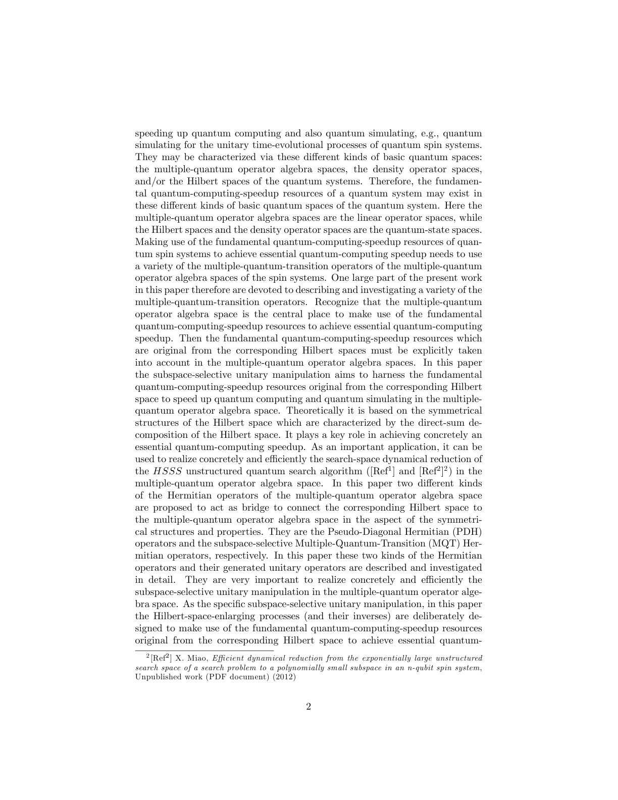 
Low-resolution page preview, page 2

📷 Fig 2

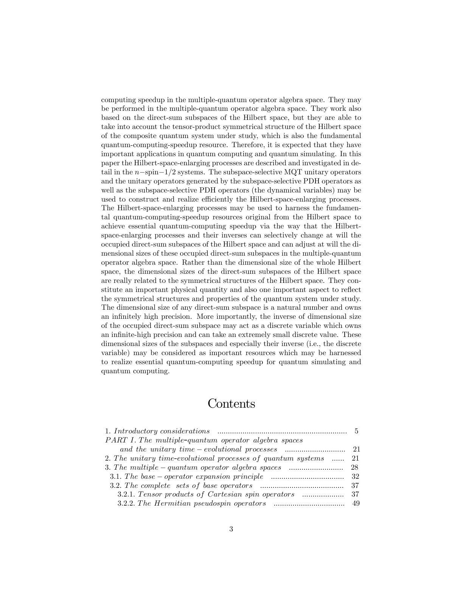 
Low-resolution page preview, page 3

📷 Fig 3

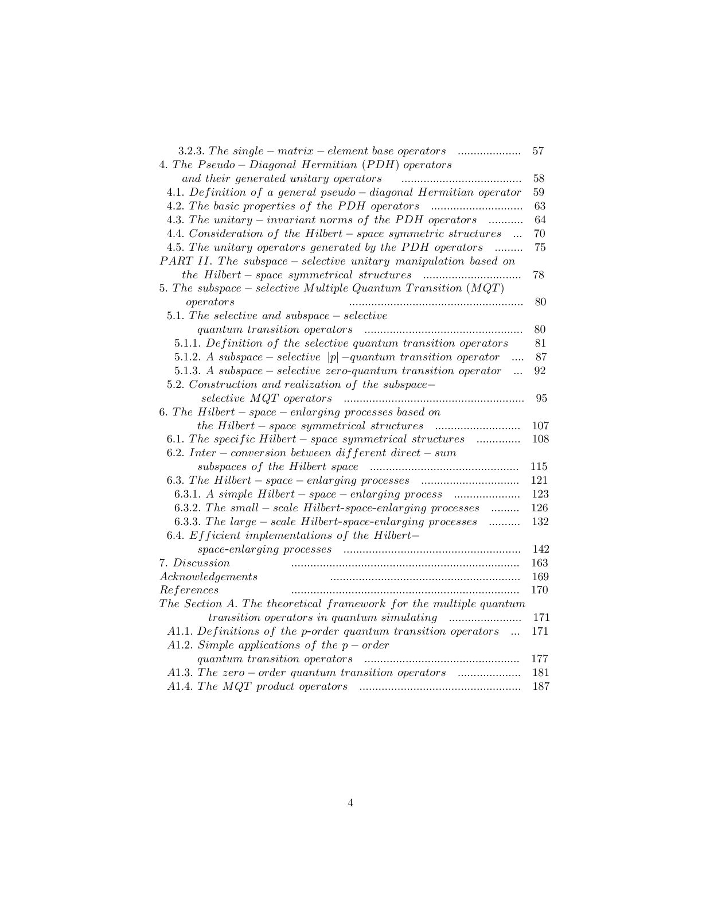 
Low-resolution page preview, page 4

📷 Fig 4

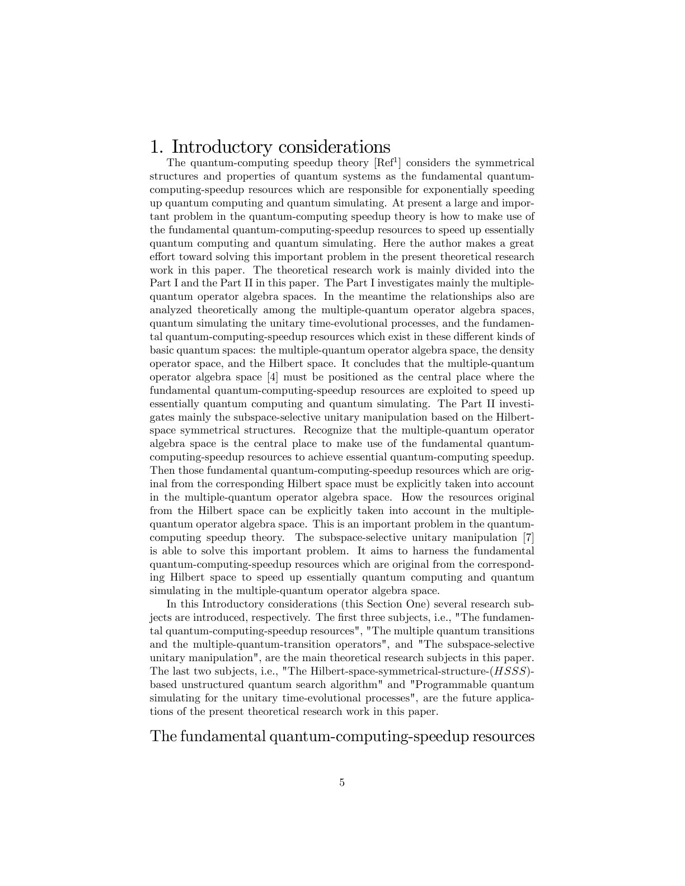 
Low-resolution page preview, page 5

📷 Fig 5

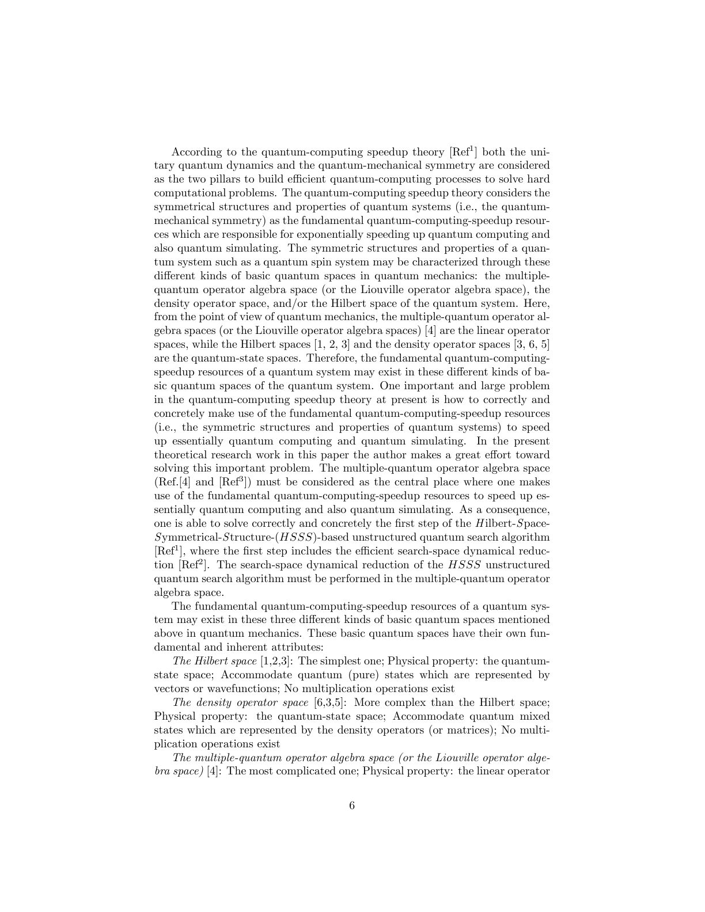 
Low-resolution page preview, page 6

**Summary.** This paper develops a theoretical framework arguing that the multiple-quantum operator algebra space is the fundamental resource hub for quantum speedup. It proposes using subspace-selective unitary manipulation, implemented via specialized MQT operators, to explicitly incorporate quantum-state resources from the Hilbert space into this operator algebra space for enhanced quantum simulation and computation.

**Why it may be interesting.** This work provides a highly abstract, operator-algebraic framework for understanding quantum speedup, connecting concepts from quantum simulation (Hamiltonian decomposition) directly to the structure of quantum information processing.

Detailed structure

**Main problem.** The central problem is developing a method to effectively utilize fundamental quantum-computing-speedup resources, which are inherent in the symmetric structures of quantum systems, to accelerate quantum computation and simulation.

**Main result.** The authors propose that the multiple-quantum operator algebra space is the central hub for these resources, and subspace-selective unitary manipulation, using specialized MQT operators, is the key mechanism to bridge resources from the standard Hilbert space into this operator algebra space.

**Method.** The research employs theoretical analysis involving the construction and manipulation of multiple-quantum transition (MQT) operators and pseudo-diagonal Hermitian (PDH) operators to realize subspace-selective unitary transformations.

**Model / system.** The theory is developed for quantum spin systems (e.g., n spin-1/2 systems), analyzing the relationship between the Hilbert space (state space), the density operator space, and the multiple-quantum operator algebra space (operator space).

**Key observables.** The dimensional sizes of occupied direct-sum subspaces, and the action of the total spin operator on MQT product operators.

**Important parameters / regimes.** The quantum-transition order 'p' and the coefficients defining the component Hamiltonians ($H_0, H_1, H_{02}$).

**Assumptions / limitations.** The theory assumes that the multiple-quantum operator algebra space is the correct framework for exploiting speedup resources, and that specific operator constructions (PDH, MQT) can bridge the gap between state and operator representations.

**Figures summary.** Not specified.

**Paper structure.** The paper is structured in parts: Part I investigates the multiple-quantum operator algebra spaces and their relationship to quantum simulation; Part II focuses on subspace-selective unitary manipulation, detailing the use of MQT operators and Hilbert-space-enlarging processes.

Abstract

The quantum-computing speedup theory considers the symmetric structures and properties of quantum systems as the fundamental Quantum-Computing-Speedup (QCS) resources which are responsible for exponentially speeding up quantum computing and simulating. At present a large and important problem is how to make use of the fundamental QCS resources to speed up essentially quantum computing and simulating. Here the author makes a great effort toward solving this important problem. The theoretical research work in this paper is mainly divided into the two Parts I and II. The Part I investigates mainly the multiple-quantum operator algebra spaces. And the relationships are analyzed among the multiple-quantum operator algebra spaces, quantum simulating for the unitary time-evolutional processes, and the fundamental QCS resources which exist in the different kinds of basic quantum spaces: the multiple-quantum operator algebra space, the density operator space, and the Hilbert space. It concludes that the multiple-quantum operator algebra space must be positioned as the central place where the QCS resources are exploited to speed up quantum computing and simulating. The Part II investigates mainly the subspace-selective unitary manipulation based on the Hilbert-space symmetric structures. Recognize that the multiple-quantum operator algebra space is the central place. Then those QCS resources original from the Hilbert space (a quantum-state space) must be explicitly taken into account in the multiple-quantum operator algebra space (a linear operator space). This is an important problem. The subspace-selective unitary manipulation is able to solve this problem. It aims to harness the fundamental QCS resources original from the Hilbert space to speed up quantum computing and simulating in the multiple-quantum operator algebra space.

[↑ back to top](#top)

### [Quantum Matter Makes Lightcones Quantum](http://arxiv.org/abs/2606.03671v1)

**Authors:** Tomohiro Fujita, Misao Sasaki  
**Type:** theory · **Category:** other · **PDF:** <https://arxiv.org/pdf/2606.03671v1>  
**Analysis basis:** full PDF text, analyzed in chunks
**Topic relevance:** `Keldysh / 2PI / non-Gaussian methods` **2/5**

📷 Fig 1

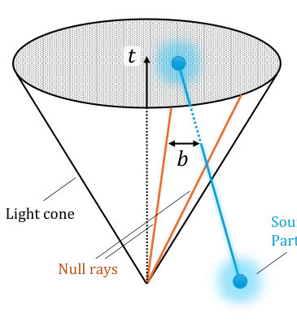 
Figure 1. Schematic configuration of the unperturbed light cone (black cone) and the source- particle trajectory (blue line). We study how null rays (orange lines) passing near the quantum- mechanical source (blue dot) are affected by its weak Newtonian gravitational potential. The impact parameter b is the closest spatial separation between an unperturbed ray and the source trajectory. The Shapiro time delay is not yet reflected in this picture.

📷 Fig 2

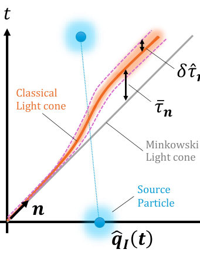 
Figure 2. Schematic picture of the quantum Shapiro delay ˆτn defined in Eq. (3.4). The blue dot represents the quantum source particle at x = ˆqI(t). The weak Newtonian potential sourced by this particle shifts the original Minkowski light cone (gray diagonal line). The orange solid line shows the mean delayed light cone, shifted by ¯τn = ⟨ˆτn⟩, while the fluctuation δˆτn = ˆτn −¯τn makes its position quantum-mechanically uncertain, as indicated by the purple dashed lines. This is a 2D projection of the 3+1-dimensional geometry; the ray passes near the source without intersecting it (see Fig. 1).

📷 Fig 3

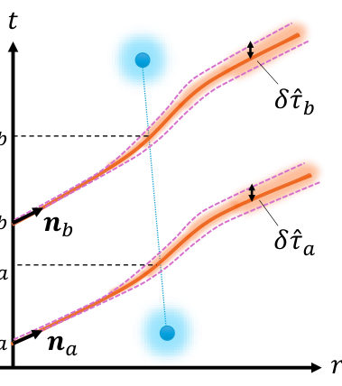 
Figure 3. Two null rays emitted from the spatial origin x = 0 at times Ta and Tb in the directions na and nb, respectively. Their quantum Shapiro-delay fluctuations, δˆτa and δˆτb, depend on the position fluctuations of the same source particle evaluated at different times, δ ˆqI(sa) and δ ˆqI(sb), where sa and sb denote the respective closest-approach times. Since source-position operators at different times do not commute in general, the two causal-boundary shifts also do not commute with each other in general, [δˆτa, δˆτb] ̸= 0.

📷 Fig 4

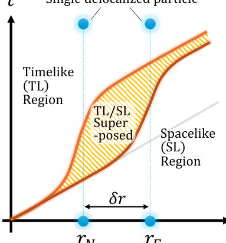 
Figure 4. Schematic picture of the superposition of causal relations induced by a single delocalized particle, namely, a single source particle in a spatial superposition. For simplicity, the source wave packets are assumed to be sharply localized in the two branches, and their intrinsic widths are neglected. In the |N⟩branch (left blue dot and upper orange line) the source is closer to the ray and produces a larger Shapiro delay than in the |F⟩branch (right blue dot and lower dark orange line). The resulting branch-dependent causal boundaries (two orange lines) divide spacetime into three regions. In the intermediate region, the causal relation with the origin is timelike in one branch and...

**Summary.** This theoretical paper explores the quantum nature of spacetime causality by examining a scalar field propagating near a quantum source. It demonstrates that the source's quantum fluctuations induce an operator-valued shift in the light cones, making the causal structure inherently uncertain. This effect is calculated perturbatively and shows that quantum matter fundamentally alters the geometry of spacetime correlations.

**Why it may be interesting.** While focused on gravity, the core mechanism—quantifying how quantum uncertainty in a source modifies fundamental geometric/causal structures—is highly relevant to open quantum systems where environmental coupling dictates observable dynamics.

Detailed structure

**Main problem.** The paper investigates how the causal structure of spacetime, defined by light cones, becomes quantum when the matter source generating the gravitational field is itself quantum mechanical.

**Main result.** Quantum matter makes the causal structure itself quantum, leading to non-commuting causal-boundary shifts and smearing the light-cone singularity, even without quantizing gravity.

**Method.** The analysis uses perturbative field-theoretic calculations in the weak-field limit, focusing on the operator-valued Shapiro time delay ($\hat{	au}_n$) for a massless scalar field.

**Model / system.** The system models a massless scalar field propagating in a spacetime perturbed by a weak Newtonian gravitational potential sourced by a non-relativistic quantum particle.

**Key observables.** Operator-valued Shapiro delay ($\hat{	au}_n$), noncommuting causal-boundary shifts, and the smearing of the Wightman light-cone singularity.

**Important parameters / regimes.** Low-energy, non-relativistic limit; the gravitational coupling strength (related to $GM/b$); Planck scales ($\ell_{Pl}, t_{Pl}$).

**Assumptions / limitations.** The analysis assumes a weak-field approximation and uses an instantaneous Newtonian potential, avoiding full quantum gravity treatment.

**Figures summary.** Figure 1 schematically shows the effect of the weak potential on null rays. Figure 2 illustrates the quantum Shapiro delay ($\hat{	au}_n$) shift. Figure 4 shows the superposition of causal relations when the source is in a spatial superposition.

**Paper structure.** The paper develops the problem by first establishing the classical Shapiro delay, then quantizing this delay into an operator ($\hat{	au}_n$). It analyzes the consequences of this operator on the commutator and Wightman function, demonstrating non-commutativity and smearing effects.

Abstract

In gravitational physics, matter does not merely move within spacetime; it also determines the light cones that define causal relations. What happens when the matter that determines these light cones is itself in a quantum state? We address this question in a controlled low-energy setting: a massless scalar field propagating in the spacetime with the Newtonian gravitational potential sourced by a non-relativistic quantum particle. We show that the light cones are affected by an operator-valued Shapiro delay, with the three consequences: (i) causal-boundary shifts are promoted to noncommuting observables, giving the causal structure an irreducible quantum uncertainty; (ii) the causal relation between two fixed spacetime points can become a superposition of timelike and spacelike configurations; and (iii) tracing out the source smears the Wightman light-cone singularity, producing an effective UV cutoff. Thus, quantum matter does not merely fluctuate within spacetime; it makes the causal structure itself quantum, even without quantized gravitons.

[↑ back to top](#top)

### [Quantum-Classical Equivalence for AND-Functions](http://arxiv.org/abs/2606.03249v1)

**Authors:** Sreejata Kishor Bhattacharya, Farzan Byramji, Arkadev Chattopadhyay, Yogesh Dahiya, Shachar Lovett  
**Type:** theory · **Category:** quantum information and computing · **PDF:** <https://arxiv.org/pdf/2606.03249v1>  
**Analysis basis:** full PDF text, analyzed in chunks
**Topic relevance:** `entanglement & information structure` **2/5**

📷 Fig 1

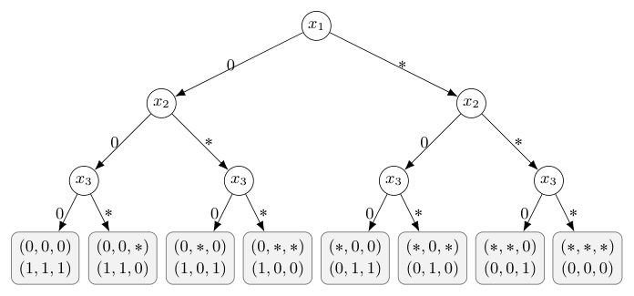 
Figure 1: A semi-adaptive max-degree restriction tree for And3 ˝ Or2 with core variables V “ tx1, x2, x3u. Leaves correspond to the 2|V | restrictions in the tree. For each leaf restriction, the re- stricted function pAnd3 ˝ Or2q|ρ computes an And over exactly the variables left free.

**Summary.** This work resolves a major open problem in quantum communication complexity by proving that for AND-functions, the quantum and classical deterministic communication complexities are polynomially equivalent. The authors achieve this by deeply connecting these complexity measures to the structural property of De Morgan sparsity of the function. This result significantly narrows the gap between quantum and classical computational power for this important class of functions.

**Why it may be interesting.** While focused on classical communication complexity, the techniques involving Fourier analysis, restriction/averaging procedures, and structural characterizations of functions are highly relevant to understanding the complexity of quantum algorithms and quantum information processing.

Detailed structure

**Main problem.** The paper addresses the open problem of whether quantum protocols can provide an exponential advantage over classical protocols for computing general total Boolean functions.

**Main result.** It proves that for the specific class of AND-functions, the bounded-error quantum and classical deterministic communication complexities are polynomially related, up to polylogarithmic factors.

**Method.** The proof relies on structural characterizations of Boolean functions, relating communication complexity bounds to the function's De Morgan sparsity and using advanced Fourier analysis techniques on random restrictions.

**Model / system.** The model is the two-party communication complexity setting (Alice and Bob) for computing total Boolean functions, specifically focusing on functions composed with the AND-2 gadget ($f \circ 	ext{AND}_2$).

**Key observables.** Deterministic communication complexity ($D_{ccp}$), bounded-error quantum communication complexity ($Q_{ccp}$), and the De Morgan sparsity ($	ext{sparf}$) of the outer function $f$.

**Important parameters / regimes.** The polynomial relationship holds up to polylogarithmic factors in $n$, and the lower bounds are derived from the sparsity $s$ of the function $f$.

**Assumptions / limitations.** The equivalence is proven for AND-functions, not for all total Boolean functions (the general Log-Equivalence Conjecture remains open).

**Figures summary.** Figures illustrate the construction of semi-adaptive max-degree restriction trees for specific functions like $	ext{And}^3 \oplus 	ext{Or}^2$ and $	ext{Orn}$, demonstrating the structural machinery used in the proof.

**Paper structure.** The paper progresses by first establishing the general framework of communication complexity, then developing tools based on sparsity and restriction trees, and finally applying these tools to prove the polynomial equivalence for the AND-function class.

Abstract

A major open problem in quantum communication complexity is whether quantum protocols can be exponentially more efficient than classical protocols for computing total Boolean functions; the prevailing conjecture is that they cannot be so. In a seminal work, Razborov (2002) resolved this question for AND-functions of the form $$ F(x,y) = f(x_1 \land y_1, \ldots, x_n \land y_n), $$ when the outer function $f$ is symmetric, by proving that their bounded-error quantum and classical communication complexities are polynomially related. Since then, extending this result to all AND-functions has remained open and has been posed by several authors.   In this work, we settle this problem in a strong way. We show that for every Boolean function $f$, the bounded-error quantum and classical deterministic communication complexities of the function $f \circ \mathrm{AND}_2$ are polynomially related, up to polylogarithmic factors in $n$. We prove this by showing that both are characterized--up to polynomial loss--by the logarithm of the De Morgan sparsity of $f$.   Our results build on the recent work of Chattopadhyay, Dahiya, and Lovett (2025) on structural characterizations of non-sparse Boolean functions, which we extend to resolve the conjecture for general AND-functions.

[↑ back to top](#top)

### [QUIVER: Quantum-Informed Views for Enhanced Representations in Large ML Models](http://arxiv.org/abs/2606.02785v1)

**Authors:** Aritra Bal, Michael Binder, Markus Klute, Benedikt Maier, Michael Spannowsky  
**Type:** theory · **Category:** other · **PDF:** <https://arxiv.org/pdf/2606.02785v1>  
**Analysis basis:** full PDF text, analyzed in chunks
**Topic relevance:** `entanglement & information structure` **2/5**

📷 Fig 1

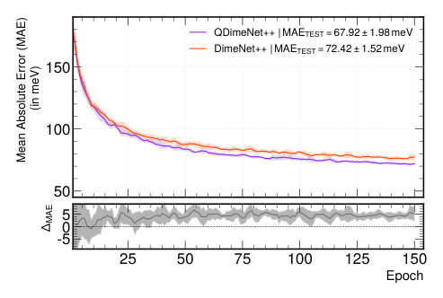 
Figure 1. Validation MAE during training for the DimeNet++ baseline and the quantum-inspired QDimeNet++ model. Solid lines show the mean across N = 10 paired seeds (identical data splits and initialization RNG state across the two models; only the architecture differs), smoothed with a 3-epoch rolling window. Shaded bands denote ±1 sample standard deviation across seeds (calculated using standard library functions with ddof=1). The lower panel shows the per-epoch paired difference ∆MAE = MAEDimeNet++ −MAEQDimeNet++ with the correspond- ing ±1σ band over the same paired seeds; positive values indicate lower MAE for QDimeNet++.

**Summary.** This paper introduces QUIVER, a method that enriches classical machine learning features by incorporating a 'quantum Fisher view' derived from variational quantum circuits. It demonstrates that this quantum-geometric information provides a genuinely complementary signal, leading to measurable performance gains in diverse fields like quantum chemistry and particle physics. The work shows that quantum insights can boost ML models even without fault-tolerant quantum hardware.

**Why it may be interesting.** While the application is ML-focused, the reliance on the QFIM—a fundamental measure of quantum distinguishability—provides a novel, information-theoretic lens for feature engineering that connects quantum geometry to classical data science.

Detailed structure

**Main problem.** The paper addresses how to enhance the representational power of large machine learning models by integrating information derived from quantum mechanics.

**Main result.** The proposed QUIVER framework successfully improves performance on both molecular property prediction (QM9) and high-energy physics jet classification tasks.

**Method.** It introduces the quantum Fisher view, derived from a Variational Quantum Circuit (VQC), to augment classical feature vectors, treating this quantum-geometric information as a complementary modality.

**Model / system.** The methods are applied to two distinct domains: predicting molecular properties (QM9) and classifying particle jets at the LHC. The core mathematical tool is the Quantum Fisher Information Matrix (QFIM), which characterizes the geometry of the quantum state manifold.

**Key observables.** For jet tagging, the Area Under the Curve (AUC) score and QCD background rejection rate are key; for molecular regression, the Mean Absolute Error (MAE) of the HOMO-LUMO gap is used.

**Important parameters / regimes.** The study uses restricted qubit counts (e.g., up to 10 qubits) for encoding, and the performance is benchmarked across varying dataset sizes (e.g., 0.1M to 5M jets).

**Assumptions / limitations.** The quantum view is assumed to provide genuinely complementary information that classical feature augmentation alone cannot capture, and the QFIM calculation is tractable on classical simulators.

**Figures summary.** Figures compare the performance (e.g., MAE curves for molecular regression) of the QUIVER-augmented models against their classical baselines, showing consistent improvements.

**Paper structure.** The paper establishes the need for multimodal inputs, introduces QUIVER by defining the quantum Fisher view via VQCs, and then demonstrates its efficacy by applying the framework to two distinct benchmarks: QM9 and LHC jet tagging.

Abstract

Large machine learning models benefit substantially from multimodal inputs that provide a complementary view of the same example. We introduce QUIVER (QUantum-Informed Views for Enhanced Representations, a paradigm that enriches classical data-driven features with a quantum Fisher view: a geometrically motivated, basis-independent summary of higher-order correlations captured by a variational quantum circuit (VQC) trained to perform the same task. Unlike classical feature augmentation, the quantum Fisher information matrix encodes the intrinsic geometry of the learned quantum state manifold. While this feature map, motivated by quantum information theory, is ordinarily non-trivial to model classically, it can surface statistical structure that additional classical data or model capacity finds difficult to learn. This makes the quantum Fisher view a genuinely complementary modality rather than a redundant one. We demonstrate that QUIVER improves standard performance metrics on two benchmark datasets from very different fields: QM9 for predicting molecule properties, and JetClass for predicting jet flavor at the Large Hadron Collider (LHC). The core contribution, however, is domain-agnostic: the quantum Fisher view can be fused into a broad class of model architectures via targeted modifications to the base architecture, to incorporate information about the quantum geometry of the problem. These results demonstrate that quantum-geometric features, extracted from simulated variational circuits, can deliver measurable value for standard machine learning tasks, well before the advent of fault-tolerant quantum hardware.

[↑ back to top](#top)

### [Relaxation of the Random Site Coulomb glass Model in Two Dimensions](http://arxiv.org/abs/2606.02999v1)

**Authors:** Preeti Bhandari, Vikas Malik  
**Type:** theory · **Category:** disordered systems and neural networks · **PDF:** <https://arxiv.org/pdf/2606.02999v1>  
**Analysis basis:** full PDF text, analyzed in chunks
**Topic relevance:** `Keldysh / 2PI / non-Gaussian methods` **1/5** · `Kondo & dissipative impurity` **1/5** · `analog quantum simulation` **1/5** · `correlated / nonlocal dissipation` **1/5** · `driven-dissipative phase transition` **1/5** · `exotic spin models in light-matter` **1/5** · `methods for driven-dissipative` **1/5** · `non-equilibrium dynamics` **1/5** · `non-equilibrium universality` **1/5** · `scars & prethermalization` **1/5**

📷 Fig 1

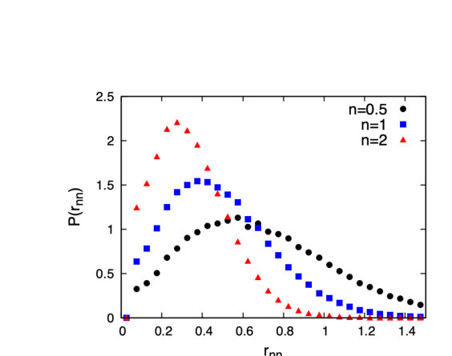 
FIG. 1: Probability density of rnn, where rnn is defined in the text.

📷 Fig 2

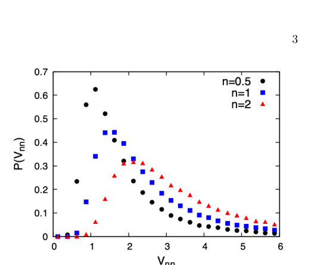 
FIG. 2: Probability density of Vnn = 1/rnn.

📷 Fig 3

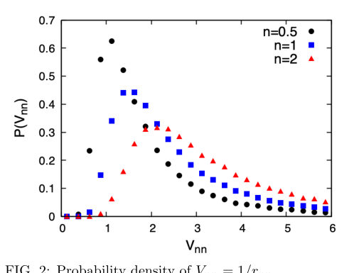 
FIG. 3: Density of states for single particle energy vs |ε| for different electron density.

📷 Fig 4

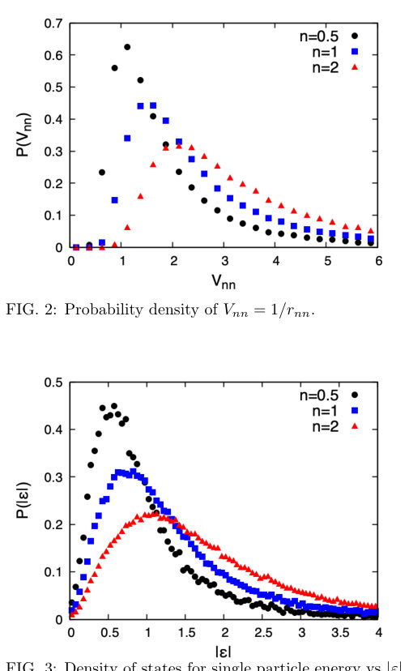 
FIG. 4: Probability density of ln(|λ|) for a = 0.25 and T = 0.05 at different densities n = 0.5, 1.0, 2.0.

📷 Fig 5

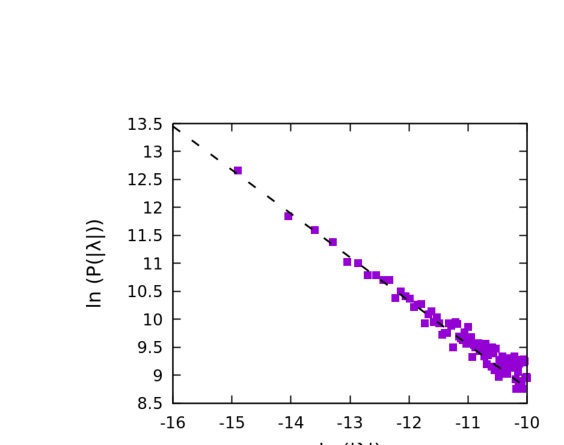 
FIG. 5: ln(P(|λ|)) vs ln |λ| for a = 0.25, T = 0.05 at n = 1/2 for the range e−15 - e−12. The graph is fitted to a straight line f(x)=ax+b, using a=-0.78 and b=0.96.

**Summary.** This theoretical study analyzes the relaxation dynamics of a 2D random site Coulomb glass model, showing that relaxation slows down due to the depletion of the density of states near the Fermi level. The relaxation time is found to be highly sensitive to system density and disorder strength. The work establishes key scaling laws governing the transition from initial rapid decay to long-time power-law or exponential decay.

**Why it may be interesting.** The study provides detailed insights into slow relaxation dynamics in disordered interacting electron systems, drawing parallels between Coulomb glass physics and general disordered many-body relaxation phenomena relevant to open quantum systems.

Detailed structure

**Main problem.** The study investigates the relaxation dynamics within a two-dimensional random site Coulomb glass model, focusing on how material density, onsite energy disorder, and localization length influence the relaxation process.

**Main result.** Slow relaxation is governed by the depletion of the single-particle density of states near the Fermi level, and the relaxation time is highly sensitive to changes in disorder and localization length.

**Method.** The analysis uses mean-field approximations to calculate the eigenvalue distribution of the linear dynamical matrix, modeling the system's time evolution via single-particle transitions.

**Model / system.** The system is the Random Site Coulomb glass (CG) model in 2D, described by a Hamiltonian involving random site energies ($\phi_i$) and Coulomb interactions. Dynamics are governed by a master equation tracking the probability of site occupations.

**Key observables.** Relaxation dynamics (initial rapid $
ightarrow$ slow decay), eigenvalue distribution of the dynamical matrix, single-particle density of states (DOS) near the Fermi level, and the relaxation time ($	au$).

**Important parameters / regimes.** Material density ($n$), onsite energy disorder ($W$), and localization length ($a$).

**Assumptions / limitations.** The analysis relies on mean-field approximations and models the dynamics assuming single-particle transitions are dominant.

**Figures summary.** Figures illustrate the probability density of nearest neighbor distances and interaction strengths, the DOS for single-particle energies at various densities, and the distribution of the logarithm of the eigenvalues.

**Paper structure.** The paper systematically analyzes the relaxation process by first establishing the theoretical framework using mean-field theory, then examining the dependence of relaxation rates on varying site density, and finally discussing the roles of disorder and localization length.

Abstract

This study investigates the influence of material density, disorder in onsite energies, and localization length on relaxation dynamics within a two-dimensional random site Coulomb glass model at half-filling. To explore relaxation laws, we calculate the eigenvalue distribution of the linear dynamical matrix using mean-field approximations. Our findings indicate that the system initially undergoes rapid relaxation through energy-lowering transitions. The depletion of the single-particle density of states (DOS) near the Fermi level leads to slow relaxation, with fluctuations diminishing according to a power law. Subsequently, the system adheres to an exponential decay law after a specific period, defined as the relaxation time, which is inversely related to the minimum eigenvalue of the dynamical matrix. As the density of the system decreases, the relaxation rate slows down, resulting in an increase in the relaxation time. For a constant density and localization length, an increase in the disorder of onsite energies results in a longer relaxation time. A significant portion of the eigenvalue spectrum remains unaffected, suggesting that a reduction in localization length concurrent with increased disorder may play an equally vital role in the slow dynamics observed.

[↑ back to top](#top)

### [Forward-Assisted Purification: A Spatiotemporal Framework Beyond Conventional Limits](http://arxiv.org/abs/2606.02990v1)

**Authors:** Fei Meng, Jinge Bao, Yunlong Xiao  
**Type:** theory · **Category:** quantum information and computing · **PDF:** <https://arxiv.org/pdf/2606.02990v1>  
**Analysis basis:** full PDF text, analyzed in chunks
**Topic relevance:** `correlated / nonlocal dissipation` **1/5** · `driven-dissipative phase transition` **1/5** · `entanglement & information structure` **1/5** · `methods for driven-dissipative` **1/5** · `non-equilibrium dynamics` **1/5** · `non-equilibrium universality` **1/5**

📷 Fig 1

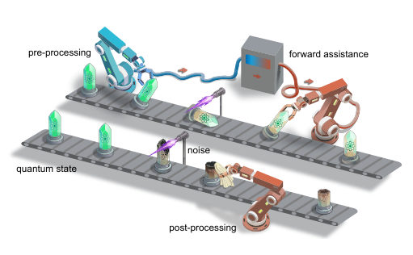 
FIG. 1. Forward-Assisted versus Conventional Purifi- cation. The lower conveyor belt depicts conventional purifi- cation, where quantum states, depicted as crystals, are first degraded by environmental noise, represented by a purple flame, and are then recovered only through post-processing. The upper conveyor belt illustrates the forward-assisted set- ting introduced here: a pre-processing operation is applied before the noise acts, and a forward memory link connects this intervention to the later post-processing stage. Treating noise as a dynamical process in this way enlarges the set of admissible purification strategies and gives access to recovery capabilities that are unavailable in...

📷 Fig 2

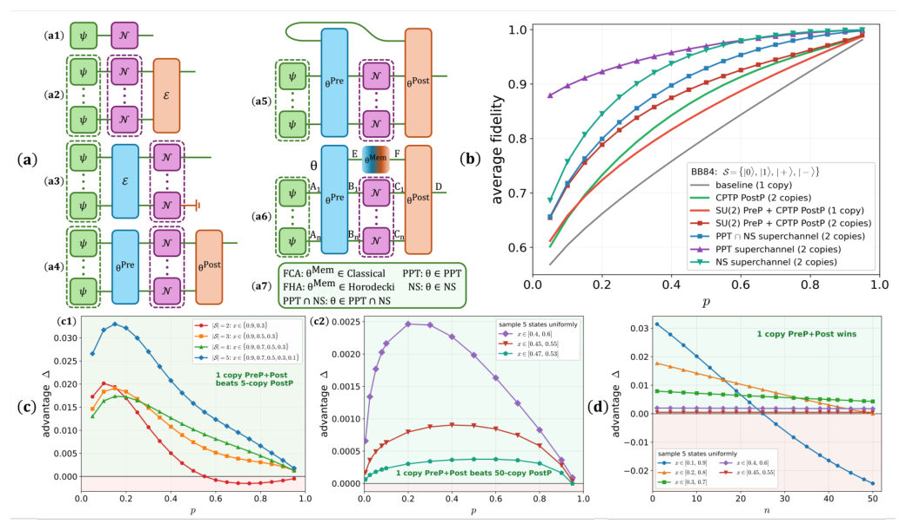 
FIG. 2. Spatiotemporal Purifications. (a) Purification protocols considered in this work: no purification (a1, Benchmark); conventional post-processing-only purification (a2, PostP); pre-processing-only purification (a3, PreP); unassisted purification combining pre- and post-processing without memory (a4, UA); entanglement-assisted purification with shared entanglement (a5, EA); and forward-assisted purification, where pre-processing θPre and post-processing θPost are connected by an intermediate memory θMem (a6, FA). Restricted FA classes are defined by the structure of the superchannel θ := θPost ◦θMem ◦θPre

📷 Fig 3

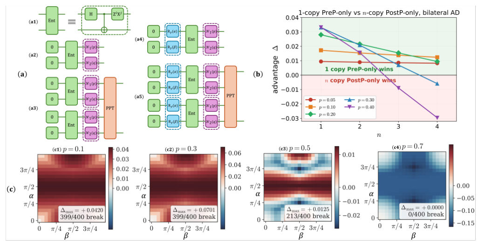 
FIG. 3. Distributed Purifications. (a) Distributed purification architectures: an entangling gate that prepares a maximally entangled state (MES) (a1, Ent); MES generation followed by local noise N1(p) ⊗N2(q) (a2, Benchmark); conventional 2- to-1 purification using PPTp post-processing (a3, PostP); single-copy entanglement purification using local y-axis rotations Ry(α) ⊗Ry(β) (a4, PreP); and 2-to-1 UA purification that combines the same local pre-processing with PPTp post-processing, without intermediate memory (a5, UA). (b) Single-copy advantage. We plot the fidelity gap between the single-copy PreP in (a4) and the multi-copy conventional PostP in (a3), under identical amplitude damping...

📷 Fig 4

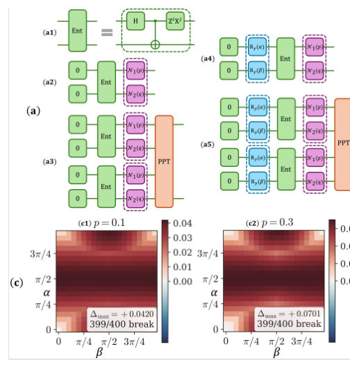 
Figure 2(d) further tracks this separation as the sam- ple number n increases, showing the fidelity gap between single-copy UA purification and n-copy conventional pu- rification under amplitude damping noise with p = 0.05. Thus, particularly at small p, a simple pre-processing layer can replace tens of noisy copies in conventional pu- rification, revealing a substantially more sample-efficient route to quantum information recovery. Additional nu- merical results and technical details are provided in the Appendix, including extrapolations suggesting that con- ventional purification may require on the order of 103

📷 Fig 5

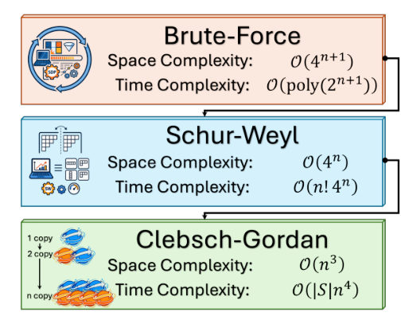 
FIG. 4. Reducing Computational Complexity through Symmetry. A direct SDP formulation of conventional n- to-1 purification (see Eq. (5)) incurs exponential memory and time costs, making brute-force computation rapidly in- tractable as the number of input copies grows (orange). The first layer of our algorithm exploits Schur-Weyl duality to re- solve the permutation symmetry and decompose the problem into smaller representation-theoretic blocks (see Eq. (7)), re- ducing the memory footprint but still requiring an expensive block-construction step (blue). The second layer removes this bottleneck by introducing a Clebsch-Gordan recursion, which constructs the blocks iteratively (see Eq. (15))...

**Summary.** This work develops a dynamical, spatiotemporal framework to redefine quantum state purification, moving beyond static post-processing methods. By incorporating pre-processing steps, the authors demonstrate 'forward-assisted' purification protocols that significantly outperform conventional methods. This advancement allows for the purification of states previously considered impossible due to fundamental no-purification theorems.

**Why it may be interesting.** The concept of distributing interventions across the noise process (pre-processing) provides a powerful, resource-efficient mechanism to enhance quantum information processing beyond what is achievable by simply averaging over many noisy copies.

Detailed structure

**Main problem.** Conventional quantum state purification is limited because it is inherently static, acting only after noise has degraded the quantum resource.

**Main result.** Introducing a dynamical, spatiotemporal framework allows for 'forward-assisted' purification, which can achieve performance exceeding conventional multi-copy protocols using fewer resources.

**Method.** The authors recast purification as a dynamical process using a superchannel framework, incorporating pre-processing ($	heta_{Pre}$), noise, and post-processing ($	heta_{Post}$) linked by a quantum memory.

**Model / system.** The study analyzes the purification of quantum states, particularly Bell states, subjected to various noise models like amplitude damping or local depolarizing noise.

**Key observables.** Achievable fidelity ($F^*$), performance advantage ($\Delta$), and the required sample complexity (number of noisy copies).

**Important parameters / regimes.** Noise parameters ($p, q$), the number of copies ($n$), and pre-processing parameters (local unitary angles $\alpha, eta$).

**Assumptions / limitations.** The analysis relies on extending the operational scope beyond static, post-processing-only protocols, and sometimes assumes specific noise models (e.g., depolarizing noise for Bell states).

**Figures summary.** Figures compare single-copy FA protocols against multi-copy conventional protocols, showing performance advantages and demonstrating the violation of no-purification theorems.

**Paper structure.** The paper progresses by first establishing the limitations of static purification, then introducing the dynamical spatiotemporal framework, demonstrating operational advantages via single-copy vs. multi-copy comparisons, and finally showing how pre-processing breaks fundamental no-purification theorems.

Abstract

Noise remains the primary obstacle to realizing quantum advantage, continuously degrading the resources that enable quantum technologies. Purification aims to reverse this degradation by extracting high-fidelity resources from noisy ensembles, yet its conventional formulation is intrinsically static, acting only after noise has taken effect. Here we instead recast purification as a dynamical task, introducing a spatiotemporal framework that distributes interventions across the noise process. This formulation reveals operational capabilities inaccessible to existing approaches and gives rise to forward-assisted purifications that extend achievable performance. In certain regimes, a single-copy protocol already exceeds what can be achieved with up to 50 copies under conventional purification, demonstrating a significant overhead in required resources. Beyond these gains, our framework circumvents no-purification theorems within conventional protocols, including for Bell-state ensembles, thereby enabling purification previously considered impossible and pointing toward an efficient route to mitigating noise in quantum systems.

[↑ back to top](#top)

### [Irregular Metamaterial Networks](http://arxiv.org/abs/2606.02695v1)

**Authors:** Thomas P. Wytock, Chiara Daraio, Heinrich M. Jaeger, Christopher A. Schuh, Lorenzo Valdevit, Vincenzo Vitellid, Adilson E. Motter  
**Type:** theory · **Category:** disordered systems and neural networks · **PDF:** <https://arxiv.org/pdf/2606.02695v1>  
**Analysis basis:** full PDF text, analyzed in chunks
**Topic relevance:** `analog quantum simulation` **1/5** · `driven-dissipative phase transition` **1/5** · `entanglement & information structure` **1/5** · `methods for driven-dissipative` **1/5** · `non-equilibrium dynamics` **1/5** · `non-equilibrium universality` **1/5**

📷 Fig 1

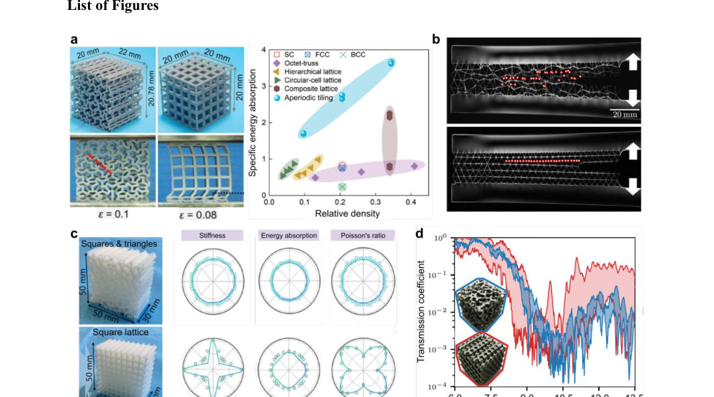 
Fig. 1: Examples of exceptional behavior achieved by irregular metamaterials. a, Samples of aperiodic (top left) and simple cubic (top right) structures, their behavior at approximately 10% strain (bottom left and right, respectively), and their specific energy absorption as a function of density (far right)165. b, Fracture propagation in an irregular truss structure (top) versus its regular counterpart (bottom), when the right side is pried apart (white arrows). The irregular structure deflects the crack tip, leading to a doubling of the fracture toughness157. c, Isotropy of the stiffness, specific energy absorption, and Poisson’s ratio for an aperiodic lattice of squares and triangles...

📷 Fig 2

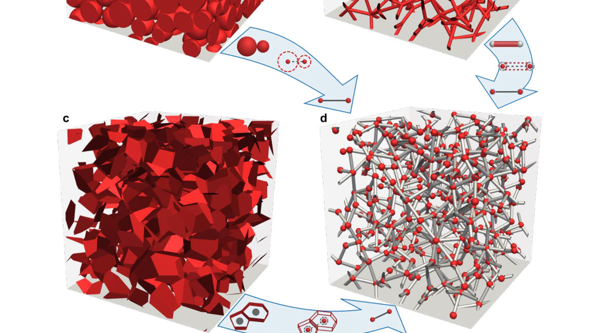 
Fig. 2: Schematics of metamaterials that can exist in periodic and irregular form. a-c, Irregular granular, truss, and shell structures, respectively, corresponding to interactions of increasing dimension and complexity. d, Underlying network topology, which is the same in (a-c) for comparison. The arrows indicate the relationship between the network topology and material elements in each case (additional details on the network construction are provided in the Supplementary Information). The image is inspired by Ref. 168.

📷 Fig 3

 
Fig. 3: Irregular networks generated by existing models. a, Erdős–Rényi network, where node pairs are connected by an edge with a given probability p. b, Small-world network, generated through the rewiring of a small fraction of edges in a triangulated lattice. c, Scale-free network, generated by randomly connecting nodes with a pre-assigned power-law distribution of the number of connections. d, Network with communities of densely connected nodes generated using the stochastic block model with four planted clusters. e-g, Generalized networks with higher-order (e), multilayer (f), and temporal interactions (g).

📷 Fig 4

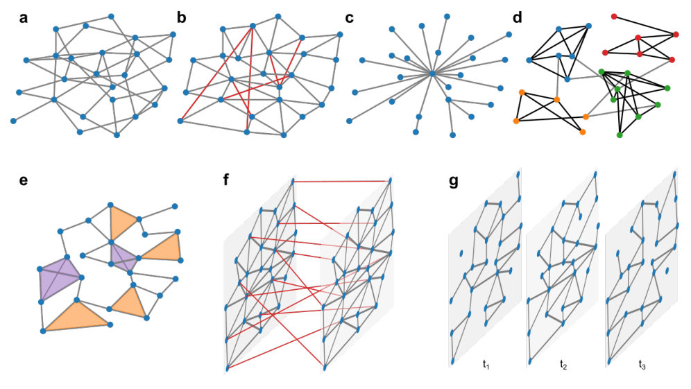 
Fig. 4: Types of irregularity. a-c, Illustration of topological (a), geometrical (b), and parametric irregularity (c).

📷 Fig 5

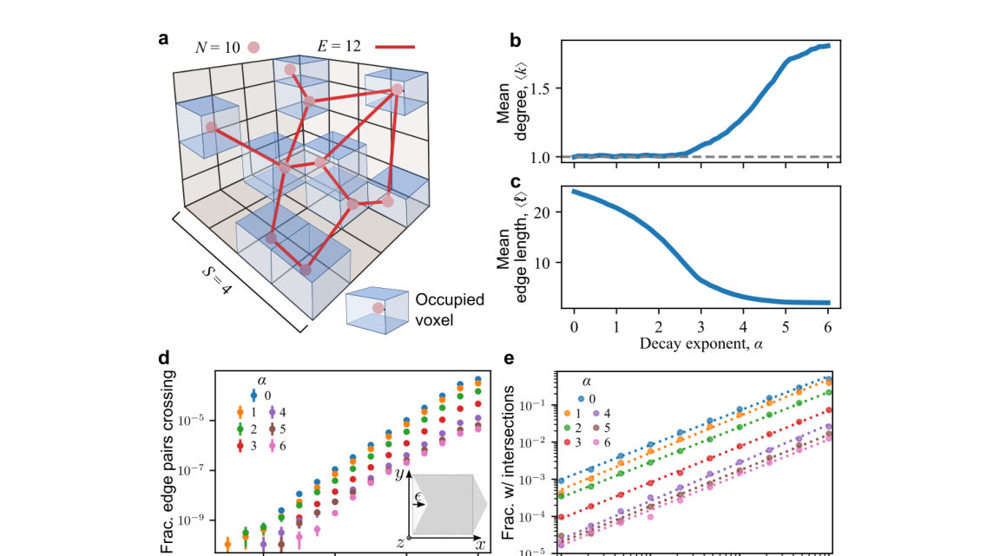 
Fig. 5: Geometric extension of the Erdős–Rényi model. a, Example network for 𝑁= 10 nodes, 𝐸= 12 edges, and 𝑆= 4 voxels per side of the principal volume. b, Mean degree at the percolation transition as a function of the decay exponent 𝛼 for edge radius 𝑑= 0 , which has qualitatively similar behavior to the model in Ref. 88. The dashed line indicates the degree in the (topological) Erdős–Rényi model. c, Mean length of the edges for the networks in (b). d, Crossings in a strained material for 𝑑= 0 as a function of the maximum strain (in units of voxel side lengths) for the profile shown in the inset. e, Fraction of edges violating the volume exclusion constraint as a function of 𝑑 in the...

**Summary.** This work proposes using enriched network theory to design metamaterials by systematically incorporating controlled irregularities, moving beyond simple periodic designs. It develops mathematical models that couple topology with geometry and physical constraints, utilizing machine learning tools like GNNs to enable inverse design. The key takeaway is that controlled disorder is essential for unlocking novel, enhanced material properties.

**Why it may be interesting.** The focus on structure-property relationships in disordered, non-equilibrium systems, and the use of ML to navigate complex parameter spaces, connects directly to understanding emergent behavior in complex quantum many-body systems.

Detailed structure

**Main problem.** The primary challenge is designing metamaterials with controlled irregularities to achieve enhanced or novel properties, moving beyond the tractability limits of purely regular structures.

**Main result.** Irregular metamaterials can exhibit substantial property enhancements compared to periodic designs, and network theory provides a natural framework to systematically design and analyze these complex structures.

**Method.** The work integrates enriched network theory, graph neural networks (GNNs), and geometric modeling to map structure-property relationships in disordered systems.

**Model / system.** The system studied is metamaterials, modeled as physical networks (granular, truss, plate) whose structure is defined by nodes and edges embedded in space. The irregularity can be topological, geometrical, or parametric.

**Key observables.** Material properties (rigidity, negative Poisson's ratio), network metrics (percolation threshold, average degree $\langle k 
angle$), and irregularity quantifiers (Entropy, Variance).

**Important parameters / regimes.** The decay exponent $\alpha$ in the geometric network model, the strain $\sigma$, and the node/edge radii $d$.

**Assumptions / limitations.** The analysis often assumes simplified network structures (e.g., tree-like for percolation) or relies on machine learning to handle the complexity of the search space.

**Figures summary.** Figures illustrate the description of various irregular materials (granular, truss, plate) by a common network structure, and show how network metrics like average degree and edge length change with the geometric decay exponent $\alpha$.

**Paper structure.** The paper progresses from establishing network theory as the necessary framework, to developing geometric extensions (like the geometric Erdős–Rényi model), and finally applying advanced computational tools like GNNs and physical network learning for inverse design.

Abstract

Metamaterials can achieve exceptional functionality through careful engineering of their mesoscale structure. Although appropriately introduced irregularities can be advantageous, current approaches largely conform to regular structures to preserve tractability. Here, we contend that network theory, enriched with geometry and physics, provides a natural framework for designing metamaterials with controlled irregularities at relevant scales, thereby enabling the discovery of new property-enhancing structures. We examine how this augmented network theory can facilitate the creation of irregular metamaterials with enhanced or novel properties and how metamaterial research, in turn, is opening new directions in network science. Supported by machine learning and advanced self-assembly, the emerging field of irregular metamaterial networks is poised to transform inverse design and scalable manufacturing of novel materials.

[↑ back to top](#top)

### [Constraint-Enhanced Physical Search through Correlation Matching](http://arxiv.org/abs/2606.03554v1)

**Authors:** Song-Ju Kim  
**Type:** theory · **Category:** statistical mechanics · **PDF:** <https://arxiv.org/pdf/2606.03554v1>  
**Analysis basis:** full PDF text, analyzed in chunks
**Topic relevance:** `analog quantum simulation` **1/5** · `driven-dissipative phase transition` **1/5** · `entanglement & information structure` **1/5** · `non-equilibrium dynamics` **1/5** · `non-equilibrium universality` **1/5**

📷 Fig 1

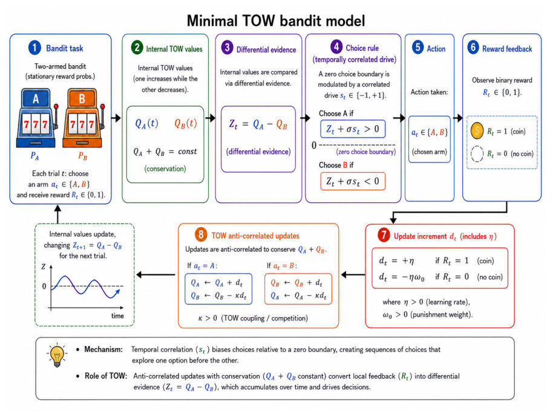 
Figure 1: Minimal TOW bandit model. A two-armed bandit trial consists of choosing an arm at ∈{A, B}, observing a binary reward Rt ∈{0, 1}, and updating the internal TOW values QA and QB. For κ = 1, the update gives exact TOW conservation QA + QB = const. The differential evidence Zt = QA −QB is compared with a zero choice boundary after modulation by the temporally correlated drive σst. Reward feedback defines the update increment dt, and the TOW rule updates the chosen arm and the competing arm in opposite directions. Thus a local reward observation is converted into an option-wise anti-correlated update of the internal state.

📷 Fig 2

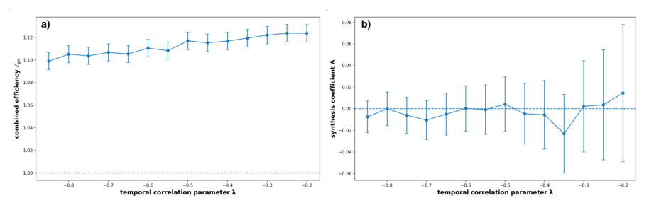 
Figure 2: Efficiency gain and synthesis diagnostic for temporal anti-correlation combined with TOW conservation. (a) Combined efficiency Eχκ = R00/Rχκ as a function of the temporal correlation parameter λ for the representative setting PA = 0.7, PB = 0.5, σ = 1.3, η = 0.5, and κ = 1. Values above unity indicate reduced regret relative to the uncorrelated one- sided baseline. The high-statistics data show a robust efficiency gain over the tested range of negative temporal correlations. Error bars show propagated standard errors obtained from the standard errors of the regret estimates. (b) Synthesis coefficient Λ, which isolates the non-additive interaction between temporal anti-correlation...

📷 Fig 3

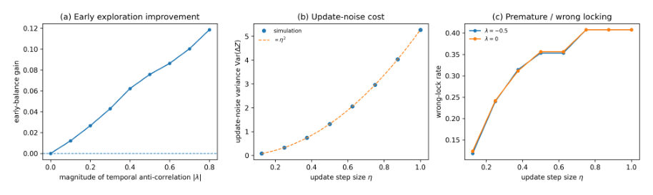 
Figure 3: Internal mechanism behind the optimum. (a) Temporal anti-correlation improves early exploration balance during the phase in which the drive can still affect the decision boundary. (b) The variance of the differential update obeys the expected TOW scaling Var(∆Z) ∝η2, confirming the update-noise cost in Eq. (17). (c) Increasing η also increases premature or wrong locking, showing why the transduction from exploration to evidence formation has a finite window rather than growing monotonically with update strength.

📷 Fig 4

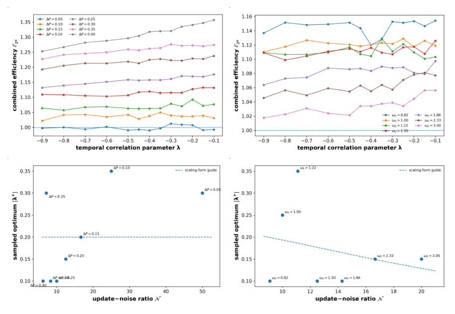 
Figure 4: Parameter sweeps supporting the scaling interpretation. (a) Changing the reward contrast ∆P at fixed ω0 = 1.5 reshapes the efficiency landscape over temporal correlations. (b) Changing the non-reward penalty ω0 at fixed ∆P = 0.20 also modifies the efficiency landscape. (c,d) Extracted optima |λ∗| plotted against the dimensionless update-noise ratio N = η(1 + κ)(1 + ω0)/∆P. Here N is the update-noise-to-reward-contrast ratio: large N means that the physical update scale is large relative to the reward difference that must be resolved. Because the optima are extracted from a finite λ-grid and the efficiency landscape can be broad near its maximum, the lower panels are used as...

**Summary.** This paper proposes a unifying principle for efficient physical search by showing that optimal exploration requires matching the time scale of random fluctuations to the spatial scale imposed by physical constraints. Using a minimal Tug-of-War bandit model, the authors demonstrate that the synergy between temporal anti-correlation and conservation-induced updates drives efficiency, limited by the update-noise-to-contrast ratio.

**Why it may be interesting.** The concept of matching temporal fluctuations to physical constraints for optimal information gathering has parallels in understanding how quantum measurements or environmental coupling can guide quantum computation or state preparation.

Detailed structure

**Main problem.** To develop a general principle for efficient physical search by matching temporal correlations in exploration to constraint-induced spatial correlations in update dynamics.

**Main result.** Efficient search emerges when the temporal correlation structure is tuned to match the physical update scale, quantified by a scaling estimate involving the update-noise-to-contrast ratio.

**Method.** The authors analyze the problem using a minimal Tug-of-War (TOW) bandit model, deriving efficiency gains and interaction diagnostics ($\Lambda$) by comparing correlated versus uncorrelated sampling.

**Model / system.** The core model is the minimal Tug-of-War (TOW) bandit, which compares two alternatives (A and B) and features a conservation-induced, anti-correlated update mechanism. The dynamics are governed by a correlated exploratory drive ($\sigma_t$) and the TOW update rule.

**Key observables.** Efficiency gain ($E_{\chi\kappa}$), Synthesis Coefficient ($\Lambda$), and the optimal temporal correlation ($\lambda^*$).

**Important parameters / regimes.** The update-noise-to-contrast ratio ($N$), the temporal non-redundancy proxy ($\chi$), and the conservation strength ($\kappa$).

**Assumptions / limitations.** The analysis assumes a stationary environment and treats the TOW dynamics as a controllable reduced system, focusing on the interaction between the two types of correlations.

**Figures summary.** Figures illustrate the TOW model cycle, show efficiency gain vs. correlation strength ($\lambda$), and use the Synthesis coefficient ($\Lambda$) to diagnose constructive interaction between temporal and spatial correlations.

**Paper structure.** The paper establishes the physical search problem, models it using the TOW bandit, develops diagnostics ($\Lambda$) to quantify correlation synergy, derives scaling laws based on balancing exploration gain against update noise cost, and concludes with a general principle for efficient physical exploration.

Abstract

Physical systems do not merely add noise to search processes; they impose constraints that generate structured correlations. We propose a principle of constraint-enhanced physical search in which temporal correlations in exploration are matched to constraint-induced spatial correlations in the update dynamics. Using a minimal tug-of-war bandit model (TOW), we show that a conservation law converts local observations into differential evidence across alternatives, while a temporally correlated drive controls the order of exploration. Search efficiency is improved not by stronger randomness or by maximal anti-correlation, but by matching the temporal correlation to the physical update scale that converts feedback into evidence. A scaling estimate identifies the update-noise-to-contrast ratio as the leading parameter that limits how strongly temporal anti-correlation can be used. The results suggest a general organizing principle for physical search: constraints and fluctuations can generate structured spatiotemporal correlations, and efficient exploration emerges when these correlations are matched to the update dynamics.

[↑ back to top](#top)

### [Turbulence: An Entropic Approach](http://arxiv.org/abs/2606.03139v1)

**Authors:** Christian Beck, Constantino Tsallis  
**Type:** both · **Category:** statistical mechanics · **PDF:** <https://arxiv.org/pdf/2606.03139v1>  
**Analysis basis:** full PDF text, analyzed in chunks
**Topic relevance:** `Keldysh / 2PI / non-Gaussian methods` **1/5** · `non-equilibrium dynamics` **1/5** · `non-equilibrium universality` **1/5**

📷 Fig 1

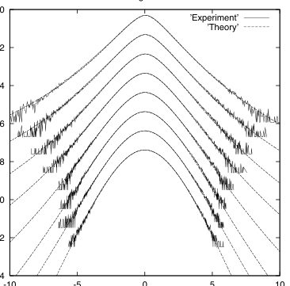 
FIG. 1. Turbulent velocity distributions as measured in [15] and a fit by the stretched q-exponentials, theoretically derived in the current paper from a maximum entropy principle for Sq,δ.

📷 Fig 2

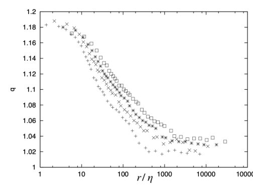 
FIG. 2. qss as a function of r/η and Re as measured in [15]. δ is given by δ = (2 −qss)−1. The different sym- bols represent 4 different Reynolds numbers, namely Re = 69000, 133000, 266000, 540000 (from left to right).

📷 Fig 3

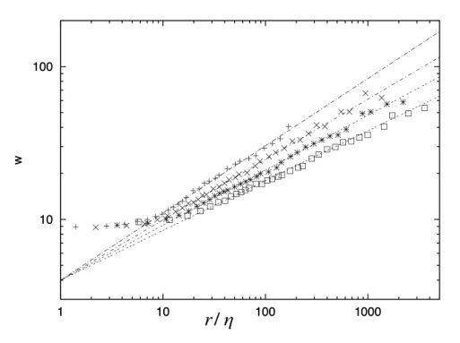 
FIG. 3. The asymptotic power-law decay rate exponent w of the velocity distributions as a function of r/η for various Reynolds numbers, as measured in [15]. A scaling law is ob- served which, if extrapolated to r = η, gives w = 4 at the Kolmogorov scale r = η.

**Summary.** This work develops a generalized entropic statistical mechanics approach to model turbulence, using the functional $S_{q,\delta}$. By applying this theory to experimental data from turbulent flow, the authors successfully predict the scale-dependent statistics of velocity differences. The framework draws deep analogies between the dissipation scale of turbulence and the physics of black hole event horizons.

**Why it may be interesting.** While focused on classical fluid dynamics, the use of generalized entropy functionals ($S_q$) and the connection to non-extensive statistical mechanics provides a powerful, transferable mathematical tool for analyzing complex, non-equilibrium systems, which has parallels in open quantum systems dynamics.

Detailed structure

**Main problem.** The paper addresses the challenge of describing the scale-dependent, non-Gaussian statistics of velocity differences in highly turbulent fluid flows.

**Main result.** The authors successfully apply a generalized entropic formalism, predicting that at the Kolmogorov scale, the system reaches a state analogous to a black hole event horizon where third moments vanish.

**Method.** The methodology involves maximizing a generalized entropic functional, $S_{q,\delta}$, subject to kinetic energy constraints, leading to generalized canonical distributions.

**Model / system.** The primary physical system studied is hydrodynamic turbulence, specifically using high-precision experimental data from Taylor-Couette flow. The theoretical framework generalizes statistical mechanics using nonadditive entropic functionals.

**Key observables.** Probability Density Functions (PDFs) of velocity differences, the asymptotic power-law decay rate exponent $w(r)$, and the existence/non-existence of higher moments.

**Important parameters / regimes.** The entropic parameters $q$ and $\delta$, the Kolmogorov length scale $\eta$, and the Reynolds number $	ext{Re}$.

**Assumptions / limitations.** The core assumption is that the system's statistics can be accurately described by maximizing the generalized entropic functional $S_{q,\delta}$.

**Figures summary.** Figures illustrate the successful fitting of measured turbulent velocity distributions using stretched $q$-exponentials, showing scaling laws that converge to specific values at large and small scales.

**Paper structure.** The paper develops the generalized entropic formalism, derives the resulting canonical distributions, applies this theory to match experimental data from Taylor-Couette flow across different scales, and concludes by drawing analogies between the turbulent endpoint and black hole physics.

Abstract

We show that maximizing the generalized entropic functional $S_{q,δ}$ subject to standard kinetic energy constraints provides generalized canonical distributions that agree perfectly with measured probability densities of velocity differences at distance $r$ in highly-turbulent Taylor-Couette flow. The end point of the turbulent cascade is described by $δ=\frac{3}{2}$, a parameter value that also plays an important role in black-hole physics. At this point the Kolmogorov length scale $r=η$ is reached and all observable eddy structures of the turbulent flow disappear, in certain analogy to what is observed for black holes at the event horizon. Our approach generalizes statistical mechanics to more general nonadditive entropic functionals $S_{q,δ}$ such that it is applicable to turbulent flows. This approach asymptotically generates stretched $q$-exponentials as generalized canonical distributions relevant for turbulent flow, with a particular dependence of the stretching exponent $δ^{-1}$ on $q$ that follows from the well-known escort formalism in nonextensive statistical mechanics. Along this particular line in the parameter space, the physics can be described by $S_q$ on its own with suitable escort constraints, leading to the prediction $δ^{-1} (r) =2-q(r)$, thus allowing for a consistent thermodynamic description since $S_q$ is both trace-form and composable. We show that the above theoretically derived relation is well satisfied by measured high-precision experimental data for Taylor-Couette flow. At the Kolmogorov length scale $r=η$, the endpoint of our scenario, one has $δ=\frac{3}{2}$ and at this point the third moment of velocity differences ceases to exist and all eddies disappear. We point out various analogies with thermodynamic entropic approaches to black hole physics.

[↑ back to top](#top)

### [Two-orbital $e_g$ model with bond-dependent spin-orbit coupling: A playground for emergent band topology, Kitaev magnetism, and magnetoelectricity](http://arxiv.org/abs/2606.02716v1)

**Authors:** YuZheng Xie, Manoj Gupta, Arun Paramekanti, Tanusri Saha-Dasgupta  
**Type:** theory · **Category:** strongly correlated electrons · **PDF:** <https://arxiv.org/pdf/2606.02716v1>  
**Analysis basis:** full PDF text, analyzed in chunks
**Topic relevance:** `analog quantum simulation` **1/5** · `exotic spin models in light-matter` **1/5** · `spintronics-quantum-optics interface` **1/5**

📷 Fig 1

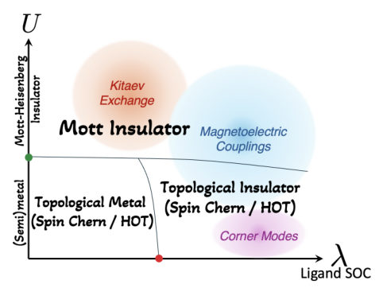 
FIG. 1. Schematic phase diagram of an effective two-orbital eg model as function of ligand SOC λ and Coulomb correlations U at the metal site. For λ = 0, increasing U leads to a transition from a (semi)metal to Mott-Heisenberg insulator. Increasing λ for weakly interacting case, leads to topological metal and topological insulator phases featuring spin-Chern bands and higher order topology with corner modes. The large U limit for strong λ reveals an intertwining of band topology, Kitaev interactions, and magneto-electric effects.

📷 Fig 2

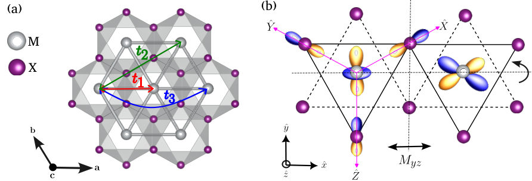 
FIG. 2. (a) Crystal structure of single layer 1T-NiX2, showing the edge-shared network of NiX6 octahedra in crystallographic a-b plane, viewed along the c axis. The effective Ni-Ni hopping terms for first neighbor t1, second neighbor t2, and third neighbor t3 pairs are marked. (b) Relevant (d3Z2−r2, dX2−Y 2) orbitals on Ni sites and (pX, pY , pZ) orbitals on ligand sites, defined in local coordinate systems ˆ X, ˆY , and ˆZ. In units of the Ni-Ni bond length, the nearest neighbor Ni-Ni bond vectors are δ1 = ˆx, δ2 = −1

📷 Fig 3

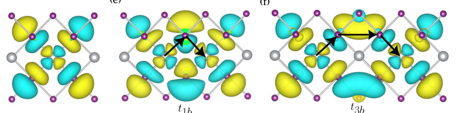 
FIG. 3. DFT-derived eg Wannier functions, and their overlaps defining ligand-mediated spin-independent hopping pathways for t1 and ta, for the representative case of NiI2. The panels (a)-(c) show the Ni centered d3Z2−r2 Wannier function, their overlap at two nearest neighbor Ni sites, defining t1 and their overlap at two third neighbor Ni sites, defining t3, respectively. Panels (d)-(f) show the same but for dX2−Y 2 Wannier functions. Plotted are the isovalue surface of the functions with different signs of the lobes colored differently. The ligand mediated hopping paths are shown with arrows.

📷 Fig 4

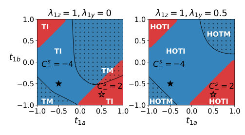 
FIG. 4. Phase diagram showing the various topological phases Cs −for the lower band as a function of the NN hop- pings t1a, t1b. The 3NN hopping parameters are fixed to (t3a, t3b) = (1/3, −1), and we take λ1z &gt; 0. The blue and red regions corresponds to Cs −= −4 and Cs −= 2, respec- tively. The dot-shaded region indicates metallic phases, while the unshaded region corresponds to insulating phases, and the solid black line is the metal-insulator boundary. We label phases as topological insulating (TI) and topological metallic (TM), and the higher order analogues as HOTI and HOTM. The bulk and edge spectra corresponding to the solid stars (Cs −= −4) in each panel are shown in Fig. 5. The...

📷 Fig 5

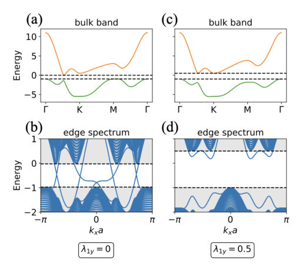 
FIG. 5. Gapped bulk band dispersion, showing + and − bands colored as orange and green respectively, and edge spec- trum for Cs −= −4 for spin-mixing SOC λ1y = 0 (left) and λ1y = 0.5 (right). A nonzero λ1y enhances the bulk band gap of the topological insulator, and gaps out the edge states. Analogous results for the regime of the phase diagram with Cs −= 2 are presented in SM Section III.A [19]

**Summary.** This work develops a theoretical model for NiX2 compounds using a two-orbital e_g Hamiltonian that includes bond-dependent spin-orbit coupling. It demonstrates that this model hosts rich physics, including topological band structures and Kitaev magnetism in the strongly correlated limit. The research extends the understanding of magnetoelectric effects by incorporating orbital-dependent spin currents.

**Why it may be interesting.** The explicit derivation of magnetoelectric coupling terms beyond single-orbital models, incorporating orbital degrees of freedom, provides a rich theoretical framework for understanding charge-spin coupling in correlated materials.

Detailed structure

**Main problem.** The paper investigates emergent phenomena, including band topology, Kitaev magnetism, and magnetoelectricity, in layered transition metal compounds like NiX2.

**Main result.** The model predicts topological bands with non-trivial spin Chern numbers and reveals a spin-1 Hamiltonian exhibiting bond-dependent Kitaev interactions in the Mott limit.

**Method.** The study uses a two-orbital e_g model derived from DFT calculations, analyzing different limits (non-interacting, Mott insulator) and employing symmetry-based perturbation theory.

**Model / system.** The system is modeled by an effective two-orbital e_g Hamiltonian incorporating bond-dependent spin-orbit coupling (SOC) derived from ligand p-orbitals, relevant to NiX2 compounds.

**Key observables.** Spin-Chern numbers (Cs), higher-order topological indices, bond-dependent Kitaev exchange interactions, and spin-induced electric polarization (P).

**Important parameters / regimes.** Ligand SOC strength (lambda), Coulomb repulsion (U), and various hopping parameters (t_1a, t_3b, etc.).

**Assumptions / limitations.** The analysis relies on mapping the full electronic structure onto a minimal two-orbital e_g model and using perturbation theory in the strong coupling limit.

**Figures summary.** Figures illustrate phase diagrams (SOC vs U), band structures showing topological edge/corner states, and magnetic phase diagrams (Luttinger-Tisza).

**Paper structure.** The paper progresses from establishing the effective two-orbital model via DFT/Wannierization, analyzing the non-interacting topological properties, deriving the effective spin Hamiltonian in the Mott limit, and finally calculating the generalized magnetoelectric response.

Abstract

Inspired by the electronic structure of compounds like nickel dihalides Ni$X_2$ ($X$=Cl, Br, I), we propose a low-energy two-orbital $e_g$ model featuring bond-dependent spin-orbit terms, driven by atomic spin-orbit coupling on the ligand $X$. We demonstrate that this model hosts a rich array of phenomena. In the non-interacting band limit, spin-orbit-derived spin-dependent and spin-flip hopping terms produce topological bands with spin-Chern numbers $C_s=\pm 2, \pm 4$, and higher order topological states with fractional corner charges, respectively. In the half-filled Mott insulator limit, we recover a spin-$1$ Hamiltonian with bond-dependent Kitaev exchange interactions. We explore the magnetoelectric effect in this two-orbital model using symmetry-based perspective and microscopic calculations, going beyond the generalized Katsura-Nagaosa-Balatsky theory for the single-orbital case. Our work may be relevant to study of doping, strain, or pressure on Ni$X_2$ and related materials.

[↑ back to top](#top)

### [Game, Set, Quantum: Parameterized Quantum Circuit for Correlated Equilibrium in Bayesian Games](http://arxiv.org/abs/2606.03109v1)

**Authors:** Param Pathak, Vidhi Oad, Nouhaila Innan, Adarsh Ganesan, Muhammad Shafique  
**Type:** theory · **Category:** numerical methods · **PDF:** <https://arxiv.org/pdf/2606.03109v1>  
**Analysis basis:** full PDF text, analyzed in chunks
**Topic relevance:** `entanglement & information structure` **1/5** · `methods for driven-dissipative` **1/5**

📷 Fig 1

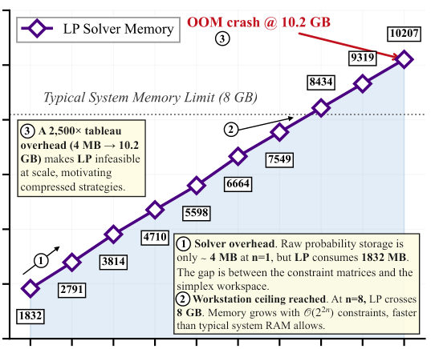 
FIG. 1: Runtime memory of the LP reference solver as the player count increases. The dashed line marks the typical 8 GB system-memory limit. At n = 10, the solver reaches 10.2 GB before termination, reflecting the cost of explicit optimization over the type-action distribution.

📷 Fig 2

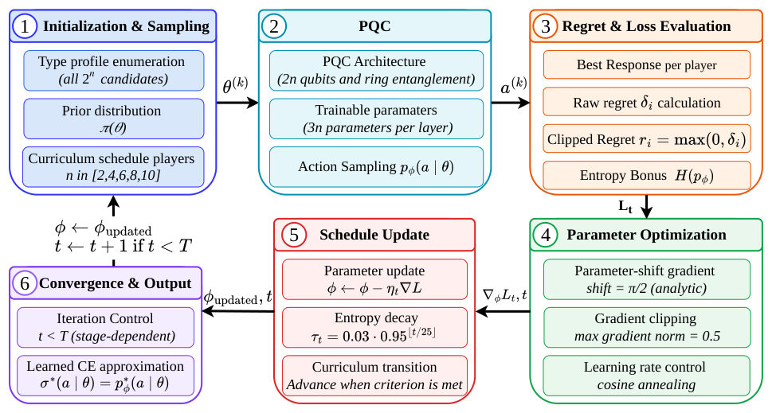 
FIG. 2: Overview of the quantum regret minimization workflow. The method enumerates type profiles, uses a PQC to sample action distributions, computes clipped regret with a negative entropy regularizer, and updates circuit parameters using parameter-shift gradients, gradient clipping, learning-rate annealing, entropy decay, and curriculum progression. The loop returns the learned strategy distribution σ∗(a | θ).

📷 Fig 3

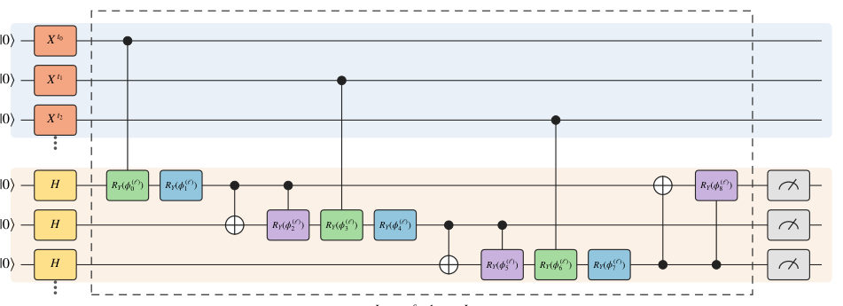 
FIG. 3: Hybrid PQC architecture for approximate Bayes correlated equilibrium computation. The type register encodes private type profiles, while the action register samples joint action recommendations. Each layer applies type-conditioned rotations, local action rotations, and ring entangling blocks, yielding 3nL = O(nL) trainable parameters.

📷 Fig 4

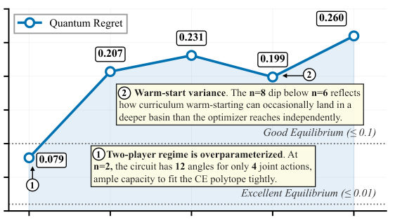 
FIG. 4: Mean clipped regret of the quantum solver across player counts on the matched utility benchmark. The regret remains below 0.30 across all tested cases, with the lowest value observed at n = 2. The nonmonotonic value at n = 8 reflects the behavior of the specific curriculum run rather than a general scaling claim.

📷 Fig 5

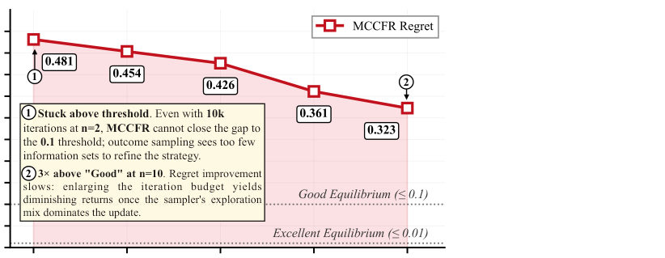 
FIG. 5: Mean clipped regret of MCCFR across player counts on the matched utility benchmark. MCCFR decreases from 0.481 at n = 2 to 0.323 at n = 10, but remains above the quantum solver and DCFR across the tested range.

**Summary.** This paper proposes using a Parameterized Quantum Circuit (PQC) within a hybrid quantum-classical framework to approximate Bayes correlated equilibria in Bayesian games. By parameterizing the conditional strategy distribution, the method bypasses the exponential memory bottleneck of classical formulations. The results show that this quantum approach yields superior performance compared to established classical algorithms for moderate numbers of players.

**Why it may be interesting.** While the application is in game theory, the core methodology—using a PQC to compress an exponentially large state space into a polynomially parameterized variational form—is a powerful technique relevant to simulating complex quantum many-body states or high-dimensional quantum processes.

Detailed structure

**Main problem.** The paper addresses the computational challenge of finding equilibria in Bayesian games, where the explicit representation of the joint type-action space grows exponentially.

**Main result.** The proposed quantum solver achieves lower mean clipped regret than MCCFR across all tested player counts for up to eight players, demonstrating a viable variational representation for approximate equilibrium computation.

**Method.** A hybrid quantum-classical framework is used, employing a Parameterized Quantum Circuit (PQC) to represent the conditional strategy distribution, trained via gradient-based regret minimization.

**Model / system.** The model is a binary-type, binary-action Bayesian game, and the quantum computation is performed on a PQC operating on $2n$ qubits (type and action registers).

**Key observables.** Mean clipped regret, maximum positive deviation gain ($\epsilon_{\max}$), and memory usage scaling ($\mathcal{O}(2^{2n})$ vs $\mathcal{O}(nL)$).

**Important parameters / regimes.** Number of players ($n$), circuit depth ($L$), learning rate ($\eta_t$), and entropy regularization coefficient ($	au_t$).

**Assumptions / limitations.** The method is a variational approximation, meaning convergence to an exact equilibrium is not guaranteed unless the target distribution lies within the PQC's reachable family.

**Figures summary.** Figures compare the mean clipped regret of the quantum solver, MCCFR, and DCFR across increasing player counts ($n$), showing the quantum solver's advantage up to $n=8$.

**Paper structure.** The paper introduces the problem, details the PQC architecture and the hybrid quantum-classical training workflow (including regret minimization and entropy regularization), presents comparative results against classical baselines, and discusses scaling and noise effects.

Abstract

Strategic decision-making among many agents under incomplete information is central to economics, security, and multi-agent artificial intelligence (AI). Computing equilibria in such settings is challenging because the joint type-action space grows exponentially with the number of players. In binary-type, binary-action Bayesian games, an explicit representation over type-action profiles requires O(22n) entries, making direct linear-programming (LP) formulations memory intensive at moderate player counts. We propose a hybrid quantum-classical framework for approximating Bayes correlated equilibrium using a parameterized quantum circuit (PQC). The PQC represents the conditional strategy distribution with O(nL) trainable parameters, where n is the number of players and L is the circuit depth; for the largest setting studied here, n = 10 and L = 2, this corresponds to 60 trainable angles. The circuit is trained by gradient-based regret minimization with a negative entropy regularizer and a curriculum schedule over player counts. On a poker-style Bayesian game with two to ten players, the proposed solver achieves lower mean clipped regret than MCCFR across all tested player counts and lower regret than DCFR up to eight players, while DCFR performs best at ten players. These results show that compact PQC parameterizations can provide a viable variational representation for approximate equilibrium computation, while highlighting the roles of ansatz expressivity, optimization strategy, and classical simulation cost.

[↑ back to top](#top)

### [A proof of an identity for the critical exponents of jamming](http://arxiv.org/abs/2606.03300v1)

**Authors:** Giorgio Parisi, Francesco Zamponi  
**Type:** theory · **Category:** disordered systems and neural networks · **PDF:** <https://arxiv.org/pdf/2606.03300v1>  
**Analysis basis:** full PDF text, analyzed in chunks
**Topic relevance:** `Keldysh / 2PI / non-Gaussian methods` **1/5**

📷 Fig 1

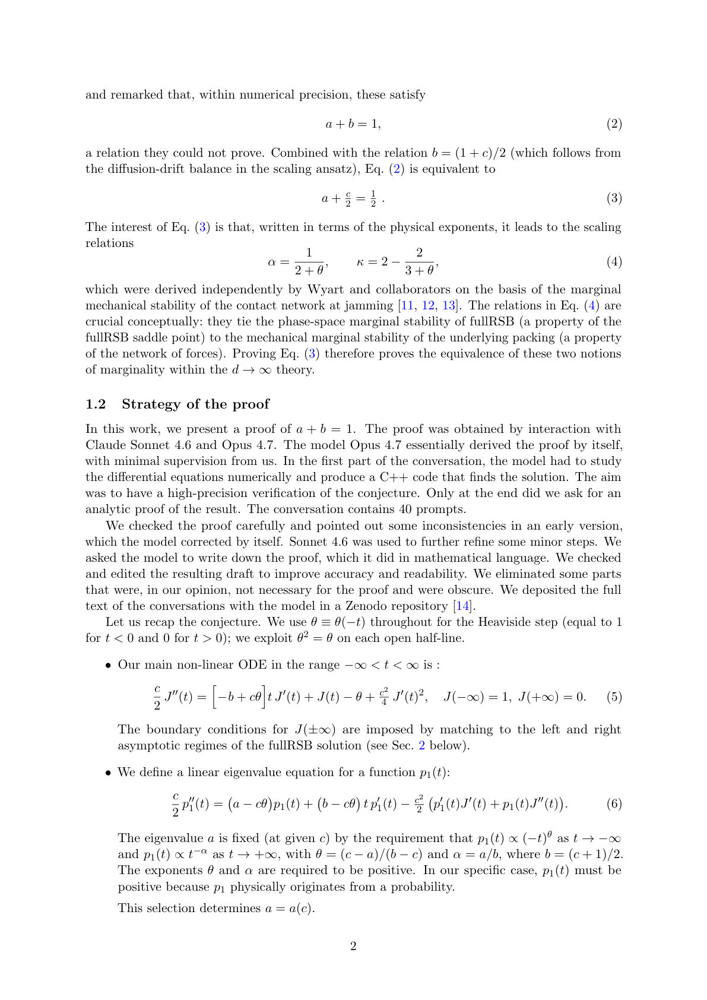 
Low-resolution page preview, page 2

📷 Fig 2

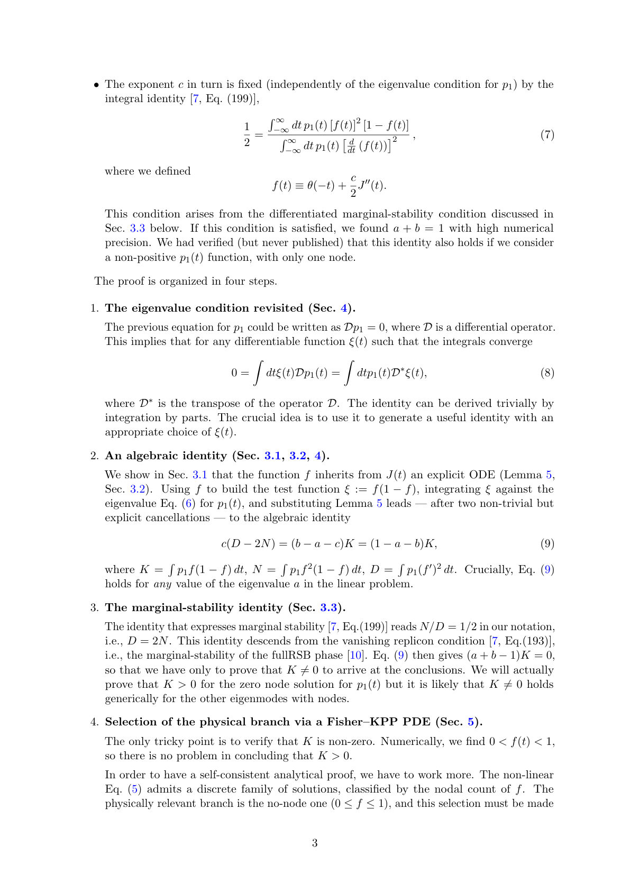 
Low-resolution page preview, page 3

📷 Fig 3

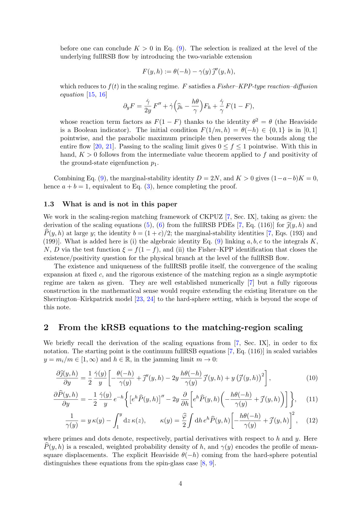 
Low-resolution page preview, page 4

📷 Fig 4

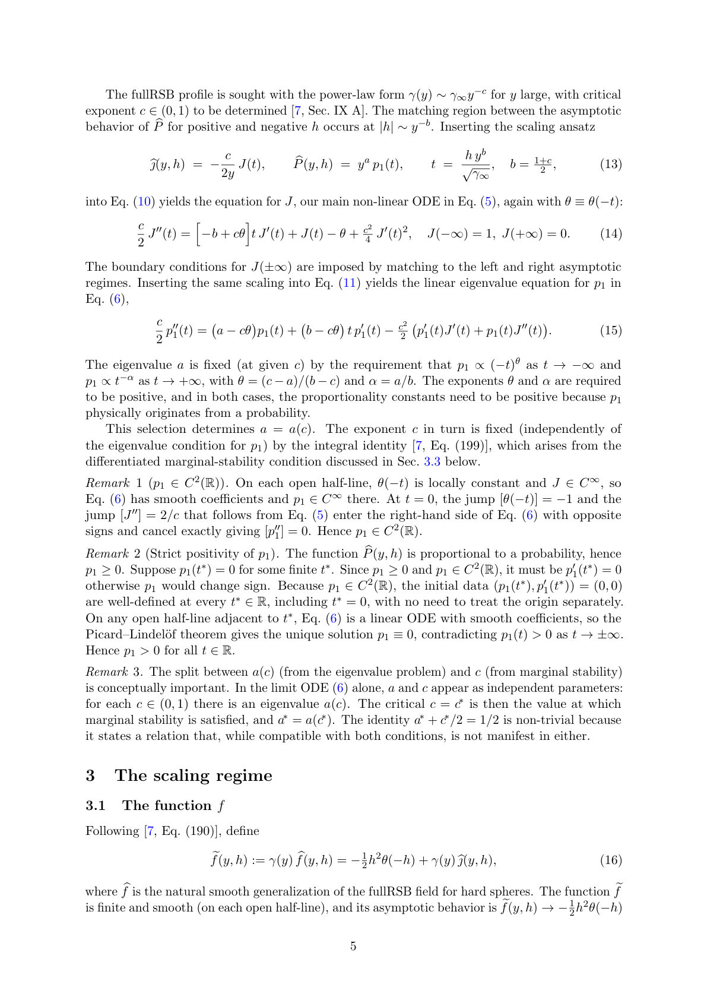 
Low-resolution page preview, page 5

📷 Fig 5

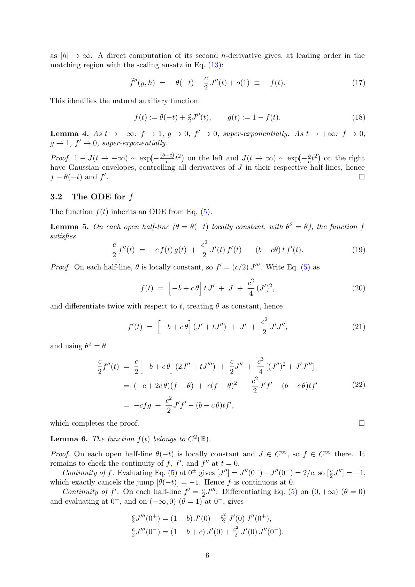 
Low-resolution page preview, page 6

**Summary.** This paper provides a rigorous, analytic proof that a key identity, $a+b=1$, holds for the critical exponents describing the jamming transition in dense hard spheres. The proof connects the mathematical structure of the full Replica-Symmetry-Breaking theory to the physical stability criteria of the system. This establishes a deep equivalence between theoretical scaling laws and mechanical stability arguments in the jamming limit.

**Why it may be interesting.** While focused on classical statistical mechanics, the rigorous mathematical techniques involving functional analysis (maximum principle) and the analysis of complex scaling equations are highly relevant to modern theoretical physics, including quantum many-body systems.

Detailed structure

**Main problem.** To provide an analytic proof of the identity $a+b=1$ for the critical exponents governing the jamming transition in dense hard spheres.

**Main result.** The authors analytically prove the identity $a+b=1$ by showing that the phase-space marginal stability condition derived from the fullRSB equations is equivalent to the mechanical marginal stability condition.

**Method.** The proof combines analyzing the asymptotic behavior of coupled non-linear differential equations with applying the maximum principle to establish bounds on auxiliary functions derived from the fullRSB profile.

**Model / system.** The system is amorphous packings of hard or soft spheres undergoing a jamming transition, modeled using the full Replica-Symmetry-Breaking (fullRSB) Ansatz in the infinite-dimensional limit ($d 	o \infty$).

**Key observables.** Critical exponents $a, b, c$ (from fullRSB) and physical exponents $\alpha, 	heta, \kappa$ (controlling gap, force, and overlap distributions).

**Important parameters / regimes.** The jamming transition point, the infinite dimension limit ($d 	o \infty$), and the scaling exponents $a, b, c$.

**Assumptions / limitations.** The derivation assumes the validity of the scaling equations and the marginal-stability identities established in previous work (CKPUZ).

**Paper structure.** The paper proceeds by revisiting the eigenvalue condition, deriving an algebraic identity from the fullRSB equations, and combining this with the marginal-stability identity to force the conclusion $a+b=1$.

Abstract

Within the full replica-symmetry-breaking (fullRSB) solution of dense hard spheres in infinite dimension, Charbonneau, Kurchan, Parisi, Urbani, and Zamponi (CKPUZ; J.Stat.Mech.P10009, 2014) introduced three critical exponents $a$, $b$, $c$ governing the matching region of the fullRSB profile near the jamming transition. These exponents satisfy two scaling relations. The first, $b=(1+c)/2$, was established analytically by the diffusion-drift balance in the scaling ansatz. The second, $a+b=1$, was observed numerically to arbitrary precision but could not be proven. The exponents $a,b,c$ of the scaling fullRSB ansatz are related to the physical exponents $α, θ, κ$ that control the gap, force, and overlap distributions by the relations $α=a/b$, $θ=(c-a)/(b-c)$, $κ=c+1$. Crucially, the relation $a+b=1$ yields the scaling relations $α=1/(2+θ)$ and $κ=2-2/(3+θ)$ predicted on independent grounds by the mechanical-marginal-stability arguments of Wyart and collaborators. Here, we give an analytic proof of the identity $a+b=1$ from the scaling fullRSB equations. The proof was obtained through interaction with Claude (Sonnet 4.6 and Opus 4.7) and verified by us.

[↑ back to top](#top)

### [Generalised simultaneous transmission of arbitrary quantum states and classical information](http://arxiv.org/abs/2606.03181v1)

**Authors:** Timothy C. Ralph, Nicholas Zaunders  
**Type:** theory · **Category:** quantum information and computing · **PDF:** <https://arxiv.org/pdf/2606.03181v1>  
**Analysis basis:** full PDF text, analyzed in chunks
**Topic relevance:** `entanglement & information structure` **1/5**

📷 Fig 1

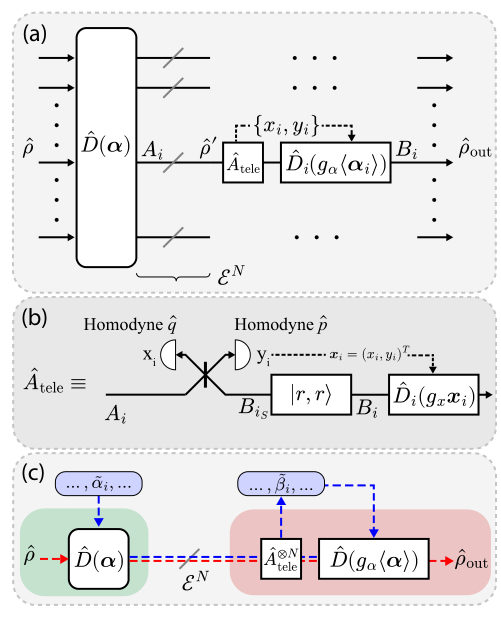 
Figure 1. Diagram showing the CMQC protocol (a) as well as the teleportation circuit ˆAtele (b). The N-mode state ˆρ Alice wishes to transmit is passed through the displacement operator ˆD(α), which encodes N classical symbols by displac- ing each arm in the phase space according to some coherent- state classical protocol. The displaced state is then trans- mitted over the N-mode channel EN to Bob. Bob teleports each mode of the displaced transmitted state ˆρ′ by mixing the incoming mode with one half of an EPR state of squeez- ing r on a balanced beamsplitter, then performing a dual homodyne measurement and correcting the output state via the measurement-dependent unitary operation...

📷 Fig 2

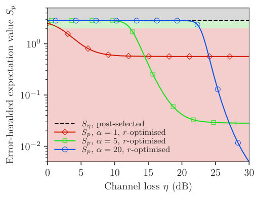 
Figure 2. CHSH criterion Sp as a function of channel loss η and classical signal strength α, evaluated on ρens. At each point, Sp is optimised over Bob’s EPR resource squeezing r. Post-selecting the correlations based on successful photon counts in principle permits the protocol to saturate the upper bound of Sp = 2 √

📷 Fig 3

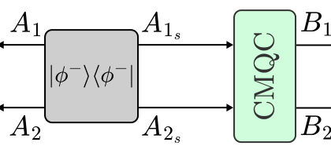 
Figure 3. Diagram showing the transmission of a dual-rail Bell state ϕ− ϕ− via the CMQC protocol. Each half of the dual- rail state is encoded in the modes A1, A2 and A1s, A2s respectively, where the logical states are given by |0⟩L1 = |1⟩A1 |0⟩A2, |1⟩L1 = |0⟩A1 |1⟩A2, |0⟩L2 = |1⟩A1s |0⟩A2s and |1⟩L2 = |0⟩A1s |1⟩A2s .The half corresponding to the logical mode L2 is sent by Alice to Bob, where it is teleported onto the modes B1, B2 such that the total output of the protocol becomes an approximate equivalent dual-rail Bell state over the modes A1, A2 and B1, B2.

📷 Fig 4

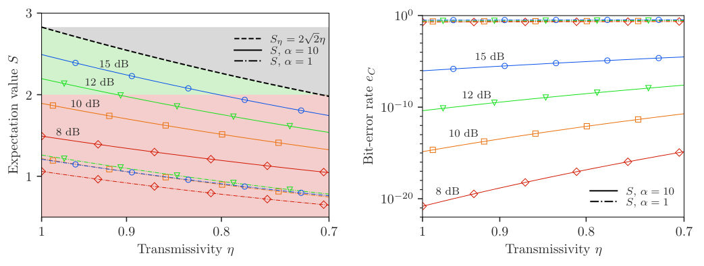 
Figure 4. (a) Numerical evaluation of the CHSH criterion S for an instance of the CMQC protocol where the resource state is the dual-rail Bell state ˆρ = ϕ− ϕ− and the channels are identical pure-loss channels of transmissivity η. S is plotted as a function of the loss η for the case where the classical signal strength α = 1 (dash-dotted lines) and α = 10 (solid lines). The squeezing r of the teleporter resource EPR state is varied between multiple values representing feasible experimental parameters (e.g. [45–50]. For sufficiently high signal strength, as teleporter squeezing increases S begins to approach the upper bound Sη = 2 √

📷 Fig 5

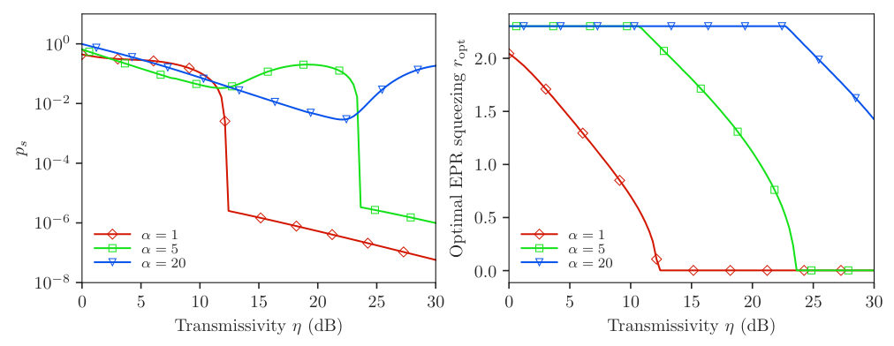 
Figure 5. Success probabilities (left) and optimal rates (right) for the postselected protocols shown in Fig. 2 of the main text. The rate at which Bob obtains the correct measurement results with which to evaluate S is given trivially by the probability of success ps. For each loss η, the postselected quantity Sp = S/ps is optimised over the two-mode squeezing of Bob’s EPR resource r between r = 0 and 20 dB (r ∈[0, 2.3]). The optimal strategy for protocols with a high classical signal α and so high classical SNR is the obvious one, i.e. r −→∞. This helps minimise the errors arising from imperfect teleportation so long as classical errors remain low. On the other hand, for low classical...

**Summary.** This paper details a Continuous-Variable Quantum Communication (CMQC) protocol enabling the simultaneous, low-error transmission of arbitrary quantum states and classical data. By encoding classical information via phase-space displacements and using continuous-variable teleportation, the scheme demonstrates high fidelity reconstruction. The results show that the protocol is robust, maintaining quantum correlations strong enough to violate the Bell inequality even under realistic channel losses.

**Why it may be interesting.** This work directly addresses quantum networking by proposing a robust method to multiplex classical data and quantum entanglement over one physical channel, which is crucial for future quantum internet architectures.

Detailed structure

**Main problem.** To develop a protocol for the simultaneous transmission of arbitrary quantum states and classical information over a single quantum channel without losing the integrity of either information type.

**Main result.** The protocol can achieve perfect reconstruction of both the classical signal and the quantum state in the limits of high classical signal strength and high squeezing, and it can violate the CHSH inequality under realistic conditions.

**Method.** The scheme uses continuous-variable quantum teleportation combined with classical phase-space displacements for encoding and subsequent inverse displacements for decoding.

**Model / system.** The system models optical quantum states transmitted through a lossy bosonic channel, utilizing continuous-variable teleportation and encoding classical data via coherent-state displacements.

**Key observables.** Symbol-Error Rate ($e_S$), CHSH expectation value ($S$), and the output state ($\hat{
ho}_{	ext{out}}$).

**Important parameters / regimes.** Transmissivity ($\eta$), squeezing parameter ($r$), and classical signal strength ($\alpha$).

**Assumptions / limitations.** The protocol assumes the ability to probabilistically infer the true classical displacement and relies on the channel being a pure-loss channel for some derivations.

**Figures summary.** Figures illustrate the protocol structure, the dependence of the CHSH value ($S$) on channel loss ($\eta$) for varying classical signal strength ($\alpha$) and squeezing ($r$), and the success probabilities ($p_s$) for post-selection.

**Paper structure.** The paper introduces the CMQC protocol, analyzes its effective channel map in various limits (high SNR, infinite squeezing), and rigorously tests its capability to maintain quantum correlations by calculating the CHSH value for transmitted Bell states.

Abstract

We present a protocol which allows for arbitrary optical quantum states to simultaneously carry and transmit classical data, without sacrificing the integrity of either the quantum or classical information. Our scheme encodes classical information via displacements in the phase space prior to transmission and retrieves each classical symbol via a Gaussian continuous-variable teleportation. The original quantum state is then restored by guessing the the original displacement and performing the appropriate inverse operation. In the limit of sufficiently high classical signal and high squeezing, we show that our scheme is capable of perfectly reconstructing both the input classical signal and the input quantum state without loss of coherence. An example is given in terms of the transmission of a dual-rail Bell state.

[↑ back to top](#top)

### [Magnetic Symmetries and the Structure of Correlation Functions in Quantum Field Theory](http://arxiv.org/abs/2606.03082v1)

**Authors:** Masaru Hongo, Kentaro Nishimura  
**Type:** theory · **Category:** strongly correlated electrons · **PDF:** <https://arxiv.org/pdf/2606.03082v1>  
**Analysis basis:** full PDF text, analyzed in chunks
**Topic relevance:** `Keldysh / 2PI / non-Gaussian methods` **1/5**

📷 Fig 1

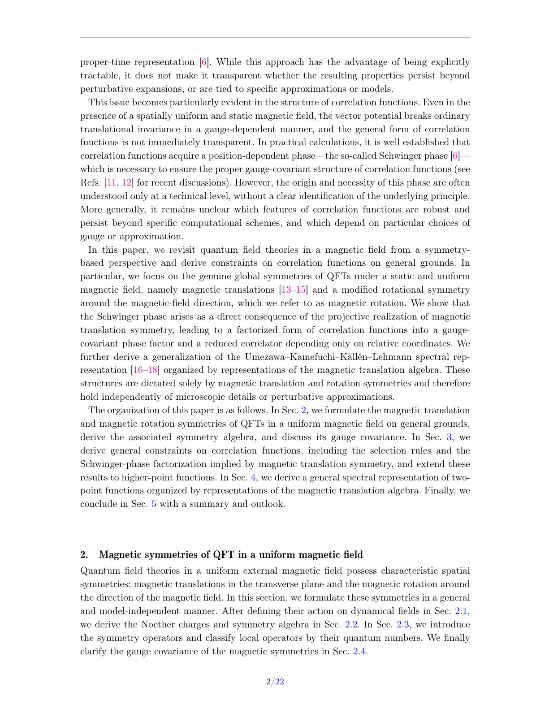 
Low-resolution page preview, page 2

📷 Fig 2

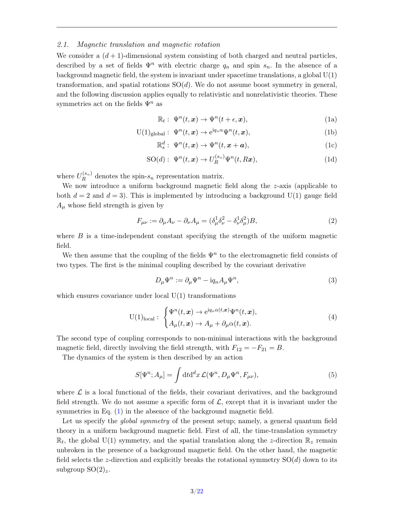 
Low-resolution page preview, page 3

📷 Fig 3

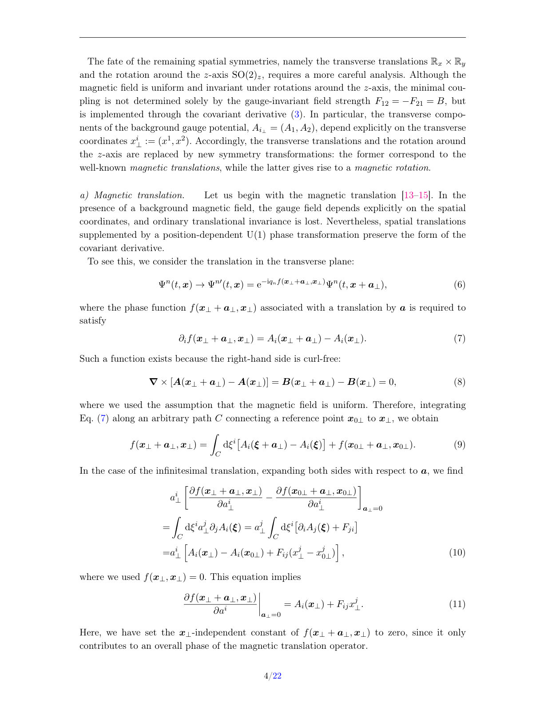 
Low-resolution page preview, page 4

📷 Fig 4

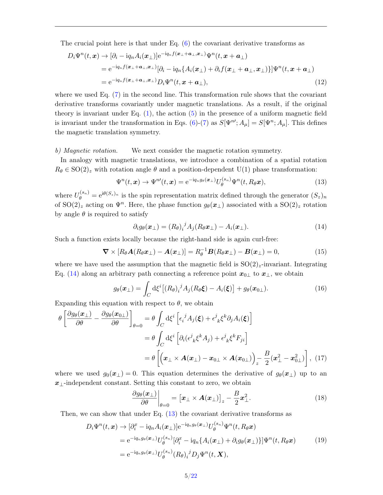 
Low-resolution page preview, page 5

📷 Fig 5

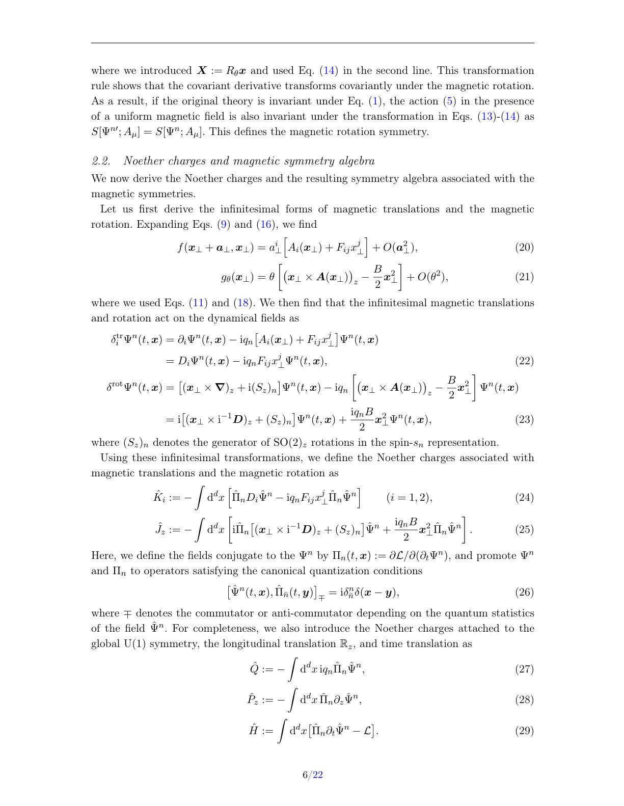 
Low-resolution page preview, page 6

**Summary.** This theoretical paper develops a model-independent framework to analyze quantum field theories in strong magnetic fields by exploiting magnetic translation and rotation symmetries. It shows that these symmetries force correlation functions to factorize and acquire a Schwinger phase. Ultimately, the authors derive a rigorous spectral representation for these correlation functions, applicable to various physical systems in the presence of a magnetic field.

**Why it may be interesting.** The derivation of spectral representations and correlation function factorizations based purely on symmetry principles provides a powerful, non-perturbative tool applicable to strongly correlated systems in external fields, which is highly relevant for understanding magnetotransport phenomena.

Detailed structure

**Main problem.** To investigate the general consequences of magnetic symmetries (translations and rotations) on correlation functions in Quantum Field Theory when subjected to a static, uniform external magnetic field.

**Main result.** The magnetic translation symmetry forces correlation functions to acquire a Schwinger phase and leads to a factorized form, allowing for a model-independent spectral representation based on the magnetic translation algebra.

**Method.** The analysis uses symmetry constraints derived from the projective structure of the magnetic translation algebra, avoiding specific models or perturbative expansions.

**Model / system.** The system is a Quantum Field Theory (QFT) describing charged particles coupled to a background U(1) gauge field with a constant magnetic field (B) along the z-axis.

**Key observables.** Two-point and N-point Wightman/Green's functions, the Schwinger phase, and the spectral representation of the reduced correlator.

**Important parameters / regimes.** The magnetic field strength (B), the charge of the particles (q), and the transverse coordinates ($x_\perp$).

**Assumptions / limitations.** The magnetic field is assumed to be static and uniform; the analysis assumes the magnetic symmetries are global symmetries acting on the dynamical fields.

**Paper structure.** The paper proceeds by first establishing the magnetic symmetries and their non-Abelian algebra (Chunk 2). It then applies these symmetries to constrain N-point correlation functions, deriving the Schwinger phase and factorization (Chunk 3). Finally, it derives the spectral representation of the reduced two-point function using the magnetic translation algebra, yielding basis-independent forms for both Landau and symmetric gauges (Chunks 4 & 5).

Abstract

Quantum field theories in the presence of a static and uniform external magnetic field possess two characteristic spatial symmetries: magnetic translations and magnetic rotation. We investigate general consequences of these symmetries on correlation functions from a model-independent perspective, without relying on specific models or perturbative expansions. The projective structure of magnetic translation symmetry constrains correlation functions of charged operators to acquire the Schwinger phase and leads to a factorized form into a gauge-covariant phase factor and a reduced correlator depending only on relative coordinates. We further derive the spectral representation of two-point functions in terms of representations of the magnetic translation algebra, in which the Landau- and symmetric-gauge descriptions arise as different choices of basis. Our results provide a unified symmetry-based framework for quantum field theories in external magnetic fields.

[↑ back to top](#top)

### [Phase transitions through excited-state level crossings and topological indicators: the case of the XXZ chain with staggered Ising interaction](http://arxiv.org/abs/2606.02845v1)

**Authors:** B. F. Márquez, K. Hallberg, A. A. Aligia  
**Type:** theory · **Category:** strongly correlated electrons · **PDF:** <https://arxiv.org/pdf/2606.02845v1>  
**Analysis basis:** full PDF text, analyzed in chunks
**Topic relevance:** `analog quantum simulation` **1/5**

📷 Fig 1

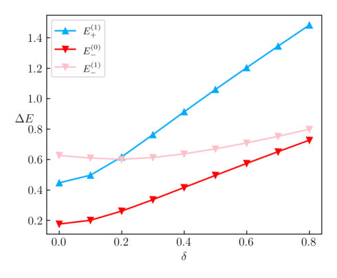 
FIG. 1. Excitation energies of low-lying states in the even (Sz tot, k′, F, P) = (0, 0, +, +) and odd (Sz tot, k, F, P) = (0, 0, −, −) sectors for L = 18 and ∆= 1.3, measured with respect to the ground state. The lowest odd-sector state E(0) − does not participate in the crossing associated with the N´eel- dimer transition. The finite-size pseudo-critical point is ex- tracted from the crossing between E(1) + and E(1) −.

📷 Fig 2

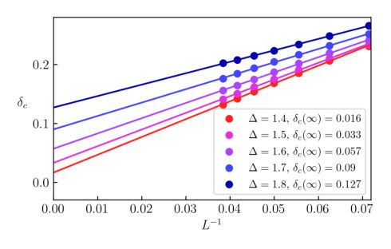 
FIG. 2. Finite size scaling of the pseudo-critical point ob- tained from the MCEL method for 1.4 ≤∆≤1.8. The extrapolated values δc(∞) were obtained by fitting Eq.(11) to linear order in L−1.

📷 Fig 3

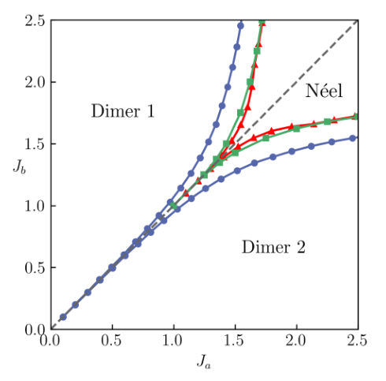 
FIG. 3. Phase diagram obtained from exact diagonaliza- tion. Red triangles denote the thermodynamic extrapolation of the level crossing E(1) + = E(1) −, while blue dots denote the extrapolated sign change of the generalized position operator. Green squares are the DMRG data of Ref. [21], provided by H. Nigam. We use Ja = ∆(1 + δ) and Jb = ∆(1 −δ) to com- pare directly with Ref. [21]. The agreement between the red and green points supports the identification of the selected crossing as the finite-size precursor of the N´eel-dimer critical line.

**Summary.** This work determines the phase diagram of a staggered XXZ spin chain by comparing two advanced diagnostic techniques: topological indicators and energy level crossings. The authors find that while both methods are powerful, the energy level crossing method provides a more reliable determination of the Néel-dimer transition boundary, especially when the system exhibits broken translational symmetry.

**Why it may be interesting.** The rigorous comparison of multiple theoretical diagnostics (topological vs. spectral) to pinpoint a quantum critical point in a complex, interacting 1D model is highly valuable for understanding the robustness of phase transition detection in strongly correlated systems.

Detailed structure

**Main problem.** The paper aims to determine the phase diagram, specifically the transition between Néel and dimerized phases, in the spin-1/2 XXZ chain subjected to a staggered Ising interaction.

**Main result.** The combination of two diagnostic methods—topological indicators and energy level crossings—provides a robust and efficient way to locate the phase boundary, with the level crossing method being particularly accurate despite the loss of translational symmetry.

**Method.** The authors employ exact diagonalization on finite systems, comparing results from topological indicators (based on generalized position operators) with those derived from the crossing of excited energy levels (MCEL), which is justified by conformal-field theory.

**Model / system.** The system is a spin-1/2 XXZ chain Hamiltonian incorporating a staggered Ising interaction ($\delta 
eq 0$) and a uniform transverse exchange. This alternating interaction doubles the unit cell and drives the competition between Néel and bond-dimerized orders.

**Key observables.** Topological indicators ($\alpha_s$, $\alpha_\uparrow$), the pseudo-critical point $\delta_c(L)$ extracted from energy level crossings ($E^{(1)}_+(L, \delta_c) = E^{(1)}_-(L, \delta_c)$), and the correlation length ($\xi$).

**Important parameters / regimes.** Anisotropy parameter ($\Delta$), staggering parameter ($\delta$), and system size ($L$). The analysis distinguishes between the homogeneous ($\delta=0$) and staggered ($\delta 
eq 0$) regimes.

**Assumptions / limitations.** The topological indicator method's accuracy is compromised when the energy gap is very small near the transition. The analysis relies on mapping the low-energy physics to the double sine-Gordon theory and using finite-size scaling extrapolation.

**Figures summary.** Figures illustrate the extraction of the pseudo-critical point from the crossing of first excited energy levels for finite systems, and show the finite-size scaling of this critical point across different anisotropy values.

**Paper structure.** The paper systematically compares two diagnostic tools—topological indicators and MCEL—to map the phase diagram. It analyzes the underlying physics using bosonization and relates the finite-size corrections to known critical theories (Ising universality class).

Abstract

We combine two ways of determining the phase diagram of the spin-$1/2$ XXZ chain with a staggered Ising interaction and uniform transverse exchange, based on exact diagonalization. The model realizes a competition between Néel order and bond-dimerized phases generated by the alternating Ising interaction. The simplest approach to determine the phase boundaries is to use topological indicators based on generalized position operators. We show that in general, the bosonized and numerical results for the topological indicators agree. The second is based on crossings of excited energy levels and justified by conformal-field theory. In spite of the partial loss of translational symmetry caused by the alternating Ising interaction, we find that the latter method provides an accurate determination of the boundary between Néel and dimerized phases. Instead, while the jumps of a topological indicator provide a qualitatively correct phase diagram, its accuracy is affected when the gap is very small (or the correlation length very large) at one side of the transition, as we show using field-theoretical arguments. The combination of both methods provides a more efficient way of calculating phase diagrams for correlated one-dimensional models than other widely used conventional approaches.

[↑ back to top](#top)

### [The bulk spectral gap is semi-decidable: a convergent family of certified upper bounds](http://arxiv.org/abs/2606.03836v1)

**Authors:** Xiangling Xu, Matthias Schötz, Jie Wang, Victor Magron, Igor Klep, Omar Fawzi, Marc-Olivier Renou  
**Type:** theory · **Category:** statistical mechanics · **PDF:** <https://arxiv.org/pdf/2606.03836v1>  
**Analysis basis:** full PDF text, analyzed in chunks
**Topic relevance:** `analog quantum simulation` **1/5**

📷 Fig 1

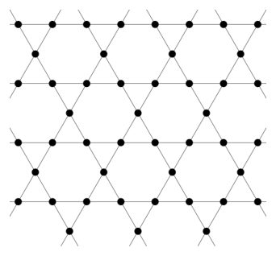 
Figure 1: A portion of the kagome lattice. From “Kagome- lattice-bw.svg” by WilliamSix (Wikimedia Commons), CC BY-SA 4.0.

📷 Fig 2

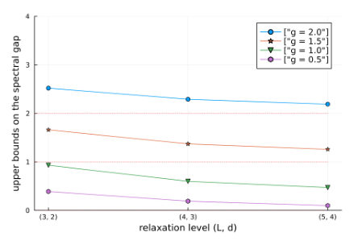 
Figure 2: Certified upper bounds for the transverse-field Ising chain with spin-flip symmetry imposed. Largest fea- sible γ for g = 0.5, 1.0, 1.5, 2.0 along the relaxation levels (L, d) = (n + 1, n), n = 2, 3, 4. As the relaxations are nested, these certified upper bounds decrease monotoni- cally in L and d. In the disordered phase (g = 1.5, 2.0) the bounds approach the known gap value 2(g −1) from above. At criticality (g = 1.0) the bound decays slowly, possibly reflecting divergent correlation length. For the ordered phase (g = 0.5), the sign-flip symmetry selects the symmetric mixed ground state whose local bulk gap vanishes, and our bounds approach to zero. Further calculations with...

📷 Fig 3

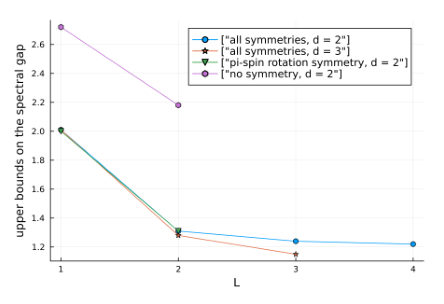 
Figure 3: Certified upper bounds for the spin- 1

**Summary.** This paper introduces a powerful, algorithmic method using semidefinite programming to compute certified upper bounds on the bulk spectral gap of quantum many-body systems. By showing that the gap is semi-decidable, the authors provide rigorous mathematical tools to analyze ground state properties in the thermodynamic limit. This is significant because it offers a systematic way to quantify spectral gaps, contrasting with previous undecidability results for finite-volume systems.

**Why it may be interesting.** This work provides a rigorous, algorithmic tool to study fundamental properties of quantum ground states in the thermodynamic limit, bridging quantum many-body theory with computational complexity.

Detailed structure

**Main problem.** Determining the bulk spectral gap of quantum many-body systems in the thermodynamic limit is a central, challenging problem.

**Main result.** The authors show that the bulk spectral gap is semi-decidable by constructing a complete family of certified upper bounds using semidefinite programming (SDP).

**Method.** The problem is reformulated into a sequence of necessary conditions tested via solving increasingly complex semidefinite programs (SDPs) that relax the non-linear gap definition.

**Model / system.** The analysis applies to general quantum many-body systems, using the spin-1/2 kagome lattice Heisenberg antiferromagnet and the transverse-field Ising model as key examples.

**Key observables.** Bulk spectral gap ($\gamma$), KMS ground state expectation values ($\omega(a)$), and the gap parameter $\gamma$.

**Important parameters / regimes.** The lattice structure (e.g., kagome, 1D chain), the coupling constants ($J$), and the computational resources/relaxation levels $(L, d)$.

**Assumptions / limitations.** The method relies on the equivalence between the existence of a KMS ground state and the feasibility of the SDP relaxation hierarchy; the bounds are certified upper bounds, not necessarily the true gap.

**Figures summary.** Figures illustrate the convergence of certified upper bounds for the TFIM chain and the kagome lattice, showing how increasing relaxation levels tighten the bounds.

**Paper structure.** The paper establishes the formal definition of the bulk spectral gap via KMS states, develops the SDP relaxation hierarchy to test necessary conditions, and applies this machinery to specific lattice models to demonstrate semi-decidability.

Abstract

Determining spectral gaps in the thermodynamic limit is a central challenge in quantum many-body physics. Existing rigorous methods are largely limited to special settings, while variational numerical approaches typically provide estimates rather than certified bounds. Here we introduce a complete family of certified upper bounds on the bulk spectral gap of quantum many-body systems. These upper bounds are obtained by solving a series of semidefinite programs and they become arbitrarily tight at the cost of more computational resources. This shows that the bulk spectral gap is semi-decidable, in contrast to undecidability results for alternative notions of spectral gap based on sequences of finite systems with prescribed boundary conditions. As a proof of principle, we apply our algorithm to the spin-$\frac{1}{2}$ kagome lattice Heisenberg antiferromagnet and obtain, to our knowledge, the first nontrivial certified upper bounds on its bulk spectral gap.

[↑ back to top](#top)

## Other papers (15)

*Papers from primary archives without highlighted authors or any topic match. Click to expand.*

Show other papers

### [A Voxel-Based Quantum Computing Method (VBQC) for Solid Mechanics Problem](http://arxiv.org/abs/2606.03515v1)

**Authors:** Feng Wu, Yuxiang Yang, Li Zhu, Chen Li, Yansong Guo, Xu Guo  
**Type:** theory · **Category:** quantum information and computing · **PDF:** <https://arxiv.org/pdf/2606.03515v1>  
**Analysis basis:** full PDF text, analyzed in chunks

📷 Fig 1

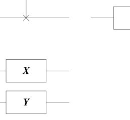 
Figure 1: Quantum circuits of the commonly used two-qubit gates: (a) swap gate; (b) controlled-U gate; (c) zero-controlled-U gate; (d) X ⊗Y gate; (e) two-qubit multiplexer.

📷 Fig 2

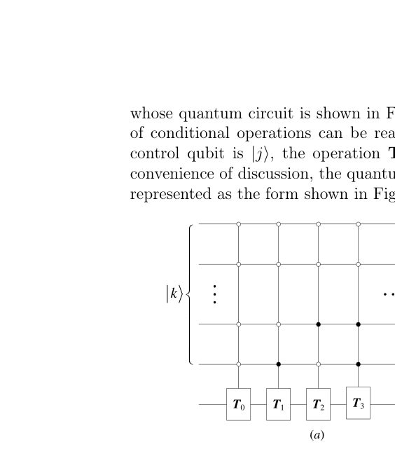 
Figure 2: Quantum circuits of the quantum multiplexer: (a) Detailed circuit; (b) Simplified circuit.

📷 Fig 3

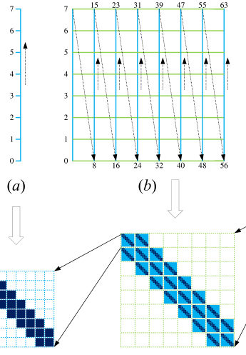 
Figure 3: The fractal property of the matrices generated by the voxel grid: (a) Schematic of a 1-dimensional voxel grid with Ny = 8 nodes; (b) Schematic of a 2-dimensional voxel grid with Nx = 8, Ny = 8, and a total of 64 nodes; (c) Schematic of a 3-dimensional voxel grid with Nx = 8, Ny = 8, Nz = 8, and a total of 512 nodes; (d) Stiffness matrix generated by the 1-dimensional voxel grid in (a), where dark blue regions represent d-dimensional submatrices and white regions are zero; (e) Stiffness matrix generated by the 2-dimensional voxel grid in (b), where light blue regions represent submatrices corresponding to the 1- dimensional voxel grid and white regions are zero; (f) Stiffness...

📷 Fig 4

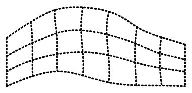 
Figure 4: Voxel grids for irregular domains: (a) Homeomorphic voxel grid; (b) Regular voxel grid.

📷 Fig 5

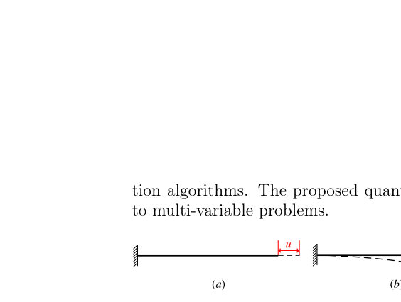 
Figure 5: Deformation of a one-dimensional rod: (a) Single-bar tension problem, single- variable; (b) Pure bending problem, two-variable; (c) Combined tension and bending problem, three-variable.

**Summary.** This paper introduces the Voxel-Based Quantum Computing Method (VBQC) to overcome the challenge of simulating solid mechanics Hamiltonians on irregular grids. It achieves this by exploiting the fractal structure of voxel-discretized matrices, leading to a specialized KCQ decomposition. The method is successfully demonstrated by calculating natural vibration frequencies and mode shapes for 1D, 2D, and 3D structures with high accuracy.

**Why it may be interesting.** This work provides a concrete, structured quantum algorithm for a major class of physical problems (structural dynamics) that traditionally rely on complex numerical methods, demonstrating the potential of quantum simulation for continuum mechanics.

Detailed structure

**Main problem.** The primary challenge is efficiently simulating the system matrix (Hamiltonian) for solid mechanics problems, which typically involve irregular spatial grids unsuitable for direct quantum simulation.

**Main result.** The authors propose the Voxel-Based Quantum Computing Method (VBQC), which successfully simulates the time evolution operator $e^{iAt}$ for 1D, 2D, and 3D solid mechanics problems with high accuracy.

**Method.** The method involves discretizing the domain using voxel grids to induce a tridiagonal fractal property in the system matrix. This allows for a decomposition (KCQ decomposition) which is then implemented using quantum circuits involving the Quantum Fourier Transform and quantum multiplexers.

**Model / system.** The physical system is solid mechanics (e.g., beams, plates) whose dynamics are governed by a Hamiltonian derived from the system matrix $A$. The method handles complex geometries by using voxel grids and virtual nodes to maintain a structure suitable for quantum circuit encoding.

**Key observables.** Natural vibration frequencies ($\omega_i$) and corresponding mode shapes ($\mathbf{x}_i$), as well as the time evolution operator $e^{iAt}$ itself.

**Important parameters / regimes.** The complexity scales polynomially with the number of nodes/variables ($n_x + n_y + d$), and the accuracy is verified by comparing results across different time steps ($\Delta t$).

**Assumptions / limitations.** The method assumes that the quantum multiplexer can be implemented with polynomial complexity, and that the basic matrix elements derived from the fractal structure can be mapped onto fundamental quantum gates.

**Figures summary.** Figures illustrate the fractal structure of matrices for 1D, 2D, and 3D voxel grids, and show quantum circuits implementing the matrix exponential for various dimensions and variable counts.

**Paper structure.** The paper first establishes the problem (solid mechanics on irregular grids) and proposes the VBQC. It details the mathematical foundation through the tridiagonal fractal property and the KCQ decomposition. Subsequently, it develops the quantum circuits for $e^{iAt}$ for increasing dimensions (1D, 2D, 3D) and finally verifies the method by comparing computed natural frequencies and mode shapes against classical reference solutions.

Abstract

Quantum computing presents a promising method to overcome the efficiency and memory constraints in large-scale mechanical problems, with numerous successful applications demonstrated in fluid mechanics. However, solid mechanics problems usually require irregular grids for spatial discretization, due to the Lagrange formulations and complex boundaries, which makes the quantum simulation of the system matrix, e.g., the mass or stiffness matrix which is often referred to as the Hamiltonian in quantum computing, difficult to be effectively conducted. This study proposes a voxel-based quantum computing method (VBQC) for the quantum simulation of Hamiltonians in solid mechanics. VBQC applies voxel grids to discretize the spatial domain, thereby enabling the system matrix to exhibit the tridiagonal fractal property. Based on this property, the system matrix can be decomposed into three groups of fundamental matrices, $\mathbf{k}_{n}$, $\mathbf{c}_{n}$, and $\mathbf{q}_{n}$. This decomposition process is referred to as the KCQ decomposition. By integrating the KCQ decomposition with the quantum Fourier transform and the quantum multiplexer, VBQC enables efficient quantum simulation of Hamiltonians in solid mechanics. Three specific solid problems with different dimensions and numbers of variables are applied to preliminarily verify the correctness of the proposed VBQC for solid mechanics problems.

[↑ back to top](#top)

### [An Asymptotic Theory of Chain-of-Thought in In-Context Learning](http://arxiv.org/abs/2606.03217v1)

**Authors:** Kaito Takanami, Cengiz Pehlevan  
**Type:** theory · **Category:** disordered systems and neural networks · **PDF:** <https://arxiv.org/pdf/2606.03217v1>  
**Analysis basis:** full PDF text, analyzed in chunks

📷 Fig 1

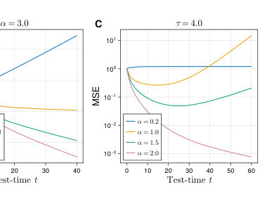 
Figure 1: Phase diagram of the test-time scaling law and representative error dynamics. (A) Heatmap of theoretical prediction of the generalization error (MSE) at a fixed test-time depth t = 80. The diagram is divided into four regimes: (I) the overthinking regime, τ &lt; τc(α, σ2), where long test- time CoT amplifies the error; (II) the polynomial-decay regime, α &gt; 1 and τ = τc(α, σ2), where the error decreases only polynomially; (III) the saturation regime, 0 &lt; α &lt; 1 and τ &gt; τc(α, σ2), where the dynamics is stable but the error converges to a nonzero limit; and (IV) the exponential-decay regime, α &gt; 1 and τ &gt; τc(α, σ2), where the error decays exponentially to zero. (B,C) Theoretical...

📷 Fig 2

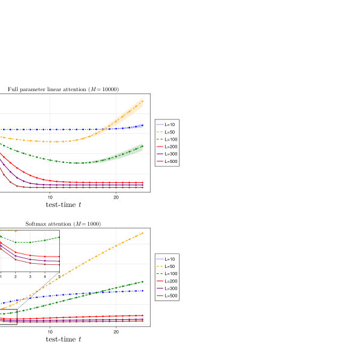 
Figure 2: CoT experiments in the fully learned linear attention and softmax attention models. (A, C) Phase diagrams of the test-time generalization error at t = 20 as a function of the context length L and the number of training tasks M, for (A) the fully learned linear attention model and (C) the softmax attention model, respectively. (B, D) Test-time generalization error as a function of reasoning depth in the (B) fully learned linear attention model and (D) the softmax attention model, respectively. The solid curves correspond to an exponential decay regime, the dashed curves to an overthinking regime, and the dotted curves to a saturation regime. Parameters: (A-D) λ = 10−5, σ2 = 0, and...

📷 Fig 3

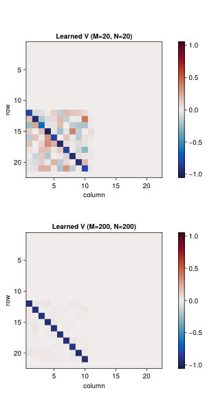 
Figure 3: Heatmaps of the pretrained full-parameter matrices W and V. Parameters: (A,B) λ = 10−3, σ = 0.1 (A) M = N = 20, (B) M = N = 200.

📷 Fig 4

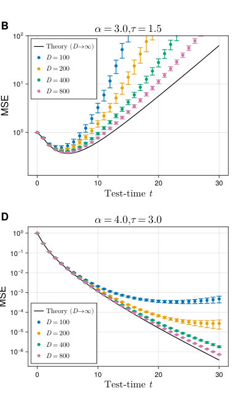 
Figure 4: Comparison between the theoretical prediction and numerical experiments. The solid lines show the theoretical prediction in the D →∞limit, while scatter points show numerical results at finite D. Parameters: (A-D) λ = 10−5, σ = 0.01. Error bars represent the standard error of the mean over 5 trials per point.

**Summary.** This paper provides a deep theoretical understanding of how the depth of Chain-of-Thought reasoning affects model generalization in In-Context Learning. Using random matrix theory on a simplified linear model, the authors derive an exact formula that predicts four distinct regimes of performance scaling. This work clarifies that the benefit of deep reasoning is highly dependent on the quality of pretraining and the amount of in-context examples provided.

**Why it may be interesting.** The rigorous application of random matrix theory and asymptotic analysis to model the generalization dynamics of LLMs provides a powerful theoretical bridge between statistical physics/random matrix theory and modern deep learning theory.

Detailed structure

**Main problem.** The paper addresses the poorly understood scaling behavior of generalization error when using Chain-of-Thought (CoT) reasoning within In-Context Learning (ICL) for large language models.

**Main result.** It derives an exact asymptotic formula characterizing four distinct regimes of test-time error dynamics: exponential improvement, polynomial decay, saturation, and error amplification (overthinking).

**Method.** The analysis employs tools from random matrix theory under high-dimensional asymptotics, modeling the CoT process as an iterative refinement of a weight-parameter estimate in a solvable linear regression model.

**Model / system.** The system is a theoretically solvable model of CoT applied to in-context weight prediction in linear regression, analyzed via an attention mechanism structure. The analysis tracks the error dynamics as an iterative update $\hat{w}_{t+1} := 	ext{Read}(	ext{Atten}(P_t; 	heta^*))$.

**Key observables.** Generalization error (MSE) as a function of reasoning depth ($t$), pretraining data amount, and context length ($\alpha$).

**Important parameters / regimes.** Reasoning depth ($t$), context length ($\alpha$), task diversity ($	au$), and noise variance ($\sigma^2$).

**Assumptions / limitations.** The analysis relies on a theoretically tractable model (linear regression) and the high-dimensional asymptotic limit ($D, M, L 	o \infty$).

**Figures summary.** The figures summarize a phase diagram showing the four distinct regimes (exponential improvement, polynomial decay, saturation, overthinking) based on the relative values of task diversity ($	au$) versus a critical threshold ($	au_c$).

**Paper structure.** The paper builds from establishing the iterative error dynamics using random matrix theory, deriving the asymptotic scaling law, identifying the phase transition points, and finally characterizing the optimal stopping depth ($t^*$) in the overthinking regime.

Abstract

Chain-of-thought (CoT) reasoning has become a widely used mechanism for eliciting multi-step reasoning in large language models by generating intermediate reasoning steps at inference time. Yet the scaling behavior of generalization with CoT depth remains poorly understood. To address this question, we study a theoretically solvable model of CoT for in-context weight prediction in linear regression, where test-time reasoning is represented as an iterative refinement of the weight-parameter estimate. Using tools from random matrix theory under high-dimensional asymptotics, we derive an exact formula for the generalization error as a function of reasoning depth, pretraining data amount, and context length. Our analysis reveals a sharp phase transition separating exponential and polynomial improvement, saturation, and overthinking, and characterizes how the optimal reasoning depth scales. We further show that deeper reasoning is most effective with sufficiently rich pretraining and in-context information, whereas limited pretraining or context makes longer reasoning prone to error amplification or saturation. We also validate these predictions through experiments on fully learned linear attention and softmax attention models. Our results provide a unified theoretical account of how test-time CoT depth affects generalization.

[↑ back to top](#top)

### [An efficient quantum Hadamard product algorithm for functions](http://arxiv.org/abs/2606.03612v1)

**Authors:** Xinchi Huang, Hirofumi Nishi, Tomofumi Zushi, Yu-ichiro Matsushita  
**Type:** theory · **Category:** quantum information and computing · **PDF:** <https://arxiv.org/pdf/2606.03612v1>  
**Analysis basis:** full PDF text, analyzed in chunks

📷 Fig 1

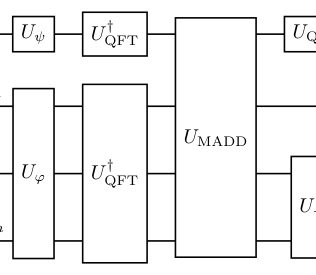 
Figure 2: A novel quantum circuit for the QHP problem. Here, M = 2m is an approximation parameter which is determined in advance. UMADD is the quantum modular adder [5, Fig. 9] and U+1 is the quantum incrementer [6].

📷 Fig 2

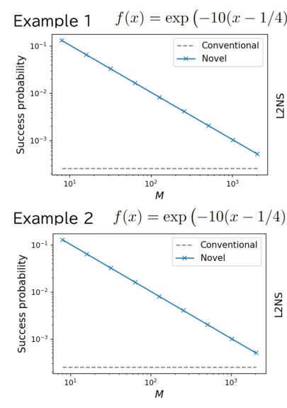 
Figure 3: Success probabilities and L2NS errors for Examples 1 and 2 regarding the approximation parameter M. For Examples 1 and 2, the gray reference lines denote the orders O(1/M 3/2) and O(1/M 7/2), respectively.

📷 Fig 3

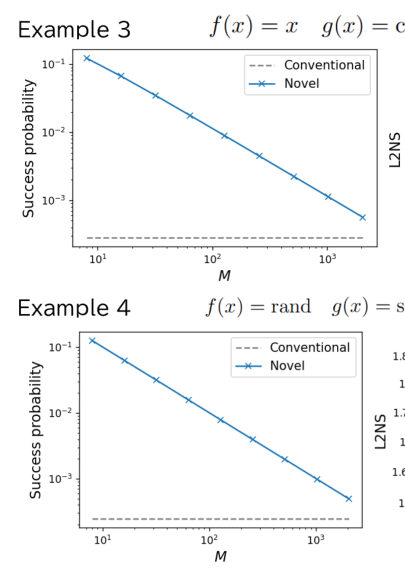 
Figure 4: Success probabilities and L2NS errors for Examples 3 and 4 regarding the approximation parameter M. For Example 3, the gray reference line denotes the orders O(1/M 1/2).

📷 Fig 4

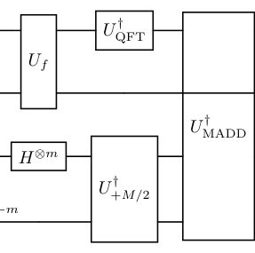 
Figure 6: A novel quantum circuit for calculating the partial integral for two functions. Here, M ≤Nx is a given approximation parameter and m = log2 M. The last nt + nx qubits are post- selected to be |0⟩.

📷 Fig 5

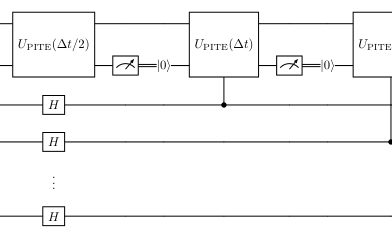 
Figure 9: Quantum circuit for preparing the propagator by solving the MDE.

**Summary.** This paper presents an efficient quantum algorithm for computing the Hadamard product state of two quantum states derived from functions. By transforming the problem into the Fourier domain, the authors circumvent the exponential scaling issues of conventional methods. This results in a quantum circuit whose complexity depends on the function's smoothness rather than the grid size, enabling simulations of large systems with high efficiency.

**Why it may be interesting.** The development of algorithms that decouple computational complexity from the system size ($N$) by exploiting spectral properties (Fourier space) is a major theme in quantum computation, particularly for simulating physical systems.

Detailed structure

**Main problem.** The paper addresses the challenge of efficiently preparing the quantum state corresponding to the Hadamard product of two quantum states, $|\psi
angle|\varphi
angle$, whose amplitudes are derived from discretized functions.

**Main result.** The authors propose a Fourier-space based algorithm that achieves quantum complexity independent of the grid size $N$ if the underlying functions are sufficiently smooth or have finitely many non-zero Fourier coefficients.

**Method.** The method transforms the non-unitary Hadamard product into a convolution structure in the Fourier basis, allowing the use of quantum modular adders and QFTs to compute the state efficiently.

**Model / system.** The model involves quantum states $|\psi
angle_n$ and $|\varphi
angle_n$ whose amplitudes encode discretized functions $f$ and $g$ on a uniform grid of size $N$. Applications extend to calculating partial inner products and solving PDEs with periodic boundary conditions.

**Key observables.** Success probability ($	ilde{P}_{	ext{suc}}$), $L_2$ Error ($	ext{Err}_{L2NS}$), and quantum query complexity.

**Important parameters / regimes.** Grid number $N$, approximation parameter $M$, and the smoothness parameter $s$ related to the function's Fourier regularity.

**Assumptions / limitations.** The analysis assumes the input functions are piecewise continuous and periodic, allowing the use of Fourier representations and approximations.

**Figures summary.** Figures illustrate the conventional circuit (using CNOTs and post-selection) versus the novel Fourier-space circuit involving $	ilde{QFT}$, $	ext{UMADD}$, $	ext{QFT}$, and $	ext{U}+1$. Other figures show error and success probability decay rates.

**Paper structure.** The paper first establishes the limitation of conventional methods for QHP. It then introduces the Fourier-space approach, detailing the multi-step quantum circuit involving QFTs and modular addition. Finally, it applies this technique to related problems like the partial inner product and solving differential equations.

Abstract

We propose an efficient quantum algorithm for preparing the Hadamard product state of two quantum states whose amplitudes are generated by functions on a uniform grid with grid number $N$. As the Hadamard product operation is non-unitary, the conventional approach generally suffer from a success probability that scales as $O(1/N)$, leading to an $O(\sqrt{N})$ query complexity even with quantum amplitude amplification. Our method exploits the Fourier-space representation of the input functions, where the Hadamard product can be treated through a convolution structure and approximated using localized Fourier coefficients. The resulting quantum circuit has complexity governed by the Fourier regularity of the underlying functions rather than directly by the grid number. In particular, when either of the input functions has finitely many non-zero Fourier coefficients, the algorithm prepares the exact quantum Hadamard product state under $N$-independent query complexity. Moreover, we also propose a novel quantum circuit for the partial inner product as one of its applications.

[↑ back to top](#top)

### [Bipolar-doped superconducting infinite-layer cuprates](http://arxiv.org/abs/2606.03981v1)

**Authors:** Fengzhe Wang, Yueying Li, Heng Wang, Lizhi Xu, Xianfeng Wu, Lixiang Xu, Guangdi Zhou, Jin-Feng Jia, Peng Li, Haoliang Huang, Qi-Kun Xue, Zhuoyu Chen  
**Type:** experiment · **Category:** strongly correlated electrons · **PDF:** <https://arxiv.org/pdf/2606.03981v1>  
**Analysis basis:** full PDF text, analyzed in chunks

📷 Fig 1

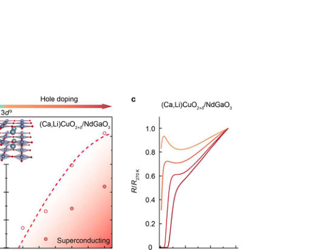 
Figure 1 | Phase diagram of bipolar-doped infinite-layer cuprates. a, Normalized resistance- temperature curves (R–T) of representative electron-doped (Sr,Eu)CuO2 samples with nominal Eu doping levels of 9%, 11%, 14% and 16%. b, the bipolar-doped phase diagram of infinite-layer cuprates. The inset shows the schematic crystal structure of infinite layer phase. Open and closed circles mark the Tconset and Tc50%, which are defined as the temperatures at which the resistance deviated from the linear-fitted normal state resistance by 0.1% and 50%, respectively. c, The

📷 Fig 2

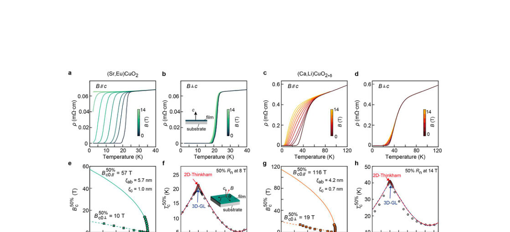 
Figure 2 | Quasi-two-dimensional superconductivity in both electron- and hole-doped infinite- layer cuprates. a,b, R–T curves of an electron-doped Sr0.89Eu0.11CuO2 sample measured under out- of-plane (a) and in-plane (b) magnetic fields up to 14 T, revealing strong anisotropy. c,d, R–T curves for a hole-doped sample (grown under 0.06 mbar O3 partial pressure) under out-of-plane (c) and in- plane (d) fields. e, Temperature dependence of the upper critical field Bc50% for the electron-doped sample, extracted at 50% of the normal-state resistance Rn, in-plane (solid circles) and out-of-plane (solid squares). The solid and dashed lines represent a fit to the 2D Ginzburg–Landau (GL) formula for...

📷 Fig 3

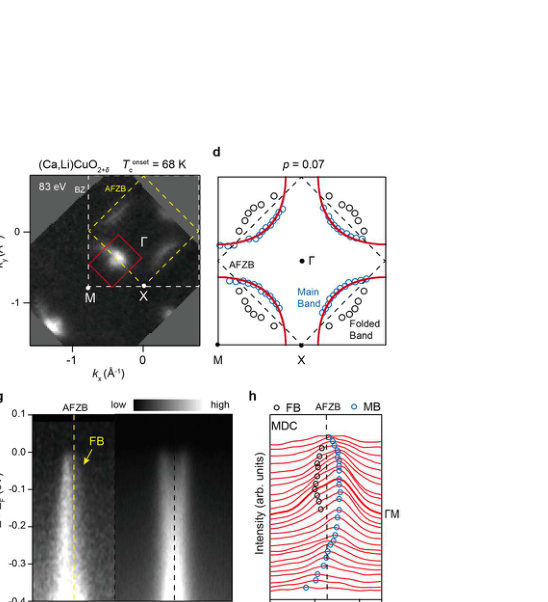 
Figure 3 | Electronic structure of electron- and hole-doped infinite-layer cuprate films. a,c,

📷 Fig 4

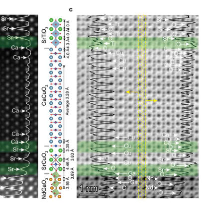 
Figure 4 | Structural characterization of infinite-layer cuprates. a, X-ray diffraction θ–2θ scans of a c-axis-oriented (Sr,Eu)CuO2 film grown on GdScO3 substrate (top, blue) and a (Ca,Li)CuO2+δ film grown on NdGaO3 substrate (bottom, red). Only (00l) Bragg reflections are observed, confirming phase-pure epitaxial growth with [00l] orientation. b, Cross-sectional high-angle annular dark-field (HAADF) scanning transmission electron microscopy (STEM) image of a NdGaO3/3- unit-cell (UC) SrCuO2/13-UC CaCuO3 stack capped with a SrTiO3 capping layer, viewed along the [100]pc zone axis. Horizontal, green-shaded bands mark the heterointerfaces; vertical yellow dashed boxes indicate atomic columns...

**Summary.** This work reports on the synthesis and characterization of bipolar-doped infinite-layer cuprates, providing an unprecedented platform to study high-temperature superconductivity. By combining ARPES and transport measurements, the authors demonstrate the intrinsic coexistence of antiferromagnetic order and superconductivity in both electron- and hole-doped regimes. This research significantly advances the understanding of the magnetic mechanisms underlying cuprate superconductivity.

**Why it may be interesting.** The definitive platform established by this work—allowing the study of both electron and hole doping regimes on the same material type—provides crucial, clean data for theorists attempting to build a unified theory of high-Tc superconductivity.

Detailed structure

**Main problem.** The primary challenge is isolating the intrinsic superconducting physics of the $	ext{CuO}_2$ plane from the complexities introduced by charge-reservoir layers in high-temperature cuprate superconductors.

**Main result.** The authors successfully realized bipolar doping in infinite-layer cuprates, demonstrating that antiferromagnetic band folding coexists with high-temperature superconductivity ($T_{c	ext{onset}} > 60 	ext{ K}$) at a specific hole doping level ($p=0.07$).

**Method.** The study employed a combination of advanced experimental techniques, including Angle-Resolved Photoemission Spectroscopy (ARPES), transport measurements (R-T curves), and Scanning Transmission Electron Microscopy (STEM) on single-crystalline thin films.

**Model / system.** The research focuses on infinite-layer cuprates, specifically electron-doped $(	ext{Sr},	ext{Eu})	ext{CuO}_2$ and hole-doped $(	ext{Ca},	ext{Li})	ext{CuO}_{2+\delta}$ single-crystalline thin films, which serve as a platform to study the interplay between magnetism and superconductivity.

**Key observables.** Electrical resistance anisotropy, superconducting transition temperature ($T_{c	ext{onset}}$), Fermi surface topology (single surface), and the presence/nature of antiferromagnetic (AFM) band folding.

**Important parameters / regimes.** Hole doping level ($p=0.07$), electron doping level ($	ext{Eu} \approx 0.11$), and the superconducting critical temperature ($T_c$).

**Assumptions / limitations.** The analysis assumes that the observed phenomena are intrinsic to the $	ext{CuO}_2$ plane, and the superconducting response can be modeled using 2D Ginzburg-Landau theory.

**Figures summary.** Figures illustrate the bipolar-doped phase diagram via R-T curves, demonstrate strong 2D anisotropy in superconductivity, and use ARPES to map the Fermi surface showing coexisting AFM folding and superconductivity.

**Paper structure.** The paper systematically presents the realization of bipolar doping, characterizes the electronic structure using ARPES to map the phase diagram, and uses transport/structural measurements to confirm the quasi-2D nature and the coexistence of magnetic order and superconductivity.

Abstract

Distilling the intrinsic physics of the superconducting CuO2 plane from the complexities of charge-reservoir layers is a defining challenge in high-temperature superconductivity. While superconducting electron-doped infinite-layer cuprates have been synthesized, controllable and uniform hole doping has long remained elusive despite exploratory attempts, limiting spectroscopic insights. Here, we realize bipolar doping across infinite-layer (Sr,Eu)CuO2 and (Ca,Li)CuO2+δ single-crystalline thin films, mapping the electronic phase diagram. Both electron- and hole-doped films show pronounced electrical resistance anisotropy, indicating the quasi-two-dimensional nature of the CuO2 planes. Angle-resolved photoemission spectroscopy across electron- and hole-doped regimes reveals persistent antiferromagnetic band folding coexisting with superconductivity. Remarkably, at a hole doping ~0.07 determined by Luttinger volume, the antiferromagnetic folding emerges from Fermi arcs within the film's single Fermi surface, with the onset superconducting transition temperature exceeding 60 K. These findings redefine the interplay between magnetic order and superconductivity and establish a definitive platform to investigate the intrinsic mechanism of high-temperature superconducting cuprates.

[↑ back to top](#top)

### [Full Extractors for Logical Processing in Hypergraph Product Codes](http://arxiv.org/abs/2606.03507v1)

**Authors:** John Blue, Zhiyang He, Hengyun Zhou, Isaac L. Chuang  
**Type:** theory · **Category:** quantum information and computing · **PDF:** <https://arxiv.org/pdf/2606.03507v1>  
**Analysis basis:** full PDF text, analyzed in chunks

📷 Fig 1

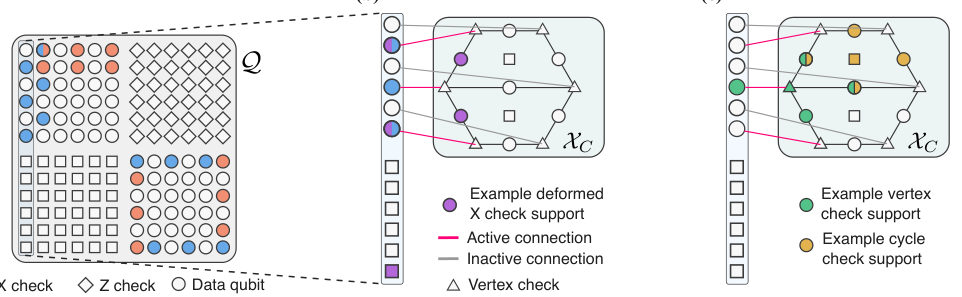 
FIG. 1. (a) An HGP code Q with example logical X and Z operators highlighted. Note that the layout of the HGP code is purely for visualization purposes and does not correspond to a physical layout. The cyclic HGP code depicted uses the check matrix H which is the binary circulant matrix corresponding to h(x) = 1 + x2 and is a [[72, 4, 3]] code. (b) A single-column extractor XC used to measure logical Z operators supported on the first column of the left block. The activated connections between the extractor and the first column used to measure the shown logical Z operator are highlighted in pink, and the inactive connections are shown in light gray. (c) Example supports of a vertex check...

📷 Fig 2

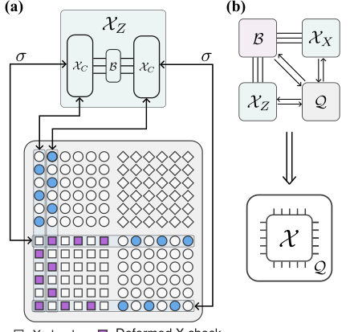 
FIG. 2. (a) A Z extractor (XZ), capable of measuring any logical Z operator on the base code Q. The Z extractor is formed by connecting k single-column extractors with bridges. Lines between the extractor and base code show how they are connected, e.g. the vertex checks of the first column of XZ are connected to the first column of the left block and the first row of the right block of Q. The connections between XZ and the rows of the right block are governed by the permutation σ. (b) Connecting an X extractor (XX) and a Z extractor (XZ) with a bridge B to form a full extractor.

📷 Fig 3

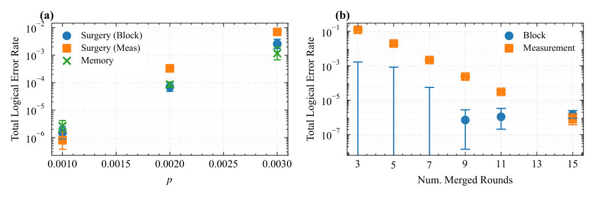 
FIG. 3. Logical error rates of the [[882, 50, 10]] HGP code and extractor system used to measure a randomly sampled element of {I, X, Y, Z}⊗50. For the extractor system, “Meas” refers to the error rate of the logical measurement, and “Block” refers to the logical error rate of the other 49 logical qubits during the experiment. Note that the shown logical error rates are not normalized per round or per logical qubit. Error bars indicate 95% Agresti-Coull confidence intervals. (a) A comparison of the logical error rates for the base HGP code, and the HGP+extractor system. For the base code, the y axis shows the logical error of a Z-basis memory experiment with sixteen rounds of syndrome...

📷 Fig 4

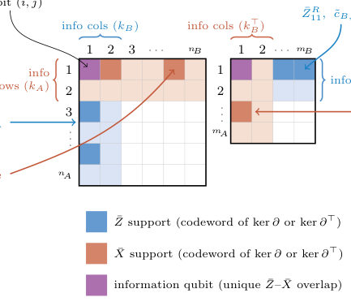 
FIG. 4. Canonical basis of logical operators for HGP(∂A, ∂B), illustrated on a small representative instance (nA=nB=6, mA=mB=4). Each logical qubit (i, j) is associated with an information qubit at which its paired ¯Z and ¯ X operators intersect. On the left block, ¯ZL ij occupies information column j (sparse, along the codeword cA,i ∈ker ∂A) while ¯ XL ij occupies information row i (sparse, along cB,j ∈ker ∂B). On the right block the roles of rows and columns are exchanged, with codewords drawn from the transpose codes ker ∂⊤ A and ker ∂⊤ B. Light shading indicates the information rows/columns; the unique ¯Z– ¯ X intersection (violet) is the information qubit.

📷 Fig 5

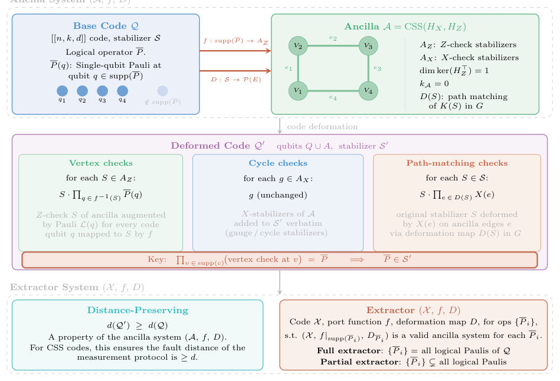 
FIG. 5. Structure of code surgery and its constituent definitions (Appendix E). An ancilla system (A, f, D) consists of a CSS ancilla code A (drawn as a graph: vertices = AZ, edges = ancilla qubits, cycles = AX) together with a port function f : supp(P) →AZ satisfying im(f) ⊂supp(c), where c is the unique nonzero element of ker H⊤ Z , and a deformation map D : S →P(E) assigning each base-code stabilizer a path matching of K(S) in the ancilla graph G. Logical measurement is performed by measuring the stabilizers of the deformed code Q′ whose checks can be classified into three groups: vertex checks (each Z-check of A augmented by the Paulis L(q) for code qubits mapped to it by f); cycle...

**Summary.** This paper introduces 'full extractors' designed to enable arbitrary logical Pauli measurements on Hypergraph Product (HGP) quantum codes. By assembling partial extractors, the authors demonstrate a method that maintains high space efficiency and low, fixed connectivity, crucial for scaling fault-tolerant quantum computers. The results show that this architecture achieves low logical error rates comparable to the base code without the overhead penalties of prior methods.

**Why it may be interesting.** This work provides concrete, resource-aware architectural blueprints for implementing complex logical operations on near-term quantum hardware by optimizing the overhead associated with fault-tolerance.

Detailed structure

**Main problem.** The paper addresses the need for practical, low-overhead logical processing methods for Quantum Low-Density Parity-Check (QLDPC) codes required for large-scale fault-tolerant quantum computation.

**Main result.** They construct 'full extractors' for Hypergraph Product (HGP) codes that achieve space efficiencies of 50-80% of the base code while supporting fixed, low-degree connectivity and avoiding compilation overhead.

**Method.** The methodology involves assembling full extractors by connecting multiple verifiable partial extractors, utilizing graph theory and algebraic structures derived from the HGP code's homology/cohomology groups.

**Model / system.** The system analyzed is the Hypergraph Product (HGP) code, a type of CSS QLDPC code. The core components are the base HGP code, the X-basis extractor, the Z-basis extractor, and the resulting full extractor structure.

**Key observables.** Logical measurement error rates (e.g., $\approx 10^{-6}$ at $p=0.1\%$), space overhead (50-80% of base code), and maximum qubit degree (ten).

**Important parameters / regimes.** Physical error rate ($p$), code distance ($d=10$), and the number of merged rounds ($N_R$).

**Assumptions / limitations.** The analysis assumes the existence of distance-preserving single-column extractors and relies on the ability to assemble these partial extractors into a full system.

**Figures summary.** Figures illustrate the structure of HGP codes, the construction of Z and X extractors, and the final full extractor connecting these components. Figure 9 compares logical measurement error rates between different decoding schemes.

**Paper structure.** The paper progresses by first establishing the need for logical processing in QLDPC codes, then detailing the construction of single-column and basis extractors using graph theory and algebraic invariants. It culminates in proving the fault tolerance and efficiency of the full extractor, followed by performance comparisons with existing decoding methods.

Abstract

Quantum low-density parity-check (QLDPC) codes are promising candidates for practical low-overhead quantum memories. For large-scale fault-tolerant quantum computation, we further need logical processing methods for QLDPC codes. In this work, we construct full extractors -- surgery systems capable of measuring arbitrary logical Pauli operators on a code block -- for several hypergraph product (HGP) codes. These extractors enable logical processing via Pauli-based computation (PBC) without the compilation overhead observed in prior works. Moreover, our extractors have sizes between 50% and 80% of the base HGP codes, and the extractor-augmented codes can be supported on fixed connectivity hardware with maximum qubit degree ten. Our approach involves assembling many partial extractors with verifiable fault-tolerance into a single full extractor. For a distance 10 HGP code, circuit-level noise simulations yield logical measurement error rates of approximately $10^{-6}$ at a physical error rate of 0.1%. These results demonstrate that extractor architectures, when designed in the fixed-connectivity setting, can achieve the space efficiency of QLDPC codes without introducing compilation overhead compared to surface code PBC architectures.

[↑ back to top](#top)

### [Machine Learning-based Quantum Error Mitigation for Variational Algorithms](http://arxiv.org/abs/2606.02697v1)

**Authors:** Nikita Korolev, Kirill Lakhmanskiy, Daniil Rabinovich  
**Type:** theory · **Category:** quantum information and computing · **PDF:** <https://arxiv.org/pdf/2606.02697v1>  
**Analysis basis:** full PDF text, analyzed in chunks

📷 Fig 1

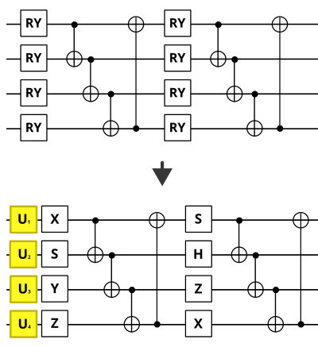 
FIG. 1. The dataset generation protocol scheme tailored to the TwoLocal ansatz. Yellow single-qubit gates Ui represent random Haar unitaries.

📷 Fig 2

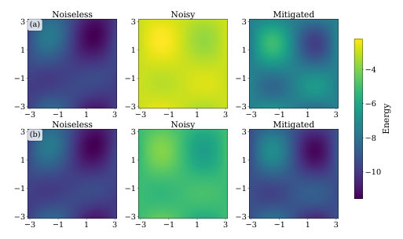 
FIG. 3. Noiseless, noisy and mitigated cost landscapes with two random parameters varied in range (−π, π) under com- posite noise (a) and Pauli noise (b) with strength p = 0.05.

📷 Fig 3

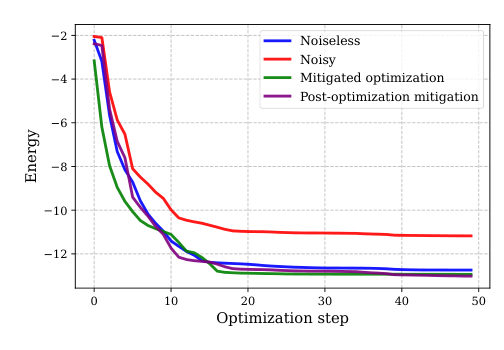 
FIG. 2. VQE optimization dynamics for the depolarizing noise model (p = 0.01). Shown are noiseless (blue), noisy (red), obtained under mitigated optimization (green) and post-optimization mitigation (purple) values. The overlap of the mitigated curves demonstrates that in-loop mitigation does not improve convergence compared to post-optimization correction.

📷 Fig 4

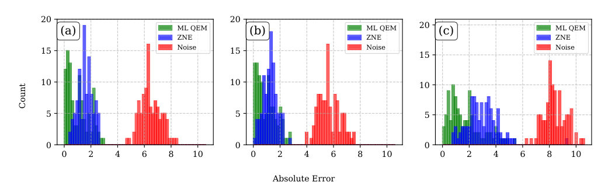 
FIG. 4. Absolute error |Eideal−ˆE| distribution for each considered noise model with corresponding noise strength 0.05 Here ML-QEM depicts the results of best acquired models for each case, i.e. Ridge regression trained on near-Clifford data for depolarization (a), Pauli noise (b), and Ridge regression trained on Clifford data for the composite noise model (c).

**Summary.** This paper introduces a practical Machine Learning-based Quantum Error Mitigation (ML-QEM) protocol for Variational Quantum Algorithms (VQAs). By generating training data from near-Clifford circuits, it creates a robust model capable of correcting for noise across different parameters and Hamiltonians. Benchmarking shows this method significantly suppresses errors, often surpassing standard Zero-Noise Extrapolation on current NISQ devices.

**Why it may be interesting.** This work directly addresses the primary bottleneck for near-term quantum computation—noise—by providing a data-driven, hardware-agnostic mitigation technique applicable to variational algorithms.

Detailed structure

**Main problem.** The core problem is improving the performance of Variational Quantum Algorithms (VQAs) running on noisy quantum hardware by implementing practical Quantum Error Mitigation (QEM).

**Main result.** The proposed ML-QEM protocol achieves consistent, several-fold error suppression across various noise models and outperforms standard Zero-Noise Extrapolation (ZNE) in the high-noise regime.

**Method.** The authors train Machine Learning models (like Ridge regression or XGBoost) on data generated from simulating near-Clifford circuits to map noisy Pauli string expectation values to their ideal, noiseless counterparts.

**Model / system.** The work focuses on VQAs, specifically using the Variational Quantum Eigensolver (VQE) to find the ground state energy of the Sherrington-Kirkpatrick Hamiltonian on up to 12 qubits.

**Key observables.** Energy expectation values ($\langle P_\alpha 
angle$), cost function $C(	heta)$, and error suppression factors.

**Important parameters / regimes.** Noise strengths ($p$), qubit number ($n \le 12$), and noise models (Depolarizing, Pauli, Composite).

**Assumptions / limitations.** The primary assumption is that training data can be generated practically using near-Clifford circuits, overcoming the need for inaccessible noiseless data.

**Figures summary.** Figures compare VQE optimization dynamics (Noisy vs. Mitigated) and show error distributions, while Tables compare RMSE and error suppression factors across different noise types and noise strengths.

**Paper structure.** The paper progresses by defining the problem (VQA noise), detailing the ML-QEM formulation, proposing a practical data generation protocol using near-Clifford circuits, and finally benchmarking the method against ZNE across multiple noise models.

Abstract

Machine Learning-based quantum error mitigation (ML-QEM) has emerged as a promising approach for improving the performance of noisy quantum algorithms. However, existing ML-QEM methods often have restricted applicability to variational circuits and rely on inaccessible noiseless training data. In this work, we propose a practical ML-QEM protocol tailored to variational quantum algorithms, which generates training data by simulating (near-)Clifford circuits. This data is used for model selection and training, producing a mitigation model that can correct variational circuits with arbitrary parameters and transfer across different target Hamiltonians of similar structure. We benchmark the proposed method on the Variational Quantum Eigensolver (VQE) task for the Sherrington-Kirkpatrick Hamiltonian of up to $n=12$ qubits under various noise models, analyzing its effect on trainability and comparing its performance against standard Zero-Noise Extrapolation (ZNE). The results demonstrate consistent several-fold error suppression across all tested settings and superior performance over ZNE in the high-noise regime, providing evidence for the applicability of the proposed protocol to present-day NISQ processors.

[↑ back to top](#top)

### [On the local equivalence of trapped-ion two-qudit gates](http://arxiv.org/abs/2606.03643v1)

**Authors:** Nikita V. Semenin, Pavel A. Kamenskikh, Ilia V. Zalivako, Anastasiia S. Nikolaeva, Evgeniy O. Kiktenko  
**Type:** theory · **Category:** other · **PDF:** <https://arxiv.org/pdf/2606.03643v1>  
**Analysis basis:** full PDF text, analyzed in chunks

📷 Fig 1

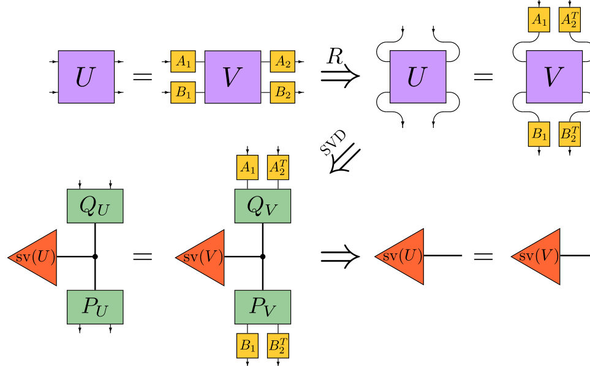 
Figure 1: Schematic proof of the Theorem on the local equivalence of two-qudit gates using tensor network notation. QX and PX denote the left and right unitary matrices obtained from the singular value decomposition of the matrix X.

📷 Fig 2

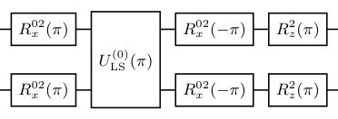 
Figure 2: Decomposition of UMS(π) into U (0) LS (π) using local unitaries for d = 3

**Summary.** This paper establishes a necessary condition for the local equivalence of two-qudit quantum gates by analyzing the singular values of their reshuffled matrices. Applying this to trapped-ion gates, the authors find that the widely used Mølmer-Sørensen and Light-Shift gates are only locally equivalent under specific conditions ($d=3, \chi=\pi$). This provides crucial theoretical constraints for implementing quantum gates in qudit systems.

**Why it may be interesting.** This work provides rigorous theoretical tools (Schmidt number analysis) to classify the fundamental equivalence of gates used in trapped-ion quantum computation, directly impacting the design and understanding of quantum gates in AMO platforms.

Detailed structure

**Main problem.** The paper derives a necessary condition to determine when two two-qudit quantum gates are locally equivalent, and applies this to compare the Mølmer-Sørensen (MS) and Light-Shift (LS) gates.

**Main result.** The MS and zero-order LS gates are only locally equivalent when the qudit dimension is $d=3$ and the nonlocal phase is $\chi=\pi$. For $d>3$, they are proven to be non-equivalent.

**Method.** The analysis relies on comparing the singular value spectra (Schmidt coefficients) of the reshuffled gate matrices, $R(U)$, which provides a necessary condition for local equivalence.

**Model / system.** The study concerns quantum gates acting on qudits within a trapped-ion system. It specifically compares the Mølmer-Sørensen (MS) gate and the zero-order Light-Shift (LS) gate.

**Key observables.** The operator Schmidt coefficients, $	ext{sv}(R(U))$, and the squared nonzero Schmidt coefficients ($\lambda^2_{LS}(\chi)$ and $\lambda^2_{MS}(\chi)$).

**Important parameters / regimes.** Qudit dimension ($d$), and the nonlocal phase ($\chi$).

**Assumptions / limitations.** The derived condition based on Schmidt spectra is necessary but not sufficient for local equivalence. The analysis initially ignores local phases.

**Figures summary.** Figure 1 provides a schematic proof of the local equivalence theorem using tensor network notation, and Figure 2 illustrates the decomposition of the MS gate into the LS gate using local unitaries for the $d=3, \chi=\pi$ case.

**Paper structure.** The paper first establishes the general necessary condition for local equivalence using singular values. It then applies this condition to the MS and LS gates, analyzing the general case ($d>2$) and the specific case ($\chi=\pi$) to derive the final equivalence criteria.

Abstract

We derive a necessary condition of the local equivalence between two-qudit gates in terms of singular values of transformed gate matrices. This condition is valid for arbitrary qudit dimensions $d$ and is thus a relatively simple general way of checking whether two gates can be reduced to one another with single-qudit (local) gates. We use this condition to investigate the local equivalence of two widely used trapped-ion two-qubit gates in qudit space: the Molmer-Sorensen (MS) gate and a special case of the Light-Shift (LS) gate, both of which we studied in one of our previous works.

[↑ back to top](#top)

### [Perturbative results for fractional quantum mechanics](http://arxiv.org/abs/2606.03226v1)

**Authors:** Claude Semay, Clara Tourbez, Loïc Keszeli  
**Type:** theory · **Category:** other · **PDF:** <https://arxiv.org/pdf/2606.03226v1>  
**Analysis basis:** full PDF text, analyzed in chunks

📷 Fig 1

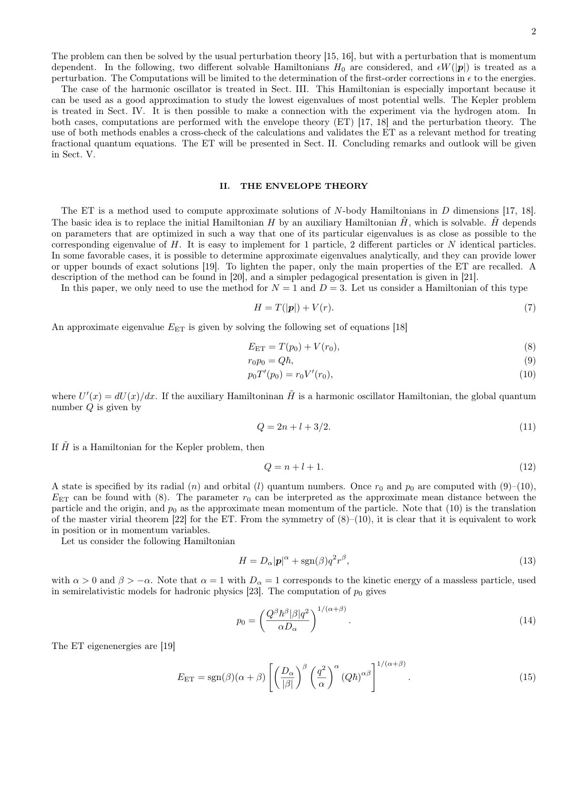 
Low-resolution page preview, page 2

📷 Fig 2

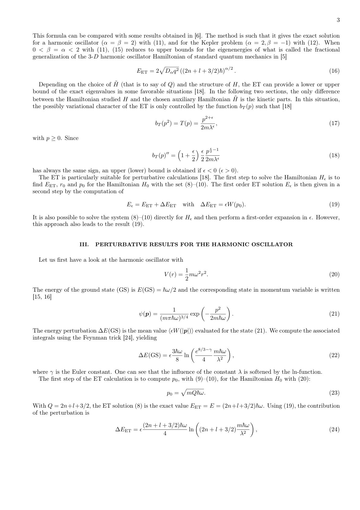 
Low-resolution page preview, page 3

📷 Fig 3

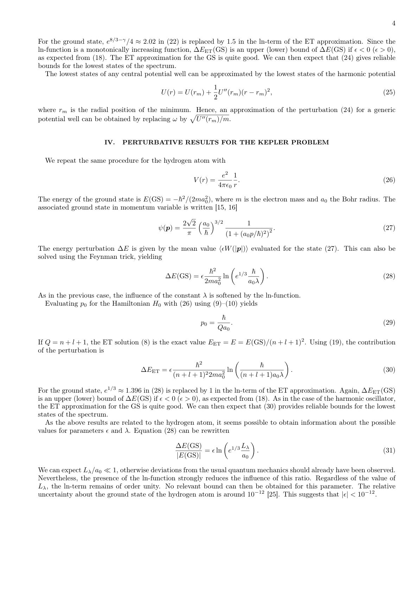 
Low-resolution page preview, page 4

📷 Fig 4

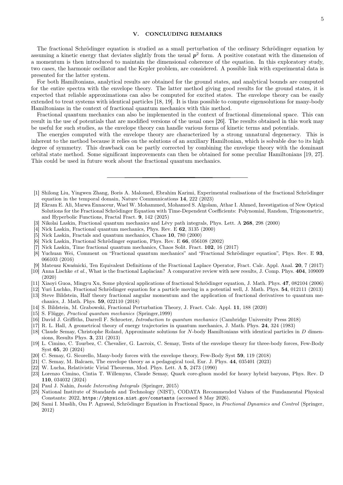 
Low-resolution page preview, page 5

📷 Fig 5

 
Low-resolution page preview, page 6

**Summary.** This paper theoretically examines the fractional Schrödinger equation by treating small deviations in the kinetic energy term. It compares the results obtained from standard perturbation theory against the Envelope Theory for the harmonic oscillator and Kepler problem. The good agreement between methods suggests the utility of these techniques for analyzing complex, non-standard quantum systems.

**Why it may be interesting.** The application of advanced theoretical techniques like the Envelope Theory to fractional quantum mechanics provides new analytical tools for studying non-standard quantum dynamics, which is relevant for understanding modified Hamiltonians in various physical contexts.

Detailed structure

**Main problem.** The paper investigates the fractional Schrödinger equation, specifically analyzing the effects of small deviations in the kinetic energy term from the standard nonrelativistic form.

**Main result.** The analytical results demonstrate good agreement between standard perturbation theory and the envelope theory when applied to the harmonic oscillator and the Kepler problem.

**Method.** The study employs both standard perturbation theory and the Envelope Theory (ET) to calculate energy corrections for the fractional Hamiltonian.

**Model / system.** The model is based on the fractional Hamiltonian $H = D_\alpha |p|^\alpha + V(r)$, where $\alpha = 2 + \epsilon$ and $\epsilon$ is small. Specific systems analyzed include the harmonic oscillator and the Kepler problem (Hydrogen atom).

**Key observables.** Energy corrections ($\Delta E$) for the ground state, and spectral bounds for the entire spectrum.

**Important parameters / regimes.** The small parameter $\epsilon$ characterizing the deviation in the kinetic energy, and physical constants like $\hbar, m, \omega, e^2$.

**Assumptions / limitations.** The analysis relies on treating the fractional term as a small perturbation ($\epsilon \ll 1$) and utilizes the Envelope Theory approximation.

**Paper structure.** The paper proceeds by setting up the fractional Hamiltonian, applying perturbation theory and the envelope theory to specific solvable models (Harmonic Oscillator and Kepler Problem), comparing the results, and discussing potential extensions to many-body systems.

Abstract

The fractional Schrödinger equation is studied with a kinetic energy that slightly deviates from the usual nonrelativistic form. The harmonic oscillator and the Kepler problem are both treated in the context of small perturbations. The usual perturbation theory is used and compared with the envelope theory. The analytical results show good agreement between both methods, indicating possible future developments for many-body systems. A possible connection with experimental observations is briefly discussed.

[↑ back to top](#top)

### [Practical gates by Majorana fermion motion](http://arxiv.org/abs/2606.03916v1)

**Authors:** Yuri D. Lensky, Bryce Kobrin, Kostyantyn Kechedzhi, Igor Aleiner  
**Type:** theory · **Category:** quantum information and computing · **PDF:** <https://arxiv.org/pdf/2606.03916v1>  
**Analysis basis:** full PDF text, analyzed in chunks

📷 Fig 1

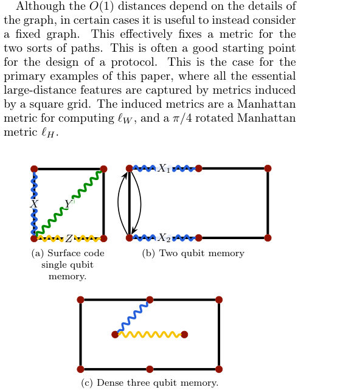 
FIG. 1. Several memories written in terms of Majorana fermions. The vertical dimension in all the figures is d (in the metric described in the main text), and is 2d (d) for Figs. 1b and 1c (Fig. 1a). The wavy lines are Wilson lines (see main text). A choice for which Pauli operator they correspond in the logical encoding is shown in Figs. 1a and 1b. All blue and yellow Wilson lines have the same length.

📷 Fig 2

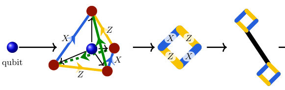 
FIG. 3. Outline of the steps of the Majorana embedding, described in more detail in [2]. First, a set of arrowed tetrahedra for n qubits is actually a diagrammatic representation of a specific embedding of their Hilbert space into that of 4n Majorana fermions. Majorana bilinears associated to a single qubit, shown with colors here and elsewhere, are images of Pauli operators under this embedding. This requires a choice of ordering on the bilinears, represented as arrows in the picture. The choice of such arrows gives rise to a background gauge field we call Z(K) 2 . The systematic procedure for choosing a gauge and physical consequences of this gauge field are discussed in [2], and for...

📷 Fig 3

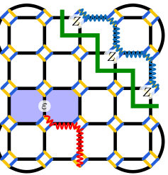 
FIG. 4. An example code where code distance is determined by the ’t Hooft line shown in green, that is shorter than the Wilson line shown in blue. Pauli Z label errors that correspond to the ’t Hooft line. Following the rules of Sec. II we determine that ℓH = 3 whereas ℓW = 5. We also show an example Wilson line in red, which has one end on an undimerized Majorana fermion and another on a dimerized one. The procedure for writing Wilson lines as Pauli strings is detailed in [2].

📷 Fig 4

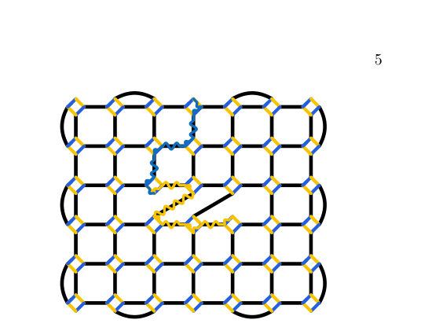 
FIG. 5. Majorana graph for a small instance of dense mem- ory. Blue and yellow lines show Wilson line undetectable errors, see Fig. 1(c).

📷 Fig 5

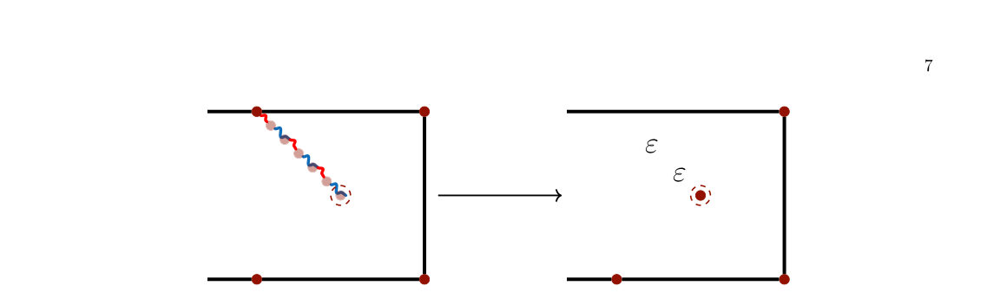 
FIG. 7. Virtual particle motion for Majorana fermions. We move the Majorana fermion at the top middle to the location indicated by the dashed line. The blue lines indicate the Majorana fermion pairs created from vacuum, 1. They are fused in the pairs indicated by the red lines. These fusion outcomes are random; on the right, we show a scenario where two of the fusions result in ε.

**Summary.** This paper proposes using the controlled motion and braiding of Majorana fermions as a fundamental, low-overhead primitive for performing logical quantum gates. By mapping Pauli stabilizer codes onto these fermion dynamics, the authors show that this braiding approach significantly outperforms established methods like lattice surgery in terms of logical error rate scaling. This offers a promising new architectural route for building scalable, fault-tolerant quantum computers.

**Why it may be interesting.** It provides a concrete, physically motivated framework for realizing fault-tolerant quantum computation using topological excitations (Majorana fermions), which is highly relevant for superconducting or topological quantum hardware.

Detailed structure

**Main problem.** The core challenge is designing and implementing efficient, fault-tolerant logical gates on non-local quantum information stored within quantum error correction (QEC) codes.

**Main result.** The authors demonstrate that using Majorana fermion motion and braiding provides a superior, lower-overhead protocol for implementing 2-qubit Clifford gates compared to standard lattice surgery.

**Method.** The work develops a general description of planar Pauli stabilizer codes using Majorana fermions, mapping logical operations to physical particle motion (braiding).

**Model / system.** The system models quantum information stored in planar Pauli stabilizer codes realized by the parities of spatially separated Majorana fermions on a lattice.

**Key observables.** Logical error rate (LER), gate fidelity, code distance ($\ell_c$), and the comparison metric $\eta_{eta 	o \alpha}$ between protocols.

**Important parameters / regimes.** Code distance ($d$), physical qubit count, and the ratio of logical error rates between braiding and lattice surgery protocols.

**Assumptions / limitations.** The analysis assumes the feasibility of implementing the protocol on hardware supporting the surface code and uses specific error models for comparison.

**Figures summary.** Figures illustrate memory encoding using Majorana fermions (Wilson/t'Hooft lines), the mapping of Pauli operators to four Majorana fermions, and direct comparisons of gate fidelity vs. qubit number showing the advantage of braiding over lattice surgery.

**Paper structure.** The paper progresses by first establishing the Majorana fermion description for Pauli codes, then detailing how Majorana motion generates logical gates, and finally benchmarking this braiding approach against lattice surgery to prove its superior scaling and fidelity.

Abstract

Quantum error correction protocols protect against local errors by storing logical information non-locally. This poses a challenge: how to design efficient logical gates on the non-local ``hidden'' logical information, and how to implement these gates using the local physical operations. We develop a general description of planar Pauli stabilizer codes and protocols for logical operations in terms of point-like particles called Majorana fermions. Information is stored in the pairwise fermion parities of spatially separated Majorana fermions. The description in terms of Majorana fermions captures not only large distance asymptotics, but also all scales down to the lattice constants. We exploit this locality to densely pack logical information in spacetime. The simplest application is to a static case: dense memory. More importantly, we implement fault-tolerant Majorana motion and leverage this primitive to design braiding-based logical gates. This approach reduces space overhead of logical operations resulting in an improved logical error rate given fixed number of physical qubits. We illustrate a practical use of our approach by designing and benchmarking of 2-qubit Clifford gates. We find numerically that our protocol outperforms lattice surgery in this setting for near-term error rates and realistic device constraints. More generally, introduction of compact motion of Majorana fermions as an efficient computational primitive opens a promising new route for the design of low overhead error correction protocols.

[↑ back to top](#top)

### [Resonant delay in a stationary quantum clock: Lifting the threshold mask](http://arxiv.org/abs/2606.02718v1)

**Authors:** Paul C. W. Davies, Damien A. Easson  
**Type:** theory · **Category:** other · **PDF:** <https://arxiv.org/pdf/2606.02718v1>  
**Analysis basis:** full PDF text, analyzed in chunks

📷 Fig 1

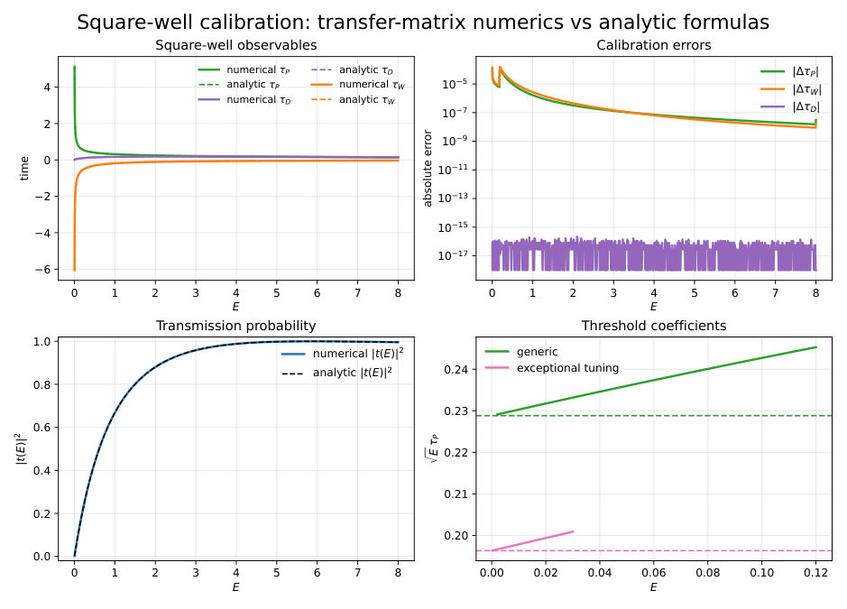 
FIG. 1. Square-well calibration of the transfer-matrix numerics against the exact analytic formu-

📷 Fig 2

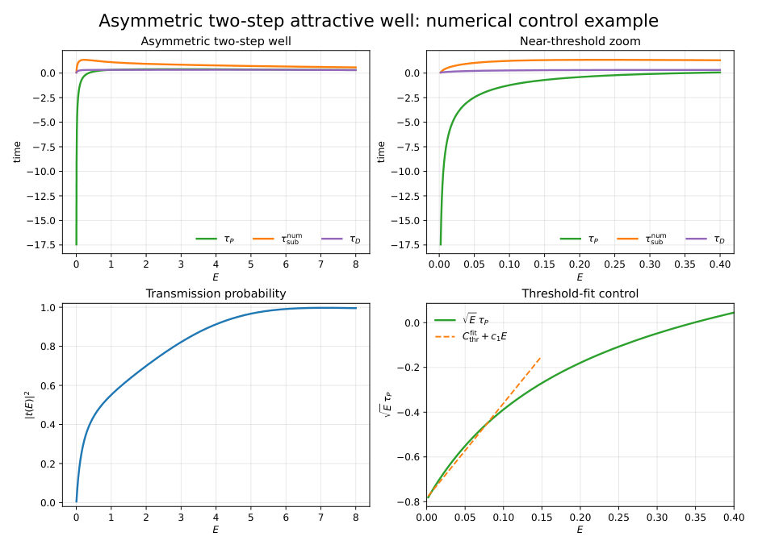 
FIG. 2. Asymmetric two-step attractive well used as a numerical control example. The raw station-

**Summary.** This theoretical paper develops a method to distinguish between universal low-energy threshold effects and genuine resonant delays in quantum clock observables. Using the one-dimensional Schrödinger equation, the authors derive a threshold subtraction procedure that removes the leading $1/\sqrt{E}$ background divergence. This technique successfully isolates the resonant response, confirming its expected Lorentzian shape near resonances.

**Why it may be interesting.** This work provides a powerful, systematic tool for analyzing quantum delay times, allowing researchers to distinguish between fundamental kinematic threshold effects and true, pole-sensitive resonant physics in quantum scattering systems.

Detailed structure

**Main problem.** The paper aims to rigorously separate the universal, non-resonant low-energy threshold contribution from the genuinely resonant delay in stationary quantum clock observables.

**Main result.** By subtracting the universal $1/\sqrt{E}$ threshold background, the stationary clock observable isolates the resonant contribution, which is shown to acquire the expected local Lorentzian form near isolated resonances.

**Method.** The primary method involves deriving a general low-energy theorem using transfer matrices and applying a specific 'threshold subtraction' technique to the raw clock time.

**Model / system.** The analysis uses the one-dimensional stationary Schrödinger equation with a real, compactly supported potential, exemplified by the attractive square well and more complex barrier-well-barrier cavities.

**Key observables.** Stationary clock time ($	au_P(E)$), threshold-subtracted clock time ($	au_{	ext{sub}}(E)$), Dwell time ($	au_D(E)$), and Wigner phase delay ($	au_W(E)$).

**Important parameters / regimes.** Energy ($E$), detuning ($\epsilon$), and the low-energy scattering coefficient ($\ell_{	ext{thr}}$).

**Assumptions / limitations.** The potential is real and compactly supported; the subtraction procedure is valid away from exceptional zero-energy tuning.

**Figures summary.** Figures compare numerical and analytic results for observables in the square well, and show the raw clock vs. subtracted clock for an asymmetric two-step well, demonstrating the removal of the strong threshold background.

**Paper structure.** The paper first establishes the general low-energy theorem for the raw clock time, then applies this theory to the analytically solvable square well to demonstrate the subtraction technique, and finally extends the analysis to more complex cavity structures and numerical potentials.

Abstract

Quantum transit times have a long history of inequivalent definitions, including phase times, dwell times, and quantum-clock constructions. In this context we revisit the Salecker--Wigner--Peres stationary quantum clock as a phase-sensitive scattering observable, with clock time defined by the energy derivative of the transmission phase shift across the interaction region. For real compactly supported one-dimensional potentials, we show that the raw stationary Peres clock generically contains a universal \(1/\sqrt{E}\) continuum-edge term whose coefficient is fixed by low-energy scattering data. For the attractive square well, this threshold singularity is inherited from the vanishing exterior momentum and the associated scattering matching, rather than from resonant delay itself. We derive the exact stationary clock time for the square well and introduce a new threshold-subtracted clock observable. Away from exceptional zero-energy tuning, the subtraction removes the universal low-energy term and isolates the resonant contribution. Comparison with the dwell time and the transmission Wigner phase delay shows that the threshold-subtracted clock acquires the expected local Lorentzian form near isolated transmission resonances. Near the continuum edge, if \(\varepsilon\) denotes the detuning from threshold, the resonant peak grows only as \(\varepsilon^{-1/2}\), whereas the unsubtracted threshold background grows as \(\varepsilon^{-3/2}\). A symmetric barrier--well--barrier cavity and a numerical asymmetric two-step attractive well provide complementary controls. The result is a new threshold-subtracted stationary-clock candidate that separates universal threshold kinematics from pole-sensitive resonant delay.

[↑ back to top](#top)

### [Structure-Preserving Quantum Method of Lines for Evolutionary PDEs with Mixed Boundary Conditions](http://arxiv.org/abs/2606.03407v1)

**Authors:** Yixuan Liang, Jin-Peng Liu  
**Type:** theory · **Category:** quantum information and computing · **PDF:** <https://arxiv.org/pdf/2606.03407v1>  
**Analysis basis:** full PDF text, analyzed in chunks

📷 Fig 1

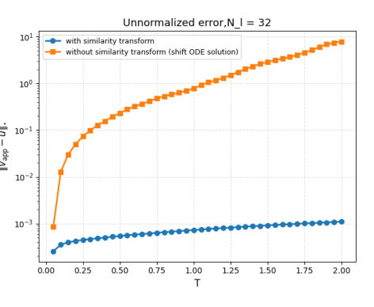 
Figure 1: Validity of similarity transform, Nl = 32

📷 Fig 2

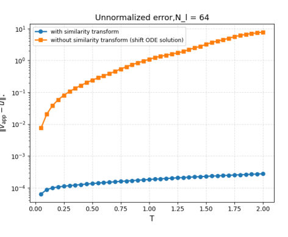 
Figure 2: Validity of similarity transform, Nl = 64

📷 Fig 3

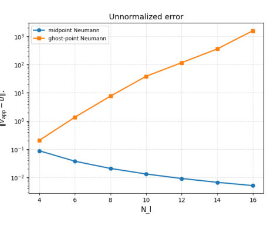 
Figure 3: Neumann: midpoint vs ghost-point.

📷 Fig 4

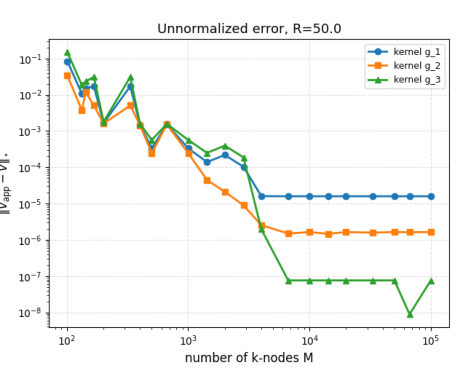 
Figure 4: Different kernel functions, R = 50

📷 Fig 5

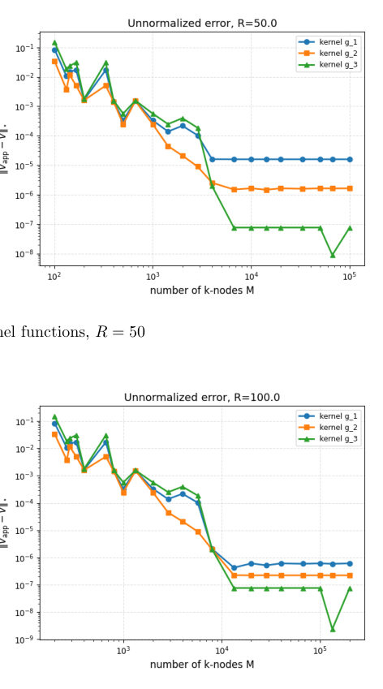 
Figure 5: Different kernel functions, R = 100

**Summary.** This paper presents a comprehensive, structure-preserving quantum method of lines for solving linear PDEs, covering both parabolic and hyperbolic types. It rigorously derives complexity bounds for the quantum simulation, ensuring that the numerical discretization steps maintain the mathematical structure required by quantum algorithms like LCHS and Hamiltonian simulation. This offers a powerful theoretical tool for quantum simulation in physics.

**Why it may be interesting.** This work provides a concrete, resource-bounded quantum algorithm blueprint for solving fundamental PDEs, bridging the gap between continuous physics models and discrete quantum computation primitives.

Detailed structure

**Main problem.** Developing structure-preserving quantum algorithms to solve second-order linear evolutionary Partial Differential Equations (PDEs) with mixed boundary conditions.

**Main result.** The authors provide complete complexity bounds for the end-to-end quantum solver framework for both parabolic and hyperbolic PDEs, ensuring structural stability throughout the process.

**Method.** The method uses the Method of Lines (MoL) to reduce PDEs to ODEs, which are then solved quantumly using Linear Combination of Hamiltonian Simulation (LCHS) for parabolic cases and direct Hamiltonian simulation for hyperbolic cases.

**Model / system.** The focus is on linear evolutionary PDEs, specifically parabolic (e.g., convection-diffusion, heat equation) and hyperbolic (e.g., Klein-Gordon) types, defined on a rectangular domain with mixed Dirichlet, Neumann, and periodic boundary conditions.

**Key observables.** The primary observable is the quantum state $|	ext{ev}
angle$ approximating the solution $u(x, T)$ at time $T$, with error bounded by $\epsilon$.

**Important parameters / regimes.** The complexity depends on the final time $T$, spatial dimension $d$, and the desired error tolerance $\epsilon$.

**Assumptions / limitations.** The method assumes the solution $u$ is sufficiently smooth and relies on specific structural properties (like positive semi-definiteness) of the semi-discrete operator to utilize quantum primitives.

**Figures summary.** Figures illustrate error convergence (showing second-order accuracy) for parabolic PDEs using similarity transforms and comparing different kernel functions for the LCHS method.

**Paper structure.** The paper systematically develops the framework by first analyzing the parabolic case (using LCHS and similarity transforms) and then the hyperbolic case (using Hamiltonian simulation). It concludes with detailed complexity bounds and numerical validation across various PDE types and boundary conditions.

Abstract

We give detailed analysis and circuit design of structure-preserving quantum algorithms for second-order linear evolutionary PDEs, including parabolic equations and hyperbolic equations with mixed Dirichlet, Neumann, and periodic boundary conditions and source terms. While prior quantum algorithms usually neglect the stability problem from the PDE-to-ODE reduction, our method-of-lines approach investigates the boundary lifting via Coons interpolation and boundary-aware discretization, so that the resulting semi-discrete systems are stable and compatible with efficient quantum ODE primitives. For the parabolic problem, we use a diagonal similarity transform to ensure the semi-discrete generator must have a positive semi-definite Hermitian part, and then solve the resulting ODE system by the optimal linear combination of Hamiltonian simulation (LCHS). For the hyperbolic problem, we rewrite the semi-discrete equation as an equivalent first-order system and solve it by Hamiltonian simulation. We implement our quantum algorithms with explicit block-encoding constructions and circuit implementations, as well as demonstrating the end-to-end complexity bounds together with spatial and quadrature error estimates. We conduct classical numerical experiments on the convection-diffusion equation, inhomogeneous heat equation, and Klein-Gordon equation to validate our structure-preserving analysis and algorithmic constructions.

[↑ back to top](#top)

### [Topological Weyl Phase of an Ideal Spin-Gapless Semiconductor KCrSe](http://arxiv.org/abs/2606.03959v1)

**Authors:** Subhajit Mandal, Bishal Das, Himanshu Sharma, Satoru Hayami, Aftab Alam  
**Type:** theory · **Category:** other · **PDF:** <https://arxiv.org/pdf/2606.03959v1>  
**Analysis basis:** full PDF text, analyzed in chunks

📷 Fig 1

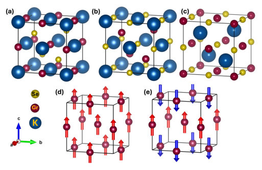 
FIG. 1. (a) Type I (b) Type II and (c) Type III configuration of KCrSe. (d) Ferromagnetic (FM) and (e) antiferromagnetic (AFM) configuration of KCrSe based on Type I structure. Only Cr atoms are displayed for clarity.

📷 Fig 2

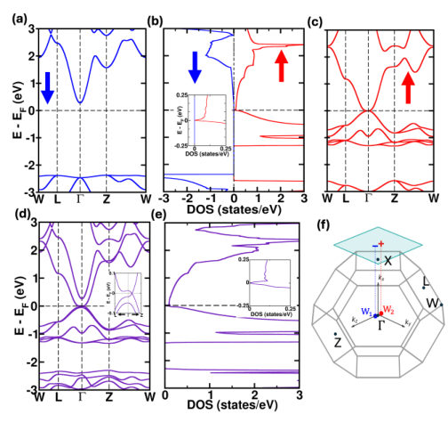 
FIG. 2. For KCrSe, (a,c) Band structure and (b) Density of States (DOS) for spin down (↓) and up (↑) channels without SOC. (d) Band structure and (e) DOS with SOC. (f) Bulk Brillouin Zone marked with different high symmetry points and the (100) surface projected BZ.

📷 Fig 3

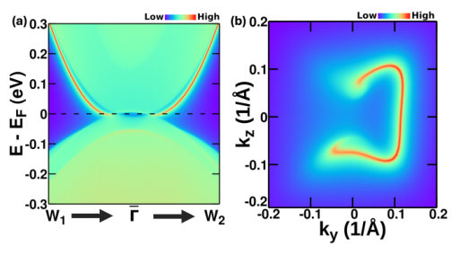 
FIG. 3. (a) Surface spectral dispersion projected onto the (100) surface of KCrSe. The dashed black line indicates the Fermi level (EF ). (b) Corresponding (100)-projected surface isoenergy contour (at an energy cut of 1 meV below EF ) show- ing the topological surface states and Fermi arc connectivity.

📷 Fig 4

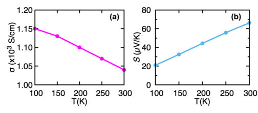 
FIG. 4. Temperature (T) dependence of (a) electrical conductivity(σ) and (b) Seebeck coefficient(S)

📷 Fig 5

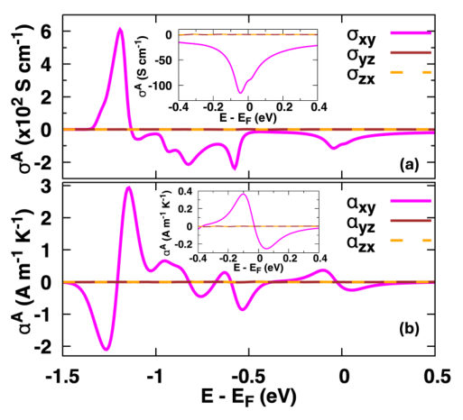 
FIG. 5. Variation of (a) anomalous Hall conductivity (σA) and (b) anomalous Nernst conductivity (αA) of KCrSe with chemical potential µ = E - EF including SOC. Insets show zoomed-in plots around EF .

**Summary.** This work computationally identifies KCrSe as an ideal spin-gapless Weyl semimetal, a material class highly sought after for spintronics. By analyzing its electronic structure using DFT, the authors confirm the coexistence of a gapless spin channel and a gapped spin channel, alongside the presence of Weyl nodes. The material's topological nature leads to large, measurable anomalous transport responses, making it a promising platform for high-efficiency spintronic devices.

**Why it may be interesting.** The combination of topological features (Weyl nodes) with spin-polarization and gapless behavior is crucial for designing next-generation spintronic devices, bridging condensed matter theory with practical device physics.

Detailed structure

**Main problem.** The research aims to identify and characterize materials that simultaneously exhibit spin-gapless semiconducting (SGS) behavior and Weyl semimetallicity, a combination highly desirable for advanced spintronic applications.

**Main result.** The half-Heusler compound KCrSe is identified as an ideal spin-gapless Weyl semimetal, possessing a single pair of Weyl nodes and exhibiting sizable anomalous transport responses.

**Method.** The study relies on first-principles calculations using DFT (PBE+U) to model the electronic structure, followed by transport calculations involving the Berry curvature.

**Model / system.** The physical system is the half-Heusler compound KCrSe. The theoretical framework involves DFT calculations to determine the electronic band structure, which reveals spin-resolved gapless (majority-spin) and gapped (minority-spin) channels, confirming the SGS nature.

**Key observables.** Anomalous Hall conductivity ($\sigma_{xy}^{A} \sim 90.76 	ext{ S cm}^{-1}$), anomalous Nernst conductivity ($\alpha_{xy}^{A} \sim 0.15 	ext{ A m}^{-1}	ext{K}^{-1}$), and the confirmation of Weyl nodes and topological surface states (Fermi arcs).

**Important parameters / regimes.** The calculations are performed at the Fermi level ($E_F$) and involve the inclusion of Spin-Orbit Coupling (SOC) and the use of the PBE+U functional for the Cr-3d states.

**Assumptions / limitations.** The anomalous transport calculations are performed by post-processing the tight-binding Wannier Hamiltonian, and the analysis assumes the ferromagnetic (FM) ground state is stable.

**Figures summary.** Figures illustrate spin-resolved band structures confirming the SGS nature and the presence of Weyl nodes. Surface spectral functions show topological surface states (Fermi arcs) on the (100) surface.

**Paper structure.** The paper first establishes the theoretical motivation by highlighting the rarity of SGS Weyl semimetals. It then uses DFT calculations to confirm KCrSe's structural and magnetic stability. Subsequent analysis details the electronic structure, confirming the SGS nature and the Weyl nodes, culminating in the calculation and reporting of large anomalous transport coefficients.

Abstract

The coexistence of topological and spin-polarized electronic states within a single material platform provides an attractive route toward emergent quantum phenomena and spintronic functionalities. However, materials simultaneously exhibiting spin-gapless semiconducting (SGS) behavior and Weyl semimetallicity remain exceedingly rare. Here, using first-principles calculations, we identify the half-Heusler compound KCrSe as an ideal spin-gapless Weyl semimetal. Transport calculations reveal a weak temperature dependence of the longitudinal conductivity and relatively small Seebeck coefficients, providing further evidence of its SGS nature. KCrSe hosts a single pair of Weyl nodes-the minimum number permitted in a Weyl semimetal-located in close proximity to the Fermi level (E$_\text{F}$), resulting in exceptionally clean bulk and surface electronic spectra. The nontrivial Berry curvature associated with these Weyl nodes gives rise to sizable anomalous transport responses, including an anomalous Hall conductivity of $σ_{xy}^{A}\sim 90.76~\mathrm{S\,cm^{-1}}$ and an anomalous Nernst conductivity of $α_{xy}^{A}\sim 0.15~\mathrm{A\,m^{-1}K^{-1}}$ at E$_\text{F}$, with substantially enhanced values at lower energies. The combination of an ideal Weyl topology, fully spin-polarized low-energy states, and finite anomalous transport establishes KCrSe as a promising platform for designing high-efficiency topological spintronic devices.

[↑ back to top](#top)

### [Torsion-induced gauge structure in curved quantum waveguides](http://arxiv.org/abs/2606.03725v1)

**Authors:** Xu-Yang Hou, Xianlong Gao, Hao Guo  
**Type:** theory · **Category:** other · **PDF:** <https://arxiv.org/pdf/2606.03725v1>  
**Analysis basis:** full PDF text, analyzed in chunks

📷 Fig 1

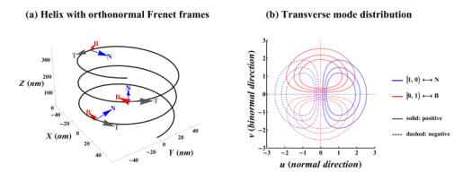 
Figure 1: (a) Helical curve with Frenet frames. The tangent T , principal normal N, and binormal B are shown at rep- resentative points along the curve. (b) Transverse mode dis- tributions of the twofold-degenerate first excited states, with |1, 0⟩oriented along N and |0, 1⟩oriented along B. Solid and dashed contours indicate positive and negative amplitudes, respectively.

📷 Fig 2

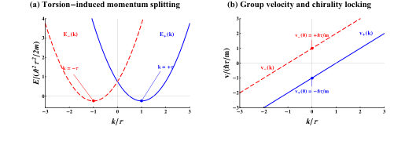 
Figure 2: (a) Energy dispersion E±(k). (b) Group velocity v±(k). In both panels, the blue solid curves represent the + branch, whereas the red dashed curves represent the − branch.

📷 Fig 3

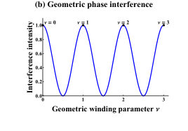 
Figure 3: (a) Closed helix with 16 turns. A particle travers- ing the loop acquires a geometric phase exp(iτLσy) due to the torsion-induced holonomy. (b) Interference intensity as a function of the geometric winding parameter ν = τL/(2π).

**Summary.** This theoretical work analyzes quantum particles confined to curved waveguides, demonstrating that the curve's torsion induces a gauge potential when the transverse motion is degenerate. This results in a measurable momentum splitting in the energy spectrum, an effect confirmed by a structural analogy with classical elastic rod bending.

**Why it may be interesting.** The emergence of a gauge field purely from the spatial geometry (torsion) is a fundamental concept in geometric physics, providing a concrete realization of a Wilczek-Zee type connection in condensed matter waveguides.

Detailed structure

**Main problem.** The paper investigates how the geometric property of torsion ($	au$) induces a gauge structure in the effective quantum Hamiltonian for a particle confined to a curved space curve.

**Main result.** Torsion generates a matrix-valued Abelian gauge potential ($A_s \propto 	au \sigma_y$) in the degenerate transverse subspace, leading to a momentum shift ($\pm 	au$) in the energy dispersion relation. This effect has a direct classical analogue in elastic rod bending.

**Method.** The analysis uses thin-layer quantization and adiabatic approximation to derive the effective 1D Hamiltonian from the 3D Laplacian, comparing the scalar (non-degenerate) and degenerate transverse subspace cases.

**Model / system.** The system is a particle confined to a space curve in $\mathbb{R}^3$, analyzed using the Frenet-Serret frame. The effective dynamics are governed by a gauge-covariant Hamiltonian when the transverse subspace is degenerate.

**Key observables.** Energy dispersion $E_{\pm}(k)$, group velocity $v_{\pm}(k)$, and the geometric phase/holonomy accumulated around closed loops.

**Important parameters / regimes.** Curvature ($\kappa$), Torsion ($	au$), and the transverse confinement length scale ($\ell_\perp$).

**Assumptions / limitations.** The derivation relies on the thin-layer quantization limit and the adiabatic approximation, distinguishing between scalar and degenerate transverse mode subspaces.

**Figures summary.** Figures illustrate the energy dispersion $E_{\pm}(k)$ and group velocity $v_{\pm}(k)$ for a helical wire, showing the splitting due to $	au$. The classical analogue is shown via the polarization evolution operator.

**Paper structure.** The paper progresses by first establishing the general framework using thin-layer quantization, contrasting the scalar (no $	au$ dependence) and degenerate (gauge potential appears) cases. It then derives the explicit gauge potential and the resulting Hamiltonian, concluding with the comparison to classical wave physics (elastic rods) to confirm the structural isomorphism.

Abstract

We investigate the quantum dynamics of a particle confined to a space curve within the thin-layer quantization framework. For a nondegenerate scalar transverse mode, torsion does not enter the local effective Hamiltonian, which contains only the curvature-induced scalar geometric potential. In contrast, when a degenerate transverse subspace is retained, the rotation of the Frenet normal frame becomes dynamically relevant and generates a matrix-valued Abelian gauge potential. Using a projection-based derivation in a co-rotating Frenet-frame basis, we show that this effective gauge potential is directly determined by the local torsion of the curve. The resulting effective Hamiltonian takes a gauge-covariant form and produces two transverse-mode branches whose parabolic dispersions are shifted in opposite directions in momentum space. For closed curves, the associated holonomy is controlled by the integrated torsion and leads to geometric interference. These results provide a direct realization of a Wilczek--Zee-type connection induced purely by spatial geometry in curved quantum waveguides. We further construct a classical-wave analogue using the degenerate bending modes of an isotropic elastic rod, demonstrating that the same torsion-induced gauge structure appears in continuum wave physics.

[↑ back to top](#top)

### [Towards a Hybrid Quantum Enhanced Solution for Densest k-Subgraph Problem](http://arxiv.org/abs/2606.03196v1)

**Authors:** Ravi Sangwan, Prabhat Anand, M Girish Chandra  
**Type:** both · **Category:** quantum information and computing · **PDF:** <https://arxiv.org/pdf/2606.03196v1>  
**Analysis basis:** full PDF text, analyzed in chunks

📷 Fig 1

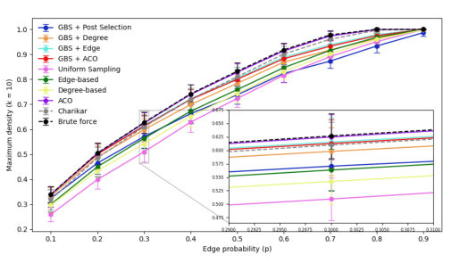 
Fig. 2. Comparison of sampling and classical methods for DkSP with k = 10 in Erd˝os–Rényi random graphs with n = 30. Results are averaged over 100 random graph instances for each edge probability p.

📷 Fig 2

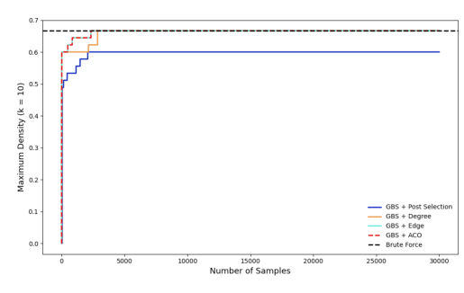 
Fig. 1. Convergence of the best maximum density found for k = 10 subgraphs on a random graph with edge probability p = 0.3.

📷 Fig 3

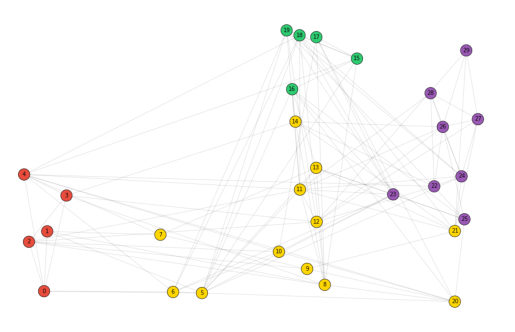 
Fig. 3. Synthetic graph with overlapping dense regions for n = 30. Colors indicate cluster membership, and overlapping nodes are highlighted in gold.

📷 Fig 4

 
Fig. 4 visualizes the solutions obtained by different methods on a representative instance of the multiple dense-region graph. The GBS solution with post-selection differs from the brute- force optimum by four vertices, whereas Charikar’s solution differs by two vertices. In contrast, GBS with edge-based and ACO-based post-processing select the same subgraph and differ from the brute-force optimum by only one vertex. This

📷 Fig 5

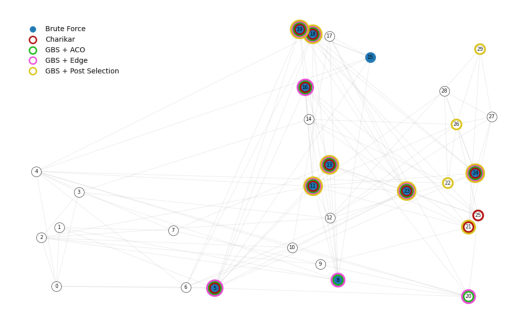 
Fig. 4. Dense k = 10 subgraphs identified by different methods on the same multiple dense-region graph. The selected nodes are overlaid on a common layout for comparison.

**Summary.** This paper explores using Gaussian Boson Sampling (GBS) to tackle the hard Densest k-Subgraph Problem. It finds that GBS alone is insufficient because of strict size constraints, but by coupling GBS with classical refinement techniques (like edge-based or ACO repair), the method achieves near-optimal solutions with vastly improved sampling efficiency. This highlights the power of hybrid quantum-classical frameworks for graph optimization.

**Why it may be interesting.** The work demonstrates a practical, hybrid quantum-classical workflow for solving a hard combinatorial optimization problem, showing how simple classical refinement can unlock the potential of a quantum sampling primitive like GBS.

Detailed structure

**Main problem.** The paper addresses the NP-hard Densest k-Subgraph Problem (DkSP), which seeks a subgraph of size k maximizing induced density.

**Main result.** The combination of Gaussian Boson Sampling (GBS) with lightweight classical post-processing (like edge-based or ACO refinement) significantly improves sampling efficiency and solution quality compared to GBS post-selection alone.

**Method.** A hybrid quantum-classical approach is used, where GBS generates initial, potentially incomplete, samples, which are then refined using classical greedy or meta-heuristic algorithms to enforce the correct subgraph size k.

**Model / system.** The quantum model is Gaussian Boson Sampling (GBS), simulated using photonic quantum circuits. The problem is mapped onto the graph's adjacency matrix, and the objective function relates to the hafnian of principal submatrices.

**Key observables.** Maximum induced density $D(S)$, sampling efficiency (samples needed for optimum), and computational cost.

**Important parameters / regimes.** Target subgraph size $k$ (e.g., $k=10$), graph structure (Erdős–Rényi vs. community-structured), and post-processing parameters (e.g., ACO parameters).

**Assumptions / limitations.** The core assumption is that GBS provides a useful, structured sampling bias, but this bias must be corrected by classical post-processing to overcome strict cardinality constraints.

**Figures summary.** Figures compare the convergence of various methods (GBS+Post-processing vs. GBS+Post-selection vs. Classical) in finding the maximum density for DkSP on structured graphs, showing significant performance gains for the hybrid methods.

**Paper structure.** The paper first defines DkSP and the GBS model, then analyzes the limitations of GBS post-selection. It systematically introduces and compares three classical post-processing techniques (degree, edge, ACO) to repair near-$k$ samples, culminating in performance benchmarks against classical and pure quantum methods.

Abstract

We study the application of Gaussian Boson Sampling (GBS) to the densest k-subgraph problem (DkSP). GBS with hard post-selection suffers from poor sampling efficiency due to strict cardinality constraints. To address this limitation, we introduce effective classical post-processing strategies that transform, otherwise discarded, near-k samples into feasible solutions. A comprehensive set of simulations is carried out, demonstrating that these approaches achieve near-optimal solution quality while improving sampling efficiency by approximately 4X compared to post-selection on community-structured graphs, and also post-selection often fails to reach the optimal solution on sparse random graphs even with large number of samples. Furthermore, the proposed methods perform on par with, and in some cases outperform, established classical approaches for graphs up to moderate size. Overall, the results indicate that while GBS with post-selection alone is insufficient, its combination with lightweight classical refinement can be highly effective. This underscores the potential of hybrid quantum-classical frameworks and positions GBS as a promising sampling primitive for combinatorial graph optimization.

[↑ back to top](#top)

### [Training a Predictive Coding Network on ImageNet using Equilibrium Propagation](http://arxiv.org/abs/2606.03584v1)

**Authors:** Tugdual Kerjan, Rasmus Høier, Benjamin Scellier  
**Type:** both · **Category:** disordered systems and neural networks · **PDF:** <https://arxiv.org/pdf/2606.03584v1>  
**Analysis basis:** full PDF text, analyzed in chunks

📷 Fig 1

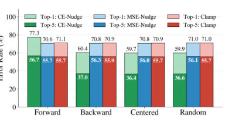 
Figure 1: Comparison of perturbation approaches (CE-Nudge, MSE-Nudge and Clamp) and finite difference schemes (forward, backward, centered and random) on the VGG5 network trained on (a) CIFAR-100 and (b) ImageNet 32x32.

📷 Fig 2

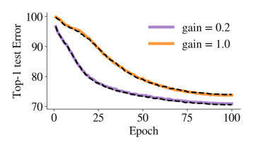 
Figure 3: VGG5 trained on ImageNet 32x32 using the MSE cost function. Dif- ferent weight initialization gains for the output layer lead to significantly different results ; however, EP consistently performs comparably to BP. Solid lines and dashed lines denote EP and BP, respectively.

📷 Fig 3

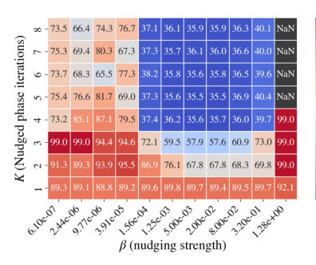 
Figure 2: VGG5 network trained on CIFAR100 for 20 epochs. Sensitivity to the nudging strength (β) and num- ber of nudge iterations (K).

📷 Fig 4

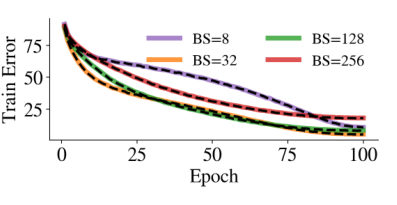 
Figure 4: VGG5 trained on CIFAR100 using the MSE. Shapes of training curves depend on the batch size (BS), but not on the algorithm (EP vs BP). Solid lines denote EP and dashed lines denote BP.

📷 Fig 5

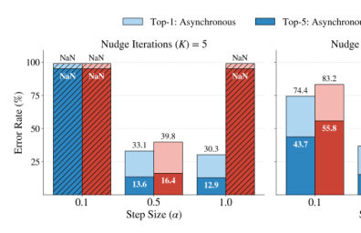 
Figure 5: Test error rates obtained with the VGG5 trained on CIFAR100 using different traversal schedules (synchronous and asynchronous updates), number of nudged phase iterations K (5, 10 and 20) and step sizes α (0.1, 0.5, 1.0). NaN means that training failed and diverged, resulting in NaN values.

**Summary.** This work pioneers the use of Equilibrium Propagation (EP) to train Predictive Coding Networks (PCNs) on the massive ImageNet dataset. By adapting EP's physics-based training framework, the authors achieve state-of-the-art performance, demonstrating that EP is a scalable and viable alternative to standard backpropagation for energy-based neural models.

**Why it may be interesting.** The application of physics-inspired training methods like EP to complex, large-scale neural networks bridges the gap between theoretical physics models (like energy minimization) and modern AI, which is relevant for understanding complex system dynamics.

Detailed structure

**Main problem.** The paper develops and demonstrates a novel training method for Predictive Coding Networks (PCNs) using Equilibrium Propagation (EP) at the large scale of ImageNet.

**Main result.** They successfully trained a VGG10 PCN on full-size ImageNet, achieving a top-5 error rate of 13.23%, which is competitive with the standard backpropagation baseline.

**Method.** The method combines the centered variant of EP with a novel equilibration scheme tailored for PCNs, allowing the use of physics-based training principles on large-scale deep learning models.

**Model / system.** The model is a Predictive Coding Network (PCN), which is treated as an energy-based model rooted in computational neuroscience. The training framework is based on Equilibrium Propagation (EP), a physics-based training method.

**Key observables.** Top-5 classification test error rate, total energy function $F$, and the equilibrium state $h(	heta, x)$.

**Important parameters / regimes.** Nudging parameter ($eta$), number of nudge iterations ($K$), and the scale of the dataset (ImageNet).

**Assumptions / limitations.** The primary assumption is that EP can effectively train PCNs, extending the applicability of EP beyond small-scale problems.

**Figures summary.** Figures compare EP performance against backpropagation across various datasets (CIFAR, ImageNet) and show the convergence dynamics of the total energy function $F$ during the nudging process.

**Paper structure.** The paper introduces EP for PCNs, details the mathematical formulation using nudging and finite differences, benchmarks the method on ImageNet 32x32, and concludes with the full-size ImageNet results, comparing performance against established baselines.

Abstract

Equilibrium Propagation (EP) is a physics-based training framework that has primarily been employed in energy-based models, including continuous Hopfield networks, nonlinear resistive networks and coupled phase oscillators. However, EP's practical applications have so far remained limited to relatively small-scale problems. Predictive coding networks (PCNs), another class of energy-based models rooted in computational neuroscience, are typically trained with a specialized algorithm and have likewise not yet been demonstrated at large scale. In this work, we develop an EP-based training method for PCNs which combines the centered variant of EP with a novel equilibration scheme for PCNs. Using this approach, we train a 10-layer convolutional PCN (VGG10) on full-size ImageNet, achieving 13.23\% test error rate on the top-5 classification task, close to the 12.2\% backpropagation baseline. To our knowledge, this is the first demonstration of both PCNs and EP-based training at ImageNet scale. These results significantly extend the scalability of both approaches and suggest that the primary challenges in scaling EP in other physical systems may come more from the computational properties of these systems than from inherent limitations of the EP framework.

[↑ back to top](#top)

## Secondary cond-mat archives

*Papers from  mes-hall, other, soft, supr-con. These archives are de-prioritized — they appear at the end regardless of relevance score.*

### Relevant in secondary archives (16)

### [Generation and time evolution of anomalous Floquet Majorana flat edge modes in two-dimensional noncolinear magnet-superconductor heterostructures](http://arxiv.org/abs/2606.03193v1)

**Authors:** Kamalesh Bera, Priyanka Mohan, Arijit Saha  
**Type:** theory · **Category:** other · **PDF:** <https://arxiv.org/pdf/2606.03193v1>  
**Analysis basis:** full PDF text, analyzed in chunks
**Topic relevance:** 🔥 `non-equilibrium dynamics` **4/5** · `analog quantum simulation` **3/5** · `driven-dissipative phase transition` **3/5** · `methods for driven-dissipative` **3/5** · `non-equilibrium universality` **2/5** · `Keldysh / 2PI / non-Gaussian methods` **1/5** · `exotic spin models in light-matter` **1/5**

📷 Fig 1

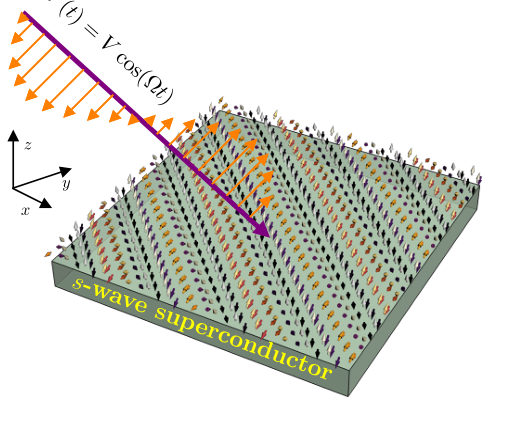 
FIG. 1. Schematic representation of a 2D non-collinear spin texture decorated on a square lattice and deposited on the surface of a common s-wave SC. A time-periodic harmonic drive is applied to the onsite chemical potential to realize 0- and anomalous π-FMFEMs.

📷 Fig 2

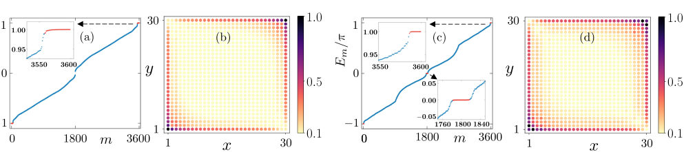 
FIG. 2. In panels (a) and (c), we depict the quasi-energy spectra as a function of the state index m for the driven system, choosing the driving frequency Ω= 5∆0 and Ω= 10∆0 respectively. The red color dots indicate 0- and π-FMFEMs. In panel (b), we illustrate the LDOS distribution of π-FMFEMs (corresponding to the panel (a)) localized at the edges of the 2D domain. Similarly, in panel (d) we illustrate the LDOS spectra corresponding to the 0-FMFEMs in panel (c). The other model parameters are chosen as ∆0 = t = 1, J = 2∆0, V = 5∆0, gx = gy = π/2.

📷 Fig 3

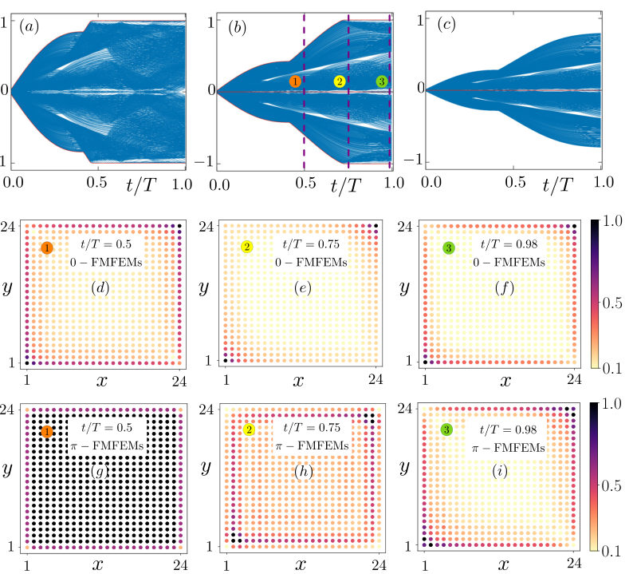 
FIG. 3. In panels (a), (b), and (c), we demonstrate the time-dependent eigenvalue spectra E(t) of the time-evolution operator U(t, 0) as a function of time t over a full driving period choosing Ω= 5∆0, 10∆0, and 15∆0, respectively. Panels (d)–(f) show the evolution of the edge states corresponding to the 0-FMFEMs at intermediate frequency (Ω= 10∆0), considering time scales t = 0.5T, 0.75T, and 0.98T, respectively. The same is depicted for the π-FMFEMs in panels (g)–(i) considering the same time instants mentioned above. The other model parameters are chosen as ∆0 = t = 1, J = 2∆0, V = 5∆0, and gx = gy = π/2.

📷 Fig 4

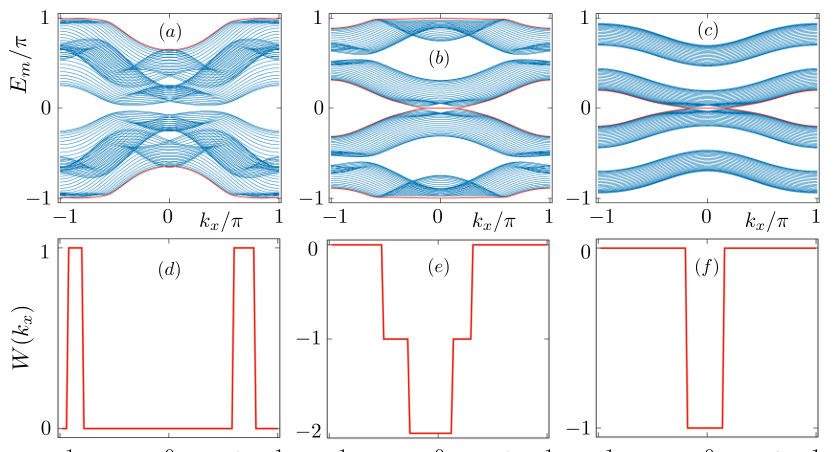 
FIG. 4. Panels (a)-(c) correspond to the quasi-energy edge spectra shown as a function of momentum kx for three different values of the driving frequency, Ω= 5∆0, 10∆0, and 15∆0, respectively. On the other hand, panels (d)-(f) exhibit the corresponding winding number as a function of momentum kx for the same choice of respective driving frequencies. The other model parameters are chosen as follows: V = 5∆0, J = 2∆0, ∆0 = t = 1, and gx = gy = π/2.

📷 Fig 5

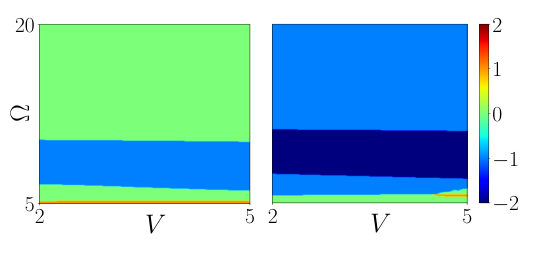 
FIG. 5. Density plots of the winding number (evaluated at kx = 0) is displayed in the plane of driving amplitude (V ) and frequency (Ω). We present the phase diagram for two different values of the exchange coupling: J = 1.6∆0 (panel (a)) and J = 2∆0 (panel (b)), corresponding to the trivial and topological phases of the static system, respectively. The other model parameters are chosen as ∆0 = t = 1, V = 5∆0, and gx = gy = π/2.

**Summary.** This theoretical work explores how periodically driving a magnet-superconductor junction can generate exotic topological superconducting phases characterized by anomalous Majorana flat edge modes. By analyzing the quasi-energy spectrum and winding number across varying driving frequencies, the authors map out a topological phase diagram. The findings demonstrate the tunability of these topological states using time-periodic driving, which has implications for superconducting quantum devices.

**Why it may be interesting.** The use of Floquet engineering to induce and control topological superconductivity, particularly the emergence of anomalous $\pi$-modes, is highly relevant to open quantum systems and superconducting quantum circuits.

Detailed structure

**Main problem.** The study investigates the generation and time evolution of anomalous Floquet Majorana flat edge modes (FMFEMs) in a 2D noncollinear magnet-superconductor heterostructure subjected to a harmonic drive.

**Main result.** The system exhibits distinct topological phases dependent on the driving frequency, characterized by the emergence of $\pi$-FMFEMs at low frequencies and $0$-FMFEMs at high frequencies, confirmed by the winding number.

**Method.** The research employs a real-space tight-binding model analyzed using Floquet theory, supplemented by Brillouin-Wigner and Floquet perturbation theory for analytical insight.

**Model / system.** The physical system is a 2D Shiba lattice (magnet-superconductor heterostructure) described by a Bogoliubov-de-Gennes Hamiltonian, which is periodically driven by a time-dependent chemical potential.

**Key observables.** Quasi-energy spectrum, Local Density of States (LDOS), and the topological winding number.

**Important parameters / regimes.** Driving frequency ($\Omega$), driving amplitude ($V$), and the superconducting gap ($\Delta_0$). Key regimes include low, intermediate, and high frequencies.

**Assumptions / limitations.** The analysis relies on the validity of the Floquet formalism, noting that perturbative methods (BW/FPT) fail to capture $\pi$-FMFEMs in the low-frequency regime.

**Figures summary.** Figures illustrate the edge spectra (quasi-energy vs. momentum) for different driving frequencies, and show the winding number as a function of momentum to confirm topological invariants.

**Paper structure.** The paper progresses from defining the physical model and Hamiltonian to calculating the quasi-energy spectrum across different driving regimes, followed by topological characterization using the winding number and comparison with perturbative expansions.

Abstract

We theoretically investigate the realization of gapless Floquet topological superconducting phases in a two-dimensional magnet-superconductor heterostructure (2D Shiba lattice) in the presence of a harmonic drive implemented in the chemical potential. Employing a real-space tight-binding model, we obtain both the regular $0$- and anomalous $π$-Floquet Majorana flat edge modes (FMFEMs) in the quasi-energy spectrum. We also study the real-time evolution of the FMFEMs and analyze their local density of states in the presence of such a periodic drive. The topological characterization is performed using the winding number, exploiting the chiral symmetry of the equivalent bulk effective momentum-space Hamiltonian. This is also supported by the corresponding edge state spectra. Furthermore, we employ the Brillouin-Wigner (BW) and Floquet perturbation theory (FPT) to gain analytical insight into the problem. We compare our exact (numerical), BW, and FPT results in terms of the quasi-energy spectra obtained across different frequency regimes. We find good agreement between the exact numerical, BW, and FPT results in the higher-frequency and high-amplitude domain, particularly close to the $0$-quasi-energy modes.

[↑ back to top](#top)

### [Dynamical Josephson Effect Between a Singlet and a Triplet Superconductor](http://arxiv.org/abs/2606.02694v1)

**Authors:** Morten Amundsen, Niladri Banerjee, Igor Žutić  
**Type:** theory · **Category:** other · **PDF:** <https://arxiv.org/pdf/2606.02694v1>  
**Analysis basis:** full PDF text, analyzed in chunks
**Topic relevance:** 🔥 `Keldysh / 2PI / non-Gaussian methods` **4/5** · `methods for driven-dissipative` **2/5** · `non-equilibrium dynamics` **2/5** · `correlated / nonlocal dissipation` **1/5** · `driven-dissipative phase transition` **1/5** · `exotic spin models in light-matter` **1/5** · `non-equilibrium universality` **1/5** · `spintronics-quantum-optics interface` **1/5**

📷 Fig 1

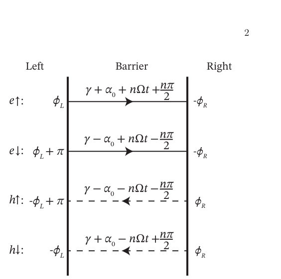 
FIG. 2. Schematic of the phase accumulated by electrons ↑, ↓ tunneling from the singlet to the triplet superconductor, and holes ↑, ↓tunneling in the opposite direction.

📷 Fig 2

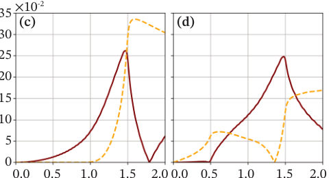 
FIG. 3. The dissipationless (dissipative) IS (IA) current am- plitude as a function of the driving frequency Ω, normalized to I0 = π|∆0,R|/2eRN. (a), (b) for singlet-singlet and (c), (d) singlet-triplet JJs.

**Summary.** This theoretical work analyzes the Josephson effect in a junction between singlet and triplet superconductors under a time-varying gate voltage. It demonstrates that the dynamic modulation induces a novel cos(phi) current component, which is a direct consequence of the spin symmetry mismatch. This effect suggests new ways to use such junctions for spin-triplet current sources in quantum devices.

**Why it may be interesting.** The study of dynamical Josephson effects in unconventional superconductors provides a platform to probe spin-momentum locking and parity selection rules, which are crucial concepts in superconducting spintronics and topological superconductivity.

Detailed structure

**Main problem.** The paper investigates how the selection rules governing the Josephson effect are modified when the junction is driven dynamically, particularly when coupling a spin-singlet and a spin-triplet superconductor.

**Main result.** A time-dependent gate voltage induces a novel Josephson current component proportional to cos(phi), which is absent in the static limit and arises due to the spin symmetry mismatch between the superconductors.

**Method.** The analysis employs the Keldysh Green function formalism to calculate the time-dependent current, decomposing it into symmetric (dissipationless) and antisymmetric (dissipative) components.

**Model / system.** The system is a Josephson junction (JJ) connecting a spin-singlet (SL) and a spin-triplet (SR) superconductor, separated by a 2DEG whose coupling is modulated by a time-dependent gate voltage inducing SOC.

**Key observables.** The current-phase relation (CPR), the total time-dependent current I(t), and the relative strengths of the dissipationless and dissipative current components.

**Important parameters / regimes.** The driving frequency ($\Omega$), the SOC strength ($\alpha_1$), and the superconducting gap sizes ($\Delta_L, \Delta_R$).

**Assumptions / limitations.** The analysis assumes a simple SOC model ($\propto \sigma_z k_y$) and uses approximations in the Keldysh formalism, neglecting higher-order frequency mode contributions.

**Figures summary.** Figures schematically illustrate the JJ setup with time-dependent SOC and show the phase accumulation of tunneling particles, while Figure 3 compares the normalized amplitudes of the AC and dissipative currents for singlet-singlet vs. singlet-triplet junctions.

**Paper structure.** The paper progresses from establishing the physical model (SL/SR JJ with time-dependent SOC) to deriving the current-phase relation using phase accumulation arguments, culminating in the full calculation via the Keldysh formalism to extract the time-dependent current components.

Abstract

Phase-sensitive Josephson effect has long been central to identifying unconventional pairing symmetries in superconductors. Although the selection rules governing Josephson junctions (JJs) are generally determined by the symmetries of the constituent superconductors, we demonstrate that this paradigm is modified in the dynamic regime. By modeling a JJ where spin-singlet and spin-triplet superconductors are separated by a two-dimensional electron gas, we show that a time-dependent gate voltage qualitatively changes the underlying selection rules. This modification arises as a consequence of the gate-controlled spin-orbit coupling. A harmonic modulation of the gate voltage generates an oscillatory $\cos φ$ Josephson component which vanishes in the static limit. The resulting charge current contains both dissipationless and dissipative components, with the latter strongly suppressed at low temperatures. This dynamical Josephson effect could transform the use of JJs in qubits, as sources of spin-triplet currents, and as platforms for proximity effects.

[↑ back to top](#top)

### [Reversible Superdense Ordering of Tetragonal Lithium in a Layered Material](http://arxiv.org/abs/2606.03563v1)

**Authors:** Natalie L. Williams, Stephen D. Funni, Sihun Lee, Drake Niedzielski, Mingjia Fang, Josh Leeman, Ratnadwip Singha, Saif Siddique, Tyler Hendee, Shiyu Xu, Jeffrey Kaaret, Giovanni Sartorello, Nicole A. Benedek, Leslie M. Schoop, Lynden A. Archer, Tomás A. Arias, Judy J. Cha  
**Type:** experiment · **Category:** other · **PDF:** <https://arxiv.org/pdf/2606.03563v1>  
**Analysis basis:** full PDF text, analyzed in chunks
**Topic relevance:** `driven-dissipative phase transition` **3/5** · `non-equilibrium dynamics` **3/5** · `non-equilibrium universality` **3/5** · `analog quantum simulation` **2/5** · `methods for driven-dissipative` **2/5** · `Keldysh / 2PI / non-Gaussian methods` **1/5** · `entanglement & information structure` **1/5**

📷 Fig 1

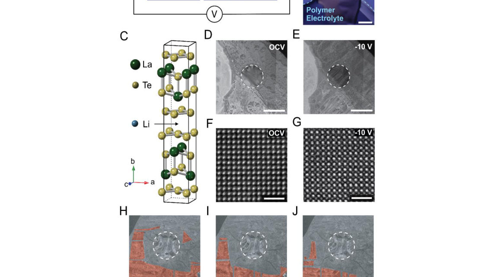 
Fig. 1. Lithium intercalation of LaTe3. (A) Cross-section schematic of a lithium-ion electrochemical cell (drawn not to scale). (B) Optical image of a LaTe3 flake in an electrochemical cell partially covered by polymer electrolyte. Scale bar: 10 µm. White dashed square indicates the region of the flake shown in (D) and (E). (C) Structure of LaTe3. Arrow denotes Li intercalation site. Low-magnification HAADF-STEM images of LaTe3 at (D) OCV at 1.2 V and (E) −10 V. Scale bar: 5 µm. White dashed circle in (D) and (E) indicates the membrane hole. Atomic-resolution HAADF-STEM images at (F) OCV and (G) −10 V. Scale bar: 1 nm. (H–J) False-colored HAADF-STEM images taken 40 seconds apart of a...

📷 Fig 2

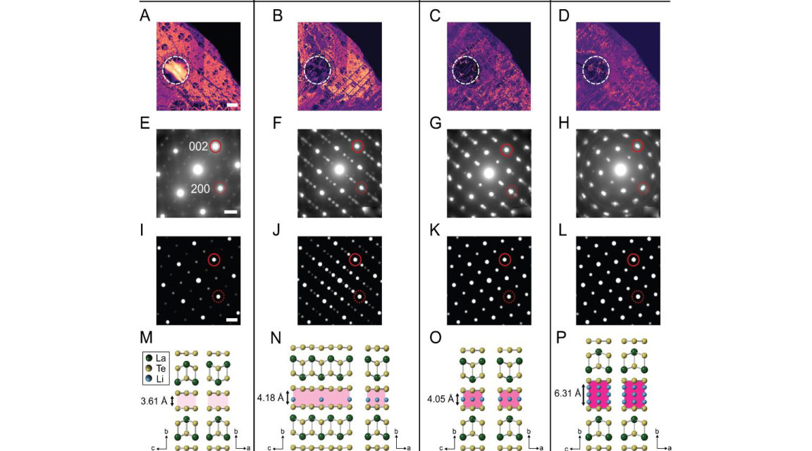 
Fig. 2. Lithiated phases of LaTe3. Virtual dark field images of the flake from the 4D-STEM datasets corresponding to the pristine (A) and Li-intercalated phases (B–D). Scale bar: 2 µm.

📷 Fig 3

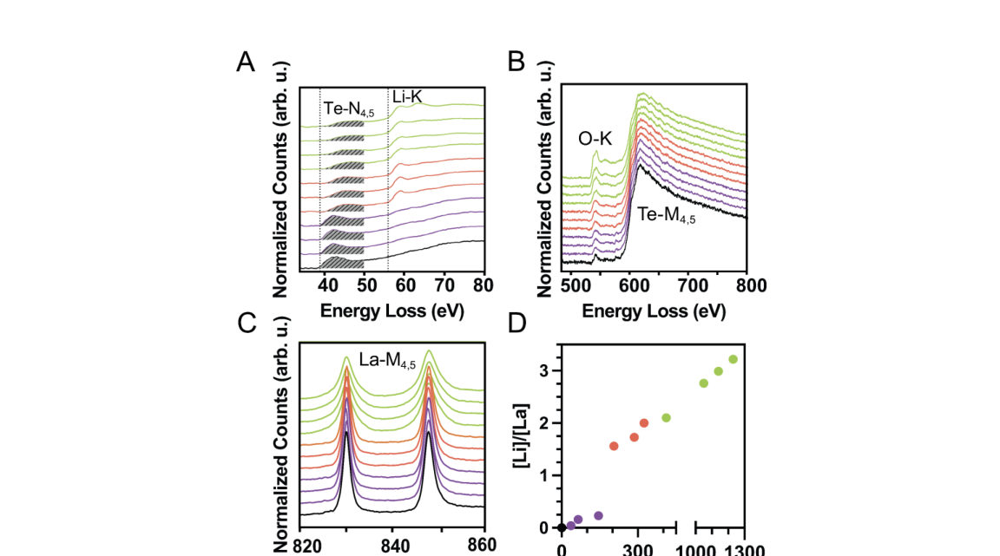 
Fig. 3. In-situ STEM-EELS measurements throughout lithiation. (A) Low-energy core loss range containing the Te-N4,5 and Li-K edges. (B) O-K and Te-M4,5 edges. Note the decrease in intensity of the Te-N4,5 edge onset (40 eV) with increasing Li concentration (A) despite no loss of Te as indicated in (B). (C) La-M4,5 edge shows no chemical shifts or branching ratio changes indicating the La bonding environment is unchanged even at high lithium content. (D) Li concentrations relative to La as quantified from the spectra in (A) and (C). Data are color-coded to indicate different lithiated phases. Transition to Phase 3 occurs at x ≈ 2 (green spectra). It is characterized by a less prominent Li-K...

📷 Fig 4

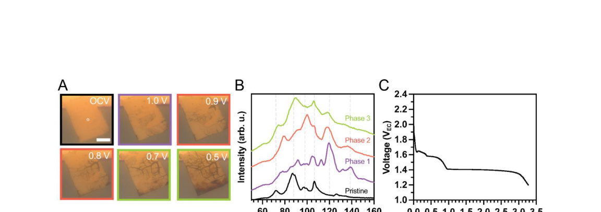 
Fig. 4. In-situ Raman characterization and galvanostatic discharge of LaTe3 during lithiation. (A) Optical images of a LaTe3 flake under polymer electrolyte. The white circle marks the Raman collection spot for all spectra. Colored borders correspond to select spectra in (B). Scale bar: 10 µm. (B) In-situ Raman spectra of LaTe3 with distinct lithiated phases shown in purple, red, and green. (C) Galvanostatic discharging of a LaTe3 powder coin cell at a current of 0.071 mA and a current density of 0.1 mA/cm2 in the voltage window 2.2 to 1.2 V vs. Li+/Li. In Phase 2 at VEC = 0.9 V, the two Raman modes at 120 and 142 cm−1 red-shift and phonon modes between ~85 and 110 cm−1 coalesce into a...

📷 Fig 5

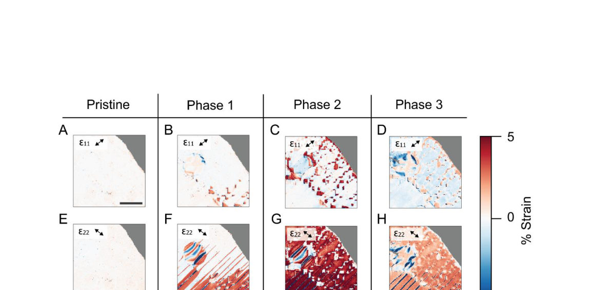 
Fig. 5. Strain in pristine and intercalated LaTe3. Representative strain maps along the c- direction (A–D) and a-direction (E–H). The average lattice from the membrane hole region of the pristine flake is used as the zero-strain reference for all maps. Note that: in (B, F) the lower portion of the flake and membrane hole areas have transitioned to Phase 1 while the remainder of the flake is in the pristine state; in (C, G) the entire flake has been lithiated with the lower portion in Phase 2 and the upper portion in Phase 1. Areas with large compressive strain values (dark blue) are attributable to the flake being locally off zone axis due to buckling folds induced from intercalation...

**Summary.** This paper reports on the in-situ characterization of lithium intercalation in the layered material LaTe_3 using advanced multimodal STEM. The authors successfully mapped three distinct, reversible ordered phases, most notably discovering a novel, superdense three-layer lithium phase. This work demonstrates the power of combining multiple electron microscopy techniques to track complex solid-state electrochemical processes crucial for battery development.

**Why it may be interesting.** While focused on materials science, the study involves tracking complex, reversible phase transitions and structural ordering under non-equilibrium electrochemical conditions, which touches upon concepts relevant to non-equilibrium statistical mechanics and open quantum systems.

Detailed structure

**Main problem.** The study aims to understand the lithium (Li) ordering and dynamics during intercalation in layered materials for use in next-generation energy storage.

**Main result.** The researchers identified three distinct, reversible ordered phases of Li_xLaTe_3, notably discovering a new, superdense three-layer lithium phase within the van der Waals gap at high Li concentrations.

**Method.** The work employs a multimodal approach combining in-situ Scanning Transmission Electron Microscopy (STEM) with spectroscopy (EELS) and diffraction, complemented by DFT calculations.

**Model / system.** The physical system is the layered material LaTe_3 undergoing electrochemical lithiation, forming Li_xLaTe_3. The study tracks structural and chemical changes across varying lithium concentrations (x=1/3 to 3).

**Key observables.** HAADF-STEM images, EELS spectra (tracking Li/Te bonding), 4D-STEM diffraction patterns (revealing superlattice spots), and Raman phonon modes.

**Important parameters / regimes.** Lithium concentration (x), applied electrochemical potential (V), and in-plane strain (up to 5%).

**Assumptions / limitations.** The multimodal STEM approach is necessary to overcome the limitations of single-technique X-ray methods for observing Li ordering.

**Figures summary.** Figures illustrate the in-situ setup, structural changes via STEM/diffraction patterns across different phases, and the evolution of electronic states via EELS.

**Paper structure.** The paper follows a progression from establishing the need for advanced characterization to presenting evidence for three distinct phases, culminating in the characterization of the novel, superdense Li phase.

Abstract

Understanding lithium (Li) ordering and dynamics is foundational in energy storage. X-ray based experimental methods do not simultaneously provide atomic structure information together with chemical composition and local bonding information for lithium in solids. Here we employ scanning transmission electron microscopy (STEM) and combine imaging, spectroscopy, and diffraction within a single experiment, to observe, in situ, an all-solid-state electrochemical cell. By integrating multimodal STEM with other complementary techniques, we report a complete mapping of lithium intercalation in a layered system, LaTe3. We identify three ordered phases of LixLaTe3 with x ranging from 1/3 to 3 with in-plane strain of up to 5%. At a very high lithium concentration of Li3LaTe3, we discover an unexpected three-layer, superdense lithium phase with tetragonal symmetry occupying the van der Waals gap. This represents a new Li phase that is reversible. Our multimodal approach thus enables complete tracking of lithium ordering and dynamics, important for next-generation energy storage applications.

[↑ back to top](#top)

### [Attractive Hopfions and Bimerons in Thin Films of Chiral Magnets: Cluster Formation and Lattice Instability in the Conical Phase](http://arxiv.org/abs/2606.03016v1)

**Authors:** Andrey O. Leonov, Takayuki Shigenaga  
**Type:** theory · **Category:** other · **PDF:** <https://arxiv.org/pdf/2606.03016v1>  
**Analysis basis:** full PDF text, analyzed in chunks
**Topic relevance:** `analog quantum simulation` **3/5** · `exotic spin models in light-matter` **3/5** · `spintronics-quantum-optics interface` **3/5** · `Frenkel-Kontorova` **2/5** · `driven-dissipative phase transition` **1/5** · `non-equilibrium dynamics` **1/5** · `non-equilibrium universality` **1/5**

📷 Fig 1

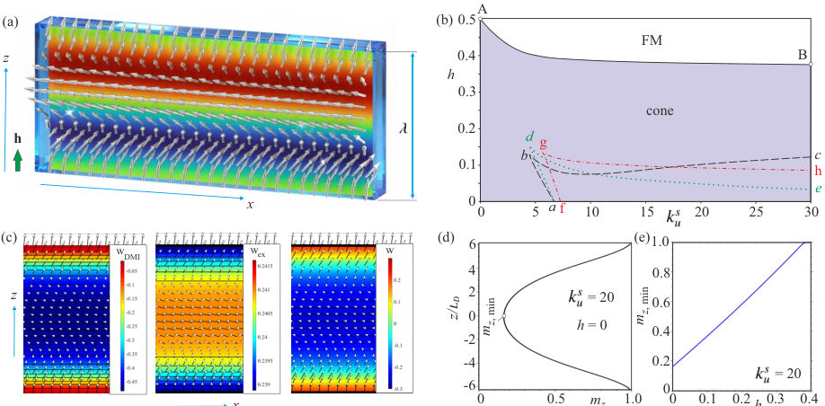 
FIG. 1. (Color online) Confined conical state in a thin film of thickness equal to one spiral pitch, λ = 4π. (a) Schematic illustration of the magnetization distribution within the conical spiral shown by gray arrows, together with a color map of the my component using the standard color scale from −1 (blue) to +1 (red). (b) Phase diagram in the (h, ks u) plane. The line A–B denotes the second-order transition from the conical to the homogeneous state; point A corresponds to θ0 = 0 and the critical field h = 1/2, in agreement with the analytical solution (6). The curvilinear boundary a–b–c (black dashed line) separates the parameter region where the CF–1 phase becomes energetically...

📷 Fig 2

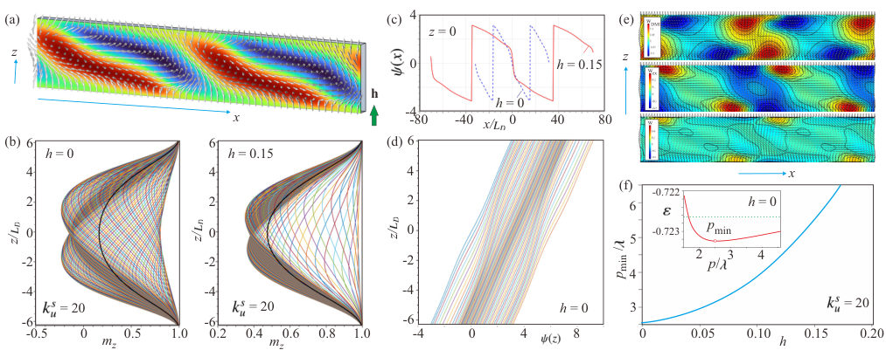 
FIG. 2. (Color online) Internal structure and energetic properties of the CF–1 phase. (a) Representative magnetization configuration of a cholesteric finger of the first type. (b) Angular profiles θ(z) taken at different lateral positions x across one period of the CF–1 structure. The black solid line shows the profile for the conical phase for comparison. Most CF–1 profiles exhibit stronger rotation, with some reaching negative values of mz, while profiles with reduced rotation compensate this excess. With increasing magnetic field (h = 0.15, ks u = 20, second panel), the profiles progressively converge toward the conical solution. (c) Lateral dependence ψ(x) at the mid-plane z = λ/2,...

📷 Fig 3

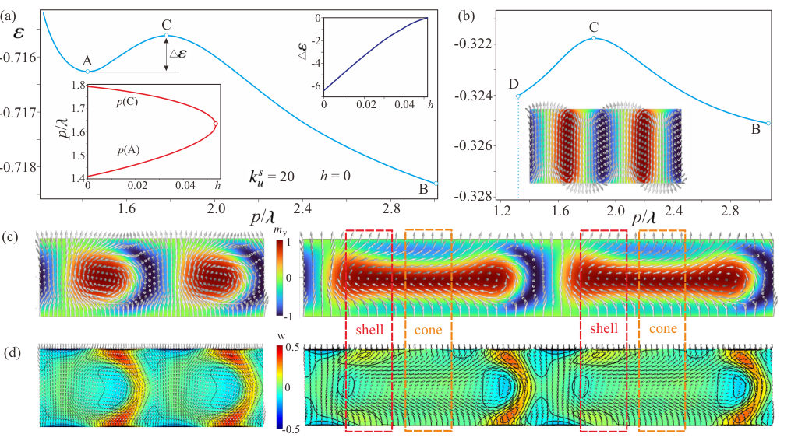 
FIG. 3. (a) Energy density of the bimeron lattice as a function of the lattice period p at fixed control parameters ks u = 20 and h = 0, showing a local minimum (A) separated by a potential barrier (maximum at C) from the lower-energy state with isolated bimerons embedded in the conical phase (B). Left inset: magnetic-field dependence of the lattice periods corresponding to points A and C up to the critical field where the minimum and maximum merge. Right inset: field dependence of the potential barrier height ∆ε, which vanishes at the critical field. (b) Energy-density curve in the regime where the minimum disappears from the left side, leading to a discontinuous transition of the bimeron...

📷 Fig 4

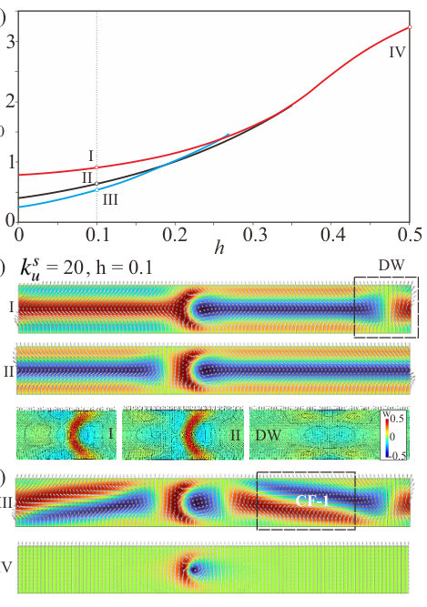 
FIG. 4. (a) Eigen-energies of isolated bimerons embedded in the conical phase, calculated relative to the energy of the conical state and plotted as a function of magnetic field. The red and black curves correspond to configurations I and II, respectively. (b) Spin con- figurations and corresponding energy-density distributions. Upper row: configuration I, in which the bimeron induces a phase shift of the conical state and generates a domain wall between conical do- mains of opposite phase (highlighted by the dashed black rectangle). Second row: configuration II, where the conical phase has identical phase on both sides of the bimeron and no DW is formed. Third row: spatial distributions of...

📷 Fig 5

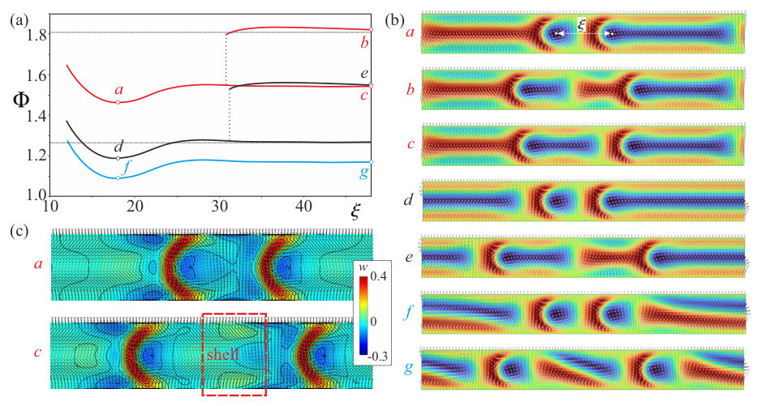 
FIG. 5. (a) Interaction potentials Φ(ξ) for pairs of CF–2 (bimerons) embedded in the conical phase at ks u = 20 and h = 0.1. The total energy relative to the conical state is plotted as a function of the inter-bimeron separation ξ for different realizations distinguished by the number and arrangement of domain walls. Branching of the curves reflects the formation or annihilation of DWs upon varying ξ. (b) Representative spin configurations corresponding to the labeled states (a–e). Configuration b contains two DWs and exhibits the highest pair energy at large separations, while configurations c and e contain a single DW located either in the interior or exterior region. Configurations a, d,...

**Summary.** This work theoretically examines how topological solitons (bimerons and hopfions) interact within chiral magnetic thin films hosting a conical background. Although the interactions are attractive, leading to stable clusters, the system fundamentally resists forming a true, stable periodic lattice. This highlights a crucial distinction between local attraction and global thermodynamic stability in complex magnetic materials.

**Why it may be interesting.** The concept of topological defects interacting in a frustrated background, leading to clustering without true long-range order, mirrors complex phase behavior seen in frustrated quantum magnets or defect arrays in quantum materials.

Detailed structure

**Main problem.** The study investigates the energetics, interactions, and ordering tendencies of topological textures like bimerons and hopfions in thin films of chiral magnets under a conical background state.

**Main result.** While attractive interactions promote the formation of bound clusters, the system resists forming a thermodynamically stable, long-range periodic lattice, instead favoring invasion by the conical spiral or CF-1 phase.

**Method.** The research uses theoretical energy minimization techniques applied to a phenomenological energy functional governing the magnetization profile in the thin film geometry.

**Model / system.** The system models thin films of chiral magnets or chiral liquid crystals, analyzed using an energy functional incorporating exchange, Dzyaloshinskii-Moriya interaction (DMI), and surface anchoring terms. The background state is characterized as a conical phase.

**Key observables.** Eigen-energy of isolated solitons, inter-soliton interaction potential, and the energy density dependence on the lattice period.

**Important parameters / regimes.** Applied magnetic field strength (h), surface anchoring strength (Ks), and the geometry of the conical background.

**Assumptions / limitations.** The analysis operates in a thin-film geometry and treats the system using a phenomenological energy functional, neglecting certain nonlocal electrostatic effects.

**Figures summary.** Figures illustrate energy density maps, the dependence of soliton energy on radius (W(R)), and crucially, the lack of a minimum energy density as a function of the lattice period for hexagonal arrangements.

**Paper structure.** The paper progresses by first establishing the background conical state, then analyzing the energetics of isolated bimerons and hopfions, demonstrating their attraction, and finally proving that this attraction does not lead to stable long-range crystalline order due to phase competition.

Abstract

We investigate the energetics, interactions, and ordering tendencies of bimerons (cholesteric fingers of the second type, CF--2) and hopfions in thin films of chiral magnets and chiral liquid crystals hosting a conical background state. Although isolated bimerons possess positive eigen-energy with respect to the conical phase, they develop an attractive interaction mediated by the restructuring and partial overlap of their positive-energy shells, i.e., intermediate regions formed relative to the conical state. This attraction promotes the formation of bound pairs and extended bimeron chains, even in parameter regimes where a periodic bimeron lattice is no longer thermodynamically stable.   Extending the analysis to three dimensions, we show that circularization of bimerons into hopfions renders their energy finite and gives rise to a well-defined metastability window closely linked to the stability range of cholesteric fingers. Isolated hopfions likewise exhibit an attractive interaction within the conical phase, leading to the formation of hexagonally ordered clusters. The attraction originates from the competition between favorable and unfavorable twist regions and from the energetic cost of the shell structures imposed by the conical background.   Despite the presence of attractive pair potentials and cluster formation, we demonstrate that hexagonal hopfion lattices do not exhibit an equilibrium lattice period. Instead, the system evolves toward states in which the conical spiral or the CF--1 phase (cholesteric fingers of the first type) progressively invade the inter-soliton regions, thereby preventing crystallization. Our results reveal a regime of attraction without stable long-range order and clarify the interplay between topology, confinement, and conical-phase frustration in chiral magnet and liquid-crystal thin films.

[↑ back to top](#top)

### [Epitaxial $\mathrm{Co_2MnSi}$ with intrinsic magnetocrystalline anisotropy as a route to bias-field-free nonlinear half-metal magnonics at the nanoscale](http://arxiv.org/abs/2606.03431v1)

**Authors:** Anna Maria Friedel, Jaafar Ghanbaja, Björn Heinz, Moritz Bechberger, Sylvie Migot, Sébastien Petit-Watelot, Stéphane Andrieu, Philipp Pirro  
**Type:** both · **Category:** other · **PDF:** <https://arxiv.org/pdf/2606.03431v1>  
**Analysis basis:** full PDF text, analyzed in chunks
**Topic relevance:** `spintronics-quantum-optics interface` **3/5** · `driven-dissipative phase transition` **2/5** · `non-equilibrium dynamics` **2/5** · `analog quantum simulation` **1/5** · `exotic spin models in light-matter` **1/5** · `methods for driven-dissipative` **1/5** · `non-equilibrium universality` **1/5**

📷 Fig 1

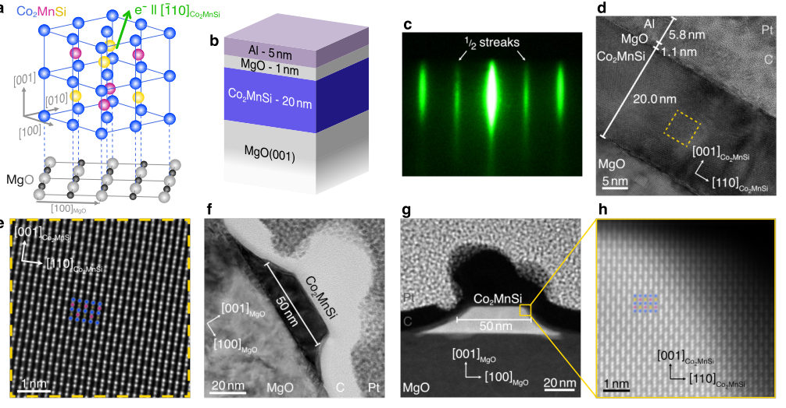 
Figure 1: Nanoscale integrity of the L21-ordered Heusler crystal structure upon nanofabrication. (a) Illustration of the Heusler lattice in the L21 order on an MgO(001) substrate44, with an indication of the electron beam probing direction. (b) Deposited thin film stack with nominal thicknesses grown by MBE. (c) in situ RHEED for e−∥[110]Co2MnSi, where the appearance of 1/2-streaks indicates a high chemical ordering degree. (d) HRTEM micrograph along the ¯110  zone axis of Co2MnSi showing the epitaxial Co2MnSi/MgO/Al thin film stack prior to nanofabrication. The dashed yellow square indicates the size of the region imaged in e. (e) Filtered HAADF-STEM micrograph revealing the...

📷 Fig 2

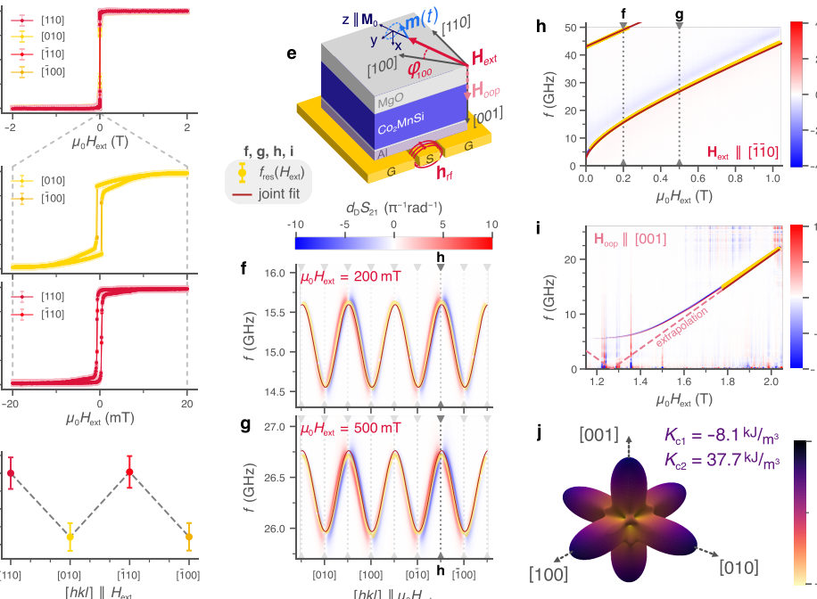 
Figure 2: Cubic magnetocrystalline anisotropy in Co2MnSi. Note: All lattice directions [ℎ𝑘𝑙] in this figure are given in the Co2MnSi crystal coordinates defined in Figure 1a. (a) Hysteresis of 𝑀(𝐻ext) from VSM with |𝜇0𝐻ext| ≤2 T applied in the film plane along the indicated lattice direction. (b, c) Small-field hysteresis 𝑀(𝐻ext) from VSM with |𝜇0𝐻ext| ≤20 mT applied in the film plane along the indicated lattice direction. (d) Relative remanence magnetization 𝑀r / 𝑀sat, with 𝑀r extracted from b, c and 𝑀sat from a. (e) Schematic illustration of the rotational BB-FMR geometry with the relevant crystal directions and the dynamic coordinates 𝑥, 𝑦, 𝑧. (f, g, h, i) Real part of the 𝑆21 signal...

📷 Fig 3

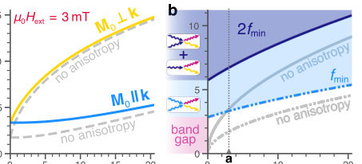 
Figure 3: Anisotropy impact on the spin-wave dispersion. (a) Isotropic and anisotropic spin-wave dispersion58,59 for 𝜇0𝐻ext = 3 mT for the 20 nm Co2MnSi film magnetized along an easy axis ⟨110⟩Co2MnSi. (b) Corresponding spin-wave band bottom frequency 𝑓min (𝐻ext) and 2 𝑓min (𝐻ext) and resulting first-order and second-order nonlinear instability ranges.

📷 Fig 4

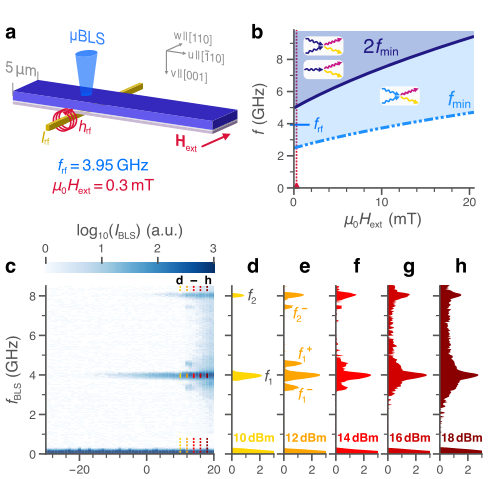 
Figure 4: Anisotropy-induced instability suppression. (a) Schematic of the µBLS probing. (b) Spin-wave band bot- tom frequency 𝑓min (𝐻ext) and 2 𝑓min (𝐻ext) considering the ef- fective waveguide width 𝑤eff = 4.94 µm, and resulting first- order instability suppression range. (c) BLS intensity spectra 𝐼BLS ( 𝑓BLS) as a function of the applied excitation power. (d-h) Selected BLS spectra across the instability onset.

📷 Fig 5

 
Figure 4c presents the BLS intensity spectra 𝐼BLS ( 𝑓BLS) as a function of the applied excitation power 𝑃rf for an excitation at 𝑓rf = 3.95 GHz in the near-zero bias field 𝜇0𝐻ext = 0.3 mT. As the excitation power is increased, the direct excitation 𝑓1 = 𝑓rf is increasingly populated, and additionally for 𝑃rf ≥0 dBm (1 mW) a population of the second harmonic 𝑓2 = 2 · 𝑓rf is observed linked to the elliptical precession at low fields65. The first and second harmonic are the only detected modes for 𝑃rf &lt; 12 dBm (16 mW) as marked in the spectrum in Figure 4d. At 𝑃rf = 12 dBm, the onset of the second-order instability is observed with a characteristic population of secondary modes 𝑓− 1 and 𝑓+ 1...

**Summary.** This research demonstrates that epitaxial $\mathrm{Co_2MnSi}$ retains its critical structural order even after nanoscale patterning, which is crucial for its magnetic functionality. The intrinsic cubic magnetocrystalline anisotropy is shown to stabilize spin-wave dynamics, enabling nonlinear magnonic operation at near-zero bias fields. This establishes $\mathrm{Co_2MnSi}$ as a highly promising, scalable platform for next-generation spintronic devices.

**Why it may be interesting.** While focused on condensed matter magnetism, the study of nonlinear wave dynamics and the use of advanced spectroscopic techniques ($\mu$BLS) to probe collective excitations in patterned systems has parallels with studying nonlinear wave propagation in quantum optical cavities or superconducting circuits.

Detailed structure

**Main problem.** The central goal is to establish $\mathrm{Co_2MnSi}$ as a robust, scalable platform for bias-field-free nonlinear half-metal magnonics at the nanoscale.

**Main result.** The intrinsic cubic magnetocrystalline anisotropy in epitaxial $\mathrm{Co_2MnSi}$ stabilizes spin-wave dynamics, suppressing first-order instabilities and enabling low-bias field operation in the favorable Damon-Eshbach geometry.

**Method.** The study combines epitaxial growth (MBE), top-down nanofabrication (EBL/Ar+ etching), and advanced characterization techniques including $\mu$BLS, FMR, and TEM to probe structure and dynamics.

**Model / system.** The physical system is epitaxial $\mathrm{L2_1}$-ordered $\mathrm{Co_2MnSi}$ Heusler thin films patterned into nanoscale waveguides. The analysis relies on spin-wave dispersion models incorporating magnetocrystalline anisotropy and dipolar effects.

**Key observables.** Spin-wave dispersion, nonlinear instability onset (first and second order), spin-wave decay lengths ($\delta_{amp}$), and magnetization switching fields.

**Important parameters / regimes.** Intrinsic cubic magnetocrystalline anisotropy, ultralow Gilbert damping ($\alpha \le 10^{-3}$), and operation at vanishing external bias fields.

**Assumptions / limitations.** The primary assumption is that the desirable magnetic properties, particularly the crystal structure, are preserved during the challenging top-down nanoscale patterning process.

**Figures summary.** Figures illustrate the nanoscale integrity of the L21-ordered structure after patterning, quantify the cubic magnetocrystalline anisotropy via FMR, and show $\mu$BLS spectra confirming nonlinear instabilities and stabilized spin-wave propagation.

**Paper structure.** The paper systematically moves from confirming the structural integrity of the material after nanofabrication (TEM/STEM) to quantifying the intrinsic magnetic anisotropy (FMR/VSM), and finally demonstrating the functional consequences of this anisotropy on nonlinear spin-wave dynamics ($\mu$BLS/Kerr).

Abstract

Half-metallic Heusler compounds like $\mathrm{Co_2MnSi}$ allow to bridge magnonic and spintronic functionality for hybrid unconventional computing approaches with sought-after properties like 100% spin polarization and associated low Gilbert damping $α\leq 10^{-3}$. However, the desirable material parameters are inherently tied to the crystal lattice with a particularly critical dependence on structural order in $\mathrm{Co_2MnSi}$. To date, the successful fabrication of nanoscale devices with robust structural integrity remains yet a challenge, and consequently the impact of the material parameters on the resulting nonlinear spin-wave dynamics remains largely unexplored. Here, we report on a study of linear and nonlinear spin-wave dynamics in transversally magnetized $\mathrm{Co_2MnSi}$ waveguides with impeccable crystalline ordering. We show that epitaxial, $\mathrm{L2}_1$-ordered $\mathrm{Co_2MnSi}$ exhibits an intrinsic cubic anisotropy with first- and second-order contributions, stabilizing a magnetization alignment along the crystal $\langle110\rangle$ directions. We confirm the implication of an unaffected crystal structure resulting in preserved magnetic properties in the patterned structures. Herein, the persistent magnetocrystalline anisotropy reshapes the spin-wave dispersion which yields a first-order nonlinear instability suppression range extending over several GHz - even for vanishing bias fields. Moreover, the intrinsic magnetocrystalline anisotropy can be exploited to counteract shape demagnetization for a stabilized low bias field operation in the favourable Damon-Eshbach geometry with high group velocities and decay lengths. Together with the proven half-metallicity and ultralow Gilbert damping, this research establishes $\mathrm{Co_2MnSi}$ as a robust, scalable platform towards bias-field-free nonlinear half-metal magnonics.

[↑ back to top](#top)

### [Early Experiments on Macroscopic Quantum Tunneling](http://arxiv.org/abs/2606.02770v1)

**Authors:** Willem den Boer  
**Type:** both · **Category:** other · **PDF:** <https://arxiv.org/pdf/2606.02770v1>  
**Analysis basis:** full PDF text, analyzed in chunks
**Topic relevance:** `QC/QI experiment` **3/5** · `Kondo & dissipative impurity` **1/5** · `analog quantum simulation` **1/5** · `correlated / nonlocal dissipation` **1/5** · `driven-dissipative phase transition` **1/5** · `methods for driven-dissipative` **1/5** · `non-equilibrium dynamics` **1/5**

📷 Fig 1

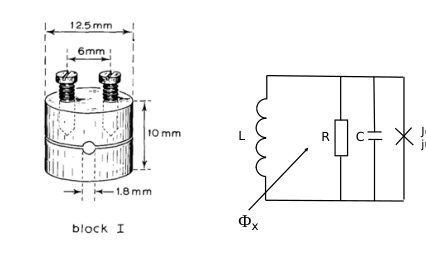 
Fig1. Sample with Nb point contacts for measurement of flux transitions (left) [7] and equivalent circuit (right), block I refers to one of two Nb blocks used (reprinted with permis- sion from Elsevier)

📷 Fig 2

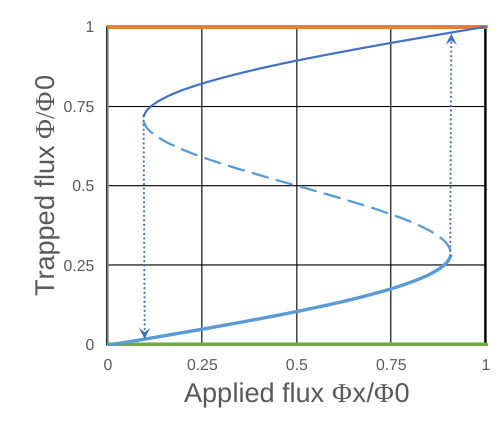 
Fig2. Theoretical dependence without noise of normalized trapped flux on normalized applied flux for Ic = ∞(fully closed loop, red and green lines) and I = Ic sin  2πΦ

📷 Fig 3

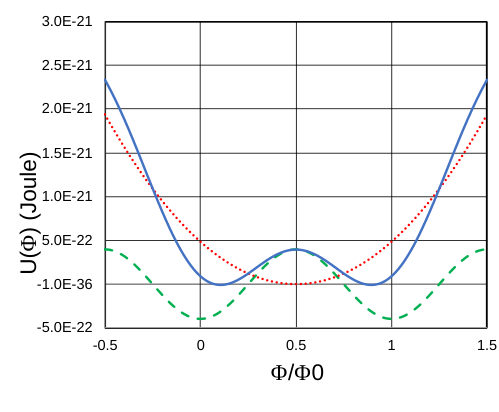 
Fig3. Potential energy of the ring system vs. trapped flux for L = 4 at Φx = 0.5Φ0, solid blue curve is U for L = 1.1 nH and Ic= 1.2 µA, dashed green curve is cos term in equation 2, dotted red curve is quadratic term

📷 Fig 4

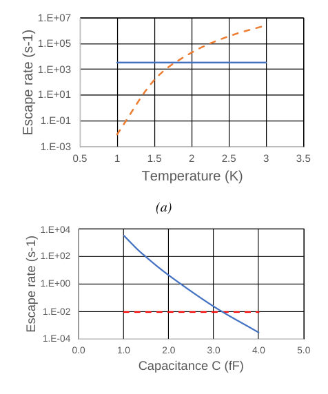 
Fig4. Calculated dependence of Rth (red, dashed curves) and Rtun (blue, solid curves) on T (a) and on C at 1 K (b) in the absence of dissipation when the other baseline parameters are fixed

📷 Fig 5

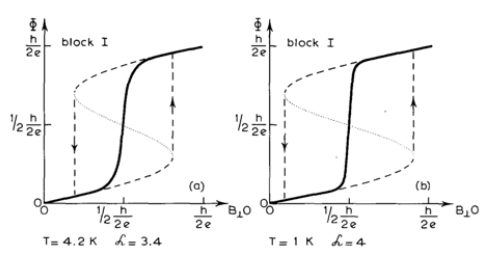 
Fig5. Representative flux curves measured at 4.2 K and at 1 K, where B⊥O is the applied flux and block I refers to figure 1 [7] (reprinted with permission from Elsevier)

**Summary.** This paper reviews early experimental attempts to observe Macroscopic Quantum Tunneling (MQT) in superconducting point contacts, drawing on theoretical models of potential energy barriers. By comparing calculated thermal and quantum tunneling escape rates, the authors argue that low-temperature flux transitions are likely quantum mechanical in origin. It provides crucial historical context for the development of superconducting quantum devices.

**Why it may be interesting.** This work is foundational for understanding quantum dissipation and tunneling in superconducting circuits, directly informing the physics used in modern superconducting qubits and quantum computation platforms.

Detailed structure

**Main problem.** The paper investigates the historical experimental evidence for Macroscopic Quantum Tunneling (MQT) in superconducting circuits, predating conclusive modern demonstrations.

**Main result.** The analysis suggests that at very low temperatures (1 K), the observed flux transitions are best explained by quantum tunneling rather than classical thermal activation, although the conclusion is tempered by experimental uncertainties.

**Method.** The authors analyze historical experimental data from Nb point contacts and apply theoretical models comparing thermal escape rates ($R_{th}$) derived from Arrhenius-like behavior against WKB tunneling rates ($R_{tun}$).

**Model / system.** The system modeled is a superconducting ring containing a Josephson junction or point contact, whose dynamics are governed by a potential energy landscape $U(\Phi)$ dependent on the trapped magnetic flux $\Phi$.

**Key observables.** Hysteresis in flux vs. applied flux curves, and the temperature dependence of the measured escape rates ($R_{th}$ vs. $R_{tun}$).

**Important parameters / regimes.** Temperature ($T$), critical current ($I_c$), total inductance ($L$), and the superconducting flux quantum ($\Phi_0$).

**Assumptions / limitations.** The analysis relies on the applicability of the WKB approximation for tunneling and assumes the system can be modeled by a simple potential barrier, though the author notes limitations regarding dissipation and noise sources.

**Figures summary.** Figures illustrate the potential energy barrier $U(\Phi)$ vs. trapped flux, and compare calculated thermal and tunneling rates ($R_{th}$ vs. $R_{tun}$) as functions of temperature, inductance, and critical current.

**Paper structure.** The paper reviews early 1979 experiments, establishes the theoretical framework using the potential energy landscape, calculates the ratio of thermal to tunneling rates, and concludes by contrasting these early findings with the later, conclusive work by Clarke et al.

Abstract

Before conclusive evidence of Macroscopic Quantum Tunneling, MQT, was published by Clarke, Devoret and Martinis in 1985, several other groups reported experimental results interpreted as MQT. The first, in chronological order, was in 1980 based on studies done at Leiden University in 1979. This paper looks back at these experiments on low capacitance Niobium point contacts in an rf SQUID, radio-frequency Superconducting Quantum Interference Device, configuration at temperatures between 1 and 4.2 K. The research was inspired by the theoretical predictions by Ivanchenko and Zilberman in 1969 on MQT in current-biased Josephson junctions and by Leggett in 1978 on MQT in closed loops with a superconducting weak link.

[↑ back to top](#top)

### [Chirality-resolved spectroscopy of Caroli-de Gennes-Matricon states in multiband FeTe$_{1-x}$Se$_{x}$ superconductors](http://arxiv.org/abs/2606.03637v1)

**Authors:** T. Rõõm, A. Glezer Moshe, R. Nagarajan, U. Nagel, Hee Taek Yi, Seongshik Oh, G. Blumberg  
**Type:** experiment · **Category:** other · **PDF:** <https://arxiv.org/pdf/2606.03637v1>  
**Analysis basis:** full PDF text, analyzed in chunks
**Topic relevance:** `spintronics-quantum-optics interface` **3/5** · `Keldysh / 2PI / non-Gaussian methods` **1/5** · `quantum optics experiment` **1/5**

📷 Fig 1

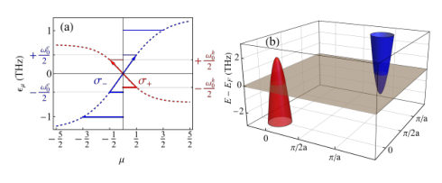 
FIG. 1. (a) Energies of the CdGM states for electrons (blue) and holes (red), ϵk µ = ∆k tanh(µ∆k/Ek F ) [3]. ∆e = 1.3 THz, ∆h = 0.67 THz [18] and Ek F = ∆2 k/2πωk 0 for sample x = 0.38, Table I. Arrows show the transitions from the highest oc- cupied to the lowest unoccupied state, blue for left-handed and red for right-handed radiation. (b) A cartoon of two- band structure for iron-based superconductors with an elec- tron band (blue) at the Brillouin zone M point (m∗ e = 3.4m0, EF = 1.7 THz; m0 is the bare electron mass) and hole band (red) at the Γ point (m∗ h = 3.3m0, EF = −1.9 THz).

📷 Fig 2

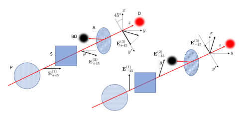 
FIG. 2. The schematics of Faraday rotation measurement setup showing rotation θ. P - polarizer, S - sample, A - an- alyzer tilted by 45◦from the beam direction to reflect the wrong polarization into beam dump BD, D - detector. Left: incident electric field in +45◦orientation, E(1) +45 ∥y; Right: in −45◦orientation, E(1) −45 ∥x. E(2) ±45 and E(3) ±45 are electric field transmitted through the sample and after passing the analyzer with its polarization axis along y′, respectively. For a small clock-wise θ the amplitudes at the detector are E(3) +45 &gt; E(3) −45.

📷 Fig 3

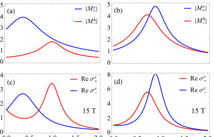 
FIG. 4. The frequency-dependent vortex response in a two- component superconductor. (a, b) – electron and hole helical vortex mass amplitudes |M k ±(ω)|, Eq. (5); and (c, d) – vortex conductivity ℜσv ± in 15 T, Eq. (8); Parameters from Table I, (a, c) for x = 0.15 and (b, d) for x = 0.38.

📷 Fig 4

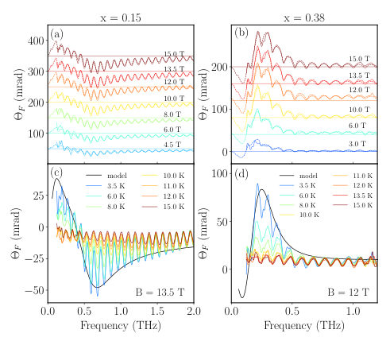 
FIG. 3. Magnetic field and temperature dependence of Fara- day rotation spectra. (a) x = 0.15 and (b) x = 0.38: magnetic field dependence at 3.5 K. Solid lines are experimental data, dashed lines are fits. The curves are offset by 40 mrad and hor- izontal line marks zero rotation for each curve. (c) x = 0.15 and (d) x = 0.38: temperature dependence measured at 13.5 and 12 T correspondingly. The black lines in (c) and (d) show θF of a free-standing 40 nm thick FeTe1−xSex film at 3.5 K, Eq. (9), calculated using transmission t±, Eq. (11), with pa- rameters from Table I .

📷 Fig 5

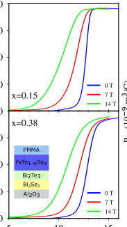 
FIG. 5. Temperature dependence of resistivity for samples x = 0.15 (top) and x = 0.38 (bottom) at several magnetic fields. The right column shows the temperature dependence of the Hall coefficient RH. The sample layer structure can be seen in the inset. for light propagation in the substrate, ds (0.500 mm and 0.494 mm for x = 0.15 and x = 0.38 samples, respec- tively) and df are substrate and film thicknesses, σ∓(ω) is film optical conductivity, Eq. (7) and (8), and Z0 ≈377 Ω is the vacuum impedance.

**Summary.** This work uses terahertz Faraday magneto-optics to investigate the quantized helical Caroli-de Gennes-Matricon (CdGM) states in FeTe1-xSe_x superconductors. By exploiting polarization selectivity, the researchers achieved band-resolved measurements of vortex-core dynamics. This confirms that THz magneto-optics is a powerful tool for studying helical excitations in complex, multiband superconductors.

**Why it may be interesting.** The technique directly probes the angular momentum and band character of quasiparticles confined in vortices, which is a highly sensitive probe of superconducting pairing symmetry and multiband physics, relevant to open quantum systems dynamics.

Detailed structure

**Main problem.** The study aims to probe the relaxation dynamics and helicity of quantized helical Caroli-de Gennes-Matricon (CdGM) states within the vortex cores of multiband FeTe1-xSe_x superconductors.

**Main result.** The experiment successfully established terahertz magneto-optics as a direct probe for helical vortex-core excitations, providing band-resolved evidence for multiband CdGM states in iron-based superconductors.

**Method.** Terahertz Faraday magneto-optical spectroscopy is employed to measure the polarization-selective optical response, which is sensitive to the helicity of the quasiparticles.

**Model / system.** The physical system is epitaxial FeTe1-xSe_x thin films, modeled as nodeless multiband superconductors. The analysis uses a theoretical framework describing the vortex momentum decomposition into independent helical contributions from each superconducting band.

**Key observables.** Faraday rotation ($	heta_F$), which is proportional to the difference in optical response between left- and right-circularly polarized light, and the resulting band-resolved vortex conductivity ($	ext{Re}\sigma_v^{\pm}(\omega)$).

**Important parameters / regimes.** The analysis is sensitive to the superconducting coherence length ($\xi$), vortex mass, and the doping level ($x$), which systematically alters the relative contributions of electron and hole bands.

**Assumptions / limitations.** The analysis assumes the superconducting state can be treated using non-interacting condensate approximations, and that the measured response is dominated by the vortex-core excitations.

**Figures summary.** Figures illustrate the expected CdGM energies for electron and hole bands, the setup for Faraday rotation measurements, and the magnetic field/temperature dependence of the Faraday rotation for different doping levels.

**Paper structure.** The paper first introduces the theoretical basis of CdGM states and the use of THz magneto-optics. It then details the theoretical modeling of the vortex conductivity in a multiband context. Finally, it presents experimental results showing the direct measurement of band-resolved, helical vortex excitations.

Abstract

We employ terahertz Faraday magneto-optical spectroscopy to probe the relaxation dynamics of quantized helical Caroli-de Gennes-Matricon (CdGM) states in epitaxial FeTe$_{1-x}$Se$_x$ thin films, nodeless multiband superconductors with short coherence lengths in the moderately clean limit. By exploiting polarization-selective optical transitions, we directly resolve the helicity and band origin of vortex-core quasiparticles. We observe long-lived CdGM resonances with opposite circular polarizations for electron- and hole-like bands. This enables independent, band-resolved determination of quasiparticle lifetimes, vortex masses, coherence lengths, and upper critical fields, and reveals their systematic evolution with isovalent substitution. The results establish terahertz magneto-optics as a direct probe of helical vortex-core excitations and provide dynamical evidence for multiband CdGM states in iron-based superconductors.

[↑ back to top](#top)

### [Geometric aspects of spin transport in magnetic multilayers](http://arxiv.org/abs/2606.03041v1)

**Authors:** Valentin Fadeev  
**Type:** theory · **Category:** other · **PDF:** <https://arxiv.org/pdf/2606.03041v1>  
**Analysis basis:** full PDF text, analyzed in chunks
**Topic relevance:** `spintronics-quantum-optics interface` **3/5** · `Keldysh / 2PI / non-Gaussian methods` **1/5** · `non-equilibrium dynamics` **1/5**

📷 Fig 1

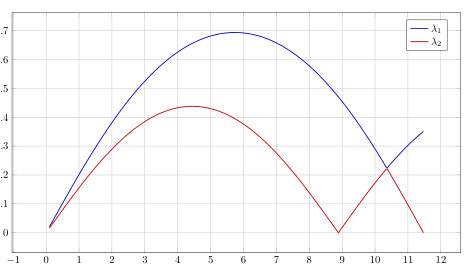 
FIG. 2. Single-FM Weyl coordinates as a function of ferro- magnetic thickness.

📷 Fig 2

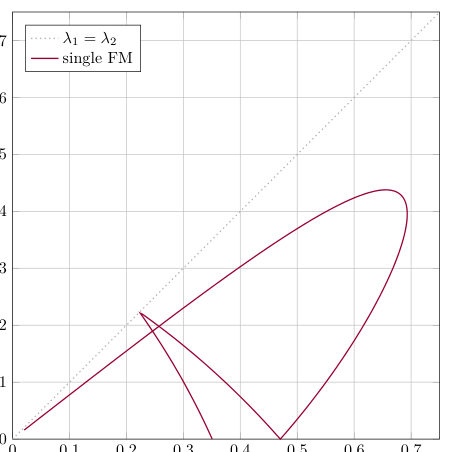 
FIG. 3. Weyl-chamber trajectory for the single-FM thickness sweep. The diagonal λ1 = λ2 corresponds to spin-independent radial filtering.

📷 Fig 3

 
FIG. 1. Model geometry for the single-FM example. Identical nonmagnetic leads are attached to a single ferromagnetic layer whose thickness is swept.

📷 Fig 4

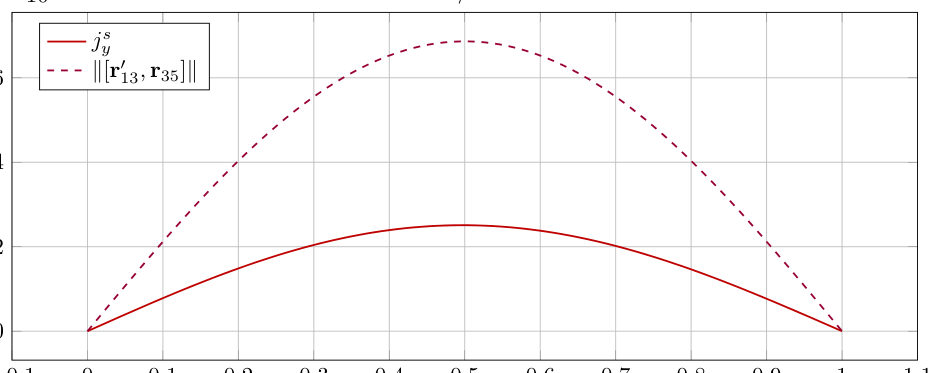 
FIG. 5. Spin-current components in the spacer of the FM/NM/FM stack as the analyser angle is swept. The lower panel compares the out-of-plane spin current component with the noncommutativity diagnostic ∥[r′ 13, r35]∥.

📷 Fig 5

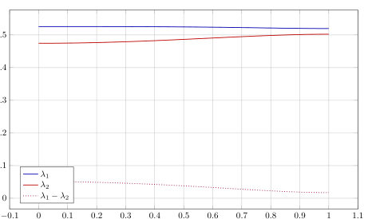 
FIG. 6. Weyl coordinates for the FM/NM/FM stack as a function of analyser angle. The splitting λ1 −λ2 tracks the anisotropic part of the radial filtering response.

**Summary.** This work develops a geometric theory for spin transport in magnetic multilayers by mapping the transfer matrix formalism onto the structure of noncompact Lie groups. It uses Iwasawa decomposition and Weyl-chamber variables to characterize spin filtering, while commutator analysis rigorously links the non-commutativity of spin filters to the generation of spin-transfer torque components.

**Why it may be interesting.** The deep integration of geometric group theory (Iwasawa, Weyl chambers) into condensed matter transport physics provides a powerful, unifying mathematical language for understanding complex spin-filtering phenomena, analogous to how geometric methods are used in quantum optics or quantum field theory.

Detailed structure

**Main problem.** To establish a rigorous geometric framework for describing spin-dependent electron transport through magnetic multilayers.

**Main result.** The transport dynamics are characterized by a path-ordered exponential (transfer matrix) whose action can be decomposed using Iwasawa theory, revealing minimal transport invariants (Weyl-chamber variables) and linking non-commutativity to spin-torque generation.

**Method.** The authors employ advanced group theory, specifically interpreting the transfer matrix as an element of a noncompact Lie group, utilizing Iwasawa decomposition, and analyzing commutator structures via the Baker-Campbell-Hausdorff expansion.

**Model / system.** The system is magnetic multilayers (e.g., FM/NM/FM stacks) where spin-resolved electron transport is governed by the stationary Schrödinger equation. The model incorporates spin-orbit coupling (SOC) and is analyzed using transfer matrices derived from first-order spatial evolution equations.

**Key observables.** Weyl-chamber variables ($\lambda_i$), Spin–Mueller–Jones tensor components, and the commutator norm $\|[r'_{13}, r_{35}]\|$ which quantifies out-of-plane spin current.

**Important parameters / regimes.** SOC strength ($\alpha_{so}$), spacer thickness, and the relative magnetization angles ($	heta$) between adjacent ferromagnetic layers.

**Assumptions / limitations.** The analysis relies on the transfer matrix formalism being equivalent to a path-ordered exponential, and the use of Iwasawa decomposition for the underlying Lie group structure.

**Figures summary.** Figures illustrate the evolution of Weyl coordinates ($\lambda_1, \lambda_2$) as a function of analyzer angle or spacer thickness, demonstrating the separation of compact (spin rotation) and noncompact (filtering) information, and showing the deformation of the Weyl trajectory due to SOC.

**Paper structure.** The paper progresses by first establishing the transfer matrix formalism, then applying group theory (Möbius/Iwasawa) to decompose the action. It subsequently analyzes the role of SOC and non-commuting reflections, culminating in the structural derivation of spin-torque components via commutator analysis.

Abstract

We discuss spin-dependent transfer-matrix formalism applied to magnetic multilayers in geometric terms. Starting from the stationary Schrödinger equation rewritten as a first-order spatial evolution problem, we interpret the transfer matrix as a path-ordered exponential and relate its matching-matrix construction to a noncompact group constraint. We thenconnect the induced Möbius action on reflection matrices to an Iwasawa decomposition, identify Weyl-chamber variables as the minimal noncompact transport invariants, and show how torque-related spin structures arise from compact-sector and commutator contributions. A sequence of multilayer examples illustrates the transition from pure spin filtering to controlled spin-orbit mixing and the resulting deformation of Weyl-chamber trajectories. We finally comment on the extension to higher-dimensional internal spaces relevant to orbital transport and realistic calculations.

[↑ back to top](#top)

### [Spin-wave phase modulation using magnetic domain walls in dipolarly coupled structures for non-volatile magnonic computation](http://arxiv.org/abs/2606.03336v1)

**Authors:** Hanadi Mortada, Philipp Pirro, Alexandre Abbass Hamadeh  
**Type:** theory · **Category:** other · **PDF:** <https://arxiv.org/pdf/2606.03336v1>  
**Analysis basis:** full PDF text, analyzed in chunks
**Topic relevance:** `spintronics-quantum-optics interface` **3/5** · `analog quantum simulation` **1/5** · `exotic spin models in light-matter` **1/5**

📷 Fig 1

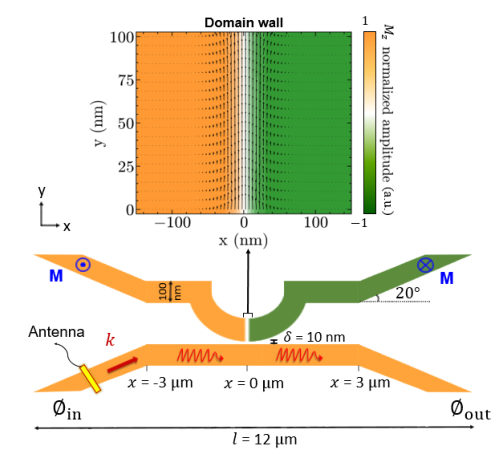 
FIG. 1. Spin-wave phase shifter geometry. Schematic top view of the proposed Bi:YIG phase shifter consisting of a straight nanowaveg- uide dipolarly coupled to a half-ring waveguide separated by a 10 nm gap. SWs are excited at the left input port by a microwave an- tenna (yellow) at frequency f = 5.9 GHz with a fixed initial phase φin. The half-ring hosts a magnetic DW whose position xDW can be displaced along the ring. The color map shows the perpendicular magnetization component Mz in the half-ring, illustrating the 180◦

📷 Fig 2

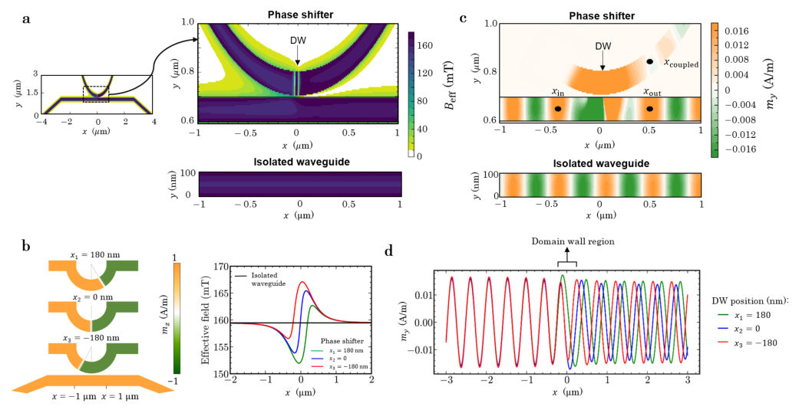 
FIG. 2. Domain–wall–induced effective-field modulation and its impact on spin-wave propagation. (a) Spatial distribution of the effective magnetic field magnitude Beff in the straight waveguide dipolarly coupled to the half-ring hosting a DW at xDW = 0. For comparison, the effective-field distribution of an isolated straight waveguide (i.e., without the half-ring structure) is shown below. (b) One-dimensional line cuts of Beff extracted along the centerline of the straight waveguide (y = 0.65 µm, mid-width of the waveguide) for the isolated configuration (black) and for the coupled phase-shifter configuration at three representative DW positions: x1 = +180 nm (green), x2 = 0 nm (blue), and...

📷 Fig 3

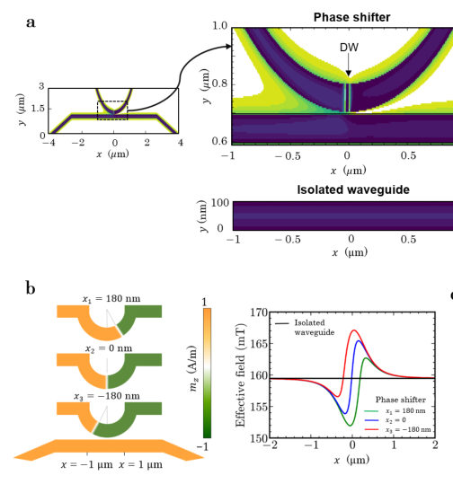 
Figure 1 (shown in yellow). SW propagation is initiated by ap- plying a sinusoidal magnetic field in time, by = b0 sin(2π ft), with an amplitude of b0 = 1mT and a selected microwave fre- quency f of 5.9 GHz. The antenna excites forward-volume SWs (FVSW), which subsequently traverse the coupling re- gion and emerge from the output port with a modified phase. In the proposed design, the DW in the half-ring creates a localized perturbation of the magnetic environment, which is transferred non-locally to the straight waveguide by dipolar coupling, as illustrated in Figure 2. As a result, the effec- tive field (i.e. the total local magnetic field acting on the magnetization, given by the sum of...

📷 Fig 4

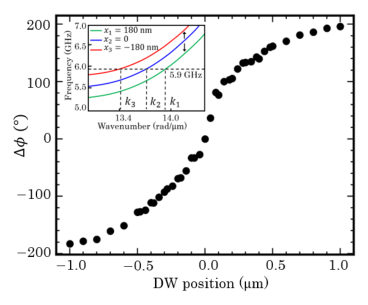 
FIG. 3. Quantitative extraction of the domain-wall-controlled spin-wave phase shift. Extracted phase difference ∆φ = φin −φout as a function of DW position xDW, obtained from the phase of the FFT component at f = 5.9 GHz. The inset shows a demonstration of the effective field variation on the dispersion relation in the coupling region shown for three representative DW positions: x1 = +180 nm (green), x2 = 0 nm (blue), and x3 = −180 nm (red).

**Summary.** This work proposes a novel, non-volatile phase shifter for magnonics by coupling a straight spin-wave waveguide to a half-ring containing a magnetic domain wall. By moving the DW, the local magnetic field and the spin-wave dispersion relation are dynamically altered, enabling continuous phase tuning without external bias fields or significant energy loss.

**Why it may be interesting.** While the core physics is classical magnetism, the concept of using localized, non-dissipative field perturbations (like those from DWs) to engineer wave properties (like phase) is analogous to controlling boundary conditions or potentials in quantum wave mechanics, making it relevant to understanding engineered quantum systems.

Detailed structure

**Main problem.** The core challenge is developing a controllable, non-volatile, and energy-efficient phase shifter for spin-wave (SW)-based logic and information processing.

**Main result.** The authors demonstrate that displacing a magnetic domain wall (DW) in an adjacent waveguide can continuously tune the SW phase shift over a wide range by modulating the local dispersion relation via dipolar coupling.

**Method.** The study relies on micromagnetic simulations to model the coupled magnetostrictive system and analyze the resulting spin-wave propagation characteristics.

**Model / system.** The physical system is a hybrid structure: a straight nanoscale waveguide dipolarly coupled to a half-ring waveguide, both made of Bi-doped Yttrium Iron Garnet (Bi:YIG). The phase shift is controlled by the static position of a magnetic domain wall (DW) within the half-ring.

**Key observables.** The primary observable is the tunable phase shift ($\Delta\varphi$) of the spin waves, which is shown to be strongly dependent on the DW position ($x_{	ext{DW}}$).

**Important parameters / regimes.** Key parameters include the coupling gap ($\delta = 10 	ext{ nm}$), the material properties of Bi:YIG, and the operating frequency (e.g., 5.9 GHz).

**Assumptions / limitations.** The analysis assumes the DW maintains a stable Bloch-type configuration and that the phase tuning mechanism is dominated by dispersion engineering rather than scattering losses.

**Figures summary.** Figures illustrate the geometry, the spatial distribution of the effective magnetic field ($	ext{B}_{	ext{eff}}$) modulated by the DW position, and the resulting continuous, non-linear dependence of the phase shift ($\Delta\varphi$) on the DW position.

**Paper structure.** The paper introduces the need for a controllable phase shifter, details the hybrid dipolar-coupled structure, uses micromagnetic simulations to model the field and phase shift dependence on DW position, and concludes by emphasizing the non-volatile and energy-efficient nature of the mechanism.

Abstract

A controllable phase shifter is a key component for spin-wave-based logic and information processing devices. Here, we propose a domain-wall-position-controlled spin-wave phase shifter that exploits dipolar coupling between two closely spaced waveguides to enable continuous phase tuning over a range approaching 360degrees while keeping the spin-wave amplitude constant. Using micromagnetic simulations, we model a bias-free hybrid structure composed of a nanoscale waveguide magnetostatically coupled to a half-ring-shaped structure both made from bismuth-doped yttrium iron garnet with strong perpendicular magnetic anisotropy. Displacing a domain wall in the half-ring modulates the dispersion relation in the adjacent straight waveguide due to the changed magnetostatic interaction, providing a compact and dynamically reconfigurable phase-shifting mechanism. This approach offers precise and non-volatile control over spin-wave propagation and is compatible with energy-efficient magnonic logic architectures.

[↑ back to top](#top)

### [Emergent Hall viscosity in the integer quantum Hall phases of graphene-like systems](http://arxiv.org/abs/2606.03932v1)

**Authors:** M. Selch, M. A. Zubkov  
**Type:** theory · **Category:** other · **PDF:** <https://arxiv.org/pdf/2606.03932v1>  
**Analysis basis:** full PDF text, analyzed in chunks
**Topic relevance:** `Keldysh / 2PI / non-Gaussian methods` **2/5** · `methods for driven-dissipative` **2/5** · `analog quantum simulation` **1/5** · `non-equilibrium dynamics` **1/5**

📷 Fig 1

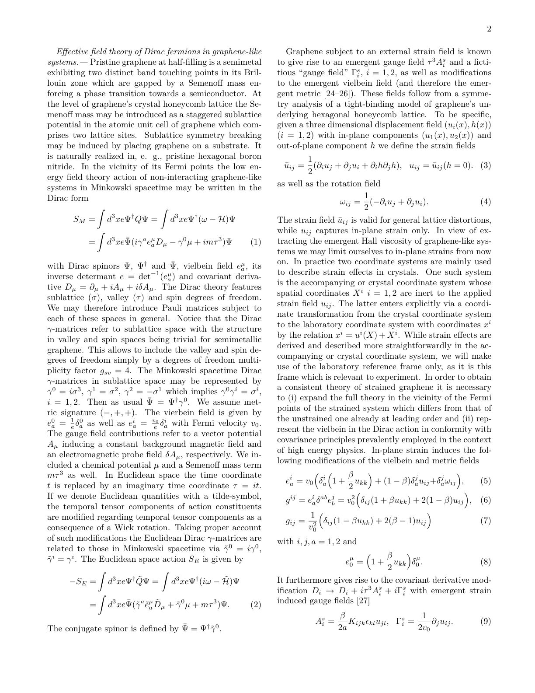 
Low-resolution page preview, page 2

📷 Fig 2

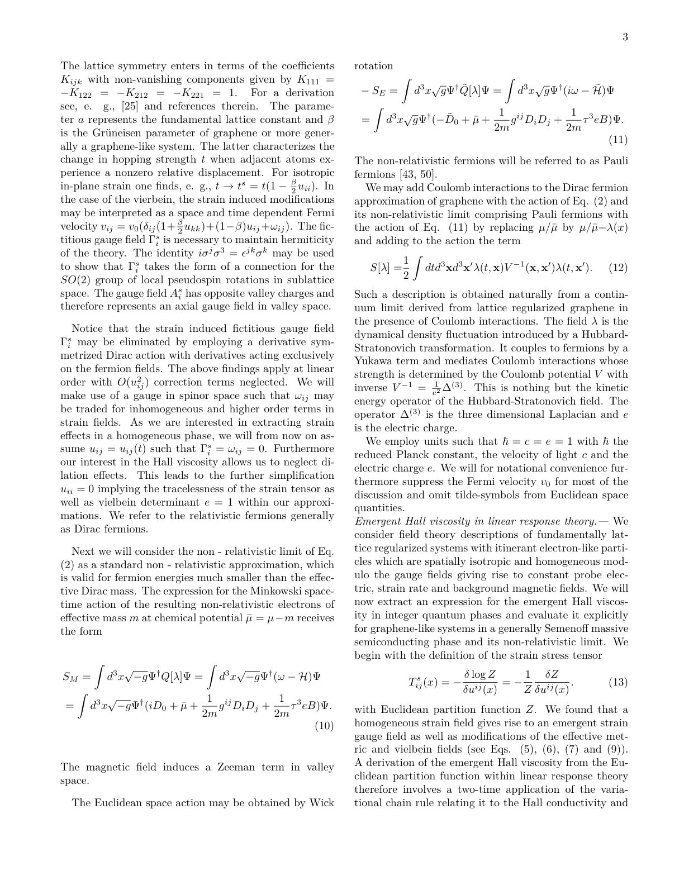 
Low-resolution page preview, page 3

📷 Fig 3

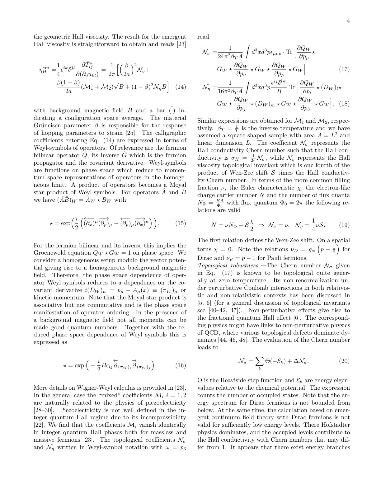 
Low-resolution page preview, page 4

📷 Fig 4

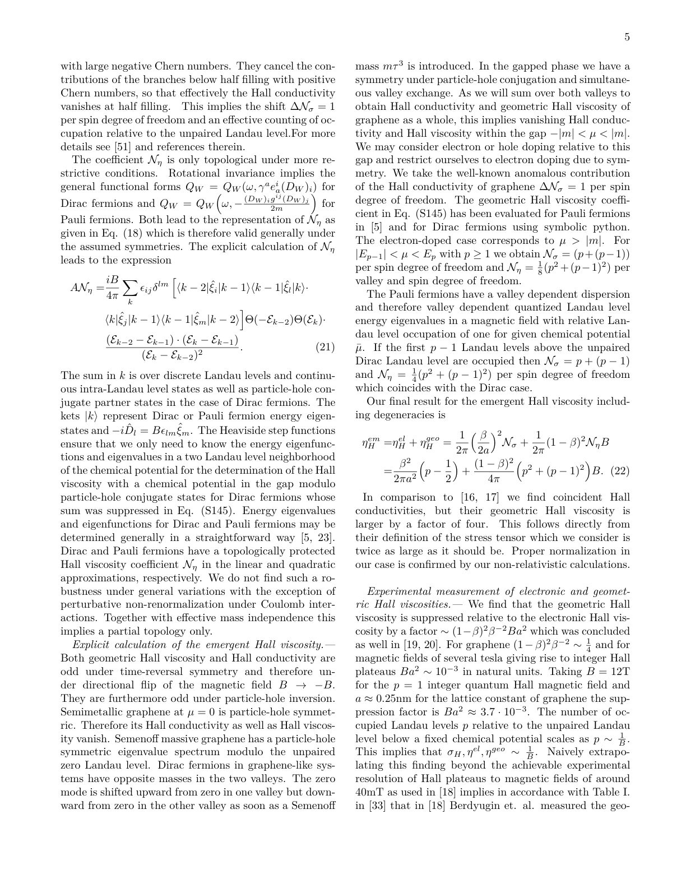 
Low-resolution page preview, page 5

📷 Fig 5

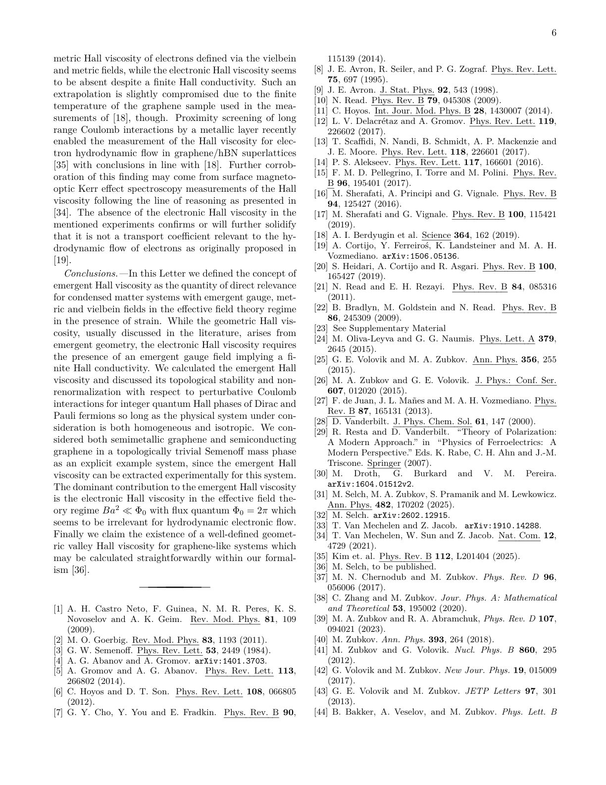 
Low-resolution page preview, page 6

**Summary.** This paper develops a unified theory for the emergent Hall viscosity in graphene-like quantum Hall systems. It distinguishes between geometric and electronic contributions, deriving explicit formulas using advanced field theory techniques like Wigner-Weyl calculus. The work establishes the topological quantization of this viscosity for massless Dirac fermions, providing a robust theoretical framework for understanding strain-induced transport phenomena.

**Why it may be interesting.** The rigorous derivation of topological invariants for transport coefficients like Hall viscosity provides a deep connection between geometry, topology, and condensed matter transport, which is relevant for understanding exotic quantum states.

Detailed structure

**Main problem.** To unify and explicitly determine the 'emergent Hall viscosity' in integer quantum Hall phases of graphene-like systems, distinguishing between contributions relative to the strain field versus those relative to an emergent vielbein or metric field.

**Main result.** The emergent Hall viscosity is decomposed into 'geometric' and 'electronic' contributions, and its calculation yields quantized topological invariants for the massless Dirac case, which are robust under certain symmetries.

**Method.** The analysis employs effective field theory methods, linear response theory within Wigner-Weyl calculus, and Green's function techniques to derive response functions.

**Model / system.** The study focuses on graphene-like systems (Dirac/Pauli fermions) in the presence of strain and a background magnetic field, covering both semimetallic and semiconducting phases.

**Key observables.** Hall viscosity ($\eta_{em}^H$), Hall conductivity ($\sigma_H$), and associated topological invariants ($N_\sigma, N_\eta$).

**Important parameters / regimes.** Magnetic field ($B$), chemical potential ($\mu$), and filling factors ($eta, \alpha$).

**Assumptions / limitations.** The analysis relies on approximations such as linear response theory, gradient expansions, and the use of the Moyal star product in Wigner-Weyl calculus.

**Figures summary.** Not specified.

**Paper structure.** The paper develops the formalism by first defining the problem in terms of strain and metric variations, then deriving response functions using Wigner-Weyl calculus, and finally calculating the topological invariants for both Dirac and Pauli fermion limits.

Abstract

We explicitly distinguish Hall viscosity as defined relative to the strain field vs. relative to an emergent vielbein or metric field and discuss it for graphene-like systems. Aside from the gravitational or vielbein/metric related ``geometric'' Hall viscosity prevailing throughout the literature, a contribution proportional to the Hall conductivity, the ``electronic'' Hall viscosity, due to the emergent strain induced gauge field exists. We unify both contributions within the ``emergent'' Hall viscosity, determine it explicitly for graphene in the semimetal and Semenoff semiconducting phases for integer quantum Hall states and in the latter case compare it to its non-relativistic limit. Under these circumstances two topological invariants enter the emergent Hall viscosity in the presence of translational and rotational symmetry which we derive in the Green function representation of Wigner-Weyl calculus. We discuss experimental perspectives for extracting the emergent Hall viscosity.

[↑ back to top](#top)

### [Anharmonic lattice dynamics and superconductivity in strained bulk and surface niobium](http://arxiv.org/abs/2606.02730v1)

**Authors:** Mihir Ranjan Sahoo, Roman Lucrezi, Pedro Nunes Ferreira, Chia-Nien Tsai, Matthew Julian, Rohit P. Prasankumar, Mahmoud I. Hussein, Christoph Heil  
**Type:** theory · **Category:** other · **PDF:** <https://arxiv.org/pdf/2606.02730v1>  
**Analysis basis:** full PDF text, analyzed in chunks
**Topic relevance:** `Keldysh / 2PI / non-Gaussian methods` **2/5** · `methods for driven-dissipative` **2/5**

📷 Fig 1

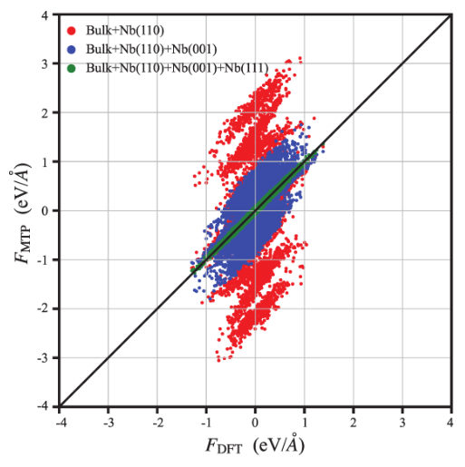 
FIG. 1. Parity plot of MLIP-predicted versus DFT atomic forces for Nb bulk and surface configurations. Each color corresponds to an MLIP trained on a progressively expanded dataset: Bulk+Nb(110) (red), Bulk+Nb(110)+Nb(001) (blue), and Bulk+Nb(110)+Nb(001)+Nb(111) (green). The diagonal line indi- cates perfect agreement.

📷 Fig 2

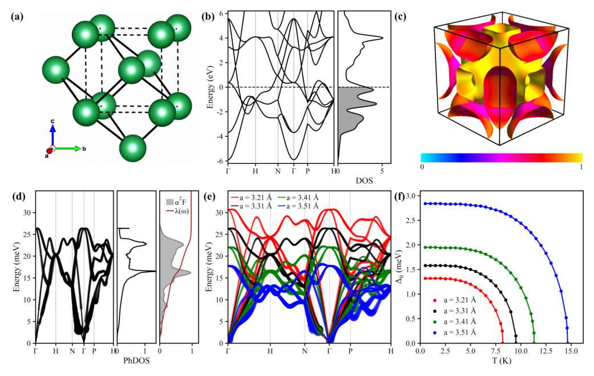 
FIG. 2. (a) Crystal structure of bulk Nb; dashed and solid lines indicate the conventional and primitive unit cells, respectively. (b) Electronic band structure along high-symmetry directions with the total DOS (states/eV) shown on the right; the dashed horizontal line marks the Fermi level (E = 0). (c) Nb 4d orbital-projected Fermi surface colored by the 4d orbital weight (color scale shown below). (d) Harmonic phonon dispersion with the phonon DOS, Eliashberg spectral function α2F(ω), and cumulative EPC constant λ(ω). The line thickness in the dispersion is proportional to the mode-resolved EPC strength. (e) Harmonic phonon dispersions at four lattice constants (a = 3.31 Å being the...

📷 Fig 3

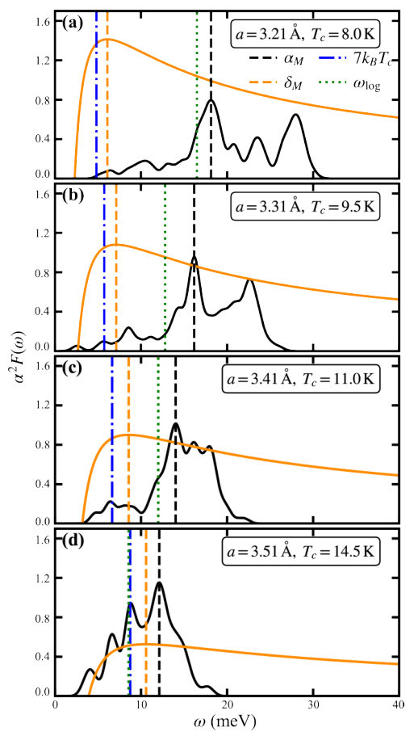 
FIG. 3. Eliashberg spectral function α2F(ω) (black) and functional derivative δTc/δα2F(ω) (orange) for bulk Nb at four lattice constants (panels a–d). Vertical lines mark characteristic energy scales: the peak positions of α2F(ω) (αM, black dashed) and δTc/δα2F(ω) (δM, orange dashed), the optimal pairing scale 7kBTc (blue dash-dotted), and the logarithmic average phonon frequency ωlog (green dotted). The lattice constant and calculated Tc for each case are given in the panel insets.

📷 Fig 4

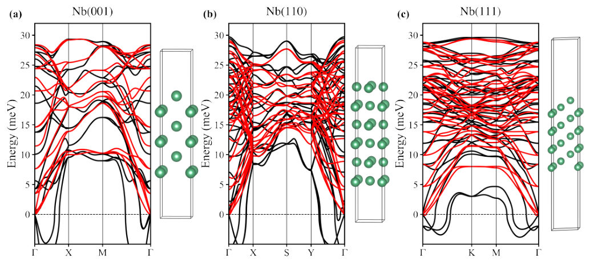 
FIG. 4. Side-view atomic structures and corresponding phonon dispersions of Nb slabs: (a) Nb(001), (b) Nb(110), and (c) Nb(111). In each panel, the left subfigure shows the phonon dispersion along high-symmetry directions, while the right subfigure presents the atomic slab structure. Black lines denote harmonic phonon spectra, while red lines represent anharmonic phonon dispersions obtained from SSCHA calculations.

📷 Fig 5

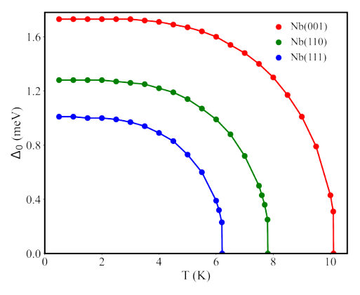 
FIG. 5. Temperature dependence of the superconducting gap ∆0 obtained from isotropic Migdal–Eliashberg calculations for the Nb(001), Nb(110), and Nb(111) slabs. Dots are calculated values; solid lines are guides to the eye.

**Summary.** This work uses first-principles calculations to map out how strain and surface termination tune superconductivity in Niobium. By incorporating anharmonic lattice dynamics, the authors show that tensile strain boosts $T_c$ in the bulk, and the (001) surface provides the best pairing strength among the analyzed terminations. The study highlights the crucial, interconnected roles of lattice anharmonicity and dimensionality in superconducting material design.

**Why it may be interesting.** While focused on BCS-type superconductivity, the rigorous treatment of anharmonic lattice dynamics and the use of MLIPs to accelerate complex many-body calculations are highly relevant to understanding quantum materials far from equilibrium.

Detailed structure

**Main problem.** The study investigates how homogeneous strain and crystallographic surface orientation modify the vibrational and superconducting properties of niobium (Nb).

**Main result.** Tensile strain significantly enhances the superconducting transition temperature ($T_c$) in bulk Nb, while the $	ext{Nb}(001)$ surface exhibits the highest $T_c$ among clean slabs, demonstrating that strain, surface effects, and anharmonicity are key tuning mechanisms.

**Method.** The research employs first-principles calculations (DFT) combined with advanced lattice dynamics treatments, including Machine-Learning Interatomic Potentials (MLIP) accelerated Stochastic Self-Consistent Harmonic Approximation (SSCHA) to capture anharmonic effects.

**Model / system.** The physical system is Niobium (Nb), analyzed in both its bulk form and as clean, free-standing ultra-thin slabs with (001), (110), and (111) terminations. Superconductivity is modeled using the electron-phonon coupling (EPC) framework.

**Key observables.** Superconducting transition temperature ($T_c$), electron-phonon coupling constant ($\lambda$), Eliashberg spectral function ($\alpha^2F(\omega)$), and phonon spectra.

**Important parameters / regimes.** Tensile strain (up to $\sim 6\%$ expansion), surface orientation ((001), (110), (111)), and anharmonic renormalization effects.

**Assumptions / limitations.** The calculated slab systems are idealized, clean, free-standing crystalline reference systems, and the harmonic approximation fails for surfaces, necessitating anharmonic corrections.

**Figures summary.** Figures illustrate phonon dispersions, $\alpha^2F(\omega)$ for different strain/surface conditions, and comparisons between MLIP-predicted and DFT atomic forces for various Nb structures.

**Paper structure.** The paper systematically analyzes the effects of strain on bulk Nb, then addresses the necessity of anharmonic corrections for surface slabs, comparing the resulting $T_c$ and EPC strength across different surface terminations.

Abstract

Using first-principles calculations, we investigate how homogeneous strain and crystallographic surface orientation modify the vibrational and superconducting properties of niobium. For bulk Nb, tensile strain strongly softens the phonon spectrum and enhances the electron--phonon coupling, increasing the superconducting transition temperature from 9.5 K at equilibrium to 14.5 K at $\sim\!6\%$ lattice expansion. For the low-index Nb(001), Nb(110), and Nb(111) surfaces, harmonic phonon calculations exhibit imaginary modes, showing that anharmonic lattice effects are essential. To treat these effects efficiently, we train Nb-specific machine-learning interatomic potentials on bulk and slab first-principles configurations and use them to accelerate stochastic self-consistent harmonic approximation calculations, thereby obtaining anharmonically renormalized phonon modes that are combined with density-functional perturbation theory electron--phonon matrix elements to construct the Eliashberg spectral function. Among the clean free-standing slabs considered here, Nb(001) exhibits the strongest electron--phonon coupling and the highest calculated transition temperature of 10.0 K, while Nb(110) and Nb(111) show progressively reduced pairing strength. Finally, by analyzing the Eliashberg spectral function and the functional derivative $δT_\text{c}/δα^2F(ω)$, we identify the phonon energy ranges most effective for superconducting pairing. Our results show that strain, surface termination, and anharmonic phonon renormalization provide complementary and interrelated microscopic routes for tuning superconductivity in Nb.

[↑ back to top](#top)

### [Spatially Uniform and Defect-Tolerant Plasmonic Responses in 3D printed Gold Nanoparticle Assemblies](http://arxiv.org/abs/2606.03285v1)

**Authors:** Vasanthan Devaraj, Sunghyun Kwak, Hyeongjip Kim, Sang-Keun Sung, Jong-Min Lee, Thomas Zentgraf, Won-Geun Kim  
**Type:** both · **Category:** other · **PDF:** <https://arxiv.org/pdf/2606.03285v1>  
**Analysis basis:** full PDF text, analyzed in chunks
**Topic relevance:** `analog quantum simulation` **2/5** · `interference shaping light` **1/5**

📷 Fig 1

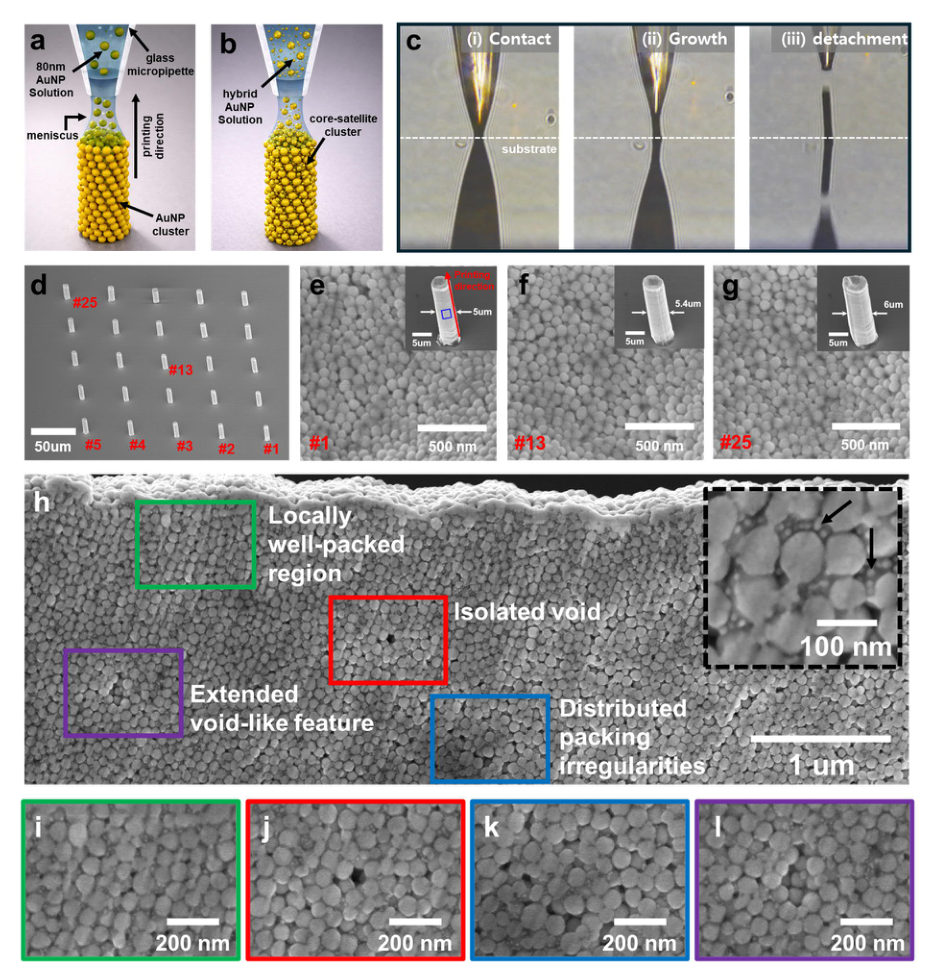 
Figure 1 | (a) Schematic illustration of the meniscus-guided 3D printing of AuNPs. (b) Schematic

📷 Fig 2

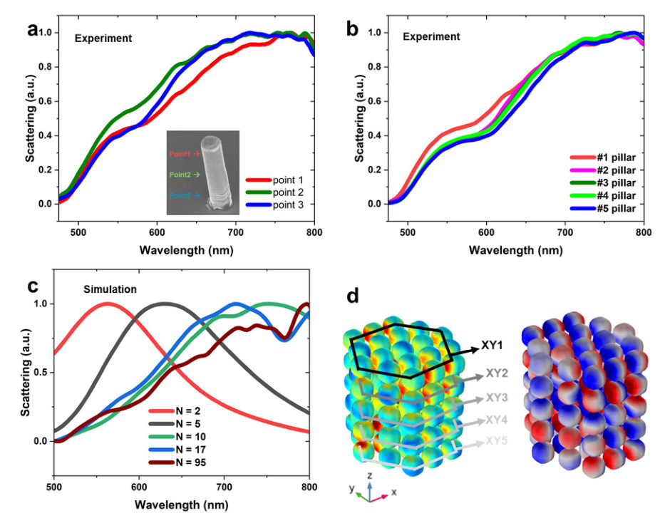 
Figure 2 | (a) Dark-field scattering spectra acquired from the bottom, middle, and top positions of a

📷 Fig 3

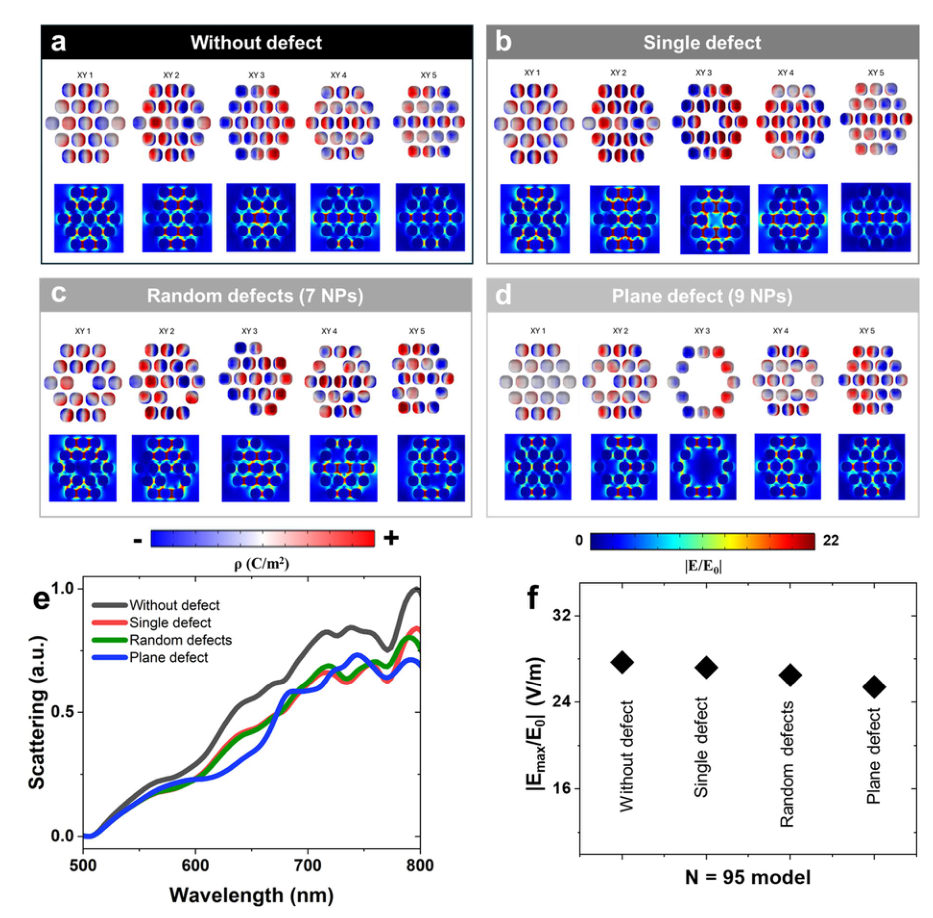 
Figure 3 | Near-field intensity (bottom) and surface charge (top) distributions of a representative 3D

📷 Fig 4

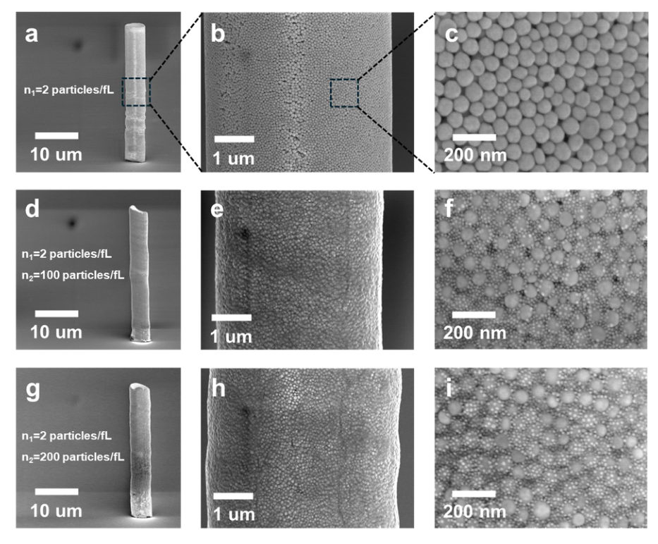 
Figure 4 | (a–c) SEM images of a core-only AuNP pillar formed with 80 nm AuNPs (n1=2 particles/fL)

📷 Fig 5

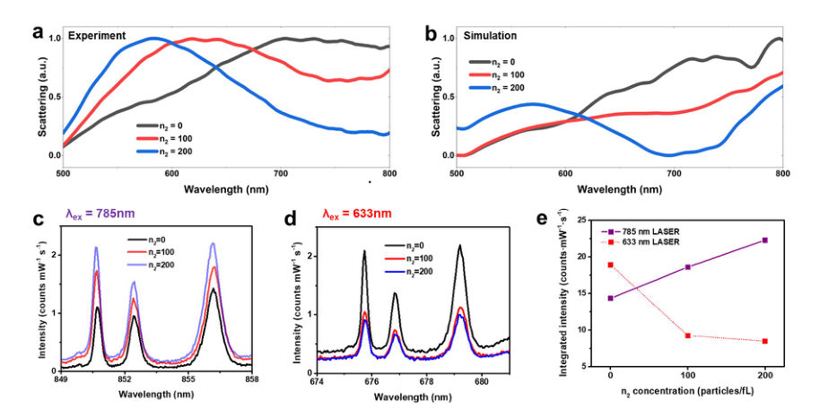 
Figure 5 | (a) Dark-field scattering spectra of 3D AuNP assemblies with different compositions,

**Summary.** This work establishes design principles for creating highly reliable 3D plasmonic nanostructures using printed gold nanoparticles. By demonstrating that the optical response is an ensemble average, the authors show the system is robust to structural defects. Furthermore, they prove this response can be actively tuned by engineering the composition using core-satellite nanoparticle arrangements.

**Why it may be interesting.** The concept of robust, ensemble-averaged optical properties emerging from disordered, many-body interactions is analogous to studying collective excitations in disordered quantum systems, providing experimental validation for concepts of emergent order.

Detailed structure

**Main problem.** The paper investigates how to create plasmonic nanoparticle assemblies that maintain uniform and predictable optical responses despite structural disorder, fabrication variability, and compositional changes.

**Main result.** The ensemble-averaged plasmonic response is shown to be robust and defect-tolerant due to volumetric averaging, and this response can be actively tuned by engineering the core-satellite nanoparticle architecture.

**Method.** The study combines experimental measurements (dark-field scattering, SERS) with advanced electromagnetic simulations (FDTD/Maxwell solvers) to model the collective optical behavior.

**Model / system.** The physical system is 3D printed assemblies of gold nanoparticles (AuNPs) fabricated via meniscus-guided assembly. The model incorporates core-satellite structures and simulates the effect of various structural defects (voids, missing particles).

**Key observables.** Spatially-resolved dark-field scattering spectra, near-field intensity/surface charge distributions, and Surface-Enhanced Raman Scattering (SERS) spectra.

**Important parameters / regimes.** High-aspect-ratio pillars, core-satellite ratios, excitation wavelengths (633 nm vs 785 nm), and the characteristic plasmon delocalization length.

**Assumptions / limitations.** The ensemble response is governed by volumetric averaging, and the simulation models use simplified effective-gap approximations for the complex, stochastic printed junctions.

**Figures summary.** Figures demonstrate the printing process, structural characterization via SEM, and comparative plots showing the stability of scattering spectra and SERS signals under varying defect levels and satellite concentrations.

**Paper structure.** The paper systematically moves from characterizing the basic robust response of large assemblies to introducing compositional modulation via core-satellite structures, culminating in detailed analysis of defect tolerance using both simulation and spectroscopy.

Abstract

Three-dimensional (3D) assemblies of gold nanoparticles (AuNPs) offer a rich platform for plasmonic coupling and near-field engineering, yet their optical behavior is often complex due to structural disorder and fabrication-induced variability. Here, we present a systematic optical investigation of large-scale 3D AuNP assemblies fabricated via meniscus-guided assembly, focusing on the reproducibility and spatial uniformity. Spatially-resolved dark-field scattering measurements reveal that high-aspect-ratio AuNP pillars exhibit uniform scattering spectra along their height and across different pillars, despite variations in geometry and structure. Electromagnetic simulations suggest that this robustness arises from an ensemble-averaged plasmonic response governed by many local coupling regions within a finite plasmon delocalization length. Simulated near-field and surface charge distributions suggest that the broad ensemble response remains spatially distributed under representative structural perturbations, consistent with volumetric averaging. Building on this robust platform, we introduce compositional modulation through a core-satellite architecture by incorporating smaller AuNPs. This yields a composition-dependent spectral redistribution, including an additional long-wavelength spectral feature in the core-satellite assemblies. Wavelength-dependent surface-enhanced Raman scattering measurements reveal contrasting responses under 633 and 785 nm excitation, reflecting redistribution of local plasmonic coupling pathways. These results establish design principles for robust 3D plasmonic nanoparticle assemblies with ensemble-averaged and composition-tunable optical responses.

[↑ back to top](#top)

### [Ferroelectric-tunable quantum nonlinearity of chiral Bloch electrons in a moiré system](http://arxiv.org/abs/2606.03497v1)

**Authors:** Zitian Pan, Jundong Zhu, Yu Hong, Jingwei Dong, Dongxia Shi, Kenji Watanabe, Takashi Taniguchi, Luojun Du, Wei Yang, Guangyu Zhang  
**Type:** experiment · **Category:** other · **PDF:** <https://arxiv.org/pdf/2606.03497v1>  
**Analysis basis:** full PDF text, analyzed in chunks
**Topic relevance:** `analog quantum simulation` **1/5** · `driven-dissipative phase transition` **1/5** · `non-equilibrium dynamics` **1/5** · `spintronics-quantum-optics interface` **1/5**

📷 Fig 1

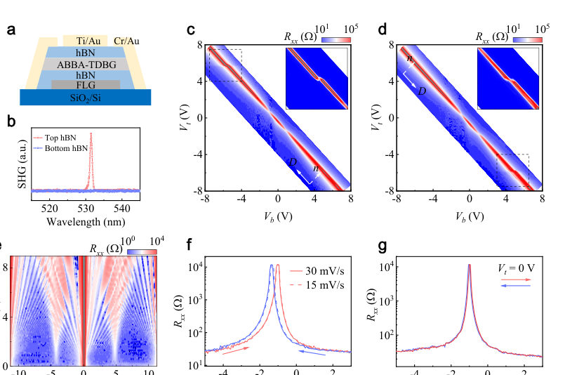 
Fig. 1. Ferroelectricity in high-equality hBN/TDBG device. a, Schematic of the device structure. b, SHG response of top (red) and bottom (blue) layer hBN under excitation laser with wavelength of 1064 nm. c,d, Longitudinal resistance 𝑅𝑥𝑥 as a function of top gate 𝑉𝑡 and bottom gate 𝑉𝑏. The arrows indicate the scanning direction, where the solid one is fast scan and the dashed one is slow scan. Inset: enlarged view of the dashed box region, plotted on linear scale. e, 𝑅𝑥𝑥 as a function of carrier density n and magnetic field B under zero displacement field D. f, Transfer curves of 𝑉𝑡 in both forward and backward scanning direction under 𝑉𝑏= 0 V. g, Transfer curves of 𝑉𝑏 in both forward and...

📷 Fig 2

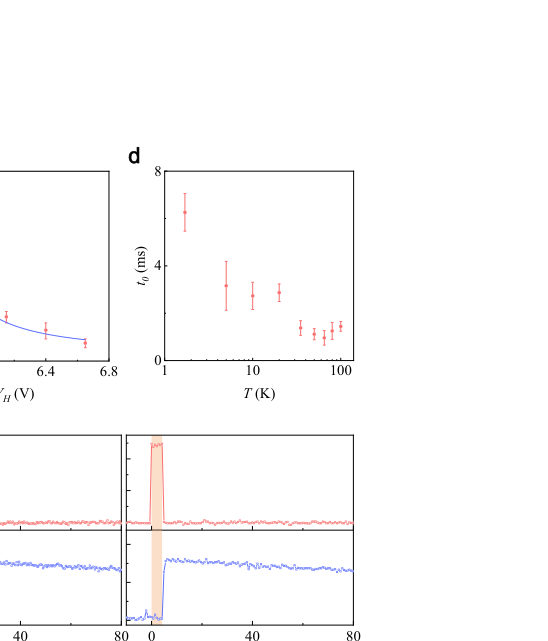 
Fig. 2. Thermodynamic behaviors of the ferroelectricity. a, Transfer curves of Vt in both forward and backward scanning direction under 𝑉𝑏= −5.65 V. b, Ferroelectric switching under pulses with different amplitude. c, Critical width 𝑡𝑐 to switch the polarization as a function of the high voltage level of the pulse 𝑉𝐻 at 𝑇= 1.7 K. The

**Summary.** This paper reports on ferroelectric control over quantum nonlinear transport in a moiré graphene heterostructure. By utilizing the ferroelectricity in the top hBN layer, the authors demonstrated a switchable nonlinear Hall effect linked to Berry curvature. This establishes the platform as a promising material system for electrically programmable quantum electronic devices.

**Why it may be interesting.** This work provides an experimental realization of electrically programmable quantum geometric properties (Berry curvature) using ferroelectric switching, which is highly relevant for developing novel quantum electronic devices.

Detailed structure

**Main problem.** The study investigates the coupling between sliding ferroelectricity and quantum nonlinear transport in a moiré heterostructure, aiming to demonstrate ferroelectric control over quantum nonlinearities.

**Main result.** The authors demonstrated a ferroelectric-switchable nonlinear Hall effect, confirming a direct coupling between the ferroelectric polarization and the system's Berry curvature, which is robust and non-volatile.

**Method.** The research combines electrical transport measurements (measuring $R_{xx}$ and nonlinear Hall response $\langle V_{xy}^{2\omega} 
angle$) with optical characterization ($	ext{SHG}$) and voltage pulse measurements to probe switching kinetics.

**Model / system.** The physical platform is a hexagonal boron nitride ($	ext{hBN}$) encapsulated twisted double-bilayer graphene ($	ext{TDBG}$) moiré heterostructure, which exhibits ferroelectricity due to rhombohedral stacking in the top $	ext{hBN}$ layer.

**Key observables.** Nonlinear Hall response ($\langle V_{xy}^{2\omega} 
angle$), longitudinal resistance ($R_{xx}$), polarization magnitude ($P_{2D}$), and ferroelectric switching kinetics (nucleation time $t_c$).

**Important parameters / regimes.** Temperature range ($1.7-200	ext{ K}$), applied gate voltages ($V_t, V_b$), and excitation electric fields.

**Assumptions / limitations.** The ferroelectricity is attributed specifically to the rhombohedral stacking in the top $	ext{hBN}$ layer, and the nonlinear effect is linked to chiral scattering induced by Berry curvature.

**Figures summary.** Figures detail $	ext{SHG}$ confirmation of ferroelectricity, $R_{xx}$ shifts under gate voltage sweeps, and hysteresis loops for the nonlinear Hall effect ($\langle V_{xy}^{2\omega} 
angle$) showing switching behavior under voltage pulses.

**Paper structure.** The paper systematically confirms the ferroelectric nature of the system, characterizes the temperature-independent polarization, and then demonstrates the ferroelectric-switchable nonlinear Hall effect, establishing the coupling mechanism.

Abstract

Sliding ferroelectricity in van der Waals materials shows great potential for designing robust memory devices. However, its thermodynamic behaviors and the coupling with certain quantum effects remain largely unexplored. Here, we demonstrate ferroelectric control over quantum nonlinear transport in a hexagonal boron nitride (hBN) encapsulated twisted double-bilayer graphene moiré heterostructure. The ferroelectricity is attributed to the presence of rhombohedral stacking in the top hBN, confirmed by both electrical transport and optical second harmonic generation (SHG) measurements. Remarkably, the polarization magnitude remains temperature-independent across 1.7-200 K, while nucleation time exhibits thermally activated behavior, decreasing with increasing temperature. Furthermore, we demonstrate a ferroelectric-switchable nonlinear Hall effect, attributed to the chiral scattering induced by Berry curvature, with outstanding fatigue-resistant and nonvolatility, demonstrating direct coupling between sliding ferroelectricity and quantum geometric properties. Our results establish sliding ferroelectrics as a platform for exploring electrically programmable Berry curvature physics.

[↑ back to top](#top)

### [Negative temperature coefficient of Gilbert damping in magnetic bilayers](http://arxiv.org/abs/2606.02858v1)

**Authors:** Lulu Cao, Yuting Gong, Xianyang Lu, Yongbing Xu, Ya Zhai, Jing Wu, Roy W. Chantrell, Richard F. L. Evans  
**Type:** both · **Category:** other · **PDF:** <https://arxiv.org/pdf/2606.02858v1>  
**Analysis basis:** full PDF text, analyzed in chunks
**Topic relevance:** `correlated / nonlocal dissipation` **1/5** · `spintronics-quantum-optics interface` **1/5**

📷 Fig 1

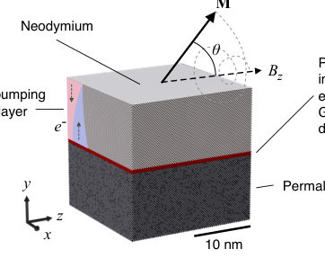 
FIG. 1. Schematic view of the simulated Py (6 nm)/Nd (t nm) bi- layer. The structural dimensions are 20×20×(6+t)nm3, where the dark grey underlayer and the red inserted layer represent the bulk and interface Py layer, respectively. The light-grey top layer represents the Nd layer.

📷 Fig 2

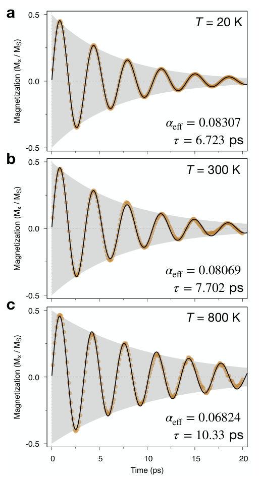 
FIG. 2. Simulated time evolution of the magnetisation trace (points) for the Py (6 nm)/Nd (32 nm) bilayer at different temperatures (a) T = 0 K, (b) T = 300 K, (c) T = 800 K showing a systematic de- crease in the effective Gilbert damping αeff with increasing tempera- ture as seen from the amplitude of the envelope function depicted by the shaded region. The lines are fitted to the data using Equation 3.

📷 Fig 3

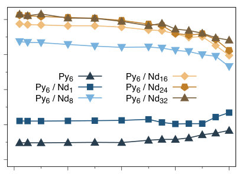 
FIG. 3. Simulated mean-effective Gilbert damping as a function of temperature for Py (6 nm)/Nd (0, 1, 8, 16, 24, 32 nm) bilayers. The data show a consistent decrease of the effective damping with tem- perature for Py (6 nm)/Nd (8, 16, 24, 32 nm) bilayers, and the ex- pected increase for the case for pure Py.

📷 Fig 4

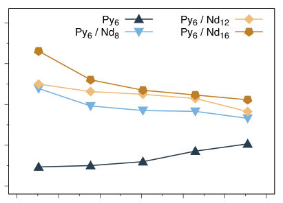 
FIG. 4. Experimentally measured effective Gilbert damping as a function of the pump fluence of the laser IF for Nd (t = 0, 8, 12, 16 nm)/Py (6 nm) bilayers.

**Summary.** This work explores the temperature dependence of Gilbert damping in magnetic bilayers, finding a surprising negative temperature coefficient in Py/Nd systems. The effect is explained by interface-enhanced damping due to spin pumping, which weakens as temperature rises. This offers a new mechanism to control the dynamic properties of spintronic materials.

**Why it may be interesting.** The study provides a clear example of how interface effects and thermal dynamics can lead to non-monotonic or counter-intuitive behavior in magnetic damping, which is relevant to understanding energy dissipation in nanoscale spintronic devices.

Detailed structure

**Main problem.** The paper investigates the unusual temperature dependence of the Gilbert damping in magnetic bilayers, specifically observing a decrease in damping as temperature increases in Py/Nd systems.

**Main result.** The damping exhibits a negative temperature coefficient in Py/Nd bilayers, which is attributed to interface-enhanced damping effects from spin pumping that diminish at higher temperatures.

**Method.** The study combines atomistic spin dynamics simulations using the sLLG equation with complementary time-resolved magneto-optical Kerr effect (TR-MOKE) measurements.

**Model / system.** The physical system is magnetic bilayers, such as Py/Nd, modeled using a classical spin Hamiltonian and governed by the stochastic Landau–Lifshitz–Gilbert (sLLG) equation. The interface damping enhancement due to spin pumping is a key physical mechanism.

**Key observables.** Effective Gilbert damping ($\alpha_{	ext{eff}}$), relaxation time ($	au$), and precession frequency ($f$).

**Important parameters / regimes.** Temperature ($T$), Nd capping layer thickness ($d_{	ext{NM}}$), and the magnitude of interface spin accumulation.

**Assumptions / limitations.** The sign of the temperature dependence of $\alpha_{	ext{eff}}$ depends critically on the magnitude of the interface spin accumulation (large accumulation $
ightarrow$ negative coefficient).

**Figures summary.** Figures show simulated and measured $\alpha_{	ext{eff}}$ vs. temperature, demonstrating the systematic decrease in damping for Py/Nd bilayers compared to the expected behavior in pure films.

**Paper structure.** The paper develops the theory by modeling spin dynamics and then presents results comparing the temperature dependence of damping in different bilayer structures ($	ext{Py}/	ext{Nd}$ vs. $	ext{Pt}/	ext{Py}$), contrasting the mechanisms responsible for the observed sign change.

Abstract

The Gilbert damping of magnetic materials is an important magnetic parameter that determines the switching speed and energy dissipation of spintronic devices. In simple metals, the intrinsic Gilbert damping increases with temperature and diverges near the Curie temperature as a result of spin fluctuations. Here we present atomistic simulations and experimental measurements showing surprising and opposite behavior in Py/Nd bilayers, where the Gilbert damping decreases with increasing temperature. The effect arises because of the enhanced damping at the interface as a result of spin pumping, where elevated temperatures cause a dynamic separation of the interfacial and bulk magnetization during relaxation. Furthermore, the temperature dependence of the damping can be controlled by varying the thickness of the Nd capping layer. Our findings present a new spintronic effect that can be used to modify the dynamic properties of nanoscale materials and devices for enhanced energy efficiency or with improved switching dynamics.

[↑ back to top](#top)

### [Data-driven mapping of borophene growth pathways](http://arxiv.org/abs/2606.03886v1)

**Authors:** Colin Bousige, Jean Furstoss, Julien Lam, Pierre Mignon  
**Type:** theory · **Category:** numerical methods · **PDF:** <https://arxiv.org/pdf/2606.03886v1>  
**Analysis basis:** full PDF text, analyzed in chunks
**Topic relevance:** `methods for driven-dissipative` **1/5**

📷 Fig 1

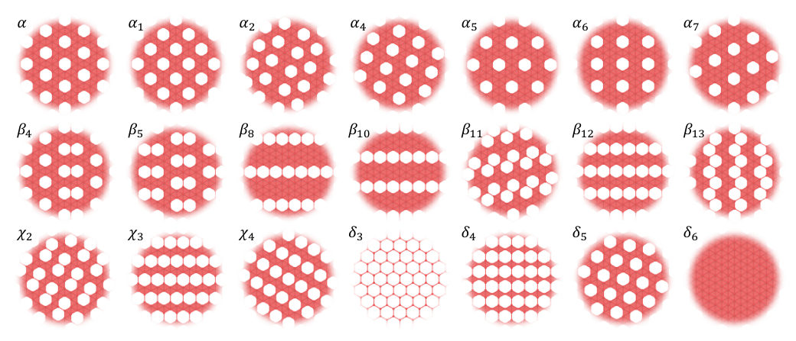 
FIG. 1. Snapshots of the 21 different allotropes included in the training dataset in this study. The nomenclature (α, β, χ, and δ) refers to the coordination of the boron atoms, while the subscript has no particular meaning and is only used to distinguish between different allotropes (except for the δ allotropes, where the subscript indicates the coordination). We selected these allotropes because (1) they include all those experimentally observed on silver27 (α, β8, β10, β12, and χ3) as well as those synthesized on copper, gold, and aluminum (α1, α5, χ3), and (2) they cover the full range of vacancy densities ν (from 0 for δ6 to 1/3 for δ3), a critical parameter for borophene properties....

📷 Fig 2

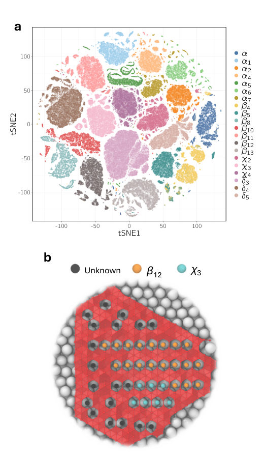 
FIG. 2. Data-driven classification of borophene al- lotropes. a. Dimensionality reduction of the LMBTR de- scriptors for the different allotropes in the training set through a two-components t-SNE projection. Each point corresponds to a vacancy in the structures obtained during the growth process, and the color corresponds to the allotrope it belongs to. Even with a 2-components t-SNE projection, the different allotropes are quite well separated in the descriptor space. We use a 155-components PCA projection for the actual analysis, which allows for an even better separation. b. Snapshot of the final structure from Fig. 5a at 700 K on Ag(111) with the different allotropes identified by the...

📷 Fig 3

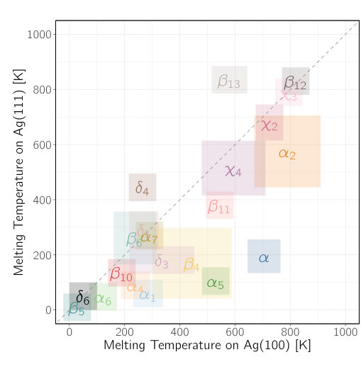 
FIG. 3. Melting temperatures for the different al- lotropes on Ag(111) versus the one on Ag(100). The rectangles are centered on the average melting temperature for each allotrope and each surface, and their width and height are given by the standard errors SE of the melt- ing temperatures obtained for the 22 different simulations for each allotrope (11 random orientations, 2 shapes), with

📷 Fig 4

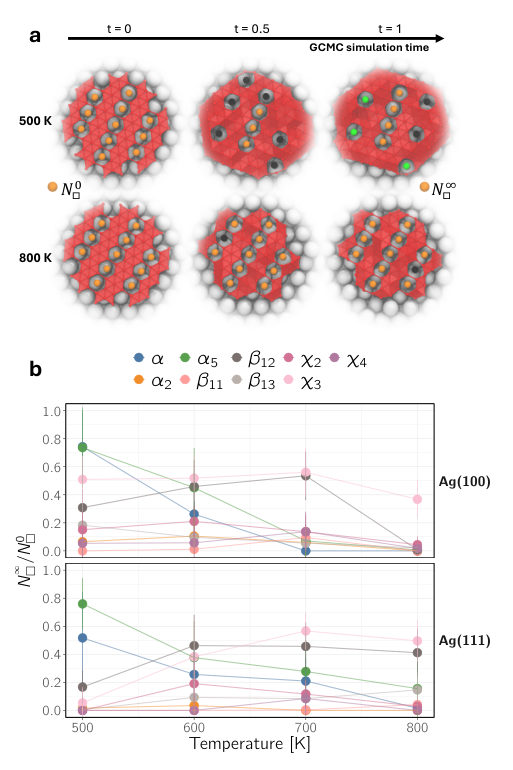 
FIG. 4. Growth of borophene on silver from various starting configurations. a. Illustration of the GCMC self- propagation process for the β12 allotrope on Ag(111) at 500 K and 800 K. The N 0 □and N ∞ □quantities are the number of va- cancies attributed to the β12 allotrope at the beginning and at the end of the simulation, respectively. b. Relative vari- ation of the number of vacancies attributed to the allotrope that was used in the seed during the growth process as a function of the temperature and orientation. The variation is taken as the last value of the simulation from Figs. S7-S8 divided by the first one, N ∞ □/N 0 □. Statistics were acquired only for P = 10−3 Pa, which is the...

📷 Fig 5

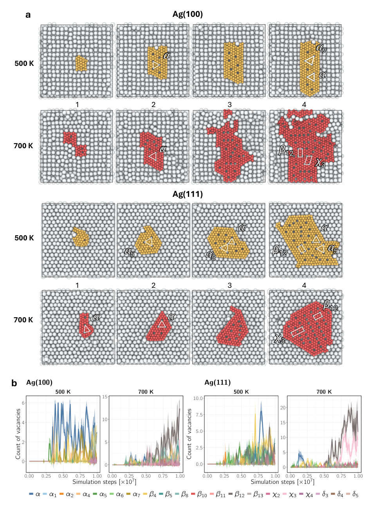 
FIG. 5. Analysis of a full-scale growth. a. Snapshots of the structures obtained at regular stages of the growth process on Ag(111) and Ag(100). The box size is ∼50 × 50 Å2, and some identifiables allotropes are highlighted in white. b. Number of vacancies of each allotrope along the full-scale GCMC growth process. The unknown vacancies are not shown for clarity.

**Summary.** This work develops a predictive framework to control the synthesis of borophene polymorphs on silver surfaces. By combining machine-learned potentials with Monte Carlo simulations, the authors demonstrate that growth is governed by kinetic pathways, not just thermodynamic stability. This allows them to identify specific temperature and substrate conditions that favor desired, stable phases.

**Why it may be interesting.** The rigorous coupling of advanced classical simulation techniques (GCMC, MLIP) with data-driven classification methods provides a powerful template for predicting phase behavior in complex, low-dimensional materials, which is relevant for understanding quantum confinement effects.

Detailed structure

**Main problem.** The deterministic synthesis of borophene is challenging due to the competition between numerous polymorphs during nucleation and growth.

**Main result.** The study establishes a predictive framework by showing that polymorph selection is governed not just by thermodynamic stability, but by kinetic pathways that allow for self-propagation.

**Method.** The authors combined reactive machine-learned interatomic potentials with grand-canonical Monte Carlo simulations and employed machine learning classifiers trained on local atomic descriptors.

**Model / system.** The system is borophene, a 2D boron sheet, grown on Ag(111) and Ag(100) substrates. The simulation tracks the evolution from early nuclei to extended layers.

**Key observables.** Growth maps (temperature-pressure substrate maps), the proportion of different allotropes over time, and the self-propagation metric ($N_{\infty}^{\square}/N_0^{\square}$).

**Important parameters / regimes.** Temperature (e.g., 500 K vs. 700 K) and substrate type ($	ext{Ag}(111)$ vs. $	ext{Ag}(100)$) are key controlling parameters.

**Assumptions / limitations.** The classification algorithm relies on a probability threshold (0.4) for identifying allotropes, and the simulation assumes the MLIP accurately captures the necessary physics.

**Figures summary.** Figures illustrate snapshots of the 21 allotropes, t-SNE projections of descriptors, melting temperature comparisons, and time evolution of vacancy counts during growth.

**Paper structure.** The paper follows a structure of defining the problem (polymorphism), developing a multi-stage simulation pipeline (MLIP + GCMC + ML classification), presenting results showing kinetic control over stability, and concluding with actionable synthesis windows.

Abstract

Deterministic synthesis of borophene remains challenging because many polymorphs compete during nucleation and growth. Here we combine a reactive machine-learned interatomic potential with grand-canonical Monte Carlo simulations and data-driven structural classification to track borophene formation from early nuclei to extended layers on Ag(111) and Ag(100). We build temperature-pressure substrate growth maps and resolve how vacancy motifs, phase intermixing and seed structure govern polymorph selection. The simulations reproduce key experimental trends, including the prevalence of $β_{12}$/$χ_3$ phases and their temperature-dependent competition, while revealing kinetic pathways that connect metastable nuclei to long-range order. We identify conditions that suppress competing motifs and promote targeted phases, providing actionable synthesis windows. These results establish a predictive framework for directing borophene growth and, more broadly, for controlling polymorphism in low-dimensional materials by coupling atomistic simulation with machine-learning-enabled phase recognition.

[↑ back to top](#top)

### [Second-Order Synaptic Memory using Inherent Plasticity of Moiré Superlattices](http://arxiv.org/abs/2606.02931v1)

**Authors:** Tanweer Ahmed, Kenji Watanabe, Takashi Taniguchi, Fèlix Casanova, Luis E. Hueso  
**Type:** experiment · **Category:** disordered systems and neural networks · **PDF:** <https://arxiv.org/pdf/2606.02931v1>  
**Analysis basis:** full PDF text, analyzed in chunks
**Topic relevance:** `driven-dissipative phase transition` **1/5**

📷 Fig 1

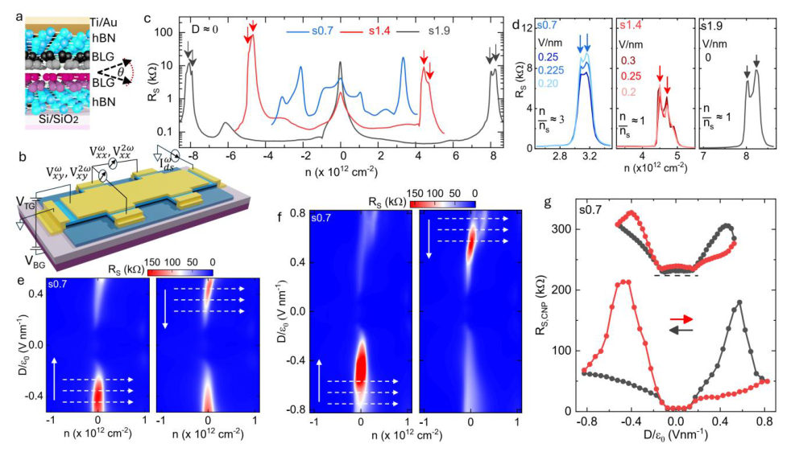 
Figure 1: 𝑫 dependent hysteresis in strained tDBLG superlattice: a, the cross-section of the stacking sequence of tDBLG devices is schematically shown, the twist angle (𝜃) is indicated. b, the measurement geometry is schematically illustrated. Longitudinal (𝑉𝑥𝑥) and transverse (𝑉𝑥𝑦) voltages in both the first (𝜔) and second (2𝜔) harmonics are measured simultaneously under applied current bias (𝐼𝜔). c, sheet resistance (𝑅𝑆) vs. carrier density (𝑛) characteristics at vertical fixed displacement field (𝐷) ≈0 from three tDBLG samples are presented. 𝑅𝑠 peak at integer superlattice filling (𝑛/𝑛𝑠) appears to be a combination of at least two 𝑅𝑆 maxima (labeled with arrows). This indicates...

📷 Fig 2

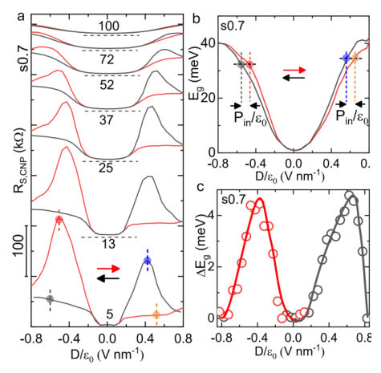 
Figure 2: 𝑫-dependent hysteresis of the band structure: a, the 𝑅𝑆,𝐶𝑁𝑃−𝐷 hysteresis loops collected from sample s0.7 at different 𝑇, which are vertically shifted. The baselines are shown as dashed lines. red (black) traces present the ascending (descending) 𝐷 sweep directions (indicated with arrows). b, estimated band-gap (𝐸𝑔) vs. 𝐷 data for both sweep direction is presented. The hysteresis in the 𝐸𝑔−𝐷/𝜀0 characteristics indicates the appearance of an internal vertical polarization (𝑃𝑖𝑛). The red (orange) and black (blue) circles represent the same value of 𝐸𝑔, for ascending and descending 𝐷 sweeps, respectively, However, they exhibit significantly different values of 𝑅𝑆,𝐶𝑁𝑃. c, ∆𝐸𝑔 between...

📷 Fig 3

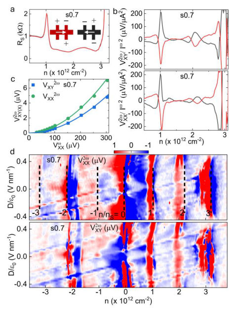 
Figure 3: Second-order nonlinear electrical response from tDBLG: a, The black and red traces are 𝑅𝑆−𝑛 data from sample s0.7, measured in two measurement configurations with opposite polarities of current and voltage probes (black and red schematics in the insets). b, The top and bottom panels show the 𝑉𝑥𝑦 2𝜔/𝐼𝑑𝑠

📷 Fig 4

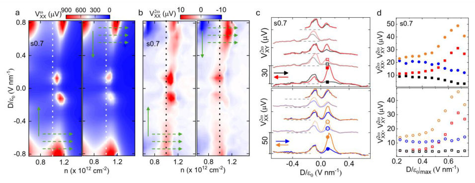 
Figure 4: Second-order plasticity of tDBLG: a and b, 𝑛 vs. 𝐷/𝜀0 phase spaces of 𝑉𝑥𝑥𝜔 and 𝑉𝑥𝑥2𝜔, respectively, close to 𝑛/𝑛𝑠= 1 is shown from sample s0.7. Sweep directions are marked with green arrows. The synaptic memory action was executed along the vertical dashed line. c, The top and the bottom panels present the sweep range dependent hysteresis 𝑉𝑥𝑥2𝜔 and 𝑉𝑥𝑦 2𝜔, respectively, for a few different 𝐷 sweep range. The data of different sweep ranges are vertically shifted. The sweep directions are indicated with arrows. The light and dark traces indicate data for symmetric and asymmetric sweep ranges. The low and the high states (at 𝐷/𝜀0 = 0.1 Vnm-1) are marked. Also see SI section 15 and 17...

📷 Fig 5

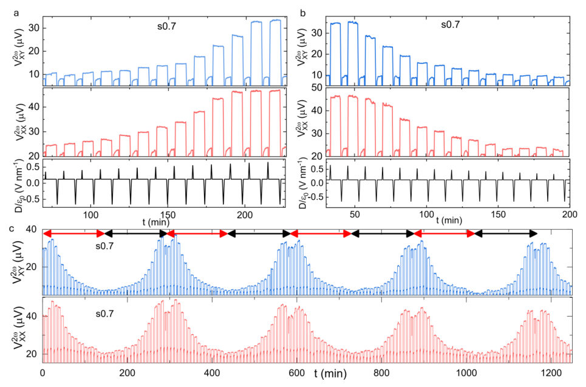 
Figure 5: Second-order synaptic memory operation: a and b, The depression and potentiation cycles of the second order synaptic response is presented, respectively. The timeseries of the sequence of negative (constant) and positive (of varying magnitude) triangular pulsed pulses are shown in the bottom panels. The top and the middle panels present the synaptic response of 𝑉𝑥𝑦 2𝜔 and 𝑉𝑥𝑥2𝜔, respectively. c, the long-term synaptic plasticity of the second-order response (𝑉𝑥𝑥2𝜔 and 𝑉𝑥𝑦 2𝜔) over several potentiation (red arrows) and depression cycles are presented (black arrows). Also see SI section 17 for synaptic operation in sample s1.4.

**Summary.** This work reports on using moiré superlattices in tDBLG to create a novel, energy-efficient synaptic memory. By combining inherent electronic hysteresis (plasticity) with a tunable second-order nonlinear electrical response, the authors show that complex neuromorphic functions can emerge purely from symmetry breaking physics in a single-element carbon material.

**Why it may be interesting.** The emergence of complex, tunable electronic functionality (second-order nonlinearity and plasticity) purely from symmetry breaking physics in a single-element 2D material is highly relevant to understanding emergent quantum phenomena in condensed matter systems.

Detailed structure

**Main problem.** The core challenge is achieving electronic synaptic functionality in a single-element quantum material without relying on external charge traps or polar components.

**Main result.** The authors successfully demonstrated a second-order synaptic memory device by harnessing the combination of electronic plasticity (hysteresis) and tunable second-order nonlinear electrical response in moiré superlattices.

**Method.** Measurements involved using synchronized lock-in amplifiers to probe both first-order ($\omega$) and second-order ($2\omega$) voltage drops while varying carrier density and vertical displacement field.

**Model / system.** The system is twisted double bilayer graphene (tDBLG) moiré superlattices, which are purely carbon-based and exhibit electronic properties governed by moiré periodicity and strain-induced symmetry breaking.

**Key observables.** Electronic hysteresis in resistance ($R_S$), second-order nonlinear electrical response ($\propto V_{2\omega}/I_{ds}^{2\omega}$), and multi-level synaptic states.

**Important parameters / regimes.** Twist angle disorder, carrier concentration ($n$), vertical displacement field ($D$), and temperature ($T$).

**Assumptions / limitations.** The observed hysteresis is attributed to inhomogeneous flexoelectric coupling arising from intrinsic strain gradients, rather than simple ferroelectricity or extrinsic traps.

**Figures summary.** Figures illustrate $R_S$ vs. $n$ showing superlattice band filling anomalies, $R_S$ vs. $D$ showing pronounced hysteresis loops, and operational diagrams demonstrating synaptic potentiation/depression cycles using $V_{2\omega}$ measurements.

**Paper structure.** The paper progresses from establishing the fundamental electronic plasticity via $R_S$ hysteresis, to confirming the intrinsic second-order nonlinearity, and finally demonstrating the combination of these two effects to realize a functional, low-power, second-order synaptic memory device.

Abstract

Achieving synaptic functionality electronically in a single-element quantum material is a fundamental challenge, as conventional methods rely on the introduction of extrinsic charge-traps or polar components. Here, we demonstrate that twisted double bilayer graphene (tDBLG) moiré superlattices, composed purely of carbon, exhibit electronic hysteresis and plasticity in presence of twist-angle disorder. Inversion symmetry breaking at the moiré length scales also gives rise to second-order nonlinear electrical response via disorder-mediated extrinsic mechanisms. Such second-order nonlinearity is highly tunable in both sign and magnitude by varying carrier concentration and vertical displacement field. We harness the coexistence of electronic plasticity and second-order nonlinearity to realize a second-order synaptic memory device. Our findings establish strained moiré carbon systems as a powerful new platform for energy-efficient neuromorphic computing, demonstrating that complex electronic functionality can emerge purely from symmetry breaking physics in a single-element material.

[↑ back to top](#top)

### Other secondary papers (3)

Show other secondary papers

### [Enhanced superconductivity in atomically thin noble metals: From quantum confinement to interface-induced Lifshitz transition](http://arxiv.org/abs/2606.03663v1)

**Authors:** Chun-Jie Zhang, Bing Zhang, Yapeng Wu, Xiao-Ping Li, Lei Wang  
**Type:** theory · **Category:** other · **PDF:** <https://arxiv.org/pdf/2606.03663v1>  
**Analysis basis:** full PDF text, analyzed in chunks

📷 Fig 1

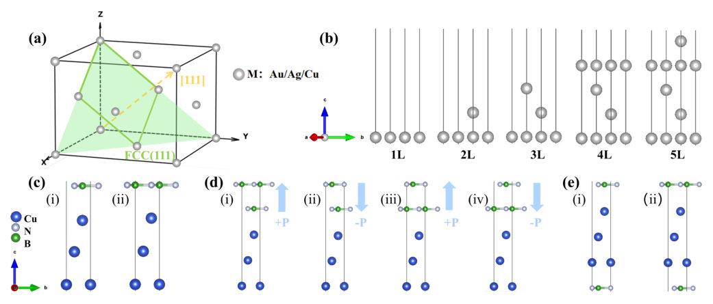 
Figure 1. Crystal structures. (a) FCC lattice with the (111) plane and [111] direction. (b) ABC-stacked M (M = Au, Ag, Cu)films with 1 to 5 layers. (c) Side views of h-BN/3L-Cu(111) heterostructures with the interface at the (i) B-site and (ii) N-site. (d) Side views of h-BN/h- BN/3L-Cu(111) heterostructures with AB/BA-stacked (+P/-P) bilayer h-BN on the (i, ii) B-site and (iii, iv) N-site, respectively. (e) Side views of h-BN/3L-Cu(111)/h-BN sandwich heterostructures with the interface at the (i) B-site and (ii) N-site.

📷 Fig 2

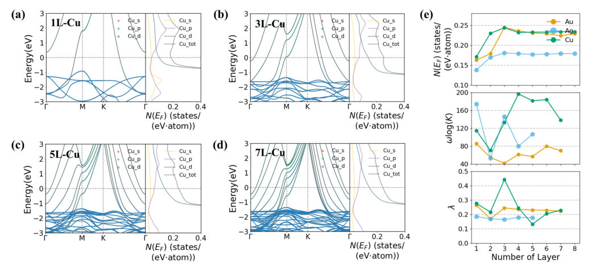 
Figure 2. Thickness-dependent electronic and superconducting properties. (a-d) Band structures and orbital-resolved DOS of Cu thin films with different thicknesses: monolayer (1L), trilayer (3L), pentalayer (5L), and heptalayer (7L). (e) Superconducting properties of Au, Ag and Cu thin films as a function of layer number: DOS at the Fermi level N(εF), the logarithmic average phonon frequency ωlog, and the electron- phonon coupling constant λ.

📷 Fig 3

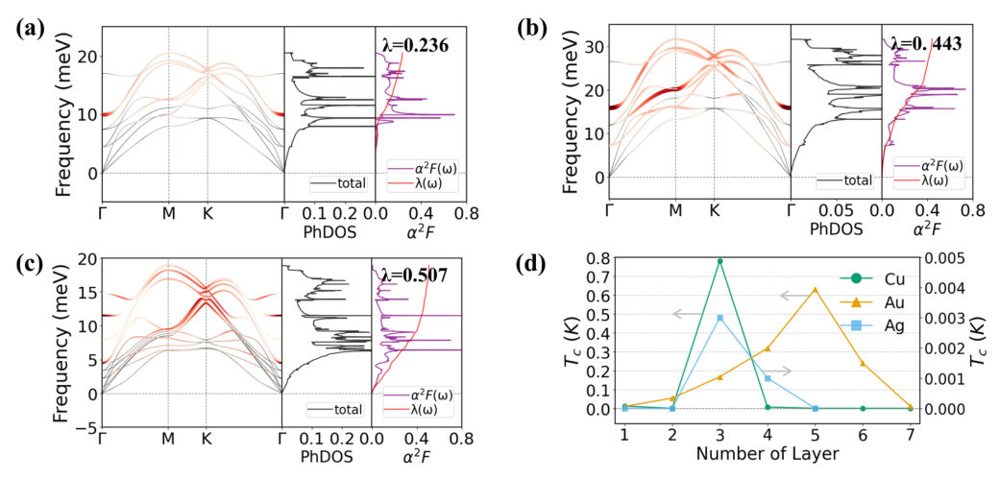 
Figure 3. Phonon properties and superconductivity. (a–c) Phonon and EPC properties of trilayer Ag, trilayer Cu, and pentalayer Au thin films. For each: EPC-weighted phonon dispersion (red, scaled by λqν), phonon density of states (PhDOS), Eliashberg function α2F(ω), and cumulative EPC λ(ω). (d) Superconducting transition temperature TC versus layer number for Au, Ag, and Cu, plotted with distinct y-axis scales.

📷 Fig 4

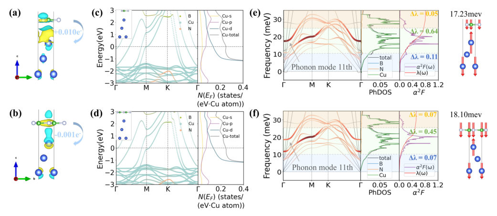 
Figure 4. Interface-configuration-tuned electronic and EPC properties in h-BN/3L-Cu(111) heterostructure. (a, b) Differential charge density plots for B-site and N-site interfaces in side view. (c, d) Orbital-projected band structures for B-site and N-site, respectively. (e, f) Corres- ponding EPC properties: λqv-scaled phonon dispersions (red), phonon density of states, Eliashberg function α2F(ω), and cumulative λ(ω).The rightmost panels in (e) and (f) show the vibrational eigenmodes associated with the 11 th phonon branch.

📷 Fig 5

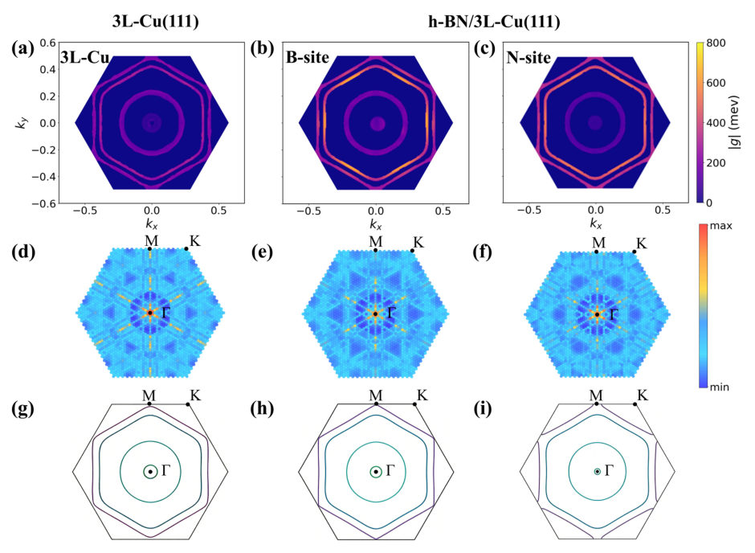 
Figure 5. k-dependent electron–phonon coupling matrix element, Fermi surface nesting function, and Fermi surface. (a) Electron–phonon coupling matrix element |gnm,v=8(k, 0)| for the 8th phonon mode at the Γ point in the 3L-Cu(111) system. (b, c) Electron–phonon coupling matrix element |gnm,v=11(k, 0)| for the 11th phonon mode at the Γ point in the h-BN/3L-Cu(111) heterostructure (b: B-site interface; c: N-site interface). The color scale in this region represents the magnitude of the matrix element g (in meV). (d) Fermi surface nesting function for the 3L-Cu(111) system. (e, f) Fermi surface nesting function for the h-BN/3L-Cu(111) heterostructure (e: B-site interface; f: N-site interface)....

**Summary.** This theoretical study develops a unified framework to understand superconductivity in atomically thin noble metals by combining quantum confinement effects with precise interface engineering. The key finding is that the highest superconducting critical temperatures are achieved not merely by increasing electron density, but by engineering the interface to induce a Lifshitz transition, which fundamentally reshapes the Fermi surface and maximizes electron-phonon coupling.

**Why it may be interesting.** While focused on condensed matter superconductivity, the mechanism relies on controlling the electronic band structure topology (Lifshitz transition) via atomic interfaces, which is a concept relevant to designing quantum materials and controlling electronic states in nanoscale devices.

Detailed structure

**Main problem.** The primary challenge is unlocking and enhancing intrinsic superconductivity in noble metals (Au, Ag, Cu), which are fundamentally non-superconducting in their bulk form.

**Main result.** Superconductivity can be significantly enhanced by engineering interfaces, specifically by inducing a Lifshitz transition in the Fermi surface, which is more effective than simple quantum confinement or charge transfer.

**Method.** The study employs first-principles calculations (DFT/DFPT) to model electronic structure, phonon dispersion, and electron-phonon coupling (EPC) to estimate the superconducting critical temperature (T_C).

**Model / system.** The research focuses on atomically thin noble metal films (Au, Ag, Cu) and their heterostructures, particularly those involving hexagonal boron nitride (h-BN) interfaces.

**Key observables.** Superconducting critical temperature (T_C), Electron-Phonon Coupling constant (lambda), Density of States (DOS) at the Fermi level, and the presence/absence of an interface-induced Lifshitz transition.

**Important parameters / regimes.** Film thickness (1L to 7L), interfacial stacking configuration (N-bonded vs. B-bonded), and the electronic topology of the Fermi surface.

**Assumptions / limitations.** The analysis relies on DFT approximations and the McMillan-Allen-Dynes formula for T_C estimation, while also comparing results against simplified analytical models.

**Figures summary.** Figures illustrate crystal structures for various film thicknesses and heterostructures, showing the evolution of electronic and superconducting properties, and mapping the k-space distribution of electron-phonon coupling for different interface types.

**Paper structure.** The paper first establishes the problem of intrinsic superconductivity in noble metals, then analyzes the thickness dependence of superconductivity in pure films (Au, Cu, Ag). The core of the work compares different interface configurations (h-BN/Cu), demonstrating that the B-site interface promotes a Lifshitz transition, leading to superior T_C compared to N-site or pristine films.

Abstract

Unlocking superconductivity in intrinsically non-superconducting noble metals (Au, Ag, Cu) represents a fundamental challenge in low-dimensional physics. While quantum confinement in the atomically thin limit is known to trigger emergent superconductivity, strategies to amplify this marginal effect to experimentally accessible temperatures remain a key open question. Using first-principles calculations, we establish a unified framework linking intrinsic confinement effects with interface engineering in noble metal films. We reveal that intrinsic superconductivity is element-specific: it is suppressed in Ag by a stiff phonon spectrum, but emerges in trilayer Cu ($T_{\rm C} \approx 0.78$ K) and pentalayer Au ($0.63$ K) driven by confinement-induced density-of-states (DOS) enhancement and phonon softening, respectively. In h-BN/Cu(111) heterostructures, $T_{\rm C}$ is critically dictated by the interfacial stacking configuration. We identify the thermodynamically stable N-bonded interface as a reliable platform for accessible superconductivity ($T_{\rm C} \approx 3.23$ K), whereas manipulating the system into a metastable B-bonded configuration boosts $T_{\rm C}$ to $7.00$ K. This enhancement originates from a B-bonded-induced Lifshitz transition, where the Fermi surface forms a tangential contact with the Brillouin zone boundary at the M point, enhancing electron-phonon coupling beyond DOS effects. Our work unifies the understanding of intrinsic two-dimensional superconductivity with atomistic interface design, offering a blueprint for functionalizing noble metals as emergent superconductors.

[↑ back to top](#top)

### [Mechanochemical Nano-Writing of an Atomically Thin Metal](http://arxiv.org/abs/2606.03710v1)

**Authors:** Shuai Zhang, Yanyu Jia, Atanu Samanta, Yutian Bao, Haosen Guan, Zhaoyi Joy Zheng, Guangming Cheng, Ting Liu, Cangyu Qu, Kenji Watanabe, Takashi Taniguchi, Nan Yao, Ashlie Martini, Leslie Schoop, Andrew M. Rappe, Sanfeng Wu, Robert W. Carpick  
**Type:** both · **Category:** other · **PDF:** <https://arxiv.org/pdf/2606.03710v1>  
**Analysis basis:** full PDF text, analyzed in chunks

📷 Fig 1

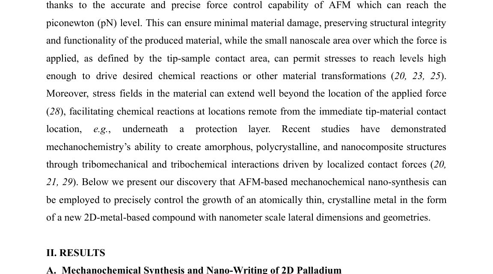 
Figure 1A shows a schematic of the experimental setup. The sample consists of exfoliated

📷 Fig 2

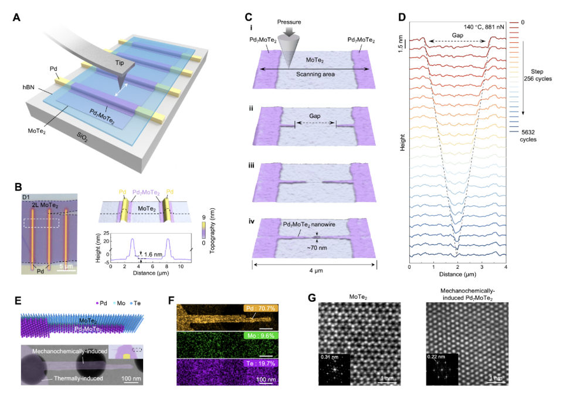 
FIG. 1. Mechanochemically induced diffusion of Pd and formation of Pd7MoTe2. (A) A schematic of the experimental setup, where an AFM tip is scanning on the sample surface in

📷 Fig 3

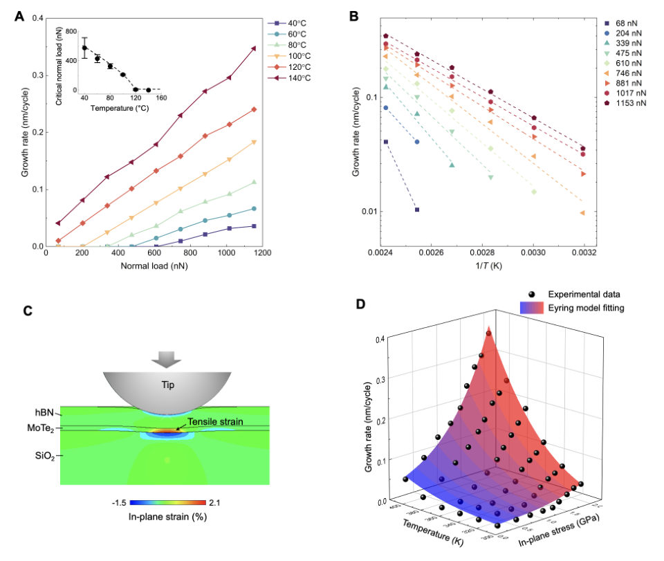 
FIG. 2. The effect of force and temperature on the growth rate of Pd7MoTe2. (A) Growth rate versus normal load data measured under varying temperatures. Inset: critical normal load to initiate Pd7MoTe2 growth vs. temperature. (B) Logarithm of the growth rate versus inverse temperature for different normal loads. (C) FEM simulation shows the in-plane strain distribution with an applied normal load of 1153 nN. The maximum strain at each load is then used to calculate the maximum in-plane stress for (D). (D) Growth rate as a function of temperature and maximum in-plane stress in the MoTe2, fitted using a stress-activated Eyring model (Eq. 1 and 2).

📷 Fig 4

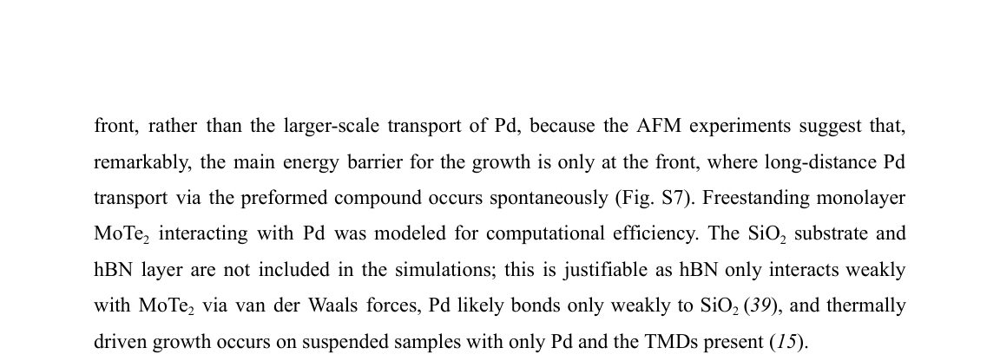 
Fig. 3A shows typical atomic configurations during the growth of Pd on the 1T′ MoTe2

📷 Fig 5

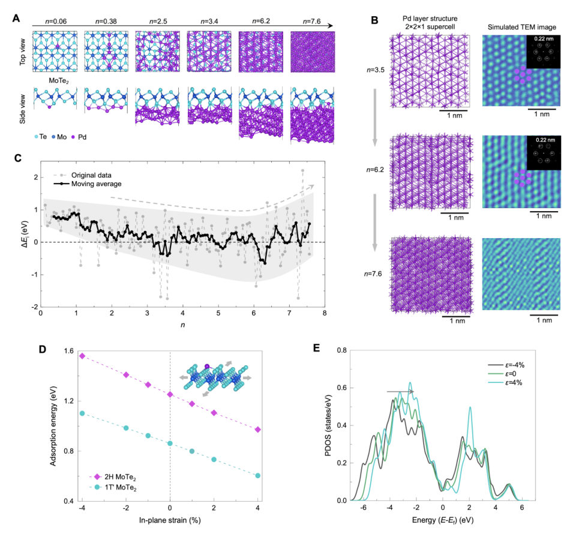 
FIG. 3. ab initio-GCMC simulation of 2D Pd growth on MoTe2. (A) Snapshots of

**Summary.** This paper introduces a mechanochemical approach to synthesize and pattern atomically thin superconducting $	ext{Pd}_7	ext{MoTe}_2$ nanowires on $	ext{MoTe}_2$ using localized AFM force. By applying mechanical stress, the synthesis is driven at near-room temperatures, significantly lower than thermal methods, and achieving nanometer precision. This establishes a powerful new paradigm for engineering quantum materials using mechanical force control.

**Why it may be interesting.** This work provides a novel, generalizable paradigm for synthesizing quantum materials by coupling mechanical energy directly to chemical reaction barriers, which is highly relevant for designing controlled quantum devices.

Detailed structure

**Main problem.** The primary challenge is understanding and controlling the synthesis and patterning of atomically thin metals, like superconductors, on 2D materials using mechanical forces rather than traditional high-temperature thermal methods.

**Main result.** The authors successfully demonstrated mechanochemical nano-writing, enabling the growth of superconducting $	ext{Pd}_7	ext{MoTe}_2$ nanowires at near-room temperatures with high lateral resolution.

**Method.** The study combines experimental Atomic Force Microscopy (AFM) force application with advanced computational modeling, including Density Functional Theory (DFT) and *ab initio* Grand Canonical Monte Carlo (*ai-GCMC*) simulations.

**Model / system.** The system involves depositing Pd onto a $	ext{MoTe}_2$ 2D material template, forming the superconducting compound $	ext{Pd}_7	ext{MoTe}_2$. The process is modeled using stress-assisted activation kinetics derived from mechanical force application.

**Key observables.** Nanowire height ($\approx 1.6 	ext{ nm}$), stoichiometry ($	ext{Pd}:	ext{Mo}:	ext{Te} = 7:1:2$), superconducting critical temperature ($T_c \approx 0.8 	ext{K}$), and growth rate dependence on applied stress.

**Important parameters / regimes.** Synthesis temperature reduction from $\sim 200^\circ	ext{C}$ to near-room temperature; 50 nm lateral resolution; mechanical stress ($\sigma$) and temperature ($T$).

**Assumptions / limitations.** The growth kinetics are governed by a stress-assisted thermal activation model, and the mechanical force directly influences the chemical reaction pathway.

**Figures summary.** Figures illustrate the AFM setup and process (Fig. 1), comparison of thermal vs. mechanochemical growth (Fig. 1), and simulation results showing growth rate dependence on stress and temperature (Fig. 2).

**Paper structure.** The paper establishes the physical gap in understanding force-driven synthesis, presents the experimental mechanochemical writing process, validates the mechanism using theoretical modeling (DFT, *ai-GCMC*), and concludes by demonstrating the resulting superconducting quantum material.

Abstract

Mechanical energy accelerates many physicochemical processes, including materials syntheses that are hard to produce with thermal energy alone. However, physical understanding connecting applied mechanical forces with internal stresses and ensuing reaction mechanisms is lacking. Here we demonstrate mechanical force-enabled synthesis and nanoscale patterning to metallize a two-dimensional (2D) material, producing an atomically-thin superconducting material. Localized force applied by atomic force microscope tips to van der Waals (vdW) encapsulated stacks of 2D bilayer MoTe2 and adjacent source Pd guides 2D Pd7MoTe2 growth with 50 nm lateral resolution. Force accelerates reaction kinetics exponentially per Eyring's stress-assisted thermal activation model, reducing synthesis temperatures from ~200 °C to near-room temperature. Finite element simulations, density functional theory, and ab-initio grand canonical Monte Carlo calculations show that tip-induced compression facilitates Pd chemisorption to tensile-strained MoTe2 that converts to uniform Pd7MoTe2. This demonstrates a new, generalizable paradigm for nanoscale synthesis of quantum materials, and high-precision engineering of superconductivity.

[↑ back to top](#top)

### [Shift current conductivity in monolayer SnS: a tight-binding analysis](http://arxiv.org/abs/2606.02851v1)

**Authors:** Yuki Kusunoki, Tomoaki Kameda, Katsunori Wakabayashi  
**Type:** theory · **Category:** other · **PDF:** <https://arxiv.org/pdf/2606.02851v1>  
**Analysis basis:** full PDF text, analyzed in chunks

📷 Fig 1

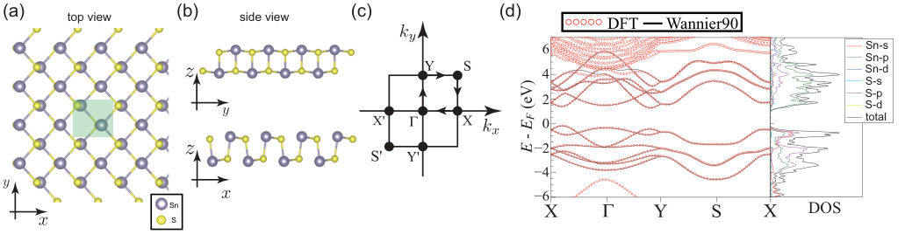 
FIG. 1. Crystal structure and Brillouin zone of monolayer SnS. (a) Top view of the lattice, where the green rectangle denotes the primitive unit cell containing two Sn atoms and two S atoms. (b) Side views along the armchair and zigzag directions, highlighting the puckered geometry that breaks inversion symmetry and gives rise to in-plane ferroelectric polarization. (c) First Brillouin zone with high-symmetry points Γ, X, Y , and S used in the band structure calculations. (d) Energy band structure (left panel) and DOS (right panel) of monolayer SnS along high-symmetry points in the first Brillouin zone. Red circles represent the DFT results, while black lines denote the Wannier-based...

📷 Fig 2

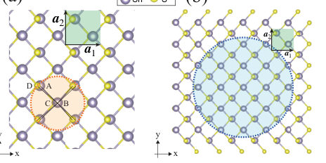 
FIG. 2. Tight-binding models with different hopping ranges. (a) Short-range (SR) model including only nearest-neighbor hopping. (b) Long-range (LR) model including extended hop- ping processes. The green regions indicate the unit cells, and a1 and a2 denote the lattice vectors.

📷 Fig 3

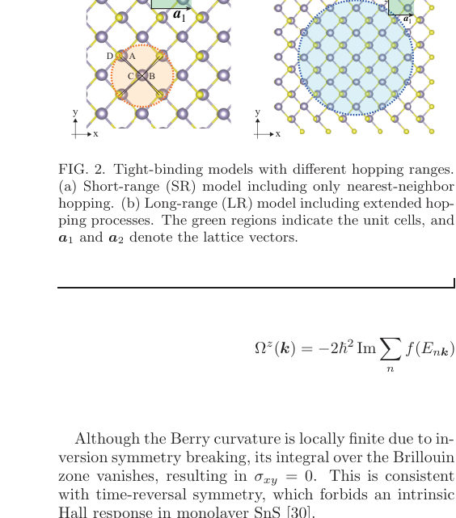 
Figure 4 summarizes the Berry curvature and the linear optical response of monolayer SnS. Figure 4(a) shows the Berry curvature Ωz(k) calculated using the LR model. The Berry curvature exhibits an anisotropic dis- tribution in the first Brillouin zone, reflecting the reduced symmetry of monolayer SnS. Figure 4(b) compares the

📷 Fig 4

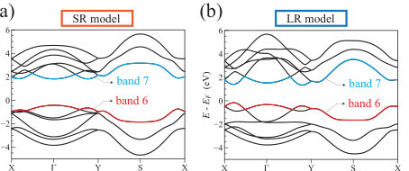 
FIG. 3. Band structures of monolayer SnS obtained from (a) the SR model and (b) the LR model. The SR model captures the essential band gap and symmetry-protected degeneracies along the Y →S →X path, while the LR model improves quantitative accuracy.

📷 Fig 5

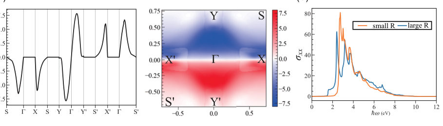 
FIG. 4. Berry curvature and optical conductivity of monolayer SnS. (a) Berry curvature Ωz(k) in the first Brillouin zone calculated using the LR model. The anisotropic distribution reflects inversion symmetry breaking. (b) Longitudinal optical conductivity σxx(ω) for the SR and LR models. The LR model provides quantitative accuracy, while the SR model captures essential features.

**Summary.** This paper theoretically analyzes the shift current conductivity responsible for the bulk photovoltaic effect in monolayer SnS using an effective tight-binding model. By comparing short-range and long-range hopping approximations, the authors demonstrate that while the simple model captures the qualitative physics, the full long-range interactions are necessary for quantitative accuracy. This provides a transparent design tool for understanding photocurrent generation in 2D semiconductors.

**Why it may be interesting.** The detailed theoretical decomposition of the photocurrent into shift and injection components, coupled with the comparison between model approximations (SR vs. LR), provides a rigorous framework for understanding nonlinear optical responses in 2D materials.

Detailed structure

**Main problem.** The study investigates the bulk photovoltaic effect (BPVE), specifically the shift current conductivity, in monolayer SnS.

**Main result.** The essential features of the shift current conductivity are captured by a minimal short-range tight-binding model, although long-range hopping processes provide quantitative corrections to peak positions and magnitudes.

**Method.** The analysis uses an effective tight-binding model derived from first-principles calculations, decomposing the shift current into transition intensity and a shift vector.

**Model / system.** The system is monolayer SnS, a 2D semiconductor. The model employs an effective tight-binding Hamiltonian (up to $12 	imes 12$) comparing short-range (nearest-neighbor) and long-range hopping approximations.

**Key observables.** Shift current conductivity ($\sigma_{	ext{shift}}$), linear optical conductivity ($\sigma_{ij}(\omega)$), Berry curvature ($\Omega_z(\mathbf{k})$), transition intensity, and the shift vector ($R_{ij}^{nm}(\mathbf{k})$).

**Important parameters / regimes.** The analysis compares results derived from short-range (SR) versus long-range (LR) hopping models.

**Assumptions / limitations.** The analysis relies on constructing an effective model from DFT results and assumes the separation of the second-order current into shift and injection components.

**Figures summary.** Figures compare band structures and optical responses derived from SR and LR models, and show contour plots of the shift vector and transition intensity for both model types.

**Paper structure.** The paper develops the theoretical framework for the shift current, derives its expression using the length-gauge formalism, and then applies this framework to compare the predictions of SR and LR tight-binding models for monolayer SnS.

Abstract

We investigate the bulk photovoltaic effect in monolayer SnS using an effective tight-binding model derived from first-principles calculations. By comparing short-range and long-range hopping models, we show that the essential features of the shift current conductivity are captured by a minimal model. The shift current is decomposed into transition intensity and shift vector, enabling identification of dominant interband transitions. The comparison reveals that long-range hopping processes quantitatively modify the peak positions and magnitudes, while the short-range model retains the characteristic low-energy structure of the nonlinear response. Our findings provide a transparent framework for understanding and designing bulk photovoltaic effects in two-dimensional materials.

[↑ back to top](#top)

