
# arxiv digest (quant-ph + cond-mat) — 2026-06-04

*111 papers · 19 relevant · 1 highlighted*

## 🔥 Most relevant (19)

*Every paper with at least one nonzero topic score, sorted by best-matching score. 🔥 marks scores ≥4/5. Click the title to jump to the full entry below; click [arXiv] to open the paper page. `(secondary)` marks papers from de-prioritized cond-mat archives.*

Show 19 relevant papers

- [Effective and Floquet Hamiltonians for High Frequency Driving and Floquet-induced Heating in Quantum Spin Chains](#paper-2606.04976) [[arXiv]](http://arxiv.org/abs/2606.04976v1) `(secondary)` — 🔥 `non-equilibrium dynamics` **4/5** · 🔥 `scars & prethermalization` **4/5** · `analog quantum simulation` **3/5** · `driven-dissipative phase transition` **3/5** · `entanglement & information structure` **3/5** · `non-equilibrium universality` **3/5** · `methods for driven-dissipative` **2/5** · `exotic spin models in light-matter` **1/5**
- [Adiabatic Ramp Dynamics Across the ETH--MBL Transition in Disordered XXZ Spin Chain](#paper-2606.04926) [[arXiv]](http://arxiv.org/abs/2606.04926v1) — 🔥 `entanglement & information structure` **4/5** · `analog quantum simulation` **3/5** · `non-equilibrium dynamics` **3/5** · `non-equilibrium universality` **3/5** · `driven-dissipative phase transition` **2/5** · `exotic spin models in light-matter` **1/5** · `methods for driven-dissipative` **1/5** · `scars & prethermalization` **1/5**
- [Crossover from Rabi oscillations to adiabatic population switching in the Faraday optical control of quantum dot spins](#paper-2606.05033) [[arXiv]](http://arxiv.org/abs/2606.05033v1) — 🔥 `spintronics-quantum-optics interface` **4/5** · `exotic spin models in light-matter` **3/5** · `driven-dissipative phase transition` **2/5** · `methods for driven-dissipative` **2/5** · `non-equilibrium dynamics` **2/5** · `Keldysh / 2PI / non-Gaussian methods` **1/5** · `analog quantum simulation` **1/5** · `interference shaping light` **1/5** · `non-equilibrium universality` **1/5**
- [Hydrodynamics of the Fermi-Pasta-Ulam-Tsingou chain](#paper-2606.04674) [[arXiv]](http://arxiv.org/abs/2606.04674v1) — 🔥 `non-equilibrium dynamics` **4/5** · `Frenkel-Kontorova` **3/5** · `non-equilibrium universality` **3/5** · `Keldysh / 2PI / non-Gaussian methods` **2/5** · `methods for driven-dissipative` **2/5** · `correlated / nonlocal dissipation` **1/5** · `driven-dissipative phase transition` **1/5** · `scars & prethermalization` **1/5**
- [Many body localization in Disordered One-Dimensional Fermi-Hubbard Model](#paper-2606.04948) [[arXiv]](http://arxiv.org/abs/2606.04948v1) `(secondary)` — 🔥 `non-equilibrium dynamics` **4/5** · `analog quantum simulation` **3/5** · `entanglement & information structure` **3/5** · `non-equilibrium universality` **3/5** · `scars & prethermalization` **3/5**
- [Monitored chaotic scattering](#paper-2606.04794) [[arXiv]](http://arxiv.org/abs/2606.04794v1) — 🔥 `measurement-induced transitions` **4/5** · `quantum measurements` **3/5** · `methods for driven-dissipative` **2/5** · `non-equilibrium dynamics` **2/5** · `Keldysh / 2PI / non-Gaussian methods` **1/5** · `correlated / nonlocal dissipation` **1/5** · `driven-dissipative phase transition` **1/5** · `non-equilibrium universality` **1/5**
- [Experimentally probing the Quantum Physics in the Inverted Harmonic Oscillator](#paper-2606.05125) [[arXiv]](http://arxiv.org/abs/2606.05125v1) — 🔥 `analog quantum simulation` **4/5** · `non-equilibrium dynamics` **3/5** · `entanglement & information structure` **2/5** · `driven-dissipative phase transition` **1/5** · `interference shaping light` **1/5** · `non-equilibrium universality` **1/5** · `quantum measurements` **1/5** · `quantum optics experiment` **1/5**
- [Measurement-induced state transitions in multi-qubit transmon processors](#paper-2606.05010) [[arXiv]](http://arxiv.org/abs/2606.05010v1) — 🔥 `measurement-induced transitions` **4/5** · `quantum measurements` **2/5** · `QC/QI experiment` **1/5** · `analog quantum simulation` **1/5** · `correlated / nonlocal dissipation` **1/5** · `correlated cavity matter` **1/5** · `driven-dissipative phase transition` **1/5** · `methods for driven-dissipative` **1/5** · `non-equilibrium dynamics` **1/5**
- [Pushing the Classical Frontier of 1D Fermi-Hubbard Quench Dynamics Beyond Current Quantum Simulations](#paper-2606.04771) [[arXiv]](http://arxiv.org/abs/2606.04771v1) — 🔥 `non-equilibrium dynamics` **4/5** · `non-equilibrium universality` **3/5** · `methods for driven-dissipative` **2/5** · `analog quantum simulation` **1/5** · `entanglement & information structure` **1/5**
- [Floquet-Engineered Parity Anomaly Staircase in a Cold Atom Dirac Lattice](#paper-2606.05164) [[arXiv]](http://arxiv.org/abs/2606.05164v1) — 🔥 `analog quantum simulation` **4/5** · `non-equilibrium dynamics` **3/5** · `driven-dissipative phase transition` **1/5** · `methods for driven-dissipative` **1/5** · `non-equilibrium universality` **1/5**
- [Phase-correlation-free quantum key distribution source operating at gigahertz rates](#paper-2606.04947) [[arXiv]](http://arxiv.org/abs/2606.04947v1) — 🔥 `quantum optics experiment` **4/5** · `QC/QI experiment` **3/5** · `interference shaping light` **2/5**
- [Probing PbTe-Pb nanowire devices with radio-frequency reflectometry](#paper-2606.04544) [[arXiv]](http://arxiv.org/abs/2606.04544v1) — 🔥 `QC/QI experiment` **4/5** · `quantum measurements` **2/5**
- [Quantum String Interactions Revealed by Full Counting Statistics](#paper-2606.04086) [[arXiv]](http://arxiv.org/abs/2606.04086v1) — 🔥 `entanglement & information structure` **4/5** · `Keldysh / 2PI / non-Gaussian methods` **1/5** · `analog quantum simulation` **1/5**
- [A thorium-229 optical nuclear clock with feedback loop](#paper-2606.04997) [[arXiv]](http://arxiv.org/abs/2606.04997v1) — 🔥 `quantum measurements` **4/5** · `measurement-induced transitions` **1/5**
- [Circuit-Level Noise Estimation via Shuttling in Plaquette Circuits](#paper-2606.04629) [[arXiv]](http://arxiv.org/abs/2606.04629v1) — 🔥 `QC/QI experiment` **4/5** · `quantum measurements` **1/5**
- [Photoelectron spectroscopy with a resonant dichromatic field: Role of geometric phase](#paper-2606.04795) [[arXiv]](http://arxiv.org/abs/2606.04795v1) — 🔥 `interference shaping light` **4/5** · `non-equilibrium dynamics` **1/5**
- [An Entanglement Measure from Quantum Optimal Transport](#paper-2606.04969) [[arXiv]](http://arxiv.org/abs/2606.04969v1) — 🔥 `entanglement & information structure` **4/5**
- [Multi-entropy in random tensor networks](#paper-2606.04470) [[arXiv]](http://arxiv.org/abs/2606.04470v1) — 🔥 `entanglement & information structure` **4/5**
- [Quantification of Entanglement in Three-Qubit Systems](#paper-2606.04721) [[arXiv]](http://arxiv.org/abs/2606.04721v1) — 🔥 `entanglement & information structure` **4/5**

## ⭐ Highlighted (1)

*Papers by authors on your watch list. Click the title to jump to the full entry below; click [arXiv] to open the paper page.*

Show 1 highlighted papers

- ⭐ [Comment on "Possibility of superradiant neutrino emission by atomic condensate" by M. Blasone, L. Gastaldo and F. Romeo, Phys. Rev. D 113, 053010 (2026)](#paper-2606.04761) [[arXiv]](http://arxiv.org/abs/2606.04761v1) — Wolfgang Ketterle

## All papers (73, sorted by relevance)

*Papers from quant-ph and your primary cond-mat archives (quant-gas, stat-mech, str-el, dis-nn). Highlighted papers (⭐) come first, then everything else sorted by topic-relevance score, highest first.*

### ⭐ [Comment on "Possibility of superradiant neutrino emission by atomic condensate" by M. Blasone, L. Gastaldo and F. Romeo, Phys. Rev. D 113, 053010 (2026)](http://arxiv.org/abs/2606.04761v1)

**Highlighted author(s):** Wolfgang Ketterle  
**Authors:** Wolfgang Ketterle, Hanzhen Lin, Yu-Kun Lu  
**Type:** theory · **Category:** quantum gases · **PDF:** <https://arxiv.org/pdf/2606.04761v1>  
**Analysis basis:** full PDF text, analyzed in chunks
**Topic relevance:** `Dicke superradiance` **3/5** · `correlated / nonlocal dissipation` **3/5** · `analog quantum simulation` **1/5** · `free-space correlated emission` **1/5** · `superradiant laser` **1/5**

📷 Fig 1

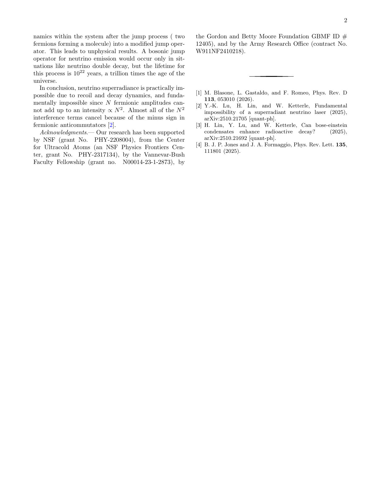 
Low-resolution page preview, page 2

**Summary.** This theoretical paper proves that superradiant neutrino emission from atomic condensates is fundamentally impossible. The authors demonstrate that fermionic anticommutators cause destructive interference, preventing the emission rate from scaling as $N^2$. This result places a strict theoretical limit on collective decay processes in quantum gases.

**Why it may be interesting.** It provides a rigorous theoretical constraint on collective emission processes in ultracold atomic systems, specifically ruling out superradiant enhancement in neutrino emission, which is crucial for understanding decay dynamics in BECs.

Detailed structure

**Main problem.** The paper addresses the theoretical proposal of superradiant neutrino emission from atomic Bose-Einstein condensates (BECs).

**Main result.** The authors prove that superradiant neutrino emission is fundamentally impossible due to the nature of fermionic anticommutators, which cause interference terms to cancel.

**Method.** The analysis involves deriving fundamental limits on the emission rate using quantum mechanical operators (jump operators) and analyzing the scaling of the emission rate with the number of particles, N.

**Model / system.** The system under study is neutrino emission from atomic BECs, considering various models including bosonic-bosonic, bosonic-fermionic, and fermionic-to-bosonic transitions.

**Key observables.** Neutrino emission rate, superradiant enhancement factor, and the scaling of the emission rate with particle number (N).

**Important parameters / regimes.** The rate is found to scale as $\propto N$ rather than the superradiant $\propto N^2$, and kinetic effects suppress any enhancement by factors like $10^{17}$.

**Assumptions / limitations.** The analysis assumes the fundamental fermionic nature of the amplitudes and accounts for the rapid decay and recoil of reaction products.

**Paper structure.** The paper systematically critiques the models proposed in the cited work [1] (electron capture, bosonic-bosonic, etc.), demonstrating flaws in the underlying physics or mathematical formalism for each case.

Abstract

We show that the recent proposal for superradiant emission of neutrinos cannot evade our proof that superradiant neutrino emission is fundamentally impossible. Pairing two fermions in a molecule does not remove the cancellation of interference terms in neutrino emission due to fermionic anticommutators.

[↑ back to top](#top)

### [Adiabatic Ramp Dynamics Across the ETH--MBL Transition in Disordered XXZ Spin Chain](http://arxiv.org/abs/2606.04926v1)

**Authors:** Nidhi Kumari, Vinod Ashokan  
**Type:** theory · **Category:** statistical mechanics · **PDF:** <https://arxiv.org/pdf/2606.04926v1>  
**Analysis basis:** full PDF text, analyzed in chunks
**Topic relevance:** 🔥 `entanglement & information structure` **4/5** · `analog quantum simulation` **3/5** · `non-equilibrium dynamics` **3/5** · `non-equilibrium universality` **3/5** · `driven-dissipative phase transition` **2/5** · `exotic spin models in light-matter` **1/5** · `methods for driven-dissipative` **1/5** · `scars & prethermalization` **1/5**

📷 Fig 1

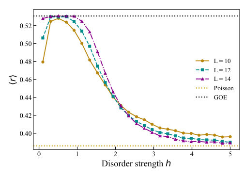 
FIG. 1. Disorder-averaged adjacent-gap ratio r versus disor- der strength for system sizes L = 10, 12, and 14.

📷 Fig 2

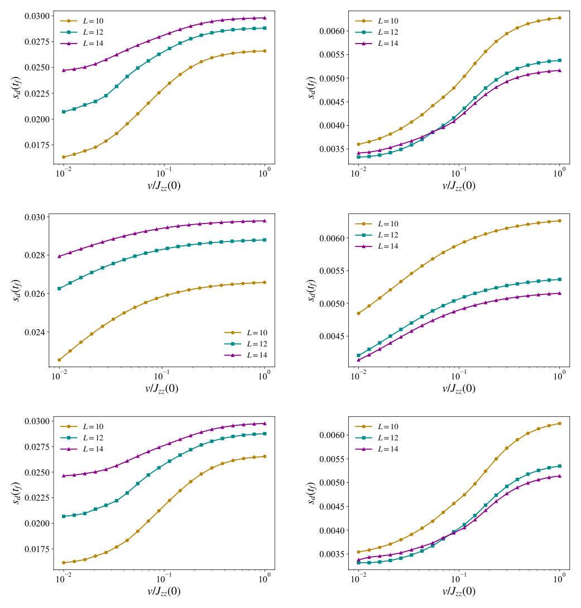 
FIG. 2. Dependence of the diagonal entropy density, sd(tf), on the normalized ramp rate, v/Jzz(0), for the disordered XXZ spin chain. Panels in the left and right columns correspond to the ETH and MBL regimes, respectively. The rows represent linear, quadratic, and exponential ramp protocols from top to bottom. Results are shown for system sizes L = 10, 12, and 14 to illustrate finite-size dependence and the influence of different driving protocols on entropy generation during nonequilibrium dynamics.

📷 Fig 3

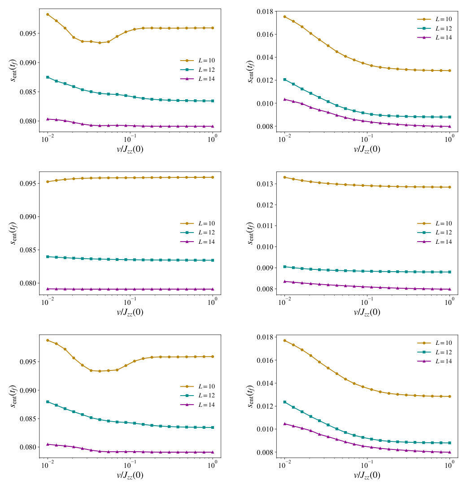 
FIG. 3. Behavior of the entanglement entropy density, sent(tf), with normalized ramp rate, v/Jzz(0), in the disordered XXZ chain. Left and right columns show results in the ETH and MBL regimes, respectively, while the rows correspond to linear, quadratic, and exponential driving protocols. Data for system sizes L = 10, 12, and 14 are included to examine how system size and ramp protocol affect entanglement growth generation during nonequilibrium evolution.

📷 Fig 4

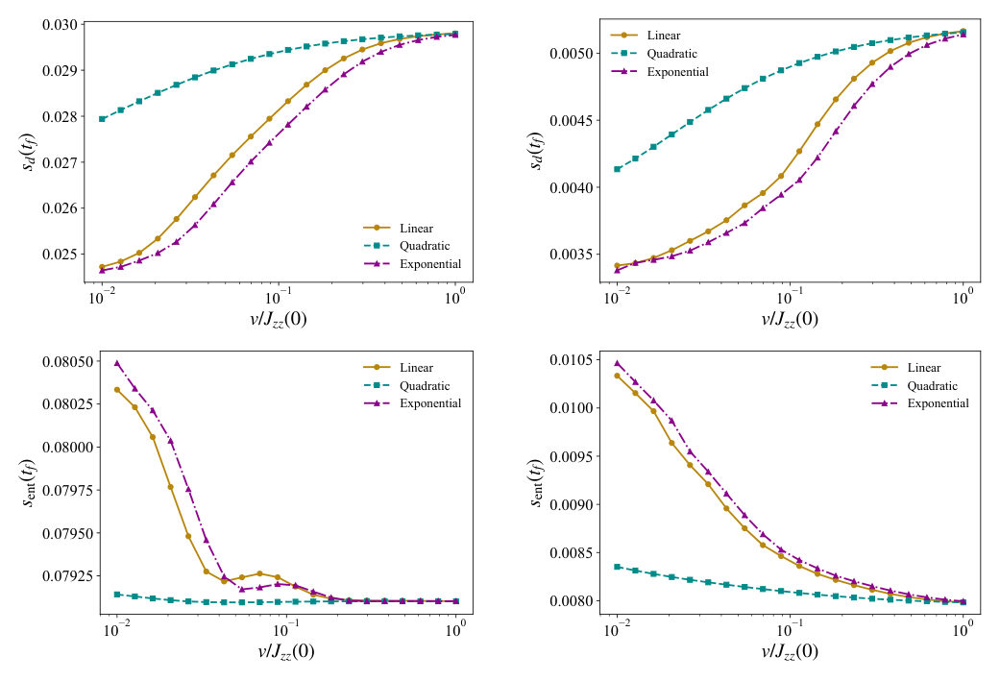 
FIG. 4. Diagonal entropy density sd(tf) and entanglement entropy density sent(tf) for ETH and MBL phase. Panel (a)-(c) for L = 10, L = 12 and L = 14.

**Summary.** This work examines how non-equilibrium dynamics differ between ergodic (ETH) and Many-Body Localized (MBL) quantum phases in a disordered spin chain. By adiabatically ramping the system parameters, the authors use entropy measures to show that the rate of excitation generation is strongly suppressed in the localized phase compared to the thermalizing phase. This confirms that entropy production serves as a powerful diagnostic tool for probing quantum thermalization dynamics.

**Why it may be interesting.** The use of entropy measures to diagnose non-equilibrium dynamics across a fundamental quantum phase transition (ETH-MBL) is highly relevant for understanding how quantum information spreads or is suppressed in interacting many-body systems.

Detailed structure

**Main problem.** The study investigates non-equilibrium dynamics across the transition between ergodic (ETH) and Many-Body Localized (MBL) quantum phases.

**Main result.** The entropy production (diagonal and entanglement) is significantly higher and more dependent on the driving rate in the ergodic phase compared to the MBL phase, confirming the dynamical distinction between the two regimes.

**Method.** The authors employed exact diagonalization and real-time numerical evolution to simulate the system's time evolution under time-dependent Hamiltonian ramps.

**Model / system.** The model is a disordered spin-1/2 XXZ chain, described by a Hamiltonian with disorder terms ($h_j$) and a time-dependent interaction coupling ($J_{zz}(t)$). The system is analyzed in the zero-magnetization sector.

**Key observables.** Diagonal entropy density, entanglement entropy density, and the adjacent-gap ratio (used to characterize static spectral statistics).

**Important parameters / regimes.** Disorder strength ($h_0$), system size ($L \le 14$), and the ramp speed ($v$) characterizing the adiabaticity of the time-dependent drive.

**Assumptions / limitations.** The analysis is limited by finite-size effects, though the results show robustness across multiple system sizes. The study assumes the validity of the ETH/MBL framework for characterizing thermalization.

**Figures summary.** Figures illustrate the disorder-averaged adjacent-gap ratio transitioning from GOE (ergodic) to Poisson (localized) statistics, and show entropy measures ($	ext{sd}, 	ext{sent}$) varying with ramp speed for different protocols.

**Paper structure.** The paper first establishes the static ETH-MBL crossover using spectral statistics. It then analyzes the non-equilibrium dynamics by applying three different time-dependent driving protocols (linear, quadratic, exponential) and comparing the resulting entropy growth in the ergodic versus localized regimes.

Abstract

Many-body localization(MBL) provides a mechanism by which isolated interacting quantum systems with disorder can avoid thermalization unlike ergodic systems satisfying the eigenstate thermalization hypothesis(ETH). Many-body localized systems retain signatures of their initial conditions at long times, whereas systems obeying ETH lose such information as they approach thermal equilibrium. Studying Non-equilibrium dynamics across ETH-MBL crossover is an important problem in condensed matter physics. Adiabatic control of parameters in interacting disordered systems provides a powerful framework to investigate MBL phases and their dynamical robustness. Using exact diagonalization and time-dependent numerical methods we study the effects of adiabatically ramped interactions in a disordered spin-1/2 XXZ chain, a paradigmatic model for exploring the many-body localization transition. By monitoring diagonal entropy density and entanglement entropy density growth across various ramp speeds, and system sizes. Our study incorporates Finite-size effects of spectral observables to probe the transition between ergodic and localized phases. The numerical results show that localized dynamical behavior remains largely intact under sufficiently slow ramp evolution, while increasing the driving rate promotes stronger excitation generation and larger entropy growth. This trend highlights the strong dependence of nonequilibrium adiabatic dynamics in disordered interacting quantum many-body systems.

[↑ back to top](#top)

### [Crossover from Rabi oscillations to adiabatic population switching in the Faraday optical control of quantum dot spins](http://arxiv.org/abs/2606.05033v1)

**Authors:** Jan M. Kaspari, Zhe Xian Koong, Dorian A. Gangloff, Michał Gawełczyk, Doris E. Reiter  
**Type:** theory · **Category:** quantum information and computing · **PDF:** <https://arxiv.org/pdf/2606.05033v1>  
**Analysis basis:** full PDF text, analyzed in chunks
**Topic relevance:** 🔥 `spintronics-quantum-optics interface` **4/5** · `exotic spin models in light-matter` **3/5** · `driven-dissipative phase transition` **2/5** · `methods for driven-dissipative` **2/5** · `non-equilibrium dynamics` **2/5** · `Keldysh / 2PI / non-Gaussian methods` **1/5** · `analog quantum simulation` **1/5** · `interference shaping light` **1/5** · `non-equilibrium universality` **1/5**

📷 Fig 1

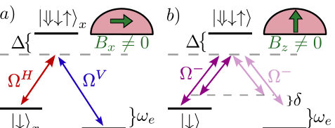 
FIG. 1. Energy level diagrams of the spin system in a) Voigt geometry and b) in Faraday geometry, including the spin states and the optical transitions indicated by arrows.

📷 Fig 2

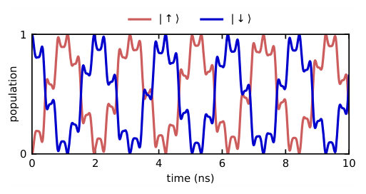 
FIG. 3. Population dynamics of spin states for 𝑛= 1 in the balanced case 𝜂= 1 with Ω = 23.87 GHz and ℏ𝛿= 10.75 µeV (2.6 GHz).

📷 Fig 3

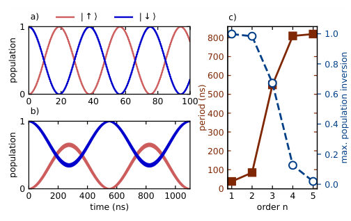 
FIG. 2. Population dynamics of the spin states for Ω = 23.87 GHz for a) 𝑛= 1 with ℏ𝛿= 8.79 µeV (2.13 GHz) and b) 𝑛= 3 with ℏ𝛿= 2.93 µeV (0.71 GHz). c) Period of the oscillations (red) and the maximal achievable population inversion (blue) for orders 𝑛= 1, . . . , 5. The lines are just a guide to the eye.

📷 Fig 4

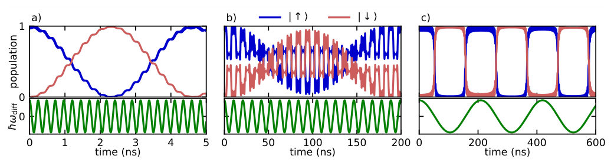 
FIG. 4. Population dynamics of spin states (top panels) and instantaneous diabatic energy difference ℏ𝜔diff (bottom) for 𝑛= 0 at a) diabatic limit: ℏ𝛿= 17.11 µeV (4.14 GHz), b) intermediate step-like dynamics: ℏ𝛿= 0.39 µeV (0.10 GHz), and c) adiabatic limit: ℏ𝛿= 19.75 neV (4.77 MHz).

**Summary.** This paper explores how to control spin dynamics in quantum dot qubits using optical fields in Faraday geometry. The authors demonstrate a novel mechanism where changing the laser detuning beatnote allows a controlled crossover from standard Rabi oscillations to highly efficient, step-like adiabatic population switching. This establishes the oscillating Stark shift as a powerful tool for engineering spin resonance conditions.

**Why it may be interesting.** This work provides a detailed theoretical framework for using time-dependent, engineered couplings (the oscillating Stark shift) to precisely control quantum state transfer in solid-state spin qubits, a key area for quantum computing.

Detailed structure

**Main problem.** The paper investigates the controlled transition between Rabi-like coherent oscillations and adiabatic population switching when controlling quantum dot spins using Faraday geometry optical fields.

**Main result.** By tuning the detuning beatnote, the system can be engineered to exhibit a controlled crossover from Rabi oscillations to step-like population inversion via Landau-Zener-Stückelberg interference.

**Method.** The dynamics are analyzed by solving the Liouville-von Neumann equation for the density matrix, comparing results from the full three-level model with effective two-level spin models.

**Model / system.** The system is a singly charged quantum dot spin coupled to negative trion states, modeled as a three-level $\Lambda$ system driven by Raman laser fields in Faraday geometry. The dynamics are governed by a time-dependent Hamiltonian.

**Key observables.** Population dynamics of spin states, coherent rotations, population inversion, and the differential AC Stark shift.

**Important parameters / regimes.** Detuning beatnote ($\delta$), imbalance ($\eta$), detuning ($\Delta$), and Zeeman splitting ($\omega_e$).

**Assumptions / limitations.** The analysis relies on the dipole and rotating wave approximations, and the effective model assumes $\Delta \gg \Omega$.

**Figures summary.** Figures illustrate energy level diagrams comparing Voigt and Faraday geometries, and show population dynamics for different harmonic orders ($n=1, 3$) and the $n=0$ case, demonstrating the crossover.

**Paper structure.** The paper progresses from establishing the physical setup and Hamiltonian to deriving effective models, analyzing resonance conditions for different harmonic orders ($n$), and finally demonstrating the controlled crossover from Rabi to adiabatic switching in the $n=0$ case.

Abstract

Stimulated Raman transitions in Faraday geometry allow for simultaneous single-shot qubit readout and qubit control. It involves driving an unbalanced $Λ$ system via an auxiliary excited state. Due to the simultaneous driving of both transitions with unequal detuning, the resulting time-dependent Stark shift gives rise to additional resonance conditions beyond the conventional picture. We identify a distinct regime in which repeated passages through avoided crossings lead to step-like population inversion arising from Landau-Zener-Stückelberg interference. By changing the detuning beatnote, we demonstrate a controlled continuous crossover from Rabi-like oscillations to adiabatic population switching. These findings establish the oscillating Stark shift as a mechanism for engineering and controlling spin dynamics in Faraday geometry.

[↑ back to top](#top)

### [Hydrodynamics of the Fermi-Pasta-Ulam-Tsingou chain](http://arxiv.org/abs/2606.04674v1)

**Authors:** Shubhadeep Chakraborty, Abhishek Dhar  
**Type:** theory · **Category:** statistical mechanics · **PDF:** <https://arxiv.org/pdf/2606.04674v1>  
**Analysis basis:** full PDF text, analyzed in chunks
**Topic relevance:** 🔥 `non-equilibrium dynamics` **4/5** · `Frenkel-Kontorova` **3/5** · `non-equilibrium universality` **3/5** · `Keldysh / 2PI / non-Gaussian methods` **2/5** · `methods for driven-dissipative` **2/5** · `correlated / nonlocal dissipation` **1/5** · `driven-dissipative phase transition` **1/5** · `scars & prethermalization` **1/5**

📷 Fig 1

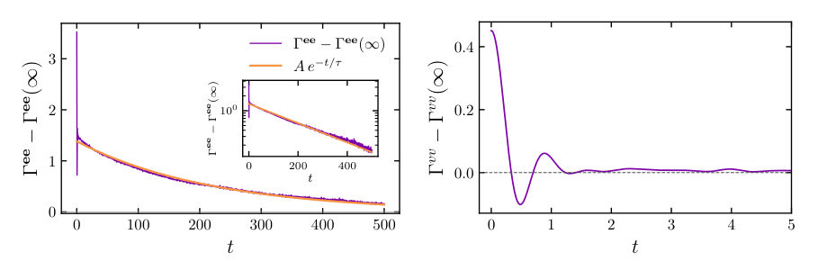 
Fig. 1: Current-correlators with the theoretical Drude weight values subtracted for N = 1000, β = 1, P = 2, v = 0. Left: Γ ee(t) −Γ ee(∞) (purple) with exponential fit (orange); inset shows the same on a semilog scale. Right: Γ vv(t) −Γ vv(∞).

📷 Fig 2

 
Fig. 2: Comparison of the Euler solution and microscopic simulations for an unequal-pressure domain wall. The initial states are uL = (rL,0,eL) and uR = (rR,0,eR), with PL ≠PR. The top panel shows the unscaled plots while the middle panel shows the same data with ballistic scaling. In the middle panel, the colored lines show ensemble averaged microscopic data plotted against the similarity variable X/t, while the solid lines show the Euler prediction obtained from the Riemann solution construction. The lower panel shows X/t2/3 scaling and we see somewhat better data collapse near the centre. The plots here are constructed after averaging 5 × 104 samples with βL = 1, βR = 2, PL = 1 and PR =...

📷 Fig 3

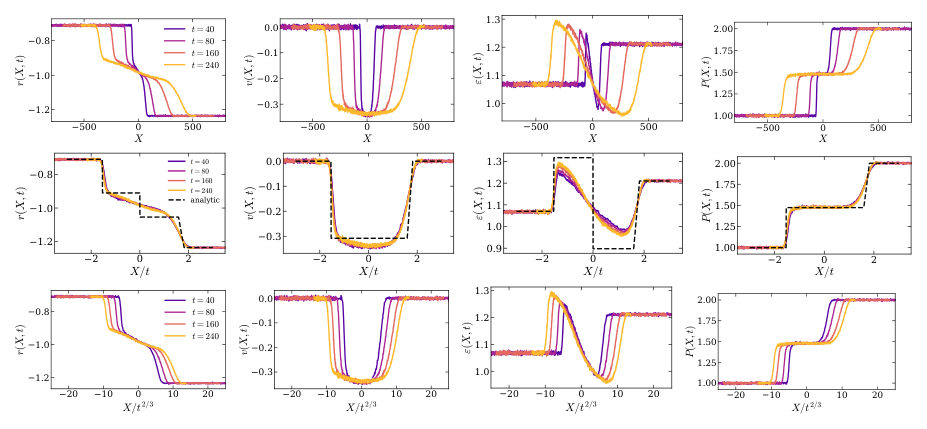 
Fig. 2 shows the evolution of the hydrodynamic fields with time and the comparison with Euler

📷 Fig 4

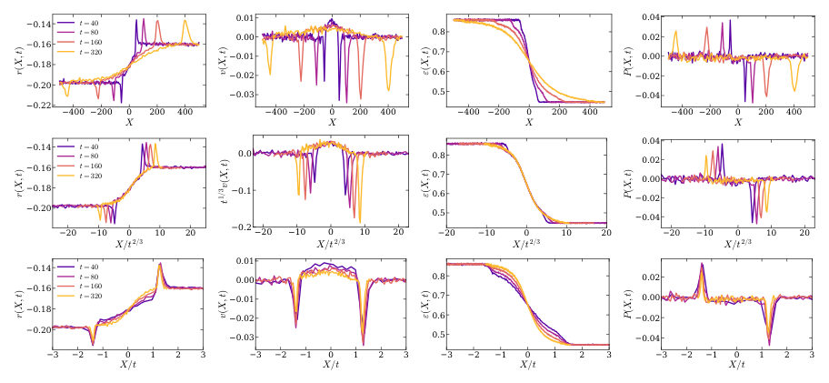 
Fig. 3: Evolution of an equal-pressure domain wall with βL = 1, βR = 2, P = 0 and v = 0, with 105 samples averaged. The top panel shows the unscaled plots and the middle panel shows that the best collapse for the central regions is by X/t2/3. There are moving spikes in the profiles that scale ballistically as shown in the bottom panel.

📷 Fig 5

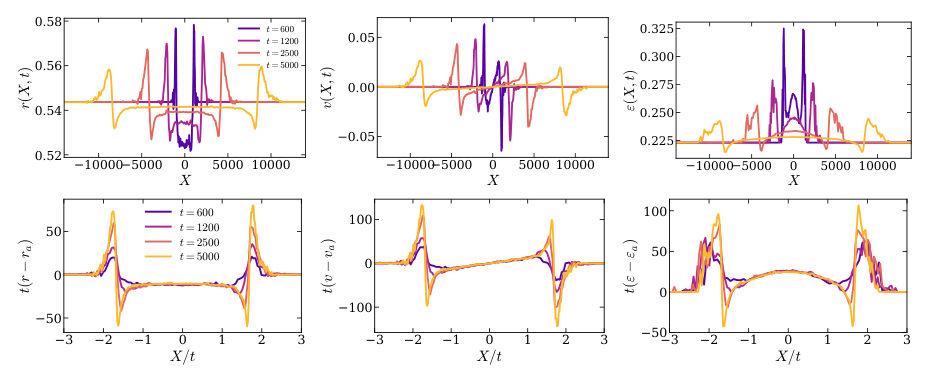 
Fig. 4: Case A: Blast initial condition with Pa ≠0, ra ≠0, ca ≠0 and (k2,k3,k4) = (1,1,1). The top panel shows the time evolution of the profiles while the bottom panel shows results after a ballistic collapse.

**Summary.** This paper provides a comprehensive review of applying hydrodynamic theory to the FPUT chain, deriving both Euler and dissipative equations. It tests these theories against non-equilibrium initial conditions like domain walls and blast waves. The findings demonstrate that while hydrodynamics works well for some regimes, dissipation and noise are essential for accurately describing the system's far-from-equilibrium evolution.

**Why it may be interesting.** The study provides a rigorous test case for the crossover between microscopic Hamiltonian dynamics and continuum fluid descriptions, which is a central theme in non-equilibrium statistical mechanics.

Detailed structure

**Main problem.** The paper reviews the applicability and derivation of hydrodynamic descriptions for the Fermi-Pasta-Ulam-Tsingou (FPUT) chain, especially when analyzing far-from-equilibrium phenomena.

**Main result.** While the hydrodynamic approach successfully recovers equilibrium transport coefficients like the diffusion matrix, simulations show that for certain non-equilibrium states (like equal-pressure domain walls), deviations from Euler predictions highlight the crucial role of dissipation and noise.

**Method.** The authors employ a combination of theoretical derivations (Green-Kubo type methods, characteristic analysis of Euler equations) and comparison with molecular dynamics simulations.

**Model / system.** The system is the FPUT chain, modeled by particles interacting via a nonlinear potential $V(r) = k_2/r^2 + k_3/r^3 + k_4/r^4$. The analysis transitions between microscopic Hamiltonian dynamics and macroscopic continuum fluid descriptions.

**Key observables.** Mass density ($
ho$), momentum density, energy density, current-current correlators ($\Gamma_{\alphaeta}(t)$), and wave structures (shocks, rarefactions).

**Important parameters / regimes.** The degree of nonlinearity in the potential, the ambient pressure ($P_a$), and the scaling exponents (e.g., $t^{2/3}$).

**Assumptions / limitations.** The primary assumption is the validity of local equilibrium for deriving the hydrodynamic equations, which is tested against non-equilibrium initial conditions.

**Figures summary.** Figures compare the theoretical three-wave structure predicted by Euler theory against microscopic simulations for domain walls, and show the collapse of central regions for blast waves, contrasting with the expected TvNS scaling.

**Paper structure.** The paper progresses by first defining the Hamiltonian, then deriving the full set of hydrodynamic equations (Euler and NSF), followed by applying these equations to solve specific non-equilibrium problems like domain walls and blast waves.

Abstract

We provide a pedagogical review of the hydrodynamics of the FPUT chain. There are three hydrodynamic fields corresponding to the conservation of mass, momentum and energy. We provide physically motivated derivations of the hydrodynamic equations at the levels of Euler and then Navier-Stokes-Fourier. Next we consider examples to test as to how successful the hydrodynamic description is in predicting the observed time evolution of nonequilibrium initial conditions such as domain walls and blasts. We find that in some cases there is good agreement of microscopic simulations with predictions from the Euler equations while, in several other cases, there is significant departure from the Euler predictions suggesting that the role of dissipation and noise is important in general.

[↑ back to top](#top)

### [Monitored chaotic scattering](http://arxiv.org/abs/2606.04794v1)

**Authors:** C. W. J. Beenakker, J. Sánchez Fernán, J. Tworzydło  
**Type:** theory · **Category:** other · **PDF:** <https://arxiv.org/pdf/2606.04794v1>  
**Analysis basis:** full PDF text, analyzed in chunks
**Topic relevance:** 🔥 `measurement-induced transitions` **4/5** · `quantum measurements` **3/5** · `methods for driven-dissipative` **2/5** · `non-equilibrium dynamics` **2/5** · `Keldysh / 2PI / non-Gaussian methods` **1/5** · `correlated / nonlocal dissipation` **1/5** · `driven-dissipative phase transition` **1/5** · `non-equilibrium universality` **1/5**

📷 Fig 1

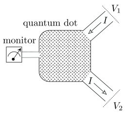 
FIG. 2. Two-terminal transport configuration in a quantum dot. A voltage difference V = V1 −V2 between contacts 1 and 2 drives a current I through the system, corresponding to a differential conductance G = dI/dV . We seek the effect on G of a monitoring of the scattering dynamics. The monitoring breaks reciprocity, leading to a difference between the case of an asymmetric bias V1 = V , V2 = 0 and the case of a symmetric bias V1 = V/2, V2 = −V/2.

📷 Fig 2

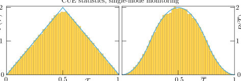 
FIG. 3. Charge transfer statistics for single-mode monitoring. The two panels show the probability density functions of the transferred charge T (from mode 1 to mode 2) and T (the average of the charge transfer from mode 1 to mode 2 and from mode 2 to mode 1). The histograms are computed numerically from the master equation (5.1) for M = 100, the solid curves are derived from the CUE in the limit M →∞, assuming Eq. (5.5).

📷 Fig 3

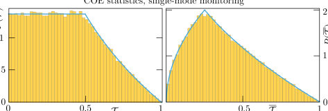 
FIG. 4. Same as Fig. 3, but for unitary symmetric S drawn from the COE.

📷 Fig 4

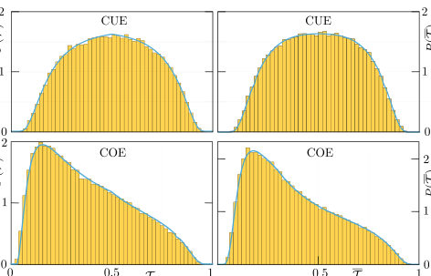 
FIG. 5. Charge transfer statistics for multi-mode monitor- ing. The panels show the probability density functions of the transferred charge T and T , for CUE and COE statis- tics of the scattering matrix. The histograms are computed numerically from the master equation (4.5) for M = 100, w = 0.1 ⇒γ = Mw2 = 1, the solid curves are the RMT calculations based on Eq. (6.2).

📷 Fig 5

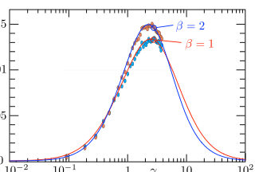 
FIG. 6. Reciprocity breaking by monitoring, quantified through the mean squared difference ∆2 β of the transferred charge from contact 1 to contact 2 and the other way around. The solid curves are the RMT results (6.4). The data points are computed numerically from the master equation (4.5) as a function of γ = Mw2, by varying M at fixed w = 0.1. (Only the range γ ≲4 was accessible numerically.)

**Summary.** This paper develops a theoretical framework to study quantum transport in chaotic scattering systems when the system is continuously monitored by an external measurement. It derives a quantum master equation governing the evolution and uses Random Matrix Theory to predict the statistics of the transferred charge. The key finding is that monitoring breaks transport reciprocity, providing new diagnostics for open quantum systems.

**Why it may be interesting.** This work is highly relevant to AMO and open quantum systems as it provides a rigorous theoretical framework for analyzing non-unitary, measurement-induced dynamics in mesoscopic conductors, extending concepts from quantum chaos to open quantum systems.

Detailed structure

**Main problem.** The paper extends random-matrix theory to analyze quantum transport through chaotic scattering systems when the dynamics are subjected to continuous, time-resolved monitoring.

**Main result.** Monitoring breaks the reciprocity of transport measurements, and the resulting charge transfer statistics can be predicted by comparing numerical solutions of a quantum master equation against Random Matrix Theory conjectures.

**Method.** The analysis involves deriving and solving a discrete-time quantum master equation for the density matrix, followed by applying Random Matrix Theory techniques (CUE/COE ensembles) to calculate probability distributions for transferred charge.

**Model / system.** The model is a quantum dot coupled to leads, where the system's evolution is governed by a quantum channel defined by Kraus operators due to the monitoring process. The scattering is statistically modeled using the Circular Unitary Ensemble (CUE).

**Key observables.** Transferred charge ($T$), differential conductance ($G = dI/dV$), and the probability density functions $P(T)$ and $P(T')$.

**Important parameters / regimes.** Weak measurement strength ($w_m$), the ratio of lead modes ($M$ vs $N$), and the fixed parameter $\gamma = Mw^2$ in the multi-mode limit.

**Assumptions / limitations.** The analysis assumes a weak measurement strength and relies on conjectures like the 'equipartition rule' for RMT predictions.

**Figures summary.** Figures illustrate the setup (open/closed leads), two-terminal transport configurations, and the probability density functions $P(T)$ and $P(T')$ for both single-mode and multi-mode monitoring under CUE and COE statistics.

**Paper structure.** The paper progresses from defining the monitored evolution via Kraus operators to deriving the master equation. It then compares numerical solutions for charge transfer statistics ($T$) against predictions from Random Matrix Theory, culminating in generalized equipartition rules for multi-mode monitoring.

Abstract

We extend the random-matrix theory of chaotic scattering to quantum dots whose dynamics is monitored by time-resolved measurements. Starting from a scattering matrix drawn from a circular ensemble, we construct the corresponding ensemble of Kraus operators for the monitored evolution of the many-body density matrix. In the single-particle sector the sum over measurement outcomes can be carried out algebraically, giving a discrete-time quantum master equation for the transferred charge. We solve this equation numerically and compare the resulting charge-transfer statistics with closed-form random-matrix predictions. The latter rely on an equipartition rule for monitored particles, which we formulate as a conjecture and test against the master equation.

[↑ back to top](#top)

### [Experimentally probing the Quantum Physics in the Inverted Harmonic Oscillator](http://arxiv.org/abs/2606.05125v1)

**Authors:** Si-Cong Ji, Philipp Schüttelkopf, Nataliia Bazhan, Federica Cataldini, Mohammadamin Tajik, Frederik S. Møller, Igor Mazets, Sebastian Erne, Jörg Schmiedmayer  
**Type:** experiment · **Category:** quantum gases · **PDF:** <https://arxiv.org/pdf/2606.05125v1>  
**Analysis basis:** full PDF text, analyzed in chunks
**Topic relevance:** 🔥 `analog quantum simulation` **4/5** · `non-equilibrium dynamics` **3/5** · `entanglement & information structure` **2/5** · `driven-dissipative phase transition` **1/5** · `interference shaping light` **1/5** · `non-equilibrium universality` **1/5** · `quantum measurements` **1/5** · `quantum optics experiment` **1/5**

📷 Fig 1

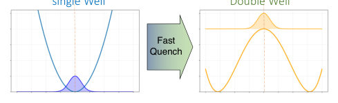 
FIG. 1. Preparation of the IHO initial condition. The RF quench transforms the transverse harmonic confinement into a double-well potential whose central barrier is locally ap- proximated by an inverted harmonic oscillator. The atoms are initially localized at the former trap minimum, which co- incides with the unstable fixed point of the IHO.

📷 Fig 2

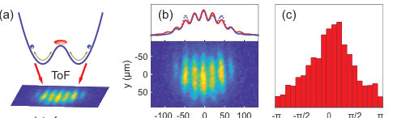 
FIG. 3. Coherent expansion probed by matter-wave in- terference. (a) The BEC expands in the inverted harmonic potential from the top of the barrier into the double well. The split cloud is released close to the far turning point. The wave functions expand and overlap in time-of-flight (ToF). (b) Interference pattern of the two daughter clouds split by the barrier after a 5.5 ms hold, integrated along the longitu- dinal (z) direction. (c) Distribution of the phase φ extracted from the fringes. The fringe contrast C = 0.24(0.04), together with the pronounced peak in φ rather than a uniform distri- bution, demonstrate that phase coherence between the two copies survives the full inflation.

📷 Fig 3

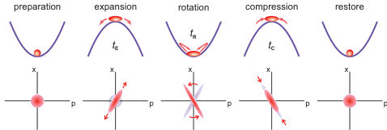 
FIG. 2. (a) Time sequence of the coherent expansion. (b) Time sequence for restoring the initial coherent state. For both figures, the upper panel shows the potential at differ- ent stages of the experiment, while the lower panel shows the corresponding phase-space distributions. The dark (light) red ellipses represent the Wigner distribution at the end (begin- ning) of each stage.

📷 Fig 4

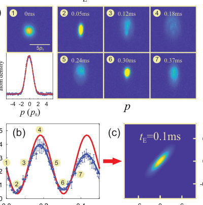 
FIG. 4. (a) Momentum distributions at different tomogra- phy times for the expanded state with tE = 0.1 ms. Lower- left panel: after ToF the atomic density is integrated along y, and the momentum distribution along the expanded direc- tion is fitted (red line) to extract its width and variance. (b) Evolution of the momentum variance, fitted with a damped- oscillation model (blue line); the red line is the corresponding undamped oscillation. The numbers mark the time points in panel (a). (c) Wigner distribution reconstructed from (b) by inverse-Radon transformation, for tE = 0.1 ms.

📷 Fig 5

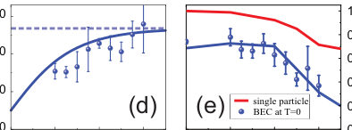 
FIG. 5. (a) Wigner distributions of the expanded states reconstructed by inverse-Radon transformation for varying expansion times. (b) Momentum (blue) and position (red) variances of the expanded states versus expansion time. (c) Squeeze factor versus expansion time. (d) Orientation angle φ of the major axis of the Wigner ellipse versus expansion time tE. The asymptotic angle determined by ωI/ω⊥is shown by the dashed line. (e) Purity PG of the reconstructed Gaussian state versus expansion time. The reduced PG(0) ∼0.75 for the BEC results from interactions in the ground state; the ap- parent loss of purity with time, present even for a single par- ticle, is the result of the anharmonicity of...

**Summary.** The researchers used a Bose-Einstein condensate on an AtomChip to simulate the dynamics of an Inverted Harmonic Oscillator (IHO), which models unstable quantum evolution. They measured sub-vacuum squeezing and confirmed that the quantum state retains coherence even after undergoing rapid, amplifying expansion. This work establishes ultra-cold atoms as a powerful tool for studying fundamental quantum phenomena relevant to cosmology and quantum sensing.

**Why it may be interesting.** This work provides a highly controlled, many-body quantum simulator for fundamental processes like cosmological inflation, offering quantitative measurements of quantum noise amplification and coherence preservation in an ultracold atomic setting.

Detailed structure

**Main problem.** The paper experimentally investigates the quantum dynamics governed by the Inverted Harmonic Oscillator (IHO), a model for unstable quantum evolution, using ultra-cold atoms.

**Main result.** They successfully demonstrated sub-vacuum squeezing and confirmed the coherent reversibility of the IHO dynamics using a Bose-Einstein condensate, establishing a clean platform for studying quantum fluctuations.

**Method.** The dynamics are probed using phase-space tomography on the Wigner function, and coherence is verified via matter-wave interference and time-reversal protocols.

**Model / system.** The system is a Bose-Einstein condensate (BEC) trapped on an AtomChip, where the transverse confinement is dynamically quenched via RF dressing to approximate an IHO potential. The dynamics are analyzed using the Gross-Pitaevskii equation (GPE) in the many-body limit.

**Key observables.** Sub-vacuum squeezing (up to 10.6 dB), Wigner function evolution, matter-wave interference contrast, and the decay/restoration of quantum purity.

**Important parameters / regimes.** Effective IHO frequency ($\omega_I = 2\pi 	imes 0.9$ kHz), initial transverse confinement ($\omega_\perp = 2\pi 	imes 2.1$ kHz), and time-of-flight measurement times ($t_E$).

**Assumptions / limitations.** The single-mode IHO description is assumed accurate for short times, though the experiment probes regimes where interaction-induced mode coupling becomes significant.

**Figures summary.** Figures illustrate the experimental setup (RF quench), the time evolution sequence including time-reversal (loop protocol), and the resulting matter-wave interference patterns and momentum distributions used for tomography.

**Paper structure.** The paper follows a structure of realizing the IHO potential via RF dressing, characterizing the resulting quantum state using Wigner tomography, demonstrating the exponential amplification and squeezing, and finally testing the coherence and reversibility via a time-reversal loop protocol.

Abstract

When a quantum system passes through an unstable fixed point the local dynamics reduces to the inverted harmonic oscillator (IHO). It exponentially amplifies along one quadrature while squeezing the other, producing macroscopically extended quantum states from microscopic zero-point fluctuations. We realize this dynamics with a Bose-Einstein condensate on an AtomChip. Radio-frequency dressing flips the transverse harmonic confinement into an IHO. Through phase-space tomography we follow the full Wigner function of the evolving quantum state, observe sub-vacuum squeezing of 10.6(1.3) dB, and test coherent reversibility by time-reversing the IHO evolution. Matter-wave interference between the two daughter clouds confirms quantum coherence over timescales far beyond the initial expansion. Our experiment establishes ultra-cold atoms as a clean, controlled, many-body platform for unstable quantum dynamics opening a route to force sensing with time-reversal-based coherence certification and to analog studies of the amplification of quantum fluctuations in inflationary field dynamics.

[↑ back to top](#top)

### [Measurement-induced state transitions in multi-qubit transmon processors](http://arxiv.org/abs/2606.05010v1)

**Authors:** Baptiste Hoyau, Alexander McDonald, Boris M. Varbanov, Manuel H. Muñoz-Arias, Alexandre Blais  
**Type:** theory · **Category:** other · **PDF:** <https://arxiv.org/pdf/2606.05010v1>  
**Analysis basis:** full PDF text, analyzed in chunks
**Topic relevance:** 🔥 `measurement-induced transitions` **4/5** · `quantum measurements` **2/5** · `QC/QI experiment` **1/5** · `analog quantum simulation` **1/5** · `correlated / nonlocal dissipation` **1/5** · `correlated cavity matter` **1/5** · `driven-dissipative phase transition` **1/5** · `methods for driven-dissipative` **1/5** · `non-equilibrium dynamics` **1/5**

📷 Fig 1

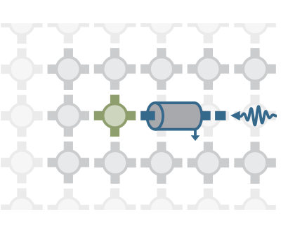 
FIG. 1. Schematic of a QPU focusing on a qubit (green) ca- pacitively that is coupled to a driven readout resonator (blue) and to several spectator qubits (gray) that are themselves cou- pled to each other.

📷 Fig 2

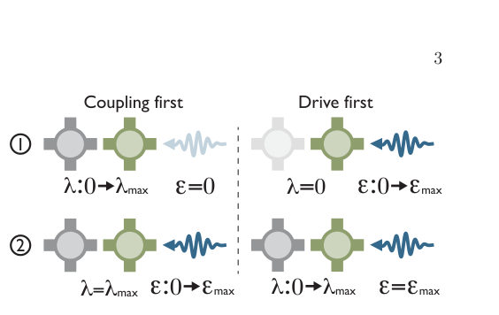 
FIG. 2. Schematic of the two Floquet branch analysis meth- ods used to study the impact of a spectator mode (gray) on the MIST of a qubit (green) during dispersive readout: the coupling-first and the drive-first approaches. These two ap- proaches proceed in two steps (labeled 1○and 2○). As their names suggest, in the coupling-first (drive-first) approach the coupling λ (drive amplitude ϵ) is first adiabatically increased from 0 to its target value while the other parameter is held at zero. In a second step, that remaining parameter is then ramped up.

📷 Fig 3

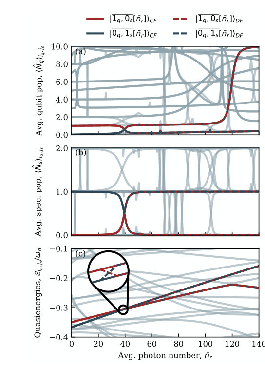 
FIG. 3. Example of spectator-induced MIST. (a) Average qubit ⟨ˆ Nq⟩iq,js and (b) spectator ⟨ˆ Ns⟩iq,js population of the Floquet branches and (c) their corresponding quasieneriges as a function of the average resonator photon number ¯nr. The populations and quasienergies of the |1q, 0s[¯nr]⟩and |0q, 1s[¯nr]⟩branches are highlighted in red and blue, respec- tively. The branches are labeled using either the coupling- first (solid lines) or drive-first (dashed lines) Floquet branch analysis methods. In (c), the quasienergies are defined with respect to the ground state energy of the system and subse- quently folded into the interval [−ωd/2, ωd/2]. We observe a swapping of the average qubit and...

📷 Fig 4

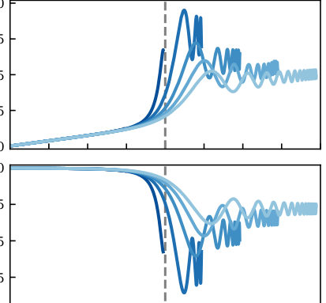 
FIG. 4. The time evolution of the (a) average qubit and (b) spectator population as a function of the resonator mean photon number, with the system initialized in the state |Ψ(0)⟩= |0q, 1s⟩. The dynamics is computed for six values of the steady-state photon number ¯n∞ranging between 30 and 80 (see legend). The vertical dashed line indicates the critical photon number obtained via the multimode branch analysis method. The steady-state photon number n∞de- termines the speed of passage through the observed avoided crossing in the quasienergy spectrum at ¯nr ≈40 photons (ver- tical dashed line) that is associated with the observed branch population swapping (see Fig. 3). Larger n∞leads to a...

📷 Fig 5

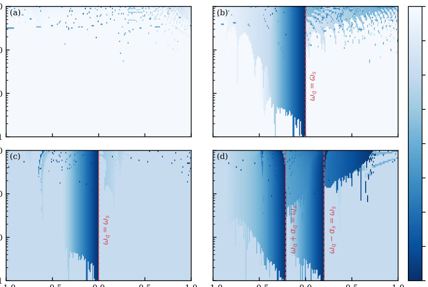 
FIG. 5. Critical photon numbers for the four computational states of the qubit and spectator as a function of the detuning ∆qs = ωs −ωq and the coupling strength between the qubit and the spectator, at ng = 0. As discussed in the text, the critical photon numbers are extracted from both the average qubit and spectator populations. (a) |0q, 0s⟩. In the absence of a qubit or spectator excitation, the critical photon number is nearly uniform at ncrit = 158 and results from a multi-photon resonance between states |0q⟩and |14q⟩(see Sec. A). (b) |0q, 1s⟩. In the presence of a spectator excitation, the background remains at ncrit = 158 and results from the same resonance as in panel (a). The large...

**Summary.** This paper develops a general theoretical framework to analyze Measurement-Induced State Transitions (MIST) in complex multi-qubit transmon processors. By comparing different adiabatic path traversals, the authors quantify how neighboring qubits and tunable couplers alter the critical photon number required for these detrimental transitions. This provides crucial guidelines for designing high-fidelity quantum readout protocols.

**Why it may be interesting.** This work is highly relevant to AMO physics and open quantum systems as it tackles decoherence and leakage mechanisms (MIST) in superconducting circuits, which are central to building scalable quantum hardware.

Detailed structure

**Main problem.** The paper investigates how Measurement-Induced State Transitions (MIST) affect transmon qubits when they are embedded within complex multi-qubit quantum processors.

**Main result.** The presence of spectator qubits and tunable couplers significantly modifies the MIST threshold, sometimes leading to suppression or cancellation of these unwanted transitions.

**Method.** The authors employ advanced Floquet branch analysis, comparing 'coupling-first' and 'drive-first' labeling schemes to detect discrepancies indicative of spectator-induced avoided crossings.

**Model / system.** The system models multi-qubit transmon processors in circuit QED, involving a readout qubit, spectator qubits, and tunable couplers, described by a complex Hamiltonian.

**Key observables.** Critical photon number ($n_{	ext{spec}}^{	ext{crit}}$), average qubit and spectator populations ($\langle\hat{N}_q
angle, \langle\hat{N}_s
angle$), and quasienergies.

**Important parameters / regimes.** Measurement drive amplitude ($E_q$), detunings ($\Delta_{qs}$), and coupling strengths ($g_{qs}, J_{qc}$).

**Assumptions / limitations.** The analysis relies on semi-classical approximations and the comparison between different adiabatic/diabatic path traversals (CF vs. DF labeling).

**Figures summary.** Figures illustrate the comparison of average populations and quasienergies between coupling-first and drive-first paths, mapping $n_{	ext{spec}}^{	ext{crit}}$ as a function of detuning and coupling strength, and showing the effect of couplers on avoided crossings.

**Paper structure.** The paper builds from single-qubit MIST analysis to a general method for multi-mode systems, then applies this method to study the specific effects of spectator qubits, and finally incorporates tunable couplers to analyze mitigation strategies.

Abstract

Dispersive readout of the transmon qubit in circuit QED is known to lose its quantum non-demolition character at small to moderate measurement drive amplitudes. This phenomenon is understood to originate from Laundau-Zener transitions at accidental multi-photon resonances, where $n$ drive photons can promote the transmon by $m$ levels. This interpretation has been shown to be in agreement with experiments characterizing the dispersive readout of a single transmon. The impact of these measurement-induced state transition (MIST) of a transmon embedded in a multi-qubit chip, however, remains largely unexplored. Here, we show that the presence of other components, such as qubits and couplers, can affect the MIST threshold of a measured transmon. To arrive at these results, we present a general method to characterize measurement-induced transition when the qubit under readout is coupled to other circuit elements, a ubiquitous situation in circuit QED-based quantum processors. As an example, we consider the case of two transmon qubits, and we show that the spectator qubit can be impacted by the measurement-induced transition of the readout qubit and, conversely, that the presence of the spectator qubit can lower the MIST threshold of the readout qubit. Finally, we explore how adding a coupler mode between the two qubits further modifies these effects.

[↑ back to top](#top)

### [Pushing the Classical Frontier of 1D Fermi-Hubbard Quench Dynamics Beyond Current Quantum Simulations](http://arxiv.org/abs/2606.04771v1)

**Authors:** Roman Rausch, Sukhbinder Singh, Saeed S. Jahromi, Augustine Kshetrimayum, Roman Orus  
**Type:** theory · **Category:** strongly correlated electrons · **PDF:** <https://arxiv.org/pdf/2606.04771v1>  
**Analysis basis:** full PDF text, analyzed in chunks
**Topic relevance:** 🔥 `non-equilibrium dynamics` **4/5** · `non-equilibrium universality` **3/5** · `methods for driven-dissipative` **2/5** · `analog quantum simulation` **1/5** · `entanglement & information structure` **1/5**

📷 Fig 1

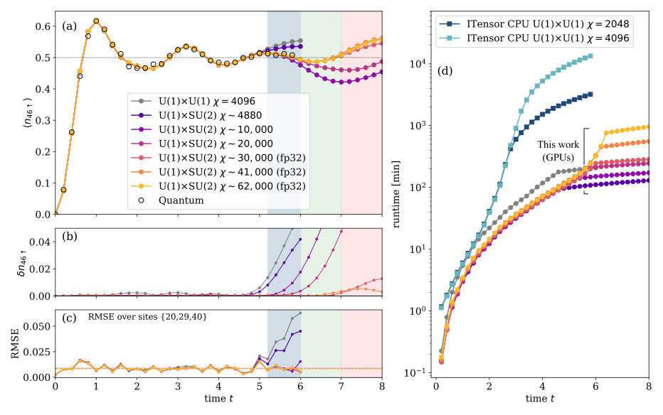 
Figure 1: Main results. (a) TDVP time evolution of ⟨n46↑⟩up to t = 8 for L = 60 fermions with ϵtol = 10−4. Our U(1)×U(1) curve at χ = 4096 reproduces the Q-CTRL iTensor calculation and confirms non-convergence beyond t ≈5. Our U(1)×SU(2) TDVP with χ ≈30,000 achieves convergence in t ∈[5.2, 6] (shaded blue) and our results are reliable in t ∈[6, 7] (shaded green), extending beyond the quantum simulation window. (b) Absolute deviation of ⟨n46↑⟩from the χ ≈62,000 reference at each bond dimension. (c) RMSE of our TDVP data against Q-CTRL’s published values of ⟨n20↑⟩, ⟨n29↑⟩, and ⟨n40↑⟩. (d) Wall-clock runtimes: ITensor TDVP on CPU cluster (1) vs. our GPU implementation (same legend as (a)).

📷 Fig 2

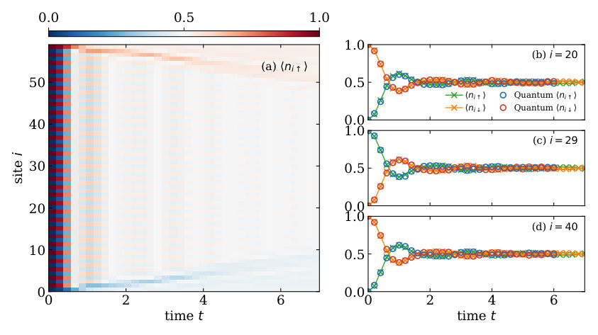 
Figure 2: Classical benchmarks for the Q-CTRL quantum simulation results of Fig. 3 in Ref. (1). (a) Expectation value ⟨ni↑⟩(up-spin density at site i) as a function of evolution time t, computed with our U(1) × SU(2) TDVP at χ ≈62,000 (float32, ϵtol = 10−4). Results already converged for t ≤6 using χ = 30, 000 (Fig S5). (b)–(d) Site-resolved values at i = 20, 29, 40 compared directly with the Q-CTRL quantum simulation results.

**Summary.** This paper pushes the classical simulation frontier for the 1D Fermi-Hubbard model by implementing a highly optimized, GPU-accelerated TDVP algorithm that exploits the full U(1)xSU(2) symmetry. The authors successfully certify the dynamics in previously inaccessible, high-entanglement regimes and extend the simulation time beyond current quantum hardware limits. This work significantly narrows the quantum-classical performance gap, establishing a new standard for benchmarking large-scale quantum simulations.

**Why it may be interesting.** This work directly addresses the computational boundary between quantum and classical simulation for strongly correlated systems, providing a crucial, highly optimized classical benchmark that forces a re-evaluation of quantum advantage claims in condensed matter physics.

Detailed structure

**Main problem.** To rigorously establish the true quantum-classical performance gap for simulating quench dynamics in the 1D Fermi-Hubbard model, especially in highly entangled regimes.

**Main result.** The authors significantly advance classical simulation by exploiting full U(1)xSU(2) symmetry and GPU acceleration, narrowing the claimed quantum advantage from 3000x to ~36x and certifying dynamics up to t=7.

**Method.** Time-Dependent Variational Principle (TDVP) implemented using Matrix Product States (MPS) and heavily optimized with GPU-accelerated tensor contractions and symmetry exploitation.

**Model / system.** The one-dimensional Fermi-Hubbard model (FHM) is studied under quench dynamics from a half-filled Néel state. The Hamiltonian is $H = -t \sum_{\langle i,j
angle,\sigma} (c^\dagger_{i\sigma}c_{j\sigma} + h.c.) + U \sum_i n_{i\uparrow}n_{i\downarrow}$.

**Key observables.** Site-resolved spin-up occupations $\langle n_{i\uparrow} 
angle$, Root-Mean-Square Error (RMSE) relative to quantum simulations, and the evolution of the bond dimension $\chi(t)$.

**Important parameters / regimes.** System size $L=60$, high-entanglement window $t \in[5.2, 6]$, and bond dimensions reaching $\chi \approx 62,000$.

**Assumptions / limitations.** The primary approximation is the use of the MPS ansatz within the TDVP framework. The authors assume that the full U(1)xSU(2) symmetry can be fully exploited for computational efficiency.

**Figures summary.** Figures illustrate the convergence of observables (e.g., $\langle n_{46\uparrow} 
angle$) across time, comparing results from insufficient symmetry ($U(1)	imes U(1)$) versus the full symmetry ($U(1)	imes SU(2)$). Runtime comparisons quantify the speedup achieved by the GPU implementation.

**Paper structure.** The paper first establishes the physical problem and the limitations of previous quantum claims. It then details the advanced classical methodology, focusing on symmetry exploitation and GPU optimization. The core results demonstrate convergence across the high-entanglement regime and extend the simulation time beyond current quantum hardware capabilities.

Abstract

Establishing quantum advantage requires comparison against the best achievable classical simulation. The Q-CTRL team recently simulated quench dynamics of the one-dimensional Fermi-Hubbard model on an IBM processor, completing a $L=60$ evolution to time $t=6$ in under three minutes and claiming a $3000\times$ speedup over classical Time-Dependent Variational Principle (TDVP) simulation at bond dimension $χ=4096$. Their classical benchmark required over 160 hours on a CPU cluster, failed to converge in the high-entanglement regime $t\in[5.2,6]$, and left the most challenging window of the experiment unverified. Here, we push the boundaries of classical simulation by exploiting the full $\mathrm{U}(1)\times\mathrm{SU}(2)$ symmetry of the Fermi-Hubbard Hamiltonian combined with GPU-accelerated tensor contractions. Reaching bond dimensions up to $χ\approx62{,}000$ on four NVIDIA H200 GPUs -- among the largest ever achieved in TDVP simulations and fifteen times larger than Q-CTRL's classical baseline -- we achieve fully converged results across the entire simulation window, including rigorous certification of the previously unresolved high-entanglement regime $t\in[5.2,6]$. We further advance the classical frontier to $t=7$, which lies beyond the quantum hardware experiment and any previously verified classical evolution of the full wavefunction. At the bond dimension comparable to Q-CTRL's best classical run, our GPU implementation completes in $\sim\!100$ minutes, directly reducing the claimed $3000\times$ quantum advantage to $\sim\!36\times$. These results substantially narrow the quantum-classical performance gap and establish a new standard for tensor-network benchmarking of large-scale quantum simulations.

[↑ back to top](#top)

### [Floquet-Engineered Parity Anomaly Staircase in a Cold Atom Dirac Lattice](http://arxiv.org/abs/2606.05164v1)

**Authors:** Binayyak Roy, Vito Scarola, Sumanta Tewari  
**Type:** both · **Category:** other · **PDF:** <https://arxiv.org/pdf/2606.05164v1>  
**Analysis basis:** full PDF text, analyzed in chunks
**Topic relevance:** 🔥 `analog quantum simulation` **4/5** · `non-equilibrium dynamics` **3/5** · `driven-dissipative phase transition` **1/5** · `methods for driven-dissipative` **1/5** · `non-equilibrium universality` **1/5**

📷 Fig 1

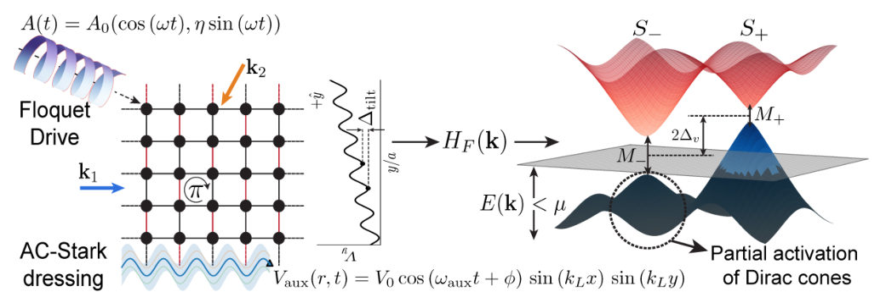 
Figure 1. Schematic of the proposed Floquet-engineered π-flux optical lattice and the resulting Dirac sector activation mechanism. A static tilt suppresses bare tunnelling along the ˆy direction, while Raman-assisted tunnelling restores resonant hopping with controlled Peierls phases such that the accumulated phase around a plaquette is π. The blue and yellow arrows indicate the Raman beams with wave vectors k1 and k2. Floquet drive A(t) = A0(cos ωt, η sin ωt), shown by the helical driving field, generates a time reversal symmetry breaking Dirac mass. An additional auxiliary scalar AC-Stark dressing channel, Vaux(r, t), shown by the wavy modulation field, produces a momentum dependent...

📷 Fig 2

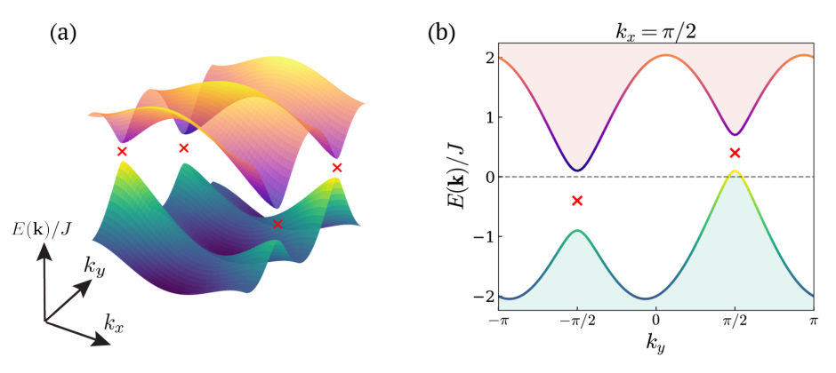 
Figure 2. Energy spectrum of the effective π-flux lattice model. (a) Three dimensional band structure showing the massive Dirac cones, marked by red crosses, after the inclusion of the mass and scalar shift terms. (b) One dimensional cut of the spectrum at kx = π/2 as a function of ky, illustrating the gap opening and relative vertical displacement of the Dirac sectors.

📷 Fig 3

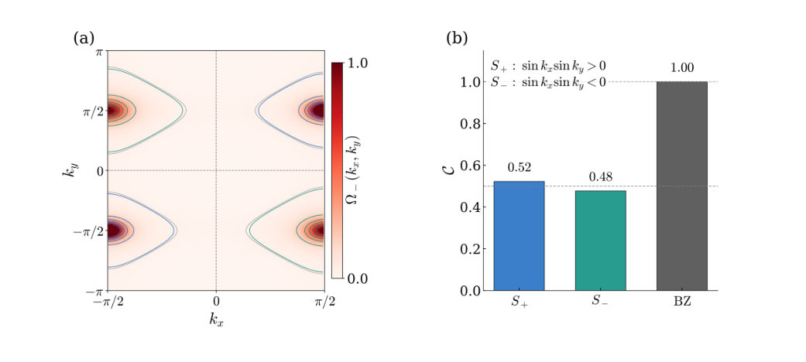 
Figure 3. Berry curvature and sector resolved Berry curvature integrals of the effective two-band model.(a) Berry curvature Ω−(k) of the lower band, with contours highlighting the localization of the curvature near the gapped Dirac cones. The signs of the peaks distinguish cones with different mass-chirality products, while the peak widths are controlled by the corresponding effective Dirac masses M±. (b) Sector resolved Berry curvature integral C obtained by integrating Ω−(k) over the corresponding Dirac sectors. The sector integrals show the half-integer Dirac contributions associated with the massive cones.

📷 Fig 4

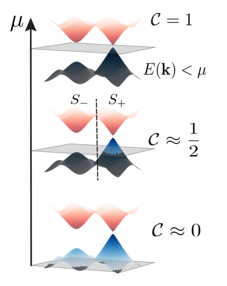 
Figure 4. Schematic of the chemical potential-induced Hall staircase. The massive Dirac sectors S+ and S−are shifted in opposite energy directions by the scalar term ∆v sin kx sin ky, while the mass parameters mT and mI open sector-dependent gaps. Each sector is represented by one effective massive Dirac cone; half-cone pieces appearing at the Brillouin-zone boundary are identified by periodic boundary conditions as a single effective Dirac contribution. The gray plane denotes the chemical potential µ. As µ is swept through the shifted spectrum, the occupied Berry curvature contribution changes from C ≃0 to an intermediate response near C ≃1/2, and then to the next plateau near C ≃1.

📷 Fig 5

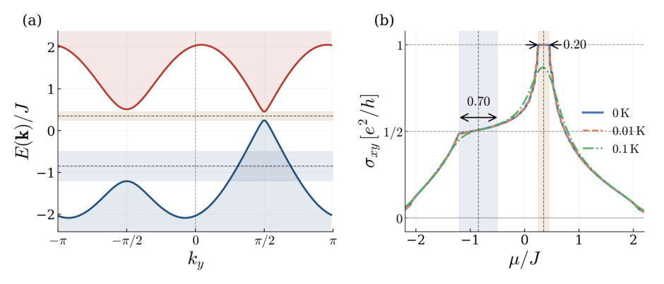 
Figure 5. Chemical potential-induced anomalous Hall staircase. (a) One dimensional cut of the energy spectrum at kx = π/2, with shaded regions indicating the chemical potential windows associated with the Hall plateaus. The blue region, centered near E(k)/J = −0.8, corresponds to occupation of one effective Dirac sector contribution and gives σxy ≃e2/2h. The yellow region, centered near E(k)/J = 0.3, corresponds to occupation of both relevant Dirac sector contributions and gives σxy ≃e2/h. (b) Anomalous Hall response σxy as a function of µ, showing plateau-like regions generated by the sequential activation of Berry curvature contributions from the shifted massive Dirac sectors. The...

**Summary.** This paper proposes using cold atoms in an optical lattice to engineer a system exhibiting a parity anomaly-inspired anomalous Hall staircase. By combining Floquet driving and auxiliary dressing, the authors create a model where the Hall response can be tuned stepwise by selectively populating different massive Dirac sectors. This offers a powerful, tunable platform for studying topological physics.

**Why it may be interesting.** This work provides a concrete, experimentally accessible platform (cold atoms) to realize and tune topological phenomena like the anomalous Hall effect, which is highly relevant for quantum simulation and topological quantum computing.

Detailed structure

**Main problem.** The paper aims to engineer a system to selectively probe the Berry curvature contribution from individual massive Dirac sectors, leading to a quantized anomalous Hall response staircase.

**Main result.** The anomalous Hall response exhibits plateau-like steps near $0$, $e^2/2h$, and $e^2/h$, corresponding to the sequential activation of zero, one, or two effective massive Dirac sectors.

**Method.** The analysis involves calculating the full lattice Berry curvature integral and analyzing the Hall response ($\sigma_{xy}$) under two protocols: sweeping the chemical potential ($\mu$) or sweeping the scalar displacement term ($\Delta v$).

**Model / system.** The system is a cold atom realization in a two-dimensional $\pi$-flux optical lattice. The effective Hamiltonian incorporates time-reversal symmetry breaking (Floquet mass $m_T$), static inversion breaking ($m_I$), and a tunable momentum-dependent scalar displacement ($\Delta v$) via auxiliary AC-Stark dressing.

**Key observables.** Anomalous Hall response ($\sigma_{xy}$), which shows staircase plateaus at quantized values ($0, e^2/2h, e^2/h$).

**Important parameters / regimes.** Floquet drive amplitude ($m_T$), static offset ($m_I$), scalar displacement ($\Delta v$), and chemical potential ($\mu$).

**Assumptions / limitations.** The scalar displacement term ($\Delta v$) is assumed to shift energies without altering the Bloch eigenvectors, allowing for selective occupation of Berry curvature contributions.

**Figures summary.** Figures illustrate the energy spectrum, the sector-resolved Berry curvature, and the resulting $\sigma_{xy}$ vs. $\mu$ or $\sigma_{xy}$ vs. $\Delta v$ plots, clearly showing the characteristic staircase plateaus.

**Paper structure.** The paper first derives the effective Hamiltonian using Floquet engineering techniques. It then analyzes the low-energy Dirac theory, showing how the scalar term separates the sectors. Finally, it calculates the Hall response by sweeping $\mu$ or $\Delta v$ to demonstrate the stepwise quantization.

Abstract

We propose a Floquet-engineered cold atom realization of a parity anomaly inspired anomalous Hall staircase in a two dimensional $π$-flux lattice. The effective model hosts massive Dirac fermions generated by the combined action of a time reversal symmetry breaking Floquet mass and a static inversion breaking mass offset. An additional momentum dependent scalar displacement term shifts different Dirac sectors in opposite energy directions without modifying their Bloch eigenvectors. As a result, the Berry curvature contribution associated with individual massive Dirac sectors can be selectively occupied, allowing the anomalous Hall response to evolve stepwise as a function of chemical potential or scalar displacement term. Evaluating the full lattice Berry curvature integral, we find plateau-like responses near $0$, $e^2/2h$, and $e^2/h$, corresponding respectively to the activation of zero, one, and two effective massive Dirac sector contributions. We analyze the associated low energy Dirac theory, band topology, Berry curvature structure, and two parameter response maps, and discuss a possible realization using Raman-assisted tunneling, off-resonant Floquet driving, and auxiliary AC-Stark dressing in ultracold atomic optical lattices.

[↑ back to top](#top)

### [Phase-correlation-free quantum key distribution source operating at gigahertz rates](http://arxiv.org/abs/2606.04947v1)

**Authors:** Shashank Kumar, Alessandro Marcomini, Loïc Millet, Towsif Taher, Aurélien Cavalié, Raphael Houlmann, David Cabrerizo, Gianluca Boso, Marcos Curty, Rob Thew, Boris Korzh  
**Type:** experiment · **Category:** quantum information and computing · **PDF:** <https://arxiv.org/pdf/2606.04947v1>  
**Analysis basis:** full PDF text, analyzed in chunks
**Topic relevance:** 🔥 `quantum optics experiment` **4/5** · `QC/QI experiment` **3/5** · `interference shaping light` **2/5**

📷 Fig 1

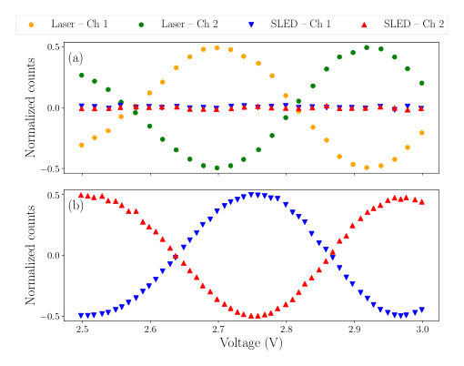 
Figure 2. Visibility comparison for laser and SLED sources. (a) Nearest-neighbour interference (one-DLI configuration), determin- ing the global phase relation of pulses in different rounds of the protocol. (b) X-basis measurement (two-DLI configuration), corre- sponding to a measurement of the coherence among time-bins within the same signal. Counts N are normalized as N/Nmax −(Nmax + Nmin)/2, being Nmax (Nmin) the maximum (minimum) counts of each curve.

📷 Fig 2

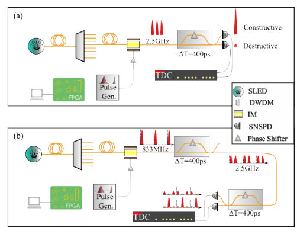 
Figure 1. Experimental setup for phase-correlation measurements. (a) Pulse-carved signals at 2.5 GHz are sent to a matched delay-line interferometer (DLI) to test the phase coherence between neighbor- ing pulses by monitoring for constructive and destructive interference at the outputs. The relative phase is controlled by a voltage bias. (b) Pulses carved at 833 MHz are sent through a first DLI to generate time-bin signals (i.e., early and late time bins with 400 ps separa- tion). A second matched DLI recombines the two bins to measure their relative phase coherence. The outputs are detected using super- conducting nanowire single-photon detectors (SNSPDs) connected to a time-to-digital...

📷 Fig 3

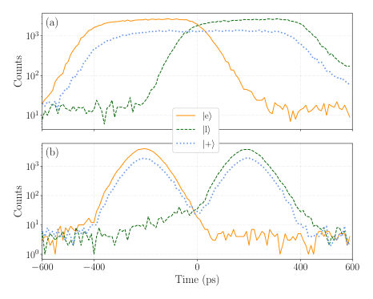 
Figure 3. Time-domain measurement of the prepared states. (a) Profile of the state-encoding IM applied to a continuous-wave sig- nal from the SLED. For Z-basis measurements, one time-bin is fully suppressed (with an extinction ratio exceeding 25 dB), while for the X-basis a balanced superposition of the time-bins is encoded. (b) Fi- nal states obtained by combining the encoder of panel (a) with pulse- carving. The resulting pulses have a full-width half-maximum of about 120 ps.

📷 Fig 4

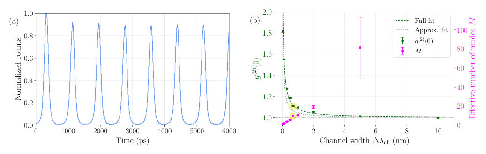 
Figure 4. (a) Photon counts versus time with the HBT experiment for the SLED source filtered through the DWDM channel. The primary peak corresponds to zero-time coincidences, and is purposely delayed to capture the full peak shape. The Nside = 6 secondary peaks occur periodically, in accordance with the source pulsing rate. The g2(0) value is obtained through Eq. 6 considering an integration window of 100 ps. (b) Scaling of g2(0) estimates upon changing the channel bandwidth through the OSA tunable filter, with the corresponding fit given by Eq. 4 with M = γ (approximate fit) and M = M(γ) (Eq. 5, full fit), where γ ∝∆λch. For each measurement, the corresponding effective mode number M is...

📷 Fig 5

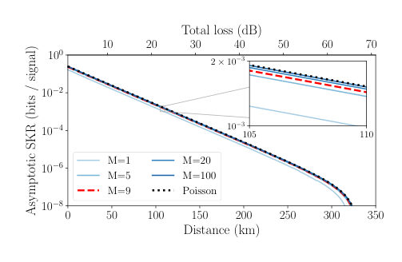 
Figure 5. Asymptotic secret key rate obtainable from a phase- randomized laser source (Poissonian statistics, dotted black line), compared with that of multimodal thermal light characteristic of the SLED for different values of the effective mode number M (solid blue lines). The red dashed line corresponds to the conservative es- timate of M from the experimental data in Fig. 4(b). As M ≫1, the multimode-thermal distribution approaches the Poissonian, and re- sults correctly converge for M = 100.

**Summary.** This paper introduces a Super-Luminescent Light Emitting Diode (SLED) as a viable, low-cost source for high-speed Quantum Key Distribution (QKD). It experimentally proves that the SLED inherently randomizes the phase between successive pulses, solving a major security hurdle in QKD. Furthermore, it demonstrates the ability to engineer the necessary intra-signal coherence for time-bin encoding, establishing a scalable platform for next-generation quantum communication.

**Why it may be interesting.** This work is highly relevant to quantum optics and open quantum systems as it proposes a practical, solid-state alternative to complex laser systems for quantum communication, directly addressing decoherence and correlation issues in high-speed quantum protocols.

Detailed structure

**Main problem.** The primary challenge is developing a secure, high-speed Quantum Key Distribution (QKD) source that avoids phase correlations inherent in conventional laser sources at gigahertz repetition rates.

**Main result.** The authors demonstrate that a Super-Luminescent Light Emitting Diode (SLED) can serve as a compact, cost-effective source that achieves intrinsic global phase randomization between adjacent pulses while maintaining high intra-signal coherence necessary for time-bin encoding.

**Method.** The work involves characterizing the SLED source using interferometric measurements (1DLI for phase correlation and 2DLI for intra-signal coherence) and simulating the performance using decoy-state BB84 protocols.

**Model / system.** The physical platform is a C-band SLED operating at high rates (e.g., 1.25 GHz). The source's spontaneous-emission-driven nature provides intrinsic phase randomization, which is combined with active modulation (pulse carving and basis encoding) to generate time-bin states.

**Key observables.** Visibility ($V_{1DLI}$ and $V_{2DLI}$), extinction ratio ($\approx 25$ dB), and the second-order correlation function ($g_2(0)$).

**Important parameters / regimes.** Repetition rates up to 1.25 GHz, pulse widths ($\sim 100$ ps), and the effective number of temporal modes ($M$).

**Assumptions / limitations.** The security analysis relies on the SLED's ability to mimic the performance of an ideal phase-randomized source, and the performance is compared against theoretical Poissonian limits.

**Figures summary.** Figures illustrate the experimental setup for phase correlation measurements (1DLI) and time-bin signal generation (2DLI), comparing visibility results between the SLED and a reference laser source.

**Paper structure.** The paper progresses by first establishing the need for phase randomization, then presenting the SLED as a solution, followed by detailed measurements confirming both pulse-to-pulse randomization and intra-signal coherence, and concluding with performance comparisons for QKD.

Abstract

Phase randomization is essential for the security of practical decoy-state quantum key distribution (QKD) systems. Commonly, implementations rely on laser sources which are either actively phase-randomized, or gain-switched. However, at high repetition rates these show correlations, which can ultimately compromise security and performance. We present a 1.25 GHz phase-randomized QKD source based on a super-luminescent light emitting diode (SLED) operating in the C-band as a compact and cost-effective alternative. The source generates $\sim100$ ps optical pulses with $400$ ps pulse-to-pulse separation, compatible with high-speed time-bin encoding. Interferometric measurements demonstrate $>99\%$ visibility between adjacent time bins, confirming strong first-order coherence within the same quantum signals, while the spontaneous-emission-driven nature of the SLED ensures intrinsic global phase randomization between adjacent signals. This work establishes a scalable SLED-based platform for high-speed prepare-and-measure QKD systems.

[↑ back to top](#top)

### [Probing PbTe-Pb nanowire devices with radio-frequency reflectometry](http://arxiv.org/abs/2606.04544v1)

**Authors:** Xin-Yi Tang, Lin Li, Zezhou Xia, Jierong Huo, Wenyu Song, Lining Yang, Zonglin Li, Jiaye Xu, Peilin Li, Runan Shang, Qi-Kun Xue, Ke He, Hao Zhang  
**Type:** experiment · **Category:** quantum information and computing · **PDF:** <https://arxiv.org/pdf/2606.04544v1>  
**Analysis basis:** full PDF text, analyzed in chunks
**Topic relevance:** 🔥 `QC/QI experiment` **4/5** · `quantum measurements` **2/5**

📷 Fig 1

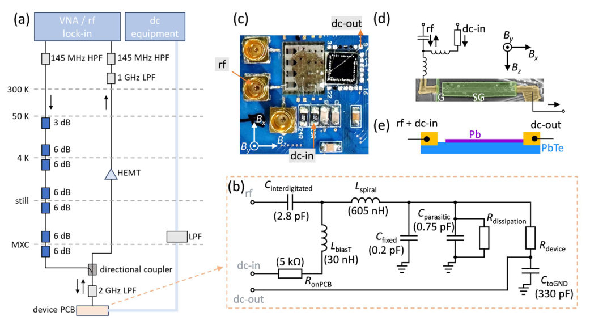 
FIG. 1. rf-readout system for PbTe nanowires. (a) Schematic of fridge wiring. (b) Circuit diagram of the device PCB. The rf signal is injected from the ‘rf’ port. An off-chip bias-tee design enables simultaneous transport measurement through ‘dc-in’ and ‘dc-out’ ports. (c) An optical image of the device PCB, including the device chip (upper right) and a sapphire substrate carrying superconducting spiral inductors and bias-tees (the middle void). (d) False-colored SEM of the PbTe-Pb NS device. TG and SG refer to tunnel gate and super gate, respectively. (e) Simplified schematic of the device and circuit. For clarity, CdTe substrate/capping layer, PbEuTe buffer/spacing layer, gate...

📷 Fig 2

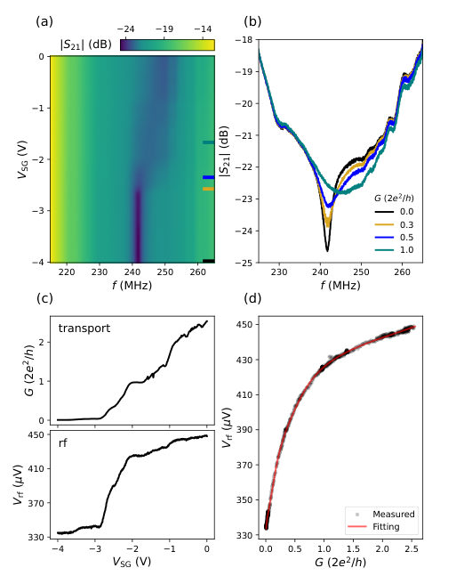 
FIG. 2. Gate-tunable reflectometry. (a) |S21| as a function of VSG and the rf frequency f. (b) Line cuts at several gate voltages (marked in (a)). (c) Transport measurement (upper) and the rf signal (lower). f is fixed at 241.1 MHz. (d) Vrf vs G. The red curve is the fitting.

📷 Fig 3

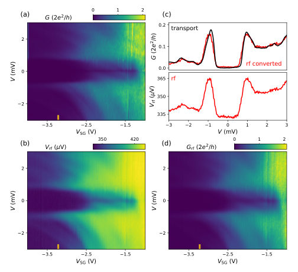 
FIG. 3. Comparison of rf and dc probing of the PbTe-Pb nanowire. (a) dc conductance map as a function of V and VSG. (b) rf measurement under the same gate and bias setting. (c) Line cuts from (a) (upper, black) and (b) (lower) at VSG = −3.22 V (marked as orange bars). The red curve in the upper panel is the rf signal converted into G. (d) Conductance (Grf) map converted from the rf signal in (b).

📷 Fig 4

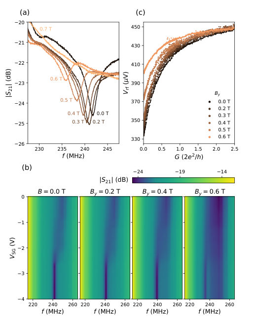 
FIG. 4. Magnetic field compatibility. (a) The resonator re- sponse at different By’s (out-of-plane). VSG is fixed at −4.0 V. (b) The reflectometry signal as a function VSG at By of 0.0, 0.2, 0.4, 0.6 T, respectively. (c) rf signal (Vrf) vs G obtained at different fields.

📷 Fig 5

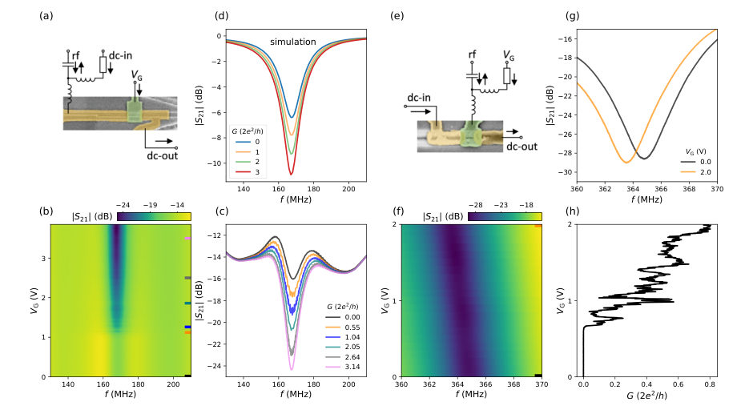 
FIG. 5. Resistive and capacitive sensing of PbTe field effect devices. (a) SEM of a PbTe device using the resistive readout. (b) |S21| as a function of VG and the rf frequency. (c) Line cuts at several gate voltages marked in (b). (d) Simulated cavity response for different device conductance. (e) SEM of a PbTe device using capacitive readout. (f) |S21| as a function of VG and the rf frequency. (g) Two line cuts from (f) at VG = 0 V and 2 V, respectively. (h) Conductance of this device as a function of VG. The magnetic field was set zero during the measurement of both devices.

**Summary.** This work demonstrates the feasibility of using radio-frequency (rf) reflectometry to rapidly probe the quantum conductance of PbTe-Pb nanowires designed to host Majorana zero modes. By measuring the reflected rf signal, the authors show a direct, fast correlation between the rf signal and the device's quantum conductance. This technique significantly accelerates characterization compared to traditional DC measurements, paving the way for topological quantum computation.

**Why it may be interesting.** The development of fast, high-bandwidth readout techniques like rf reflectometry is crucial for characterizing fragile quantum states, such as those associated with Majorana zero modes, which are central to topological quantum computation.

Detailed structure

**Main problem.** The primary goal is to demonstrate a fast, non-invasive readout technique for quantum states in superconducting nanowires predicted to host Majorana zero modes.

**Main result.** Radio-frequency (rf) reflectometry proves to be a viable, order-of-magnitude faster method than DC transport for probing the quantum conductance of PbTe-Pb nanowires.

**Method.** The technique involves using a Vector Network Analyzer (VNA) to measure the reflection coefficient ($S_{21}$) of the nanowire circuit as a function of gate voltage and frequency.

**Model / system.** The experiment uses selective-area-grown PbTe-Pb nanowires on a CdTe substrate, which are engineered to host Majorana zero modes. The circuit is modeled as an LCR network, allowing the rf signal to probe the device's quantum conductance.

**Key observables.** The measured observables include the reflection coefficient ($|S_{21}|$) vs. gate voltage and frequency, the device conductance ($G$), and the derived relationship between the rf signal voltage ($V_{rf}$) and $G$.

**Important parameters / regimes.** Key parameters include the gate voltage ($V_{SG}$), rf frequency ($f$), and the magnetic field ($B$), which must be compatible with the zero-energy mode signatures.

**Assumptions / limitations.** The analysis makes approximations regarding the circuit model, such as neglecting the bias-tee region for resonance analysis, and attributing small resonance dips to parasitic impedance mismatch.

**Figures summary.** Figures illustrate the rf-readout schematic, gate-tunable reflectometry results showing $|S_{21}|$ vs $V_{SG}$ and $f$, comparisons between rf and dc probing speeds, and measurements demonstrating compatibility with magnetic fields.

**Paper structure.** The paper first introduces the rf-readout system and its compatibility with the nanowire structure. It then presents data showing the gate-tunable response, followed by comparisons to DC measurements and studies of the system's response under applied magnetic fields and capacitive coupling.

Abstract

We report the implementation of radio-frequency (rf) reflectometry on selective-area-grown PbTe-Pb nanowire devices on a CdTe substrate. These nanowires were predicted to host Majorana zero modes. We demonstrate the compatibility of the rf technique, both resistive and capacitive sensing, with these nanowires. The effect of dielectric loss from the CdTe substrate is also discussed. The feasibility of rf reflectometry is also verified at finite magnetic fields where zero-energy modes occur. Our results enable the fast control of PbTe quantum devices, paving the way for its application in topological quantum computation.

[↑ back to top](#top)

### [Quantum String Interactions Revealed by Full Counting Statistics](http://arxiv.org/abs/2606.04086v1)

**Authors:** Chang-Yan Wang, Xue-Feng Zhang  
**Type:** theory · **Category:** strongly correlated electrons · **PDF:** <https://arxiv.org/pdf/2606.04086v1>  
**Analysis basis:** full PDF text, analyzed in chunks
**Topic relevance:** 🔥 `entanglement & information structure` **4/5** · `Keldysh / 2PI / non-Gaussian methods` **1/5** · `analog quantum simulation` **1/5**

📷 Fig 1

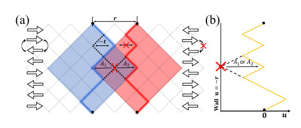 
FIG. 1. Schematic of the hard-core string interaction. (a) Local plaquette flips move two fluctuating strings separated by r, while the hard-core constraint forbids their crossing. The overlap of the blue and red regions marks where the strings can meet and interact. Near contact, the blocked hopping process gives the virtual wall-hopping matrix element, with return channels A1 and A2. Each local segment has two directions, mapped to spin up/down states. (b) In the relative- string coordinate u, the constraint becomes a wall at u = −r. The virtual process connects u = −r and u = −r + 1, so the effective boundary coordinate is centered at u = −r + 1/2.

📷 Fig 2

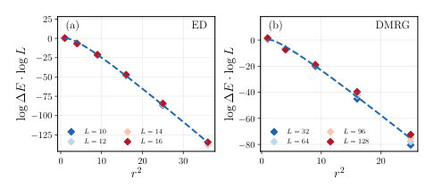 
FIG. 2. Scaling fit of ln ∆E · ln L using ln ∆E · ln L = −a(r − 1/2)2 + b ln r + c. The dashed line is the fit. Panel (a) shows ED data for L = 10, 12, 14, 16, giving a = 4.974 ± 0.068. Panel (b) shows DMRG data for L = 32, 64, 96, 128, giving a = 4.107 ± 0.156.

📷 Fig 3

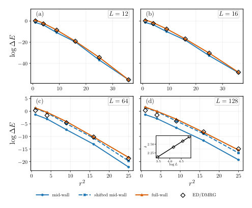 
FIG. 3. Comparison of (a,b) ED and (c,d) DMRG energies with FCS estimates. Solid blue curves are the direct finite-size mid-wall FCS integrals. Dashed blue curves for L = 64, 128 include a fitted vertical shift. Orange curves are the hybrid windowed full-wall estimates, with exact one-cut FCS factors in the central window and Gaussian conditional factors for the remaining wall constraint. The inset shows the fitted shift δ(L) ≃0.417 ln L + 0.687 for L = 32, 64, 96, 128.

📷 Fig 4

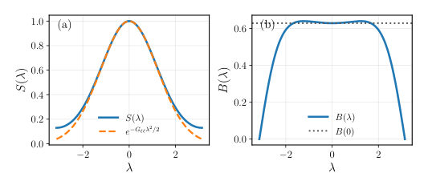 
FIG. 4. Small-λ structure of the mid-wall FCS. (a) Exact F (λ) and the Gaussian approximation e−Gℓℓλ2/2. (b) Exact B(λ) and the dotted line marks B(0) = 2Cℓ,ℓ+1.

📷 Fig 5

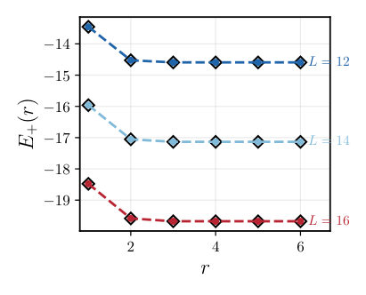 
FIG. 5. Comparison of constrained ground state energies E+(r) from ED and DMRG for L = 12, 14, 16. Black hollow diamonds show ED values obtained from E+(r) = E0 + ∆E(r), while colored dashed lines with solid dots show DMRG energies computed directly from the projected Hamiltonian H+ = PH0P.

**Summary.** This work develops a theoretical framework to calculate the effective interaction between quantum strings constrained by hard-core rules. By utilizing Full Counting Statistics (FCS), the authors demonstrate that this interaction is fundamentally controlled by the entanglement entropy ($S_\ell$) of the string itself. This provides a powerful, entanglement-based method for characterizing topological interactions in quantum many-body systems.

**Why it may be interesting.** The direct connection established between entanglement entropy ($S_\ell$) and the effective interaction strength ($\Delta E(r)$) provides a powerful, non-local diagnostic tool for understanding topological defects in condensed matter systems.

Detailed structure

**Main problem.** The paper addresses the fundamental question of determining the effective interaction potential between quantum strings, particularly when these strings are subject to hard-core constraints that introduce nonlocal interactions.

**Main result.** The effective interaction potential is shown to be governed by the Full Counting Statistics (FCS) of the relative string operator, yielding an entanglement-controlled asymptotic form $\ln\Delta E(r) \sim -C r^2/S_\ell$.

**Method.** The authors employ the Feshbach–Schur method combined with the formalism of Full Counting Statistics (FCS) to calculate the ground-state energy shift induced by the hard-core constraint.

**Model / system.** The model involves two fluctuating hard-core quantum strings on a lattice, constrained by a hard-core rule forbidding crossing. The physics is analyzed using string Hamiltonians and projected operators.

**Key observables.** Effective Potential ($\Delta E(r)$), Full Counting Statistics generating function ($\chi(\lambda)$), Entanglement Entropy ($S_\ell$).

**Important parameters / regimes.** The separation distance ($r$) between the strings, and the entanglement entropy ($S_\ell$) which sets the leading scale of the repulsion.

**Assumptions / limitations.** The analysis often relies on the mid-wall approximation to derive analytic expressions, although the leading asymptotic behavior is shown to be preserved when considering the full-wall constraint.

**Figures summary.** Figures compare the calculated effective potential (derived from FCS) against high-precision numerical results from Exact Diagonalization (ED) and DMRG, confirming the predicted quadratic scaling dependence on the separation distance $r$.

**Paper structure.** The paper builds the theory by first relating the hard-core constraint to nonlocality, then using the Feshbach–Schur method to derive the effective Hamiltonian, and finally mapping the resulting expectation values onto the framework of Full Counting Statistics to extract the asymptotic potential.

Abstract

How quantum strings interact is a basic question for extended objects in quantum many-body physics. Even the simplest hard-core constraint (no crossing), can generate a nontrivial effective potential, whose microscopic form is difficult to determine because the relative distance between the strings is intrinsically nonlocal. Here we show that this nonlocality is naturally captured by full counting statistics (FCS). For two hard-core quantum strings, we derive an analytic FCS expression for the emergent interaction by identifying the virtual process in which the two strings touch and hop back. Using the FCS--entanglement relation, we find the effective potential has the entanglement-controlled asymptotic form $\lnΔE(r)\sim -π^2 r^2/(12 S_\ell)$ up to subleading terms, where $S_\ell$ is the entanglement entropy between the two halves of a quantum string. We confirm the theory using high-precision numerical calculations and finite-size FCS estimates. Our results reveal FCS as a direct route to effective interactions between quantum topological line-defects, which may also be extended to higher-form charge.

[↑ back to top](#top)

### [A thorium-229 optical nuclear clock with feedback loop](http://arxiv.org/abs/2606.04997v1)

**Authors:** L. Toscani De Col, T. Riebner, I. Morawetz, F. Schneider, N. Sempelmann, J. Schlachet-Lépinay, F. Schaden, M. Bartokos, G. A. Kazakov, K. Beeks, B. Gerstenecker, M. Pimon, S. Lahs, A. Hellerschmied, T. Lercher, J. Premper, A. Niessner, M. Matus, H. Denker, M. Cizek, O. Cip, V. Lal, G. Zitzer, V. Petrov, J. Tiedau, M. V. Okhapkin, E. Peik, T. Schumm  
**Type:** experiment · **Category:** other · **PDF:** <https://arxiv.org/pdf/2606.04997v1>  
**Analysis basis:** full PDF text, analyzed in chunks
**Topic relevance:** 🔥 `quantum measurements` **4/5** · `measurement-induced transitions` **1/5**

📷 Fig 1

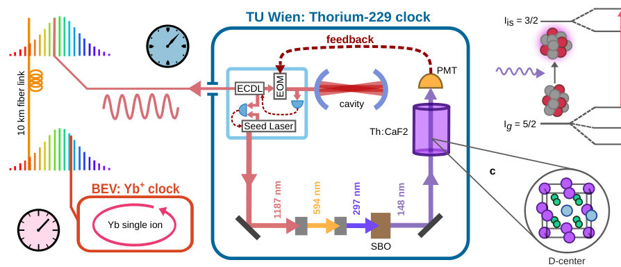 
FIG. 1. Schematic representation of the setup. a, Thorium-229 nuclear clock located at TU Wien. It is comprised of an ECDL, which serves as a clock laser, stabilized to a high-finesse cavity via the sideband of an EOM, and a seed laser which is frequency-quadrupled, followed by the last SBO-based VUV frequency generation doubling. The seed laser is modulated via the offset lock to generate the error signal from the absorption of the thorium-229 nuclei in the Th:CaF2 crystal, by readout of the PMT. The error signal is used as feedback to the EOM to compensate for the long-term drift of the cavity, closing the nuclear clock feedback loop. b, Frequency comparison to the Yb+ single-ion clock...

📷 Fig 2

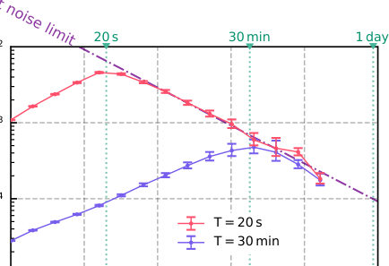 
FIG. 2. Fractional frequency instability. The fractional fre- quency instability for different averaging times τ is shown for two clock operation modes. One mode stabilizes to the 5/2 →3/2 transition with T = 20 s between adjustment steps (red curve), the other with T = 30 min (blue curve). For τ &gt; T, both curves follow the shot noise trend of the 5/2 →3/2 interrogation.

📷 Fig 3

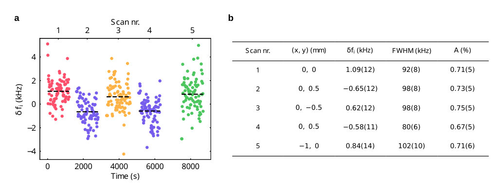 
FIG. 3. Crystal position dependent center frequency. a, Deviations δfi of the Th-229 line centers from the frequency average of five consecutive measurements at different crystal positions. The second and fourth datasets (blue) were obtained by operating at the same crystal position. Each point is measured in T = 20 s. After ttot = 20 min of data taking, they average down to the respective dotted black lines. b, The table shows the line center deviation δfi for each scanning position. The indicated statistical uncertainties are determined through a Monte Carlo simulation of the clock loop (see Methods). The indicated linewidth at full width half maximum (FWHM) and absorption amplitudes A...

📷 Fig 4

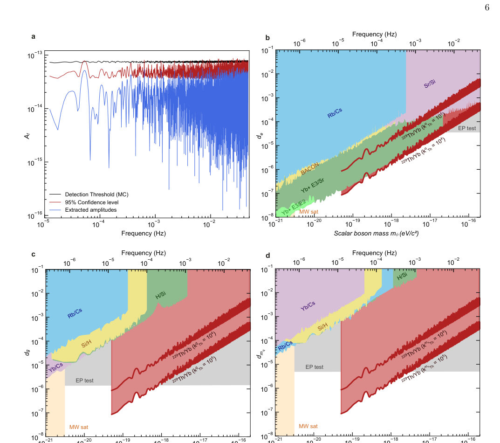 
FIG. 4. Dark Matter exclusion plots. a, Lomb-Scargle periodogram calculated from the T = 20 s, ttot ≈23 h measurement of the beat frequency of the Th-229 nuclear clock and the Yb+ ion clock. We indicate the detection threshold that was not met at any frequency, as well as the exclusion band. We can exclude with 95% certainty that no oscillations with amplitudes above this value are present. b, Exclusion plot for scalar bosons with a mass mϕ and a coupling to photons with a dimensionless coupling constant de. The shaded areas have been excluded by various clock comparisons [45–50] under the assumption that the scalar boson constitutes the majority of the observed dark matter. Astrophysical...

📷 Fig 5

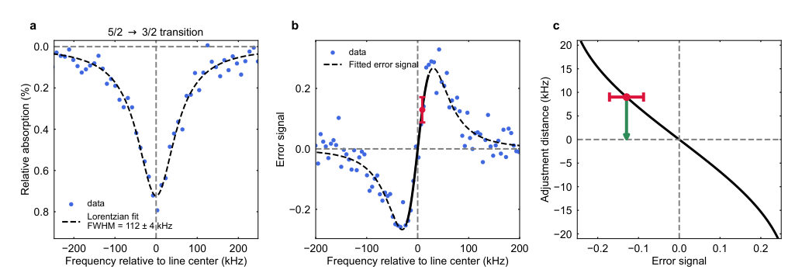 
FIG. 5. Calibration and principle of clock operation. a, Absorption measurement of the 5/2 →3/2 nuclear clock transition with an integration time T = 3 s per data point and an off-resonance frequency-offset of +300 kHz, expressed as a function of the offset lock frequency translated into the VUV. This is used to determine the linewidth for the error signal scan. b, Error signal measured with an integration time T = 3 s per data point and a constant frequency modulation of ∆fol = 34 kHz, from which the slope is extracted. c, Illustration of a clock frequency adjustment step determined by the fitted error signal shape.

**Summary.** This paper details the implementation and characterization of a highly sensitive optical nuclear clock based on the $	ext{Th-229}$ isotope. By stabilizing the laser to the nuclear transition and comparing it to an atomic clock, the researchers achieved state-of-the-art stability. This precision allows them to place world-leading constraints on variations in fundamental constants and search for signatures of ultralight dark matter.

**Why it may be interesting.** This work represents a cutting-edge application of quantum metrology, pushing the limits of precision measurement by moving from electron-based atomic transitions to nuclear transitions, which offers unique sensitivity to fundamental physics.

Detailed structure

**Main problem.** To realize and characterize an optical nuclear clock using the Thorium-229 isotope to test fundamental physics principles and search for dark matter signals.

**Main result.** The clock achieved a shot-noise limited instability approaching $10^{-15}$ over one day, setting stringent constraints on variations in fundamental constants and dark matter coupling.

**Method.** The experiment involves stabilizing a continuous-wave laser to the $	ext{Th-229}$ nuclear transition frequency using rapid feedback based on continuous absorption spectroscopy, comparing it to a reference atomic clock ($	ext{Yb}^+$).

**Model / system.** The system utilizes $	ext{Th-229}$ nuclei embedded in a $	ext{CaF}_2$ crystal, interrogating the $148 	ext{ nm}$ nuclear transition. The measurement technique involves sophisticated laser stabilization and frequency comparison against established atomic standards.

**Key observables.** Fractional frequency instability ($\sigma_y$), frequency ratio ($	ext{f}_{	ext{Th}}/	ext{f}_{	ext{Yb}^+}$), and the amplitude of periodic fluctuations in the beat frequency spectrum.

**Important parameters / regimes.** Instability approaching $10^{-15}/\sqrt{	au}/	ext{s}$; search time scales between $20 	ext{ s}$ and $1 	ext{ day}$; constraints on fundamental constants like $\alpha$ and $\Lambda_{QCD}$.

**Assumptions / limitations.** The analysis assumes the signal can be modeled by a Lorentzian fit for spectral analysis and relies on Monte Carlo simulations to establish detection thresholds for periodic signals.

**Figures summary.** Figures illustrate the experimental setup, including the laser stabilization loop and frequency comparison to the $	ext{Yb}^+$ clock. Other figures show the measured frequency instability ($\sigma_y$ vs $	au$) and exclusion plots for dark matter parameters.

**Paper structure.** The paper details the experimental setup and clock stabilization methods, followed by characterization of the clock's stability, and finally applying the high precision to search for variations in fundamental constants and dark matter signals using spectral analysis techniques.

Abstract

The laser-accessible nuclear transition in the thorium-229 isotope has been identified as a promising candidate for the realization of an optical nuclear clock. Such a nuclear clock might rival or outperform current optical clocks based on electron-shell transitions in atoms or ions, is expected to be more robust against external perturbations, and provides enhanced sensitivity in clock-based tests of fundamental principles of physics. Here, we implement a thorium-229 nuclear clock by stabilizing a continuous-wave laser to the 148 nm nuclear transition with rapid feedback based on continuous absorption spectroscopy. The thorium-229 nuclei are embedded into a millimeter-sized, room temperature calcium fluoride crystal. A subharmonic of the 148 nm radiation is continuously compared to a Yb+ single-ion clock. The nuclear clock shows a simple shot-noise limited scaling of the fractional frequency instability of $3\cdot 10^{-12} \sqrt{τ/\text{s}}$ where $τ$ is the averaging time, approaching $10^{-15}$ instabilities over 1 day of continuous operation. Improvements of the instability by several orders of magnitude can be projected for future solid-state nuclear clocks. We use the nuclear clock to constrain models of ultralight dark matter by searching for periodic fluctuations and slow drifts in the nuclear transition energy, on time scales between 20 s and 1 day. Drawing benefit from the enhanced sensitivity of the thorium-229 transition, these constraints compete with the best atomic clocks concerning dark matter coupling to photons and go beyond previous measurements regarding coupling to the strong force and quarks.

[↑ back to top](#top)

### [Circuit-Level Noise Estimation via Shuttling in Plaquette Circuits](http://arxiv.org/abs/2606.04629v1)

**Authors:** Huyen Do, Alexandru Paler  
**Type:** experiment · **Category:** quantum information and computing · **PDF:** <https://arxiv.org/pdf/2606.04629v1>  
**Analysis basis:** full PDF text, analyzed in chunks
**Topic relevance:** 🔥 `QC/QI experiment` **4/5** · `quantum measurements` **1/5**

📷 Fig 1

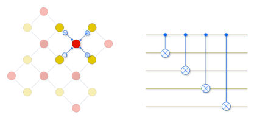 
FIG. 1: A plaquette in a surface code. (a) Mapping of a plaquette onto the lattice of the rotated distance 3 surface code, where yellow vertices are data qubits and red vertices are syndrome qubits. (b) Corresponding plaquette circuit.

📷 Fig 2

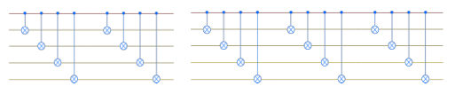 
FIG. 3: RECYCLE strategy. A single syndrome qubit is reused across plaquette repetitions without reset. Examples are shown for n = 2 and n = 3 plaquette repetitions.

📷 Fig 3

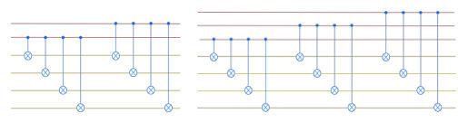 
FIG. 2: FRESH strategy. Each plaquette repetition uses a newly prepared syndrome qubit, so ancilla noise is largely uncorrelated across repetitions. Examples are shown for n = 2 and n = 3 plaquette repetitions.

📷 Fig 4

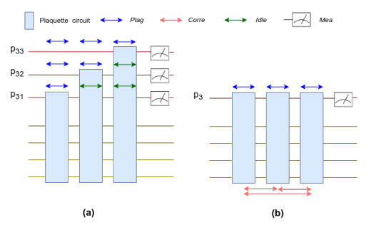 
FIG. 4: Experimental errors, including single plaquette errors (plaq), time-like correlated errors between plaquettes (corre), idle errors (idle), and measurement error (mea), propagating on each syndrome qubit for a circuit with n = 3 repetitions of the plaquette in: (a) FRESH experiment ; (b) RECYCLE experiment

📷 Fig 5

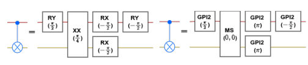 
FIG. 5: Implementation of the CNOT gate using (a) physical-level gates on a general ion-trap machine [33], and (b) IonQ’s native gates.

**Summary.** This paper presents a novel method to estimate the circuit-level noise in Quantum Error Correction (QEC) circuits using only single-shot measurements. By comparing 'fresh' versus 'recycled' syndrome qubits on trapped-ion and superconducting hardware, the authors quantify noise accumulation. The results demonstrate the effectiveness of circuit optimization and provide a vital diagnostic for assessing the feasibility of deep QEC circuits on current quantum processors.

**Why it may be interesting.** This work provides a crucial, hardware-agnostic diagnostic tool for assessing the viability of large-scale QEC experiments by characterizing circuit-level noise directly from limited measurement data.

Detailed structure

**Main problem.** The paper addresses the critical need to estimate Quantum Error Correction (QEC) circuit-level noise rates when only single-shot measurements are available and lower-level hardware calibration is infeasible.

**Main result.** The authors successfully estimated plaquette error rates on both trapped-ion (IonQ Aria1) and superconducting (IBM Torino) processors, showing that circuit optimization significantly improves reliability, particularly on shuttling-based architectures.

**Method.** They developed an error model comparing 'FRESH' (fresh ancilla per repetition) and 'RECYCLE' (reusing ancilla) syndrome qubit configurations to quantify noise accumulation across multiple plaquette repetitions.

**Model / system.** The study focuses on surface-code plaquette circuits, testing the methodology on physical quantum hardware platforms: the IonQ Aria1 trapped-ion device and the IBM Torino superconducting processor.

**Key observables.** Effective plaquette error rates ($	ext{plaq}$), time-like correlated error rates ($	ext{corre}$), and the probability of ancilla measurement outcomes being '1' as a function of circuit depth.

**Important parameters / regimes.** Plaquette depth (number of repetitions $n$), circuit optimization level (transpiler settings), and the specific syndrome qubit configuration (FRESH vs. RECYCLE).

**Assumptions / limitations.** The primary assumption is that the derived error model accurately captures the noise scaling, which is shown to fail on fixed-layout QPUs due to routing overhead.

**Figures summary.** Figures illustrate the surface code plaquette structure, the FRESH and RECYCLE strategies, and show polynomial fits of the error probability versus circuit depth for different plaquette designs on the IonQ Aria1 QPU.

**Paper structure.** The paper introduces the problem of single-shot noise estimation, details the error model comparing FRESH and RECYCLE strategies, validates the approach by optimizing circuits for native gate sets (IonQ), and compares results across different hardware architectures (IonQ vs. IBM Torino).

Abstract

We present a method for estimating QEC circuit-level noise levels assuming that only single-shot measurements are available (e.g. measurements are slow and performed in a zoned/parallel fashion), and that lower level quantum hardware calibration is not possible (e.g. cloud access) or not feasible (e.g. large scale computing). We develop and run surface code plaquette experiments using two syndrome qubit configurations: FRESH, involving fresh qubits for each plaquette repetition, and RECYCLE, reusing qubits. To validate our approach, we compile plaquettes to ion-trap (IonQ Aria1) native gate set and apply hardware-aware rewrite templates to reduce circuit depth and execution time. We also run the experiments on a non-shuttling, superconducting processor (IBM Torino). We estimate circuit-level noise rates from the resulting single-shot plaquette measurement statistics, and conclude numerically about the viability of low-depth QEC experiments.

[↑ back to top](#top)

### [Photoelectron spectroscopy with a resonant dichromatic field: Role of geometric phase](http://arxiv.org/abs/2606.04795v1)

**Authors:** Evan Munaro-Langloÿs, Axel Stenquist, Jan Marcus Dahlström  
**Type:** theory · **Category:** other · **PDF:** <https://arxiv.org/pdf/2606.04795v1>  
**Analysis basis:** full PDF text, analyzed in chunks
**Topic relevance:** 🔥 `interference shaping light` **4/5** · `non-equilibrium dynamics` **1/5**

📷 Fig 1

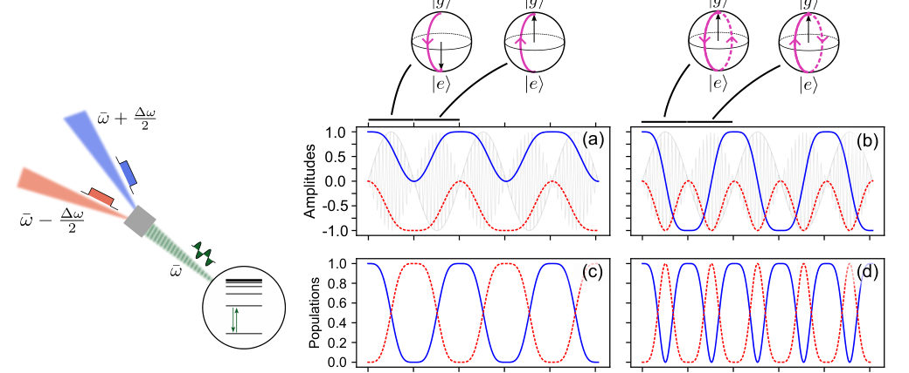 
FIG. 1. Typical Rabi dynamics triggered by a dichromatic pulse in a two-level atom. The left panel shows a schematic illustration of the dichromatic field setup, where two beams of frequencies ¯ω +∆ω/2 and ¯ω −∆ω/2 are combined to produce a beating field at the mean frequency ¯ω, which drives the transitions in a two-level atom. The two states of the two-level atom are considered to be the 1s and 2p states of hydrogen, therefore fixing ¯ω = 10.2 eV. In both cases considered here, a 25 fs pulse is used with a dichromatic parameter ∆ω = 0.83 eV, chosen such that five full beatings occur during the pulse duration. Panels (a) and (c) show the complex amplitudes and populations, respectively, of...

📷 Fig 2

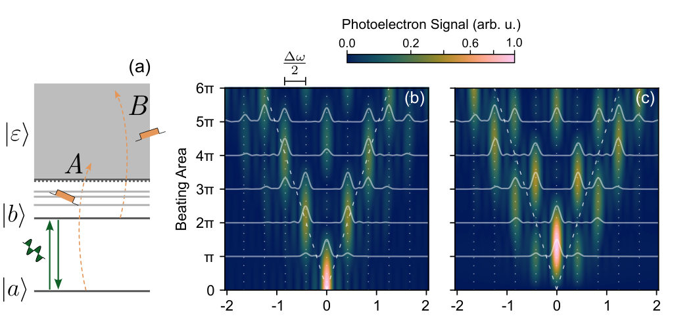 
FIG. 2. Photoelectron spectra induced by an auxiliary high-frequecy field, from the ground and excited states. (a) Illustration of the ionisation by the auxiliary field (dashed arrows) from the ground and excited states |a⟩and |b⟩, which are strongly coupled by the dichromatic field (solid arrows). The photoelectron spectrum corresponding to the ground and excited states are presented in panels (b) and (c), respectively. Photoelectron spectra are resolved over the pulse area of each beating. In (b) and (c), normalized line shapes of the photoelectron spectra are shown at some integer multiples of π values of the beating area. Dashed lines represent the effective Rabi frequency, ±Ωeff/2, and...

📷 Fig 3

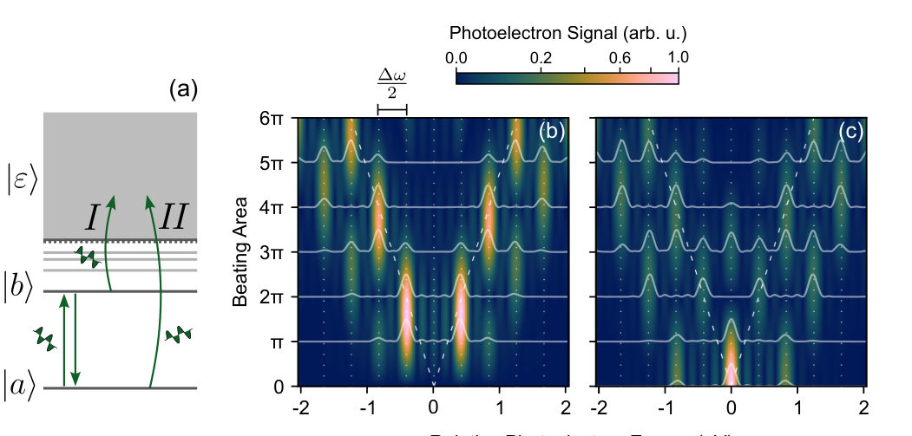 
FIG. 3. Photoelectron spectra generated by ionization from the dichromatic field that drives the Rabi dynamics. (a) Schematic illustration of the ionization pathways and corresponding photoelectron signal. Ionization occurs from both the ground and excited states via absorption of two and one photons from the dichromatic field, respectively. (b) Photoelectron spectrum ionized by a one-photon transition from the excited state as a function of the pulse area of each beating. (c) Corresponding photoelectron spectrum from the ground state via two-photon ionization. In (b) and (c), normalized line shapes of the photoelectron spectra are shown at some integer multiples of π values of the beating...

**Summary.** This paper explores controlling quantum dynamics in two-level atoms using resonant dichromatic laser pulses. By exploiting the slowly varying beating envelope, the authors demonstrate coherent control over the geometric phase accumulated during Rabi oscillations. This control manifests in unique, predictable features in the photoelectron spectrum, offering a new route for engineering light-matter interactions.

**Why it may be interesting.** This work provides a detailed, analytical understanding of how the temporal structure of the driving field (the beating envelope) can be used to engineer specific interference patterns in ultrafast light-matter interactions, which is central to quantum optics and AMO physics.

Detailed structure

**Main problem.** The study investigates how geometric phase control can be achieved in two-level atoms driven by near-degenerate dichromatic laser pulses.

**Main result.** The beating envelope dynamics lead to spectral structures, such as re-emergent central peaks and higher-order sidebands, which differ qualitatively from standard Autler-Townes splitting.

**Method.** The authors analytically derive the essential-state dynamics using an exactly solvable model for flat-top pulses and analyze the resulting photoionization spectra via Fourier analysis.

**Model / system.** The system is a two-level atom undergoing Rabi dynamics, driven by a dichromatic field composed of two closely spaced frequencies. The dynamics are tracked using a pseudo-spin vector on the Bloch sphere.

**Key observables.** Photoelectron spectra, geometric phase accumulation, and the appearance/disappearance of Autler-Townes doublets and central peaks.

**Important parameters / regimes.** The frequency detuning ($\Delta\omega$), the Rabi frequency ($\Omega$), and the beating area (e.g., $\pi$-beating area vs. $2\pi$-beating area).

**Assumptions / limitations.** The analysis utilizes an exactly solvable model for flat-top pulse envelopes and relies on time-dependent perturbation theory for ionization amplitudes.

**Figures summary.** Figures illustrate Rabi dynamics showing the effect of $\pi$-beating vs. $2\pi$-beating areas, and show photoelectron spectra comparing results from dichromatic pulses versus ordinary Rabi oscillations.

**Paper structure.** The paper progresses by establishing the theoretical framework of geometric phase accumulation in the presence of a beating envelope, deriving the time-dependent amplitudes, and finally analyzing the resulting photoionization spectra across different beating areas.

Abstract

We investigate geometric-phase control in resonantly driven two-level atoms exposed to near-degenerate dichromatic laser pulses. In contrast to conventional two-color schemes based on widely separated frequencies, the closely spaced frequency components generate a slowly varying beating envelope that repeatedly reverses the pseudo-spin rotation on the Bloch sphere. This enables coherent control of the geometric phase accumulated during Rabi dynamics and strongly modifies the resulting photoelectron spectra. Using an exactly solvable model for flat-top pulse envelopes, we derive the essential-state dynamics analytically and analyze photoionization induced both by an auxiliary field and by the dichromatic driving field itself. We show that the formation of Autler--Townes doublets can be interpreted in terms of destructive interference associated with geometric phases acquired during completed pseudo-spin rotations. Beyond the canonical Autler--Townes regime, beat-induced reversal dynamics lead to qualitatively different spectral structures, including re-emergent central peaks and higher-order sidebands. These effects originate from the nonuniform temporal evolution induced by the beating envelope, which modifies the balance between positive and negative excitation amplitudes. Our results establish beating-field control as a route toward engineering geometric-phase interference in ultrafast light--matter interactions and suggest broader applications in coherent control of atoms, molecules, and x-ray-driven systems.

[↑ back to top](#top)

### [An Entanglement Measure from Quantum Optimal Transport](http://arxiv.org/abs/2606.04969v1)

**Authors:** Enmin Shao, Lin Chen, Huixia He  
**Type:** theory · **Category:** quantum information and computing · **PDF:** <https://arxiv.org/pdf/2606.04969v1>  
**Analysis basis:** full PDF text, analyzed in chunks
**Topic relevance:** 🔥 `entanglement & information structure` **4/5**

📷 Fig 1

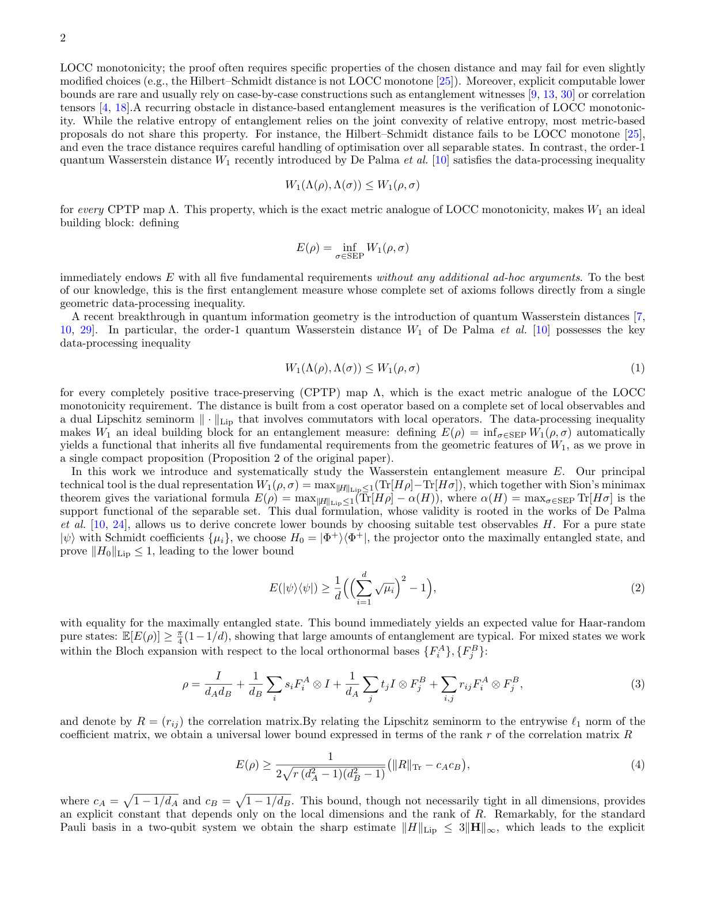 
Low-resolution page preview, page 2

📷 Fig 2

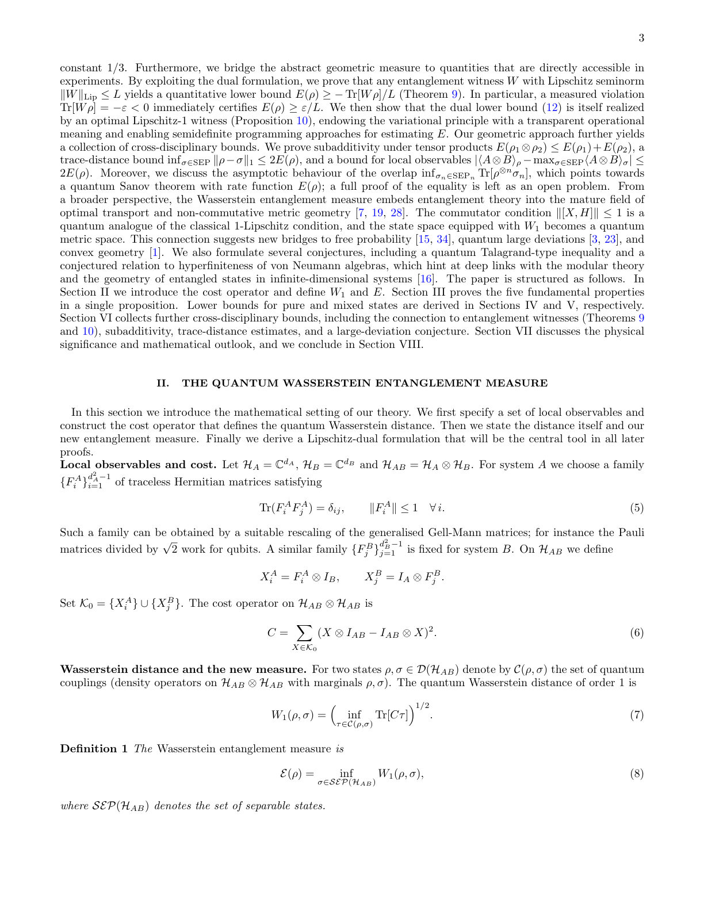 
Low-resolution page preview, page 3

📷 Fig 3

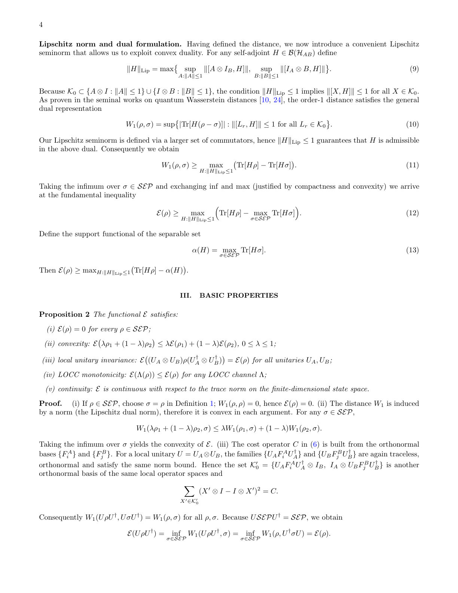 
Low-resolution page preview, page 4

📷 Fig 4

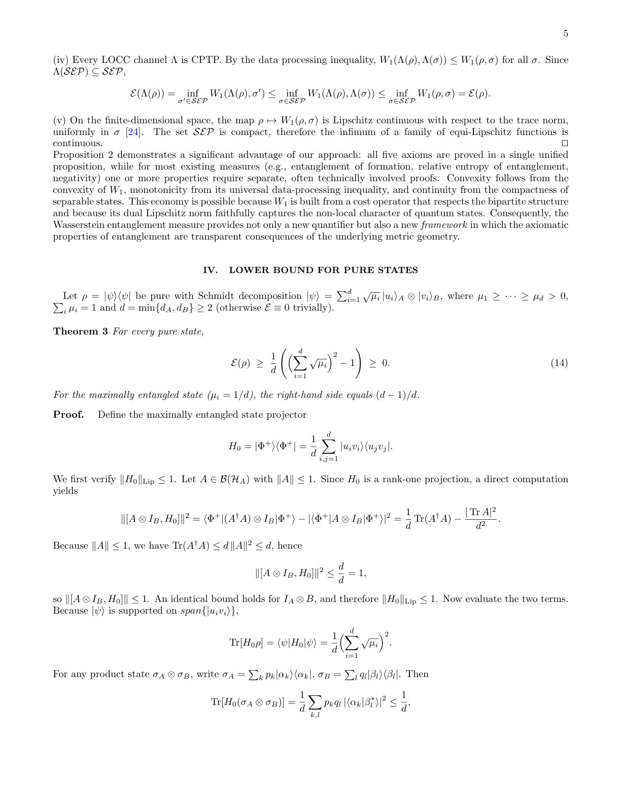 
Low-resolution page preview, page 5

📷 Fig 5

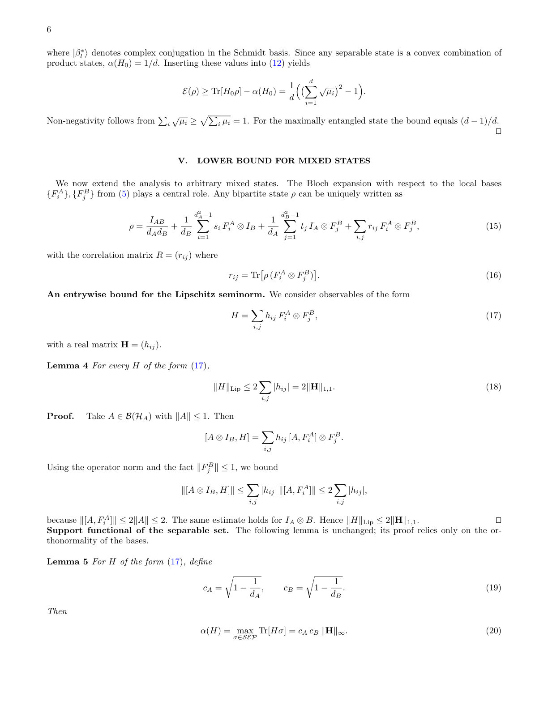 
Low-resolution page preview, page 6

**Summary.** This work proposes a novel entanglement measure, $E(
ho)$, defined using the quantum Wasserstein distance between a state and the set of separable states. By leveraging the metric properties of the Wasserstein distance, the authors establish that $E(
ho)$ satisfies all necessary axioms for an entanglement measure. This provides a versatile, geometrically grounded tool for quantifying quantum correlations.

**Why it may be interesting.** The geometric approach using optimal transport provides a powerful, mathematically rigorous framework for entanglement quantification, connecting it directly to measurable quantities like entanglement witnesses.

Detailed structure

**Main problem.** The paper aims to develop a rigorous, axiom-satisfying measure for quantifying quantum entanglement in bipartite systems.

**Main result.** It introduces the entanglement measure $E(
ho)$ based on the quantum Wasserstein distance, which satisfies fundamental axioms and provides quantitative lower bounds related to entanglement witnesses.

**Method.** The core method involves defining $E(
ho)$ as the minimal order-1 quantum Wasserstein distance from a state $
ho$ to the set of separable states ($	ext{SEP}$), and utilizing its dual variational formulation.

**Model / system.** The analysis is focused on bipartite quantum states $
ho$ acting on a tensor product Hilbert space $\mathcal{H}_A \otimes \mathcal{H}_B$. The measure quantifies the distance from $
ho$ to the set of separable states.

**Key observables.** Entanglement measure $E(
ho)$, quantum Wasserstein distance $W_1(
ho, \sigma)$, and entanglement witnesses $W$.

**Important parameters / regimes.** The Lipschitz seminorm ($\lVert H 
Vert_{	ext{Lip}}$) and the dimension of the subsystems ($d_A, d_B$).

**Assumptions / limitations.** The derivation relies on the data-processing inequality of the Wasserstein metric and the assumption that the infimum/maximum operations can be interchanged.

**Paper structure.** The paper establishes the measure via the Wasserstein distance, derives its dual variational form, proves it satisfies key axioms (LOCC monotonicity, etc.), and provides explicit lower bounds for pure and mixed states.

Abstract

We propose a bipartite entanglement measure $E(ρ)$ defined as the minimal order-1 quantum Wasserstein distance from a state to the set of separable states. Owing to the universal data-processing inequality of the Wasserstein metric, the measure satisfies all fundamental axioms within a single geometric framework. A Lipschitz dual formulation yields explicit lower bounds for pure and mixed states, a sharp constant for two-qubit systems, and an expected value for Haar-random pure states. We further establish a quantitative connection to entanglement witnesses: any negative witness expectation value certifies a lower bound on $E$, and the dual variational bound is exactly the maximal violation achievable by a Lipschitz-1 witness. The approach naturally provides subadditivity, trace-distance estimates, and bounds on local observables, while pointing toward large-deviation conjectures. This work furnishes a versatile paradigm at the interface of entanglement theory, optimal transport, and experimental entanglement detection.

[↑ back to top](#top)

### [Multi-entropy in random tensor networks](http://arxiv.org/abs/2606.04470v1)

**Authors:** Miao Hu, Simon Lin, Ion Nechita  
**Type:** theory · **Category:** quantum information and computing · **PDF:** <https://arxiv.org/pdf/2606.04470v1>  
**Analysis basis:** full PDF text, analyzed in chunks
**Topic relevance:** 🔥 `entanglement & information structure` **4/5**

📷 Fig 1

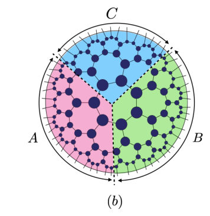 
Figure 1: We tile the hyperbolic disk isometrically using a graph. Each dark blue node represents a random tensor and the connecting edges indicate tensor contractions. The random tensor network defines a state on the Hilbert space supported on the boundary, represented here by dangling legs. (a) The geometric dual of the entanglement entropy: The entropy of region A is proportional to the area of the minimal surface (black dashed) that divides A and its complement ¯A. (b) The proposed geometric dual for the multi-entropy. Here we take q = 3 as an example. The tripartite multi-entropy between region A : B : C is proportional to the area of the minimal multiway cut (also black dashed) that...

📷 Fig 2

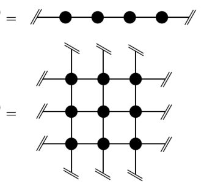 
Figure 2: The diagrammatic notation for the reduced density matrix ρj1···jq i1···iq , and the con-

📷 Fig 3

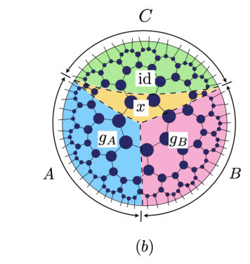 
Figure 4: Examples for the minimal energy configuration of (a) R´enyi negativity, and (b) R´enyi reflected entropy in a hyperbolic tensor network. Different domains are represented by different colors.

📷 Fig 4

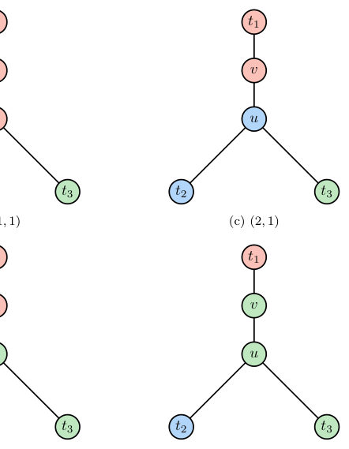 
Figure 6: The connected three-terminal tree used in the tree example, followed by its five minimal multiway cut labelings. In panels (b)–(f), the pair records the labels (λ(u), λ(v)) of the two bulk vertices. Note that the three terminals t1, t2, t3 have fixed labels in panels (b)–(f).

📷 Fig 5

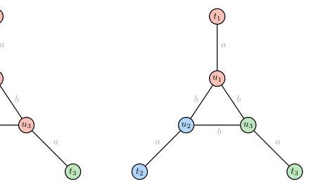 
Figure 7: The symmetric triangle network, followed by representative minimum multiway cut labelings. Panel (b) shows the constant labeling C1, while panel (c) shows the aligned labeling I. The three terminals t1, t2, t3 have fixed labels in the last two panels.

**Summary.** This work analyzes multi-partite entanglement in Random Tensor Networks by comparing generalized multi-entropies to minimal multiway cuts. While the conjecture holds for the simplest case (n=2), the authors prove it fails for higher Rényi indices (n>2) by identifying replica-symmetry-breaking saddle points that yield lower energy values. This has significant implications for applying geometric intuition to complex quantum entanglement structures.

**Why it may be interesting.** It provides a deep, mathematically rigorous understanding of how entanglement measures (multi-entropies) relate to geometric structures (minimal cuts) in quantum many-body systems, which is crucial for understanding holographic duality.

Detailed structure

**Main problem.** The paper investigates the relationship between Rényi multi-entropies in Random Tensor Network (RTN) states and the area of minimal multiway cuts in the large bond-dimension limit.

**Main result.** The multi-entropy equals the minimal multiway cut area only for the specific case of the Rényi index n=2; for n>2, the conjecture fails due to the existence of replica-symmetry-breaking saddle points.

**Method.** The analysis uses saddle-point approximations derived from minimizing a free energy functional defined over permutations, relating it to geometric minimal cuts.

**Model / system.** The model is Random Tensor Networks (RTNs) defined on graphs, which are used to simulate quantum states exhibiting multipartite entanglement, drawing analogies to the Ryu–Takayanagi formula in holography.

**Key observables.** Rényi multi-entropies $S^{(q)}_n$, the free energy $F(g)$, and the area of minimal multiway cuts $A(\{\Gamma_k\})$.

**Important parameters / regimes.** The Rényi index $n$, the number of parties $q$, and the bond dimension $\chi$ (taken to infinity).

**Assumptions / limitations.** The analysis heavily relies on the replica trick and saddle-point approximations, which are shown to break down for $n>2$ due to replica symmetry breaking.

**Figures summary.** Figures illustrate the geometric dualities, comparing entanglement entropy to minimal surfaces and proposing a dual relationship between multi-entropy and minimal multiway cuts.

**Paper structure.** The paper progresses by first establishing the conjecture for $n=2$ (where it holds), then providing explicit counterexamples for $n>2$ by analyzing the free energy minimization, and finally characterizing the structure of the true minimizers using RSB elements.

Abstract

We study the evaluation of Rényi multi-entropies $S^{(q)}_n$ in Random Tensor Network (RTN) states in the large bond-dimension limit. For the case of Rényi index $n=2$ and arbitrary number of parties $q$, we prove that that multi-entropies are determined by minimal multiway cuts through the network. When the minimal multiway cut is degenerate, we characterize the full minimizer set via compatible families of minimal cuts and give a criterion for all minimizers to come from ordinary cut partitions. For $n=2$, this gives a natural generalization of the minimal cut description of bipartite entanglement to multipartite systems with arbitrarily many parties. For the case of integer $n>2$, we show that the minimal multiway cut conjecture is in general \emph{not true} by providing explicit counter examples for both the single random tensor and for the network built from isometric tilings. We discuss the implication for our results on the multipartite entanglement structures in RTN and holography.

[↑ back to top](#top)

### [Quantification of Entanglement in Three-Qubit Systems](http://arxiv.org/abs/2606.04721v1)

**Authors:** Zikra Aram  
**Type:** theory · **Category:** quantum information and computing · **PDF:** <https://arxiv.org/pdf/2606.04721v1>  
**Analysis basis:** full PDF text, analyzed in chunks
**Topic relevance:** 🔥 `entanglement & information structure` **4/5**

📷 Fig 1

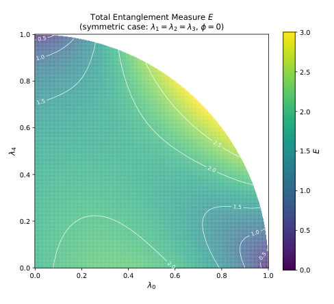 
FIG. 1. Contour plot showing the variation of the global concurrence E for the symmetric case (λ1 = λ2 = λ3, ϕ = 0). The points on the circumference represent the GHZ- type states, with the point λ0 = λ4 = 1/ √

📷 Fig 2

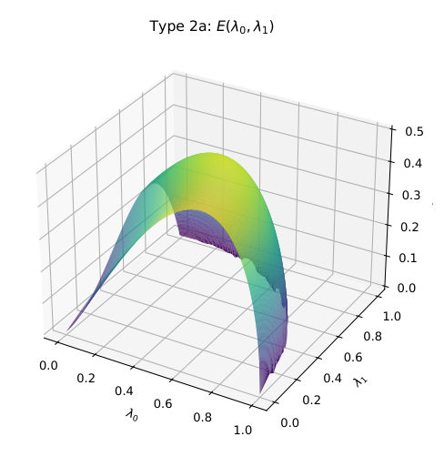 
FIG. 2. Behavior of the measure E for Type 2(a) bisep- arable states in the Ac´ın classification under different pa- rameter choices. The measure is non-zero throughout the interior region and vanishes at boundaries corresponding to product states.

📷 Fig 3

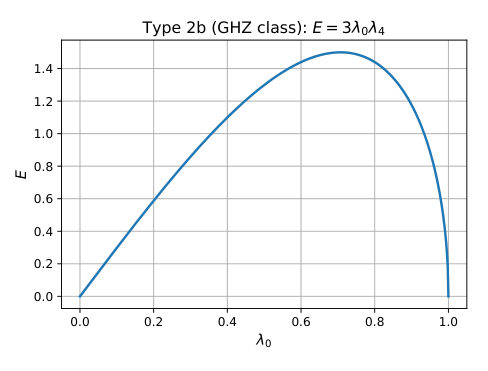 
FIG. 3. Variation of the measure E = 3λ0λ4 as a function of λ0 for Type 2(b) GHZ-type states in the Ac´ın classifi- cation. The maximum occurs at the maximally entangled GHZ state.

📷 Fig 4

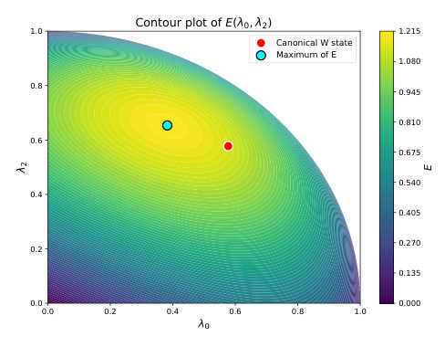 
FIG. 4. Variation of the measure E for Type 3(a) W-type states as a function of λ0 and λ2 in the Ac´ın classifica- tion. In this case λ1 = λ4 = 0 Interestingly the maximum of global concurrence does not occur for the canonical W state, which is indicated by the red point. The maximum occurs for λ0 = q

📷 Fig 5

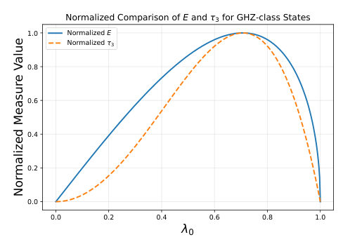 
FIG. 5. Comparison of the entanglement-measure E and three-tangle τ for GHZ-class state. For GHZ states, both measures exhibit similar qualitative behavior but differ in normalization and slope.

**Summary.** This paper introduces a global concurrence measure to quantify entanglement in three-qubit pure states by summing bipartite entanglement contributions across all possible partitions. Using the Acin canonical form, the authors demonstrate that this measure provides a broader view of total quantum correlations compared to measures sensitive only to genuine tripartite entanglement. It is a theoretical advancement for characterizing multipartite quantum states.

**Why it may be interesting.** This work provides a robust, comprehensive tool ($E$) for quantifying total quantum correlations in small quantum systems, which is crucial for understanding resource theories in quantum information processing.

Detailed structure

**Main problem.** The study addresses the complex quantification of multipartite entanglement in three-qubit pure states, aiming to overcome the limitations of existing entanglement measures.

**Main result.** The proposed global concurrence measure provides complementary insights into multipartite correlations, successfully distinguishing between different entanglement classes (e.g., GHZ vs. W states) where established measures might fail or only detect genuine entanglement.

**Method.** The authors employ an analytical approach using the Acin canonical representation and define a global concurrence measure as the sum of generalized concurrences derived from the determinants of reduced density matrices of all three possible bipartitions.

**Model / system.** The system under investigation is a three-qubit quantum system, whose pure states are parameterized using the Acin canonical representation, which generalizes the Schmidt decomposition.

**Key observables.** Global concurrence ($E$), three-tangle ($	au$), and tripartite negativity ($\mathcal{N}_3$).

**Important parameters / regimes.** The state is parameterized by five non-negative amplitudes ($\lambda_i$) and one phase ($\phi$).

**Assumptions / limitations.** The analysis assumes that the global concurrence, constructed from bipartite correlations, is a suitable and comprehensive measure for total entanglement in three-qubit systems.

**Figures summary.** Figures illustrate the variation of the global concurrence ($E$) across different entanglement classes (Biseparable, GHZ, W) and compare $E$ against $	au$ and $\mathcal{N}_3$ for both GHZ and W states.

**Paper structure.** The paper proceeds by first establishing the mathematical framework using the Acin canonical form, deriving the global concurrence measure $E$ from reduced density matrix determinants, and finally comparing $E$'s behavior against established measures like the three-tangle and tripartite negativity across various entanglement classes.

Abstract

This study presents an analytical investigation of entanglement quantification in three-qubit pure states through the Acín canonical representation, which serves as a generalization of the two-qubit Schmidt decomposition. Driven by the intricacies of multipartite entanglement and the shortcomings of current measures, we employ a global concurrence measure derived from the generalized concurrence of various bipartitions within the system. The characteristics of this measure are explored both analytically and numerically across a range of SLOCC entanglement classes, such as product, biseparable, GHZ-type, and W-type states. When compared to the three-tangle and tripartite negativity, our findings indicate that this measure yields complementary insights into multipartite correlations. The outcomes underscore the significance of this measure in elucidating the structure and distribution of entanglement within three-qubit quantum systems.

[↑ back to top](#top)

### [Polalrized reservoirs in dynamics of polariton condensation](http://arxiv.org/abs/2606.04808v1)

**Authors:** I. A. Shelykh, A. V. Yulin  
**Type:** theory · **Category:** other · **PDF:** <https://arxiv.org/pdf/2606.04808v1>  
**Analysis basis:** full PDF text, analyzed in chunks
**Topic relevance:** `correlated / nonlocal dissipation` **3/5** · `correlated cavity matter` **3/5** · `driven-dissipative phase transition` **3/5** · `exotic spin models in light-matter` **3/5** · `methods for driven-dissipative` **3/5** · `non-equilibrium dynamics` **3/5** · `Keldysh / 2PI / non-Gaussian methods` **2/5** · `analog quantum simulation` **2/5** · `non-equilibrium universality` **2/5** · `Tavis-Cummings & cavity-many-emitter` **1/5** · `spintronics-quantum-optics interface` **1/5**

📷 Fig 1

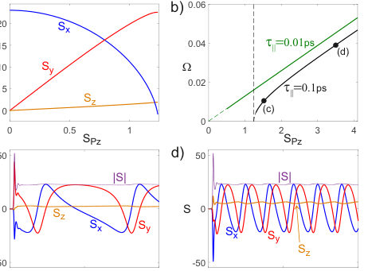 
FIG. 1. (a) The dependencies of the Stokes components of the stationary time-independent state on z component of the Stokes vector SP z of the pump. The blue curve corresponds to Sx, red curve - to Sy and orange curve - to Sz component of the Stokes vector of the condensate. The relaxation time .τ∥= 0.1 ps−1. (b) The dependency of the poarization plane angular velocity (psudo-spin precession frequency) as a func- tion of z component of the Stokes vector of the pump. The thicker dark curve is for τ∥= 0.1 ps−1, the thinner green line is for τ∥= 0.01 ps−1. The dashed curve shows the square root fit for the numerically calculated dependency. The threshold value of SP z for τ∥= 0.1 ps−1 is shown...

**Summary.** This paper develops a rigorous theoretical framework using the spin density matrix formalism to describe the dynamics of spinor polariton condensates coupled to an excitonic reservoir. It corrects flaws in existing theories concerning polarization invariance and analyzes how the condensate's polarization state evolves under external pumping, showing the critical role of reservoir relaxation times.

**Why it may be interesting.** This work is highly relevant to AMO physics and quantum optics as it tackles the complex, non-equilibrium dynamics of interacting quantum matter waves (polaritons) in the presence of dissipation and polarization effects.

Detailed structure

**Main problem.** The paper addresses the theoretical description of dynamics in driven-dissipative spinor polariton condensates, specifically focusing on the coupling between the condensate and an incoherent excitonic reservoir.

**Main result.** The standard theory fails when the reservoir has non-zero in-plane linear polarization; the correct description requires using the spin density matrix formalism to maintain polarization invariance.

**Method.** The authors derive and analyze coupled equations for the condensate and reservoir density matrices using the spin density matrix formalism, transforming between circular and linear polarization bases.

**Model / system.** The system involves cavity polaritons, which are modeled as spinor condensates coupled to an incoherent excitonic reservoir. The dynamics are governed by coupled equations derived from a mean-field approach.

**Key observables.** Condensate wavefunction ($\Psi$), condensate density matrix ($\hat{
ho}$), reservoir density matrix ($\hat{
ho}_R$), and the Stokes parameters ($S_x, S_y, S_z$) characterizing the condensate polarization.

**Important parameters / regimes.** Relaxation time $	au_{\parallel}$, pump polarization components ($S_x, S_y, S_z$), and coupling constants ($g, 	ilde{g}, \gamma, \Gamma$).

**Assumptions / limitations.** The analysis often neglects spatial effects ($
abla^2\phi$ term) and assumes the coupling is limited to polaritons and incoherent excitons.

**Figures summary.** Figures illustrate the stationary state polarization dependence on pump ellipticity ($S_P z$), showing polarization plane rotation above a threshold, and the time evolution of Stokes parameters, which are non-sinusoidal near threshold but approach sinusoidal behavior for large $S_P z$.

**Paper structure.** The paper first establishes the theoretical necessity of the spin density matrix formalism due to polarization invariance issues. It then applies this formalism to analyze the polarization dynamics of the condensate under varying pump ellipticity and reservoir relaxation times.

Abstract

We review the problem of description of the dynamics of driven-disspipative spinor polariton condensates, focusing on the terms corresponding to the coupling between a macroscopic wavefunction of the condensdate and incoherent excitonic reservoir created by a non-resonant pump. We demonstrate that the existing version of the theory breaks down in case, when reservoir has non-zero components of the Stokes vector corresponding to in-plane linear polarization. The polarization invariant theory of reservoir to condensate coupling is formulated with use of the spin density matrix formalism.

[↑ back to top](#top)

### [Efficient Description of Parametric Amplification of Quantum Pulses](http://arxiv.org/abs/2606.04759v1)

**Authors:** Victor Rueskov Christiansen, Klaus Mølmer, Emanuel Hubenschmid  
**Type:** theory · **Category:** other · **PDF:** <https://arxiv.org/pdf/2606.04759v1>  
**Analysis basis:** full PDF text, analyzed in chunks
**Topic relevance:** `driven-dissipative phase transition` **3/5** · `methods for driven-dissipative` **3/5** · `Keldysh / 2PI / non-Gaussian methods` **2/5** · `entanglement & information structure` **2/5** · `non-equilibrium dynamics` **2/5** · `analog quantum simulation` **1/5** · `correlated / nonlocal dissipation` **1/5** · `correlated cavity matter` **1/5** · `interference shaping light` **1/5** · `non-equilibrium universality` **1/5** · `quantum measurements` **1/5**

📷 Fig 1

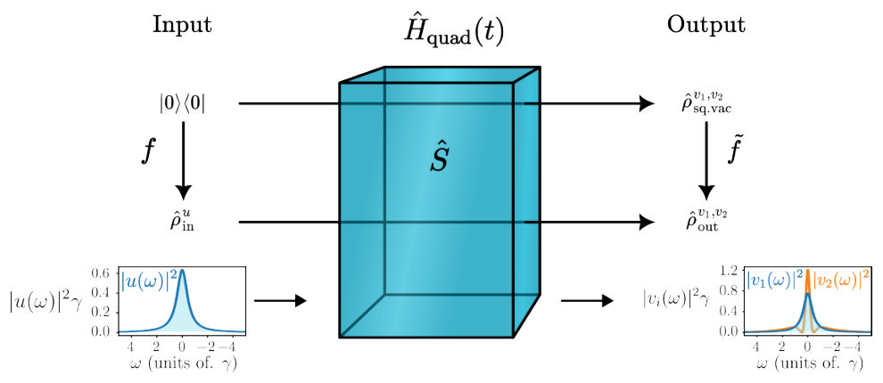 
Figure 1. Schematic depiction of the transformation of quantum states and methods discussed in this article. An input state ˆρu in = f(ˆau, ˆa† u) |0⟩⟨0| [f(ˆau, ˆa† u)]†, generated by applying f to the vacuum, in a single pulsed mode with spectral mode function u(ω) is incident on a nonlinear system offering frequency conversion and parametric amplification. The nonlinear interaction is described by a Hamiltonian, which may be explicitly time-dependent and is quadratic in its creation/annihilation operators. Only two output modes, v1(ω) and v2(ω), will be fed by the input quantum state. The lower panels show an input mode and the corresponding state dependent output modes for an optical...

📷 Fig 2

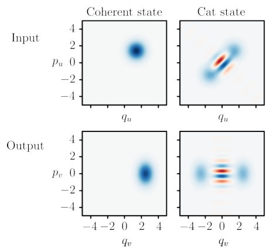 
Figure 2. Wigner function of the three example input states, coherent |α⟩, cat (|α⟩+ i |−α⟩)/ √

📷 Fig 3

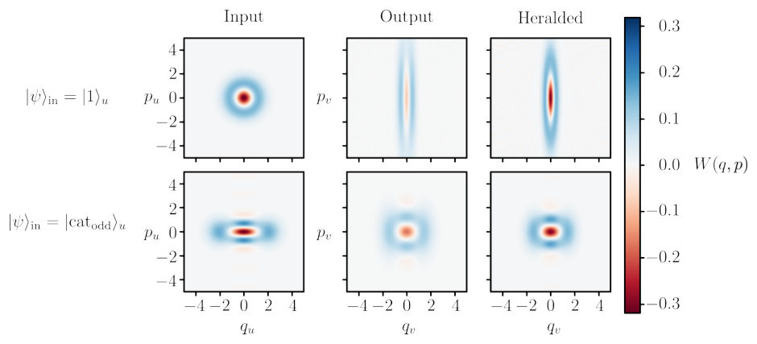 
Figure 3. The output quantum state generated from the input of either a single photon state (upper row) or an odd Schrödinger cat state (lower row) residing in the primary mode, v1(ω). The Wigner functions of the input quantum state are shown in the left column, the output quantum state in the primary v1-mode after tracing out the secondary mode in the middle column, and the quantum state of the primary mode after detection of vacuum in the secondary v2-mode in the right column. The Wigner negativity and purity of the primary mode is enhanced after the detection. For the single photon input state, the purity of the output state is increased from γfock ≈0.75 to γfock ≈0.97 under detection of...

**Summary.** This paper introduces an efficient analytical method to calculate the output quantum state of parametric amplification when the input is a complex quantum state. By decomposing the input operator relative to the output modes, the authors simplify the calculation significantly. The method is demonstrated using various input states and highlights the utility of quantum state purification through mode heralding.

**Why it may be interesting.** This work provides a powerful, computationally efficient analytical tool for analyzing quantum state evolution in parametric processes, which is central to quantum optics and quantum information processing.

Detailed structure

**Main problem.** The paper develops an efficient, analytical method to determine the quantum state of output modes following parametric amplification when the input is an arbitrary non-vacuum quantum state.

**Main result.** The method successfully calculates output states for various inputs (coherent, cat, single-photon) and demonstrates that vacuum detection in one output mode can significantly purify the state in the other.

**Method.** The core method involves applying the amplification transformation to the vacuum state first, and then applying a transformed version of the operator that creates the input state from vacuum, avoiding complex ancillary mode calculations.

**Model / system.** The system modeled is bosonic quantum fields (like light in waveguides) undergoing parametric amplification, described by a Hamiltonian quadratic in creation and annihilation operators.

**Key observables.** Purity ($\gamma$), Wigner function, covariance matrix ($\sigma$), and the quantum state itself ($\hat{
ho}_{	ext{out}}$).

**Important parameters / regimes.** Input state parameters (e.g., $\alpha$ for coherent states), pump strength ($\xi$), and cavity loss rate ($\gamma$).

**Assumptions / limitations.** The formalism relies heavily on the quadratic form of the Hamiltonian and the effective treatment of Gaussian states, although it claims generalizability.

**Figures summary.** Figures illustrate the schematic transformation process, the Wigner functions of input/output states, and the effect of vacuum detection on state purity.

**Paper structure.** The paper builds from the general mathematical formalism for state transformation through parametric amplification, details the single-mode and two-mode operator decompositions, and concludes with specific examples demonstrating state purification via heralding.

Abstract

A single quantum pulse undergoing parametric amplification feeds into at most two pulses in the output. In this work, we present an efficient, analytical method for finding the quantum state of these output modes. Our method applies the amplification to the vacuum rather than to the input state, and subsequently applies a transformed version of the operator that creates the input state from vacuum. Given the input and output pulse mode functions, the method is analytical, and therefore computationally very efficient, and it can be readily generalized to multiple non-vacuum input modes. We exemplify the method by computing the output quantum states resulting from the input of a coherent, a Schrödinger cat, and a single photon input quantum state. We further employ the method to obtain the quantum state in one of the two output modes heralded upon detection of vacuum in the other, least populated, mode.

[↑ back to top](#top)

### [Theory of frozen flux in a narrow uniform superconducting strip after cooling in a small magnetic field](http://arxiv.org/abs/2606.04961v1)

**Authors:** Alexei E. Koshelev  
**Type:** theory · **Category:** statistical mechanics · **PDF:** <https://arxiv.org/pdf/2606.04961v1>  
**Analysis basis:** full PDF text, analyzed in chunks
**Topic relevance:** `driven-dissipative phase transition` **3/5** · `non-equilibrium dynamics` **3/5** · `non-equilibrium universality` **3/5** · `Keldysh / 2PI / non-Gaussian methods` **2/5** · `methods for driven-dissipative` **2/5** · `Frenkel-Kontorova` **1/5** · `Kondo & dissipative impurity` **1/5** · `analog quantum simulation` **1/5** · `correlated / nonlocal dissipation` **1/5** · `scars & prethermalization` **1/5**

📷 Fig 1

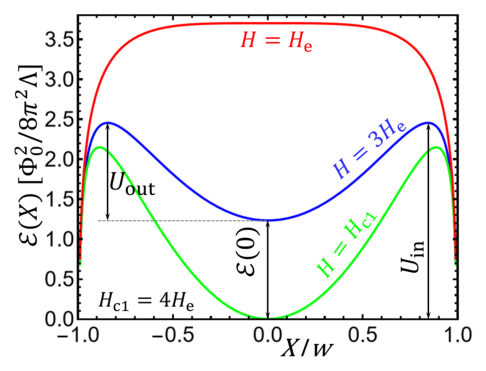 
FIG. 1. Representative vortex energy profiles for a narrow strip, Eq. (4), for three magnetic fields, He, 3He, and Hc1 assuming the relation Hc1 = 4He. In the curve for H = 3He, the definitions of the exit and entry barriers, Uout and Uin are illustrated.

📷 Fig 2

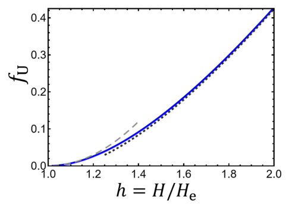 
FIG. 2. Plot of the function fU(h) determining the escape barrier Uout in Eq. (9) defined by Eqs. (10) and (11). The gray long-dashed line shows the asymptotics for h →1 in Eq. (13). The dark gray short-dashed line shows the asymptotics for h ≫1 in Eq. (14).

📷 Fig 3

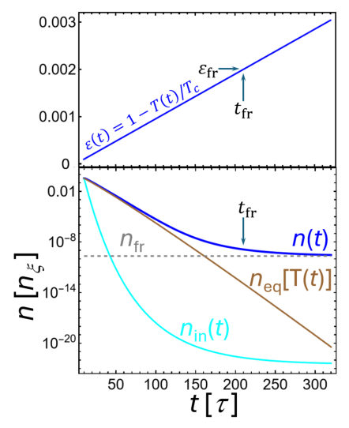 
FIG. 3. The illustrative time evolution of the flux density n(t) during cooling with constant rate following from Eqs. (22) and (23) (blue curve in the bottom plot). The top plot illustrates the corresponding time dependence of the reduced tempera- ture ε(t). For comparison, we also show by the brown line the equilibrium density at the current temperature neq[T(t)], Eq. (17), and the first term in Eq. (22) nin(t) due to the ini- tial condition (cyan line). The arrow marks the location of the freezing time scale tfr = 2tm, where tm is determined by Eq. (26).

📷 Fig 4

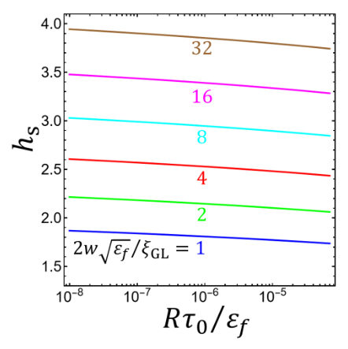 
FIG. 4. The dependences of the reduced crossover magnetic field hs =Hs/He limiting the single-vortex regime of freezing, Eq. (36), on the reduced cooling rate Rτ0/εf for different values of the ratio 2w√εf/ξGL.

📷 Fig 5

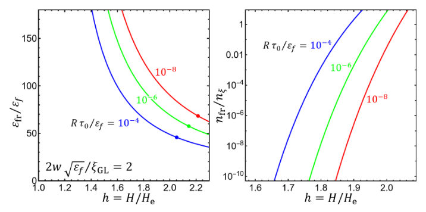 
FIG. 5. Representative dependences of the reduced freezing temperature εfr and the frozen flux density nfr on the magnetic field in units of the flux-expulsion field for 2w√εf/ξGL = 2 and several values of the normalized cooling rate Rτ0/εf. The circles in the left plot mark the locations of the field hs limiting the single-vortex freezing regime, see Eq. (36) and Fig. 4.

**Summary.** This theoretical work models how magnetic flux gets trapped (frozen) in narrow superconducting strips during cooling. By solving the dynamic-balance equation for vortex movement, the authors predict the freezing temperature and the resulting trapped flux density. This provides a quantitative understanding of flux pinning relevant to superconducting electronics.

**Why it may be interesting.** The study of flux freezing and dynamic equilibrium in superconductors involves non-equilibrium statistical mechanics, critical slowing down, and barrier crossing phenomena, which share mathematical structures with open quantum systems dynamics.

Detailed structure

**Main problem.** The paper analyzes the phenomenon of residual frozen magnetic flux trapped in a narrow superconducting strip when cooled through its critical temperature in a small external magnetic field.

**Main result.** The freezing process is governed by a dynamic balance equation, yielding a freezing temperature ($T_{	ext{fr}}$) and a frozen flux density ($n_{	ext{fr}}$) that exhibit strong, predictable dependencies on the magnetic field and cooling rate.

**Method.** The authors derive and solve the dynamic-balance equation describing the thermally-activated escape and entrance of vortices over geometric energy barriers.

**Model / system.** The system is a long, narrow superconducting strip ($W \ll \Lambda$). The dynamics are modeled using vortex energy profiles and the master equation for flux density evolution.

**Key observables.** Frozen flux density ($n_{	ext{fr}}$), freezing temperature ($T_{	ext{fr}}$), and the effective flux-expulsion magnetic field ($H_{	ext{eff}}$).

**Important parameters / regimes.** The relative freezing temperature ($\epsilon_{	ext{fr}} = 1 - T_{	ext{fr}}/T_c$), the cooling rate ($R$), and characteristic energy scales like the Pearl energy ($E_P$) and the minimum flux-expulsion field ($H_e$).

**Assumptions / limitations.** The analysis relies on the narrow-strip approximation ($W \ll \Lambda$) and assumes the system freezes in regimes where thermal activation dominates the dynamics.

**Figures summary.** Figures illustrate vortex energy profiles, the reduced function determining the escape barrier, and the time evolution of the flux density during cooling.

**Paper structure.** The paper progresses from establishing the physical problem (flux trapping) to deriving the dynamic-balance equation, solving it asymptotically, and finally calculating the quantitative dependence of the freezing temperature and density on external parameters.

Abstract

We analyze residual frozen flux in a long narrow superconducting strip cooled through its transition temperature $T_{c}$ in a small perpendicular magnetic field. This problem is relevant for the issue of trapped magnetic flux in superconducting electronic devices. During cooling, the low-temperature vortex configuration is formed at temperatures very close to $T_{c}$, where the flux density is determined by dynamic balance between the thermally-activated exits and entries of vortices over the geometrical energy barrier formed by the interaction with the strip edges and the Meissner screening current. In the field range between the minimum flux-expulsion field and the penetration field, the equilibrium flux density is finite due to thermal activation and rapidly decreases with decreasing temperature. During cooling, however, the escape rate decreases exponentially, and the vortex density falls out of equilibrium at a field-dependent freezing temperature $T_{\mathrm{fr}}$. We derive and solve the dynamic-balance equation for this process, which yields definite quantitative results for $T_{\mathrm{fr}}$ and the frozen vortex density. The relative freezing temperature $1\!-\!T_{\mathrm{fr}}/T_{c}$ exceeds the fluctuation width of the transition by a large logarithmic factor, rapidly increases when the magnetic field approaches the minimum flux-expulsion field, and logarithmically increases with decreasing cooling rate. The resulting frozen flux density has a very strong magnetic-field dependence which can be used to define the effective flux-expulsion magnetic field.

[↑ back to top](#top)

### [Squeezed Phonon Lasing via Floquet-Controlled Solid-State Defects](http://arxiv.org/abs/2606.05083v1)

**Authors:** Hugo Molinares, Gianluca Rastelli, Victor Montenegro, Vitalie Eremeev  
**Type:** theory · **Category:** other · **PDF:** <https://arxiv.org/pdf/2606.05083v1>  
**Analysis basis:** full PDF text, analyzed in chunks
**Topic relevance:** `driven-dissipative phase transition` **3/5** · `methods for driven-dissipative` **3/5** · `non-equilibrium dynamics` **3/5** · `spintronics-quantum-optics interface` **3/5** · `Keldysh / 2PI / non-Gaussian methods` **1/5** · `analog quantum simulation` **1/5** · `correlated / nonlocal dissipation` **1/5** · `non-equilibrium universality` **1/5**

📷 Fig 1

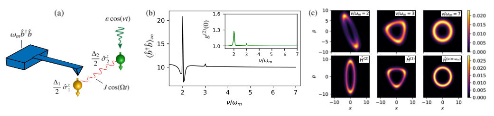 
FIG. 1. (a) The basic element of our theoretical proposal is a mechanical oscillator coupled to a spin, which interacts with a second spin via a driven spin-spin coupling, see Eq. (1). ωm is the mechanical oscillator frequency whereas ∆1, ∆2 are the energy splitting of the two spins. A local periodic drive is applied to the second spin at frequency ν whereas the spin-spin interaction is modulated at frequency Ω. (b) Numerical solutions of Eq. (2): Steady-state average phonon number ⟨ˆb†ˆb⟩∞as a function of ν/ωm, for the resonance condition Ω= ∆1 + ∆2 + ωm. Inset plot: Second-order correlation function. (c) Wigner function W(x, p) for selected values of ν/ωm with ε = ν/2. Top panel:...

📷 Fig 2

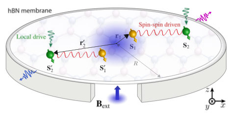 
FIG. 2. Scheme for the proposed setup: A suspended circular hBN membrane with radius R acts as the mechanical resonator. A mag- netic field gradient enables spin-motion coupling with spins placed at r1(r′ 1) (yellow spheres), each interacting with a second spin placed at r2(r′ 2) (green spheres) via a driven spin-spin coupling. A local pe- riodic drive is applied to the second spins.

📷 Fig 3

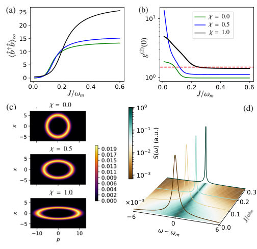 
FIG. 3. Steady-state solution of ME in Eq. (11): (a) Average phonon number ⟨ˆb†ˆb⟩∞and (b) second-order correlation function as a func- tion of amplitude driving field J/ωm, for different χ values. (c) Wigner representation W(x, p) at J = 0.3. (d) Power spectrum S (ω) as a function of J/ωm. Frequency defined with respect to the MO fre- quency ωm for χ = 1. Other parameters (in units of ωm): λ1 = 0.04, ν = ν′ = 2, Γj = 0.03, γm = 10−4, γ′ m = 10γm, ¯ns j = 10−5, ¯nm = 10−3.

📷 Fig 4

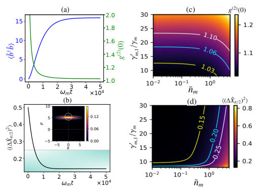 
FIG. 4. Numerical solution of ME in Eq. (16): (a) Time evolution of excitations and second-order correlation function, g(2)(0). (b) Time evolution of quadrature fluctuation ⟨(∆ˆXπ/2)2⟩, i.e. θ = π/2. Inset plot: Wigner function W(x, p) at t →∞. The green dashed lines in- dicate the contour at 0.1 max[W(x, p)], while the white dashed lines correspond to the same contour for a coherent field with identical coherent amplitude for θ = π/2. (c) g(2)(0) and (d) ⟨(∆ˆXπ/2)2⟩as a function of the ratio γ′ m,1/γm and the MO thermal excitations ¯nm. Here, we observe that the optimal regime for squeezed phonon las- ing is achieved around γ′ m,1/γm ∼10 and for ¯nm ≲1. Parameters (in units of ωm): J =...

**Summary.** This paper presents a theoretical framework for achieving squeezed phonon lasing in solid-state defects within hBN membranes using Floquet engineering. By carefully controlling the system's driving fields and coupling mechanisms, the authors demonstrate a pathway to stabilize the phase and generate robust, non-classical mechanical states. This offers a promising route for quantum metrology applications.

**Why it may be interesting.** This work is highly relevant as it combines several advanced topics: Floquet engineering for quantum control, solid-state quantum emitters, and the generation of non-classical states (squeezing) in mechanical oscillators, which are core areas of AMO physics and quantum optics.

Detailed structure

**Main problem.** The paper proposes a general Floquet-engineered scheme to achieve a continuous transition from conventional phonon lasing to phase-locked squeezed phonon lasing.

**Main result.** The scheme successfully demonstrates the realization of stable, steady-state squeezed phonon lasing in a solid-state platform by controlling the system's phase and quadrature fluctuations.

**Method.** The analysis relies on deriving effective Hamiltonians using Floquet theory and the Magnus expansion, followed by solving the resulting Master Equation to characterize steady-state dynamics.

**Model / system.** The physical system is a solid-state platform using color centers embedded in a hexagonal boron nitride (hBN) membrane, coupling a mechanical oscillator (phonons) to two principal and ancillary spins. The dynamics are governed by a complex Hamiltonian incorporating time-periodic driving terms.

**Key observables.** Lasing threshold, mechanical occupation ($\langle\hat{b}^\dagger\hat{b}
angle_\infty$), second-order correlation function ($g^{(2)}(0)$), and the variance of generalized quadrature operators ($\langle(\Delta \hat{X}_	heta)^2
angle$).

**Important parameters / regimes.** Resonance conditions ($\Omega = \sum \Delta_j + \omega_m$), local driving frequencies ($
u$), and coupling strengths ($\lambda_1, J, \epsilon$).

**Assumptions / limitations.** The analysis utilizes approximations such as the Rotating-Wave Approximation (RWA), adiabatic elimination of fast-decaying ancilla spins, and specific parameter hierarchies to simplify the effective Hamiltonian.

**Figures summary.** Figures illustrate the time evolution of $g^{(2)}(0)$ and quadrature variance, showing convergence to values characteristic of lasing and squeezing, respectively. Wigner functions are used to visualize the transition to squeezed states.

**Paper structure.** The paper builds from a general theoretical proposal (Section II) to the specific application on the hBN platform (Section III), detailing the derivation of effective Hamiltonians for both squeezed amplification and phase-locked regimes.

Abstract

We propose a general Floquet-engineered scheme for phonon lasing that enables a continuous transition from conventional lasing to phase-locked squeezed phonon lasing. Focusing on a solid-state platform based on color centers embedded in a circular hexagonal boron nitride (hBN) membrane, we demonstrate that a mechanical oscillator coupled to principal and ancilla spins, and controlled via effective Floquet driving simultaneously exhibits squeezed-state amplification and cooling dynamics, leading to the emergence of a stable squeezed phonon laser. We analyse the steady-state properties of the system, including the lasing threshold, mechanical occupation, emission spectrum and second-order correlations. Furthermore, we show that Floquet engineering can realize phase-locked lasing while enabling controlled quadrature squeezing, thereby providing a simple yet effective route toward squeezed lasing in quantum mechanical systems. Our results offer new insights into the generation of squeezed phonon lasers in solid-state platforms, with potential applications in quantum metrology.

[↑ back to top](#top)

### [Correlated States in Quantum Dot Clusters Coupled to a Common Superconductor](http://arxiv.org/abs/2606.04608v1)

**Authors:** Martin Žonda, Jakub Rękas, Tobiáš Poláček, Jana Kodrlová, Vladislav Pokorný, Martin Friák  
**Type:** theory · **Category:** strongly correlated electrons · **PDF:** <https://arxiv.org/pdf/2606.04608v1>  
**Analysis basis:** full PDF text, analyzed in chunks
**Topic relevance:** `analog quantum simulation` **3/5** · `entanglement & information structure` **3/5** · `methods for driven-dissipative` **3/5** · `Keldysh / 2PI / non-Gaussian methods` **2/5** · `Kondo & dissipative impurity` **2/5** · `correlated cavity matter` **1/5** · `exotic spin models in light-matter` **1/5**

📷 Fig 1

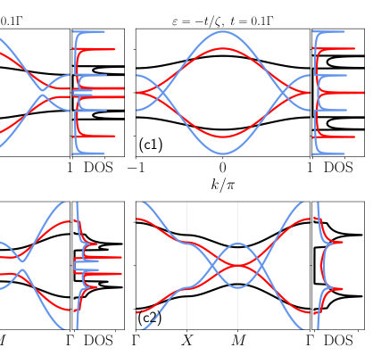 
Figure 1: Examples of the band structure and the corresponding single-particle den- sity of states (DOS) in one (first row) and two (second row) spatial dimensions for infinite noninteracting system with periodic boundary conditions. Panels (a1), (a2), (c1), and (c2) display parameter regimes in which HSC is satisfied, leading to a clos- ing of the gap. In contrast, panels (b1) and (b2) illustrate generic situations where this condition is not fulfilled and the spectral gap remains finite.

📷 Fig 2

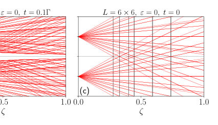 
Figure 2: Evolution of the BdG single-particle spectrum for a finite noninteracting system with L sites as a function of ζ. Panel (a) shows a chain with L = 20 in the HSC regime, where the gap closes at the critical values indicated by the vertical lines. Panel (b) displays an 11×11 two-dimensional cluster in a generic parameter regime, where the gap remains finite for all ζ. Panel (c) illustrates a 6×6 cluster with trivially fulfilled HSC condition (ϵ = 0, t = 0). In panels (a) and (c), the vertical lines mark the analytical predictions from Eq. (16) for the zero-energy crossings, signaling sharp transitions between distinct singlet ground states.

📷 Fig 3

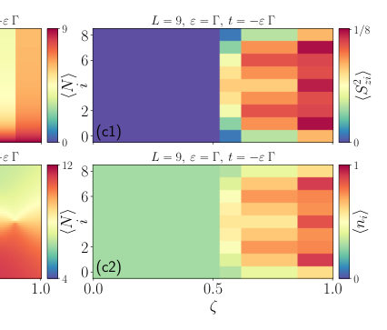 
Figure 3: Local z-moment S(2) z (a1) and mean total electron occupation 〈N〉(a2) in the ζ-ϵ plane within the HSC regime for a noninteracting chain of length L = 9. Panels (b1) and (b2) show the corresponding quantities away from HSC at ϵ = 0, where the evolution is smooth up to special points ζd(L,n) at t = 0. Panels (c1) and (c2) illustrate the spatial distribution of the local moment and particle occupation for representative singlet ground states at ϵ = Γ, highlighting the qualitative difference between the homogeneous trivial singlet at |ζ| &lt; 0.5 and the inhomogeneous singlets realized at larger |ζ|.

📷 Fig 4

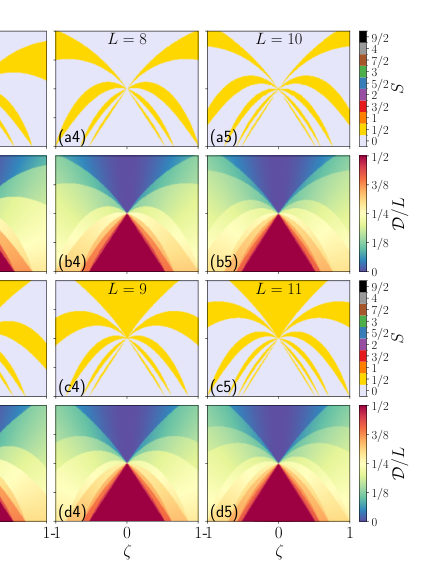 
Figure 4: Phase diagrams in the ζ–U plane for a one-dimensional chain with an even (first and second row) and odd (third and fourth row) number of sites, ϵ = 0 and t = 0. (a) and (c): Total spin of the many-body ground state. (b) and (d): Average double occupancy D/L. Dashed black lines in (a1) are analytical phase boundaries calculated in App. C.

📷 Fig 5

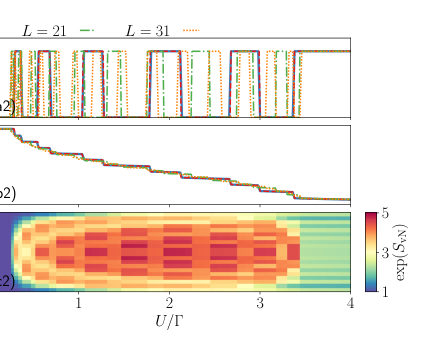 
Figure 5: Evolution of the ground-state total spin (first row) and double occupancy per site (second row) with ζ (first column) and U (second column) for (a1,b1) U = Γ and t = 0 and (a2,b2) ζ = 0.44 at t = 0 and ϵ = 0 for open chain with different lengths. Third row show examples of entanglement entropy at each bond of L = 21 chain as function of ζ and U.

**Summary.** This work theoretically analyzes correlated electron behavior in quantum dot arrays coupled to a superconductor. By mapping the complex Hamiltonian into a particle-number-conserving form, the authors use advanced NQS methods to map out distinct quantum phases. The findings reveal rich physics, including gap closing transitions and the emergence of effective Heisenberg models in different dimensions.

**Why it may be interesting.** The combination of superconducting proximity effects with strong electronic correlations in nanoscale arrays is a major frontier in condensed matter physics, directly relevant to superconducting quantum circuits and quantum computing hardware.

Detailed structure

**Main problem.** The study investigates the correlated electronic states within quantum dot clusters coupled to a common superconductor.

**Main result.** The research identifies three distinct interacting regimes—trivial singlet, Heisenberg-like, and critical—and finds robust triplet ground states in 2D clusters.

**Method.** The authors employ a combination of exact diagonalization, DMRG, and advanced Neural Quantum State Variational Monte Carlo (NQS-VMC) methods.

**Model / system.** The system is an effective model of regular quantum dot clusters coupled to a superconductor, described by a complex Hamiltonian involving local repulsion, inter-dot hopping, and superconducting pairing terms.

**Key observables.** Superconducting gap ($\Delta$), local moment ($\langle S_z 
angle$), mean electron occupation ($\langle N 
angle$), and entanglement entropy.

**Important parameters / regimes.** Superconducting gap ($\Delta$), Coulomb repulsion ($U$), inter-dot coupling ($W$), and coupling strength ($\zeta$).

**Assumptions / limitations.** The analysis relies on canonical transformations to restore particle-number conservation for NQS methods, and approximations like the Superconducting Atomic Limit ($\Delta 	o \infty$).

**Figures summary.** Figures illustrate the evolution of the Bogoliubov-de Gennes spectrum showing gap closing at critical points, and phase diagrams mapping out ground state changes based on coupling strengths.

**Paper structure.** The paper progresses from defining the full Hamiltonian and applying canonical transformations to mapping the system onto a particle-number-conserving form. It then analyzes the non-interacting limit (gap closing) before tackling the interacting regimes using advanced numerical techniques.

Abstract

We study an effective model of regular quantum dot clusters coupled to a common superconductor. By applying a canonical transformation, we map the system onto a particle-number-conserving representation, making it directly accessible to standard fermionic neural-network quantum-state variational Monte Carlo methods. We show that the superconducting gap closes at a particular high-symmetry point, which, in finite non-interacting systems, corresponds to crossings between singlet ground states of different character. Combining exact methods, density matrix renormalization group, and neural quantum-state variational Monte Carlo calculations, we identify three distinct interacting regimes: a trivial superconducting singlet phase, a strongly correlated regime connected to an effective Heisenberg model, and a critical intermediate regime with qualitatively different behavior in one and two dimensions. In one-dimensional systems, the intermediate regime exhibits a sequence of singlet-doublet transitions and becomes gapless in the thermodynamic limit even for finite Coulomb interaction. In two-dimensional clusters, we find robust triplet ground states. Furthermore, our results demonstrate that relatively standard fermionic neural quantum states provide an efficient approach for correlated superconducting nanostructures.

[↑ back to top](#top)

### [Emergence of Macroscopic Quantum Order via Translational Zero Modes](http://arxiv.org/abs/2606.04187v1)

**Authors:** Kenan Gundogdu  
**Type:** theory · **Category:** quantum gases · **PDF:** <https://arxiv.org/pdf/2606.04187v1>  
**Analysis basis:** full PDF text, analyzed in chunks
**Topic relevance:** `analog quantum simulation` **3/5** · `driven-dissipative phase transition` **3/5** · `Keldysh / 2PI / non-Gaussian methods` **2/5** · `correlated cavity matter` **2/5** · `methods for driven-dissipative` **2/5** · `Frenkel-Kontorova` **1/5** · `non-equilibrium dynamics` **1/5** · `non-equilibrium universality` **1/5**

📷 Fig 1

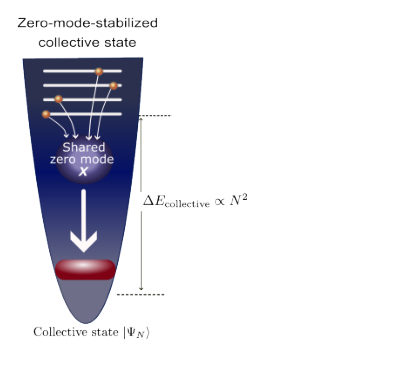 
Fig. 1 From fixed-spectrum condensation to zero-mode-stabilized collective order. (a) In conventional condensation, particles occupy the lowest level of a fixed excitation spectrum only after thermal occupation of higher-energy states is reduced below a critical temperature. (b) In a solitonic confining potential, fluctuations of the translational zero mode shift the potential relative to the laboratory frame. In the soliton frame, this motion coherently mixes the defect-bound excitonic states. (c) In the many-body regime, all confined excitons couple to the same shared zero-mode coordinate. This collective structural channel drives a single many-body state |ΨN⟩to lower energy, with...

📷 Fig 2

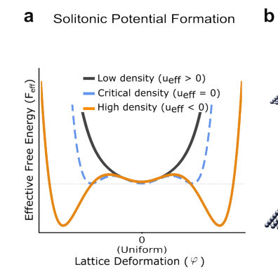 
Fig. 2 Density-induced lattice instability and formation of a self-generated solitonic potential. (a) Effective Landau free energy Feff as a function of the lattice deformation coordinate φ for increasing excitation density. At low density, the uniform configuration φ = 0 is the stable minimum. As the density increases, the quadratic exciton–lattice coupling g2 renormalizes the effec- tive quartic coefficient ueff, causing the free-energy landscape to develop finite-deformation minima. At sufficiently high density, a finite-φ configuration becomes energetically favored, indicating a ther- modynamic instability of the uniform lattice. (b) Real-space representation of the transition. In the...

📷 Fig 3

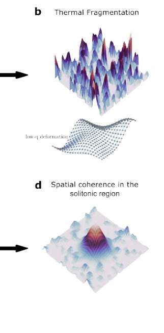 
Fig. 3 Impact of the solitonic transition on excitonic spatial coherence and potential landscapes. (a) In the homogeneous regime, the uniform crystal lattice defines an unconfined con- tinuous spectrum, supporting extended excitonic eigenstates approximated here as plane waves. (b) Extended excitons interact with a gapless continuum of traveling thermal phonons. These low-energy fluctuations generate random lattice distortions that modulate the potential landscape, dephase the excitonic wavefunctions, and distribute the population over many spatially incoherent configurations. (c) The solitonic transition changes the electronic geometry. A localized structural deformation gen- erates a...

📷 Fig 4

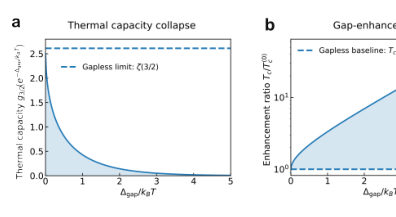 
Fig. 4 Thermal-capacity suppression by a density-dependent collective gap. a, A finite ∆gap reduces the Bose phase-space factor from the gapless value g3/2(1) = ζ(3/2) to

**Summary.** The paper proposes that macroscopic quantum order can be sustained at high temperatures not by cooling, but by the self-generation of a mobile confining potential (soliton) coupled to the lattice. This coupling creates a 'translational zero mode' that opens a protective energy gap, stabilizing the collective quantum state and enhancing the critical temperature beyond conventional predictions.

**Why it may be interesting.** This work provides a powerful, general theoretical framework for achieving high-temperature quantum coherence by engineering structural degrees of freedom (the zero mode) to modify the many-body spectrum, which is highly relevant to AMO physics and quantum optics.

Detailed structure

**Main problem.** To find a mechanism for achieving macroscopic quantum order at elevated temperatures that bypasses the limitations of fixed excitation spectra or conventional pairing instabilities.

**Main result.** The coupling of electronic excitations to a deformable lattice via a translational zero mode generates a self-confining potential, opening a density-dependent gap that stabilizes coherence at higher temperatures.

**Method.** The analysis uses effective Hamiltonian descriptions, mean-field theory, and variational principles to model the collective energy lowering driven by the zero mode.

**Model / system.** The system involves excitons strongly coupled to a deformable lattice, leading to a density-induced lattice instability that creates a mobile, self-generated solitonic potential. This potential gives rise to a translational zero mode.

**Key observables.** Density-dependent gap ($\Delta_{gap}$), critical temperature ($T_c$), and the occupation of the single collective many-body orbital ($\lambda_0 = O(N)$).

**Important parameters / regimes.** Critical density, coupling constants ($g_1, g_2$), and the zero-mode stiffness ($\kappa$).

**Assumptions / limitations.** The zero mode acts as a shared collective coordinate, and the system can be effectively described by a two-level subspace in the macroscopic limit.

**Figures summary.** Figures illustrate the transition from uniform to solitonic phases, the modification of the Bose phase-space factor due to the gap, and the enhancement of $T_c$ beyond standard scaling laws.

**Paper structure.** The paper progresses from identifying the general problem to modeling the lattice instability, deriving the zero-mode coupling, calculating the resulting energy lowering, and finally demonstrating the stabilization of coherence via the gap and ODLRO.

Abstract

Macroscopic quantum coherence in solids, such as in superfluids, superconductors, and condensates, is generally limited to low temperatures because order forms within a fixed excitation spectrum whose competing states become thermally populated as temperature rises. Here, we show that strong coupling between electronic excitations and a deformable lattice enables a different route. Above a critical density, this coupling nucleates self generated confining potentials that trap the very excitations generating them. Unlike rigid external traps, these potentials can translate through the host lattice without changing their internal structure, defining a translational zero mode. Coupling to this zero mode provides a shared dynamical coordinate that lowers and isolates a single collective many body configuration, opening a density dependent gap that suppresses thermal occupation of competing states and supports off diagonal long range order at elevated temperatures. As a concrete realization, we identify high-temperature superfluorescence in lead halide perovskites as the radiative instability of this zero mode dressed ordered excitonic state. More broadly, this establishes a general route to macroscopic quantum order: not cooling within a fixed spectrum, nor pairing instabilities, but a self generated mobile confining structure whose translational zero mode reconstructs the many-body spectrum to protect coherence.

[↑ back to top](#top)

### [Extremely slow scaling of minimal Hamming distance in quantum sampling data](http://arxiv.org/abs/2606.04558v1)

**Authors:** P. S. Golubev, I. A. Iakovlev, V. V. Mazurenko  
**Type:** both · **Category:** disordered systems and neural networks · **PDF:** <https://arxiv.org/pdf/2606.04558v1>  
**Analysis basis:** full PDF text, analyzed in chunks
**Topic relevance:** `analog quantum simulation` **3/5** · `methods for driven-dissipative` **3/5** · `QC/QI experiment` **2/5** · `entanglement & information structure` **2/5** · `driven-dissipative phase transition` **1/5** · `exotic spin models in light-matter` **1/5** · `non-equilibrium dynamics` **1/5** · `non-equilibrium universality` **1/5** · `quantum measurements` **1/5**

📷 Fig 1

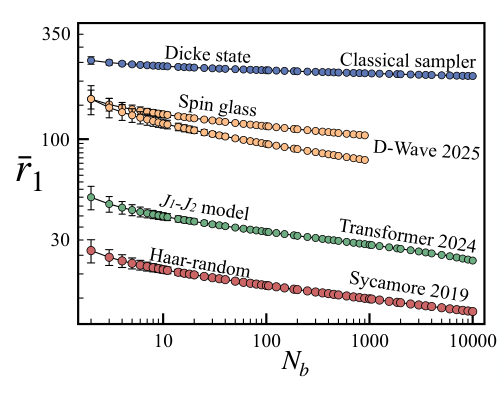 
FIG. 1. Minimal Hamming distance functions calculated for a few notable quantum states (from top to bottom): the classically-sampled 512-qubit Dicke state with 256 excita- tions; 324-qubit spin-glass states simulated on the D-Wave quantum annealer [20] with the square lattice topology and quench times of 7 (the upper yellow curve) and 20 (the lower yellow curve) ns; ground state of the frustrated antiferromag- netic J1 −J2 model optimized with transformer-based neural network quantum state approach [21] on 10 × 10 square lat- tice at J2 = 0.5; 53-qubit Haar-random state imitated on Sycamore quantum processor [22].

📷 Fig 2

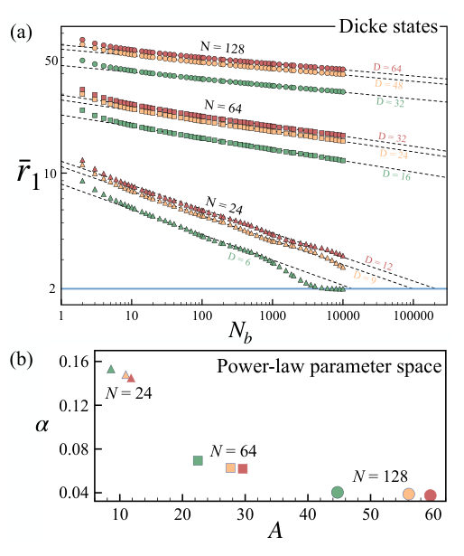 
FIG. 2. (a) Average minimal distance function, Eq.1 calcu- lated for Dicke states of 24-, 64- and 128-qubit systems in the σz basis. Each point was averaged over 10 samples. Black dashed lines denote the fit of the sampling data with Eq.2. (b) Map distinguishing the different Dicke states with respect to the power-law parameters A and α.

📷 Fig 3

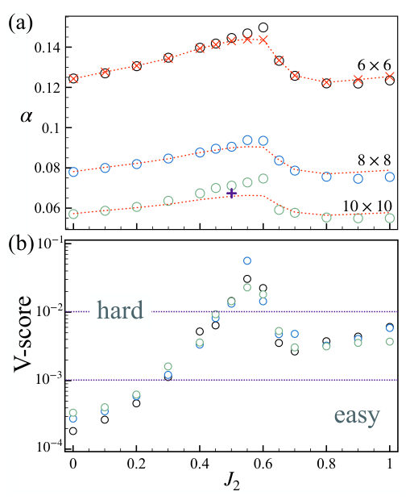 
FIG. 3. (a) Power-law parameter, α calculated for exact ED and approximated ViT ground states of the antiferromagnetic J1 −J2 model. Black, blue and green circles correspond to the ViT results obtained for 6 × 6, 8 × 8 and 10 × 10 super- cells, respectively. Red crosses stand for ED solutions of the 6 × 6 system. Red dotted lines denote ED data rescaled as described in the text. The violet plus sign corresponds to the estimate based on pre-trained ViT data from [21]. (b) V-score metric calculated for the ViT solutions with Eq.5.

📷 Fig 4

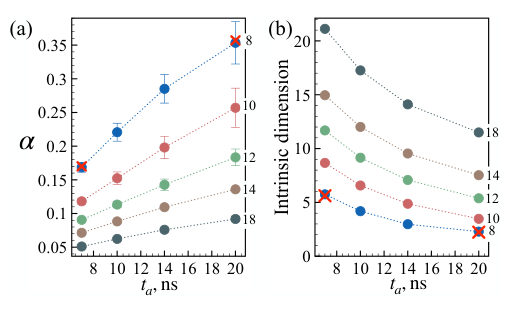 
FIG. 4. (a) Dependence of the power α on the annealing time calculated for D-Wave sampling data [20]. Numbers on the right indicate linear system sizes. These results were averaged over 20 instances. (b) Intrinsic dimension averaged over 20 instances. Red crosses denote the power α (a) and ID (b) calculated for MPS 8 × 8 samples from Ref.20.

📷 Fig 5

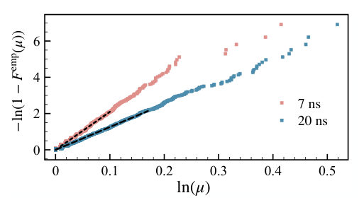 
FIG. 6. Example of cumulative distributions against µ ob- tained for one specific disorder realization for the 18x18 D- Wave data at ta = 7 ns and ta = 20 ns. The corresponding ID values defined from fit are equal to 21 and 12.59, respec- tively.

**Summary.** The paper introduces the average minimal Hamming distance as a universal metric to characterize quantum states from sparse measurement data. By fitting this distance to a power law, the authors demonstrate that the resulting parameters can reliably quantify state complexity and detect quantum phase transitions across diverse physical models, including those studied on quantum annealers.

**Why it may be interesting.** This work provides a powerful, data-driven diagnostic tool that bypasses the need to calculate explicit physical observables, making it highly relevant for analyzing noisy, limited-data measurements from NISQ quantum hardware.

Detailed structure

**Main problem.** The core challenge is characterizing complex quantum states using only sparse measurement data, which is limited by the exponentially large Hilbert space.

**Main result.** The average minimal Hamming distance ($ar{r}_1(N_b)$) exhibits a universal power-law scaling, allowing the reliable extraction of quantum state complexity and the identification of phase transitions.

**Method.** The authors propose using the power-law fitting of $ar{r}_1(N_b) \propto N_b^{-\alpha}$ as a robust metric, comparing results from real quantum hardware, classical simulations, and advanced neural network representations.

**Model / system.** The analysis is applied to various quantum systems, including Dicke states, the $J_1-J_2$ model on a square lattice, and spin-glass systems, often simulated using Variational Neural-Network Quantum States (ViT).

**Key observables.** Average minimal Hamming distance ($ar{r}_1(N_b)$), power-law parameters ($A$ and $\alpha$), and Intrinsic Dimension (ID).

**Important parameters / regimes.** The exponent $\alpha$ is shown to be extremely slow, and the analysis is sensitive to critical points in the $J_1-J_2$ phase diagram.

**Assumptions / limitations.** The method assumes that the underlying quantum state structure dictates a universal power-law scaling in the minimal Hamming distance, even with limited sampling.

**Figures summary.** Figures illustrate the power-law scaling of $ar{r}_1(N_b)$ for various states (Dicke, $J_1-J_2$), showing the dependence on system size and phase, and comparing results from different computational methods.

**Paper structure.** The paper introduces the metric, applies it to diverse physical models (Dicke, $J_1-J_2$), compares results across different computational techniques (ED, ViT, QMC), and concludes by establishing the universality of the power-law scaling for state characterization.

Abstract

Quantum data can be obtained from a diverse range of sources, including direct measurements from noisy quantum processors, cold-atom simulators, and classical approximations such as variational neural-network states. However, our ability to characterize these systems is fundamentally limited, as the available measurement data is often sparse compared to the exponentially large Hilbert space of the system. To address this, we propose using the average minimal Hamming distance calculated for a set of unique bitstrings as a robust metric revealing a universal power-law behaviour. Through various examples of real experiments and simulations, we show that the power-law parameters reliably capture the complexity of quantum states and identify quantum phase transitions from limited quantum information, without the need for accumulating extensive statistics or explicitly calculating physical observables. This enables the analysis of completely different quantum experiments within a single framework.

[↑ back to top](#top)

### [Nonreciprocal Dispersive Coupling for Quantum Sensing](http://arxiv.org/abs/2606.04666v1)

**Authors:** Dong Xie, Chunling Xu  
**Type:** theory · **Category:** other · **PDF:** <https://arxiv.org/pdf/2606.04666v1>  
**Analysis basis:** full PDF text, analyzed in chunks
**Topic relevance:** `quantum measurements` **3/5** · `Tavis-Cummings & cavity-many-emitter` **2/5** · `analog quantum simulation` **2/5** · `correlated cavity matter` **2/5** · `Keldysh / 2PI / non-Gaussian methods` **1/5** · `correlated / nonlocal dissipation` **1/5** · `driven-dissipative phase transition` **1/5** · `entanglement & information structure` **1/5** · `measurement-induced transitions` **1/5** · `methods for driven-dissipative` **1/5**

📷 Fig 1

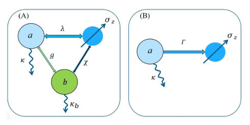 
Figure 1. Schematic diagram of nonreciprocal dispersive cou- pling. (A) The cavity mode a is coupled to the bosonic mode b with the coupling strength denoted by g. The qubit couples to the cavity mode a and bosonic b, with dispersive coupling strengths λ and χ, respectively. The dissipation rate suffered by the bosonic mode b is much higher than that of the cavity mode a, κb ≫(κ, g). (B) Schematic diagram of the equivalent nonreciprocal coupling between the cavity and the qubit. Af- ter fully eliminating bosonic mode b adiabatically, the cavity mode a couples to the qubit σz via nonreciprocal dispersive coupling with strength Γ.

📷 Fig 2

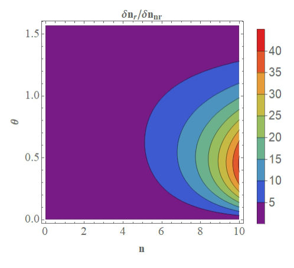 
Figure 2. Ratio of measurement uncertainty δnr/δnnr versus cavity photon number n and angle θ under reciprocal and nonreciprocal dispersive coupling. Here, we consider that λ ≫ κ and Γ ≫κ.

**Summary.** This paper theoretically investigates how nonreciprocal dispersive coupling can enhance quantum sensing beyond what is achievable with standard reciprocal coupling. By analyzing the measurement uncertainty using the Quantum Fisher Information, the authors demonstrate that nonreciprocity provides an exponential advantage in precision for measuring both photon number and driving strength. This work proposes a novel method to build ultra-precise quantum sensors using engineered nonreciprocal interactions.

**Why it may be interesting.** This work is highly relevant to AMO physics and quantum optics as it provides a theoretical framework for enhancing quantum measurement precision by engineering nonreciprocal interactions in cavity QED systems.

Detailed structure

**Main problem.** The paper compares the quantum sensing capabilities of nonreciprocal versus reciprocal dispersive coupling in a qubit-cavity system.

**Main result.** Nonreciprocal coupling provides superior measurement precision for both cavity photon number and driving strength compared to its reciprocal counterpart, especially at high photon numbers or driving strengths.

**Method.** The authors derived measurement uncertainties using the Quantum Fisher Information and the Quantum Cramér-Rao bound for both coupling types.

**Model / system.** The system involves a qubit coupled dispersively to a cavity mode, which is modeled using a Hamiltonian and analyzed via the master equation and quantum Langevin equations.

**Key observables.** Measurement uncertainty ($\delta^2 n$ for photon number; $\delta^2 \epsilon$ for driving strength $\epsilon$), and Quantum Fisher Information ($F_Q$).

**Important parameters / regimes.** Dispersive coupling strengths ($\lambda$, $\Gamma$), cavity dissipation rate ($\kappa$), initial photon number ($n$), and driving strength ($\epsilon$).

**Assumptions / limitations.** The analysis relies on adiabatic elimination of an intermediate bosonic mode and assumes specific dissipation rate hierarchies.

**Figures summary.** Figure 1 schematically illustrates the nonreciprocal coupling setup and its equivalent form. Figure 2 (mentioned) likely compares the ratio of measurement uncertainties ($\delta_{nr}/\delta_{nnr}$) versus photon number $n$.

**Paper structure.** The paper progresses by establishing the Hamiltonian for both coupling types, deriving the evolution equations, calculating the Quantum Fisher Information for both, and finally comparing the resulting measurement uncertainties for photon number and driving strength using novel measurement strategies.

Abstract

Dispersive coupling is widely utilized for quantum information readout. Most prior studies have concentrated on reciprocal dispersive coupling. Here, we further construct nonreciprocal dispersive coupling and apply it to quantum sensing. For cavity photon number measurement, nonreciprocal dispersive coupling delivers higher precision than its reciprocal counterpart, and this advantage grows more pronounced with an increase in photon number. When directly measuring the single-photon driving strength, however, nonreciprocal dispersive coupling shows no superiority over reciprocal dispersive coupling. By converting the information of driving strength into cavity photon numbers via our proposed strategy, nonreciprocal dispersive coupling again outperforms reciprocal dispersive coupling in precision, with the advantage becoming increasingly significant at larger driving strength. This work presents a novel method to boost quantum sensing and enable the fabrication of ultra-precise quantum sensors.

[↑ back to top](#top)

### [Optimizing the Sensitivity-Noise Trade-off in Non-Hermitian Sensing via Off-Exceptional-Deficiency Operation](http://arxiv.org/abs/2606.04386v1)

**Authors:** Shangxuan Li, Bin Guo  
**Type:** theory · **Category:** other · **PDF:** <https://arxiv.org/pdf/2606.04386v1>  
**Analysis basis:** full PDF text, analyzed in chunks
**Topic relevance:** `driven-dissipative phase transition` **3/5** · `methods for driven-dissipative` **3/5** · `analog quantum simulation` **2/5** · `non-equilibrium dynamics` **2/5** · `non-equilibrium universality` **2/5** · `Keldysh / 2PI / non-Gaussian methods` **1/5** · `Kondo & dissipative impurity` **1/5** · `correlated / nonlocal dissipation` **1/5**

📷 Fig 1

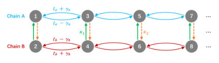 
FIG. 1. Schematic of the double-chain Hatano–Nelson model with asymmetric interlayer coupling. Chain A (blue, up- per) and chain B (red, lower) feature opposite nonreciprocal nearest-neighbor hopping with amplitudes ta ±γa and tb ±γb, respectively. Solid and dashed arrows denote the dominant forward coupling κ1 and reverse coupling κ2, respectively, sat- isfying κ1 ≫κ2.

📷 Fig 2

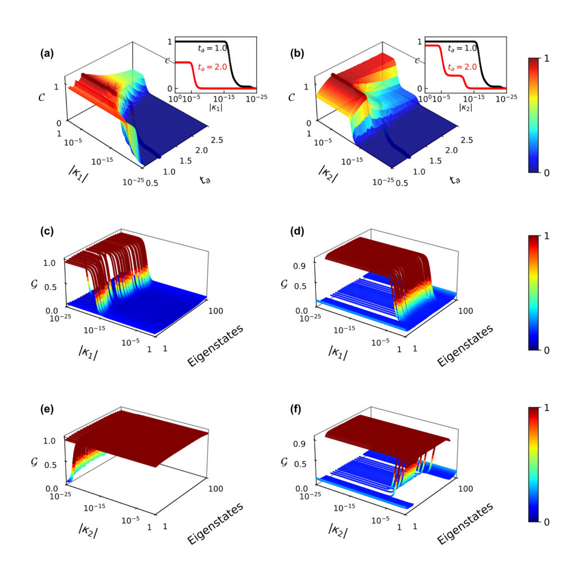 
FIG. 2. Eigenspace coalescence and real-space skin-mode distribution under open boundary conditions. (a), (b) Cosine similarity C of the eigenspace as a function of interlayer coupling strength (|κ1| or |κ2|) and hopping parameter ta, for B →A and A →B coupling configurations, respectively. Insets display C versus κ1,2 along two representative cuts at ta = 1.0, tb = 1.0, γa = 0.5, γb = 0.5 (black line, ED) and ta = 2.0, tb = 1.0, γa = 0.5, γb = 0.25 (red line, off-ED). (c), (d) Real-space spatial density G of all eigenstates as a function of |κ1| for B →A coupling. (e), (f) Corresponding spatial density G as a function of |κ2| for A →B coupling.

📷 Fig 3

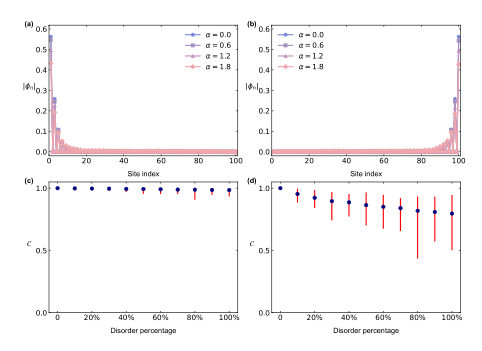 
FIG. 3. Effects of on-site spatial disorder on eigenstate localization and eigenspace coalescence under open bound- ary conditions (N = 50). (a), (b) Ensemble-averaged real- space probability density of the OBC eigenstates under vary- ing disorder strengths α = 0.0, 0.6, 1.2, 1.8 for the B →A and A →B coupling configurations, respectively. (c), (d) Eigenspace cosine similarity C as a function of the disorder mask fraction p for disorder strengths α = 0.6 and α = 1.8. Each data point (blue dot) represents the ensemble mean over multiple disorder realizations, with the red error bars indicat- ing the corresponding standard deviation.

📷 Fig 4

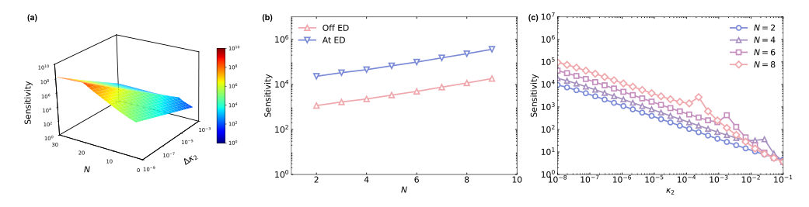 
FIG. 4. Sensing performance of the double-chain Hatano-Nelson system. (a) Sensitivity S as a function of perturbation strength ∆κ2 for various system sizes N. (b) Sensitivity S versus lattice size N at a fixed target signal ∆κ2 = 10−8, comparing the At-ED and Off-ED (κ2 = 10−6) operating regimes. (c) Sensitivity S as a function of background bias κ2 for different system sizes N in the Off-ED configuration. All results are obtained under open boundary conditions.

📷 Fig 5

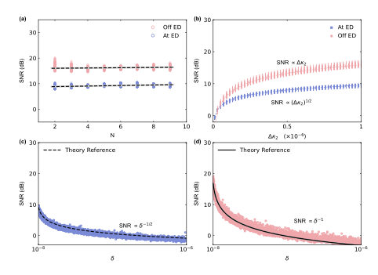 
FIG. 5. Signal-to-noise ratio (SNR) comparison between the At-ED and Off-ED operating regimes. (a) SNR as a function of system size N at a fixed noise level δ = 10−8 for the At- ED and Off-ED (κ2 = 10−6) configurations, where dashed lines indicate the respective ensemble means. (b) SNR as a function of the target signal strength ∆κ2 at δ = 10−8. (c) SNR as a function of noise level δ at the strict ED point, with the dashed line showing the theoretical δ−1/2 scaling. (d) Corresponding SNR versus δ in the Off-ED regime, with the solid line showing the theoretical δ−1 scaling.

**Summary.** This paper tackles the fundamental trade-off between extreme sensitivity and noise immunity in non-Hermitian quantum sensors. By proposing an 'Off-ED' operating regime, the authors show how to move away from a mathematically singular point to achieve a vastly superior, linearly scaling Signal-to-Noise Ratio (SNR). This establishes a robust framework for practical, high-performance topological sensing devices.

**Why it may be interesting.** This work provides a concrete, actionable paradigm for designing next-generation topological sensors by offering a method to bypass fundamental noise limitations inherent at idealized singular points.

Detailed structure

**Main problem.** The central challenge addressed is reconciling the extreme sensitivity of non-Hermitian sensors with the simultaneous amplification of environmental noise (the sensitivity-noise trade-off).

**Main result.** The authors propose an 'Off-ED' operating regime that eliminates pathological geometric singularities, restoring a linear scaling law for the Signal-to-Noise Ratio (SNR) while preserving exponential sensitivity scaling.

**Method.** The analysis involves comparing the performance at the strict Exceptional Deficiency (ED) limit versus operating slightly away from it (Off-ED), using noise matrix analysis and scaling law derivations.

**Model / system.** The system is a double-chain Hatano-Nelson model featuring unidirectional interlayer coupling, analyzed using a non-Hermitian Hamiltonian with an off-diagonally asymmetric block structure.

**Key observables.** Signal-to-Noise Ratio (SNR), spectral splitting ($\Delta E_n$), Eigenspace Cosine Similarity ($C$), and the background bias ($\kappa_2$).

**Important parameters / regimes.** Exceptional Deficiency (ED) limit, Off-ED regime, disorder strength ($\alpha$), and noise magnitude ($\delta$).

**Assumptions / limitations.** The analysis relies on the highly asymmetric interlayer coupling condition and the ability to model noise via a global noise matrix.

**Figures summary.** Figures compare SNR scaling ($	ext{SNR} \propto \delta^{-1/2}$ vs. $	ext{SNR} \propto \delta^{-1}$) and show the structural robustness of the system under varying levels of spatial disorder.

**Paper structure.** The paper systematically analyzes the trade-off by first establishing the ED limit's limitations, then introducing the Off-ED framework to restore linear noise scaling, and finally demonstrating this improvement across various noise channels and disorder levels.

Abstract

A central challenge in non-Hermitian sensing is that spectral singularities simultaneously amplify both the signal and environmental noise. We address this predicament in a double-chain Hatano-Nelson model featuring unidirectional interlayer coupling. At the exceptional deficiency (ED) limit, the system exhibits a macroscopically degenerate complex spectrum and a pronounced non-Hermitian skin effect (NHSE), yielding a sensitivity that scales exponentially with lattice size $N$ while remaining robust across a six-order-of-magnitude detuning range. By introducing diagonal spatial disorder, we demonstrate that the NHSE is progressively suppressed, whith eigenspace cosine similarity analysis quantifying a well-defined fault-tolerance threshold. To reconcile the sensitivity-noise trade-off, we delineate "At-ED" and "Off-ED" operating regimes. While the At-ED configuration imposes fractional-order noise amplification (SNR $\propto δ^{-1/2}$) that saturates at a suboptimal plateau, migrating to the Off-ED regime eliminates this geometric singularity and restores a linear scaling law (SNR $\propto δ^{-1}$), achieving an SNR enhancement of several orders of magnitude. Crucially, this improvement is achieved while fully preserving the exponential sensitivity scaling, albeit at a slightly reduced absolute sensitivity compared to the strict At-ED limit. Our findings establish the Off-ED framework as a concrete paradigm for next-generation topological sensors that reconcile extreme sensitivity with robust noise immunity.

[↑ back to top](#top)

### [$η$-pairing in metallic and particle-hole asymmetric systems](http://arxiv.org/abs/2606.05092v1)

**Authors:** Philipp Werner, Aaram J. Kim, Lei Geng  
**Type:** theory · **Category:** strongly correlated electrons · **PDF:** <https://arxiv.org/pdf/2606.05092v1>  
**Analysis basis:** full PDF text, analyzed in chunks
**Topic relevance:** `Keldysh / 2PI / non-Gaussian methods` **3/5** · `methods for driven-dissipative` **3/5** · `non-equilibrium dynamics` **3/5** · `analog quantum simulation` **1/5** · `driven-dissipative phase transition` **1/5** · `non-equilibrium universality` **1/5**

📷 Fig 1

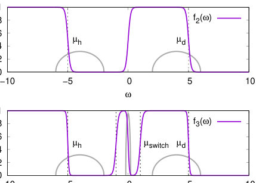 
FIG. 1: Top panel: Illustration of a nonequilibrium distribu- tion function f2(ω) with two Fermi edges at µd and µh and a 1 −fFermi type switching near ω = 0. Bottom panel: Illus- tration of a nonequilibrium distribution function f3(ω) with three Fermi edges at µd, 0 and µh, and two 1 −fFermi type switchings near ω = ±µswitch. The gray lines are sketches of a Mott insulating (top panel) and metallic (bottom panel) density of states.

📷 Fig 2

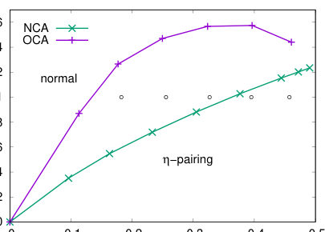 
FIG. 2: Phase diagram of the half-filled Hubbard model with U = 8 in the space of doublon density (= holon density) and effective temperature Teff. The green and violet crosses show the effective critical temperatures Tc,effcalculated with NCA and OCA, respectively, while the black dots mark rep- resentative parameter sets used below to study the effect of particle-hole asymmetry.

📷 Fig 3

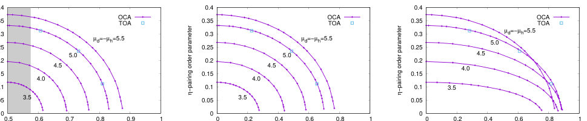 
FIG. 3: η-pairing order parameter as a function of filling nσ (left panel), doublon-holon asymmetry nd −nh (middle panel) and relative doublon-holon asymmetry (nd−nh)/(nd+nh) (right panel) for the indicated values of µd = −µh (U = 8, βd = βh = 10). The violet crosses are OCA results. For µd = −µh = 5.0, we also show three data points obtained with the TOA.

📷 Fig 4

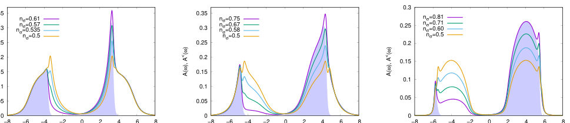 
FIG. 4: OCA spectral functions A(ω) (lines) and occupations A&lt;(ω) (shading, for the largest asymmetry only) for η-pairing states with βd = βh = 10. The effective chemical potentials are µd = −µh = 3.5 (left panel), µd = −µh = 4.5 (middle panel) and µd = −µh = 5.5 (right panel), while the fillings nσ are indicated in the labels.

📷 Fig 5

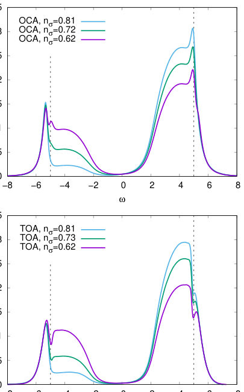 
FIG. 5: OCA and TOA spectral functions for βd = βh = 10, µd = −µh = 5.0 (vertical dashed lines) and three different fillings nσ.

**Summary.** This theoretical work explores $\eta$-pairing superconductivity in correlated materials driven out of equilibrium by light. Using nonequilibrium DMFT, the authors find that while $\eta$-pairing is robust against charge imbalance in strongly correlated regimes, any asymmetry in the effective doublon and holon temperatures significantly suppresses the superconducting order parameter.

**Why it may be interesting.** The use of nonequilibrium DMFT to study photo-induced pairing mechanisms provides a powerful theoretical tool for understanding non-equilibrium quantum phenomena in correlated materials, bridging concepts from quantum optics and condensed matter theory.

Detailed structure

**Main problem.** The study investigates the existence and robustness of $\eta$-pairing superconductivity in non-particle-hole symmetric and photo-excited metallic systems, extending beyond previous studies limited to symmetric Mott insulators.

**Main result.** $\eta$-pairing is robust against changes in total filling and doublon-holon imbalance in the strongly correlated regime, but the order parameter is strongly suppressed by asymmetry in effective doublon and holon temperatures.

**Method.** The authors employ nonequilibrium Dynamical Mean Field Theory (DMFT) combined with strong-coupling impurity solvers up to third order to model the non-equilibrium dynamics.

**Model / system.** The system is modeled using the single-band Hubbard model on the Bethe lattice, focusing on photo-doped Mott insulators and correlated metallic states.

**Key observables.** $\eta$-pairing order parameter, effective critical temperature ($T_{c, 	ext{eff}}$), doublon and holon densities, and effective doublon/holon temperatures.

**Important parameters / regimes.** Strongly correlated regime, large Mott gap, low effective doublon/holon temperatures, and the degree of particle-hole asymmetry.

**Assumptions / limitations.** The analysis relies on imposing nonequilibrium distribution functions corresponding to effective doublon and holon temperatures, and the use of specific strong-coupling solvers (NCA, OCA, TOA).

**Figures summary.** Figures illustrate nonequilibrium distribution functions for gapped vs. metallic states, phase diagrams showing $T_{c, 	ext{eff}}$ dependence on filling and temperature, and spectral functions comparing different theoretical approximations.

**Paper structure.** The paper progresses by first establishing the theoretical framework in the particle-hole symmetric limit, then extending the analysis to non-symmetric, photo-doped metallic states, and finally detailing the robustness and suppression mechanisms related to charge imbalance and temperature asymmetry.

Abstract

Light-induced superconducting-like states have been reported in several classes of correlated materials. From a theoretical point of view, the induction of $η$-pairing is a promising route to nonthermal superconductivity. Numerical studies of photo-doped Mott systems revealed $η$-pairing states with very high effective critical temperatures. These investigations were however restricted to particle-hole symmetric states in large-gap Mott insulators, while the experiments were performed on strongly correlated metallic systems. It is thus relevant to explore if $η$-pairing also exists in non-particle-hole symmetric setups and in photo-excited metallic states. Here we use steady-state nonequilibrium dynamical mean field theory combined with a strong-coupling impurity solver up to third order to investigate this issue. We find that in the strongly correlated regime with large Mott gap, and for low effective doublon and holon temperatures, $η$-pairing is robust against changes in the total filling and an imbalance in the doublon and holon density. An asymmetry in the effective doublon and holon temperatures can however strongly suppress the order parameter. In photo-doped metallic systems with a three-peak structure in the local density of states, $η$-pairing can be realized in set-ups with positive doublon and holon temperatures and a population inversion in the low-energy quasi-particle band.

[↑ back to top](#top)

### [Measuring Entanglement in Qubit System](http://arxiv.org/abs/2606.05056v1)

**Authors:** Vignesh S, Tabish Qureshi  
**Type:** theory · **Category:** quantum information and computing · **PDF:** <https://arxiv.org/pdf/2606.05056v1>  
**Analysis basis:** full PDF text, analyzed in chunks
**Topic relevance:** `entanglement & information structure` **3/5** · `interference shaping light` **3/5** · `quantum measurements` **2/5** · `analog quantum simulation` **1/5** · `correlated / nonlocal dissipation` **1/5** · `quantum optics experiment` **1/5** · `spintronics-quantum-optics interface` **1/5**

📷 Fig 1

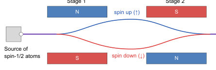 
FIG. 1. Modified Stern-Gerlach interferometer for using the spin states as path markers. The spin, in addition, is en- tangled with an ancilla qubit. Another Stern-Gerlach setup is employed after this stage (no shown) with field in the x- direction, to implement quantum erasure before final detec- tion.

📷 Fig 2

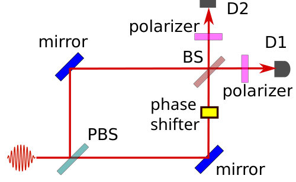 
FIG. 2. Mach–Zehnder interferometer geometry. PBS1 cre- ates two path amplitudes |ψ1⟩, |ψ2⟩, BS2 recombines them, and output polarizers enable quantum-eraser post-selection before detection at D1, D2.

**Summary.** This paper presents a novel, operational method to measure entanglement in qubit systems by analyzing interference experiments. It demonstrates that the entanglement content can be extracted directly from the measurable asymmetry observed in the output channels of both spin and photon interferometers. This unifies the understanding of decoherence, quantum erasure, and entanglement estimation into a single, compact framework.

**Why it may be interesting.** This work provides a powerful, unified theoretical tool linking fundamental concepts like entanglement, decoherence, and quantum erasure into a single, experimentally testable diagnostic based on interference asymmetries.

Detailed structure

**Main problem.** The paper aims to develop an operational and experimentally accessible method to quantify entanglement in qubit systems using interferometric measurements.

**Main result.** It establishes a unified framework showing that entanglement, coherence loss, and quantum erasure are all governed by the same underlying correlation structure, allowing concurrence to be calculated directly from measurable output channel asymmetries.

**Method.** The analysis uses a tripartite description involving paths, an internal qubit degree of freedom, and ancillary states, deriving the entanglement measure (concurrence) from the measured asymmetry of the output channels after quantum erasure.

**Model / system.** The theory is applied to two distinct physical platforms: a modified Stern-Gerlach interferometer for spin-1/2 particles and a Mach-Zehnder interferometer for polarization-carrying photons.

**Key observables.** The measurable asymmetry of the two output channels, which is directly related to the overlap of ancilla states ($	ext{Re}\langle\alpha|eta
angle$) and determines the concurrence.

**Important parameters / regimes.** The overlap parameter $s = \langle\alpha|eta
angle$ and the resulting concurrence $C_2 = 1 - |\langle\alpha|eta
angle|^2$.

**Assumptions / limitations.** The analysis assumes the ability to perform quantum erasure via measurement in a complementary basis and that the ancillary degree of freedom, while potentially inaccessible, dictates the measurable correlation structure.

**Figures summary.** Figure 1 illustrates the modified Stern-Gerlach setup using spin states, while Figure 2 details the Mach-Zehnder interferometer geometry incorporating polarization post-selection for quantum erasure.

**Paper structure.** The paper first introduces the tripartite model, applies it to the spin and photon interferometers, derives the relationship between the measured asymmetry and the overlap parameter, and finally establishes the universal operational entanglement law $C_2 = 1 - A^2$.

Abstract

An operational way of measuring entanglement in a balanced two-path interferometers is presented, where path information is carried by some internal degree of freedom which, in turn, gets entangled with an ancilla system. The analysis is based on a tripartite description involving paths, an internal qubit degree of freedom, and some ancillary states entangled with the internal degree of freedom. It is then applied to two physically distinct experimental situations: a modified Stern-Gerlach interferometer with spin-1/2 particles and a Mach-Zehnder interferometer with photons carrying polarization. The ancilla degree of freedom may not be experimentally accessible. Tracing out the ancillary system, and employing a quantum erasing procedure based on the internal degree of freedom, it is demonstrated that a concurrence-based measure of the entanglement, between the internal degree of freedom and the ancilla, can be extracted directly from measurable asymmetry of the two output channels. These results show that loss of coherence, quantum erasure, and entanglement estimation in interferometric experiments arise from the same underlying correlation structure and provide a compact experimentally accessible framework for quantifying entanglement in qubit systems.

[↑ back to top](#top)

### [Quantum simulations of ultrafast optical spectroscopy of semiconductors on digital quantum computers in the semi-classical approximation](http://arxiv.org/abs/2606.04295v1)

**Authors:** Mykhailo Klymenko, Bahar Goldozian, Thong Hoang, Jared H. Cole, Muhammad Usman  
**Type:** theory · **Category:** quantum information and computing · **PDF:** <https://arxiv.org/pdf/2606.04295v1>  
**Analysis basis:** full PDF text, analyzed in chunks
**Topic relevance:** `methods for driven-dissipative` **3/5** · `non-equilibrium dynamics` **3/5** · `Keldysh / 2PI / non-Gaussian methods` **2/5** · `analog quantum simulation` **1/5** · `correlated / nonlocal dissipation` **1/5** · `driven-dissipative phase transition` **1/5** · `non-equilibrium universality` **1/5**

📷 Fig 1

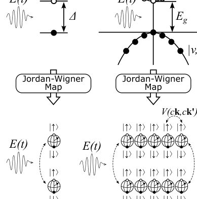 
FIG. 1. Mapping spectroscopic experiments onto qubit Hamiltonian simulations for (a) a two-level system and (b) a direct-band two-band semiconductor. In the semiclassical ap- proximation, light–matter interactions are modeled through time-dependent induced dipole moments and implemented on a quantum computer using parameterized entangling two- qubit gates.

📷 Fig 2

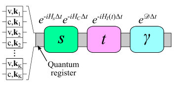 
FIG. 2. Quantum circuit diagram for one Trotter step of the Hamiltonian simulation

📷 Fig 3

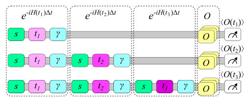 
FIG. 3. Example quantum circuit for semiconductor time- domain spectroscopy simulations for N = 3 time steps. The gray ribbon denotes the quantum register of size 2K, where K is the number of wave vectors in the discretized Brillouin zone, and the factor of two corresponds to the number of energy bands.

📷 Fig 4

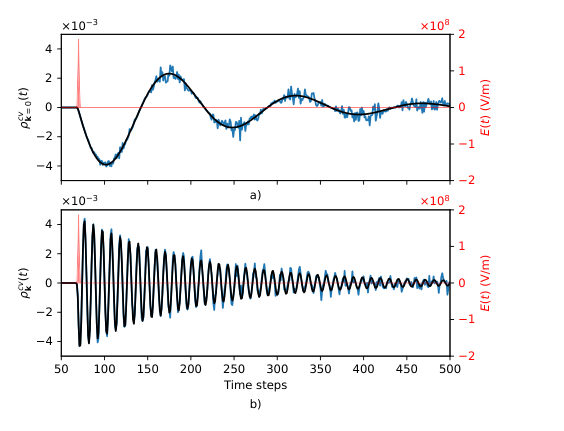 
FIG. 5. Comparison of classical (black line) and quantum (blue line) simulations of the time evolution of the microscopic polarization for two wave vectors: (a) k = 0 nm−1 and (b) k = 5 nm−1 in a noiseless environment using 104 shots. The red trace indicates the temporal profile of the probe pulse.

📷 Fig 5

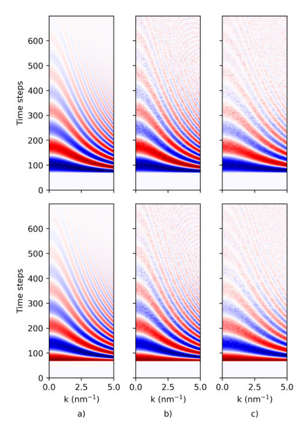 
FIG. 4. Real (upper row) and imaginary (bottom row) parts of the microscopic polarization in semiconductor medium in- duced by an ultra-short Gaussian optical pulse. The results are presented for a) classical simulations, b) noiseless quan- tum simulations, and c) quantum simulations with realistic noise models.

**Summary.** This work establishes a quantum simulation framework to model how semiconductors interact with ultrafast light pulses. By mapping the complex fermionic dynamics onto qubits, it allows for benchmarking quantum computers against established classical methods. The results demonstrate the framework's capability while critically analyzing the impact of realistic hardware noise on spectroscopic measurements.

**Why it may be interesting.** It provides a concrete, physically motivated application for quantum computation—simulating complex, non-equilibrium quantum dynamics—and directly addresses the challenges of noise in near-term quantum hardware.

Detailed structure

**Main problem.** Developing a digital quantum simulation framework to model ultrafast optical spectroscopy in semiconductor materials.

**Main result.** The framework successfully simulates key spectroscopic features (absorption/gain) and shows quantitative agreement with classical methods in the noiseless limit, while also characterizing the impact of realistic NISQ noise.

**Method.** The simulation maps the fermionic Hamiltonian onto qubits using the Jordan-Wigner transformation and evolves the system using the Suzuki-Trotter formula for time evolution.

**Model / system.** The system is semiconductor materials (e.g., GaAs) modeled by a Hamiltonian including kinetic, Coulomb, and time-dependent light-matter interaction terms. The dynamics are treated as an open quantum system.

**Key observables.** Induced dipole moment/polarization, electric susceptibility $\chi(\omega)$, and the linear absorption/optical gain spectra $\alpha(\omega)$.

**Important parameters / regimes.** Ultrafast time scales, finite temperatures ($T=3$ K to $T=30$ K), and the presence of realistic hardware noise.

**Assumptions / limitations.** The semiclassical approximation is used (classical field, quantum matter), and the simulation often relies on the quasi-equilibrium approximation for temperature effects.

**Figures summary.** Figures compare microscopic polarization and linear absorption spectra across classical, noiseless quantum, and noisy quantum simulations for GaAs, illustrating the effect of noise and temperature.

**Paper structure.** The paper progresses from defining the physical problem and Hamiltonian, detailing the theoretical mapping to qubits (JWT), outlining the time evolution via Trotterization, and finally presenting comparative results across different noise and temperature regimes.

Abstract

We present a digital quantum simulation framework for ultrafast optical spectroscopy of semiconductor materials. The framework is based on Brillouin-zone discretization and the second-quantization formalism, and is designed as a quantum alternative to classical simulations based on the semiconductor Bloch equations. Its current capabilities include quantum simulations of linear absorption and optical gain spectra, incorporating Lorentzian broadening, finite-temperature band-filling effects, and reduced-dimensionality effects. Benchmark comparisons with classical simulations for GaAs demonstrate quantitative agreement in the noiseless limit. The inclusion of realistic hardware noise of NISQ-era quantum computers effectively manifests itself as an additional source of scattering processes, resulting in increased spectral broadening. While no exponential quantum advantage is expected in the single-particle approximation, the framework naturally extends to many-body regimes where classical simulations face the hierarchy problem and exponential scaling and provable quantum advantage will be possible. The quantum simulations considered in this work capture central elements of semiconductor spectroscopy, the aspects such as open quantum systems, light-matter interactions, statistical mechanics, non-equilibrium quantum dynamics, and many-body physics. As such, it provides a physically motivated and scalable model for benchmarking quantum computers in applications to complex, real-world problems.

[↑ back to top](#top)

### [Cooper quartets and fractional vortices in frustrated Josephson junction dice arrays](http://arxiv.org/abs/2606.04958v1)

**Authors:** Erik Lennart Weerda, Olav F. Syljuåsen, Matteo Rizzi, Michele Burrello  
**Type:** theory · **Category:** statistical mechanics · **PDF:** <https://arxiv.org/pdf/2606.04958v1>  
**Analysis basis:** full PDF text, analyzed in chunks
**Topic relevance:** `analog quantum simulation` **3/5** · `methods for driven-dissipative` **2/5** · `Keldysh / 2PI / non-Gaussian methods` **1/5** · `driven-dissipative phase transition` **1/5** · `exotic spin models in light-matter` **1/5**

📷 Fig 1

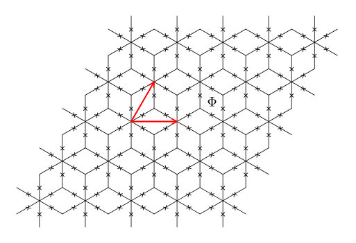 
Figure 1. Illustration of a JJA in dice lattice geometry. The red arrows show the unit-cell vectors. By applying a perpendicular magnetic field to the array, a magnetic flux Φ can be threaded through every plaquette.

📷 Fig 2

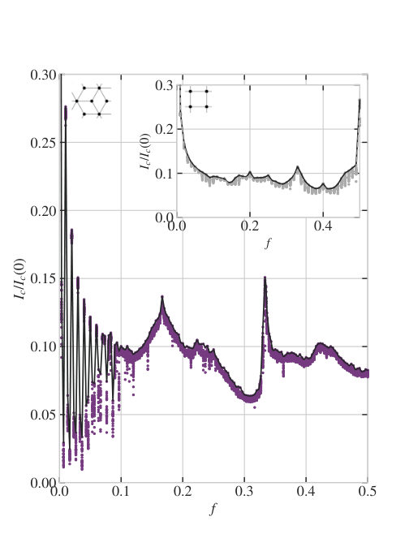 
Figure 2. Critical currents as a function of frustration f for a 50 × 50 dice lattice calculated using the phase-bias relaxation method. The inset shows corresponding results for a 100×100 square lattice. The critical currents are normalized by Ic(0). Each purple dot shows the critical current obtained from a single phase configuration. A lower bound on the true critical current can be estimated by taking the maximum of these values (black line). The fringes at low values of f are finite- size effects.

📷 Fig 3

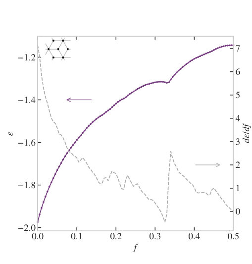 
Figure 3. Energy per island (colored curve) and its derivative (grey) vs. f for a 50×50 dice lattice without source and drain islands, i.e. free boundary conditions, obtained by simulated annealing and a subsequent relaxation step, see App. A.

📷 Fig 4

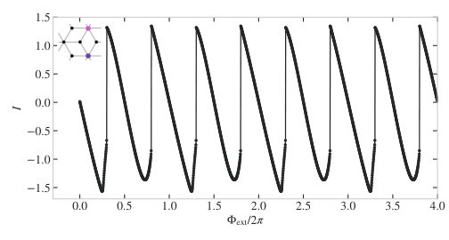 
Figure 4. Typical current-phase relation for f = 1/3 for a phase-biased supercurrent between source (purple) and drain (pink) islands situated in the middle of a 50 × 50 dice lattice. I is expressed in units of 2e

📷 Fig 5

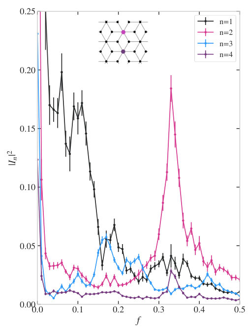 
Figure 5. Harmonics of the supercurrent across a single rhom- bus as a function of f. The source and drain islands for this supercurrent are highlighted in purple (source) and pink (drain) in the inset. These islands are situated in the middle of a 50 × 50 dice lattice, and the supercurrent is determined by the introduction of a phase bias between them, see App. A. Points and error bars indicate the mean and standard error of the mean from 100 independent simulations for each value of f.

**Summary.** This paper analyzes superconducting behavior in frustrated Josephson junction dice arrays, predicting that the system enters a $4e$ superconducting phase when frustrated at $f=1/3$. By using advanced numerical and theoretical methods, the authors confirm this $4e$ state through the dominance of the second supercurrent harmonic and the algebraic decay of the corresponding correlation function.

**Why it may be interesting.** The work provides a concrete, tunable platform (JJ arrays) to study fractional charge carriers and topological order, bridging concepts from superconductivity, frustrated magnetism, and quantum phase transitions.

Detailed structure

**Main problem.** The study investigates the emergence of exotic superconducting phases mediated by Cooper quartets ($4e$) in frustrated Josephson junction (JJ) dice arrays.

**Main result.** The critical current peaks at a frustration of $f=1/3$ are linked to a superconductor-insulator transition compatible with half-vortex deconfinement, confirming the onset of a $4e$ superconducting phase.

**Method.** The research employs a combination of numerical simulations (relaxation dynamics), Monte Carlo techniques, and advanced theoretical tools like infinite tensor networks and Renormalization Group (RG) analysis.

**Model / system.** The system is a Josephson junction array (JJA) on a dice lattice, modeled by an XY Hamiltonian. The analysis focuses on the effect of magnetic frustration ($f$) and the competition between $2e$ (Cooper pair) and $4e$ (Cooper quartet) superconducting correlations.

**Key observables.** Critical current ($I_c$), critical temperature ($T_c$), supercurrent harmonics ($I_1$ vs $I_2$), and correlation functions ($	ilde{C}_{2e}(r)$ vs $	ilde{C}_{4e}(r)$).

**Important parameters / regimes.** Magnetic frustration ($f$), charging energy ($E_C$), Josephson energy ($E_J$), and temperature ($T$).

**Assumptions / limitations.** The analysis often assumes negligible charging energy for the classical XY model description, though later sections incorporate $E_C$ effects.

**Figures summary.** Figures illustrate the dice lattice geometry, the dominance of the $I_2$ (quartet) component at $f=1/3$, and the algebraic decay of the $4e$ correlation function ($	ilde{C}_{4e}(r)$).

**Paper structure.** The paper progresses from establishing the physical model and analyzing the critical current dependence on frustration ($f$), to characterizing the supercurrent harmonics ($I_1$ vs $I_2$), and finally delving into the quantum nature using correlation functions and RG analysis to confirm the $4e$ phase.

Abstract

Superconductivity mediated by Cooper quartets of charge 4e is a phenomenon of key importance for both the understanding of certain exotic superconductors and the engineering of quantum memories protected at the hardware level by topological order. Josephson junction arrays in the shape of the dice lattice constitute one of the main candidates for the realization of this phase of matter. Here, we analyze numerical signatures of the emergence of this exotic phase when superconducting dice arrays are frustrated by inserting one third of a flux quantum per rhombic plaquette. We adopt simulations of relaxation dynamics to study the critical current of such devices and analyse the Fourier decomposition of their bulk supercurrents. A further characterization of these systems at finite temperature is obtained through Monte Carlo techniques and two-dimensional infinite tensor networks. Our results indicate that the observed peaks of the critical current and temperature at frustration 1/3 correspond to a superconductor-insulator phase transition compatible with the deconfinement of half-vortices, while the low-temperature correlation functions of the model confirm the onset of a 4e superconducting phase mediated by Cooper quartets. We finally address the effects of Josephson energy and flux disorder typical of experimental arrays, and comment on the role of charging energies in the corresponding two-dimensional quantum model.

[↑ back to top](#top)

### [Fermionic non-Gaussianity via Bell sampling: monotones and efficient quantum algorithms](http://arxiv.org/abs/2606.05066v1)

**Authors:** Poetri Sonya Tarabunga  
**Type:** theory · **Category:** quantum information and computing · **PDF:** <https://arxiv.org/pdf/2606.05066v1>  
**Analysis basis:** full PDF text, analyzed in chunks
**Topic relevance:** `entanglement & information structure` **3/5** · `Keldysh / 2PI / non-Gaussian methods` **2/5** · `analog quantum simulation` **1/5** · `quantum measurements` **1/5**

📷 Fig 1

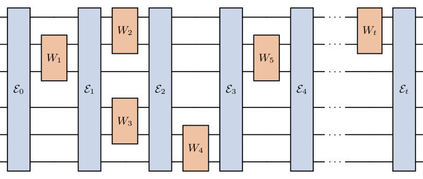 
FIG. 1. A t-doped Gaussian protocol. Blue boxes E0, E1, . . . , Et denote arbitrary Gaussian protocols, possibly with post-selection; orange boxes W1, W2, . . . , Wt are non-Gaussian gates, each acting on two qubits (four Majorana modes) in arbitrary locations.

**Summary.** This work develops a resource theory for fermionic non-Gaussianity using the 'bridge degree' monotone, derived from the eigenvalue structure of a specific operator accessible via Bell sampling. It proves this degree is irreversible under Gaussian operations, yielding strong lower bounds for tasks like state preparation. The paper culminates in efficient, sample-efficient quantum algorithms to test for Gaussianity and certify the 2-design property using this measure.

**Why it may be interesting.** It provides a concrete, measurable, and theoretically robust resource measure (the bridge degree) for fermionic quantum computation, directly linking structural properties to computational resource costs.

Detailed structure

**Main problem.** The paper aims to quantify fermionic non-Gaussianity, which is a crucial resource for achieving quantum computational advantage beyond classical simulation capabilities.

**Main result.** They introduce the 'bridge degree' as a novel, computable, and irreversible non-Gaussianity monotone, establishing strong lower bounds on the non-Gaussian gate cost for state preparation and 2-design certification.

**Method.** The analysis centers on the eigenvalue structure of the 'bridge operator' ($\Lambda$) acting on two copies of the fermionic state, which is accessible via Bell sampling measurements.

**Model / system.** The system is based on fermionic quantum computation, utilizing fermionic Gaussian unitaries (matchgates) acting on $n$-mode fermionic states, often restricted to 'even' states.

**Key observables.** Bridge degree ($\Lambda_d(\psi)$), approximate bridge degree ($\Lambda_{d,\epsilon}(\psi)$), and the bridge spectral distribution ($p_\psi(\lambda)$).

**Important parameters / regimes.** The complexity scales are related to $n$ (number of modes), $\epsilon$ (approximation error), and $\delta$ (failure probability).

**Assumptions / limitations.** The primary assumption is that the resource theory framework can be successfully mapped onto the eigenvalue structure of the bridge operator, and that Bell sampling provides an efficient measurement tool.

**Figures summary.** Not specified, but the notes reference TABLE I summarizing various non-Gaussianity monotones and their properties.

**Paper structure.** The paper develops the bridge degree monotone, proves its monotonicity under Gaussian protocols (establishing irreversibility), derives lower bounds for state preparation and 2-design costs, and finally presents efficient Bell-sampling algorithms for testing Gaussianity and 2-design properties.

Abstract

Fermionic non-Gaussianity is an essential resource for unlocking the full computational power of fermionic quantum platforms. In this work we develop monotones and efficient quantum algorithms for fermionic non-Gaussianity, all built on the eigenvalue structure of the operator $Λ= \sum_{j=1}^{2n}γ_j\otimesγ_j$ defined on two copies of an $n$-mode fermionic state, accessible via Bell sampling. In particular, we introduce the \emph{bridge degree} of even pure states, a novel non-Gaussianity monotone defined as the largest eigenvalue sector of $Λ$ populated by two copies of the state. Our key technical result is that the bridge degree is non-increasing under post-selected Gaussian protocols, which yields no-go theorems for Gaussian conversion stronger than those obtainable from previously known monotones and shows that the resource theory of fermionic non-Gaussianity is irreversible in the exact-conversion setting. Beyond this, the bridge degree exhibits several further features: it (i) is easy to compute, (ii) is efficiently witnessed through Bell sampling, (iii) lower-bounds the non-Gaussian gate complexity of state preparation, (iv) controls the non-Gaussian gate complexity of producing quantum state designs, and (v) naturally extends to mixed states via the Choi--Jamiołkowski isomorphism. We further develop an approximate variant together with an efficiently measurable lower bound, yielding an experimentally certifiable lower bound on the non-Gaussian cost of approximately preparing any state, based directly on Bell-sampling data. Finally, the same eigenvalue structure underlies two Bell-sampling-based algorithmic primitives, both with polynomial sample complexity: a two-copy Gaussianity test with perfect completeness, optimal among two-copy tests sharing this property, and a test for the state $2$-design property of matchgate-invariant ensembles.

[↑ back to top](#top)

### [High-Dimensional Quantum Key Distribution via full Core-mode Encoding over Deployed Multicore Fibers](http://arxiv.org/abs/2606.04211v1)

**Authors:** G. H. dos Santos, K. B. Sawada, N. Villalba, C. Jara, N. Guerrero, C. Melo, M. H. Magiotto, D. Martínez, G. B. Xavier, J. Cariñe, G. Saavedra, E. S. Gómez, S. P. Walborn, G. Lima  
**Type:** experiment · **Category:** quantum information and computing · **PDF:** <https://arxiv.org/pdf/2606.04211v1>  
**Analysis basis:** full PDF text, analyzed in chunks
**Topic relevance:** `QC/QI experiment` **3/5** · `quantum optics experiment` **3/5** · `interference shaping light` **1/5**

📷 Fig 1

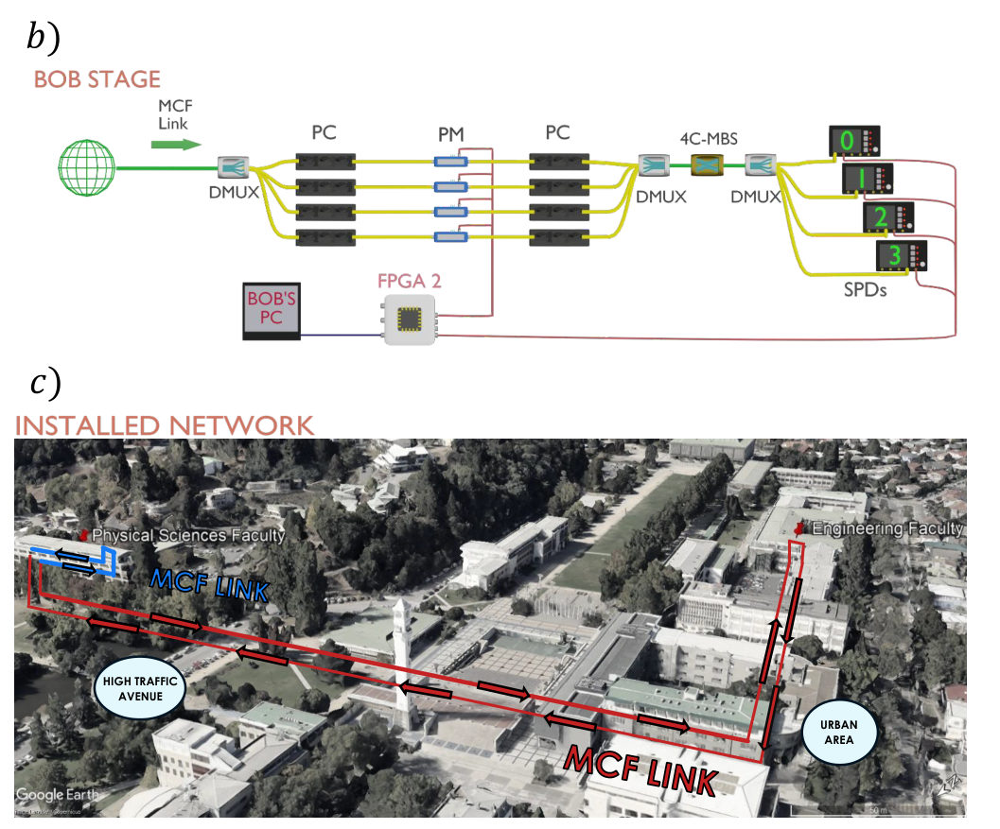 
FIG. 1. Schematic of the core-encoded four-dimensional QKD system and network. Alice (a) prepares four-dimensional qudit states; Bob (b) measures them in two different bases. (c) The states are transmitted through different links of an MCF network installed over the campus of the Universidad de Concepci´on, Chile. PC: Polarization Controller; PM: Phase Modulator; IM: Intensity Modulator; Att: Optical Attenuator; MCF: Multicore Fiber; MUX/DMUX: MCF Multiplexer/Demultiplexer; 4C- MBS: Four-Core Multiport Beam Splitter; SPD: Single-Photon Detector.

📷 Fig 2

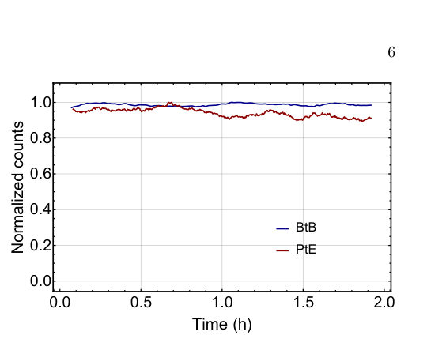 
FIG. 2. Polarization stability of the deployed links. Nor- malized single-photon count rate, integrated in 100ms bins, recorded with a fixed polarization analyzer for the back- to-back (BtB) configuration and the installed Physics-to- Engineering (PtE) link. After an initial manual alignment, no active polarization control is applied. The count rate remains stable over more than two hours in both settings, demonstrat- ing that environmental drifts in the laboratory and across the deployed campus link are slow compared with the duration of a typical QKD session.

📷 Fig 3

 
FIG. 3. Characterization of the PtE MCF link. (a) Free evo- lution of the transmitted state over ∼20 s, reconstructed via sequential quantum state tomography (for the first input state defined in Fig. 7). Each projector is integrated for 100 ms, and a full tomographic reconstruction is completed in ∼400 ms. The slow phase drifts induced by thermal and mechanical per- turbations can be seen as unitary rotations of the prepared state, progressively degrading its overlap with the target. (b) Tomographic reconstructions acquired within a single 100 ms interval following the preparation of the same input state, re- peated over 50 independent realizations. The reconstructed states exhibit a mean...

📷 Fig 4

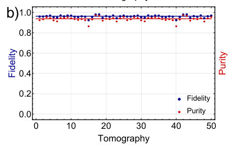 
Fig. 3(a) spans a total time of 20 s of channel evolution. The slow phase drifts can be seen as random rotations on the states prepared by Alice, which leads to errors in Bob’s measurement outcomes and thus an increased QBER in a QKD session. Importantly, we find that these phases are stable over periods of at least 100 ms, which is the key property that makes a 100 ms acquisition window viable. This can be seen in Fig. 3(b), where the tomo- graphies are now performed during the time window of 100 ms after the same Alice’s state has been prepared. A procedure that has been repeated 50 times. In this case, high overall fidelities and purities are obtained for the re- constructed states with...

📷 Fig 5

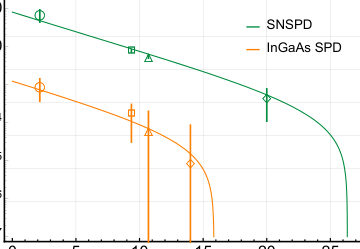 
FIG. 5. Asymptotic key rate (bits/pulse) vs. channel attenua- tion while using InGaAs SPDs and SNSPDs. Points: recorded experimental rates. Curve: asymptotic model. (◦) represents the results for the BtB link; (□) represents the results for the P6 link; (△) represents the results for PtE link and; (♢) rep- resents the results for channels with extra attenuation to test the viability for secret key generation with higher losses. The key generation values are given explicitly in Appendix C.

**Summary.** This paper demonstrates a high-dimensional Quantum Key Distribution (HD-QKD) protocol by directly exploiting all core modes of a multicore fiber network. By achieving a record-high key rate over a deployed campus link, the authors prove that core-mode encoding is a practical and efficient method for building next-generation quantum-secure communication networks.

**Why it may be interesting.** The work directly addresses the practical implementation of quantum communication protocols in existing infrastructure, providing concrete rate benchmarks that are highly relevant to quantum network engineering.

Detailed structure

**Main problem.** To demonstrate high-dimensional quantum key distribution (HD-QKD) with high rates and robustness over deployed, real-world communication infrastructure.

**Main result.** The authors achieved a record finite-key rate of $6.19 	imes 10^{-3}$ bits/pulse at 10 dB loss, establishing core-mode encoding as a viable architecture for high-rate quantum-secure communications.

**Method.** The protocol uses a two-decoy finite-key method, employing inverse Chernoff bounds to estimate the secret key length, which is then applied to experimentally measured detection counts.

**Model / system.** The system utilizes Multicore Fibers (MCFs) as the physical platform, encoding information across the full set of available core modes ($d=4$). The setup involves complex phase and spatial modulation across these multiple cores.

**Key observables.** Composable finite-key rate ($R = 6.19 	imes 10^{-3}$ bits/pulse), Quantum Bit Error Rate (QBER), and state fidelity ($ar{F} = 0.96 \pm 0.01$).

**Important parameters / regimes.** Dimension ($d=4$), Channel Loss (tested at 10 dB), and security parameters ($\epsilon_{sec}, \epsilon_{cor}$).

**Assumptions / limitations.** The analysis uses advanced finite-key bounding techniques (Zhang et al. [27]) that avoid assumptions of Gaussian fluctuation profiles, which is crucial for accuracy.

**Figures summary.** Figures illustrate polarization stability over time, QBER distributions fitted with Beta distributions, and comparisons of achieved key rates against previous state-of-the-art demonstrations.

**Paper structure.** The paper details the physical setup (MCF deployment), the theoretical framework for finite-key rate estimation using decoy states and Chernoff bounds, the experimental measurements across various link lengths, and the final comparison of the achieved rate against benchmarks.

Abstract

Quantum key distribution (QKD) provides information-theoretic security rooted in quantum physics, while high-dimensional (HD) encoding increases both noise tolerance and secret-key yield. Multicore fibers (MCFs), a leading platform for next-generation telecom networks, are a natural substrate for HD-QKD. Field demonstrations over deployed MCFs have so far relied on a hybrid qudit encoding strategy that combines two path (core modes) with the time-bin photonic degree of freedom, rather than exploiting the full set of available core modes. Although practical, this approach incurs intrinsic efficiency penalties that grow with dimension. Here we implement a four-dimensional ($d=4$) QKD protocol that directly exploits the full set of core modes of a four-core MCF, operating over an installed MCF network across the Universidad de Concepción campus under continuous environmental perturbations. We further benchmark the scheme using superconducting nanowire detectors at $10\,$dB channel loss, achieving a composable finite-key rate of $R = 6.19\times 10^{-3}\,$bits/pulse, the highest per-pulse rate reported to date for HD-QKD at comparable loss. This result establishes core-mode encoding as a viable architecture for realistic, high-rate quantum-secure communications.

[↑ back to top](#top)

### [Photon shot-noise-limited Rydberg-EIT electrometry](http://arxiv.org/abs/2606.04354v1)

**Authors:** Gyeongmin Ju, Ye Jin Yu, Heewoo Kim, Hansol Jeong, Jinhyuk Bae, Changhoon Baek, Han Seb Moon  
**Type:** experiment · **Category:** other · **PDF:** <https://arxiv.org/pdf/2606.04354v1>  
**Analysis basis:** full PDF text, analyzed in chunks
**Topic relevance:** `quantum optics experiment` **3/5** · `Rydberg arrays` **1/5** · `analog quantum simulation` **1/5** · `interference shaping light` **1/5** · `quantum measurements` **1/5**

📷 Fig 1

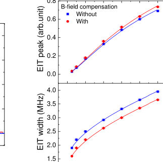 
Fig. 2. Effect of magnetic-field compensation on the Rydberg-EIT response. (a) Measured EIT transmission spectra with (red) and without (blue) magnetic-field compensation, showing linewidth narrowing and increased peak transmission. (b) Dependence of the EIT peak amplitude (top) and linewidth (bottom) on the probe laser power, compared with (red) and without (blue) the compensation. The solid lines represent theoretical fits to the experimental data.

📷 Fig 2

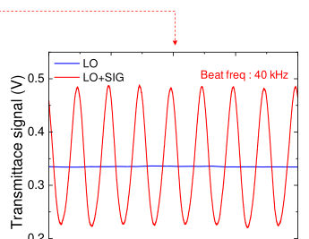 
Fig. 3. Atomic superheterodyne response of the Rydberg-EIT system. (a) Autler- Townes splitting with a strong LO (blue) and with an additional weak signal field (red). (b) Time-domain probe transmission measured at the operating point in (a), showing a clear oscillation at the LO–signal frequency difference (40 kHz), while the LO-only signal remains stable.

📷 Fig 3

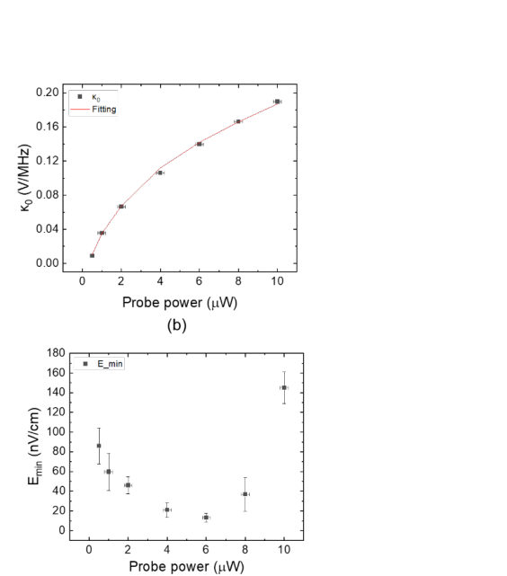 
Fig. 4. Electric-field sensitivity and probe-power optimization. (a) Measured electric- field response using AT splitting (red) and superheterodyne detection (blue), showing linear agreement with the calculated field. (b) Extracted slope of the response as a function of probe power. (c) Minimum detectable signal amplitude. (d) Electric-field sensitivity, exhibiting an optimum at 6 μW near the photon shot-noise limit.

📷 Fig 4

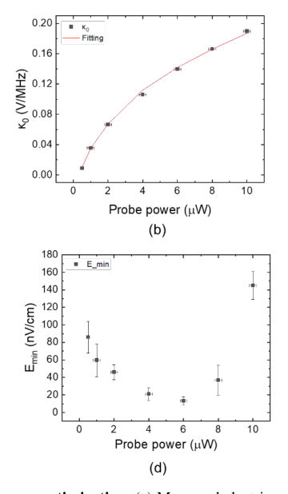 
Figure 5(b) compares the experimentally measured electric-field sensitivity (blue circles) with the calculated PSN limit (red dashed line), as a function of probe power under the experimental temperature condition. The measured sensitivity follows the same overall trend as the calculated shot-noise limit, confirming that the dominant noise source is consistent with

📷 Fig 5

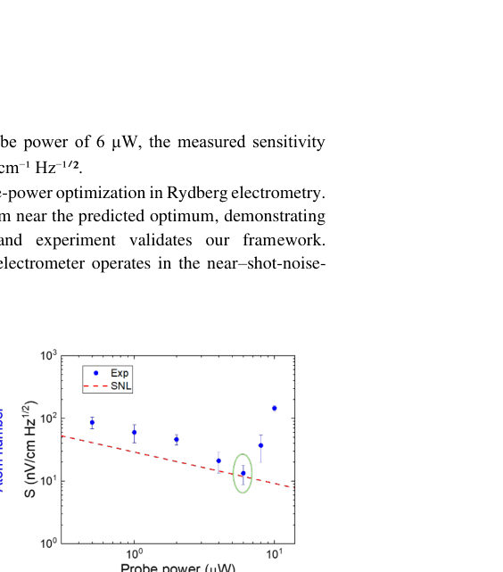 
Fig. 5. Comparison with the photon shot-noise (PSN) limit. (a) Calculated atom number (blue) and PSN-limited sensitivity (red) as a function of vapor-cell temperature. (b) Measured sensitivity (blue) and calculated PSN limit (red dashed line) versus probe power, showing agreement near the optimal operating point. The sensitivity approaches the shot- noise limit near 6 μW (green circle).

**Summary.** This paper reports on the experimental realization of a highly sensitive electric-field sensor using Rydberg-atom Electromagnetically Induced Transparency (EIT) in a rubidium vapor cell. By meticulously engineering the atomic coherence and employing superheterodyne detection, the authors successfully suppressed technical noise sources. They achieved an electric-field sensitivity matching the fundamental photon shot-noise limit, marking a significant step toward practical quantum-limited sensing.

**Why it may be interesting.** This work is highly relevant as it pushes the boundaries of quantum sensing by experimentally verifying the theoretical limit imposed by quantum noise (shot noise) in a complex atomic system, providing a blueprint for quantum-limited measurements.

Detailed structure

**Main problem.** The primary goal is to develop and experimentally demonstrate a highly sensitive quantum electric-field sensor using Rydberg-atom electrometry that approaches the fundamental photon shot-noise limit.

**Main result.** The authors achieved an electric-field sensitivity of 12.5(8) nV cm^-1 Hz^-1/2, which is in close agreement with the calculated photon shot-noise limit, establishing a practical route for quantum-noise-limited sensing.

**Method.** The experiment utilizes a superheterodyne detection scheme applied to Rydberg Electromagnetically Induced Transparency (EIT) in an atomic vapor cell, requiring active compensation of external magnetic and laser noise.

**Model / system.** The system is based on a cascade-type EIT scheme in an 85Rb atomic vapor cell, leveraging the strong, controllable interactions in Rydberg states to enhance the electric-field coupling.

**Key observables.** Electric-field sensitivity (nV cm^-1 Hz^-1/2), EIT linewidth (achieved 1.6 MHz), and the spectral slope ($\kappa_0$) of the EIT response.

**Important parameters / regimes.** Photon Shot-Noise (PSN) limit, Rydberg-EIT linewidth, and the optimal probe power for maximizing signal-to-noise ratio.

**Assumptions / limitations.** The analysis assumes that the dominant noise source limiting sensitivity is the probe-photon shot noise, and that the system can be engineered to minimize technical noise sources like magnetic field fluctuations.

**Figures summary.** Figures illustrate the energy-level diagram and experimental setup, compare EIT spectra with and without magnetic field compensation (showing linewidth narrowing), and detail the superheterodyne time-domain response and the dependence of sensitivity on probe power.

**Paper structure.** The paper progresses by first establishing the basic EIT sensing mechanism, then detailing the necessity and implementation of magnetic field compensation to narrow the linewidth, and finally optimizing the superheterodyne detection scheme to quantify the sensitivity relative to the theoretical PSN limit.

Abstract

Rydberg-atom electrometry is a core technique in the development of highly sensitive quantum electric-field sensors. Its sensitivity based on atom-photon interaction is typically limited by photon shot-noise (PSN) and spectral broadenings. Here, we experimentally demonstrate a near PSN-limited Rydberg electrometry from a 85Rb atomic vapor cell. By engineering atomic coherence through control of residual magnetic fields and laser frequency noise, we achieve the Rydberg electromagnetically induced transparency (EIT) with the narrow linewidth of 1.6 MHz, yielding an enhanced spectral slope for high-sensitivity Rydberg-EIT electrometry. Under optimized superheterodyne detection conditions, we obtain an electric-field sensitivity of 12.5(8) nV cm^-1 Hz^-1/2 at 37 GHz, in close agreement with the calculated PSN limit. These results provide direct experimental evidence of the high-sensitive quantum electrometry and establish a practical route toward quantum-noise-limited Rydberg electrometry.

[↑ back to top](#top)

### [Arbitrary manipulation of nuclear spins in hexagonal boron nitride](http://arxiv.org/abs/2606.04497v1)

**Authors:** Fattah Sakuldee, Mehdi Abdi  
**Type:** theory · **Category:** quantum information and computing · **PDF:** <https://arxiv.org/pdf/2606.04497v1>  
**Analysis basis:** full PDF text, analyzed in chunks
**Topic relevance:** `QC/QI experiment` **3/5** · `spintronics-quantum-optics interface` **3/5**

📷 Fig 1

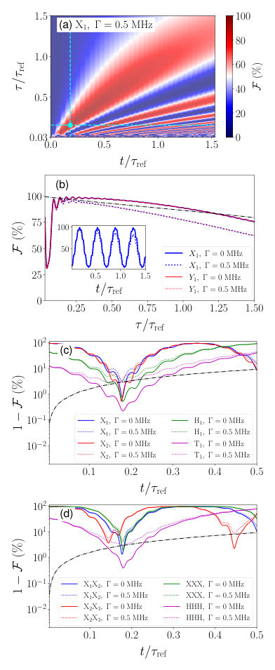 
FIG. 2. (a) Fidelity of gate X1 under dephasing as a function of control period τ and evolution time t, with the cyan dot indicating the global maximum. (b) Fidelity of X1 and Y1 with (dashed) and without (solid) dephasing at the optimal point. The inset shows X1 fidelity dynamics for optimal τ. In (c) and (d), the infidelity profiles 1 −F for various single- and multi-qubit gates are plotted versus evolution time for optimized τ. The black dash-dotted lines in (b) to (d) indicate the infidelity of the identity gate as a reference.

📷 Fig 2

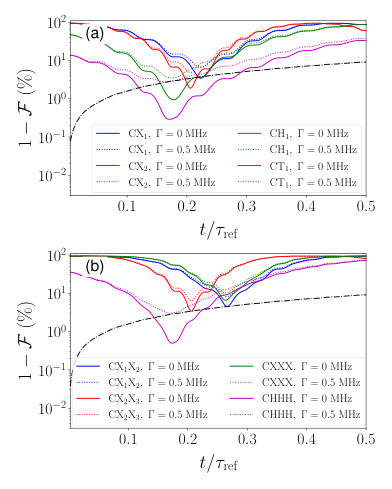 
FIG. 3. The infidelity 1 −F of the single-qubit conditional gates (a) CX1, CX2, CH1, and CT1, (b) the two-qubit gates CX1X2 and CX2X3, and the three-qubit gates CXXX and Hadamard gate CHHH.

📷 Fig 3

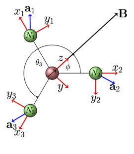 
FIG. 4. A consideration on the cluster of an electron spin (red ball) residing at the vacancy center and three nearest spins (green balls N1 to N3) embedded in VB-hB15N, is en- abled by their strong interactions relative to other terms. An adequately strong magnetic field B is applied in-plane at the angle ϕ from the dangling bond−2 connecting the central spin and the nuclear spin N2, where the effective fields ak are given by the blue arrows. Likewise, θk denotes the angles from the magnetic field direction and the dangling bond−k. For the coordinate of the electron spin operator, we define an axis ˆz in the direction of the magnetic field, whereas we define spin operators in terms of...

📷 Fig 4

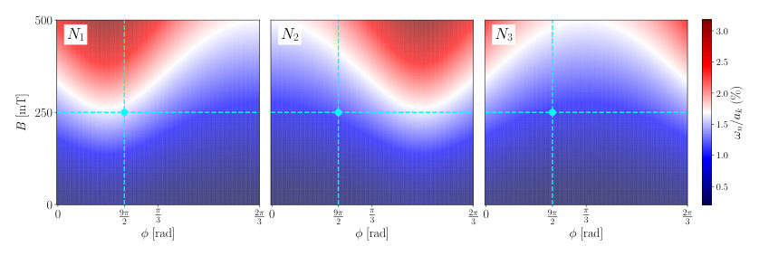 
FIG. 5. The distributions of the ratio ωn/ak for various magnetic field strengths B and its orientation ϕ for nuclear spins N1 to N3. Here one can see the equivalence among the three spins, e.g., the translation of the angle ϕ by π/6 will result in a permutation of the spin labels k. The cyan dashed lines and dots indicate the points corresponding to the B = 250 mT and ϕ = 9π/2 used in the example in our calculation.

📷 Fig 5

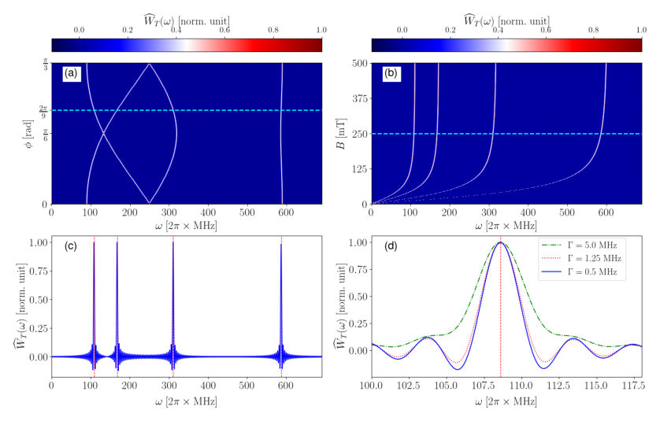 
FIG. 6. The characteristics of the coherence function in the frequency domain c WT (ω) with T ∼1.6 µs in its normalized unit. For a fixed magnetic field strength B = 250 mT and the coherence rate Γ = 0.5 MHz, we can see the distinct peaks (a) for various orientations ϕ except at the points where ϕ is a multiple of π/6, i.e., the magnetic field is parallel or perpendicular to one of the dangling bonds. The distance between two adjacent peaks is larger for the larger magnetic field strength for a fixed angle ϕ = 9π/2 (b), given the coherence rate Γ = 0.5 MHz, reflecting that the strong magnetic field provides more robust separation between two nuclear spins. The peaks can be estimated by the...

**Summary.** This paper proposes a detailed quantum control protocol for manipulating nuclear spins in boron vacancy centers within hBN. By leveraging the electron spin as a mediator, the authors engineer controlled interactions to implement high-fidelity single- and multi-qubit gates. The results demonstrate that the scheme is fast enough to evade electron spin decoherence, paving the way for quantum computation in this solid-state platform.

**Why it may be interesting.** This work directly addresses the challenge of scalable quantum memory and gate operations in solid-state systems, which is a major focus area for quantum information scientists.

Detailed structure

**Main problem.** The paper aims to develop a robust protocol for implementing arbitrary single- and multi-qubit quantum gates on the nuclear spins within a hexagonal boron nitride (hBN) platform.

**Main result.** A protocol was established that achieves high gate fidelities (up to 99% for single-qubit gates) with short gate execution times (< 300 ns), enabling practical quantum computation using boron vacancy centers.

**Method.** The protocol utilizes the electron spin as an auxiliary qubit, employing multi-tone continuous drives and Hahn echo pulse sequences to engineer and control the electron-nuclear coupling.

**Model / system.** The system is based on negatively charged boron vacancy centers ($	ext{V}_	ext{B}^-$) in hBN, modeled by a total Hamiltonian involving electron ($\hat{H}_e$), nuclear ($\hat{H}_n$), and interaction ($\hat{H}_i$) terms. The dynamics are analyzed by reducing the system to an effective two-level electron subspace.

**Key observables.** Gate fidelities (up to 99% single-qubit, 95% multi-qubit), gate execution duration (< 300 ns), and the coherence function $C_{WT}(\omega)$ for spin distinction.

**Important parameters / regimes.** Moderate background magnetic field ($B \sim 0.1-1 	ext{ T}$), and the decoherence rate ($\Gamma$) which must be overcome by fast gate operations.

**Assumptions / limitations.** The analysis assumes the ability to suppress undesired electron-nuclear interactions using Hahn echo sequences and relies on the electron spin being fast enough to execute gates before decoherence.

**Figures summary.** Figures illustrate the spin cluster geometry, the dependence of gate infidelity on time and decoherence rate, and the coherence function showing distinct peaks for individual spin addressing.

**Paper structure.** The work progresses by first defining the Hamiltonian and the physical system, then detailing the gate implementation protocol using RF drives and Hahn echo sequences, and finally presenting numerical results demonstrating high fidelity and fast operation times.

Abstract

Due to its localized nature and controllability, the negatively charged boron vacancy centers (V$_\text{B}^-$) in hexagonal boron nitride (hBN) are a promising spin platform for accessing its neighboring nuclei with potential for performing quantum computational tasks. However, the methods of utilizing and manipulating the nuclear spins are still lacking. In this work, we propose a protocol for the preparation of single- and multi-qubit gates on the nuclear spins, utilizing the electron spin as an auxiliary qubit. By applying a background magnetic field and a multi-tone continuous drive, we show that the electron spin coupling to the nuclei can be efficiently engineered. This allows for suppressing the undesired electron-nuclear interactions through the Hahn echo pulse sequence. The target gates are then implemented by employing proper RF drives. Our numerical results for realistic parameters show gate fidelities as high as $99\%$ for single-qubit and $95\%$ for multi-qubit gates. With the gate execution durations being less than $300$ ns, our protocol evades electron spin decoherence effects. Therefore, our scheme sets the stage for the practical application of V$_\text{B}^-$ in hBN for quantum computation purposes.

[↑ back to top](#top)

### [Experimental observation of three-dimensional Anderson localization of electromagnetic waves](http://arxiv.org/abs/2606.04897v1)

**Authors:** Antton Goïcoechea, Alexey Yamilov, Clément Ferise, Sergey E. Skipetrov, Hui Cao, Matthieu Davy  
**Type:** both · **Category:** disordered systems and neural networks · **PDF:** <https://arxiv.org/pdf/2606.04897v1>  
**Analysis basis:** full PDF text, analyzed in chunks
**Topic relevance:** `interference shaping light` **3/5** · `analog quantum simulation` **1/5** · `driven-dissipative phase transition` **1/5** · `non-equilibrium dynamics` **1/5**

📷 Fig 1

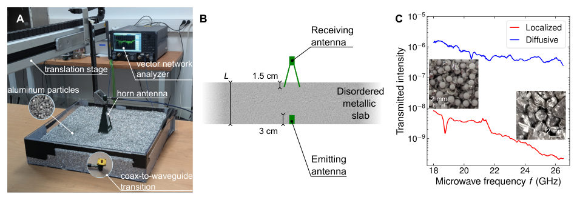 
Figure 1: Experimental setup and metal samples. (A) Photograph of the experiment showing a

📷 Fig 2

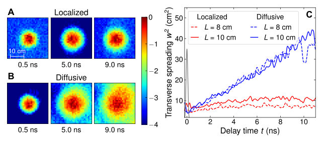 
Figure 2: Diffusion versus localization. (A, B) Transmitted intensity profiles at the back surface

📷 Fig 3

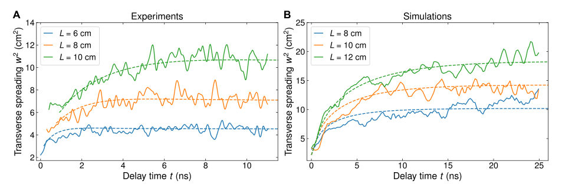 
Figure 3: Scaling analysis. (A) Transmitted beam width squared 𝑤2(𝑡) of the 𝜙= 60% sample

📷 Fig 4

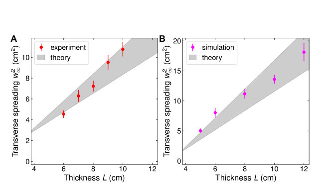 
Figure 4: Saturation of transmitted beam width in the long-time limit. (A, B) Long-time

**Summary.** This paper experimentally demonstrates three-dimensional Anderson localization of microwaves in a disordered metal aggregate. By measuring the time-dependent transverse spreading of the wave beam, the authors distinguish between normal diffusive transport and localization, which is marked by the saturation of the beam width. This provides a robust, measurable confirmation of a key concept in condensed matter physics.

**Why it may be interesting.** This work provides a direct, measurable realization of wave localization in a solid-state system, offering an experimental platform to test theories of wave interference and transport in highly disordered media, which has parallels to quantum wave function localization.

Detailed structure

**Main problem.** The paper addresses the experimental observation of three-dimensional (3D) Anderson localization of electromagnetic waves, a phenomenon predicted to occur in disordered media.

**Main result.** The authors report an unambiguous experimental proof of 3D Anderson localization by observing the temporal arrest of transverse wave spreading in a highly disordered microwave medium.

**Method.** The study combines microwave measurements using narrowband filters with theoretical analysis based on the Self-Consistent Theory (SCT) of localization.

**Model / system.** The system is a disordered medium composed of randomly packed aluminum particles (metallic scatterers) through which microwaves propagate. The disorder is controlled by the metal volume fraction ($\phi$).

**Key observables.** Transverse spreading width squared, $w^2(t)$, and the total transmission spectrum $T(f)$.

**Important parameters / regimes.** Metal filling fractions ($\phi=15\%$ for diffusive, $\phi=60\%$ for localized); localization length ($\xi$); sample thickness ($L$).

**Assumptions / limitations.** The measurements assume the ability to exclude broadband inelastic and nonlinear signals, and the analysis relies on the SCT framework.

**Figures summary.** Figures show comparisons of transmission spectra and the time evolution of the beam width ($w^2(t)$) for both diffusive and localized regimes, confirming saturation in the localized case.

**Paper structure.** The paper establishes the theoretical background (Anderson localization in 3D), details the experimental setup using microwave transmission, presents diagnostics by comparing time-dependent beam spreading in different disorder regimes, and validates the results using SCT and numerical simulations.

Abstract

A prominent phenomenon in contemporary condensed matter physics is Anderson localization -- suppression of wave propagation in disordered systems as a result of interference effects. Despite being observed with various types of waves over the years, all prior attempts to reach Anderson localization of light in three-dimensional systems have been hampered by experimental artifacts. Here, we report an unambiguous experimental proof of three-dimensional Anderson localization of microwaves in disordered metal aggregates. By studying samples with different metal volume fractions, we show a clear difference between diffusive and localized behaviors, and the latter is confirmed by a scaling analysis of transmitted beam width in excellent agreement with theoretical and numerical results. Our demonstration opens avenues for both fundamental studies and practical applications of this extraordinary phenomenon.

[↑ back to top](#top)

### [Tunable Resonator Integrated Magnetometry](http://arxiv.org/abs/2606.04914v1)

**Authors:** Colin Stack, Brian Sears, Aruna Ramanayaka, David Ferguson, Ilya Sochnikov, Tony X. Zhou  
**Type:** experiment · **Category:** other · **PDF:** <https://arxiv.org/pdf/2606.04914v1>  
**Analysis basis:** full PDF text, analyzed in chunks
**Topic relevance:** `spintronics-quantum-optics interface` **3/5** · `QC/QI experiment` **1/5** · `analog quantum simulation` **1/5** · `exotic spin models in light-matter` **1/5**

📷 Fig 1

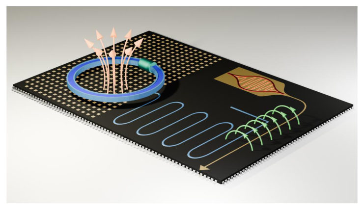 
Fig. 1. A tunable resonator operating as a magnetometer to sense flux from targets emitting magnetic fields into their surrounding space. Graphic credit: Matthew Savoury.

📷 Fig 2

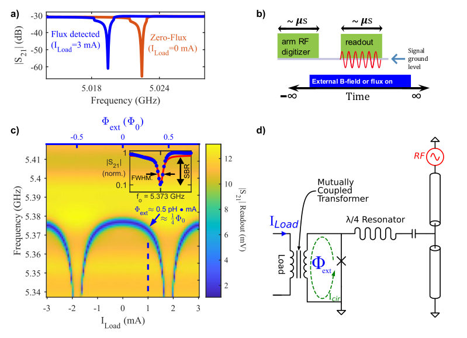 
Fig. 2. Frequency modulation of a tRes. (a) An S21 measurement with 3 mA load current on and off (blue, orange, respectively). This demonstrates tRes detection of an electrical current. (b) The readout sequence in a tRes magnetometry experiment. (c) Frequency modulation curve that maps each modulation current value 𝐼𝐿𝑜𝑎𝑑 (bottom axis) or external flux Φ𝑒𝑥𝑡 (top, blue axis) to a resonant frequency. (Inset) We made a vertical line-cut at 𝐼𝐿𝑜𝑎𝑑 of 1 mA (dash line) to examine |S21|, and we implement a Lorenzian fit function to describe the response. The fitting function extracted a FWHM of 3.7 MHz centered at 𝑓𝑜 equal to 5.373 GHz, and this characterization of the tRes demonstrates a near-unity...

📷 Fig 3

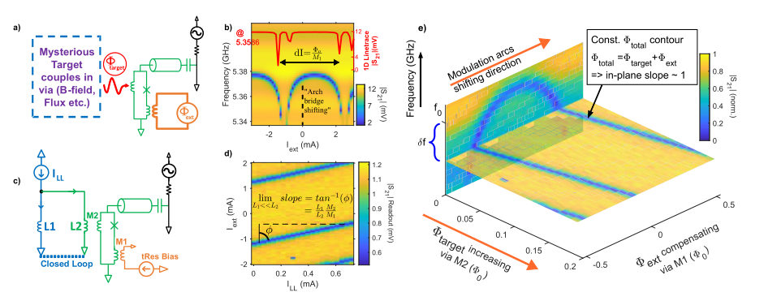 
Fig. 3. tRes magnetometer deployment for quantum sensing. (a) Target magnetic fields or flux (red) are sensed by a tRes, and an external flux control (orange) assists to investigate the unknown traits of the target. (b) We fabricated a circuit to illustrate the general concept in (a). A frequency modulation curve by current in the circuit, not shown here, is measured. A flux introduced from the target shifts the center of the modulation curve away from the origin by an offset in x-axis, so the stone arch bridge suspends asymmetrically over the x-axis. Dash line guides the eye to indicate the vertical mirror line at 𝐼𝑒𝑥𝑡= 0 𝑚𝐴, the center of x-axis. (Inset) A 1D line-trace (red) is made at...

📷 Fig 4

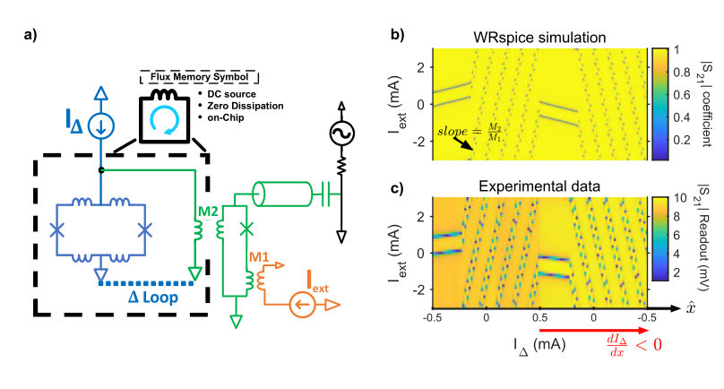 
Fig. 4. Performing tRes magnetometry on a superconducting flux memory device. (a) A tRes (green) is mutually coupled to a flux memory cell (inside dash line) with a current bias 𝐼Δ through the DC SQUID (blue in dash lined box), and a external current 𝐼𝑒𝑥𝑡 flux biases the tRes as an independent control knob (orange). (b) Simulation of the circuit in (a) to show one to one model for the iso-frequency measurement modality. The slope of the steep ladder is the ratio of the mutual inductance from the memory cell to tRes over the mutual inductance of the 𝐼𝑒𝑥𝑡 bias to the tRes. The simulation results validate the experimental data and demonstrate the effectiveness of iso- frequency modality to...

**Summary.** The authors present a superconducting flux-tunable resonator (tRes) magnetometer designed for ultra-sensitive magnetic measurements at cryogenic temperatures. By coupling a SQUID to a microwave resonator, the device achieves a superior combination of fast readout speed and high flux sensitivity. This versatile tool allows for quantitative characterization of magnetic phenomena, including superconducting flux memory dynamics.

**Why it may be interesting.** This work provides a solid-state, high-bandwidth platform for quantum sensing, which is highly relevant to AMO physics research involving magnetic characterization of quantum materials or superconducting qubits.

Detailed structure

**Main problem.** The goal is to develop a highly sensitive, fast, and non-invasive magnetometer capable of operating at milli-Kelvin temperatures, surpassing the limitations of conventional superconducting quantum interference devices (SQUIDs).

**Main result.** The superconducting flux-tunable resonator (tRes) was demonstrated as a versatile magnetometer, achieving high Signal-to-Background Ratios (SBR) and successfully characterizing superconducting flux memory devices.

**Method.** The technique involves coupling the SQUID's flux-dependent inductance to a microwave resonator, causing a measurable shift in the resonator's resonant frequency ($	ext{f}_{	ext{resonance}}$) when exposed to an external magnetic flux.

**Model / system.** The physical platform is a superconducting flux-tunable resonator (tRes) integrated circuit, which couples the non-linear inductance of an RF SQUID to an LC resonator. This allows the system to combine the speed of an LC circuit with the high flux sensitivity of a SQUID.

**Key observables.** Resonant frequency shift ($\Delta f$), Signal-to-Background Ratio (SBR), and the extracted mutual inductance ($M$).

**Important parameters / regimes.** Operation at milli-Kelvin temperatures ($	ext{mK}$), $	ext{MHz}$ magnetic sampling rates, and the magnetic flux quantum ($\Phi_0$).

**Assumptions / limitations.** The analysis often relies on the SQUID operating in the non-hysteretic regime ($eta 	ext{L} < 1$) and uses the SBR metric due to the spectroscopic nature of the measurement.

**Figures summary.** Figures illustrate the $	ext{|S21|}$ dip at resonance, the periodic modulation curve relating load current to resonant frequency, and advanced measurements like 2D iso-frequency scans and flux memory hysteresis loops.

**Paper structure.** The paper progresses from introducing the fundamental $	ext{tRes}$ concept and its frequency modulation readout (Fig. 2), to demonstrating advanced measurement modalities like flux superposition and characterizing superconducting flux memory cells (Figs. 3 & 4).

Abstract

The quantum-technology revolution is reshaping computing, sensing, and communication. In magnetometry, recent advances leverage precise control of spin qubits and color centers in solid-state crystals for mesoscopic-scale sensing. Yet at very low temperatures, superconducting sensing technology remains unrivaled because of its non-invasiveness and higher sensitivity. Here we describe a class of superconducting sensors that offers low loss and quantum non-demolition measurement characteristics. We designed and fabricated a superconducting flux-tunable resonator (tRes) in a superconducting chip foundry and matured it to a level that combines the speed of an inductor-capacitor circuit with the flux sensitivity of a superconducting quantum interference device (SQUID) to perform magnetometry at milli-kelvin temperature to investigate targets. We introduce its fundamental functionality readily at MHz magnetic sampling rate, showcase two measurement modalities, and investigate three circuits with gradually increasing complexity to extract target-specific information. The combination of high sensitivity and fast readout characteristics make tRes an attractive and versatile magnetometer.

[↑ back to top](#top)

### [Continuous-Variable Quantum State Tomography Enabled by Quantum Mirrors](http://arxiv.org/abs/2606.04277v1)

**Authors:** Mariano Uria, Amaru Moya, Carla Hermann-Avigliano, Pablo Solano, Aldo Delgado  
**Type:** theory · **Category:** quantum information and computing · **PDF:** <https://arxiv.org/pdf/2606.04277v1>  
**Analysis basis:** full PDF text, analyzed in chunks
**Topic relevance:** `quantum measurements` **3/5** · `interference shaping light` **2/5**

📷 Fig 1

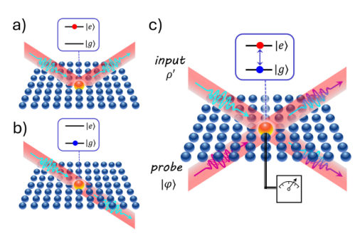 
FIG. 1. (a) The control atom in state |e⟩changes the optical response of the bulk, which generates a complete reflection, thus ”gaining” a phase shift. (b) The control atom in state |g⟩ generates complete transmission of the modes going through the mirror. (c) Representation of the quantum mirror in a superposition state and its effect on the input photonic modes.

📷 Fig 2

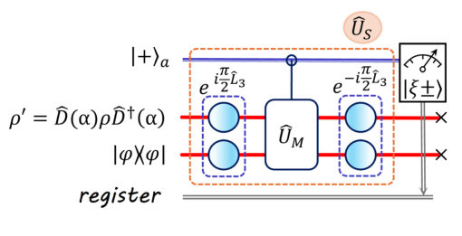 
FIG. 2. Quantum circuit implementing the unitary operation defined in Eq. (3). The system is initialized as an unknown input state ρ, coherently displaced by α, and a pure probe state |φ⟩in the photonic modes, while the control atom is in a superposition state |+⟩. Finally, the control atom is mea- sured. a measurement is taken onto the atom.

📷 Fig 3

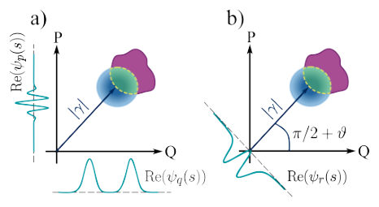 
FIG. 3. (a) Real part of the projection of the probe state (coherent state in blue) and unknown input state (purple) in the q and p representation. The imaginary part can also be obtained (not shown). (b) Real part of the projection of the probe state (coherent state in blue) and unknown input state (purple) in representation r.

📷 Fig 4

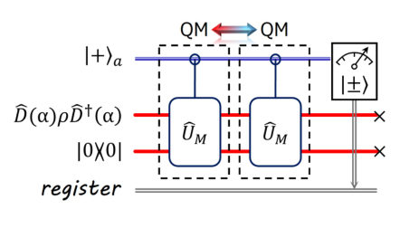 
FIG. 4. Direct measurement of the Wigner function of the unknown input state ρ at phase space point α, represented as a quantum circuit. The setup incorporates a second quantum mirror, which may equivalently be realized by re-injecting the modes into the same QM.

**Summary.** This paper proposes using quantum mirrors to overcome the exponential complexity of continuous-variable quantum state tomography. By coupling the photonic state to a control atom, the entire state information can be read out solely by measuring the atomic system. This offers a robust, experimentally feasible framework for characterizing complex quantum states of light.

**Why it may be interesting.** This work provides a highly practical and theoretically rigorous method for quantum state verification in continuous variables, directly leveraging atomic coherence to overcome measurement limitations in quantum optics.

Detailed structure

**Main problem.** Continuous-Variable Quantum State Tomography (CV-QST) suffers from exponentially growing sample complexity using conventional methods.

**Main result.** The use of quantum mirrors allows for full photonic state characterization (including Wigner and P functions) by measuring only the coupled control atomic system.

**Method.** The protocol maps the unknown photonic state information onto measurable interference patterns and probabilities derived from the control atom's state.

**Model / system.** The system involves an ancillary two-level control atom coupled to photonic modes via a Quantum Mirror (QM) interaction, which is modeled using unitary operators derived from beam splitter relations.

**Key observables.** Husimi Q function, Glauber–Sudarshan P function, Wavefunction $\psi_r(s)$, and Wigner function $W(\alpha)$.

**Important parameters / regimes.** Relative phase shifts ($\phi$), displacement parameters ($\alpha, \gamma$), and the atomic state basis ($|e
angle, |g
angle$).

**Assumptions / limitations.** The analysis assumes the ability to implement independent phase shifts and relies on the QM action transferring complete state information onto the atom.

**Figures summary.** Figures illustrate the quantum mirror action, the quantum circuit implementing the unitary operation, and schematics for wavefunction and Wigner function reconstruction protocols.

**Paper structure.** The paper develops the formalism for the QM operator, details measurement protocols for various state representations (Q, P, Wigner), and mathematically links these measurements back to the unknown photonic state $
ho$.

Abstract

In quantum technologies, continuous-variable systems offer advantages over their discrete counterparts. However, continuous-variable tomography suffers from exponentially growing sample complexity. We propose protocols using quantum mirrors to transfer the complete information of incident photonic states onto a control atomic system. This enables full photonic state characterization through measurements on the control atom alone, realized via kernel functions, direct wavefunction reconstruction, and pointwise Wigner function measurements. Our approach overcomes the limitations of conventional photon counting, statistical inference, and inverse transformation, providing a robust framework for benchmarking and verifying non-Gaussian states in continuous-variable quantum optics.

[↑ back to top](#top)

### [Minimal superfluid vortices in chiral perturbation theory](http://arxiv.org/abs/2606.04556v1)

**Authors:** Fabrizio Canfora, Martın Garrido, Massimo Mannarelli, Anibal Neira  
**Type:** theory · **Category:** quantum gases · **PDF:** <https://arxiv.org/pdf/2606.04556v1>  
**Analysis basis:** full PDF text, analyzed in chunks
**Topic relevance:** `analog quantum simulation` **3/5** · `Keldysh / 2PI / non-Gaussian methods` **2/5**

📷 Fig 1

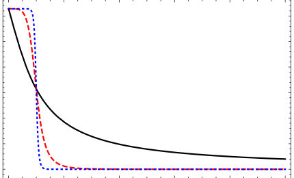 
FIG. 1. Modulation of the α function determined by a single vortex at the center, see Eq. (52), as a function of the distance from the z-axis of the cylinder (in units of 1/mπ). The re- ported results are obtained with winding number n = 1, solid black line, n = 5, dashed red line and n = 20, dotted blue line. All the lines intersect at r = 1, α = π/4.

📷 Fig 2

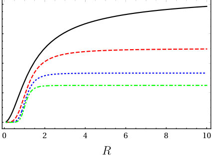 
FIG. 2. Values of γ = m2 π/µ2 I that satisfy the global BPS condition, see Eq. (58), as a function of the distance from the z-axis of the cylinder (in units of 1/mπ). The reported results are obtained with winding number n = 1, solid black line, n = 2, dashed red line, n = 3, dotted blue line, and n = 4, dot-dashed green line.

📷 Fig 3

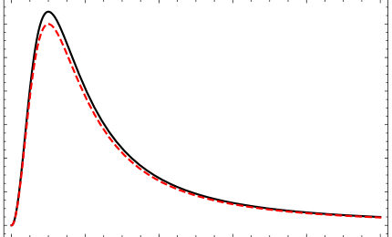 
FIG. 4. Radial dependence of the isospin number density for vortices with winding number n = 1, R = 10 (solid black) and R = 20 (dashed red) normalized to 16KµI. Distances are in units of 1/mπ.

📷 Fig 4

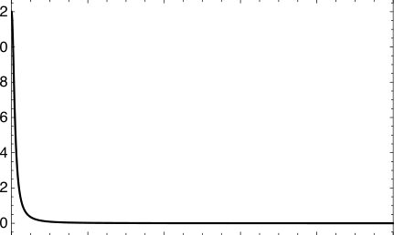 
FIG. 3. Pressure and energy density determined by a central vortex with winding number n = 1 (in units of 2Km2 π), as a function of the distance from the z-axis of the cylinder (in units of 1/mπ). The results are obtained using the global BPS condition, see Eqs. (58) and (61) with R = 10,. Top panel the pressure in the xy-plane is in black, while the pressure along the z–direction is the dashed red line. Bottom panel, energy density.

📷 Fig 5

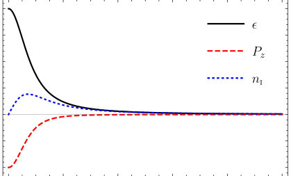 
FIG. 5. Radial dependence of the energy density, pressure (in units of 16Km2 π) and number density (in units of 16Kmπ). Results obtained with a central vortex with winding number n = 1 using the local BPS condition, see the main text for more details. Distances are in units of 1/mπ.

**Summary.** This theoretical paper studies superfluid vortices in a pion condensate using Chiral Perturbation Theory. By applying the BPS bound, the authors derive the energy cost and quantized angular momentum associated with these vortices. The results confirm superfluidity and estimate the critical rotation frequency required for vortex formation.

**Why it may be interesting.** The mathematical framework used (BPS bounds, vortex solutions) is highly relevant to understanding topological defects and superfluid dynamics in ultracold atomic systems, providing a theoretical analogue to BEC vortex physics.

Detailed structure

**Main problem.** The paper investigates the properties of superfluid vortices that can form in a pion condensed phase, which is analogous to a Bose-Einstein condensate (BEC). It aims to determine the minimal energy required for these vortices to nucleate.

**Main result.** The theory confirms that the pion condensate supports quantized vortices, and the energy cost scales linearly with the winding number, suggesting superfluid behavior. A critical rotation frequency for nucleation is estimated.

**Method.** The analysis employs leading order Chiral Perturbation Theory (ChPT) and utilizes the Bogomol'nyi-Prasad-Sommerfield (BPS) bound to simplify the free-energy minimization problem for vortex solutions.

**Model / system.** The system is a pion gas in the pion condensed phase, modeled using an effective Lagrangian derived from ChPT. The analysis focuses on the field configurations ($\alpha, \Phi, \Theta$) that describe the superfluid order parameter.

**Key observables.** Quantized angular momentum ($L_z$), free energy ($F$), critical rotation frequency ($\Omega_c$), and the isospin number density ($n_I$).

**Important parameters / regimes.** Pion mass ($m_\pi$), isospin chemical potential ($\mu_I$), and the winding number ($n$).

**Assumptions / limitations.** The analysis assumes vanishing temperature, uses the leading order $\chi$PT action, and often simplifies the geometry by assuming cylindrical symmetry and $\varphi_3=0$.

**Figures summary.** Figures illustrate the radial dependence of energy density, pressure, and number density for a central vortex, and show the estimated critical frequency dependence on radius.

**Paper structure.** The paper follows a logical progression: establishing the $\chi$PT setup, deriving the BPS bound, constructing the vortex solutions by solving simplified differential equations, and finally calculating the total free energy and the critical nucleation frequency.

Abstract

We derive some properties of rotational vortices in the pion condensed phase. Employing leading order chiral perturbation theory we determine the minimal energy condition for vortex nucleation. Vortices have quantized angular momentum along the rotation axis, an hallmark of superfluidity, and self-confine pions. The critical rotation frequency for vortex nucleation is estimated.

[↑ back to top](#top)

### [Soliton-antisoliton pairs in the supersymmetric gapped phase of an interacting Majorana chain](http://arxiv.org/abs/2606.05095v1)

**Authors:** Alberto Nocera, Mobin Shakeri, Armin Rahmani, Ian Affleck  
**Type:** theory · **Category:** strongly correlated electrons · **PDF:** <https://arxiv.org/pdf/2606.05095v1>  
**Analysis basis:** full PDF text, analyzed in chunks
**Topic relevance:** `analog quantum simulation` **3/5** · `Frenkel-Kontorova` **1/5** · `entanglement & information structure` **1/5**

📷 Fig 1

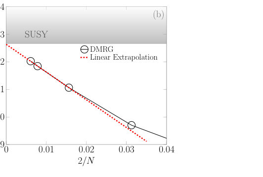 
Figure 2: (a) The numerically computed value of R defined in Eq. (6) as a function of g/t for various system sizes. A kink appears on the Ising side, which extrapolates toward the TCI point. (b) Finite-size scaling of the position of the kink.

📷 Fig 2

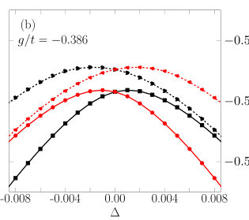 
Figure 4: The energy densities of the ground and first-excited states in the two fermion parity sectors for g/t in the ordered phase [panel (a)] and in the Ising phase [panel (b)]. The ground-state energy exhibits a linear dependence on ∆in the or- dered phase for small ∆. A positive (negative) ∆lowers the energy in the even (odd) fermion parity sector, leading to a unique ground state with even (odd) parity. These results were obtained with the energy scale t set to one.

📷 Fig 3

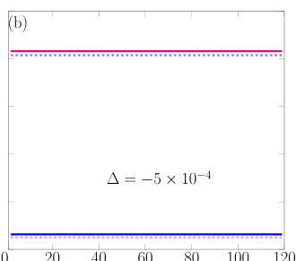 
Figure 5: Density of Dirac fermions for positive ∆(panel a) and negative ∆(panel b) in each parity sector. The value of |∆| has been taken smaller than the level crossing shown in Fig. 4(a). Regardless of the sign of ∆, the even and odd parity sectors have 〈nc〉≃0, 〈nd〉≃1/2 and 〈nc〉≃1/2, 〈nd〉≃0, respectively.

📷 Fig 4

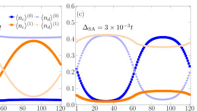 
Figure 6: Panel (a): Ground and first excited state energies as a function of ∆SA (with SA distance m = L/2). Inset: wave-function overlaps as a function of ∆SA, showing clear evidence of a level crossing. Panels (b–c): Density of Dirac fermions for values of ∆SA below and above the level crossing observed in panel (a).

📷 Fig 5

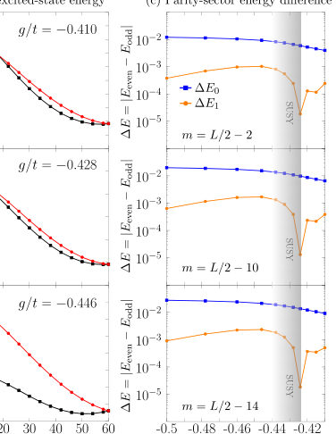 
Figure 7: (a–b) Ground-state and first excited state energies in the two fermion parity sectors as a function of the soliton location m. All data are for L = 120 Dirac fermions and SA pinning field ∆SA = 0.001. The top, middle, and bottom panels correspond respectively to the Ising phase (g/t = −0.410), the TCI point (g/t = −0.428), and the gapped phase (g/t = −0.446). (c) The difference ∆E0,1 = |E0,1 even−E0,1 odd| between ground states (first excited states) of the two parity sectors at fixed SA locations m close to the maximum m = L/2 as a function of g/t.

**Summary.** This work analyzes an interacting Majorana chain near a supersymmetric tricritical point, demonstrating that supersymmetry persists into the gapped phase. The key finding is that the low-energy excitations are soliton-antisoliton pairs, which bind localized Majorana modes and collectively form a nonlocal Dirac fermion. The study uses advanced numerical diagnostics to map out the phase boundaries and characterize these emergent quasiparticles.

**Why it may be interesting.** The connection between topological order, emergent supersymmetry, and localized excitations (solitons) in a 1D strongly correlated system provides a rich theoretical playground relevant to understanding quantum materials.

Detailed structure

**Main problem.** The paper investigates how supersymmetry (SUSY) manifests and what the nature of excitations are in the gapped phase adjacent to the supersymmetric tricritical Ising (TCI) point of an interacting Majorana chain.

**Main result.** SUSY is shown to persist in the gapped phase, evidenced by the continuous decay of a SUSY diagnostic ratio, and the low-energy excitations are identified as soliton-antisoliton pairs forming nonlocal Dirac fermions.

**Method.** The study employs numerical techniques like DMRG, analyzing lattice supercharge operators and introducing symmetry-breaking perturbations to probe the system's ground and excited states.

**Model / system.** The system is a strongly interacting chain of Majorana fermions, modeled by the O’Brien–Fendley (OF) Hamiltonian, which exhibits a transition between a critical Ising phase and a gapped, ordered phase.

**Key observables.** The SUSY diagnostic ratio ($R$), the energy splitting ($\Delta E_{0,1}$) of the first excited state, and the difference in Majorana Green's functions between even and odd fermion-parity sectors.

**Important parameters / regimes.** Interaction strength ($g/t$), the SA-pinning perturbation strength ($\Delta_{SA}$), and the separation distance ($m$) of the soliton-antisoliton pair.

**Assumptions / limitations.** The analysis assumes the applicability of lattice supercharge operators flowing to field-theoretic operators and focuses on the lowest excited states.

**Figures summary.** Figures illustrate the phase diagram, the behavior of the SUSY diagnostic ratio $R$ near the TCI point, and the energy dependence of the first excited state on the SA-pinning field.

**Paper structure.** The paper progresses by first establishing the physical model and the SUSY diagnostic ($R$), then characterizing the TCI transition, and finally using SA-pinning perturbations to confirm the existence and nature of the soliton-antisoliton excitations in the gapped phase.

Abstract

A strongly interacting chain of Majorana fermions realizes the supersymmetric tricritical Ising phase, with supersymmetry (SUSY) extending into a symmetry-broken ordered phase adjacent to the tricritical point. Although the signatures of SUSY at the tricritical point are well understood, their behavior in the gapped phase remains less clear. Here, we address two key questions: how SUSY manifests in the gapped phase and what is the nature of the excitations in this phase. We show that, in the thermodynamic limit, a conventional SUSY diagnostic that remains finite at the tricritical point diverges immediately on the Ising side, yet decays continuously to zero deeper in the gapped phase, signaling the persistence of SUSY. Focusing on the lowest excited states in the supersymmetric gapped regime, we find that the excitations consist of soliton-antisoliton pairs separating distinct ordered regions. Each soliton binds an emergent localized Majorana mode, and together the pair forms a nonlocal Dirac fermion. The occupation of this Dirac mode distinguishes eigenstates with even and odd fermion parity.

[↑ back to top](#top)

### [Atom Interferometry with Transverse Optical Modes](http://arxiv.org/abs/2606.04430v1)

**Authors:** Ryan Husband, Ryan J. Thomas, Yosri Ben-Aïcha, Rhys H. Eagle, Jessica Eastman, John E. Debs, Patrick J. Everitt, Michael Larsen, Eric Imhof, Charles A. Sackett, John D. Close, Simon A. Haine, Samuel Legge  
**Type:** both · **Category:** other · **PDF:** <https://arxiv.org/pdf/2606.04430v1>  
**Analysis basis:** full PDF text, analyzed in chunks
**Topic relevance:** `interference shaping light` **3/5** · `quantum optics experiment` **1/5**

📷 Fig 1

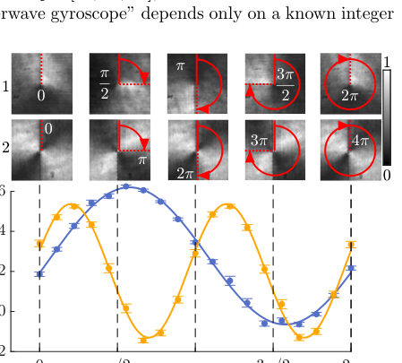 
FIG. 1. Measured Ramsey fringes from a LPAI with an optical vortex, showing the increase in fringe frequency with ℓ. The interferograms in the top two rows illustrate how the helical phase structure of the optical vortex rotates in the lab frame, with red arrows indicating the angle of rotation and white text indicating the corresponding phase change of the Ramsey fringe, ϕ, from Eq. (1).

📷 Fig 2

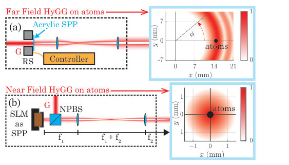 
FIG. 2. (top) The cold atom and interferometer apparatus as described in the text, where the dashed box labeled (a) or (b) indicates the two different optical vortex generation options. (a) A Gaussian beam becomes a HyGG mode by helical phase modulation using an acrylic spiral phase plate (SPP). The phase plate is mounted to a rotation stage (RS) [63] and set to rotate about a fixed axis by a controller. The HyGG mode is then magnified to cover the atom cloud (to scale). (b) A Gaussian beam retro-reflects from a spatial light modulator (SLM) [64] set as a SPP. A 4f imaging system ensures that the intensity profile of the Gaussian beam incident on the SLM is positioned onto the atom cloud...

📷 Fig 3

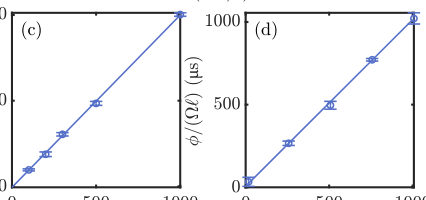 
FIG. 3. (a–b) Measured interferometer phases ϕ(Ω) due to rotation of the phase plate (markers) with linear fits (solid lines), with the fit offset subtracted for clarity. Measurements for different ℓand a fixed T = 1 ms are shown in (a) and for different T and a fixed ℓ= 300 in (b). (c) Extracted slope, ϕ/(Ωteff), from (a) as a function of ℓ. Solid line is a linear fit to ϕ/Ωteff = 1.01(0.01)ℓ−5.6(5.9). (d) Extracted slope, ϕ/(Ωℓ), from (b) as a function of teff. Solid line is a linear fit to ϕ/Ωℓ= 1.01(0.02)teff + 6.5(16) µs.

📷 Fig 4

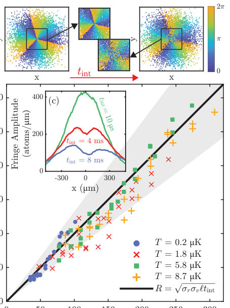 
FIG. 4. (a) Schematic illustration of the effect of thermal motion of the atoms on the interferometer contrast. Atoms are initially imprinted with a helical phase (shown as variation in colour), and the atoms in the center of the cloud move more than those at the edges, obscuring the interferometer phase and leading to contrast reduction. (b) The dephasing radius R measured as a function of √σrσvℓtint over all ℓ, tint, and T. The markers are the measured data, and the black solid line is Eq. (2) with no free parameters and with the gray shaded area showing the one standard deviation model uncertainty based on uncertainties in T and σr. (c) An example of the central dip in fringe amplitude...

📷 Fig 5

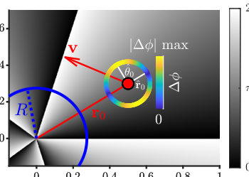 
FIG. 5. A single thermal atom (red circle) is pictured at radius r moving at velocity v across the helical phase front, ϕ, of a GV mode (ℓ= 5) in the VMG. During tint, the atom will exhibit an interference phase ∆ϕ, determined by the immediate direction of motion (the colored ring). The dephasing region radius R is shown in blue.

**Summary.** This paper demonstrates atom interferometry using the transverse phase structure of optical beams, specifically utilizing the helical phase windings of HyGG beams. The authors successfully measured rotations and provided a detailed theoretical and experimental characterization of how thermal motion causes spatially-dependent decoherence in the interferometer contrast. This advances the field by establishing a robust method for high-precision sensing using structured light.

**Why it may be interesting.** This work is highly relevant as it pushes the metrological capabilities of atom interferometry by systematically incorporating and quantifying the effects of transverse optical structure (OAM) and thermal decoherence, providing a roadmap for next-generation quantum sensors.

Detailed structure

**Main problem.** To develop and experimentally demonstrate atom interferometry utilizing the transverse phase profile (orbital angular momentum) of structured optical modes, moving beyond traditional longitudinal phase measurements.

**Main result.** The interferometer successfully measures rotations with a sensitivity scaling linearly with the orbital angular momentum quantum number ($\ell$) and interrogation time ($t_{	ext{int}}$). Furthermore, the study derived and confirmed an analytical expression for the spatially-varying thermal decoherence of the fringe visibility.

**Method.** The authors employed Ramsey interferometry with cold $^{87}	ext{Rb}$ atoms, using Hypergeometric Gaussian (HyGG) beams to imprint helical phase windings. They measured rotation by inducing physical rotations of the optical fields and characterized decoherence by measuring fringe contrast reduction.

**Model / system.** The physical system is atom interferometry using cold $^{87}	ext{Rb}$ atoms and structured light fields (HyGG beams). The theoretical analysis models the phase accumulation ($\Delta\phi$) and contrast ($C$) by considering the dependence on atomic velocities ($\dot{r}, \dot{	heta}$) in the presence of a helical phase front.

**Key observables.** Rotational phase shift ($\phi$), interferometer fringe contrast, and the measured dephasing radius ($R$).

**Important parameters / regimes.** Orbital Angular Momentum quantum number ($\ell$), interrogation time ($t_{	ext{int}}$), and the atomic temperature (which dictates decoherence).

**Assumptions / limitations.** The analysis relies on approximations for the change in angle ($\Delta	heta$) during ballistic expansion and assumes that the primary limitation for sensitivity is thermal phase diffusion.

**Figures summary.** Figures illustrate measured Ramsey fringes showing dependence on $\ell$ and $\Omega$, and plots confirm the linear scaling of the measured dephasing radius ($R$) with the predicted analytical scaling law derived from the thermal motion.

**Paper structure.** The paper progresses from demonstrating the basic rotation measurement using transverse modes to quantitatively characterizing the thermal decoherence. It develops the theoretical framework by modeling the phase accumulation in polar coordinates, leading to the final analytical expression for the contrast reduction due to velocity spread.

Abstract

We experimentally demonstrate atom interferometry using the transverse phase profile of an optical mode. As proof-of-principle, we use the helical phase windings of Hypergeometric Gaussian beams for Ramsey interferometry with ensembles of ballistically-expanding cold Rb87 atoms, and we show that the interferometer can measure rotations induced by a motor with a sensitivity that scales linearly with orbital angular momentum and interferometer time. We characterize the thermal decoherence of the interferometer, deriving and experimentally confirming a closed-form expression for the spatially-varying interferometer visibility arising near the singularity of the helical phase winding, motivating the use of condensed atoms in ring-shaped traps.

[↑ back to top](#top)

### [High-fidelity neutral atom gates leveraging low-rank Hessian optimization](http://arxiv.org/abs/2606.05060v1)

**Authors:** Genyue Liu, Guillaume Bornet, Deniz Kurdak, Mingxuan Xiao, Chenyuan Li, Bichen Zhang, Jeff D. Thompson  
**Type:** both · **Category:** other · **PDF:** <https://arxiv.org/pdf/2606.05060v1>  
**Analysis basis:** full PDF text, analyzed in chunks
**Topic relevance:** `QC/QI experiment` **3/5**

📷 Fig 1

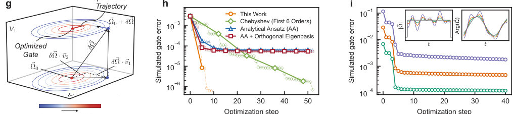 
FIG. 1. Symmetric CZ gates and low-rank Hessian optimization. (a) Minimal three-level system for a symmetric Rydberg-mediated CZ gate, in which a pulse couples the qubit state |1⟩to a Rydberg state |r⟩with complex Rabi frequency ⃗Ω≡Ω(t)eiϕ(t). (b) In the two-qubit basis, the |01⟩and |10⟩states couple to the Rydberg manifold with Rabi frequency ⃗Ω, while the |11⟩state couples to the symmetric state |W⟩= (|1r⟩+ |r1⟩)/ √

📷 Fig 2

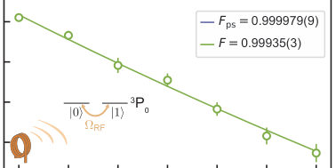 
FIG. 2. Gate benchmarking with three-outcome measurement. (a) Photon-count distributions collected from two successive images used to measure the atoms in |0⟩and |1⟩, respectively. Dashed lines indicate the image- classification thresholds, and colors indicate the assigned out- comes |0⟩, |1⟩, and loss. (b) Randomized benchmarking of RF single-qubit gates. The raw fidelity is F = 0.99935(3) (green), which increases to Fps = 0.999979(9) (blue) after postselecting on no detected atom loss. In all panels, error bars indicate 1σ uncertainties.

📷 Fig 3

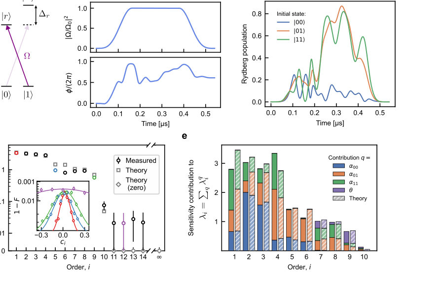 
FIG. 3. Verification of the low-rank nature of the fidelity Hessian. (a) Four-level model of the states involved in the Rydberg gate. (b) Numerically optimized gate waveforms for the amplitude-robust gate. (c) Rydberg population during the gate when starting from |00⟩, |01⟩, and |11⟩. The small Zeeman splitting between |r⟩and |r′⟩results in a significant Rydberg population when starting in |00⟩. (d) Comparison between measured (circles) and calculated (squares) sensitivities λi of the CZ gate fidelity to distortions along the Hessian eigenvectors. Inset: representative measurements used to extract the sensitivity, with colors matching the highlighted points in the main figure. The fidelity...

📷 Fig 4

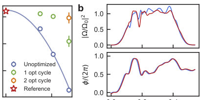 
FIG. 5. Optimizing gates with Hamiltonian param- eter errors. (a) CZ gate fidelity versus reduction of the Rydberg Zeeman splitting before and after Hessian optimiza- tion. A single optimization cycle along the original Hessian eigenvectors eliminates most of the added error, with an ad- ditional cycle needed at the largest miscalibration. (b) Opti- mized laser intensity and phase profiles for the nominal case (red) and the reduced-field case (blue, 1 −∆′ r/∆r = 0.14). Error bars indicate 1σ uncertainties.

**Summary.** This paper introduces a novel, efficient calibration technique for quantum gates by exploiting the low-rank structure of the gate fidelity Hessian. By restricting optimization to the principal subspace defined by this Hessian, the authors successfully demonstrate high-fidelity controlled-Z gates on neutral atoms. This method offers a general, robust framework for improving quantum gate performance in complex atomic platforms.

**Why it may be interesting.** It provides a powerful, physically motivated mathematical tool (Hessian analysis) to simplify the notoriously difficult problem of optimizing complex quantum control pulses, directly applicable to state-of-the-art neutral atom quantum computing.

Detailed structure

**Main problem.** The paper addresses the challenge of calibrating high-dimensional waveforms required for optimal quantum control to achieve high-fidelity multi-qubit gates.

**Main result.** A low-rank Hessian optimization method is established as an efficient calibration strategy, achieving high gate fidelities (e.g., 0.99902) with demonstrated robustness to environmental variations.

**Method.** The core method involves analyzing the fidelity Hessian of the gate error, exploiting its low-rank structure to restrict optimization to a small, physically relevant principal subspace.

**Model / system.** The work uses neutral atom qubits, specifically $^{171}	ext{Yb}$ nuclear-spin qubits, to implement an amplitude-robust controlled-Z (CZ) gate. The dynamics are modeled using optimal control theory applied to a multi-level atomic system.

**Key observables.** Gate fidelity ($F$), raw and post-selected error rates ($\epsilon$), and the eigenvalues/eigenvectors of the fidelity Hessian.

**Important parameters / regimes.** The rank ($r$) of the Hessian, which is determined by the number of accessible leakage and coherent error channels; laser power variation (up to 20%).

**Assumptions / limitations.** The analysis relies on a second-order expansion of the infidelity in the control parameter error ($\delta\vec{\Omega}^T H \delta\vec{\Omega}$), and the low-rank structure is assumed to capture the dominant error channels.

**Figures summary.** Figures illustrate the CZ gate setup, the eigenvalue spectrum showing the few nonzero eigenvalues, the decomposition of the error into parallel and perpendicular components, and comparisons of optimization strategies.

**Paper structure.** The paper develops the theory by analyzing the fidelity Hessian, applies it to the CZ gate, demonstrates the optimization protocol using experimental feedback, and verifies the robustness and error correction capabilities.

Abstract

Quantum optimal control can produce fast and robust multi-qubit gates, but experimentally calibrating the resulting high-dimensional waveforms remains challenging because direct searches over large parameter spaces converge slowly. Building on the low-rank structure of quantum-control landscapes, we develop and benchmark a Hessian-based calibration method for optimal-control gates. The method identifies the few waveform directions that affect fidelity to leading order, with the number of directions set by the accessible leakage and coherent error channels, and optimizes only within this principal space using closed-loop experimental feedback. We apply this approach to an amplitude-robust controlled-Z gate on metastable-state 171Yb nuclear-spin qubits. Experimentally, we verify the predicted Hessian-sensitive directions and demonstrate rapid convergence of the optimization protocol. The optimized gate reaches a raw fidelity of 0.9959(2), increasing to 0.99902(7) after postselection on no detected loss, and the performance is essentially unchanged under laser-power variations of up to 20%. We further show that the same fidelity Hessian directions can correct certain Hamiltonian parameter errors. These results establish low-rank Hessian optimization as an efficient and physically motivated calibration strategy for high-dimensional optimal-control gates, which is broadly applicable to many qubit types.

[↑ back to top](#top)

### [Local multiferroic ordering at room temperature in collinear magnetoelectric antiferromagnets induced by flexo-Zeeman coupling](http://arxiv.org/abs/2606.04738v1)

**Authors:** Paulina J. Prusik, Igor Veremchuk, Florin Radu, Andrey N. Anisimov, Pavlo Makushko, Georgy V. Astakhov, René Hübner, Alexander Edström, Jürgen Fassbender, Fabian Ganss, Massimiliano Stengel, Kirill D. Belashchenko, Denys Makarov, Oleksandr V. Pylypovskyi  
**Type:** both · **Category:** strongly correlated electrons · **PDF:** <https://arxiv.org/pdf/2606.04738v1>  
**Analysis basis:** full PDF text, analyzed in chunks
**Topic relevance:** `spintronics-quantum-optics interface` **3/5**

📷 Fig 1

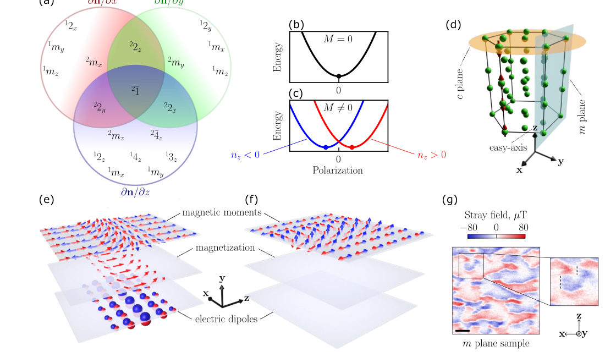 
FIG. 1. Flexo-Zeeman interaction in antiferromagnets. (a) Classification of the symmetry operations within crystal- lographic point groups that allow for the flexo-Zeeman term with ∂in, i = x, y, z. The operations indicated in the white background do not forbid the flexo-Zeeman coupling. (b–c) Energy dependence on polarization: for M ≡0 (b), the minimum is at P = 0; otherwise (c), it corresponds to a spatially localized magnetoelectric multiferroic state with finite polarization. (d) Hexagonal cell of chromia that supports flexo-Zeeman coupling M ∝∂n/∂z. (e,f) Schematic difference between two AFM DWs with different spatial orientation and associated phenomena: the presence or absence of...

📷 Fig 2

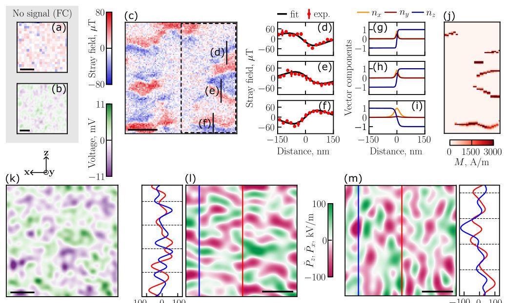 
FIG. 2. Multiferroic response at domain walls in m-plane chromia at room temperature. (a) SNVM and (b) KPFM scans of the m-plane thin film after field cooling to set the dominant AFM domain when signatures of domain walls or polarization are absent. Scale bar is 0.5 µm. FC stands for field cooling. (c) SNVM scan of the m-plane thin film after zero-field cooling to set a multidomain AFM state. Scale bar is 0.5 µm. Colorbar is shared with panel (a). Representative line profiles of DWs shown in panels (d–f) are indicated with vertical solid lines. The corresponding profiles of the N´eel vector n are shown in panels (G–I). (j) Magnetization map reconstructed from the region marked by dashed...

📷 Fig 3

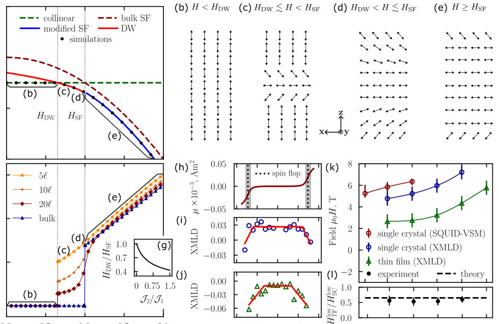 
FIG. 3. Quantification of the strength of the flexo-Zeeman interaction in c-plane chromia. (a) Energy of different magnetic states as a function of the magnetic field for a 10ℓ-thick film. Lines and symbols correspond to the analytics and spin-lattice simulations, respectively. (b) Schematics of the collinear state by n (shown by double arrows). (c) Schematics of the domain wall state with the gradient along z-direction. (d) Schematics of the widening of the domain wall with an increase of magnetic field. (e) Schematics of the spin-flop state in thin film. (f) Simulated magnetization curves as a function of the magnetic field for thin films and single crystal. Field ranges for the magnetic...

**Summary.** This paper demonstrates that the simple antiferromagnet $	ext{Cr}_2	ext{O}_3$ exhibits room-temperature multiferroic behavior localized at its domain walls. This effect is driven by a specific coupling mechanism called the flexo-Zeeman interaction. The findings establish a pathway for developing high-temperature, spin-driven magnetoelectric memory and logic devices.

**Why it may be interesting.** While focused on condensed matter magnetism, the study of emergent electric polarization driven by spin textures (domain walls) provides a model for coupling magnetic order parameters to electric polarization, which is a key concept in advanced quantum materials and spintronics.

Detailed structure

**Main problem.** The research aims to demonstrate and understand room-temperature multiferroic ordering in simple, collinear magnetoelectric antiferromagnets.

**Main result.** The study experimentally and theoretically confirms that domain walls in $	ext{Cr}_2	ext{O}_3$ exhibit multiferroic behavior driven by the flexo-Zeeman interaction, leading to measurable electric polarization and magnetization.

**Method.** The work combines experimental characterization using SNVM and KPFM with theoretical modeling involving the flexo-Zeeman Hamiltonian and *ab initio* calculations.

**Model / system.** The physical system is the simple oxide $	ext{Cr}_2	ext{O}_3$, an antiferromagnet. The key theoretical element is the flexo-Zeeman coupling term, which links crystal symmetry, Néel vector gradients, and magnetization, leading to non-collinear magnetoelectric effects.

**Key observables.** Electric polarization ($P$), uncompensated magnetization ($M$), stray field patterns (from SNVM), and the ratio of magnetic transition fields ($	ext{H}_{	ext{DW}}/	ext{H}_{	ext{SF}}$).

**Important parameters / regimes.** Room temperature, flexo-Zeeman coupling coefficient ($b$), and domain wall periodicity ($\approx 300-390 	ext{ nm}$).

**Assumptions / limitations.** The multiferroicity is localized to specific domain wall orientations in the basal plane, and the effect can be extended to global reconfigurable channels.

**Figures summary.** Figures illustrate the symmetry classification of the flexo-Zeeman interaction, energy dependence of polarization, and comparative SNVM/KPFM scans showing stripe stray fields in domain walls under different magnetic field cooling conditions.

**Paper structure.** The paper progresses from establishing the theoretical framework of the flexo-Zeeman coupling, to presenting experimental measurements on domain walls in $	ext{Cr}_2	ext{O}_3$ using multiple techniques, and finally confirming the predicted magnetoelectric response and its implications for device applications.

Abstract

Spin-driven multiferroicity attracts significant interest due to its tunability and inherently strong magnetoelectric coupling. While this mechanism induces sizeable electric polarization, it typically occurs at low temperatures and in complex materials. In the simple oxide, the magnetoelectric antiferromagnet Cr$_2$O$_3$, we experimentally demonstrate the existence of specific domain walls that act as room-temperature multiferroic regions. This behavior stems from an anisotropic crystal-symmetry-dependent mechanism of exchange origin, which is applicable to a broad class of bipartite antiferromagnets. The key signature is the magnetization occurring at antiferromagnetic textures, driven by the flexo-Zeeman interaction. These findings establish a foundation for exploring high-temperature spin-driven multiferroicity for magnetoelectric spin-orbit memory and logic applications.

[↑ back to top](#top)

### [Magnetic structure of diamond EuTi2Al20](http://arxiv.org/abs/2606.04802v1)

**Authors:** S. W. Lovesey, D. D. Khalyavin  
**Type:** both · **Category:** strongly correlated electrons · **PDF:** <https://arxiv.org/pdf/2606.04802v1>  
**Analysis basis:** full PDF text, analyzed in chunks
**Topic relevance:** `spintronics-quantum-optics interface` **3/5**

📷 Fig 1

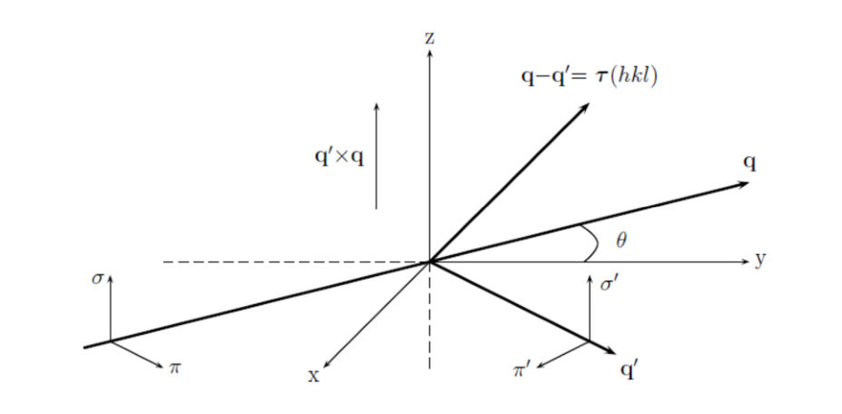 
FIG. 1. Primary (σ, π) and secondary (σ', π') states of x-ray polarization; σ = σ' = (0, 0, 1), π = (cos(θ), sin(θ), 0), π' = (cos(θ), − sin(θ), 0). Corresponding wavevectors q and q' subtend an angle 2θ. The Bragg condition for diffraction is met when q − q' coincides with a vector τ(h, k, l) of the reciprocal lattice. The depicted Cartesian (x, y, z) coincide with local axes (ξ, η, ζ) in the nominal setting of the crystal.

**Summary.** This work uses resonant X-ray diffraction theory to distinguish between two possible low-temperature magnetic symmetries of EuTi2Al20. By calculating how magnetic multipoles affect the diffraction pattern based on symmetry constraints, the authors provide a detailed diagnostic tool to resolve the ambiguity left by current experimental data.

**Why it may be interesting.** While focused on solid-state magnetism, the use of advanced X-ray scattering techniques to probe subtle symmetry breaking via multipole interactions is relevant to understanding complex electronic correlations in materials.

Detailed structure

**Main problem.** The paper aims to definitively determine the magnetic symmetry of the compound EuTi2Al20 that emerges below 3.3 K, distinguishing between two competing orthorhombic candidates.

**Main result.** The authors demonstrate that the predicted resonant X-ray diffraction patterns, particularly those involving parity-odd multipoles, are distinct for the two candidate symmetries, offering a path for experimental discrimination.

**Method.** The study combines theoretical calculations of electronic structure factors with the analysis of selection rules derived from parity mixing in the parent cubic structure.

**Model / system.** The physical system is EuTi2Al20, which undergoes magnetic ordering below 3.3 K. The analysis focuses on the magnetic symmetries and the resulting magnetic multipoles formed by Eu ions.

**Key observables.** Diffraction intensities measured via resonant X-ray diffraction, specifically analyzing polarization ($\sigma$ vs. $\pi$) and azimuthal angle ($\psi$) dependence.

**Important parameters / regimes.** The critical temperature (3.3 K), the specific magnetic space groups ($	ext{PInna}$ and $	ext{PInn2}$), and the parity-odd multipole contributions.

**Assumptions / limitations.** The analysis assumes that the selection rule from parity mixing in the parent cubic structure is preserved, and that the local axes align with the crystal axes in the nominal setting.

**Figures summary.** The notes mention the use of X-ray polarization states ($\sigma, \pi, \sigma', \pi'$) and the fulfillment of the Bragg condition, suggesting figures illustrate these polarization dependencies.

**Paper structure.** The paper proceeds by establishing the context of magnetic symmetry determination, detailing the theoretical framework involving parity mixing and multipole calculations for the two candidate symmetries, and concluding with a comparison of the predicted, symmetry-dependent diffraction patterns.

Abstract

We study magnetic symmetries of EuTi2Al20 that appear in the ordering of Eu ions below a temperature at 3.3 K, according to an analysis of substantial experimental evidence [M. Kawamata et al., J. Phys. Soc. Japan. 95, 024701 (2026)]. They descend from the cubic diamond structure that depends explicitly on mixing of orbitals with different spatial parities, e.g., diamond s- and p-atomic states. The lattice (2, 2, 2) Bragg spot, for example, is lattice forbidden in the absence of parity mixing. Our work is motivated by a first proposal that low-temperature magnetic symmetries of diamond EuTi2Al20 are orthorhombic and belong to magnetic crystal classes that include time reversal. Body-centre anti-translation in diffraction patterns is a corollary. Current experimental data does not distinguish between two orthorhombic candidates, even though one is centrosymmetric and the other one is polar. We demonstrate that magnetic parity-odd entities (multipoles) formed by mixing d-and f-atomic states at europium positions, with discreet symmetries that match those of a Dirac monopole, are different for the two candidates. Moreover, the multipoles are visible in resonant x-ray diffraction patterns. The selection rule from parity mixing in the parent cubic diamond structure is preserved, and permitted Bragg spots are different for the two candidate magnetic symmetries. Our symmetry informed diffraction patterns include rotation of the crystal about the reflection vector (an azimuthal angle scan) and a full account of x-ray polarization to spur more revealing experiments.

[↑ back to top](#top)

### [Leggett-Garg test inequality with spin and flavour neutrino oscillations in a constant magnetic field](http://arxiv.org/abs/2606.04412v1)

**Authors:** I. A. Monroy, S. D. Madrid  
**Type:** theory · **Category:** other · **PDF:** <https://arxiv.org/pdf/2606.04412v1>  
**Analysis basis:** full PDF text, analyzed in chunks
**Topic relevance:** `entanglement & information structure` **2/5** · `Keldysh / 2PI / non-Gaussian methods` **1/5** · `analog quantum simulation` **1/5** · `correlated / nonlocal dissipation` **1/5** · `driven-dissipative phase transition` **1/5** · `exotic spin models in light-matter` **1/5** · `methods for driven-dissipative` **1/5** · `non-equilibrium dynamics` **1/5** · `non-equilibrium universality` **1/5** · `spintronics-quantum-optics interface` **1/5**

📷 Fig 1

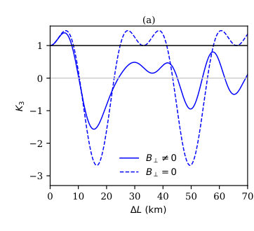 
Figure 1. (a) K3 plot for the flavour oscillation in a transverse magnetic field B = 1012 T, a neutrino energy p = 1 MeV, ∆m2 = 7.58 × 10−5 eV2, a magnetic moment µ = 10−19µB and a mixing angle θ = 36.80◦. Horizontal black line denotes the maximum value of K3 allowed by LGI. (b) K3 for the flavour oscillation within a smaller length region where K3 &gt; 1, B⊥= 0, and B⊥̸= 0.

📷 Fig 2

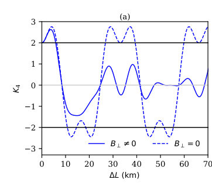 
Figure 2. (a) Plot of K4 for the flavour oscillation in a transverse magnetic field B = 1012 T, a neutrino energy p = 1 MeV, ∆m2 = 7.58 × 10−5 eV2, a magnetic moment µ = 10−19µB and a mixing angle θ = 36.80◦. Horizontal black lines denote the maximum and minimum values of K4 allowed by LGI. (b) K4 for the flavour oscillation within a smaller length region where K4 &gt; 2, B⊥= 0, and B⊥̸= 0.

📷 Fig 3

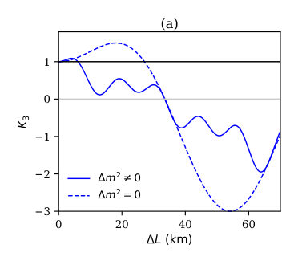 
Figure 3. (a) K3 plot for the spin oscillation in a transverse magnetic field B = 1012 T, a neutrino energy p = 1 MeV, ∆m2 = 7.58 × 10−5 eV2, a magnetic moment µ = 10−19µB and a mixing angle θ = 36.80◦. Horizontal black line denotes the maximum value of K3 allowed by LGI. (b) K3 for the spin oscillation with a smaller length region where K3 &gt; 1, ∆m = 0 and ∆m ̸= 0.

📷 Fig 4

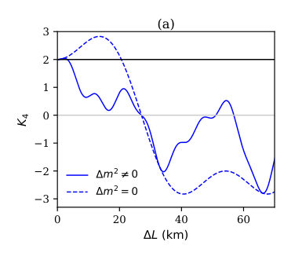 
Figure 4. (a) K4 plot for the spin oscillation in a transverse magnetic field B = 1012 T, a neutrino energy p = 1 MeV, ∆m2 = 7.58 × 10−5 eV2, a magnetic moment µ = 10−19µB and a mixing angle θ = 36.80◦. Horizontal black lines denote the maximum and minimum values of K4. (b) K4 for spin oscillation within a smaller length region where K4 &gt; 2, ∆m = 0 and ∆m ̸= 0.

**Summary.** This theoretical work tests the limits of quantum mechanics by examining the violation of the Leggett-Garg inequality in neutrino oscillations. The study models both flavour and spin transitions under the influence of a strong magnetic field. The main finding is that the LGI is violated in specific spatial regions, providing a quantum signature potentially observable in extreme astrophysical environments like magnetars.

**Why it may be interesting.** While the core topic is particle astrophysics, the methodology—testing fundamental quantum limits (LGI) using time/space correlations derived from quantum evolution equations—is relevant to open quantum systems theory and quantum foundations.

Detailed structure

**Main problem.** The paper investigates the violation of the Leggett-Garg inequality (LGI) when applied to neutrino flavour and spin oscillations in the presence of a constant magnetic field.

**Main result.** The LGI is shown to be violated for both flavour and spin neutrino oscillations in regions defined by the oscillation length $\Delta L$, particularly when strong magnetic fields are present.

**Method.** The analysis involves calculating specific correlation functions, $K_3$ and $K_4$, which serve as diagnostics for LGI violation, using joint probability distributions derived from the neutrino evolution equations.

**Model / system.** The system models neutrino flavour ($
u_L^e \leftrightarrow 
u_L^\mu$) and spin ($
u_L^e \leftrightarrow 
u_R^e$) oscillations governed by the Dirac equation, incorporating the effects of a constant transverse magnetic field ($B_\perp$).

**Key observables.** The LGI violation is quantified by the correlator functions $K_3$ and $K_4$, and the primary observables are the flavour and spin oscillation probabilities $P(t)$.

**Important parameters / regimes.** Key parameters include the mass squared difference ($\Delta m^2$), mixing angle ($	heta$), neutrino energy ($p$), and the magnetic field strength ($B \sim 10^{12}$ T).

**Assumptions / limitations.** The analysis utilizes the ultra-relativistic approximation ($p \gg m$) and treats the system dynamics using the effective Hamiltonian derived from the Dirac equation.

**Figures summary.** The figures plot the LGI test functions ($K_3$ and $K_4$) as a function of distance ($L$ or $\Delta L$) for spin oscillation, comparing results for zero and non-zero $\Delta m^2$ in a transverse magnetic field.

**Paper structure.** The paper establishes the LGI framework, derives the oscillation probabilities for flavour and spin transitions in a magnetic field, and then calculates the specific correlation functions $K_3$ and $K_4$ to demonstrate the violation of the inequality.

Abstract

The Leggett-Garg inequality (LGI), an analogue of Bellś inequality involving correlations of measurements of one observable on a system at different times, stands as one of the hallmark tests of quantum mechanics against classical predictions. In this work, we investigate its implications in the context of neutrino flavour ($ν_{e}^{L}\leftrightarrowν_μ^{L}$) and spin ($ν_{e}^{L}\leftrightarrowν_{e}^{R}$) oscillations in the presence of a constant transverse magnetic field. For systems with strong magnetic fields, we show that, for both cases, there are length regions $ΔL$ where the LGI is violated, as quantified by the correlator functions $K_{3}$ and $K_{4}$.

[↑ back to top](#top)

### [Discrete signaling mediates chaotic regularization in recurrent neural networks](http://arxiv.org/abs/2606.04426v1)

**Authors:** Jan Bauer, Christian Keup, Jonathan Kadmon, Moritz Helias  
**Type:** theory · **Category:** disordered systems and neural networks · **PDF:** <https://arxiv.org/pdf/2606.04426v1>  
**Analysis basis:** full PDF text, analyzed in chunks
**Topic relevance:** `Keldysh / 2PI / non-Gaussian methods` **2/5** · `methods for driven-dissipative` **2/5** · `driven-dissipative phase transition` **1/5** · `non-equilibrium dynamics` **1/5** · `non-equilibrium universality` **1/5**

📷 Fig 1

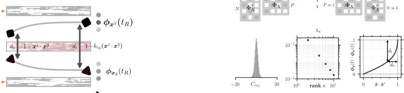 
Figure 1. Describing computation in RNNs in kernel space. a A recurrent neural network (RNN) receives an input stimulus x at an initial time t0. The stimulus is propagated by disordered random synapses Jij of strength g to produce a linear readout yx(tR) = w ⋅ϕJ x(tR) at a readout time tR. b Trajectories of two stimuli x1 (square marker) and x2 (triangle marker) in a chaotic network are characterized by an increase of their separation with time. c Propagation of a collection of P stimuli X that gets deformed to the neural code manifold ΦJ X(tR) as a result of the chaotic network activity. c, left Network picture: A function on the input stimuli X is implemented by projecting the propagated...

📷 Fig 2

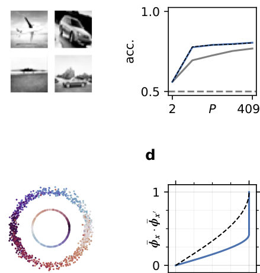 
Figure 2. Chaotic network models can perform reliable computation despite rough neural code. a Four exam- ples from the image dataset CIFAR10. b Accuracy of the binary classification between cars and planes as a function of the number of presented training samples P. Blue: Heaviside- activated (i.e., T = H) recurrent network with Glauber dy- namics as in Eq. (3) with g = 1.1. Gray: Linear classifier. Dashed black: Single-layer Heaviside-activated feedforward network. Readout time for the recurrent network, and regu- larization for the feedforward network were optimized in the networks to give best performance for each number of train- ing patterns. Horizontal line indicates baseline of...

📷 Fig 3

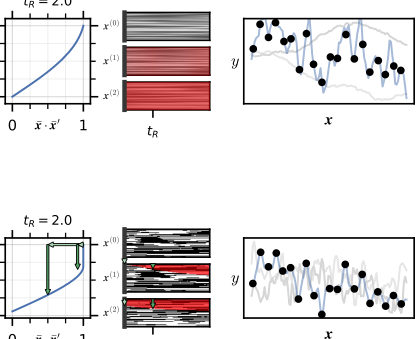 
Figure 3. Strong local chaos acts as effective regular- ization in discretely-coupled networks. a Inference for a continuously signaling network Eq. (4), b for discrete sig- naling Eq. (3). Left panels show the kernel functions for each network. Center panels show a subset of the network activity in simulation of networks with N = 6000 units for a base stimulus x(0), a mild perturbation thereof x(1) = x(0) + ϵ realized through changing the state of a single neuron, and a noticeably distinct stimulus x(2) in which 1/4 of the neurons are changed relative to x(0); changes are applied at initial time t = 0 (gray bars). Light green arrows indicate the size of the initial perturbation, dark green...

📷 Fig 4

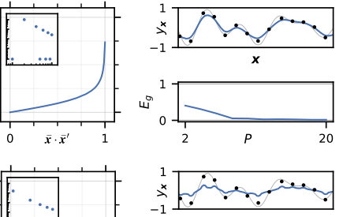 
Figure 4. Chaotic rate networks have a rich spectral repertoire. Computation in the regular (top) and chaotic regime (bottom). Left panels show the kernel functions in either regime after stimulus propagation for t = 20τ and white noise variance D = 0.01. Inset shows the eigenvalues λn of the kernel as in Eq. (12), with identical y-axis between panels. Right upper panels show a 1D regression task that is composed of different length scales with respect to x and constitutes the regression target, with training data indicated as black markers, with the blue line being the kernel predictor Eq. (11). Right lower panels show the generalization error for this task as a function of the number of...

📷 Fig 5

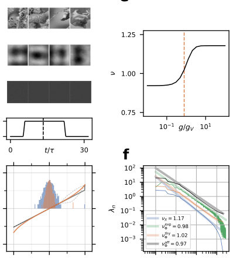 
Figure 5. Nonlinearities in neural networks produce high-frequency power laws. a Four example images from a natural image subset of ImageNet [4] imprinted to the network. b Four low-frequency modes of the images that dominate the spectrum (top), and four high-frequency modes at the end of the spectrum (bottom). c Temporal envelope of the neural data used in [4]. The readout time is indicated by a dashed line. d Kernel function (orange) as obtained through Eq. (10) for g/gV = 1. Gray curve is the affine-linear kernel Eq. (23) that produces the same slope ν of kernel eigenvalues λn = 1/nν, as do the dashed-gray nonlinear kernels that differ only outside of the support of data XX⊺. Overlayed...

**Summary.** This theoretical work develops a framework showing that the inherent chaos in recurrent neural networks does not preclude stable computation. By analyzing the network's kernel structure using advanced mean-field techniques, the authors prove that this chaos acts as a beneficial intrinsic regularizer, enabling smooth, generalizable coding despite microscopic unpredictability.

**Why it may be interesting.** The mathematical machinery developed (DMFT, replica method) for analyzing correlations in complex, non-equilibrium systems like RNNs shares conceptual overlap with techniques used in analyzing disordered quantum systems, such as spin glasses or spin-boson models.

Detailed structure

**Main problem.** The paper addresses the fundamental conflict between the intrinsic chaotic nature of recurrent neural networks and the necessity for their population codes to exhibit smooth, stable representations for functional computation.

**Main result.** Chaotic dynamics induce a structural property—local roughness while maintaining global smoothness—that acts as an intrinsic regularizer, allowing chaotic systems to sustain coherent, differentiable coding.

**Method.** The authors combine kernel methods with Dynamical Mean-Field Theory (DMFT) and the replica method to derive the effective kernel describing the network's representation geometry.

**Model / system.** The study analyzes Recurrent Neural Networks (RNNs) operating in regimes of intrinsic chaos, comparing the theoretical predictions derived from continuous-rate models against those from discrete, spiking (Glauber) dynamics.

**Key observables.** Representation geometry (smoothness/roughness), power-law spectral signatures, and the two-replica kernel function $k_{ts}(x_1 \cdot x_2)$.

**Important parameters / regimes.** Synaptic strength ($g$), network size ($N$), and the ratio of recurrent to feedforward coupling ($g/g_V$).

**Assumptions / limitations.** The analysis relies heavily on the large-$N$ limit (mean-field theory) and the assumption that the system's statistics can be captured by the two-replica correlation function.

**Figures summary.** Figures illustrate the comparison of classification accuracy and kernel functions between chaotic discrete networks and regular/feedforward models, demonstrating the regularization effect of local chaos.

**Paper structure.** The paper progresses by first establishing the theoretical link between chaos and representation geometry, then deriving the mean-field equations for the two-replica kernel using DMFT, and finally contrasting the resulting kernel structure for continuous versus discrete signaling dynamics.

Abstract

Cortical circuits operate in a regime of intrinsic chaos, where even tiny changes in input can lead to divergent neural responses. Yet, remarkably, population codes in the brain vary smoothly with sensory stimuli, forming coherent representational manifolds. How can chaotic networks sustain such stable coding? Here, we develop a theoretical framework that links the microscopic chaos of recurrent networks to the macroscopic geometry of neural representations. Combining kernel methods with dynamical mean-field theory, we show that chaotic dynamics induce local roughness (introducing sharp distortions at small scales) while preserving global smoothness across larger stimulus variations. This structural property acts as an intrinsic regularizer, enhancing generalization while maintaining expressivity. Moreover, we show how chaotic networks naturally produce power-law spectral signatures, closely matching experimental observations in cortical recordings. These results explain how chaotic spiking networks can sustain smooth, differentiable population codes and establish a theoretical framework linking network dynamics, computational structure, and recorded neural activity.

[↑ back to top](#top)

### [Maximal Minimal Spacing for Random Points](http://arxiv.org/abs/2606.04837v1)

**Authors:** Fabio Deelan Cunden, Noemi Cuppone, Giovanni Gramegna, Pierpaolo Vivo  
**Type:** theory · **Category:** statistical mechanics · **PDF:** <https://arxiv.org/pdf/2606.04837v1>  
**Analysis basis:** full PDF text, analyzed in chunks
**Topic relevance:** `analog quantum simulation` **2/5** · `Keldysh / 2PI / non-Gaussian methods` **1/5** · `entanglement & information structure` **1/5** · `methods for driven-dissipative` **1/5** · `non-equilibrium dynamics` **1/5**

📷 Fig 1

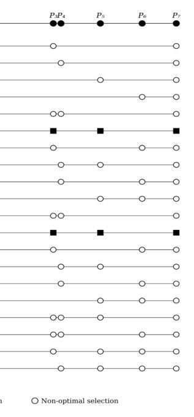 
Figure 1. Choose 𝑀+1 points out of 𝑁+1 so as to maximize their minimal spacing. Here 𝑁= 7, and 𝑀= 4. The top line contains the initial configuration (black circles). The 6 3  = 20 possible selections of points are in the lines below. The optimal ones (the max-min spacing in this case is (𝑃5 −𝑃3)) are in black squares, while the others are in white circles.

📷 Fig 2

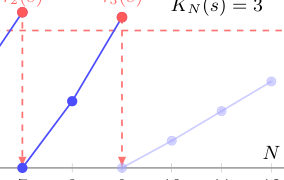 
Figure 2. Sketch of the threshold-resetting random walk. In this example, there are 𝐾𝑁(𝑠) = 3 complete cycles of length 𝐿1(𝑠) = 4, 𝐿2(𝑠) = 3, 𝐿3(𝑠) = 2 in 𝑁= 12 steps.

📷 Fig 3

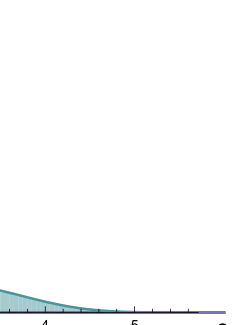 
Figure 3. Max-min spacing 𝑆∗for gaps (𝑇𝑗) 𝑗≥1 uniformly distributed in the interval [0, 1]. Numerical simulations (histograms) compared to the explicit formula (3.3). Here 𝑁= 6, and the sample size is 105.

📷 Fig 4

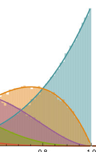 
Figure 4. Relative max-min spacing 𝑀e𝑆for exponential gaps. Numerical simulations (histograms) compared to the explicit formula (4.4). Here 𝑁= 6, and the sample size is 105.

📷 Fig 5

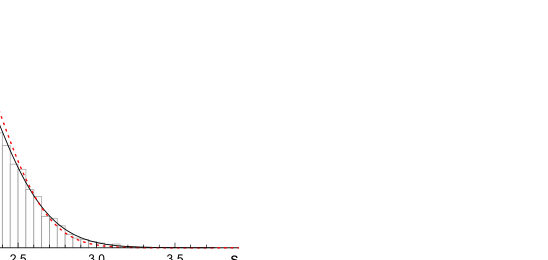 
Figure 6. Max-min spacing 𝑆∗for points with random i.i.d. exponential gaps. Nu- merical simulations (histograms) over a sample size of 104 obtained using the iterative interval refined method described in Sec. 5. In black the explicit formula (4.5). The dotted-red curve is the Gaussian approximation (4.16). Here 𝑁= 60, and 𝑀= 20. (Total number of selections: |𝐼𝑀,𝑁| = 59 19  ≃1015.)

**Summary.** This paper provides a rigorous statistical mechanics treatment of maximizing the minimum spacing among randomly placed points. It reformulates the problem using a threshold-resetting random walk, yielding exact formulas for the tail probability $P(S^* \ge s)$. The results are crucial for understanding optimal resource dispersion in various physical models.

**Why it may be interesting.** The mathematical techniques developed—relating optimal resource allocation (spacing maximization) to random walk statistics and large deviation theory—are highly relevant for analyzing resource constraints in quantum information or many-body systems.

Detailed structure

**Main problem.** The paper addresses the problem of maximizing the minimal spacing ($S^*$) when selecting $M+1$ points from an initial set of $N+1$ random points on a line.

**Main result.** It derives exact distributional identities and asymptotic formulas for $P(S^* \ge s)$ for general i.i.d. gap distributions, relating it to first-passage functionals of a threshold-resetting random walk.

**Method.** The core methodology involves mapping the optimization problem to a random walk process, utilizing generating functions, and employing saddle-point approximation techniques for large $N$ and $M$.

**Model / system.** The model consists of $N+1$ points on a line with successive spacings ($T_j$) assumed to be independent and identically distributed (i.i.d.). The analysis covers general, exponential, and geometric gap distributions.

**Key observables.** The maximal minimal spacing ($S^*$), the tail probability $P(S^* \ge s)$, and the relative spacing $eS$.

**Important parameters / regimes.** The ratio $\alpha = M/N$, the total number of gaps $N$, and the number of selected blocks $M$.

**Assumptions / limitations.** The initial spacings $T_j$ are assumed to be i.i.d., and the analysis often focuses on the large $N$ limit.

**Figures summary.** Figures illustrate the max-min spacing problem for small $N, M$, sketch the threshold-resetting random walk cycles, and show numerical comparisons of $S^*$ for uniform and exponential gaps.

**Paper structure.** The paper builds from defining the max-min spacing problem, reformulating it via a threshold-resetting random walk, deriving exact distributional identities using generating functions, and finally establishing asymptotic results using saddle-point methods for different gap types.

Abstract

From $N+1$ random points on a line we wish to select $M+1$ points so as to maximize the minimal spacing between them. We consider an initial configuration with independent and identically distributed spacings. The problem is equivalent to optimally grouping consecutive gaps into $M$ blocks and maximizing the smallest block sum. For general gap distributions, and for all $M\leq N$, we derive exact distributional identities for the optimal spacing and obtain its asymptotic behavior. The problem admits a reformulation in terms of a threshold-resetting random walk. The walk advances by successive random increments and is reset to the origin upon exceeding a fixed threshold. The probability that the optimal spacing exceeds a given value coincides with the probability that the walk completes at least $M$ reset cycles within $N$ steps. This yields an exact representation in terms of first-passage functionals of the walk. The same mapping suggests a numerical scheme for the max-min spacing problem in the regime of large $N$ and $M$, whose accuracy is tested against the exact results obtained here.

[↑ back to top](#top)

### [Shortcomings and capacities of real-constrained neural networks in complex spaces](http://arxiv.org/abs/2606.04390v1)

**Authors:** Andrew Gracyk  
**Type:** theory · **Category:** disordered systems and neural networks · **PDF:** <https://arxiv.org/pdf/2606.04390v1>  
**Analysis basis:** full PDF text, analyzed in chunks
**Topic relevance:** `Keldysh / 2PI / non-Gaussian methods` **2/5** · `entanglement & information structure` **2/5** · `methods for driven-dissipative` **1/5**

📷 Fig 1

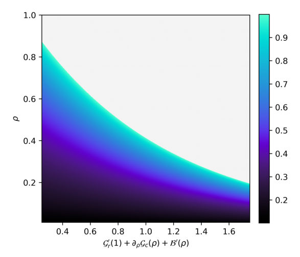 
Figure 1: We plot Γ across varying ρ and G{r,c}, B. We suppress values of Γ /∈[0, 1] in the plot. In theory, G{r,c}, B are not free parameters, and Γ /∈[0, 1] is not an actual scenario. We take X to be plot value and B′ = X −G′ r −∂ρGc. We attempt to choose G′ r, ∂ρGc, B′ consistent with a real scenario. The void space is plausible mathematically but does not represent a realistic scenario in regard to physical constraints on the spin glass system. We remark this plot is primarily a proxy for illustrative purposes to convey a typical Γ in its valid regime.

📷 Fig 2

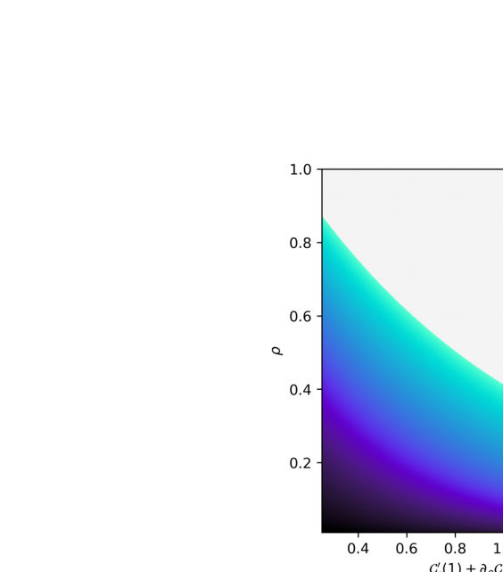 
Figure 2: We plot the same as Figure 1 but we take ∂ρGc = X −B′ −G′ r for B′, G′ r fixed.

📷 Fig 3

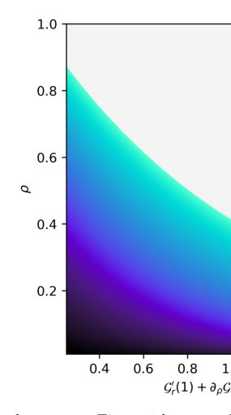 
Figure 3: We plot the same as Figure 1 but we take G′ r = X −B′ −∂ρGc for B′, ∂ρGc fixed.

**Summary.** This theoretical paper calculates the asymptotic ratio of storage capacities for complex neural networks when real constraints are imposed on the pre-activations. It employs sophisticated techniques from statistical physics, including the replica method and the Harish-Chandra-Itzykson-Zuber formula. The work provides a rigorous, albeit highly technical, analysis of model expressivity in complex spaces.

**Why it may be interesting.** While focused on neural networks, the mathematical machinery—replica methods, integration over compact groups, and free energy calculations—is highly relevant to understanding phase transitions and complexity in many-body quantum systems.

Detailed structure

**Main problem.** The paper investigates the asymptotic ratio of storage capacities for complex-valued neural networks when the pre-activations are constrained to be real versus unconstrained complex values.

**Main result.** The authors derive the asymptotic ratio $\Gamma$ using advanced mathematical tools, suggesting a non-trivial dependence on the network structure and constraints.

**Method.** The analysis heavily employs the replica method, saddle-point evaluations, and advanced mathematical identities like the Harish-Chandra-Itzykson-Zuber (HCIZ) formula for integration over compact manifolds.

**Model / system.** The model is a complex-valued neural network analyzed in the context of its storage capacity and expressivity, utilizing concepts from statistical physics like the Gardner volume.

**Key observables.** Storage capacities ($\alpha_r, \alpha_c$), the asymptotic ratio ($\Gamma$), and the quenched free energy ($f$).

**Important parameters / regimes.** Sparsity constraint parameter ($
ho$), generalization margin ($\kappa$), and the network size ($N$).

**Assumptions / limitations.** The derivation relies on the replica symmetric ansatz, the exchange of limit orders, and the applicability of advanced asymptotic approximations like Laplace's method.

**Figures summary.** Figure 1 plots the ratio $\Gamma$ across varying parameters $
ho$ and $G_{r,c}, B$, illustrating the theoretically valid regime $[0, 1]$.

**Paper structure.** The paper progresses by first establishing the core problem (ratio of capacities), then developing the mathematical machinery using the replica trick and complex integration over unitary/orthogonal groups, culminating in the final asymptotic expressions for the capacity.

Abstract

We find the asymptotic ratio between the storage capacities when enforcing real pre-activations in a complex hypothesis class as opposed to complex ones in the same class. Our methods depend on Gardner volume comparisons at critical capacity. Our proof relies on an application of the Harish-Chandra-Itzykson-Zuber (HCIZ) formula, nonstandard in literature. With the HCIZ formula, we may obtain a more robust approximation for the final asymptotic ratio. This strategy is applicable to our work specifically since we integrate over the unitary and orthogonal compact manifolds, facilitated via the Weyl integration formula and the Haar measure.

[↑ back to top](#top)

### [Spectral Fusion for Identifying Early State Exclusion in Symmetric Quantum Spin Chains](http://arxiv.org/abs/2606.04353v1)

**Authors:** Mia Escobar, Valentin Garcia, Anastasiia Minenkova  
**Type:** theory · **Category:** other · **PDF:** <https://arxiv.org/pdf/2606.04353v1>  
**Analysis basis:** full PDF text, analyzed in chunks
**Topic relevance:** `analog quantum simulation` **2/5** · `entanglement & information structure` **1/5** · `exotic spin models in light-matter` **1/5** · `non-equilibrium dynamics` **1/5**

📷 Fig 1

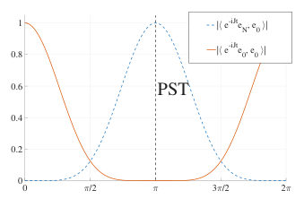 
Fig. 3 Examples of PST occurrences for J with the reduced equidistant spectrum {0, ±1, ±2, ±3}.

📷 Fig 2

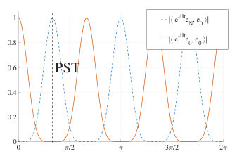 
Fig. 4 Examples of PST occurrences for J with the equidistant spectrum {0, ±3, ±6, ±9}.

📷 Fig 3

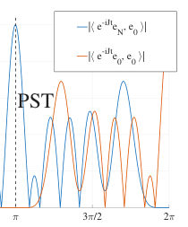 
Fig. 5 Example of the ESE occurrences for J with the reduced spectrum {0, ±3, ±8, ±9, ±12}. Given that J realizes PST for the first time at T0 = π, then A(t) has a root of multiplicity 10 at t = π.

📷 Fig 4

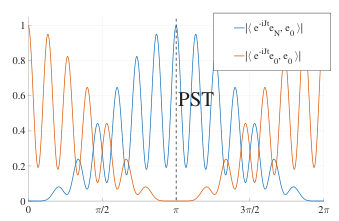 
Fig. 7 Example of no ESE occur- rences for J with the reduced spectrum {0, ±1, ±14, ±15, ±16, ±19}.

📷 Fig 5

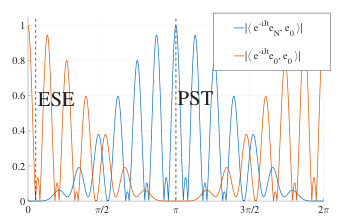 
Fig. 8 Example of the ESE occur- rences for J with the reduced spectrum {0, ±1, ±14, ±15, ±16, ±17}.

**Summary.** This paper analyzes the spectral conditions governing quantum state transfer in 1D spin chains, focusing on the phenomenon of Early State Exclusion (ESE). By introducing the spectral fusion (SF) process, the authors construct infinite families of Hamiltonians that exhibit both perfect state transfer and ESE. This deepens the understanding of how the spectral structure dictates the time evolution and information transport properties of quantum many-body systems.

**Why it may be interesting.** This work provides deep spectral insights into quantum transport phenomena in 1D systems, connecting the algebraic structure of the Hamiltonian (Jacobi matrix) directly to observable quantum dynamics like state transfer and its early failure modes.

Detailed structure

**Main problem.** The paper investigates the phenomenon of Early State Exclusion (ESE) in quantum spin chains, which is the vanishing of the time-evolved state overlap with the initial state at a time earlier than the first Perfect State Transfer (PST).

**Main result.** The authors provide explicit constructions, using a process called spectral fusion (SF), to build infinite families of Jacobi matrices exhibiting both PST and ESE, thereby broadening the known class of such spin chains.

**Method.** The analysis heavily relies on the spectral properties of the governing Jacobi matrix, utilizing polynomial sequences defined by three-term recurrence relations and analyzing the time evolution amplitude function $A(t)$ in terms of the matrix eigenvalues.

**Model / system.** The system is a one-dimensional quantum spin chain with nearest-neighbor interactions, whose dynamics in the single-excitation subspace are modeled by a real symmetric tridiagonal Jacobi matrix $J$.

**Key observables.** Perfect State Transfer (PST) time $T_0$, the amplitude function $A(t) = \langle e^{-iJt} e_0, e_0 
angle$, and the occurrence of ESE at time $	au < T_0$.

**Important parameters / regimes.** The length of the chain (parity of $N+1$), the structure of the spectrum $\sigma(J)$, and the convergence parameter $m$ used in spectral fusion.

**Assumptions / limitations.** The analysis focuses on the single-excitation subspace, and several results assume the spectrum $\sigma(J)$ is symmetric or 'reduced' for simplification.

**Figures summary.** Figures illustrate the quantum spin-chain model, examples of ESE occurrences relative to PST times, and comparisons between different spectral structures (e.g., T-Rex vs. Krawtchouk chains) regarding ESE.

**Paper structure.** The paper progresses by defining the problem (ESE vs. PST), deriving amplitude formulas based on spectral properties, introducing the spectral fusion (SF) process as an inverse operation to spectral surgery, and finally proving convergence theorems to construct infinite families of matrices exhibiting these behaviors.

Abstract

Perfect state transfer (PST) in one-dimensional quantum spin chains provides a natural setting in which quantum information transport can be analyzed using spectral methods. In the single-excitation subspace, the dynamics of a chain with nearest-neighbor interactions are governed by a Jacobi matrix, allowing questions of state transfer to be formulated in terms of eigenvalue distributions and symmetry properties of eigenvectors. In this work, we investigate the phenomenon of \emph{early state exclusion} (ESE), whereby the overlap of the time-evolved state with the initial state vanishes at a time strictly earlier than the first occurrence of perfect state transfer. Building on earlier constructions of Hamiltonians exhibiting PST with and without ESE, we provide explicit Jacobi matrix realizations for arbitrary odd-length chains and establish general conditions under which ESE occurs or does not occur. We propose the process of \emph{spectral fusion} (SF) to build infinite families of such Hamiltonians. These results broaden the known class of spin chains displaying early state exclusion and further clarify the role of spectral structure of the Hamiltonians.

[↑ back to top](#top)

### [Stabilizing the parquet problem](http://arxiv.org/abs/2606.04936v1)

**Authors:** Herbert Eßl, Stefan Rohshap, Marcel Gievers, Markus Wallerberger, Alessandro Toschi, Anna Kauch  
**Type:** theory · **Category:** strongly correlated electrons · **PDF:** <https://arxiv.org/pdf/2606.04936v1>  
**Analysis basis:** full PDF text, analyzed in chunks
**Topic relevance:** `Keldysh / 2PI / non-Gaussian methods` **2/5** · `analog quantum simulation` **1/5** · `methods for driven-dissipative` **1/5**

📷 Fig 1

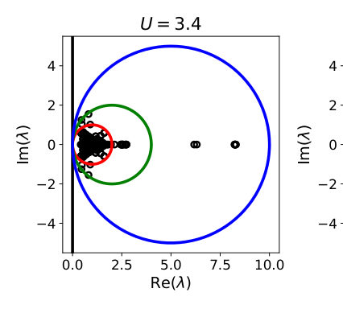 
Figure 1: The eigenvalues λ (black circles) for the parquet formalism of the HA for two different values of U at ph-symmetry in the complex plane. Colorful circles show the stability regions for given damping parameters p. Left: Fixed point can be stabilized with damping, i.e., by decreasing p. Right: Fixed point cannot be stabilized with damping since some eigenvalues have a negative real part. The vertical black line marks where Re(λ) = 0.

📷 Fig 2

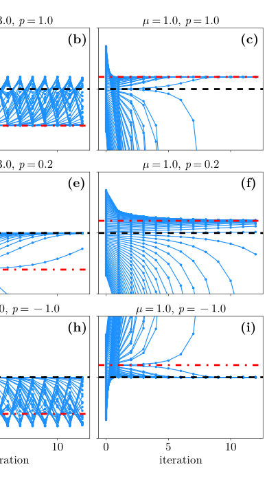 
Figure 2: Trajectories of fixed-point iterations with the iterative map f = x+µx− x2, Eq. (18), for different starting points x0 ∈[−3.49, 3.51] in steps of ∆x0 = 0.1. Black (red) dashed lines indicate the (un)physical fixed point x∗= 0(µ). The first column of panels shows the fixed-point iteration for the equation µ = −1, the middle column for µ = −3, and the third one for µ = 1. Panels (a)–(c) are computed with a damping parameter p = 1.0, while panels (d)–(f) with p = 0.2, which fixes the convergence problems of the case µ = −3. In panel (i), we apply the stabilization method by switching the sign of the damping parameter (p = −1.0) resulting in convergence to the physical fixed point....

📷 Fig 3

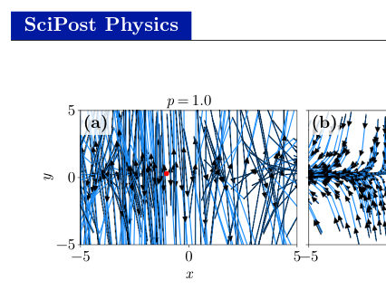 
Figure 3: Trajectories of the fixed-point iteration for the map fx = 1 + 2x + ηy and fy = 1 −2y + ηx with η = 0.1 for different starting points (x0, y0) with x0, y0 ∈(−5, 5) and 40 iterations. In panel (a), the damping p = 1.0 leads to unstable directions along both eigenvectors u1 = (0.0250, −0.9997)T , u2 = (−0.9997, −0.0250)T . In panel (b), the damping p is set to 0.2 stabilizing the direction along u1 (associated with λ1 = −2.0025). Application of the stabilization method in panel (c) fixes the stability issues and allows for convergence of the fixed-point iteration to the correct solution (x∗, y∗) = (−1.03, 0.299) (red dot).

📷 Fig 4

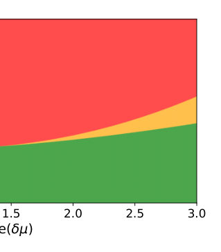 
Figure 4: Stability phase space of the parquet formalism with damped iteration, Eq. (10), for the ZP model. Color scheme: In the green region, the fixed point is stable without damping (p = 1); in the orange region, it is unstable for p = 1 but curable by smaller p; in the red region, it is unstable and not curable by a smaller p. The vertex divergence, which only appears in the density channel at (Re(δµ) = 0, U = Im(δµ)2), is marked by a black square.

📷 Fig 5

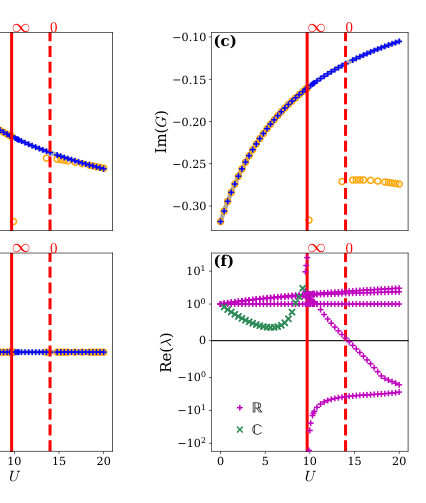 
Figure 5: Parquet results for the ZP model with conventional iteration (orange ◦ denoted by p) and stabilized iteration (blue + denoted by P) for ph-symmetry (Re(δµ) = 0), where the red lines mark the instabilities (solid for vertex divergences and dashed for real eigenvalues that go through zero). The physical solution is shown as gray solid line. The starting point for each calculation is the physical fixed point at the previous U value and the damping p is determined by Eq. (13) with c = 0.1. In panels (a)–(e), the channels (d,m,G,s,t) are shown and in panel (f) the real part of eigenvalues of Π are shown, where purely real eigenvalues are marked by magenta + and complex eigenvalues are...

**Summary.** This work addresses the numerical instability of the parquet equations used to calculate properties of strongly correlated electron systems like the Hubbard model. By analyzing the Jacobian spectrum, the authors provide a stabilization strategy that allows the iterative solution to converge to the correct physical fixed point even in highly non-perturbative regimes where standard methods fail.

**Why it may be interesting.** The rigorous mathematical treatment of convergence failure in diagrammatic methods provides crucial insight into the non-perturbative physics of strongly correlated materials, which is central to modern condensed matter theory.

Detailed structure

**Main problem.** The paper systematically analyzes the stability of the iterative solution of the parquet equations, which are used to solve for interacting many-body systems.

**Main result.** The instability of the parquet iteration is not solely caused by divergences in the two-particle irreducible vertex, and a controlled stabilization strategy was introduced that successfully converges to the physical solution in deep non-perturbative regimes.

**Method.** The analysis involves studying the spectrum of the Jacobian associated with the damped fixed-point iteration of the parquet equations, leading to a stabilization procedure.

**Model / system.** The study applies to the Zero-point (ZP) model and the Hubbard atom (HA), which represents the strong-coupling limit of the Hubbard model. The formalism relies on diagrammatic techniques like the parquet equations.

**Key observables.** Convergence issues, Jacobian eigenvalues, physical fixed point stability, and the two-particle irreducible vertex.

**Important parameters / regimes.** Interaction strength (U), chemical potential deviation ($\delta\mu$), and the damping parameter ($p$).

**Assumptions / limitations.** The analysis assumes the validity of the iterative fixed-point approach, though it shows this approach can fail due to local instabilities.

**Figures summary.** Figures illustrate the stability phase space for the ZP model, comparing conventional iteration failure versus success using the stabilized method, and show convergence trajectories for coupled equations.

**Paper structure.** The paper proceeds by analyzing the stability of the iterative solution, deriving stability criteria from the Jacobian spectrum, introducing a stabilization strategy, and finally applying this procedure to the ZP and HA models.

Abstract

We systematically analyze the stability of the iterative solution of the parquet equations by studying the spectrum of the Jacobian associated with the commonly used damped fixed-point iteration procedure. In this context, we provide an explicit criterion that determines when the physical fixed point of the parquet iteration becomes unstable. Importantly, we demonstrate that misleading convergence issues, observed in parquet calculation at intermediate-to-high interaction values, are not restricted to parameter regions where the two-particle irreducible vertex diverges, but can also arise in absence of vertex divergences. Hence, the misleading convergence issues of parquet-based algorithms are not directly caused by the crossings of two solutions of the (multivalued) Luttinger-Ward functional, that are associated with vertex divergences. Building on these insights, we introduce a controlled stabilization strategy that allows the convergence to the physical solution in the instability regimes. We apply this procedure to the zero-point model and the Hubbard model in the atomic limit, where we successfully stabilize the physical solution deep in the non-perturbative regime, even across multiple divergence lines.

[↑ back to top](#top)

### [Quantum Time Lower Bounds by Permutation Invariance](http://arxiv.org/abs/2606.05099v1)

**Authors:** Qisheng Wang  
**Type:** theory · **Category:** quantum information and computing · **PDF:** <https://arxiv.org/pdf/2606.05099v1>  
**Analysis basis:** full PDF text, analyzed in chunks
**Topic relevance:** `entanglement & information structure` **2/5** · `quantum measurements` **1/5**

📷 Fig 1

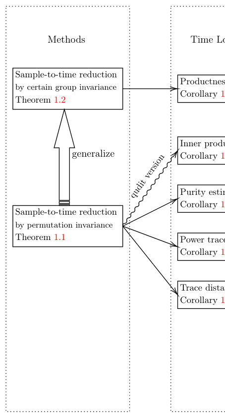 
Figure 1: Diagram of relationships amongst our results.

📷 Fig 2

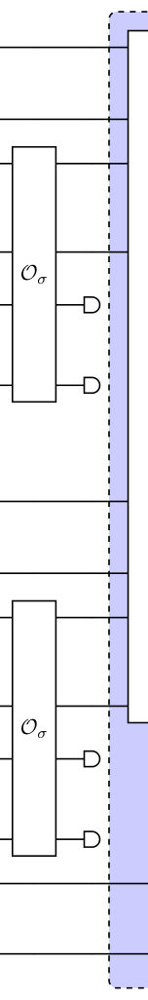 
Figure 2: Quantum circuit for tester T .

**Summary.** This paper introduces a systematic theoretical framework to derive tight lower bounds on the quantum time complexity required for quantum property testing. By reducing the problem to sample complexity bounds via permutation invariance, the authors prove time-optimality for several fundamental quantum estimation protocols, including purity and inner product estimation.

**Why it may be interesting.** For a theoretical physicist, this work provides rigorous, systematic tools to quantify the fundamental computational limits (time vs. sample) for characterizing quantum states, which is crucial for designing efficient quantum measurements.

Detailed structure

**Main problem.** The paper aims to establish systematic and tight lower bounds on the quantum time complexity (circuit size) required to test specific quantum properties of quantum states.

**Main result.** A novel framework is introduced that relates the time complexity of testing permutation-invariant properties to the sample complexity of related, simpler problems, yielding time-optimality for several key quantum estimation protocols.

**Method.** The core method involves reducing the problem of estimating a complex property $P_n$ to a known sample complexity lower bound $S(Q_m)$ via theorems based on permutation invariance and embeddability.

**Model / system.** The analysis focuses on $n$-qubit quantum states ($
ho$) and their properties, such as purity ($	ext{tr}(
ho^2)$), inner products ($	ext{tr}(
ho\sigma)$), and productness. The framework is generalizable to qudits.

**Key observables.** Quantum time complexity $T(P_n)$, quantum sample complexity $S(P_n)$, purity, inner product, and high-order power traces.

**Important parameters / regimes.** The error parameter ($\epsilon$), the number of qubits ($n$), and the ratio $R$ derived from the structure of the property are crucial parameters.

**Assumptions / limitations.** The results heavily rely on the assumption that the properties being tested exhibit permutation invariance, allowing the use of the derived reduction theorems.

**Figures summary.** Figures summarize the relationships between the derived time-optimality results for various quantum algorithmic tools.

**Paper structure.** The paper develops a theoretical framework using theorems (like Theorem 1.1 and 1.2) to relate time and sample complexity. It then applies this framework to derive specific, time-optimal lower bounds for protocols like the SWAP test, Shift test, and samplizer.

Abstract

Tight bounds on quantum sample complexity and quantum query complexity have been known for various computational problems in the literature, whereas tight bounds on quantum time complexity (i.e., the size of quantum circuits) remain unresolved. In this paper, we provide a framework to establish lower bounds on the quantum time complexity for testing permutation-invariant properties of quantum states, via a reduction from quantum sample complexity. As an application, we obtain a series of matching lower bounds when given sample access to the input quantum states, including:   1. The SWAP test due to Buhrman, Cleve, Watrous, and de Wolf (Phys. Rev. Lett. 2001) is time-optimal to estimate the purity $\operatorname{tr}(ρ^2)$ and the inner product $\operatorname{tr}(ρσ)$.   2. The Shift test due to Ekert, Alves, Oi, Horodecki, Horodecki, and Kwek (Phys. Rev. Lett. 2002) is time-optimal to estimate the high-order functionals $\operatorname{tr}(ρ^k)$.   3. The productness tester for multipartite pure states due to Harrow and Montanaro (J. ACM 2013) is time-optimal.   4. The LMR protocol due to Lloyd, Mohseni, and Rebentrost (Nat. Phys. 2014) is time-optimal to implement the reflection operator about a pure state.   5. The samplizer due to Wang and Zhang (IEEE Trans. Inf. Theory 2025) is time-optimal for pure states.   6. The estimator for pure-state trace distance and fidelity due to Wang and Zhang (ICALP 2026) is time-optimal.   To the best of our knowledge, this is the first method that allows us to systematically establish tight lower bounds on quantum time complexity.

[↑ back to top](#top)

### [Imaginarity witness](http://arxiv.org/abs/2606.04763v1)

**Authors:** Zhiqi Liang, Yufan Lin, Yu Guo, Yuqi Sun  
**Type:** theory · **Category:** quantum information and computing · **PDF:** <https://arxiv.org/pdf/2606.04763v1>  
**Analysis basis:** full PDF text, analyzed in chunks
**Topic relevance:** `entanglement & information structure` **2/5**

📷 Fig 1

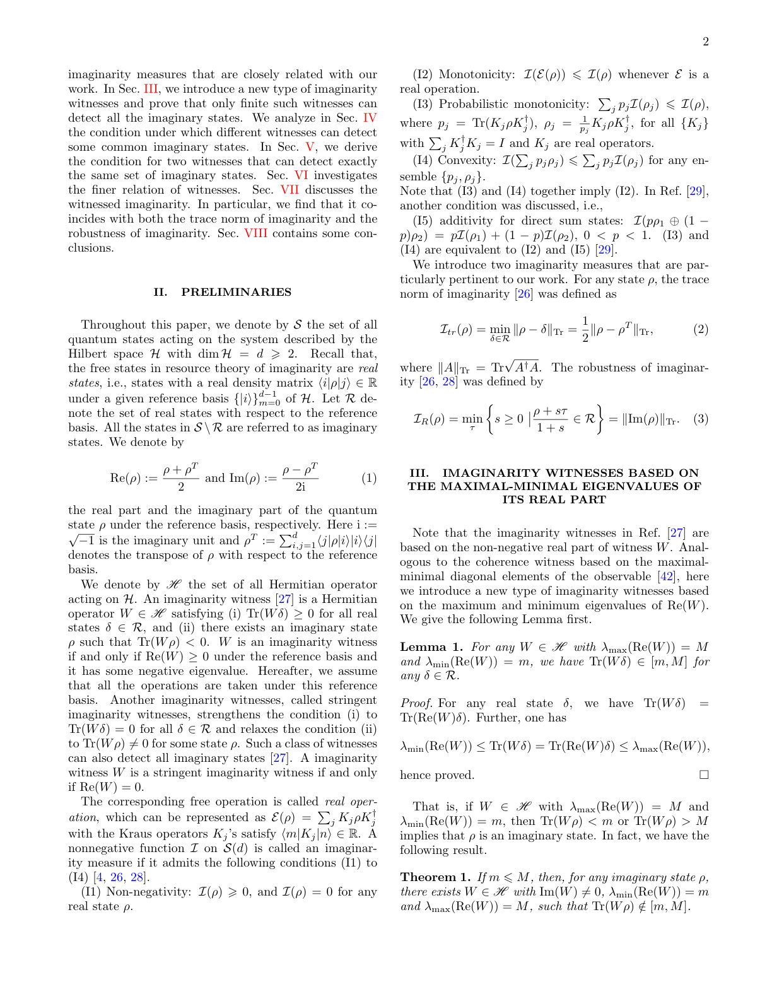 
Low-resolution page preview, page 2

📷 Fig 2

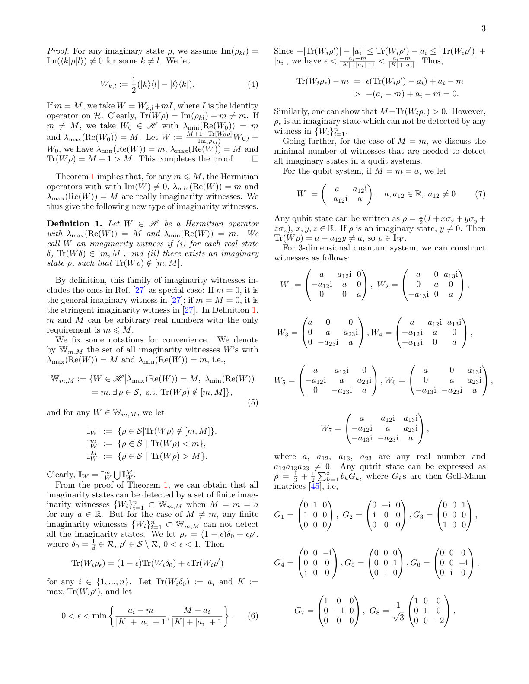 
Low-resolution page preview, page 3

📷 Fig 3

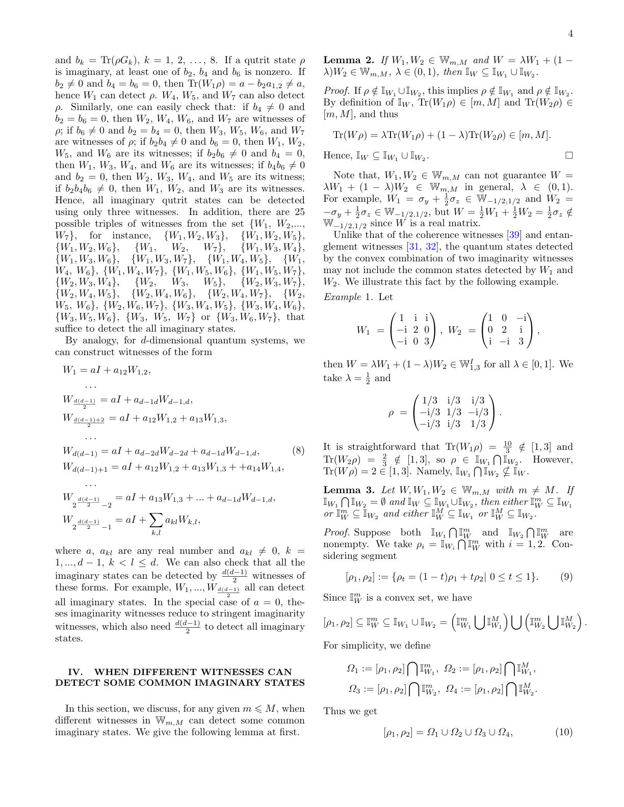 
Low-resolution page preview, page 4

📷 Fig 4

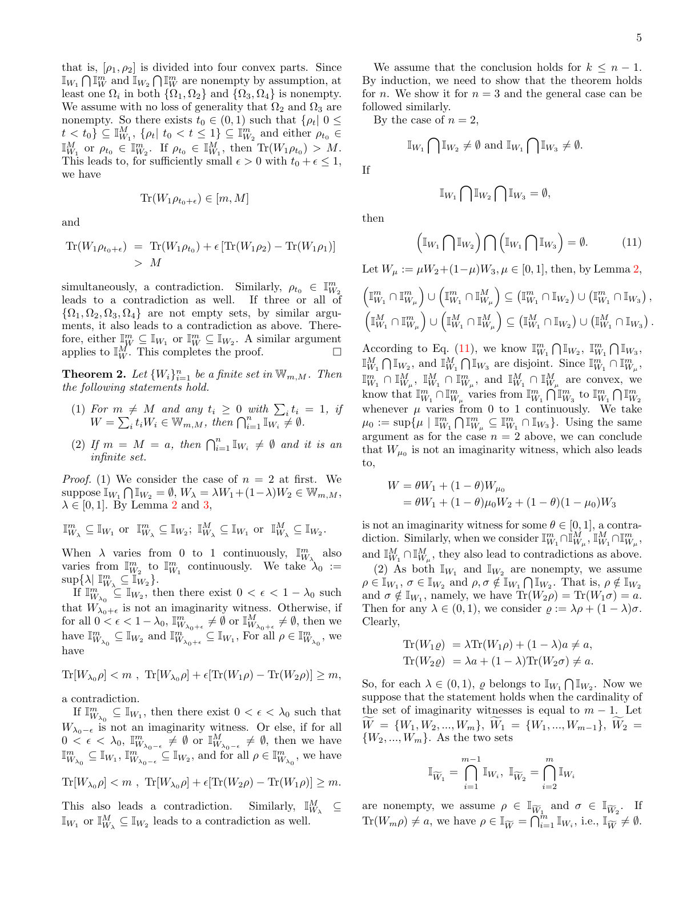 
Low-resolution page preview, page 5

📷 Fig 5

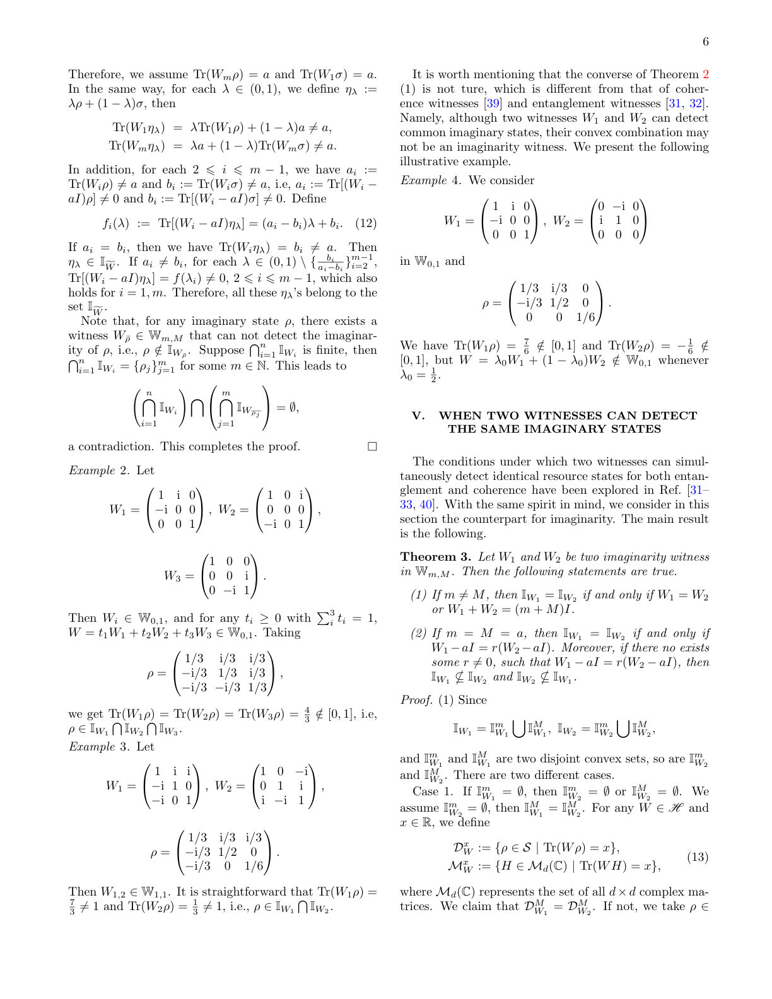 
Low-resolution page preview, page 6

**Summary.** This paper introduces 'imaginarity witnesses' as a new tool to quantify the imaginary component of quantum states. It establishes a theoretical framework showing that the resulting 'witnessed imaginarity' measure is mathematically equivalent to both the trace norm and the robustness of imaginarity. This advances the understanding of quantum resource theory by providing a concrete diagnostic tool for imaginary quantum features.

**Why it may be interesting.** It provides a rigorous, operational framework for quantifying a specific non-classical feature (imaginarity) of quantum states, drawing direct parallels to well-established concepts like entanglement and coherence witnesses.

Detailed structure

**Main problem.** The paper develops and analyzes a new class of 'imaginarity witnesses' to characterize and detect imaginary quantum states, extending resource theories like entanglement and coherence.

**Main result.** The authors prove that a newly defined 'witnessed imaginarity' measure coincides with both the trace norm of imaginarity and the robustness of imaginarity.

**Method.** The methodology involves defining witnesses based on the maximum and minimum eigenvalues of the real part of the witness operator, and then analyzing the geometric relationships between the sets of detectable states.

**Model / system.** The study concerns quantum states (density matrices $
ho$) acting on a Hilbert space of dimension $d \ge 2$. The analysis uses specific examples like qubits and qutrits.

**Key observables.** Imaginarity witness ($W$), Imaginarity measure ($	ext{IW}(
ho)$), Trace norm of imaginarity ($	ext{Itr}(
ho)$), and Robustness of imaginarity ($	ext{IR}(
ho)$).

**Important parameters / regimes.** The minimum ($m$) and maximum ($M$) eigenvalues of $	ext{Re}(W)$ define the detection interval $[m, M]$.

**Assumptions / limitations.** The analysis builds upon the established framework of quantum resource theories and assumes the existence of a reference basis for defining real states.

**Paper structure.** The paper introduces the concept of imaginarity witnesses, derives new classes of witnesses ($W_{m,M}$), analyzes the relationships between different witnesses (equality and inclusion of detection sets), and culminates in proving the equivalence of the defined imaginarity measure with known quantities.

Abstract

Imaginarity has shown to be an important resource in quantum information. The witness theory of quantum resource, such as entanglement witness, coherence witness, and imaginarity witness, has been established, in particular entanglement witness and coherence witness have been extensively explored. We present here another class of imaginarity witnesses beyond the one in [{Phys. Lett. A} \textbf{530}, 130135 (2025)]. Within our framework, any nonreal Hermitian operator under the reference basis is an imaginarity witness and only finite of them can detect all the imaginarity states. As the common approaches that were explored in the witness theories of entanglement and coherence, we then explore the relations between these imaginarity witnesses in different cases: (i) when they can detect common imaginary states, (ii) when they can detect the same sets of imaginary states, and (ii) when they obey the finer relation. Finally, we define an imaginarity measure in terms of witnesses, termed witnessed imaginarity, and prove that it coincides with both the trace norm of imaginarity and the robustness of imaginarity.

[↑ back to top](#top)

### [Percolation Criticality of Amorphous-Amorphous Transitions in Compressed Glasses](http://arxiv.org/abs/2606.04748v1)

**Authors:** Julien Perradin, Simona Ispas, Ricardo V. Paredes, Anwar Hasmy, Bernard Hehlen  
**Type:** theory · **Category:** disordered systems and neural networks · **PDF:** <https://arxiv.org/pdf/2606.04748v1>  
**Analysis basis:** full PDF text, analyzed in chunks
**Topic relevance:** `non-equilibrium universality` **2/5**

📷 Fig 1

 
FIG. 1: a) Fraction ϕ of SiOZ polyhedra: SiO4 (red), SiO5 (green), and SiO6 (blue). The data extracted from the present work (bold lines) are compared to those extracted from classical MD simulations (colored symbols and continuous lines) reported by Mantisi et al.39 and DFTB14 (open symbols and dashed lines) MD studies. b) Corner- and edge-sharing connectivities per SiOZ. The arrow indicates the pressure at which the number of ES bonds equals two, as in crystalline stishovite40.

📷 Fig 2

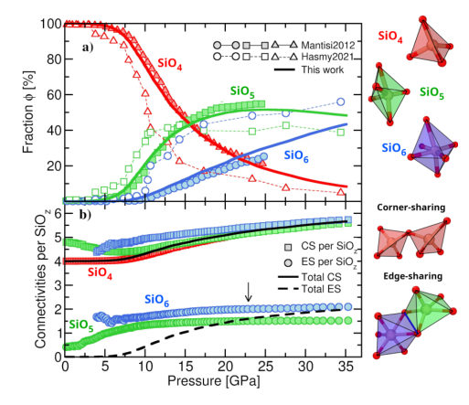 
Figure 2a shows various snapshots of the structural evolution upon compression of the SHIK glass within the bonded approach. Isolated SiO5 pentahedra (green boxes) appear at low pressure and progressively replace SiO4 (red boxes) in the silica network. They form

📷 Fig 3

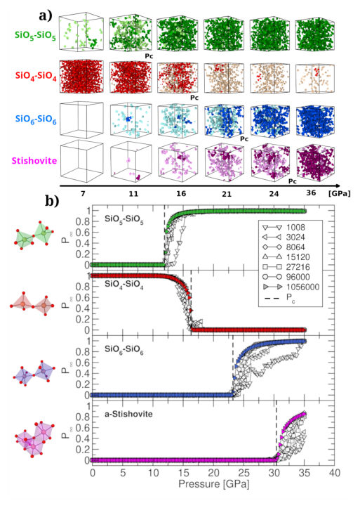 
FIG. 2: a) Snapshots of pressurization of an a-SiO2 sample of 3024 atoms. Lighter colors label small SiOz-SiOz clusters and darker colors correspond to the biggest cluster (green shades are SiO5-SiO5, red are SiO4-SiO4, blue are SiO6-SiO6, and purple are stishovite (SiO6 connected by ES)). b) Percolation order parameter P∞of SiOz-SiOz and a-stishovite clusters as a function of pressure for each simulation box size L. The critical pressure pc (dashed lines) corresponds to the maximum of the correlation function ξ(p).

📷 Fig 4

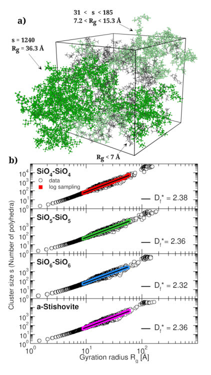 
FIG. 3: Gyration radius Rg of SiOz polyhedra clusters at the critical pressure pc. a) Snapshot of unwrapped SiO5-SiO5 clusters at the critical point (27k atoms) as an illustration. Light green and dark green colors highlight clusters of increasing gyration radius. Clusters whose Rg is inferior to 7 ˚A are shown in gray. b) log-log plot of s versus Rg in the SiOz-SiOz and stishovite clusters. Open black circles are the raw data, and colored squares are the log-sampled data obtained by dividing the x-range into 30 logarithmically spaced bins, then averaging the y-values (and propagating errors) within each bin, using bin centers as the new x-coordinates, and discarding empty bins. Black lines...

📷 Fig 5

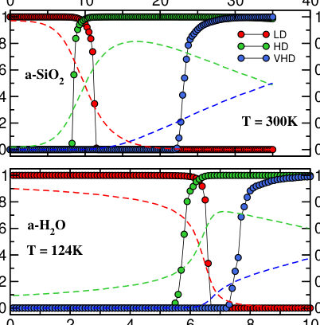 
FIG. 4: a) a-SiO2 and b) a-H2O. Circles refer to the order parameter P∞and dashed lines to fractions ϕ. LD stands for Z = 4, HD for Z = 4-7, and VHD for Z ≥8.

**Summary.** This work uses molecular dynamics and percolation theory to study how structural connectivity changes in compressed amorphous glasses like $	ext{SiO}_2$. By comparing bonded and non-bonded structural analyses, the authors map out sequential percolation transitions corresponding to the formation of different structural motifs ($	ext{SiO}_4, 	ext{SiO}_5, 	ext{SiO}_6$). The findings suggest that these transitions are governed by a mechanism distinct from simple random percolation, hinting at topological or rigidity effects.

**Why it may be interesting.** While focused on condensed matter physics, the rigorous application of percolation theory and scaling laws to characterize structural phase transitions in disordered systems provides a powerful, generalizable framework for understanding connectivity and rigidity in complex materials, which has parallels in analyzing network dynamics in quantum many-body systems.

Detailed structure

**Main problem.** The paper investigates the percolation criticality associated with amorphous-amorphous structural transitions in compressed glasses, specifically $	ext{SiO}_2$ and $	ext{H}_2	ext{O}$. It aims to understand the underlying physical mechanism governing these structural changes.

**Main result.** The study reveals critical percolation transitions for various structural motifs ($	ext{SiO}_2$-$	ext{SiO}_2$ clusters, $	ext{SiO}_6$-$	ext{SiO}_6$ clusters) whose critical exponents suggest a possible rigidity percolation mechanism, deviating from standard random correlation models.

**Method.** The research employs large-scale molecular dynamics simulations combined with percolation theory, utilizing cluster analysis (e.g., Union-Find algorithm) and finite-size scaling methods to determine critical exponents and transition pressures.

**Model / system.** The primary systems are compressed amorphous silica ($	ext{a-SiO}_2$) and amorphous water ($	ext{a-H}_2	ext{O}$). The analysis compares 'bonded' models (based on polyhedral connectivity like $	ext{SiO}_4$ tetrahedra) with 'non-bonded' models (based on coordination numbers like $	ext{OOZ}$ or $	ext{SiSiZ}$ clusters).

**Key observables.** Percolation order parameter ($P_\infty$), correlation length ($\xi$), average cluster size ($\langle S 
angle$), critical exponents ($
u, eta, \gamma, 	au$), and fractal dimension ($D_f^*$).

**Important parameters / regimes.** Pressure (ranging from 0 to 35 GPa), coordination number ($Z$), and system size ($10^6$ atoms).

**Assumptions / limitations.** The analysis relies on the applicability of scaling laws near the critical point and assumes that structural transitions can be mapped onto percolation phenomena.

**Figures summary.** Figures illustrate the pressure dependence of correlation length and cluster size, showing power-law scaling near critical points, and demonstrate data collapse using Finite Size Scaling (FSS) ansatz for various cluster types.

**Paper structure.** The paper systematically compares results from bonded and non-bonded approaches, mapping out sequential percolation transitions ($	ext{SiO}_4 	o 	ext{SiO}_5 	o 	ext{SiO}_6$) as pressure increases, and applying rigorous scaling analysis to quantify the critical behavior.

Abstract

The low-to-high-density transition in compressed silica glass is investigated using percolation theory. Large-scale molecular dynamics simulations of SiO$_2$ glasses, with system sizes of up to 10$^6$ atoms and pressures ranging from 0 to 35 GPa, were carried out to investigate the emergence of structural motifs and their growth to system-spanning length scales under compression. On this basis, we introduced long-range descriptors that complement conventional local and medium-range structural measures. The results reveal critical percolation transitions of SiO$_Z$-SiO$_Z$ clusters with increasing coordination number $Z$. The critical exponents slightly deviate from the standard (random) correlation, a behavior that seems to be more pronounced for higher coordinated polyhedra than for tetrahedra, suggesting a possible rigidity percolation mechanism. SiSi$_z$-SiSi$_z$ clusters were also analyzed using the non-bonded approach. Bonded and non-bonded approaches complement each other in a particularly illuminating way for describing pressure-induced structural transformations and common mechanisms shared by bonded glasses, such as SiO$_2$, and non-bonded glasses, such as amorphous ice.

[↑ back to top](#top)

### [Robust Steerability Classification via Key Feature Extraction and Matrix Structure Preservation](http://arxiv.org/abs/2606.04363v1)

**Authors:** Yutao Xin, Huixian Meng, Zhongyan Li, Pu Wang  
**Type:** theory · **Category:** quantum information and computing · **PDF:** <https://arxiv.org/pdf/2606.04363v1>  
**Analysis basis:** full PDF text, analyzed in chunks
**Topic relevance:** `entanglement & information structure` **2/5**

📷 Fig 1

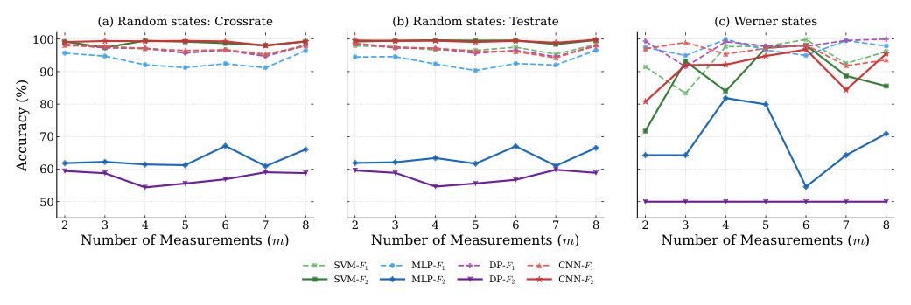 
Fig. 1. Baseline comparison of different classifiers using F1 and F2. (a) Cross-validation accuracy on random states. (b) Test accuracy on random states. (c) Prediction accuracy on Werner states. The detailed numerical values are listed in the Appendix A.

📷 Fig 2

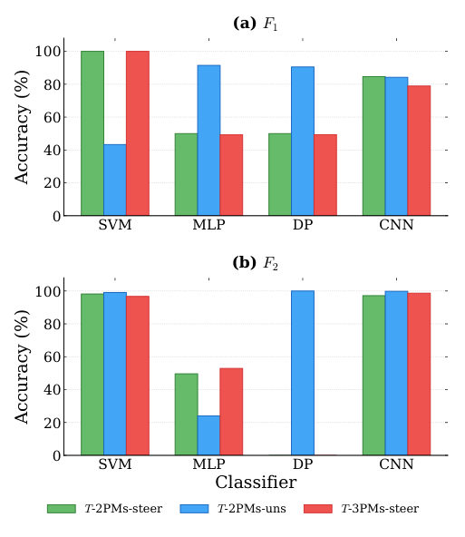 
Fig. 2. Prediction accuracies on T-diagonal states under two and three measurement settings. (a) Results based on F1. (b) Results based on F2. The three bars in each clas- sifier group correspond to two-measurement steerable states, two-measurement unsteerable states, and three-measurement steerable states, respectively.

📷 Fig 3

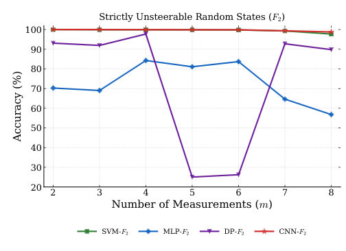 
Fig. 3. Prediction accuracies of the F2-based models on strictly unsteerable random states under different measure- ment settings.

📷 Fig 4

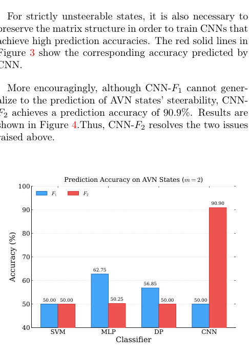 
Fig. 4. Prediction accuracies on AVN states under the two- measurement setting.

📷 Fig 5

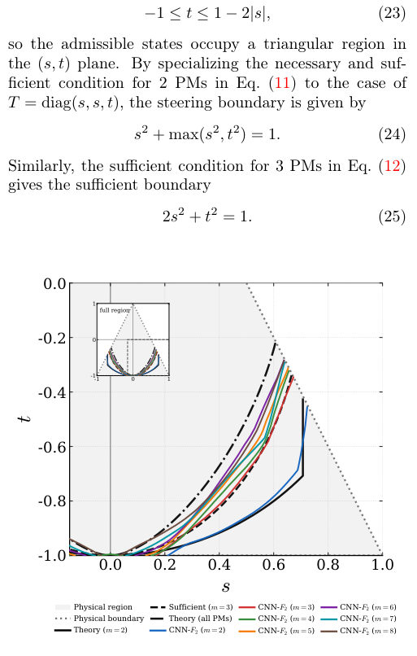 
Fig. 5. CNN-F2 prediction of steering boundaries for axially symmetric states.

**Summary.** This work develops robust machine learning methods to classify quantum steerability, a key measure of quantum correlation. By recognizing that standard feature vectorization loses crucial information, the authors introduce CNNs that process the full matrix structure of the quantum state. The resulting model achieves state-of-the-art robustness, allowing for the prediction of measurement requirements for detecting steerability.

**Why it may be interesting.** It provides advanced machine learning techniques (CNNs on structured data) to tackle fundamental questions in quantum correlation theory, which is highly relevant to quantum information processing and characterization.

Detailed structure

**Main problem.** The paper addresses the challenge of creating robust quantum steerability classifiers that can generalize accurately across various challenging quantum states.

**Main result.** The most robust classification performance is achieved by simultaneously extracting key features and preserving the intrinsic matrix structure of the quantum state using Convolutional Neural Networks (CNNs).

**Method.** The authors compare various machine learning models (SVM, MLP, CNN) trained on different feature representations (F1, F2) derived from quantum state density matrices.

**Model / system.** The study analyzes quantum steerability, an asymmetric correlation measure between quantum systems, using density matrices ($
ho_{AB}$) for two-qubit states. The classification is tested on specific state families, including Werner, T-diagonal, and All-Versus-Nothing (AVN) states.

**Key observables.** Classification accuracy (%) on random and Werner states, and the prediction accuracy of the minimum number of projective measurements required to detect steerability.

**Important parameters / regimes.** The number of projective measurements ($m$), the feature sets ($F_1, F_2$), and the CNN hyperparameters (e.g., learning rate, kernel size).

**Assumptions / limitations.** The primary assumption challenged is that flattening quantum states into 1D vectors destroys essential matrix structure, necessitating the use of CNNs on matrix-structured features.

**Figures summary.** Figures compare classification accuracies of various models (SVM, CNN) on random and Werner states, and show the successful prediction of steerability boundaries for axially symmetric states.

**Paper structure.** The paper progresses by first establishing the limitations of basic classifiers on challenging states, then introducing key feature extraction, and finally achieving the best results by integrating feature extraction with matrix structure preservation via CNNs, culminating in an application to measurement prediction.

Abstract

Generalization ability is essential for assessing the robustness of quantum steerability classifiers. In this work, we investigate robust steerability classification from the perspective of key feature extraction and matrix structure preservation. The dataset introduced in Phys. Rev. A 100, 022314 (2019) provides the training basis for the present work. With strictly unsteerable random states, T-diagonal states, and All-Versus-Nothing (AVN) states, we evaluate the generalization performance of support vector machines (SVMs), multilayer perceptrons (MLPs), and deep perceptron control classifiers(DPs) trained on full-information features. None of these classifiers perform consistently on T-diagonal or AVN states. Given that stochastic local operations and classical communication and local unitary transformations preserve steerability, we introduce a key feature that determines steerability. SVMs trained on this feature overcome the instability on T-diagonal states but still fail on AVN states. Moreover, this feature alone is insufficient for training robust neural-network-based steerability classifiers. Recognizing that flattening quantum states into one-dimensional vectors may destroy their intrinsic matrix structure, we introduce matrix versions of both features and train convolutional neural networks on them. The most robust overall performance among the tested classifiers is achieved only when the matrix structure is preserved and key features are extracted simultaneously. Finally, as an application, we employ the most robust classifiers to predict the number of projective measurements required to detect the steerability of axially symmetric states

[↑ back to top](#top)

### [Anisotropic Rabi Model as a Noise Biased Qubit](http://arxiv.org/abs/2606.04487v1)

**Authors:** Jia-Wen Yu, Ke-Xiong Yan, Yuan Qiu, Yiming Yu, Yexiong Zeng, Adam Miranowicz, Zhi-Cheng Shi, Ye-Hong Chen, Yan Xia, Franco Nori  
**Type:** theory · **Category:** quantum information and computing · **PDF:** <https://arxiv.org/pdf/2606.04487v1>  
**Analysis basis:** full PDF text, analyzed in chunks
**Topic relevance:** `Keldysh / 2PI / non-Gaussian methods` **1/5** · `Tavis-Cummings & cavity-many-emitter` **1/5** · `analog quantum simulation` **1/5** · `correlated / nonlocal dissipation` **1/5** · `correlated cavity matter` **1/5** · `driven-dissipative phase transition` **1/5** · `methods for driven-dissipative` **1/5** · `non-equilibrium dynamics` **1/5**

📷 Fig 1

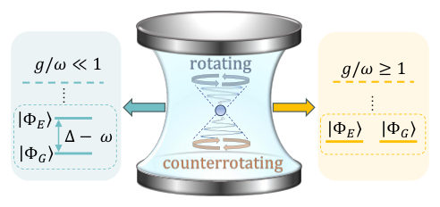 
FIG. 1. Model diagram of the ARM. In the weak coupling regime, the ground and first excited states are separated by an energy gap of approximately ∆−ω. As the coupling strength increases to the USC and DSC regimes, this gap progressively decreases, and the two levels become nearly degenerate. Here, ω denotes the frequency of the bosonic mode, and ∆represents the energy splitting between the two atomic levels.

📷 Fig 2

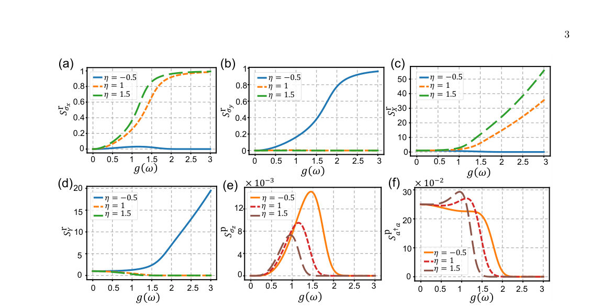 
FIG. 2. Variation of all noise sensitivities with increasing coupling strength g for different anisotropy parameters η. Panels (a-d) correspond to energy relaxation, where Sp σx = Sp σy = Sp X = Sp Y ≈0, while panels (e,f) correspond to pure dephasing, where Sr σz = Sr a†a ≈0.

📷 Fig 3

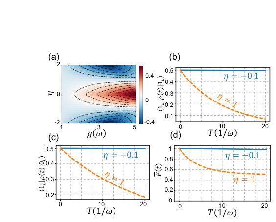 
FIG. 3. (a) Indicator ∆ρ as a function of the anisotropy parameter η and the coupling strength g. By tuning η, the noise robustness can be enhanced, even at a fixed coupling strength g. Here, γ/ω = γp/ω = 10−3, ωT = 5, and θ = π 4 , ϕ = 0 for |Φ0⟩.(b) Relaxation process ρ11(t) and (c) pure dephasing process ρ10(t). Here, g = 5ω, γ/ω = γp/ω = 10−3, γσy,Y = 10−2γ and θ = π 4 , ϕ = 0 for |Φ0⟩. (d) Average logical fidelity F(t) during the evolution, defined by F(t) = R 2π 0 R π/2 0 F(θ, ϕ, t) 2 sin(2θ) dθdϕ/ R 2π 0 R π/2 0 2 sin(2θ) dθdϕ. Here, g = 3ω, γ/ω = γp/ω = 10−2, and γσy,Y = 10−2γ.

📷 Fig 4

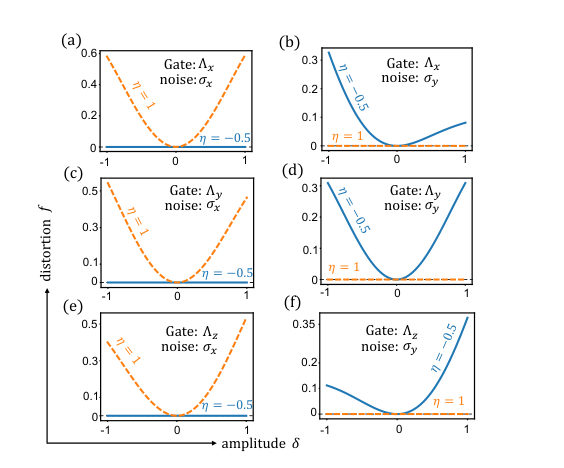 
FIG. 4. Influence of external noise on the operational performance of different gate types. For the code space defined by η = −0.5, the corresponding gate operations are robust against σx-type noise but remain sensitive to σy-type noise. Owing to the near-degeneracy of the logical states {|0L⟩, |1L⟩} in the USC/DSC regimes, the σz-type noise has only a negligible effect on gate performance, with its impact approaching zero. Here we set g = 5ω and ωt = 1.

**Summary.** This paper treats the anisotropic Rabi model as a resource for building a noise-biased qubit. By tuning the anisotropy parameter $\eta$, researchers can selectively suppress environmental decoherence pathways. This engineering capability leads to logical qubits with enhanced coherence times and robust quantum gates, advancing the feasibility of quantum computation in strongly coupled regimes.

**Why it may be interesting.** This work directly addresses the critical challenge of decoherence in strongly coupled quantum systems by providing a tunable Hamiltonian parameter ($\eta$) to engineer intrinsic noise protection, which is highly relevant for building scalable quantum processors.

Detailed structure

**Main problem.** The paper investigates using the quantum anisotropic Rabi model (ARM) to engineer a noise-biased qubit capable of protecting quantum information against environmental decoherence.

**Main result.** Tuning the anisotropy parameter ($\eta$) allows for the selective suppression of dominant decoherence pathways, leading to logical qubits with enhanced coherence times and robust gate operations.

**Method.** The analysis involves deriving noise susceptibilities ($S_r, S_p$) and quantifying noise bias ($\Delta
ho$) by comparing the ARM dynamics to the isotropic case, using master equations.

**Model / system.** The system is the quantum anisotropic Rabi model, describing an atom coupled to a bosonic field. The dynamics are analyzed in the ultrastrong and deep-strong coupling regimes, utilizing a master equation approach.

**Key observables.** Coherence times, noise susceptibilities ($S_r, S_p$), noise bias ($\Delta
ho$), and gate fidelity ($f$).

**Important parameters / regimes.** The anisotropy parameter $\eta$ is the key control knob, which tunes the relative strengths of rotating-wave and counter-rotating-wave interactions.

**Assumptions / limitations.** The analysis relies on defining logical states within the ground and first excited state subspace, and some perturbative treatments are noted to break down in the deepest coupling regimes.

**Figures summary.** Figure 1 illustrates the energy gap variation in the weak coupling regime. Figure 2 shows how noise sensitivities vary with coupling strength ($g$) for different $\eta$ values, demonstrating $\eta$'s control over coupling imbalance.

**Paper structure.** The paper progresses from defining the ARM and its Hamiltonian, to analyzing noise susceptibility in various coupling regimes, demonstrating how $\eta$ controls decoherence, and finally constructing and testing universal, noise-robust gate operations within the logical subspace.

Abstract

We present the quantum anisotropic Rabi model as a potential resource for a noise biased qubit. The system-environment coupling can be biased by tuning the relative strengths of the rotating-wave and counter-rotating-wave interactions, characterized by the anisotropy parameter $η$. This anisotropy selectively suppresses dominant decoherence pathways, thereby enabling the construction of a protected logical qubit in the ultrastrong and deep-strong coupling regimes. The logical states (formed by the ground and first excited states of the anisotropic Rabi model) possess coherence times that are enhanced compared to the isotropic case. Moreover, we construct a set of universal gate operations within the logical-state subspace and demonstrate that the gate operations associated with different values of $η$ exhibit robustness against external noise. These findings are expected to inspire applications and research directions for the anisotropic Rabi model with promising potential impacts.

[↑ back to top](#top)

### [Reconciliation of effective Hamiltonians for intense light-matter interaction](http://arxiv.org/abs/2606.04835v1)

**Authors:** Jakob Nicolai Bruhnke, Jan Marcus Dahlström  
**Type:** theory · **Category:** other · **PDF:** <https://arxiv.org/pdf/2606.04835v1>  
**Analysis basis:** full PDF text, analyzed in chunks
**Topic relevance:** `Keldysh / 2PI / non-Gaussian methods` **1/5** · `Tavis-Cummings & cavity-many-emitter` **1/5** · `analog quantum simulation` **1/5** · `correlated cavity matter` **1/5** · `driven-dissipative phase transition` **1/5** · `methods for driven-dissipative` **1/5** · `non-equilibrium dynamics` **1/5**

📷 Fig 1

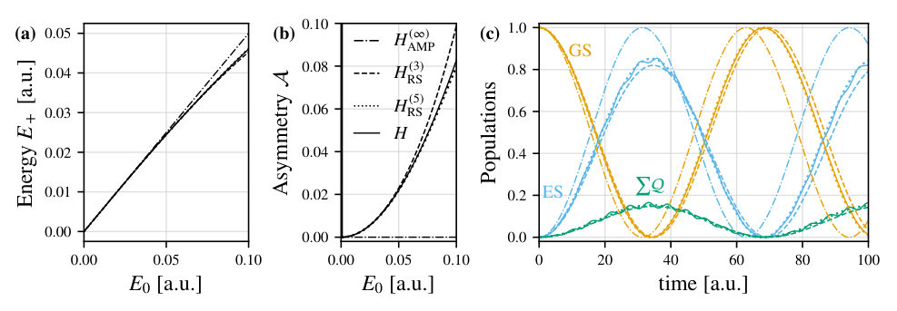 
Figure 1. Properties of the minimal model Hamiltonian H (solid) of Eq. (45), compared with the effective Hamiltonians H(∞) AMP (dashed-dotted), H(3) RS (dashed), and H(5) RS (dotted). Panel (a) shows the dressed energy E+ against field strength E0. Panel (b) depicts the effective asymmetry defined in Eq. (49) against E0. Panel (c) shows the populations of the GS (yellow), ES (blue) and the sum of the Q-space populations (green).

📷 Fig 2

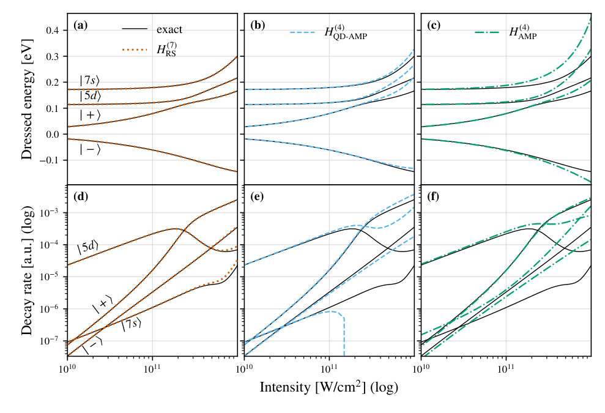 
Figure 2. Quasi-energies E −iΓ/2 of Rubidium in a monochromatic, linearly polarized IR field. The upper row shows the real part of the quasi-energies, E; the lower row shows the decay rate Γ. The black solid lines are exact calculations obtained from Floquet theory. In the left column, the exact quasi-energies are compared to the effective Hamiltonian from QD-RSPT in 7th order (red dotted), see Eq. (21). In the middle column, we compare the exact solution to the effective Hamiltonian from QD-RSPT within the pole approximation in 4th order (blue dashed), see Eq. (39). In the middle column, we compare the exact solution to the effective Hamiltonian from adiabatic elimination in 4th order...

📷 Fig 3

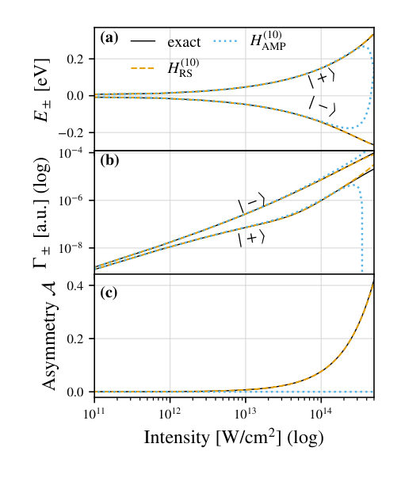 
Figure 3. Quasi-energies E± −iΓ±/2 of Helium in a monochro- matic, linearly polarized XUV field, resonant with the 1s2 ↔ 1s3p transition. Panel (a) shows the real part of the quasi- energies, E±, and panel (b) the decay rate Γ±. The black solid lines are exact calculations obtained from Floquet the- ory. We compare the exact quasi-energies to the effective Hamiltonian from RSPT in 10th order (yellow dashed), see Eq. (21), and to the AMP effective Hamiltonian in 10th order (blue dotted), see Eq. (34) (since the field is exactly degen- erate, HAMP = HQD-AMP). We label the dressed states as ∣+⟩ and ∣−⟩. In panel (c), we show the asymmetry of the Hamilto- nian, where the asymmetry is defined in...

**Summary.** This paper addresses the limitations of standard effective Hamiltonian methods when modeling light-matter interactions under intense laser fields. The authors introduce Quasi-degenerate Rayleigh-Schrödinger perturbation theory (QD-RSPT) as a superior, systematic approach. QD-RSPT accurately describes complex phenomena like non-orthogonal eigenstates and asymmetric coupling, providing a new state-of-the-art tool for strong-field quantum optics.

**Why it may be interesting.** This work is highly relevant as it pushes the theoretical frontier in quantum optics by providing a systematic, high-intensity framework that correctly handles non-Hermiticity and state coupling asymmetries, which are critical for modern quantum control.

Detailed structure

**Main problem.** The primary challenge is reconciling effective Hamiltonians used to describe quantum systems undergoing intense light-matter interaction, especially where standard approximations fail.

**Main result.** The authors propose Quasi-degenerate Rayleigh-Schrödinger perturbation theory (QD-RSPT), which provides a robust framework that correctly accounts for non-orthogonal eigenstates and asymmetric coupling strengths at high intensities.

**Method.** The work employs advanced theoretical techniques, including QD-RSPT, quasi-degenerate extensions of adiabatic elimination, and comparison with Floquet calculations to derive the effective Hamiltonian.

**Model / system.** The system involves quantum matter (atoms/molecules) interacting with intense laser fields, modeled by a full light-matter Hamiltonian. The theory uses essential-state models to reduce the system to a manageable, effective Hamiltonian.

**Key observables.** Dressed energies (eigenvalues), population transfer dynamics, and the non-orthogonality of the effective Hamiltonian's eigenstates.

**Important parameters / regimes.** High light intensities (strong-field regime), detuning, and the ratio of photon energy to binding energy.

**Assumptions / limitations.** Standard approximations (like the Markov or pole approximation) break down at high intensities, necessitating the use of QD-RSPT to maintain accuracy.

**Figures summary.** Figures compare the results of various effective Hamiltonians (AMP, QD-RSPT) against exact Floquet calculations, showing agreement in Rabi oscillations and quasienergy structure across different intensities.

**Paper structure.** The paper builds from identifying the breakdown of standard approximations (AMP) to introducing QD-RSPT as the solution. It demonstrates the method's accuracy by comparing results across low, intermediate, and high-intensity regimes, particularly in minimal atomic models and real atoms like Rubidium.

Abstract

Essential-state models are central for quantum control and technology in broad regimes of light-matter interaction. The canonical effective Hamiltonian is obtained equivalently from adiabatic elimination, the Markov approximation, and the pole approximation. These approximations are known to break down at high intensities, significantly limiting their applicability to moderate light-matter interaction. We show how this limitation can be addressed by applying quasi-degenerate Rayleigh-Schrödinger perturbation theory (QD-RSPT). We reconcile QD-RSPT with adiabatic elimination and propose a quasi-degenerate extension of adiabatic elimination that is robust when the detuning of the essential states is non-negligible. The accuracy of QD-RSPT is demonstrated in both the low- and high-frequency regime, showing excellent agreement with Floquet calculations at high intensities. The crucial corrections to adiabatic elimination make the eigenvectors of the effective Hamiltonian non-orthogonal. Physically, this allows us to account for the asymmetric strength with which different essential states couple to the non-essential states. We expect that our systematic approach to effective Hamiltonians from QD-RSPT will constitute a new state of the art in intense light-matter interaction and quantum optics with novel forms of strong coupling and quantum control phenomena being conceivable.

[↑ back to top](#top)

### [Characterization of errors in photon-heralded quantum operations between non-interacting quantum emitters](http://arxiv.org/abs/2606.04312v1)

**Authors:** Mahsa Karimi, Samuel Mister, Christoph Simon, Stephen C. Wein  
**Type:** theory · **Category:** quantum information and computing · **PDF:** <https://arxiv.org/pdf/2606.04312v1>  
**Analysis basis:** full PDF text, analyzed in chunks
**Topic relevance:** `analog quantum simulation` **1/5** · `correlated / nonlocal dissipation` **1/5** · `methods for driven-dissipative` **1/5** · `quantum measurements` **1/5**

📷 Fig 1

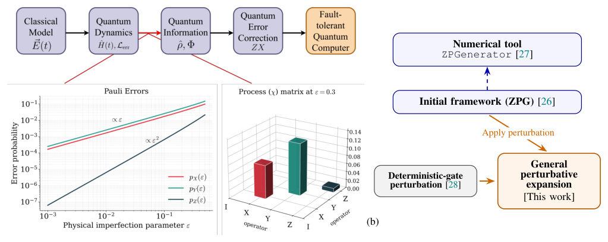 
FIG. 1: (a) Conceptual pipeline from physical models to fault-tolerant quantum-computing design. Device-level descriptions are mapped to open-system quantum dynamics, which are then reduced to quantum-information metrics such as process matrices or stochastic Pauli error models. These qubit-level descriptions provide input for quantum-error-correction analysis and ultimately fault-tolerant logic. This work targets the highlighted step for probabilistic light–matter architectures by mapping hardware imperfections to leading-order analytic process matrices. (b) Relation to prior approaches. The Zero-Photon Generator (ZPG) framework gives analytic solutions under restricted error models [26],...

📷 Fig 2

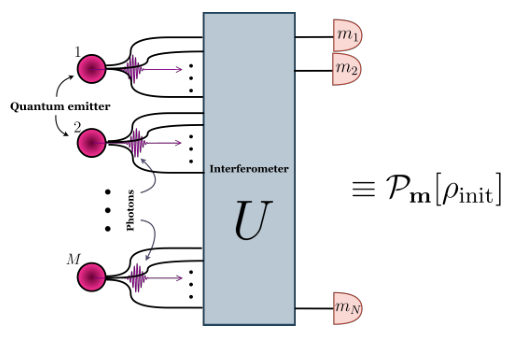 
FIG. 2: Illustration of the general scenario captured by the ZPG framework [27]. The framework considers M emitters where each emitter can emit a photon into N ≥M different modes. The emitted photons interfere and are then measured with photon-number resolv- ing detectors (PNRDs) producing a pattern m ∈NN. The initial state ρinit of the ensemble of emitters collapses into a state propor- tional to Pm[ρinit]. The probability of obtaining measurement pat- tern m is tr(Pm[ρinit]).

📷 Fig 3

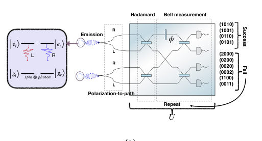 
FIG. 3: (a) A degenerate level structure of an emitter with spin- selective polarization emission for implementing the two-qubit RUS gate, together with the corresponding photonic integrate circuit im- plementing a dual-rail Bell-state measurement in the photonic X ba- sis. Here, U denotes the interferometer unitary, defined in Eq. (22). (b) A list the successful photon-detection patterns and the corre- sponding spin qubit operations produced by the RUS gate. Here S = diag(1, i) (and S†) is a required local Clifford correction. The operators Di are linear combinations of lowering operators associ- ated with different photon emitter transitions, where the coefficients are determined by the...

📷 Fig 4

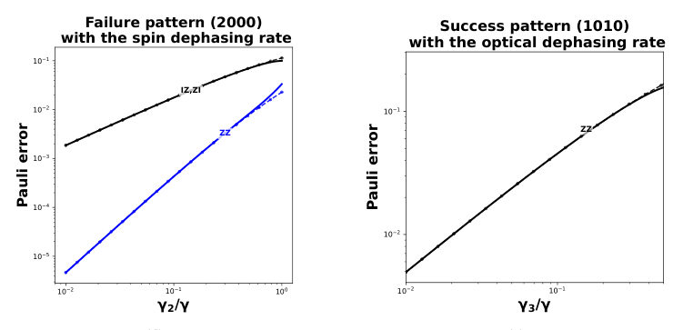 
FIG. 4: Demonstration of the Pauli error weights associated with different sources of noise. Here γ1 denotes the excited-state spin relaxation noise strength defined in Eq. (25), γ2 and γ3 are the spin dephasing rate and emitter optical dephasing rate, respectively (see Eqs. (26) and (27)), and γ is the optical decay rate defined in Eq. (23). Panels (a)–(e) showcase the effect of each individual error, when the rest are set to zero. In panels (a)–(e), the analytical expression (represented by the solid line) corresponds to the solution that we obtain with our approach up to the fourth order. The dashed-dotted lines represent the numerical solutions. We highlight that missing curves indicate...

📷 Fig 5

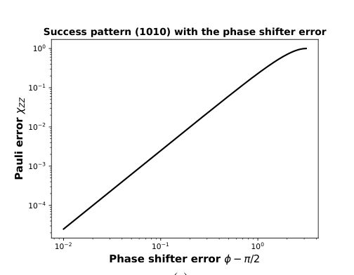 
FIG. 5: The Pauli errors associated with the phase shifter error in the RUS gate. (a) The successful pattern (1010) has only a nonzero diagonal ZZ Pauli error weight, while the failure pattern (2000) re- mains unaffected by this imperfection. (b) Corresponding error table for the successful pattern.

**Summary.** This work introduces an analytic perturbative framework to quantify errors in quantum gates implemented using photon-heralded processes between quantum emitters. By extending the ZPG framework, the authors derive closed-form expressions for error weights, allowing for physics-informed optimization of gate designs for fault-tolerant quantum computing.

**Why it may be interesting.** It provides a rigorous, analytical tool to bridge the gap between complex, physical hardware imperfections in quantum optics and the abstract mathematical tools required for quantum error correction.

Detailed structure

**Main problem.** The paper aims to characterize small Markovian errors in probabilistic, photon-heralded quantum operations between non-interacting quantum emitters.

**Main result.** The authors developed an analytic perturbative framework that successfully maps microscopic hardware imperfections (like source noise or phase miscalibrations) to abstract qubit-level noise models (Pauli error weights).

**Method.** The core method involves developing an analytic perturbative expansion built upon the Zero-Photon-Generation (ZPG) framework to derive closed-form solutions for process matrices and error weights.

**Model / system.** The system involves hybrid light-matter quantum systems using non-interacting emitters, single photons, and photon-number-resolving detectors. The dynamics are governed by a Lindblad master equation, analyzed via the ZPG framework.

**Key observables.** Process matrices ($\chi$ matrix), Pauli error weights ($\chi_{P,P}$), state fidelities ($F_{	ext{state}}^m$), and average gate fidelities ($F_{	ext{avg}}$).

**Important parameters / regimes.** Error strengths ($\gamma_k$), noise parameters ($\gamma_1, \gamma_2, \gamma_3$), and the low-noise regime ($\epsilon$ expansion).

**Assumptions / limitations.** The analysis relies on perturbative expansions, valid in the low-noise regime, and often assumes ideal detector performance initially.

**Figures summary.** Figures illustrate the conceptual pipeline from physical models to fault-tolerant design, and show quantitative comparisons between analytical perturbative predictions and exact numerical simulations for various noise sources.

**Paper structure.** The paper builds conceptually from the general ZPG framework to derive perturbative solutions for conditional maps, applies these solutions to benchmark specific gates (like CZ), and then analyzes various physical error sources (spin relaxation, dephasing, phase shifts) to calculate resulting Pauli error weights.

Abstract

We develop an analytic perturbative framework that enables the analysis of small Markovian errors in probabilistic, photon-heralded quantum operations between non-interacting emitters. Building on and extending the Zero-Photon-Generation (ZPG) framework, we derive closed-form perturbative solutions that capture both ideal (zero-order) and noisy (low-order) gate dynamics conditioned on time-integrated photon counting. Our framework provides analytic solutions to process matrices and Pauli error weights up to leading order, bridging the gap between detailed physical imperfections of a system and its corresponding abstract Pauli noise models. Moreover, our framework captures imperfections across the full physical system stack, from photon generation to optical manipulation. We benchmark the resulting perturbative predictions on a repeat-until-success CZ gate against numerical simulations, demonstrating accurate modeling of source-induced noise, and then apply the same framework to analyze coherent phase-shifter miscalibrations as a representative example of optical-manipulation errors. The methods developed in this work enable physics-informed parameter tuning to optimize gate designs and develop tailored quantum error correction protocols toward fault-tolerant quantum computing using hybrid light--matter quantum systems.

[↑ back to top](#top)

### [Better Pauli Channel Learning with Maximum Likelihood Estimation](http://arxiv.org/abs/2606.04096v1)

**Authors:** Daniel Belkin, Faisal Alam, Matthew Thibodeau, Alireza Seif, Ewout van den Berg, Bryan K. Clark  
**Type:** theory · **Category:** quantum information and computing · **PDF:** <https://arxiv.org/pdf/2606.04096v1>  
**Analysis basis:** full PDF text, analyzed in chunks
**Topic relevance:** `correlated / nonlocal dissipation` **1/5** · `methods for driven-dissipative` **1/5** · `quantum measurements` **1/5**

📷 Fig 1

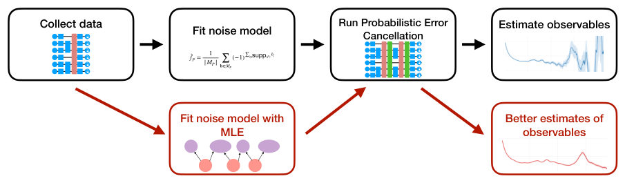 
FIG. 1. Schematic illustration of our work. We give an algorithm that allows MLE to be used for channel learning. This gives better learning of noise models than previous approaches. When used for PEC on a quantum circuit, the resulting noise model also gives markedly better error-mitigated outputs.

📷 Fig 2

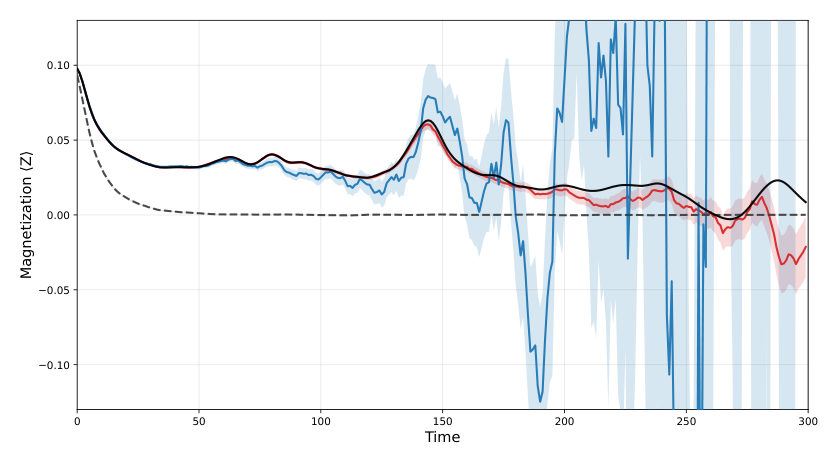 
FIG. 2. Average magnetization over time in a simulation of a Trotterized transverse-field Ising model circuit on 10 qubits. The noise channel is a 1D 2-local Pauli-Lindblad channel with random coefficients sampled uniformly from (0, 10−3). PEC is done using channel estimates learned with either MLE or EPF on a training set of 999,999 samples. Shaded regions show standard error. See Section IV B for further details.

📷 Fig 3

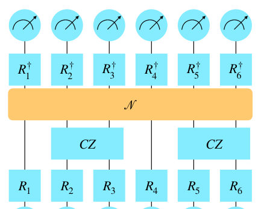 
FIG. 3. Schematic illustrating a typical data collection setup for learning gate-based Pauli errors. A layer of CZ gates induces noise N. We assume noiseless single-qubit rotations Ri can be used to prepare states and rotate to a desired measurement basis.

📷 Fig 4

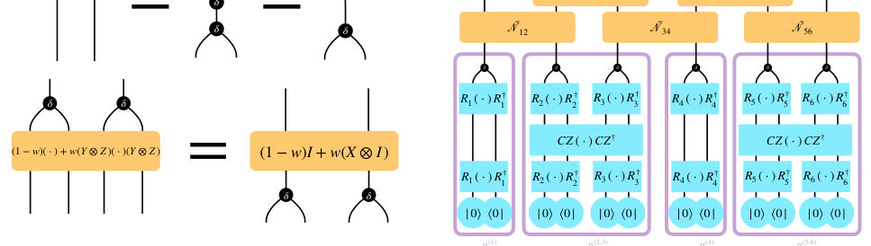 
FIG. 4. (a) Original tensor network. (b) After commuting the basis rotations through the errors. (c) Reduction rules map quantum states to classical probability distributions. (d) Error channel as evolution of a classical distribution.

📷 Fig 5

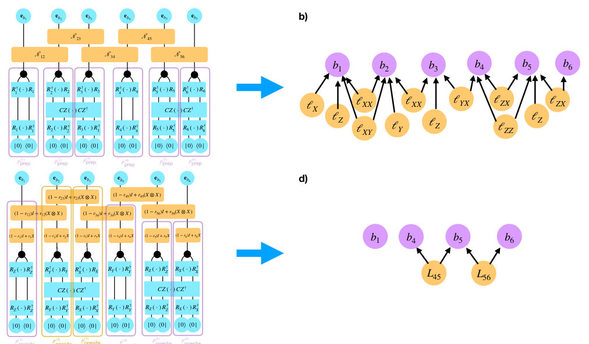 
FIG. 5. (a) Tensor network describing classical probability distribution preparation and measurement. (b) Bayesian network representation of the same distribution. (c) Simplified tensor network with single-site errors separated out and uninformative bits outlined in yellow. (d) Corresponding reduced Bayesian network.

**Summary.** This paper addresses the difficulty of characterizing noise in quantum computers by proposing an efficient Maximum Likelihood Estimation (MLE) technique. By mapping the complex likelihood function for 1D Pauli noise channels onto a tractable Bayesian network, the authors achieve significantly better noise parameter estimation than previous methods. This advancement promises more reliable error mitigation protocols for near-term quantum devices.

**Why it may be interesting.** This work provides a concrete, computationally feasible pathway to perform high-precision quantum process tomography, which is crucial for building reliable quantum hardware and understanding decoherence mechanisms in solid-state or superconducting qubits.

Detailed structure

**Main problem.** The primary challenge is accurately estimating the unknown noise channel in noisy quantum devices, as standard tomography methods suffer from high sample complexity.

**Main result.** The authors show that Maximum Likelihood Estimation (MLE) can be made computationally tractable for 1D-local sparse Pauli-Lindblad channels by mapping the likelihood function to an efficiently-evaluable Bayesian network, leading to substantially improved tomography.

**Method.** The core method involves reformulating the likelihood function for the noise parameters into a Bayesian network structure, allowing for efficient inference using belief propagation, which outperforms empirical estimators like EPF.

**Model / system.** The system is a quantum computation process corrupted by a Pauli-Lindblad noise channel, modeled specifically as a 1D-local sparse Pauli channel. The analysis compares MLE against Empirical Pauli Fidelities (EPF) for parameter estimation.

**Key observables.** Mean squared difference between learned and true noise parameters ($\omega_i$), and the resulting fidelity/magnetization of error-mitigated observables.

**Important parameters / regimes.** System size (number of qubits), circuit depth, and the noise parameters $\{w_i\}$ defining the Pauli-Lindblad channel.

**Assumptions / limitations.** The noise is assumed to be Pauli-Lindblad, 1D-local, and sparse. The computational tractability relies on mapping the likelihood to a Bayesian network structure.

**Figures summary.** Figures compare MLE vs. EPF sample complexity (requiring MLE to use significantly fewer samples) and illustrate the mathematical reduction from quantum tensor networks to classical Bayesian network probability distributions.

**Paper structure.** The paper progresses by first establishing the need for MLE over EPF, then deriving the computational simplification for 1D Pauli channels using Bayesian networks, and finally demonstrating the superior sample complexity and accuracy of the MLE approach through simulations.

Abstract

Error mitigation in a noisy quantum device requires a very good estimate of the noise channel. The accuracy of probabilistic error cancellation is often limited by the high sample complexity of channel tomography. In principle, optimal sample complexity is attained by maximum likelihood estimation (MLE), but MLE is computationally challenging. We show that MLE can be made computationally tractable in certain cases of interest. For the common case of a 1D-local sparse Pauli-Lindblad channel, the likelihood function reduces to an efficiently-evaluable Bayesian network. We show that the resulting computation leads to substantially improved tomography. In addition, we demonstrate by simulation that this can lead to meaningful improvements to the overhead of error mitigation. We also discuss possible extensions of our algorithm to more general settings, such as non-1D circuits and non-Pauli errors.

[↑ back to top](#top)

### [Finite-Basis Duality Estimate for the Surface-Code Threshold under Correlated Bit-Flip Errors](http://arxiv.org/abs/2606.04723v1)

**Authors:** Masayuki Ohzeki  
**Type:** theory · **Category:** disordered systems and neural networks · **PDF:** <https://arxiv.org/pdf/2606.04723v1>  
**Analysis basis:** full PDF text, analyzed in chunks
**Topic relevance:** `Keldysh / 2PI / non-Gaussian methods` **1/5** · `analog quantum simulation` **1/5** · `methods for driven-dissipative` **1/5**

📷 Fig 1

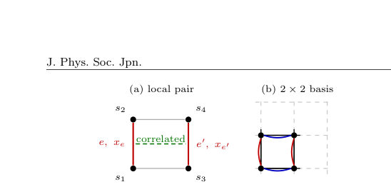 
Fig. 1. (Color online) (a) Local correlated pair used by Chubb and Flammia. Opposite plaquette edges e, e′ carry quenched vari- ables xe, xe′, while the statistical-mechanical Ising spins sv live on vertices. The pair gives two edge terms and a four-spin term. (b) Smallest toroidal finite basis used in Eq. (9); red and blue arcs de- note non-overlapping correlated pairs, and periodic or antiperiodic seams give the four sectors Zαβ.

**Summary.** This paper develops a theoretical method using finite-basis duality to estimate the error threshold for the surface code under correlated noise. By systematically improving the basis size on a toroidal lattice, the authors provide a refined estimate for the critical threshold ($p_c = 0.10348$). This work advances the theoretical understanding of fault-tolerance thresholds in the presence of complex error correlations.

**Why it may be interesting.** The rigorous application of duality techniques to estimate critical thresholds in complex, correlated error models provides advanced theoretical tools applicable to quantum error correction codes.

Detailed structure

**Main problem.** The paper aims to accurately estimate the critical threshold ($p_c$) for the surface code when subjected to spatially correlated bit-flip errors.

**Main result.** By employing a finite-basis duality analysis on toroidal bases, the authors obtained an improved estimate for the critical point: $p_c = 0.10348$.

**Method.** The core method involves applying finite-basis duality analysis, utilizing periodic and twisted-periodic sectors on toroidal lattices to analyze the random-bond Ising model mapping.

**Model / system.** The system is the surface code under correlated bit-flip noise, which is mapped to a random-bond Ising model containing both two-body edge and four-body face interactions.

**Key observables.** The critical threshold ($p_c$) for error correction.

**Important parameters / regimes.** The error probability parameter ($p$) and the correlation structure parameter ($\eta = p_+/p_-$).

**Assumptions / limitations.** The analysis relies on using local Boltzmann weights, quenched averages, and twisted-sector partition functions rather than a full Monte Carlo phase diagram.

**Figures summary.** Figure 1 illustrates the local correlated pair used by previous work and the smallest toroidal finite basis used in the current analysis. Table I compares threshold estimates using various methods (single pair, $2 	imes 2$ basis, $4 	imes 4$ basis, and MC).

**Paper structure.** The argument progresses by showing that the finite-basis duality method systematically refines the estimate by increasing the size of the basis used in the calculation, moving from single-pair estimates to $2 	imes 2$ and then $4 	imes 4$ finite bases.

Abstract

We apply finite-basis duality to a statistical-mechanical model introduced by Chubb and Flammia for the surface code under spatially correlated bit-flip noise. Their mapping gives a random-bond Ising model with both two-body edge interactions and four-body face interactions. The single-equation estimate based on the duality analysis is slightly deviated from their Monte Carlo estimate \(p_c=0.1004(6)\). Following the finite-basis and graph-polynomial strategy, we instead use periodic and twisted-periodic sectors on toroidal bases. We have obtained an improved estimate of the critical point, $p_c = 0.10348$.

[↑ back to top](#top)

### [Gravitationally Induced Quantum Decoherence of Macroscopic Objects](http://arxiv.org/abs/2606.04099v1)

**Authors:** Hiroki Takeda, Shogo Tomizuka, Takahiro Tanaka  
**Type:** theory · **Category:** other · **PDF:** <https://arxiv.org/pdf/2606.04099v1>  
**Analysis basis:** full PDF text, analyzed in chunks
**Topic relevance:** `Keldysh / 2PI / non-Gaussian methods` **1/5** · `correlated / nonlocal dissipation` **1/5** · `methods for driven-dissipative` **1/5**

📷 Fig 1

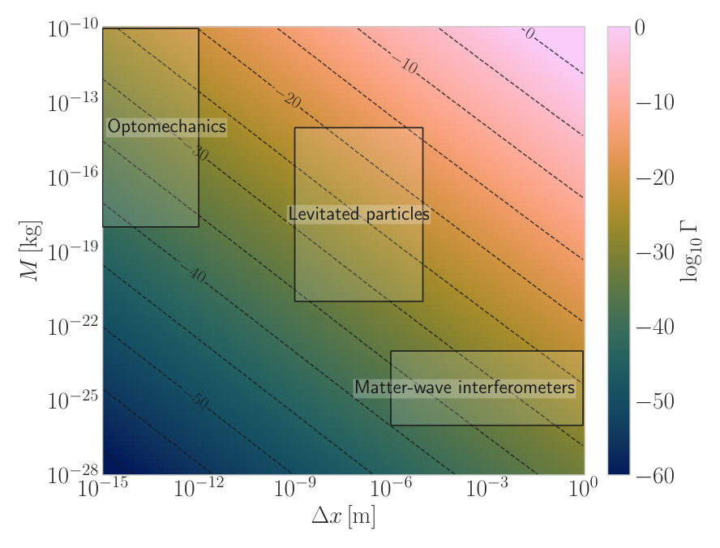 
FIG. 2. Contour plot of log10 Γ in the (∆x, M) plane, obtained by numerically evaluating the saturated limit r →∞of Eq. (4.24) for a dilute thermal gas with m = 28 amu ≃4.65×10−26 kg, Tgas = 300 K, Pgas = 1 atm ≃1.0×105 Pa. Dashed lines indicate constant values of log10 Γ, and shaded regions show its magnitude. Representative experimental regimes are overlaid: matter-wave interferometers, levitated particles, and optomechanical systems. The system size is fixed to Rs = 10−7 m, and the resulting dependence on Rs is weak.

📷 Fig 2

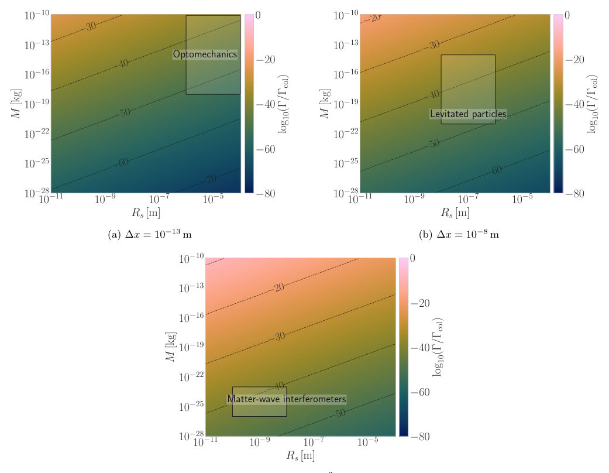 
FIG. 3. Contour plots of log10(Γ/Γcol) in the (Rs, M) plane for fixed superposition sizes: (a) ∆x = 10−13 m, (b) ∆x = 10−8 m, and (c) ∆x = 10−3 m. Here Γ is obtained by numerically evaluating the saturated limit r →∞of Eq. (4.24), while Γcol is estimated from Eq. (4.47) for a dilute thermal gas with m = 28 amu ≃4.65 × 10−26 kg, Tgas = 300 K, and Pgas = 1 atm ≃ 1.0×105 Pa. Dashed lines indicate constant values of log10(Γ/Γcol). In each panel, only the representative experimental regime relevant to the chosen value of ∆x is overlaid schematically.

**Summary.** This theoretical work calculates the decoherence rate for macroscopic quantum superpositions induced by gravitational coupling to an environment. Using the closed-time-path formalism, the authors find that while a logarithmic dependence on distance exists, the gravitational decoherence is generally negligible compared to standard gas collisions. This sets a quantitative limit on observing gravity-induced decoherence in current experimental setups.

**Why it may be interesting.** It provides a first-principles, quantitative benchmark for estimating decoherence rates from fundamental forces (gravity) in macroscopic quantum systems, which is crucial for testing quantum gravity effects.

Detailed structure

**Main problem.** The paper investigates the quantum decoherence of massive objects when subjected to gravitational interactions with an environment.

**Main result.** The calculated gravitational decoherence function is found to be subdominant compared to conventional collisional decoherence under realistic, dilute gas conditions.

**Method.** The authors use the closed-time-path influence functional formalism to derive the reduced system dynamics, integrating out environmental degrees of freedom.

**Model / system.** The model involves a massive system particle prepared in a spatial superposition, coupled to linearized gravity and an environmental scalar field, specialized for a dilute nonrelativistic gas.

**Key observables.** Decoherence exponent/function ($\Gamma$), reduced density matrix ($
ho_r$), and the environmental noise kernel.

**Important parameters / regimes.** Mass ($M$), separation distance ($\Delta x$), gas temperature ($T_{	ext{gas}}$), and various momentum/length scales ($k_{	ext{UV}}, k_{\sigma}$).

**Assumptions / limitations.** The analysis is performed in the nonrelativistic and quasi-static regime, utilizing approximations like the dipole-like parametrization for the system source.

**Figures summary.** Figure 2 shows the dependence of $\log_{10} \Gamma$ on mass and separation distance, while Figure 3 compares the ratio of gravitational to collisional decoherence.

**Paper structure.** The paper systematically derives the influence functional, models the environmental kernel using windowing/convolution for physical regularization, and finally calculates the cumulative decoherence function by separating diagonal and off-diagonal contributions.

Abstract

We formulate the gravitationally induced quantum decoherence of a massive object prepared in a spatial superposition. Starting from linearized gravity coupled to a massive system particle and an environmental scalar field, we derive a closed-time-path influence functional governing the reduced system dynamics. In the nonrelativistic and quasi-static regime, the decoherence exponent can be written as a bilinear functional of the difference of the system stress-energy tensors and an effective noise kernel obtained by dressing the environmental stress-energy tensor correlator with graviton propagators. We then apply this framework to the Newtonian long-range gravitational interaction and evaluate the resulting decoherence function for a dilute nonrelativistic gas modeled by finite wave packets and coarse-grained in time and space. By performing controlled approximations, we obtain analytic expressions for the cumulative decoherence function and show that the dominant contribution is accumulated logarithmically over a broad range of distances, while remaining subdominant to conventional collisional decoherence under realistic conditions.

[↑ back to top](#top)

### [Protecting Quantum States via the Super-Zeno Effect and Anticoherence](http://arxiv.org/abs/2606.04681v1)

**Authors:** C. Chryssomalakos, A. G. Flores-Delgado, E. Guzmán-González, L. Hanotel  
**Type:** theory · **Category:** quantum information and computing · **PDF:** <https://arxiv.org/pdf/2606.04681v1>  
**Analysis basis:** full PDF text, analyzed in chunks
**Topic relevance:** `correlated / nonlocal dissipation` **1/5** · `driven-dissipative phase transition` **1/5** · `methods for driven-dissipative` **1/5**

📷 Fig 1

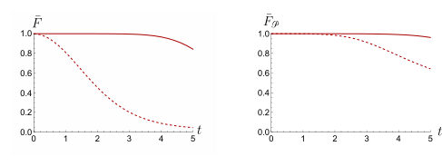 
FIG. 2. Left: Comparison of the (doubly) average fidelity ¯F between the Zeno (dashed curve) and super-Zeno (solid curve) schemes for the spin-13/2 1-anticoherent 2-plane given in [23]. The interaction Hamiltonian is H(1) ∝B · S, normalized ac- cording to (6), and the corresponding fidelity is averaged by letting B point along the vertices of an icosahedron. Both schemes involve the same number of operations —four mea- surements for Zeno, four pulses for super-Zeno. Right: Simi- lar comparison as on the left but for the freezing fidelity ¯FP.

📷 Fig 2

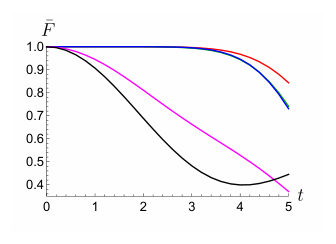 
FIG. 3. Comparison of ¯F for different orders of anticoherence, using 4 pulses and averaging H(1) ∝B · S over the direction of B. The Hamiltonians were normalized as in (6). The red, green (hidden behind the blue), and blue curves correspond to the 1-, 2-, and 3-anticoherent planes given in [23], respectively; the black curve corresponds to the coherent plane, and the magenta curve to a generic plane, as explained in the text.

📷 Fig 3

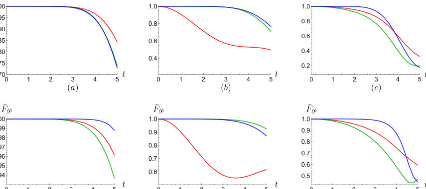 
FIG. 4. Comparison of ¯F (top row) and ¯FP (bottom row) for the super-Zeno scheme with 4 pulses. The red, green, and blue curves correspond to the 1-, 2-, and 3-anticoherent subspaces given in [23], respectively. The Hamiltonians considered are of the form H ∝(B · S)n and normalized according to (6), with n = 1 (first column), n = 2 (second column), and n = 3 (third column). In plots (a), (b) and (e), the blue curve partially blocks the green one. Note also the difference in the vertical scales used: for n = 1, the average fidelities are significantly higher, for the same value of t, than in the other cases.

📷 Fig 4

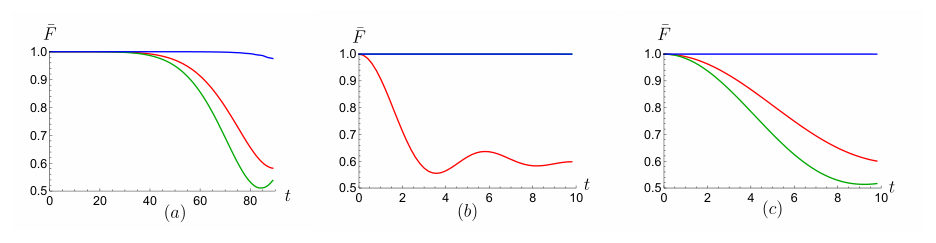 
FIG. 5. Comparison of ¯F after applying the 4-pulse super-Zeno scheme 30 consecutive times (the total duration, in each case, can be read off the horizontal axis). The red, green, and blue curves correspond to the 1-, 2-, and 3-anticoherent 2-planes given in [23], respectively. Using the normalization of (6), we consider a Hamiltonian of the form H ∝(B · S)n, with (a) n = 1, (b) n = 2, and (c) n = 3. In plot (b), only two curves are visible because the blue curve completely blocks the green one. Note also the difference in time scale in plot (a). In this grid, we omit the curves for ¯FP, since they are visually indistinguishable from those of ¯F, indicating that after 30 applications of the...

**Summary.** This paper proposes a robust method for protecting quantum states by combining the Super-Zeno Effect with the concept of anticoherence in spin systems. By confining the state to a specially defined anticoherent subspace and applying periodic unitary pulses, the authors demonstrate that quantum evolution can be effectively 'frozen' against environmental noise to arbitrarily high orders in time. This offers a powerful theoretical framework for building more resilient quantum hardware.

**Why it may be interesting.** This work provides a powerful theoretical toolkit for quantum control, showing how combining geometric constraints (anticoherence) with dynamical control (SZE) can achieve superior noise resilience compared to standard error correction methods.

Detailed structure

**Main problem.** The primary goal is to develop and analyze methods for protecting fragile quantum states from environmental noise and decoherence.

**Main result.** The combination of the Super-Zeno Effect (SZE) and exploiting spin anticoherent subspaces proves highly effective, allowing for the theoretical freezing of state evolution to arbitrarily high orders in time.

**Method.** The authors combine the SZE, which uses periodic unitary pulses, with the concept of anticoherence, which identifies subspaces where the system's evolution is naturally constrained, leading to high-order protection.

**Model / system.** The system modeled is a spin system subjected to noise characterized by an $n$-magnetic interaction Hamiltonian, $H \propto (B \cdot S)^n$. The protection mechanism relies on identifying and confining the state to a $q$-anticoherent subspace $P$.

**Key observables.** Fidelity ($F$) and Freezing Fidelity ($F_P$) are the key observables used to quantify the degree of state protection against noise.

**Important parameters / regimes.** The order of anticoherence ($q$), the degree of the Hamiltonian ($n$), and the number of super-Zeno pulses ($K$) are critical parameters governing the protection level.

**Assumptions / limitations.** The analysis assumes the initial state resides within the protected anticoherent subspace $P$, and the protocol relies on the ability to apply precise, periodic unitary pulses.

**Figures summary.** Figures compare the fidelity ($ar{F}$) achieved using standard Zeno vs. super-Zeno effects, and demonstrate that increasing the order of anticoherence ($q=1, 2, 3$) significantly improves the protection time for a given Hamiltonian.

**Paper structure.** The paper systematically introduces the problem of noise protection, defines the mathematical tools (SZE, anticoherence), derives the conditions for protection, and then analyzes the performance using fidelity measures for various orders of protection.

Abstract

We consider a spin system coupled to a noisy environment via an interaction Hamiltonian $H$ which is a polynomial of degree $n$ in the spin operators $S_i$ ($n$-magnetic Hamiltonian), and show that the use of the quantum super-Zeno effect in conjunction with a spin-anticoherent subspace, is highly effective in protecting the spin from the noise. When $n=1$, as in the case of unwanted rotations induced by stray magnetic fields, our scheme provides a quantum gyroscope, a concept that generalizes naturally to higher $n$ values (a quantum $n$-gyroscope). The gist of the proposed protocol is to use the quantum super-Zeno effect to confine a state to the subspace, and then exploit anticoherence to freeze its evolution within it.

[↑ back to top](#top)

### [Surface Charge Doping for Ion-Pairing Criticality in Confined Electrolytes](http://arxiv.org/abs/2606.04791v1)

**Authors:** Na Shen, Yabei Wu, Wenqing Zhang  
**Type:** theory · **Category:** statistical mechanics · **PDF:** <https://arxiv.org/pdf/2606.04791v1>  
**Analysis basis:** full PDF text, analyzed in chunks
**Topic relevance:** `Keldysh / 2PI / non-Gaussian methods` **1/5** · `driven-dissipative phase transition` **1/5** · `methods for driven-dissipative` **1/5**

📷 Fig 1

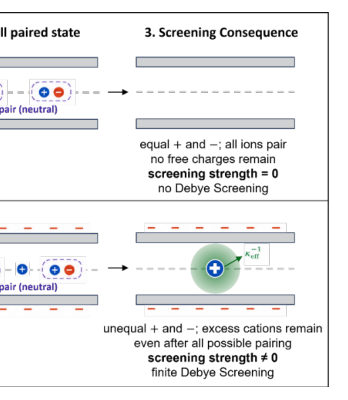 
Figure 1. A neutral slit can approach a paired, carrier-depleted state, whereas a charged slit must

📷 Fig 2

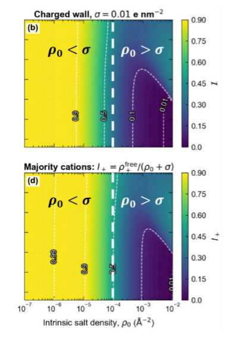 
Figure 2. Stoichiometric decoupling of Bjerrum pairing and density-weighted ionicity. (a)

📷 Fig 3

 
Figure 3, minority anions are strongly depleted at low intrinsic density, whereas majority cations

📷 Fig 4

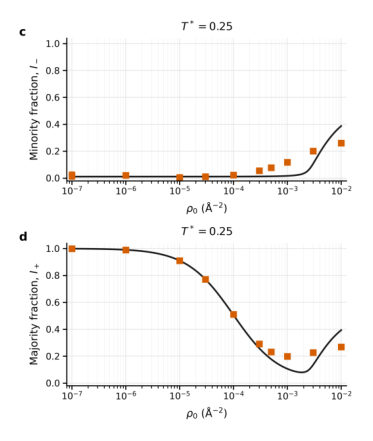 
Figure 3. BD validation. Fixed-temperature line cuts of the species-resolved free fractions

📷 Fig 5

 
Fig. 2, and orange squares are BD means from three independent seeds with error bars showing

**Summary.** This work analyzes how imposing a weak surface charge on confined electrolytes modifies their ionic stability. Using advanced statistical mechanics theory, the authors show that the surface charge acts as a doping agent, preventing complete ion depletion and suppressing the critical temperature for ion pairing. This reveals a universal scaling law governing the interplay between surface chemistry, confinement, and correlated ionic behavior.

**Why it may be interesting.** The concept of surface charge acting as a tunable 'thermodynamic doping field' to control phase transitions and transport in confined ionic systems is highly relevant to understanding interfacial phenomena in quantum materials and nanoscale devices.

Detailed structure

**Main problem.** The study investigates how weak surface charge doping modifies the ion-pairing criticality in quasi-two-dimensional electrolytes, specifically examining the decoupling between microscopic pairing and macroscopic ionicity.

**Main result.** Surface charge doping suppresses the association-driven thermodynamic instability by maintaining a finite screening floor via mobile counterions, causing the critical temperature to collapse onto a single scaled perturbation variable.

**Method.** The authors employ a generalized Debye-Huckel-Bjerrum theory, supplemented by Brownian-dynamics simulations, to analyze the free energy and stability criteria.

**Model / system.** The system is a monovalent 1:1 electrolyte confined in an angstrom-scale slit with planar walls carrying a uniform surface charge. The theory treats surface charge as a thermodynamic doping field influencing the Coulomb correlations.

**Key observables.** Screening strength ($\kappa_{	ext{eff}}^2$), ionic fractions ($I_{\pm}, I$), critical temperature ($T_c^*$), and in-plane diffusion coefficient ($D_{xy}$).

**Important parameters / regimes.** Surface charge density ($\sigma$), slit width ($h$), intrinsic salt density ($
ho_0$), and the dimensionless ratio $\chi = 
ho_0 / \sigma$.

**Assumptions / limitations.** The analysis primarily focuses on the weak surface-coupling regime ($h/\lambda_{	ext{GC}} \ll 1$) and assumes the counterions are part of the quasi-2D Coulomb fluid.

**Figures summary.** Figures illustrate the difference between neutral and charged slits regarding ionicity, show the suppression of $T_c^*$ vs. $\sigma$, and demonstrate the collapse of this suppression onto a scaled perturbation variable $X_{\xi}$.

**Paper structure.** The paper progresses from establishing the physical problem (surface doping effects) to developing the generalized theory, analyzing the resulting decoupling of ion species, and finally validating the theoretical predictions using both scaling laws and explicit Brownian dynamics simulations.

Abstract

Dielectric confinement strengthens Coulomb correlations in quasi-two-dimensional electrolytes and can promote Bjerrum pairing in charge-neutral slits. Here we use a generalized Debye-Huckel-Bjerrum theory to show that weak surface charge changes this picture by stoichiometrically doping the slit with mobile counterions. These counterions maintain a finite screening floor, decouple microscopic pairing from macroscopic ionicity, and shift association-driven criticality to lower temperatures. The critical-temperature suppression collapses onto a single scaled perturbation variable, revealing how surface charge and dielectric confinement jointly control charged nanofluidic slits. Brownian-dynamics tests further show that the same counterions are not always fully bulk-like diffusive: at low intrinsic salt density, explicit wall charge slows in-plane diffusion, whereas at higher intrinsic density the wall-induced diffusion penalty decreases and the mobile-counterion description becomes dynamically accurate. These results identify surface charge as a thermodynamic doping field that tunes both correlated ionic stability and the diffusion mechanism in nanofluidic confinement.

[↑ back to top](#top)

### [Coherent State Path Integral Monte Carlo](http://arxiv.org/abs/2606.05013v1)

**Authors:** Riccardo Fantoni  
**Type:** theory · **Category:** other · **PDF:** <https://arxiv.org/pdf/2606.05013v1>  
**Analysis basis:** full PDF text, analyzed in chunks
**Topic relevance:** `Keldysh / 2PI / non-Gaussian methods` **1/5** · `methods for driven-dissipative` **1/5**

📷 Fig 1

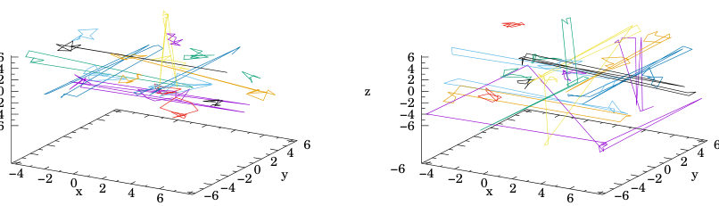 
FIG. 1. We show a comparison between equilibrium snapshots of real paths of a simulation for free distinguishable particles with our coherent states kinetic energy density matrix (left panel) and one with the standard plane waves [15] density matrix (right panel) for a test case of N = 20, m = 1, N/L3 = 0.01, T = 0.3, mh.o.ω = 0.7, M = 10 for which we found ⟨ˆT⟩= 9.0(7) with calculation (3.4) with φ ≈6.5 and the exact result is ⟨ˆT⟩≈8.99999996090802053. Different (real) paths have different colors. In our CSPIMC the ghost paths are not shown but they dance nearby the real paths to which they are bound by the Gaussian of Eq. (2.8). A snapshot of the ghost paths is therefore very similar to the...

📷 Fig 2

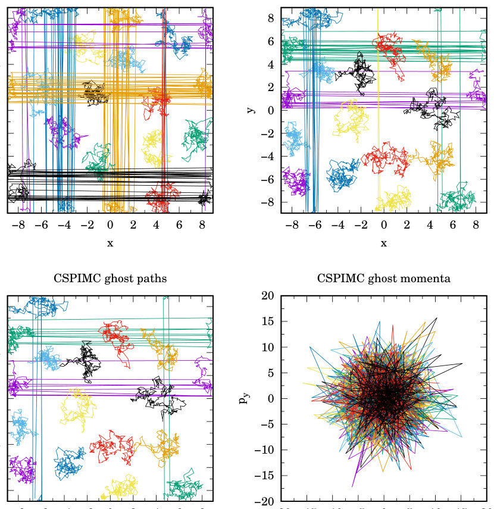 
FIG. 2. We show a snapshot at equilibrium for the paths in the plane wave PIMC and the real paths, ghost paths, and ghost momenta for the CSPIMC for N = 16 4He atoms (m = 0.08306 ≈1/12 ˚A −2K−1) in two dimensions interacting with a Lennard-Jones pair potential with parameters [35] σ = 2.556 ˚A, ε = 10.22 K and a cutoffdistance rcut = 2.5 ˚A, at a density N/L2 = 0.05 ˚A −2 and a temperature T = 1.0 K with M = 250, 2ξ = 40, ϕ = 24/25 in Boltzmann statistics. Different colors refer to different real or ghost atoms.

📷 Fig 3

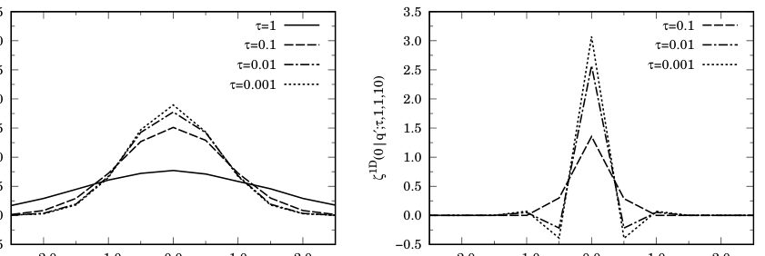 
FIG. 3. We show the one dimensional ζ1D(q|q′; τ, m, ξ) calculated with a Monte Carlo scheme using 107 (with the related statistical error) sampling points and choosing smaller and smaller timestep τ. All the four integrations over the ghost variables (qa, pa) and (qb, pb) were chosen in the interval [−l, l], l = 10 (with the related finite size error). On the left mh.o. = 1 on the right mh.o. = 10. Note that the slight negative values for the high mh.o. and small τ case are numerical artifacts due to the finite size, l &lt; ∞, error.

**Summary.** This paper introduces the Coherent State Path Integral Monte Carlo (CSPIMC) method, a new technique for simulating quantum many-body liquids at finite temperature. It replaces the standard plane-wave basis with coherent states of a harmonic oscillator, offering a tunable parameter that enhances computational efficiency. The method successfully reproduces known thermodynamic limits for kinetic energy estimators.

**Why it may be interesting.** The ability to tune the harmonic oscillator stiffness ($\xi$) to improve computational efficiency by allowing larger imaginary time steps is a significant algorithmic advancement for simulating quantum dynamics.

Detailed structure

**Main problem.** To develop a novel and computationally efficient quantum simulation method for studying many-body quantum liquids at finite temperature.

**Main result.** The proposed Coherent State Path Integral Monte Carlo (CSPIMC) method successfully reconstructs the thermal density matrix, showing convergence to known results while offering a tunable parameter ($\xi$) that allows for larger imaginary time steps.

**Method.** The method expands the high-temperature density matrix using the overcomplete set of single-particle coherent states of a Harmonic Oscillator, contrasting with conventional plane-wave path integral methods.

**Model / system.** The system is a many-body quantum liquid of identical particles (bosons/fermions) governed by a thermal density matrix $\hat{
ho} = \exp(-eta \hat{H})$. The method is tested on free particles and extended to systems like liquid Helium.

**Key observables.** Kinetic energy ($\langle\hat{T}
angle$), potential energy ($\langle\hat{V}
angle$), and the factor $\phi$ used in the kinetic energy estimator.

**Important parameters / regimes.** Inverse temperature ($eta$), imaginary time step ($	au$), and the stiffness parameter ($\xi$) of the harmonic oscillator, which can be tuned.

**Assumptions / limitations.** The method does not solve the Feynman sign problem for fermions, and the kinetic action approximation relies on the properties of coherent states.

**Figures summary.** Figures compare path snapshots between CSPIMC and standard PIMC for free particles, and tables detail the dependence of the factor $\phi$ on simulation parameters.

**Paper structure.** The paper introduces the CSPIMC formalism by replacing plane waves with coherent states, derives the necessary path integral elements, analyzes the limiting cases (stiff HO, thermodynamic limit), and compares results against standard PIMC methods.

Abstract

We propose a new quantum simulation method for a many body quantum liquid of identical particles at finite (non-zero) temperature. The new scheme expands the high temperature density matrix on the overcomplete set of single particles coherent states of John Rider Klauder instead of the usual plane waves as in conventional path integral methods. One is free to tune the elastic constant and/or the mass of the harmonic oscillator subtending the coherent states so as to maximize the computational efficiency of the algorithm. We prove that in the limit of an extremely stiff harmonic oscillator the results for the internal energy tends towards the correct expected values. Moreover we suggest that a stiff harmonic oscillator could allow the use of larger (imaginary) timesteps. This additional degree of freedom is the characteristic feature of our new algorithm and is not available in more conventional path integral methods.

[↑ back to top](#top)

### [High-density, high-mobility ultrathin spin-polarized two-dimensional electron gas at the polar/polar LaVO$_3$/KTaO$_3$ interface: Insights from first-principles calculations](http://arxiv.org/abs/2606.04252v1)

**Authors:** Arpan Das  
**Type:** theory · **Category:** strongly correlated electrons · **PDF:** <https://arxiv.org/pdf/2606.04252v1>  
**Analysis basis:** full PDF text, analyzed in chunks
**Topic relevance:** `analog quantum simulation` **1/5** · `spintronics-quantum-optics interface` **1/5**

📷 Fig 1

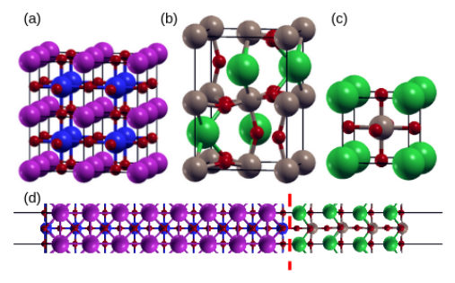 
FIG. 1. Atomic structures of (a) cubic KTaO3, (b) or- thorhombic LaVO3, (c) tetragonal LaVO3, and (d) the vacuum/(LVO)4/(KTO)8.5 slab. The dashed red line indi- cates the interface. Color code: purple (K), blue (Ta), red (O), green (La), and brown (V).

📷 Fig 2

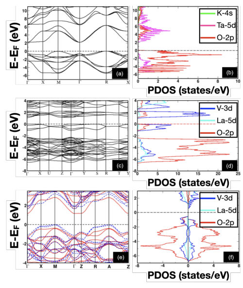 
FIG. 2. Electronic band structures and orbital-projected den- sity of states (PDOS) of (a)–(b) cubic KTaO3, (c)–(d) or- thorhombic LaVO3, and (e)–(f) tetragonal LaVO3. In (e), solid red and dashed blue lines indicate the spin-up and spin- down bands, respectively. Color code of PDOS: magenta (Ta 5d), red (O 2p), blue (V 3d), cyan (La 5d), and green (K 4s) orbitals. The horizontal dashed black line represents the Fermi level of the corresponding system.

📷 Fig 3

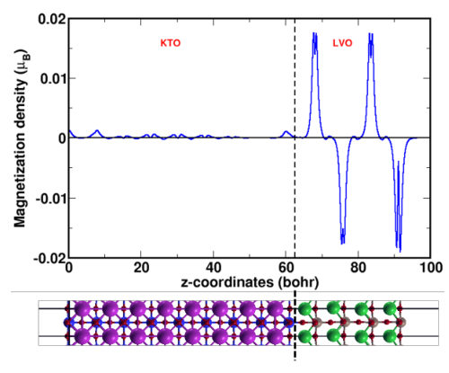 
FIG. 3. Planar-averaged magnetization density as a function of the z coordinate for the vacuum/(LVO)4/(KTO)8.5 slab. The atomic structure of the slab is shown below to identify the layers at each z position. The vertical dashed black line indicates the interface. Color code: purple (K), blue (Ta), red (O), green (La), and brown (V).

📷 Fig 4

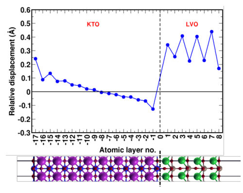 
FIG. 4. Relative cation-anion displacement for each layer in the vacuum/(LVO)4/(KTO)8.5 slab. Atomic layers are num- bered by positive and negative integers for the LVO and KTO regions, respectively, starting from the interface. The atomic structure of the slab is shown below to identify the layers. The vertical dashed black line indicates the interface. Color code: purple (K), blue (Ta), red (O), green (La), and brown (V).

📷 Fig 5

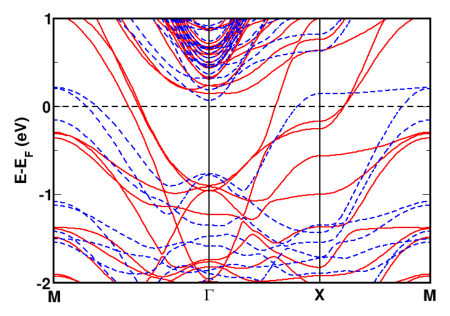 
FIG. 5. Band structure of the vacuum/(LVO)4/(KTO)8.5 slab. Solid red and dashed blue lines represent the spin-up and spin-down bands, respectively. The horizontal dashed black line indicates the Fermi level of the system.

**Summary.** This theoretical study uses DFT+U calculations to investigate the LaVO3/KTaO3 interface, finding that the metallic 2DEG arises from charge transfer driven by polar discontinuity. The resulting 2DEG is highly confined, spin-polarized, and possesses an exceptionally small effective mass, suggesting potential for high-mobility quantum electronic applications.

**Why it may be interesting.** The study models charge transfer and electronic reconstruction in a strongly correlated oxide system, which is a key area for understanding emergent quantum phenomena in solid-state devices.

Detailed structure

**Main problem.** To uncover the microscopic origin and characterize the properties of the two-dimensional electron gas (2DEG) formed at the polar/polar LaVO3/KTaO3 interface.

**Main result.** The 2DEG is highly confined, spin-polarized, and originates from an electronic reconstruction driven by charge transfer across the interface, exhibiting an exceptionally small effective mass.

**Method.** First-principles density functional theory (DFT) calculations, incorporating DFT+U methods to treat strong electronic correlations in the Mott insulator component.

**Model / system.** The physical system is the LaVO3/KTaO3 heterostructure, modeled as a slab. The study investigates the electronic reconstruction mechanism that stabilizes the metallic state at the interface.

**Key observables.** Spin-up parabolic band effective mass ($m^*$), interfacial electron density, layer-resolved charge density, and polarization vectors.

**Important parameters / regimes.** Hubbard U and J parameters for V 3d and Ta 5d orbitals; comparison to the LaAlO3/SrTiO3 interface.

**Assumptions / limitations.** The metallic state arises from an electronic reconstruction to avoid the polar catastrophe; the A-AFM magnetic ordering is assumed to be the ground state.

**Figures summary.** Figures show layer-resolved PDOS confirming Ta 5d orbital contribution, band structures illustrating the parabolic 2DEG band, and charge density maps confirming 2D confinement at the interface.

**Paper structure.** The paper first establishes the physical context (polar/polar interface) and computational methods (DFT+U). It then analyzes the magnetic and polarization states, leading to the key finding of electronic reconstruction, which finally characterizes the resulting high-mobility, spin-polarized 2DEG.

Abstract

The emergence of high-mobility two-dimensional electron gases (2DEGs) at oxide interfaces provides a fertile platform for exploring emergent quantum phenomena and next-generation oxide electronics. Here, using first-principles density functional theory (DFT) calculations, we investigate the microscopic origin of the 2DEG formed at the interface between the band insulator KTaO$_3$ (KTO) and the Mott insulator LaVO$_3$ (LVO). Although both constituents are insulating in bulk, the LVO/KTO heterostructure develops robust metallicity at the interface, consistent with experimental observations. Our calculations show that this metallic state originates from an electronic reconstruction driven by the polar discontinuity across the interface. To avoid the polar catastrophe on both the polar LVO film and the polar KTO substrate, electrons are transferred from the outer surfaces toward the interface, leading to hole accumulation in the surface VO$_2$ layer and electron accumulation in the interfacial TaO$_2$ layer. This charge redistribution stabilizes a highly confined and spin-polarized 2DEG localized at the interface. The electronic states forming the 2DEG are predominantly derived from interfacial Ta $5d_{xy}$ orbitals, confining carrier motion to the interfacial plane. Remarkably, the spin-up parabolic band hosting the 2DEG exhibits an exceptionally small effective mass, substantially lower than that of the prototypical LaAlO$_3$/SrTiO$_3$ interface, indicating the potential for enhanced carrier mobility. Furthermore, the calculated interfacial electron density is nearly an order of magnitude larger than that of LaAlO$_3$/SrTiO$_3$, consistent with experiment. These findings identify the LVO/KTO heterostructure as a promising platform for realizing high-density, high-mobility spin-polarized 2DEGs and for engineering correlated oxide interfaces for quantum electronic applications.

[↑ back to top](#top)

### [Convergence rates of Sum-of-Hermitian-Squares Hierarchies for the Pauli algebra](http://arxiv.org/abs/2606.04940v1)

**Authors:** Ali Almasi, Dávid Bugár, Cambyse Rouzé, Peter Brown  
**Type:** theory · **Category:** quantum information and computing · **PDF:** <https://arxiv.org/pdf/2606.04940v1>  
**Analysis basis:** full PDF text, analyzed in chunks
**Topic relevance:** `analog quantum simulation` **1/5**

📷 Fig 1

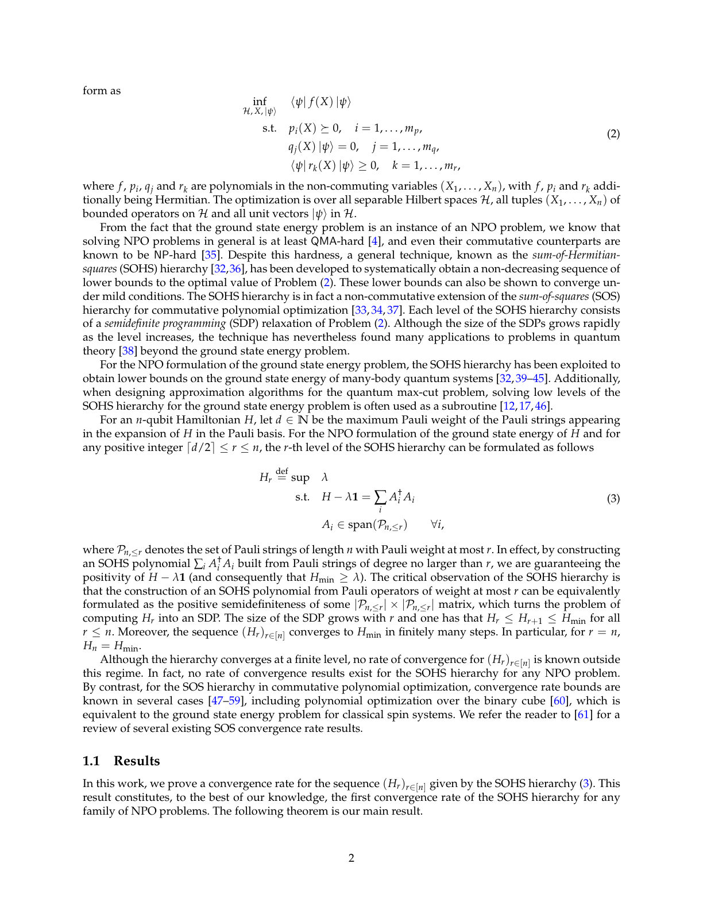 
Low-resolution page preview, page 2

📷 Fig 2

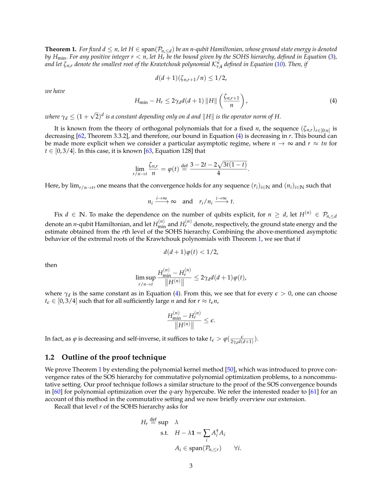 
Low-resolution page preview, page 3

📷 Fig 3

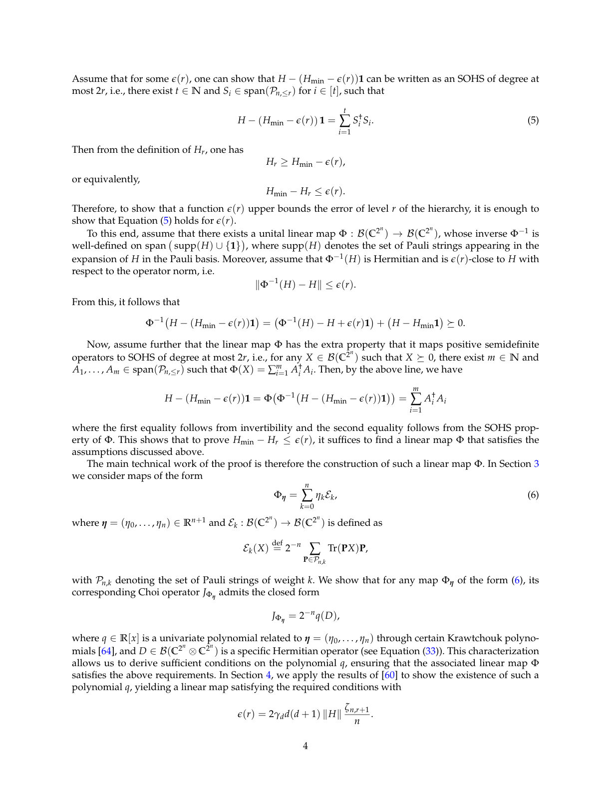 
Low-resolution page preview, page 4

📷 Fig 4

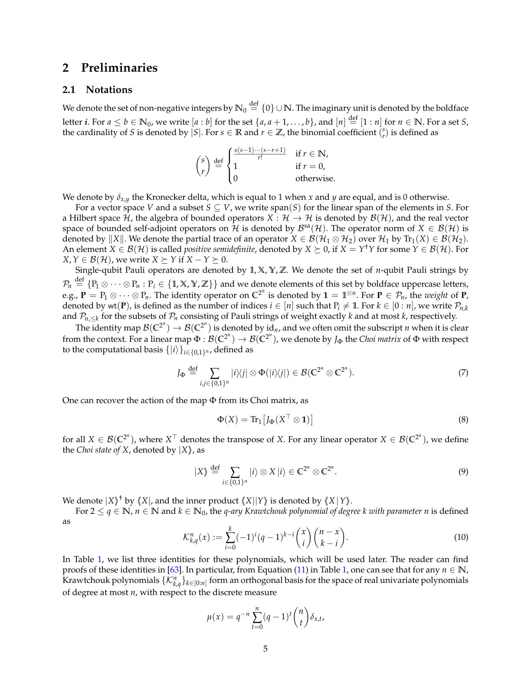 
Low-resolution page preview, page 5

📷 Fig 5

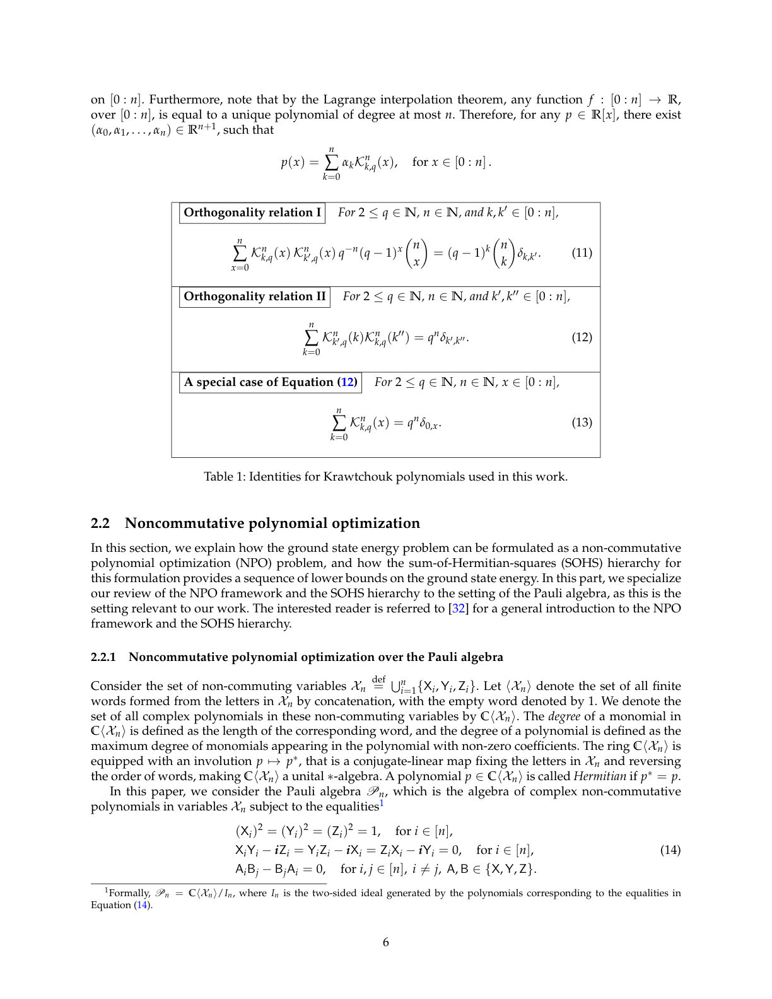 
Low-resolution page preview, page 6

**Summary.** This paper rigorously analyzes the convergence rate of Sum-of-Hermitian-Squares (SOHS) relaxations used to find the ground state energy of $n$-qubit systems. By extending techniques from commutative optimization to the non-commutative Pauli algebra, the authors derive an explicit error bound dependent on Krawtchouk polynomials. This provides a major quantitative advance in the mathematical analysis of quantum many-body problems.

**Why it may be interesting.** This work provides rigorous mathematical tools to analyze the convergence of quantum many-body approximations, which is vital for developing reliable quantum simulation algorithms and understanding the limits of current optimization techniques for quantum chemistry and materials science.

Detailed structure

**Main problem.** The paper develops explicit convergence rates for Sum-of-Hermitian-Squares (SOHS) relaxations applied to noncommutative polynomial optimization problems (NPO). This is crucial for accurately estimating ground state energies in quantum systems.

**Main result.** The authors provide a quantitative upper bound on the error, showing the convergence rate is governed by the smallest roots of Krawtchouk polynomials, representing the first such analysis for this class of problems.

**Method.** The technique extends the polynomial kernel method from commutative SOS hierarchies to the non-commutative setting of the Pauli algebra, utilizing specialized linear maps $\Phi_\eta$ and properties derived from Krawtchouk polynomials.

**Model / system.** The focus is on the ground state energy problem for $n$-qubit systems, formulated as an NPO problem over the Pauli algebra. The analysis uses the SOHS hierarchy, which generates a sequence of lower bounds ($H_r$) to the true minimum energy ($H_{\min}$).

**Key observables.** The primary observable is the error bound, $H_{\min} - H_r$, which is quantified in terms of the smallest root $\zeta_{n,r+1}$ of the Krawtchouk polynomial $K_{n,r+1}^{(4)}(x)$.

**Important parameters / regimes.** The parameters include the number of qubits ($n$), the level of the hierarchy ($r$), the maximum Pauli weight ($d$), and the Krawtchouk polynomial roots $\zeta_{n,r+1}$.

**Assumptions / limitations.** The derivation relies on constructing a linear map $\Phi_\eta$ satisfying specific algebraic properties (P0)-(P3) within the Pauli algebra structure.

**Paper structure.** The paper builds by first establishing the necessary algebraic framework (Pauli algebra, diagonal maps $A_k, E_k$) using Krawtchouk polynomials, then deriving the required linear map $\Phi_\eta$ that satisfies the necessary properties, and finally applying this structure to derive the explicit convergence rate bound for the SOHS hierarchy.

Abstract

Moment/Sum-of-Hermitian-Squares relaxations for noncommutative polynomial optimization problems have become an important tool for analyzing problems within quantum theory. Despite their widespread success, little is known about their rate of convergence and, consequently, their accuracy. In this work, we develop explicit convergence rates for relaxations of noncommutative polynomial optimization problems generated from the Pauli algebra -- covering applications to the ground state energy problem for n-qubit systems. In particular, we show that the rate of convergence can be bounded in terms of the smallest roots of a family of orthogonal polynomials known as Krawtchouk polynomials. Our result represents the first quantitative analysis of the rate of convergence for relaxations of noncommutative polynomial optimization problems.

[↑ back to top](#top)

### [Digital Quantum Reservoir Computing for ATM Time Series Prediction](http://arxiv.org/abs/2606.04686v1)

**Authors:** Chiara Vercellino, Giacomo Vitali, Valeria Zaffaroni, Francesca Cibrario, Emanuele Dri, Paolo Viviani, Olivier Terzo, Davide Corbelletto  
**Type:** experiment · **Category:** quantum information and computing · **PDF:** <https://arxiv.org/pdf/2606.04686v1>  
**Analysis basis:** full PDF text, analyzed in chunks
**Topic relevance:** `QC/QI experiment` **1/5**

📷 Fig 1

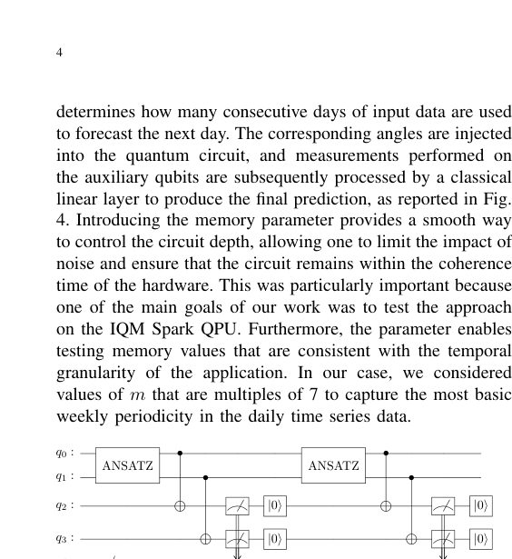 
Fig. 3: Two consecutive circuit blocks. Auxiliary qubits (q2, q3) are measured in a two-bit classical register and reset after each block.

📷 Fig 2

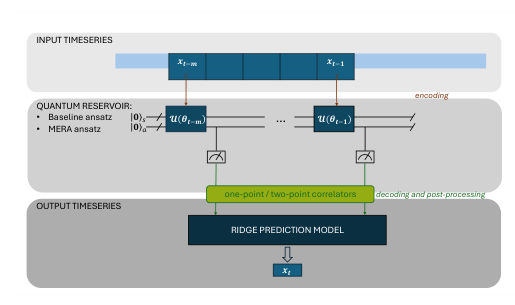 
Fig. 4: Illustrative scheme of the digital QRC. At each time step, m consecutive time series values parameterize the quan- tum reservoir circuit. The resulting measurements are post- processed and fed into a forecasting model to predict xt.

📷 Fig 3

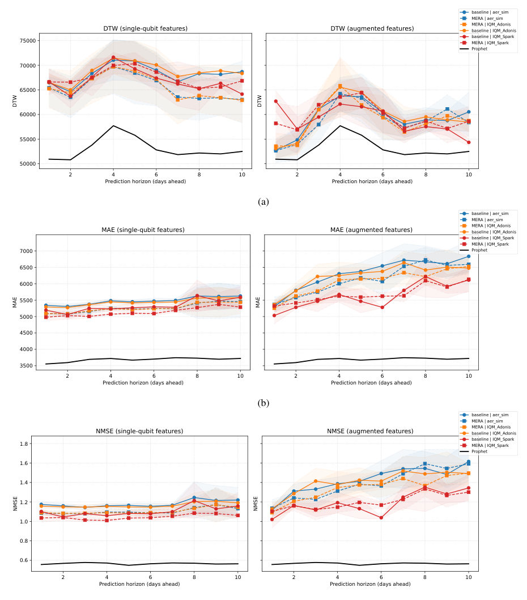 
Fig. 5: Performance metrics as a function of the prediction horizon (h = 1, . . . , 10). The semi-transparent region around each curve represents one standard deviation from the mean for each value of h.

📷 Fig 4

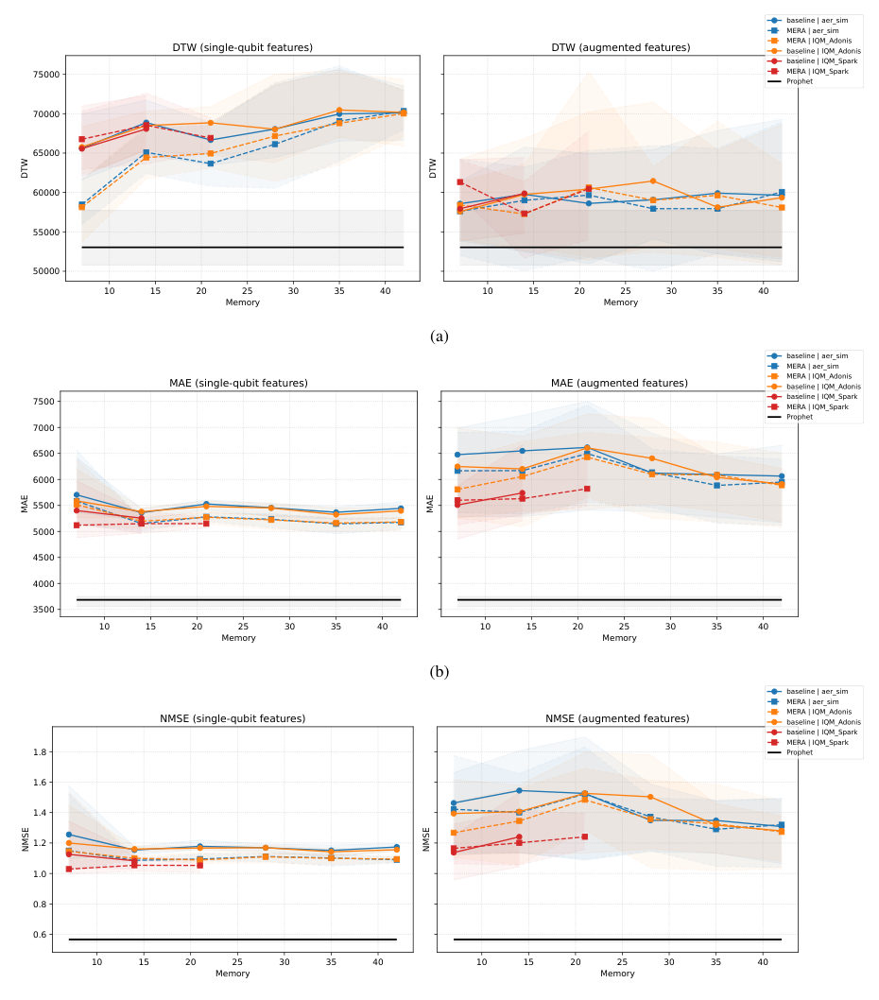 
Fig. 6: Performance metrics as a function of the QRC memory parameter. The metrics are averaged across the prediction horizons. The shaded regions represent the minimum and maximum values obtained in the tested memory configurations. Due to hardware execution time constraints, the memory values m ≥28 (MERA ansatz) and m ≥21 (baseline ansatz) are not included.

📷 Fig 5

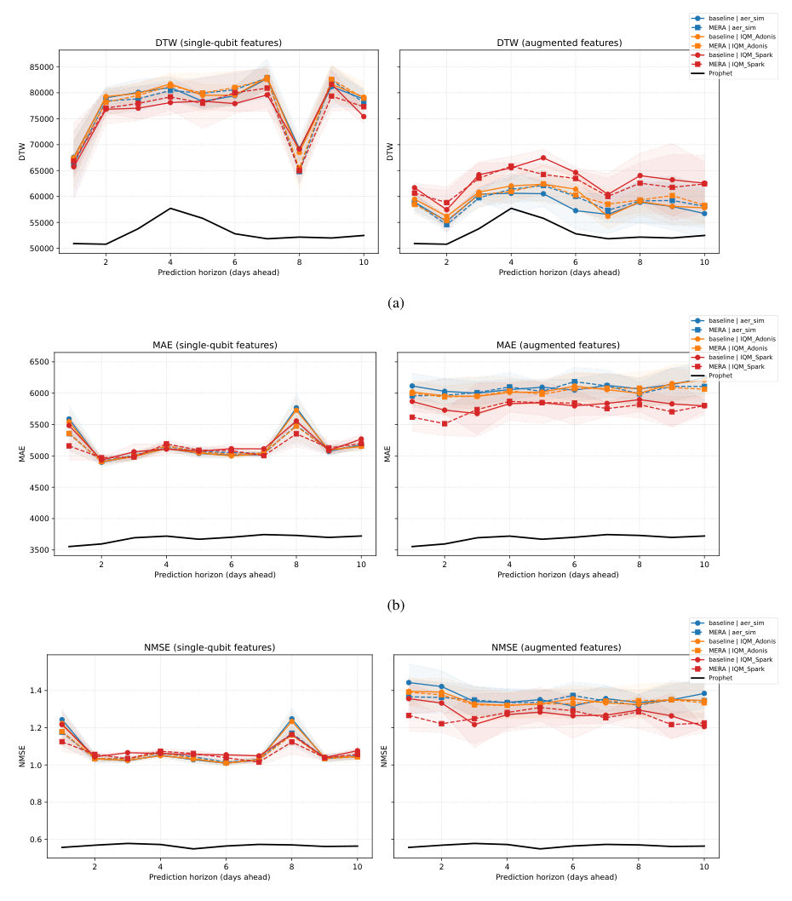 
Fig. 7: Performance metrics as a function of the prediction horizon (h = 1, . . . , 10), obtained using a Ridge regressor chain model after the QRC module. The semi-transparent region around each curve represents one standard deviation from the mean.

**Summary.** This paper explores using digital Quantum Reservoir Computing (QRC) to forecast ATM cash demand time series on near-term quantum hardware. The methodology encodes time data into quantum rotations and uses measurements to feed a classical regression model. Although QRC underperforms classical benchmarks on point-wise errors, it shows promise in capturing temporal structure via the DTW metric.

**Why it may be interesting.** The work provides an empirical assessment of applying quantum machine learning techniques, specifically QRC, to complex, real-world time series data, which is relevant for understanding how quantum circuits can encode and process temporal correlations.

Detailed structure

**Main problem.** The paper investigates using a digital quantum reservoir computing (QRC) framework to forecast multi-step time series data, specifically ATM cash demand.

**Main result.** While QRC models did not outperform the classical Prophet benchmark on standard error metrics (MAE, NMSE), they showed more competitive results using the Dynamic Time Warping (DTW) metric, suggesting partial ability to capture temporal structure.

**Method.** The approach involves encoding time series data into quantum rotation angles, processing it through parametrized quantum reservoirs (using ansätze like MERA), and reading out classical features via measurements to train a classical Ridge-regression model.

**Model / system.** The system is a digital QRC framework utilizing parametrized four-qubit reservoirs. The process involves sequential encoding of time steps into rotation angles and measuring single-qubit expectation values and two-qubit correlators to form the feature vector.

**Key observables.** Mean Absolute Error (MAE), Normalized Mean Squared Error (NMSE), and Dynamic Time Warping (DTW) metric.

**Important parameters / regimes.** Circuit ansatz (Baseline vs. MERA), reservoir memory ($m$), measurement observables (single vs. two-point correlators), and execution backend (Simulation vs. IQM Spark QPU).

**Assumptions / limitations.** Training is restricted to a classical Ridge-regression readout, and the study acknowledges error accumulation in multi-step forecasting.

**Figures summary.** Figures illustrate the quantum circuit blocks for the baseline and MERA ansätze, and show performance comparisons (MAE, NMSE, DTW) across different prediction horizons and hardware backends.

**Paper structure.** The paper systematically analyzes the impact of various architectural choices (ansätze, memory, observables) on time series forecasting performance, comparing the QRC model against the classical Prophet benchmark across multiple noise models and prediction horizons.

Abstract

We investigate a digital quantum reservoir computing (QRC) framework for multi-step forecasting of automated teller machine (ATM) cash demand time series on near-term quantum devices. The proposed approach uses parametrized four-qubit reservoirs with a fixed structure exploiting partial measurement and reset, where temporal data is encoded in rotation angles. Training is restricted to a classical Ridge-regression readout. We systematically analyze the impact of the circuit ansatzë, reservoir memory, measurement-derived observables, and the execution backend on the forecasting performance. Experiments are performed with noiseless simulation, noise-aware emulation, and a real IQM Spark quantum processor. Although the QRC models do not outperform the classical Prophet benchmark in terms of Mean Absolute Error and Normalized Mean Squared Error metrics, they achieve more competitive results in Dynamic Time Warping metric, indicating a partial ability to capture temporal structure. These findings provide an empirical assessment of digital QRC for realistic financial forecasting and highlight both its current limitations and its potential on near-term quantum hardware.

[↑ back to top](#top)

### [Distributed Variational Quantum Optimisation by Entanglement-Selective Transport](http://arxiv.org/abs/2606.04548v1)

**Authors:** Edric Matwiejew, Pascal Elahi, Ugo Varetto  
**Type:** theory · **Category:** quantum information and computing · **PDF:** <https://arxiv.org/pdf/2606.04548v1>  
**Analysis basis:** full PDF text, analyzed in chunks
**Topic relevance:** `entanglement & information structure` **1/5**

📷 Fig 1

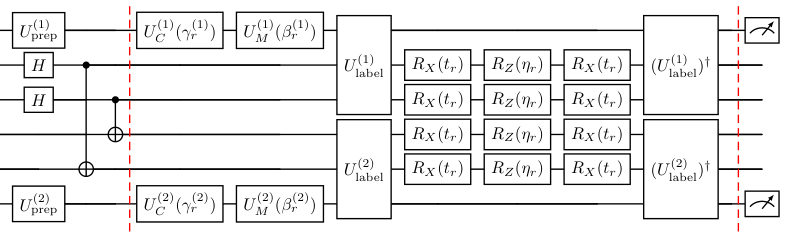 
Fig. 1. Representative depth-p QESTO circuit for two QPUs sharing two distributed edges e1, e2 ∈Edist. Each QPU hosts a local problem register Li and one communication qubit cek,i per incident distributed edge, with one Bell pair prepared across each edge. One ansatz layer applies local cost and mixing unitaries, followed by label encoding, transport, and decoding, as in (12).

📷 Fig 2

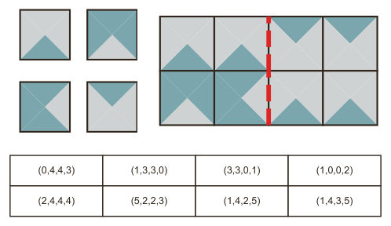 
Fig. 2. Example bounded weighted Wang tile-matching instance from the 2×4 ensemble. The top-left panel shows the tile catalogue, the top-right panel shows a globally optimal solution, and the bottom panel gives the position- dependent tile-assignment costs, with each tuple ordered clockwise from the upper-left catalogue tile. Blue and grey wedges encode the binary edge labels. The vertical red dashed line marks the inter-QPU boundary for optimisation by QESTO and subgraph-QAOA.

📷 Fig 3

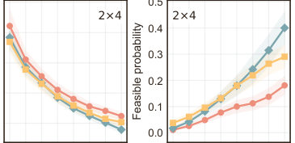 
Fig. 3. QESTO vs. subgraph-QAOA and monolithic QAOA on the 2×2 (top) and 2×4 (bottom) layouts. The left panels show the mean normalised optimality gap g (see (14)) vs. depth p, and the right panels show the mean feasible probability vs. p; shaded bands are ±1 SEM across instances. All points use 20 instances.

📷 Fig 4

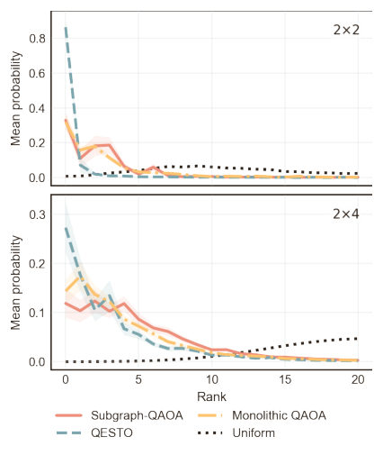 
Fig. 4. Mean cost-rank distributions for the 2×2 ensemble at depth p = 5 (top) and the 2×4 ensemble at depth p = 8 (bottom). Rank 0 denotes the globally optimal cost level, and higher ranks denote successively larger distinct classical cost values. Curves show the mean probability mass across instances; shaded bands are ±1 SEM. The black dotted line shows the distribution obtained by uniform random sampling of the solution space. All points use 20 instances.

**Summary.** This paper introduces QESTO, a novel variational ansatz designed for distributed quantum optimization on multiple QPUs. It leverages pre-shared Bell pairs to encode and transport constraint information locally, avoiding costly non-local gates. Benchmarking shows QESTO significantly outperforms standard QAOA methods by efficiently concentrating probability amplitude on low-cost solutions.

**Why it may be interesting.** The focus on utilizing persistent entanglement to simulate long-range interactions while minimizing gate overhead is highly relevant for near-term quantum hardware architectures that struggle with high-fidelity, deep non-local gate sequences.

Detailed structure

**Main problem.** The paper addresses the challenge of performing distributed quantum optimization for graph-based discrete problems when computing the cost function requires non-local gates across multiple quantum processors.

**Main result.** The proposed QESTO ansatz achieves stronger convergence to low-cost solutions than equivalent partitioned QAOA and outperforms monolithic QAOA on benchmark tile-matching problems, suggesting persistent entanglement is key to efficient distributed computation.

**Method.** QESTO introduces a variational ansatz that uses persistent, pre-shared Bell pairs to encode local constraint information and facilitate amplitude transfer across distributed edges, minimizing the need for non-local gates during the optimization layers.

**Model / system.** The model involves quantum computation distributed over multiple Quantum Processing Units (QPUs) solving graph-based discrete optimization problems, such as weighted Wang tile-matching. The core mechanism relies on local operations and shared entanglement (Bell pairs) to simulate long-range interactions.

**Key observables.** Mean normalized optimality gap (g), mean feasible probability of finding low-cost tilings, and the concentration of probability mass near the optimum solution.

**Important parameters / regimes.** Ansatz depth (p), the number of distributed edges ($|E_{dist}|$), and variational parameters $\{\gamma_r, eta_r, 	ext{tr}, \eta_r\}$.

**Assumptions / limitations.** The approach assumes the ability to utilize persistent Bell pairs, which reduces the overhead associated with repeatedly executing non-local gates compared to gate-teleported methods.

**Figures summary.** Figures illustrate the QESTO circuit structure for two QPUs sharing edges, and comparative plots show the mean normalized optimality gap and feasible probability versus ansatz depth for QESTO versus reference QAOA methods.

**Paper structure.** The paper first introduces the problem and the QESTO ansatz, detailing its local and entanglement-based layers. It then benchmarks QESTO against subgraph-QAOA and monolithic QAOA on specific tile-matching ensembles, presenting quantitative results on convergence and probability distribution.

Abstract

Distributed quantum optimisation is challenging because computing the problem cost function across multiple quantum processors requires non-local gates, which can incur overhead in latency and fidelity. Here we introduce QESTO, a distributed variational ansatz for graph-based discrete optimisation that requires only persistent pre-shared Bell pairs for remote operations. Using local operations, it encodes local constraint information in the Bell pairs that is leveraged to produce amplitude transfer towards globally valid distributed solution states. QESTO requires one Bell pair per distributed edge of the problem graph and, after initialisation of the Bell states, uses no non-local gates. On two bounded weighted Wang tile-matching problem ensembles, QESTO achieves stronger convergence to low-cost tilings than equivalently partitioned QAOA with no distributed gates at ansatz depths of two or higher, and exceeds the mean performance of monolithic QAOA at the deepest studied depth in both ensembles. These results suggest that persistent entanglement can support useful variational communication while reducing per-layer non-local gate overhead.

[↑ back to top](#top)

### [Effect of cations on van der Waals interactions between particles in aqueous alkali nitrate electrolytes](http://arxiv.org/abs/2606.04331v1)

**Authors:** Micah P. Prange, Jaehun Chun, Gregory K. Schenter, Elias Nakouzi, Yihui Wei, Aurora E. Clark, Kevin M. Rosso, Carolyn I. Pearce  
**Type:** theory · **Category:** statistical mechanics · **PDF:** <https://arxiv.org/pdf/2606.04331v1>  
**Analysis basis:** full PDF text, analyzed in chunks
**Topic relevance:** `Keldysh / 2PI / non-Gaussian methods` **1/5**

📷 Fig 1

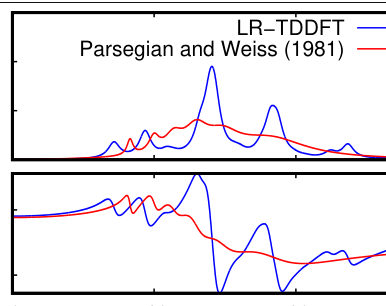 
Figure 1: Real (bottom) and imaginary (top) parts of

📷 Fig 2

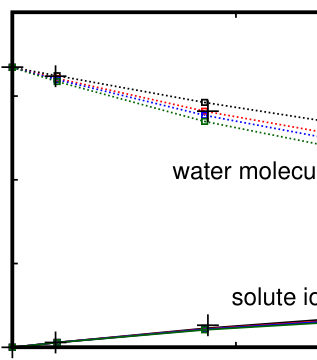 
Figure 2: Number densities of ionic/molecular species

📷 Fig 3

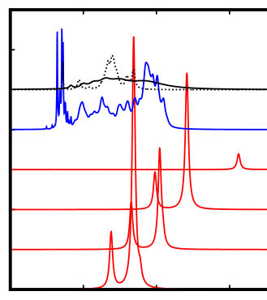 
Figure 3: Photoabsorption cross-section distributions for

📷 Fig 4

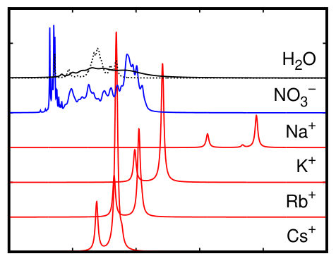 
Figure 4 plots the dielectric functions for 8.7 m solutions of the different NO3- salts (panels a

📷 Fig 5

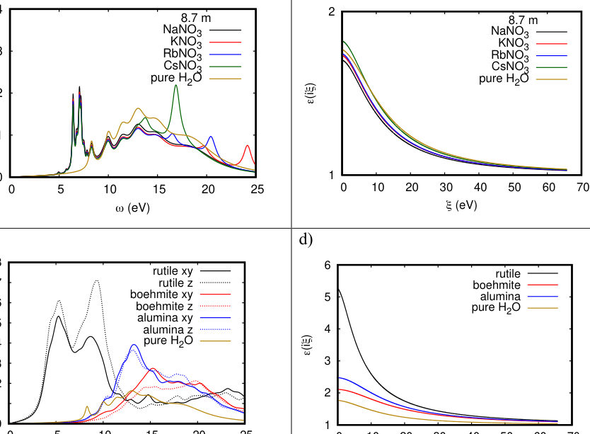 
Figure 4: Imaginary part of the dielectric function 𝜀((𝜔) (a,c) and van der Waals spectrum

**Summary.** This theoretical study calculates how van der Waals interactions between nanoparticles are modified by dissolved alkali nitrate electrolytes using an extended Lifshitz theory. By employing advanced electronic structure calculations, the authors find that increasing salt concentration can actually increase the Hamaker constant for certain ions, contradicting older assumptions and highlighting the persistent role of these forces in colloidal stability.

**Why it may be interesting.** While focused on classical colloidal forces, the rigorous application of advanced quantum mechanical methods (TDDFT) to model the dielectric response of complex ionic solutions provides a sophisticated theoretical framework for understanding many-body interactions in condensed matter systems.

Detailed structure

**Main problem.** The study aims to resolve the incomplete understanding of how electrolytes affect van der Waals interactions between particles, especially at high concentrations.

**Main result.** Contrary to prior assumptions, increasing concentrations of $	ext{NaNO}_3$, $	ext{KNO}_3$, and $	ext{RbNO}_3$ cause appreciable increases in the Hamaker constants, suggesting van der Waals interactions remain significant for colloidal stability.

**Method.** The authors extended Lifshitz theory by developing a dielectric response model for alkali nitrate solutions, calculated using electronic structure methods like LR-TDDFT.

**Model / system.** The system involves nanoparticles (rutile, boehmite, alumina) suspended in aqueous alkali nitrate electrolytes ($	ext{MNO}_3$). The theory models the interaction potential via the Hamaker constant, which depends on the dielectric response of the solvent and ions.

**Key observables.** Hamaker constants ($A$), dielectric functions ($\epsilon(\omega)$ and $\epsilon(i\xi)$), and the concentration dependence of these constants.

**Important parameters / regimes.** Intermediate and high electrolyte concentrations, the cation identity ($	ext{Na}^+, 	ext{K}^+, 	ext{Rb}^+, 	ext{Cs}^+$), and the temperature ($T=300	ext{K}$).

**Assumptions / limitations.** The model neglects Debye-type relaxation ($\hbar_7 = 0$) and assumes the dielectric response can be modeled via linear combinations of molecular/ionic oscillator strengths.

**Figures summary.** Figures compare dielectric functions using TDDFT vs. pole models, plot the Hamaker constant vs. cation species and concentration, and show photoabsorption cross-sections for various species.

**Paper structure.** The paper builds from a literature review of interparticle forces and solution chemistry, develops a theoretical framework based on extending Lifshitz theory using TDDFT to calculate the dielectric response, and presents calculations showing the concentration dependence of the Hamaker constant.

Abstract

The van der Waals interaction has been extensively studied for colloidal forces and resultant emergent phenomena such as colloidal stability, aggregation, and suspension rheology, but the effect of electrolytes on this interaction, especially at intermediate and high electrolyte concentrations, remains incompletely understood. We have extended the Lifshitz theory for van der Waals interactions in pure water to alkali nitrate solutions at arbitrary concentrations by developing a dielectric response model for alkali nitrate solutions that is based on electronic structure calculations of the molecular constituents. Due to their importance in catalysis, ceramics, and coating technologies, the Hamaker constants for rutile, boehmite, and alumina nanoparticles suspended in alkali nitrate solutions are calculated as a function of salt concentration. Contrary to prevailing assumptions, increasing the concentration of sodium (Na), potassium (K), and rubidium (Rb) nitrate solutions causes appreciable increases of the Hamaker constants relative to pure water instead of decreases, whereas cesium nitrate (CsNO3) has almost no effect on the Hamaker constant. We discussed the influence of the solution molar volume, the polarizability of the dissolved ions, and optical properties of the interacting particles in the context of previously published work. Our study indicates a non-vanishing role of van der Waals interactions on colloidal stability at intermediate and high electrolyte concentrations, leading to physical insights on emergent phenomena associated with nanoparticles.

[↑ back to top](#top)

### [Electron-Ion Path Integral Monte Carlo with Hard Core](http://arxiv.org/abs/2606.04667v1)

**Authors:** Riccardo Fantoni  
**Type:** theory · **Category:** statistical mechanics · **PDF:** <https://arxiv.org/pdf/2606.04667v1>  
**Analysis basis:** full PDF text, analyzed in chunks
**Topic relevance:** `Keldysh / 2PI / non-Gaussian methods` **1/5**

📷 Fig 1

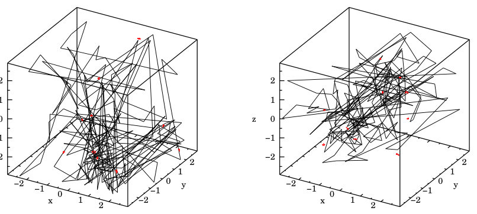 
FIG. 1. Snapshots of the simulation of a binary mixture with N = 20, x1 = 1/2, µ1 = 1, µ2 = 1000, σ = 0.4. The mixture is in a thermodynamic state with a reduced temperature T = T ′/T = 0.1 with T ′ measured in degrees Kelvin and a reduced number density n = n′L 3 = 0.1 with n′ measured in cm−3. In the path integral we chose M = 20 and used either Bose-Einstein (left panel, case A in Table I) or Fermi-Dirac (right panel, case B in Table I) statistics among like particles. Red paths are for the heavy slow species and black paths are for the light fast species.

📷 Fig 2

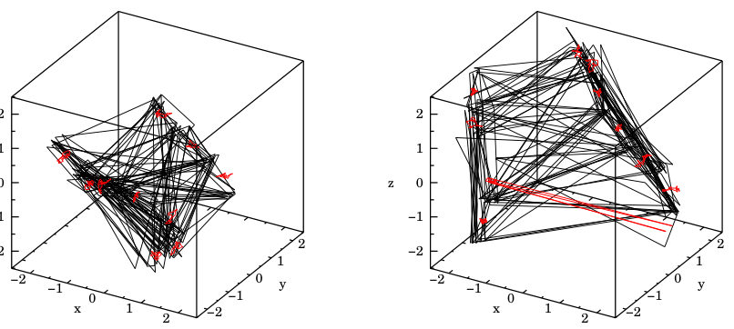 
FIG. 2. Snapshots of the simulation of a binary mixture with N = 20, x1 = 1/2, µ1 = 1, µ2 = 1836.15, σ = 1. The mixture is in a thermodynamic state with a reduced temperature T = T ′/T = 0.005 with T ′ measured in degrees Kelvin and a reduced number density n = n′L 3 = 0.16 with n′ measured in cm−3. In the path integral we chose M = 20 and used either Bose- Einstein (left panel, case G in Table I) or Fermi-Dirac (right panel, case H in Table I) statistics among like particles. Red paths are for the heavy slow protons and black paths are for the light fast electrons.

📷 Fig 3

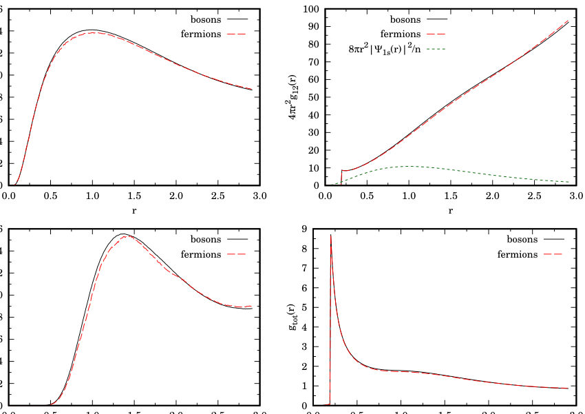 
FIG. 3. The partial, gij, and total, gtot, radial distribution functions for a binary mixture with N = 20, x1 = 1/2, µ1 = 1, µ2 = 1000, σ = 0.4. In the panel for the unlike radial distribution function we also show the ground state probability distribution of the Hydrogen atom for comparison. The mixture is in a thermodynamic state with a reduced temperature T = T ′/T = 0.1 with T ′ measured in degrees Kelvin and a reduced number density n = n′L 3 = 0.1 with n′ measured in cm−3. In the path integral we chose M = 20 and used either Bose-Einstein (case A in Table I) or Fermi-Dirac (case B in Table I) statistics among like particles. In the figures r = r′/L where r′ is measured in centimeters.

📷 Fig 4

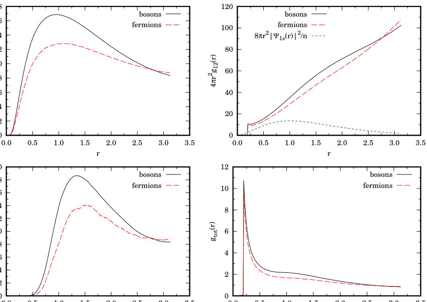 
FIG. 4. The partial, gij, and total, gtot, radial distribution functions for a binary mixture with N = 20, x1 = 1/2, µ1 = 1, µ2 = 1836.15, σ = 0.4. In the panel for the unlike radial distribution function we also show the ground state probability distribution of the Hydrogen atom for comparison. The mixture is in a thermodynamic state with a reduced temperature T = T ′/T = 0.1 with T ′ measured in degrees Kelvin and a reduced number density n = n′L 3 = 0.08 with n′ measured in cm−3. In the path integral we chose M = 20 and used either Bose-Einstein (case C in Table I) or Fermi-Dirac (case D in Table I) statistics among like particles. In the figures r = r′/L where r′ is measured in...

📷 Fig 5

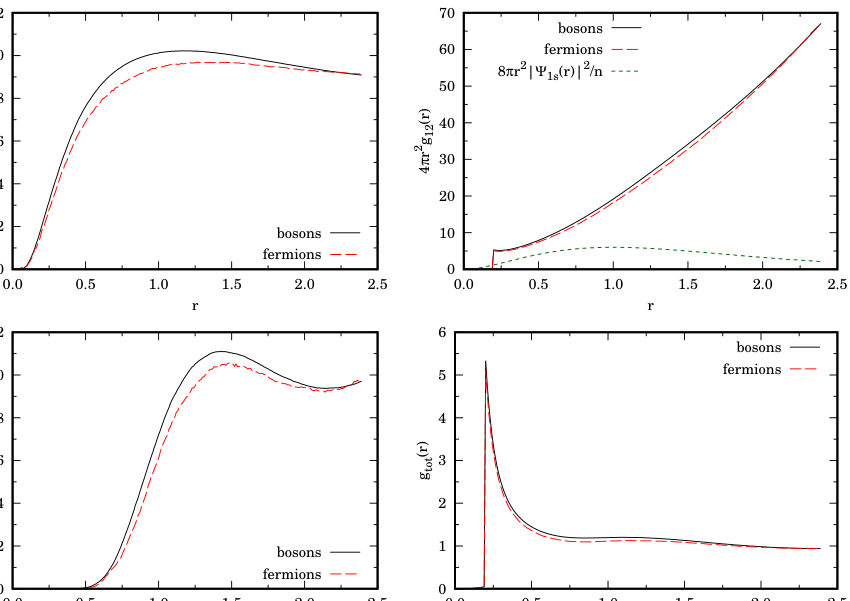 
FIG. 5. The partial, gij, and total, gtot, radial distribution functions for a binary mixture with N = 20, x1 = 1/2, µ1 = 1, µ2 = 1836.15, σ = 0.4. In the panel for the unlike radial distribution function we also show the ground state probability distribution of the Hydrogen atom for comparison. The mixture is in a thermodynamic state with a reduced temperature T = T ′/T = 0.1 with T ′ measured in degrees Kelvin and a reduced number density n = n′L 3 = 0.18 with n′ measured in cm−3. In the path integral we chose M = 20 and used either Bose-Einstein (case E in Table I) or Fermi-Dirac (case F in Table I) statistics among like particles. In the figures r = r′/L where r′ is measured in...

**Summary.** This work uses Path Integral Monte Carlo simulations to study electron-proton plasma, aiming to predict the formation of molecular hydrogen. By analyzing structural correlations, the authors demonstrate that quantum statistical effects predict a phase transition from a metallic to a molecular hydrogen state upon cooling. This research is significant for understanding quantum matter under extreme conditions.

**Why it may be interesting.** The study uses advanced quantum statistical methods (PIMC) to model complex, strongly interacting quantum matter, providing insights into quantum phase transitions and molecular binding in extreme environments.

Detailed structure

**Main problem.** To investigate the quantum statistical prediction of molecular hydrogen formation within a plasma composed of electrons and protons from first principles.

**Main result.** The simulations predict a phase transition sequence from metallic to molecular hydrogen as temperature decreases, and the structure analysis confirms the formation of $	ext{H}_2$ molecules.

**Method.** Path Integral Monte Carlo (PIMC) simulations are used to calculate thermodynamic and structural properties of the plasma.

**Model / system.** The system is a quantum two-component plasma (electron-proton plasma) modeled by a Hamiltonian including Coulomb interactions and a hard core for stabilization.

**Key observables.** Thermodynamic properties, structural properties, radial distribution functions ($g_{ij}(r)$), and superfluid fractions.

**Important parameters / regimes.** Reduced temperature ($T$), reduced number density ($n$), and the comparison between Bose-Einstein and Fermi-Dirac statistics.

**Assumptions / limitations.** The use of Restricted PIMC (RPIMC) for fermions due to the sign problem, and the necessity of an artificial hard core ($\sigma$) in the primitive approximation.

**Figures summary.** Figures show radial distribution functions ($g_{ij}(r)$) demonstrating the development of distinct peaks corresponding to $	ext{H}_2$ and $	ext{H}_3$ molecular clusters at low temperatures.

**Paper structure.** The paper analyzes the system by comparing additive and nonadditive mixture models, studying the evolution of structural correlations (RDFs) across different temperatures and quantum statistics.

Abstract

We performed numerical (restricted) path integral Monte Carlo experiments on metallic Hydrogen from first principles. We study a quantum two component plasma where one component is made of pointwise particles of negative unitary charge and the other is made of charged hard spheres of positive unitary charge. We study both the additive mixture and a nonadditive mixture where we only keep a hard core between unlike species. We specialize to the case of the electron-proton plasma with a 1:1 ratios between the molar fraction of the two species. We measured thermodynamic and structural properties of the plasma. From an analysis of the structure we see a transition from a metallic Hydrogen phase, to a molecular Hydrogen phase as the temperature is lowered. As expected at high density the correlations are diminished.

[↑ back to top](#top)

### [Gaussian mean width strong converse bound on the classical identification capacity of quantum channels](http://arxiv.org/abs/2606.05032v1)

**Authors:** Satvik Singh  
**Type:** theory · **Category:** quantum information and computing · **PDF:** <https://arxiv.org/pdf/2606.05032v1>  
**Analysis basis:** full PDF text, analyzed in chunks
**Topic relevance:** `entanglement & information structure` **1/5**

📷 Fig 1

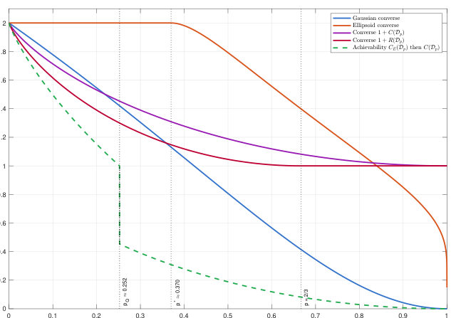 
Figure 1: Strong converse and achievability bounds on the classical identification capacity of the qubit de- polarizing channel Dp (see Eq. (4.18)). The blue curve shows the Gaussian converse bound from Theorem 1.2 (see Eq.(4.21)). The orange curve shows the Ellipsoid converse bound from [38] (see Eq. (4.23)). The purple and red curves show the classical capacity [38] and quantum capacity [5] converse bounds (see Eqs. (4.24) and (4.26)), respectively. The dashed curve shows the achievability bound from [15, 36] (see Eq. (4.32)).

📷 Fig 2

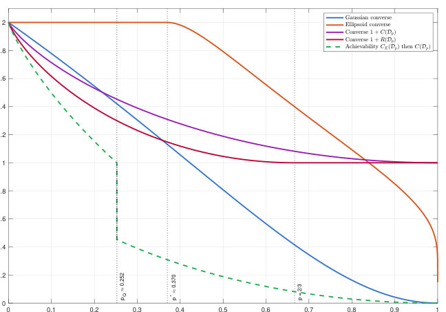 
Figure 2: Strong converse and achievability bounds on the classical identification capacity of the qubit depolarizing channel Dp. The blue and orange curves show the Gaussian and Ellipsoid strong converse bounds from Eqs. (4.21) and (4.23), respectively. The purple and red curves show the classical capacity and quantum capacity strong converse bounds from Eqs. (4.24) and (4.26), respectively. The dashed curve shows the achievability bound from Eq. (4.32).

📷 Fig 3

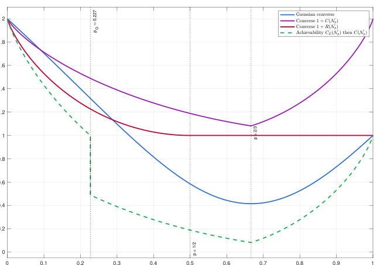 
Figure 3: Strong converse and achievability bounds on the classical identification capacity of the qubit Pauli XY channel Np. The blue curve shows the Gaussian strong converse bound from Eq. (4.36). The purple and red curves show the capacity converse bounds from Eqs. (4.37) and (4.38). The dashed curve shows the achievability bound from Eq. (4.44).

📷 Fig 4

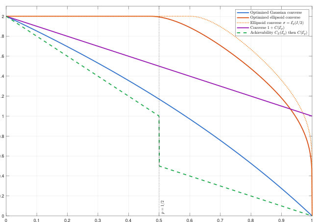 
Figure 4: Strong converse and achievability bounds on the classical identification capacity of the qubit erasure channel Ep. The solid blue and orange curves show the Gaussian and ellipsoid strong converse bounds from Eqs. (4.59) and (4.61), respectively. The dashed orange curve is the ellipsoid bound with σ = Ep(1/2) (Eq. (4.62)). The purple curve shows the capacity converse bound from Eq. (4.63). The green dashed curve shows the achievability bound from Eq. (4.65).

📷 Fig 5

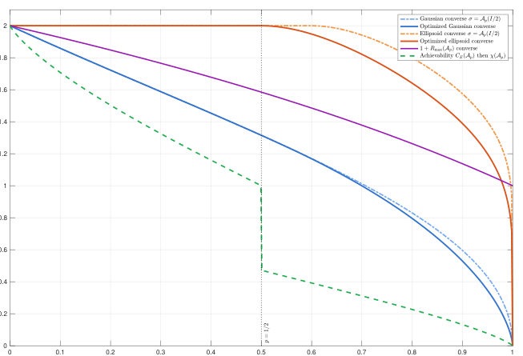 
Figure 5: Strong converse and achievability bounds on the classical identification capacity of the qubit amplitude damping channel Ap. The solid blue and orange curves show the optimized Gaussian and Ellipsoid converse bounds from Eqs. (4.76) and (4.79), respectively. The dashed blue and orange curves show the σ = Ap(1/2) Gaussian and Ellipsoid converse bounds from Eqs. (4.77) and (4.80), respectively. The purple curve shows the capacity converse bound from Eq. (4.81). The green dashed curve shows the achievability bound from Eq. (4.84).

**Summary.** This paper develops a strong converse bound for the classical identification capacity of quantum channels by utilizing the Gaussian mean width of the channel's output space. The core technique involves relating the metric complexity of the channel image to the operator norm of a specially constructed singular operator. This yields improved, general bounds for several important quantum channels.

**Why it may be interesting.** It provides a powerful, geometrically motivated tool (Gaussian mean width) to derive fundamental limits (converse bounds) on quantum information tasks, which is crucial for understanding the ultimate performance limits of quantum communication protocols.

Detailed structure

**Main problem.** The paper aims to establish a single-letter and efficiently computable strong converse bound on the classical identification capacity of quantum channels.

**Main result.** The identification capacity is bounded by the infimum over all reference states $\sigma$ of the logarithm of the operator norm of a derived singular operator, $\inf_{\sigma} \log \|Q_{N, \sigma}\|_\infty$.

**Method.** The method connects the metric complexity of the channel output space, quantified by the Gaussian mean width, to the identification capacity using Sudakov's inequality.

**Model / system.** The analysis concerns general quantum channels $N: \mathcal{L}(A) 	o \mathcal{L}(B)$ acting on finite-dimensional Hilbert spaces, relating to quantum information transmission tasks.

**Key observables.** Classical identification capacity ($	ext{CID}(N)$), Gaussian mean width ($w_G$), and the $\sigma$-weighted singular operator ($Q_{N, \sigma}$).

**Important parameters / regimes.** The noise/depolarizing/erasure probability parameter ($p$) is used when analyzing specific examples like the depolarizing or erasure channels.

**Assumptions / limitations.** The analysis is restricted to finite-dimensional Hilbert spaces, and the method relies on relating code size bounds to Gaussian covering estimates.

**Figures summary.** Figures compare the derived strong converse bounds (Gaussian, Ellipsoid) against known achievability bounds for specific channels like the depolarizing ($D_p$), Pauli ($N_p$), and erasure ($E_p$) channels.

**Paper structure.** The paper develops the theory by first defining weighted Euclidean geometries and relating code size to Gaussian width. It then derives the strong converse bound using the Gaussian mean width, culminating in the final optimization over reference states $\sigma$ which admits an SDP formulation.

Abstract

We establish a single-letter and efficiently computable strong converse bound on the classical identification capacity of quantum channels. By equipping the $n$-fold channel output space with a product state-weighted $σ$-Euclidean geometry, we allow trace-distance separation constraints for identification codes to be controlled by Euclidean covering estimates. Using Sudakov's inequality, we bound the covering numbers of the $n$-fold channel outputs via their Gaussian mean widths in the weighted geometry, whose exponential growth in $n$ is governed by the operator norm of a single-letter positive operator. Upon optimizing over all weighing states $σ$, this yields a strong converse bound on the identification capacity of the channel, which also admits a semidefinite representation. Our method improves the best known converse bounds on the identification capacity of several important examples, such as depolarizing, Pauli, erasure, and amplitude damping channels. We also discuss extensions of this method to more general Euclidean geometries on the output space.

[↑ back to top](#top)

### [Hybrid quantum-classical physics-informed neural networks for solving nonlinear PDEs: when and where hybridization is effective?](http://arxiv.org/abs/2606.04679v1)

**Authors:** Kaveh Zabihi, Hamid Montazeri, Akke S. J. Suiker  
**Type:** both · **Category:** numerical methods · **PDF:** <https://arxiv.org/pdf/2606.04679v1>  
**Analysis basis:** full PDF text, analyzed in chunks
**Topic relevance:** `methods for driven-dissipative` **1/5**

📷 Fig 1

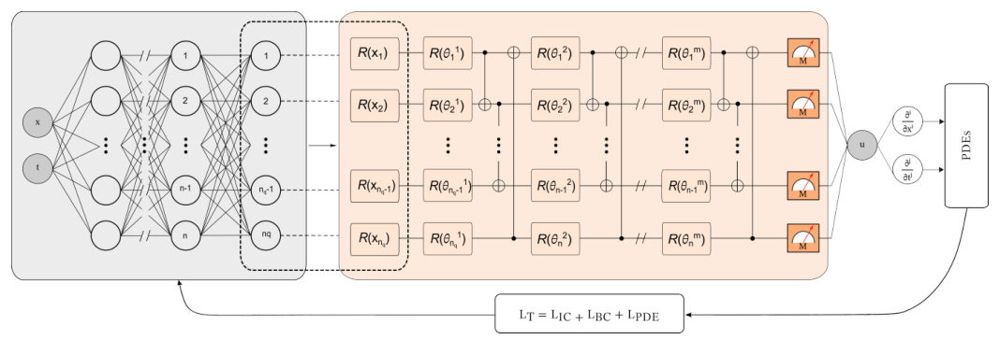 
Fig. 1 Schematic of the proposed hybrid quantum-classical physics-informed neural network (HQPINN) architecture. The spatiotemporal input (𝑥, t) is first processed by a classical feed-forward neural network (depicted in gray) to produce a compact latent representation, which is then encoded into an 𝑛!-qubit parameterized quantum circuit (PQC) using angle embedding, followed by 𝑚 variational layers composed of single-qubit rotations and a ring CNOT entangling gates (depicted in orange). Pauli-Z expectation values measured from the PQC are subsequently mapped through a final classical dense layer to generate the scalar network prediction 𝑢(𝑥, 𝑦). Automatic differentiation is used to compute...

📷 Fig 2

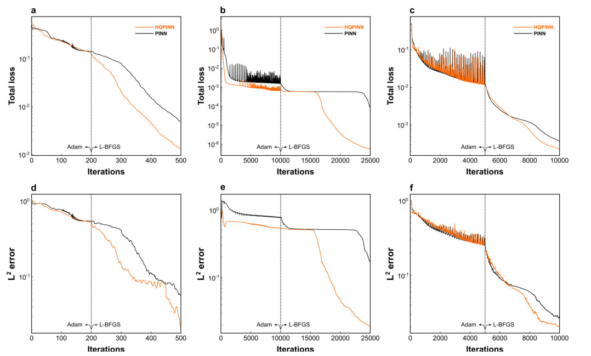 
Fig. 2 Training dynamics of the HQPINN (orange) and the classical PINN (black) for three benchmark PDEs. Total loss during training for (a) Burgers’ equation, (b) Allen–Cahn equation, and (c) KdV equation. (d-f) The corresponding relative L2 error with respect to the reference solution. Dashed vertical lines mark the transition from Adam to L-BFGS-B. Training is carried out for 500, 25,000, and 10,000 iterations for Burgers’, Allen–Cahn, and KdV equations, respectively.

📷 Fig 3

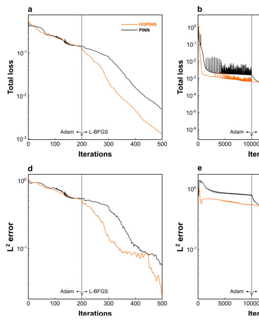 
Fig. 3 presents the spatial–temporal distribution of the prediction error for the classical PINN and the HQPINN across the three benchmark PDEs. These contour maps complement the global metrics in Fig. 2 by showing where errors are concentrated within the computational domain and how effectively the HQPINN suppresses localized error structures. For Burgers’ equation (Fig. 3a,d), the dominant errors in the classical PINN are concentrated near the steep transition region where the solution develops a sharp convective gradient. This appears as a pronounced error band

📷 Fig 4

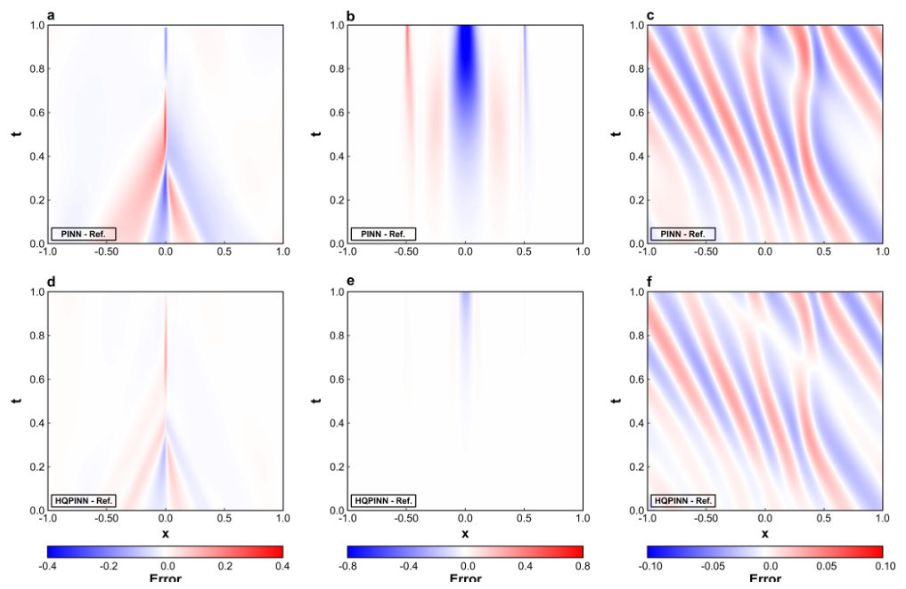 
Fig. 3 Spatial–temporal error fields of the classical PINN for (a) Burgers’ equation, (b) Allen–Cahn equation, and (c) KdV equation. (d)–(f) The corresponding error fields of the HQPINN. The plotted quantity is the signed prediction error, defined as the difference between the predicted and reference solutions. For Burgers’ and Allen–Cahn equations, the HQPINN substantially reduces both the magnitude and the spatial extent of the dominant localized error regions. For the KdV equation, both models exhibit oscillatory error patterns aligned with the dispersive wave structure, although the HQPINN yields a more modest reduction in error amplitude.

📷 Fig 5

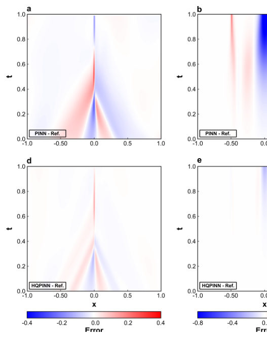 
Fig. 4 compares representative solution snapshots of the classical PINN and the HQPINN against the reference solution for the three benchmark PDEs. These profiles complement the spatial-temporal error maps in Fig. 3 by illustrating how accurately each model reproduces key spatial features of the solution at different times. For Burgers’ equation, both models closely match the reference solution at early times when the solution remains smooth. As the steep convective gradient forms, the classical PINN begins to deviate in the vicinity of the shock region, whereas the HQPINN remains closely aligned with the reference solution. This behavior reflects improved local resolution of

**Summary.** This work introduces the Hybrid Quantum-Classical PINN (HQPINN) to overcome the limitations of classical PINNs when solving challenging nonlinear PDEs. By embedding a Parameterized Quantum Circuit into the network structure, the model achieves superior accuracy and training stability, particularly for problems involving shocks or stiff interfaces. The findings provide a systematic guide on how quantum resources can be effectively co-designed with classical ML components for advanced scientific computing.

**Why it may be interesting.** The integration of quantum circuits into solving continuous physical systems like PDEs offers a novel computational paradigm for modeling complex, non-linear dynamics that challenge classical numerical solvers.

Detailed structure

**Main problem.** Classical Physics-Informed Neural Networks (PINNs) struggle to accurately solve nonlinear Partial Differential Equations (PDEs) exhibiting sharp gradients, stiffness, or multiscale structure.

**Main result.** The proposed Hybrid Quantum-Classical PINN (HQPINN) significantly improves accuracy and stabilizes training compared to classical PINNs, especially for stiff and shock-dominated PDEs.

**Method.** The HQPINN integrates a classical neural network backbone with a Parameterized Quantum Circuit (PQC) trained jointly using a physics-informed loss function.

**Model / system.** The model is benchmarked on three 1D nonlinear PDEs: Burgers' equation (shocks), the Allen-Cahn equation (stiff interfaces), and the Korteweg-de Vries (KdV) equation (dispersive).

**Key observables.** Relative L2 error, training loss dynamics, and the stability of the solution across different PDE regimes.

**Important parameters / regimes.** Qubit count, circuit depth, PQC placement, collocation density, and classical network width are systematically varied.

**Assumptions / limitations.** All experiments are performed using classical quantum-circuit simulators, ignoring hardware noise effects.

**Figures summary.** Figures illustrate the comparison of training dynamics and final L2 errors across the three PDEs, showing HQPINN's superior performance in challenging regimes.

**Paper structure.** The paper introduces the HQPINN architecture, benchmarks it against classical PINNs on three canonical nonlinear PDEs, performs a systematic sensitivity analysis across quantum and classical hyperparameters, and concludes with design guidelines for quantum-enhanced solvers.

Abstract

Physics-informed neural networks (PINNs) often struggle on nonlinear partial differential equations (PDEs) with sharp gradients, stiff dynamics, high-frequency content, or multiscale structure. Such limitations, rooted in spectral bias, ill-conditioned optimization, and unstable convergence, restrict PINN accuracy in regimes where advanced solvers are most needed. In this work, we develop a hybrid quantum-classical physics-informed neural network (HQPINN) that integrates a classical neural-network backbone with a parameterized quantum circuit (PQC) to enrich the solution representation. The framework is benchmarked against a classical PINN on three representative nonlinear PDEs: Burgers' equation, the Allen-Cahn equation, and the Korteweg-de Vries (KdV) equation. The framework is further examined through a systematic sensitivity analysis of qubit count, circuit depth, PQC placement, collocation density, and classical-network width. Across all benchmarks, HQPINNs exhibit smoother training dynamics, reduced loss oscillations, and improved final accuracy, with the largest gains occurring in stiff and multiscale regimes. Relative L2 error decreases by about fourfold for Burgers' equation and fivefold for the Allen-Cahn equation, while improvements for the KdV equation are more moderate. Overall, the results demonstrate that carefully co-designed hybrid quantum-classical architectures can mitigate key limitations of classical PINNs and provide practical design guidance for near-term quantum-enhanced PDE solvers.

[↑ back to top](#top)

### [No-Go Theorem for Gaussian Quantum Repeaters from Fractional Extendibility](http://arxiv.org/abs/2606.05097v1)

**Authors:** Rabsan Galib Ahmed, Graeme Smith  
**Type:** theory · **Category:** quantum information and computing · **PDF:** <https://arxiv.org/pdf/2606.05097v1>  
**Analysis basis:** full PDF text, analyzed in chunks
**Topic relevance:** `entanglement & information structure` **1/5**

📷 Fig 1

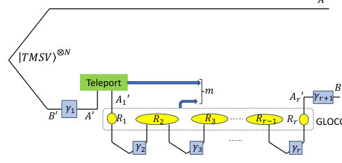 
FIG. 1. Choi state of the repeater chain, Rη corresponding to some message string m. γi’s denote attenuation parameters of the intermediate pure loss channels.

📷 Fig 2

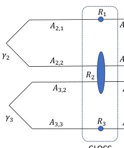 
FIG. 2. Each repeater node prepares a bipartite state locally and shares one part to the next node using the attenuation channel (illustrated for three nodes). Thereafter they perform an arbitrary GLOCC protocol.

**Summary.** This paper establishes a no-go theorem proving that quantum repeaters using only Gaussian operations cannot improve the quantum capacity of a pure-loss optical channel beyond what direct transmission achieves. The authors achieve this by introducing and analyzing the mathematical concept of fractional extendibility for Gaussian states. This result places fundamental theoretical limits on the achievable rates in practical quantum communication networks.

**Why it may be interesting.** This work provides a rigorous mathematical boundary on the performance of quantum communication protocols when restricted to experimentally feasible Gaussian operations, which is highly relevant for quantum optics and quantum networking.

Detailed structure

**Main problem.** To prove a no-go theorem demonstrating that Gaussian quantum repeaters cannot enhance the quantum communication rate over a pure-loss bosonic attenuation channel.

**Main result.** The quantum capacity achieved by any repeater chain composed solely of Gaussian operations is upper-bounded by the quantum capacity achievable through direct transmission.

**Method.** The proof introduces and utilizes the concept of fractional extendibility for Gaussian states, applying it within the framework of Gaussian quantum information theory.

**Model / system.** The model involves quantum communication over optical channels limited by photon loss, analyzed using Gaussian states characterized by their first moment and Quantum Covariance Matrix (QCM).

**Key observables.** Quantum capacity $Q(A_\eta)$, the QCM of the output state ($V'_{A'}$), and the transmissivity $\eta$.

**Important parameters / regimes.** Transmissivity $\eta \in [0, 1]$, and the attenuation parameters $\gamma_i$ characterizing intermediate loss.

**Assumptions / limitations.** The theorem is strictly limited to repeater chains restricted to performing only Gaussian operations (including homodyne measurements) and classical communication.

**Figures summary.** Figure 1 illustrates the Choi state of the repeater chain, showing the process involving intermediate attenuation channels and local operations. Figure 2 details how a bipartite state is prepared across three nodes using attenuation channels.

**Paper structure.** The work develops the mathematical framework by generalizing $k$-extendibility to fractional extendibility, proving key lemmas regarding its composition and monotonicity, and finally applying these tools to bound the quantum capacity of the full repeater chain $R_\eta$.

Abstract

Photon loss in optical channels fundamentally limits long-range reliable quantum communication. A standard approach to overcoming this limitation is the use of quantum repeater nodes, which typically perform experimentally demanding non-Gaussian operations. However, whether Gaussian repeater protocols can enhance quantum communication rates over bosonic attenuation channels has remained open. In this work, we prove a no-go theorem for Gaussian quantum repeaters in a quantum network. Specifically, we show that any repeater chain composed of Gaussian operations, homodyne measurements, and arbitrary classical communication cannot enhance the quantum capacity of a pure-loss attenuation channel beyond that achievable by direct transmission. Our proof introduces a generalisation of $k$-extendibility to a notion of fractional extendibility for Gaussian states and establishes some of its useful properties, thereby providing a powerful framework for analysing Gaussian quantum networks.

[↑ back to top](#top)

### [Why Fe doping kills photoluminescence in CsPbCl$_3$ but not in CsPbBr$_3$: Role of midgap Fe 3$d$ states and electron-phonon coupling](http://arxiv.org/abs/2606.04714v1)

**Authors:** Arpan Das, Saptarshi Chakraborty  
**Type:** theory · **Category:** other · **PDF:** <https://arxiv.org/pdf/2606.04714v1>  
**Analysis basis:** full PDF text, analyzed in chunks
**Topic relevance:** `correlated / nonlocal dissipation` **1/5**

📷 Fig 1

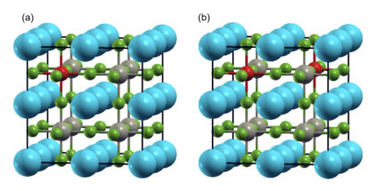 
FIG. 1. Systems considered in the present DFT calculations: (a) 12.5% Fe-doped CsPbCl3 and (b) 25% Fe-doped CsPbCl3. The structures are constructed using a 2 × 2 × 2 supercell comprising 8 Cs, 7 (6) Pb, 1 (2) Fe, and 24 Cl atoms for 12.5% (25%) Fe concentrations. For the 25% Fe-doped case, only the lowest-energy configuration is shown, in which the two Fe atoms occupy sites along a face diagonal. Color code: Cs (cyan), Pb (gray), Cl (green), and Fe (red).

📷 Fig 2

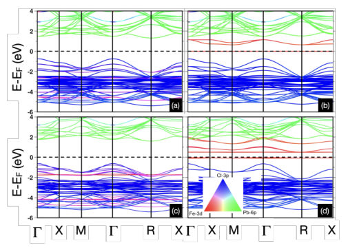 
FIG. 3. Orbital-projected band structures without SOC for (a) 12.5% Fe-doped CsPbCl3 (spin-up), (b) 12.5% Fe-doped CsPbCl3 (spin-down), (c) 25% Fe-doped CsPbCl3 (spin-up), and (d) 25% Fe-doped CsPbCl3 (spin-down). The bands are projected onto the three dominant orbitals near the Fermi level: Fe 3d (red), Cl 3p (blue), and Pb 6p (green). The color triangle shown in the inset of panel (d) illustrates the relative orbital contributions, with intermediate colors indicating the degree of orbital mixing (hybridization).

📷 Fig 3

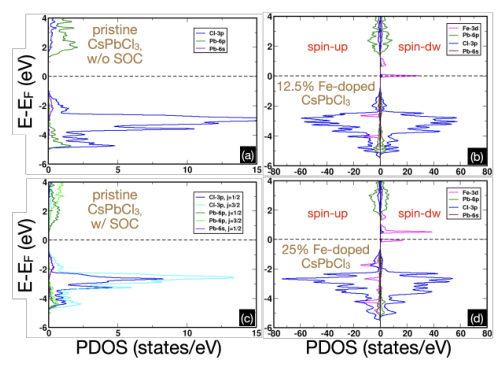 
FIG. 2. PDOS of pristine CsPbCl3: (a) without SOC and (c) with SOC. Spin-resolved PDOS without SOC for (b) 12.5% and (d) 25% Fe-doped CsPbCl3. The electronic states near the Fermi level are dominated by Fe 3d, Cl 3p, and Pb 6p orbitals.

📷 Fig 4

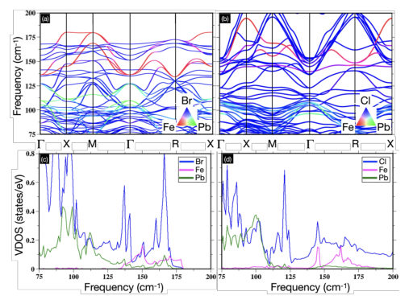 
FIG. 5. Phonon dispersion (shown in the frequency range of Fe vibrations) with atomic contributions, calculated with- out SOC for (a) 12.5% Fe-doped CsPbBr3 and (b) 12.5% Fe- doped CsPbCl3. The phonon branches are colored according to the relative weights of atomic contributions. The color triangle shown in the inset indicates Fe (red), Br/Cl (blue), and Pb (green), with intermediate colors representing the de- gree of atomic mixing (hybridization). Phonon density of states (PDOS), also referred to as vibrational density of states (VDOS) (shown in the frequency range of Fe vibrations), with atomic contributions, calculated without SOC for (c) 12.5% Fe-doped CsPbBr3 and (d) 12.5% Fe-doped...

📷 Fig 5

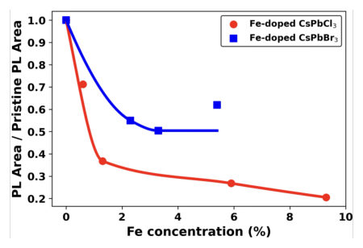 
FIG. 4. Experimentally measured variation of the integrated PL intensity (area under the emission curve) as a function of Fe concentration for Fe-doped CsPbCl3 (red filled circles) and Fe-doped CsPbBr3 (blue filled squares). The values are normalized with respect to the corresponding pristine systems (0% Fe doping). The blue and red curves serve as guides to the eye.

**Summary.** This theoretical study investigates why Fe doping causes complete PL quenching in $	ext{CsPbCl}_3$ but only partial quenching in $	ext{CsPbBr}_3$. By calculating electron-phonon coupling, the authors show that the difference lies in the coupling strength, which is much higher in the chloride system due to its lattice vibrations. This establishes EPC as the key factor controlling dopant-induced nonradiative decay in these perovskites.

**Why it may be interesting.** This work provides a clear example of how lattice dynamics (phonons) can dominate the quenching of quantum optical signals, offering a mechanism beyond simple electronic trapping for understanding energy dissipation in solid-state emitters.

Detailed structure

**Main problem.** The study aims to determine the microscopic reason for the differing photoluminescence (PL) quenching behaviors observed when Fe is doped into $	ext{CsPbCl}_3$ versus $	ext{CsPbBr}_3$ perovskites.

**Main result.** The distinct PL responses are governed not by the electronic structure alone, but by the significantly stronger electron-phonon coupling (EPC) in the chloride system, which efficiently dissipates excitation energy into lattice vibrations.

**Method.** The research employs spin-polarized DFT calculations, followed by phonon calculations and the evaluation of electron-phonon coupling strength using the deformation potential approach.

**Model / system.** The system under study is the halide perovskite $	ext{CsPbX}_3$ ($	ext{X} = 	ext{Cl}, 	ext{Br}$) doped with Iron ($	ext{Fe}$). The analysis compares the electronic and vibrational properties of $	ext{Fe}$-doped $	ext{CsPbCl}_3$ and $	ext{Fe}$-doped $	ext{CsPbBr}_3$.

**Key observables.** PL intensity (quenching extent), midgap $	ext{Fe } 3d$ states, deformation potential ($D$), and the electron-phonon coupling strength ($|M|^2$).

**Important parameters / regimes.** The ratio of EPC strengths ($|M|^2$) between the two halides ($	ext{Cl}$ vs. $	ext{Br}$), and the lattice vibrational frequencies.

**Assumptions / limitations.** The analysis assumes that the difference in PL quenching is due to the coupling mechanism, moving beyond purely electronic descriptions.

**Figures summary.** Figures illustrate structural changes, electronic band structures under strain, and phonon dispersion curves comparing the two doped perovskites.

**Paper structure.** The paper first establishes that $	ext{Fe}$ doping introduces midgap states causing quenching. It then compares the electronic structures of $	ext{CsPbCl}_3$ and $	ext{CsPbBr}_3$, noting electronic similarity. The core argument is built by calculating the electron-phonon coupling, revealing a large disparity in EPC strength between the two materials, which explains the differing PL outcomes.

Abstract

Understanding the impact of transition-metal doping on the optoelectronic properties of halide perovskite nanocrystals is essential for their rational design in photonic applications. We establish the microscopic origin of photoluminescence (PL) quenching in Fe-doped CsPbCl$_3$ using spin-polarized density functional theory calculations. The emergence of Fe 3$d$ midgap states creates efficient electron-trapping centres that drive nonradiative recombination, accounting for the reduced PL intensity. Extending this analysis to Fe-doped CsPbX$_3$ (X = Cl, Br), we show experimentally that although PL intensity is suppressed in both systems relative to their pristine counterparts, their high-doping behaviour diverges: CsPbCl$_3$ becomes completely non-emissive, whereas CsPbBr$_3$ retains a finite, saturated PL intensity. Despite this contrast, electronic structure calculations reveal nearly identical midgap states in both materials, indicating that electronic effects alone cannot explain the distinct PL responses. Phonon calculations likewise fail to capture this difference. In contrast, electron-phonon coupling calculations based on the deformation potential approach reveal significantly stronger coupling in Fe-doped CsPbCl$_3$, enabling efficient dissipation of electronic excitation energy into lattice vibrations and leading to complete PL quenching. These results identify electron-phonon coupling as the key factor governing halide-dependent PL quenching and provide a unified microscopic framework for dopant-induced nonradiative processes in halide perovskites.

[↑ back to top](#top)

## Other papers (13)

*Papers from primary archives without highlighted authors or any topic match. Click to expand.*

Show other papers

### [Antiferromagnetic Quantum Criticality in Infinite-Layer Cuprates Sr1-xNdxCuO2](http://arxiv.org/abs/2606.04559v1)

**Authors:** Bin-Jie Wu, Ze-Xian Deng, Guang-Ran Wei, Xi Zhou, Ji-Hai Zhang, Da-Zhuang Deng, Qun Zhu, Yong Zhong, Can-Li Song, Xu-Cun Ma, Qi-Kun Xue  
**Type:** both · **Category:** strongly correlated electrons · **PDF:** <https://arxiv.org/pdf/2606.04559v1>  
**Analysis basis:** full PDF text, analyzed in chunks

📷 Fig 1

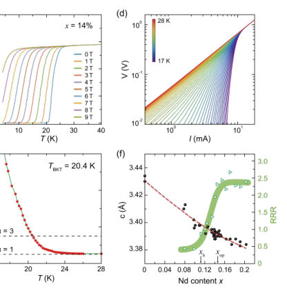 
FIG. 1. (a) 2θ-ω X-ray diffraction scans of SNCO thin films with various Nd content x. (b)

📷 Fig 2

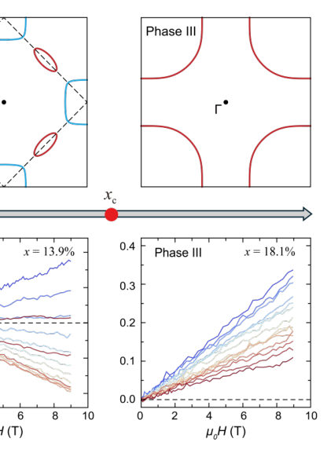 
FIG. 2. (a) Schematic evolution of the FS in electron-doped cuprates from the underdoped (Phase I)

📷 Fig 3

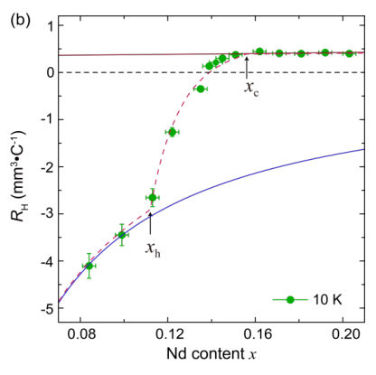 
FIG. 3. (a) Temperature dependence of RH for SNCO films with various Nd content x. (b) RH at 10

📷 Fig 4

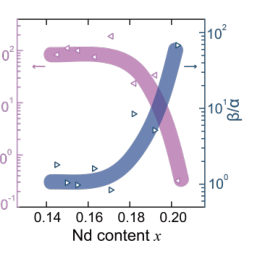 
FIG. 4. (a) Temperature dependence of the in-plane resistivity ρxx for the SNCO film with x = 0.145.

📷 Fig 5

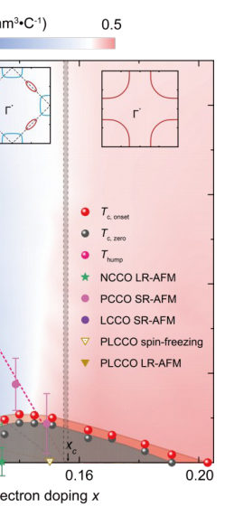 
FIG. 5. Electronic phase diagram of SNCO. The superconducting transition temperatures Tc, onset and

**Summary.** This work investigates quantum criticality in electron-doped cuprates using high-quality epitaxial films of $	ext{Sr}_{1-x}	ext{Nd}_x	ext{CuO}_2$. By measuring transport properties, the authors identify a doping-dependent Fermi surface reconstruction driven by antiferromagnetic correlations. The findings establish a clean benchmark for understanding unconventional superconductivity near a quantum critical point.

**Why it may be interesting.** The strong focus on unconventional superconductivity, quantum criticality, and correlated electron physics makes this highly relevant to theoretical physicists studying strongly correlated materials and non-Fermi liquid behavior.

Detailed structure

**Main problem.** The paper aims to elucidate the phase diagram of high-temperature cuprate superconductors by understanding the interplay between quantum criticality and Fermi surface reconstruction (FSR).

**Main result.** The study establishes intrinsic, universal antiferromagnetic quantum criticality in electron-doped cuprates, supported by evidence of FSR and strange metal behavior near the critical doping $x_c$.

**Method.** The research combines high-quality epitaxial thin film synthesis (ozone-assisted MBE) with detailed transport measurements (Hall effect, resistivity) and theoretical modeling using a spin-density-wave tight-binding approach.

**Model / system.** The physical system is the infinite-layer cuprate $	ext{Sr}_{1-x}	ext{Nd}_x	ext{CuO}_2$. The theoretical model involves a tight-binding Hamiltonian incorporating a doping-dependent SDW gap, allowing for quantitative reproduction of the observed electronic structure evolution.

**Key observables.** Hall coefficient ($R_H$) sign change (electron to hole), Fermi surface reconstruction at $x_c \approx 0.155$, and linear-in-temperature/field normal-state resistivity (strange metal behavior).

**Important parameters / regimes.** Critical doping $x_c \approx 0.155$, temperature range down to 2 K, and the doping dependence of the SDW gap $\Delta(x)$.

**Assumptions / limitations.** The infinite-layer structure is treated as a 'clean benchmark platform' because it minimizes structural instabilities present in other cuprate types.

**Figures summary.** Figures show XRD patterns, temperature dependence of resistivity ($
ho_{xx}$), and Hall measurements illustrating the carrier-type transition and the reconstruction of the Fermi surface topology across the doping range.

**Paper structure.** The paper systematically presents experimental characterization of high-quality films, followed by detailed analysis of transport properties (Hall and resistivity) across the doping dome, culminating in a theoretical model that links the observed transport anomalies to an antiferromagnetic quantum critical point.

Abstract

The interplay between quantum criticality and Fermi surface reconstruction is central to elucidating the phase diagram of high-temperature cuprate superconductors. While studies on electron-doped T'-structure cuprates suggest an antiferromagnetic origin of this reconstruction, quantitative consensus has been hindered by apical oxygen instabilities and uncontrolled oxygen vacancies. Here, we overcome these limitations by utilizing ozone-assisted molecular beam epitaxy to synthesize high-quality, oxygen-stoichiometric thin films of infinite-layer cuprate Sr1-xNdxCuO2 across its entire superconducting dome. Hall transport measurements reveal a sharp carrier-type transition signaling a Fermi surface reconstruction at a critical doping xc ~ 0.155. We show that a spin-density-wave tight-binding model quantitatively reproduces the transport evolution, supporting an antiferromagnetic origin of this quantum phase transition. Furthermore, upon suppressing superconductivity with magnetic fields, the normal-state resistivity exhibits a pristine strange metal behavior that persists down to 2 K in the vicinity of xc. Our findings establish an intrinsic, universal antiferromagnetic quantum criticality in electron-doped cuprates, positioning the structurally simplest infinite-layer cuprates as a clean benchmark platform for theories of unconventional superconductivity.

[↑ back to top](#top)

### [Coarse graining from within: Wilson-Fisher universality on $S^3$](http://arxiv.org/abs/2606.04085v1)

**Authors:** Alfio M. Bonanno, Renata Ferrero, Giovanni Oglialoro  
**Type:** theory · **Category:** statistical mechanics · **PDF:** <https://arxiv.org/pdf/2606.04085v1>  
**Analysis basis:** full PDF text, analyzed in chunks

📷 Fig 1

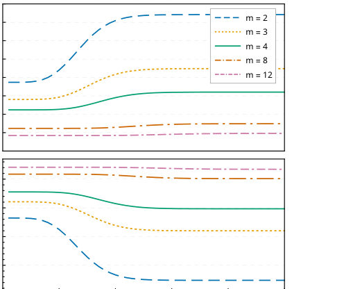 
FIG. 1. Intrinsic-resolution dependence of the critical expo- nents in the N = 2 truncation. Both ν and ω approach their flat-space values as τ increases. The residual finite-resolution dependence decreases as the proper-time threshold is made more localized by increasing m.

**Summary.** This work develops a method for performing Wilsonian renormalization group flow on curved spaces, specifically using the three-sphere ($S^3$). Instead of relying on momentum shells, the authors use an intrinsic spectral cutoff based on the covariant Laplacian spectrum. They successfully show that the critical physics, characterized by the Wilson-Fisher fixed point, remains robust and smoothly connects to the standard flat-space results.

**Why it may be interesting.** While focused on QFT, the concept of defining physical scales and universality using intrinsic spectral properties rather than momentum space is highly relevant to understanding effective theories in curved or constrained quantum systems.

Detailed structure

**Main problem.** The paper addresses the challenge of formulating Wilsonian renormalization group (RG) flow on curved backgrounds where the concept of momentum shells is ill-defined.

**Main result.** The Wilson-Fisher fixed point is shown to persist on the compact three-sphere ($S^3$) using an intrinsic spectral cutoff, demonstrating that RG flow can be defined purely by the spectral structure of the covariant Laplacian.

**Method.** The authors employ a proper-time functional RG flow, replacing momentum-space cutoffs with an intrinsic spectral cutoff ordered by the covariant Laplacian eigenvalues.

**Model / system.** The system analyzed is a single real scalar field theory defined on the three-sphere ($S^3$), a compact curved manifold.

**Key observables.** Critical exponents ($
u, \omega$), the Wilson-Fisher fixed point, and the dependence of these quantities on the spectral cutoff resolution parameter ($	au$).

**Important parameters / regimes.** The spectral cutoff resolution parameter ($	au = ka$), the system size (related to the sphere's curvature), and the regulator choice parameter ($m$).

**Assumptions / limitations.** The analysis utilizes the Local Potential Approximation (LPA) for the RG flow, and the core assumption is that the spectral structure itself dictates the physical ordering of fluctuations.

**Figures summary.** Figure 1 illustrates that critical exponents ($
u$ and $\omega$) approach their known flat-space values as the intrinsic resolution parameter ($	au$) increases, confirming the smooth connection to the continuum limit.

**Paper structure.** The paper first establishes the necessity of an intrinsic spectral cutoff for curved spaces. It then develops the RG flow equation using the covariant Laplacian spectrum on $S^3$. Finally, it analyzes the fixed point structure, confirming its stability and smooth approach to the flat-space limit.

Abstract

Wilsonian renormalization is usually formulated in momentum space, but on curved backgrounds momentum shells have no invariant meaning. We replace them by an intrinsic spectral cutoff, ordering modes by the covariant Laplacian and setting the cutoff resolution by the system size in renormalization group (RG) units. For a scalar field on $S^3$, this yields a covariant, momentum-free RG flow whose trace is an exact sum over spherical harmonics. The standard flat-space flow is recovered when the sphere is large compared with the coarse-graining scale. As a nontrivial test, the compact spectral flow realizes Wilson-Fisher universality without momentum shells: the interacting fixed point survives at finite resolution, has one relevant direction, and approaches its flat-space counterpart smoothly, with critical exponents only weakly affected by the compact spectrum.

[↑ back to top](#top)

### [Decoded Quantum Interferometry Beyond Hamming: Rank-Metric and Translation Association Schemes](http://arxiv.org/abs/2606.04843v1)

**Authors:** Alexandre Krajenbrink, Colin Krawchuk, Ansis Rosmanis, Matthias Rosenkranz  
**Type:** theory · **Category:** quantum information and computing · **PDF:** <https://arxiv.org/pdf/2606.04843v1>  
**Analysis basis:** full PDF text, analyzed in chunks

📷 Fig 1

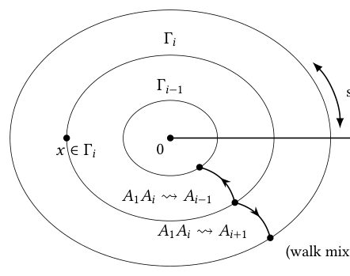 
Figure 1: Shells around a basepoint 0 and the radial and shell directions. The state 𝐴𝑖|0⟩is supported on the shell Γ𝑖, while 𝐴1 induces a ‘radial walk’ between a shell and its two neighbouring shells.

📷 Fig 2

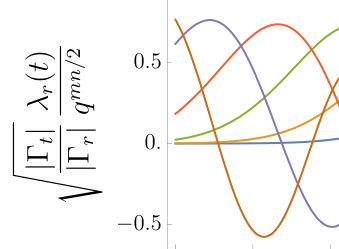 
Figure 2: Plot of the rescaled 𝑞-Krawtchouk polynomial √

📷 Fig 3

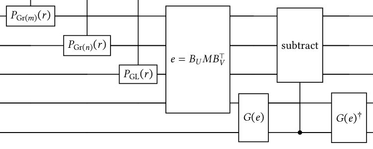 
Figure 3: Schematic state-preparation circuits used in Lemma 7. In panels (a) and (b), 𝑃Gr and 𝑃GL prepare uniform superpositions over enumeration addresses. The maps 𝐹Gr and 𝐹GL compute the canonical object from the address, while 𝐹−1 Gr and 𝐹−1 GL recompute the unique address from the output so it can be subtracted and uncomputed. In panel (c), the black controls are shown only on the state-preparation blocks whose target distribution is indexed by the input rank; the rank register is never a target. The multiplication, subtraction, and 𝐺(𝑒) blocks act on fixed padded registers. Here 𝐺(𝑒) denotes the reversible canonicalisation that recovers (𝐵𝑈, 𝐵𝑉, 𝑀) from 𝑒into 𝑎, and the vertical...

**Summary.** This work extends the theory of Decoded Quantum Interferometry (DQI) beyond Hamming space to arbitrary finite geometries with translation symmetry, such as those defined by rank metrics. By mapping the quantum evolution onto a finite tridiagonal eigenvalue problem, the authors develop a generalized method to analyze quantum algorithms for structured optimization. This shows that the geometric structure of the underlying space dictates the computational complexity and achievable bounds.

**Why it may be interesting.** It provides a powerful, general algebraic framework for analyzing quantum algorithms (like DQI) that operate on structured codes or geometries beyond the standard Hamming space, connecting quantum computation to algebraic combinatorics.

Detailed structure

**Main problem.** The paper generalizes Decoded Quantum Interferometry (DQI) from the Hamming space to arbitrary finite geometries possessing translation symmetry, specifically those described by rank-metrics.

**Main result.** The framework successfully analyzes DQI using a finite tridiagonal eigenvalue problem derived from the geometry's structure, providing a method to bound the residual rank of solutions in these generalized settings.

**Method.** The analysis employs group Fourier transforms and the concept of 'shells' defined by distance from a basepoint, reducing the quantum evolution to a Jacobi matrix problem.

**Model / system.** The model is DQI applied to structured optimization problems over finite geometries, such as the rank metric on $\mathbb{F}_q^{m 	imes n}$. The underlying mathematical structure is a translation association scheme.

**Key observables.** The expected value of a proxy score, which provides a constant-probability bound on the residual rank of the solution.

**Important parameters / regimes.** The dimension of the ambient space ($m 	imes n$), the rank cutoff ($\ell$), and the structure of the association scheme (e.g., $P$-polynomial property).

**Assumptions / limitations.** The analysis assumes the existence of a suitable additive code $C$ and relies on the radiality of the Fourier eigenvalues to simplify the quantum dynamics to a 1D effective problem.

**Figures summary.** Figures illustrate the geometric structure of distance shells ($\Gamma_i$) and the resulting radial walk dynamics induced by the distance matrices on the radial subspace.

**Paper structure.** The paper progresses by first establishing the general framework for DQI on translation schemes, then specializing this to the rank metric using Gabidulin codes, and finally deriving performance bounds based on the resulting tridiagonal eigenvalue problem.

Abstract

Decoded Quantum Interferometry (DQI) uses coherent decoding and a quantum Fourier transform to find high-quality solutions of structured optimisation problems. Existing analyses are closely tied to Hamming space, which underlies the optimisation objective, Dicke state preparation and the decoding step of the algorithm. Here we extend the core DQI mechanism beyond Hamming space to finite geometries with translation symmetry, where points are grouped into shells by their distance from a basepoint. Mathematically, these geometries are translation association schemes. In this setting the algorithm can be analysed by tracking one amplitude per shell, and biasing the prepared state towards high-quality solutions becomes a finite tridiagonal eigenvalue problem. As a non-Hamming example, we develop an efficient DQI protocol for finding an m x n finite-field matrix with smallest rank difference to a target matrix. Initial states are uniform superpositions over fixed-rank matrices, and Gabidulin codes provide candidates for efficient low-rank decoding up to a cutoff l. For this objective, this finds solutions with an effective-rank proxy near min(m,n)-l, and the corresponding expected score can be converted into a constant-probability bound on the residual rank of a sample. For Gabidulin nearest-codeword instances, a covering-radius obstruction shows that this bound does not imply an additive guarantee for the true optimum, and we do not claim a quantum advantage for the rank-metric construction. The results instead identify the geometric and coding ingredients for DQI beyond Hamming space.

[↑ back to top](#top)

### [Derivative Informed Learning of Exchange-Correlation Functionals](http://arxiv.org/abs/2606.04279v1)

**Authors:** Eike S. Eberhard, Luca A. Thiede, Abdul Aldossary, Andreas Burger, Nicholas Gao, Vignesh Bhethanabotla, Alán Aspuru-Guzik, Stephan Günnemann  
**Type:** theory · **Category:** disordered systems and neural networks · **PDF:** <https://arxiv.org/pdf/2606.04279v1>  
**Analysis basis:** full PDF text, analyzed in chunks

📷 Fig 1

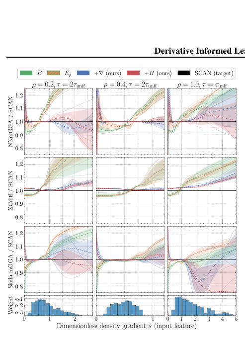 
Figure 1. Diagnostic toy example: energy-density of mGGA functionals distilled from SCAN. Each panel plots the ratio of learned to target energy density (y-axis) against the dimension- less density gradient s (x-axis), a standard semi-local input fea- ture (Appendix E.1). Rows are the three architectures, columns three density regimes set by (n, τ), and a perfect functional traces the line at one. The bottom row shows the importance-weighted (ωquadrature × ρ × |εtarget|) distribution of s on an ethanol quadrature grid, marking where errors carry energetic weight. Energy super- vision deviates from the target even in the data-rich region. The gradient and Hessian terms (+∇, +H) remove these...

📷 Fig 2

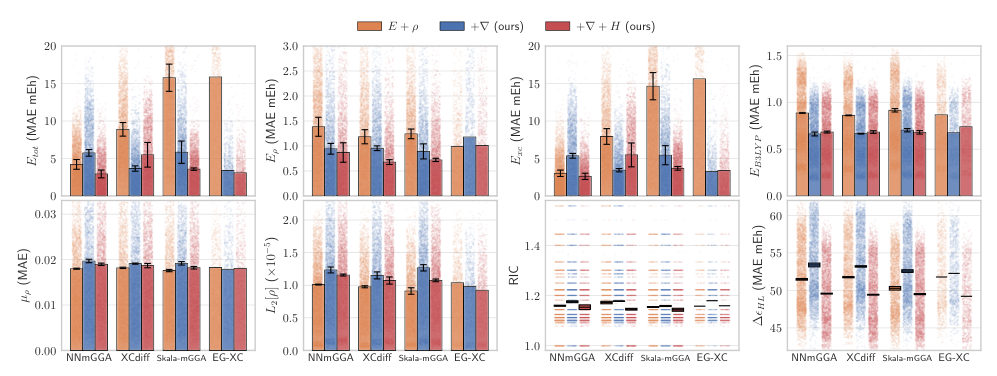 
Figure 2. Distillation of O(N 4)-scaling B3LYP into O(N 3)-scaling ML-XC functionals. We train on QM9 molecules with up to 7 heavy atoms and evaluate out-of-distribution on a random QM40 subsplit, fixed across all models, at the B3LYP/def2-SVP level of theory. Bars give the mean MAE over random seeds, error bars the standard error of that mean, and the jittered dots resolve the per-molecule errors that the means average over. DI-Loss sharpens the energetic quantities (Etot, Exc) and leaves the density metrics (µρ, L2[ρ]) near the E + ρ baseline across the three semi-local architectures. On the more expressive EG-XC architecture the added terms improve the densities, lowering L2[ρ], whereas...

📷 Fig 3

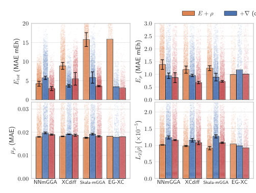 
Figure 3 shows that this results in a significant reduction in the required number of solver iterations relative to standard MINAO initialization for B3LYP. The traditional semi-local initialization baseline reduces the relative iteration count to about 65%, while distilled ML-XC densities reduce it further to about 50% across all architectures. This acceleration effect is largely unaffected by DI-Loss. Distillates trained only with E+ρ already provide low-RIC initializations, and derivative supervision changes RIC only marginally relative to the gain from distillation itself.

📷 Fig 4

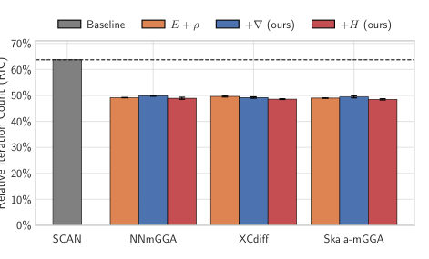 
Figure 3. Relative iteration count (RIC) for B3LYP calcula- tions initialized from SCAN or distilled ML-XC densities on QM9, trained on molecules with up to 7 heavy atoms and evaluated on 1000 randomly selected molecules with exactly 9 heavy atoms, fixed across all runs. RIC is the number of B3LYP iterations re- quired from a given initial density, normalized by standard MINAO initialization. SCAN reduces the iteration count to about 65% of MINAO, while distilled ML-XC densities reduce it further to about 50% across all architectures. Hence functional distillation provides a secondary use as initializers for subsequent calculations with more expensive traditional functionals. Here...

📷 Fig 5

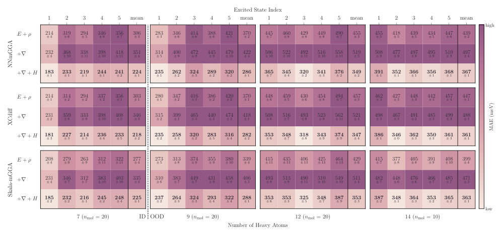 
Figure 4. Hessian supervision improves TDDFT excited-state accuracy across functionals and molecule sizes. Each cell reports the mean absolute error (MAE, meV) of the lowest five vertical excitation energies against B3LYP, averaged over nmol molecules at each heavy-atom count. Rows group the three neural functionals (NNmGGA, XCdiff, Skala-mGGA). Within each functional, the three sub-rows add training signal cumulatively, from energy and density (E + ρ), to first derivatives (+∇), to the full DI-Loss with the Hessian (+∇+ H). Columns give the excited states (1–5) and their mean MAE. The dashed line separates in-distribution QM9 molecules from larger out-of-distribution molecules from QM9 and...

**Summary.** This paper proposes a novel training methodology, Derivative Informed Learning (DI-Loss), to train machine-learned Exchange-Correlation functionals for DFT. By supervising not only the energy but also its first and second derivatives, the ML models achieve significant accuracy improvements and dramatically accelerate the convergence of subsequent, expensive quantum chemical calculations.

**Why it may be interesting.** This work directly addresses the computational bottleneck in quantum chemistry by using ML to build highly accurate, yet scalable, approximations for fundamental physical interactions (the XC functional).

Detailed structure

**Main problem.** The core challenge is improving the accuracy and computational efficiency of Exchange-Correlation (XC) functionals in Density Functional Theory (DFT) by overcoming the limitations of traditional approximations.

**Main result.** The introduction of Derivative Informed XC-Loss (DI-Loss), which supervises first and second functional derivatives, significantly improves energy metrics and reduces the required Self-Consistent Field (SCF) iterations by up to 50%.

**Method.** The authors employ a 'hybrid-distillation' setting, training computationally cheaper Machine Learning (ML) functionals to mimic high-accuracy, expensive reference functionals (like B3LYP) by incorporating derivative information into the loss function.

**Model / system.** The work is situated within the framework of DFT, focusing on approximating the unknown XC functional, Exc[rho]. The models are trained on molecular systems (e.g., QM9, QM40) and are designed to scale efficiently (e.g., O(N^3)).

**Key observables.** Total energy Mean Absolute Error (MAE), density-sensitive mean-field energy metric (E_rho), required SCF iterations, and mean excitation-energy MAE from TDDFT.

**Important parameters / regimes.** The loss function weights ($\alpha_E, \alpha_
ho, \alpha_
abla, \alpha_H$) and the scaling of the training process (e.g., using the shifted softplus activation).

**Assumptions / limitations.** The primary assumption is that constraining the local response (gradient and Hessian) of the functional, rather than just matching the fixed-point energy, provides superior training signals.

**Figures summary.** Figures compare the reduction in SCF iterations (up to 50%) and show quantitative improvements in MAE for both ground-state energies and excited-state predictions when using the derivative-informed loss.

**Paper structure.** The paper introduces the ML-XC framework, details the DI-Loss formulation by incorporating energy, density, gradient, and Hessian supervision, presents results showing performance gains across various architectures and benchmarks, and discusses efficiency gains in downstream calculations.

Abstract

Machine-learned (ML) exchange-correlation (XC) functionals aim to replace human-designed density functional approximations by learning directly from reference data, but they still do not consistently outperform traditional $\mathcal{O}(N^4)$-scaling hybrid functionals. We study a hybrid-distillation setting in which $\mathcal{O}(N^3)$-scaling ML-XC functionals are trained to reproduce B3LYP/def2-SVP targets. We introduce Derivative Informed XC-Loss (DI-Loss), a loss that incorporates additional information from the reference hybrid functional by supervising first and second derivatives of the energy on the Grassmannian of admissible density matrices. Rather than only matching the self-consistent fixed point, DI-Loss aligns the local first- and second-order response of the learned functional with that of the target functional. Across four evaluated architectures, DI-Loss consistently improves the main energy metrics. Averaged uniformly across architectures, the total-energy MAE decreases by 66% relative to energy and density supervision alone. The density-sensitive mean-field energy metric $E_ρ$ improves from $1.2$ to $0.8$ mEh on average, while dipole and $\mathcal{L}_2$ density errors do not improve uniformly. We further show that densities from the distilled functionals reduce hybrid-functional SCF iterations by up to 50%. In downstream TDDFT calculations, Hessian supervision improves excited-state predictions, with XCdiff reducing the mean excitation-energy MAE by 19 - 35%.

[↑ back to top](#top)

### [Effect of isotropic errors on the complexity of Grover's algorithm](http://arxiv.org/abs/2606.04817v1)

**Authors:** Anurag Saha Roy, Jesús Lacalle  
**Type:** theory · **Category:** quantum information and computing · **PDF:** <https://arxiv.org/pdf/2606.04817v1>  
**Analysis basis:** full PDF text, analyzed in chunks

📷 Fig 1

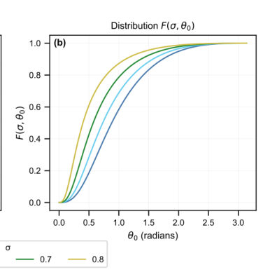 
Fig. 1: Value of the Density function f(σ, θ0) (left) and Distribution function F(σ, θ0) (right) for d = 2 for different values of σ.

📷 Fig 2

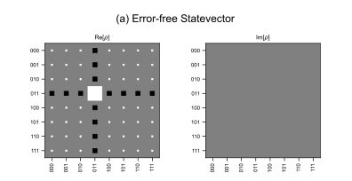 
Fig. 2: Hinton diagrams of the final statevector before (left) and after (right) applying an isotropic error with σ = 0.999 for a 3-qubit Grover circuit. We see that while the marked state |011⟩is still visible after adding the error, the population is now spread across many other states, which reduces the overall success probability.

📷 Fig 3

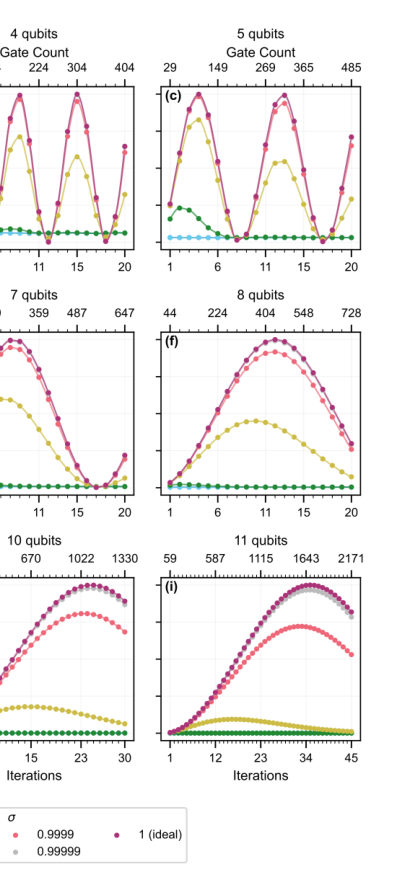 
Fig. 3: Success probability versus number of Grover iterations for different system sizes and isotropic error magnitudes. Each curve on each subplot represents a different value of σ, showing how the success probability evolves with the number of iterations for a given error strength.

📷 Fig 4

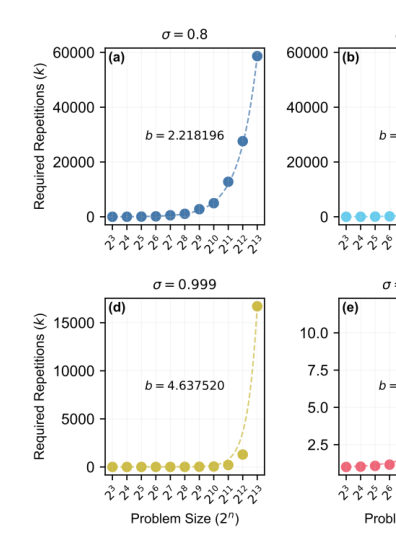 
Fig. 4: Additional number of repetitions required to achieve the error-free success probability as a function of problem size for different isotropic error magnitudes.

📷 Fig 5

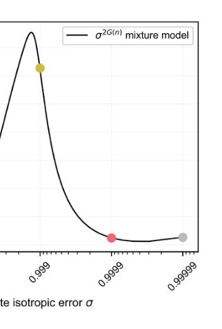 
Fig. 5: Growth rate b as a function of isotropic error magnitude σ overlaid with predicted curve from theoretical mixture model based on total gate count.

**Summary.** This work investigates how isotropic quantum errors affect the performance of Grover's search algorithm. By simulating the noise, the authors demonstrate that these errors are difficult to correct and cause the algorithm's success probability to drop significantly. The findings suggest that the required computational overhead grows rapidly, potentially negating the algorithm's inherent quadratic speedup.

**Why it may be interesting.** It provides a concrete, quantitative study of a specific, difficult-to-correct noise model (isotropic errors) on a fundamental quantum algorithm, which is highly relevant for assessing the feasibility of near-term quantum hardware.

Detailed structure

**Main problem.** The paper analyzes the concrete impact of isotropic errors on the complexity and performance of Grover's search algorithm.

**Main result.** Isotropic errors are immune to conventional error correction, and even small errors significantly degrade Grover's success probability, leading to an apparent exponential growth in required computational repetitions.

**Method.** The study uses numerical simulations to model the application of isotropic noise to quantum states and analyzes the resulting degradation of the algorithm's success probability.

**Model / system.** The model is quantum computation, specifically applying isotropic noise to the state evolution of Grover's search algorithm on an n-qubit system.

**Key observables.** Success probability ($p_e(n)$), required additional repetitions ($k(n)$), and the error variance ($\sigma$).

**Important parameters / regimes.** Isotropic error variance ($\sigma$), number of qubits ($n$), and the gate depth of the circuit.

**Assumptions / limitations.** The analysis assumes isotropic errors are uniform across all gates and focuses only on the single-marked-item case of Grover's algorithm.

**Figures summary.** Figures illustrate the statevector spreading due to isotropic error (Hinton diagrams), the decay of success probability vs. iterations, and the exponential growth of required repetitions ($k$) versus problem size for various error strengths ($\sigma$).

**Paper structure.** The paper first establishes the theoretical immunity of isotropic errors to standard QEC. It then details the mathematical framework for generating the perturbed state and applies this framework to simulate Grover's algorithm, culminating in an analysis of the scaling of required computational overhead.

Abstract

Isotropic errors have been shown to be immune to conventional error correction techniques. While general theoretical frameworks have been proposed to model such errors, there have been no studies so far analysing their concrete impact on practical use-cases. Here we explore the effect of isotropic errors on the complexity of Grover's search algorithm through numerical simulations, with an analysis of the impact on the algorithm's performance and success probability. The results provide insights into the robustness of Grover's algorithm against isotropic errors, highlighting potential challenges for implementations on noisy quantum hardware. All results presented here are obtained through numerical simulations using the open-source python library \texttt{isotropic} developed as part of this work. The source code, numerical simulations and documentation for the library are available online at https://www.github.com/lazyoracle/isotropic-error-analysis .

[↑ back to top](#top)

### [Expressibility, Noise, and Error Mitigation in VQE Ansatz Selection](http://arxiv.org/abs/2606.04955v1)

**Authors:** Peter Annis, Abe Kassem, Evan Coleman  
**Type:** theory · **Category:** quantum information and computing · **PDF:** <https://arxiv.org/pdf/2606.04955v1>  
**Analysis basis:** full PDF text, analyzed in chunks

📷 Fig 1

 
Fig. 1. Circuit rankings across conditions for H2 (1 = best). Rankings scramble from Ideal to Noisy (𝜌= −0.10), are largely preserved under ZNE (𝜌= +0.80), and are actively reordered by PEC (𝜌= −0.22).

📷 Fig 2

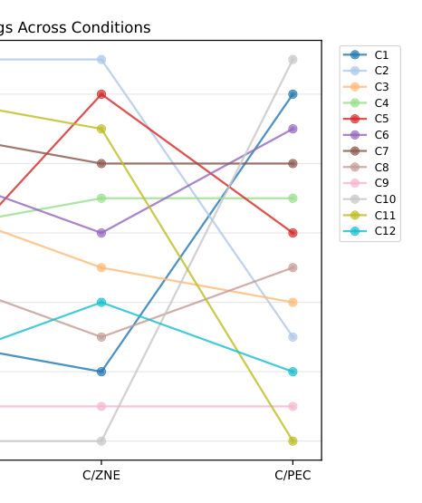 
Figure 2 summarizes these results. The Ideal column is uniformly green (low error), while the PEC column is almost

📷 Fig 3

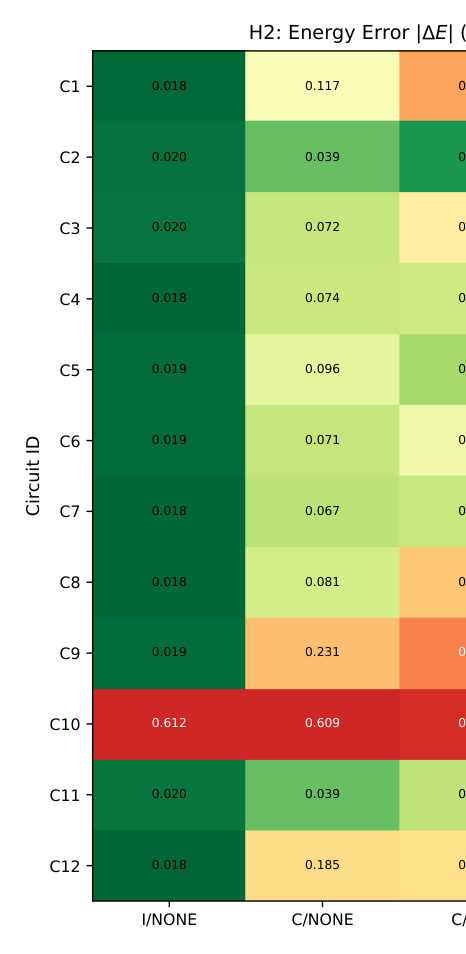 
Fig. 2. Energy error |Δ𝐸| (Hartree) for all 12 H2 circuits across four conditions. Color scale is logarithmic; cell values show exact errors. PEC increases error for 11 of 12 circuits, often by &gt;200%.

📷 Fig 4

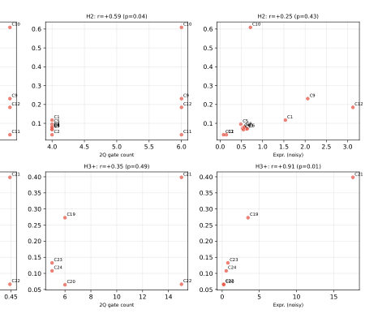 
Fig. 3. Scatter plots of four candidate metrics against noisy VQE error (|Δ𝐸|, COMBINED/NONE) for H2 (top) and H3+ (bottom). Noise-weighted gates, expected infidelity, and 2Q gate count all produce identical correlations within each molecule due to collinearity. Noisy expressibility is the strongest predictor for H3+ (𝑟= +0.91) but adds little for H2 (𝑟= +0.25).

📷 Fig 5

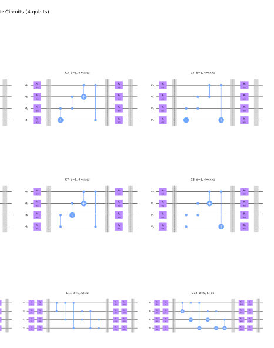 
Fig. 4. All 12 H2 ansatz circuits (4 qubits). Circuits 1–8 share the same gate count (8×1Q, 4×2Q) but differ in gate types and entanglement patterns. Circuits 9–12 use two layers (16×1Q, 6×2Q).

**Summary.** This paper investigates how circuit expressibility predicts VQE performance for quantum chemistry problems under realistic noise. It finds that error mitigation techniques do not restore expressibility's predictive power, and instead suggests that simple, zero-cost circuit topology metrics can be highly effective predictors of energy error. The findings guide the selection of robust ansatz circuits for noisy quantum hardware.

**Why it may be interesting.** This work directly addresses the practical limitations of near-term quantum computation by providing quantitative guidance on which circuit metrics are most robust predictors of performance when noise and error mitigation are involved.

Detailed structure

**Main problem.** The primary challenge addressed is selecting optimal ansatz circuits for the Variational Quantum Eigensolver (VQE) algorithm, balancing circuit expressibility against noise accumulation.

**Main result.** Error mitigation techniques like ZNE and PEC do not reliably restore the predictive power of expressibility, and zero-cost topology metrics can offer comparable or superior predictive power for certain noise regimes.

**Method.** The authors systematically investigate VQE performance across four noise scenarios (ideal, noisy, ZNE, PEC) for small molecular Hamiltonians, correlating energy error with various circuit metrics.

**Model / system.** The study uses quantum chemistry simulations, calculating ground state energies for $	ext{H}_2$ and $	ext{H}_3^+$ using molecular Hamiltonians mapped to Pauli operators. The analysis compares different ansatz structures (e.g., ring vs. alternating entanglement).

**Key observables.** VQE energy error ($\Delta E$), Spearman ($
ho$) and Pearson ($r$) correlation coefficients between circuit metrics and error, and the performance of error mitigation protocols.

**Important parameters / regimes.** Noise levels (depolarizing, amplitude damping), circuit depth, and the specific error mitigation techniques (ZNE, PEC).

**Assumptions / limitations.** The analysis relies on comparing metrics derived from density matrix simulations, which is computationally intractable for larger systems (e.g., beyond 10 qubits).

**Figures summary.** Figures illustrate the energy error ($\Delta E$) for $	ext{H}_2$ and $	ext{H}_3^+$ across different noise conditions, and show the structural comparison of various ansatz circuits for $	ext{H}_2$, $	ext{H}_3^+$, $	ext{LiH}$, and $	ext{BeH}_2$.

**Paper structure.** The paper establishes the VQE framework, introduces expressibility as a predictor, tests this prediction under various noise models and error mitigation techniques (ZNE/PEC), and concludes by comparing the predictive power of expressibility against simpler, zero-cost topological metrics.

Abstract

The variational quantum eigensolver (VQE) is a promising algorithm for near-term quantum chemistry applications, but selecting optimal ansatz circuits remains challenging. Expressibility, a metric quantifying a circuit's ability to explore the Hilbert space, has been proposed as a guide for ansatz selection, but recent work showed it inconsistently predicts VQE performance under realistic noise for $H_2$. We extend this investigation to cover both $H_2$ and $H_3^+$ under four execution scenarios: ideal, noisy, and noisy with zero-noise extrapolation (ZNE) or probabilistic error cancellation (PEC). We find that error mitigation does not reliably restore expressibility's predictive power. ZNE reduces error for only 4 of 12 $H_2$ circuits and 4 of 6 $H_3^+$ circuits, while PEC actually increases error in 11 of 12 $H_2$ circuits and all 6 $H_3^+$ circuits. We reproduce and extend Saib et al.'s key finding that circuit rankings scramble under noise (Spearman $ρ\approx -0.1$ between ideal and noisy rankings), and identify a new result: ZNE largely preserves noisy rankings ($ρ= +0.80$ for $H_2$) while PEC actively reorders them ($ρ= -0.22$). Noisy expressibility, computed from density matrix simulations, strongly predicts unmitigated performance for $H_3^+$ (Pearson $r = +0.91$, $p = 0.01$), but this metric is computationally intractable at scale. We demonstrate that zero-cost circuit topology metrics such as two-qubit gate count provide comparable or superior predictive power for PEC degradation ($r = +0.96$ for $H_3^+$), while standard expressibility best predicts noisy and ZNE performance for $H_2$ ($r = +0.74$ and $r = +0.77$).

[↑ back to top](#top)

### [Generalized Bicycle Codes as Cyclic Submodules and their Automorphism Structure](http://arxiv.org/abs/2606.05044v1)

**Authors:** AJ Davenport, John Blue, Isaac Chuang  
**Type:** theory · **Category:** quantum information and computing · **PDF:** <https://arxiv.org/pdf/2606.05044v1>  
**Analysis basis:** full PDF text, analyzed in chunks

📷 Fig 1

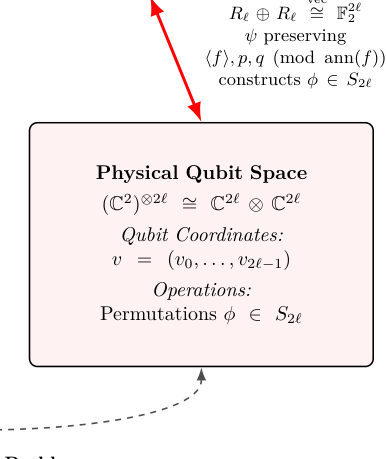 
Figure 1: The three-space framework for Generalized Bicycle codes. The historical approach (dashed line) attempts to find physical qubit permutations that preserve the global matrix rowspaces, an opaque and computationally heavy search outside of the trivial cyclic shift solutions (recently improved by [19], however does not provide insight into why automorphisms arise). The fundamental insight of this work (double blue line and red arrow) is to map the matrices into the Polynomial Ring Space, where physical permutations are recontextualized as formal ring automorphisms (x 7→xj), and can be further paired with cyclic shifts and block swaps. This allows deterministic automorphism code design...

📷 Fig 2

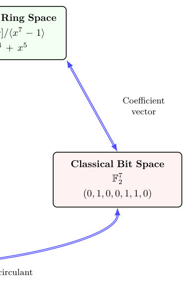 
Figure 2: The classical three-space dependency at ℓ= 7: the element x + x4 + x5 ∈R7 and its equivalent representations as a binary circulant matrix in circ(F7×7 2 ) and a vector in F7 2. Each row of the circulant is the coefficient vector of xi · a(x) mod (x7 + 1).

📷 Fig 3

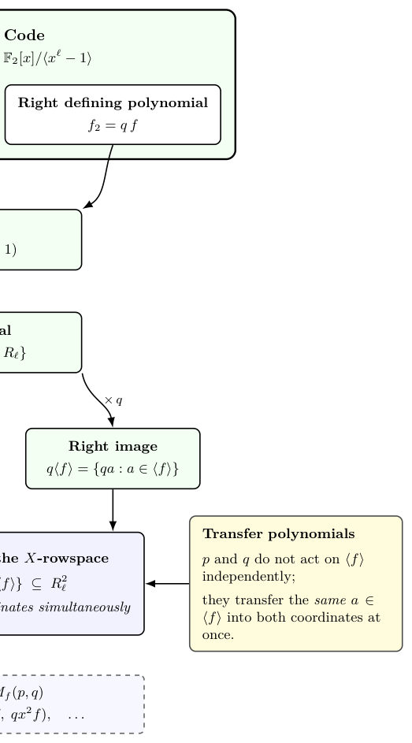 
Figure 3: Algebraic decomposition of a Generalized Bicycle (GB) code into its cyclic submodule structure. A GB code is defined by parameters (ℓ, f1, f2) with f1, f2 ∈Rℓ(green, Polynomial Ring Space). Writing f = gcd(f1, f2, xℓ−1) extracts the shared factor and yields transfer polynomials p, q satisfying f1 = pf, f2 = qf. The shared ideal ⟨f⟩is then split by p and q into left and right images, which combine into the cyclic submodule Mf(p, q) = {(pa, qa) | a ∈⟨f⟩} ⊆R2 ℓ(blue, Matrix Space) that generates the X-rowspace of the code. A second cyclic submodule M← − f (←−q , ←−p ) for the Z-rowspace exists but is not shown here. Crucially, the same element a ∈⟨f⟩scales both coordinates...

📷 Fig 4

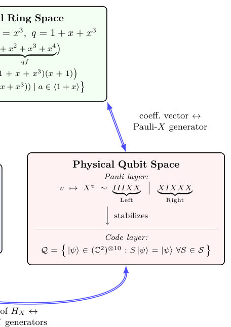 
Figure 4: The quantum three-space equivalence for a GB code with ℓ= 5, f = 1 + x, p = x3, q = 1 + x + x3. A single stabilizer generator (pf, qf) ∈R2 5 maps to the first row of HX in the matrix space. In the physical qubit space (C2)⊗10, that row’s coefficient vector (0, 0, 0, 1, 1 | 1, 0, 1, 1, 1) encodes a Pauli-X generator SX = IIIXX | XIXXX (Pauli layer); the full stabilizer group S generated by all such operators defines the code space Q as their joint +1 eigenspace (Code layer). Each subsequent row of HX is a cyclic shift within each block, corresponding to multiplication by x in R2 5. HZ is similarly involved, but not shown here.

📷 Fig 5

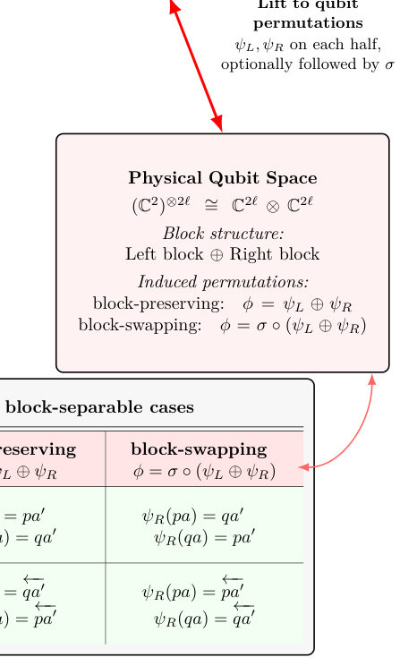 
Figure 5: Proposition 3.2 as a three-space classification of block-separable automorphisms. The rowspaces rs(HX) and rs(HZ) belong to the Matrix Space, while the left/right block decomposition belongs to the Physical Qubit Space. Two ring-level maps ψL, ψR on Rℓ, applied to each half and optionally composed with the full block swap σ, produces four cases organized by two independent binary choices: whether ϕ is block-preserving (ϕ = ψL ⊕ψR) or block-swapping (ϕ = σ ◦(ψL ⊕ψR)) in the Physical Qubit Space (columns), and whether the transformed pairs remain in rs(HX) (Type I) or cross into rs(HZ) (Type II) in the Matrix Space (rows). Given these choices, the required conditions on ψL, ψR is...

**Summary.** This paper introduces an algebraic framework to analyze the symmetries (automorphisms) of Generalized Bicycle (GB) quantum error-correcting codes. By mapping the code structure to cyclic submodules in a polynomial ring, the authors reduce the complex search for symmetries to a deterministic algebraic problem. This allows for the systematic design of codes with rich automorphism groups, enabling the construction of specific quantum gates necessary for fault-tolerant quantum computation.

**Why it may be interesting.** The algebraic approach provides powerful, systematic tools to analyze the symmetries of quantum codes, which is crucial for understanding the feasibility and structure of fault-tolerant quantum computation protocols.

Detailed structure

**Main problem.** The paper aims to develop an algebraic framework to systematically analyze and engineer automorphisms in Generalized Bicycle (GB) codes to guide fault-tolerant gate implementation via qubit relabeling.

**Main result.** The authors derived necessary and sufficient algebraic conditions for block-separable automorphisms and constructed the Maximal Cube Root (MCR) code family, demonstrating inverse design by building codes around a rich automorphism structure.

**Method.** The core method involves mapping the quantum code structure to an algebraic problem by expressing the code as a pair of cyclic submodules within a polynomial ring $R_\ell^2$, allowing the search for automorphisms to be reduced to deterministic algebraic checks.

**Model / system.** The system studied is the Generalized Bicycle (GB) quantum error-correcting code, which is defined by two classical cyclic codes and whose stabilizer rowspaces are treated as cyclic submodules of $R_\ell^2$. The analysis leverages the three-space dependency connecting the polynomial ring, the matrix space, and the physical qubit space.

**Key observables.** Existence and structure of code automorphisms, criteria for H-, S-, and CX-type fold-transversal gates, and the logical action of automorphisms on logical operators.

**Important parameters / regimes.** Block length $\ell$, code distance ($d$), number of encoded qubits ($k$), and the defining polynomials $f_1, f_2$.

**Assumptions / limitations.** The analysis primarily focuses on block-separable automorphisms and assumes the applicability of the three-space dependency framework derived from cyclic coding theory.

**Figures summary.** Figures illustrate the three-space framework mapping, the algebraic decomposition of the code into cyclic submodules, and the structure of the automorphism search space.

**Paper structure.** The paper builds from reviewing the algebraic theory of cyclic codes (using CRT and submodule definitions) to establish the three-space dependency for GB codes. It then derives conditions for automorphisms, focusing on block-separable cases, and culminates in the construction and demonstration of the MCR code family.

Abstract

Automorphisms of quantum codes, when they exist, offer a pathway toward fault-tolerant gate implementation via qubit relabeling. Although useful, the conditions under which automorphisms appear in a given code remain poorly understood. In this paper, we develop an algebraic framework for systematically analyzing and engineering automorphisms in Generalized Bicycle (GB) codes. Central to our approach is the derivation of a three-space dependency between the polynomial ring space, the parity check matrix space, and the $\mathbb{F}_2^{2\ell}$ qubit space, similar to the structure found in the study of classical cyclic codes. By expressing GB codes as a pair of cyclic submodules of $R_\ell^2$, where $R_\ell \cong \mathbb{F}_2[x]/\langle x^\ell-1\rangle$, we reduce the search for code automorphisms to a deterministic algebraic problem, deriving necessary and sufficient conditions for the existence of block-separable automorphisms built from cyclic shifts, ring automorphisms and block-swaps. We connect these conditions to the fold-transversal gate framework, providing explicit criteria for the existence of $H$-, $S$-, and $CX$-type fold-transversal gates. We further discuss structured bases for logical operators in order to determine the logical action of a given automorphism. Finally, we introduce the Maximal Cube Root (MCR) code family, a family of GB codes constructed around the principle of maximizing automorphism flexibility and fold-CX gates. We demonstrate a collection of $k=2$ MCR codes up to $d=13$ generating the 2-qubit Clifford group via automorphism and fold-transversal gates, with stabilizer weight ranging from 8 to 16, and $k>2$ MCR codes with a minimum of 20 distinct logical gates achievable from automorphisms. This serves as a first demonstration of inverse design: using these methods to build codes around a rich automorphism structure from the ground up.

[↑ back to top](#top)

### [QPredSGG: Hybrid Quantum Predicate Learning for Long-Tailed Scene Graph Generation](http://arxiv.org/abs/2606.04689v1)

**Authors:** Prerana Ramkumar, Nouhaila Innan, Muhammad Shafique  
**Type:** both · **Category:** quantum information and computing · **PDF:** <https://arxiv.org/pdf/2606.04689v1>  
**Analysis basis:** full PDF text, analyzed in chunks

📷 Fig 1

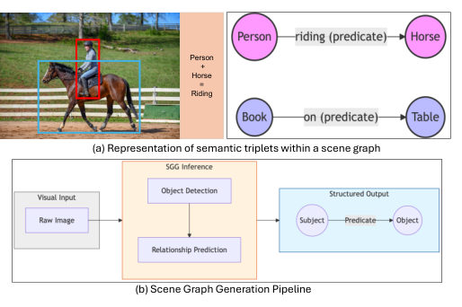 
Fig. 1: The framework and general architecture of SGG. (a) Structural breakdown of semantic triplets, illustrating the relationships between entities. (b) The end-to-end pipeline transforms visual input into a structured graph.

📷 Fig 2

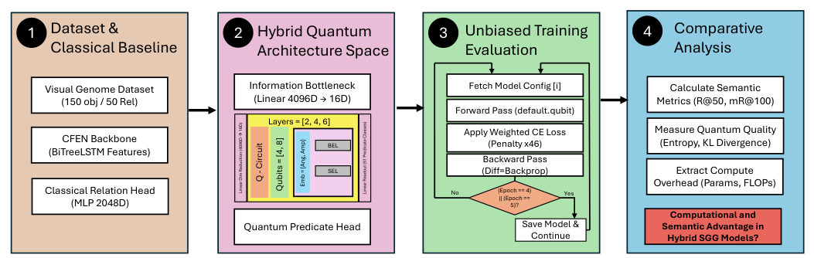 
Fig. 2: The four-stage experimental pipeline. Stage 1 establishes the Visual Genome dataset and CFEN classical baseline. Stage 2 defines the quantum architecture search space across qubit count, embedding strategy, circuit depth, and entangling template. Stage 3 performs bias-aware class-balanced training and checkpointing. Stage 4 aggregates semantic metrics, quantum quality indicators, and computational-overhead measurements.

📷 Fig 3

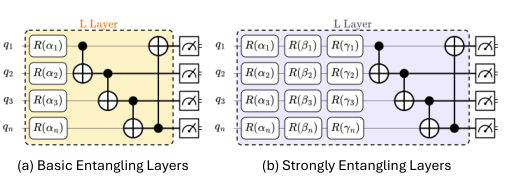 
Fig. 3: Representative QP-Head circuit structures. (a) Basic Entangling Layers. (b) Strongly Entangling Layers. Both circuits process encoded predicate features through a variational quantum block and terminate with measurements that produce expectation values for the classical readout.

📷 Fig 4

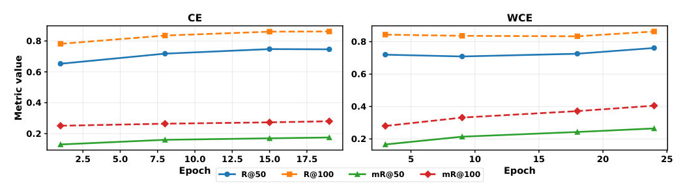 
Fig. 4: Training dynamics of the 4-qubit QP-Head under standard CE and WCE losses using angle embedding and Basic Entangling Layers. The left graph shows training under standard CE, while the right graph shows training under WCE. WCE improves mR@50 and mR@100 more consistently while maintaining stable global recall, showing that class-balanced training improves long-tail predicate recognition without degrading overall relationship recall.

📷 Fig 5

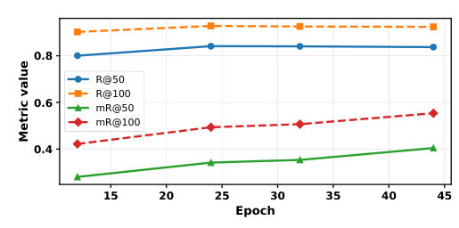 
Fig. 5: Training dynamics of the 8-qubit QP-Head with Ampli- tude Embedding and 4-layer Strongly Entangling Layers. The graph shows R@50, R@100, mR@50, and mR@100 across training epochs. The 8-qubit configuration maintains stable global recall while improving long-tail predicate recognition across training.

**Summary.** This paper introduces a Quantum Predicate Head (QP-Head) to enhance Scene Graph Generation by addressing the long-tail imbalance of predicate labels. By replacing a large classical classifier with a compact, hybrid quantum module, the authors achieve state-of-the-art mean recall scores while drastically reducing the number of trainable parameters. This validates the use of quantum circuits for parameter-efficient relational reasoning in complex vision tasks.

**Why it may be interesting.** The work demonstrates a concrete application of quantum circuits (PQC) to solve a challenging, classically difficult machine learning problem (long-tail classification), providing quantitative metrics on parameter efficiency and performance gains.

Detailed structure

**Main problem.** Scene Graph Generation (SGG) performance is hampered by severe long-tail predicate imbalance, causing models to over-rely on frequent relations.

**Main result.** The proposed 4-qubit hybrid quantum head achieved an mR@100 of 57.25%, significantly outperforming the classical baseline (41.1%) while remaining highly parameter-efficient.

**Method.** The authors replace the classical predicate head in an existing network with a Quantum Predicate Head (QP-Head), which processes compressed relational features through a trainable Variational Quantum Circuit (PQC).

**Model / system.** The system is a hybrid quantum-classical model applied to visual scene graph reasoning. The QP-Head uses quantum encoding (Amplitude/Angle) and trainable entangling layers (e.g., SEL) to map high-dimensional features into a quantum state for classification.

**Key observables.** Mean Recall ($	ext{mR}@K$), Global Recall ($	ext{R}@K$), trainable quantum parameters, KL divergence from Haar-random distribution, and inference latency.

**Important parameters / regimes.** Qubit count ($n \in \{4, 8\}$), circuit depth ($L$), and the use of Weighted Cross-Entropy (WCE) loss.

**Assumptions / limitations.** The study assumes that compact hybrid quantum heads can effectively capture the complex, long-tail relational structure in visual data while maintaining computational feasibility.

**Figures summary.** Figures illustrate the general SGG framework, the four-stage experimental pipeline (baseline $
ightarrow$ quantum architecture $
ightarrow$ training $
ightarrow$ analysis), and representative quantum circuit structures.

**Paper structure.** The paper follows a structured comparison: first establishing a classical baseline (CFEN); second, defining the quantum architecture search space (qubits, embedding, depth); third, training using a bias-aware loss (WCE); and finally, analyzing the trade-off between semantic performance, quantum expressibility, and computational overhead.

Abstract

Scene Graph Generation (SGG) requires relational reasoning over objects and their interactions, but performance is often limited by severe long-tail predicate imbalance. Classical SGG models frequently rely on dataset statistics, leading to biased predictions toward frequent relations rather than fine-grained semantic predicates. Although existing debiasing strategies improve mean recall, predicate classification in current frameworks still often depends on large classical decision modules with high parameter cost. This work introduces a hybrid quantum predicate classifier for SGG by replacing the classical predicate head in Causal Feature Enhancement Network (CFEN) with a Quantum Predicate Head (QP-Head) trained using weighted cross-entropy. To the best of our knowledge, this is among the first studies to evaluate a hybrid quantum architecture for scene graph predicate classification on Visual Genome 150. We study the effect of qubit count, encoding strategy, entangling structure, and circuit depth on relational prediction. The best 4-qubit QP-Head uses Amplitude Embedding and Strongly Entangling Layers to compress 4096-dimensional pair features into a 16-dimensional quantum-compatible representation, corresponding to a 256$\times$ reduction. It achieves an mR@100 of 57.25%, compared with 41.1% for the classical CFEN reference, while using only 96 trainable quantum parameters. Scaling to 8 qubits maintains strong long-tail performance, reaching an mR@100 of 55.38% with 384 quantum parameters, while the depth analysis shows a trade-off between expressibility and runtime overhead. These results suggest that compact hybrid quantum predicate heads can support parameter-efficient long-tail relational classification in complex visual reasoning tasks.

[↑ back to top](#top)

### [Quantum Information Harvesting with the Parallel Quantum Flow Algorithm](http://arxiv.org/abs/2606.04186v1)

**Authors:** Nicholas P. Bauman, Ajay Panyala, Chenxu Liu, Muqing Zheng, Meng Wang, Karol Kowalski  
**Type:** theory · **Category:** quantum information and computing · **PDF:** <https://arxiv.org/pdf/2606.04186v1>  
**Analysis basis:** full PDF text, analyzed in chunks

📷 Fig 1

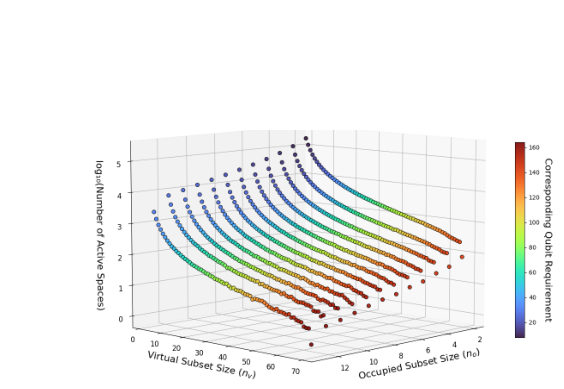 
Figure 2. Number of active spaces for propane with the cc-pVDZ basis (No=13, Nv=69) determined for all combinations of active space sizes (no,nv) using the active-space sampling algorithm. Active-space counts are color-coded to the corresponding qubit requirement [2×(no +nv)].

📷 Fig 2

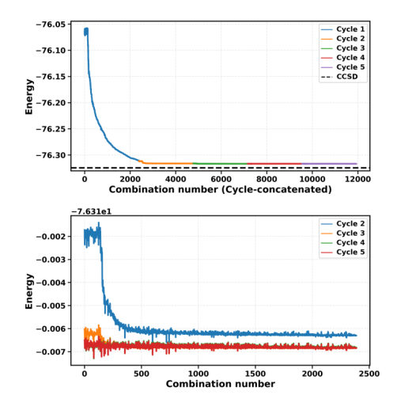 
Figure 3. Top Panel: Energy profile of H2O QFlow calculation using the cc-pVTZ basis. Bottom Panel: Energy profile of cycles 2-5 arranged by active spaces aligned in increasing orbital energy difference.

📷 Fig 3

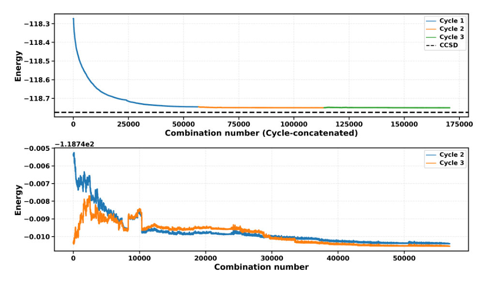 
Figure 4. Top Panel: Energy profile of C3H8 QFlow calculation using the cc-pVDZ basis. Bottom Panel: Energy profile of cycles 2 and 3 arranged by active spaces aligned in increasing orbital energy difference.

**Summary.** This paper introduces the Quantum Flow (QFlow) algorithm, a resource-efficient method for simulating complex correlated electronic structures on hybrid quantum-classical hardware. By decomposing the problem into smaller active-space subproblems, QFlow achieves high accuracy, recovering over 95% of the correlation energy benchmarked against CCSD. This demonstrates a scalable pathway for quantum chemistry simulations on near-term quantum hardware.

**Why it may be interesting.** It presents a concrete, scalable quantum algorithm that bypasses the exponential scaling bottleneck of full quantum simulations by intelligently decomposing the problem into smaller, manageable quantum subroutines.

Detailed structure

**Main problem.** The core challenge is accurately simulating correlated many-body systems, which suffer from exponential computational complexity.

**Main result.** The Quantum Flow (QFlow) algorithm successfully recovers over 95% of the total correlation energy from CCSD benchmarks for large systems, even when the underlying qubit requirements are manageable.

**Method.** QFlow uses a resource-efficient, parallel quantum-classical framework that decomposes the full problem into smaller, coupled active-space subproblems solved iteratively.

**Model / system.** The method is applied to electronic Hamiltonians describing molecular systems (e.g., $	ext{H}_2	ext{O}$, Propane) in the context of quantum chemistry.

**Key observables.** Total correlation energy (compared against CCSD), convergence rate, and the percentage of correlation energy recovered.

**Important parameters / regimes.** The number of orbitals (up to 114), the number of active electrons/orbitals (e.g., 6 active electrons in 6 active orbitals), and the required qubit count (determined by the largest active space).

**Assumptions / limitations.** The dominant correlation effects can be captured by averaging the results across a collection of reduced-dimensional active spaces, and the Trotter approximation is used for the energy functional.

**Figures summary.** Figures illustrate the coverage-driven active-space sampling algorithm, energy profiles showing rapid convergence for $	ext{H}_2	ext{O}$, and the scaling of active spaces required for propane.

**Paper structure.** The paper introduces the QFlow formalism, details the coverage-driven active-space sampling algorithm, presents the HPC implementation results on molecular systems, and compares the recovered correlation energy against established methods like CCSD.

Abstract

The Quantum Flow (QFlow) algorithm provides a resource-efficient framework for describing correlated many-body systems on hybrid quantum-classical architectures. By enabling parallel utilization of quantum and classical resources, QFlow offers a scalable pathway toward simulations of realistic systems. In this Letter, we report a high-performance computing (HPC) implementation of the QFlow formalism based on a singles-and-doubles model. We demonstrate its performance for target spaces comprising 82 and 114 orbitals, where the flow includes all 6 active electrons in 6 active orbitals type active spaces. In the largest QFlow simulations, we optimize 1.17 million wave function parameters using the equivalent of 12 qubits. Despite the modest qubit requirements of the underlying active-space problems, the method recovers over $95\%$ of the total correlation energy obtained with the coupled cluster singles and doubles (CCSD) approach for systems dominated by dynamical correlation effects, which remain challenging for existing quantum algorithms. We further show that the QFlow formalism retains high accuracy in extended basis sets with diffuse functions, highlighting its potential for realistic large-scale quantum chemistry simulations.

[↑ back to top](#top)

### [Resource-efficient energy-based operator selection in fermionic ADAPT-VQE via exact Hamiltonian transformation](http://arxiv.org/abs/2606.04786v1)

**Authors:** Emanuele Rossi, Erik Rosendahl Kjellgren, Artur F. Izmaylov, Stephan P. A. Sauer, Karl Michael Ziems, Sonia Coriani  
**Type:** theory · **Category:** strongly correlated electrons · **PDF:** <https://arxiv.org/pdf/2606.04786v1>  
**Analysis basis:** full PDF text, analyzed in chunks

📷 Fig 1

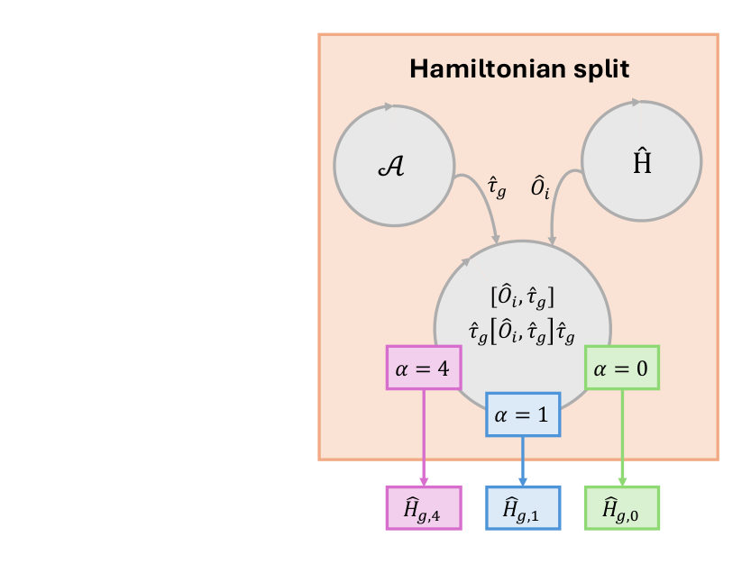 
FIG. 1. Schematic representation of the Hamiltonian splitting procedure. Given a generator ˆτg

📷 Fig 2

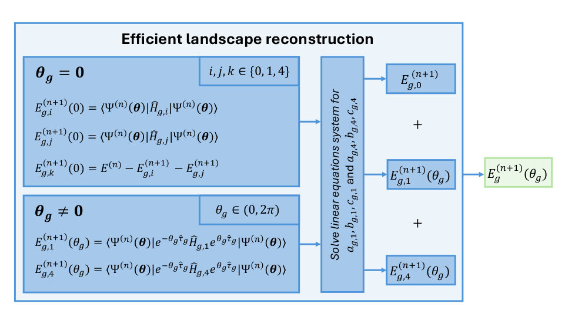 
FIG. 2. Schematic representation of the efficient procedure to obtain the energy landscape

📷 Fig 3

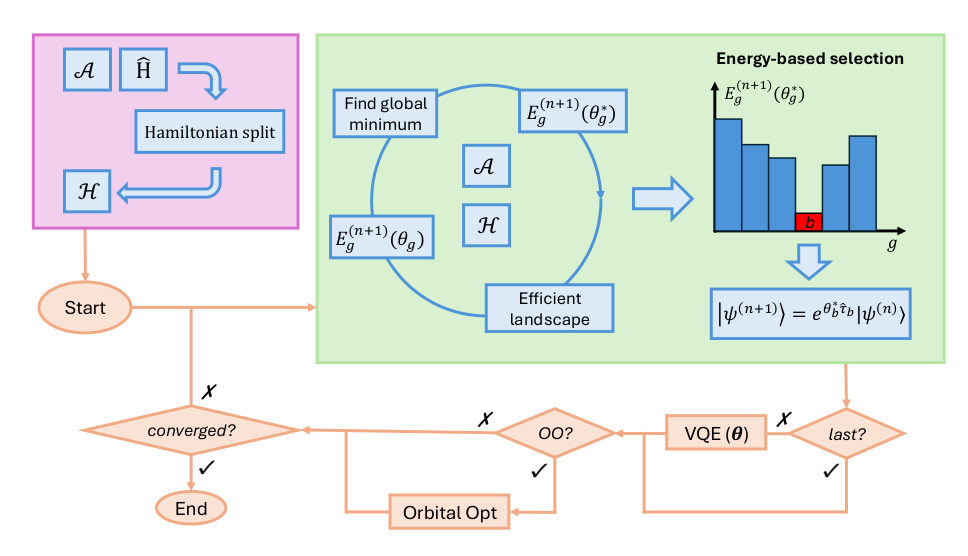 
FIG. 3. Flowchart of the adaptive algorithm implementing the Rotoselect efficient selection routine.

📷 Fig 4

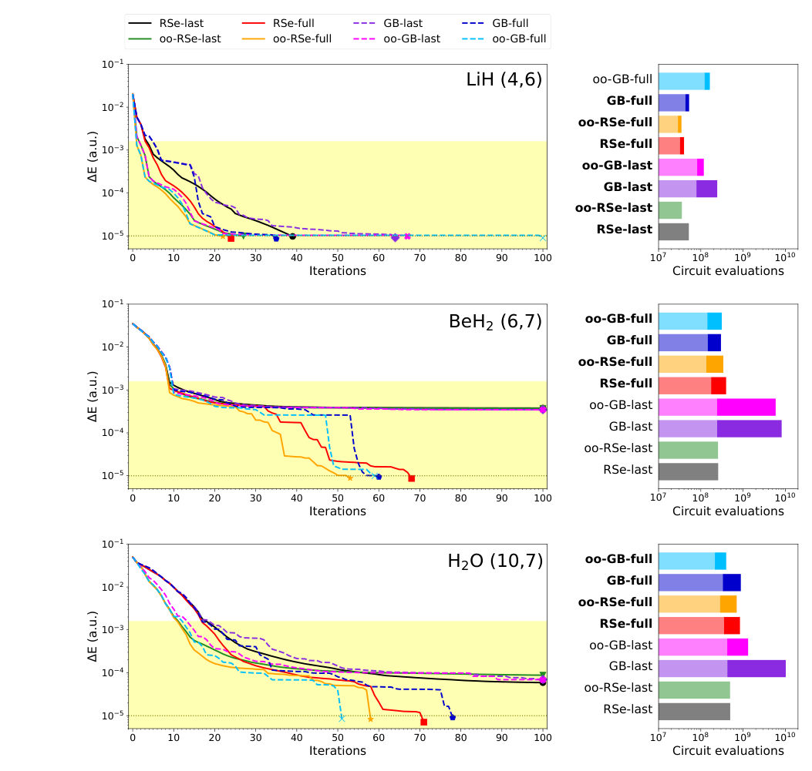 
FIG. 4. Comparison of selection-optimization strategies within LiH (4,6), BeH2 (6,7) and H2O

📷 Fig 5

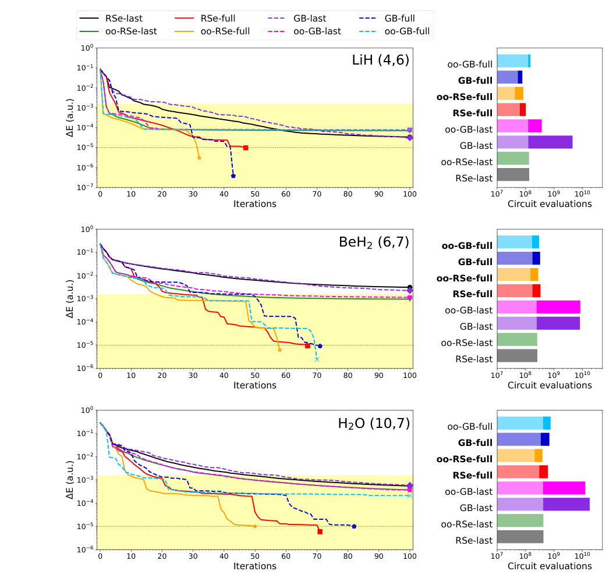 
FIG. 5. Comparison of selection-optimization strategies in stretched LiH (4, 6), BeH2 (6, 7) and

**Summary.** This paper improves the resource efficiency of energy-based operator selection in fermionic ADAPT-VQE by introducing an exact Hamiltonian transformation. This technique significantly reduces the measurement overhead required to score potential operators, making the selection process competitive with gradient-based methods. The results demonstrate that this efficient approach helps achieve accurate quantum chemical results for molecules even in highly correlated regimes.

**Why it may be interesting.** This work directly tackles the resource scaling of quantum chemistry simulations, which is crucial for applying VQE to complex, strongly correlated molecular systems.

Detailed structure

**Main problem.** The primary challenge addressed is the computational bottleneck associated with reconstructing the one-parameter energy landscape during energy-based operator selection in fermionic ADAPT-VQE.

**Main result.** The authors introduce an exact Hamiltonian transformation that reformulates the energy landscape, reducing the measurement overhead of energy-based selection by about a factor of two, bringing it close to gradient-based methods.

**Method.** The method involves using an exact Hamiltonian transformation to efficiently calculate the energy cost function $E^{(n+1)}_g(	heta_g)$ for operator selection, which is then used within the ADAPT-VQE framework.

**Model / system.** The study is applied to fermionic quantum chemistry calculations for molecules like LiH, BeH2, and H2O, using the electronic Hamiltonian in second quantization.

**Key observables.** Energy convergence relative to the FCI reference, selection cost (measured in circuit evaluations), and overall resource cost.

**Important parameters / regimes.** The comparison spans weakly correlated (equilibrium) and highly correlated (stretched) molecular geometries.

**Assumptions / limitations.** The efficiency gain relies on the mathematical identity derived from the exact Hamiltonian transformation, which simplifies the calculation of the energy cost function.

**Figures summary.** Figures compare the energy convergence and the relative cost (selection vs. optimization) of various ADAPT-VQE strategies (Gradient vs. Energy-based) across different molecular geometries.

**Paper structure.** The paper first establishes the ADAPT-VQE framework and the cost of energy-based selection. It then details the exact Hamiltonian transformation to derive a resource-efficient energy cost function. Finally, it benchmarks this improved method against gradient-based approaches across various molecular systems and optimization strategies.

Abstract

The energy-based approach to operator selection in ADAPT-VQE relies on reconstructing the one-parameter energy landscape for each operator in the pool. In fermionic implementations, the cost of reconstructing this energy landscape often becomes a bottleneck. We address this issue through an exact Hamiltonian transformation that reformulates the one-parameter energy landscape according to a generator-dependent fragmentation of the transformed Hamiltonian. While our method is mathematically identical to standard fermionic Rotoselect, it effectively reduces its cost by about a factor of two, bringing it close to that of gradient-based ADAPT-VQE. We use this formulation to benchmark the gradient-based and energy-based selection approaches in combination with two ansatz-optimization strategies -- `last', where only the appended operator is optimized, or `full', where the full ansatz is re-optimized -- and with both fixed-orbital and orbital-optimized formulations. The benchmark comprises $\text{LiH}$, $\text{BeH}_2$, and $\text{H}_2\text{O}$ at both equilibrium and stretched geometries. In the weakly correlated regime, the `last' optimization strategy combined with energy-based selection enables the efficient construction of an accurate ansatz, while avoiding any VQE optimization. As correlation increases, full ansatz re-optimization and orbital optimization become the main factors governing convergence and overall resource cost. These results show that exact Hamiltonian transformations provide an effective route to reducing the measurement overhead of fermionic energy-based ADAPT-VQE. Moreover, the benchmark clarifies the relative role of operator scoring approach, re-optimization strategy, and orbital treatment in the performance of ADAPT-VQE.

[↑ back to top](#top)

### [Spectral criteria for generalization in unsupervised Hebbian nets](http://arxiv.org/abs/2606.04651v1)

**Authors:** Elena Agliari, Paulo Duarte Mourão, Alberto Fachechi, Pierpaolo Vivo  
**Type:** theory · **Category:** disordered systems and neural networks · **PDF:** <https://arxiv.org/pdf/2606.04651v1>  
**Analysis basis:** full PDF text, analyzed in chunks

📷 Fig 1

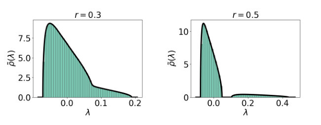 
Fig. 1: Spectrum of the unsupervised model characterized by the interaction matrix ˜ J H in Eq. (7), for r = 0.3 (left) and r = 0.5 (right). The histogram in green represents the data resulting from computing the eigenvalues of interaction matrices with N = 1000 neurons across 50 independent samples, while the solid black line shows the corresponding theoretical prediction. The load and number of examples were fixed at α = 0.1 and M = 50, respectively.

📷 Fig 2

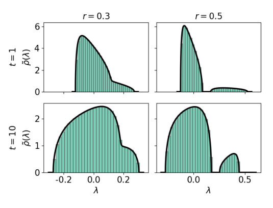 
Fig. 2: Spectrum of the unsupervised regularized model characterized by the interaction matrix ˜ J D(t) in Eq. (8), for r = 0.3 (left) and r = 0.5 (right), and t = 1 (above) and t = 10 (below). The histogram in green represents the data resulting from computing the eigenvalues of interaction matrices with N = 1000 neurons across 50 independent samples, while the black solid line shows the corresponding theoretical prediction. The load and number of examples were fixed at α = 0.1 and M = 50, respectively.

📷 Fig 3

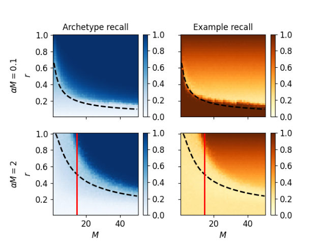 
Fig. 3: MC simulations for the unsupervised Hopfield model run until convergence for the recovery of archetypes (left) and examples (right) for various values of r and M, in the low-rank (above) and full-rank (below) scenarios. The color maps show the archetype overlap (mξ = 1 N PN i=1 σ(∞) i ξµ i , left column) and the closest-example overlap (m ˜ξ = 1 N PN i=1 σ(∞) i ˜ξµ a,i, right column) computed upon convergence to fixed points σ(∞), and averaged across 50 samples. We used N = 1000 and the starting state had a quality of p = 0.9 compared to a stored example. The black dashed line marks the separation of the spectrum into two peaks (predicted theoretically by Eq. (13)), while the...

📷 Fig 4

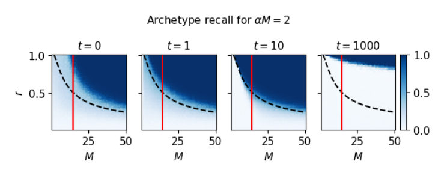 
Fig. 4: MC simulations run until convergence for the recovery of archetypes for various values of r, M and t in the full- rank scenario (αM = 2). The color maps report the value of the archetype overlap (mξ = 1

📷 Fig 5

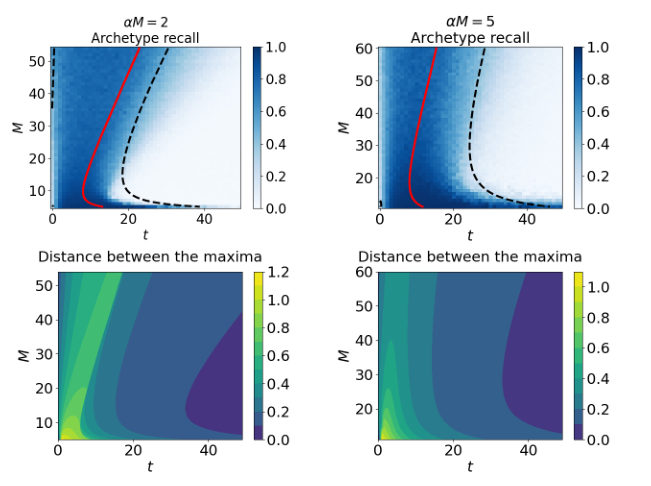 
Fig. 5: MC simulations comparing the generalization capabilities of the unsupervised regularized model with properties of the spectrum, for ranks αM = 2 (left) and αM = 5 (right). In the upper row, generalization experiments are conducted: the color maps report the value of the archetype overlap (mξ = 1 N PN i=1 σ(∞) i ξµ i ) computed upon convergence to fixed points; these were run similarly to those shown in Figs. 3 and 4, but for the points defined by equation (14), and starting from new examples instead of close to stored ones. The final overlaps relative to the corresponding archetypes are then measured and averaged over 50 independent samples for each point. The black dashed line...

**Summary.** This work develops a theoretical framework using random matrix theory to analyze unsupervised Hebbian networks. It shows that the network's ability to generalize is directly encoded in the spectral structure of its interaction matrix. A clear spectral separation between signal and noise directions is predicted to be the necessary condition for successful reconstruction of underlying patterns.

**Why it may be interesting.** The rigorous mathematical framework connecting spectral properties (eigenvalue distribution) to functional performance (generalization) provides a powerful, generalizable diagnostic tool applicable to complex quantum or classical learning systems.

Detailed structure

**Main problem.** To derive the asymptotic spectral properties of the interaction matrix in unsupervised Hebbian networks and establish spectral criteria that predict the network's ability to generalize beyond training data.

**Main result.** Generalization capability is predicted by the spectral transition: the existence of two separated spectral bulks (signal/noise separation) indicates successful generalization, while a merged single-bulk phase implies failure.

**Method.** The analysis combines random matrix theory and replica methods to compute the quenched free energy and derive the limiting spectral density of the interaction matrix.

**Model / system.** The model is an unsupervised Hebbian network trained on noisy realizations of hidden ground-truth vectors, extending classical Hopfield models from simple memory retrieval to latent structure extraction.

**Key observables.** The asymptotic spectrum ($	ilde{
ho}'(\lambda)$), the spectral gap (separation into two bulks), and the overlap measures (archetype and example overlaps).

**Important parameters / regimes.** Network load ($\alpha$), noise parameter ($r$), regularization parameter ($t$), and the ratio $\alpha M$ which dictates the spectral regime.

**Assumptions / limitations.** The analysis relies on the thermodynamic limit ($N 	o \infty$) and the use of the replica-symmetric ansatz for order parameters.

**Figures summary.** Figures illustrate the theoretical spectral predictions versus numerical simulations, showing the spectral evolution under regularization and comparing spectral analysis results with overlap measurements across different load regimes.

**Paper structure.** The paper progresses by first deriving the spectral density using random matrix theory and replica methods, then analyzing the effect of regularization ($t$) on this spectrum, and finally establishing the spectral gap as the necessary and sufficient condition for successful generalization.

Abstract

We consider an unsupervised Hebbian network where the pairwise interactions among neurons are built on noisy realizations of hidden ground-truth vectors. Unlike classical Hopfield models, designed as memory devices, this class of networks can be employed to extract latent structure and generalize beyond the "training" set. By combining random matrix theory and replica methods, we derive the asymptotic spectrum of the corresponding interaction matrix and show that the onset of generalization is controlled by a sharp spectral transition. Depending on the quality and the size of the accessible dataset, the spectrum displays either two separated bulks, encoding informative and noisy directions, or a merged single-bulk phase where such distinction is lost. We show that, when coupled with regularization, the emergence of such a spectral split predicts the network's capability to reconstruct the ground-truth vectors from corrupted samples.

[↑ back to top](#top)

### [Variational low-energy subspaces for chemically accurate excited states](http://arxiv.org/abs/2606.05148v1)

**Authors:** Clemens Giuliani, Rocco Martinazzo, Giuseppe Carleo, Riccardo Rossi  
**Type:** theory · **Category:** other · **PDF:** <https://arxiv.org/pdf/2606.05148v1>  
**Analysis basis:** full PDF text, analyzed in chunks

📷 Fig 1

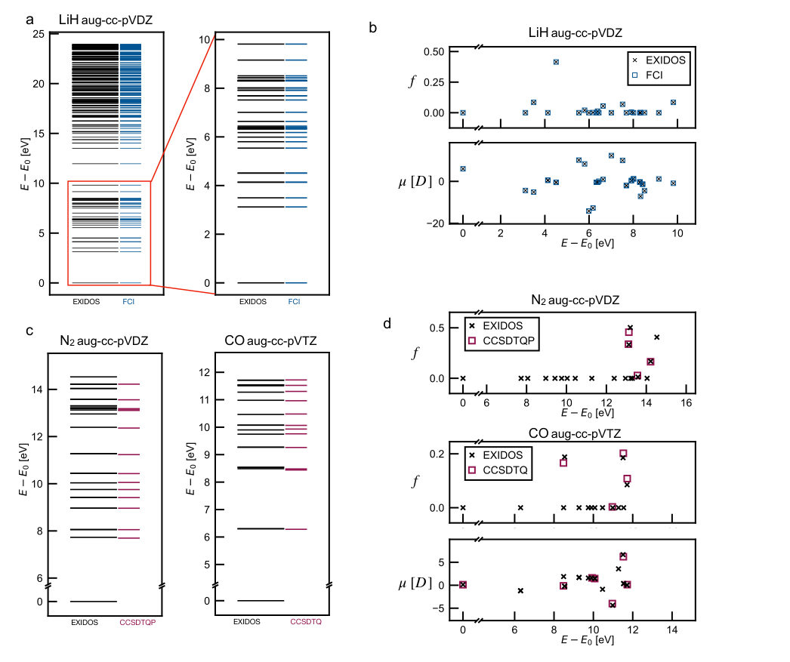 
Figure 1. Automatic optimization of the low-energy subspace. (a-b) EXIDOS(256,32) calculation of LiH spectrum, oscillator strength f and dipole moment µ, compared with FCI. (c-d) All-electron EXIDOS(24, 256) and EXIDOS(33, 256) results for the N2 and CO molecules, respectively, are compared with the benchmark results from Ref. [23, 24]. We note that panel (c-d) includes additional low-lying triplet states absent from the benchmark.

📷 Fig 2

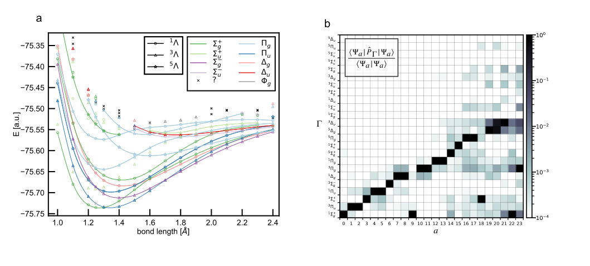 
Figure 2. (a) EXIDOS potential energy curve of the lowest states of C2. We show an all-electron EXIDOS (24,256) calculation in the aug-cc-pVDZ basis. (b) Symmetry retrieval from operator measurements. We show the expectation value of the projector ˆPΓ onto each irreducible representation Γ of a term symbol as function of the state index at equilibrium geometry for C2 (R = 1.248), computed using the techniques described in Ref. [25, 26].

📷 Fig 3

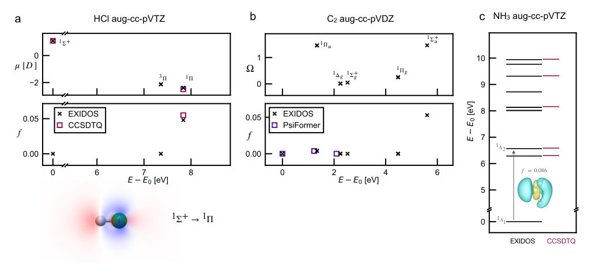 
Figure 3. Excited states with different electronic character. (a) Charge-transfer excitation in HCl. A frozen-core EXIDOS(5,256) calculation reproduces the excitation energy, dipole moments µ and oscillator strength f of the 1Σ+ →1Π transition, compared with CCSDTQ [27]. Our calculation also includes the lowest 3Π state absent from the benchmark. The density difference plot illustrates the charge redistribution for the 1Σ+ →1Π transition. (b) Double excitations in C2 at equilibrium. An all-electron EXIDOS(24,256) calculation recovers the low-lying singlet states with strong double-excitation character. Ωquantifies the doubly excited character of each excited state: Ω→0 indicates a state...

📷 Fig 4

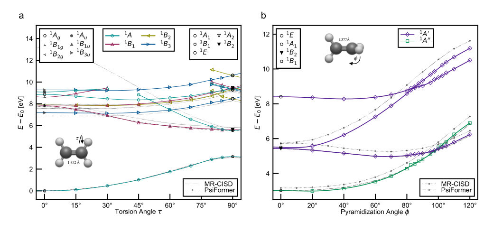 
Figure 4. (a) Bond torsion of the ethylene molecule starting from the planar geometry. (b) Bond pyramidization of the ethylene molecule starting from the twisted-orthogonal geometry. Results are obtained from an all-electron EXIDOS simulation of K = 10 states (16 for a few geometries) with ND = 256 determinants in the aug-cc-pVDZ basis, and the geometries are from Ref. [29]. We compare with MR-CISD in the same basis [29] and with PsiFormer [17]. In both panels we use a ˆS2 spin penalty to only select singlets in order to reduce the computational cost.

**Summary.** This paper introduces EXIDOS, a novel, low-scaling variational method for calculating electronic excited states. It reformulates the complex excited-state optimization into an iterative, ground-state-like problem solvable via generalized eigenvalue equations. The method achieves chemical accuracy across diverse molecular systems, making it a powerful tool for photochemistry and spectroscopy.

**Why it may be interesting.** This provides a highly scalable, fully variational route to excited states that bypasses the need for explicit symmetry assumptions or state-specific knowledge, which is a major bottleneck in non-adiabatic dynamics simulations.

Detailed structure

**Main problem.** Accurately calculating electronic excited states is crucial for photochemistry and spectroscopy, but high-level methods scale steeply and require prior knowledge of the state's character.

**Main result.** The developed EXIDOS method achieves chemical accuracy for numerous excited states in various molecules by reformulating the optimization as an iterated ground-state-like problem.

**Method.** The method reformulates the variational excited-state optimization as an iterated ground-state problem, solving a generalized eigenvalue problem within a low-energy subspace spanned by non-orthogonal Slater determinants.

**Model / system.** The work applies to general molecular systems, benchmarked on molecules like N2, CO, HCl, C2, and NH3, using the electronic molecular Hamiltonian.

**Key observables.** Excitation energies, oscillator strengths, dipole moments, and the ability to characterize different state types (charge-transfer, Rydberg, double excitations).

**Important parameters / regimes.** The method is controlled only by the number of states ($K$) and the number of determinants per state ($	ext{ND}$); accuracy is benchmarked against FCI and high-level CC methods.

**Assumptions / limitations.** The method assumes the overlap matrix $\mathbf{S}$ is non-singular and uses an unconstrained Slater determinant basis, which is noted to not be strictly size-consistent.

**Figures summary.** Figures compare EXIDOS results against FCI/CCSDTQ for spectra, show potential energy curves for C2, and illustrate the characterization of different excited states (charge-transfer, double excitations, Rydberg) in various molecules.

**Paper structure.** The paper systematically develops the theoretical framework by reformulating the excited-state optimization into a generalized eigenvalue problem, detailing the EXIDOS algorithm, and validating its performance across diverse chemical benchmarks.

Abstract

Accurate electronic excited states are essential for photochemistry, spectroscopy and non-adiabatic molecular dynamics, but high-level calculations often scale steeply and require prior knowledge of the target state's character or symmetry. Here we show that variational excited-state optimization can be reformulated as an iterated ground-state-like problem for a low-energy subspace of the electronic Hamiltonian. Applying this variational principle to non-orthogonal Slater determinants leads to EXIDOS, an automatic method for excited state calculations controlled only by the number of states and determinants per state. EXIDOS optimizes multiple excited states simultaneously, without explicit orthogonality constraints or imposed spin and point-group symmetries. Benchmarks against FCI and state-of-the-art quantum chemistry methods show chemical accuracy for a multitude of states in N$_2$ and CO, charge-transfer states in HCl, Rydberg states in NH$_3$, double excitations and extended potential-energy curves in C$_2$, and avoided crossings and conical intersections in ethylene. These results establish EXIDOS as a low-scaling, fully variational route to chemically accurate excited states.

[↑ back to top](#top)

### [Vibrational model of entropy in dense two-dimensional fluids](http://arxiv.org/abs/2606.04533v1)

**Authors:** Sergey Khrapak  
**Type:** theory · **Category:** statistical mechanics · **PDF:** <https://arxiv.org/pdf/2606.04533v1>  
**Analysis basis:** full PDF text, analyzed in chunks

📷 Fig 1

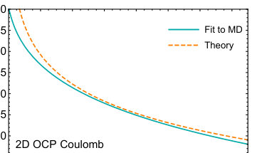 
FIG. 1. (Color online) Excess entropy of the 2D OCP with Coulomb (∝1/r) interaction versus the coupling parameter Γ. The solid line corresponds to a fit based on MC simula- tion results [44]. The dashed line corresponds to the present theoretical model.

📷 Fig 2

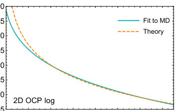 
FIG. 2. (Color online) Excess entropy of the 2D OCP with logarithmic interaction (∝ln(1/r)) versus the coupling pa- rameter Γ. The solid line corresponds to a fit based on MC and MD simulation results [20, 21]. The dashed line corre- sponds to the present theoretical model.

📷 Fig 3

 
FIG. 3. (Color online) Excess entropy of the 2D fluid with dipole (∝1/r3) interaction versus the coupling parameter Γ. The solid line corresponds to a fit based on MD simulation results [29]. The dashed line corresponds to the present the- oretical model.

📷 Fig 4

 
Figure 3 presents a comparison between theory and numerical data for a 2D fluid with the dipole-like inverse cube interaction potential. The estimate of the Einstein frequency at strong coupling can be made using the re- sults reported in Ref. [29]. Specifically, ω2 E ≃3

📷 Fig 5

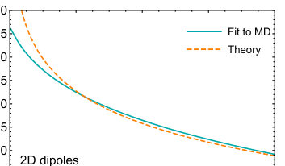 
Figure 4 shows a comparison between the vibrational approximation to excess entropy and the numerical data for the 2D Yukawa fluid with κ = 1, 2, and 3. For the 2D Yukawa fluid, the ratio ωE/ω0 is only weakly dependent on Γ, but drops considerably as κ increases (see Fig. 4 from Ref. [42]). We use the values reported in Ref. [50], corresponding to the vicinity of the fluid-solid phase tran- sition: ωE/ω0 ≃0.5159 (κ = 1), ≃0.3297 (κ = 2), and ≃0.1893 (κ = 3). The agreement between the predic- tion of the vibrational model and the equation of state is again remarkably good at strong coupling.

**Summary.** This paper develops and applies a vibrational model to calculate the excess entropy of dense two-dimensional fluids, extending a known 3D technique to 2D systems. It successfully tests this generalized model against various 2D plasmas and fluids, showing strong agreement with simulation results. The work provides a powerful theoretical tool for characterizing the thermodynamics of strongly coupled 2D matter.

**Why it may be interesting.** While focused on classical statistical mechanics, the rigorous application of vibrational models and the comparison of theoretical approximations (Einstein vs. DR-based) to simulation data mirrors the systematic theoretical development seen in many-body quantum systems.

Detailed structure

**Main problem.** The paper generalizes a vibrational model of entropy, previously used for 3D dense fluids, to accurately calculate the excess entropy of two-dimensional (2D) fluids.

**Main result.** The derived vibrational model provides a universal and simple generic form for the excess entropy ($s_{ex}$) that shows good agreement with numerical simulation data for various 2D systems.

**Method.** The excess entropy is calculated using a vibrational paradigm, approximating the partition function and relating $s_{ex}$ to the excess thermal energy and free energy via established thermodynamic relations.

**Model / system.** The study focuses on dense 2D fluids, including one-component plasmas (OCP) with Coulomb and logarithmic interactions, 2D dipole fluids, and 2D Yukawa fluids.

**Key observables.** Excess entropy ($s_{ex}$), excess thermal internal energy ($u_{th}$), and the coupling parameter ($\Gamma$).

**Important parameters / regimes.** Coupling parameter ($\Gamma$), characteristic frequency ($\omega_E$), and plasma frequency ($\omega_0$).

**Assumptions / limitations.** The model relies on the Einstein approximation for the vibrational density of states, and the derived equations are most accurate in the strongly coupled regime ($\Gamma \gg 1$).

**Figures summary.** Figure 1 and Figure 2 compare the calculated excess entropy of 2D OCPs (Coulomb and logarithmic) against existing Monte Carlo simulation data, demonstrating the model's accuracy.

**Paper structure.** The paper introduces the generalization of the vibrational model to 2D, derives the universal expression for $s_{ex}$, and then applies this framework to test its accuracy against known results for multiple 2D plasma and fluid models.

Abstract

A vibrational paradigm of atomic dynamic in dense fluids is known to provide useful insight on the transport and thermodynamic properties of fluids in three dimensions. In this paper, a vibrational model is generalized to describe the excess entropy of two-dimensional (2D) fluids. A simple practical implementation of this model is demonstrated to deliver accurate results for various systems, such as one-component plasmas with Coulomb and logarithmic interactions, a 2D fluid of dipole particles, and a 2D Yukawa fluid. The applicability limits, relevance to three-dimensional fluids, relations to other 2D phenomena, and potential practical applications are briefly discussed.

[↑ back to top](#top)

## Secondary cond-mat archives

*Papers from  mes-hall, other, soft, supr-con. These archives are de-prioritized — they appear at the end regardless of relevance score.*

### Relevant in secondary archives (18)

### [Effective and Floquet Hamiltonians for High Frequency Driving and Floquet-induced Heating in Quantum Spin Chains](http://arxiv.org/abs/2606.04976v1)

**Authors:** Mayukh Bandyopadhyay, Vinod Ashokan  
**Type:** theory · **Category:** disordered systems and neural networks · **PDF:** <https://arxiv.org/pdf/2606.04976v1>  
**Analysis basis:** full PDF text, analyzed in chunks
**Topic relevance:** 🔥 `non-equilibrium dynamics` **4/5** · 🔥 `scars & prethermalization` **4/5** · `analog quantum simulation` **3/5** · `driven-dissipative phase transition` **3/5** · `entanglement & information structure` **3/5** · `non-equilibrium universality` **3/5** · `methods for driven-dissipative` **2/5** · `exotic spin models in light-matter` **1/5**

📷 Fig 1

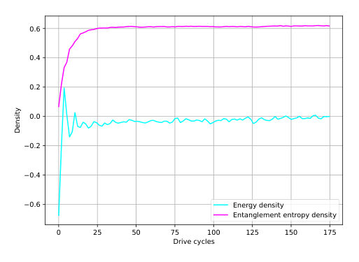 
FIG. 1. Stroboscopic dynamics of the energy density and entanglement entropy density together in a clean periodically driven TFIM in a parallel field. Parameters: g/J = 0.915, h/J = 1.236, Ω/J = 3.5998 and L = 14.

📷 Fig 2

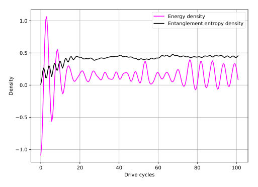 
FIG. 3. Stroboscopic dynamics of the energy density and entanglement entropy density together in a clean periodically driven TFIM in a parallel field. Parameters: g/J = 1.2, h/J = 2.536, Ω/J = 12.458 and L = 12.

📷 Fig 3

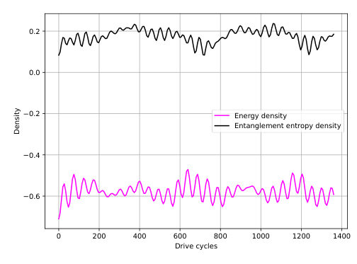 
FIG. 2. Stroboscopic dynamics of the energy density and entanglement entropy density together in a clean periodically driven TFIM in a parallel field. Parameters: g/J = 1.2, h/J = 0.02, Ω/J = 0.924 and L = 12.

📷 Fig 4

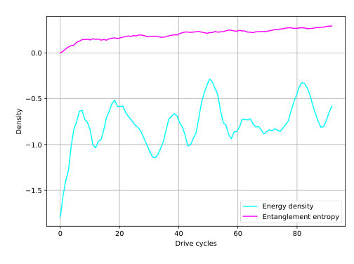 
FIG. 4. Stroboscopic dynamics of the energy density and en- tanglement entropy density together in the periodically driven TFIM in a parallel field with quenched disorder in parallel and transverse field components. Parameters: g/J = 0.915, h/J = 1.234, Ω/J = 8.36, Wh = 5.85, Wg = 0.02 and L = 12.

**Summary.** This paper analyzes how disorder and high-frequency driving control the non-equilibrium dynamics of quantum spin chains. By studying entanglement entropy and energy absorption, the authors distinguish between thermalization, prethermalization, and a robust Floquet-MBL phase. The findings highlight that disorder is crucial for stabilizing non-equilibrium, localized states against external driving.

**Why it may be interesting.** This work directly addresses non-equilibrium dynamics in disordered quantum systems, which is central to understanding thermalization, localization, and the stability of quantum states under external driving fields, highly relevant to AMO physics.

Detailed structure

**Main problem.** The study investigates the non-equilibrium dynamics of a disordered, periodically driven quantum spin chain, focusing on the competition between interaction, disorder, and external driving.

**Main result.** The research establishes that strong disorder and high driving frequencies can suppress energy absorption and lead to a stable Floquet-Many-Body Localized (Floquet-MBL) regime, preventing thermalization.

**Method.** The analysis employs Floquet theory, utilizing the van Vleck inverse-frequency expansion to derive effective Hamiltonians, alongside numerical simulations to track energy and entanglement entropy.

**Model / system.** The system is a disordered, periodically driven quantum spin chain (e.g., transverse-field Ising model) governed by a time-periodic Hamiltonian incorporating nearest-neighbor interactions, disorder fields, and a time-dependent drive.

**Key observables.** Entanglement entropy density, energy absorption/energy density, and the comparison between localized/prethermal and thermalized dynamic regimes.

**Important parameters / regimes.** Interaction strength (J), disorder strengths (W), driving frequency ($\Omega$), and the ratio of disorder to interaction scales.

**Assumptions / limitations.** The analysis relies on the high-frequency expansion (van Vleck expansion) to approximate the effective static Hamiltonian, and numerical simulations are limited to small system sizes.

**Figures summary.** Figures illustrate stroboscopic dynamics showing bounded energy density oscillations and slow, saturating entanglement growth under strong disorder and high driving frequencies, contrasting with thermalization signatures at low frequencies.

**Paper structure.** The paper systematically analyzes the system's evolution by comparing different parameter regimes: low frequency (thermalization), high frequency without disorder (prethermalization), and high frequency with strong disorder (Floquet-MBL).

Abstract

We study the non-equilibrium dynamics of a disordered periodically driven quantum spin chain, with the competition between the interaction, disorder, and Floquet driving being of particular interest. We study dynamics of entanglement entropy, energy absorption to characterize dynamical regimes of the system whether it stays in the Floquet-MBL(many-body localization) region or thermalized region. Starting with a product state in the computational basis, followed by reduced density matrix which in turn gives rise to the entanglement entropy density. With the strength of the interaction, the transverse field, the parallel field, the disorder strength W and the driving frequency, we discover the distinct behaviors of fast delocalization and logarithmic entanglement growth and long-lasting memory of the initial state, indicative of localized or prethermal Floquet regimes. We observe that strong disorder arrests transport and enables slow entanglement dynamics, whereas strong driving frequency arrests energy absorption and creates a long-lived non-equilibrium state. Conversely, weak disorder or low driving frequency leads to delocalization. The outcomes show strong support for non-equilibrium phases in driven many-body systems.

[↑ back to top](#top)

### [Many body localization in Disordered One-Dimensional Fermi-Hubbard Model](http://arxiv.org/abs/2606.04948v1)

**Authors:** Harmanjeet Kaur, Vinod Ashokan  
**Type:** theory · **Category:** other · **PDF:** <https://arxiv.org/pdf/2606.04948v1>  
**Analysis basis:** full PDF text, analyzed in chunks
**Topic relevance:** 🔥 `non-equilibrium dynamics` **4/5** · `analog quantum simulation` **3/5** · `entanglement & information structure` **3/5** · `non-equilibrium universality` **3/5** · `scars & prethermalization` **3/5**

📷 Fig 1

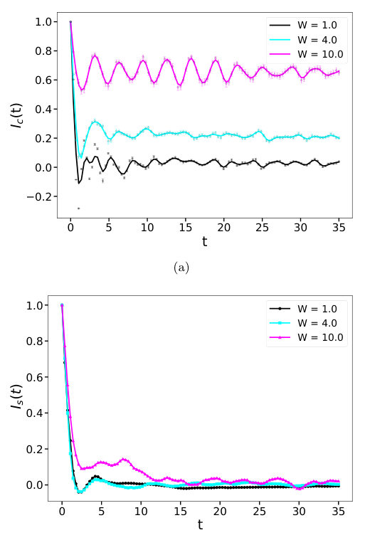 
FIG. 1: Time evolution of (a) Charge Imbalance IC(t) and (b) Spin Imbalance IS(t) for system sizes L = 12 at J = 1, U = 5 and disorder strengths W = 1.0, 4.0, 10.0.

📷 Fig 2

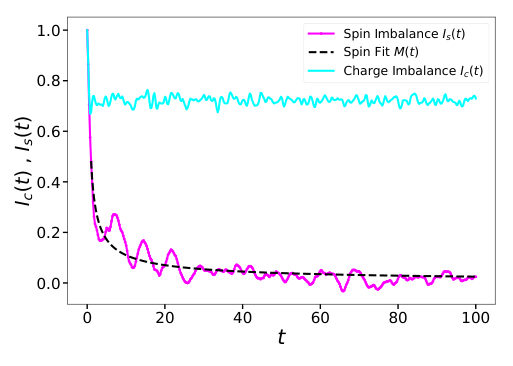 
FIG. 2: The spin and charge imbalance of L = 12 at J=1, U = 4 and disorder strength W = 14.0 with fitted algebraic form M(t).

📷 Fig 3

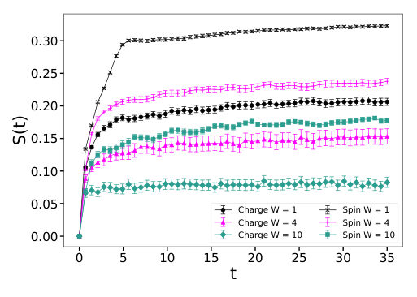 
FIG. 4: Time evolution of charge and spin entanglement entropy Sc(t) and Ss(t) respectively for system sizes L = 8 , J = 1.0,U = 5.0 at disorder strength W = 1.0, 4.0, 10.0.

📷 Fig 4

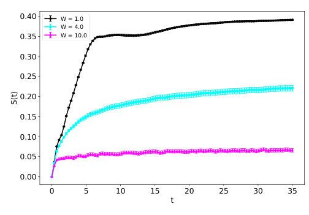 
FIG. 3: (a) Entanglement entropy S(t) as a function of time for different interaction strengths U = 0, 1, 5, 10 at fixed disorder W = 10 at L = 12. (b) Entanglement entropy S(t) of L = 10 for different disorder strengths W. The transition from rapid growth (ergodic phase) to slow logarithmic growth (many-body localized phase) is clearly visible.

**Summary.** This work examines the non-equilibrium dynamics of the disordered 1D Fermi-Hubbard model to study Many-Body Localization. By tracking imbalance and entanglement entropy, the authors demonstrate a transition from thermalizing (ergodic) behavior at weak disorder to a non-ergodic state at strong disorder. Crucially, they find evidence of partial decoupling between charge and spin degrees of freedom in this localized regime.

**Why it may be interesting.** The interplay between disorder, interactions, and dimensionality in determining thermalization pathways is central to modern condensed matter theory, making this highly relevant for understanding strongly correlated quantum materials.

Detailed structure

**Main problem.** The study investigates the non-equilibrium dynamics and the breakdown of thermalization in the presence of disorder, specifically focusing on the phenomenon of Many-Body Localization (MBL).

**Main result.** The system exhibits a crossover from ergodic to non-ergodic behavior controlled by disorder strength, revealing partial decoupling between charge and spin sectors.

**Method.** The analysis uses time evolution simulations following a quantum quench, employing observables like sublattice imbalance and bipartite entanglement entropy.

**Model / system.** The model is the disordered one-dimensional Fermi-Hubbard model, described by a Hamiltonian including tunneling, on-site interaction (U), and random on-site disorder potential (V_i).

**Key observables.** Sublattice imbalance ($I(t)$), Spin-Charge Imbalance ($I_c(t), I_s(t)$), and Bipartite Entanglement Entropy ($S(t)$).

**Important parameters / regimes.** Disorder strength ($W$), Interaction strength ($U$), and the initial state (e.g., Charge-Density-Wave state).

**Assumptions / limitations.** The analysis relies on characterizing the dynamics through specific conserved quantities and entanglement measures, noting that complete MBL requires specific symmetry breaking.

**Figures summary.** Figures illustrate the time evolution of charge and spin imbalances for varying disorder strengths, showing decay in weak disorder and persistence in strong disorder. Entanglement entropy plots show characteristic logarithmic growth in the localized phase.

**Paper structure.** The paper analyzes the system dynamics by first establishing the Hamiltonian and key observables. It then contrasts the weak disorder (ergodic) regime with the strong disorder (non-ergodic) regime using imbalance measurements, followed by an analysis of entanglement entropy to confirm the MBL signatures.

Abstract

We investigate the non-equilibrium dynamics of the disordered one-dimensional Fermi-Hubbard model with a focus on many-body localization. The system is initialized in a charge-density-wave-state, and its time evolution is analyzed through sublattice imbalance (spin and charge), and bipartite entanglement entropy. A clear crossover from ergodic to non-ergodic behavior is observed with increasing disorder strength. In the weak disorder regime, rapid decay of imbalance and the fast growth of entanglement indicate efficient thermalization. In contrast, a strong disorder leads to persistent imbalance and slow dynamics, signaling the breakdown of ergodicity. The charge and spin sectors exhibit distinct relaxation behavior, providing evidence for partial decoupling between these degrees of freedom. Furthermore, in the interacting regime, the entanglement entropy shows slow logarithmic growth, reflecting the dephasing-driven dynamics characteristic of the many-body localized phase. These results highlight the interplay between disorder and interactions in determining the dynamical properties of the system and establish robust signatures of many-body localization in the Fermi-Hubbard model.

[↑ back to top](#top)

### [Local-to-global heating crossover in chains of nanomagnets: A two-scale analytical framework](http://arxiv.org/abs/2606.04724v1)

**Authors:** H. Kachkachi  
**Type:** theory · **Category:** statistical mechanics · **PDF:** <https://arxiv.org/pdf/2606.04724v1>  
**Analysis basis:** full PDF text, analyzed in chunks
**Topic relevance:** `methods for driven-dissipative` **3/5** · `non-equilibrium dynamics` **3/5** · `spintronics-quantum-optics interface` **3/5** · `Keldysh / 2PI / non-Gaussian methods` **2/5** · `correlated / nonlocal dissipation` **2/5** · `driven-dissipative phase transition` **2/5** · `exotic spin models in light-matter` **2/5** · `non-equilibrium universality` **2/5** · `Frenkel-Kontorova` **1/5** · `analog quantum simulation` **1/5**

📷 Fig 1

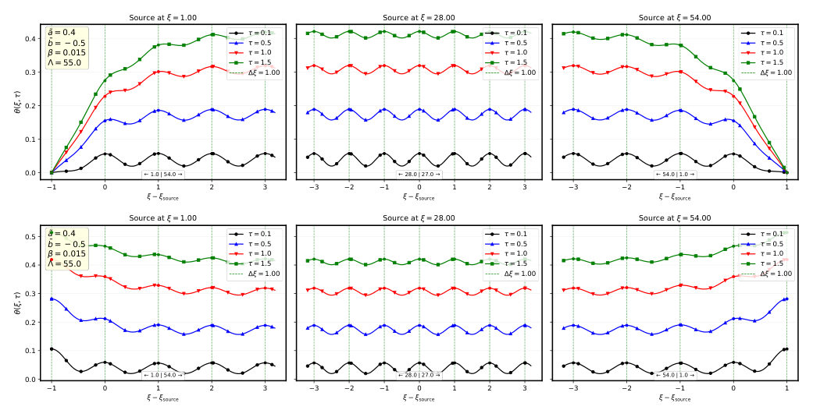 
FIG. 1: Local temperature profiles θ(ξ, τ) around three source sites (ξ = 1, 28, 54) at instants τ = 0.1, 0.5, 1.0, 1.5 for the illustrative parameter set (Table III). Vertical dashed lines mark the interparticle spacing ∆ξ = 1. (Upper panel) Dirichlet BCs. (Lower panel) Neumann BCs.

📷 Fig 2

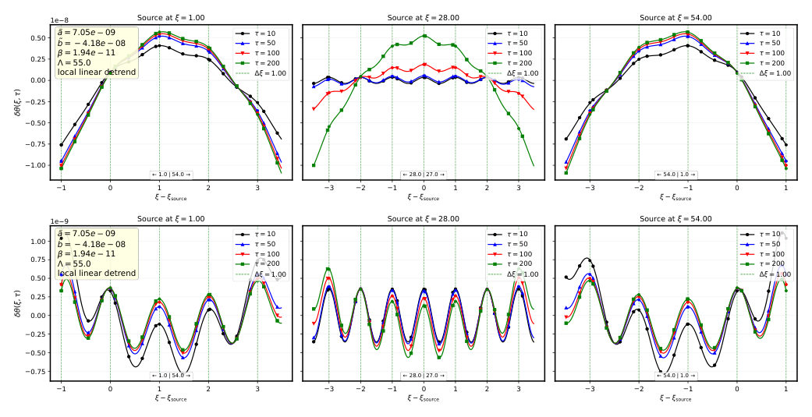 
FIG. 2: Detrended local profiles δθ(ξ, τ) around three source sites (ξ = 1, 28, 54) for the physical magnetite–PMMA parameter set (Table I) at τ = 10, 50, 100, 200. (Upper panel) Dirichlet BCs. (Lower panel) Neumann BCs.

📷 Fig 3

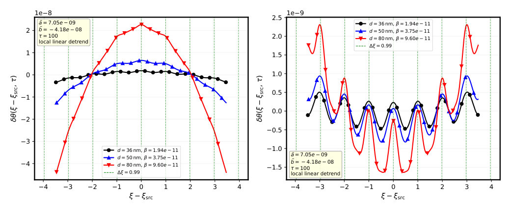 
FIG. 3: Local profiles at the central source vs. interparticle separation d. Detrended profile δθ(ξ −ξsrc, τ) for the physical magnetite–PMMA parameter set (same as Fig. 2) at τ = 100, for d = 36, 50, 80 nm. Note that β ∝d2 and Λ = L/d vary with d; the annotation box shows the reference values at d = 36 nm. (Left panel) Dirichlet BCs. (Right panel) Neumann BCs.

📷 Fig 4

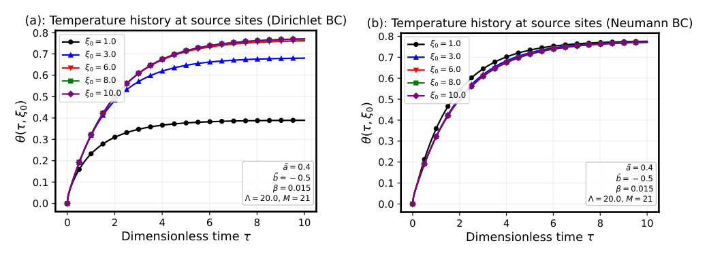 
FIG. 4: Temperature history θ(τ) at five source positions from near-edge (ξ0 = 1) to chain centre (ξ0 = 10) (Λ = 20, N = 21, ˜a = 0.4, ˜b = −0.5, β = 0.015).

📷 Fig 5

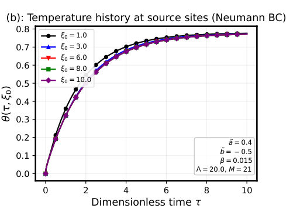 
Figure 6 shows θ(ξ, τ) at τ = 0.25, 0.5, 1.0, 2.0 for Λ = 42, N = 7, ∆ξ = 7, ˜b = −0.52, β = 0.017 (localized regime, well below ˜bc). Both panels share the same set of source positions; the faint vertical dashed lines mark each source site for orientation. Under DBC [Fig. 6, left], the profiles grow uniformly across the interior of the chain, with the edge sources visibly suppressed relative to the bulk. We see that the envelope of the peaks is nearly flat in the interior at each time, thus confirming that the fundamental Dirich- let mode sin(πξ/Λ) spreads the heating broadly. On the other hand, individual source peaks are resolved. Indeed, since the inter-particle spacing ∆ξ = 7 exceeds...

**Summary.** This work establishes a comprehensive two-scale analytical framework to model heat transfer in nanomagnet chains under alternating magnetic fields. By rigorously coarse-graining the nanoscale physics, the authors predict that realistic systems exhibit collective heating, with temperature fluctuations at the microkelvin level. The methodology is valuable for understanding energy dissipation in complex, coupled mesoscopic systems.

**Why it may be interesting.** The rigorous development of a multi-scale, non-equilibrium thermal transport model, especially one that quantifies the crossover between local and global energy dissipation, provides advanced tools applicable to open quantum systems where environmental coupling and spatial averaging are crucial.

Detailed structure

**Main problem.** The paper develops a two-scale framework to study heat generation and thermal transport in chains of nanomagnets subjected to an alternating magnetic field, focusing on the crossover between localized and global heating regimes.

**Main result.** For realistic magnetic hyperthermia systems, the model predicts the system operates in a collective heating regime, with local temperature variations at the $\sim\mu	ext{K}$ level, which is currently experimentally unresolvable.

**Method.** The authors employ a rigorous two-scale analytical formalism involving spatial and temporal coarse-graining, solving the resulting coupled equations using modal decomposition.

**Model / system.** The system consists of one-dimensional chains of nanomagnets (e.g., magnetite) embedded in a matrix, where heat generation is modeled as a localized, temperature-dependent source term governed by magnetic losses.

**Key observables.** Spatial correlation length, temperature variance, and the crossover condition governed by the competition between heat generation, diffusion, and dipolar coupling.

**Important parameters / regimes.** Nanoscale volumetric loss coefficient ($L_m$), macroscopic loss coefficient ($L_N$), Knudsen number ($Kn$), and the dimensionless coupling strength ($\gamma$).

**Assumptions / limitations.** The continuum Fourier description is valid because the Knudsen number is much less than one ($Kn \ll 1$) for the matrices considered.

**Figures summary.** Figures illustrate the dependence of Specific Loss Power (SLP) on frequency and volume, and compare the thermal behavior under Dirichlet (fixed boundary) versus Neumann (insulated boundary) conditions.

**Paper structure.** The paper progresses from deriving the nanoscale heat equation, through the rigorous process of spatial and temporal coarse-graining to obtain an assembly-scale equation, and finally analyzing the stability and crossover criteria using modal decomposition.

Abstract

We develop a two-scale analytical formalism to study heat generation and thermal transport in one-dimensional systems of nanomagnets subjected to a uniform alternating magnetic field. At the nanoscale, each nanomagnet acts as a localized, temperature-dependent heat source governed by its magnetic response, dipolar interactions, and interfacial coupling to the matrix, characterized by a nanoscale volumetric loss coefficient $L_m$. After spatial and temporal averaging, we obtain a coarse-grained assembly-scale equation with effective heating terms and a macroscopic loss coefficient $L_N$.   Using modal decomposition, we solve both equations exactly under Dirichlet and Neumann boundary conditions and establish explicit conditions for a local-to-global heating crossover; this is governed by the competition between heat generation, diffusion, dipolar coupling, and hierarchical losses. The crossover is quantified through the spatial correlation length and temperature variance, with stability criteria incorporating both diffusion and nanoscale losses. The coarse-graining procedure is derived rigorously, and its systematic approximation errors are quantified.   For prototypical magnetic hyperthermia systems, such as magnetite nanomagnets in water, our formalism reveals that realistic parameters place these systems firmly in the collective heating regime, with local temperature variations at the $\simμ$K level, which is currently unresolvable experimentally. The continuum Fourier description used here is validated by a Knudsen-number analysis ($\mathrm{Kn} \ll 1$ for amorphous polymer and aqueous matrices).

[↑ back to top](#top)

### [Perfect Nonreciprocal Axion-polaritons](http://arxiv.org/abs/2606.04341v1)

**Authors:** Abhinava Chatterjee, Chao-Xing Liu  
**Type:** theory · **Category:** other · **PDF:** <https://arxiv.org/pdf/2606.04341v1>  
**Analysis basis:** full PDF text, analyzed in chunks
**Topic relevance:** `driven-dissipative phase transition` **3/5** · `interference shaping light` **2/5** · `non-equilibrium dynamics` **2/5** · `non-equilibrium universality` **2/5** · `Keldysh / 2PI / non-Gaussian methods` **1/5** · `analog quantum simulation` **1/5** · `correlated / nonlocal dissipation` **1/5** · `correlated cavity matter` **1/5** · `methods for driven-dissipative` **1/5** · `spintronics-quantum-optics interface` **1/5**

📷 Fig 1

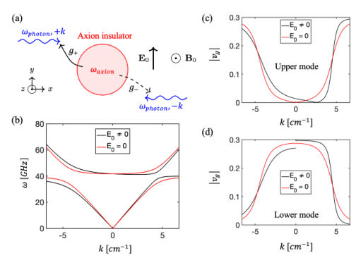 
FIG. 1. (a) The dynamical axion mode interacting with pho- tons. In the presence of both external electric and magnetic field E0, B0 along y and z directions respectively, the photons from the right (ωphoton, −k) and from the left (ωphoton, +k) couple to the axion mode with different coupling strengths g+ ̸= g−(defined in the section perfect nonreciprocity). (b) The frequency of the axion-polariton modes in the presence (E0 ̸= 0 - black) and absence of an external electric field (E0 = 0 - red) as a function of momentum k. The momen- tum axis is in units of cm−1, obtained using the conversion 1 GHz = 0.0333 cm−1. The magnitude of the group veloc- ity |vg| of the (c) upper and (d) lower...

📷 Fig 2

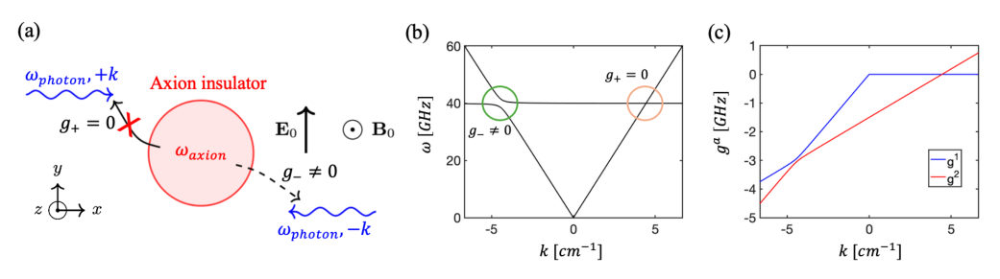 
FIG. 2. (a) Perfect nonreciprocity at critical electromagnetic fields Ec 0, Bc 0 given by Ec 0 = c′Bc 0. (b) The axion-polariton dispersion at the critical external field. (c) The axion-photon coupling strengths ga(k) as a function of momentum k at critical electromagnetic fields Ec 0, Bc 0. We use E = c′B, B = 1.5 GHz, m = 40 GHz, v = 0.005 and c′ = 0.3.

📷 Fig 3

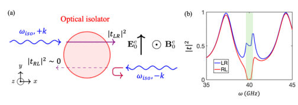 
FIG. 3. (a) The axion insulator as an optical isolator. (b) The transmissivities |tLR|2 and |tRL|2 as a function of photon frequency ω. We use E = c′B , B = 1.5 GHz, m = 40 GHz, v = 0 and c′ = 0.3.

**Summary.** This paper theoretically investigates axion-polaritons in a dynamical axion insulator subjected to external electric and magnetic fields. It demonstrates that these systems exhibit intrinsic nonreciprocity, leading to the prediction of an optical isolator. The effect is realized in a 'perfect nonreciprocity' regime where one direction of light propagates freely while the opposite direction is strongly attenuated.

**Why it may be interesting.** This work is highly relevant to quantum optics and open quantum systems as it demonstrates a controllable, engineered mechanism for directional light control (optical isolation) using fundamental material properties (axion coupling).

Detailed structure

**Main problem.** The paper aims to characterize nonreciprocal axion-polaritons, which are hybrid modes exhibiting directional asymmetry in their dispersion relation ($\omega(k) 
eq \omega(-k)$).

**Main result.** They identify a regime of perfect nonreciprocity where one direction's photon decouples from the axion while the counter-propagating photon strongly hybridizes, realizing an optical isolator.

**Method.** The analysis involves solving coupled equations of motion for axion and photon fields, deriving dispersion relations, and calculating transmission/reflection coefficients using boundary value problems.

**Model / system.** The system is a dynamical axion insulator coupled to electromagnetic fields, described by a Lagrangian involving axion fluctuations ($	heta$) and photon fields ($A$). Nonreciprocity requires breaking both inversion and time-reversal symmetry using external $\mathbf{E}_0$ and $\mathbf{B}_0$ fields.

**Key observables.** Dispersion relation $\omega(k)$, group velocity asymmetry $|\mathbf{v}_g(\mathbf{k})|$, and transmission coefficients $|t_{LR}|^2$ vs. $|t_{RL}|^2$.

**Important parameters / regimes.** The perfect nonreciprocity limit is achieved when the external fields satisfy $E = c'B$. The analysis also considers the axion damping rate $\Gamma$.

**Assumptions / limitations.** Approximations include $v \ll c'$ and the use of a small dissipative term ($\Gamma$) to model finite axion quasiparticle lifetime.

**Figures summary.** Figures illustrate the coupling mechanism showing different coupling strengths for right- and left-moving photons, and show the calculated transmission coefficients $|t_{LR}|^2$ and $|t_{RL}|^2$ for both nonreciprocal ($E=c'B$) and reciprocal ($E=0$) cases.

**Paper structure.** The paper progresses from establishing the coupled equations and the requirement for nonreciprocity, to calculating the dispersion relation and coupling strengths, and finally solving the boundary value problem for transmission/reflection coefficients to demonstrate the optical isolator effect.

Abstract

Dynamical axion describes a massive axion quasiparticle that arises from fluctuations of the magnetic order parameter. These fluctuations couple to electromagnetic fields, forming axion-polaritons -- collective modes that are physically magnon-polaritons. We show that under appropriate static external electric and magnetic fields, axion-polaritons acquire a nonreciprocal dispersion, $ω(\textbf{k}) \neq ω(-\textbf{k})$, arising intrinsically from direction-dependent axion-photon coupling. Strikingly, we identify a regime of \textit{perfect nonreciprocity} in which the photon propagating in one direction is completely decoupled from the axion while the counter-propagating photon hybridizes strongly. Furthermore, the nonreciprocal dispersion manifests as an optical isolator -- a device transmitting light preferentially in one direction. Our results establish nonreciprocal axion-polaritons as a powerful probe of axion quasiparticles and suggest experimentally accessible routes for their detection.

[↑ back to top](#top)

### [Very strong light-matter coupling in patterned GaAs heterostructures](http://arxiv.org/abs/2606.04919v1)

**Authors:** David de la Fuente Pico, Johannes Bürger, Antonio Gianfrate, Jesper Levinsen, Meera M. Parish, Daniele Sanvitto, Francesca Maria Marchetti, Dario Ballarini  
**Type:** both · **Category:** other · **PDF:** <https://arxiv.org/pdf/2606.04919v1>  
**Analysis basis:** full PDF text, analyzed in chunks
**Topic relevance:** `analog quantum simulation` **3/5** · `correlated cavity matter` **3/5** · `quantum optics experiment` **2/5** · `Keldysh / 2PI / non-Gaussian methods` **1/5** · `Tavis-Cummings & cavity-many-emitter` **1/5** · `driven-dissipative phase transition` **1/5** · `interference shaping light` **1/5** · `methods for driven-dissipative` **1/5**

📷 Fig 1

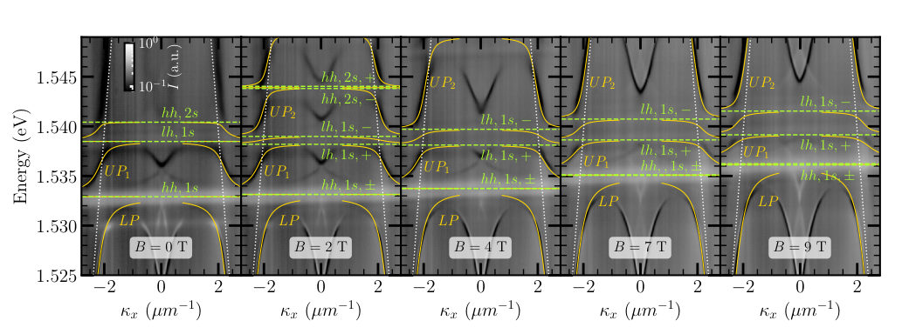 
FIG. 1. Reflectance spectra in the very strong coupling regime as a function of the photon in-plane wave vector κx for increasing values of the magnetic field B. The polariton modes display anticrossing between the TE1,± waveguide modes (white dotted lines) and the the hh and lh exciton energies of states with different polarization, Ehh,ns,± and Elh,1s,± measured in weak coupling (horizontal dashed lines). Solid (orange) lines are the theoretically predicted polariton energies.

📷 Fig 2

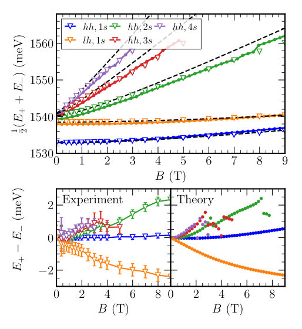 
FIG. 2. Top panel: Experimental exciton diamagnetic shift (E+ + E−)/2 as a function of magnetic field for the first five states (triangles). Points show theoretical results from the Luttinger Hamiltonian model without adjustable parameters (see text and Ref. [23]), while dashed lines correspond to an effective 2D exciton model with fitted Rydberg energies and reduced masses (see [22]). Bottom panels: Exciton Zeeman splitting E+ −E−for the first five excited states.

📷 Fig 3

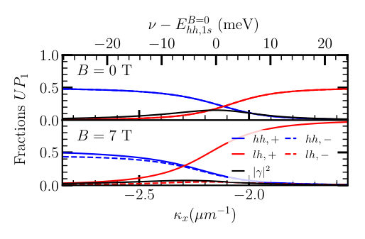 
FIG. 3. Exciton |Xσ,±|2 = ⟨0| ˆ Xσ,± ˆ X† σ,±|0⟩and photon |γ|2

📷 Fig 4

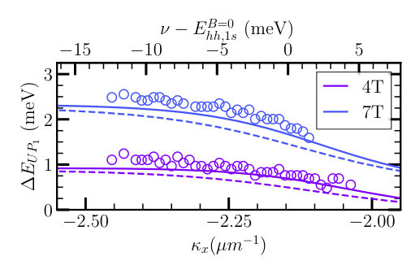 
FIG. 4. Comparison between the experimental (circles) and theoretical (solid lines) energy shift ∆E = E(B) −E(B=0) of the polariton state UP1 at two magnetic fields for the TE1,+ mode. Dashed lines show calculations including light coupling perturbatively (see text).

**Summary.** This paper investigates strong light-matter coupling in patterned GaAs quantum well waveguides, observing the hybridization of heavy- and light-hole excitons into polaritons. By combining advanced magneto-optical measurements with a fully microscopic theoretical model, the authors demonstrate that the quantum well width can precisely engineer these coupled states. This work is crucial for understanding and controlling optical nonlinearities in solid-state quantum emitters.

**Why it may be interesting.** This work is highly relevant to AMO physics and quantum optics as it deals with engineered light-matter interactions in solid-state systems, providing quantitative control over exciton-photon hybridization using external fields and material design.

Detailed structure

**Main problem.** The study aims to demonstrate and theoretically describe the physics of very strong light-matter coupling in patterned GaAs heterostructures, specifically focusing on the hybridization between heavy-hole and light-hole excitons.

**Main result.** The authors successfully demonstrated the hybridization of heavy- and light-hole excitons into a single polariton state and developed a microscopic theory that accurately describes this coupling, showing that quantum well width is a key control parameter.

**Method.** The research combines polarization-resolved white-light reflection measurements with the development of a fully microscopic theory that solves the coupled exciton-photon Hamiltonian.

**Model / system.** The system is a patterned GaAs/AlGaAs waveguide heterostructure containing multiple quantum wells. The theoretical framework uses a Luttinger Hamiltonian for the excitons coupled to the TE waveguide mode, analyzed in a 2D effective model.

**Key observables.** Polariton energy spectra (measured via reflectance), Rabi couplings ($\Omega_{hh}, \Omega_{lh}$), and the composition (photon/exciton fractions) of the resulting polariton states.

**Important parameters / regimes.** Quantum well width ($d_z$), external magnetic field ($B$ up to $9 	ext{ T}$), and the degree of light-matter coupling strength.

**Assumptions / limitations.** The analysis often simplifies the full Hamiltonian by using an effective 2D model, neglecting certain off-diagonal Luttinger terms, and assuming TE mode dominance.

**Figures summary.** Figures illustrate polariton mode anticrossing vs. in-plane wave vector ($\kappa_x$) for varying magnetic fields, and show the exciton/photon composition of the upper polariton states (UP1, UP2) as a function of detuning and magnetic field.

**Paper structure.** The paper progresses from establishing the physical system and experimental setup to deriving the full Hamiltonian, developing a microscopic 2D model, extracting key parameters (like Rabi couplings) by fitting experimental data, and finally analyzing the energy shifts and state composition in the strong coupling regime.

Abstract

The very strong light-matter coupling regime enables the non-perturbative modification of matter properties via light. Using a patterned GaAs/AlGaAs waveguide with twelve wide quantum wells, we demonstrate hybridization of heavy- and light-hole excitons within a single polariton state and show that, at finite magnetic field, the presence of the light-hole exciton suppresses coupling to the heavy-hole Rydberg excitons and unbound scattering states. We develop a fully microscopic theory that accounts for the combined effects of the magnetic field and light-matter coupling on the excitons, providing an accurate description of the experimental results beyond a perturbative coupled-oscillator framework. This identifies quantum well width as a key control parameter for engineering the light-induced hybridization of matter wave functions in polaritons, which, in turn, can play a crucial role in the optical non-linearities.

[↑ back to top](#top)

### [Bulk and surface excitons in the van der Waals magnet CrSBr: Magneto-optical studies to 55 tesla](http://arxiv.org/abs/2606.05057v1)

**Authors:** Junho Choi, Yihyun Moon, Doohyeon Lee, Iva Plutnarova, Zdenek Sofer, Vinod M. Menon, Scott A. Crooker  
**Type:** experiment · **Category:** other · **PDF:** <https://arxiv.org/pdf/2606.05057v1>  
**Analysis basis:** full PDF text, analyzed in chunks
**Topic relevance:** `exotic spin models in light-matter` **3/5** · `spintronics-quantum-optics interface` **3/5** · `analog quantum simulation` **1/5** · `quantum optics experiment` **1/5**

📷 Fig 1

 
FIG. 1. a) Illustration of bulk and surface excitons (Xbulk, Xsurf) in a hBN-encapsulated N-layer CrSBr sample. Exci- tons are largely confined within individual monolayers, due to weak interlayer coupling. Excitons in surface layers see a different local dielectric environment due to the neighboring hBN (ϵhBN &lt; ϵCrSBr), leading to weaker screening and slightly different resonance energy. Blue, yellow, red spheres denote Cr, S, Br atoms. b) Schematic of the sample-on-fiber assem- bly, which enables absorbance spectroscopy of exfoliated vdW materials in high (pulsed) magnetic fields (see main text). c) Photograph of an encapsulated 4L CrSBr sample, affixed over the fiber’s 5 µm diameter core...

📷 Fig 2

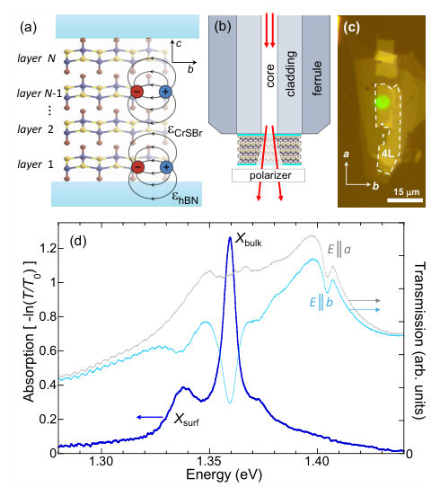 
Figure 1d shows the optical absorption spectrum, cal- culated as −ln(T/T0), of a 4-layer CrSBr sample at low temperature (4 K) and zero field (B=0). To best cap- ture the exciton absorption, the transmission spectrum T and the reference spectrum T0 were acquired using light linearly polarized along the crystal’s ˆb and ˆa axis (where band-edge exciton absorption in CrSBr is max-

📷 Fig 3

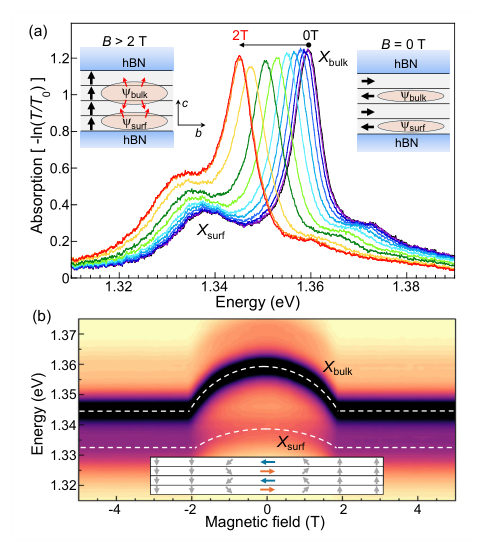 
FIG. 2. a) Low-temperature absorption spectra from 4L CrSBr with increasing B (∥ˆc) from 0 →2 T (in steps of ∼0.2 T). Both Xbulk and Xsurf resonances redshift to lower energies as the CrSBr reorients from antiferromagnetic to fer- romagnetic order. The redshift of Xsurf (∼6 meV) is slightly less than half that of Xbulk (∼14 meV). The red ovals in the cartoon insets represent their spatial envelope wavefunctions ψsurf(r) and ψbulk(r) within the CrSBr sample, and depict how ψbulk(r) delocalizes in both +ˆc and −ˆc directions when interlayer coupling becomes more likely in the ferromagnetic state, whereas ψsurf(r) can delocalize in only the +ˆc direction (or −ˆc for the top surface), leading...

📷 Fig 4

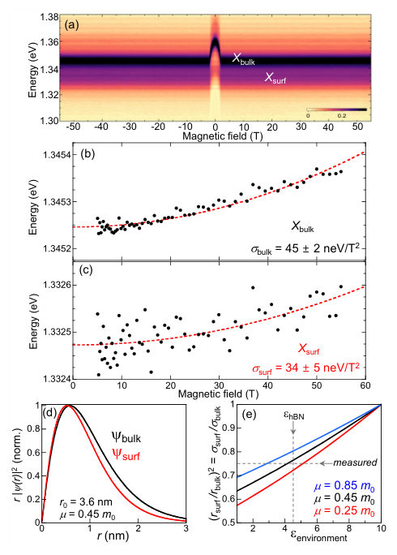 
FIG. 3. a) Absorption of the 4L CrSBr sample in high mag- netic fields to ±55 T, using circularly polarized light. b,c) The quadratic diamagnetic shift of the bulk and surface ex- citon resonances. The diamagnetic shift of Xsurf is 25% less than that exhibited by Xbulk, consistent with the reduced dielectric screening of Xsurf due to the hBN encapsulation. d) Calculated radial probability density of bulk and surface exciton wavefunctions in hBN-encapsulated CrSBr (see main text). e) Calculated ratio σsurf/σbulk for CrSBr, versus di- electric constant of the surrounding environment, for different exciton reduced masses µ.

📷 Fig 5

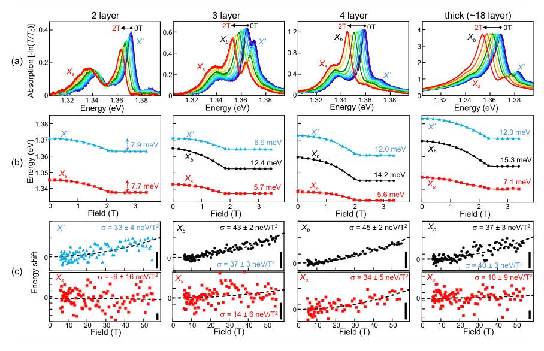 
FIG. 4. a) The four panels show low-temperature optical absorption spectra from a 2L, 3L, 4L, and a thick (∼18L) CrSBr sample respectively, as B ∥ˆc increases from 0 →2 T (in steps of ≈0.2 T). Note that the 2L sample lacks the central absorption resonance from Xbulk, because no “bulk-like” layers exist in 2L CrSBr. b) These panels show the corresponding B-dependent energies of the absorption resonances. The net redshifts of the resonances (between 0 T and ∼2 T) are indicated. In all cases, the redshift of Xsurf is slightly less than half the redshift of Xbulk. c) These panels show the high-field diamagnetic shifts of these absorption resonances, along with best quadratic fits. Tick marks on...

**Summary.** This research uses magneto-optical spectroscopy on few-layer CrSBr to distinguish between bulk and surface excitons. By measuring how two distinct exciton resonances shift under applied magnetic fields, the authors provide strong evidence that surface excitons are physically and electronically different from their bulk counterparts. This work advances the understanding of exciton physics in low-dimensional magnetic semiconductors.

**Why it may be interesting.** The work provides a clear experimental demonstration of how dimensionality and local environment (dielectric screening) can lead to distinct, measurable quantum excitations (excitons) in 2D magnetic materials, which is highly relevant for designing novel quantum optical devices.

Detailed structure

**Main problem.** To investigate and validate the existence and properties of distinguishable bulk and surface excitons in the van der Waals magnet CrSBr using magneto-optical measurements.

**Main result.** The study confirms two distinct exciton resonances—a fundamental bulk exciton and a lower-energy surface exciton—whose differing responses to magnetic fields (redshift and diamagnetic shift) provide strong evidence for their distinct physical origins.

**Method.** Polarized optical absorption spectroscopy was performed on few-layer CrSBr samples under varying magnetic fields, up to 55 Tesla.

**Model / system.** The system is few-layer CrSBr, a 2D magnetic semiconductor. The model posits that weak inter-layer coupling confines excitons, leading to surface excitons experiencing a different local dielectric environment than the bulk-like excitons.

**Key observables.** Exciton resonance energies ($	ext{X}_{	ext{bulk}}$ vs. $	ext{X}_{	ext{surf}}$), redshift magnitude in low fields, and diamagnetic shift ($\Delta E_{	ext{dia}}$) in high fields.

**Important parameters / regimes.** Magnetic field strength (up to 55 T), layer thickness (2L to 18L), and the difference in local dielectric environment between surface and bulk layers.

**Assumptions / limitations.** The spectral differences are attributed to the distinct local dielectric environments experienced by surface versus bulk excitons.

**Figures summary.** Figures illustrate optical absorption spectra showing two resonances ($	ext{X}_{	ext{bulk}}$ and $	ext{X}_{	ext{surf}}$) and demonstrate how their respective energies shift differently under applied magnetic fields (low-field redshift and high-field diamagnetic shift) as a function of layer number.

**Paper structure.** The paper systematically analyzes optical absorption spectra across varying layer thicknesses and magnetic fields. It first establishes the existence of two resonances, then uses low-field magneto-optics to compare redshift magnitudes, and finally uses high-field measurements to compare diamagnetic shifts, confirming the surface/bulk distinction.

Abstract

In thin layers of the 2D magnetic semiconductor CrSBr, very recent studies identified two distinct band-edge optical resonances, believed to arise from distinguishable bulk and surface excitons. This behavior reportedly originates from the highly anisotropic nature of CrSBr -- particularly in its antiferromagnetic state -- where excitons are effectively confined within individual monolayers, such that excitons in the two surface layers "see" a different local dielectric environment and have a lower resonance energy. To explore this scenario, here we investigate optical absorption properties of few-layer CrSBr in magnetic fields. In addition to the fundamental exciton resonance at ~1.36eV, we observe an absorption resonance ~20 meV lower in energy. Compared to the fundamental transition, this resonance redshifts only half as much in small magnetic fields that induce ferromagnetic order, while in high fields to 55T it exhibits a smaller diamagnetic shift. Both behaviors point to distinguishable populations of bulk and surface excitons in CrSBr.

[↑ back to top](#top)

### [Exchange-mediated exciton splitting and linear dichroism in monolayer transition metal dichalcogenide induced by ferroelectric substrates](http://arxiv.org/abs/2606.05093v1)

**Authors:** Sudipta Kundu, Felipe H. da Jornada  
**Type:** theory · **Category:** other · **PDF:** <https://arxiv.org/pdf/2606.05093v1>  
**Analysis basis:** full PDF text, analyzed in chunks
**Topic relevance:** `spintronics-quantum-optics interface` **3/5** · `Keldysh / 2PI / non-Gaussian methods` **1/5** · `analog quantum simulation` **1/5** · `driven-dissipative phase transition` **1/5** · `methods for driven-dissipative` **1/5**

📷 Fig 1

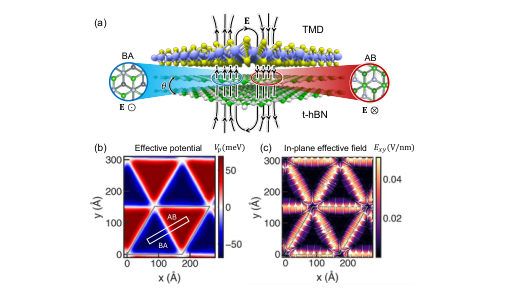 
Figure 1: (a): Schematic of the device arrangement consisting of a t-hBN and a monolayer TMD, for example, MoS2. The left and right circular insets show the two ferroelectric stackings of bilayer hBN: AB and BA with alternating dipoles, which give rise to electric fields along the alternating direction perpendicular to the hBN plane. The black lines with arrows penetrating through the heterostructure represent the spatially varying electric field originating from the t-hBN. (b) Polarization potential map Vp due to the varying dipoles in a 0.8◦t-hBN. The large red and blue triangles correspond to the AB and BA domains, while the thin white region separating them is the domain wall (DW). The...

📷 Fig 2

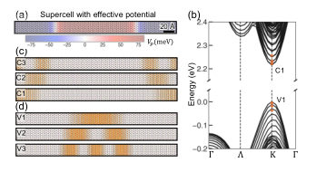 
Figure 2: (a): Schematic of the 1D approximation for Vp. The underlying color profile represents the varying Vp applied to the 1D supercell of MoS2. (b): Band structure of the MoS2 supercell including the effect of Vp (c) and (d): |ψK(r)|2 of the first three non- degenerate bands at the valence and conduction band edges, respectively. The isosurface is plotted up to 0.0001 e/Bohr3.

📷 Fig 3

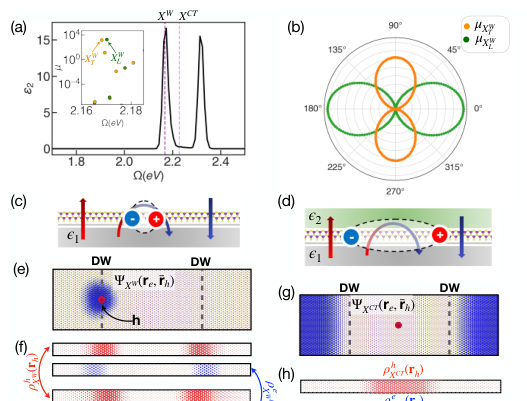 
Figure 3: (a): Absorption spectrum of MoS2/t-hBN encapsulated with hBN. The vertical dashed lines indicate the positions of the lowest energy bright XW and the lowest energy XCT, respectively. The inset focuses on the low energy bright XW’s, highlighting the two types: transverse (XW T ) and longitudinal (XW L ) excitons by orange and green dots, respectively. (b): Polar plot of the oscillator strengths corresponding to the excitons shown in the inset. 0◦direction corresponds to the direction of Vp. (c) and (d): Schematic of the electric field and probable excitons in the MoS2/t-hBN heterostructure stack when deposited on a bulk hBN substrate and when encapsulated by dielectric materials on...

📷 Fig 4

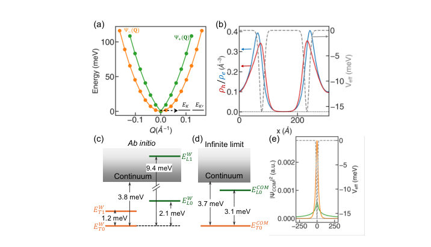 
Figure 4: (a): Band dispersion of the valley antibonding (orange) and bonding (green) excitons in hBN encapsulated pristine TMDs. (b): Effective COM potential (grey) and the electron (blue) and hole (red) components of the ab initio XW T wavefunctions for hBN encapsulated heterostructure, averaged over two excitons localized at either DWs. (c) The ab initio energies corresponding to the first two bright excitons of both transverse and longitudinal series of hBN encapsulation are shown, setting the continuum at zero. (d) Exciton energies from the COM Hamiltonian model at the infinite limit. A schematic of the effective potential and the exciton wavefunctions in COM coordinates is shown.

📷 Fig 5

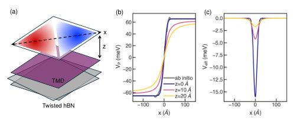 
Figure 5: (a) Schematic of the device setup depicting the axes orientation. (b) and (c): Variation of Vp and Veff with increasing z from the equilibrium position of TMD on t-hBN.

**Summary.** This theoretical study investigates how ferroelectric substrates induce novel excitonic states in 2D TMDs. Using advanced first-principles calculations, the authors predict that the electric field gradient at domain walls splits valley-degenerate excitons by several meV. This finding establishes a pathway for engineering robust, addressable two-level quantum systems for quantum information applications.

**Why it may be interesting.** This work provides concrete, theoretically derived design rules for engineering quantum emitters (two-level systems) in solid-state platforms by leveraging built-in electric fields from ferroelectric substrates, which is highly relevant to quantum optics and solid-state quantum information.

Detailed structure

**Main problem.** The study addresses fundamental challenges in controlling and addressing valley-polarized excitons in 2D TMDs, particularly concerning decoherence and energy splitting.

**Main result.** The authors predict that the combination of spatial confinement at ferroelectric domain walls and intervalley exchange interactions can split valley-degenerate excitons by $\sim 3.1$ meV, creating addressable two-level systems.

**Method.** The research employs a combination of first-principles electrostatic embedding approaches and large-scale GW plus Bethe-Salpeter equation (GW-BSE) calculations.

**Model / system.** The physical system is a monolayer TMD (e.g., MoS2) heterostructured with a ferroelectric twisted bilayer hBN substrate. The model incorporates an effective polarization potential ($V_p$) derived from the substrate's ferroelectric domains (AB/BA).

**Key observables.** Exciton types (Wannier vs. Charge-Transfer), exciton energy splitting ($\Delta E_{L-T}$), linear optical dichroism, and the spatial variation of the electrostatic potential ($V_p$).

**Important parameters / regimes.** The splitting magnitude ($\sim 3.1$ meV), the width of the domain wall ($\sim 2$ nm), and the twist angle ($	heta \lesssim 1^\circ$) are critical parameters.

**Assumptions / limitations.** The calculations rely on an *ab initio* electrostatic embedding approach to model the substrate potential, and the quasi-1D approximation is used to simplify the analysis along domain walls.

**Figures summary.** Figures illustrate the device arrangement, the spatial potential map ($V_p$) showing AB/BA domains and domain walls, and the resulting exciton density distributions for different polarizations.

**Paper structure.** The paper first establishes the physical system and the need to address exciton decoherence. It then details the computational methodology (electrostatic embedding, GW-BSE) to model the ferroelectric substrate interaction. Finally, it presents the key results regarding exciton splitting and the resulting design rules for quantum applications.

Abstract

Valley-polarized excitons in two-dimensional transition metal dichalcogenides (TMDs) offer a promising platform for quantum applications, yet the addressability and decoherence of these states remain fundamental challenges. Here, by developing a first-principles electrostatic embedding approach and performing large-scale GW plus Bethe-Salpeter equation calculations, we reveal novel excitons that emerge in TMD monolayers when supported by a ferroelectric twisted bilayer hBN substrate. We predict two competing low-energy excitons whose ordering depends on the dielectric environment: optically dark, charge-transfer excitons, and quasi-one-dimensional Wannier excitons with linear optical dichroism. The spatial localization of Wannier excitons, together with intervalley exchange interactions in monolayer TMDs, splits valley-degenerate excitons by about 3~meV without external magnetic fields. Our ab initio calculations clarify the role of the interfacial twist angle and the spatial localization of fringe fields, establishing design rules for engineering long-lived two-level systems in TMD monolayers supported by ferroelectric substrates.

[↑ back to top](#top)

### [Moiré enabled spin pumping and preservation in MoSe2/WS2 heterobilayers](http://arxiv.org/abs/2606.04146v1)

**Authors:** Leo Yu, Kateryna Pistunova, Sudipta Kundu, Jenny Hu, Kenji Watanabe, Takashi Taniguchi, Felipe H. da Jornada, Tony F. Heinz  
**Type:** both · **Category:** other · **PDF:** <https://arxiv.org/pdf/2606.04146v1>  
**Analysis basis:** full PDF text, analyzed in chunks
**Topic relevance:** `spintronics-quantum-optics interface` **3/5**

📷 Fig 1

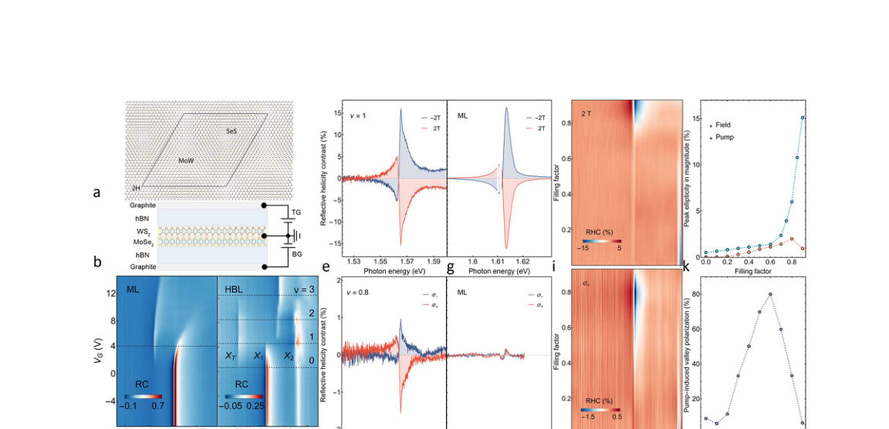 
Figure 1. a, Moiré superlattice formed in angle-aligned MoSe2/WS2 heterobilayers with the superlattice cell outlined in black. The high-symmetry stackings are identified as 2H, MoW, and SeS, also referred to as AA’, AB’, and A’B, respectively. b, The dual-gated device structure of the HBL. c, Doping-dependent reflection contrast spectra of a MoSe2 ML feature the exciton and the trion peak. The dashed line marks the doping level at which subsequent helicity-contrasting spectra were recorded. d, Doping-dependent reflection contrast spectra of the HBL, showing distinct spectral feature changes at integer fillings of moiré sites (dashed lines). e, f, Reflective helicity contrast (RHC) spectra...

📷 Fig 2

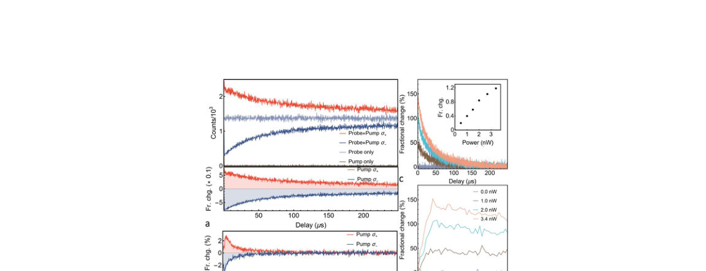 
Figure 2. Time-resolved light ellipticity in heterobilayer and monolayer MoSe2. a, Temporal profiles of probe-light counts from the heterobilayer (HBL) under various configurations of pump and probe light. In the pump-only trace, the peak near time zero is attributed to the PL from the trion resonance, lasting for the duration of the pump light (i.e., 1 μs). The photon energy of the pump light was 1.64 eV. The filling factor of the HBL was set at 0.8. Bottom panel: Fractional change in the probe light intensity, normalized to the level when the pump light is off. b, Fractional change in the probe light intensity following rapid spin relaxation in the ML, measured in nanoseconds. The...

📷 Fig 3

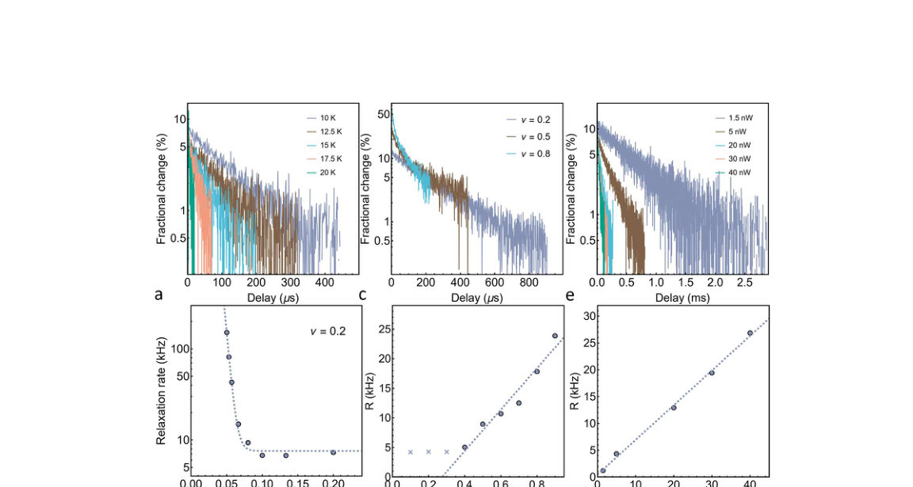 
Figure 3. a, The fractional change in the probe light is shown as a function of the time delay after the pump pulse at five representative temperatures, with a representative filling factor of 0.2 in the low doping regime and with a probe power of 5 nW. b, Temperature dependence of the spin relaxation rate. The Arrhenius fit yields an activation energy of 17 meV. c, The same quantity as in a is shown for three representative filling factors, measured at a probe power of 5 nW. d, Doping dependence of the spin relaxation rate. The cross symbols indicate the rates obscured by additional photo-induced relaxation. e, The same quantity as in a is shown for various probe powers. The relaxation...

📷 Fig 4

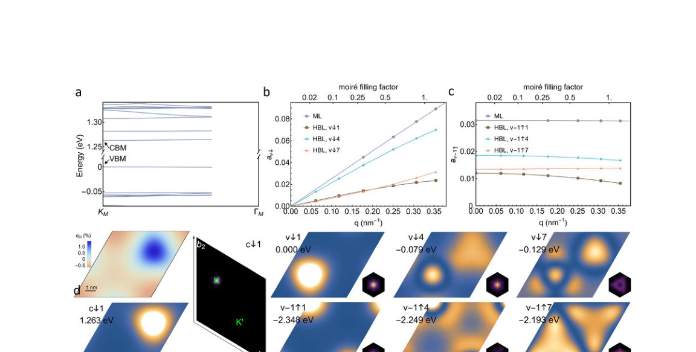 
Figure 4. a, Band structure of the HBL near the CBM and VBM plotted in the moiré Brillouin zone. Band folding and the strain profile (shown in d) lead to energy-separated flat bands. The CBM is at 𝐊୑, where the effective mass roughly doubles. b, c, Projection amplitudes onto the 𝑣↓ (b) and 𝑣−1 ↑ (c) band for a wavefunction near CBM, as a function of carrier momentum along 𝐊୑−𝚪୑ (bottom axis) or moiré filling factor (top axis). Compared to the ML result (gray line), the HBL results are labeled with the mini-band index (1, 4, 7) and lower in magnitude (see text). d, Biaxial strain distribution in the MoSe2 part of the HBL over a moiré supercell from lattice reconstruction. Both tensile (blue)...

**Summary.** This work demonstrates that creating moiré patterns in $	ext{MoSe}_2/	ext{WS}_2$ heterobilayers dramatically extends the spin relaxation time of electrons, a crucial property for quantum technologies. By combining optical measurements with detailed theoretical modeling, the authors show that moiré confinement suppresses spin mixing, enabling long-lived spin coherence at low power levels.

**Why it may be interesting.** The ability to engineer spin coherence times in solid-state systems using moiré potentials is highly relevant to quantum information, as it offers a platform for realizing long-lived spin qubits or quantum memories.

Detailed structure

**Main problem.** The research aims to understand and significantly extend the spin relaxation times (SRTs) of Bloch electrons in solid-state systems by engineering moiré patterns in van der Waals heterobilayers.

**Main result.** Moiré engineering in $	ext{MoSe}_2/	ext{WS}_2$ heterobilayers suppresses spin relaxation by orders of magnitude compared to monolayers, enabling long spin coherence times necessary for quantum applications.

**Method.** The study combines advanced optical spectroscopy (TRLE, RHC) to measure spin dynamics with theoretical modeling ($\mathbf{k}\cdot\mathbf{p}$ and DFT) to explain the underlying physics.

**Model / system.** The physical system is the $	ext{MoSe}_2/	ext{WS}_2$ heterobilayer, which forms moiré supercells. The electronic structure is analyzed using $\mathbf{k}\cdot\mathbf{p}$ theory, incorporating moiré potentials derived from DFT calculations.

**Key observables.** Spin relaxation time ($	au$), valley polarization, reflection helicity contrast (RHC) spectra, and time-resolved light ellipticity modulation.

**Important parameters / regimes.** Moiré periodicity, carrier density ($n$), temperature, and optical power levels.

**Assumptions / limitations.** The long-lived TRLE signal is attributed to valley polarization/spin pumping, and the spin relaxation mechanism in the HBL is linked to the Elliott-Yafet mechanism mediated by impurity scattering.

**Figures summary.** Figures illustrate the moiré lattice structure, doping-dependent optical spectra showing valley polarization, and time-resolved measurements demonstrating the vastly extended spin coherence time in the heterobilayer compared to the monolayer.

**Paper structure.** The paper progresses by first characterizing the electronic structure and valley polarization in the HBL vs. ML using spectroscopy, then quantifying the spin relaxation time using TRLE, and finally providing theoretical explanations based on moiré band structure calculations.

Abstract

The spin degree of freedom is a fundamental quantum mechanical attribute with implications spanning from magnetism to quantum computing. Consequently, the relaxation of spin states for extended, Bloch electrons in solids has been studied for decades as it defines many of their properties and applications. We show that moiré patterns in layered materials can extend spin relaxation times by two orders of magnitude to 1 millisecond and beyond. This is achieved by suppressing spin mixing for electrons in 2D semiconductor heterostructures, particularly in the MoSe2/WS2 system, as we elucidate both experimentally and theoretically. The extended longitudinal lifetime facilitates spin alignment over 50% using only nanowatt levels of optical power. Our findings highlight the potential of moiré engineering for future quantum sensing and information processing.

[↑ back to top](#top)

### [Chiral Transport in Metric-Affine Geometries](http://arxiv.org/abs/2606.04841v1)

**Authors:** Miguel A. Vazquez-Mozo  
**Type:** theory · **Category:** other · **PDF:** <https://arxiv.org/pdf/2606.04841v1>  
**Analysis basis:** full PDF text, analyzed in chunks
**Topic relevance:** `Keldysh / 2PI / non-Gaussian methods` **2/5** · `analog quantum simulation` **2/5** · `methods for driven-dissipative` **2/5** · `non-equilibrium dynamics` **1/5**

📷 Fig 1

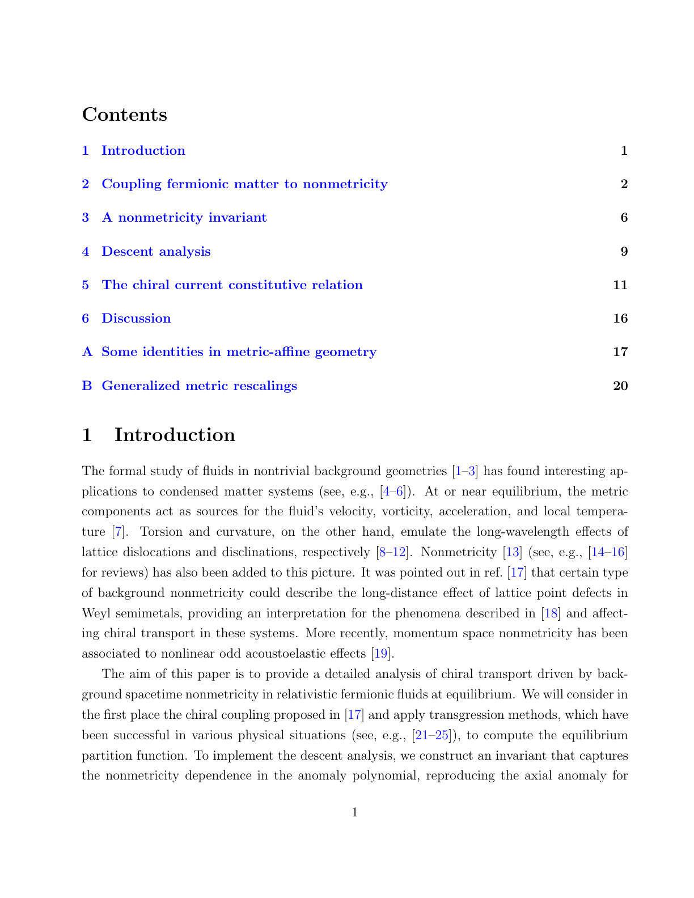 
Low-resolution page preview, page 2

📷 Fig 2

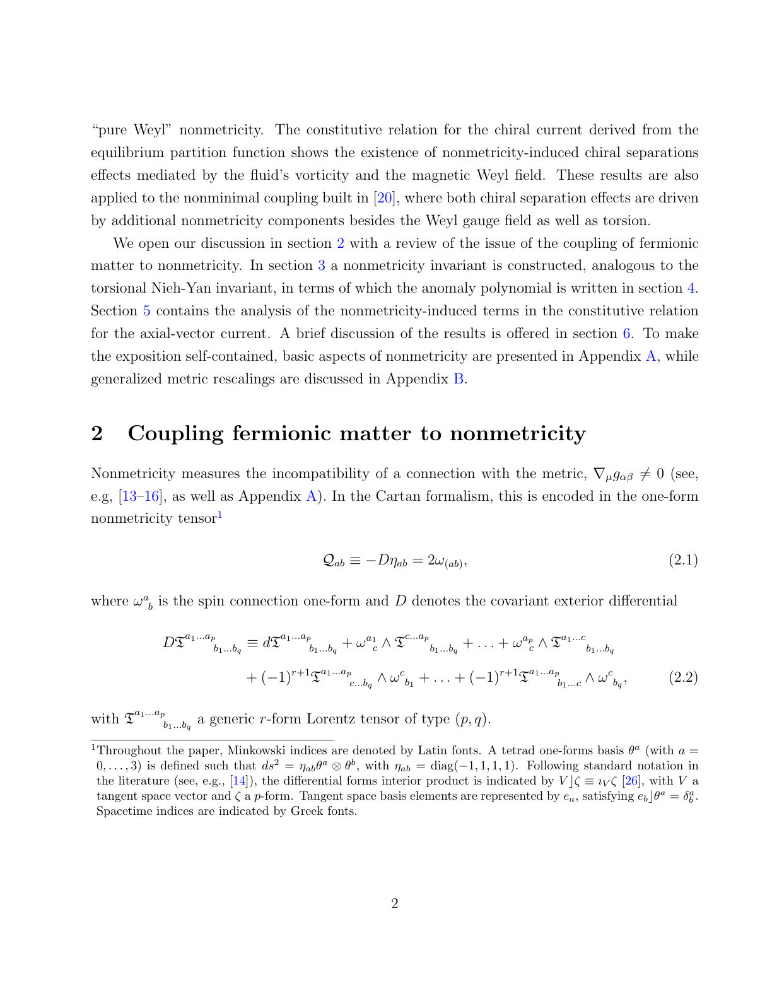 
Low-resolution page preview, page 3

📷 Fig 3

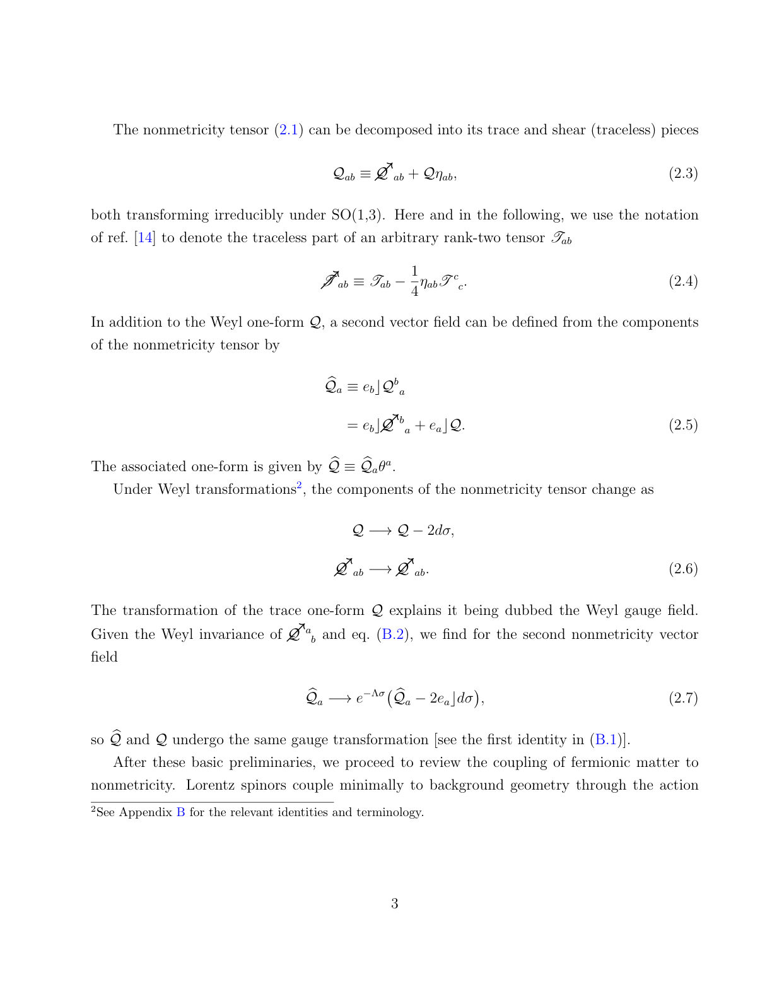 
Low-resolution page preview, page 4

📷 Fig 4

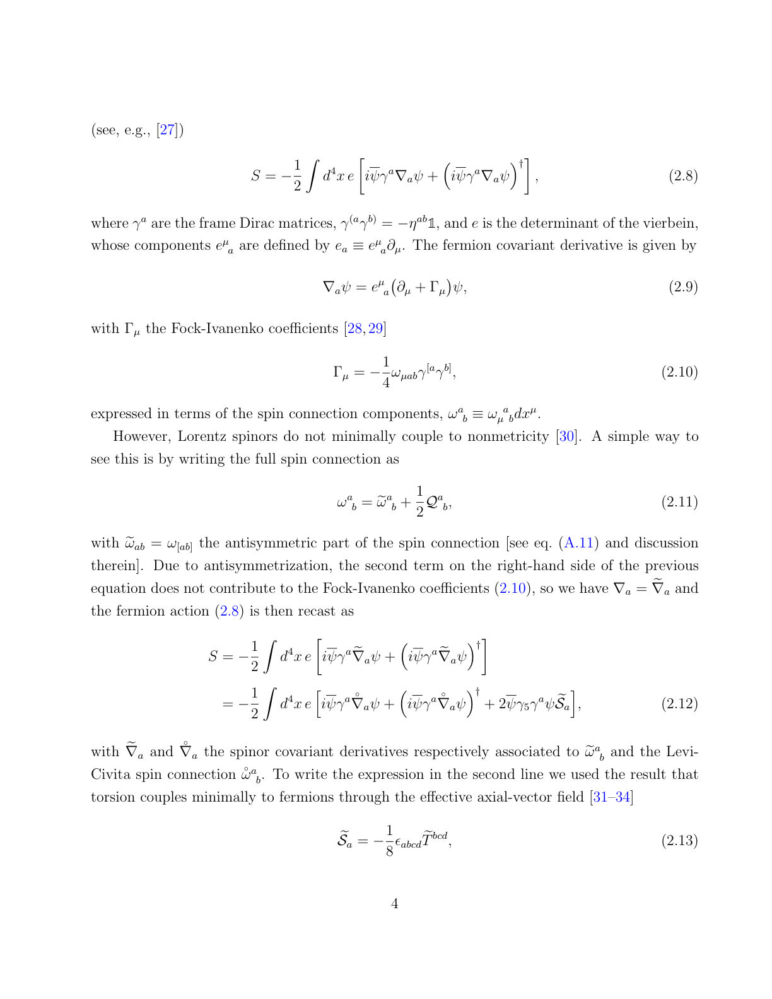 
Low-resolution page preview, page 5

📷 Fig 5

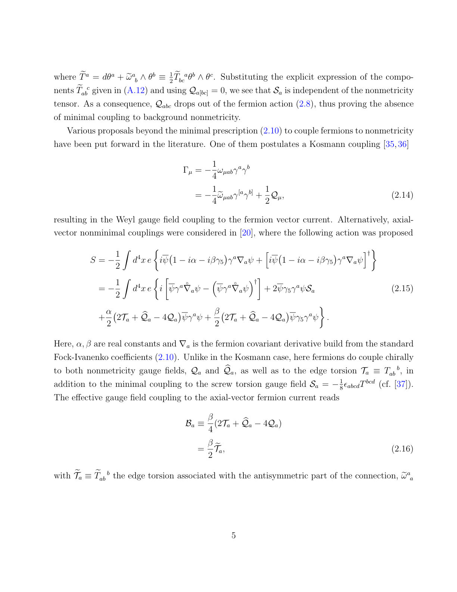 
Low-resolution page preview, page 6

**Summary.** This theoretical paper analyzes how anomalous chiral transport occurs in fermionic fluids when the background spacetime geometry possesses nonmetricity. Using advanced differential geometry techniques, the authors derive a constitutive relation for the axial-vector current, showing that nonmetricity induces separation effects dependent on fluid vorticity and background magnetic fields. This work bridges concepts from general relativity (metric-affine geometry) and condensed matter physics (chiral anomalies).

**Why it may be interesting.** While highly specialized in gravity/QFT, the study of anomalous transport and chiral effects in structured media (like Weyl semimetals) has analogues in condensed matter physics, making the mathematical framework relevant for understanding topological responses.

Detailed structure

**Main problem.** The paper investigates anomalous transport phenomena in fermionic fluids that are chirally coupled to background nonmetricity within the framework of metric-affine geometry.

**Main result.** It demonstrates the existence of nonmetricity-mediated chiral separation effects, which are driven by the fluid's vorticity and the background Weyl magnetic field.

**Method.** The analysis employs formal descent techniques, transgression formulas, and the calculation of invariant four-forms ($I_Q^4$) to derive the constitutive relation for the axial-vector current.

**Model / system.** The system involves relativistic fermionic fluids coupled to a background characterized by metric-affine geometry, incorporating nonmetricity ($Q_{ab}$) and curvature ($R_{ab}$).

**Key observables.** The covariant axial-vector current ($\langle \star J_5 
angle_{	ext{cov}}$), the anomaly polynomial dependence on nonmetricity, and the nonmetricity invariant $I_Q^4$.

**Important parameters / regimes.** The nonmetricity tensor ($Q_{ab}$), the fluid's vorticity ($\omega$), and the Weyl magnetic field ($\mathcal{B}_Q$).

**Assumptions / limitations.** The derivation often requires simplifying assumptions, such as setting the shear nonmetricity component to zero ($Q_{ab}^{
ightarrow} = 0$) or analyzing specific limits of the coupling terms.

**Paper structure.** The paper proceeds by reviewing the coupling of fermions to nonmetricity, constructing a relevant invariant ($I_Q^4$), performing a descent analysis, and finally deriving the constitutive relation for the chiral current.

Abstract

Anomalous transport in equilibrium fermionic fluids chirally coupled to background Weyl-type nonmetricity is studied. A formal descent analysis is carried out in which the dependence of the anomaly polynomial on the nonmetricity tensor is encoded in a Weyl invariant four-form. The constitutive relation of the axial-vector current is evaluated from the equilibrium partition function obtained using transgression techniques, showing the existence of nonmetricity-mediated chiral separation effects driven by the fluid's vorticity and the Weyl magnetic field. A second nonminimal coupling of fermionic matter to metric-affine geometries proposed in the literature is also discussed.

[↑ back to top](#top)

### [Electron-Phonon Coupling and Charge Density Wave Instabilities in W2N and Halogen-Functionalized W2N Monolayers](http://arxiv.org/abs/2606.04953v1)

**Authors:** Jakkapat Seeyangnok, Udomsilp Pinsook  
**Type:** theory · **Category:** other · **PDF:** <https://arxiv.org/pdf/2606.04953v1>  
**Analysis basis:** full PDF text, analyzed in chunks
**Topic relevance:** `analog quantum simulation` **2/5** · `Frenkel-Kontorova` **1/5** · `Keldysh / 2PI / non-Gaussian methods` **1/5** · `driven-dissipative phase transition` **1/5** · `entanglement & information structure` **1/5**

📷 Fig 1

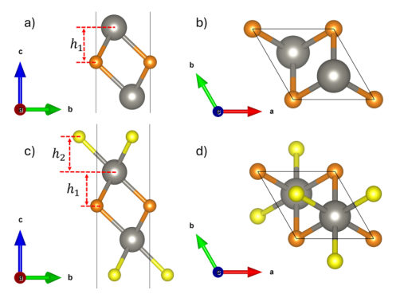 
FIG. 1. Crystal structures of pristine W2N and functionalized W2NT2 (T = F, Cl) monolayers belonging to the trigonal P¯3m1 (No. 164) space group. (a) Side and (b) top views of pristine W2N. The structural parameter h denotes the vertical separation between the N and W atomic planes. (c) Side and (d) top views of the func- tionalized W2NT2 monolayers. The parameters h1 and h2 represent the vertical distances between the N layer and the W layer, and be- tween the W layer and the terminating halogen layer, respectively. Gray, orange, and yellow spheres correspond to W, N, and halogen atoms, respectively. The primitive unit cell is outlined by solid black lines.

📷 Fig 2

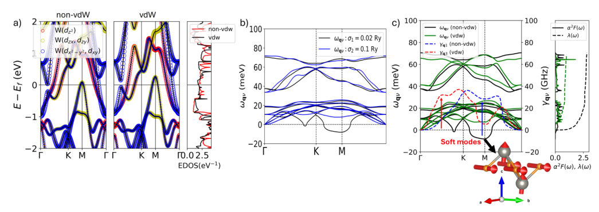 
FIG. 2. (a) Orbital-projected electronic band structures, Fermi surfaces, and electronic density of states (EDOS) of monolayer W2N calculated without and with van der Waals (vdW) corrections. The states near the Fermi level are dominated by W-d orbitals, confirming metallic behavior. The Fermi-surface topology is preserved upon inclusion of vdW interactions, although the hole pocket around the M point becomes larger. (b) Phonon dispersions of W2N calculated with electronic smearing parameters σ = 0.02 and 0.10 Ry, showing stabilization of the soft phonon modes at larger smearing. (c) Phonon dispersions and phonon linewidths γqν for the non-vdW and vdW structures. The non- vdW phase exhibits...

📷 Fig 3

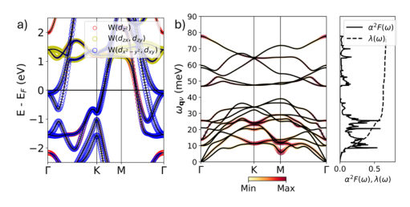 
FIG. 3. (a) Orbital-projected electronic band structure of monolayer W2NF2. The size of the circles is proportional to the contribution of the corresponding W-d orbitals. Multiple bands cross the Fermi level, confirming the metallic nature of the system. The low-energy electronic states are dominated by W-dz2, dxz/yz, and dx2−y2/dxy orbitals. (b) EPC-weighted phonon dispersion of W2NF2, where the color scale represents the mode-resolved electron–phonon coupling strength λqν. A pronounced low-frequency soft phonon is observed around the M point, primarily associated with the ZA (ν = 1) branch. The right panel shows the Eliashberg spectral function α2F(ω) and cumulative EPC constant λ(ω).

📷 Fig 4

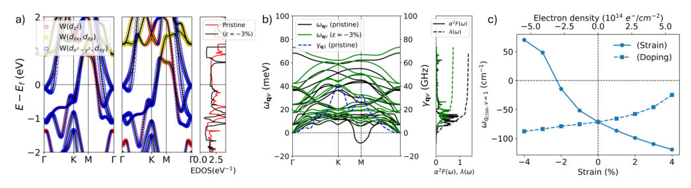 
FIG. 4. (a) Orbital-projected electronic band structures and EDOS of pristine W2NCl2 and W2NCl2 under −3% compressive strain. Circle sizes are proportional to the corresponding W-d orbital weights. (b) Phonon dispersions and phonon linewidth γqν of pristine and strained W2NCl2. The right panel shows the Eliashberg spectral function α2F(ω) and cumulative EPC constant λ(ω) for the strained phase. (c) Evolution of the soft-mode frequency ωqCDW,ν = 1 under biaxial strain and electron doping. The soft mode is progressively hardened and becomes dynamically stable beyond the critical strain or carrier concentration.

**Summary.** This theoretical study explores how CDW instabilities and superconductivity compete in W2N monolayers. Using first-principles calculations, the authors show that both phenomena stem from the same soft-phonon-driven Electron-Phonon Coupling (EPC). Tuning the material via halogenation, strain, or doping allows researchers to tune the system between these competing quantum ground states.

**Why it may be interesting.** While focused on solid-state physics, the concept of competing ground states (CDW vs. SC) driven by lattice fluctuations and electron interactions is a core theme in many-body physics, relevant to understanding emergent quantum phases.

Detailed structure

**Main problem.** The paper investigates the fundamental competition and interplay between Charge-Density-Wave (CDW) instabilities and conventional superconductivity in monolayer transition metal nitrides.

**Main result.** The low-energy physics across the W2N family is governed by soft-phonon-driven Electron-Phonon Coupling (EPC), establishing CDW order and superconductivity as competing manifestations of the same mechanism.

**Method.** The study employs first-principles Density Functional Theory (DFT) calculations, utilizing Density Functional Perturbation Theory (DFPT) to analyze phonon spectra, EPC constants, and estimate superconducting critical temperatures via the Allen-Dynes modified McMillan equation.

**Model / system.** The primary systems are monolayer W2N and its halogen-functionalized derivatives (W2NF2 and W2NCl2). The analysis compares pristine, van der Waals corrected, and strained/doped versions of these 2D materials.

**Key observables.** Phonon instabilities (softening near M/K points), phonon linewidths ($\gamma_{q
u}$), EPC constant ($\lambda$), and superconducting critical temperature ($T_c$).

**Important parameters / regimes.** Compressive strain (e.g., -3%), electron doping level, and the strength of van der Waals interactions.

**Assumptions / limitations.** The analysis relies on DFT approximations (GGA+PBE) and the Allen-Dynes formalism for superconductivity.

**Figures summary.** Figures illustrate crystal structures, electronic band structures, phonon dispersions, and the evolution of soft-mode frequencies under external tuning like strain or doping.

**Paper structure.** The paper systematically analyzes the structural and electronic properties of the W2N family, diagnosing CDW tendencies via phonon instabilities, quantifying EPC, and calculating $T_c$ for various doping and strain regimes to establish a unified physical picture.

Abstract

The interplay between charge-density-wave (CDW) order and superconductivity is a central problem in condensed-matter physics because both phenomena often originate from the same electron-phonon coupling (EPC) mechanism. Here, we investigate the structural, electronic, vibrational, and superconducting properties of monolayer W2N and halogen-functionalized W2N (W2NF2 and W2NCl2) using first-principles calculations. Pristine W2N exhibits pronounced phonon instabilities near the M and K points driven by exceptionally strong EPC associated with softened low-frequency phonons. The coincidence between phonon softening and enhanced phonon linewidths identifies the instability as EPC-driven and indicative of a CDW tendency. Inclusion of van der Waals interactions stabilizes the lattice and yields strong-coupling superconductivity with λ = 1.00 and Tc = 13.2 K, while fluorination further weakens the soft-phonon anomaly, resulting in a moderate-coupling superconductor with λ = 0.67 and Tc = 5.3 K. In contrast, W2NCl2 exhibits a re-emergence of CDW-related phonon softening that can be continuously suppressed by compressive strain or electron doping. Under -3% compressive strain, the EPC constant decreases from λ = 1.35 to λ = 0.71, giving rise to superconductivity with Tc = 5.8 K. Across the entire W2N family, the low-energy physics is governed by softened ZA phonons near the M point, establishing a unified framework in which CDW order and superconductivity emerge as competing manifestations of the same soft-phonon-driven EPC mechanism.

[↑ back to top](#top)

### [Coulomb-mediated interactions of charge-transfer excitons in TMD lateral heterostructures](http://arxiv.org/abs/2606.04865v1)

**Authors:** Kabyashree Sonowal, Daniel Erkensten, Ermin Malic, Roberto Rosati  
**Type:** theory · **Category:** other · **PDF:** <https://arxiv.org/pdf/2606.04865v1>  
**Analysis basis:** full PDF text, analyzed in chunks
**Topic relevance:** `Keldysh / 2PI / non-Gaussian methods` **2/5** · `methods for driven-dissipative` **2/5** · `analog quantum simulation` **1/5**

📷 Fig 1

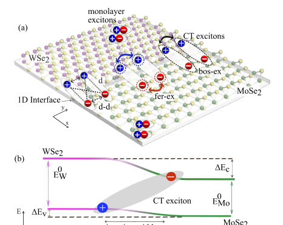 
FIG. 1. (a) Schematic illustration showing charge transfer (CT) excitons at the interface of the MoSe2 −WSe2 lateral heterostructure as well as regular intralayer excitons far away from the interface. The 1D interface is chosen to be along the y direction. CT excitons interact via dipole-dipole (d-d) in- teraction, bosonic exchange (bos-ex), and fermionic exchange (fer-ex). (b) Formation of conduction (∆Ec) and valence band offsets (∆Ev) at opposite sides of the interface, where E0 W and E0 Mo are intrinsic single-particle band gaps of the constituent TMD monolayers.

📷 Fig 2

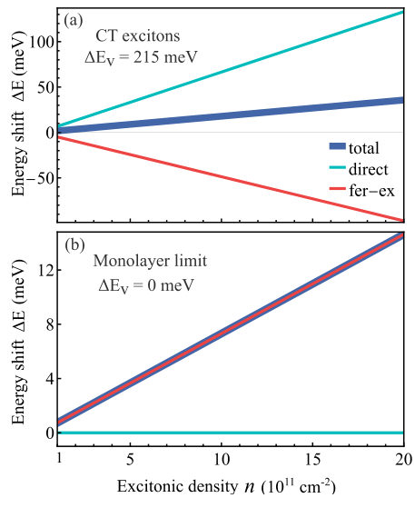 
FIG. 2. Density-dependent energy renormalization as a func- tion of 2D exciton densities at T = 0 K for two different band offsets: (a) ∆Ev = 215 meV, where bound CT exci- tons are present, and (b) ∆Ev = 0 meV corresponding to the monolayer exciton limit. Note that the direct term comprises the dipole-dipole interaction as well as the bosonic exchange, which contribute equally at vanishing temperature.

📷 Fig 3

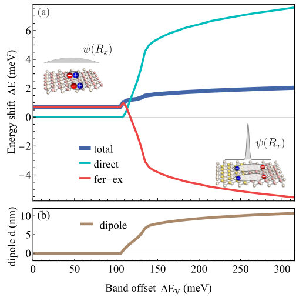 
FIG. 3. (a) Exciton energy shifts in MoSe2-WSe2 LHs as function of the energy band offset. The schematics in the insets show intralayer excitons at low band offsets (with a delocalised COM wavefunction) and bound CT excitons at the interface (with a confined COM wavefunction) at higher band offsets. (b) Dipole moment of CT excitons as a function of the band offset. We consider T = 0 K and the exciton density is fixed to n = 1011 cm−2.

📷 Fig 4

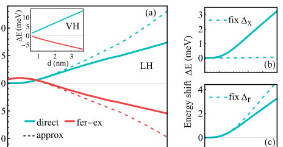 
FIG. 4. (a) Dipole dependence of the Coulomb-induced en- ergy renormalization at T=0 K for a fixed density of n = 1011 cm−2 of CT excitons in LHs (main plot) and interlayer excitons in VHs (inset). The dipole moment of interlayer excitons is tuned by adjusting the hBN spacer thickness of the MoSe2-hBN-WSe2 heterostructure. The dashed lines de- note the energy shifts within the small-dipole approximation. Modification of energy shift in the hytpothetical cases of (b) delocalized COM (∆X = ∆X|∆Ev=0) and (c) tightly bound CT excitons in relative space (∆r = ∆r|∆Ev=0).

📷 Fig 5

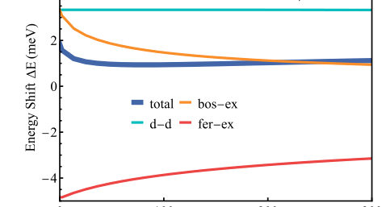 
FIG. 5. Energy shift as a function of temperature for CT excitons at ∆Ev = 215 meV and at a fixed density of n = 1011cm−2.

**Summary.** This work provides a microscopic theory for Coulomb interactions in CT excitons within TMD lateral heterostructures. It predicts a density-dependent energy blueshift, uniquely showing a quadratic dependence on the dipole moment. The study highlights that temperature and band offset are key external knobs for controlling this excitonic response.

**Why it may be interesting.** The detailed microscopic treatment of dipolar interactions and the identification of tunable parameters like temperature and band offset make this highly relevant for understanding excitonic dynamics in engineered quantum materials.

Detailed structure

**Main problem.** The study investigates the mutual Coulomb-mediated interactions and resulting density-dependent energy renormalization of charge-transfer (CT) excitons.

**Main result.** The energy renormalization is predicted to be a net blueshift, which exhibits a quadratic dependence on the dipole moment for small dipoles, contrasting with linear scaling in vertical heterostructures.

**Method.** The authors employed a microscopic theoretical framework, using an equation-of-motion approach and modeling the interaction terms (dipole-dipole, bosonic, fermionic exchange) via Gaussian wavefunctions.

**Model / system.** The system is based on lateral heterostructures (LHs) of TMDs, hosting spatially separated CT excitons with large in-plane dipoles and center-of-mass quantization. The model accounts for various interaction terms derived from the Coulomb interaction.

**Key observables.** Density-dependent energy shift ($\Delta E$), which is predicted to be a net blueshift.

**Important parameters / regimes.** Dipole moment ($d$), band offset ($\Delta E_v$), temperature ($T$), and exciton density ($n$).

**Assumptions / limitations.** The analysis relies on decoupling the center-of-mass and relative motion ($\Psi(Qx, q) = \psi(Qx)ar{\phi}(q)$) and assumes an equilibrium, unscreened environment.

**Figures summary.** Figures illustrate the schematic interactions (d-d, bos-ex, fer-ex), the dependence of energy shifts on band offset and dipole moment, and the non-monotonic temperature dependence of the energy shift.

**Paper structure.** The paper progresses from establishing the physical system and interaction terms to calculating the density dependence, then analyzing the role of the band offset, followed by a detailed investigation of temperature effects on the various interaction contributions.

Abstract

Lateral heterostructures of transition-metal dichalcogenides (TMDs) host spatially separated charge-transfer (CT) excitons. While analogous to interlayer excitons in vertical TMD heterostructures, these interfacial excitons possess much larger in-plane dipoles of several nanometers and an additional center-of-mass quantization. Here, we study the mutual interactions between these highly dipolar CT excitons on a microscopic footing. Accounting for the dipolar and quantum exchange interactions, we evaluate the experimentally accessible density-dependent energy renormalization and predict a net energy blueshift of a few meV for bound CT excitons. Interestingly, for small dipole moments, the energy renormalization displays a quadratic dependence with respect to the dipole moment, in contrast to the linear dependence found in vertical TMD heterostructures. We show that spatial energy offset and temperature are the key tuning knobs for controlling the density-dependent excitonic response. Overall, our results contribute to a better microscopic understanding of CT excitons and their interactions in lateral TMD heterostructures.

[↑ back to top](#top)

### [Curvature-Controlled Infrared Regularization of Crystalline Membranes](http://arxiv.org/abs/2606.04614v1)

**Authors:** Pablo A. Morales, Pavel Castro-Villarreal  
**Type:** theory · **Category:** other · **PDF:** <https://arxiv.org/pdf/2606.04614v1>  
**Analysis basis:** full PDF text, analyzed in chunks
**Topic relevance:** `Keldysh / 2PI / non-Gaussian methods` **2/5** · `Frenkel-Kontorova` **1/5** · `analog quantum simulation` **1/5**

📷 Fig 1

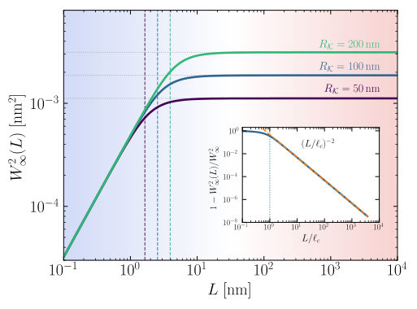 
FIG. 1. The mean-square normal displacement W 2 ∞(L) is shown for hyperbolic curvature radii RK = 50, 100, 200 nm with graphene-inspired elastic parameters. Flat anomalous growth at small L (blue region) is cut off at the curvature scale ℓc, after which W 2 ∞(L) saturates to a finite value W 2 ∞ (red region). The dotted and dashed lines mark the satura- tion plateaus and ℓc values, respectively. The inset shows the normalized saturation deficit, the dashed line indicates the universal large-scale approach (L/ℓc)−2.

**Summary.** This theoretical work shows that the intrinsic negative Gaussian curvature of crystalline membranes prevents them from undergoing anomalous elastic collapse (crumpling). By analyzing the effective energy derived from integrating out in-plane phonon modes, the authors demonstrate that the membrane roughness saturates to a finite value determined by the local curvature, resolving a long-standing theoretical paradox.

**Why it may be interesting.** While focused on condensed matter geometry, the mathematical techniques involving effective Hamiltonians derived from integrating out high-frequency modes (phonons) and the resulting regularization mechanisms are highly relevant to understanding effective theories in quantum field theory and many-body physics.

Detailed structure

**Main problem.** The paper addresses the anomalous infrared behavior of crystalline membranes, where standard elasticity theory predicts divergences and a crumpling phase when assuming flat reference geometries.

**Main result.** Negative Gaussian curvature regularizes the infrared sector, leading to a finite, curvature-controlled saturation of membrane roughness and precluding the anomalous crumpling phase.

**Method.** The analysis uses a covariant formulation of embedded elasticity, integrating out in-plane phonon modes to derive an effective quadratic Hamiltonian for the normal fluctuations.

**Model / system.** The system is crystalline membranes modeled by continuum elasticity theory, incorporating both stretching and bending energies (Helfrich-Canham type). The analysis is performed using Riemann normal coordinates.

**Key observables.** Static structure factor S(q) and the mean-squared normal displacement W2(L), which are shown to saturate to finite values.

**Important parameters / regimes.** Negative Gaussian curvature (K < 0), the crossover scale (l_c), and the local elastic moduli.

**Assumptions / limitations.** The regularization derived is a strict lower bound based on truncating the local geometric expansion, and the analysis relies on specific boundary conditions for integration by parts.

**Figures summary.** Figure 1 illustrates the saturation of the mean-squared normal displacement W2(L) for hyperbolic curvature radii, showing a transition from anomalous flat growth to a finite plateau at the curvature scale l_c.

**Paper structure.** The paper develops the elastic energy functional, analyzes the contribution of tangential vs. normal deformations to the phonon integral, and finally derives the effective Hamiltonian by integrating out in-plane phonons to determine the long-wavelength response.

Abstract

We show that negative Gaussian curvature regularizes the infrared sector of crystalline membranes. In a covariant formulation of embedded elasticity, the Green strain contains a symmetry-required linear coupling between the normal phonon and extrinsic curvature. Integrating out the in-plane phonons converts this coupling into a finite quadratic contribution to the inverse flexural response. Anomalous roughening is thereby replaced by curvature-controlled saturation, and the mechanism survives on minimal hyperbolic patches. Hyperbolic geometry preempts anomalous elasticity before the flat infrared regime is reached, implying the absence of a crumpling phase. The same Gaussian-order coupling admits sound propagation in the infrared.

[↑ back to top](#top)

### [When Screening Current Controls Ferroelectric Switching: From Field-Limited to Current-Limited Regimes under an SPM Tip](http://arxiv.org/abs/2606.04481v1)

**Authors:** Denis Alikin, Anastasya Meng, Michael Kosobokov, Semen Melnikov, Violetta Safina  
**Type:** both · **Category:** other · **PDF:** <https://arxiv.org/pdf/2606.04481v1>  
**Analysis basis:** full PDF text, analyzed in chunks
**Topic relevance:** `non-equilibrium dynamics` **2/5** · `driven-dissipative phase transition` **1/5** · `non-equilibrium universality` **1/5**

📷 Fig 1

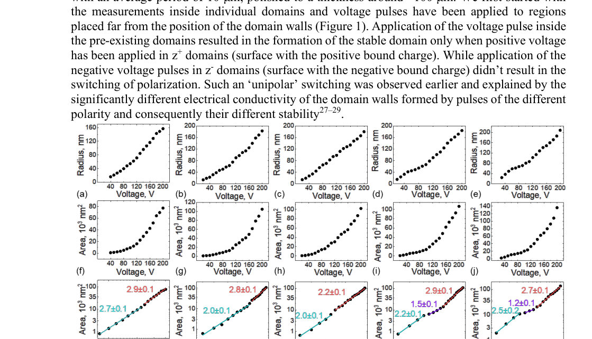 
Figure 1. The results of local polarization switching using an SPM tip. Shown are the dependencies on the amplitude of the voltage pulses: (a)-(e) domain radius, (f)-(j) domain area, (k)-(o) domain area plotted in double logarithmic scale; for different pulse durations: (a), (f), (k) 100 ms, (b), (g), (l) 200 ms, (c), (h), (m) 500 ms, (d), (i), (n) 1 s, (e), (j), (o) 10 s.

📷 Fig 2

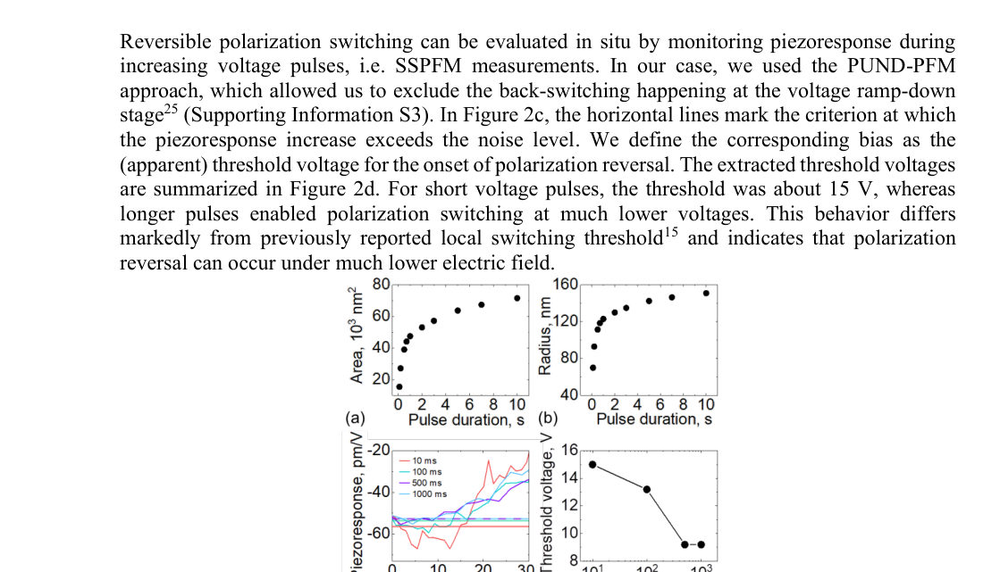 
Figure 2. Dependence of domain (a) area and (b) radius on pulse duration for the applied voltage pulse amplitude of 100 V. (c) Piezoresponse dependence on the applied DC voltage. (d) Threshold voltage dependence on the duration of the applied voltage pulses.

📷 Fig 3

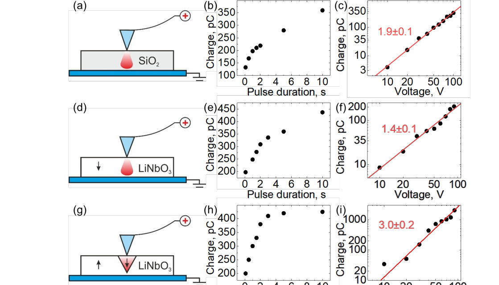 
Figure 3. Dynamics of the charge injection into (a)-(c) SiO2 and (d)-(i) LiNbO3 with (d)-(f) downward and (g)-(i) upward direction of the polarization. (a), (d), (g) Schematics indicating conditions of the voltage pulse application. Arrow indicates direction of the spontaneous polarization. (b), (e), (h) Dependences of the injected charge on the pulse duration (at 100 V amplitude) and (c), (f), (i) pulse amplitude (at 10 s duration).

📷 Fig 4

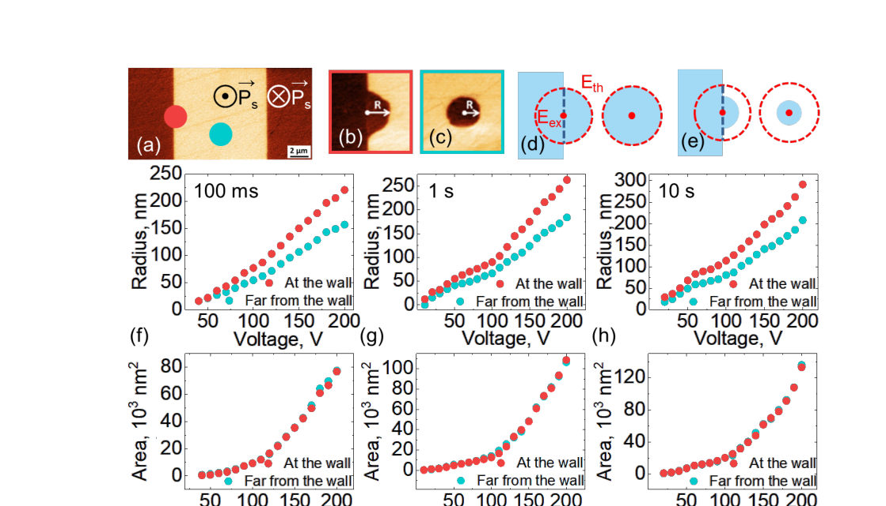 
Figure 4. Local switching at the domain wall and far from the wall: (a) the domain structure of the sample: the red point is the point of application of an electric field for local switching on the domain wall, the cyan point is that for local switching on the domain wall; formed domains: (b) at the domain wall, (c) far from the domain wall; mechanisms of local switching: (d) voltage-limited regime, (e) current-limited regime; voltage dependencies of (f)-(h) domain radius and (i-k) domain area for pulse durations of: (f, i) 100 ms, (g, j) 1 s, (h, k) 10 s.

📷 Fig 5

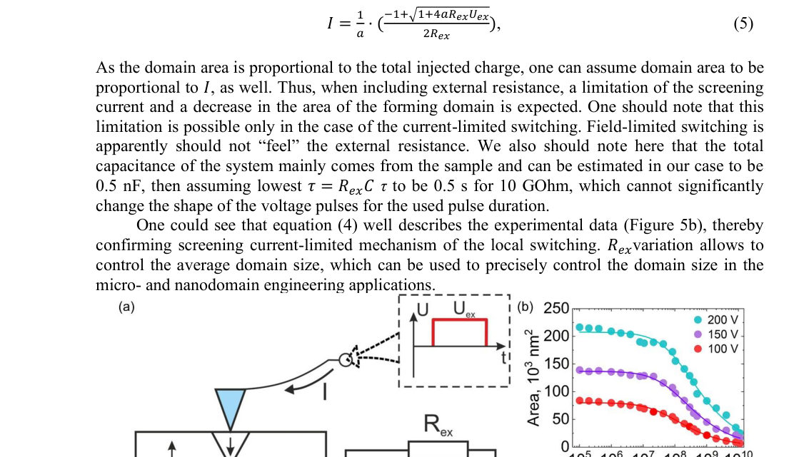 
Figure 5. (a) Schematic illustration of used methodology addition of an external resistance; (b) Dependence of domain area from RC circuit resistance.

**Summary.** This work argues that ferroelectric switching under an SPM tip is not purely field-driven but is instead limited by the rate at which screening charge can be supplied via the tip-sample junction. By modeling the system using charge transport equations, the authors establish that the process operates in a current-limited regime, providing a new, practical handle for controlling nanoscale domain engineering.

**Why it may be interesting.** While focused on ferroelectrics, the core concept of identifying a hidden, rate-limiting transport mechanism (current control) that overrides a seemingly intrinsic material property (field threshold) is highly relevant to understanding non-equilibrium dynamics in complex condensed matter systems.

Detailed structure

**Main problem.** The paper reinterprets ferroelectric switching under an SPM tip, arguing that the process is fundamentally controlled by the rate of screening charge supply rather than solely by domain-wall kinetics.

**Main result.** Switching is governed by a screening-current-limited mechanism, where the domain size and switching dynamics are dictated by Space-Charge-Limited Current (SCLC) transport into the ferroelectric material.

**Method.** The authors combine local switching experiments (PFM/SSPFM) with detailed finite-element simulations solving coupled time-domain equations for charge transport and domain evolution.

**Model / system.** The system is a ferroelectric material (e.g., LiNbO3) probed by an SPM tip. The model incorporates electric field balance, domain wall motion kinetics, and charge transport governed by drift-diffusion equations under external current injection.

**Key observables.** Domain radius and area as functions of voltage pulse amplitude and duration; apparent coercive voltage; injected charge density mapped via KPFM.

**Important parameters / regimes.** Screening current, space-charge-limited current (SCLC) exponents (e.g., $m=2$ or $m=3/2$), and the external resistance ($R_{ex}$) used to control injection current.

**Assumptions / limitations.** The analysis contrasts field-limited (domain-wall kinetics) vs. current-limited (charge injection) regimes, noting that the latter dominates the observed scaling laws.

**Figures summary.** Figures illustrate domain radius/area scaling with voltage/time, surface potential maps, and simulation results showing the time evolution of domain size under different charge injection assumptions.

**Paper structure.** The paper progresses by first establishing the limitations of purely field-driven models, then introducing the screening current concept, developing coupled simulation frameworks (drift-diffusion + domain evolution), and finally demonstrating that SCLC transport dictates the observed scaling laws.

Abstract

Tip-induced switching in ferroelectrics is commonly framed as a field-driven process controlled by domain-wall kinetics. Here we argue for a more universal viewpoint: under a scanning probe, polarization reversal is fundamentally constrained by how fast screening charge can be supplied and redistributed. By combining local switching experiments with finite-element simulations, we identify a screening-current-limited mechanism in which charge injection and its space-charge-limited relaxation set the pace of switching and the scaling of domain growth. This framework naturally explains regime changes and the apparent breakdown of intrinsic domain-wall laws often inferred in the nanoscale piezoelectric hysteresis measurements. Beyond a reinterpretation of tip switching, the results position screening currents as a hidden control parameter of ferroelectric reversal across materials, turning current regulation into a practical handle for deterministic nanoscale domain engineering.

[↑ back to top](#top)

### [Probing pairing symmetries through quasiparticle interference in chiral Bloch bands](http://arxiv.org/abs/2606.04097v1)

**Authors:** Sayan Banerjee, Subrata Mandal, Peter P. Orth, Mathias S. Scheurer  
**Type:** theory · **Category:** strongly correlated electrons · **PDF:** <https://arxiv.org/pdf/2606.04097v1>  
**Analysis basis:** full PDF text, analyzed in chunks
**Topic relevance:** `Keldysh / 2PI / non-Gaussian methods` **2/5** · `interference shaping light` **1/5**

📷 Fig 1

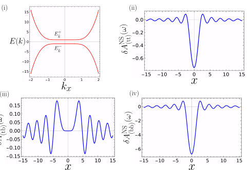 
FIG. 1. Normal state results. (i) Band structure of the low-energy Hamiltonian in Eq. (1) along the cut k = (kx, 0), showing the upper (E+ k ) and lower (E− k ) branches. One- dimensional cuts of the leading-order impurity-induced cor- rection in the spectral function, δANS αβ(ω) as a function of po- sition x for (ii) top-top (tt), (iii) top-bottom (tb), and (iv) bottom-bottom (bb) configurations. The bottom-top combi- nation is identical to the top-bottom combination. We ex- press momenta and lengths in units of k∗= (u0/w0)1/4 and 1/k∗, respectively, and energies in units of u0. Here we set u0 = w0 = 1, µ = 0, ω = −2, V0 = 1 and η = 0.01.

📷 Fig 2

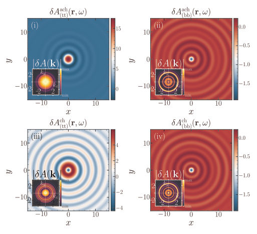 
FIG. 2. Zero momentum superconductivity. Impurity- induced change in the superconducting spectral function, δASC αβ(r, ω) [Eq. (18)] for q = 0 plotted in real space for achi- ral (first row) and chiral (second row) pairing states in the (i, iii) top-top and (ii, iv) bottom-bottom configurations for ω = 1.05, µ = 2. Insets show the corresponding momentum- space QPI patterns obtained by Fourier transform. All other parameters are the same as Fig. 1.

📷 Fig 3

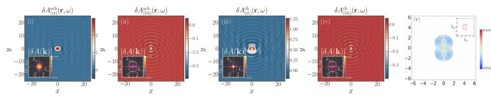 
FIG. 3. Finite momentum superconductivity. Impurity-induced change in δASC αβ(r, ω) in real space and their corresponding QPI patterns (insets) for achiral SC in (i) top-top and (ii) bottom-bottom combination; chiral SC in (iii) top-top and (iv) bottom-bottom combination at q ̸= 0. Panel (v) shows the momentum-space density map of the allowed scattering processes, determined by the Fermi surface geometry (inset), which sets the accessible scattering wavevectors visible in the QPI patterns of panels (i)–(iv).

📷 Fig 4

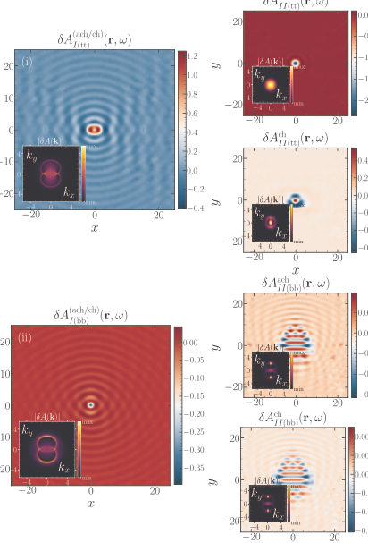 
FIG. 4. Separating normal and anomalous contribu- tions. Normal and anomalous contributions to δA(r, ω), de- noted as I and II, respectively, and corresponding to the first and second term in Eq. (17). Panel (i) depicts the contribu- tions for the tt configuration corresponding to both achiral and chiral types of pairing. Panel (ii) depicts the same, but for the bb configuration. The corresponding QPI patterns are shown in the insets. While both contributions are of the same order in the tt case (allowing for a distinction between the two pairings), the anomalous one is much smaller than the normal one in the bb configuration.

📷 Fig 5

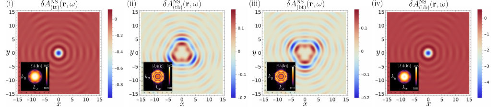 
FIG. 5. Normal state with trigonal warping. This figure shows the leading-order change in the spectral function δANS αβ(ω) as a function of position, with corresponding QPI maps in momentum space shown in the insets for (i) top–top (tt), (ii) top– bottom (tb), (iii) bottom–top and (iv) bottom–bottom (bb) configurations. Here we have used u0 = w0 = 1, µ = 0, V0 = 1, v0 = 0.7, w1 = 0.3, w2 = 0.2, w3 = 0.1, ω = −2 and η = 0.05.

**Summary.** This theoretical work provides a comprehensive method to interpret quasiparticle interference (QPI) patterns in superconductors with chiral Bloch bands. By analyzing the impurity-induced spectral function, the authors show that the resulting QPI pattern carries a unique fingerprint related to the pairing symmetry, enabling the distinction between chiral and achiral superconducting orders. This offers a powerful diagnostic tool for experimental condensed matter physics.

**Why it may be interesting.** The detailed theoretical mapping between measurable electronic signatures (QPI patterns) and fundamental microscopic parameters (pairing symmetry, quantum geometry) provides a powerful diagnostic tool applicable to complex correlated materials.

Detailed structure

**Main problem.** The paper develops a theoretical framework to use quasiparticle interference (QPI) measurements to distinguish between different candidate pairing symmetries in superconductors exhibiting chiral Bloch bands.

**Main result.** The QPI pattern, analyzed via the superconducting spectral function, can reveal the intrinsic phase winding number associated with the pairing symmetry, allowing differentiation between chiral and achiral pairing states.

**Method.** The analysis involves calculating the impurity-induced change in the superconducting spectral function ($\delta A_{SC}$) using the Born approximation within the Nambu formalism, followed by Fourier transformation to momentum space.

**Model / system.** The study models superconductivity in van der Waals multi-layer systems (like graphene) possessing chiral Bloch bands. The theoretical framework utilizes a minimal two-band model and extends the analysis from the normal state to the superconducting state via the Bogoliubov-de Gennes formalism.

**Key observables.** The primary observable is the spatially resolved QPI modulation ($\delta A_{SC}^{\alphaeta}(\mathbf{r})$) and its corresponding momentum-space signature ($\delta G_{SC}^{\alphaeta}(\omega, \delta \mathbf{k})$).

**Important parameters / regimes.** The analysis distinguishes between zero-momentum ($q=0$) and finite-momentum ($q
eq 0$) pairing, and examines the contributions from normal and anomalous terms.

**Assumptions / limitations.** The calculations rely on the Born approximation for impurity scattering and project the full Green's function onto the active low-energy band.

**Figures summary.** Figures illustrate the QPI patterns for various pairing symmetries (achiral vs. chiral) and momentum transfers, showing how the internal intensity variations reflect the quantum geometry and pairing structure.

**Paper structure.** The paper first establishes the normal-state QPI theory, then extends the formalism to the superconducting state using the Nambu basis. It systematically analyzes the QPI signatures for $q=0$ and $q
eq 0$ pairing, comparing the results for different pairing symmetries.

Abstract

Recent experiments in van der Waals multi-layer systems have demonstrated that superconductivity can emerge from symmetry-reduced, chiral normal states. We here provide a theory for quasiparticle interference (QPI) of superconductors with chiral Bloch bands. Our analysis reveals how the non-trivial quantum geometry of the Bloch states crucially affects the interference pattern even in the normal state, inducing significant sublattice dependence. In the superconducting state, the behavior becomes more complex due to the interplay of the quantum geometry of the Bogoliubov quasiparticles with the momentum-dependent phase of the order parameter. We reveal how the spatial dependence of the local spectral function around impurities can be used to distinguish between different candidate pairing states, both with zero and finite center-of-mass momentum. Our work thus provides guidance to interpreting QPI patterns in materials with chiral bands, which may be useful when probing the rich physics of pairing in such systems.

[↑ back to top](#top)

### [A unified theory of thin film and bulk bilayer nickelates](http://arxiv.org/abs/2606.04821v1)

**Authors:** Jiangfan Wang, Yi-feng Yang  
**Type:** theory · **Category:** strongly correlated electrons · **PDF:** <https://arxiv.org/pdf/2606.04821v1>  
**Analysis basis:** full PDF text, analyzed in chunks
**Topic relevance:** `Keldysh / 2PI / non-Gaussian methods` **1/5** · `Kondo & dissipative impurity` **1/5** · `analog quantum simulation` **1/5**

📷 Fig 1

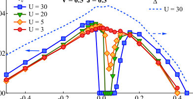 
FIG. 1: (a) Superconducting transition temperature Tc as functions of dz2 hole (δd &gt; 0) or electron (δd &lt; 0) doping for different J at fixed V = 0.5, U = 7. The blue and red dashed lines are the (scaled) spinon valence bond amplitudes ∆at low temperature T = 0.004 for J = 0.5 and 0.1, respectively. (b) Tc as functions of δd for different U at fixed V = 0.5, J = 0.3. The dashed line shows ∆at T = 0.004 and U = 30.

📷 Fig 2

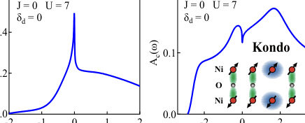 
FIG. 2: (a) The imaginary part of the dx2−y2 self-energy at δd = 0.03, showing the VBS gap evolution for different J and U. (b) The dx2−y2 density of states Ac(ω) at J = 0.5 and U = 7. (c)(d) The dx2−y2 self-energy and density of states at J = 0, U = 7 for δd = 0, showing the occurrence of Kondo effects. Other parameters are fixed as T = 0.004, V = 0.5. The insets of (b) and (d) illustrate the vertical Ni- O-Ni bonds in stoichiometric system and with inner apical oxygen vacancies, respectively.

📷 Fig 3

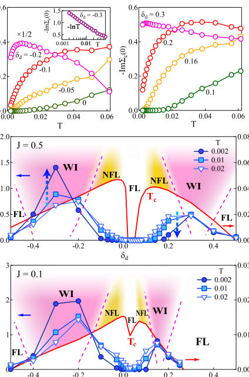 
FIG. 3: (a) Imaginary part of dx2−y2 self-energy at zero fre- quency, −ImΣc(0), as functions of the temperature for dif- ferent electron (left panel) or hole (right panel) doping δd at J = 0.5, V = 0.5, U = 7. The inset shows the −ln T depen- dence at δd = −0.3. (b)(c) Comparison of Tc and −ImΣc(0) as functions of δd at different low temperatures for J = 0.5, 0.1 at V = 0.5, U = 7. The different colors represent the Fermi liquid (FL), non-Fermi liquid (NFL), and weakly insulating (WI) normal states. The dashed lines mark the crossover be- tween different regions.

📷 Fig 4

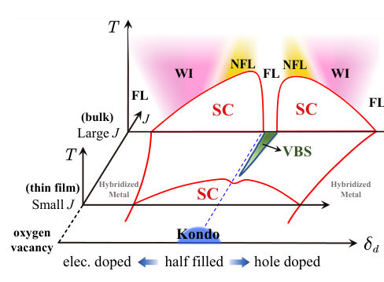 
FIG. 4: A unified theoretical phase diagram of bilayer nicke- lates marking different phases in terms of the superexchange J, dz2 hole/electron doping δd, and the temperature T. The orange and pink colors in the normal state correspond to the quasi-linear-in-T and weakly insulating behaviors of −ImΣc(0) in the normal state, respectively. The large and small J correspond to the bulk and compressively strained thin film bilayer nickelates, respectively.

**Summary.** This work develops a unified theoretical model to explain the complex superconducting behavior in bilayer nickelates across different crystal structures and doping levels. By treating the interplay between $d_{z^2}$ and $d_{x^2-y^2}$ orbitals, the theory successfully accounts for multiple superconducting domes, valence bond states, and Kondo scattering. It predicts pathways to achieve high-$T_c$ superconductivity even at ambient pressure.

**Why it may be interesting.** The detailed treatment of orbital physics, strong correlations, and phase transitions (SC $\leftrightarrow$ VBS $\leftrightarrow$ Kondo) provides a rich theoretical playground relevant to understanding emergent quantum phases in strongly correlated materials.

Detailed structure

**Main problem.** To provide a unified explanation for the similarities and distinctions in bilayer nickelate superconductivity observed in both pressurized bulk and thin films.

**Main result.** The theory predicts two superconducting domes upon doping, separated by a valence bond state near half filling, and suggests ambient pressure superconductivity can be achieved by tuning interlayer coupling.

**Method.** The authors employ a two-component theoretical model using slave-boson representations and calculate superconducting properties via the Bethe-Salpeter equation.

**Model / system.** The system is bilayer nickelates ($	ext{R}_3	ext{Ni}_2	ext{O}_7$), modeled using a two-orbital $t-V-U$ Hamiltonian that incorporates interlayer superexchange coupling ($J$) between $d_{z^2}$ and $d_{x^2-y^2}$ orbitals.

**Key observables.** Superconducting critical temperature ($T_c$), superconducting gap structure ($\Delta$), resistivity ($
ho(T)$), and self-energy ($\Sigma$).

**Important parameters / regimes.** Interlayer superexchange coupling ($J$), doping level ($\delta_d$), and on-site Coulomb repulsion ($U$).

**Assumptions / limitations.** The use of a two-component scenario and slave-boson representation to treat strong magnetic correlations.

**Figures summary.** Figures illustrate $T_c$ dependence on doping and coupling, the evolution of the $d_{x^2-y^2}$ spectral function across different doping regimes, and the unified phase diagram mapping SC, VBS, Kondo, FL, and WI regions.

**Paper structure.** The paper develops a unified theoretical framework by analyzing the interplay between $d_{z^2}$ and $d_{x^2-y^2}$ orbitals, predicting phase transitions between superconducting, valence bond, and normal metallic states based on doping and interlayer coupling strength.

Abstract

The discovery of bilayer nickelate superconductivity in both pressurized bulk and thin films has drawn enormous attention on their similarity and distinction. Here we provide a unified explanation based on the two-component scenario for a number of key experimental observations reported recently. Our theory predicts two superconducting domes upon electron or hole doping, separated by a valence bond state near $d_{z^2}$ half filling for strong interlayer superexchange coupling $J$, and a single dome across half filling with a lower $T_c$ for weak or moderate $J$. Increasing doping drives the normal state from a Fermi liquid to non-Fermi liquid or weak insulating behaviors, with quasi-linear-in-$T$ scattering rate near optimal $T_c$, while breaking the interlayer valence bonds by oxygen vacancies or chemical substitution simultaneously suppresses the superconductivity and causes local Kondo scattering of $d_{x^2-y^2}$ electrons. These explain the different superconducting transitions and normal states in bulk and thin films, the effect of $d_{z^2}$ hole or electron doping, and the Kondo effect in non-superconducting samples. We propose bulk superconductivity at ambient pressure by doping or reducing the interlayer magnetic coupling and predict even higher $T_c$ upon electron doping.

[↑ back to top](#top)

### [Exponential Time Differencing Schemes for a Phase-Field Model of Multicomponent Membranes](http://arxiv.org/abs/2606.04347v1)

**Authors:** Wangbo Luo, Zhonghua Qiao, Yanxiang Zhao  
**Type:** theory · **Category:** numerical methods · **PDF:** <https://arxiv.org/pdf/2606.04347v1>  
**Analysis basis:** full PDF text, analyzed in chunks
**Topic relevance:** `methods for driven-dissipative` **1/5** · `non-equilibrium dynamics` **1/5**

📷 Fig 1

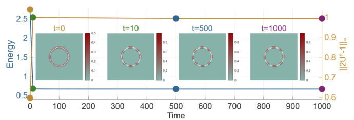 
Fig. 1. 2D coarsening dynamics process using ETD1 scheme (2.8), parameters T = 1000, ¯u = 0.5, γ = 2000, τ = 10−3, and B2 = 2000.

📷 Fig 2

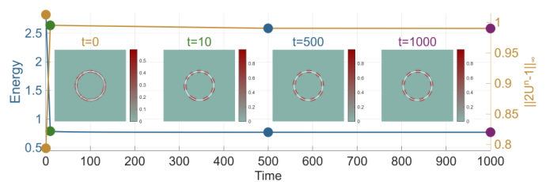 
Fig. 2. 2D coarsening dynamics process using ETDRK2 scheme (2.9), parameters T = 1000, ¯u = 0.5, γ = 3000, τ = 10−3, and B2 = 2000.

📷 Fig 3

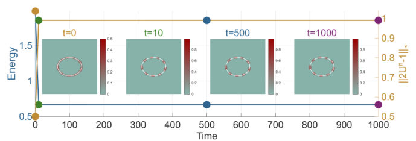 
Fig. 3. 2D coarsening dynamics process using ETDRK2 scheme (2.9), parameters T = 1000, ¯u = 0.5, γ = 5000, τ = 10−3, and B2 = 2000.

📷 Fig 4

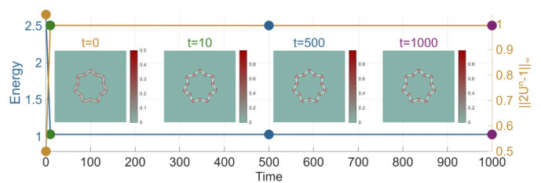 
Fig. 4. 2D coarsening dynamics process using ETDRK2 scheme (2.9), parameters T = 1000, ¯u = 0.5, γ = 7000, τ = 10−3, and B2 = 2000.

📷 Fig 5

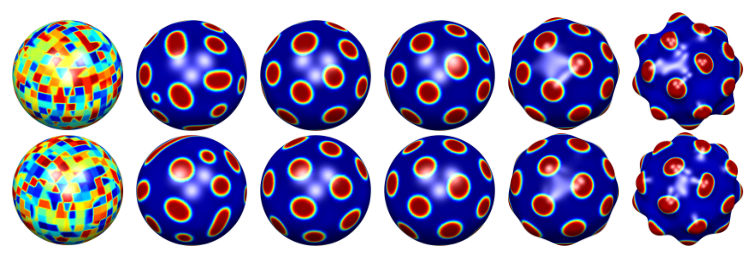 
Fig. 5. 3D coarsening dynamics process using Algorithm 3.1, parameters ¯u = 0.3, γ = 15000 (Top row), γ = 17000 (Bottom row), α = 700, and time step size τ = 10−3. From left column to the right, snapshots at time t = 0, t = 1, t = 10, t = 100, t = 101, t = 105.

**Summary.** This paper introduces and analyzes Exponential Time Differencing (ETD) schemes to simulate the complex dynamics of multicomponent membranes. The authors first prove the stability of these schemes for the simplified case and then apply them to the full, coupled system governing membrane mechanics and protein segregation. This provides a robust and efficient numerical tool for studying pattern formation in biological membranes.

**Why it may be interesting.** While the physics is condensed matter/soft matter, the focus on developing and proving the stability of advanced time integration schemes (ETD) for stiff, coupled partial differential equations is highly relevant to computational physics.

Detailed structure

**Main problem.** Developing stable, accurate, and efficient numerical schemes to simulate the complex, coupled dynamics of multicomponent membranes.

**Main result.** The authors rigorously prove that the developed Exponential Time Differencing (ETD) schemes satisfy the discrete maximum-bound principle and unconditional energy stability for the fixed-membrane case.

**Method.** The core method involves applying ETD schemes (ETD1 and ETDRK2) combined with operator splitting and spectral collocation to solve the coupled phase-field and Ohta-Kawasaki dynamics.

**Model / system.** The system models multicomponent membranes using a force-balance phase-field equation coupled with membrane-associated Ohta-Kawasaki (OK) dynamics for protein segregation.

**Key observables.** Discrete energy decay, preservation of the discrete maximum-bound principle (MBP), protein-driven pattern formation, and membrane deformation.

**Important parameters / regimes.** Repulsion strength ($\gamma$), biochemical strength ($\alpha$), and numerical parameters like time step ($	au$) and spatial resolution ($h$).

**Assumptions / limitations.** The initial rigorous analysis assumes a fixed phase-field membrane geometry; extending to the fully coupled, evolving system requires careful stabilization and splitting.

**Figures summary.** Numerical experiments confirm predicted temporal accuracy and energy decay for the fixed-membrane OK problem, and demonstrate stable 3D simulations of protein-driven pattern formation.

**Paper structure.** The work first establishes the ETD schemes and proves stability for the simplified, fixed-geometry OK problem. It then extends this framework to the full, coupled system, employing spectral methods and narrow-band techniques for efficiency.

Abstract

In this paper, we develop and analyze exponential time differencing (ETD) schemes for a phase-field model of multicomponent membranes proposed in our previous work \cite{luo2025ohta}, in which membrane deformation is governed by a force-balance phase-field equation and protein segregation is described by a membrane-associated Ohta-Kawasaki (OK) dynamics. For a fixed phase-field membrane, we introduce a geometry-adapted operator splitting method based on the localization function, which reformulates the surface OK dynamics into a form suitable for ETD integration. The resulting first- and second-order ETD schemes, combined with finite-difference spatial discretization, are rigorously proved to satisfy a discrete maximum-bound principle and unconditional energy stability. For the coupled system, we construct stabilized ETD schemes in an FFT-based spectral framework, treating stiff linear terms exactly and nonlinear mechanochemical couplings explicitly. A narrow-band implementation further reduces the computational cost by restricting surface calculations to the diffuse membrane region. Numerical experiments confirm the predicted temporal accuracy, maximum-bound preservation, and energy decay for the fixed-membrane OK problem, and demonstrate stable and efficient three-dimensional simulations of protein-driven pattern formation and membrane deformation.

[↑ back to top](#top)

### [Topography-based navigation in a millikelvin scanning tunneling microscope using binary-encoded position markers](http://arxiv.org/abs/2606.04848v1)

**Authors:** R. Fischer-Süßlin, R. Hartmann, T. Kandra, E. Scheer  
**Type:** experiment · **Category:** other · **PDF:** <https://arxiv.org/pdf/2606.04848v1>  
**Analysis basis:** full PDF text, analyzed in chunks
**Topic relevance:** `analog quantum simulation` **1/5** · `quantum measurements` **1/5**

📷 Fig 1

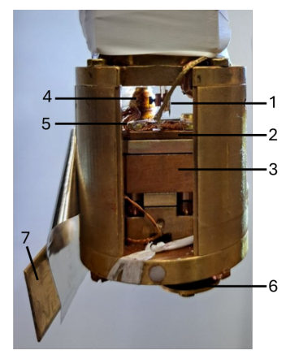 
FIG. 1. Photograph of the STM head showing (1) the cop- per slider with tip and (2) the sample plate on top of the (3) two linear nanopostioners. A sample heater (4) prevents adsorption on the sample, and for thermal coupling the sam- ple plate is connected to the gold-plated copper shielding (5). Additionally to the thermometers of the cryostat insert, we mounted a sample thermometer (6). For radiation shielding, the STM head is closed with (7) small copper elements.

📷 Fig 2

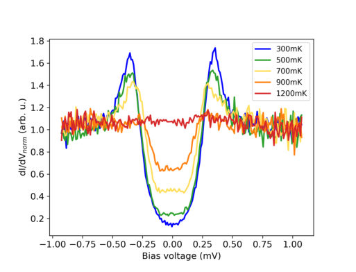 
FIG. 2. Measured differential conductance dI/dV of an PtIr tip and an evaporated film with 200 nm aluminium and 10 nm copper for different temperatures. The spectra were recorded with a modulation voltage Vmod = 30 µV , a stabilization cur- rent I = 400 pA at V = 3 mV.

📷 Fig 3

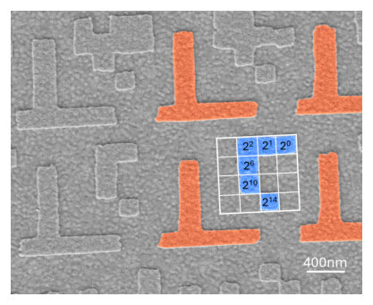 
FIG. 3. False-colored SEM image of a sample with the navi- gation system on top. The design is based on the dual system with a 4×4 grid, shown in white, of 200 nm×200 nm pixels that are either 1 (elevated by 10nm, blue) or 0 (no elevation). For a clear separation of grids, the border (orange) is also elevated and has an antisymmetric form in x and y for clear orientation of the pattern.

📷 Fig 4

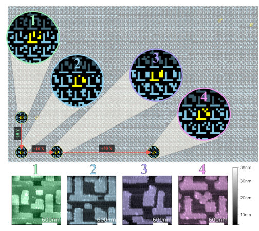 
FIG. 4. Topography-based navigation process. STM scans (1- 4) at room temperature and the software (big image) showing the exact position in the pattern and therewith on the sam- ple. Between the STM scans the attocube nanopositioners are moved.

**Summary.** This paper presents an advanced, compact millikelvin STM setup designed for high-precision spectroscopy on nanoscale targets. It introduces a novel topography-based navigation system that uses a lithographically patterned binary grid to determine absolute coordinates across a large area. This allows researchers to reliably map and study multiple distinct quantum regions on a single sample without external optical guidance.

**Why it may be interesting.** While the core physics is condensed matter (superconductivity, nanoscale devices), the engineering solution for precise, low-temperature positioning is highly relevant to any experiment requiring stable, absolute addressing of quantum systems, bridging experimental physics and advanced instrumentation.

Detailed structure

**Main problem.** The primary challenge is achieving precise, absolute positioning for Scanning Tunneling Microscopy (STM) and Spectroscopy (STS) on micron-scale targets while operating at millikelvin temperatures, overcoming limitations like thermal drift and lack of optical access.

**Main result.** The authors successfully integrated a topography-based navigation system using a lithographically patterned binary-encoded gold grid with piezoelectric nanopositioners, enabling absolute positioning across a $350	imes350 \mu	ext{m}^2$ area from a single STM scan.

**Method.** The system uses a patterned substrate where unique 16-bit coordinates are encoded by the topography (elevated pixels = '1'). An initial STM scan reads this pattern, which is then interpreted by software to guide the nanopositioners to the desired target location for subsequent spectroscopy.

**Model / system.** The platform is a compact millikelvin STM operating at $\sim 270$ mK. Positioning is achieved via two piezoelectric nanopositioners, and the absolute location is read from a lithographically fabricated $4	imes4$ array of $200 	ext{ nm}	imes 200 	ext{ nm}$ binary-encoded gold markers.

**Key observables.** Absolute position ($	ext{x}, 	ext{y}$ coordinates), differential conductance ($dI/dV$), and energy resolution (verified via BCS spectroscopy on Al).

**Important parameters / regimes.** Operating temperature ($\sim 270 	ext{ mK}$), scan area ($350	imes350 \mu	ext{m}^2$), pixel size ($200 	ext{ nm}$), and energy resolution ($20 \mu	ext{eV}$).

**Assumptions / limitations.** The system assumes stable thermal anchoring and relies on the ability of the STM tip to enter the tunneling range to read the coordinate pattern, which is noted as a potential risk.

**Figures summary.** Figures illustrate the STM head components, the measured $dI/dV$ spectra for Al samples, the SEM image of the fabricated navigation grid, and a schematic detailing the topography-based navigation process.

**Paper structure.** The paper details the physical setup (STM, nanopositioners, filtering), describes the novel topography-based navigation method using binary encoding, demonstrates the absolute positioning capability, and verifies the system's performance using spectroscopic measurements.

Abstract

We present a compact millikelvin scanning tunneling microscope (STM) operating at 270mK with topographic navigation to micron-scale targets. Two piezoelectric low-temperature nanopositioners extend the accessible sample area, while a multi-stage copper powder and capillary filter scheme preserves millikelvin energy resolution, verified by BCS spectroscopy on aluminium thin films. A lithographically fabricated binary-encoded gold pattern encodes unique 16-bit coordinates in 4x4 pixels of 200nm$\times$200nm each. We demonstrate absolute positioning across a 350$\times$350$\mathrmμ$m$^2$ area from a single STM scan. Requiring only a single lithography step and no hardware modifications to existing STM setups, the navigation system provides a versatile platform for scanning tunneling spectroscopy of nanoflakes and nanoscale devices.

[↑ back to top](#top)

### [Quantum Hall effect in vacancy-engineered $β$-Ag$_2$Te](http://arxiv.org/abs/2606.05128v1)

**Authors:** Mizuki Ohno, Veronica Show, Reiley Dorrian, Joseph Falson  
**Type:** experiment · **Category:** other · **PDF:** <https://arxiv.org/pdf/2606.05128v1>  
**Analysis basis:** full PDF text, analyzed in chunks
**Topic relevance:** `analog quantum simulation` **1/5**

📷 Fig 1

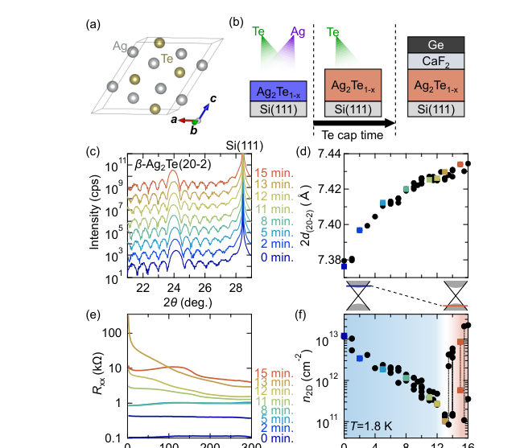 
FIG. 1. (a) Crystal structure of β-Ag2Te drawn with VESTA [20]. (b) Schematic illustration

📷 Fig 2

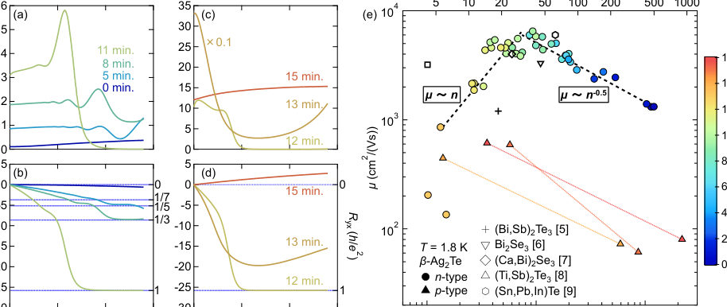 
FIG. 2. Out-of-plane B-field dependence of (a,c) longitudinal resistance Rxx and (b,d) Hall

📷 Fig 3

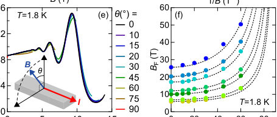 
FIG. 3. (a) Rxx versus B from 1.8 to 300 K, and (b) the oscillatory component ∆Rxx versus 1/B

📷 Fig 4

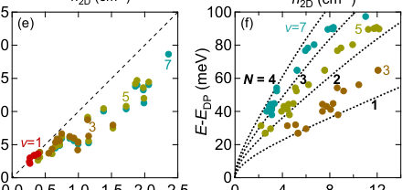 
FIG. 4. Topological surface-state parameters and the quantum Hall effect at 1.8 K. n2D depen-

**Summary.** This work reports on achieving high-quality quantum Hall transport in $\beta$-Ag$_2$Te topological insulators using a novel, simple synthesis technique. By controlling stoichiometry *in-situ* via Te capping, the researchers suppress bulk conduction and tune the carrier density without external gates. This allowed for the clear observation of quantized Hall plateaus and confirmation of massless Dirac fermion behavior, establishing a powerful, accessible platform for studying topological quantum phenomena.

**Why it may be interesting.** The self-tuning, gate-free nature of the carrier control mechanism is highly relevant for realizing clean quantum states in novel materials, bypassing complex lithography or doping requirements common in quantum physics research.

Detailed structure

**Main problem.** Accessing clean surface quantum transport in topological insulators is difficult due to residual bulk conduction from lattice defects.

**Main result.** The authors demonstrated that stoichiometry-driven vacancy engineering in $\beta$-Ag$_2$Te allows for the observation of a fully developed $\nu=1$ Quantum Hall state, confirming massless Dirac dispersion.

**Method.** The study uses Molecular Beam Epitaxy (MBE) combined with an *in-situ* Te capping step to control stoichiometry and suppress bulk defects, enabling gate-free tuning of carrier density.

**Model / system.** The physical system is $\beta$-Ag$_2$Te, a topological insulator exhibiting Dirac surface states. The method relies on controlling the Ag/Te stoichiometry via Te capping time to tune the Fermi level across the bulk gap.

**Key observables.** Quantized Hall plateaus ($\nu=1, 3, 5, 7$), Landau-level energy collapse onto $E_N \propto \sqrt{N}$, and the dependence of mobility on carrier density ($\mu$ vs. $n_{2D}$).

**Important parameters / regimes.** The ability to tune carrier density over an order of magnitude without external gates; the observation of odd-integer filling factors ($\nu=2N+1$).

**Assumptions / limitations.** The surface-state penetration depth is much smaller than the film thickness, ensuring surface state dominance; the Te capping process effectively controls donor-type defects.

**Figures summary.** Figures show magnetotransport measurements ($R_{xx}$ and $R_{yx}$ vs. $B$) demonstrating QHE plateaus, and plots showing the dependence of quantum parameters ($\mu$, $m_{eff}$) on carrier density ($n_{2D}$).

**Paper structure.** The paper establishes the problem (bulk conduction in TIs), introduces the novel MBE/vacancy engineering technique, presents magnetotransport data showing QHE and Dirac signatures, and concludes by validating this method as a versatile, gate-free approach.

Abstract

Accessing surface quantum transport in topological insulators is hampered by residual bulk conduction arising from lattice defects. Here, we demonstrate a novel synthesis pathway for realizing high mobility $β$-Ag$_2$Te thin films where surface transport is dominant. An \textit{in-situ} vacancy engineering step as part of the molecular beam epitaxy growth process acts to modify the stoichiometry and suppress donor-type defects, enabling continuous tuning of the sheet carrier density over more than an order of magnitude through the charge-neutrality point without an external gate electrode. In the lower-carrier-density films, a fully developed $ν=1$ quantum Hall state is observed, and Landau-level energies extracted across samples collapse onto the $E_N=v_\mathrm{F}\sqrt{2e\hbar NB}$ relation, providing evidence for the massless Dirac dispersion of the top and bottom surface states. These results establish stoichiometry-driven vacancy engineering as a versatile lithography- and gate-free approach to accessing quantum Hall transport in epitaxial topological-insulator thin films.

[↑ back to top](#top)

### Other secondary papers (7)

Show other secondary papers

### [Breaking the width-scaling limit in high-performance atomically thin 2D nanoribbon transistors](http://arxiv.org/abs/2606.04219v1)

**Authors:** Sameer Kumar Mallik, Adrian Christiansen, Saroj P. Dash  
**Type:** experiment · **Category:** other · **PDF:** <https://arxiv.org/pdf/2606.04219v1>  
**Analysis basis:** full PDF text, analyzed in chunks

📷 Fig 1

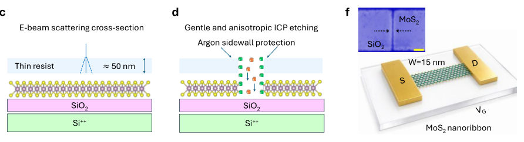 
Figure 1. Width scaling wall in advanced transistors and opportunity for 2D semiconductor nanoribbons. (a) Historical technology trends for channel width 𝑊 (top) and channel length 𝐿 (bottom). Nanosheet transistors show continuous 𝐿 scaling down to a few nanometres, whereas 𝑊 has saturated around ∼40-50 nm showing a practical “width-scaling wall” due to all-surface scattering at narrow widths. (b) Conceptual schematics of on-current density 𝐼ON versus channel width 𝑊 for Si nanoribbons (cyan) and 2DSC nanoribbons (magenta) highlighting an edge-enhanced regime (shaded) in which only lateral edge states contribute to scattering in 2DSC. (c) Schematic of electron-beam exposure with a thin...

📷 Fig 2

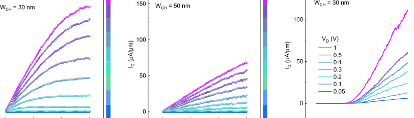 
Figure 2. Enhancement of Electrical transport properties of monolayer MoS₂ nanoribbon transistors as a function of channel width down to 30 nm. (a) False-colour SEM image and schematic of a back-gated monolayer MoS₂ nanoribbon transistor with a 30 nm-wide channel; Scale bar is 100 nm. (b) Raman spectra of monolayer MoS₂ (blue) and patterned MoS₂ nanoribbons (red), showing dominant vibrational modes. (c) Linear-scale transfer characteristics (ID vs. VG) for MoS₂ nanoribbon transistors with channel widths WCH = 30, 40, and 50 nm at VD = 1 V and LCH = 50 nm. (d) Corresponding semi- logarithmic transfer characteristics for the same devices demonstrate n-type transistor behavior with a high...

📷 Fig 3

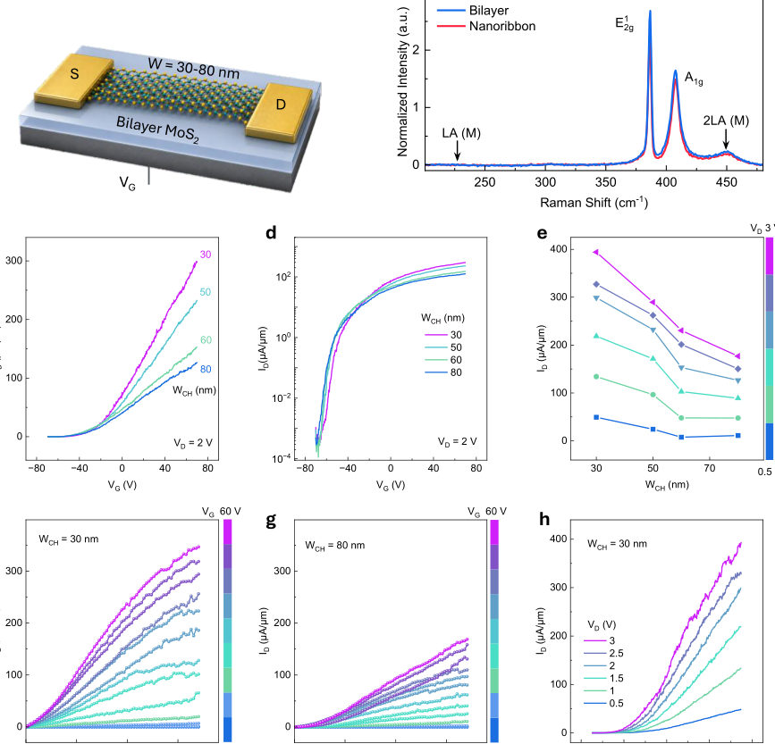 
Figure 3. Enhancement of Electrical transport properties of bilayer MoS₂ nanoribbon transistors as a function of channel width down to 30 nm. (a) Schematic of a back-gated bilayer MoS₂ nanoribbon transistor. (b) Raman spectra of bilayer MoS₂ (blue) and patterned MoS₂ nanoribbons (red), showing dominant vibrational modes. (c) Linear-scale transfer characteristics (ID vs. VG) for bilayer MoS₂ nanoribbon transistors with channel widths WCH = 30, 50, 60, and 80 nm at VD = 2 V and LCH = 200 nm. (d) Corresponding semi-logarithmic transfer characteristics for the same devices, demonstrating n- type transistor behavior with a high on/off current ratio. (e) On-current density (ID) as a function of...

📷 Fig 4

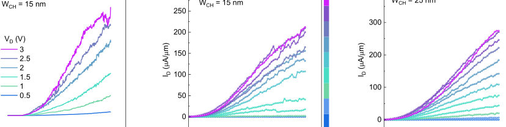 
Figure 4. Ultra-scaled high-performance bilayer MoS2 nanoribbon transistor down to a width of 15 nm. (a) Schematic of a back-gated bilayer MoS₂ nanoribbon transistor with channel widths down to 15 nm; Scale bar is 100 nm. (b) False-colour high resolution SEM images of ultranarrow bilayer MoS2 nanoribbons with channel widths 25, 20, and 15 nm (left to right). (c) Linear-scale transfer characteristics (ID vs. VG) for bilayer MoS₂ nanoribbon transistors with channel widths WCH = 15, 20, and 25 nm at VD = 2 V and LCH = 200 nm. (d) Corresponding semi-logarithmic transfer characteristics for the same devices, demonstrating n-type transistor behavior with a high on/off current ratio. (e)...

📷 Fig 5

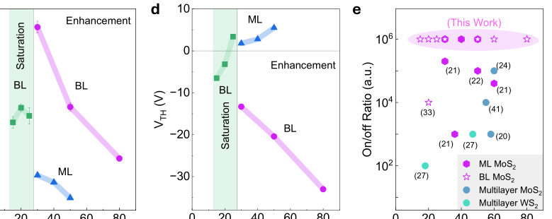 
Figure 5. Benchmarking ultra-width-scaled transport parameters of monolayer and bilayer MoS₂ nanoribbon transistors. (a) Benchmarking of on-current density (ID) as a function of channel width (WCH) for monolayer (ML) and bilayer (BL) MoS₂ nanoribbon transistors in this work, compared with previous literature reports of 2DSC-based nanoribbon devices with varying thicknesses (colored symbols). The shaded magenta and blue regions define the enhancement regime followed by a saturation regime (shaded green region) in this work demonstrates superior on-current densities compared to prior reports. (b) Distribution of the percentage change in maximum on-current density Δ𝐼max for devices in the...

**Summary.** This paper reports a breakthrough in scaling high-performance transistors by utilizing atomically thin MoS2 nanoribbons down to 15 nm. Contrary to expected performance degradation, the devices show an enhancement in on-current density, suggesting an 'edge-enhanced transport regime.' This work establishes a new scaling rule for 2D semiconductors, crucial for future ultra-low-power electronics.

**Why it may be interesting.** While focused on solid-state electronics, the concept of achieving enhanced performance through nanoscale confinement and edge effects relates to understanding boundary conditions and quantum confinement in low-dimensional systems, which has parallels in quantum physics.

Detailed structure

**Main problem.** The primary challenge addressed is overcoming the 'width-scaling wall' in transistor fabrication, where reducing channel width below 40-50 nm typically degrades performance due to edge disorder and depletion.

**Main result.** The study demonstrates that using atomically thin 2D semiconductor (2DSC) nanoribbons, specifically MoS2, allows for an enhancement of on-current density as the width is scaled down to 15 nm, establishing a new scaling rule.

**Method.** The research involves fabricating and electrically characterizing MoS2 nanoribbon transistors using advanced top-down lithography and etching techniques.

**Model / system.** The physical system is the atomically thin MoS2 nanoribbon transistor, tested in both monolayer and bilayer forms, fabricated on standard semiconductor substrates.

**Key observables.** On-current density (I_D), on/off ratios, field-effect mobility (mu_FE), and threshold voltage (V_TH) as functions of channel width.

**Important parameters / regimes.** Channel width (W_CH) scaled down to 15 nm; the transition from an edge-enhanced transport regime to a saturation regime.

**Assumptions / limitations.** The performance enhancement is attributed to an 'edge-enhanced transport regime' that mitigates traditional scaling limitations.

**Figures summary.** Figures illustrate the fabrication process, electrical transfer/output characteristics across various widths (e.g., 50 nm down to 15 nm), and comparative plots showing current density enhancement and mobility trends.

**Paper structure.** The paper progresses by first identifying the scaling bottleneck, presenting the fabrication methodology for 2DSC nanoribbons, and then systematically presenting electrical characterization data showing current enhancement and saturation at the narrowest widths.

Abstract

State-of-the-art transistors have been successfully scaled the gate lengths and channel thicknesses down to 5 nm for high-performance and energy-efficient information processing. However, reducing channel width below 40-50 nm remains a bottleneck, as dangling bonds, edge disorder, and lateral depletion suppress drive current and degrade device performance. Here, we break this width-scaling wall using ultra-scaled two-dimensional semiconductor (2DSC) nanoribbon transistors down to 15 nm. In contrast to the conventional scaling rule of degradation of current density upon width scaling, our atomically-thin monolayer and bilayer molybdenum disulfide nanoribbon transistors exhibit enhancement of on-current density of up to 230% and 170%,respectively, followed by a saturation for the narrowest channels down to 15 nm. The ultra-narrow nanoribbon transistors maintain the highest on/off ratios reported so far for similar device dimensions, with improved mobility and threshold-voltage stability, indicating reduced edge scattering and depletion with a stronger electrostatic control. These findings lead to a breakthrough in width scaling rules using 2DSC nanoribbons with enhanced performance at narrower channel widths, which is promising for the ultimate scaling of transistors.

[↑ back to top](#top)

### [Dipolar interlayer excitons in transition metal dichalcogenide alloy heterobilayers](http://arxiv.org/abs/2606.04675v1)

**Authors:** E. Katsipoulaki, N. G. Chatzarakis, E. Rigoutsou, D. Katrisioti, T. Taniguchi, K. Watanabe, S. Psilodimitrakopoulos, N. T. Pelekanos, I. Paradisanos  
**Type:** experiment · **Category:** other · **PDF:** <https://arxiv.org/pdf/2606.04675v1>  
**Analysis basis:** full PDF text, analyzed in chunks

📷 Fig 1

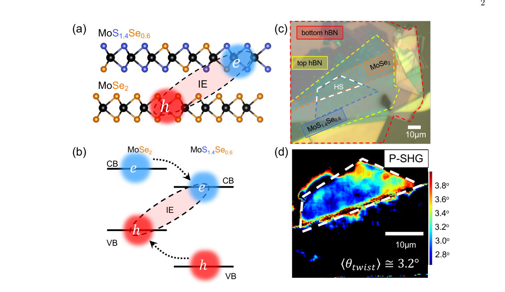 
FIG. 1. Interlayer exciton formation and crystallographic characterization of the heterobilayer. (a) Schematic illustra- tion of interlayer excitons (IX) in a MoS1.4Se0.6/MoSe2 heterobilayer. (b) Schematic of the type-II band alignment in the MoS1.4Se0.6/MoSe2 system. (c) Optical micrograph of the hBN-encapsulated heterobilayer. The white dashed quadrilateral in- dicates the overlapping region. (d) Twist-angle map extracted from polarization-resolved second-harmonic generation (P-SHG) measurements, highlighting the heterobilayer region (white dashed quadrilateral).

📷 Fig 2

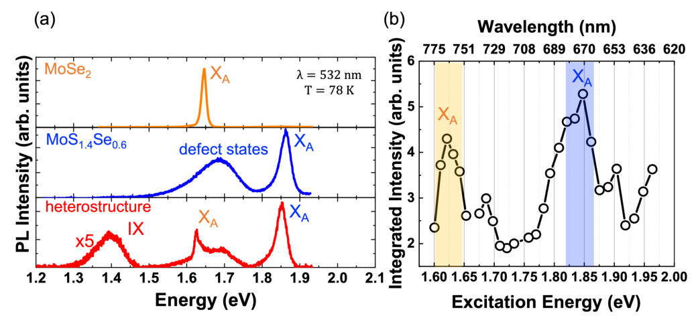 
FIG. 2. PL spectroscopy of the individual monolayers and the heterobilayer. (a) Low-temperature (T = 78 K) PL spectra of the MoSe2 monolayer (orange), the MoS1.4Se0.6 alloy monolayer (blue), and the MoS1.4Se0.6/MoSe2 heterobilayer (red) under 532 nm excitation (P = 20 µW). The spectra display the intralayer excitonic transitions (XA and XB) of the individual layers, along with defect-related emission. The heterobilayer spectrum additionally exhibits a low-energy interlayer exciton (IX) emission (multiplied by a factor of 5 for clarity). (b) Photoluminescence excitation (PLE) spectroscopy of the heterobilayer, showing the integrated intensity of the IX emission as a function of excitation...

📷 Fig 3

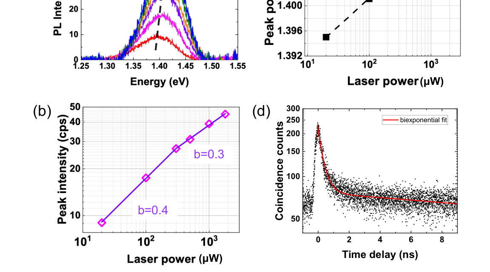 
FIG. 3. Power dependence and dynamics of interlayer excitons. (a) PL spectra of the interlayer exciton (IX) emission at T = 78 K for different excitation powers. (b) IX intensity as a function of excitation power. The data follow a power-law scaling I ∝P b with exponents b = 0.4 and b = 0.3. (c) Peak energy of the IX emission as a function of excitation power, showing a blueshift with increasing power. (d) Time-resolved photoluminescence (TRPL) of the IX emission at T = 78 K, measured using time-correlated single-photon counting. Black dots represent the measured photon counts, while the red curve is a biexponential fit. The extracted decay times consist of a fast component of 374 ps and a...

**Summary.** This work reports on dipolar interlayer excitons in $	ext{MoS}_{1.4}	ext{Se}_{0.6}/	ext{MoSe}_2$ heterobilayers. By analyzing photoluminescence and time-resolved measurements, the authors confirm the excitons' permanent dipole moment through power-dependent blueshifts. The findings establish these alloyed heterobilayers as a versatile platform for engineering and controlling dipolar excitonic interactions.

**Why it may be interesting.** The study provides experimental evidence of tunable, long-lived, dipolar excitons in van der Waals heterostructures, which are crucial components for next-generation quantum light sources and energy conversion devices.

Detailed structure

**Main problem.** The study investigates the nature and dynamics of dipolar interlayer excitons (IX) formed in transition metal dichalcogenide (TMD) alloy heterobilayers.

**Main result.** The research confirms the existence of long-lived, spatially indirect, and dipolar interlayer excitons, establishing these alloyed heterobilayers as a tunable platform for excitonic physics.

**Method.** The study employs low-temperature photoluminescence (PL) spectroscopy, power-dependent PL measurements, and time-resolved PL (TRPL) to characterize the excitons.

**Model / system.** The physical system is a $	ext{MoS}_{1.4}	ext{Se}_{0.6}/	ext{MoSe}_2$ heterobilayer encapsulated in hexagonal boron nitride ($	ext{hBN}$). The system exhibits a type-II band alignment, leading to interlayer excitons with a permanent dipole moment.

**Key observables.** Distinct emission peak at $\sim 1.4 	ext{ eV}$; blueshift of emission energy with increasing excitation power; biexponential decay in TRPL ($	au_1 \approx 374 	ext{ ps}$, $	au_2 \approx 49 	ext{ ns}$); power-law scaling of intensity ($I \propto P^b$).

**Important parameters / regimes.** Low temperature ($78 	ext{ K}$); mean twist angle ($\approx 3.2^\circ$); excitation power dependence; two distinct exciton lifetimes.

**Assumptions / limitations.** The blueshift is attributed to repulsive dipole-dipole interactions, and the two TRPL components are assigned physical origins (e.g., fast component from localization/annihilation, slow component from reservoir recombination).

**Figures summary.** Figures illustrate the PL spectra showing the IX emission, PLE confirming excitation pathways, and power-dependent measurements showing the characteristic blueshift and power-law scaling, alongside TRPL fits yielding the two distinct decay times.

**Paper structure.** The paper systematically presents evidence for the IX formation (PL/PLE), confirms the dipolar nature via power-dependent blueshifts, and quantifies the dynamics using TRPL to resolve multiple recombination pathways.

Abstract

Interlayer excitons in transition metal dichalcogenide (TMD) heterobilayers possess a permanent electric dipole moment and long recombination lifetimes, making them a promising platform for exploring excitonic many-body physics. Here, we report dipolar interlayer excitons in a MoS$_{1.4}$Se$_{0.6}$/MoSe$_2$ heterobilayer encapsulated in hexagonal boron nitride. Low-temperature photoluminescence measurements reveal a distinct emission peak at $\sim1.4$ eV, attributed to radiative recombination of interlayer excitons. The emission exhibits a blueshift with increasing excitation power, indicating repulsive dipole-dipole interactions. Time-resolved photoluminescence measurements uncover nanosecond-scale lifetimes, consistent with the spatial separation of electrons and holes across the two layers. These findings establish chalcogen-alloyed TMD heterobilayers as a versatile platform for engineering dipolar excitons and tuning excitonic interactions in van der Waals materials.

[↑ back to top](#top)

### [Efficient Magnetic Spin-Filtering and Persistent Spin-Currents in Lifshitz-Transitioned Altermagnets: A Route to Open-Orbit Spintronics](http://arxiv.org/abs/2606.04587v1)

**Authors:** Wun-Hao Kang, Yu-Ting Hsiao, Jozef Genzor, Yaroslav Zhumagulov, Ming-Hao Liu, Denis Kochan  
**Type:** theory · **Category:** other · **PDF:** <https://arxiv.org/pdf/2606.04587v1>  
**Analysis basis:** full PDF text, analyzed in chunks

📷 Fig 1

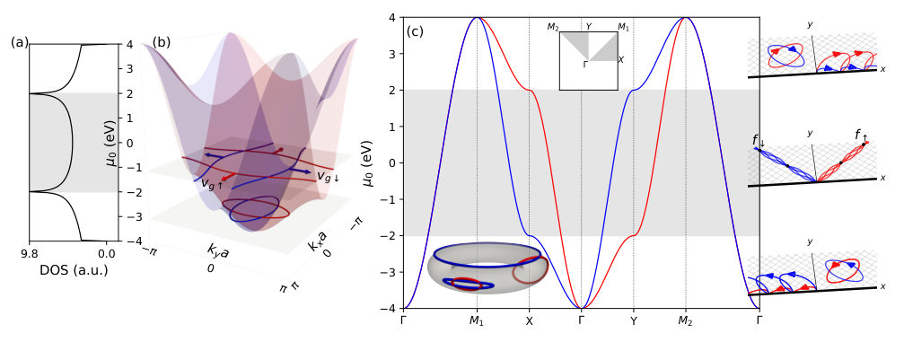 
FIG. 1. Spectral and homotopic characteristics of 2D d-wave AM. Doping dependence of (a) density of states (DOS) per unit area; (b) Fermi contour topologies; and (c) electronic band structure along the high-symmetry path. All based on the model Hamiltonian H, Eq. (1), placed on the square lattice with the primitive vectors a1 = (a, 0) and a2 = (0, a). The electronic states are spin-polarized, in all panels—the up and down spin states are colored by red and blue. Before the first, µ0 &lt; −2 = −4 min(|t0|, |tj|) eV, and after the second, µ0 &gt; +2 = 4 min(|t0|, |tj|) eV, van Hove singularity the Fermi contours are homotopically trivial (contractible to a point). In between, i.e. for µ0 ∈(−2, +2)...

📷 Fig 2

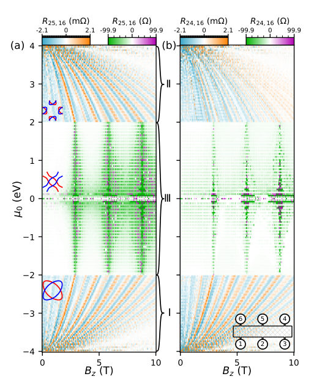 
FIG. 2. kwant-computed four-point terminal resistances R25,16 and R24,16, panels (a) and (b), versus out-of-plane field Bz and doping µ0. Simulated 6-terminal Hall-bar [in- set in (b)] consists of AM (at 45◦with respect to bar edges) and 6 metallic leads, each with 130-propagating transverse modes. Color bars and ranges of R—mΩvs. Ω—are differ- ent for the regions supporting closed (I and II) and open (III) Fermi contours. Insets in (a) show the representative topogra- phies of spin-resolved (up/down in red/blue) Fermi contours at µ0 = −3 (I), −1 (III), 3 (II) eV. The non-local R in closed- orbit Regions I and II show characteristic TMF oscillations due to electron-like (positively-defined...

📷 Fig 3

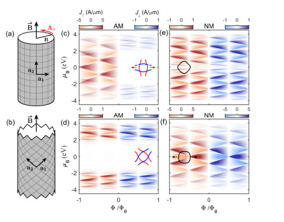 
FIG. 3. Persistent spin currents (per unit length) J↑and J↓ versus doping µ0 and magnetic flux Φ/Φ0, for AM (central panels) and NM (right panels) nanotubes with the square (upper panels) and rhombic (lower panels) chiralities. Fig- ures (a) and (b) show schematics of the nanotube geometries with respect to the axial magnetic field B and its polar gauge potential Aϕ. Panels (c,d) and (e,f) show, comparatively, J↑(Φ, µ0) and J↓(Φ, µ0) for ballistic (disorder-free) AM and NM nanotubes in weak magnetic fields employing t0 = −1 eV, and correspondingly tj = −0.5 eV (AM) and tj = 0 eV (NM). For AM tube with square-chirality, panel (c); tuning µ0 across the open-orbit range µ0 ∈(−2, 2) eV makes PC...

📷 Fig 4

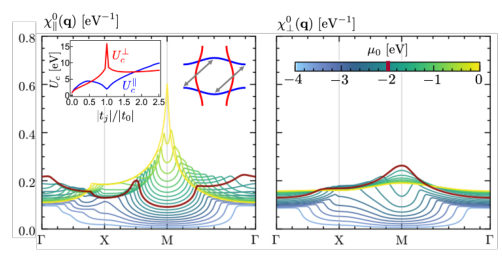 
FIG. 4. Longitudinal and transverse bare susceptibilities, χ0 ∥/⊥(q), versus momenta and doping; calculations are for T = 300 K and |tj|/|t0| = 0.5. At HLT, µ0 = −2 eV, brick- red lines, χ0 ⊥&gt; χ0 ∥, indicating “paramagnon-like” instability. Insets show: 1) evolution of the critical interaction strength U ∥/⊥ c ≡1/maxq[χ0 ∥/⊥(q)] at HLT for different |tj|/|t0| and corresponding µ0 = −4 min(|t0|, |tj|), and, 2) Fermi contours at the half filling with M-point (π, π) nesting.

📷 Fig 5

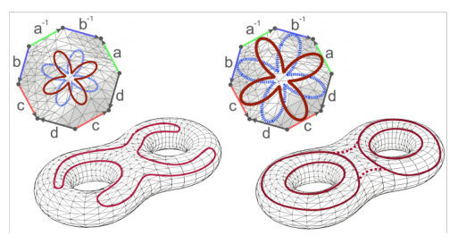 
FIG. 5. Evolution of loop topologies and homotopy classes with g-wave AM symmetry on the octagon fundamental do- main and on the double torus Σg=2. The left panels show closed orbits, while the right panels illustrate the homotopi- cally nontrivial case of open orbits at corresponding Lifshitz transition. The drawings on the double torus Σg=2 show only the spin-up states, represented by red curves. The cor- responding spin-down states unfold analogously, but wind around the double torus in the complementary (through the holes) direction.

**Summary.** This work proposes using Lifshitz-transitioned altermagnets as a novel platform for spintronics. By tuning the doping level, the system enters an 'open-orbit' phase characterized by topologically protected, spin-selective electronic channels. This mechanism allows for the engineering of spin currents and filtering effects without requiring intrinsic ferromagnetism.

**Why it may be interesting.** The concept of using Fermi-surface topology (winding number) to engineer spin transport is a powerful, non-conventional mechanism for spintronics, offering an alternative to traditional magnetic or SOC-based approaches.

Detailed structure

**Main problem.** Developing robust spin transport mechanisms in spintronics that bypass the need for ferromagnetic order or strong spin-orbit coupling.

**Main result.** Lifshitz-transitioned altermagnets create topologically protected, spin-selective open channels, enabling phenomena like perfect spin-filtering and chirality-tunable persistent spin currents.

**Method.** The study combines topological analysis of Fermi contours (homotopy class) with semi-classical and quantum transport simulations (Landauer-Büttiker formalism).

**Model / system.** The system is a two-dimensional d-wave altermagnet, whose electronic structure is governed by a tight-binding Hamiltonian. The key physics arises from the topological change (Lifshitz transition) in the spin-resolved Fermi contours.

**Key observables.** Open-orbit channels (non-contractible Fermi contours), non-local resistances, spin-polarized persistent currents, and spin susceptibilities ($\chi_0$).

**Important parameters / regimes.** Chemical potential ($\mu_0$) tuning across the Lifshitz transition, perpendicular magnetic field ($B_z$), and interaction strength ($U$).

**Assumptions / limitations.** The analysis relies on the topological protection afforded by Fermi-surface winding, and transport calculations are performed at zero temperature ($T=0$ K) or include finite-size/disorder corrections.

**Figures summary.** Figures illustrate the evolution of Fermi contours across the Lifshitz transition, the resulting perpendicular spin-separated trajectories in a magnetic field, and the dependence of persistent currents on chirality.

**Paper structure.** The paper systematically analyzes the topological transition in the altermagnet band structure, predicts three key magneto-transport signatures (lensing, filtering, PC), and details the theoretical framework using Hamiltonian modeling and quantum transport simulations.

Abstract

Altermagnets offer a unique venue for spin transport due to their vanishing net magnetization and momentum-dependent spin splitting. We demonstrate that a homotopic Lifshitz transition in two-dimensional altermagnets creates a regime where carriers are confined to geometrically protected, spin-selective open channels. These channels originate from non-contractible Fermi contours and act as metallic analogues of topological edge modes: they are sharply directional, spin-pure, and protected by Fermi-surface winding rather than an energy gap or boundary confinement. We predict three striking magneto-transport signatures of such topologically reconfigured altermagnets: open-orbit focusing with perfect lensing and retroreflection, high-efficiency magnetic spin filtering, and chirality-tunable spin persistent currents in altermagnetic nanotubes. Our results establish altermagnets as a platform where Fermi-surface winding directly engineers spin transport, bypassing the requirements for ferromagnetism or strong spin-orbit coupling. These findings identify Lifshitz-transitioned altermagnets as a route to topology-enabled spintronics that transcends the limitations of conventional edge-state paradigms.

[↑ back to top](#top)

### [Electronic primary thermometry -- experimental comparison of the Coulomb Blockade and Shot Noise Thermometer](http://arxiv.org/abs/2606.04147v1)

**Authors:** Eemil Praks, Libin Wang, Yu-Cheng Chang, Renan P. Loreto, Mika Prunnila, Joonas T. Peltonen, Jukka P. Pekola  
**Type:** experiment · **Category:** statistical mechanics · **PDF:** <https://arxiv.org/pdf/2606.04147v1>  
**Analysis basis:** full PDF text, analyzed in chunks

📷 Fig 1

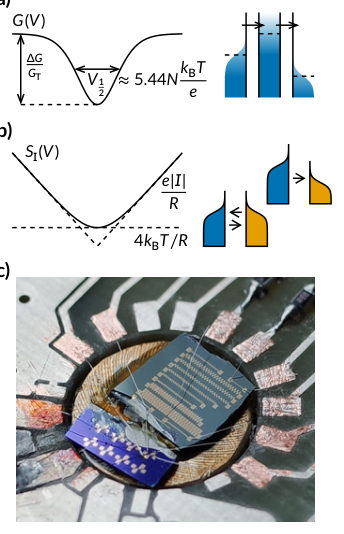 
Figure 1. Schematic illustration of the operating principles of (a) CBT and (b) SNT. In CBT Coulomb barrier needs to be overcome by thermal fluctuations, whereas in SNT temper- ature determines the cross-over between thermal noise and Shot noise. (c) CBT and SNT are mounted to the same sam- ple holder to minimize the possiblity of thermal gradients be- tween the two thermometers.

📷 Fig 2

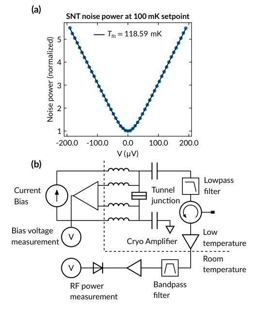 
Figure 3. (a) Measured SNT noise power and best fit to it at 100 mK cryostat setpoint. (b) Schematic of the SNT measurement setup. The DC biasing and RF components are separated using large inductors and capacitors mounted on the sample holder. Final measurement bandwidth is fully determined by the components on the RF chain due to the wide bandwidth diode in the measurement. Noise outside the bandwidth does not affect the measurement.

📷 Fig 3

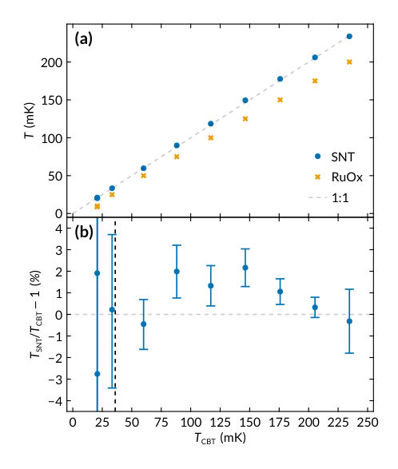 
Figure 4. (a) Measured SNT and fridge RuOx thermometer temperatures as a function of CBT temperature. The mixing chamber plate RuOx temperatures deviate systemically from both the CBT and SNT. (b) Relative difference between the CBT and SNT. The point where kBT/h = 750 MHz is marked by a dashed vertical line. Below this point, the uncertainty of the SNT measurement increases significantly. At the lowest temperature, slightly above 20 mK, the uncertainty is approx- imately ±15 %.

📷 Fig 4

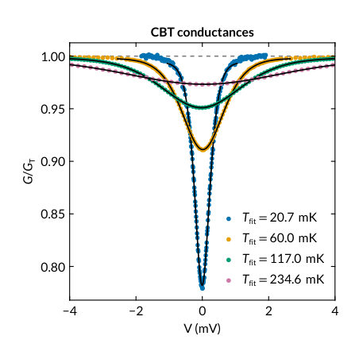 
Figure 5. Measured CBT curves and least squares fits at a variety of temperatures. While the noise of the measurement increases at lower temperatures due to smaller excitation volt- age, the overall uncertainty remains approximately constant due to the deeper conductance dip.

📷 Fig 5

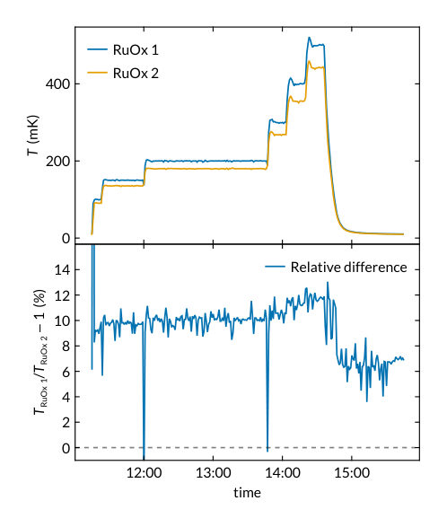 
Figure 7. The temperature of two RuOx thermometers mounted to the MXC plate of the cryostat over a range of tem- peratures. In the presented experiments, RuOx 1 was used. There is a nearly constant offset between the two sensors, suggesting a poor calibration or drift due to aging. The ex- periment was repeated with the position of RuOx 2 changed, which resulted in a similar deviation. This implies that the MXC plate is uniformly thermalized.

**Summary.** This paper experimentally compares two primary electronic thermometers, the Coulomb Blockade Thermometer (CBT) and the Shot Noise Thermometer (SNT), for use in the millikelvin regime. By measuring electrical properties like conductance and noise power, the authors demonstrate that both methods yield highly consistent temperature readings. This work provides a robust, fundamental-constant-based tool for precise temperature measurement in low-temperature quantum experiments.

**Why it may be interesting.** The development of highly accurate, fundamental-constant-based thermometers is crucial for any experiment requiring precise temperature control in the quantum regime, directly impacting measurements in quantum optics and many-body systems.

Detailed structure

**Main problem.** The paper addresses the need for primary thermometry methods to replace the current temperature scale, especially in the very high and low temperature limits.

**Main result.** The Coulomb Blockade Thermometer (CBT) and the Shot Noise Thermometer (SNT) show good agreement (within 2.5%) when inter-compared in the 20 mK to 235 mK range.

**Method.** The authors experimentally compare two independent electronic thermometers, CBT and SNT, by measuring their respective electrical responses (conductance and noise power) as a function of bias voltage.

**Model / system.** The study utilizes quantum circuits involving Normal Metal-Insulator-Normal Metal (NIN) tunnel junctions. The CBT relies on the bias dependence of normalized conductance, while the SNT uses the symmetric current noise, both linking temperature directly to fundamental constants ($k_B, e$).

**Key observables.** Normalized conductance ($G/G_T$) for CBT and symmetric current noise power ($S_I$) for SNT.

**Important parameters / regimes.** Temperature range of 20 mK to 235 mK; fundamental constants $k_B$ and $e$.

**Assumptions / limitations.** The comparison assumes that the measurements are free from significant self-heating effects and that the SNT measurement uncertainty is dominated by the measurement bandwidth.

**Figures summary.** Figures illustrate the measured CBT conductance vs. bias voltage and SNT noise power vs. bias voltage, showing best-fit curves derived from theoretical models at specific temperatures.

**Paper structure.** The paper introduces the need for primary thermometry, details the theoretical basis and measurement techniques for CBT and SNT, presents the experimental comparison across a temperature range, and concludes by analyzing the agreement and sources of uncertainty.

Abstract

Since the redefinition of the kelvin in 2019, new methods of primary thermometry have been considered to replace the currently agreed temperature scale in the very high and low temperature limits. These new methods should provide improved uncertainties and, most importantly, a more direct link to the definition of the kelvin. In the low temperature ranges it is possible to realize thermometers that do not require any known reference temperature or external calibration parameters. We present an experimental comparison of two such thermometers: the Coulomb Blockade Thermometer (CBT) and the Shot Noise Thermometer (SNT). Both thermometers measure temperature hinging only on the natural constants $k_\mathrm{B}$, and $e$. Furthermore both of them are based on electron tunneling current and, thereby, need only electrical measurements, enhancing the practicality. CBT and the SNT are inter-compared in a range of 20 mK to 235 mK. The results show that the agreement of SNT and CBT is approximately within 2.5 % in this range. Basic measurement uncertainty is analyzed and we show that uncertainty in the measurement frequency can cause significant error. to temperature measurement of the SNT at low temperatures where finite frequency plays a role.

[↑ back to top](#top)

### [Nodal superconductivity with spin-triplet component in a noncentrosymmetric weakly-correlated metal](http://arxiv.org/abs/2606.04742v1)

**Authors:** Marcel Strohmeier, Andriy Smolyanyuk, Karsten Held, Michael Smidman, Geetha Balakrishnan, Wolfgang Belzig, Elke Scheer, Angelo Di Bernardo  
**Type:** both · **Category:** other · **PDF:** <https://arxiv.org/pdf/2606.04742v1>  
**Analysis basis:** full PDF text, analyzed in chunks

📷 Fig 1

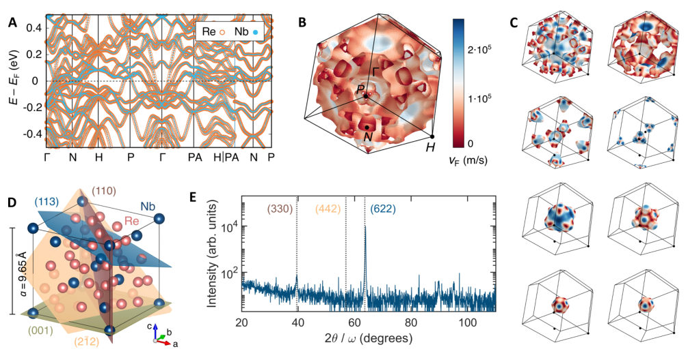 
FIG. 1. Electronic structure and crystallographic characterization of Nb-Re. (A) Electronic band structure based on DFT calculations (B) Corresponding three-dimensional FS constructed from the band structure, illustrating the complex multi- band topology. The color scale reflects the magnitude of the Fermi velocity vF. (C) FS decomposed into eight individual band contributions. (D) Cubic α-Mn unit cell of Nb-Re with the colored crystallographic planes indicating the investigated surface orientations. (E) Single-crystal X-ray diffraction (XRD) pattern measured on the (113) surface, confirming the crystallographic quality and orientation of the sample.

📷 Fig 2

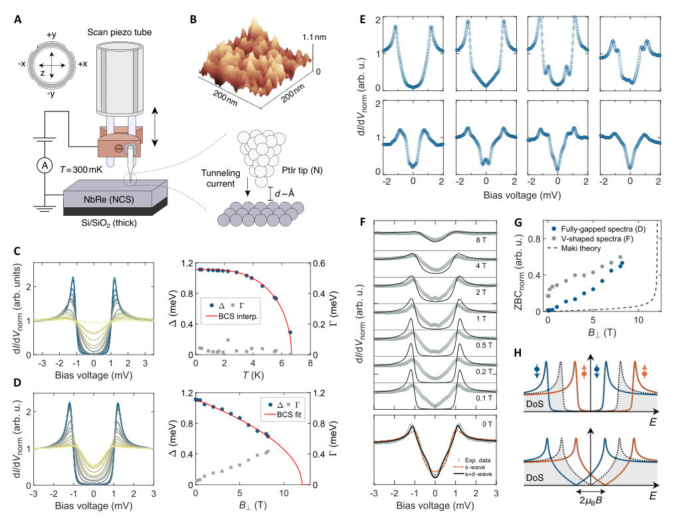 
FIG. 2. Tunneling spectroscopy on Nb-Re thin films. (A) Scheme of the low-temperature STM experiment and the normal metal/superconductor tunneling configuration. (B) 3D representation of an atomic force microscope image showing the surface topography of the Nb-Re thin film. (C), (D) BCS-like tunneling spectra measured at various temperatures T and magnetic fields B⊥. The extracted superconducting gap energy and Dynes parameter Γ are shown on the right. (E) Selection of non-BCS-type dI/dV spectra measured across the Nb-Re surface (F) V-shaped tunneling spectrum with its evolution under an increasing B⊥. (G) Zero-bias conductance (ZBC) as a function of the external magnetic field. (H)...

📷 Fig 3

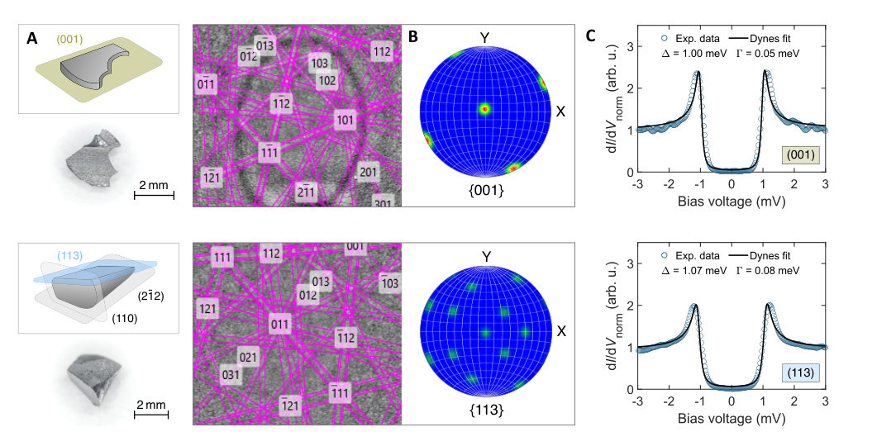 
FIG. 3. Characterization of Nb-Re single crystals with (001) and (113) surface orientations. (A) Photographs of the two Nb-Re single crystals, along with a sketch of the sample geometry illustrating the investigated crystallographic surface orientations. (B) Electron backscatter diffraction (EBSD) characterization showing the Kikuchi patterns (left) and the corresponding pole figures (right) for the two colored surface orientations in (A). (C) Representative BCS-type tunneling spectra acquired on the (001) and (113) surfaces.

📷 Fig 4

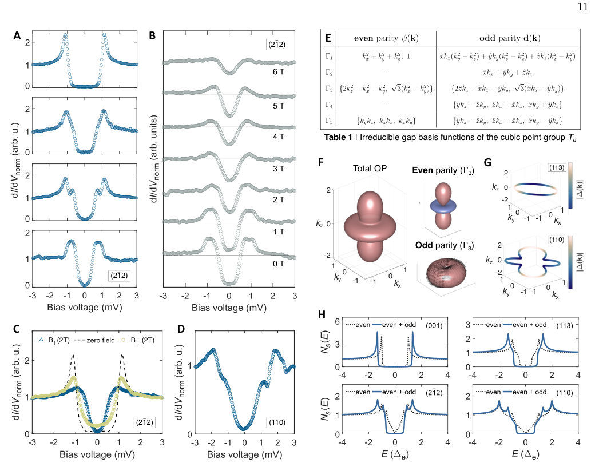 
FIG. 4. Tunneling spectroscopy on a Nb-Re single crystal with (212) surface orientation. (A) Representative dI/dV tunnel spectra measured on the (212) surface of a Nb-Re single crystal. (B) Field-dependent evolution of a double-peak spectrum under a magnetic field B⊥. (C) Anisotropic suppression of the sc gap on the (212) surface, with dI/dV measured consecutively in a 2 T magnetic field applied perpendicular and parallel to the sample surface, respectively. (D) Enlarged superconducting gap observed on the (110) surface orientation. (E) Summary of the even- and odd-parity irreducible gap basis functions compatible with the point group of Nb-Re. (F) 3D illustration of the total...

📷 Fig 5

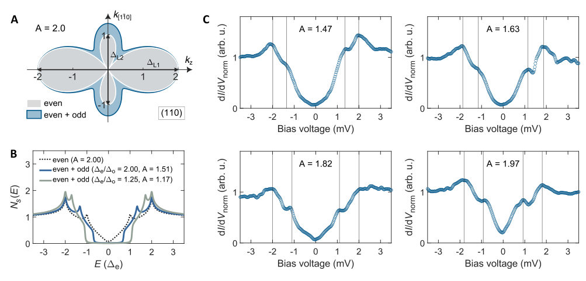 
FIG. 5. Analysis of the enlarged superconducting gap acquired on the (110) surface orientation. (A) Two- dimensional k-space cut through the even-parity dz2-orbital-type order parameter (Γ3) along the (110) plane. Adding an odd-parity component (Γ3) significantly alters the lobe structure. Particularly, the variable scale ratio A = ∆L1/∆L2 of the orthogonally oriented lobes manifests as energy-dependent in-gap feature in the DoS. (B) Calculated DoS with variable contributions of the odd-parity component. (C) Comparison of experimental tunnel spectra acquired at four different positions on the (110) surface, revealing a correlation between the degree of its V-shape and the ratio A, as...

**Summary.** This work investigates the superconducting pairing symmetry in the noncentrosymmetric metal $	ext{Nb-Re}$ using orientation-dependent scanning tunneling spectroscopy. By analyzing the local density of states across multiple crystal faces, the authors demonstrate that the superconducting order parameter must be a mixture of spin-singlet and spin-triplet components. This resolves a long-standing debate by showing that ASOC alone is sufficient to induce significant triplet pairing, positioning $	ext{Nb-Re}$ as a platform for superconducting spintronics.

**Why it may be interesting.** The finding that ASOC alone drives mixed-parity superconductivity provides a clean, correlation-free mechanism for unconventional pairing, which is highly relevant for understanding pairing mechanisms in complex materials relevant to quantum devices.

Detailed structure

**Main problem.** The central question addressed is whether antisymmetric spin-orbit coupling (ASOC) alone, without invoking strong electronic correlations, is sufficient to generate a measurable spin-triplet component in the superconducting order parameter of a noncentrosymmetric superconductor (NCS).

**Main result.** The study demonstrates that ASOC is sufficient to foster a sizable spin-triplet component in $	ext{Nb-Re}$, evidenced by orientation-dependent superconducting gap structures, reconciling conflicting literature reports.

**Method.** The research combines low-temperature scanning tunneling spectroscopy (STS) on single crystals with symmetry-constrained theoretical modeling of the superconducting order parameter.

**Model / system.** The system is $	ext{Nb}_{18}	ext{Re}_{82}$, a weakly-correlated noncentrosymmetric metal. The model incorporates a mixed-parity order parameter combining even-parity spin-singlet and odd-parity spin-triplet components.

**Key observables.** Orientation-dependent local density of states (DoS) measured via $dI/dV$, and the zero-bias conductance (ZBC) dependence on magnetic field.

**Important parameters / regimes.** The ratio of triplet to singlet amplitude ($\Delta_o/\Delta_e$), and the superconducting gap energy ($\Delta$).

**Assumptions / limitations.** The analysis assumes that the observed spectral features can be accurately modeled by a mixed-parity order parameter, and that the measured anisotropy is intrinsic to the pairing symmetry.

**Figures summary.** Figures show STM $dI/dV$ spectra on different crystal faces ((001), (212), (110)) exhibiting varying gap structures, and plots illustrating the required combination of singlet and triplet components to fit the full set of experimental data.

**Paper structure.** The paper establishes the theoretical framework for mixed-parity superconductivity in NCS, presents STS measurements across multiple crystal orientations, and uses a symmetry-constrained model to fit the observed anisotropic DoS, concluding that ASOC is the primary driver for triplet pairing.

Abstract

In conventional superconductors, Cooper pairs form in an even-parity spin-singlet state. Noncentrosymmetric superconductors, which lack inversion symmetry, exhibit antisymmetric spin-orbit coupling (ASOC) that can combine even-parity spin-singlet and odd-parity spin-triplet pairs into a mixed-parity order parameter. Spin-triplet components are highly beneficial for superspintronic devices. Whether ASOC alone $-$ without strong electronic correlations $-$ is sufficient to generate a measurable triplet component remains a central open question. Here, we resolve this question in Nb$_{18}$Re$_{82}$ (Nb-Re), a weakly-correlated noncentrosymmetric metal whose superconducting pairing symmetry has been actively debated. Using low-temperature scanning tunneling spectroscopy on single crystals with four distinct crystallographic orientations, find a pronounced orientation-dependent anisotropy in the local density of states. Supported by a symmetry-constrained model, we show that the complete set of tunneling spectra requires a mixed-parity order parameter with the triplet amplitude reaching up to half of the singlet component. These results reconcile the conflicting reports in the literature on Nb-Re and demonstrate that ASOC is sufficient to foster a sizable spin-triplet component even without strong electronic correlations, suggesting that mixed-parity superconducting states may be more widespread than previously assumed. Since Nb-Re can be readily fabricated in thin-film form, these findings position it as an accessible platform for superspintronic devices and establish orientation-resolved tunneling spectroscopy as a general protocol for the detection of mixed-parity order parameters.

[↑ back to top](#top)

### [Superconducting properties of Nb$_{0.85}$Sc$_{0.15}$ film deposited by magnetron co-sputtering](http://arxiv.org/abs/2606.04956v1)

**Authors:** Paul Berezhnoy, Anna Elistratova, Zakhar Enbaev, Mikhail Dryazgov, Alexander Mumlyakov, Oleg Solovyev, Mikael Geodakyan, Igor Trofimov, Vasily Stolyarov, Alexander Korneev, Michael Tarkhov  
**Type:** experiment · **Category:** other · **PDF:** <https://arxiv.org/pdf/2606.04956v1>  
**Analysis basis:** full PDF text, analyzed in chunks

📷 Fig 1

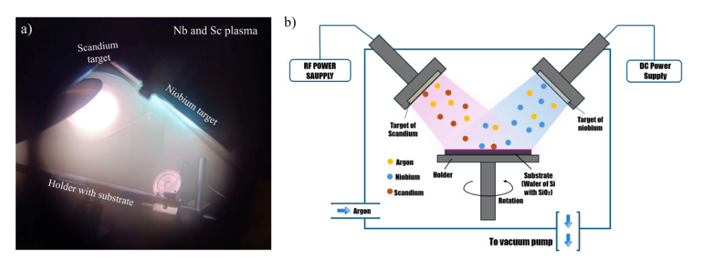 
Figure 1. (a) Optical photography of plasma during co-sputtering of Nb and Sc targets. (b) Schematic illustration of

📷 Fig 2

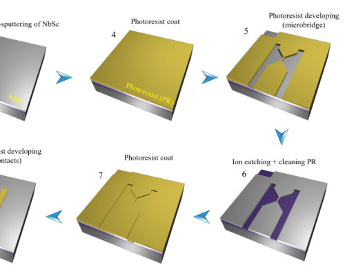 
Figure 2. The fabrication process flow of microbridge structures based on NbSc.

📷 Fig 3

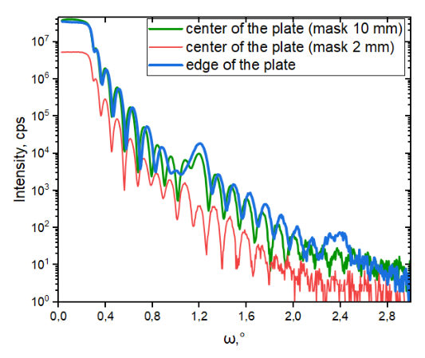 
Figure 3. XRR curves registered from the edge (blue curve) and center of the wafer using 10 mm (green curve) and 2 mm

📷 Fig 4

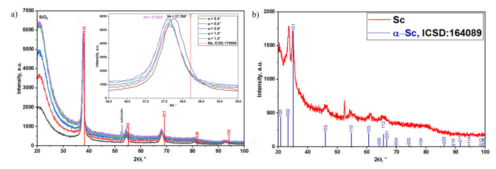 
Figure 4. (a) Diffractograms of the Nb0.85Sc0.15 film at ω = 0.4◦/0.6◦/0.8◦/1.0◦/1.2◦with the inset demonstrating the shift in

📷 Fig 5

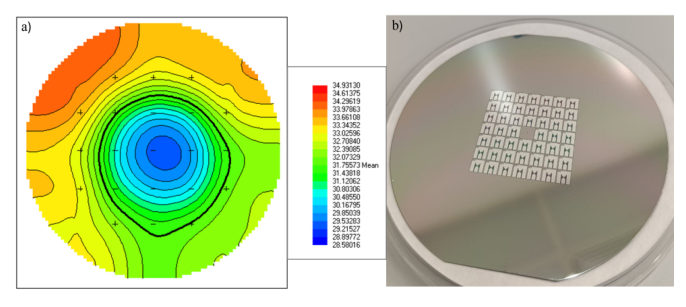 
Figure 5. (a) Distribution of sheet resistance across the wafer.(b) Optical photography of the wafer with microbridge

**Summary.** This paper reports on the successful synthesis and comprehensive characterization of superconducting $	ext{Nb}_{1-x}	ext{Sc}_x$ thin films using magnetron co-sputtering. Key findings include a maximum critical temperature of 6.35 K and high critical current densities, demonstrating the material's promise for advanced functional cryogenic electronic devices.

**Why it may be interesting.** While primarily experimental, the detailed characterization of superconducting parameters ($T_c$, $H_{c2}$, $\xi_{GL}$) and the comparison to other superconducting materials (like $	ext{NbN}$) provide fundamental data relevant to understanding superconducting mechanisms in engineered thin films.

Detailed structure

**Main problem.** The study focuses on synthesizing and characterizing the superconducting properties of $	ext{Nb}_{1-x}	ext{Sc}_x$ intermetallic thin films.

**Main result.** The synthesized $	ext{Nb}_{1-x}	ext{Sc}_x$ film exhibits superconductivity with a maximum critical temperature ($T_c$) of 6.35 K and a high critical current density ($J_c$) up to $2.5 	ext{ MA/cm}^2$.

**Method.** The research employed magnetron co-sputtering for film deposition, followed by structural characterization using XRD/XRR and electrical measurements (transport and magnetic) to probe superconducting parameters.

**Model / system.** The physical system is the $	ext{Nb}_{1-x}	ext{Sc}_x$ intermetallic compound thin film, which is analyzed as a superconducting material suitable for cryogenic electronics.

**Key observables.** Critical temperature ($T_c$), critical current density ($J_c$), upper critical field ($H_{c2}$), electron diffusion coefficient ($D$), and coherence length ($\xi_{GL}$).

**Important parameters / regimes.** Maximum $T_c$ of 6.35 K at $\approx 15\% 	ext{ Sc}$; $J_c$ up to $2.5 	ext{ MA/cm}^2$; $H_{c2}(0) = 3.2 	ext{ T}$.

**Assumptions / limitations.** The systematic shifts in diffraction angles suggest a substitutional solid solution or metastable phase, while depth profiling suggests the lattice parameter shifts are due to strain rather than composition gradients.

**Figures summary.** Figures show the co-sputtering process, microbridge fabrication, XRR curves indicating thickness non-uniformity, and GIXRD patterns demonstrating peak shifts dependent on the incidence angle.

**Paper structure.** The paper details the synthesis process, structural characterization (XRD/XRR/AES), and comprehensive superconducting property measurements ($T_c$, $J_c$, $H_{c2}$, etc.) on samples with varying Sc concentrations.

Abstract

The technology has been developed for synthesizing Nb$_{1-x}$Sc$_x$ films using magnetron co-sputtering from Nb and Sc targets. The material synthesis was accompanied by structural characterization using X-ray diffraction and X-ray reflectometry methods, which enabled the determination of thickness, phase composition and crystal structure. We also analyzed the superconducting properties. The critical temperature $T_c$ was measured for samples with different concentarions of Sc and Nb. The maximum value of $T_c$ equal to 6.35 K was observed for sample with a scandium content of approximately 15 %, which was determined by Auger spectroscopy. Transport and magnetoresistive measurements were performed in microbridges with length of 50 $μ$m, width of 2 $μ$m, and thickness of 30 nm. The critical current density was as high as 2.5 $\text{ MA/cm}^{2}$. Magnetic measurements were performed with the field oriented perpendicular to the sample. The upper critical field $H_{c2}(0) = 3.2$ T, electron diffusion coefficient $D = 1.1$ $\text{cm}^{2}/s$, and coherence length $ξ_{GL} = 10.1$ nm. The synthesized Nb$_{1-x}$Sc$_x$ intermetallic compound shows promise for various functional cryogenic electronics devices. \keywords{NbSc; superconductor; microbridge}

[↑ back to top](#top)

### [Triangular Charge-Density Waves (T-CDW) Stabilize Janus Group-VI Chalcogenide Hydrides](http://arxiv.org/abs/2606.04954v1)

**Authors:** Jakkapat Seeyangnok, Udomsilp Pinsook, Graeme J. Ackland  
**Type:** theory · **Category:** other · **PDF:** <https://arxiv.org/pdf/2606.04954v1>  
**Analysis basis:** full PDF text, analyzed in chunks

📷 Fig 1

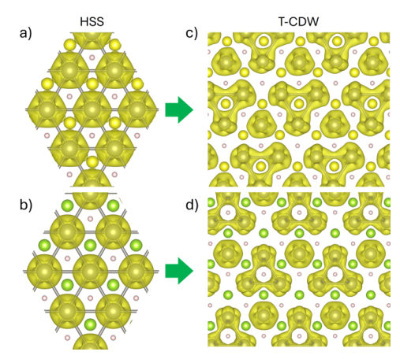 
FIG. 1. Structural reconstruction and local density (ρ(r)) at the Fermi level for 1T-WSH [(a),(c)] and 1T-WSeH [(b),(d)] in the high- symmetry state (HSS) and triangular charge-density-wave (T-CDW) phase, respectively. The T-CDW transition induces a lattice distor- tion and a strong spatial modulation of the local density ρ(r), giving rise to characteristic triangular electronic textures and a reconstruc- tion of the low-energy states near the Fermi level.

📷 Fig 2

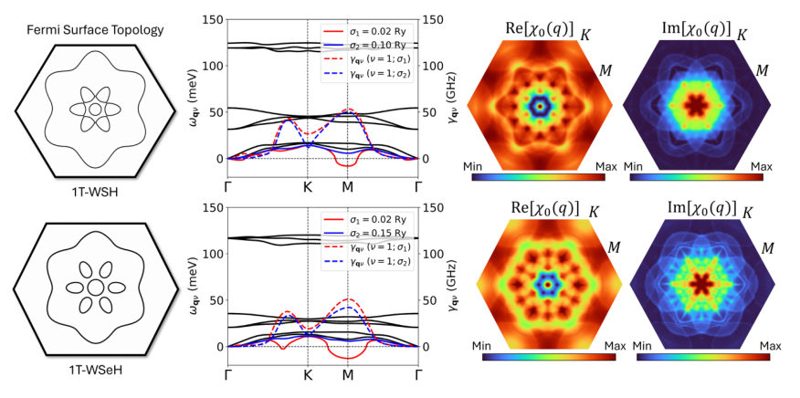 
FIG. 2. Fermi-surface topology (left), low-energy phonon dispersions (center), and bare electronic susceptibility (right) of the high-symmetry phase of 1T-WSH (top) and 1T-WSeH (bottom). The soft phonon mode near M exhibits a strong dependence on the electronic smearing pa- rameter, demonstrating its electronic origin. Although Im[χ0(q)] shows only moderate enhancement, Re[χ0(q)] develops pronounced maxima near the CDW wave vector, indicating that the instability arises from enhanced electronic susceptibility and electron–phonon coupling rather than perfect Fermi-surface nesting. Together, these signatures reveal the microscopic mechanism driving the transition from the high-symmetry state...

📷 Fig 3

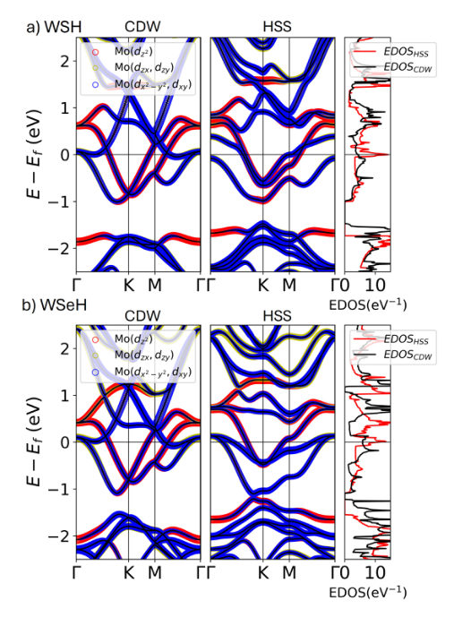 
FIG. 3. Orbital-resolved electronic band structures in the T-CDW phase (left) and high-symmetry state (center), together with the cor- responding electronic density of states (right), for (a) 1T-WSH and (b) 1T-WSeH. The T-CDW transition induces substantial reconstruc- tion of the low-energy electronic structure, including band folding, lifted degeneracies, and a reduced density of states at the Fermi level.

📷 Fig 4

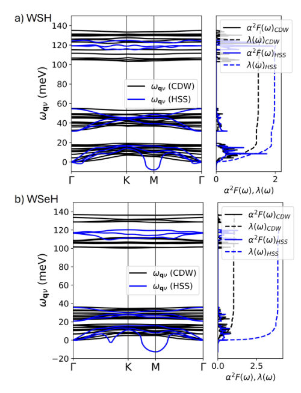 
FIG. 4. Phonon dispersions (left), Eliashberg spectral functions α2F(ω), and cumulative electron–phonon coupling strengths λ(ω) (right) for 1T-WSH (a) and 1T-WSeH (b) in the high-symmetry state (blue) and T-CDW phase (black). The T-CDW transition removes the soft phonon instability and substantially suppresses the electron– phonon coupling, leading to a dynamically stable ground state.

**Summary.** This work uses first-principles calculations to examine how Charge-Density-Wave (T-CDW) formation stabilizes Janus chalcogenide hydrides. The T-CDW transition is found to stabilize the lattice by renormalizing the electron-phonon coupling strength. Crucially, this stabilization mechanism does not destroy superconductivity, allowing for robust phonon-mediated superconductivity to persist.

**Why it may be interesting.** The concept of a CDW transition acting as a self-stabilizing mechanism that *preserves* superconductivity, rather than destroying it, presents a novel coupling between lattice dynamics and pairing mechanisms relevant to strongly correlated superconductors.

Detailed structure

**Main problem.** The study investigates the role of Charge-Density-Wave (CDW) formation in stabilizing lattice structures and understanding its interplay with superconductivity in hydrogenated Janus Group-VI Chalcogenide Hydrides.

**Main result.** The T-CDW phase acts as an intrinsic self-stabilizing mechanism by renormalizing the electron-phonon coupling (EPC) strength, thereby relieving excessive lattice instability while preserving robust phonon-mediated superconductivity.

**Method.** The research employs first-principles calculations using DFT/DFPT to analyze phonon softening, electronic susceptibility, and EPC constants.

**Model / system.** The system under study consists of Janus transition-metal chalcogenide hydrides, specifically 1T-WSH and 1T-WSeH, which are analyzed in both high-symmetry and T-CDW distorted phases.

**Key observables.** Phonon softening at the M point, T-CDW pattern, renormalization of EPC constant (lambda), and superconducting transition temperatures (Tc).

**Important parameters / regimes.** The EPC constant ($\lambda$) changes significantly upon transition (e.g., 2.04 $	o$ 1.50 in WSH), and predicted $T_c$ values are 12.28 K and 7.75 K.

**Assumptions / limitations.** The instability is driven by strong momentum-dependent EPC, not conventional Fermi-surface nesting, and the mechanism is proposed to be universal for the 1T-MCH family.

**Figures summary.** Figures illustrate structural reconstruction and local density modulation in the T-CDW state, alongside phonon dispersions and electronic susceptibility showing the electronic origin of the soft mode.

**Paper structure.** The paper first establishes the instability via phonon softening in the high-symmetry phase, then analyzes the T-CDW formation driven by EPC, demonstrating electronic reconstruction, and finally concludes that this process stabilizes the lattice while maintaining superconductivity.

Abstract

Hydrogenation is an effective strategy for enhancing electron--phonon coupling (EPC) and superconductivity in two-dimensional materials. However, excessively strong EPC can also induce lattice instabilities, leading to charge-density-wave (CDW) formation and structural phase transitions. Here, using first-principles calculations, we investigate CDW order in the Janus transition-metal chalcogenide hydrides 1T-WSH and 1T-WSeH. We find that the high-symmetry phases exhibit pronounced phonon softening at the M point, driving a transition to a commensurate $2\times2$ distorted structure characterized by an emergent triangular charge-density-wave (T-CDW) pattern. Analysis of the electronic structure, susceptibility, and phonon spectrum reveals that the instability is not driven by conventional Fermi-surface nesting but originates from strong momentum-dependent EPC. The T-CDW transition reconstructs the electronic structure and reduces the density of states at the Fermi level, leading to a substantial renormalization of the EPC strength. Consequently, the electron--phonon coupling constants decrease from $λ=2.04$ to $1.50$ in 1T-WSH and from $λ=3.94$ to $1.06$ in 1T-WSeH, while superconductivity remains robust in CDW phase with predicted transition temperatures of $T_c=12.28$ K and $7.75$ K, respectively. Together with previous results for MoSH and MoSeH, our findings establish a universal mechanism in the 1T-$MCH$ family ($M=\mathrm{Mo},\mathrm{W}$ and $C=\mathrm{S},\mathrm{Se}$), where the primary role of the T-CDW phase is not to eliminate superconductivity but to stabilize the lattice through EPC renormalization. The T-CDW phase therefore acts as an intrinsic self-stabilizing response that relieves excessively strong EPC while preserving phonon-mediated superconductivity.

[↑ back to top](#top)

