
# arxiv digest (quant-ph + cond-mat) — 2026-06-05

*103 papers · 32 relevant · 2 highlighted*

## 🔥 Most relevant (32)

*Every paper with at least one nonzero topic score, sorted by best-matching score. 🔥 marks scores ≥4/5. Click the title to jump to the full entry below; click [arXiv] to open the paper page. `(secondary)` marks papers from de-prioritized cond-mat archives.*

Show 32 relevant papers

- [Non-equilibrium thermodynamics of collapse models in the strongly non-Gaussian regime](#paper-2606.06259) [[arXiv]](http://arxiv.org/abs/2606.06259v1) — 🔥 `non-equilibrium dynamics` **5/5** · 🔥 `methods for driven-dissipative` **4/5** · 🔥 `non-equilibrium universality` **4/5** · `Keldysh / 2PI / non-Gaussian methods` **3/5** · `driven-dissipative phase transition` **3/5** · `scars & prethermalization` **2/5** · `Frenkel-Kontorova` **1/5** · `correlated / nonlocal dissipation` **1/5** · `entanglement & information structure` **1/5** · `quantum measurements` **1/5**
- [Tight relation between the physical effects of a quantum measurement and the information gained about an observable](#paper-2606.05767) [[arXiv]](http://arxiv.org/abs/2606.05767v1) — 🔥 `quantum measurements` **5/5** · 🔥 `measurement-induced transitions` **4/5** · `entanglement & information structure` **2/5** · `Keldysh / 2PI / non-Gaussian methods` **1/5** · `correlated / nonlocal dissipation` **1/5** · `driven-dissipative phase transition` **1/5**
- [Breakeven demonstration of quantum low-density parity-check codes](#paper-2606.06455) [[arXiv]](http://arxiv.org/abs/2606.06455v1) — 🔥 `QC/QI experiment` **5/5** · `quantum measurements` **3/5** · `measurement-induced transitions` **1/5**
- ⭐ [Coherent room-temperature dipole synchronization in nanocavity sheets](#paper-2606.06490) [[arXiv]](http://arxiv.org/abs/2606.06490v1) — 🔥 `Tavis-Cummings & cavity-many-emitter` **4/5** · 🔥 `driven-dissipative phase transition` **4/5** · `correlated / nonlocal dissipation` **3/5** · `correlated cavity matter` **3/5** · `interference shaping light` **3/5** · `methods for driven-dissipative` **3/5** · `non-equilibrium universality` **3/5** · `quantum optics experiment` **3/5** · `Keldysh / 2PI / non-Gaussian methods` **2/5** · `analog quantum simulation` **2/5** · `non-equilibrium dynamics` **2/5** · `superradiant laser` **2/5** · `Dicke superradiance` **1/5** · `entanglement & information structure` **1/5** · `quantum measurements` **1/5**
- [Frustrated superradiant phases in one- and two-dimensional lattices](#paper-2606.05278) [[arXiv]](http://arxiv.org/abs/2606.05278v1) — 🔥 `Dicke superradiance` **4/5** · 🔥 `analog quantum simulation` **4/5** · `Tavis-Cummings & cavity-many-emitter` **3/5** · `correlated cavity matter` **3/5** · `driven-dissipative phase transition` **3/5** · `exotic spin models in light-matter` **2/5** · `methods for driven-dissipative` **2/5** · `non-equilibrium universality` **2/5** · `superradiant laser` **2/5** · `Frenkel-Kontorova` **1/5** · `Keldysh / 2PI / non-Gaussian methods` **1/5** · `correlated / nonlocal dissipation` **1/5** · `entanglement & information structure` **1/5** · `non-equilibrium dynamics` **1/5**
- [Engineered dissipation for faster adiabatic state preparation](#paper-2606.05815) [[arXiv]](http://arxiv.org/abs/2606.05815v1) — 🔥 `methods for driven-dissipative` **4/5** · `analog quantum simulation` **3/5** · `correlated / nonlocal dissipation` **3/5** · `driven-dissipative phase transition` **3/5** · `exotic spin models in light-matter` **3/5** · `non-equilibrium dynamics` **3/5** · `Keldysh / 2PI / non-Gaussian methods` **2/5** · `non-equilibrium universality` **2/5** · `Kondo & dissipative impurity` **1/5** · `correlated cavity matter` **1/5** · `entanglement & information structure` **1/5** · `measurement-induced transitions` **1/5** · `quantum measurements` **1/5** · `spintronics-quantum-optics interface` **1/5**
- [Krylov Complexity: Flat bands and Carroll breaking deformations](#paper-2606.05303) [[arXiv]](http://arxiv.org/abs/2606.05303v1) — 🔥 `analog quantum simulation` **4/5** · 🔥 `non-equilibrium dynamics` **4/5** · `Keldysh / 2PI / non-Gaussian methods` **3/5** · `driven-dissipative phase transition` **3/5** · `entanglement & information structure` **3/5** · `methods for driven-dissipative` **3/5** · `correlated / nonlocal dissipation` **2/5** · `non-equilibrium universality` **2/5** · `Kondo & dissipative impurity` **1/5** · `correlated cavity matter` **1/5** · `scars & prethermalization` **1/5**
- [Energy-Modulated Time-Asymmetric Spontaneous Collapse: Forward-Backward Dynamics from Stochastic Ito Reversal and Bright Solitons](#paper-2606.06452) [[arXiv]](http://arxiv.org/abs/2606.06452v1) — 🔥 `measurement-induced transitions` **4/5** · `correlated / nonlocal dissipation` **3/5** · `driven-dissipative phase transition` **3/5** · `methods for driven-dissipative` **3/5** · `quantum measurements` **3/5** · `analog quantum simulation` **2/5** · `non-equilibrium dynamics` **2/5** · `non-equilibrium universality` **2/5** · `Keldysh / 2PI / non-Gaussian methods` **1/5** · `Kondo & dissipative impurity` **1/5** · `entanglement & information structure` **1/5**
- [Non-equilibrium quantum thermodynamics of a memory-bearing open-system process](#paper-2606.05904) [[arXiv]](http://arxiv.org/abs/2606.05904v1) — 🔥 `methods for driven-dissipative` **4/5** · 🔥 `non-equilibrium dynamics` **4/5** · `Keldysh / 2PI / non-Gaussian methods` **3/5** · `correlated / nonlocal dissipation` **3/5** · `driven-dissipative phase transition` **3/5** · `entanglement & information structure` **2/5** · `non-equilibrium universality` **2/5** · `Tavis-Cummings & cavity-many-emitter` **1/5** · `measurement-induced transitions` **1/5** · `quantum measurements` **1/5**
- [Broadband AC Magnetic Field Sensing via Continuous wave optically detected magnetic resonance with NV Centers in diamond](#paper-2606.05928) [[arXiv]](http://arxiv.org/abs/2606.05928v1) — 🔥 `methods for driven-dissipative` **4/5** · `exotic spin models in light-matter` **3/5** · `spintronics-quantum-optics interface` **3/5** · `QC/QI experiment` **2/5** · `driven-dissipative phase transition` **2/5** · `Keldysh / 2PI / non-Gaussian methods` **1/5** · `analog quantum simulation` **1/5** · `correlated / nonlocal dissipation` **1/5** · `measurement-induced transitions` **1/5** · `non-equilibrium dynamics` **1/5** · `non-equilibrium universality` **1/5** · `quantum measurements` **1/5**
- [Emergent Self-Similar Quantum Revivals in Spiral Drives](#paper-2606.05288) [[arXiv]](http://arxiv.org/abs/2606.05288v1) — 🔥 `entanglement & information structure` **4/5** · 🔥 `non-equilibrium dynamics` **4/5** · `analog quantum simulation` **3/5** · `methods for driven-dissipative` **3/5** · `non-equilibrium universality` **3/5** · `scars & prethermalization` **2/5** · `Keldysh / 2PI / non-Gaussian methods` **1/5** · `driven-dissipative phase transition` **1/5**
- [Enhancement of charge correlations and real-space topological marker on an interacting non-Hermitian Su-Schrieffer-Heeger model](#paper-2606.06466) [[arXiv]](http://arxiv.org/abs/2606.06466v1) — 🔥 `analog quantum simulation` **4/5** · `driven-dissipative phase transition` **3/5** · `methods for driven-dissipative` **3/5** · `correlated / nonlocal dissipation` **2/5** · `non-equilibrium dynamics` **2/5** · `non-equilibrium universality` **2/5** · `Frenkel-Kontorova` **1/5** · `Keldysh / 2PI / non-Gaussian methods` **1/5** · `Kondo & dissipative impurity` **1/5** · `entanglement & information structure` **1/5**
- [Breakdown of Thermalization from Real-Time Dynamics in the Two-Dimensional Hubbard Model](#paper-2606.05293) [[arXiv]](http://arxiv.org/abs/2606.05293v1) — 🔥 `non-equilibrium dynamics` **4/5** · `analog quantum simulation` **3/5** · `methods for driven-dissipative` **3/5** · `non-equilibrium universality` **3/5** · `scars & prethermalization` **2/5** · `Keldysh / 2PI / non-Gaussian methods` **1/5** · `correlated / nonlocal dissipation` **1/5** · `driven-dissipative phase transition` **1/5** · `entanglement & information structure` **1/5**
- [A closed system setting for quantum thermalisation in free fermions](#paper-2606.06362) [[arXiv]](http://arxiv.org/abs/2606.06362v1) — 🔥 `non-equilibrium dynamics` **4/5** · `non-equilibrium universality` **3/5** · `Keldysh / 2PI / non-Gaussian methods` **2/5** · `driven-dissipative phase transition` **2/5** · `entanglement & information structure` **2/5** · `Kondo & dissipative impurity` **1/5** · `analog quantum simulation` **1/5** · `correlated / nonlocal dissipation` **1/5** · `methods for driven-dissipative` **1/5** · `scars & prethermalization` **1/5**
- [A granular Büttiker-Landauer motor](#paper-2606.05913) [[arXiv]](http://arxiv.org/abs/2606.05913v1) — 🔥 `non-equilibrium dynamics` **4/5** · 🔥 `non-equilibrium universality` **4/5** · `driven-dissipative phase transition` **3/5** · `methods for driven-dissipative` **3/5** · `Frenkel-Kontorova` **1/5** · `Keldysh / 2PI / non-Gaussian methods` **1/5** · `analog quantum simulation` **1/5** · `correlated / nonlocal dissipation` **1/5**
- [Charge-Conjugation Violation and Population Asymmetry in Bipartite Fermionic Lattices](#paper-2606.06138) [[arXiv]](http://arxiv.org/abs/2606.06138v1) — 🔥 `analog quantum simulation` **4/5** · 🔥 `non-equilibrium dynamics` **4/5** · `non-equilibrium universality` **3/5** · `scars & prethermalization` **2/5** · `Keldysh / 2PI / non-Gaussian methods` **1/5** · `correlated / nonlocal dissipation` **1/5** · `driven-dissipative phase transition` **1/5** · `entanglement & information structure` **1/5** · `methods for driven-dissipative` **1/5**
- [Thermodynamics of bouncing grains](#paper-2606.05930) [[arXiv]](http://arxiv.org/abs/2606.05930v1) — 🔥 `non-equilibrium dynamics` **4/5** · `methods for driven-dissipative` **3/5** · `non-equilibrium universality` **3/5** · `Keldysh / 2PI / non-Gaussian methods` **2/5** · `driven-dissipative phase transition` **2/5** · `Frenkel-Kontorova` **1/5** · `analog quantum simulation` **1/5** · `correlated / nonlocal dissipation` **1/5** · `quantum measurements` **1/5**
- [2.4 GHz Flip-flop Device within Nonequilibrium Superconducting Diode](#paper-2606.06152) [[arXiv]](http://arxiv.org/abs/2606.06152v1) `(secondary)` — 🔥 `non-equilibrium dynamics` **4/5** · `driven-dissipative phase transition` **3/5** · `methods for driven-dissipative` **3/5** · `correlated / nonlocal dissipation` **2/5** · `non-equilibrium universality` **2/5** · `Keldysh / 2PI / non-Gaussian methods` **1/5** · `Kondo & dissipative impurity` **1/5** · `QC/QI experiment` **1/5**
- [The mesoscopic foundations of non equilibrium thermodynamics and the arrow of time in the Dual Model of Liquids](#paper-2606.06184) [[arXiv]](http://arxiv.org/abs/2606.06184v1) — 🔥 `non-equilibrium dynamics` **4/5** · 🔥 `non-equilibrium universality` **4/5** · `Keldysh / 2PI / non-Gaussian methods` **3/5** · `driven-dissipative phase transition` **3/5** · `Frenkel-Kontorova` **1/5** · `correlated / nonlocal dissipation` **1/5** · `methods for driven-dissipative` **1/5**
- [Benchmarking Floquet Master Equations for Periodically Driven Open Quantum Systems](#paper-2606.06341) [[arXiv]](http://arxiv.org/abs/2606.06341v1) — 🔥 `methods for driven-dissipative` **4/5** · 🔥 `non-equilibrium dynamics` **4/5** · `driven-dissipative phase transition` **3/5** · `non-equilibrium universality` **2/5** · `Keldysh / 2PI / non-Gaussian methods` **1/5** · `analog quantum simulation` **1/5** · `correlated / nonlocal dissipation` **1/5**
- [Isospectrality and Operator Complexity](#paper-2606.05294) [[arXiv]](http://arxiv.org/abs/2606.05294v1) — 🔥 `entanglement & information structure` **4/5** · `non-equilibrium dynamics` **3/5** · `analog quantum simulation` **2/5** · `non-equilibrium universality` **2/5** · `Keldysh / 2PI / non-Gaussian methods` **1/5** · `correlated / nonlocal dissipation` **1/5** · `driven-dissipative phase transition` **1/5** · `methods for driven-dissipative` **1/5**
- [Superconducting triode effect in a quantum-dot Josephson junction with a biased top gate](#paper-2606.06465) [[arXiv]](http://arxiv.org/abs/2606.06465v1) `(secondary)` — 🔥 `Keldysh / 2PI / non-Gaussian methods` **4/5** · `methods for driven-dissipative` **3/5** · `non-equilibrium dynamics` **3/5** · `driven-dissipative phase transition` **2/5** · `non-equilibrium universality` **2/5** · `Kondo & dissipative impurity` **1/5**
- [Detecting Topological Transitions and Anisotropy through Multipartite Entanglement in Holographic Weyl Semimetals](#paper-2606.05757) [[arXiv]](http://arxiv.org/abs/2606.05757v1) — 🔥 `entanglement & information structure` **4/5** · `non-equilibrium universality` **2/5** · `Keldysh / 2PI / non-Gaussian methods` **1/5** · `analog quantum simulation` **1/5** · `correlated / nonlocal dissipation` **1/5** · `driven-dissipative phase transition` **1/5** · `methods for driven-dissipative` **1/5** · `non-equilibrium dynamics` **1/5**
- [No-go theorems on simulating uncertainty principle's signatures](#paper-2606.05884) [[arXiv]](http://arxiv.org/abs/2606.05884v1) — 🔥 `quantum measurements` **4/5** · `measurement-induced transitions` **3/5** · `entanglement & information structure` **2/5** · `correlated / nonlocal dissipation` **1/5** · `driven-dissipative phase transition` **1/5** · `methods for driven-dissipative` **1/5**
- [A nanoscale magnetic spectrum analyzer based on qubit dressed states](#paper-2606.05426) [[arXiv]](http://arxiv.org/abs/2606.05426v1) `(secondary)` — 🔥 `QC/QI experiment` **4/5** · 🔥 `spintronics-quantum-optics interface` **4/5** · `exotic spin models in light-matter` **1/5** · `quantum measurements` **1/5** · `quantum optics experiment` **1/5**
- [Symmetries and overparametrization properties of Hamiltonian variational ansatzes for the $(1+1)$d $\mathbb{Z}_2$ lattice gauge theory](#paper-2606.05719) [[arXiv]](http://arxiv.org/abs/2606.05719v1) — 🔥 `analog quantum simulation` **4/5** · `entanglement & information structure` **2/5** · `Keldysh / 2PI / non-Gaussian methods` **1/5** · `driven-dissipative phase transition` **1/5** · `methods for driven-dissipative` **1/5** · `non-equilibrium dynamics` **1/5**
- [A microscopic design rule for spin supersolids in triangular-lattice magnets](#paper-2606.06111) [[arXiv]](http://arxiv.org/abs/2606.06111v1) — 🔥 `analog quantum simulation` **4/5** · `exotic spin models in light-matter` **3/5** · `correlated cavity matter` **1/5** · `spintronics-quantum-optics interface` **1/5**
- [A universal and efficient hybrid digital-analog fermionic quantum simulator](#paper-2606.05517) [[arXiv]](http://arxiv.org/abs/2606.05517v1) — 🔥 `analog quantum simulation` **4/5** · `QC/QI experiment` **2/5** · `entanglement & information structure` **1/5** · `exotic spin models in light-matter` **1/5** · `non-equilibrium dynamics` **1/5**
- [Decoder-Consistent Hamiltonians for POVM-Based Quantum Relaxations](#paper-2606.05604) [[arXiv]](http://arxiv.org/abs/2606.05604v1) — 🔥 `quantum measurements` **4/5** · `measurement-induced transitions` **2/5** · `Keldysh / 2PI / non-Gaussian methods` **1/5** · `driven-dissipative phase transition` **1/5** · `methods for driven-dissipative` **1/5**
- [A Class of Multipartite Entangled States Based on State Transitions](#paper-2606.05579) [[arXiv]](http://arxiv.org/abs/2606.05579v1) — 🔥 `entanglement & information structure` **4/5** · `analog quantum simulation` **2/5** · `methods for driven-dissipative` **1/5** · `non-equilibrium dynamics` **1/5**
- [Information-Geometric Bound on the Robustness of Entanglement Generation](#paper-2606.05696) [[arXiv]](http://arxiv.org/abs/2606.05696v1) — 🔥 `entanglement & information structure` **4/5** · `Keldysh / 2PI / non-Gaussian methods` **1/5** · `correlated / nonlocal dissipation` **1/5** · `driven-dissipative phase transition` **1/5** · `methods for driven-dissipative` **1/5**
- [Robustness of Entanglement Manipulation for almost i.i.d. sources](#paper-2606.06392) [[arXiv]](http://arxiv.org/abs/2606.06392v1) — 🔥 `entanglement & information structure` **4/5** · `Keldysh / 2PI / non-Gaussian methods` **1/5**

## ⭐ Highlighted (2)

*Papers by authors on your watch list. Click the title to jump to the full entry below; click [arXiv] to open the paper page.*

Show 2 highlighted papers

- ⭐ [Odd-parity magnons in the Haldane-Hubbard model from topological exciton condensation](#paper-2606.05837) [[arXiv]](http://arxiv.org/abs/2606.05837v1) — Johannes Knolle
- ⭐ [Coherent room-temperature dipole synchronization in nanocavity sheets](#paper-2606.06490) [[arXiv]](http://arxiv.org/abs/2606.06490v1) — Jonathan Keeling

## All papers (79, sorted by relevance)

*Papers from quant-ph and your primary cond-mat archives (quant-gas, stat-mech, str-el, dis-nn). Highlighted papers (⭐) come first, then everything else sorted by topic-relevance score, highest first.*

### ⭐ [Coherent room-temperature dipole synchronization in nanocavity sheets](http://arxiv.org/abs/2606.06490v1)

**Highlighted author(s):** Jonathan Keeling  
**Authors:** Rakesh Arul, Piper Fowler-Wright, Lille Borresen, Brendon W. Lovett, Jonathan Keeling, Jeremy J. Baumberg  
**Type:** both · **Category:** other · **PDF:** <https://arxiv.org/pdf/2606.06490v1>  
**Analysis basis:** full PDF text, analyzed in chunks
**Topic relevance:** 🔥 `Tavis-Cummings & cavity-many-emitter` **4/5** · 🔥 `driven-dissipative phase transition` **4/5** · `correlated / nonlocal dissipation` **3/5** · `correlated cavity matter` **3/5** · `interference shaping light` **3/5** · `methods for driven-dissipative` **3/5** · `non-equilibrium universality` **3/5** · `quantum optics experiment` **3/5** · `Keldysh / 2PI / non-Gaussian methods` **2/5** · `analog quantum simulation` **2/5** · `non-equilibrium dynamics` **2/5** · `superradiant laser` **2/5** · `Dicke superradiance` **1/5** · `entanglement & information structure` **1/5** · `quantum measurements` **1/5**

📷 Fig 1

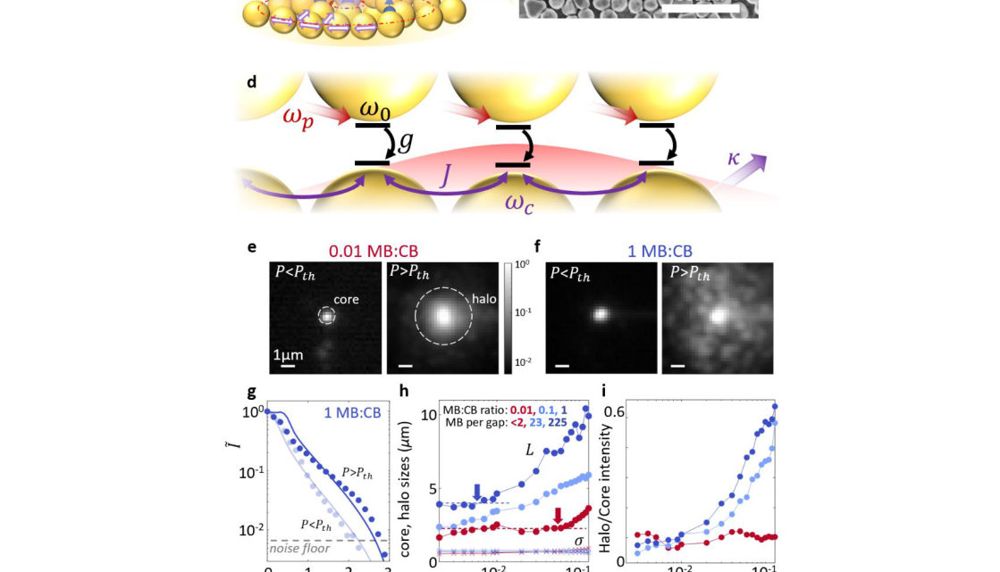 
Fig.1. Synchronization of dipoles in plasmonic nanogaps. (a) Emission from array of nanoparticles pumped by tightly- focused 633 nm laser exciting core region which feeds surrounding halo. (b) Methylene blue (MB) emitter within CB[7] host forms optical dipole (blue) in nanogap between gold nanoparticles. (c) SEM of array of NPs. (d) Each emitter is incoherently pumped by a laser of frequency 𝜔𝑝 (red arrows) and after non-radiative relaxation emits into the cavity mode with light-matter coupling strength 𝑔. The cavity is composed of the collective plasmonic nanocavities of individual

📷 Fig 2

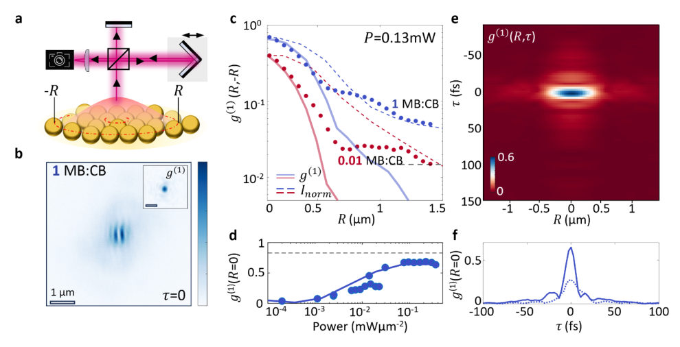 
Fig.2. Spatial coherence of light emission. (a) Flipped Michelson interferometer measuring spatial visibility fringes of emission from the 2D NP layer. (b) Emission fringes from MB:CB = 1 sample at zero-delay (𝜏=0). Inset shows extracted image of 𝑔(1) spatial coherence, scale bar as in main image. (c) Decay of 𝑔(1) spatial coherence over radially averaged

📷 Fig 3

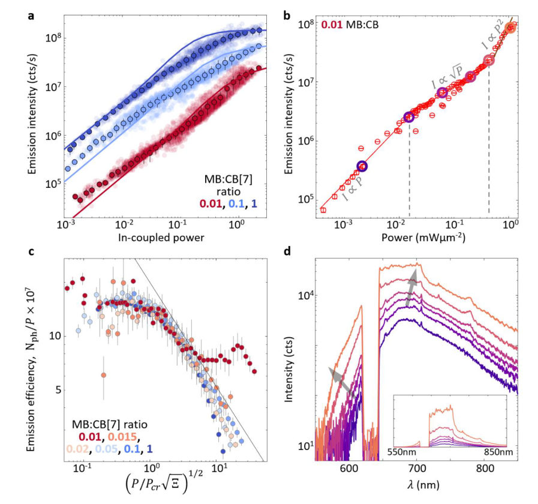 
Fig.3. Nonlinear emission for increasing emitter concentration. (a) Integrated intensity of MB emission vs in-coupled power (details in SI Section S5) for increasing dye concentration, showing deviations from linear scaling for different regimes. Solid lines are theoretical predictions for the photon input-output curves. (b) Power dependence of emission intensity at one location showing transitions from linear to sublinear to super-linear regimes (solid lines indicate power laws as labelled). (c) Scaling of emitter efficiency (𝐼/𝑃) with increasing emitter density Ξ. Black line shows scaling as

📷 Fig 4

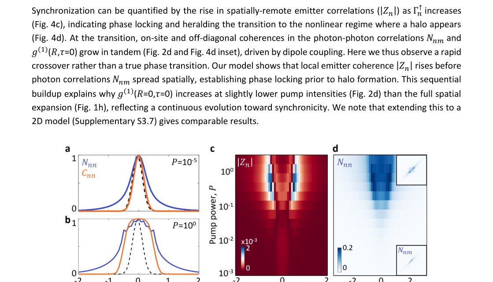 
Fig.4. Spreading of correlations and coherence. (a,b) Theoretical model of normalized photon-emission profile (𝑁𝑛𝑛, blue) and on-site dipole correlations (𝐶𝑛𝑛, orange) for pump profile (black) at (a) low pump power 𝑃=10-5 and (b) at high pump power 𝑃 =100, for 𝑡 = 0.4 eV and Γ𝑒𝑒= 10-4 eV. (c) Model emitter-emitter correlations |𝑍𝑛| and (d) photon emission (𝑁𝑛𝑛) as a function of pump power and position 𝑅. Inset shows the normalized off-site photon-photon coherences (𝑁𝑛𝑚) for pump powers in (a) (bottom inset) and (b) (top inset). Vortices and non-equilibrium behaviour Spatial coherence arises from dipoles synchronizing their phases through evanescent coupling (set by 𝐽 and 𝑔 in Eqn. (1)) and...

📷 Fig 5

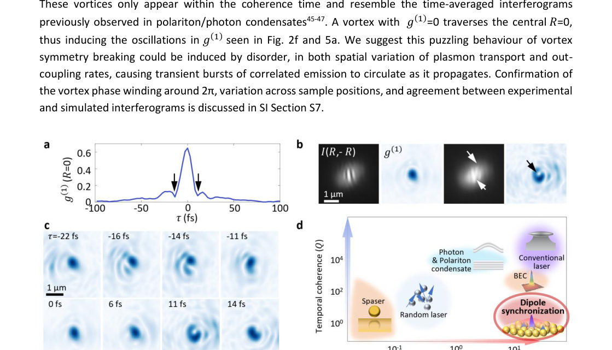 
Fig.5. Spatio-temporal vortices forming as a function of delay time at pump power 𝑃=0.2 mW for MB:CB = 1 at different time delays 𝜏. (a) 𝑔(1)(𝑅= 0, 𝜏) coherence with minima corresponding to images below marked out. (b) Real-space Michelson interferogram intensity profile 𝐼(𝑅, −𝑅) and extracted 𝑔(1) profiles for image with a vortex and without.

**Summary.** The research reports on achieving coherent dipole synchronization at room temperature using plasmonic nanocavity arrays. By combining experiments measuring spatial coherence with theoretical modeling of driven-dissipative dynamics, the authors demonstrate that phase locking occurs robustly despite high losses. This platform offers a novel route for studying quantum coherence in scalable, ambient photonic devices.

**Why it may be interesting.** This work is highly relevant as it addresses driven-dissipative quantum phenomena (synchronization) in a solid-state, ambient environment. The distinction between this mechanism and traditional BEC/laser transitions provides new insights into open quantum systems dynamics.

Detailed structure

**Main problem.** The research aims to demonstrate and characterize coherent dipole synchronization at room temperature within plasmonic nanocavity sheets, distinguishing this phenomenon from standard phase transitions.

**Main result.** The system achieves robust spatial coherence and synchronization despite high dissipation and incoherent pumping, exhibiting a unique crossover behavior rather than a sharp phase transition. The emission profile shows expansion into a 'halo' region at high pump powers.

**Method.** The study combines experimental measurements of spatial coherence ($g^{(1)}(R)$) using Michelson interferometry with theoretical modeling employing master equations and cumulant expansions.

**Model / system.** The platform is locally-ordered plasmonic nanogap 2D arrays containing organic dye emitters (Methylene blue). The dynamics are modeled using a tight-binding Hamiltonian coupled to the cavity modes, governed by a master equation incorporating pumping and decay rates.

**Key observables.** Spatial coherence $g^{(1)}(R)$, photon-photon correlations ($N_{nm}$), local emitter coherence ($\langle Z_n 
angle$), and emission intensity maps showing 'halo' formation.

**Important parameters / regimes.** High light-matter coupling ($g > 100 	ext{ meV}$), high photon loss ($\kappa > 100 	ext{ meV}$), and the critical pump power ($P_{th}$) marking regime changes.

**Assumptions / limitations.** The theoretical model relies on a second-order cumulant expansion, and the measurement of $g^{(1)}(R=0,	au=0)$ is noted to be an average over multiple nanogaps.

**Figures summary.** Figures illustrate setup details, intensity maps showing halo formation (Fig. 1), spatial coherence decay profiles using a Michelson interferometer (Fig. 2), nonlinear scaling of emission power vs. pump strength (Fig. 3), and theoretical correlation spreading ($N_{nnn}$, $C_{nn}$) (Fig. 4).

**Paper structure.** The paper progresses by establishing the physical system, detailing the governing master equation and measurement techniques, presenting results on coherence measurements and nonlinear scaling, and finally discussing advanced diagnostics like vortex detection to characterize the non-equilibrium nature of the synchronization.

Abstract

Plasmonic nanocavities enable the synchronization of spatially distant emissive dipoles through strong near-field coupling in sub-nm gaps. We report formation of a room-temperature synchronized dipole state in locally-ordered plasmonic nanogap 2D arrays under non-resonant continuous-wave pumping. Unlike lasers, photonic Bose-Einstein condensates, or exciton-polariton condensates, this system exhibits spatial coherence across the dipoles, while rapid radiative and non-radiative emission suppresses temporal photon coherence. A change of behaviour is observed with increasing pumping, marked by the spatial spread of g(1) coherence, but without spectral narrowing or directional emission. This driven-dissipative system exhibits fast temporal coherence decay and complex spatial correlations, offering a new platform for studying synchronization at room temperature. Combining ultralow mode volumes, high Purcell enhancement, and scalable ambient operation, it opens pathways for novel photonic and quantum technologies.

[↑ back to top](#top)

### ⭐ [Odd-parity magnons in the Haldane-Hubbard model from topological exciton condensation](http://arxiv.org/abs/2606.05837v1)

**Highlighted author(s):** Johannes Knolle  
**Authors:** Rintaro Eto, Johannes Knolle  
**Type:** theory · **Category:** strongly correlated electrons · **PDF:** <https://arxiv.org/pdf/2606.05837v1>  
**Analysis basis:** full PDF text, analyzed in chunks
**Topic relevance:** `analog quantum simulation` **3/5** · `exotic spin models in light-matter` **3/5** · `spintronics-quantum-optics interface` **3/5** · `Keldysh / 2PI / non-Gaussian methods` **1/5** · `driven-dissipative phase transition` **1/5**

📷 Fig 1

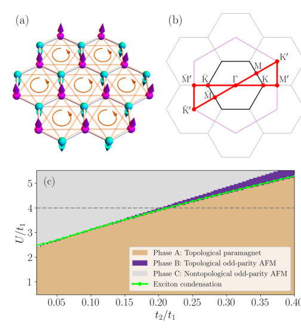 
FIG. 1. (a) Schematic of the odd-parity-wave magnetism in the Haldane-Hubbard (HH) model. Bravais vectors are given by a1 = (1, 0), a2 = (−1/2, √

📷 Fig 2

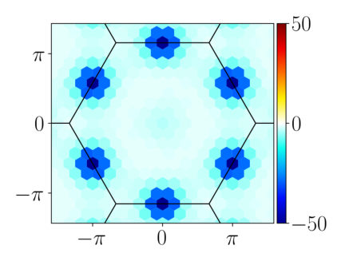 
FIG. 3. Exciton Berry curvature of the lowest bands with C↑→↓(↓→↑) exc = −2 in the paramagnetic phase A at t2/t1 = 0.3, U/t1 = 4, and ϕ = π/2. Note that the Berry curvature distribution is identical for + −(↑→↓) and −+ (↓→↑) excitons. Black hexagon denotes the first Brillouin zone.

📷 Fig 3

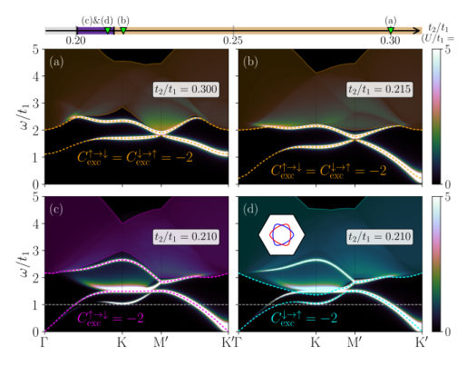 
FIG. 2. (a),(b) Dynamical spin structure factor S (q, ω) = S +−(q, ω) + S −+(q, ω) of the HH model, overlaid with the TDHF spectra in the topological paramagnetic phase A. Colored dashed lines and shaded regions represent isolated collective modes and particle-hole continua, respectively. (c),(d) Same as (a),(b), but for the topological odd-parity-wave AFM phase B, together with the spin-resolved TDHF spectra. The inset in (d) shows the isoenergy contour of the TDHF spectrum at ω/t1 = 1, corresponding to the white dashed lines in (c) and (d). For all panels, U/t1 = 4 and ϕ = π/2. The values of t2/t1 are indicated in each panel and marked in the phase diagram at the top. Light gray, purple,...

📷 Fig 4

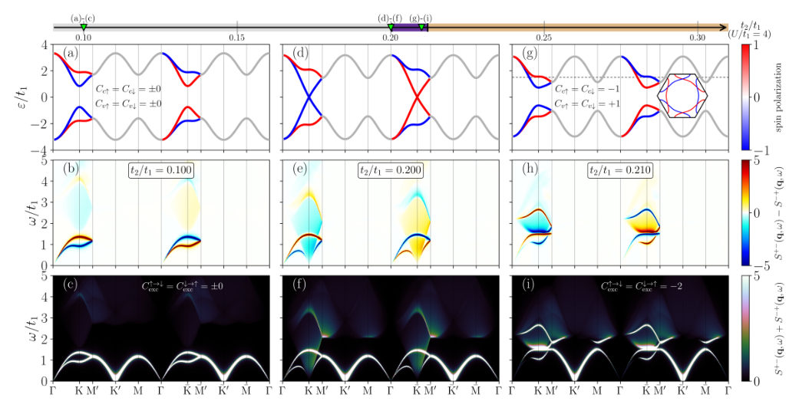 
FIG. 4. (a),(d),(g) Electron bands near the nontopological-topological AFM phase boundary obtained with Hartree-Fock approximation. Red, blue and gray bands indicate up-spin, down-spin, and spin-degenerate ones, respectively. The inset in (g) shows the isoenergy contour of the electron bands at ε/t1 = 1.5, corresponding to the gray dashed line. (b),(e),(h) Difference in spin-resolved dynamical spin-structure factors S +−(q, ω) −S −+(q, ω). (c),(f),(i) Dynamical spin-structure factor S (q, ω) = S +−(q, ω) + S −+(q, ω). For all panels, U/t1 = 4 and ϕ = π/2. The value of t2/t1 is common to each column and is indicated in the corresponding panels as well as marked in the phase diagram at the...

**Summary.** This work analyzes the Haldane-Hubbard model to show that topological excitons condense, driving the system into a novel odd-parity magnetic state. This resulting magnet exhibits characteristic f-wave magnon splitting, and the theory predicts how changes in electronic band topology govern the magnon's quantum properties.

**Why it may be interesting.** The explicit connection drawn between topological exciton condensation in an itinerant model and the emergence of topologically non-trivial magnons is highly relevant to understanding emergent quantum phenomena in correlated materials.

Detailed structure

**Main problem.** The study investigates the collective excitations (excitons and magnons) and the mechanism driving the transition into an odd-parity magnet within the Haldane-Hubbard model.

**Main result.** The condensation of topological excitons drives the system into a collinear Néel state, realizing an odd-wave magnet characterized by f-wave magnon splitting. Furthermore, electron bandgap closing dictates changes in magnon topology and enhances spin splitting.

**Method.** Theoretical analysis using Time-Dependent Hartree–Fock (TDHF) and Random Phase Approximation (RPA) to calculate exciton and magnon spectra.

**Model / system.** The Haldane-Hubbard model is studied on a honeycomb lattice, incorporating nearest-neighbor ($t_1$) and next-nearest-neighbor hopping ($t_2$) with loop currents, alongside an onsite Hubbard repulsion ($U$).

**Key observables.** Dynamical spin structure factor $S(q, \omega)$, exciton Berry curvature ($	ext{BC}$), magnon dispersion relation, and topological invariants (Chern numbers).

**Important parameters / regimes.** Half-filled case; intermediate interaction regime ($U/t_1 = 4$); lattice geometry (honeycomb).

**Assumptions / limitations.** The analysis relies on mean-field descriptions (TDHF, RPA) to describe the excitonic condensation transition.

**Figures summary.** Figures illustrate $S(q, \omega)$ in paramagnetic and AFM phases, show exciton Berry curvature distribution, and map out electron band structures near phase boundaries.

**Paper structure.** The paper systematically develops the theoretical framework by first establishing the model Hamiltonian, then using TDHF/RPA to calculate excitonic properties (including Chern numbers), demonstrating how exciton condensation drives the magnetic transition into the odd-parity magnon state, and finally analyzing the consequences of bandgap closing.

Abstract

Odd-wave magnets are the counterparts to even-wave altermagnets realizing odd-parity spin splitting. Normally discussed for noncollinear systems, they have recently been shown to appear in collinear magnetic states in the presence of loop currents. Here we study collective excitations of the paramagnetic and magnetic phase of the seminal Haldane-Hubbard model. We identify the existence topological excitons in the paramagnetic phase, and their condensation as the driving mechanism into the collinear Néel state. The latter realizes an odd-wave magnet with odd-parity magnons displaying a characteristic $f$-wave splitting. We further uncover that an electron bandgap closing ensures magnon bandgap closing causing a change in odd-parity magnon topology, as well as a drastically enlarged spin splitting. Our results establish the presence of topological excitons and odd-parity magnons in the Haldane-Hubbard, with potential realizations in Floquet-driven materials and cold atomic gases.

[↑ back to top](#top)

### [Non-equilibrium thermodynamics of collapse models in the strongly non-Gaussian regime](http://arxiv.org/abs/2606.06259v1)

**Authors:** Pedro B. Melo, Pedro V. Paraguassú, Simone Artini, Gabriele Lo Monaco, Sandro Donadi, Mauro Paternostro  
**Type:** theory · **Category:** statistical mechanics · **PDF:** <https://arxiv.org/pdf/2606.06259v1>  
**Analysis basis:** full PDF text, analyzed in chunks
**Topic relevance:** 🔥 `non-equilibrium dynamics` **5/5** · 🔥 `methods for driven-dissipative` **4/5** · 🔥 `non-equilibrium universality` **4/5** · `Keldysh / 2PI / non-Gaussian methods` **3/5** · `driven-dissipative phase transition` **3/5** · `scars & prethermalization` **2/5** · `Frenkel-Kontorova` **1/5** · `correlated / nonlocal dissipation` **1/5** · `entanglement & information structure` **1/5** · `quantum measurements` **1/5**

📷 Fig 1

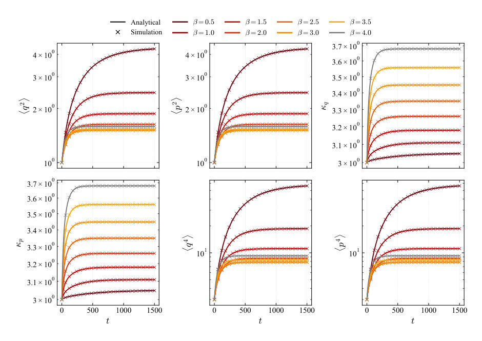 
Figure 1. Time evolution of the non-zero moments for a particle in a harmonic trap governed by eq. (8). Solid lines represent the analytical simulation results for different values of β, while the markers (crosses) denote the numerical solutions derived from the system of ODEs. The graphs of κq and κp denote the kurtosis given by κq ≡⟨q4⟩/⟨q2⟩and κp ≡⟨p4⟩/⟨p2⟩. The steady-state regime is reached as t →∞, where the moments ⟨q2⟩, ⟨p2⟩, and ⟨q4⟩plateau at values determined by the competition between diffusion and dissipation.

📷 Fig 2

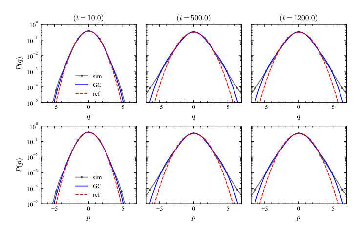 
Figure 2. Temporal evolution of the marginal PDFs. The plots display projections (upper) onto the q and (lower) p axes for parameters m = ω = 1.0, R0 = 3.0, γ = 1.0, β = 4.0 and ℏ= kB = 1.0 in Log scale, computed using the Gram-Charlier approximation (solid line) and the reference Guassian marginals (dashed lines). Snapshots are taken at t = 10, t = 500, and t = 1200. At early times (t = 10), the function W(q, p) closely resembles a Gaussian distribution due to the initial conditions. As the system evolves, deviations from Gaussianity emerge, driven by non-zero fourth-order moments. This non-Gaussian behavior manifests as a modification of the distribution tails and an increase in the peak...

📷 Fig 3

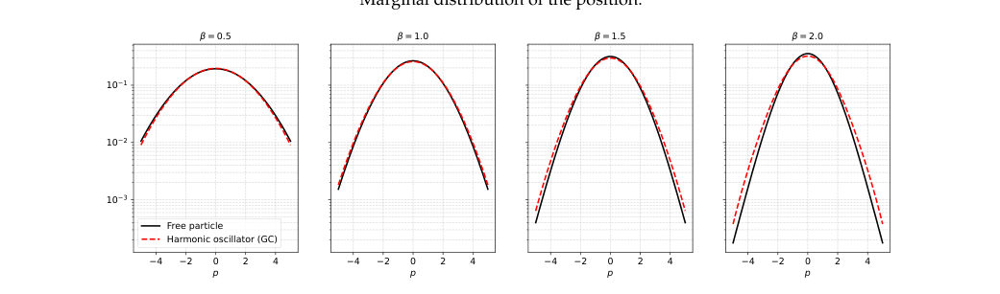 
Figure 3. Comparison between the steady–state marginal PDF of the momentum as computed analytically for the free particle (solid line) and numerically for the harmonic oscillator (dashed line). The parameters chosen are m = ω = 1.0, R0 = 3, γ = 1, β = 2 and ℏ= kB = 1 and results are presented in Log scale. Interestingly, the harmonic oscillator and the free particle seem to share a similar marginal over p in the long time limit. It is also possible to see how, as the non–Gaussianty increases with β, the overlap between the two distributions become smaller.

📷 Fig 4

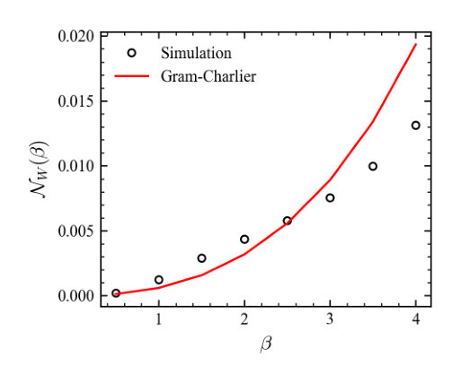 
Figure 5. Quantitative analysis of the steady–state non- Gaussianity as characterized by the negentropy NW = K(W||Wref) for a range of β values. The system parameters are set to m = ω = 1, γ = 1, R0 = 3, and ℏ= kB = 1, with the system prepared in the ground state at t = 0. With this mea- sure, for small values of β the simulated steady–state is more non–Gaussian then the one obtained via GC expansion. For large values of the friction parameter the hierarchy is inverted.

📷 Fig 5

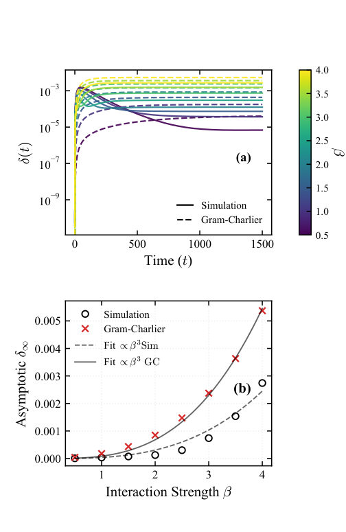 
Figure 4. Quantitative analysis of the evolution of non- Gaussianity of the states δ[ρ] for a range of β values. The system parameters are set to m = ω = 1, γ = 1, R0 = 3, and ℏ= kB = 1, with the system prepared in the ground state at t = 0. (a) Time evolution of the non-Gaussianity for various dissipation parameters β ∈[0.5, 4.0]. During the tran- sient phase, δ[ρ] briefly grows larger than its final asymptotic value before decreasing. (b) The asymptotic non-Gaussianity δ[ρ∞] as a function of β. The GC method actually overestimates the non-Gaussianity of the state according to this measure. A polynomial fit of the data points reveals an exact cubic scaling behavior, δ[ρ∞] ∝β3, with a...

**Summary.** This paper analyzes objective collapse models using Wigner phase-space methods to study their thermodynamics. It demonstrates that these systems reach a Non-Equilibrium Steady State rather than thermal equilibrium, and crucially shows that standard perturbative approximations fail under strong dissipation. The research confirms the thermodynamic consistency of the dissipative mechanism while quantifying non-Gaussian features.

**Why it may be interesting.** This work directly bridges quantum foundations (measurement problem/collapse models) with non-equilibrium statistical mechanics by providing rigorous quantitative tools to analyze irreversible dynamics far from equilibrium.

Detailed structure

**Main problem.** The study investigates the non-equilibrium thermodynamics of objective quantum collapse models, specifically addressing how dissipative mechanisms affect system dynamics in strongly non-Gaussian regimes.

**Main result.** The system does not thermalize but settles into a Non-Equilibrium Steady State (NESS), and the asymptotic non-Gaussianity scales cubically with the dissipation parameter ($\delta \propto eta^3$).

**Method.** The analysis employs the Wigner phase-space formalism, utilizing advanced numerical techniques like pseudo-spectral simulation to overcome the limitations of perturbative expansions in highly dissipative regimes.

**Model / system.** The model concerns objective collapse mechanisms (like dDP and CSL) which modify standard quantum evolution via friction terms. The dynamics are tracked using the Wigner function evolution equation, moving beyond simple quadratic approximations.

**Key observables.** Wigner entropy production rate ($\Pi(t)$), non-Gaussianity measure ($\delta[
ho]$), and time evolution of higher-order statistical moments (e.g., fourth moments).

**Important parameters / regimes.** Dissipation parameter ($eta$), which dictates the strength of the friction mechanism, and the distinction between weak and strong non-Gaussian regimes.

**Assumptions / limitations.** The primary assumption is that standard collapse models predict unphysical energy heating; the analysis assumes the validity of thermodynamic consistency checks like positive entropy production.

**Figures summary.** Figures illustrate the temporal evolution of marginal PDFs showing fat tails, compare simulation results against approximate methods (like Gram-Charlier expansion), and confirm the cubic scaling of non-Gaussianity with $eta$.

**Paper structure.** The paper progresses from establishing the modified master equations in phase space to deriving moment equations. It then contrasts perturbative approximations (GC) with full numerical simulations, culminating in the determination of the NESS properties and thermodynamic consistency checks.

Abstract

Standard objective collapse models offer a unified approach to the quantum measurement problem but predict an unphysical, indefinite increase in the energy of the system. The dissipative Diósi-Penrose (dDP) model resolves this heating issue by introducing a linear friction mechanism. However, this modification induces complex, non-Gaussian phase-space dynamics. We rigorously establish the thermodynamic consistency of this friction mechanism -- extended to the CSL model -- across both weakly and strongly non-Gaussian regimes. Using the Wigner phase-space formalism, we go significantly beyond the quadratic approximation and, to bypass the failure of perturbative methods under strong dissipation, introduce a novel exact pseudo-spectral simulation approach. Our analysis reveals that the system subjected to the dDP mechanism does not thermalize, but rather settles into a non-equilibrium steady-state (NESS) where the asymptotic non-Gaussianity scales as the third power of the dissipation parameter $β$. By evaluating the Wigner entropy production, we confirm the thermodynamic validity of the model and demonstrate that highly sensitive information-theoretic quantities require exact numerical methods to accurately capture the key non-Gaussian tails of the distribution.

[↑ back to top](#top)

### [Tight relation between the physical effects of a quantum measurement and the information gained about an observable](http://arxiv.org/abs/2606.05767v1)

**Authors:** Natsuki Ogo, Holger F. Hofmann  
**Type:** theory · **Category:** other · **PDF:** <https://arxiv.org/pdf/2606.05767v1>  
**Analysis basis:** full PDF text, analyzed in chunks
**Topic relevance:** 🔥 `quantum measurements` **5/5** · 🔥 `measurement-induced transitions` **4/5** · `entanglement & information structure` **2/5** · `Keldysh / 2PI / non-Gaussian methods` **1/5** · `correlated / nonlocal dissipation` **1/5** · `driven-dissipative phase transition` **1/5**

📷 Fig 1

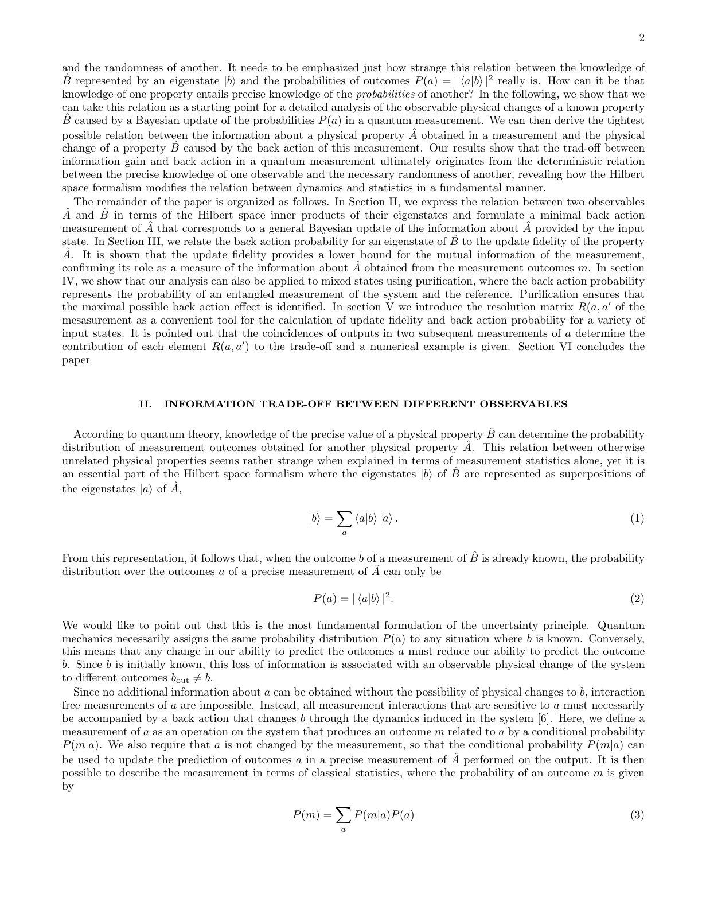 
Low-resolution page preview, page 2

📷 Fig 2

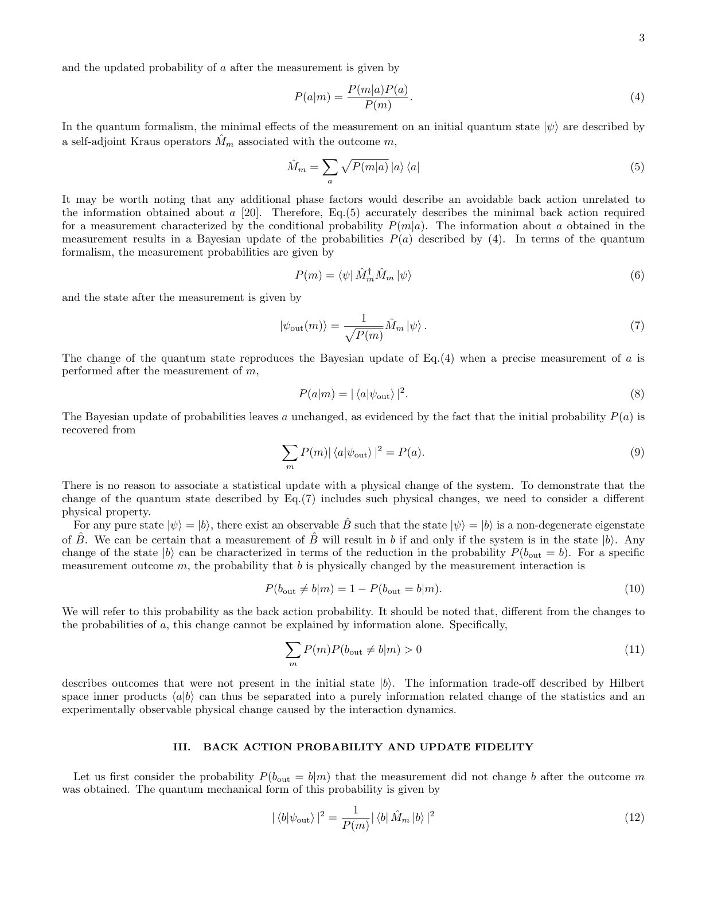 
Low-resolution page preview, page 3

📷 Fig 3

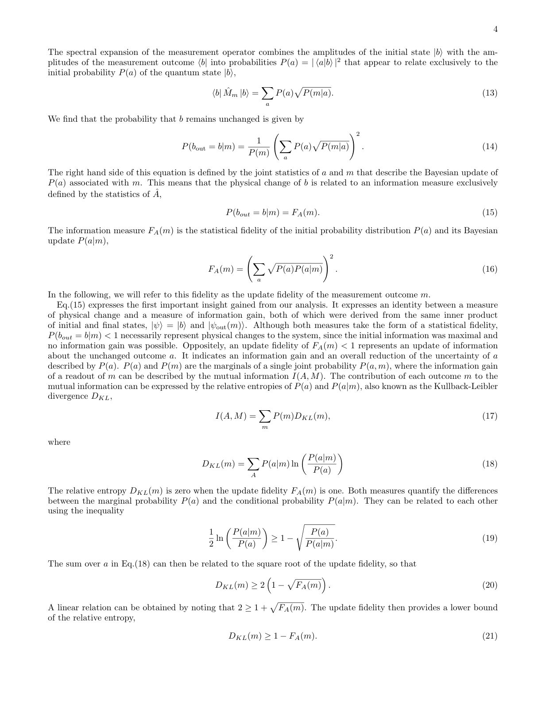 
Low-resolution page preview, page 4

📷 Fig 4

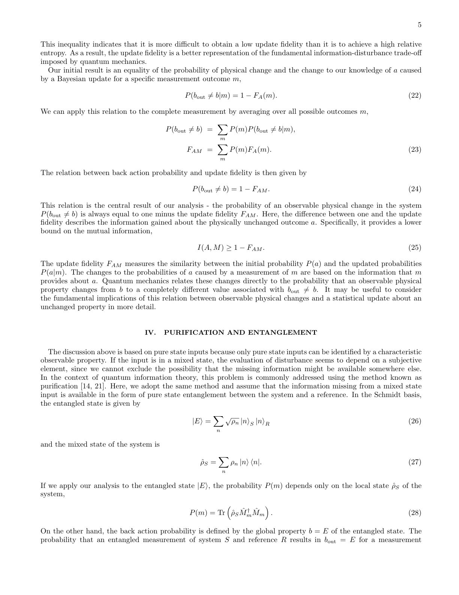 
Low-resolution page preview, page 5

📷 Fig 5

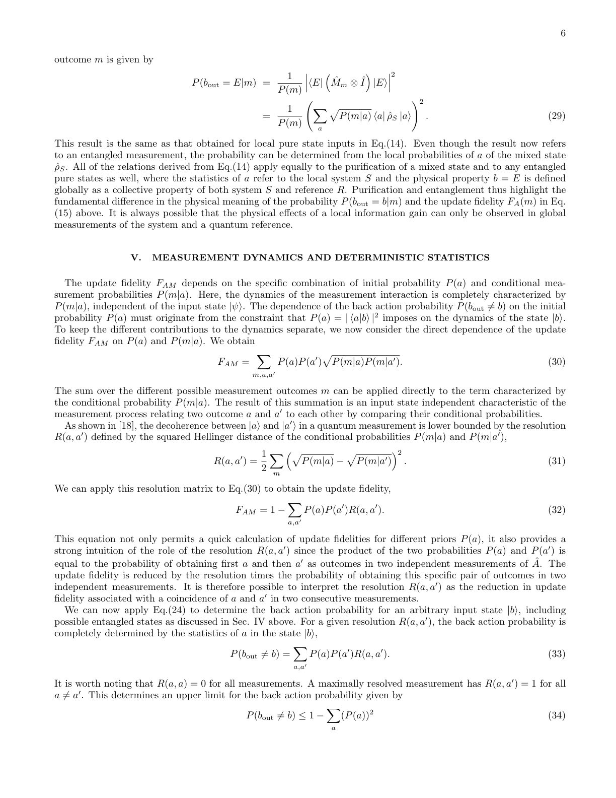 
Low-resolution page preview, page 6

**Summary.** This paper develops a formal theory connecting information acquisition during quantum measurements to the physical disturbance experienced by the system. It derives that the probability of observable change (back action) is mathematically equivalent to $1$ minus the total update fidelity measure derived from the measured outcomes. This provides a tight, quantitative link between knowledge and physical effect in quantum measurement theory.

**Why it may be interesting.** This work provides a rigorous theoretical framework for understanding the fundamental trade-off between measurement precision (information gain) and disturbance (back action) in quantum mechanics, which is central to quantum measurement theory and open quantum systems.

Detailed structure

**Main problem.** The paper establishes a precise, quantitative relationship between the information gained about one quantum observable ($\hat{A}$) during measurement and the resulting physical change (back action) on another observable ($\hat{B}$). It aims to resolve the conceptual difficulty of separating statistical knowledge updates from genuine dynamical state changes.

**Main result.** The probability of physical back action ($P(	ext{bout} 
eq \mathbf{b})$) is shown to be fundamentally linked to, and in some cases equal to, $1$ minus the total measurement update fidelity ($1 - F_{AM}$).

**Method.** The analysis employs Hilbert space formalism, utilizing Bayesian updates for information gain and Kraus operators/resolution matrices to quantify physical state evolution (back action).

**Model / system.** The study analyzes general quantum systems undergoing projective measurements of two observables ($\hat{A}$ and $\hat{B}$) starting from a pure input state $|\mathbf{b}
angle$. The formalism is generalized to mixed states via purification.

**Key observables.** Back action probability ($P(	ext{bout} 
eq \mathbf{b})$), Update Fidelity ($F_{AM}$), Mutual Information ($I(A, M)$), and Intrinsic Robustness ($I_A(\mathbf{b})$).

**Important parameters / regimes.** The relationship is governed by the structure of the resolution matrix $R(a, a')$, which quantifies correlations between measurement outcomes.

**Assumptions / limitations.** The analysis carefully distinguishes between statistical information updates (Bayesian) and physical state changes (back action), requiring careful handling within the Hilbert space framework.

**Paper structure.** The paper builds from defining the measurement process, deriving expressions for back action using Kraus operators, establishing identities linking back action to statistical fidelity measures ($P(	ext{bout} 
eq b) = 1 - F_{AM}$), and finally quantifying this relationship using resolution matrices.

Abstract

The dynamics of quantum measurements defines a precise relation between the information gained about one physical property of a system and the observable changes in another physical property of the same system. Here, we express this relation in terms of the Hilbert space superpositions of the corresponding eigenstates and show how the probability of an observable physical change can be obtained from the Bayesian update of the probabilities associated with the information obtained in the measurement. Our analysis demonstrates that the superposition principle provides the tightest possible expression of the trade-off between information and back action in a quantum measurement.

[↑ back to top](#top)

### [Breakeven demonstration of quantum low-density parity-check codes](http://arxiv.org/abs/2606.06455v1)

**Authors:** Edwin Tham, Michael L. Goldman, Shantanu Debnath, Ashay N. Patel, Jyothi Saraladevi, Jason Nguyen, Erik Nielsen, Neal Pisenti, Kenneth Wright, John Gamble, Nicolas Delfosse  
**Type:** experiment · **Category:** quantum information and computing · **PDF:** <https://arxiv.org/pdf/2606.06455v1>  
**Analysis basis:** full PDF text, analyzed in chunks
**Topic relevance:** 🔥 `QC/QI experiment` **5/5** · `quantum measurements` **3/5** · `measurement-induced transitions` **1/5**

📷 Fig 1

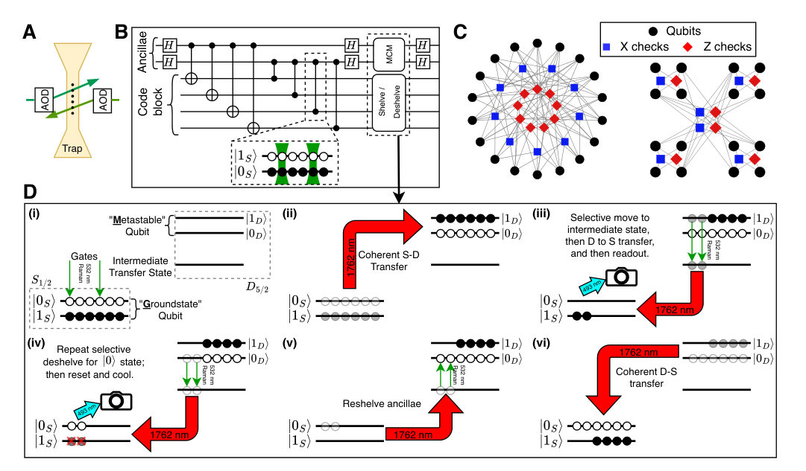 
FIG. 1: A Ion trap depicted with six ions, with gates realized via counter-propagating Raman beams (green) steered from either side with acousto-optic deflectors (AOD). B An example syndrome circuit, measuring XXXX and ZZZZ stabilizers of the [[4, 2, 2]] code using two ancillae (top rails) prepared in |+⟩and measured in X. C Tanner graphs whose edges depict the highly non-trivial two-qubit gate connectivities required to implement syndrome circuits for a BB5 (left) and concatenated [[4, 2, 2]] (right) codes. D Sequence of physical operations implementing OMG-based mid-circuit measurements, with open (filled) circles representing the 0 (1) qubit state.

📷 Fig 2

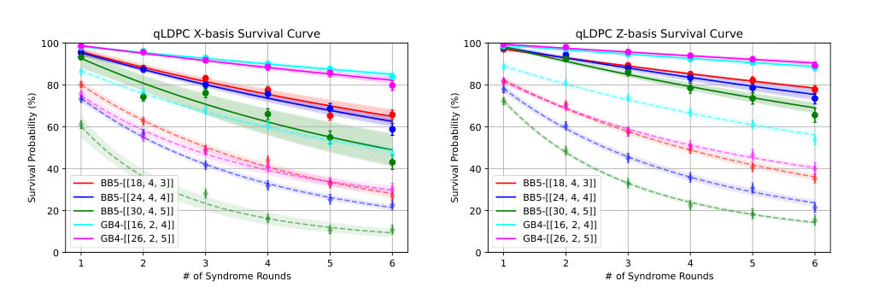 
FIG. 2: Survival probabilities 1 −εL for the BB5 and GB4 codes versus number of syndrome cycles, for X (left) and Z (right) eigenstate memory experiments. Circles and solid curves indicate the probability that no logical fault occurred in any of the encoded logical qubits. Diamonds and dashed curves indicate the corresponding probabilities without decoding. Error bars around each point depict the 95% Wilson confidence intervals for our estimate of εL, and shaded bands show 95% confidence bands around each fitted curve.

📷 Fig 3

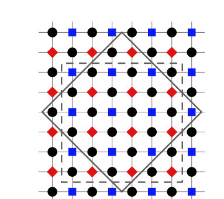 
FIG. 3: A 2D lattice on which we depict the Tanner graphs of a standard [[18, 2, 3]] (dashed square) and rotated [[16, 2, 4]] (rotated square) toric codes. Although not drawn on a toric surface, the boundaries of the solid and dashed squares are understood to wrap around along opposing edges to satisfy the toric boundary conditions.

📷 Fig 4

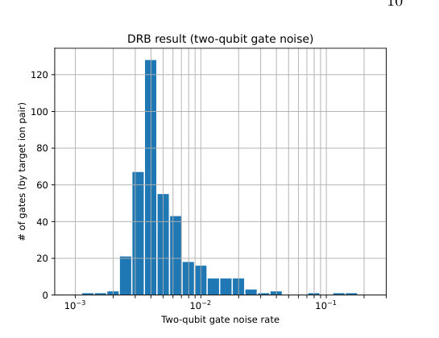 
FIG. 4: Distribution of two-qubit (MS) gate noise as measured by DRB.

📷 Fig 5

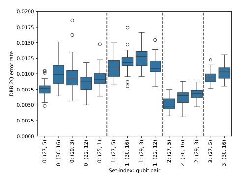 
FIG. 5: Simultaneous two-qubit DRB results. Estimated MS gate error rate, aggregated over 36 runs, is shown as a function of qubit pair. In each run, simultaneous DRB is performed on the sets of 5, 4, 3, and then 2 disjoint pairs separated by the vertical dashed lines. An average error rate above the mean in Fig. 4 indicates the presence of crosstalk.

**Summary.** This work demonstrates the feasibility of implementing advanced quantum error correction using qLDPC codes on a trapped-ion quantum computer. By leveraging a novel OMG architecture, the researchers achieved state-of-the-art logical error suppression and demonstrated breakeven performance for multiple code types. This marks a significant step toward building fault-tolerant quantum computers.

**Why it may be interesting.** It provides a concrete, high-fidelity demonstration of fault tolerance on trapped ions, directly addressing hardware limitations (like ion transport) that typically constrain QEC demonstrations in this modality.

Detailed structure

**Main problem.** Demonstrating high-rate quantum error correction (QEC) using qLDPC codes to achieve fault tolerance in a physical hardware platform.

**Main result.** The experiment successfully demonstrated nine different QEC codes, achieving logical error rates significantly lower than previous demonstrations and showing breakeven performance where logical lifetimes approach or exceed physical qubit lifetimes.

**Method.** Syndrome measurements are performed using controlled gates on ancilla qubits within a trapped-ion system, followed by decoding the syndrome data to estimate the logical error rate over multiple code cycles.

**Model / system.** The platform is a trapped-ion quantum computer utilizing $^{133}	ext{Ba}^+$ ions. The novel Optical-Metastable-Ground (OMG) architecture enables mid-circuit measurement and reset without ion transport, allowing for the implementation of various code families.

**Key observables.** Logical error rate ($\epsilon_L$), logical qubit lifetime ($T_{	ext{log}}$), physical coherence times ($T_1, T_2^*$).

**Important parameters / regimes.** High encoding rates (e.g., qLDPC codes), $9	imes$ improvement in error suppression compared to superconducting qubits.

**Assumptions / limitations.** The use of post-selection is employed for error handling, and the analysis relies on modeling noise channels based on measured gate fidelities.

**Figures summary.** Figures illustrate the physical setup (ion trap), the sequence of operations for mid-circuit measurement (MCM), and simulated performance curves comparing logical vs. physical lifetimes under varying noise conditions.

**Paper structure.** The paper details the theoretical framework of qLDPC codes, describes the experimental implementation using the OMG architecture for MCM, presents measurements of error rates over multiple cycles, and concludes by analyzing lifetime scaling and fidelity improvements via remapping.

Abstract

High-rate quantum low-density parity-check (qLDPC) codes are a leading candidate for fault-tolerant quantum computing. They feature higher encoding rates than planar alternatives such as the surface code, but their implementation often entails significant hardware hurdles like the need for long-range couplers. We leverage the flexibility of a trapped-ion quantum computer to demonstrate nine quantum error-correcting codes with starkly different qubit connectivity requirements on a single device without any hardware reconfiguration. These experiments span three families of quantum error-correcting codes: qLDPC codes, topological codes, and concatenated codes. With a qLDPC code encoding 4 logical qubits into 18 physical qubits, we achieve a logical error rate up to $9\times$ better than a previous demonstration of a similar code on superconducting solid-state qubits. Moreover, our implementation exhibits breakeven performance, with some instances achieving qubit lifetimes comparable to or slightly exceeding that of our trapped-ion qubits. We use a novel implementation of the optical-metastable-ground (OMG) architecture for addressable mid-circuit measurement and reset, which enables us to perform these experiments without any ion transport or dedicated coolant ions, requirements that typically consume a large fraction of the runtime or ion count of trapped-ion quantum computers.

[↑ back to top](#top)

### [Frustrated superradiant phases in one- and two-dimensional lattices](http://arxiv.org/abs/2606.05278v1)

**Authors:** Jongjun M. Lee, Myung-Joong Hwang  
**Type:** theory · **Category:** other · **PDF:** <https://arxiv.org/pdf/2606.05278v1>  
**Analysis basis:** full PDF text, analyzed in chunks
**Topic relevance:** 🔥 `Dicke superradiance` **4/5** · 🔥 `analog quantum simulation` **4/5** · `Tavis-Cummings & cavity-many-emitter` **3/5** · `correlated cavity matter` **3/5** · `driven-dissipative phase transition` **3/5** · `exotic spin models in light-matter` **2/5** · `methods for driven-dissipative` **2/5** · `non-equilibrium universality` **2/5** · `superradiant laser` **2/5** · `Frenkel-Kontorova` **1/5** · `Keldysh / 2PI / non-Gaussian methods` **1/5** · `correlated / nonlocal dissipation` **1/5** · `entanglement & information structure` **1/5** · `non-equilibrium dynamics` **1/5**

📷 Fig 1

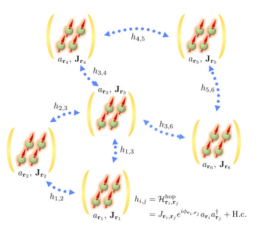 
FIG. 1. Schematic illustration of the Dicke lattice model. An example lattice that consists of six sites. Each node at ri represents a Dicke model where a single cavity mode ari is coupled to the collective spin Jri. The blue dotted arrow de- notes the connectivity. hi,j denotes the hopping Hamiltonian Hhop ri,rj, which describes the photon hopping between site ri and site rj with the strength Jri,rj and the phase ϕri,rj.

📷 Fig 2

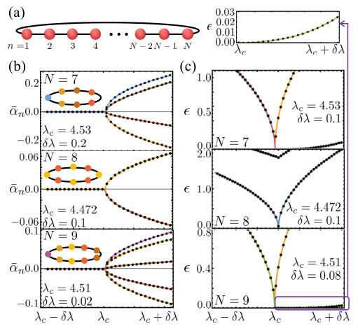 
FIG. 2. Schematic illustration and numerical results for the simple Dicke chain model. (a) A schematic of the model con- sisting of N sites with the periodic boundary condition. Each red circle represents the Dicke model with a macroscopic num- ber of spins and a single cavity mode. (b) The order parameter ¯αn at site n is plotted as a function of the coupling strength λ, with λc denoting the critical coupling strength at which the superradiant phase transition occurs. The insets illustrate the spatial distribution in the superradiant phase in real space. (c) The excitation energy ϵ is shown along the coupling strength λ, and a low-lying state of N = 9 is highlighted in the purple box at a...

📷 Fig 3

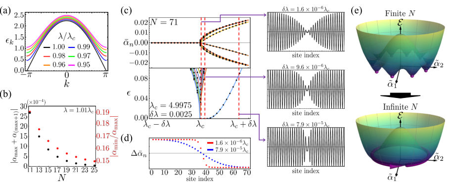 
FIG. 3. Numerical results for the simple Dicke chain model. (a) Excitation energy ϵk as a function of momentum k for various coupling strengths in the normal phase, evaluated for a large system size. (b) Comparison of the order parameter across different system sizes. Black dots represent the amplitude difference between nearest neighbors, while red dots indicate the ratio between the maximum and minimum amplitudes of the order parameter, αmax and αmin. (c) Order parameter and excitation energy as functions of the coupling strength for a chain of 71 sites. For selected coupling strengths marked by the dashed red lines, the real-space distribution of the order parameter is shown. (d)...

📷 Fig 4

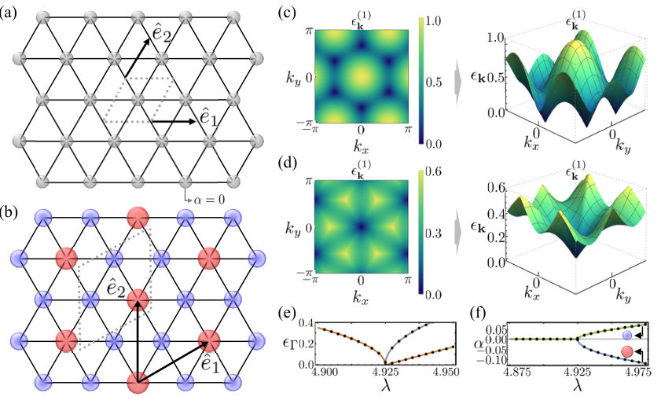 
FIG. 4. Schematics and numerical results for the infinite-sized Dicke triangular lattice model are shown. Schematic illustrations show the Dicke triangular lattice model in (a) the normal phase and (b) the superradiant phase, with circle size and color indicating the amplitude and sign of the order parameter, respectively. In (a), the gray dashed line and black arrows represent the minimal unit cell and the lattice vector of the triangular lattice. In (b), the gray dashed line and black arrows denote the extended unit cell, which includes three sublattices, along with the lattice vector. The excitation energy band is shown relative to the critical coupling strength, using (c) the minimal...

📷 Fig 5

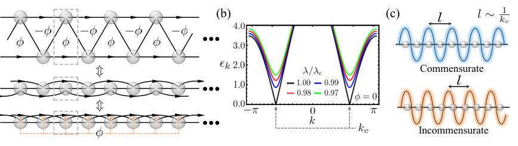 
FIG. 5. Schematic and numerical results for the Dicke ladder model. (a) Three equivalent representations of the Dicke ladder model, where each gray circle corresponds to a Dicke model. The black arrow indicates the gauge field direction of the magnetic flux. (b) Excitation energy ϵk plotted in momentum space for various coupling strengths λ. (c) Schematic illustrations showing cases where the order parameter configuration is commensurate (top) and incommensurate (bottom) with the lattice structure.

**Summary.** The paper investigates superradiant phase transitions in frustrated Dicke lattice models. It demonstrates that geometric frustration leads to density-wave ordering and predicts the emergence of a Nambu-Goldstone mode near criticality by analyzing the excitation spectrum. This establishes a new theoretical framework for understanding symmetry breaking in coupled quantum emitter arrays.

**Why it may be interesting.** This work bridges quantum optics (Dicke model) with fundamental condensed matter concepts like frustration and symmetry breaking, providing concrete theoretical predictions for emergent gapless modes in engineered light-matter arrays.

Detailed structure

**Main problem.** The central problem is understanding how geometric frustration and symmetry breaking govern collective behavior in quantum many-body systems, specifically focusing on superradiant phase transitions.

**Main result.** Frustration drives photonic density-wave ordering, leading to emergent Nambu-Goldstone modes near criticality, which can be predicted by analyzing the excitation spectrum rather than energy minimization.

**Method.** The work employs mean-field theory combined with a detailed analysis of quantum fluctuations around the mean-field solution, extending techniques from lattice Hamiltonians and Ginzburg-Landau frameworks.

**Model / system.** The primary model is arrays of coupled Dicke models on periodic lattices (1D and 2D). The Hamiltonian includes local light-matter coupling terms ($\lambda$) and hopping interactions ($J$), allowing for the study of superradiance in engineered quantum optical systems.

**Key observables.** Superradiant phase transition point, photonic density-wave ordering, Nambu-Goldstone mode emergence (gapless excitation), quasi-periodic order, and critical exponents ($\gamma_F$).

**Important parameters / regimes.** Strong light-matter coupling regime; lattice size parity ($N$ even vs. odd); synthetic magnetic flux ($\phi_{r,r'}$).

**Assumptions / limitations.** The analysis often relies on approximating the system by analyzing the excitation spectrum of the symmetric phase to bypass computationally prohibitive energy minimization.

**Figures summary.** Figures illustrate the model setup (Dicke lattice), show order parameter evolution across different coupling strengths ($\lambda$), and plot the excitation energy ($\epsilon$) revealing both standard mean-field scaling and anomalous, size-dependent critical exponents for odd $N$.

**Paper structure.** The paper progresses from defining the general Dicke lattice model to analyzing the 1D chain case by examining parity dependence (even vs. odd N), deriving the anomalous critical exponent, and finally generalizing the findings to show the emergence of a true Nambu-Goldstone mode in the thermodynamic limit.

Abstract

Understanding how frustration and symmetry breaking shape collective behavior is a central problem in quantum many-body systems. In this work, we investigate this problem in large one- and two-dimensional arrays of coupled Dicke models on a periodic lattice, where strong light-matter coupling gives rise to a superradiant phase and competition between neighboring order parameters induces spontaneous translational symmetry breaking. Such Dicke lattice models constitute a fundamentally new class of quantum many-body systems, as they simultaneously realize the thermodynamic limit associated with the lattice size and an intrinsic thermodynamic limit arising from collective on-site interactions with quantum emitters. We show that frustration drives photonic density-wave ordering, and that the resulting broken periodicity can be predicted from the excitation spectrum of the symmetric phase, without requiring computationally prohibitive thermodynamic energy minimization. Furthermore, we demonstrate that an emergent Nambu-Goldstone mode arises near the critical point in a one-dimensional chain despite the presence of only discrete symmetry, and uncover the mechanism that enables this otherwise forbidden gapless excitation. We also find quasi-periodic ordering in the superradiant phase, reminiscent of quasicrystals, and demonstrate that synthetic magnetic flux provides a powerful knob to control the nature of translational symmetry breaking. Our results establish a new direction in quantum many-body physics where the coexistence of local and global thermodynamic limits gives rise to unconventional symmetry breaking and emergent collective behavior.

[↑ back to top](#top)

### [Engineered dissipation for faster adiabatic state preparation](http://arxiv.org/abs/2606.05815v1)

**Authors:** Yuanyang Zhou, Biao Wu  
**Type:** theory · **Category:** other · **PDF:** <https://arxiv.org/pdf/2606.05815v1>  
**Analysis basis:** full PDF text, analyzed in chunks
**Topic relevance:** 🔥 `methods for driven-dissipative` **4/5** · `analog quantum simulation` **3/5** · `correlated / nonlocal dissipation` **3/5** · `driven-dissipative phase transition` **3/5** · `exotic spin models in light-matter` **3/5** · `non-equilibrium dynamics` **3/5** · `Keldysh / 2PI / non-Gaussian methods` **2/5** · `non-equilibrium universality` **2/5** · `Kondo & dissipative impurity` **1/5** · `correlated cavity matter` **1/5** · `entanglement & information structure` **1/5** · `measurement-induced transitions` **1/5** · `quantum measurements` **1/5** · `spintronics-quantum-optics interface` **1/5**

📷 Fig 1

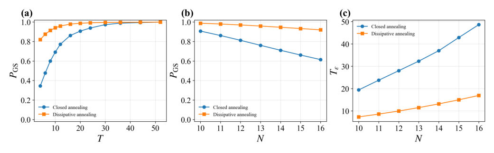 
FIG. 1. Numerical results for TFIM. (a) Final ground-state probability PGS as a function of the total annealing time T for N = 10. The dissipative protocol reaches high success probability at shorter annealing times than closed-system annealing. (b) PGS as a function of system size N at fixed T = 20. The closed-system success probability decreases with increasing N, while the dissipative protocol remains more robust. (c) Threshold annealing time Tε required to reach PGS ≥0.90. The engineered dissipative protocol substantially reduces the required runtime over the simulated system sizes. We set J = 1, h = 0.3, and Γ = 3.

📷 Fig 2

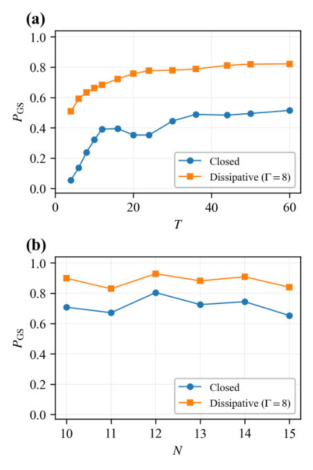 
FIG. 2. Numerical results for random spin-glass instances. (a) Disorder-averaged final ground-state probability PGS as a function of the total annealing time T for system size N = 10. The dissipative protocol reaches a higher success probability than closed-system annealing over the simulated time range. (b) Disorder-averaged PGS as a function of system size N at a fixed annealing time of T = 60. For each data point, the average is taken over 10 independent random disorder instances. The engineered downward relaxation rate is set to Γ = 8.

📷 Fig 3

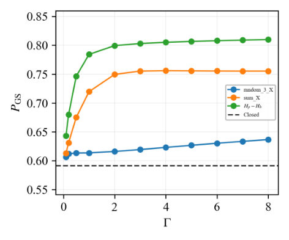 
FIG. 3. Disorder-averaged final ground-state probability PGS as a function of the engineered downward relaxation strength Γ for different system-bath coupling operators A. The performance is evaluated on random spin-glass instances with system size N = 10 at a fixed annealing time T = 50. Three coupling configurations are compared: the full adi- abatic deformation A = Hp −Hb (green dots), a globally weighted sum of local transverse fields A = P

📷 Fig 4

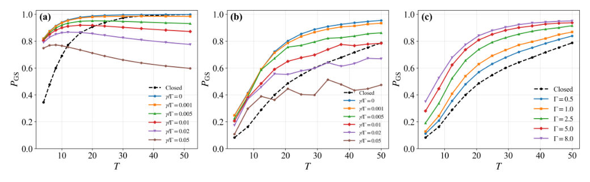 
FIG. 4. Finite-temperature robustness of the engineered dissipative protocol and the effect of relaxation strength. (a) Final ground-state probability PGS for the TFIM as a function of the total annealing time T for several upward/downward rate ratios r = γ/Γ. The case r = 0 corresponds to the ideal zero-temperature filtered reservoir, and the downward relaxation rate is fixed at Γ = 3. (b) Disorder-averaged PGS for random spin-glass instances as a function of T under the same values of r with Γ = 3. (c) Disorder-averaged PGS for random spin-glass instances as a function of T for various downward relaxation rates Γ (ranging from 0.5 to 8.0) under a fixed upward thermal excitation rate γ =...

**Summary.** The paper introduces an engineered dissipative protocol that uses structured reservoirs to actively suppress nonadiabatic leakage during slow quantum state preparation. By continuously relaxing leaked population back to the ground state, it improves the required annealing time scaling from $O(\Delta^{-2})$ to $O(\Delta^{-1})$. This technique is shown to be robust and applicable to complex disordered systems like spin glasses.

**Why it may be interesting.** This work directly addresses open quantum system dynamics in condensed matter contexts (like superconducting circuits or magnetic materials) by providing a concrete method to overcome fundamental limitations imposed by spectral gaps during adiabatic evolution.

Detailed structure

**Main problem.** Adiabatic state preparation is slowed by nonadiabatic leakage near small spectral gaps, especially in complex systems like spin glasses.

**Main result.** Engineered dissipation can improve the required annealing time scaling from $O(\Delta^{-2})$ to $O(\Delta^{-1})$, accelerating ground-state preparation significantly.

**Method.** The authors propose and analyze an engineered dissipative protocol using a filtered reservoir, modeled via the Lindblad master equation, which induces downward transitions while keeping the ground state dark.

**Model / system.** The analysis uses effective two-level models initially but generalizes to complex systems like the Transverse Field Ising Model (TFIM) and random spin glasses. The dynamics are governed by a master equation incorporating both unitary evolution and engineered dissipation terms.

**Key observables.** Final ground-state probability ($P_{GS}$), required annealing time threshold ($T_\epsilon$), excited-state population, and coherence.

**Important parameters / regimes.** Minimum spectral gap ($\Delta$), engineered relaxation rate ($\Gamma$), thermal excitation ratio ($r = \gamma/\Gamma$), and system size ($N$).

**Assumptions / limitations.** The analysis relies on the Born-Markov approximation, secular approximations, and assumes that the engineered reservoir can effectively suppress nonadiabatic leakage.

**Figures summary.** Figures compare $P_{GS}$ vs. time/size for dissipative vs. closed-system protocols (TFIM); they also show robustness against finite temperature variations ($r$) and dependence on dissipation strength ($\Gamma$).

**Paper structure.** The paper progresses from the general two-level model analysis to applying the technique to complex, disordered systems like spin glasses, systematically analyzing scaling laws and the impact of thermal noise.

Abstract

Adiabatic state preparation is often slowed by nonadiabatic leakage near small spectral gaps. We propose an engineered dissipative protocol that uses a filtered reservoir to induce predominantly downward transitions in the instantaneous energy eigenbasis while leaving the instantaneous ground state dark. The leaked population generated by nonadiabatic driving is therefore continuously relaxed back toward the low-energy sector. An effective avoided-crossing analysis shows that in the regime where the engineered relaxation strength is much larger than the minimum gap, the runtime scaling can improve from the closed-system behavior $\mathcal{O}(Δ^{-2})$ to $\mathcal{O}(Δ^{-1})$ Finite-temperature upward transitions introduce a thermal error floor, but the enhancement survives when this heating rate remains below the target error tolerance. Numerical results show improved ground-state preparation over closed-system annealing. We also discuss a possible superconducting-circuit implementation using structured bosonic reservoirs.

[↑ back to top](#top)

### [Krylov Complexity: Flat bands and Carroll breaking deformations](http://arxiv.org/abs/2606.05303v1)

**Authors:** Aritra Banerjee, Arpan Bhattacharyya, Rudranil Basu, Sayan Das  
**Type:** theory · **Category:** other · **PDF:** <https://arxiv.org/pdf/2606.05303v1>  
**Analysis basis:** full PDF text, analyzed in chunks
**Topic relevance:** 🔥 `analog quantum simulation` **4/5** · 🔥 `non-equilibrium dynamics` **4/5** · `Keldysh / 2PI / non-Gaussian methods` **3/5** · `driven-dissipative phase transition` **3/5** · `entanglement & information structure` **3/5** · `methods for driven-dissipative` **3/5** · `correlated / nonlocal dissipation` **2/5** · `non-equilibrium universality` **2/5** · `Kondo & dissipative impurity` **1/5** · `correlated cavity matter` **1/5** · `scars & prethermalization` **1/5**

📷 Fig 1

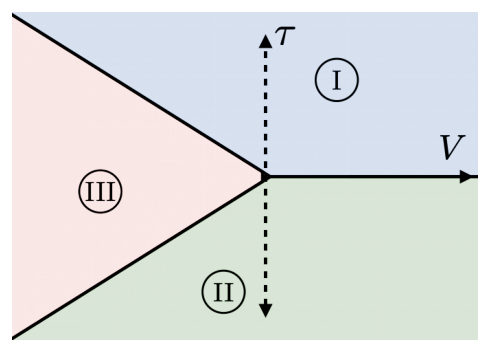 
FIG. 1: The phase plot corresponding to the Hamiltonian (10). Regions I, II, and III are, respectively, the Vanilla-β, Vanilla-α, and Exotic phases. The discussion in the main text focuses on the τ &gt; 0 side, where the Vanilla-β phase meets the Exotic phase at V = −4τ.

📷 Fig 2

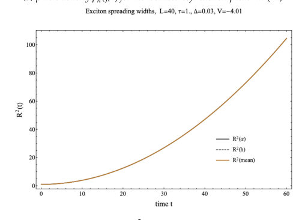 
FIG. 2: Real-space propagation of the soft half-filled exciton near the Carroll critical line. The calculation is performed in the projected one-exciton subspace |m, n⟩= α† mβn|Ψβ⟩for L = 40, τ = 1, ∆= 0.03, and V = −4.01. The soft off-site exciton has energy scale 4τ + V, while the deformation H∆supplies a finite propagation velocity. The heat map in panel (a) shows the ballistic spreading of the β hole, and panel (b) shows the corresponding growth of the second moment. This provides a real-space diagnostic of the same Carroll-breaking mechanism that later drives Krylov-space spreading.

📷 Fig 3

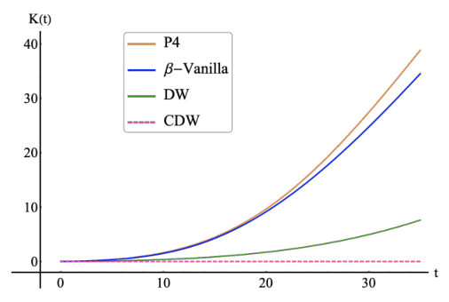 
FIG. 3: Krylov complexity growth for L = 16 rungs, i.e. 32 ladder sites. ∆= 0.01. For the Vanilla-reference all-β quench we use V = −4τ−ϵ, while for the Exotic-reference doublon/empty quenches we use V = −4τ+ϵ. We chose τ = 1 and ϵ = 10−4. The Lanczos calculation is performed in the exact fixed-(No, Ne) parity block described in Appendix D.

📷 Fig 4

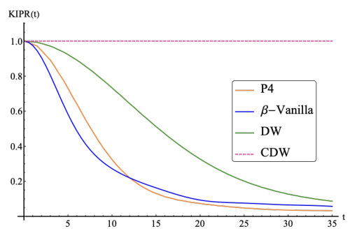 
FIG. 4: Early time KIPR for the four representative states. Other physical parameters are same as Figure (3). For the Vanilla quench, the KIPR saturates at a comparatively lower value, indicating strong spreading in Krylov space. By contrast, the P4 state saturation value goes even lower, consistent with the discussion we have had in the text. DW states as usual take a middle path.

📷 Fig 5

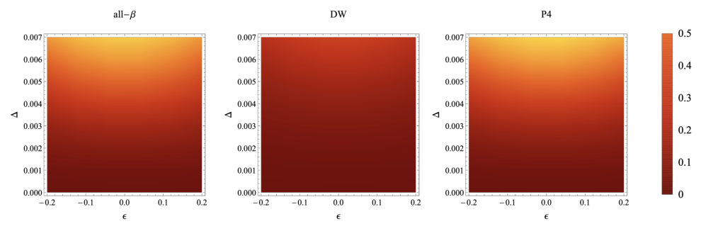 
FIG. 5: Finite-time Krylov response in the (ϵ, ∆) plane at t⋆= 10, with V = −4τ + ϵ and τ = 1. The three panels show K(t⋆; ϵ, ∆) for the all-β-filled state, the doublon domain-wall state, and the P4 doublon pattern, respectively, using a common color scale. The CDW state is not shown because it is an exact frozen state for all (ϵ, ∆), with KCDW(t) = 0. The maps display the expected hierarchy of dynamical vulnerability: the P4 and all-β states show the strongest response, while the domain wall remains much less susceptible to the ∆-quench.

**Summary.** The paper uses Krylov Complexity as a quantitative measure to probe the stability of Carrollian symmetries in flat band fermionic models. By analyzing quenches across different phases, it demonstrates that this complexity growth reveals how robustly protected these exotic symmetries are against external perturbations. This provides deep insight into non-equilibrium dynamics in strongly correlated materials.

**Why it may be interesting.** This work directly addresses non-equilibrium dynamics and spectral properties in strongly correlated electron systems (flat band physics) using advanced quantum diagnostics like Krylov complexity.

Detailed structure

**Main problem.** The study investigates how state dynamics in flat band systems, characterized by emergent Carrollian symmetries, evolve when subjected to perturbations that break these symmetries.

**Main result.** Krylov complexity proves to be a powerful diagnostic tool, quantitatively measuring the resilience and destruction of Carroll symmetry across different initial phases (Vanilla vs. Exotic).

**Method.** The analysis employs Krylov Complexity ($C_K(t)$) by projecting time evolution onto a dynamically generated orthonormal basis derived from the Hamiltonian.

**Model / system.** The primary model is an interacting fermionic ladder Hamiltonian exhibiting flat bands, which are augmented by Carroll-breaking perturbations. A continuum scalar field theory with gradient deformation is also analyzed.

**Key observables.** Krylov Complexity ($C_K(t)$), Krylov Inverse Participation Ratio (KIPR), real-space spreading widths of excitons, and the initial growth rate coefficient $b_2^1$.

**Important parameters / regimes.** The coupling strength ($\lambda$), lattice parameters ($	au$, $V$), and the quench protocol defining the initial state (Vanilla vs. Exotic phase).

**Assumptions / limitations.** The analysis often relies on short-time approximations for complexity growth, and in continuum limits, it assumes a double-scaling prescription to handle UV/IR mixing.

**Figures summary.** Figures illustrate phase diagrams defining different quantum phases (Vanilla/Exotic) and show the time evolution of Krylov complexity or real-space spreading profiles under perturbations.

**Paper structure.** The paper progresses by first establishing the theoretical framework using flat bands and Carroll symmetry, then applying Krylov complexity to analyze quenches across critical lines in lattice models, and finally extending the diagnostic tool to continuum field theories exhibiting UV/IR mixing.

Abstract

Systems with flat band structures, when written in the language of Compact Localised States (CLS), have been shown to be explicitly invariant under supertranslation symmetries, making Carrollian symmetries inherently important for such systems. In this work, we explore the state dynamics of these systems, focusing on quenches induced by Carroll breaking perturbations, through the probe of Krylov (spread) Complexity. We specialise to Fermionic ladder Hamiltonians with all bands flat (ABF) scenario, augmented by a supertranslation preserving interaction, and discuss Krylov state complexity for quenches across critical lines. We further discuss how the growth of Krylov complexity sharply resolves the phase-dependent resilience of Carrollian sectors against delocalising perturbations. This is augmented by a complementary mechanism for Krylov growth in a continuum Carroll scalar field theory with a gradient deformation, which exhibits strong ultraviolet sensitivity (UV/IR mixing).

[↑ back to top](#top)

### [Energy-Modulated Time-Asymmetric Spontaneous Collapse: Forward-Backward Dynamics from Stochastic Ito Reversal and Bright Solitons](http://arxiv.org/abs/2606.06452v1)

**Authors:** Ikechukwu C. Okoro, Mike O. Osiele, Godfrey E. Akpojotor  
**Type:** theory · **Category:** quantum gases · **PDF:** <https://arxiv.org/pdf/2606.06452v1>  
**Analysis basis:** full PDF text, analyzed in chunks
**Topic relevance:** 🔥 `measurement-induced transitions` **4/5** · `correlated / nonlocal dissipation` **3/5** · `driven-dissipative phase transition` **3/5** · `methods for driven-dissipative` **3/5** · `quantum measurements` **3/5** · `analog quantum simulation` **2/5** · `non-equilibrium dynamics` **2/5** · `non-equilibrium universality` **2/5** · `Keldysh / 2PI / non-Gaussian methods` **1/5** · `Kondo & dissipative impurity` **1/5** · `entanglement & information structure` **1/5**

📷 Fig 1

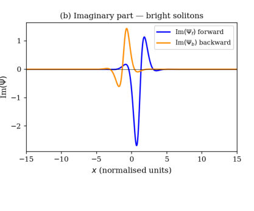 
Figure 1. Forward (solid blue) and backward (solid orange) bright soliton profiles. Panel (a): real parts Re(Ψ); panel (b): imaginary parts Im(Ψ). Parameters: ω = 1.2, k = 1.8, t = 2.0.

📷 Fig 2

 
Figure 2 presents the analytic collapse coupling strengths γf = 0.125ω (forward) and γb = 0.625ω (backward) as functions of ω, together with the collapse strength asymmetry parameter γap.

📷 Fig 3

 
Figure 2. Forward collapse coupling γf = 0.125ω (solid blue), backward collapse coupling γb = 0.625ω (dashed red), and constant asymmetry parameter γap = 2/3 ≈0.667 (dash- dot black) as functions of ω. Note γb = 5γf at every frequency.

📷 Fig 4

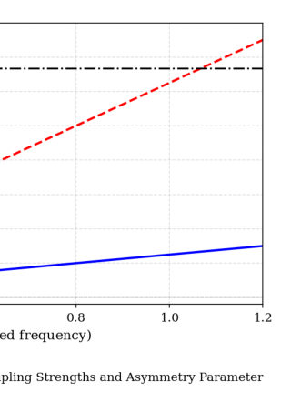 
Figure 3 displays the complete (k, ω) parameter space landscape of both collapse operators simultaneously as a heat map with contour overlay, while Figure 4 shows their temporal evolution. The heat map reveals the full two dimensional structure of the collapse dynamics in a way that one dimensional slices cannot: the soliton boundary ω = k2/2 appears as a sharp transition from the hatched non-soliton re- gion (upper left) to the active collapse region (lower right), and the colour gradient immediately shows that Γf (panel a) attains higher values across the entire soliton-

📷 Fig 5

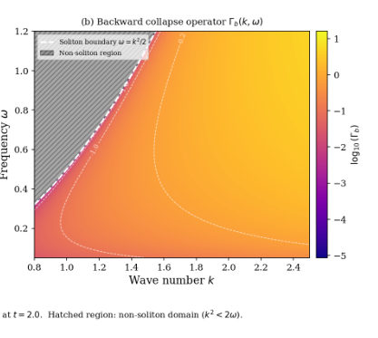 
Figure 3. Heat map and contour plot of the forward collapse operator Γf(k, ω) (panel a) and backward collapse operator Γb(k, ω) (panel b) in the (k, ω) parameter plane at t = 2.0. Colour encodes log10(Γ) on a shared scale; white contour lines label equal-value levels. The dashed white line is the soliton boundary ω = k2/2; the hatched region (k2 &lt; 2ω) is the non-soliton domain where no bright soliton solutions exist. Both panels share the same colour scale, making the forward–backward asymmetry directly visible: Γf reaches higher values (brighter yellow) than Γb across the entire soliton-allowed region.

**Summary.** The paper proposes an energy-modulated, time-asymmetric spontaneous collapse model for BECs by analyzing stochastic Ito reversal on the CQ-NLSE. It demonstrates that forward and backward dynamics yield fundamentally different nonlinear terms ($\gamma_b = 5\gamma_f$), confirming a structural quantum irreversibility quantified by a universal asymmetry parameter of $2/3$.

**Why it may be interesting.** This work directly tackles measurement problem phenomenology within a quantum gas context (BEC), providing quantitative predictions for irreversible collapse mechanisms distinct from standard symmetric models.

Detailed structure

**Main problem.** The paper addresses the fundamental problem of quantum irreversibility by developing a time-asymmetric spontaneous collapse framework derived from stochastic Ito field reversal.

**Main result.** It establishes that the forward and backward dynamics exhibit strong asymmetry, quantified by $\gamma_b = 5\gamma_f$ and a universal asymmetry parameter of $2/3$.

**Method.** The authors derive nonlinear stochastic differential equations (SDEs) using Ito calculus applied to the Cubic-Quintic Nonlinear Schrödinger Equation (CQ-NLSE) formalism.

**Model / system.** The model is applied to a quasi-one dimensional Bose-Einstein condensate (BEC) of attractive $^7	ext{Li}$ atoms, utilizing the CQ-NLSE as its mean-field description.

**Key observables.** Forward and backward soliton amplitudes ratio ($A_f/A_b \approx 1.870$), collapse operator growth ($\Gamma_f$ grows while $\Gamma_b$ decays), and the asymmetry parameter $\gamma_{ap} = 2/3$.

**Important parameters / regimes.** Noise strength ($\eta$), local probability density ($|\Psi|^2$), excitation energy squared ($(\hbar\omega)^2$), and the universal asymmetry-coupling parameter (2/3).

**Assumptions / limitations.** The analysis relies on the mean-field approximation, weak noise limits ($\eta \ll 1$), and an energy eigenvalue approximation for deriving the collapse operator $\Gamma$.

**Figures summary.** Figures illustrate spatial profiles of forward/backward solitons (amplitude ratio), plot the distinct quintic coupling parameters ($\gamma_b = 5\gamma_f$), and show heat maps confirming temporal growth asymmetry in the collapse operator.

**Paper structure.** The paper builds from deriving stochastic SDEs via Ito reversal, establishing the energy-driven collapse operator $\Gamma$, reducing to the CQ-NLSE mean-field limit, and finally analyzing the resulting time-asymmetric dynamics using soliton solutions and heat map diagnostics.

Abstract

We present a rigorous theoretical framework for symmetry breaking and quantum irreversibility arising from stochastic Ito field reversal within a cubic-quintic nonlinear Schrodinger equation (CQ-NLSE) formalism. Starting from three physically motivated considerations, forward and backward nonlinear stochastic differential equations are derived via the Ito calculus. Kinematic time-reversal is shown to be fundamentally incompatible with the Ito stochastic structure, yielding the universal asymmetry-coupling parameter of 2/3. An energy-driven collapse operator proportional to the product of noise strength, local probability density, and excitation energy squared is introduced, amplifying the collapse in high-density, high-excitation regions. Exactly bright soliton solutions are obtained for a quasi-one-dimensional BEC of attractive Li-7 atoms, with forward and backward amplitude ratio of 1.870. Heat map analysis of the parameter planes reveals that the forward collapse operator grows monotonically in time while the backward counterpart decays, achieving a ratio approximately 1030, sharply distinguishing this framework from conventional symmetric collapse models.

[↑ back to top](#top)

### [Non-equilibrium quantum thermodynamics of a memory-bearing open-system process](http://arxiv.org/abs/2606.05904v1)

**Authors:** Biagio G. Banigi, Eric Lutz, Mauro Paternostro  
**Type:** theory · **Category:** statistical mechanics · **PDF:** <https://arxiv.org/pdf/2606.05904v1>  
**Analysis basis:** full PDF text, analyzed in chunks
**Topic relevance:** 🔥 `methods for driven-dissipative` **4/5** · 🔥 `non-equilibrium dynamics` **4/5** · `Keldysh / 2PI / non-Gaussian methods` **3/5** · `correlated / nonlocal dissipation` **3/5** · `driven-dissipative phase transition` **3/5** · `entanglement & information structure` **2/5** · `non-equilibrium universality` **2/5** · `Tavis-Cummings & cavity-many-emitter` **1/5** · `measurement-induced transitions` **1/5** · `quantum measurements` **1/5**

📷 Fig 1

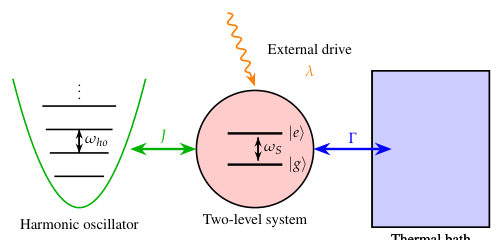 
FIG. 1. Sketch of the open system process described in Sec. II. A two-level system is coupled to a harmonic oscillator (with strength J) and a thermal bath (Γ), and it is driven by an external field (described by the parameter λ).

📷 Fig 2

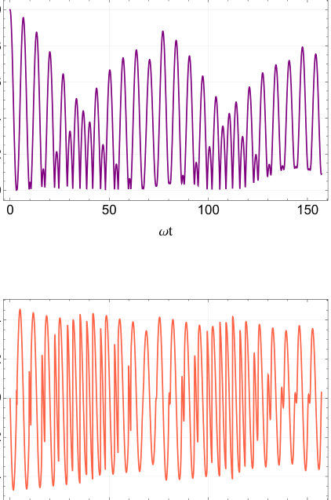 
FIG. 2. Time evolution of the (a) trace distance D(ρ1, ρ2) and (b) the trace distance rate of change σ(t, ρ1,2(0)) as defined, respectively, in (7) and (10). The simulations make use of states ρ1(0) = |+⟩⟨+| and ρ2(0) = |−⟩⟨−| and physical parameters ω = 1, J = 0.2, p = 5, Γ = 10−3, n = 3, ωD = 1/3, λ = 3 × 10−3, ωt f = 50π. All parameters are expressed in dimensionless units by fixing the system frequency ω as the reference scale.

📷 Fig 3

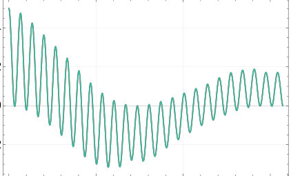 
FIG. 3. Temporal behavior of the (a) populations and (b) coherences of the system’s density matrix plotted against the dimensionless time ωt. We only report the real part of coherences (Re[ρeg] = Re[ρge]), since the imaginary one is quantitatively negligible. In all the simula- tions, if not otherwise specified, we used the same parameters as in Fig. 2.

📷 Fig 4

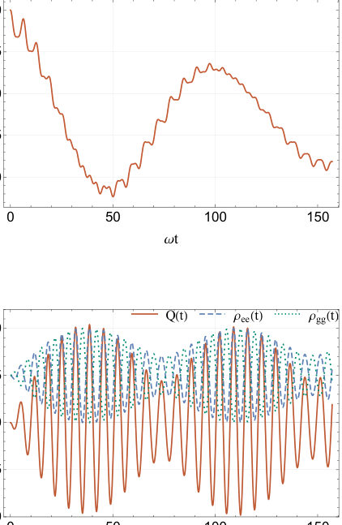 
FIG. 4. Panel (a): Temporal behavior of work done on the system, plotted against the dimensionless time ωt. Panel (b): We show the dynamics of the heat Q(t) exchanged between the qubit and the environment for the same situation displayed in panel (a), along with the system populations for comparison. In all the simulations, if not otherwise specified, we used the same parameters as in Fig. 2.

📷 Fig 5

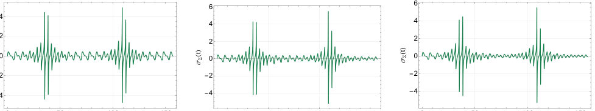 
FIG. 5. Time evolution of the entropy production rate σΣ(t) for three different dynamical configurations. In panel (a) we set Γ = λ = 0; in panel (b) Γ = 10−3, λ = 0; and in panel (c) Γ = 10−3, λ = 3 × 10−3. In all cases, ω = 1, J = 0.2, p = 5, n = 3, ωD = 1/3, ωt f = 50π. All parameters are expressed in dimensionless units by fixing the system frequency ω as the reference scale.

**Summary.** The paper analyzes non-equilibrium thermodynamics for a qubit coupled to a structured environment. It demonstrates that memory effects, stemming from the finite nature of the bath (harmonic oscillator), cause deviations from Markovian predictions. These deviations are quantified by analyzing the time evolution and potential sign changes in the entropy production rate.

**Why it may be interesting.** This work is highly relevant as it tackles the fundamental limitations of standard Markovian descriptions in open quantum systems, providing quantitative tools ($\sigma\Sigma(t)$) to detect and characterize non-Markovian energy flow.

Detailed structure

**Main problem.** The study investigates non-equilibrium quantum thermodynamics for open systems, specifically analyzing how memory effects influence work, heat, and entropy production beyond the standard Markovian approximation.

**Main result.** Non-Markovian dynamics, evidenced by backflow of information (e.g., negative entropy production rate $\sigma\Sigma(t)$), significantly shape the system's thermodynamic response compared to Markovian limits.

**Method.** The analysis employs quantum master equations and diagnostic tools like the BLP measure and the time evolution of entropy production ($\sigma\Sigma(t)$) to quantify non-Markovianity.

**Model / system.** The model is a two-level system (qubit) coupled to a composite environment consisting of a harmonic oscillator and a thermal bath, driven by an external field. The dynamics are governed by a Lindblad-like master equation.

**Key observables.** Work rate ($\dot{W}$), heat rate ($\dot{Q}$), entropy production rate ($\sigma\Sigma(t)$), and the trace distance $D(t)$.

**Important parameters / regimes.** Coupling strengths ($J$, $\Gamma$), driving frequency ($\omega_D$), and the regime comparison between Markovian ($J=0$) and non-Markovian ($J>0$) dynamics.

**Assumptions / limitations.** The weak-coupling regime is assumed, and the analysis often relies on deriving effective equations of motion by tracing out environmental degrees of freedom.

**Figures summary.** Figures illustrate time evolution plots showing population decay, coherence damping, and crucially, the non-monotonic or negative behavior of $\sigma\Sigma(t)$ when memory effects are present.

**Paper structure.** The paper develops the theoretical framework by defining thermodynamic rates (Work/Heat) and then analyzes the dynamics using both quantum information measures (BLP distance) and thermodynamic diagnostics ($\sigma\Sigma(t)$), comparing results across different coupling strengths to isolate the role of memory.

Abstract

We show the emergence of memory effects in the dynamics of a driven two-level system interacting with a composite environment, and analyze their influence on work, heat and entropy production. We further investigate how the interplay between driving, dissipation and memory effects, stemming from the finiteness of the environment, shapes the thermodynamic response of the system, thus providing insight into quantum thermodynamics beyond the Markovian approximation.

[↑ back to top](#top)

### [Broadband AC Magnetic Field Sensing via Continuous wave optically detected magnetic resonance with NV Centers in diamond](http://arxiv.org/abs/2606.05928v1)

**Authors:** Ryohei Dokai, Ryusei Okaniwa, Miku Ishizaki, Junko Ishi-Hayase, Yuichiro Matsuzaki  
**Type:** theory · **Category:** other · **PDF:** <https://arxiv.org/pdf/2606.05928v1>  
**Analysis basis:** full PDF text, analyzed in chunks
**Topic relevance:** 🔥 `methods for driven-dissipative` **4/5** · `exotic spin models in light-matter` **3/5** · `spintronics-quantum-optics interface` **3/5** · `QC/QI experiment` **2/5** · `driven-dissipative phase transition` **2/5** · `Keldysh / 2PI / non-Gaussian methods` **1/5** · `analog quantum simulation` **1/5** · `correlated / nonlocal dissipation` **1/5** · `measurement-induced transitions` **1/5** · `non-equilibrium dynamics` **1/5** · `non-equilibrium universality` **1/5** · `quantum measurements` **1/5**

📷 Fig 1

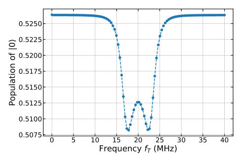 
FIG. 1: Plot of the variation of the |0⟩ground-state occupation as a function of target frequency fT ≡ωT /2π. The parameters are D/2π = 2870 MHz, E/2π = 10 MHz, ωD/2π = 2860 MHz, λD/2π = 6.0 MHz, λT /2π = 1.0 MHz, Γ/2π = 2.0 MHz, and t = 5 µs.

📷 Fig 2

 
Figure 1 shows the result of the simulation performed with the above parameters. From the figure, the occupa- tion probability drops at specific positions of the target frequency fT . Substituting the present simulation pa- rameters (2E/2π = 20 MHz, λD/4π = 3 MHz) into the resonance condition ωT = |2E ± λD/2| derived in Chap- ter IV, the predicted resonance frequencies are

📷 Fig 3

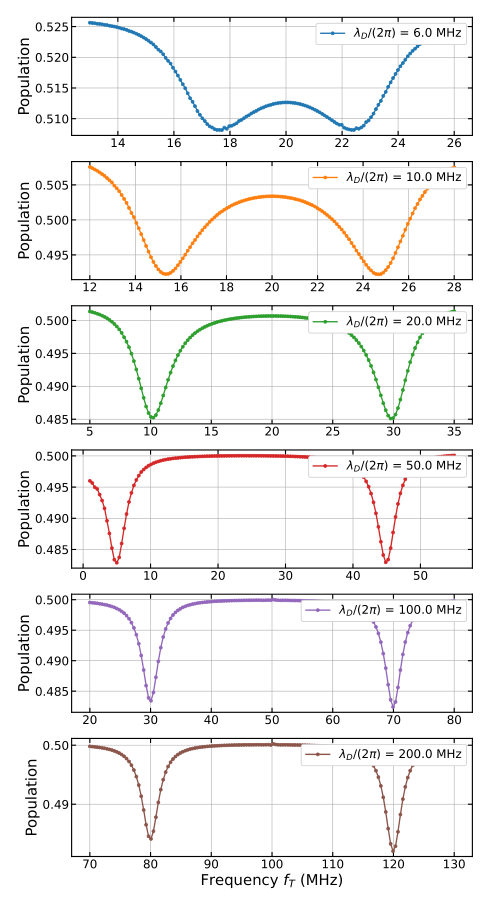 
FIG. 2: Plots of the variation of the |0⟩ground-state occupation as a function of target frequency fT when the control-microwave strength λD/2π is varied from 6.0 MHz to 200.0 MHz. The other parameters are D/2π = 2870 MHz, E/2π = 10 MHz, ωD/2π = 2860 MHz, λT /2π = 1.0 MHz, Γ/2π = 2.0 MHz, and t = 5 µs.

📷 Fig 4

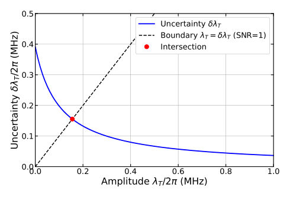 
FIG. 4: Plot of the estimation error as a function of target-field amplitude (solid line). For reference, δλT = λT is also plotted (dashed line). The parameters are D/2π = 2870 MHz, E/2π = 10 MHz, λD/2π = 6.0 MHz, Γ/2π = 2.0 MHz, t = 5 µs, Nm = T/t, and T = 1 s.

📷 Fig 5

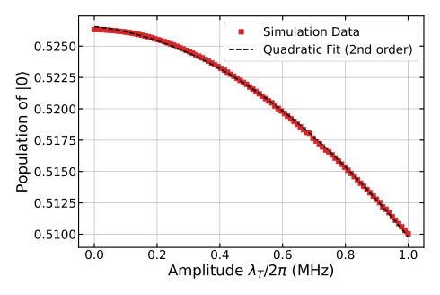 
FIG. 3: Plot of the dependence of the signal intensity on the target-field amplitude λT /2π. The parameters are D/2π = 2870 MHz, E/2π = 10 MHz, λD/2π = 6.0 MHz, Γ/2π = 2.0 MHz, t = 5 µs, Nm = T/t, and T = 1 s.

**Summary.** The authors propose a novel broadband AC magnetometry scheme utilizing NV centers in diamond and Continuous Wave Optically Detected Magnetic Resonance (CW-ODMR). By employing microwave-driven dressed states, they theoretically and numerically demonstrate the ability to detect magnetic fields up to 100 MHz. This overcomes the severe bandwidth restrictions of conventional CW-ODMR methods.

**Why it may be interesting.** This work directly addresses open quantum systems dynamics in a solid-state platform (NV centers) by engineering the system Hamiltonian via microwave driving to overcome inherent physical bandwidth limitations, which is highly relevant for quantum sensing applications.

Detailed structure

**Main problem.** Conventional CW-ODMR AC magnetic field sensing suffers from a severely limited detection bandwidth, typically restricted to only a few MHz.

**Main result.** The proposed scheme using microwave-driven dressed states enables the detection of AC magnetic fields up to the order of 100 MHz, significantly expanding the operational range.

**Method.** Theoretical analysis and numerical simulations were used to model the system dynamics governed by a Lindblad master equation under microwave driving.

**Model / system.** The physical system is the Nitrogen-Vacancy (NV) center in diamond. The dynamics are modeled using a Hamiltonian ($\hat{H}$) and solved via the Lindblad master equation, incorporating optical pumping transitions.

**Key observables.** Fluorescence intensity drop (dip) measured as the time-averaged occupation probability of the $|0
angle$ state ($P_0$).

**Important parameters / regimes.** The achievable bandwidth is determined by tuning the Rabi frequency ($\lambda_D$), which can reach $\sim 100$ MHz.

**Assumptions / limitations.** Approximations include assuming ideal projective measurement initially, and later accounting for measurement noise; the Rotating-Wave Approximation (RWA) is used but verified up to high frequencies.

**Figures summary.** Figures demonstrate dips in $P_0$ at predicted resonance frequencies, show that increasing the control field strength ($\lambda_D$) broadens the dip spacing toward 100 MHz, and quantify the achievable sensitivity ($30 \mu	ext{T}/\sqrt{	ext{Hz}}$).

**Paper structure.** The paper progresses from identifying the bandwidth limitation of conventional CW-ODMR to proposing a microwave-driven dressed state scheme. It details the theoretical Hamiltonian and master equation, derives the resonance condition ($\omega_T = \sqrt{2E \pm \lambda_D^2}$), and validates the broadband capability through numerical simulations.

Abstract

The nitrogen-vacancy (NV) center in diamond has attracted considerable attention as a highly sensitive quantum sensor that can operate at room temperature. In particular, continuous-wave optically detected magnetic resonance (CW-ODMR) is promising for a wide range of applications because of its simplicity. However, conventional AC magnetic-field sensing schemes based on CW-ODMR suffer from a limited detection bandwidth: the detectable frequency is either fixed by intrinsic physical parameters of the NV center or, even when tunable, restricted to a narrow range of only a few MHz. Here, we propose a broadband AC magnetometry scheme based on CW-ODMR with NV centers using microwave-driven dressed states.Through theoretical analysis and numerical simulations, we show that the proposed scheme enables the detection of AC magnetic fields with frequencies up to the order of 100 MHz, which has been difficult to achieve using conventional CW-ODMR-based methods.

[↑ back to top](#top)

### [Emergent Self-Similar Quantum Revivals in Spiral Drives](http://arxiv.org/abs/2606.05288v1)

**Authors:** Xin-Chi Zhou, Liang-Hong Mo, Hongzheng Zhao, Bastien Lapierre  
**Type:** theory · **Category:** statistical mechanics · **PDF:** <https://arxiv.org/pdf/2606.05288v1>  
**Analysis basis:** full PDF text, analyzed in chunks
**Topic relevance:** 🔥 `entanglement & information structure` **4/5** · 🔥 `non-equilibrium dynamics` **4/5** · `analog quantum simulation` **3/5** · `methods for driven-dissipative` **3/5** · `non-equilibrium universality` **3/5** · `scars & prethermalization` **2/5** · `Keldysh / 2PI / non-Gaussian methods` **1/5** · `driven-dissipative phase transition` **1/5**

📷 Fig 1

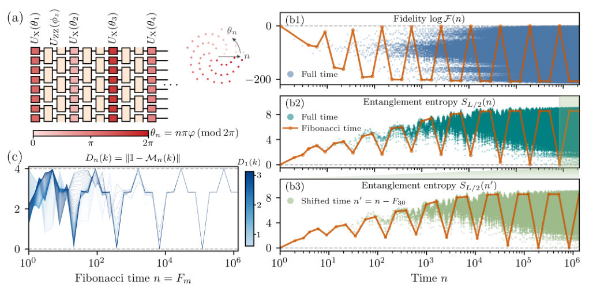 
Figure 1. (a) Circuit representation of the spiral drive introduced in Eq. (1). Different colors for the X gates indicate different irrational single-qubit rotations, following θn = nπφ (mod 2π). These successive rotations form a characteristic Fermat’s spiral. (b) Time evolution of the fidelity F(n) and half-system entanglement entropy SL/2(n) as a function of the stroboscopic step n, for L = 1000, and ϕz = π/3. The fidelity reveals near revivals at special times, highlighted in orange, corresponding to n = F3m. Similar features can be observed in SL/2(n), which grows logarithmically with n before eventually saturating to low-entanglement states. A magnified view of SL/2(n′) starting at n′...

📷 Fig 2

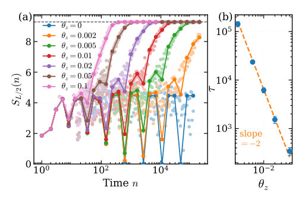 
Figure 3. Parametrically long-lived non-heating dynamics under ran- dom integrability-breaking. (a) The bipartite entanglement entropy SL/2(n) at Fibonacci times n = Fm (filled circles) and at loga- rithmically spaced intermediate times (light dots) for different noise strengths θz. A prethermal regime emerges, in which the non-heating dynamics persists, as evidenced by revivals toward states close to the initial state. Shaded bands indicate ± one standard deviation over 10 random realizations, and the dashed line marks the Page value. (b) Prethermal lifetime τ versus θz. Here τ is defined as the time at which SL/2(n) exceeds the threshold Sc L/2 = 8. The fitted scaling τ ∼θ−2 z (dashed...

📷 Fig 3

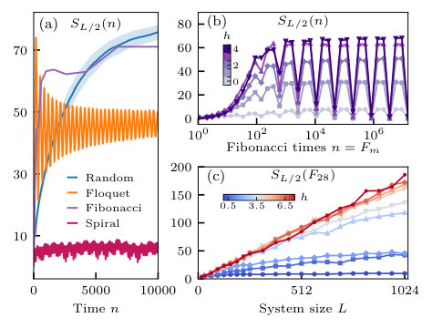 
Figure 2. (a) The bipartite entanglement entropy SL/2(n) for the spiral drive compared with three reference protocols: the random drive with θn sampled uniformly in [0, 2π) (shaded region: one standard deviation over realizations), the Floquet drive with fixed θn ≡θ, and the Fibonacci drive in which ZZ and X gates alternate according to the Fibonacci substitution rule. The spiral drive exhibits highly reduced entanglement growth compared to any of the other protocols. The system size is L = 400, with h = 0 and ϕz = π/3. (b) SL/2(n) for the spiral drive at n = Fm for different transverse fields h in (7). As h increases, the intermediate entanglement growth goes from logarithmic to linear,...

📷 Fig 4

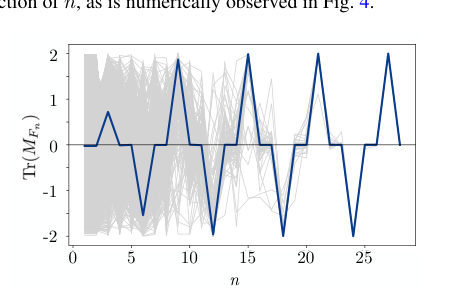 
Figure 4. Plot of Tr(MFn), as defined in (4), shown as a function of the index n for Haar distributed SU(2) matrices P, with 2000 random samples. The averaged value of the trace is shown in blue, and each realization of P is shown as a gray curve. We numerically observe the convergence to the period-6 pattern for all realizations of P.

📷 Fig 5

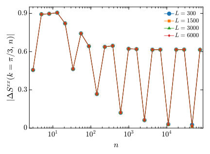 
Figure 5. Deviation of the structure factor from its initial value ex- hibits self-similar revivals. |∆Sxx(k = π/3, n)| = |Sxx(k = π/3, n) −Sxx(k = π/3, 0)|. The locations of the deep dips are essentially independent of L, indicating that the revivals are intrinsic to the quasiperiodic spiral drive.

**Summary.** The paper introduces the concept of self-similar quantum revivals as a novel form of temporal order in non-equilibrium quantum matter. By analyzing systems driven by quasiperiodic spiral kicks, the authors prove that both fidelity and entanglement entropy exhibit hierarchical recurrence patterns. This work establishes a new theoretical framework for understanding memory retention and dynamics far from equilibrium.

**Why it may be interesting.** This work provides concrete theoretical predictions about emergent temporal order in driven many-body systems, offering testable signatures (self-similar revivals) that can be sought in current quantum simulators using superconducting qubits or trapped ions.

Detailed structure

**Main problem.** To investigate whether self-similarity can emerge as a fundamental organizing principle of far-from-equilibrium quantum matter in the time domain.

**Main result.** The authors uncovered a distinct form of nonequilibrium temporal order: self-similar quantum revivals, which are robustly observed in both fidelity and entanglement entropy for systems driven by quasiperiodic spiral kicks.

**Method.** The analysis combines analytical proofs using quasiperiodic cocycles over SU(2) with numerical simulations tracking state fidelity and bipartite entanglement entropy across different driving parameters.

**Model / system.** The model is a many-body system (Ising chain) subjected to time evolution governed by quasiperiodic spiral kicks, which are constructed from an arbitrary non-diagonal SU(2) matrix combined with $\sigma_z$ gates. The dynamics are analyzed in momentum space.

**Key observables.** State fidelity $F(n)$, half-chain bipartite Entanglement Entropy $S_{L/2}(n)$, and the convergence of the product of transfer matrices to a period-6 cycle.

**Important parameters / regimes.** The quasiperiodic driving angle $\varphi$ (related to the golden ratio), perturbation strength ($	heta_z$), and entanglement thresholds ($S$).

**Assumptions / limitations.** The mathematical derivations often rely on assuming that the underlying quasiperiodic cocycle is reducible, which simplifies the analysis significantly.

**Figures summary.** Figures show the revival structure in $F(n)$ and $S_{L/2}(n)$ at specific times ($n=F^{3m}$), the convergence of momentum mode trajectories to an attractor, and the scaling of prethermal lifetime $	au$ with perturbation strength.

**Paper structure.** The paper progresses from establishing the general concept of self-similar revivals in integrable settings, providing analytical justifications via cocycles, characterizing entanglement growth regimes (area/volume law), and finally demonstrating robustness against generic integrability-breaking perturbations to establish a new paradigm for non-equilibrium quantum matter.

Abstract

We uncover a distinct form of nonequilibrium temporal order: self-similar quantum revivals in a many-body system driven by quasiperiodic spiral kicks, where the system recurrently returns close to its initial state at a hierarchically nested sequence of times. We demonstrate that both the fidelity and entanglement entropy exhibit this self-similar temporal structure. It originates from an emergent dynamical attractor, which we identify, such that all momentum modes eventually fall into the same closed orbits at self-similar times. We analytically justify this behavior and show that, for special momentum modes, this attractor arises as a consequence of a generalized spin echo process, and more generally we prove its existence using quasiperiodic SU(2) cocycles. Interestingly, the dynamics between consecutive revivals supports either volume- or area-law entanglement scaling, tunable via the driving parameters. In the presence of integrability-breaking perturbations, the system eventually heats up, but a long-lived prethermal regime with algebraically tunable lifetime occurs before heating sets in. Our results establish self-similar quantum revivals as a new paradigm for nonequilibrium quantum matter and provide a realistic route for its observation in current quantum simulators.

[↑ back to top](#top)

### [Enhancement of charge correlations and real-space topological marker on an interacting non-Hermitian Su-Schrieffer-Heeger model](http://arxiv.org/abs/2606.06466v1)

**Authors:** Sebastião dos A. Sousa-Júnior, Pedro B. Melo, Rubem Mondaini, Arnob Kumar Ghosh, Rodrigo Arouca  
**Type:** theory · **Category:** strongly correlated electrons · **PDF:** <https://arxiv.org/pdf/2606.06466v1>  
**Analysis basis:** full PDF text, analyzed in chunks
**Topic relevance:** 🔥 `analog quantum simulation` **4/5** · `driven-dissipative phase transition` **3/5** · `methods for driven-dissipative` **3/5** · `correlated / nonlocal dissipation` **2/5** · `non-equilibrium dynamics` **2/5** · `non-equilibrium universality` **2/5** · `Frenkel-Kontorova` **1/5** · `Keldysh / 2PI / non-Gaussian methods` **1/5** · `Kondo & dissipative impurity` **1/5** · `entanglement & information structure` **1/5**

📷 Fig 1

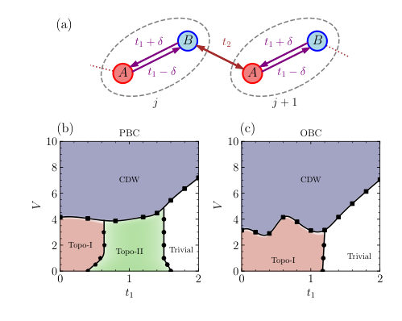 
FIG. 1. (a) Schematic representation of the hoppings in the non-Hermitian dimerized SSH model, see Eq. (1). Phase di- agram of the system for periodic, (b) [open, (c)], boundary conditions. Topo-I and Topo-II stand for the topological Her- mitian and non-Hermitian phases, respectively, with unity or half-unity winding number, and the trivial insulator phase with zero winding number. Phase boundaries are determined by finite-size scaling of charge correlations, many-body energy gaps, and the topological marker. Data are shown for t2 = 1, δ = 0.6, computed from left and right eigenvectors.

📷 Fig 2

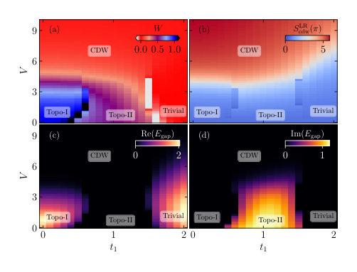 
FIG. 2. Results in the V vs t1 plane, showing (a) the topolog- ical marker, (b) the charge structure factor, and (c) the real [(d) imaginary] many-body energy gap. Topo-I and Topo- II stand for the two topological phases with W = 1 and W = 1/2, respectively, and the trivial insulator phase pos- sesses W = 0. Data for δ = 0.6, and N = 24. Here, SηR cdw(π) is computed with left and right eigenvectors (i.e., η = L).

📷 Fig 3

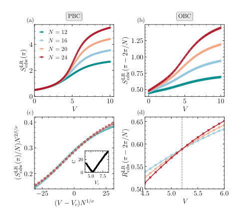 
FIG. 3. The CDW structure factor at (a) q = π under PBC and (b) at q = π−2π/N under OBC. (c) Finite-size-collapsed CDW structure factor under PBC; the critical interaction Vc = 5.4 ± 0.1 is obtained by minimizing the collapse cost function (inset). (d) CDW correlation ratio (see text) as a function of V under OBC, where the dashed line marks the crossing point Vc ≈5.2 for different system sizes. Data are for t1 = 1.6, and δ = 0.6, obtained using left and right eigen- vectors.

📷 Fig 4

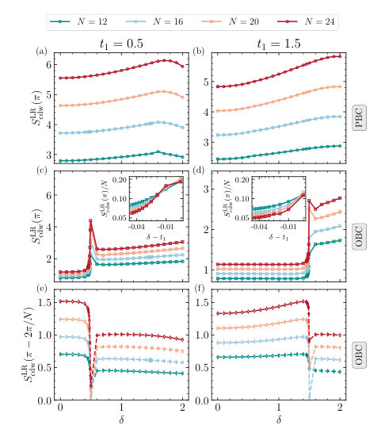 
FIG. 4. Charge structure factor as a function of δ for several lattice sizes for V = 8, and t1 = 0.5 (left panels), and t1 = 1.5 (right panels); (a) and (b) present data for PBC, while (c) and (d) display data for OBC, all for q = π. The insets in panels (c) highlight the enhanced region. Panels (e) and (f) display results for OBC this time for q = π −2π/N.

📷 Fig 5

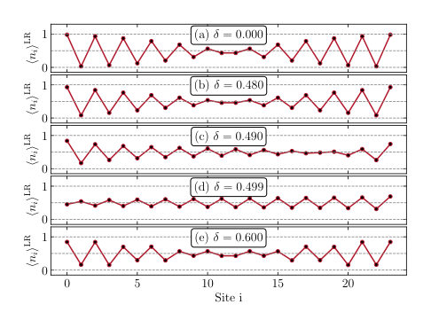 
FIG. 5. Local density under OBC for L = 24, V = 8, t1 = 0.5, for different values of δ. All data computed using the left-right (LR) convention.

**Summary.** This paper analyzes the interacting non-Hermitian SSH model to understand how charge ordering competes with topological phases. Using real-space markers and correlation functions, the authors show that interactions enhance charge correlations near exceptional points under open boundary conditions. The findings provide a detailed picture of topology breakdown driven by electronic instabilities.

**Why it may be interesting.** This work bridges concepts from topology (non-Hermitian physics) with strong correlation effects (CDW formation) in a 1D lattice model, which is highly relevant for understanding correlated electronic states in synthetic quantum materials or open quantum systems.

Detailed structure

**Main problem.** The study investigates the complex interplay between topological order, charge correlations, and interaction effects within a non-Hermitian quantum model.

**Main result.** Non-Hermiticity enhances interaction effects, leading to pronounced amplification of staggered charge correlations near exceptional points under open boundary conditions. The real-space topological marker remains robust in diagnosing phase transitions despite interactions.

**Method.** The authors employ Exact Diagonalization (ED) and mean-field treatments on the interacting non-Hermitian Su-Schrieffer-Heeger model to map out the phase diagram.

**Model / system.** The system is a one-dimensional, interacting non-Hermitian Su-Schrieffer-Heeger (SSH) model. The Hamiltonian includes nearest-neighbor hopping terms with non-reciprocity ($\delta$) and an interaction term ($V$).

**Key observables.** Real-space topological marker ($W$), charge structure factor ($S_{	ext{cdw}}$), many-body energy gaps ($	ext{Re}(E_{	ext{gap}}), 	ext{Im}(E_{	ext{gap}})$), and local density profiles ($\langle n_i 
angle$).

**Important parameters / regimes.** Interaction strength ($V$), non-reciprocity parameter ($\delta$), boundary conditions (Periodic vs. Open), and proximity to exceptional points.

**Assumptions / limitations.** The analysis relies on defining the ground state eigenpair using Krylov-Schur diagonalization, and careful consideration is given to eigenvector choices (left vs. right) to avoid artifacts.

**Figures summary.** Figures illustrate phase diagrams showing $W$, $S_{	ext{cdw}}$, and energy gaps as functions of interaction strength ($V$) and hopping parameters ($\delta$), comparing PBC and OBC results.

**Paper structure.** The paper systematically analyzes the model using multiple diagnostic tools: first establishing the topological marker's robustness, then mapping out phase transitions (Topo-I $\leftrightarrow$ CDW), and finally detailing how non-Hermiticity enhances correlations near exceptional points under OBC.

Abstract

We investigate the interacting non-Hermitian Su-Schrieffer-Heeger (SSH) model, focusing on the interplay between topology and charge ordering. Using a real-space topological marker, charge correlations, and the complex many-body spectrum, we map out the phase diagram under periodic and open boundary conditions. We show that the topological marker remains a robust diagnostic of non-Hermitian topological phases in the presence of interactions and consistently signals their breakdown at the onset of a charge density wave (CDW). We further demonstrate that non-Hermiticity enhances interaction effects: While moderate changes occur under periodic boundary conditions, open boundary conditions lead to a pronounced amplification of staggered charge correlations near exceptional points. This enhancement arises from the accumulation of low-energy states near exceptional points, which promotes electronic instabilities and strengthens CDW tendencies.

[↑ back to top](#top)

### [Breakdown of Thermalization from Real-Time Dynamics in the Two-Dimensional Hubbard Model](http://arxiv.org/abs/2606.05293v1)

**Authors:** Alessandro Sinibaldi, Luciano Loris Viteritti, Riccardo Rende, Fakher F. Assaad, Giuseppe Carleo  
**Type:** theory · **Category:** strongly correlated electrons · **PDF:** <https://arxiv.org/pdf/2606.05293v1>  
**Analysis basis:** full PDF text, analyzed in chunks
**Topic relevance:** 🔥 `non-equilibrium dynamics` **4/5** · `analog quantum simulation` **3/5** · `methods for driven-dissipative` **3/5** · `non-equilibrium universality` **3/5** · `scars & prethermalization` **2/5** · `Keldysh / 2PI / non-Gaussian methods` **1/5** · `correlated / nonlocal dissipation` **1/5** · `driven-dissipative phase transition` **1/5** · `entanglement & information structure` **1/5**

📷 Fig 1

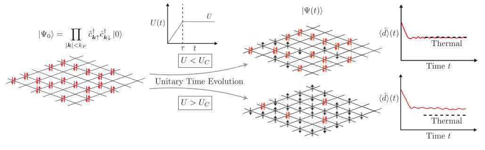 
Figure 1. Schematic illustration of the dynamical protocol studied to investigate thermalization. An initial Fermi sea state is evolved using the Hubbard Hamiltonian in Eq. (1) with the interaction strength U(t) following a linear ramp quench with final interaction U. We expect that for U smaller than a critical value UC the double occupancy ⟨ˆd⟩(t) [see Eq. (3)] at long time relaxes to the value predicted by thermalization, whereas for U larger than UC it departs from the thermal prediction.

📷 Fig 2

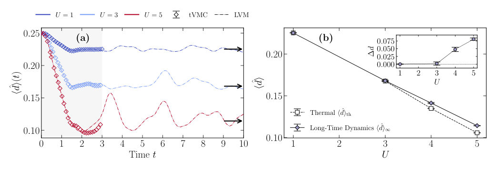 
Figure 2. Panel (a): Time evolution of the double occupancy ⟨ˆd⟩(t) [see Eq. (3)] for various interaction strengths U on a 8 × 8 lattice. The empty markers denote the tVMC simulations, while dashed lines indicate the dynamics extended via the time-dependent LVM. The shaded region highlights the time interval from which tVMC states are selected to perform the LVM computation. The arrows show the infinite-time limit of the observable from LVM. The Monte Carlo errors are smaller than the markers and are not shown for clarity. Panel (b): Infinite-time value of the double occupancy ⟨ˆd⟩∞compared with the effective thermal value ⟨ˆd⟩th as a function of U. The inset displays the order parameter ∆d...

📷 Fig 3

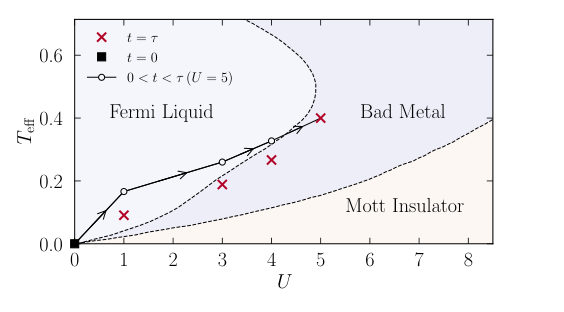 
Figure 3. Effective temperature Teff as a function of the in- teraction strength U for the dynamics with U = 1, 3, 4, 5 shown in Fig. 2 at times t = 0 (black square) and t = τ (red crosses). The dashed lines indicate the boundaries of the finite-temperature putative phase diagram of Ref. [52]. Points at intermediate times (empty circles) are also shown for U = 5 to illustrate the trajectory through the phase diagram during the dynamics. The arrows indicate the direction of time.

📷 Fig 4

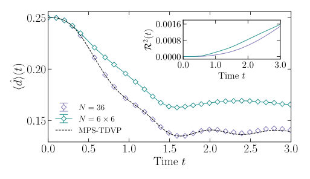 
Figure 5. Time evolution of the double occupancy ⟨ˆd⟩(t) at U = 3 for a one-dimensional cluster with N = 36 sites and for the N = 6 × 6 square lattice. tVMC calculations are in- dicated with empty markers. The dashed black line indicates the result obtained from MPS-TDVP simulation. The inset reports the TDVP error [see Eq. (12)] along the trajectories as a measure of the variational accuracy. The Monte Carlo errors are smaller than the markers and are not shown for clarity.

📷 Fig 5

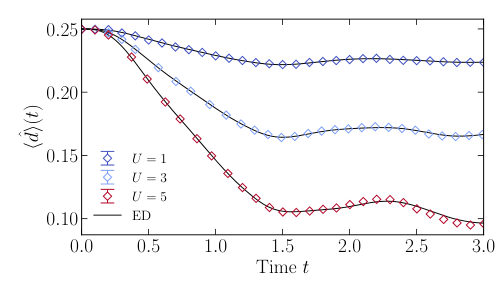 
Figure 4. Time evolution with tVMC (empty markers) of the double occupancy ⟨ˆd⟩(t) with different U for the 4 × 4 lattice. The solid black lines represent the exact diagonalization (ED) results. The Monte Carlo errors are smaller than the markers and are not shown for clarity.

**Summary.** The paper investigates how strongly correlated electrons in the 2D Hubbard model approach equilibrium after a sudden change in interaction strength. Using advanced Neural Network Quantum States within tVMC simulations, the authors find that while thermalization occurs at weak coupling, strong interactions cause the system dynamics to fundamentally deviate from expected thermal behavior, signaling a breakdown of ergodicity.

**Why it may be interesting.** This work directly addresses fundamental questions in non-equilibrium quantum dynamics, which is crucial for understanding energy relaxation and transport properties in materials like cuprate superconductors.

Detailed structure

**Main problem.** The study investigates whether thermalization occurs during the real-time evolution of a strongly correlated fermionic system after being quenched out of equilibrium.

**Main result.** The dynamics exhibit two regimes: for weak interactions, the system thermalizes; however, beyond a critical interaction strength ($U_C$), the time evolution deviates significantly from thermal predictions, indicating a breakdown of thermalization.

**Method.** Time-dependent Variational Monte Carlo (tVMC) methods are employed, utilizing Neural-Network Quantum States (NQS) based on transformer architectures to simulate non-equilibrium dynamics. The infinite-time limit is extracted using the Linear Variational Method (LVM).

**Model / system.** The system modeled is the two-dimensional Hubbard model, a canonical framework for studying correlated electrons relevant to high-temperature superconductivity.

**Key observables.** Double occupancy ($\langle\hat{d}
angle(t)$), comparison between long-time dynamic values ($\langle\hat{d}
angle_\infty$) and thermal ensemble predictions ($\langle\hat{d}
angle_{	ext{th}}$).

**Important parameters / regimes.** Interaction strength ($U$), critical interaction $U_C$, lattice size (2D square lattice), and simulation time/ramping protocol.

**Assumptions / limitations.** The use of tVMC with NQS provides an accurate description of the non-equilibrium dynamics, and LVM is used to extrapolate the long-time limit.

**Figures summary.** Figures compare the time evolution of double occupancy ($\langle\hat{d}
angle(t)$) for varying interaction strengths ($U$), contrasting tVMC results against thermal expectations and showing clear deviations above a critical $U$.

**Paper structure.** The paper establishes the physical problem (thermalization in Hubbard model), details the non-equilibrium protocol (interaction quench), presents advanced computational methods (tVMC/NQS/LVM), analyzes key observables ($\langle\hat{d}
angle$), and concludes by mapping out the phase diagram regarding thermalization breakdown.

Abstract

Thermalization in strongly correlated fermionic systems remains a central open problem in quantum many-body physics. In this work, we investigate the real-time dynamics and the approach to thermalization in the two-dimensional Hubbard model, a paradigmatic framework for correlated electrons, relevant to high-temperature superconductivity and ultracold quantum simulation. Focusing on the half-filled square lattice, we monitor the time evolution of the double occupancy following a quench in the on-site interaction $U$, and assess whether its long-time value is captured by a canonical thermal ensemble. We employ time-dependent variational Monte Carlo methods combined with transformer-based Neural-Network Quantum States to accurately describe the nonequilibrium dynamics of fermions, especially for the behavior at long times, thereby accessing regimes that were previously inaccessible to numerical simulations. Our results reveal two distinct dynamical behaviors: for weak to intermediate interactions, the long-time double occupancy agrees with the thermal prediction, consistent with ergodic relaxation; beyond a critical interaction $U_{C}$, the dynamics deviate markedly from the thermal expectation, revealing clear signatures of thermalization breaking. These results establish numerical simulation as a powerful tool to probe nonequilibrium quantum phenomena in correlated fermionic matter.

[↑ back to top](#top)

### [A closed system setting for quantum thermalisation in free fermions](http://arxiv.org/abs/2606.06362v1)

**Authors:** Purvaash Panduranghan-Udhayashankar, Filiberto Ares, Pasquale Calabrese  
**Type:** theory · **Category:** statistical mechanics · **PDF:** <https://arxiv.org/pdf/2606.06362v1>  
**Analysis basis:** full PDF text, analyzed in chunks
**Topic relevance:** 🔥 `non-equilibrium dynamics` **4/5** · `non-equilibrium universality` **3/5** · `Keldysh / 2PI / non-Gaussian methods` **2/5** · `driven-dissipative phase transition` **2/5** · `entanglement & information structure` **2/5** · `Kondo & dissipative impurity` **1/5** · `analog quantum simulation` **1/5** · `correlated / nonlocal dissipation` **1/5** · `methods for driven-dissipative` **1/5** · `scars & prethermalization` **1/5**

📷 Fig 1

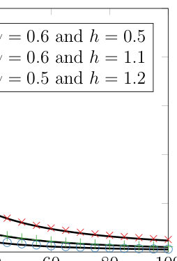 
Figure 2: Time evolution of the Frobenius distance between the reduced density matrix of subsystem S, ρS(t), and its stationary value, ρS(∞) in the homogeneous quench (9) to the XX spin chain from the ground state of the XY spin chain for different values of the parameters h and γ. The symbols represent the result of exact numerics using Eq. (7) and the solid lines are the prediction (24) of the quasiparticle picture.

📷 Fig 2

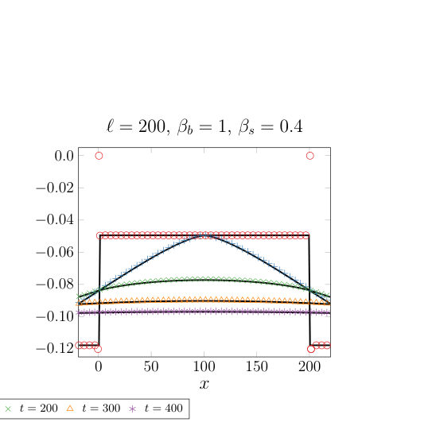 
Figure 3: Energy density profile e(x, t) in the tripartite quench of the XX spin chain at several times t. Symbols represent the exact numerical values, while solid lines are the GHD prediction (49) obtained from the time-evolved local density of occupied modes (45). In the left panel, the initial temperature of subsystem S is βs = 0 (infinite temperature) and the semi-infinite subsystems L and R are at temperature βb = 1. In the right panel, the same results are shown for βs = 0.4 and βb = 1.

📷 Fig 3

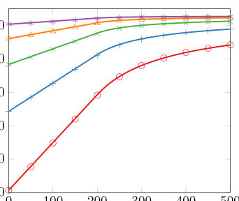 
Figure 4: Time evolution of log Tr(ρS(t)ρS(∞)) in the tripartite quench of the XX spin chain. Symbols denote the exact numerical value, calculated from the two-point correlation matrix (43). Solid lines are the GHD prediction in Eq. (53). The semi- infinite subsystems L and R are prepared at temperature βb = 1 (upper panels) and βb = 5 (lower panels). We consider different initial temperatures βs for the subsystem S, together with two subsystem lengths, ℓ= 50 (left panels) and ℓ= 200 (right panels). Increasing ℓleads to improved agreement between GHD prediction and the exact results.

📷 Fig 4

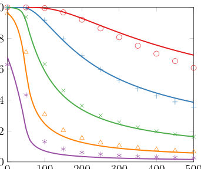 
Figure 5: Normalised Frobenius distance between the time-evolved state of S and its stationary state in the tripartite quench in the XX spin chain. Symbols are the exact value calculated through the two-point correlation matrices using Eq. (7). Solid curves correspond to the GHD prediction (54). The temperature of the baths L and R is βb = 1 (upper panels) and βb = 5 (lower panels). We take two different lengths for the subsystem S, ℓ= 20 (right panels) and ℓ= 50 (left panels).

📷 Fig 5

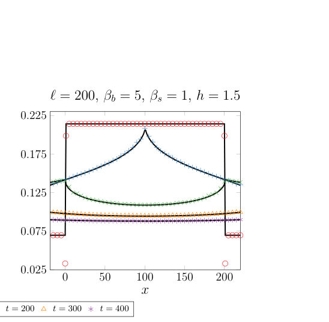 
Figure 6: Particle density profile ϱ(x, t) in the tripartite quench of the tranverse-field Ising spin chain at several times t. Symbols represent the exact numerical values, while solid lines are the GHD prediction (85) obtained from the time-evolved local density of occupied modes (84). In the left panel, the initial temperature of subsystem S is βs = 0.4 and the semi-infinite subsystems L and R are at temperature βb = 1. In the right panel, the same results are shown for βs = 1 and βb = 5. In both cases, we take a subsystem S of length ℓ= 200.

**Summary.** The paper analyzes quantum thermalization in a closed system mimicking a temperature quench using free-fermion models. By calculating the Frobenius distance via Generalized Hydrodynamics, the authors rigorously prove that the Mpemba effect does not occur under these specific boundary-driven conditions. This provides an analytical characterization of relaxation dynamics for this class of integrable systems.

**Why it may be interesting.** This work provides rigorous analytical tools (GHD, correlation functions) to study non-equilibrium relaxation phenomena like the Mpemba effect in integrable quantum systems, which is central to modern statistical mechanics and open quantum systems theory.

Detailed structure

**Main problem.** The study investigates quantum thermalization dynamics, specifically testing for the occurrence of the Mpemba effect in a closed quantum system undergoing a temperature quench.

**Main result.** The analysis concludes that no Mpemba effect arises in this boundary-driven thermalization setting for free-fermion models. Relaxation is fully characterized analytically without anomalous acceleration.

**Method.** The authors use the Frobenius distance between the time-evolved reduced density matrix and its stationary state, employing Generalized Hydrodynamics (GHD) to derive analytical predictions in the hydrodynamic limit.

**Model / system.** The system is a tripartite geometry involving a finite central chain connected on both sides to two semi-infinite chains acting as thermal baths. Two free-fermion models are analyzed: the XX chain and the transverse-field Ising (TFIC) chain.

**Key observables.** Normalized Frobenius distance, two-point correlation functions, local energy density profile, and the condition for the Mpemba effect.

**Important parameters / regimes.** Temperature difference ($eta_s$ vs $eta_b$), system size ($\ell$), and time ($t$).

**Assumptions / limitations.** The dynamics are treated within the free-fermion approximation, keeping the density matrices Gaussian. The hydrodynamic limit is utilized for analytical tractability.

**Figures summary.** Figures illustrate the tripartite quench setup and show the time evolution of the Frobenius distance, demonstrating how it approaches equilibrium without exhibiting anomalous acceleration.

**Paper structure.** The paper systematically introduces the tripartite quench setup, applies the methodology to the XX chain, then extends the analysis to the TFIC chain, culminating in a general conclusion regarding the absence of the Mpemba effect for this class of protocols.

Abstract

We study thermalisation and the possible occurrence of the Mpemba effect in a closed quantum setting that mimics the interaction of a system with thermal reservoirs coupled only at its boundaries. Specifically, we consider a tripartite geometry in which a finite chain, initially prepared at a finite temperature, is suddenly connected on both sides to two semi-infinite chains of the same nature held at a different temperature. These outer chains act as thermal baths, while the full system evolves unitarily under a homogeneous Hamiltonian. This setup provides a simple quantum realisation of a temperature quench and closely resembles the original scenario in which the classical Mpemba effect was first observed. We focus on two paradigmatic free-fermion models, the XX chain and the transverse-field Ising chain, which respectively preserve and break the global $U(1)$ particle-number symmetry. As a probe of relaxation, we consider the Frobenius distance between the time-evolved reduced density matrix of the central subsystem and its stationary state, which is the thermal state at the bath temperature. Exploiting the free-fermionic structure of both models, the dynamics remains Gaussian and the Frobenius distance can be expressed exactly in terms of two-point correlation functions. Combining this representation with generalised hydrodynamics, we derive analytical predictions for the Frobenius distance in the hydrodynamic limit, providing a complete characterisation of the thermalisation process. Using these results, we investigate the possible occurrence of the Mpemba effect. We find that, despite the genuine non-equilibrium dynamics displayed by the system, no Mpemba effect arises in this setting. Our analysis identifies a broad class of boundary-driven thermalisation protocols in which relaxation is fully characterised analytically and exhibits no anomalous acceleration of equilibration.

[↑ back to top](#top)

### [A granular Büttiker-Landauer motor](http://arxiv.org/abs/2606.05913v1)

**Authors:** Olivier Devauchelle, Predrag Popović, Piotr Szymczak, Anaïs Abramian, Arnaud Lazarus  
**Type:** both · **Category:** statistical mechanics · **PDF:** <https://arxiv.org/pdf/2606.05913v1>  
**Analysis basis:** full PDF text, analyzed in chunks
**Topic relevance:** 🔥 `non-equilibrium dynamics` **4/5** · 🔥 `non-equilibrium universality` **4/5** · `driven-dissipative phase transition` **3/5** · `methods for driven-dissipative` **3/5** · `Frenkel-Kontorova` **1/5** · `Keldysh / 2PI / non-Gaussian methods` **1/5** · `analog quantum simulation` **1/5** · `correlated / nonlocal dissipation` **1/5**

📷 Fig 1

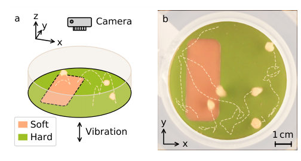 
FIG. 1. a: Experimental setup. The disk vibrates along the z-axis. The setup can be tilted by a few degrees around the x-axis. Quartz grains bounce randomly over a hard plastic surface (green, PVC), or a soft silicon elastomer (pink, vinyl polysiloxane). b: Still frame from an experimental movie (run C). Dashed white lines show the grains’ trajectories during 1.5 s (75 frames).

📷 Fig 2

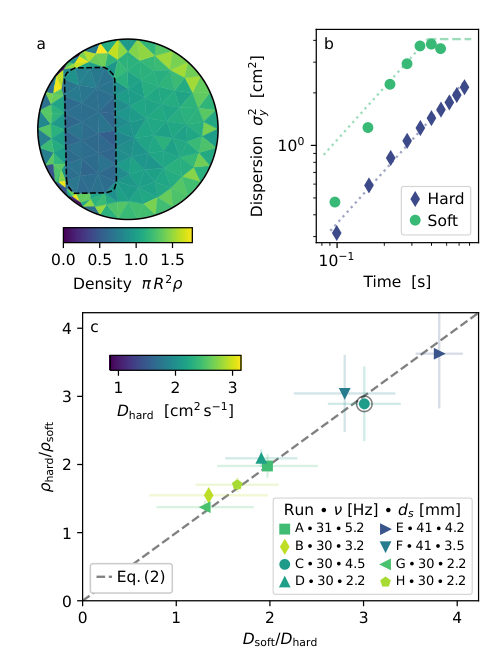 
FIG. 2. Steady state in a horizontal corral. a: Surface density of grains for run C. The tilt of the setup is less than 0.5◦. b: Variance of the grains’ trajectories along y, as a function of time (symbols). Dotted lines show linear fits. Dashed line indicates the width of the soft pad. c: Ratio of density over the hard disk to density over the soft pad, as a function of the inverted ratio of diffusivities (symbols). Points with same ν and ds differ by plate acceleration (not measured). Color shows the diffusivity over the hard disk. Vertical error bars show the standard deviations over at least 6 movies. Horizon- tal error bars indicate the difference between dispersion and...

📷 Fig 3

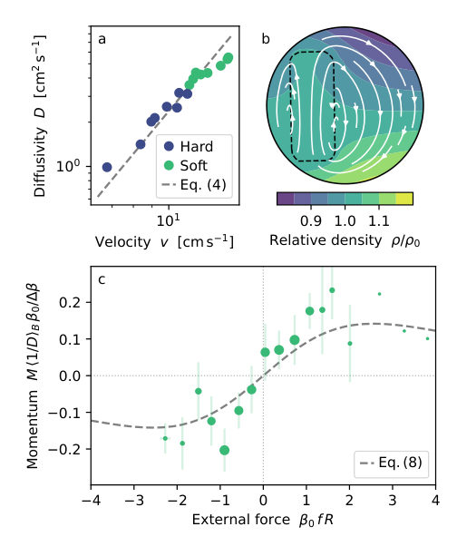 
FIG. 3. Non-equilibrium steady state with a particle current in a tilted corral. a: Relation between diffusivity and in-plane root mean square velocity. Dots show average over all runs. b: Finite-elements simulation of the steady-state Smoluchowski equation (7) for a small temperature variation (β0fR = 0.5 and ∆β/β0 = 1). Contours: ratio of the grain density ρ to the density of the base state, ρ0. White streamlines show the grain current. c: Normalized momentum as a function of normalized tilt for all experimental runs, distributed into 20 bins. The area of each dot is proportional to the number of movies in that bin (from 2 to 39). Error bars show standard deviation. Grey dashed line:...

**Summary.** The paper experimentally demonstrates a 'granular Büttiker-Landauer motor' using bouncing sand grains. It shows that particle accumulation deviates from classical diffusion laws when diffusivity varies spatially. By applying both a temperature gradient and an external force, the system generates a measurable, non-equilibrium steady current powered solely by noise.

**Why it may be interesting.** This work provides an accessible, macroscopic realization of fundamental non-equilibrium thermodynamic principles (like those governing Brownian motors), which are crucial concepts for understanding energy transduction far from equilibrium, relevant to open quantum systems dynamics.

Detailed structure

**Main problem.** The research addresses discrepancies between classical diffusion theory (Fick's law) and experimental observations, aiming to realize a 'granular Büttiker-Landauer motor.' It seeks to show how non-uniform energy landscapes can drive particle currents powered only by noise.

**Main result.** The experiment confirms that grain density accumulates inversely proportional to local diffusivity ($
ho \propto 1/D$), and the system generates a measurable steady current when both a temperature gradient and an external force are applied.

**Method.** The study combines macroscopic experiments using vibrating granular sand on patterned substrates with theoretical analysis based on modified flux equations derived from non-equilibrium statistical mechanics.

**Model / system.** The physical platform is quartz sand grains bouncing on a disk, where the substrate diffusivity ($D$) can be varied by embedding soft elastomer pads. The underlying physics models particle transport in non-uniform temperature fields, governed by generalized Smoluchowski or Fokker-Planck type equations.

**Key observables.** Grain density ($
ho$), diffusion coefficients ($D_{	ext{hard}}, D_{	ext{soft}}$), and the resulting steady-state particle current ($j$) or angular momentum ($M$).

**Important parameters / regimes.** The ratio of diffusivities ($D_{	ext{soft}}/D_{	ext{hard}}$) and the dimensionless parameter $eta_0 f R$ (related to temperature gradient and external force).

**Assumptions / limitations.** Key assumptions include applying an alternative flux equation ($\mathbf{j} = -
abla(D
ho)$) and assuming that particle interactions are negligible during the hopping process.

**Figures summary.** Figures illustrate the experimental setup, show steady-state density maps (Fig. 2a), plot variance vs. time to extract $D$ (Fig. 2b), and demonstrate current flow streamlines in simulations under external force (Fig. 3).

**Paper structure.** The paper progresses from establishing the failure of Fick's law using simple density accumulation experiments, to developing a more complex model incorporating external forces and temperature gradients, culminating in measurements of directed particle currents.

Abstract

Random walkers usually diffuse according to Fick's law. On average, they move down the gradient of their concentration and, in the absence of external force, tend to distribute themselves uniformly. In some experiments, however, this familiar notion is at odds with observation. Sand grains, for instance, gather along the nodal lines of a vibrated elastic plate to form a Chladni figure, thus accumulating where fluctuations are weak -- a fact that escapes the reach of Fick's law. On theoretical grounds, Büttiker [Zeitschrift für Physik B, 68, 1987] and Landauer [J Stat Phys, 53, 1988] proposed that particles submitted to a non-uniform temperature field would indeed gather where the temperature is low. They also predicted that, in the presence of a potential force, a non-uniform temperature could drive a steady current of particles, powered only by noise. Here, we present an experimental realization of these phenomena in a macroscopic system, which confirms the quantitative predictions of Büttiker.

[↑ back to top](#top)

### [Charge-Conjugation Violation and Population Asymmetry in Bipartite Fermionic Lattices](http://arxiv.org/abs/2606.06138v1)

**Authors:** Di Xiao, Xue-Ting Fang, Lushuai Cao, Zhong-Kun Hu, Peter Schmelcher  
**Type:** theory · **Category:** other · **PDF:** <https://arxiv.org/pdf/2606.06138v1>  
**Analysis basis:** full PDF text, analyzed in chunks
**Topic relevance:** 🔥 `analog quantum simulation` **4/5** · 🔥 `non-equilibrium dynamics` **4/5** · `non-equilibrium universality` **3/5** · `scars & prethermalization` **2/5** · `Keldysh / 2PI / non-Gaussian methods` **1/5** · `correlated / nonlocal dissipation` **1/5** · `driven-dissipative phase transition` **1/5** · `entanglement & information structure` **1/5** · `methods for driven-dissipative` **1/5**

📷 Fig 1

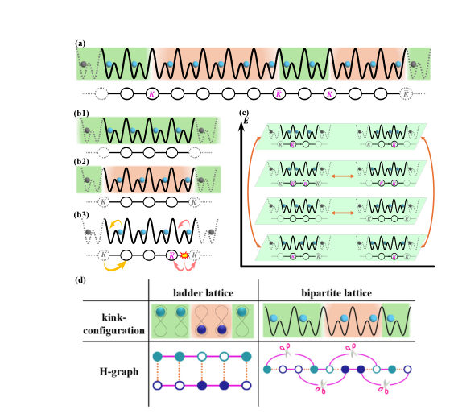 
FIG. 1: Schematics of SKs with the CCV and kink- number violation. (a) the transformation between the bipartite fermionic lattice (upper panel) and the SK bond (lower panel). (b1,b2) differentiate between the SK-vacuum states |vac:L⟩kink (b1) and |vac:R⟩kink (b2) by the virtual SK, and (b3) the virtual-real bond cou- pling. (c) The CCV in terms of the K −¯K chemical potential asymmetry shown in both the underlying bi- partite lattice and the SK picture. (d) The first and second rows illustrate a representative kink configura- tion and the H-graph, respectively, for the CSO ladder lattice (left) and the bipartite lattice (right).

📷 Fig 2

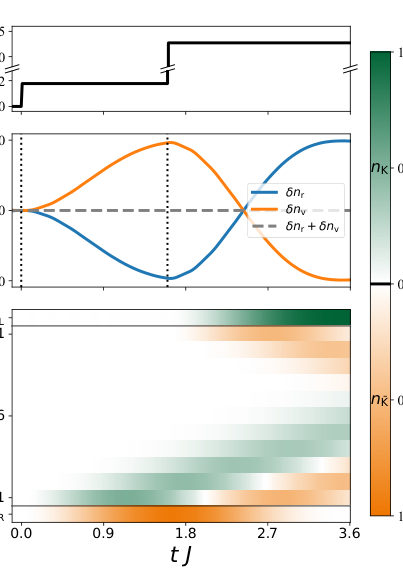 
FIG. 3: Controlled quench-induced K −¯K asymmetry. (a) The quench sequence of ℎ. (b) The K −¯K asym- metry for real- (blue) and virtual bonds (orange). (c) Quench induced time evolution of the quasiparticle numbers 𝑛K and 𝑛¯K, with the indices vL and vR refer- ring to the virtual bonds and indices 𝑖∈[1, 11] denot- ing the real bonds.

📷 Fig 3

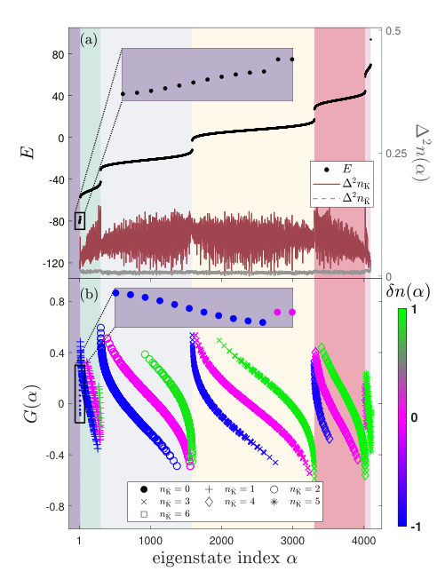 
FIG. 2: (a) The eigenenergy spectrum (left axis) and the fluctuations of 𝑛¯K (right axis). (b) The leaf-like structures shown in light of the intra-cell correlation, with the color and marker type indicating the 𝛿𝑛and 𝑛¯K, respectively, of each eigenstate. The colored back- ground of both figures links the band and the leaf as- sociated to the same eigenstates. The insets in both figures zoom into the lowest band.

📷 Fig 4

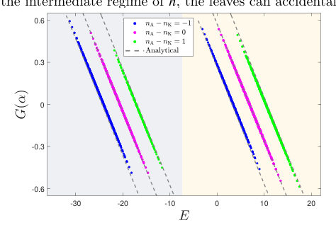 
FIG. 4: Linearity between 𝐸(𝛼) and 𝐺(𝛼). Eigenstates of the third- and fourth bands are illustrated, with gray dashed lines being analytical results.

📷 Fig 5

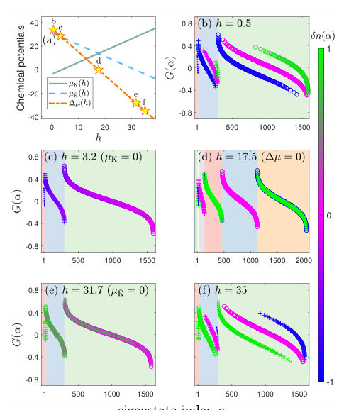 
FIG. 5: (a) The chemical potential of 𝜇K (green solid), 𝜇¯K (blue dashed) and Δ𝜇(yellow dotted) as a function of the edge tilt strength ℎ. (b-f) The leaf-like struc- tures of representative parameters as marked with stars in (a), and the choice of color and marker types is the same as in Fig. 2.

**Summary.** The paper establishes that topological features within bipartite fermionic lattices can induce intrinsic Charge-Conjugation Violation (CCV) without external symmetry breaking. This microscopic mechanism manifests macroscopically as a population imbalance between particle and anti-particle excitations. The findings are highly relevant for experimental realization using cold-atom quantum simulators.

**Why it may be interesting.** This work directly addresses emergent symmetry breaking mechanisms in lattice models, which is highly relevant for understanding non-equilibrium phenomena in ultracold atomic quantum simulators used to model strongly correlated systems.

Detailed structure

**Main problem.** The study investigates how intrinsic Charge-Conjugation Violation (CCV) can emerge in quantum many-body systems without relying on explicit symmetry breaking mechanisms.

**Main result.** Intrinsic CCV is shown to arise from the graph topology of bipartite fermionic lattices, leading macroscopically to a measurable population asymmetry between kink and anti-kink excitations.

**Method.** The authors use an effective Hamiltonian approach derived from mapping the system onto sublattice kinks (topological defects) and analyzing its spectral properties under quench dynamics.

**Model / system.** The model is based on bipartite fermionic lattices containing quasiparticles called 'sublattice kinks' (SKs), governed by a Fermi-Hubbard type Hamiltonian restricted to specific Hilbert subspaces.

**Key observables.** Population asymmetry ($\delta n = n_K - n_{ar{K}}$), hidden leaf-like structure in the eigenenergy spectrum, and imbalanced sublattice-kink production during quench dynamics.

**Important parameters / regimes.** Chemical potentials ($\mu_K$, $\mu_{ar{K}}$) and external boundary tilts ($h$) used to tune the asymmetry; lattice geometry (bipartite vs. ladder).

**Assumptions / limitations.** The analysis relies on mapping the system dynamics to an effective kink picture, sometimes requiring truncation of the Hilbert space or assuming non-interacting spinless fermions in certain limits.

**Figures summary.** Figures illustrate schematics of CCV in SKs (Fig. 1), show the leaf-like structure in the eigenenergy spectrum related to asymmetry (Fig. 2), and demonstrate control over K-$ar{K}$ imbalance via bi-quench protocols (Fig. 3).

**Paper structure.** The paper progresses from establishing the general problem of intrinsic CCV, developing the model using kink excitations on bipartite lattices, demonstrating measurable asymmetry in static spectra and quench dynamics, and finally extending the analysis to include doublon/holon physics.

Abstract

Charge conjugation violation (CCV) is a central concept in particle physics and appears also for quasiparticles in quantum many-body systems, which typically relies on an embedded external symmetry breaking to the underlying system. An open question is how an intrinsic CCV mechanism could emerge and what its macroscopic consequences would be. We establish sublattice kinks in bipartite fermionic lattices as a concrete setup showing intrinsic CCV. The intrinsic CCV of the sublattice kink is based on the graph-topological nature of the underlying Hamiltonian, with no explicit symmetry breaking taking place. It leads to a population asymmetry of different configurations and imprints a hidden leaf-like structure in the eigenenergy spectrum. The population asymmetry also leads to an imbalanced sublattice-kink production triggered by the vacuum-instability in the quench dynamics. Our work demonstrates the graph topology as the microscopic origin of intrinsic CCV, with the population asymmetry as the macroscopic consequence, of which the proposed setup is highly amenable to experimental implementation via cold-atom quantum simulators.

[↑ back to top](#top)

### [Thermodynamics of bouncing grains](http://arxiv.org/abs/2606.05930v1)

**Authors:** Olivier Devauchelle, Predrag Popović, Piotr Szymczak, Anaïs Abramian, Arnaud Lazarus  
**Type:** both · **Category:** statistical mechanics · **PDF:** <https://arxiv.org/pdf/2606.05930v1>  
**Analysis basis:** full PDF text, analyzed in chunks
**Topic relevance:** 🔥 `non-equilibrium dynamics` **4/5** · `methods for driven-dissipative` **3/5** · `non-equilibrium universality` **3/5** · `Keldysh / 2PI / non-Gaussian methods` **2/5** · `driven-dissipative phase transition` **2/5** · `Frenkel-Kontorova` **1/5** · `analog quantum simulation` **1/5** · `correlated / nonlocal dissipation` **1/5** · `quantum measurements` **1/5**

📷 Fig 1

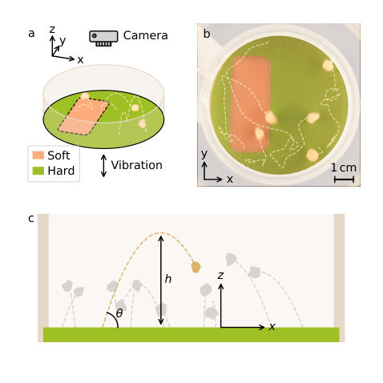 
FIG. 1. a: Experimental setup. The disk vibrates along the z-axis. The setup can be tilted by a few degrees around the x-axis. Quartz grains bounce randomly over a hard plastic surface (green, PVC), or a soft silicon polymer (pink, vinyl polysiloxane). b: Still frame from an experimental movie (run C). Dashed white lines show the grains’ trajectories during 1.5 s (75 frames). c: Idealized representation of the bouncing grains. Their trajectory during a jump is a free fall (dashed lines).

📷 Fig 2

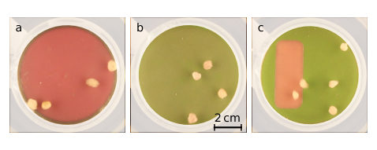 
FIG. 2. The three substrates used in the experiment. a: Soft elastomer (pink, VPS). b: Hard plastic (green, PVC). c: Heterogeneous substrate.

📷 Fig 3

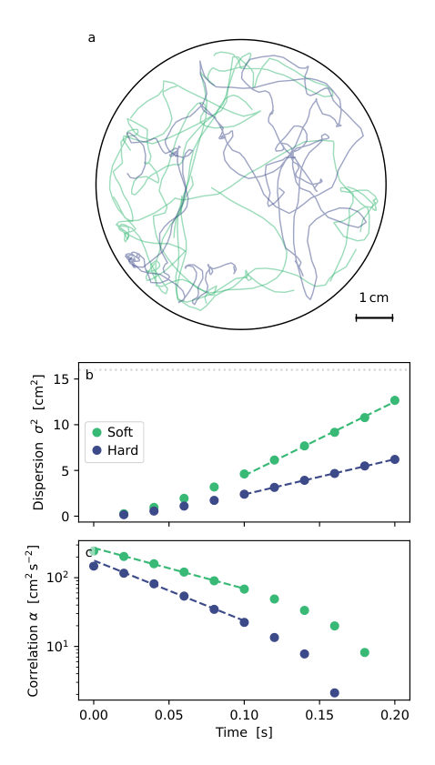 
FIG. 3. a: Examples of trajectories over hard and soft disk (runs L and M, f = 30 Hz, ds = 6 mm, dimensionless ac- celeration Aω2/g = 1.6 and 1.9 respectively). b: Average dispersion σ2 of trajectories with time (dots). Dashed lines show linear fits with slope 4D. Hard: D = 9.6 cm2 s−1; Soft: D = 20.2 cm2 s−1. Dotted gray line indicates box size R2. c: Autocorrelation function of the grains’ velocity (dots). Dashed line shows exponential fit, with amplitude from equation (5). Hard: D = 8.8 cm2 s−1, τc = 0.049 s; Soft: D = 19.9 cm2 s−1, τc = 0.073 s.

📷 Fig 4

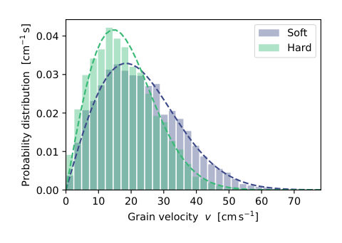 
FIG. 4. Velocity distribution over a uniform substrate (runs L and M, f = 30 Hz, ds = 6 mm, dimensionless accelera- tion Aω2/g = 1.6 and 1.9 respectively). Colors correspond to type of substrate. Bars: experimental probability distri- bution. Dashed lines: Maxwell-Boltzmann distribution with the same root mean square value (vrms = 26.1 cm s−1 over the soft substrate, and 20.6 cm s−1 over the hard substrate).

📷 Fig 5

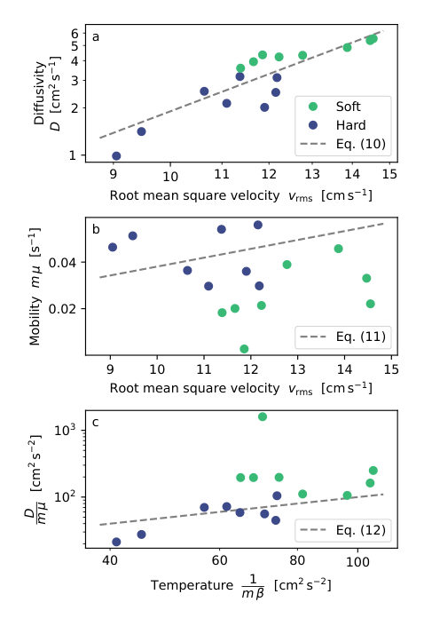 
FIG. 5. Empirical evaluation of the bouncing-grain model (section II, runs A to H only). All scales are logarithmic. a: Diffusivity as a function of root mean square velocity. Dashed line: equation (10) with a bouncing angle of θ = 75◦(fitted to data). b: Mobility as a function of root mean square velocity. The product mµ is independent from the mass m of a grain. Dashed line: equation (11) with θ = 75◦. c: Fluctuation- dissipation relation. Dashed line: one-to-one relation, equa- tion (12).

**Summary.** This research uses bouncing sand grains on vibrating plates as a model system to study non-equilibrium diffusion. The authors demonstrate that when temperature gradients are present, the standard Fick's law fails, requiring an advanced stochastic calculus approach (the Itô process) for accurate description. They successfully measure and model the heat flux associated with this unique steady state.

**Why it may be interesting.** The work provides a tangible, mesoscopic physical realization of complex statistical mechanics concepts—like distinguishing between different types of random walks (Itô vs. Fickian)—using simple mechanical systems, which has parallels to understanding energy dissipation and transport in open quantum systems.

Detailed structure

**Main problem.** The study investigates diffusion dynamics of bouncing sand grains on a vibrating plate, specifically testing whether classical Fick's law or alternative stochastic models (like the Itô process) correctly describe non-equilibrium transport.

**Main result.** When temperature gradients are present, the system deviates from Fick's law; experiments support a new transport relation derived from an Itô random walk model. The heat flux associated with this non-equilibrium steady state is successfully measured and modeled.

**Method.** The authors combine experimental tracking of individual grain trajectories on vibrating substrates with advanced stochastic calculus (Ito vs. anti-Ito integrals) to derive macroscopic transport equations.

**Model / system.** The system consists of small particles bouncing on a vibrating, potentially heterogeneous substrate. The motion is modeled as a random walk process whose statistics are analyzed using concepts from non-equilibrium thermodynamics and stochastic calculus.

**Key observables.** Diffusivity (D), Root Mean Square velocity ($	ext{v}_{	ext{rms}}$), Heat Flux ($\dot{Q}$), and the relaxation parameter ($\gamma$).

**Important parameters / regimes.** Vibration frequency ($
u$), tilt angle ($\phi$), substrate heterogeneity, and temperature gradient ($\Delta T/T$).

**Assumptions / limitations.** The analysis assumes that the dynamics can be accurately described by specific stochastic integrals (favoring Itô over anti-Ito) and that the system reaches a non-equilibrium steady state.

**Figures summary.** Figures illustrate experimental setups, grain trajectories showing random walk behavior, velocity distributions fitting Maxwell-Boltzmann statistics, and plots comparing measured heat flux against theoretical predictions based on temperature gradients.

**Paper structure.** The paper progresses from basic observation of diffusion (comparable to molecular diffusion) to identifying the failure point of Fick's law under non-uniform conditions. It then rigorously compares stochastic calculus formulations (Ito vs. anti-Ito) and concludes by experimentally measuring and modeling the associated heat flux in the resulting non-equilibrium steady state.

Abstract

When a horizontal plate vibrates strongly enough, it causes small particles such as sand grains to continually bounce on it and, over time, to diffuse across its surface. This phenomenon is the cause of the well-known Chladni figure, which is drawn by a higher density of grains gathering along the nodal lines of a resonating elastic plate. Using a heterogeneous, non-resonating plate, we investigate experimentally this type of diffusion. We find that, for the most part, is it comparable to classical molecular diffusion. We can define a temperature for the bouncing grains, and the system then obeys the fluctuation-dissipation theorem. We also recover Maxwell-Boltzmann statistics at equilibrium, when temperature is uniform. However, when temperature varies across the vibrating plate, the microscopic details of the grains' dynamics affect their macroscopic behavior: Fick's law, for instance, no longer applies. Instead, our experiments support a new transport relation that was recently proposed to represent diffusion in Chladni's experiment. Finally, we propose an expression for the heat flux associated to the non-equilibrium steady state predicted by this new relation, and test it against observations.

[↑ back to top](#top)

### [The mesoscopic foundations of non equilibrium thermodynamics and the arrow of time in the Dual Model of Liquids](http://arxiv.org/abs/2606.06184v1)

**Authors:** Fabio Peluso  
**Type:** theory · **Category:** statistical mechanics · **PDF:** <https://arxiv.org/pdf/2606.06184v1>  
**Analysis basis:** full PDF text, analyzed in chunks
**Topic relevance:** 🔥 `non-equilibrium dynamics` **4/5** · 🔥 `non-equilibrium universality` **4/5** · `Keldysh / 2PI / non-Gaussian methods` **3/5** · `driven-dissipative phase transition` **3/5** · `Frenkel-Kontorova` **1/5** · `correlated / nonlocal dissipation` **1/5** · `methods for driven-dissipative` **1/5**

📷 Fig 1

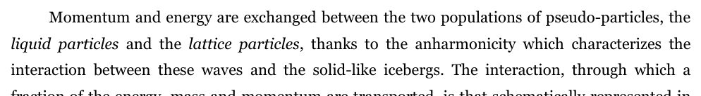 
Figure 1. The mean free-flight of a wave-packet between two successive interactions with as many

📷 Fig 2

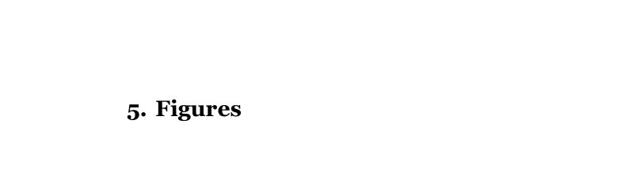 
Figure 1. Schematic representation of inelastic collisions between wave-packets and liquid particles. This is the elementary interaction which the DML is based on.

📷 Fig 3

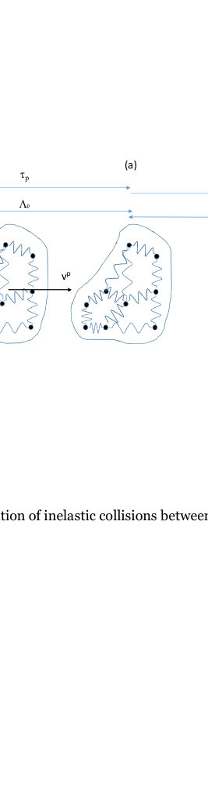 
Figure 1

📷 Fig 4

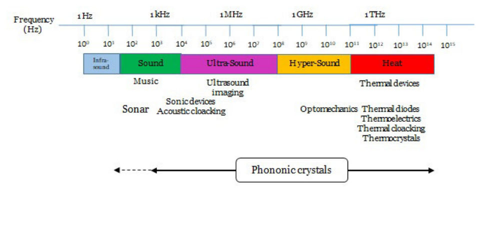 
Figure 2. Frequency spectrum of the elastic perturbations propagating through media, with indication of the phononic spectrum.

📷 Fig 5

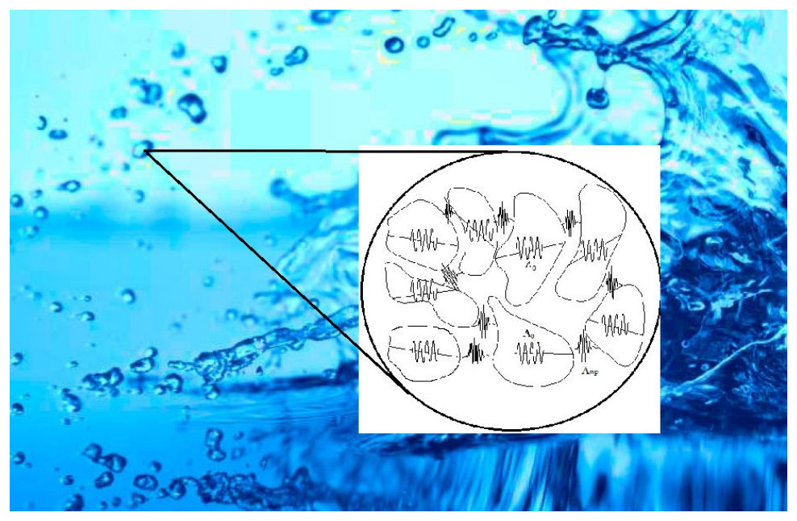 
Figure 3. The pictorial model of liquids at mesoscopic scale, on which the DML is based: icebergs of solid lattice fluctuating and interacting within the liquid global system at equilibrium. It reflects also what may be deduced from experiments performed with IXS techniques [67-88], able to observe liquids at such scale-lengths.

**Summary.** This paper develops the Dual Model of Liquids (DML) to bridge macroscopic non-equilibrium thermodynamics with mesoscopic physics in liquids. It models energy transport via wave-packet interactions between solid-like aggregates and lattice excitations. The key finding is that this duality introduces a necessary asymmetry at the mesoscopic scale, providing a physical basis for the arrow of time.

**Why it may be interesting.** It provides a concrete, physically motivated mechanism—wave-packet interaction and structural relaxation—to derive irreversible thermodynamics from time-reversible microscopic dynamics, which is central to open quantum systems theory.

Detailed structure

**Main problem.** To establish a physical link between macroscopic non-equilibrium thermodynamics (NET) and mesoscopic microscopic processes in liquids, while simultaneously identifying the origin of the arrow of time.

**Main result.** The Dual Model of Liquids successfully models transport coefficients and suggests that the inherent duality introduces a mesoscopic asymmetry responsible for the thermodynamic arrow of time, even though elementary interactions are reversible.

**Method.** Theoretical modeling using the Dual Model of Liquids (DML), which treats energy/momentum exchange between solid-like aggregates ('icebergs') and lattice excitations via quasi-elastic wave-packet dynamics.

**Model / system.** The system is liquid matter, modeled by the DML. This model posits that liquids exhibit dualism, sharing energy transmission modes with solids through collective excitations (wave-packets) interacting with metastable solid-like clusters.

**Key observables.** Macroscopic transport properties like thermal conductivity, viscosity, and Soret coefficient; mesoscopic observables include propagating transverse currents and relaxation times ($	au$).

**Important parameters / regimes.** Mesoscopic scale (intermediate between atomic quantum mechanics and fluid dynamics); characteristic time scales ($	au$); energy/momentum exchange parameters ($\Delta E$, $\Delta p$).

**Assumptions / limitations.** The DML assumes that solid-like aggregates maintain a quasi-harmonic structure over relaxation timescales, allowing wave propagation; NET is treated as phenomenological.

**Figures summary.** Figures illustrate the elementary energy/momentum exchange between lattice and liquid particles (collision dynamics), the mechanism for viscosity via wave-packets mediating layer friction, and the comparison of time evolution under equilibrium versus irreversible processes.

**Paper structure.** The paper progresses by first establishing the need to bridge NET with microscopic physics. It then details the DML framework, analyzing energy/momentum exchange mechanisms (collisions, tunneling) that yield macroscopic transport laws, culminating in an explanation for thermodynamic irreversibility at the mesoscopic level.

Abstract

This manuscripts has two goals. The first goal is to show that the interaction in the Dual Model of Liquids between the solidlike molecule aggregates and the lattice excitations is appropriate to represent the link between the behaviour at macroscopic scale of normal liquids and the physical processes characterizing those systems at mesoscopic scale. The second goal is to show that the duality allows identifying a time arrow on the mesoscopic scale in liquids. The interaction of quanta of elastic energy with the molecular clusters introduces a privileged direction, which is relevant in time dependent and dissipative macroscopic processes, although the interaction remains temporally reversible

[↑ back to top](#top)

### [Benchmarking Floquet Master Equations for Periodically Driven Open Quantum Systems](http://arxiv.org/abs/2606.06341v1)

**Authors:** Konrad Mickiewicz, Valentin Link, Walter T. Strunz  
**Type:** theory · **Category:** other · **PDF:** <https://arxiv.org/pdf/2606.06341v1>  
**Analysis basis:** full PDF text, analyzed in chunks
**Topic relevance:** 🔥 `methods for driven-dissipative` **4/5** · 🔥 `non-equilibrium dynamics` **4/5** · `driven-dissipative phase transition` **3/5** · `non-equilibrium universality` **2/5** · `Keldysh / 2PI / non-Gaussian methods` **1/5** · `analog quantum simulation` **1/5** · `correlated / nonlocal dissipation` **1/5**

📷 Fig 1

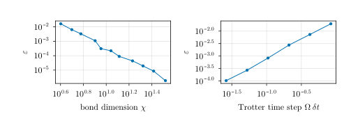 
FIG. 1. Convergence of the dynamical map for the driven two- spin boson mode obtained with uniTEMPO with respect to the bond dimension (left panel) and Trotter time step (right panel). As a reference we used high-accuracy calculations with large bond dimension and small Trotter step. Model parameters are ϵd = 5Ω, ωd = 10Ω, ωA = ωB = Ω, α = 2.5 × 10−4, ωc = 20Ω, β = 0.1/Ω.

📷 Fig 2

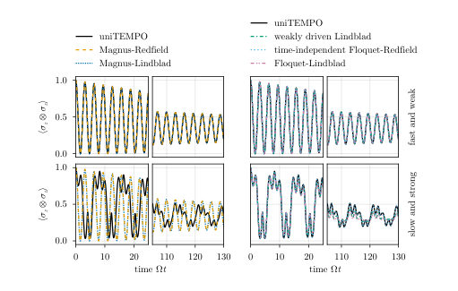 
FIG. 2. Expectation value of σz ⊗σz for an example dynamics of the driven two-spin boson model with initial state ρ(0) = |11⟩⟨11|. Top row: fast and weak driving regime (Ω/ωd = 0.1, ϵd = 0.1Ω) where our error measure is small for all master equations ε &lt; 0.05. Bottom row: slow and strong driving regime (Ω/ωd = 1.3, ϵd = 4Ω) where our error measure of the master equations is large ε &gt; 0.2, with an exception of the time-independent Floquet-Redfield for which ε &lt; 0.05. Remaining simulation parameters: ωA = ωB = Ω, α = 2.5 × 10−4, ωc = 20Ω, β = 0.1/Ω.

📷 Fig 3

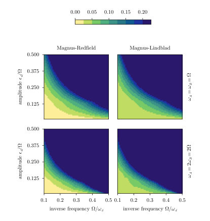 
FIG. 3. Error measure (53) for the Magnus-Redfield and Magnus-Lindblad master equations as a function of the driv- ing frequency ωd and the driving amplitude ϵd for resonant (ωA = ωB = Ω, top row) and detuned (ωA = 2ωB = 2Ω, bottom row) spins. The validity of the master equations is restricted to the high-frequency and low-amplitude regime (bottom left corner of each plot) as a result of the underlying first-order Magnus expansion. Remaining simulation param- eters: α = 2.5 × 10−4, ωc = 20Ω, β = 0.1/Ω.

📷 Fig 4

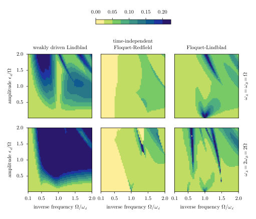 
FIG. 4. Error measure (53) for the weakly driven Lindblad, time-independent Floquet-Redfield and Floquet-Lindblad master equations as a function of the driving frequency ωd and the driving amplitude ϵd for the resonant (ωA = ωB = Ω, top row) and detuned (ωA = 2ωB = 2Ω, bottom row) spins. The validity differs for each master equation and each regime. We achieve the overall best accuracy for the time-independent Floquet-Redfield equation. Remaining simulation parame- ters: α = 2.5 × 10−4, ωc = 20Ω, β = 0.1/Ω.

📷 Fig 5

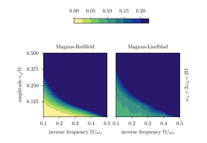 
FIG. 6. Error measure (53) for the Magnus-Redfield and Magnus-Lindblad master equations as a function of the driv- ing frequency ωd and the driving amplitude ϵd, as in Fig. 3 but for lower bath temperature β = 1/Ωand α = 1.25×10−3.

**Summary.** This paper rigorously benchmarks several analytical master equations designed for periodically driven open quantum systems. By comparing their predictions against numerically exact simulations using a two-spin model, the authors map out the precise parameter regimes where each equation remains accurate. The findings guide practitioners toward selecting robust methods, particularly favoring time-independent Floquet-Redfield approaches over those relying on approximations like the secular limit.

**Why it may be interesting.** This work is highly relevant as it provides a crucial diagnostic tool for researchers developing models for open quantum dynamics under time-periodic driving, helping them select the most reliable theoretical framework.

Detailed structure

**Main problem.** The core problem is benchmarking various Floquet master equations used to describe open quantum systems subjected to periodic driving, aiming to pinpoint the limits of their theoretical applicability.

**Main result.** The accuracy of any given master equation strongly reflects the underlying physical assumptions; specifically, errors are amplified near resonances where approximations like the secular approximation break down.

**Method.** The authors compare predictions from multiple analytical master equations (e.g., Floquet-Lindblad, Redfield) against numerically exact non-Markovian simulations using advanced techniques like uniTEMPO.

**Model / system.** The study uses a model of two locally driven spins coupled to a shared Ohmic reservoir at finite temperature, governed by a time-periodic Hamiltonian.

**Key observables.** Accuracy of the predicted dynamics (e.g., $\langle\sigma_z \otimes\sigma_z
angle$ evolution) compared against exact simulations; error measure $\varepsilon(t)$.

**Important parameters / regimes.** Driving frequency ($\omega_d$), driving amplitude ($\epsilon_d$), and temperature/bath spectral density parameters.

**Assumptions / limitations.** The primary assumptions tested are weak system-bath coupling, the validity of the secular approximation, and the limitations imposed by perturbative expansions (like Magnus series).

**Figures summary.** Figures compare the error measure ($\varepsilon$) across different master equations as a function of driving frequency and amplitude, generally showing that time-independent Floquet-Redfield performs best.

**Paper structure.** The paper systematically reviews the derivation of various master equation formalisms (Magnus, Redfield, Lindblad) applicable to periodically driven systems, followed by rigorous benchmarking against exact non-Markovian simulations across varying parameter regimes.

Abstract

The dynamics of open quantum systems is commonly described by quantum master equations derived under the assumption of weak system-bath coupling and a separation of timescales between system and bath. When the system is additionally subjected to a periodic driving, the validity of the resulting Floquet master equations is further restricted to regimes of weak or high-frequency driving. Here, we benchmark a set of commonly used Floquet master equations for a model of two locally driven spins coupled to a shared Ohmic reservoir at finite temperature. We systematically probe the accuracy of the equations as a function of the driving parameters, thus identifying limits of their applicability. Dynamical maps predicted by each master equation are compared against numerically exact non-Markovian simulations, tracking the full relaxation dynamics. We find that the accuracy of each master equation closely reflects the assumptions underlying its derivation. For the Floquet-Lindblad equation, errors can be strongly amplified near resonances where the secular approximation breaks down, while approaches that avoid the secular approximation perform better and exhibit a more systematic dependence of the error on driving frequency and amplitude.

[↑ back to top](#top)

### [Isospectrality and Operator Complexity](http://arxiv.org/abs/2606.05294v1)

**Authors:** Pradip Kattel, Yicheng Tang, Natan Andrei  
**Type:** theory · **Category:** other · **PDF:** <https://arxiv.org/pdf/2606.05294v1>  
**Analysis basis:** full PDF text, analyzed in chunks
**Topic relevance:** 🔥 `entanglement & information structure` **4/5** · `non-equilibrium dynamics` **3/5** · `analog quantum simulation` **2/5** · `non-equilibrium universality` **2/5** · `Keldysh / 2PI / non-Gaussian methods` **1/5** · `correlated / nonlocal dissipation` **1/5** · `driven-dissipative phase transition` **1/5** · `methods for driven-dissipative` **1/5**

📷 Fig 1

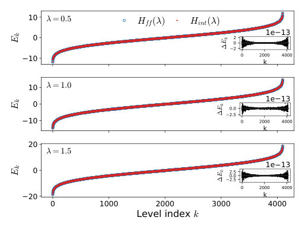 
FIG. 1. Many-body spectra of the quadratic Hamiltonian Hff(λ) (blue circles) and the interacting Hamiltonian Hint(λ) (red crosses) for a chain of length N = 12 at λ = 0.5, 1, 1.5. The complete level-by-level agreement demonstrates the exact unitary equivalence between the interacting nearest-neighbor fermion chain Eq. (1) and the quadratic nearest-neighbor Hamiltonian Eq. (3). Inset: spectral differences ∆Ek = E(int) k −E(ff) k vanish to numerical precision.

📷 Fig 2

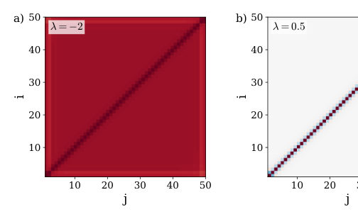 
FIG. 2. Ground-state density correlations Cij =  ni −1

📷 Fig 3

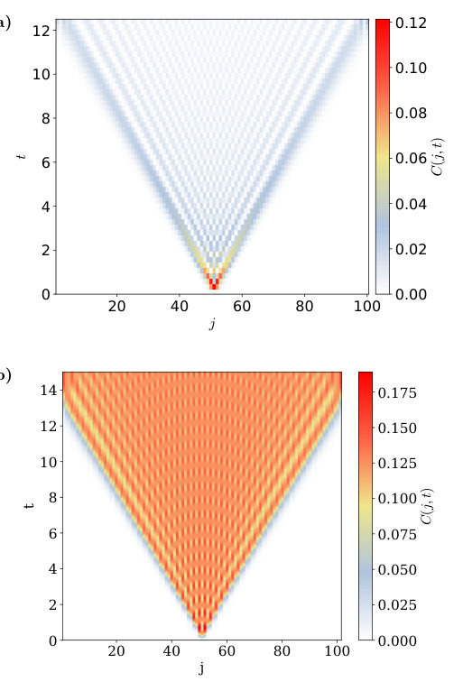 
FIG. 3. Infinite-temperature OTOCs of centered density op- erators Wj = nj −1

📷 Fig 4

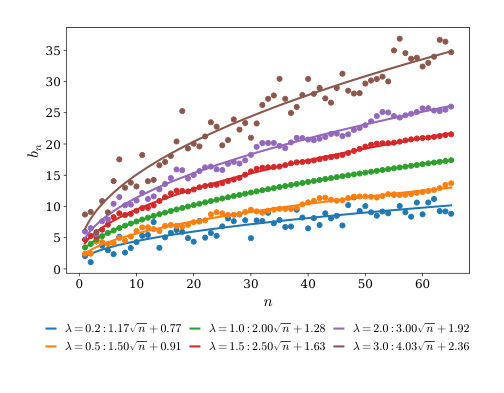 
FIG. 4. Lanczos coefficients bn from the Liouvillian Krylov recursion with a local Majorana seed, computed numerically for a chain of length N = 100 up to n = 65 for various values of λ. To suppress short-range numerical fluctuations, the raw sequence is smoothed using a Savitzky–Golay filter (window size 11, quadratic polynomial) [24]. The resulting coefficients are consistent with bn ∝√n over the accessible Krylov depths, demonstrating distinct operator complexity despite exact isospectrality.

**Summary.** This work explores whether two different interacting quantum models can be distinguished if they share the exact same many-body spectrum. By comparing an interacting chain to its quadratic dual, the authors show that despite spectral identity, the models exhibit distinct phase structures and fundamentally different operator growth rates. This proves that energy eigenvalues alone are insufficient to characterize all aspects of a complex quantum system.

**Why it may be interesting.** It provides a powerful theoretical tool—the concept of 'operator complexity' beyond mere energy eigenvalues—to distinguish between physically distinct quantum phases even when the underlying Hamiltonians share identical ground state energies.

Detailed structure

**Main problem.** To investigate whether identical many-body spectra (isospectrality) are sufficient to determine all physical properties, such as phase structure or operator complexity.

**Main result.** The study shows that two Hamiltonians sharing the same spectrum can exhibit distinct phases and vastly different operator dynamics, demonstrating that spectral equivalence does not constrain all physical observables.

**Method.** Theoretical analysis involving nonlocal unitary transformations to relate an interacting Hamiltonian to a quadratic one, followed by calculating diagnostics like Out-of-Time-Order Correlators (OTOCs) and Krylov complexity growth rates.

**Model / system.** A pair of exactly solvable fermion chains: one strongly interacting ($	ext{H}_{	ext{int}}$) and its dual, quadratic/free-fermion counterpart ($	ext{H}_{	ext{ff}}(\lambda)$). The models are related by a nonlocal unitary transformation.

**Key observables.** Phase structure (e.g., CDW order), operator growth rates (Lanczos coefficients $b_n \propto \sqrt{n}$ vs. bounded), and OTOCs.

**Important parameters / regimes.** Interaction strength $\lambda$, which controls the specific phase realized in the system.

**Assumptions / limitations.** The analysis relies on mapping local operators to extended Majorana strings via a nonlocal unitary transformation, allowing for exact computation of correlators using Pfaffians.

**Figures summary.** Figures compare spectra (confirming equivalence), density correlations diagnosing different phases ($\lambda$ dependence), OTOCs showing shared light cones but differing internal structure, and Lanczos coefficients demonstrating $\sqrt{n}$ growth in the interacting model.

**Paper structure.** The paper establishes the existence of two isospectral models, analyzes their spectral agreement, then contrasts their phase structures and operator dynamics using advanced diagnostics like Krylov complexity to prove that spectra alone are insufficient for full physical characterization.

Abstract

We study a pair of exactly solvable, isospectral fermion chains, one strongly interacting and one quadratic, that nevertheless display remarkably different phase structures and operator dynamics. A nonlocal nonlinear unitary transformation maps one onto the other while preserving the entire many-body spectrum and converting local fermion operators into extended many-body strings. Thus, operators that evolve within a closed linear subspace in the quadratic model become interacting operators that generate increasingly higher-body terms and exhibit asymptotic Lanczos growth $b_n\propto\sqrt n$. Despite their identical spectra, the two models realize distinct phases and sharply different notions of operator complexity. Our results demonstrate that free many-body spectra and interacting operator dynamics are fundamentally compatible.

[↑ back to top](#top)

### [Detecting Topological Transitions and Anisotropy through Multipartite Entanglement in Holographic Weyl Semimetals](http://arxiv.org/abs/2606.05757v1)

**Authors:** Xiantong Chen, Xuanting Ji, Wen-Peng Li, Ya-Wen Sun  
**Type:** theory · **Category:** strongly correlated electrons · **PDF:** <https://arxiv.org/pdf/2606.05757v1>  
**Analysis basis:** full PDF text, analyzed in chunks
**Topic relevance:** 🔥 `entanglement & information structure` **4/5** · `non-equilibrium universality` **2/5** · `Keldysh / 2PI / non-Gaussian methods` **1/5** · `analog quantum simulation` **1/5** · `correlated / nonlocal dissipation` **1/5** · `driven-dissipative phase transition` **1/5** · `methods for driven-dissipative` **1/5** · `non-equilibrium dynamics` **1/5**

📷 Fig 1

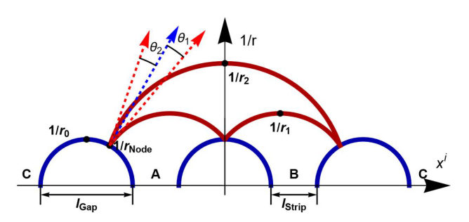 
Figure 1. Illustration of the multi-EWCS configuration. The blue curves denote the RT surfaces that bound the entanglement wedge of A ∪B ∪C, while the red curves denote the candidate multipartite cross section inside this wedge. The junction point rnode is varied to minimize the total area of the red network; in the symmetric configuration this gives θ1 = θ2. The boundary parameters lStrip and lGap denote the widths of the finite strips and the gap regions between adjacent regions.

📷 Fig 2

 
Figure 2. The holographic c-function as a function of strip width for four backgrounds: the topologically nontrivial phase, the critical phase, the topologically trivial phase, and the pure AdS background. The parameters for the nontrivial and trivial phases are M/b = (M/b)c ∓0.1. Left: cx(lx). Right: cz(lz).

📷 Fig 3

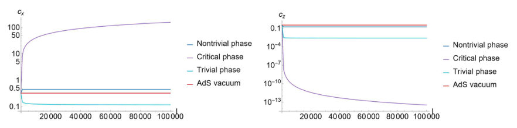 
Figure 2 shows the representative behavior of the holographic c-function. At small strip width, the curves are close to one another, reflecting the common UV asymptotics of the backgrounds. At larger strip width, the nontrivial and trivial phases approach finite plateaus in both directions. The critical solution instead remains running over the accessible large width range: it grows in the transverse x direction and is suppressed in the z direction.

📷 Fig 4

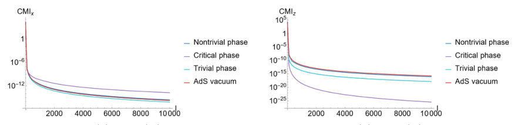 
Figure 3. The CMI as a function of strip width for four backgrounds: the topologically nontrivial phase, the critical phase, the topologically trivial phase, and the pure AdS background. The parameters for the nontrivial and trivial phases are M/b = (M/b)c ∓0.1. Left: CMIx(lx). Right: CMIz(lz).

📷 Fig 5

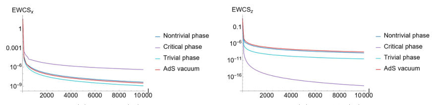 
Figure 4. The EWCS as a function of strip width for four backgrounds: the topologically nontrivial phase, the critical phase, the topologically trivial phase, and the pure AdS background. The parameters for the nontrivial and trivial phases are M/b = (M/b)c ∓0.1. Without loss of generality, an appropriate ratio of lstrip to lgap has been chosen to guarantee that the entanglement wedges between different regions remain connected as the scale increases. Left: EWCSx(lx). Right: EWCSz(lz).

**Summary.** This work investigates using advanced multipartite entanglement measures within a holographic framework to study Weyl semimetals. By analyzing how these entanglement quantities scale with strip width and direction, the authors demonstrate that they can uniquely diagnose both topological phase transitions and inherent system anisotropy. This establishes multipartite entanglement as a powerful, non-local diagnostic tool for strongly correlated quantum matter.

**Why it may be interesting.** While focused on condensed matter topology, the use of complex multipartite entanglement diagnostics provides a powerful theoretical tool for characterizing quantum phases in strongly interacting systems, relevant to understanding correlated electron behavior.

Detailed structure

**Main problem.** To determine if multipartite entanglement structures can diagnose topological quantum phase transitions and probe the anisotropy of holographic Weyl semimetals.

**Main result.** Multipartite holographic entanglement measures (like $\kappa$, Markov gap, multi-EWCS) show clear features near the critical point, confirming their role as sensitive probes for both topological transitions and anisotropic IR physics.

**Method.** The study uses the Ryu–Takayanagi prescription to calculate various multipartite entanglement quantities (CMI, EWCS, etc.) in a holographic bulk dual to the Weyl semimetal.

**Model / system.** The system is the zero-temperature holographic Weyl semimetal, which exhibits three phases—nontrivial, critical, and trivial—controlled by tuning the ratio $M/b$. The model involves gravity coupled to vector and axial gauge fields in the bulk.

**Key observables.** Conditional Mutual Information (CMI), Entanglement Wedge Cross Section (EWCS), tripartite measures ($\kappa$, Markov gap), multi-EWCS, and four-partite signals ($\Delta$ and $g$).

**Important parameters / regimes.** Strip width ($l$), tuning parameter across the topological transition ($M/b$), and angular direction ($	heta$).

**Assumptions / limitations.** The analysis relies on studying the large-$l$ behavior, which is governed by the deep IR geometry of the system.

**Figures summary.** Figures illustrate the dependence of various entanglement measures (CMI, EWCS, $\kappa$, etc.) on strip width ($l$) and angular direction ($	heta$), comparing results across the three distinct topological phases.

**Paper structure.** The paper systematically reviews the model and entanglement tools, analyzes the large-$l$ scaling to identify the transition point, and finally probes anisotropy by examining how these measures depend on the angle $	heta$.

Abstract

We study multipartite entanglement structures in the zero-temperature holographic Weyl semimetal, focusing on tripartite and four-partite structures. For strip regions, we compute the conditional mutual information, the entanglement wedge cross section, tripartite measures $κ$ and the Markov gap, multi-EWCS, and two multi-EWCS based four-partite signals $Δ$ and $g$. These quantities are studied as functions of the strip width $l$ and the tuning parameter across the topological transition. At large $l$, their $l$ dependence takes a power-law form governed by the IR scaling of the system. At fixed large $l$, all these entanglement quantities develop clear features near the critical point, showing that tripartite and four-partite entanglement structures can diagnose the topological quantum phase transition. We further study strips pointing in different directions to probe the anisotropy of the system. The anisotropic large l behavior distinguishes the nontrivial phase from the trivial phase. These results establish multipartite holographic entanglement as a sensitive, nonlocal probe of topological phase transitions and anisotropic IR physics.

[↑ back to top](#top)

### [No-go theorems on simulating uncertainty principle's signatures](http://arxiv.org/abs/2606.05884v1)

**Authors:** Chung-Yun Hsieh, Minjeong Song, Shin-Liang Chen  
**Type:** theory · **Category:** quantum information and computing · **PDF:** <https://arxiv.org/pdf/2606.05884v1>  
**Analysis basis:** full PDF text, analyzed in chunks
**Topic relevance:** 🔥 `quantum measurements` **4/5** · `measurement-induced transitions` **3/5** · `entanglement & information structure` **2/5** · `correlated / nonlocal dissipation` **1/5** · `driven-dissipative phase transition` **1/5** · `methods for driven-dissipative` **1/5**

📷 Fig 1

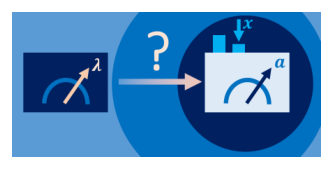 
FIG. 1. Main question. When can uncertainty principle’s signa- tures, as carried by a pair of instruments, be simulated by a single instrument? In the figure, the left box is an instrument with classical outcome 𝜆, and the right box implements the 𝑥-th instrument (with classical outcomes 𝑎) when we press the 𝑥-th button.

📷 Fig 2

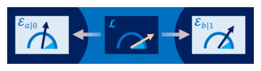 
FIG. 2. Non-vanishing overlap. Equation (2) implies that (E𝑎|0 ⊗I𝐴)(𝜌) ≥(L ⊗I𝐴)(𝜌) and (E𝑏|1 ⊗I𝐴)(𝜌) ≥(L ⊗I𝐴)(𝜌) for every finite-dimensional auxiliary system 𝐴and joint state 𝜌 (here, I𝐴is the identity channel acting on 𝐴). Hence, both the classi- cal outcomes and quantum outputs of E𝑎|0 and E𝑏|1 can be estimated by applying a single instrument containing L as an element [50].

**Summary.** The paper rigorously analyzes the uncertainty principle by introducing 'complementarity' as a concept stronger than simple incompatibility for quantum measurements. It proves that strong signatures of this principle cannot be simulated by single-measurement processes, thereby establishing fundamental no-go theorems regarding resource simulation in quantum information theory.

**Why it may be interesting.** This work provides fundamental theoretical constraints on what quantum measurements can achieve, directly impacting the understanding of resource theories in quantum information science and setting benchmarks for quantum advantage claims.

Detailed structure

**Main problem.** The core problem is determining the fundamental limits on simulating signatures of the uncertainty principle using only a single quantum measurement process (instrument). The authors aim to establish a hierarchy between different notions of quantum compatibility.

**Main result.** They prove that strong signatures of the uncertainty principle cannot be simulated by a single measurement, even when assisted by quantum pre- or post-processing. They introduce 'complementarity' as a resource strictly stronger than mere incompatibility.

**Method.** The work employs rigorous mathematical characterizations using Semidefinite Programming (SDP) to define and test concepts like complementarity and joint measurability for generalized quantum instruments. Operational tests involve analyzing the error probability in unambiguously sending classical information.

**Model / system.** The study models general measurement processes using 'instruments' $\{E_a\}_{a}$, which are generalizations of POVMs, applied to bipartite quantum systems often involving maximally entangled states $|\Phi^+
angle$. The analysis extends to noisy versions of these instruments.

**Key observables.** Complementary overlap $C(a,b)(E)$, error probability in unambiguous classical communication ($P(	ilde{\eta})_{	ext{error}}$), and the joint measurability ($\mathcal{J}\mathcal{M}$) condition.

**Important parameters / regimes.** The noise parameter $\epsilon$ (for noisy Pauli instruments) and the fidelity/overlap parameters derived from SDP solutions.

**Assumptions / limitations.** The analysis often focuses on rank-one projective instruments for establishing the strongest no-go theorems, and some results rely on assuming positive probabilities for input settings ($p_x > 0$).

**Figures summary.** Figure 1 illustrates the central question of simulating two-instrument signatures with one. Figure 2 helps define complementary instruments by showing non-vanishing overlap.

**Paper structure.** The paper builds logically by first defining incompatibility, then introducing the stronger concept of complementarity via vanishing overlap (characterized by SDP). It then proves that complementarity implies incompatibility and establishes operational equivalences: complementarity is equivalent to achieving unambiguous classical communication regardless of outcome relabeling. Finally, it uses these results to construct no-go theorems against simulation.

Abstract

Uncertainty principle, one of the most iconic features of quantum mechanics, was originally viewed as a fundamental limitation. Since the inception of quantum information science, researchers began to use it to achieve quantum advantages. To better understand the origin of these advantages, an essential question is: To what extent can the uncertainty principle's signatures be simulated by a single measurement? As a single measurement clearly cannot demonstrate the uncertainty principle, such a simulation, if exists, implies the claimed advantages may either stem from other quantum features, or just be reproducible in a less resourceful way. In this work, we report a series of noise-robust no-go theorems, showing that strong enough signatures of uncertainty principle cannot be simulated by a single measurement, even when assisted by quantum pre- or post-processing. This signature is modelled by complementary instruments. We completely characterise complementary instruments by a numerically feasible measure and show that they are necessary and sufficient resources for the advantage in an operational task that aims to unambiguously send classical information.

[↑ back to top](#top)

### [Symmetries and overparametrization properties of Hamiltonian variational ansatzes for the $(1+1)$d $\mathbb{Z}_2$ lattice gauge theory](http://arxiv.org/abs/2606.05719v1)

**Authors:** Kanta Yamanaka, Takanori Daiza, Katsumi Imaizumi, Yutaro Iiyama, Lento Nagano, Ryu Sawada, Koji Terashi  
**Type:** theory · **Category:** quantum information and computing · **PDF:** <https://arxiv.org/pdf/2606.05719v1>  
**Analysis basis:** full PDF text, analyzed in chunks
**Topic relevance:** 🔥 `analog quantum simulation` **4/5** · `entanglement & information structure` **2/5** · `Keldysh / 2PI / non-Gaussian methods` **1/5** · `driven-dissipative phase transition` **1/5** · `methods for driven-dissipative` **1/5** · `non-equilibrium dynamics` **1/5**

📷 Fig 1

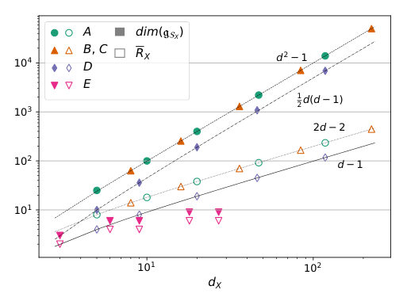 
FIG. 2. Algebraic dimensions of the DLA subrepresenta- tions (dim(gSX ), filled markers) and the saturated QFIM ranks (RX, hollow markers) against the subspace dimension. Curves d2−1, 1

📷 Fig 2

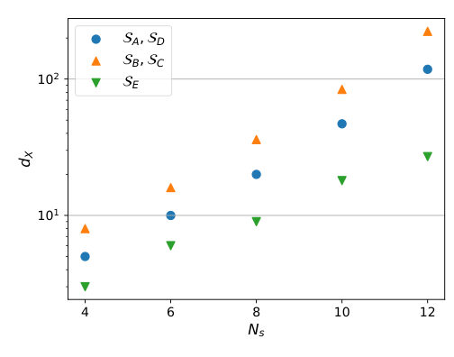 
FIG. 1. Dimension of the invariant subspace of the ansatz (dX) as a function of the number of lattice sites (Ns). Pairs of HVA families (A, D) and (B, C) share symmetries of the generators and therefore have the same subspace dimensions.

📷 Fig 3

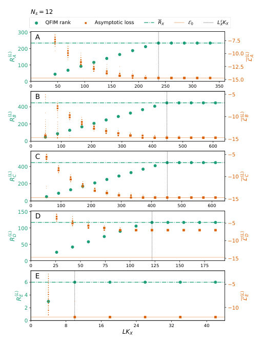 
FIG. 3. Maximum QFIM rank R(L) X (green round dots) and

📷 Fig 4

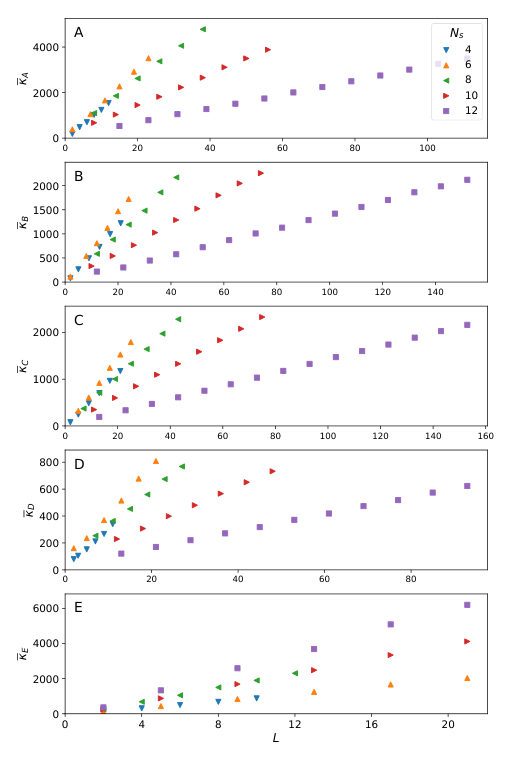 
FIG. 4. Average decay rate κ of the loss functions for the five families of HVA with various number of layers L. The decay rate scales linearly with L. The slope of scaling is dependent on the number of lattice sites Ns.

📷 Fig 5

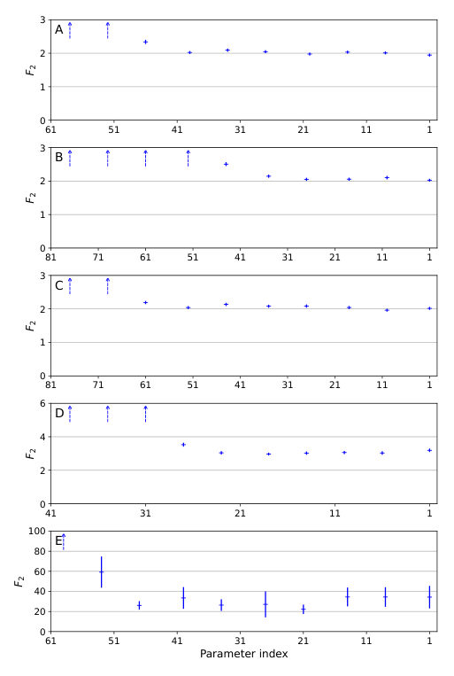 
FIG. 5. Second frame potential F2(Vj) of the ensemble of V+j(θ) matrices where θ is drawn uniformly from RLKX (X = A, B, C, D, E). Values are computed with Monte Carlo integration employing 10000 samples. Error bars are statis- tical. For larger parameter indices (shallower unitaries), out- of-range F2 values are represented by vertical arrows. Note that the vertical axis range is wider for ansatzes families D and E compared to the other three.

**Summary.** The paper rigorously analyzes Hamiltonian Variational Ansatzes applied to a lattice gauge theory, focusing on how symmetries constrain the variational space. It establishes that overparametrization leads to the saturation of the QFIM rank, which is bounded by the system's underlying algebraic structure (DLA dimension). This provides theoretical guidelines for designing more efficient and robust quantum algorithms.

**Why it may be interesting.** This work provides crucial theoretical diagnostics for designing scalable quantum circuits by linking fundamental algebraic properties (Lie algebras) to practical computational metrics (QFIM rank and optimization convergence).

Detailed structure

**Main problem.** The study investigates the relationship between symmetries, overparametrization effects, and optimization dynamics when using Hamiltonian Variational Ansatzes (HVAs) to simulate quantum systems.

**Main result.** Overparametrization causes the QFIM rank to saturate at a value bounded by the dimension of the Dynamical Lie Algebra (DLA), while the VQE loss function decay rate scales linearly with the number of parameters.

**Method.** The authors analyze five different HVA families applied to the $\mathbb{Z}_2$ LGT, calculating the DLA and QFIM rank, and simulating the optimization dynamics using Gradient Descent on the VQE loss function.

**Model / system.** The physical system is the $(1+1)$d $\mathbb{Z}_2$ lattice gauge theory (LGT). The Hamiltonian is complex, involving Pauli operators, and the analysis focuses on restricting it to symmetry-invariant subspaces for variational simulation.

**Key observables.** Dimension of the Dynamical Lie Algebra (DLA), Rank of the Quantum Fisher Information Matrix (QFIM), VQE loss function decay rate ($\kappa$), and asymptotic loss values ($L_X$).

**Important parameters / regimes.** Number of parameters ($M$), number of layers ($L$), lattice size ($N_s$), and the degree of overparametrization.

**Assumptions / limitations.** The analysis relies on comparing theoretical bounds (DLA dimension) with numerical diagnostics (QFIM rank saturation) and assumes certain approximations regarding circuit design (e.g., 2-designs for decay rate scaling).

**Figures summary.** Figures illustrate the dependence of DLA dimensions and saturated QFIM ranks on lattice size, show the convergence/saturation of QFIM rank versus ansatz layers, and plot the linear scaling of the loss function decay rate with the number of parameters.

**Paper structure.** The paper systematically analyzes five HVA families by calculating their symmetry-constrained subspaces (DLA) and then uses these results to predict how the QFIM rank saturates as the circuit depth increases, correlating this saturation with the observed behavior of the VQE loss function during optimization.

Abstract

We perform detailed studies of five Hamiltonian variational ansatzes (HVA) based on the Hamiltonian of the $(1+1)$d $\mathbb{Z}_2$ lattice gauge theory. The ansatzes are designed to respect local and global symmetries of the original Hamiltonian and therefore act on a finely segmented state Hilbert space. Following Larocca et al. (2023), we numerically study the dimension of the dynamical Lie algebra (DLA) and the rank of the quantum Fisher information matrix (QFIM) of the ansatzes within specific invariant subspaces. The ansatzes all involve sums of weight-three Paulis in their generators, which is a feature that have so far been underexplored in this context. We also perform numerical experiments to determine the ground state energy of the original Hamiltonian via variational quantum eigensolver (VQE), and observe that overparametrization of the ansatzes coincides with the apparent disappearance of local minima in the loss function, in line with the finding in the reference. Finally, the decay rate of the VQE loss function under gradient descent optimization is revealed to scale linearly with the number of parameters in the ansatz. These results help to enrich the theory of overparameterization of quantum circuits and inform the design of scalable variational ansatzes.

[↑ back to top](#top)

### [A microscopic design rule for spin supersolids in triangular-lattice magnets](http://arxiv.org/abs/2606.06111v1)

**Authors:** Ryota Ono, Jun'ichi Ieda, Michiyasu Mori, Sadamichi Maekawa  
**Type:** theory · **Category:** strongly correlated electrons · **PDF:** <https://arxiv.org/pdf/2606.06111v1>  
**Analysis basis:** full PDF text, analyzed in chunks
**Topic relevance:** 🔥 `analog quantum simulation` **4/5** · `exotic spin models in light-matter` **3/5** · `correlated cavity matter` **1/5** · `spintronics-quantum-optics interface` **1/5**

📷 Fig 1

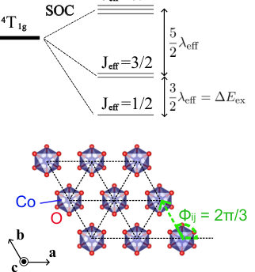 
Figure 1. (a) Crystal structure of NaBaCP and KCSO. (b) Energy level scheme of the lowest multiplet of Co2+ in an octahedral crystal field with spin-orbit coupling (SOC). The energy gap between the Jeff = 1/2 ground state doublet and the first excited spin-orbit multiplet is denoted by ∆Eex. (c) triangular-lattice plane formed by CoO6 clusters in NaBaCP and KCSO. The green dashed arrow indicates the bond along the crystallographic b-axis (ϕij = 2π/3).

📷 Fig 2

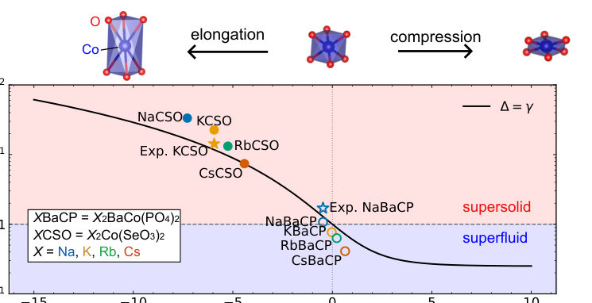 
Figure 2. Plot of ∆as a function of ωtrig/λeff for the target materials. Solid and open circles denote calculated values for the XBaCP and XCSO series, respectively. While solid and open stars indicate experimental estimates for KCSO and NaBaCP, respectively. The solid black curve shows the theoretical relation ∆= γ as a function of ωtrig/λeff obtained by solving the minimal single-ion model in Eq. (5). Above the plot, schematic illustrations show the relation between the trigonal crystal field strength and the local CoO6 distortion in a simplified picture that retains only the contribution of the surrounding O2−ions.

📷 Fig 3

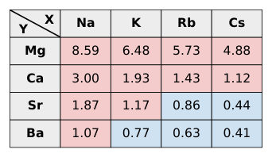 
Figure 3. ∆in the XYCP family by combined X- and Y - site substitutions. The red and blue colors denote ∆&gt; 1 and ∆&lt; 1, respectively, corresponding to the supersolid and superfluid of the XXZ phase diagram.

**Summary.** This theoretical study develops a microscopic design rule for spin supersolids in triangular-lattice magnets by analyzing cobaltate compounds. It shows that the crucial exchange anisotropy parameter ($\Delta$) is controlled by the ratio of crystal field splitting to spin-orbit coupling strength. This framework allows researchers to predict and engineer materials exhibiting exotic quantum magnetic states.

**Why it may be interesting.** The work provides a quantitative, first-principles pathway (crystal field engineering) to tune quantum magnetic phases like supersolidity in solid-state materials, bridging orbital physics with frustrated magnetism.

Detailed structure

**Main problem.** To establish a microscopic design rule for realizing and tuning spin supersolidity in triangular-lattice magnets by understanding the origin of exchange anisotropy ($\Delta$).

**Main result.** The exchange anisotropy $\Delta$ is determined by the ratio of the trigonal crystal field strength to the spin–orbit coupling strength, allowing systematic prediction across related material families.

**Method.** Calculations combine first-principles electronic structure methods (DFT/cRPA) with strong-coupling superexchange theory and effective low-energy Hubbard model construction.

**Model / system.** The system involves $	ext{Co}^{2+}$ ions forming a quasi-two-dimensional triangular lattice in cobaltate families ($	ext{X}_2	ext{Y}	ext{Co}(	ext{PO}_4)_2$ and $	ext{X}_2	ext{Co}(	ext{SeO}_3)_2$). The physics is mapped onto an effective pseudospin-$1/2$ XXZ model.

**Key observables.** Exchange anisotropy parameter ($\Delta$), single-ion anisotropy factor ($\gamma$), nearest-neighbor exchange couplings ($J_{ab}^{ij}$), and crystal field parameters ($A_{20}, A_{40}$).

**Important parameters / regimes.** Ratio of trigonal crystal field to SOC strength ($\omega_{	ext{trig}}/\lambda_{	ext{eff}}$); $\Delta > 1$ for supersolid; $\Delta < 1$ for superfluid.

**Assumptions / limitations.** The low-energy physics can be accurately described by projecting the full Hamiltonian onto a Kramers doublet (pseudospin-$1/2$) manifold, and that superexchange theory is applicable.

**Figures summary.** Figures illustrate crystal structures, energy level schemes for $	ext{Co}^{2+}$, and plots mapping calculated $\Delta$ values across various cation substitutions to identify supersolid candidates.

**Paper structure.** The paper systematically moves from analyzing the local electronic structure (DFT/cRPA) to deriving an effective low-energy Hubbard model. It then uses superexchange theory to calculate magnetic couplings, finally relating these couplings to structural parameters ($\omega_{	ext{trig}}/\lambda_{	ext{eff}}$) that govern $\Delta$.

Abstract

Spin supersolids emerge as a central topic in frustrated magnetism, motivating the search for realization in quantum materials. To this end, we study the origin of exchange anisotropy, $Δ$, in triangular-lattice cobaltate families $X_2$$Y$Co(PO$_4$)$_2$ and $X_2$Co(SeO$_3$)$_2$ ($X$ = Na, K, Rb, Cs; $Y$ = Mg, Ca, Sr, Ba) by tailoring realistic spin models. We show that $Δ$ is determined by the ratio of trigonal crystal field to spin-orbit coupling strength. This framework explains contrasting anisotropies in these families, predicts systematic trends in $Δ$ across $X/Y$-substitutions, and identifies candidate materials for spin supersolids. Our results establish trigonal field engineering as a microscopic route toward the design of spin supersolids.

[↑ back to top](#top)

### [A universal and efficient hybrid digital-analog fermionic quantum simulator](http://arxiv.org/abs/2606.05517v1)

**Authors:** Hao-Tian Wei, Kaden R. A. Hazzard  
**Type:** both · **Category:** strongly correlated electrons · **PDF:** <https://arxiv.org/pdf/2606.05517v1>  
**Analysis basis:** full PDF text, analyzed in chunks
**Topic relevance:** 🔥 `analog quantum simulation` **4/5** · `QC/QI experiment` **2/5** · `entanglement & information structure` **1/5** · `exotic spin models in light-matter` **1/5** · `non-equilibrium dynamics` **1/5**

📷 Fig 1

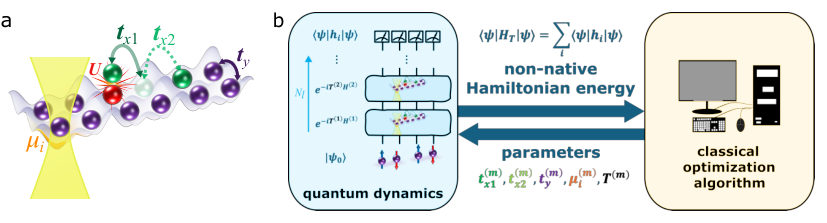 
FIG. 1. Programmable fermionic quantum simulator framework. (a) Experimental implementation of the fermionic quantum simulator. Neutral atoms are trapped in an optical superlattice or tweezer array, whose effective dynamics are described by the FHM. The superlattice depth tunes staggered tunnelings, the atom-atom interaction provides an on-site repulsion, and lattice parameters – or, for more flexibility, site-resolved tweezers – control the on-site potentials. (b) The feedback loop of the variational quantum eigensolver (VQE). The quantum device measures terms of a potentially non-native target Hamiltonian after executing parameterized Hubbard evolution and feeds the results to a classical...

📷 Fig 2

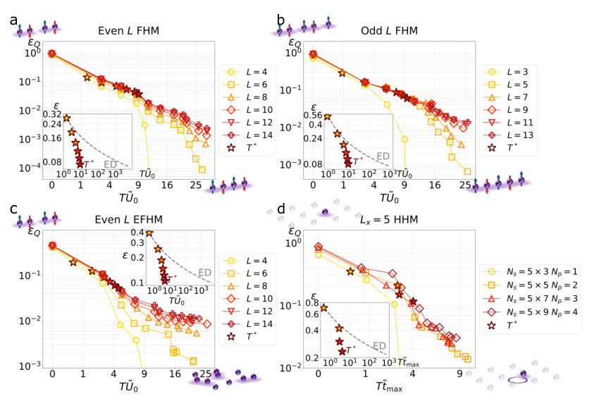 
FIG. 2. VQE relative energy error ϵQ as a function of total evolution time T for various system sizes L for the (a) even-L FHM, (b) odd-L FHM, (c) even-L EFHM, and (d) Lx = 5 square lattice bosonic HHM. The total evolution time T is defined in App. D. Note the plot axes are logarithmic and square-root scales, so straight lines indicate Ae−B √

📷 Fig 3

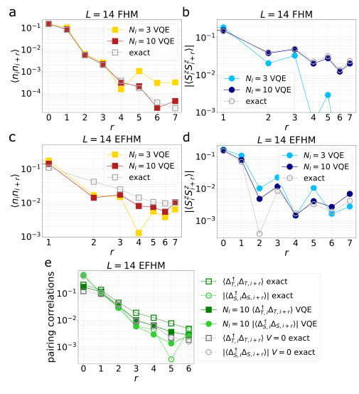 
FIG. 3. Correlations as a function of separation r for Nl = 3 and Nl = 10 VQE final states (solid markers) and ED re- sults (open gray markers). For the L = 14 half-filled FHM, the (a) density-density and (b) absolute spin-spin correlations show that the Nl = 10 VQE captures the expected exponen- tial and power-law decay, respectively, reflecting the FHM ground state’s finite charge gap and the vanishing spin gap. Similarly, for the L = 14 EFHM, the (c) density-density and (d) absolute spin-spin correlations show that Nl = 10 VQE captures the expected behavior of the EFHM ground state, with gapless charge and gapped spin sectors. (e) Finally, for the L = 14 EFHM, the Nl = 10 VQE reproduces...

📷 Fig 4

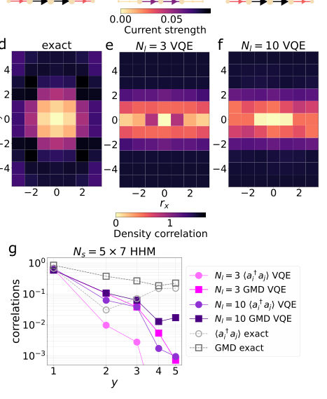 
FIG. 4. The particle current of an Ns = Lx × Ly = 5 × 7 square lattice for the (a) ground state, (b) Nl = 3 VQE final state, and (c) Nl = 10 VQE final state. The bond color and arrow size indicate the current strength, and the vertex radius is proportional to the local particle density. The reduced bulk density-density correlations in the same 5 × 7 square lattice for the (d) ground state, (e) Nl = 3 VQE final state, and (f) Nl = 10 VQE final state. (g) The ED, Nl = 3, and Nl = 10 fVQE results for the Girvin-MacDonald order parameter CGMD ij and bare two-point correlator Cbare ij of the 5×7 lattice as functions of y where i = (0, −2) and j = i+(0, y) where the origin is the lattice center....

**Summary.** The paper presents a universal framework utilizing fermionic ultracold atoms to simulate complex many-body Hamiltonians beyond the hardware's native capabilities. By employing a hybrid Variational Quantum Eigensolver (fVQE), it successfully models systems exhibiting pairing and topological order. This demonstrates an exponential quantum advantage over classical simulation techniques for characterizing strongly correlated electronic matter.

**Why it may be interesting.** This work bridges cutting-edge AMO physics platforms with quantum computation theory by providing a concrete, scalable pathway to simulate strongly correlated electron models (like those found in high-Tc superconductors) using neutral atoms.

Detailed structure

**Main problem.** To develop a universal and efficient hybrid digital-analog framework using fermionic ultracold atom platforms to simulate ground-state properties of many-body systems beyond the hardware's native Hamiltonian.

**Main result.** The proposed fVQE approach achieves an exponential speedup over classical methods for simulating complex physics, successfully capturing phenomena like pairing and topological order in models not natively implemented on the platform.

**Method.** A hybrid Variational Quantum Eigensolver (fVQE) algorithm is employed, where variational parameters are optimized classically based on measurements of non-native Hamiltonian terms derived from local observables.

**Model / system.** The primary system is fermionic ultracold atoms in optical lattices/tweezers arrays. Models studied include the repulsive Hubbard model, an extended version with nearest-neighbor attraction (EFHM), and the Hofstadter-Hubbard model (HHM) incorporating gauge fields.

**Key observables.** Energy density, density-density correlations ($C_n(r)$), spin-spin correlations ($|C_{Sz}(r)|$), and topological order parameters like the Girvin-MacDonald (GMD) order parameter.

**Important parameters / regimes.** The simulation time $T$ scales polynomially with the inverse relative error ($\epsilon^{-1}$), demonstrating an exponential speedup over classical methods; finite-size effects ($L$) are crucial for determining optimal simulation time $T^*$.

**Assumptions / limitations.** The analysis relies on the variational principle and assumes that the total error is dominated by a balance between quantum simulation error ($\epsilon_Q$) and finite-size error ($\epsilon_L$).

**Figures summary.** Figures illustrate the programmable simulator framework, showing VQE feedback loops; comparisons are made between VQE energy error decay versus classical ED scaling for various models (FHM, EFHM).

**Paper structure.** The paper introduces the fVQE framework by detailing its application to specific Hamiltonians (FHM, EFHM, HHM), demonstrating how non-native terms are measured and incorporated into the variational optimization loop. It then analyzes the scaling of errors and measures complex correlations characteristic of different physical phases.

Abstract

We present a universal framework to harness fermionic ultracold atom platforms for quantum simulation, showing how variational algorithms on existing hardware can simulate many-body systems well beyond the hardware's native Hamiltonian. Our analysis provides evidence that one can quantum simulate the ground-state properties of a broad class of gapless target Hamiltonians of local observables in a quantum evolution time that grows polynomially with the inverse relative error, $T\sim O(\mathrm{poly}(1/ε))$ up to logarithmic corrections, offering an exponential speedup over na{ï}ve classical algorithms such as exact diagonalization. We provide numerical evidence and theoretical argument that this holds for energy density, density-density, and spin-spin correlations in three qualitatively distinct models -- the repulsive Hubbard model; a Hubbard model augmented with nearest-neighbor attractive interactions, which introduces the phenomenon of pairing; and the Hofstadter-Hubbard model, which introduces a gauge field and fractional quantum Hall physics. This work demonstrates quantum simulation using current fermionic platforms far beyond the models natively implemented in the hardware.

[↑ back to top](#top)

### [Decoder-Consistent Hamiltonians for POVM-Based Quantum Relaxations](http://arxiv.org/abs/2606.05604v1)

**Authors:** Takayuki Suzuki  
**Type:** theory · **Category:** quantum information and computing · **PDF:** <https://arxiv.org/pdf/2606.05604v1>  
**Analysis basis:** full PDF text, analyzed in chunks
**Topic relevance:** 🔥 `quantum measurements` **4/5** · `measurement-induced transitions` **2/5** · `Keldysh / 2PI / non-Gaussian methods` **1/5** · `driven-dissipative phase transition` **1/5** · `methods for driven-dissipative` **1/5**

📷 Fig 1

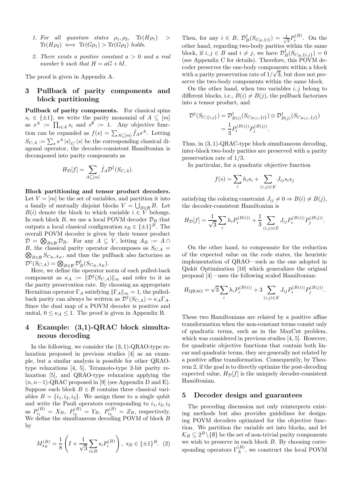 
Low-resolution page preview, page 2

📷 Fig 2

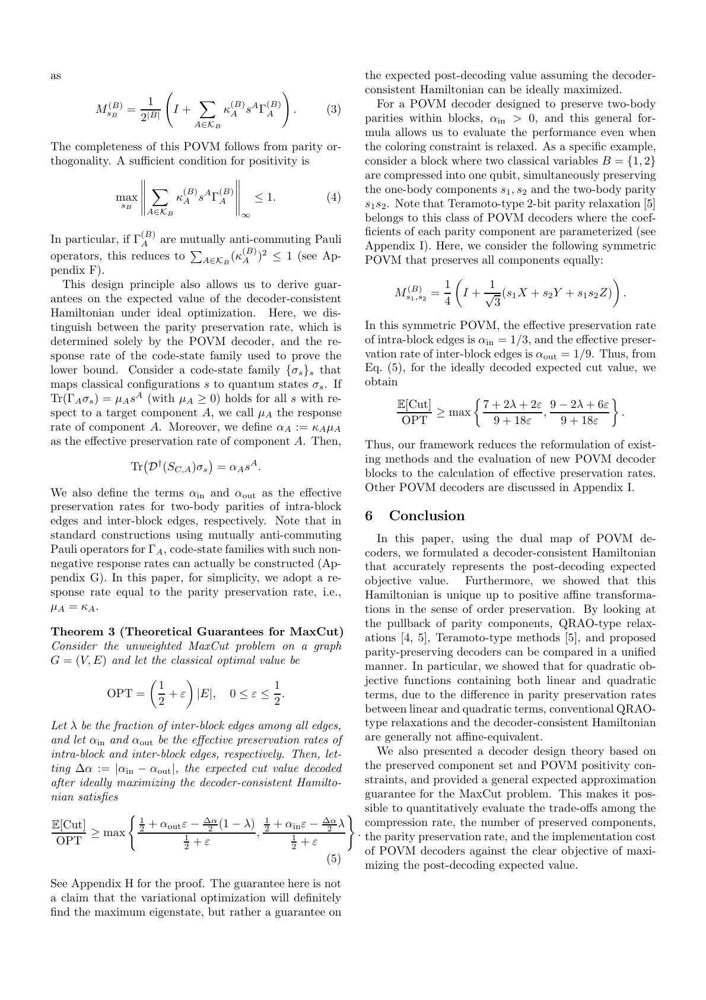 
Low-resolution page preview, page 3

📷 Fig 3

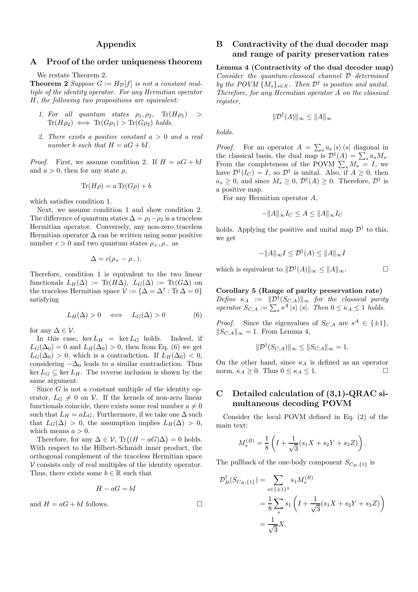 
Low-resolution page preview, page 4

📷 Fig 4

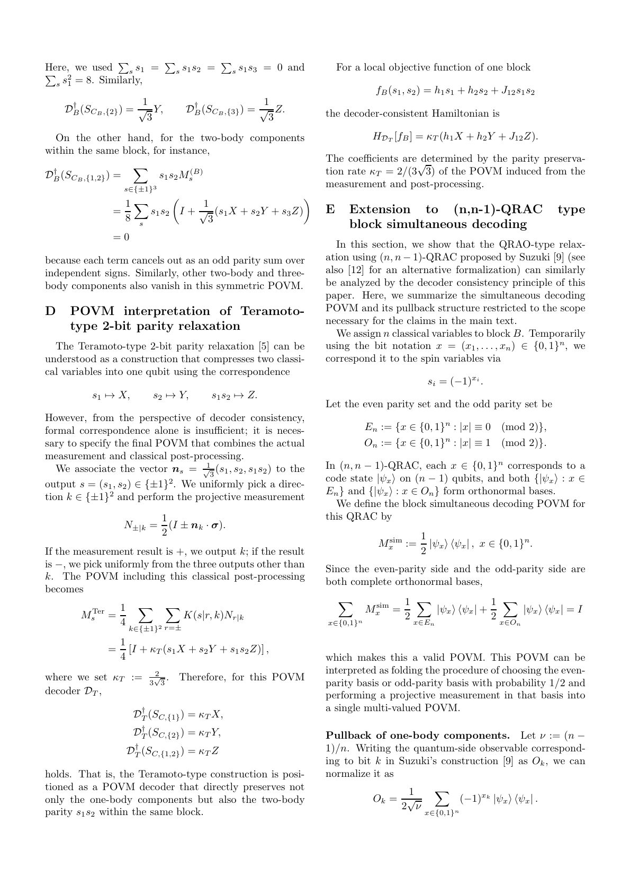 
Low-resolution page preview, page 5

📷 Fig 5

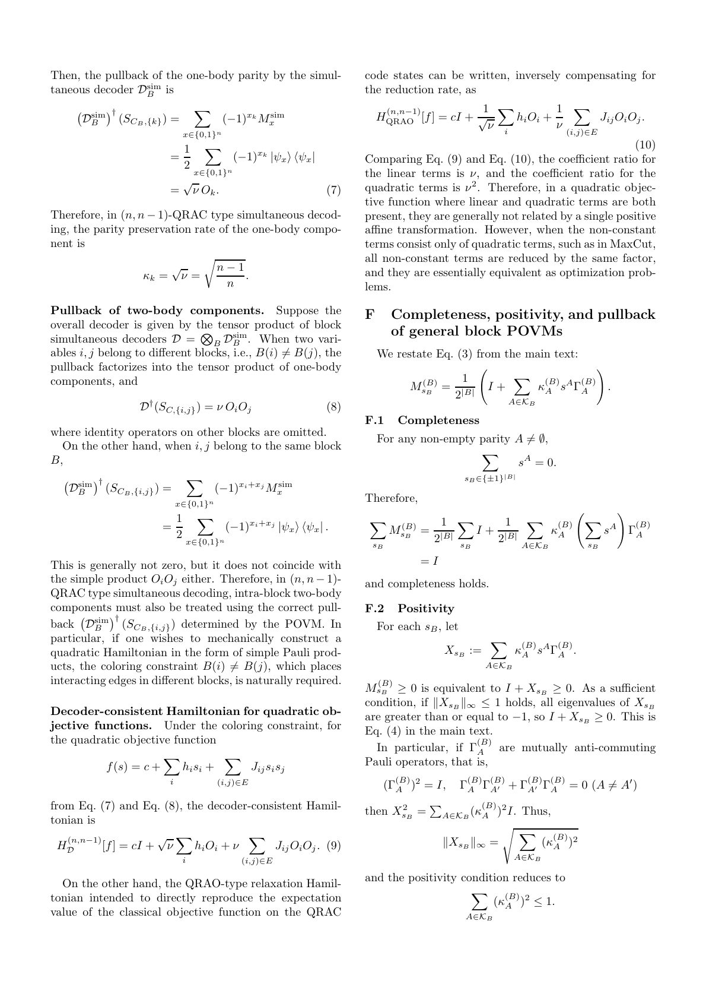 
Low-resolution page preview, page 6

**Summary.** The paper introduces the concept of a 'decoder-consistent Hamiltonian' to rigorously model quantum relaxation methods solving combinatorial problems. By treating the measurement/decoding process as a POVM, it derives a unique Hamiltonian that accurately reflects the expected classical objective value after decoding. This framework yields quantifiable performance guarantees for optimization tasks like MaxCut.

**Why it may be interesting.** This work provides a deep theoretical link between the classical structure of an optimization problem's decoder and the required quantum Hamiltonian, which is crucial for designing efficient variational quantum algorithms that move beyond simple approximations.

Detailed structure

**Main problem.** To develop a theoretically rigorous framework for quantum relaxation methods, such as QRAO, used to solve combinatorial optimization problems when direct qubit encoding is impractical.

**Main result.** The paper establishes the concept of a unique decoder-consistent Hamiltonian derived from the POVM representation of the decoder, providing quantifiable lower bounds for optimization objectives like MaxCut based on effective parity preservation rates.

**Method.** The core method involves representing the classical decoder as a Positive Operator-Valued Measure (POVM) and using the dual map to construct the decoder-consistent Hamiltonian. Performance guarantees are derived by analyzing how well this Hamiltonian preserves specific parity components.

**Model / system.** The model is based on quantum computation utilizing variational algorithms applied to combinatorial optimization problems (e.g., MaxCut). The system involves encoding classical variables into qubits and then decoding them via a POVM, which dictates the structure of the effective Hamiltonian.

**Key observables.** Parity Preservation Rate ($\kappa_A$), Effective Preservation Rate ($\alpha_A$), Expected Cut Value ($E[	ext{Cut}]$), and the lower bound on the objective function value $\lambda_{\max}(H_D[f])$.

**Important parameters / regimes.** The structure of the decoder (e.g., Teramoto-type or QRAC type) dictates specific values for $\alpha_{in}$ and $\alpha_{out}$.

**Assumptions / limitations.** The derived lower bounds assume that the system can be ideally maximized using the constructed Hamiltonian, which is a strong assumption regarding variational optimization success.

**Figures summary.** Not specified in the notes; however, the text references equations (Eq. 5, Eq. 9, Eq. 10) detailing the structure of the derived Hamiltonians and the final lower bound expressions.

**Paper structure.** The paper first formalizes the problem by defining the decoder-consistent Hamiltonian via POVMs. It then analyzes this framework for quadratic objectives (like MaxCut), deriving specific forms for different relaxation types (QRAO vs QRAC). Finally, it establishes performance guarantees based on inter- and intra-block effective preservation rates.

Abstract

In compression-based quantum relaxations like QRAO, classical variables are encoded into qubits and decoded after optimization. We formalize that the choice of the quantum Hamiltonian is fundamentally determined by this decoder. By representing the decoder as a POVM, we define a unique decoder-consistent Hamiltonian via the pullback of the post-decoding expected objective value. Using this framework, we reveal that standard QRAO Hamiltonians are inconsistent for certain mixed-degree quadratic functions, and we provide new approximation guarantees for the MaxCut problem based directly on POVM decoder design.

[↑ back to top](#top)

### [A Class of Multipartite Entangled States Based on State Transitions](http://arxiv.org/abs/2606.05579v1)

**Authors:** Jehn-Ruey Jiang  
**Type:** theory · **Category:** quantum information and computing · **PDF:** <https://arxiv.org/pdf/2606.05579v1>  
**Analysis basis:** full PDF text, analyzed in chunks
**Topic relevance:** 🔥 `entanglement & information structure` **4/5** · `analog quantum simulation` **2/5** · `methods for driven-dissipative` **1/5** · `non-equilibrium dynamics` **1/5**

📷 Fig 1

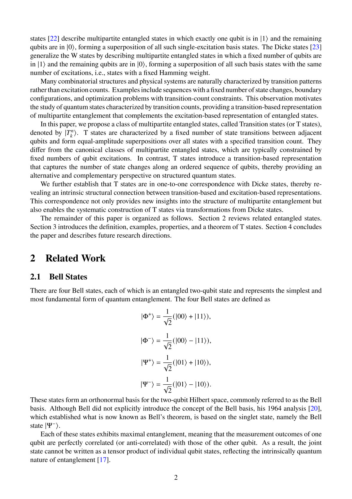 
Low-resolution page preview, page 2

📷 Fig 2

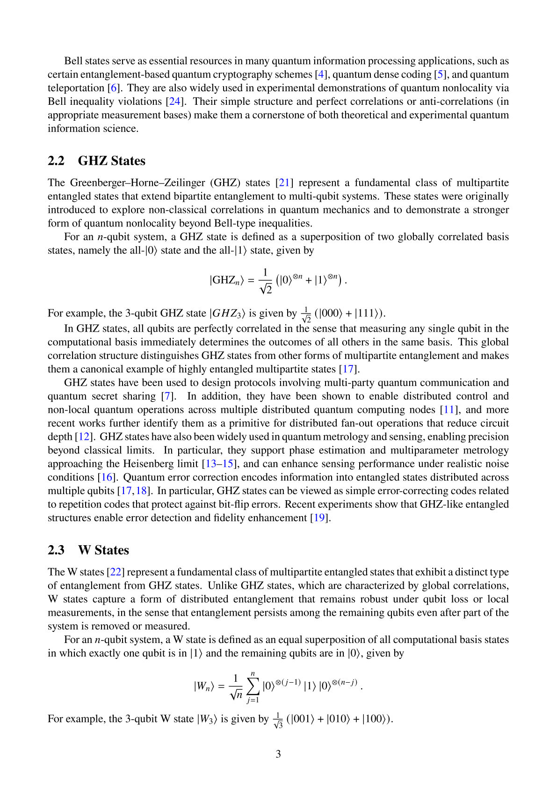 
Low-resolution page preview, page 3

📷 Fig 3

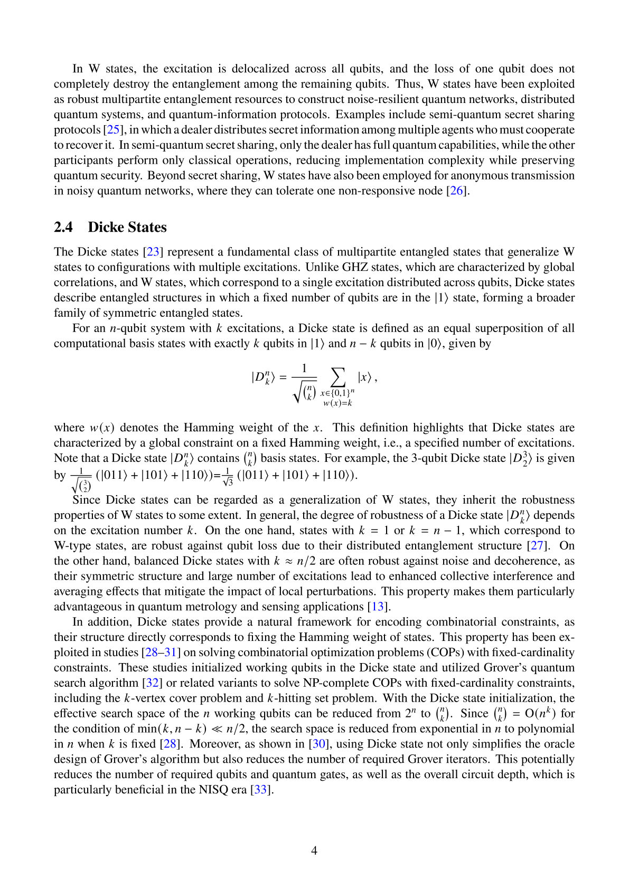 
Low-resolution page preview, page 4

📷 Fig 4

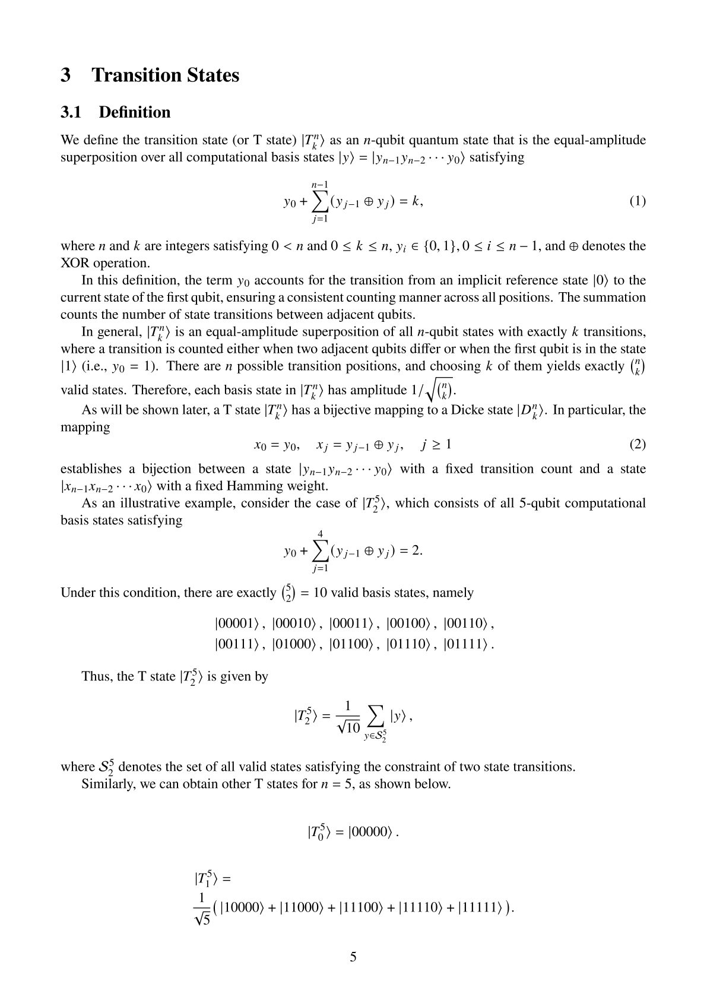 
Low-resolution page preview, page 5

📷 Fig 5

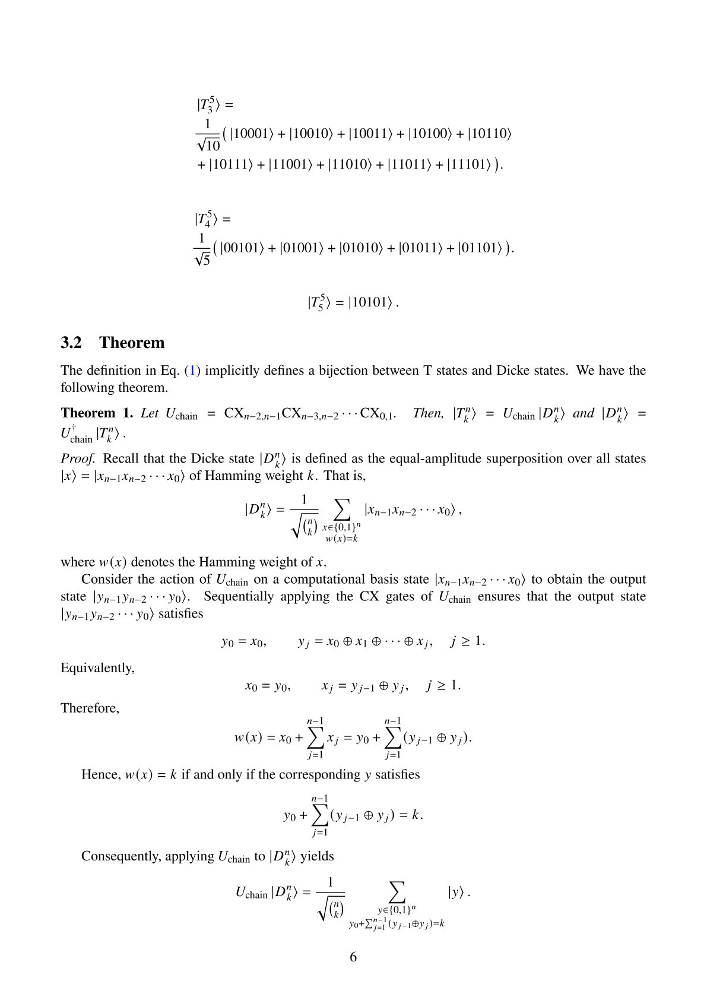 
Low-resolution page preview, page 6

**Summary.** This paper introduces Transition states (T states), a novel class of multipartite entangled quantum states defined by the count of state transitions between adjacent qubits. The authors prove that these T states are mathematically equivalent to Dicke states, which are characterized by a fixed number of excitations. This establishes a powerful new structural link between two distinct ways of quantifying entanglement in multi-qubit systems.

**Why it may be interesting.** While focused on abstract quantum information theory, establishing structural equivalences between different physical constraints (like local transitions vs. global excitation numbers) provides powerful mathematical tools applicable to modeling complex many-body correlations in AMO systems or analyzing error correction codes.

Detailed structure

**Main problem.** The paper introduces a new class of multipartite entangled states, Transition states (T states), defined by the number of state transitions between adjacent qubits.

**Main result.** It proves that T states are unitarily equivalent to Dicke states, establishing a direct structural correspondence between transition-based and excitation-based entanglement representations.

**Method.** The characterization involves defining T states as equal-amplitude superpositions over basis states with a fixed number of adjacent transitions, followed by proving the unitary transformation linking them to Dicke states via CX operations.

**Model / system.** The system is an $n$-qubit quantum system. The analysis compares T states (defined by transition counts) against established classes like Bell, GHZ, W, and Dicke states (defined by fixed Hamming weight/excitations).

**Key observables.** Number of state transitions between adjacent qubits; total number of excitations ($k$); entanglement structure.

**Important parameters / regimes.** The number of qubits ($n$) and the specified count for either transitions or excitations ($k$).

**Assumptions / limitations.** The analysis assumes an ordered sequence of qubits to define adjacency for transition counting, which distinguishes T states from permutation-invariant Dicke states.

**Paper structure.** The paper first defines the novel T states based on sequential transitions. It then compares these states mathematically and physically against existing entanglement measures (Bell, GHZ, W, Dicke). The core of the work is proving the unitary equivalence between the two classes.

Abstract

We introduce Transition states (T states), denoted by $\ket{T_k^n}$, as a class of multipartite entangled states characterized by a fixed number of state transitions between adjacent qubits. These states form equal-amplitude superpositions over all states with a specified transition count. Unlike Bell states based on two-qubit correlations, GHZ states characterized by global correlations among all qubits, and W and Dicke states based on fixed numbers of qubit excitations, T states are defined by transition counts along an ordered sequence of qubits. We prove that T states are unitarily equivalent to Dicke states through a chain of CX (controlled-X) operations, thereby establishing a direct correspondence between transition-based and excitation-based representations of multipartite entanglement.

[↑ back to top](#top)

### [Information-Geometric Bound on the Robustness of Entanglement Generation](http://arxiv.org/abs/2606.05696v1)

**Authors:** Zain H. Saleem  
**Type:** theory · **Category:** quantum information and computing · **PDF:** <https://arxiv.org/pdf/2606.05696v1>  
**Analysis basis:** full PDF text, analyzed in chunks
**Topic relevance:** 🔥 `entanglement & information structure` **4/5** · `Keldysh / 2PI / non-Gaussian methods` **1/5** · `correlated / nonlocal dissipation` **1/5** · `driven-dissipative phase transition` **1/5** · `methods for driven-dissipative` **1/5**

📷 Fig 1

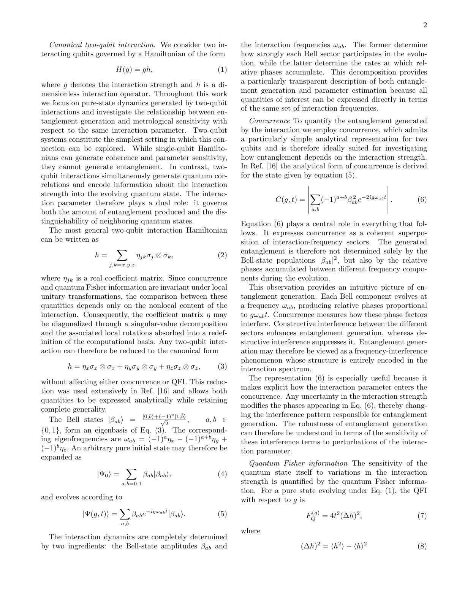 
Low-resolution page preview, page 2

📷 Fig 2

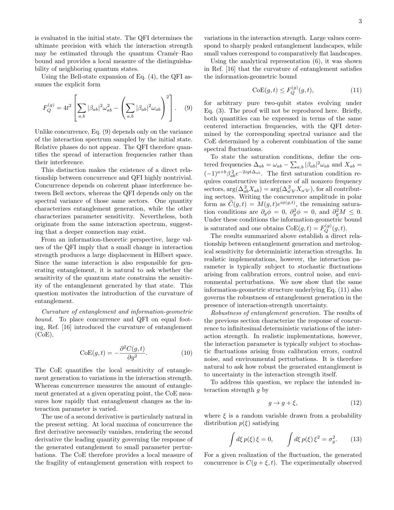 
Low-resolution page preview, page 3

📷 Fig 3

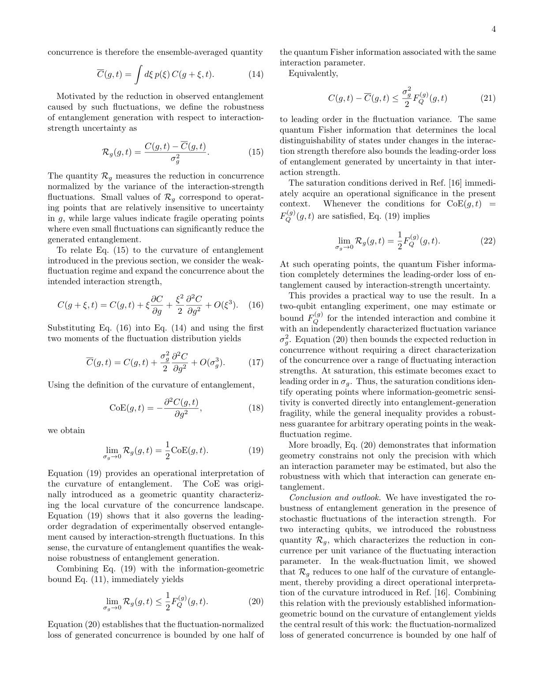 
Low-resolution page preview, page 4

📷 Fig 4

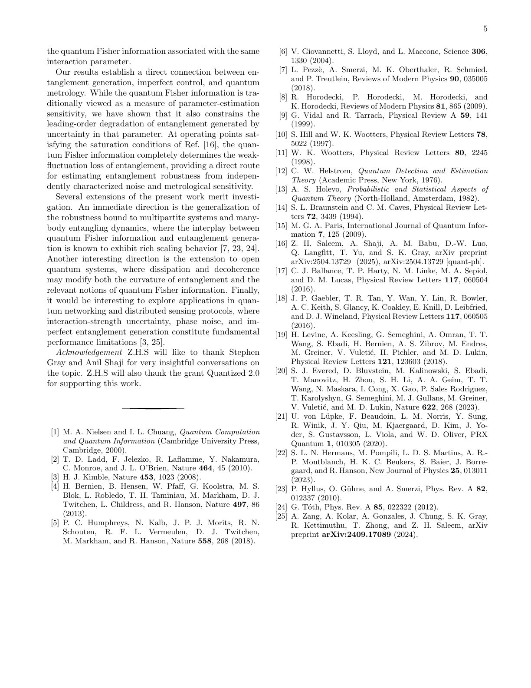 
Low-resolution page preview, page 5

**Summary.** This paper establishes an information-geometric bound linking the robustness of entanglement generation in two qubits to the Quantum Fisher Information (QFI). By analyzing how concurrence degrades under fluctuating interactions, the authors show that this loss is bounded by a quantity derived from QFI. This result provides a fundamental measure for assessing the reliability of quantum operations against environmental or control imperfections.

**Why it may be interesting.** This work provides a powerful theoretical tool connecting quantum metrology (QFI) directly to resource quantification (entanglement robustness), which is crucial for designing reliable quantum communication protocols.

Detailed structure

**Main problem.** The research investigates how robust entanglement generation is when the underlying interaction strength fluctuates due to uncertainty.

**Main result.** A direct information-geometric bound is established, showing that the reduction in concurrence due to fluctuations is bounded by a quantity related to the Quantum Fisher Information (QFI).

**Method.** The authors use second-order Taylor expansions and weak-fluctuation approximations to relate the curvature of entanglement loss to the QFI.

**Model / system.** The system modeled consists of two interacting qubits whose dynamics are governed by a Hamiltonian $H(g) = g h$, where $g$ is the fluctuating interaction strength. The analysis uses Bell state expansions for diagnostics.

**Key observables.** Concurrence ($C$), Quantum Fisher Information (QFI, $F_Q$), and the Curvature of Entanglement ($	ext{CoE}$).

**Important parameters / regimes.** Interaction strength fluctuation variance ($\sigma_g^2$) and time ($t$). The analysis focuses on the weak-fluctuation limit.

**Assumptions / limitations.** The primary assumption is operating in the weak-fluctuation regime ($\sigma_g 	o 0$), allowing for second-order Taylor expansion approximations.

**Paper structure.** The paper progresses by defining entanglement generation (concurrence) and parameter sensitivity (QFI), deriving an information-geometric bound linking them, and finally applying this to quantify the robustness of entanglement against noise sources.

Abstract

Entanglement generation is a central resource for quantum information processing, quantum networking, and quantum sensing. In practical implementations, however, entangling interactions are inevitably subject to uncertainty and fluctuations in the interaction strength. We investigate the robustness of entanglement generation in the presence of such imperfections and establish a direct connection between the robustness of entanglement generation and quantum Fisher information (QFI). For two interacting qubits, we show that the reduction in concurrence caused by fluctuations in the interaction parameter is bounded by the QFI with respect to the interaction strength.

[↑ back to top](#top)

### [Robustness of Entanglement Manipulation for almost i.i.d. sources](http://arxiv.org/abs/2606.06392v1)

**Authors:** Nilanjana Datta  
**Type:** theory · **Category:** quantum information and computing · **PDF:** <https://arxiv.org/pdf/2606.06392v1>  
**Analysis basis:** full PDF text, analyzed in chunks
**Topic relevance:** 🔥 `entanglement & information structure` **4/5** · `Keldysh / 2PI / non-Gaussian methods` **1/5**

📷 Fig 1

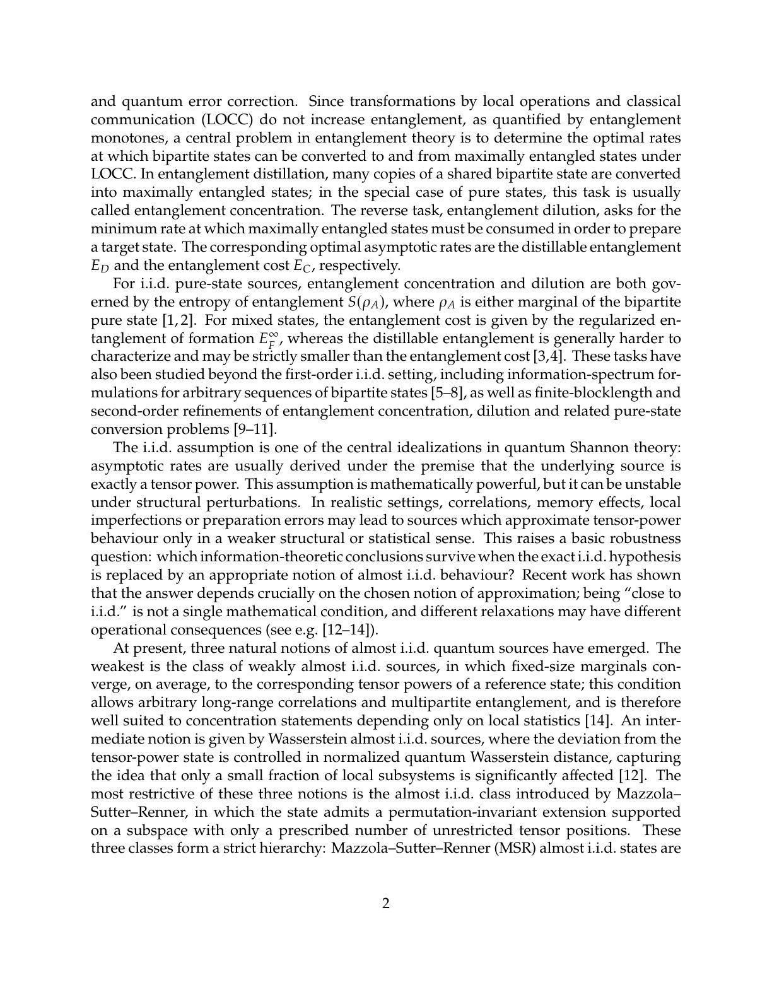 
Low-resolution page preview, page 2

📷 Fig 2

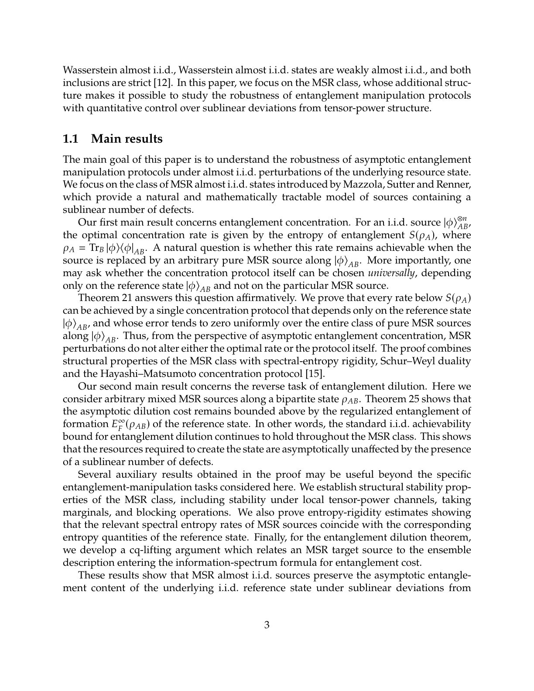 
Low-resolution page preview, page 3

📷 Fig 3

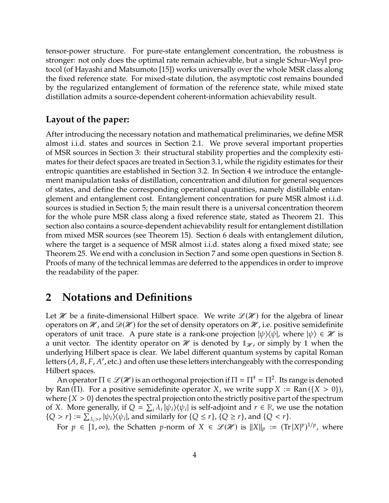 
Low-resolution page preview, page 4

📷 Fig 4

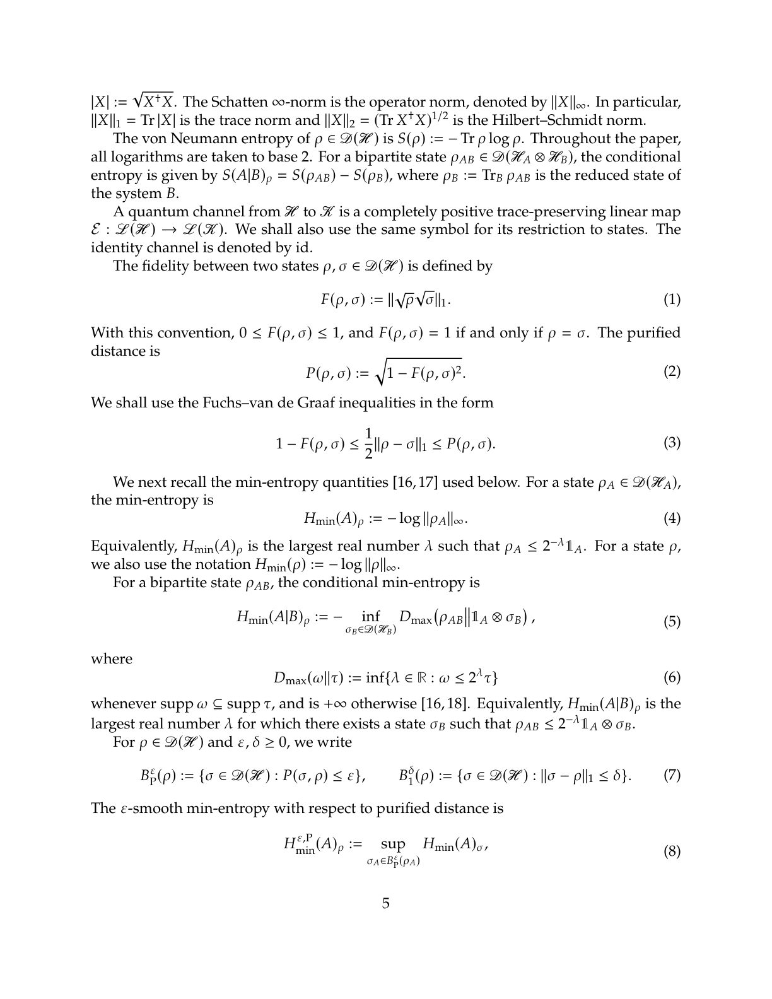 
Low-resolution page preview, page 5

📷 Fig 5

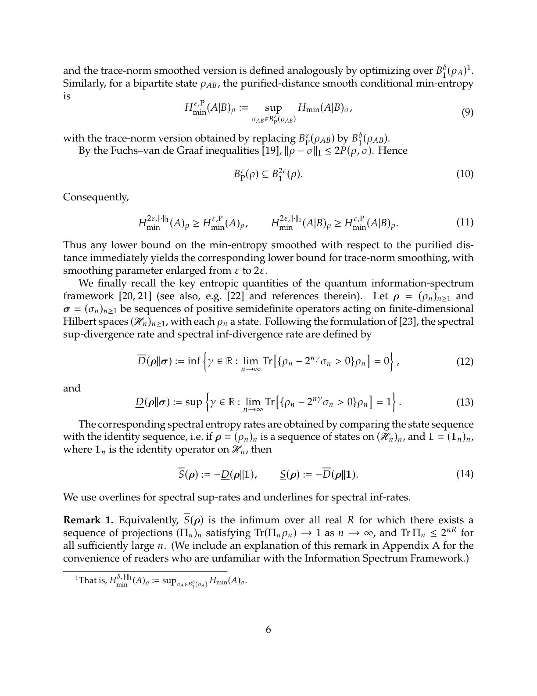 
Low-resolution page preview, page 6

**Summary.** This paper proves that key entanglement manipulation rates—such as concentration and dilution costs—are robust to small, structured deviations from perfect independence in quantum sources. By analyzing MSR almost i.i.d. states, the authors show that these non-ideal sources maintain the same asymptotic performance bounds as ideal i.i.d. sources.

**Why it may be interesting.** It provides rigorous mathematical proofs that the fundamental capacity theorems of quantum information theory hold even when physical sources exhibit controlled, non-ideal correlations, which is crucial for realistic quantum communication protocols.

Detailed structure

**Main problem.** The study investigates how robust asymptotic entanglement manipulation (concentration and dilution) remains when quantum sources deviate from the ideal independent and identically distributed (i.i.d.) regime.

**Main result.** For MSR almost i.i.d. sources, the achievable rates for both concentration and dilution are shown to be governed by the same asymptotic bounds as their perfectly i.i.d. reference states.

**Method.** The analysis employs advanced information-theoretic tools, including spectral entropy rates, Schur–Weyl duality, and structural characterizations of MSR defect spaces.

**Model / system.** The model involves bipartite quantum systems whose state sequences are described by Mazzola–Sutter–Renner (MSR) almost i.i.d. sources, allowing for controlled sublinear deviations from a tensor-power structure.

**Key observables.** Entanglement concentration rate ($S(\varphi_A)$), entanglement cost ($	ext{EC}(
ho_{AB})$), and coherent information ($I(A
angle B)_
ho$).

**Important parameters / regimes.** The defect size sequence $r_n$ must satisfy $r_n = o(n)$, ensuring the deviation from i.i.d. is sublinear.

**Assumptions / limitations.** The primary assumption is that the source structure belongs to the MSR class, which mathematically controls the nature of the deviations from perfect independence.

**Figures summary.** Not specified in the provided notes; the analysis relies on mathematical proofs and structural theorems rather than figure descriptions.

**Paper structure.** The paper builds by first establishing structural and entropic rigidity properties for MSR sources (showing spectral entropy rates are preserved). It then applies these results sequentially to prove achievability bounds for entanglement concentration (pure states) and entanglement cost/dilution (mixed states).

Abstract

We study the robustness of asymptotic entanglement manipulation beyond the exact i.i.d. regime, focusing on Mazzola--Sutter--Renner (MSR) almost i.i.d. sources, which allow a sublinear number of deviations from a tensor-power structure. For pure MSR sources along a bipartite reference state $|φ\rangle_{AB}$, we prove that the entanglement concentration rate is robust: every rate below the entropy of entanglement $S(φ_A)$ remains achievable. Moreover, this can be done by a single Schur--Weyl concentration protocol that is universal within the MSR class, depending only on the reference state and not on the particular source sequence. For mixed MSR sources along a reference state $ρ_{AB}$, we prove a source-dependent entanglement-distillation achievability result: every rate below the coherent information $I(A\rangle B)_ρ$ of the reference state is achievable, although the entanglement distillation protocol may depend on the particular MSR source sequence. For the reverse task of entanglement dilution, we prove a rate-robustness theorem: the asymptotic entanglement cost of any MSR target sequence along $ρ_{AB}$ is at most $E_F^\infty(ρ_{AB})$, the regularized entanglement of formation of the reference state. To establish these results, we prove structural and entropic properties of MSR almost i.i.d. sequences which may be useful in other information-theoretic settings. Thus, for the achievability statements considered here, MSR almost i.i.d. perturbations exhibit the same asymptotic behaviour as their i.i.d. reference states, despite allowing sublinear deviations from a tensor-power structure.

[↑ back to top](#top)

### [Forbidden transitions in superconducting artificial atoms](http://arxiv.org/abs/2606.06069v1)

**Authors:** Alberto Del Ángel Medina, Théo Sépulcre, Ricardo Gutiérrez-Jáuregui, Anton Frisk Kockum  
**Type:** theory · **Category:** other · **PDF:** <https://arxiv.org/pdf/2606.06069v1>  
**Analysis basis:** full PDF text, analyzed in chunks
**Topic relevance:** `Keldysh / 2PI / non-Gaussian methods` **3/5** · `analog quantum simulation` **3/5** · `Tavis-Cummings & cavity-many-emitter` **2/5** · `methods for driven-dissipative` **2/5** · `spintronics-quantum-optics interface` **2/5** · `correlated / nonlocal dissipation` **1/5** · `correlated cavity matter` **1/5** · `driven-dissipative phase transition` **1/5** · `entanglement & information structure` **1/5** · `exotic spin models in light-matter` **1/5** · `non-equilibrium dynamics` **1/5**

📷 Fig 1

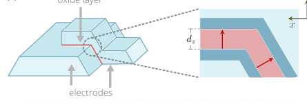 
Figure 1. Artificial atoms built from Josephson junctions cou- ple to the surrounding electromagnetic environment. The cou- pling depends on the polarization and spatial profiles of field and junction. (a) Sketch of a cross-strip junction [20]. The oxide layer (light red; length dz ≃1 nm) allows for Cooper pairs to tunnel along two directions (red arrows) to create a polarization-sensitive coupling. (b) Spatial profile of the charge imbalance for the fundamental and first mode of a flat junction (Lx ≃0.1 −10 µm). For short junctions (Lx ≪λJ), these modes can be weakly coupled by an external magnetic field to imbue the junction with a quadrupole moment.

**Summary.** This paper develops a sophisticated microscopic theory for Josephson junctions coupled to structured electromagnetic fields. It moves beyond simple lumped-element models by incorporating the spatial variation of $\mathbf{E}$ and $\mathbf{B}$ fields into the Hamiltonian. The key finding is that higher-order multipole transitions, such as quadrupole excitation, can be utilized to probe field gradients, enabling novel quantum control mechanisms in superconducting artificial atoms.

**Why it may be interesting.** This work directly bridges superconducting circuit QED with fundamental quantum electrodynamics concepts, providing tools to engineer non-linear responses sensitive to field gradients rather than just intensity, which is crucial for advanced quantum sensing.

Detailed structure

**Main problem.** To develop a microscopic theoretical framework for Josephson junctions embedded in structured electromagnetic fields, moving beyond simple circuit models to account for spatial field profiles.

**Main result.** The theory predicts that the junction can be excited via quadrupole transitions dependent on the electric field gradient, allowing excitation even where the electric field intensity vanishes.

**Method.** The analysis uses a microscopic Hamiltonian derived from minimal coupling theory and employs techniques like path integrals, normal-mode decomposition, and multipolar expansion to characterize the system's response.

**Model / system.** The physical system is a superconducting Josephson junction (artificial atom) modeled by an effective Hamiltonian incorporating charging energy ($E_C$), Josephson energy ($E_J$), and coupling terms derived from the spatial variation of external electromagnetic fields ($\mathbf{E}, \mathbf{B}$).

**Key observables.** Phase difference ($\varphi$), charge imbalance ($n(\mathbf{r}_s)$), electric dipole moment ($\hat{d}$), electric quadrupole moment ($\hat{q}$), and magnetic dipole moment ($\hat{\mu}$).

**Important parameters / regimes.** Josephson coupling energy ($E_J$), charging energy ($E_C$), field gradients, and the ratio of coupling strengths between different multipole moments.

**Assumptions / limitations.** The analysis often relies on linearizing the sine-Gordon equation for small oscillations and expanding the electromagnetic interaction Hamiltonian in terms of multipolar operators (dipole, quadrupole).

**Figures summary.** Figure 1 illustrates the setup involving a cross-strip junction coupled to an electromagnetic environment, showing field dependence. Other figures likely detail mode coupling or energy level diagrams.

**Paper structure.** The paper progresses from deriving the microscopic Hamiltonian via minimal coupling (S1), integrating out fermionic fields to find effective action/Hamiltonian ($\hat{H}$) (S2-S4), and finally analyzing the low-energy dynamics using normal modes and multipolar expansions to predict specific excitation pathways (S5-S6).

Abstract

Artificial atoms built from Josephson junctions have become a powerful tool to explore the limits of quantum optics due to their strong coupling to electromagnetic fields and their sensitivity to changes at the single-photon level. This sensitivity to quantum fluctuations complements their metrological and computational use, which are based on the precise oscillating frequency of the underlying supercurrents. We present here a theory for Josephson junctions immersed in electromagnetic fields where focus is shifted from temporal correlations and towards spatial ones. Unlike the commonly used circuit and black-box descriptions, our work is based on a microscopic model that enables systematically accounting for the effect of the spatial and vectorial profile of an electromagnetic field over a junction. As an example of the interactions that emerge in such a setup, we investigate the possibility of driving a junction via a quadrupole transition, using typical experimental parameters in existing devices. With the transition being dependent on the gradient of the electric field -- rather than its intensity -- the junction can be excited in a region where the electric field vanishes.

[↑ back to top](#top)

### [Hidden periodicities allow the prediction of locked particle motions on quasicrystalline surfaces](http://arxiv.org/abs/2606.06026v1)

**Authors:** Seemant Mishra, Artem Ryabov, Philipp Maass  
**Type:** theory · **Category:** statistical mechanics · **PDF:** <https://arxiv.org/pdf/2606.06026v1>  
**Analysis basis:** full PDF text, analyzed in chunks
**Topic relevance:** `Frenkel-Kontorova` **3/5** · `methods for driven-dissipative` **3/5** · `non-equilibrium dynamics` **3/5** · `driven-dissipative phase transition` **2/5** · `Keldysh / 2PI / non-Gaussian methods` **1/5** · `analog quantum simulation` **1/5** · `correlated / nonlocal dissipation` **1/5** · `non-equilibrium universality` **1/5** · `scars & prethermalization` **1/5**

📷 Fig 1

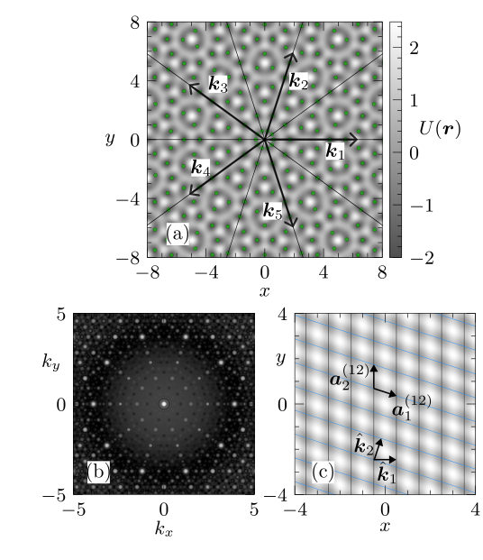 
FIG. 1. (a) Ten-fold rotationally symmetric potential U(r) generated by five sinusoidal plane waves with wave vectors kj [Eqs. (2), (10)]. Its minima are indicated by green bullets. (b) Bragg diffraction pattern of the quasicrystalline lattice of potential minima. (c) Hidden periodic potential u(12)(r) [Eq. (3)]. Minima of u(12)(r) form an oblique lattice spanned by primitive vectors a(12) 1 and a(12) 2 orthogal to the wavevec- tors k2 and k1, respectively [Eq. (4)].

📷 Fig 2

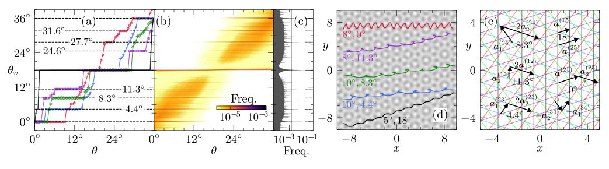 
FIG. 2. Directional locking of particle motion when driven by the force Fdc + Fac(t) [Eqs. (12), (13)] across the potential U(r) of Fig. 1(a). In (a)-(d), Fdc = 10(cos θ, sin θ). (a) Angle θv between mean particle velocity ¯v and x-axis as a function of the mean driving angle θ for (F ac x , F ac y ) = (0, 0) (black line), and for ac driving with (F ac x , F ac y ) = (20, 7) and 1/τ = 3.9 (blue triangles), 4.4 (green diamonds), and 4.9 (purple squares). The red circles are for (F ac x , F ac y ) = (0, 20) and 1/τ = 7. Dashed horizontal lines indicate robust locking directions. (b) Color plot with logarithmic scale of relative counts (frequencies) of θv for θ ∈[0◦, 36◦). For each θ we have...

📷 Fig 3

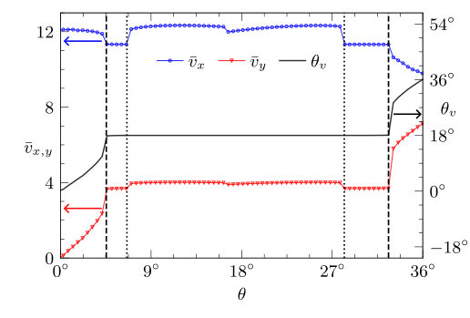 
FIG. 3. Directional locking without and with speed locking for Fdc = 14, (F ac x , F ac y ) = (2, 2), and 1/τ = 7. For the θ- interval between the vertical dotted lines, the mean velocity (¯vx, ¯vy) is varying, while θv = arctan(¯vy/¯vx) stays constant. Between the vertical dashed and dotted lines, speed locking goes along with directional locking.

📷 Fig 4

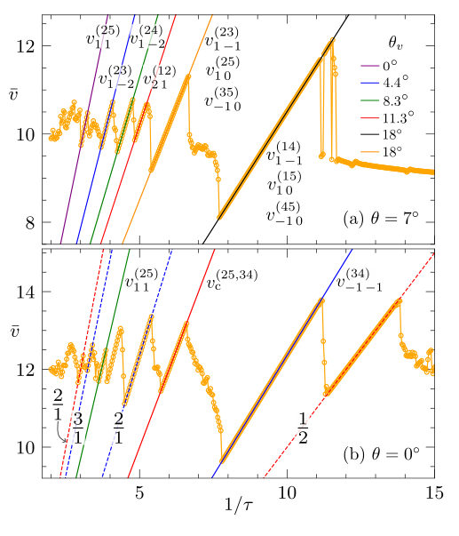 
FIG. 4. Mean particle speed ¯v as a function of the ac-driving frequency 1/τ for (a) mean driving angle θ = 7◦and force parameters Fdc = 10, (F ac x , F ac y ) = (20, 7) as in Fig. 2(a), and (b) θ = 0◦, Fdc = 12, and (F ac x , F ac y ) = (20, 20). Circles represent results from simulations and lines have slopes the- oretically predicted when applying the conjecture of hidden periodicities. For the labeling of the lines, see Eqs. (7)-(9).

**Summary.** This paper analyzes particle movement on quasicrystalline surfaces driven by oscillating forces. It demonstrates that despite the aperiodicity of the surface potential, the mean direction and speed of the particles become locked to values determined by hidden periodic symmetries within the potential structure. The findings are significant because they reveal underlying deterministic order governing transport in complex quasiperiodic media.

**Why it may be interesting.** This work provides a concrete example of how symmetry principles (hidden periodicity) can govern macroscopic transport properties (locking) in complex, non-periodic media, which has implications for understanding energy dissipation and directed motion in engineered materials or biological systems.

Detailed structure

**Main problem.** The study investigates particle motion on quasicrystalline surfaces, aiming to predict directional and speed locking when subjected to time-periodic external driving forces.

**Main result.** Particle mean velocities can lock into specific directions dictated by the lattice vectors of underlying hidden periodic potentials, even though the overall surface potential lacks translational periodicity. Furthermore, this directional locking is often accompanied by a predictable locking of the mean particle speed.

**Method.** The analysis uses theoretical modeling based on Langevin dynamics for overdamped motion over a quasicrystalline potential derived from plane wave superpositions. Results are confirmed via numerical simulations and geometric analysis linking observed plateaus to underlying lattice symmetries.

**Model / system.** The system models particles moving across surfaces with potentials $U(\mathbf{r})$ exhibiting quasicrystalline order, generated by summing multiple plane waves. The dynamics are governed by a Langevin equation incorporating both DC and time-periodic AC driving forces.

**Key observables.** Mean particle velocity ($ar{\mathbf{v}}$), the angle of mean motion ($	heta_v$), and the mean speed ($|ar{\mathbf{v}}|$).

**Important parameters / regimes.** The ratio of characteristic speeds to the inverse period ($1/	au$) of the driving force; noise strength ($D$).

**Assumptions / limitations.** The particle dynamics are well-described by the overdamped Langevin equation, and the underlying potential structure is accurately captured by plane wave superpositions.

**Figures summary.** Figures demonstrate directional locking as plateaus in $	heta_v$ vs $	heta$, correlating these directions to lattice vectors $\mathbf{d}^{(ij)}_{m_1 m_2}$. Speed locking is shown via linear dependence of $ar{v}$ on $1/	au$.

**Paper structure.** The paper establishes the physical model and dynamics, analyzes directional locking by relating observed plateaus in mean velocity angle to lattice vectors derived from hidden periodic potentials. It then extends this analysis to show that speed locking is also predicted by these same underlying symmetries.

Abstract

Motion of particles across quasicrystalline surfaces exhibits peculiar features due to the presence of long-range order without translational periodicity. Under time-periodic forcing, this motion can become locked in directions thatn deviate strongly from the mean driving direction. We show that for surface potentials with a quasicrystalline pattern of minima generated by a superposition of plane waves, particle trajectories are nonperiodic, yet their mean direction and speed are determined by hidden periodic potentials. The lattice vectors of these underlying potentials define characteristic velocities that dictate both directional and speed locking. The particle motion does not synchronize with the driving, and it is possible for the mean speed to remain nonlocked even in directionally locked states. These findings are demonstrated using a model directly amenable to experimental realization.

[↑ back to top](#top)

### [Breakdown of Fluctuational Electrodynamics in the Extreme Near Field](http://arxiv.org/abs/2606.05845v1)

**Authors:** Philippe Ben-Abdallah  
**Type:** theory · **Category:** statistical mechanics · **PDF:** <https://arxiv.org/pdf/2606.05845v1>  
**Analysis basis:** full PDF text, analyzed in chunks
**Topic relevance:** `Keldysh / 2PI / non-Gaussian methods` **3/5** · `correlated / nonlocal dissipation` **3/5** · `driven-dissipative phase transition` **2/5** · `methods for driven-dissipative` **2/5** · `non-equilibrium dynamics` **2/5** · `correlated cavity matter` **1/5** · `interference shaping light` **1/5** · `non-equilibrium universality` **1/5**

📷 Fig 1

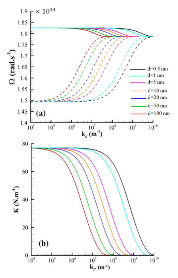 
FIG. 1. (a) Resonance frequency of hybridized surface phonon-polaritons between two SiC half-spaces separated by a vacuum gap d. In full line Ω+ and in dashed line Ω−(b) In- terfacial coupling coefficient K(k∥, d) between the two surface phonon-polariton oscillators localized the opposite interfaces for different separation distances.

📷 Fig 2

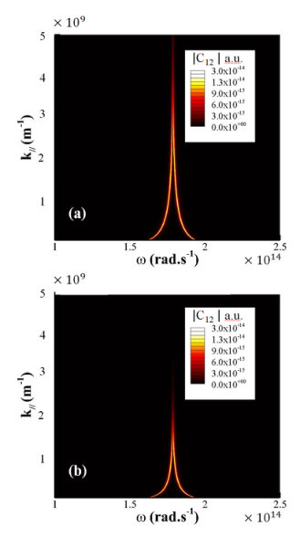 
FIG. 2. Cross-correlation spectrum between the fluctuations of the two coupled surface oscillators for two SiC half-spaces of temperature T1 = 310 K and T1 = 300 K separated by a vacuum gap (a) d = 1 nm and (b) d = 10 nm.

📷 Fig 3

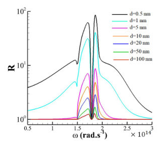 
FIG. 4. Enhancement factor R = φtot/φFE for two SiC half- spaces at T1 = 310 K and T2 = 300 K, as a function of fre- quency and separation distance.

📷 Fig 4

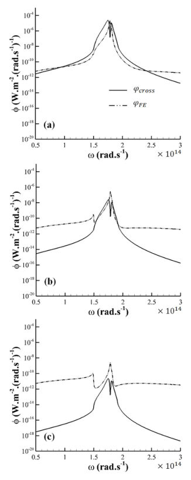 
FIG. 3. Spectral radiative heat flux carried by correlated fluc- tuations (full line) and predicted by conventional FE (dashed line) between two SiC half-spaces separated by a vacuum gap (a) d = 1 nm, (b) d = 10 nm and (c) d = 100 nm.

**Summary.** This work shows that standard Fluctuational Electrodynamics fails near surfaces because it ignores correlated thermal fluctuations. By modeling coupled surface phonon modes, the authors derive a correction term to the heat flux due to hybridization resonance. This establishes a microscopic framework quantifying how strong coupling modifies radiative heat transfer in the extreme near-field.

**Why it may be interesting.** It provides a concrete example of how non-equilibrium correlations arising from strong coupling (hybridization) can fundamentally alter predictions in thermal transport, which is relevant for open quantum systems interacting with structured environments.

Detailed structure

**Main problem.** The paper addresses the breakdown of Fluctuational Electrodynamics (FE) theory when calculating radiative heat transfer at subnanometric separations.

**Main result.** The failure stems from neglecting cross-correlations between thermal fluctuations in distinct bodies, which are significant due to phonon hybridization in the extreme near-field regime.

**Method.** A microscopic coupled-oscillator model is used alongside a Green-tensor formulation of the Poynting vector to derive the correlation-induced correction term ($\varphi_{cross}$).

**Model / system.** The system involves two closely spaced, polar interfaces (e.g., SiC) separated by a vacuum gap ($d$), supporting surface phonon-polaritons.

**Key observables.** The total spectral heat flux ($\varphi_{	ext{tot}}$), the correlation-induced correction term ($\varphi_{	ext{cross}}$), and the spectral ratio $R = \varphi_{	ext{tot}}/\varphi_{	ext{FE}}$.

**Important parameters / regimes.** Subnanometric separations ($d$), hybridization energy, and intrinsic damping rates ($\gamma_i$).

**Assumptions / limitations.** The analysis is most significant when the hybridization energy is comparable to the intrinsic damping rate; conventional FE assumes statistical independence of fluctuations.

**Figures summary.** Figures illustrate the resonance frequencies and coupling coefficients for hybridized modes (Fig 1), and show the total heat flux compared to FE predictions for varying gaps (Fig 3).

**Paper structure.** The paper establishes a microscopic framework by modeling coupled oscillators, deriving cross-correlations from hybridization, and quantifying the resulting correction to the radiative heat flux.

Abstract

Fluctuational electrodynamics relies on the assumption that thermal fluctuations in distinct bodies are statistically independent. We show that this approximation breaks down in the extreme near-field regime, where overlapping evanescent surface fields hybridize optical phonons across nanometric vacuum gaps and generate fluctuating-current cross correlations between opposite interfaces. Using a microscopic coupled-oscillator model combined with a Green-tensor formulation of the Poynting vector, we derive the resulting correlation-induced correction to the radiative heat flux. For polar materials supporting surface phonon-polaritons, these correlations become significant when the hybridization energy is comparable to the intrinsic damping rate and can substantially modify conventional fluctuational-electrodynamics predictions at subnanometric separations. Our results establish a microscopic framework for correlated thermal fluctuations in the extreme near-field regime and quantify their impact on radiative heat transfer.

[↑ back to top](#top)

### [Ferroelectric brightening of spin forbidden dark excitons in a WSe2/hybrid perovskite heterostructure](http://arxiv.org/abs/2606.06128v1)

**Authors:** Xinyun Wang, Magdalena Grzeszczyk, Maxim Trushin, Ivan Verzhbitskiy, Dmitrii Litvinov, Yi Wei Ho, Yuan Chen, Zhenyue Wu, Mykola Telychko, Chuanqi Zhang, Andres Granados del Aguila, Kuan Eng Johnson Goh, Xinwei Li, Goki Eda, Shaffique Adam, Maciej Koperski, Kian Ping Loh  
**Type:** both · **Category:** other · **PDF:** <https://arxiv.org/pdf/2606.06128v1>  
**Analysis basis:** full PDF text, analyzed in chunks
**Topic relevance:** `exotic spin models in light-matter` **3/5** · `spintronics-quantum-optics interface` **3/5** · `driven-dissipative phase transition` **2/5** · `methods for driven-dissipative` **2/5** · `analog quantum simulation` **1/5** · `correlated / nonlocal dissipation` **1/5** · `correlated cavity matter` **1/5** · `non-equilibrium dynamics` **1/5** · `non-equilibrium universality` **1/5**

📷 Fig 1

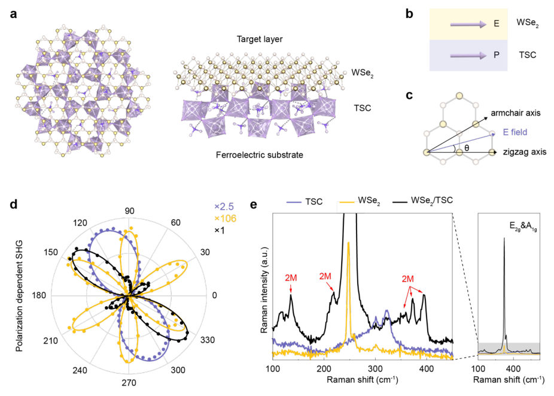 
Fig. 1 | Symmetry breaking in WSe2 via ferroelectric proximity coupling. a, Schematic

📷 Fig 2

 
Fig. 2 | Observation of spin-forbidden dark excitons in WSe2/TSC heterostructures at

📷 Fig 3

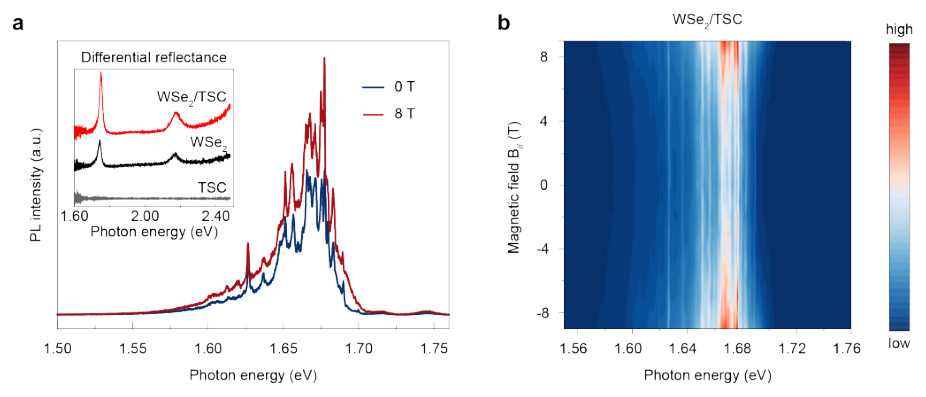 
Fig. 2a shows the PL spectra of the stacked WSe₂/TSC heterostructure, where a new group of

📷 Fig 4

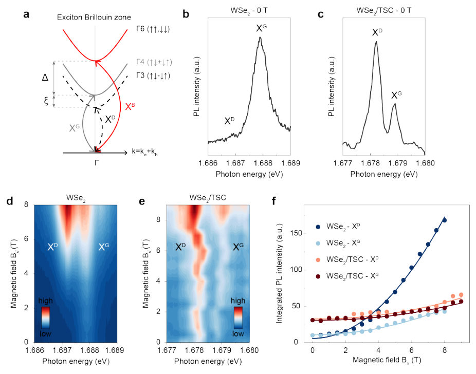 
Fig. 3 | Magnetophotoluminescence signatures of dark-grey exciton doublet. a, Exciton

📷 Fig 5

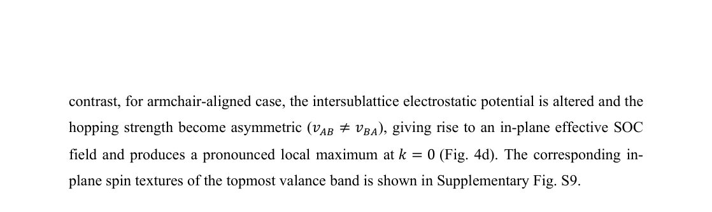 
Fig. 4e displays the calculated 𝑘-dependent transition dipole moment, which vanishes for

**Summary.** The research demonstrates that interfacing monolayer $	ext{WSe}_2$ with a ferroelectric perovskite substrate allows for the electrical activation of spin-forbidden dark excitons. By leveraging the ferroelectric proximity effect, the system generates an effective in-plane SOC field, enabling magnetic-field-free control over exciton spin and valley polarization. This establishes a powerful, electrically tunable platform for quantum information processing in 2D materials.

**Why it may be interesting.** This work directly addresses open quantum systems by demonstrating how an external, tunable electric field can engineer spin-orbit coupling to activate otherwise optically forbidden transitions in solid-state excitons, which is highly relevant for building quantum light sources or qubits.

Detailed structure

**Main problem.** The primary goal is achieving electrical reconfigurable, magnetic-field-free control over spin and valley information carried by long-lived dark excitons in 2D semiconductors.

**Main result.** The ferroelectric proximity effect successfully brightens the spin-forbidden dark exciton ($	ext{X}_{	ext{D}}$) in $	ext{WSe}_2$ at zero magnetic field, establishing a symmetry-tunable control mechanism.

**Method.** The study combines experimental characterization (PL, SHG, Raman) with theoretical modeling using a four-band tight-binding Hamiltonian to explain the underlying physics.

**Model / system.** The system is a $	ext{WSe}_2$/ferroelectric hybrid perovskite heterostructure. The mechanism relies on the ferroelectric proximity effect inducing an asymmetric intersublattice interaction, which generates an effective in-plane spin-orbit coupling (SOC) field.

**Key observables.** Brightening of dark excitons at zero magnetic field; polarization rotation/modulation proportional to the electric field orientation; reduction in exciton polarization phase difference indicating valley mixing.

**Important parameters / regimes.** Ferroelectric field ($\mathbf{E}$); interlayer twist angle; applied magnetic fields ($B_{//}, B_{\perp}$).

**Assumptions / limitations.** The mechanism is modeled by assuming the ferroelectric proximity effect dictates an asymmetric hopping term in the tight-binding Hamiltonian.

**Figures summary.** Figures illustrate symmetry breaking via SHG polar maps, and PL spectra confirm new excitonic peaks emerging at zero magnetic field with characteristic magneto-optical responses.

**Paper structure.** The paper establishes the physical platform ($	ext{WSe}_2$/perovskite), presents experimental evidence of exciton brightening (PL/SHG), develops a theoretical model based on symmetry breaking and SOC, and finally demonstrates control via electric field tuning and twist angle dependence.

Abstract

Long-lived dark excitons in monolayer WSe2 present promising candidates for carrying spin and valley information, but their optical access and spin manipulation have conventionally required the use of strong external magnetic fields. Here, using a ferroelectric hybrid perovskite heterostructure, we leverage the ferroelectric proximity effect to break the WSe2's in-plane rotational symmetry and brighten the spin-forbidden dark excitons under zero magnetic field conditions. Furthermore, we show that the twist angle between the WSe2 and perovskite crystals controls the ferroelectric coupling strength and valley-contrasting polarization. Our proposed mechanism, supported by a four-band tight-binding model, suggests that the ferroelectric proximity effect induces an asymmetric intersublattice interaction, generating an effective in-plane spin-orbit coupling (SOC) field that rotates spin/valley polarization and brightens dark excitons. Our work establishes ferroelectric proximity coupling as an electrically reconfigurable, magnetic-field-free strategy for spin exciton control in two-dimensional semiconductors.

[↑ back to top](#top)

### [Quantum Thermal Logic Gates](http://arxiv.org/abs/2606.06432v1)

**Authors:** Shuvadip Ghosh, Arnab Ghosh, Bivas Dutta, Papiya Maity  
**Type:** theory · **Category:** quantum information and computing · **PDF:** <https://arxiv.org/pdf/2606.06432v1>  
**Analysis basis:** full PDF text, analyzed in chunks
**Topic relevance:** `driven-dissipative phase transition` **3/5** · `methods for driven-dissipative` **3/5** · `non-equilibrium dynamics` **3/5** · `non-equilibrium universality` **2/5** · `Keldysh / 2PI / non-Gaussian methods` **1/5** · `correlated / nonlocal dissipation` **1/5**

📷 Fig 1

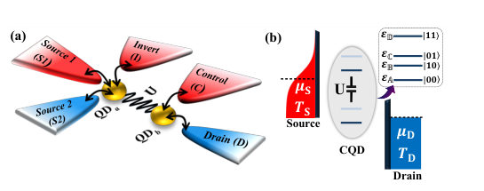 
FIG. 1: (a) Schematic of the proposed QTLG: the CQD system is tunnel-coupled to S1 (hot/cold, here hot), S2 (hot/cold, here cold), and D (cold) leads; source tem- peratures define input thermal-logic (hot (red): 1, cold (blue): 0). I and C leads, coupled to QDa and QDb, are kept at high temperature for NOT and AND gate operations, respectively. The thermal current measured at D (or at I lead for NOT gates) defines the output thermal-logic. (b) The basic building block of a QTLG – a thermal-diode in the forward-bias configuration, where input logic-1 (broadened FD-distribution) allows heat- flow from S to D. Inset: CQD energy levels and its states.

📷 Fig 2

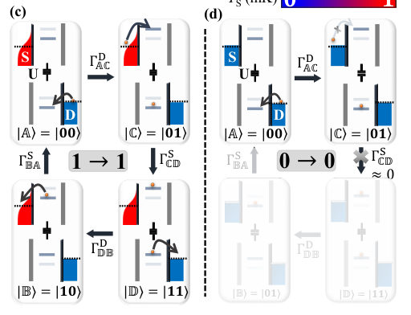 
FIG. 2: (a) CQD setup for the QTBG, with its equiva- lent electrical-diode circuit (Inset). (b) |JD Q| w.r.t input- temperature TS, for forward-bias µD = +21 µeV and µS = −21 µeV. (c) QTBG operational cycle for 1 →1 and (d) 0 →0; The net transition-cycle runs in ⟳di- rection; while the anti-clockwise cycle (⟲) is suppressed, as no hot-lead is coupled to QDb [See Appendix- C 2 for details].

📷 Fig 3

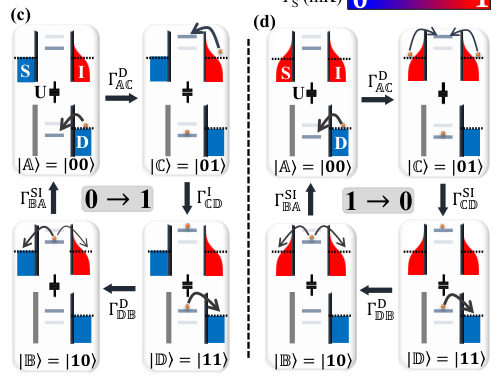 
FIG. 3: (a) QTNG setup and its electrical circuit (Inset). (b) JI Q w.r.t TS for the same parameters as buffer gate, with additional parameter µI = −21 µeV, kept below the QDa level, maintaining forward-bias. (c) QTNG opera- tional cycle for 0 →1 and (d) 1 →0. Like in QTBG, the net transition-cycle runs in ⟳direction; while the anti-clockwise cycle is suppressed (Appendix C 2). Here, the widths of the arrows indicate the relative strength of the heat-flow.

📷 Fig 4

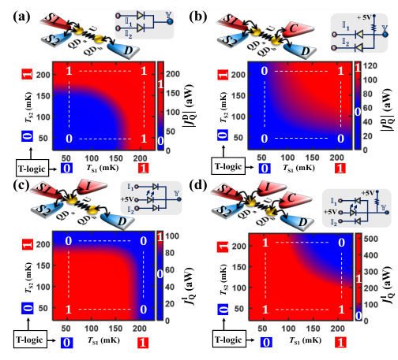 
FIG. 4: Double-input QTLG setup and the correspond- ing 2D thermal-current plot w.r.t. the input T-logic for all four gates. Common parameters: γ = 3 GHz, εa = 10 µeV, εb = 15 µeV, U = 12 µeV, TD = 20 mK. Addi- tional parameters for (a) OR gate µS1 = µS2 = −25 µeV, µD = 21 µeV; (b) AND gate: µS1 = µS2 = 16 µeV, µC = −72 µeV, µD = 14 µeV; (c) NOR gate: µS1 = µS2 = −95 µeV, µI = −90 µeV, µD = 21 µeV; and (d) NAND gate: µS1 = µS2 = 16 µeV, µC = −16 µeV, µI = 16 µeV, µD = 9 µeV. The equivalent electrical cir- cuit for each gate is shown in the top inset, and output logic states are indicated on the color plots.

📷 Fig 5

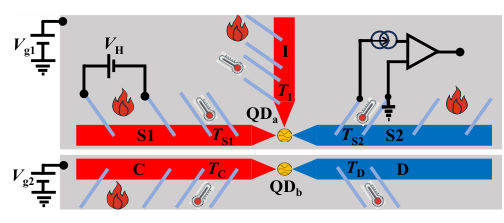 
FIG. 5: Schematic of the proposed device, with two QD- junctions, integrated with a local heater and thermome- ters (cyan). The QD levels can be tuned by the corre- sponding back-gates.

**Summary.** The authors propose and theoretically analyze Quantum Thermal Logic Gates (QTLGs) implemented using coupled quantum dots connected to thermal reservoirs. By calculating steady-state heat currents, they demonstrate that the system's response exhibits a perfect mapping to classical logic functions like AND, OR, and NOT. This work suggests a pathway for ultra-low power computation by utilizing controlled heat flow in nanoscale electronic circuits.

**Why it may be interesting.** This work bridges quantum thermodynamics with computation, showing how energy dissipation (heat flow) can be harnessed as a controllable information carrier in solid-state quantum devices.

Detailed structure

**Main problem.** The paper proposes developing quantum thermal logic gates (QTLGs) that mimic classical electronic logic operations using heat current in nanoscale quantum systems.

**Main result.** A one-to-one correspondence is established between QTLG operations and classical logic gates (AND, OR, NOT, NAND), demonstrating the feasibility of energy-efficient computation via thermal effects.

**Method.** The analysis uses the Lindblad master equation to model time evolution, deriving steady-state heat and particle currents from transition rates governed by temperature gradients.

**Model / system.** The physical system is a coupled quantum-dot (CQD) structure tunnel-coupled to multiple metallic thermal reservoirs (leads). The dynamics are described by the Lindblad master equation acting on the reduced density matrix of the dots.

**Key observables.** Heat current ($J^Q$) and particle current ($J^N$), which are compared against predefined thresholds ($J_0^Q, J_1^Q$) to determine the logic output (logic-0 or logic-1).

**Important parameters / regimes.** Input logic states are defined by reservoir temperatures ($T_S \lesssim 50 	ext{ mK}$ for logic-0; $T_S \gtrsim 200 	ext{ mK}$ for logic-1); the system relies on temperature gradients to drive heat flow.

**Assumptions / limitations.** The model assumes weak coupling (Born-Markov approximation) and that inter-dot particle hopping is prohibited in certain analyses. The logic operation depends critically on the directionality of heat flow (thermal diode effect).

**Figures summary.** Figures illustrate schematics of the QTLG setups, showing operational cycles for Buffer, NOT, OR, AND, and NAND gates, with truth tables derived from measured heat current dependence on input temperatures.

**Paper structure.** The paper systematically develops the theoretical framework by deriving steady-state currents using rate equations. It then applies this formalism to construct and analyze fundamental gates (Buffer, NOT) before extending the concept to complex double-input gates (OR, AND, NOR, NAND).

Abstract

We propose a new concept for quantum thermal logic gates -- analogous to classical electronic logic gates -- that exploit the heat current in a coupled quantum-dot system tunnel-coupled to metallic thermal reservoirs for logic operations in quantum circuits. We obtained a remarkable one-to-one correspondence with the structure of classical electronic logic gate circuits. An experimental setup is presented that demonstrates a realizable nano-electronic quantum circuit architecture for implementing such quantum thermal logic operations.

[↑ back to top](#top)

### [Dissipation-coherence tradeoff for stochastic oscillations](http://arxiv.org/abs/2606.05498v1)

**Authors:** Jie Gu  
**Type:** theory · **Category:** statistical mechanics · **PDF:** <https://arxiv.org/pdf/2606.05498v1>  
**Analysis basis:** full PDF text, analyzed in chunks
**Topic relevance:** `methods for driven-dissipative` **3/5** · `non-equilibrium dynamics` **3/5** · `non-equilibrium universality` **2/5** · `Keldysh / 2PI / non-Gaussian methods` **1/5** · `correlated / nonlocal dissipation` **1/5** · `driven-dissipative phase transition` **1/5** · `entanglement & information structure` **1/5**

📷 Fig 1

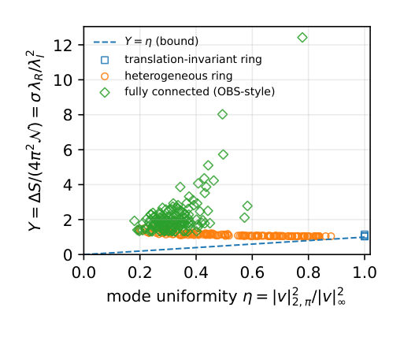 
FIG. 1. Numerical verification of the theorem bound Y = σλR/λ2 I ≥η across model ensembles. Hollow markers are samples from the ensembles described in Sec. II B generated with k+ = 1 and k−= 0.5: translation-invariant rings with n ∈{10, 20, 50, 100}; heterogeneous rings with n = 50 and disorder strength s ∈{0.05, 0.10, 0.20, 0.30} (40 samples per s); and OBS-style fully connected models with n = 40, all- to-all link rate ε ∈{10−4, 3 × 10−4}, and outgoing disorder sout ∈{0.5, 1.0, 1.5} (25 samples per (ε, sout)). Only samples with coherence number N ≥0.05 are shown. The diagonal line shows Y = η.

**Summary.** This paper refines the Oberreiter-Barato-Seifert conjecture by introducing a mode-uniformity factor, $\eta$, into the lower bound on entropy production during stochastic oscillations. This factor quantifies how localized the dominant oscillatory eigenmode is within the system's state space. The work provides both theoretical derivations and practical, data-driven recipes to estimate this crucial parameter from limited experimental measurements.

**Why it may be interesting.** It provides a quantitative, state-dependent correction ($\eta$) to fundamental bounds in non-equilibrium statistical mechanics that govern energy dissipation during coherent oscillations, which is crucial for understanding open quantum systems dynamics.

Detailed structure

**Main problem.** Deriving a rigorous lower bound on the entropy produced per oscillation period for noisy, non-equilibrium systems that refines existing conjectures by accounting for mode localization.

**Main result.** The paper establishes $\Delta S \geq 4\pi^2 \eta N$, where $\eta$ is a mode-uniformity factor quantifying how evenly the oscillatory eigenmode is distributed across states. This shows that dissipation can be parametrically smaller if the dominant mode is localized ($\eta \ll 1$).

**Method.** The analysis uses Markov jump processes and spectral properties of the generator matrix, introducing $\eta$ to correct the standard eigenvalue-based bound.

**Model / system.** The study models stochastic oscillations using finite irreducible continuous-time Markov jump processes on discrete state spaces (e.g., a ring or general graph). The dynamics are governed by a Master Equation ($\dot{P}(t) = W P(t)$).

**Key observables.** Steady-state entropy production rate ($\sigma$), coherence number ($N$), and the mode-uniformity factor ($\eta$).

**Important parameters / regimes.** The ratio $\eta$ controls the sharpness of the dissipation-coherence tradeoff; the bound reduces to the original conjecture when $\eta=1$ (delocalized modes).

**Assumptions / limitations.** The rigorous derivation relies on algebraic inequalities related to the Dirichlet form, while estimation methods are heuristic and assume single-mode dominance.

**Figures summary.** Figure 1 plots a tightness ratio $Y = \Delta S / (4\pi^2 N)$ versus $\eta$, demonstrating that the measured ratio satisfies $Y \geq \eta$ across various model ensembles.

**Paper structure.** The paper first derives the rigorous inequality incorporating $\eta$. It then outlines proof-of-principle routes for estimating $\eta$ from low-dimensional data (DMD/Koopman methods) and presents an eigenvector-free corollary based on the smallest stationary probability.

Abstract

Autonomous noisy oscillations in biochemical and mesoscopic systems require nonequilibrium driving and therefore dissipation. A striking conjecture by Oberreiter, Barato, and Seifert (OBS) proposes a universal lower bound on the entropy produced per oscillation period in terms of the coherence number of the slowest oscillatory mode. Here we derive a weaker but rigorous lower bound that preserves the OBS structure while introducing a mode-uniformity factor that quantifies how evenly the oscillatory eigenmode is distributed across states in the steady-state inner product. The result makes explicit that an eigenvalue-only prefactor can fail when the dominant oscillatory mode is localized. We also outline a proof-of-principle route for estimating this factor from low-dimensional data under single-mode dominance and sufficiently informative measurements, and derive an eigenvector-free corollary using only the smallest stationary probability. Translation-invariant Markov jump processes on a ring provide a symmetry-protected class with $η=1$, so the refinement reduces to the OBS form; the drift--diffusion limit on a circle saturates the bound.

[↑ back to top](#top)

### [Gauging the Spacetime Code](http://arxiv.org/abs/2606.05664v1)

**Authors:** Gideon Lee  
**Type:** theory · **Category:** quantum information and computing · **PDF:** <https://arxiv.org/pdf/2606.05664v1>  
**Analysis basis:** full PDF text, analyzed in chunks
**Topic relevance:** `measurement-induced transitions` **3/5** · `quantum measurements` **2/5** · `Keldysh / 2PI / non-Gaussian methods` **1/5** · `analog quantum simulation` **1/5** · `correlated / nonlocal dissipation` **1/5** · `driven-dissipative phase transition` **1/5** · `entanglement & information structure` **1/5** · `methods for driven-dissipative` **1/5** · `non-equilibrium dynamics` **1/5**

📷 Fig 1

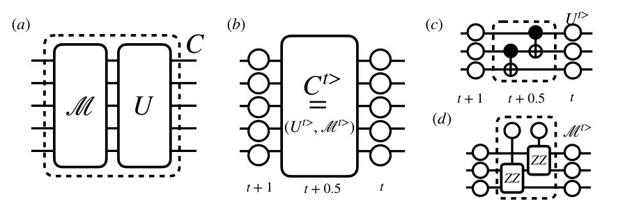 
Figure 1: Schematic illustrating the conventions used in this work. In all figures, time goes from right to left. (a) A Clifford operation C comprises a Clifford unitary U and a set of measurements M. (b) We discretize spacetime locations in a Clifford circuit by grouping its elements up into Clifford operations, and placing these at half-integer time-steps. We insert spacetime locations, depicted by circles, at integer time-steps. (c) An example of a Clifford unitary: We allow the unitaries at each time-step to be arbitrarily complicated – in this case the unitary comprises two cNOT gates. We note that this circuit could also be differently discretized by separating the two cNOTs into...

📷 Fig 2

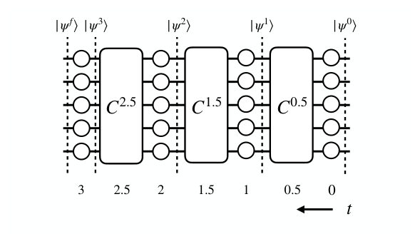 
Figure 2: Schematic depicting our conventions for where we evaluate states and their ISGs. The state |ψt⟩ describes the state at just before the t-th layer of spacetime locations, and ISG(t) describes the ISG of |ψt⟩. The final output state of the circuit is labelled |ψf⟩.

📷 Fig 3

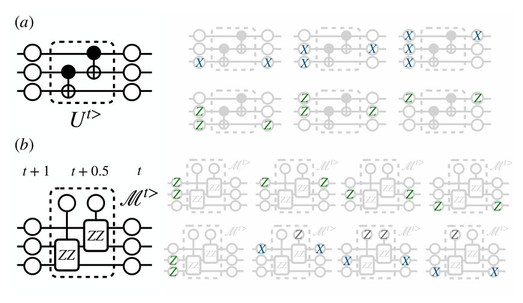 
Figure 3: Schematic illustrating examples of elementary circuit operators associated with circuit elements. For integer time-steps, we will use blue for X-type operators and green for Z-type operators. Although the operators on half-integer time-steps are formally written as Paulis, they are in principle associated with purely classical variables. To distinguish them, we use gray. (a) Propagators associated with the example depicted in Fig. 1c. Since the Clifford operation is purely unitary, there are no measurement slices or half- integer spacetime locations. (b) Propagators and measurement slices associated with the example depicted in Fig. 1d. We omit the measurement dephasers, as they...

📷 Fig 4

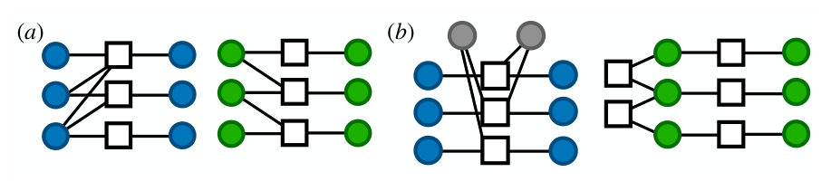 
Figure 4: Schematic illustrating the graphical representation of the elementary circuit operators depicted in Fig. 3. Spacetime locations are associated with circular vertices, and elementary circuit operators are associated with square vertices. Each spacetime location in an integer-valued time-slice is associated with two vertices, one blue and one green, associated with X and Z operators respectively. Each spacetime location in a half-integer time-slice is associated with a single gray vertex. We connect the square vertices to spacetime locations based on their support. We do not distinguish types of square vertices. Each row in the above should be considered part of the same graph....

📷 Fig 5

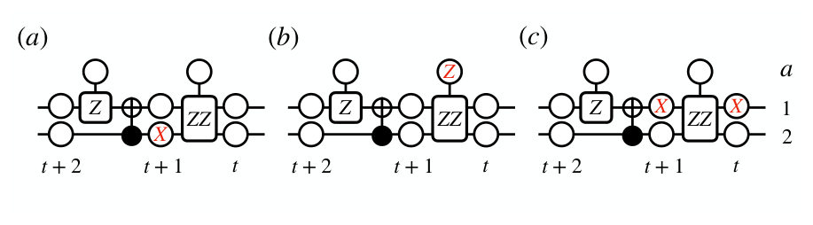 
Figure 5: A simple example of a detector formed by a ZZ measurement followed by a cNOT gate followed by a single qubit Z measurement, and several faults which violate the detector. (a) An X error between the two measurements. (b) A readout error in the first measurement. (c) A pair of X errors just before and just after the first measurement. All three examples trigger the detector. However, while the errors in (b) and (c) are equivalent with each other, they are not equivalent to the error in (a).

**Summary.** This theoretical work develops a novel gauge-theoretic description by 'gauging' the spacetime code applied to quantum circuits. It successfully unifies fault tolerance analysis with topological physics by showing that circuit redundancies map directly onto measurable detectors within the resulting lattice gauge theory. This framework has broad implications for understanding measurement-based computation and noise in quantum systems.

**Why it may be interesting.** It provides a powerful mathematical formalism (gauge theory) to analyze robustness in quantum computation, connecting abstract concepts of symmetry breaking/restoration to physical error correction mechanisms relevant for AMO platforms.

Detailed structure

**Main problem.** The work aims to bridge the concepts of fault tolerance in quantum computation with the physics of dynamical phases of matter by constructing a gauge theory from the spacetime code.

**Main result.** A resulting lattice gauge theory is established that naturally incorporates fault tolerance elements, providing a unified language for describing measurement-based quantum computation and classical memory associated with topological states.

**Method.** The authors employ techniques from lattice gauge theory by 'gauging' the spacetime code. This involves defining elementary circuit operators (ECOs) to construct an Instantaneous Stabilizer Group (ISG) that characterizes the system's evolution under noise and measurement.

**Model / system.** The model centers on quantum circuits restricted to Clifford operations, which are discretized in time-spacetime. The framework uses concepts like spacetime errors, detectors (gauge invariant observables), and elementary circuit operators ($\mathcal{G}_C$).

**Key observables.** Gauge invariant observables (detectors), the Bare Effect $(o_f, p_f)$, and the structure of the Instantaneous Stabilizer Group $	ext{ISG}(t)$.

**Important parameters / regimes.** Circuit depth ($T$), number of qubits ($N$), and the specific type/location of Pauli errors (data vs. measurement).

**Assumptions / limitations.** The analysis assumes that fault tolerance can be captured by a gauge theory structure, and it relies on defining equivalence relations between spacetime faults using elementary circuit operators.

**Figures summary.** Figures schematically illustrate conventions for Clifford operations across time-spacetime layers, showing the relationship between state evolution ($\psi_t$) and information geometry (ISG($t$)).

**Paper structure.** The paper builds logically by first defining the gauged spacetime code, then formalizing elementary circuit operators and the ISG structure. It proceeds to define fault equivalence via the 'Bare Effect' and finally proves that detectors correspond exactly to redundancies within this gauge framework.

Abstract

In recent years, the spacetime code has arisen as a candidate for a unifying view of fault tolerance in space and time. On the other hand, the recent study of dynamical phases has increasingly turned its attention to fault tolerance as a notion of a dynamically stable process. In this work, I explore one pathway between the two, achieved by gauging the spacetime code. This gives rise to a lattice gauge theory that inherits the elements of fault tolerance associated with a circuit, with Gauss laws corresponding to equivalence relations between configurations of spacetime errors and Wilson loops corresponding to detectors. The obtained gauge theory finds a surprisingly wide array of applications, from quantum error correction to condensed matter physics, and even learning theory: (1) It contains in its description foliated computation, and hence gives rise to one version of a gauge theory for measurement-based quantum computation. (2) For a class of topologically ordered mixed states, it gives us a gauge-theoretic language to describe the classical memory associated with the state. (3) The gauge-invariant observables of the theory which describe detectors also coincide with the learnable degrees of freedom of circuit Pauli noise.

[↑ back to top](#top)

### [Generative Criticality in Large Language Model Temperature Scaling](http://arxiv.org/abs/2606.06238v1)

**Authors:** Huajian Ruan, Jinyang Li, Xingyu Guo, Lingxiao Wang  
**Type:** both · **Category:** statistical mechanics · **PDF:** <https://arxiv.org/pdf/2606.06238v1>  
**Analysis basis:** full PDF text, analyzed in chunks
**Topic relevance:** `driven-dissipative phase transition` **3/5** · `non-equilibrium universality` **3/5** · `non-equilibrium dynamics` **2/5** · `Frenkel-Kontorova` **1/5** · `Keldysh / 2PI / non-Gaussian methods` **1/5** · `methods for driven-dissipative` **1/5**

📷 Fig 1

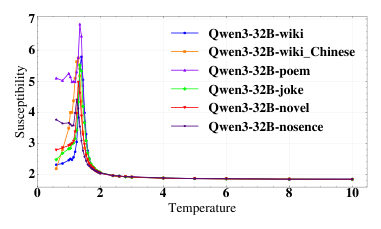 
Figure 1: Susceptibility χ vs. temperature T for (a) different model scales using Wikipedia prompts (1000 samples, 280 tokens). All models exhibit a peak near Tc ≈1.4, with larger models showing higher peak susceptibility. (b) Different prompt categories generated by Qwen3-32B (1000 samples, 300 tokens).

📷 Fig 2

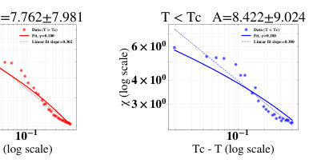 
Figure 2: Power-law fits of susceptibility near Tc for Qwen3-32B. (a) Full χ(T) curve with the fit region highlighted; (b) log-log plot for T &gt; Tc; (c) log-log plot for T &lt; Tc. Both sides yield a critical exponent γ ≈0.1, consistent with power-law divergence.

📷 Fig 3

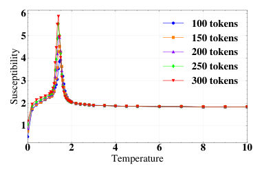 
Figure 3: Stability analysis of the susceptibility signal. (a) Convergence with increasing ensemble size Ns from 2 to 1000 samples; (b) Convergence with increasing sequence length from 100 to 300 tokens.

📷 Fig 4

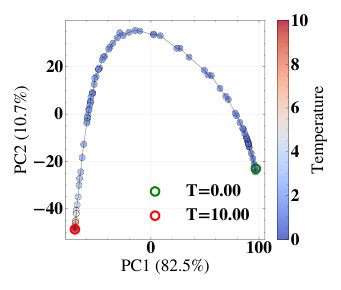 
Figure 4: Order parameter structure via PCA. (a) Projection onto the first two principal components (PC1 explains 82.5%, PC2 explains 10.7%), colored by temperature. Below Tc, ensemble outputs cluster tightly along a single direction; above Tc, they disperse. (b) Magnitude |⟨t⟩| and the first three principal component values vs. temperature, showing a sharp transition near Tc.

📷 Fig 5

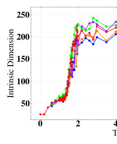 
Figure 5: Intrinsic dimension Id vs. temperature for five Qwen3 model scales. All models exhibit a minimum near Tc ≈1.3–1.5, after which Id rises sharply and saturates at high T, consistent with the onset of a disordered phase where the configuration space expands.

**Summary.** The authors apply statistical-field methods to analyze text generated by Large Language Models (LLMs), treating token embeddings as a physical system whose temperature is controlled by the softmax parameter $T$. They find evidence of a continuous phase transition at a critical temperature $T_c$, using diagnostics like susceptibility and intrinsic dimension. This suggests that LLM generation possesses an underlying collective statistical structure analogous to physical phase transitions.

**Why it may be interesting.** This work provides a powerful analogy between complex machine learning outputs and established concepts from critical phenomena theory, suggesting that LLM behavior can be characterized using tools developed for condensed matter physics.

Detailed structure

**Main problem.** The study aims to understand the underlying collective statistical structure of text generated by Large Language Models (LLMs) by treating token embeddings as a physical system.

**Main result.** The analysis reveals clear signatures consistent with a continuous phase transition near a critical temperature $T_c$, evidenced by sharp peaks in susceptibility, changes in an order parameter, and minima in intrinsic dimension.

**Method.** A statistical-field framework is employed, defining observables like susceptibility ($\chi$) and an order parameter ($\langle t 
angle$), alongside using the Two Nearest Neighbor (TwoNN) method to estimate the system's intrinsic dimension ($I_d$).

**Model / system.** The model treats LLM output as a one-dimensional chain of token embeddings, where the softmax temperature $T$ acts analogously to a thermodynamic temperature controlling sampling between deterministic and uniform regimes.

**Key observables.** Susceptibility ($\chi$), Order Parameter ($\langle t 
angle$), Intrinsic Dimension ($I_d$), and critical exponents ($\gamma$, $
u$).

**Important parameters / regimes.** The softmax temperature $T$ is the primary control parameter, with a characteristic critical temperature $T_c$ identified across different model scales.

**Assumptions / limitations.** The framework assumes that LLM generation can be mapped onto an effective statistical mechanics problem, though authors note the non-equilibrium nature of autoregressive generation requires further study.

**Figures summary.** Figures show $\chi(T)$ peaking near $T_c$, $\langle t 
angle$ changing sharply at $T_c$, and $I_d$ reaching a minimum near $T_c$ for various model sizes (Qwen3).

**Paper structure.** The paper introduces the statistical-field framework, applies diagnostics ($\chi, \langle t 
angle, I_d$) by varying temperature $T$, demonstrates consistent phase transition signatures across multiple models and scales, and concludes with implications for AI trustworthiness.

Abstract

We propose a statistical-field framework for text generated by large language models (LLMs), treating token embeddings as continuous spin variables on a one-dimensional chain. Defining a susceptibility from the connected two-point correlator and an order parameter from the ensemble-averaged embedding field, we vary the \texttt{softmax} temperature $T$ and observe a sharp susceptibility peak near a characteristic $T_c$ with power-law-like scaling, a concurrent rapid change in the order parameter, and a collapse onto a single semantic direction below $T_c$. The intrinsic dimension estimated by the two nearest neighbor (TwoNN) method independently corroborates these findings, reaching a minimum near $T_c$. Results are robust across model scales (Qwen3: 0.6B--32B) and prompt categories. While the phenomenology closely resembles a continuous phase transition, the non-equilibrium nature of autoregressive generation warrants further investigation. Our framework provides quantitative tools for probing the collective statistical structure of LLM outputs and suggests connections between decoding strategies and critical phenomena.

[↑ back to top](#top)

### [Nonreversible Gauge Fields in Fokker--Planck Dynamics: Supersymmetric Hamiltonians and Learned Finite Forces](http://arxiv.org/abs/2606.06412v1)

**Authors:** Masayuki Ohzeki  
**Type:** theory · **Category:** disordered systems and neural networks · **PDF:** <https://arxiv.org/pdf/2606.06412v1>  
**Analysis basis:** full PDF text, analyzed in chunks
**Topic relevance:** `methods for driven-dissipative` **3/5** · `non-equilibrium dynamics` **3/5** · `non-equilibrium universality` **2/5** · `Keldysh / 2PI / non-Gaussian methods` **1/5** · `correlated / nonlocal dissipation` **1/5** · `driven-dissipative phase transition` **1/5**

📷 Fig 1

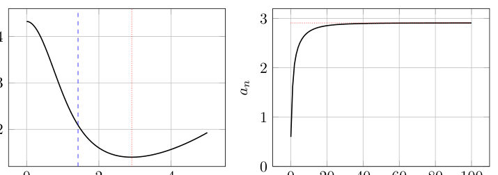 
FIG. 1. Finite-gauge learning in the anisotropic Gaussian OU benchmark (color online). In the left

📷 Fig 2

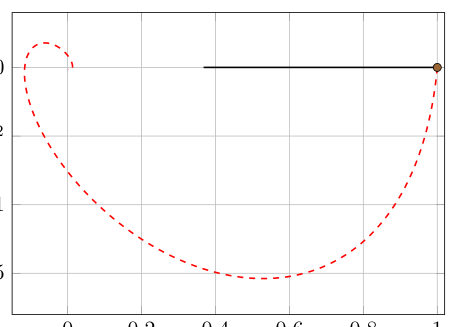 
FIG. 2. Mean trajectory in the anisotropic Gaussian OU benchmark from µ0 = (1, 0)T (color

📷 Fig 3

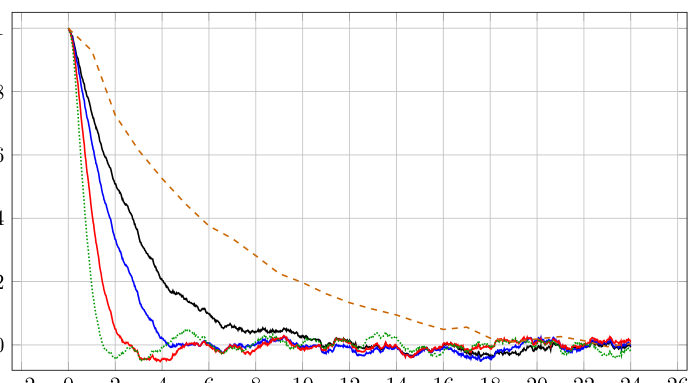 
FIG. 3. Relaxation of the mean position in the double-well model (color online). The black, blue,

**Summary.** This paper unifies the study of stochastic processes by treating nonreversible perturbations as gauge fields within the Fokker-Planck framework. It introduces an optimal control method using Actor-Critic techniques to learn the best nonreversible force that accelerates sampling without altering the true equilibrium distribution. This has significant implications for understanding advanced MCMC and optimization algorithms.

**Why it may be interesting.** This work provides a powerful mathematical language (gauge theory) to analyze non-equilibrium dynamics in ML optimization, connecting concepts from quantum Hamiltonians/supersymmetry to practical stochastic gradient methods.

Detailed structure

**Main problem.** The work develops an operator-theoretic framework for designing nonreversible perturbations to Fokker-Planck dynamics while ensuring the stationary probability density remains unchanged.

**Main result.** The authors show that optimal control of relaxation spectra can be achieved by learning a gauge field strength, which balances finite-time convergence speed against the cost of the applied nonreversible force.

**Method.** The problem is formulated as an optimal control problem solved using Actor-Critic methods, minimizing a regularized objective function derived from simulating forward Fokker-Planck dynamics under candidate gauge fields.

**Model / system.** The system models stochastic processes governed by Fokker-Planck equations, applied to optimization algorithms like Stochastic Gradient Langevin Dynamics (SGLD). The dynamics are analyzed using supersymmetric Hamiltonian formulations and nonreversible gauge potentials.

**Key observables.** Spectral gap ($\Delta$), stationary current ($J_{\pi}$), finite-time relaxation error ($\mathbb{E}[f_a(	heta)] - \mathbb{E}_{\pi}[f_a(	heta)]]$), and the learned gauge strength ($\gamma$ or $a^*_\lambda$).

**Important parameters / regimes.** The regularization parameter $\lambda$, the time horizon $	au$, and the gauge field parameters ($\psi$ or $\gamma$).

**Assumptions / limitations.** The analysis relies on approximations like matching conditional moments to an Itô SDE, and the selection of a finite-time objective function is necessary because spectral gap alone is insufficient.

**Figures summary.** Figures compare trajectories in Gaussian benchmarks (showing chiral acceleration) and analyze relaxation in double-well potentials, contrasting reversible dynamics with those driven by learned nonreversible gauges.

**Paper structure.** The paper builds from the general operator view of stationary-density-preserving perturbations as gauge fields, develops the optimal control objective using Actor-Critic methods, and validates this framework on anisotropic Gaussian and double-well benchmarks.

Abstract

We formulate stationary-density-preserving nonreversible perturbations of Fokker--Planck dynamics as gauge fields that deform relaxation spectra while leaving the invariant state fixed. When detailed balance holds, a similarity transformation maps the reversible Fokker--Planck operator to a Witten-Laplacian-type supersymmetric Hamiltonian; nonreversible gauges then appear as non-Hermitian perturbations that preserve the zero mode but modify the excited spectrum. This operator viewpoint gives a common language for relaxation gaps, circulating probability currents, hypocoercive acceleration, and finite control costs. We represent admissible gauge currents by antisymmetric tensor fields and identify the detailed-balance-violating Ohzeki--Ichiki force as a constant symplectic example whose infinite-strength limit is Hamiltonian dynamics. The continuous-time spectral gap alone does not select a finite gauge strength, so we introduce a finite-time regularized objective and an actor--critic procedure for learning the gauge. An exactly solvable anisotropic Gaussian Ornstein--Uhlenbeck benchmark separates the spectral transition from the finite-time optimum and shows that the learned gauge recovers the Lyapunov-equation optimum. A double-well benchmark then illustrates the same constrained selection in a nonconvex metastable landscape. Stochastic gradient methods enter this framework as physically relevant Fokker--Planck systems: mini-batch noise acts as an effective diffusion tensor, and adaptive methods such as Adam correspond to metric choices with possible nonequilibrium currents.

[↑ back to top](#top)

### [Complexity of the Laughlin wave function from the Dyson-orbital perspective](http://arxiv.org/abs/2606.05502v1)

**Authors:** J. M. Zhang, Y. Liu  
**Type:** theory · **Category:** strongly correlated electrons · **PDF:** <https://arxiv.org/pdf/2606.05502v1>  
**Analysis basis:** full PDF text, analyzed in chunks
**Topic relevance:** `entanglement & information structure` **3/5** · `Keldysh / 2PI / non-Gaussian methods` **2/5** · `analog quantum simulation` **2/5** · `correlated cavity matter` **1/5** · `methods for driven-dissipative` **1/5** · `non-equilibrium dynamics` **1/5**

📷 Fig 1

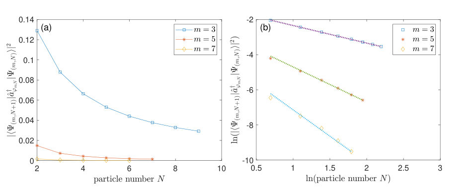 
Figure 1: Overlap |⟨Ψ(m,N+1)|ˆa† ϕmN |Ψ(m,N)⟩|2, which is the maximum of |⟨Ψ(m,N+1)|ˆa† f |Ψ(m,N)⟩|2, as a function of the particle number N and for different filling factors 1/m. Both panels display the same data, but the right one employs logarithmic scales. The dotted straight lines there are guides for the eye. They are of slope −1, −2, −3 for m = 3, 5, 7, respectively, indicating power-law decays of the overlap with respect to the particle number N.

📷 Fig 2

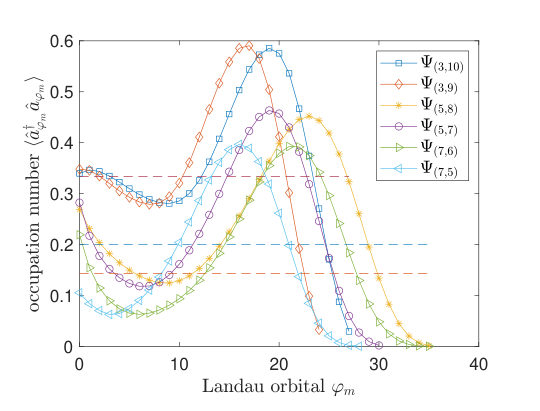 
Figure 2: Occupation numbers of the Landau orbitals (22) for some Laughlin wave functions Ψ(m,N). The three dashed horizontal lines indicate the values of 1/3, 1/5, and 1/7.

📷 Fig 3

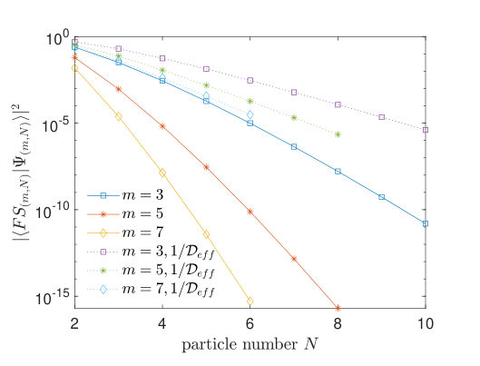 
Figure 3: Overlap between the Laughlin wave function Ψ(m,N) and the fictitious Fermi sea |F S(m,N)⟩, which is constructed out of the successive Dyson orbitals as in (26). For comparison, the dotted lines indicate the value of 1/Deff .

📷 Fig 4

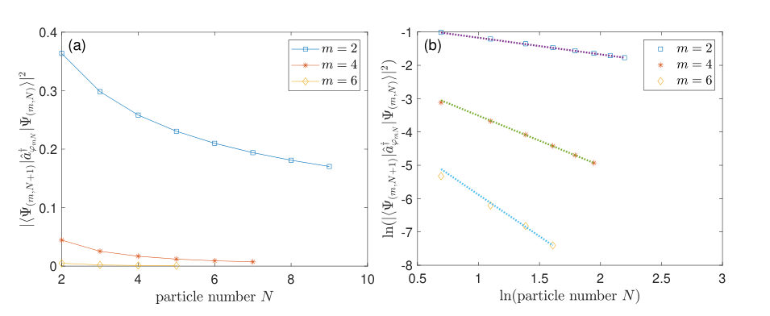 
Figure 4: (Similar to Fig. 1, but for the bosonic case) Overlap |⟨Ψ(m,N+1)|ˆa† ϕmN |Ψ(m,N)⟩|2, which is the maximum of

📷 Fig 5

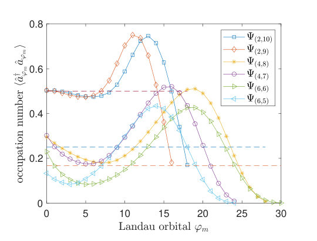 
Figure 5: (Similar to Fig. 2, but for the bosonic case) Occupation numbers of the Landau orbitals (22) for some Laughlin wave functions Ψ(m,N). The two dashed horizontal lines indicate the values of 1/2, 1/4, and 1/6.

**Summary.** This theoretical paper introduces the Dyson orbital as a diagnostic tool to measure the complexity of interacting fermionic wave functions. Applying this tool to the Laughlin state, the authors provide quantitative evidence that such strongly correlated states are fundamentally non-Fermi liquid, evidenced by specific power-law decays in particle addition overlaps.

**Why it may be interesting.** While focused on condensed matter theory, the use of an orbital basis (Landau orbitals) and diagnostics based on single-particle addition/removal processes provides a generalizable mathematical framework for analyzing entanglement and correlations in complex quantum many-body systems relevant to AMO physics.

Detailed structure

**Main problem.** The paper aims to characterize the complexity of fermionic wave functions that deviate from simple Fermi sea descriptions, particularly in strongly correlated systems.

**Main result.** By analyzing the overlap using Dyson orbitals, the authors quantitatively demonstrate that the Laughlin wave function describes a non-Fermi liquid state, characterized by specific power-law decays.

**Method.** The core method involves defining and calculating an overlap functional related to the Dyson orbital ($\phi_D$), which measures how adding one particle changes the ground state wavefunction.

**Model / system.** The study focuses on the Laughlin wave function, a model used to describe strongly correlated electron systems, specifically those relevant to the Fractional Quantum Hall Effect. It contrasts this with the simple noninteracting Fermi sea.

**Key observables.** The maximal overlap $O_{\max} = \|	ilde{\phi}_D\|^2$, which quantifies the connection between successive ground states; occupation numbers of Landau orbitals.

**Important parameters / regimes.** Filling factor ($m$), particle number ($N$); the decay exponent $eta = -(m-1)/2$.

**Assumptions / limitations.** The analysis relies on the ability to analytically determine or calculate the Dyson orbital for specific, highly structured wave functions like the Laughlin state.

**Figures summary.** Figures show $O_{\max}$ decaying with particle number $N$ following a power law (e.g., slopes $-1, -2, -3$), and illustrate that Landau orbitals serve as natural orbitals for the Laughlin states.

**Paper structure.** The paper first introduces Dyson orbitals as a diagnostic tool to measure wave function complexity, contrasting Fermi seas with correlated states. It then applies this formalism specifically to the Laughlin wave function, deriving quantitative evidence of its non-Fermi liquid nature through power-law decay analysis.

Abstract

The Fermi sea is a simple and common concept in physics. However, a related and equally simple concept -- the Dyson orbital -- is far less discussed in physics, especially in textbooks. Yet, Dyson orbitals offer a valuable tool for characterizing the complexity of a fermionic wave functions, particularly in distinguishing between Fermi-sea-like and non-Fermi-sea-like states. As a preliminary application, we examine the Laughlin wave function and find the fortunate fact that the Dyson orbitals can be determined analytically. Further numerical data provides \emph{quantitative} evidence that the Laughlin wave function describes a strongly correlated, non-Fermi liquid state.

[↑ back to top](#top)

### [Discovery of hidden order in the Shastry-Sutherland magnet Nd2Be2GeO7](http://arxiv.org/abs/2606.06279v1)

**Authors:** Andi Liu, Samuel H. Moody, Thomas J. Hicken, Jonas A. Krieger, Hubertus Luetkens, George D. A. Wood, Helen C. Walker, Zhendong Fu, Jason S. Gardner, Jinkui Zhao, Zhaoming Tian, Hanjie Guo  
**Type:** experiment · **Category:** strongly correlated electrons · **PDF:** <https://arxiv.org/pdf/2606.06279v1>  
**Analysis basis:** full PDF text, analyzed in chunks
**Topic relevance:** `analog quantum simulation` **3/5** · `exotic spin models in light-matter` **3/5** · `driven-dissipative phase transition` **2/5** · `methods for driven-dissipative` **1/5** · `spintronics-quantum-optics interface` **1/5**

📷 Fig 1

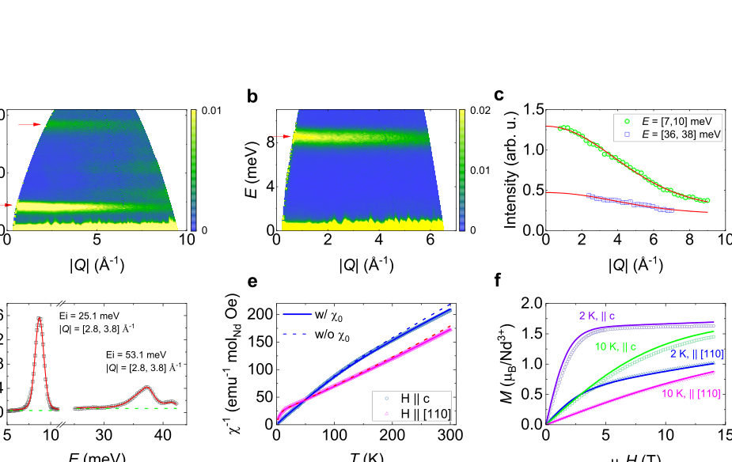 
FIG. 1. Crystal electric field excitations. a-b, Inelastic neutron scattering intensity maps collected with incident neutron energies Ei of 53.1 and 25.1 meV, respectively, at 5 K. The red arrows indicate the CEF excitations. c, Momentum transfer (|Q|) dependence of the integrated intensities (I ) for the excitations at around 9 and 37 meV. The red curves are fits according to the form factor of Nd3+, I = I0f 2(Q) + Ibg, where I0 and Ibg are fitting parameters. d, Energy (E) dependence of the intensities integrated over |Q| along with a CEF fit. The green dashed lines are backgrounds. The error bars in c-d correspond to statistical errors equal to the square root of the intensities. e,...

📷 Fig 2

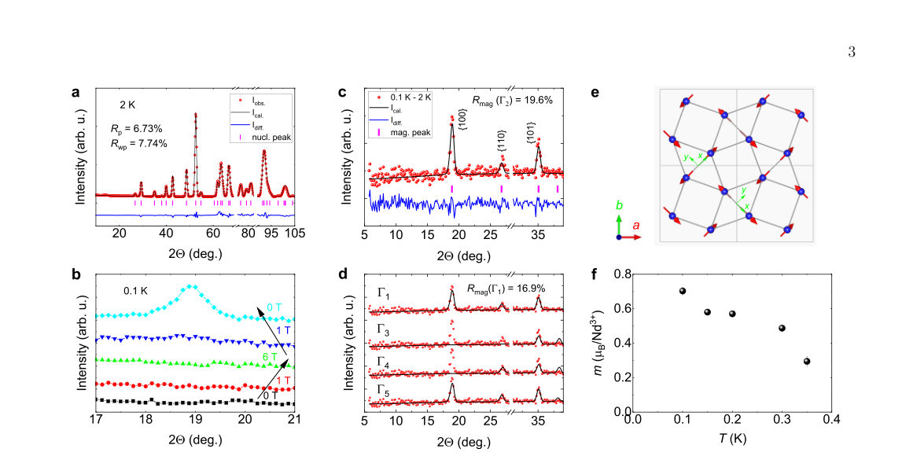 
FIG. 2. Neutron diffraction measurements. a, Neutron powder diffraction pattern for Nd2Be2GeO7 collected at 2 K, along with a Rietveld refinement based on the crystal structure with the space group P¯421m. The excluded regions correspond to the peaks from the copper holder and the aluminum from the cryostat. b, Evolution of the low-angle intensities under a magnetic field cycled from 0 T to 6 T and back to 0 T at 0.1 K. c, Magnetic structure refinement based on the irreducible representation (IR) Γ2 against the difference pattern (I0.1 K −I2 K). d, Representative refinements based on other IRs. e, Magnetic structure for Nd2Be2GeO7 based on the best refinement according to Γ2. The red and green...

📷 Fig 3

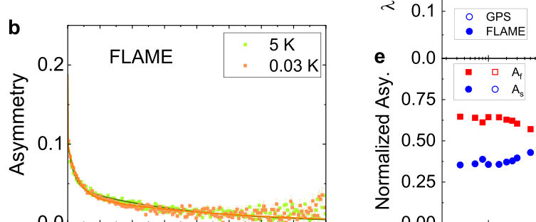 
FIG. 3. Zero-field µSR measurements. a-b, Representative zero-field µSR spectra measured at various temperatures on the GPS and FLAME spectrometers, respectively. The solid curves are fits according to Eq. 1. c-d, Temperature dependence of the fast and slow muon spin relaxation rate λf and λs. e, Temperature dependence of the amplitudes Af and As. The error bars in a-b and c-e correspond to statistical errors and standard errors from the fits, respectively.

📷 Fig 4

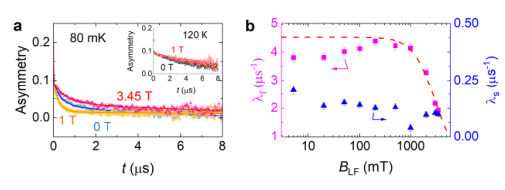 
FIG. 4. Longitudinal-field µSR measurements. a, Representative µSR spectra measured at various external magnetic fields at 80 mK. The solid curves are fits according to Eq. 1. The inset shows the LF measurements at 120 K. The error bars are statistical errors. b, Temperature dependence of the relaxation rates λf and λs. The error bars are standard errors of the fits. The red curve is a fit to λf as described in the text.

**Summary.** This work investigates the hidden-order state in the frustrated magnet Nd2Be2GeO7 using multiple advanced techniques like muSR and neutron diffraction. The key finding is that magnetic order appears only after field cycling, suggesting a unique ground state governed by spin-orbit coupling and frustration. This establishes the material as a distinct platform for studying quantum phase transitions.

**Why it may be interesting.** The history-dependent emergence of magnetic order upon field cycling is a hallmark of complex quantum phase transitions, providing experimental evidence for exotic correlated states near quantum criticality.

Detailed structure

**Main problem.** The study investigates a 'hidden order' state in the frustrated Shastry-Sutherland magnet Nd2Be2GeO7, characterized by thermodynamic anomalies without conventional magnetic ordering signatures.

**Main result.** The system exhibits a hidden-order phase whose magnetic signature only emerges after cycling an applied magnetic field, suggesting proximity to quantum spin liquid or long-range ordered states.

**Method.** A combination of techniques was used, including specific heat measurements, zero-field and longitudinal-field muon spin relaxation (muSR), neutron diffraction, and Electron Spin Resonance (ESR).

**Model / system.** The physical system is the Shastry-Sutherland magnet Nd2Be2GeO7. The magnetic behavior is modeled by considering the interplay of spin-orbit coupling, crystal field effects, and magnetic frustration.

**Key observables.** Sharp specific heat anomaly at 250 mK; absence of static magnetism in zero-field muSR/neutron diffraction; appearance of magnetic Bragg peaks only after field cycling; coherent spin fluctuations on the order of gigahertz.

**Important parameters / regimes.** The excitation gap ($\Delta$ or $\delta$) is consistently found around $8.5 - 8.7$ meV; fluctuation rates ($
u$) are in the GHz range.

**Assumptions / limitations.** The analysis assumes that the observed phenomena can be explained by a combination of CEF effects, magnetic frustration, and proximity to quantum critical points.

**Figures summary.** Figures show CEF excitations via INS, evolution of neutron diffraction intensities under field cycling (Fig. 2b), and temperature dependence of susceptibility/magnetization.

**Paper structure.** The paper progresses by establishing the hidden-order nature through multiple measurements (specific heat, muSR, NPD). It then uses detailed analysis of CEF excitations and field response to distinguish this state from known frustrated magnets, culminating in a discussion of its unique quantum ground state.

Abstract

Hidden order typically manifests as a thermodynamic phase transition without a conventional order parameter, leaving its true nature concealed even at the lowest temperatures. In the frustrated Shastry-Sutherland magnet Nd$_2$Be$_2$GeO$_7$, we observe a related yet fundamentally distinct phenomenon. A sharp specific-heat anomaly appears at 250 mK, but zero-field neutron diffraction and muon spin relaxation detect no static magnetism down to 100 and 30 mK, respectively, pointing to a hidden-order state. Remarkably, this hidden order does not emerge under an applied magnetic field, but instead reveals itself only after the field is applied and subsequently removed where magnetic Bragg peaks appear, albeit with strongly suppressed moments. A glassy state is ruled out by ac susceptibility and specific heat measurements. Complementary $μ$SR measurements reveal coherent spin fluctuations at a rate on the order of gigahertz. Taken together, these results suggest that the system lies in close proximity to the quantum spin liquid and long-range magnetic order state such that a small perturbation can effectively drive the system towards distinct ground states. These findings also distinguish Nd$_2$Be$_2$GeO$_7$ from known frustrated systems, establishing it as a unique platform where the synergistic interplay among the spin-orbit coupling, crystal field, and magnetic frustration leads to unexpected quantum states.

[↑ back to top](#top)

### [Thermalization with Gaussian Quantum Cellular Automata](http://arxiv.org/abs/2606.05542v1)

**Authors:** Roman Geiko, Jake Gerenraich  
**Type:** theory · **Category:** statistical mechanics · **PDF:** <https://arxiv.org/pdf/2606.05542v1>  
**Analysis basis:** full PDF text, analyzed in chunks
**Topic relevance:** `non-equilibrium dynamics` **3/5** · `non-equilibrium universality` **2/5** · `Keldysh / 2PI / non-Gaussian methods` **1/5** · `analog quantum simulation` **1/5** · `driven-dissipative phase transition` **1/5** · `entanglement & information structure` **1/5** · `scars & prethermalization` **1/5**

📷 Fig 1

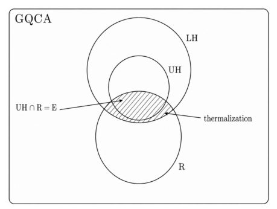 
Fig. 1 LH, UH, R, and E stand for the local and uniform hyperbolicity, regularity and everydayness, respectively. The shaded region LH ∩R contains the GQCAs for which we prove thermalization.

**Summary.** The paper rigorously proves that many-body bosonic lattice systems evolving under Gaussian Quantum Cellular Automata (GQCAs) thermalize to infinite temperature if the dynamics exhibit sufficient hyperbolic properties. The proof relies on advanced techniques from functional analysis, generalizing the Riemann–Lebesgue lemma to show that local observables lose memory of their initial state over time.

**Why it may be interesting.** This work provides rigorous, mathematically deep criteria for when quantum systems governed by simple, local rules will reach equilibrium, which is a cornerstone problem in non-equilibrium statistical mechanics and quantum information theory.

Detailed structure

**Main problem.** The central problem is rigorously establishing conditions on quantum dynamics (Gaussian Quantum Cellular Automata) that guarantee thermalization—the approach to infinite temperature equilibrium—for many-body bosonic lattice systems.

**Main result.** Thermalization is proven under two sufficient conditions: global hyperbolicity or local hyperbolicity combined with regularity, leading to the decay of expectation values of local Weyl operators towards the infinite-temperature state.

**Method.** The analysis uses techniques from functional analysis and operator theory, generalizing the Riemann–Lebesgue lemma to bound expectation values $\omega(W(\xi_k))$ by exploiting exponential growth in phase space combined with finite density moment conditions.

**Model / system.** The system consists of bosonic lattice systems on $\mathbb{Z}^d$ whose time evolution is governed by translation-invariant Gaussian Quantum Cellular Automata (GQCAs). The dynamics are analyzed via the action on local Weyl operators $W(\xi)$.

**Key observables.** Local Weyl operators $\omega(W(\xi))$, expectation values of local observables, and the particle density moment $\omega_{
ho_\Gamma}(N_\Gamma)$.

**Important parameters / regimes.** The lattice dimension $d$, the hyperbolicity constants ($\gamma$), and the uniform bound on the particle density $
u$.

**Assumptions / limitations.** The initial state must be locally normal, and the dynamics must satisfy specific hyperbolic conditions (global or local) related to the symplectic map $\Phi$ governing the evolution.

**Figures summary.** Not specified in the notes; the structure relies on theorems and lemmas establishing decay rates based on spectral properties of the underlying maps.

**Paper structure.** The paper builds from defining the necessary mathematical tools (Weyl algebra, local normality) to deriving key estimates (Riemann-Lebesgue generalization via commutator norms), culminating in proving thermalization under specific hyperbolic conditions for the GQCA dynamics.

Abstract

We study the long-time dynamics of many-body bosonic lattice systems under translation-invariant Gaussian quantum cellular automata. We formulate two sets of conditions on GQCAs which separately guarantee thermalization of any state on the local Weyl algebra to the infinite temperature state, whenever the state is locally normal and has uniformly bounded particle density. Our main intermediate result is a quantum many-body generalization of the classic Riemann-Lebesgue lemma which is a bound on expectation values of local Weyl operators involving their support and the state's particle density.

[↑ back to top](#top)

### [Opinion dynamics on social proximity disordered networks](http://arxiv.org/abs/2606.05349v1)

**Authors:** Fellipe Aranha, Giuliano G. Porciúncula, Adauto J. F. de Souza, Paulo R. A. Campos, André L. M. Vilela  
**Type:** theory · **Category:** statistical mechanics · **PDF:** <https://arxiv.org/pdf/2606.05349v1>  
**Analysis basis:** full PDF text, analyzed in chunks
**Topic relevance:** `non-equilibrium universality` **3/5** · `driven-dissipative phase transition` **2/5** · `Frenkel-Kontorova` **1/5** · `methods for driven-dissipative` **1/5** · `non-equilibrium dynamics` **1/5**

📷 Fig 1

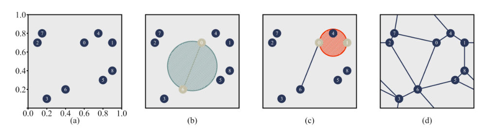 
Fig. 1. Illustration of Gabriel graph construction from spatially distributed agents. (a) Initial spatial distribution of agents embedded in a two-dimensional 1 × 1 domain. (b) Candidate connection between nodes 0 and 6. The hatched green circle represents the disk whose diameter is defined by the candidate edge. Since no other node lies inside the disk, the connection satisfies the Gabriel condition and is accepted. (c) Candidate connection between nodes 0 and 1. In this case, node 4 lies inside the corresponding disk, denoted by the hatched red circle, violating the Gabriel condition and preventing edge formation. (d) Gabriel graph obtained after testing all node pairs according to the...

📷 Fig 2

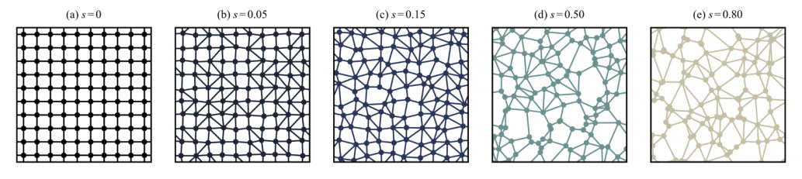 
Fig. 2. Structural evolution of Gabriel graph social networks under increasing spatial disorder. Increasing disorder progressively breaks the lattice’s geometric regularity, alters local connectivity patterns, and generates heterogeneous proximity-based interaction structures. Representative realizations of the interaction networks for different disorder levels s: (a) s = 0, corresponding to the regular square-lattice regime; (b) s = 0.05, where weak positional perturbations introduce local diagonal connections; (c) s = 0.15, associated with the connectivity-enhanced regime and near maximum average coordination; (d) s = 0.50, where the network becomes spatially heterogeneous with irregular...

📷 Fig 3

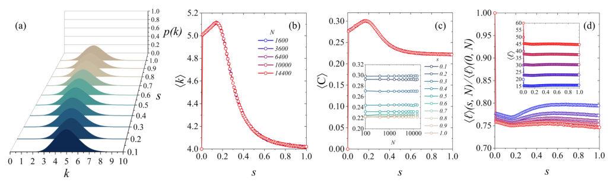 
Fig. 3. Structural properties of Gabriel graph social networks under spatial disorder. (a) Dependence of the degree distribution p(k) with increasing disorder parameter s for N = 14400. Weak disorder shifts the distributions toward larger connectivities, while stronger disorder progressively broadens the distributions and moves them toward lower coordination values. (b) Average connectivity ⟨k⟩as a function of s for different system sizes N, revealing a disorder-induced connectivity enhancement followed by a gradual suppression toward the spatially random regime. (c) Average clustering coefficient ⟨C⟩as a function of s. Weak geometric disorder initially increases local clustering, while...

📷 Fig 4

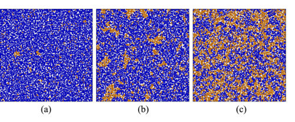 
Fig. 4. Collective opinion patterns for increasing nonconformity levels. Snap- shots of a simulation on a Gabriel graph network with s = 0.5, N = 104 and increasing nonconformity q. Blue and orange nodes represent agents holding oppo- site opinions. (a) Ordered consensus regime at q = 0.036. (b) Critical region near the consensus–dissent transition at q = 0.073. (c) Disordered dissensus regime at q = 0.146.

📷 Fig 5

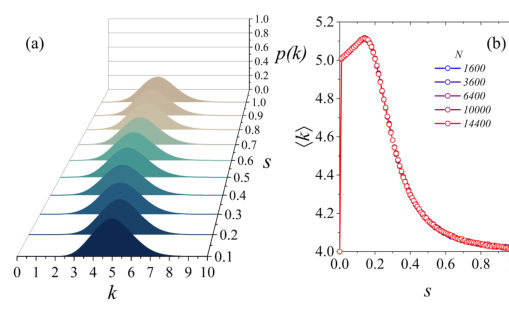 
Fig. 3(c) shows the average clustering coefficient ⟨C⟩, which quanti- fies the tendency of neighboring agents to form locally interconnected groups. In the regular lattice regime of s = 0, the clustering coefficient vanishes because square lattices do not contain triangular neighbor- hoods. Introducing weak disorder rapidly increases ⟨C⟩, reflecting the emergence of local triangular connections and community-like struc- tures generated by positional perturbations. For larger disorder levels, the clustering coefficient stabilizes around an intermediate value, indi- cating that local social cohesion persists even in strongly disordered proximity networks. The inset further shows that...

**Summary.** This paper models opinion dynamics on social networks whose connections are governed by physical proximity (Gabriel graphs). By introducing controlled spatial disorder, the authors study the resulting consensus-dissent phase transitions. They rigorously demonstrate that despite geometric heterogeneity, the critical behavior remains universal, matching the 2D Ising model predictions.

**Why it may be interesting.** The work provides a concrete example of how geometric embedding and local interaction rules can constrain the critical exponents of complex systems, suggesting that dimensionality is dictated by topology rather than just connectivity structure.

Detailed structure

**Main problem.** The study investigates how local social pressure, mediated by geometric proximity constraints, shapes collective opinion formation dynamics.

**Main result.** The model exhibits second-order phase transitions whose critical behavior remains compatible with the two-dimensional Ising universality class, regardless of moderate levels of spatial disorder.

**Method.** Analysis involves simulating majority-vote opinion dynamics on Gabriel graphs and characterizing criticality using finite-size scaling techniques (magnetization, susceptibility, Binder's cumulant).

**Model / system.** The system models social opinion dynamics ($\sigma_i = \pm 1$) where interactions are restricted by the geometric proximity rule of Gabriel graphs. Disorder is introduced via random displacement parameters ($s$), and consensus breakdown is controlled by a nonconformity parameter ($q$).

**Key observables.** Magnetization, susceptibility, Binder's fourth-order cumulant, critical exponents ($eta/
u$, $\gamma/
u$, $1/
u$).

**Important parameters / regimes.** Geometric disorder strength ($s$), Nonconformity level ($q$), System size ($L$ or $N$).

**Assumptions / limitations.** The analysis assumes that the system's critical behavior can be accurately described by either volumetric or standard hyperscaling relations, and that planar, spatially constrained networks retain dimensionality $d=2$.

**Figures summary.** Figures illustrate Gabriel graph construction (showing proximity rules), structural evolution under disorder ($s$), and data collapse plots for finite-size scaling analysis using both linear and volumetric methods.

**Paper structure.** The paper systematically analyzes the structure of Gabriel graphs as a function of disorder ($s$) to determine network metrics ($\langle k 
angle, \langle C 
angle, \langle \ell 
angle$). It then links these structural changes to the critical behavior of opinion dynamics by varying nonconformity ($q$), culminating in rigorous finite-size scaling tests confirming Ising universality.

Abstract

Understanding how local social pressure shapes collective opinion formation is essential in modern society, with implications in sociology, politics, finance, and technology. Complex networks are a powerful framework for investigating these processes and for representing social interactions in emergent phenomena, and canonical models such as random, scale-free, and small-world networks remain most relevant when Euclidean geometric proximity and contiguous interactions are not the dominant organizing factors. Our investigation explores the effects of Gabriel graphs, a spatially embedded network that utilizes proximity-based interactions, on social opinion dynamics. Using a geometric disorder parameter that randomly displaces agent coordinates, we transition from square lattices of social interactions to spatial random networks that preserve local constraints while introducing strong topological heterogeneity. Opinion dynamics operate through social pressure, with a level of nonconformity that affects dissent among opinions. We analyze magnetization, susceptibility, and Binder's fourth-order cumulant to characterize the emergence and breakdown of global social consensus. The model exhibits second-order phase transitions whose behavior depends on both geometric disorder and nonconformity levels. We use volumetric scaling and provide a reference frame appropriate for characterizing criticality in regular and heterogeneous interaction topologies. We find that the standard critical exponents remain compatible with the two-dimensional Ising universality class. Furthermore, the results suggest that spatially constrained, planar, and globally connected interaction topologies preserve the dimensionality of space in critical dynamics analysis.

[↑ back to top](#top)

### [Study on the validity of IPT+parquet method as an impurity solver in DMFT focusing on orbital fluctuations](http://arxiv.org/abs/2606.05822v1)

**Authors:** Aira Yamada, Ryota Mizuno, Masayuki Ochi, Kazuhiko Kuroki, Takuma Ohashi  
**Type:** theory · **Category:** strongly correlated electrons · **PDF:** <https://arxiv.org/pdf/2606.05822v1>  
**Analysis basis:** full PDF text, analyzed in chunks
**Topic relevance:** `Keldysh / 2PI / non-Gaussian methods` **3/5** · `analog quantum simulation` **3/5** · `Kondo & dissipative impurity` **1/5** · `methods for driven-dissipative` **1/5**

📷 Fig 1

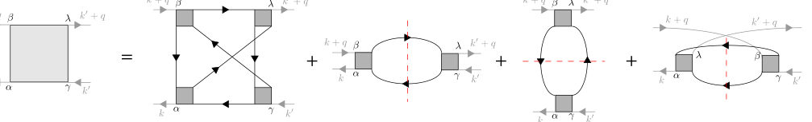 
FIG. 1. The decomposition of the full vertex. The full vertex can be divided into four parts: the fully irreducible part (Λ) and the reducible parts (Φl, l = ph, ph, pp). The reducible vertices Φl can be divided into two parts by cutting a pair of Green’s functions as indicated by the red dashed lines.

📷 Fig 2

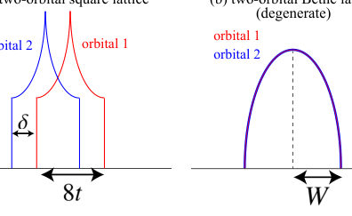 
FIG. 2. The noninteracting density of states of the models. Left and right panels show the density of states of two-orbital square lattice and two-orbital Bethe lattice, respectively.

📷 Fig 3

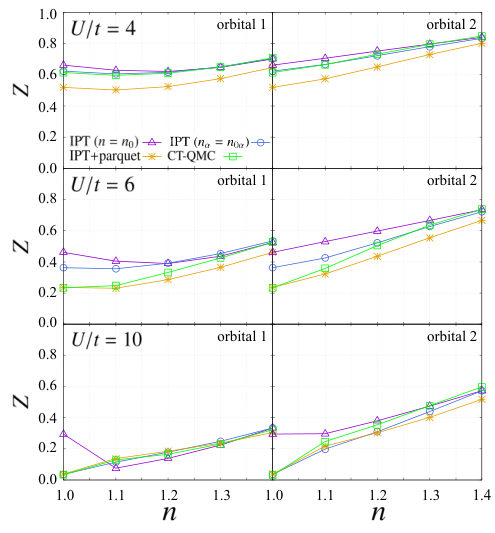 
FIG. 3. The band filling n dependence of the quasiparticle weight Z of the two-orbital square lattice model. The temperature is T/t = 0.2 and the on-site energy difference is δ/t = 1.6. Triangle, circle, as- terisk, and square symbols (purple, blue, khaki, and green lines) rep- resent IPTn=n0, IPTnα=n0α, IPT+parquet, and CT-QMC, respectively. Top, middle, and bottom panels show the quasiparticle weight Z at U/t = 4, 6, 10, respectively. The left and right panels indicate orbital 1 and orbital 2, respectively.

📷 Fig 4

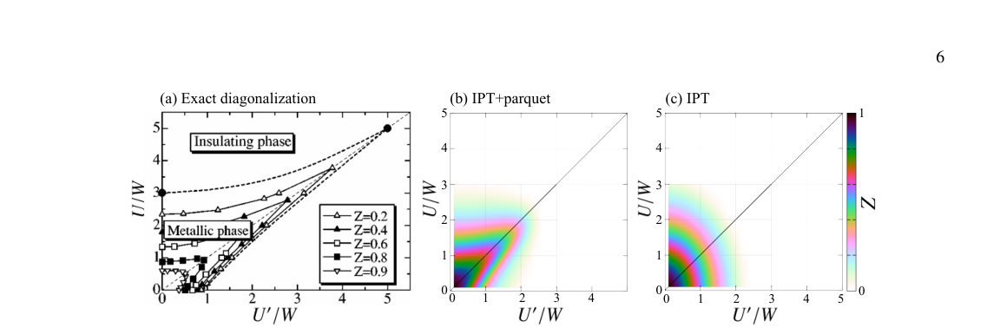 
FIG. 4. The interaction strength (U, U′) dependence of the quasiparticle weight Z of the two-orbital Bethe lattice model obtained by (a) Exact diagonalization, (b) IPT+parquet, and (c) IPT, respectively. The Hund coupling and pair hopping are fixed as J = J′ = 0. The temperatures are (a) T/W = 0 and (b), (c) T/W = 0.005, respectively. Left figure is taken from Ref. [12].

📷 Fig 5

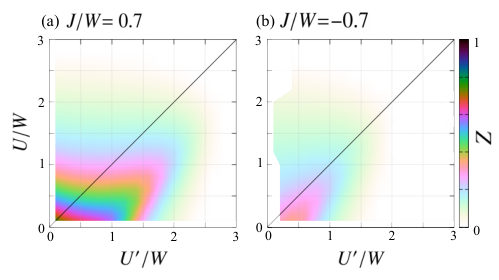 
FIG. 5. The interaction strength (U, U′) dependence of the quasi- particle weight Z of the two-orbital Bethe lattice model obtained by IPT+parquet. The Hund coupling is (a) J/W = 0.7 and (b) J/W = −0.7, respectively. The pair hopping is J′ = 0. The tem- perature is T/t = 0.005.

**Summary.** This paper rigorously validates the IPT+parquet method as an advanced impurity solver for DMFT in multi-orbital systems. It demonstrates that this combined technique accurately captures subtle physics, particularly orbital fluctuations, which simpler methods fail to resolve. The work provides a reliable computational tool for studying strongly correlated materials beyond simple Hubbard models.

**Why it may be interesting.** While focused on condensed matter strongly correlated physics, the development of robust, scalable numerical solvers like IPT+parquet is a general computational tool relevant to any field requiring complex many-body simulations (e.g., quantum chemistry or AMO systems with strong interactions).

Detailed structure

**Main problem.** The study aims to validate the IPT+parquet method as a computationally inexpensive yet accurate impurity solver for Dynamical Mean Field Theory (DMFT), specifically focusing on its ability to capture orbital fluctuations in multiband systems.

**Main result.** IPT+parquet successfully captures competition between orbital fluctuation channels, which conventional IPT fails to describe. The inclusion of the parquet contribution is crucial for accurately modeling these multi-orbital Mott physics effects.

**Method.** The authors compare results from IPT+parquet against numerically exact solvers (like CT-QMC) and simpler approximations by analyzing the self-energy calculation within DMFT.

**Model / system.** The research uses a multiband Hubbard model, applied to two-orbital systems on both square lattices and Bethe lattices. The Hamiltonian includes hopping integrals and various Coulomb repulsion terms ($U, U', J, J'$).

**Key observables.** Quasiparticle weight ($Z_\alpha$), which probes correlation effects; band-filling ($n_\alpha$).

**Important parameters / regimes.** Interaction strengths ($U, U'$) and the ratio between them relative to Hund coupling ($J$); the system is studied near half-filling.

**Assumptions / limitations.** The method relies on combining Iterative Perturbation Theory (IPT) with the parquet equation. Modifications were necessary for stability when interaction parameters deviate from specific relationships (e.g., $U' = U -2J$).

**Figures summary.** Figures compare the quasiparticle weight ($Z$) as a function of filling or interaction strength across multiple methods (Exact, IPT+parquet, conventional IPT), demonstrating where agreement is achieved and where failures occur.

**Paper structure.** The paper first introduces the theoretical framework (DMFT, Parquet, IPT) and then validates IPT+parquet by applying it to two-orbital models on both square and Bethe lattices. Subsequent sections detail necessary modifications to the parquet calculation for improved stability.

Abstract

A breakdown of calculations with exact impurity solvers in the dynamical mean field theory in multiband systems easily occurs due to the expensive numerical cost. To overcome this practical difficulty, three of the present authors developed an inexpensive and reliable impurity solver by combining the iterative perturbation theory (IPT) and parquet equation, and named it IPT+parquet [R. Mizuno, et al., Phys. Rev. B 104, 035160 (2021).]. In this study, we validate IPT+parquet focusing on the orbital fluctuation by comparing the numerically exact impurity solvers. We confirm that IPT+parquet can capture competition between orbital fluctuation channels, which the conventional IPT cannot capture.

[↑ back to top](#top)

### [Early psychosis shows deviations in scaling behaviour within a critical regime](http://arxiv.org/abs/2606.06290v1)

**Authors:** Irem Topal, Paola Moreno Ancalmo, Guillermo Montana Valverde, Philipp Homan, Wolfram Hinzen  
**Type:** experiment · **Category:** statistical mechanics · **PDF:** <https://arxiv.org/pdf/2606.06290v1>  
**Analysis basis:** full PDF text, analyzed in chunks
**Topic relevance:** `non-equilibrium universality` **3/5** · `non-equilibrium dynamics` **2/5** · `Keldysh / 2PI / non-Gaussian methods` **1/5** · `driven-dissipative phase transition` **1/5**

📷 Fig 1

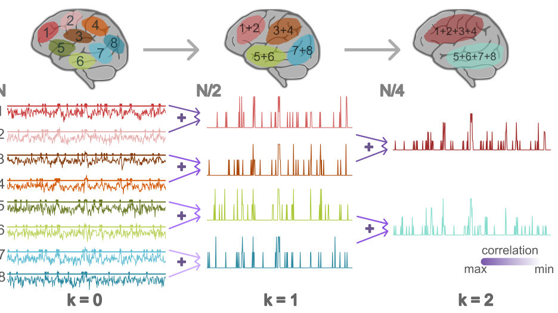 
Figure 1: Schematic illustration of the PRG procedure. Initially (k = 0), each variable is binarized inde- pendently. At each coarse-graining step k, pairs of maximally correlated variables are summed, generating clusters of size K = 2k and reducing the total number of clusters to NK = N/2k. Scaling properties are then evaluated as a function of the coarse-graining scale.

📷 Fig 2

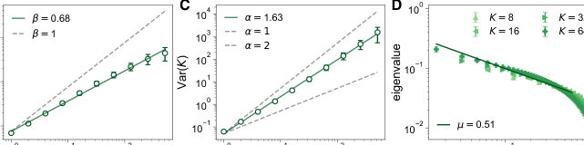 
Figure 2: Resting-state whole-brain activity reveals statistical signatures of criticality. A. Average probability distribution for normalized nonzero activity across 25 control subjects. Darker green indicates larger cluster sizes. B. Average log-probability of silence in coarse-grained variables (lnP0) as a function of cluster size, K. The solid line represents a linear least-squares fit of −lnP0 = Kβ, where β = 0.68. The gray dashed line indicates predicted behaviour of uncorrelated variables β = 1. C. Average variance (Var) of the non-normalized coarse-grained variables across subjects as a function of the cluster size, K. The solid line corresponds to the linear least-square fit, log V...

📷 Fig 3

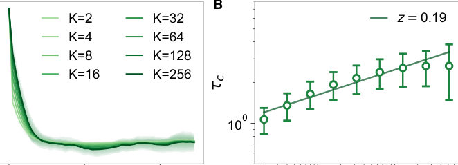 
Figure 3: Dynamic scaling under coarse-graining for healty controls. A. Average autocorrelation func- tions C(τ) for each cluster size K. For each subject, autocorrelations are computed and averaged across clusters; the curves shown correspond to the mean across subjects. Shaded regions indicate the standard de- viation. B. Autocorrelation time τc, obtained by fitting an exponential decay to the average autocorrelation function of each healthy subject individually. The points show the mean τc across controls as a function of K, with error bars denoting the standard deviation. A power-law scaling τc ∝Kz is observed; the reported exponent z = 0.19 is obtained from a least-squares fit to the...

📷 Fig 4

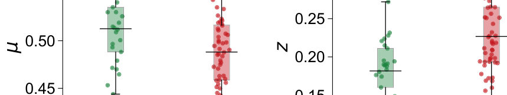 
Figure 4: Altered scaling exponents in early psychosis. Distributions of scaling exponents across subjects for healthy controls (green) and EP-patients (red). Each panel corresponds to a different exponent obtained from PRG analysis: A. silence probability exponent β, B. variance scaling exponent α, C. eigenspectrum exponent µ, and D. dynamical scaling exponent z. For each group, boxplots summarize the distribution of subject-level exponents, with boxes indicating the interquartile range and whiskers extending to the data range excluding outliers (fliers not shown). Horizontal black lines indicate group means. Statistical com- parisons between groups were performed using Welch’s t-tests,...

📷 Fig 5

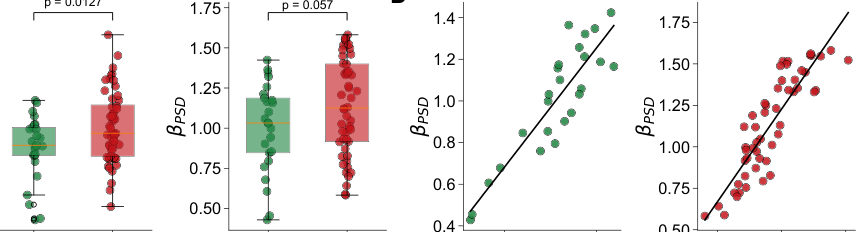 
Figure 5: Temporal scaling of global signals. A. Power spectra of global signals from individual control subjects shown in log-log scale. Each line corresponds to one subject. The dashed gray line indicates the frequency range used for estimating the scaling exponent βPSD. B. DFA plots of global signals from control subjects, showing the fluctuation function F(n) measured at different time-window lengths and plotted in double-logarithmic scale. Each line corresponds to one subject. The dashed gray line indicates the fitting range used to estimate the scaling exponent αDFA. C. Group differences. Boxplots display the median and interquartile range, with individual subjects overlaid....

**Summary.** This study analyzes resting-state fMRI data from early psychosis patients using advanced techniques rooted in statistical physics, including the Phenomenological Renormalization Group. By comparing scaling exponents across multiple observables, the authors argue that psychosis involves a reorganization of collective dynamics rather than a simple breakdown of critical organization. This provides a quantitative framework linking concepts from condensed matter physics to psychiatric neuroscience.

**Why it may be interesting.** This work applies concepts from critical phenomena and renormalization group theory—tools central to statistical mechanics—to analyze complex biological time series data (fMRI). The quantitative comparison of scaling exponents provides a rigorous physical framework for studying brain function.

Detailed structure

**Main problem.** The study investigates how large-scale brain activity organizes across space and time, specifically looking for deviations from critical scaling behavior in early psychosis compared to healthy controls.

**Main result.** Early psychosis is characterized not by a simple loss of critical dynamics, but rather by a systematic reorganization of collective dynamics within a preserved scale-invariant regime. This reorganization involves differential shifts in various scaling exponents ($eta$, $\alpha$, $\mu$, $z$).

**Method.** The researchers combined the Phenomenological Renormalization Group (PRG) framework with temporal analyses like Power Spectral Density (PSD) and Detrended Fluctuation Analysis (DFA) on resting-state fMRI data.

**Model / system.** The physical system is human brain activity measured via functional Magnetic Resonance Imaging (fMRI) BOLD signals. The analysis treats the collective dynamics as a complex, multi-scale system exhibiting critical-like organization.

**Key observables.** Scaling exponents ($eta$, $\alpha$, $\mu$, $z$), DFA exponent ($\alpha_{DFA}$), PSD exponent ($eta_{PSD}$), and characteristic time scales ($	au_c$).

**Important parameters / regimes.** The analysis is performed across multiple spatial/temporal scales (coarse-graining levels $K$) and uses various binarization thresholds (1 to 2 SD).

**Assumptions / limitations.** It assumes that the PRG framework provides a principled way to characterize collective dynamics, and that the observed scaling changes reflect underlying functional reorganization rather than mere noise artifacts.

**Figures summary.** Figures illustrate the progression of the PRG coarse-graining process, compare calculated exponents ($eta$, $\alpha$, etc.) between controls and patients across different thresholds, and show temporal scaling analyses (PSD/DFA) indicating altered long-range correlations in psychosis.

**Paper structure.** The paper follows a structure moving from establishing the theoretical framework (PRG, DFA) to applying it rigorously to fMRI data. It details preprocessing, presents results comparing healthy vs. patient groups across multiple scaling metrics, and concludes by synthesizing these findings into a model of dynamic reorganization.

Abstract

Accumulating evidence suggests that large-scale brain activity exhibits scale-invariant dynamics consistent with operation in a near-critical regime. Such dynamics have been associated with long-range correlations, efficient information processing, and the emergence of collective organization. While altered criticality-related measures have been reported in psychiatric disorders, previous findings remain fragmented across observables and modalities, making it unclear whether different scaling measures capture a common alteration of large-scale brain dynamics. Here, we investigated scaling properties in resting-state fMRI data from individuals with early psychosis and healthy controls. We combined a phenomenological renormalization group (PRG) framework with power spectral density (PSD) and detrended fluctuation analysis (DFA) to characterize collective dynamics across scales. In healthy controls, resting-state activity exhibited non-trivial scaling behavior consistent with critical-like organization. Early psychosis participants showed the same overall phenomenology of scale-invariant organization, but with systematic shifts in scaling exponents across multiple observables. These findings indicate that early psychosis is not characterized by a simple loss of critical-like dynamics, but rather by a reorganization of collective dynamics within a preserved scaling regime. More broadly, our results suggest that combining coarse-graining approaches with temporal scaling analyses provides a principled framework for studying large-scale brain dynamics in psychiatric disorders.

[↑ back to top](#top)

### [Multiple Quantum Hypothesis Testing: One-Shot Pairwise Bounds and Sharp Asymptotics](http://arxiv.org/abs/2606.06246v1)

**Authors:** Hao-Chung Cheng, Po-Chieh Liu  
**Type:** theory · **Category:** other · **PDF:** <https://arxiv.org/pdf/2606.06246v1>  
**Analysis basis:** full PDF text, analyzed in chunks
**Topic relevance:** `quantum measurements` **3/5** · `entanglement & information structure` **2/5** · `measurement-induced transitions` **1/5**

📷 Fig 1

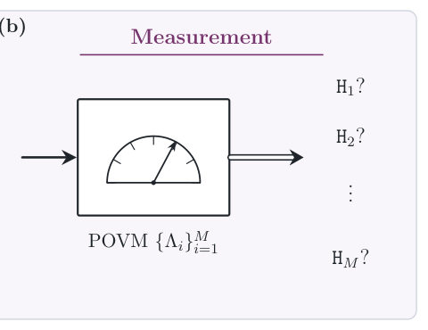 
Figure 1. Illustration of the multiple quantum hypothesis testing.

**Summary.** This paper rigorously analyzes the minimum error probability when distinguishing between multiple unknown quantum states. It establishes sharp bounds by connecting the problem to operator means (like the harmonic mean) and proves that these bounds are achievable asymptotically. The results settle long-standing conjectures regarding the performance limits of quantum hypothesis testing in infinite dimensions.

**Why it may be interesting.** This work provides fundamental theoretical tools—sharp error exponents and generalized divergence measures—that govern the limits of quantum measurement capabilities, which is crucial for understanding resource theories in quantum information processing.

Detailed structure

**Main problem.** The core problem is establishing rigorous, sharp error bounds for discriminating among multiple quantum states ($\{
ho_i\}$) in both finite-shot and asymptotic (many-copy) regimes.

**Main result.** The authors establish a dimension-free one-shot upper bound on the minimum probability of error and prove that this bound is achievable asymptotically, settling open problems regarding the multiple quantum Chernoff distance in infinite dimensions.

**Method.** The analysis employs advanced tools from quantum information theory, including deriving bounds using operator means (like the harmonic mean), applying large deviation theory (Cramér's condition), and utilizing techniques like spectral decomposition and local limit theorems.

**Model / system.** The system is general quantum hypothesis testing involving density operators $
ho_i$ on a separable Hilbert space. The test uses an optimal Positive Operator-Valued Measure (POVM) $\{\Lambda_i\}$ to minimize the error probability.

**Key observables.** Minimum probability of decision error ($	ext{Err}^\star$), Quantum Chernoff distance ($C(
ho_1, \dots, 
ho_M)$), and harmonic mean quantities ($	ext{HMs}(A, B)$).

**Important parameters / regimes.** Number of hypotheses ($M$), prior probabilities ($p_i$), number of copies ($n$), and the asymptotic parameter $s$ in operator means.

**Assumptions / limitations.** The analysis often assumes conditions required for large deviation theorems (e.g., non-orthogonality, finite moments) or relies on extending results from finite-rank approximations to general trace-class operators.

**Figures summary.** Figure 1 illustrates the setup of multiple quantum hypothesis testing using a POVM $\{\Lambda_i\}_{i=1}^M$. Equations detail asymptotic decay rates and harmonic mean relationships.

**Paper structure.** The paper progresses from establishing general one-shot bounds for multiple hypotheses, to deriving sharp characterizations for the binary case using harmonic means, and finally extending these results to derive almost-exact asymptotics in the i.i.d. limit.

Abstract

We consider Bayesian discrimination among multiple quantum states and establish a dimension-free one-shot upper bound on the minimum probability of error in terms of the sum of pairwise errors. This resolves a conjecture of Audenaert and Mosonyi [J. Math. Phys. 55 (2014)] and improves the multiple quantum Chernoff bound of Li [Ann. Statist. 44 (2016)] by removing its dimension-dependent prefactor. In the asymptotic many-copy regime, our bound proves the achievability of the multiple quantum Chernoff distance for arbitrary separable Hilbert spaces, thereby settling the previously open infinite-dimensional case, and further yields constant-factor sharp asymptotics for the optimal error probability.   In binary quantum hypothesis testing, we prove that the minimum error probability is characterized, up to universal constants, by a trace harmonic-mean quantity. Consequently, the optimal binary quantum error probability is within a factor of two of the optimal classical error probability for the associated Nussbaum-Szkoła distributions, complementing the lower bound of Nussbaum and Szkoła [Ann. Statist. 37 (2009)].

[↑ back to top](#top)

### [Quantum-limited estimation of atmospheric turbulence via spatial mode decomposition](http://arxiv.org/abs/2606.06101v1)

**Authors:** A. Hrebeniuk, M. Klen, I. Karuseichyk, N. Treps, A. A. Semenov  
**Type:** theory · **Category:** other · **PDF:** <https://arxiv.org/pdf/2606.06101v1>  
**Analysis basis:** full PDF text, analyzed in chunks
**Topic relevance:** `quantum measurements` **3/5** · `entanglement & information structure` **1/5** · `interference shaping light` **1/5** · `measurement-induced transitions` **1/5**

📷 Fig 1

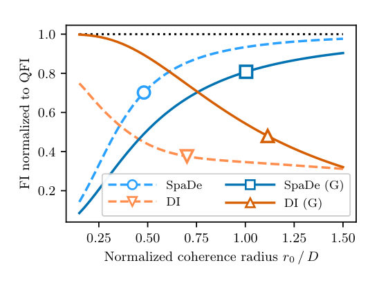 
FIG. 2. Ratio of the FI to the QFI, I(r0)/K(r0), as a function of the spatial coherence radius r0, for DI and binary SpaDe. Solid lines correspond to the Gaussian (G) approximation, while dashed lines show results obtained from the realistic model, cf. Eq. (9).

📷 Fig 2

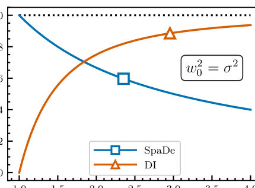 
FIG. 1. Ratio of the FI to QFI, I  θ2 /K  θ2 , as a function of the parameter θ2, for DI and SpaDe.

📷 Fig 3

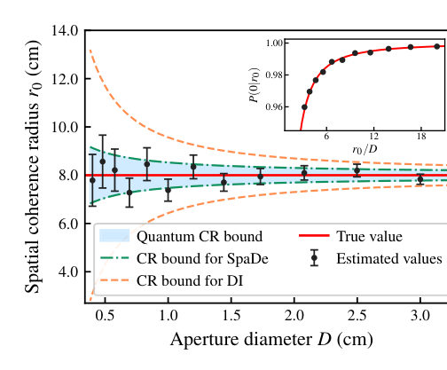 
FIG. 3. Results of the numerical simulation of light prop- agation and subsequent estimation of r0 using binary detec- tion. The variance asymptotically approaches the CR bound for the SpaDe. Parameters: propagation length 1 km, re- fractive index structure constant C2 n = 3.9 × 10−16 m−2/3, wavelength 578 nm, wind velocity 10 m/s, time step 0.2 ms, acquisition time 100 s, mean photon number within the aper- ture νSap = 0.02, and sample size M = 8940. Inset: P(0|r0) vs r0/D, cf. Eq. (18), with sampled points.

📷 Fig 4

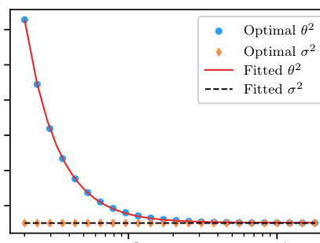 
FIG. 4. Parameters σ2 and θ2, normalized to (λf/D)2, vs the normalized coherence radius r0/D. The parameters are obtained by maximizing the quantum fidelity and subse- quently fitted by Eq. (12).

**Summary.** This paper theoretically investigates how precisely one can measure the spatial coherence radius of light passing through turbulent air. It compares two detection methods—Direct Imaging and Spatial Mode Decomposition—using quantum metrology tools like Fisher Information. The key finding is that SpaDe provides a substantially more precise estimation than DI, especially when the turbulence effects are weak.

**Why it may be interesting.** This work bridges advanced topics in quantum estimation theory with applied physics challenges like atmospheric sensing, providing concrete metrics (FI/QFI) to quantify measurement improvement beyond classical limits.

Detailed structure

**Main problem.** The primary goal is establishing the ultimate quantum precision limit for estimating the optical spatial coherence radius (Fried parameter, $r_0$) of atmospheric turbulence.

**Main result.** Spatial Mode Decomposition (SpaDe) significantly outperforms conventional Direct Imaging (DI) in the weak-scintillation regime, approaching the theoretical quantum limit when properly implemented.

**Method.** The analysis uses quantum metrology principles, comparing the Fisher Information (FI) derived from DI versus SpaDe measurements against the Quantum Fisher Information (QFI).

**Model / system.** The system involves light propagating through a turbulent atmosphere, modeled using single-photon density operators and characterized by field correlation functions ($\Gamma$). The analysis compares two measurement schemes: Direct Imaging (DI) and Spatial Mode Decomposition (SpaDe).

**Key observables.** Fisher Information (FI), Quantum Fisher Information (QFI), spatial coherence radius ($r_0$), and the ratio FI/QFI.

**Important parameters / regimes.** Weak field regime ($\eta n_{th} \ll 1$); normalized parameters $	heta_2$ and $\sigma_2$; the aperture size $D$.

**Assumptions / limitations.** The analysis relies on the weak-field approximation and often employs a Gaussian approximation for the complex correlation functions to derive analytical results.

**Figures summary.** Figures compare the ratio of FI to QFI for DI vs. SpaDe, showing SpaDe's superior performance in the weak-scintillation regime; other figures plot these metrics as functions of $r_0/D$.

**Paper structure.** The paper develops by first establishing the quantum estimation framework using CR bounds and QFI. It then analyzes two measurement techniques (DI vs. SpaDe) under Gaussian approximations, deriving explicit FI expressions for both. Finally, it compares these results against realistic models to demonstrate the advantage of SpaDe.

Abstract

We establish the ultimate precision limit for estimating the optical spatial coherence radius (Fried parameter) within a quantum metrological framework. In the weak field regime, we show that spatial-mode decomposition -- originally introduced for superresolution imaging -- enables substantially more precise estimation than conventional direct imaging when the receiver aperture is smaller than the coherence radius.

[↑ back to top](#top)

### [Rapid Gaussian Boson Sampling Circuit Screening for GKP States Creation via a Two-Stage Machine Learning Surrogate](http://arxiv.org/abs/2606.05992v1)

**Authors:** Mohammad Amin Khanpour, Hossein Davoodi Yeganeh  
**Type:** theory · **Category:** quantum information and computing · **PDF:** <https://arxiv.org/pdf/2606.05992v1>  
**Analysis basis:** full PDF text, analyzed in chunks
**Topic relevance:** `methods for driven-dissipative` **3/5** · `Keldysh / 2PI / non-Gaussian methods` **1/5** · `analog quantum simulation` **1/5** · `driven-dissipative phase transition` **1/5**

📷 Fig 1

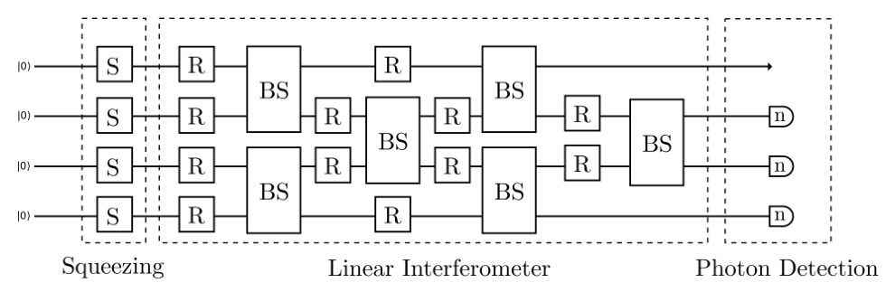 
FIG. 1. GBS circuit schematic for GKP state preparation. The circuit consists of (left to right): single-mode squeezing gates on all nmodes input modes, a rectangular Clements beamsplitter interferometer, photon-number-resolving (PNR) detectors post-selecting on herald pattern m = (m1, . . . , mnmodes−1) on the first nmodes −1 modes, and the undetected output mode which collapses into the heralded GKP state.

📷 Fig 2

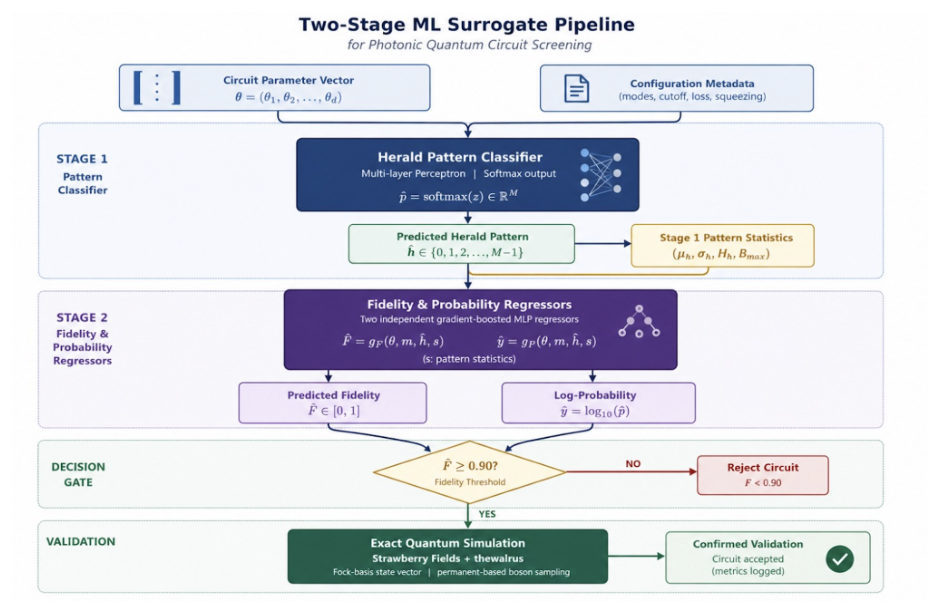 
FIG. 2. Two-stage ML surrogate pipeline block diagram. Stage 1 (Pattern Classifier) takes the circuit parameter vector and configuration metadata as input and outputs the predicted herald pattern. Stage 2 (Fidelity and Probability Regressors) takes the same input augmented with the Stage 1 pattern statistics and outputs predicted fidelity F and log-probability y = log10(p). If F ≥0.90, the circuit is passed to exact quantum simulation (Strawberry Fields + thewalrus) for confirmed validation.

📷 Fig 3

 
FIG. 3. Scatter plot of ML-predicted vs. simulation-confirmed fidelity (left) and log10 post-selection probability (right) on the 170-sample holdout set. Points are coloured by circuit mode count (nmodes ∈{3, 4, 5}). The dashed diagonal line indicates perfect agreement. The shaded band indicates ±0.05 fidelity error. Points above or below the F = 0.90 threshold line that are misclassified by the surrogate are highlighted.

📷 Fig 4

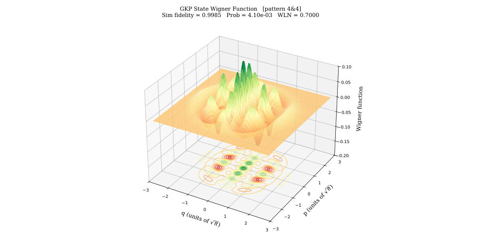 
FIG. 4. Representative Wigner functions W(q, p) from the exact simulation step, plotted over q, p ∈[−3, 3] (in units of √π). (a) Circuit C1 (nmax = 8, three modes, ∆= 10 dB, WLN = 0.700): characteristic GKP lattice structure with prominent negativity (red/blue regions) at phase-space lattice points. (b) Circuit C7 (nmax = 8, three modes, ∆= 5 dB, WLN = 0.022): the GKP pattern is visually present but with negligible negativity, consistent with near-classical behaviour. (c) Circuit F1 (nmax = 12, five modes, ∆= 11 dB, sign +): the Wigner function bears no resemblance to a GKP state, consistent with Fsim = 0.307, confirming the catastrophic surrogate failure.

**Summary.** The paper introduces an ML-based surrogate pipeline to efficiently screen candidate circuits for generating GKP states using Gaussian Boson Sampling. By predicting performance metrics like fidelity and success probability without calculating computationally prohibitive hafnians, it reduces simulation time by 90%. This framework allows researchers to focus expensive quantum simulations only on the most promising circuit designs.

**Why it may be interesting.** This work directly addresses the practical scalability barrier in continuous variable quantum computing by replacing intractable exponential calculations with machine learning surrogates, a key theme for theoretical quantum information scientists.

Detailed structure

**Main problem.** The core challenge is developing a scalable method to generate Gottesman-Kitaev-Preskill (GKP) states, which are crucial non-Gaussian resources for fault-tolerant photonic quantum computation.

**Main result.** A two-stage Machine Learning surrogate pipeline was developed that predicts GKP circuit viability with 90.0% accuracy, drastically reducing the computational load by approximately 90% compared to full hafnian calculations.

**Method.** The authors employed a cascade ML architecture (Stage 1 for pattern prediction, Stage 2 for fidelity/probability regression) acting as a gatekeeper before performing expensive, exact quantum simulations on promising candidates.

**Model / system.** The system is photonic quantum computation utilizing Gaussian Boson Sampling (GBS). GKP states are encoded by leveraging the periodicity of the wavefunction lattice in phase space, making them robust against small errors.

**Key observables.** GKP state fidelity ($F$), post-selection probability, Wigner function, and Wigner logarithmic negativity ($	ext{WLN}$).

**Important parameters / regimes.** Number of optical modes (3–5), squeezing amplitudes/strengths ($\Delta$), and circuit parameters defining the interferometer structure.

**Assumptions / limitations.** The surrogate is a computational filter, not a replacement for simulation; systematic failure modes exist when test circuits deviate from the training distribution's sign conventions for squeezing parameters.

**Figures summary.** Figures likely compare ML-predicted vs. simulated fidelity and probability on holdout sets, visually confirming GKP state characteristics (e.g., Wigner functions) for successful versus failed candidates.

**Paper structure.** The paper establishes the need for GKP states in photonic QC, identifies the computational bottleneck of hafnian evaluation in GBS, proposes the two-stage ML surrogate pipeline, details its training and application, and validates its efficiency by comparing predictions against full quantum simulations.

Abstract

Gottesman-Kitaev-Preskill (GKP) states are essential non-Gaussian resources for fault-tolerant photonic quantum computing, enabling logical qubit encoding with intrinsic robustness against errors. Several approaches to GKP state preparation have been explored, including measurement-based protocols in circuit QED and trapped-ion systems, cat-state breeding, and photon-subtraction schemes. However, these methods are either restricted to specific platforms or require deep non-Gaussian resource chains with exponentially low success probabilities. Gaussian Boson Sampling (GBS) offers a compelling all-photonic alternative by generating non-Gaussian states through measurement-induced nonlinearity, without the need for matter-based ancilla or active feedforward. Nevertheless, its practical implementation is limited by the exponential computational cost of evaluating matrix hafnians-#P-complete functions that govern photon-number probabilities. To address this challenge, we introduce a two-stage Histogram Gradient Boosting surrogate pipeline that predicts, without any hafnian computation, the optimal heralding pattern, circuit fidelity, and post-selection probability for candidate GBS circuits, while reserving exact quantum simulation exclusively for surrogate-selected candidates. Trained on circuit configurations across 3-5 optical modes, the surrogate achieves 90.0% GKP-detection accuracy on a held-out set, representing a 23.7 percentage-point improvement over the baseline, with a fidelity mean absolute error of 0.032 and a log-scale post-selection probability $R^2 = 0.837$, reducing the total simulation burden by approximately 90%.

[↑ back to top](#top)

### [Continuous-variable ADAPT-VQE for bosonic lattice models](http://arxiv.org/abs/2606.05297v1)

**Authors:** Dimitrios Athanasakos, Gloria Tejedor-García, Jack Y. Araz, Mafalda Ramôa, Bharath Sambasivam, Sophia E. Economou, Felix Ringer  
**Type:** theory · **Category:** quantum information and computing · **PDF:** <https://arxiv.org/pdf/2606.05297v1>  
**Analysis basis:** full PDF text, analyzed in chunks
**Topic relevance:** `analog quantum simulation` **3/5** · `correlated cavity matter` **1/5** · `non-equilibrium dynamics` **1/5**

📷 Fig 1

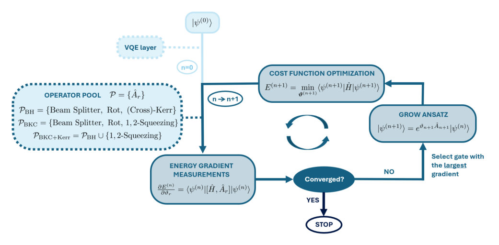 
FIG. 1: Schematic illustration of the CV-ADAPT-VQE ground state preparation algorithm presented in this work. The state after n iterations is denoted by |ψ(n)⟩, which depends on the variational parameters of n gates, collectively denoted by ϑ (n). Depending on the lattice Hamiltonian, we choose a suitable operator pool that incorporates sym- metry constraints of the ground state.

📷 Fig 2

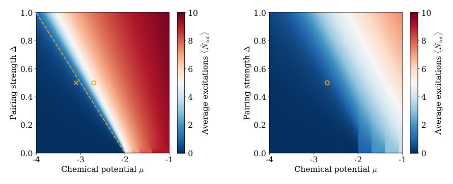 
FIG. 2: Expectation value of the total boson number across the lattice ⟨ˆNtot⟩for the ground state of the BKC model without (left) and with an additional on-site Kerr interaction (right). We show the result for different values of the model parameters ∆and µ for a lattice with NS = 3 sites, J = 1, U = −1 for the interaction term, periodic boundary conditions, and a local Hilbert space truncation of D = 6. The dashed golden line in the left panel indicates the stability condition, while the markers × and ◦denote the parameter choices (∆= 0.5, µ = −3.1) and (∆= 0.5, µ = −2.7), respectively, which are used for the variational ground state preparation presented in section V.

📷 Fig 3

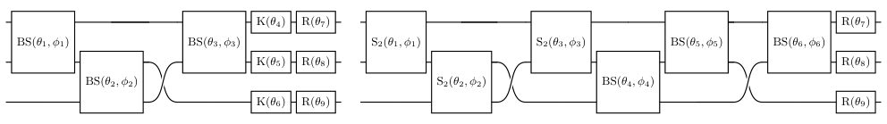 
FIG. 3: Hamiltonian-based VQE ans¨atze for the Bose-Hubbard model (left) and the bosonic Kitaev chain (right) for NS = 3 lattice sites and periodic boundary conditions. For the bosonic Kitaev chain with an additional on-site Kerr interaction, another set of corresponding single-qumode Kerr gates is included previous to the rotation gates.

📷 Fig 4

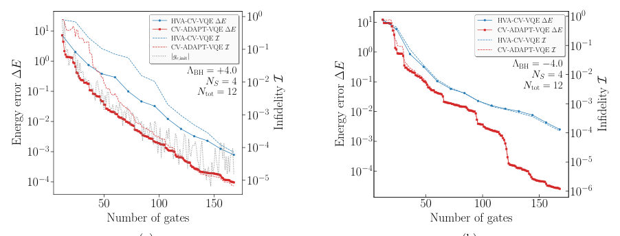 
FIG. 4: The energy difference between the variational energy and the exact ground-state energy ∆E (solid lines, left axis), and the infidelity I (dashed lines, right axis), is shown as a function of the number of variational gates for the BH model. Panels (a) and (b) show the results for the attractive (ΛBH = +4.0) and repulsive (ΛBH = −4.0) BH models, respectively, for NS = 4 lattice sites and Ntot = 12 bosons with a local qumode cutoff of D = 13. As an example, in panel (a), we also plot the magnitude of the gradient associated with the gate selected by ADAPT |gr,init| (gray dotted line), i.e., the gate with the largest gradient at each iteration, using the scale of the left axis for...

📷 Fig 5

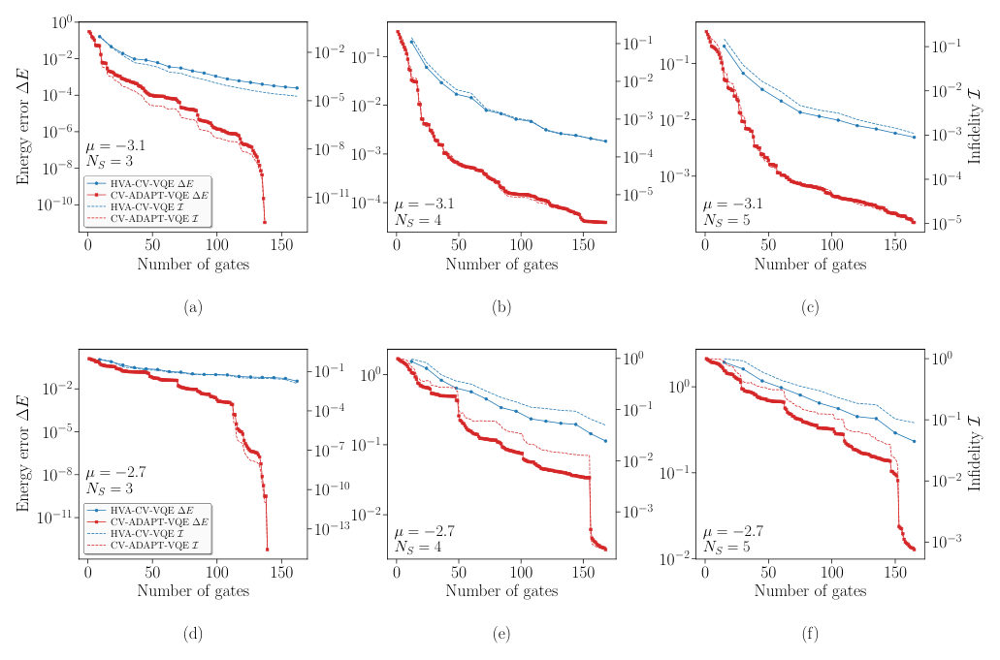 
FIG. 5: The energy difference between the variational energy and the exact ground-state energy (solid lines, left axis), together with the infidelity (dashed lines, right axis), for the HVA-CV-VQE (blue) and CV-ADAPT-VQE (red) algorithms as a function of the number of gates for the BKC model. The model parameter choices for the two rows are µ = −3.1 (top) and µ = −2.7 (bottom), which are in the unstable and stable regimes, respectively, see Fig. 2. In each row, the number of lattice sites NS increases from 3 to 5 (left to right). For all simulations, the local qumode cutoff is D = 6.

**Summary.** The paper presents Continuous-variable ADAPT-VQE to find ground states for bosonic lattice models like the Bose-Hubbard and Kitaev chains. It demonstrates that this continuous-variable approach generates significantly shallower quantum circuits than standard VQE methods. By incorporating symmetry constraints and advanced optimization techniques, it offers a powerful tool for simulating complex condensed matter physics problems.

**Why it may be interesting.** This work directly addresses the practical implementation challenges of simulating interacting quantum many-body systems on near-term quantum hardware by optimizing the required circuit depth using adaptive techniques tailored for bosonic Hamiltonians.

Detailed structure

**Main problem.** The primary goal is to efficiently prepare the ground state of bosonic lattice models using quantum algorithms, specifically addressing circuit depth limitations.

**Main result.** The Continuous-variable ADAPT-VQE approach was shown to yield significantly shallower circuits compared to traditional Hamiltonian-based VQE methods for these systems.

**Method.** The authors employ CV-ADAPT-VQE, an adaptive variational quantum eigensolver that constructs the ansatz by selecting symmetry-preserving bosonic operators from a tailored pool. This is contrasted with HVA-CV-VQE, which uses unitaries derived directly from the Hamiltonian terms.

**Model / system.** The study focuses on bosonic lattice models, including the Bose-Hubbard (BH) model and the bosonic Kitaev chain (BKC), sometimes extended with an on-site Kerr interaction. These systems are modeled using continuous variables described by quadrature operators ($\hat{q}, \hat{p}$).

**Key observables.** Ground state energy expectation value ($E$), circuit depth, fidelity ($I$), and the total boson number $\langle \hat{N}_{tot} 
angle$.

**Important parameters / regimes.** System size ($N_S$), local Fock cutoff dimension ($D$), interaction strengths ($J, U, \Delta$), and chemical potential ($\mu$).

**Assumptions / limitations.** Classical simulations require truncating the infinite Hilbert space to a finite dimension $D$. The ADAPT-VQE relies on constructing an ansatz from operators respecting known global symmetries.

**Figures summary.** Figures illustrate energy error ($\Delta E$) and infidelity ($I$) convergence versus gate count for BH and BKC models, comparing standard vs. tiled operator pools, and showing the impact of warm-up circuits and Hessian recycling on optimization steps.

**Paper structure.** The paper introduces CV-ADAPT-VQE for bosonic systems (BH/BKC), details the mathematical framework using continuous variables, compares its performance against HVA-CV-VQE, and discusses advanced optimizations like operator tiling and Hessian recycling to improve resource scaling.

Abstract

We present a continuous-variable adaptive variational quantum eigensolver (CV-ADAPT-VQE). As concrete examples, we consider the ground-state preparation for (i) the Bose-Hubbard model and (ii) the bosonic Kitaev chain, including its extension with an on-site Kerr interaction. The former conserves the total boson number, while the latter conserves global parity. We construct symmetry-preserving operator pools tailored to each case and show, using GPU-based classical simulations, that CV-ADAPT-VQE results in significantly shallower circuits compared to Hamiltonian-based VQE approaches. Our results point toward direct applications in quantum simulations of condensed-matter systems, quantum chemistry, and high-energy physics.

[↑ back to top](#top)

### [Semidefinite-programming hierarchies for classically simulable state families](http://arxiv.org/abs/2606.06204v1)

**Authors:** Mengyan Li, Yanning Jia, Fenzhuo Guo, Haifeng Dong, Sujuan Qin, Fei Gao  
**Type:** theory · **Category:** quantum information and computing · **PDF:** <https://arxiv.org/pdf/2606.06204v1>  
**Analysis basis:** full PDF text, analyzed in chunks
**Topic relevance:** `quantum measurements` **3/5** · `entanglement & information structure` **1/5** · `measurement-induced transitions` **1/5**

📷 Fig 1

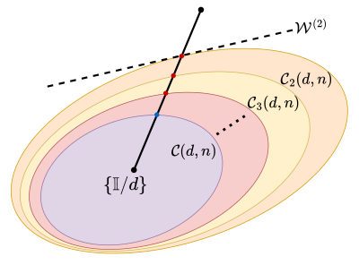 
FIG. 1. Geometric illustration of the hierarchy bounds for criti- cal visibility. The black line represents the depolarizing trajectory {Λv(ρ)}v∈[0,1], interpolating between the maximally mixed family {I/d} and the target family ρ. Intersections of this trajectory with differ- ent hierarchy levels determine the visibility bounds χℓ, shown as red points. As the hierarchy level increases, these bounds decrease monotonically and converge to the exact critical visibility χ, shown in blue. The dashed line illustrates an affine witness separating the target family from a relaxation level.

**Summary.** This paper develops a complete Semidefinite Programming (SDP) hierarchy to rigorously characterize classically simulable families of quantum states. By reformulating classical simulability as a POVM feasibility problem, they provide computable upper bounds on quantum advantages like critical visibility. This offers a systematic convex-optimization framework for certifying the nonclassical nature of quantum resources.

**Why it may be interesting.** This work provides a powerful, systematic convex-optimization tool for certifying when quantum correlations are genuinely nonclassical, which is fundamental for understanding the limits of quantum computation and communication protocols.

Detailed structure

**Main problem.** The core problem is developing a complete mathematical characterization of quantum state families that are classically simulable, which signifies the absence of irreducible quantum advantage.

**Main result.** The authors establish a complete Semidefinite Programming (SDP) hierarchy that characterizes classical simulability by relating it to the projective simulability of auxiliary Positive-Operator-Valued Measures (POVMs).

**Method.** They reformulate classical simulability as a feasibility problem involving deterministic response functions and POVMs, solving this using an asymptotically complete SDP relaxation hierarchy.

**Model / system.** The study concerns quantum state families $\{
ho_x\}_{x=1}^n$ on a $d$-dimensional Hilbert space. The simulation aspect is modeled by checking if the measurement statistics admit a local hidden-variable model, which is mathematically equivalent to POVM simulability.

**Key observables.** Critical classical visibility ($\chi(
ho)$), and the feasibility of SDP constraints derived from the hierarchy levels $\ell$.

**Important parameters / regimes.** The dimension $d$ of the Hilbert space, the number of states $n$, and the relaxation level $\ell \ge 2$.

**Assumptions / limitations.** The analysis relies on establishing asymptotic completeness for the SDP hierarchy, which is proven using techniques related to the quantum de Finetti theorem.

**Figures summary.** Figures illustrate the geometric convergence of the SDP bounds ($\chi_\ell(
ho)$) towards the true critical visibility $\chi$ for various symmetric state families.

**Paper structure.** The paper progresses by defining classical simulability, reducing it to POVM simulability, developing the SDP hierarchy (both canonical and aggregated lifts), proving its asymptotic completeness, and finally applying this framework to compute bounds on quantum advantage measures like critical visibility.

Abstract

Identifying whether a state family admits an irreducible quantum advantage is a fundamental task in quantum resource theory and quantum information processing. Here we study classically simulable state families, namely those residing within the convex hull of pairwise commuting families and therefore admitting a classical explanation. We develop a complete semidefinite-programming (SDP) hierarchy characterizing the set of classically simulable state families in arbitrary finite dimension. The key step is to reformulate classical simulability as a feasibility problem over deterministic response functions and auxiliary positive-operator-valued measures (POVMs) simulable by rank-one projective measurements. We establish a complete SDP hierarchy for rank-one projectively simulable POVMs and transfer the resulting characterization to state families, yielding both primal feasibility tests and dual affine witnesses certifying failure of classical simulability. Applying the hierarchy to state families mixed with depolarizing noise gives computable upper bounds on the critical classical visibility, which are matched by explicit classical simulations in several symmetric examples. These results provide a systematic convex-optimization framework for certifying classical simulability of quantum state families.

[↑ back to top](#top)

### [Revealing quantum geometry effects in magic angle twisted bilayer graphene using the circular photogalvanic effect](http://arxiv.org/abs/2606.06389v1)

**Authors:** Eylon Persky, Leonie Parisot, Minhao He, Jiaqi Cai, Takashi Taniguchi, Kenji Watanabe, Pierre A. Pantaleon, Francisco Guinea, Xiaodong Xu, Aharon Kapitulnik  
**Type:** both · **Category:** strongly correlated electrons · **PDF:** <https://arxiv.org/pdf/2606.06389v1>  
**Analysis basis:** full PDF text, analyzed in chunks
**Topic relevance:** `analog quantum simulation` **2/5** · `driven-dissipative phase transition` **2/5** · `non-equilibrium dynamics` **2/5** · `Keldysh / 2PI / non-Gaussian methods` **1/5** · `methods for driven-dissipative` **1/5** · `non-equilibrium universality` **1/5** · `quantum optics experiment` **1/5** · `spintronics-quantum-optics interface` **1/5**

📷 Fig 1

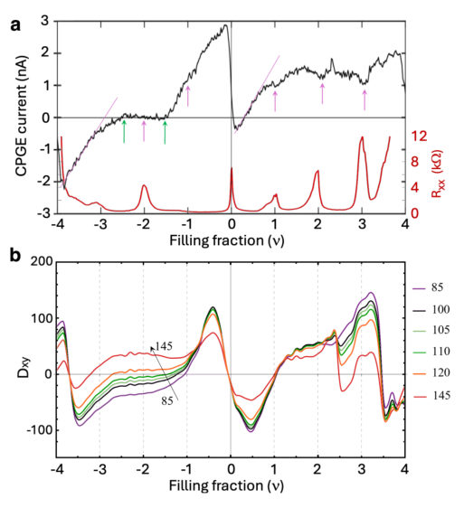 
FIG. 1: Top: Measured CPGE current vs. band filling. For comparison we show the longitudinal conductivity that tracks the topological Fermi surface effects. Arrows and straight lines point to the key correlated states in the band. Bottom: Calculation of Berry-Curvature Dipole (BCD) with a uniaxial 0.3 % heterostrain along the K-K′ direction. Calculation parameters: Twist-angle, θ = 1.05◦, sublattice potential ∆m = 10 meV, interlayer moire potentials u = 79.7 meV and u′ = 97.5 meV, ℏvF = −2.13a with a = 0.246 nm, dielectric constant ε = 6 and double-gate distance dg = 40 nm. The color legend shows the BCD orientation with respect to the sample.

📷 Fig 2

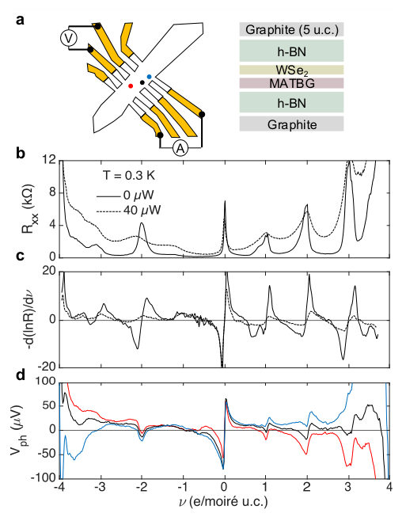 
FIG. 2: Schematic of the measurement configuration. For photocurrent measurement, the device is shorted in series with a current amplifier, which measures the current that is induced by the light. The left side shows the van der Waals stack of our dual-gated sample. (b) Longitudinal resistance as a function of carrier density taken at T = 0.3 K with and without unpolarized light (incident power, 40 µW). (c) The photocurrent generated by unpolarized light, compared to the log derivative of the resistance (red curve, proportional to the thermopower).

📷 Fig 3

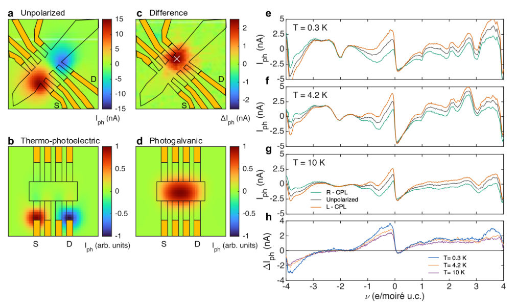 
FIG. 3: (a) Experimental photocurrent map taken at filling ν = −0.5 unpolarized light. The device is overlaid on the image based on a simultaneously acquired reflectivity map, and the source and drain electrodes are indicated. (b) Calculated photocurrent map for a Hall bar geometry assuming the photo-induced current originates from local heating through the thermoelectric effect. (c) Difference map of two photocurrent images taken with right- and left-CPL at ν = −0.5. (d) Calculated photocurrent map assuming the photo-induced current originates from a CPGE. (e) Carrier density dependence of the photocurrent for unpolarized and CPL. The beam position is indicted by the cross on panel c. (f)...

**Summary.** This work investigates quantum geometry effects in magic angle twisted bilayer graphene by measuring the circular photogalvanic effect. By carefully separating this effect from thermal contributions, the authors map out how the CPGE vanishes at specific electron fillings. This vanishing signals a fundamental symmetry breaking mechanism strongly linked to the material's Berry curvature dipole structure.

**Why it may be interesting.** While focused on condensed matter, the use of optical pumping to probe geometric phases (Berry curvature) in a correlated system like MATBG touches upon non-equilibrium quantum dynamics relevant to open quantum systems and topological physics.

Detailed structure

**Main problem.** The study aims to reveal quantum geometry effects, specifically those related to the Berry curvature dipole, in magic angle twisted bilayer graphene (MATBG) using the circular photogalvanic effect (CPGE).

**Main result.** A robust CPGE is observed over wide doping ranges, but it vanishes precisely in the filling range $-2.5 < 
u < -1.5$, suggesting a novel symmetry breaking mechanism linked to the Berry curvature dipole structure.

**Method.** The research combines photo-transport measurements using circularly polarized light with theoretical calculations based on the Berry curvature dipole tensor and mean-field approximations.

**Model / system.** The physical system is MATBG, encapsulated in a van der Waals stack. Theoretical analysis utilizes models incorporating strain and calculating electronic structure properties like the Berry curvature dipole within a Hartree formalism.

**Key observables.** Circular Photogalvanic Effect (CPGE) current ($\Delta I_{ph}$), longitudinal resistance ($R_{xx}$), and photovoltage/thermoelectric voltage measurements.

**Important parameters / regimes.** Band filling ($
u$), temperature ($T$), incident light wavelength ($\lambda = 1550$ nm, $\hbar\omega \approx 0.8$ eV).

**Assumptions / limitations.** The analysis assumes the observed zero-CPGE plateau correlates with the BCD mechanism and that photoexcited carriers cascade into the flat band in a manner describable by modified Shockley-Ramo theorems.

**Figures summary.** Figures show measured CPGE current vs. filling compared to conductivity tracking, alongside theoretical calculations of the Berry-Curvature Dipole (BCD) under strain.

**Paper structure.** The paper systematically measures photocurrents using polarization dependence to isolate the CPGE from thermoelectric effects. It then compares these experimental results across various doping levels and temperatures against theoretical predictions derived from the BCD formalism, pinpointing specific regimes of symmetry breaking.

Abstract

We report a photocurrent studies of a magic angle twisted bilayer graphene device using near infrared light. Through photocurrent imaging and polarization dependence, we separate the photo-thermoelectric effect from the photogalvanic effect. We observe a circular photogalvanic effect (CPGE) over a wide range of doping and temperature. The CPGE at normal incidence constraints the symmetry of the system to C$_1$, and points to a Berry curvature dipole, in agreement with theoretical predictions for strained graphene. Remarkably, the CPGE vanishes for filling $-2.5 < ν< -1.5$, suggesting an additional symmetry breaking in that regime. Insight into this effect is obtained through Berry curvature dipole calculations, which emphasize a novel symmetry breaking effect near $ν=-2$.

[↑ back to top](#top)

### [Reliability of asymptotic work extraction](http://arxiv.org/abs/2606.06318v1)

**Authors:** Kaito Watanabe, Bartosz Regula, Marco Tomamichel, Ryuji Takagi  
**Type:** theory · **Category:** statistical mechanics · **PDF:** <https://arxiv.org/pdf/2606.06318v1>  
**Analysis basis:** full PDF text, analyzed in chunks
**Topic relevance:** `correlated / nonlocal dissipation` **2/5** · `driven-dissipative phase transition` **2/5** · `entanglement & information structure` **2/5** · `Keldysh / 2PI / non-Gaussian methods` **1/5** · `methods for driven-dissipative` **1/5** · `non-equilibrium dynamics` **1/5** · `non-equilibrium universality` **1/5**

📷 Fig 1

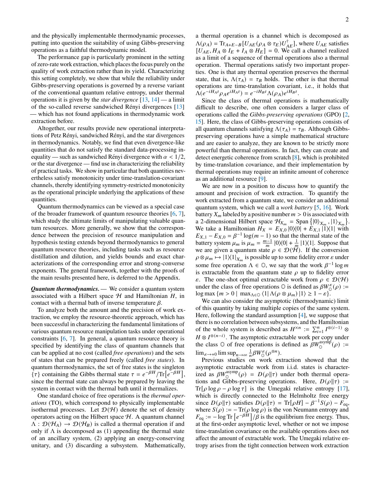 
Low-resolution page preview, page 2

📷 Fig 2

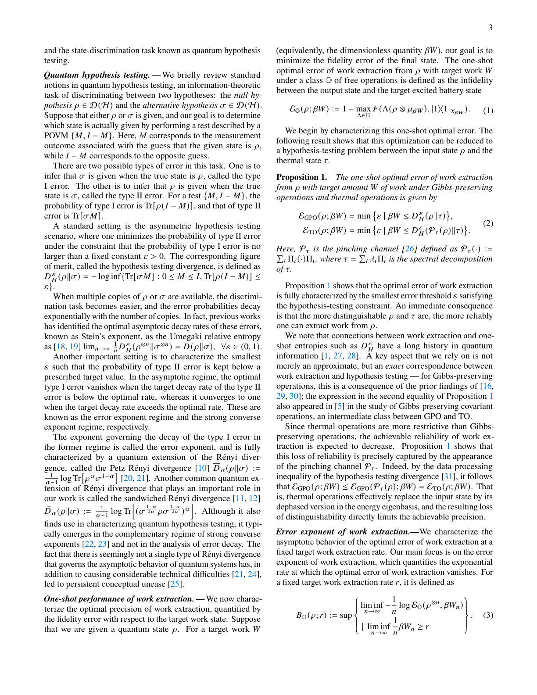 
Low-resolution page preview, page 3

📷 Fig 3

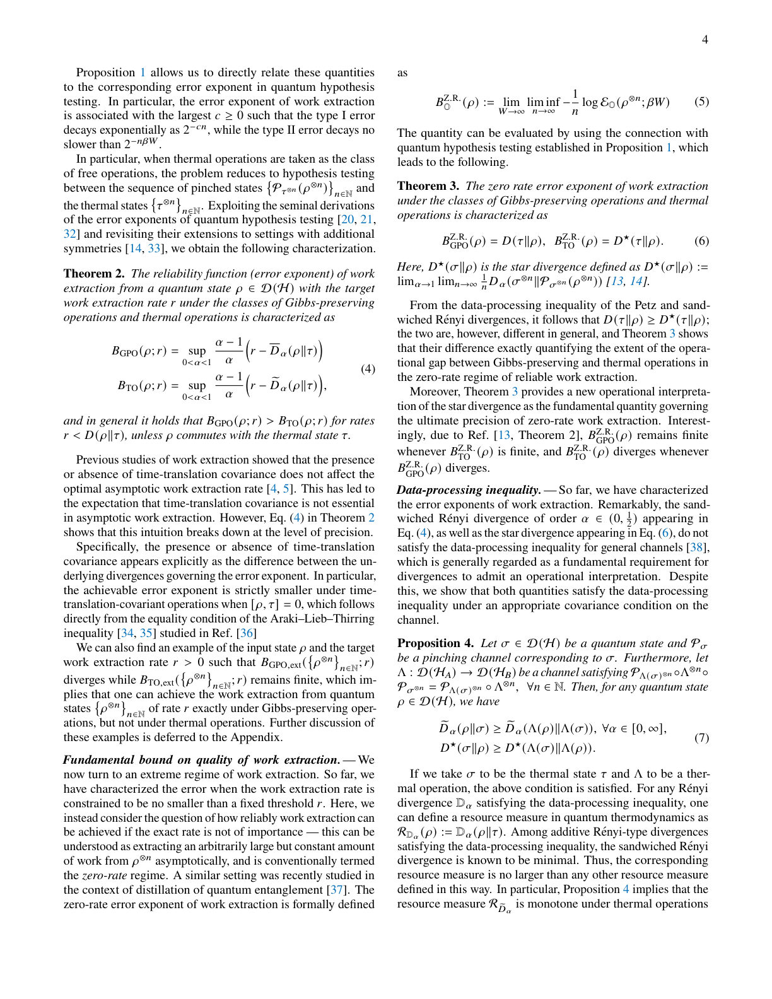 
Low-resolution page preview, page 4

📷 Fig 4

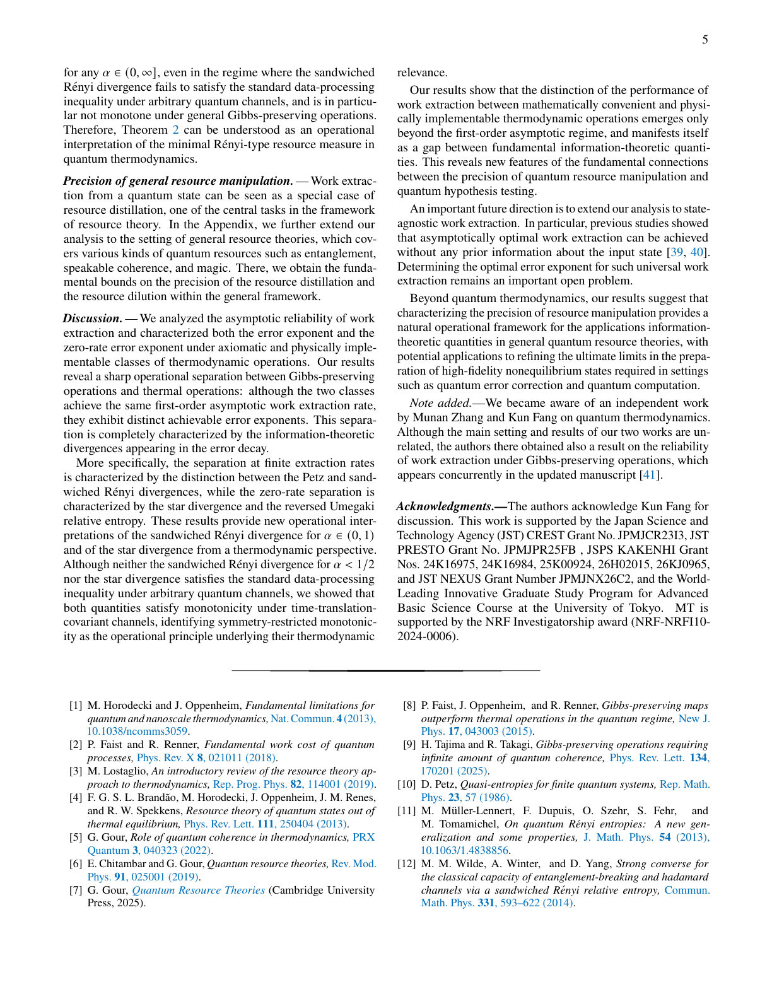 
Low-resolution page preview, page 5

📷 Fig 5

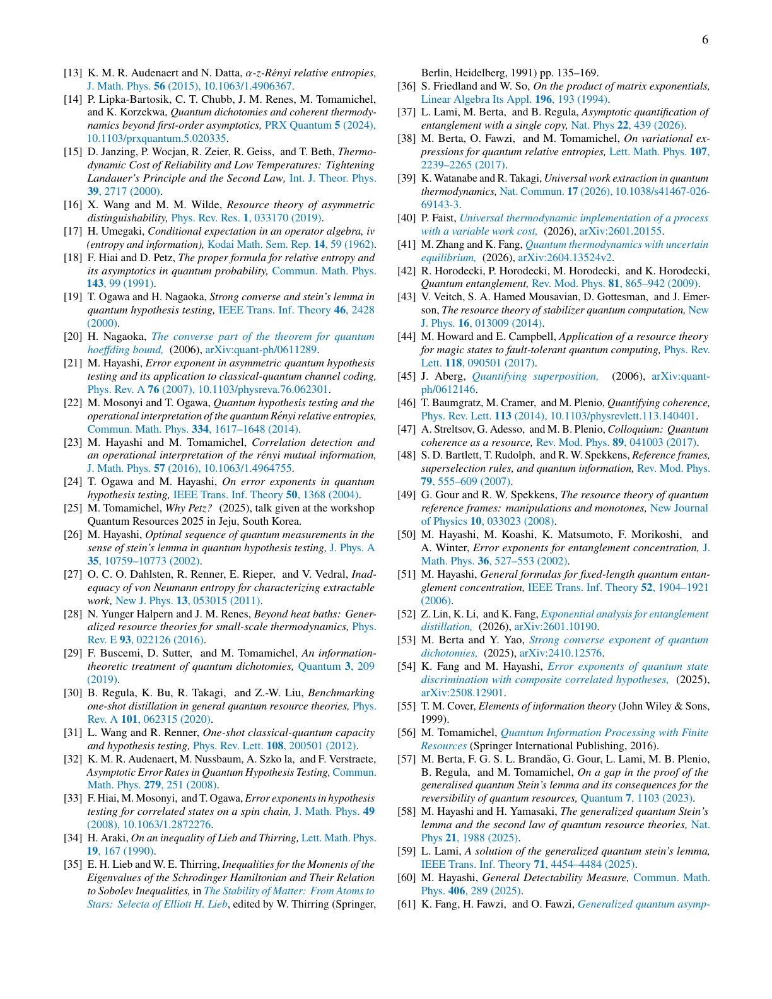 
Low-resolution page preview, page 6

**Summary.** This work rigorously compares two models for free operations—Gibbs-preserving and thermal—in the context of quantum work extraction. It demonstrates that while both yield the same asymptotic work rate, their reliability (error exponent) differs significantly. This reveals a fundamental operational gap, suggesting that physically constrained processes are more limited than mathematically convenient ones.

**Why it may be interesting.** It provides a deep theoretical understanding of operational constraints in quantum thermodynamics, showing that mathematical convenience (GPO) can mask physical limitations (TO) when precision is required.

Detailed structure

**Main problem.** The paper challenges the assumption that the optimal asymptotic work extraction rate is universally characterized by the Helmholtz free energy when comparing different classes of allowed quantum operations.

**Main result.** A significant operational gap exists between Gibbs-preserving operations and physically realizable thermal operations, particularly concerning the reliability (error exponent) of the extraction process in the zero-rate limit.

**Method.** The analysis uses resource theory concepts applied to work extraction, comparing performance metrics derived from quantum hypothesis testing divergences (Petz vs. sandwiched Rényi entropies).

**Model / system.** The study models work extraction from a general quantum state ($
ho$) coupled to an auxiliary 'work battery' ($X_m$), analyzed under two classes of free operations: Gibbs-preserving operations (GPO) and physically motivated thermal operations (TO).

**Key observables.** Optimal asymptotic error exponents ($B_{GPO,ext}, B_{TO,ext}$) and the zero-rate error exponent ($	ext{BZ.R.}$), quantified by various quantum relative entropies.

**Important parameters / regimes.** The inverse temperature $eta$, the rate of work extraction $r$, and the coherence/incoherence condition $[
ho, 	au]$.

**Assumptions / limitations.** The analysis relies on comparing asymptotic limits derived from generalized Rényi divergences and assumes specific covariance conditions for certain data-processing inequalities to hold.

**Figures summary.** Figures illustrate the strict separation of reliability functions ($	ext{H}_r > e^{	ext{H}_r}$) when quantum states exhibit coherence, quantifying the operational gap between GPO and TO.

**Paper structure.** The paper progresses by first establishing the equivalence of work definitions at the asymptotic rate (first order), then rigorously comparing error exponents in fixed-rate regimes, and finally focusing on the zero-rate limit to quantify the fundamental difference between operation classes.

Abstract

Extracting work from quantum states is a fundamental task in quantum thermodynamics. Previous studies have primarily focused on determining the best achievable rate of work extraction, and remarkably, this characterization appeared to remain unchanged regardless of the choice of allowed processes: whether one considers the operationally motivated class of energy-conserving thermal operations, or the axiomatic class of Gibbs-preserving operations, the optimal extractable work is given by the Helmholtz free energy. Here, we challenge this perspective, showing that a more refined analysis of the asymptotic performance of work extraction reveals significant differences in the performance for the two different classes of free operations. Precisely, we focus on the trade-off between the extraction rate and its reliability, characterized by the optimal asymptotic speed at which the extraction error can be suppressed. We establish that the reliability of Gibbs-preserving operations and of thermal operations are respectively characterized by the Petz and the sandwiched Rényi relative entropies, demonstrating that the former in general strictly outperforms the latter, and providing new interpretations of several information-theoretic divergences. Our analysis reveals that operational constraints such as energy conservation impose stronger limitations on the achievable precision of quantum tasks than can be inferred from their asymptotic rates, thereby questioning the use of Gibbs-preserving operations as a mathematically convenient substitute for the physically realizable thermal processes.

[↑ back to top](#top)

### [Majorana-like fermion physics: Emergence of topologically protected vortical states in graphene interacting with an electromagnetic field](http://arxiv.org/abs/2606.05746v1)

**Authors:** H. V. Grushevskaya, George Krylov  
**Type:** theory · **Category:** other · **PDF:** <https://arxiv.org/pdf/2606.05746v1>  
**Analysis basis:** full PDF text, analyzed in chunks
**Topic relevance:** `Kondo & dissipative impurity` **2/5** · `analog quantum simulation` **2/5** · `Keldysh / 2PI / non-Gaussian methods` **1/5** · `correlated / nonlocal dissipation` **1/5** · `driven-dissipative phase transition` **1/5** · `interference shaping light` **1/5** · `methods for driven-dissipative` **1/5**

📷 Fig 1

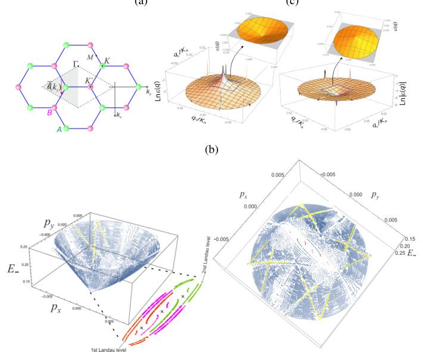 
FIG. 1: (a) Graphene hexagonal lattice of Brillouin zone. A change ⃗γ h ⃗l(ky) i in the flux of non-Abelian gauge

📷 Fig 2

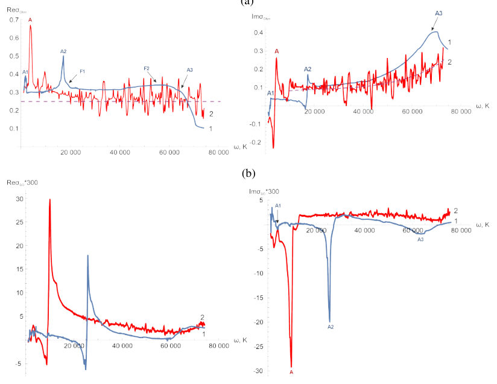 
FIG. 2: Real (left) and imaginary (right) of optical (a) and Hall (b) complex conductivity for graphene Majorana-

📷 Fig 3

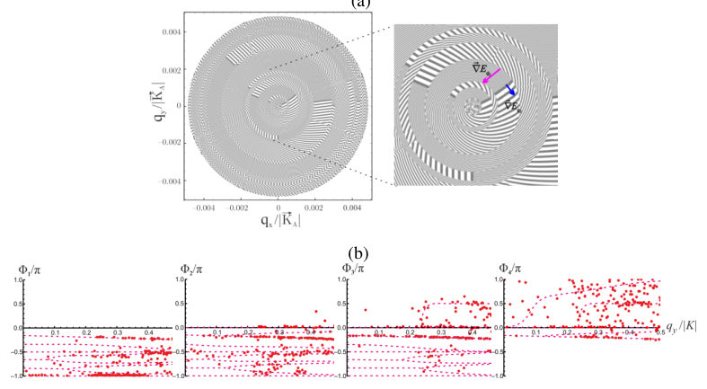 
FIG. 3: (a) A spin–orbit texture of the bands on momentum scales q/K = 0.002 in contour plots and a model of

📷 Fig 4

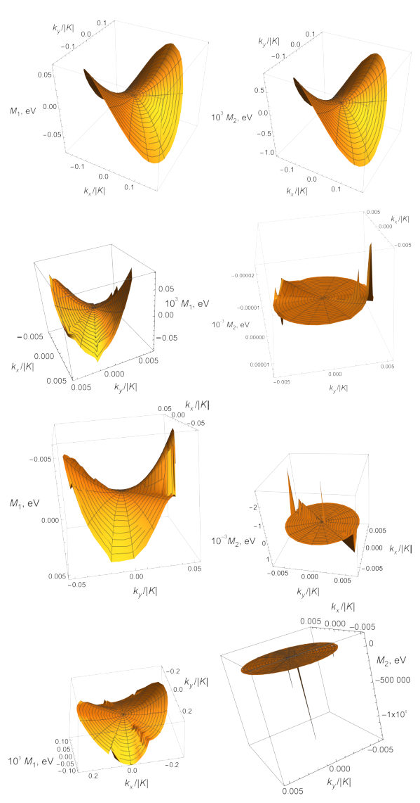 
FIG. 4: Two eigenvalues, M1 and M2, of the Majorana mass term at zero (a) and non-zero (b–d) gauge fields, without

**Summary.** This paper explores Majorana-like fermion physics in graphene interacting with magnetic fields, predicting the formation of topologically protected vortical states. The key finding is that these states manifest as three distinct Fano resonances in the optical conductivity, establishing a theoretical link between topological matter and neutrino oscillation phenomenology.

**Why it may be interesting.** While focused on condensed matter topology, the explicit analogy drawn to three-flavour neutrino oscillations provides a rich theoretical framework for understanding how fundamental particle physics concepts can manifest as measurable electronic band structure features in solid-state systems.

Detailed structure

**Main problem.** The study investigates the emergence of topologically protected vortical states in graphene when subjected to an external electromagnetic field, linking Majorana-like fermion physics to observable optical responses.

**Main result.** The model predicts that three distinct topological resonances appear in the optical conductivity, providing evidence for three non-trivial Majorana-like modes whose behavior mimics a toy model for neutrino oscillations.

**Method.** Theoretical analysis involving constructing and solving coupled Hamiltonian equations for Majorana-like fermions, followed by calculating the complex dielectric permittivity and analyzing resulting Fano resonances.

**Model / system.** The physical system is graphene, modeled using a quasi-relativistic framework that incorporates topological features via Majorana-like mass terms derived from coupling orbital and valley currents. The model is explicitly compared to neutrino oscillation physics.

**Key observables.** Fano resonances in the optical conductivity ($\sigma_{Ohm}$), non-zero Zak phases ($Q$), and the appearance of three distinct energy gaps/resonances corresponding to different topological charges (flavors).

**Important parameters / regimes.** External electromagnetic field strength, momentum/wavevector ($\vec{q}$), and parameters governing the Majorana mass terms ($\Sigma_{BA}\Sigma_{AB}$).

**Assumptions / limitations.** The analysis relies on treating the system as a toy model for neutrino oscillations and assumes specific symmetries (like electron-hole symmetry) to derive topological constraints.

**Figures summary.** Figures illustrate the graphene Brillouin zone, band structures showing Landau quantization effects, and complex conductivity plots demonstrating Fano resonances corresponding to multiple Majorana modes.

**Paper structure.** The paper builds from defining the quasi-relativistic Hamiltonian for Majorana fermions in an EM field, deriving coupling terms between orbital and valley currents, calculating topological invariants (Zak phases), and finally predicting observable signatures like Fano resonances that confirm the multi-flavor nature of the topological states.

Abstract

Within the framework of a quasi-relativistic model of graphene that admits topologically nontrivial Majorana-like quasiparticle excitations, appearance of such vortex states in the frequency dependencies of the complex dielectric permittivity of the system subjected to an external electromagnetic field has been examined. The vortex graphene states possess topological charges (flavours ) being nonzero Zak phases. Interaction effects of Majorana-like modes have been qualitatively related to the formation of Fano resonances in the optical response. The constructed topological model of graphene may be considered as a toy model of three-flavour mass-neutrino oscillations.

[↑ back to top](#top)

### [Symmetry-Selective Stabilization of Charge-Density Wave in ScV$_6$Sn$_6$](http://arxiv.org/abs/2606.05866v1)

**Authors:** A. Korshunov, C. -Y. Lim, J. Corral-Sertal, G. Garbarino, D. Chernyshov, A. Rajapitamahuni, C. Yi, S. Roychowdhury, C. Shekhar, C. Felser, V. Pardo, Ella M. Schmidt, S. Blanco-Canosa  
**Type:** both · **Category:** strongly correlated electrons · **PDF:** <https://arxiv.org/pdf/2606.05866v1>  
**Analysis basis:** full PDF text, analyzed in chunks
**Topic relevance:** `analog quantum simulation` **2/5** · `driven-dissipative phase transition` **2/5** · `Frenkel-Kontorova` **1/5** · `Keldysh / 2PI / non-Gaussian methods` **1/5** · `methods for driven-dissipative` **1/5**

📷 Fig 1

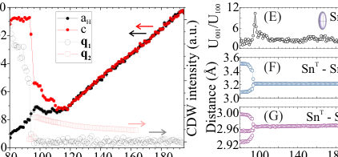 
Figure 1. (A) High-temperature crystal structure (P6/mmm). V atoms (red) form a kagome lattice, SnH atoms (light grey) occupy honeycomb sites, and SnT (blue) and Sc (purple) form trimers along the out-of-plane direction. (B) CDW-induced structural modulation with the SnT–Sc–SnT

📷 Fig 2

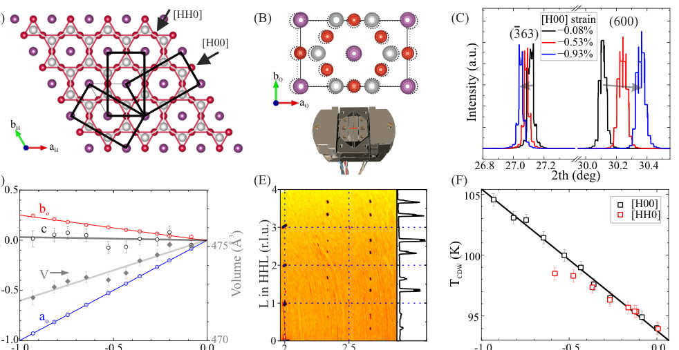 
Figure 2. (A) View of the crystal structure along the c direction, showing three merohedral orthorhombic domains. Arrows indicate the reciprocal-lattice directions along which uniaxial compressive strain was applied. (B) Upper: sketch of the atomic displacements after the application of uniaxial strain along [H00] direction. Dashed lines indicate the undistorted structure; the final orthorhombic lattice is indicated by solid black lines. Bottom: Sketch of the uniaxial strain device. (C) Shift of characteristic Bragg peaks under applied strain. (D) Evolution of the orthorhombic lattice parameters and volume as a function of applied strain along the [H00] direction measured at T = 107 K. (E)...

📷 Fig 3

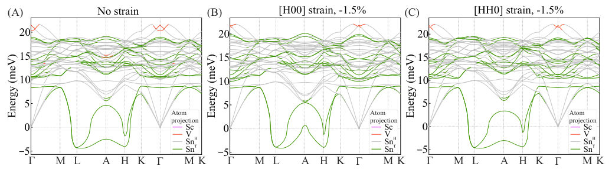 
Figure 3. (A–C) Atomic projection of the phonon dispersion of ScV6Sn6 for the (A) no-strain case, (B) 1.5% compression along [H00], and (C) 1.5% compression along the [HH0] directions, respectively. The color code describes the different atomic weight on each phonon mode.

📷 Fig 4

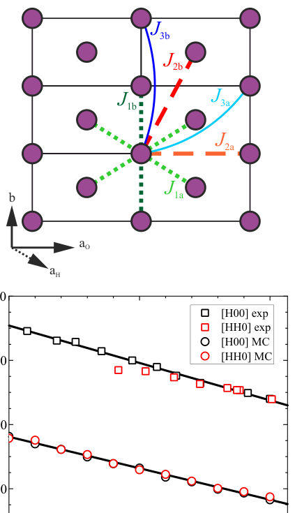 
Figure 4. (A) Sketch of the real space definition of the cou- pling strengths, Ji, accounting for the first and second near- est neighbors in the orthorhombic cell. ah and b identify the hexagonal reciprocal lattice vectors. (B) Strain dependence of the transition temperature, TCDW, extracted from the in- tegrated peak area in the Monte Carlo simulation.

**Summary.** This work demonstrates that applying controlled uniaxial strain can selectively stabilize and enhance Charge-Density Wave order in $	ext{ScV}_6	ext{Sn}_6$. By inducing a symmetry-lowering orthorhombic distortion, the researchers show that the CDW transition temperature increases significantly. The findings combine advanced X-ray diffraction measurements with sophisticated Potts model simulations to provide a powerful tuning mechanism for frustrated quantum materials.

**Why it may be interesting.** While focused on CDW physics, the use of symmetry breaking via external fields (strain) to tune an intrinsic many-body instability is highly relevant to controlling quantum phases in condensed matter systems.

Detailed structure

**Main problem.** The study investigates how anisotropic lattice deformation can selectively stabilize and enhance Charge-Density Wave (CDW) order in frustrated kagome metals, contrasting with general suppression mechanisms.

**Main result.** Uniaxial strain acts as a powerful symmetry-selective tuning parameter, stabilizing the CDW state by inducing an orthorhombic distortion that lifts domain degeneracy. The enhancement is attributed to the ordering of rattling chains within the lattice structure.

**Method.** The research combines high-resolution X-ray diffraction under controlled uniaxial strain (experiment) with phenomenological modeling using a three-state Potts framework and Monte Carlo simulations (theory).

**Model / system.** The physical system is $	ext{ScV}_6	ext{Sn}_6$, a kagome metal exhibiting CDW order. The underlying physics is modeled by mapping the low-temperature state onto an effective three-state Potts model incorporating strain-dependent Ising couplings.

**Key observables.** CDW transition temperature ($T_{	ext{CDW}}$), lattice parameters ($	ext{a}_o, 	ext{b}_o, 	ext{c}_o$), diffuse scattering intensity, and the evolution of structural symmetry from hexagonal to orthorhombic.

**Important parameters / regimes.** Uniaxial strain magnitude (e.g., $-0.6\%$ compression along $[	ext{HH}0]$), temperature ($T_{	ext{CDW}}$), and coupling constants within the Potts model.

**Assumptions / limitations.** The CDW physics can be effectively mapped onto a three-state Potts model, and the enhancement mechanism is primarily driven by anisotropic lattice deformation breaking rotational symmetry.

**Figures summary.** Figures detail structural transformations from hexagonal to orthorhombic phases under strain; simulations show $T_{	ext{CDW}}$ increasing monotonically with compressive strain; ARPES confirms electronic renormalization localized at specific terminations ($	ext{V}_3	ext{Sn}$).

**Paper structure.** The paper progresses by first establishing the structural consequences of uniaxial strain (XRD/structural analysis), then modeling the resulting order-disorder transition using a Potts model (MC simulations), and finally confirming the electronic signature via ARPES.

Abstract

Charge-density-wave (CDW) order in kagome metals is highly sensitive to external tuning parameters such as chemical substitution and hydrostatic pressure, which generally suppress long-range order. Here, using high-resolution X-ray diffraction under controlled uniaxial strain, we show that anisotropic lattice deformation instead stabilizes and enhances the CDW state in ScV$_6$Sn$_6$. Compression along the [H00] and [HH0] directions lowers the crystal symmetry from hexagonal to orthorhombic, lifts the degeneracy between symmetry-equivalent in-plane CDW domains, and promotes long-range order while preserving the underlying trimer instability. Phonon calculations indicate only a moderate stabilization of the imaginary flat phonon mode, demonstrating that the increase in T$_\mathrm{CDW}$ is primarily driven by the in-plane ordering of the Sn$^\mathrm{T}$--Sc--Sn$^\mathrm{T}$ \textit{rattling} chains within the frustrated kagome lattice. A phenomenological model incorporating strain-dependent Ising couplings within a three-state Potts framework successfully reproduces the evolution of T$_\mathrm{CDW}$ under compression and captures the continuous nature of the transition. Our results establish uniaxial strain as a powerful symmetry-selective tuning parameter for order-disorder transformations in frustrated lattices.

[↑ back to top](#top)

### [Learning Hamiltonians at Long Times](http://arxiv.org/abs/2606.05690v1)

**Authors:** Constantin Cedillo Vayson de Pradenne, Jordan Cotler, Hsin-Yuan Huang  
**Type:** theory · **Category:** statistical mechanics · **PDF:** <https://arxiv.org/pdf/2606.05690v1>  
**Analysis basis:** full PDF text, analyzed in chunks
**Topic relevance:** `entanglement & information structure` **2/5** · `non-equilibrium dynamics` **2/5** · `analog quantum simulation` **1/5** · `non-equilibrium universality` **1/5**

📷 Fig 1

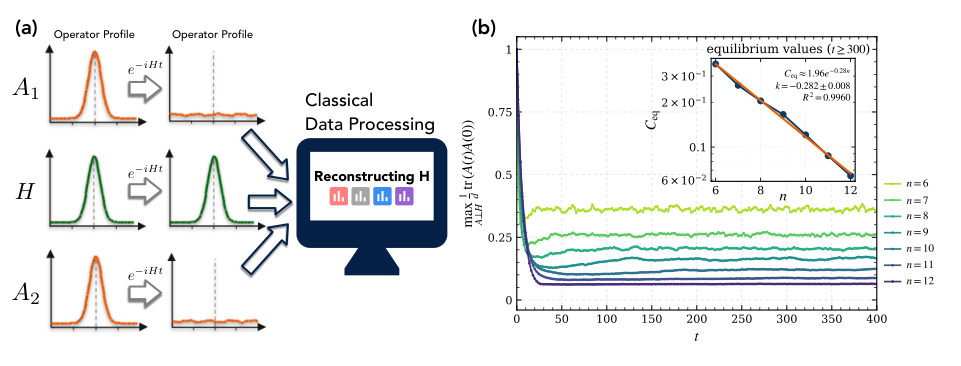 
Figure 1: Hamiltonian learning from weak equilibration. (a) Schematic of the mech- anism. Under long-time evolution, local observables in the search space generically lose their infinite-temperature autocorrelation, while the Hamiltonian direction is exactly conserved. Classi- cal shadow measurements on random product-state probes produce a data matrix whose approxi- mate null vector recovers H. (b) Weak-equilibration diagnostic for random local Hamiltonians. For each system size n, we track how strongly the most slowly decorrelating normalized local observable orthogonal to H retains its initial value under the dynamics. This quantity starts at 1 and rapidly settles to a plateau below 1....

**Summary.** The paper develops the theoretical tools to uniquely identify an unknown local Hamiltonian $H$ governing a quantum system by analyzing its time evolution $U(t)$. By proving that the commutator gap must be non-zero, it establishes that all other local observables lose their correlations (weak equilibration) over time. This provides a powerful diagnostic tool for characterizing the dynamics of complex many-body systems.

**Why it may be interesting.** This work provides a rigorous theoretical framework connecting fundamental concepts in quantum dynamics—namely, spectral gaps and conservation laws—to practical tasks like quantum state tomography and Hamiltonian reconstruction from limited measurements. It bridges condensed matter theory with quantum information theory.

Detailed structure

**Main problem.** The central problem is determining an unknown local Hamiltonian $H$ governing a quantum system from observing only the time evolution unitary $U(t) = e^{-iHt}$ at a single, potentially very long, time $t$. This is framed as an identifiability problem.

**Main result.** For broad ensembles of Hamiltonians, a single long-time measurement suffices to uniquely determine the Hamiltonian direction up to scale by showing that all other local observables lose their autocorrelation exponentially or polynomially fast.

**Method.** The analysis relies on establishing and bounding the commutator gap—both static ($\lVert [A, H] 
Vert_F$) and dynamic ($\lVert [U(t), A] 
Vert_F$)—which quantifies how strongly the dynamics rotate an observable $A$. This gap is then used to bound the decay of local autocorrelations.

**Model / system.** The system consists of quantum many-body systems (e.g., TFIM, general 2-local models) evolving unitarily in a Hilbert space spanned by Pauli strings. The Hamiltonian $H$ and observables $A$ are restricted to be sums of local Pauli operators.

**Key observables.** The primary diagnostics are the dynamic commutator $\lVert [U(t), A] 
Vert_F$, the static commutator gap, and the normalized autocorrelation function $C_A(t) = rac{1}{d}	ext{tr}(A(t)A)$.

**Important parameters / regimes.** The analysis depends on the system size ($n$), the sampling time ($t$ or $T$), and the existence of a non-zero commutator gap, which must be inverse-polynomial in $n$.

**Assumptions / limitations.** The results are proven for 'broad ensembles' of random Hamiltonians; worst-case integrable systems where many observables commute with $H$ remain outside the scope. The learning guarantee is an average-case result.

**Figures summary.** Figures illustrate the decay of local autocorrelations (dropping below 1) and show that the dynamical commutator gap scales predictably with system size, supporting the theoretical bounds derived from static gaps.

**Paper structure.** The paper develops theory by first relating dynamic to static commutator gaps using time-evolution identities. It then proves lower bounds on these gaps for specific local structures (Pauli-injective/geometrically local regimes). Finally, it applies these gap estimates to derive weak equilibration statements and the final Hamiltonian learning guarantee.

Abstract

We study the problem of learning an unknown $n$-qubit Hamiltonian $H$ from $U = e^{-iHt}$ for a single time $t$, where $t$ may be arbitrarily large. For broad families of local Hamiltonians, we prove that, with high probability over $H$ and $t$, any sum of local observables $A$ that is normalized and orthogonal to $H$ satisfies $\tfrac{1}{2^n}\|[U(t),A]\|_F^2 \geq 1/\text{poly}(n)$. The Hamiltonian is therefore the unique approximately conserved local observable, and we can efficiently recover $H$, up to scale, as the approximate null vector of a data matrix built from random product-state inputs and classical shadows. As a corollary, we obtain a weak equilibration statement: the infinite-temperature autocorrelation of every sum of local observables orthogonal to $H$ decays by at least an inverse-polynomial amount.

[↑ back to top](#top)

### [Realistic quantum device data synthesized by consumer AI and how to identify it](http://arxiv.org/abs/2606.05472v1)

**Authors:** S. M. Frolov, O. V. Kravchenko  
**Type:** both · **Category:** other · **PDF:** <https://arxiv.org/pdf/2606.05472v1>  
**Analysis basis:** full PDF text, analyzed in chunks
**Topic relevance:** `analog quantum simulation` **2/5** · `Kondo & dissipative impurity` **1/5** · `QC/QI experiment` **1/5** · `methods for driven-dissipative` **1/5** · `non-equilibrium dynamics` **1/5**

📷 Fig 1

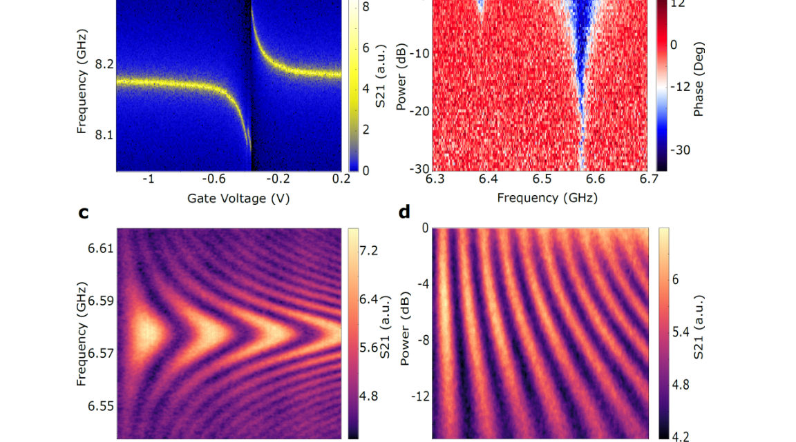 
Figure 1: Synthetic transmon data. a) Gate voltage dependence of single tone response of a superconductor-semiconductor transmon coupling to a λ/4 coplanar waveguide resonator with frequency 8.182 GHz, coupling quality factor 2000. b) Two-tone spectroscopy as a function of power showing simulated f01 =6.578 GHz and f02/2 resonances using qubit anharmonicity -380 MHz. c) Rabi oscillations “chevron” pattern using relaxation time T1 = 5.6 μS. d) Rabi oscillations as a function of power. In Figure 1 we demonstrate a set of synthetic data for a superconducting transmon qubit (31), an electronic device that is the basis for several prominent quantum computing projects (32, 33). Improvement of...

📷 Fig 2

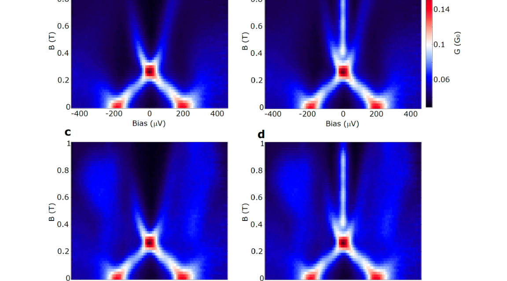 
Figure 2: AI-augmented Majorana nanowire data. a) Real experimental tunneling spectroscopy data from Ref. (37). b) Panel a) augmented with a zero-bias peak. c) Panel a) augmented with higher finite-bias conductance. d) Augmentations from panels b) and c) combined. In Figure 2, we demonstrate how experimental data can be augmented using AI. For this example we start with real tunneling spectroscopy data from Ref. (37) on the so-called Majorana nanowires. In these devices, superconductor nanowires are coated with a layer of a superconductor. This induces quantized states in the nanowire which can be detected by resonant tunneling across a potential barrier. The features manifest as peaks on a...

📷 Fig 3

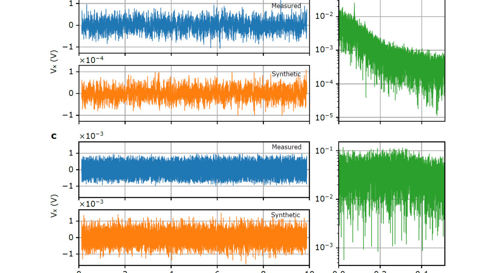 
Figure 3: Real vs. synthetic idle noise of a lock-in amplifier. Measured, fast fourier transformed and synthetic data for x-component of voltage Vx from a Stanford Research Systems SR830 lock-in amplifier using the following settings: a) integration time constant 300 ms, filter 24 dB/octave b) 100 ms, 18 dB/octave c) 100 ms, 6 dB/octave. Data plotted in virtual time (1s between data points).

**Summary.** This paper investigates the ability of consumer generative AI to synthesize highly convincing data for quantum electronic devices. By simulating measurements like qubit spectroscopy and Majorana signatures, the authors show that plausible fake datasets can be generated using basic physics knowledge. The key takeaway is a call for mandatory sharing of large volumes of raw primary data to authenticate real scientific findings.

**Why it may be interesting.** It highlights a critical methodological challenge in modern experimental physics: distinguishing genuine discovery from sophisticated AI fabrication, which impacts how theoretical predictions are validated against empirical evidence.

Detailed structure

**Main problem.** The increasing capability of generative AI to synthesize highly realistic numerical data for quantum physics, raising concerns about misrepresenting synthetic outputs as genuine experimental results.

**Main result.** AI can generate convincing datasets mimicking iconic quantum effects (e.g., Majorana modes, Josephson junctions) using basic physical models, but the defense against this is sharing large volumes of raw primary data.

**Method.** The authors demonstrate AI synthesis by prompting LLMs to write and execute Python code that simulates known physics equations and adds realistic noise/artifacts to generate synthetic measurements.

**Model / system.** The focus is on quantum electronic devices, including superconducting transmon qubits, Majorana nanowires, and Quantum Point Contacts (QPCs). The underlying physics relies on established models like the qubit Hamiltonian or tunneling conductance equations.

**Key observables.** Spectroscopy measurements ($S_{21}$ vs. gate voltage/power), Rabi oscillations, zero-bias anomalies in tunneling spectroscopy, and quantized conductance plateaus.

**Important parameters / regimes.** Gate voltage, microwave power, temperature, magnetic field (implied for Majorana studies).

**Assumptions / limitations.** The primary defense against AI fabrication is the mandatory sharing of large volumes of raw, unprocessed primary data files and metadata.

**Figures summary.** Figures illustrate synthetic transmon qubit characterization (single/two-tone spectroscopy, Rabi oscillations) and augmented Majorana nanowire tunneling spectra to suggest topological superconductivity.

**Paper structure.** The paper establishes the problem (AI synthesis capability), demonstrates its power across multiple quantum systems using specific examples (transmons, QPCs), and concludes by recommending data sharing as the necessary authentication standard.

Abstract

With the advance of generative artificial intelligence (AI) synthetic texts and images have become commonplace. These capabilities offer clear benefits, but have also raised a number of ethical concerns that often have to do with misrepresenting AI outputs as genuine material. A lesser known capability of generative AI is to perform the basic analysis, processing and even synthesis of numerical data. This raises the question of whether AI can be used to imitate experimental data that an expert would consider scientifically meaningful and on par with data in the figures of peer-reviewed manuscripts? In this paper, we focus on synthesizing data inspired by well-known experiments done frequently on quantum electronic devices. This field is related to information technologies such as spintronics and quantum computing, and is considered data-rich and data-driven. We demonstrate that it is possible to generate dramatic signals associated with iconic effects such as quantum bit control, Majorana fermions, Josephson effects, quantum dots and wires using widely available ChatGPT. We find that because some of the clearest data from quantum devices can be expressed in terms of relatively basic mathematical models, AI does not need to learn on the specialized body of data. Instead, knowledge of the physics equations and of the basic features of experimental signals can go a long way towards building a realistic dataset. We also demonstrate that real data can be augmented by AI, and that AI can mimic the noise of common scientific instruments. To help assure that published data come from experiments and are not synthesized by AI, we recommend sharing large volumes of the primary data. While it is straightforward for AI to mimic a few sets of data, consistently generating long measured sequences poses sufficient barriers to the proliferation of undisclosed synthetic data.

[↑ back to top](#top)

### [Fermiology and the Candidate Chiral Superconductor in Rhombohedral Tetralayer Graphene](http://arxiv.org/abs/2606.05356v1)

**Authors:** Sandesh S. Kalantre, Ben H. Alexander, Julian May-Mann, Jonah Herzog-Arbeitman, Marisa Hocking, Qingrui Cao, Kenji Watanabe, Takashi Taniguchi, David Goldhaber-Gordon, Andrew J. Mannix, Trithep Devakul, Yves H. Kwan, Daniel E. Parker, Aaron Sharpe  
**Type:** both · **Category:** strongly correlated electrons · **PDF:** <https://arxiv.org/pdf/2606.05356v1>  
**Analysis basis:** full PDF text, analyzed in chunks
**Topic relevance:** `analog quantum simulation` **2/5** · `Keldysh / 2PI / non-Gaussian methods` **1/5** · `Kondo & dissipative impurity` **1/5** · `non-equilibrium dynamics` **1/5**

📷 Fig 1

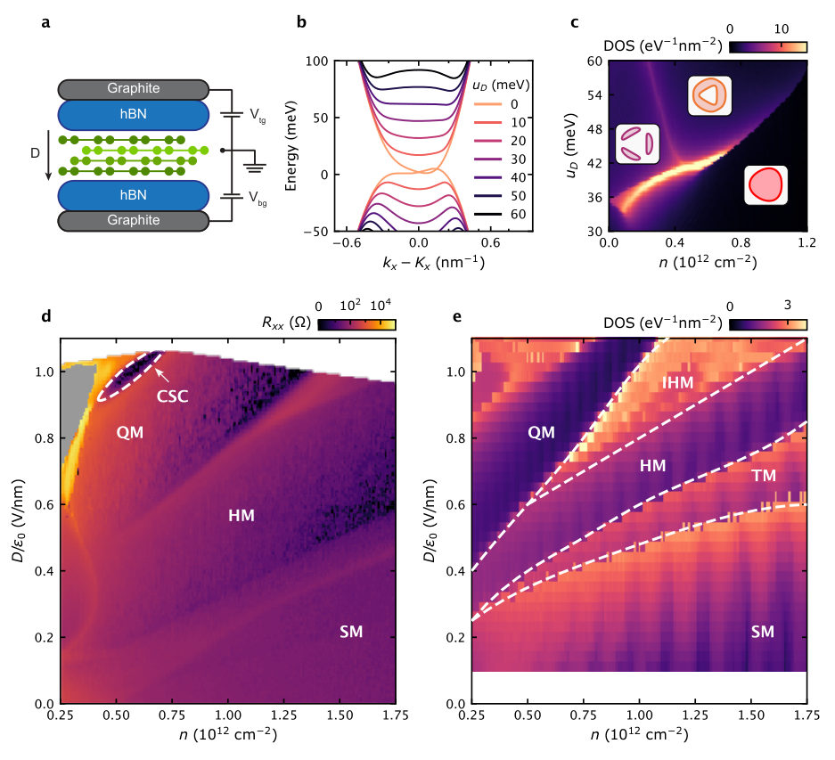 
FIG. 1. Symmetry-broken phases in R4G: (a) Schematic of the dual-graphite-gated R4G device. Top and bottom graphite gates, held at potentials Vtg and Vbg, independently control the carrier density n and the displacement field D. (b) Low-energy band structure of R4G at representative interlayer potentials uD, showing the opening of a band gap and the evolution into a Mexican hat dispersion with the band minimum at finite momentum, relative to K. (c) Single-particle density of states as a function of carrier density n and interlayer potential uD. Sharp features trace vHSs, which in the single-particle picture demarcate Lifshitz boundaries between simply-connected, annular, and three-pocket...

📷 Fig 2

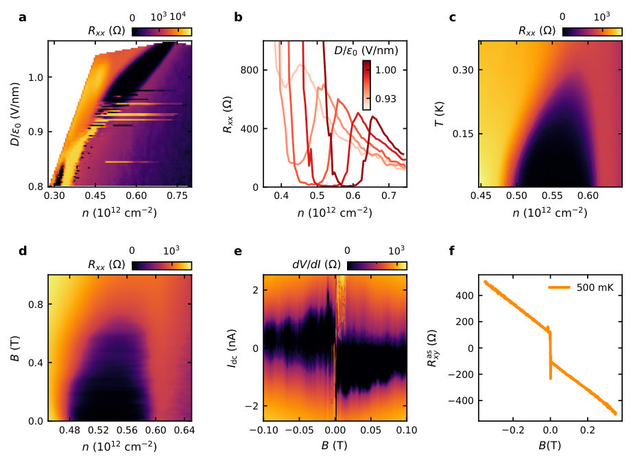 
FIG. 2. Transport characterization of the superconducting state: (a) Longitudinal resistance Rxx as a function of carrier density n and displacement field D in the vicinity of the candidate chiral superconducting (CSC) region at T = 28 mK and zero magnetic field. The dark region of vanishing resistance traces the superconducting dome, emerging near D/ϵ0 = 0.9 V/nm and extending to D/ϵ0 ≈1.05 V/nm. (b) Line cuts of Rxx vs. n with D/ϵ0 between 0.9 V/nm and 1.05 V/nm (color scale). (c) Rxx as a function of n and temperature T at D/ϵ0 = 1 V/nm, showing the superconducting dome with optimal doping near n = 0.6×1012 cm−2 and a critical temperature of Tc ≈175 mK. (d) Rxx as a function of n and...

📷 Fig 3

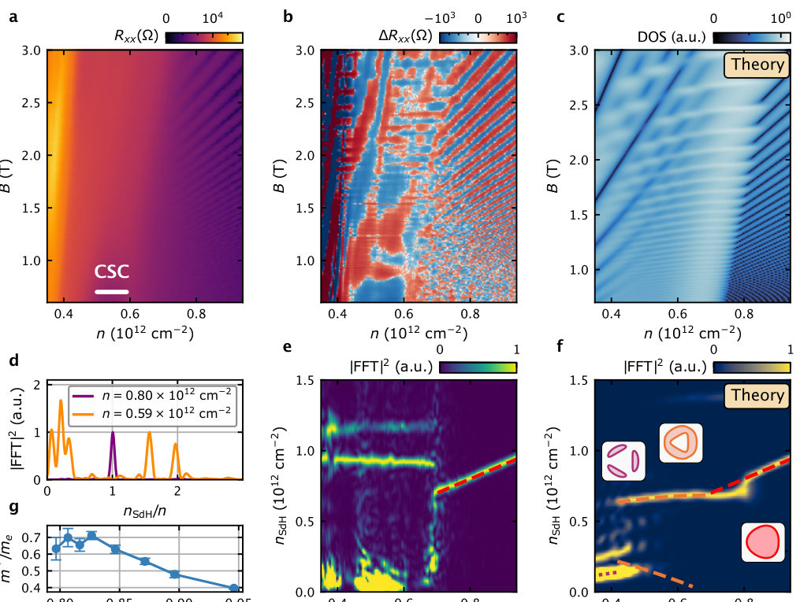 
FIG. 3. Quantum oscillations near the superconducting state: (a) Longitudinal resistance Rxx as a function of carrier density n and perpendicular magnetic field B at D/ϵ0 = 1 V/nm and T = 28 mK. The white line segment indicates the density extent of the superconducting dome at zero field. (b) Oscillatory component ∆Rxx after subtracting a smooth density. Two distinct regions are visible: a Landau fan emanating from the circular quarter metal at higher density, and a region at lower density where oscillations disperse weakly with n. (c) Single-particle Landau level calculation at uD = 43 meV, reproducing the weak dispersion of LLs with density at low n through level repulsion in the...

📷 Fig 4

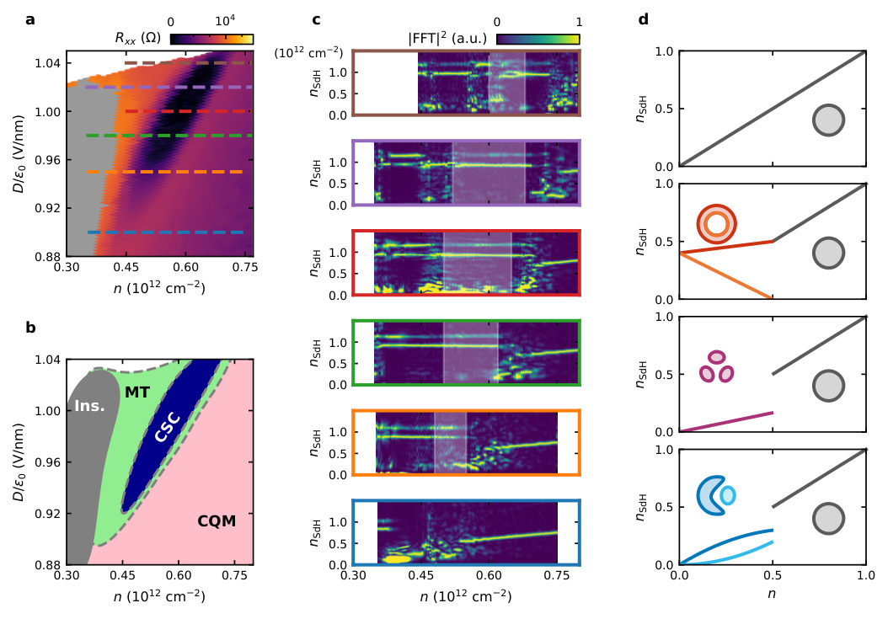 
FIG. 4. Phase diagram near the candidate chiral superconducting state: (a) Rxx vs n and D near the CSC state. The gray region denotes where the two-terminal resistance of the device is sufficiently large compared to other impedances in the measurement setup that 10% or more of the expected bias current does not reach the drain. The horizontal dashed lines show the density ranges used for the FFT analysis in (c). (b) Schematic phase diagram inferred from the FFT analysis, showing the superconducting region (SC, blue) embedded within a multitone state (MT, green) which is separated from the simply- connected circular quarter metal (CQM, pink) by a transition. (c) FFTs of the oscillatory...

**Summary.** This research investigates the superconducting mechanism in rhombohedral tetralayer graphene by correlating transport measurements with theoretical calculations. The key finding is that the normal state supporting superconductivity is far more complex than previously assumed, exhibiting a 'multitone' signature incompatible with simple Fermi surface models. This forces a re-evaluation of how pairing and topological properties emerge from correlated electron systems.

**Why it may be interesting.** The investigation into exotic electronic phases like chiral superconductivity and the failure of simple models to explain measured quantum oscillation patterns provides a rich playground for understanding strong correlations in 2D materials.

Detailed structure

**Main problem.** The study aims to characterize the normal state feriology of rhombohedral tetralayer graphene (R4G) to understand the pairing mechanism and potential chirality in a candidate chiral superconductor.

**Main result.** Experimental quantum oscillation measurements reveal a complex 'multitone' normal state that is inconsistent with simple models, suggesting the superconducting phase emerges from a highly intricate electronic structure.

**Method.** The work combines experimental magneto-transport measurements (Shubnikov-de Haas oscillations) with extensive theoretical modeling using Self-consistent Hartree-Fock (SCHF) calculations to map out competing correlated electron phases.

**Model / system.** The physical system is rhombohedral tetralayer graphene, modeled using continuum Hamiltonians that incorporate spin and valley polarization effects. Theoretical analysis explores various correlated states like quarter metals, nematic, annular, and intervalley coherent (IVC) phases.

**Key observables.** Shubnikov-de Haas oscillation frequencies/tones, superconducting critical temperature ($T_c$), anomalous Hall response, and flavor polarization ratios ($n_{\max}/n$).

**Important parameters / regimes.** Carrier density ($n$), displacement field ($D/\epsilon_0$), dielectric constant ($\epsilon$), and magnetic field ($B$).

**Assumptions / limitations.** The analysis relies on semiclassical Onsager quantization for quantum oscillations, but the observed multitone state challenges simple single-band models. Theoretical calculations often neglect spin-orbit coupling or assume specific symmetries.

**Figures summary.** Figures illustrate phase diagrams showing transitions between different metallic states (QM $	o$ MT), show $R_{xx}$ mapping out superconducting domes and polarized phases, and display FFTs confirming the transition from single to multi-tone quantum oscillation patterns.

**Paper structure.** The paper progresses by first establishing experimental evidence of superconductivity and complex normal state oscillations. It then uses detailed theoretical calculations (HF/SCHF) to map out possible correlated ground states (QM, IVC, nematic), ultimately concluding that the observed multitone state is beyond simple mean-field predictions.

Abstract

Chiral superconductivity, in which the phase of the superconducting order parameter winds in momentum space, has long been sought for its close link to topological superconductivity. Recent work reported a superconductor in rhombohedral multilayer graphene emerging from a time-reversal symmetry broken normal state, suggesting that it could be a chiral superconductor. However, the possibility of chirality depends on the symmetry and structure of the normal-state Fermi surface, which have not been directly measured. Here we measure quantum oscillations in rhombohedral tetralayer graphene over a broad range of the phase diagram, including the superconducting region. At densities well above the onset of superconductivity, we reproduce previously-reported oscillations consistent with a spin- and valley-polarized quarter metal with a single simply-connected Fermi pocket. As the carrier density is reduced, we find a transition to a complex "multitone" state that persists through the superconducting region. This state's spectrum of quantum oscillations is incompatible with a simply-connected quarter metal. The next-simplest candidate normal states suggested by our microscopic modeling (fully-polarized annular, nematic, and three-pocket states) are inconsistent with our measurements, albeit difficult to rule out entirely. The normal state is thus seen to be richer than previously envisaged, reshaping the search for the superconducting mechanism and the possible chirality of the pairing channel.

[↑ back to top](#top)

### [Ideal Quantum Geometry for Fractional Chern Insulators](http://arxiv.org/abs/2606.05496v1)

**Authors:** Jennifer Cano, Jie Wang  
**Type:** theory · **Category:** strongly correlated electrons · **PDF:** <https://arxiv.org/pdf/2606.05496v1>  
**Analysis basis:** full PDF text, analyzed in chunks
**Topic relevance:** `analog quantum simulation` **2/5** · `Keldysh / 2PI / non-Gaussian methods` **1/5** · `driven-dissipative phase transition` **1/5** · `entanglement & information structure` **1/5**

📷 Fig 1

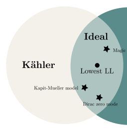 
Figure 1

📷 Fig 2

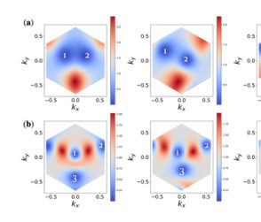 
Figure 2

📷 Fig 3

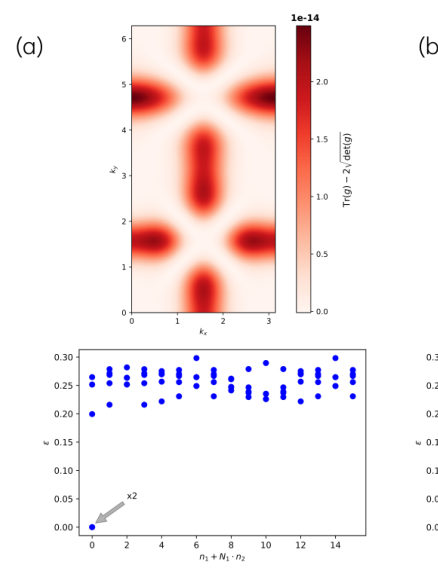 
Figure 3

**Summary.** The paper rigorously connects the concept of 'ideal quantum geometry'—where Bloch bands mimic Landau levels by saturating specific geometric bounds—to the realization of Fractional Chern Insulators (FCIs). While ideal band geometry is a necessary condition, the authors demonstrate that it is not sufficient to guarantee the FCI ground state stability, highlighting the critical role of electron-electron interactions.

**Why it may be interesting.** This work is highly relevant as it bridges single-particle band theory (a common tool in condensed matter) with interacting many-body physics. The explicit failure of geometric criteria to predict interaction stability provides crucial physical insight for designing topological materials.

Detailed structure

**Main problem.** The paper investigates the role of quantum geometry (Berry curvature, metric) in single-particle Bloch bands to understand the conditions necessary for realizing Fractional Chern Insulators (FCIs). It specifically addresses whether geometric properties alone can predict the stability of interacting many-body topological phases.

**Main result.** While ideal band geometry (saturation of geometric bounds) is a strong indicator, it proves insufficient on its own to guarantee the FCI ground state; the robustness of the Laughlin state against changes in single-particle band geometry demonstrates this limitation.

**Method.** The analysis combines theoretical derivations involving quantum geometric tensors (QGT), topological invariants like the Chern number, and comparisons between ideal Bloch bands and established models like Landau levels. It uses analytical techniques to establish mathematical equivalences between different geometric conditions.

**Model / system.** The study focuses on single-band systems in two dimensions, including lattice analogs of Quantum Hall physics (e.g., the Kapit-Mueller model) and moiré materials. The underlying framework involves analyzing Bloch states $\vert u_k 
angle$ whose geometry is characterized by the Berry connection and curvature.

**Key observables.** Berry Curvature ($\Omega_k$), Chern Number ($C$), Quantum Metric, Trace Bound ($	ext{Tr} g_k$), and the QGT ($\mathcal{Q}_{ab}^k$).

**Important parameters / regimes.** Filling factor ($
u$), magnetic flux ($\phi$), lattice parameters (e.g., moiré periodicity), and interaction strength (Hubbard repulsion).

**Assumptions / limitations.** The primary assumption is that ideal bands are characterized by the saturation of geometric bounds, which implies momentum-space holomorphicity of cell-periodic wavefunctions.

**Figures summary.** Figures compare the deviation from the trace condition and the many-body spectrum when changing orbital embeddings in the Kapit-Mueller model, showing spectral robustness despite geometric violation.

**Paper structure.** The paper progresses by defining quantum geometry concepts (Berry curvature/metric), establishing criteria for 'ideal bands' (saturation of bounds $	ext{Tr} g_k = |\Omega_k|$), demonstrating these conditions are equivalent to momentum-space holomorphicity, and finally testing this criterion against the known robustness of FCI ground states in lattice models.

Abstract

Quantum geometry plays a fundamental role in many aspects of condensed matter physics. Among its central objects are the Berry curvature and the quantum metric -- quantities that, while distinct, are intertwined through geometric constraints. In this article, we survey recent progress in understanding when and how this bound is saturated, with particular emphasis on the emergence of momentum-space holomorphicity of Bloch states. These developments highlight a profound connection between certain ideal Bloch bands and the Hilbert space structure of the lowest Landau level. We elucidate this relationship through a review of quantum Hall physics in both homogeneous and spatially varying magnetic fields, and conclude by exploring its implications for the search for fractionalized phases in emerging platforms, including moiré materials.

[↑ back to top](#top)

### [Understanding deconfined quantum critical points from crystalline categorical Landau paradigm](http://arxiv.org/abs/2606.05856v1)

**Authors:** Hiromi Ebisu, Bo Han, Weiguang Cao  
**Type:** theory · **Category:** strongly correlated electrons · **PDF:** <https://arxiv.org/pdf/2606.05856v1>  
**Analysis basis:** full PDF text, analyzed in chunks
**Topic relevance:** `analog quantum simulation` **2/5** · `Keldysh / 2PI / non-Gaussian methods` **1/5** · `driven-dissipative phase transition` **1/5**

📷 Fig 1

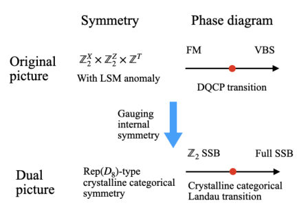 
FIG. 1: After gauging the internal symmetry, the DQCP with LSM anomalous symmetry is mapped to a crystalline categorical Landau transition.

📷 Fig 2

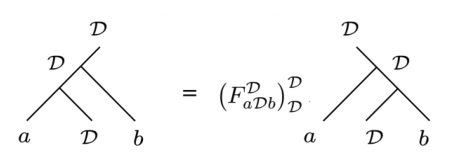 
FIG. 2: This F-symbol measures the relative sign between two fusion orders:(a ⊗D) ⊗b vs a ⊗(D ⊗b).

📷 Fig 3

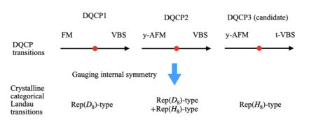 
FIG. 3: DQCPs with different crystalline categorical Landau origins. In particular, DQCP1 and DQCP2 are captured by Eq. (23) and (39), respectively, while DQCP3 is briefly discussed in the Outlook.

📷 Fig 4

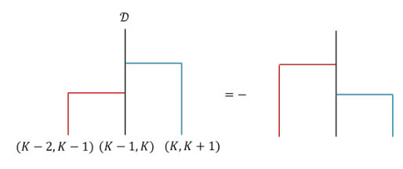 
FIG. 4: Graphical representation of the F-symbol. The red, black, and light-blue lines denote the bZσ 2, D, and bZτ 2 defects, respectively. The F-symbol compares two fusion paths, (a ⊗D) ⊗b and a ⊗(D ⊗b), corresponding to opposite orders of fusing the invertible defects a and b into the non-invertible defect D. In the lattice realization, the relative sign is determined by the commutation relation between the corresponding fusion operators.

**Summary.** The paper develops an advanced theoretical framework to understand Deconfined Quantum Critical Points (DQCPs) that evade conventional Landau theory. It achieves this by showing that these critical points can be mapped onto transitions governed by novel 'crystalline categorical symmetries' derived through a process called gauging anomalous onsite symmetries. The distinction between different symmetry types is rigorously established using the F-symbol of the underlying fusion category.

**Why it may be interesting.** This work provides a powerful, mathematically rigorous framework for classifying quantum critical points in strongly correlated systems by extending symmetry concepts from standard group theory to full fusion categories. This has implications for understanding exotic phases beyond simple mean-field descriptions.

Detailed structure

**Main problem.** The paper addresses Deconfined Quantum Critical Points (DQCPs) which defy conventional Landau theory due to competing orders breaking incompatible internal and crystalline symmetries.

**Main result.** A class of DQCPs can be reinterpreted as Landau-type transitions by gauging anomalous onsite symmetries, leading to descriptions governed by crystalline categorical symmetries like Rep(D8)-type or Rep(H8)-type.

**Method.** The core method involves 'gauging' the system's anomalous symmetries and analyzing the resulting effective lattice Hamiltonians in a dual description. The distinction between candidate symmetries is made by calculating the F-symbol of the underlying fusion category.

**Model / system.** The analysis uses microscopic lattice models, specifically focusing on transitions between magnetic (FM) and Valence Bond Solid (VBS) orders in spin chains, exemplified by the FM–VBS and yAFM–VBS DQCPs.

**Key observables.** The F-symbol of the crystalline fusion category is the key diagnostic tool used to distinguish between different symmetry structures ($	ext{Rep}(D_8)$ vs $	ext{Rep}(H_8)$).

**Important parameters / regimes.** The transition parameter $\lambda$ governing the mixing between competing phases (e.g., $bH = (1 - \lambda) bH_{	ext{FM}} + \lambda bH_{	ext{VBS}}$).

**Assumptions / limitations.** The analysis assumes that LSM anomalies provide a microscopic mechanism for generating these crystalline symmetries via the gauging procedure.

**Figures summary.** Figures illustrate the mapping from DQCPs to categorical Landau transitions and use the F-symbol calculation to distinguish between different symmetry types ($	ext{Rep}(D_8)$ vs $	ext{Rep}(H_8)$).

**Paper structure.** The paper progresses by first identifying the failure of the standard Landau paradigm, then introducing gauging as a resolution mechanism. It develops this using specific lattice models (FM-VBS and yAFM-VBS), deriving distinct categorical symmetries ($	ext{Rep}(D_8)$ vs $	ext{Rep}(H_8)$) based on detailed calculations involving non-invertible defects and their associated F-symbols.

Abstract

Deconfined quantum critical points (DQCPs) involving lattice symmetries evade the conventional Landau paradigm because the competing orders break incompatible internal and crystalline symmetries. We show that a class of DQCPs can nevertheless be understood as Landau-type transitions after gauging anomalous onsite symmetries. For spin chains with Lieb-Schultz-Mattis (LSM) anomalies, gauging produces a noninvertible lattice translation whose fusion closes only up to ordinary translations, giving rise to a crystalline categorical symmetry. In the gauged description, the original DQCP becomes a transition between different symmetry breaking patterns of this categorical symmetry. We demonstrate this mechanism in microscopic lattice models; the magnetic-valence-bond-solid (VBS) DQCP realizes a Rep($D_8$)-type crystalline categorical Landau transition, whereas a y-antiferromagnetic-VBS DQCP realizes a Rep($H_8$)-type one. Although Rep($D_8$) and Rep($H_8$) share the same fusion rules, they have inequivalent $F$-symbols and therefore define distinct categorical descriptions. Our results show that the universal categorical structure underlying these DQCPs is encoded in the full fusion category, rather than in the fusion ring alone.

[↑ back to top](#top)

### [Deployed trusted-node quantum key distribution over 300 km with a multi-core fiber access link](http://arxiv.org/abs/2606.06107v1)

**Authors:** Martin Clason, Joakim Argillander, Didrik Bergström, Daniel Spegel-Lexne, Giulio Foletto, Ashraf El Hassan, Mohamed Bourennane, Onur Günlü, Katia Gallo, Rui Lin, Guilherme B. Xavier  
**Type:** experiment · **Category:** quantum information and computing · **PDF:** <https://arxiv.org/pdf/2606.06107v1>  
**Analysis basis:** full PDF text, analyzed in chunks
**Topic relevance:** `quantum optics experiment` **2/5** · `QC/QI experiment` **1/5**

📷 Fig 1

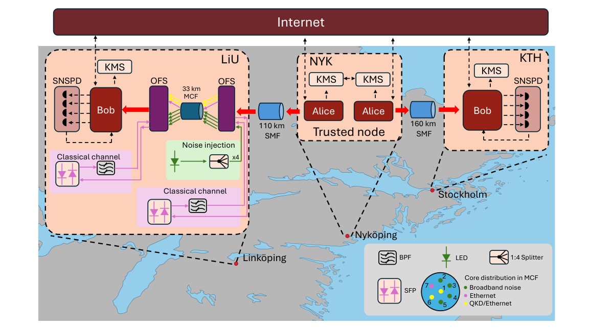 
Figure 1. Overview of the deployed experiment in southeastern Sweden. We deploy a long-distance QKD link between Link¨oping University (LiU) and the the NQCIS Albanova hub at KTH in Stockholm. The two end nodes are connected to an intermediate trusted node located outside of Nyk¨oping (NYK) through deployed single-mode fibers (SMFs). Within the LiU node an additional 33 km multi-core fiber (MCF) spool is employed extending the NYK-LiU link, while allowing spatial multiplexing of classical data channels and additional broadband noise simulating a real populated link. Both QKD receivers (Bob) have been modified to support external superconducting nanowire single-photon detection (SNSPD)...

📷 Fig 2

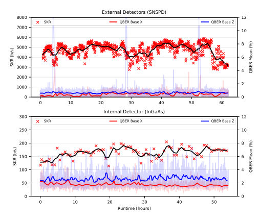 
Figure 2. QKD performance between Link¨oping and Nyk¨oping without the MCF connected. a) Secret key rate (SKR) and quantum bit error rate (QBER) when external superconducting nanowire single-photon detectors (SNSPDs) are connected to Bob. The three clear peaks in the QBER curve correspond to the periodic helium condensation cycle of the SNSPDs at the Link¨oping node (Appendix), which was set to happen every 24 hours in this measurement. The re- ported instantaneous values for the QBER are shown in faded blue and red colors, while the average values are otherwise shown as the continuous lines. b) Same results but when using the internal InGaAs avalanche single-photon detector, where we...

📷 Fig 3

 
Figure 3. QKD field-trial with active spatial multiplexing in a MCF access link. a) SKR for the Link¨oping-Nyk¨oping link, with the QKD channel passing through either core 1 or 6 of the MCF, with the other core carrying the downstream channel of a 10 Gbit/s Ethernet optical connection. The upstream channel is fixed at core 7. The other four cores carry broadband noise generated from an LED, whose current we gradually increase within each core cycle, as shown in the figure. b) Reported quantum bit error rate (QBER) for the two measurement bases (X and Z). The gap in the measurement around noon on the third day shown explicitly in b) comes from the condensation cycle of the coldhead in the...

📷 Fig 4

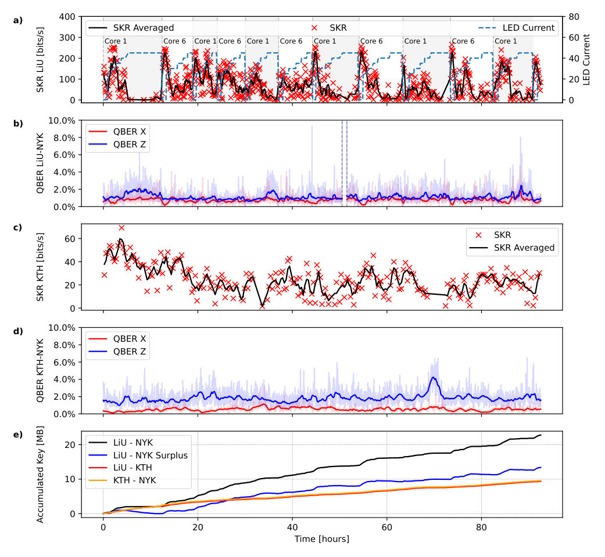 
Fig. 3(a). During this interval, the end-to-end LiU–KTH key can nevertheless continue to accumulate because pre- viously stored LiU–NYK surplus key is consumed. The LiU–NYK surplus curve therefore directly shows how the

📷 Fig 5

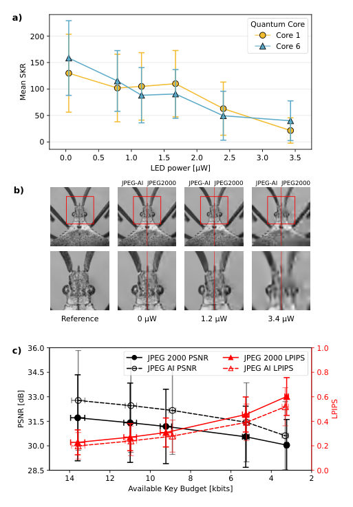 
Figure 4. SKR performance and information-theoretically secure image transmission. (a) Impact of injected broad- band noise from the LED on the deployed long-distance QKD channel connected to the MCF access link. The error bars represent the standard deviation of the SKR distribution for each LED current. (b) We use the available secret key bits to encrypt the compressed reference image using OTP, given the generated key aggregated over a time budget of 100 s. Each image is compressed using both JPEG 2000 and JPEG AI, where we compare the decompression outputs by splitting each image in half and showing the visual results. Adapted from an image by Brett Morgan, University of Texas at...

**Summary.** The research demonstrates a functional trusted-node QKD link over 300 km using deployed commercial hardware integrated with multi-core fibers. Key findings include the necessity of advanced detectors (SNSPDs) for high performance and showing that the achievable key rate directly limits the fidelity of subsequent quantum-secured applications, such as image encryption.

**Why it may be interesting.** This work is highly relevant as it bridges fundamental quantum communication theory with practical engineering challenges, specifically addressing the integration of quantum signals into complex, noisy, and dynamically reconfigurable classical fiber infrastructure.

Detailed structure

**Main problem.** Demonstrating trusted-node Quantum Key Distribution (QKD) over long distances ($\sim 300$ km) in realistic communication networks that include heterogeneous fiber infrastructure and coexisting classical traffic.

**Main result.** The setup successfully demonstrates QKD operation with active core switching and autonomous reinitialization in a dynamic, multi-core fiber environment, while also showing how image fidelity depends on the available key budget.

**Method.** The authors implemented a trusted-node QKD link using commercial systems interfaced with external superconducting nanowire single-photon detectors (SNSPDs) over deployed SMF and MCFs.

**Model / system.** The physical system is a deployed quantum communication network spanning $\sim 303$ km, utilizing two sub-links connected by a trusted node. The LiU end incorporates a $33 	ext{ km}$ Multi-Core Fiber (MCF) to simulate metropolitan access links coexisting with classical Ethernet traffic and optical noise.

**Key observables.** Secret Key Rate ($	ext{SKR}$), Quantum Bit Error Rate ($	ext{QBER}$), Image Fidelity (PSNR, LPIPS).

**Important parameters / regimes.** Total distance of $\sim 303 	ext{ km}$; SNSPD detection efficiency and dark count rates; key budget size in kbits.

**Assumptions / limitations.** The system relies on Key Management Systems ($	ext{KMSs}$) buffers to smooth out short-term fluctuations in end-to-end key generation rate, and the classical link routing does not require symmetry.

**Figures summary.** Figures illustrate the experimental setup map, $	ext{SKR}$ and $	ext{QBER}$ measurements under varying noise levels (including SNSPD cycle effects), and a comparison of image reconstruction fidelity using JPEG 2000 versus deep-learning compression (JPEG AI) as a function of available key budget.

**Paper structure.** The paper progresses from characterizing the physical link setup (long-distance trusted node over SMF/MCF) to demonstrating robust operation under dynamic noise conditions, culminating in an application study showing how limited QKD throughput constrains high-level tasks like image encryption.

Abstract

Quantum key distribution (QKD) is increasingly considered for deployment in realistic communication networks, where long distances, heterogeneous fiber infrastructure, and coexistence with classical traffic present substantial challenges. Here, we demonstrate trusted-node QKD between Linköping University and the Stockholm hub of the Swedish national quantum communication infrastructure over 270 km of deployed single-mode fiber, extended by a 33 km multi-core fiber (MCF) segment emulating a metropolitan access link, for a total distance of 303 km. The two sub-links use commercial QKD systems whose receivers are interfaced with external superconducting nanowire single-photon detectors, enabling operation at losses beyond those supported by standard internal gated-mode detectors. We operate the link while actively switching the QKD channel between two MCF cores, with co-propagating Ethernet traffic and injected broadband optical noise in the other cores. The results demonstrate the integration of commercial QKD into demanding, dynamically reconfigurable fiber infrastructure relevant to future hybrid quantum-classical networks. Finally, using the generated secret keys, we illustrate how limited and time-varying QKD throughput affects one-time-pad-protected image transmission: image fidelity depends strongly on the available QKD-generated key budget and the choice of compression algorithm, highlighting application-level challenges for QKD-based encryption in realistic scenarios.

[↑ back to top](#top)

### [On the Cryptographic Structure Required for Verifying Qubits](http://arxiv.org/abs/2606.05527v1)

**Authors:** James Bartusek, Itay Shalit  
**Type:** theory · **Category:** quantum information and computing · **PDF:** <https://arxiv.org/pdf/2606.05527v1>  
**Analysis basis:** full PDF text, analyzed in chunks
**Topic relevance:** `entanglement & information structure` **2/5** · `quantum measurements` **1/5**

📷 Fig 1

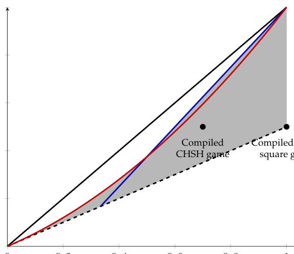 
Figure 1: Visualization of the parameter regimes captured by Theorem 1.1 and Theorem 1.2. The solid black line is 𝛿= 𝜖, and the dashed black line is 𝛿= 𝜖/2, so the region between is the region of parameters where (normal form) ToNC plausibly exists. The dark gray shade denotes the sub- region where we show that ToNC implies KA or OT (additionally assuming one-way functions for the latter). The blue curve is the key agreement threshold 𝛿= (5𝜖−1)/4, and the red curve is the oblivious transfer threshold 𝛿= (𝜖2 + 𝜖)/2. It remains open to show that ToNC in the white region below the solid black line implies KA or OT. However, we note that ToNC with robust completeness and any 𝜖/2 ≤𝛿&lt; 𝜖implies...

**Summary.** This paper rigorously connects the physical concept of testing for non-commuting observables on qubits to foundational cryptographic primitives like Key Agreement and Oblivious Transfer. By formalizing this Test of Non-Commutation (ToNC), the authors prove that satisfying quantum anti-commutation tests implies strong computational security guarantees, while also developing advanced post-quantum amplification tools for these protocols.

**Why it may be interesting.** For a theoretical physicist working on quantum information, this work provides deep connections between fundamental physical requirements (like anti-commutation in qubit verification) and the mathematical structure of modern cryptography. It suggests that verifying basic quantum properties might be as hard as achieving secure key exchange.

Detailed structure

**Main problem.** The work aims to characterize the cryptographic structure required for verifying quantum computational processes, specifically by relating qubit tests to established primitives like Key Agreement (KA) and Oblivious Transfer (OT). It seeks to establish strong cryptography from classical tests of anti-commutation.

**Main result.** The authors prove that a Test of Non-Commutation (ToNC) implies classical-communication Key Agreement (KA), and ToNC combined with one-way functions implies Oblivious Transfer (OT). They also develop post-quantum amplification theorems for KA and OT.

**Method.** The methodology involves developing formal definitions for interactive quantum protocols (like $(\epsilon, \delta)$-ToNC) and using advanced cryptographic techniques such as hybrid arguments and sequential repetition to derive implications between these primitives.

**Model / system.** The primary model is the abstract concept of a qubit test, formalized as an interactive protocol involving two binary observables ($P_0, P_1$) that must anti-commute. The analysis focuses on the security parameters ($\epsilon, \delta$) governing the success and failure gaps of these protocols.

**Key observables.** The key observables are the advantage parameters $\epsilon$ (completeness/correctness) and $\delta$ (soundness/security gap) associated with the ToNC protocol. Other observables include quantum prediction advantages ($\gamma$).

**Important parameters / regimes.** Critical parameter regimes include thresholds like $\delta < 5\epsilon^{-1}/4$ for KA implication, and the general security parameters $(\epsilon, \delta)$ that define the strength of the underlying protocols.

**Assumptions / limitations.** The results rely on assumptions such as the existence of one-way functions (for OT) and the ability to perform post-quantum hardness amplification techniques, which are themselves based on established cryptographic theorems.

**Figures summary.** Figure 1 visually summarizes the parameter regimes showing the thresholds ($\delta$ vs. $\epsilon$) under which ToNC implies KA or OT.

**Paper structure.** The paper progresses by first defining the core primitive (ToNC), then establishing implications to classical cryptography (KA, OT) using specific parameter bounds, and finally developing advanced post-quantum amplification theorems for these cryptographic primitives.

Abstract

Classically testing for the presence of anti-commuting operators on a quantum device is a critical tool underpinning recent progress in classical verification of quantum computation. While such tests can be based on cryptographic assumptions, known constructions rely on highly structured assumptions, e.g. trapdoor claw-free functions.   In this work, we seek to explain this state of affairs by constructing strong cryptography from (certain forms of) classical tests of anti-commutation. In particular, we formulate the notion of a test of non-commutation (ToNC), an interactive protocol between a quantum prover and classical verifier in which the prover's final-round response is obtained by measuring one of two binary observables $P_0,P_1$ depending on the verifier's challenge bit $c$. We prove that, for a broad range of parameters, ToNC implies classical-communication key agreement (KA), and ToNC combined with one-way functions implies oblivious transfer (OT).   Along the way, we develop tools for and provide the first known results on hardness amplification for post-quantum KA and OT, where communication is classical but adversaries may be quantum. In particular, we prove the following results of independent interest.   - Post-quantum hard-core measure theorem: For any efficiently sampleable high-min-entropy distribution $D$ over pairs $(x,b)$ such that quantum circuits have advantage at most $δ$ in predicting $b$ from $x$, there exists a sub-distribution $M\preceq D$ of density $(1-δ)$ on which $b$ is nearly optimally quantum-hard to predict.   - Post-quantum interactive XOR lemma: Given any classically-interactive protocol, if quantum adversaries have advantage at most $δ$ in guessing a private challenger bit $b$, then two sequential repetitions reduce the advantage for predicting the XOR of the challenger bits $b_1\oplus b_2$ to at most $δ^2+\rm{negl}(λ)$.

[↑ back to top](#top)

### [Superconductivity beyond band geometry: emergence of pair quantum geometry](http://arxiv.org/abs/2606.06017v1)

**Authors:** Mehmet Akif Keskiner, Menderes Işkın  
**Type:** theory · **Category:** strongly correlated electrons · **PDF:** <https://arxiv.org/pdf/2606.06017v1>  
**Analysis basis:** full PDF text, analyzed in chunks
**Topic relevance:** `analog quantum simulation` **2/5** · `Keldysh / 2PI / non-Gaussian methods` **1/5**

📷 Fig 1

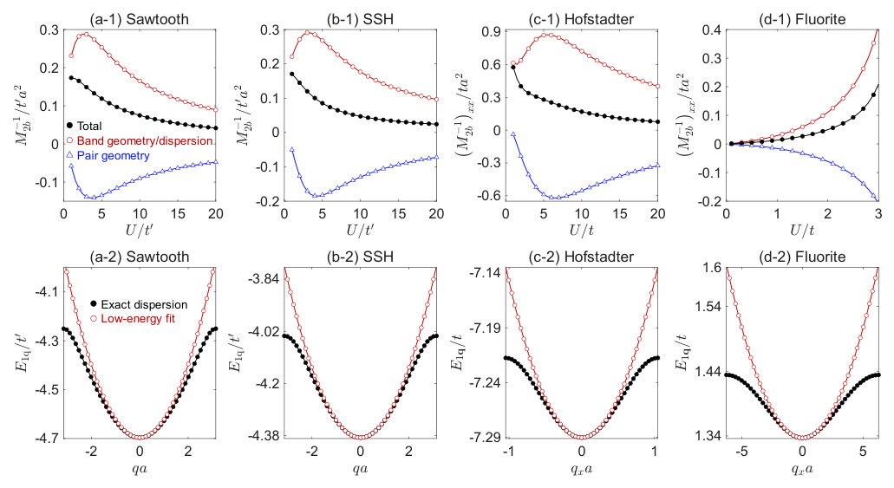 
FIG. 1. Top panels: “Conventional” (band-dispersion and band-geometry) contribution (red open circles) and pair-geometry contribution (blue open triangles) from Eq. (4), together with their sum (black filled circles), as a function of interaction strength. Bottom panels: Exact bound-state dispersions (black filled circles) compared with the quadratic expansion from Eq. (4) (red open circles), showing excellent agreement in the small-q regime for representative parameters: U = 3t′ (sawtooth and SSH models), U = 5t (Hofstadter lattice), and U = t (fluorite lattice).

**Summary.** This work develops a rigorous framework to quantify 'pair quantum geometry,' extending the concept of quantum geometry from single electrons to Cooper pairs in superconductors. By analyzing the effective mass tensor derived from Hubbard models on various lattices, the authors show that this geometric term provides a fundamental correction to superconductivity's properties beyond simple band theory. This advances our understanding of pairing physics by incorporating underlying lattice topology into superconducting phenomenology.

**Why it may be interesting.** The explicit derivation of a geometric contribution to superconductivity's effective mass provides a novel, purely theoretical lens through which to view pairing mechanisms beyond standard BCS theory, connecting topology/geometry directly to macroscopic superconducting properties.

Detailed structure

**Main problem.** The research extends the concept of quantum geometry from single-particle Bloch states to two-body bound states and Cooper pairs in superconductors.

**Main result.** It establishes 'pair quantum geometry' as a fundamental, quantifiable contribution to the effective mass of superconducting pairs, distinct from conventional band structure effects.

**Method.** The authors derive exact effective-mass theorems by analyzing the secular equation governing two-body bound states and Cooper pair fluctuations using functional integrals and spectral decomposition techniques.

**Model / system.** The primary model is the multiband Hubbard Hamiltonian applied to various lattices (1D, 2D, 3D), allowing for analysis across different superconducting regimes (BCS vs. BEC).

**Key observables.** Inverse effective mass tensor ($M^{-1}$), pair quantum metric, complex Cooper-pair effective mass (whose imaginary part reflects Landau damping).

**Important parameters / regimes.** Interaction strength ($U$), temperature relative to $T_c$, and lattice geometry (e.g., sawtooth, fluorite-like).

**Assumptions / limitations.** The analysis relies on assuming nondegenerate extrema for long-wavelength dispersion and using analytic continuation in the many-body setting.

**Figures summary.** Figures illustrate the decomposition of the inverse effective mass into conventional and pair-geometry contributions across varying interaction strengths, alongside comparisons to exact bound-state dispersions.

**Paper structure.** The paper progresses by first establishing single-particle geometry via quantum metrics, then extending this formalism to two-body bound states (two-body problem), and finally generalizing it to the many-body Cooper pair fluctuation propagator in the superconducting state.

Abstract

Quantum geometry shapes the effective mass of Bloch particles through the geometric properties of single-particle states. Here we show that this principle extends to paired states. Starting from a generic multiband Hubbard model, we derive an exact effective-mass theorem for two-body bound states and its many-body counterpart for Cooper pairs near the critical temperature within Gaussian fluctuation theory. In both cases, the inverse effective mass separates into a ``conventional'' band-structure contribution and a new geometric contribution, pair quantum geometry, governed by quantum metrics on the pairing manifold, which becomes nontrivial when pairing is non-uniform across sublattices. In the many-body setting, analytic continuation renders the fluctuation kernel non-Hermitian, producing a biorthogonal pair geometry and a generally complex Cooper-pair effective mass whose imaginary part reflects Landau damping. Exact calculations on one-, two-, and three-dimensional lattice models show that pair quantum geometry can make quantitatively significant contributions to the effective mass. These results establish pair quantum geometry as a fundamental ingredient of superconductivity beyond conventional band geometry.

[↑ back to top](#top)

### [Barbell Codes: qLDPC Codes for Superconducting Quantum Hardware](http://arxiv.org/abs/2606.06062v1)

**Authors:** Shin Ho Choe, Vincent Steffan, Florian Vigneau, Pedro Parrado-Rodríguez, Hsiang-Sheng Ku, Martin Leib, Francisco Revson Fernandes Pereira, Fedor Šimkovic  
**Type:** theory · **Category:** quantum information and computing · **PDF:** <https://arxiv.org/pdf/2606.06062v1>  
**Analysis basis:** full PDF text, analyzed in chunks
**Topic relevance:** `QC/QI experiment` **2/5**

📷 Fig 1

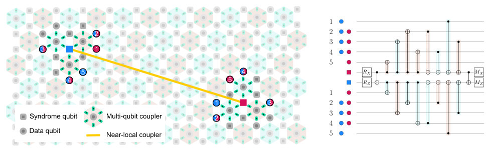 
Figure 1: In (a), we give a snapshot of the chip layout for the Barbell architecture. Grey elements are qubits: Square-shaped ones indicate syndrome qubits, circle-shaped ones inside the blue and red hexagons are central elements, and the remaining ones are data qubits. In this way, two-qubit interactions between syndrome and data qubits are realized via central elements. We highlight a pair of X- and Z- syndrome qubits together with their supports in red, resp. blue. The two syndrome qubits are connected using a near-local coupler. In (b), we depict a possible depth-12 syndrome extraction circuit for the pair of X- and Z- stabilizers using superdense syndrome extraction. Using central...

📷 Fig 2

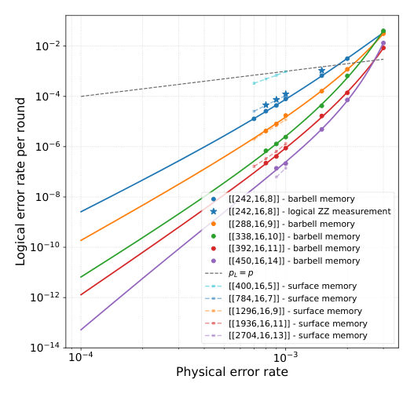 
Figure 2: Performance of a family of barbell codes under uniform circuit-level noise. All codes belong to the same family, more precisely, are barbell codes of different sizes constructed from the barbell shown in Figure 1 (a). In (a), we show performance curves for barbell codes under circuit-level noise for memory experiments (circles), logical measurement (stars), and, as a comparison, 16 patches of surface code (squares). All logical error rates are plotted per round, and estimated from simulating d rounds with at least 100 failures sampled. In (b), we highlight some of the logical error rates for p = 0.0009 and p = 0.001. Here, the first column specifies the experiment type (M for...

📷 Fig 3

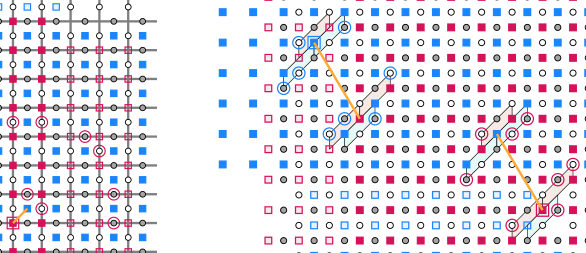 
Figure 5: In (a), we show a tile code with an X- and a Z-type stabilizer highlighted. For all boundary stabilizers, we added dummy stabilizer qubits. In (b), we show a version of this tile code in which qubits, as well as X- and Z-type checks, are moved in space. In this way, the support of both the X- and the Z-type stabilizers is contained in the ‘barbell’ formed by the neighbors of a pair of X- and Z-checks in the six-qubit star lattice layout. We mention that this is the [[242, 16, 8]] code for which we run circuit-level noise simulations in the Main Text.

📷 Fig 4

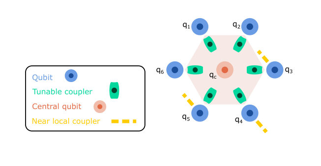 
Figure 6: Unit cell of six-qubit star lattice plus near-local coupler (6QSL+NLC) architecture. Six qubits are connected via tunable couplers to a central element in a star topology. The pink hexagon highlights the multi-qubit coupler formed by the six tunable couplers and the central element. The extremities of near-local couplers are drawn for three qubits (the syndrome qubits of the barbell code).

📷 Fig 5

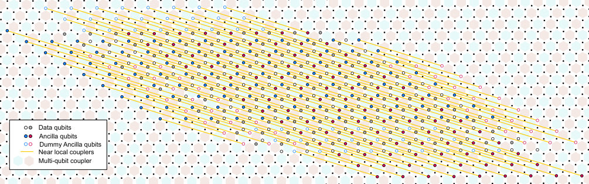 
Figure 7: Illustration of the weight-8 barbell code of distance 8 (Fig. 5) in six-qubit star lattice plus near- local coupler architecture (6QSL+NLC). For simplicity, the central elements and tunable coupler are only represented in the form of multi-qubit couplers.

**Summary.** This paper proposes 'barbell codes,' a novel family of qLDPC codes designed specifically for superconducting quantum chips. It solves the major scaling hurdle in QEC by maintaining constant hardware complexity as code distance grows. Through detailed circuit analysis and simulation, it proves that these codes can achieve fault tolerance with significantly lower qubit overhead than established methods.

**Why it may be interesting.** The detailed analysis of stabilizer evolution ($L_X \in S'$, $L_Z \in S'$) provides rigorous mathematical proof that the proposed hardware structure can support fault-tolerant logical operations, which is crucial for any theoretical physicist designing quantum computation protocols.

Detailed structure

**Main problem.** The core challenge is implementing efficient Quantum Error Correction (QEC) codes, specifically qLDPC codes, on fixed-connectivity superconducting quantum chips without increasing hardware complexity for non-local interactions.

**Main result.** The authors introduce 'barbell' qLDPC codes, demonstrating that they maintain constant hardware complexity as code distance increases and achieve fault tolerance at physical noise strengths of $10^{-4}$ over trillions of cycles.

**Method.** The work involves constructing the barbell code structure based on tile codes, detailing a superdense syndrome extraction cycle using native two-qubit interactions, and simulating performance under circuit-level noise.

**Model / system.** The physical platform is superconducting qubits utilizing a Barbell architecture built upon a hexagonal tiling (6QSL+NLC). The mathematical model is the qLDPC code, specifically the barbell family, which offers low overhead compared to surface codes.

**Key observables.** Logical Error Rate (LER) per QEC round; Hardware Complexity ($	ext{Chw}$); Logical Pauli measurement fidelity.

**Important parameters / regimes.** Physical noise strength ($p \approx 10^{-4}$); Code distance ($d$ up to 14); Overhead ($<30$ data qubits per logical qubit).

**Assumptions / limitations.** The analysis assumes the ability to perform joint Pauli measurements and relies on the specific connectivity provided by the Barbell architecture for syndrome extraction.

**Figures summary.** Figures illustrate the chip layout (Barbell architecture), compare LER vs. distance against surface codes, and detail the construction steps of tile/barbell codes using lattice surgery concepts.

**Paper structure.** The paper progresses from defining the need for QEC on fixed-connectivity hardware to introducing the barbell code structure via tile code principles. It then details the syndrome extraction cycle circuit, proves that logical operators are preserved through this cycle (Theorem 1), and finally simulates performance metrics like LER and $	ext{Chw}$ to validate feasibility.

Abstract

The major challenge on the way to fault-tolerant quantum computing comes from the insufficient quality of hardware components and the difficulty of scaling their number without further compromising fidelity. Quantum Low-Density Parity-Check (qLDPC) codes offer a promising solution by encoding logical qubits with low overhead and at a comparatively high code distance. However, it remains an open question how to scalably implement efficient qLDPC codes on fixed-connectivity quantum chips without increasing hardware complexity to enable the non-local interactions in their underlying QEC cycles. We resolve this challenge for the first time by introducing a family of qLDPC "barbell" codes accompanied by a realistic chip layout that natively supports all required two-qubit interactions. Crucially, the hardware complexity required to implement barbell codes remains constant as code distance increases. We provide a detailed investigation into the feasibility of all required hardware components and simulate a specific family of barbell codes against circuit-level noise. We find that, with a modest overhead of $<30$ data qubits per logical qubit, barbell codes can preserve information at a physical noise strength of $10^{-4}$ for several trillion QEC cycles. Simulations of logical multi-Pauli measurements, performed with circuits tailored to the chip, yield similar logical performance per QEC round, indicating that entangling gates between logical qubits in barbell codes can be realized fault-tolerantly.

[↑ back to top](#top)

### [Unlocking Exponential and Unbounded Robust Gains in Shannon Capacity of Classical Multiple Access Channels with Causal CSIT via Quantum Entanglement Assistance](http://arxiv.org/abs/2606.05412v1)

**Authors:** Yuhang Yao, Syed A. Jafar  
**Type:** theory · **Category:** quantum information and computing · **PDF:** <https://arxiv.org/pdf/2606.05412v1>  
**Analysis basis:** full PDF text, analyzed in chunks
**Topic relevance:** `entanglement & information structure` **2/5**

📷 Fig 1

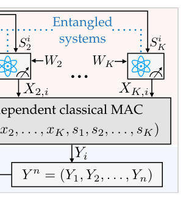 
Figure 1: Transmitter-side quantum entanglement-assisted classical MAC with causal CSIT.

📷 Fig 2

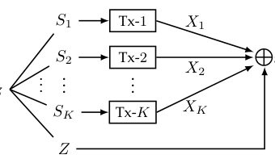 
Figure 2: Additive MAC with state-dependent interference. Tx-k denotes the kth transmitter. PS1···SKZ denotes the distribution of (S1, . . . , SK, Z).

📷 Fig 3

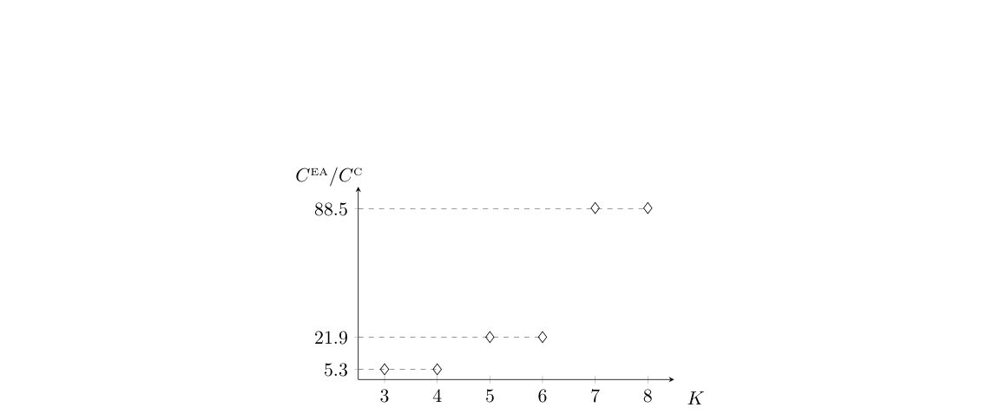 
Figure 4: The ratio of entanglement-assisted capacity to classical capacity, CEA/CC is illustrated for Channel B1, versus the number of users K.

**Summary.** The paper proves that for certain complex Multiple Access Channels with state information and causal CSIT, using quantum entanglement assistance leads to capacity gains that grow exponentially or are unbounded compared to purely classical schemes. This demonstrates a significant advantage of quantum resources in enhancing communication throughput beyond what is classically possible.

**Why it may be interesting.** This work provides a strong theoretical demonstration of how quantum resources can fundamentally alter the achievable communication rates in classical multi-user systems, offering insights into the limits of classical vs. quantum information processing in wireless channels.

Detailed structure

**Main problem.** The work investigates whether quantum entanglement assistance can provide large (exponential or unbounded) multiplicative gains in the Shannon capacity of classical Multiple Access Channels (MACs). It specifically addresses this when causal Channel State Information at the Transmitters (CSIT) is available.

**Main result.** Quantum entanglement assistance provides a multiplicative capacity advantage that grows exponentially with the number of users K, and can be unbounded as the state alphabet size increases. These gains are robust even against significant quantum noise.

**Method.** The analysis uses information-theoretic techniques, relating MAC capacity to optimal winning probabilities in associated XOR games. Achievability and converse bounds are established using direct coding theorems and entropy calculations.

**Model / system.** The model is a classical K-user Multiple Access Channel (MAC) with state-dependent interference, often analyzed via an additive structure involving XOR operations over binary or larger alphabets. The assistance mechanism involves providing quantum entanglement only to the transmitters.

**Key observables.** Multiplicative capacity gain factor ($	ext{CEA}/	ext{CC}$), achievable rates ($R_k$), and error probabilities ($P_e$).

**Important parameters / regimes.** Number of users (K), size of alphabet (m or $r$), degree of noise/depolarization ($\gamma$), and the availability of causal CSIT.

**Assumptions / limitations.** The gains are based on entanglement assistance provided *only* to the transmitters. The analysis assumes specific channel structures, such as additive MACs with state-dependent interference.

**Figures summary.** Figures illustrate the setup (Transmitter-side quantum entanglement-assisted classical MAC) and plot the multiplicative capacity gains ($	ext{CEA}/	ext{CC}$) for varying numbers of users K across different channel classes.

**Paper structure.** The paper builds by first establishing the theoretical framework using XOR games to relate classical and EA capacities. It then applies this framework to specific, complex MAC models (e.g., state-dependent interference) to derive concrete bounds on exponential and unbounded capacity gains, concluding with robustness checks against noise.

Abstract

Quantum entanglement assistance is known to improve the Shannon capacity of classical communication networks but the largest gains noted thus far are rather modest (less than 6%), motivating the question: are large capacity gains ever possible? It is shown in this work that in the presence of causal channel state information at the transmitters, quantum entanglement assistance provides a multiplicative capacity advantage that grows exponentially with the number of users K for certain classical K-user multiple access channels with fixed size (binary) alphabet for inputs, outputs and states. Similarly, in the presence of causal channel state information at the transmitters, quantum entanglement assistance is shown to provide a multiplicative capacity advantage that is unbounded as the size of the state alphabet grows, while the number of users (K=3) and the input and output alphabet (binary) are held fixed. Even with only a few users and small alphabet sizes, substantial multiplicative gains in capacity are found, e.g., with binary inputs, outputs and states, multiplicative gains by factors exceeding 21 and 88 are noted with K=5 and K=7 users, respectively. The gains are robust in the sense that they persist even with noisy quantum resources, e.g., an exponential (in K) capacity advantage from quantum entanglement assistance remains available even if each entangled qubit independently depolarizes completely with probability $\approx$ 30%. The gains are based on quantum entanglement assistance provided only to the transmitters.

[↑ back to top](#top)

### [$E_\infty^{1,2}$-type Lieb-Schultz-Mattis anomalies, deconfined quantum critical points, and non-invertible symmetry breaking](http://arxiv.org/abs/2606.06343v1)

**Authors:** Hao-Ran Zhang, Hanlin Lin, Shuo Yang, Qing-Rui Wang  
**Type:** theory · **Category:** strongly correlated electrons · **PDF:** <https://arxiv.org/pdf/2606.06343v1>  
**Analysis basis:** full PDF text, analyzed in chunks
**Topic relevance:** `Keldysh / 2PI / non-Gaussian methods` **1/5** · `analog quantum simulation` **1/5** · `driven-dissipative phase transition` **1/5** · `exotic spin models in light-matter` **1/5**

📷 Fig 1

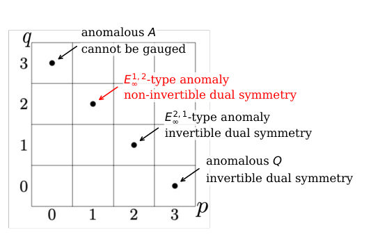 
FIG. 1: Effect of LHS anomaly components under gauging an Abelian normal subgroup A of G. The key result is that a nontrivial E1,2 ∞component produces projective A-sectors and hence a non-invertible dual symmetry, whereas E3,0 ∞and E2,1 ∞data keep the dual symmetry invertible.

📷 Fig 2

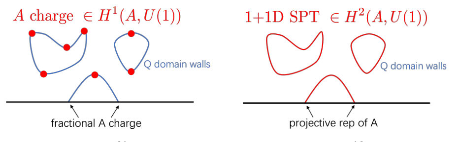 
FIG. 2: Decorated-domain-wall representatives for a 2+1D bulk SPT with 1 →A →G →Q →1. Left: an E2,1 ∞ decoration puts A charges on Q-wall junctions, so gauging A keeps the dual symmetry invertible. Right: an E1,2 ∞ decoration puts a 1+1D A-SPT on each Q wall; its boundary endpoint carries a projective A representation, which becomes a non-invertible dual defect after gauging A.

📷 Fig 3

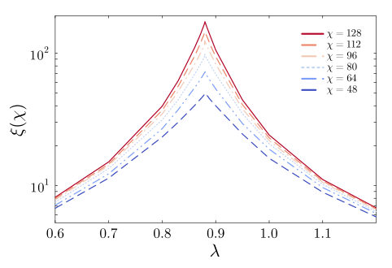 
FIG. 3: The peak of the MPS correlation length ξ(χ) grows with increasing bond dimension χ, indicating a continuous transition between the dimer phase near λ = 0 and the zFM phase at large positive λ. As shown in Fig. 4, the peak height follows a power-law scaling with χ.

📷 Fig 4

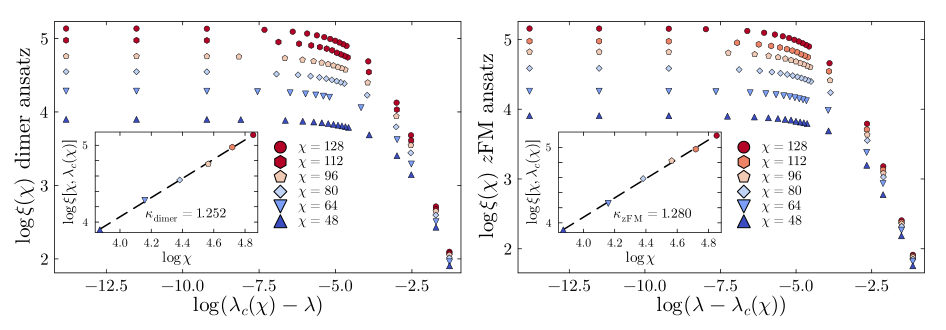 
FIG. 4: The MPS correlation length ξ(χ) exhibits power-law scaling with χ in the critical regime. In the insets, the peak value ξ[χ, λc(χ)] is plotted as a function of χ, from which the finite-entanglement exponent κ is extracted. The estimate from the dimer ansatz is shown in the left panel, while that from the zFM ansatz is shown in the right panel.

📷 Fig 5

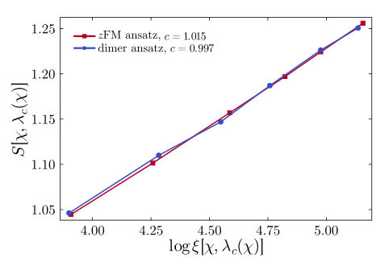 
FIG. 5: The MPS entanglement entropy S(χ) is plotted as a function of the logarithm of the MPS correlation length ξ(χ) at the pseudocritical points λc(χ). The linear dependence is consistent with entropy scaling S(χ) ∼c

**Summary.** The paper establishes a general mechanism showing that specific types of Lieb-Schultz-Mattis anomalies ($E_{1,2}^{\infty}$) dictate that the resulting deconfined quantum critical points must be dual to the spontaneous breaking of a non-invertible symmetry. This is demonstrated using 1D spin chains and provides a powerful mathematical tool for classifying exotic quantum phase transitions.

**Why it may be interesting.** This work provides a deep mathematical framework connecting fundamental symmetry constraints (LSM) to the nature of quantum critical points via advanced concepts like non-invertible symmetries, which are crucial for understanding exotic topological phases in condensed matter systems.

Detailed structure

**Main problem.** The study characterizes Deconfined Quantum Critical Points (DQCPs) associated with Lieb-Schultz-Mattis (LSM) anomalies in 1D spin chains, focusing on the implications of an $E_\infty^{1,2}$-type anomaly.

**Main result.** An $E_{1,2}^{\infty}$-type LSM anomaly necessarily leads to a non-invertible dual symmetry upon gauging the internal symmetry, defining 'type-II' DQCPs distinct from type-I transitions.

**Method.** The analysis uses advanced mathematical tools, including the Lyndon-Hochschild-Serre spectral sequence and category theory, to structurally characterize anomalies and gauge symmetries.

**Model / system.** The primary system is one-dimensional spin chains. A specific example analyzed is a dimer-to-ferromagnet DQCP candidate using a spin-1/2 chain with an anomalous $D_8$ LSM symmetry.

**Key observables.** The type of anomaly ($E_{1,2}^{\infty}$ vs $E_{2,1}^{\infty}$) and the nature of the dual symmetry (invertible group symmetry vs non-invertible fusion-category symmetry).

**Important parameters / regimes.** Central charge $c \approx 1$; the structure of the internal symmetry group ($D_8$); and the anomaly class $\omega_{LSM} \in E_\infty^{1,2}$.

**Assumptions / limitations.** The analysis relies on structural characterizations within the LHS spectral sequence framework and assumes Abelian normal subgroups for certain categorical simplifications.

**Figures summary.** Figure 1 summarizes that a nontrivial $E_{1,2}^{\infty}$ component causes non-invertibility in the dual symmetry. Figure 2 illustrates how $E_{1,2}^{\infty}$ leads to an A-SPT decorating the wall, resulting in a non-invertible dual defect.

**Paper structure.** The paper proceeds by mathematically characterizing the LSM anomaly using the LHS spectral sequence, establishing the general link between $E_{1,2}^{\infty}$-anomalies and non-invertible symmetries, and then illustrating this mechanism with explicit lattice constructions and numerical evidence for a specific DQCP candidate.

Abstract

We study deconfined quantum critical points (DQCP) associated with Lieb-Schultz-Mattis (LSM) anomalies in one-dimensional spin chains. Our starting point is a structural characterization of the LSM anomaly in the Lyndon-Hochschild-Serre spectral sequence: $ω_{\mathrm{LSM}}\in E_\infty^{1,2}= H^1(\mathbb Z_{\mathrm{trans}},H^2(G_{\mathrm{int}},\mathrm{U}(1)))\subseteq H^3(G_{\mathrm{int}}\rtimes_ρ\mathbb Z_{\mathrm{trans}},\mathrm{U}(1))$. Physically, this class decorates a translation defect with a projective representation of the internal symmetry $G_\mathrm{int}$. We show that gauging the internal symmetry in the presence of an $E_\infty^{1,2}$-type anomaly necessarily produces a non-invertible dual symmetry. This gives a general mechanism for type-II DQCP: in contrast to type-I examples with $E_\infty^{2,1}$-type anomalies which are dual to ordinary group-like symmetry breaking, type-II transitions are dual to spontaneous breaking of a non-invertible symmetry. We illustrate the mechanism using a spin-$1/2$ chain with an anomalous $D_8$ LSM symmetry. We construct a dimer-to-ferromagnet DQCP candidate, provide numerical evidence for a critical theory with central charge $c\approx 1$, and show, using both category theory and explicit lattice constructions, that gauging the internal symmetry yields the non-invertible $\mathrm{Rep}(H_8)$ dual symmetry.

[↑ back to top](#top)

### [BCS-BEC crossover driven by small Fermi pockets of a high-Tc cuprate superconductor](http://arxiv.org/abs/2606.05653v1)

**Authors:** Junhyeok Jeong, Yamato Enomoto, Yoshimitsu Kohama, Tomotaka Nakayama, Kotaro Ando, Kifu Kurokawa, Soonsang Huh, Zhuo Yang, Toshihiro Nomura, Matthew D. Watson, Timur K. Kim, Cephise Cacho, Chun Lin, Makoto Hashimoto, Donghui Lu, Shiro Sakai, Takami Tohyama, Kazuyasu Tokiwa, Takeshi Kondo  
**Type:** experiment · **Category:** strongly correlated electrons · **PDF:** <https://arxiv.org/pdf/2606.05653v1>  
**Analysis basis:** full PDF text, analyzed in chunks
**Topic relevance:** `Keldysh / 2PI / non-Gaussian methods` **1/5** · `Kondo & dissipative impurity` **1/5**

📷 Fig 1

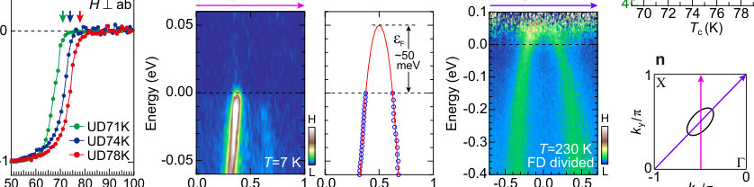 
FIG. 1. A small Fermi pocket observed by ARPES and quantum oscillation mea-

📷 Fig 2

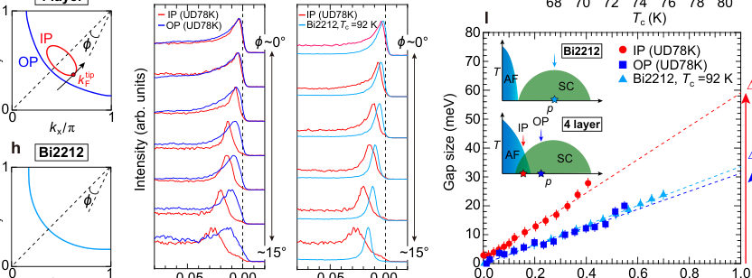 
FIG. 2. Superconducting gap and pairing strength of the pocket bands. a, ARPES band

📷 Fig 3

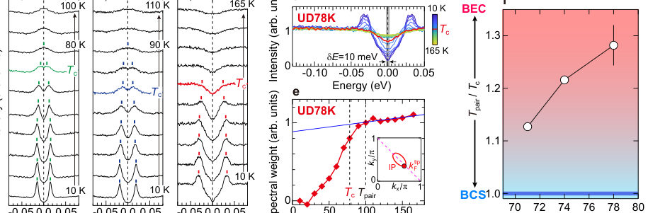 
FIG. 3. Pairing pseudogap in the pocket and its evolution with carrier doping a-c,

📷 Fig 4

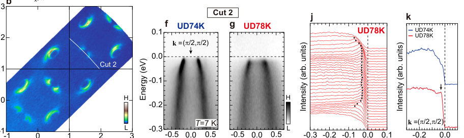 
FIG. 4. Bogoliubov flat band in the pocket. a,b, ARPES FS maps of UD71K measured with

📷 Fig 5

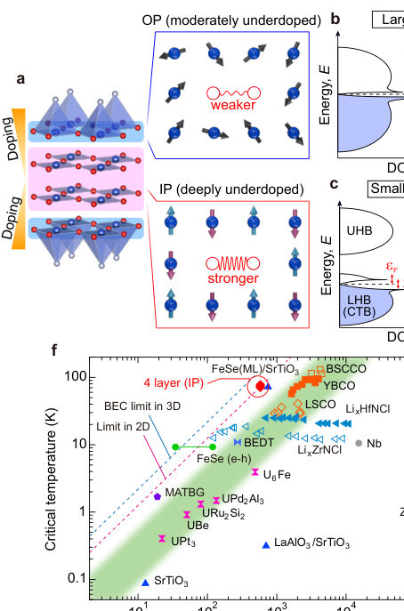 
FIG. 5.

**Summary.** The study uses ARPES and quantum oscillations on cuprate superconductors to investigate the BCS-BEC crossover. By focusing on small Fermi pockets within the inner $	ext{CuO}_2$ layers, the authors demonstrate a large superconducting gap indicative of strong coupling. This work provides crucial evidence for the pairing mechanism in high-$T_c$ materials by showing that the pocket state dictates superconductivity.

**Why it may be interesting.** This work provides direct spectroscopic evidence of strong coupling physics in a highly correlated material, linking macroscopic superconducting properties ($T_c$) to microscopic electronic features (small pockets) near theoretical limits.

Detailed structure

**Main problem.** The study aims to resolve the ambiguity regarding Fermi arcs in cuprates—whether they represent large Fermi surface segments or small Fermi pockets—and to establish a microscopic foundation for the BCS-BEC crossover mechanism.

**Main result.** The authors demonstrated the coexistence of a small Fermi pocket and a large superconducting gap, providing evidence for the BCS-BEC crossover. Crucially, this crossover emerges upon *increasing* carrier density in the inner $	ext{CuO}_2$ layers.

**Method.** The research combines Angle-Resolved Photoemission Spectroscopy (ARPES) to map band structures and measure gaps, with quantum oscillation measurements (dHvA effect) to determine Fermi surface geometry and effective masses.

**Model / system.** The physical system is the four-layer cuprate superconductor $	ext{Ba}_2	ext{Ca}_3	ext{Cu}_4	ext{O}_{8}(	ext{F},	ext{O})_2$. The focus is on distinguishing electronic behavior between the inner and outer $	ext{CuO}_2$ planes, which exhibit distinct superconducting properties.

**Key observables.** Superconducting gap ($\Delta$), Fermi pocket size/location, ratio $\Delta_{	ext{pocket}}/\epsilon_F$, $T_c/T_F$ ratio, and the presence of a Bogoliubov flat band.

**Important parameters / regimes.** Small doping range ($<1\%$) where crossover occurs; high ratios like $\Delta_{	ext{pocket}}/\epsilon_F \sim 0.6$; and comparisons to theoretical upper bounds for 2D superconductivity.

**Assumptions / limitations.** The superconducting properties of the inner $	ext{CuO}_2$ layers (IPs) are assumed to dominate or determine the bulk critical temperature ($T_c$).

**Figures summary.** Figures show Fermi surface mappings, ARPES spectra illustrating gap openings and band dispersions, dHvA oscillation plots confirming pocket geometry, and comparisons of superconducting gaps between IP and OP.

**Paper structure.** The paper systematically uses multiple experimental techniques (ARPES, quantum oscillations) on multilayer cuprates to characterize the electronic structure. It contrasts findings from different planes (IP vs. OP) and doping levels to build a cohesive argument supporting the BCS-BEC crossover driven by small Fermi pockets.

Abstract

Fermi arcs observed in underdoped cuprates have sparked debate over whether they represent segments of a large Fermi surface or small Fermi pockets. This ambiguity has long hindered their classification as either the conventional Bardeen-Cooper-Schrieffer (BCS) regime or the strongly coupled Bose-Einstein condensation (BEC) crossover limit. Here, using angle-resolved photoemission spectroscopy and quantum oscillations, we demonstrate the coexistence of a small Fermi pocket and a large superconducting gap in the clean inner CuO2 layers of the four-layer cuprate Ba2Ca3Cu4O8(F,O)2. This coexistence constitutes a hallmark of the BCS-BEC crossover and has remained elusive for decades. Despite the presence of antiferromagnetic (AF) order, the superconducting gap in the small pocket is remarkably large, yielding a gap-to-Fermi-energy ratio (Delta_pocket/e_F ~ 0.6) and a critical-to-Fermi-temperature ratio (Tc/TF ~ 1.3) that reach the theoretical upper bound for two-dimensional superconductivity. Unexpectedly, this BCS-BEC crossover emerges not as the carrier density decreases but as it increases, abruptly within a narrow doping range of less than 1%. These results provide a long-sought microscopic foundation for the d-wave pairing mechanism in doped AF-Mott insulators.

[↑ back to top](#top)

### [Efficient Quantum Circuit Construction of Controlled Time-Evolution for Arbitrary Pauli-Sum Hamiltonians](http://arxiv.org/abs/2606.06070v1)

**Authors:** Shintaro Fujiwara, Naoki Yamamoto, Naoki Ishikawa  
**Type:** theory · **Category:** quantum information and computing · **PDF:** <https://arxiv.org/pdf/2606.06070v1>  
**Analysis basis:** full PDF text, analyzed in chunks
**Topic relevance:** `analog quantum simulation` **1/5** · `non-equilibrium dynamics` **1/5**

📷 Fig 1

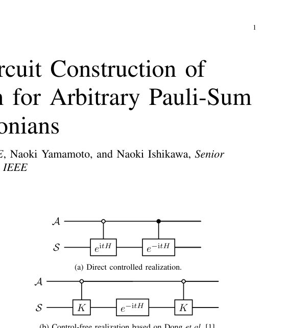 
Fig. 1. Two realizations of the signed controlled time evolution in Eq. (1). The registers A and S are the ancilla and system registers, respectively. Open and filled control circles denote controls conditioned on |0⟩A and |1⟩A, respectively. In (a), the ancilla directly controls the two time-evolution branches. In (b), the two occurrences of the Pauli string K implement the conjugation Ke−itHK = eitH. Consequently, the ancilla controls only K, while the time-evolution block itself remains uncontrolled.

📷 Fig 2

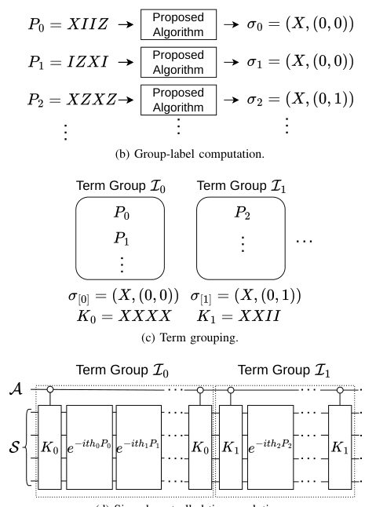 
Fig. 2. Overall flow of the proposed grouped control-free construction. The input Hamiltonian is first processed term by term, and the resulting data are then assembled into the final signed controlled time-evolution circuit. (a) The starting point is a Pauli-sum Hamiltonian written as a linear combination of Pauli strings. (b) The proposed recursive algorithm is applied to each Pauli term to compute its group label. (c) Pauli terms with the same group label are collected into the same term-group, and that label determines the sign-flip Pauli string assigned to the group. (d) The grouped data are finally converted into a signed controlled time-evolution circuit in which the ancilla controls...

📷 Fig 3

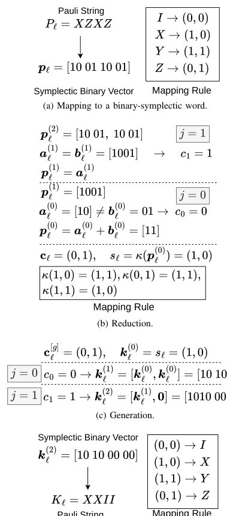 
Fig. 3. Internal flow of the recursive construction for one Pauli term. The Pauli string is converted to a binary-symplectic word, Reduction produces a control-bit sequence and a root symbol, Generation constructs the sign-flip word from the corresponding group label, and the result is mapped back to a Pauli string. The mapping rule used to convert the root symbol into the seed symbol is the concrete map κ specified in Eqs. (56) and (57). The displayed example uses Pℓ= XZXZ with n = 4 and N = 4, and no zero padding is present.

📷 Fig 4

 
Fig. 3 shows the data flow of Reduction and Generation for one Pauli term.

📷 Fig 5

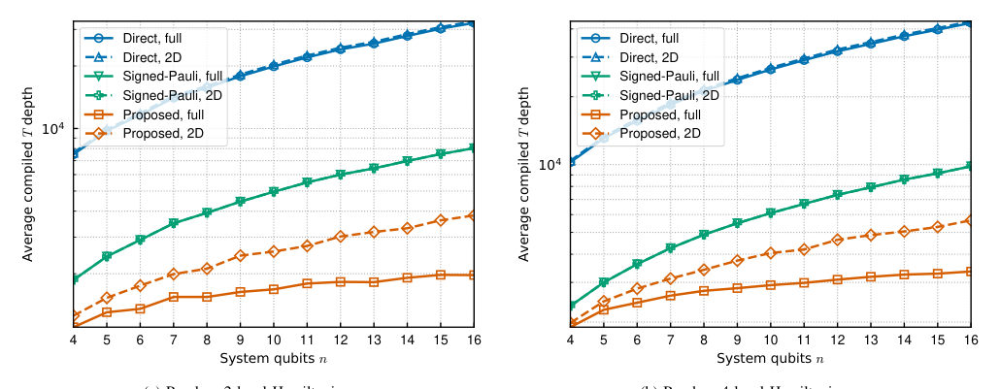 
Fig. 4. Average compiled T depth for random Hamiltonians. The direct construction controls every elementary gate in the controlled time-evolution circuit. The signed-Pauli construction implements each signed controlled Pauli evolution as an ancilla-extended Pauli rotation. The proposed construction removes ancilla control from the grouped Pauli-evolution blocks.

**Summary.** The paper presents a novel, efficient algorithm to construct quantum circuits for controlled time-evolution governed by Pauli-sum Hamiltonians. By grouping Hamiltonian terms and using specialized sign-flip Pauli strings, it drastically reduces the circuit depth compared to standard methods. This is crucial for simulating complex physical models like spin systems on current quantum hardware.

**Why it may be interesting.** This work provides concrete algorithmic improvements for simulating complex quantum dynamics on near-term hardware by minimizing the required number of costly non-Clifford gates (T gates).

Detailed structure

**Main problem.** Developing an efficient quantum circuit construction for controlled time-evolution when the governing Hamiltonian is a Pauli-sum.

**Main result.** The proposed recursive algorithm significantly reduces compiled T depth and CX depth (e.g., 85.2% reduction on Kagome) compared to conventional methods by grouping terms and implementing control-free evolution blocks.

**Method.** The method partitions the Pauli-sum Hamiltonian into term-groups, finds associated sign-flip Pauli strings ($K_g$) using symplectic algebra, and constructs the controlled evolution circuit based on these groups.

**Model / system.** The system is a quantum register evolving under an arbitrary Pauli-sum Hamiltonian $H = \sum h_\ell P_\ell$, requiring controlled time-evolution $	ext{DH}(t)$. Benchmarks use structured spin Hamiltonians like the Kagome lattice.

**Key observables.** Compiled T depth, compiled CX depth, and phase-rotation layer count are used to quantify circuit efficiency improvements.

**Important parameters / regimes.** The size of the system (e.g., 24 spins for Kagome), connectivity model (full vs. grid), and the structure of the Pauli terms.

**Assumptions / limitations.** The construction relies on mapping commutation relations to binary symplectic compatibility problems, and later sections assume applicability via product formulas (Lie-Trotter expansion).

**Figures summary.** Figures illustrate circuit depth comparisons for random and structured Hamiltonians (Kagome lattice), showing the dramatic reduction in T/CX depth achieved by the proposed method.

**Paper structure.** The paper progresses from defining the controlled time-evolution problem to developing a recursive, group-based algorithm utilizing symplectic algebra. It then validates this approach through extensive numerical benchmarks comparing circuit depths against direct and signed-Pauli constructions.

Abstract

Controlled time-evolution circuits select forward or backward Hamiltonian time evolution according to the state of an ancilla qubit. They are fundamental building blocks in quantum eigenvalue transformation of unitaries, Hamiltonian filtering, and related quantum algorithms. A direct realization adds ancilla control to the elementary gates of the time-evolution circuit and therefore increases the two-qubit gate count, compiled T depth and CX depth. We develop an efficient recursive algorithm that, for an arbitrary Pauli-sum Hamiltonian, partitions the input Pauli terms into groups and assigns to each group a sign-flip Pauli string that anti-commutes with the in-group terms, thereby removing ancilla control from the grouped time-evolution blocks. Numerical benchmarks on random Hamiltonians and structured spin Hamiltonians show reductions in compiled T depth and compiled CX depth. For a Kagome Hamiltonian with 24 spins under full connectivity, the proposed construction reduces the compiled T depth by 85.2% and the compiled CX depth by 68.9%, compared with a conventional implementation that decomposes the Hamiltonian into individual Pauli terms and implements the controlled time evolution of each term by directly adding the ancilla qubit to the corresponding Pauli-rotation circuit.

[↑ back to top](#top)

### [Newton's Identity in Finite-Bead Fermionic Partition Function](http://arxiv.org/abs/2606.05442v1)

**Authors:** A. Chaudhary, J. Valenzuela  
**Type:** theory · **Category:** statistical mechanics · **PDF:** <https://arxiv.org/pdf/2606.05442v1>  
**Analysis basis:** full PDF text, analyzed in chunks
**Topic relevance:** `Keldysh / 2PI / non-Gaussian methods` **1/5** · `analog quantum simulation` **1/5**

📷 Fig 1

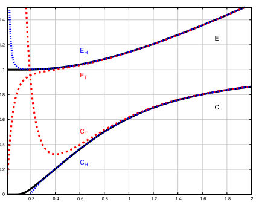 
FIG. 1. Heat capacity and Energy estimators using analytical results in section V. Black solid curves show the continuum limit, while the red (Hamiltonian) and blue (Thermodynamic) correspond to the PA propagator with N = 8. Correct asymptotic behavior is observed for the energy (linear) and heat capacity (one degree of freedom per particle). Results agree with calculations by Takahashi and Imada [6].

📷 Fig 2

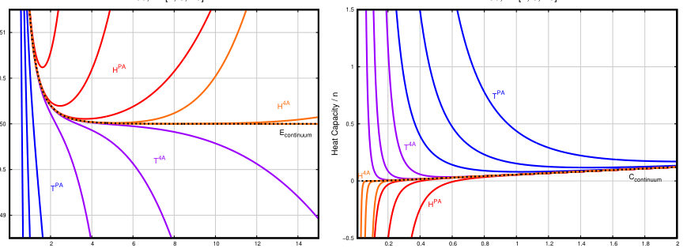 
FIG. 2. Analytical convergence comparison between estimators for the PA and 4A propagators for 50 fermions

📷 Fig 3

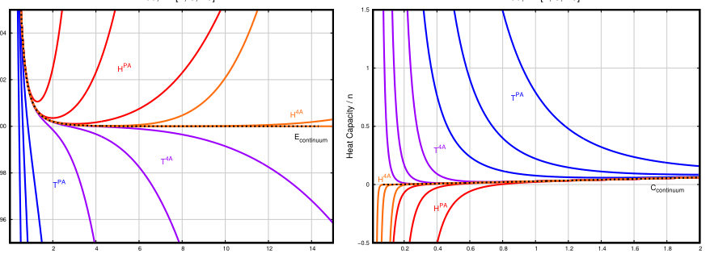 
FIG. 3. Analytical convergence comparison between estimators for the PA and 4A propagators for 100 fermions.

**Summary.** This paper derives an exact closed-form expression for the finite-bead partition function of non-interacting fermions in a harmonic trap by relating its recursion relation to Newton's identity. This allows for the analytical calculation of key thermodynamic quantities like energy and specific heat for any number of particles and beads.

**Why it may be interesting.** It provides an exact analytical framework for calculating quantum statistical mechanical quantities (like energy and specific heat) in a lattice/path integral setting, bypassing complex numerical simulations for 1D systems.

Detailed structure

**Main problem.** The primary goal is deriving an exact, finite-bead recursion relation for the one-dimensional $n$-fermion partition function ($Z_N^n$) and using it to calculate thermodynamic properties.

**Main result.** An exact closed-form expression for the partition function, $Z_N^n = b^{n/2} \prod_{i=1}^{n} (1 / (1 - b^i))$, was derived by mapping the recursion relation onto Newton's identity.

**Method.** The method involves deriving a finite-bead recursion from the path integral determinant form, identifying it with known identities relating power sums and elementary symmetric polynomials, and then calculating thermodynamic quantities analytically.

**Model / system.** The system modeled is non-interacting fermions confined in a one-dimensional harmonic trap. The calculation uses a finite-bead representation of the partition function, which can be generalized to arbitrary interactions.

**Key observables.** Partition function ($Z_N^n$), Thermodynamic Energy ($E_{T,N}^n$), Hamiltonian Energy ($E_{H,N}^n$), and specific heats ($C_{T,N}^n, C_{H,N}^n$).

**Important parameters / regimes.** Number of fermions ($n$), number of imaginary time slices/beads ($	au$ or $N$), and the parameter $b = e^{-N\mu}$.

**Assumptions / limitations.** The derivation is rigorously established for the 1D case; extension to higher dimensions (like $d=2$) is noted as a future challenge due to the sign problem.

**Figures summary.** Figures compare the convergence of energy and specific heat calculated using different propagators (PA vs. 4A) across varying system sizes ($n$) and bead numbers ($N$).

**Paper structure.** The paper establishes the finite-bead recursion relation, derives the closed-form solution by invoking Newton's identity, calculates the thermodynamic observables from this form, and discusses convergence properties.

Abstract

For non-interacting fermions in a harmonic trap, the partition function at any discrete number of imaginary time slices (or beads) and for any choice of short-time propagator admits an exact recursion relation derived directly from the contracted determinant form of the path integral. This finite-bead recursion is distinct from earlier continuum-limit recursions, which do not apply to the discrete time partition functions. By identifying a direct correspondence between this recursion and Newton's identity, application of a closed-form result from the theory of partitions provides an exact expression for the one-dimensional $n$-fermion finite-bead partition function. From this, the Thermodynamic and Hamiltonian energies and specific heats are analytically calculated for any $n$, $N$, $τ$, and propagator choice.

[↑ back to top](#top)

### [Quantum Radar Cross Section with two-photon entangled states](http://arxiv.org/abs/2606.05603v1)

**Authors:** Sunghwa Kang, Jihwan Kim, Zaeill Kim, Duk Y. Kim, Yong Sup Ihn, Su-Yong Lee, Sean Crowe, Stefan Evans, Marcio de Andrade, Joanna Ptasinski  
**Type:** theory · **Category:** other · **PDF:** <https://arxiv.org/pdf/2606.05603v1>  
**Analysis basis:** full PDF text, analyzed in chunks
**Topic relevance:** `entanglement & information structure` **1/5** · `interference shaping light` **1/5**

📷 Fig 1

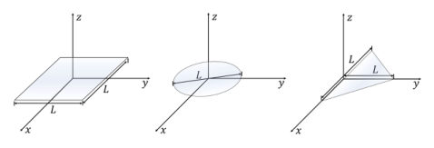 
FIG. 1. Targets with two-dimensional geometries. L denotes the length of a side of a square, the diameter of a circle, the base and height of a triangle. We set L = 1m.

📷 Fig 2

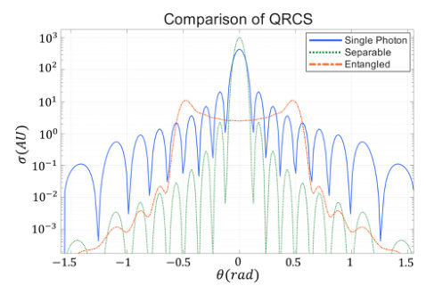 
FIG. 2. Monostatic QRCS for a square plate target consisting of 961 atoms arranged on a uniform grid.

📷 Fig 3

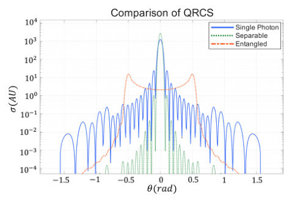 
FIG. 3. Monostatic QRCS for a circular plate target consist- ing of 709 atoms.

📷 Fig 4

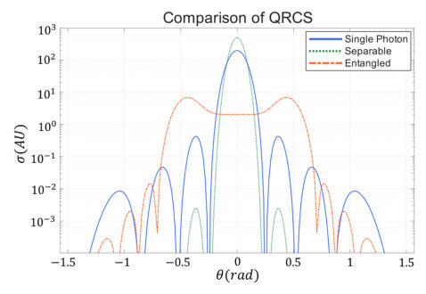 
FIG. 4. Monostatic QRCS for a triangular plate target con- sisting of 462 atoms.

📷 Fig 5

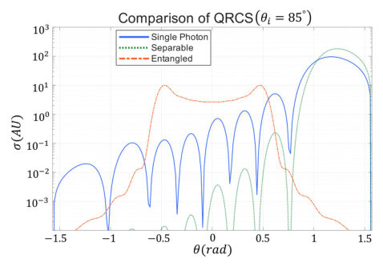 
FIG. 6. Bistatic QRCS for a circular plate target at an inci- dent angle θi = 85◦.

**Summary.** This paper theoretically analyzes the Quantum Radar Cross Section (QRCS) using two-photon entangled states. It shows that utilizing signal-signal entanglement provides an enhancement in detection capability compared to classical or single-photon sources. The results are demonstrated across various 2D targets, confirming the utility of quantum correlations for advanced sensing applications.

**Why it may be interesting.** This work bridges quantum optics and applied physics by demonstrating a tangible advantage of quantum correlations (entanglement) for sensing applications like radar, which is highly relevant to quantum information processing and advanced measurement techniques.

Detailed structure

**Main problem.** The study investigates how using two-photon entangled states can enhance the Quantum Radar Cross Section (QRCS) compared to single-photon or separable classical sources.

**Main result.** Two-photon entanglement, particularly in signal-signal correlations, provides a measurable enhancement in QRCS, especially visible in the side lobes of the scattering pattern. Furthermore, non-maximal entanglement can sometimes outperform maximally entangled states for specific geometries and parameters.

**Method.** The authors derive the biphoton QRCS using scattering theory applied to two-photon entangled states, employing the double-Gaussian approximation for arbitrary entanglement degrees.

**Model / system.** The model involves quantum radar detection where photons scatter off various two-dimensional target geometries (square, circle, triangle) in both monostatic and bistatic configurations. The analysis is based on atom-photon scattering principles.

**Key observables.** Quantum Radar Cross Section ($\sigma_Q$), which quantifies the enhancement over single-photon or separable QRCS.

**Important parameters / regimes.** Entanglement parameters ($\sigma, \mu$), target size ($L$), wavelength ($\lambda$), and the degree of entanglement quantified by the Schmidt number $K$.

**Assumptions / limitations.** The analysis relies on the double-Gaussian approximation for the incident state and assumes atoms have randomly oriented dipole moments. A key distinction is made between indistinguishable (formulated) and distinguishable photons.

**Figures summary.** Figures illustrate various 2D target geometries (Square, Circle, Triangle) and present comparative plots of Monostatic and Bistatic QRCS results for different entanglement levels and targets.

**Paper structure.** The paper progresses from defining the QRCS using two-photon entangled states, deriving the general formula via the double-Gaussian approximation, and then numerically evaluating this enhancement across various target geometries and entanglement regimes in both monostatic and bistatic setups.

Abstract

We study two-photon entangled states for quantum radar cross section (QRCS), which is an extension of a single-photon QRCS formula. Since signal-idler entanglement does not provide any enhancement of the QRCS [Brandsema's PhD Thesis (2017)], we focus on signal-signal entanglement and derive the corresponding biphoton QRCS. We show that it can provide an enhancement over the single-photon QRCS and two-photon separable QRCS, where the performance is evaluated for various two-dimensional target geometries in monostatic/bistatic configurations. Furthermore, using the double-Gaussian approximation, we derive QRCS formula for biphoton states with arbitrary degree of entanglement and compute the resulting scattering patterns.

[↑ back to top](#top)

### [The Double Well Done Doubly-Well](http://arxiv.org/abs/2606.05282v1)

**Authors:** Aurélien Dersy, Matthew D. Schwartz  
**Type:** theory · **Category:** other · **PDF:** <https://arxiv.org/pdf/2606.05282v1>  
**Analysis basis:** full PDF text, analyzed in chunks
**Topic relevance:** `Keldysh / 2PI / non-Gaussian methods` **1/5** · `driven-dissipative phase transition` **1/5**

📷 Fig 1

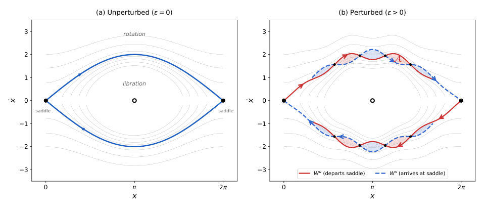 
Figure 1: Phase portrait of the pendulum ¨x = sin x. The pendulum down at rest is x = π and the unstable equilibrium saddle is at x = 0 or x = 2π. (a) Unperturbed: the separatrix (blue) divides libration from rotation. The stable and unstable manifolds of each saddle point coincide exactly. (b) With rapid periodic forcing (ε &gt; 0): the unstable manifold W u (solid red, departing each saddle) and stable manifold W s (dashed blue, arriving at each saddle) split apart and cross transversely at homoclinic points (black dots), creating lobes of area A. This area—the flux of initial conditions transported across the old separatrix per forcing cycle—is exponentially small: A(ε) ∼e−π/(2ε).

📷 Fig 2

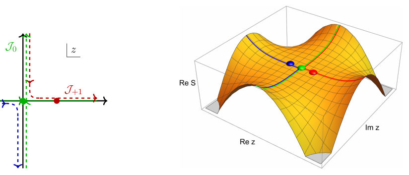 
Figure 2: Left: The complex z-plane with three saddle points: minima at z = ±1 and a maximum at z = 0. The original integration contour is the real line. Each thimble passes through its corresponding saddle point with matching color: J−1 (blue) from −∞curving down to −i∞, J+1 (red) from +i∞curving right to +∞, and J0 (green) along the imaginary axis. Right: The real part of the action S(z) = 1

📷 Fig 3

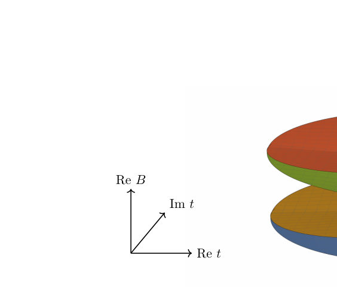 
Figure 3: Four-sheeted Riemann surface for the 0D double well, defined by t = 1

📷 Fig 4

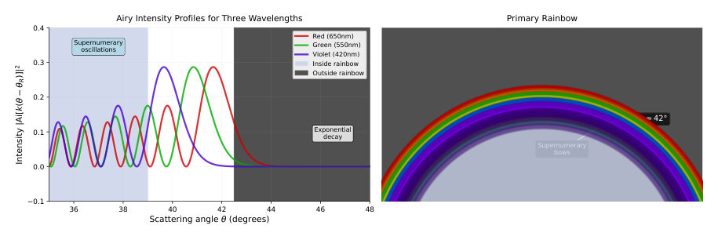 
Figure 4: Left: The Airy function Ai(z) showing the transition from oscillatory behavior for z &lt; 0 to exponential decay for z &gt; 0. Right: Double rainbow with intensity computed from I(θ) ∝ | Ai[k2/3(θ −θR)]|2 for each wavelength. The primary rainbow appears at ∼42◦and secondary at ∼51◦, with supernumerary bows visible as brightness variations inside each bow.

📷 Fig 5

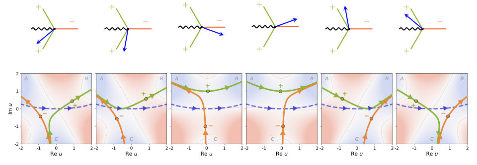 
Figure 5: Top: Stokes diagrams showing the phase θ = arg z in each region. Bottom: The thimble structure computed numerically by steepest descent flow, with the Airy contour (dashed blue), J+ (green), and J−(orange). The asymptotically convergent regions are shaded in blue and denoted as A, B, C.

**Summary.** This paper provides a comprehensive theoretical framework to calculate the exact energy spectrum of double-well potentials by unifying two advanced semiclassical techniques: Exact WKB quantization and the Euclidean Path Integral. It demonstrates that both methods rigorously encode non-perturbative physics via resurgence, providing a unified understanding of how tunneling effects modify quantum energy levels.

**Why it may be interesting.** The deep connection between semiclassical physics (instantons), complex geometry (elliptic curves/thimbles), and formal summation methods (resurgence) provides powerful, general tools for analyzing quantum systems where simple perturbation theory fails.

Detailed structure

**Main problem.** The central problem is understanding how perturbative (small $\hbar$) and non-perturbative (exponentially small) physics are rigorously connected in quantum systems, formalized by the concept of resurgence.

**Main result.** The paper develops two complementary methods—Exact WKB and Euclidean Path Integral using Lefschetz thimbles—to compute the full trans-series expansion for energy levels, demonstrating their mathematical equivalence.

**Method.** It employs advanced techniques from complex analysis, including Borel summation, Picard-Lefschetz theory, and specialized quantization conditions (Voros symbols/thimble integrals), to sum divergent asymptotic series.

**Model / system.** The primary model is the symmetric double-well potential, $V(z) = rac{\omega^2}{8R^2}(z^2 - R^2)^2$, which exhibits tunneling and parity splitting. The analysis extends to general quantum systems with multiple minima.

**Key observables.** Energy eigenvalues ($E_N$), the partition function ($Z(T)$), and the trans-series coefficients derived from instanton actions ($S_I$).

**Important parameters / regimes.** The small parameter $\hbar$ (Planck's constant) and the inter-well separation $R$, which controls the tunneling exponent.

**Assumptions / limitations.** The perturbative series are asymptotic, requiring resummation techniques like Borel summation to capture non-perturbative physics. The analysis relies on mapping complex saddle points via Lefschetz thimbles.

**Figures summary.** Figure 1 illustrates the phase portrait of a driven pendulum, showing how stable and unstable manifolds split transversely with forcing ($\epsilon > 0$), creating exponentially small lobes whose area dictates tunneling effects.

**Paper structure.** The paper is structured around comparing two rigorous approaches: first, using Exact WKB methods involving Stokes phenomena and Voros symbols for quantization; second, using the Euclidean Path Integral formalism decomposed via Lefschetz thimbles to calculate the partition function trans-series. Both converge on a shared mathematical structure.

Abstract

The symmetric double-well potential is one of the simplest quantum-mechanical systems in which perturbative and non-perturbative physics are deeply entangled. Its energy levels have non-analytic expansions in inverse powers of the inter-well separation, with factorially growing coefficients, while the parity splitting is exponentially small and invisible to perturbation theory. Resurgence ties the two features together, organizing the exact spectrum into a single tightly-constrained trans-series. This paper gives a self-contained account of this trans-series from two complementary approaches: exact WKB and the Euclidean path integral, developed in a common notation with explicit calculations through the four-instanton level and three-loop order. In exact WKB, Stokes phenomena encoded in the Delabaere--Dillinger--Pham relations control the analytic continuation of the wavefunction past turning points. The quantization condition expressed in terms of Voros symbols then determines the full trans-series. The DDP relations are local and do not require knowing the global topology of the energy surface, but that surface is an elliptic curve. In the path integral, elliptic curves enter differently: the classical saddle points are doubly-periodic elliptic functions of Euclidean time, and Stokes phenomena play out within the finite-dimensional manifold of quasi-zero modes rather than through analytic continuation of the wavefunction. A Lefschetz thimble decomposition determines which saddles contribute, and the resulting partition function trans-series is much simpler than the energy trans-series: at each instanton order the $T$-dependence is a polynomial fixed by the quasi-zero-mode thimble integrals. Together, the two approaches deploy a shared mathematical infrastructure in complementary ways, showing that the double well is an ideal setting to explore resurgence.

[↑ back to top](#top)

### [A framework for low-overhead quantum fault tolerance via spacetime lifting](http://arxiv.org/abs/2606.06365v1)

**Authors:** Yijia Xu, Yixu Wang, Zi-Wen Liu  
**Type:** theory · **Category:** quantum information and computing · **PDF:** <https://arxiv.org/pdf/2606.06365v1>  
**Analysis basis:** full PDF text, analyzed in chunks
**Topic relevance:** `entanglement & information structure` **1/5**

📷 Fig 1

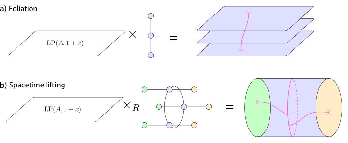 
FIG. 1. Comparison between (a) foliation and (b) spacetime lifting. In foliation, we take tensor product between a good lifted product code with a repetition code. The lifted product code has linear distance d, to achieve fault distance d, we have to let the repetition code to have at least length-d, so the total spacetime cost is O(d2). However, in spacetime lifting, we take a lifted product (tensor product quotiented out a ℤd cyclic symmetry) between a distance-d lifted product code and a thickened length-d repetition code with portal, to achieve fault distance being at least d, we only need O(d) spacetime cost instead of O(d2), which can also be interpreted as fault-tolerant syndrome...

📷 Fig 2

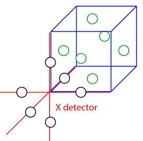 
FIG. 2. Foliated 2D toric code, where the black cycles represent primal faults associated with a X (primal) detector, and the green cycles represent dual faults associated with a Z (dual) detector. Here we consider the phenomenological error model.

📷 Fig 3

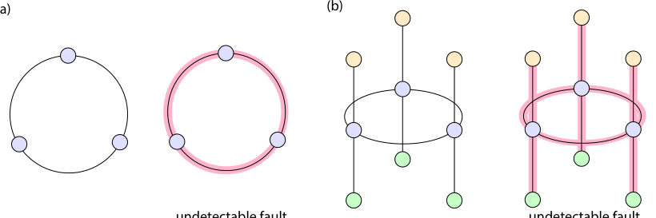 
FIG. 3. The third classical code C used in the double lifted product LP(A, B, C), where an edge represents a classical check, and a node represents a classical bit. (a) cyclic repetition code with parity check matrix 1 + x. The right figure represents the undetectable fault along the direction of 1 + x which is porportional to jℓwith weight being at least ℓ. (b) The ‘thickened’ the cyclic repetition code by introducing the top and bottom portal whose parity check matrix is C. The right figure represents a undetectable fault which includes non-trivial action along the cyclic repetition component 1 + x, hence the undetectable fault has weight at least 3ℓ.

**Summary.** This paper introduces 'spacetime lifting' to construct advanced fault complexes designed for robust quantum computation. It demonstrates that this method achieves near-optimal fault tolerance scaling with minimal overhead compared to traditional methods. This provides a general algebraic framework for designing highly efficient, spacetime-aware quantum error correction protocols.

**Why it may be interesting.** It provides a powerful, general algebraic tool—the fault complex—to analyze resource scaling in quantum computation that explicitly incorporates time evolution (spacetime), which is crucial for realistic hardware implementations beyond static error correction.

Detailed structure

**Main problem.** Developing low-overhead protocols for fault-tolerant quantum computation that account for both spatial and temporal overheads (spacetime).

**Main result.** The authors show that 'spacetime lifting' yields fault complexes whose fault distances scale almost linearly with the total spacetime cost, significantly outperforming existing constructions.

**Method.** The work introduces 'spacetime lifting,' a method to construct fault complexes from symmetry-reduced product structures beyond standard foliation, and interprets these complexes as measurement-based cluster-state protocols.

**Model / system.** The model uses algebraic formalism via 4-term chain complexes (fault complexes) derived from lifted product codes. These complexes describe spacetime fault-tolerant processes for quantum information encoding.

**Key observables.** Fault Distance ($d_{primal}, d_{dual}$), Spacetime Cost, Logical Teleportation success.

**Important parameters / regimes.** Almost linear scaling $d \ge \Omega(N/\log N)$ vs. polynomial scaling of older methods; expansion parameters $\alpha, eta$.

**Assumptions / limitations.** The analysis relies on the existence of product structures and the ability to construct fault complexes via spacetime lifting.

**Figures summary.** Figures illustrate the comparison between standard foliation and spacetime lifting for achieving high fault distance with low overhead cost; diagrams show the structure of 4-term chain complexes mapping components to physical qubits/checks.

**Paper structure.** The paper progresses by defining the need for spacetime consideration, introducing the algebraic framework (fault complexes), developing the 'spacetime lifting' construction, demonstrating its superior scaling properties over existing methods, and finally applying it to realize logical teleportation protocols.

Abstract

Fault-tolerant quantum computation is inherently a spacetime problem, requiring not merely good static quantum error-correcting codes but also low-overhead protocols for protecting and manipulating encoded quantum information over time. Fault complexes provide a homological framework for treating such protocols as single spacetime objects. In this work, we initiate the study of low-overhead fault complexes by introducing {spacetime lifting}, a method that constructs fault complexes from symmetry-reduced product structures beyond standard foliation. We show that spacetime lifting yields fault complexes and in particular {spacetime-lifted} memory experiments with almost-linear fault distance in the total spacetime cost, which substantially outperforms existing constructions. We further interpret fault complexes as measurement-based cluster-state protocols and identify general conditions under which they realize fault-tolerant logical teleportation, showing that spacetime-lifted constructions combine favorable scaling with operational schemes. Our study opens a path toward more efficient quantum fault tolerance through general complex constructions.

[↑ back to top](#top)

### [Double-bracket quantum algorithms for thermal state preparation](http://arxiv.org/abs/2606.05947v1)

**Authors:** Andrew Wright, Reyhaneh Aghaei Saem, Supanut Thanasilp, Yudai Suzuki, Zoë Holmes  
**Type:** theory · **Category:** quantum information and computing · **PDF:** <https://arxiv.org/pdf/2606.05947v1>  
**Analysis basis:** full PDF text, analyzed in chunks
**Topic relevance:** `non-equilibrium dynamics` **1/5**

📷 Fig 1

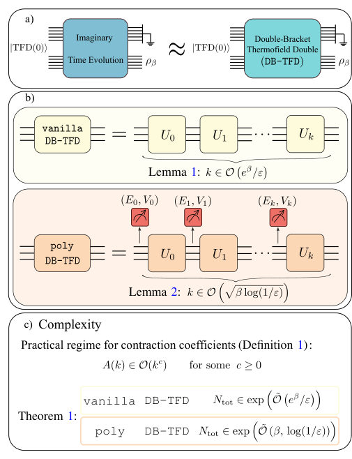 
FIG. 1. Overview of Double-bracket Thermofield Double (DB- TFD) approaches for thermal state preparation. (a) The reduced state of imaginary-time evolution applied to a thermofield double state gives the target thermal state. To implement imaginary-time evolution, we employ the double-bracket quantum algorithm frame- work. (b) We introduce two variants: the vanilla DB-TFD ap- proach and the poly DB-TFD approach. The number of iterations required by the vanilla DB-TFD method scales as O(eβ/ε), as established in Lemma 1. In contrast, Lemma 2 shows an exponen- tial improvement of the number of iterations O( p

📷 Fig 2

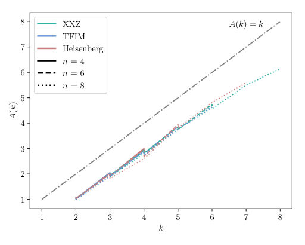 
FIG. 2. Scaling of the contraction coefficients across different sys- tems and system sizes. The contraction coefficient A(k) is evalu- ated for different systems (XXZ, TFIM, and the Heisenberg model), system sizes n, and polynomial order k. In particular, we observe A(k) &lt; k, suggesting that the growth of the contraction coefficient is slower than the assumption in Eq. (28). For a given k, the val- ues of A(k) remain similar across the considered systems and system sizes. This observation suggests that the contraction coefficient ex- hibits only a weak dependence on the specific system and its size.

📷 Fig 3

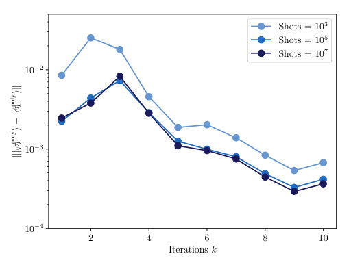 
FIG. 3. Error between poly DB-TFD with infinite and finite measurement shots. We compare the impact of statistical noise in the estimation of energy and variance required to determine the parameters (s, θ). In particular, we compare results obtained using poly DB-TFD with infinite measurement shots and with a total of Nshots = 103, 105, 107 (divided uniformly between the Pauli terms that need to be measured) per iteration. In contrast to the analytical results in App. F.1, no exponential growth with respect to k is ob- served even for Nshots = 103. Since the results obtained with 105

📷 Fig 4

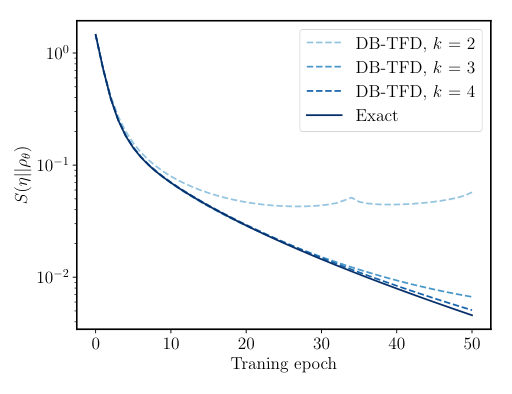 
FIG. 5. Training loss trajectories for poly DB-TFD with different polynomial degrees k. We consider a generative modeling task for the XXZ model to assess how effectively poly DB-TFD with poly- nomial degrees k = 2, 3, 4 reduces the loss. At each training epoch, the thermal state required for computing the loss gradient is prepared using the DB-TFD approaches. Even a small number of iterations yields a training-loss trajectory that closely matches that obtained us- ing the exact thermal state.

📷 Fig 5

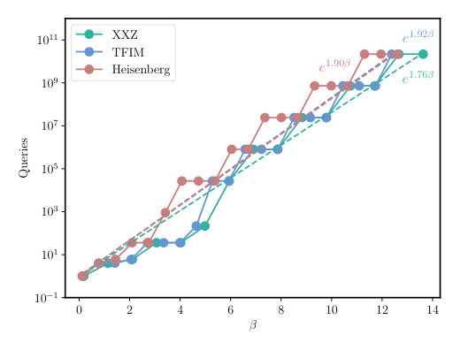 
FIG. 4. Number of queries for poly DB-TFD to obtain the ther- mofield double state at different inverse temperatures β. We nu- merically evaluate the number of queries required by poly DB-TFD to achieve a thermal state with precision ε = 0.01. Here, we con- sider three models: one-dimensional XXZ, TFIM, and Heisenberg model. For comparison, we include reference scalings proportional to exp(β). The fitting suggests an overall scaling of exp(O(β)) in line with the analysis based on the assumed practical regime of con- traction coefficient in Eq. (28).

**Summary.** The paper introduces Double-bracket Thermofield Double (DB-TFD) algorithms for preparing thermal quantum states. It details two approaches, vanilla and poly DB-TFD, which simulate imaginary-time evolution on the TFD state using double-bracket techniques. The main finding is that Poly DB-TFD offers a theoretically favorable scaling compared to existing methods, making it promising for near-term quantum hardware.

**Why it may be interesting.** This work directly addresses a fundamental problem in quantum simulation—preparing equilibrium states—by proposing advanced quantum circuit techniques that aim to surpass the limitations of current NISQ-era algorithms like Variational Quantum Eigensolver (VQE) variants.

Detailed structure

**Main problem.** The primary goal is developing quantum algorithms to efficiently prepare thermal (Gibbs) states $
ho(eta)$ for general many-body Hamiltonians.

**Main result.** The proposed Double-bracket Thermofield Double (DB-TFD) algorithm provides a promising, non-variational route for thermal state preparation whose complexity scales favorably with inverse temperature ($eta$).

**Method.** The method utilizes double-bracket quantum algorithms to simulate imaginary-time evolution on the Thermofield Double (TFD) state. Two variants are proposed: vanilla DB-TFD and Poly DB-TFD, which uses polynomial approximations.

**Model / system.** The theory applies to general quantum systems described by a Hamiltonian $H_s$, utilizing the TFD state $|	ext{TFD}(eta)
angle$ as a purification of the target thermal state $
ho(eta)$. Benchmarks include XXZ, TFIM, and Heisenberg models.

**Key observables.** Query complexity ($N_{	ext{tot}}$), circuit depth, iteration count, and error bounds ($\epsilon$).

**Important parameters / regimes.** Inverse temperature ($eta$), target precision ($\epsilon$), polynomial degree ($p$ or $k$), and the contraction coefficient $A(k)$.

**Assumptions / limitations.** The analysis relies on bounding various algorithmic errors (product formula, intrinsic) and assumes specific scaling regimes for error coefficients.

**Figures summary.** Figures compare iteration scaling between vanilla and poly DB-TFD methods; one figure shows the contraction coefficient $A(k)$ across different models/sizes; another compares training loss trajectories for generative modeling.

**Paper structure.** The paper develops the theory by first establishing the link between TFD evolution and thermal states, then detailing the two algorithmic variants (vanilla vs. poly), followed by rigorous error analysis using product formulas, and concluding with complexity comparisons against variational methods.

Abstract

We propose quantum algorithms for preparing thermal states via the simulation of the thermofield double states. The key idea is to leverage double-bracket quantum algorithms to implement imaginary-time evolution on thermofield double states, whose reduced state realizes the Gibbs state. Our method, termed double-bracket thermofield double (DB-TFD), introduces two variants. The first, the vanilla DB-TFD algorithm, directly implements imaginary-time evolution using double-bracket quantum imaginary-time evolution. The second, poly DB-TFD, employs double-bracket quantum signal processing to approximate the imaginary-time evolution operator via a polynomial transformation. We demonstrate that the complexity of the poly DB-TFD algorithm scales exponentially with the inverse temperature in a broad practical regime. This scaling is consistent with existing methods, and numerical simulations support the corresponding theoretical bound. We further demonstrate the utility of DB-TFD in quantum Boltzmann machines for generative modeling, achieving improved performance compared with variational imaginary-time evolution approaches. These results establish DB-TFD as a promising route for thermal state preparation in the near-term and early-fault-tolerant regimes.

[↑ back to top](#top)

### [Dynamic structural inhomogeneity in strontium ruthenate](http://arxiv.org/abs/2606.06430v1)

**Authors:** M. Spaić, R. Spieker, I. Bilonić, A. Paul, B. Krohnke Orquera, X. He, E. Topić, A. Minelli, F. Ye, N. Kikugawa, D. Sokolov, M. J. Krogstad, S. Rosenkranz, R. Osborn, T. Birol, M. Greven, D. Pelc  
**Type:** experiment · **Category:** strongly correlated electrons · **PDF:** <https://arxiv.org/pdf/2606.06430v1>  
**Analysis basis:** full PDF text, analyzed in chunks
**Topic relevance:** `driven-dissipative phase transition` **1/5**

📷 Fig 1

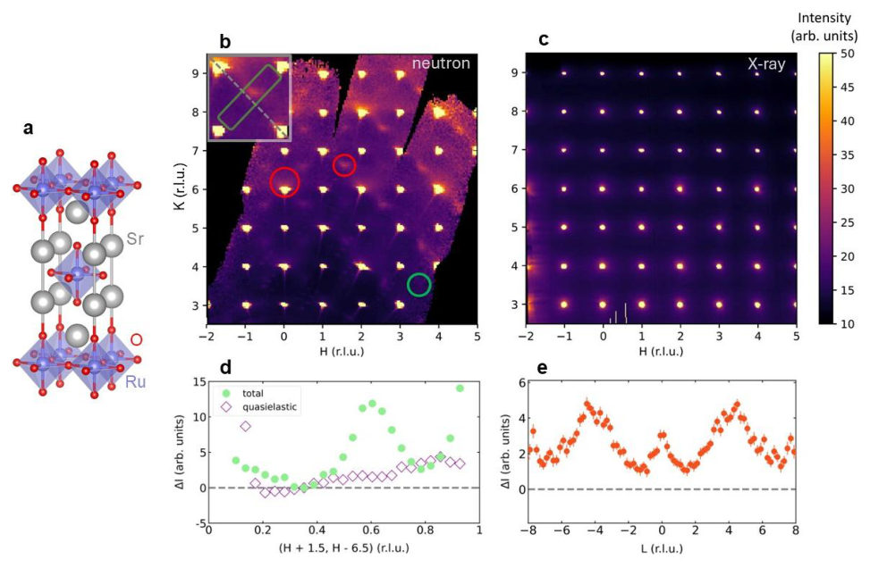 
Fig. 1 | Neutron and x-ray diffuse scattering in strontium ruthenate. (a) The highly symmetric (average) body-centered tetragonal structure of Sr2RuO4. (b) Neutron total scattering data in the HK-plane at 5 K, integrated along [001] from L = –12 to 12 reciprocal lattice units (r.l.u.). Red circles: Diffuse features are around some half-integer positions and integer (Bragg) positions on the high-wavevector side. Green circle: an extinction, i.e., a half-integer position where no scattering is observed, which is key for the reconstruction of the atomic displacement pattern. (c) Diffuse x-ray scattering data, integrated in the same L-range as in (b), measured at 30 K. No diffuse features are...

📷 Fig 2

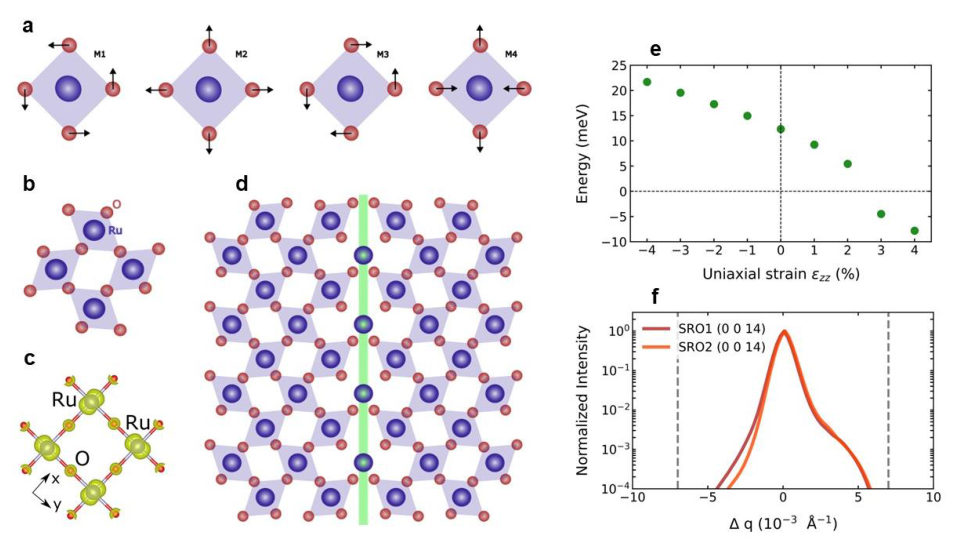 
Fig. 2 | Atomic displacement pattern and absence of extrinsic disorder. (a) The four irreducible in-plane distortions of the Ru-O plaquette. (b) Shear-like distortion that consists of equal weights of M1 and M4 and is consistent with the neutron scattering data (see Methods and Extended Data Fig. 2 for details on refinement). (c) orbital order from ab initio calculations, where the isosurface represents partial charge density associated with states at the zone-centre valence band maximum (see Methods for details). The charge density distribution underlines alternating short and long Ru- O bonds in close correspondence with the observed distortion. (d) Defect structure that includes the...

📷 Fig 3

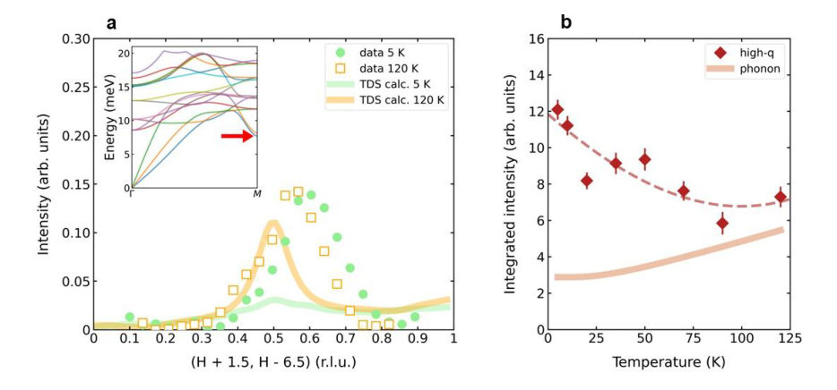 
Fig. 3 | Temperature dependence of diffuse scattering. (a) Comparison of neutron total scattering data to a calculation of phonon scattering (TDS) at two temperatures, demonstrating that the observed asymmetric features are inconsistent with scattering due to phonons, especially at low temperatures. Inset: low-energy (&lt;20 meV) ab initio phonon dispersions used in the TDS calculation, which are in good agreement with experiment [17,24] and assumed to be temperature- independent. The octahedral rotation mode at the zone boundary M point (arrow) results in the diffuse scattering peak, and the TDS decrease upon cooling originates from the Bose occupation factor. (b) Temperature dependence of...

**Summary.** This work uses advanced neutron and x-ray scattering to reveal dynamic, self-organized structural inhomogeneity within Sr2RuO4. The findings demonstrate that these fluctuations are not due to disorder or simple phonons but rather reflect underlying orbital ordering tendencies. This suggests that lattice distortions driven by electronic structure play a crucial role in the material's exotic superconducting state.

**Why it may be interesting.** The finding that subtle structural dynamics are intrinsically linked to electronic correlations (orbital order) provides an experimental handle on the complex interplay between lattice degrees of freedom and exotic superconductivity in strongly correlated oxides.

Detailed structure

**Main problem.** To uncover the origin of self-organized structural inhomogeneity on picosecond timescales in Strontium Ruthenate (SRO) and determine its role in the material's electronic properties.

**Main result.** The observed dynamic structural inhomogeneity originates from correlated oxygen displacements consistent with orbital order, suggesting that orbital effects play a pivotal role in SRO's physics.

**Method.** Diffuse neutron and x-ray scattering experiments were used to probe atomic displacements on picosecond timescales, complemented by first-principles calculations for theoretical comparison.

**Model / system.** The study focuses on Strontium Ruthenate (Sr2RuO4), a model quasi-two-dimensional metal known for its strong electronic correlations and potential exotic superconductivity. The investigation centers on intrinsic structural fluctuations within the RuO2 planes.

**Key observables.** Diffuse scattering patterns, energy transfer in the quasi-elastic channel, reciprocal space asymmetry, and temperature dependence of diffuse intensity.

**Important parameters / regimes.** Picosecond fluctuation timescale; orbital distortion amplitudes ($\sim 0.01$ lattice units); low temperatures (e.g., 5 K).

**Assumptions / limitations.** The analysis assumes that the observed structural signal is not due to simple phonon contributions or extrinsic disorder, ruling out strain-induced effects based on volume fraction measurements.

**Figures summary.** Figures compare total scattering data against calculated Phonon Thermal Diffuse Scattering (TDS), showing asymmetric features inconsistent with phonons; other figures detail the derived shear-like distortion pattern consistent with orbital order calculations.

**Paper structure.** The paper progresses by first using diffuse scattering to identify intrinsic structural correlations, ruling out simple phonon or strain origins. It then models these distortions using irreducible representations ($	ext{M}1$ and $	ext{M}4$) derived from *ab initio* theory, establishing a link between orbital order and dynamic lattice structure.

Abstract

Strontium ruthenate (Sr$_2$RuO$_4$, SRO) has been the subject of intense research as a model quasi-two-dimensional metal with strong electronic correlations and potential exotic multi-component superconductor. Yet the nature of the superconducting state and its emergence remain debated, despite highly detailed knowledge of the normal-state electronic properties. Here we use diffuse neutron and x-ray scattering to uncover self-organized structural inhomogeneity on the picosecond timescale in SRO. We show that these structural correlations do not originate from extrinsic disorder but rather involve correlated displacements of oxygen atoms in the quintessential RuO$_2$ planes. Moreover, the observed displacement pattern is consistent with distortions due to orbital order that we obtain in first-principles calculations, which suggests that orbital effects could play a pivotal role in the physics of SRO. The appearance of such dynamic inhomogeneity may be relevant for a wide range of prominent oxides with similar lamellar structures, such as the cuprates and nickelates.

[↑ back to top](#top)

### [High-Dimensional Theory of LoRA Fine-Tuning in a Solvable Attention Model](http://arxiv.org/abs/2606.05899v1)

**Authors:** O. Duranthon, F. Boncoraglio, L. Zdeborová  
**Type:** theory · **Category:** disordered systems and neural networks · **PDF:** <https://arxiv.org/pdf/2606.05899v1>  
**Analysis basis:** full PDF text, analyzed in chunks
**Topic relevance:** `Keldysh / 2PI / non-Gaussian methods` **1/5**

📷 Fig 1

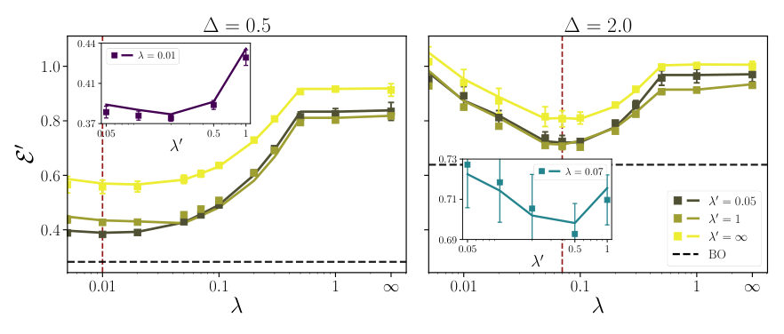 
Figure 1: Fine-tuning test error E′ versus pre-training regularization λ for λ′ ∈{0.05, 1, ∞}, at α = 0.1, α′ = 3, T = 3, κ0 = κ = 1, and noise levels ∆= 0.5 (left) and ∆= 2 (right). Insets show E′ versus λ′ at the optimal λ. Solid lines are state-evolution predictions; square markers are D = 150 simulations averaged over four runs. Vertical dark-red dashed lines mark curve minima, and the black dashed line is the Bayes-optimal benchmark. The cases λ′ = ∞and λ = ∞correspond respectively to no LoRA adaptation ( ˆw = 0) and LoRA-only fine-tuning ( ˆW = 0).

📷 Fig 2

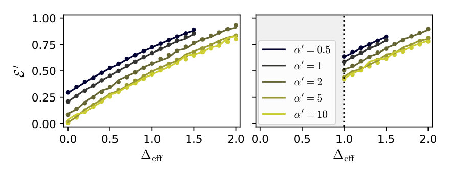 
Figure 2: Effect of pre-training on the fine-tuning task. Fine-tuning test error E′ vs ∆eff = ∆/2 + Q0 −2M + Q, parameterized by fixing M = 1 and varying Q0 = Q. Left: ∆= 0; right: ∆= 2. Lines are the theoretical predictions; dots are simulations at D = 104 over five independent runs. T = 3, λ′ = 0.5, σ softmax.

📷 Fig 3

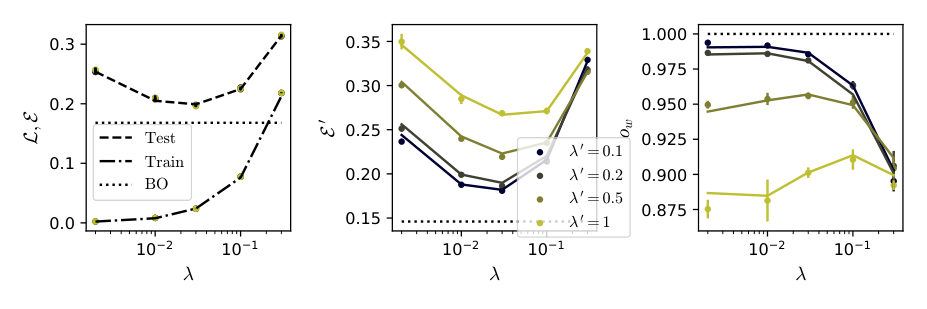 
Figure 3: Fine-tuning input samples form the pre-training set e = 1. Left: pre-training train error L and test error E; center: fine-tuning test error E′; right: fine-tuning overlap ow; vs regularizations λ and λ′. Lines are the theoretical predictions; dots are simulations at D = 103

📷 Fig 4

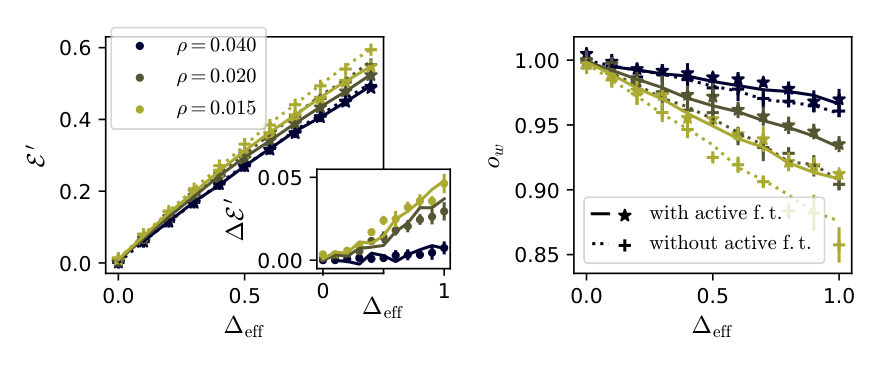 
Figure 4: Active fine-tuning. Left: fine-tuning test errors E′( ˆW, ˆw) and E′( ˆW, ˆwActFT); inset: difference between the test errors ∆E′; right: overlaps ow; vs ∆eff = ∆/2 + Q0 −2M + Q, parameterized by fixing M = 1 and varying Q0 = Q; for different labeling ratios ρ. Lines are the theoretical predictions; dots are simulations at D = 104 over five independent runs. We minimize E′ over λ′ ∈{0.1, 0.2, 0.5, 1} for each point. ¯α′ = 100, T = 3, ∆= 0, σ softmax.

📷 Fig 5

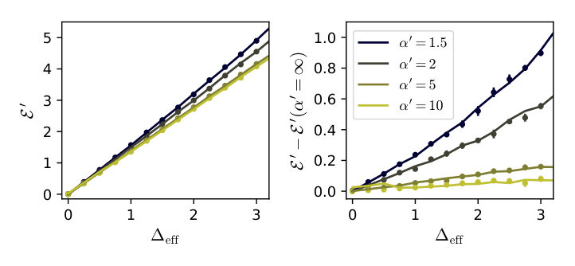 
Figure 5: Effect of pre-training on the fine-tuning task for the rescaled identity activation σ : x 7→x/T. Fine-tuning test error E′ versus ∆eff = ∆/2 + Q0 −2M + Q. Left: test error; right: excess test error with respect to the value at ∆eff = 0. Lines are theoretical predictions; dots are simulations at D = 5 × 103 over five independent runs. T = 3.

**Summary.** This paper establishes a comprehensive high-dimensional statistical theory for understanding how low-rank adaptation (LoRA) fine-tuning performs after extensive pre-training. By mapping the problem onto order parameters derived from free energy minimization, it quantifies performance losses via an 'effective noise' term. The results offer actionable insights into optimizing both the pre-training and subsequent fine-tuning regimes.

**Why it may be interesting.** This work bridges statistical physics tools (replica theory, free energy minimization) directly into modern deep learning optimization problems (LoRA), providing rigorous theoretical guarantees on generalization bounds in high dimensions.

Detailed structure

**Main problem.** The paper develops a high-dimensional statistical theory to characterize Low-Rank Adaptation (LoRA) fine-tuning in attention models, analyzing the interplay between extensive pre-training and limited fine-tuning data.

**Main result.** The performance of LoRA is characterized by an effective noise term derived from order parameters, providing explicit predictions for test errors and suggesting optimal procedures like active fine-tuning or map recalibration.

**Method.** The analysis employs high-dimensional statistical physics techniques, including the replica method and free entropy maximization, to derive asymptotic characterizations of learning dynamics in the limit of infinite dimensions.

**Model / system.** The model is a single-head attention layer undergoing pre-training on abundant data followed by fine-tuning via a rank-one LoRA update. The analysis focuses on Gaussian input sequences for tractability.

**Key observables.** Test errors ($E', E$), representation overlap, effective noise ($\Delta_{	ext{eff}}$), and order parameters (e.g., $Q, M$).

**Important parameters / regimes.** High-dimensional limits ($D 	o \infty$), pre-training regularization strength ($\lambda$), fine-tuning sample size ratio ($
ho$), and rescaling factors ($eta$).

**Assumptions / limitations.** The analysis relies on the high-dimensional limit, Gaussian input sequences for tractability, and specific structural assumptions about the attention mechanism (e.g., tied keys/queries).

**Figures summary.** Figures illustrate how recalibrating the frozen pre-trained map ($\hat{W}$) using a factor $eta/eta^\star$ improves downstream LoRA transfer, and show the effect of pre-training on fine-tuning performance parameterized by effective noise.

**Paper structure.** The paper builds from foundational high-dimensional theory (defining order parameters) to deriving state-evolution equations for both training stages. It then applies this framework to analyze specific phenomena like active fine-tuning, map recalibration, and the comparison against Bayes-optimal benchmarks.

Abstract

We develop a high-dimensional statistical theory of low-rank adaptation (LoRA) in attention models, capturing the interplay between pre-training and fine-tuning. We introduce a solvable framework in which a single-head attention layer is first pre-trained on a data-abundant task and subsequently adapted via a rank-one LoRA update on limited data. In the high-dimensional limit, both stages admit a sharp asymptotic characterization in terms of a finite set of order parameters, yielding explicit predictions for test errors and representation alignment. Our analysis shows that the impact of pre-training on LoRA is summarized by an effective noise term, from which we derive prescriptions for the optimal pre-training procedure. We also demonstrate a regime with a mismatch between the value of the test error and representation quality, and propose an application of our theory to active fine-tuning.

[↑ back to top](#top)

### [Hypergroup Symmetry in Relative Quantum Field Theories and Chiral Algebras](http://arxiv.org/abs/2606.05279v1)

**Authors:** Terry Gannon, Brandon C. Rayhaun  
**Type:** theory · **Category:** other · **PDF:** <https://arxiv.org/pdf/2606.05279v1>  
**Analysis basis:** full PDF text, analyzed in chunks
**Topic relevance:** `Keldysh / 2PI / non-Gaussian methods` **1/5**

📷 Fig 1

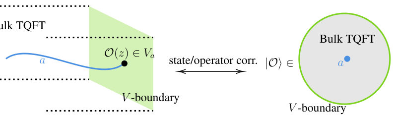 
Figure 1: The Hilbert space Va consists of boundary local operators O(z) on which the bulk anyon a can terminate. By the state/operator correspondence, it can also be viewed as the Hilbert space that the bulk TQFT assigns to a disk which is punctured at the center by the anyon a.

📷 Fig 2

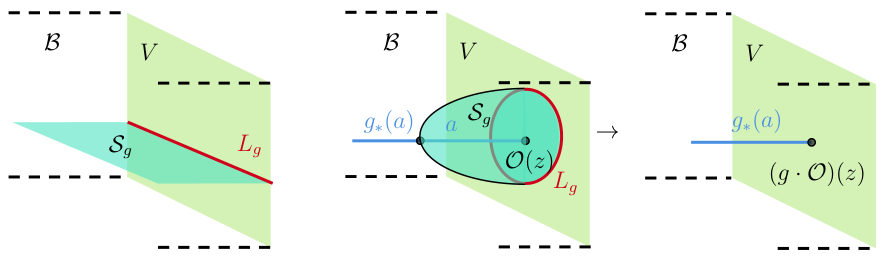 
Figure 2: Left: the representation of an automorphism g of a chiral algebra. Right: the action of an automorphism g on a (non-genuine) local operator O(z) in a module Va produces a local operator (g · O)(z) in Vg∗(a).

📷 Fig 3

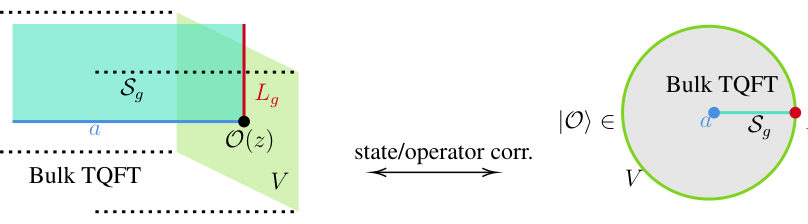 
Figure 3: The twisted module Va consists of (non-genuine) boundary local operators O(z) which live at the junction of a g-twisted anyon a and the boundary topological line junction Lg. By the state/operator correspondence, Va can also be thought of as the Hilbert space that the bulk TQFT assigns to a disk with boundary condition described by V and with insertions of topological defects as shown on the right.

📷 Fig 4

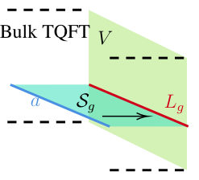 
Figure 4: The bulk to boundary functor FB→∂.

📷 Fig 5

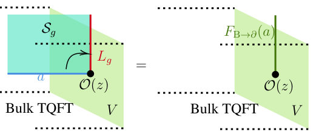 
Figure 5: A (non-genuine) local operator O(z) ∈Va can be thought of either as living at the junction of a and Lg as in the left, or at the end of the boundary line FB→∂(a) as on the right.

**Summary.** This theoretical paper introduces a comprehensive framework for studying noninvertible symmetries in relative Quantum Field Theories. It develops novel mathematical machinery involving hypergroups and dome algebras to analyze the relationship between bulk topological defects and boundary chiral symmetries. The work provides deep structural insights into how different components of a quantum theory must correspond mathematically.

**Why it may be interesting.** While highly abstract, the deep connections drawn between symmetry groups, topological defects, and underlying algebraic structures (hypergroups) provide powerful mathematical tools applicable to understanding exotic phases of matter or boundary physics in condensed matter systems.

Detailed structure

**Main problem.** The paper develops a general framework for handling noninvertible symmetries within relative Quantum Field Theories (QFTs) in two spacetime dimensions, extending known results from absolute QFTs.

**Main result.** It establishes correspondences between finite symmetries in rational chiral algebras and conformal embeddings of finite index, while also detailing how to construct full theories by 'gluing' left- and right-moving chiral symmetries.

**Method.** The methodology involves developing formalism using hypergroups and dome algebras to analyze the bulk-boundary correspondence in TQFTs. It relies heavily on advanced algebraic structures like Modular Tensor Categories.

**Model / system.** The focus is on Relative QFTs, which are defined as living at the boundary of a higher-dimensional Topological QFT (TQFT). The mathematical tools involve chiral algebras and their associated representation categories.

**Key observables.** Topological line defects, boundary conditions of CFTs, hypergroup structure constants, and the $g$-function of boundary states.

**Important parameters / regimes.** The central charge ($c$) of the underlying conformal field theory; the rank of the hypergroup action (e.g., rank-2 for specific examples).

**Assumptions / limitations.** The framework assumes rationality of chiral algebras and relies on extending known results from absolute QFTs to the relative setting.

**Figures summary.** Figures illustrate state/operator correspondences ($	ext{Va} \leftrightarrow 	ext{Rep}(V)$), how automorphisms act topologically ($S_g$), and the construction of full theories by compactifying 3D TQFTs on a solid ball.

**Paper structure.** The paper progresses from defining the general framework for relative symmetries, detailing specific implications for absolute CFTs (like boundary condition correspondences), and concluding with concrete examples involving complex algebraic structures like hypergroups acting on known chiral algebras.

Abstract

A QFT is said to be relative if it lives at the boundary of a topological QFT in one higher dimension. We develop a general framework for working with noninvertible symmetries of relative theories in two spacetime dimensions, extending several well-known results for absolute QFTs. We emphasize various new features which arise in the relative setting, including the role of topological surfaces of the bulk, and the appearance of hypergroups and certain generalizations of tube algebras known as dome algebras. Our formalism is particularly well-suited for studying rational chiral algebras, where it predicts that finite symmetries are in explicit one-to-one correspondence with conformal embeddings of finite index.   We describe several implications of our framework for absolute theories. First, we explain how to "glue" together symmetries of the left- and right-moving chiral algebras of a 2D CFT to produce topological line defects of the full theory. Second, we derive a precise correspondence between boundary conditions of a 2D CFT and symmetries of its chiral algebra. This correspondence has several structural corollaries: in diagonal rational CFTs, we demonstrate that the topological line defects of the theory act transitively on its boundary conditions, and further that the identity Cardy state has the smallest $g$-function amongst all boundary conditions, including those which only preserve Virasoro symmetry.   We conclude by illustrating our results in a variety of examples. For instance, we show that, if there exists a rational chiral algebra with central charge $c=8$ whose modular tensor category is the Drinfeld center of the Haagerup fusion category, then it must arise as the fixed points of a rank-2 hypergroup acting on the $SU(3)_1\otimes (E_{6})_1$ chiral algebra.

[↑ back to top](#top)

### [Magnetic flux as a quantized Lorentz pseudoscalar and its relation to electric charge quantization](http://arxiv.org/abs/2606.05955v1)

**Authors:** Cyril Belardinelli  
**Type:** theory · **Category:** other · **PDF:** <https://arxiv.org/pdf/2606.05955v1>  
**Analysis basis:** full PDF text, analyzed in chunks
**Topic relevance:** `Keldysh / 2PI / non-Gaussian methods` **1/5**

📷 Fig 1

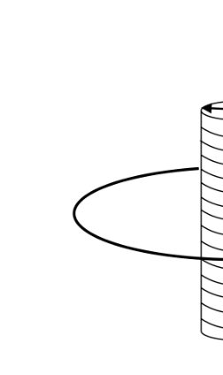 
Figure 1. The electric charge orbits outside a long solenoid (d ≪ 2b) through which an electric current flows. Since the solenoid is assumed to be very thin and very long, the point charge moves in a region with negligible magnetic flux density B. However, the magnetic vector potential A is still present; it cannot be eliminated by any gauge transformation.

📷 Fig 2

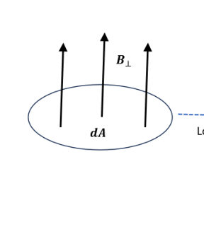 
Figure 2. Under a Lorentz boost, the magnetic flux density B⊥ perpendicular to the boost direction increases by the γ−factor, but the magnetic flux remains invariant.

**Summary.** This theoretical paper investigates charge quantization by analyzing a charged particle orbiting a solenoid. It derives the condition $q \cdot \Phi = n \cdot hc/2$ from solving the Schrödinger equation, thereby linking electric charge quantization directly to magnetic flux quantization. The work also uses relativistic methods to prove that the magnetic flux behaves as a Lorentz pseudoscalar.

**Why it may be interesting.** While not directly focused on AMO systems, the rigorous application of quantum mechanics (Schrödinger equation) to fundamental quantized physical constants ($q$ and $\Phi$) demonstrates deep connections between quantum theory and electromagnetism that are foundational to many advanced physics topics.

Detailed structure

**Main problem.** The paper re-examines the fundamental question of electric charge quantization by establishing a direct mathematical link between the quantization of magnetic flux ($\Phi$) and the quantization of electric charge ($q$).

**Main result.** Solving the Schrödinger equation for a charged particle around a solenoid yields a simultaneous quantization condition: $q \cdot \Phi = n \cdot hc/2$, suggesting both quantities are quantized. Furthermore, the magnetic flux is shown to behave as a Lorentz pseudoscalar.

**Method.** The analysis combines solving the time-independent Schrödinger equation with advanced field theory techniques involving 4D integrals of the dual field tensor ($	ilde{F}_{\mu
u}$) and analyzing the transformation properties under Lorentz boosts.

**Model / system.** The model involves a charged particle moving in the vicinity of a current-carrying solenoid, analyzed using quantum mechanics (Schrödinger equation) coupled with classical electromagnetism described by Maxwell's equations in Minkowski spacetime.

**Key observables.** Magnetic flux ($\Phi$), electric charge ($q$), and the quantization constant $n$.

**Important parameters / regimes.** Planck's constant ($h$), speed of light ($c$), and the integer quantum number ($n$).

**Assumptions / limitations.** The derivation relies on boundary conditions for the wave function (periodicity) and specific mathematical identities involving step functions when calculating flux integrals in Minkowski space.

**Figures summary.** Figure 1 illustrates the physical setup of a point charge orbiting outside a solenoid where the vector potential is non-zero. Figure 2 relates to how the magnetic flux remains invariant under Lorentz boosts while perpendicular components change.

**Paper structure.** The paper progresses from analyzing the quantum mechanical problem (Schrödinger equation) in the presence of a solenoid's field, deriving the quantization condition, and then extending this analysis using relativistic methods involving 4D integrals and Lorentz transformations to confirm the nature of the flux as a pseudoscalar.

Abstract

In this paper, we re-examine the well-known question of why electric charges exist only in quantized portions. In this context, we revisit the motion of a charged particle in a field-free region around a current-carrying solenoid. Solving the corresponding Schrödinger equation leads to a simultaneous quantization condition for the magnetic flux and the electric charge. We also demonstrate the Lorentz invariance of this condition by showing that the magnetic flux behaves like a pseudoscalar under Lorentz transformations.

[↑ back to top](#top)

### [Polylogarithmic Structure of Bragg Diffraction in Finite-Coherence Lattices](http://arxiv.org/abs/2606.05886v1)

**Authors:** Evangelos G. Filothodoros  
**Type:** theory · **Category:** statistical mechanics · **PDF:** <https://arxiv.org/pdf/2606.05886v1>  
**Analysis basis:** full PDF text, analyzed in chunks
**Topic relevance:** `interference shaping light` **1/5**

📷 Fig 1

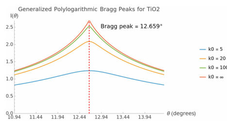 
Figure 1: Polylogarithmic Bragg peak for TiO2 for various values of k0 parameter. We observe that finite reduced long-range order pro- duces negligible peak-position corrections but modifies the diffraction line shape and broadening.

**Summary.** This paper introduces a polylogarithmic structure to model Bragg diffraction in materials with finite coherence or disorder. By framing the scattering amplitude as a function of a polylogarithm, it unifies peak positions, widths, and line shapes into one analytic description. This framework is particularly valuable for analyzing real-world disordered systems where conventional models require ad hoc broadening assumptions.

**Why it may be interesting.** The connection drawn between lattice interference patterns and complex analysis (e.g., hyperbolic geometry via the dilogarithm) provides a powerful mathematical tool for analyzing quasi-periodic or disordered systems beyond standard scattering theory.

Detailed structure

**Main problem.** To develop a generalized diffraction formalism that extends classical Bragg law by explicitly incorporating effects of finite coherence length, disorder, and non-uniform lattice weighting.

**Main result.** The polylogarithm model provides a compact analytical framework where peak positions, widths, and line shapes arise from a single analytic structure, connecting diffraction theory to complex analysis via boundary singularities.

**Method.** The scattering amplitude is modeled using a weighted multi-plane interference approach, expressing it as a polylogarithmic generating function $\text{Li}_m(z)$.

**Model / system.** The model analyzes Bragg diffraction from lattices with structural correlations, utilizing an effective Hamiltonian and pair correlation functions $C(r) \sim 1/r^m e^{-r/k_0}$.

**Key observables.** Scattering amplitude $F(\theta)$, measurable intensity $I(\theta)=|F(\theta)|^2$, peak positions, and line shapes.

**Important parameters / regimes.** Finite coherence length ($\epsilon=1/k_0$), algebraic suppression exponent ($m$), and the complex variable argument $z$.

**Assumptions / limitations.** The model is intended to generalize Bragg law; it assumes a specific form for correlation decay and that peak singularities map onto polylogarithm branch points.

**Figures summary.** Figures show the polylogarithmic Bragg peak for $\text{TiO}_2$ at varying coherence lengths, confirming line shape modification without significant peak position shifts.

**Paper structure.** The paper develops the mathematical framework using polylogarithms to describe scattering amplitudes in correlated lattices. It analyzes the limit $k_0 \to \infty$ (ideal case) and then examines finite-$k_0$ deviations, drawing analogies between diffraction singularities and critical phenomena/hyperbolic geometry.

Abstract

We develop a polylogarithmic structure for Bragg diffraction based on a weighted multi-plane interference model. Within this kind of construction, the scattering amplitude is expressed as a polylogarithmic generating function. By introducing extra contributions with power-law and the usual exponential decay, it takes the form $F(θ) = \mathrm{Li}_m\left(e^{iθ_{\mathrm{eff}} - ε}\right)$, where $ε$ is a finite coherence length. In the limit where $ε\rightarrow 0$, the argument of the polylogarithm approaches the unit circle and the classical Bragg condition corresponds to the approach of the polylogarithm argument toward its branch point $z=1$. This formulation provides a compact analytical framework for describing diffraction line shapes within a generalized correlation model in which peak positions, widths, and line shapes arise from a single analytic structure. Although we are able to recover the standard Bragg law for ideal crystals, the polylogarithm model captures deviations due to finite correlation length, disorder and non-uniform lattice coherence. We show that if Bragg peaks correspond to boundary singularities of the polylogarithm, a connection between diffraction theory and complex analysis arise. The proposed theoretical model may be particularly relevant for disordered or partially coherent materials, where conventional diffraction models often require additional phenomenological broadening assumptions.

[↑ back to top](#top)

### [Polymer quantum mechanics on compact configuration spaces](http://arxiv.org/abs/2606.06019v1)

**Authors:** Maxwell R. Siebersma, Basie Seibert, Samuel Shuman, David A. Craig  
**Type:** theory · **Category:** other · **PDF:** <https://arxiv.org/pdf/2606.06019v1>  
**Analysis basis:** full PDF text, analyzed in chunks
**Topic relevance:** `analog quantum simulation` **1/5**

📷 Fig 1

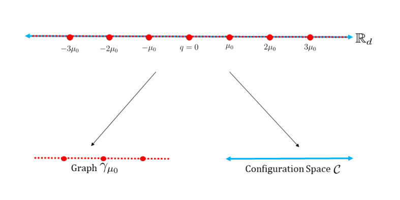 
FIG. 1. Position space for a point particle in one-dimensional polymer quantum mechanics. The quantum configuration space C = Rd is the real line with the discrete topology. In order to admit a well-defined dynamics, states are restricted to support on a graph γµ0 that is a regular lattice on C with points equally spaced at distance µ0.

📷 Fig 2

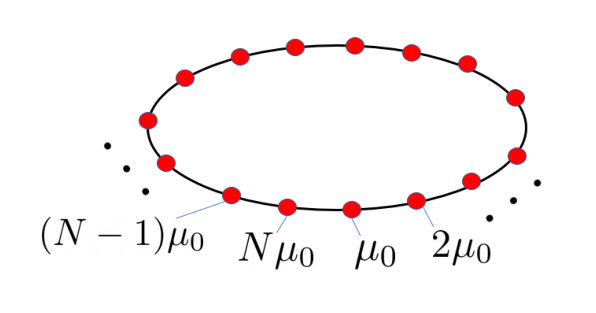 
FIG. 2. A regular graph γµ0 of positions on the polymer quantized ring. The graph consists of N points distributed along the ring with uniform spacing µ0 = 2πR/N. The corresponding set of orthonormal position kets can be indexed from 1 to N, where |xk⟩≡|xk + Nµ0⟩. These kets form the basis for the finite-dimensional polymer graph Hilbert space Hγµ0 = L2(ZN, dµc).

📷 Fig 3

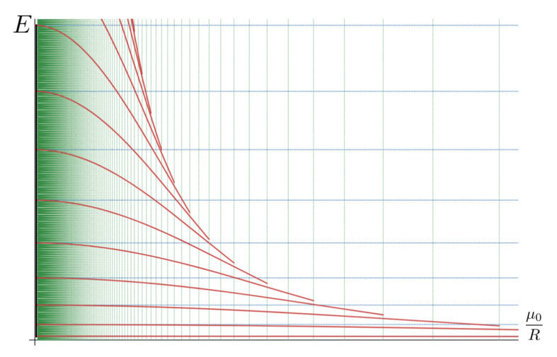 
FIG. 3. The spectrum of energy levels of the polymer-quantized particle on a ring as a function of µ0/R. The red curves show the behavior of these energy levels. The green vertical lines are the allowed ratios of µ0/R = 2π/N for N ∈N; only the points where the red energy curves intersect the green lines correspond to valid energy levels for the discretized ring. For a given value of µ0/R, only levels Em with m ≤πR

📷 Fig 4

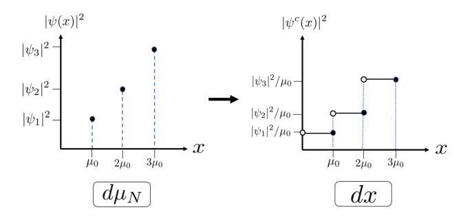 
FIG. 4. The mapping from the wave function for a state |ψ⟩defined on the lattice γµ0 endowed with the discrete counting measure dµN to a corresponding state |ψc⟩∈HSch defined everywhere on the ring and normalized in the Lebesgue measure.

📷 Fig 5

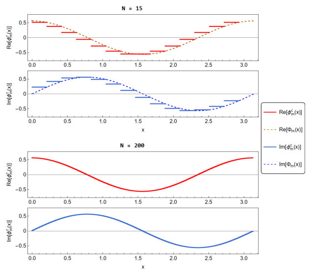 
FIG. 5. Convergence of polymer energy eigenfunctions to their Schr¨odinger-quantized counterparts for the polymer particle on a ring. The red and blue step functions are the real and imaginary parts of a polymer eigenfunction ϕc m(x). The orange and purple curves are similarly the real and imaginary components of the corresponding Schr¨odinger eigenstate Φm(x). The top plot corresponds to a polymer graph with N = 15, and the bottom plot to N = 200. As N →∞so that µ0/R →0, the polymer eigenstates become arbitrarily close to the Schr¨odinger eigenstates.

**Summary.** This paper introduces Polymer Quantum Mechanics, a quantization approach designed for physical systems whose configuration space has a fundamentally discrete topology. It mathematically distinguishes this theory from standard Schrödinger QM by altering the nature of the Hilbert space and momentum representation. The work shows that while the underlying structure is different, the model correctly recovers standard quantum results in the appropriate continuum limit.

**Why it may be interesting.** While not directly focused on AMO platforms, the rigorous development of alternative quantization schemes that handle discrete geometry is highly relevant for understanding quantum systems where boundary conditions or underlying spatial structure are quantized (e.g., in mesoscopic physics or lattice simulations).

Detailed structure

**Main problem.** The paper develops Polymer Quantum Mechanics (PQM) as a quantization scheme for systems whose configuration space has a discrete topology, contrasting with standard Schrödinger quantization.

**Main result.** PQM yields a distinct quantum theory by defining the Hilbert space on a finite graph structure, though it demonstrates that in the continuum limit, its energy eigenvalues and eigenfunctions converge to those of standard quantum mechanics.

**Method.** The authors analyze canonical quantization using Weyl algebras, contrasting the continuous representation (Stone-von Neumann theorem) with the discrete polymer representation derived from assuming a discrete topology on configuration space.

**Model / system.** The theory is applied to simple systems like a particle on a ring and a particle in a box defined on lattices. The mathematical framework involves analyzing representations of translation operators on Hilbert spaces defined over discrete or compactified groups (Bohr compactification).

**Key observables.** Energy eigenvalues and eigenfunctions; canonical commutation relations (CCR); Poisson brackets.

**Important parameters / regimes.** Planck's constant ($\hbar$); lattice spacing ($\mu_0$); the topology of the configuration space (discrete vs. continuous).

**Assumptions / limitations.** The core assumption is that the underlying configuration space can be modeled with a discrete topology, leading to a violation of the weak continuity condition required by the Stone-von Neumann theorem.

**Figures summary.** Not specified in detail, but the notes reference comparisons between Hilbert spaces (Table I) and explicit formulas for energy eigenvalues/eigenfunctions derived from recurrence relations or matrix diagonalization.

**Paper structure.** The paper first reviews conventional quantization and then introduces PQM by analyzing systems with discrete topologies. It details the mathematical machinery involving Bohr compactification, comparing the resulting polymer Hilbert space to standard $L^2$ spaces, and finally applies these methods to specific solvable models like the particle on a ring.

Abstract

"Polymer quantum mechanics" is the name given to a quantization scheme inspired by loop quantum gravity in which the configuration space of the theory is chosen to have a discrete topology. Polymer quantization yields a representation of the canonical commutation relations that is genuinely distinct from the conventional "Schrödinger" representation. In this paper, we summarize the main features of polymer quantum mechanics and investigate in detail the polymer quantization of systems with configuration spaces that are classically compact. We show explicitly how using the standard construction of polymer states leads to a Hilbert space of states defined on a finite graph of points. By way of example, we find the exact energy eigenvalues and eigenfunctions for a particle on a ring and a particle in a box defined on such lattices, and discuss similarities and differences from standard Schrödinger quantum mechanics. We also explore the continuum limit of states in these systems, and demonstrate in detail how the exact eigenfunctions in the position representation approach their continuum counterparts.

[↑ back to top](#top)

### [Setting angles in quantum approximate optimization at utility-scale](http://arxiv.org/abs/2606.05311v1)

**Authors:** Maosheng Guo, Joel Jurado Diaz, Anurag Ramesh, Conrad J. Haupt, Alberto Baiardi, Dimitrios Athanasakos, M. Emre Sahin, Oscar Wallis, George Pennington, Christian Arenz, Sebastian Brandhofer, Georgios Korpas, Ieva Čepaitė, J. A. Montañez-Barrera, Jakub Marecek, Davide Venturelli, Stephan Eidenbenz, David E. Bernal Neira, Daniel J. Egger  
**Type:** both · **Category:** quantum information and computing · **PDF:** <https://arxiv.org/pdf/2606.05311v1>  
**Analysis basis:** full PDF text, analyzed in chunks
**Topic relevance:** `QC/QI experiment` **1/5**

📷 Fig 1

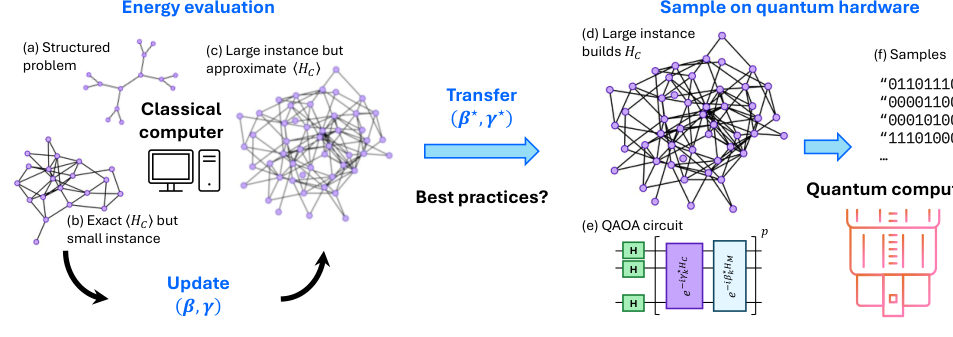 
Figure 1. Utility-scale quantum approximate optimization. Good QAOA angles β⋆and γ⋆are found with classical computers. The angles may be optimized with a classical optimizer, and the energy evaluated on (a) representative structured problems [3], (b) small-scale representative problem instances with an exact energy evaluation, and (c) the utility-scale problem instance, but with an approximate energy evaluation. The utility-scale problem instance (d) informs the QAOA circuit (e) with the near-optimal angles β⋆and γ⋆. (f) Only the sampling of good candidate solutions x, shown as bitstrings, is done on the quantum hardware.

📷 Fig 2

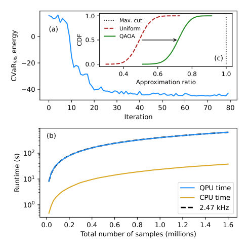 
Figure 2. Convergence of a 100 qubit depth-four QAOA on ibm_boston. (a) Energy of the 5% best samples as a function of the number of COBYLA iterations. (b) Duration required to obtain the samples from the QPU as measured by the user (QPU time) and the time it took to compute the objective to minimize from the samples (CPU time). The inset (c) shows the improvement in the cumulative distribution of the quantum samples (green solid curve) over uniform sampling (red dashed curve). The best measured quantum sampled achieves a 91.5% approximation ratio.

📷 Fig 3

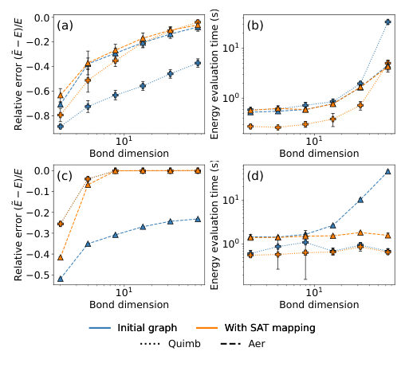 
Figure 3. Impact of the SAT mapping on five random in- stances of three-regular graphs with 40 nodes (a) and (b), and 100-node graphs (c) and (d). Panels (a) and (c) show the rel- ative error between the MPS energies and the exact energies. Panels (b) and (d) show the duration of the energy evaluation for different bond dimensions. Each marker is the average of five instances and the error bars show the standard deviation.

📷 Fig 4

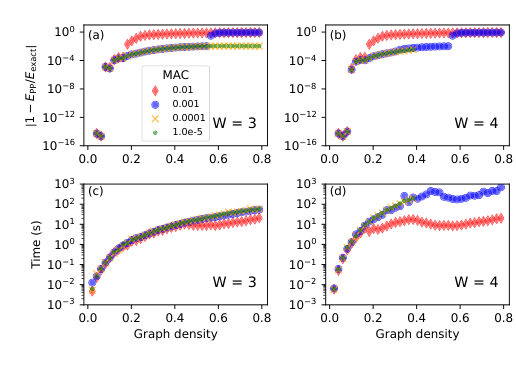 
Figure 4. Pauli propagation as an evaluator of QAOA state energy for random k-regular graphs with n = 100 nodes and p = 1 layer. The node degree k is changed to vary the graph density k/(n −1). Panels (a) and (b) show the absolute er- ror in energy estimated by Pauli Propagation compared to the exact energy. Panels (c) and (d) show duration of each computation for a given graph density and set of parameters W and MAC. The energy for graphs with density above 40% is not computed for W = 4 and low MAC ≤10−4 are not presented in the plots as these were too time- and memory- intensive.

📷 Fig 5

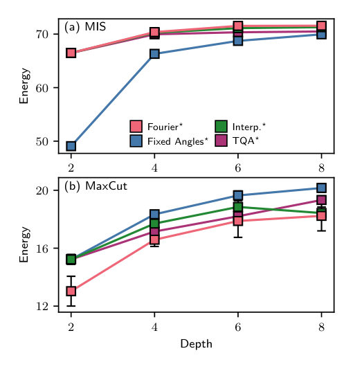 
Figure 6. Comparison of the achieved energy values for the Fourier, Fixed Angles, Interp., and TQA methods, and the PP evaluation method with different results for MIS (a) and Max- Cut (b). We use ten 40-node random three-regular graphs. The markers and error bars indicate the mean and standard deviation, respectively, of the energy over the ten instances.

**Summary.** This paper addresses the critical challenge of setting optimal parameters for QAOA at utility scale. By benchmarking various angle-setting strategies—including tensor network approximations and Pauli propagation—against real quantum hardware results, it offers actionable guidance for quantum optimization practitioners. The findings help streamline the end-to-end pipeline necessary to apply these algorithms effectively.

**Why it may be interesting.** It provides a crucial bridge between theoretical understanding of QAOA limitations and the practical engineering required for running these algorithms on noisy, near-term quantum hardware.

Detailed structure

**Main problem.** The primary challenge is determining optimal parameters (angles) for the Quantum Approximate Optimization Algorithm (QAOA) when applied to large-scale, utility-size combinatorial optimization problems.

**Main result.** The authors provide operational guidance by benchmarking various angle-setting strategies—such as parameter transfer and approximate evaluation methods—to efficiently execute QAOA end-to-end on current and future quantum hardware.

**Method.** They compare multiple angle-setting techniques (e.g., MPS, Pauli Propagation, fixed angles, iterative interpolation) using utility-scale benchmarks to identify the most robust approach for practical implementation.

**Model / system.** The core model is QAOA, which uses parameterized quantum circuits built from alternating cost and mixer unitaries ($U_C(\gamma), U_M(eta)$). The application targets combinatorial optimization problems like MaxCut on graphs up to 100+ qubits.

**Key observables.** Optimal angles ($	heta^\star$), approximation ratio, energy expectation value $\langle H_C 
angle$, and hardware sampling time.

**Important parameters / regimes.** Circuit depth ($p$), system size (utility-scale, $N \ge 100$ qubits), and resource cost for the search optimization.

**Assumptions / limitations.** The work assumes that practical guidance derived from systematic benchmarks can guide practitioners despite the underlying NP-hard nature of finding true optimal angles.

**Figures summary.** Figures illustrate the end-to-end utility-scale QAOA process, comparing energy convergence across different methods (TNs vs. PP) and showing hardware validation results for varying depths on specific graph structures.

**Paper structure.** The paper systematically reviews angle setting techniques, moving from physics-inspired schedules to parameter transfer and machine learning approaches, culminating in rigorous benchmarking against both classical approximations (MPS, PP) and actual quantum hardware measurements.

Abstract

The quantum approximate optimization algorithm (QAOA) is a powerful heuristic that seeks to solve combinatorial optimization problems using quantum hardware and classical optimization in tandem. Various methods exist to train the parameterized quantum circuits that serve as an ansatz in QAOA. However, which method works best to identify optimal angles for a given problem instance remains poorly understood, especially at utility-scale, i.e., $100$ qubits or more. In this work, we address this challenge through utility-scale benchmarks from which we distill operational guidance for QAOA practitioners. First, we investigate approximation techniques, such as matrix product states and Pauli propagation, to find optimal angles. Second, we train QAOA on small-scale representative problems and transfer the angles to larger ones. We then validate the results on quantum hardware for utility-scale problem instances that can be meaningfully executed. In this way, we identify insights for QAOA angle setting strategies that work best for problems at the utility scale, including as a function of resource cost for the search. Crucially, the operational implications we draw from our benchmarks will help quantum optimization practitioners execute QAOA end-to-end pipelines efficiently on current and future hardware.

[↑ back to top](#top)

## Other papers (13)

*Papers from primary archives without highlighted authors or any topic match. Click to expand.*

Show other papers

### [Electrolyte Bonding Engineering for Highly Uniform GeTe-based CBRAM and Parallel Hebbian Learning in Selector-free Hopfield Networks](http://arxiv.org/abs/2606.05768v1)

**Authors:** Jiin Bang, Jingyeong Hwang, Unhyeon Kang, Seungmin Oh, Kyungmin Lee, Jaehyun Park, Younghyun Lee, Hyun Jae Jang, Seongsik Park, YeonJoo Jeong, Inho Kim, Jong Keuk Park, Suyoun Lee  
**Type:** experiment · **Category:** disordered systems and neural networks · **PDF:** <https://arxiv.org/pdf/2606.05768v1>  
**Analysis basis:** full PDF text, analyzed in chunks

📷 Fig 1

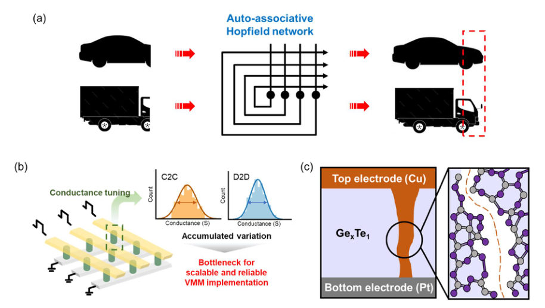 
Figure 1. (a) Schematic illustration of auto-association using the Hopfield network. A partial (or

📷 Fig 2

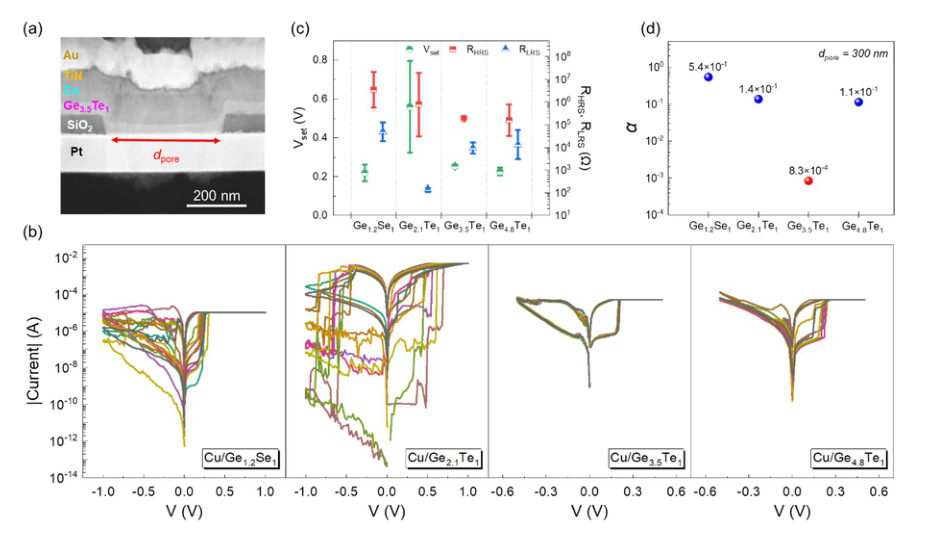 
Figure 2. (a) Cross-sectional transmission electron microscopy (TEM) image of the fabricated CBRAM

📷 Fig 3

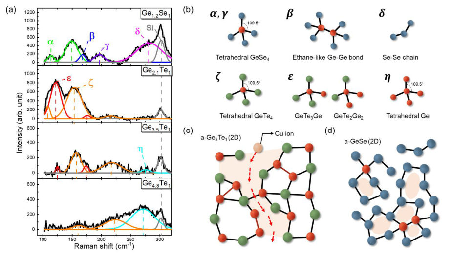 
Figure 3. (a) Raman spectra of Ge1.2Se1 and GexTe1 (x = 2.1, 3.5, and 4.8) films, with individual peaks

📷 Fig 4

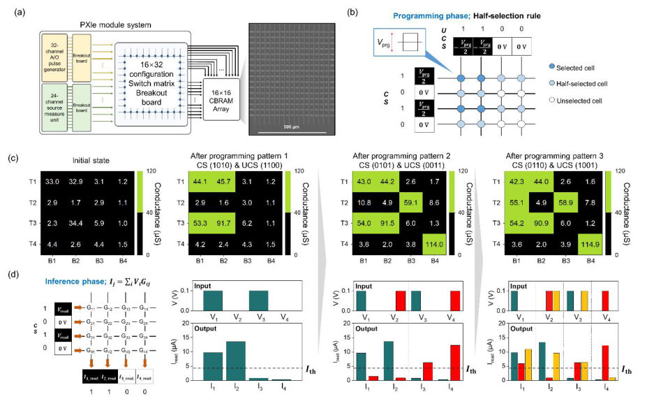 
Figure 4. (a) Measurement system for parallel programming and inference of the 16×16 Cu/Ge3.5Te1

**Summary.** This research tackles the challenge of variability in memristor crossbars used for artificial neural networks. By systematically engineering the $	ext{GeTe}$ solid electrolyte to achieve a specific bonding structure ($	ext{Ge}_{3.5}	ext{Te}_1$), the authors dramatically improved device uniformity. This breakthrough allowed them to successfully demonstrate parallel associative memory recall in a selector-free hardware architecture.

**Why it may be interesting.** While focused on solid-state electronics, the work directly addresses the physical realization of complex computational models (Hopfield networks) using engineered material properties, which has parallels in designing quantum simulators or robust quantum memories.

Detailed structure

**Main problem.** Reliable parallel programming for Hopfield associative memory implemented in memristor crossbar arrays is critically hindered by device-to-device (D2D) variability.

**Main result.** By engineering the electrolyte to $	ext{Ge}_{3.5}	ext{Te}_1$, researchers suppressed stochastic variation by three orders of magnitude, enabling successful pattern learning and recall in a selector-free crossbar array.

**Method.** The study combines materials science (electrolyte composition tuning via sputtering) with device physics characterization (I-V measurements, Raman spectroscopy) to engineer uniform memristors for neuromorphic computing.

**Model / system.** The platform is a $	ext{Cu}/	ext{Ge}_{3.5}	ext{Te}_1$ CBRAM crossbar array used to implement Hopfield associative memory. The system relies on the controlled, uniform switching of resistance states in memristors acting as synapses.

**Key observables.** D2D and cycle-to-cycle resistance variability ($\sigma$), local bonding structure (via Raman), and successful pattern recall currents ($I_{j,	ext{read}}$).

**Important parameters / regimes.** Optimal electrolyte composition $	ext{Ge}_{3.5}	ext{Te}_1$, programming voltage ($V_{	ext{prg}} \approx 2 	ext{ V}$), and the storage capacity limit of the tested $4	imes 4$ array.

**Assumptions / limitations.** The primary assumption is that controlling the solid electrolyte bonding structure directly controls ion migration pathways, thereby mitigating device variability for reliable computation.

**Figures summary.** Figures show TEM images of the device structure, statistical distributions of switching parameters comparing different electrolytes, and heatmaps/curves demonstrating conductance evolution during programming and successful pattern recall.

**Paper structure.** The paper proceeds by identifying the bottleneck (variability), proposing a material solution ($	ext{Ge}_{3.5}	ext{Te}_1$ electrolyte engineering based on bonding structure analysis), demonstrating improved device uniformity, and finally applying this uniform hardware to implement and test associative memory recall.

Abstract

Hopfield networks offer a hardware-friendly framework for energy-efficient associative memory, yet their practical realization in memristor crossbar arrays is critically hindered by device-to-device (D2D) variability, which prevents reliable parallel programming. Here, we address this bottleneck through systematic composition engineering of the Ge-Te solid electrolyte in conductive bridge random access memory (CBRAM) devices. By varying the Ge:Te ratio, we identify Ge3.5Te1 as an optimal electrolyte composition that suppresses stochastic resistance variation by approximately three orders of magnitude compared to GeSe-based devices. Raman spectroscopy reveals that this dramatic improvement originates from a bonding network dominated by asymmetric-stretching GeTe4 tetrahedral units, which form interconnected free-volume channels that confine and stabilize Cu+ ion migration pathways. Leveraging this enhanced uniformity, we fabricate a selector-less 16x16 Cu/Ge3.5Te1 CBRAM crossbar array and demonstrate a 4x4 Hopfield associative network capable of learning and recalling binary pattern pairs via fully parallel programming using a half-selection scheme. Successful pattern recall is achieved for up to two stored associations despite the absence of selector elements, establishing a proof-of-concept for selector-free hardware implementations of associative memory. These results highlight the critical role of electrolyte bonding structure in determining memristor uniformity and provide a materials-driven pathway toward scalable, parallel neuromorphic computing systems.

[↑ back to top](#top)

### [Feature Encoding in Quantum Machine Learning: A Survey and Practical Guidelines](http://arxiv.org/abs/2606.05387v1)

**Authors:** Vincenzo Sammartino  
**Type:** theory · **Category:** quantum information and computing · **PDF:** <https://arxiv.org/pdf/2606.05387v1>  
**Analysis basis:** full PDF text, analyzed in chunks

📷 Fig 1

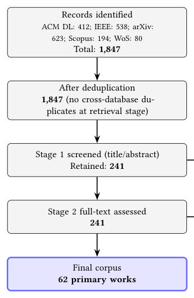 
Fig. 1. PRISMA-adapted screening flow for the systematic corpus assembly. Five databases were queried using three thematic Boolean strings (see section 2). The final corpus of 62 primary works covers the period 2017–2026.

📷 Fig 2

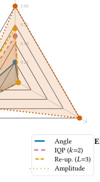 
Fig. 2. Three-axis cost–expressivity–robustness taxonomy for the four principal encoding families. Each axis is normalised to [0, 1]: Expressivity = log-normalised Fourier degree from theorem 1; Noise Robustness = encoding-layer fidelity 𝐹enc at 𝑝2 = 3 × 10−3, 𝐷= 64 from proposition 2; Qubit Efficiency = log2(𝐷) /𝑞(E, 𝐷), normalised so that amplitude encoding scores 1.00. No encoding dominates all three axes simultaneously; the Pareto analysis in section 7 resolves this trilemma for specific hardware regimes.

📷 Fig 3

 
Fig. 3. Annotated decision tree for encoding selection (Algorithm 1). Decision nodes (blue diamonds) test hardware feasibility conditions derived analytically in sections 4 and 5; the critical thresholds 𝑝∗ amp and 𝑝∗ IQP are computed via eq. (21) for the given (𝐷, 𝐹min). Leaf nodes (green rectangles) give encoding recommendations for each of the five regimes. The orange dashed path is the fallback triggered by a failed fidelity check in Regime 4; annotation boxes (grey) state the relevant analytical expressions inline. All inputs are defined in ??.

📷 Fig 4

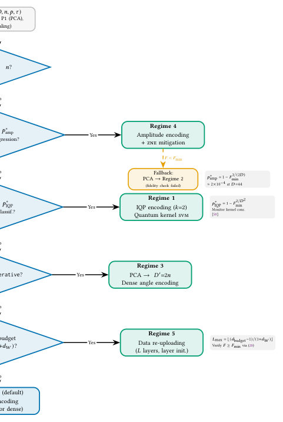 
Figure 4 plots the Pareto frontier in the two-dimensional space of expressivity (Fourier degree, as a proxy for model

📷 Fig 5

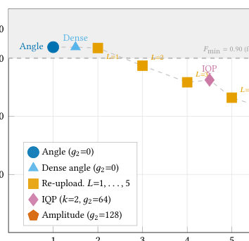 
Fig. 4. Pareto frontier in the expressivity–robustness plane at 𝑝1 = 10−3, 𝑝2 = 3 × 10−3, 𝐷= 64. All fidelity values are computed analytically from proposition 2 as 𝐹enc = (1 −𝑝2)𝑔2 (1 −𝑝1)𝑔1, using gate counts from table 3. Expressivity is measured as the maximum Fourier degree per feature dimension (theorem 1); amplitude encoding’s “Full” label denotes access to the complete 2𝑛-dimensional Hilbert space, incommensurable with the integer Fourier-degree scale. The grey band marks the feasibility region 𝐹≥𝐹min = 0.90 (??). The re-uploading family (orange squares) traces a continuously tunable curve that crosses the feasibility threshold between 𝐿= 3 and 𝐿= 4 at the stated hardware parameters.

**Summary.** This survey systematically reviews quantum feature encoding techniques for QML on noisy hardware. It develops a comprehensive taxonomy classifying encodings based on cost, expressivity, and robustness. The central finding is that practical performance favors shallow angle encodings over exponentially powerful amplitude encodings when device error rates are non-negligible.

**Why it may be interesting.** This work provides crucial, hardware-aware guidelines for applying QML theory to real-world NISQ devices by quantifying the trade-offs between theoretical power and physical noise limitations.

Detailed structure

**Main problem.** The encoding of classical data into quantum states is identified as the primary performance bottleneck limiting Quantum Machine Learning (QML) on Noisy Intermediate-Scale Quantum (NISQ) devices.

**Main result.** For current noise levels ($p \gtrsim 10^{-3}$), shallow angle-based encodings consistently outperform theoretically superior but noise-sensitive amplitude encoding in practice.

**Method.** The authors conducted a systematic literature review and developed a multi-faceted decision framework that jointly characterizes resource cost, expressivity (via Fourier analysis), and noise robustness for various encoding families.

**Model / system.** The study analyzes the mapping of classical feature vectors $x \in \mathbb{R}^D$ to quantum states $|\psi(x)
angle$ using parameterized quantum circuits (PQCs) on NISQ hardware. The comparison spans multiple encoding types: basis, angle, amplitude, and IQP.

**Key observables.** State fidelity ($\mathcal{F}$), resource cost (qubit count $n$, gate count $g_2$, circuit depth $d$), Fourier expressivity (frequency spectrum $\Omega$), and the critical error rate ($p^*$).

**Important parameters / regimes.** Feature dimension ($D$), qubit budget ($n$), physical error rate ($p$), and task type ($	au$). Critical thresholds include $p^* \approx 10^{-3}$ for amplitude encoding viability.

**Assumptions / limitations.** The analysis relies on modeling decoherence using CPTP maps under NISQ conditions, and it assumes that the performance trade-offs can be captured by analyzing these measurable resource metrics.

**Figures summary.** A three-axis taxonomy visualizes the trade-off between Expressivity, Noise Robustness, and Qubit Efficiency. A five-regime decision framework guides practitioners based on input parameters $(D, n, p, 	au)$.

**Paper structure.** The paper systematically reviews existing literature to establish a comprehensive taxonomy of encoding families, derives theoretical bounds relating depth/fidelity to error rates, unifies the analysis across trainability metrics (Fourier spectrum, barren plateaus), and culminates in a practical five-regime decision framework.

Abstract

The encoding of classical data into quantum states constitutes the primary performance bottleneck in Quantum Machine Learning (qml) on Noisy Intermediate-Scale Quantum (nisq) devices. No existing framework jointly characterises resource cost, expressivity, and noise robustness, nor provides actionable selection guidelines for practitioners. This survey addresses that gap through a systematic review of 66 primary works (2017-2026) assembled via a PRISMA-adapted protocol across five academic databases. Four principal contributions are made. First, a three-axis cost-expressivity-robustness taxonomy classifies all major encoding families - basis, angle, dense-angle, amplitude, data re-uploading, and IQP - along independently measurable axes. Second, closed-form depth-fidelity bounds under nisq decoherence channels identify the critical gate-error rate p* ~ 10^-3 below which amplitude encoding is viable. Third, a unified treatment of Fourier expressivity, barren-plateau onset, and quantum kernel concentration as functions of the encoding circuit provides the first joint trainability analysis. Fourth, a five-regime decision framework maps (D, n, p, tau) - feature dimension, qubit budget, error rate, and task type - to a hardware-grounded encoding recommendation. The central finding is that for p >= 10^-3, shallow angle-based encodings consistently outperform amplitude encoding in practice, despite the latter's exponential qubit advantage.

[↑ back to top](#top)

### [Multi-Qubit Dyadic Phase Fixing for Fault-Tolerant Quantum Compilation](http://arxiv.org/abs/2606.05397v1)

**Authors:** Justin Kalloor, Mathias Weiden, Ed Younis, John Kubiatowicz, Costin Iancu  
**Type:** theory · **Category:** quantum information and computing · **PDF:** <https://arxiv.org/pdf/2606.05397v1>  
**Analysis basis:** full PDF text, analyzed in chunks

📷 Fig 1

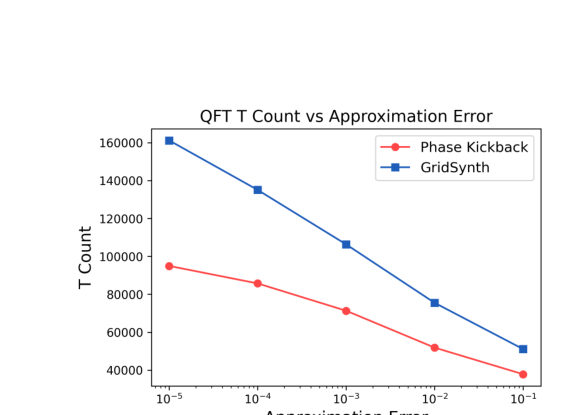 
Fig. 1: T-gate counts for the Quantum Fourier Transform circuit, comparing Rz decomposition via Phase Kickback against standard rotation synthesis (gridsynth). Phase kickback achieves signifi- cantly lower T-counts for angles of the form 2π

📷 Fig 2

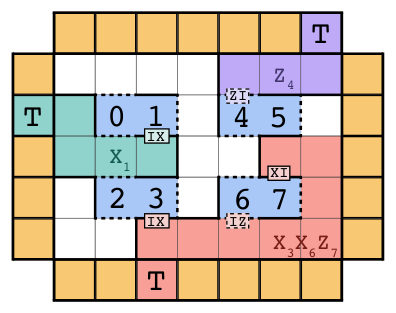 
Fig. 2: Standard bus architecture for surface code qubit patches ( [16], [21], [28]). The routing qubits (blank squares) allow for logical all-to-all connectivity. Pauli Products (red, green, and purple regions) in the same cycle can be scheduled in parallel if there are non- overlapping paths through the routing qubits. The perimeter contains magic state cultivation qubits (yellow) which generate resource states as per [13]. When the resource states have a T state ready, they can be used in a Pauli measurement. The final space-time volume of the mapped circuit is the number of logical cycles × all of the qubits in the architecture (data, routing, and resource).

📷 Fig 3

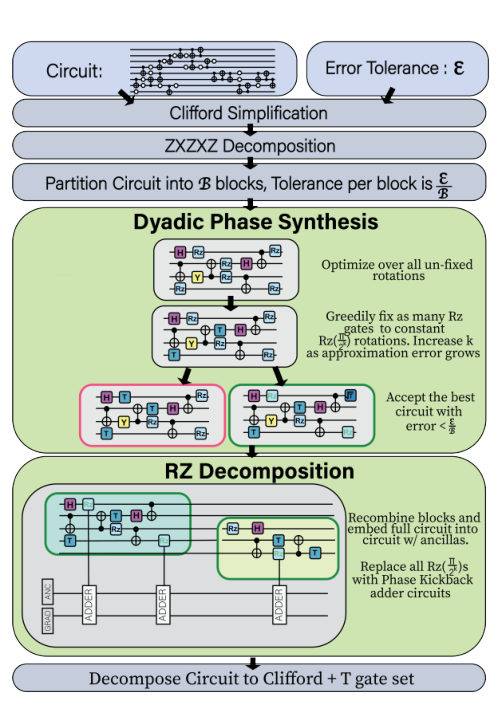 
Fig. 3: High-level overview of our end-to-end compilation workflow. We accept a logical circuit in any gate set along with an acceptable approximation error tolerance. The circuit is partitioned into blocks and each block is simplified with BQSKit-FT [33]. Each block is then passed to our Dyadic Phase Fixing routine, which greedily extracts dyadic Rz rotations from the circuit. The resulting circuit is decomposed to the Clifford+T gate set and can be mapped to a given QEC code and architecture.

📷 Fig 4

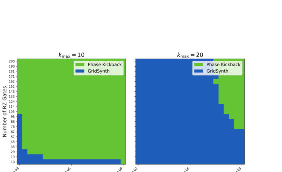 
Fig. 4: Decision matrix comparing T-gate counts between Phase Kickback and gridsynth as a function of approximation error threshold and number of fixed Rz gates, shown for k = 10 (left) and k = 20 (right). Green indicates configurations where phase kickback achieves fewer T gates; Blue indicate where standard gridsynth is preferable. phase kickback model uses the adder T-count of [12] together with the phase gradient state preparation cost. By sweeping over all candidate k values from 4 to kmax, the compiler selects the register size kreg that minimizes the overall T- gate count according to these models. When the decision matrix determines that no value of k yields a net benefit, the...

📷 Fig 5

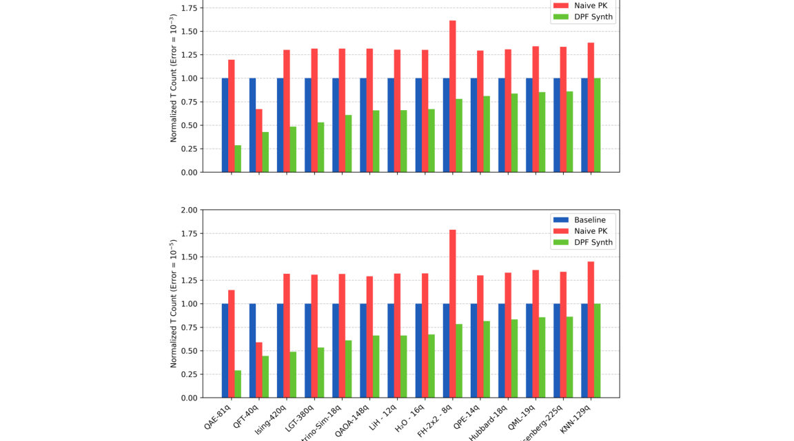 
Fig. 5: Normalized T-gate counts across all benchmarks, comparing Baseline compilation, Naive Phase Kickback (Naive PK), and Dyadic Phase Fixing Synthesis (DPF Synth) at error thresholds of 10−3 and 10−5.

**Summary.** The paper introduces Dyadic Phase Fixing (DPF), a general synthesis tool that optimizes the compilation of quantum circuits into the T-gate restricted set required for fault tolerance. By extending phase kickback, DPF significantly reduces the necessary number of costly T gates compared to existing methods. Crucially, it also warns that while T-count is important, physical resource metrics like space-time volume must be considered alongside gate count minimization.

**Why it may be interesting.** This work directly addresses resource optimization in quantum computation, which is critical for realizing large-scale quantum processors. The detailed analysis of cost trade-offs (T-count vs. volume) provides crucial guidelines for compiler design relevant to any physical platform.

Detailed structure

**Main problem.** The primary challenge is efficiently compiling arbitrary quantum circuits into the fault-tolerant Clifford+T gate set while minimizing the resource cost, dominated by T gates.

**Main result.** The proposed Dyadic Phase Fixing (DPF) synthesis achieves significant reductions (up to 70%) in T-gate count compared to established methods like gridsynth on diverse benchmarks.

**Method.** DPF extends phase kickback by using numerical unitary synthesis to greedily extract dyadic angle rotations from general circuits, optimizing the trade-off between T-count reduction and ancilla overhead.

**Model / system.** The work models fault-tolerant quantum computation implemented on architectures like the surface code. The compilation process translates high-level unitaries into a sequence of Clifford and $Rz$ gates, which are then mapped to physical operations.

**Key observables.** T-gate count (primary metric), space-time volume, approximation error ($\epsilon$), and ancilla qubit overhead.

**Important parameters / regimes.** The precision threshold $\epsilon$, the size of the phase gradient register ($k_{reg}$), and the choice between different Pauli basis computation schemes (LPBC vs. HPBC).

**Assumptions / limitations.** T-count is a useful but incomplete proxy for total fault-tolerant cost, as space-time volume can diverge from T-count savings due to CNOT overhead.

**Figures summary.** Figures compare T-gate counts across benchmarks (QFT, QAE, etc.) showing DPF's advantage over baseline methods; other figures detail the decision matrix comparing synthesis techniques and plot resource costs vs. register size.

**Paper structure.** The paper introduces the problem of fault-tolerant compilation, details the DPF method using unitary synthesis and a decision matrix to select optimal phase kickback parameters, presents quantitative results showing T-count reduction, and concludes by analyzing the limitations regarding space-time volume overhead.

Abstract

Fault-tolerant quantum computing requires translating application-level quantum circuits into the Clifford+$T$ gate set, where the $T$ gate is the dominant resource cost. Phase kickback is an ancilla-based technique that can dramatically reduce $T$-count for rotations with dyadic angles, but has previously been limited to highly structured circuit families. We present Dyadic Phase Fixing (DPF), a general multi-qubit synthesis tool that extends phase kickback to general quantum circuits. DPF uses numerical unitary synthesis to greedily extract dyadic angle rotations from any input circuit. Combined with a decision matrix to automatically size the final phase gradient register, our end-to-end workflow achieves up to 70% reduction in $T$-count compared to \texttt{gridsynth} and up to 60% compared to Repeat-Until-Success synthesis on a diverse set of benchmarks. We map these compiled circuits to a surface-code architecture to evaluate space-time volume, demonstrating up to a 60\% reduction in this metric as well. However, for some circuits and mapping strategies the two metrics diverge significantly, demonstrating that $T$-count alone is a useful but incomplete proxy for fault-tolerant program costs.

[↑ back to top](#top)

### [Nanostructure modelling with early fault tolerant quantum computers](http://arxiv.org/abs/2606.06442v1)

**Authors:** Zhu Sun, Christian Binder, Balint Koczor, Simon Benjamin  
**Type:** theory · **Category:** strongly correlated electrons · **PDF:** <https://arxiv.org/pdf/2606.06442v1>  
**Analysis basis:** full PDF text, analyzed in chunks

📷 Fig 1

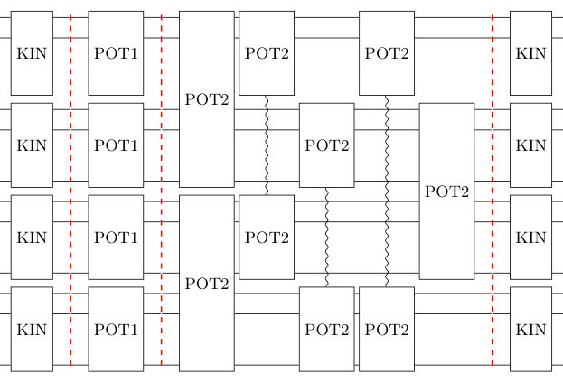 
FIG. 1. A schematic circuit diagram for one Trotter step for np = 4. The KIN, POT1 and POT2 operations correspond to the K, U and V terms acting on one- and two-particle registers, respectively. Note that the POT2 operations in stage C can be executed in 3 layers.

📷 Fig 2

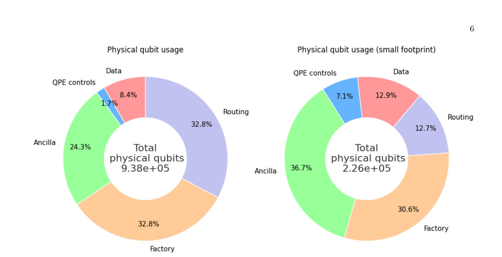 
FIG. 2. The logical qubit usage breakdown for np = 4 illustrated in pie chart. Left: Pie chart for beat limited computation. Right: Pie chart for tick limited computation with 5 magic state factories.

📷 Fig 3

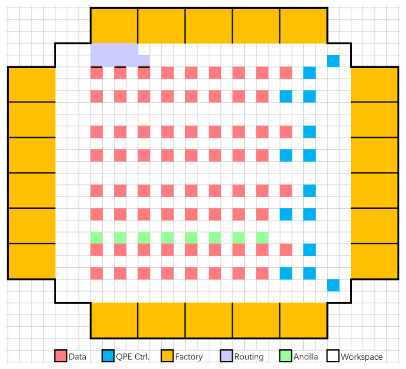 
FIG. 3. A possible layout of logical qubits for the case np = 4 and nq = 8 on rotated surface code, assuming beat-limited computation. The red patches denote data qubits storing the quantum state of the system, while the blue patches represent the control qubits for QPE. Each 8T-to-CCZ factory comprises 12 orange patches, separated by thin black lines. The purple region at the top illustrates an example of routing for teleporting a CCZ state; the double lines indicate measurements at the boundaries. The green patches at the bottom are active ancilla, showing an example of implementing 8 single-qubit rotations in parallel. The white patches represent workspace qubits that can be used for...

📷 Fig 4

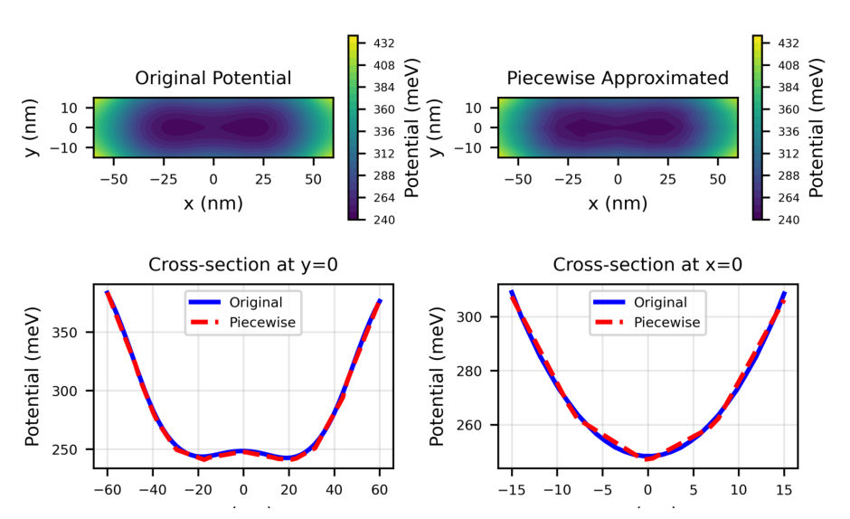 
FIG. 4. Top: Contour plots of the original potential and its piecewise approximation. Bottom: Cross-sections of the potential and corresponding approximation taken at y = 0 and x = 0.

**Summary.** The paper presents a quantum simulation framework to calculate the ground-state energy of multi-electron double quantum dots. By employing advanced techniques like Trotterization on a first-quantized grid representation, they estimate that these complex electronic structure problems are feasible within hours using early fault-tolerant quantum hardware. This work is crucial for advancing quantum technology design in solid-state physics.

**Why it may be interesting.** This work directly addresses the computational bottleneck in simulating strongly correlated electron systems (like those in quantum dots) by providing concrete resource roadmaps for near-term quantum computation architectures.

Detailed structure

**Main problem.** Accurately modeling the electronic structure of semiconductor nanostructures, particularly when dynamics involve more than two interacting electrons.

**Main result.** The authors estimate that ground-state energies for 4 and 8 electrons can be calculated within hours to days using early fault-tolerant quantum computers with hundreds of thousands of physical qubits.

**Method.** They developed a quantum simulation framework utilizing both Trotterization (Quantum Phase Estimation) and qubitisation algorithms applied to an efficiently scaling first-quantized representation of the system.

**Model / system.** The focus is on double quantum dots (DQD) in semiconductor nanostructures, modeling multi-electron systems using a grid-based representation derived from the Hamiltonian components (Kinetic, DQD potential, Coulomb interaction).

**Key observables.** Ground-state energy of the system; resource costs (qubit count, runtime) for achieving specific energy estimations.

**Important parameters / regimes.** Physical noise rate ($10^{-3}$); number of electrons ($n_p=4, 8$); physical qubit counts ($\sim 226	ext{k}$ to $314	ext{k}$).

**Assumptions / limitations.** The resource estimates are more realistic than theoretical error bounds because they incorporate insights from classical simulations; the analysis relies on specific quantum error correction codes (e.g., surface code).

**Figures summary.** Figures illustrate circuit diagrams for one Trotter step and layout visualizations of logical qubits required for the simulation.

**Paper structure.** The paper details the Hamiltonian decomposition, presents resource cost analyses comparing Trotterization vs. qubitisation, provides specific estimates for $n_p=4$ and $n_p=8$, and concludes on the feasibility using early fault-tolerant hardware.

Abstract

Semiconductor nanostructures are central to many developing technologies. Notably, double quantum dots are especially important for semiconductor spin-qubit architectures, quantum sensing applications, and quantum-dot solar cells. Accurate modelling is highly desirable but conventional methods can struggle when dynamics involve more than two interacting electrons. In this work, we present a quantum simulation framework capable of addressing multi-electron double quantum dots. We adopt an efficiently scaling 1$^\text{st}$ quantised representation of the system and develop algorithms based on both Trotterisation and qubitisation. Incorporating insights from classical simulations enables us to produce resource estimates that are more realistic than those obtained from theoretical error bounds. Using a standard surface code model with physical noise at $10^{-3}$, our results indicate that the ground-state energy of four electrons in a double quantum dot can be estimated in approximately 24 hours using 226k physical qubits, or an eight-electron system in 3.4 days with 314k qubits (with runtimes falling dramatically when more qubits are available). We anticipate that incorporating very recent advances including dense surface code architectures (Low et al. arXiv:2605.30455) may reduce these costs significantly further. We conclude that early fault tolerant computers may prove to be valuable tools for designing mature-era quantum technologies.

[↑ back to top](#top)

### [Periodic Symmetry-Adapted Encoding: Qubit Reduction in Crystalline Electronic Structure](http://arxiv.org/abs/2606.05777v1)

**Authors:** Dario Picozzi  
**Type:** theory · **Category:** quantum information and computing · **PDF:** <https://arxiv.org/pdf/2606.05777v1>  
**Analysis basis:** full PDF text, analyzed in chunks

📷 Fig 1

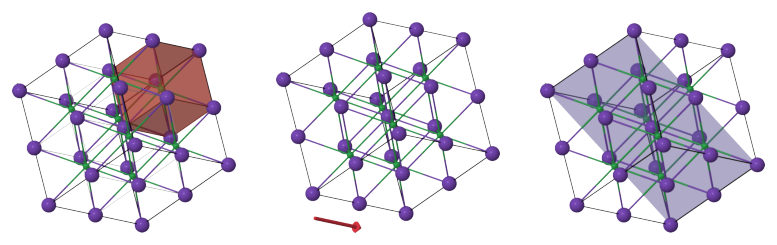 
FIG. 1: Geometry of the CsCl B2 crystal in the (2, 2, 2) simple-cubic supercell, used as the largest-reduction example. Cs atoms are purple and Cl atoms green; bonds are drawn between nearest-neighbour Cs–Cl pairs and the supercell border is shown as a thin black frame. Left: the supercell decomposes into eight primitive cells, with one primitive cell highlighted by a translucent red volume. Centre: a half-supercell translation along a primitive lattice vector maps each atom onto an equivalent atom modulo the supercell period. In CsCl all three Cartesian half translations are retained as independent Z2 generators. Right: a representative oblique mirror plane of the Pm3m space group....

📷 Fig 2

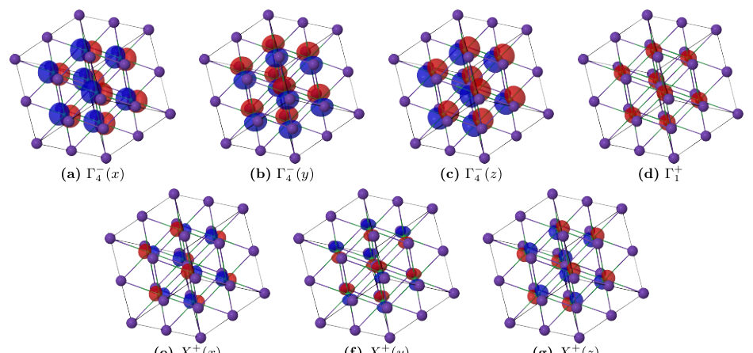 
FIG. 2: CsCl CAS(6,7) active space used for the largest-reduction example. The CAS(6,7) active window contains the three occupied frontier orbitals transforming as the Γ− 4 triplet, followed by four virtual orbitals: the Γ+ 1 state and the three symmetry-equivalent X+ 1 star partners. The labels in parentheses on the Γ− 4 panels denote the Cartesian component selected by the mirror eigenvalues; the labels on the X+ 1 panels denote the star arm with translation eigenvalue −1 along the corresponding primitive lattice direction. All orbitals are rendered on the same CsCl supercell view as Fig. 1. Red and blue isosurfaces denote opposite signs of the orbital amplitude.

📷 Fig 3

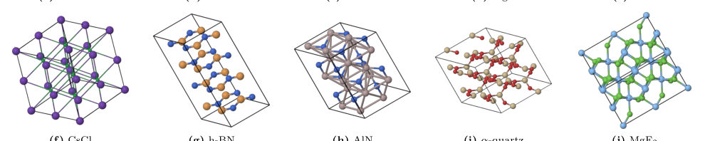 
FIG. 3: The ten periodic benchmark systems, shown as the (2, 2, 2) supercells used in the calculations. The set spans cubic, hexagonal, trigonal, and tetragonal examples and is ordered to match the columns of Table I.

📷 Fig 4

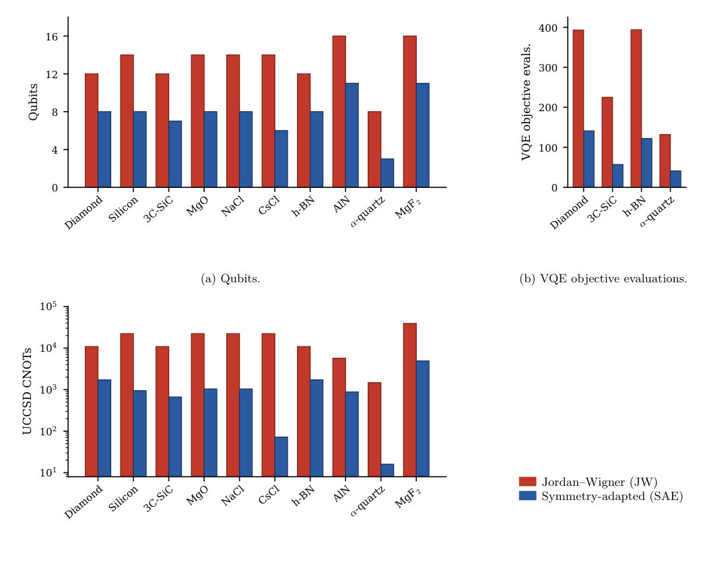 
FIG. 4: Resource reduction across the ten benchmark systems. (a) Every system drops four to eight qubits, with CsCl reducing the register from 14 to 6 qubits. (b) For the four systems where both JW- and SAE-VQE were fully optimised, SAE converges in 2.8–3.9× fewer VQE objective evaluations. (c) SAE removes one to three orders of magnitude of two-qubit gates; CsCl and α-quartz show the largest CNOT compressions (309× and 92×, respectively). Numerical values match Table I.

**Summary.** The paper introduces Periodic Symmetry-Adapted Encoding (SAE) to drastically reduce the qubit count needed for simulating crystalline electronic structures on quantum computers. By incorporating crystal translation symmetries into the symmetry constraints, it achieves substantial resource savings—up to 309x in CNOT gates—while maintaining high energy accuracy compared to standard encodings.

**Why it may be interesting.** This work provides a concrete, scalable method to reduce the exponential scaling of quantum resources required for solid-state physics simulations by systematically exploiting crystal symmetries, which is crucial for applying quantum computing to materials science.

Detailed structure

**Main problem.** The primary goal is to enable qubit-efficient quantum simulation of crystalline materials by adapting symmetry reduction techniques from molecular systems to periodic electronic structures.

**Main result.** The proposed Periodic Symmetry-Adapted Encoding (SAE) successfully reduces the required number of qubits and computational resources (CNOT counts, VQE evaluations) significantly compared to standard Jordan-Wigner encodings across ten benchmark crystals.

**Method.** The method extends Symmetry-Adapted Encoding by incorporating crystal translation symmetries alongside point-group and spin-parity generators. These symmetries are used to constrain the Hamiltonian via Boolean linear equations, projecting the system onto a smaller, symmetry-adapted qubit subspace.

**Model / system.** The model involves simulating the electronic structure of various crystalline materials (e.g., diamond, CsCl) using an active space derived from a supercell Hamiltonian constructed by folding $k$-point calculations to the $\Gamma$-point. The simulation is mapped onto qubits via the Jordan-Wigner transformation.

**Key observables.** Qubit count reduction (e.g., 14 to 6 for CsCl), CNOT gate counts, variational parameter counts, and preservation of target energies below chemical accuracy.

**Important parameters / regimes.** The number of independent Boolean generators ($n_g$), the size of the active space (CAS(6,7)), and the specific crystal structure symmetries ($\mathbb{Z}_2^8$ for CsCl).

**Assumptions / limitations.** The method assumes that the physical sector remains the global minimum when projected onto the symmetry-adapted subspace, and that all relevant symmetry generators can be identified and commute.

**Figures summary.** Figures illustrate resource savings: Qubit count drop (e.g., CsCl 14 $	o$ 6), reduction in VQE objective evaluations ($\approx 3	imes$ fewer), and significant CNOT gate compression, demonstrating the efficiency of periodic SAE.

**Paper structure.** The paper introduces the problem by extending molecular SAE to periodic systems. It details the Hamiltonian construction via supercells and symmetry identification (spin-parity, point-group, translation). Results are presented through benchmarking on ten crystals, comparing resource costs against JW encoding, and validating energy preservation using UCCSD-VQE benchmarks.

Abstract

We extend the symmetry-adapted encoding (SAE) framework to periodic electronic structure, enabling qubit-efficient quantum simulation of crystalline materials. By constructing a $Γ$-point supercell Hamiltonian from a folded $k$-point calculation and systematically identifying all applicable space-group symmetry generators -- including spin-parity, point-group, and crystal translation symmetries -- we obtain qubit Hamiltonians with fewer qubits than the Jordan--Wigner starting point. We benchmark diamond, silicon, 3C-SiC, MgO, NaCl, CsCl, h-BN, wurtzite AlN, $α$-quartz SiO$_2$, and MgF$_2$ using active spaces chosen to preserve complete near-degenerate frontier manifolds across cubic, hexagonal, trigonal, and tetragonal space groups. Across the suite the periodic SAE removes 4--8 qubits. The B2 CsCl benchmark realises eight independent Boolean generators, i.e. a symmetry group isomorphic to $\mathbb{Z}_2^8$, reducing CAS(6,7) from 14 to 6 qubits. This exceeds the $\mathbb{Z}_2^5$ maximum of molecular SAE, where only two spin parities and at most three independent Boolean point-group generators are available, because the folded crystal supplies three additional half-translation symmetries. Noiseless UCCSD-VQE benchmarks against exact diagonalisation in the active-space sector show that the reduced encodings preserve the target energies to well below chemical accuracy while reducing variational parameter counts by $3$--$8\times$ and CNOT counts by up to $309\times$. The largest circuit savings occur when translation and point-group generators act independently in the active space, demonstrating that periodic symmetry can be converted directly into both qubit and ansatz compression. The method is implemented in the open-source QuantumSymmetry package and requires no manual specification of symmetry generators.

[↑ back to top](#top)

### [Quantum Algorithms for Triangle Cut Sparsification](http://arxiv.org/abs/2606.06287v1)

**Authors:** Shan Jiang, Pan Peng  
**Type:** theory · **Category:** quantum information and computing · **PDF:** <https://arxiv.org/pdf/2606.06287v1>  
**Analysis basis:** full PDF text, analyzed in chunks

📷 Fig 1

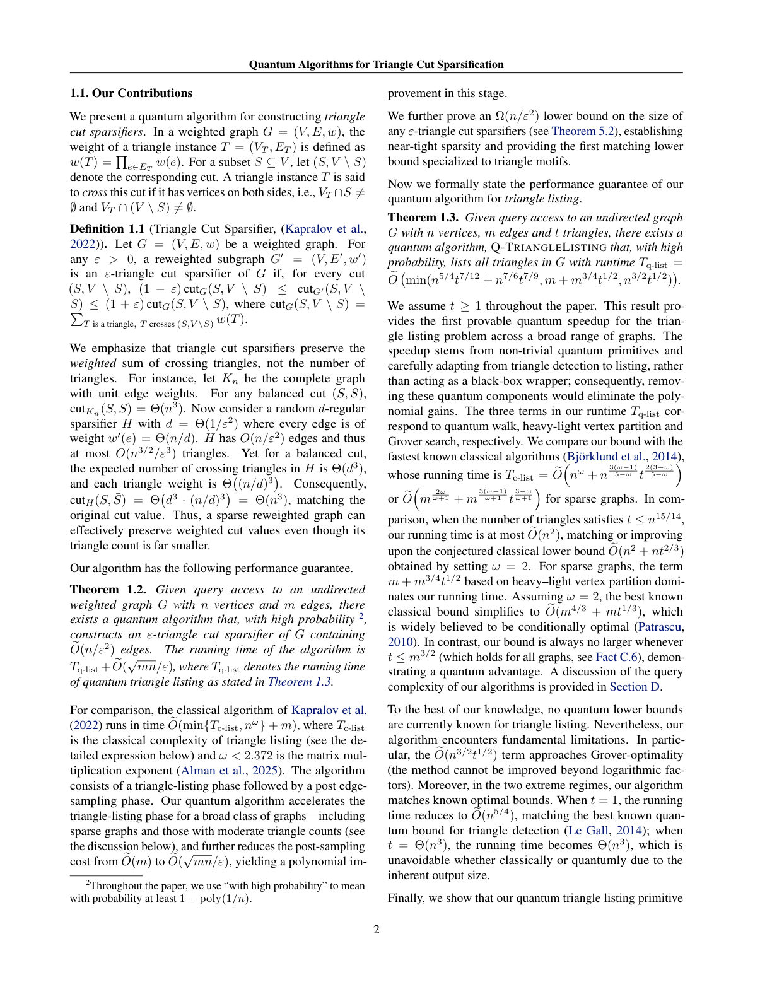 
Low-resolution page preview, page 2

📷 Fig 2

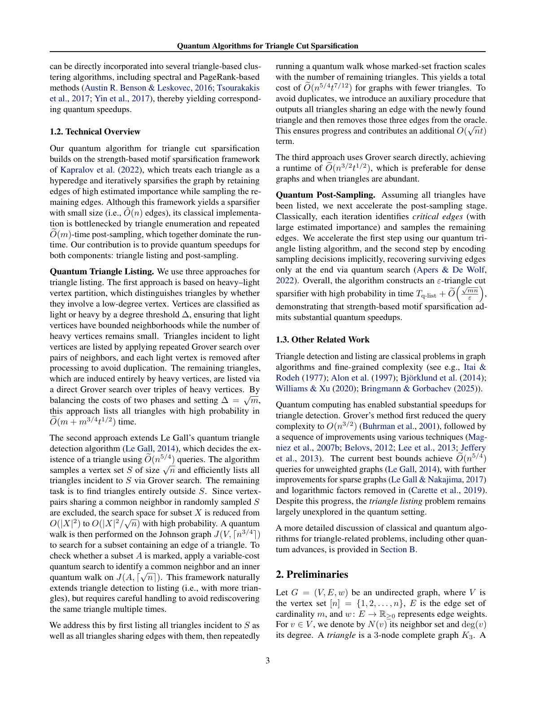 
Low-resolution page preview, page 3

📷 Fig 3

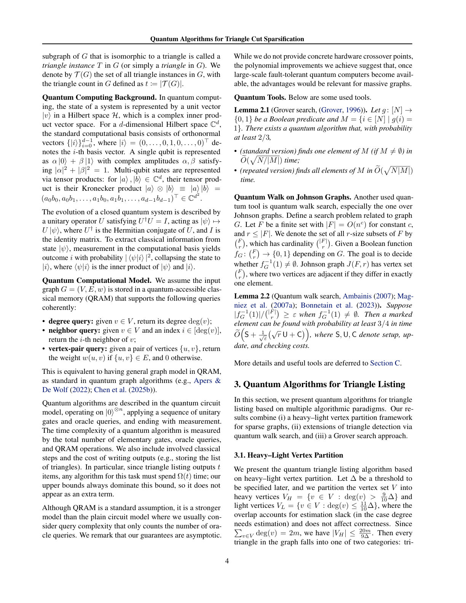 
Low-resolution page preview, page 4

📷 Fig 4

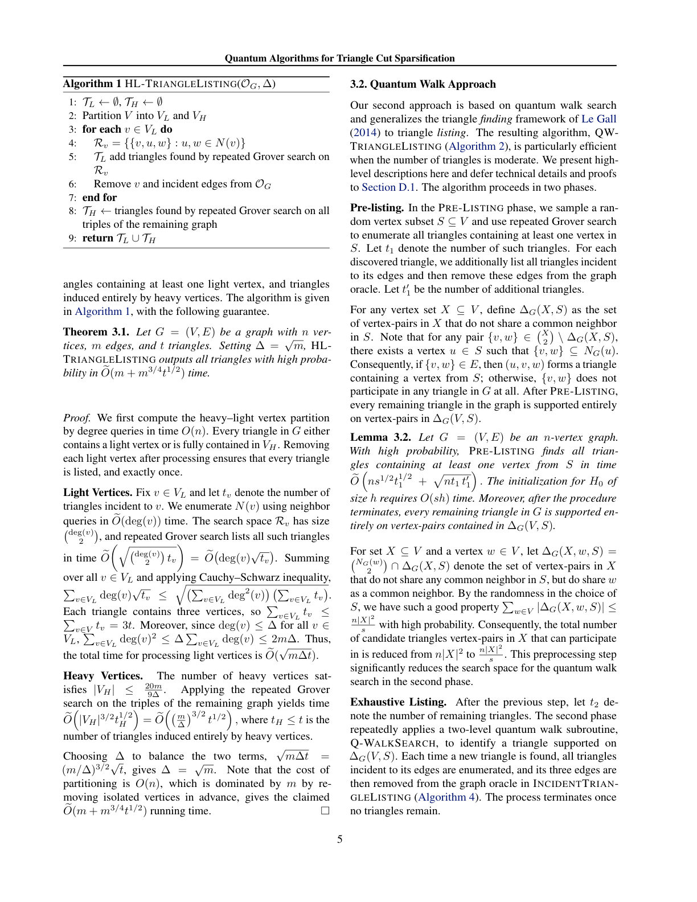 
Low-resolution page preview, page 5

📷 Fig 5

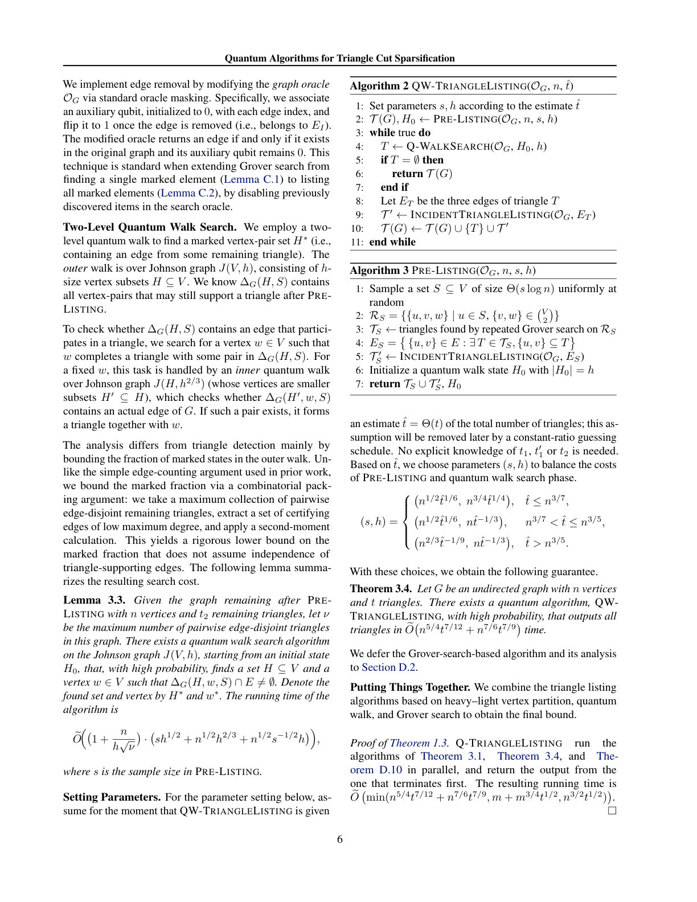 
Low-resolution page preview, page 6

**Summary.** This paper develops quantum algorithms for triangle cut sparsification, a method to compress graph representations while maintaining structural information related to triangles. It achieves significant theoretical speedups by first presenting an efficient quantum algorithm for listing all triangles and then using this primitive to construct the required $\epsilon$-sparsifier with near-optimal size bounds.

**Why it may be interesting.** While focused on graph theory/algorithms, the development of novel quantum primitives like Q-TRIANGLELISTING demonstrates advanced applications of quantum search (Grover) and quantum walks to complex combinatorial structures, which has parallels in simulating quantum many-body systems or analyzing network properties.

Detailed structure

**Main problem.** The core problem is developing quantum algorithms for triangle cut sparsification, which aims to reduce graph size while preserving approximate triangle counts across all cuts.

**Main result.** The authors present a quantum algorithm that constructs an $\epsilon$-triangle cut sparsifier of size $	ilde{O}(n/\epsilon^2)$ in time $eO(T_{q	ext{-list}} + \sqrt{mn}/\epsilon)$, establishing near-tight sparsity bounds.

**Method.** The approach combines advanced techniques: quantum triangle listing (using heavy-light partitioning, quantum walks, or Grover search) with a strength-based sampling procedure to construct the sparsifier iteratively.

**Model / system.** The system is an undirected weighted graph $G = (V, E, w)$. The analysis focuses on preserving the 'triangle cut' measure across cuts $(S, V \setminus S)$ by constructing a reweighted subgraph $G'$.

**Key observables.** Triangle counts crossing a cut, $\epsilon$-cut preservation factor, and the size of the resulting sparsifier $|E'|$.

**Important parameters / regimes.** $n$ (vertices), $m$ (edges), $t$ (triangles), $\epsilon$ (approximation factor).

**Assumptions / limitations.** The analysis assumes access to Quantum RAM (QRAM) and relies on the efficiency of quantum primitives like Q-TRIANGLELISTING.

**Figures summary.** Not specified in the notes, but the structure implies comparisons between classical/quantum time complexities for listing triangles and constructing sparsifiers.

**Paper structure.** The paper builds sequentially: first establishing a quantum algorithm for triangle listing ($T_{q	ext{-list}}$) using multiple techniques (heavy-light, quantum walks); second, applying this to the strength-based motif cut sparsification framework; and finally proving lower bounds on the required size of such sparsifiers.

Abstract

Triangles capture higher-order structures in graphs and are fundamental to applications such as clustering and network analysis.   To enable efficient use of such structures at scale, we study the problem of \emph{triangle cut sparsification}, which aims to reduce the graph size while approximately preserving triangle counts across every cut.   We investigate \emph{quantum algorithms} for this problem, using triangle listing as our main technical ingredient.   In particular, we present a quantum algorithm for triangle listing that, for a graph with $n$ vertices, $m$ edges, and $t$ triangles, runs in time $T_{\mathrm{q\text{-}list}} =$ $\widetilde{O}\bigl(\min(n^{5/4}t^{7/12} + n^{7/6}t^{7/9}, m + m^{3/4}t^{1/2},$ $n^{3/2}t^{1/2})\bigr)$, improving upon the best known classical bounds over a broad range of parameters. Our algorithm is based on a heavy-light vertex partition and an extension of triangle detection via quantum walks and Grover search.   Leveraging this result, we design a quantum algorithm for constructing $\varepsilon$-triangle cut sparsifiers of size $\widetilde{O}(n/\varepsilon^2)$ in time $\widetilde{O}(T_{\mathrm{q\text{-}list}} + \sqrt{mn}/\varepsilon)$.   Finally, we demonstrate applications to clustering algorithms based on triangle-related measures   and prove a lower bound of $Ω(n/\varepsilon^2)$ on the size of any $\varepsilon$-triangle cut sparsifiers.

[↑ back to top](#top)

### [Quantum computing for accurate large-scale electronic-structure calculations: DFT-embedded, post-processed quantum-selected configuration interaction](http://arxiv.org/abs/2606.06015v1)

**Authors:** Tuan Minh Do, Yuichiro Yoshida, Tomoya Shiota, Wataru Mizukami  
**Type:** theory · **Category:** strongly correlated electrons · **PDF:** <https://arxiv.org/pdf/2606.06015v1>  
**Analysis basis:** full PDF text, analyzed in chunks

📷 Fig 1

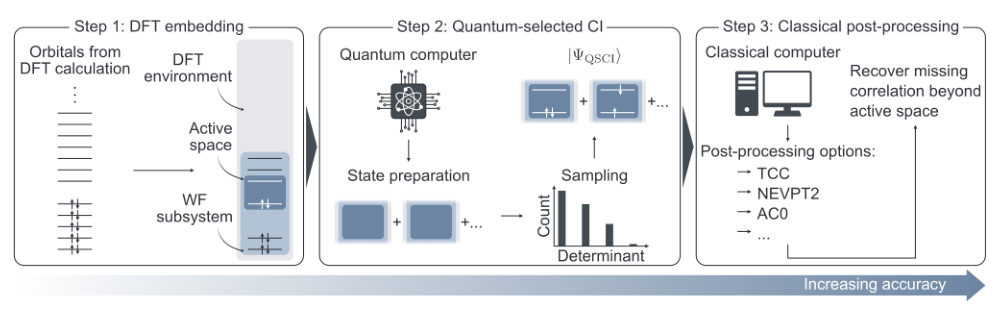 
FIG. 1. Overview of the multilevel framework combining DFT embedding, quantum computing, and classical post-processing. Step 1: Projection-based WF-in-DFT embedding partitions the molecular orbitals of the full system into a WF subsystem (light blue) and a DFT environment (gray). Step 2: An active space is selected from the WF subsystem (dark blue), and a targeted active-space quantum state is prepared on a quantum computer and sampled in the computational basis. The QSCI method is then used to approximately reconstruct the quantum state on a classical computer by diagonalizing the Hamiltonian within the determinant subspace defined using the sampled bitstrings. Step 3: Missing electron...

📷 Fig 2

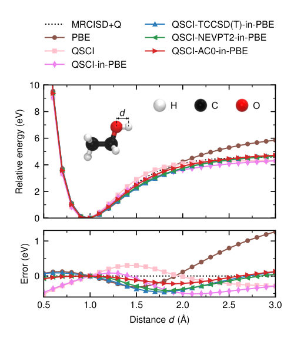 
FIG. 2. O–H bond dissociation in ethanol. Relative potential en- ergy curves (top) for O–H bond dissociation in ethanol using the cc- pVDZ basis set. Corresponding errors (bottom) are defined as devi- ations from the MRCISD+Q reference. QSCI calculations used an active space of (2e,2o).

📷 Fig 3

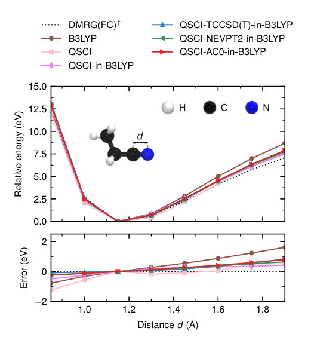 
FIG. 3. C≡N triple-bond stretching in propionitrile. Relative po- tential energy curves (top) for C≡N triple-bond stretching in propi- onitrile using the cc-pVDZ basis set. Corresponding errors (bottom) are defined as deviations from the DMRG(FC) reference. QSCI cal- culations used an active space of (6e,6o). †Values are taken from Ref. [65].

📷 Fig 4

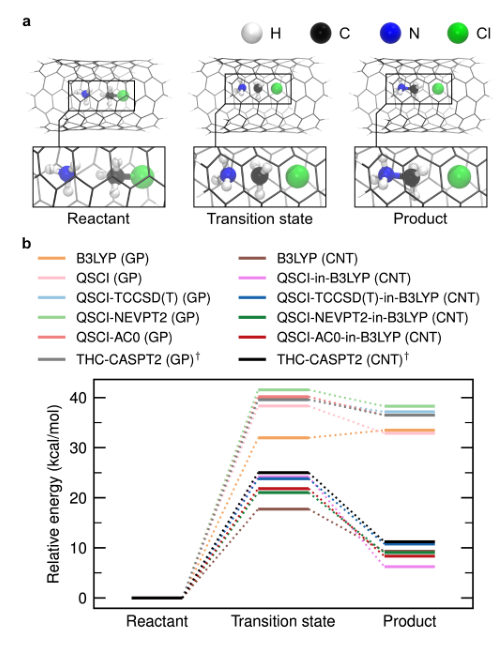 
FIG. 4. Results for the Menshutkin SN2 reaction in gas phase (GP) and inside a carbon nanotube (CNT). (a) Illustration of the reactant, transition state, and product geometries of the Menshutkin SN2 reaction inside a CNT. (b) Energy profiles along the reaction path relative to the reactant energy computed with the 6-31G* basis set. QSCI calculations used an active space of (4e,4o). †Values are taken from Refs. [66, 75].

📷 Fig 5

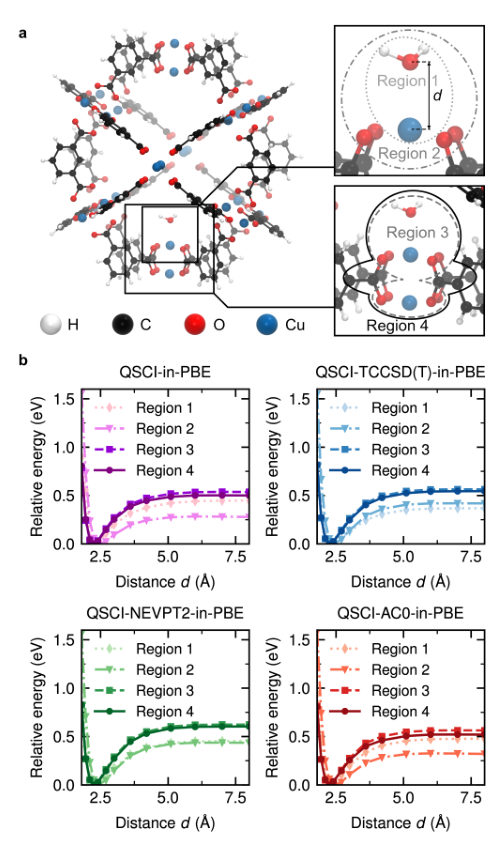 
FIG. 5. Results for water adsorption on an HKUST-1 MOF clus- ter model. (a) Illustration of the HKUST-1 cluster model with a single water molecule adsorbed on a Cu site. Four different defini- tions for the active WF subsystem (Regions 1–4) were investigated. (b) Relative energy profiles along the reaction path computed with the SVP basis set. QSCI calculations used an active space of (2e,2o).

**Summary.** The paper introduces a novel, scalable quantum-classical hybrid method for electronic structure calculations by embedding an active space treated via Quantum-Selected Configuration Interaction (QSCI) within a DFT environment. By systematically post-processing the QSCI results with high-level correlation theories, the authors achieve quantitative accuracy on complex chemical reactions and adsorption processes using superconducting quantum hardware.

**Why it may be interesting.** This work directly addresses the computational bottleneck in quantum chemistry—scaling high-accuracy correlation methods to large systems—by proposing a hybrid quantum-classical architecture relevant to simulating molecular dynamics or catalysis on near-term quantum hardware.

Detailed structure

**Main problem.** Developing an accurate, scalable method for electronic structure calculations on quantum computers that can handle large chemical systems by combining multiple computational approaches.

**Main result.** The framework successfully achieved quantitative agreement ($\sim 1 	ext{ kcal/mol}$) with classical references for a Menshutkin $	ext{SN}2$ reaction inside a carbon nanotube using limited qubits on a superconducting quantum computer.

**Method.** A multilevel embedding framework combining Density Functional Theory (DFT) for the environment, Quantum-Selected Configuration Interaction (QSCI) on an active space, and classical post-processing methods like TCCSD(T) or NEVPT2 to recover correlation energy.

**Model / system.** The method is applied to diverse chemical systems including organic molecules, metal-organic frameworks (MOFs), metallic clusters, and reactions confined within nanotubes. The core involves partitioning the system into an active quantum subsystem ($	ext{A}$) embedded in a DFT environment ($	ext{B}$).

**Key observables.** Bond dissociation energies, adsorption energies, reaction barriers, and potential energy curves.

**Important parameters / regimes.** The calculation utilizes subsets of qubits on a 144-qubit superconducting quantum computer; accuracy is benchmarked against $\sim 1 	ext{ kcal/mol}$ error tolerance.

**Assumptions / limitations.** The approach relies on the validity of projection-based embedding (WF-in-DFT) and assumes that post-processing methods can accurately recover correlation beyond the active space approximation.

**Figures summary.** Figures illustrate the workflow: Step 1 shows DFT embedding, Step 2 details QSCI on a quantum computer, and Step 3 applies classical post-processing. Specific examples show potential energy curves for $	ext{C}\equiv	ext{N}$ stretching and reaction profiles for the Menshutkin reaction.

**Paper structure.** The paper introduces the multilevel embedding framework (WF-in-DFT + QSCI + Post-processing). It details the theoretical underpinnings of each component, presents benchmark calculations on various systems (e.g., propionitrile, CNT), and concludes by demonstrating quantitative accuracy for complex chemical processes.

Abstract

We present a multilevel embedding framework for quantum chemistry calculations on a quantum computer. In our framework, a quantum algorithm treats the strongly correlated active space, while a high-level wave-function method such as coupled cluster theory or multireference perturbation theory recovers the remaining correlation in the surrounding region. A sampling-based quantum algorithm, quantum-selected configuration interaction, bridges the quantum and classical treatments. The entire calculation is embedded in a low-cost density functional theory description of the surrounding environment using Manby's projection technique. We apply the framework to organic, metal-organic, and metallic systems, computing bond dissociation energies, adsorption energies, and reaction barriers using only the subset of qubits of a 144-qubit superconducting quantum computer at the University of Osaka and achieving $\sim$1 kcal/mol agreement with classical references for a Menshutkin $\mathrm{S_N2}$ reaction inside a carbon nanotube. Our results may open the way to quantitatively reliable quantum-classical hybrid calculations for large-scale chemical systems.

[↑ back to top](#top)

### [Quantum element-wise transforms](http://arxiv.org/abs/2606.06456v1)

**Authors:** Zane M. Rossi, Rahul Sarkar  
**Type:** theory · **Category:** quantum information and computing · **PDF:** <https://arxiv.org/pdf/2606.06456v1>  
**Analysis basis:** full PDF text, analyzed in chunks

📷 Fig 1

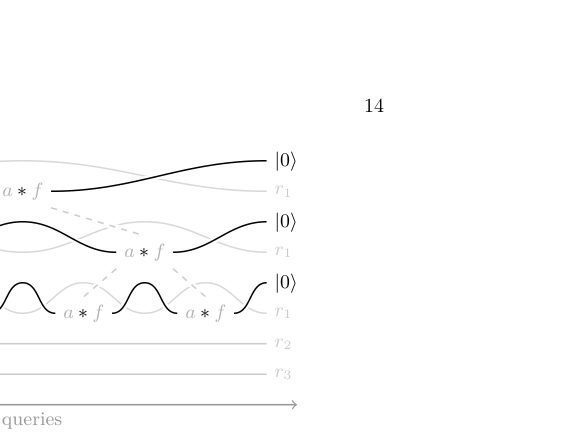 
FIG. 2. Simplified depiction of a specific instance of the weaving lemma (Lem. II.2). Here (∗) is a quantum process that catalytically uses copies of |0⟩(possibly on many qubits) in a register r0 by swapping the contents of r0 with this process’ r1 register (i.e., a blocked operator, Def. II.8). The use by (∗) of the contents of r0 is indicated by an allocation (a) followed by a freeing (f). If this process itself can sequentially call copies of (∗), then the total required copies of register r0, here denoted by r′ 0, r′′ 0 , . . . , grows with the depth of the tree induced by recursive function calls (seen by the re-use of r0 across protocols at the same depth).

📷 Fig 2

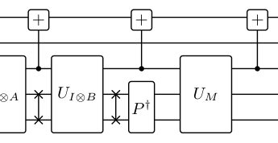 
FIG. 3. Depiction of the circuit for clean element-wise products of block encodings, i.e., block encodings of Ir1 ⊗(A ◦B)r3 using auxiliary space r4r2. Note if r4r2 is in the all-zeros state, then the state |0n⟩in r0 is necessarily used catalytically. Here the (+) notation indicates projection- controlled addition with target register r4 used for the compression gadget (see Lem. A.1); when r2 is not a single qubit, this is a Π-controlled addition on r4 for Π a projector with form (I−|0⟩⟨0|r2). Note also the non-standard ordering of registers to make depiction easier. In our recursive construction, each U(I⊗∗) is replaced by an analogous circuit which acquires (1) a new copy of r0 for each...

📷 Fig 3

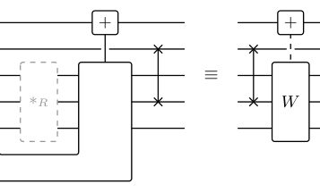 
FIG. 4. Two equivalent, simplified depictions of the circuit in Fig. 3. On the left the unitary-valued function W takes two unitary-valued inputs, here denoted (∗L) and (∗R), which in our setting will both be block encoding unitaries of matrices that have the form (I ⊗M) for some square matrix M. This unitary-valued function (i.e., a circuit with holes) is further condensed on the right, where the free arguments (or holes) are suppressed. Note that wires with slashes represent multi-qubit registers, between which swap gates denote qubit-wise swaps. Additionally, the projection controlled addition operators (see Lem. A.1), here with their targets denoted with (+), have their controls...

📷 Fig 4

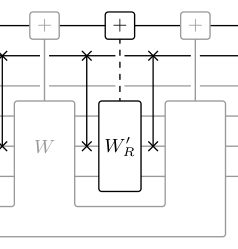 
FIG. 5. A depiction of the first level of the recursive use of the circuit form of Fig. 3 by itself, making use of both forms of the condensed notation introduced in Fig. 4. Note here that the register used for the compression gadget, r4, is not duplicated, and remains the target for the addition gadgets of protocols deeper in the recursive construction. A new register of size n, namely r′ 0, is however initialized to |0⟩, with a new copy introduced at each level of recursion, though re-used between subroutines at the same level, given the catalytic behavior of the original circuit. This catalysis succeeds under the assumption that all block encodings are successfully applied (equivalently,...

📷 Fig 5

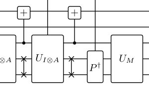 
FIG. 9. The quantum circuit to apply, controlled on the single-qubit register r5, either A = A◦1 or (A◦A) = A◦2 to the register r1r3 (assuming successful post-selection of r0r2r4 in the all-zeros state). Note that if the permutations were not controlled that this would apply either (A ◦I) or (A ◦A) for r5 = |0⟩, |1⟩respectively, which is equivalent iff A is diagonal. In the controlled version of our recursive construction these controlled permutations, at each level, would become multi-controlled permutations applied only when not all of the inputs A, B are the identity matrix.

**Summary.** This paper develops advanced quantum algorithms to efficiently compute element-wise transforms of matrices encoded within unitaries. By introducing optimized circuit techniques and analyzing resource scaling, it significantly reduces the required auxiliary space compared to previous methods. This advances the practical feasibility of applying complex mathematical functions to quantum simulation problems.

**Why it may be interesting.** This work provides concrete algorithmic blueprints for implementing complex mathematical operations (like element-wise functions) on quantum hardware using the block encoding paradigm, which is crucial for simulating physical systems or running ML algorithms in a quantum context.

Detailed structure

**Main problem.** The authors aim to construct improved, resource-efficient quantum algorithms for performing element-wise transforms (QEWTs) on matrices block-encoded within unitary processes.

**Main result.** They achieve significant improvements in auxiliary space complexity for QEWTs compared to prior work, particularly by developing techniques like the 'weaving lemma' and utilizing controlled unitaries.

**Method.** The methods involve constructing quantum circuits that manipulate block encodings of operators, drawing heavily on concepts from Quantum Singular Value Transformation (QSVT) and specialized subroutines like swap-copy gates.

**Model / system.** The work operates within the framework of quantum computation using 'block encoding,' where an $n$-qubit operator is represented as a sub-block of a larger unitary matrix. The focus is on manipulating these encodings to realize element-wise functions ($f \circ M$).

**Key observables.** Resource complexity metrics including query complexity, auxiliary space usage (e.g., scaling as $O(a + n \log d)$), and gate/depth complexity.

**Important parameters / regimes.** Polynomial degree ($d$), block encoding parameters $(\alpha, a, \epsilon)$, and the structure of the target function $f$.

**Assumptions / limitations.** The analysis relies on various sufficient assumptions to manage worst-case behavior when multiplying ill-conditioned block encodings, and assumes access to specific controlled unitary operations.

**Figures summary.** Figures illustrate circuit constructions for key subroutines, such as the swap-copy operation (Figure 1) and the general structure of compression gadgets used for matrix products (Figure 8).

**Paper structure.** The paper builds from foundational concepts like block encoding definitions and error propagation rules to develop specific circuits. It progresses through techniques for element-wise products, controlled powers, and finally presents optimized constructions achieving low space complexity.

Abstract

Quantum algorithms for basic numerical linear algebraic tasks have proven essential for translating diverse problems to a unified quantum computational context. Many of these tasks -- e.g., applying a polynomial function to the spectrum of a matrix embedded in a unitary process (a so-called block encoding), or taking linear combinations of block encodings -- are well-addressed by techniques like quantum singular value transformation (QSVT) or linear combination of unitaries (LCU). However, there exist useful matrix transforms whose realization by existing quantum algorithms is unclear or inefficient. In this work we construct improved quantum algorithms for some of these transforms, the simplest of which is a polynomial function applied element-wise. We show the space required to compute quantum element-wise transforms can be reduced exponentially in the degree of the applied function compared to prior work, and raise and rectify errors in previous constructions. We present our algorithms alongside applications to machine learning, simulation, and signal processing.

[↑ back to top](#top)

### [Quantum enhanced rare event discovery and sampling](http://arxiv.org/abs/2606.06316v1)

**Authors:** Naixu Guo, Po-Wei Huang, Qisheng Wang, Jayne Thompson, Patrick Rebentrost, Mile Gu, Chengran Yang  
**Type:** theory · **Category:** quantum information and computing · **PDF:** <https://arxiv.org/pdf/2606.06316v1>  
**Analysis basis:** full PDF text, analyzed in chunks

📷 Fig 1

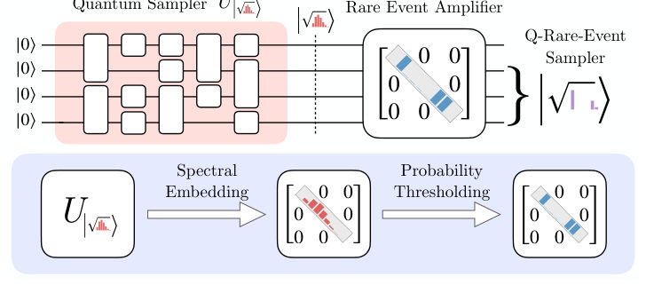 
FIG. 1. Overview of quantum rare event sampling. Top: Starting from the initial sample state |P⟩, the rare-event amplifier filters basis states with P(xi) ≤∆and amplifies the surviving subspace to prepare the target state |PR⟩. Bottom: The amplifier is implemented by first converting amplitudes into a spectral representation (spectral embedding), and then applying an approximate threshold at √

📷 Fig 2

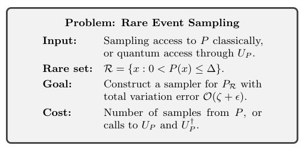 
FIG. 2. Problem setting of rare event sampling. The task is to sample from the conditional distribution over events whose probabilities are at most ∆. The error term ζ captures the unavoidable ambiguity from near-threshold events.

📷 Fig 3

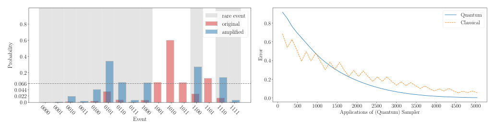 
FIG. 3. Simulation results for a Dyson-Ising chain. Left: Original (red) versus amplified (blue) probabilities for a sequence of length L = 4. The dashed horizontal line represents the probability threshold ∆, and the shaded regions denote the target rare events. Right: Total variation distance (TVD) error versus the number of applications of the quantum sampler for a sequence of length L = 8 and Markov order χ = 3. The quantum algorithm converges more smoothly and rapidly than the classical baseline, which exhibits oscillatory behavior due to the intermittent sampling of rare events.

**Summary.** The paper presents a novel quantum algorithm designed to efficiently sample extremely rare events from complex probability distributions without knowing which events are rare beforehand. By utilizing amplitude amplification and spectral techniques on the underlying quantum sampler, it achieves a quadratic speedup over classical sampling methods in several important physical regimes. This advances the field of quantum simulation for low-probability phenomena.

**Why it may be interesting.** This work directly addresses fundamental limitations in sampling theory by providing a concrete quantum advantage for tasks that are classically intractable or require prohibitively large resources, which is central to quantum algorithm design.

Detailed structure

**Main problem.** The core problem is efficiently discovering and sampling rare events—those occurring with extremely low probability ($\le \Delta$)—from a complex underlying probability distribution $P$, especially when the set of rare events is unknown beforehand.

**Main result.** The authors introduce a quantum algorithm that achieves an optimal quadratic speedup over classical methods for this task, scaling as $O(1/\sqrt{p_{	ext{rare}}\Delta})$ queries to the underlying quantum sampler.

**Method.** The method involves constructing a quantum circuit using amplitude amplification and polynomial approximations (via Quantum Signal Processing) to implement a probability thresholding function directly on the quantum state without prior knowledge of rare event locations.

**Model / system.** The analysis is applied to general probability distributions $P$ over $N$ events, including specific models like heavy-tailed power laws and stationary stochastic processes governed by the Asymptotic Equipartition Property (AEP).

**Key observables.** Total Variation Distance (TVD) error, query complexity scaling ($O(\dots)$), and the total probability mass of rare events ($	ext{p}_{	ext{rare}}$).

**Important parameters / regimes.** Rarity threshold $\Delta$, total rare-event mass $p_{	ext{rare}}$, and system exponents like the tail exponent $\gamma$ or entropy rate $H(X)$.

**Assumptions / limitations.** The algorithm assumes access to a quantum sampler unitary $U_P$ and relies on approximating sharp probability cutoffs (Heaviside functions) with polynomials, introducing controlled errors ($\epsilon$).

**Figures summary.** Figures illustrate the quantum pipeline for filtering and amplifying rare states. Simulation results compare the convergence of TVD error between the proposed quantum algorithm and classical sampling methods.

**Paper structure.** The paper progresses from establishing the general problem formulation (defining $P$ and $\Delta$) to detailing the necessary quantum components: probability thresholding via eigenvalue transformation, followed by amplitude amplification for rare-event state preparation. It then analyzes scaling laws across different physical models (power laws vs. stochastic processes).

Abstract

Financial crashes, cascading failures in infrastructure, and critical errors in AI systems are frequently triggered by events that occur with extremely small probability. Efficiently discovering and sampling events with probability below a threshold is therefore of critical interest. Yet this task is highly non-trivial using existing classical or quantum methods. Being rare, such events require an immense sampling overhead to collect sufficient data samples. Moreover, because the rare events are not known in advance, they cannot be flagged for amplification using standard techniques. Here, we introduce a quantum algorithm for rare-event discovery and sampling without first learning which events are rare. The algorithm achieves the optimal quantum scaling with the rarity threshold. We further demonstrate that this can achieve a quadratic speedup for heavy-tailed systems whose tail has nonvanishing total mass, and translates into a robust polynomial speedup for stationary stochastic processes, with the exponent determined by its entropy-rate structure.

[↑ back to top](#top)

### [Resource Letter QIE-1: Research in quantum information education](http://arxiv.org/abs/2606.06445v1)

**Authors:** Josephine C. Meyer, Simon Goorney, Tunde Kushimo, Zeki C. Seskir  
**Type:** theory · **Category:** other · **PDF:** <https://arxiv.org/pdf/2606.06445v1>  
**Analysis basis:** full PDF text, analyzed in chunks

📷 Fig 1

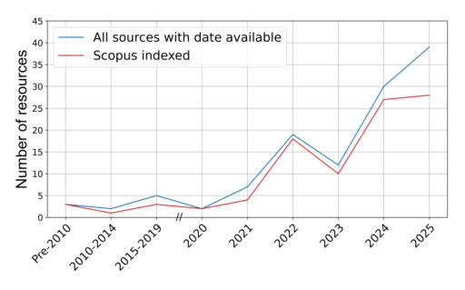 
FIG. 1. Comparison of total entries in our dataset vs. Sco- pus indexed resources by year. Note the abrupt change in x axis scale and the inflection point in approximately 2020- 2021. Five resources with a 2026 publication date (typically released as preprints or early access in 2025), are not shown.

**Summary.** This resource letter provides a comprehensive guide to the state of Quantum Information Science and Engineering (QISE) education. It surveys best practices for teaching QISE from high school through graduate levels, addressing curriculum design, assessment tools, and ethical implications. The paper is crucial reading for educators seeking to build robust quantum curricula in an expanding field.

**Why it may be interesting.** While not focused on fundamental physics, it highlights the practical educational challenges associated with emerging quantum technologies, which informs how theoretical concepts must be taught to the next generation of researchers.

Detailed structure

**Main problem.** The paper surveys the rapidly expanding field of Quantum Information Science and Engineering (QISE) education, aiming to guide educators and DBER practitioners.

**Main result.** It identifies significant gaps in current QISE education literature regarding global access disparities, specific technical skills needed for industry, and pedagogical best practices across K-12 to graduate levels.

**Method.** The methodology involves a comprehensive literature review synthesizing findings from multiple studies using bibliometric analysis, qualitative interviews, and curriculum mapping.

**Model / system.** The focus is not on a physical Hamiltonian but rather on the educational model of QISE itself, covering topics like quantum computing, communication, and sensing principles.

**Key observables.** Student reasoning levels, curricular coverage (K-12 to grad), assessment validity, workforce skill gaps, and ethical awareness.

**Important parameters / regimes.** Educational level (High School vs. Graduate), geographical location (Global North vs. Global South), and pedagogical approach (e.g., project-based learning).

**Assumptions / limitations.** The field is growing rapidly enough to require a curated resource guide, but the literature base suffers from disciplinary silos.

**Figures summary.** One figure tracks the growth of QISE scholarship over time, showing an inflection point around 2020-2021.

**Paper structure.** The structure is a comprehensive survey, covering scoping the field, reviewing pedagogical methods (labs, AI tools), analyzing workforce needs, and concluding with recommendations for future research directions.

Abstract

In celebration of the 2025 UN International Year of Quantum Science and Technology, this Resource Letter surveys the rapidly-growing field of scholarship in quantum information science and engineering (QISE) education. It is primarily written as a guide for educators wishing to get started teaching QISE using research-based teaching methods, as well as for discipline-based education research (DBER) practitioners looking to get started in this field. Topics covered include scoping the field of QISE education, research into student reasoning in QISE, research-based and research-inspired curricular materials from the high school to graduate level, research-based assessments, simulation and gamification tools, and tools for incorporating discussion of the societal and ethical implications of quantum technologies into the classroom.

[↑ back to top](#top)

### [Shattering the Symmetry Trap in Fixed-Ansatz VQE: An Accelerated ADAPT-VQE Study of Three Pillar Molecules under Bravyi-Kitaev Mapping](http://arxiv.org/abs/2606.05968v1)

**Authors:** Hermawan Kresno Dipojono  
**Type:** theory · **Category:** strongly correlated electrons · **PDF:** <https://arxiv.org/pdf/2606.05968v1>  
**Analysis basis:** full PDF text, analyzed in chunks

📷 Fig 1

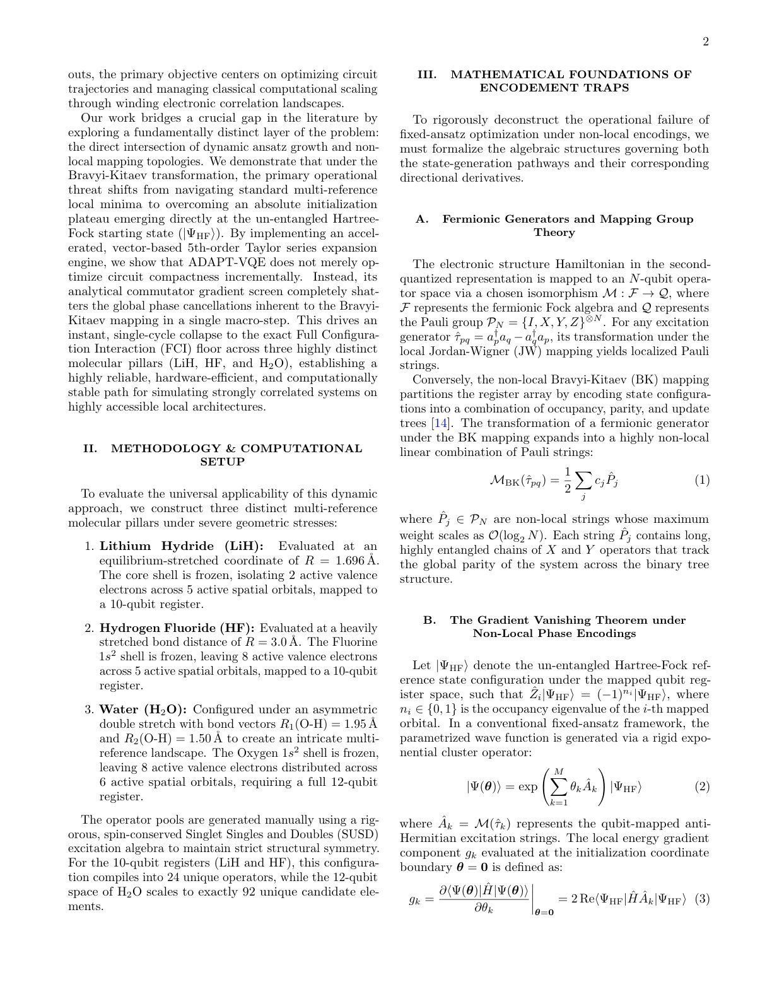 
Low-resolution page preview, page 2

📷 Fig 2

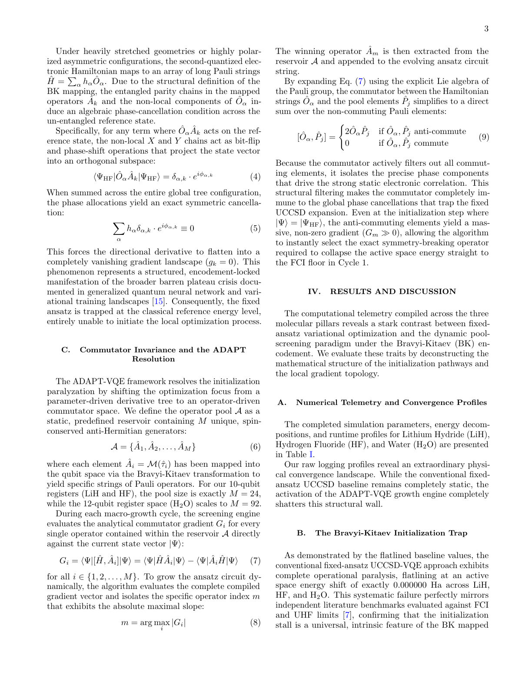 
Low-resolution page preview, page 3

📷 Fig 3

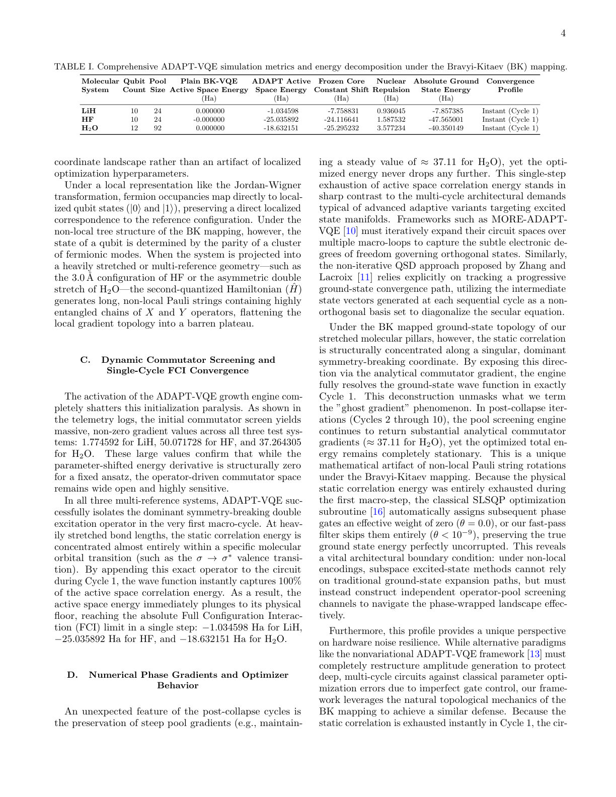 
Low-resolution page preview, page 4

📷 Fig 4

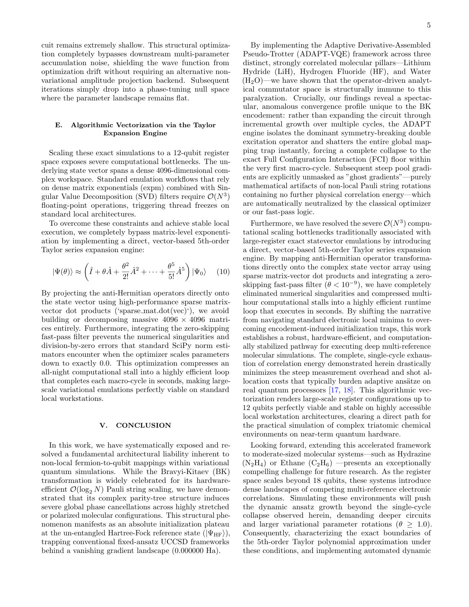 
Low-resolution page preview, page 5

📷 Fig 5

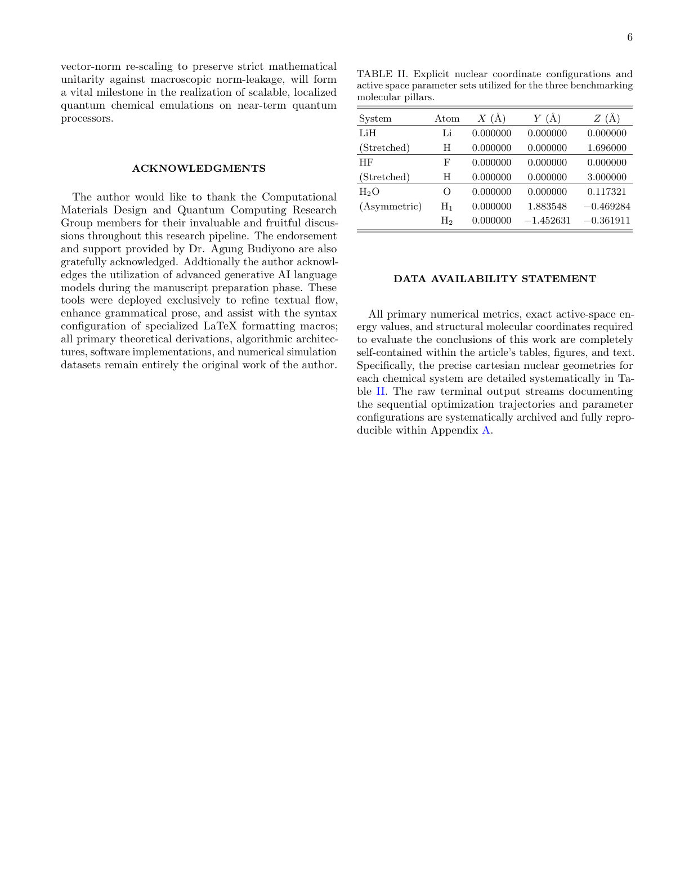 
Low-resolution page preview, page 6

**Summary.** The paper addresses the failure of standard VQE methods when simulating complex molecules using the Bravyi-Kitaev mapping due to global phase cancellations. By implementing an advanced ADAPT-VQE strategy, the authors demonstrate a robust method that instantly converges to the exact FCI energy for $	ext{LiH}$, $	ext{HF}$, and $	ext{H}_2	ext{O}$ while maintaining computational efficiency up to 12 qubits.

**Why it may be interesting.** This work provides a crucial algorithmic breakthrough for applying quantum computation to chemistry by solving the fundamental problem of initialization paralysis in strongly correlated electronic structure calculations.

Detailed structure

**Main problem.** Fixed-ansatz VQE methods fail catastrophically when simulating strongly correlated molecular systems using non-local mappings like Bravyi-Kitaev, getting trapped in zero-gradient plateaus.

**Main result.** The ADAPT-VQE framework successfully overcomes these structural limitations by dynamically selecting symmetry-breaking operators, achieving instant convergence to the exact Full Configuration Interaction (FCI) energy in a single step for multiple molecules.

**Method.** The study employs the Adaptive Derivative-Assembled Pseudo-Trotter (ADAPT-VQE) algorithm combined with an accelerated, vector-based Taylor series expansion engine to simulate quantum evolution efficiently on near-term hardware.

**Model / system.** The system models are three small molecules ($	ext{LiH}$, $	ext{HF}$, and $	ext{H}_2	ext{O}$) studied under highly stretched or asymmetric multi-reference electronic configurations, mapped onto a qubit register via the Bravyi-Kitaev transformation.

**Key observables.** Energy gradient ($g_k$), convergence to FCI energy floor (e.g., $-25.035892$ Ha for $	ext{HF}$), and detection of 'ghost gradients' as artifacts.

**Important parameters / regimes.** 12-qubit register space, 5th-order Taylor expansion order, and the specific molecular geometries ($	ext{LiH}$, $	ext{HF}$, $	ext{H}_2	ext{O}$).

**Assumptions / limitations.** The primary assumption is that ADAPT can dynamically isolate the necessary symmetry-breaking operators to bypass global phase cancellations inherent in the BK mapping structure.

**Figures summary.** Logs (Appendix A) demonstrate initial zero-gradient traps for fixed methods, followed by successful energy convergence after operator addition via the ADAPT cycle for all three molecules.

**Paper structure.** The paper diagnoses the failure of standard UCCSD-VQE with BK mapping; it then introduces and validates the ADAPT-VQE framework using commutator gradients; finally, it details computational optimizations (Taylor series) and presents convergence results across $	ext{LiH}$, $	ext{HF}$, and $	ext{H}_2	ext{O}$.

Abstract

Fixed-ansatz Variational Quantum Eigensolvers (VQE), such as the Unitary Coupled Cluster with Singles and Doubles (UCCSD) framework, frequently suffer from severe initialization paralyzation and zero-gradient traps when evaluated using the non-local Bravyi-Kitaev (BK) fermion-to-qubit mapping. In this work, we systematically demonstrate how the Adaptive Derivative-Assembled Pseudo-Trotter (ADAPT-VQE) framework shatters these structural limitations across three distinct electronic and geometric molecular pillars: Lithium Hydride ($\text{LiH}$), Hydrogen Fluoride ($\text{HF}$), and Water ($\text{H}_2\text{O}$), under heavily stretched or asymmetric multi-reference configurations. While conventional UCCSD-VQE flatlines completely at a zero energy shift ($0.000000$~Ha) due to global phase cancellations inherent to the BK tree structures, our dynamic ADAPT-VQE loop successfully isolates the dominant symmetry-breaking operators using analytical commutator gradients. To bypass the severe $\mathcal{O}(N^3)$ computational bottlenecks of dense matrix exponentiation and Singular Value Decomposition on larger registers, we implement a highly optimized, vector-based Taylor series expansion state-evolution engine. Our numerical results show that the accelerated ADAPT-VQE framework achieves instant, exact Full Configuration Interaction (FCI) convergence within the very first macro-cycle across all three molecular systems, maintaining absolute numerical stability up to a 12-qubit register space. This study establishes a robust, hardware-efficient path for simulating strongly correlated, highly polarized triatomic chemical environments on near-term local architectures.

[↑ back to top](#top)

### [Symmetry-adapted qubit encoding with complete active space and Bravyi--Kitaev mapping for quantum chemistry on a quantum computer](http://arxiv.org/abs/2606.05865v1)

**Authors:** Dario Picozzi, Jonathan Tennyson  
**Type:** theory · **Category:** strongly correlated electrons · **PDF:** <https://arxiv.org/pdf/2606.05865v1>  
**Analysis basis:** full PDF text, analyzed in chunks

📷 Fig 1

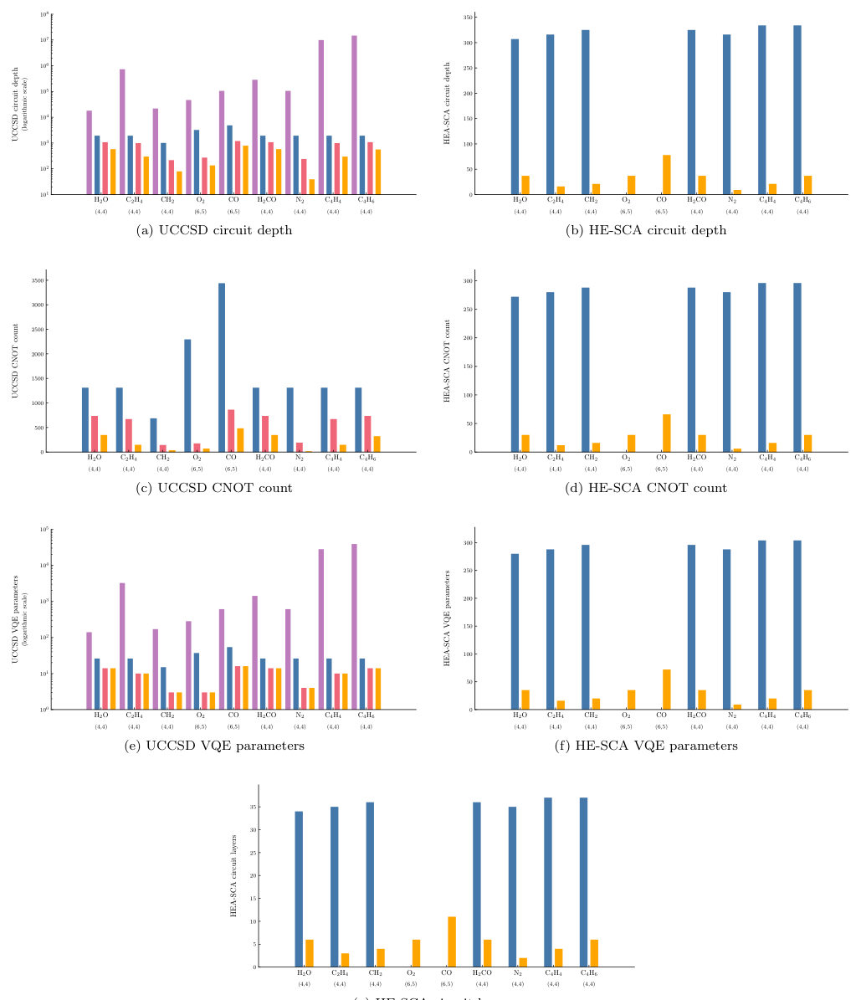 
FIG. 1: Circuit complexity metrics corresponding to Tables I–II: circuit depth (UCCSD/HE-SCA), CNOT counts (UCCSD/HE-SCA), VQE parameter counts (UCCSD/HE-SCA), and HE-SCA circuit layers. SAE-CAS ( ) yields shallower circuits, fewer entangling gates, and fewer parameters than JW ( ), JW-CAS ( ) and JW-CAS (SF) ( ).

📷 Fig 2

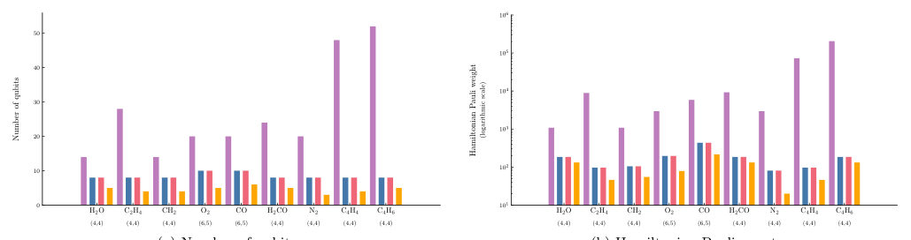 
FIG. 2: Qubit resource metrics corresponding to Tables I–II: number of qubits and Hamiltonian Pauli count across all molecules in Tables I–II. SAE-CAS ( ) reduces both relative to JW ( ), JW-CAS ( ) and JW-CAS (SF) ( ).

📷 Fig 3

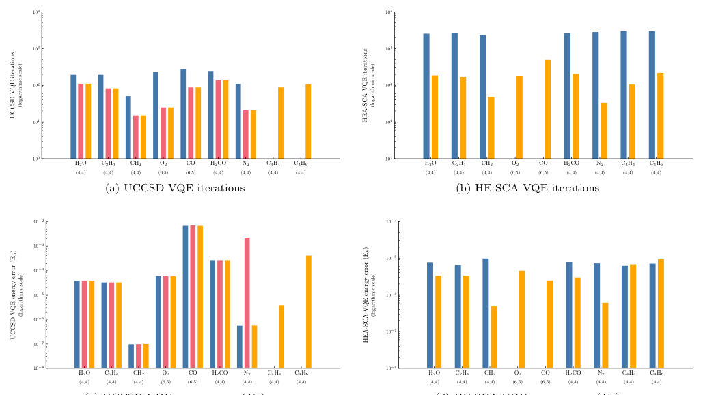 
FIG. 3: Optimisation and accuracy metrics corresponding to Tables I–II. Panels: (a,b) VQE iteration counts for UCCSD and HE-SCA; (c,d) absolute VQE energy errors relative to the CAS energy calculated in PySCF in units of Hartree. Encoding symmetry at the mapping level with SAE-CAS ( ) reduces iteration counts with respect to JW-CAS ( ) and JW-CAS (SF) ( ) and allows us to attain CAS energies with HE-SCA in cases where the unreduced JW-CAS ansatz did not converge within the same budgets.

📷 Fig 4

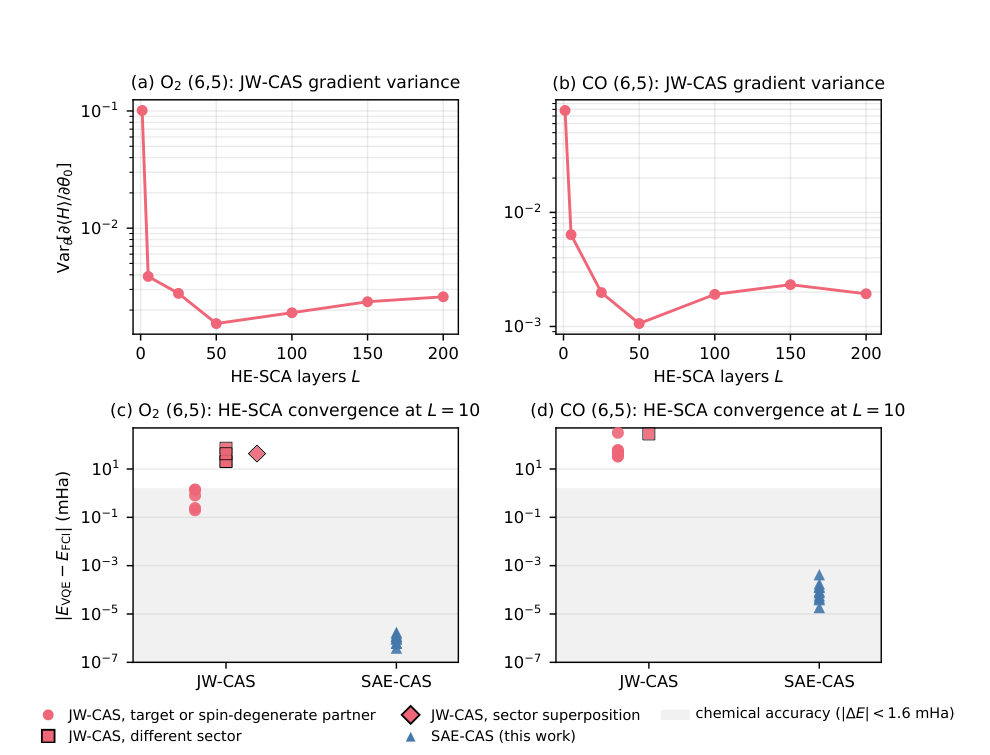 
FIG. 4: Diagnostics for the HE-SCA convergence limitations on JW-CAS, side by side for O2 (6,5) (left column) and CO (6,5) (right column). Top row, (a, b): gradient variance Varθ[∂⟨H⟩/∂θ0] on the JW-CAS HE-SCA ansatz over 50 random θ samples, as a function of layer count L. In both molecules the variance drops about two orders of magnitude from L=1 to L=5 and then saturates near 10−3; there is no exponential decay, ruling out a classical barren plateau. Bottom row, (c, d): per-trial absolute convergence error |EVQE −EFCI| on a log scale, over 10 SLSQP runs from independent uniformly-random initialisations at the same depth L=10 for both JW-CAS and SAE-CAS. Marker shapes encode the...

**Summary.** This paper introduces Symmetry-adapted qubit encoding (SAE-CAS) to make quantum chemistry simulations feasible on current quantum computers. By mathematically incorporating symmetry constraints from the Complete Active Space approximation, it drastically reduces the required number of qubits and circuit depth compared to standard methods. This advancement offers a crucial pathway toward resource-efficient molecular simulation.

**Why it may be interesting.** This work directly addresses the computational bottleneck of simulating strongly correlated electron systems on quantum hardware by providing a systematic method to exploit molecular symmetries for resource reduction.

Detailed structure

**Main problem.** Developing resource-efficient methods for simulating quantum chemistry on near-term and fault-tolerant quantum computers.

**Main result.** The Symmetry-adapted qubit encoding (SAE-CAS) significantly reduces required qubits, Pauli operator weight, and circuit depth compared to standard Jordan-Wigner mappings, leading to faster convergence.

**Method.** The authors derive a symmetry-adapted mapping that incorporates Complete Active Space (CAS) constraints as approximate Z-symmetries, allowing for qubit reduction via affine Clifford transformations.

**Model / system.** The system is molecular electronic structure, modeled by the non-relativistic Born–Oppenheimer Hamiltonian in second quantization. The simulation uses UCCSD and HE-SCA ansätze on small molecules like H2O and O2.

**Key observables.** Qubit count, Pauli-operator weight, circuit depth/CNOT count, VQE convergence error relative to CAS reference energies.

**Important parameters / regimes.** CAS approximation parameters (frozen core, active, virtual orbitals); ansatz choice (UCCSD vs HE-SCA).

**Assumptions / limitations.** The primary assumption is that treating CAS constraints as approximate Z-symmetries preserves the target symmetry sector while minimizing resource overhead.

**Figures summary.** Figures compare circuit complexity metrics and qubit resource metrics across different encodings, showing SAE-CAS consistently outperforms JW-based methods.

**Paper structure.** The paper builds mathematically by deriving Hamiltonian mappings from second quantization to active-space qubits (SAE-CAS), proves its equivalence to canonical CAS forms, benchmarks it against other mappings (JW, BK) using small molecules and ansätze, and concludes with resource efficiency comparisons.

Abstract

We present a symmetry-adapted qubit encoding with complete active space (SAE-CAS) for quantum chemistry on fault-tolerant and near-term quantum processors. Building on exact-symmetry encodings, we extend symmetry-adapted mappings to approximate $Z$-symmetries corresponding to frozen-core and virtual orbitals, thereby reducing qubit requirements without significant loss of accuracy. We derive the mapping from the second-quantised Hamiltonian to active-space qubit Hamiltonians, prove its equivalence to the canonical CAS Hamiltonian with frozen-core and virtual-orbital projection, and integrate it with point-group and spin-parity symmetry encodings via affine Clifford transformations to maximise qubit reduction while preserving the target symmetry sector. The same framework also accommodates the Bravyi--Kitaev mapping, yielding an SAE-CAS-BK variant that is unitarily equivalent to SAE-CAS. Numerical benchmarking on nine small molecules using UCCSD and a hardware-efficient shifted-circular-alternating (HE-SCA) ansatz shows that SAE-CAS reduces qubit counts and Pauli-operator weight, yields shallower circuits with fewer parameters, and often accelerates VQE convergence; with HE-SCA it consistently reaches CAS reference energies in cases where JW-CAS does not converge within the tested budgets. We provide an open-source implementation in the Python package QuantumSymmetry. SAE-CAS offers a route to resource-efficient molecular simulations on fault-tolerant and near-term quantum processors.

[↑ back to top](#top)

### [Unveiling orbital landscapes in strongly correlated bulk nickelates with $s$-NIXS](http://arxiv.org/abs/2606.06144v1)

**Authors:** Edgar Abarca Morales, Martin Sundermann, Brett Leedahl, Vignesh Sundaramurthy, Georg Poelchen, Ulrich Burkhardt, Raul Cardoso, Pascal Puphal, Alexander Komarek, Bernhard Keimer, Matthias Hepting, Liu Hao Tjeng, Berit H. Goodge  
**Type:** experiment · **Category:** strongly correlated electrons · **PDF:** <https://arxiv.org/pdf/2606.06144v1>  
**Analysis basis:** full PDF text, analyzed in chunks

📷 Fig 1

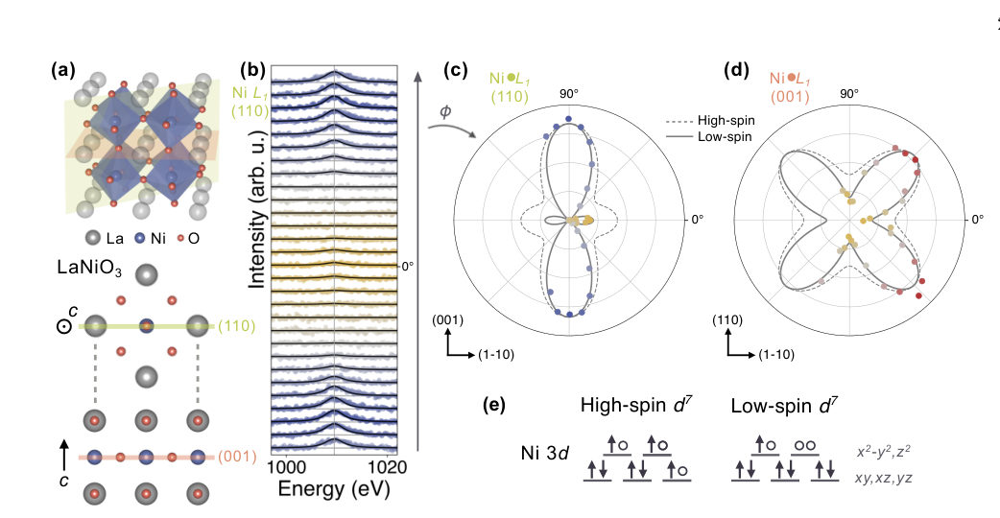 
FIG. 1. Orbital imaging in LaNiO3. (a) Pseudo-cubic unit cell of LaNiO3 and two high-symmetry projections in which octahedral distortions are omitted for clarity. The (110) and (001) scattering planes are indicated in green and salmon respectively. (b) Ni L1 edge spectra measured within the (110) plane and fitted using Voigt distributions (black lines). Spectra are vertically offset by ϕ for clarity. (c) Polar plot of the integrated intensities from the Voigt fits in (b). The expected orbital hole shapes for the high- and low-spin configurations are indicated by dashed and solid gray lines, respectively. (d) Polar plot obtained from the analysis of the spectra within the (001) plane...

📷 Fig 2

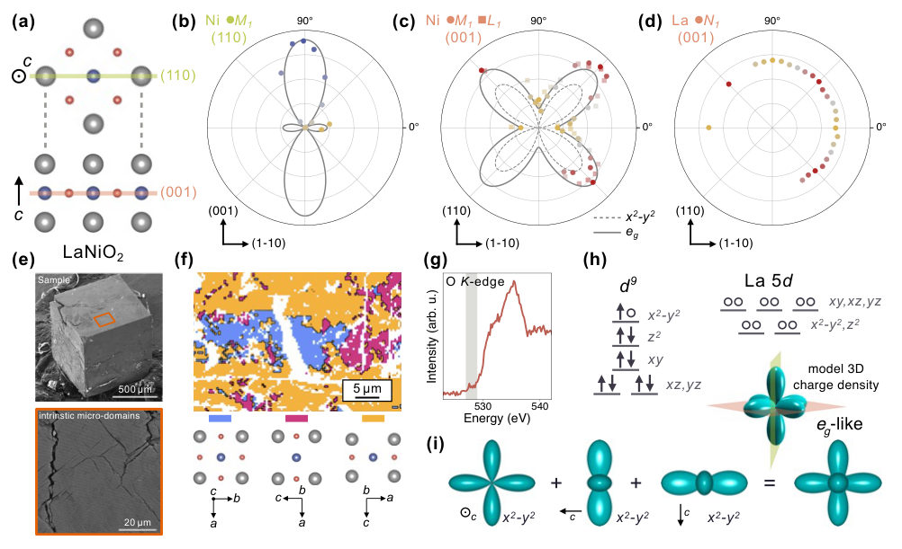 
FIG. 2. Orbital imaging in LaNiO2. (a) Crystal structure of LaNiO2 with the (001) and (110) scattering planes indicated. (b) Polar plot obtained from the Ni M1 edge spectra within the (110) plane. (c) Polar plots from the Ni M1 edge and L1 edge spectra within the (001) plane. The eg and dx2−y2 orbital shapes are indicated by gray lines. (d) Polar plot from the La N1 edge spectra within the (001) plane. (e) Bulk LaNiO2 sample with inset showing intrinsic micro-domain formation. (f) EBSD map of LaNiO2 showing three orthogonal domains and their schematic microscopic configuration (adapted from [32]). (g) O K-edge XAS of LaNiO2 a lack of the O pre-peak (region highlighted in gray). (h)...

📷 Fig 3

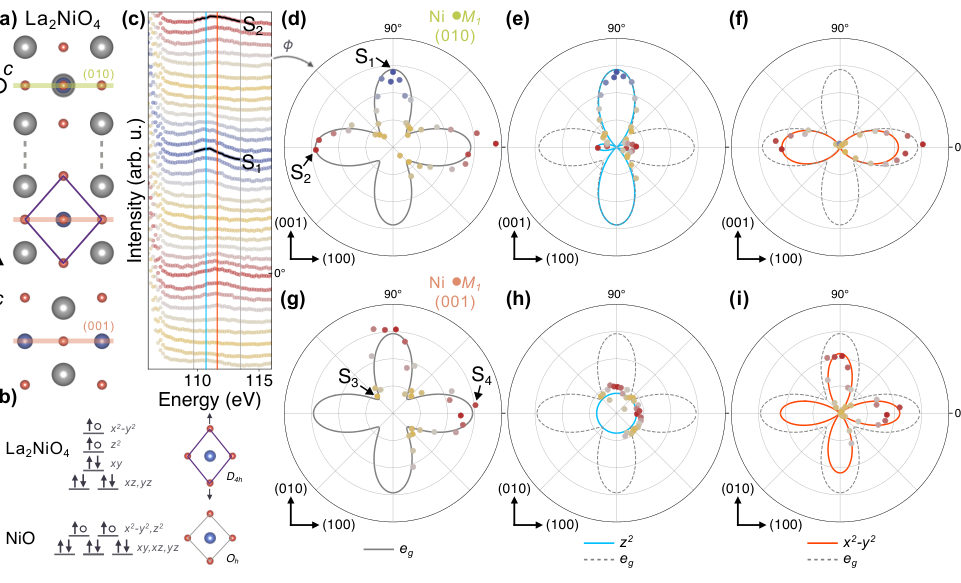 
FIG. 3. Orbital imaging in La2NiO4. (a) Crystal structure of La2NiO4 indicating the (010) and (001) scattering planes as well as the octahedral coordination around the Ni site. (b) Schematic electronic configurations for the Ni ground state in La2NiO4 and NiO in a single-electron picture, illustrating the eg splitting due to the apical octahedral distortion in La2NiO4.(c) Ni M1 edge spectra measured within the (010) plane, vertically offset by ϕ. The spectra selected to form the basis for orbital decomposition are marked in black, labeled S1 and S2. From this analysis, a dz2 component is identified at the blue line, while a dx2−y2 component is found at the red line. (d) Polar plot of the...

**Summary.** This work pioneers the use of s-NIXS to perform 'orbital imaging' on bulk nickelates ($	ext{LaNiO}_3$, $	ext{La}_2	ext{NiO}_4$, etc.). By analyzing the angular dependence of X-ray scattering, the authors directly determine the orbital ground state symmetries and quantify crystal field splittings without relying heavily on complex theoretical input. This technique establishes s-NIXS as a powerful tool for studying correlated electron physics.

**Why it may be interesting.** The direct, model-independent measurement of orbital character and crystal field splitting in strongly correlated oxides provides crucial experimental benchmarks for theoretical models describing electron correlations and orbital ordering.

Detailed structure

**Main problem.** The study aims to understand and control orbital degrees of freedom in strongly correlated nickelates, which is crucial for designing functional materials.

**Main result.** s-NIXS directly reveals the ground state orbital configurations (e.g., low-spin $	ext{LaNiO}_3$, $d_{x^2-y^2}$ $	ext{LaNiO}_2$) and quantifies crystal field splitting ($\Delta = 0.9 	ext{ eV}$) in these materials.

**Method.** The primary method is s-orbital non-resonant inelastic X-ray scattering (s-NIXS), which performs 'orbital imaging' by measuring the angular dependence of energy loss spectra.

**Model / system.** The research focuses on bulk rare-earth nickelates ($	ext{LaNiO}_3$, $	ext{La}_2	ext{NiO}_4$, $	ext{LaNiO}_2$) spanning different formal Ni valence states, allowing investigation of orbital physics in correlated oxides.

**Key observables.** Angular dependence of integrated spectral intensity (polar plots), energy differences between spectral components ($d_{z^2}$ vs $d_{x^2-y^2}$), and the resulting crystal field splitting ($\Delta$).

**Important parameters / regimes.** Formal Ni valence states ($	ext{Ni}^{3+}$ to $	ext{Ni}^{1+}$); Crystal field splitting energy (e.g., $0.9 	ext{ eV}$).

**Assumptions / limitations.** The technique is assumed to provide a direct, model-independent measurement of the electronic ground state charge density, bypassing complex theoretical calculations.

**Figures summary.** Figures illustrate orbital imaging via polar plots for $	ext{LaNiO}_3$ and $	ext{LaNiO}_2$, and show spectral fitting results detailing the decomposition of $d_{z^2}$ and $d_{x^2-y^2}$ contributions in $	ext{La}_2	ext{NiO}_4$.

**Paper structure.** The paper systematically applies s-NIXS to three different nickelates ($	ext{LaNiO}_3$, $	ext{LaNiO}_2$, $	ext{La}_2	ext{NiO}_4$), using orbital imaging and spectral fitting across various crystal planes to map out the electronic ground state symmetries.

Abstract

We leverage $s$-orbital non-resonant inelastic X-ray scattering ($s$-NIXS) to perform orbital imaging on three bulk rare-earth nickelates spanning a range of formal nickel valence (3$d$ electron filling) from Ni$^{3+}$ (3$d^7$) to Ni$^{1+}$ (3$d^9$). Our results directly reveal the ground states of these compounds all with minimal theoretical input. In particular, we demonstrate the low-spin orbital configuration of trivalent LaNiO$_3$, the $d_{x^2-y^2}$ configuration of monovalent LaNiO$_2$, and resolve the effective $e_g$ crystal field splitting in the distorted octahedral environment of divalent La$_2$NiO$_4$. This work illustrates the potential of $s$-NIXS to study the ground state and excited states of strongly correlated materials without needing complex theoretical analysis of spectroscopic data.

[↑ back to top](#top)

## Secondary cond-mat archives

*Papers from  mes-hall, other, soft, supr-con. These archives are de-prioritized — they appear at the end regardless of relevance score.*

### Relevant in secondary archives (11)

### [2.4 GHz Flip-flop Device within Nonequilibrium Superconducting Diode](http://arxiv.org/abs/2606.06152v1)

**Authors:** Xiangyu Bi, Hongyi Li, Aoshen Yang, Yuqiang Fang, Ganyu Chen, Shichong Yang, Yicheng Shen, Qizheng Sun, Junwei Huang, Wei Jiang, Da Wang, Fuqiang Huang, Haijun Zhang, Qianghua Wang, Hongtao Yuan  
**Type:** both · **Category:** other · **PDF:** <https://arxiv.org/pdf/2606.06152v1>  
**Analysis basis:** full PDF text, analyzed in chunks
**Topic relevance:** 🔥 `non-equilibrium dynamics` **4/5** · `driven-dissipative phase transition` **3/5** · `methods for driven-dissipative` **3/5** · `correlated / nonlocal dissipation` **2/5** · `non-equilibrium universality` **2/5** · `Keldysh / 2PI / non-Gaussian methods` **1/5** · `Kondo & dissipative impurity` **1/5** · `QC/QI experiment` **1/5**

📷 Fig 1

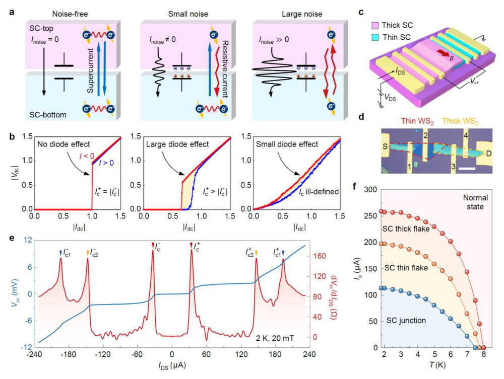 
Fig. 1 | Superconducting diode effect without breaking time-reversal symmetry in 2M-WS2

📷 Fig 2

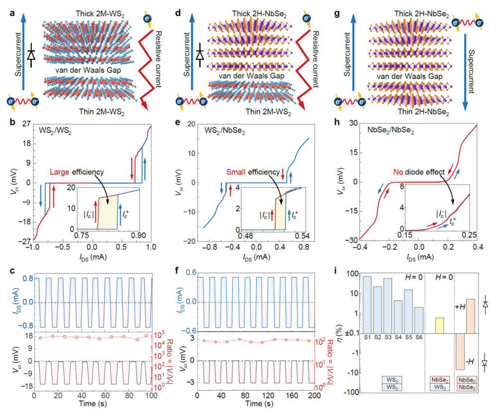 
Fig. 2 | Geometry comparison for superconducting diode effect among three different device

📷 Fig 3

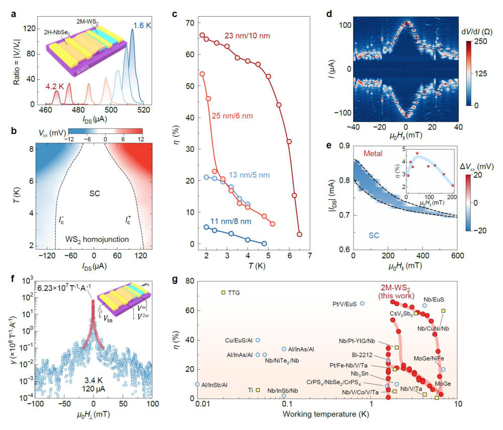 
Fig. 3 | Modulation of superconducting diode effect in 2M-WS2-based Josephson junctions. a,

📷 Fig 4

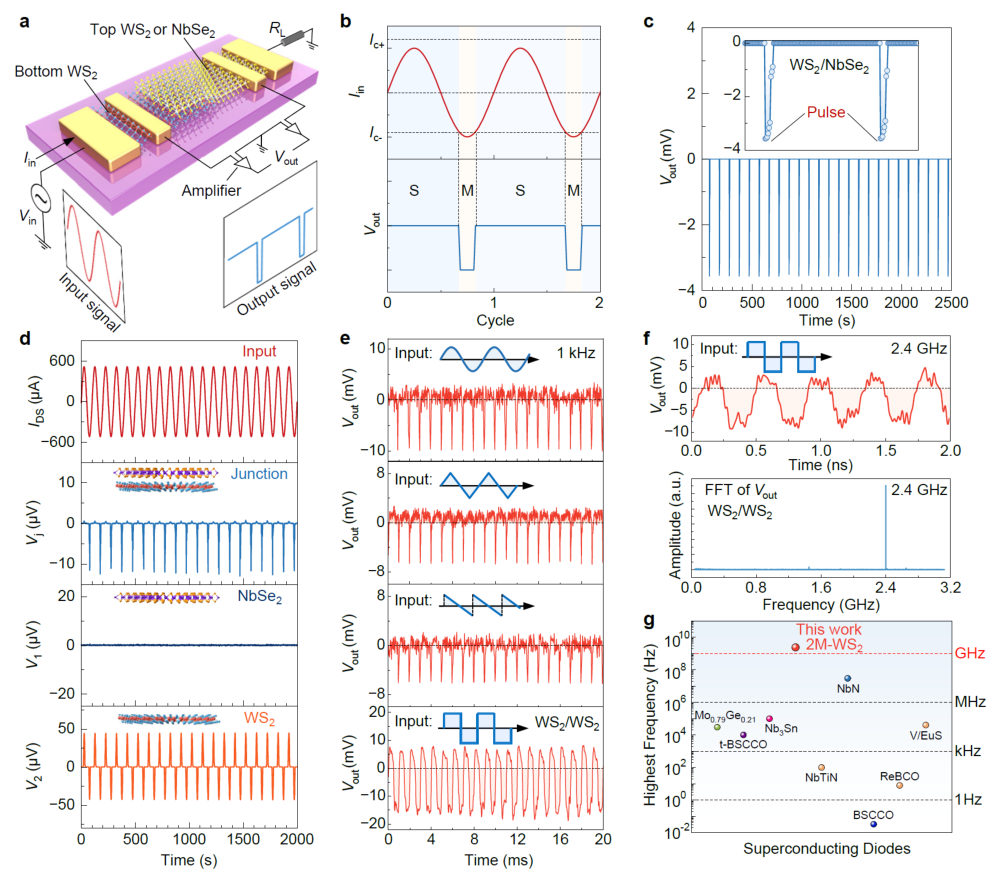 
Fig. 4 | High frequency and broadband edge-triggered flip-flop device from 2 mHz to 2.4 GHz.

**Summary.** This paper reports on the realization of a highly efficient, field-free superconducting diode operating at 2.4 GHz using van der Waals superconductors. By engineering junction asymmetry, they achieved robust rectification and demonstrated its application in an edge-triggered flip-flop. This work provides a promising platform for next-generation superconducting logic circuits.

**Why it may be interesting.** The work bridges condensed matter physics (superconductivity) with device engineering by showing how fundamental quantum effects (non-equilibrium dynamics) can be harnessed for high-speed classical electronic components, relevant to superconducting circuit design.

Detailed structure

**Main problem.** The primary challenge addressed is achieving high-frequency, field-free superconducting diode operation for practical superconducting electronics.

**Main result.** The authors demonstrated a polarity-controllable superconducting diode flip-flop operating up to 2.4 GHz using van der Waals superconductors, exhibiting high efficiency and an on-off ratio exceeding $10^5$.

**Method.** The work combines experimental measurements (I-V curves, high-frequency pulse generation) with theoretical modeling using the Resistively Shunted Junction (RCSJ) model.

**Model / system.** The physical system utilizes Josephson junctions formed in van der Waals superconductor heterojunctions ($	ext{2M-WS}_2/	ext{NbSe}_2$). The underlying mechanism is explained by non-equilibrium dynamics and geometric inversion asymmetry, which allows for diode behavior without breaking time-reversal symmetry.

**Key observables.** Diode efficiency ($\eta$), on-off ratio ($>10^5$), operating frequency (up to 2.4 GHz), and measurable supercurrent asymmetry ($I_{c+} 
eq |I_{c-}|$).

**Important parameters / regimes.** Thickness tuning of $	ext{2M-WS}_2$ nanoflakes, junction geometry, input signal waveform (sine, triangle, chainsaw).

**Assumptions / limitations.** The nonreciprocal effect is robustly explained by the nonlinear quantum capacitance mechanism within the RCSJ framework, which accounts for noise and geometric asymmetry.

**Figures summary.** Figures illustrate I-V characteristics confirming Josephson junctions, compare diode efficiency across different geometries, and show the output pulse signal generation from the flip-flop device at high frequencies.

**Paper structure.** The paper progresses by first establishing the feasibility of field-free superconducting diodes using $	ext{WS}_2$ heterojunctions, then detailing the mechanism via RCSJ modeling, and finally demonstrating the practical application through high-frequency edge-triggered flip-flop operation up to 2.4 GHz.

Abstract

Superconducting diode effect exhibits asymmetric critical supercurrent and has profound implications for condensed matter physics. The technical appeals of such superconducting diodes are their ultrahigh on-off ratio and diode efficiency for superconducting electronics owing to the dissipationless supercurrent therein. However, realizing superconducting diode operation at high working frequency, which is a key requirement for practical applications, remains elusive and challenging. Here, we demonstrate a polarity-controllable superconducting diode with non-equilibrium Josephson junction and its edge-triggered flip-flop operation at a high frequency up to 2.4 GHz, within a van der Waals superconductor 2M-WS$_2$. By simply tuning the thickness of superconducting 2M-WS$_2$ nanoflakes to engineer inversion asymmetry in the junction, we achieve a high diode efficiency of 67% and an on-off ratio exceeding 10$^5$. Importantly, the pulse width and duty cycle of output pulse signals in such superconducting diode flip-flop devices can be controlled in a broadband frequency range crossing 12 orders of magnitude. Theoretical analysis reveals that the non-equilibrium dynamic nature of supercurrent in these Josephson junctions enables such a high diode operating frequency and the polarity control of supercurrent. The 2.4 GHz non-equilibrium Josephson diode developed here provides a promising platform for advanced superconducting logic circuits and broadband telecommunication applications.

[↑ back to top](#top)

### [Superconducting triode effect in a quantum-dot Josephson junction with a biased top gate](http://arxiv.org/abs/2606.06465v1)

**Authors:** Yu-Hang Li, Xiaan Du, Hua Jiang, X. C. Xie  
**Type:** theory · **Category:** other · **PDF:** <https://arxiv.org/pdf/2606.06465v1>  
**Analysis basis:** full PDF text, analyzed in chunks
**Topic relevance:** 🔥 `Keldysh / 2PI / non-Gaussian methods` **4/5** · `methods for driven-dissipative` **3/5** · `non-equilibrium dynamics` **3/5** · `driven-dissipative phase transition` **2/5** · `non-equilibrium universality` **2/5** · `Kondo & dissipative impurity` **1/5**

📷 Fig 1

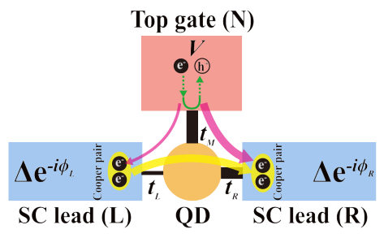 
FIG. 1. Schematic for the STE in an asymmetric quantum- dot Josephson junction with an additional biased top gate (N). Here, the coupling strength between the quantum-dot and the three leads are tL, tR, and tM, respectively. The green line in top gate illustrates the Andreev reflection under a bias V . The yellow arrow illustrates the tunneling super- current between left (L) and right (R) superconducting leads driven by the phase difference ϕ = ϕL −ϕR. The cyan arrows highlight the normal-metal-assisted injection currents, medi- ated by non-equilibrium Andreev processes involving the top gate (N).

📷 Fig 2

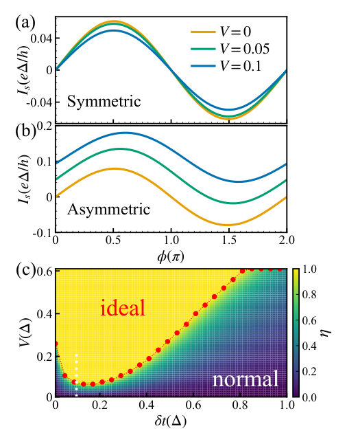 
FIG. 2. (a) and (b) Current-phase relations Is(ϕ) for a symmetric junction with tL = tR = 0.1 (a) and an asymmetric junction with tL = 0.2, tR = 0.1 (b) under different top gate bias V . Here, tM = 0.5. (c) Non-reciprocal supercurrent efficiency η on the V -δt plane. The red dashed line highlights the critical phase boundary with η = 1, which separates the normal non-reciprocal regime and the ideal regime that only allows the unidirectional supercurrent. The white dashed line highlights the cases in (a) and (b). Here, δt = tL−tR, tR = 0.1 and tM = 0.5.

📷 Fig 3

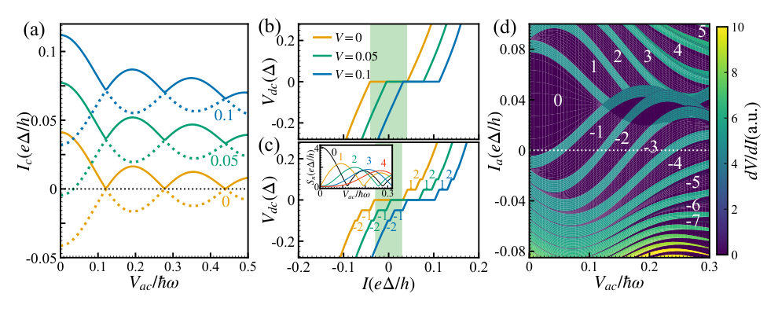 
FIG. 3. (a) Maximum I+ c (solid lines) and minimum I− c (dashed lines) critical supercurrents of Is(ϕ) as a function of the scaled radiation amplitude eVac/ℏω for different top gate bias V . (b) and (c) I-V curve for the junction under different top gates V in the absence [(a), Vac = 0] and presence [(b), eVac/ℏω = 0.05] of radiation. The green shadings in the background highlight the symmetric supercurrent at V = 0, serving as a benchmark. The inset displays five representative Shapiro step widths versus scaled radiation amplitude at V = 0. (d) Differential resistance dV/dI versus total time-averaging current Ia and scaled radiation amplitude eVac/ℏω at a representative top bias V = 0.05....

**Summary.** The paper introduces a novel 'superconducting triode effect' in a quantum-dot Josephson junction by incorporating a biased top gate. This setup allows the creation of strong supercurrent non-reciprocity—a key feature for superconducting diodes—while explicitly preserving time-reversal symmetry. The theoretical framework uses advanced Green's function techniques to predict tunable, quantized rectification effects.

**Why it may be interesting.** This work provides an alternative, symmetry-preserving mechanism for observing diode-like behavior in superconductors, which is highly relevant to superconducting electronics and quantum circuit design.

Detailed structure

**Main problem.** The research addresses how to achieve a robust Superconducting Diode Effect (SDE) in Josephson junctions while explicitly preserving Time-Reversal symmetry, which is conventionally thought to require breaking both T and P symmetries.

**Main result.** They propose a superconducting triode effect using an asymmetric quantum-dot junction with a top gate bias that allows for the continuous tuning of supercurrent non-reciprocity towards an ideal unidirectional flow while maintaining T-symmetry.

**Method.** The analysis employs the Keldysh Non-Equilibrium Green's Function (NEGF) formalism, extending to Floquet theory to handle time-periodic driving from RF radiation.

**Model / system.** The system is an asymmetric quantum-dot Josephson junction coupled to superconducting leads and an additional metallic top gate. The Hamiltonian describes the coupling between these three components.

**Key observables.** Current-Phase Relations (CPR), non-reciprocal supercurrent efficiency ($\eta$), and highly asymmetric Shapiro steps under RF irradiation.

**Important parameters / regimes.** Top gate bias voltage ($V$), superconducting gap ($\Delta_0$), and the ratio of coupling strengths ($t_L, t_R, t_M$).

**Assumptions / limitations.** The theory is derived using approximations like the weak-link limit for initial calculations but claims universality across coupling regimes.

**Figures summary.** Figures illustrate CPR asymmetry vs. gate bias (Fig. 2), non-reciprocal efficiency ($\eta$) mapping, and highly asymmetric Shapiro step distributions under combined DC/RF drive (Fig. 3).

**Paper structure.** The paper first establishes the physical model and the goal of achieving T-symmetric SDE via a superconducting triode effect. It then calculates supercurrent components using NEGF formalism in both DC and AC regimes, culminating in demonstrations of tunable non-reciprocity and quantized rectification.

Abstract

Non-reciprocal supercurrents enable non-dissipative rectification, holding great promise for superconducting electronics. Conventionally, this non-reciprocity, termed the superconducting diode effect, requires the simultaneous breaking of time-reversal and parity symmetries. Here, we propose a superconducting triode effect in an asymmetric quantum-dot Josephson junction coupled to an additional metallic top gate, which breaks the parity symmetry while explicitly preserving time-reversal symmetry. We demonstrate that the supercurrent across this junction exhibits a strong non-reciprocal effect that can be continuously manipulated via the top gate to achieve an ideal unidirectional supercurrent, thus manifesting a superconducting triode effect. Furthermore, under radio-frequency radiation, this junction exhibits highly asymmetric Shapiro steps, realizing fully quantized supercurrent rectification. Our work not only provides an alternative physical mechanism for the superconducting diode effect observed in Josephson junctions with explicit time-reversal symmetry, but also introduces a new tuning knob to manipulate supercurrent non-reciprocity.

[↑ back to top](#top)

### [A nanoscale magnetic spectrum analyzer based on qubit dressed states](http://arxiv.org/abs/2606.05426v1)

**Authors:** Jan Rueschkamp, Shantam Ravan, Daniel Fernandez, Nazar Delegan, F. Joseph Heremans, David D. Awschalom, Ronald L. Walsworth, Nikola Maksimovic, Amir Yacoby  
**Type:** experiment · **Category:** other · **PDF:** <https://arxiv.org/pdf/2606.05426v1>  
**Analysis basis:** full PDF text, analyzed in chunks
**Topic relevance:** 🔥 `QC/QI experiment` **4/5** · 🔥 `spintronics-quantum-optics interface` **4/5** · `exotic spin models in light-matter` **1/5** · `quantum measurements` **1/5** · `quantum optics experiment` **1/5**

📷 Fig 1

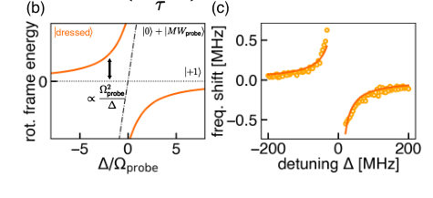 
Figure 1. Measurement of qubit dressed states using a spin echo protocol. (a) Dressed state spin echo sequence with a probe field during one arm of length τ, which acts as an effective B field on the qubit (see supple- mental section B 1). Bloch sphere representation (above) shows effect of pulse sequence on qubit spin. (b) Calcu- lated dressed state energies (within the rotating frame) in comparison to the qubit bare states as a function of detuning, ∆, of the probe field from the bare resonance relative to the probe field Rabi rate, Ωprobe. The black dotted line describes the bare qubit excited state in the rotating frame, while the dashed line gives the summed energy of the bare qubit...

📷 Fig 2

 
Figure 3. Scaling of dressed state DD RF noise mea- surements on experimental parameters. (a) Dependence of the experimentally determined NV spin phase vari- ance ⟨ϕ2⟩on probe field amplitude, Bprobe, measurement time, τ, and probe field detuning from the NV resonance, ∆. The data is well-fitted by the scalings predicted by our model of this measurement scheme (Eq. 4). (b) Es- timate of noise floor, i.e. minimal detectable RF noise spectral density, as a function of Rabi rate Ωprobe and noise signal frequency f, obtained by extrapolating the noise floor in our experiment for one second of integra- tion where the Rabi rate ≈2.5 MHz.

📷 Fig 3

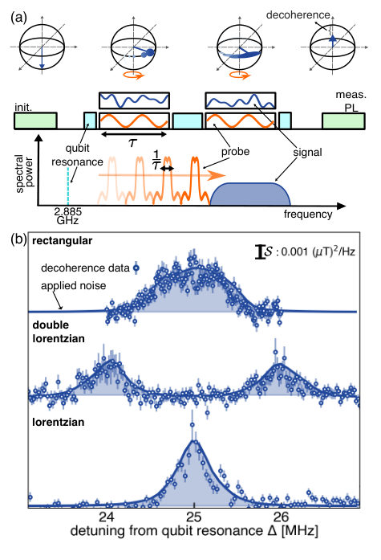 
Figure 2. Measurement of broadband noise spectra us- ing qubit dressed states. (a) Dressed state spin echo sequence with probe field and noisy RF signal during both arms of length τ. The noise mixes with the probe field via the quadratic dependence of the qubit AC Stark shift on the total field amplitude. This mixing effectively imprints the noise onto the probe field, producing a fluc- tuating effective Rabi rate that induces decoherence in the qubit’s x–y plane. Sweeping the spin echo sequence filter function, which is set by the probe field frequency fprobe, and repeating spin echo measurements allows de- termination of S, the noise spectral density of the RF signal field. Bloch sphere...

📷 Fig 4

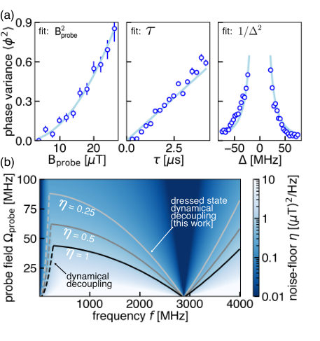 
Fig. 3(b) further compares the noise floor of our dressed state DD to that of conventional DD noise magnetometry under comparable conditions. Con- ventional DD noise magnetometry is analyzed via the following relationship between ϕ2 and the noise floor η. In the limit of target noisy signal frequency much greater than DD sensing frequency, the decoherence signal in DD is given by ϕ2 = γ2Wτ(f) ∗τeff ∗η, where Wτ(f) ∼1/f 2, and the effective evolution time, τeff, is the total evolution time minus the time spent on π-pulses (∼1/ΩRabi). In Fig. 3(b), the Rabi rate in conventional DD is set equal to the probe field strength in dressed state DD for the purpose of comparing the two protocols.

📷 Fig 5

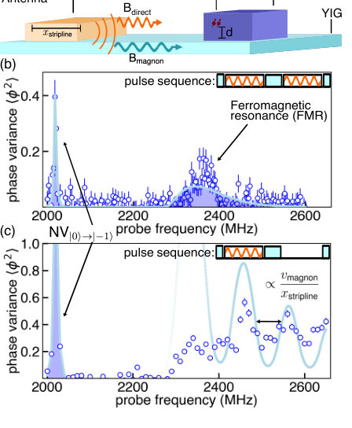 
Figure 4. Probing the spin wave properties of YIG using dressed state DD. (a) Experimental setup consists of a gold stripline antenna that produces a MW probe field to coherently drives the electronic spins of an NV ensemble in two ways: directly and by launching magnons into the thin YIG film beneath. The NV spins are also affected by intrinsic thermal magnon MW noise produced by the YIG. (b) Dressed state spin echo sequence, for which the experimentally determined phase variance ⟨ϕ2⟩of the NV sensor as a function of probe field frequency re- solves both the NV bare resonance (|0⟩→| −1⟩) and thermally populated magnons at the FMR enhanced by quadratic mixing with the coherent magnons...

**Summary.** The authors developed a novel method using microwave dressing fields on NV centers to create a broadband magnetic spectrum analyzer. This technique overcomes the natural frequency bandwidth limits of conventional qubit measurements by mixing external noise signals into the measurable detection band. The results demonstrate high sensitivity, allowing characterization of nanoscale spin dynamics in materials like YIG films.

**Why it may be interesting.** This work provides a powerful, tunable quantum transduction mechanism that effectively bypasses hardware bandwidth limitations inherent in solid-state qubits, making it highly relevant for advanced quantum sensing applications.

Detailed structure

**Main problem.** The primary challenge is extending the frequency bandwidth of nanoscale magnetic field measurements beyond the limitations imposed by conventional quantum control sequences (like Rabi rates).

**Main result.** By dressing the NV qubit with a microwave field during dynamical decoupling, the technique successfully converts the qubit into a broadband spectrum analyzer capable of detecting noise across several GHz.

**Method.** The method uses the quadratic dependence of the AC Stark shift on the total magnetic field amplitude to frequency-mix arbitrary external signals into the measurable detection band of the spin echo sequence.

**Model / system.** The system utilizes Nitrogen-Vacancy (NV) centers in diamond as solid-state quantum sensors, coupled to materials like YIG thin films. The physics is described by analyzing the phase variance ($\langle\phi^2
angle$) accumulated by the qubit due to external magnetic noise.

**Key observables.** Phase variance ($\langle\phi^2
angle$), AC Stark shift ($\delta E$), and magnon group velocity ($v_{	ext{magnon}}$).

**Important parameters / regimes.** Detuning ($\Delta$), probe field strength ($\Omega_{	ext{probe}}$), echo time ($	au$), and the noise spectral density $S(f)$.

**Assumptions / limitations.** The analysis assumes that the noise spectrum is much broader than the filter function width, and various approximations are made regarding signal field terms in the Hamiltonian.

**Figures summary.** Figures illustrate the experimental setup (optical/microwave), the dressed state spin echo sequence flow diagram, and plots showing $\langle\phi^2
angle$ vs. probe frequency for both broadband noise detection and magnon spectrum fitting.

**Paper structure.** The paper introduces the limitations of conventional sensing, develops the theoretical framework based on dressing fields to achieve spectral mixing, demonstrates this capability by measuring broadband noise in YIG films, and validates the technique by extracting material properties like magnon group velocity.

Abstract

Magnetic field fluctuations on nanometer length scales manifest in a diverse range of phenomena -- electron and spin dynamics in materials and devices, quantum many-body systems, and molecular chemistry. Measuring these phenomena requires sensors with a challenging combination of broad spectral bandwidth, high sensitivity, and nanoscale spatial resolution. Nitrogen-vacancy (NV) centers, atom-like quantum sensors in diamond, possess the requisite sensitivity and nanoscale sensing volume, but are typically limited in bandwidth by the practical speed of the applied quantum control sequence. Here, we overcome this limitation by exposing the NV qubit to a microwave dressing field during a dynamical decoupling sequence, which both amplifies and frequency-mixes target signals at arbitrary frequencies into the detection band of the dynamical decoupling protocol. We demonstrate this approach by using NV centers to detect both coherent and noisy nanoscale spin wave dynamics in a magnetic yttrium-iron-garnet (YIG) thin film over a broad frequency range. Our technique generalizes to other qubit platforms, providing a versatile framework for nanoscale spectroscopy across diverse physical and chemical systems.

[↑ back to top](#top)

### [Eigenmodes of synthetic antiferromagnetic skyrmions](http://arxiv.org/abs/2606.06304v1)

**Authors:** Kauser Zulfiqar, Martin Lang, Samuel J. R. Holt, Swapneel Amit Pathak, Florian Bruckner, Hans Fangohr  
**Type:** theory · **Category:** other · **PDF:** <https://arxiv.org/pdf/2606.06304v1>  
**Analysis basis:** full PDF text, analyzed in chunks
**Topic relevance:** `methods for driven-dissipative` **3/5** · `spintronics-quantum-optics interface` **3/5** · `Keldysh / 2PI / non-Gaussian methods` **2/5** · `analog quantum simulation` **2/5** · `driven-dissipative phase transition` **2/5** · `non-equilibrium dynamics` **2/5** · `Frenkel-Kontorova` **1/5** · `correlated / nonlocal dissipation` **1/5** · `exotic spin models in light-matter` **1/5** · `non-equilibrium universality` **1/5**

📷 Fig 1

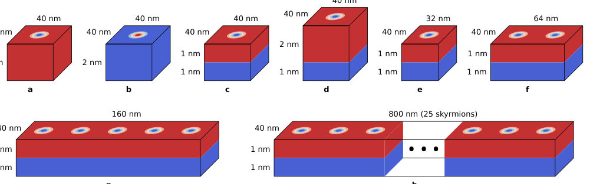 
Figure 1. Schematic of geometries and skyrmion distribution studied in this work. Colour indicates the mz component of the magnetisation (red mz = +1, blue mz = −1, grey mz = 0). The skyrmions are schematically sketched on the top surface, they extend through the whole thickness. The skyrmion core polarisation is always opposite to the background magnetisation direction, i.e. flips at the layer interface for those systems where the background magnetisation is flipped.

📷 Fig 2

 
Figure 2a shows the power spectral density (PSD) for a Néel skyrmion in a (chiral) ferromagnetic material (geometry Fig. 1a, equilibrium configuration shown in Fig. 2b). The dashed lines show the PSD obtained from the ringdown simulations. Solid lines show spectra computed from the eigenvalues obtained with the eigenvalue method (see Methods for details how the PSD is calculated).

📷 Fig 3

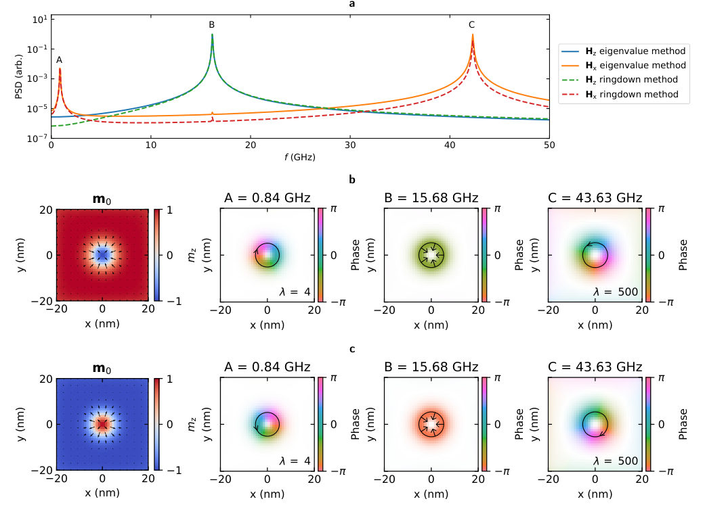 
Figure 2. (a) Power spectral density (PSD) of Néel skyrmion in xy plane for two different excitations. An in-plane excitation field acting in the x direction excites modes A and C, an out-of-plane excitation field acting in the z direction excites mode B. The solid lines show the spectra computed from the eigenvalue method, the dashed lines the spectra obtained from the ringdown method. (b) Equilibrium configuration and first three eigenmodes A, B and C of a Néel skyrmion with core pointing in the −z direction (Fig. 1a). (c) Equilibrium configuration and first three eigenmodes A, B, and C of a Néel skyrmion with core pointing in the +z direction (Fig. 1b).

📷 Fig 4

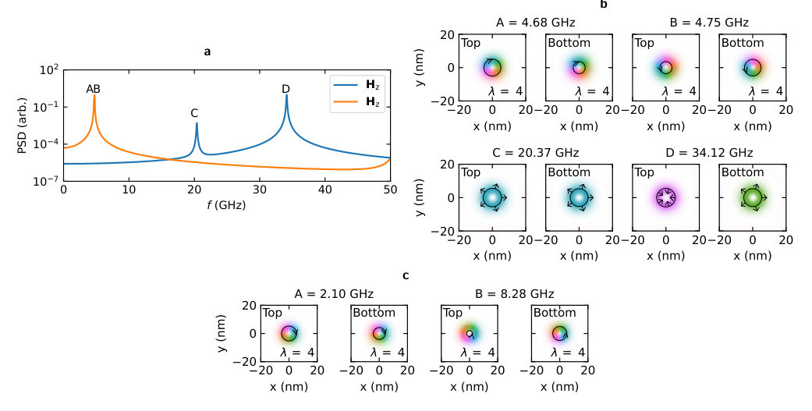 
Figure 3. (a) Power spectral density and (b) normal modes for a SAF skyrmion (geometry as in Fig. 1c). The Néel skyrmion in the top layer has the vortex core pointing in −z direction, and the skyrmion in the bottom layer has the vortex core pointing in the +z direction. The layers are antiferromagnetically coupled. (a) The blue line shows the power spectral density for out- of-plane excitation acting in the z-direction. The orange line shows the power spectral density for an excitation acting in the in-plane x-direction. (b) The observed normal modes are gyrotropic (A and B) and breathing modes (C and D). (c) Gyrotropic normal modes and frequencies for a SAF skyrmion in square geometry with...

📷 Fig 5

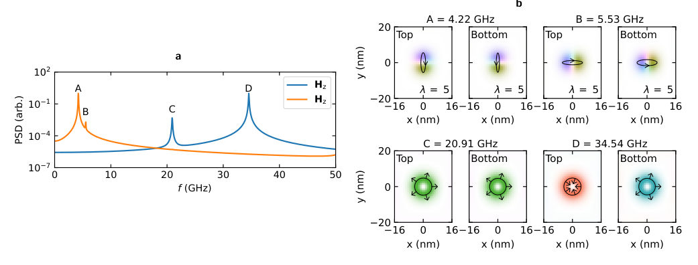 
Figure 4. (a) PSD and (b) lowest frequency normal modes of a skyrmion in a SAF with sample dimensions Lx = 32 nm and Ly = 40 nm. We classify modes A and B as translational modes, and modes C and D as breathing modes. For more details refer to the main text.

**Summary.** This work characterizes the magnetic excitation modes of skyrmions confined in synthetic antiferromagnetic bilayers. By using advanced micromagnetic simulations, the authors show that interlayer coupling fundamentally alters low-frequency dynamics, revealing unique translational and out-of-phase breathing modes. The research provides a systematic understanding of collective excitations and signal propagation in these coupled magnetic systems.

**Why it may be interesting.** While focused on magnetism, the rigorous application of linear response theory, generalized eigenvalue problems, and time-domain simulation techniques for characterizing collective excitations is highly relevant to open quantum systems dynamics and wave phenomena in structured media.

Detailed structure

**Main problem.** The study investigates the excitation modes and collective dynamics of skyrmions confined within synthetic antiferromagnetic (SAF) bilayers.

**Main result.** The SAF interlayer coupling strongly modifies low-frequency excitations, leading to distinct translational and out-of-phase breathing modes compared to ferromagnetic systems. Signal propagation along extended chains is also demonstrated.

**Method.** Micromagnetic simulations are employed using both the eigenvalue method (for normal modes) and ringdown methods (for full dynamics). The analysis involves solving linearized LLG equations for small fluctuations.

**Model / system.** The system models SAF bilayers, consisting of two coupled ferromagnetic layers hosting single or multiple skyrmions in various geometries (square, rectangular, chains). Dynamics are governed by the interplay between geometric confinement and interlayer coupling.

**Key observables.** Normal mode frequencies ($\omega_k$), Power Spectral Density (PSD), gyrotropic/translational/breathing modes, and signal propagation velocities.

**Important parameters / regimes.** Interlayer coupling strength ($\sigma$), sample geometry aspect ratio ($L_x/L_y$), and the number of skyrmions in a chain.

**Assumptions / limitations.** The analysis relies on linear response theory for small oscillations; specific approximations are made regarding power spectrum calculation (e.g., neglecting off-diagonal terms).

**Figures summary.** Figures illustrate PSDs, normal mode phase/amplitude maps for single and multiple skyrmions in SAF geometries, and time evolution showing signal propagation along chains.

**Paper structure.** The paper systematically analyzes the dynamics by first establishing the theoretical framework (eigenmode solvers), then applying it to single skyrmions in various confined geometries, followed by analyzing collective modes in extended skyrmion chains, and finally demonstrating signal propagation.

Abstract

We investigate the excitation modes of confined synthetic-antiferromagnetic (SAF) skyrmions using micromagnetic eigenvalue and ringdown simulations. Starting from a single skyrmion in a ferromagnetic layer, where the lowest-frequency modes are a gyrotropic and a breathing mode, we study how antiferromagnetic interlayer coupling modifies the dynamics in SAF bilayers. We consider several geometries: single SAF skyrmions in square and rectangular confinement, unequal layer thicknesses, and strips containing multiple skyrmions.   The antiferromagnetic coupling strongly modifies the low-frequency dynamics. The square geometry exhibits two nearly degenerate gyrotropic modes, where in each both layers have the same rotation sense. In rectangular geometries, we instead find nearly linear SAF skyrmion translation emerging from opposite gyration sense in the two layers. These translational modes become the characteristic low-frequency excitations of SAF skyrmion chains.   For skyrmion chains, we identify collective translational and breathing modes with standing-wave-like spatial profiles. Beyond ferromagnetic-like breathing modes, the SAF geometry supports breathing oscillations in which the two layers oscillate out of phase. We further demonstrate signal propagation along extended SAF skyrmion chains with propagation velocities comparable to ferromagnetic skyrmion chains.   These results provide a systematic description of the collective dynamics of SAF skyrmions arising from the interplay of geometric confinement, intralayer, and interlayer coupling.

[↑ back to top](#top)

### [Strongly nonlinear regime of Josephson transmission lines revealed by two-tone spectroscopy](http://arxiv.org/abs/2606.05813v1)

**Authors:** A. S. Averkin, A. A. Kopasov, I. E. Pologov, Aleksey N. Bolgar, Daria A. Kalacheva, Viktor B. Lubsanov, M. V. Fistul, A. Karpov  
**Type:** both · **Category:** other · **PDF:** <https://arxiv.org/pdf/2606.05813v1>  
**Analysis basis:** full PDF text, analyzed in chunks
**Topic relevance:** `driven-dissipative phase transition` **3/5** · `methods for driven-dissipative` **3/5** · `non-equilibrium dynamics` **2/5** · `non-equilibrium universality` **2/5** · `Keldysh / 2PI / non-Gaussian methods` **1/5** · `correlated / nonlocal dissipation` **1/5** · `correlated cavity matter` **1/5** · `interference shaping light` **1/5**

📷 Fig 1

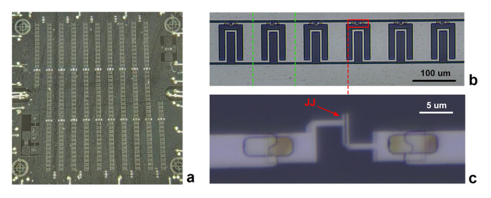 
FIG. 1. (a) Photo of 5×5 mm chip containing the chain of N = 356 SQUIDs. Input and output contact pads are placed on the left and right sides of the chip, correspondingly. (b) Photo of the part of the chip showing six SQUIDs directly embedded into the central conductor of coplanar waveguide. Each SQUID consists of the two branches: the first branch has the meander shape, while the second one is interrupted by a Josephson junction (marked by red rectangle). The meander branch of the rf-SQUID corresponds to the geometric inductance Lg, while the segment of the coplanar waveguide together with the ground plane provides the capacitance C0. The unit cell of sample (between two green dashed lines)...

📷 Fig 2

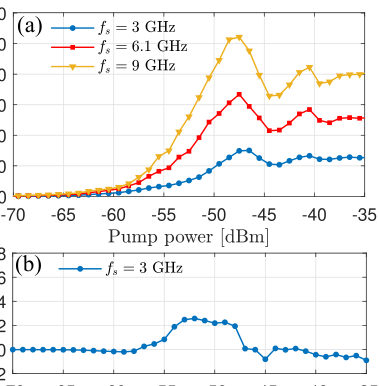 
FIG. 3. Measured two-tone spectroscopy. (a) Typical depen- dencies of the phase length variation for a weak probe tone at frequencies fs = 3, 6.1, and 9 GHz as a function of the input power of the pump at frequency fp = 6 GHz. (b) Behavior of the transmission |S21| as a function of the pump power for fp = 6 GHz and fs = 3 GHz.

📷 Fig 3

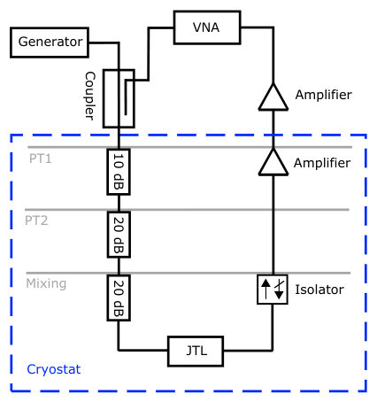 
FIG. 2. Experimental setup for the two-tone spectroscopy measurements.

📷 Fig 4

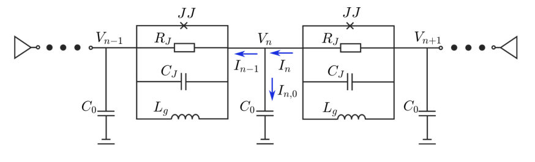 
FIG. 4. Josephson transmission line scheme. Josephson junctions, capacitors, resistors, and inductances are denoted by JJ, C, R, and L, respectively. The node voltages and currents are denoted by Vn and In, respectively. The length of the unit cell is equal to a.

📷 Fig 5

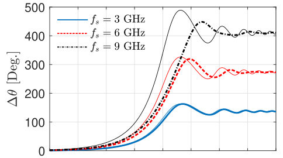 
FIG. 5. Typical dependence of the phase length variation ∆θ(P) −∆θ(P →0) defined by Eq. (11) on the microwave power P for a single applied microwave tone. The plots shown by thick lines are obtained using numerical solution of Eq. (10) in the presence of dissipation, while thin lines demonstrate the results for the lossless case (γω = 0). The results were obtained for ω0 = 649 GHz and α = 0.34. The dissipation parameter γω = 0.004, 0.008, and 0.012 for f = 3, 6, and 9 GHz, respectively.

**Summary.** This work experimentally and theoretically explores the strongly nonlinear regime of Josephson transmission lines using two-tone spectroscopy. The key finding is that high pump power induces pronounced oscillations in the signal phase length due to the power-dependent inductance of the junctions. This research advances the understanding of superconducting circuit dynamics under extreme non-linear driving conditions.

**Why it may be interesting.** The study provides quantitative insights into how strong external driving fields fundamentally alter the effective inductance and propagation characteristics of superconducting circuits, which is crucial for designing nonlinear quantum components like parametric amplifiers or non-linear couplers.

Detailed structure

**Main problem.** The study investigates the highly nonlinear response of Josephson transmission lines (JTLs) when driven by strong microwave pump signals.

**Main result.** The phase length variation exhibits pronounced oscillations in the strongly nonlinear regime, which are theoretically linked to the oscillatory dependence of Josephson inductances on the pump power. Dissipation is shown to smear out these characteristic oscillations.

**Method.** The research combines two-tone spectroscopy measurements with advanced theoretical modeling using coupled nonlinear differential equations and wave equations.

**Model / system.** The physical system is a JTL composed of multiple rf-SQUID units embedded in a coplanar waveguide. The dynamics are governed by a nonlinear wave equation derived from Josephson relations, applicable in the off-resonant regime.

**Key observables.** Phase of the transmission coefficient ($\arg(S_{21})$) as a function of pump power; effective decay constant ($\kappa_{	ext{eff}}$); cross-phase modulation.

**Important parameters / regimes.** Strongly nonlinear regime (high input pump power); low temperature ($T \approx 40 	ext{ mK}$); Josephson inductance variation with microwave power.

**Assumptions / limitations.** The analysis often relies on approximations such as neglecting higher harmonics or assuming weak probe signals, though the theory is generalized beyond previous assumptions of constant amplitudes.

**Figures summary.** Figures illustrate the measured phase length variation versus pump power (showing oscillations) and plots detailing the effective decay constant dependence on input amplitude.

**Paper structure.** The paper progresses from establishing the experimental setup and observable ($\arg(S_{21})$) to developing a generalized nonlinear wave equation, solving it for different regimes (single-tone vs. two-tone), and finally comparing theoretical predictions—including dissipation effects—against detailed experimental measurements.

Abstract

We present experimental and theoretical studies of the off-resonant and strongly nonlinear regime of Josephson transmission lines (JTLs) with galvanically-coupled nonlinear elements. The transition from the weakly to the strongly nonlinear regime of a JTL induced by increasing the input power of the pump is probed via two-tone spectroscopy. Measurements of the phase of the transmission coefficient for a weak probe signal reveal a large increase and pronounced oscillations in the phase length variation as a function of the microwave power of the pump. Experimental observations are explained on the basis of the developed theoretical approach suitable for the description of the nonlinear response of strongly driven JTLs. Using the derived nonlinear wave equation, we show that the behavior of the phase length variation is associated with the oscillatory dependence of the Josephson inductances on the microwave power. It is demonstrated that the dissipation-induced propagation losses increase in the strongly nonlinear regime and also lead to smearing out the phase length oscillations. The developed theoretical analysis is in good agreement with experimental observations.

[↑ back to top](#top)

### [Particle-Hole Ghost Interference in Superconductors](http://arxiv.org/abs/2606.06437v1)

**Authors:** Archisman Panigrahi, Vladislav Poliakov, Leonid Levitov  
**Type:** theory · **Category:** other · **PDF:** <https://arxiv.org/pdf/2606.06437v1>  
**Analysis basis:** full PDF text, analyzed in chunks
**Topic relevance:** `Kondo & dissipative impurity` **3/5** · `interference shaping light` **3/5** · `Keldysh / 2PI / non-Gaussian methods` **1/5** · `correlated / nonlocal dissipation` **1/5** · `driven-dissipative phase transition` **1/5** · `methods for driven-dissipative` **1/5**

📷 Fig 1

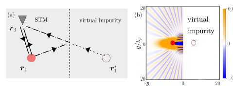 
FIG. 1. (a) Boundary-assisted interference effect in the TDOS of an impurity and its mirror image due to scattering at a do- main wall. Here, r1 is the position of impurity, r∗ 1 is the posi- tion of ‘virtual impurity’ (‘ghost impurity’), and the STM tip is shown at position r3. (b) Fourier filtered TDOS (Eq.(8)) for a d + id superconductor at eV = 1.01∆displays hyper- bolic Young’s interference patterns. The x and the y coordi- nates specify the position of the moving STM tip. The orange and blue colors represent positive and negative sign of TDOS, which is plotted in the units of 4UkF e2|tSTM|2ν0

**Summary.** This work theoretically predicts a novel 'ghost' interference pattern in superconductors caused by an impurity situated near a physical boundary. This effect combines standard Friedel oscillations with hyperbolic fringes, offering a powerful, first-order diagnostic tool for mapping the superconducting order parameter using STM measurements.

**Why it may be interesting.** While focused on superconductivity, the methodology of using local probes (STM/STS) to detect subtle quantum interference effects arising from boundaries is highly relevant to open quantum systems and mesoscopic physics.

Detailed structure

**Main problem.** The study investigates particle-hole interference, analogous to Young's double-slit experiment, occurring in superconductors due to a single impurity near a physical boundary or defect.

**Main result.** This 'ghost' interference pattern is parametrically stronger than previously studied effects because it appears at first order in the impurity potential. It provides a robust local probe sensitive to superconducting order parameter anisotropy.

**Method.** The analysis involves calculating the impurity-modified Green's function using boundary conditions and deriving the resulting Tunneling Density of States (TDOS).

**Model / system.** The system is a superconductor modeled with Bogoliubov quasiparticles, featuring an impurity scatterer near a line defect or phase boundary. The physics is governed by modifications to the Green's function due to this proximity.

**Key observables.** Tunneling Density of States (TDOS) measured via STM/STS; interference patterns combining $2k_F$ Friedel oscillations with hyperbolic fringes.

**Important parameters / regimes.** The superconducting gap ($\Delta$), Fermi momentum ($k_F$), and the bias voltage ($eV$) relative to $\Delta$.

**Assumptions / limitations.** Low temperature is assumed, leading to delta-function approximations; the reflection amplitude at the boundary is treated phenomenologically.

**Figures summary.** Figure 1 illustrates the TDOS showing both the impurity/mirror image interference pattern (a) and a Fourier-filtered view of hyperbolic Young's patterns for a d+id superconductor (b).

**Paper structure.** The paper develops the theory by modifying the Green's function to account for boundary scattering, derives the resulting spectral function, and analyzes the observable TDOS to isolate and interpret the ghost interference term.

Abstract

Mirror-assisted optical interference can improve the fidelity of Young's double-slit interference. Here we discuss an electron analogue: particle-hole interference in superconductors produced by a single impurity near a line defect, terrace edge, or phase boundary. Quasiparticle waves scattered directly from the impurity interfere with waves reflected by the boundary, generating a ``ghost'' interference pattern that combines conventional $2k_F$ Friedel oscillations with additional hyperbolic fringes. Compared to the recently studied two-impurity Young's interference, this effect appears already at first order in the impurity potential and is therefore parametrically stronger. The resulting spatial modulation extends beyond $λ_F/2$ and is directly sensitive to the quasiparticle structure of the paired state, including possible Fermi-surface anisotropy of the superconducting order parameter. These findings point to boundary-assisted impurity interference as a robust local probe of superconducting electronic order, with clear signatures accessible to STM/STS measurements.

[↑ back to top](#top)

### [Magnetochiral anisotropy in strained superconducting transition metal dichalcogenides](http://arxiv.org/abs/2606.05302v1)

**Authors:** Joaquim Telles de Miranda, Maxim Khodas, Alex Levchenko  
**Type:** theory · **Category:** other · **PDF:** <https://arxiv.org/pdf/2606.05302v1>  
**Analysis basis:** full PDF text, analyzed in chunks
**Topic relevance:** `Keldysh / 2PI / non-Gaussian methods` **3/5** · `non-equilibrium dynamics` **2/5** · `correlated / nonlocal dissipation` **1/5** · `driven-dissipative phase transition` **1/5** · `methods for driven-dissipative` **1/5** · `non-equilibrium universality` **1/5**

📷 Fig 1

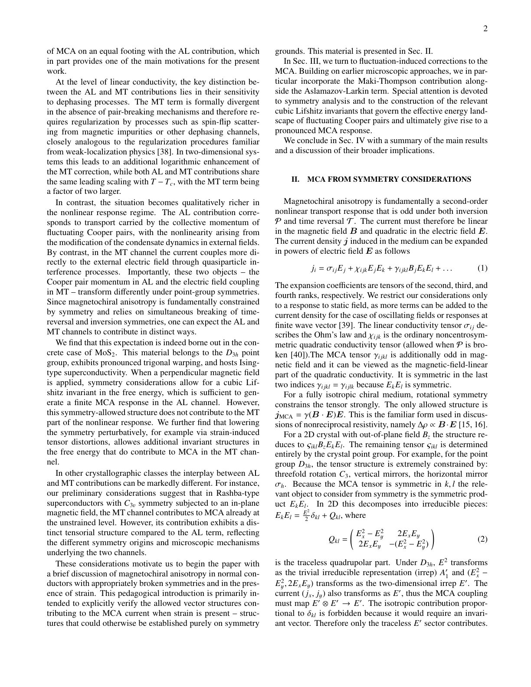 
Low-resolution page preview, page 2

📷 Fig 2

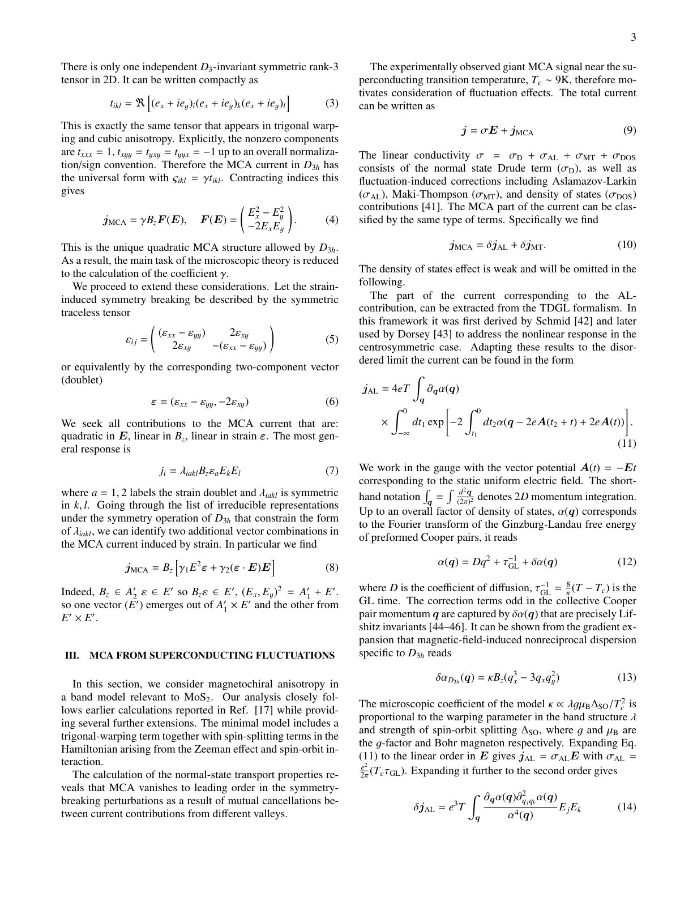 
Low-resolution page preview, page 3

📷 Fig 3

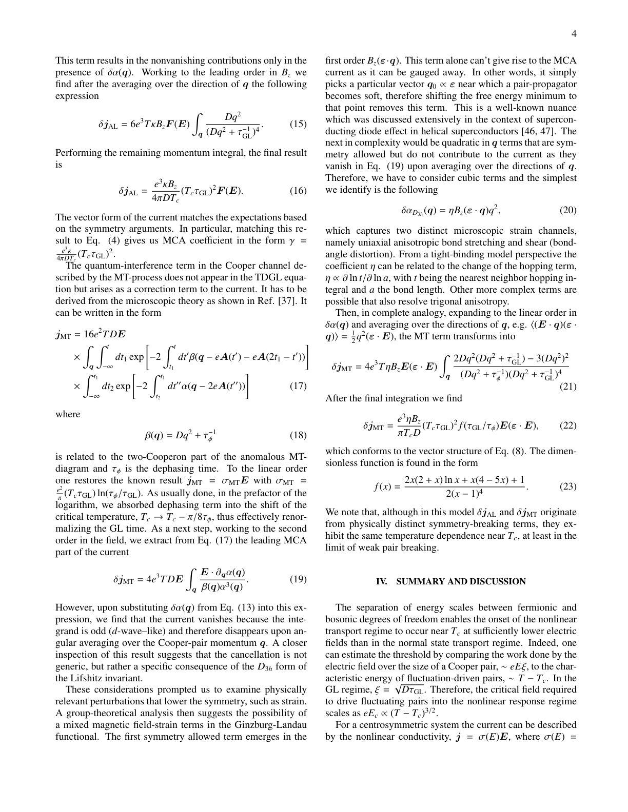 
Low-resolution page preview, page 4

📷 Fig 4

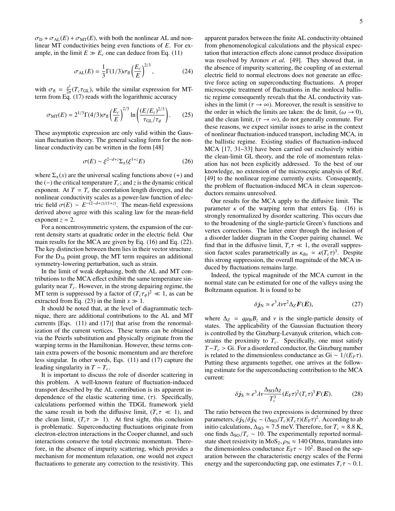 
Low-resolution page preview, page 5

📷 Fig 5

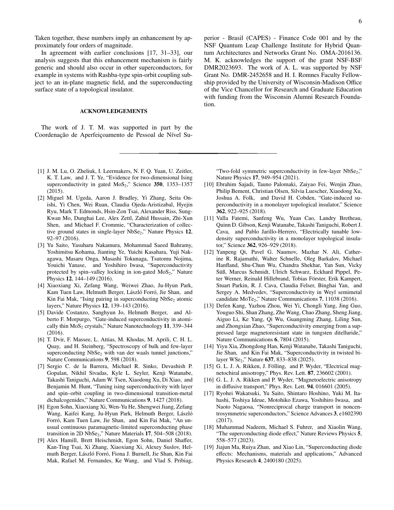 
Low-resolution page preview, page 6

**Summary.** This paper theoretically analyzes magnetochiral anisotropy (MCA) in 2D superconducting TMDs like $	ext{MoS}_2$. It shows that MCA, a nonreciprocal transport effect, is strongly enhanced near the critical temperature due to superconducting fluctuations. The work uses advanced symmetry and fluctuation theories to quantify these effects, highlighting the role of strain in modifying the response.

**Why it may be interesting.** While focused on condensed matter superconductivity, the rigorous application of symmetry constraints to derive non-linear transport coefficients ($\gamma_{ijkl}$) is a powerful theoretical tool applicable to understanding directional couplings in complex quantum materials.

Detailed structure

**Main problem.** The study investigates nonreciprocal charge transport, specifically magnetochiral anisotropy (MCA), in two-dimensional superconducting materials.

**Main result.** MCA is strongly enhanced near the superconducting transition temperature ($T_c$) due to fluctuation effects, with contributions arising from both order-parameter fluctuations (AL) and quasiparticle interference (MT).

**Method.** The analysis employs theoretical methods combining symmetry group theory, Ginzburg-Landau formalism, and diagrammatic techniques (e.g., Cooperon diagrams) to calculate nonlinear current response tensors.

**Model / system.** The system is modeled using superconducting transition metal dichalcogenides ($	ext{MoS}_2$) exhibiting noncentrosymmetric superconductivity in 2D. The theory incorporates symmetry-breaking perturbations like strain and magnetic fields.

**Key observables.** Nonreciprocal conductivity tensor components ($\gamma_{ijkl}$), the MCA current ($j_{MCA}$), and nonlinear conductivity scaling $\sigma(\mathbf{E})$.

**Important parameters / regimes.** $T_c$, correlation length ($\xi$), disorder scattering time ($	au$), magnetic field strength ($\mathbf{B}$), and strain tensor ($oldsymbol{\epsilon}$).

**Assumptions / limitations.** The analysis is performed in the diffusive limit ($T_c	au \ll 1$) and relies on separating contributions into AL (collective) and MT (quasiparticle) fluctuation terms.

**Figures summary.** Not specified by notes, but the structure implies showing derived tensor forms and scaling laws for conductivity components.

**Paper structure.** The paper progresses from general symmetry considerations of MCA to detailed calculations incorporating both Aslamazov-Larkin (AL) and Maki-Thompson (MT) fluctuation corrections near $T_c$, concluding with an analysis of nonlinear conductivity scaling in the superconducting state.

Abstract

We present a theoretical study of nonreciprocal charge transport in two-dimensional noncentrosymmetric superconductors, focusing on transition-metal dichalcogenide MoS$_2$ as a representative example. In the normal state, the electrical response of a material to the relative orientation of the current and magnetic field is suppressed to leading order in the symmetry-breaking perturbations. In the vicinity of the superconducting transition, magnetochiral anisotropy is strongly enhanced. We consider contributions to the nonreciprocal current originating from order-parameter fluctuations and quantum-interference processes. These terms are linked to higher-order Lifshitz invariants generically allowed in the Ginzburg-Landau free energy of superconductors with broken inversion and time-reversal symmetries. We further show that strain enables additional vector components in the nonlinear current response.

[↑ back to top](#top)

### [Beyond Critical Minerals Targets: Digital Rock Physics as Infrastructure for Secure and Circular Supply Chains](http://arxiv.org/abs/2606.05798v1)

**Authors:** Hannah P. Menke, Alessio Scanziani, Maja Rücker  
**Type:** both · **Category:** other · **PDF:** <https://arxiv.org/pdf/2606.05798v1>  
**Analysis basis:** full PDF text, analyzed in chunks
**Topic relevance:** `non-equilibrium dynamics` **2/5** · `Keldysh / 2PI / non-Gaussian methods` **1/5** · `analog quantum simulation` **1/5** · `correlated / nonlocal dissipation` **1/5** · `driven-dissipative phase transition` **1/5** · `entanglement & information structure` **1/5** · `methods for driven-dissipative` **1/5** · `non-equilibrium universality` **1/5**

📷 Fig 1

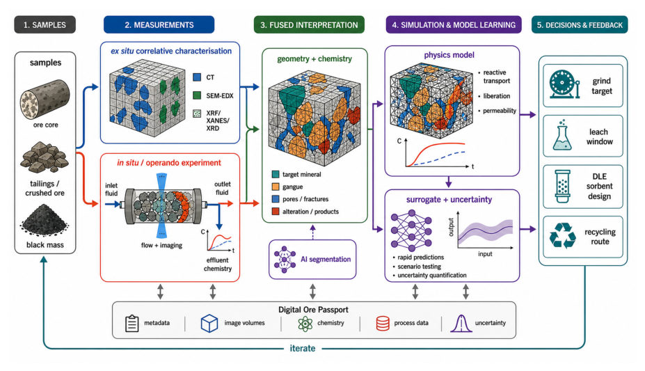 
Figure 1: Integrated Digital Rock Physics workflow for critical-mineral systems. Static correlative imaging resolves registered geometry and mineral chemistry, while in situ experiments track reactive flow, structural change, and effluent chemistry under process- relevant conditions. AI-assisted segmentation supports image interpretation, physics- based models translate those data into transport, liberation, and reaction predictions, and surrogate models with uncertainty estimates accelerate decision support for comminution, leaching, Direct Lithium Extraction, recycling, and tailings valorisation.

📷 Fig 2

 
Figure 2 shows where DRP can add decision-relevant information across the critical-

📷 Fig 3

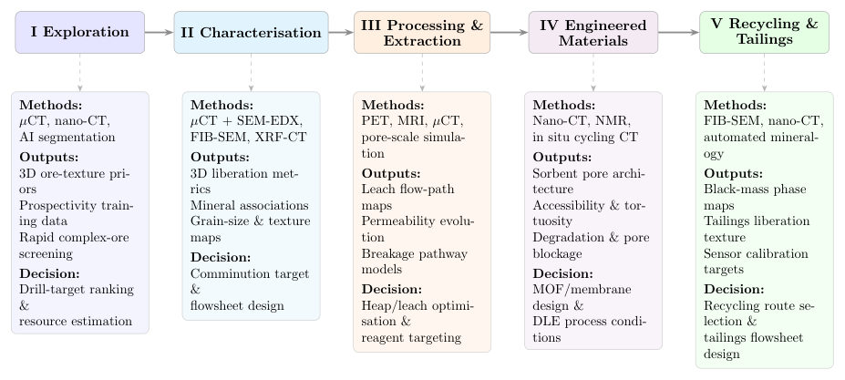 
Figure 2: Digital Rock Physics contributions across the critical-minerals value chain. Top row: value chain stages linked by process arrows. Bottom row: the specific DRP imaging methods, structural and chemical outputs, and process or investment decisions those outputs inform at each stage. The “Engineered Materials” stage reflects the growing role of DRP in designing porous sorbents, MOFs, and ion-selective membranes for Direct Lithium Extraction and related low-footprint separation technologies.

📷 Fig 4

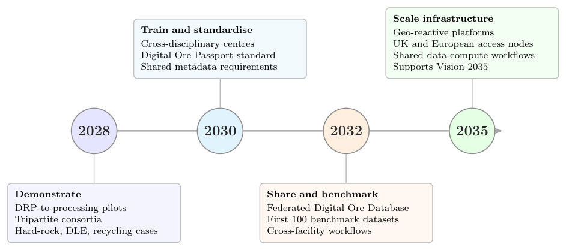 
Figure 3: Proposed implementation roadmap for a UK-European critical-minerals DRP programme. Near-term demonstrators provide the evidence base for cross-disciplinary training and a Digital Ore Passport standard, followed by a federated Digital Ore Database, shared benchmark datasets, integrated geo-reactive infrastructure, and mature decision-support workflows aligned with the UK’s 2035 domestic-production ambition.

**Summary.** This work argues that realizing ambitious critical minerals supply chain goals requires moving beyond simple resource mapping. It champions Digital Rock Physics (DRP) as a necessary, integrated infrastructure combining 3D imaging, chemistry, and reactive modeling to accurately predict resource viability from complex feedstocks like tailings and e-waste.

**Why it may be interesting.** While not quantum physics, the paper's emphasis on complex, multi-scale modeling of reactive transport and data integration echoes challenges in simulating many-body systems or open quantum systems where boundary conditions and coupling are critical. The need for 'physics-informed ML' to bridge scales is conceptually relevant.

Detailed structure

**Main problem.** The core challenge is transitioning from ambitious policy targets for critical minerals to practical, environmentally sound resource extraction by characterizing complex, heterogeneous feedstocks.

**Main result.** Digital Rock Physics (DRP) is proposed as an essential enabling infrastructure that integrates 3D imaging, chemistry, and reactive transport modeling to make resource assessment predictive and actionable.

**Method.** The approach combines advanced experimental techniques like 3D X-ray Computed Tomography ($\mu$CT), correlative chemistry, and AI analysis with computational pore-scale modeling of fluid flow and chemical reactions.

**Model / system.** The physical systems include hard-rock ores, mine tailings, brines, and spent battery black mass. The model is the integrated DRP workflow that links mineral texture and reactive pathways to industrial process decisions across the entire resource lifecycle.

**Key observables.** True liberation volumes (3D vs 2D), connected flow pathways, time-resolved changes in pore geometry/chemistry, dissolved product concentrations, and energy demand reduction potential.

**Important parameters / regimes.** Scale gap between nano-CT ($\sim 0.1 	ext{ mm}^3$) and mine scale ($10^{10} 	ext{ m}^3$); the need for standardized data infrastructure across disciplines.

**Assumptions / limitations.** Conventional automated mineralogy based on 2D sections systematically underestimates true resource potential; policy implementation requires shared, integrated digital platforms rather than standalone instruments.

**Figures summary.** Figures illustrate the integrated DRP workflow connecting characterization to decision-making, mapping DRP's contribution across the critical minerals value chain (Exploration through Recycling), and presenting a roadmap for infrastructure development.

**Paper structure.** The paper establishes the policy gap, details the technical limitations of current 2D methods, presents the integrated DRP methodology combining structure/chemistry/transport, outlines predictive applications in various resource types (ore, tailings, batteries), and concludes with a concrete policy agenda for infrastructure investment.

Abstract

The United Kingdom and Europe are moving rapidly from critical minerals target-setting to implementation. The EU Critical Raw Materials Act and the UK's Vision 2035 create ambitious benchmarks for domestic extraction, processing, recycling, circularity, and supply-chain resilience, but many prospective regional resources remain complex, under-explored, historically worked, or economically marginal. This paper argues that implementation will depend not only on permitting reform and project designation, but also on pre-competitive measurement, modelling, and data infrastructure capable of determining which ores, brines, waste streams, and recycling feedstocks can be processed viably and with lower environmental impact. Digital Rock Physics (DRP) should therefore be understood as enabling infrastructure for resource policy rather than as a specialist laboratory method alone. By combining three-dimensional imaging, correlative chemistry, AI-enabled image analysis, and pore-scale modelling, DRP can connect mineral texture and reactive pathways to decisions about ore characterisation, liberation prediction, leaching, Direct Lithium Extraction, mine-waste valorisation, and battery recycling. The paper sets out a UK-European policy agenda built around translational demonstrators, cross-disciplinary training, a Digital Ore Passport standard, a federated Digital Ore Database, and integrated geo-reactive end stations. Treated as shared implementation infrastructure, DRP could help turn critical minerals strategies into practical routes for supply security, resource efficiency, circularity, and more environmentally responsible development.

[↑ back to top](#top)

### [Non-adiabatic Ehrenfest dynamics with norm-conserving and ultra-soft pseudo-potentials with nuclear velocity corrections on the atomic orbitals within the Projector Augmented Wave Method framework](http://arxiv.org/abs/2606.06185v1)

**Authors:** Paolo Fachin, Francesco Macheda, Paolo Barone, Francesco Mauri  
**Type:** theory · **Category:** other · **PDF:** <https://arxiv.org/pdf/2606.06185v1>  
**Analysis basis:** full PDF text, analyzed in chunks
**Topic relevance:** `Keldysh / 2PI / non-Gaussian methods` **1/5** · `methods for driven-dissipative` **1/5** · `non-equilibrium dynamics` **1/5**

📷 Fig 1

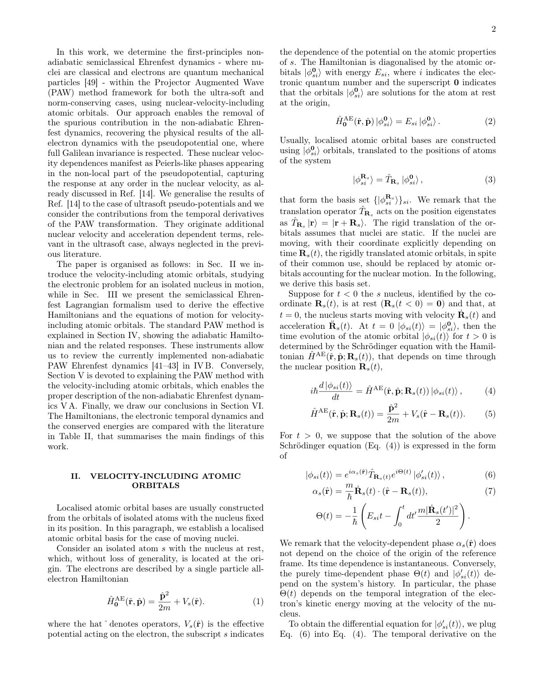 
Low-resolution page preview, page 2

📷 Fig 2

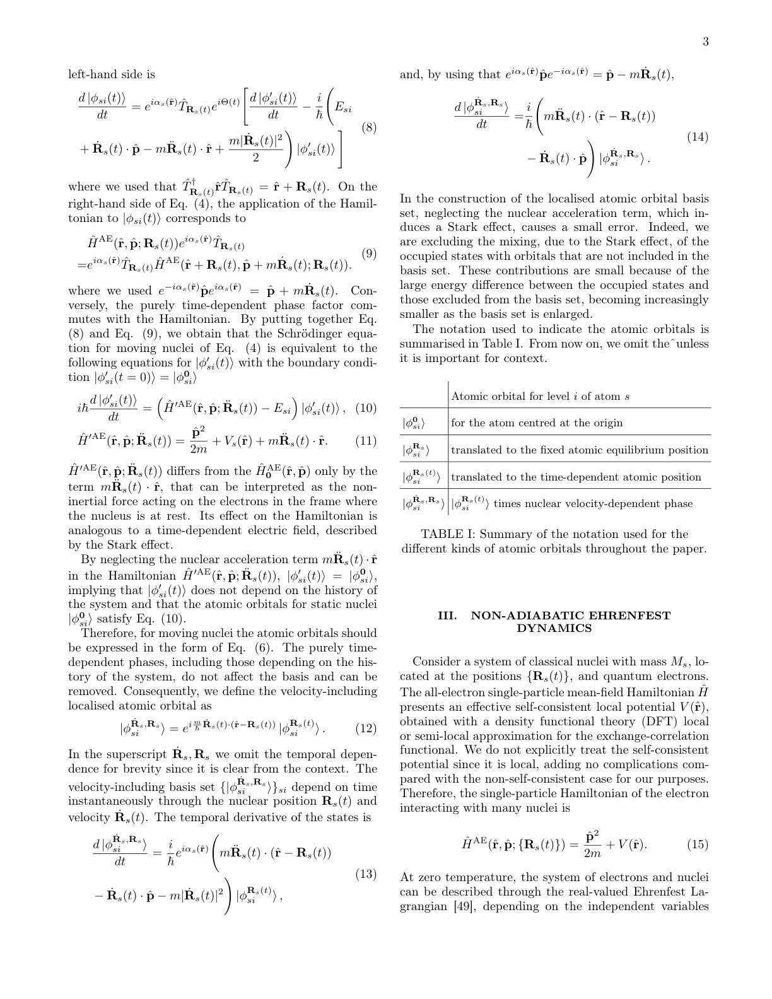 
Low-resolution page preview, page 3

📷 Fig 3

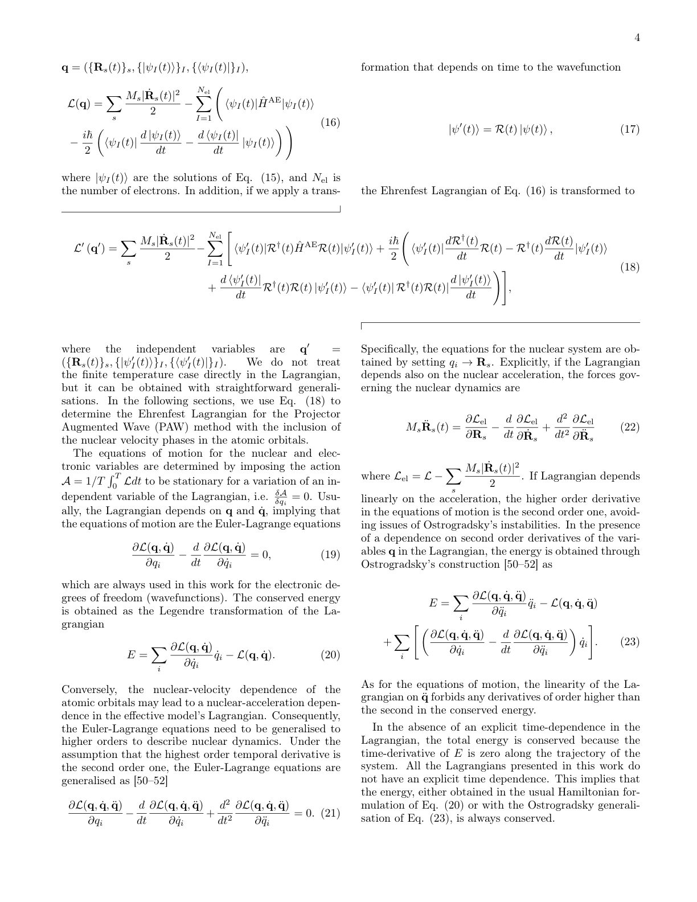 
Low-resolution page preview, page 4

📷 Fig 4

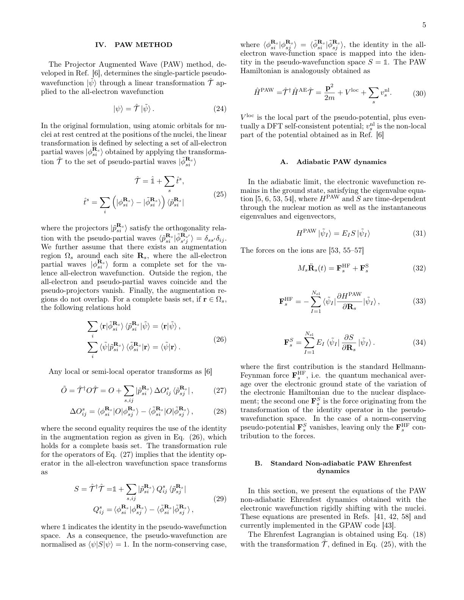 
Low-resolution page preview, page 5

📷 Fig 5

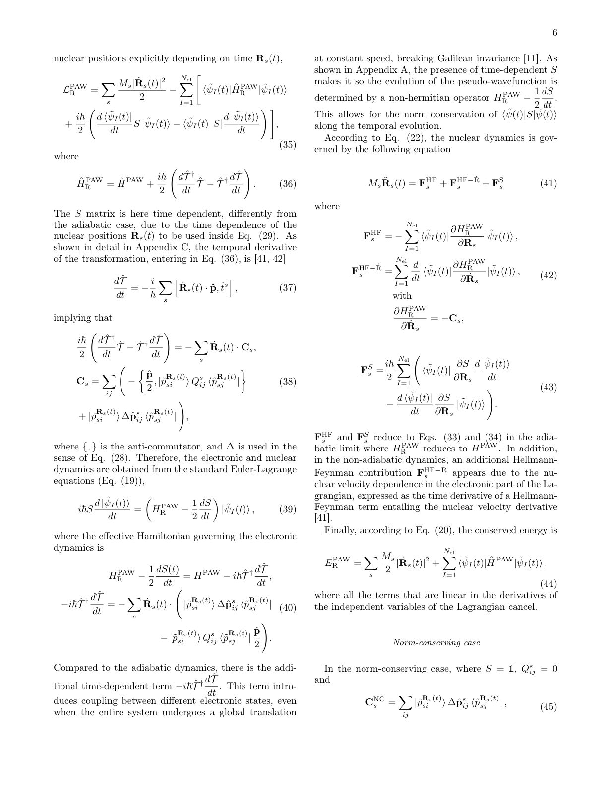 
Low-resolution page preview, page 6

**Summary.** This paper develops an advanced theoretical formalism for non-adiabatic Ehrenfest dynamics using the Projector Augmented Wave method. It addresses a critical deficiency in standard calculations by rigorously incorporating terms dependent on the nuclei's velocity and acceleration into the electronic Hamiltonian. The resulting framework ensures physical consistency and Galilean invariance, leading to more accurate predictions of molecular dynamics.

**Why it may be interesting.** This work is highly relevant because it provides a rigorous theoretical framework for simulating complex molecular processes (like charge transfer or spectroscopy) where nuclear motion induces significant electronic structure changes, which is a core topic in AMO physics and quantum chemistry.

Detailed structure

**Main problem.** The primary goal is deriving first-principles Ehrenfest molecular dynamics for non-adiabatic processes while correctly incorporating nuclear-velocity-dependent phases (electron-translation factors) into the atomic orbital basis.

**Main result.** Including these velocity-dependent phases ensures full Galilean invariance in pseudopotential calculations, removing spurious non-adiabatic couplings that arise from neglecting the nuclear velocity effects.

**Method.** The authors derive modified time evolution equations for localized atomic orbitals using a velocity-including basis within the Projector Augmented Wave (PAW) framework. They generalize standard Ehrenfest dynamics by incorporating terms dependent on nuclear velocity and acceleration into the effective Hamiltonian and Lagrangian.

**Model / system.** The model involves semiclassical Ehrenfest dynamics where nuclei are treated classically, and electrons quantum mechanically, using pseudo-potentials (norm-conserving and ultra-soft) within the PAW method. The system's evolution is governed by generalized Hamiltonians/Lagrangians that explicitly depend on nuclear position, velocity, and acceleration.

**Key observables.** Non-adiabatic coupling terms, conserved energy ($E_{	ext{PAW}}^{R, \dot{R}}$), forces governing nuclear motion ($\mathbf{F}_S$, $\mathbf{F}_{S-\dot{\mathbf{R}}}$, $\mathbf{F}_{S-\ddot{\mathbf{R}}}$).

**Important parameters / regimes.** Nuclear velocity ($\dot{\mathbf{R}}$) and acceleration ($\ddot{\mathbf{R}}$); the choice between norm-conserving and ultra-soft pseudo-potentials.

**Assumptions / limitations.** The derivation relies on specific mathematical transformations of the PAW operators to correctly account for time derivatives arising from nuclear motion, particularly in the velocity-including basis.

**Figures summary.** Not specified by notes; the structure implies comparisons between dynamics calculated with and without velocity corrections (e.g., Table II).

**Paper structure.** The paper builds logically by first identifying the failure of standard treatments due to neglected phases, then deriving the necessary transformations for the orbital basis ($\hat{T}_{\dot{R}}$), and finally constructing the fully corrected Hamiltonian and Lagrangian that govern the non-adiabatic dynamics.

Abstract

We derive the first-principles Ehrenfest molecular dynamics describing non-adiabatic processes with the inclusion of the nuclear-velocity-dependent phases (also known as electron-translation factors) on the atomic-orbital basis. These phases, appearing when nuclei are treated dynamically, affect effective Hamiltonians constructed from localised orbitals. In this work, we focus on the effects in the first-principles pseudo-potential Hamiltonian, both for the norm-conserving and ultra-soft cases, derived within the Projector-Augmented-Wave (PAW) method framework. Peierls-like phases depending on the nuclear velocities appear in the non-local part of the potential, while additional nuclear velocity and acceleration-dependent corrections appear in the ultra-soft pseudo-potential case. The use of velocity-including atomic orbital basis enables a Galilean-invariant description of the non-adiabatic Ehrenfest molecular dynamics, removing spurious non-adiabatic couplings that arise from neglecting the nuclear velocity phases in the atomic orbitals.

[↑ back to top](#top)

### [Optical Signature of Moiré Superlattices Formed by Twisted SrTiO$_3$ Membranes](http://arxiv.org/abs/2606.06289v1)

**Authors:** T. A. M. Ragib Shahriar, Fumikazu Murakami, Xing He, Konnor Koons, Xinyan Li, Bumseop Kim, Shihan Qin, Varun Harbola, Jochen Mannhart, Yimo Han, Ruijuan Xu, Shengxi Huang, Andrew Rappe, Hanyu Zhu  
**Type:** both · **Category:** strongly correlated electrons · **PDF:** <https://arxiv.org/pdf/2606.06289v1>  
**Analysis basis:** full PDF text, analyzed in chunks
**Topic relevance:** `interference shaping light` **1/5**

📷 Fig 1

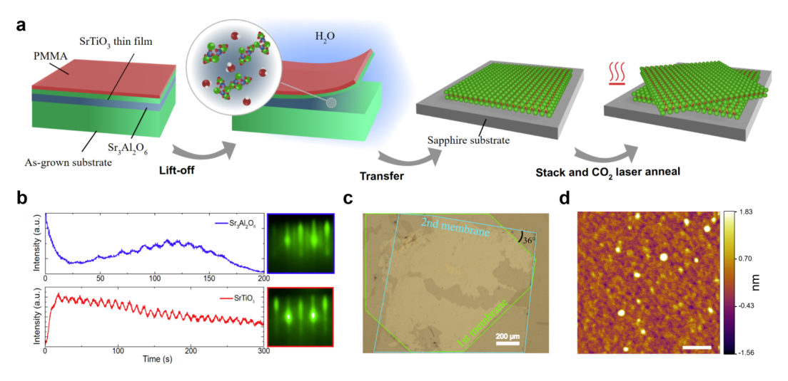 
Figure 1. (a) Schematic of preparing twisted SrTiO3 bilayer membranes on a sapphire substrate using thin-film epitaxy and chemical lift-off methods. (b) RHEED oscillations and patterns for Sr3Al2O6 and SrTiO3 films, respectively, indicating a 2D layer-by-layer growth mode and atomically smooth surfaces. The film thickness is directly measured from the number of unit cells. (c) Optical microscope image of the twisted SrTiO3 bilayer membranes transferred on a sapphire substrate, where large, clean bilayer and monolayer regions are present. (d) Atomic force microscopy image of twisted bilayer region after annealing, showing terraces along the surface and smaller roughness. Scale bar: 1 µm.

📷 Fig 2

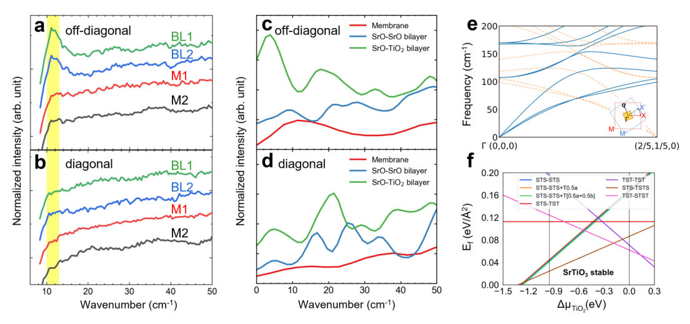 
Figure 2. Low-frequency Raman modes from moiré superlattices. Helicity-resolved Raman spectra from bilayer (BL1 and BL2) and membrane (M1 and M2) areas were obtained at 150 K with (a) off-diagonal and (b) diagonal detection configura- tion. The new Raman feature at around 12 cm−1 is highlighted. (c,d) Calculated Raman spectra of Σ5 interface formed by different termination types under (c) off-diagonal and (d) diagonal configurations. (e) Calculated phonon band structure of SrTiO3 in cubic phase (blue solid lines), showing that all phonons with the moiré superlattice wavevector (2/5, 1/5, 0) or equivalent have higher frequencies than the observed feature. The yellow dashed lines indicate the...

📷 Fig 3

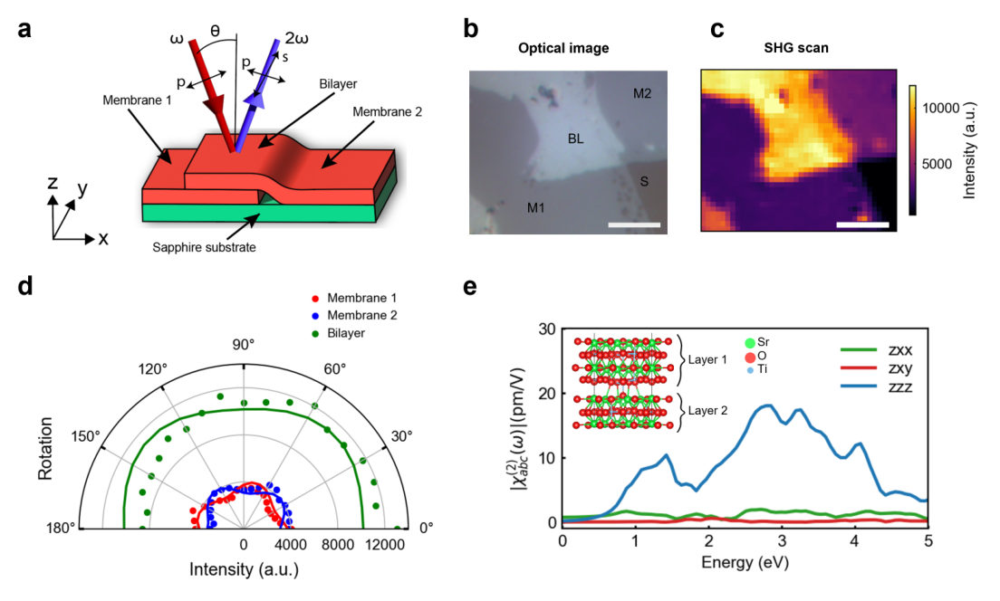 
Figure 3. (a) Schematic of the angle-dependent scanning SHG microscopy geometry in reflection mode. (b) The optical microscopy image distinguishes one membrane region (M1), the other membrane region (M2), the bilayer overlapping region (BL), and the bare sapphire substrate (S). (c) Reflective scanning SHG image of the same area showing enhanced SHG signal in the bilayer, compared with the top (M1) and bottom (M2) membranes. Scale bar: 10 µm. (d) Surface SHG of SrTiO3 as a function of sample orientation measured in reflection geometry with p-polarization excitation and polarization-unresolved detection (Figure S6 and S7). The solid curve shows the model fitting from Equation 1 and 2,...

📷 Fig 4

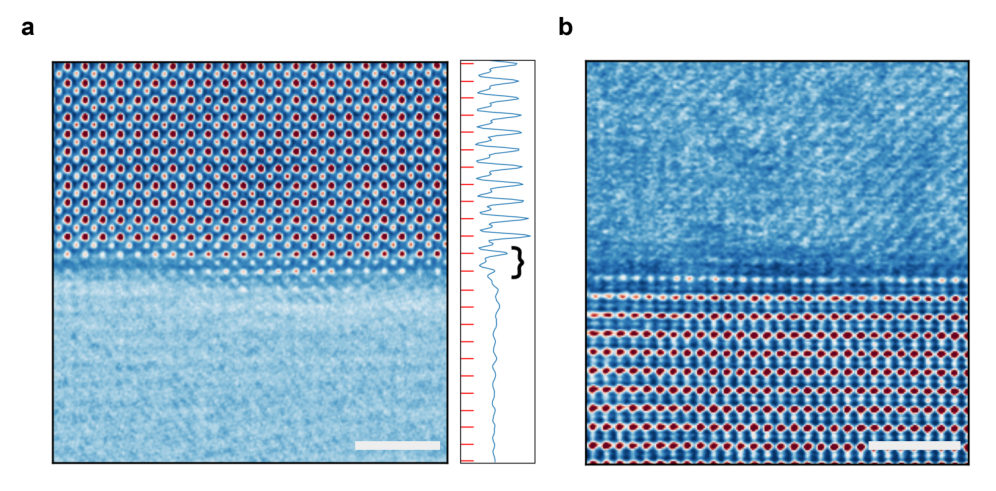 
Figure 4. Cross-sectional HAADF-STEM image of the twisted post-annealed membrane stack. (a) Images acquired along the [100] and (b) [110] zone axes of the atomically resolved crystal, respectively. In each case, the imaged membrane is aligned on-axis, while the opposing membrane is oriented off-zone axis. The line-integrated intensity is shown on the right side of each image. Red lines indicate the peak intensities distanced by one unit cell at the bulk and 10% more at the interface, consistent with the calculated increase in SrO-SrO distance at the twisted interface without notable van der Waals gaps. The brace indicates the transition region, characterized by roughness and/or reduced...

**Summary.** The research investigates moiré superlattices formed by twisting $	ext{SrTiO}_3$ membranes to control their electronic and optical properties. By combining SHG measurements with DFT calculations, the authors prove that asymmetric chemical bonding at the interface generates strong polarization and unique vibrational signatures. This work establishes a powerful methodology for designing correlated oxide materials via interfacial engineering.

**Why it may be interesting.** This work provides a direct experimental and theoretical pathway to engineer specific interfacial bonding motifs in oxide heterostructures, which is crucial for tuning correlated electron behavior and emergent quantum properties at interfaces.

Detailed structure

**Main problem.** To understand the structural, electronic, and optical properties of moiré superlattices formed by twisted oxide membranes, particularly focusing on how interfacial bonding dictates symmetry breaking.

**Main result.** The study demonstrates that chemically bonded interfaces in twisted $	ext{SrTiO}_3$ exhibit strong nonlinear optical responses (SHG) and novel low-frequency vibrational modes due to asymmetric terminations ($	ext{SrO-TiO}_2$), even when the bulk material is cubic.

**Method.** A combination of advanced experimental techniques, including Raman scattering and Second-Harmonic Generation (SHG), was coupled with first-principles DFT calculations and *ab initio* molecular dynamics simulations.

**Model / system.** The physical system is a twisted $	ext{SrTiO}_3$ bilayer formed from freestanding membranes at specific twist angles (e.g., $36^\circ$), creating moiré superlattices with engineered interfaces like $	ext{SrO-TiO}_2$.

**Key observables.** Low-frequency Raman modes ($\sim 12 	ext{ cm}^{-1}$), strong SHG signal enhancement, and calculated non-zero second-order susceptibility tensor components ($\chi^{(2)}$).

**Important parameters / regimes.** Twist angle ($36^\circ$), temperature (high-temperature annealing), and the specific nature of the interface termination ($	ext{SrO-TiO}_2$ vs. $	ext{SrO-SrO}$).

**Assumptions / limitations.** The observed phenomena are attributed to reconstruction driven by interfacial bonding polarity, rather than solely structural strain or lattice mismatch.

**Figures summary.** Figures illustrate the fabrication process (RHEED monitoring), Raman spectra showing novel low-frequency peaks, and SHG microscopy images confirming symmetry breaking in the bilayer region compared to single layers.

**Paper structure.** The paper systematically moves from fabricating the twisted membranes to characterizing their structure using STEM/AFM, then probing vibrational modes via Raman spectroscopy, and finally quantifying electronic polarization using angle-dependent SHG measurements, all supported by DFT calculations.

Abstract

Moiré superlattices formed at the interfaces of mismatched lattices have attracted significant interest over the past decade due to their large tunability of band parameters and interactions among electrons, spins, and lattices. Superlattices made from twisted perovskite oxides may have strong structure and potential modulation, but evidence of such modulation over macroscopic areas, particularly at large twisting angles, has not been clearly demonstrated so far. Here, we fabricated millimeter-scale twisted oxide bilayers at $36^\circ$ angle, close to the simple coincidence site lattice condition $\Sigma5$, from freestanding SrTiO$_3$ membranes. We discovered new low-frequency vibrational modes whose Raman activity, according to molecular dynamics simulations, is greatly enhanced by an asymmetric, twisted interface between the SrO and TiO$_2$ layers. Such an interface is energetically favorable from first-principles calculations and is corroborated by the observation of strong second harmonic generation from the interface comparable to that from the SrTiO$_3$ surface throughout the bilayer region. The results are consistent with interlayer coupling enhanced by high-temperature annealing and confirmed by cross-sectional scanning transmission electron microscopy imaging. Our work sheds light on the structural behavior of twisted oxides and provides directions for tuning their phononic and nonlinear optical properties in future studies.

[↑ back to top](#top)

### [The MuFusE Large-Volume Diamond Anvil Cell for Exploring Muon-Catalyzed Fusion at Higher Pressures and Temperatures](http://arxiv.org/abs/2606.05333v1)

**Authors:** J. D. Kalow, J. T. Hinchen, G. Harris, E. Koukina, D. M. Harrington, P. C. McDaniel, N. J. Brennan, A. Golossanov, I. D. Spool D. Zajac, M. Mundt, S. Varner, M. Russell, S. Bull, K. McCormack, D. Mayer, L. E. Knaian, M. Khandaker, W. Stadolnik, W. R. Cutler, A. Sampat, K. Lau, J. Betances, C. Fagan, C. R. Shmayda, M. Koch, K. Payne, N. J. L. MacFadden, J. Simon, K. Peterson, A. Gami, S. Machavarapu, A. Tejeda, J. Katz, J. A. Allen, R. Chaney, K. Kem, I. Kiniti, E. Garcia Badaracco, K. R. Lynch, P. Gandhi, C. J. Johnstone, E. Niner, C. C. Petitjean, A. Antognini, W. T. Shmayda, S. O. Newburg, A. N. Knaian  
**Type:** experiment · **Category:** other · **PDF:** <https://arxiv.org/pdf/2606.05333v1>  
**Analysis basis:** full PDF text, analyzed in chunks
**Topic relevance:** `non-equilibrium dynamics` **1/5**

📷 Fig 1

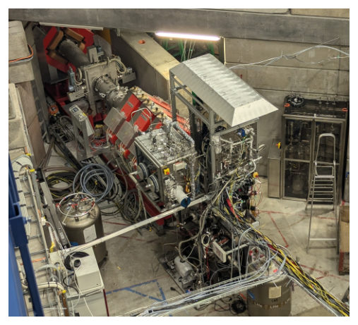 
FIG. 1. MuFusE setup assembled in the πE1 muon beamline at the Paul Scherrer Institute in Villigen, Switzerland.

📷 Fig 2

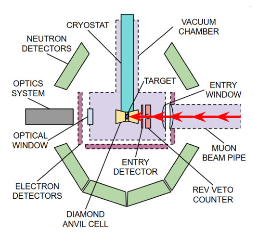 
FIG. 2. A schematic representation of the experiment.

📷 Fig 3

 
FIG. 4. Seats with different gasket styles.

📷 Fig 4

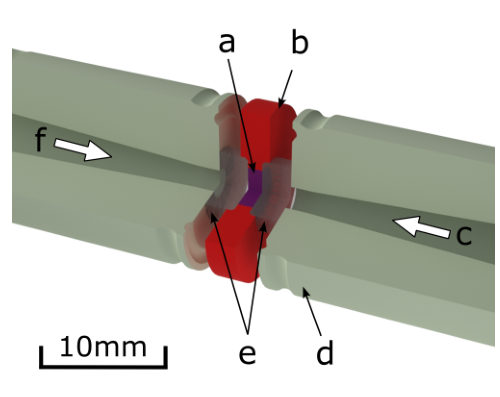 
FIG. 3. Compressed target assembly, showing (a) compressed hydro- gen target, (b) gasket, (c) muon entry window, (d) seat, (e) diamond anvils, and (f) optics entry window.

📷 Fig 5

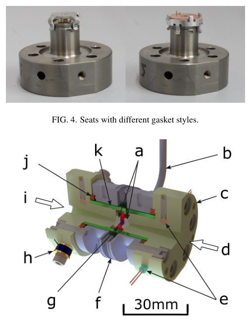 
FIG. 5. Minichamber assembly, showing (a) diamond anvils, (b) fill tube, (c) seat, (d) muon entry window, (e) cartridge heaters, (f) bel- lows minichamber, (g) target, (h) temperature sensor, (i) optics entry window, (j) copper seal, and (k) gasket retainer.

**Summary.** This paper details the development and successful operation of the MuFusE Large-Volume Diamond Anvil Cell, an apparatus designed to study muon-catalyzed fusion (μCF) under extreme pressures and temperatures. By achieving record high P-T benchmarks for d-t targets, the experiment advances fundamental research into low-energy nuclear reactions. The work highlights complex engineering solutions required to safely conduct measurements involving radioactive materials in highly confined sample volumes.

**Why it may be interesting.** While focused on nuclear/plasma physics, the extreme environment control (high P/T) and the use of advanced diagnostics within a confined sample volume present engineering challenges relevant to studying quantum matter under non-equilibrium conditions.

Detailed structure

**Main problem.** The research aims to advance the study of Muon-catalyzed Fusion ($\mu$CF) by subjecting deuterium-tritium (d-t) mixtures to extreme conditions of high pressure and temperature.

**Main result.** A specialized large-volume Diamond Anvil Cell (DAC) was successfully developed, achieving benchmark conditions up to 933 MPa and 400 K for d-t targets, significantly exceeding previous experimental limits.

**Method.** The experiment utilizes the MuFusE DAC integrated with a high-intensity muon beam at PSI, allowing for *in situ* compression, heating, and diagnostic measurements of the fusion reaction products.

**Model / system.** The physical system is the MuFusE Large-Volume Diamond Anvil Cell (DAC), designed to compress and heat d-t gas mixtures. It incorporates advanced features like cryogenic loading, all-metal sealing, and remote pneumatic actuation for safe operation with tritium inventory.

**Key observables.** Fast neutrons, fast electrons, gamma rays, sample pressure (via laser spectroscopy/ruby fluorescence), and sample composition (via Raman spectroscopy).

**Important parameters / regimes.** Peak pressures up to 933 MPa; peak temperatures up to 400 K; target gas mixtures like d-t at liquid density.

**Assumptions / limitations.** The primary limitations noted include potential hydrogen permeation through the aluminum gasket at elevated temperatures and the need for large cell volumes relative to muon particle ranges.

**Figures summary.** Figures illustrate the assembled MuFusE setup, schematic representations of components (minichamber, anvils), and cross-sections detailing the complex assembly of the DAC system.

**Paper structure.** The paper details the development of the specialized DAC apparatus, describes its intricate mechanical and vacuum sealing systems, outlines the diagnostic techniques used for *in situ* measurement, and reports on achieving record high P-T conditions for $\mu$CF studies.

Abstract

A new large-volume diamond anvil cell (DAC) has been developed for the Muon-catalyzed Fusion ($μ$CF) Experiment (MuFusE), enabling the compression and heating of deuterium-tritium (d-t) mixtures to pressures and temperatures needed to advance $μ$CF research. The MuFusE DAC achieves the large sample volumes necessary for high-precision fusion measurements while integrating cryogenic loading, all-metal sealing, and flexible bellows to maintain a secure environment during cell compression. Combined with remote pneumatic actuation and secondary containment, the DAC safely managed a 25 Ci tritium inventory while providing a clear optical path for in situ measurements of sample pressure and composition via laser spectroscopy. Utilizing 5 mm diameter diamond anvils oriented in the path of a high-intensity muon beam, the apparatus achieved a stable sample volume of 19.2 mm$^3$ at liquid density, pressures up to 933 MPa and temperatures up to 400 K - benchmarks that significantly exceed previously reported limits for static d-t targets.

[↑ back to top](#top)
