
# arxiv digest (quant-ph + cond-mat) — 2026-06-08

*83 papers · 34 relevant · 2 highlighted*

## 🔥 Most relevant (34)

*Every paper with at least one nonzero topic score, sorted by best-matching score. 🔥 marks scores ≥4/5. Click the title to jump to the full entry below; click [arXiv] to open the paper page. `(secondary)` marks papers from de-prioritized cond-mat archives.*

Show 34 relevant papers

- [Vacuum fluctuation induced quantum resource harvesting in triple-layer graphene](#paper-2606.07306) [[arXiv]](http://arxiv.org/abs/2606.07306v1) — 🔥 `entanglement & information structure` **5/5** · 🔥 `analog quantum simulation` **4/5** · 🔥 `correlated / nonlocal dissipation` **4/5** · 🔥 `methods for driven-dissipative` **4/5** · `Tavis-Cummings & cavity-many-emitter` **3/5** · `correlated cavity matter` **3/5** · `driven-dissipative phase transition` **3/5** · `non-equilibrium dynamics` **3/5** · `Keldysh / 2PI / non-Gaussian methods` **2/5** · `non-equilibrium universality` **2/5** · `spintronics-quantum-optics interface` **2/5** · `Kondo & dissipative impurity` **1/5** · `exotic spin models in light-matter` **1/5** · `interference shaping light` **1/5** · `quantum measurements` **1/5**
- [Collective decay of interacting bosons](#paper-2606.06621) [[arXiv]](http://arxiv.org/abs/2606.06621v1) — 🔥 `Dicke superradiance` **5/5** · 🔥 `analog quantum simulation` **4/5** · 🔥 `correlated / nonlocal dissipation` **4/5** · `Tavis-Cummings & cavity-many-emitter` **3/5** · `correlated cavity matter` **3/5** · `driven-dissipative phase transition` **3/5** · `methods for driven-dissipative` **3/5** · `non-equilibrium dynamics` **2/5** · `non-equilibrium universality` **2/5** · `superradiant laser` **2/5** · `Keldysh / 2PI / non-Gaussian methods` **1/5** · `entanglement & information structure` **1/5** · `free-space correlated emission` **1/5**
- [Self-organized Floquet band geometry in cavity-driven quantum materials](#paper-2606.06579) [[arXiv]](http://arxiv.org/abs/2606.06579v1) `(secondary)` — 🔥 `non-equilibrium dynamics` **5/5** · 🔥 `analog quantum simulation` **4/5** · 🔥 `driven-dissipative phase transition` **4/5** · 🔥 `methods for driven-dissipative` **4/5** · `correlated cavity matter` **3/5** · `non-equilibrium universality` **3/5** · `Tavis-Cummings & cavity-many-emitter` **2/5** · `spintronics-quantum-optics interface` **2/5** · `Keldysh / 2PI / non-Gaussian methods` **1/5** · `correlated / nonlocal dissipation` **1/5** · `entanglement & information structure` **1/5** · `exotic spin models in light-matter` **1/5**
- [Higher-order Symmetric Quantum Mpemba Effect in Fragmented Systems](#paper-2606.06653) [[arXiv]](http://arxiv.org/abs/2606.06653v1) — 🔥 `scars & prethermalization` **5/5** · 🔥 `entanglement & information structure` **4/5** · 🔥 `non-equilibrium dynamics` **4/5** · `correlated / nonlocal dissipation` **3/5** · `driven-dissipative phase transition` **3/5** · `methods for driven-dissipative` **3/5** · `non-equilibrium universality` **3/5** · `Keldysh / 2PI / non-Gaussian methods` **2/5** · `Kondo & dissipative impurity` **1/5** · `analog quantum simulation` **1/5** · `measurement-induced transitions` **1/5**
- [Quantum correlations and coherence in a two-qubit anisotropic $XY$ under magnetic field](#paper-2606.07051) [[arXiv]](http://arxiv.org/abs/2606.07051v1) — 🔥 `entanglement & information structure` **5/5** · 🔥 `analog quantum simulation` **4/5** · `correlated / nonlocal dissipation` **3/5** · `exotic spin models in light-matter` **3/5** · `driven-dissipative phase transition` **2/5** · `methods for driven-dissipative` **2/5** · `non-equilibrium dynamics` **2/5** · `Keldysh / 2PI / non-Gaussian methods` **1/5** · `non-equilibrium universality` **1/5** · `spintronics-quantum-optics interface` **1/5**
- [A superconducting surface-code processor with lattice-surgery logical operations](#paper-2606.06598) [[arXiv]](http://arxiv.org/abs/2606.06598v1) — 🔥 `QC/QI experiment` **5/5** · `entanglement & information structure` **1/5** · `quantum measurements` **1/5**
- [Collective emission of subwavelengths atom-like emitter arrays in the presence of inhomogeneous broadening](#paper-2606.07458) [[arXiv]](http://arxiv.org/abs/2606.07458v1) — 🔥 `Dicke superradiance` **4/5** · 🔥 `superradiant laser` **4/5** · `correlated / nonlocal dissipation` **3/5** · `interference shaping light` **3/5** · `quantum optics experiment` **3/5** · `Tavis-Cummings & cavity-many-emitter` **2/5** · `driven-dissipative phase transition` **2/5** · `methods for driven-dissipative` **2/5** · `QC/QI experiment` **1/5** · `analog quantum simulation` **1/5** · `correlated cavity matter` **1/5** · `free-space correlated emission` **1/5** · `non-equilibrium dynamics` **1/5** · `non-equilibrium universality` **1/5**
- [Ferroelectrical Switching as a Probe of Quantum Damping in Magnetic Spin Systems](#paper-2606.07378) [[arXiv]](http://arxiv.org/abs/2606.07378v1) — 🔥 `entanglement & information structure` **4/5** · `analog quantum simulation` **3/5** · `exotic spin models in light-matter` **3/5** · `methods for driven-dissipative` **3/5** · `non-equilibrium dynamics` **3/5** · `spintronics-quantum-optics interface` **3/5** · `Keldysh / 2PI / non-Gaussian methods` **2/5** · `correlated / nonlocal dissipation` **2/5** · `driven-dissipative phase transition` **2/5** · `non-equilibrium universality` **2/5** · `Kondo & dissipative impurity` **1/5** · `scars & prethermalization` **1/5**
- [Theory of learning of high-dimensional controlled non-linear dynamical systems (I): models and methods](#paper-2606.07247) [[arXiv]](http://arxiv.org/abs/2606.07247v1) — 🔥 `Keldysh / 2PI / non-Gaussian methods` **4/5** · `driven-dissipative phase transition` **3/5** · `methods for driven-dissipative` **3/5** · `non-equilibrium dynamics` **3/5** · `non-equilibrium universality` **3/5** · `analog quantum simulation` **2/5** · `correlated / nonlocal dissipation` **2/5** · `entanglement & information structure` **2/5** · `Kondo & dissipative impurity` **1/5** · `correlated cavity matter` **1/5** · `measurement-induced transitions` **1/5** · `scars & prethermalization` **1/5**
- [Complex-gauge control of anomalous Floquet corner responses in a non-Hermitian physical-synthetic photonic lattice](#paper-2606.07038) [[arXiv]](http://arxiv.org/abs/2606.07038v1) — 🔥 `analog quantum simulation` **4/5** · 🔥 `non-equilibrium dynamics` **4/5** · `correlated cavity matter` **3/5** · `driven-dissipative phase transition` **3/5** · `methods for driven-dissipative` **3/5** · `non-equilibrium universality` **2/5** · `Keldysh / 2PI / non-Gaussian methods` **1/5** · `Kondo & dissipative impurity` **1/5** · `correlated / nonlocal dissipation` **1/5** · `entanglement & information structure` **1/5** · `interference shaping light` **1/5**
- [Long-range interactions assisted shortcuts to adiabaticity and battery charging in open quantum critical systems](#paper-2606.07221) [[arXiv]](http://arxiv.org/abs/2606.07221v1) — 🔥 `correlated / nonlocal dissipation` **4/5** · `analog quantum simulation` **3/5** · `driven-dissipative phase transition` **3/5** · `methods for driven-dissipative` **3/5** · `non-equilibrium dynamics` **3/5** · `Keldysh / 2PI / non-Gaussian methods` **2/5** · `non-equilibrium universality` **2/5** · `Kondo & dissipative impurity` **1/5** · `entanglement & information structure` **1/5** · `exotic spin models in light-matter` **1/5** · `scars & prethermalization` **1/5**
- [Modelling time-irreversible avalanches](#paper-2606.07268) [[arXiv]](http://arxiv.org/abs/2606.07268v1) — 🔥 `non-equilibrium dynamics` **4/5** · 🔥 `non-equilibrium universality` **4/5** · `Frenkel-Kontorova` **3/5** · `Keldysh / 2PI / non-Gaussian methods` **3/5** · `driven-dissipative phase transition` **3/5** · `methods for driven-dissipative` **3/5** · `correlated / nonlocal dissipation` **2/5** · `Kondo & dissipative impurity` **1/5**
- [Machine-Learning Optimization and Characterization of a High-Optical-Depth Two-Color Nanofiber Trap](#paper-2606.06798) [[arXiv]](http://arxiv.org/abs/2606.06798v1) — 🔥 `quantum optics experiment` **4/5** · `analog quantum simulation` **3/5** · `correlated cavity matter` **3/5** · `QC/QI experiment` **2/5** · `methods for driven-dissipative` **2/5** · `quantum measurements` **2/5** · `Tavis-Cummings & cavity-many-emitter` **1/5** · `driven-dissipative phase transition` **1/5** · `entanglement & information structure` **1/5** · `interference shaping light` **1/5** · `non-equilibrium dynamics` **1/5**
- [Continuous-time quantum control across an exponentially small bottleneck in a frustrated Ising ring model](#paper-2606.07168) [[arXiv]](http://arxiv.org/abs/2606.07168v1) — 🔥 `analog quantum simulation` **4/5** · `exotic spin models in light-matter` **3/5** · `non-equilibrium dynamics` **3/5** · `methods for driven-dissipative` **2/5** · `non-equilibrium universality` **2/5** · `Keldysh / 2PI / non-Gaussian methods` **1/5** · `driven-dissipative phase transition` **1/5** · `entanglement & information structure` **1/5** · `quantum measurements` **1/5**
- [Vortex dynamics in rotating dipolar supersolids across Josephson and self-trapping regimes](#paper-2606.07266) [[arXiv]](http://arxiv.org/abs/2606.07266v1) — 🔥 `analog quantum simulation` **4/5** · `methods for driven-dissipative` **3/5** · `non-equilibrium dynamics` **3/5** · `driven-dissipative phase transition` **2/5** · `non-equilibrium universality` **2/5** · `Frenkel-Kontorova` **1/5** · `Keldysh / 2PI / non-Gaussian methods` **1/5** · `correlated / nonlocal dissipation` **1/5** · `entanglement & information structure` **1/5**
- [Layer-Polarization-Driven Metal-Insulator Transition in multi-band Graphene Moire' Superlattices](#paper-2606.06939) [[arXiv]](http://arxiv.org/abs/2606.06939v1) `(secondary)` — 🔥 `analog quantum simulation` **4/5** · `driven-dissipative phase transition` **3/5** · `methods for driven-dissipative` **3/5** · `non-equilibrium dynamics` **2/5** · `non-equilibrium universality` **2/5** · `Frenkel-Kontorova` **1/5** · `Keldysh / 2PI / non-Gaussian methods` **1/5** · `Kondo & dissipative impurity` **1/5**
- [Cyclic ladder operators and hidden Weyl-Heisenberg structure in a Floquet system](#paper-2606.06810) [[arXiv]](http://arxiv.org/abs/2606.06810v1) — 🔥 `analog quantum simulation` **4/5** · `non-equilibrium dynamics` **3/5** · `driven-dissipative phase transition` **2/5** · `methods for driven-dissipative` **2/5** · `non-equilibrium universality` **2/5** · `Frenkel-Kontorova` **1/5** · `Keldysh / 2PI / non-Gaussian methods` **1/5** · `entanglement & information structure` **1/5**
- [Failure of the Quench Action Formalism for Mott Insulator Initial States](#paper-2606.07111) [[arXiv]](http://arxiv.org/abs/2606.07111v1) — 🔥 `non-equilibrium dynamics` **4/5** · `analog quantum simulation` **3/5** · `non-equilibrium universality` **3/5** · `scars & prethermalization` **2/5** · `Keldysh / 2PI / non-Gaussian methods` **1/5** · `driven-dissipative phase transition` **1/5** · `entanglement & information structure` **1/5** · `methods for driven-dissipative` **1/5**
- [Fluctuation-induced and quantum effects in nanofluidic transport](#paper-2606.06693) [[arXiv]](http://arxiv.org/abs/2606.06693v1) — 🔥 `Keldysh / 2PI / non-Gaussian methods` **4/5** · `methods for driven-dissipative` **3/5** · `non-equilibrium dynamics` **3/5** · `driven-dissipative phase transition` **2/5** · `non-equilibrium universality` **2/5** · `Frenkel-Kontorova` **1/5** · `correlated / nonlocal dissipation` **1/5**
- [Experimental Demonstration of Free-Space Unidimensional Continuous-Variable Quantum Key Distribution Under High Detector Noise](#paper-2606.07206) [[arXiv]](http://arxiv.org/abs/2606.07206v1) — 🔥 `QC/QI experiment` **4/5** · `quantum optics experiment` **3/5** · `free-space correlated emission` **2/5** · `quantum measurements` **2/5** · `correlated / nonlocal dissipation` **1/5** · `driven-dissipative phase transition` **1/5** · `entanglement & information structure` **1/5** · `interference shaping light` **1/5**
- [Riemann Rarefaction Waves in a Strongly Interacting Fermi Gas](#paper-2606.06659) [[arXiv]](http://arxiv.org/abs/2606.06659v1) — 🔥 `analog quantum simulation` **4/5** · 🔥 `non-equilibrium dynamics` **4/5** · `non-equilibrium universality` **3/5** · `Keldysh / 2PI / non-Gaussian methods` **1/5** · `correlated / nonlocal dissipation` **1/5** · `driven-dissipative phase transition` **1/5** · `methods for driven-dissipative` **1/5**
- [Topological Anderson insulators and reentrant topological transitions in a quasiperiodic long-range Su-Schrieffer-Heeger model](#paper-2606.07274) [[arXiv]](http://arxiv.org/abs/2606.07274v1) — 🔥 `analog quantum simulation` **4/5** · `Frenkel-Kontorova` **3/5** · `driven-dissipative phase transition` **2/5** · `Kondo & dissipative impurity` **1/5** · `entanglement & information structure` **1/5** · `methods for driven-dissipative` **1/5** · `non-equilibrium dynamics` **1/5** · `non-equilibrium universality` **1/5**
- [Topologically Enforced Lifshitz Multicriticality in One Dimension](#paper-2606.07380) [[arXiv]](http://arxiv.org/abs/2606.07380v1) — 🔥 `entanglement & information structure` **4/5** · `analog quantum simulation` **2/5** · `driven-dissipative phase transition` **2/5** · `Frenkel-Kontorova` **1/5** · `Keldysh / 2PI / non-Gaussian methods` **1/5** · `correlated / nonlocal dissipation` **1/5** · `methods for driven-dissipative` **1/5** · `non-equilibrium dynamics` **1/5** · `non-equilibrium universality` **1/5**
- [Fate of the Ising universality class under nonreciprocal interactions](#paper-2606.06981) [[arXiv]](http://arxiv.org/abs/2606.06981v1) — 🔥 `non-equilibrium universality` **4/5** · `driven-dissipative phase transition` **3/5** · `non-equilibrium dynamics` **2/5** · `Keldysh / 2PI / non-Gaussian methods` **1/5** · `correlated / nonlocal dissipation` **1/5** · `methods for driven-dissipative` **1/5**
- [Complex Temperature-dependent Thermal Conductivity in a Sawtooth Chain Magnet Fe$_\mathrm{2}$SiSe$_\mathrm{4}$](#paper-2606.06858) [[arXiv]](http://arxiv.org/abs/2606.06858v1) — 🔥 `analog quantum simulation` **4/5** · `exotic spin models in light-matter` **3/5** · `Keldysh / 2PI / non-Gaussian methods` **1/5** · `spintronics-quantum-optics interface` **1/5**
- [Improved Cryogenic Photodiode Optical Biasing for Low-Noise and Low-Jitter Superconducting Nanowire Single-Photon Detectors](#paper-2606.07140) [[arXiv]](http://arxiv.org/abs/2606.07140v1) — 🔥 `QC/QI experiment` **4/5** · `quantum optics experiment` **3/5** · `quantum measurements` **1/5**
- [Coherent versus stochastic error injection on a repetition-code logical qubit in superconducting hardware](#paper-2606.07377) [[arXiv]](http://arxiv.org/abs/2606.07377v1) — 🔥 `QC/QI experiment` **4/5** · `Keldysh / 2PI / non-Gaussian methods` **1/5** · `correlated / nonlocal dissipation` **1/5** · `methods for driven-dissipative` **1/5**
- [How Similar Can Fractional Chern Insulators Be to Fractional Quantum Hall States? Moiré-Enhanced Gaps and Excitation-Spectrum Correspondence](#paper-2606.07323) [[arXiv]](http://arxiv.org/abs/2606.07323v1) — 🔥 `analog quantum simulation` **4/5** · `correlated cavity matter` **1/5** · `entanglement & information structure` **1/5** · `non-equilibrium dynamics` **1/5**
- [Suppression of Quasiparticle Poisoning to $10^{-11}$ Levels in Superconducting Qubits via Infrared Shielding](#paper-2606.07339) [[arXiv]](http://arxiv.org/abs/2606.07339v1) — 🔥 `QC/QI experiment` **4/5** · `correlated / nonlocal dissipation` **1/5** · `driven-dissipative phase transition` **1/5** · `methods for driven-dissipative` **1/5**
- [Non-Abelian braiding in Abelian Fractional Quantum Hall Phases from realistic interactions](#paper-2606.07517) [[arXiv]](http://arxiv.org/abs/2606.07517v1) — 🔥 `analog quantum simulation` **4/5** · `correlated cavity matter` **1/5** · `entanglement & information structure` **1/5**
- [Driving Exchange Interaction in Spin Qubits with Quasi-Zero Pulses](#paper-2606.07472) [[arXiv]](http://arxiv.org/abs/2606.07472v1) — 🔥 `QC/QI experiment` **4/5** · `spintronics-quantum-optics interface` **1/5**
- [Measurement circuit ansatz: Naimark versus quantum neural-network measurements](#paper-2606.07376) [[arXiv]](http://arxiv.org/abs/2606.07376v1) — 🔥 `quantum measurements` **4/5** · `measurement-induced transitions` **1/5**
- [Contacting Josephson Junctions via Airbridges in Superconducting Circuits](#paper-2606.06951) [[arXiv]](http://arxiv.org/abs/2606.06951v1) — 🔥 `QC/QI experiment` **4/5**
- [Fun with Graph States: Nonlocal Bell Pairs and the Arf Invariant](#paper-2606.06582) [[arXiv]](http://arxiv.org/abs/2606.06582v1) — 🔥 `entanglement & information structure` **4/5**

## ⭐ Highlighted (2)

*Papers by authors on your watch list. Click the title to jump to the full entry below; click [arXiv] to open the paper page.*

Show 2 highlighted papers

- ⭐ [Tensor network study of deconfined quantum criticality in a one-dimensional spin-phonon model](#paper-2606.06605) [[arXiv]](http://arxiv.org/abs/2606.06605v1) — Johannes Knolle
- ⭐ [Bulk Superconductivity driven by Disorder-Induced Delocalization in 4Hb-Ta(S$_{1-x}$Se$_x$)$_2$](#paper-2606.07509) [[arXiv]](http://arxiv.org/abs/2606.07509v1) — Ehud Altman

## All papers (69, sorted by relevance)

*Papers from quant-ph and your primary cond-mat archives (quant-gas, stat-mech, str-el, dis-nn). Highlighted papers (⭐) come first, then everything else sorted by topic-relevance score, highest first.*

### ⭐ [Tensor network study of deconfined quantum criticality in a one-dimensional spin-phonon model](http://arxiv.org/abs/2606.06605v1)

**Highlighted author(s):** Johannes Knolle  
**Authors:** Anton Romen, Josef Willsher, David Hofmeier, Johannes Knolle, Michael Knap  
**Type:** theory · **Category:** strongly correlated electrons · **PDF:** <https://arxiv.org/pdf/2606.06605v1>  
**Analysis basis:** full PDF text, analyzed in chunks
**Topic relevance:** `methods for driven-dissipative` **3/5** · `analog quantum simulation` **2/5** · `driven-dissipative phase transition` **2/5** · `Frenkel-Kontorova` **1/5** · `entanglement & information structure` **1/5** · `exotic spin models in light-matter` **1/5** · `non-equilibrium dynamics` **1/5** · `non-equilibrium universality` **1/5** · `spintronics-quantum-optics interface` **1/5**

↔ Scroll figures horizontally

<figure class="paper-figure-card">
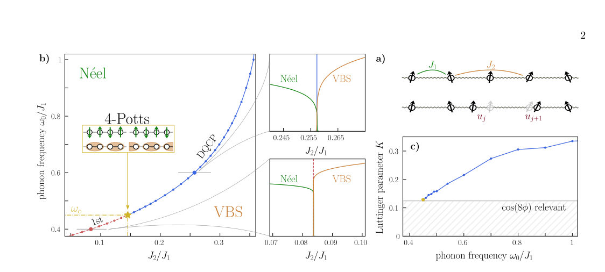
<figcaption class="paper-figure-caption"><b>Fig 1.</b> FIG. 1. Phase Diagram of a frustrated 1D spin-chain coupled to quantum phonons: a) We consider a 1D spin chain with antiferromagnetic nearest and next-nearest neighbor interactions and strong spin anisotropy ∆= 4. Spins are coupled to lattice distortions, modeled by site phonons with displacement uj at a single variable frequency ω0. b) Above the critical frequency ωc, the spin-phonon model realizes a line of deconfined quantum critical points with varying critical exponents between an Ising-N´eel ordered phase and a dimerized valence bond solid. The critical line ends at ωc, marked by an endpoint in the four-state Potts universality class. Below ωc the transition turns strongly...</figcaption>
</figure>
<figure class="paper-figure-card">
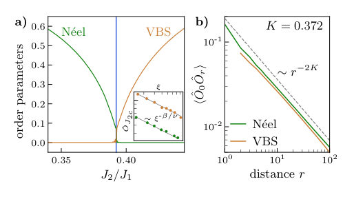
<figcaption class="paper-figure-caption"><b>Fig 2.</b> FIG. 2. Summary of Deconfined Criticality in a 1D spin chain: a) Upon tuning J2/J1, the model undergoes a continuous transition from a gapped phase with N´eel or- der to a dimerized VBS phase. Numerical data displays a weakly first-order transition with length scale set by the MPS correlation length ξ. Upon increasing the bond dimen- sion χ, order parameter residuals at the transition vanish as ˆOJ2c ∼ξ(χ)−β/ν ∼ξ−K (inset), indicating a continuous tran- sition in the thermodynamic limit, see main text for details. b) Order parameter correlations at the transitions decay al- gebraically, with exponent set by the Luttinger parameter K of the critical theory.</figcaption>
</figure>
<figure class="paper-figure-card">
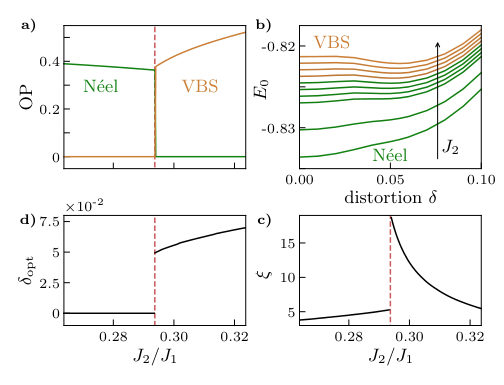
<figcaption class="paper-figure-caption"><b>Fig 3.</b> FIG. 3. Spin-Peierls Instability of DQC in a 1D spin chain: a) Static lattice distortions drive the DQCP to a strong first-order transition, displayed by a clear jump in the order parameter. b) Inside the VBS phase, the system favours a sudden distortion of the underlying lattice δ ̸= 0 to lower the ground state energy. c) The lattice instability is captured by a sudden jump of the optimal lattice distortion δopt at the transition. d) The correlation length displays clear first-order character.</figcaption>
</figure>
<figure class="paper-figure-card">
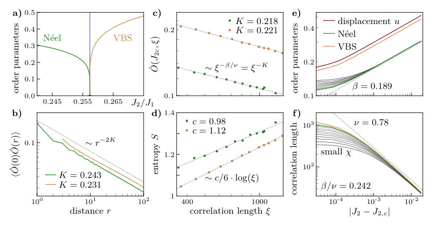
<figcaption class="paper-figure-caption"><b>Fig 4.</b> FIG. 4. DQCP in the spin-phonon model: a) When coupling to dynamical Einstein phonons with frequency ω0, the con- tinuous transition between N´eel and VBS phase persists above a critical phonon frequency ωc. b) Order parameter correlations at the transition decay algebraically, with power law exponent −2K governed by the Luttinger parameter of the critical theory. c) The order parameters develop a finite residual at the critical point, which vanishes with increasing correlation length ξ of the MPS ground state. The residuals are controlled using a sweep protocol initialized in one of the two ordered phases. Finite-size scaling predicts a power-law decay ˆOJ2c ∼ξ−β/ν = ξ−K, which we use to...</figcaption>
</figure>
<figure class="paper-figure-card">
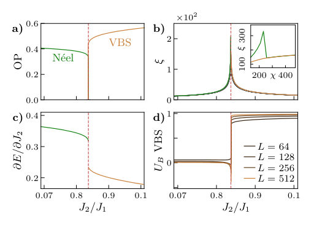
<figcaption class="paper-figure-caption"><b>Fig 5.</b> FIG. 5. Strong first-order transition in the spin- phonon model: Below a critical phonon frequency ωc, the transition between N´eel and VBS phase turns strongly first order. a) This is indicated by a clear jump in the order pa- rameters, b) rapid saturation of the correlation length, and c) a discontinuity in the energy derivative at the transition. d) Further evidence for a strong-first order transition is ob- tained from the VBS Binder Cumulant UB, which develops a diverging negative cusp with increasing system size. This behavior arises from a multi-peak distribution of the order pa- rameter in the presence of phase coexistence. Data obtained for ∆1 = ∆2 = 4, g = 0.25J1, ω0 = 0.4J1.</figcaption>
</figure>

**Summary.** The paper uses tensor network simulations to study DQCP in a 1D spin-phonon model. It finds that while the critical point exists at high phonon frequencies, coupling to lattice vibrations drives the transition into a strongly first-order regime below a critical frequency. This work provides quantitative signatures like spectral function anomalies for experimental detection.

**Why it may be interesting.** This work provides a concrete example of how lattice degrees of freedom can fundamentally alter the nature of quantum phase transitions predicted by purely electronic models, which is crucial for understanding real materials.

Detailed structure

**Main problem.** The study investigates how lattice vibrations (phonons) affect Deconfined Quantum Critical Points (DQCPs) in one-dimensional spin systems, determining if the transition remains continuous or becomes first-order.

**Main result.** The DQCP persists for high phonon frequencies but turns strongly first-order below a critical frequency ($\omega_c$), leading to an effective description by the double sine-Gordon model.

**Method.** Tensor network simulations (iDMRG/MPS) and bosonization techniques are employed across various limits, including static and dynamical spin-phonon coupling.

**Model / system.** The system is a 1D antiferromagnetic $J_1-J_2$ spin chain coupled to lattice vibrations via a spin-phonon interaction term ($H_{sp}$). The low-energy physics is mapped onto the double sine-Gordon model.

**Key observables.** Luttinger parameter (K), order parameters (Néel/VBS), phonon spectral function $A(q, \omega)$, and Binder cumulant ($U_B$).

**Important parameters / regimes.** Phonon frequency ($\omega_0$), critical frequency ($\omega_c$), coupling constants ($J_1, J_2$), and the effective coupling strength $
ho$.

**Assumptions / limitations.** The analysis relies on mapping to continuum theories (sine-Gordon) and using tensor network methods with finite bond dimensions ($\chi$) for numerical calculations.

**Figures summary.** Figures illustrate the phase diagram showing DQCP above $\omega_c$ terminating at a Potts endpoint, and demonstrating the transition changing from continuous (power-law decay) to strongly first-order (discontinuous jumps in order parameters).

**Paper structure.** The paper systematically analyzes the spin model via bosonization, then incorporates phonon coupling by examining static ($\omega_0 	o 0$) vs. dynamical ($\omega_0 > 0$) limits, culminating in quantitative measurements of critical exponents and spectral functions.

Abstract

Deconfined quantum critical points (DQCPs) describe continuous transitions between ordered phases beyond the Landau paradigm. A simple example is the Néel antiferromagnet (AFM) to valence bond solid (VBS) transition in a 1D antiferromagnetic $J_1-J_2$ model. In analogy to the spin-Peierls instability of critical spin chains, DQCPs are predicted to be unstable towards lattice distortions below a critical phonon frequency. In this work, we use tensor network simulations to investigate this instability in the antiferromagnetic $J_1-J_2$ model coupled to lattice vibrations. We confirm the stability of DQCP for large phonon frequencies and demonstrate that the transition turns strongly first-order below a critical frequency. The instability is caused by a reduction of the Luttinger parameter due to spin-phonon interactions and we identify the effective theory of the behavior as the double sine-Gordon model. The same effective theory is known to describe the classical Ashkin-Teller model, which enables us to show that the critical endpoint is in the four-state Potts universality class. Furthermore, we provide quantitative numerical scaling results for the phonon spectral function, offering an experimental signature to probe DQCP-phonon coupling in low-dimensional materials.

[↑ back to top](#top)

### ⭐ [Bulk Superconductivity driven by Disorder-Induced Delocalization in 4Hb-Ta(S$_{1-x}$Se$_x$)$_2$](http://arxiv.org/abs/2606.07509v1)

**Highlighted author(s):** Ehud Altman  
**Authors:** Lu Chen, Sae-Hee Ryu, Avior Almoalem, Yuanqi Lyu, Koh Yamakawa, Luke Pritchard Cairns, Ryan Day, Ehud Altman, Daniel Podolsky, Dung-Hai Lee, 4 Vidya Madhavan, Eli Rotenberg, James G. Analytis  
**Type:** both · **Category:** strongly correlated electrons · **PDF:** <https://arxiv.org/pdf/2606.07509v1>  
**Analysis basis:** full PDF text, analyzed in chunks
**Topic relevance:** `driven-dissipative phase transition` **2/5** · `Keldysh / 2PI / non-Gaussian methods` **1/5** · `Kondo & dissipative impurity` **1/5** · `analog quantum simulation` **1/5** · `methods for driven-dissipative` **1/5** · `non-equilibrium dynamics` **1/5**

↔ Scroll figures horizontally

<figure class="paper-figure-card">
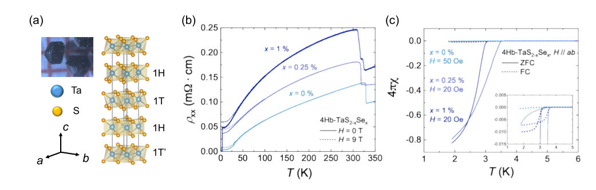
<figcaption class="paper-figure-caption"><b>Fig 1.</b> Figure 1. Sensitivity of superconductivity to Se substitution. (a) Crystal structure of 4Hb-Ta(S1−xSex)2. 1T- TaS2−xSex and 1H-TaS2−xSex layers stack along the crystal c axis with van der Waals coupling between the layers. Single crystals of 4Hb-Ta(S1−xSex)2 are also shown. (b) Temperature dependence of the in-plane electrical resistivity ρxx(T) for 4Hb-Ta(S1−xSex)2 single crystals with three different Se concentrations at magnetic fields of H = 0 T (solid line) and H = 9 T (short dashed line). Only the x = 0% sample shows a kink in resistivity around T ∼30 K due to the appearance of a 3 × 3 commensurate charge density wave (CCDW) in the 1H layer. This low-temperature CCDW transition is...</figcaption>
</figure>
<figure class="paper-figure-card">
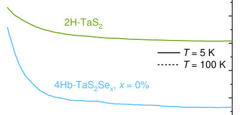
<figcaption class="paper-figure-caption"><b>Fig 2.</b> Figure 2. Evidence for delocalization transition in 4Hb- Ta(S1−xSex)2 as a function of Se substitution. Hall co- efficient RH in the high field limit at low temperature (5 K, solid lines) and high temperature (100 K, dashed lines) mea- sured in 2H-TaS2 (green curves) and 4Hb-Ta(S1−xSex)2 sam- ples at x = 0% (light blue curves) and 1% (dark blue curves). At all temperatures the 4Hb-Ta(S1−xSex)2 x = 0% sample has roughly half the carriers of 2H-TaS2, consistent with all the carriers in the 1T layers being localized. At low tem- peratures the 4Hb-Ta(S1−xSex)2 at x = 1% sees a dramatic change where the Hall coefficient not only changes sign, but asymptotes to small value of RH, suggesting a...</figcaption>
</figure>
<figure class="paper-figure-card">
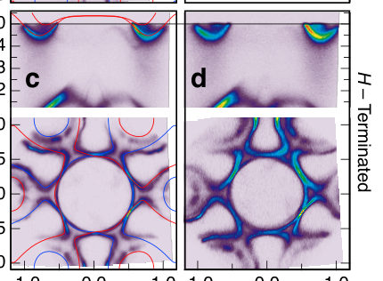
<figcaption class="paper-figure-caption"><b>Fig 3.</b> Figure 3. ARPES evidence for a delocalization transi- tion in 4Hb-Ta(S1−xSex)2. Slices of the full ARPES Bind- ing Energy (BE) vs. k data set for (a,b) 1T-terminated and (c,d) 1H-terminated regions of the sample surface. The up- per part of each panel is a bandstructure slice (BE vs. kx at ky = 0, while the lower part is the intensity distribution at EF along kx and ky. The ARPES data shows the same dramatic effect as the electrical Hall effect: there is a filling of the CDW gap in the 1H layers (red circles) while in the 1T layer a metallic Fermi surface appears near Γ with 1% Se substitution. The data are collected at photon energy 72 eV, and all panels use the same color scale linearly...</figcaption>
</figure>
<figure class="paper-figure-card">
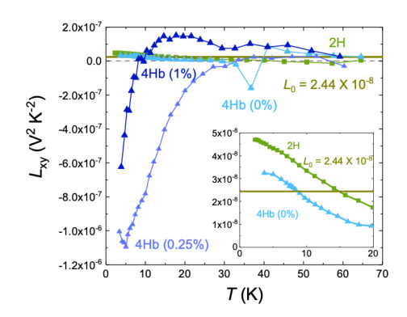
<figcaption class="paper-figure-caption"><b>Fig 4.</b> Figure 4. Lorenz number from the thermal Hall con- ductivity in 4Hb-Ta(S1−xSex)2. Calculated Lorenz num- ber Lxy = κxy/(Tσxy) in 2H-TaS2, 4Hb-Ta(S1−xSex)2 x = 0%, x = 0.25%, and 1% samples in a magnetic field of H = 9 T. The Wiedemann-Franz law is mostly fulfilled in 2H-TaS2 and pristine 4Hb-Ta(S1−xSex)2(as shown in the in- set panel), while it is strongly violated in the Se substituted 4Hb-Ta(S1−xSex)2 samples.</figcaption>
</figure>
<figure class="paper-figure-card">
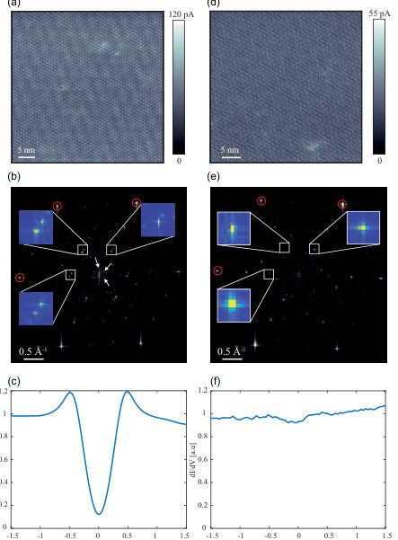
<figcaption class="paper-figure-caption"><b>Fig 5.</b> Figure 5. Correlation between the SC-gap and CDW domains in pristine 4Hb-TaS2. (a) Atomically resolved topography of the 1H layer (V = −5mV, I = 70mV). (b) Fast Fourier transform (FFT) of the topography in (a), with white arrows indicating central moir´e peaks. (c) Averaged tunneling spectrum acquired on the surface shown in (a), displaying a well-defined superconducting gap (Vset = -1.5 mV, I = 70 pA, Vmodulation = 30 µeV). (d, e) Topography and corresponding FFT at a different location showing unsplit CDW peaks. (f) Averaged spectrum in the region shown in (d), indicating a highly suppressed gap (Vset = -2 mV, I = 100 pA, Vmodulation = 40 µeV). Spectra in (c) and (f) were taken with the...</figcaption>
</figure>

**Summary.** This paper demonstrates that introducing controlled disorder via Se substitution into the superconductor $4	ext{Hb-Ta}(	ext{S}_{1-x}	ext{Se}_x)_2$ is necessary to induce bulk superconductivity. The mechanism proposed is a disorder-driven delocalization of carriers within a Mott-like layer, which fundamentally alters the electronic band structure and stabilizes the superconducting state.

**Why it may be interesting.** The work provides a detailed experimental roadmap for linking structural disorder directly to the emergence of unconventional electronic phases in strongly correlated materials, which is highly relevant for understanding emergent quantum phenomena.

Detailed structure

**Main problem.** The study investigates the primary mechanism driving unconventional superconductivity in $4	ext{Hb-Ta}(	ext{S}_{1-x}	ext{Se}_x)_2$, specifically determining if disorder-induced carrier delocalization is responsible.

**Main result.** Bulk superconductivity emerges only when Se doping introduces quenched disorder, suggesting that the fragility of the Mott state and subsequent carrier delocalization in the T-layer are key drivers for pairing.

**Method.** The research combines multiple experimental techniques including ARPES, STM, transport measurements ($
ho_{xx}, \kappa$), and theoretical modeling (Tight-Binding) to probe electronic structure changes across doping levels.

**Model / system.** The system is the layered superconductor $4	ext{Hb-Ta}(	ext{S}_{1-x}	ext{Se}_x)_2$, which features interleaved Mott-like ($1T$) and metallic ($1H$) layers. The physics centers on charge transfer, flat band behavior, and correlation effects.

**Key observables.** Superconducting Volume Fraction (SCVF), Hall coefficient $R_H(H)$, ARPES spectral weight/band structure changes, Thermal Conductivity ($\kappa_{xx}, \kappa_{xy}$), and Lorenz number ($L$).

**Important parameters / regimes.** Se concentration ($x$), temperature ($T$), magnetic field ($H$), and the ratio of Coulomb repulsion to bandwidth ($U/W$) related to Mott physics.

**Assumptions / limitations.** The analysis assumes that Se substitution primarily acts by introducing local disorder, which drives electronic transitions rather than solely controlling carrier density via charge transfer alone.

**Figures summary.** Figures show ARPES evidence of new metallic states upon doping; STM correlates SC gaps with CDW domain structure; transport measurements track the suppression of thermal and electrical properties as Se is added.

**Paper structure.** The paper systematically analyzes how Se substitution modifies electronic structure (ARPES/XPS) leading to a delocalization transition, which is then correlated across multiple diagnostics: superconductivity onset (SCVF), charge transport ($
ho_{xy}(H)$), and heat transport ($\kappa$, $L$).

Abstract

The unconventional superconductor 4Hb-TaS$_2$ is a natural heterostructure that can be broadly understood as interleaving Mott-like and metallic layers. We study the properties of this material as a function of quenched disorder in the form of Se/S substitution and find that while disordered samples show bulk superconductivity, clean samples do not. We show that a disorder-driven delocalization of carriers in the Mott-like ($1T$-) layer forms a new Fermi surface that is absent in the cleanest samples. This suggests that one of the primary drivers for superconductivity is the fragility of the Mott state, whose delocalization brings to life a sea of strongly correlated electrons.

[↑ back to top](#top)

### [Vacuum fluctuation induced quantum resource harvesting in triple-layer graphene](http://arxiv.org/abs/2606.07306v1)

**Authors:** Yassine Dakir, Abdallah Slaoui, Rachid Ahl Laamara  
**Type:** theory · **Category:** quantum information and computing · **PDF:** <https://arxiv.org/pdf/2606.07306v1>  
**Analysis basis:** full PDF text, analyzed in chunks
**Topic relevance:** 🔥 `entanglement & information structure` **5/5** · 🔥 `analog quantum simulation` **4/5** · 🔥 `correlated / nonlocal dissipation` **4/5** · 🔥 `methods for driven-dissipative` **4/5** · `Tavis-Cummings & cavity-many-emitter` **3/5** · `correlated cavity matter` **3/5** · `driven-dissipative phase transition` **3/5** · `non-equilibrium dynamics` **3/5** · `Keldysh / 2PI / non-Gaussian methods` **2/5** · `non-equilibrium universality` **2/5** · `spintronics-quantum-optics interface` **2/5** · `Kondo & dissipative impurity` **1/5** · `exotic spin models in light-matter` **1/5** · `interference shaping light` **1/5** · `quantum measurements` **1/5**

↔ Scroll figures horizontally

<figure class="paper-figure-card">
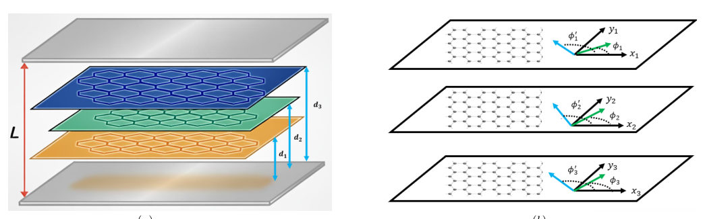
<figcaption class="paper-figure-caption"><b>Fig 1.</b> FIG. 1. (a) Physical configuration of the triple-layer graphene cavity system and (b) the initial/final momentum angles of conduction electrons.</figcaption>
</figure>
<figure class="paper-figure-card">
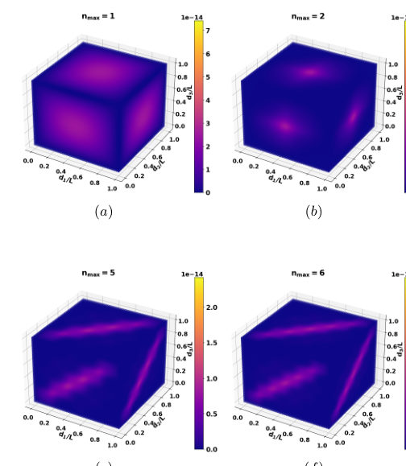
<figcaption class="paper-figure-caption"><b>Fig 2.</b> FIG. 2. Relative entropy of coherence Cr over α2(t) as a function of di</figcaption>
</figure>
<figure class="paper-figure-card">
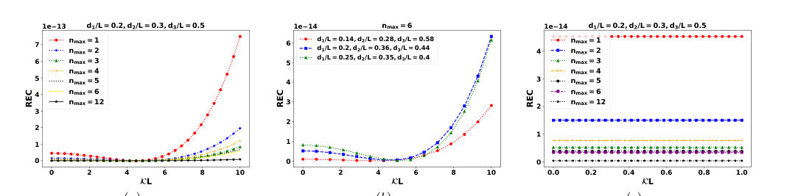
<figcaption class="paper-figure-caption"><b>Fig 3.</b> FIG. 3. REC Cr over α2(t) as a function of the momentum K (a) for different values of nmax (b) for different positions of the layers di</figcaption>
</figure>
<figure class="paper-figure-card">
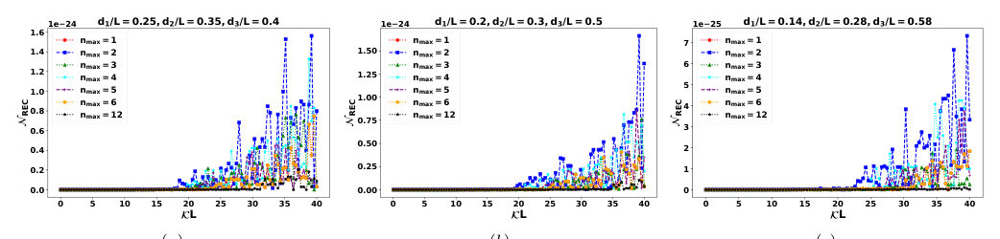
<figcaption class="paper-figure-caption"><b>Fig 4.</b> FIG. 4. Non-Markovianity dynamics measured by NREC as a function of the momentum K for different values of nmax, with varying values of (a) ( d1</figcaption>
</figure>
<figure class="paper-figure-card">
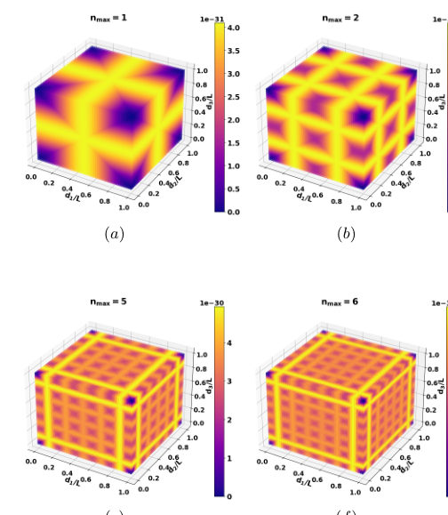
<figcaption class="paper-figure-caption"><b>Fig 5.</b> FIG. 5. Tangle Tg over α2(t) as a function of di</figcaption>
</figure>

**Summary.** The paper models quantum phenomena in triple-layer graphene placed inside an optical microcavity, utilizing vacuum fluctuations as the mediating interaction. By calculating coherence, entanglement, and non-Markovianity using advanced theoretical tools, the authors demonstrate that these quantum resources can be precisely controlled by tuning geometric parameters like layer spacing and rotation angles.

**Why it may be interesting.** This work directly addresses quantum resource engineering using solid-state platforms (graphene) coupled to photonic environments, which is a major theme at the intersection of AMO physics and quantum information theory.

Detailed structure

**Main problem.** The study investigates how quantum coherence, entanglement, and non-Markovian dynamics can be generated and controlled in a triple-layer graphene system interacting with vacuum fluctuations within a microcavity.

**Main result.** The analysis establishes cavity-confined TLG as a highly tunable platform where quantum resources are sensitive to geometric parameters like layer separation and interlayer rotation angles.

**Method.** The authors use time-dependent perturbation theory to derive an exact analytic solution for the system's reduced density matrix, followed by calculating specific quantum information measures.

**Model / system.** The physical system is a triple-layer graphene (TLG) structure embedded in a planar microcavity. The dynamics are governed by a Hamiltonian involving free electron terms and coupling to quantized cavity electromagnetic fields.

**Key observables.** Relative Entropy of Coherence (REC), Tangle ($T_g$) for tripartite entanglement, and Non-Markovianity ($	ext{NREC}$).

**Important parameters / regimes.** Number of cutoff modes ($n_{\max}$), spatial positioning/separation ratios ($d_i/L$), interlayer rotation angles ($\phi, \phi'$), and momentum transfer ($K$).

**Assumptions / limitations.** The analysis relies on the low-energy Dirac approximation for graphene and is performed perturbatively (up to second order in time).

**Figures summary.** Figures illustrate the dependence of REC on layer separation and cutoff modes, and show the temporal evolution of non-Markovianity ($	ext{NREC}$) versus $n_{\max}$ and angular configurations.

**Paper structure.** The paper builds from defining the coupled Hamiltonian to deriving the time evolution operator via perturbation theory. It then calculates the reduced density matrix by tracing out the cavity field, culminating in the quantitative analysis of coherence, entanglement, and memory effects based on calculated traces.

Abstract

We examine the non-Markovian dynamics and the generation of quantum coherence and entanglement within a triple-layer graphene (TLG) system embedded in a planar microcavity. Using time-dependent perturbation theory, we derive an exact analytic solution for the system and demonstrate how the confined electromagnetic field mediates quantum correlations between the graphene layers. We employ three complementary measures; the relative entropy of coherence (REC) to quantify quantum coherence, the tangle to assess tripartite entanglement, and a non-Markovianity measure derived from the REC to characterize quantum memory effects. Our analysis reveals that these quantum resources exhibit remarkable sensitivity to various control parameters. Specifically, we demonstrate that the number of cutoff modes, the spatial positioning of the layers, the momentum parameter, and the interlayer rotation angles provide effective control over coherence, entanglement, and memory effects. We further show that these measures exhibit an exceptional sensitivity to the rotation angle between the layers. Ultimately, our results establish cavity-confined TLG as a highly tunable platform for exploring vacuum-mediated quantum phenomena, providing a framework for the precise manipulation of quantum correlations in graphene-based photonic and optoelectronic devices.

[↑ back to top](#top)

### [Collective decay of interacting bosons](http://arxiv.org/abs/2606.06621v1)

**Authors:** Bennet Windt, Lorenzo Rossi, Alexander V. Poshakinskiy, Daniel Malz, Dominik S. Wild  
**Type:** theory · **Category:** other · **PDF:** <https://arxiv.org/pdf/2606.06621v1>  
**Analysis basis:** full PDF text, analyzed in chunks
**Topic relevance:** 🔥 `Dicke superradiance` **5/5** · 🔥 `analog quantum simulation` **4/5** · 🔥 `correlated / nonlocal dissipation` **4/5** · `Tavis-Cummings & cavity-many-emitter` **3/5** · `correlated cavity matter` **3/5** · `driven-dissipative phase transition` **3/5** · `methods for driven-dissipative` **3/5** · `non-equilibrium dynamics` **2/5** · `non-equilibrium universality` **2/5** · `superradiant laser` **2/5** · `Keldysh / 2PI / non-Gaussian methods` **1/5** · `entanglement & information structure` **1/5** · `free-space correlated emission` **1/5**

↔ Scroll figures horizontally

<figure class="paper-figure-card">
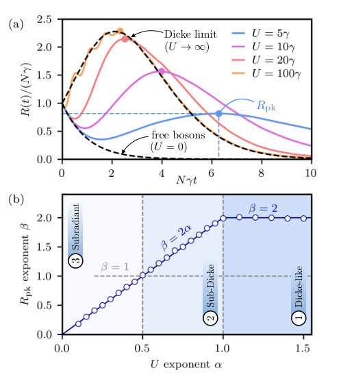
<figcaption class="paper-figure-caption"><b>Fig 1.</b> FIG. 1. Bosonic collective decay. (a) Emission rate dynamics for N = 10 resonators subject to varied interaction strengths U. The limiting cases of two-level emitters (U →∞) and free bosons (U = 0) are indicated by black dashed lines. (b) Regimes of collective emission for a tunable non-linearity U ∼γN α, characterized by distinct asymptotic scalings of the peak emission rate Rpk ∼γN β. We plot the relation between the scaling exponents α and β as given by our theoretical pre- diction (solid line) and extracted from permutation-invariant numerical simulations (markers).</figcaption>
</figure>
<figure class="paper-figure-card">
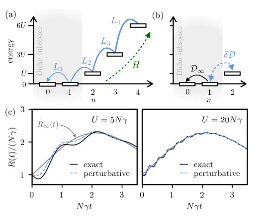
<figcaption class="paper-figure-caption"><b>Fig 2.</b> FIG. 2. Large-U dynamics. (a) Schematic illustration of the auxiliary lattice model, Eq. (3). The action of the Hamiltonian and the collective jump operator are indicated graphically. (b) Graphical representation of the action of the diagonal dissipator D∞and the leading-order large-U perturbative correction δD on the auxiliary lattice. (c) Comparison of the exact and perturbative emission dynamics for N = 10 and two large values of U. The Dicke solution R∞(t) is shown for reference.</figcaption>
</figure>
<figure class="paper-figure-card">
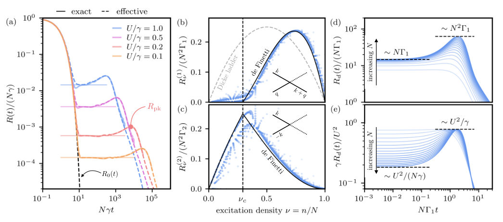
<figcaption class="paper-figure-caption"><b>Fig 3.</b> FIG. 3. Small-U dynamics. (a) Comparison of the exact (solid) and effective (dashed) emission dynamics for N = 30 and varied U in the small-U regime. The analytical values of the emission rate plateaus Rd(0) [41] are indicated by horizontal lines and the emission rate R0(t) for U = 0 is also included for reference. (b) Transition rates R(1) n and (c) R(2) n in the ground state manifold of the effective Hamiltonian Hd (blue markers), for system sizes N = 10, 20, . . . , 100 (indicated by shading). The de Finetti predictions obtained in the End Matter (along with the associated critical excitation density νc = 1 −1/ √</figcaption>
</figure>
<figure class="paper-figure-card">
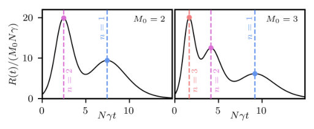
<figcaption class="paper-figure-caption"><b>Fig 4.</b> FIG. 4. Multi-peak dynamics. Dynamics of multi-excited initial Fock states with M0 = 2 (left) and M0 = 3 (right) initial excitations per mode, for N = 100 modes. The emission burst peaks are indicated by vertical dashed lines.</figcaption>
</figure>

**Summary.** The paper explores the collective decay of interacting bosons, modeling it as an analog to the Dicke model. It identifies distinct physical regimes based on interaction strength, showing crossovers from superradiant to subradiant emission. The methodology successfully reduces complex many-body dynamics into manageable rate equations, providing deep insights applicable to circuit QED experiments.

**Why it may be interesting.** This work provides a detailed theoretical understanding of how bosonic statistics modify fundamental quantum phenomena like superradiance, offering predictive scaling laws ($eta = 2\alpha$ vs $eta=2$) applicable to cavity QED implementations.

Detailed structure

**Main problem.** The study investigates the collective decay dynamics of interacting bosonic modes, serving as a bosonic analog to the Dicke model of superradiance.

**Main result.** Distinct regimes are found based on interaction strength: strong interactions yield Dicke-like superradiance, while weak interactions cause a crossover to subradiant emission that surprisingly retains an analogy to rate equations.

**Method.** The analysis combines analytical arguments (e.g., adiabatic elimination, variational methods) with large-scale numerical simulations leveraging the problem's permutational symmetry.

**Model / system.** The system consists of $N$ bosonic resonators interacting via a repulsive on-site interaction ($U$) and undergoing collective decay governed by a Lindblad master equation. The dynamics are analyzed in various limits, including non-interacting ($U=0$), large-$U$, and small-$U$.

**Key observables.** Collective emission rate $R(t)$, peak emission rate $R_{pk}$, and the scaling exponent $eta$ of $R_{pk}$ with system size $N$.

**Important parameters / regimes.** Interaction strength ($U$), decay rate ($\gamma$), system size ($N$), and excitation density ($
u$). Key regimes are defined by the ratio $U/(\gamma N)$.

**Assumptions / limitations.** The analysis frequently restricts itself to the permutation-invariant subspace, and in some limits (small-$U$), it relies on adiabatic elimination or approximations based on the quantum de Finetti theorem.

**Figures summary.** Figures illustrate emission rate dynamics for varying interaction strengths, plot scaling exponents ($eta$ vs $\alpha$), and visualize the structure of the effective dark subspace states and associated rate equations.

**Paper structure.** The paper systematically analyzes the decay in different coupling regimes ($U \gg N\gamma$, $U \ll N\gamma$) by mapping the full dynamics onto simplified, yet physically accurate, sets of coupled rate equations or restricted subspaces.

Abstract

We study a bosonic analog of the paradigmatic Dicke model of superradiance, comprising interacting bosonic modes subject to fully symmetric collective decay. Depending on the interaction strength, we uncover qualitatively distinct regimes of emission. For strong interactions, the emission closely resembles Dicke superradiance, with perturbative corrections arising from the presence of additional levels. For weaker interactions, the bosonic statistics qualitatively changes the dynamics, leading to a crossover to subradiant emission. Remarkably, we show that the dynamics in this regime can be described by rate equations analogous to those of the Dicke model despite the large accessible bosonic Hilbert space. Our findings are based on a combination of analytical arguments and large-scale numerics enabled by the permutational symmetry of the problem and may be probed in circuit QED experiments.

[↑ back to top](#top)

### [Higher-order Symmetric Quantum Mpemba Effect in Fragmented Systems](http://arxiv.org/abs/2606.06653v1)

**Authors:** Sreemayee Aditya, Sara Murciano, Xhek Turkeshi  
**Type:** theory · **Category:** statistical mechanics · **PDF:** <https://arxiv.org/pdf/2606.06653v1>  
**Analysis basis:** full PDF text, analyzed in chunks
**Topic relevance:** 🔥 `scars & prethermalization` **5/5** · 🔥 `entanglement & information structure` **4/5** · 🔥 `non-equilibrium dynamics` **4/5** · `correlated / nonlocal dissipation` **3/5** · `driven-dissipative phase transition` **3/5** · `methods for driven-dissipative` **3/5** · `non-equilibrium universality` **3/5** · `Keldysh / 2PI / non-Gaussian methods` **2/5** · `Kondo & dissipative impurity` **1/5** · `analog quantum simulation` **1/5** · `measurement-induced transitions` **1/5**

↔ Scroll figures horizontally

<figure class="paper-figure-card">
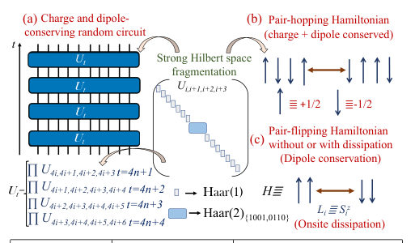
<figcaption class="paper-figure-caption"><b>Fig 1.</b> Figure 1. Schematic and summary of our study.</figcaption>
</figure>
<figure class="paper-figure-card">
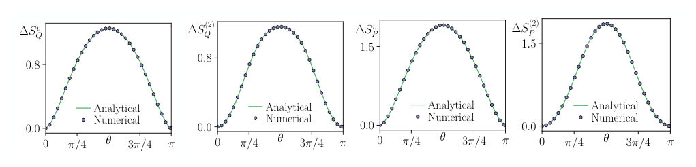
<figcaption class="paper-figure-caption"><b>Fig 2.</b> Figure 2. Von Neumann and R´enyi-2 asymmetries associated with charge and dipole for an initial pure spin-1/2 tilted ferromagnetic state, computed for a boundary subsystem of size LA = 3 as a function of the tilting angle. In all cases, the analytical results are in excellent agreement with the numerical data.</figcaption>
</figure>
<figure class="paper-figure-card">
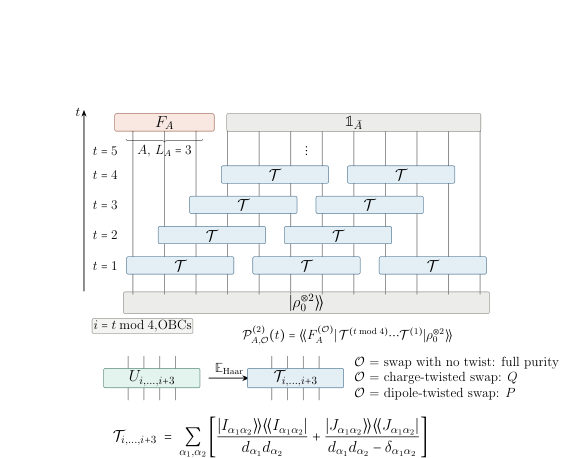
<figcaption class="paper-figure-caption"><b>Fig 3.</b> Figure 3. Replica tensor network for the charge- and dipole- conserving random circuit. The contraction gives the R´enyi-2 purity-like quantities shown for L = 12 and LA = 3. Each in- teger time step applies one staggered layer of Haar-averaged four-site transfer operators, shifted by one site relative to the previous step under OBCs. The lower panel shows how Haar averaging of (U ∗⊗U)⊗2 gives the four-site transfer tensor Ti,...,i+3, subject to the appropriate charge and dipole con- straints. Here O is the untwisted swap for purity, while O = Q and P are the charge- and dipole-twisted swap contractions for charge and dipole-resolved purity, respectively.</figcaption>
</figure>
<figure class="paper-figure-card">
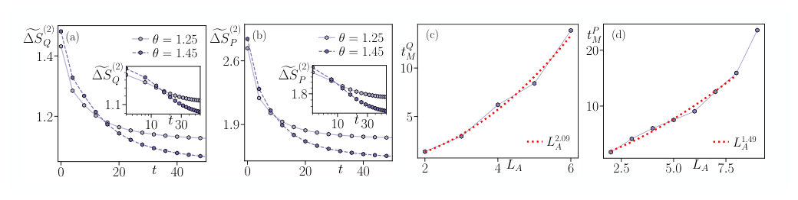
<figcaption class="paper-figure-caption"><b>Fig 4.</b> Figure 4. Charge and dipole asymmetry dynamics in a charge- and dipole-conserving Haar-random circuit with L = 128. (a-b) Charge and dipole second-R´enyi asymmetries for tilted ferromagnetic initial states with θ = 1.25 and θ = 1.45, computed for a boundary subsystem of size LA = 6 using a replica tensor-network method with bond dimension χ = 512. The curves exhibit a quantum-Mpemba-effect-like crossing, followed by slow late-time relaxation to a nonzero saturation value, as shown in the log-log insets. (c-d) Crossing times tQ M and tP M vs LA. For small LA, the data showcases tQ M ∝L2.09 A and tP M ∝L1.49 A ; for larger LA, the crossings disappear within the accessible time window.</figcaption>
</figure>
<figure class="paper-figure-card">
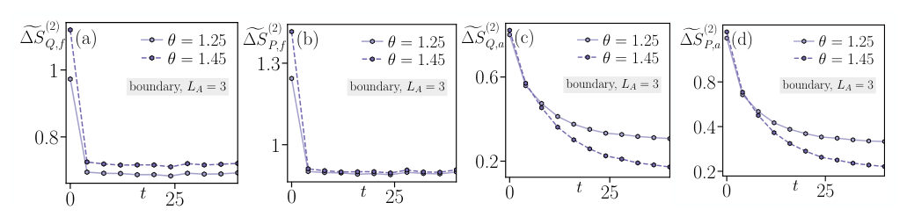
<figcaption class="paper-figure-caption"><b>Fig 5.</b> Figure 5. Frozen and active contributions to the R´enyi-2 entanglement asymmetries for a boundary subsystem in the charge- and dipole-conserving random circuit. The data are obtained for system size L = 16 and subsystem size LA = 3, starting from tilted ferromagnetic initial states with θ = 1.25 and θ = 1.45. Panels (a,b) show the frozen-sector charge and dipole asymmetries, ∆S(2) Q,fr and ∆S(2) P,fr, while panels (c,d) show the corresponding active-sector asymmetries, ∆S(2) Q,act and ∆S(2) P,act. The frozen-sector asymmetries saturate at nonzero plateaux and preserve the ordering between the two initial angles. By contrast, the active- sector asymmetries decay in time and exhibit...</figcaption>
</figure>

**Summary.** This work explores the survival of the quantum Mpemba effect in highly fragmented quantum systems governed by multiple conserved quantities. By analyzing random circuits, deterministic Hamiltonians, and toy models, the authors demonstrate that fragmentation does not eliminate the effect but rather reinterprets it as a combination of memory retention (frozen sector) and active relaxation dynamics.

**Why it may be interesting.** It provides a general theoretical framework showing how fundamental non-equilibrium phenomena like the Mpemba effect persist even when quantum dynamics are severely constrained by multiple conservation laws and fragmentation.

Detailed structure

**Main problem.** The study investigates whether the quantum Mpemba effect, related to symmetry restoration, survives when a system's Hilbert space is fragmented by multiple conservation laws.

**Main result.** A higher-order symmetric quantum Mpemba effect (SQME) is found, which reshapes the standard QME into contributions from 'frozen memory' and 'active-fragment relaxation.'

**Method.** The research employs replica tensor-network formulations for random circuits, Chebyshev polynomial expansions for Hamiltonians, and analytical solutions for dissipative toy models.

**Model / system.** The analysis covers three settings: a charge/dipole conserving random circuit; a pair-hopping Hamiltonian; and an analytically tractable dissipative pair-flip model. These systems are characterized by strong Hilbert-space fragmentation due to conserved charges (U(1) charge and dipole moment).

**Key observables.** Entanglement asymmetry ($\Delta S^{(n)}_O$), which serves as the diagnostic for the Mpemba phenomenon.

**Important parameters / regimes.** System size ($L$, up to 128 in RTN), conservation laws (charge $Q$ and dipole moment $P$), and dissipation rate ($\gamma$).

**Assumptions / limitations.** The random circuit analysis relies on replica tensor networks for averaging; the dissipative model uses a Markovian approximation.

**Figures summary.** Figures illustrate the comparison of results across three settings (RTN, Hamiltonian simulation, Lindblad dynamics), showing QME crossings and the separation into frozen/active dynamic sectors.

**Paper structure.** The paper systematically analyzes the QME in increasingly complex models: first random circuits using RTNs, then deterministic Hamiltonians via Chebyshev methods, and finally a simple dissipative toy model to isolate the mechanism.

Abstract

A quantum system can restore a broken symmetry faster the more strongly it initially breaks it, an anomaly known as the quantum Mpemba effect. Whether this effect survives once conservation laws fragment the Hilbert space into exponentially many disconnected Krylov sectors has remained open. We address this question for circuits and Hamiltonians with simultaneous charge and dipole conservation, the paradigmatic setting for strong Hilbert-space fragmentation. Combining a replica tensor-network formulation for charge and dipole-conserving gates, which reaches the annealed Rényi-2 entanglement asymmetry up to $L=128$, with Hamiltonian simulations and an exactly solvable dissipative model, we uncover a higher-order symmetric quantum Mpemba effect: the charge and dipole asymmetries each display Mpemba-like crossings on parametrically distinct timescales. Resolving the state into frozen and active Krylov sectors reveals the mechanism: frozen fragments retain a finite asymmetry that obstructs full restoration, while active fragments host the relaxation responsible for the crossings. Fragmentation thus does not preclude the quantum Mpemba effect but reshapes it into frozen memory and active-fragment relaxation, providing a framework for the Mpemba phenomenology of higher-moment symmetries.

[↑ back to top](#top)

### [Quantum correlations and coherence in a two-qubit anisotropic $XY$ under magnetic field](http://arxiv.org/abs/2606.07051v1)

**Authors:** Ahmed Jellal, Pablo Díaz, David Laroze  
**Type:** theory · **Category:** statistical mechanics · **PDF:** <https://arxiv.org/pdf/2606.07051v1>  
**Analysis basis:** full PDF text, analyzed in chunks
**Topic relevance:** 🔥 `entanglement & information structure` **5/5** · 🔥 `analog quantum simulation` **4/5** · `correlated / nonlocal dissipation` **3/5** · `exotic spin models in light-matter` **3/5** · `driven-dissipative phase transition` **2/5** · `methods for driven-dissipative` **2/5** · `non-equilibrium dynamics` **2/5** · `Keldysh / 2PI / non-Gaussian methods` **1/5** · `non-equilibrium universality` **1/5** · `spintronics-quantum-optics interface` **1/5**

↔ Scroll figures horizontally

<figure class="paper-figure-card">
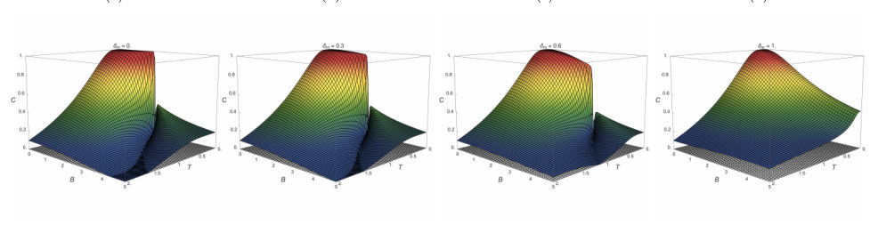
<figcaption class="paper-figure-caption"><b>Fig 1.</b> FIG. 1. Concurrence C as a function of temperature T, and magnetic field B for δc = 0.9, J = 1, and D = 2. Panels (a)–(d) correspond to δm = 0, 0.3, 0.6, and 1, respectively.</figcaption>
</figure>
<figure class="paper-figure-card">
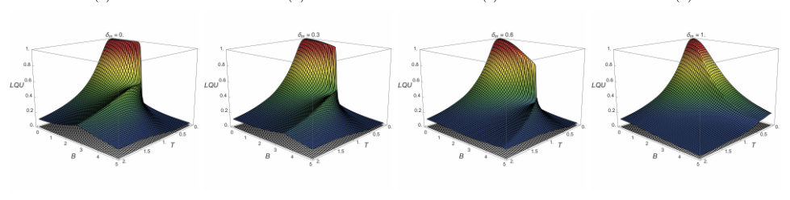
<figcaption class="paper-figure-caption"><b>Fig 2.</b> FIG. 2. Local quantum uncertainty (LQU) as a function of temperature T, and magnetic field B for δc = 0.9, J = 1, and D = 2. Panels (a)–(d) correspond to δm = 0, 0.3, 0.6, and 1, respectively.</figcaption>
</figure>
<figure class="paper-figure-card">
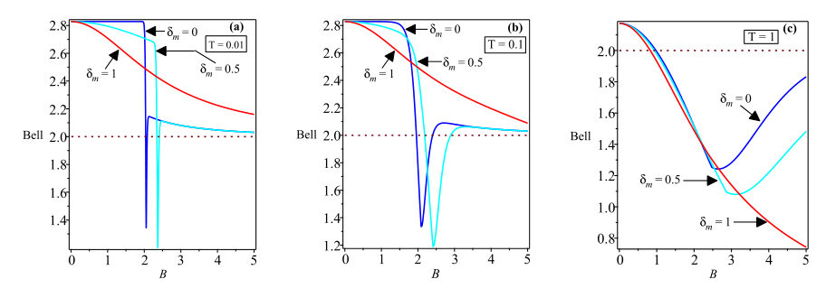
<figcaption class="paper-figure-caption"><b>Fig 3.</b> FIG. 3. Effect of magnetic anisotropy δm, and temperature T on the Bell–CHSH observable B as a function of the magnetic field B for D = 1, J = 1, and δc = 1.</figcaption>
</figure>
<figure class="paper-figure-card">
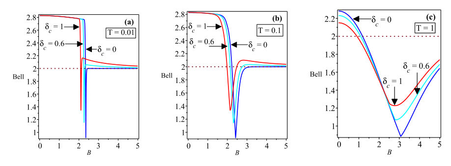
<figcaption class="paper-figure-caption"><b>Fig 4.</b> FIG. 4. Effect of the coupling anisotropy δc, and temperature T on the Bell–CHSH observable B as a function of the magnetic field B for D = 2, J = 1, and δm = 0.3.</figcaption>
</figure>
<figure class="paper-figure-card">
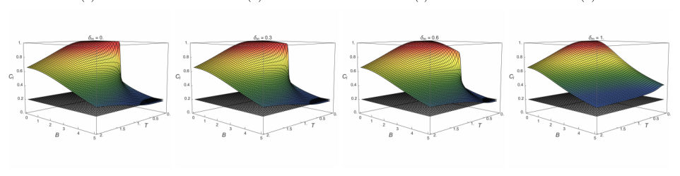
<figcaption class="paper-figure-caption"><b>Fig 5.</b> FIG. 5. Quantum coherence Cl as a function of temperature T ∈[0, 2], and magnetic field B ∈[0, 5] for δc = 0.9, J = 1, and D = 2. Panels (a)–(d) correspond to δm = 0, 0.3, 0.6, and 1, respectively.</figcaption>
</figure>

**Summary.** The paper analyzes thermal degradation of quantum resources—including entanglement and nonlocality—in an anisotropic two-qubit XY model. It establishes a hierarchy showing that coherence ($\mathcal{C}_l$) is the most resilient resource against temperature fluctuations, while anisotropy parameters allow for active control over these quantum correlations.

**Why it may be interesting.** This work provides a quantitative framework for understanding how environmental noise (temperature) degrades different forms of quantum information in structured spin systems, which is crucial for designing robust quantum memories or processors.

Detailed structure

**Main problem.** The study investigates how thermal quantum correlations, entanglement, and coherence behave in a two-qubit anisotropic XY model subjected to an external magnetic field.

**Main result.** A clear hierarchy of resource degradation is established: nonlocality vanishes first, followed by entanglement, while quantum coherence persists the longest against increasing temperature. Anisotropy parameters offer tunable control over these resources.

**Method.** The analysis uses the canonical density operator $\rho(T)$ derived from the system's Hamiltonian and calculates various quantum measures using explicit matrix elements.

**Model / system.** The physical model is a two-qubit anisotropic Heisenberg XY model incorporating Dzyaloshinskii-Moriya (DM) interaction, analyzed under thermal equilibrium conditions defined by temperature $T$ and magnetic field $B$.

**Key observables.** Concurrence ($C$, entanglement), Local Quantum Uncertainty (LQU), Bell–CHSH nonlocality ($\mathbb{B}$), and $\ell_1$-norm coherence ($\mathcal{C}_l$).

**Important parameters / regimes.** Magnetic anisotropy ($\delta_m$), coupling anisotropy ($\delta_c$), DM interaction strength ($D$), Temperature ($T$), and external magnetic field ($B$).

**Assumptions / limitations.** The system's state is described by the thermal density operator $\rho(T)$, which is analyzed using X-state approximations for certain calculations.

**Figures summary.** Figures illustrate the dependence of LQU, Bell nonlocality ($\mathbb{B}$), and coherence ($\mathcal{C}_l$) on temperature ($T$), magnetic field ($B$), and anisotropy parameters ($\delta_m$, $\delta_c$).

**Paper structure.** The paper systematically analyzes four key quantum indicators—entanglement, LQU, nonlocality, and coherence—by varying external fields and internal anisotropies to map out the hierarchy of resource robustness.

Abstract

We study thermal quantum correlations and coherence in Heisenberg $XY$ model with anisotropic interactions under a uniform magnetic field $ B $. Using concurrence $C$, local quantum uncertainty (LQU), Bell-Clauser-Horne-Shimony-Holt (CHSH) nonlocality $ \mathbb{B}$, and coherence $C_l$ as quantifiers, we analyze how magnetic anisotropy $ δ_m $, coupling anisotropy $ δ_c $, Dzyaloshinskii-Moriya (DM) interaction $ D $, temperature $ T $, and magnetic field $ B $ modulate quantum resources. At low temperatures and relevant magnetic fields, the entanglement is maximized, but exhibits sudden death for $ δ_m = 0 $, which turns into a smooth decay as $ δ_m $ increases, highlighting its stabilizing role. LQU shows that stronger anisotropy suppresses quantum correlations, while $ \mathbb{B} $ induces a non-monotonic response peaking at a critical field $ B_c $. Bell-CHSH nonlocality violations ($ \mathbb{B} > 2 $) persist below $ B_c $, but thermal noise ($ T \geq 1 $) suppresses them. Coherence $ C_l $ is most robust to thermal fluctuations, especially for high \( δ_m \), which also dampens abrupt quantum phase transitions. The DM interaction is essential for entanglement generation, with $ D $ and anisotropy synergistically enhancing correlation resilience. We identify a hierarchy of thermal degradation: nonlocality ($ \mathbb{B} $) vanishes first, followed by entanglement ($ C $), then general quantum correlations (LQU), while coherence $ C_l $ persists the longest. These results demonstrate tunable control of quantum resources via anisotropy and external parameters, providing insights for the design of robust spin-based quantum technologies.

[↑ back to top](#top)

### [A superconducting surface-code processor with lattice-surgery logical operations](http://arxiv.org/abs/2606.06598v1)

**Authors:** Yanzhe Wang, Fanhao Shen, Haipeng Xie, Aosai Zhang, Yu Gao, Chuanyu Zhang, Xuhao Zhu, Feitong Jin, Yiren Zou, Ning Wang, Zhengyi Cui, Zehang Bao, Zitian Zhu, Jiarun Zhong, Gongyu Liu, Jia-Nan Yang, Yihang Han, Yiyang He, Jiayuan Shen, Han Wang, Jiahua Huang, Xinrong Zhang, Sailang Zhou, Hang Dong, Jinfeng Deng, Yaozu Wu, Zixuan Song, Hekang Li, Zhen Wang, Chao Song, Qiujiang Guo, Pengfei Zhang, H. Wang, Ying Li  
**Type:** experiment · **Category:** quantum information and computing · **PDF:** <https://arxiv.org/pdf/2606.06598v1>  
**Analysis basis:** full PDF text, analyzed in chunks
**Topic relevance:** 🔥 `QC/QI experiment` **5/5** · `entanglement & information structure` **1/5** · `quantum measurements` **1/5**

↔ Scroll figures horizontally

<figure class="paper-figure-card">
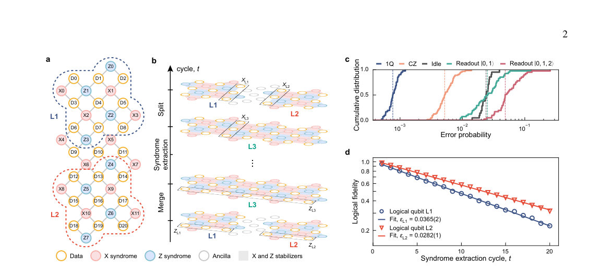
<figcaption class="paper-figure-caption"><b>Fig 1.</b> FIG. 1. Experimental layout and device performance. a, Qubit connectivity used for lattice surgery. The lattice comprises data qubits (gold circles), X-type syndrome qubits (red circles), and Z-type syndrome qubits (blue circles). Each syndrome qubit is coupled to two or four neighboring data qubits, facilitating the stabilizer measurements. b, Conceptual illustration of lattice-merge and lattice-split operations. Two distance-three surface-code patches, denoted as L1 and L2, are embedded in a two-dimensional square grid of physical qubits. The two patches are positioned such that their logical X operators face each other and are connected by seven ancilla qubits (gray circles), enabling...</figcaption>
</figure>
<figure class="paper-figure-card">
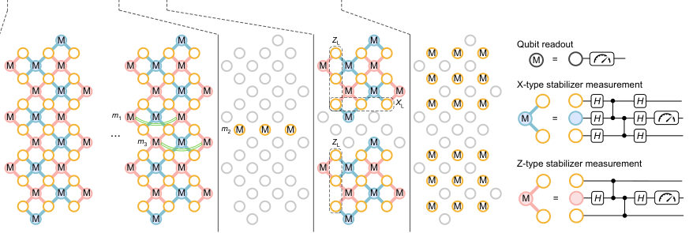
<figcaption class="paper-figure-caption"><b>Fig 2.</b> FIG. 2. Characterization of the logical Bell state generated via lattice split. a, Simplified circuit for preparing a logical Bell state. The system is initialized by preparing all data qubits in the logical state |0L3⟩of a 7 × 3 merged surface code. The lattice is subsequently split into two entangled 3 × 3 code patches by measuring the ancilla data qubits. Pauli-frame updates, conditioned on the intermediate measurement outcomes (m1, m2, and m3; see below), are applied during post-processing (dashed boxes). b, Physical operations corresponding to each step in the circuit. Each SEC consists of four layers of CZ gates followed by a round of measurements on the syndrome qubits. To perform...</figcaption>
</figure>
<figure class="paper-figure-card">
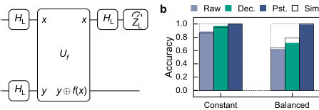
<figcaption class="paper-figure-caption"><b>Fig 3.</b> FIG. 3. Logical implementation of the Deutsch-Jozsa algorithm. a, Simplified circuit diagram of the Deutsch-Jozsa algorithm, which is proposed to distinguish between constant and balanced functions in a single trial. In this two-qubit implementation, the quantum ora- cle Uf is efficiently realized via lattice surgery between two surface- code logical qubits. b, Measured accuracy of the logical algorithm for both constant and balanced functions. Dashed and solid wire- frames represent the ideal values and simulation results, respectively. c-d, Effect of soft post-selection based on argument reweighting (c) and complementary gap (d). Increasing the suppression parameter or gap threshold...</figcaption>
</figure>
<figure class="paper-figure-card">
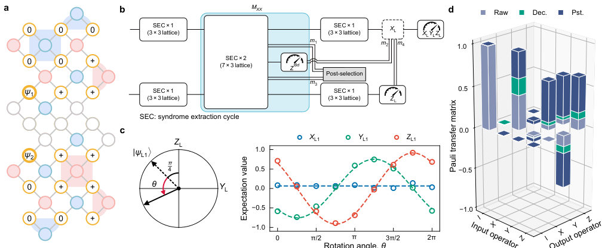
<figcaption class="paper-figure-caption"><b>Fig 4.</b> FIG. 4. Implementation of logical gate teleportation via lattice surgery. a, Protocol for logical magic state preparation. For each surface- code patch, the unique physical data qubit participating in both XL and ZL is initialized in the target physical magic state (|ψ1⟩or |ψ2⟩). The remaining data qubits are prepared in |0⟩or |+⟩, such that a subsequent round of syndrome extraction projects the code into the desired logical magic state (|ψL1⟩or |ψL2⟩). b, Circuit diagram for an arbitrary rotation around the logical X axis. Lattice merge and split operations between two surface-code patches implement a joint parity measurement MXX. Because the measurement outcome m = m1m3 indicates the...</figcaption>
</figure>

**Summary.** This paper reports an experimental realization of lattice-surgery operations on a superconducting surface code processor. By performing syndrome extraction cycles and utilizing advanced techniques like magic-state injection, the researchers demonstrated fault-tolerant logical computation. The results establish lattice surgery as a practical method for achieving high-fidelity quantum gates necessary for scalable quantum computing.

**Why it may be interesting.** For a theoretical physicist, this work provides crucial experimental benchmarks for fault tolerance thresholds and validates specific physical protocols (like lattice surgery) that can be modeled theoretically to predict scaling behavior towards quantum advantage.

Detailed structure

**Main problem.** The primary goal is demonstrating fault-tolerant logical operations, specifically lattice-surgery, between superconducting surface-code logical qubits to advance scalable quantum computation.

**Main result.** The authors successfully demonstrated lattice-surgery, achieving a high logical gate fidelity of 0.943 for an RX(pi/4) rotation, validating this paradigm for fault-tolerant circuits in superconducting platforms.

**Method.** The work involves repeated syndrome extraction cycles (SECs), deterministic state preparation via lattice splitting, executing algorithms like Deutsch-Jozsa, and implementing universal gates using magic-state injection and gate teleportation.

**Model / system.** The experiment is performed on a planar superconducting processor utilizing transmon qubits configured into distance-three surface-code patches. The system supports nearest-neighbor couplings and uses techniques like CPMG decoupling to protect data qubits.

**Key observables.** Logical error rates (e.g., 0.0365 per cycle), logical Bell state fidelity (up to 0.925 post-selection), and the gate fidelity for non-Clifford rotations ($	ext{RX}(\pi/4)$).

**Important parameters / regimes.** Distance of the code (d=3), physical error probabilities (e.g., CZ gate fidelity $\approx 0.996$), and coherence times ($T_1 \approx 45 \mu	ext{s}$).

**Assumptions / limitations.** The high logical fidelities are conditioned on the absence of detected errors, and the current implementation relies heavily on post-selection rather than fully active error correction.

**Figures summary.** Figures illustrate the experimental layout, conceptual lattice-merge/split operations, decay curves showing logical memory performance over SECs, and circuit diagrams detailing algorithm execution and gate teleportation protocols.

**Paper structure.** The paper progresses from characterizing physical hardware fidelity (gate errors, coherence times) to demonstrating basic error correction via syndrome extraction cycles, then implementing complex logical tasks like Bell state generation and Deutsch-Jozsa, culminating in the realization of universal gates via lattice surgery.

Abstract

Fault-tolerant logical operations are fundamental for scalable quantum computation. Here, we report the experimental realization of lattice-surgery operations between a pair of distance-three surface-code logical qubits on a planar superconducting processor. During repeated syndrome extraction cycles, the logical qubits exhibit per-cycle error rates of $0.0365(2)$ and $0.0282(1)$, respectively, after leakage events are rejected. By leveraging joint initialization and lattice splitting, we deterministically prepare a logical Bell state, confirming genuine bipartite entanglement via the error-corrected logical state fidelity. We further execute a two-qubit Deutsch-Jozsa algorithm at the logical level to demonstrate algorithmic utility in a fault-tolerant framework. Finally, to achieve universal control, we implement magic-state injection and gate teleportation to realize continuous non-Clifford rotations about the logical $X$ axis. For the logical $R_{X}(π/4)$ gate, we achieve a logical gate fidelity of $0.943_{-9}^{+10}$ conditioned on the absence of detected errors. These results establish lattice surgery as a practical and versatile paradigm for logical computation in near-term surface-code architectures, representing a critical milestone toward scalable fault-tolerant quantum advantage in superconducting circuits.

[↑ back to top](#top)

### [Collective emission of subwavelengths atom-like emitter arrays in the presence of inhomogeneous broadening](http://arxiv.org/abs/2606.07458v1)

**Authors:** Uri Israeli, Shahar Levi, Sagi Ben-Avi, Ada Kransnovsky, Daniel Silvian, Shlomo Winberg, Rivka Bekenstein  
**Type:** both · **Category:** other · **PDF:** <https://arxiv.org/pdf/2606.07458v1>  
**Analysis basis:** full PDF text, analyzed in chunks
**Topic relevance:** 🔥 `Dicke superradiance` **4/5** · 🔥 `superradiant laser` **4/5** · `correlated / nonlocal dissipation` **3/5** · `interference shaping light` **3/5** · `quantum optics experiment` **3/5** · `Tavis-Cummings & cavity-many-emitter` **2/5** · `driven-dissipative phase transition` **2/5** · `methods for driven-dissipative` **2/5** · `QC/QI experiment` **1/5** · `analog quantum simulation` **1/5** · `correlated cavity matter` **1/5** · `free-space correlated emission` **1/5** · `non-equilibrium dynamics` **1/5** · `non-equilibrium universality` **1/5**

↔ Scroll figures horizontally

<figure class="paper-figure-card">
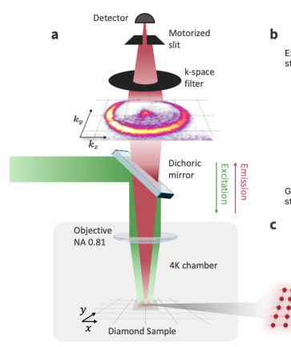
<figcaption class="paper-figure-caption"><b>Fig 1.</b> Fig. 1 a. Experimental setup for probing the collective emission of atom-like emitter arrays. b. The SiV centre is an atom-like emitter system whose ground and excited states are localized at the diamond bandgap. Its spin and optical degeneracies are partially lifted by the spin–orbit interaction, which splits each quartet into two degenerate doublets, so that there are four dipole-allowed optical transitions. These are resonant with light around 737 nm (marked A,B,C,D). We are interested in probing the collective resonance with decay rate Γcollective and spectral shift ∆relative to the bare SiV resonance. c. Each array site is comprised of tens of SiV centres with spectral inhomogeneity...</figcaption>
</figure>
<figure class="paper-figure-card">
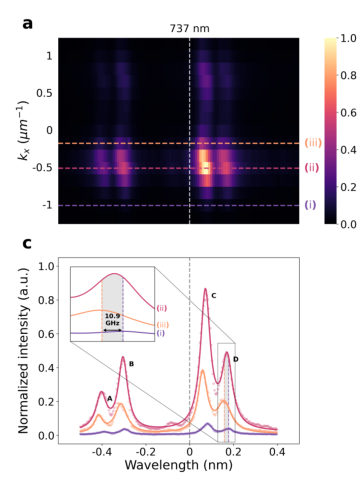
<figcaption class="paper-figure-caption"><b>Fig 2.</b> Fig. 2 a. Spectrum of the collective emission of a SiV subwavelength array, with the four SiV optical transitions as detected in the direction normal to the arrays as a function of the momentum parallel to the array. b,d. The collective linewidth and shifts of the specific collective states emitting as a function of momentum, extracted from the fit for the D transition. c. Cross sections of the spectrum for different momenta, showing the shift in emission frequency, marked (i),(ii),(iii) in all subplots (Inset highlights frequency shift).</figcaption>
</figure>
<figure class="paper-figure-card">
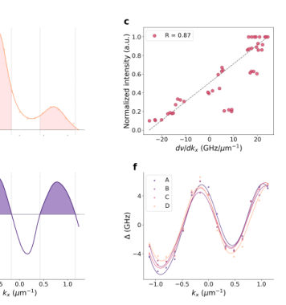
<figcaption class="paper-figure-caption"><b>Fig 3.</b> Fig. 3 Directional emission of the collective response of the array. a. Intensity distribution detected in the direction normal to the array as a function of the momentum parallel to the array. b. Cross sections of the intensity as a function of kx for different momenta, showing the shift in emission frequency. Red-shaded parts mark high-intensity areas. c. Correlations between the extracted group velocity in e and the intensity in b. d. Schematics of the measurement setup, where a lens maps the emission into momentum space and imaging of the lens back focal plane reveals the intensity distribution in k-space. e. Extracted group velocity in the direction parallel to the array (slope of the...</figcaption>
</figure>
<figure class="paper-figure-card">
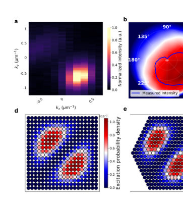
<figcaption class="paper-figure-caption"><b>Fig 4.</b> Fig. 4 a. Measured spatial distribution of the asymmetric collective mode for a square array in the far-field. b. Anisotropic far-field emission of a dipole near the diamond–air interface as calculated by FDTD and compared to the measured uncoupled dipole emission (blue line). c. Schematics of a dipole orientated in the (1,1,1) direction and placed 60 nm beneath the diamond–air surface (displayed is the calculated electric field perpendicular to the array plane). d,e. Calculated asymmetric subradiant modes of square and honeycomb arrays. f. Probability of superradiance for a superatom of 40 emitters at a location with high emitter density. 20 percent of the superatoms are expected to be...</figcaption>
</figure>

**Summary.** The authors report observing robust collective emission from arrays of silicon-vacancy centers in diamond, overcoming the theoretical hurdle posed by strong inhomogeneous broadening. By engineering 'superatoms' at each site, they demonstrate that solid-state emitter arrays can function as highly controllable quantum-emitter metasurfaces. This paves the way for integrating quantum light sources directly into nanophotonic circuits.

**Why it may be interesting.** This work directly addresses how to engineer coherent quantum light sources using solid-state defects in nanophotonic environments. The ability to maintain collective coherence despite large disorder is a major breakthrough for realizing scalable quantum emitters.

Detailed structure

**Main problem.** The primary challenge addressed is demonstrating collective emission from subwavelength emitter arrays despite strong inhomogeneous broadening, a factor previously thought to suppress photon-mediated interactions in solid-state systems.

**Main result.** Collective emission was successfully observed, showing characteristic resonance shifts and decay rates that confirm the array acts as a functional quantum-emitter metasurface. This proves that collective effects survive significant disorder in solid-state emitters.

**Method.** The work combines experimental measurements of directional emission spectra (momentum mapping) with theoretical analysis using effective Hamiltonians and simulations to model superradiance probability.

**Model / system.** The system utilizes subwavelength arrays of silicon-vacancy (SiV) centers in diamond, which are engineered into 'superatoms' via high-density ion implantation. The physics is modeled by diagonalizing an effective Hamiltonian describing collective dipole interactions within the array structure.

**Key observables.** Collective resonance frequency shift ($\Delta$), photonic band $\omega(k_{\perp})$, directional emission intensity mapped vs. transverse momentum ($k_x, k_y$), and superradiance probability.

**Important parameters / regimes.** The natural linewidth of SiV centers is much smaller than the inhomogeneous broadening (tens of GHz); collective effects are observed when the effective linewidth ($\Gamma_{	ext{eff}}$) reaches specific thresholds.

**Assumptions / limitations.** The analysis relies on approximations like Born–Markov, and the initial success hinges on the 'superatom' concept created by ion implantation to overcome frequency mismatch.

**Figures summary.** Figures illustrate spectral dependence on momentum (Fourier space), showing characteristic dispersion relations for collective modes; other figures map emission intensity vs. momentum and show spatial mode distributions.

**Paper structure.** The paper establishes the problem of inhomogeneity, presents experimental measurements confirming collective shifts and band structures across multiple SiV transitions, supports these findings with theoretical modeling of superradiance, and concludes by demonstrating the viability of this platform for integrated quantum photonics.

Abstract

Quantum metasurfaces comprised of subwavelength atomic arrays emerged as a promising platform for enhanced atom-photon interaction. However, realizing such a system with solid-state emitters has been considered impractical due to strong inhomogeneous broadening, which was expected to suppress the photon-mediated interactions that underpin collective emission. Here we report the observation of collective emission from subwavelength arrays of silicon-vacancy centres in diamond -- solid-state emitters whose inhomogeneous broadening exceeds the natural linewidth by two orders of magnitude -- demonstrating that collective effects such as resonance shifts, modified decay rates and directional coherent emission survive this disorder. A crucial enabling element is the implantation of a high density of silicon ions at each array site. This creates so-called superatoms, local ensembles that probabilistically achieve frequency matching across the array and enhance the collective response. We support our observations   with a theoretical analysis explaining the mechanisms that preserve the collective effects even in the presence of inhomogeneity. These observations have direct implications for the realization of subwavelength arrays in any solid-state system, paving the way for quantum-emitter metasurfaces that are naturally integrated into nanophotonic environments.

[↑ back to top](#top)

### [Ferroelectrical Switching as a Probe of Quantum Damping in Magnetic Spin Systems](http://arxiv.org/abs/2606.07378v1)

**Authors:** Yuefei Liu, Anna Delin, Olle Eriksson, Erik Sjöqvist, Kaiyou Wang, Qirui Cui  
**Type:** theory · **Category:** other · **PDF:** <https://arxiv.org/pdf/2606.07378v1>  
**Analysis basis:** full PDF text, analyzed in chunks
**Topic relevance:** 🔥 `entanglement & information structure` **4/5** · `analog quantum simulation` **3/5** · `exotic spin models in light-matter` **3/5** · `methods for driven-dissipative` **3/5** · `non-equilibrium dynamics` **3/5** · `spintronics-quantum-optics interface` **3/5** · `Keldysh / 2PI / non-Gaussian methods` **2/5** · `correlated / nonlocal dissipation` **2/5** · `driven-dissipative phase transition` **2/5** · `non-equilibrium universality` **2/5** · `Kondo & dissipative impurity` **1/5** · `scars & prethermalization` **1/5**

↔ Scroll figures horizontally

<figure class="paper-figure-card">
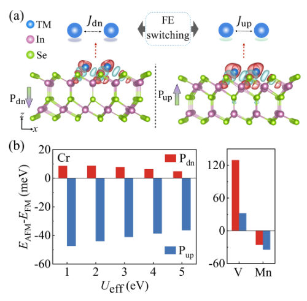
<figcaption class="paper-figure-caption"><b>Fig 1.</b> FIG. 1. The ferroelectricity tunes the magnetic dimer coupling strength from Jup to Jdn, as the In2Se3 substrate polarization switches from upward to downward, as illustrated in (a). The schematics of the crystal structure of the magnetic transition metal (TM) dimer on the In2Se3 substrate with downward polarization Pdn and upward po- larization Pup. For Cr, The out-of-plane electric polarization reaches -0.054 eÅ/u.c. in the downward state and 0.116 eÅ/u.c. in the upward state. The bonding between Cr and In2Se3 can be seen from the charge-density difference, ∆ρ = ρ(HS) −ρ(Cr) −ρ(In2Se3), as shown by the contour maps at the isovalue ∆ρ = ±2 × 10−3 e/Å3. (b) For the Cr dimer, the...</figcaption>
</figure>
<figure class="paper-figure-card">
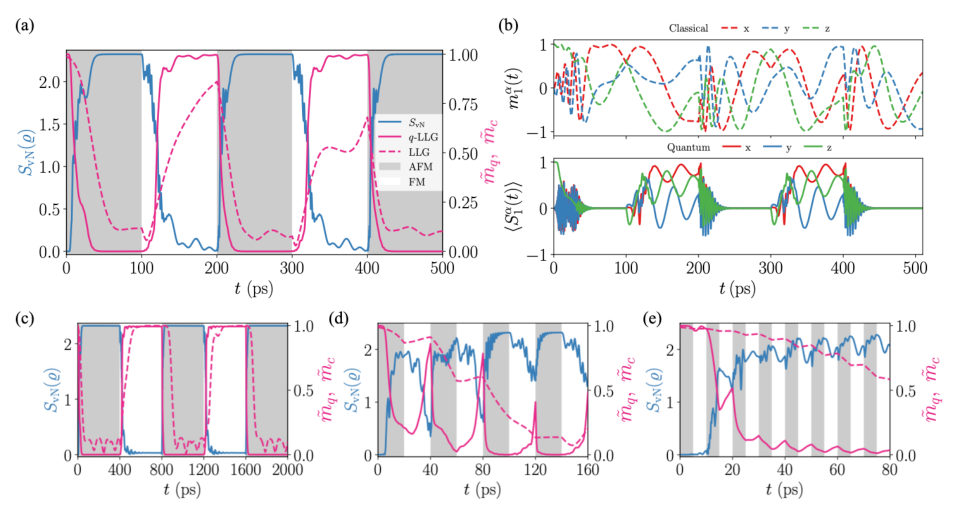
<figcaption class="paper-figure-caption"><b>Fig 2.</b> FIG. 2. (a) q-LLG time evolution of the von Neumann entropy S vN(ϱ) as well as the q-LLG ( ˜mq(t)) and LLG ( ˜mc(t)) average magnetic moment per Cr atom, for a Cr dimer on an In2Se3 substrate under FE switching. Simulations start from the FM product quantum state |↑↑⟩and corresponding FM classical configuration ↑↑. At t = 100, 200, 300, 400 ps, the Cr–Cr couplings are switched between the polarization-induced parameter sets Pup (AFM) and Pdn (FM), as listed in Table I, in the sequence AFM–FM–AFM–FM–AFM. (b) Component-resolved dynamics for one spin in the dimer (the other is mirrored): the q-LLG expectation values ⟨S β 1(t)⟩and the LLG magnetic-moment components mβ 1(t) for β ∈{x, y, z}....</figcaption>
</figure>
<figure class="paper-figure-card">
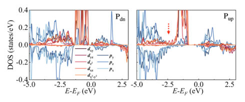
<figcaption class="paper-figure-caption"><b>Fig 3.</b> FIG. 3. The projected density of states (DOS) of Cr dimer on In2Se3. The red dotted arrow is to emphasis that the p−d orbital hybridization is weakened when Pup up polarization.</figcaption>
</figure>

**Summary.** The research proposes using ferroelectric control over magnetic dimers to probe quantum corrections to spin damping. By linking polarization switching to the transition between FM and AFM exchange regimes, the authors demonstrate that magnetization dynamics can reveal signatures of quantum entanglement through advanced simulation techniques comparing classical and quantum descriptions.

**Why it may be interesting.** This work directly bridges first-principles electronic structure calculations (DFT) with open quantum system dynamics simulations (q-LLG), providing a concrete, tunable solid-state platform to observe fundamental quantum mechanical effects like entanglement in magnetic materials.

Detailed structure

**Main problem.** The primary goal is to develop a method to experimentally distinguish genuine quantum corrections from classical Gilbert damping in magnetic spin systems.

**Main result.** Ferroelectric polarization switching can be used to control the inter-spin exchange coupling between ferromagnetic and antiferromagnetic regimes, providing a tunable platform for studying quantum entanglement dynamics in magnetism.

**Method.** The study combines ab initio DFT calculations to derive spin Hamiltonian parameters with time evolution simulations using both classical (LLG) and quantum (q-LLG) Landau-Lifshitz-Gilbert equations.

**Model / system.** The system involves magnetic dimers adsorbed on ferroelectric substrates ($	ext{In}_2	ext{Se}_3$). The magnetism is controlled by the substrate's polarization state, which modulates orbital hybridization and thus the exchange coupling ($J$) between ferromagnetic (FM) and antiferromagnetic (AFM) states.

**Key observables.** Magnetization traces ($	ilde{m}$), entanglement entropy ($S_{	ext{vN}}$), energy difference ($\Delta E$), and the comparison between classical LLG vs. quantum q-LLG dynamics.

**Important parameters / regimes.** Hubbard $U_{	ext{eff}}$, polarization state ($	ext{P}_{	ext{dn}}$ vs $	ext{P}_{	ext{up}}$), damping parameter ($\alpha = \kappa = 0.1$), and switching time intervals (e.g., 5 ps, 20 ps).

**Assumptions / limitations.** The exchange rearrangement due to polarization reversal is treated as instantaneous; the DMI calculation assumes a fixed spin canting angle of $90^\circ$.

**Figures summary.** Figures illustrate how FE switching modulates $\Delta E$ between FM and AFM phases (Fig. 1), and show time evolution comparisons of entanglement entropy ($S_{	ext{vN}}$) and magnetization ($	ilde{m}$) between classical LLG and quantum q-LLG simulations during polarization cycling (Fig. 2).

**Paper structure.** The paper first establishes the physical control mechanism using DFT to link FE polarization to exchange coupling strength ($\Delta E$). It then extends this by simulating spin dynamics, comparing classical vs. quantum approaches, showing that magnetization traces carry a unique signature of entanglement-dependent dynamics only captured by the q-LLG model.

Abstract

While damped spin dynamics is important for the understanding of magnetic materials, clear signatures of \emph{quantum corrections} to the Gilbert damping mechanism remain elusive. We propose a route to distinguish quantum and classical Gilbert spin damping using ferroelectric control of a magnetic dimer. Ab initio calculations for dimers on ferroelectric substrates show that polarization reversal switches the inter-spin exchange between ferromagnetic and antiferromagnetic regimes. We formulate a magnetization-based diagnostic that relates magnetization traces to entanglement dynamics, which enables ferroelectrical on/off control of dimer entanglement. Material-informed quantum Landau-Lifshitz-Gilbert simulations illustrate how the signature of magnetization dynamics can, in principle, be used to infer the existence of quantum Gilbert spin damping. This minimal and non-volatile platform connects first-principles modeling to experimentally accessible observables and provides a starting point for voltage-controlled quantum entanglement in magnetic spin networks.

[↑ back to top](#top)

### [Theory of learning of high-dimensional controlled non-linear dynamical systems (I): models and methods](http://arxiv.org/abs/2606.07247v1)

**Authors:** Pierfrancesco Urbani  
**Type:** theory · **Category:** statistical mechanics · **PDF:** <https://arxiv.org/pdf/2606.07247v1>  
**Analysis basis:** full PDF text, analyzed in chunks
**Topic relevance:** 🔥 `Keldysh / 2PI / non-Gaussian methods` **4/5** · `driven-dissipative phase transition` **3/5** · `methods for driven-dissipative` **3/5** · `non-equilibrium dynamics` **3/5** · `non-equilibrium universality` **3/5** · `analog quantum simulation` **2/5** · `correlated / nonlocal dissipation` **2/5** · `entanglement & information structure` **2/5** · `Kondo & dissipative impurity` **1/5** · `correlated cavity matter` **1/5** · `measurement-induced transitions` **1/5** · `scars & prethermalization` **1/5**

↔ Scroll figures horizontally

<figure class="paper-figure-card">
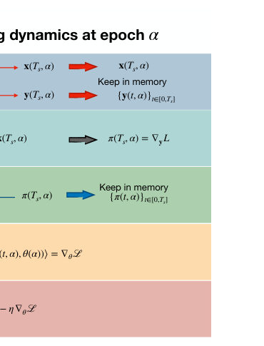
<figcaption class="paper-figure-caption"><b>Fig 1.</b> Figure 1: The pipeline of training dynamics.</figcaption>
</figure>
<figure class="paper-figure-card">
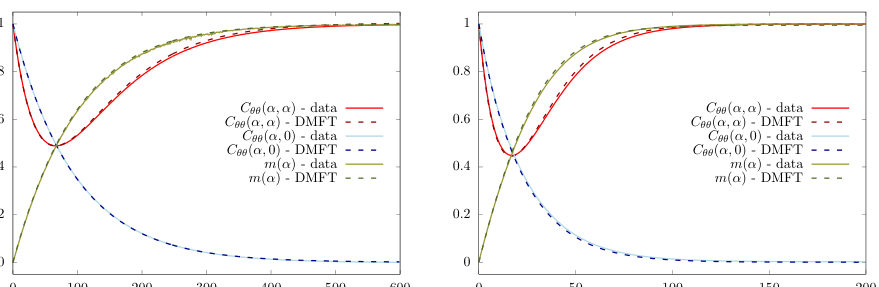
<figcaption class="paper-figure-caption"><b>Fig 2.</b> Figure 2: Comparison between DMFT and numerical simulations. We plot tree observables Cθθ(α, α), Cθθ(α, 0) and m(α) as a function of the training epochs. Left panel: Numerical simula- tions are performed with d = dtheta = 150, g1 = 0.8, g2 = 0.8, µx(z) = µy(z) = z, η = 0.1 and Ts = 0.5 and σ = 1. Right panel: σ = 0.75 with d = 100 and Ts = 1.</figcaption>
</figure>

**Summary.** This paper applies advanced tools from statistical physics, particularly Dynamical Mean Field Theory, to model the learning process in Neural ODEs. It treats the training dynamics as a coupled, high-dimensional stochastic control problem between a 'teacher' and a 'student' system. The work provides theoretical predictions for how deep neural networks learn by analyzing the evolution of correlation functions in the infinite-dimensional limit.

**Why it may be interesting.** While focused on ML, the use of mean-field theory, renormalization group concepts (implied by high-dimensional limits), and non-equilibrium statistical mechanics techniques to analyze system evolution is highly relevant to AMO physics studying complex interacting many-body systems or open quantum systems.

Detailed structure

**Main problem.** The work aims to theoretically understand feature learning dynamics within high-dimensional, non-linear dynamical systems trained using online stochastic gradient descent.

**Main result.** The authors develop a framework using Dynamical Mean Field Theory (DMFT) to derive self-consistent equations governing the evolution of summary statistics for both inference and training processes in the high-dimensional limit.

**Method.** The core methodology involves recasting the learning problem into an optimal control setting, applying path integral techniques, and solving the resulting coupled dynamics using Dynamical Mean Field Theory (DMFT).

**Model / system.** The model centers on Neural Ordinary Differential Equations (Neural ODEs) within a teacher-student framework. The system involves coupled stochastic processes for state variables ($x$, $y$) and adjoint fields ($\pi$), governed by non-linear dynamics.

**Key observables.** Learning curves, correlation functions ($C_{oo'}$), response functions ($R_{oo'}$), and the training objective/loss function derived from these correlations.

**Important parameters / regimes.** The analysis is performed in the high-dimensional limit, considering parameters like the learning rate ($\eta$), noise levels ($eta$), and time scales ($T_s, T_t$).

**Assumptions / limitations.** Key assumptions include adopting a teacher-student setup, assuming noiseless dynamics for initial DMFT derivations (though noise is incorporated later), and relying on the high-dimensional limit to close the system via summary statistics.

**Figures summary.** Figures compare DMFT predictions against numerical simulations, showing how observables like $C_{	heta	heta}$ and $m(\alpha)$ approach unity as training progresses, indicating successful student alignment with the teacher.

**Paper structure.** The paper builds from defining the coupled dynamical system (teacher/student) to formulating the objective via a Lagrangian. It then applies path integrals and DMFT to derive self-consistent equations for summary statistics, culminating in predictions for learning curves across various complex regimes.

Abstract

Neural ordinary differential equations (neural ODEs) have rapidly gained prominence as a powerful and unifying framework for conceptualizing artificial neural networks, elegantly connecting the continuous-time modeling of dynamical systems with the discrete, data-driven paradigm of modern deep learning. Beyond their practical advantages they offer fresh theoretical insights into the training and generalization properties of neural networks. The distinctive feature of this framework is its dual dynamical nature: inference dynamics, which govern the ODE evolution during forward computation, and training dynamics, which control the optimization of model parameters. This makes neural ODEs a particularly well-suited theoretical framework for studying a large variety of settings such as multi-layer neural networks (ResNets for example), autoregressive models (with next-token generation dynamics), generative models, and recurrent neural networks in theoretical neuroscience. In this work, we introduce a theoretically grounded class of models for studying neural ODEs trained via online stochastic gradient descent. We solve the training dynamics of these models via dynamical mean field theory and derive learning curves in the high-dimensional limit.

[↑ back to top](#top)

### [Complex-gauge control of anomalous Floquet corner responses in a non-Hermitian physical-synthetic photonic lattice](http://arxiv.org/abs/2606.07038v1)

**Authors:** W. C. Ning, X. Z. Zhang  
**Type:** theory · **Category:** other · **PDF:** <https://arxiv.org/pdf/2606.07038v1>  
**Analysis basis:** full PDF text, analyzed in chunks
**Topic relevance:** 🔥 `analog quantum simulation` **4/5** · 🔥 `non-equilibrium dynamics` **4/5** · `correlated cavity matter` **3/5** · `driven-dissipative phase transition` **3/5** · `methods for driven-dissipative` **3/5** · `non-equilibrium universality` **2/5** · `Keldysh / 2PI / non-Gaussian methods` **1/5** · `Kondo & dissipative impurity` **1/5** · `correlated / nonlocal dissipation` **1/5** · `entanglement & information structure` **1/5** · `interference shaping light` **1/5**

↔ Scroll figures horizontally

<figure class="paper-figure-card">
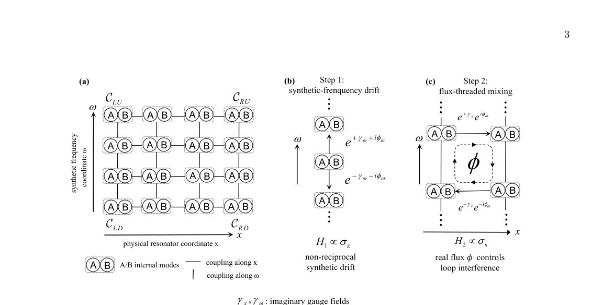
<figcaption class="paper-figure-caption"><b>Fig 1.</b> FIG. 1. Concept of the photonic physical-synthetic Floquet lattice and the two-step complex-gauge drive. Panel (a) shows the mode-space lattice. The horizontal direction is the physical resonator coordinate x, the vertical direction is the synthetic frequency coordinate w, and each site contains two internal optical modes A and B. The four corner windows CLD, CLU, CRD, and CRU are the local detection regions used for the doubled-period signal. Panel (b) shows the first half step, which implements a non-reciprocal synthetic-frequency drift proportional to σz; the upward and downward frequency-conversion amplitudes contain e+γw+iϕw and e−γw−iϕw, respectively. Panel (c) shows the second half...</figcaption>
</figure>
<figure class="paper-figure-card">
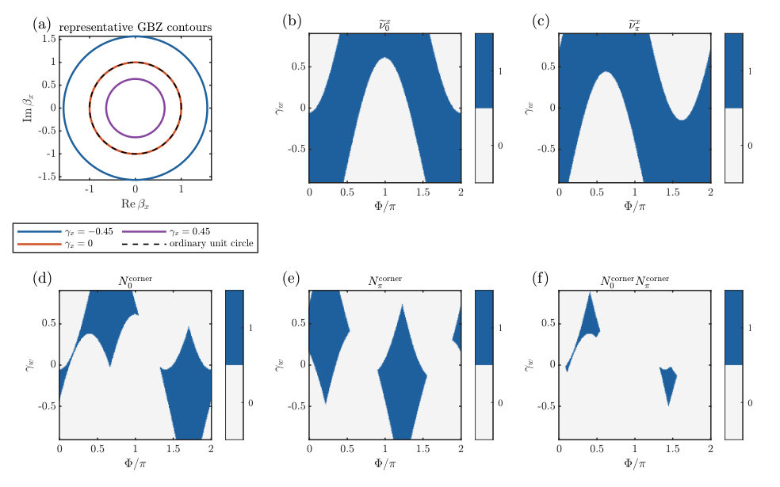
<figcaption class="paper-figure-caption"><b>Fig 2.</b> FIG. 2. Flux-resolved non-Bloch higher-order invariant. Panel (a) shows representative generalized Brillouin-zone contours for different γx, together with the ordinary unit circle as a dashed reference. Panel (b) shows the first-layer physical-edge index eνx 0 . Panel (c) shows the corresponding index eνx π. Panel (d) shows the corner index N corner 0 after including the synthetic-edge contribution. Panel (e) shows N corner π . Panel (f) shows the coexistence region N corner 0 N corner π = 1. These maps are topological predictions obtained from non-Bloch cycles, not from finite open-boundary diagonalization. Figure 3 tests these predictions by finite open-boundary spectra and shows the...</figcaption>
</figure>
<figure class="paper-figure-card">
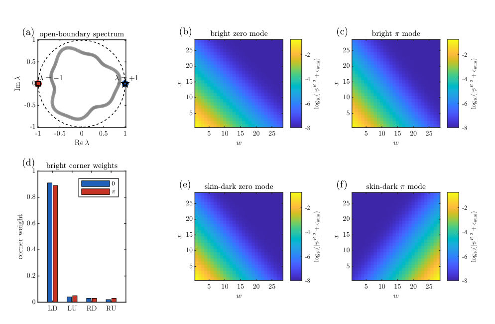
<figcaption class="paper-figure-caption"><b>Fig 3.</b> FIG. 3. Open-boundary spectrum and right-eigenmode profiles. Panel (a) shows the finite open-boundary spectrum in the complex multiplier plane. Gray points are bulk states. Blue and red markers identify corner candidates near λ = +1 and λ = −1. Panel (b) shows log10(|ψR 0 (x, w)|2 + ϵnum) in the bright regime. Panel (c) shows the corresponding π mode. Here ϵnum = 10−8. Panel (d) gives the four corner weights and confirms that the two modes occupy the same lower-left window. Panel (e) shows the zero mode at a skin-dark point. Panel (f) shows the π mode at the same point. Both modes still exist, but the imaginary gauge fields select different synthetic corners for their right eigenmodes. This...</figcaption>
</figure>
<figure class="paper-figure-card">
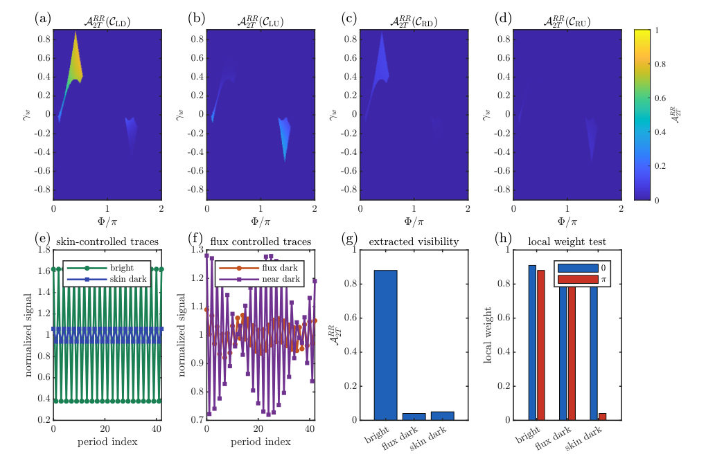
<figcaption class="paper-figure-caption"><b>Fig 4.</b> FIG. 4. Synthetic-flux and skin control of the doubled-period optical visibility. Panels (a)–(d) show ARR 2T (C) for CLD, CLU, CRD, and CRU, respectively, using a common color scale. Panels (e) and (f) compare discrete stroboscopic traces in the bright, skin-dark, flux-dark, and near-dark regimes. Panel (g) summarizes the extracted visibility at representative points. Panel (h) compares the corresponding local zero and π weights. Local weights are necessary but not sufficient for visibility. Flux darkness comes from interference cancellation, whereas skin darkness comes from spatial separation. Topological coexistence therefore does not imply local visibility.</figcaption>
</figure>
<figure class="paper-figure-card">
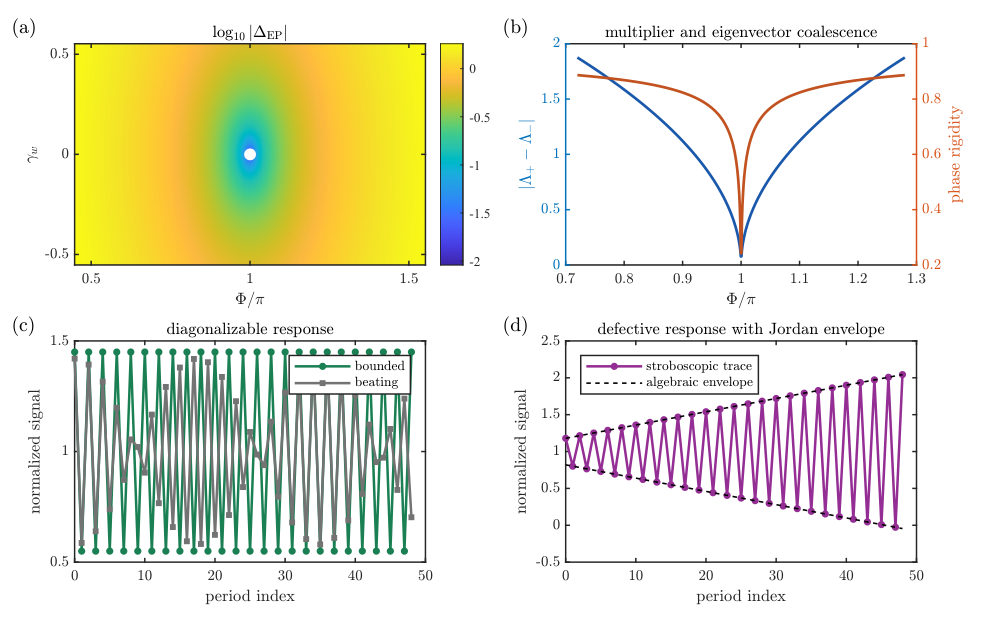
<figcaption class="paper-figure-caption"><b>Fig 5.</b> FIG. 5. Flux-tuned exceptional point and defective doubled-period response. Panel (a) shows log10 |∆EP|, where ∆EP = δ2 + gh. The white marker identifies the exceptional point. Panel (b) shows the two-period multiplier splitting and the phase rigidity across the exceptional point. Their simultaneous collapse diagnoses eigenvalue and eigenvector coalescence. Panel (c) compares bounded and beating responses away from the exceptional point. Panel (d) shows the defective response and its algebraic envelope at the exceptional point. The exceptional point is defined in the projected two-period corner propagator, not in the one-period 0/π spectrum. It does not create the 2T signal. It dresses an...</figcaption>
</figure>

**Summary.** The research investigates anomalous Floquet corner responses in a complex non-Hermitian photonic lattice by coupling physical and synthetic dimensions. It rigorously separates the concept of topological existence (predicted by winding numbers) from actual local optical visibility, showing three possible measurement regimes. Furthermore, it details how tuning parameters can induce an exceptional point, causing the response to adopt a unique algebraic envelope structure.

**Why it may be interesting.** This work provides a sophisticated theoretical framework for understanding how non-Hermiticity, synthetic dimensions, and topological invariants govern measurable optical responses, offering concrete predictions about mode localization and spectral signatures that are distinct from simple existence criteria.

Detailed structure

**Main problem.** The study aims to decouple topological existence from local optical visibility of anomalous Floquet corner responses in a non-Hermitian photonic lattice.

**Main result.** The paper demonstrates that the same topological sector can exhibit three distinct measurement regimes (bright, skin-dark, or flux-dark), and furthermore, an exceptional point causes the response to acquire an algebraic envelope rather than simply being absent.

**Method.** Theoretical analysis involving Floquet theory, non-Bloch winding number calculations, and constructing effective two-period propagators for corner subspace dynamics.

**Model / system.** A non-Hermitian Floquet photonic lattice incorporating both a physical resonator coordinate and a synthetic frequency dimension. The system is controlled by complex gauge fields (real flux $\Phi$ and imaginary gauges $\gamma_{x,w}$).

**Key observables.** Right-state corner visibility amplitude ($S_{RR}^C$), non-Bloch winding number ($N_{	ext{corner}}$), local mode weights ($W^{(\epsilon)}_C$), and the stroboscopic signal $A_{RR}^{2T}(C)$.

**Important parameters / regimes.** Real synthetic magnetic flux ($\Phi$), imaginary gauge fields ($\gamma_x, \gamma_w$), and parameters governing the exceptional point ($\Delta_{	ext{EP}}$).

**Assumptions / limitations.** The analysis relies on projecting dynamics onto a corner subspace and analyzing the effective two-period propagator matrix.

**Figures summary.** Figures illustrate lattice structures, generalized Brillouin zone contours showing winding numbers, and time-domain traces comparing bright, skin-dark, and flux-dark regimes, culminating in visualizations of defective vs. diagonalizable responses near an exceptional point.

**Paper structure.** The paper progresses from defining the physical model and its Hamiltonian structure to calculating topological invariants (winding numbers), then analyzing local measurement observables ($S_{RR}^C$), establishing the decoupling between topology and visibility, and finally investigating the role of exceptional points in modifying the time-domain response envelope.

Abstract

We propose a non-Hermitian Floquet photonic lattice formed by a physical resonator coordinate and a synthetic frequency coordinate. A two-step modulation protocol realizes a chiral walk in this physical-synthetic plane, with a real synthetic flux controlling loop interference and imaginary gauge fields controlling non-reciprocal envelopes. We show that anomalous corner pairs at quasienergies zero and \(π/T\) exhibit three distinct layers of physics. A non-Bloch higher-order construction predicts whether the \(0/π\) corner pair exists under open boundaries. The imaginary gauge fields select where the right eigenmodes accumulate. The real flux controls the local interference matrix element that determines whether the doubled-period optical response is visible. As a result, the same topological coexistence sector can be bright, skin-dark, or flux-dark in a local optical measurement. We further show that the complex gauge can tune an exceptional point of the two-period corner propagator. At this point the anomalous response keeps its doubled-period sign alternation, but its envelope becomes algebraic because of a Jordan block. These results provide a photonic route to separate topological existence, skin-selected localization, optical visibility, and defective two-period dynamics in a non-Hermitian synthetic dimension.

[↑ back to top](#top)

### [Long-range interactions assisted shortcuts to adiabaticity and battery charging in open quantum critical systems](http://arxiv.org/abs/2606.07221v1)

**Authors:** Shishira Mahunta, Victor Mukherjee  
**Type:** theory · **Category:** statistical mechanics · **PDF:** <https://arxiv.org/pdf/2606.07221v1>  
**Analysis basis:** full PDF text, analyzed in chunks
**Topic relevance:** 🔥 `correlated / nonlocal dissipation` **4/5** · `analog quantum simulation` **3/5** · `driven-dissipative phase transition` **3/5** · `methods for driven-dissipative` **3/5** · `non-equilibrium dynamics` **3/5** · `Keldysh / 2PI / non-Gaussian methods` **2/5** · `non-equilibrium universality` **2/5** · `Kondo & dissipative impurity` **1/5** · `entanglement & information structure` **1/5** · `exotic spin models in light-matter` **1/5** · `scars & prethermalization` **1/5**

↔ Scroll figures horizontally

<figure class="paper-figure-card">
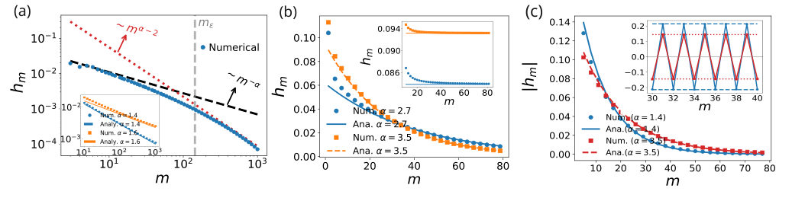
<figcaption class="paper-figure-caption"><b>Fig 1.</b> Figure 1. (a) Comparison between the numerically evaluated CD coupling hm(µ, α) and the analytical predictions in the long-range regime. The main panel shows the behavior close to criticality µ = −1 (ϵ−= 0.3, α = 1.4); the CD coupling exhibits a crossover from a detuned asymptotic decay described by Eq. (21) to a power-law behavior Eq. 22, controlled by the characteristic length scale mϵ = (Aα/|ϵ|)1/(α−1). The inset shows the critical scaling at ϵ−= 0 for α = 1.4 and α = 1.6 (see Eq. (23)). (b) Comparison between numerical and analytical results for the CD coupling in the short-range regime, showing exponentially localized behavior close criticality µ = −1 (see Eq. 24) (main panel) and the...</figcaption>
</figure>
<figure class="paper-figure-card">
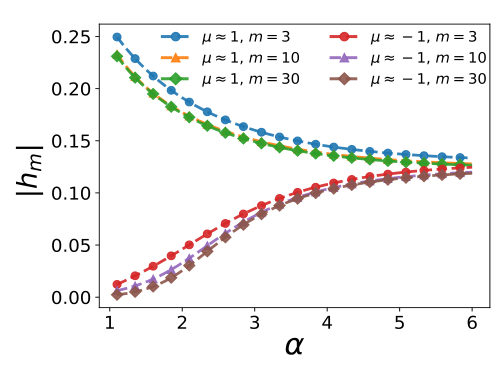
<figcaption class="paper-figure-caption"><b>Fig 2.</b> Figure 2. Dependence of hm(µ, α), obtained through numer- ical integration of Eq. (18), on the interaction exponent α near µ = ±1. Here ϵ± = 0.1.</figcaption>
</figure>
<figure class="paper-figure-card">
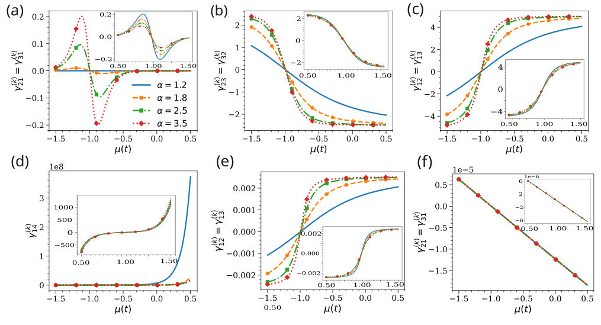
<figcaption class="paper-figure-caption"><b>Fig 3.</b> Figure 3. (a)–(d) Main panels show the transition rates γ(k) mn(t) as a function of the time-dependent chemical potential µ(t) driven across the critical point µ = −1, for k = 0.1). The insets display γ(k) mn(t) with µ(t) driven across the critical point µ = +1, for k = 3.0. Results are presented for different values of the LRI exponent α in low temperature regime β = 10. (e),(f) Same as above, but in the high-temperature regime β = 0.01.</figcaption>
</figure>
<figure class="paper-figure-card">
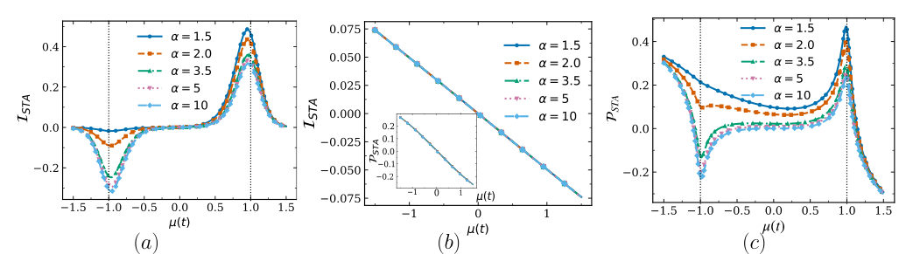
<figcaption class="paper-figure-caption"><b>Fig 4.</b> Figure 4. (a) Heat current ISTA in the low-temperature regime β = 10. (b) Heat current ISTA (main) and power PSTA (inset) in the high-temperature regime β = 0.1. (c) Power PSTA in the low-temperature regime β = 10.</figcaption>
</figure>
<figure class="paper-figure-card">
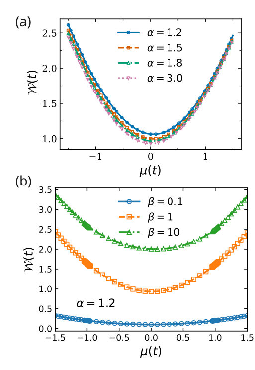
<figcaption class="paper-figure-caption"><b>Fig 5.</b> Figure 5. (a) Ergotropy W(t) with µ for different values of α at inverse temperature β = 1. The ergotropy increases with increasing range of interactions. (b) Variation of the ergotropy W(t) with µ for different values of β, for α = 1.2. Lower temperatures result in higher values of ergotropy.</figcaption>
</figure>

**Summary.** The paper demonstrates that long-range interactions are a valuable resource for controlling open quantum critical systems. By analyzing energy costs and ergotropy, the authors show that LRIs significantly enhance both Shortcuts to Adiabaticity implementation and the charging capability of quantum batteries compared to nearest-neighbor models.

**Why it may be interesting.** This work bridges non-equilibrium thermodynamics, quantum control theory, and condensed matter physics by showing how interaction topology (long-range vs. short-range) dictates the feasibility and efficiency of advanced quantum protocols like STA.

Detailed structure

**Main problem.** The study investigates how long-range interactions (LRIs) can enhance quantum control protocols, specifically Shortcuts to Adiabaticity (STA), in open quantum critical systems and improve the charging efficiency of quantum batteries under dissipation.

**Main result.** LRIs provide a significant advantage over short-range interactions by reducing the cost of STA control and enhancing the resultant ergotropy during quantum battery charging near certain critical points.

**Method.** The analysis involves deriving counterdiabatic Hamiltonians in momentum space, calculating energy costs (heat/power), and modeling dissipation using Lindblad master equations for open systems.

**Model / system.** The model is a Long-Range Kitaev (LRK) chain of spinless fermions coupled to a fermionic bath. The dynamics are governed by the Hamiltonian $H_0(t)$ which includes long-range coupling terms decaying as $|i-j|^{-\alpha}$.

**Key observables.** Heat current ($	ext{I}_{	ext{STA}}$), power ($P_{	ext{STA}}$), ergotropy ($W_{	ext{tot}}(t)$), and the counterdiabatic coupling strength ($h_m$).

**Important parameters / regimes.** Interaction decay exponent $\alpha$ (defining long-range vs. short-range regimes), critical points ($\mu = \pm 1$), and temperature/inverse temperature ($eta$).

**Assumptions / limitations.** The system is coupled to a fermionic bath, leading to an instantaneous thermal state; calculations often rely on low-momentum expansions near criticality.

**Figures summary.** Figures compare the analytical and numerical results for the CD coupling strength $h_m(\mu, \alpha)$ across different interaction regimes ($\alpha$) and critical points ($\mu=-1$ vs. $\mu=+1$).

**Paper structure.** The paper systematically analyzes STA protocols in open systems, first deriving the necessary counterdiabatic terms ($h_m$), then calculating energy costs (heat/power), and finally applying these concepts to optimize quantum battery charging via ergotropy enhancement.

Abstract

In this work we show that long-range interactions can be significantly beneficial for implementing shortcuts to adiabaticity (STA) in many-body open quantum critical systems driven out of equilibrium, as well as for charging quantum batteries in the presence of dissipation. In sharp contrast to short range interactions where passage through criticality may demand STA control with non-zero interactions between infinitely distant spins, using the example of a Kitaev chain with long-range couplings, we find that the corresponding control may involve involve interaction strength with decays algebraically with distance. In case of non-unitary control, the advantage of long-range interactions manifest through reduction in the cost of STA. We further propose a modified STA technique aimed at charging a quantum battery in the presence of dissipation, in which case long-range interactions may enhance the resultant ergotropy. Our results establish long-range interactions as a valuable resource for quantum control, with direct implications for quantum technologies.

[↑ back to top](#top)

### [Modelling time-irreversible avalanches](http://arxiv.org/abs/2606.07268v1)

**Authors:** Andrea Baldassarri, Andrea Puglisi  
**Type:** theory · **Category:** statistical mechanics · **PDF:** <https://arxiv.org/pdf/2606.07268v1>  
**Analysis basis:** full PDF text, analyzed in chunks
**Topic relevance:** 🔥 `non-equilibrium dynamics` **4/5** · 🔥 `non-equilibrium universality` **4/5** · `Frenkel-Kontorova` **3/5** · `Keldysh / 2PI / non-Gaussian methods` **3/5** · `driven-dissipative phase transition` **3/5** · `methods for driven-dissipative` **3/5** · `correlated / nonlocal dissipation` **2/5** · `Kondo & dissipative impurity` **1/5**

↔ Scroll figures horizontally

<figure class="paper-figure-card">
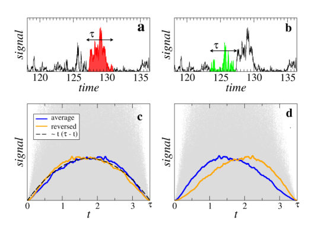
<figcaption class="paper-figure-caption"><b>Fig 1.</b> Figure 1. Given a stochastic signal, an avalanche (red, panel a) and a bridge (green, panel b) are identified. In panels c) and d) is depicted the definition of average shape: all the events (bridges in this case) of same duration τ are plotted in grey versus the internal time (which is zero at the start of the event): at each value of the internal time the average over the collected events gives the value of the average shape (blue line), resulting in a symmetric profile (example in panel c) or an asymmetric shape (example in panel d). The orange lines represents the reversed curve (t →τ −t) and it is plotted to manifest the asymmetry. Data in figures are from arbitrary stochastic...</figcaption>
</figure>
<figure class="paper-figure-card">
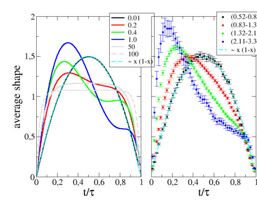
<figcaption class="paper-figure-caption"><b>Fig 2.</b> Figure 2. Average shapes for model (left) and granular experi- ment [40] (right). At left, the average bridge shapes computed from model in Eq. (5) are shown with increasing skewnesses (parameters: Tx = 0.1, Ty = 100, γx = 3, γy = 0.5, u = 1). In the legend the corresponding durations. At right, aver- age avalanche shapes from granular experiments with similar skewness (each curve is obtained averaging in a bracket of du- rations, as indicated in the legend) are quite similar with the scenario produced by the model.</figcaption>
</figure>
<figure class="paper-figure-card">
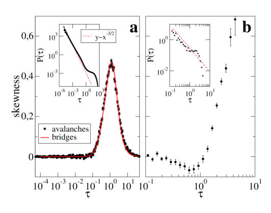
<figcaption class="paper-figure-caption"><b>Fig 3.</b> Figure 3. Analysis of average shape skewness versus dura- tion. In panel a) results from the model (same parameters as Fig. 2): red line is the theory for average bridge shapes, black points for average avalanche shapes (numerical). In panel b) the average skewness for average avalanche shapes versus their durations from granular experiment. In the insets the corresponding distributions of avalanche duration is shown for comparison.</figcaption>
</figure>
<figure class="paper-figure-card">
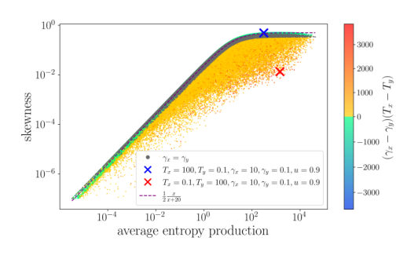
<figcaption class="paper-figure-caption"><b>Fig 4.</b> Figure 4. Maximal skewness of the shape observed as a func- tion of an estimation of the average entropy produced dur- ing the corresponding bridge. Points refers to more than 100000 different (random log-uniformly distributed) choices of parameters. The dashed line is a simple analytical expres- sion describing qualitatively the case (γx −γy)(Tx −Ty) ≤0. Crosses represent two systems with the same drift parameters γx, γy, and u, but temperatures swapped Tx ↔Ty (more de- tails in End Material).</figcaption>
</figure>
<figure class="paper-figure-card">
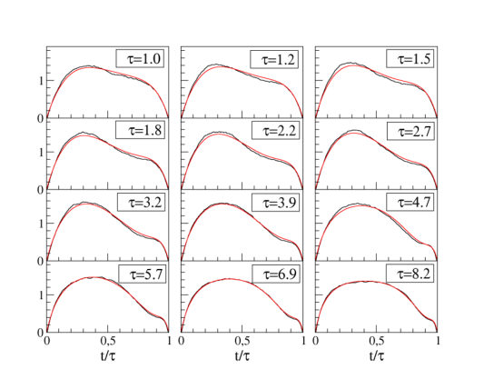
<figcaption class="paper-figure-caption"><b>Fig 5.</b> Figure 5. Comparison of normalized average shapes for bridges (analytical) in red, and avalanche (numerical) in black. Param- eters: γx = γy = 1, u = 0.5, Tx = 0.125, Ty = 12.5. Only intermediate durations are shown: at smaller and larger durations, the shapes are still indistinguishable and more symmetric, with respectively parabolic and flattening shapes.</figcaption>
</figure>

**Summary.** This paper develops a theoretical model based on the Brownian Gyrator to study time-irreversible fluctuations observed in phenomena like friction and magnetic avalanches. By analyzing the average shape of these 'avalanches,' the authors quantify the degree of asymmetry. They establish a quantitative link between this measured asymmetry (skewness) and the rate of entropy production, providing a powerful diagnostic tool for non-equilibrium physics.

**Why it may be interesting.** It provides a rigorous statistical mechanical framework for quantifying non-equilibrium signatures (like time-asymmetry) in complex physical processes, linking microscopic dynamics to macroscopic irreversibility measures.

Detailed structure

**Main problem.** The study investigates the time reversal symmetry of fluctuations, particularly by analyzing the average shape of avalanches in non-equilibrium systems.

**Main result.** The proposed Brownian Gyrator model successfully reproduces experimentally observed asymmetric average avalanche shapes, correlating this asymmetry with measures of entropy production rates.

**Method.** The authors use analytical extensions to paradigmatic models (like ABBM) and compute average bridge/avalanche shapes using propagator techniques in stochastic thermodynamics.

**Model / system.** The core model is an extension of the ABBM model, related to the Brownian Gyrator, which describes motion under anisotropic thermal fluctuations. It can be framed within rate-and-state friction models.

**Key observables.** Average avalanche/bridge shape $\langle v(t) 
angle_	au$, asymmetry (skewness), and entropy production rates ($S_{	ext{prod}}$).

**Important parameters / regimes.** Anisotropy parameters ($\gamma_x, \gamma_y$), bath temperatures ($T_x, T_y$), and the duration of the avalanche/bridge ($	au$).

**Assumptions / limitations.** The analysis relies on extending known models to capture non-equilibrium features; numerical methods require careful handling of noise terms and integration steps.

**Figures summary.** Figures compare model predictions (e.g., average bridge shapes vs. duration $	au$) against granular friction experiments, showing characteristic time-reversal asymmetry and correlating maximal skewness with entropy production.

**Paper structure.** The paper develops the theoretical framework by generalizing existing models to include anisotropy, deriving equations of motion for the generalized process, calculating the average shape using propagators, and finally correlating the resulting asymmetry (skewness) with thermodynamic quantities like entropy production.

Abstract

We investigate the problem of the time reversal symmetry of fluctuations, as witnessed by the average shape of avalanches. This quantity has been measured in a variety of systems, ranging from magnetic materials to earthquakes. Although an asymmetric shape is often observed, which is a signature of a non-equilibrium dynamics, there is no general theoretical control of this feature. In this paper, we propose a non equilibrium extension of a paradigmatic model for ``crackling-noise'', the so called ABBM model. Our model is strictly related to the Brownian Gyrator, which has been previously introduced in stochastic thermodynamics as the simplest model for thermal anisotropy, but it can also be framed in the context of rate-and-state models. It reproduces the phenomenology observed in experiments on granular friction, and allows for a systematic theoretical study of the asymmetry. We manage to correlate a measure of asymmetry, that can be easily computed in experiments, with the entropy production rates of the dynamics.

[↑ back to top](#top)

### [Machine-Learning Optimization and Characterization of a High-Optical-Depth Two-Color Nanofiber Trap](http://arxiv.org/abs/2606.06798v1)

**Authors:** W. Crump, M. Sadeghi, M. D. Hoogerland  
**Type:** experiment · **Category:** other · **PDF:** <https://arxiv.org/pdf/2606.06798v1>  
**Analysis basis:** full PDF text, analyzed in chunks
**Topic relevance:** 🔥 `quantum optics experiment` **4/5** · `analog quantum simulation` **3/5** · `correlated cavity matter` **3/5** · `QC/QI experiment` **2/5** · `methods for driven-dissipative` **2/5** · `quantum measurements` **2/5** · `Tavis-Cummings & cavity-many-emitter` **1/5** · `driven-dissipative phase transition` **1/5** · `entanglement & information structure` **1/5** · `interference shaping light` **1/5** · `non-equilibrium dynamics` **1/5**

↔ Scroll figures horizontally

<figure class="paper-figure-card">
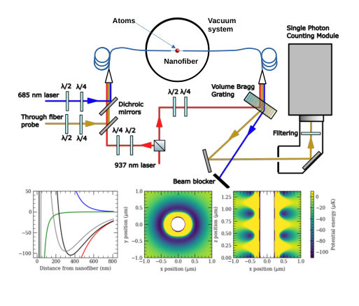
<figcaption class="paper-figure-caption"><b>Fig 1.</b> FIG. 1. (Top) Configuration of dipole trap lasers through the optical nanofiber as well as measurement probe with the SPCM. (Bottom Left) Contributions to the potential energy from 685 nm laser (blue), 937 nm lasers (red), Van der Waals potential (green) and their sum (black) for a slice at y = 0 and z = 0 along the x direction showing a trap depth of roughly 105 uK at a distance of around 350 nm from the fiber surface. A slice along the y direction is also shown (grey). (Bottom Middle) Potential energy landscape in the x-y plane calcu- lated using powers and polarizations from the experiment. (Bottom Right) Potential energy landscape in the x-z plane calculated using powers and...</figcaption>
</figure>
<figure class="paper-figure-card">
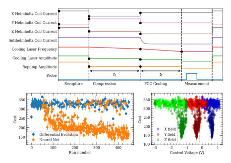
<figcaption class="paper-figure-caption"><b>Fig 2.</b> FIG. 2. (Top) Cooling sequence used in the experiment. The dots show values which where adjusted by the machine learning algo- rithm, as were the compression ramp time t1 and the PGC cooling time t2. (Bottom Left) Cost vs run number for an example machine learning session. The cost values are distinguished by whether the test parameters used were produced by the differential evolution al- gorithm or the neural net model. (Bottom Right) Cost vs Control voltage for three parameters varied during a machine learning ses- sion. These were the X, Y and Z Helmholtz magnetic fields at the beginning of the compression cooling step. Darker colors indicate values that were produced by the neural net...</figcaption>
</figure>
<figure class="paper-figure-card">
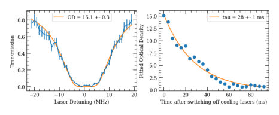
<figcaption class="paper-figure-caption"><b>Fig 3.</b> FIG. 3. (Left) Transmission measurement through the fiber with atoms in the two-color trap. The fit is using equation 1 for the opti- cal density. (Right) Lifetime measurement of the atoms in the trap. Derived from optical density measurements for a range of times after turning off the cooling lasers.</figcaption>
</figure>
<figure class="paper-figure-card">
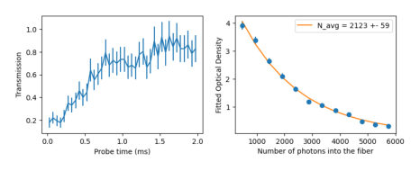
<figcaption class="paper-figure-caption"><b>Fig 4.</b> FIG. 4. (Left) Transmission measurement on resonance through the fiber. (Right) Fitted optical density vs number of photons into the trap. The fit is exponential and decay constant is an average number of photons 2120 ± 60.</figcaption>
</figure>

**Summary.** The authors report an experimental realization of a two-color dipole trap using optical nanofibers to confine cold atoms near the fiber surface. They utilized machine learning to optimize the trapping process, achieving high optical densities and estimating $\sim 1400$ trapped atoms. The key finding is that while strong coupling is achieved, the measured lifetime is limited by technical noise rather than fundamental quantum processes.

**Why it may be interesting.** This work is highly relevant as it pushes the boundaries of atom-photon interfaces by demonstrating high coupling strengths (high OD) in a shallow trap regime. The combination of ML optimization with precise quantum characterization makes it a model for advanced open quantum system experiments.

Detailed structure

**Main problem.** The goal was to create a robust, high optical-depth nanofiber trap for coupling quantum information from cold atoms over long distances.

**Main result.** The experiment successfully achieved an optical depth exceeding 15 and trapped approximately 1400 Cesium atoms with a measurable lifetime of 28 ms. The study concluded that technical noise, rather than fundamental processes, limits the atom loss rate.

**Method.** The researchers employed machine learning optimization on the cooling sequence parameters and used transmission spectroscopy to characterize the optical depth and trap lifetime.

**Model / system.** The physical system is a two-color evanescent-field dipole trap using Cesium atoms near an optical nanofiber. The trapping mechanism combines blue-detuned (repulsive) and red-detuned (attractive) fields, creating a 1D lattice of trapping sites.

**Key observables.** Peak optical depth ($\approx 15.1$), estimated atom number ($\approx 1400$), collective cooperativity ($\approx 28$), and trap lifetime ($28 	ext{ ms}$).

**Important parameters / regimes.** Trap depths ($\sim 100 \mu	ext{K}$), cooling detunings (up to $22 	ext{ MHz}$), and the characteristic loss rate dominated by technical noise.

**Assumptions / limitations.** The primary limitation on lifetime is attributed to technical noise, not intrinsic recoil or vacuum processes. The calculation of single-atom optical depth might overestimate the true value due to wavefunction spreading.

**Figures summary.** Figure 1 illustrates the laser configuration and calculated potential energy landscapes. Figure 4 shows transmission measurements on resonance (left) and the exponential decay of optical depth versus absorbed probe photons (right).

**Paper structure.** The paper details the setup using a two-color dipole trap, describes the use of machine learning to optimize the cooling sequence parameters, presents characterization results like high optical depth measurement, and finally analyzes the lifetime decay to determine the limiting loss mechanism.

Abstract

Optical nanofibers provide a way of coupling quantum information in cold atoms across large distances, however, this coupling requires atoms to reside close to the nanofiber surface. Atoms can be trapped close to the surface using a two-color dipole trap. Here we present our experimental realization of a two-color dipole trap. We optimize the number of trapped atoms using a machine learning algorithm and measure the optical density via the transmission. We estimate the number of atoms in the trap to be approximately 1400 and the lifetime of the atoms in the trap to be 28 ms. Machine-learning optimization improved the on-resonance optical depth from 0.5 in the initial optimization stage to optical depths exceeding 15.

[↑ back to top](#top)

### [Continuous-time quantum control across an exponentially small bottleneck in a frustrated Ising ring model](http://arxiv.org/abs/2606.07168v1)

**Authors:** Vincenzo Roberto Arezzo, Kiran Thengil, Giuseppe Santoro  
**Type:** theory · **Category:** disordered systems and neural networks · **PDF:** <https://arxiv.org/pdf/2606.07168v1>  
**Analysis basis:** full PDF text, analyzed in chunks
**Topic relevance:** 🔥 `analog quantum simulation` **4/5** · `exotic spin models in light-matter` **3/5** · `non-equilibrium dynamics` **3/5** · `methods for driven-dissipative` **2/5** · `non-equilibrium universality` **2/5** · `Keldysh / 2PI / non-Gaussian methods` **1/5** · `driven-dissipative phase transition` **1/5** · `entanglement & information structure` **1/5** · `quantum measurements` **1/5**

↔ Scroll figures horizontally

<figure class="paper-figure-card">
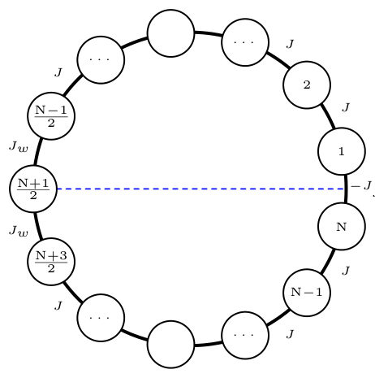
<figcaption class="paper-figure-caption"><b>Fig 1.</b> FIG. 1: The Ising frustrated ring model with an odd number of sites N. The model has a reflection symmetry around the axis indicated by the dashed blue line.</figcaption>
</figure>
<figure class="paper-figure-card">
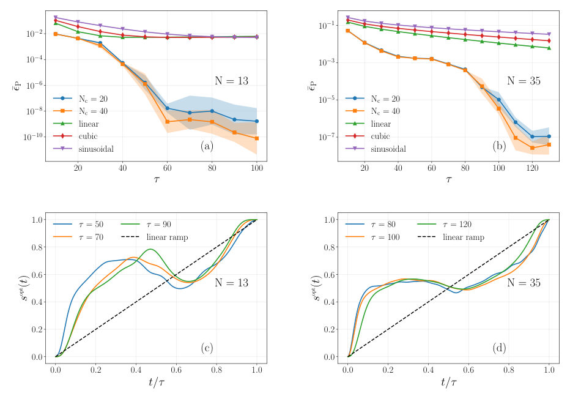
<figcaption class="paper-figure-caption"><b>Fig 2.</b> FIG. 2: Comparison between optimized continuous-time residual energies and fixed-schedule results for N = 13, Jf = 0.45 (a,c), and N = 35, Jf = 0.45 (b,d). Panels (a) and (b) show the geometric mean of the optimized residual energies ¯ϵP(τ) over Nrun = 10 independent dressed-CRAB runs. The shaded regions indicate one logarithmic standard deviation. Panels (c) and (d) show representative optimized schedules sopt(t) for the case Nc = 20, and several values of τ.</figcaption>
</figure>
<figure class="paper-figure-card">
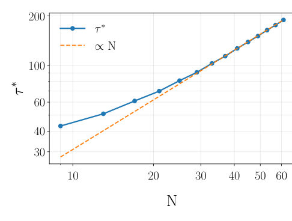
<figcaption class="paper-figure-caption"><b>Fig 3.</b> FIG. 3: Threshold annealing time τ ∗extracted from the con- dition ¯ϵP(τ) &lt; ϵthreshold = 10−6, as a function of the system size N. For each N, we scan the annealing time τ in steps of ∆τ = 1 and define τ ∗as the smallest scanned value of τ for which the geometric mean of the optimized residual en- ergy satisfies ¯ϵP(τ) &lt; ϵthreshold. The data are shown in log-log scale. The dashed line is a linear-scaling guide to the eye, τ ∗∝N, normalized using the largest system size. The com- parison suggests that, in the range of sizes explored here, the threshold time τ ∗is compatible with a linear scaling with N. All data are obtained with the default two-iteration dressed- CRAB setup described in...</figcaption>
</figure>
<figure class="paper-figure-card">
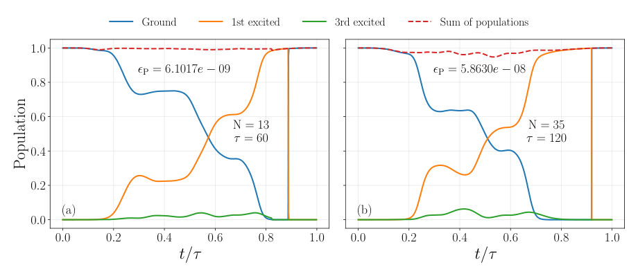
<figcaption class="paper-figure-caption"><b>Fig 4.</b> FIG. 4: Populations of the low-lying instantaneous eigenstates during the optimized dynamics for two system sizes: N = 13 at τ = 60 (panel (a)) and N = 35 at τ = 120 (panel (b)). All data are obtained with the default two-iteration dressed-CRAB setup described in Sec. III. Notice the abrupt final population transfer for values of t/τ close to the bottleneck value of sb ≈0.9. The final ground-state infidelities are 1 −p0(τ) ≃3.8 × 10−8 for N = 13 and 1 −p0(τ) ≃9.6 × 10−7 for N = 35.</figcaption>
</figure>
<figure class="paper-figure-card">
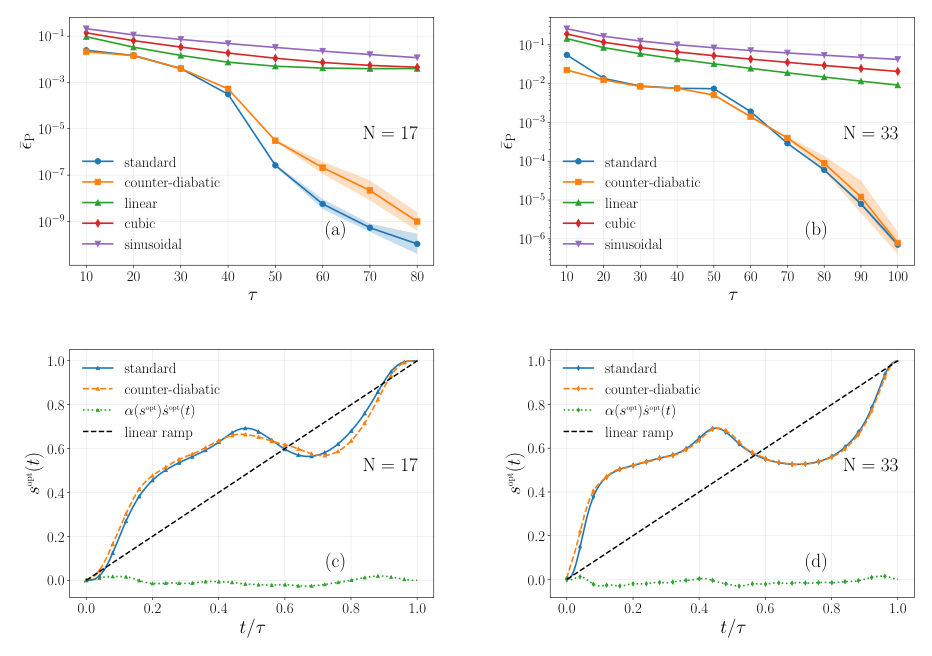
<figcaption class="paper-figure-caption"><b>Fig 5.</b> FIG. 5: Comparison of the optimized residual energies obtained with the standard and counter-diabatic protocols, together with the results for fixed linear, cubic, and sinusoidal schedules. The data refer to Jf = 0.2501 and N = 17 in panels (a,c), and to Jf = 0.2501 and N = 33 in panels (b,d). The residual-energy points show the geometric mean ¯ϵP(τ) over Nrun = 10 independent dressed-CRAB runs, while the shaded regions indicate one logarithmic standard deviation. The bottom panels compare the optimized schedules for τ = 80 and show the corresponding profile of α(s) ˙s(t) entering the counter-diabatic correction. Both the standard and counter-diabatic schedules are optimized using the same...</figcaption>
</figure>

**Summary.** This paper develops advanced quantum control techniques to prepare the ground state of a frustrated Ising ring model, which typically suffers from exponentially small energy gaps. By optimizing the annealing schedule continuously rather than using fixed ramps, the authors demonstrate that the required computation time scales only linearly with system size. This provides a significant theoretical breakthrough for simulating complex many-body systems trapped by spectral bottlenecks.

**Why it may be interesting.** This work directly addresses fundamental limitations in quantum simulation algorithms by providing a concrete method to achieve polynomial scaling for ground state preparation in systems with known spectral bottlenecks.

Detailed structure

**Main problem.** The primary challenge is overcoming exponentially long annealing times required by standard Quantum Annealing (QA) when the system encounters an exponentially small spectral gap bottleneck.

**Main result.** By optimizing continuous-time control schedules, the required annealing time scales linearly with system size rather than exponentially, successfully bypassing the bottleneck mechanism.

**Method.** The authors use quantum optimal control theory to optimize smooth, continuous-time annealing schedules using a dressed-CRAB approach and gradient optimization techniques.

**Model / system.** The study focuses on a frustrated Ising ring model, whose dynamics are governed by an interpolating Hamiltonian between a driving field ($\hat{H}_x$) and the target problem ($\hat{H}_z$).

**Key observables.** Residual energy ($\epsilon$), threshold annealing time ($	au^*$), and population distributions across instantaneous eigenstates.

**Important parameters / regimes.** System size ($N$), minimum spectral gap ($\Delta_{\min}$), and the optimization schedule parameters (Fourier coefficients).

**Assumptions / limitations.** The analysis relies on optimizing smooth, continuous-time schedules; counter-diabatic corrections are analyzed but found not to improve results beyond optimal scheduling.

**Figures summary.** Figures illustrate the frustrated Ising ring structure, show population dynamics near bottlenecks, and compare residual energies for optimized vs. fixed annealing schedules across varying system sizes.

**Paper structure.** The paper introduces the QA problem on the frustrated Ising ring, details the continuous-time control optimization using dressed-CRAB, analyzes the resulting nonadiabatic dynamics (population transfer), compares performance against standard ramps, and finally examines the role of counter-diabatic corrections.

Abstract

Continuous-time Quantum Annealing (QA) is a strategy for preparing the ground state of nontrivial many-body systems. In its standard form, the dynamics is generated by a time-dependent interpolation between a simple driving Hamiltonian and the target problem Hamiltonian, usually implemented through a linear schedule. This approach faces the crucial bottleneck of small spectral gaps, which may require exponentially long annealing times to ensure adiabaticity. Here, we show how to implement quantum control over the annealing schedule in a frustrated Ising ring, one of the simplest models exhibiting an exponentially small bottleneck gap. By optimizing smooth continuous-time annealing schedules with a dressed-CRAB approach, and using a digitized representation of the dynamics to efficiently evaluate gradients, we construct protocols that strongly outperform standard fixed schedules. The optimized dynamics bypasses the bottleneck through a strongly nonadiabatic mechanism, leading to efficient ground-state preparation despite the exponentially small minimum gap. In particular, the annealing time required to reach a fixed residual-energy threshold is found to grow linearly with system size rather than exponentially. We further examine a lowest-order variational counter-diabatic correction and find that, once schedule optimization is allowed, it does not lead to any improvement.

[↑ back to top](#top)

### [Vortex dynamics in rotating dipolar supersolids across Josephson and self-trapping regimes](http://arxiv.org/abs/2606.07266v1)

**Authors:** Aitor Alaña, Michele Modugno, Pablo Capuzzi  
**Type:** theory · **Category:** quantum gases · **PDF:** <https://arxiv.org/pdf/2606.07266v1>  
**Analysis basis:** full PDF text, analyzed in chunks
**Topic relevance:** 🔥 `analog quantum simulation` **4/5** · `methods for driven-dissipative` **3/5** · `non-equilibrium dynamics` **3/5** · `driven-dissipative phase transition` **2/5** · `non-equilibrium universality` **2/5** · `Frenkel-Kontorova` **1/5** · `Keldysh / 2PI / non-Gaussian methods` **1/5** · `correlated / nonlocal dissipation` **1/5** · `entanglement & information structure` **1/5**

↔ Scroll figures horizontally

<figure class="paper-figure-card">
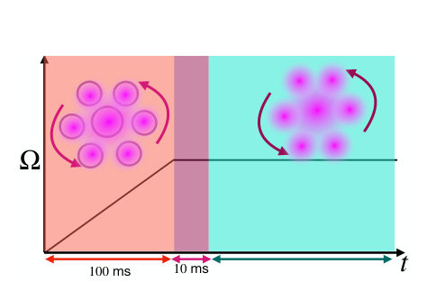
<figcaption class="paper-figure-caption"><b>Fig 1.</b> FIG. 2. Schematic depiction of the stirring protocol. We start with a stationary self-sustained supersolid with a su- perimposed egg-box potential. This potential is then rotated at a linearly increasing speed during 100 ms. Following this, the potential is gradually turned off over a period of 10 ms. Once the egg-box potential has been completely removed, the supersolid rotates freely due to the angular momentum trans- ferred by the rotating potential.</figcaption>
</figure>
<figure class="paper-figure-card">
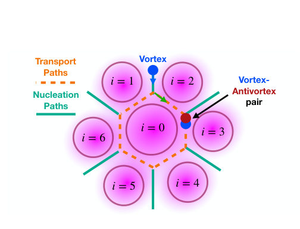
<figcaption class="paper-figure-caption"><b>Fig 2.</b> FIG. 1. Schematic view of the system under study. A super- solid with a central droplet and a ring of six smaller droplets, arranged in a triangular lattice. The low-density nucleation and transport paths are highlighted in solid green and dashed orange, respectively. Vortices (blue dots) can enter through nucleation, remaining there or moving to a nucleation path. In the case of self-trapping, vortex-antivortex pairs can ap- pear, in which case the vortex and the antivortex (dark red dot) will move in opposite directions until they collide with their opposite and annihilate.</figcaption>
</figure>
<figure class="paper-figure-card">
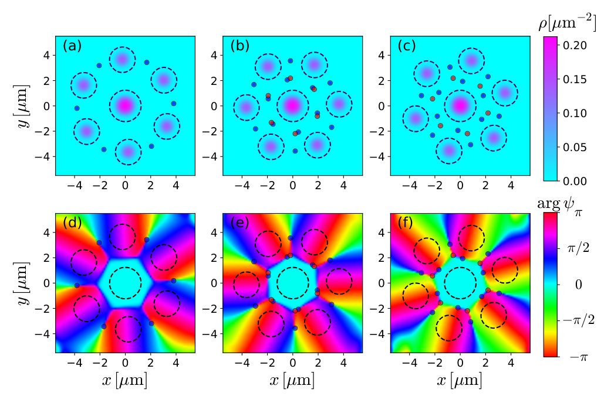
<figcaption class="paper-figure-caption"><b>Fig 3.</b> FIG. 3. Column densities ρ(x, y) (normalized to unity, top row, panels (a)-(c)) and wave function phases at z = 0, arg ψ(x, y, z = 0) (bottom row, panels (d)-(f)) of a rotating supersolid following the rotation ramp-up and a self-trapping dynamics. The dashed lines mark the density contour at ρ = ρmax/100 chosen to visualize the droplets cores, while the blue and red points mark vortices and antivortices, respectively. The actual saddle-point column density between neighboring droplets is ρ/ρmax ≃10−5 and the superfluid fraction is approximately 7%. The left, middle, and right columns correspond to times t = 70, 76, 84 ms, respectively.</figcaption>
</figure>
<figure class="paper-figure-card">
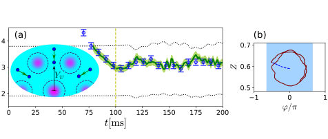
<figcaption class="paper-figure-caption"><b>Fig 4.</b> FIG. 4. (a) Vortex nucleation Yn as a function of time, fol- lowing the stirring procedure in Fig. 2, for Ω/2π = 20 Hz and Zi ≃0.59. The eGPE results are indicated with blue circles, and the two-droplet approximation with a solid green line. The error bars correspond to the spatial discretization in the numerical simulation, while the colored band around the two-droplet approximation marks a 5% uncertainty stem- ming from the determination of d and Ωfrom the spatial discretization and averaging over the six ring droplets. The dotted lines mark the position of the hexagon vertices. The inset illustrates schematically the geometry of the droplets and the involved path Yn. (b) Evolution of the...</figcaption>
</figure>
<figure class="paper-figure-card">
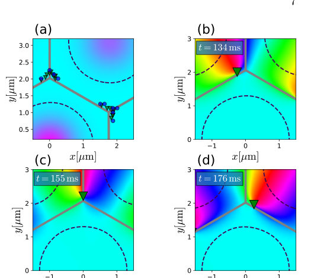
<figcaption class="paper-figure-caption"><b>Fig 5.</b> FIG. 6. Vortex oscillations in the xy plane for the sim- ulation of Fig. 5. Panel (a) depicts the vortex positions at different times during the dynamics according to the eGPE (blue dots) and three-droplet approximation (green triangles) around two vertices, with the background colors depicting the corresponding densities at t = 110 ms. Panels (b)-(d) show the position of the vortex that has been nucleated along the y &gt; 0 axis up to the vertex, at selected observation times t = 134, 155, 176 ms, calculated using the three-droplet ap- proximation, with the background colors corresponding to the wave function phase.</figcaption>
</figure>

**Summary.** The paper explores how vortices behave in rotating dipolar supersolids by modeling the system as weakly linked condensates. It demonstrates that combining Josephson oscillation physics with self-trapping dynamics offers a powerful, tunable protocol to precisely trigger and track vortex nucleation, transport, and pair annihilation events within the lattice structure.

**Why it may be interesting.** This work provides a detailed, controllable mechanism to study fundamental quantum phenomena like phase slips and vortex dynamics using ultracold atomic systems, which is highly relevant to understanding superfluidity in complex geometries.

Detailed structure

**Main problem.** The study investigates vortex nucleation and transport dynamics within a rotating dipolar supersolid across distinct physical regimes: Josephson oscillations and macroscopic self-trapping.

**Main result.** Local phase differences provide a predictive framework, showing that combining Josephson and self-trapping protocols allows for tunable control over triggering vortex nucleation, tracking transport, and observing pair annihilation mechanisms.

**Method.** The dynamics are modeled by analyzing the system as an array of weakly linked condensates, using local phase differences ($\varphi$) and population imbalances ($Z$) derived from the extended Gross-Pitaevskii equation (eGPE).

**Model / system.** The physical system is a dipolar Bose gas forming a supersolid arranged in a triangular droplet lattice. The theoretical framework utilizes the eGPE, incorporating dipole-dipole interactions and Lee-Huang-Yang corrections.

**Key observables.** Vortex position ($Y_n, Y_t$), phase differences ($\varphi$), population imbalance ($Z$), vortex/antivortex pair creation/annihilation events.

**Important parameters / regimes.** Rotation frequency ($\Omega$), Josephson regime vs. Self-Trapping (ST) regime transitions, and the necessity of a three-droplet description near lattice vertices.

**Assumptions / limitations.** The analysis relies on approximating the system using local phase differences between neighboring droplets; specifically, the two-droplet approximation fails near hexagon vertices, necessitating a three-droplet model for accuracy.

**Figures summary.** Figures schematically illustrate the triangular lattice structure and paths for vortex nucleation (solid green) and transport (dashed orange). Later figures compare eGPE simulations with approximations, highlighting pair creation/annihilation events during rotation ramps.

**Paper structure.** The paper establishes the physical model (dipolar supersolid in a droplet lattice), develops theoretical tools based on local phase differences, analyzes dynamics separately in Josephson and Self-Trapping regimes, and culminates by showing how combining these two protocols allows for comprehensive control over topological vortex events.

Abstract

We investigate vortex nucleation and transport in a rotating dipolar supersolid arranged in a triangular droplet lattice, exploiting its description as an array of weakly linked condensates. By considering both Josephson and macroscopic self-trapping dynamics, we show that local phase differences between droplets provide a compact and highly predictive framework to explore a wide range of vortex behaviors. In particular, Josephson oscillations can be devised to induce vortex nucleation and motion near the vertices of the low-density hexagonal lattice (between droplets), while self-trapping dynamics induce running phases that enable directed vortex transport, which may be accompanied by vortex-antivortex pair creation and annihilation over finite time scales. Comparison with simulations based on the extended Gross-Pitaevskii equation demonstrates that a three-droplet description is essential to capture vortex motion near hexagon vertices. Together, Josephson and self-trapping dynamics provide a tunable protocol to trigger and track vortex nucleation, transport, and vortex-antivortex pair annihilation, revealing the microscopic topological mechanisms underlying phase slips in rotating dipolar supersolids.

[↑ back to top](#top)

### [Cyclic ladder operators and hidden Weyl-Heisenberg structure in a Floquet system](http://arxiv.org/abs/2606.06810v1)

**Authors:** Tianao Wu, Li Ge  
**Type:** theory · **Category:** other · **PDF:** <https://arxiv.org/pdf/2606.06810v1>  
**Analysis basis:** full PDF text, analyzed in chunks
**Topic relevance:** 🔥 `analog quantum simulation` **4/5** · `non-equilibrium dynamics` **3/5** · `driven-dissipative phase transition` **2/5** · `methods for driven-dissipative` **2/5** · `non-equilibrium universality` **2/5** · `Frenkel-Kontorova` **1/5** · `Keldysh / 2PI / non-Gaussian methods` **1/5** · `entanglement & information structure` **1/5**

↔ Scroll figures horizontally

<figure class="paper-figure-card">
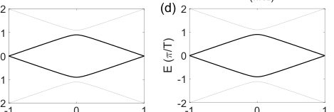
<figcaption class="paper-figure-caption"><b>Fig 1.</b> FIG. 1. (a) Schematics of a one-dimensional Floquet system with temporal period T and spatial period Λ. Couplings are marked by bars, and one unit cell is boxed by the dashed line. Sublattices A and B are marked by filled and open dots. (b-d) Band structure of the Floquet system with g = 1 and T/π = 0.9, 1, 1.1, respectively. The first Floquet BZ is darkened.</figcaption>
</figure>

**Summary.** This theoretical paper explores cyclic ladder operators in finite quantum systems, showing that if these systems obey a Weyl-Heisenberg commutation relation, their energy spectrum must be equally spaced. This principle is rigorously demonstrated using a one-dimensional Floquet lattice model, revealing a deep algebraic connection between the system's time evolution and its underlying discrete symmetries.

**Why it may be interesting.** This work provides deep connections between discrete spectral properties (equally spaced ladders) and fundamental algebraic structures (WH group), offering insights into the underlying symmetries governing dynamics in periodically driven quantum systems relevant to AMO physics.

Detailed structure

**Main problem.** The paper investigates cyclic ladder operators in finite-dimensional quantum systems, particularly exploring how an underlying Weyl-Heisenberg (WH) commutation relation dictates the energy spectrum and dynamics.

**Main result.** It demonstrates that the existence of a WH structure forces the system to possess an equally spaced energy ladder, which is confirmed by showing the temporal evolution operator relates directly to the cyclic ladder operators in specific limits.

**Method.** The analysis involves deriving algebraic properties of generalized ladder operators for finite Hilbert spaces and applying these concepts to model dynamics using Floquet theory.

**Model / system.** The primary models are general quantum systems with discrete spectra, exemplified by a one-dimensional tight-binding lattice subjected to periodic driving (Floquet system).

**Key observables.** Equally spaced energy ladder ($E_n$), the temporal evolution operator $U(T)$, and the diagonal form of cyclic ladder operators.

**Important parameters / regimes.** The number of sites ($N$) in the lattice, the time period ($T$), and the coupling strengths ($	heta$).

**Assumptions / limitations.** The analysis assumes the existence or emergence of an underlying Weyl-Heisenberg commutation relation to enforce spectral regularity.

**Figures summary.** Figures illustrate schematics of the 1D Floquet system, its band structures under varying driving conditions (including Dirac cone formation), and particle movement trajectories on a finite lattice.

**Paper structure.** The paper first introduces cyclic ladder operators in general finite systems, establishing the link to WH algebra. It then applies this framework to a specific one-dimensional Floquet lattice model, analyzing how the time evolution operator $U(T)$ manifests these algebraic symmetries.

Abstract

Ladder operators, found in the quantum harmonic oscillator and other quantized systems, provide an elegant approach to solving or understanding otherwise intricate physics problems. In this Letter, we discuss cyclic ladder operators in both Hermitian and non-Hermitian systems with a finite Hilbert space, with the highest (lowest) level directly descending (ascending) to the lowest (highest) level via a single raising (lowering) operation. We show that an equally spaced energy ladder emerges when these systems have an underlying Weyl-Heisenberg commutation relation, with the cyclic ladder operators and the temporal evolution operator behaving as the generators of the Weyl-Heisenberg group. We further illustrate such a system using a one-dimensional Floquet lattice, where the cyclic ladder operators become diagonal and the temporal evolution simplifies to a permutation matrix after a Floquet period. Our findings reveal a hidden relation between non-trivial dynamics and algebraic principles in Floquet systems, which may exist for other quantum numbers as well besides the energy levels.

[↑ back to top](#top)

### [Failure of the Quench Action Formalism for Mott Insulator Initial States](http://arxiv.org/abs/2606.07111v1)

**Authors:** Garry Goldstein  
**Type:** theory · **Category:** quantum gases · **PDF:** <https://arxiv.org/pdf/2606.07111v1>  
**Analysis basis:** full PDF text, analyzed in chunks
**Topic relevance:** 🔥 `non-equilibrium dynamics` **4/5** · `analog quantum simulation` **3/5** · `non-equilibrium universality` **3/5** · `scars & prethermalization` **2/5** · `Keldysh / 2PI / non-Gaussian methods` **1/5** · `driven-dissipative phase transition` **1/5** · `entanglement & information structure` **1/5** · `methods for driven-dissipative` **1/5**

↔ Scroll figures horizontally

<figure class="paper-figure-card">
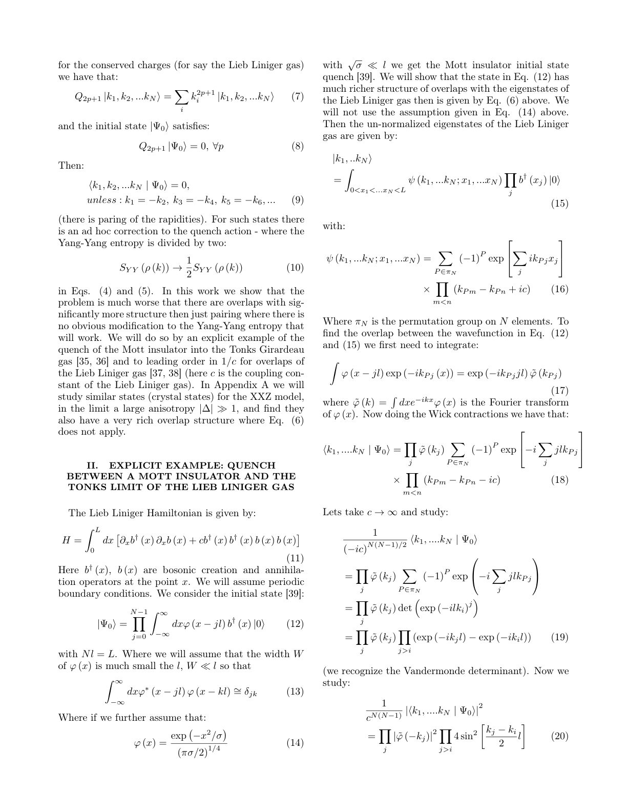
<figcaption class="paper-figure-caption"><b>Fig 1.</b> Low-resolution page preview, page 2</figcaption>
</figure>
<figure class="paper-figure-card">
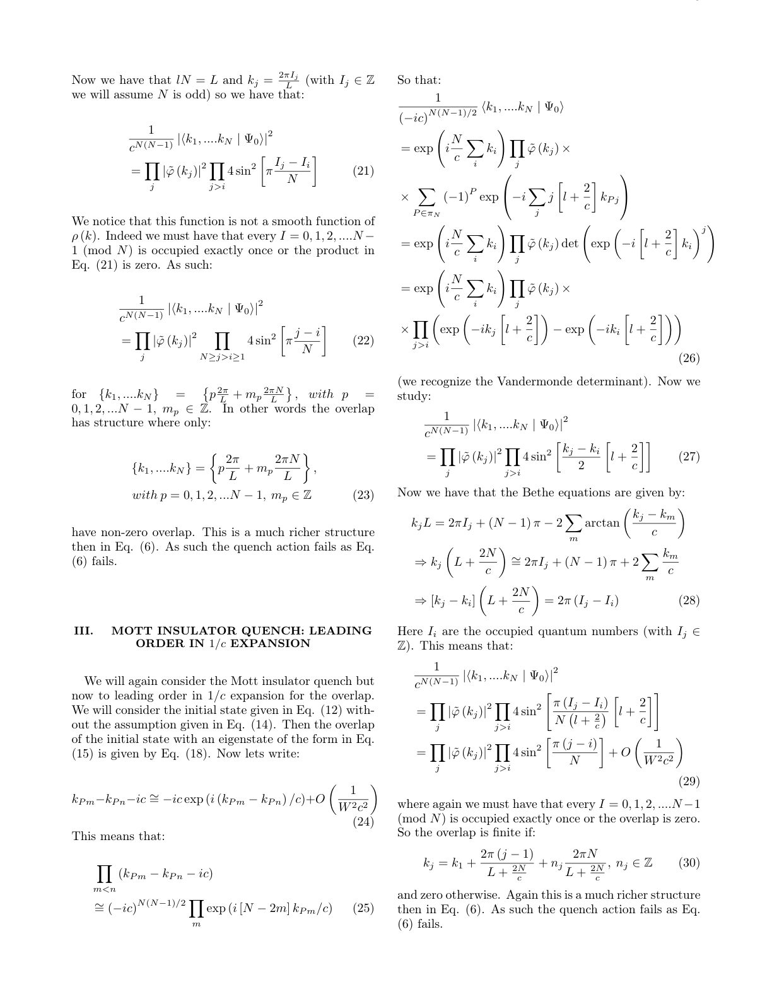
<figcaption class="paper-figure-caption"><b>Fig 2.</b> Low-resolution page preview, page 3</figcaption>
</figure>
<figure class="paper-figure-card">
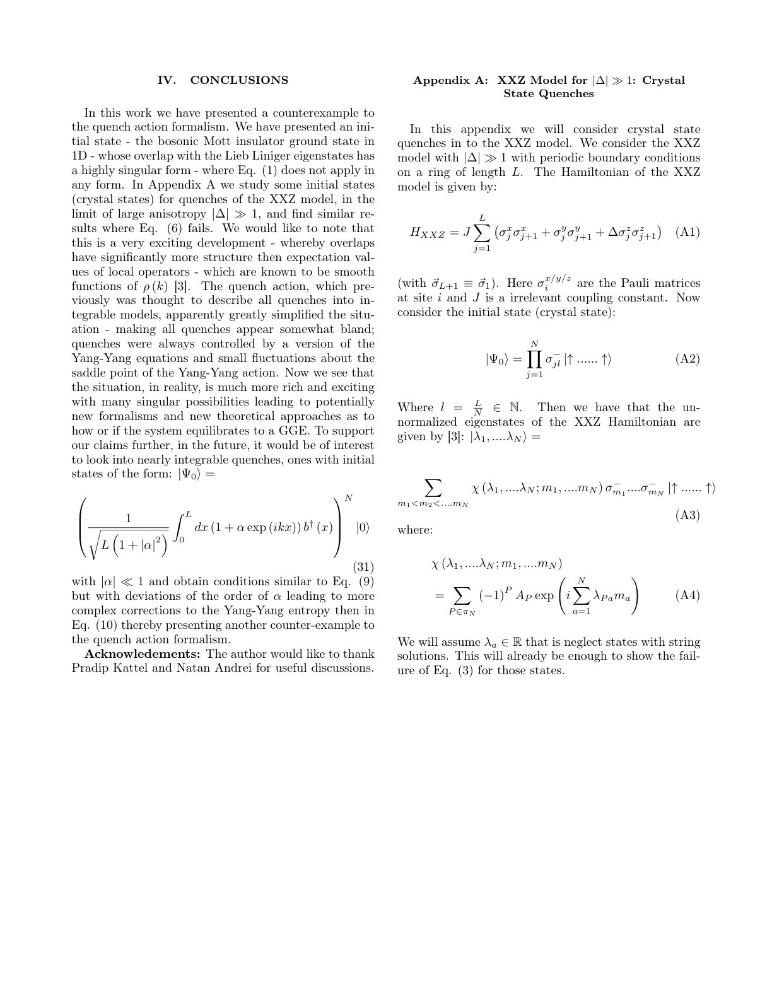
<figcaption class="paper-figure-caption"><b>Fig 3.</b> Low-resolution page preview, page 4</figcaption>
</figure>
<figure class="paper-figure-card">
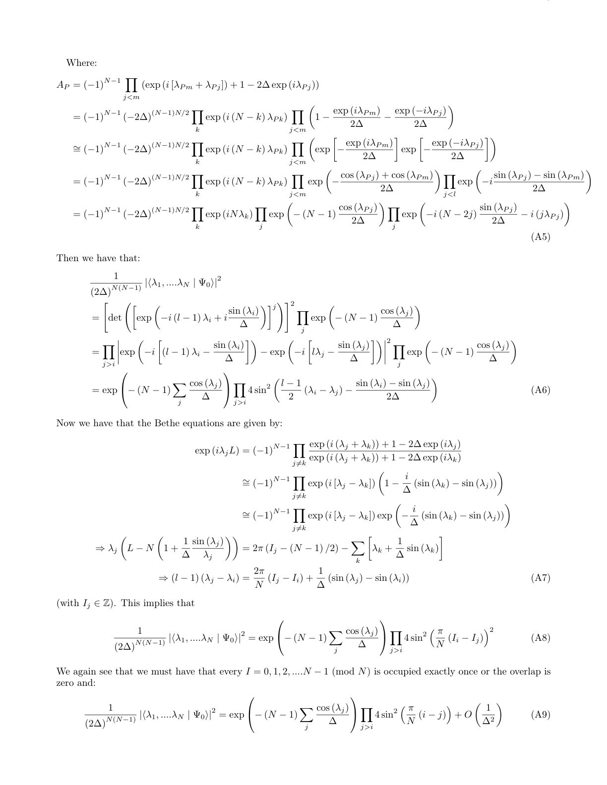
<figcaption class="paper-figure-caption"><b>Fig 4.</b> Low-resolution page preview, page 5</figcaption>
</figure>
<figure class="paper-figure-card">
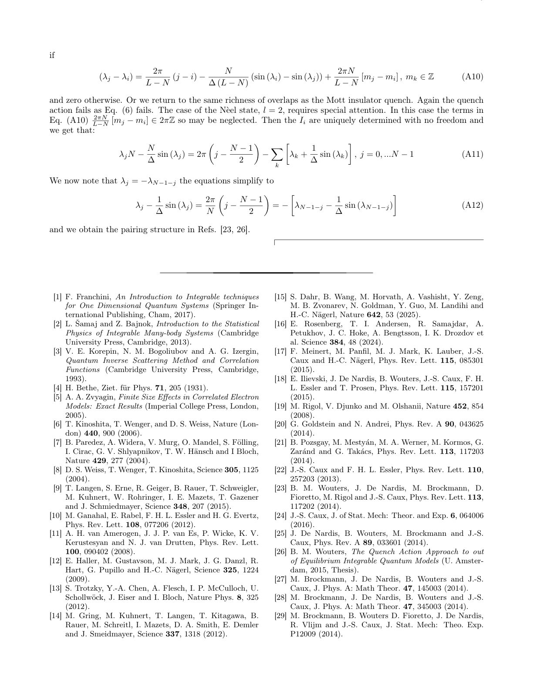
<figcaption class="paper-figure-caption"><b>Fig 5.</b> Low-resolution page preview, page 6</figcaption>
</figure>

**Summary.** This theoretical paper proves that the Quench Action Formalism fails to accurately describe quantum system evolution after a sudden change (quench) into an integrable model. Using explicit calculations on systems like Mott insulators quenched to Lieb-Liniger gases, the authors show that the true overlaps are highly singular, contradicting the formalism's assumption of smooth dependence.

**Why it may be interesting.** This work is highly relevant for theorists studying non-equilibrium dynamics in quantum many-body systems, as it invalidates a widely used simplifying assumption (the quench action) for predicting thermalization or relaxation pathways.

Detailed structure

**Main problem.** The paper challenges the validity of the Quench Action Formalism, a theoretical tool used to predict quantum system relaxation after a quench into an integrable model.

**Main result.** By explicit counterexamples involving Mott insulator quenches to Lieb-Liniger gas and XXZ models, the authors demonstrate that the overlap between initial states and eigenstates exhibits highly singular behavior, violating the smooth functional dependence assumed by the formalism.

**Method.** The analysis involves calculating quantum overlaps using bosonic creation/annihilation operators in specific limits (e.g., Tonks-Girardeau limit) and comparing these results against the predicted exponential form of the quench action.

**Model / system.** The study examines quenches between Mott insulators and Lieb-Liniger gases, as well as overlaps within the XXZ model with crystal states. The underlying physics involves integrable quantum many-body systems.

**Key observables.** The primary observable is the overlap $\langle k_{1},...k_{N} | \Psi_{0} 
angle$ between the initial state and the eigenstates of the final Hamiltonian.

**Important parameters / regimes.** Key parameters include the coupling constant $c$ (for Lieb-Liniger gas) and anisotropy $\Delta$ (for XXZ model), analyzed in specific limits like leading order in $1/c$.

**Assumptions / limitations.** The paper critiques the core assumption of the Quench Action Formalism: that the overlap must depend smoothly on the quasiparticle density $
ho(\mathbf{k})$.

**Figures summary.** Not specified by notes, but calculations involve comparing derived overlap expressions (e.g., Eq. 29 vs Eq. 6) to show discrepancies.

**Paper structure.** The paper first introduces the formalism and then presents explicit counterexamples using two distinct physical systems: Mott insulator $	o$ Lieb-Liniger gas, followed by an appendix detailing similar failures in the XXZ model with crystal states.

Abstract

The quench action formalism relies on the assumption that the overlap between a generic initial state $\left|Ψ_{0}\right\rangle $ and an eigenstate of an integrable model - defined through the rapidities $\left|k_{1},...k_{N}\right\rangle $ - can be written as: \begin{equation} \left\langle k_{1},...k_{N}\midΨ_{0}\right\rangle =\exp\left(-S_{Ψ_{0}}\left(ρ\left(k\right)\right)\right),\label{eq:Exponential} \end{equation} where $ρ\left(k\right)$ is the quasiparticle density of the state $\left|k_{1},...k_{N}\right\rangle $ and $S_{Ψ_{0}}$ is some smooth function of $ρ\left(k\right)$ that depends on $Ψ_{0}$. In particular the quench action formalism assumes the overlap depends smoothly on the quasiparticle density $ρ\left(k\right)$. In this work, by explicit counter example, we show that this is not the case. We consider the quench between a Mott insulator and a Lieb Liniger gas. We show that the overlap between the ground state of the Mott insulator and arbitrary eigenstates of the Lieb Liniger gas has a highly singular behavior and no expression like Eq. (1) applies. We do so within the Tonks Girardeau limit of the Lieb Liniger gas and to leading order in the $1/c$ expansion for the overlap (with $c$ being the coupling constant of the Lieb Liniger gas). In the Appendix we show similar results for overlaps in the XXZ model with crystal states.

[↑ back to top](#top)

### [Fluctuation-induced and quantum effects in nanofluidic transport](http://arxiv.org/abs/2606.06693v1)

**Authors:** Adrien Sutter, Peter Gispert, Baptiste Coquinot, Lydéric Bocquet, Nikita Kavokine  
**Type:** both · **Category:** statistical mechanics · **PDF:** <https://arxiv.org/pdf/2606.06693v1>  
**Analysis basis:** full PDF text, analyzed in chunks
**Topic relevance:** 🔥 `Keldysh / 2PI / non-Gaussian methods` **4/5** · `methods for driven-dissipative` **3/5** · `non-equilibrium dynamics` **3/5** · `driven-dissipative phase transition` **2/5** · `non-equilibrium universality` **2/5** · `Frenkel-Kontorova` **1/5** · `correlated / nonlocal dissipation` **1/5**

↔ Scroll figures horizontally

<figure class="paper-figure-card">
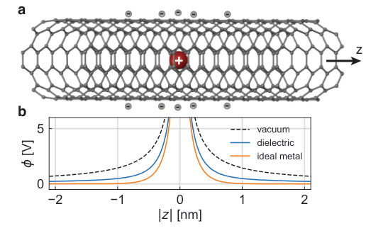
<figcaption class="paper-figure-caption"><b>Fig 1.</b> FIG. 1 Superionic state. (a) Positive ion in the center of a (6,6) carbon nanotube with radius R = 0.4 nm. (b) Resulting Coulomb potential along the tube axis in vacuum (without the nanotube), for a nanopore inside a bulk dielectric material with dielectric constant ϵ = 3 and for a nanotube modeled as an ideal metal. The ideal-metal boundary condition leads to an exponentially screened effective interaction along the tube axis, known as the superionic state (Kondrat and Kornyshev, 2011).</figcaption>
</figure>
<figure class="paper-figure-card">
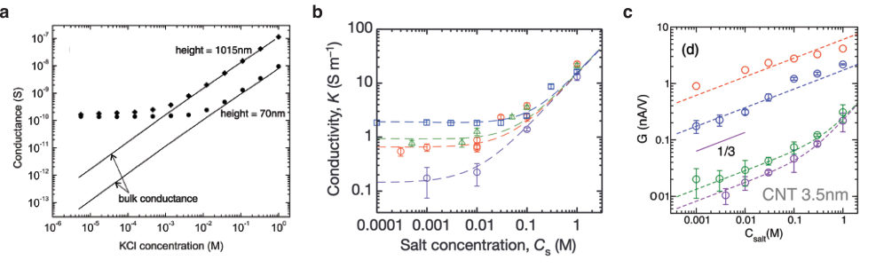
<figcaption class="paper-figure-caption"><b>Fig 2.</b> FIG. 2 Ion conductivity and surface charge. (a) Electrical conductance of aqueous KCl solution in fused silica channels of 1015 nm and 70 nm height as a function of KCl concentration, reproduced from Stein et al. (2004). Due to the surface charge on the channel walls, the conductance exhibits a plateau at low concentrations. (b) Electrical conductivity of aqueous KCl solution in single transmembrane boron nitride nanotubes at pH = 5 as a function of KCl concentration. The tubes are about 1 µm long and their radii are (from bottom to top) 40 nm, 29 nm, 22 nm and 15 nm, reproduced from Siria et al. (2013). Due to the surface charge on the nanotube wall, the conductivity plateaus at low...</figcaption>
</figure>
<figure class="paper-figure-card">
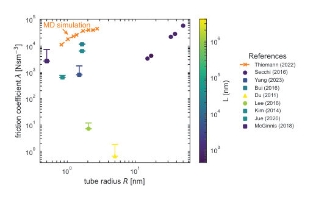
<figcaption class="paper-figure-caption"><b>Fig 3.</b> FIG. 3 Water friction in CNTs. Water friction coefficient λ as a function of CNT radius R from various experiments (Bui et al., 2016; Du et al., 2011; Jue et al., 2020; Kim et al., 2014; Lee and Park, 2016; McGinnis et al., 2018; Secchi et al., 2016a; Yang et al., 2023). All data is from membrane-based assays, except the data in Secchi et al. (2016a), which is from single-tube measurements. For comparison, we also show the friction coefficient predicted by machine-learning-based MD simulations in orange (Thiemann et al., 2022). The color of the data points represents the CNT length, while the symbol indicates the number of walls (circle: multi-walled, triangle: double-walled, square:...</figcaption>
</figure>
<figure class="paper-figure-card">
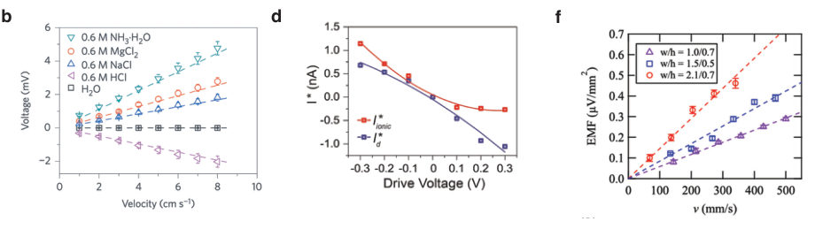
<figcaption class="paper-figure-caption"><b>Fig 4.</b> FIG. 4 Coupling of nanofluidic flows and electronic currents. (a) A droplet of ionic solution is pulled along a graphene sheet. (b) The induced voltage in the graphene depends linearly on the droplet velocity. The sign of the voltage depends on the ion species. (a,b) Reproduced from Yin et al. (2014). (c) Coupling of ionic and electronic currents in a CNT. An electrical current in the CNT wall induces an ionic current through the CNT. Conversely, an ionic flow through the CNT induces an electronic current in the CNT wall. (d) Experimental data for the electronic-current-induced ion flow (red) and the ion-flow- induced electronic current (blue). (c,d) Reproduced from Rabinowitz et al....</figcaption>
</figure>
<figure class="paper-figure-card">
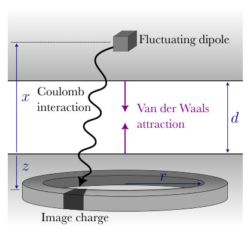
<figcaption class="paper-figure-caption"><b>Fig 5.</b> FIG. 5 Van der Waals force between two extended bodies. The scaling of the van der Waals interaction between two surfaces with their separation distance d is obtained by summing up interaction energies of the individual atoms – by convenience, in a cylindrical geometry.</figcaption>
</figure>

**Summary.** This research addresses nanoscale fluid transport by developing theoretical frameworks that incorporate electronic fluctuations, leading to the concept of fluctuation-induced quantum friction. By unifying hydrodynamics and electronics into a single matrix, it provides quantitative predictions for coupled transport coefficients relevant to energy applications.

**Why it may be interesting.** This work is highly relevant as it tackles the interface between fluid dynamics and condensed matter physics using advanced quantum statistical tools (Keldysh formalism), providing a framework for understanding non-equilibrium transport phenomena in confined geometries.

Detailed structure

**Main problem.** The core problem is understanding fluid transport at nanoscale dimensions where liquid flow becomes critically sensitive to the wall's internal electronic degrees of freedom, necessitating a unified description beyond classical continuum models.

**Main result.** Fluctuation-induced quantum friction effects are predicted to couple hydrodynamic and electronic transport into a single hydro-electronic matrix. The theory establishes quantum fluctuation-dissipation theorems linking structural correlation functions to response functions.

**Method.** The work combines theoretical derivations using Keldysh formalism (Quantum Field Theory) with analysis of experimental results from nanofluidic measurements on various solid substrates.

**Model / system.** The system involves liquid confined in nanoscale pores (e.g., CNTs, 2D materials) interacting with solid walls whose electronic structure dictates transport properties. Models range from the PNPS framework to full quantum treatments incorporating electron-phonon and fluid-electron coupling.

**Key observables.** Hydrodynamic friction coefficient ($\lambda$), ionic conductance ($G_i$), critical confinement length for freezing, and measurable electric currents generated by fluid motion (e.g., phonon drag).

**Important parameters / regimes.** Nanoscale dimensions ($\lesssim 10$ nm), temperature ($T$), quantum mechanical parameters ($\hbar\omega/k_B T$), and the electronic nature of the confining wall (metallic vs. semiconducting).

**Assumptions / limitations.** The analysis often assumes that mean-field descriptions fail at small scales, necessitating the inclusion of fluctuating quantum degrees of freedom; approximations are made in deriving analytical formulas from complex field theories.

**Figures summary.** Figures illustrate relationships such as water friction coefficient vs. CNT radius, and conceptual diagrams showing the Superionic state or energy transfer mechanisms between electrons and water molecules.

**Paper structure.** The paper progresses by first identifying the failure points of classical models (PNPS) at small scales, then introducing quantum effects like fluctuation-induced friction via QFT formalism, and finally benchmarking these theories against diverse experimental measurements on specific nanostructures.

Abstract

The hydrodynamic wall has traditionally been considered a featureless object, whose only role is to provide a boundary for fluid flow. Yet, there is now ample evidence that at nanometer scales, liquid flows are sensitive to the wall's internal -- in particular, electronic -- degrees of freedom. Here, after reviewing the experimental evidence for nanoscale liquid-electron couplings, we present the theoretical advances that have allowed for their quantitative understanding. We discuss how a quantum description of the liquid-solid interface reveals the influence of electron dynamics on classical fluid transport, in the form of the fluctuation-induced quantum friction effect. Quantum friction is at the root of liquid-electron coupled transport phenomena, that may be combined into a hydro-electronic transport matrix. We present analytical formulas for the hydro-electronic transport coefficients, that allow for their quantitative estimation in practical cases; we further outline the potential consequences of coupled liquid-electron transport for the water-energy nexus. Fluctuation-induced and quantum effects at liquid-solid interfaces represent an emerging interface between fluid dynamics and condensed-matter physics, and a largely uncharted territory for both theory and experiment.

[↑ back to top](#top)

### [Experimental Demonstration of Free-Space Unidimensional Continuous-Variable Quantum Key Distribution Under High Detector Noise](http://arxiv.org/abs/2606.07206v1)

**Authors:** Rachita Nandan, Jayanth Ramakrishnan, Shashi Prabhakar, R. P. Singh  
**Type:** experiment · **Category:** quantum information and computing · **PDF:** <https://arxiv.org/pdf/2606.07206v1>  
**Analysis basis:** full PDF text, analyzed in chunks
**Topic relevance:** 🔥 `QC/QI experiment` **4/5** · `quantum optics experiment` **3/5** · `free-space correlated emission` **2/5** · `quantum measurements` **2/5** · `correlated / nonlocal dissipation` **1/5** · `driven-dissipative phase transition` **1/5** · `entanglement & information structure` **1/5** · `interference shaping light` **1/5**

↔ Scroll figures horizontally

<figure class="paper-figure-card">
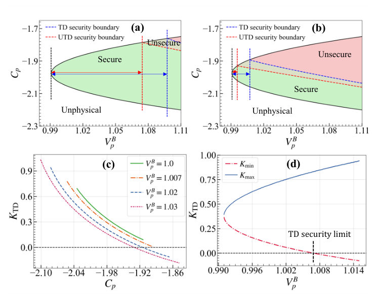
<figcaption class="paper-figure-caption"><b>Fig 1.</b> FIG. 1. (a) Physical and secure regions in the (V B p , Cp) parameter space for both TD and UTD models. The solid black curve denotes the physicality boundary. The red and blue dashed curves represent the zero key-rate (K = 0) boundaries for the UTD and TD cases, respectively, separating secure (K &gt; 0) and unsecure (K &lt; 0) regions, shown in green and red shades. The region between the vertical dotted lines indicates the Cp-independent security threshold for both models. Results are shown for a low electronic-noise detector with Vel = 0.1 SNU. (b) Same as in (a), but for a high electronic-noise detector with Vel = 1.4 SNU. For higher Vel, this Cp-independent secure region shrinks...</figcaption>
</figure>
<figure class="paper-figure-card">
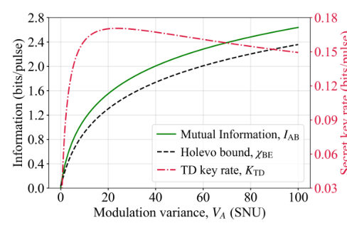
<figcaption class="paper-figure-caption"><b>Fig 2.</b> FIG. 2. Behavior of the mutual information IAB, Holevo bound χBE, and TD secret key rate KTD as functions of the modulation variance VA. The parameters are V B p = 1.003, Tx = 0.91, ξx = 0.01 SNU, η = 0.81, and Vel = 1.4 SNU, assuming worst-case Cp.</figcaption>
</figure>
<figure class="paper-figure-card">
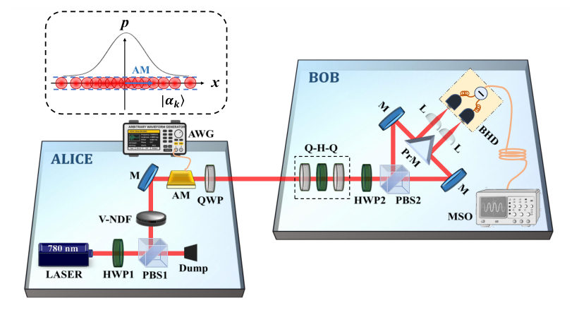
<figcaption class="paper-figure-caption"><b>Fig 3.</b> FIG. 3. Schematic of the experimental setup for Gaussian-modulated UD-CVQKD system over a free-space channel. HWP: half-wave plate; PBS: polarizing beam-splitter; V-NDF: variable neutral density filter; M: mirror; AM: amplitude modulator; QWP: quarter-wave plate; AWG: arbitrary waveform generator; Q-H-Q: QWP-HWP-QWP configuration; PrM: prism mirror; L: lens; BHD: balanced homodyne detector; MSO: mixed signal oscilloscope. Inset: phase-space representation of unidimensional Gaussian modulation in the X-quadrature.</figcaption>
</figure>
<figure class="paper-figure-card">
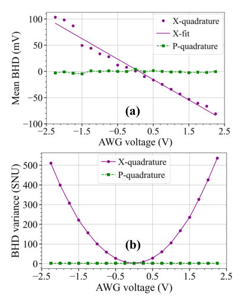
<figcaption class="paper-figure-caption"><b>Fig 4.</b> FIG. 4. Calibration of the amplitude modulation and de- tection system. (a) Mean BHD output as a function of the applied AWG voltage (-2.25 V to +2.25 V), exhibiting a lin- ear response for the modulated X-quadrature, while the P- quadrature remains approximately constant. (b) Correspond- ing variance with AWG voltage, showing a quadratic depen- dence for X and nearly constant response for P.</figcaption>
</figure>
<figure class="paper-figure-card">
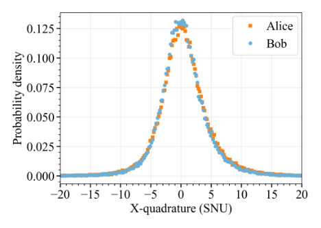
<figcaption class="paper-figure-caption"><b>Fig 5.</b> FIG. 5. Quadrature probability distributions for Alice and Bob at VA = 17.54 SNU. Alice’s distribution is Gaussian with variance set by the applied modulation, while Bob’s measured distribution shows reduced variance (V B x = 16.73 SNU) due to channel loss.</figcaption>
</figure>

**Summary.** The authors experimentally realized Unidimensional CV-QKD over free space, proving its feasibility despite significant detector electronic noise. They found that secure key generation is only possible when assuming the detector is trusted, achieving a rate of 270 kbps. This work underscores that practical quantum communication systems must account for and mitigate realistic noise sources like detector electronics.

**Why it may be interesting.** This work provides a concrete, high-noise experimental benchmark for quantum communication protocols, directly addressing practical limitations (detector noise) that often plague theoretical models in quantum optics.

Detailed structure

**Main problem.** The paper experimentally demonstrates Unidimensional Continuous-Variable Quantum Key Distribution (UD-CVQKD) in a free-space setting while operating under challenging conditions of high detector electronic noise.

**Main result.** Secure key generation was achieved using the Trusted Detector model, reaching a maximum secret key rate of 270 kbps at an optimal modulation variance. The study highlights that detector trust is critical, as the Untrusted Detector model failed to yield positive rates under these noisy conditions.

**Method.** The security analysis employed worst-case assumptions over unknown correlation parameters ($C_p$) using established key rate formulas derived from mutual information and Eve's accessible information.

**Model / system.** The system uses polarized coherent states transmitted through a free-space channel. The protocol is simplified to modulate only one quadrature (UD-CVQKD) for implementation simplicity.

**Key observables.** Secret key rate ($K_{TD}$), measured quadratures ($\hat{X}, \hat{P}$), and the secure region in parameter space $(V_{B_p}, C_p)$.

**Important parameters / regimes.** High detector electronic noise (1.4 shot-noise units), modulation variance ($V_A$), and channel transmittance ($T_x$).

**Assumptions / limitations.** The analysis critically depends on the assumption of a Trusted Detector model to ensure positive key rates; performance is limited by low-loss channels.

**Figures summary.** Figures illustrate the physical and secure operational regions in parameter space for both trusted (TD) and untrusted (UTD) detector models, showing how high noise shrinks the secure region significantly.

**Paper structure.** The paper progresses from describing the physical setup and measurement techniques to deriving security bounds under different noise assumptions. It then numerically analyzes the key rate dependence on modulation variance and channel loss, culminating in experimental validation of feasibility.

Abstract

Continuous-variable quantum key distribution (CV-QKD), which uses quadratures of the electromagnetic field, enables practical quantum communication using standard telecommunication technologies. Unidimensional CV-QKD (UD-CVQKD) simplifies the implementation by restricting modulation to a single quadrature. In this work, we experimentally demonstrate a free-space Gaussian-modulated UD-CVQKD system operating under a high detector electronic-noise regime (1.4 shot-noise units). The system employs polarized coherent states with signal and local oscillator co-propagating in the same spatial mode in orthogonal polarizations, ensuring stable interference. System security is analyzed under both untrusted (UTD) and trusted (TD) detector noise models. While no positive secret key rate is obtained under the UTD model, the TD model enables secure key generation over a finite range of modulation variances, highlighting the critical role of detector trust in high-noise conditions. A maximum secret key rate of 270 kbps is achieved at an optimal modulation variance of 11.57. Furthermore, secure operation requires high-transmittance (low-loss) channels under such noise conditions. This study demonstrates the practical feasibility of free-space UD-CVQKD in realistic high electronic-noise detection constraints and highlights detector electronic noise as a key limiting factor in practical systems.

[↑ back to top](#top)

### [Riemann Rarefaction Waves in a Strongly Interacting Fermi Gas](http://arxiv.org/abs/2606.06659v1)

**Authors:** Eric A. Wolf, Martin Zwierlein  
**Type:** both · **Category:** quantum gases · **PDF:** <https://arxiv.org/pdf/2606.06659v1>  
**Analysis basis:** full PDF text, analyzed in chunks
**Topic relevance:** 🔥 `analog quantum simulation` **4/5** · 🔥 `non-equilibrium dynamics` **4/5** · `non-equilibrium universality` **3/5** · `Keldysh / 2PI / non-Gaussian methods` **1/5** · `correlated / nonlocal dissipation` **1/5** · `driven-dissipative phase transition` **1/5** · `methods for driven-dissipative` **1/5**

↔ Scroll figures horizontally

<figure class="paper-figure-card">
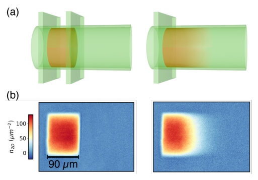
<figcaption class="paper-figure-caption"><b>Fig 1.</b> Figure 1. Experimental protocol. (a) A schematic 3D render of our “shock tube” geometry before (left) and after (right) gas release. (b) Typical two-dimensional density profiles for expansion time t = 0 ms (left) and t = 2.5 ms (right).</figcaption>
</figure>
<figure class="paper-figure-card">
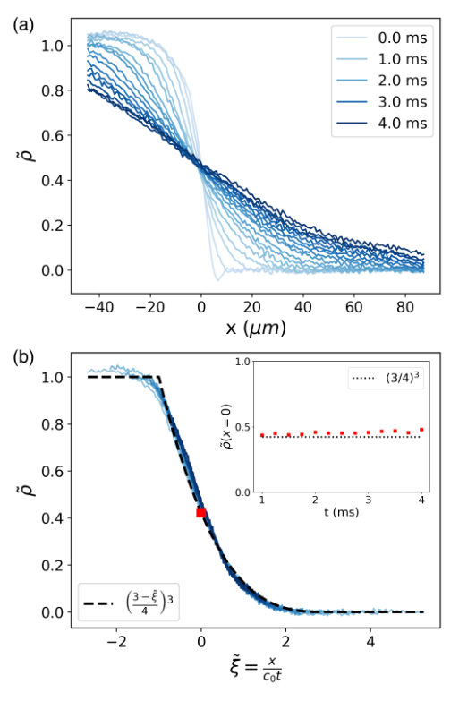
<figcaption class="paper-figure-caption"><b>Fig 2.</b> Figure 2. Self-similar expansion. (a) A collection of normal- ized densities vs. absolute position in the vicinity of x = 0, the original position of the box wall. There are a total of 17 traces, corresponding to 0 ms to 4 ms expansion in steps of 0.25 ms; for clarity, only some traces are labeled. (b) A subset of the data from (a), with expansion times from t = 1.0 ms to t = 4.0 ms, plotted as a function of the reduced coordi- nate ˜ξ ≡ x c0t. The black dashed curve is Eq. 5. Inset: The normalized density ˜ρ at x=0 for different times; a dotted line marks the predicted value  3</figcaption>
</figure>
<figure class="paper-figure-card">
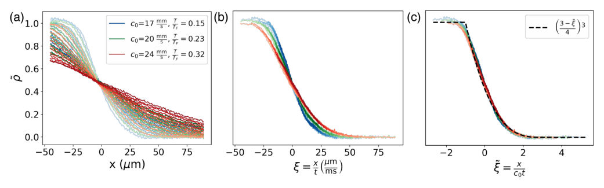
<figcaption class="paper-figure-caption"><b>Fig 3.</b> Figure 3. Expansion at different c0. (a) A collection of normalized densities ˜ρ vs. x, for expansion times from 1.0 to 4.0 ms. Plotted in blue is the same data as Figure 2(a); green and red curves are analogous data obtained with different sound speeds. As in Figure 2, darker curves are at later times. (b) The same data as (a), plotted vs. ξ = x</figcaption>
</figure>
<figure class="paper-figure-card">
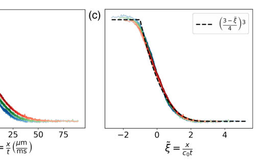
<figcaption class="paper-figure-caption"><b>Fig 4.</b> Fig. 3(a) displays the profiles against position x; as expected, the curves cross at x = 0 for all t and c0, but are otherwise widely spread. When this data is plot- ted as a function of the time-normalized variable ξ = x</figcaption>
</figure>
<figure class="paper-figure-card">
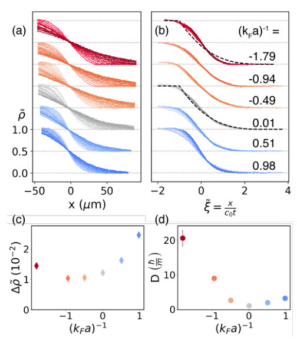
<figcaption class="paper-figure-caption"><b>Fig 5.</b> Figure 4. Expansion at different kF a values. (a) &amp; (b): Ridgeline plots of normalized density ˜ρ vs. (a) position x and (b) ˜ξ for different initial values of the interaction parameter (kF a)−1. Displayed data is for expansion times from t = 1.0 ms (light) to t = 4.0 ms (dark). Adjacent curves are vertically offset by 0.5. The gray curve, with (kF a)−1 = 0.01, corre- sponds to the data plotted in Figure 2(b); the other curves are analogous, including the time range plotted, but are mea- sured at different (kF a)−1 values. Dashed lines in (b) are Eq. 5. (c) RMS deviations from self-similarity of the data plot- ted in (b). Deviations are calculated using a piecewise linear best-fit curve...</figcaption>
</figure>

**Summary.** This work uses strongly interacting Fermi gases to study rarefaction waves in an expanding gas into vacuum. The authors demonstrate that the expansion exhibits strong self-similarity matching Euler theory at unitarity. By analyzing deviations away from this limit, they probe the role of viscosity and thermal effects on nonlinear hydrodynamics in a highly controllable quantum system.

**Why it may be interesting.** It provides a highly controllable platform—ultracold atoms—to test fundamental concepts of nonlinear fluid dynamics, allowing direct comparison between ideal continuum theories (Euler) and dissipative reality (Navier-Stokes).

Detailed structure

**Main problem.** The study investigates nonlinear hydrodynamics, specifically rarefaction wave dynamics, when a strongly interacting Fermi gas expands into vacuum.

**Main result.** Self-similarity in the density profile is robustly observed across various interaction regimes, showing excellent agreement with ideal Euler solutions at unitarity but exhibiting deviations due to viscosity away from it.

**Method.** The authors combine theoretical modeling using 1D hydrodynamics (Euler and Navier-Stokes equations) with experimental measurements of density profiles via polarization rotation imaging.

**Model / system.** The system is an ultracold, degenerate Fermi gas (e.g., $^{6}	ext{Li}$) studied across the BEC-BCS crossover, expanding in a 'shock tube' geometry. The dynamics are governed by conservation laws for mass, momentum, and entropy.

**Key observables.** Normalized density profile ($	ilde{
ho}$), scaled coordinates ($	ilde{\xi} = x/t$), sound diffusivity ($D$).

**Important parameters / regimes.** Unitarity limit, BCS side interactions, viscosity ($\eta$), thermal conductivity ($\kappa$), and expansion time ($t$).

**Assumptions / limitations.** The ideal case assumes isentropic conditions leading to Euler dynamics; deviations require including viscous terms from the full Navier-Stokes equations.

**Figures summary.** Figures show density profiles collapsing onto self-similar curves when plotted against scaled coordinates, and later figures quantify the deviation from this ideal profile due to viscosity.

**Paper structure.** The paper progresses from establishing the ideal, scale-invariant unitary limit (Euler solution) to testing deviations by incorporating finite viscosity and thermal effects across the BEC-BCS crossover using both theory and experiment.

Abstract

We investigate the expansion of a homogeneous, strongly interacting Fermi gas released into vacuum in a ``shock tube'' geometry. At unitarity, where the gas is scale invariant and nearly inviscid, we find that the resulting rarefaction wave dynamics are self-similar and in excellent agreement with Riemann's solution of the Euler equation for all temperatures probed. Probing interactions away from unitarity within the BEC-BCS crossover, we observe increasing deviations from the Riemann solution as viscosity increases. However, even on the BCS side, where the sound diffusivity is increased twenty-fold, self-similarity is still approximately preserved. This may reflect how 1D Navier-Stokes rarefaction flows approach Euler self-similar solutions at long times. Our work demonstrates the utility of strongly interacting Fermi gases for the study of nonlinear hydrodynamics in a highly controllable setting.

[↑ back to top](#top)

### [Topological Anderson insulators and reentrant topological transitions in a quasiperiodic long-range Su-Schrieffer-Heeger model](http://arxiv.org/abs/2606.07274v1)

**Authors:** Fang-Ming Meng, Qi-Bo Zeng  
**Type:** theory · **Category:** disordered systems and neural networks · **PDF:** <https://arxiv.org/pdf/2606.07274v1>  
**Analysis basis:** full PDF text, analyzed in chunks
**Topic relevance:** 🔥 `analog quantum simulation` **4/5** · `Frenkel-Kontorova` **3/5** · `driven-dissipative phase transition` **2/5** · `Kondo & dissipative impurity` **1/5** · `entanglement & information structure` **1/5** · `methods for driven-dissipative` **1/5** · `non-equilibrium dynamics` **1/5** · `non-equilibrium universality` **1/5**

↔ Scroll figures horizontally

<figure class="paper-figure-card">
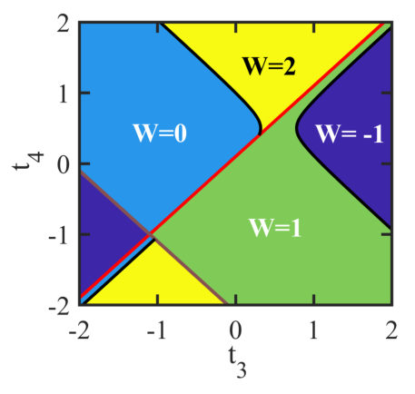
<figcaption class="paper-figure-caption"><b>Fig 1.</b> FIG. 1. (Color online) Phase diagram of the clean long-range SSH model in the t3-t4 plane for t1 = 1 and t2 = 1.1. The colored regions correspond to phases with winding numbers W = −1, 0, 1, and 2. The solid lines denote the phase bound- aries determined from the bulk-gap closing conditions.</figcaption>
</figure>
<figure class="paper-figure-card">
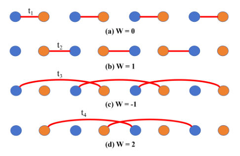
<figcaption class="paper-figure-caption"><b>Fig 2.</b> FIG. 2. (Color online) Schematic illustration of the dimeriza- tion configurations and the associated zero-energy edge states in the long-range SSH model. The blue and orange circles rep- resent the two sublattices of each unit cell, while the red lines denote the dominant hopping amplitudes. Panels (a)–(d) cor- respond to the phases with winding numbers W = 0, 1, −1, and 2, respectively. The number and sublattice character of the unpaired boundary sites determine the topological invari- ant and the corresponding zero-energy edge modes.</figcaption>
</figure>
<figure class="paper-figure-card">
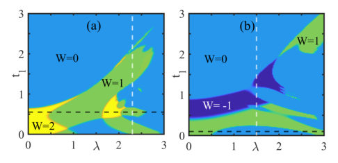
<figcaption class="paper-figure-caption"><b>Fig 3.</b> FIG. 4. (Color online) Topological phase diagrams in the t1-λ plane for the long-range SSH model with quasiperiodic disorder in the intracell hopping t1. Different colors denote phases with different winding numbers. (a) Phase diagram for t2 = 0.2, t3 = 0.8, and t4 = 1.1. The black dashed line marks the cut at t1 = 0.55, while the white dashed line corresponds to λ = 2.3, which exhibits multiple reentrant transitions in the system. (b) Phase diagram for t2 = 0.7, t3 = 1.1, and t4 = 0.9. The black and white dashed lines indicate the cuts at t1 = 0.1 and λ = 1.5, respectively, along which additional reentrant topological transitions occur.</figcaption>
</figure>
<figure class="paper-figure-card">
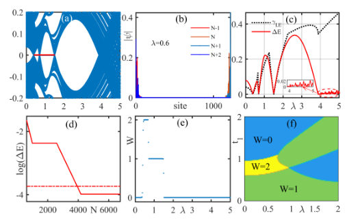
<figcaption class="paper-figure-caption"><b>Fig 4.</b> FIG. 3. (Color online) Topological phases of the long-range SSH model with quasiperiodic disorder in the intracell hop- ping t1. (a) Energy spectrum as a function of the disorder strength λ under open boundary conditions. The red line rep- resents the zero-energy edge modes. (b) Spatial distributions of the four zero-energy edge modes at λ = 0.6. (c) Lyapunov exponent of the zero-energy modes γLE (black dotted line) and the bulk gap ∆E around zero energy (red solid line) as functions of λ. The inset enlarges the region enclosed by the red dashed ellipse. (d) Logarithm of the bulk gap, log(∆E), as a function of system size for λ = 4.06 (red dot-dashed line) and λ = 4.88 (red solid line). (e)...</figcaption>
</figure>
<figure class="paper-figure-card">

<figcaption class="paper-figure-caption"><b>Fig 5.</b> Figure 4 presents two additional phase diagrams in the t1-λ plane for different parameter sets, revealing even richer disorder-induced topological phenomena. Along the black dashed line at t1 = 0.55 in Fig. 4(a), the wind- ing number evolves according to W = 2 →1 →2 → 1 →0 as the disorder strength increases. This sequence demonstrates reentrant topological transitions between the W = 2 and W = 1 phases. Reentrant behavior can also be induced by varying t1. Along the white dashed line in Fig. 4(a), the system undergoes repeated transi- tions between the W = 1 and W = 0 phases, providing another example of multiple reentrant topological tran- sitions. Similar phenomena are observed in Fig....</figcaption>
</figure>

**Summary.** This paper theoretically explores the complex topology of a 1D SSH model subjected to quasiperiodic disorder. It demonstrates that this combination leads to Topological Anderson Insulators (TAIs) characterized by multiple winding numbers and exhibits rich reentrant phase transitions. The findings highlight how disorder can induce quantized, staircase-like changes in topological invariants.

**Why it may be interesting.** The study provides a concrete theoretical framework for understanding how long-range interactions combined with incommensurate potentials (quasiperiodicity) can stabilize exotic topological states that are robust even when spectral gaps close, which is highly relevant to engineered quantum materials and lattice simulations.

Detailed structure

**Main problem.** The study investigates topological Anderson insulators (TAIs) and complex reentrant topological phase transitions within a quasiperiodic long-range Su-Schrieffer-Heeger model.

**Main result.** The interplay between long-range hopping and quasiperiodic disorder generates a rich landscape featuring TAI phases with multiple winding numbers, alongside observable staircase-like and reentrant topological transitions.

**Method.** Analysis relies on calculating the real-space winding number (a topological invariant) and monitoring the Lyapunov exponent ($\gamma_{LE}$) to characterize phase boundaries in both clean and disordered limits.

**Model / system.** The system is a one-dimensional long-range Su-Schrieffer-Heeger model incorporating third-nearest-neighbor hopping, subjected to quasiperiodic disorder applied to its hopping amplitudes. The Hamiltonian structure allows for the emergence of multiple topological invariants ($W=-1, 0, 1, 2$).

**Key observables.** Real-space winding number (W), Lyapunov exponent ($\gamma_{LE}$), and bulk energy gap ($\Delta E$).

**Important parameters / regimes.** Disorder strength ($\lambda$), quasiperiodic modulation parameter ($\alpha$), and various hopping amplitudes ($t_1, t_2, t_3, t_4$).

**Assumptions / limitations.** All hopping amplitudes are assumed to be real; the analysis uses the transfer-matrix formalism.

**Figures summary.** Figures illustrate phase diagrams showing regions for different winding numbers in the clean limit (Fig. 1), and demonstrate reentrant transitions, staircase changes, and spectral gap evolution as disorder strength ($\lambda$) is varied (Figs. 3, 4, 5, 6).

**Paper structure.** The paper systematically introduces the model and characterization methods, analyzes the clean limit topology, investigates TAI phases under quasiperiodic disorder, and concludes by summarizing the rich landscape of disorder-induced topological phenomena.

Abstract

We study a one-dimensional long-range Su-Schrieffer-Heeger model with third-nearest-neighbor hopping and subject to quasiperiodic disorder. In the clean limit, the model hosts phases characterized by winding numbers $W=-1,0,1$ and $2$. The introduction of quasiperiodic disorder profoundly modifies the phase diagram and induces a series of topological phase transitions. Owing to the competition between topological dimerization and localization, topological Anderson insulating (TAI) phases with different winding numbers emerge and can persist even when the spectral gap becomes nearly closed in the strong-disorder regime. In addition, we uncover multiple reentrant topological phase transitions induced by varying either the quasiperiodic disorder strength or the hopping amplitudes. Remarkably, the system exhibits staircase-like topological Anderson transitions, where the real-space winding number evolves through successive quantized steps with increasing disorder strength. Our results demonstrate that the interplay between long-range hopping and quasiperiodic disorder generates a rich landscape of disorder-induced topological phases and reentrant topological transition phenomena.

[↑ back to top](#top)

### [Topologically Enforced Lifshitz Multicriticality in One Dimension](http://arxiv.org/abs/2606.07380v1)

**Authors:** Kuang-Hung Chou, Xue-Jia Yu  
**Type:** theory · **Category:** statistical mechanics · **PDF:** <https://arxiv.org/pdf/2606.07380v1>  
**Analysis basis:** full PDF text, analyzed in chunks
**Topic relevance:** 🔥 `entanglement & information structure` **4/5** · `analog quantum simulation` **2/5** · `driven-dissipative phase transition` **2/5** · `Frenkel-Kontorova` **1/5** · `Keldysh / 2PI / non-Gaussian methods` **1/5** · `correlated / nonlocal dissipation` **1/5** · `methods for driven-dissipative` **1/5** · `non-equilibrium dynamics` **1/5** · `non-equilibrium universality` **1/5**

↔ Scroll figures horizontally

<figure class="paper-figure-card">
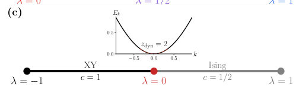
<figcaption class="paper-figure-caption"><b>Fig 1.</b> FIG. 1. Phase diagram of transitions between quantum crit- ical lines. (a) Representative phase diagram for a transition between two topologically distinct critical lines, illustrated by the minimal case α = 0 and α′ = 1. The endpoint in- sets show the corresponding auxiliary-root configurations: a root on the unit circle signals criticality, while an additional root inside the unit circle encodes nontrivial topological de- generacy. The intermediate MCP exhibits zdyn = 2 scaling. (b) Auxiliary-root representation of the phase transition. In moving between the two critical lines, the roots are transferred from inside to outside the unit circle. When these roots meet the original critical...</figcaption>
</figure>
<figure class="paper-figure-card">
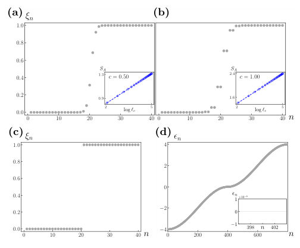
<figcaption class="paper-figure-caption"><b>Fig 2.</b> FIG. 2. Bulk entanglement spectra and boundary energy spectrum near a Lifshitz MCP separating distinct univer- sality classes. PBC entanglement spectra at two adjacent topologically trivial quantum critical points: the Ising criti- cal point (a) and the XY critical point (b). The insets show the corresponding entanglement entropy scaling, giving cen- tral charges c ≃0.50 and c ≃1.00, respectively. (c) PBC entanglement spectrum at the conventional Lifshitz MCP. No isolated midgap entanglement level appears. (d) OBC single- particle energy spectrum at the same MCP. The inset zooms into an exponentially small zero-energy window, showing the absence of boundary zero modes.</figcaption>
</figure>
<figure class="paper-figure-card">
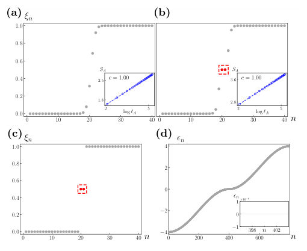
<figcaption class="paper-figure-caption"><b>Fig 3.</b> FIG. 3. Bulk entanglement spectra and physical boundary spectrum near a topologically enforced Lifshitz MCP. PBC entanglement spectra at two adjacent quantum critical points: a topologically trivial critical point (a) and a topologically nontrivial critical point (b). The insets show the correspond- ing entanglement entropy scaling, both giving the same cen- tral charge c ≃1. (c) PBC entanglement spectrum at the topologically enforced Lifshitz MCP, where midgap entangle- ment levels appear. (d) OBC energy spectrum at the same MCP. The inset zooms into a small window around zero en- ergy and shows no zero-energy modes. Thus, although the PBC entanglement spectrum develops midgap levels,...</figcaption>
</figure>
<figure class="paper-figure-card">
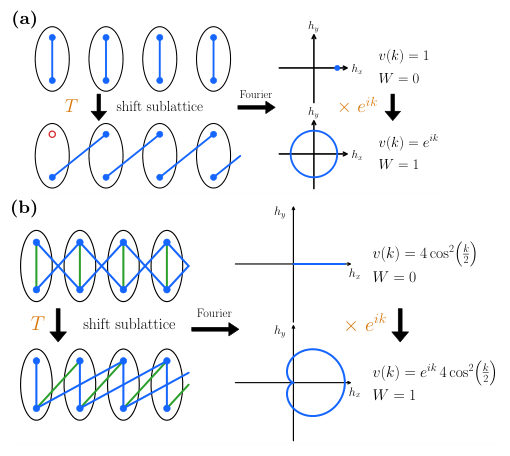
<figcaption class="paper-figure-caption"><b>Fig 4.</b> FIG. 4. RG-limit picture for the breakdown of the Li–Haldane correspondence. Each oval denotes one physical unit cell, con- taining an Aj site on the upper row and a Bj site on the lower row. The map T denotes a relative translation of the B sublattice, Bj →Bj−1, which multiplies the off-diagonal Bloch element vk by eik under PBC and thereby increases the winding number by one. The colored bonds indicate different hopping amplitudes in the real-space coupling pattern, with the green bonds having twice the amplitude of the blue bonds. (a) In a gapped SPT chain, each site couples to only one part- ner: shifting the sublattice changes v(k) = 1 to v(k) = eik, and under OBC this shift changes...</figcaption>
</figure>

**Summary.** The paper introduces a novel class of Lifshitz Multicritical Points driven purely by changes in the topology of neighboring quantum critical lines. Using entanglement spectroscopy and energy spectrum analysis, the authors prove that these topologically enforced points exhibit a breakdown of the Li–Haldane correspondence. This mismatch between bulk topological signatures and boundary modes offers a new theoretical handle for characterizing exotic quantum criticality.

**Why it may be interesting.** This work provides a powerful new diagnostic tool—the comparison between PBC entanglement spectra and OBC edge modes—to probe topological phases in systems where standard invariants fail, which is highly relevant for understanding boundary physics in condensed matter theory.

Detailed structure

**Main problem.** To investigate novel Lifshitz Multicritical Points (MCPs) whose existence is dictated solely by changes in the topology of adjacent quantum critical lines, rather than traditional changes in critical exponents.

**Main result.** The authors demonstrate that at these topologically enforced MCPs, a breakdown of the Li–Haldane bulk-boundary correspondence occurs, evidenced by a mismatch between topological signatures found in the entanglement spectrum (PBC) and the absence of protected zero modes in the physical energy spectrum (OBC).

**Method.** The analysis employs advanced theoretical diagnostics including calculating the bulk entanglement spectrum using correlation matrices and comparing these results against single-particle OBC energy spectra derived from low-energy effective Hamiltonians.

**Model / system.** The study focuses on one-dimensional chiral-symmetric fermionic systems, modeled by generalized hopping structures ($\alpha$ chain models) that allow for tuning between different critical lines to induce the Lifshitz MCPs.

**Key observables.** Topological degeneracy (midgap entanglement levels), central charges ($c$), dynamical exponent ($z$), and the comparison count of midgap pairs vs. OBC zero modes.

**Important parameters / regimes.** The hopping parameters ($\alpha, \alpha'$), the coupling range width ($R$), and the relative shift parameter ($s$) are crucial for determining the topological nature of the MCP.

**Assumptions / limitations.** The analysis is primarily conducted in the Renormalization Group (RG) limit, treating the system via low-energy effective theories derived from free-fermion models.

**Figures summary.** Figures illustrate phase diagrams showing the transition to topologically enforced MCPs; comparisons show PBC spectra with midgap levels but OBC spectra lacking corresponding zero modes at these novel points.

**Paper structure.** The paper systematically constructs the Hamiltonian, analyzes the topological invariants (winding numbers) associated with adjacent critical lines, and then uses entanglement/energy spectrum diagnostics to prove the breakdown of the Li–Haldane correspondence specifically at the topologically enforced MCPs.

Abstract

Recent advances have revealed that topology can further enrich the universality classes of quantum phase transitions, thereby extending beyond the traditional paradigms of statistical and condensed matter physics. However, multicriticality between topologically distinct quantum critical lines remains insufficiently explored. In this Letter, we systematically construct and investigate a novel class of topologically enforced Lifshitz multicritical points in one dimensional chiral symmetric fermionic systems. Such multicriticality is driven solely by changes in the topology of neighboring critical lines, beyond previously recognized multicritical points that are typically induced by changes in critical exponents. More importantly, the topologically enforced multicriticality identified here can host robust topological degeneracies while surprisingly exhibiting a breakdown of the Li Haldane bulk boundary correspondence-a phenomenon we elucidate through a simple physical picture.

[↑ back to top](#top)

### [Fate of the Ising universality class under nonreciprocal interactions](http://arxiv.org/abs/2606.06981v1)

**Authors:** M. Akritidis, A. Garcés, A. Vasilopoulos, M. Carosi, D. Levis, N. G. Fytas  
**Type:** theory · **Category:** statistical mechanics · **PDF:** <https://arxiv.org/pdf/2606.06981v1>  
**Analysis basis:** full PDF text, analyzed in chunks
**Topic relevance:** 🔥 `non-equilibrium universality` **4/5** · `driven-dissipative phase transition` **3/5** · `non-equilibrium dynamics` **2/5** · `Keldysh / 2PI / non-Gaussian methods` **1/5** · `correlated / nonlocal dissipation` **1/5** · `methods for driven-dissipative` **1/5**

↔ Scroll figures horizontally

<figure class="paper-figure-card">
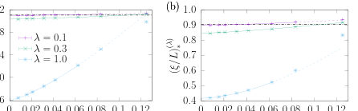
<figcaption class="paper-figure-caption"><b>Fig 1.</b> FIG. 2. Finite-size scaling extrapolation of the crossing values of (a) the Binder cumulant U4 and (b) the correlation-length ratio ξ/L for pairs of system sizes (L, 2L). The horizontal dot-dashed lines indicate the corresponding universal values of the equilibrium 2d Ising model.</figcaption>
</figure>
<figure class="paper-figure-card">
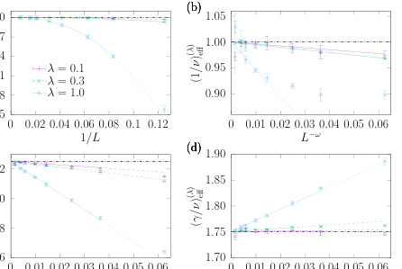
<figcaption class="paper-figure-caption"><b>Fig 2.</b> FIG. 1. Finite-size scaling analysis of (a) the crossing temper- atures T∗of the Binder cumulant U4 for system sizes (L, 2L), together with effective estimates of (b) 1/ν obtained from ratios of dU4/dT at the crossings, (c) β/ν from the magneti- zation m, and (d) γ/ν from the susceptibility χ. The vertical axis in panel (a) has been normalized by the corresponding ex- trapolated value of Tc. In panels (b)–(d), the horizontal dot- dashed lines indicate the exact values of the 2d Ising model. Panels (b)–(d) are shown together with simultaneous joint fits to the finite-size scaling forms discussed in the text.</figcaption>
</figure>
<figure class="paper-figure-card">
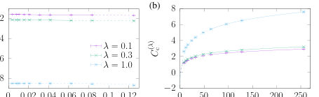
<figcaption class="paper-figure-caption"><b>Fig 3.</b> FIG. 3. Finite-size scaling behavior of (a) the energy-like observable e and (b) the specific-heat-like fluctuation quantity C at the corresponding critical temperatures. Panel (a) is shown together with simultaneous joint fits for the exponent combination d −1/ν.</figcaption>
</figure>
<figure class="paper-figure-card">
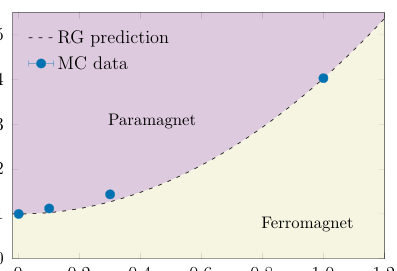
<figcaption class="paper-figure-caption"><b>Fig 4.</b> FIG. 4. Fit of the critical temperatures obtained from MC simulations and reported in Table I, using the RG prediction T (λ) c /T (0) c −1 ∼λ2.</figcaption>
</figure>

**Summary.** The paper examines the stability of the 2D Ising critical point when subjected to nonreciprocal interactions that break detailed balance. Using a combination of Monte Carlo simulations and Renormalization Group theory, the authors demonstrate that while these NR terms cause measurable deviations in scaling ratios, they do not alter the fundamental asymptotic critical exponents. This highlights the remarkable robustness of equilibrium universality classes.

**Why it may be interesting.** This work provides a rigorous theoretical framework for understanding how microscopic violations of time-reversal symmetry or detailed balance affect macroscopic phase transition universality classes, which is crucial for non-equilibrium statistical physics.

Detailed structure

**Main problem.** The study investigates how the critical behavior of a two-dimensional Ising model is affected by nonreciprocal (NR) interactions that violate detailed balance.

**Main result.** The asymptotic critical exponents remain robustly consistent with the equilibrium 2D Ising universality class, indicating stability against these directional perturbations. However, dimensionless quantities show systematic deviations from their equilibrium values.

**Method.** The research employs extensive Monte Carlo simulations, finite-size scaling analysis, and Renormalization Group (RG) techniques to analyze critical exponents and scaling corrections.

**Model / system.** The model is a 2D Ising system on a square lattice subjected to nonreciprocal vision-cone interactions. The dynamics are governed by Glauber dynamics, leading to an effective Hamiltonian that lacks global reciprocity.

**Key observables.** Magnetization ($m$), Susceptibility ($\chi$), Binder cumulant ($U_4$), Correlation-length ratio ($\xi/L$), and the critical temperature shift $T_c(\lambda)$.

**Important parameters / regimes.** The nonreciprocal coupling strength $\lambda$ is varied across a broad range, while the reciprocal coupling $J$ sets the baseline equilibrium case.

**Assumptions / limitations.** Analysis relies on fitting data to specific scaling forms and RG calculations are performed at one-loop order using momentum-shell procedures.

**Figures summary.** Figures illustrate finite-size scaling analysis of dimensionless quantities like $U_4$ and $\xi/L$, showing their dependence on the NR coupling strength $\lambda$. Other figures show the behavior of energy-like observables ($e$) at criticality.

**Paper structure.** The paper progresses from analyzing the lattice model using MC simulations to performing detailed RG calculations in momentum space. The structure builds by first establishing the stability of critical exponents, then quantifying the deviations in scaling ratios, and finally deriving flow equations for the couplings.

Abstract

We study the critical behavior of a two-dimensional Ising model with nonreciprocal vision-cone interactions, which explicitly violate reciprocity and detailed balance. Extensive Monte Carlo simulations and dynamic renormalization-group analysis show that the asymptotic critical exponents remain fully consistent with the equilibrium Ising universality class over a broad range of nonreciprocal coupling strengths $λ$. In contrast, dimensionless quantities such as the Binder cumulant and the correlation-length ratio display pronounced anisotropic nonequilibrium corrections and systematically deviate from their equilibrium Ising values. The renormalization-group flow further demonstrates that the nonreciprocal perturbation is irrelevant at the Wilson-Fisher fixed point while generating a finite shift of the critical temperature proportional to $λ^2$. Our results demonstrate the remarkable robustness of two-dimensional Ising criticality against this class of directional interactions.

[↑ back to top](#top)

### [Complex Temperature-dependent Thermal Conductivity in a Sawtooth Chain Magnet Fe$_\mathrm{2}$SiSe$_\mathrm{4}$](http://arxiv.org/abs/2606.06858v1)

**Authors:** Kunya Yang, Feihao Pan, Liran Wang, Chenglin Shang, Ying Zhu, Xiancai Hu, Sanjiang He, Xinrun Mi, Long Zhang, Aifeng Wang, Yisheng Chai, Frederic Hardy, Christoph Meingast, Peng Cheng, Mingquan He  
**Type:** experiment · **Category:** other · **PDF:** <https://arxiv.org/pdf/2606.06858v1>  
**Analysis basis:** full PDF text, analyzed in chunks
**Topic relevance:** 🔥 `analog quantum simulation` **4/5** · `exotic spin models in light-matter` **3/5** · `Keldysh / 2PI / non-Gaussian methods` **1/5** · `spintronics-quantum-optics interface` **1/5**

↔ Scroll figures horizontally

<figure class="paper-figure-card">
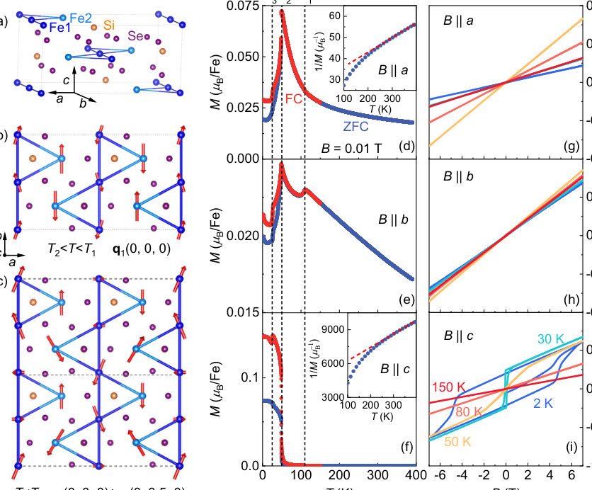
<figcaption class="paper-figure-caption"><b>Fig 1.</b> FIG. 1. (a–c) Crystal and magnetic structures of Fe2SiSe4. Two inequivalent Fe sites (Fe1 and Fe2) form a sawtooth-chain lattice. A single-q and a double-q magnetic structure emerge below 𝑇1 = 110 K and 𝑇2 = 50 K, respectively. (d–f) Temperature-dependent magnetization measured under zero-field-cooled (ZFC) and field-cooled (FC) protocols in a magnetic field of 0.01 T applied along different axes. Measurements were performed upon warming (g–i) Isothermal magnetization measured with the magnetic field applied along the three crystallographic directions.</figcaption>
</figure>
<figure class="paper-figure-card">
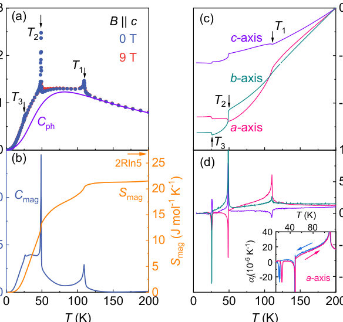
<figcaption class="paper-figure-caption"><b>Fig 2.</b> FIG. 2. (a) Temperature dependence of the specific heat 𝐶p (solid circles) measured upon warming in 0 and 9 T (𝐵∥𝑐) . The purple solid line represents the fitted phonon background using the Debye–Einstein model described in Eq. 1. (b) Magnetic specific heat 𝐶mag (blue line) obtained by subtracting the phonon contribution 𝐶ph from the total 𝐶p in zero magnetic field. The corresponding magnetic entropy 𝑆mag is also shown (orange line). (c,d) Linear thermal expansion (Δ𝐿𝑖/𝐿𝑖, 𝑖= 𝑎, 𝑏, 𝑐) and the corresponding thermal-expansion coefficient [𝛼𝑖= (1/𝐿𝑖)𝑑𝐿𝑖/𝑑𝑇] measured along the three principal crystallographic axes upon warming. The inset in (d) compares the thermal-expansion coefficient along...</figcaption>
</figure>
<figure class="paper-figure-card">
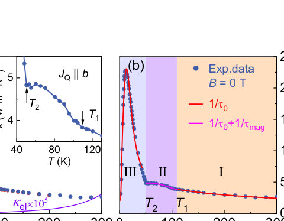
<figcaption class="paper-figure-caption"><b>Fig 3.</b> FIG. 3. (a) Temperature dependence of the in-plane thermal conductivity 𝜅𝑥𝑥of Fe2SiSe4, measured with the heat current applied along the chain direction (JQ ∥𝑏). A pronounced double-peak structure is observed in 𝜅𝑥𝑥(𝑇). Inset: enlarged view of the broad maximum around 60 K. The purple line denotes the electronic thermal conductivity 𝜅el, multiplied by a factor of 105 for visibility. (b) Fits to the temperature-dependent thermal conductivity using the Debye–Callaway model. In regions I and III, the data are well described by considering only the conventional phonon scattering rate 1/𝜏0. In region II, an additional resonant spin–phonon scattering term 1/𝜏mag is included to account for the...</figcaption>
</figure>

**Summary.** This work investigates the thermal conductivity of $	ext{Fe}_2	ext{SiSe}_4$, showing that its temperature dependence is strongly dictated by magnetic ordering. The material exhibits a characteristic double-peak structure in $\kappa(T)$, which arises from resonant phonon scattering when the magnet is partially ordered, and a highly enhanced peak below the lower transition temperature due to the suppression of this spin-phonon coupling.

**Why it may be interesting.** The direct measurement of how magnetic ordering modifies phonon transport provides a clear experimental signature of spin-lattice coupling, which can be modeled using concepts from open quantum systems or coupled Hamiltonian approaches in condensed matter theory.

Detailed structure

**Main problem.** The study investigates how spin fluctuations interact with lattice vibrations to influence thermal transport in a geometrically frustrated magnet.

**Main result.** Thermal conductivity exhibits a pronounced double-peak structure, demonstrating that resonant phonon scattering by magnetic excitations causes a broad maximum at higher temperatures, while the suppression of this coupling below the ordering temperature leads to a significantly enhanced low-temperature peak.

**Method.** The research relies on comprehensive measurements of thermal conductivity ($\kappa(T)$) alongside magnetization and specific heat capacity across various magnetic phases.

**Model / system.** The system is the triangular sawtooth-lattice olivine magnet $	ext{Fe}_2	ext{SiSe}_4$, which undergoes successive magnetic transitions at $T_1=110 	ext{ K}$ (antiferromagnetic) and $T_2=50 	ext{ K}$ (ferrimagnetic). The analysis models phonon heat transport using the Debye–Callaway model.

**Key observables.** Thermal conductivity $\kappa(T)$, magnetic transition temperatures ($T_1, T_2$), and the temperature dependence of magnetization $M(T)$.

**Important parameters / regimes.** The resonant scattering gap ($\Delta \approx 5.2 	ext{ meV}$), the enhancement factor of $\sim 5$ between the two peaks, and the transition temperatures ($110 	ext{ K}, 50 	ext{ K}$).

**Assumptions / limitations.** Phonons are assumed to dominate thermal conductivity, and the scattering mechanisms (conventional vs. resonant spin-phonon) can be separated and modeled independently.

**Figures summary.** Figures show magnetization curves revealing magnetic transitions at $T_1$ and $T_2$, and $\kappa(T)$ plots exhibiting a distinct double-peak structure corresponding to different magnetic regimes.

**Paper structure.** The paper analyzes the thermal conductivity across three temperature regions defined by magnetic ordering: paramagnetic ($T>T_1$), single-$q$ ordered ($T_2 < T < T_1$), and double-$q$ ordered ($T<T_2$). Each region is analyzed using the Debye–Callaway model to quantify different scattering rates.

Abstract

Geometrically frustrated magnets provide an ideal platform for exploring the interplay between lattice geometry and spin degrees of freedom. Here, we investigate the interactions between lattice and spin via thermal-transport measurements on the triangular sawtooth-lattice olivine magnet Fe$_\mathrm{2}$SiSe$_\mathrm{4}$, which exhibits successive magnetic transitions at $T_1 = 110$ K (antiferromagnetic) and $T_2 = 50$ K (ferrimagnetic). Although phonons dominate the thermal conductivity, its temperature dependence displays a pronounced double-peak structure arising from spin-phonon coupling. In the intermediate temperature range between $T_1$ and $T_2$ , resonant scattering of phonons by magnetic excitations around 5 meV produces a broad maximum around 60 K. Below $T_2$, the resonant spin-phonon scattering is strongly suppressed, leading to a rapid increase in thermal conductivity upon cooling and a pronounced low-temperature peak near 11 K, characteristic of heat transport governed by conventional phonon scattering mechanisms. Notably, this low-temperature peak is enhanced by a factor of $\sim 5$ compared to the broad maximum at higher temperatures. These results demonstrate the strong sensitivity of thermal transport to spin-lattice interactions and highlight spin-phonon scattering as an effective mechanism for tailoring thermal conductivity in geometrically frustrated magnets.

[↑ back to top](#top)

### [Improved Cryogenic Photodiode Optical Biasing for Low-Noise and Low-Jitter Superconducting Nanowire Single-Photon Detectors](http://arxiv.org/abs/2606.07140v1)

**Authors:** Jia-Hao Hu, Wei-Jun Zhang, Wen-Shuo Yu, Yu-Ze Wang, Dong-Wei Chu, Ya-Tao Peng, Hui-Qin Yu, Pu-Sheng Yuan, Ling Wu, Li-Xing You  
**Type:** experiment · **Category:** quantum information and computing · **PDF:** <https://arxiv.org/pdf/2606.07140v1>  
**Analysis basis:** full PDF text, analyzed in chunks
**Topic relevance:** 🔥 `QC/QI experiment` **4/5** · `quantum optics experiment` **3/5** · `quantum measurements` **1/5**

↔ Scroll figures horizontally

<figure class="paper-figure-card">
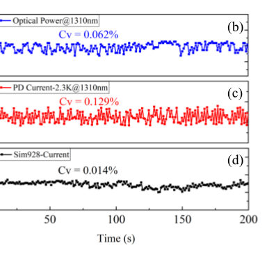
<figcaption class="paper-figure-caption"><b>Fig 1.</b> Figure 1. (a) Schematic of the experimental setup. Light from a stable room-temperature laser is delivered through a tunable</figcaption>
</figure>
<figure class="paper-figure-card">
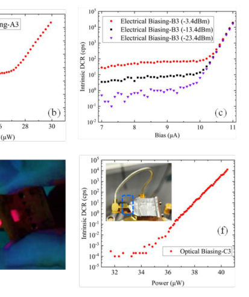
<figcaption class="paper-figure-caption"><b>Fig 2.</b> Figure 2. (a) Schematic of the optically biased SNSPD and its performance characterization setup. (b) Intrinsic dark count rate</figcaption>
</figure>
<figure class="paper-figure-card">
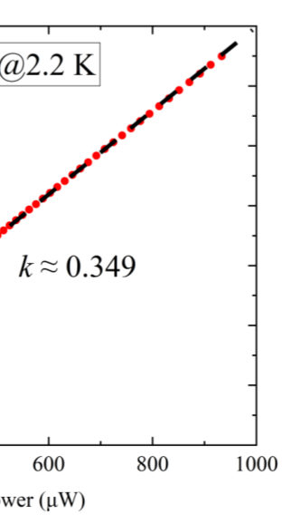
<figcaption class="paper-figure-caption"><b>Fig 3.</b> Figure 3. Photocurrent response of the photodiode at 2.2 K as a function of incident optical power (red dots), along with a linear</figcaption>
</figure>
<figure class="paper-figure-card">
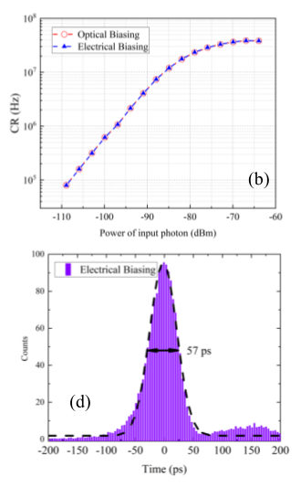
<figcaption class="paper-figure-caption"><b>Fig 4.</b> Figure 4. (a) System detection efficiency (SDE) and DCR of the SNSPD under optical (red) and electrical (black) biasing. (b)</figcaption>
</figure>
<figure class="paper-figure-card">
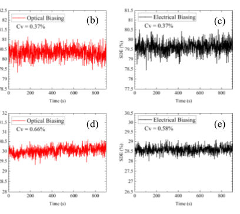
<figcaption class="paper-figure-caption"><b>Fig 5.</b> Figure 5. Comparison of SDE stability under optical and electrical biasing. (a) SDE vs bias current curves under optical (red dots)</figcaption>
</figure>

**Summary.** The paper presents an improved optical biasing technique for SNSPDs using a cryogenic photodiode as the local current source. By effectively shielding stray photons, they achieved ultra-low dark count rates while maintaining high detection efficiency and low jitter compared to electrical methods. This establishes PD-based optical biasing as a viable path toward building all-photonic quantum photonics systems.

**Why it may be interesting.** This work directly addresses hardware requirements for quantum photonics by providing a scalable, low-noise method to bias superconducting detectors essential for quantum communication and computing applications.

Detailed structure

**Main problem.** Achieving low-noise and low-jitter single-photon detection is critical for quantum information processing, as conventional electrical biasing introduces noise and thermal load.

**Main result.** The authors demonstrated that using a cryogenic photodiode (PD) for optical biasing provides an alternative to electrical methods, achieving performance comparable in efficiency and jitter while maintaining ultra-low intrinsic dark count rates after proper shielding.

**Method.** They experimentally compared the performance metrics of Superconducting Nanowire Single-Photon Detectors (SNSPDs) biased optically versus electrically, focusing on noise suppression techniques.

**Model / system.** The core system is an SNSPD operating at cryogenic temperatures (~2.3 K). The novel element is using a local InGaAs-InP photodiode as a stable optical bias source to replace traditional electrical biasing circuits.

**Key observables.** System Detection Efficiency (80.7%), background dark count rate (32.6 cps, intrinsic DCR of $1 	imes 10^{-4}$ cps), and minimum timing jitter (57.5 ps).

**Important parameters / regimes.** Cryogenic temperature ($\sim 2.3$ K); stability metrics like Coefficient of Variation (CV) for photocurrent fluctuations.

**Assumptions / limitations.** The primary limitation identified is that residual optical power fluctuations remain a dominant noise source, necessitating ultra-stable light sources and improved coupling methods.

**Figures summary.** Figures compare the SNSPD performance ($	ext{SDE}$, $	ext{DCR}$, jitter) under optical versus electrical biasing across different operating points, and illustrate how stray photon leakage from connectors increases background counts.

**Paper structure.** The paper follows a structure of identifying the noise limitations of existing bias methods, proposing the PD-based optical biasing scheme, demonstrating its stability and low dark count rate through shielding, and finally comparing its achieved performance metrics against conventional electrical biasing.

Abstract

We experimentally demonstrate an improved optical biasing scheme for superconducting nanowire single-photon detectors (SNSPDs), which employs a cryogenic InGaAs-InP photodiode (PD) as a local bias source. It is found that, under illumination from a stable external light source, this PD generates a stable photocurrent in a cryogenic environment (~2.3 K), with fluctuations in the photocurrent primarily attributed to fluctuations in the incident optical power. Furthermore, by screening and effectively blocking stray photons leaking from the PD, which give rise to background dark counts, we have achieved an SNSPD exhibiting an ultra-low intrinsic dark count rate of 1e-4 cps. Utilizing this improved optical biasing technique, our SNSPD achieved performance comparable to that obtained under conventional electrical biasing: a system detection efficiency of 80.7%, a background dark count rate of 32.6 cps, and a minimum timing jitter of 57.5 ps. These results indicate that cryogenic-PD-based optical biasing serves as a viable, low-noise, and low-jitter alternative to traditional electrical biasing. Moreover, this work offers useful design guidance for the future development of PD-based low-noise bias sources and for the construction of all-photonic SNSPD systems tailored for high-precision quantum photonics applications.

[↑ back to top](#top)

### [Coherent versus stochastic error injection on a repetition-code logical qubit in superconducting hardware](http://arxiv.org/abs/2606.07377v1)

**Authors:** S. L. M. van der Meer, M. Serra-Peralta, Y. Xin, M. Finkel, H. M. Veen, M. W. Beekman, L. DiCarlo, B. M. Terhal  
**Type:** both · **Category:** quantum information and computing · **PDF:** <https://arxiv.org/pdf/2606.07377v1>  
**Analysis basis:** full PDF text, analyzed in chunks
**Topic relevance:** 🔥 `QC/QI experiment` **4/5** · `Keldysh / 2PI / non-Gaussian methods` **1/5** · `correlated / nonlocal dissipation` **1/5** · `methods for driven-dissipative` **1/5**

↔ Scroll figures horizontally

<figure class="paper-figure-card">
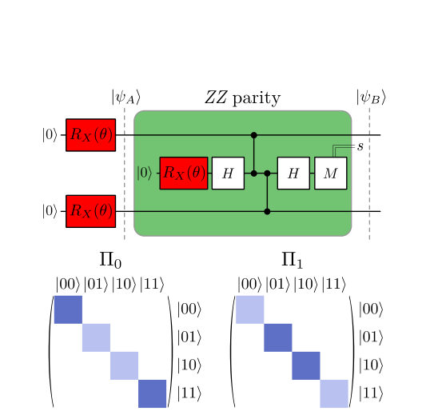
<figcaption class="paper-figure-caption"><b>Fig 1.</b> FIG. 1. Single weight-2 Z-type stabilizer used as building block in the bitflip repetition code memory experiment. The circuit shows injected coherent noise in the red boxes with rotation angle θ for both data and ancilla qubits. The projec- tors Πs = K† sKs with Ks in Eq. (4) are depicted below, with the (blue) color intensity being proportional to the matrix el- ement value, estimated when θ ≪π/2.</figcaption>
</figure>
<figure class="paper-figure-card">
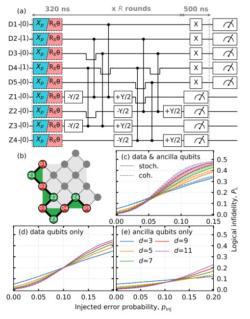
<figcaption class="paper-figure-caption"><b>Fig 2.</b> FIG. 2. Repetition code with error injection circuits and free fermion simulation results. (a) Quantum circuit for the d=5 bitflip repetition code, showing coherent/stochastic error injection locations at the start of each QEC round. (b) Code layout on a Surface-17 processor. The qubits D2-D3-D4 are used for the d=3 code. (c-e) Free-fermion simulations run for R = d QEC rounds, with the stochastic baseline noise specified by pdata = 4% and panc = 8%, independent of d. The injected incoming coherent or stochastic noise with corre- sponding noise threshold is either at data qubit only (∼10%), ancilla qubit only (∼12%) or data and ancilla qubit locations (∼5%). The baseline consists of...</figcaption>
</figure>
<figure class="paper-figure-card">
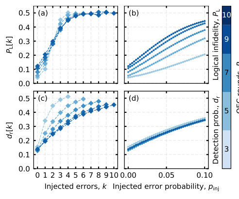
<figcaption class="paper-figure-caption"><b>Fig 3.</b> FIG. 3. Reconstruction of experimental average detection probability and logical error probability (logical infidelity) from the stochastic noise injected circuits of the d=3 repe- tition code. (a) Average logical error probability PL[k] across the circuits with k injected bitflip errors. (b) Reconstructed logical error probability PL(pinj) as a function of injected er- ror probability pinj. (c) Average detection probability dr[k] across the circuits with k injected bitflip errors. (d) Recon- structed detection probability as a function of injected error probability pinj. Deviations above this value can be explained by possible undersampling of the high number of error con- figurations...</figcaption>
</figure>
<figure class="paper-figure-card">
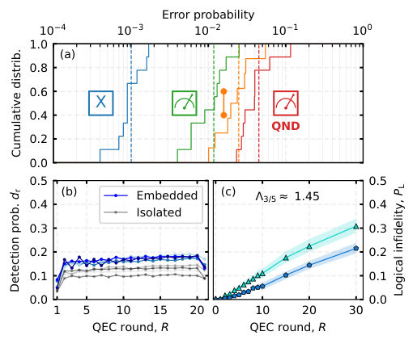
<figcaption class="paper-figure-caption"><b>Fig 4.</b> FIG. 5. Baseline experimental performance of individual operations, detection probabilities, and logical performance for the d=3 and d=5 bitflip repetition codes. (a) Cumulative distribution of single-qubit gate, CZ gate and readout per- formance [Tab. SI]. (b) Average detection probability of the four weight-2 Z-type stabilizers of the d=5 repetition code. One of these stabilizers (Z2) is shown in detail in Fig. 4(a-b). The gray data represent the individual stabilizer performance in isolation, the colored (blue) data represent the simultane- ous (embedded) performance while running the full repetition code. (c) Logical infidelity curves for the memory experiment with d=3 (triangle marker)...</figcaption>
</figure>
<figure class="paper-figure-card">
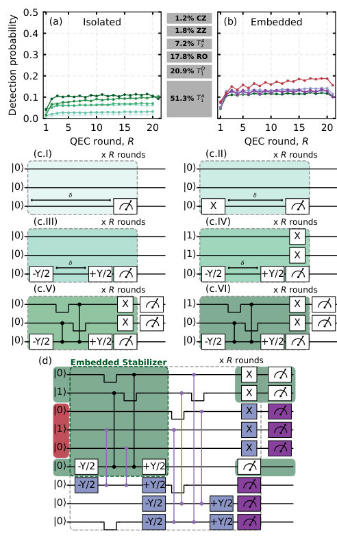
<figcaption class="paper-figure-caption"><b>Fig 5.</b> FIG. 4. Characterization of effective noise source contri- butions to an individual stabilizer performance. (a) Experi- mental stabilizer detection probabilities per characterization circuit (c.I-VI). The experimental data is matched in simula- tion to produce an error budget (gray bar chart) containing: T D 1 /T A 1 (data/ancilla relaxation), T A 2 (ancilla decoherence), RO (readout errors), CZ (two-qubit gate errors) and residual ZZ errors. Each characterization circuit isolates a specific noise contribution from the standard stabilizer circuit (c.VI) used in the repetition code. (b) Experimental stabilizer de- tection probability in an embedded circuit (d) comparable to the complete...</figcaption>
</figure>

**Summary.** This work investigates whether superconducting qubits exhibit a theoretical 'coherent-stochastic gap' when subjected to different types of noise during Quantum Error Correction (QEC). By comparing simulations and experiments on repetition codes, the authors find that while theory predicts a clear difference, hardware imperfections—such as qubit frequency drifts—appear to convert coherent errors into stochastic ones, effectively closing the predicted gap.

**Why it may be interesting.** It provides critical empirical constraints on the fundamental assumptions underlying QEC theory by showing that realistic hardware noise can mask theoretically predicted differences between noise types. This has direct implications for designing fault-tolerant quantum computation protocols.

Detailed structure

**Main problem.** The study aims to experimentally and theoretically determine if a measurable 'coherent-stochastic gap' exists in quantum error correction (QEC) when comparing the performance degradation caused by coherent versus stochastic noise.

**Main result.** Experimentally, no significant difference was observed between coherent and stochastic errors for $d=3$ or $d=5$ codes; this discrepancy is hypothesized to be due to baseline noise acting as a dephasing mechanism that effectively stochastifies the injected coherent errors.

**Method.** The authors combine experimental measurements on superconducting transmon processors with advanced simulations, including free-fermion and density-matrix methods, to model error channels.

**Model / system.** The physical system is a superconducting quantum processor implementing bitflip repetition codes ($d=3$ and $d=5$). The analysis models noise using both unitary (coherent) and probabilistic (stochastic) Pauli error channels.

**Key observables.** Logical fidelity ($\mathcal{L}$ or $P_L$), detection probability, and the coherent-stochastic gap ($\Delta_L$).

**Important parameters / regimes.** Code distance ($d=3, 5$), injected error probability ($p_{inj}$), number of QEC rounds ($R=10$), and qubit frequency drift ($\delta f$).

**Assumptions / limitations.** The discrepancy between simulation and experiment is attributed to residual coherent phase errors (like frequency drifts) in the baseline noise that effectively turn coherent errors into stochastic ones.

**Figures summary.** Figures compare logical infidelity curves for $d=3$ and $d=5$ under varying noise types, showing simulations predicting a gap where experiments observe none. Other figures detail noise characterization circuits and simulation methodologies.

**Paper structure.** The paper progresses from establishing the theoretical expectation of a gap to characterizing baseline hardware noise using multiple dedicated circuits, then simulating both coherent and stochastic error injections on the repetition code, culminating in comparing these results against experimental measurements.

Abstract

The performance of quantum error correction (QEC) codes is limited by the underlying physical noise. Theoretical studies show that coherent and stochastic noise have different effects when performing QEC with either surface or repetition codes. We use the bitflip repetition code, realized in a transmon quantum processor, as a testbed to experimentally study the impact of injecting coherent versus stochastic errors on the logical performance. We adapt a scalable free-fermion simulator to simulate the experiments and we modify a subset sampling technique to efficiently sample stochastic noise in the quantum circuit. In the experiment, we do not observe the difference in logical fidelity predicted by simulation for either the distance-3 or distance-5 repetition codes. We hypothesize that this discrepancy could be explained by small drifts in qubit frequencies, which introduce phase-coherent noise that `stochastifies' the injected coherent errors. Our work contributes to advancing an understanding of how coherent errors affect experimental QEC.

[↑ back to top](#top)

### [How Similar Can Fractional Chern Insulators Be to Fractional Quantum Hall States? Moiré-Enhanced Gaps and Excitation-Spectrum Correspondence](http://arxiv.org/abs/2606.07323v1)

**Authors:** Siddhartha Sarkar, Yitong Zhang, Kai Sun  
**Type:** theory · **Category:** strongly correlated electrons · **PDF:** <https://arxiv.org/pdf/2606.07323v1>  
**Analysis basis:** full PDF text, analyzed in chunks
**Topic relevance:** 🔥 `analog quantum simulation` **4/5** · `correlated cavity matter` **1/5** · `entanglement & information structure` **1/5** · `non-equilibrium dynamics` **1/5**

↔ Scroll figures horizontally

<figure class="paper-figure-card">
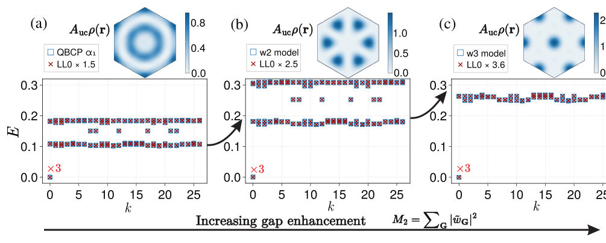
<figcaption class="paper-figure-caption"><b>Fig 1.</b> FIG. 1. Charge neutral gap enhancement of ν = 1/3 FCI in ideal bands over LLL in short-range interaction limit ds/ℓB = 0.01. Panels (a)-(c) correspond to models with increasing lattice modulation strength M2 = P</figcaption>
</figure>
<figure class="paper-figure-card">
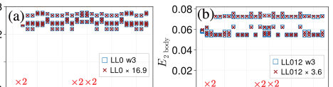
<figcaption class="paper-figure-caption"><b>Fig 2.</b> FIG. 3. Gap enhancement in non-Abelian FCIs. (a) ED spectra at filling ν = 1/2 for the three-body Moore- Read pseudopotential projected to an ideal band with nearly uniform Berry curvature (blue boxes) and to the LLL(red crosses). The LLL spectrum has been rescaled by a fac- tor 16.9. The spectra remain nearly identical in structure, while the many-body gap is enhanced by the factor M3 in the ideal band. (b) ED spectra at filling ν = 1/2 for the screened Coulomb interaction projected to higher-vortexable bands with multicomponent wavefunctions, comparing moiré bands with lattice modulation (blue boxes) and hybridized LL bands with h(r) = 1 (red crosses). The latter spectrum has been...</figcaption>
</figure>
<figure class="paper-figure-card">
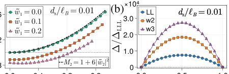
<figcaption class="paper-figure-caption"><b>Fig 3.</b> FIG. 2. Role of lattice harmonics in gap enhance- ment of Abelian FCIs for short-range interactions. (a) Charge-neutral gap enhancement factor ∆/∆LLL of the ν = 1/3 FCI in ideal bands with triangular-lattice geometry and C6 symmetry as a function of the second-harmonic am- plitude ˜w2, for several values of the first-harmonic amplitude ˜w1. The green dashed line shows M2 = 1+6| ˜w2|2 for compar- ison. (b) Charge-neutral gap enhancement factor ∆/∆LLL for higher-vortexable bands with multicomponent wavefunctions for short-range interaction as function of t defined in the main text. The blue circles correspond to hybridized LL bands with h(r) = 1, while the orange squares and purple triangles...</figcaption>
</figure>
<figure class="paper-figure-card">
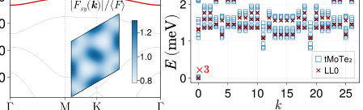
<figcaption class="paper-figure-caption"><b>Fig 4.</b> FIG. 4. FCI in twisted bilayer MoTe2 at twist angle θ = 3.7◦. (a) Band structure showing the top four valence bands in the moiré BZ (top valence band is marked in red). The band structure only shows the bands in a single valley. The inset shows the normalized Berry-curvature distribution |Fxy(k)|/⟨Fxy⟩BZ of the top valence band. The continuum Hamiltonian as well as parameters are taken from [54]. (b) ED spectra at νh = 2/3 filling of tMoTe2 (blue boxes) and ν = 2/3 filling of LLL (red crosses) for screened Coulomb interaction with parameters ds = 30 nm, ϵ = 15.0 and Nk = 27 unit cells. We assume valley polarization for tMoTe2 calculations.</figcaption>
</figure>

**Summary.** This theoretical study develops a framework to understand how periodic density modulations in moiré lattices affect the excitation spectrum of Fractional Chern Insulators (FCIs). It shows that these modulations can significantly enhance the energy gap by rescaling the system's low-energy physics, making FCIs highly tunable and predictable relative to ideal Quantum Hall states.

**Why it may be interesting.** The work provides a powerful, quantitative design principle showing how engineered lattice modulations can robustly enhance topological gaps in correlated electron systems, offering direct guidance for materials science applications.

Detailed structure

**Main problem.** The primary goal is to establish a theoretical principle linking periodic electron-density modulations (from moiré patterns) to the excitation spectrum of Fractional Chern Insulators (FCIs), comparing them to established Fractional Quantum Hall (FQH) states.

**Main result.** Density modulations are not detrimental; instead, large reciprocal lattice vector components can enhance the FCI gap arbitrarily, rescaling the entire low-energy spectrum to mimic the FQH problem structure.

**Method.** Theoretical derivation using Fourier analysis of density modulations ($	ilde{w}_G$) and projecting interacting Hamiltonians onto effective flat bands derived from continuum models or moiré lattices.

**Model / system.** The study focuses on FCIs realized in lattice bands, particularly those formed by moiré superlattices (e.g., twisted bilayer graphene, tMoTe2). The physics is modeled by comparing the system to ideal Landau Level (LL) physics.

**Key observables.** Charge-neutral gap size ($\Delta$), anyon dispersion spectrum, and the gap enhancement factor ($M_2$).

**Important parameters / regimes.** Screening length ($d_s$), moiré periodicity/modulation strength ($	ilde{w}_G$), filling fraction ($
u=1/3$ or $2/3$), and LL hybridization weight ($t$).

**Assumptions / limitations.** The analysis often relies on approximations such as the first harmonic approximation for the potential, neglecting band dispersion in some theoretical limits, or assuming specific symmetries (e.g., near-vortexable bands).

**Figures summary.** Figures compare FCI spectra to LL spectra, showing spectral collapse upon rescaling by $M_2$. Specific examples include gap enhancement plots vs. modulation strength and comparisons between $
u=1/3$ and $
u=2/3$ states in tMoTe$_2$.

**Paper structure.** The paper develops a theoretical principle relating density modulations to spectral properties, applies this to moiré systems (like graphene), analyzes the role of different Fourier components ($G$), and concludes by testing the robustness of gap enhancement using material examples like tMoTe$_2$ while noting discrepancies arising from band dispersion.

Abstract

Fractional Chern insulators (FCIs) realize fractional quantum Hall topology in lattice bands, but their excitation spectra remain far less understood than their ground states. Here we establish a theoretical principle relating the periodic electron-density modulations of flat Chern bands to the many-body gap and excitation spectrum of FCIs. Contrary to the conventional view that such density modulations are detrimental to fractional topology, we show that different reciprocal-lattice Fourier components play sharply distinct roles: components at smaller reciprocal lattice vectors suppress the FCI gap, whereas components at larger reciprocal lattice vectors enhance it. By suppressing the harmful small-wave-vector components and amplifying the beneficial large-wave-vector components, the gap enhancement can, in principle, be made arbitrarily large within the projected flat-band theory. Moreover, the same enhancement factor rescales the full low-energy spectrum, making the FCI excitation spectrum predictable from the corresponding Landau-level problem. We further generalize this correspondence to non-Abelian states. Applying this principle to moiré Chern bands, we identify these reciprocal-lattice density components as practical diagnostics for robust FCIs.

[↑ back to top](#top)

### [Suppression of Quasiparticle Poisoning to $10^{-11}$ Levels in Superconducting Qubits via Infrared Shielding](http://arxiv.org/abs/2606.07339v1)

**Authors:** Wei-En Lin, Chen-Hsun Ma, Erh-Hsiang Yeh, Wei-Lun Peng, Yu-Sen Wei, Hsi-Sheng Goan, Cen-Shawn Wu, Chung-Ting Ke, Yung-Fu Chen, Chii-Dong Chen  
**Type:** experiment · **Category:** quantum information and computing · **PDF:** <https://arxiv.org/pdf/2606.07339v1>  
**Analysis basis:** full PDF text, analyzed in chunks
**Topic relevance:** 🔥 `QC/QI experiment` **4/5** · `correlated / nonlocal dissipation` **1/5** · `driven-dissipative phase transition` **1/5** · `methods for driven-dissipative` **1/5**

↔ Scroll figures horizontally

<figure class="paper-figure-card">
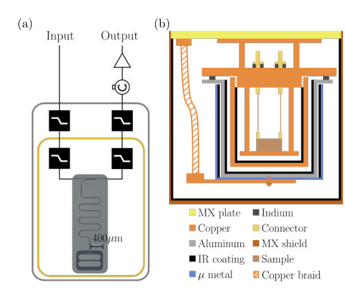
<figcaption class="paper-figure-caption"><b>Fig 1.</b> FIG. 1. Experimental setup of Configuration A. (a) Qubit measurement wiring. The device image shows a floating trans- mon qubit coupled to a readout resonator, which is in turn coupled to an open transmission line. The chip is enclosed within a dedicated multilayer shielding assembly (yellow box) and the mixing-plate radiation shield provided by Bluefors (gray box). Two IR filters are implemented on both the input and output sides of the open transmission line. (b) Detailed schematic of shielding Configuration A. The shielding struc- ture is concentrically arranged from inside to outside as fol- lows: a copper enclosure, an aluminum enclosure, and a mu- metal shield. The copper enclosure is...</figcaption>
</figure>
<figure class="paper-figure-card">
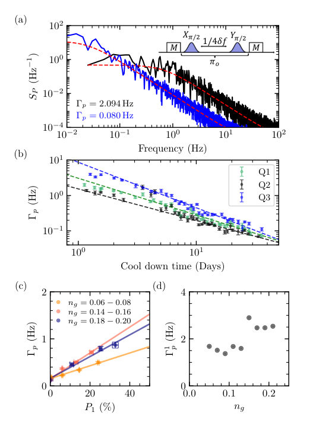
<figcaption class="paper-figure-caption"><b>Fig 2.</b> FIG. 2. Parity-switching measurements. (a) PSD of the parity-switching signal for Q2 measured on Days 1 and 33. The spectra are fitted with a Lorentzian to extract Γp = 2.09 Hz (Day 1) and 0.080 Hz (Day 33). (b) Extracted Γp vs. time for all three qubits over 36 days, fitted to a power law with exponents −1.04, −0.89, and −1.28 for Q1–Q3, re- spectively. (c) Γp vs. P1 for Q2 at several gate charges ng (Day 15), from which Γ1 p is extrapolated. (d) Corresponding Γ1 p as a function of ng.</figcaption>
</figure>
<figure class="paper-figure-card">
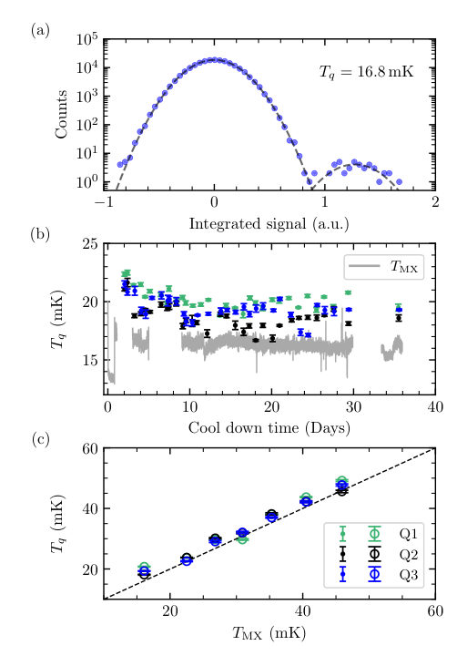
<figcaption class="paper-figure-caption"><b>Fig 3.</b> FIG. 3. Effective qubit temperature. (a) Qubit state readout for Q2 on Day 20, yielding P1 = 0.0218% and a corresponding Tq = 16.8 mK. (b) Tq vs. time for all three qubits, with TMX shown for comparison. (c) Tq as a function of TMX for all three qubits. The legend in (c) applies to both (b) and (c). The dashed line indicates Tq = TMX.</figcaption>
</figure>
<figure class="paper-figure-card">
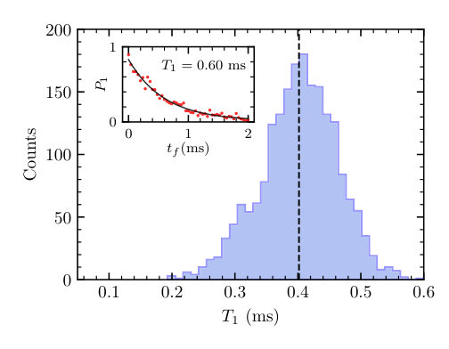
<figcaption class="paper-figure-caption"><b>Fig 4.</b> FIG. 4. Histogram of T1 for Q2 on Day 24. The distribution has a mean of 402 µs and a standard deviation of 60.7 µs. The inset shows the longest measured T1, reaching 600 µs.</figcaption>
</figure>

**Summary.** The authors investigated quasiparticle poisoning in superconducting qubits using various infrared (IR) shielding methods. By measuring parity switching rates over extended periods, they demonstrated that improved shielding can suppress decoherence sources by many orders of magnitude. This work establishes a new low benchmark for quasiparticle density, proving the necessity of meticulous environmental control for scalable quantum computing.

**Why it may be interesting.** This research provides crucial experimental benchmarks on environmental noise mitigation in superconducting qubits, directly impacting the feasibility of scaling quantum processors.

Detailed structure

**Main problem.** Quasiparticle poisoning severely limits coherence times and scalability in superconducting qubits.

**Main result.** Implementing advanced infrared (IR) shielding techniques suppressed the quasiparticle switching rate by over four orders of magnitude, achieving a record low density estimate of $1.88 	imes 10^{-11}$ per Cooper pair.

**Method.** The study measured quasiparticle-induced parity switching rates ($\Gamma_p$) over long cooldown periods and characterized qubit temperature ($T_q$).

**Model / system.** Floating transmon superconducting qubits are used, which are susceptible to decoherence from environmental IR radiation and stray quasiparticles.

**Key observables.** Parity-switching rate ($\Gamma_p$), effective qubit temperature ($T_q$), quasiparticle density per Cooper pair ($x_{qp}$), and energy relaxation time ($T_1$).

**Important parameters / regimes.** Qubit frequency $\approx 3$ GHz; achieved $x_{qp} \approx 1.88 	imes 10^{-11}$; effective temperature down to $17	ext{ mK}$.

**Assumptions / limitations.** The remaining quasiparticle population is likely dominated by sporadic phonon bursts from mechanical stress or the environment.

**Figures summary.** Figures illustrate the experimental setup, time evolution of $\Gamma_p$ showing decay over days, and plots comparing $T_q$ to the phonon bath temperature ($T_{MX}$).

**Paper structure.** The work systematically compares three IR shielding configurations (A, B, C) by measuring parity switching rates ($\Gamma_p$) and characterizing thermalization effects ($T_q$) over time to determine the optimal environment for high-coherence operation.

Abstract

Quasiparticle poisoning bottlenecks superconducting qubits, limiting coherence and the scalability of quantum processors. In this work, we systematically investigate quasiparticle poisoning in superconducting qubits under three infrared (IR) shielding configurations, ranging from a dedicated multi-layer design to a simplified implementation. By measuring quasiparticle-induced parity switching, we demonstrate a suppression of the switching rate by over four orders of magnitude via the implementation of improved shielding. In the best configuration, the rate decreases over time following cooldown and reaches 0.069$\,$Hz on day 34, corresponding to an anticipated quasiparticle density per Cooper pair of $1.88\times10^{-11}$. To our knowledge, this represents the lowest quasiparticle density reported in the literature to date. The remaining quasiparticle population is likely dominated by sporadic phonon bursts stemming from mechanical stress release in the on-chip films, as well as from the surrounding environment. The effective qubit temperature follows the phonon bath down to 17$\,$mK, enabling initialization errors of $\sim 0.01\%$ for 3$\,$GHz qubits. These results demonstrate that proper IR shielding and thermalization are essential for suppressing quasiparticle poisoning and enabling high-coherence, scalable superconducting qubit systems.

[↑ back to top](#top)

### [Non-Abelian braiding in Abelian Fractional Quantum Hall Phases from realistic interactions](http://arxiv.org/abs/2606.07517v1)

**Authors:** Ha Quang Trung, Bo Yang  
**Type:** theory · **Category:** strongly correlated electrons · **PDF:** <https://arxiv.org/pdf/2606.07517v1>  
**Analysis basis:** full PDF text, analyzed in chunks
**Topic relevance:** 🔥 `analog quantum simulation` **4/5** · `correlated cavity matter` **1/5** · `entanglement & information structure` **1/5**

↔ Scroll figures horizontally

<figure class="paper-figure-card">
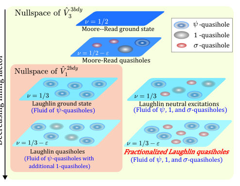
<figcaption class="paper-figure-caption"><b>Fig 1.</b> FIG. 1. The Laughlin state as a fluid of Moore-Read quasi- holes: as the filling factor decreases from ν = 1/2, quasiholes of the MR states are created, which can be of one of the three types labelled 1, ψ, or σ. At filling factor ν = 1/3, two-body interaction favors ψ, which form a fluid that makes up the Laughlin ground state. Additional quasiholes in the Laughlin state must be 1-quasiholes (see discussion in main text.)</figcaption>
</figure>
<figure class="paper-figure-card">
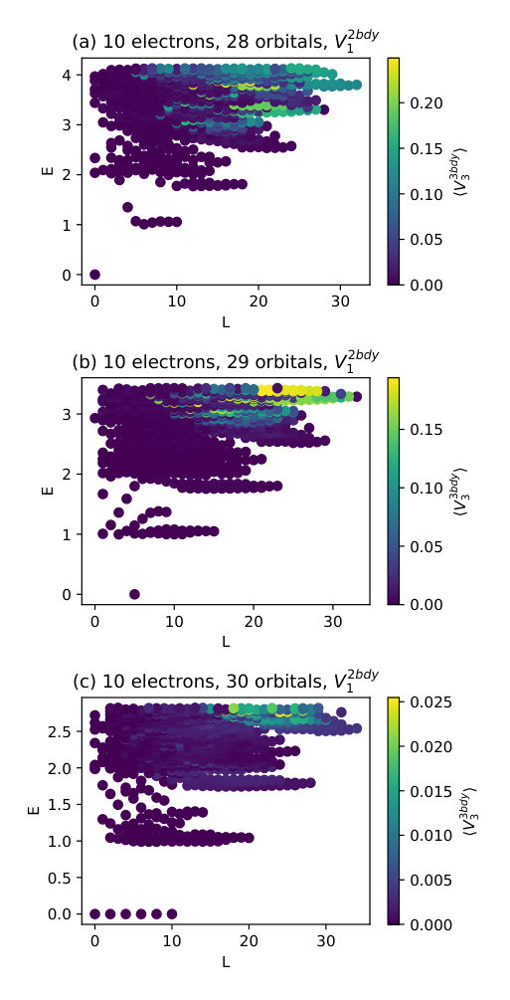
<figcaption class="paper-figure-caption"><b>Fig 2.</b> FIG. 2. The spectrum of ˆV 2bdy 1 on the sphere with 10 elec- trons and 28, 29, and 30 orbitals (Laughlin ground state, one- quasihole state, and two-quasihole state), respectively. The lowest 1000 eigenvalues are shown in each plot. The color bar shows variational energy of each eigenstate with respect to the Moore-Read model Hamiltonian, ˆV 3bdy 3 . All numerical results in this paper are given in the unit ℏ= c = e = B = 1.</figcaption>
</figure>
<figure class="paper-figure-card">
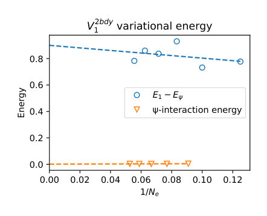
<figcaption class="paper-figure-caption"><b>Fig 3.</b> FIG. 3. Finite-size scaling of difference in self-energy between 1-quasihole and ψ-quasihole (blue) and interaction energy of ψ-quasiholes at filling factor ν = 1/3, both calculated for a background ˆV 2bdy 1 interaction [48]. Dotted line shows linear fit.</figcaption>
</figure>
<figure class="paper-figure-card">
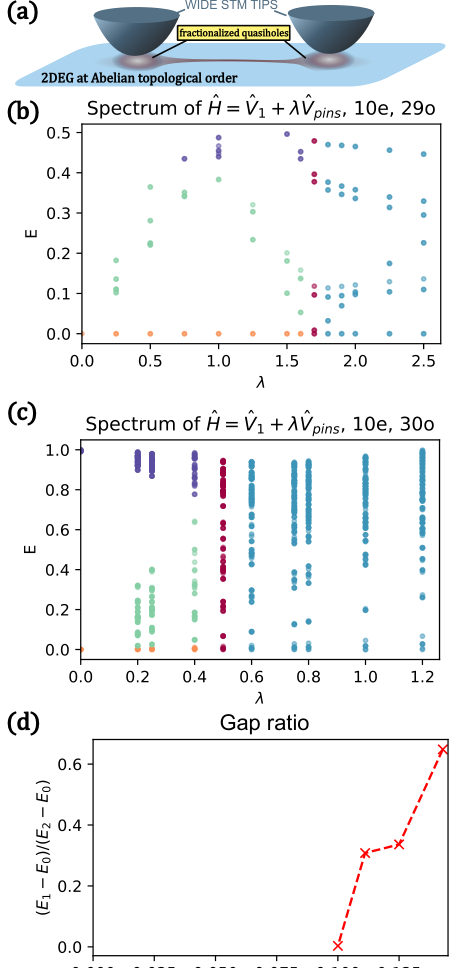
<figcaption class="paper-figure-caption"><b>Fig 4.</b> FIG. 4. (a) A schematic diagram showing fractionalization of an Abelian quasihole by electrostatic potential induced by two wide STM tips (b) Spectrum of Eq. (5) at increasing λ when two potential pins are applied to a system with one quasihole. The color of each point reflects the nature of the correspond- ing eigenstate: a Laughlin quasihole positioned at a poten- tial pin (orange), a Laughlin quasihole positioned elsewhere (green), gapped neutral excitations (purple), or a strong mix- ing of the Laughlin quasihole with gapped excitations (blue). The critical point at which a phase transition to fractionalized Laughlin quasihole occurs is marked in red (see discussion in main text). (c)...</figcaption>
</figure>

**Summary.** The research demonstrates that non-Abelian braiding statistics can be engineered in the seemingly simple Laughlin FQH state at $
u=1/3$. By applying localized trapping potentials, the system forces the fractionalized quasiholes to behave as non-Abelian anyons, providing a pathway to realizing topological quantum computation using realistic electron interactions.

**Why it may be interesting.** This work directly addresses how topological order, typically associated with exotic Hamiltonians like the Moore-Read model, can emerge robustly within a simpler, Abelian phase ($
u=1/3$) by engineering local potentials. This has direct implications for designing experimental quantum simulators.

Detailed structure

**Main problem.** The paper proposes a method to realize non-Abelian braiding of fractionalized quasiholes within the Abelian Laughlin Fractional Quantum Hall (FQH) phase.

**Main result.** Non-Abelian statistics can be realized in $
u=1/3$ by inducing fractionalization of Laughlin quasiholes using carefully designed one-body trapping potentials, without requiring fine-tuning of realistic electron-electron interactions.

**Method.** The study employs numerical simulations (Exact Diagonalization and variational energy calculations) on spherical geometry to analyze the low-lying excitations relative to both two-body pseudopotentials ($\hat{V}_{2bdy}$) and three-body terms ($\hat{V}_{3bdy}$).

**Model / system.** The system is the Fractional Quantum Hall state at $
u=1/3$, modeled using concepts derived from the Laughlin and Moore-Read Hamiltonians. The analysis focuses on quasihole excitations, which are shown to fractionalize into non-Abelian anyons ($\sigma$-type) when subjected to external trapping potentials.

**Key observables.** Low-lying excitation energies, ground state degeneracy (comparing Abelian vs. non-Abelian expectations), and the ratio of energy gaps used to diagnose topological order.

**Important parameters / regimes.** Filling factor $
u=1/3$, pinning strength ($\lambda$), and the nature of the trapping potential (Gaussian vs. orbital).

**Assumptions / limitations.** The analysis relies on mapping complex interactions onto effective Hamiltonians in the Lowest Landau Level (LLL) basis, sometimes using idealized 'toy model' potentials to simulate realistic effects.

**Figures summary.** Figures illustrate the energy spectra evolution as pinning strength increases, showing phase transitions marked by gap closing and changes in ground state degeneracy, confirming fractionalization.

**Paper structure.** The paper progresses from establishing the theoretical framework (Laughlin vs. MR models) to applying numerical techniques using external potentials ($\hat{V}_{1bdy}$) to induce quasihole fractionalization, culminating in evidence for non-Abelian braiding signatures.

Abstract

We propose a method of realizing non-Abelian braiding of fractionalized quasiholes in the Laughlin fractional quantum Hall phase at $ν=1/3$ with realistic two-body interactions within the lowest Landau level. It is numerically shown that low-lying gapped excitations near $ν=1/3$ are contained almost entirely within the null space of the three-body Moore-Read model Hamiltonian. They are thus quantum fluids of non-Abelian quasiholes that are in principle physically accessible. In particular, Laughlin ground state can be described as a fluid of ``$ψ$-type" quasiholes formed by binding a magnetic flux with a Majorana fermion (MF), and the Laughlin quasiholes are described by the ``$1$-type'' quasiholes, which are magnetic fluxes without a MF attached. Within the Laughlin phase, Laughlin quasiholes can be locally fractionalized into non-Abelian quasiholes, when the strong attraction between them is overcome by properly designed one-body electronstatic trapping potentials. Extensive numerics with proper finite-size scaling corroborate this physical picture, and our study points to the possibility of realizing non-Abelian braiding within an Abelian topological phase in experiment without the need for fine-tuning realistic electron-electron interaction.

[↑ back to top](#top)

### [Driving Exchange Interaction in Spin Qubits with Quasi-Zero Pulses](http://arxiv.org/abs/2606.07472v1)

**Authors:** Julian D. Teske, Remy L. Delva, Shobhan Kulshreshtha, Yuval Baum, Florian Luthi, Fahd A. Mohiyaddin, Rostyslav Savytskyy, Thomas Watson, Pranav S. Mundada  
**Type:** both · **Category:** quantum information and computing · **PDF:** <https://arxiv.org/pdf/2606.07472v1>  
**Analysis basis:** full PDF text, analyzed in chunks
**Topic relevance:** 🔥 `QC/QI experiment` **4/5** · `spintronics-quantum-optics interface` **1/5**

↔ Scroll figures horizontally

<figure class="paper-figure-card">
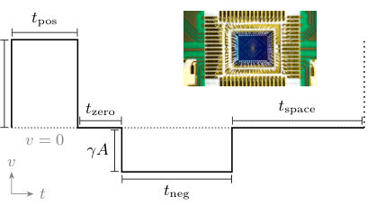
<figcaption class="paper-figure-caption"><b>Fig 1.</b> FIG. 1. Illustration of an atomic barrier pulse as a function of time. A rectangular exchange pulse would correspond to an amplitude ratio of γ = 0, while a net-zero pulse would correspond to γ = tpos/tneg. Quasi-zero pulses correspond to other values of 0 &lt; γ &lt; tpos/tneg. In the following, we assume tpos = tneg. Inset: picture of the Tunnel Falls device adopted from Ref. [3].</figcaption>
</figure>
<figure class="paper-figure-card">
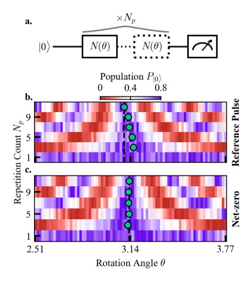
<figcaption class="paper-figure-caption"><b>Fig 2.</b> FIG. 2. Pulse perturbation of net-zero and reference pulses. (a) Experiment description: The qubit is initialized, Np rep- etitions of N(ψ) pulses are applied and the qubit is read out. Each N(ψ) pulse is tuned to rotate the qubit an angle ψ around the n-axis. (b, c) Measured fringe pattern of the ref- erence pulse and the net-zero pulse. We plot the excitation probability as a function of the rotation angle ψ and number of pulse repetitions Np which are incremented in multiples of 2. The teal circles mark the center of the fringe pattern for different repetition counts and black dashed lines are included as guide to the eye to spot the curvature of the fringes.</figcaption>
</figure>
<figure class="paper-figure-card">
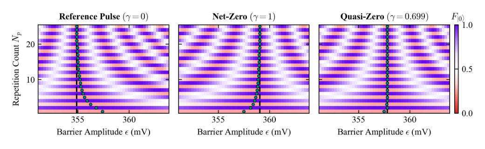
<figcaption class="paper-figure-caption"><b>Fig 3.</b> FIG. 3. Comparison of fringe curvature induced by reference, net-zero and quasi-zero pulses. The plot displays the simulated ground-state fidelity F|0⟩following the multi-pulse sequence outlined in Fig. 2 (a). The teal dots are the peaks along the central fringe and the black dashed line marks the calibrated amplitude to implement the N(π/2) gate. We observe that the net-zero pulse bends the curvature of the central fringe and over-corrects the curvature on the considered time-scale. The optimal amplitude relation γ of a quasi-zero pulse is found by maximizing the alignment of the teal dots along the central fringe to a straight line.</figcaption>
</figure>

**Summary.** This paper tackles the challenge of controlling spin qubit exchange interactions accurately despite imperfections in control pulses. The authors introduce and validate 'quasi-zero' pulse designs as an efficient alternative to complex filtering methods. This approach significantly reduces the number of tunable parameters needed for high-fidelity gate operations, making quantum device calibration faster and more scalable.

**Why it may be interesting.** This work directly addresses practical limitations in solid-state quantum computing hardware by providing a robust, low-complexity pulse shaping technique that simplifies the calibration overhead required for large-scale devices.

Detailed structure

**Main problem.** The primary challenge is achieving high-fidelity quantum gates for spin qubits by accurately controlling exchange interactions while mitigating systematic errors introduced by pulse distortions.

**Main result.** Quasi-zero pulses provide a low-complexity method to achieve gate fidelities comparable to highly optimized, multi-parameter filtering techniques, requiring fewer tuning parameters.

**Method.** The authors designed and benchmarked quasi-zero pulses—a generalization of net-zero pulses—to cancel out linear-dynamical pulse distortions during the evolution of exchange-only qubits.

**Model / system.** The work focuses on semiconductor spin qubits confined in quantum dots, specifically tested on Intel's Tunnel Falls six-dot device. The system dynamics are governed by an effective Hamiltonian involving tunable exchange interactions ($J_{i}(v_i)$).

**Key observables.** Gate fidelity (measured via randomized benchmarking), pulse duration, and the curvature of Rabi fringes.

**Important parameters / regimes.** The amplitude ratio ($\gamma$) for quasi-zero pulses is critical; optimal performance was found by balancing noise sources like hyperfine and charge noise.

**Assumptions / limitations.** The analysis assumes that control signal distortions are linear-dynamical. Furthermore, the negative pulse segments are assumed to have a negligible effect on the exchange interaction due to its exponential dependence on voltage.

**Figures summary.** Figures illustrate the structure of atomic barrier pulses and compare fringe patterns, showing systematic shifts in reference pulses versus vanishing shifts with net-zero/quasi-zero pulses. Table I summarizes fidelity metrics for various pulse settings.

**Paper structure.** The paper progresses by first identifying the need to correct pulse distortions; it then introduces and analyzes net-zero and quasi-zero pulse designs, systematically benchmarking these against reference methods using randomized benchmarking to quantify performance gains in terms of both fidelity and parameter count.

Abstract

The implementation of high-fidelity quantum gates for spin qubits requires accurate control of exchange interactions between electrons confined in quantum dots, but pulse distortions can limit this control accuracy. Although linear-dynamical distortions can be compensated for by appropriately convolving the control signal, determining the necessary convolution requires detailed knowledge of the distortion's transfer function, and therefore the calibration of numerous parameters. Alternatively, control pulses can be designed to have a net-zero time integral canceling out linear-dynamical pulse distortions. We generalize net-zero pulse designs to quasi-zero pulses allowing net-positive but reduced time integrals. Using these pulse designs, we systematically develop complete gate sets for exchange-only qubits, and study the resulting tradeoffs between pulse duration, fidelity, and the required number of tunable parameters, both in simulation and experiment. We benchmark the optimized gate pulses on Intel's Tunnel Falls six-dot device and show they achieve fidelities similar to those obtained with a full filtering approach, with identical pulse durations and fewer tuning parameters. This reduction in complexity opens the door to fast and easily automated calibration schemes compatible with large-scale commercial quantum devices.

[↑ back to top](#top)

### [Measurement circuit ansatz: Naimark versus quantum neural-network measurements](http://arxiv.org/abs/2606.07376v1)

**Authors:** Sung Won Yun, Thi Ha Kyaw, Joonwoo Bae  
**Type:** theory · **Category:** quantum information and computing · **PDF:** <https://arxiv.org/pdf/2606.07376v1>  
**Analysis basis:** full PDF text, analyzed in chunks
**Topic relevance:** 🔥 `quantum measurements` **4/5** · `measurement-induced transitions` **1/5**

↔ Scroll figures horizontally

<figure class="paper-figure-card">
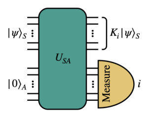
<figcaption class="paper-figure-caption"><b>Fig 1.</b> FIG. 1: A general measurement can be implemented in a quantum circuit via the Naimark extension. A circuit USA over a system and ancilla qubits is performed and an outcome on ancilla qubits, say i (yellow), implements a general operation described by a Kraus operator Ki, where Ki =A ⟨i|USA.</figcaption>
</figure>
<figure class="paper-figure-card">
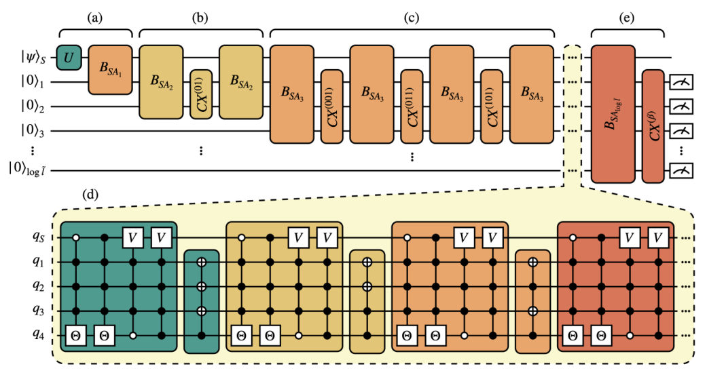
<figcaption class="paper-figure-caption"><b>Fig 2.</b> FIG. 2: The construction of a measurement circuit is detailed: l-outcome POVM elements for measurements on 1 + log2 el qubits are shown by following the Naimark theorem [13, 23] where el = 2⌈log2 l⌉is the nearest power of 2 not smaller than l. (a) Two-outcome measurements can be prepared after a binary module BSA1 in Eq. (7). (b) After the first BSA2 and CX(01), a three-outcome measurement is realized. To add a POVM element, gate BSA2 is applied, after which four-outcome measurement is achieved. (c) Similarly, a five-outcome measurement is realized after the first BSA3 and CX(001). Then, a POVM can be added after two gates BSA3 and CX. Hence, eight-outcome measurements are realized. (d) A...</figcaption>
</figure>
<figure class="paper-figure-card">
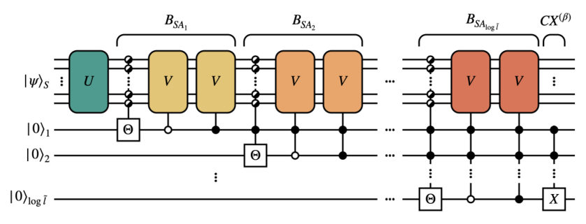
<figcaption class="paper-figure-caption"><b>Fig 3.</b> FIG. 3: Multi-qubit POVM extended from the single-qubit case. The single-qubit unitaries U and V are replaced with multi-qubit gates. The two single-qubit RY rotations can be interpreted to uniformly controlled rotation gates applied to the given single-qubit state, and thus generalized to uniformly controlled rotations on the prepared multi-qubit state. The CX(x) gates remains unchanged. The overall construction principles of the POVM are preserved. See Fig.2 for the definitions of el and β.</figcaption>
</figure>
<figure class="paper-figure-card">
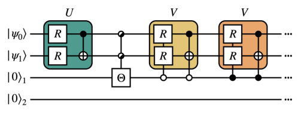
<figcaption class="paper-figure-caption"><b>Fig 4.</b> FIG. 5: A hybrid Naimark-QNN measurement for two- qubit states is shown. In a Naimark circuit in Fig. 3, and multi-qubit unitaries on a system are replaced by PQCs. Note that a Naimark and a hybrid Naimark- QNN measurements share the same circuit structure: CNOT gates to include ancillary qubits are placed in the same way.</figcaption>
</figure>
<figure class="paper-figure-card">
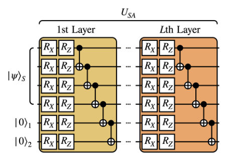
<figcaption class="paper-figure-caption"><b>Fig 5.</b> FIG. 7: A fully QNN quantum measurement circuit USA is shown, where each layer is constructed by HEA. Pa- rameters of single-qubit gates in HEA are optimized. Multiple layers may enhance QNN measurements by increasing expressibility, approximating ideal measure- ments.</figcaption>
</figure>

**Summary.** The paper develops methods to build quantum circuits that perform general measurements (POVMs) by comparing the traditional Naimark extension against modern Quantum Neural Network (QNN) ansatzes. It demonstrates that while Naimark circuits are theoretically sound, QNN-based measurements offer superior optimization efficiency and hardware compatibility for state discrimination tasks.

**Why it may be interesting.** This work directly addresses resource estimation and hardware feasibility for quantum measurement protocols, which is crucial for any practical application of quantum computation or sensing.

Detailed structure

**Main problem.** The primary goal is constructing quantum circuits (ansatze) capable of implementing general Positive-Operator-Valued Measures (POVMs) for tasks like state discrimination.

**Main result.** Quantum Neural Network (QNN) measurements are shown to be more efficient and effective than traditional Naimark circuit constructions, especially on near-term hardware, although they may not reach the theoretical optimum.

**Method.** The work compares three measurement approaches: standard Naimark extensions using universal gates, hybrid Naimark-QNN circuits, and fully QNN measurements. Optimization is performed classically to determine parameters for state discrimination tasks (ME/MC).

**Model / system.** The model involves quantum systems requiring the realization of $l$-outcome POVMs via ancillary qubits. The comparison focuses on circuit complexity, specifically counting CNOT gates and assessing optimization convergence.

**Key observables.** Guessing probability ($p_{	ext{guess}}$) for ME discrimination, Maximum Confidence (MC) values, and the required number of CNOT gates to implement the measurement circuit.

**Important parameters / regimes.** The number of desired outcomes ($l$), the minimum required ancillary qubits ($\lceil \log_2 l 
ceil$), and the optimization cutoff parameter ($\delta_c$).

**Assumptions / limitations.** The analysis assumes that current quantum hardware favors shallow-depth circuits, which biases the comparison toward QNN approaches over deep Naimark structures.

**Figures summary.** Figures illustrate the construction of POVMs using ancillary qubits and binary modules; comparisons show convergence plots for different measurement types on simulated/real hardware; and circuit diagrams detail block-encoding and unitary transformations.

**Paper structure.** The paper systematically develops from the Naimark extension formalism to constructing $l$-outcome POVM circuits. It then introduces QNN replacements (hybrid and full) to mitigate optimization difficulties inherent in the original structure, culminating in performance comparisons for state discrimination tasks.

Abstract

In this work, we present constructions of quantum circuits to implement general measurements on quantum hardware. Firstly, we investigate a quantum circuit ansatz by following the Naimark extension with a universal set of gates, such as controlled-NOT and single-qubit gates; we call it a Naimark quantum measurement. We present a circuit ansatz framed by the Naimark extension, leaving single-qubit gates with parameters, and apply a classical optimizer to determine their parameters to approximate a desired quantum measurement. Secondly, we relax the Naimark measurement with quantum neural-network (QNN) circuits, employing parameterized quantum circuits. We present hybrid Naimark-QNN measurements by incorporating QNN circuits into Naimark measurements. Thirdly, we also consider fully QNN measurements with shallow parameterized circuits. Then, we compare the constructed measurement circuits, Naimark, hybrid Naimark-QNN, and fully QNN measurements, for strategies of state discrimination, such as minimum-error and maximum-confidence measurements. We demonstrate that QNN circuits can efficiently and effectively achieve near-optimal quantum measurements with fewer training iterations.

[↑ back to top](#top)

### [Contacting Josephson Junctions via Airbridges in Superconducting Circuits](http://arxiv.org/abs/2606.06951v1)

**Authors:** Prakiran Baidya, Momčilo Milosavljević, Murali Krishna Kurmapu, Thomas Fösel, Harshanth Ram Murugesan, Victor Kemme, Mojahed Jaber, Markus Sondermann, Christopher Eichler  
**Type:** experiment · **Category:** quantum information and computing · **PDF:** <https://arxiv.org/pdf/2606.06951v1>  
**Analysis basis:** full PDF text, analyzed in chunks
**Topic relevance:** 🔥 `QC/QI experiment` **4/5**

↔ Scroll figures horizontally

<figure class="paper-figure-card">
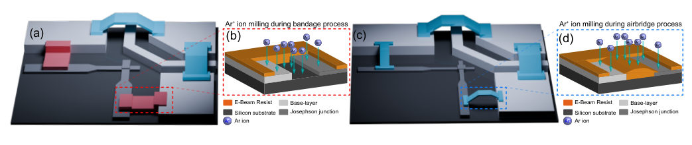
<figcaption class="paper-figure-caption"><b>Fig 1.</b> FIG. 1. (a) Schematic of a conventional two-element contacting scheme. Bandages (red) connect Josephson junctions (gray) to the base layer (light gray), whereas airbridges (blue) connect non-adjacent components of the base layer. (b) Schematic diagram showing the material stack during the in-situ ion milling step applied prior to depositing the bandage metal. (c) Schematic of a the single-element contacting scheme presented in this work, in which all connections are established via airbridges of varying size. (d) Same as (b) but for the case of airbridge connections. The bridge scaffold protects the silicon from exposure to ions.</figcaption>
</figure>
<figure class="paper-figure-card">
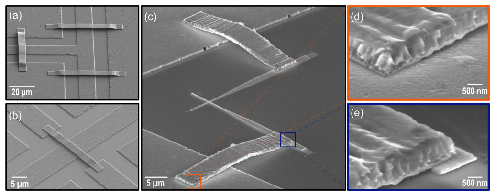
<figcaption class="paper-figure-caption"><b>Fig 2.</b> FIG. 2. Gallery of scanning electron micrograph (SEM) images of (a) separate parts of the ground plane contacted via airbridges of length 36 µm and width 4 µm, (b) two segments of a coplanar waveguide crossing another one via airbridge of same dimension as in (a), and (c) airbridges having length 15 µm and width 3 µm contact Josephson junction electrodes to the base-layer metal that are ∼10 µm apart in a test structure. (d)-(e) Zoom into the contact areas between (d) airbridge and base layer and (e) airbridge and Josephson junction electrodes.</figcaption>
</figure>
<figure class="paper-figure-card">
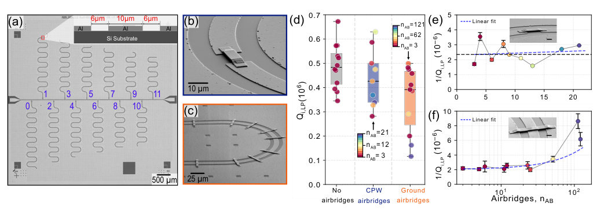
<figcaption class="paper-figure-caption"><b>Fig 3.</b> FIG. 3. (a) Optical image of one of the three resonator devices each of which contains 12 CPW resonators of varying length and cross-sectional dimensions as shown in the inset. The numerical label (blue) adjacent to each resonator indicates its index within the chip. (b) SEM image of the second device in which the center conductor is segmented via connecting airbridges (&quot;CPW airbridges&quot;). (c) Third device with airbridges across the CPW to connect the two halves of the ground plane (&quot;Ground airbridges&quot;). (d) Measured internal quality factors at approximately single photon level (Qi,LP) for the three devices, with individual data points, median (horizontal bar), and interquartile range (box)....</figcaption>
</figure>
<figure class="paper-figure-card">
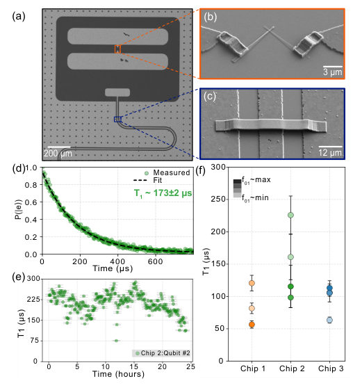
<figcaption class="paper-figure-caption"><b>Fig 4.</b> FIG. 4. (a) Optical image of a two-pad transmon device with a design similar to the one used in Ref. [13]. (b)-(c) SEM image of the section marked in (a) showing the airbridges connecting two junction electrodes to the base layer in (b), and an airbridge crossing a CPW in (c). (d) Measured qubit population (green circle) as a function of delay time for one of the transmon devices after an intial π-pulse. The dashed line is a fit to the data. (e) Repeated T1 measurements performed over 24 hours for the best performing qubit. (f) Measured T1 for four different qubits across three chips. The color saturation of data points indicates the qubit frequency f01 (see color bar).</figcaption>
</figure>
<figure class="paper-figure-card">
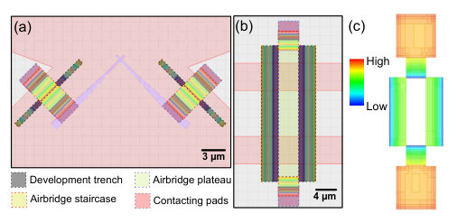
<figcaption class="paper-figure-caption"><b>Fig 5.</b> FIG. 5. GDS layout of a typical airbridge design used for contacting – (a) junction to the base-layer, and (b) two non- adjacent ground planes across a CPW . For both panels (a) and (b), the shaded regions designate different parts of the GDS design as indicated. (c) Dose distribution used to define the gradient exposure during gray-scale e-beam lithography process.</figcaption>
</figure>

**Summary.** This paper introduces a novel, streamlined fabrication technique for connecting superconducting circuit elements using only airbridges. By eliminating complex 'bandage' contacts, the method maintains high device coherence and low loss while drastically simplifying manufacturing steps for transmon qubits.

**Why it may be interesting.** This work directly addresses hardware limitations in superconducting quantum processors, which is central to realizing scalable quantum computation architectures.

Detailed structure

**Main problem.** The primary challenge is developing reliable, low-loss electrical interconnects for superconducting quantum circuits that avoid the complexity and damage associated with conventional 'bandage' contacts.

**Main result.** The authors successfully demonstrated a single-step airbridge fabrication process that maintains high coherence in transmon qubits (up to 290 $\mu$s) while significantly simplifying device manufacturing.

**Method.** They fabricated interconnects using varying-sized airbridges via grayscale electron-beam lithography and characterized performance by measuring qubit relaxation times ($T_1$) and resonator quality factors ($Q$).

**Model / system.** The system involves superconducting circuits, specifically transmon qubits coupled to Coplanar Waveguide (CPW) resonators. The interconnects are the airbridges themselves, which act as tunable elements affecting circuit parameters.

**Key observables.** Energy relaxation time ($T_1$), internal quality factor ($Q_i$), frequency shift ($\Delta f$), and room-temperature conductance ($G$).

**Important parameters / regimes.** Airbridge dimensions (widths $0.5 \mu	ext{m}$ to $4 \mu	ext{m}$, lengths $5 \mu	ext{m}$ to $40 \mu	ext{m}$), and the comparison between intrinsic loss and airbridge-induced loss.

**Assumptions / limitations.** The process assumes that using only airbridges eliminates parasitic interfaces, though solvent choice (e.g., acetone vs NMP) is critical for successful lift-off.

**Figures summary.** Figures show SEM images of fabricated airbridges across various dimensions and structural profiles (linear vs parabolic). Other figures detail $T_1$ decay curves, resonator $S_{21}$ spectra showing frequency shifts, and comparisons of quality factors based on the number of airbridges.

**Paper structure.** The paper progresses from identifying the fabrication bottleneck (bandages) to proposing a single-airbridge solution. It then characterizes this structure electrically by measuring qubit coherence ($T_1$) and resonator response ($Q$, $\Delta f$), concluding with process optimization details.

Abstract

Superconducting circuit devices require electrical interconnects between different circuit elements on the chip, for which conventional device architectures use a combination of two structural elements: \textit{airbridges} to connect non-adjacent elements in the base layer, and \textit{bandages} to connect the electrodes forming the Josephson junctions to the base layer. Bandages introduce unwanted parasitic material interfaces and increase the manufacturing complexity. Here, we overcome the limitations imposed by \emph{bandages} by establishing \textit{all} electrical interconnects with airbridges of varying size fabricated in a single step. The airbridges show a high yield and mechanical stability over a wide range of sizes from $0.5\,μ\mathrm{m}$ to $4\,μ\mathrm{m}$ in width and from $5\,μ\mathrm{m}$ to $40\,μ\mathrm{m}$ in length, and show low loss when integrated in coplanar waveguide resonators and transmon qubits. Measured relaxation times up to more than $250\,μ\mathrm{s}$ in standard transmon geometries show that the process achieves high coherence while substantially easing and accelerating device fabrication.

[↑ back to top](#top)

### [Fun with Graph States: Nonlocal Bell Pairs and the Arf Invariant](http://arxiv.org/abs/2606.06582v1)

**Authors:** Bartlomiej Czech, Yichen Feng, Xianlai Wu, Minjun Xie  
**Type:** theory · **Category:** quantum information and computing · **PDF:** <https://arxiv.org/pdf/2606.06582v1>  
**Analysis basis:** full PDF text, analyzed in chunks
**Topic relevance:** 🔥 `entanglement & information structure` **4/5**

↔ Scroll figures horizontally

<figure class="paper-figure-card">
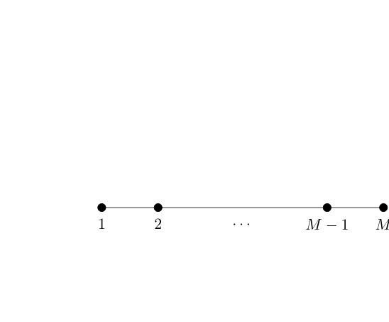
<figcaption class="paper-figure-caption"><b>Fig 1.</b> Figure 2: One-dimensional cluster states: chains (left) and rings (right).</figcaption>
</figure>
<figure class="paper-figure-card">
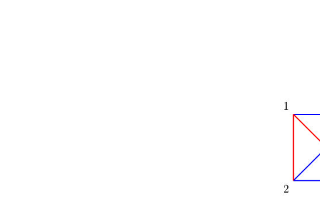
<figcaption class="paper-figure-caption"><b>Fig 2.</b> Figure 4: The complete graph K4 as a union of graph G (red) and π(G) (blue), where π = (1 2 3 4) permutes the vertices of G. We have drawn the figure such that π can be visualized as an anti-clockwise rotation by 90◦.</figcaption>
</figure>
<figure class="paper-figure-card">
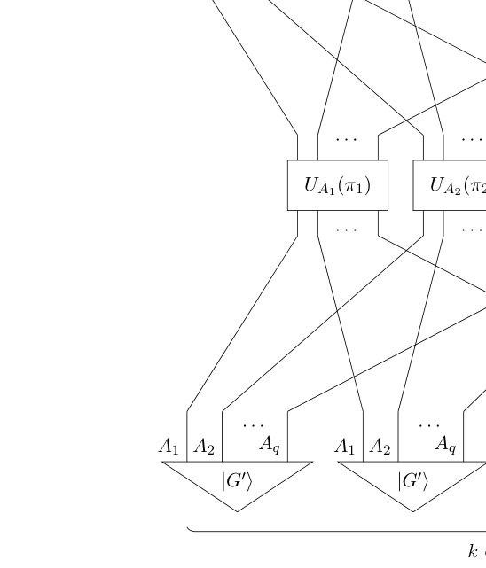
<figcaption class="paper-figure-caption"><b>Fig 3.</b> Figure 5: A k-replica multi-invariant of a q-partite quantum state |G′⟩A1A2...Aq involves a choice of q permutations πi, each acting on the k replicas of party Ai.</figcaption>
</figure>
<figure class="paper-figure-card">
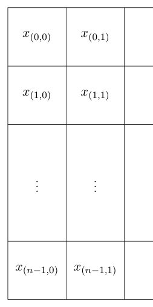
<figcaption class="paper-figure-caption"><b>Fig 4.</b> Figure 6: Stabilizers O⃗x, which contribute to Z(3) n in summation (5.17) are in one-to-one correspondence with magic squares—solutions of equations (B.6-B.7).</figcaption>
</figure>
<figure class="paper-figure-card">
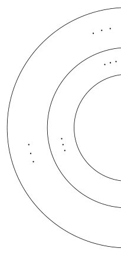
<figcaption class="paper-figure-caption"><b>Fig 5.</b> Figure 7: Stabilizers O⃗x, which contribute to Z2n in summation (5.17) are in one-to-one correspondence with “magic annuli”—solutions of equations (B.13-B.15).</figcaption>
</figure>

**Summary.** This work rigorously analyzes graph states by connecting their inner products and amplitudes to fundamental invariants from algebraic topology, specifically the Arf invariant. It establishes a nonlocal tensor factorization basis for these states, suggesting that quantum advantage in MBQC can be understood through topological structures on auxiliary manifolds.

**Why it may be interesting.** It provides a powerful mathematical framework linking quantum resource states (graph states) directly to deep concepts in algebraic topology (Arf invariant, intersection forms), which is highly relevant for understanding the fundamental limits of computation.

Detailed structure

**Main problem.** The study investigates the inner product $\langle G'|G''
angle$ between graph states, relating its magnitude to algebraic invariants like the rank of the adjacency matrix over $\mathbb{F}_2$, and its phase to the Arf invariant.

**Main result.** Graph states can be factorized into a nonlocal tensor basis composed of Bell pairs and unentangled ancillae, providing deep connections between quantum information theory and algebraic topology.

**Method.** The analysis employs techniques from linear algebra over $\mathbb{F}_2$, utilizing the structure of stabilizer codes defined by graph adjacency matrices to compute partial amplitudes and expectation values.

**Model / system.** The system is based on graph states $|G
angle$ defined on $M$ qubits, which are a specific class of stabilizer states generated by CZ gates determined by the graph's adjacency matrix $A$.

**Key observables.** Inner product $\langle G'|G''
angle$, magnitude $|\langle+|^{\otimes M} |G
angle|$, phase factor related to the Arf invariant ($\Delta$), and multi-invariants like Rényi entropy.

**Important parameters / regimes.** The rank of the adjacency matrix $A$ over $\mathbb{F}_2$, and the Arf invariant $\Delta$.

**Assumptions / limitations.** Calculations are performed rigorously within the framework of Pauli algebra on qubits, often assuming non-vanishing amplitudes to define topological invariants.

**Figures summary.** Figures illustrate the factorization of graph states into effective Bell pairs and unentangled ancillae; other figures show structures related to counting solutions for multi-invariants (e.g., magic squares/annuli).

**Paper structure.** The paper progresses from defining the inner product $\langle G'|G''
angle$ using linear algebra over $\mathbb{F}_2$, establishing that magnitude depends on rank and phase on the Arf invariant. It then develops a nonlocal tensor factorization, applies this to compute multi-invariants (like Rényi entropy), and finally maps these results onto topological invariants of auxiliary manifolds.

Abstract

We study inner products and partial amplitudes of graph states--a commonly employed class of quantum states, which are specified by graphs. We find that the magnitudes of these quantities are simply related to the rank of the adjacency matrix of the graph over F_2 while the phase is determined by the Arf invariant of its quadratic refinement. These facts motivate a nonlocal tensor factorization of the Hilbert space, with respect to which all graph states are products of Bell pairs with unentangled ancillae. These results may illuminate the quantum advantage in the framework of Measurement-Based Quantum Computation and suggest that graph states can be usefully visualized in the language of algebraic topology. In addition, we develop a specialized technique for computing expectation values of qubit-wise permutations in graph states, which is useful for calculating multi-invariants.

[↑ back to top](#top)

### [Nonreciprocal optomechanical entanglement in an asymmetric Fabry-Perot cavity](http://arxiv.org/abs/2606.06988v1)

**Authors:** Jia-Kang Wu, Ning Hu, Jie-Qiao Liao, Xun-Wei Xu  
**Type:** theory · **Category:** other · **PDF:** <https://arxiv.org/pdf/2606.06988v1>  
**Analysis basis:** full PDF text, analyzed in chunks
**Topic relevance:** `Keldysh / 2PI / non-Gaussian methods` **3/5** · `entanglement & information structure` **3/5** · `methods for driven-dissipative` **3/5** · `correlated / nonlocal dissipation` **2/5** · `correlated cavity matter` **2/5** · `driven-dissipative phase transition` **2/5** · `non-equilibrium dynamics` **2/5** · `analog quantum simulation` **1/5** · `interference shaping light` **1/5** · `non-equilibrium universality` **1/5**

↔ Scroll figures horizontally

<figure class="paper-figure-card">
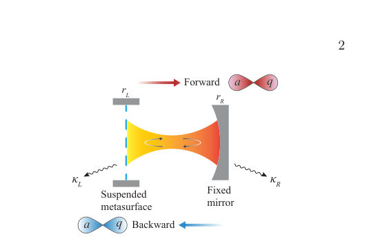
<figcaption class="paper-figure-caption"><b>Fig 1.</b> FIG. 1. Schematic of the asymmetric F-P type optomechani- cal cavity, which is formed by a movable mirror (characterized by a reflectivity of rL and a decay rate of κL) and a fixed mir- ror (characterized by a reflectivity of rR and a decay rate of κR).</figcaption>
</figure>
<figure class="paper-figure-card">
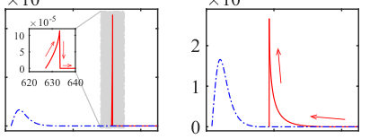
<figcaption class="paper-figure-caption"><b>Fig 2.</b> FIG. 3. Nonreciprocal transmission spectra and logarithmic negativity EN ,ς versus the normalized detuning ∆0/ωm under forward (red) and backward (blue) drivings for different scan- ning directions: (a) and (c) for upward frequency scanning; (b) and (d) for downward frequency scanning. The mechan- ical quality factor Qm = 3.1 × 105, reflectivity rL = 98.1%, spring constant K = 80 N/m, and the temperature T = 10 mK. Other parameters used are the same as Fig. 2.</figcaption>
</figure>
<figure class="paper-figure-card">
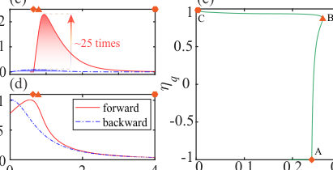
<figcaption class="paper-figure-caption"><b>Fig 3.</b> FIG. 4. Logarithmic negativity EN ,ς versus ∆0 and ωm under various drivings: (a) forward driving and (b) back- ward driving. The red star indicates the peak value of EN ,ς achieved under the forward driving, while the gray area de- notes the unstable region. (c) Logarithmic negativity EN ,ς versus the scaled detuning ∆0/ωm at the mechanical fre- quency ωm/2π = 34.5 MHz. (d) Transmission spectrum ver- sus the scaled detuning ∆0/ωm. (e) Degree of classical non- reciprocity ηc versus quantum nonreciprocity ηq. Other pa- rameters used are: incident power P = 200 mW, reflectivities rL = 96.3% and rR = 99.9%, and temperature T = 10 mK.</figcaption>
</figure>
<figure class="paper-figure-card">
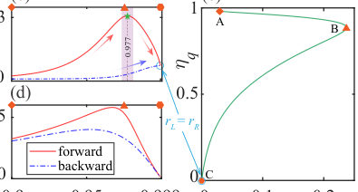
<figcaption class="paper-figure-caption"><b>Fig 4.</b> FIG. 5. Logarithmic negativity EN ,ς versus ∆0/ωm and re- flectivity rL under either the (a) forward driving or the (b) backward driving. (c) Logarithmic negativity EN ,ς versus re- flectivity rL under the forward and backward drivings. (d) Transmission spectra versus the reflectivity rL under the for- ward (red) and backward (blue) drivings with the normalized detuning ∆0/ωm = 1. (e) Degree of classical nonreciprocity ηc versus quantum nonreciprocity ηq. Other parameters used are the same as those in Fig. 4.</figcaption>
</figure>
<figure class="paper-figure-card">
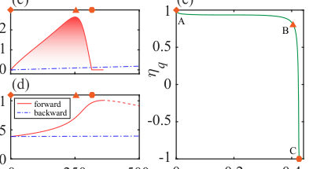
<figcaption class="paper-figure-caption"><b>Fig 5.</b> FIG. 6. Logarithmic negativity EN ,ς versus ∆0/ωm and P un- der different drivings: (a) forward driving, (b) backward driv- ing. (c) Logarithmic negativity EN ,ς versus incident power P under the forward (red) and backward (blue) drivings. (d) Transmission spectra versus the incident power P under the forward (red) and backward (blue) drivings. (e) Degree of classical nonreciprocity ηc versus quantum nonreciprocity ηq. The reflectivity of the metasurface is rL = 96.3%. Other pa- rameters used are the same as those in Fig. 5.</figcaption>
</figure>

**Summary.** This paper theoretically investigates nonreciprocal quantum entanglement in asymmetric Fabry-Pérot cavities. By solving the system's dynamics using Quantum Langevin Equations, the authors demonstrate that asymmetry enhances entanglement compared to symmetric setups. The key finding is the realization of simultaneous classical and quantum nonreciprocities without requiring a positive correlation between their respective degrees.

**Why it may be interesting.** This work is highly relevant as it pushes beyond simple demonstrations of directional light control by quantifying the *quantum* nature of this directionality (nonreciprocal entanglement) in a well-established platform like optomechanics.

Detailed structure

**Main problem.** The study aims to generate and characterize nonreciprocal quantum entanglement within an asymmetric Fabry-Pérot (F-P) cavity, specifically investigating the relationship between classical and quantum nonreciprocities.

**Main result.** Asymmetric F-P cavities are shown to enhance both the magnitude and robustness of optomechanical entanglement compared to symmetric counterparts. Crucially, the research demonstrates that classical and quantum nonreciprocities can coexist without exhibiting a positive correlation.

**Method.** The analysis employs solving Quantum Langevin Equations (QLEs) to determine system dynamics, followed by calculating steady-state covariance matrices via the Lyapunov equation for noise propagation.

**Model / system.** The physical platform is an optomechanical system realized in an asymmetric F-P cavity. The model uses a Hamiltonian describing light-mechanical coupling and evolves operators using QLEs under approximations like strong driving conditions.

**Key observables.** Logarithmic negativity (for entanglement), classical nonreciprocity degree ($\eta_c$), quantum nonreciprocity degree ($\eta_q$), and transmission spectra ($T_f$ vs $T_b$).

**Important parameters / regimes.** Asymmetry parameters like reflectivity ($r_L$) and the mechanical spring constant ($K$), as well as driving power ($P$) and temperature ($T$).

**Assumptions / limitations.** The analysis utilizes approximations such as the strong-driving condition ($\vert\Omega\vert \gg \kappa_{tot}$) to separate mean values from quantum fluctuations.

**Figures summary.** Figures illustrate nonreciprocal transmission spectra dependence on cavity parameters, and show entanglement ($E_{N,\varsigma}$) vs. detuning/power/temperature, comparing asymmetric versus symmetric cavity performance.

**Paper structure.** The paper first establishes the theoretical framework using QLEs to model the system. It then analyzes nonreciprocal transmission spectra, proceeds to quantify quantum entanglement via logarithmic negativity, and finally compares classical and quantum nonreciprocities across various parameter regimes (e.g., varying reflectivity or temperature).

Abstract

Nonreciprocal transmission (classical nonreciprocity) in optomechanical systems based on asymmetric Fabry-Perot (F-P) cavities has been theoretically proposed and experimentally demonstrated. However, nonreciprocal quantum effects, particularly nonreciprocal quantum entanglement, remain unexplored in such systems. Here, we propose to generate nonreciprocal optomechanical entanglement in an asymmetric F-P cavity and discuss the connection between the nonreciprocal transmission and nonreciprocal quantum entanglement. We reproduce the nonreciprocal transmission spectra by solving the quantum Langevin equations, and then discuss the optimal parameters to achieve nonreciprocal optomechanical entanglement in the system. We show that a greater and more robust optomechanical entanglement can be approached in the asymmetric F-P cavities, in comparing with the symmetric cavities. Furthermore, we find that the degrees of classical and quantum nonreciprocities do not exhibit positive correlation as expected. Our work shows that the classical and quantum nonreciprocities can be realized simultaneously in the asymmetric F-P cavities, which provide a platform to explore the connection between classical and quantum nonreciprocities.

[↑ back to top](#top)

### [Quantum critical properties of non-Hermitian XY models with magnetic field](http://arxiv.org/abs/2606.07275v1)

**Authors:** Jia-Jia Luo, Volker Meden  
**Type:** theory · **Category:** statistical mechanics · **PDF:** <https://arxiv.org/pdf/2606.07275v1>  
**Analysis basis:** full PDF text, analyzed in chunks
**Topic relevance:** `driven-dissipative phase transition` **3/5** · `methods for driven-dissipative` **3/5** · `non-equilibrium universality` **3/5** · `Kondo & dissipative impurity` **2/5** · `analog quantum simulation` **2/5** · `non-equilibrium dynamics` **2/5** · `Keldysh / 2PI / non-Gaussian methods` **1/5** · `correlated / nonlocal dissipation` **1/5** · `entanglement & information structure` **1/5** · `exotic spin models in light-matter` **1/5**

↔ Scroll figures horizontally

<figure class="paper-figure-card">
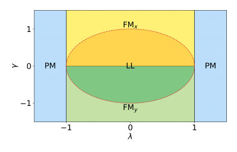
<figcaption class="paper-figure-caption"><b>Fig 1.</b> FIG. 1. The ground state phase diagram of the Hermitian XY model with anisotropy γ and magnetic field λ. The black lines indicate the phase transition lines at |λ| = 1 and γ = 0. The red dashed line, defined by λ2 + γ2 = 1, marks the boundary between oscillatory and non-oscillatory behavior of the correlation function.</figcaption>
</figure>
<figure class="paper-figure-card">
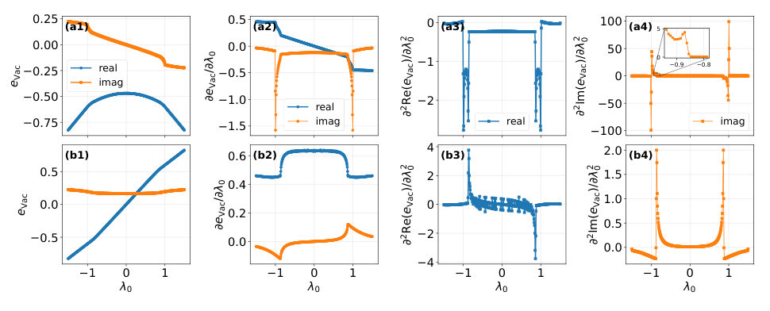
<figcaption class="paper-figure-caption"><b>Fig 2.</b> FIG. 2. The vacuum state energy density as a function of Re(λ) = λ0 for the minimal energy state (a) and the steady state (b) at Im(λ) = 1/2 and γ = 1. From left to right, the energy density, its first derivative with respect to λ0, and the second derivative of its real and imaginary part are shown.</figcaption>
</figure>
<figure class="paper-figure-card">
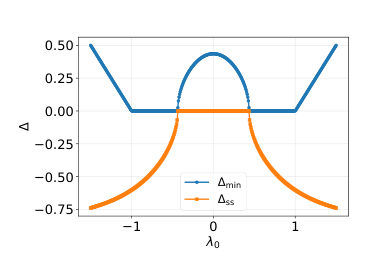
<figcaption class="paper-figure-caption"><b>Fig 3.</b> FIG. 3. The relevant energy gaps ∆for the minimal energy state (blue) and the steady state (orange) as a function of Re(λ) = λ0 at Im(λ) = 9/10 and γ = 1.</figcaption>
</figure>
<figure class="paper-figure-card">
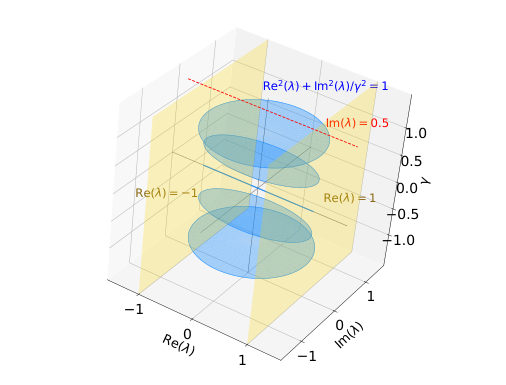
<figcaption class="paper-figure-caption"><b>Fig 4.</b> FIG. 4. The three-dimensional phase diagram of the complex- λ XY model as a function of Re(λ), Im(λ) and γ for the min- imal energy state. The blue surfaces indicate the FM phase for selected γ. The yellow sheets indicate the transition to the paramagnetic phase with | Re(λ)| &gt; 1. In the inner re- gion between the yellow sheets and outside the blue areas the state shows LL critical properties. The red line depicts the path used in the upper row of Fig. 2.</figcaption>
</figure>
<figure class="paper-figure-card">
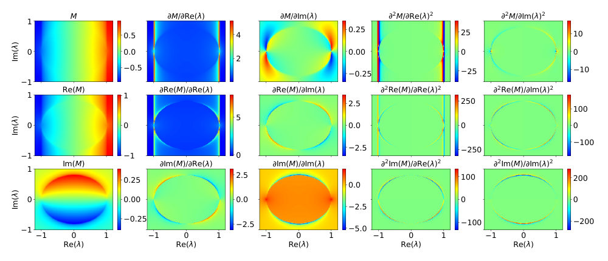
<figcaption class="paper-figure-caption"><b>Fig 5.</b> FIG. 5. The magnetization of the minimal energy state as a function of the real and imaginary part of λ for γ = 0.8 and its first and second derivative with respect to the two variables. From top to bottom: the RR magnetization, the real and imaginary parts of the LR magnetization.</figcaption>
</figure>

**Summary.** This theoretical study investigates the quantum critical properties of non-Hermitian XY spin chains. It reveals that defining these properties is highly ambiguous, as results depend critically on whether one uses standard or biorthogonal quantum mechanics and which specific state (e.g., minimal energy) is assumed. The paper provides detailed analysis using correlation functions and phase diagrams to map out the complex parameter space of non-Hermitian magnetism.

**Why it may be interesting.** This work directly addresses the complex, modern frontier of open quantum systems by showing how fundamental concepts like 'ground state' and 'criticality' break down or become ambiguous when moving from Hermitian to non-Hermitian Hamiltonians.

Detailed structure

**Main problem.** The primary challenge is characterizing the quantum critical properties of genuine non-Hermitian many-body systems because both the definition of the state and expectation values are ambiguous.

**Main result.** The critical properties (energy, magnetization, correlations) depend strongly on which formalism (standard vs. biorthogonal QM) and which specific state (minimal energy vs. steady state) is chosen for calculation.

**Method.** The study employs exact solutions, analyzing correlation functions using techniques like the Fisher–Hartwig theorem applied to Toeplitz determinants derived from quasi-particle excitations.

**Model / system.** The system under investigation is a 1D XY spin chain with an added magnetic field ($\lambda$), which is treated as non-Hermitian. The dynamics are analyzed using both standard quantum mechanics and biorthogonal quantum mechanics formalisms.

**Key observables.** Energy density (eVac), magnetization ($M$), and two-point spin correlation functions ($C_\alpha^r$).

**Important parameters / regimes.** Exchange amplitude $J$, anisotropy $\gamma$, and magnetic field $\lambda$. Critical regimes are defined by the relationship between these parameters.

**Assumptions / limitations.** The authors must choose between different definitions of 'ground state' (e.g., minimal energy vs. steady state), which leads to differing physical predictions for critical behavior.

**Figures summary.** Figures illustrate phase diagrams showing transitions between FM, LL, and PM phases; they also plot the $r$-dependence of correlation functions on log-log scales to extract power-law decay exponents.

**Paper structure.** The paper systematically compares results derived from different theoretical frameworks (standard vs. biorthogonal QM) and different physical states (minimal energy vs. steady state) to map out the phase diagram and critical scaling laws for the non-Hermitian XY model.

Abstract

The characterization of the quantum critical properties of genuine non-Hermitian many-body systems remains ambiguous as neither the state considered nor the definition of expectation values is unique. In this work, we investigate the quantum critical properties of two models of non-Hermitian XY spin chains with magnetic field. Using exact solutions, we systematically investigate the parameter dependence of the energy, the magnetization as well as the long-distance asymptotic behavior of static correlation functions. We compute expectation values within the standard formalism of quantum mechanics as well as within biorthogonal quantum mechanics and take two different states which one might reasonably consider to be the analog of the ground state of a Hermitian model. The critical properties, including such fundamental characteristics as the phase diagram, depend on both the formalism used as well as the state considered. We provide arguments in favor of the use of standard quantum mechanics. Which state to be taken in computations, depends on the (hypothetical) experimental preparation of the system.

[↑ back to top](#top)

### [Persistent currents in signed directed networks](http://arxiv.org/abs/2606.06716v1)

**Authors:** Davide Cipollini, Guido Caldarelli  
**Type:** theory · **Category:** disordered systems and neural networks · **PDF:** <https://arxiv.org/pdf/2606.06716v1>  
**Analysis basis:** full PDF text, analyzed in chunks
**Topic relevance:** `Keldysh / 2PI / non-Gaussian methods` **3/5** · `analog quantum simulation` **2/5** · `driven-dissipative phase transition` **2/5** · `methods for driven-dissipative` **2/5** · `non-equilibrium dynamics` **2/5** · `correlated / nonlocal dissipation` **1/5** · `correlated cavity matter` **1/5** · `entanglement & information structure` **1/5** · `exotic spin models in light-matter` **1/5** · `non-equilibrium universality` **1/5**

↔ Scroll figures horizontally

<figure class="paper-figure-card">
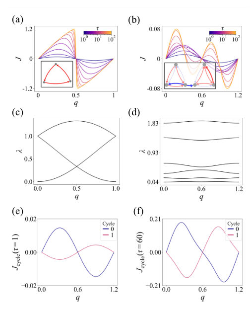
<figcaption class="paper-figure-caption"><b>Fig 1.</b> Figure 1. Persistent currents in looped networks. (a) Current as a function of q for a single-cycle network (inset), showing periodic behavior. (b) Total current for a network with two independent cycles. (c,d) Corresponding spectra of the signed magnetic Laplacian. (e,f) Decomposition of the current onto the two cycle modes at different τ, highlighting interference and multiscale contributions. Weights are color coded in blue (negative) and red (positive). Transparency codifies for am- plitude.</figcaption>
</figure>
<figure class="paper-figure-card">
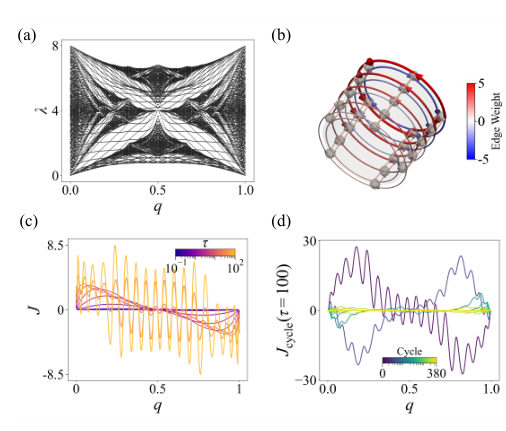
<figcaption class="paper-figure-caption"><b>Fig 2.</b> Figure 2. Hofstadter network. (a) Energy spectrum computed on a network with N = 400 nodes as a function of q, show- ing the butterfly-like fractal structure. (b) Representative signed directed network with spatially structured asymmetric weights, shown for a smaller system with N = 25 nodes for vi- sualization purposes. (c) Global persistent current computed on the full N = 400 network. (d) Cycle-resolved currents computed on the same N = 400 network.</figcaption>
</figure>

**Summary.** This work develops a generalized theory for persistent currents on arbitrary signed directed networks by treating the system thermodynamically. It maps quantum coherence onto fluxes defined over the network's cycle space, providing a topological signature of phase coherence. The framework is powerful enough to reproduce complex spectral features like the Hofstadter butterfly.

**Why it may be interesting.** It provides a powerful topological tool (cycle space analysis) to characterize quantum coherence signatures in complex graph structures, linking spectral properties (Laplacian eigenvalues) directly to transport phenomena.

Detailed structure

**Main problem.** To generalize the concept of persistent currents from simple rings/lattices to arbitrary signed directed networks using a thermodynamic framework.

**Main result.** Persistent currents are shown to be divergence-free equilibrium currents that decompose onto the cycle basis, providing a topological signature of quantum phase coherence in complex networks.

**Method.** The analysis uses a Gibbs ensemble approach, defining persistent currents as thermodynamic responses (derivatives of the free energy) to gauge-invariant fluxes defined on the network's cycle space.

**Model / system.** The system is modeled by signed directed networks, where edge phases act as a discrete gauge field. The dynamics are governed by an effective Hamiltonian derived from the signed magnetic Laplacian, which is treated in a canonical ensemble.

**Key observables.** Global persistent current $J(q)$, cycle fluxes $\Psi$, and the response kernel $K(	au)$ relating currents to fluxes.

**Important parameters / regimes.** Inverse temperature/diffusion time ($	au$), flux parameters ($q$), and the network topology (cycle space geometry).

**Assumptions / limitations.** The analysis is performed in an equilibrium setting, using a free energy expansion around zero flux. The method successfully reproduces known results for rings and lattices.

**Figures summary.** Figures illustrate persistent currents in looped networks across different cycle numbers, showing the corresponding spectra of the signed magnetic Laplacian and the decomposition onto independent cycle modes.

**Paper structure.** The paper develops a thermodynamic framework by introducing gauge-invariant fluxes on the cycle space. It derives linear relations between current responses and these fluxes using the free energy expansion, culminating in an application to reproduce the Hofstadter butterfly spectrum.

Abstract

Network theory can be fruitfully used to describe quantum coherence in physical systems. To that purpose we introduce persistent currents in signed directed networks by interpreting the signed magnetic Laplacian as an effective Hamiltonian and the associated edge phases as a discrete gauge field. In a canonical ensemble, persistent currents arise as thermodynamic responses to variations of gauge-invariant fluxes. We show that these fluxes are naturally defined on the cycle space of the network, and that the resulting currents are constrained to the divergence-free subspace and decompose onto independent cycles. This formulation provides a direct generalization of persistent currents from rings and lattices to arbitrary topologies. Detection of persistent currents provides a signature of the quantum phase coherence supported by the network, and a direct signature of the geometry of its cycle space. Such a mapping, not only allows a practical way to deal with quantum coherence for a variety of situations in the field of quantum technologies, but it also allows a physical interpretation of the importance of the Laplacian operator in graph theory, linking its role to the one of Hamiltonian (i.e. a tight-binding one) in physical systems. To test the power of the method, we construct a signed directed network that reproduces the Hofstadter butterfly spectrum.

[↑ back to top](#top)

### [Capturing non-Markovian dynamics in non-equilibrium stochastic systems using flow matching](http://arxiv.org/abs/2606.06658v1)

**Authors:** Bhargav Sriram Siddani, John B. Bell, Alejandro L. Garcia, Ishan Srivastava  
**Type:** theory · **Category:** statistical mechanics · **PDF:** <https://arxiv.org/pdf/2606.06658v1>  
**Analysis basis:** full PDF text, analyzed in chunks
**Topic relevance:** `methods for driven-dissipative` **3/5** · `non-equilibrium dynamics` **3/5** · `driven-dissipative phase transition` **2/5** · `non-equilibrium universality` **2/5** · `Frenkel-Kontorova` **1/5** · `Keldysh / 2PI / non-Gaussian methods` **1/5** · `analog quantum simulation` **1/5** · `correlated / nonlocal dissipation` **1/5**

↔ Scroll figures horizontally

<figure class="paper-figure-card">
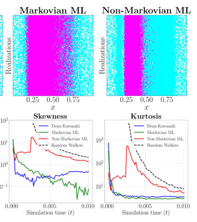
<figcaption class="paper-figure-caption"><b>Fig 1.</b> Figure 1: The top row shows a subset of 100 independent one-dimensional realizations (along vertical direction) at time t = 5.1 × 10−3 simulated using Brownian random walkers, the regu- larized Dean–Kawasaki (DK) model, and the two flow matching (FM) models: Markovian and non-Markovian. The white patches denote negative values in the simulation. The bottom row com- pares the time evolution of the statistics of particle count in the target region around x = 0.7.</figcaption>
</figure>
<figure class="paper-figure-card">
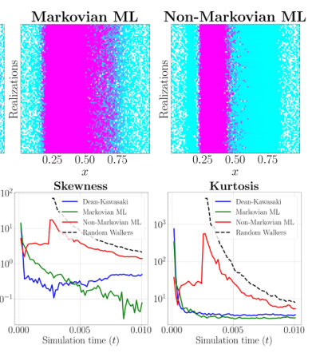
<figcaption class="paper-figure-caption"><b>Fig 2.</b> Figure 1 depicts independent realizations of an early-time state of the system. The regularized DK model results in high occurrence of nonphysical negative densities as compared to the ML models. While the DK model well-predicts mean particle densities in the target region, the non-Markovian ML model more accurately captures the spatial particle distribution and also the higher-order statistical moments (see bottom row), thus demonstrating significant non-Markovian effects at early times.</figcaption>
</figure>

**Summary.** This paper introduces a generative flow matching method to overcome the limitations of coarse-grained equations in modeling particle systems exhibiting strong non-Markovian and non-Gaussian behavior. By directly learning from particle flux distributions, the model accurately captures short-time dynamics for Brownian particles, outperforming standard Markovian approximations.

**Why it may be interesting.** While focused on classical stochastic processes, the use of advanced machine learning techniques like Flow Matching to model complex non-equilibrium dynamics is highly relevant for simulating open quantum systems where memory effects are crucial.

Detailed structure

**Main problem.** The core challenge is accurately modeling non-Markovian dynamics and highly non-Gaussian effects in stochastic particle systems, which standard coarse-grained equations fail to capture at short times or low densities.

**Main result.** A generative flow matching method successfully captures the short-time behavior and higher-order statistical moments of particle density distributions more accurately than established Markovian models like the regularized Dean-Kawasaki equation.

**Method.** The authors developed a generative flow matching (FM) technique that directly learns the probability distribution of fluxes by conditioning on the history of local states to incorporate memory effects.

**Model / system.** The study uses non-interacting Brownian particles governed by an external potential, comparing results against particle simulations and coarse-grained Stochastic Partial Differential Equations (SPDEs).

**Key observables.** Spatial particle distribution, higher-order statistical moments of the number density in a target region, and Kramers first passage time statistics.

**Important parameters / regimes.** Short times ($t 	o 0$), low particle densities, and the memory length scale (captured by conditioning on previous states).

**Assumptions / limitations.** The primary limitation noted is that model accuracy degrades at later simulation times; the regularized DK equation's failure to capture history is also a key assumption being tested.

**Figures summary.** Figure 1 compares realizations of system state and time evolution of particle count statistics across three models (Brownian random walkers, regularized DK, and two FM models) at early times.

**Paper structure.** The paper establishes the limitations of existing SPDEs for non-Markovian dynamics. It then introduces and details the generative flow matching framework, applying it to simulate a known physical problem (Kramers passage time) and comparing its results against established benchmarks.

Abstract

Hydrodynamic models of stochastic particle systems represented by coarse-grained stochastic partial differential equations (SPDE), such as the regularized Dean-Kawasaki (DK) equation, do not accurately capture the short-time system dynamics that is dominated by non-Markovian effects, and low particle density regimes where the distributions are highly non-Gaussian. We develop a generative flow matching method that directly models the probability distribution of fluxes from particle simulations that explicitly incorporates non-Markovian and non-Gaussian effects. As a demonstration, we use this method to simulate the Kramers first passage time problem for a system of non-interacting Brownian particles. We show the model accurately captures the short-time behavior and provides better predictions of the statistical moments of the number density when compared against the solution of the Markovian baseline, regularized DK equation.

[↑ back to top](#top)

### [Non-Hermitian Crystalline Braid Topology from Hermitian Projection: A Zero-Mode Resonance Mechanism](http://arxiv.org/abs/2606.06626v1)

**Authors:** Stefan Đorđević, Vladimir Juričić  
**Type:** theory · **Category:** other · **PDF:** <https://arxiv.org/pdf/2606.06626v1>  
**Analysis basis:** full PDF text, analyzed in chunks
**Topic relevance:** `driven-dissipative phase transition` **3/5** · `methods for driven-dissipative` **3/5** · `non-equilibrium universality` **2/5** · `Keldysh / 2PI / non-Gaussian methods` **1/5** · `Kondo & dissipative impurity` **1/5** · `analog quantum simulation` **1/5** · `correlated / nonlocal dissipation` **1/5** · `non-equilibrium dynamics` **1/5**

↔ Scroll figures horizontally

<figure class="paper-figure-card">
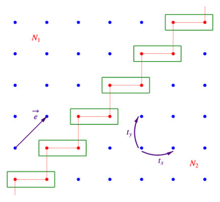
<figcaption class="paper-figure-caption"><b>Fig 1.</b> Figure 1: Two-dimensional parent lattice with an embed- ded one-dimensional “zig-zag” brane (red); the remaining sites form the complement, and the green rectangle marks the brane unit cell. Purple arrows show the translation vector e [Eq. (17)] and the hopping parameters tx, ty. The numbers N1 and N2 count the complement chains to the left and right of the brane.</figcaption>
</figure>
<figure class="paper-figure-card">
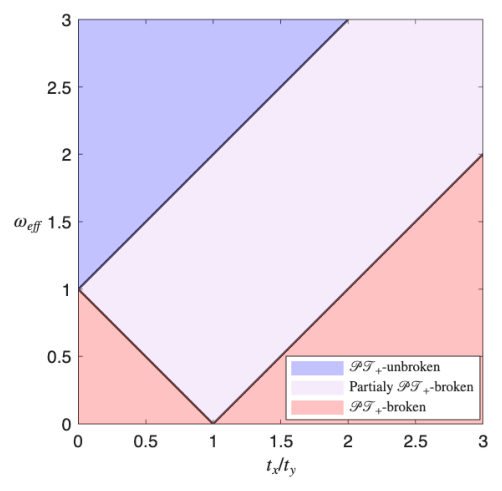
<figcaption class="paper-figure-caption"><b>Fig 2.</b> Figure 2: Phase diagram of the PT + symmetry for the open-boundary projected Hamiltonian. The value plot- ted on the y-axis is given by ωeff = ω 2ty sinh ϕcr . If both N1 and N2 are even, only the PT +-unbroken phase is realized. When at least one of them is odd, PT +-broken regions appear. The critical lines are determined by the condition |FN1 −FN2| = 2.</figcaption>
</figure>
<figure class="paper-figure-card">
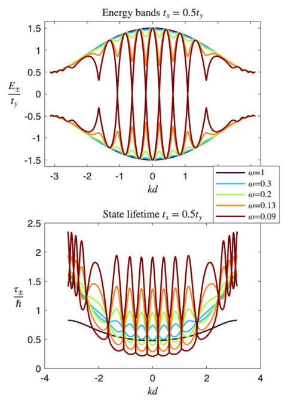
<figcaption class="paper-figure-caption"><b>Fig 3.</b> Figure 4: Energy bands and lifetimes for periodic bound- ary conditions with odd N, obtained from Eqs. (43) and (44). As ω is reduced, gaps close sequentially when | ˜GN| = 1 and α = (2ℓ+ 1)π/2.</figcaption>
</figure>
<figure class="paper-figure-card">
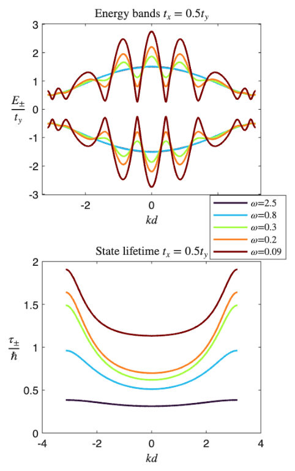
<figcaption class="paper-figure-caption"><b>Fig 4.</b> Figure 3: Energy bands and lifetimes for periodic bound- ary conditions with even N, obtained from Eqs. (38) and (39). The bands retain a regular SSH-like structure; in the zero-frequency descendant, ordinary gap closings are controlled by zeros of the effective hopping Q(k).</figcaption>
</figure>
<figure class="paper-figure-card">
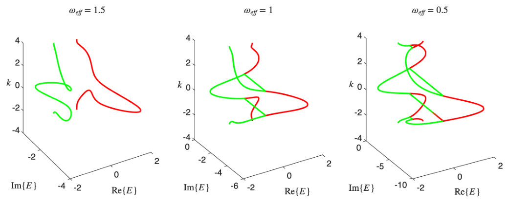
<figcaption class="paper-figure-caption"><b>Fig 5.</b> Figure 5: Two-band braiding of the periodic odd-N spectrum. The horizontal plane is the complex-energy plane and the vertical direction is the crystal momentum. The three panels follow the red trajectory in Fig. 7: the complex bands are unbraided before the first transition, acquire a nontrivial braid invariant after the first finite-frequency strand touching, and return to a trivial braid invariant after the next transition. In the first panel each band coincides with a separate strand and the loops do not interlink. In the second panel two exceptional points lie inside the Brillouin zone: each band traverses segments of both strands before closing, producing a nontrivial linking. In the...</figcaption>
</figure>

**Summary.** The paper introduces a mechanism where non-Hermitian crystalline braid topology appears by projecting degrees of freedom from a simple Hermitian lattice. This process becomes singular (resonant) when eliminated zero modes couple to the remaining system, forcing the topological invariant into the finite-frequency response function. This offers a novel route to engineer complex quantum phases in physical realizations like circuits.

**Why it may be interesting.** This work provides a powerful theoretical framework showing that complex topological features can emerge purely from mathematical constraints (projection) rather than requiring explicit physical non-Hermiticity terms like gain/loss, which is highly relevant for designing novel quantum metamaterials and circuit elements.

Detailed structure

**Main problem.** To demonstrate that non-Hermitian crystalline braid topology can emerge solely from projecting a fully Hermitian, topologically trivial parent lattice without introducing explicit gain or loss.

**Main result.** The non-Hermitian topology is carried by the finite-frequency projected Green's function, arising specifically through a zero-mode resonance mechanism during projection. This results in a robust crystalline braid invariant that is immune to the non-Hermitian skin effect.

**Method.** The analysis employs the Schur complement technique to project degrees of freedom from a parent Hamiltonian onto a lower-dimensional brane subsystem. The key diagnostic tool is examining the singularity structure of the embedding self-energy at finite frequencies ($\omega$).

**Model / system.** The model uses a nearest-neighbor square lattice containing an embedded one-dimensional zig-zag brane, analyzed in momentum space. The effective non-Hermiticity arises from frequency-dependent coupling terms derived via projection.

**Key observables.** Finite-frequency projected Green's function, complex Berry phase (quantized to a braid count), transmission zeros, and admittance features at specific drive frequencies ($\omega$).

**Important parameters / regimes.** The resonance condition depends on the parity of the eliminated complement ($N$ odd vs. even) and the tunable frequency parameter $\omega$.

**Assumptions / limitations.** The analysis distinguishes between regular projection (static limit) and resonant projection, which requires a zero mode in the eliminated complement to couple to the retained subsystem.

**Figures summary.** Figures illustrate energy band evolution, density of states comparisons for even vs. odd parity sectors, and complex spectra comparing analytical bulk solutions to numerical eigenvalues for both open and periodic boundary conditions.

**Paper structure.** The paper systematically contrasts two projection regimes: the regular Schur complement route (recovering SSH-like physics) versus the resonant zero-mode projection. The core argument focuses on how the resonance forces topology into the finite-frequency response, culminating in the derivation of a crystalline braid invariant protected by symmetry.

Abstract

Non-Hermitian topological phases are usually engineered through gain, loss, asymmetric couplings, or explicit environmental channels. Here we show that non-Hermitian crystalline braid topology can instead emerge from projection alone, starting from a fully Hermitian and topologically trivial parent lattice. The mechanism is zero-mode-resonant projection. When the eliminated complement is zero-mode free, projection has a smooth low-frequency limit and reduces to a static Schur complement, yielding conventional SSH-type descendants. When a complement zero mode couples to the retained subsystem, the embedding self-energy develops a pole, the zero-frequency limit becomes singular, and topology is carried by the finite-frequency projected Green's function-where frequency is a tunable parameter, the drive frequency in a circuit realization, for instance. We demonstrate this mechanism in an exactly solvable model, a trivial nearest-neighbor square lattice with an embedded one-dimensional zig-zag brane. Odd-parity periodic sectors are resonant: a sublattice-imbalance zero mode generates the singular self-energy, and the complex spectrum forms an abelian two-band braid whose transitions occur only at isolated finite frequencies. Although the internal class is $\text{AI}^†$ featuring only trivial phases, embedding parity induces conjugated pseudo-Hermiticity (CPH), quantizes the complex Berry phase, and identifies it with the braid count. The model is free of the non-Hermitian skin effect, making the invariant a genuine Bloch bulk quantity. In topolectrical realizations, the same finite-frequency braid transitions appear as transmission zeros and admittance features at the predicted drive frequencies.

[↑ back to top](#top)

### [Towards Engineering Material Neural Networks](http://arxiv.org/abs/2606.07262v1)

**Authors:** Charles de Kergariou, Hortense le Ferrand, Ali Momeni, Romain Fluery, Kunal Masania, Adam W Perriman, Fabrizio Scarpa  
**Type:** theory · **Category:** disordered systems and neural networks · **PDF:** <https://arxiv.org/pdf/2606.07262v1>  
**Analysis basis:** full PDF text, analyzed in chunks
**Topic relevance:** `methods for driven-dissipative` **3/5** · `driven-dissipative phase transition` **2/5** · `Frenkel-Kontorova` **1/5** · `Keldysh / 2PI / non-Gaussian methods` **1/5** · `analog quantum simulation` **1/5** · `correlated / nonlocal dissipation` **1/5** · `measurement-induced transitions` **1/5** · `non-equilibrium dynamics` **1/5** · `non-equilibrium universality` **1/5** · `quantum measurements` **1/5**

↔ Scroll figures horizontally

<figure class="paper-figure-card">
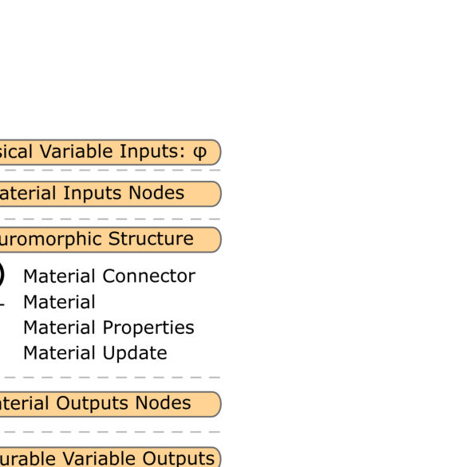
<figcaption class="paper-figure-caption"><b>Fig 1.</b> Fig. 1: Neuromorphic structure and behaviour of an Engineering Material Neural Network. The yellow arrow at the back of the neural network represents the physical transformation of variable. Here the variable trans- formed is ϕ and x is the space over which the physical variable is transformed.</figcaption>
</figure>
<figure class="paper-figure-card">
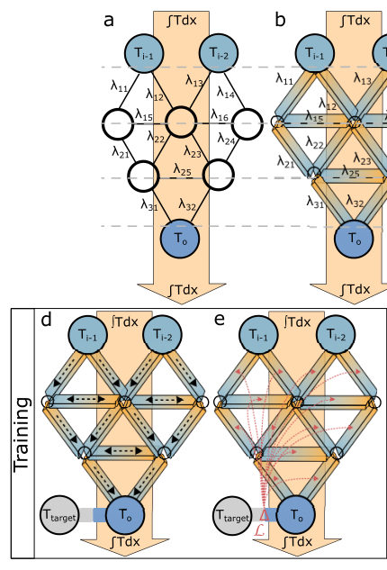
<figcaption class="paper-figure-caption"><b>Fig 2.</b> Fig. 2: Theoretical concept, functions and operations of an EMNN during training and exploitation. a, Example of Artificial Neural Network (ANN) structure with interconnected nodes. b, Example of Engineering Material Neural Network (equivalent to the ANN) for temperature control. (λ: Thermal Conductivity; T: Temperature) c, Schematic presenting the information transmission in an EMNN. The clock symbols represent the update of the material parameters. The thunder symbols and the black/silver arrows present the information given by in environment of the operator to the inputs and output of the system. d, Forward Inference pass during the training phase. e, Feedback updating process during the...</figcaption>
</figure>
<figure class="paper-figure-card">
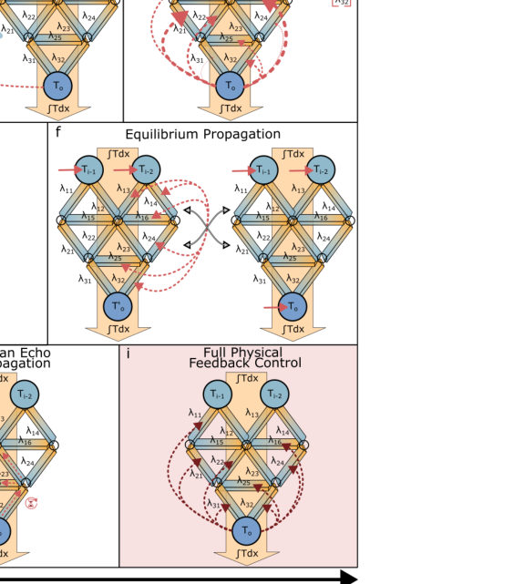
<figcaption class="paper-figure-caption"><b>Fig 3.</b> Fig. 3: Training strategies used and proposed for EMNNs. The techniques the further on the right present increased adaptability. The techniques at the lower rows present more physical training with less intervention of traditional computing and human intervention (ELM: Extreme Learning Machine; RC: Reservoir Computing). Full Physical Feedback Control is not a training technique but rather the objective for the training methods for EMNN, fully controllable weight and independent from conventional training methods. The gear symbol highlights the optimisation of the weight of the materials involved from a perturbation of the input or the trainable weight. The hourglass symbol represent the...</figcaption>
</figure>
<figure class="paper-figure-card">
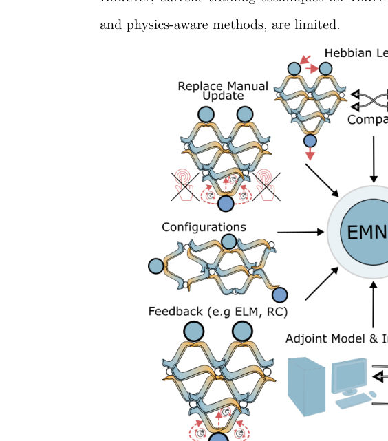
<figcaption class="paper-figure-caption"><b>Fig 4.</b> Fig. 4: Summary of research strategies highlighted in the present study to develop Engineering Mate- rial Neural Networks (EMNNs). (ELM: Extreme Learning Machine ; RC: Reservoir Computing ; EMMUNN: Engineering Material Motor Unit Neural Network ; ϵ: Strain). The gear symbol highlights a potential for updating optimisation for the weight of the material or the design of material connectors. The hand symbols represent the manual updates of parameters.</figcaption>
</figure>
<figure class="paper-figure-card">
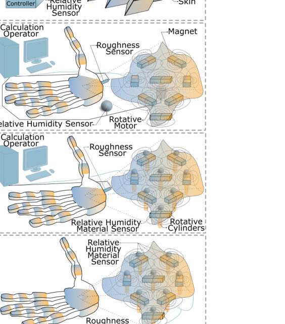
<figcaption class="paper-figure-caption"><b>Fig 5.</b> Fig. 6: Two examples of EMNNs with different degrees of material physical adaptability for training. The Plane Aileron example presents how EMNNs can be used to integrate controllable and adaptable stiffness beams to automatically control the position of an aileron on a plane’s wing. The Grip Robot Hand example introduces how an EMNN can be created out of an assembly of magnet to control the roughness of a soft skin to adapt the roughness of a robotic hand.</figcaption>
</figure>

**Summary.** This paper introduces Engineering Material Neural Networks (EMNNs), a concept aiming to embed trainable intelligence directly into structural materials rather than relying on external electronics. It details a theoretical framework involving forward passes for inference and feedback passes for weight updates using physical error signals. The goal is to create fully autonomous, adaptive materials that perform computation through inherent material dynamics.

**Why it may be interesting.** The work proposes mapping abstract computational concepts (like gradient descent) onto physical laws governing materials. This bridges the gap between classical condensed matter physics/materials science and machine learning theory, which is highly relevant for developing novel physical computing paradigms.

Detailed structure

**Main problem.** The core problem is developing Engineering Material Neural Networks (EMNNs) capable of embedding trainable intelligence directly into load-bearing structural materials, moving beyond reliance on external digital computation.

**Main result.** The paper establishes a framework for EMNNs that approximate continuous functions through physical dynamics, proposing mechanisms like full physical feedback control to achieve autonomous adaptation.

**Method.** The methodology involves defining forward and feedback passes analogous to neural network training. Learning is achieved by calculating gradients based on physical error signals (loss) and using these to update material parameters.

**Model / system.** EMNNs are conceptualized as architected, load-bearing materials whose nodes possess trainable physical parameters (e.g., conductivity or stiffness). The system must exhibit interconnected adaptability, approximating a function $\phi$ through coupled material dynamics.

**Key observables.** Output temperatures ($T_o$), calculated loss ($L$), and updated physical parameters ($\lambda_{ij}$); the degree of reversibility and adaptability (PRAM vs. NPAM) are key diagnostics.

**Important parameters / regimes.** Trainable physical parameters, input states ($T_i$), and material properties like stiffness or thermal conductivity; the regime shifts from in-silico to fully autonomous physical feedback control.

**Assumptions / limitations.** The primary assumption is that complex computational functions can be mapped onto intrinsic, reversible, and energy-efficient physical processes within engineered materials. A major limitation noted is achieving true autonomous physical obtention of loss values.

**Figures summary.** Figures illustrate the conceptual flow of EMNN operation through forward (FW) and feedback (FB) passes, comparing ideal vs. current training strategies across different levels of physical integration and reversibility.

**Paper structure.** The paper progresses from establishing the foundational concept of EMNNs to detailing the required mechanical/multifunctional properties. It then systematically reviews advanced learning techniques—from in-silico backpropagation to fully autonomous, material-embedded weight updates—culminating in a discussion of future biohybrid and permanently reversible systems.

Abstract

Structures that capture functionality in the form of animate or intelligent machines have the potential to transform modern engineering applications. Animation and embedded intelligence are typically realised by integrating advanced capabilities such as reversibility, adaptive responses and learning directly into the materials themselves. Currently, the majority of adaptive material systems rely on predefined adaptive designs combined with in-service, electronics-based computing to dynamically modify the structural behaviour. However, structural configurations with interconnected adaptable nodes are able to approximate continuous functions, providing new possibilities and opportunities than classical metamaterials and computational materials. We discuss here the potential to design load-bearing engineering materials with trainable physical parameters and neural network-inspired morphologies, embedding intelligence directly into their structure, a concept we define as Engineering Material Neural Networks (EMNNs) as a subcategory of Physical Neural Networks. In this perspective, we first establish the foundational concept of EMNNs; we then detail the mechanical and multifunctional properties required for such structural configurations. Finally, we evaluate existing and emerging engineering materials that hold promise for enabling this innovative approach. Key material candidates for realising EMNNs include composites, architected, biological and engineering living materials. We also outline future directions in materials science and structural engineering for developing EMNNs.

[↑ back to top](#top)

### [Charge density waves and enhanced superconductivity in the electron-hole gas: a plausible, simple, physically intuitive model](http://arxiv.org/abs/2606.06649v1)

**Authors:** Carl A Kukkonen  
**Type:** theory · **Category:** strongly correlated electrons · **PDF:** <https://arxiv.org/pdf/2606.06649v1>  
**Analysis basis:** full PDF text, analyzed in chunks
**Topic relevance:** `Keldysh / 2PI / non-Gaussian methods` **3/5** · `analog quantum simulation` **2/5** · `driven-dissipative phase transition` **2/5** · `Frenkel-Kontorova` **1/5** · `correlated cavity matter` **1/5** · `methods for driven-dissipative` **1/5** · `non-equilibrium dynamics` **1/5** · `non-equilibrium universality` **1/5**

↔ Scroll figures horizontally

<figure class="paper-figure-card">
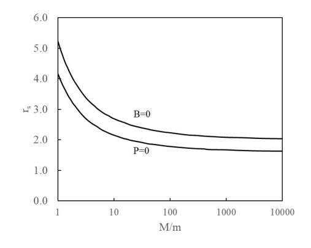
<figcaption class="paper-figure-caption"><b>Fig 1.</b> FIG. 1. Equilibrium density rₛ where the electron-hole gas has an energy minimum and the total pressure P = 0. The electron-hole gas becomes thermodynamically unstable when the bulk modulus B = 0. This point is known as the compressibility instability. Note that the rₛ of the B = 0 point is closely 1.25 that of the equilibrium rₛ where P = 0.</figcaption>
</figure>
<figure class="paper-figure-card">

<figcaption class="paper-figure-caption"><b>Fig 2.</b> Figure 1 shows that the electron-hole gas has an equilibrium rₛ that varies from 4.19 (the same as the electron gas in a uniform background) when M/m = 1, and is asymptotic to rₛ = 1.63 for large M/m. The reason for the asymptotic behavior is that the kinetic energy of the holes becomes negligible for large mass, while the exchange energy is independent of mass and the correlation energy becomes independent of mass for large M. If there were no other factors, the electron-hole gas would sit at the equilibrium rₛ.</figcaption>
</figure>
<figure class="paper-figure-card">
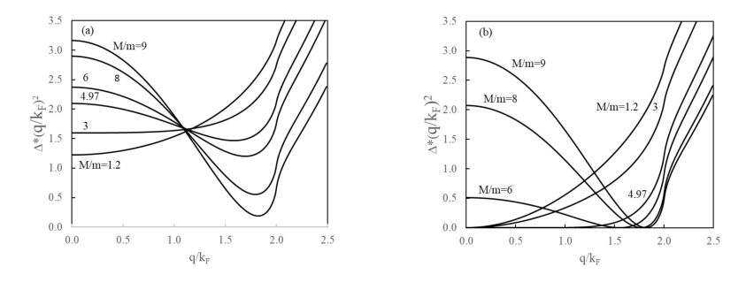
<figcaption class="paper-figure-caption"><b>Fig 3.</b> FIG. 2. The electron-hole gas in this simple model has a unique minimum of its ground state energy at each mass ratio M/m; this is the equilibrium density. (a) Δ·(q/kᴹ)² at the equilibrium density for representative mass ratios. At small mass ratios the curves increase monotonically; for larger mass ratios the decrease at large q reflects the incipient charge density wave. (b) Δ·(q/kᴹ)² evaluated at the rₛ where the quantity first reaches zero, obtained by increasing rₛ from its equilibrium value. At small mass ratios the instability is at q = 0 (compressibility instability); at larger mass ratios it is at finite q (charge density wave).</figcaption>
</figure>
<figure class="paper-figure-card">
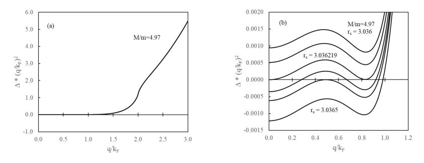
<figcaption class="paper-figure-caption"><b>Fig 4.</b> FIG. 3. The triple point at M/m = 4.97, rₛ = 3.036219. (a) Δ·(q/kᴹ)² at the triple point density, which appears close to zero over a wide range of q. (b) 100× magnification showing the two simultaneous zeros at q = 0 and q = 0.83kᴹ, confirming the coexistence of the compressibility instability and the charge density wave at a single density.</figcaption>
</figure>
<figure class="paper-figure-card">
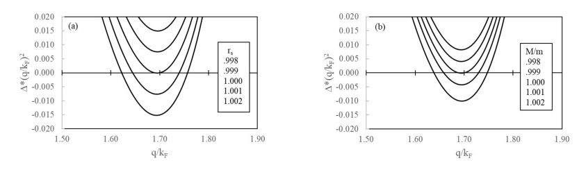
<figcaption class="paper-figure-caption"><b>Fig 5.</b> FIG. 4. High sensitivity of the charge density wave instability to small changes in rₛ and M/m, illustrated for M/m = 7 (charge density wave at rₛ = 2.60779, q/kᴹ = 1.69). (a) rₛ varied by the amounts indicated. (b) M/m varied by the amounts indicated. A change of 0.1% in either variable is sufficient to trigger or suppress the charge density wave.</figcaption>
</figure>

**Summary.** This theoretical work models an electron-hole gas to propose a unified mechanism explaining high-$T_c$ superconductivity, CDWs, and anomalous resistivity. By analyzing the system's response function $\Delta$, the authors show that instabilities inherent to the two-component plasma simultaneously enhance pairing attraction and drive charge ordering. The model provides quantitative estimates for $T_c$ approaching room temperature under specific mass ratio conditions.

**Why it may be interesting.** Although focused on condensed matter correlations, the methodology of linking multiple emergent phenomena (superconductivity, charge order) through a single mathematical instability parameter $\Delta$ is highly relevant for understanding complex many-body phase diagrams in quantum systems.

Detailed structure

**Main problem.** The paper investigates a potential common origin for high-temperature superconductivity, charge density waves (CDWs), and anomalous $T^2$ electrical resistivity in an electron-hole gas.

**Main result.** A single underlying instability mechanism within the two-component Coulomb gas simultaneously enhances all three phenomena, leading to crude estimates of room-temperature superconductivity ($T_c \approx 275 	ext{ K}$ at $M/m=9$).

**Method.** The analysis uses linear response theory applied to a simple, physically motivated model involving electron and hole interactions via Coulomb potentials.

**Model / system.** The system is a neutral degenerate plasma of equal numbers of electrons and positively charged fermions (holes), interacting purely via the Coulomb potential. The behavior is governed by a single diagnostic function $\Delta(q)$, which signals instabilities.

**Key observables.** Superconducting transition temperature ($T_c$), charge density wave instability wave vector ($q$), compressibility instability ($q=0$), and effective electron-electron interaction strength ($\lambda$).

**Important parameters / regimes.** Mass ratio ($M/m$) and reduced Wigner-Seitz radius ($r_s$); the critical value $M/m = 4.97$ marks a triple point of instabilities.

**Assumptions / limitations.** Key assumptions include approximating electron-hole correlation energy independence from density, assuming local field factors are those of independent uniform gases, and setting certain off-diagonal correlation terms to zero ($G_{12}=0$).

**Figures summary.** Figures illustrate the coexistence of instabilities (triple point at $M/m=4.97$), the strong enhancement of attractive interactions near instability points, and plots showing $T_c$ dependence on $M/m$.

**Paper structure.** The paper progresses by establishing the model using linear response theory, identifying the key diagnostic function $\Delta$, demonstrating how its zeros trigger CDW or compressibility instabilities, and finally applying these insights to estimate superconducting parameters ($\lambda, T_c$).

Abstract

A neutral degenerate plasma of equal numbers of electrons and positively charged fermions (holes) -- the electron-hole gas -- is studied using a simple, physically motivated two-parameter model (density r_s and mass ratio M/m). Two simplifying assumptions are made but not proven: the electron-hole correlation energy is approximately independent of density and does not affect the pressure or bulk modulus, and the electron-hole contribution to the local field factors is zero, allowing use of the known electron-gas local field factors. With these assumptions the phase diagram, instabilities, and effective interactions can be calculated for all mass ratios and densities using simple formulae, reproducible on a laptop. The key new physics is the additional screening provided by the mobile holes. A single function Delta appears in the denominator of all effective interactions and response functions. Near the zeros of Delta at q = 0 (compressibility instability) and at finite q, three phenomena are simultaneously enhanced: charge density waves (for M/m >= 4.97), a large T^2 electrical resistivity from electron-hole scattering, and an attractive electron-electron interaction that is the purely electronic analog of BCS electron-phonon coupling. Crudely estimated superconducting transition temperatures approach room temperature, reaching approximately 275 K at M/m = 9. No claim is made that this model applies to any specific material. The aim is to provoke scrutiny of the assumptions, calculation of the unknown local field factors, and investigation of whether this minimal two-carrier framework maps onto real systems.

[↑ back to top](#top)

### [Regular and chaotic dynamics of nonlinear optomechanical systems controlled by modulated light](http://arxiv.org/abs/2606.06997v1)

**Authors:** A. P. Saiko, G. A. Rusetsky, S. A. Markevich, R. Fedaruk  
**Type:** theory · **Category:** other · **PDF:** <https://arxiv.org/pdf/2606.06997v1>  
**Analysis basis:** full PDF text, analyzed in chunks
**Topic relevance:** `driven-dissipative phase transition` **3/5** · `analog quantum simulation` **2/5** · `methods for driven-dissipative` **2/5** · `non-equilibrium dynamics` **2/5** · `Tavis-Cummings & cavity-many-emitter` **1/5** · `correlated cavity matter` **1/5** · `non-equilibrium universality` **1/5**

↔ Scroll figures horizontally

<figure class="paper-figure-card">
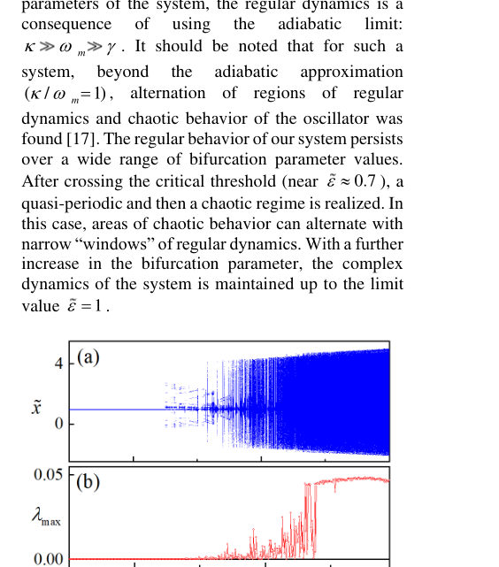
<figcaption class="paper-figure-caption"><b>Fig 1.</b> FIG. 1. (a) Bifurcation diagram and (b) the largest Lyapunov exponent for a mechanical resonator (oscillator) of an optomechanical system with linear</figcaption>
</figure>
<figure class="paper-figure-card">
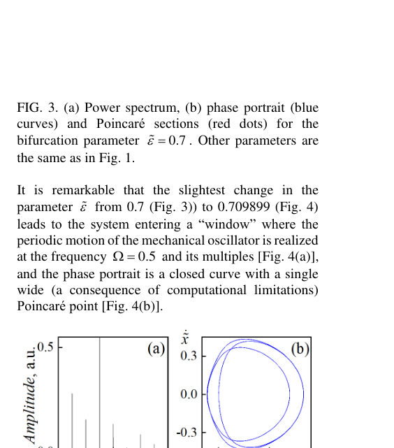
<figcaption class="paper-figure-caption"><b>Fig 2.</b> FIG. 4. (a) Power spectrum, (b) phase portrait (blue curves) and Poincaré section (the red dot) for the bifurcation parameter 0.709899 = . Other parameters are the same as in Fig. 1.</figcaption>
</figure>
<figure class="paper-figure-card">
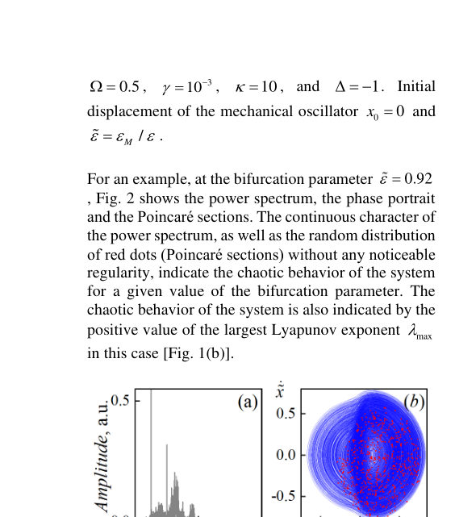
<figcaption class="paper-figure-caption"><b>Fig 3.</b> FIG. 2. (a) Power spectrum, (b) phase portrait (blue curves) and Poincaré sections (red dots) for the value</figcaption>
</figure>
<figure class="paper-figure-card">
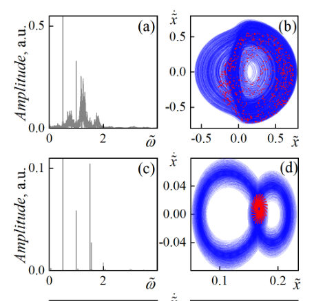
<figcaption class="paper-figure-caption"><b>Fig 4.</b> FIG. 5. Power spectra, phase portraits (blue curves) and Poincaré sections (red dots) for the bifurcation parameter 0.829448 = . (a) and (b) 1 0.1, g =</figcaption>
</figure>
<figure class="paper-figure-card">
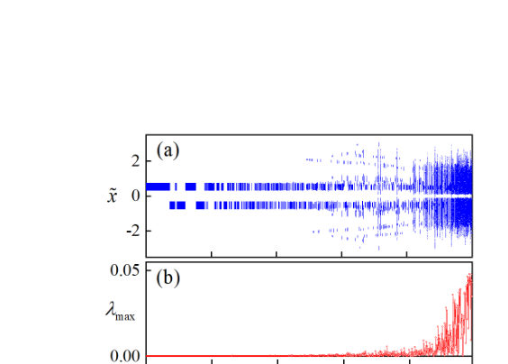
<figcaption class="paper-figure-caption"><b>Fig 5.</b> FIG. 6. Bifurcation diagram (a) and the largest Lyapunov exponent (b) for a mechanical resonator of an optomechanical system with a membrane-in-the- middle configuration and quadratic 2 ( 0.042) g = photon-vibration interaction. The normalized (with respect to 355.6 m = kHz) parameters are: 1.3 = ,</figcaption>
</figure>

**Summary.** This paper theoretically analyzes how nonlinearity influences the transition between regular and chaotic motion in optomechanical oscillators driven by modulated light. By mapping out phase space using Lyapunov exponents and Poincaré sections, the authors demonstrate that nonlinearity does not monotonically enhance chaos. The findings suggest controlling these systems near the edge of chaos for applications like sensing or random number generation.

**Why it may be interesting.** This work is highly relevant as it applies nonlinear dynamics tools to a quantum optics platform (optomechanics), providing insights into chaos control and the engineering of non-classical states or noise sources using engineered potentials.

Detailed structure

**Main problem.** The study investigates the transition between regular and chaotic dynamics in nonlinear optomechanical systems subjected to modulated driving fields.

**Main result.** The system exhibits a non-monotonic dependence of chaos on nonlinearity order, and specific configurations (like membranes) show clear transitions from quasi-periodic motion to chaos, suggesting potential applications for sensing or random number generation.

**Method.** The analysis employs advanced tools from dynamical systems theory, including constructing bifurcation diagrams, calculating the largest Lyapunov exponent, and analyzing Poincaré sections.

**Model / system.** The model is an optomechanical system involving a mechanical resonator coupled to an optical field. The dynamics are governed by nonlinear interactions (linear, quadratic, cubic) between photons and mechanical displacements.

**Key observables.** Bifurcation diagrams ($\epsilon$ vs. dynamic regime), Largest Lyapunov exponent ($\lambda_{max}$), Power spectra, Phase portraits, and Poincaré sections.

**Important parameters / regimes.** Modulation amplitude/parameter ($\epsilon$), modulation frequency ($\Omega$), and the coupling strengths (linear $g$, quadratic $g'$, cubic $g''$).

**Assumptions / limitations.** The analysis often relies on the adiabatic elimination of the optical field variables, assuming the cavity decay rate is much larger than the mechanical resonance frequency.

**Figures summary.** Figures illustrate transitions between regimes: quasi-periodic motion (structured Poincaré points/discrete spectrum) vs. chaotic motion (randomly distributed points/continuous spectrum), particularly in membrane systems showing interwell chaos.

**Paper structure.** The paper systematically analyzes the dynamics by varying nonlinearity orders and control parameters ($\epsilon$), comparing results from different coupling terms, and detailing specific physical realizations like the membrane-in-the-middle configuration.

Abstract

The nonlinear dynamics of a mechanical resonator in an optomechanical system with linear, quadratic and cubic photon-vibration interactions (with respect to mechanical displacements) in a modulated driving field under conditions of adiabatic elimination of the optical field is studied. Based on the constructed bifurcation diagrams of the mechanical coordinate and the largest Lyapunov exponent as a function of the modulation amplitude, as well as power spectra, phase portraits and Poincare sections, regions of regular and chaotic dynamics of the optomechanical system are identified. It is also shown that for a certain modulation amplitude in the presence of all three types of interactions, chaotic dynamics of the mechanical resonator (oscillator) is realized, which is replaced by quasi-periodic oscillations in the absence of cubic interaction, and the system returns to chaotic behavior if only linear interaction remains. This non-monotonic dependence of chaotic dynamics on the order of nonlinearity originates from the interplay between parametric driving and effective potential reshaping and manifests that nonlinearity does not always enhance chaos. For an optomechanical system in a membrane-in-the-middle configuration, where only quadratic photon-vibration interaction is present, it is demonstrated that at small modulation amplitudes the mechanical oscillator exhibits quasi-periodic motion in each of the wells of a symmetric two-minimum potential, whereas large modulation amplitudes lead to chaotic motion, involving interwell transitions.

[↑ back to top](#top)

### [Tests of constructor theory](http://arxiv.org/abs/2606.07352v1)

**Authors:** Chiara Marletto, David Deutsch, Vlatko Vedral  
**Type:** theory · **Category:** other · **PDF:** <https://arxiv.org/pdf/2606.07352v1>  
**Analysis basis:** full PDF text, analyzed in chunks
**Topic relevance:** `entanglement & information structure` **3/5** · `non-equilibrium dynamics` **2/5** · `analog quantum simulation` **1/5** · `correlated / nonlocal dissipation` **1/5** · `driven-dissipative phase transition` **1/5** · `measurement-induced transitions` **1/5** · `methods for driven-dissipative` **1/5** · `non-equilibrium universality` **1/5** · `quantum measurements` **1/5**

↔ Scroll figures horizontally

<figure class="paper-figure-card">

<figcaption class="paper-figure-caption"><b>Fig 1.</b> Figure 1: Information media and superinformation media: quantum systems can be proven to be a special case of superinformation media.</figcaption>
</figure>
<figure class="paper-figure-card">
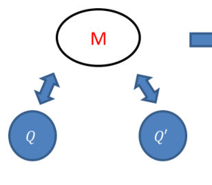
<figcaption class="paper-figure-caption"><b>Fig 2.</b> Figure 3: The entanglement-based witness of non-classicality. If M can entangle (by local means) the quantum probes Q and Q’, then it must be non-classical.</figcaption>
</figure>
<figure class="paper-figure-card">
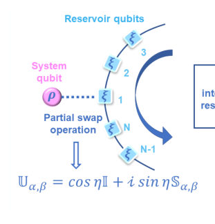
<figcaption class="paper-figure-caption"><b>Fig 3.</b> Figure 5: The quantum homogeniser used to model the constructor-based irre- versibility. The homogenizer consists of N qubits initialised in the target state, |ξ⟩. The system qubit is initialised in the input state |ρ⟩. At each step, the system qubit interacts with one of the qubits in the homogeniser, via the partial swap operation (parametrised by the angle η): 1 is the identity transformation, while Sα,β is the swap gate defined on two qubits α and β. As N →∞, the system qubit approaches the target state after N partial swaps.</figcaption>
</figure>
<figure class="paper-figure-card">
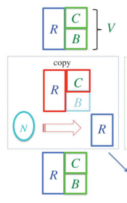
<figcaption class="paper-figure-caption"><b>Fig 4.</b> Figure 6: The logic of self-reproduction with the replication-vehicle logic. An accurate self-reproducer (top) consists of the replicator R (in blue) and the vehicle V (in green) containing the copier C and the constructor B. In the copy phase, C copies the replicator R. In the construction phase, B executes the recipe in R to build a vehicle from generic resources N. Bottom: the copy of R and the newly constructed vehicle form the offspring.</figcaption>
</figure>

**Summary.** This paper introduces Constructor Theory, a foundational framework proposing that fundamental laws should be expressed as constraints on the possible transformations (tasks) achievable by physical systems. It generalizes concepts like non-cloning and irreversibility to abstract information media, offering potential tests applicable even in regimes where standard quantum mechanics might break down.

**Why it may be interesting.** It offers a meta-theoretical framework that attempts to unify disparate physical concepts—information, computation, thermodynamics, and biology—under a single set of possibility constraints, which is highly relevant for foundational physics beyond current quantum field theories.

Detailed structure

**Main problem.** To develop a foundational theory of physical principles that constrains what tasks are possible or impossible, extending beyond current quantum theories by focusing on task feasibility rather than specific dynamics.

**Main result.** Constructor Theory provides a framework where fundamental laws (like irreversibility and non-cloning) emerge from general constraints on information processing capabilities. It suggests that physical laws should be described as necessary conditions for the possibility of tasks.

**Method.** The theory uses an abstract concept of 'tasks' (input/output transformations) defined over generalized 'information media,' allowing statements to be made independent of specific dynamical formalisms like Hamiltonians or Hilbert spaces.

**Model / system.** The core model is the 'universal constructor,' a hypothetical machine capable of performing all physically possible tasks. Testing involves analyzing hybrid systems (e.g., quantum probes interacting with unknown media) and biological self-reproduction.

**Key observables.** Possibility/impossibility of transformations (tasks), non-classicality witnesses, fidelity of self-reproduction, and correlations in hybrid quantum-classical measurements.

**Important parameters / regimes.** Scale independence, information capacity, and the degree of correlation between local interactions and global entanglement.

**Assumptions / limitations.** The theory assumes principles like locality and interoperability of information; it aims to supplement existing laws rather than replace them entirely.

**Figures summary.** Figures illustrate the replicator-vehicle logic for self-reproduction, the structure of composite information media, and entanglement witnesses derived from local interactions with an unknown medium.

**Paper structure.** The paper reviews constructor theory by first establishing its foundational principles (tasks, possibility), then applying it to specific domains like thermodynamics, quantum information (non-cloning/entanglement witnesses), and the emergence of life. It contrasts this approach with standard axiomatic reconstructions.

Abstract

Constructor theory is a proposal to extend quantum information theory beyond both quantum theory and computation, to cover more general machines than programmable computers -- called constructors. It consists of newly conjectured physical principles that can be expressed as constraints on what tasks are possible, what are impossible, and why. These principles also determine the repertoire of the universal constructor, which is a programmable machine that can perform all physically possible tasks. The principles of constructor theory have novel physical content that supplements current dynamical laws, leading to new predictions for experimental tests. In this paper, we review the main experimental proposals to test the principles of constructor theory and discuss their implications for existing theories of physics and for their successors.

[↑ back to top](#top)

### [A Machine-Learning Based Approach to the Evaluation of the Critical Scaling Behavior of Anisotropic Spin Systems](http://arxiv.org/abs/2606.06925v1)

**Authors:** Alina A. Chubarova, Ivan A. Mamonov, Marina V. Mamonova, Mikhail I. Bogachev, Pavel V. Prudnikov  
**Type:** theory · **Category:** statistical mechanics · **PDF:** <https://arxiv.org/pdf/2606.06925v1>  
**Analysis basis:** full PDF text, analyzed in chunks
**Topic relevance:** `methods for driven-dissipative` **3/5** · `driven-dissipative phase transition` **2/5** · `non-equilibrium universality` **2/5** · `analog quantum simulation` **1/5** · `exotic spin models in light-matter` **1/5** · `non-equilibrium dynamics` **1/5** · `spintronics-quantum-optics interface` **1/5**

↔ Scroll figures horizontally

<figure class="paper-figure-card">
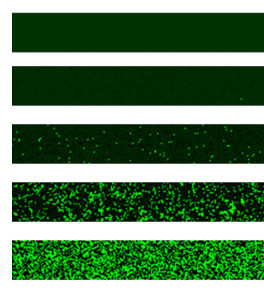
<figcaption class="paper-figure-caption"><b>Fig 1.</b> FIG. 1. Visualization of correlation matrix at different temperatures.</figcaption>
</figure>
<figure class="paper-figure-card">
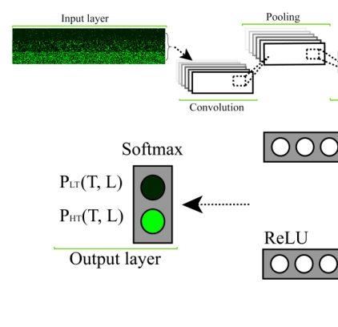
<figcaption class="paper-figure-caption"><b>Fig 2.</b> FIG. 2. The architecture of the convolutional neural network employed in this study.</figcaption>
</figure>
<figure class="paper-figure-card">
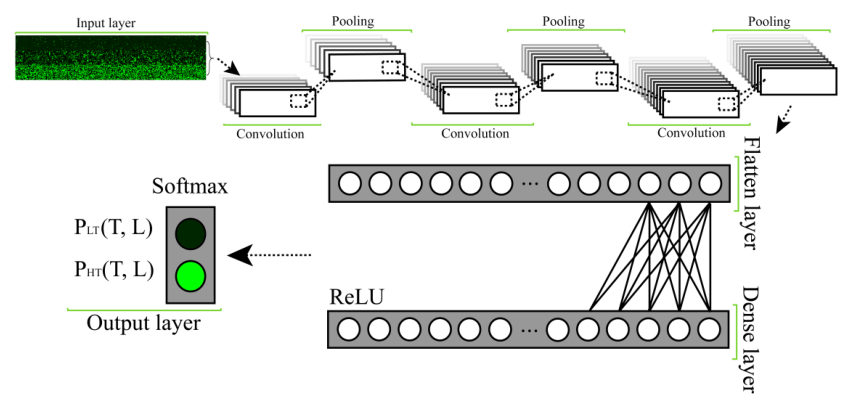
<figcaption class="paper-figure-caption"><b>Fig 3.</b> Fig. 2 illustrates the overall workflow, including both feature extraction and subsequent</figcaption>
</figure>
<figure class="paper-figure-card">
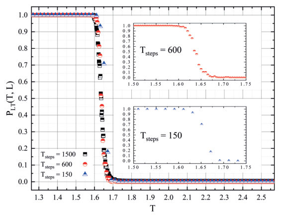
<figcaption class="paper-figure-caption"><b>Fig 4.</b> FIG. 3. Temperature dependence of PLT for L = 16. Three temperature grids are compared:</figcaption>
</figure>
<figure class="paper-figure-card">
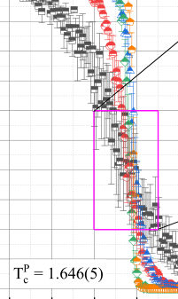
<figcaption class="paper-figure-caption"><b>Fig 5.</b> FIG. 4. Temperature dependence of PLT for L = 8, 16, 24, 32, 48.</figcaption>
</figure>

**Summary.** This paper proposes a novel machine learning framework using Convolutional Neural Networks (CNNs) to pinpoint the critical temperature in anisotropic spin systems. By training on correlation matrices from Monte Carlo simulations, the method significantly reduces computational overhead while maintaining high accuracy compared to traditional thermodynamic calculations. This demonstrates a powerful synergy between deep learning and condensed matter physics for studying phase transitions.

**Why it may be interesting.** While focused on spin systems, the core methodology—using deep learning to extract complex physical parameters from high-dimensional simulation data—is highly relevant for analyzing quantum many-body dynamics or phase transitions in simulated quantum materials.

Detailed structure

**Main problem.** The study aims to evaluate the critical scaling behavior and identify the critical point ($T_c$) in anisotropic spin systems.

**Main result.** The machine learning approach provides estimates for $T_c$ that show very good agreement with reference Monte Carlo simulations while achieving a computational cost reduction of about 10x compared to classical methods.

**Method.** A Convolutional Neural Network (CNN) is trained on correlation matrices derived from Monte Carlo simulations. The critical temperature is then estimated using multiple inference techniques applied to the CNN's probabilistic output.

**Model / system.** The system modeled is a three-dimensional Heisenberg spin system exhibiting easy-axis anisotropy, described by a specific Hamiltonian involving exchange interactions ($J$) and anisotropy ($\Delta$).

**Key observables.** Correlation function $C_i(T)$, averaged output probabilities $P(T, L)$, deviation functions $E_r(T, L)$, and correlation-length-like quantities $\xi$.

**Important parameters / regimes.** The critical exponent ($
u$) is determined to be approximately 0.58(1). The analysis depends on the system size ($L$) and temperature discretization.

**Assumptions / limitations.** The accuracy of the ML method relies heavily on the quality and density of the training data, particularly requiring fine temperature sampling near the critical region.

**Figures summary.** Figures illustrate correlation matrix changes across temperatures, the CNN architecture, and how varying the temperature sampling grid affects the sharpness of the transition observed in probability curves.

**Paper structure.** The paper introduces the physical problem, details the ML/CNN methodology using correlation matrices as input, presents multiple estimators for $T_c$ (crossing points, peak positions), validates results against classical Monte Carlo simulations, and concludes with finite-size scaling analysis to determine critical exponents.

Abstract

Computational models adequately representing phase transitions and evaluating the critical system parameters are essential for the understanding of the properties of a wide range of materials. Here we propose a machine learning (ML)-based approach to the identification of the critical point in anisotropic spin systems. Our approach implies training of a convolutional neural network (CNN) model from the correlation matrices obtained by Monte Carlo simulations. Next, the pretrained model is employed as a fast estimator of the critical temperature, which can be extracted in several complementary ways from the CNN model inference, this way improving the robustness of the analysis. The ML-based estimates obtained in this study are in very good agreement with the reference Monte Carlo simulation results, while computational costs are about 10x lower compared to the classical thermodynamic approach.

[↑ back to top](#top)

### [Demystifying Objectivity with Operator Algebra Quantum Error Correction](http://arxiv.org/abs/2606.06588v1)

**Authors:** Marin Girard, Gong Cheng, ChunJun Cao  
**Type:** theory · **Category:** quantum information and computing · **PDF:** <https://arxiv.org/pdf/2606.06588v1>  
**Analysis basis:** full PDF text, analyzed in chunks
**Topic relevance:** `entanglement & information structure` **3/5** · `correlated / nonlocal dissipation` **2/5** · `measurement-induced transitions` **2/5** · `driven-dissipative phase transition` **1/5** · `methods for driven-dissipative` **1/5** · `non-equilibrium dynamics` **1/5** · `quantum measurements` **1/5**

↔ Scroll figures horizontally

<figure class="paper-figure-card">
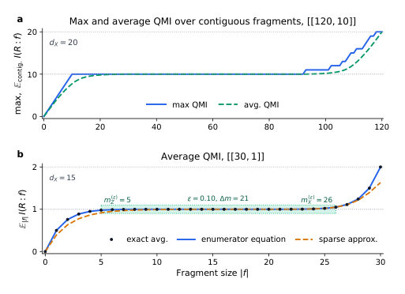
<figcaption class="paper-figure-caption"><b>Fig 1.</b> FIG. 1. a) Plot of max|f| I(R : f) and E|f|(R : f) for a [[120, 10]] CSS code with dZ = 1 and dX = 20, which captures the decoherence of a 10-qubit system. Maximization and aver- aging is done over contiguous fragments. b) Plot of the exact E|f|(R : f) for a [[30, 1]] CSS code with dZ = 1, dX = 15, alongside the full theoretical prediction (9) and sparse ap- proximation (10). The values of m(ϵ) Z and m(ϵ) X that bound the classical plateau up to ϵ precision as per Corollary 9 is shown in green.</figcaption>
</figure>
<figure class="paper-figure-card">

<figcaption class="paper-figure-caption"><b>Fig 2.</b> Fig. 1 shows the bounds proposed by Corollary 9 on a plateau with ϵ = 0.1. Algebraic objectivity. In addition to their strong con- nection to existing QD concepts, the algebraic formula- tion provides precise tracking of both the type and the distribution of information — given f, one can efficiently determine the logical operators supported on it using our algorithm presented in the End Matter. With this im- proved precision, we can easily classify different strengths of objectivity and characterize them along our two cri- teria: classicality and redundancy. We highlight a few interesting classes and draw connections with existing lit- erature on QD.</figcaption>
</figure>
<figure class="paper-figure-card">
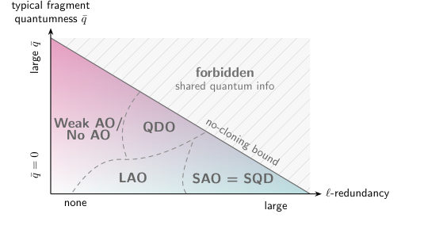
<figcaption class="paper-figure-caption"><b>Fig 3.</b> FIG. 2. Algebraic regimes for a chosen fragment family F = {fi}. The horizontal axis is the number of bits that are ℓ- redundant for ℓ= O(|F|), the number of fragments, while the vertical axis is a typical local quantum rank of the recoverable algebra ¯q = ⟨qi⟩F. The blue/pink hue also encodes ℓand ¯q. Different regimes of algebraic objectivity occupy distinct regions of this diagram, separated schematically by dashed lines. The hatched region is forbidden, as entering it would require the fragment family to redundantly share noncentral logical information.</figcaption>
</figure>
<figure class="paper-figure-card">
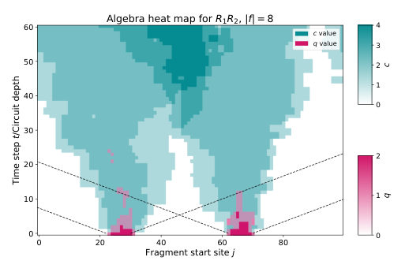
<figcaption class="paper-figure-caption"><b>Fig 4.</b> FIG. 3. Heat map of the algebra Mf for all contiguous frag- ments fj = {j −|f| + 1, j −|f| + 2, · · · , j} with |f| = 8 and two k = 2 sources broadcasting in a brickwork circuit con- struction. Each pixel encodes the algebraic content with teal for classical c information and pink for quantum information q. While classical information spreads out from both sources, fragments lose access to the quantum information quickly. We overlay the emergent light cone bound of each source for our brickwork circuit.</figcaption>
</figure>
<figure class="paper-figure-card">
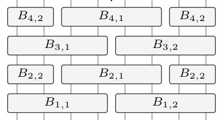
<figcaption class="paper-figure-caption"><b>Fig 5.</b> FIG. 4. Schematic brickwork Clifford circuit with periodic boundary conditions. Each layer is a product of disjoint local bricks, and adjacent layers are shifted by half a block. Match- ing labels at the two edges denote a periodic brick.</figcaption>
</figure>

**Summary.** This work develops an algebraic framework to precisely define objectivity by linking it to the local recoverability properties within quantum error-correcting codes. By analyzing the structure of logical Pauli algebras on system fragments, the authors unify existing measures and provide quantitative criteria (SAO, LAO) for how classical information emerges from quantum entanglement.

**Why it may be interesting.** It provides a deep mathematical link between fundamental concepts of quantum foundations (objectivity/classicality) and the highly structured tools of Quantum Error Correction Codes, which is crucial for understanding decoherence dynamics in complex systems.

Detailed structure

**Main problem.** The paper aims to precisely characterize the emergence of 'objectivity' and 'classicality' from quantum mechanics, moving beyond partial descriptions like Quantum Darwinism.

**Main result.** Objectivity is rigorously identified with the algebraic local recoverability of quantum codes, providing a unified and computable classification scheme for classicality and redundancy.

**Method.** The authors connect Quantum Darwinism to Operator Algebra Quantum Error Correction (QECC), using tools like analyzing the center of recoverable logical algebras ($Z(M_f)$) on stabilizer codes.

**Model / system.** The analysis is performed within the framework of quantum error-correcting codes, specifically utilizing stabilizer codes defined by Pauli subgroups. The dynamics are simulated via 'brickwork circuits' modeling system-environment interaction.

**Key observables.** Objectivity/Classicality Measure ($Z(M_f)$ non-triviality), Quantum Mutual Information (QMI), Classical bits ($c$), and Quantum qubits ($q$).

**Important parameters / regimes.** Strong Algebraic Objectivity (SAO), Localized Algebraic Objectivity (LAO), Quantum Doped Objectivity (QDO); plateau widths related to code distances.

**Assumptions / limitations.** The analysis heavily relies on the mathematical structure of stabilizer codes and uses Poisson approximations for calculating probabilities in random subsystem fragments.

**Figures summary.** Figures illustrate QMI plateaus vs. fragment size, depict different algebraic regimes (SAO, LAO, QDO), and show heatmaps mapping classical ($c$) versus quantum ($q$) information content over simulated time steps.

**Paper structure.** The paper builds from defining the problem using QD to establishing the connection with QECC algebra. It then develops theorems quantifying recoverability ($Z(M_f)$) and mutual information, culminating in proving equivalences between physical conditions (sQD) and algebraic structures (SAO).

Abstract

Quantum Darwinism extends the decoherence formalism to explain how classicality and objectivity emerge from quantum mechanics. However, existing approaches often capture only partial aspects of objectivity, leading to its mischaracterization and making it difficult to pin down precisely. By connecting quantum Darwinism to operator algebra quantum error correction, we show that the emergence of objectivity can be identified with the algebraic local recoverability of quantum codes. Applying this algebraic framework to stabilizer codes, we show that it yields a far more precise characterization of classicality and redundancy, unifies the traditional measures of objectivity, enables efficient classification via coding-theoretic tools, and supports large-scale Clifford simulations of decoherence dynamics.

[↑ back to top](#top)

### [Light-tunable quantum metric non-linear Hall response in Berry dipole semimetals](http://arxiv.org/abs/2606.06999v1)

**Authors:** Debashree Chowdhury, Awadhesh Narayan  
**Type:** theory · **Category:** other · **PDF:** <https://arxiv.org/pdf/2606.06999v1>  
**Analysis basis:** full PDF text, analyzed in chunks
**Topic relevance:** `methods for driven-dissipative` **3/5** · `non-equilibrium dynamics` **3/5** · `Keldysh / 2PI / non-Gaussian methods` **2/5** · `driven-dissipative phase transition` **1/5** · `interference shaping light` **1/5** · `non-equilibrium universality` **1/5**

↔ Scroll figures horizontally

<figure class="paper-figure-card">
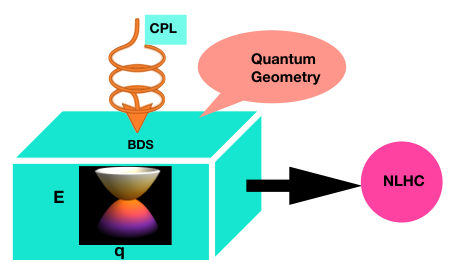
<figcaption class="paper-figure-caption"><b>Fig 1.</b> FIG. 1. (a) A schematic representation of our studied sys- tem. The Berry dipole semimetal (labeled as BDS), shows a quadratically dispersing band structure, in contrast to the linear bands in Weyl or Dirac materials. Here the conduction and valence bands touch each other at a point dipole node. We illuminate the BDS by circularly polarized light and an- alyze the quantum metric. Using it, we further explore the NLHC of the system in the presence of light.</figcaption>
</figure>
<figure class="paper-figure-card">
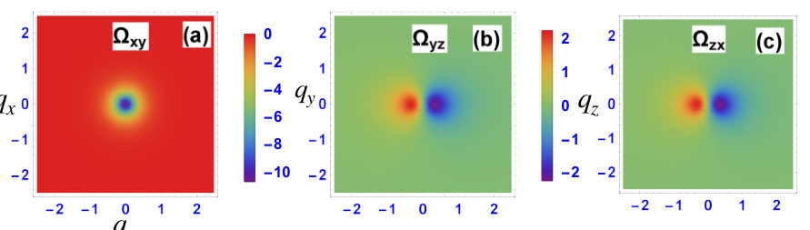
<figcaption class="paper-figure-caption"><b>Fig 2.</b> FIG. 2. (a) The Berry curvature Ωxy is plotted with qx and qy keeping qz = 0.5. Ωxy does not show the dipole nature. In panel (b), we plot Ωyz with qz and qy keeping qx = 0.5. This shows a dipolar nature. This dipole nature is also visible in (c), where we plot Ωzx as a function of qz and qx, keeping qy = 0.5. Importantly, in (b) and (c), as we vary q, we clearly observe the dipole nature of the Berry curvature.</figcaption>
</figure>
<figure class="paper-figure-card">
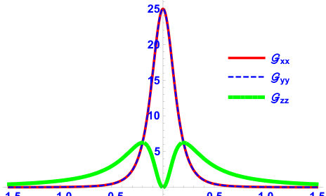
<figcaption class="paper-figure-caption"><b>Fig 3.</b> FIG. 3. Components of the quantum metric, Gxx (solid blue), Gyy (red dashed), and Gzz (green dot dashed) are plotted with q = p</figcaption>
</figure>
<figure class="paper-figure-card">
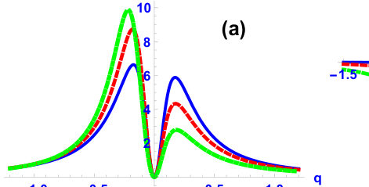
<figcaption class="paper-figure-caption"><b>Fig 4.</b> FIG. 4. (a) The diagonal component of the quantum metric, Gzz, plotted with q = p</figcaption>
</figure>
<figure class="paper-figure-card">
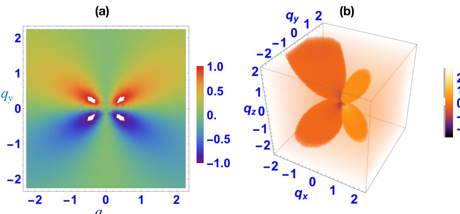
<figcaption class="paper-figure-caption"><b>Fig 5.</b> FIG. 5. (a) Plot of the integrand vyGxx −vxGyx with qy and qz taking qx = 0.23. (b) The same integrand, (vyGxx −vxGyx), is plotted in three-dimensions as a function of qx, qy, and qz. In panel (a), it is evident that although the patterns look symmetric, they are not identical, which is discernible from the central white structures. In panel (b), the asymmetric pattern is clearly visible in the distribution around the qz = 0 plane.</figcaption>
</figure>

**Summary.** This theoretical work demonstrates that applying light to Berry dipole semimetals allows for active, tunable control over their nonlinear Hall response. By inducing an asymmetry in the quantum metric via optical driving, researchers show that the direction of the resulting current can be flipped simply by increasing the light intensity past a certain threshold.

**Why it may be interesting.** The concept of using light as a direct stimulus to control fundamental quantum geometric responses like the Hall effect is highly relevant for designing novel optoelectronic topological materials.

Detailed structure

**Main problem.** The study investigates how light influences the intrinsic nonlinear Hall conductivity (NLHC) mediated by quantum metrics within Berry dipole semimetals.

**Main result.** Light induces a tunable asymmetry in the off-diagonal part of the quantum metric, leading to a controllable NLHC whose direction can reverse when the light amplitude exceeds a critical threshold.

**Method.** The authors used theoretical calculations involving Floquet theory (Floquet-Magnus expansion) and derived expressions for the Quantum Metric Dipole (DQM) under high-frequency optical driving.

**Model / system.** The system modeled is a Berry dipole semimetal (BDS), characterized by a quadratic band structure arising from two Weyl nodes at a mirror-symmetric interface. The analysis uses an effective Hamiltonian derived via optical driving.

**Key observables.** Nonlinear Hall conductivity (NLHC), Quantum Metric Dipole (QMD), and the off-diagonal components of the quantum metric ($G^{\Omega}_{xy}$).

**Important parameters / regimes.** Light amplitude ($A_0$), light frequency ($\Omega$), and chemical potential ($\mu$).

**Assumptions / limitations.** The analysis relies on the high-frequency approximation for optical driving, and specific limits (like $\Omega 	o 0$) require careful handling.

**Figures summary.** Figures illustrate the BDS band structure, confirm the dipole nature of Berry curvature, show the emergence of light-induced asymmetry in quantum metric components ($G^{\Omega}_{xy}$), and plot the sign reversal of the DQM as a function of light amplitude.

**Paper structure.** The paper builds from defining the physical system (BDSs) and its Hamiltonian, through calculating the relevant geometric quantities (Berry curvature, Quantum Metric), applying optical driving via Floquet theory to derive effective Hamiltonians, and finally analyzing the resulting nonlinear transport response (NLHC/DQM).

Abstract

We investigate the effect of light on quantum metric-mediated intrinsic nonlinear Hall conductivity in Berry dipole semimetals. We discover that light induces a tunable asymmetry in the off-diagonal part of the quantum metric, which is manifested by an asymmetry in the quantum metric dipole. We show that the nonlinear response can be tuned directly by the light amplitude. In particular, we note that the direction of the nonlinear Hall signal changes when the light amplitude is increased beyond a threshold value. Light thus emerges as a promising stimulus to control the quantum geometric response in topological semimetals.

[↑ back to top](#top)

### [Exact noise characterization of entanglement distribution in star networks](http://arxiv.org/abs/2606.07043v1)

**Authors:** Kenneth Goodenough, Xiaonan Chen, Patrick Emonts  
**Type:** theory · **Category:** quantum information and computing · **PDF:** <https://arxiv.org/pdf/2606.07043v1>  
**Analysis basis:** full PDF text, analyzed in chunks
**Topic relevance:** `entanglement & information structure` **3/5** · `correlated / nonlocal dissipation` **2/5** · `Keldysh / 2PI / non-Gaussian methods` **1/5** · `driven-dissipative phase transition` **1/5** · `methods for driven-dissipative` **1/5** · `non-equilibrium dynamics` **1/5**

↔ Scroll figures horizontally

<figure class="paper-figure-card">
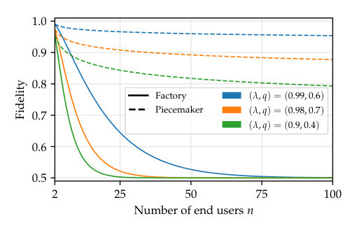
<figcaption class="paper-figure-caption"><b>Fig 1.</b> FIG. 1: Fidelity as a function of the number of end users n, for both the piecemaker and factory protocol. The solid and dashed lines correspond to the factory and piecemaker protocol, respectively. We plot the fidelity for several experimental parameters (λ, q) = (0.99, 0.6), (0.98, 0.7) and (0.9, 0.4).</figcaption>
</figure>
<figure class="paper-figure-card">
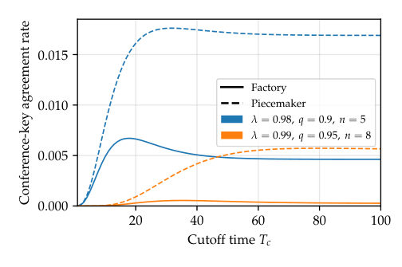
<figcaption class="paper-figure-caption"><b>Fig 2.</b> FIG. 2: Conference-key agreement rate as a function of the cut-off time Tc for the factory and piecemaker protocol, for (λ, q, n) = (0.98, 0.9, 5) , (0.99, 0.95, 8) and dephasing noise.</figcaption>
</figure>
<figure class="paper-figure-card">
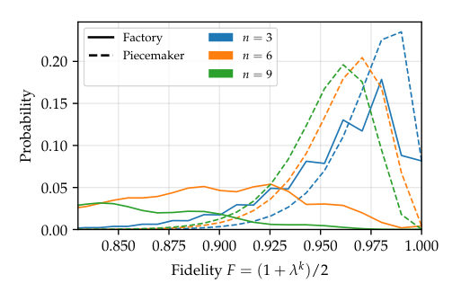
<figcaption class="paper-figure-caption"><b>Fig 3.</b> FIG. 4: Distribution of the fidelity for the factory and piecemaker protocol. Parameters chosen are λ = 0.98, q = 0.6 and n = 3, 6, 9, corresponding to the solid, dashed and dotted lines, respectively.</figcaption>
</figure>
<figure class="paper-figure-card">
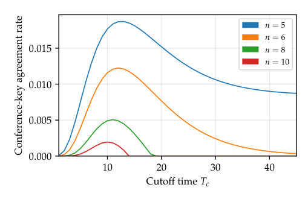
<figcaption class="paper-figure-caption"><b>Fig 4.</b> FIG. 3: Conference-key agreement rate as a function of the cut-off time Tc for the factory protocol, for (λ, q) = (0.99, 0.85), n = 5, 6, 8, 10 and depolarizing noise. Note that for n ≥6 the use of a cut-off is necessary to generate key.</figcaption>
</figure>
<figure class="paper-figure-card">
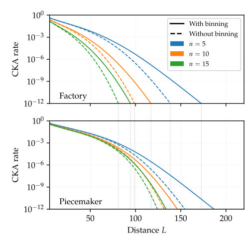
<figcaption class="paper-figure-caption"><b>Fig 5.</b> FIG. 5: Conference-key agreement rate with the factory protocol (top) and piecemaker protocol (bottom) as a function of the distance L, λ = 0.98 and for n = 5, 10, 15 end users. Solid lines are the case with binning (explained in the main text), dashed lines are without binning. The dotted, grey, vertical lines show the difference between factory and the piecemaker protocol.</figcaption>
</figure>

**Summary.** This work analyzes the noise accumulation when distributing multipartite entanglement over star network topologies. By comparing two protocols—Factory and Piece-maker—the authors derive exact analytical expressions for the average noise and its distribution under memory decoherence. The findings strongly advocate for the piececemaker protocol due to its superior performance in maintaining high fidelity across multiple users.

**Why it may be interesting.** It provides rigorous analytical tools for quantifying resource degradation in quantum communication channels due to realistic decoherence mechanisms, which is crucial for designing fault-tolerant quantum networks.

Detailed structure

**Main problem.** The paper characterizes the noise incurred during multipartite entanglement distribution across star networks, focusing on how memory decoherence affects the final state fidelity.

**Main result.** It derives closed-form expressions showing that the piecemaker protocol significantly outperforms the factory protocol in terms of achievable users and key rates for a given level of noise.

**Method.** The analysis uses analytical derivations, including generating functions and Pauli basis expansions, to calculate the average noise parameter E[Lambda] and its full probability distribution.

**Model / system.** The system models quantum networking using star topologies where entangled states (like GHZ states) are distributed via a central node. The primary physical effect modeled is memory decoherence (dephasing or depolarizing noise) accumulated during stochastic waiting times.

**Key observables.** Average noise parameter E[Lambda], output fidelity F, and conference key agreement rate.

**Important parameters / regimes.** Decoherence rates ($\lambda$), link failure probability ($q$), number of users ($n$), and the global cut-off time ($T_c$).

**Assumptions / limitations.** The analysis primarily focuses on memory decoherence; gate/measurement noise and initial state infidelities are ignored. The results often rely on approximations for finite cut-offs.

**Figures summary.** Figures compare fidelity vs. number of users (n) and key agreement rate vs. cut-off time ($T_c$) for both protocols, demonstrating the superiority of the piecemaker method.

**Paper structure.** The paper systematically derives noise metrics for two protocols (Factory and Piece-maker), extends the analysis from dephasing to depolarizing noise, calculates the full distribution of noise parameters, and compares performance using key rate metrics under finite cut-off conditions.

Abstract

Multipartite entanglement forms the core of many networking applications. In the near-term future, it is expected that multipartite distribution will be achieved first through star topologies, making it important to understand the noise incurred during the distribution process. In such networks, elementary links are created stochastically and successful links must be stored while waiting for the remaining links, causing memory decoherence that depends on the random waiting times. We derive analytical expressions for both the average noise and its distribution, when distributing GHZ states under memory dephasing in star networks. We study and compare two distribution protocols: the factory and piecemaker protocol. Furthermore, we find expressions for the case of a global cut-off (allowing fast optimization of the cut-off without requiring Monte Carlo simulations) and extend the analysis for the factory protocol to depolarizing noise for arbitrary states.

[↑ back to top](#top)

### [Tomography of quantum states with bounded extent](http://arxiv.org/abs/2606.07425v1)

**Authors:** Srinivasan Arunachalam, Arkopal Dutt  
**Type:** theory · **Category:** quantum information and computing · **PDF:** <https://arxiv.org/pdf/2606.07425v1>  
**Analysis basis:** full PDF text, analyzed in chunks
**Topic relevance:** `quantum measurements` **3/5** · `entanglement & information structure` **2/5** · `measurement-induced transitions` **2/5** · `Keldysh / 2PI / non-Gaussian methods` **1/5** · `methods for driven-dissipative` **1/5**

↔ Scroll figures horizontally

<figure class="paper-figure-card">
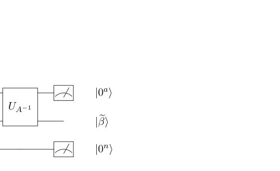
<figcaption class="paper-figure-caption"><b>Fig 1.</b> Figure 1: Circuit for preparing the state |eβ⟩.</figcaption>
</figure>

**Summary.** This paper establishes a general theoretical framework for performing quantum state tomography when the unknown state has a low-complexity decomposition over a structured model class. By boosting weak agnostic learners, the authors derive efficient algorithms that estimate the state with bounded error, providing significant advances over previous methods that required full access to the state preparation unitary.

**Why it may be interesting.** The work provides powerful tools to characterize and learn complex quantum states based on their underlying structure, which is crucial for understanding resource limitations in quantum computation protocols.

Detailed structure

**Main problem.** Developing a general framework for quantum state tomography when the unknown state $|\psi
angle$ is assumed to have a 'bounded extent' with respect to a structured class of states $C$. This addresses efficiently learning an unknown quantum state that admits a low-complexity decomposition over $C$.

**Main result.** The authors provide algorithmic protocols for tomography achieving $\epsilon$-error estimation, showing that the weak agnostic learner can be boosted into a strong algorithm. For stabilizer states, this is achieved in quasipolynomial time.

**Method.** The core method involves leveraging the existence of a weak agnostic learner for $C$ and applying an algorithmic decomposition theorem to reconstruct $|\psi
angle$. This process uses techniques like ridge projection and boosting from computational learning theory.

**Model / system.** The system is general quantum states, specifically focusing on $n$-qubit systems. The structure is formalized by a class of states $C$ (e.g., stabilizer states, MPS states), and the complexity is measured by the 'bounded extent' $\xi$.

**Key observables.** Fidelity ($F_C(|\psi
angle)$), trace distance ($\epsilon$), Stabilizer extent ($\xi$).

**Important parameters / regimes.** Number of qubits ($n$), Extent bound ($\xi$), Error tolerance ($\epsilon$), Sample complexity, Time complexity.

**Assumptions / limitations.** The results rely on $|\psi
angle$ admitting a low-complexity decomposition over $C$, and the best polynomial bounds assume the algorithmic PFR conjecture.

**Paper structure.** The paper builds from general framework development (Chunk 1) to specific algorithms for structure learning and parameter estimation using ridge projectors (Chunk 2). It details protocols for various structured classes like stabilizer states and MPS (Chunks 3, 5, 6), while also providing rigorous mathematical analysis of the projection process and condition number bounds (Chunks 7, 8).

Abstract

We give a general framework for tomography of states that have bounded-extent with respect to a structured class of states. Let $\textsf{C}$ be a family of $n$-qubit states such that: $(i)$ $\textsf{C}$ is succinctly representable and $(ii)$ there is a weak agnostic learner of $\textsf{C}$. We give a tomography protocol for an unknown state $|ψ\rangle$ that is promised to admit a decomposition of the form $|ψ\rangle = \sum_i c_i |φ_i\rangle$, where $|φ_i\rangle \in \textsf{C}$ with bounded $\ell_1$-norm of the coefficients (which we call extent). Our main contribution is to show that a weak agnostic learner for $\textsf{C}$ can be boosted into a tomography algorithm for states with bounded extent with respect to $\textsf{C}$.   Our reduction is black-box and applies broadly across model classes. As an application, when $\textsf{C}$ is the class of stabilizer states, we obtain tomography algorithms for states with stabilizer extent $ξ$ up to trace distance $\varepsilon$, in time $\textsf{poly}(n,(ξ/\varepsilon)^{\log(ξ/\varepsilon)})$, which is improvable to $ \textsf{poly}(n,ξ,1/\varepsilon)$ assuming the algorithmic polynomial Freiman-Ruzsa conjecture in the high-doubling regime. When the unknown state $|ψ\rangle$ is arbitrary, we give an algorithmic decomposition result in the spirit of a weak regularity lemma for quantum states with respect to $\textsf{C}$ and show that the structure in $|ψ\rangle$ that is explainable by $\textsf{C}$ can be efficiently learned. Our main conceptual message is that agnostic learning of a structured base class automatically yields learnability of its low-complexity linear span.

[↑ back to top](#top)

### [On the true low-energy excitations of the three-dimensional spin glass](http://arxiv.org/abs/2606.07197v1)

**Authors:** Claudio Chilin, Enzo Marinari, Víctor Martín-Mayor, Giorgio Parisi, Juan J. Ruiz-Lorenzo, David Yllanes  
**Type:** theory · **Category:** disordered systems and neural networks · **PDF:** <https://arxiv.org/pdf/2606.07197v1>  
**Analysis basis:** full PDF text, analyzed in chunks
**Topic relevance:** `exotic spin models in light-matter` **3/5** · `analog quantum simulation` **2/5** · `Keldysh / 2PI / non-Gaussian methods` **1/5** · `driven-dissipative phase transition` **1/5** · `methods for driven-dissipative` **1/5**

↔ Scroll figures horizontally

<figure class="paper-figure-card">
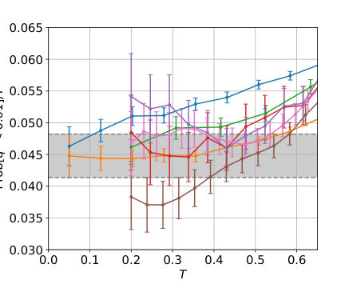
<figcaption class="paper-figure-caption"><b>Fig 1.</b> Figure 1: Parisi-Toulouse scaling. Temperature and size dependence for the cumu- lative probability Prob[q2 &lt; 0.01], see Eq. (16), which provides a numerically stable estimate of P(q = 0). Left: Prob[q2 &lt; 0.01] versus temperature, as computed for all our fully equilibrated lattice sizes. Right: Closeup of the T ∈[0,0.65] region, where we show Prob[q2 &lt; 0.01]/T; PaT scaling predicts that Prob[q2 &lt; 0.01]/T should be temperature independent. The grey horizontal band corresponds to Prob[q2 &lt; 0.01; L = 6, T = 0.05] plus or minus its error. Excepting L = 4, all our data is compatible with this band if T &lt; 0.5. The key is common to the two panels.</figcaption>
</figure>
<figure class="paper-figure-card">
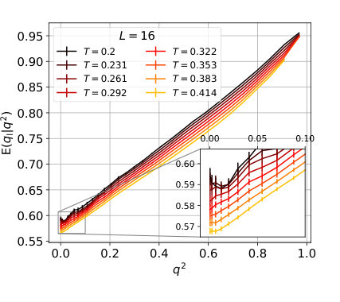
<figcaption class="paper-figure-caption"><b>Fig 2.</b> Figure 2: Link overlap as a function of q2. Plot of E(ql|q2), see Eq. (7), as com- puted for the lowest temperatures and for the biggest sizes we have simulated. In both panels errors are computed using a jackknife method. Left: estimate of E(ql|q2) for L = 14,16,18 at T = 0.2. Right: estimate of E(ql|q2) for L = 16 at various temperatures. The inset shows a closeup of the highlighted box.</figcaption>
</figure>
<figure class="paper-figure-card">
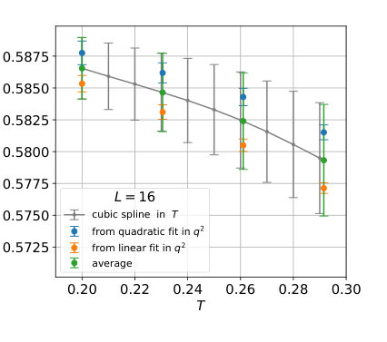
<figcaption class="paper-figure-caption"><b>Fig 3.</b> Figure 3: Extrapolating E(ql|q2) to q2 = 0. Through the procedure explained in Sec. 3.2 we get interpolated data points for equally spaced temperatures 0.2 ≤T &lt; 0.3. Left: E(ql|q2) at T = 0.2 for different linear sizes L. Dots repre- sent the measurements, dashed lines are fits to a linear function, solid lines are fits to a quadratic function. In order to get cleaner results, fits have been restricted to the intervals shown in Appendix A.2. Right: E(ql|q2 = 0) for L = 16 at different temperatures T. Blue and orange dots are the values of the intercepts obtained from the fits. Green dots are the average between the two, as explained in the main text. The grey curve is the cubic-spline...</figcaption>
</figure>
<figure class="paper-figure-card">
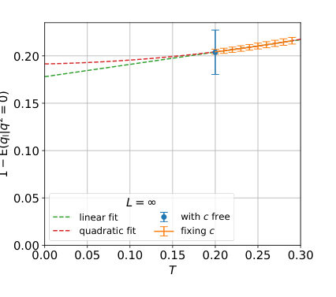
<figcaption class="paper-figure-caption"><b>Fig 4.</b> Figure 4: Taking the successive L →∞and T →0 limits. Left: E(ql|q2 = 0) for T = 0.2 as a function of 1/L. The dashed line is the fit of these points to Eq. (20). The resulting parameters, along with the goodness-of-fit metrics, are reported in Table 2. Right: L →∞values from fits of data at different temperatures to ansatz (20). The blue dot represents the result from the fit shown in the left panel, the orange dots are obtained by fitting the interpolated data to the same function but fixing parameter c to the value in Table 2. Green and red dashed lines are the linear and quadratic fits of the orange points, respectively.</figcaption>
</figure>
<figure class="paper-figure-card">
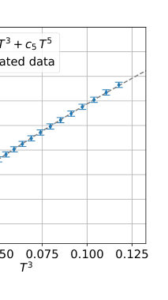
<figcaption class="paper-figure-caption"><b>Fig 5.</b> Figure 5: Energy density as a function of T. Plot of our extrapolations for the thermodynamic limit of the energy density e∞(T) obtained at fixed T from the fit to Eq. (24). The grey dashed line is a fit to Eq. (27), the corresponding values and accuracy parameters are reported in Table 3.</figcaption>
</figure>

**Summary.** This work uses large-scale Monte Carlo simulations to investigate the low-energy excitations of 3D spin glasses. By extrapolating results down to zero temperature, the authors find that Replica-Symmetry Breaking theory provides the best fit for key scaling parameters. The findings offer strong numerical confirmation of the overlap-equivalence hypothesis in disordered magnetic systems.

**Why it may be interesting.** While focused on classical statistical mechanics, the rigorous numerical techniques used for extrapolation and phase boundary determination are highly relevant to understanding complex energy landscapes in quantum many-body systems, particularly those exhibiting glassy behavior.

Detailed structure

**Main problem.** The study aims to determine which theoretical framework (RSB, DM, CP, or TNT) correctly describes the low-energy excitations of three-dimensional spin glasses.

**Main result.** The simulations provide strong evidence supporting the Replica-Symmetry Breaking theory for the fractal dimension and confirm the overlap-equivalence hypothesis through smooth extrapolations to zero temperature.

**Method.** Large-scale Monte Carlo simulations are performed on lattices up to L=18, involving complex extrapolation techniques to reach the thermodynamic limit (L->infinity) and zero temperature (T->0).

**Model / system.** The system studied is a three-dimensional spin glass (Edwards-Anderson type), modeled by Ising spins ($\sigma_i = \pm 1$) interacting via random couplings ($J_{ij}$). The analysis focuses on the behavior of the spin overlap parameter $q$ and the link overlap $q_l$.

**Key observables.** Spin overlap ($q$), link overlap ($q_l$), energy density ($\langle H/V 
angle$), fractal dimension ($d_f$), and the probability distribution $P(q)$.

**Important parameters / regimes.** System size L (up to 18), Temperature T (extrapolated down to zero), Dimension D=3.

**Assumptions / limitations.** Key assumptions include the commutativity of limits ($T 	o 0$ and $L 	o \infty$) and the overlap-equivalence hypothesis, which links link overlap to the spin overlap.

**Figures summary.** Figures illustrate Parisi-Toulouse scaling for $P(q)$ vs T, and show extrapolations of $E(q_l|q_2=0)$ versus system size L and temperature T using various fitting ansatze.

**Paper structure.** The paper progresses by defining the physical problem (low-energy excitations), detailing observables ($q, q_l$), presenting simulation results showing smooth extrapolations to $T=0$, and finally comparing these findings against predictions from established theoretical frameworks like RSB theory.

Abstract

We study the low-energy excitations of the three dimensional spin glass through a large-scale Monte Carlo simulation on lattices up to $L=18$. We find smooth extrapolations down to zero temperature, which, in the case of the energy and of the link overlap, can be directly -- and favourably -- compared with previous investigations featuring ground states (i.e., at zero temperature). The best fit for the fractal dimension of the excitations is provided by Replica-Symmetry Breaking theory, but we also consider the alternative TNT description. The $P(q)$ is found to verify the Parisi-Toulouse temperature scaling. Our data provides a spectacular confirmation of the overlap-equivalence hypothesis.

[↑ back to top](#top)

### [Elucidating the Control of Circular Dichroism in Ion Yield via Chirped Pulses with Purposeful Models](http://arxiv.org/abs/2606.07269v1)

**Authors:** Leon A. Kerber, Daniel M. Reich  
**Type:** theory · **Category:** other · **PDF:** <https://arxiv.org/pdf/2606.07269v1>  
**Analysis basis:** full PDF text, analyzed in chunks
**Topic relevance:** `methods for driven-dissipative` **3/5** · `non-equilibrium dynamics` **2/5** · `Keldysh / 2PI / non-Gaussian methods` **1/5** · `interference shaping light` **1/5**

↔ Scroll figures horizontally

<figure class="paper-figure-card">
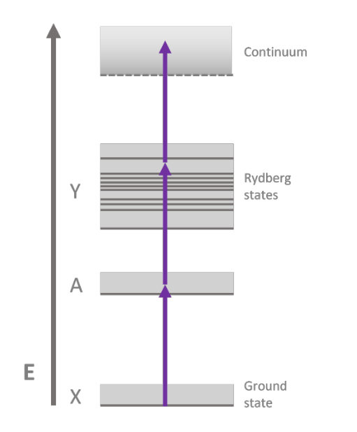
<figcaption class="paper-figure-caption"><b>Fig 1.</b> FIG. 1. The 1 + 1 + 1 ionization scheme of 3MCP examined within this work. The absorption of a first photon excites the molecule to the A band. In a second absorption step, the molecule is promoted to one of ten Rydberg states [38]. Absorption of the third photon leads to ionization. The ion- ization step is treated effectively in our work.</figcaption>
</figure>
<figure class="paper-figure-card">
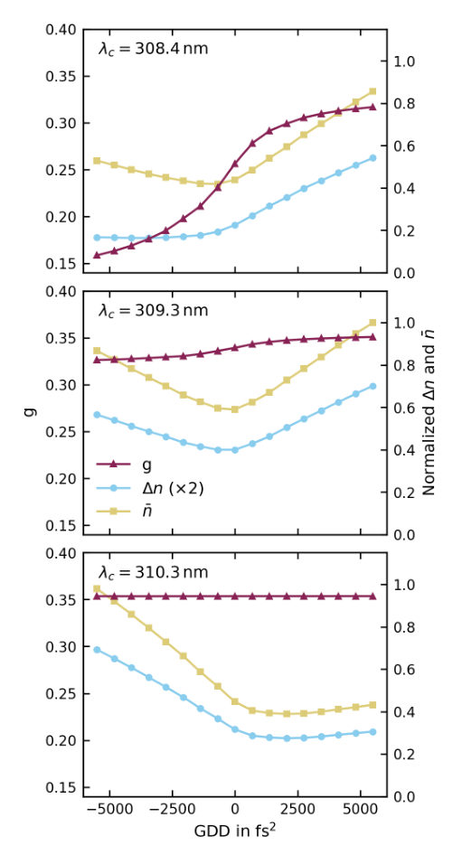
<figcaption class="paper-figure-caption"><b>Fig 2.</b> FIG. 2. Results for the “minimal model”. Dependence of the anisotropy factor (g, left axis), CD and ABS (∆n and ¯n, right axis) on the applied GDD for three different central wavelengths of the linearly chirped laser pulse.</figcaption>
</figure>
<figure class="paper-figure-card">
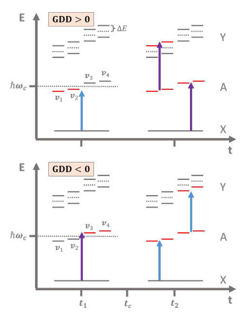
<figcaption class="paper-figure-caption"><b>Fig 3.</b> FIG. 3. Schematic illustration of the preferential enhance- ment of pathways for the case of a central pulse frequency (ωc) which energetically lies in between the two intense (A(v1), A(v2)) and the two weak transitions (A(v3), A(v4)), as in the upper two panels of Fig. 2. States in the same column are coupled with each other: each A band state (at energy EA(v)) is coupled to two Y band states at energies 2EA(v) ± ∆E. The excitation process is shown at two points in time t1 and t2, before and after the pulse center tc. For positive chirp (GDD &gt; 0), low frequencies (blue), resonant with the intense transitions, arrive first, enhancing subsequent population (red bars) of the corresponding...</figcaption>
</figure>
<figure class="paper-figure-card">
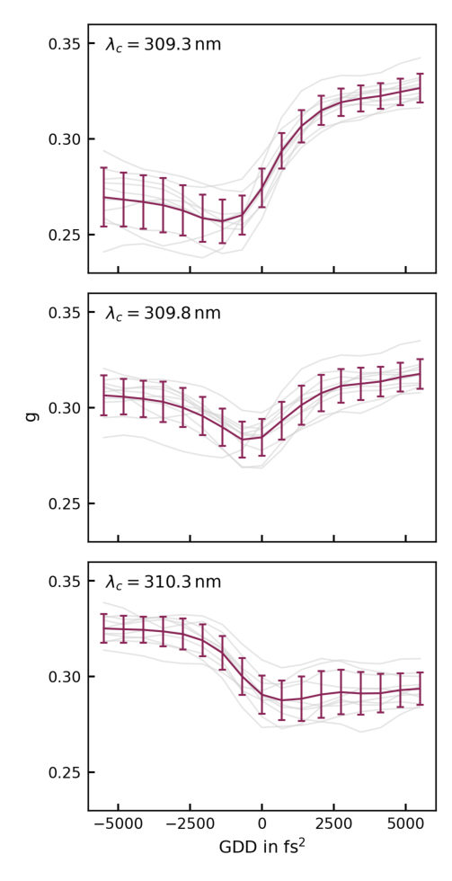
<figcaption class="paper-figure-caption"><b>Fig 4.</b> FIG. 4. Results for the “randomized model”. Dependence of the anisotropy factor on the applied GDD for three different central wavelengths of the linearly chirped laser pulse for the equatorial conformer of 3MCP.</figcaption>
</figure>
<figure class="paper-figure-card">
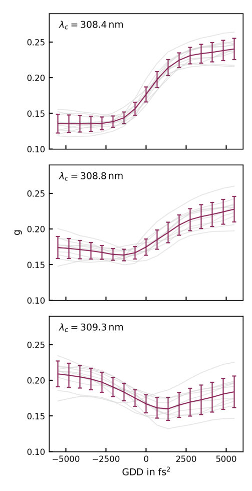
<figcaption class="paper-figure-caption"><b>Fig 5.</b> FIG. 5. Results for the “randomized model”. Dependence of the anisotropy factor on the applied GDD for three differ- ent central wavelengths of the linearly chirped laser pulse for 3MCP. The results correspond to a mixture of 78:22 equato- rial and axial conformers as in Ref. [24].</figcaption>
</figure>

**Summary.** The paper theoretically investigates the control of circular dichroism observed during the ionization of 3-methylcyclopentanone using chirped laser pulses. By solving the time-dependent Schrödinger equation within sophisticated quantum models, the authors pinpoint that the interaction between sequential absorption steps is responsible for the chirp dependence of the measured anisotropy. This provides a detailed mechanism for controlling chiral signals in molecular physics.

**Why it may be interesting.** This work is highly relevant as it uses advanced quantum dynamics simulations (TDSE) to model coherent control in molecular spectroscopy, specifically demonstrating how sequential resonance pathways dictate measurable chiral properties like CDIY.

Detailed structure

**Main problem.** The study aims to theoretically elucidate how circular dichroism (CD) in the ion yield, resulting from a three-step ionization process ($1+1+1$), can be controlled by using femtosecond linearly chirped laser pulses.

**Main result.** The anisotropy factor's dependence on chirp is governed by the interplay between the first and second absorption steps; randomized models successfully reproduce the qualitative features of this chirp enhancement, confirming a sequential resonance mechanism.

**Method.** The authors numerically solve the time-dependent Schrödinger equation to track molecular excitation dynamics through multiple absorption steps using both minimal and randomized quantum models.

**Model / system.** The system is 3-methylcyclopentanone (3MCP) undergoing $1+1+1$ ionization. The Hamiltonian governs the time evolution, incorporating field-free molecular terms and dipole interactions for sequential excitation from ground state to A-band vibronic states, then to Rydberg states.

**Key observables.** Circular Dichroism in Ion Yield (CDIY), Anisotropy Factor ($g$), population distributions in Rydberg states.

**Important parameters / regimes.** Linearly chirped laser pulses characterized by Group Delay Dispersion (GDD); central wavelengths ($\lambda_c$); temperature (for conformational averaging).

**Assumptions / limitations.** The second absorption step is modeled using effective approaches, and rotational degrees of freedom are sometimes neglected or simplified to a linear rotor for estimation.

**Figures summary.** Figures illustrate the $1+1+1$ ionization scheme; subsequent figures show how the anisotropy factor changes with GDD (chirp) in both minimal and randomized models, and how conformational averaging improves quantitative agreement.

**Paper structure.** The paper establishes the theoretical framework using the time-dependent Schrödinger equation for multi-step excitation. It develops simplified 'minimal' and complex 'randomized' models to isolate physical mechanisms. Finally, it applies these models to analyze the dependence of CDIY on laser chirp and molecular conformation.

Abstract

We theoretically investigate circular dichroism in the ion yield following $1+1+1$ ionization of 3-methylcyclopentanone using femtosecond linearly chirped laser pulses, inspired by recent experiments by Das et al. [Phys. Chem. Chem. Phys. 27, 8043 (2025)]. To this end, we numerically solve the time-dependent Schrödinger equation and evaluate the total population in the Rydberg states at the end of the second absorption step. The A-band transition in the first absorption step is treated using state-of-the-art quantum-chemical calculations, whereas the second absorption step is described via an effective model. Within our framework, we identify the interplay between the first and second absorption step as the key explanation for the experimentally observed chirp dependence of the anisotropy. By elucidating this mechanism for the chirp-enhanced signal, our findings contribute towards the development of improved control schemes for chiral molecules.

[↑ back to top](#top)

### [Field-rigid Ising antiferromagnetism with giant spin-flip fields in Van der Waals UOTe](http://arxiv.org/abs/2606.06678v1)

**Authors:** Zackary Rehfuss, Shannon Gould, Joanna Blawat, Christopher Broyles, George Xu, Yiqing Hao, Huibo Cao, Thao Dinh, Suyang Xu, Dave Graf, John Singleton, Sheng Ran  
**Type:** experiment · **Category:** strongly correlated electrons · **PDF:** <https://arxiv.org/pdf/2606.06678v1>  
**Analysis basis:** full PDF text, analyzed in chunks
**Topic relevance:** `Kondo & dissipative impurity` **3/5** · `analog quantum simulation` **1/5** · `exotic spin models in light-matter` **1/5** · `spintronics-quantum-optics interface` **1/5**

↔ Scroll figures horizontally

<figure class="paper-figure-card">
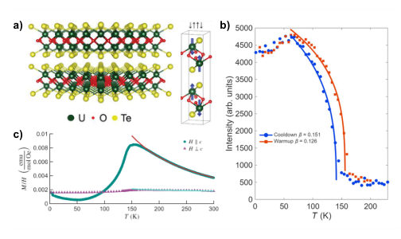
<figcaption class="paper-figure-caption"><b>Fig 1.</b> FIG. 1. a) Crystal and magnetic structure of UOTe. Left, cross-sectional view of the layered structure, showing the Te- terminated Van der Waals gaps between neighboring struc- tural units. Right, magnetic structure showing the doubled magnetic unit cell with the ↓↑↑↓arrangement. b) Temper- ature dependence of the magnetic Bragg peak intensity at Q = (1, 0, 0.5). Data were collected in 5 K steps, with each point integrated for 1 minute after a 1 minute equilibration period. Solid lines are fits to a critical scaling form, and the extracted values of β are listed in the legend. The fitted values are close to the two-dimensional Ising limit. c) Temperature dependence of the magnetic...</figcaption>
</figure>
<figure class="paper-figure-card">
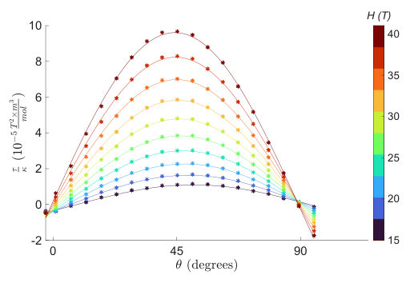
<figcaption class="paper-figure-caption"><b>Fig 2.</b> FIG. 2. Angular cuts through the torque data. Rep- resentative angular cuts extracted from the torque data at fixed magnetic fields. Solid lines are fits to the sin(2θ) angular dependence expected for a uniaxial two-sublattice antiferro- magnet, τ ∝∆χH2 sin(2θ). The agreement shows that the angular response remains consistent with a simple uniaxial antiferromagnetic state throughout the measured field range.</figcaption>
</figure>
<figure class="paper-figure-card">
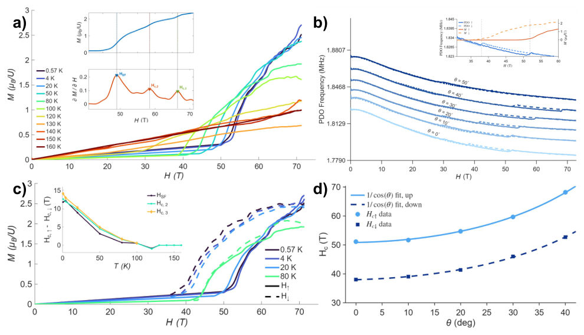
<figcaption class="paper-figure-caption"><b>Fig 3.</b> FIG. 3. a) Magnetization of UOTe as a function of field for temperatures from 570 mK to 160 K, measured in pulsed fields up to 73 T. The data were normalized using vibrating sample magnetometer measurements from earlier experiments. The inset shows an expanded view of the spin-flip transition and its field derivative, highlighting the three peaks used to track the phase boundary. b) PDO frequency shift as a function of field at 570 mK for field angles measured with respect to the c axis. A clear transition is observed, and the inset compares the PDO response with the magnetization data near the onset of the spin-flip transition. The critical field increases with angle from 0◦to 50◦, beyond...</figcaption>
</figure>
<figure class="paper-figure-card">
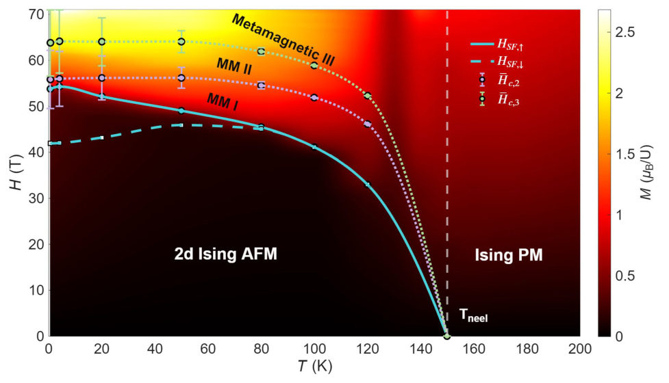
<figcaption class="paper-figure-caption"><b>Fig 4.</b> FIG. 4. Magnetic field-temperature phase diagram of UOTe constructed from pulsed-field magnetization and PDO measure- ments, together with neutron scattering, magnetic susceptibility, and torque magnetometry. Above TN ≈150 K, UOTe is in the paramagnetic state. Below TN, at least three field-induced branches emerge from the metamagnetic transition region and define the evolution of the ordered state with temperature and field. The blue boundary marks the spin-flip transition, with separate up-sweep and down-sweep values shown where hysteresis is resolved. The green and pink branches correspond to the higher-field derivative features identified from the magnetization data. Vertical bars...</figcaption>
</figure>
<figure class="paper-figure-card">
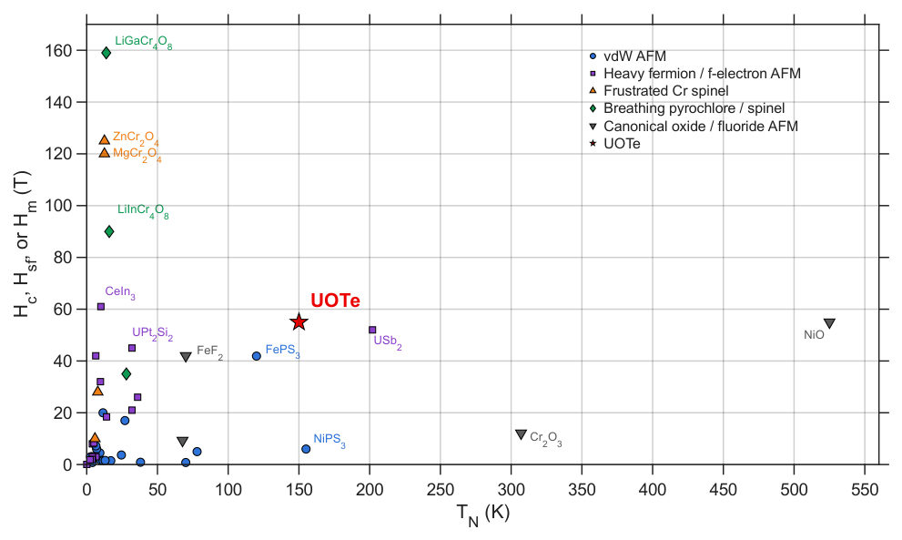
<figcaption class="paper-figure-caption"><b>Fig 5.</b> FIG. 5. Critical field scale plotted against N´eel temperature for a representative set of antiferromagnetic materials. The vertical axis denotes the reported spin-flip field, spin-flop field, metamagnetic field, or other relevant critical field, labeled here as Hc, Hsf, or Hm. The comparison includes compounds from Van der Waals antiferromagnets, heavy-fermion and other f-electron antiferromagnets, frustrated chromium spinels, breathing pyrochlore or spinel antiferromagnets, and canonical oxide or fluoride antiferromagnets. Literature values used to construct the comparison are taken from Refs. [16, 17, 20, 22, 32–36, 38–43, 52, 69– 85].</figcaption>
</figure>

**Summary.** This work investigates UOTe, a Van der Waals antiferromagnet that combines metallic conduction with strong magnetic anisotropy and quasi-2D Ising order. Through extensive measurements up to 73 T, the authors demonstrate that the material maintains its field-rigid Ising character even when entering a complex metamagnetic state at high fields. This establishes UOTe as a unique platform for studying correlated magnetism in low dimensions.

**Why it may be interesting.** The combination of extreme magnetic field studies (up to 73 T) on a correlated electron system within a van der Waals structure is highly relevant. The persistence of Ising rigidity into the high-field regime provides insights into quantum phase transitions in strongly interacting, low-dimensional magnets.

Detailed structure

**Main problem.** To characterize a Van der Waals antiferromagnet exhibiting field-rigid Ising behavior alongside metallic, correlated electronic structure.

**Main result.** UOTe establishes a unique platform where high-temperature c-axis order, quasi-2D Ising criticality, and Kondo hybridization coexist, with the magnetic rigidity persisting into a broad, high-field metamagnetic regime.

**Method.** The study employs a combination of techniques including neutron diffraction, temperature/angle-dependent susceptibility measurements, torque magnetometry, and pulsed-field magnetization up to 73 T.

**Model / system.** The physical system is UOTe, a compensated Van der Waals material. It exhibits strong magnetic anisotropy, quasi-two-dimensional Ising antiferromagnetism below $T_N \approx 150$ K, and metallic transport linked to Kondo-associated uranium 5f hybridization.

**Key observables.** Magnetic susceptibility ($\chi(T)$), critical exponent $eta$, torque ($	au$), pulsed magnetization ($M(H)$), and angle dependence of the metamagnetic instability field component ($H_c(	heta) \propto \cos	heta$).

**Important parameters / regimes.** Critical exponent $eta \approx 0.14$ (near 2D Ising value); high-field regime onset near 50 T; $T_N \simeq 150$ K.

**Assumptions / limitations.** The analysis assumes the magnetic response can be modeled by uniaxial antiferromagnetism and that the high-field instability is governed by the field component along the ordered moment direction.

**Figures summary.** Figures illustrate crystal structure, temperature dependence of magnetic Bragg peak intensity showing 2D Ising scaling, $\chi(T)$ anisotropy, angular cuts through torque data confirming uniaxiality, and $M(H)$ curves revealing a broad, hysteretic metamagnetic reconstruction rather than a simple spin flip.

**Paper structure.** The paper systematically establishes the material's magnetic anisotropy via susceptibility measurements, confirms 2D Ising critical behavior using neutron diffraction, verifies the uniaxial nature of the ordered state with torque magnetometry, and finally probes the high-field stability and metamagnetic reconstruction using pulsed-field magnetization and angle-dependent PDO measurements.

Abstract

Van der Waals antiferromagnets provide a route to thickness-controlled magnetic order, but few combine high-temperature Ising order with conducting, correlated, and topological electronic structure. Here we show that UOTe realizes this combination. Magnetic susceptibility reveals a strongly anisotropic paramagnetic response, while neutron diffraction establishes c-axis antiferromagnetic order below $T_N \simeq 150$ K with an order-parameter exponent $β= 0.14$, close to the two-dimensional Ising value. Torque magnetometry further shows that the ordered state remains well described by a uniaxial antiferromagnet below the high-field transition. Pulsed-field magnetization up to 73 T shows that the ordered state survives to very large fields applied along the c axis before entering a broad metamagnetic regime that begins near 50 T, and remains unsaturated at the highest measured field. Angle-dependent proximity detector oscillator measurements show that the metamagnetic instability is set by the field component along the ordered moment direction, providing direct evidence for Ising-like field rigidity. UOTe therefore establishes a field-rigid Ising antiferromagnet with giant spin-flip fields in a compensated Van der Waals metal, where high-temperature c-axis order, quasi-two-dimensional magnetic criticality, Kondo-associated uranium 5f hybridization, metallic transport, and symmetry-enabled topology coexist in a single material.

[↑ back to top](#top)

### [Impact of capacity volatility and input substitutability on supply chain resilience](http://arxiv.org/abs/2606.06874v1)

**Authors:** Jaeseok Hur, Juha Jang, Meesoon Ha, Hawoong Jeong  
**Type:** theory · **Category:** statistical mechanics · **PDF:** <https://arxiv.org/pdf/2606.06874v1>  
**Analysis basis:** full PDF text, analyzed in chunks
**Topic relevance:** `driven-dissipative phase transition` **2/5** · `non-equilibrium dynamics` **2/5** · `non-equilibrium universality` **2/5** · `Frenkel-Kontorova` **1/5** · `Keldysh / 2PI / non-Gaussian methods` **1/5** · `analog quantum simulation` **1/5** · `correlated / nonlocal dissipation` **1/5** · `entanglement & information structure` **1/5** · `methods for driven-dissipative` **1/5**

↔ Scroll figures horizontally

<figure class="paper-figure-card">
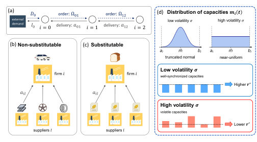
<figcaption class="paper-figure-caption"><b>Fig 1.</b> FIG. 1. Schematic illustration of order-delivery process and two different inputs: (a) Order propagation (dashed line ar- rows) and delivery (solid line arrows) processes in 1D supply chains with two levels from root to leaf node. Conceptual comparison of (b) non-substitutable production to (c) substi- tutable production. Automobile production requires distinct inputs, such as steel, steering wheels, and tires, from different suppliers, whereas bread production can use compatible in- puts, such as flour, supplied by multiple firms. (d) Production- capacity distributions with different volatility σ. As σ in- creases, the truncated normal distribution (left) approaches a near-uniform...</figcaption>
</figure>
<figure class="paper-figure-card">
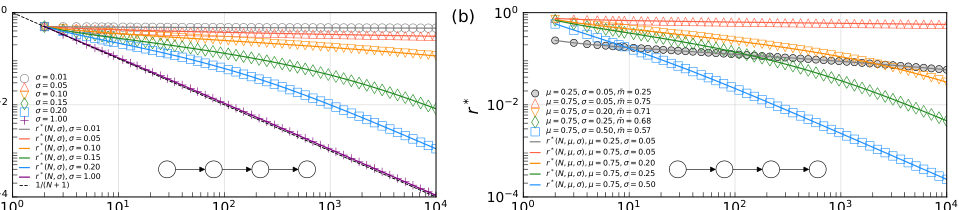
<figcaption class="paper-figure-caption"><b>Fig 2.</b> FIG. 2. Critical demand r∗(N, σ) of 1D supply chains with no stock capacity and truncated-normal production capacities as a function of supply chain length N and volatility σ. Dots represent numerical simulation results and solid lines represent the analytical expressions in Eqs. (10) and (A3), evaluated by numerical integration. (a) Capacity distributions with the same location parameter µ = 1/2 and different values of σ. For small σ, production is nearly deterministic and r∗depends weakly on N. In the large-σ limit, it approaches the baseline r∗= 1/(N + 1) for a uniform capacity distribution. (b) Different values of µ. Gray circle symbols represent µ = 0.25 and other open symbols...</figcaption>
</figure>
<figure class="paper-figure-card">
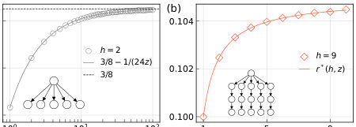
<figcaption class="paper-figure-caption"><b>Fig 3.</b> FIG. 3. Critical demand r∗against the number of substitute suppliers z. (a) Regular trees with h = 2. (b) Multiple-chain structure (h = 9), under no stock capacity, and a Leontief production function with substitutable inputs. Open symbols represent numerical simulation results, and the solid line rep- resents the analytical result in Eqs. (19) and (20). r∗increases monotonically with a branching factor z. The insets show schematic illustrations of the network settings.</figcaption>
</figure>
<figure class="paper-figure-card">
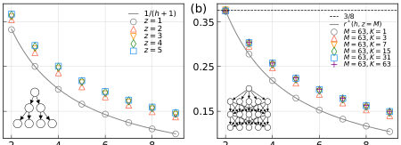
<figcaption class="paper-figure-caption"><b>Fig 4.</b> FIG. 4. Critical demand r∗against height h, under no stock capacity and a Leontief production function with substi- tutable inputs. Symbols represent numerical simulation re- sults for (a) regular-tree structure with various z and (b) regular-lattice structure with the number of nodes and links, (M, K) in each lattice layer, respectively. The insets show schematic illustrations of the network settings.</figcaption>
</figure>

**Summary.** This paper models supply chain resilience by studying how random production capacity fluctuations and input substitutability affect the system's critical demand. It finds that managing volatility (synchronization) and diversifying suppliers are crucial for maintaining stability, even more so than simply increasing average resource availability.

**Why it may be interesting.** While applied to economics/operations research, the mathematical framework involves stochastic processes and network flow constraints that share conceptual parallels with analyzing energy or information flow bottlenecks in complex quantum systems.

Detailed structure

**Main problem.** The paper investigates how capacity volatility and input substitutability affect critical demands (resilience) within stochastic supply chains, extending the Feld-Barthelemy framework.

**Main result.** Reducing production-capacity volatility is often more effective than increasing average capacity in long chains, while structural diversification via substitute suppliers significantly enhances resilience by dispersing shocks.

**Method.** The analysis uses theoretical modeling based on Directed Acyclic Graphs (DAGs) to derive expressions for critical demand ($r^*$) under various stochastic assumptions.

**Model / system.** The system is a supply chain modeled as a DAG where production capacity $m_i(t)$ is random. The core dynamics involve order propagation, constrained production via a Leontief-type function, and stock updates.

**Key observables.** Critical Demand ($r^*$), which represents the maximum sustainable demand rate of the root node.

**Important parameters / regimes.** Capacity volatility ($\sigma$), average capacity ($\mu$), supply chain length ($N$), and degree of input substitutability (number of suppliers $z$).

**Assumptions / limitations.** The analysis often assumes no stock capacity ($s=0$) for key comparisons, and it builds upon the Feld-Barthelemy model assumptions.

**Figures summary.** Figures illustrate order/delivery processes in 1D chains, showing how volatility ($\sigma$) impacts $r^*$, and demonstrate that increasing supplier diversification ($z$) raises critical demand in tree structures.

**Paper structure.** The paper develops the mathematical framework for stochastic supply chain flow, first analyzing the impact of capacity distribution (e.g., truncated normal) on $r^*$ in non-substitutable chains, then extending this to incorporate input substitutability via a modified Leontief function.

Abstract

Supply chains are intrinsically vulnerable to stochastic shocks due to their sequential production dependencies. Building on the Feld-Barthelemy framework, we investigate how capacity volatility and input substitutability determine critical demands in stochastic supply chains. By modeling production capacity with a truncated normal distribution, we show that in long supply chains, reducing capacity volatility is often more effective than increasing average capacity, emphasizing the need for firm-level synchronization. Furthermore, introducing a modified Leontief-type production function reveals that input substitutability effectively disperses stochastic shocks. Supplier diversification inherently raises critical demands, even under fixed maximum capacities, by introducing the effect of network topology that independently enhances the resilience of physical stock. Our findings demonstrate that mitigating capacity volatility and structurally diversifying supply routes are just as crucial to supply chain resilience as traditional inventory expansion.

[↑ back to top](#top)

### [Phase lag enhances synchronization in coupled oscillators with inertia](http://arxiv.org/abs/2606.07002v1)

**Authors:** Sudo Yi, Cook Hyun Kim, Heetae Kim, B. Kahng  
**Type:** theory · **Category:** statistical mechanics · **PDF:** <https://arxiv.org/pdf/2606.07002v1>  
**Analysis basis:** full PDF text, analyzed in chunks
**Topic relevance:** `driven-dissipative phase transition` **2/5** · `non-equilibrium dynamics` **2/5** · `non-equilibrium universality` **2/5** · `Frenkel-Kontorova` **1/5** · `Keldysh / 2PI / non-Gaussian methods` **1/5** · `analog quantum simulation` **1/5** · `correlated / nonlocal dissipation` **1/5** · `methods for driven-dissipative` **1/5**

↔ Scroll figures horizontally

<figure class="paper-figure-card">
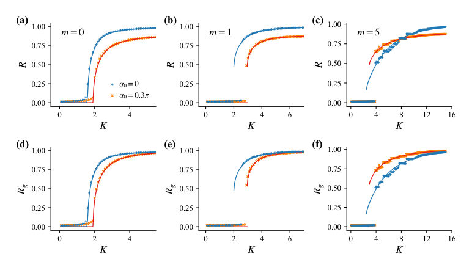
<figcaption class="paper-figure-caption"><b>Fig 1.</b> Figure 1: Plot of the order parameter 𝑅for the 2nd KM without (blue) and with (orange) phase lags as a function of the coupling constant 𝐾for (a) 𝑚= 0, (b) 𝑚= 1, and (c) 𝑚= 5 for a single realization (left column). For 𝑚= 0 and 𝑚= 1, imposing a phase lag reduces 𝑅, whereas for 𝑚= 5, 𝑅shows a crossover behavior as 𝐾varies. Close to the transition point 𝐾𝑐, synchronization is enhanced, while for sufficiently large 𝐾it is suppressed. Note also that the transition point 𝐾𝑐is shifted to larger values when the phase lag is introduced. The enhanced synchronization occurs because, in case (c), the boundary of the primary cluster in the 𝜔&gt; 0 region remains fixed [Fig. 2(e)], while the cluster itself...</figcaption>
</figure>
<figure class="paper-figure-card">
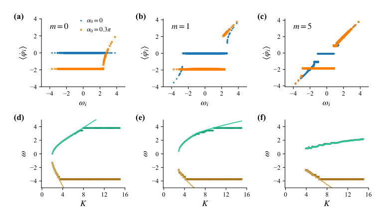
<figcaption class="paper-figure-caption"><b>Fig 2.</b> Figure 2: (Left column) Plots of the mean angular velocities of the primary and higher-order synchronized clusters versus intrinsic frequencies for (a) 𝑚= 0, (b) 𝑚= 1, and (c) 𝑚= 5 with 𝑁= 5000, and 𝐾= 5, starting from the phase-lag-free state (𝛼0 = 0) (blue) and after introducing the phase-lag with 𝛼0 = 0.3𝜋in the steady states (orange). In all cases, the phase lag effectively shifts the boundary of the primary cluster—defined by the region in which ⟨̇𝜑𝑖⟩is almost constant with respect to 𝜔𝑖—toward smaller values of 𝜔𝑖. Yet, as illustrated for 𝑚= 5 in (c), if the depinning threshold lies to the right of the original boundary, depinning does not occur and the right boundary is left...</figcaption>
</figure>
<figure class="paper-figure-card">
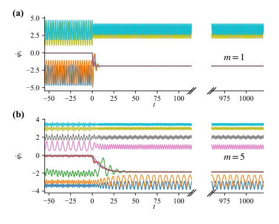
<figcaption class="paper-figure-caption"><b>Fig 3.</b> Figure 3: Time evolution of the instantaneous frequencies ̇𝜑𝑖(𝑡) of selected oscillators with different intrinsic frequencies 𝜔𝑖, (a) and (b) show the cases 𝑚= 1 and 𝑚= 5, respectively, with 𝑁= 5000, 𝐾= 5, 𝛼0 = 0.3𝜋, and 𝜂= 0.5. For 𝑡&lt; 0, the system evolves without phase lag and is in a steady state. At 𝑡= 0, the phase lag is introduced to an 𝜂fraction of oscillators. The system relaxes to a new steady state within a time scale much shorter than the transient time (1000) used in the simulations.</figcaption>
</figure>

**Summary.** This paper analyzes how controlled external perturbations, specifically applying a symmetry-breaking phase lag, can significantly boost global synchronization in coupled oscillators that possess inertia. By forcing the primary cluster to incorporate secondary frequency clusters, the method reveals a mechanism for actively controlling and improving collective coherence in complex dynamical systems.

**Why it may be interesting.** While focused on classical oscillator dynamics, the concept of using an engineered non-conservative perturbation (phase lag) to stabilize or enhance collective order in a complex, multi-cluster state has parallels with controlling quantum phase transitions or stabilizing exotic many-body states.

Detailed structure

**Main problem.** The study investigates how applying a controlled phase lag can enhance global synchronization in coupled oscillators that possess inertia, especially when the system naturally exhibits multiple synchronized clusters.

**Main result.** Controlled phase lags can enhance global synchronization by steering the primary cluster to merge with higher-order clusters, demonstrating a mechanism for improving entrainment in inertial oscillator networks.

**Method.** The analysis uses mean-field theory and quasi-static methods, examining the system's response to varying coupling strengths (K) while incorporating phase lags ($\alpha_i$) on a subset of oscillators.

**Model / system.** The model is based on the second-order Kuramoto model with inertia, described by an equation of motion involving second derivatives and damping terms. This system is used as a proxy for physical systems like synchronous machines in power grids.

**Key observables.** Order parameter (R), group-based order parameter ($R_g$), mean angular velocity ($\langle\dot{\varphi}_i
angle$) of different clusters, and cluster boundaries determined by pinning/depinning conditions.

**Important parameters / regimes.** Inertia magnitude ($m$), coupling constant ($K$), phase lag ($\alpha_0$), and the fraction of oscillators subjected to the lag ($\eta$).

**Assumptions / limitations.** The analysis relies on a minimal mean-field demonstration, assuming the existence of primary and higher-order clusters initially. The use of specific approximations for drifting oscillators is also noted.

**Figures summary.** Figures illustrate how the order parameter $R$ changes with coupling strength $K$ for different inertia values, showing enhancement near transition points when phase lags are applied. Other figures map mean angular velocities versus intrinsic frequencies to determine cluster boundaries.

**Paper structure.** The paper first establishes that inertia lowers synchronization in the 2nd KM compared to simpler models. It then introduces the controlled phase lag perturbation and analyzes how this external control mechanism forces a dynamical reorganization, leading to enhanced global coherence by merging distinct frequency clusters.

Abstract

The second-order Kuramoto model with inertia exhibits different dynamical behaviors than the first-order KM without inertia. A central difference is its lower synchronization due to the emergence of multiple synchronized clusters with different frequencies. We aim to investigate how such lowered synchronization can be improved by applying external perturbations to the system in a steady state, for example, a symmetry-breaking phase lag to a subset of oscillators. We find that this phase lag steers the primary cluster along a specific path and enables it to merge with higher-order clusters, thereby enhancing global synchronization. Our results reveal a mechanism by which controlled phase lag can improve entrainment in inertial oscillator systems, with possible implications for synchronization control in inertial oscillator networks.

[↑ back to top](#top)

### [Bures geodesics for non-faithful states and quantum speed limit](http://arxiv.org/abs/2606.06759v1)

**Authors:** Sergio Carrasco, Dominique Spehner  
**Type:** theory · **Category:** quantum information and computing · **PDF:** <https://arxiv.org/pdf/2606.06759v1>  
**Analysis basis:** full PDF text, analyzed in chunks
**Topic relevance:** `entanglement & information structure` **2/5** · `non-equilibrium dynamics` **2/5** · `correlated / nonlocal dissipation` **1/5** · `driven-dissipative phase transition` **1/5** · `methods for driven-dissipative` **1/5** · `non-equilibrium universality` **1/5**

↔ Scroll figures horizontally

<figure class="paper-figure-card">
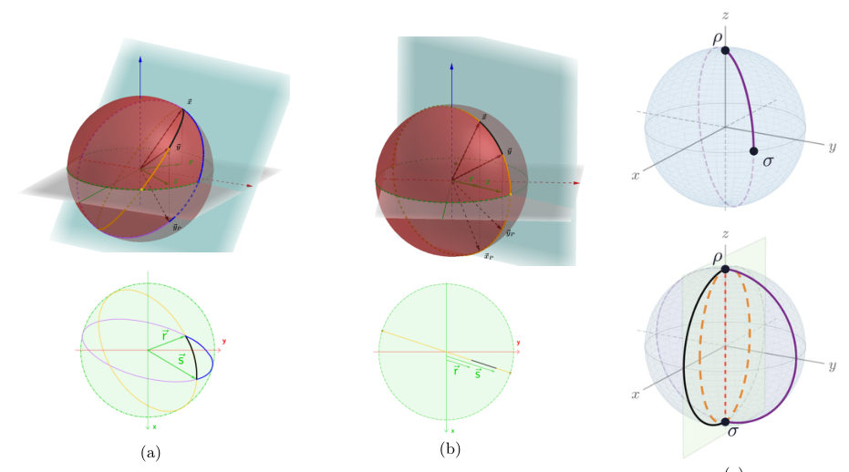
<figcaption class="paper-figure-caption"><b>Fig 1.</b> FIG. 1: (a) Geodesic arcs connecting two faithful non-commuting qubit states, represented on the hypersphere S3</figcaption>
</figure>
<figure class="paper-figure-card">
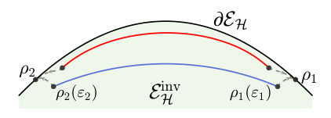
<figcaption class="paper-figure-caption"><b>Fig 2.</b> FIG. 2: Geodesic arcs joining the perturbed states ρ1(ε1) and ρ2(ε2) of two non-faithful states ρ1 and ρ2 in the regularization method (plain red and blue curves). The regularization paths εi 7→ρi(εi), i = 1, 2, are shown in dashed lines.</figcaption>
</figure>
<figure class="paper-figure-card">
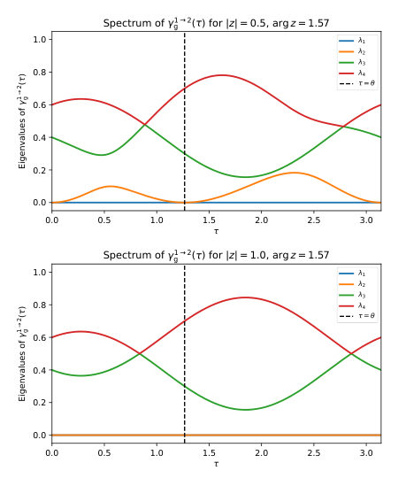
<figcaption class="paper-figure-caption"><b>Fig 3.</b> FIG. 3: Spectrum of γ1→2 g (τ) vs time τ for |z| = 0.5 and |z| = 1.0, showing that for all τ ∈(0, θ), γ1→2 g (τ) has rank 3 in the first case and rank 2 in the second case. The vertical dashed line indicates t = θ and arg(z) = π.</figcaption>
</figure>
<figure class="paper-figure-card">
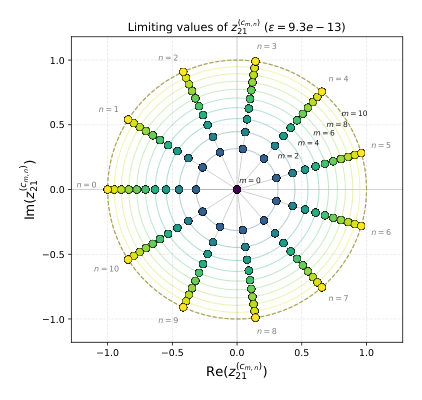
<figcaption class="paper-figure-caption"><b>Fig 4.</b> FIG. 4: Complex-plane representation of the limit limε→0 z(cm,n) 21 (ε, ε) for the regularization curves (B2) with r = rm and ϕ = ϕn as in (B3). The colored circles and gray rays indicate resp. the radial index m and phase index n. The distribution of points shows that the limiting values fill the closed unit disk. The value r = 1 leads to Fubini geodesics, given by (44) with |z21| = 1 and arbitrary phases ϕ; the values 0 &lt; r &lt; 1 lead to elliptic rank-2 geodesics, and r = 0 corresponds to the rank-2 straight diameter geodesic.</figcaption>
</figure>

**Summary.** This paper rigorously determines the geodesic arcs connecting non-faithful quantum states in the space of density matrices using the Bures metric. It establishes necessary and sufficient conditions for the uniqueness of these shortest paths by analyzing the overlap between state supports and kernels. The results have direct implications for understanding the minimum time required for quantum evolution, thus refining the Quantum Speed Limit.

**Why it may be interesting.** This work provides rigorous geometric tools to analyze the fundamental limits of quantum evolution (QSL) by characterizing the shortest paths between arbitrary mixed states, which is crucial for understanding decoherence and process characterization.

Detailed structure

**Main problem.** The central problem is determining the explicit mathematical form of Bures geodesic arcs connecting two non-faithful quantum states, which relates directly to establishing the Quantum Speed Limit (QSL).

**Main result.** The authors provide the general framework for these geodesics, showing that while a unique shortest path often exists under specific conditions related to state supports/kernels, infinitely many optimal paths can exist otherwise.

**Method.** The work employs geometric methods on the manifold of density matrices (Bures metric), utilizing techniques like regularization and subspace restriction to analyze boundary behavior for non-invertible states.

**Model / system.** The system is general quantum state evolution described by density operators ($
ho$) in a finite-dimensional Hilbert space $H$. The analysis focuses on the geometry of this state space, particularly when states are mixed (non-faithful).

**Key observables.** Bures distance ($d_B$), Fidelity ($F$), Quantum Fisher Information (QFI), and the rank of the geodesic path.

**Important parameters / regimes.** The dimension of the Hilbert space ($n$), the ranks of the initial/final states ($r_1, r_2$), and regularization parameters ($\epsilon$).

**Assumptions / limitations.** The analysis often relies on approximating boundary geodesics by taking limits from faithful (invertible) states or restricting the path to subspaces spanned by the supports of the end-states.

**Figures summary.** Figures illustrate geodesic arcs connecting qubit states, showing differences between unique shortest paths and cases with infinitely many optimal arcs when states are orthogonal. Tables summarize properties based on state ranks for specific dimensions like qutrits and qubits.

**Paper structure.** The paper progresses from the known pure-state (Fubini-Study) case to general mixed states, developing techniques involving regularization and subspace analysis to handle non-faithful states ($	ext{rank} < n$). It culminates in explicit conditions for geodesic uniqueness based on kernel/support intersections.

Abstract

The quantum speed limit establishes a bound on the minimal time required for a quantum system to evolve from a given initial state to a final state. When the mean energy variance is fixed this limitation is captured by the Mandelstam--Tamm bound. The fastest quantum evolution saturating this bound follows a geodesic arc connecting the two states. Such geodesics in the manifold of quantum states are explicitly known when the states are pure (Fubini-Study geodesics) and when they are mixed and given by faithful density matrices (Bures geodesics). In this article we obtain the explicit form of the Bures geodesic arcs joining two non-faithful density matrices, which may have different ranks. For pure states one recovers the Fubini-Study geodesics. A necessary and sufficient condition for the uniqueness of the shortest geodesic arc is given. When the condition is not fulfilled there are infinitely many such arcs, all having length equal to the arccos Bures distance between the two states, in analogy with the arcs of great circles connecting the two poles of a sphere. We discuss the implications of our results for the quantum speed limit.

[↑ back to top](#top)

### [Direct High-Magnetic-Field Coupling to Stripe Order in a Cuprate Superconductor](http://arxiv.org/abs/2606.07349v1)

**Authors:** Leonardo Martinelli, Izabela Biało, Jens Oppliger, Julia Küspert, Orion Gerguri, Sandro Brunner, Benedikt Eggert, Mark H. Fischer, Jochen Geck, Marein Rahn, Ellen Fogh, Jaewon Choi, Atsuhiko Miyata, Oleksandr Prokhnenko, Zahirul Islam, Fernando Igoa Saldaña, Martin v. Zimmermann, Rachel Nickel, Kurt Kummer, Nicholas B. Brookes, Adheena Painganoor, Paola Caterina Forino, Rasmus Toft-Petersen, Niels Bech Christensen, Xunyang Hong, Qisi Wang, Tohru Kurosawa, Naoki Momono, Migaku Oda, Dmitri V. Novikov, Azat Khadiev, Thomas Herrmannsdörfer, Ana Kurtanidze, Katharina Ollefs, Zuzana Konôpková, Michał Andrzejewski, Minxue Tang, Ulf Zastrau, Alexander Pelka, Hauke Höppner, Jolanta Sztuk-Dambietz, Vratko Rovensky, Torsten Laurus, Erik Brambrink, Björn Näser, Marcin Sikora, Cornelius Strohm, Carsten Baehtz, Shingo Yamamoto, Johan Chang  
**Type:** experiment · **Category:** strongly correlated electrons · **PDF:** <https://arxiv.org/pdf/2606.07349v1>  
**Analysis basis:** full PDF text, analyzed in chunks
**Topic relevance:** `analog quantum simulation` **2/5** · `driven-dissipative phase transition` **2/5** · `exotic spin models in light-matter` **1/5** · `non-equilibrium dynamics` **1/5** · `non-equilibrium universality` **1/5** · `spintronics-quantum-optics interface` **1/5**

↔ Scroll figures horizontally

<figure class="paper-figure-card">
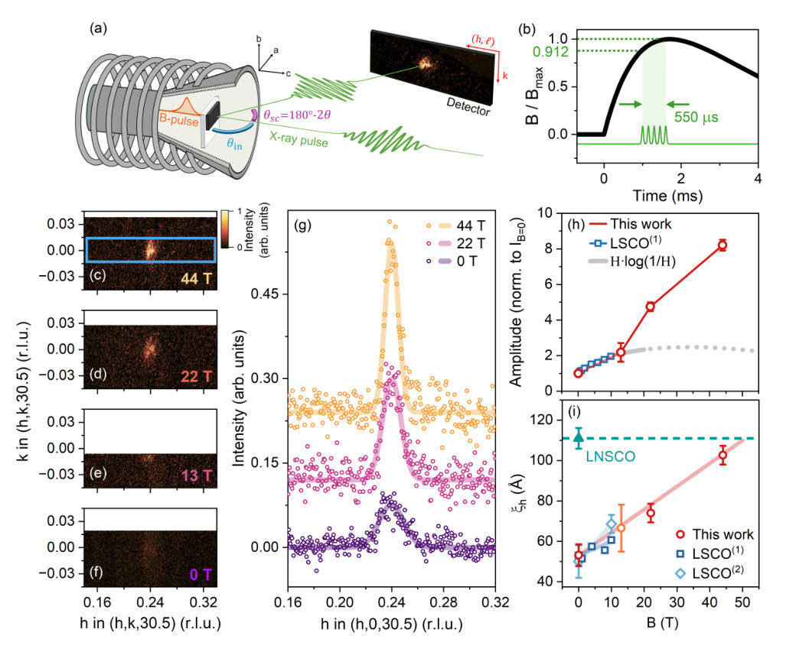
<figcaption class="paper-figure-caption"><b>Fig 1.</b> FIG. 1. Normal-state magnetic field effect on stripe order. (a) Schematic illustration scattering geometry and the magnetic field sample environment. The sample sits inside a conical aperture with a longitudinal magnetic field directed perpendicular to the sample’s surface along the crystallographic (001) direction. Magnetic field pulses are synchronized with the XFEL train. X-ray pulses impinge at an incident angle θin ∼66◦and are scattered on the detector at scattering angles θsc ∼44◦± 2◦, corresponding to the CO reflection (0.24, 0, 30.5). (b) Sketch of the time trace of the magnetic field pulse (black solid line) and the XFEL x-ray train (green curve). The first train pulse is...</figcaption>
</figure>
<figure class="paper-figure-card">
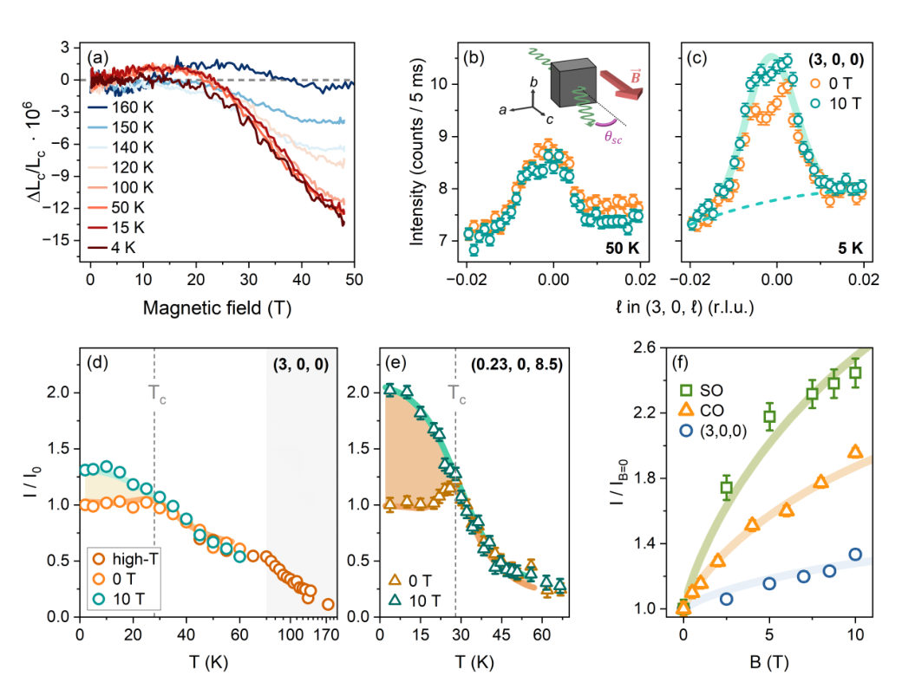
<figcaption class="paper-figure-caption"><b>Fig 2.</b> FIG. 2. Phase competition between monoclinic order and superconductivity. (a) Out-of-plane magnetostriction in stripe ordered La1.88Sr0.12CuO4. The c-axis lattice parameter change ∆c is plotted as ∆Lc/Lc = ∆c/c as a function of temperature and c-axis magnetic field. Upon cooling a gradually larger magnetostriction effect is observed in high magnetic fields (b)-(c) One-dimensional q-scans (ℓ-scan) through the (300) forbidden Bragg reflection as a function of magnetic field, for temperatures as indicated. Inset shows a sketch of the scattering geometry and sample environment. Incident beam and magnetic field are aligned along the crystallographic c-axis direction. This geometry yields a...</figcaption>
</figure>
<figure class="paper-figure-card">
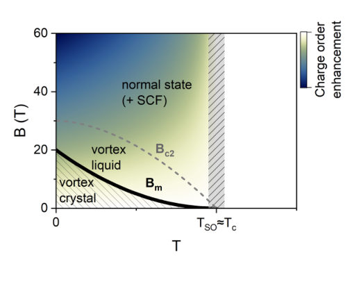
<figcaption class="paper-figure-caption"><b>Fig 3.</b> FIG. 3. Sketch of the charge order enhancement in the (T,B) phase diagram of La1.88Sr0.12CuO4. The enhance- ment is reported with a shaded color map. It increases linearly with field, and is present only below Tc [11, 27] Bm and Bc2 denote the vortex melting transition and upper critical field, respectively. While the value of Bm is precisely extracted from magnetotransport measurements [15], the value of Bc2 is reported with a dashed line to highlight that its value is not precisely measurable and might be just a crossover. The TSO ≈Tc line is drawn with a patterned rectangle to indicate that the two temperatures might not exactly coincide.</figcaption>
</figure>

**Summary.** This work uses high-field XFEL diffraction to probe the normal state of cuprate superconductors under extreme magnetic fields. The key finding is a linear enhancement of charge stripe order that persists even when superconductivity is suppressed, indicating a direct coupling between the field and the spin component of the stripe order. This challenges simple models based solely on superconducting phase competition.

**Why it may be interesting.** While focused on solid-state magnetism/superconductivity, the concept of field-induced quantum phase transitions and emergent order parameters in strongly correlated systems has parallels with understanding non-equilibrium dynamics in AMO or open quantum systems.

Detailed structure

**Main problem.** The study investigates how high magnetic fields couple directly to the stripe order within the complex normal state of cuprate superconductors.

**Main result.** A linear enhancement of charge order amplitude and correlation length is observed far above the vortex melting transition, suggesting a direct coupling mechanism independent of superconductivity suppression.

**Method.** The research combines X-ray Free Electron Laser (XFEL) diffraction with intense magnetic field pulses (up to 44 T), complemented by magnetostriction measurements.

**Model / system.** The system is the cuprate superconductor $	ext{La}_{2-x}	ext{Sr}_x	ext{CuO}_4$, which exhibits intertwined orders including charge stripes, spin order, and superconductivity. The analysis contrasts field effects with theoretical models of phase competition.

**Key observables.** Charge order (CO) amplitude and correlation length; magnetostriction ($\Delta c/c$); intensity of stripe order reflections in the $(h, k, 30.5)$ plane.

**Important parameters / regimes.** High magnetic fields (up to 44 T); temperatures above the vortex melting transition ($B_m$).

**Assumptions / limitations.** The linear field dependence observed is incompatible with standard phase competition models based on superconductivity suppression.

**Figures summary.** Figures show intensity measurements of charge order peaks vs. magnetic field, demonstrating a persistent linear increase in amplitude and correlation length above $B_m$.

**Paper structure.** The paper establishes the complex normal state physics by using high-field XFELs to probe stripe order, showing that the observed enhancement is a direct coupling mechanism rather than merely being an artifact of superconducting pair breaking.

Abstract

Superconductivity in cuprates emerges out of a complex normal state that hosts density waves, pseudogap physics, and strange metal properties. Here, we access this normal state by synchronizing free-electron laser x-rays with high-magnetic-field pulses up to 44 T. We observe a linear increase in charge order amplitude and correlation length that persists far above the vortex melting transition. This behavior is incompatible with standard phase competition between charge order and superconductivity. By means of conventional hard x-ray diffraction and magnetostriction, we show that applied fields also enhance monoclinic lattice distortions. However, this magnetoelastic response is weaker and an epiphenomenon of the stripe order enhancement. Combined with recent observations of field-linear spin freezing, our results point to a direct coupling between magnetic field and the spin component of stripe order in the high-field normal state -- a mechanism independent of superconductivity suppression that has so far remained hidden from scattering probes.

[↑ back to top](#top)

### [Performance analysis of classical adiabatic annealing on Ising machines](http://arxiv.org/abs/2606.07331v1)

**Authors:** Jacob Lamers, Guy Verschaffelt, Guy Van der Sande  
**Type:** theory · **Category:** disordered systems and neural networks · **PDF:** <https://arxiv.org/pdf/2606.07331v1>  
**Analysis basis:** full PDF text, analyzed in chunks
**Topic relevance:** `non-equilibrium dynamics` **2/5** · `non-equilibrium universality` **2/5** · `Keldysh / 2PI / non-Gaussian methods` **1/5** · `analog quantum simulation` **1/5** · `driven-dissipative phase transition` **1/5** · `methods for driven-dissipative` **1/5**

↔ Scroll figures horizontally

<figure class="paper-figure-card">
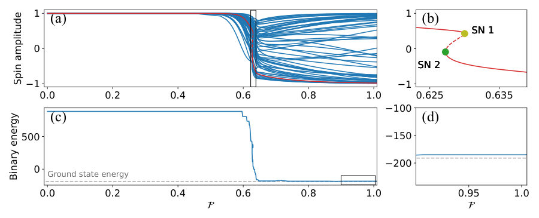
<figcaption class="paper-figure-caption"><b>Fig 1.</b> Fig. 1: Typical example of the evolution under classical adiabatic annealing. Continuation as the interpolation parameter F varies from zero to one of (a) the spin amplitudes of problem g05 60.3 for α = 0 and β = 0.25, (b) spin amplitude 6 in the black rectangle of (a), (c) the energy calculated using the target coupling matrix. (d) Zoom of the energy evolution in the black rectangle of (c). The energy of the ground state of the binary Hamiltonian is represented by the gray dashed line. Solid (dashed) lines are used when the spin amplitude is part of a stable (unstable) state. SN (green and yellow dots) saddle node bifurcation</figcaption>
</figure>
<figure class="paper-figure-card">
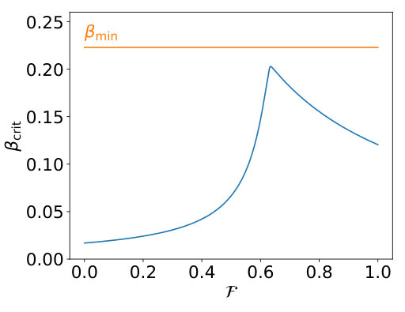
<figcaption class="paper-figure-caption"><b>Fig 2.</b> Fig. 3: Critical β values for problem g05 60.3. βcrit as a function of the interpolation parameter F for α = 0. βmin is defined by adding 0.02 to the maximum βcrit value over all F values and is indicated by the orange line.</figcaption>
</figure>
<figure class="paper-figure-card">
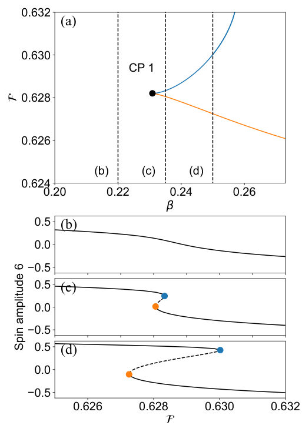
<figcaption class="paper-figure-caption"><b>Fig 3.</b> Fig. 2: Positions of the saddle node bifurcations for problem g05 60.3(a) The value of the interpolation parameter F of the two saddle node bifurcations (SNs) as a function of the coupling strength β. The Cusp point is indicated by a black dot, annotated with CP 1. (b)-(d) The evolution of spin amplitude 6, used as a proxy of the fixed point, as a function of F for three different fixed β values (0.22, 0.235 and 0.25). These β values are indicated by the black dashed lines in (a). The blue and orange dots represent the SNs. These results were obtained using a constant linear gain α = 0.</figcaption>
</figure>
<figure class="paper-figure-card">
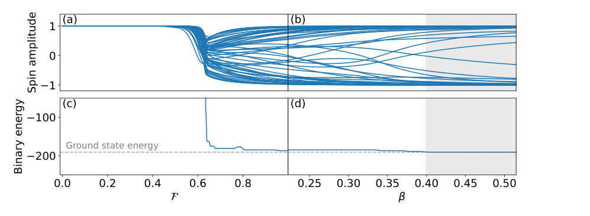
<figcaption class="paper-figure-caption"><b>Fig 4.</b> Fig. 4: Continuation of CAA using βmin followed by RA for problem g05 60.3 with α = 0.(a): evolution of all spin amplitudes as the interpolation parameter F is increased from zero to one for a fixed β = βmin = 0.222. (b) application of RA to the final state of panel (a). The energy calculated using the target coupling matrix for both (c) CAA and (d) RA. The energy of the ground state of the binary Hamiltonian is represented by the gray dashed line. The region where the fixed point corresponds to this ground state is indicated by the gray background.</figcaption>
</figure>
<figure class="paper-figure-card">
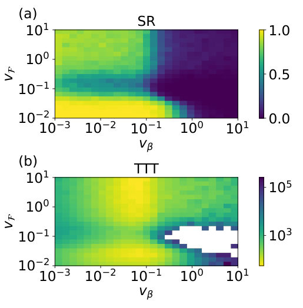
<figcaption class="paper-figure-caption"><b>Fig 5.</b> Fig. 5: Parameter scan of the hybrid CAA method for an adiabatic easy problem. (a) success rate (SR) and (b) time- to-target (TTT) as a function of the annealing speed vβ and the adiabatic annealing speed vF for problem g05 60.3, fixed linear gain α = −3.5 and noise strength γ = 0.1. A TTT of infinity is colored white.</figcaption>
</figure>

**Summary.** This work rigorously analyzes classical adiabatic annealing applied to Ising machines for solving hard combinatorial optimization problems. The authors propose and test a hybrid annealing strategy designed to navigate the system's energy landscape by avoiding mathematical singularities (bifurcations). Ultimately, they conclude that while theoretically motivated, this advanced technique offers only marginal practical gains over simpler, established simulation methods.

**Why it may be interesting.** Although focused on classical optimization, the underlying mathematical machinery—analyzing dynamical systems stability (bifurcations) during a controlled parameter sweep—is highly relevant to understanding non-equilibrium dynamics in complex quantum or classical many-body systems.

Detailed structure

**Main problem.** The paper analyzes the performance of classical adiabatic annealing (CAA) for solving combinatorial optimization problems mapped onto Ising machines.

**Main result.** While hybrid CAA shows marginal improvements over simpler techniques like Regular Annealing, its practical advantage diminishes when compared against enhanced baselines such as the spin sign method.

**Method.** The authors use continuation methods to analyze the fixed points of the system's evolution equation while gradually transforming the Ising Hamiltonian from an initial solvable state to the target problem Hamiltonian.

**Model / system.** The model is an Ising Machine (IM) whose dynamics are governed by a time-dependent Hamiltonian. The process involves adiabatically evolving the coupling matrix and external fields using an interpolation parameter F, which is analogous to quantum adiabatic annealing.

**Key observables.** Spin amplitudes ($s_i$), ground state energy, Time-to-Target (TTT), and Success Rate (SR).

**Important parameters / regimes.** Annealing parameters like the rate of change in $F$ ($v_F$) and $eta$ ($v_eta$), noise strength ($\gamma$), and the initial coupling strength ($eta_{start}$).

**Assumptions / limitations.** The analysis assumes that the system can follow the instantaneous fixed point during annealing, though this is challenged by saddle-node bifurcations (SNs) which necessitate a hybrid two-stage approach.

**Figures summary.** Figures illustrate the evolution of spin amplitudes and energy during CAA, showing how SNs limit direct adiabatic following. Later figures compare TTT across various annealing schedules (hybrid vs. regular) for MaxCut and Beasley instances.

**Paper structure.** The paper progresses by first introducing the theoretical framework of CAA on IMs, then detailing the necessary hybrid strategy to avoid bifurcations, followed by extensive benchmarking comparing this hybrid approach against simpler methods using metrics like TTT across various problem types.

Abstract

Ising machines are a promising approach to solve combinatorial optimization problems. They map these problems onto the Ising model and search for low-energy configurations. However, navigating the rugged energy landscapes of these systems remains difficult. To improve this navigation, classical adiabatic annealing has been proposed in the literature as a heuristic optimization method for classical Ising machines. Using this technique, the Hamiltonian of the Ising machine is gradually transformed from an easily solvable Hamiltonian to the target Hamiltonian. However, its purported effectiveness is primarily motivated by an analogy to quantum adiabatic annealing, and systematic benchmarking has remained limited.   In this work, we analyze the classical adiabatic annealing technique using continuation methods. Motivated by insights from this analysis, we propose an optimized annealing strategy we refer to as hybrid classical adiabatic annealing. We benchmark our proposed strategy using MaxCut instances with up to 800 spins and problems with external fields, for which it achieves a marginal improvement for a limited set of problems. We conclude that, although theoretically motivated and occasionally beneficial, the hybrid strategy does not offer a sufficient practical advantage over simpler, existing techniques.

[↑ back to top](#top)

### [Computational Superiority of Non-Markovian Kerr Feedback in Continuous-Variable Quantum Reservoir Computing](http://arxiv.org/abs/2606.06689v1)

**Authors:** Daniel Soh  
**Type:** theory · **Category:** quantum information and computing · **PDF:** <https://arxiv.org/pdf/2606.06689v1>  
**Analysis basis:** full PDF text, analyzed in chunks
**Topic relevance:** `quantum measurements` **2/5** · `Keldysh / 2PI / non-Gaussian methods` **1/5** · `correlated / nonlocal dissipation` **1/5** · `driven-dissipative phase transition` **1/5** · `methods for driven-dissipative` **1/5**

↔ Scroll figures horizontally

<figure class="paper-figure-card">
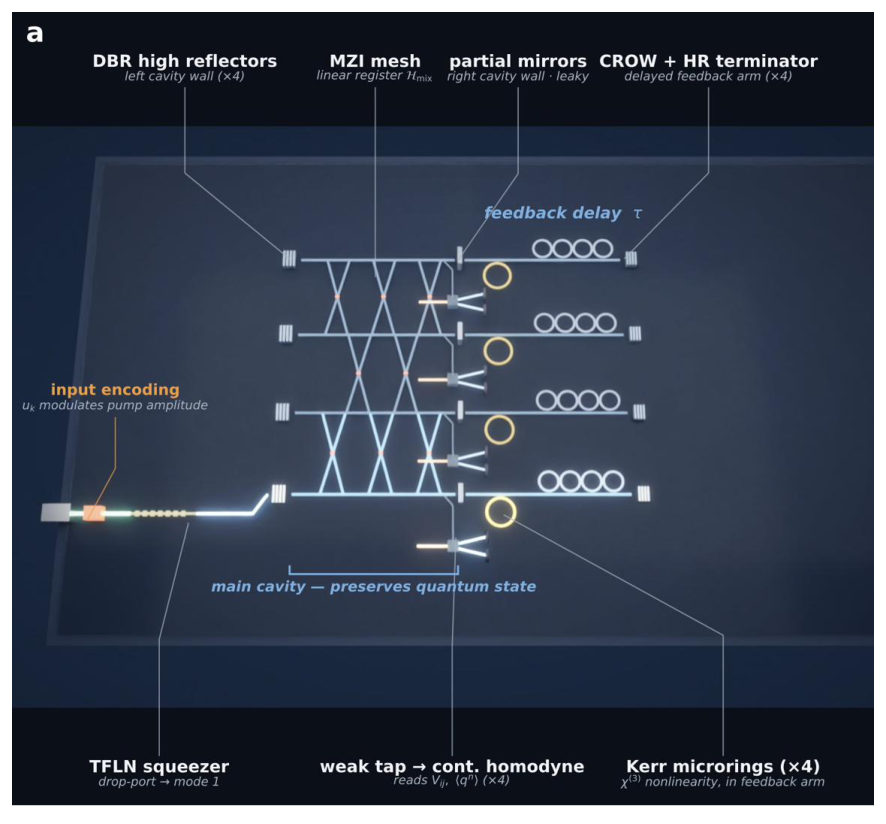
<figcaption class="paper-figure-caption"><b>Fig 1.</b> Figure 1: Integrated-photonic realization of the non-Markovian Kerr-feedback continuous-variable QRC. The classical input uk modulates the pump amplitude of a thin-film lithium niobate (TFLN) parametric squeezer, injecting an exponentially nonlinear single-mode Gaussian ancilla through the drop port into mode 1 (Hypothesis 1). The fixed linear Gaussian register is realized by an MZI mesh (Hmix) between DBR high reflectors forming the main cavity, which preserves the quantum state (contraction set by intrinsic loss, Hypothesis 2). A leaky right cavity wall (partial mirrors) couples each mode both to a weak homodyne tap—continuously reading the quadrature moments ⟨qn⟩that form the degree-d...</figcaption>
</figure>
<figure class="paper-figure-card">
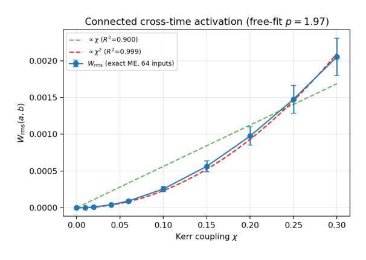
<figcaption class="paper-figure-caption"><b>Fig 2.</b> Figure 2: Connected cross-time witness Wrms versus Kerr coupling χ, reconstructed from the exact master equation (RMS over 64 input realizations). The witness vanishes at χ = 0 (Lemma 1) and activates with χ; the data follow a quadratic law (free-fit exponent p = 1.97, R2 = 0.999) rather than linear, consistent with dominance by the higher Kerr vertices (Appendix A).</figcaption>
</figure>
<figure class="paper-figure-card">
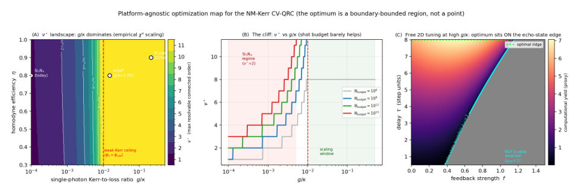
<figcaption class="paper-figure-caption"><b>Fig 3.</b> Figure 3: Platform-agnostic optimization map. (A) ν⋆over (g/κ, η): contours are nearly vertical, showing g/κ dominates and η is marginal; the dashed line is the weak-Kerr ceiling. (B) The cliff: ν⋆versus g/κ for several shot budgets—raising the budget barely helps. (C) The free 2D tuning at fixed high g/κ; the optimum sits on the echo-state contraction boundary, not in the interior, so the optimal operating region is boundary-bounded rather than a single point.</figcaption>
</figure>

**Summary.** This work proves that adding Kerr nonlinearity to a time-delayed quantum reservoir dramatically increases its computational power compared to purely linear Gaussian systems. The advantage is quantified by showing that the achievable cross-time correlation rank scales with feedback depth rather than mode count, establishing an unbounded resource separation in theory.

**Why it may be interesting.** It provides a rigorous theoretical framework for quantifying how nonlinearity fundamentally changes the computational capacity of quantum memory elements, moving beyond simple linear mappings into complex nonlinear feature extraction.

Detailed structure

**Main problem.** To determine the fundamental computational advantage of incorporating a nonlinear Kerr element into a time-delayed quantum reservoir compared to purely linear Gaussian reservoirs.

**Main result.** The inclusion of Kerr feedback allows the system to achieve cross-time nonlinear correlations whose rank scales with the feedback depth (D), providing an unbounded resource separation from any finite-mode linear reservoir.

**Method.** Theoretical analysis using cumulant expansions, Volterra series, and spectral kernel calculus to compare the reachable feature space ranks of both Gaussian ($\chi=0$) and Kerr ($\chi 
eq 0$) models.

**Model / system.** Continuous-Variable Quantum Reservoir Computing (QRC) implemented with a time-delayed feedback loop containing a $\chi^{(3)}$ Kerr element. The dynamics are analyzed using the master equation formalism for open quantum systems.

**Key observables.** Reachable cross-time nonlinear kernel rank, connected cumulants ($\kappa^{(3)}$), and the mixed second difference witness $W(a, b)$.

**Important parameters / regimes.** Kerr coupling strength ($\chi$), feedback depth ($D$), number of linear modes ($N$), and the Kerr-to-loss ratio ($g/\kappa$).

**Assumptions / limitations.** The analysis often assumes specific spectral properties (e.g., distinct eigenvalues) or operates in weak-coupling regimes where perturbative expansions are valid.

**Figures summary.** Figures confirm that a structural witness of nonlinearity is zero for the Gaussian baseline ($\chi=0$) but non-zero and quadratic in $\chi$ when Kerr feedback is active, though operational advantage in weak coupling was not found.

**Paper structure.** The paper builds from establishing the limitations of linear systems to proving an unbounded resource separation via kernel rank analysis. It contrasts structural theorems (existence) with empirical tests (task performance), concluding that while structurally superior, the operational gain is limited by noise/readout depth in weak regimes.

Abstract

A linear optical medium can delay, mix, and superpose light, but never make two pulses multiply: multiplication is nonlinear, and a linear system has no such operation. This roots a sharp limit on continuous-variable quantum reservoir computers (QRCs) built from Gaussian optics. Within the reservoir they cannot form genuine products of the input at different past times, the cross-time nonlinear correlations many temporal computations require; they can only fake them by storing each past input separately and multiplying in the readout, forcing an exponentially harder high-order measurement. We show that a single Kerr (intensity-dependent phase) element in a time-delayed feedback loop removes this limit. The Kerr effect makes phase depend on intensity, a true multiplication inside the medium; feedback makes the light revisit that element repeatedly, so one mode mixes its own history against itself once per round-trip. Feedback turns time into space: D passes through one nonlinear mode replace D parallel linear modes. We prove an unbounded resource separation (Theorem 3, Corollary 2): an N-mode Gaussian reservoir reaches cross-time nonlinear rank at most 2N, a hardware ceiling, while a single Kerr mode reaches rank equal to its feedback depth D, costing no extra modes. For every N, one Kerr mode performs a computation no N-mode linear reservoir can. Loss is the counterintuitive ingredient: each round-trip dims the light, so the nonlinear phase differs pass to pass, giving every echo its own fingerprint; without loss the passes would be redundant. We confirm activation on an exact open-system simulation and ground the separation in nonlinear channel equalization. Achievable D is 30 to 230 on integrated platforms, so one nonlinear mode replaces up to about 100 linear ones, at the price of measurement time.

[↑ back to top](#top)

### [Frequency Detuning and Interference-Induced Bohmian Chaos in a Two-Dimensional Anisotropic Harmonic Oscillator](http://arxiv.org/abs/2606.07011v1)

**Authors:** Umair Abdul Halim, Nurisya Mohd Shah, Chan Kar Tim, Ahmad Hazazi Ahmad Sumadi  
**Type:** theory · **Category:** other · **PDF:** <https://arxiv.org/pdf/2606.07011v1>  
**Analysis basis:** full PDF text, analyzed in chunks
**Topic relevance:** `non-equilibrium dynamics` **2/5** · `driven-dissipative phase transition` **1/5** · `interference shaping light` **1/5** · `non-equilibrium universality` **1/5**

↔ Scroll figures horizontally

<figure class="paper-figure-card">
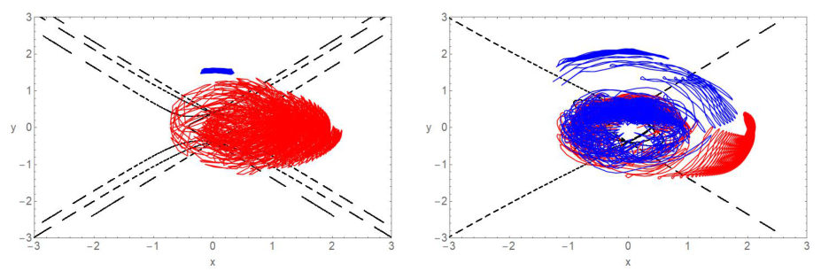
<figcaption class="paper-figure-caption"><b>Fig 1.</b> Figure 1: Comparison of Bohmian trajectories for two frequency ratios. (a) For ωx : ωy = 1:5, regular and irregular trajectories coexist, with irregular motion mainly in the lateral regions. (b) For ωx : ωy = 4:5, a broader set of trajectories is drawn into the central interference region and becomes irregular.</figcaption>
</figure>
<figure class="paper-figure-card">
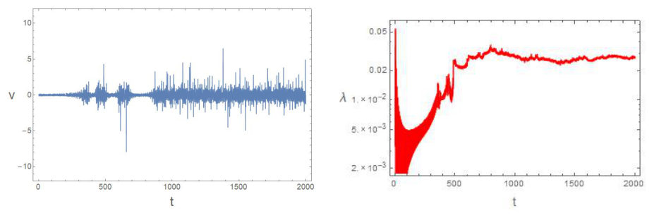
<figcaption class="paper-figure-caption"><b>Fig 2.</b> Figure 2: (a) Velocity evolution for the ωx : ωy = 1:5 case with (x0, y0) = (2.0, 0.0), showing fluctuations as the trajectory enters the central interference region. (b) The corresponding finite-time Lyapunov exponent λ(t), which becomes positive after the transient phase, indicating chaotic Bohmian motion.</figcaption>
</figure>
<figure class="paper-figure-card">
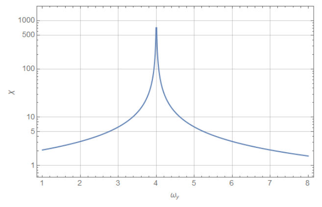
<figcaption class="paper-figure-caption"><b>Fig 3.</b> Figure 3: Coherence parameter χ versus ωy for fixed ωx = 4, shown on a logarithmic scale. The divergence near ωy = ωx indicates vanishing detuning and enhanced phase coherence; the singular point is excluded.</figcaption>
</figure>
<figure class="paper-figure-card">
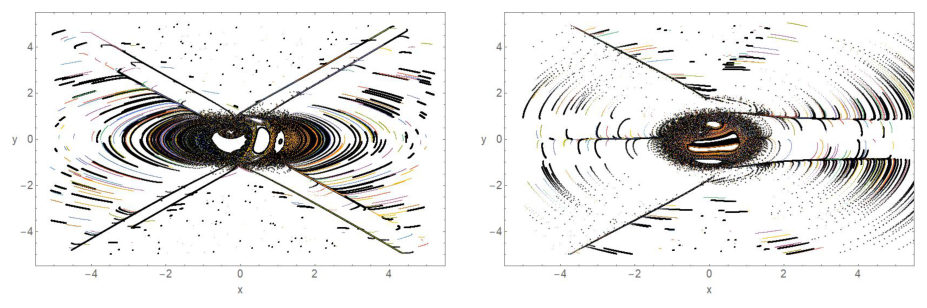
<figcaption class="paper-figure-caption"><b>Fig 4.</b> Figure 4: Poincar´e sections for two frequency ratios. (a) For ωx : ωy = 1:5, regular motion dominates, with irregularity mainly near lateral channels. (b) For ωx : ωy = 4:5, the irregular region expands and more trajectories approach the central interference region.</figcaption>
</figure>
<figure class="paper-figure-card">
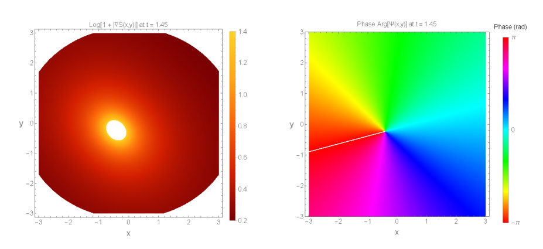
<figcaption class="paper-figure-caption"><b>Fig 5.</b> Figure 5: Spatial phase-gradient magnitude and phase structure at a representative time. (a) log(1 + |∇S|) highlights high-gradient regions driving strong Bohmian velocities. (b) The phase field S(x, y) = arg Ψ(x, y) shows phase variation modulo 2π, with abrupt transitions marking branch cuts.</figcaption>
</figure>

**Summary.** This paper explores how quantum interference dictates the onset and spatial extent of chaotic motion in a 2D anisotropic harmonic oscillator using Bohmian mechanics. The key finding is that the ratio between the interference beating time and the particle's transport time ($\chi$) acts as a diagnostic: slow beating leads to extended chaos, while rapid decorrelation confines it locally.

**Why it may be interesting.** This work provides an interference-based mechanism for quantum chaos in a simple Hamiltonian system, linking macroscopic transport properties (chaos) directly to microscopic phase coherence dynamics, which is highly relevant for understanding non-equilibrium quantum dynamics.

Detailed structure

**Main problem.** The study investigates how chaotic Bohmian trajectories emerge in a quantum system due to interference effects, rather than external randomness.

**Main result.** Chaotic transport transitions from localized to spatially extended regimes based on the temporal coherence of the interference-induced phase field. This coherence is quantified by a dimensionless parameter comparing beating time scales to transport times.

**Method.** The analysis uses Bohmian mechanics, deriving particle velocity from the wavefunction's phase gradient ($
abla S$), and employs Poincaré sections and Lyapunov exponents to characterize chaotic regions.

**Model / system.** The system is a two-dimensional anisotropic harmonic oscillator subjected to a three-mode superposition of its ground and first excited states. The dynamics are governed by Bohmian equations derived from the quantum wavefunction's phase structure.

**Key observables.** Bohmian velocity field ($\dot{\mathbf{r}} \propto 
abla S$), Lyapunov exponents, Poincaré sections, and the interference-induced phase structure.

**Important parameters / regimes.** The dimensionless coherence parameter $\chi = T_b / T_{tr}$, which compares the beating time scale ($T_b$) to the characteristic transport time ($T_{tr}$). The frequency ratio ($\omega_x : \omega_y$) controls this parameter.

**Assumptions / limitations.** The Bohmian velocity is assumed finite and sampled away from exact nodes of the wavefunction. The coherence parameter $\chi$ is proposed as a diagnostic for chaos in this specific model.

**Figures summary.** Figures compare trajectories and Poincaré sections for strongly detuned vs. near-resonant cases, showing that slow beating (large $\chi$) leads to broader, sustained irregular dynamics compared to localized fluctuations seen under strong detuning (small $\chi$).

**Paper structure.** The paper establishes the theoretical framework using Bohmian mechanics in a multi-mode oscillator, introduces the coherence parameter $\chi$ as the key diagnostic, and then analyzes specific frequency ratios ($\omega_x : \omega_y$) to demonstrate how $\chi$ dictates the spatial extent of chaos.

Abstract

We investigate the emergence of chaotic Bohmian trajectories in a three-mode superposition of the ground and first excited states of a two-dimensional anisotropic harmonic oscillator. The analysis focuses on the interference-induced phase structure of the wavefunction, which determines the Bohmian velocity field through its phase gradient. We show that the spatial extent of chaotic motion is controlled by the temporal coherence of the interference pattern, set by the detuning between oscillator modes. Near resonance, slow beating generates long-lived phase-gradient structures that repeatedly stretch and fold nearby trajectories, leading to more spatially extended chaotic regions. In contrast, strong detuning produces rapid temporal decorrelation of the phase field and confines chaotic dynamics to localized regions of configuration space. To quantify this behavior, we use a dimensionless coherence parameter comparing the beating time scale with a characteristic transport time. The results identify temporal coherence of the interference-induced phase field as a useful diagnostic for chaotic transport in low-dimensional Bohmian systems.

[↑ back to top](#top)

### [Quantum correlations in QBism's reconstruction program](http://arxiv.org/abs/2606.07485v1)

**Authors:** Sachin Gupta, Jacques Pienaar  
**Type:** theory · **Category:** other · **PDF:** <https://arxiv.org/pdf/2606.07485v1>  
**Analysis basis:** full PDF text, analyzed in chunks
**Topic relevance:** `entanglement & information structure` **2/5** · `quantum measurements` **2/5** · `measurement-induced transitions` **1/5**

↔ Scroll figures horizontally

<figure class="paper-figure-card">
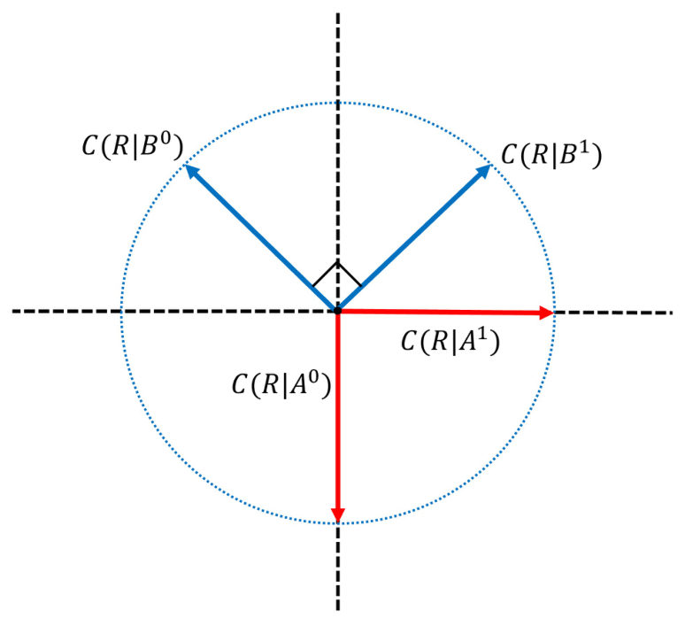
<figcaption class="paper-figure-caption"><b>Fig 1.</b> FIG. 1: This illustrates one geometric configuration of the centered vectors that maximizes the</figcaption>
</figure>
<figure class="paper-figure-card">
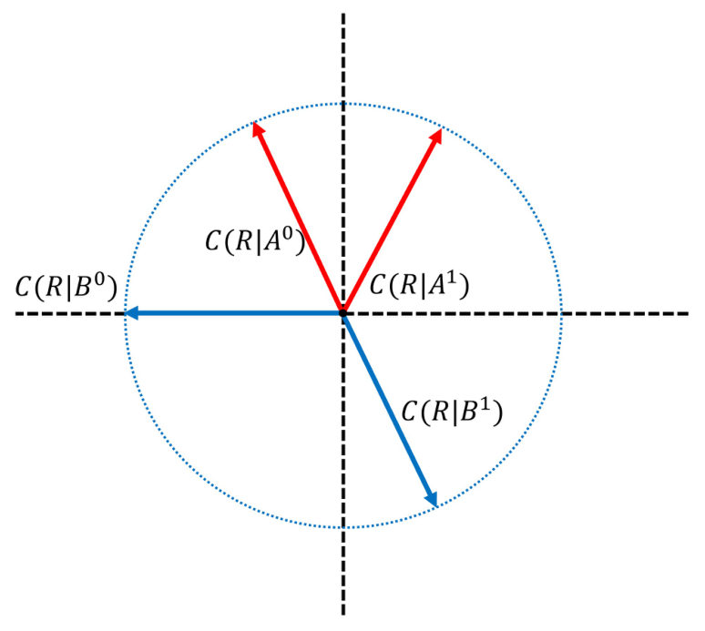
<figcaption class="paper-figure-caption"><b>Fig 2.</b> FIG. 2: One geometric configuration of the centered correlation vectors maximizing the I2233</figcaption>
</figure>

**Summary.** This paper explores bipartite correlations using qplex theories, a probabilistic framework inspired by QBism. By mapping joint expectations onto inner products of C-vectors, the authors show that while this geometry correctly predicts the Tsirelson bound for two outcomes (CHSH), it fails to constrain three-outcome tests (CGLMP), suggesting that additional principles are needed to fully reconstruct quantum theory.

**Why it may be interesting.** It provides a novel, non-Hilbert space geometric approach to understanding the fundamental constraints on correlations, which is relevant for foundational work in quantum information theory.

Detailed structure

**Main problem.** The paper investigates bipartite quantum correlations within a geometric framework called qplex theories, which are probabilistic models inspired by QBism.

**Main result.** Qplex geometry successfully reproduces the Tsirelson bound for two-outcome Bell tests (CHSH) but fails to constrain three-outcome inequalities (CGLMP), allowing for superquantum correlations.

**Method.** The authors use a geometric formulation, expressing joint expectation values as inner products between specially defined C-vectors, and study Bell inequalities as optimization problems over these qplex-compatible assignments.

**Model / system.** The model is bipartite quantum correlation testing using generalized probability structures (qplexes) derived from QBist principles, rather than standard Hilbert space formalism. The analysis covers two-outcome (CHSH) and three-outcome (CGLMP) scenarios.

**Key observables.** CHSH quantity ($I_{2222}$), CGLMP inequality ($I_{2233}$), and the inner product $\langle C(\mathbf{R}|A\alpha), C(\mathbf{R}|Beta) 
angle$.

**Important parameters / regimes.** The Tsirelson bound ($2\sqrt{2}$) and the algebraic maximum of 4 for $I_{2233}$.

**Assumptions / limitations.** The analysis assumes repeatable measurements and utilizes the inner-product structure derived from qplex constraints, which are shown to be insufficient alone.

**Figures summary.** Figure 1 illustrates optimal geometry for CHSH with orthogonal vectors; Figure 2 shows a configuration maximizing $I_{2233}$ where Bob's vectors are separated by $4\pi/3$.

**Paper structure.** The paper establishes the qplex framework, derives joint expectation values as inner products of C-vectors, and then applies optimization techniques to test CHSH (two outcomes) and CGLMP (three outcomes), culminating in a comparison between derived bounds and quantum limits.

Abstract

QBism recasts quantum theory as a normative framework for an agent's probability assignments, with the Born rule taking the form of a consistency condition known as the Urgleichung. Motivated by this perspective, qplex theories provide a broader class of probabilistic models in which the sets of valid states and measurements are constrained by QBist-inspired geometric conditions. While qplexes have been extensively studied for single systems, their implications for bipartite correlations remain largely unexplored. In this work, we investigate bipartite correlations in qplex theories by expressing joint expectation values as inner products between suitably defined $C$-vectors. This geometric formulation allows Bell-type inequalities to be studied as optimization problems over qplex-compatible probability assignments. We first analyze the CHSH scenario and show that the shared inner-product structure of the $C$-vectors restricts the maximal value to the Tsirelson bound $2\sqrt{2}$. We then turn to the three-outcome CGLMP inequality $I_{2233}$ and find that the same qplex-derived norm and inner-product constraints allow the algebraic maximum of 4, thereby exhibiting superquantum correlations. These results show that qplex geometry captures enough structure to reproduce an important quantum bound in the two-outcome case, but not enough to recover the full set of quantum correlation constraints. The analysis therefore suggests that additional principles are needed to complete the QBist reconstruction of quantum theory.

[↑ back to top](#top)

### [Unified Framework for Functional Theories of Quantum Systems](http://arxiv.org/abs/2606.06676v1)

**Authors:** Chih-Chun Wang, Julia Liebert, Markus Penz, Christian Schilling  
**Type:** theory · **Category:** strongly correlated electrons · **PDF:** <https://arxiv.org/pdf/2606.06676v1>  
**Analysis basis:** full PDF text, analyzed in chunks
**Topic relevance:** `analog quantum simulation` **2/5** · `Keldysh / 2PI / non-Gaussian methods` **1/5** · `driven-dissipative phase transition` **1/5** · `entanglement & information structure` **1/5**

↔ Scroll figures horizontally

<figure class="paper-figure-card">
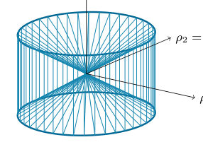
<figcaption class="paper-figure-caption"><b>Fig 1.</b> Figure 1. The set Bp from the double qubit example consists of two Bloch spheres in (ρ1, ρ2, ρ3) at ρ4 = ±1 and all convex combinations between two points from each sphere. Leaving out the coordinate ρ3 in this illustration makes the spheres appear as circles on the top and bottom. Setting ρ3 = 0, the resulting shape is a cylinder from which two cones are removed at the top and bottom. Its convex hull, the set Be, is then the full cylinder.</figcaption>
</figure>
<figure class="paper-figure-card">
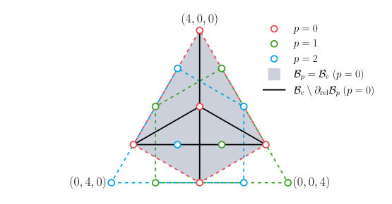
<figcaption class="paper-figure-caption"><b>Fig 2.</b> Figure 2. The pure-state and ensemble observable ranges Bp = Be of the one-dimensional bosonic momentum-functional theory for lattice size L = 3, particle number N = 4, and total momentum p = 0, 1, 2. For p = 0, Bp = Be is colored in gray, and the set of critical values Bc excluding the relative boundary is indicated in black.</figcaption>
</figure>
<figure class="paper-figure-card">
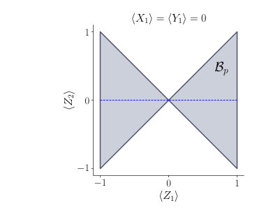
<figcaption class="paper-figure-caption"><b>Fig 3.</b> Figure 3. The pure-state constrained search is performed along the blue dashed line lying in the pure-state observable range Bp. In the figure, we only show the slice of Bp on which ⟨X1⟩and ⟨Y1⟩vanish.</figcaption>
</figure>
<figure class="paper-figure-card">
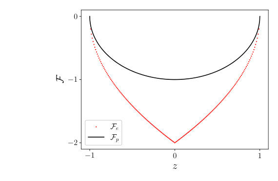
<figcaption class="paper-figure-caption"><b>Fig 4.</b> Figure 4. Values of the pure-state constrained-search functional Fp and the ensemble constrained-search functional Fe at densities ρ = (0, 0, z, 0), with z ∈(−1, 0) ∪(0, 1) (see Fig. 3).</figcaption>
</figure>

**Summary.** This paper introduces a unified mathematical framework for functional theories of quantum many-body systems by reformulating the problem using reduced variables derived from basic observables. It systematically analyzes the relationship between pure-state and ensemble-state descriptions ($	ext{B}_p$ vs $	ext{B}_e$) across various models, providing powerful structural theorems applicable to strongly correlated electron systems.

**Why it may be interesting.** It provides a highly abstract yet powerful mathematical machinery that unifies several advanced concepts in condensed matter theory, such as DFT, RDMFT, and geometric constraints, which is crucial for understanding strongly correlated materials.

Detailed structure

**Main problem.** To develop a unified mathematical framework for density-functional theory (DFT) and its variants for quantum systems on finite-dimensional Hilbert spaces.

**Main result.** The work establishes that the structural properties of functional theories can be proven systematically once, applicable across a broad class of finite-dimensional models defined by their 'scope.'

**Method.** The framework uses reduced variables (expectation values of basic observables) to replace the full quantum state description, employing tools from functional analysis and symplectic geometry.

**Model / system.** The theory applies to general quantum systems, including lattice fermions (Hubbard model), spin systems (qubits), and bosons on periodic lattices. The scope is defined by a set of basic observables and a fixed Hamiltonian part.

**Key observables.** Reduced variables ($\mu$), ground-state energy functional $E(v)$, pure-state observable range ($	ext{B}_p$), and ensemble-state observable range ($	ext{B}_e$).

**Important parameters / regimes.** The dimension of the parameter space ($m=\dim V$) and the nature of interactions (e.g., repulsive vs. attractive $U$ in dimer models).

**Assumptions / limitations.** The framework is most rigorous in the finite-dimensional setting, allowing for systematic mathematical proofs regarding representability.

**Figures summary.** Figures illustrate the geometric relationship between $	ext{B}_p$ (e.g., two spheres) and $	ext{B}_e$ (the convex hull filling the gaps) for specific models like the double qubit.

**Paper structure.** The paper builds from defining the general scope $S=(V, H, \iota, H_0)$ to analyzing the geometric properties of observable ranges ($	ext{B}_p$ vs $	ext{B}_e$), and finally applying these structural results to specific physical examples like lattice fermions.

Abstract

We introduce and study a unified framework for density-functional theory and its variants for quantum systems on finite-dimensional Hilbert spaces. These theories seek to reduce the complexity inherent in the many-body quantum problem by describing ground states through reduced variables. The central ingredients of our unified framework are a generalized choice of basic observables, whose expectation values define precisely those reduced variables, and a fixed part of the Hamiltonian characterizing the class of quantum systems under consideration. It is this minimal structure, which we call the scope of a functional theory, that is necessary and sufficient for the formulation of a functional theory. In particular, it allows one to define the universal functionals, establish their convexity and differentiability properties, address representability questions, and prove a Hohenberg-Kohn-type uniqueness result. A purification construction also relates ensemble and weighted-ensemble functionals to the pure-state variant. Particular emphasis is placed on functional theories with Lie-algebra observable structures, connecting the variational framework to symplectic geometry. The result of this work is a systematic mathematical formulation in which structural results can be proved once and applied across a broad class of finite-dimensional functional theories.

[↑ back to top](#top)

### [Bootstrap bounds for Quantum Spin Systems using String Operators](http://arxiv.org/abs/2606.06584v1)

**Authors:** Nisarg Chadha, Michael G. Scheer, Eslam Khalaf  
**Type:** theory · **Category:** strongly correlated electrons · **PDF:** <https://arxiv.org/pdf/2606.06584v1>  
**Analysis basis:** full PDF text, analyzed in chunks
**Topic relevance:** `analog quantum simulation` **2/5** · `entanglement & information structure` **1/5** · `exotic spin models in light-matter` **1/5**

↔ Scroll figures horizontally

<figure class="paper-figure-card">
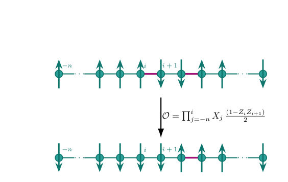
<figcaption class="paper-figure-caption"><b>Fig 1.</b> FIG. 1. Schematic showing a particular arrangement of spins which has a domain wall across the bond between i and i + 1. The action of O on this state removes the domain wall at i, and produces a state with lower energy for the Ising Hamiltonian when g = 0.</figcaption>
</figure>
<figure class="paper-figure-card">
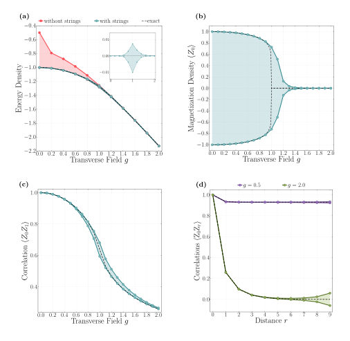
<figcaption class="paper-figure-caption"><b>Fig 2.</b> FIG. 2. Bootstrap bounds for the 1D TFIM in the thermody- namic limit using string operators. (a) Bounds on the energy density as a function of transverse field, with and without strings. The corresponding operator sets are chosen to be of the same size for a fair comparison. The inset shows the rela- tive difference of the upper and lower bounds with respect to the exact energy density. (b) Bounds on the magnetization density as a function of transverse field. The bounds are sym- metric about the origin due to the Z2 symmetry. (c) Bounds on the ⟨Z0Z1⟩correlations as a function of transverse field. (d) Bounds on the long-range correlation ⟨Z0Zr⟩as a func- tion of distance r. Tight bounds...</figcaption>
</figure>
<figure class="paper-figure-card">
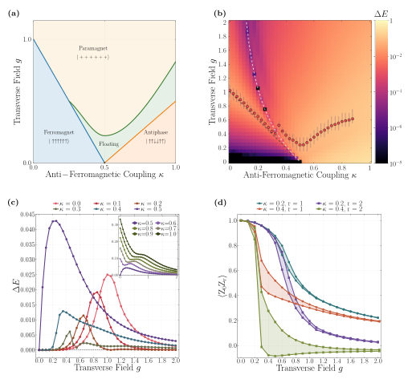
<figcaption class="paper-figure-caption"><b>Fig 3.</b> FIG. 3. (a) Schematic phase diagram of the 1D ANNNI. (b) Uncertainty (difference between upper bound and lower bound) in energy density in the g −κ plane. The dots rep- resent the peaks extracted from ∆E −g cuts at different κ. The dashed line shows the Peschel-Emery disorder line where the Hamiltonian becomes frustration-free. (c) ∆E −g cuts at different κ ≤0.5. The inset shows the corresponding cuts for κ ≥0.5 (d) Bounds on the correlation function ⟨Z0Zr⟩as a function of transverse field at two values of κ. The κ = 0.2 line passes through the FM-PM boundary, whereas the κ = 0.4 profile also goes through the floating phase.</figcaption>
</figure>
<figure class="paper-figure-card">
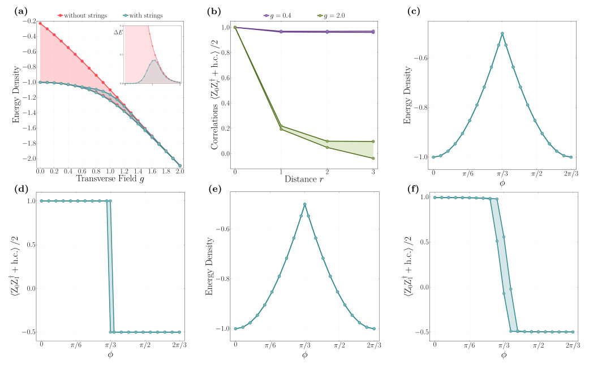
<figcaption class="paper-figure-caption"><b>Fig 4.</b> FIG. 4. Bootstrap bounds for the 1D CC3 in the thermodynamic limit using the string operators. (a) Bounds on the energy density as a function of transverse field, with and without strings. The corresponding operator sets are chosen to be of the same size for a fair comparison. The inset shows the difference between the upper and lower bounds versus the transverse field. (b) Bounds on the correlation functions ⟨Z0Z† r + Z† 0Zr⟩/2 as a function of distance for g = 0.4 and g = 2.0. (c) and (d) Bounds on the energy density and the nearest neighbor correlation g(1) as a function of ϕ for g = 0. The bounds for energy density in (c) are exact up to floating point precision and hence lie on top of...</figcaption>
</figure>

**Summary.** This paper advances the many-body bootstrap method by introducing non-local 'string' operators to improve bounds on ground-state observables in quantum spin systems. By applying this technique to models like the TFIM and ANNNI, the authors demonstrate that these extended constraints can accurately map out phase boundaries and resolve issues related to domain-wall excitations in symmetry-broken phases.

**Why it may be interesting.** The development of methods that rigorously constrain ground state properties using extended, non-local operators is highly valuable for understanding quantum phase transitions in strongly correlated magnetic materials where simple local descriptions fail.

Detailed structure

**Main problem.** The primary goal is obtaining rigorous, tight bounds on ground-state observables for quantum spin systems in the thermodynamic limit.

**Main result.** By incorporating non-local, string-like operators into the bootstrap method, the authors significantly tighten existing bounds, especially in spontaneously symmetry-breaking (SSB) phases.

**Method.** They employ the many-body bootstrap technique, formulating it as a Semidefinite Program (SDP), and crucially extend the operator set with non-local 'string' operators to handle domain-wall excitations.

**Model / system.** The work applies to 1D quantum spin systems, including the transverse-field Ising model (TFIM), the axial next-nearest-neighbor Ising model (ANNNI), and the Z3 chiral clock model. The Hamiltonians describe various magnetic ordering phases.

**Key observables.** Ground-state observables, energy density ($\Delta E$), magnetization density, and correlation functions ($\langle Z_0 Z_r 
angle$).

**Important parameters / regimes.** The transverse field strength ($g$), the next-nearest-neighbor coupling ($\kappa$), and the symmetry parameter ($\phi$) are key tuning parameters used to map out phase diagrams.

**Assumptions / limitations.** The method assumes that incorporating string operators allows for a formulation directly in the thermodynamic limit, overcoming limitations of local operator sets in SSB phases.

**Figures summary.** Figures illustrate the tightening of bootstrap bounds (e.g., energy density vs. parameters) when comparing results from local versus string-operator constrained SDPs across different models like TFIM and ANNNI.

**Paper structure.** The paper first establishes the limitations of local operators in SSB phases, then introduces non-local string operators to formulate the bootstrap in the thermodynamic limit. It applies this construction sequentially to 1D TFIM, then ANNNI, and finally generalizes it to the Z3 chiral clock model.

Abstract

Bootstrap is a numerical many-body method that provides rigorous bounds on ground-state observables by imposing a set of necessary constraints on the expectation values of operators. The quality of the resulting bounds is sensitive to the choice of operators entering the constraints. In particular, bounds on ground-state correlations are often loose in spontaneous symmetry-breaking (SSB) phases, since local operator sets cannot exclude domain-wall excitations. In this work, we introduce non-local, string-like operators into the bootstrap and show that the program can be formulated directly in thermodynamic limit. We then apply our construction to several 1D spin models. First, we obtain a significant tightening of the bounds in the SSB phase of the 1D transverse-field Ising model. Using the 1D axial next-nearest-neighbor Ising model, we further show that this tightening allows for a quantitative estimate of the locations of phase boundaries. Finally, we generalize the string operators to the 1D $\mathbb{Z}_3$ chiral clock model and track the behavior of the bounds across the phase diagram. Our results broaden the class of constraints available to the bootstrap and open a route toward bootstrapping more general symmetry-broken and topological phases, where the relevant constraints may involve non-local or extended operators.

[↑ back to top](#top)

### [Scalable Quantum Algorithms for Gutzwiller Projection](http://arxiv.org/abs/2606.06919v1)

**Authors:** Byungmin Kang, Hyunwoong Kwon, Vito W. Scarola, Kwon Park  
**Type:** theory · **Category:** strongly correlated electrons · **PDF:** <https://arxiv.org/pdf/2606.06919v1>  
**Analysis basis:** full PDF text, analyzed in chunks
**Topic relevance:** `quantum measurements` **2/5** · `analog quantum simulation` **1/5** · `measurement-induced transitions` **1/5**

↔ Scroll figures horizontally

<figure class="paper-figure-card">
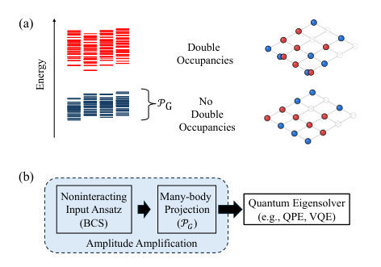
<figcaption class="paper-figure-caption"><b>Fig 1.</b> FIG. 1. Many-body Hilbert space and workflow schematics (a) A schematic of the energy spectra expected from a strongly repulsive lattice model where the lower en- ergy manifold has no double occupancies (blue dashes) and the high energy states have at least one double occupancy (red dashes). The lattice schematics contain Ns = 16 sites. Four states are possible at each site: empty (a hole), a spin up fermion (red sphere), a spin down fermion (blue sphere), and doubly occupied. 4Ns basis configurations superpose to de- fine many-body eigenstates. Gutzwiller projection excludes doubly occupied basis configurations. (b) Schematic work- flow showing a quantum algorithm with an input BCS state...</figcaption>
</figure>
<figure class="paper-figure-card">
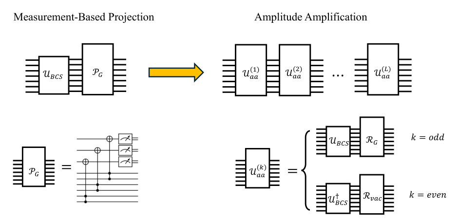
<figcaption class="paper-figure-caption"><b>Fig 2.</b> FIG. 2. Overall structure of the amplitude amplification algorithm for the Gutzwiller projection. The measurement-based projection algorithm measures double occupancy at every site and postselects the outcome with no double occupancy. UBCS is the unitary operator that creates the BCS state from the vacuum or the null state |0⟩= |0⟩⊗N. PG imple- ments the Gutzwiller projection by measuring double occupancy at every site using CCNOT gates. The amplitude amplification algorithm replaces PG with a series of unitary operations U(k) aa with k = 1, · · · , L, where L is determined by two factors: (i) the probability weight of the RVB state within the BCS state, W, and (ii) the desired tolerance,...</figcaption>
</figure>
<figure class="paper-figure-card">
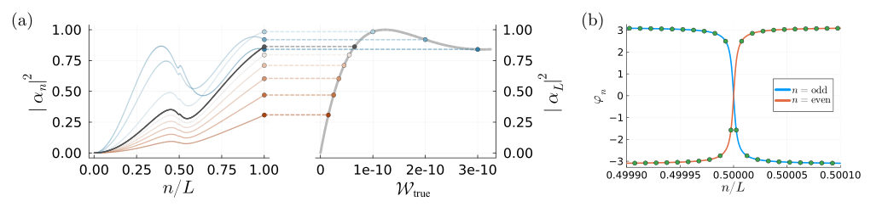
<figcaption class="paper-figure-caption"><b>Fig 3.</b> FIG. 3. Demonstration of the amplitude amplification algorithm. (a) Evolution of the success probability |αn|2 as a function of n/L with L = 200001, starting from the initial value, W = 6.5 × 10−11, to the targeting value, 1 −δ2 with δ = 0.4, which is illustrated by the dark curve. In the actual implementation of the amplitude amplification algorithm, W is not known precisely beforehand and must be estimated. Consequently, its true value, Wtrue, might differ from the estimated one. The light red and blue curves illustrate how |αn|2 would evolve if Wtrue were below or above the estimated value, W = 6.5 × 10−11, respectively. On the right side of the figure, the final success probability...</figcaption>
</figure>
<figure class="paper-figure-card">
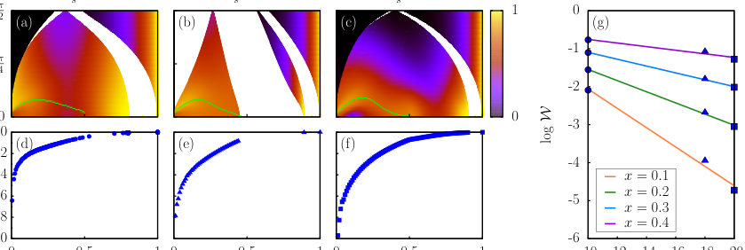
<figcaption class="paper-figure-caption"><b>Fig 4.</b> FIG. 4. Probability weight of the RVB state within the BCS state. Panels (a), (b), and (c) show the phase diagram of the overlap between the RVB state and the exact ground state of the t-J model as a function of pairing amplitude ∆and hole doping concentration x for finite-size systems with Ns = 10, 18, and 20, respectively. Note that Ns represents the number of sites in finite-size systems. To cover the full range of pairing amplitude from zero to infinity, the y-axis of Panels (a), (b), and (c) is scaled as tan−1(∆/t). The color bar on the right shows the overlap scale, with bright yellow indicating unity and black indicating zero. Green curves trace the maximum overlap as a function of x...</figcaption>
</figure>
<figure class="paper-figure-card">
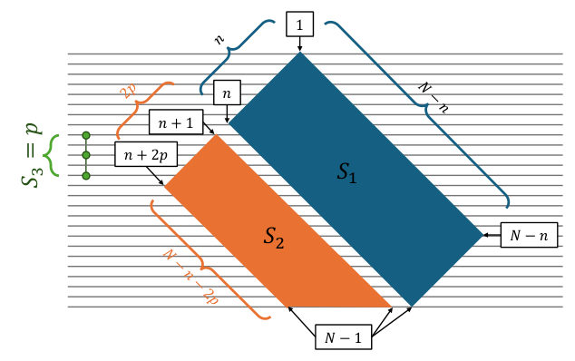
<figcaption class="paper-figure-caption"><b>Fig 5.</b> FIG. 5. Schematic diagram of the Bloch-Messiah decomposition generating the full BCS state. Horizontal lines represent individual qubits. Numbers inside the boxes indicate the qubit index, while numbers outside the curly brackets indicate the number of qubits within the enclosed length.</figcaption>
</figure>

**Summary.** The paper presents scalable quantum algorithms to prepare the Gutzwiller-projected BCS state, which serves as an essential input for simulating strongly correlated electron models like the $t$-$J$ model. By employing Amplitude Amplification (AAGP), the required computational resources scale quadratically better than previous measurement-based techniques. This breakthrough moves projected state preparation from a theoretical hurdle to a potentially deployable protocol for quantum simulation.

**Why it may be interesting.** This work is highly relevant as it develops a concrete quantum computational primitive—scalable state preparation—essential for simulating complex many-body phenomena in condensed matter physics that are intractable classically.

Detailed structure

**Main problem.** The core challenge is preparing physically accurate input states for quantum simulation of strongly correlated lattice models, specifically due to the non-trivial Gutzwiller projection.

**Main result.** The proposed Amplitude Amplification for Gutzwiller Projection (AAGP) algorithm achieves a quadratic speedup in required projection queries compared to measurement-based methods. This makes state preparation practically feasible at relevant finite system sizes.

**Method.** The authors develop and analyze the AAGP quantum circuit, which uses amplitude amplification techniques derived from Grover's search structure to estimate the overlap between the desired Resonating Valence Bond (RVB) state and the initial BCS ansatz. The full BCS state itself is constructed using Givens rotations applied after diagonalizing a Bogoliubov-de Gennes Hamiltonian.

**Model / system.** The work focuses on strongly correlated lattice models, particularly the $t$-$J$ model derived from the Hubbard model, relevant to high-temperature superconductivity. The target state is the Gutzwiller-projected BCS state $|\psi_{	ext{RVB}}
angle = \mathcal{P}_G |\psi_{	ext{BCS}}
angle$.

**Key observables.** The probability weight $W = |\langle\psi_{RVB}|\psi_{BCS}
angle|^2$ is the key observable, and the required number of projection queries ($O(1/\sqrt{W})$ vs. $O(1/W)$) quantifies the algorithmic improvement.

**Important parameters / regimes.** System size (e.g., 100 sites), pairing gap ($\Delta$), hole doping concentration ($x$), and the desired success tolerance ($\delta$).

**Assumptions / limitations.** The analysis assumes that while the weight $W$ decreases exponentially with system size, the quadratic speedup of AAGP is large enough to provide a decisive practical advantage at finite sizes. The BCS state construction relies on mapping fermionic operators via Bloch-Messiah decomposition.

**Figures summary.** Figures illustrate the workflow for Gutzwiller projection using amplitude amplification (AAGP), show the structure of the quantum circuit involving Givens rotations, and demonstrate the convergence of success probability versus iteration number.

**Paper structure.** The paper systematically builds the necessary components: first, defining the physical problem and the BCS state construction; second, detailing the inefficient measurement-based projection method; third, introducing and analyzing the AAGP algorithm using amplitude amplification theory (including recursion relations solved via Chebyshev polynomials); and finally, calculating the overlap weight $W$ for specific models like the $t$-$J$ model.

Abstract

Quantum simulation requires highly accurate input states. Gutzwiller-projected Bardeen-Cooper-Schrieffer (BCS) states provide physically motivated input states for solving strongly correlated lattice models, but their preparation on a quantum computer is hindered by the non-trivial nature of the Gutzwiller projection. We construct scalable quantum algorithms for this task by combining a circuit construction for arbitrary BCS states with the amplitude amplification for Gutzwiller projection (AAGP) procedure. AAGP yields a quadratic reduction in the number of projection queries compared with measurement-based postselection and leads to substantially improved fault-tolerant resource scaling. For projected BCS states optimized for the square-lattice $t$-$J$ model, we find that the projected-state weight decreases exponentially with system size, but the quadratic improvement is still large enough at physically relevant finite sizes to make a decisive practical difference. In particular, for a 100-site benchmark, AAGP reduces the required number of projection queries by about seven orders of magnitude. These results establish AAGP as an enabling input-state preparation protocol for projected BCS states in quantum simulation.

[↑ back to top](#top)

### [Phase diagram of the extended chequerboard $J-Q$ model](http://arxiv.org/abs/2606.07178v1)

**Authors:** Jiayou Yin, Lu Liu  
**Type:** theory · **Category:** strongly correlated electrons · **PDF:** <https://arxiv.org/pdf/2606.07178v1>  
**Analysis basis:** full PDF text, analyzed in chunks
**Topic relevance:** `analog quantum simulation` **2/5** · `exotic spin models in light-matter` **1/5**

↔ Scroll figures horizontally

<figure class="paper-figure-card">
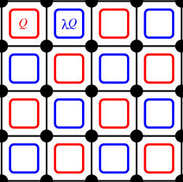
<figcaption class="paper-figure-caption"><b>Fig 1.</b> FIG. 1. The extended CBJQ model. Black lines denote the Heisenberg interactions of strength J. The red Q-plaquettes, denoted as FP, represent the four-spin interactions of strength Q, and the blue λQ-plaquettes, denoted as EP, represent the four-spin interactions of strength λQ, with λ ≤1.</figcaption>
</figure>
<figure class="paper-figure-card">

<figcaption class="paper-figure-caption"><b>Fig 2.</b> FIG. 3. Binder ratios Us and Up of the extended CBJQ model versus Q for different system sizes at (a) λ = 0.1 and (b) λ = 0.9.</figcaption>
</figure>
<figure class="paper-figure-card">
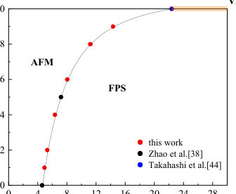
<figcaption class="paper-figure-caption"><b>Fig 3.</b> FIG. 2. Phase diagram of the extended model in the (Q, λ)- plane. Transitions in this phase diagram are all first-order. The black and blue points are selected estimates from previous studies. The solid line is guide for eye.</figcaption>
</figure>
<figure class="paper-figure-card">
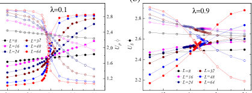
<figcaption class="paper-figure-caption"><b>Fig 4.</b> FIG. 4. Critical points extracted from the crossing points of Us(L) and Us(2L). The dashed lines for λ ≤0.8 are obtained from individual fits, while the dashed line at λ = 0.9 is ob- tained from a joint fit.</figcaption>
</figure>
<figure class="paper-figure-card">
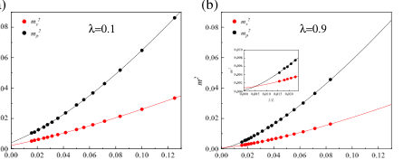
<figcaption class="paper-figure-caption"><b>Fig 5.</b> FIG. 5. Squared order parameters m2 s and m2 p plotted versus 1/L at the transition point Qc for (a) λ = 0.1 and (b) λ = 0.9. The inset in (b) shows a zoom of the largesystemsize region. Solid lines represent the fit results.</figcaption>
</figure>

**Summary.** This work uses Quantum Monte Carlo simulations on the extended chequerboard J-Q model to map its phase diagram. The authors demonstrate that the transition from the Antiferromagnetic (AFM) state to the Plaquette-Singlet (PS) solid is universally first-order for $\lambda < 1$. Crucially, they establish that this transition is governed by an emergent O(4) symmetry.

**Why it may be interesting.** The detailed study of emergent symmetries (O(4) vs O(5)) in a lattice model provides deep insight into how underlying microscopic interactions dictate macroscopic quantum behavior, which is fundamental to understanding strongly correlated materials.

Detailed structure

**Main problem.** The study investigates the ground state properties and phase diagram of an extended chequerboard J-Q model to understand the nature of the direct transition from the Antiferromagnetic (AFM) state to the Plaquette-Singlet (PS) solid state, relevant to materials like SrCu2(BO3)2.

**Main result.** The research concludes that for parameters $\lambda < 1$, the system undergoes a direct first-order phase transition between AFM and PS phases, exhibiting an emergent O(4) symmetry. No intermediate phase was found across the investigated parameter space.

**Method.** Large-scale Stochastic Series Expansion (SSE) Quantum Monte Carlo (QMC) simulations were employed to map the ground state phase diagram.

**Model / system.** The model is an extended chequerboard J-Q Hamiltonian, incorporating nearest-neighbor Heisenberg interactions ($J$) and four-spin couplings ($Q, \lambda Q$) on different plaquettes. It interpolates between known limits like the original CBJQ model ($\lambda=0$) and the $J-Q2$ model ($\lambda=1$).

**Key observables.** Binder ratios ($U_s, U_p, U_{VBS}$), order parameters ($	ext{m}_p, 	ext{m}_s$), and probability distributions $P(D_x, D_y)$ are used to diagnose phase transitions and symmetries.

**Important parameters / regimes.** The coupling constants $Q$ and $\lambda$, which define the parameter space $(Q, \lambda)$, are crucial. Specific limits include $\lambda=0$ (O(4) symmetry) and $\lambda=1$ (O(5) symmetry).

**Assumptions / limitations.** The analysis assumes that Binder ratio crossing points provide a reliable method for locating phase transitions via finite-size scaling, although computational limitations sometimes restrict the focus to certain ratios.

**Figures summary.** Figures illustrate the dependence of binder ratios ($U_{VBS}$) on $\lambda$ across various values. Other figures show order parameter distributions $P(D_x, D_y)$ confirming O(4) symmetry for $\lambda < 1$.

**Paper structure.** The paper systematically analyzes the model by first establishing the Hamiltonian and relevant physical context (AFM to PS transition). It then applies QMC simulations across varying coupling parameters ($\lambda$) using diagnostic tools like Binder ratios. The core of the work is mapping the phase diagram, confirming the nature (first-order) and symmetry (O(4)) of the primary transition.

Abstract

The chequerboard $J-Q$ model was proposed to describe the direct phase transition from the antiferromagnetic (AFM) state to the plaquette-sin glet (PS) solid state observed in SrCu$_2({\rm BO}_3)_2$. In this paper, we present a Monte Carlo study of the ground state of an extended ve rsion of this model. For all parameters investigated, we find only a direct first-order phase transitions from the AFM to the PS phase, with no intermediate phase between them. On the transition line, the system exhibits an emergent $O(4)$ symmetry. Furthermore, we find that the Bi nder ratio of the columnar valence-bond solid state can be used to locate the phase transition. It exhibits a monotonic finite-size scaling b ehavior, allowing for a precise determination of the transition point.

[↑ back to top](#top)

### [Randomised mixed labyrinth fractals](http://arxiv.org/abs/2606.07241v1)

**Authors:** Janett Prehl, Ligia Loretta Cirstea, Daniel Dick  
**Type:** theory · **Category:** disordered systems and neural networks · **PDF:** <https://arxiv.org/pdf/2606.07241v1>  
**Analysis basis:** full PDF text, analyzed in chunks
**Topic relevance:** `analog quantum simulation` **1/5** · `driven-dissipative phase transition` **1/5** · `methods for driven-dissipative` **1/5** · `non-equilibrium dynamics` **1/5** · `non-equilibrium universality` **1/5**

↔ Scroll figures horizontally

<figure class="paper-figure-card">
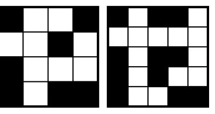
<figcaption class="paper-figure-caption"><b>Fig 1.</b> Figure 1: Four labyrinth patterns: A(1) (4-pattern), A(2) (5-pattern), A(3) (4-pattern) and A(4) (5-pattern)</figcaption>
</figure>
<figure class="paper-figure-card">
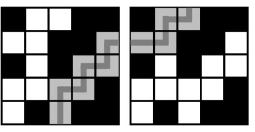
<figcaption class="paper-figure-caption"><b>Fig 2.</b> Figure 3: Paths from bottom to top ( ), from left to right ( ), from bottom to right ( ), and from left to top ( ) exit of the labyrinth pattern A2</figcaption>
</figure>
<figure class="paper-figure-card">
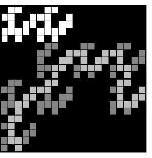
<figcaption class="paper-figure-caption"><b>Fig 3.</b> Figure 4: On the left, the set W1 = A1 is given, where the dark grey squares represent the -path. The set W2 constructed with the patterns A1 and A2 shown in Fig. 1 is shown on the right. The -path of W2 is indicated in light grey.</figcaption>
</figure>
<figure class="paper-figure-card">
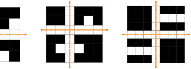
<figcaption class="paper-figure-caption"><b>Fig 4.</b> Figure 5: The analysed non-blocked labyrinth patterns. The orange lines indicate the shortest paths of type , , , , , and , respectively.</figcaption>
</figure>
<figure class="paper-figure-card">
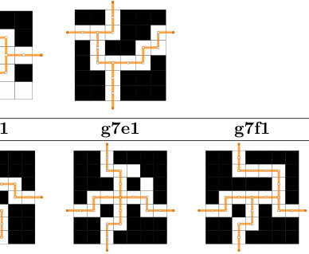
<figcaption class="paper-figure-caption"><b>Fig 5.</b> Figure 6: The analysed totally blocked labyrinth patterns. The orange lines indicate the shortest paths of type , , , , , and , respectively.</figcaption>
</figure>

**Summary.** This work introduces randomised mixed labyrinth fractals to study their topological properties by randomly mixing generating patterns. The authors analyze how this randomness affects key metrics like arc dimension and shortest path scaling using advanced matrix methods. It provides a flexible theoretical framework for studying fractal dynamics relevant to physical systems like diffusion.

**Why it may be interesting.** While focused on geometry, the study of complex fractal dimensions and transport properties in disordered media (like random networks) shares mathematical techniques with understanding quantum localization or energy transport in disordered potentials.

Detailed structure

**Main problem.** The paper introduces and analyzes 'randomised mixed labyrinth fractals,' generalizing existing fractal structures to study how random pattern mixing affects their topological properties.

**Main result.** It demonstrates that isotropy extends to this randomised class, and various scaling behaviors (linear, nonlinear, maxima) for shortest path dimensions are identified based on the mixing probability.

**Method.** The analysis employs path matrices derived from labyrinth patterns, proposing an approximated path matrix as an efficient alternative to extensive iterative simulations.

**Model / system.** The model consists of labyrinth fractals, which are finitely ramified Sierpiński carpets constructed iteratively by combining randomly selected 'labyrinth patterns' with fixed probabilities.

**Key observables.** Arc dimensions, shortest path dimensions ($d_{\min}$), path lengths ($\ell_n(\gamma)$), and isotropy restoration.

**Important parameters / regimes.** The mixing probability $p$, the structure of individual labyrinth patterns (A and A'), and the iteration level $n$.

**Assumptions / limitations.** The analysis often relies on approximating complex iterative processes using combined path matrices, assuming convergence to a stable scaling factor $\lambda$ or dimension.

**Figures summary.** Figures illustrate examples of labyrinth patterns, mixed sets ($W_2$), and show the dependence of calculated dimensions ($\langle d_{\min} 
angle$) on the mixing probability $p$, revealing monotonic trends or maxima.

**Paper structure.** The paper progresses by defining labyrinth fractals, detailing path matrix construction for self-similar cases, extending this to mixed/randomised systems using combined matrices, and finally analyzing the convergence and scaling of various dimension measures as a function of the mixing probability $p$.

Abstract

In this paper, the class of randomised mixed labyrinth fractals is introduced. It is a class of finitely ramified Sierpinski carpets that generalize mixed labyrinth fractals. The structures are generated by randomly selected labyrinth patterns with fixed selection probabilities at each iteration level, offering a flexible framework to study fractal topology, arc dimensions, and shortest path properties. Here, the focus lies on analysing how the randomised mixing of patterns - specifically their shape, symmetry, and path geometry - effects arc dimensions, path lengths, and isotropy restoration. The study reveals that isotropy, previously shown for self-similar fractals, extends to the randomised mixed class. Various scaling behaviours of shortest path dimensions with respect to the mixing probability are identified, including linear and nonlinear monotonic trends, as well as transitions with maxima. The approximated path matrix is proposed as an efficient alternative to extensive iterative simulations, reliably reproducing statistical results. The findings highlight the relevance of pattern properties in determining fractal structures and dynamics and suggest applications in physical systems such as diffusion, signal processing, and antenna design.

[↑ back to top](#top)

### [Six Open Questions in Machine-Learned Interatomic Potential Foundation Models](http://arxiv.org/abs/2606.07327v1)

**Authors:** Isabel Creed, Tim Rein, Ingvars Vitenburgs, Wojciech G. Stark, Viktor Ellingsson, Ahmed Y. Ismail, Guangyu Liu, Yuchen Lou, Bradley A. A. Martin, Cyprien Bone, Matthew A. H. Walker, Mueen Taj, Shirui Wang, Kelvin Wong, Ruiqi Wu, Prakriti Kayastha, Bingqing Cheng, Aditi Krishnapriyan, Michele Ceriotti, Marcel F. Langer, Jarvist Moore Frost, Alex M. Ganose, Venkat Kapil, Keith T. Butler  
**Type:** theory · **Category:** disordered systems and neural networks · **PDF:** <https://arxiv.org/pdf/2606.07327v1>  
**Analysis basis:** full PDF text, analyzed in chunks
**Topic relevance:** `analog quantum simulation` **1/5** · `entanglement & information structure` **1/5** · `methods for driven-dissipative` **1/5** · `non-equilibrium dynamics` **1/5**

↔ Scroll figures horizontally

<figure class="paper-figure-card">
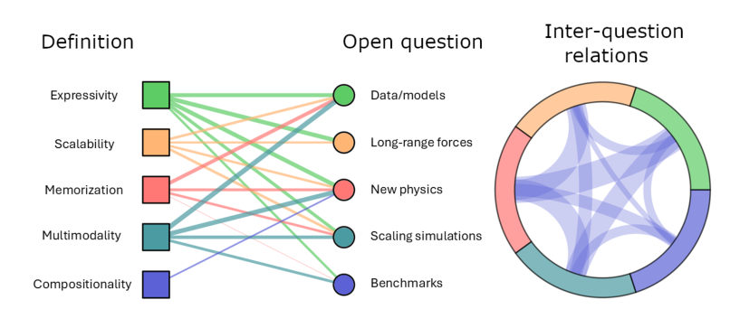
<figcaption class="paper-figure-caption"><b>Fig 1.</b> Figure 1. The connections between definitions and open questions. The text of the article has been analysed using a cosine similarity of vectorized embeddings. On the left, we show how the definition criteria link to the questions, on the right, the relations between the questions (colour-coded as on the left) are displayed. The line widths reflect the similarity of the embeddings of the content.</figcaption>
</figure>
<figure class="paper-figure-card">
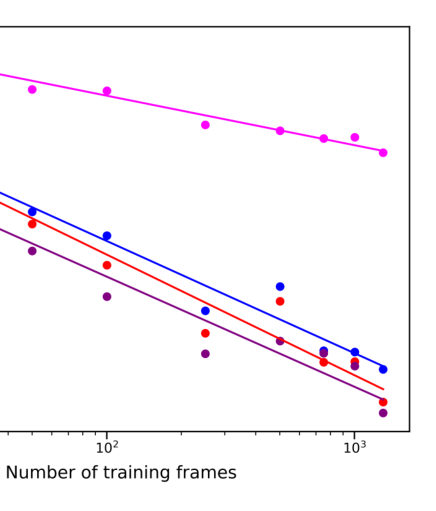
<figcaption class="paper-figure-caption"><b>Fig 2.</b> Figure 2. Log-log plot of the predictive error on the water data set from [59] using NequIP with rotation order L ∈{0, 1, 2, 3} as a function of training set size, measured via the force MAE. Figure from Batzner et al. [32]</figcaption>
</figure>
<figure class="paper-figure-card">
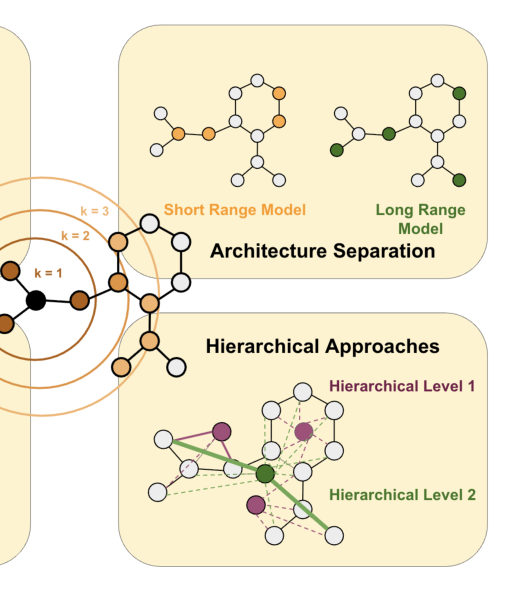
<figcaption class="paper-figure-caption"><b>Fig 3.</b> Figure 3. Overview of conceptual approaches to accurately capture long range interactions in GNNs while mitigating oversmoothing and oversquashing. Strategies include: Graph Rewiring (top left) for structural optimization; Dual Architectures (top right) for global-local separation; Hierarchical Approaches (bottom right) for multi-scale feature extraction; and incorporation of Physics-Informed Priors that encode the long-range governing physics (bottom left).</figcaption>
</figure>
<figure class="paper-figure-card">
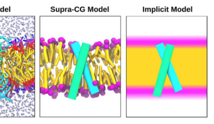
<figcaption class="paper-figure-caption"><b>Fig 4.</b> Figure 4. Different resolutions of lipid membranes. All-atom (AA) resolution explicitly considers all atoms. Coarse-grain (CG) resolution considers small atom groups and their associated hydrogens. Supra-CG resolution represents solvents implicitly and proteins and lipids as qualitative few-bead models. Implicit resolution further integrates out lipid molecules. Reprinted from [197].</figcaption>
</figure>
<figure class="paper-figure-card">
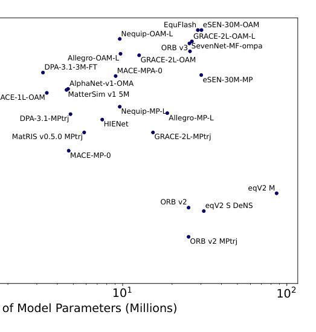
<figcaption class="paper-figure-caption"><b>Fig 5.</b> Figure 5. Combined performance score against the model size (number of model parameters) obtained with different foundation MLIPs, based on Matbench Discovery [38] benchmark website (https://matbench-discovery.materialsproject.org, November 2025).</figcaption>
</figure>

**Summary.** This paper surveys the rapidly advancing field of Machine-Learned Interatomic Potentials (MLIPs), which promise to bridge the gap between computational scale and accuracy in materials science simulations. It synthesizes current knowledge by defining a set of six fundamental, unanswered questions that researchers must tackle regarding model expressivity, data requirements, and physical generalization.

**Why it may be interesting.** While focused on condensed matter, the rigorous framework for analyzing model limitations (expressivity vs. data scaling) mirrors challenges in developing complex quantum simulation methods that rely on scalable neural representations.

Detailed structure

**Main problem.** The field of Machine-Learned Interatomic Potentials (MLIPs) needs to define its fundamental boundaries by addressing several open questions regarding model design, data requirements, and physical scope.

**Main result.** The paper articulates six key open questions—covering expressivity, scalability, memorization, multimodality, and compositionality—that must guide future research in foundation MLIP models.

**Method.** A conceptual framework is developed by adapting general AI foundation model taxonomies to the specific physical constraints and mathematical structures of interatomic potentials.

**Model / system.** The focus is on Machine-Learned Interatomic Potentials (MLIPs) used to approximate the Born-Oppenheimer potential energy surface for molecular and materials systems. These models aim to replace traditional, physically parameterized force fields.

**Key observables.** Potential energy, atomic forces, stresses, thermodynamic properties, and prediction accuracy across various physical regimes (e.g., defect formation energies).

**Important parameters / regimes.** Model expressivity, dataset size/diversity, computational cost, and the incorporation of physical symmetries like $E(3)$-equivariance.

**Assumptions / limitations.** The primary assumption is that progress in MLIPs requires addressing fundamental theoretical limitations rather than just incremental architectural improvements or data scaling alone.

**Figures summary.** Figure 1 maps general AI foundation model criteria (expressivity, etc.) to the six open questions for MLIPs. Other figures illustrate performance gains versus training set size using specific architectures like NequIP.

**Paper structure.** The paper introduces the context of MLIPs, defines a working concept of 'foundation' models, and then systematically explores and articulates the six most critical unanswered questions defining the cutting edge of research in this domain.

Abstract

Machine-learned interatomic potentials (MLIPs) have had a profound impact on molecular modelling in recent years, promising to resolve the long-standing tension between the scale and accuracy of simulations. There has been a proliferation of new models and designs, and recently the paradigm of ``foundational'' MLIPs has become prevalent. Broadly speaking, foundation models are trained on large diverse datasets and promise to work well for new systems with minimal updates required. However, in such a new and fast moving field, there are many unanswered questions. In this article, we set out to articulate and explore what we see as the most important among these questions. We start by developing a working definition for foundational MLIPs and use this definition to frame the subsequent open questions. Despite the rapid progress in the field of MLIP models, we believe that these are fundamental questions which will continue to define cutting edge research in MLIPs in the years to come.

[↑ back to top](#top)

### [Inverse Melting of 3D Antiferromagnetic Order in Multi-sublattice Magnetic Perovskites](http://arxiv.org/abs/2606.07137v1)

**Authors:** Bangye Qin, Dmitry D. Khalyavin, Ran Liu, Kazunari Yamaura, Alexei A. Belik, Roger D. Johnson  
**Type:** experiment · **Category:** strongly correlated electrons · **PDF:** <https://arxiv.org/pdf/2606.07137v1>  
**Analysis basis:** full PDF text, analyzed in chunks
**Topic relevance:** `analog quantum simulation` **1/5** · `exotic spin models in light-matter` **1/5** · `spintronics-quantum-optics interface` **1/5**

↔ Scroll figures horizontally

<figure class="paper-figure-card">
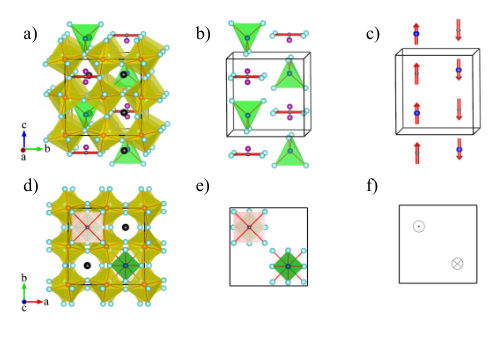
<figcaption class="paper-figure-caption"><b>Fig 1.</b> FIG. 1. (a,d) The crystal structure of NaRMn2Ti4O12. The split MnO4 square-planar units (Mn1 coordination) are shown in purple, with the ideal Mn1 positions indicated by grey spheres. The MnO4 tetrahedra (Mn2 coordination) are shown in blue, and the TiO6 octahedra in light yellow. Oxygen anions are shown in light blue, Ti ions in red, and (Na/R) cations as black spheres. Crystallographic axes are indicated for reference. (b,e) Isolated views of the Mn1 and Mn2 poly- hedra, illustrating the alternating columnar ordering of the Mn sublattice. (c,f) The long-range ordered C-type magnetic structure, where arrows indicate the orientation of the ordered magnetic moments, and circles with dots and...</figcaption>
</figure>
<figure class="paper-figure-card">
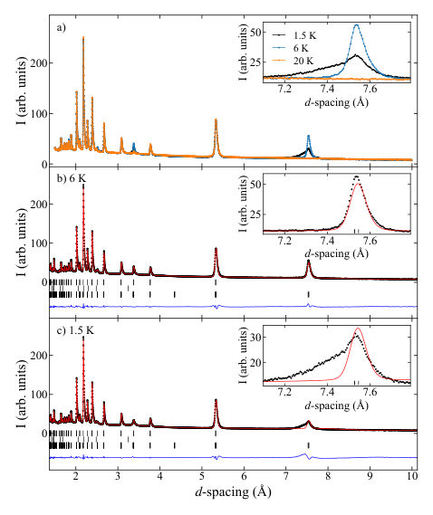
<figcaption class="paper-figure-caption"><b>Fig 2.</b> FIG. 2. (a) Neutron powder diffraction (NPD) patterns of NaDyMn2Ti4O12 measured at T = 1.5, 6, and 12 K. (b) Ri- etveld refinement of the NPD data at T = 6 K, showing the experimental data (black dots), calculated profile (red line), and difference curve (blue line). The vertical tick marks in- dicate the Bragg reflection positions of the nuclear phase of the main perovskite structure (top row), the TiO2 impurity phase (middle row), and the magnetic phase (bottom row). (c) Neutron powder diffraction pattern at T = 1.5 K. The right insets in panels (a)–(c) show an enlarged view of the d-spacing region around the {100} magnetic reflections.</figcaption>
</figure>
<figure class="paper-figure-card">
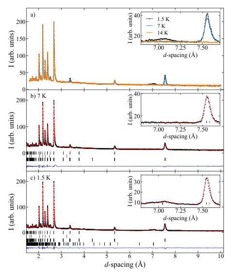
<figcaption class="paper-figure-caption"><b>Fig 3.</b> FIG. 3. (a) Neutron powder diffraction (NPD) patterns of NaSmMn2Ti4O12 measured at T = 1.5, 7, and 14 K. (b) Ri- etveld refinement of the NPD data at T = 7 K, showing the experimental data (black dots), calculated profile (red line), and difference curve (blue line). The vertical tick marks indi- cate the Bragg reflection positions of the nuclear phase of the main perovskite structure (top row), the TiO2 impurity phase (middle row), and the magnetic phase (bottom row). (c) Neu- tron powder diffraction pattern at T = 1.5 K. The first three rows of vertical tick marks correspond to the same nuclear, impurity, and commensurate magnetic phases as in panel (b), while the fourth row indicates...</figcaption>
</figure>
<figure class="paper-figure-card">
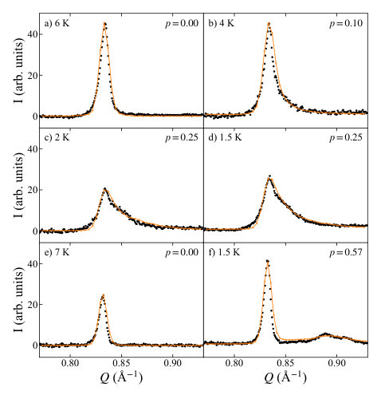
<figcaption class="paper-figure-caption"><b>Fig 4.</b> FIG. 5. Comparison between experimental and calculated scattering patterns for the {100} magnetic Bragg peak of NaRMn2Ti4O12 (R = Dy, Sm). (a-d) The {100} magnetic Bragg peak from NaDyMn2Ti4O12 measured on cooling. (e,f) The {100} magnetic Bragg peak from NaSmMn2Ti4O12 at 7 K and 1.5 K. The experimental neutron powder diffraction data are shown as black dots, and the calculated scattering patterns (see text for details) are shown as orange curves. The magnetic stacking-fault probability, p, is indicated in each panel.</figcaption>
</figure>
<figure class="paper-figure-card">
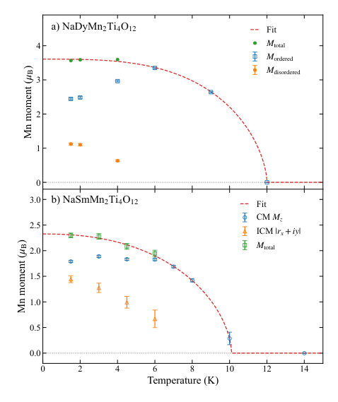
<figcaption class="paper-figure-caption"><b>Fig 5.</b> FIG. 4. Temperature dependence of the Mn magnetic moment in NaRMn2Ti4O12. (a) NaDyMn2Ti4O12, in which Ising-like commensurate Mn spin order (blue squares) and Mn spin disorder (orange circles) are observed. (b) NaSmMn2Ti4O12, in which orthogonal commensurate (blue circles) and pseudo-incommensurate (oranghe triangles) Mn spin components are observed. The dashed lines represent fits of a phenomenological power-law expression to the total moment.</figcaption>
</figure>

**Summary.** The study reports on a novel 'order-by-heating' phenomenon in perovskite antiferromagnets where the material enters a disordered state at low temperatures. Using neutron diffraction, the authors characterize this disorder as stacking faults whose nature is controlled by the rare earth element. This establishes a new mechanism for magnetic phase transitions driven by coupling between chemical disorder and competing exchange interactions.

**Why it may be interesting.** This work provides an experimental realization of complex, non-standard phase transitions in magnetic insulators, linking structural disorder (A-site vacancies) directly to the emergence/disappearance of long-range magnetic order via thermal cycling.

Detailed structure

**Main problem.** The study investigates an unconventional magnetic transition where long-range 3D antiferromagnetic order appears upon heating from a disordered ground state, termed 'inverse melting'.

**Main result.** Both $	ext{NaDyMn}_2	ext{Ti}_4	ext{O}_{12}$ and $	ext{NaSmMn}_2	ext{Ti}_4	ext{O}_{12}$ exhibit this inverse melting, with the specific nature of the disorder (Ising-like faults vs. spin canting) dictated by the rare earth ion's anisotropy.

**Method.** The research relies heavily on Neutron Powder Diffraction (NPD) measurements across a temperature range and Rietveld refinement analysis to characterize magnetic correlations.

**Model / system.** The physical system is columnar-ordered quadruple perovskites, $	ext{NaRMn}_2	ext{Ti}_4	ext{O}_{12}$ ($	ext{R} = 	ext{Dy}, 	ext{Sm}$), which possess multiple magnetic sublattices and intrinsic A-site chemical disorder.

**Key observables.** Magnetic Bragg intensities, peak broadening (indicating dimensionality of order), incommensurate satellite reflections, and the temperature dependence of the Mn magnetic moment.

**Important parameters / regimes.** Temperature range (1.5 K to 20 K); rare earth ion type ($	ext{Dy}^{3+}$ vs $	ext{Sm}^{3+}$) which controls anisotropy; stacking fault probability ($p$).

**Assumptions / limitations.** The disorder can be modeled using magnetic stacking faults, and the transition mechanism is governed by competing exchange interactions coupled to A-site disorder.

**Figures summary.** Figures show NPD patterns at various temperatures for both compounds, illustrating peak changes below $T^*$. One figure compares experimental $\{100\}$ peaks with calculated patterns derived from fault models, demonstrating temperature dependence of the fault probability.

**Paper structure.** The paper analyzes NPD data to characterize the magnetic ground state (disordered) and tracks its evolution upon warming into a 3D ordered phase. The analysis distinguishes between different types of disorder based on rare earth chemistry and uses computational modeling to fit observed peak changes.

Abstract

In conventional antiferromagnets a long-range ordered 3D ground state transitions to a disordered paramagnetic state on warming, often via lower dimensional spin correlations within the critical regime. Here we demonstrate a striking departure from this paradigm. Through analysis of neutron powder diffraction data, we show that the magnetic ground state of columnar-ordered quadruple perovskites, Na$R$Mn$_2$Ti$_4$O$_{12}$ ($R$ = Dy, Sm), lacks long-range order, hosting only 2D spin correlations. On warming, this disordered state transitions into a 3D long-range ordered antiferromagnetic structure prior to the phase transition to the paramagnetic state. Our results establish an unconventional order-by-heating mechanism in which intrinsic A-site chemical disorder is coupled to competing exchange interactions between the rare earth and Mn sub-lattices, leading to a novel type of magnetic phase transition.

[↑ back to top](#top)

### [Quantum-stabilized patterns in a vector Hopfield network](http://arxiv.org/abs/2606.06597v1)

**Authors:** Richard D. Barney, Sharba Bhattacharjee, Victor Galitski, Kartiek Agarwal, Ivar Martin  
**Type:** theory · **Category:** disordered systems and neural networks · **PDF:** <https://arxiv.org/pdf/2606.06597v1>  
**Analysis basis:** full PDF text, analyzed in chunks
**Topic relevance:** `Keldysh / 2PI / non-Gaussian methods` **1/5** · `analog quantum simulation` **1/5** · `driven-dissipative phase transition` **1/5**

↔ Scroll figures horizontally

<figure class="paper-figure-card">
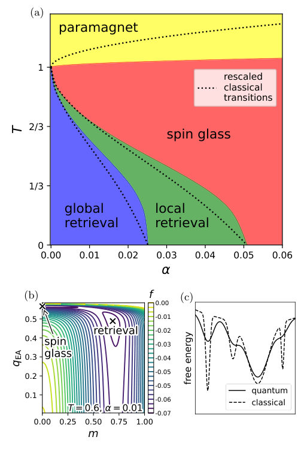
<figcaption class="paper-figure-caption"><b>Fig 1.</b> FIG. 1. (a) The phase diagram of the QVHN. Memory states are retrievable up to a finite loading capacity of αrN for N spins, and αr ≈0.0508. These states become global minima of the free energy landscape for α &lt; αgr ≈0.0252; hence called the “global retrieval” phase. The quantum network displays greater retrieval transition temperatures than the rescaled classical network (dotted lines). (b) The free energy land- scape for the rescaled classical network at T = 0.6, α = 0.01. Dependence on the parameter rd is removed by enforcing the saddle point constraint corresponding to Eq. (16). The re- trieval minimum sits in a much broader valley than that of the spin glass minimum. (c) Schematic...</figcaption>
</figure>
<figure class="paper-figure-card">
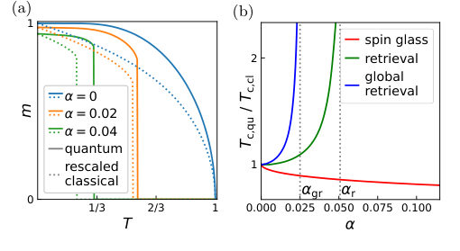
<figcaption class="paper-figure-caption"><b>Fig 2.</b> FIG. 2. (a) The Mattis magnetization m at several values of pattern loading α for the quantum, classical, and rescaled classical networks. The quantum network displays a less steep initial decrease in m as T increases compared to the classical networks. At T = 0 the Mattis magnetizations of all three networks coincide. (b) The ratios of the quantum critical tem- peratures to the classical critical temperatures for the spin glass, retrieval, and global retrieval transitions. The global retrieval ratio appears to diverge at αgr ≈0.0252 and the retrieval ratio appears to diverge at αr ≈0.0508. The sta- bilizing quantum effects are greatest, relative to the classical network, as the networks...</figcaption>
</figure>
<figure class="paper-figure-card">
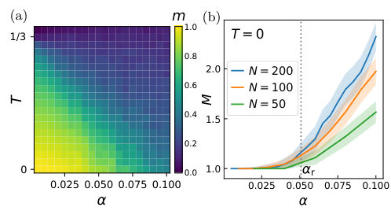
<figcaption class="paper-figure-caption"><b>Fig 3.</b> FIG. 3. (a) The average equilibrium Mattis magnetization m of a state along its initial pattern in a simulated CVHN with N = 200 spins, averaged over 40 network instances and 5 random initializations each. High average m (indicating re- trieval) is seen in the region predicted by the replica analysis, though the transition in α at fixed temperature is seen to be smoother. (b) The average number M of condensed Mattis magnetizations for the simulated equilibrium states at T = 0 as a function of pattern loading α, averaged over 1000 net- work instances and 5 random initializations each. M begins to increase near the value predicted by the replica analysis for the retrieval transition.</figcaption>
</figure>

**Summary.** This paper analyzes the Quantum Vector Hopfield Network to study associative memory. It theoretically demonstrates that intrinsic quantum fluctuations enhance pattern retrieval stability compared to classical models. The findings suggest a mechanism analogous to quantum order-by-disorder for building robust quantum memories.

**Why it may be interesting.** It provides a theoretical framework showing how fundamental quantum mechanical principles (non-commutativity) can stabilize complex ordered phases in artificial memory systems, offering insights into quantum enhancement of information storage.

Detailed structure

**Main problem.** To investigate how quantum fluctuations affect pattern retrieval stability in associative memory models compared to their classical counterparts.

**Main result.** Quantum fluctuations surprisingly stabilize stored patterns, enhancing both the critical retrieval temperature and target pattern overlap relative to the classical network. This effect is interpreted as an analog of quantum order-by-disorder.

**Method.** The study uses advanced theoretical techniques including the replica method, free energy calculations, and analyzing corrections ($\Delta f$) due to quantum fluctuations in the Hamiltonian.

**Model / system.** The model is the Quantum Vector Hopfield Network (QVHN), a quantization of the classical vector network. Patterns are encoded using continuous unit vectors, and dynamics arise from non-commuting spin operators.

**Key observables.** Overlap with stored patterns ($m_{\mu}$), connected spin autocorrelation ($q$), Edwards-Anderson order parameter ($q_{EA}$), and free energy density ($f$).

**Important parameters / regimes.** Pattern loading ($\alpha = p/N$), temperature ($T$), and the network capacity limit ($\alpha_r$).

**Assumptions / limitations.** The analysis relies on approximations such as the replica symmetric ansatz, static approximation (time-independent order parameters), and mean-field theory.

**Figures summary.** Figures compare phase diagrams showing retrieval states are retrievable up to higher loading in QVHN than CVHN; free energy landscapes illustrate quantum fluctuations stabilizing retrieval basins over spin glass minima.

**Paper structure.** The paper progresses by defining the Hamiltonian and observables, deriving equations of state for both classical and quantum cases using replica methods, comparing stability via free energy analysis, and finally discussing simulation results that confirm quantum stabilization effects.

Abstract

We introduce the quantum vector Hopfield network, in which patterns are formed by orientations of quantum vector spins; quantum dynamics arise intrinsically from the non-commutativity of the spin operators. We derive the equations of state and the phase diagrams for this network as well as its classical counterpart. We find that quantum fluctuations, surprisingly, stabilize the stored patterns. Both the critical retrieval temperature and the target pattern overlap are enhanced relative to the classical network. Additionally, we find that this enhancement grows with pattern loading up to network capacity. We interpret this effect as an analog of quantum order-by-disorder, a mechanism by which quantum fluctuations promote the formation of ordered phases. These findings offer a new route to quantum-enhanced associative memory.

[↑ back to top](#top)

### [Squeezing dynamical singlets in bilayer nickelates](http://arxiv.org/abs/2606.07199v1)

**Authors:** Harrison LaBollita, Andrew J. Millis, Olivier Gingras  
**Type:** theory · **Category:** strongly correlated electrons · **PDF:** <https://arxiv.org/pdf/2606.07199v1>  
**Analysis basis:** full PDF text, analyzed in chunks
**Topic relevance:** `Keldysh / 2PI / non-Gaussian methods` **1/5** · `Kondo & dissipative impurity` **1/5** · `methods for driven-dissipative` **1/5**

↔ Scroll figures horizontally

<figure class="paper-figure-card">
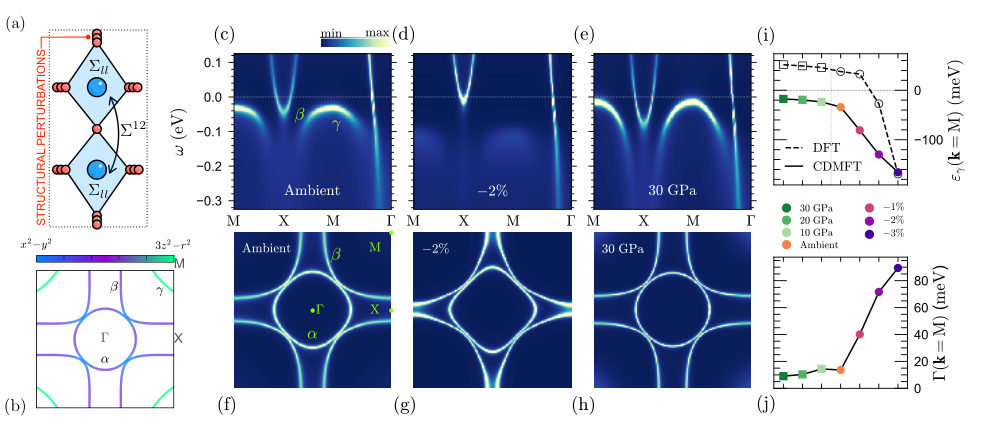
<figcaption class="paper-figure-caption"><b>Fig 1.</b> FIG. 1. Low-energy many-body electronic structure of La3Ni2O7 under hydrostatic pressure and compressive epitaxial strain. (a) Schematic of the bilayer cluster quantum impurity used in CDMFT, indicating local (Σll) and interlayer (Σ12) self-energies. Ni and O atoms are shown as blue and red spheres, respectively; overlapping oxygen positions indicate the structural distortions induced by the external structural perturbations. (b) Fermi surface (kz = 0) of the ambient pressure Wannier Hamiltonian with the orbital character projected onto each sheet: x2 −y2 (blue), 3z2 −r2 (green), and mixed (purple). (c-h) CDMFT electronic structure at T = 1/40 (∼290 K) for (c,f) ambient pressure, (d,g) −2%...</figcaption>
</figure>
<figure class="paper-figure-card">
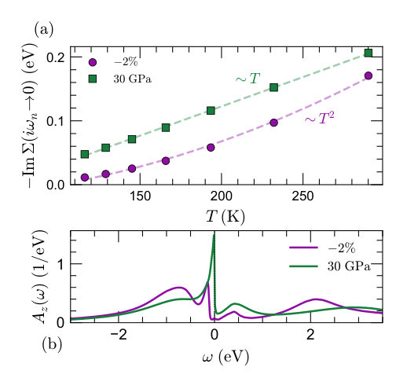
<figcaption class="paper-figure-caption"><b>Fig 2.</b> FIG. 2. Electron-electron scattering and low-energy spectrum of La3Ni2O7 under hydrostatic pressure (30 GPa) and −2% compressive strain. (a) Temperature dependence of the scat- tering rate Γ ∝−Tr[ImΣ(iωn →0)]. Dashed lines corre- spond to fits with forms f(T) = a + bT 2 and f(T) = a + bT for the strained and pressure case, respectively. (b) Local spectral function for the z orbitals, Az(ω), at T = 1/100 eV (≃116 K) for 30 GPa (green) and −2% compressive epitaxial strain (purple).</figcaption>
</figure>
<figure class="paper-figure-card">
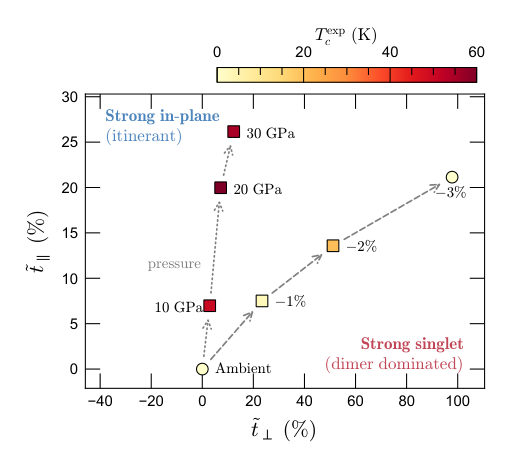
<figcaption class="paper-figure-caption"><b>Fig 3.</b> FIG. 4. Effect of pressure on the low-energy effective in-plane (˜t∥) and out-of-plane (˜t⊥) hoppings of the bilayer RP nicke- lates. Definitions in the main text. The values are expressed as percent change from the ambient pressure calculation. The marker color corresponds to the experimentally observed su- perconducting transition temperature (T exp c ) shown on the colorbar.</figcaption>
</figure>
<figure class="paper-figure-card">
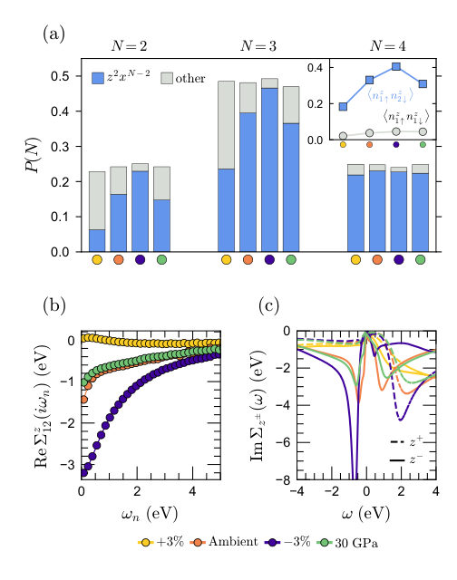
<figcaption class="paper-figure-caption"><b>Fig 4.</b> FIG. 3. Signatures of dynamical singlets in La3Ni2O7. (a) Valence histograms of the four orbital quantum impurity problem for different total charge configurations (N). For each case (colorful dot), we distinguish with blue color the configurations which have two electrons in the z orbitals (z2) and N −2 electrons in the x orbitals (xN−2) while all other configurations are denoted in grey. Inset: Expectation values for ⟨nz 1↑nz 1↓⟩(double occupancy) and ⟨nz 1↑nz 2↓⟩(one z electron on each site with opposite spins.). (b) Real part of the inter- site z orbital self-energy on the Matsubara axis. (c) Imaginary part of the self-energy for the bonding (+) and antibonding (−) combinations of the z...</figcaption>
</figure>

**Summary.** This work uses advanced computational methods, specifically CDMFT, to model bilayer nickelates under external strain and pressure. It reveals that structural changes tune the system's physics by controlling interlayer 'dynamical singlets.' The findings successfully explain experimental dichotomies in transport properties and provide insights into the mechanism driving high-temperature superconductivity.

**Why it may be interesting.** The detailed analysis of orbital-selective correlations and the emergence of dynamical singlets provide a rich theoretical framework for understanding unconventional superconductivity mechanisms in strongly correlated oxides.

Detailed structure

**Main problem.** The study aims to understand how structural changes, specifically hydrostatic pressure and epitaxial strain, tune the normal state electronic structure of bilayer Ruddlesden-Popper nickelates.

**Main result.** The physics is governed by interlayer 'dynamical singlets' formed from $3z^2-r^2$ orbitals hybridized with planar $x^2-y^2$ orbitals, and pressure/strain induce distinct electronic responses (e.g., T-linear vs. T^2 resistivity).

**Method.** The authors employ Cluster Dynamical Mean-Field Theory (CDMFT) coupled with DFT calculations to model the correlated electron behavior.

**Model / system.** The system is bilayer Ruddlesden-Popper nickelates ($	ext{La}_3	ext{Ni}_2	ext{O}_7$), modeled using a four-orbital Wannier representation for Ni-$e_g$ orbitals, incorporating Hubbard-Kanamori interactions.

**Key observables.** Low-energy spectral function $A(\mathbf{k}, \omega)$, scattering rate $\Gamma(T)$, mass renormalization ($m^*/m_{	ext{band}}$), and orbital occupation probabilities $P(N)$.

**Important parameters / regimes.** Hydrostatic pressure (up to 30 GPa) and epitaxial strain (e.g., $-2\%$), Hubbard interaction parameters ($U, U', J$).

**Assumptions / limitations.** The low-energy model is restricted to four $e_g$ orbitals; calculations are performed using the bonding-antibonding basis.

**Figures summary.** Figures illustrate spectral functions and Fermi surfaces under varying strain/pressure; other figures show temperature dependence of scattering rates ($\Gamma$) and orbital-resolved self-energies ($\Sigma(\omega)$) for both structural perturbations.

**Paper structure.** The paper systematically maps the effect of external structural tuning (pressure vs. strain) on the correlated electronic structure, contrasting results from CDMFT against experimental observations like ARPES and transport measurements.

Abstract

We present realistic calculations within the density functional plus cluster dynamical mean-field formalism indicating that the physics of the the bilayer Ruddlesden-Popper nickelates is to a significant extent controlled by interlayer "dynamical singlets'' which are formed from the $3z^{2}-r^{2}$ orbitals singly occupied by electrons and are hybridized with itinerant planar $x^{2}-y^{2}$ orbitals. The hybridization is found to respond differently to hydrostatic pressure and to epitaxial strain, capturing the experimentally observed dichotomy between bulk single crystals and epitaxial thin films and reproducing several experimental results including angle-resolved photoemission and transport measurements.

[↑ back to top](#top)

### [Fermion sign problem and the structure of Lee-Yang zeros. II. Finite temperature results for a model system without interactions](http://arxiv.org/abs/2606.07415v1)

**Authors:** Ran-Chen He, Jia-Xi Zeng, Shu Yang, Cong Wang, Qi-Jun Ye, Xin-Zheng Li  
**Type:** theory · **Category:** statistical mechanics · **PDF:** <https://arxiv.org/pdf/2606.07415v1>  
**Analysis basis:** full PDF text, analyzed in chunks
**Topic relevance:** `Keldysh / 2PI / non-Gaussian methods` **1/5**

↔ Scroll figures horizontally

<figure class="paper-figure-card">
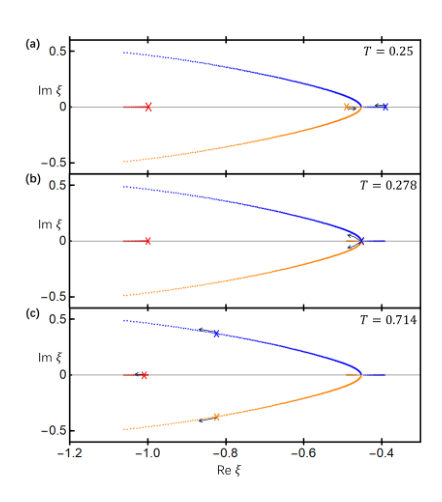
<figcaption class="paper-figure-caption"><b>Fig 1.</b> FIG. 1. The LY zeros of ξ at different Ts for the nonin- teracting N = 4 system on a 1D ring. For N = 4, there are three LY zeros of ξ and thus three trajectories (dotted lines connecting the same zero at different Ts), shown in the background. We identify the zeros by continuously tracking their T-dependent evolution, and label them in red, orange, and blue colors. The temperature step is ∆T = 0.01 from T = 0.25 to T = 1, in units of h2/(2mkBL2). The zeros cor- responding to (a) T = 0.25, (b) T = 0.278, and (c) T = 0.714 are highlighted as larger crosses, with black arrows indicating the directions of motion as T increases. For low-T cases, the zero originating from −1 remains very close...</figcaption>
</figure>
<figure class="paper-figure-card">
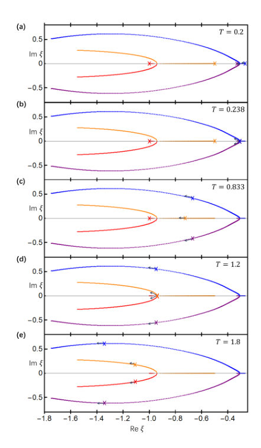
<figcaption class="paper-figure-caption"><b>Fig 2.</b> FIG. 2. The LY zeros of ξ at different Ts for the noninter- acting N = 5 system on a 1D ring. The plotting conventions are the same as in Fig. 1. Here, four zeros are shown (red, orange, blue, and purple), with ∆T = 0.01 from T = 0.2 to T = 3. The zeros at (a) T = 0.2, (b) T = 0.252, (c) T = 1, (d) T = 1.65, and (e) T = 1.8 are highlighted as larger crosses. Similar to Fig. 1, arrows indicate motion with increasing T, except for the low-T zero originating from −1, whose arrow is omitted due to Eq. (3).</figcaption>
</figure>
<figure class="paper-figure-card">
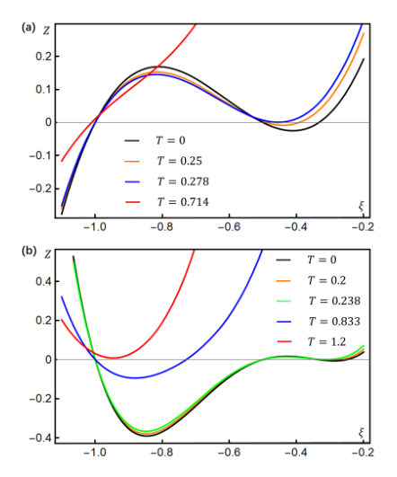
<figcaption class="paper-figure-caption"><b>Fig 3.</b> FIG. 3. (a) Curves of Z(ξ) on the real ξ axis for N = 4. LY zeros of ξ are exactly the intersections with Z = 0. At T = 0, there are three roots, as ξ = −1, −1/2, −1/3. As T increases, two neighboring real roots merge into a double root at ξ ≈−0.45 (around T = 0.278), and then leave the real axis as a complex-conjugate pair, so that only one real zero remains. (b) Curves of Z(ξ) for N = 5. Consistent with the parity constraint discussed in the text, the four roots initialized at ξ = −1, −1/2, −1/3, −1/4 leave the real axis in two pairs; consequently, no real zero remains at sufficiently high T (here T ≳1.2).</figcaption>
</figure>
<figure class="paper-figure-card">
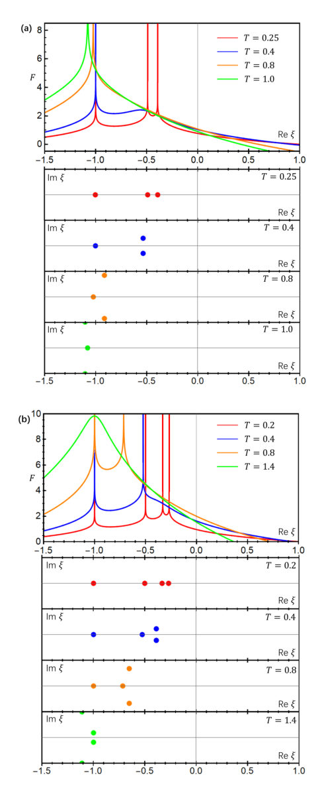
<figcaption class="paper-figure-caption"><b>Fig 4.</b> FIG. 4. Free energy F(T, ξ) versus ξ for (a) N = 4 and (b) N = 5, with LY zeros depicted at the corresponding Ts (dif- ferent colors). In accordance with the main text, zeros on the real axis correspond to nonanalytic points (sharp diver- gences), while zeros close to the real axis still distort the free energy profile. The unit of free energy is h2/(2mL2).</figcaption>
</figure>
<figure class="paper-figure-card">
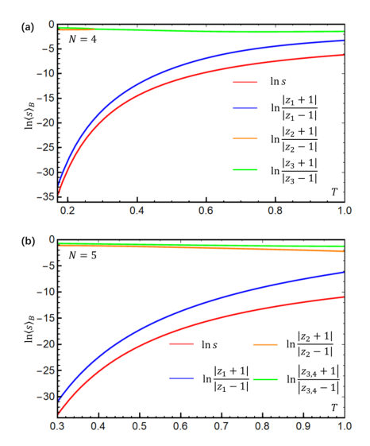
<figcaption class="paper-figure-caption"><b>Fig 5.</b> FIG. 5. Sign factor ⟨s⟩B and LY zero z1 for N = 4 and 5 on a logarithmic scale. The blue curves show the contribution from z1 as temperature increases, and they exhibit behavior very similar to the red curves, which represent the sign factor ⟨s⟩B on the same logarithmic scale. The temperature unit is h2/(2mkBL2).</figcaption>
</figure>

**Summary.** The paper tackles the challenging issue of calculating fermionic properties at low temperatures where standard analytic continuation techniques fail due to Lee-Yang zeros. Using a solvable 1D model, the authors map out how these zeros move with temperature and propose a reliable two-step fitting strategy that bypasses the singularities, offering a benchmark for diagnosing computational methods in quantum statistical mechanics.

**Why it may be interesting.** This work provides crucial theoretical diagnostics for computational methods tackling the fermion sign problem in many-body physics, suggesting a generalizable protocol applicable to more complex interacting systems.

Detailed structure

**Main problem.** The primary goal is understanding how Lee-Yang (LY) zeros of the exchange parity $\xi$ evolve with temperature ($T$) to diagnose the limitations of analytic continuation methods for calculating fermionic properties.

**Main result.** The authors propose a two-step strategy: first, extrapolating reliable high-$T$ data from sign-problem-free regions ($\xi \in [0, 1]$) to $\xi = -1$, and second, performing a temperature fit on the resulting fermionic partition function remainder $\phi(\beta)$.

**Method.** The analysis uses an analytically solvable noninteracting 1D particle-on-a-ring model to derive explicit polynomial forms for the partition function $Z(\beta, \xi)$ and track the trajectories of its zeros in the complex $\xi$-plane.

**Model / system.** The system is a noninteracting one-dimensional particle-on-a-ring model with $N$ particles. The physics is governed by the partition function $Z(\beta, \xi)$, which depends on temperature ($\beta$) and the exchange parity parameter $\xi$.

**Key observables.** Lee-Yang (LY) zeros of $\xi$, the free energy $F(T, \xi)$, and the sign factor $\langle s \rangle_B$ that governs fermionic contributions.

**Important parameters / regimes.** Temperature ($T$) or inverse temperature ($\beta$), the exchange parity parameter ($\xi$), and the number of particles ($N$).

**Assumptions / limitations.** The initial analysis is restricted to noninteracting systems, serving as a solvable benchmark for diagnosing continuation methods.

**Figures summary.** Figures illustrate the trajectories of LY zeros in the complex $\xi$-plane as $T$ changes (showing movement off the real axis at high $T$), and demonstrate the failure of direct extrapolation versus the success of the proposed two-step temperature fitting strategy.

**Paper structure.** The paper first establishes the model using an analytically solvable noninteracting system. It then analyzes how the trajectories of LY zeros dictate the analyticity of thermodynamic quantities. Finally, it proposes and validates a robust two-step procedure for calculating low-$T$ fermionic properties by combining high-$T$ extrapolation with temperature fitting.

Abstract

Beyond the analysis of the Lee-Yang (LY) zero of $ξ$ at $0$ K presented by our previous work [He et. al. Phys. Rev. E 113, 24115 (2026)], it is important but intricate to understand how these zeros evolve with temperature ($T$). Here, we use an analytically solvable noninteracting one-dimensional particle-on-a-ring model to address this. We determine the trajectories of these zeros and analyze how their evolution with $T$ reshapes the analytic structure of the partition function. In particular, the zero originating from $ξ=-1$ at $T=0$ remains close to $-1$ at low $T$, where it governs the sign factor and strongly constrains continuation along the real $ξ$ axis. This explains why both direct extrapolation and implicit schemes such as contour-based fitting can fail in the low-$T$ regime, even at high fitting order, while becoming reasonable again once the relevant zeros move away at higher $T$s. Furthermore, based on the polynomial structure of the partition function, we propose a new fitting strategy for low-$T$ fermionic properties. The key is to first obtain reliable high-$T$ fermionic properties by continuing sign-problem-free data in $ξ\in[0,1]$ to $ξ=-1$, and then extend this information toward lower $T$ through $T$-fitting of the $ξ$-independent remainder $φ(β)=Z_{\text{F}}$. These results provide a solvable benchmark for diagnosing the validity of analytic continuation and suggest a possible route toward treating more realistic interacting fermionic systems.

[↑ back to top](#top)

## Other papers (6)

*Papers from primary archives without highlighted authors or any topic match. Click to expand.*

Show other papers

### [Multiband superconductivity in the kagome-lattice superconductor Re2Zr](http://arxiv.org/abs/2606.07184v1)

**Authors:** Gabriel Kuderowicz, Bartlomiej Wiendlocha  
**Type:** theory · **Category:** strongly correlated electrons · **PDF:** <https://arxiv.org/pdf/2606.07184v1>  
**Analysis basis:** full PDF text, analyzed in chunks

↔ Scroll figures horizontally

<figure class="paper-figure-card">
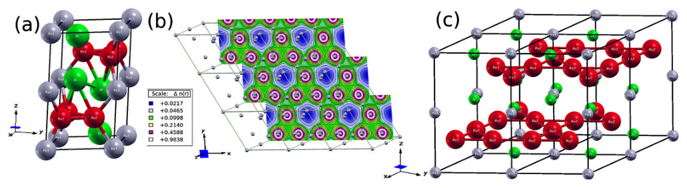
<figcaption class="paper-figure-caption"><b>Fig 1.</b> FIG. 1. (a) Re2Zr unit cell with gray Re-1, red Re-2 and green Zr atoms, (b) electron density map in a plane with Re-2 atoms forming the kagome lattice, (c) supercell 2x2x1 highlighting the kagome lattice. Visualized using XCrysDen [6].</figcaption>
</figure>
<figure class="paper-figure-card">
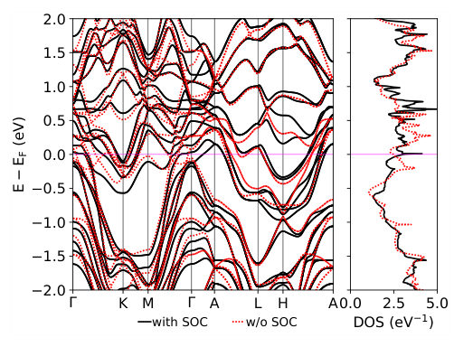
<figcaption class="paper-figure-caption"><b>Fig 2.</b> FIG. 2. Re2Zr electronic bands and total density of states calculated with and without spin-orbit coupling.</figcaption>
</figure>
<figure class="paper-figure-card">
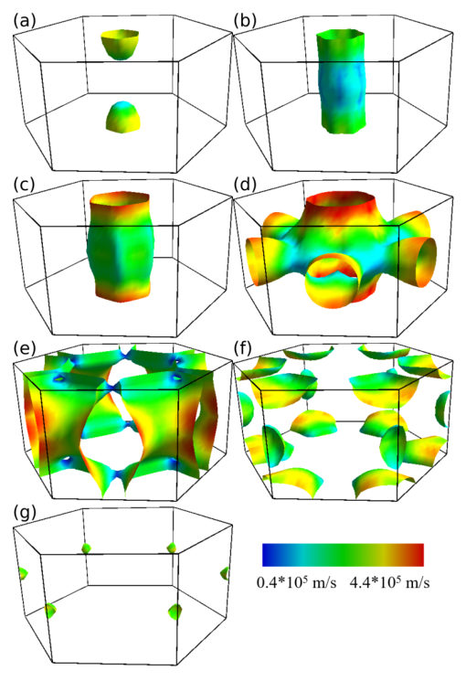
<figcaption class="paper-figure-caption"><b>Fig 3.</b> FIG. 3. Re2Zr Fermi surface colored with Fermi velocity. Visualized using Fermisurfer [45].</figcaption>
</figure>
<figure class="paper-figure-card">
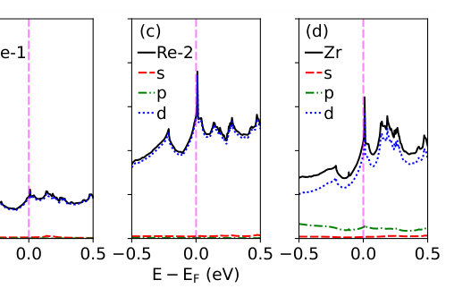
<figcaption class="paper-figure-caption"><b>Fig 4.</b> FIG. 4. Re2Zr electronic density of states projected onto atomic orbitals.</figcaption>
</figure>
<figure class="paper-figure-card">
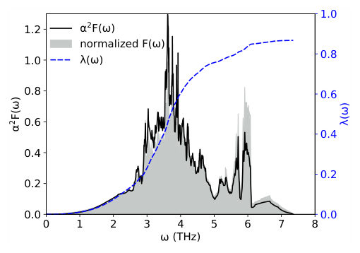
<figcaption class="paper-figure-caption"><b>Fig 5.</b> FIG. 6. (left axis) Re2Zr Eliashberg function with normalized phonon density of states ( R ωmax 0 F(ω)dω = R ωmax 0 α2F(ω)dω). (right axis) Cumulative electron-phonon coupling constant λ(ω) = 2 R ω 0 α2F (ω′)</figcaption>
</figure>

**Summary.** This work investigates superconductivity in Re2Zr using advanced first-principles calculations to test conventional phonon-mediated theories. The results show that the superconducting energy scale is quantitatively reproduced by this model, revealing strong multiband and anisotropic gap features. Crucially, including spin fluctuations successfully lowers the predicted critical temperature to match experimental values, though it cannot explain the suggested time-reversal symmetry breaking.

**Why it may be interesting.** While focused on conventional BCS theory, the explicit calculation of multiband effects, anisotropic gaps, and the quantitative inclusion of electron-phonon coupling alongside spin fluctuations provides a rich theoretical framework for understanding complex pairing mechanisms in strongly correlated materials.

Detailed structure

**Main problem.** To determine if superconductivity in Re2Zr, despite experimental hints of unconventional pairing (like time-reversal symmetry breaking), can be quantitatively explained using a conventional phonon-mediated framework.

**Main result.** The superconducting energy scale is successfully reproduced within a conventional phonon-mediated model, revealing pronounced multiband and anisotropic gap structures. However, the origin of the suggested time-reversal symmetry breaking remains an open question.

**Method.** First-principles calculations using Density Functional Theory for superconductors (SCDFT) were employed to calculate electronic structure, electron-phonon coupling ($\lambda$), and superconducting gaps ($\Delta$).

**Model / system.** The study focuses on the hexagonal kagome-lattice superconductor Re2Zr. Calculations incorporate spin-orbit coupling (SOC) and treat the system as a multiband superconductor with seven distinct Fermi surface sheets.

**Key observables.** Superconducting critical temperature ($T_c$), electron-phonon coupling constant ($\lambda \simeq 0.88$), superconducting gap anisotropy, and the density of states at the Fermi level ($N(E_F)$).

**Important parameters / regimes.** Experimental $T_c = 6.65 	ext{ K}$; calculated $\lambda$; spin fluctuation effects (which reduce $T_c$ from $7.7 	ext{ K}$ to $6.4 	ext{ K}$).

**Assumptions / limitations.** The primary assumption is the validity of a conventional phonon-mediated pairing mechanism within the singlet state approximation, despite discrepancies with some experimental observations.

**Figures summary.** Figures illustrate electronic band structures (with/without SOC), Fermi surface sheets showing mixed 2D-3D character, and gap distributions confirming multiband anisotropy across different FS sheets.

**Paper structure.** The paper progresses by first establishing the electronic structure using DFT with SOC, then calculating electron-phonon coupling ($\lambda$), and finally solving the superconducting gap equation (SCDFT) while incorporating spin fluctuation corrections to match the experimental $T_c$.

Abstract

We present a first-principles investigation of the electronic structure, lattice dynamics, electron-phonon coupling, and superconducting properties of the hexagonal kagome-lattice compound Re$_2$Zr, in which time-reversal symmetry breaking and unconventional pairing have recently been proposed. We examine whether superconductivity in Re$_2$Zr can be explained within a conventional phonon-mediated framework by performing fully ab initio calculations within the density functional theory for superconductors. The electronic structure is characterized by a mixture of seven two- and three-dimensional Fermi surface sheets, giving rise to multiband superconductivity with many overlapping superconducting gaps. A spin-orbit-induced van Hove singularity is identified in the density of states near $E_F$. The electron-phonon interaction is moderately strong, with a coupling constant $λ\simeq 0.88$. Superconducting gap calculations reveal significant anisotropy and a broad distribution of gap values across different Fermi surface sheets. Spin fluctuations introduce additional depairing effects and reduce the critical temperature from 7.7 K to 6.4 K, in excellent agreement with the experimental value of 6.65 K. Taken together, our results show that the superconducting energy scale in Re$_2$Zr can be quantitatively reproduced within a conventional phonon-mediated framework, while the resulting state exhibits pronounced multiband and anisotropic gap structure. The origin of the experimentally suggested time-reversal symmetry breaking, however, remains an open question.

[↑ back to top](#top)

### [Projector Quantum Variational Ansatz](http://arxiv.org/abs/2606.07084v1)

**Authors:** Thomas Dumontier, Robin Ollive, Stephane Louise  
**Type:** both · **Category:** quantum information and computing · **PDF:** <https://arxiv.org/pdf/2606.07084v1>  
**Analysis basis:** full PDF text, analyzed in chunks

↔ Scroll figures horizontally

<figure class="paper-figure-card">
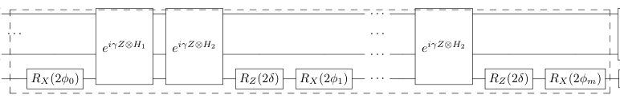
<figcaption class="paper-figure-caption"><b>Fig 1.</b> Fig. 1. Quantum circuit of the ISQ-QSP algorithm that measures the expectation value of the summand c H1. Here: c Hp = c H1 + c H2. The dashed box delimits the QSP part; the rest of the circuit is the c Hi expectation value measurement on the lower part of the energy spectrum. Note that the c Hp expectation value is upper bounded by the value ∆by the filtering done by the QSP.</figcaption>
</figure>
<figure class="paper-figure-card">
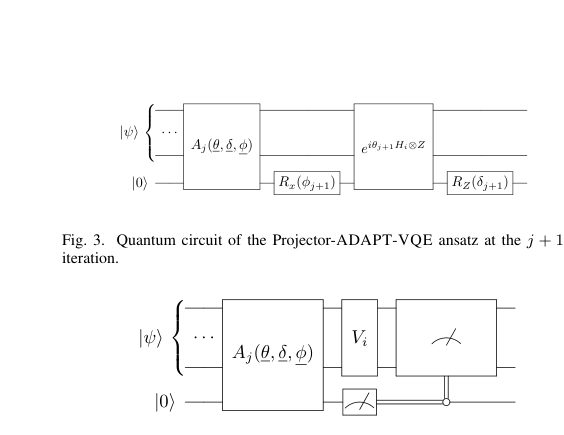
<figcaption class="paper-figure-caption"><b>Fig 2.</b> Fig. 4. Quantum circuit used to measure an expectation value of the state prepared by the Projector-ADAPT-VQE ansatz at the jth iteration: ⟨φj| c Hi |φj⟩.</figcaption>
</figure>
<figure class="paper-figure-card">
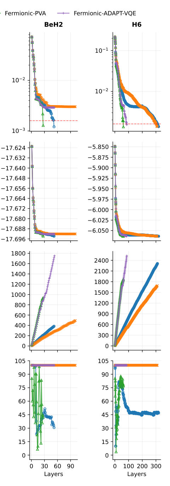
<figcaption class="paper-figure-caption"><b>Fig 3.</b> Fig. 5. Performance comparison of the PVA versus standard Qubit-ADAPT-VQE and Fermionic-ADAPT-VQE</figcaption>
</figure>
<figure class="paper-figure-card">
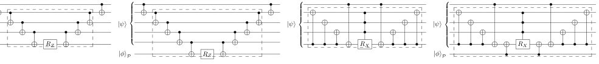
<figcaption class="paper-figure-caption"><b>Fig 4.</b> Fig. 6. Quantum circuit that represents the part (dotted boxes) of the exponentialized operator from which the CNOT count differs (δ value) between the different operator pools. Respectively from left to right: eit b Z b Z b Z b Z b Z, eit b Z b Z b Z b Z b Z b Z, eit( b Zbσbσbσbσ+ d h.c.), eit( b Zbσbσbσbσ b Z+ d h.c.).</figcaption>
</figure>
<figure class="paper-figure-card">
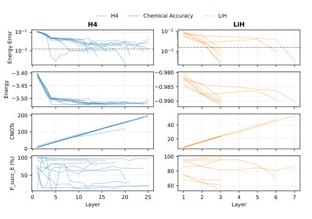
<figcaption class="paper-figure-caption"><b>Fig 5.</b> Fig. 7. Finite shots simulation of our PVA method for H4 and LiH</figcaption>
</figure>

**Summary.** The paper introduces the Projector Variational Ansatz (PVA), a novel VQE structure designed to incorporate principles from fault-tolerant quantum computing. By using ancillary qubits for subspace projection, PVA improves upon standard ADAPT-VQE by achieving chemical accuracy with shallower circuits and fewer required variational parameters on small molecules.

**Why it may be interesting.** This work directly addresses the resource scaling challenge in quantum chemistry simulation, proposing an algorithmic modification (PVA) that aims to reduce circuit depth—a critical bottleneck for implementing complex Hamiltonians on near-term hardware.

Detailed structure

**Main problem.** The primary goal is to efficiently compute the ground state energy of a problem Hamiltonian using quantum algorithms, particularly in the Noisy Intermediate Scale Quantum (NISQ) regime.

**Main result.** The proposed Projector Variational Ansatz (PVA) demonstrates convergence with shallower circuits than standard ADAPT-VQE variants for molecular simulations, achieving chemical accuracy with fewer required layers.

**Method.** The work develops and compares several variational ansatz structures (like PVA) designed to mimic the projector nature of Fault Tolerant Quantum Computing (FTQC) algorithms within the VQE framework. These methods are optimized using classical optimizers like L-BFGS-B or SPSA, sometimes requiring post-selection via ancillary qubits.

**Model / system.** The simulations focus on molecular electronic structure calculations ($	ext{H}_4$, $	ext{BeH}_2$, etc.), where the Hamiltonian is derived from fermionic operators and mapped onto qubit Pauli strings using Jordan-Wigner transformation. The initial state is typically the Hartree-Fock reference state.

**Key observables.** Energy Error ($\Delta E$), CNOT Count (circuit depth), Success Probability ($P_{	ext{succ}}$), and convergence rate relative to standard ADAPT methods.

**Important parameters / regimes.** The NISQ regime constraints, ansatz parametrization $\{	heta\}$, and the required chemical accuracy threshold ($\Delta E < 1.6 	imes 10^{-3} 	ext{ Ha}$).

**Assumptions / limitations.** The primary assumption is that incorporating projector-like structures into VQE can bridge the gap between shallow NISQ circuits and deep, high-fidelity FTQC algorithms.

**Figures summary.** Figures illustrate quantum circuits for various ansatzes (ISQ-QSP, ADAPT-VQE, PVA) and show convergence plots comparing energy error versus circuit layers/CNOTs for different molecules ($	ext{H}_4$, $	ext{LiH}$).

**Paper structure.** The paper first introduces the limitations of NISQ algorithms compared to FTQC methods. It then proposes the PVA ansatz structure, detailing its mathematical equivalence and implementation via ancillary qubits. The core is a comparative study showing PVA's superior performance over standard ADAPT-VQE across multiple molecular systems under both exact statevector and finite-shot simulations.

Abstract

Quantum computing offers several algorithms to compute the ground state of a problem Hamiltonian. The most desirable algorithms belong to the Fault Tolerant QuantumComputing (FTQC) regime, such as quantum algorithms with repetitive structure like Quantum Phase Estimation (QPE) and Quantum Signal Processing (QSP). However, in the Noisy In-termediate Scale Quantum (NISQ) regime, the most realistic approaches involve Variational Quantum Eigensolver (VQE) algorithms and their variants. VQE is an algorithm that searches for a parametrized unitary matrix called an ansatz whose purposeis to transform an easily prepared initial state into the groundstate of a given Hamiltonian. Adaptive Derivative-AssembledPseudo-Trotter (ADAPT)-VQE is a variant of VQE that im-proves this approach by constructing the ansatz iteratively so that the associated quantum circuit is as shallow as possible. A major difference between FTQC (i.e. not variational) algorithms and VQE is that FTQC algorithms do not construct a state transitiondirectly. Instead, they construct a projector that identifies the ground state using ancillary qubits that flag the good solution. The desired state is then obtained via amplitude amplification orpost-selection. In this work, we propose a VQE ansatz whose structure is more similar to that of an FTQC algorithm. Depending on its parametrization, this ansatz can be equivalent to either an Intermediate Scale Quantum (ISQ)-QSP or to an ADAPT-VQE quantum circuit structure. Our experimental results show that this first proposal of Projector Variational Ansatz (PVA) converges with a shallower ansatz than the usual ADAPT-VQE.

[↑ back to top](#top)

### [Proof that the Klein-Gordon type equation with alpha attractor potential has no Liouvillian solution or as a composition of special functions](http://arxiv.org/abs/2606.07320v1)

**Authors:** Benjamin de Zayas, Clara Rojas  
**Type:** theory · **Category:** other · **PDF:** <https://arxiv.org/pdf/2606.07320v1>  
**Analysis basis:** full PDF text, analyzed in chunks

↔ Scroll figures horizontally

<figure class="paper-figure-card">
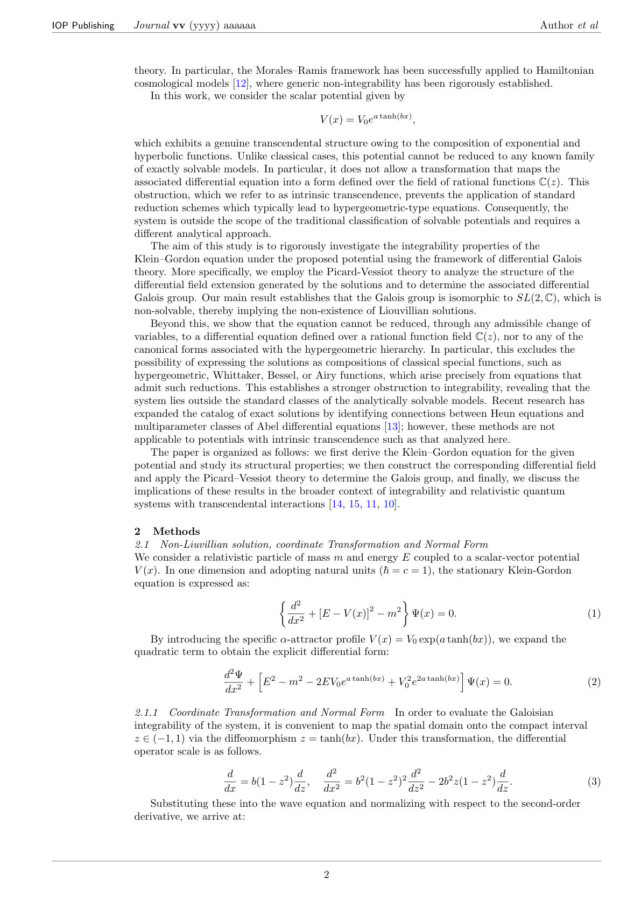
<figcaption class="paper-figure-caption"><b>Fig 1.</b> Low-resolution page preview, page 2</figcaption>
</figure>
<figure class="paper-figure-card">
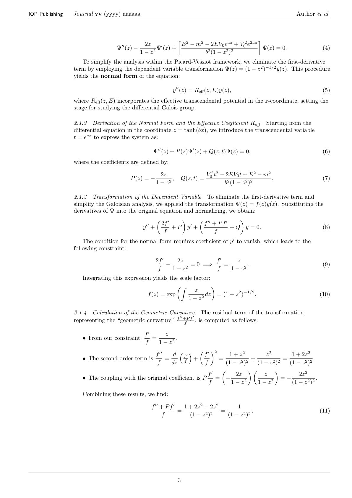
<figcaption class="paper-figure-caption"><b>Fig 2.</b> Low-resolution page preview, page 3</figcaption>
</figure>
<figure class="paper-figure-card">
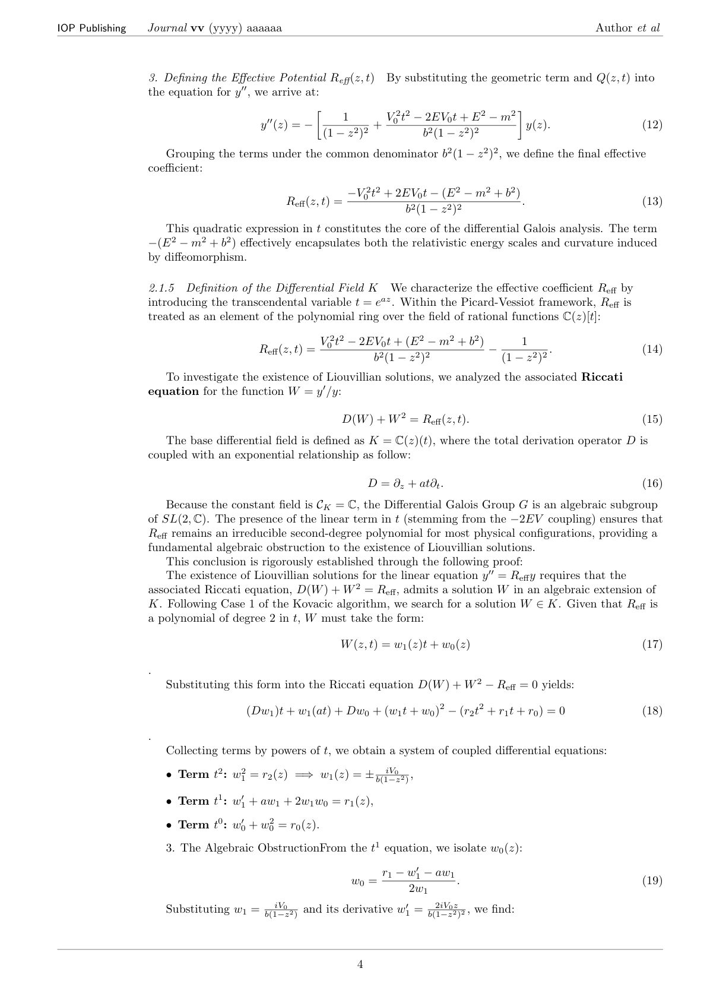
<figcaption class="paper-figure-caption"><b>Fig 3.</b> Low-resolution page preview, page 4</figcaption>
</figure>
<figure class="paper-figure-card">
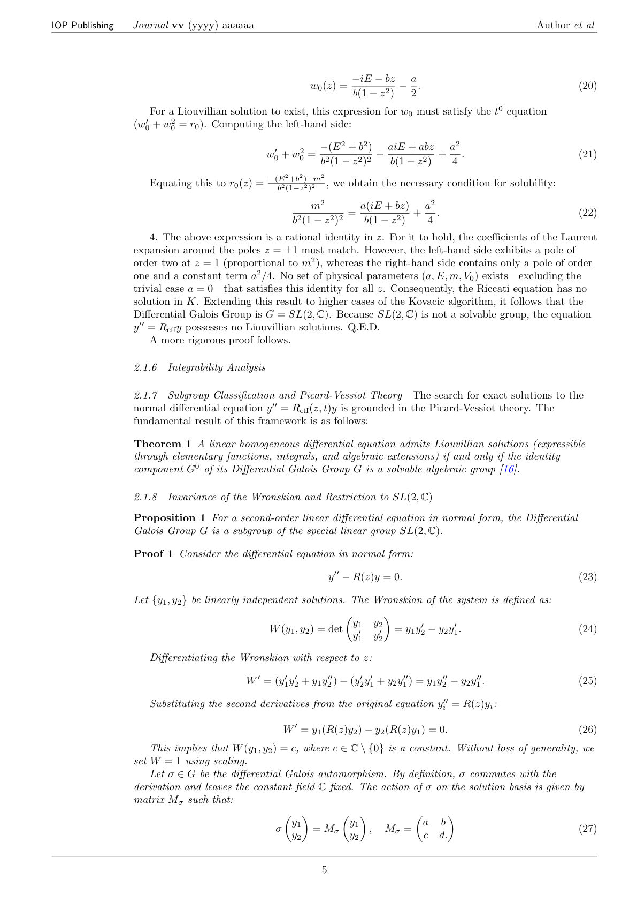
<figcaption class="paper-figure-caption"><b>Fig 4.</b> Low-resolution page preview, page 5</figcaption>
</figure>
<figure class="paper-figure-card">
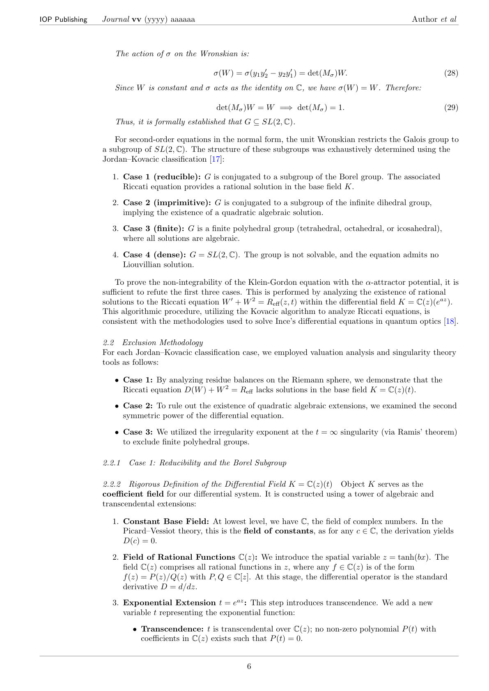
<figcaption class="paper-figure-caption"><b>Fig 5.</b> Low-resolution page preview, page 6</figcaption>
</figure>

**Summary.** This theoretical paper proves that the Klein-Gordon equation with an $\alpha$-attractor potential is strictly non-integrable. Using Differential Galois Theory, the authors demonstrate that the system's associated differential equations have a non-solvable Galois group ($SL(2, \mathbb{C})$). This mathematically rules out any possibility of finding solutions using elementary functions or known special functions.

**Why it may be interesting.** While focused on relativistic quantum mechanics rather than AMO systems directly, the rigorous application of advanced mathematical tools (Differential Galois Theory) to determine the fundamental solvability limits of a physical model is highly relevant for understanding when complex Hamiltonians can be solved analytically in any field of physics.

Detailed structure

**Main problem.** The study investigates the analytical solvability (integrability) of a Klein-Gordon type equation featuring an $\alpha$-attractor potential.

**Main result.** The differential Galois group is found to be $SL(2, \mathbb{C})$, which is non-solvable, proving that no Liouvillian solutions exist and the system cannot be expressed as a composition of classical special functions.

**Method.** Advanced techniques from Differential Galois Theory (Picard-Vessiot theory) were employed to analyze the associated Riccati equation and determine the structure of the differential Galois group.

**Model / system.** The model is a scalar particle governed by a Klein-Gordon type equation in one dimension, interacting with the transcendental $\alpha$-attractor potential $V(x) = V_0 e^a \tanh(bx)$.

**Key observables.** The differential Galois group of the system; the existence or non-existence of Liouvillian solutions.

**Important parameters / regimes.** $E$ (Energy), $m$ (mass), $V_0, a, b$ (potential parameters).

**Assumptions / limitations.** The analysis assumes that solvability in terms of special functions implies the differential Galois group must be solvable.

**Paper structure.** The paper proceeds by transforming the physical equation into a normal form, analyzing the associated Riccati equation using techniques like the Kovacic algorithm, and ultimately determining the structure of the differential Galois group to prove non-integrability.

Abstract

This study investigates the analytical solvability of the Klein-Gordon and Duffin-Kemmer-Petiau (DKP) equations for a scalar particle interacting with a transcendental $α$-attractor-type potential, $V(x) = V_0 e^{a \tanh(bx)}$. We first address the problem of integrability within the framework of Picard-Vessiot theory. By analyzing the differential field extensions associated with the system, we demonstrated that the differential Galois group is the full special linear group $SL(2, \mathbb{C})$. Given that this group is not solvable, we provide rigorous proof for the non-existence of Liouvillian solutions, effectively ruling out any expression in terms of primitives and elementary functions. Building upon this result, we further establish that wavefunctions cannot be represented as finite compositions or transformations of classical special functions, such as those of the Bessel, Whittaker, or Heun families. This second conclusion is supported by the ``double-transcendence'' of the potential; we prove via the Hermite-Lindemann theorem that no rational coordinate transformation $z(x)$ exists that could map the physical equation into an ordinary differential equations(ODE) with rational coefficients. Consequently, the $α$-attractor potential is strictly non-integrable and lies entirely outside the landscape of solvable relativistic quantum systems.

[↑ back to top](#top)

### [QBugLM: An Agentic Benchmarking Framework for LLM-based Quantum Software Debugging](http://arxiv.org/abs/2606.07314v1)

**Authors:** An B. B. Pham, Hoa T. Nguyen, Muhammad Usman  
**Type:** experiment · **Category:** quantum information and computing · **PDF:** <https://arxiv.org/pdf/2606.07314v1>  
**Analysis basis:** full PDF text, analyzed in chunks

↔ Scroll figures horizontally

<figure class="paper-figure-card">
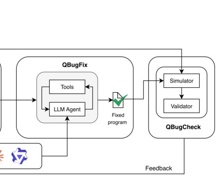
<figcaption class="paper-figure-caption"><b>Fig 1.</b> Fig. 1. Overview of the QBugLM framework</figcaption>
</figure>
<figure class="paper-figure-card">
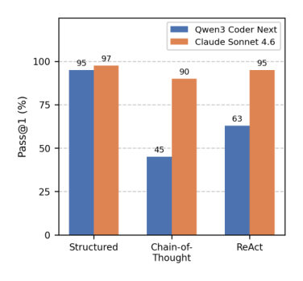
<figcaption class="paper-figure-caption"><b>Fig 2.</b> Fig. 2. Pass@1 of Qwen3 Coder Next and Claude Sonnet 4.6 across three prompting strategies on the Bernstein-Vazirani (BV) circuit. Structured prompting achieves the highest Pass@1 for both models.</figcaption>
</figure>
<figure class="paper-figure-card">
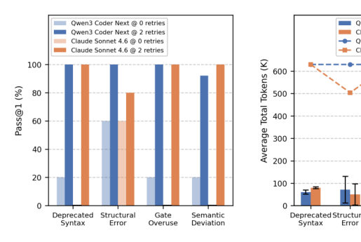
<figcaption class="paper-figure-caption"><b>Fig 3.</b> Fig. 3. Pass@1 per bug category at zero and two retries for both LLMs on the BV circuit with structured prompting.</figcaption>
</figure>
<figure class="paper-figure-card">

<figcaption class="paper-figure-caption"><b>Fig 4.</b> Fig. 4. Average total token consumption (bars) and Pass@1 (dashed lines) per mutant per bug category at two retries for both LLMs.</figcaption>
</figure>
<figure class="paper-figure-card">
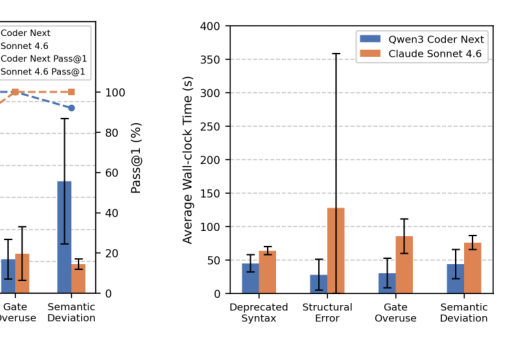
<figcaption class="paper-figure-caption"><b>Fig 5.</b> Fig. 5. Average wall-clock time per mutant per bug category at two retries for both LLMs.</figcaption>
</figure>

**Summary.** This paper introduces QBugLM, a novel multi-agent framework designed to automatically benchmark and repair bugs in quantum software written in OpenQASM 3.0. By systematically injecting various bug types and testing LLMs like Claude and Qwen, the authors demonstrate that iterative refinement is key to successful debugging. The work provides practical insights into using AI for automated quantum code repair.

**Why it may be interesting.** While focused on software engineering, the rigorous testing of quantum algorithms (like Deutsch-Jozsa or Grover) against systematic bugs provides benchmarks for validating complex quantum circuit implementations, which is crucial for any physical realization of quantum computation.

Detailed structure

**Main problem.** Quantum software bugs often result in silent, incorrect outputs, making them hard to detect; a systematic benchmark for LLM debugging of quantum code is needed.

**Main result.** Iterative feedback significantly boosts repair success (Pass@1 from <25% to >80%), and simpler structured prompting can outperform CoT/ReAct under resource constraints.

**Method.** The authors developed QBugLM, a multi-agent framework that automates bug injection (QBugGen), detection (QBugFind), repair (QBugFix), and validation (QBugCheck) for OpenQASM 3.0 code.

**Model / system.** The focus is on debugging quantum programs written in the OpenQASM 3.0 standard, tested across five canonical circuits (Deutsch-Jozsa, Grover, etc.) using a multi-agent LLM pipeline.

**Key observables.** Pass@1 metric for repair success, Total Variation Distance ($\delta$) for output comparison, and gate count difference $|	ext{Gref} - 	ext{Gfixed}|$.

**Important parameters / regimes.** The number of retries ($K$), the acceptable distance threshold ($\varepsilon_\delta = 0.05$), and resource constraints (token/cost).

**Assumptions / limitations.** Validation assumes execution on a noiseless quantum simulator to isolate logical errors from hardware noise.

**Figures summary.** Figures illustrate the QBugLM pipeline, show Pass@1 improvements across prompting strategies (Structured > CoT/ReAct), and compare performance metrics like token consumption vs. accuracy at multiple retry levels.

**Paper structure.** The paper introduces the QBugLM framework components (QBugGen, QBugFind, QBugFix, QBugCheck) and then conducts a comprehensive case study benchmarking LLMs across different bug types and prompting strategies to evaluate repair efficacy and cost-efficiency.

Abstract

Quantum software bugs often yield silent, incorrect outputs rather than explicit errors, making them particularly difficult to detect and repair with conventional techniques. Although large language models (LLMs) have shown strong performance on classical software engineering tasks, their ability to debug quantum code remains largely unexplored. To bridge this gap, we propose QBugLM, a multi-agent framework that automates the quantum software debugging pipeline, from taxonomy-driven bug injection to LLM-based detection and repair, and finally to simulation-based validation, for framework-agnostic OpenQASM 3.0 programs. We further conduct a comprehensive case study using QBugLM to benchmark two LLMs, Claude 4.6 Sonnet and Qwen3 Coder Next, across different prompting strategies, bug categories, and quantum programs. Our results show that iterative feedback is critical, as a single retry raises Pass@1 from below 25% to above 80%. Moreover, simpler structured prompting can even outperform Chain-of-Thought and ReAct for reasoning-capable models under fixed-resource constraints. Our work takes initial steps toward benchmarking LLM capabilities for debugging quantum programs and offers practical insights to support future efforts in automated quantum software repair.

[↑ back to top](#top)

### [Solution of the Equation-of-Motion Phonon Method eigenvalue problems on the D-Wave quantum annealer](http://arxiv.org/abs/2606.07035v1)

**Authors:** C. De Lucia, A. Martone, F. A. D'Aniello, A. Mastroianni, G. Nunziata, G. De Gregorio, R. Folprecht, F. Knapp, N. Lo Iudice, P. Vesely  
**Type:** theory · **Category:** quantum information and computing · **PDF:** <https://arxiv.org/pdf/2606.07035v1>  
**Analysis basis:** full PDF text, analyzed in chunks

↔ Scroll figures horizontally

<figure class="paper-figure-card">
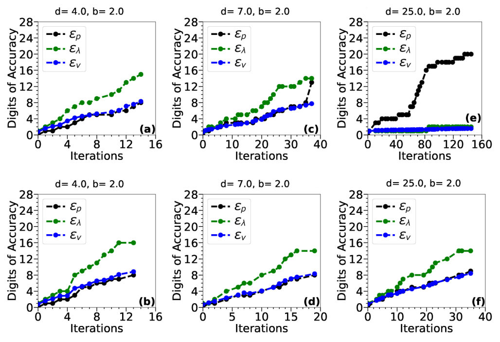
<figcaption class="paper-figure-caption"><b>Fig 1.</b> FIG. 1: Digits of accuracy of the lowest eigenvalue and of the corresponding eigenvector for the TDA Hamiltonian diagonalization with Jπ = 0+ and b = 2, performed with SA (a,c,e) and with QA (b,d,f). The value εp = −log10(precision) is also reported.</figcaption>
</figure>
<figure class="paper-figure-card">
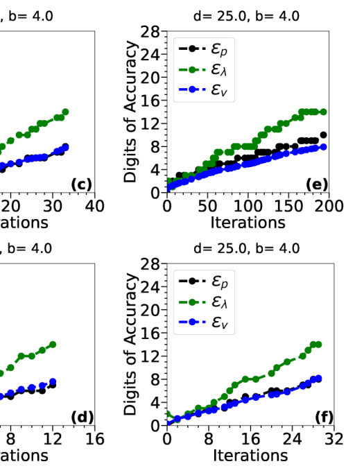
<figcaption class="paper-figure-caption"><b>Fig 2.</b> FIG. 2: Same as Fig. 1, for b = 4.</figcaption>
</figure>
<figure class="paper-figure-card">
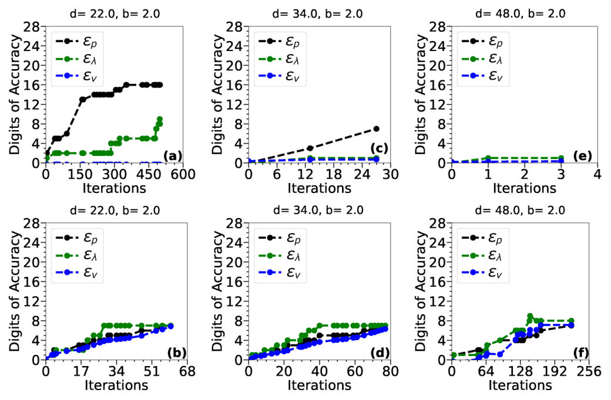
<figcaption class="paper-figure-caption"><b>Fig 3.</b> FIG. 3: Results for the solution of the GEVP within the Equation-of-Motion Phonon Method with Jπ = 0+, 1−, 2+</figcaption>
</figure>
<figure class="paper-figure-card">
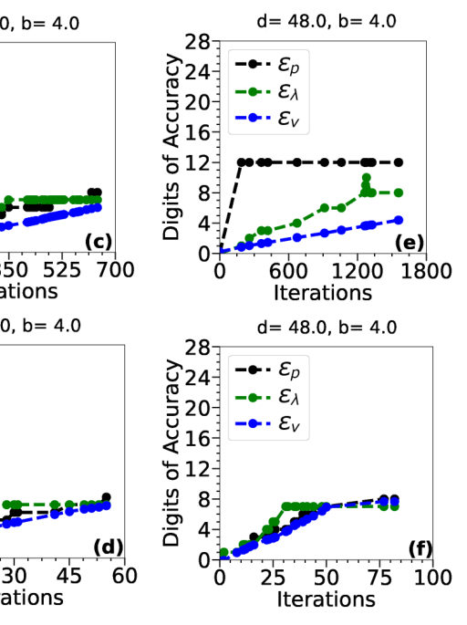
<figcaption class="paper-figure-caption"><b>Fig 4.</b> FIG. 4: Same as Fig. 3, for b = 4.</figcaption>
</figure>
<figure class="paper-figure-card">
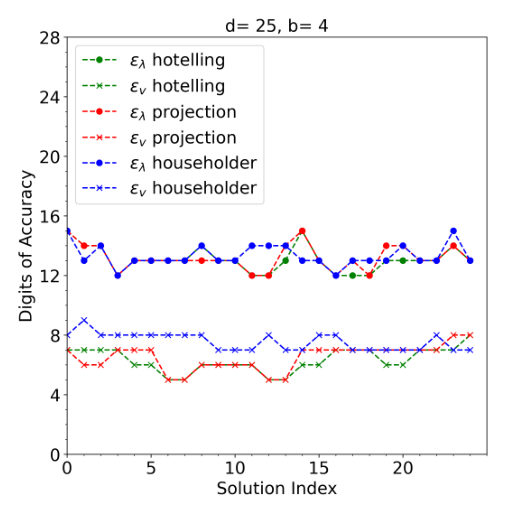
<figcaption class="paper-figure-caption"><b>Fig 5.</b> FIG. 6: Same as Fig. 5, for b = 4.</figcaption>
</figure>

**Summary.** This work addresses the challenge of solving massive eigenvalue problems from nuclear physics models using current quantum hardware. It proposes a hybrid approach that encodes the problem into a QUBO solvable by quantum annealing, which is then combined with classical matrix deflation techniques to reconstruct the entire spectrum. This demonstrates a viable path for near-term quantum computation in fundamental many-body physics.

**Why it may be interesting.** It directly tackles a major computational bottleneck in nuclear structure theory by proposing a concrete, near-term quantum algorithm (QA on QUBO) to solve complex many-body eigenvalue problems that are central to understanding quantum dynamics.

Detailed structure

**Main problem.** The core problem is solving large-scale eigenvalue problems arising from nuclear many-body theory, which are computationally intractable for exact diagonalization.

**Main result.** A hybrid quantum-classical algorithm combining quantum annealing with classical deflation was proposed and benchmarked to iteratively extract the full eigenspectrum of both standard and generalized eigenvalue problems.

**Method.** The continuous eigenvalue problem is mapped onto a Quadratic Unconstrained Binary Optimization (QUBO) formulation, which is then solved using quantum annealing. Full spectrum recovery relies on sequential application of matrix deflation techniques.

**Model / system.** The method is applied to eigenvalue problems derived from the Equation-of-Motion Phonon Method (EMPM), modeling nuclear structure dynamics in a multiphonon basis.

**Key observables.** Full eigenspectrum ($\{\Psi_
u\}$), eigenvalues ($E$), and eigenvectors, along with convergence behavior and eigenvalue accuracy.

**Important parameters / regimes.** Matrix dimensions ($d$), bit resolutions ($b=2, 4$), and the spectral shift parameter used in deflation.

**Assumptions / limitations.** Quantum Phase Estimation (QPE) is too demanding for current NISQ devices; thus, quantum annealing on QUBO formulations is used as a near-term alternative.

**Figures summary.** Figures compare accuracy ($\epsilon_p$) and total execution time ($	ext{tet}$) of different deflation methods (Hotelling, Orthogonal Projection, Householder) when solving SEVP/GEVP using both Simulated Annealing and Quantum Annealing.

**Paper structure.** The paper establishes the physical problem (EMPM eigenvalue equations), details the mapping to QUBO for quantum annealing, outlines iterative refinement via initial guess and descent phases, and finally implements full spectrum reconstruction using classical deflation techniques combined with quantum optimization steps.

Abstract

The solution of large-scale eigenvalue problems is crucial in nuclear many-body theory, where Hamiltonian matrices often reach extremely large dimensions. Quantum computing opens new perspectives for addressing such demanding problems. Although the Quantum Phase Estimation algorithm offers, in principle, a systematic route to matrix diagonalization, its practical deployment demands levels of coherence and error correction that current quantum hardware cannot yet support. A viable near-term strategy is instead to exploit quantum annealing, which enables the recasting of eigenvalue problems into quadratic unconstrained binary optimization formulations that can be addressed by existing annealing-based processors. Here, we propose a hybrid quantum-classical algorithm that combines quantum annealing and classical deflation to iteratively extract the full eigenspectrum of both standard and generalized eigenvalue problems. We benchmark this method on eigenvalue problems arising from the Equation of Motion Phonon Method performing calculations on real quantum hardware. Our approach illustrates the capabilities and limitations of near-term quantum devices in addressing nuclear eigenvalue problems.

[↑ back to top](#top)

### [Towards Implementable Quantum Divide and Conquer: A TSP Solver with Improved Exponential Base over Held-Karp](http://arxiv.org/abs/2606.07322v1)

**Authors:** Xujun Bai, Yun Shang, Honghong Lin  
**Type:** theory · **Category:** quantum information and computing · **PDF:** <https://arxiv.org/pdf/2606.07322v1>  
**Analysis basis:** full PDF text, analyzed in chunks

↔ Scroll figures horizontally

<figure class="paper-figure-card">
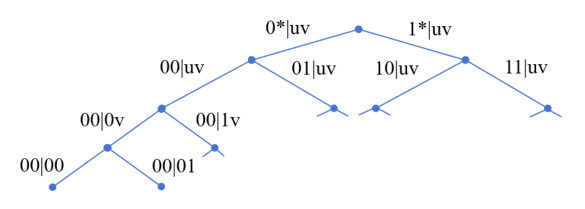
<figcaption class="paper-figure-caption"><b>Fig 1.</b> FIG. 1: Address transmission for one vertex (four qubits) in our encoding method. For the branches that mark the origins and ends, we only retain those corresponding to subset A.</figcaption>
</figure>
<figure class="paper-figure-card">
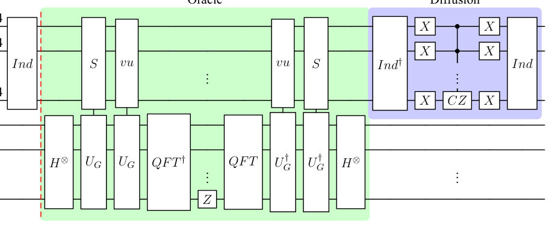
<figcaption class="paper-figure-caption"><b>Fig 2.</b> FIG. 2: The framework of our TSP solver, where the Ind-module represents the set partition state preparation algorithm and the controlled UG-gate is introduced in Appendix G. The part to the right of the red dashed line is Grover search module, which will be executed many times to amplify the amplitude of the optimal solution.</figcaption>
</figure>

**Summary.** This paper develops a quantum divide-and-conquer algorithm to solve the TSP, aiming for an exponential speedup over classical methods. It achieves this by designing an efficient structured quantum state preparation technique that encodes set partitions and minimizes the required query complexity to $O^*(1.865666\dots^n)$. The work is significant because it provides a detailed theoretical framework showing how to overcome previous limitations in analyzing quantum advantage for combinatorial optimization.

**Why it may be interesting.** It provides deep theoretical insights into achieving genuine quantum speedups for classically hard problems by carefully analyzing the overheads associated with state preparation versus search space reduction.

Detailed structure

**Main problem.** The paper addresses the Traveling Salesman Problem (TSP), an NP-hard combinatorial optimization problem, aiming to find a quantum algorithm with an improved exponential base over classical bounds.

**Main result.** The authors propose a quantum divide-and-conquer strategy achieving an optimal query complexity of $O^*(1.865666\dots^n)$ for TSP, which they claim surpasses the corrected analysis of previous quantum approaches and is superior to the classical Held-Karp bound.

**Method.** The method combines classical dynamic programming with a novel quantum search component implemented via a structured state preparation technique (set partition state) and utilizing QFT shortcuts in simulation.

**Model / system.** The model is abstract, focusing on qubit manipulation to encode set partitions and Hamiltonian cycles. The system involves constructing complex quantum circuits using controlled gates, Dicke states, and simulating the oracle operation via a structured state preparation module.

**Key observables.** Query complexity (the exponential base of the time/query requirement), gate complexity ($O(n^2)$ or $O(n^2 \log n)$), and circuit depth ($O(n)$).

**Important parameters / regimes.** The optimal number of subsets used in the partition ($k=4$) and the associated parameters ($\alpha_i \approx 0.315742$).

**Assumptions / limitations.** The quantum advantage relies critically on efficiently preparing a structured set partition state, which is assumed to be achievable with polynomial gate complexity despite requiring an exponential number of qubits for full encoding.

**Figures summary.** Figures illustrate the recursive structure of the TSP solver (e.g., Figure A1), the preparation of ordered 4-partitions using quantum circuits (Figure A7), and simulation results comparing complexities for small $n$ (Table II).

**Paper structure.** The paper builds by first establishing the classical complexity baseline (Held-Karp), then introducing a parameterized quantum divide-and-conquer spectrum, rigorously correcting the analysis of prior work ([1]), and finally detailing the construction of the state preparation circuits for optimal performance.

Abstract

The traveling salesman problem (TSP) is a significant classical NP-hard combinatorial optimization problem. In this work, we demonstrate that combining classical dynamic programming with quantum search can yield an achievable quantum advantage for TSP on the basis of excellent work by the authors of~\cite{ambainis2019quantum}. We design the quantum divide and conquer strategy to provide a parameterized spectrum for this combination. The hybrid algorithm proposed in~\cite{ambainis2019quantum} corresponds to a specific case in this spectrum, while the two extremes of the spectrum represent the purely classical Held-Karp and the purely quantum search algorithm, respectively. Within our parameterized spectrum, we prove that the optimal query complexity is $O^*(1.865666\ldots^n)$, achieved with the 4-subset scheme, while the counting in~\cite{ambainis2019quantum} overlooked half of the recursive branches. The correct query complexity of their algorithm is $O^*(2.225880\ldots^n)$ at their chosen parameter ($α\approx0.055362$), and cannot fall below $O^*(2^n)$ for any $α$ - meaning their $8$-subset scheme, correctly analyzed, never surpasses the classical Held-Karp bound.   Furthermore, in previous studies on quantum advantages for NP-hard combinatorial optimization problems, researchers focused only on improvements in query complexity. Our work, however, points out that the quantum advantage stems not only from the quadratic speedup of quantum search but also from the structured quantum state preparation. We argue that structured state preparation is indispensable for realizing the oracle operator while maintaining the total time complexity of $O^*(1.865666\ldots^n)$. Therefore, we design an elegant method for preparing the set partition state, which makes our TSP solver practically executable.

[↑ back to top](#top)

## Secondary cond-mat archives

*Papers from cond-mat.mtrl-sci, mes-hall, other, soft, supr-con. These archives are de-prioritized — they appear at the end regardless of relevance score.*

### Relevant in secondary archives (7)

### [Self-organized Floquet band geometry in cavity-driven quantum materials](http://arxiv.org/abs/2606.06579v1)

**Authors:** Christopher Yang, Gil Refael, Mark S. Rudner, Iliya Esin  
**Type:** theory · **Category:** other · **PDF:** <https://arxiv.org/pdf/2606.06579v1>  
**Analysis basis:** full PDF text, analyzed in chunks
**Topic relevance:** 🔥 `non-equilibrium dynamics` **5/5** · 🔥 `analog quantum simulation` **4/5** · 🔥 `driven-dissipative phase transition` **4/5** · 🔥 `methods for driven-dissipative` **4/5** · `correlated cavity matter` **3/5** · `non-equilibrium universality` **3/5** · `Tavis-Cummings & cavity-many-emitter` **2/5** · `spintronics-quantum-optics interface` **2/5** · `Keldysh / 2PI / non-Gaussian methods` **1/5** · `correlated / nonlocal dissipation` **1/5** · `entanglement & information structure` **1/5** · `exotic spin models in light-matter` **1/5**

↔ Scroll figures horizontally

<figure class="paper-figure-card">
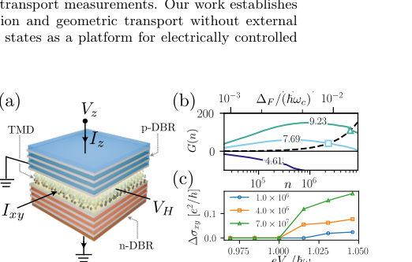
<figcaption class="paper-figure-caption"><b>Fig 1.</b> FIG. 1. Setup and main results. (a) Schematic of the pro- posed cavity material device. A TMD monolayer is embedded between p- and n-doped distributed Bragg reflectors (DBRs), which both form an optical cavity resonant at frequency ωc and serve as vertical electrical contacts biased by Vz. An in-plane probe current Ixy is driven through the TMD, and the transverse Hall voltage VH is measured to extract the Hall conductivity σxy. (b) Photon gain and loss as a function of the cavity photon occupation n, with the corresponding Floquet gap ∆F indicated on the upper axis. Solid curves show the electronic gain G(n) for several values of eVz slightly above ℏωc, while the dashed curve shows the...</figcaption>
</figure>
<figure class="paper-figure-card">
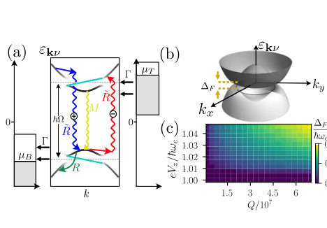
<figcaption class="paper-figure-caption"><b>Fig 2.</b> FIG. 2. Induced Floquet spectrum. (a) Floquet quasienergy spectrum and scattering processes responsible for gain saturation. The biased top and bottom leads, with chem- ical potentials µT and µB, inject and remove carriers near the photon resonance εkν = ±ℏωc/2. Recombination, with rate M, and phonon relaxation, with rate R, compete with photon- assisted Floquet-Umklapp processes that change the cavity photon number by ±1 and occur with rate ˜R = R(∆F /ℏωc)2. (b) Floquet band structure showing the cavity-induced gap ∆F . (c) Steady-state gap ∆F as a function of the cavity quality factor Q and bias eVz = µT −µB.</figcaption>
</figure>
<figure class="paper-figure-card">
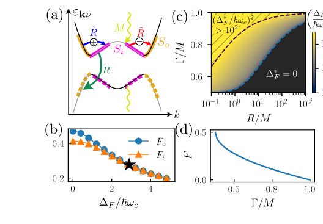
<figcaption class="paper-figure-caption"><b>Fig 3.</b> FIG. 3. Phenomenological model. (a) Folded Floquet- band representation of the scattering processes shown in the extended-zone picture in Fig. 2(a). The patches So and Si denote states near the resonance ring in the upper Floquet band, while So′ and Si′ are their particle-hole counterparts in the lower band. Solid arrows indicate photon-assisted phonon processes that emit (+) or absorb (−) a cavity photon, with rate ˜R = R(∆F /ℏωc)2, and squiggly arrows indicate recom- bination processes with rate M. (b) Average occupations Fo and Fi as a function of the Floquet gap ∆F . (c) Steady-state gap ∆∗ F as a function of phonon scattering rate R and lead tunneling rate Γ, both normalized by the...</figcaption>
</figure>
<figure class="paper-figure-card">
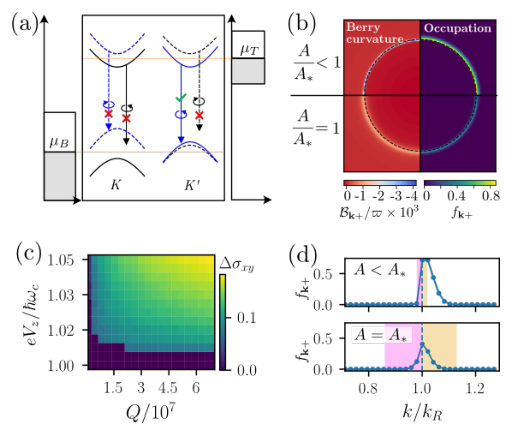
<figcaption class="paper-figure-caption"><b>Fig 4.</b> FIG. 4. Microscopic model and Hall response. (a) Band structure of a magnetically doped TMD with spin-orbit cou- pling. The top and bottom filtered leads, with chemical po- tentials µT and µB, create a nonequilibrium population. Due to spin-valley splitting, optical selection rules, Pauli blocking, and energy conservation, only one resonant spin-valley transi- tion contributes to gain, selecting a single circularly polarized cavity mode. (b) Berry curvature Bk+ and occupation fk+ of the upper Floquet band for a field amplitude below the self-consistent steady-state value, A &lt; A∗, and at the steady state, A = A∗, where A∗denotes the steady-state cavity- field amplitude. (c) Photo-induced...</figcaption>
</figure>
<figure class="paper-figure-card">
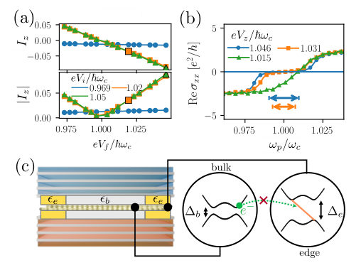
<figcaption class="paper-figure-caption"><b>Fig 5.</b> FIG. 5. Experimental signatures of the Floquet gap. (a) Out-of-plane current response following a bias quench. The cavity is initialized at bias Vi and rapidly quenched to Vf, while the field amplitude remains approximately fixed during the measurement. The plotted current is normalized by eΓlead, and the suppression of |Iz| near eVf ≃ℏωc sig- nals the Floquet gap. (b) Optical conductivity σxx(ωp) as a function of probe frequency ωp for different biases Vz. The colored arrows indicate the frequency window associated with the Floquet gap. (c) Proposed setup for probing edge trans- port. Dielectric engineering enhances the cavity field near the edge, producing an edge gap ∆e larger than the...</figcaption>
</figure>

**Summary.** The paper proposes using the self-generated intracavity field within an electrically pumped quantum material to achieve Floquet band engineering without external lasers. By analyzing the non-equilibrium steady state, it shows that this process creates a stable periodic drive that modifies electronic bands and results in a measurable anomalous Hall effect. This establishes a highly efficient platform for realizing topological phenomena using only DC bias.

**Why it may be interesting.** This work directly bridges cavity QED principles with non-equilibrium condensed matter physics by showing how internal feedback mechanisms can generate coherent driving fields, which is a key theme in advanced AMO/quantum optics research.

Detailed structure

**Main problem.** To develop an alternative method for Floquet engineering that uses self-generated cavity fields instead of high-power external lasers to dynamically control band structure and induce a geometric Hall response.

**Main result.** The system self-organizes into a stable time-periodic limit cycle above threshold, which 'Floquet-dresses' the bands and generates a measurable anomalous Hall conductivity via in-plane DC transport measurements.

**Method.** Self-consistent determination of the non-equilibrium steady state by solving coupled rate equations for electronic occupations (using Floquet theory) and cavity photon number dynamics.

**Model / system.** A semiconductor layer (TMD) embedded in an optical cavity, coupled to external leads and acoustic phonons. The system dynamics are governed by light-matter coupling leading to a self-consistent intracavity field buildup.

**Key observables.** Anomalous Hall conductivity ($\sigma_{xy}$), Floquet gap ($\Delta_F$), and the steady-state photon number ($n^*$).

**Important parameters / regimes.** Cavity quality factor, dissipation rates, DC bias voltage ($eV_z$), and the ratio of tunneling/recombination rates ($\Gamma/M$).

**Assumptions / limitations.** The analysis assumes a TMD with broken time-reversal symmetry leading to polarization selection; it treats the cavity field as quasi-static in certain limits.

**Figures summary.** Figures illustrate the schematic setup, the balance between photon gain and loss determining steady states, the opening of the Floquet gap ($\Delta F$) versus bias voltage, and the resulting photo-induced change in Hall conductivity ($\Delta\sigma_{xy}$).

**Paper structure.** The paper progresses from establishing the physical problem (avoiding external lasers) to developing the self-consistent model using rate equations for occupations and photon number. It then analyzes the emergence of the periodic drive, the resulting band modification (Floquet dressing), and finally predicts measurable transport signatures like $\Delta\sigma_{xy}$.

Abstract

Floquet engineering has emerged as a powerful route to dynamically control band structure and topology in quantum materials, but most implementations rely on externally imposed laser fields that are power intensive, difficult to integrate into devices, and weakly coupled to the electronic system. We propose and analyze an alternative paradigm in which a self-generated cavity field Floquet-dresses the electronic bands and produces a geometric Hall response in an electrically driven cavity material system. We consider a semiconductor layer embedded in a cavity and coupled to external leads and a bath of acoustic phonons, where dc pumping leads to the buildup of a coherent intracavity field through light-matter coupling. We determine the resulting nonequilibrium steady state self-consistently and show that, above threshold, the coupled system settles into a stable time-periodic limit cycle with a field amplitude set by the cavity quality factor and dissipation. This emergent periodic field Floquet-dresses the electronic bands and modifies the anomalous Hall response of a material with broken time-reversal symmetry. We demonstrate that the resulting Hall conductivity can be directly probed via in-plane dc transport measurements. Our work establishes a route to self organized Floquet band reconstruction and geometric transport without external laser illumination, highlighting cavity driven steady states as a platform for electrically controlled nonequilibrium phases.

[↑ back to top](#top)

### [Layer-Polarization-Driven Metal-Insulator Transition in multi-band Graphene Moire' Superlattices](http://arxiv.org/abs/2606.06939v1)

**Authors:** Harsimran Kaur Mann, Simrandeep Kaur, Harsimran Singh, Yashashwani Garg, Amogh Waghmare, Mohit Kumar Jat, Kenji Watanabe, Takashi Taniguchi, Manish Jain, Aveek Bid  
**Type:** both · **Category:** strongly correlated electrons · **PDF:** <https://arxiv.org/pdf/2606.06939v1>  
**Analysis basis:** full PDF text, analyzed in chunks
**Topic relevance:** 🔥 `analog quantum simulation` **4/5** · `driven-dissipative phase transition` **3/5** · `methods for driven-dissipative` **3/5** · `non-equilibrium dynamics` **2/5** · `non-equilibrium universality` **2/5** · `Frenkel-Kontorova` **1/5** · `Keldysh / 2PI / non-Gaussian methods` **1/5** · `Kondo & dissipative impurity` **1/5**

↔ Scroll figures horizontally

<figure class="paper-figure-card">

<figcaption class="paper-figure-caption"><b>Fig 1.</b> FIG. 1. Device Characterization: (a) Schematic band structure for ABA TLG at ∆= 0 meV, showing</figcaption>
</figure>
<figure class="paper-figure-card">
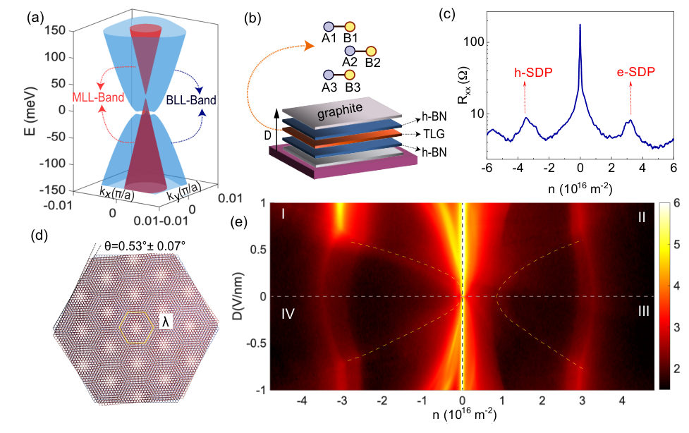
<figcaption class="paper-figure-caption"><b>Fig 2.</b> Figure 1(e) shows Rxx in the n–D plane, divided into four regions I–IV. Two features not typ-</figcaption>
</figure>
<figure class="paper-figure-card">
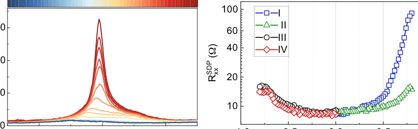
<figcaption class="paper-figure-caption"><b>Fig 3.</b> FIG. 2. Layer polarization: (a) Plot of Rxx as a function of n for 0 V/nm &lt; D &lt; 1 V/nm and hole-doping</figcaption>
</figure>
<figure class="paper-figure-card">
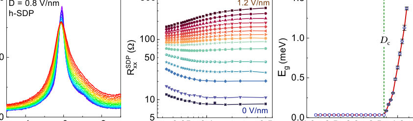
<figcaption class="paper-figure-caption"><b>Fig 4.</b> FIG. 3. Displacement-field-tuned band gap: (a–c) Plots of Rxx as a function of n over the temperature</figcaption>
</figure>
<figure class="paper-figure-card">

<figcaption class="paper-figure-caption"><b>Fig 5.</b> Figure 3(a-c) shows Rxx as a function of n over the temperature range 17 mK &lt; T &lt; 30 K</figcaption>
</figure>

**Summary.** This work demonstrates that layer polarization, controlled by an external electric field, can drive a Metal-Insulator Transition in graphene moiré superlattices. The MIT occurs selectively for hole doping because the field induces layer-selective coupling to the moiré potential, opening a tunable band gap. This highlights electrical control as a powerful tool for engineering correlated electronic phases.

**Why it may be interesting.** The concept of using external fields (like electric displacement) to engineer band structure reconstruction and induce correlated insulating phases is highly relevant to controlling quantum states in low-dimensional systems.

Detailed structure

**Main problem.** The study investigates how electrical control of layer polarization can drive a Metal-Insulator Transition (MIT) in multi-band graphene moiré superlattices.

**Main result.** Applying a perpendicular displacement field ($D$) induces an asymmetry that drives the system into a tunable insulating phase at the hole-doped secondary Dirac point, which is absent for electron doping.

**Method.** The research combines transport measurements (resistance $R_{xx}$ and quantum capacitance $C_Q$) with theoretical continuum modeling of the Hamiltonian.

**Model / system.** The platform is an ABA-stacked trilayer graphene (TLG) moiré superlattice formed on hBN. The system's electronic structure is governed by a multi-band Hamiltonian that incorporates layer polarization ($\Delta$) and the periodic moiré potential ($V_{	ext{hBN}}$).

**Key observables.** Longitudinal resistance ($R_{xx}$), quantum capacitance ($C_Q$), secondary Dirac point (SDP) position, and the energy gap ($E_g$).

**Important parameters / regimes.** Perpendicular displacement field ($D$) and carrier density ($n$); critical fields like $D_c \sim 0.7 	ext{ V/nm}$.

**Assumptions / limitations.** The analysis relies on continuum models for TLG and assumes that the moiré potential couples selectively to specific layers based on the applied electric field.

**Figures summary.** Figures illustrate $R_{xx}$ vs. $n$ and $D$, showing sharp resistance increases at the h-SDP when $|D|$ is large, alongside capacitance dips confirming gap opening.

**Paper structure.** The paper systematically analyzes transport measurements ($R_{xx}, C_Q$) across different doping regimes defined by the sign of $D$. Theory confirms that layer polarization controls the coupling strength to the moiré potential, leading to an asymmetric MIT only for hole doping.

Abstract

Graphene/hBN moiré superlattices provide a highly tunable platform for exploring emergent quantum phases in low-dimensional systems. Here, we investigate the moiré superlattice formed between hBN and ABA-stacked trilayer graphene (TLG), an inherently multi-band system. We demonstrate that the moiré potential is not merely a perturbation but a tool to hybridize the distinct massless and massive electronic sectors of TLG. By applying a perpendicular displacement field to tune layer polarization, we drive a fundamental reconstruction of the electronic band structure. Specifically, increasing the displacement field evolves the system from a multi-band regime to an effectively single-band regime at low energies, accompanied by a metal--insulator transition at the hole-doped secondary Dirac point. This transition originates from a redistribution of carriers across graphene layers that selectively enhances their coupling to the extrinsic moiré potential. Quantum capacitance measurements provide direct evidence for the suppression of the density of states at the hole-side secondary Dirac point, consistent with gap opening and the emergence of a displacement-field-tuned band gap. Theoretical calculations reproduce these observations and identify layer-selective coupling to the moiré potential as the underlying mechanism. These results demonstrate electrical control of an emergent insulating phase in a low-dimensional moiré system, and highlight that layer polarization and layer-selective coupling in multi-band moiré heterostructures provide a powerful route for engineering topological and correlated phases through band structure reconstruction and electron interactions.

[↑ back to top](#top)

### [Matching Terahertz and Hall Mobilities as a Hallmark of Intrinsic Charge Transport in Metal-Halide Perovskites](http://arxiv.org/abs/2606.06623v1)

**Authors:** Dmitry R. Maslennikov, Ben P. Carwithen, Vladimir V. Bruevich, Yichao Cai, Davide Nodari, Navendu Mondal, Xijia Zheng, Beier Hu, Nicola Gasparini, Jarvist M. Frost, Vitaly Podzorov, Artem A. Bakulin  
**Type:** experiment · **Category:** other · **PDF:** <https://arxiv.org/pdf/2606.06623v1>  
**Analysis basis:** full PDF text, analyzed in chunks
**Topic relevance:** `non-equilibrium dynamics` **3/5** · `Keldysh / 2PI / non-Gaussian methods` **1/5** · `driven-dissipative phase transition` **1/5** · `methods for driven-dissipative` **1/5** · `non-equilibrium universality` **1/5**

↔ Scroll figures horizontally

<figure class="paper-figure-card">
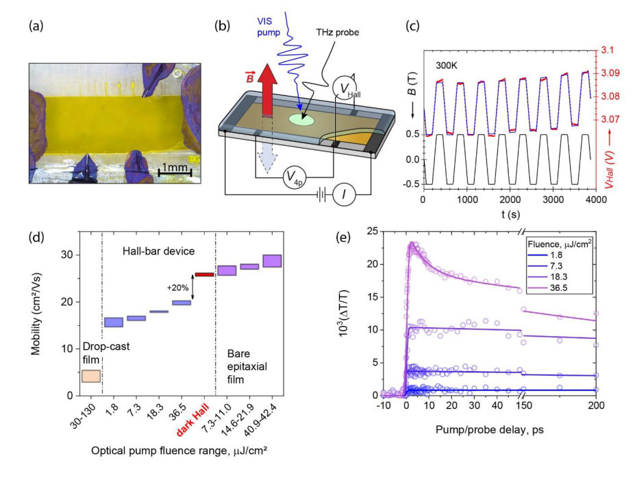
<figcaption class="paper-figure-caption"><b>Fig 1.</b> Figure 1. (a) Optical microscopy image of the studied CsPbBr3 device with graphite contacts and parylene-N capping layer that allows both the (dark) Hall effect and THz OPTP measurements of the same device. (b) A sketch of the device structure and an overview of the Hall effect and OPTP measurements. The approach allows both electrical transport and transmission spectroscopy measurements in a single device. (c) An example of the Hall voltage measurements of the device shown in panels a and b carried out at 300 K in the dark, revealing an excellent signal-to-noise ratio: the transport (Hall) mobility is extracted from the modulations of the Hall voltage induced by the external magnetic...</figcaption>
</figure>
<figure class="paper-figure-card">
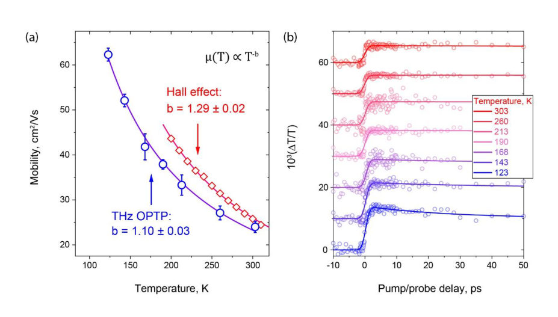
<figcaption class="paper-figure-caption"><b>Fig 2.</b> Figure 2. Temperature-dependent measurements of the carrier mobility in epitaxial single-crystal CsPbBr3 perovskite films. (a) The mobility extracted from OPTP and Hall measurements in the ranges 125 – 300 K and 200 – 315 K, respectively. The μ(T) follows a power-law dependence, 𝜇(𝑇) ∝ 𝑇−b , with the power exponent indicated on the plot (Pearson’s correlation coefficient R = 0.99 in both cases). (b) The OPTP transients corresponding to the extracted 𝜇𝑂𝑃𝑇𝑃(𝑇) recorded at a fluence of ≈ 8.4 W/cm2 (excitation pulse power ≈ 100 W) and subsequently fitted by a sum of two exponential functions convolved with a Gaussian.</figcaption>
</figure>
<figure class="paper-figure-card">
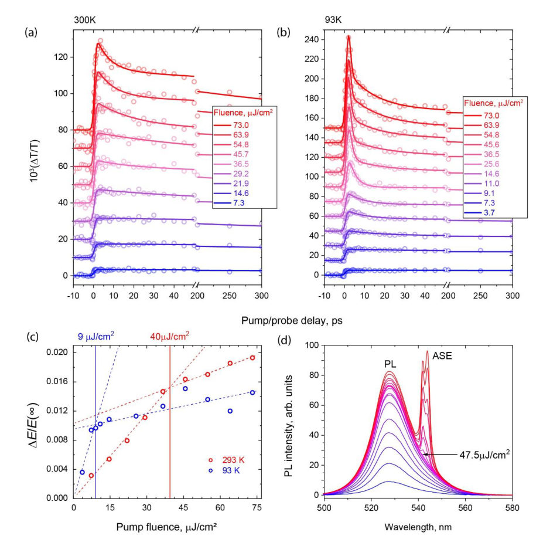
<figcaption class="paper-figure-caption"><b>Fig 3.</b> Figure 3. (a, b) Fluence dependence of the OPTP transients in epitaxial single- crystalline CsPbBr3 films under a 400 nm excitation recorded at 300 and 93 K. (c) The OPTP signal at 300 ps after photoexcitation as a function of excitation fluence for these temperatures. The kink observed on the curves at approximately 9 and 40 μJ/cm2 signal a change in the charge carrier dynamics and recombination regime. (d) Fluence dependant PL spectra of the same sample under the same photoexcitation (400 nm, 35 fs laser pulses).</figcaption>
</figure>

**Summary.** This work addresses discrepancies in measuring carrier mobility in perovskites by simultaneously employing Hall effect and OPTP spectroscopy on single crystals. By showing quantitative agreement between local (OPTP) and macroscopic (Hall) mobilities, the authors establish a robust benchmark for intrinsic charge transport in soft-lattice semiconductors.

**Why it may be interesting.** While focused on solid-state physics, the rigorous methodology of linking ultrafast optical measurements to steady-state transport is highly relevant for understanding charge dynamics in complex quantum materials, which often exhibit non-equilibrium behavior.

Detailed structure

**Main problem.** To resolve discrepancies in reported charge carrier mobilities in soft-lattice metal-halide perovskites, which are attributed to heterogeneity across length scales and static disorder.

**Main result.** The study demonstrated quantitative agreement between local mobility measured by OPTP spectroscopy and macroscopic mobility measured by the Hall effect on single-crystal $	ext{CsPbBr}_3$. This confirms that intrinsic charge transport is achievable in these soft materials.

**Method.** A novel, integrated device platform was used to perform concurrent Hall-effect (macroscopic) and Optical Pump–Terahertz Probe (OPTP) spectroscopy (local/ultrafast) measurements on the same single crystal.

**Model / system.** The physical system is epitaxial $	ext{CsPbBr}_3$ single crystals. The analysis compares steady-state transport ($\mu_{	ext{Hall}}$) with ultrafast, photoexcited dynamics ($\mu_{	ext{OPTP}}$), linking local electronic response to bulk electrical properties.

**Key observables.** Charge carrier mobility ($\mu$), temperature dependence of mobility ($\mu(T)$), and the comparison between $\mu_{	ext{OPTP}}$ and $\mu_{	ext{Hall}}$.

**Important parameters / regimes.** Room-temperature mobilities ($\sim 30 	ext{ cm}^2	ext{V}^{-1}	ext{s}^{-1}$); temperature dependence exponents ($b \approx 1.1-1.3$); excitation fluence thresholds (e.g., $40 \, \mu	ext{J}/	ext{cm}^2$).

**Assumptions / limitations.** The primary assumption is that the agreement between $\mu_{	ext{OPTP}}$ and $\mu_{	ext{Hall}}$ signifies a true intrinsic transport regime, free from static disorder limitations.

**Figures summary.** Figures illustrate device schematics for co-measurement, comparisons of mobility values derived from both techniques across different conditions (temperature/fluence), and plots showing temperature dependence ($\mu(T) \propto T^{-b}$) and fluence-dependent OPTP transients.

**Paper structure.** The paper establishes the problem of measurement discrepancy, details the novel dual-measurement platform on single crystals, presents quantitative agreement between local and macroscopic mobilities, analyzes the common temperature scaling laws, and discusses high-fluence regimes where many-body effects become dominant.

Abstract

Charge-carrier transport in soft-lattice materials, including metal-halide perovskites, is often perceived to be highly heterogeneous across different length scales, and influenced by both the intrinsic (dynamic) thermal electronic disorder and extrinsic (static) disorder due to crystal defects, impurities, grain boundaries, and surface states. As a consequence, the reported carrier mobilities obtained by different electrical and optical measurement techniques frequently disagree, raising a critical question: can a truly intrinsic charge transport regime (that is, a regime not dominated by static disorder) extend across macroscopic single crystals of these materials? Here, we demonstrate such a regime in an exemplary metal-halide perovskite system, epitaxial CsPbBr$_{3}$ single crystals, where the local mobility obtained via optical pump-terahertz probe (OPTP) spectroscopy quantitatively agrees with the macroscopic transport mobility across a broad range of experimental conditions. Using a dedicated device platform that enables concurrent Hall-effect and OPTP measurements on the same single-crystalline sample, we obtain consistent room-temperature mobilities of ~ 30 cm$^{2}$V$^{-1}$s$^{-1}$, among the highest reliably reported for CsPbBr$_{3}$. Both techniques reveal band-like temperature dependence of the hole mobility with similar power exponents, confirming that the same intrinsic transport mechanism governs the ultrafast/local and steady-state/macroscopic responses. These results show that defect-free charge transport is achievable in soft-lattice perovskites on millimetre length scales and establish a robust methodology for benchmarking intrinsic mobility in emerging semiconductors.

[↑ back to top](#top)

### [Polar and quadratic magneto-optical Kerr effects in nonmagnetic/ferromagnet bilayers for spin-orbit torque measurements](http://arxiv.org/abs/2606.07395v1)

**Authors:** Yukihiro Marui, Masashi Kawaguchi, Kohji Nakamura, Masamitsu Hayashi  
**Type:** experiment · **Category:** other · **PDF:** <https://arxiv.org/pdf/2606.07395v1>  
**Analysis basis:** full PDF text, analyzed in chunks
**Topic relevance:** `spintronics-quantum-optics interface` **3/5** · `non-equilibrium dynamics` **1/5**

↔ Scroll figures horizontally

<figure class="paper-figure-card">
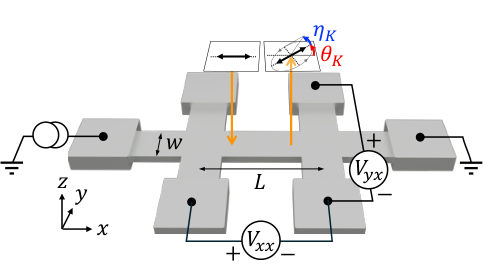
<figcaption class="paper-figure-caption"><b>Fig 1.</b> Figure 1. Schematic illustration of the experimental setup and definitions of the coordinate axis, the longitudinal Vxx and Hall Vyx voltages, and the real θK and imaginary ηK com- ponents of the MOKE signal. w and L are, respectively, the width and length of the current channel of the Hall bar. The polarization of the incident and reflected light are sketched.</figcaption>
</figure>
<figure class="paper-figure-card">
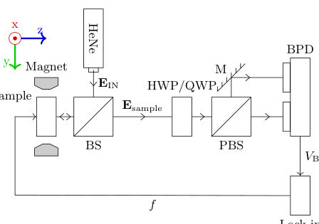
<figcaption class="paper-figure-caption"><b>Fig 2.</b> Figure 2. Schematic drawing of the optical setup. BS: beam splitter, HWP: half-wave plate, QWP: quarter-wave plate, PBS: polarized beam splitter, BPD: balanced photodetector.</figcaption>
</figure>
<figure class="paper-figure-card">
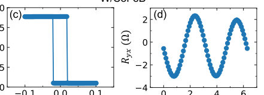
<figcaption class="paper-figure-caption"><b>Fig 3.</b> Figure 3. (a,c) The out of plane field Hz dependence of the Hall resistance Ryx. (b,d) Ryx plotted against the in-plane magnetic field angle φH. The field amplitude is 1.7 T. The solid lines show fit to the data with a sinusoidal function. (a,b) Ta/CoFeB, (c,d) W/CoFeB.</figcaption>
</figure>
<figure class="paper-figure-card">
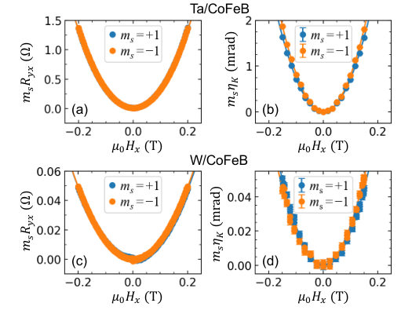
<figcaption class="paper-figure-caption"><b>Fig 4.</b> Figure 4. (a-d) The in-plane field Hx dependence of the Hall resistance Ryx (a,c) and Kerr ellipticity ηK (b,d). The solid lines represent fit to the data with a parabolic function. Ryx here is obtained using the AC electrical measurements, that is, Ryx = Rω. The error bars in (b,d) represent the standard deviation of the MOKE signal over multiple measurements. (a,b) Ta/CoFeB, (c,d) W/CoFeB.</figcaption>
</figure>
<figure class="paper-figure-card">
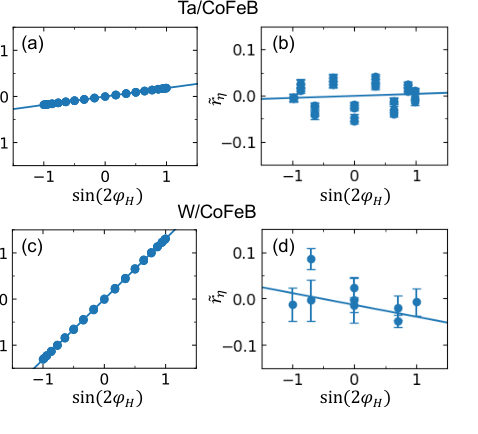
<figcaption class="paper-figure-caption"><b>Fig 5.</b> Figure 5. sin(2φ) dependence of ˜rH (a,c) and ˜rη (b,d). (a,b) Ta/CoFeB, (c,d) W/CoFeB. The error bars in (b,d) represent errors of fitting Eq. (11) to the data.</figcaption>
</figure>

**Summary.** This work compares two methods—Hall resistance measurements and MOKE spectroscopy—to measure spin-torque efficiency in magnetic bilayers. The authors demonstrate that the MOKE signal's quadratic component is largely immune to SMR effects, unlike the planar Hall resistance. This allows MOKE to provide a robust and reliable determination of fundamental spintronic parameters.

**Why it may be interesting.** While not directly related to quantum computation, the rigorous comparison of multiple measurement techniques (electrical vs. optical) to isolate fundamental physical parameters like spin-torque efficiency is highly relevant in advanced condensed matter physics research concerning spintronics and magnetodynamics.

Detailed structure

**Main problem.** The study aims to determine if Magneto-Optical Kerr Effect (MOKE) measurements provide a reliable alternative to electrical transport methods for characterizing spin-torque efficiency in nonmagnetic/ferromagnetic bilayers.

**Main result.** The ratio of quadratic to polar MOKE signals is found to be significantly smaller than the corresponding Hall resistance ratio, indicating that Spin Hall Magnetoresistance (SMR) contributes negligibly to the MOKE response. Consequently, MOKE measurements yield reliable estimates for spin-torque efficiency.

**Method.** The authors compare electrical transport measurements (Anomalous/Planar Hall resistances, second harmonic voltage) with optical MOKE measurements (polar and quadratic components of Kerr effect).

**Model / system.** The research focuses on Nonmagnetic metal (NM)/Ferromagnetic metal (FM) bilayers, such as W/CoFeB and Ta/CoFeB. The analysis involves modeling the magnetization response under external fields and applied currents.

**Key observables.** Planar and anomalous Hall resistances ($R_P, R_A$), polar ($\eta_P$) and quadratic ($\eta_Q$) MOKE components, and spin-torque efficiencies ($\xi_{DL}, \xi_{FL}$).

**Important parameters / regimes.** The ratio $r_\eta = \eta_Q/\eta_P$ is a key diagnostic; the failure of electrical methods occurs when the Hall resistance ratio approaches unity.

**Assumptions / limitations.** Key assumptions include neglecting certain terms in the low-field approximation and assuming that MOKE measurements are insensitive to SMR effects, unlike planar Hall resistance.

**Figures summary.** Figures show field dependence of Hall resistance ($R_{yx}$) vs. angle ($\varphi_H$), and how both electrical (second harmonic voltage) and optical ($\eta_K$) signals vary with applied magnetic field amplitude ($H$).

**Paper structure.** The paper progresses by first establishing the problem—the complication caused by SMR in Hall measurements—and then proposing MOKE as a solution. It details the theoretical framework for both electrical and optical measurements, presents comparative results showing the discrepancy between methods when $r_H \approx 1$, and concludes that MOKE provides consistent results.

Abstract

Recent studies have revealed that spin Hall magnetoresistance (SMR) contributes to both the anomalous and planar Hall resistances in nonmagnetic metal (NM)/ferromagnetic metal (FM) bilayers. This effect becomes pronounced when the NM layer exhibits a large spin Hall angle, as in W/CoFeB bilayers. In such systems, the ratio of planar to anomalous Hall resistances, normally small in single CoFeB layers, can approach unity. This unusually large ratio complicates the determination of spin-torque efficiency using harmonic Hall voltage measurements. To overcome this limitation, magneto-optical Kerr effect (MOKE) measurements have been proposed as an alternative approach. Here, we investigate the polar and quadratic MOKE components, which correspond to, respectively, the anomalous and planar Hall resistances in the low-frequency limit to clarify whether the MOKE measurements are suitable for characterizing the spin-torque efficiency. We find that the ratio of quadratic to polar MOKE signals in NM/FM bilayers is significantly smaller than the corresponding Hall resistance ratio, indicating that SMR contributes negligibly to the MOKE response in the visible range. Consequently, the spin-torque efficiency extracted from MOKE measurements agree well with those expected from the spin Hall angle of the NM layer. These results clarify the reason why MOKE measurements provide reliable determination of the spin-torque efficiency.

[↑ back to top](#top)

### [Spin SWAP operation in double quantum dots at the LaAlO3/SrTiO3 interface](http://arxiv.org/abs/2606.06948v1)

**Authors:** A. Sierant, J. Czarnecki, B. Szafran, P. Wójcik  
**Type:** theory · **Category:** quantum information and computing · **PDF:** <https://arxiv.org/pdf/2606.06948v1>  
**Analysis basis:** full PDF text, analyzed in chunks
**Topic relevance:** `spintronics-quantum-optics interface` **3/5** · `exotic spin models in light-matter` **1/5**

↔ Scroll figures horizontally

<figure class="paper-figure-card">
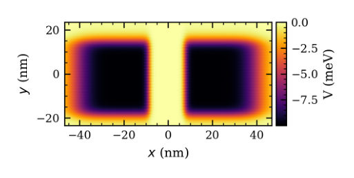
<figcaption class="paper-figure-caption"><b>Fig 1.</b> FIG. 1. The confining potential in the double LAO/STO QD for the following set of parameters: µ = 6, V0 = 10 meV, Vb = 10 meV, and Rb = 43a.</figcaption>
</figure>
<figure class="paper-figure-card">
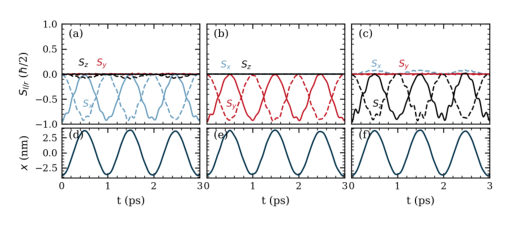
<figcaption class="paper-figure-caption"><b>Fig 2.</b> FIG. 3. Time evolution of the expectation value of the spin in the left (solid lines) and right (dashed lines) dots. The x, y, and z components of the spin are marked in blue, red, and black, respectively. Panels [(d)–(f)] show the average electron position x as a function of time. Results for a quantum dot size of d = 5.5 nm.</figcaption>
</figure>
<figure class="paper-figure-card">
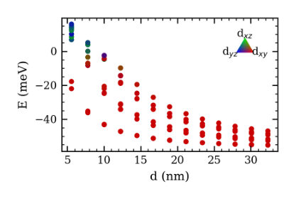
<figcaption class="paper-figure-caption"><b>Fig 3.</b> FIG. 2. Single electron spectrum of double LAO/STO QD as a function of quantum dot size d. Contributions from different orbitals dxy, dxz and dyz are marked using an RGB color scheme. Results for the confining potential parameters Vb = 70 meV, V0 = 10 meV and Rb = 70 meV.</figcaption>
</figure>
<figure class="paper-figure-card">
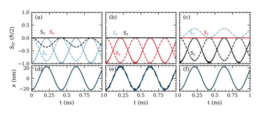
<figcaption class="paper-figure-caption"><b>Fig 4.</b> FIG. 4. Same as Fig. 3, but for a quantum dot size of d = 33 nm.</figcaption>
</figure>
<figure class="paper-figure-card">
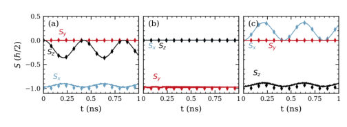
<figcaption class="paper-figure-caption"><b>Fig 5.</b> FIG. 5. The expectation value of spin from the full quan- tum mechanical calulations presented in Fig. 4 (solid lines) compared with the solution of the Bloch equations with a Rashba-like SO coupling, Eq. (23) (indicated by diamonds). Results for d = 33 nm.</figcaption>
</figure>

**Summary.** This paper theoretically investigates the feasibility of implementing a robust SWAP gate for spin qubits in double quantum dots formed at the LaAlO3/SrTiO3 interface. The authors analyze how varying the dot size and leveraging orbital physics (d-character) allows for control over spin dynamics, showing that SO coupling introduces both opportunities (anisotropy) and challenges (fidelity reduction). It provides crucial guidelines for designing next-generation solid-state quantum memories.

**Why it may be interesting.** This work directly addresses solid-state quantum computation platforms, providing detailed theoretical predictions on controlling spin qubits using engineered material interfaces (STO/LAO) where strong spin-orbit coupling is inherent.

Detailed structure

**Main problem.** The study investigates spin control during the SWAP operation in double quantum dots (QDs) fabricated at the LaAlO3/SrTiO3 interface, focusing on how multi-orbital character and spin-orbit coupling affect fidelity.

**Main result.** The SWAP time varies significantly with QD size, and high fidelity requires operating in an intermediate regime where SO interaction is controlled relative to kinetic energy. Furthermore, the anisotropy of the operation can be exploited by aligning initial polarization along specific axes.

**Method.** The analysis employs a combination of full quantum mechanical simulations (solving the two-electron Hamiltonian) and semi-classical approaches using Bloch equations to model spin dynamics over time.

**Model / system.** The system is double QDs embedded in a 2DEG at the LaAlO3/SrTiO3 interface, modeled using a tight-binding Hamiltonian incorporating kinetic energy, atomic SO coupling, Rashba interaction, and electron-electron Coulomb repulsion. The physics spans two regimes: large dots (Rashba-dominated) and small dots (higher orbital contributions).

**Key observables.** SWAP operation fidelity, spin expectation values ($\langle S_x 
angle, \langle S_y 
angle, \langle S_z 
angle$), and the exchange energy ($J$).

**Important parameters / regimes.** QD diameter (d), SO coupling strengths ($\Delta_{	ext{SO}}, \Delta_{	ext{RSO}}$), and confinement potential parameters.

**Assumptions / limitations.** The semi-classical Bloch approach assumes separation of spin and positional degrees of freedom, which is noted to break down in certain regimes. Effective Hamiltonian derivations involve approximations regarding the largest energy scale ($\Delta E$).

**Figures summary.** Figures illustrate confining potentials, time evolution of single/two-electron spin expectation values showing precession or beating patterns, and plots detailing the exchange energy ($J$) versus QD size or barrier height.

**Paper structure.** The paper systematically analyzes single-electron dynamics first (using Bloch equations), then moves to two-electron spin control via the SWAP operation. It contrasts results across different QD sizes (large vs. small) and details how SO coupling introduces anisotropy and affects fidelity by mixing orbital character ($d_{xy}$ vs $d_{xz}/d_{yz}$).

Abstract

Progress in the fabrication of nanoscale transition-metal-oxide heterostructures makes these platforms promising candidates for the realization of spin qubits, mainly due to the $d$-character of their electronic structures, which could potentially result in a reduction of hyperfine interactions and spin decoherence. Here, we present a systematic study of spin control within the SWAP operation in double quantum dots embedded in a two-dimensional electron gas at the LaAlO$_3$/SrTiO$_3$ interface. Our analysis starts with a study of single-electron spin dynamics, focusing on the influence of spin-orbit and interorbital coupling on the spin evolution. In this case, our findings are supported by semiclassical calculations based on the Bloch equations, which show good agreement with full quantum mechanical simulations. We then simulate the SWAP operation by analyzing the crossover between two regimes: (i) large quantum dots, where the electronic structure is dominated by the $d_{xy}$ orbitals and the spin dynamics is affected primarily by Rashba-type spin-orbit interaction; and (ii) small quantum dots, where higher-energy orbitals $d_{xz/yz}$ contribute to the electronic structure, leading to a significant reduction in the SWAP fidelity. In the first regime, particularly relevant from the application point of view, we analyze in detail the anisotropy of the SWAP operation induced by the spin-orbit coupling.

[↑ back to top](#top)

### [Magnetic Field Walls in Flat-band Superconductors](http://arxiv.org/abs/2606.06791v1)

**Authors:** Guodong Jiang, Aaron Dunbrack, Tero Heikkilä, Päivi Törmä  
**Type:** theory · **Category:** strongly correlated electrons · **PDF:** <https://arxiv.org/pdf/2606.06791v1>  
**Analysis basis:** full PDF text, analyzed in chunks
**Topic relevance:** `Frenkel-Kontorova` **2/5** · `Keldysh / 2PI / non-Gaussian methods` **1/5** · `analog quantum simulation` **1/5** · `spintronics-quantum-optics interface` **1/5**

↔ Scroll figures horizontally

<figure class="paper-figure-card">
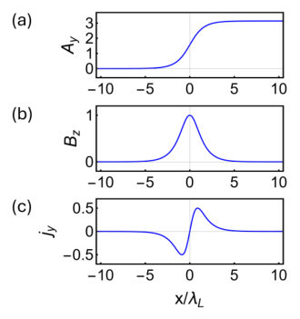
<figcaption class="paper-figure-caption"><b>Fig 1.</b> FIG. 2. Plots of Ay, Bz, and jy (in units of ℏ/ea, ℏ/eaλL, and ℏ/µ0eaλ2 L, respectively) of the kink soliton mode along x direction (Eq. (7), with charge +1). (a) The vector potential component Ay has a jump of π from x = −∞to ∞. (b) The region where Bz ̸= 0 forms a wall. (c) The current density jy is bidirectional on the two sides of the wall. All these profiles extend in the yz-plane by translation symmetry. See Fig. 1(c) for the 3D illustration of Bz(x) and jy(x).</figcaption>
</figure>
<figure class="paper-figure-card">
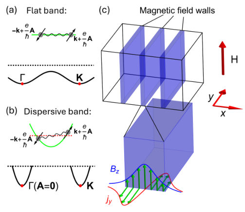
<figcaption class="paper-figure-caption"><b>Fig 2.</b> FIG. 1. (a)-(b) Schematic of pairing with a nonzero vector potential A, and the free energy density of superconductors, fs(A), along a high-symmetry direction at low temperatures, in (a) a flat and (b) a dispersive band. Upper panels: the bands are shown in green, with the Fermi surface of the dispersive case indicated by the red dashed line. The wiggly lines represent the attractive interaction between spin-↑and ↓electrons (spheres). Lower panels: fs(A) has peri- odicity ℏK/e, where K denotes a time-reversal invariant momen- tum; the black dashed line indicates the zero-energy point, fs = 0, above which the superconducting state is unstable. (c) Schematic of a flat-band superconducting...</figcaption>
</figure>
<figure class="paper-figure-card">
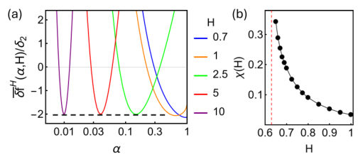
<figcaption class="paper-figure-caption"><b>Fig 3.</b> FIG. 4. (a) Log-linear plot of the free energy density difference be- tween the breathers and the normal state at several H fields (different colors), with H in units of ℏ/µ0eaλL. The ratio δ1/δ2 is set to 2 for plotting. The dashed line indicates that the minima of the curves approach −δ1. (b) Magnetic susceptibility of the breathers at small fields H ≳Hc1,w = 2/π ≈0.63 (see Eq. (9)). The value of Hc1,w is indicated by the red dashed line.</figcaption>
</figure>
<figure class="paper-figure-card">
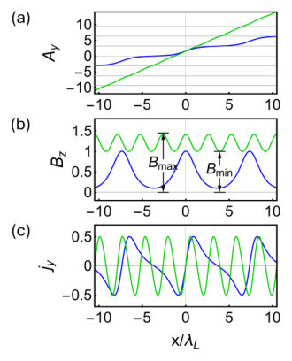
<figcaption class="paper-figure-caption"><b>Fig 4.</b> FIG. 3. Plots of Ay, Bz, and jy (in units of ℏ/ea, ℏ/eaλL, and ℏ/µ0eaλ2 L, respectively) of the breather soliton modes along x direc- tion (Eq. (10), with charge +1) for α = 0.99 (blue) and 0.5 (green). The gray horizontal lines in (a) indicate the π increase steps of Ay. The maximum and minimum B fields, Bmax and Bmin, are indicated in (b) for the α = 0.5 curve.</figcaption>
</figure>
<figure class="paper-figure-card">
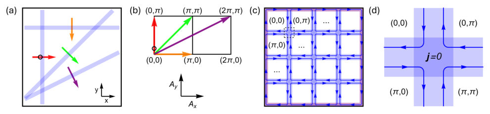
<figcaption class="paper-figure-caption"><b>Fig 5.</b> FIG. 5. (a) Different possible directions of walls in the real space (represented by blue ribbons) with transverse arrows. (b) The arrow associated with each wall in (a), when mapped to the A-space (in the same color) by its kink solution, A(r), must connect two TRIM vector potentials (in units of ℏ/ea). The square lattice case is shown. The circles in (a) and (b) indicate the correspondence between an r point and an A point on the arrow. (c) A grid formed by three horizontal and vertical walls extending to the boundary of the sample (bird’s-eye view of the bulk in Fig. 1(c)). Grid cells are labeled by the quantized values of A inside. Blue arrows indicate the directions of the current...</figcaption>
</figure>

**Summary.** This work predicts that flat-band superconductors can sustain superconductivity even under very large magnetic fields by forming stable magnetic flux wall phases. By modeling the system's free energy using a cosine potential, the authors solve the resulting sine-Gordon equation to determine critical field thresholds and show these walls are energetically favorable compared to traditional vortices.

**Why it may be interesting.** The mechanism described—where band structure dictates a topological superconducting state (walls) that persists at high fields—is highly relevant for understanding exotic superconductivity in engineered quantum materials.

Detailed structure

**Main problem.** The study predicts a stable superconducting phase exhibiting walls of magnetic flux within flat-band superconductors when subjected to an applied magnetic field.

**Main result.** Flat bands stabilize superconductivity in large magnetic fields by favoring the formation of these magnetic wall phases over conventional vortex lattices. This stability is due to the global negativity of the superconducting free energy functional $f_s(A)$.

**Method.** The analysis employs a minimal lattice-periodic model for the free energy density and solves the resulting sine-Gordon equation to find soliton solutions (kinks and breathers).

**Model / system.** The system is flat-band superconductors, modeled using an effective free energy functional $f_s(A)$ that exhibits periodicity. The physics is analyzed by comparing the energy of magnetic wall arrays against traditional vortex lattices.

**Key observables.** Lower critical field ($H_{c1}$), superconducting free energy density $f_s(A)$, and soliton solutions (kink/breather).

**Important parameters / regimes.** Flat band characteristics, applied magnetic field $H$, penetration depth ($\lambda_L$), and lattice parameters ($a$).

**Assumptions / limitations.** The analysis assumes a continuum solution form and relies on the specific functional form of the free energy derived for flat bands.

**Figures summary.** Figures illustrate the schematic formation of magnetic walls from global negativity of $f_s(A)$, and plot the spatial profiles of vector potential ($A_y$), magnetic field ($B_z$), and current density ($j_y$) for kink and breather soliton modes.

**Paper structure.** The paper develops the free energy functional based on flat-band properties, derives the governing sine-Gordon equation from Maxwell's equations, solves this equation using kink/breather ansatzes to determine critical fields, and finally compares the resulting wall phase energy against vortex energies.

Abstract

Superconductors of different types have distinct magnetic properties; for example, they can form Abrikosov vortices or alternating normal-superconducting domains. We predict that, in flat bands, a superconducting phase exhibiting walls of magnetic flux is stable in an applied magnetic field. This phase relies on the lack of a single particle energy penalty for forming condensates of any momentum in flat bands and, consequently, their superconducting free energy being a negative and periodic function of the vector potential at low temperatures. Using a minimal lattice-periodic model of free energy, we study two types of soliton modes of the wall phase: the kink and breather solitons. They determine the lower critical field and the high-field behavior of the wall phase, respectively. The competition between the walls and vortices in flat bands is also discussed. Our results suggest that flat bands help sustain superconductivity in the presence of large magnetic fields.

[↑ back to top](#top)

### [Descriptor Covariance and Correlation Hierarchy in Moiré Exciton Photoluminescence](http://arxiv.org/abs/2606.06780v1)

**Authors:** Katsunori Wakabayashi  
**Type:** theory · **Category:** disordered systems and neural networks · **PDF:** <https://arxiv.org/pdf/2606.06780v1>  
**Analysis basis:** full PDF text, analyzed in chunks
**Topic relevance:** `Keldysh / 2PI / non-Gaussian methods` **1/5** · `driven-dissipative phase transition` **1/5** · `methods for driven-dissipative` **1/5**

↔ Scroll figures horizontally

<figure class="paper-figure-card">
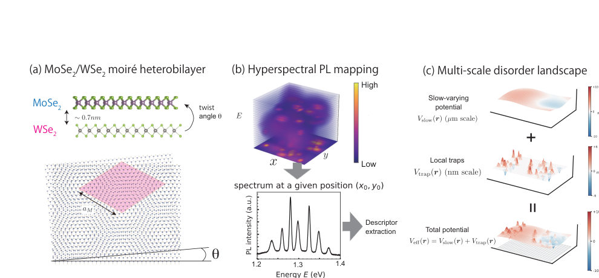
<figcaption class="paper-figure-caption"><b>Fig 1.</b> FIG. 1. Overview of the system, measurement, and theoretical framework. (a) MoSe2/WSe2 heterobilayer with interlayer distance ∼0.7 nm and twist angle θ, producing a long-wavelength moir´e superlattice of period aM. (b) Hyperspectral photolu- minescence mapping yields a spatially resolved PL spectrum at each map position (x0, y0), from which peak-decomposition-free spectral descriptors (Ecent, Edom, ∆Ecd, W80, RHL, FS, R1, Sspec, Itot) are extracted without microscopic line assignment. (c) Theoretical multi-scale disorder landscape: a slowly varying background potential Vslow(r) at the micron scale combined with localized traps Vtrap(r) at sub-optical length scales yields the effective...</figcaption>
</figure>
<figure class="paper-figure-card">
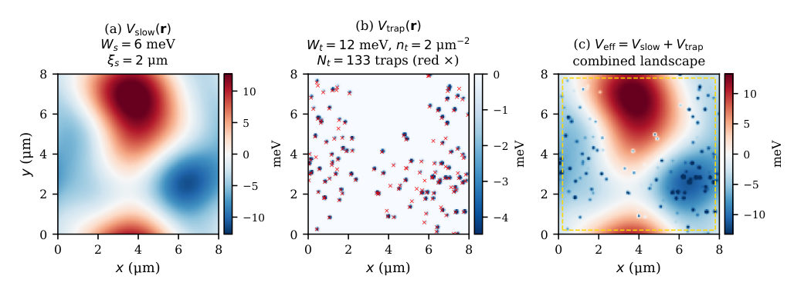
<figcaption class="paper-figure-caption"><b>Fig 2.</b> FIG. 2. Hierarchical disorder landscape. (a) Slow correlated disorder Vslow(r) with amplitude Ws = 6 meV and correlation length ξs = 2 µm, generated by FFT-based Gaussian filtering. The smooth red/blue domains of size ∼ξs are the physical origin of the micron-scale spectral families observed experimentally. (b) Trap disorder Vtrap(r) consisting of Nt = 133 Gaussian potential wells (Wt = 12 meV, σt = 50 nm, nt = 2 µm−2, consistent with ntL2 ≈128 over the 8 × 8 µm2</figcaption>
</figure>
<figure class="paper-figure-card">
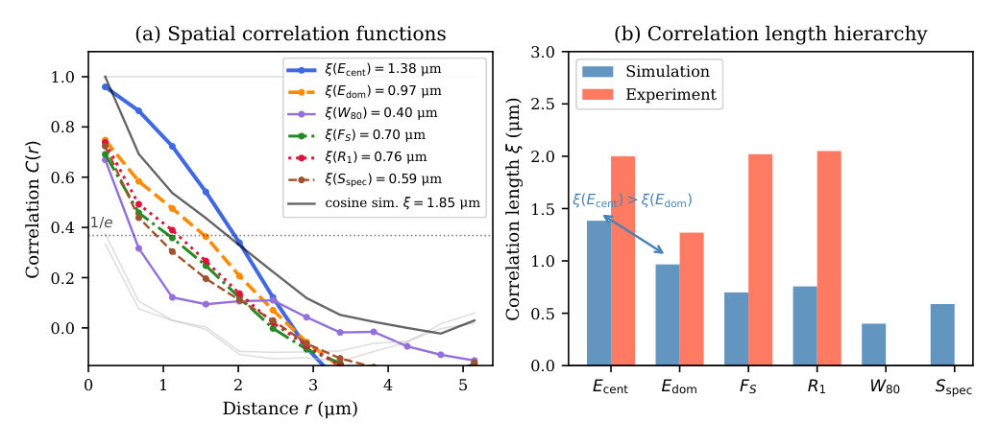
<figcaption class="paper-figure-caption"><b>Fig 3.</b> FIG. 3. Spatial correlation length hierarchy confirmed by simulation. (a) Normalized spatial correlation functions C(r) for six spectral descriptors, computed from a 20 × 20 hyperspectral map on an 8 × 8 µm2 domain with best-fit parameters (Ws = 6 meV, ξs = 2 µm, Wt = 12 meV). The grey lines show descriptors not individually highlighted (∆Ecd, RHL, Itot). The grey solid curve shows the whole-spectrum cosine similarity, plotted after subtracting its long-range plateau and renormalizing to unity at r = 0: the raw cosine similarity has a high nonzero floor because all pixels share the dominant broad envelope, so only the baseline-subtracted excess decays on a physical length scale. Its 1/e...</figcaption>
</figure>
<figure class="paper-figure-card">
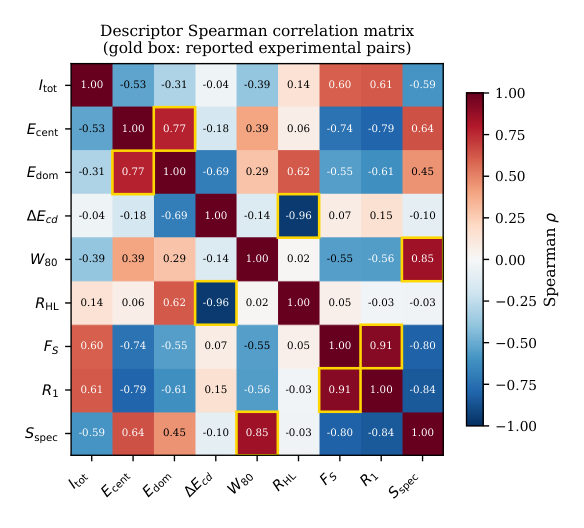
<figcaption class="paper-figure-caption"><b>Fig 4.</b> FIG. 4. Spearman inter-descriptor correlation matrix from simulation. Each cell shows the Spearman rank correlation coefficient ρS between a pair of spectral descriptors, computed from a simulated 20 × 20 hyperspectral map with best-fit parameters. Gold boxes highlight the four pairs reported experimentally (∆Ecd–RHL: ρS = −0.97; FS–R1: ρS = +0.91; W80– Sspec: ρS = +0.83; Ecent–Edom: ρS = +0.76). The five-seed mean absolute deviation from the experimental values is 0.010 per pair (see Table II). Note the strong positive block structure among (Itot, FS, R1) (trap-rich pixels) and the negative block coupling these to (Ecent, Edom), reflecting the low-energy trap emission at potential minima.</figcaption>
</figure>
<figure class="paper-figure-card">
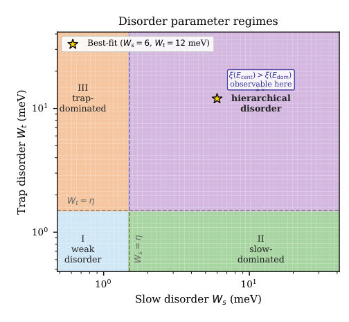
<figcaption class="paper-figure-caption"><b>Fig 5.</b> FIG. 5. Disorder parameter map for the hierarchi- cal disorder model. Four qualitatively distinct regimes are defined by the disorder strengths relative to the single-level linewidth η = 1.5 meV: Regime I (weak disorder, Ws, Wt &lt; η): spectrally uniform emission; Regime II (slow-dominated, Ws &gt; η &gt; Wt): smooth micron-scale spectral modulation; Regime III (trap-dominated, Wt &gt; η &gt; Ws): dense random sharp lines without spatial organization; Regime IV (hierar- chical disorder-dominated, Ws, Wt &gt; η): coexisting micron- scale domains and dense local trap manifolds; the descrip- tor correlation-length hierarchy is maximally visible. The gold star marks the best-fit parameters reproducing the four...</figcaption>
</figure>

**Summary.** The paper develops a theoretical framework to analyze the spatial organization of photoluminescence spectra in moiré heterobilayers using spectral descriptors. By analyzing the correlation hierarchy between these descriptors, the authors successfully extract four independent effective disorder parameters that characterize the underlying multi-scale random potential landscape. This provides a robust, peak-decomposition-free method for characterizing complex quantum materials.

**Why it may be interesting.** This work provides a powerful, model-independent statistical tool for characterizing complex disorder landscapes in quantum materials by translating spectral fingerprints (descriptors) directly into physical disorder parameters.

Detailed structure

**Main problem.** Developing a minimal theory for the spatial organization of photoluminescence spectra in moiré heterobilayers by analyzing how different spectral descriptors probe multi-scale disorder.

**Main result.** The study establishes a quantitative correlation hierarchy, $\xi(E_{	ext{cent}}) \geq \xi(E_{	ext{dom}})$, which allows for the extraction of four effective disorder parameters ($\xi_s, W_s, W_t, n_t$) from measurable spectral statistics.

**Method.** The analysis uses a descriptor-based disorder-filter picture, relating measured spectral correlations (like Spearman coefficients) to underlying spatial disorder potentials via coarse-graining and statistical theory.

**Model / system.** The system is moiré heterobilayers ($	ext{MoSe}_2/	ext{WSe}_2$) where the exciton center-of-mass motion is governed by an effective potential decomposed into slow, correlated disorder ($V_{	ext{slow}}$) and local trap potentials ($V_{	ext{trap}}$).

**Key observables.** Nine peak-decomposition-free spectral descriptors including Centroid Energy ($E_{	ext{cent}}$), Dominant Energy ($E_{	ext{dom}}$), $\Delta E_{cd}$, $W_{80}$, and the correlation lengths ($\xi$).

**Important parameters / regimes.** Disorder parameters: slow disorder length scale ($\xi_s$), amplitude ($W_s$); trap variance ($\sigma^2_\delta$) and density ($n_t$). The hierarchy $\xi(E_{	ext{cent}}) \geq \xi(E_{	ext{dom}})$ is key.

**Assumptions / limitations.** The analysis relies on the separation of disorder scales (slow vs. local) and assumes that spectral descriptors can be mapped robustly to underlying potential fluctuations without needing explicit microscopic line assignment.

**Figures summary.** Figures illustrate the spatial correlation functions $C(r)$ for various descriptors, confirming the predicted hierarchy $\xi(E_{	ext{cent}}) > \xi(E_{	ext{dom}})$, and show the mapping of experimental data onto four distinct disorder regimes.

**Paper structure.** The paper progresses from defining the physical problem (PL spectra organization) to developing a descriptor-based statistical framework. It then derives the correlation hierarchy, establishes a quantitative parameter extraction protocol using multiple descriptors, and finally maps the experimental system into a specific 'hierarchically disordered regime.'

Abstract

We develop a minimal theory for the spatial organization of photoluminescence spectra in moiré transition-metal dichalcogenide heterobilayers. Motivated by hyperspectral mapping of MoSe$_2$/WSe$_2$, which reveals micron-scale correlations among nine peak-decomposition-free spectral descriptors, we propose a descriptor-based disorder-filter picture in which different descriptors probe different components of a multi-scale disorder landscape, producing a hierarchy of spatial correlation lengths. The central result is the correlation hierarchy $ξ(E_{\rm cent}) \ge ξ(E_{\rm dom})$, derived from the decomposition of the dominant-peak energy into a smooth background contribution and a short-range trap-switching fluctuation term. The same framework explains the principal inter-descriptor Spearman correlations, including the near-perfect anti-correlation $ρ_{\rm S}(ΔE_{\rm cd}, R_{\rm HL}) \approx -0.978$ as a robust spectral-shape relation for spectra with a dominant unimodal envelope. The framework provides a peak-decomposition-free route to infer effective disorder parameters from hyperspectral data through the descriptor covariance structure, without microscopic line assignment.

[↑ back to top](#top)

### Other secondary papers (1)

Show other secondary papers

### [The Universe Observed with Particle Detectors: Astrophysical Legacy of Guido Barbiellini Amidei](http://arxiv.org/abs/2606.07256v1)

**Authors:** Roberto Capuzzo Dolcetta  
**Type:** experiment · **Category:** other · **PDF:** <https://arxiv.org/pdf/2606.07256v1>  
**Analysis basis:** full PDF text, analyzed in chunks

↔ Scroll figures horizontally

<figure class="paper-figure-card">
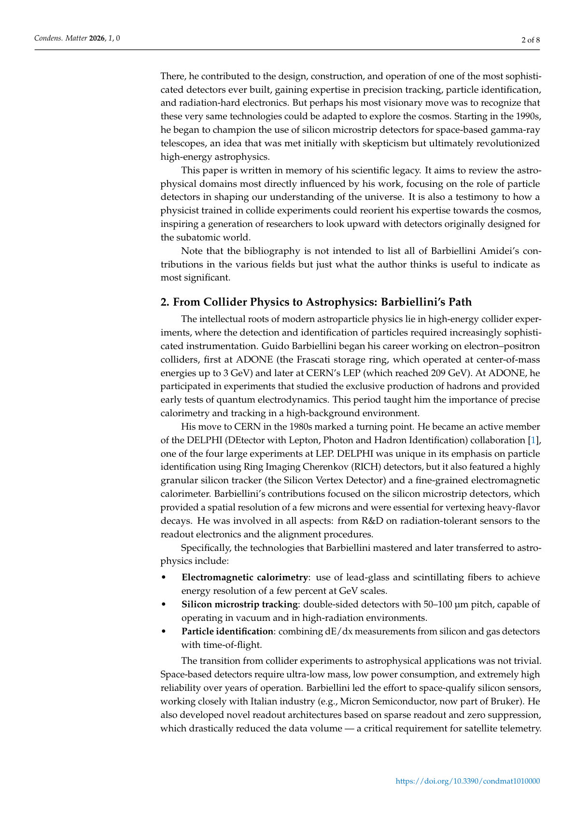
<figcaption class="paper-figure-caption"><b>Fig 1.</b> Low-resolution page preview, page 2</figcaption>
</figure>
<figure class="paper-figure-card">
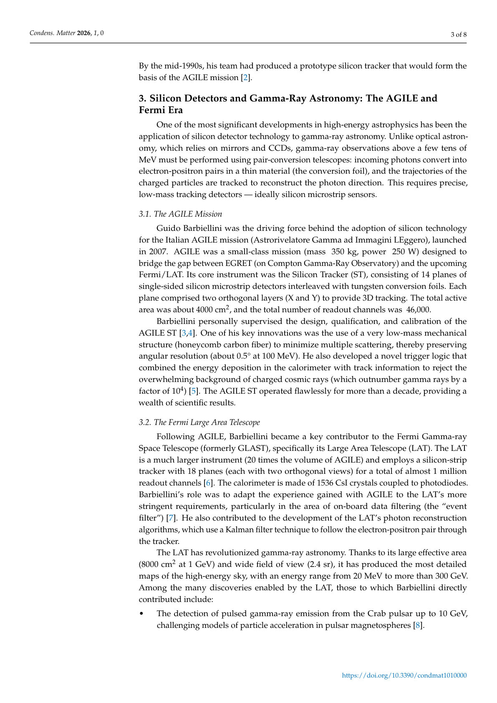
<figcaption class="paper-figure-caption"><b>Fig 2.</b> Low-resolution page preview, page 3</figcaption>
</figure>
<figure class="paper-figure-card">
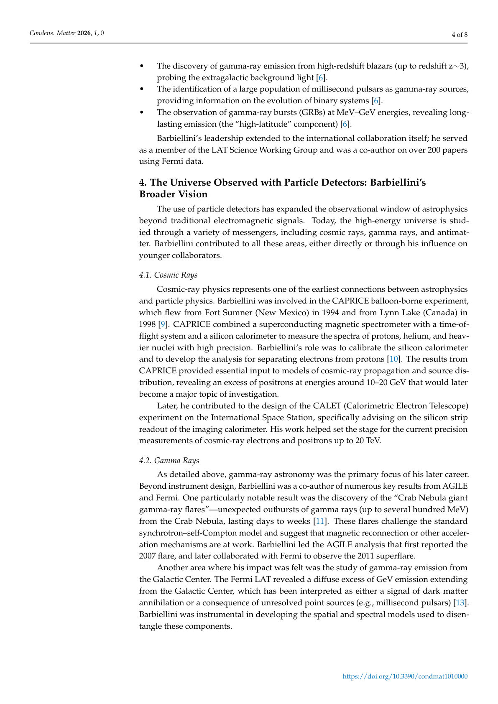
<figcaption class="paper-figure-caption"><b>Fig 3.</b> Low-resolution page preview, page 4</figcaption>
</figure>
<figure class="paper-figure-card">
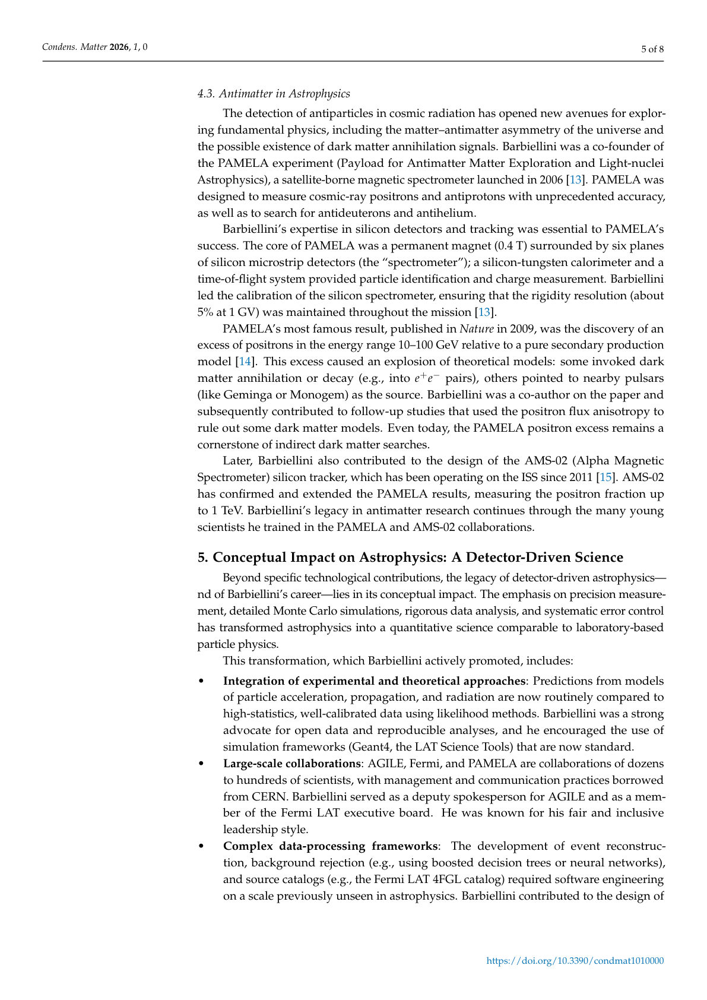
<figcaption class="paper-figure-caption"><b>Fig 4.</b> Low-resolution page preview, page 5</figcaption>
</figure>
<figure class="paper-figure-card">
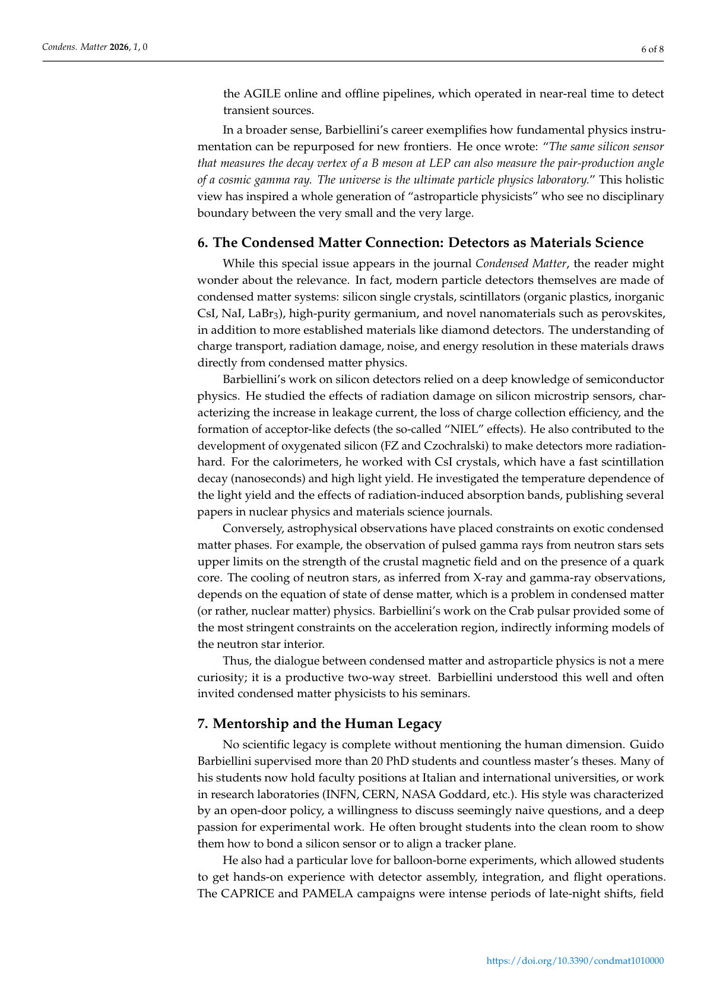
<figcaption class="paper-figure-caption"><b>Fig 5.</b> Low-resolution page preview, page 6</figcaption>
</figure>

**Summary.** This memorial paper reviews how high-energy astrophysics has evolved into a field dictated by technological advances in particle detectors. It highlights Guido Barbiellini Amidei's crucial role in bridging collider physics expertise to space missions like Fermi LAT and AGILE. The work summarizes key findings regarding gamma rays, cosmic rays, and antimatter, establishing the foundation for future multi-messenger astronomy.

**Why it may be interesting.** While the subject is astrophysics/particle detection, the rigorous discussion of detector physics, background rejection techniques, and data analysis pipelines shares methodological overlap with complex experimental quantum systems characterization.

Detailed structure

**Main problem.** To review the evolution of high-energy astrophysics as a science driven by advances in particle detector technology, focusing on Guido Barbiellini Amidei's pivotal role.

**Main result.** The paper demonstrates that modern high-energy astrophysics has successfully transitioned into a 'detector-driven science,' enabling detailed observations across gamma-ray astronomy, cosmic rays, and antimatter.

**Method.** Reviewing the technical advancements in detector design (silicon tracking, calorimetry) and their application to space-based missions like AGILE and Fermi LAT, alongside analyzing key astrophysical measurements.

**Model / system.** The physical systems involve high-energy cosmic rays, gamma rays, and antimatter interacting with advanced particle detectors. The platforms include electron-positron colliders (ADONE, LEP) and space telescopes (Fermi, AGILE).

**Key observables.** Gamma-ray spectra (e.g., Crab pulsar flares), positron excess in cosmic rays (PAMELA/AMS-02), and multi-messenger signals from astrophysical events.

**Important parameters / regimes.** Energy resolution ($\sim$ few percent at GeV scales); spatial resolution ($\sim$ microns); energy ranges spanning MeV to TeV.

**Assumptions / limitations.** The review assumes the continued development of detector technology and the integration of experimental results with theoretical models for understanding cosmic sources.

**Paper structure.** The paper follows a historical and thematic structure, tracing Barbiellini's career from collider physics to pioneering space-based instrumentation, reviewing key domains (gamma-rays, cosmic rays), and outlining future multi-messenger perspectives.

Abstract

The development of modern high-energy astrophysics has been deeply intertwined with advances in particle detector technology. Guido Barbiellini Amidei (1943-2024) played a pivotal role in bridging experimental particle physics and astrophysical observation. His scientific career spanned over four decades, from early electron-positron collider experiments at ADONE and LEP (DELPHI) to space based missions such as AGILE, Fermi, and PAMELA. This memorial paper reviews the evolution of high-energy astrophysics as a detector-driven science, highlighting key domains where Barbiellini left an indelible mark: gamma-ray astronomy, cosmic-ray physics, and antimatter studies. We discuss his personal contributions to silicon tracking, calorimetry, data analysis, and his leadership in international collaborations. The conceptual impact of his interdisciplinary approach is examined, and future perspectives in the observation of the high-energy universe are outlined, recognizing that the path forward is built on the foundations he helped lay

[↑ back to top](#top)

