
# arxiv digest (quant-ph + cond-mat) — 2026-06-09

*169 papers · 49 relevant · 3 highlighted*

## 🔥 Most relevant (49)

*Every paper with at least one nonzero topic score, sorted by best-matching score. 🔥 marks scores ≥4/5. Click the title to jump to the full entry below; click [arXiv] to open the paper page. `(secondary)` marks papers from de-prioritized cond-mat archives.*

Show 49 relevant papers

- [Cascaded Rydberg antiblockade: Multi-atom excitation dynamics and entanglement](#paper-2606.08536) [[arXiv]](http://arxiv.org/abs/2606.08536v1) — 🔥 `Rydberg arrays` **5/5** · 🔥 `analog quantum simulation` **4/5** · `entanglement & information structure` **3/5** · `methods for driven-dissipative` **3/5** · `non-equilibrium dynamics` **3/5** · `correlated / nonlocal dissipation` **2/5** · `non-equilibrium universality` **2/5** · `Keldysh / 2PI / non-Gaussian methods` **1/5** · `Tavis-Cummings & cavity-many-emitter` **1/5** · `driven-dissipative phase transition` **1/5** · `exotic spin models in light-matter` **1/5**
- [Range-controlled entanglement in Lindbladian skin states of monitored fermions](#paper-2606.09306) [[arXiv]](http://arxiv.org/abs/2606.09306v1) — 🔥 `entanglement & information structure` **4/5** · 🔥 `measurement-induced transitions` **4/5** · 🔥 `methods for driven-dissipative` **4/5** · `analog quantum simulation` **3/5** · `correlated / nonlocal dissipation` **3/5** · `driven-dissipative phase transition` **3/5** · `non-equilibrium universality` **3/5** · `quantum measurements` **3/5** · `Keldysh / 2PI / non-Gaussian methods` **2/5** · `Kondo & dissipative impurity` **2/5** · `non-equilibrium dynamics` **2/5** · `scars & prethermalization` **1/5**
- [An Adaptive Coherent Interferometric Oscillator Based on an Optoelectronic Magnonic Parametric Oscillator](#paper-2606.09546) [[arXiv]](http://arxiv.org/abs/2606.09546v1) `(secondary)` — 🔥 `spintronics-quantum-optics interface` **4/5** · `analog quantum simulation` **3/5** · `correlated / nonlocal dissipation` **3/5** · `driven-dissipative phase transition` **3/5** · `interference shaping light` **3/5** · `methods for driven-dissipative` **3/5** · `exotic spin models in light-matter` **2/5** · `non-equilibrium dynamics` **2/5** · `non-equilibrium universality` **2/5** · `quantum optics experiment` **2/5** · `Keldysh / 2PI / non-Gaussian methods` **1/5** · `Kondo & dissipative impurity` **1/5** · `correlated cavity matter` **1/5** · `entanglement & information structure` **1/5** · `quantum measurements` **1/5** · `scars & prethermalization` **1/5**
- [Frequency-resolved decoherence spectroscopy of a semiconductor charge qubit coupled to a high-impedance resonator](#paper-2606.09722) [[arXiv]](http://arxiv.org/abs/2606.09722v1) — 🔥 `QC/QI experiment` **4/5** · `correlated cavity matter` **3/5** · `methods for driven-dissipative` **3/5** · `quantum optics experiment` **3/5** · `analog quantum simulation` **2/5** · `correlated / nonlocal dissipation` **2/5** · `driven-dissipative phase transition` **2/5** · `non-equilibrium dynamics` **2/5** · `quantum measurements` **2/5** · `Keldysh / 2PI / non-Gaussian methods` **1/5** · `Kondo & dissipative impurity` **1/5** · `Tavis-Cummings & cavity-many-emitter` **1/5** · `entanglement & information structure` **1/5** · `exotic spin models in light-matter` **1/5** · `measurement-induced transitions` **1/5** · `non-equilibrium universality` **1/5** · `spintronics-quantum-optics interface` **1/5**
- ⭐ [Exact metastability in a class of driven-dissipative quantum many-body systems](#paper-2606.07736) [[arXiv]](http://arxiv.org/abs/2606.07736v1) — 🔥 `driven-dissipative phase transition` **4/5** · 🔥 `methods for driven-dissipative` **4/5** · 🔥 `non-equilibrium dynamics` **4/5** · `analog quantum simulation` **3/5** · `correlated / nonlocal dissipation` **3/5** · `non-equilibrium universality` **3/5** · `Keldysh / 2PI / non-Gaussian methods` **2/5** · `Tavis-Cummings & cavity-many-emitter` **2/5** · `Kondo & dissipative impurity` **1/5** · `correlated cavity matter` **1/5** · `entanglement & information structure` **1/5** · `exotic spin models in light-matter` **1/5** · `scars & prethermalization` **1/5**
- [Chiral Quantum Entanglement Transfer with Giant Atoms](#paper-2606.08695) [[arXiv]](http://arxiv.org/abs/2606.08695v1) — 🔥 `entanglement & information structure` **4/5** · `analog quantum simulation` **3/5** · `correlated / nonlocal dissipation` **3/5** · `methods for driven-dissipative` **3/5** · `non-equilibrium dynamics` **3/5** · `Tavis-Cummings & cavity-many-emitter` **2/5** · `driven-dissipative phase transition` **2/5** · `Dicke superradiance` **1/5** · `Keldysh / 2PI / non-Gaussian methods` **1/5** · `Rydberg arrays` **1/5** · `correlated cavity matter` **1/5** · `exotic spin models in light-matter` **1/5** · `non-equilibrium universality` **1/5**
- [Near-deterministic single-atom loading on a photonic integrated circuit](#paper-2606.07800) [[arXiv]](http://arxiv.org/abs/2606.07800v1) — 🔥 `analog quantum simulation` **4/5** · `Tavis-Cummings & cavity-many-emitter` **3/5** · `correlated cavity matter` **3/5** · `quantum measurements` **3/5** · `quantum optics experiment` **3/5** · `QC/QI experiment` **2/5** · `measurement-induced transitions` **2/5** · `correlated / nonlocal dissipation` **1/5** · `driven-dissipative phase transition` **1/5** · `entanglement & information structure` **1/5** · `interference shaping light` **1/5** · `methods for driven-dissipative` **1/5** · `non-equilibrium dynamics` **1/5**
- [Quantum resource localizability transitions in deep thermalization](#paper-2606.08756) [[arXiv]](http://arxiv.org/abs/2606.08756v1) — 🔥 `entanglement & information structure` **4/5** · 🔥 `non-equilibrium dynamics` **4/5** · `measurement-induced transitions` **3/5** · `non-equilibrium universality` **3/5** · `quantum measurements` **3/5** · `scars & prethermalization` **2/5** · `Keldysh / 2PI / non-Gaussian methods` **1/5** · `analog quantum simulation` **1/5** · `correlated / nonlocal dissipation` **1/5** · `driven-dissipative phase transition` **1/5** · `methods for driven-dissipative` **1/5**
- [Crystallizing Substrates Drag Supported Nanoparticles](#paper-2606.07862) [[arXiv]](http://arxiv.org/abs/2606.07862v1) `(secondary)` — 🔥 `non-equilibrium dynamics` **4/5** · `driven-dissipative phase transition` **3/5** · `methods for driven-dissipative` **3/5** · `non-equilibrium universality` **3/5** · `Frenkel-Kontorova` **2/5** · `Keldysh / 2PI / non-Gaussian methods` **2/5** · `analog quantum simulation` **2/5** · `Kondo & dissipative impurity` **1/5** · `correlated / nonlocal dissipation` **1/5** · `entanglement & information structure` **1/5** · `scars & prethermalization` **1/5**
- [Exact spectrum and anomalous relaxation in the open disorder-free Sachdev-Ye-Kitaev system](#paper-2606.08079) [[arXiv]](http://arxiv.org/abs/2606.08079v1) — 🔥 `methods for driven-dissipative` **4/5** · 🔥 `non-equilibrium dynamics` **4/5** · `Keldysh / 2PI / non-Gaussian methods` **3/5** · `correlated / nonlocal dissipation` **3/5** · `driven-dissipative phase transition` **3/5** · `entanglement & information structure` **2/5** · `non-equilibrium universality` **2/5** · `Kondo & dissipative impurity` **1/5** · `scars & prethermalization` **1/5**
- [Single plasmon transport in one dimensional nanowire](#paper-2606.09523) [[arXiv]](http://arxiv.org/abs/2606.09523v1) — 🔥 `analog quantum simulation` **4/5** · `Tavis-Cummings & cavity-many-emitter` **3/5** · `correlated cavity matter` **3/5** · `Keldysh / 2PI / non-Gaussian methods` **2/5** · `driven-dissipative phase transition` **2/5** · `methods for driven-dissipative` **2/5** · `non-equilibrium dynamics` **2/5** · `Kondo & dissipative impurity` **1/5** · `correlated / nonlocal dissipation` **1/5** · `entanglement & information structure` **1/5** · `interference shaping light` **1/5** · `non-equilibrium universality` **1/5**
- [Modified One-Axis-Twist Squeezing for Deterministic Orientation Control of Schrödinger Cat States with Unknown Atom-Number Parity](#paper-2606.08482) [[arXiv]](http://arxiv.org/abs/2606.08482v1) — 🔥 `analog quantum simulation` **4/5** · `Rydberg arrays` **3/5** · `Tavis-Cummings & cavity-many-emitter` **3/5** · `correlated cavity matter` **3/5** · `quantum optics experiment` **2/5** · `Keldysh / 2PI / non-Gaussian methods` **1/5** · `correlated / nonlocal dissipation` **1/5** · `driven-dissipative phase transition` **1/5** · `entanglement & information structure` **1/5** · `methods for driven-dissipative` **1/5** · `non-equilibrium dynamics` **1/5**
- [Dissipative Channels Determine Open Electromagnetic Quantization](#paper-2606.08557) [[arXiv]](http://arxiv.org/abs/2606.08557v1) — 🔥 `methods for driven-dissipative` **4/5** · `correlated / nonlocal dissipation` **3/5** · `driven-dissipative phase transition` **3/5** · `interference shaping light` **3/5** · `non-equilibrium dynamics` **2/5** · `non-equilibrium universality` **2/5** · `Keldysh / 2PI / non-Gaussian methods` **1/5** · `analog quantum simulation` **1/5** · `correlated cavity matter` **1/5**
- [Energy Transport in Randomly Coupled Quantum Systems: A Perturbative Approach](#paper-2606.09308) [[arXiv]](http://arxiv.org/abs/2606.09308v1) — 🔥 `non-equilibrium dynamics` **4/5** · `methods for driven-dissipative` **3/5** · `non-equilibrium universality` **3/5** · `Keldysh / 2PI / non-Gaussian methods` **2/5** · `correlated / nonlocal dissipation` **2/5** · `driven-dissipative phase transition` **2/5** · `Kondo & dissipative impurity` **1/5** · `analog quantum simulation` **1/5** · `entanglement & information structure` **1/5** · `scars & prethermalization` **1/5**
- [Analog quantum simulation of chiral magnetic dynamics using optical superlattices](#paper-2606.09708) [[arXiv]](http://arxiv.org/abs/2606.09708v1) — 🔥 `analog quantum simulation` **4/5** · 🔥 `non-equilibrium dynamics` **4/5** · `exotic spin models in light-matter` **3/5** · `non-equilibrium universality` **3/5** · `driven-dissipative phase transition` **2/5** · `Frenkel-Kontorova` **1/5** · `Keldysh / 2PI / non-Gaussian methods` **1/5** · `methods for driven-dissipative` **1/5**
- [Parahydrogen Cooling of Nuclear Spin Chains at Hypogeomagnetic Fields](#paper-2606.09649) [[arXiv]](http://arxiv.org/abs/2606.09649v1) — 🔥 `analog quantum simulation` **4/5** · `QC/QI experiment` **3/5** · `entanglement & information structure` **3/5** · `non-equilibrium dynamics` **3/5** · `non-equilibrium universality` **2/5** · `correlated / nonlocal dissipation` **1/5** · `driven-dissipative phase transition` **1/5** · `exotic spin models in light-matter` **1/5** · `methods for driven-dissipative` **1/5**
- [Tracking metastable phases by complex Lee-Yang zeros](#paper-2606.08004) [[arXiv]](http://arxiv.org/abs/2606.08004v1) — 🔥 `methods for driven-dissipative` **4/5** · `Keldysh / 2PI / non-Gaussian methods` **3/5** · `driven-dissipative phase transition` **3/5** · `non-equilibrium dynamics` **3/5** · `non-equilibrium universality` **2/5** · `Kondo & dissipative impurity` **1/5** · `analog quantum simulation` **1/5** · `correlated / nonlocal dissipation` **1/5** · `scars & prethermalization` **1/5**
- [Correlation enhanced resistance hysteresis near half filling in MoS2/WSe2 heterobilayer](#paper-2606.09244) [[arXiv]](http://arxiv.org/abs/2606.09244v1) `(secondary)` — 🔥 `analog quantum simulation` **4/5** · `driven-dissipative phase transition` **3/5** · `Kondo & dissipative impurity` **2/5** · `non-equilibrium dynamics` **2/5** · `non-equilibrium universality` **2/5** · `Frenkel-Kontorova` **1/5** · `Keldysh / 2PI / non-Gaussian methods` **1/5** · `correlated / nonlocal dissipation` **1/5** · `entanglement & information structure` **1/5** · `methods for driven-dissipative` **1/5**
- [SCOPE: A Syndrome-Driven Control Plane for QEC-Enabled Quantum Networks](#paper-2606.08873) [[arXiv]](http://arxiv.org/abs/2606.08873v1) — 🔥 `quantum measurements` **4/5** · `measurement-induced transitions` **3/5** · `methods for driven-dissipative` **3/5** · `QC/QI experiment` **2/5** · `Keldysh / 2PI / non-Gaussian methods` **1/5** · `correlated / nonlocal dissipation` **1/5** · `driven-dissipative phase transition` **1/5** · `entanglement & information structure` **1/5** · `non-equilibrium dynamics` **1/5**
- [Floquet Entanglement Generation in Parametrically Driven Coupled Superconducting Qubits](#paper-2606.07797) [[arXiv]](http://arxiv.org/abs/2606.07797v1) — 🔥 `entanglement & information structure` **4/5** · `methods for driven-dissipative` **3/5** · `non-equilibrium dynamics` **3/5** · `driven-dissipative phase transition` **2/5** · `Keldysh / 2PI / non-Gaussian methods` **1/5** · `analog quantum simulation` **1/5** · `correlated / nonlocal dissipation` **1/5** · `non-equilibrium universality` **1/5**
- [Is Exact Markovianity Fundamental Once Time Is Relational?](#paper-2606.08595) [[arXiv]](http://arxiv.org/abs/2606.08595v1) — 🔥 `quantum measurements` **4/5** · `measurement-induced transitions` **3/5** · `methods for driven-dissipative` **3/5** · `correlated / nonlocal dissipation` **2/5** · `non-equilibrium dynamics` **2/5** · `Keldysh / 2PI / non-Gaussian methods` **1/5** · `driven-dissipative phase transition` **1/5**
- [Microscopic universal theory of symmetry-enriched topological quantum spin liquids](#paper-2606.08558) [[arXiv]](http://arxiv.org/abs/2606.08558v1) — 🔥 `analog quantum simulation` **4/5** · 🔥 `exotic spin models in light-matter` **4/5** · `Rydberg arrays` **3/5** · `QC/QI experiment` **2/5** · `correlated cavity matter` **1/5** · `entanglement & information structure` **1/5** · `spintronics-quantum-optics interface` **1/5**
- [Sambe Approach to Floquet-Lindblad Open Quantum Systems](#paper-2606.09727) [[arXiv]](http://arxiv.org/abs/2606.09727v1) — 🔥 `methods for driven-dissipative` **4/5** · 🔥 `non-equilibrium dynamics` **4/5** · `driven-dissipative phase transition` **3/5** · `non-equilibrium universality` **2/5** · `Keldysh / 2PI / non-Gaussian methods` **1/5** · `analog quantum simulation` **1/5** · `correlated / nonlocal dissipation` **1/5**
- [Time Evolution of Heat Conduction in a Generalized Model of Brownian Motion](#paper-2606.08839) [[arXiv]](http://arxiv.org/abs/2606.08839v1) — 🔥 `non-equilibrium dynamics` **4/5** · `methods for driven-dissipative` **3/5** · `non-equilibrium universality` **3/5** · `correlated / nonlocal dissipation` **2/5** · `driven-dissipative phase transition` **2/5** · `Frenkel-Kontorova` **1/5** · `Keldysh / 2PI / non-Gaussian methods` **1/5**
- [All-Optical Wide-Field Magnetometry with Van Der Waals Quantum Sensor](#paper-2606.07899) [[arXiv]](http://arxiv.org/abs/2606.07899v1) — 🔥 `spintronics-quantum-optics interface` **4/5** · `exotic spin models in light-matter` **3/5** · `analog quantum simulation` **2/5** · `quantum measurements` **2/5** · `QC/QI experiment` **1/5** · `measurement-induced transitions` **1/5** · `methods for driven-dissipative` **1/5** · `quantum optics experiment` **1/5**
- [Detecting Exciton Condensation through Charge Transport in Semiconductor Heterostructures](#paper-2606.07752) [[arXiv]](http://arxiv.org/abs/2606.07752v1) — 🔥 `analog quantum simulation` **4/5** · `driven-dissipative phase transition` **3/5** · `non-equilibrium dynamics` **3/5** · `non-equilibrium universality` **2/5** · `Keldysh / 2PI / non-Gaussian methods` **1/5** · `correlated / nonlocal dissipation` **1/5** · `methods for driven-dissipative` **1/5**
- [Translationally Covariant Modulated Symmetries: Classification and Goldstone](#paper-2606.07952) [[arXiv]](http://arxiv.org/abs/2606.07952v1) — 🔥 `analog quantum simulation` **4/5** · `driven-dissipative phase transition` **2/5** · `non-equilibrium dynamics` **2/5** · `non-equilibrium universality` **2/5** · `Frenkel-Kontorova` **1/5** · `Keldysh / 2PI / non-Gaussian methods` **1/5** · `correlated / nonlocal dissipation` **1/5** · `entanglement & information structure` **1/5** · `methods for driven-dissipative` **1/5**
- [Numerical solution of the nonlinear Dirac equation by a splitting variational quantum algorithm](#paper-2606.08053) [[arXiv]](http://arxiv.org/abs/2606.08053v1) — 🔥 `quantum measurements` **4/5** · `measurement-induced transitions` **3/5** · `methods for driven-dissipative` **3/5** · `non-equilibrium dynamics` **2/5** · `Keldysh / 2PI / non-Gaussian methods` **1/5** · `driven-dissipative phase transition` **1/5**
- [Suppressing the Motion of Rydberg Atoms in Inhomogeneous Electric Fields via Stark Echo](#paper-2606.09759) [[arXiv]](http://arxiv.org/abs/2606.09759v1) — 🔥 `Rydberg arrays` **4/5** · `analog quantum simulation` **3/5** · `QC/QI experiment` **2/5** · `quantum measurements` **2/5** · `methods for driven-dissipative` **1/5** · `non-equilibrium dynamics` **1/5** · `quantum optics experiment` **1/5**
- [Coexistence of High Temperature Superconductivity and Antiferromagnetic Order in a Cuprate with Multiple Hole Fermi Pockets](#paper-2606.08643) [[arXiv]](http://arxiv.org/abs/2606.08643v1) — 🔥 `analog quantum simulation` **4/5** · `Keldysh / 2PI / non-Gaussian methods` **3/5** · `methods for driven-dissipative` **2/5** · `Kondo & dissipative impurity` **1/5** · `entanglement & information structure` **1/5** · `exotic spin models in light-matter` **1/5** · `non-equilibrium dynamics` **1/5**
- ⭐ [Control transition in a temporally random classical spin chain](#paper-2606.09297) [[arXiv]](http://arxiv.org/abs/2606.09297v1) — 🔥 `non-equilibrium universality` **4/5** · `driven-dissipative phase transition` **3/5** · `non-equilibrium dynamics` **2/5** · `Frenkel-Kontorova` **1/5** · `correlated / nonlocal dissipation` **1/5** · `exotic spin models in light-matter` **1/5** · `methods for driven-dissipative` **1/5**
- [Defining Unique, Redundant, and Synergistic Quantum Information](#paper-2606.07880) [[arXiv]](http://arxiv.org/abs/2606.07880v1) — 🔥 `entanglement & information structure` **4/5** · `analog quantum simulation` **2/5** · `correlated / nonlocal dissipation` **2/5** · `non-equilibrium dynamics` **2/5** · `driven-dissipative phase transition` **1/5** · `methods for driven-dissipative` **1/5** · `non-equilibrium universality` **1/5**
- [Scaling Behaviors of Work Cumulants in Slow Isothermal Processes](#paper-2606.09552) [[arXiv]](http://arxiv.org/abs/2606.09552v1) — 🔥 `non-equilibrium universality` **4/5** · `Keldysh / 2PI / non-Gaussian methods` **3/5** · `non-equilibrium dynamics` **3/5** · `correlated / nonlocal dissipation` **1/5** · `driven-dissipative phase transition` **1/5** · `methods for driven-dissipative` **1/5**
- ⭐ [Topological Triplons in the Pinwheel Valence Bond Solid on the Kagome Lattice](#paper-2606.09823) [[arXiv]](http://arxiv.org/abs/2606.09823v1) — 🔥 `analog quantum simulation` **4/5** · `exotic spin models in light-matter` **3/5** · `non-equilibrium dynamics` **2/5** · `Keldysh / 2PI / non-Gaussian methods` **1/5** · `entanglement & information structure` **1/5** · `methods for driven-dissipative` **1/5** · `spintronics-quantum-optics interface` **1/5**
- [Hidden Conformal Boundary Data in Finite-Temperature Stabilizer Entropy](#paper-2606.08606) [[arXiv]](http://arxiv.org/abs/2606.08606v1) — 🔥 `entanglement & information structure` **4/5** · `non-equilibrium universality` **2/5** · `Keldysh / 2PI / non-Gaussian methods` **1/5** · `analog quantum simulation` **1/5** · `correlated / nonlocal dissipation` **1/5** · `driven-dissipative phase transition` **1/5** · `methods for driven-dissipative` **1/5** · `non-equilibrium dynamics` **1/5**
- [Projected Inverse Iteration: An Eigenvalue Approach to Ground-State Computation with Neural Quantum States](#paper-2606.07825) [[arXiv]](http://arxiv.org/abs/2606.07825v1) — 🔥 `analog quantum simulation` **4/5** · `exotic spin models in light-matter` **3/5** · `methods for driven-dissipative` **2/5** · `correlated cavity matter` **1/5** · `entanglement & information structure` **1/5** · `non-equilibrium dynamics` **1/5**
- [Topological bound states in the continuum with controllable multiplicity](#paper-2606.08510) [[arXiv]](http://arxiv.org/abs/2606.08510v1) — 🔥 `analog quantum simulation` **4/5** · `driven-dissipative phase transition` **2/5** · `Frenkel-Kontorova` **1/5** · `Keldysh / 2PI / non-Gaussian methods` **1/5** · `correlated / nonlocal dissipation` **1/5** · `entanglement & information structure` **1/5** · `methods for driven-dissipative` **1/5** · `non-equilibrium dynamics` **1/5**
- [A Dual Metastable-State Encoding Architecture for Quantum Processing with $^{171}\mathrm{Yb}$ Atom Arrays](#paper-2606.08453) [[arXiv]](http://arxiv.org/abs/2606.08453v1) — 🔥 `QC/QI experiment` **4/5** · `quantum measurements` **3/5** · `measurement-induced transitions` **2/5** · `Rydberg arrays` **1/5** · `methods for driven-dissipative` **1/5**
- [Designing electronic magnetoelectric matter with organic quantum spin trimers](#paper-2606.09179) [[arXiv]](http://arxiv.org/abs/2606.09179v1) — 🔥 `analog quantum simulation` **4/5** · `exotic spin models in light-matter` **3/5** · `Keldysh / 2PI / non-Gaussian methods` **1/5** · `entanglement & information structure` **1/5** · `methods for driven-dissipative` **1/5** · `spintronics-quantum-optics interface` **1/5**
- [The Map of Parameter Space in Double Microwave Shielding](#paper-2606.09636) [[arXiv]](http://arxiv.org/abs/2606.09636v1) — 🔥 `analog quantum simulation` **4/5** · `methods for driven-dissipative` **2/5** · `non-equilibrium dynamics` **2/5** · `Keldysh / 2PI / non-Gaussian methods` **1/5** · `correlated / nonlocal dissipation` **1/5** · `driven-dissipative phase transition` **1/5**
- [$100\pmΔt$ Years of Quantum Uncertainty: From Origins to Modern Insights](#paper-2606.07747) [[arXiv]](http://arxiv.org/abs/2606.07747v1) — 🔥 `entanglement & information structure` **4/5** · `quantum measurements` **2/5** · `Keldysh / 2PI / non-Gaussian methods` **1/5** · `correlated / nonlocal dissipation` **1/5** · `driven-dissipative phase transition` **1/5** · `methods for driven-dissipative` **1/5**
- [Complexity-driven transitions in quantum observation](#paper-2606.09765) [[arXiv]](http://arxiv.org/abs/2606.09765v1) — 🔥 `measurement-induced transitions` **4/5** · `quantum measurements` **3/5** · `entanglement & information structure` **2/5** · `Keldysh / 2PI / non-Gaussian methods` **1/5**
- [Discovering and decoding latent mean-field structure with variational autoencoders](#paper-2606.08694) [[arXiv]](http://arxiv.org/abs/2606.08694v1) — 🔥 `entanglement & information structure` **4/5** · `Keldysh / 2PI / non-Gaussian methods` **1/5** · `analog quantum simulation` **1/5** · `driven-dissipative phase transition` **1/5** · `exotic spin models in light-matter` **1/5** · `methods for driven-dissipative` **1/5** · `non-equilibrium dynamics` **1/5**
- [Quantum Advantage over Wirings of Nonsignaling Boxes in Multipartite Networks](#paper-2606.08488) [[arXiv]](http://arxiv.org/abs/2606.08488v1) — 🔥 `entanglement & information structure` **4/5** · `quantum measurements` **3/5** · `correlated / nonlocal dissipation` **1/5** · `measurement-induced transitions` **1/5**
- [Relativistic Effects in Spin Correlations Induced by QED Scattering and Wigner Rotations](#paper-2606.08995) [[arXiv]](http://arxiv.org/abs/2606.08995v1) — 🔥 `entanglement & information structure` **4/5** · `Keldysh / 2PI / non-Gaussian methods` **1/5** · `correlated / nonlocal dissipation` **1/5** · `exotic spin models in light-matter` **1/5** · `non-equilibrium dynamics` **1/5**
- [Inverse supersymmetry in finite temperature Bose-Fermi mixtures](#paper-2606.07784) [[arXiv]](http://arxiv.org/abs/2606.07784v1) — 🔥 `analog quantum simulation` **4/5** · `Keldysh / 2PI / non-Gaussian methods` **1/5** · `correlated / nonlocal dissipation` **1/5** · `driven-dissipative phase transition` **1/5**
- [Affine Filtering Measurements and Their Applications to Quantum Decoding](#paper-2606.07852) [[arXiv]](http://arxiv.org/abs/2606.07852v1) — 🔥 `quantum measurements` **4/5** · `measurement-induced transitions` **1/5**
- [A five-qubit 1-resistant graph state and stabilizer marginal certificates](#paper-2606.08561) [[arXiv]](http://arxiv.org/abs/2606.08561v1) — 🔥 `entanglement & information structure` **4/5**
- [Hardware-Aware QAOA for Honeypot Traffic Partitioning on 100+ Qubit IBM Quantum Processors](#paper-2606.09469) [[arXiv]](http://arxiv.org/abs/2606.09469v1) — 🔥 `QC/QI experiment` **4/5**

## ⭐ Highlighted (3)

*Papers by authors on your watch list. Click the title to jump to the full entry below; click [arXiv] to open the paper page.*

Show 3 highlighted papers

- ⭐ [Exact metastability in a class of driven-dissipative quantum many-body systems](#paper-2606.07736) [[arXiv]](http://arxiv.org/abs/2606.07736v1) — Aashish A. Clerk
- ⭐ [Control transition in a temporally random classical spin chain](#paper-2606.09297) [[arXiv]](http://arxiv.org/abs/2606.09297v1) — Sarang Gopalakrishnan
- ⭐ [Topological Triplons in the Pinwheel Valence Bond Solid on the Kagome Lattice](#paper-2606.09823) [[arXiv]](http://arxiv.org/abs/2606.09823v1) — Johannes Knolle

## All papers (137, sorted by relevance)

*Papers from quant-ph and your primary cond-mat archives (quant-gas, stat-mech, str-el, dis-nn). Highlighted papers (⭐) come first, then everything else sorted by topic-relevance score, highest first.*

### ⭐ [Exact metastability in a class of driven-dissipative quantum many-body systems](http://arxiv.org/abs/2606.07736v1)

**Highlighted author(s):** Aashish A. Clerk  
**Authors:** David D. Noachtar, Aashish A. Clerk  
**Type:** theory · **Category:** statistical mechanics · **PDF:** <https://arxiv.org/pdf/2606.07736v1>  
**Analysis basis:** full PDF text, analyzed in chunks
**Topic relevance:** 🔥 `driven-dissipative phase transition` **4/5** · 🔥 `methods for driven-dissipative` **4/5** · 🔥 `non-equilibrium dynamics` **4/5** · `analog quantum simulation` **3/5** · `correlated / nonlocal dissipation` **3/5** · `non-equilibrium universality` **3/5** · `Keldysh / 2PI / non-Gaussian methods` **2/5** · `Tavis-Cummings & cavity-many-emitter` **2/5** · `Kondo & dissipative impurity` **1/5** · `correlated cavity matter` **1/5** · `entanglement & information structure` **1/5** · `exotic spin models in light-matter` **1/5** · `scars & prethermalization` **1/5**

📷 Fig 1

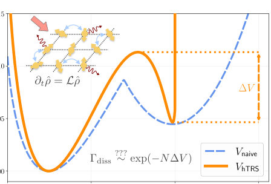 
FIG. 1. Hidden time-reversal symmetry allows one to di- rectly predict the dissipative gap Γdiss (i.e. slowest relaxation rate) of open many-body Lindbladians (see inset). A special steady-state purification defines a potential function VhTRS(o) (solid, orange) whose barrier height ∆V controls the dissipa- tive gap; here o is an effective order parameter. This potential does not match a more naively-defined potential Vnaive(o) ob- tained directly from the steady-state density matrix (dashed, blue). Results are for a dissipative transverse-field Ising model (with o related to the magnetization), tuned near a first-order phase transition; see Appendix C 3 and Fig. 12).

📷 Fig 2

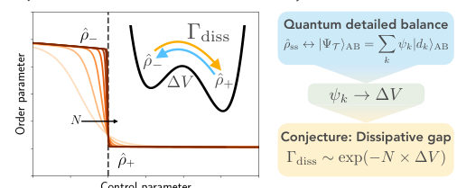 
FIG. 2. a) Generic plot of the steady-state average order parameter versus the relevant system parameter for a system exhibiting a first-order dissipative phase transition (DPT), for various system sizes N. At the DPT (dashed line) the steady state ˆρss abruptly changes from ˆρ−to ˆρ+. Slow dynamics are governed by the dissipative gap Γdiss, which close to the transition is akin to the slow switching rate between minima of a double-well potential. c) For systems having hTRS, despite not being in thermal equilibrium, we conjecture (and show for several examples) that ˆρss directly determines Γdiss. A special purification of ˆρss sets an effective potential barrier ∆V , which then sets Γdiss...

📷 Fig 3

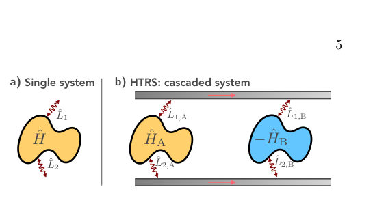 
FIG. 3. Construction of the doubled system in the hid- den time-reversal symmetry framework. a) A quantum sys- tem with Hamiltonian ˆH is subject to Markovian dissipation shown here using two jump operators ˆL1 and ˆL2. b) This quantum system forms system A of the doubled system con- sidered in hTRS. System A and system B emit photons into chiral waveguides which only propagate photons from system A to system B, resulting in a cascaded quantum network [53]. Therefore system A is not impacted by system B while system B interacts with the radiation dissipated by system A. If the model has hidden time-reversal symmetry, the Hamiltonian and jump operators of system B are simply related to those...

📷 Fig 4

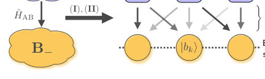 
FIG. 4. Pictorial illustration of the main arguments presented in Sec. IV A. a) The steady-state purification lives in a dark- state manifold D+ (top) which is mapped to an orthogonal manifold B−(bottom) under ˆHAB. However, these manifolds are unstructured which complicates solving Eq. (17). We ar- gue that this problem massively simplifies assuming Eqs. (21) and (26). b) Under these assumptions we can use a charge degree of freedom to arrange a special set of states in D+ (top) and B−(bottom) as two legs of a ladder which are cou- pled in a local fashion by ˆHAB (solid arrows). This simplified structure allows us to obtain analytical expressions for the purified steady state |ΨT ⟩AB using...

📷 Fig 5

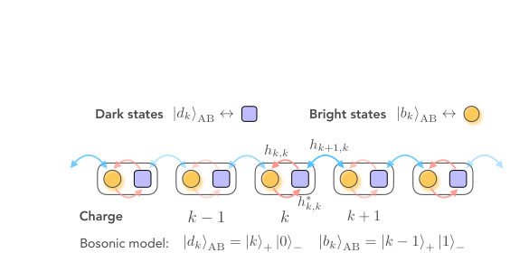 
FIG. 5. Mapping the Hermitian ladder model to a tight- binding chain with inhomogeneous hopping amplitudes for the nonlinear cavity model in Sec. V A. Using the coupling coefficients hk,k and hk+1,k defined in Eq. (44) the effective Hamiltonian ˆH′ AB has the structure of a tight-binding chain with a two-site unit cell, corresponding to the dark states |dk⟩AB and bright states |bk⟩AB with charge k.

**Summary.** This paper introduces an analytical method to determine slow relaxation rates (metastability) in open quantum many-body systems exhibiting hidden time-reversal symmetry. By purifying the non-equilibrium steady state, the authors derive an effective potential barrier whose height predicts the dissipative gap scaling ($\exp(-N\Delta V)$). This approach offers a powerful alternative to complex instanton calculations for understanding first-order phase transitions in driven quantum matter.

**Why it may be interesting.** This work provides a powerful, symmetry-based theoretical tool for calculating non-equilibrium dynamics in complex quantum systems where traditional methods fail. The ability to bypass path integrals by analyzing the NESS structure is highly valuable for AMO physicists studying driven cavity QED or superconducting circuits.

Detailed structure

**Main problem.** The research addresses understanding metastability and exponentially-long timescales in open, driven-dissipative quantum many-body systems near first-order dissipative phase transitions (DPTs). The goal is to analytically predict the slow relaxation rate without relying on intractable path-integral methods.

**Main result.** The authors propose that for systems possessing hidden time-reversal symmetry (hTRS), the slow dynamics are governed by an effective potential barrier ($\Delta V$) derived directly from a special purification of the non-equilibrium steady state (NESS). This method successfully reproduces results from established instanton calculations.

**Method.** The core methodology involves exploiting the existence of hTRS to construct a doubled system formalism. This allows for the analytical determination of the NESS purification, which in turn yields an effective potential $V(n)$ whose barrier height predicts the dissipative gap $\Gamma_{	ext{diss}} \sim e^{-N\Delta V}$.

**Model / system.** The work analyzes general driven-dissipative open quantum systems described by Lindblad master equations. Specific models studied include boundary-driven spin chains, bosonic lattice models, and the Dissipative Transverse-field Ising Model (DTFIM). The analysis often employs a doubled-system formalism to enforce hTRS.

**Key observables.** Dissipative gap ($\Gamma_{	ext{diss}}$), Non-equilibrium potential barrier ($\Delta V$), Steady-state order parameter $\langle \hat{
ho}_{	ext{ss}} 
angle$, and the purified steady state $|\Psi_T 
angle_{AB}$.

**Important parameters / regimes.** System size ($N$), control parameters (e.g., detuning, coupling strengths), and the scaling exponent $N$ in the exponential decay rate.

**Assumptions / limitations.** The primary assumption is the existence of hidden time-reversal symmetry (hTRS) in the system dynamics. The analysis often relies on mean-field approximations or specific symmetries (like permutational symmetry for probability distributions).

**Figures summary.** Figures illustrate how the derived potential $V_{	ext{hTRS}}(o)$ determines the gap, comparing it to naive potentials; they also show the ladder structure resulting from the doubled system mapping and compare calculated barriers against established instanton results.

**Paper structure.** The paper builds conceptually by first establishing the classical analogy for detailed balance, then generalizing this concept to quantum systems via hTRS using a doubled-system formalism. It applies this framework to specific models (like nonlinear cavities or DTFIM) to derive and compare the predicted potential barriers with known results.

Abstract

Metastability in many-body quantum systems and its associated exponentially-long timescales have been the subject of considerable recent interest. Here, we focus on a class of driven-dissipative many-body open quantum systems described by a Lindbladian having hidden time-reversal symmetry (a form of quantum detailed balance). Examples include boundary-driven interacting spin chains, bosonic lattice models and driven-dissipative collective spin models. We suggest that for such systems, slow timescales in the vicinity of a dissipative first-order phase transition can be analytically predicted using a special purification of the non-equilibrium steady state. We show the accuracy of our conjecture through detailed studies of a dissipative transverse-field Ising model with collective and local decay, and a driven-dissipative nonlinear cavity model. Our results allow quantitative insights into metastability and slow dynamics for a range of systems, including cases where semiclassical or path-integral instanton approaches are intractable.

[↑ back to top](#top)

### ⭐ [Control transition in a temporally random classical spin chain](http://arxiv.org/abs/2606.09297v1)

**Highlighted author(s):** Sarang Gopalakrishnan  
**Authors:** Elisha Shmalo, J. H. Pixley, Manas Kulkarni, Sarang Gopalakrishnan, David A. Huse  
**Type:** theory · **Category:** statistical mechanics · **PDF:** <https://arxiv.org/pdf/2606.09297v1>  
**Analysis basis:** full PDF text, analyzed in chunks
**Topic relevance:** 🔥 `non-equilibrium universality` **4/5** · `driven-dissipative phase transition` **3/5** · `non-equilibrium dynamics` **2/5** · `Frenkel-Kontorova` **1/5** · `correlated / nonlocal dissipation` **1/5** · `exotic spin models in light-matter` **1/5** · `methods for driven-dissipative` **1/5**

📷 Fig 1

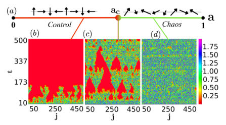 
Figure 1. Top Row: (a) Schematic of the phase diagram between controlled and chaotic phases tuned by the con- trol parameter a, separated by the critical point ac. The wavelength-4 spin spiral in Eq. (3) is depicted, as well as a chaotic configuration. Bottom Row: activity dy- namics after starting in a random initial state, revealed through space-time (j-t) plots of δSj(t) defined in Eq. (5) (values given in color bar). In the controlled phase (b), a = 0.72, the system goes to the controlled state (red) at long times, note how the temporal randomness causes many active regions to “die” simultaneously; in the crit- ical regime (c), a = 0.758 ≈ac, we have “active” and “dead” regions and the...

📷 Fig 2

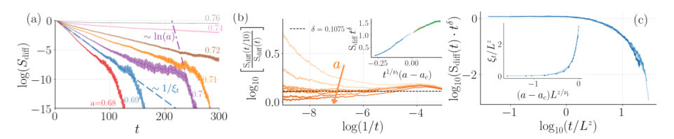 
Figure 2. Activity across the transition: (a) The activity Sdiff(t) in Eq. (5) on a log-scale versus time (t) for chain length L = 256 and a = 0.68 to a = 0.76 across the controlled and chaotic phases. In the controlled phase two temporal regimes are separated by t∗[see Eq. (6)], displaying the critical decay regime set by ξt (example in blue dashed line) and the later-time decay that occurs once all realizations are close enough to the control state (purple dotted-dashed line). (b) logb[Sdiff(t/b)/Sdiff(t)] with b = 10, plotted as a function of time. The a values range from a = 0.7535 (highest curve) to a = 0.7615 (lowest curve). Finding the value of a for which this ratio is constant in...

📷 Fig 3

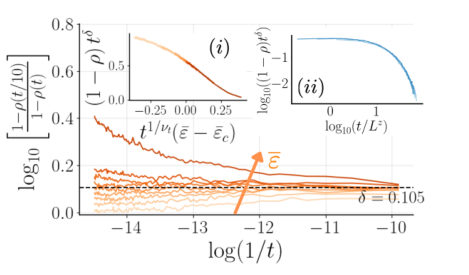 
Figure 4. Determination of critical exponents for Stavskaya’s model with temporal randomness: (a) Using L = 20000 for 0.25315 ≤ε ≤0.25435 to de- termine ¯εc = 0.253725(5) and δ = 0.105(5); see end matter for definition of the activity in this model (ρ). Left inset (i): Scaling collapse near ¯εc = 0.253725 to determine νt = 2.25(5), and therefore β = 0.236(5). Right inset (ii): Finite-size scaling at ¯εc = 0.253725 with L = 4000, 8000, 16000 to determine z = 1.45(5).

📷 Fig 4

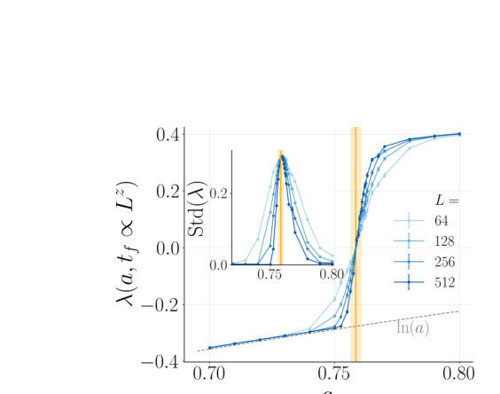 
Figure 3. Jump in the leading Lyapunov expo- nent and its fluctuations: The average Lyapunov ex- ponent λ in Eq. (S1) over 1000 samples evaluated at a late time tf ∼L1.34 by averaging over the time window [tf, 3tf]. As the critical point is approached from the chaotic phase (a &gt; ac), λ approaches a positive value λ ≈0.35, while in the control phase (a &lt; ac) the λ is close to ln(a) (gray dashed line), but averaging over the random signs in Jx,y(t) from Eq. (1) makes this value slightly larger. At the transition ac our data is consis- tent with a discontinuous jump in the Lyapunov expo- nent of an infinite system from its chaotic value to its control value, thus first-order-like behavior....

**Summary.** This work theoretically examines the transition between chaotic and controlled behavior in a classical spin chain model driven by alternating Hamiltonian and control dynamics. The key finding is that this transition displays contrasting characteristics, notably a jump discontinuity in the Lyapunov exponent despite continuous decay of activity. The critical behavior suggests the system belongs to a universality class related to directed percolation under temporal randomness.

**Why it may be interesting.** It provides a concrete example of how non-equilibrium dynamics can exhibit phase transitions characterized by mixed signatures (continuous vs. discontinuous observables), linking classical spin systems to established concepts in statistical mechanics like DP criticality.

Detailed structure

**Main problem.** The study investigates a phase transition between controlled and chaotic dynamics in a classical spin chain model subjected to alternating Hamiltonian evolution and a contractive control map.

**Main result.** The transition exhibits mixed character, marked by the continuous vanishing of activity but a discontinuous jump in the leading Lyapunov exponent from positive (chaotic) to negative (controlled).

**Method.** Theoretical analysis involving numerical simulation of spin dynamics, critical scaling hypothesis testing, and comparison of resulting exponents with known universality classes like directed percolation.

**Model / system.** A classical spin chain model using O(3) vectors whose time evolution alternates between a Heisenberg Hamiltonian (with random couplings) and a contractive control map towards an unstable fixed point. The critical behavior is compared to Stavskaya's automaton for 1+1D directed percolation.

**Key observables.** Activity ($\delta S_{diff}$), leading Lyapunov exponent ($\lambda$), and critical exponents ($eta, 
u_t, z$).

**Important parameters / regimes.** Control strength parameter ($a$) which tunes the system between chaotic and controlled phases; the critical point $a_c$.

**Assumptions / limitations.** The dynamics are treated as temporally random to avoid persistent non-chaotic features like solitons; scaling laws derived from critical phenomena theory are applied.

**Figures summary.** Figures illustrate space-time plots of activity across different control strengths, showing the transition regime. Other figures detail the jump in the Lyapunov exponent and finite-size scaling analysis for determining critical exponents.

**Paper structure.** The paper establishes the model dynamics (Hamiltonian + Control Map), analyzes the behavior in both phases using observables like activity and $\lambda$, determines the critical point $a_c$ via scaling, and finally compares the resulting critical exponents to those of directed percolation universality classes.

Abstract

We theoretically explore a phase transition between controlled and chaotic dynamics in a classical spin chain model subject to chaotic Hamiltonian dynamics and a contractive "control map", which alternate in time. The control map drives the system toward a target configuration that is an unstable fixed point under the chaotic dynamics. When the control is strong enough, the target configuration is the globally attracting stable fixed point of the dynamics; for weaker control, the many-body dynamics remains chaotic for almost all initial states. The phase transition between controlled and chaotic phases has a mixed character: As the transition is approached from the chaotic phase, the fraction of the spins that are far from the target configuration goes continuously to zero, and there are diverging spatial and temporal correlation lengths; however, the leading Lyapunov exponent is discontinuous across the transition, jumping from a positive value in the chaotic phase to a negative value in the controlled phase. We present evidence that this transition is in the same universality class as directed percolation in the presence of temporal randomness, a universality class for which we obtain results that are consistent with the dynamical Harris criterion but do not saturate the bound.

[↑ back to top](#top)

### ⭐ [Topological Triplons in the Pinwheel Valence Bond Solid on the Kagome Lattice](http://arxiv.org/abs/2606.09823v1)

**Highlighted author(s):** Johannes Knolle  
**Authors:** Laura Calonge-Martínez, Peng Rao, Frédéric Mila, Johannes Knolle  
**Type:** theory · **Category:** strongly correlated electrons · **PDF:** <https://arxiv.org/pdf/2606.09823v1>  
**Analysis basis:** full PDF text, analyzed in chunks
**Topic relevance:** 🔥 `analog quantum simulation` **4/5** · `exotic spin models in light-matter` **3/5** · `non-equilibrium dynamics` **2/5** · `Keldysh / 2PI / non-Gaussian methods` **1/5** · `entanglement & information structure` **1/5** · `methods for driven-dissipative` **1/5** · `spintronics-quantum-optics interface` **1/5**

📷 Fig 1

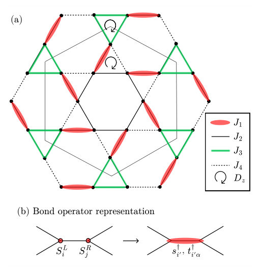 
FIG. 1. (a) Deformed kagome lattice structure of Rb2Cu3SnF12. The four inequivalent nearest-neighbor exchange couplings J1–J4 are indicated by distinct bond types, forming a 12-site pinwheel VBS unit cell. Red bonds denote singlet dimers, while arrows indicate the orientation of the out-of-plane DMI Dz ij. (b) Schematic summary of the bond operator description.

📷 Fig 2

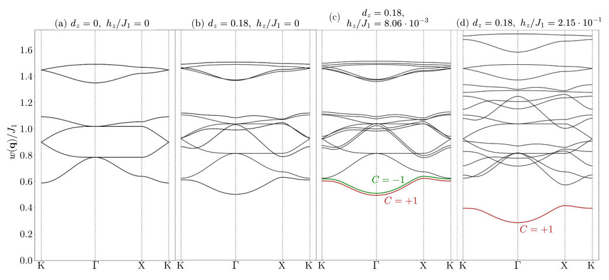 
FIG. 2. Triplon energy bands for the nearest-neighbor pinwheel valence-bond solid on the kagome lattice. (a) Spectrum in the absence of DMI and magnetic field, showing threefold degenerate triplet modes. (b) Inclusion of DMI with dz = 0.18. (c) Addition of a small magnetic field further splits the transverse (x and y) triplon branches. (d) Larger magnetic field leading to a clear isolation of the lowest-energy band.

📷 Fig 3

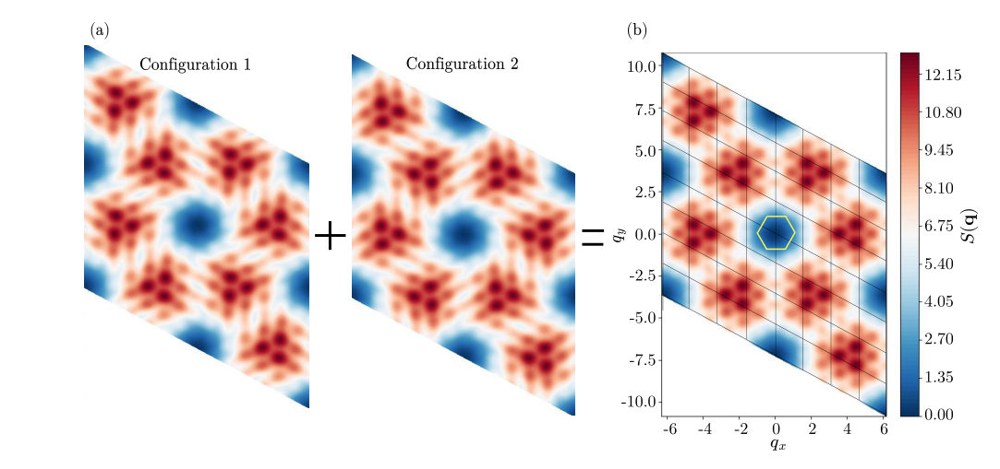 
FIG. 3. Static structure factor S (q) = S xx(q) + S yy(q) + S zz(q) for dz = 0.18 and zero magnetic field, obtained by assembling 64 reduced Brillouin zones. (a) The two panels correspond to the two chiral configurations. (b) S (q) averaged over both configurations. The background grid indicates the tiling of the the 64 shifted reduced Brillouin zones used in the construction, while the hexagon highlighted in yellow marks the first Brillouin zone

📷 Fig 4

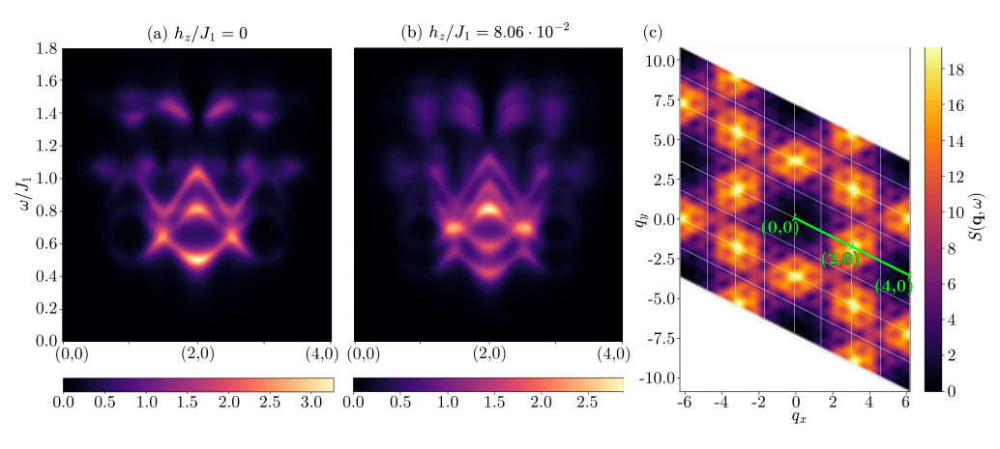 
FIG. 4. Dynamical structure factor S (q, ω) = S xx(q, ω) + S yy(q, ω) + S zz(q, ω) at zero temperature. (a) Intensity along a one-dimensional momentum path (indicated in green in panel (c)) for dz = 0.18 and zero magnetic field. (b) Same as in (a) in the presence of an external magnetic field of intensity h = 1.5 meV applied along the z direction, showing the Zeeman splitting of the triplon branches. (c) dynamical structure factor intensity integrated over the low-energy window 0.4 ≤ω ≤1.0 with no magnetic field, plotted in an extended Brillouin zone scheme obtained by assembling 64 zones. The results are averaged over the two pinwheel domains.

📷 Fig 5

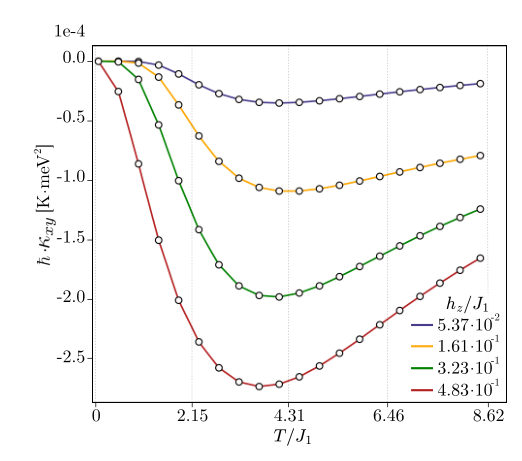 
FIG. 5. Transverse thermal Hall conductivity κxy as a function of temperature for several values of applied magnetic field in the z- direction.

**Summary.** The research analyzes the exotic triplon excitations within a pinwheel Valence Bond Solid on a kagome lattice. By incorporating Dzyaloshinskii-Moriya interactions and an external magnetic field, the authors predict that the system can host non-trivial band topology characterized by Chern numbers. This topological feature is directly linked to a measurable, tunable thermal Hall effect.

**Why it may be interesting.** This work applies advanced many-body theoretical tools (bond operators, BdG formalism) to predict measurable transport phenomena ($\kappa_{xy}$) arising from emergent topological order in frustrated quantum magnets.

Detailed structure

**Main problem.** The study investigates topological triplon excitations and their associated thermal Hall response in a specific quantum magnet system.

**Main result.** The deformed kagome pinwheel VBS is shown to be a promising platform for observing topological triplon physics, leading to a tunable thermal Hall conductivity when DMI and an external magnetic field are present.

**Method.** Calculations employ bond-operator mean-field theory combined with the Bogoliubov–de Gennes formalism to determine band structures and topological invariants like Chern numbers.

**Model / system.** The system is the compound Rb2Cu3SnF12, which realizes a pinwheel Valence Bond Solid (VBS) on a deformed kagome lattice. The Hamiltonian includes Heisenberg exchange, Dzyaloshinskii-Moriya interactions, and an external magnetic field.

**Key observables.** Triplon band structure, dynamical structure factor S(q, w), Berry curvatures, Chern numbers, and thermal Hall conductivity (kappa_xy).

**Important parameters / regimes.** DMI parameter d_z = 0.18; exchange couplings J1=18.6 meV, J2=0.95J1, J3=0.85J1, J4=0.55J1.

**Assumptions / limitations.** The analysis relies on mean-field approximations and neglects higher-order interaction terms (e.g., triplon–triplon interactions) in the structure factor calculations.

**Figures summary.** Figures illustrate the lattice structure, schematic bond operator description, band splittings under DMI/B field, agreement of S(q, w) with neutron scattering data, and dependence of kappa_xy on T and B.

**Paper structure.** The paper progresses from establishing the VBS ground state using bond operators to calculating spectral properties (S(q,w)) by comparing theory to experiment. It then focuses on topological analysis via Berry curvature and culminates in deriving a finite thermal Hall conductivity formula based on Chern numbers.

Abstract

We investigate the triplon excitations of the pinwheel valence-bond-solid phase on the deformed kagome lattice compound Rb2Cu3SnF12. Using bond-operator mean-field theory, we compute the triplon band structure, dynamical structure factor, Berry curvatures and the associated thermal Hall response. We show that the presence of Dzyaloshinskii-Moriya interactions and an external magnetic field are key for endowing triplon bands with nontrivial Chern numbers. We find good qualitative agreement of the low-energy dynamical structure factor with neutron-scattering experiments. An applied magnetic field can isolate the lowest triplon Chern band leading to a tunable thermal Hall conductivity for accessible temperature and field regimes. Our results establish the deformed kagome pinwheel valence-bond solid as a promising platform for topological triplon physics and for observing the associated thermal Hall effect.

[↑ back to top](#top)

### [Cascaded Rydberg antiblockade: Multi-atom excitation dynamics and entanglement](http://arxiv.org/abs/2606.08536v1)

**Authors:** Jin-Lei Wu, Jun Wu, Pei-Yao Song, Yan Wang, Ya Gao, Xue-Ke Song, Shi-Lei Su  
**Type:** theory · **Category:** other · **PDF:** <https://arxiv.org/pdf/2606.08536v1>  
**Analysis basis:** full PDF text, analyzed in chunks
**Topic relevance:** 🔥 `Rydberg arrays` **5/5** · 🔥 `analog quantum simulation` **4/5** · `entanglement & information structure` **3/5** · `methods for driven-dissipative` **3/5** · `non-equilibrium dynamics` **3/5** · `correlated / nonlocal dissipation` **2/5** · `non-equilibrium universality` **2/5** · `Keldysh / 2PI / non-Gaussian methods` **1/5** · `Tavis-Cummings & cavity-many-emitter` **1/5** · `driven-dissipative phase transition` **1/5** · `exotic spin models in light-matter` **1/5**

📷 Fig 1

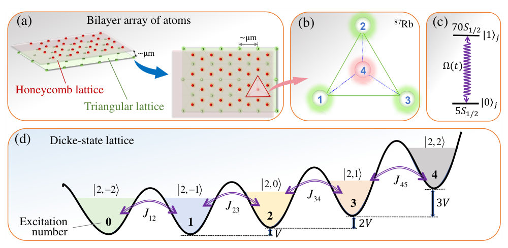 
FIG. 1. (a) Schematic diagram of a bilayer neutral atom array, with one layer holding single atoms assembled at sites in a triangular optical lattice while the other in a honeycomb lattice. (b) Four fully connected atoms with an equidistant interaction strength V between arbitrary two. (c) Atomic spin transition being identically driven by a periodic amplitude-modulated field, from the ground state |0⟩to the Rydberg state |1⟩with a Floquet Rabi frequency Ω(t). (d) One-dimensional synthetic dimension in DSL with the individually addressable nearest-neighbor hopping rates.

📷 Fig 2

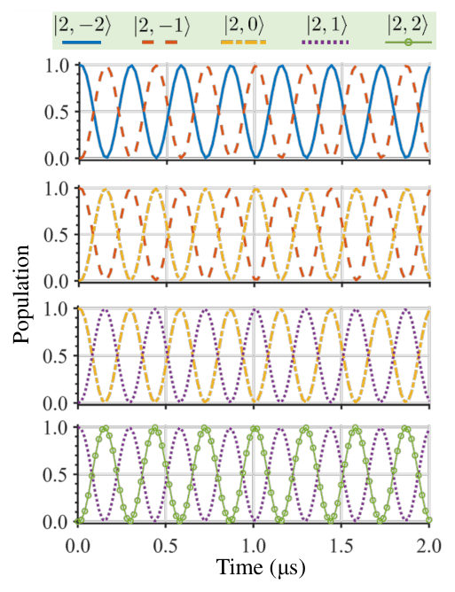 
FIG. 2. Complete Rabi-like oscillations between two adjacent DSL sites |2, n−2⟩and |2, n−1⟩with the initial state |2, n−2⟩, with n increasing from the uppermost panel n = 0 to the lowest n = 3, respectively.

📷 Fig 3

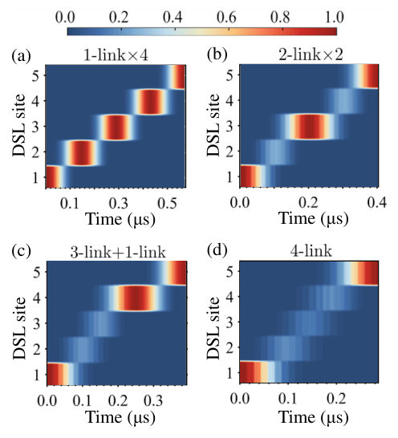 
FIG. 3. Full RAB processes through population transfers from |2, −2⟩to |2, 2⟩in different ways based on the PST method. (a) Four steps via four times of 1-link hops. (b) Two steps via two times of 2-link hops. (c) Two steps via one 3- link hop plus one 1-link hop. (d) One step via one 4-link hop. Detailed parameters and descriptions are found in the main text.

📷 Fig 4

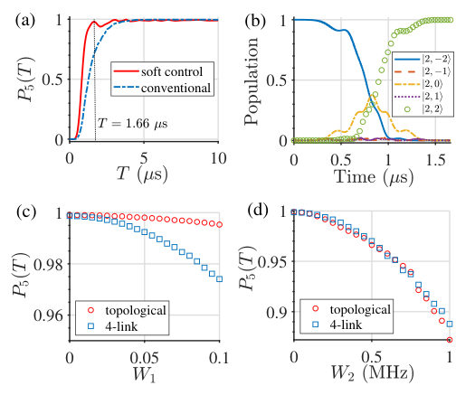 
FIG. 4. (a) Population of |1111⟩at the instant t = T versus the duration T, based on the conventional scheme and the soft control scheme with the Gaussian envelopes in eq. (11). (b) Time-dependent populations of the five Dicke states during the transition from the ground state to the full RAB state. Effect of disorder intensity on the final population of |1111⟩ for (c) off-diagonal terms and (d) diagonal terms, with com- parison between the soft control scheme and the 4-link PST scheme. Each datum in (c) and (d) is obtained by averaging 501 results with the off-diagonal or diagonal disorder terms being randomly picked.

📷 Fig 5

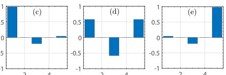 
FIG. 5. Instantaneous energy spectrum of the five-site DSL under (a) the conventional modulation and (b) the Gaussian soft-control scheme. (c)–(e) Spatial distributions of the gap state on the five sites at t = T/4, T/2, and 3T/4 for the Gaussian scheme.

**Summary.** The authors propose using Floquet modulation on four interacting Rydberg atoms to create a controllable Dicke-state lattice. They demonstrate advanced quantum control techniques, including soft quantum control and STA, to achieve perfect state transfer and generate high-fidelity twin-Fock and GHZ entangled states rapidly. This establishes the platform as a versatile tool for quantum simulation and entanglement engineering.

**Why it may be interesting.** This work provides a highly programmable synthetic dimension (DSL) for quantum simulation, offering robust methods to engineer complex multi-particle entangled states faster than standard adiabatic protocols in Rydberg arrays.

Detailed structure

**Main problem.** The research aims to achieve coherent, programmable control over collective spin excitation dynamics in interacting Rydberg atom arrays using a cascaded Rydberg antiblockade (RAB) regime.

**Main result.** They successfully demonstrate perfect state transfer across a synthetic Dicke-state lattice and generate high-fidelity entangled states (twin-Fock and GHZ) on sub-microsecond timescales, outperforming conventional adiabatic methods.

**Method.** The study employs Floquet modulation to derive an effective Hamiltonian for the system, utilizing techniques like soft quantum control and Stimulated Raman Adiabatic Passage (STA).

**Model / system.** The platform uses four fully connected interacting Rydberg atoms in $^{87}	ext{Rb}$ trapped in a lattice. The dynamics are modeled using a master equation incorporating spontaneous decay, leading to an effective Hamiltonian describing the Dicke-state lattice.

**Key observables.** Population transfer fidelity ($|0000
angle 	o |1111
angle$), Concurrence ($	ext{CN}$) for twin-Fock and GHZ states, and population dynamics across the DSL sites.

**Important parameters / regimes.** Rydberg blockade strength ($V$), driving field modulation parameters ($\Omega_n(t)$), and timescales (sub-microsecond).

**Assumptions / limitations.** The analysis relies on applying the Rotating-Wave Approximation (RWA) and specific conditions for adiabatic elimination to derive the effective Hamiltonian.

**Figures summary.** Figures illustrate population transfers across the DSL, compare soft control vs. conventional methods for state transfer fidelity, and show the evolution of entanglement concurrence for generated states.

**Paper structure.** The paper progresses from defining the initial system Hamiltonian under global periodic driving to deriving an effective Dicke-state lattice Hamiltonian. It then details applications: first, demonstrating perfect state transfer using soft control; second, simulating topological dynamics; and finally, generating high-fidelity entanglement via STA.

Abstract

We propose a cascaded Rydberg antiblockade (RAB) regime via a Floquet modulation in four fully connected interacting atoms, which establishes a new synthetic dimension, Dicke-state lattice (DSL), in the space of collective spin excitations. By applying a global periodic driving, we synthesize an effective Hamiltonian that enables perfect state transfer across the five-site DSL with multiple programmable pathways from stepwise nearest-neighbor jumps to a single-step transition. This DSL platform further allows us to simulate a dynamic Su-Schrieffer-Heeger model, where soft quantum control is employed to achieve topologically inspired full RAB $|0000\rangle \to |1111\rangle$ with enhanced robustness against disorder. Moreover, by incorporating the shortcut to adiabaticity technique, we generate high-fidelity entangled twin-Fock and Greenberger-Horne-Zeilinger states on the four atoms within sub-microsecond timescales, outperforming the speed limits of conventional adiabatic protocols. Our work demonstrates a flexible and programmable synthetic dimension for quantum simulation and multipartite entanglement engineering in Rydberg atom arrays, paving the way for the future development of quantum information processing.

[↑ back to top](#top)

### [Range-controlled entanglement in Lindbladian skin states of monitored fermions](http://arxiv.org/abs/2606.09306v1)

**Authors:** Gianluca Passarelli, Angelo Russomanno, Davide Rossini, Procolo Lucignano  
**Type:** theory · **Category:** statistical mechanics · **PDF:** <https://arxiv.org/pdf/2606.09306v1>  
**Analysis basis:** full PDF text, analyzed in chunks
**Topic relevance:** 🔥 `entanglement & information structure` **4/5** · 🔥 `measurement-induced transitions` **4/5** · 🔥 `methods for driven-dissipative` **4/5** · `analog quantum simulation` **3/5** · `correlated / nonlocal dissipation` **3/5** · `driven-dissipative phase transition` **3/5** · `non-equilibrium universality` **3/5** · `quantum measurements` **3/5** · `Keldysh / 2PI / non-Gaussian methods` **2/5** · `Kondo & dissipative impurity` **2/5** · `non-equilibrium dynamics` **2/5** · `scars & prethermalization` **1/5**

📷 Fig 1

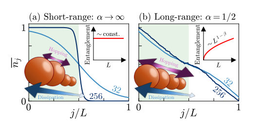 
FIG. 1. Representative steady-state fermion density profiles at half filling for γ = 1/2 and λ = 2. The shaded region marks the left half of the chain, where directed dissipation accumulates particles. (a) Short-range hopping sharpens the Fermi-skin profile with increasing L (see curve labels), consis- tent with complete skin accumulation; the inset sketches the corresponding area-law behavior of the trajectory entangle- ment entropy. (b) Long-range hopping leaves a finite density tail in the right half of the chain over the accessible sizes, in- dicating incomplete skin accumulation; the inset sketches the corresponding sub-volume-law finite-size growth of entangle- ment.

📷 Fig 2

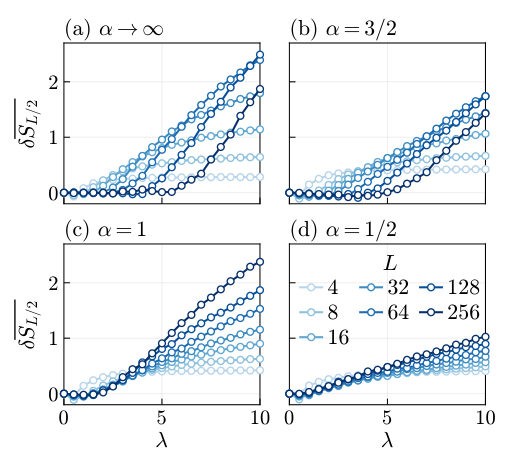 
FIG. 3. Finite-size difference δSL/2 for (a) the nearest- neighbor model (α →∞), (b) α = 3/2, (c) α = 1, and (d) α = 1/2. The onset of entanglement growth drifts toward larger λ with increasing L for α →∞and, over the accessible sizes, also for α = 3/2, while it remains approximately size- independent for α = 1 and α = 1/2.

📷 Fig 3

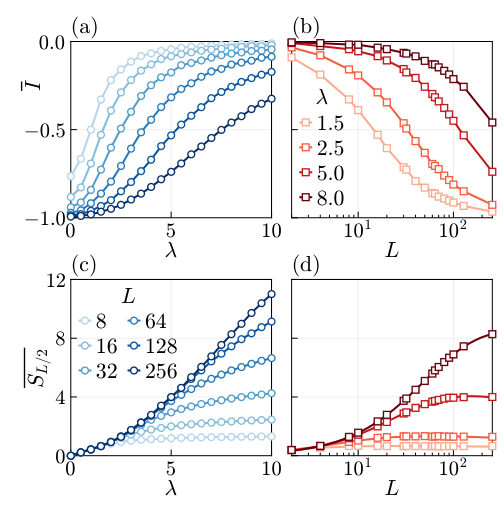 
FIG. 2. Data for the nearest-neighbor Hamiltonian (γ = 1/2): (a) imbalance I and (c) half-chain entanglement entropy SL/2 as functions of the coherent coupling λ. (b) Imbalance and (d) half-chain entanglement entropy as functions of the system size L. In (d), solid lines show fits to Eq. (6). Within the reliable fitting window, they yield β ≥1, consistent with the absence of algebraic growth.

📷 Fig 4

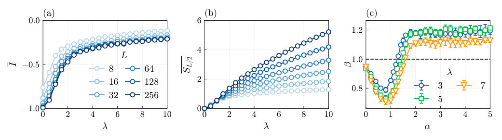 
FIG. 4. (a,b) Data for the long-range Hamiltonian with α = 1/2 (γ = 1/2): (a) imbalance I and (b) half-chain entanglement entropy SL/2 as functions of the coherent coupling λ. (c) Fitting exponent β [Eq. (6)] as a function of the hopping range α for representative values of λ. The dashed line marks β = 1. The minimum near α ≃1 indicates maximal sub-volume-law growth, while the recovery of β ≥1 occurs within the interval 1 ≲α ≲2.

**Summary.** The research explores the interplay between directed dissipation and coherent hopping in fermionic chains. By tuning the range of particle hopping ($\alpha$), the system can be driven into distinct steady states characterized by either a complete skin effect or an incomplete density tail. This physical control over localization is shown to directly dictate the scaling law of quantum entanglement, linking non-Hermitian physics to quantum information theory.

**Why it may be interesting.** This work provides a concrete example of how non-Hermitian physics (the skin effect) couples directly to quantum information measures like entanglement entropy, offering tunable control over many-body correlations via microscopic parameters.

Detailed structure

**Main problem.** The study investigates how tuning the hopping range ($\alpha$) controls both the localization of particle density (Lindbladian Skin Effect) and the scaling behavior of quantum entanglement in monitored fermionic systems.

**Main result.** Short-range hopping leads to a complete skin effect accompanied by area-law entanglement, while long-range hopping results in an incomplete skin tail and algebraic sub-volume-law entanglement.

**Method.** The dynamics are simulated using the master equation unraveled into quantum jump trajectories, analyzed within a Gaussian trajectory approximation for correlation matrices.

**Model / system.** The system is modeled by spinless fermions on an open chain evolving under a Lindbladian dissipation ($\mathcal{L}$) and a coherent hopping Hamiltonian ($\hat{H}_\alpha$) with tunable range $\alpha$.

**Key observables.** Particle density imbalance ($\langle\hat{I}
angle$), half-chain entanglement entropy ($S_L/2$), and the scaling exponent ($eta$) of $S(L)$.

**Important parameters / regimes.** Hopping range parameter $\alpha$ (controlling hopping decay), dissipation asymmetry $\gamma$, and coherent coupling strength $\lambda$.

**Assumptions / limitations.** The analysis relies on a Gaussian trajectory approximation to manage the complexity of higher-order correlation functions during quantum jump simulations.

**Figures summary.** Figures illustrate steady-state density profiles showing sharp fronts (short-range) versus extended tails (long-range), and plot entanglement entropy scaling behavior for different hopping ranges and boundary conditions.

**Paper structure.** The paper systematically compares the outcomes of short-range ($\alpha 	o \infty$) vs. long-range ($1 < \alpha < 2$) hopping regimes, demonstrating how $\alpha$ dictates whether a complete skin effect (area law) or an incomplete tail (sub-volume law) emerges.

Abstract

Reservoir engineering can stabilize states inaccessible to unitary dynamics. Directed particle-conserving dissipation creates Lindbladian skin states, where Pauli exclusion turns edge accumulation into a many-body density imbalance. In a monitored fermion chain with tunable hopping range, we identify, within a Gaussian trajectory approximation, two finite-size scaling regimes: short-range hopping is consistent with complete skin accumulation and area-law entanglement, whereas sufficiently long-range hopping produces a finite bulk tail and effective algebraic sub-volume-law entanglement. Dissipation and coherent hopping thus jointly control skin localization and quantum entanglement, highlighting their close interconnection.

[↑ back to top](#top)

### [Frequency-resolved decoherence spectroscopy of a semiconductor charge qubit coupled to a high-impedance resonator](http://arxiv.org/abs/2606.09722v1)

**Authors:** Ekaterina Al-Tavil, Wonjin Jang, David J. van Woerkom, Ville Maisi, Stefano Bosco, Jan A. Krzywda, Jeroen Danon, Christian Reichl, Werner Wegscheider, Thomas Ihn, Klaus Ensslin, Andreas Wallraff, Pasquale Scarlino  
**Type:** experiment · **Category:** other · **PDF:** <https://arxiv.org/pdf/2606.09722v1>  
**Analysis basis:** full PDF text, analyzed in chunks
**Topic relevance:** 🔥 `QC/QI experiment` **4/5** · `correlated cavity matter` **3/5** · `methods for driven-dissipative` **3/5** · `quantum optics experiment` **3/5** · `analog quantum simulation` **2/5** · `correlated / nonlocal dissipation` **2/5** · `driven-dissipative phase transition` **2/5** · `non-equilibrium dynamics` **2/5** · `quantum measurements` **2/5** · `Keldysh / 2PI / non-Gaussian methods` **1/5** · `Kondo & dissipative impurity` **1/5** · `Tavis-Cummings & cavity-many-emitter` **1/5** · `entanglement & information structure` **1/5** · `exotic spin models in light-matter` **1/5** · `measurement-induced transitions` **1/5** · `non-equilibrium universality` **1/5** · `spintronics-quantum-optics interface` **1/5**

📷 Fig 1

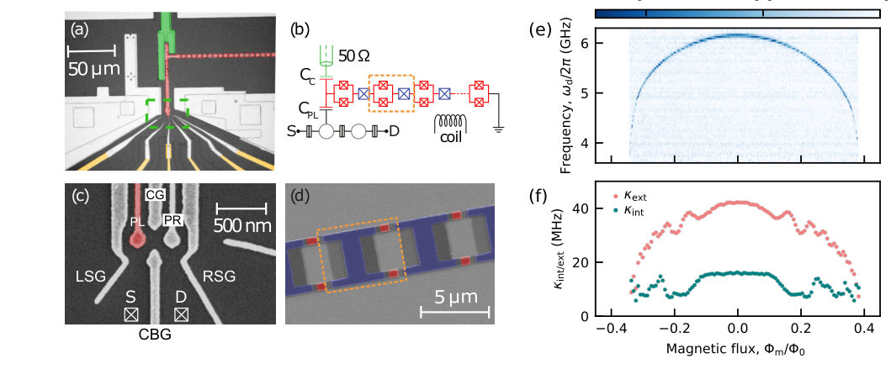 
FIG. 1. (a) False colored optical micrograph of the hybrid device. Al structures (light gray) are deposited on a GaAs/AlGaAs heterostructure (dark gray), to define the superconducting ground plane, and the fine gate structures utilized to form the double quantum dot (DQD). Au leads (yellow) connect the fine gates to the bonding pads (not shown in the figure). The Al/AlOx/Al SQUID array resonator (red) is galvanically connected to one of the fine gates, which is driven with the 50 Ω microwave feedline (green). (b) Schematic circuit diagram displaying the DQD source (S), and drain (D) ohmic contacts, and coupling capacitance to the resonator (CPL). Cc denotes the capacitance between the...

📷 Fig 2

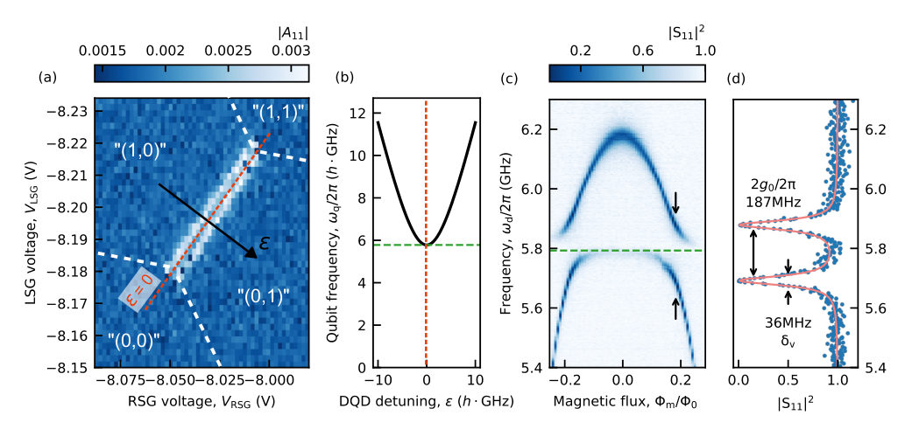 
FIG. 2. (a) Charge stability diagram measurement. The resonator reflection magnitude |A11| is measured near an inter-dot transition, as a function of the voltages applied to the side barrier gates LSG (VLSG) and RSG (VRSG) (see Fig. 1(c)). Black arrow represents the gate voltage direction in which the DQD detuning ε is varied. (b) DQD charge qubit frequency as a function of ε, calculated from ωq/2π = √

📷 Fig 3

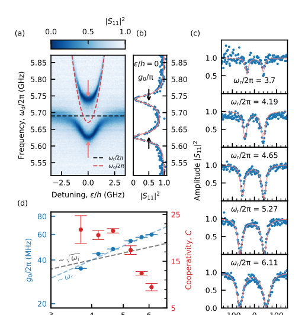 
FIG. 3. (a) |S11|2 measured as a function of ωd and ε with ωr/2π ∼2t/h ∼5.69 GHz. Dashed black line corresponds to the calculated ωq/2π, and the dashed red line denotes ωr/2π, using the parameters extracted from the 2D fit of the spec- trum to a master equation model (see Appendix A5). (b) Linecut of the measured |S11|2 in (a) at ε = 0 (red arrows) revealing the vacuum-Rabi mode splitting. The red solid line is the numerical fit to a master equation model (see text) (c) |S11|2 measured as a function of ωd at ε = 0 with different val- ues of t/h, achieved by gate voltage tuning while maintaining the constant number of charges. ωr is accordingly tuned with Φm (see Fig. 1(e)), to be resonant...

📷 Fig 4

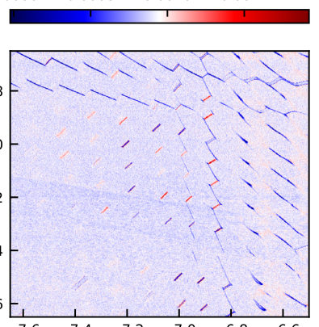 
FIG. 5. Resonator reflection |A11| measured as a function of the VLSG and VRSG (see Fig. 1(c)). The resonator frequency was tuned to ωr/2π ∼5.9 GHz by applying a finite magnetic flux Φm.

📷 Fig 5

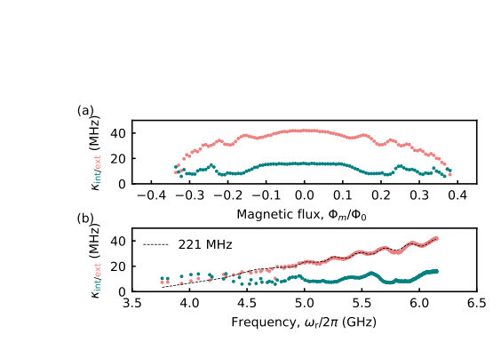 
FIG. 6. External and internal loss rates, κext (red) and κint (green) as a function of (a) applied magnetic flux Φm/Φ0 and (b) resonator frequency ωr/2π, extracted from the circle fit of measured resonator spectrum (see Fig. 1(e)). The oscillations in κext reveal a periodic modulation with a characteristic fre- quency of approximately 221 MHz. The black dashed line in (b) represents a sinusoidal fit with a linear background.

**Summary.** The authors used a semiconductor charge qubit coupled to a tunable superconducting resonator to perform frequency-resolved decoherence spectroscopy. They successfully distinguished between pure dephasing and energy relaxation mechanisms across different operating frequencies. The key finding is the observation of a cubic scaling in the relaxation rate, providing direct spectroscopic evidence for coupling to the piezoelectric phonon bath in GaAs.

**Why it may be interesting.** This work provides an excellent experimental realization of open quantum system dynamics, allowing for the direct measurement and theoretical confirmation of dissipation channels (like phonon coupling) that limit coherence in solid-state qubits, which is central to modern AMO research.

Detailed structure

**Main problem.** The study investigates light-matter interaction and decoherence mechanisms within a solid-state quantum system to probe fundamental limits of coherence.

**Main result.** The research successfully characterized the frequency dependence of qubit decay, finding that dephasing dominates at low frequencies while energy relaxation dominates at high frequencies. Furthermore, they established a cubic scaling for the relaxation rate consistent with coupling to a piezoelectric phonon bath.

**Method.** Frequency-resolved decoherence spectroscopy was performed by measuring the resonator's reflection magnitude ($|S_{11}|^2$) as the qubit frequency was tuned across a broad range using time-domain measurements (e.g., Ramsey, Hahn-echo).

**Model / system.** The platform is a hybrid circuit quantum electrodynamics architecture: a GaAs double-quantum-dot charge qubit capacitively coupled to a high-impedance, frequency-tunable SQUID-array resonator.

**Key observables.** Decoherence rates ($\Gamma_1$, $\Gamma_2$), coupling strength ($g_0$), and the measured resonator reflection $|S_{11}|^2$ as a function of qubit detuning and drive frequency.

**Important parameters / regimes.** Qubit transition frequency ($\omega_q/2\pi \sim 3-6$ GHz), charge detuning ($\epsilon$), and the ratio of coupling to loss rates (Cooperativity $C$).

**Assumptions / limitations.** The analysis relies on fitting measured spectra to master equation models, and certain scaling laws for resonator impedance are assumed when extracting intrinsic couplings.

**Figures summary.** Figures illustrate device schematics, charge stability diagrams showing qubit frequency tuning, spectroscopy plots showing avoided crossings (vacuum-Rabi splitting), and decay rate vs. frequency/detuning plots demonstrating the cubic phonon scaling.

**Paper structure.** The paper progresses from describing the physical setup and Hamiltonian to performing time-domain measurements to separate relaxation and dephasing. It then analyzes the frequency dependence of these rates, culminating in a quantitative determination of the coupling mechanism via phonon spectral density analysis.

Abstract

Superconducting resonators coupled to semiconductor quantum dots provide a powerful platform to investigate light-matter interaction and decoherence mechanisms in solid-state quantum systems. Here we study a hybrid circuit quantum electrodynamics architecture consisting of a GaAs double-quantum-dot charge qubit capacitively coupled to a high-impedance, frequency-tunable SQUID-array resonator. By tuning the qubit transition frequency over the range $ω_\mathrm{q}/2π\sim 3$-$6$ GHz, we perform frequency-resolved decoherence spectroscopy of the charge qubit across a broad energy window. Time-resolved measurements enable us to disentangle relaxation and pure dephasing processes and to identify distinct decoherence regimes as a function of qubit frequency. We find that at lower frequencies ($\leq 4.5$ GHz) dephasing dominates the qubit linewidth, whereas at higher frequencies energy relaxation becomes the leading contribution. The measured frequency dependence of the relaxation rate exhibits a cubic scaling, consistent with charge-qubit decay dominated by coupling to a piezoelectric phonon bath and providing frequency-resolved access to the corresponding phonon-induced spectral density. Our results show that hybrid semiconductor--superconducting circuits can serve as sensitive spectroscopic tools to probe microscopic decoherence mechanisms relevant for a wide range of hybrid quantum devices.

[↑ back to top](#top)

### [Chiral Quantum Entanglement Transfer with Giant Atoms](http://arxiv.org/abs/2606.08695v1)

**Authors:** Peng-Fei Wang, Lei Huang, Yi-Long-Yue Guo, Jing Wang, Han-Xiao Zhang, Hong Yang, Dong Yan  
**Type:** theory · **Category:** quantum information and computing · **PDF:** <https://arxiv.org/pdf/2606.08695v1>  
**Analysis basis:** full PDF text, analyzed in chunks
**Topic relevance:** 🔥 `entanglement & information structure` **4/5** · `analog quantum simulation` **3/5** · `correlated / nonlocal dissipation` **3/5** · `methods for driven-dissipative` **3/5** · `non-equilibrium dynamics` **3/5** · `Tavis-Cummings & cavity-many-emitter` **2/5** · `driven-dissipative phase transition` **2/5** · `Dicke superradiance` **1/5** · `Keldysh / 2PI / non-Gaussian methods` **1/5** · `Rydberg arrays` **1/5** · `correlated cavity matter` **1/5** · `exotic spin models in light-matter` **1/5** · `non-equilibrium universality` **1/5**

📷 Fig 1

 
FIG. 1. Schematic of a discrete multi-giant-atom structure coupled to an infinite one-dimensional lattice. Each two-level giant atom labeled l has transition frequency ωa. The l-th atom couples to the lattice sites n2l−1 and n2l with time- dependent coefficient gl(t). The atom size ds = n2l −n2l−1 and the interatomic distance dw = n2l+1 −n2l are uniform across the array. An additional phase difference φl between the two coupling points of each atom enables control of in- terference effects such as chiral emission and dark-state engi- neering.

📷 Fig 2

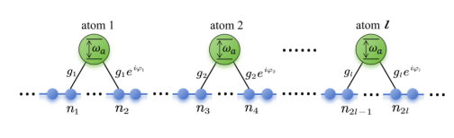 
Figure 1 shows the system: an array of N identical two- level giant atoms with transition frequency ωa coupled to an infinite one-dimensional lattice. Each lattice site has resonance frequency ω0, and η denotes the nearest- neighbor hopping rate. The l-th atom couples to the lattice sites n2l−1 and n2l with the time-dependent cou- pling coefficient gl(t). A phase difference φl between the two coupling points breaks the time-reversal symmetry. The total Hamiltonian is H = Ha + Hw + Haw (ℏ= 1),

📷 Fig 3

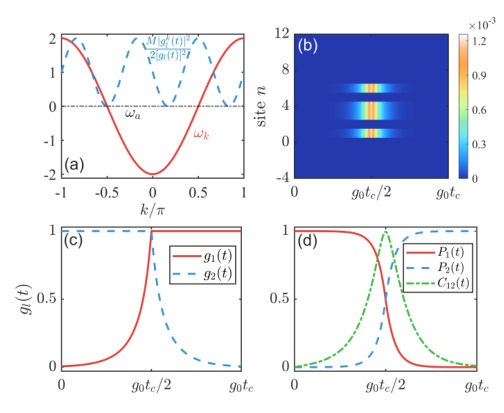 
FIG. 2. (a) The relationship among the lattice band frequency

📷 Fig 4

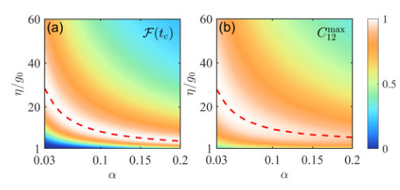 
FIG. 3. (a) Fidelity F(tc) and maximum concurrence Cmax 12 (b) as functions of the coupling coefficient η and the param- eter α. Dashed lines indicates F(tc) = 1 and Cmax 12 = 1, respectively. Other parameters are as in Fig. 2.

📷 Fig 5

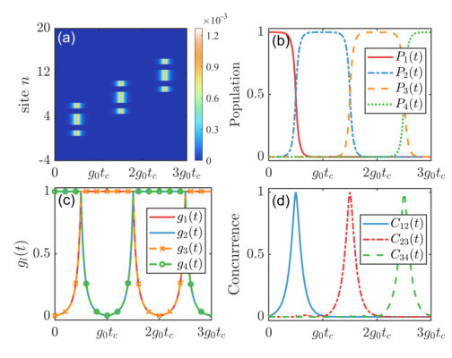 
FIG. 4. (a) Time evolution of the field intensity distribution |cj(t)|2. (b) Time evolution of the population Pl(t) associated with state |ψl⟩. (c) Time evolution of the coupling coefficients gl(t), with g1,3(t) = ga(t) and g2,4(t) = gb(t). (d) Time evolu- tion of the concurrence between neighboring atoms. Other pa- rameters are N = 4, |Ψ(0)⟩= |ψ1⟩, g0t0 = 200, g0τsw = 0.1, g0tc = 200.1, η/g0 = 20, n2l−1 = 4l −4, n2l = 4l −1, ds = 3, dl = 1, and φl = −π/2.

**Summary.** The paper proposes using an array of giant atoms coupled to a waveguide to realize perfect and unidirectional transfer of quantum states and entanglement. By controlling chiral spontaneous emission and dark-state dynamics through phase modulation, the system achieves robust state exchange even under non-Markovian conditions. This offers a scalable platform for long-distance quantum networking.

**Why it may be interesting.** This work directly addresses quantum network protocols by proposing a physical mechanism (chiral coupling) to achieve high-fidelity, controllable entanglement transport over long distances, which is central to quantum information theory.

Detailed structure

**Main problem.** The research aims to achieve perfect, unidirectional transfer of quantum states and associated entanglement across a multi-giant-atom waveguide system.

**Main result.** By engineering chiral spontaneous emission and exploiting dark-state dynamics, the setup enables robust, lossless state exchange capable of mimicking braided architectures without structural limitations.

**Method.** The analysis involves deriving equations of motion for the single-excitation subspace using a total Hamiltonian ($H = H_a + H_w + H_{aw}$) and applying phase-matching conditions to control directional coupling.

**Model / system.** The system consists of an array of N identical two-level giant atoms coupled to an infinite one-dimensional waveguide lattice. The dynamics are governed by time-dependent coupling coefficients $g_l(t)$ and engineered phases $\phi_l$.

**Key observables.** Fidelity of state transfer ($F(t)$), maximum interatomic concurrence ($C_{\max}$), population probabilities ($P_l(t)$), and entanglement length.

**Important parameters / regimes.** The additional phase ($\phi_l$), coupling coefficients ($g_l(t)$), and the ratio of decay rates ($\kappa_a/\kappa_0$).

**Assumptions / limitations.** Analysis is performed in the single-excitation subspace, utilizing chiral spontaneous emission and assuming specific boundary conditions for perfect transfer.

**Figures summary.** Figures illustrate schematics of the multi-atom structure, time evolution of field intensity and population, and plots showing state/entanglement transfer dynamics under varying dissipation regimes.

**Paper structure.** The paper builds from defining the Hamiltonian and system setup to deriving equations of motion. It then details using phase-matching conditions and time-reversed couplings for perfect state transfer, culminating in demonstrating periodic, lossless exchange via piecewise phase modulation.

Abstract

We investigate entanglement transfer in a multi-giant-atom waveguide system. By tailoring chiral spontaneous emission and exploiting dark-state dynamics, the setup enables perfect, unidirectional sequential or selective transfer of quantum states and their associated entanglement. The distance between two entangled atoms, i.e., the entanglement length, can be dynamically adjusted, allowing robust conversion between long-range and short-range entanglement during propagation. The system inherently converges to a dark state, guaranteeing high-fidelity directional transfer. When the additional phase is modulated as a periodic piecewise function, spatially separated giant atoms exhibit stable, nearly lossless state exchange and maintain steady entanglement even under non-Markovian conditions. This behavior mimics conventional braided architectures without suffering from propagation delays or spatial restrictions. Our proposal offers a scalable pathway for continuous long-distance entanglement transport and resilient state exchange in quantum networks.

[↑ back to top](#top)

### [Near-deterministic single-atom loading on a photonic integrated circuit](http://arxiv.org/abs/2606.07800v1)

**Authors:** Xinchao Zhou, Ahreum Lee, Dipanjan Das, Saivirinchi Prabandhakavi, Chen-Lung Hung  
**Type:** experiment · **Category:** other · **PDF:** <https://arxiv.org/pdf/2606.07800v1>  
**Analysis basis:** full PDF text, analyzed in chunks
**Topic relevance:** 🔥 `analog quantum simulation` **4/5** · `Tavis-Cummings & cavity-many-emitter` **3/5** · `correlated cavity matter` **3/5** · `quantum measurements` **3/5** · `quantum optics experiment` **3/5** · `QC/QI experiment` **2/5** · `measurement-induced transitions` **2/5** · `correlated / nonlocal dissipation` **1/5** · `driven-dissipative phase transition` **1/5** · `entanglement & information structure` **1/5** · `interference shaping light` **1/5** · `methods for driven-dissipative` **1/5** · `non-equilibrium dynamics` **1/5**

📷 Fig 1

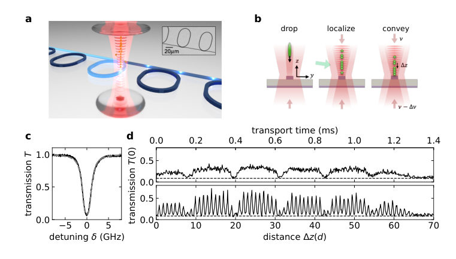 
FIG. 1. Conveyor-belt transport from a cold atom reservoir. a, Schematic of the experimental setup. An optical conveyor belt, formed by a moving optical lattice in an optical tweezer, transports a steady stream of trapped atoms onto a microring resonator. The microring draws in resonant photons from a bus waveguide. Atom-induced transparency in cavity QED generates light pulses synchronized with the conveyor-belt movement. Inset shows a scanning electron micrograph of the microring array. b, Experimental procedure depicting the initial atom guiding (drop), loading into an optical lattice (localize) with additional cooling (green arrow), and the subsequent conveyor-belt transport (convey)...

📷 Fig 2

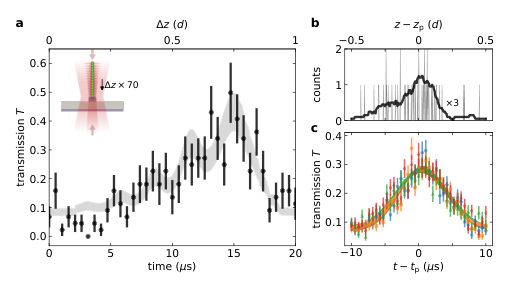 
FIG. 3. Site-resolved measurement. a, Averaged trans- mission T of 70 lattice sites in one transport. Shaded band shows the fitted transmission curve and its uncertainty, based on the model Tn in Fig. 2c and weighted averaged using Pois- son atom-number statistics. The fit yields a mean site occu- pancy ¯n = 1.5(5). b, Time-resolved detector counts (per 10 ns bin) accumulated while transporting the first 10 lattice sites. The transmission peak at t = tp (z = zp) is clearly visible in the average over a 0.6 µs running window (solid line). c, Averaged transmission of four conveyor-belt transports (color symbols), demonstrating excellent alignment using the 10-site average as shown in b to...

📷 Fig 3

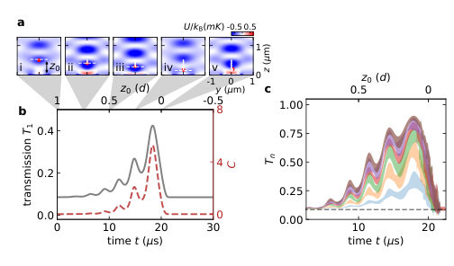 
FIG. 2. Simulated atom-photon coupling during trans- port. a, Potential cross-sections U(y, z) overlaid with a rep- resentative atomic trajectory (white lines, plotted from the initial time to the indicated time), where kB is the Boltz- mann constant. The marked atomic positions (red circles) follow the occupied lattice site (marked by dashed lines), as the distance of the site center to the surface (z0) moves from z0/d =1 (i) to 0.75 (ii), 0.5 (iii), 0.25 (iv), and 0 (v). b, Cal- culated resonant transmission T1 (gray line) and single-atom cooperativity C (red dashed line) during the transport, both averaged over 10 single-atom trajectories. c, Transmission Tn for n = 1, 2, . . . , 6 atoms...

📷 Fig 4

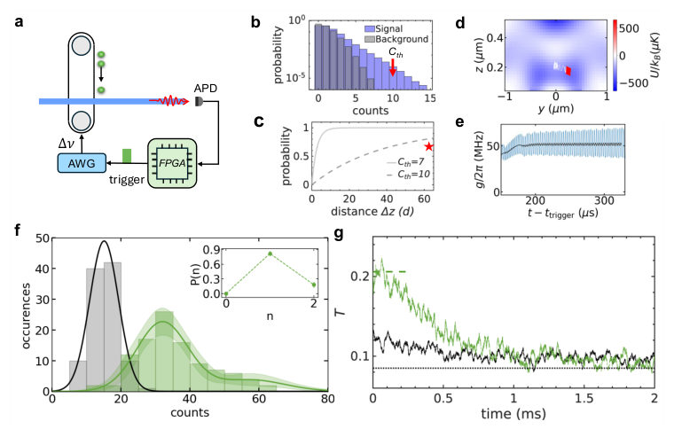 
FIG. 4. Near-deterministic single-atom loading. a, Schematic of feedback-controlled conveyor-belt transport. An FPGA monitors the time-averaged counts from the avalanche photodiode (APD) and triggers the arbitrary waveform generator (AWG) to halt the transport by ramping down ∆ν while ramping up the tweezer power. b, Probability histogram of the APD counts in 10 µs bins. Trigger threshold Cth is set to values with diminishing probability from background counts. c, Calculated (gray lines) and measured (red star) trigger probability versus transport distance ∆z. d, The final stationary potential cross-section and a simulated trajectory plotted following the trigger (white line) and after the...

**Summary.** The research presents a novel method using an optical conveyor belt and real-time feedback to load single neutral atoms near a microring resonator on a PIC. This technique successfully achieves the strong coupling regime ($C>1$) and demonstrates deterministic loading, paving the way for scalable quantum information processing architectures.

**Why it may be interesting.** This work provides a crucial experimental blueprint for scaling up quantum devices by integrating neutral atoms deterministically onto solid-state photonic platforms, which is vital for realizing large-scale quantum simulators or processors.

Detailed structure

**Main problem.** The primary challenge is achieving efficient, scalable integration of identical quantum emitters (neutral atoms) with Photonic Integrated Circuits (PICs) while maintaining strong single atom-photon coupling.

**Main result.** The authors demonstrated near-deterministic single-atom loading onto a microring resonator PIC, successfully reaching the strong coupling regime ($C > 1$).

**Method.** They employed an optical conveyor belt formed by a moving optical lattice to continuously deliver atoms, followed by real-time feedback control for deterministic trapping into a stationary site.

**Model / system.** The system involves Cesium neutral atoms coupled to microring resonators on a silicon-nitride PIC. The coupling is mediated by the atom's interaction with the cavity mode, monitored via atom-induced transparency changes in transmitted probe photons.

**Key observables.** Single-atom cooperativity parameter ($C$), single/two-atom transfer probabilities ($P_1 \approx 82\%$, $P_2 \approx 18\%$), and photon antibunching ($g^{(2)}(0) < 0.5$).

**Important parameters / regimes.** Strong coupling regime ($C>1$); position resolution down to 4 nm; mean occupancy $ar{n} \approx 1.2$.

**Assumptions / limitations.** The reduced two-atom probability is hypothesized to be due to inelastic collision loss during trap transfer and probing.

**Figures summary.** Figures illustrate the setup schematic, the conveyor belt transport process, measured transmission spectra showing atom presence, and feedback control loops using APD monitoring.

**Paper structure.** The paper details the experimental realization of an optical conveyor belt for controlled atomic delivery, followed by active feedback implementation to achieve deterministic loading into a stationary trap on the PIC. Characterization includes measuring coupling strength and confirming single-atom emission via photon correlation measurements.

Abstract

Coupling identical quantum emitters to a photonic integrated circuit (PIC) is a key step for scaling up emitter-photon interfaces for quantum science and information processing. Neutral atoms are attractive candidates due to their indistinguishability and controllability. However, experimental realizations of efficient atom trapping on a PIC while achieving strong single atom-photon coupling has so-far remained elusive. Here, we demonstrate near-deterministic single-atom loading on a microring resonator circuit, reaching single-atom cooperativity parameter C > 1 for strong coupling in cavity quantum electrodynamics. We utilize a precision optical conveyor belt, formed by a moving optical lattice in an optical tweezer, to steadily deliver trapped atoms onto a PIC. By continuously monitoring the transmission of probe photons through the circuit, which is sensitive to the proximity of single atoms near a microring resonator, we detect mean occupancy of 1.5 from 70 occupied lattice sites in a conveyor-belt transport of 4 nm position reproducibility. Based upon real-time feedback, we deterministically transfer the delivered atoms into a stationary trap on the microring, achieving 82% (18%) probability of single-(two-)atom transfer. Our technique can be extended to deterministic, highly efficient atom array assembly, providing a scalable route for neutral atom integration with PICs of complex functionalities.

[↑ back to top](#top)

### [Quantum resource localizability transitions in deep thermalization](http://arxiv.org/abs/2606.08756v1)

**Authors:** Xiaozhou Feng, Chang Liu, Zihan Cheng, Wen Wei Ho, Matteo Ippoliti  
**Type:** theory · **Category:** statistical mechanics · **PDF:** <https://arxiv.org/pdf/2606.08756v1>  
**Analysis basis:** full PDF text, analyzed in chunks
**Topic relevance:** 🔥 `entanglement & information structure` **4/5** · 🔥 `non-equilibrium dynamics` **4/5** · `measurement-induced transitions` **3/5** · `non-equilibrium universality` **3/5** · `quantum measurements` **3/5** · `scars & prethermalization` **2/5** · `Keldysh / 2PI / non-Gaussian methods` **1/5** · `analog quantum simulation` **1/5** · `correlated / nonlocal dissipation` **1/5** · `driven-dissipative phase transition` **1/5** · `methods for driven-dissipative` **1/5**

📷 Fig 1

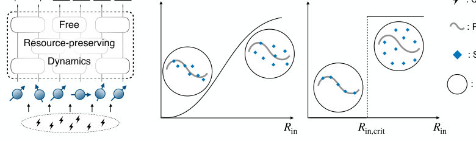 
FIG. 1: (a) Setting of our work. We study deep thermalization through the lens of quantum resource theories (QRTs). We consider systems where a quantum resource (depicted by lightning symbols) is injected through the initial state and the final measurements, and is scrambled by free (i.e., resource-preserving) unitary dynamics. Our work identifies two fundamentally distinct classes of QRTs: (b) “smoothly-localizable” (SL) QRTs, where the resource content RPE of the PE varies smoothly with the globally injected resource Rin, and (c) “threshold-localizable” (TL) QRTs, where the resource content of the PE RPE undergoes a sharp transition from being zero to being near maximal, past a certain...

📷 Fig 2

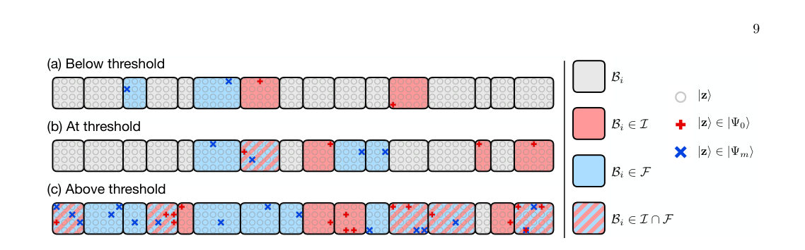 
FIG. 2: Schematic illustration of the block sharpening mechanism. The Hilbert space H is depicted as a collection of bitstrings (circles) arranged into blocks Bi defined by a QRT [Eq. (5)] (black contours). The ket |Ψ0⟩and bra ⟨Ψm| in Eq. (8) contain a set of bitstrings (‘+’ and ‘×’ symbols respectively) that populate two subsets of the blocks, I (shaded red) and F (shaded blue). The free dynamics fully scrambles each bitstring within its block. The overlap [Eq. (8)] receives contributions only from blocks that belong to both I and F (hatched). (a) Resourceless phase. Below the resource threshold, the subsets I and F are so sparse that they typically do not intersect. (b) Critical point. At...

📷 Fig 3

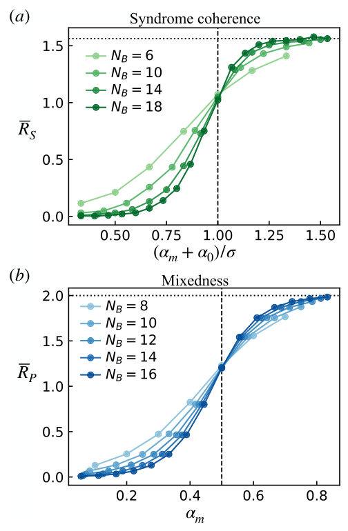 
FIG. 3: Localizability transitions in the QRTs of syn- drome coherence and mixedness / classical randomness. (a) Syndrome coherence. Average resource of PE states Rs as a function of parameters α0,m, within one in- stance of a random parity-check code of rate 1 −σ. We choose NA = 2, α0 = 1/4 and σ = 3/4, while αm is varied; every data point is averaged over 1000 real- izations; each realization uses a random independently sampled parity check code. The vertical dashed line is the predicted critical point αm + α0 = σ, the horizon- tal dotted line is the value for the Haar ensemble. (b) Mixedness/classical randomness. Average PE resource RP = −EEPE log2 P

📷 Fig 4

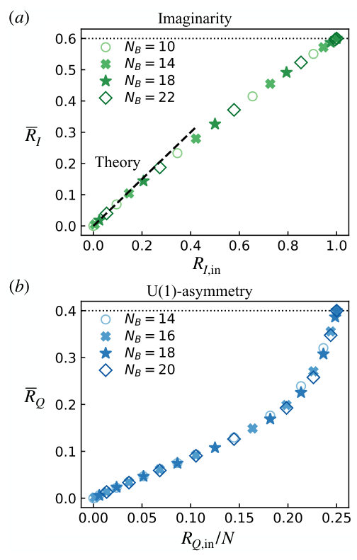 
FIG. 4: Smooth localizability of imaginarity and U(1)- asymmetry. All results are for NA = 2. (a) Average imaginarity of the PE, RI, as a function of the imagi- narity RI,in of the initial state under Haar-random real orthogonal dynamics (see Sec. V A). The theoretical pre- diction Eq. (46) at small α is depicted by the dashed line (here the slope is 3/4), showing good agreement. The average imaginarity of a Haar random ensemble is indi- cated by the horizontal dashed line. (b) Averaged charge variance RQ of the PE versus charge-variance density RQ,in/N of the input state under random asymmetry- free dynamics (see Sec. V B). The horizontal dotted line is the corresponding Haar-random value.

📷 Fig 5

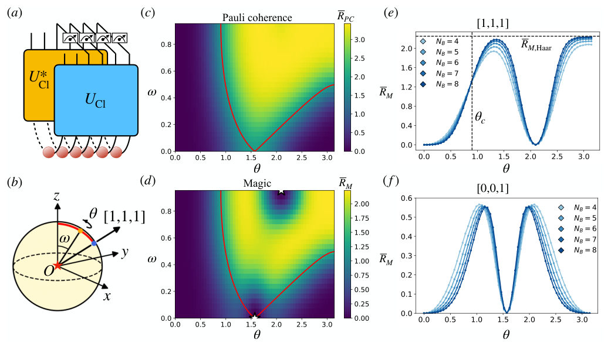 
FIG. 5: (a) Physical realization of our operator evolution setup in 1D as qubits arranged in a ladder geometry, depicted for the case of magic. An initial operator |u(θ, n)⟩⟩⊗N (each u(θ, n) corresponds to a red circle) is evolved under a random Clifford unitary channel UCl ⊗U ∗ Cl, then the bath B is measured in the “phase basis”, Eq. (54). (b) Illustration of the angles θ and ω used to parametrize u(θ, n) = e−i θ

**Summary.** The paper develops a unified theory classifying how global constraints on quantum resources affect deep thermalization. It shows that these constraints force the system into one of two regimes: smooth resource changes (SL) or sharp phase transitions (TL). This framework predicts novel critical points, including magic transitions in error-correcting codes.

**Why it may be interesting.** This work provides a powerful theoretical tool—the resource localizability criterion—to distinguish between different types of quantum dynamics in highly interacting, non-equilibrium many-body systems, linking fundamental information theory concepts directly to thermalization physics.

Detailed structure

**Main problem.** The paper investigates how constraints imposed by various quantum resources affect deep thermalization, which is the emergence of universal local wavefunction distributions from partial measurements.

**Main result.** Quantum Resource Theories (QRTs) governing this process fall into two classes: 'smoothly localizable' (SL) leading to continuous resource changes, and 'threshold localizable' (TL) exhibiting sharp phase transitions at critical global resource thresholds.

**Method.** The authors develop a unified framework using an information-theoretic mechanism called 'block sharpening' to analyze the dependence of local post-measurement state resources on global initial resources.

**Model / system.** The study analyzes general quantum many-body systems undergoing dynamics constrained by specific quantum resources like non-stabilizerness, coherence, and asymmetry. The analysis is performed in the thermodynamic limit using projected ensembles (PE) from partial measurements.

**Key observables.** Resource content of the PE ($R_{PE}$), average post-measurement purity ($	ext{Tr}(
ho_{m,A})$), and resource measures like magic or charge variance ($R_Q$).

**Important parameters / regimes.** Global resource density ($R_{in}$), critical global resource threshold ($R_{in,crit}$), and system size ratios ($N_A/N$).

**Assumptions / limitations.** The analysis relies on mapping QRTs to subspace coherence and utilizes approximations like the random unitary assumption (Haar measure) and concentration inequalities.

**Figures summary.** Figures illustrate the SL vs. TL dichotomy in resource content variation, show block sharpening mechanisms via set intersections ($I \cap F$), and map out phase boundaries for various resources.

**Paper structure.** The paper establishes the problem of resource localizability in deep thermalization, develops the unified QRT framework based on block sharpening, classifies QRTs into SL/TL types, derives quantitative predictions for phase boundaries using entropy methods (mixed/tilted basis), and concludes by applying these findings to specific physical examples like QEC codes.

Abstract

We investigate how quantum resource constraints affect deep thermalization, the emergence of universal local wavefunction distributions from partial measurements of a quantum many-body state. Quantum resources, such as non-stabilizerness (magic), coherence, asymmetry, imaginarity, and non-Gaussianity, are essential for quantum information processing, and constraints on their global abundance can reshape these emergent distributions. To address this question, we develop a unified framework for deep thermalization within general quantum resource theories (QRTs). Our central result is that QRTs fall into two classes: ``smoothly localizable'' (SL) QRTs, where the resource content of local post-measurement states changes continuously with the global resource density, set by the initial state and measurement basis, yielding continuously tunable wavefunction distributions; and ``threshold localizable'' (TL) QRTs, where the local resource content jumps discontinuously from minimal to near-maximal past a critical global resource threshold, producing a sharp transition between a resourceless, ``deep-ergodicity breaking'' distribution and a resourceful, maximally random one. We trace this SL-TL dichotomy to an information-theoretic mechanism, block sharpening: by viewing each QRT as coherence between blocks in Hilbert space, we show that the local resource content depends on the measurement's ability to collapse an initial superposition into a single resourceless block. Our theory is analytically tractable and quantitatively predicts the phase boundaries across all studied QRTs, which we validate with extensive numerical simulations. Finally, we highlight two consequences: a novel magic transition in zero-rate quantum error-correcting codes--previously believed to occur only at finite rates--and new implications for quantum resource certification protocols based on post-measurement state ensembles.

[↑ back to top](#top)

### [Exact spectrum and anomalous relaxation in the open disorder-free Sachdev-Ye-Kitaev system](http://arxiv.org/abs/2606.08079v1)

**Authors:** Soshun Ozaki, Hironobu Yoshida, Hosho Katsura  
**Type:** theory · **Category:** statistical mechanics · **PDF:** <https://arxiv.org/pdf/2606.08079v1>  
**Analysis basis:** full PDF text, analyzed in chunks
**Topic relevance:** 🔥 `methods for driven-dissipative` **4/5** · 🔥 `non-equilibrium dynamics` **4/5** · `Keldysh / 2PI / non-Gaussian methods` **3/5** · `correlated / nonlocal dissipation` **3/5** · `driven-dissipative phase transition` **3/5** · `entanglement & information structure` **2/5** · `non-equilibrium universality` **2/5** · `Kondo & dissipative impurity` **1/5** · `scars & prethermalization` **1/5**

📷 Fig 1

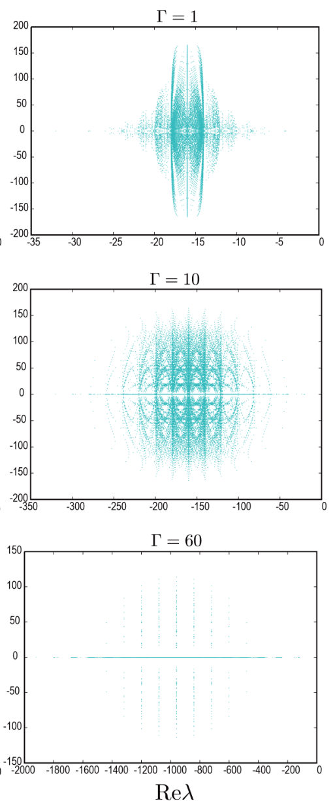 
FIG. 1. Eigenvalues of the Liouvillian L for N = 16 at Γ = 0.2, 1, 4, 10, 20, and 60.

📷 Fig 2

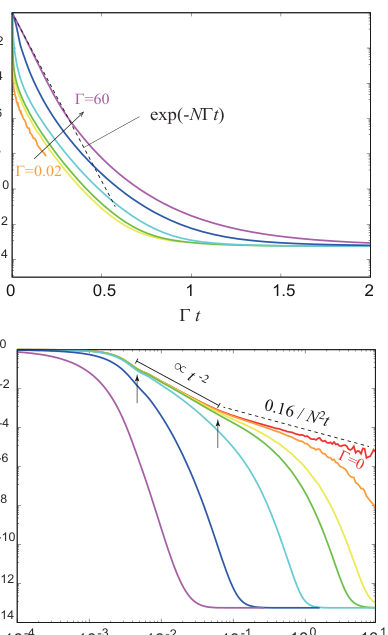 
FIG. 2. Dissipative form factor at N = 44 for Γ = 0.02, 0.1, 0.2, 1.0, 10.0, 60.0 as functions of (a) Γt and (b) t. In (a), the black dashed line represents an exponential de- cay exp(−NΓt). In (b), the Γ = 0 case is also shown in red for comparison, which corresponds to the spectral form factor (SFF) of H4 at T = 0. The black solid line indicates the t−2

📷 Fig 3

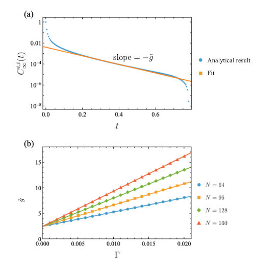 
FIG. 3. (a) Steady-state autocorrelation function for N = 160 and Γ = 0.01. Blue points are computed using Eq. (67), and orange lines represent fits using data points from t = 0.25 to t = 0.75. (b) Values of ˜g obtained by fitting the autocorrelation function to e−˜gt for different Γ. Data for N = 64, 96, 128, and 160 are shown. The fitting interval was set to t = 0.25 to 0.75, regardless of N or Γ.

📷 Fig 4

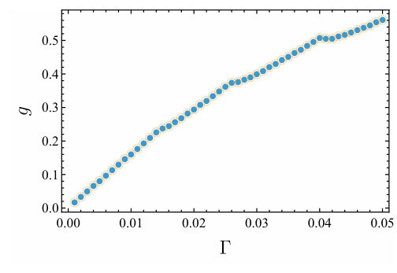 
FIG. 4. The asymptotic decay rate g as a function of Γ (N = 16). Blue points are calculated with Eq. (68) and Orange circles are calculated with Eq. (D1).

📷 Fig 5

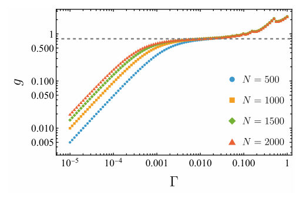 
FIG. 5. The asymptotic decay rate g as a function of Γ (N = 500, 1000, 1500, 2000) calculated with Eq. (D1). The gray dashed line indicates the line g = π

**Summary.** This paper analyzes the open Sachdev-Ye-Kitaev (SYK) model by solving its master equation exactly using techniques derived from its integrable clean limit. The key finding is 'anomalous relaxation,' where a non-zero gap persists in the thermodynamic limit even when dissipation vanishes. This suggests deep connections between quantum chaos and steady-state dynamics in many-body systems.

**Why it may be interesting.** This work provides an exact theoretical framework for studying non-equilibrium dynamics in strongly interacting quantum systems, particularly highlighting how dissipation interacts with underlying integrability structures.

Detailed structure

**Main problem.** The study investigates quantum chaos and anomalous relaxation phenomena in open, interacting many-body systems.

**Main result.** The system exhibits anomalous relaxation because the gap governing long-time decay does not vanish in the dissipationless limit when the thermodynamic limit is taken first. This suggests a connection to chaotic dynamics.

**Method.** The authors derive exact solutions for the Liouvillian spectrum and time evolution by utilizing the integrability of the clean SYK model within the GKSL formalism.

**Model / system.** The system is a disorder-free variant of the Sachdev-Ye-Kitaev (SYK) model subjected to dissipation, governed by a Lindblad master equation. The Hamiltonian involves four-body couplings, and dissipation is introduced via jump operators.

**Key observables.** Liouvillian spectrum ($\lambda_m$), projection superoperators ($\Pi_m$), the Dissipative Form Factor (DFF), and the steady-state two-point correlation function $	ext{C}_{i,j}^\infty(t)$.

**Important parameters / regimes.** Dissipation strength ($\Gamma$), system size ($N$), and the limit taken ($\lim_{N	o\infty}\lim_{\Gamma	o 0}$ vs. $\lim_{\Gamma	o 0}\lim_{N	o\infty}$).

**Assumptions / limitations.** The analysis relies heavily on the integrability of the clean SYK model to derive exact spectral solutions.

**Figures summary.** Figures illustrate the transition of Liouvillian eigenvalues from complex to real as dissipation increases, and compare the DFF across various $\Gamma$ values against theoretical scaling forms (SFF).

**Paper structure.** The paper proceeds by establishing the formal solution for the density matrix using a CONS basis, deriving explicit expressions for the Liouvillian eigenvalues, calculating the time evolution of correlation functions via the adjoint superoperator, and finally analyzing the limits to pinpoint anomalous relaxation.

Abstract

We study a disorder-free variant of the Sachdev-Ye-Kitaev (SYK) model with dissipation within the Gorini-Kossakowski-Sudarshan-Lindblad formalism. By utilizing the integrability of the clean SYK model, we derive an exact solution in a spectrum-resolved form, i.e., the eigenvalues and corresponding projection superoperators of the Liouvillian for arbitrary system size $N$. We determine the scaling of the gap that governs the long-time decay of the two-point correlation functions. Importantly, the gap does not vanish in the dissipationless limit when the thermodynamic limit is taken first, despite the integrability of the model. This phenomenon, known as anomalous relaxation, suggests a possible connection with chaotic dynamics and quantum Ruelle-Pollicott resonances. We also find several spectral features, such as transitions in the Liouvillian spectrum from complex to real eigenvalues with increasing dissipation strength, as well as the convergence of the dissipative form factor to the spectral form factor in the dissipationless limit. These findings indicate that the present model offers a useful platform for exploring nontrivial open dynamics of many-body quantum systems.

[↑ back to top](#top)

### [Single plasmon transport in one dimensional nanowire](http://arxiv.org/abs/2606.09523v1)

**Authors:** A. A. Dıaz-Valles, B. Rousseaux, S. Guérin, H. Jauslin, A. Leray, G. Colas des Francs  
**Type:** theory · **Category:** other · **PDF:** <https://arxiv.org/pdf/2606.09523v1>  
**Analysis basis:** full PDF text, analyzed in chunks
**Topic relevance:** 🔥 `analog quantum simulation` **4/5** · `Tavis-Cummings & cavity-many-emitter` **3/5** · `correlated cavity matter` **3/5** · `Keldysh / 2PI / non-Gaussian methods` **2/5** · `driven-dissipative phase transition` **2/5** · `methods for driven-dissipative` **2/5** · `non-equilibrium dynamics` **2/5** · `Kondo & dissipative impurity` **1/5** · `correlated / nonlocal dissipation` **1/5** · `entanglement & information structure` **1/5** · `interference shaping light` **1/5** · `non-equilibrium universality` **1/5**

📷 Fig 1

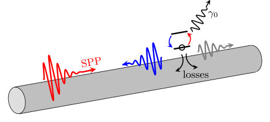 
FIG. 1. Scheme of a two level states emitter coupled to a metallic nanowire and excited by a SPP pulse.

📷 Fig 2

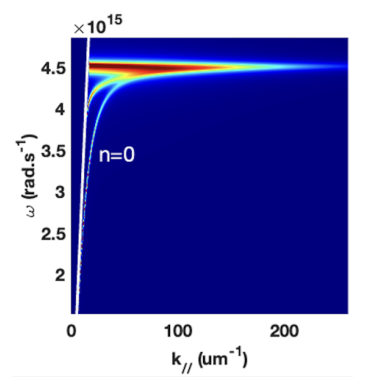 
FIG. 2. Coupling constants (Eq. 3) as a function of the parallel wavevector and angular frequency.

📷 Fig 3

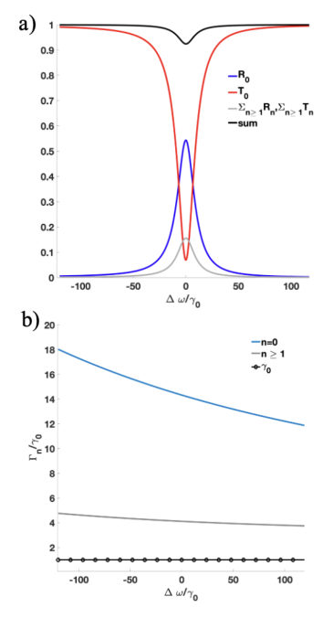 
FIG. 3. a) Modal reflectivity R0(ω) = |c(0−) ω (∞)|2/|c0+ ω (0)|2

📷 Fig 4

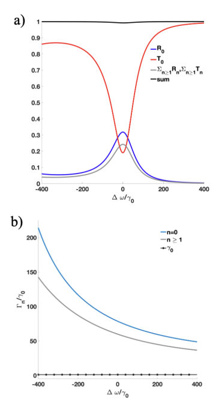 
FIG. 4. Same as Fig. 3 but for a nanowire radius 25 nm and an emitter 5 nm away its surface.

📷 Fig 5

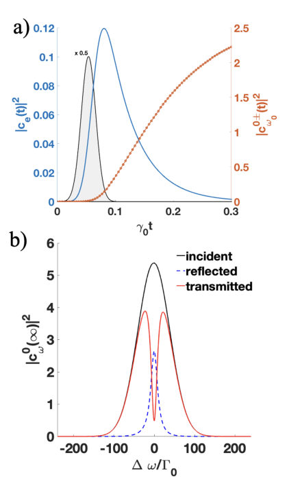 
FIG. 5. a) Time dependance of the atomic |ce(t)|2 and SPP0 (at ω = ω0) excitations. The gray area refers to the incident pulse enveloppe at the emitter position.b) Spectra of the in- cident, reflected and transmitted SPP0 at the position of the emitter. The parameters are the same as for Fig. 3. The incoming SPP0 pulse width is fixed to ∆= 0.1ω0. γ0 refers to the emitter decay rate in free space and Γ0 is the coupling strength to the guided mode SPP0.

**Summary.** This paper establishes a comprehensive theoretical framework to analyze how single plasmons transport through nanowires coupled to multiple quantum emitters. By unifying Green's tensor methods with non-Hermitian Hamiltonians, the authors predict that optimizing emitter placement enhances plasmon control and reduces energy losses significantly. The results provide a robust foundation for designing next-generation plasmonic quantum devices.

**Why it may be interesting.** This work is highly relevant as it bridges cavity QED concepts (Hamiltonian modeling, coupling strengths) with solid-state photonics (plasmonic waveguides), providing quantitative predictions for controlling quantum light-matter interactions in nanoscale devices.

Detailed structure

**Main problem.** The research develops a unified theoretical framework to model single-plasmon transport through one-dimensional nanowires coupled to quantum emitters.

**Main result.** Optimized multi-emitter systems significantly enhance plasmon modulation, achieving high transmittivities while substantially reducing coupling losses compared to single-emitter setups.

**Method.** The authors use a combination of quantized electromagnetic Green's tensor formalism and effective non-Hermitian Hamiltonian models to solve coupled differential equations in both time and frequency domains.

**Model / system.** The system involves quantum emitters (like atomic qubits) coupled to a dispersive metallic nanowire, such as silver, operating at telecom wavelengths. The model incorporates the emitter energy ($\hat{H}_{QE}$), field energy ($\hat{H}_F$), and interaction ($\hat{H}_{int}$).

**Key observables.** Single-plasmon transmittivity ($T_0$), reflectivity ($R_0$), atomic qubit population, and high-order mode losses ($Q_{abs}$).

**Important parameters / regimes.** Telecom wavelengths, single/multi-emitter count (e.g., 5 emitters), coupling rates ($\Gamma_n$), and frequency shifts ($\Omega_n$).

**Assumptions / limitations.** Approximations include the rotating-wave approximation and assuming slow variation of coupling strength over the pulse bandwidth.

**Figures summary.** Figures illustrate schemes for emitter coupling, modal reflectivity/transmittivity spectra ($R_0$ vs $T_0$), time evolution of excitation pulses showing interference dips, and dynamics of excited state populations for multiple emitters.

**Paper structure.** The paper progresses from establishing the unified theoretical framework (Green's tensor to non-Hermitian Hamiltonian) to deriving scattering amplitudes, analyzing single-emitter performance, extending the model using Löwdin orthonormalization for multi-emitters, and finally solving the long-time limit of the transport coefficients.

Abstract

We introduce a unified theoretical framework for single-plasmon transport in one-dimensional nanowires, bridging the quantized electromagnetic Green's tensor formalism with effective non-Hermitian Hamiltonian models. This approach naturally incorporates propagating surface plasmon polaritons, high-order modes dissipative channels, and intrinsic losses. We investigate both the stationary regime and the spatio-temporal dynamics of a single-plasmon pulse travelling through an atomic chain coupled to a dispersive nanowire. We analyze modal contributions to reflection and transmission spectra for quantum emitter coupled to a silver nanowire, a configuration proposed as a single-plasmon transistor, and we demonstrate that optimized multi-emitter systems offer significant advantages. In case of one quantum emitter coupled to a silver nanowire at telecom wavelengths, we predict a single-plasmon transmittivity down to 7\% under realistic conditions, and an atomic qubit population of 12\%. Extension to multi-emitter systems using a Löwdin orthogonalization procedure enables a consistent treatment of collective interactions. We show that optimized positioning with just five emitters enhances plasmon modulation, achieving a transmittivity of 2\% but also reduces coupling losses to one-third compared to the single-emitter case. Our results establish a robust foundation for analyzing and designing plasmonic waveguide quantum electrodynamics systems.

[↑ back to top](#top)

### [Modified One-Axis-Twist Squeezing for Deterministic Orientation Control of Schrödinger Cat States with Unknown Atom-Number Parity](http://arxiv.org/abs/2606.08482v1)

**Authors:** Jinyang Li, Selim M. Shahriar  
**Type:** theory · **Category:** other · **PDF:** <https://arxiv.org/pdf/2606.08482v1>  
**Analysis basis:** full PDF text, analyzed in chunks
**Topic relevance:** 🔥 `analog quantum simulation` **4/5** · `Rydberg arrays` **3/5** · `Tavis-Cummings & cavity-many-emitter` **3/5** · `correlated cavity matter` **3/5** · `quantum optics experiment` **2/5** · `Keldysh / 2PI / non-Gaussian methods` **1/5** · `correlated / nonlocal dissipation` **1/5** · `driven-dissipative phase transition` **1/5** · `entanglement & information structure` **1/5** · `methods for driven-dissipative` **1/5** · `non-equilibrium dynamics` **1/5**

📷 Fig 1

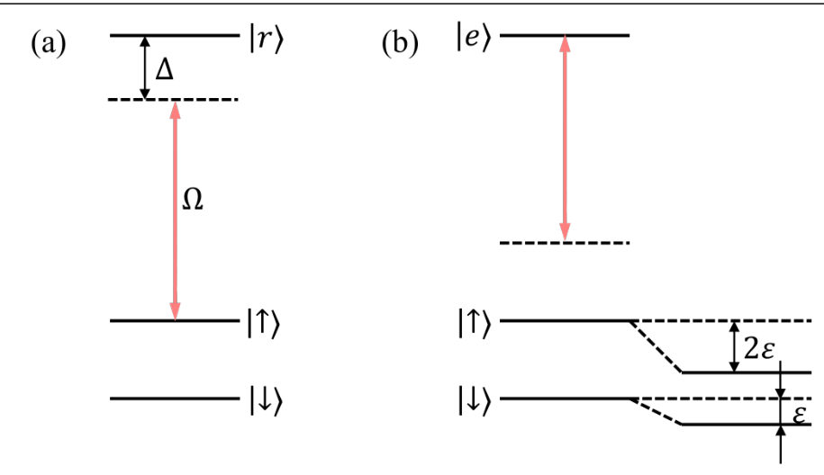 
Figure 1. (a) Scheme for realizing the version of the MOATS described by the Hamiltonian ℏ𝜒𝜒𝑁𝑁↑ 2 with Rydberg- mediated nonlinear interaction. The optical field coupling the |↑⟩ and the |𝑟𝑟⟩ state is far detuned. The detuning is denoted by Δ and the Rabi frequency by Ω. (b) Scheme for realizing the version of the MOATS described by the Hamiltonian ℏ𝜒𝜒(2𝑁𝑁↑+ 𝑁𝑁↓)2 with cavity-mediated nonlinear interaction.

**Summary.** This paper introduces the Modified One-Axis-Twist Squeezing (MOATS) protocol to overcome a major limitation in quantum sensing using Schrödinger Cat States. Conventional methods fail because they require knowing the parity of the atomic ensemble size ($N$). MOATS generates states whose orientation is robust against this unknown parity, enabling high-precision measurements toward the Heisenberg limit regardless of whether $N$ is even or odd.

**Why it may be interesting.** This work directly addresses a critical practical hurdle in quantum metrology using atomic ensembles by providing a robust mechanism (MOATS) to generate high-squeezing states independent of system size parity. This is highly relevant for experimental implementation in cold atom or cavity QED platforms.

Detailed structure

**Main problem.** The conventional Schrödinger Cat State Protocol (SCSP) fails to reach the Heisenberg limit because its required One-Axis-Twist Squeezing (OATS) depends on knowing the parity of the number of atoms ($N$), which is generally unknown.

**Main result.** The authors propose a Modified OATS (MOATS) operation that generates a Schrödinger Cat state whose orientation is independent of $N$'s parity, thus enabling robust quantum sensing.

**Method.** The MOATS Hamiltonian is derived using perturbation theory for Rydberg-mediated interactions and by analyzing effective Hamiltonians in cavity-mediated systems.

**Model / system.** The study focuses on atomic ensembles used as sensors, employing spin squeezing generated via nonlinear interactions. Two primary physical realizations are analyzed: Rydberg blockade interactions and cavity QED coupling.

**Key observables.** The final state's orientation (remaining x-directed) and the achievable sensor sensitivity relative to the Heisenberg limit ($\propto N$).

**Important parameters / regimes.** The number of atoms ($N$), interaction strengths ($\chi, \Omega/\Delta$), and detunings ($\Delta$).

**Assumptions / limitations.** The analysis assumes that MOATS successfully decouples the state orientation from $N$'s parity, allowing for simultaneous optimization for even and odd $N$.

**Figures summary.** Figure 1 illustrates two distinct physical schemes for realizing MOATS: (a) using Rydberg-mediated interactions and (b) using cavity-mediated nonlinear interactions.

**Paper structure.** The paper first identifies the parity limitation of conventional OATS. It then introduces and derives the Hamiltonian for MOATS through both Rydberg and cavity coupling mechanisms, demonstrating its parity independence and analyzing its effect on the final state diagnostics.

Abstract

The Schrödinger cat state protocol (SCSP) makes use of a Schrödinger cat (SC) state generated with one-axis-twist squeezing (OATS) to enhance the sensitivity. In principle, the SCSP can magnify the phase shift by a factor N, the number of atoms under interrogation, accompanied by a quantum noise amplification by a factor of root-N, enabling an atomic sensor to reach the Heisenberg limit. However, the current SCSP can reach this benchmark only if the parity of N is known, which is almost impossible for a large ensemble. The reason is the orientation of the SC state generated with the conventional OATS depends on the parity of N. In this paper, we propose a modified OATS (MOATS) operation that generates the SC state aligned in a certain direction regardless of the parity of N.

[↑ back to top](#top)

### [Dissipative Channels Determine Open Electromagnetic Quantization](http://arxiv.org/abs/2606.08557v1)

**Authors:** Hyunwoo Choi, Junwoo Gim, Thomas E. Roth, Weng Cho Chew, Dong-Yeop Na  
**Type:** theory · **Category:** other · **PDF:** <https://arxiv.org/pdf/2606.08557v1>  
**Analysis basis:** full PDF text, analyzed in chunks
**Topic relevance:** 🔥 `methods for driven-dissipative` **4/5** · `correlated / nonlocal dissipation` **3/5** · `driven-dissipative phase transition` **3/5** · `interference shaping light` **3/5** · `non-equilibrium dynamics` **2/5** · `non-equilibrium universality` **2/5** · `Keldysh / 2PI / non-Gaussian methods` **1/5** · `analog quantum simulation` **1/5** · `correlated cavity matter` **1/5**

📷 Fig 1

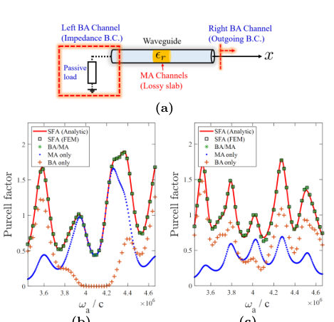 
FIG. 1: One-dimensional waveguide with an impedance and outgoing BA channel, with a lossy slab providing MA channels. (a) Structure schematic. (b) Purcell factor for an emitter inside the slab (x0 = 5.5 µm). (c) Purcell factor for an emitter outside the slab (x0 = 8.5 µm).

📷 Fig 2

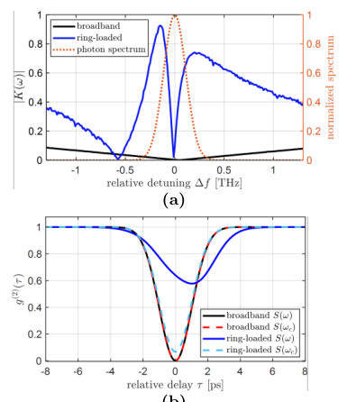 
FIG. 3: HOM interference for non-Markovian splitter responses. (a) HOM interference kernel K(ω) for the broadband and ring-loaded splitters, with the photon spectrum shown in orange. (b) HOM correlation for the full S(ω) response and the Markovian flat-S(ωc) reference.

📷 Fig 3

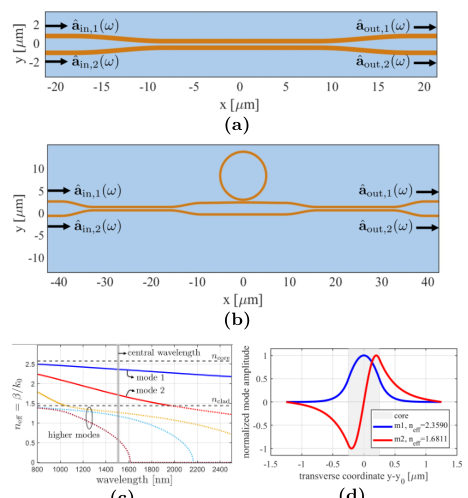 
FIG. 2: Designed photonic integrated circuit configurations and port-channel modes. (a) Broadband 50/50 splitter. (b) Ring-loaded interferometric splitter. (c) Dispersion of the local slab-port cross section, showing the two guided modes retained in the calculation. (d) Transverse profiles of the two guided port modes at λ = 1550 nm. The shaded region denotes the waveguide core.

📷 Fig 4

 
Figure 3(a,b) shows the resulting finite-bandwidth response. The broadband coupler has an almost flat K(ω) over the photon spectrum, so all spectral com- ponents undergo nearly the same transformation and the full calculation agrees with the flat-S(ωc) refer- ence. In contrast, the ring-loaded splitter is tuned near K(ωc) ≃0, but the ring resonance makes K(ω) vary strongly across the photon bandwidth. This produces two finite-bandwidth non-Markovian sig- natures. The dip is shallower because different spec- tral components no longer satisfy the same can- cellation condition, leading to incomplete destruc- tive interference after integration over the photon spectrum. The dip is also shifted...

**Summary.** The paper introduces a novel quantization scheme for open electromagnetic systems by deriving environmental reservoirs from the Maxwell operator's dissipation geometry. It successfully formulates input-output relations that accurately describe scattering and noise kernels in complex structures like PICs, correctly capturing non-Markovian spectral effects.

**Why it may be interesting.** This work provides a powerful, first-principles method for quantizing open quantum systems in electromagnetism, directly linking macroscopic material losses and boundary coupling to the fundamental bosonic structure of the field operators.

Detailed structure

**Main problem.** To formulate a rigorous quantization scheme for open electromagnetic systems by deriving the necessary environmental reservoirs directly from the dissipation geometry of the Maxwell operator, rather than assuming them phenomenologically.

**Main result.** The method successfully derives frequency-dependent scattering and noise kernels ($S(\omega), N(\omega)$) that are consistent with fundamental quantum electrodynamics principles, unifying material absorption and open boundary leakage into a single framework.

**Method.** It employs Gram factorization on the imaginary part of the Maxwell operator to decompose dissipation into medium-assisted (material loss) and boundary-assisted (radiation/port coupling) channels, leading to an input-output relation for bosonic field operators.

**Model / system.** The system is open electromagnetic fields governed by the frequency-domain Maxwell equation. It models structures like photonic integrated circuits (PICs) or lossy slabs with arbitrary passive boundary conditions (e.g., impedance loads, waveguide ports).

**Key observables.** Frequency-dependent scattering kernels $S(\omega)$, noise kernels $N(\omega)$, Purcell factors, and Hong–Ou–Mandel (HOM) interference correlation functions.

**Important parameters / regimes.** Material permittivity ($\epsilon''$), boundary conditions (impedance/port), frequency $\omega$, and the structure's geometry (2D PIC layouts).

**Assumptions / limitations.** The system is passive, ensuring the dissipation operator $D(\omega)$ is positive semi-definite; it assumes thermal equilibrium for standard fluctuation-dissipation theorem applications.

**Figures summary.** Figures illustrate comparisons of Purcell factors and HOM interference kernels between full (non-Markovian) and simplified (Markovian) models in PICs, demonstrating spectral dependence effects.

**Paper structure.** The paper develops the theory by defining the dissipation operator $D(\omega)$, factorizing it into boundary/material parts, deriving the input-output relation $\hat{a}_{	ext{out}}(\omega) = S(\omega)\hat{a}_{	ext{in}}(\omega) + N(\omega)\hat{f}_{	ext{int}}(\omega)$, and applying this to calculate measurable quantities like scattering matrices and correlation functions.

Abstract

We formulate a quantization scheme for open electromagnetic systems with arbitrary passive boundary conditions. Rather than specifying reservoirs phenomenologically, the method identifies them from the dissipation geometry of the Maxwell operator. Factoring the imaginary part of the Maxwell operator gives a bosonic realization of the field operator and separates the fluctuation channels into medium-assisted reservoirs from material absorption and boundary-assisted reservoirs from exchange through the open boundary. Depending on the boundary condition, the latter become free-space radiation modes, impedance-load channels, guided port modes, or more general boundary channels. Green-function input-output relations then follow as an application, yielding frequency-dependent scattering and noise kernels without Markov or single-mode assumptions. To illustrate the practical application, we consider a lossy structure with mixed impedance and outgoing boundaries, and photonic integrated circuit configurations with waveguide port boundaries.

[↑ back to top](#top)

### [Energy Transport in Randomly Coupled Quantum Systems: A Perturbative Approach](http://arxiv.org/abs/2606.09308v1)

**Authors:** Tingfei Li, Runyu Chen  
**Type:** theory · **Category:** statistical mechanics · **PDF:** <https://arxiv.org/pdf/2606.09308v1>  
**Analysis basis:** full PDF text, analyzed in chunks
**Topic relevance:** 🔥 `non-equilibrium dynamics` **4/5** · `methods for driven-dissipative` **3/5** · `non-equilibrium universality` **3/5** · `Keldysh / 2PI / non-Gaussian methods` **2/5** · `correlated / nonlocal dissipation` **2/5** · `driven-dissipative phase transition` **2/5** · `Kondo & dissipative impurity` **1/5** · `analog quantum simulation` **1/5** · `entanglement & information structure` **1/5** · `scars & prethermalization` **1/5**

📷 Fig 1

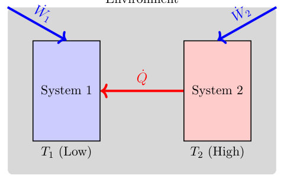 
Figure 1: Schematic of the model. The gray background represents the environment, which exchanges work currents ˙W1 and ˙W2 with the two subsystems. The quantity ˙Q denotes the heat current between the subsystems.

📷 Fig 2

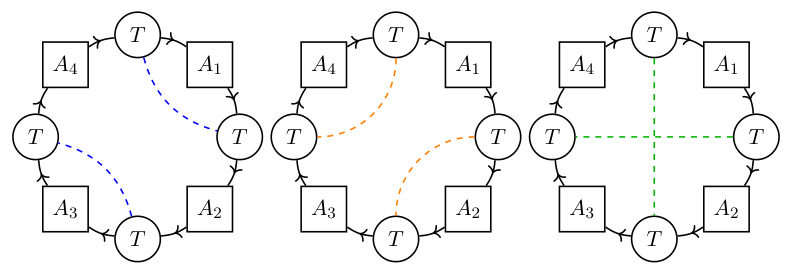 
Figure 2: Schematic of the three pairing types. We use directed lines to represent matrix indices: an arrow pointing toward an operator corresponds to a row index, while an arrow pointing away from an operator corresponds to a column index. The translation of a diagram into a product of traces is straightforward. Begin at any operator and follow the direction of the arrows. Upon encountering a T, jump to the paired T along the dashed line, and then continue following the arrows until a closed loop is completed. This loop corresponds to a single trace, with the operators appearing in the order encountered along the path. Repeat this procedure until all operators in the diagram have been...

📷 Fig 3

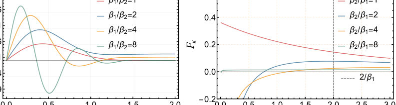 
Figure 3: Energy current and integrated energy flux for the Gaussian model with J = 1 and E = 1. We set β2 = 1 in the left panel and β1 = 1 in the right panel.

📷 Fig 4

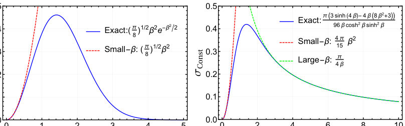 
Figure 4: Heat conductance for the Gaussian model and the constant distribution, with J = E = 1.

📷 Fig 5

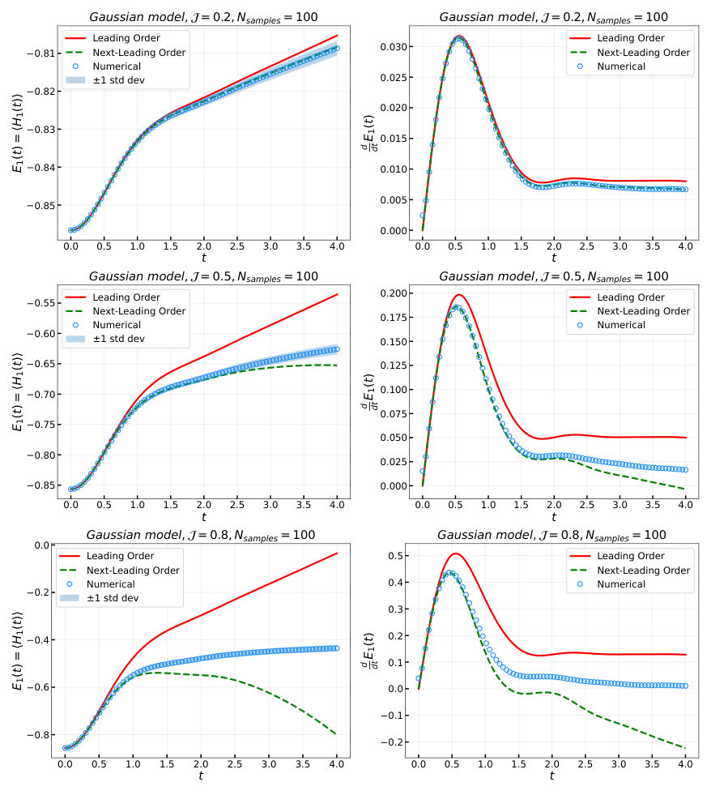 
Figure 6: Comparison between perturbation theory and numerical simulation for the energy E1 and its time derivative ˙E1 of subsystem 1. Three coupling strengths are shown: J = 0.2, 0.5, and 0.8 (from top to bottom). The perturbation curves include the leading-order result and the result with second-order correction. Numerical data are averaged over 100 realizations of the random coupling. Model parameters: N1 = N2 = 10, β1 = 2, β2 = 1, and both subsystem spectra are drawn from a standard Gaussian distribution (E = 1). As J increases, the leading-order prediction deviates more from the numerics, but the second-order correction clearly reduces the error. At early times the perturbative...

**Summary.** This paper develops a perturbative framework to calculate energy transport and heat conductance between two quantum systems coupled by random interactions. By expanding the energy current up to second order, the authors derive quantitative results for various spectral density models. The findings provide deep insights into how disorder affects thermalization rates in many-body quantum physics.

**Why it may be interesting.** This work provides rigorous theoretical tools to calculate non-equilibrium transport coefficients like heat conductance in complex quantum systems, which is highly relevant for understanding thermalization dynamics in open quantum systems.

Detailed structure

**Main problem.** The study focuses on quantifying energy transport, specifically heat conductance, between two quantum systems coupled by a random interaction.

**Main result.** Explicit expressions for the energy transfer rate and heat conductance are derived up to second order in the coupling strength for various spectral density models (Gaussian, constant, semicircular, Gamma).

**Method.** The analysis employs perturbative expansions in the coupling strength, utilizing diagrammatic techniques and spectral methods within the large-$N$ limit.

**Model / system.** The model consists of two quantum subsystems coupled by a random interaction matrix, analyzed using an initial thermal state assumption. The Hamiltonian structure allows for the decomposition of energy current into work and heat components.

**Key observables.** Energy current ($\dot{E}_1(t)$), Heat conductance ($\sigma$), Work current ($\dot{W}$), and Heat current ($\dot{Q}$).

**Important parameters / regimes.** Coupling strength ($J$), inverse temperatures ($eta_1, eta_2$), and the spectral density function $
ho(\epsilon)$.

**Assumptions / limitations.** The analysis relies on treating the coupling as a Gaussian random matrix ensemble and performing calculations in the thermodynamic limit ($N_1, N_2 	o \infty$).

**Figures summary.** Figures compare perturbative predictions (leading order + second-order correction) against numerical simulations for energy change rate ($\dot{E}_1$) and energy ($E_1$), demonstrating convergence behavior.

**Paper structure.** The paper systematically develops the calculation of the energy current using time evolution operators, derives general expressions up to second order in perturbation theory, and then applies these methods to calculate $\sigma$ for specific spectral distributions (Gaussian, Constant, Semicircle, Gamma).

Abstract

We study energy transport between two quantum systems coupled through a random interaction. The central feature of our approach is to model the coupling as a Gaussian random matrix, which enables a simple and systematic perturbative expansion. In the large-$N$ limit, we derive explicit expressions for the energy transfer rate and heat conductance up to second order in the coupling strength. Using spectral methods and diagrammatic expansions, we obtain the leading- and next-to-leading-order contributions to the energy transfer rate. We illustrate our results through explicit calculations for Gaussian, constant, semicircular, and Gamma densities of states.

[↑ back to top](#top)

### [Analog quantum simulation of chiral magnetic dynamics using optical superlattices](http://arxiv.org/abs/2606.09708v1)

**Authors:** Sabhyata Gupta, Luis Santos  
**Type:** both · **Category:** other · **PDF:** <https://arxiv.org/pdf/2606.09708v1>  
**Analysis basis:** full PDF text, analyzed in chunks
**Topic relevance:** 🔥 `analog quantum simulation` **4/5** · 🔥 `non-equilibrium dynamics` **4/5** · `exotic spin models in light-matter` **3/5** · `non-equilibrium universality` **3/5** · `driven-dissipative phase transition` **2/5** · `Frenkel-Kontorova` **1/5** · `Keldysh / 2PI / non-Gaussian methods` **1/5** · `methods for driven-dissipative` **1/5**

📷 Fig 1

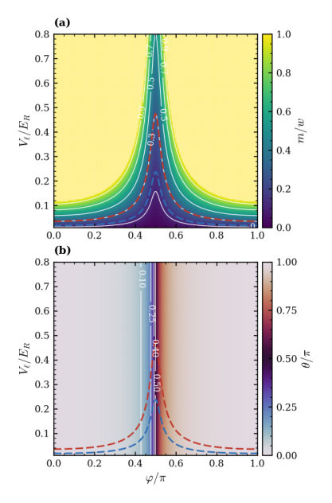 
Figure 1: Realized mass m (a) and topological angle θ (b) as a function of the relative phase φ and depth Vℓ of the secondary lattice, at fixed primary-lattice depth Vs = 8ER, with ER the recoil energy. White curves are contours of constant m/w and θ/π. Dashed lines trace the curves Vℓ(φ) that correspond to a fixed m/w = 0.15 (blue) and m/w = 0.30 (red), while θ is varied. In (a) the colormap saturates for m/w &gt; 1, since that region lies outside the light-mass regime of interest.

📷 Fig 2

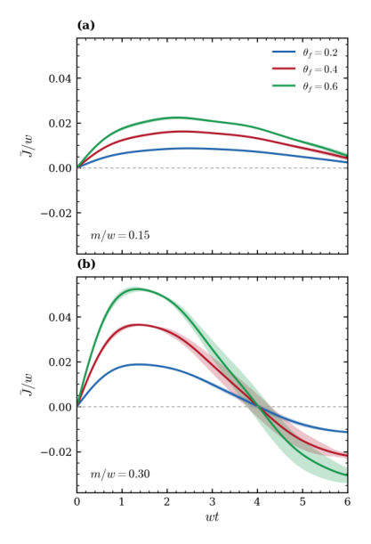 
Figure 2: Vector current ¯J following a θ quench from θ = 0 to θf. The time evolution is computed using the Rice-Mele Hamiltonian on an open chain of N = 30 sites, and ¯J is determined using Eq. (9). Panels show (a) m/w = 0.15 and (b) m/w = 0.30, with θf = 0.2 (blue), 0.4 (red), and 0.6 (green). Solid lines are the central (unperturbed) configuration, whereas shaded regions are bands obtained from systematic perturbations of the superlattice parameters Vs (±2.5%), Vℓ(±2.5%), and φ (±0.02 rad). The dashed region is given by the maximal and minimal value obtained within those error windows.

📷 Fig 3

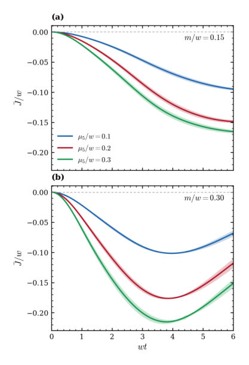 
Figure 3: Vector current ¯J following a µ5 quench, θ(t) = −2µ5t. The evolution is computed using the Rice-Mele Hamiltonian on an open chain of N = 30 sites. Panels show (a) m/w = 0.15 and (b) m/w = 0.30, with µ5/w = 0.1 (blue), 0.2 (red), and 0.3 (green). Solid lines and shaded regions are defined as in Fig. 2.

📷 Fig 4

 
Figure 2 shows for m/w = 0.15 and m/w = 0.30, the current ¯J after a sudden change of θ from 0 to θf. We recall that for the θ quench the mapping to the Rice- Mele model is exact, and hence the quantum simulation of model (3) is in principle exact. However, experimen- tally, there may be systematic errors in the superlattice parameters. The shaded bands in Figs. 2 are obtained by considering ±2.5% deviations in the value of Vs and Vℓ, and a deviation of ±0.02 rad in the value of φ. The sys- tematic errors introduce a non-negligible effect at longer times, especially for larger masses and larger θf values, due to the stiff dependence of θ on φ, see Fig. 1 (b). The errors, however, do not...

📷 Fig 5

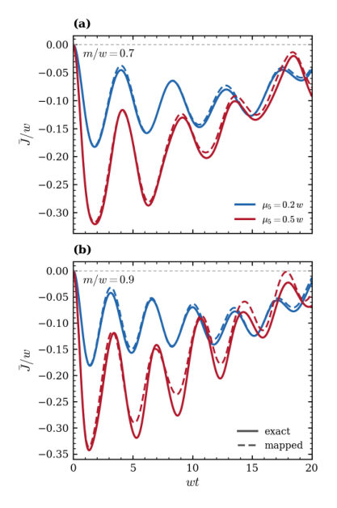 
Figure 4: Validity of the superlattice-based quantum sim- ulation for the µ5 quench for (a) m/w = 0.7 and (b) m/w = 0.9. The vector current ¯J/w evaluated using the Rice-Mele model (dashed curves) is compared with the exact dynamics given by model (3) (solid curves), for µ5 = 0.2w (blue) and µ5 = 0.5w (red).

**Summary.** The authors propose using ultracold atoms in engineered optical superlattices to analogously simulate chiral magnetic dynamics governed by the massive Schwinger model. By implementing controlled quenches of topological angle or chemical potential, they measure the resulting vector current, confirming that this platform is robust and capable of probing complex non-equilibrium quantum phenomena.

**Why it may be interesting.** This work directly bridges advanced condensed matter theory (CME, massive Schwinger model) with cutting-edge experimental quantum simulation techniques using cold atoms in optical lattices, making it highly relevant for AMO physicists studying non-equilibrium many-body physics.

Detailed structure

**Main problem.** The paper addresses the analog quantum simulation of chiral magnetic dynamics, which is related to the Chiral Magnetic Effect (CME).

**Main result.** They demonstrate that ultracold atoms in optical superlattices provide a viable platform for probing non-equilibrium chiral phenomena, showing clear mass dependence in current dynamics.

**Method.** The study uses two quench protocols—a topological angle quench and a chiral chemical potential quench—to drive the system's evolution.

**Model / system.** The physical platform is ultracold atoms trapped in an optical superlattice. The underlying model is derived from the massive Schwinger model, which maps onto the Rice-Mele tight-binding model.

**Key observables.** The spatially averaged vector current (J), which serves as the analogue for the CME current.

**Important parameters / regimes.** Mass ($m$), topological angle ($	heta$), and superlattice parameters like $V_\ell$ and $\varphi$.

**Assumptions / limitations.** The mapping to the Rice-Mele model requires approximations, particularly when simulating the continuous chiral chemical potential quench ($\mu_5$).

**Figures summary.** Figure 1 shows how mass and topological angle are controlled by superlattice depths/phases. Figure 2 illustrates current dynamics during a $	heta$ quench, while Figure 3 shows evolution during a $\mu_5$ quench.

**Paper structure.** The paper first derives the lattice Hamiltonian from the continuum Schwinger model (using staggered fermions). It then maps this to the Rice-Mele model and simulates its real-time dynamics using two distinct quench protocols, analyzing the resulting vector current.

Abstract

We propose an analog quantum simulation of chiral magnetic dynamics using ultracold atoms in an optical superlattice. The massive Schwinger model in the zero gauge coupling limit maps onto the Rice-Mele model, with the fermion mass and topological angle encoded in the superlattice parameters. We study the real-time dynamics of the vector current following two quench protocols that drive continuous chirality injection and chirality relaxation. Simulations with realistic superlattice parameters and experimental noise demonstrates clear mass dependence of the current dynamics in both protocols, robust against experimental imperfections. The vector current may be directly measurable via single-bond-resolved detection, establishing cold atom superlattices as a viable platform for probing non-equilibrium chiral phenomena.

[↑ back to top](#top)

### [Parahydrogen Cooling of Nuclear Spin Chains at Hypogeomagnetic Fields](http://arxiv.org/abs/2606.09649v1)

**Authors:** Alexey Kiryutin, Danil Markelov, Ivan Zhukov, Erik Van Dyke, Alexandra Yurkovskaya, Danila Barskiy  
**Type:** experiment · **Category:** quantum information and computing · **PDF:** <https://arxiv.org/pdf/2606.09649v1>  
**Analysis basis:** full PDF text, analyzed in chunks
**Topic relevance:** 🔥 `analog quantum simulation` **4/5** · `QC/QI experiment` **3/5** · `entanglement & information structure` **3/5** · `non-equilibrium dynamics` **3/5** · `non-equilibrium universality` **2/5** · `correlated / nonlocal dissipation` **1/5** · `driven-dissipative phase transition` **1/5** · `exotic spin models in light-matter` **1/5** · `methods for driven-dissipative` **1/5**

📷 Fig 1

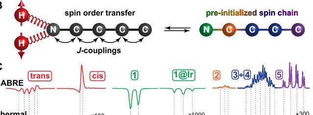 
Figure 1: Signal Amplification by Reversible Exchange (SABRE) as a method for pre-initializing nuclear spin chains. (A) Schematic of the reversible exchange of parahydrogen and a [U-13C,15N]- butyronitrile spin chain with an Ir-based polarization transfer complex. L and S denote ancillary ligands of the complex. (B) Polarization transfer from parahydrogen to the spin chain occurs through the network of scalar J-couplings within the complex, resulting in hyperpolarization of the spin chain. (C) 1H, 15N, and 13C NMR signals hyperpolarized by SABRE at 1 µT (top traces) compared with the corresponding thermal spectra, scaled by factors of 100, 1000, and 300, respectively (bottom traces). Note...

📷 Fig 2

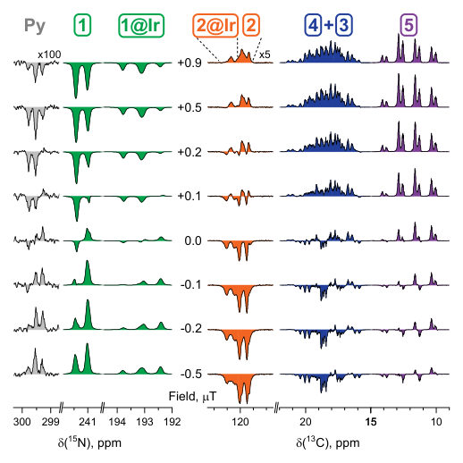 
Figure 2: 15N (left) and 13C (right) NMR spectra (9.4 T) of [U-13C,15N]-butyronitrile obtained after SABRE polarization at ultralow magnetic fields (from −0.5 µT to +0.9 µT). The negative sign of the magnetic field indicates the opposite direction relative to the detection field in the NMR magnet. Note the multiplication factors of ×100 and ×5 for the data columns corresponding to pyridine (Py) and 2@Ir/2, respectively.

📷 Fig 3

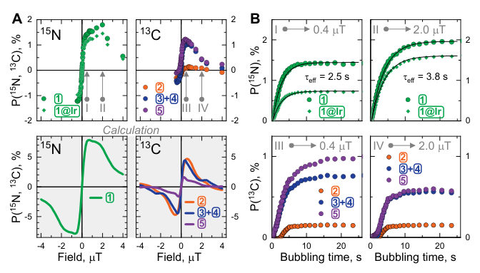 
Figure 3: (A) Experimental (top) and calculated (bottom) dependence of signal intensities of SABRE-polarized signals as a function of ultralow magnetic field during parahydrogen bubbling. The bubbling time was set to 10 s for all experiments, and the temperature was maintained at 25 ◦C; (B) Dynamics of SABRE polarization buildup measured at magnetic fields of 0.4 µT and 2.0 µT for the 15N (top) and 13C (bottom) spins in [U-13C, 15N]-butyronitrile. All signal intensities are given as a percentage of the maximum theoretical polarization. The thin black lines show fits to the data using a mono-exponential function with the effective buildup time constant, τeff.

**Summary.** The research demonstrates that molecular nuclear spin chains can be initialized into highly ordered, non-equilibrium states suitable for quantum computation by employing parahydrogen-based Signal Amplification by Reversible Exchange (SABRE). By measuring entropy and achieving measurable polarization enhancements at room temperature, the authors establish a robust experimental method to prepare multi-spin registers for quantum control experiments.

**Why it may be interesting.** This work provides a powerful experimental protocol for initializing quantum registers (spin systems) far from thermal equilibrium using chemical hyperpolarization, directly addressing a major bottleneck in liquid-state quantum simulation platforms.

Detailed structure

**Main problem.** The primary challenge is overcoming the low initial polarization (high entropy) of molecular nuclear spin networks, which limits their use as quantum simulators for quantum information science.

**Main result.** The authors successfully hyperpolarized a 12-spin chain using SABRE at hypogeomagnetic fields, achieving non-equilibrium multi-spin orders indicated by a significant negative entropy deficit.

**Method.** They employed Signal Amplification by Reversible Exchange (SABRE) utilizing parahydrogen ($	ext{pH}_2$) hyperpolarization transferred to the spin chain nuclei via reversible exchange at ultralow magnetic fields, followed by high-field NMR readout.

**Model / system.** The system is a chemically engineered molecular nuclear spin network, specifically a ${}^{12}	ext{-spin chain}$ $[	ext{U}-{}^{13}	ext{C}, {}^{15}	ext{N}]	ext{-butyronitrile}$. The Hamiltonian dynamics are modeled as an analog quantum simulation of a Heisenberg spin chain.

**Key observables.** Von Neumann entropy ($S$), nuclear spin temperatures ($T_E$), and polarization levels for ${}^{13}	ext{C}$ and ${}^{15}	ext{N}$.

**Important parameters / regimes.** Optimal transfer field of $0.52\ \mu	ext{T}$; achieved spin temperatures of $52\ 	ext{mK}$ (${}^{15}	ext{N}$) and $257\ 	ext{mK}$ (${}^{13}	ext{C}$).

**Assumptions / limitations.** The method does not cool the liquid sample itself but prepares a room-temperature ensemble whose quantum state is highly ordered relative to thermal equilibrium.

**Figures summary.** Figures illustrate the SABRE process schematic, comparison of hyperpolarized vs. thermal NMR signals across various nuclei, and field dependence plots showing polarization buildup at ultralow fields.

**Paper structure.** The paper details the physical problem (low initial entropy), introduces the SABRE technique using $	ext{pH}_2$ at hypogeomagnetic fields to generate non-equilibrium order, quantifies this order via entropy analysis, and validates the method through site-resolved NMR readout.

Abstract

Solution-state molecular nuclear spin networks are promising quantum simulators because their scalar-coupling Hamiltonians are chemically programmable, precisely measurable, and coherent at room temperature. Their main limitation for quantum information science is initialization: thermal Boltzmann polarization produces highly mixed, high-entropy states. Here, we use parahydrogen-based Signal Amplification by Reversible Exchange (SABRE) at hypogeomagnetic fields (i.e., magnetic fields below Earth field) to hyperpolarize the chemically engineered 12-spin chain [U-13C,15N]-butyronitrile. SABRE generates percent-level 13C and 15N polarization and prepares non-equilibrium multi-spin orders across the network. A von Neumann entropy analysis of such a hyperpolarized system shows that, at the optimal transfer field of 0.52 uT, the full spin system could reach S/k = 8.274, compared with S/k = 8.318 for the unpolarized reference, giving (S-Sth)/k = -0.043. Experimentally, nuclear spin temperatures of 52 mK and 257 mK are achieved for 15N and 13C subensembles, respectively. The larger entropy deficit of the full network than of individual subsystems indicates correlated multi-spin order beyond single-spin polarizations. Rapid field cycling to 9.4 T enables site-resolved NMR readout, while the precisely determined coupling network provides an experimentally benchmarked Hamiltonian for testing quantum-simulation, quantum-control, and Hamiltonian-learning protocols.

[↑ back to top](#top)

### [Tracking metastable phases by complex Lee-Yang zeros](http://arxiv.org/abs/2606.08004v1)

**Authors:** Yi-Hua Dong, Ling Liu, Fang-Cheng Wang, Qi-Jun Ye, Xin-Zheng Li  
**Type:** theory · **Category:** statistical mechanics · **PDF:** <https://arxiv.org/pdf/2606.08004v1>  
**Analysis basis:** full PDF text, analyzed in chunks
**Topic relevance:** 🔥 `methods for driven-dissipative` **4/5** · `Keldysh / 2PI / non-Gaussian methods` **3/5** · `driven-dissipative phase transition` **3/5** · `non-equilibrium dynamics` **3/5** · `non-equilibrium universality` **2/5** · `Kondo & dissipative impurity` **1/5** · `analog quantum simulation` **1/5** · `correlated / nonlocal dissipation` **1/5** · `scars & prethermalization` **1/5**

📷 Fig 1

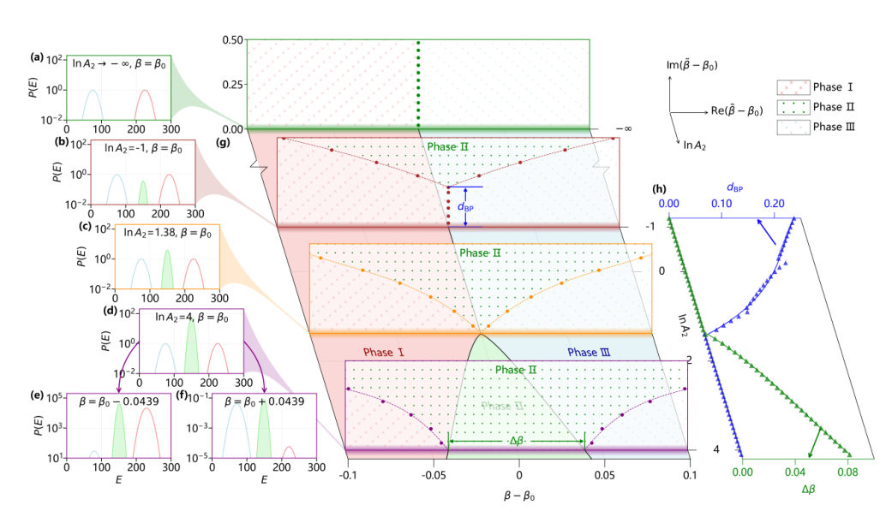 
FIG. 1: The three-Gaussian-peak model with (a)-(d) the referenced DOS distribution P(E, β = β0) for varying A2 at ln A2 = −∞, −1, 1.38, and 4, respectively. The other parameters are fixed, as A1 = A3 = 1, µk = 300 −75 × k, σ1,3 = 10 and σ2 = 5. The light red, green, and blue peaks represent phase I, II, III, respectively. For each DOS, it can be reweighted to the profile of coexistence of two phases at certain T, such as β = β0 ∓0.0439 in (e) and (f) from (d), where the phase transitions I-II and II-III occur, respectively. (g) the complex phase diagram: the horizontal plane is spanned by real axes of temperature β −β0 and peak parameter ln A2, showing the EPD, and the vertical planes...

📷 Fig 2

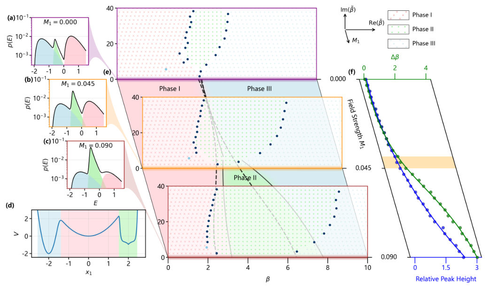 
FIG. 2: The energy probability distribution P(E, β = 4) under varying field intensities: (a) M1 = 0, (b) a weak external field with M1 = 0.045, and (c) a strong external field with M1 = 0.090. (d) The potential-energy profile V (r) along the principal direction x1 at r′ = 0. (e) The M1–˜β phase diagram. In the M1–Re(˜β) plane, solid lines are obtained from MD simulations, while the dashed lines label the trajectories of the two closest LYZs. In the Re(˜β)–Im(˜β) plane, the calculated LYZ points are plotted. Phases I–III and their energetic peaks and domains in the complex plane are labeled with light red, green, and blue shading, respectively. (f) ∆β and the relative peak height during...

**Summary.** This paper develops a method using Lee-Yang zeros in the complex thermal field to locate and track metastable phases that are otherwise invisible in standard equilibrium phase diagrams. By applying this to both simple toy models and periodically driven physical systems, the authors demonstrate a quantitative link between LYZ structure and the stabilization of non-equilibrium collective states. This offers a new theoretical tool for engineering matter under external driving fields.

**Why it may be interesting.** This work provides a powerful theoretical framework for analyzing non-equilibrium steady states by extending classical statistical mechanics tools (Lee-Yang theory) into the complex plane, which is highly relevant for understanding driven quantum systems.

Detailed structure

**Main problem.** The study aims to characterize metastable phases (MPs), which are energetically unfavorable states typically suppressed or invisible in standard equilibrium phase diagrams.

**Main result.** Lee-Yang zeros (LYZs) in the complex thermal field plane delineate these MPs, showing that their emergence and stabilization can be tracked by observing LYZ loci approaching the real axis.

**Method.** The authors utilize Lee-Yang theory applied to complex thermal fields ($	ilde{eta}$) to map out phase boundaries and locate hidden metastable regions.

**Model / system.** The analysis uses two models: a toy system with a tunable three-Gaussian density of states, and a more realistic periodically driven system governed by Langevin dynamics on a multi-well potential.

**Key observables.** Lee-Yang Zeros (LYZs), the distance from the real axis to branching points ($d_{BP}$), and the gap between stable phase branches ($\Deltaeta$).

**Important parameters / regimes.** Drive amplitudes ($M_1$), drive frequencies ($	au_1, 	au_2$), and the complex thermal field parameter $	ilde{eta}$.

**Assumptions / limitations.** The analysis assumes that viewing periodic drives as complex thermal fields provides a valid extension of Lee-Yang theory beyond equilibrium conditions.

**Figures summary.** Figures illustrate the three-Gaussian DOS, the evolution of LYZ profiles in the complex plane under changing parameters, and how $d_{BP}$ and $\Deltaeta$ track the stabilization of metastable phases.

**Paper structure.** The paper establishes the problem by noting MPs are hidden from EPDs. It then introduces LYZ analysis using toy models (Gaussian DOS) and periodically driven systems to demonstrate that complex phase diagrams reveal MP boundaries, linking this theory to terahertz matter manipulation.

Abstract

Metastable phases (MPs) are energetically unfavorable states typically suppressed in equilibrium phase diagrams. Rather than remaining ''hidden'', we show that they exist in the complex plane of thermal fields, as regions delineated by Lee-Yang zeros (LYZs). We demonstrate this numerically in a toy model with a tunable density of states featuring three Gaussian peaks and in a more realistic periodically driven system. In both cases, as artificial parameters or drive amplitudes increase, the LYZs bounding the MP approach the real axis and split into separated branches, signaling the emergence and stabilization of the MP within the enlarged gap between two adjacent stable phases. In the driven system, the imaginary part of LYZs correlates with drive strength, linking Lee-Yang theory to terahertz matter manipulation. These findings provide a scheme to describe MPs in phase diagram analysis. By viewing periodic drives as complex thermal fields, it also offers a new perspective for understanding and engineering non-equilibrium collective states.

[↑ back to top](#top)

### [SCOPE: A Syndrome-Driven Control Plane for QEC-Enabled Quantum Networks](http://arxiv.org/abs/2606.08873v1)

**Authors:** Xiaojie Fan, Zian Wang, Ashutosh Tiwari, Himanshu Gupta  
**Type:** both · **Category:** quantum information and computing · **PDF:** <https://arxiv.org/pdf/2606.08873v1>  
**Analysis basis:** full PDF text, analyzed in chunks
**Topic relevance:** 🔥 `quantum measurements` **4/5** · `measurement-induced transitions` **3/5** · `methods for driven-dissipative` **3/5** · `QC/QI experiment` **2/5** · `Keldysh / 2PI / non-Gaussian methods` **1/5** · `correlated / nonlocal dissipation` **1/5** · `driven-dissipative phase transition` **1/5** · `entanglement & information structure` **1/5** · `non-equilibrium dynamics` **1/5**

📷 Fig 1

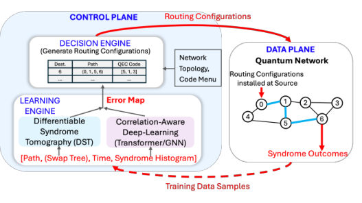 
Figure 2: SCOPE System Overview. The architecture follows a closed-loop Software-Defined Networking (SDN) pattern. The Con- trol Plane hosts the intelligence, comprising the Learning Engine (which infers the Error Map ˆΘ from passive syndromes) and the Decision Engine (which computes optimized Route-Code plans). The Data Plane executes these plans, transmitting qubits, generating remote entanglement, and exporting decoding-syndrome outcomes as feedback. (biases) and (2) cheap enough to collect continuously. Standard passive metrics like End-to-End Fidelity or Success Rates are insufficient; knowing a link has 90% fidelity tells us that it is noisy, but not how (e.g., is it dominant X-noise...

📷 Fig 2

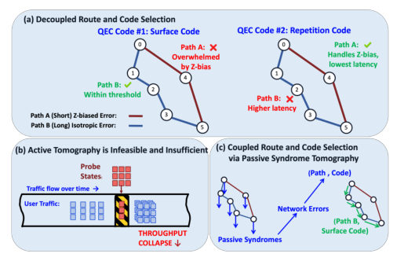 
Figure 1: Motivation for coupled route and code selection, via passive syndrome probes.

📷 Fig 3

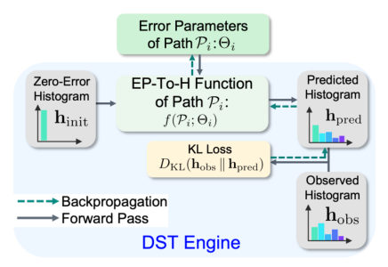 
Figure 3: DST Engine Architecture

📷 Fig 4

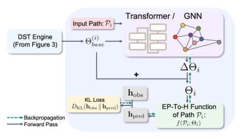 
Figure 4: Correlation-Aware Learning Engine

📷 Fig 5

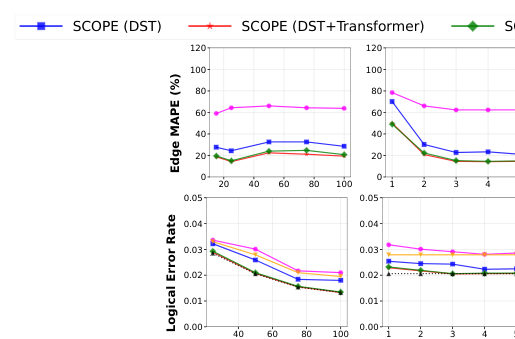 
Figure 5: Estimation error (MAPE) and logical error rate (LER) for the dependent-error and direct transmission.

**Summary.** This paper introduces SCOPE, a novel control plane for fault-tolerant quantum networks that jointly optimizes network routing and QEC code selection. By passively analyzing error syndromes generated during normal operation, it reconstructs the true, time-varying noise map of the network. This allows it to select optimal paths and codes in real-time, achieving substantial reductions in logical error rates over existing methods.

**Why it may be interesting.** While focused on networking protocols, the core technique of using deep learning to invert complex physical measurements (syndromes) into actionable system parameters is highly relevant for modeling open quantum systems where full state tomography is impossible.

Detailed structure

**Main problem.** Current quantum network control planes fail because they treat routing decisions and Quantum Error Correction (QEC) code selection as decoupled processes, leading to suboptimal end-to-end logical error rates.

**Main result.** The proposed SCOPE architecture significantly reduces estimated error by over 60% and lowers logical error rates by 30-35% in large networks compared to topology-aware baselines.

**Method.** SCOPE uses passive syndrome tomography, harvesting parity-check outcomes from live user traffic to build a time-varying network error map, which then drives a joint optimization engine for route and code selection.

**Model / system.** The system models quantum networks as graphs where information is protected by QEC. The methodology supports both direct transmission (pathing) and teleportation-based communication (swap trees).

**Key observables.** End-to-End Logical Error Rate (LER), syndrome histograms, Pauli error rate vectors ($\vec{p}$), and the inferred network error map $\hat{\Theta}$.

**Important parameters / regimes.** The performance is sensitive to noise biases (e.g., $p_X, p_Y, p_Z$) and path history dependence, requiring joint optimization over route and code.

**Assumptions / limitations.** It assumes that passive syndrome data can provide sufficient statistical information to reconstruct the complex, time-varying error map without interrupting service or injecting probes.

**Figures summary.** Figures illustrate the SCOPE system overview following an SDN pattern, showing how the Tomography Engine infers $\hat{\Theta}$ and the Decision Engine selects optimal $(	ext{Route}, 	ext{Code})$ tuples to minimize LER.

**Paper structure.** The paper establishes the need for joint optimization (decoupling flaw), introduces SCOPE's passive syndrome tomography approach, details the DST/GNN inference engine, and concludes with performance validation across various error regimes (direct vs. teleportation).

Abstract

As quantum networks evolve from experimental testbeds to fault-tolerant systems, the primary performance metric shifts from physical link fidelity to end-to-end logical error rate. However, current control planes remain ill-equipped for this transition: routing decisions are typically decoupled from Quantum Error Correction (QEC) strategies, relying on topology or scalar fidelity metrics that fail to predict how specific physical noise structures interact with logical codes. Optimizing this coupled route-and-code performance requires precise, real-time visibility into network error biases, yet traditional active tomography is operationally prohibitive due to throughput collapse and service interruption.   We present SCOPE (Syndrome-based COntrol PlanE), a network-layer architecture that enables joint routing and coding optimization using purely passive telemetry. Instead of injecting probes, SCOPE harvests error syndromes -- the parity-check outcomes naturally generated by QEC decoders during user service. By aggregating these signals, SCOPE's inference engine reconstructs the network's time-varying error map, capturing complex, context-dependent noise correlations. This visibility drives a decision engine that proactively pushes optimal route-and-code configurations to source nodes. NetSquid and IBM-calibrated simulations show that SCOPE reduces estimation error by more than 60% relative to a standard EM baseline. In large-scale networks, this precision reduces logical error rates by 30-35% (up to 65%) against topology-aware baselines.

[↑ back to top](#top)

### [Floquet Entanglement Generation in Parametrically Driven Coupled Superconducting Qubits](http://arxiv.org/abs/2606.07797v1)

**Authors:** Gustavo M. Meneses A., Daniel Dominguez, María José Sánchez  
**Type:** theory · **Category:** quantum information and computing · **PDF:** <https://arxiv.org/pdf/2606.07797v1>  
**Analysis basis:** full PDF text, analyzed in chunks
**Topic relevance:** 🔥 `entanglement & information structure` **4/5** · `methods for driven-dissipative` **3/5** · `non-equilibrium dynamics` **3/5** · `driven-dissipative phase transition` **2/5** · `Keldysh / 2PI / non-Gaussian methods` **1/5** · `analog quantum simulation` **1/5** · `correlated / nonlocal dissipation` **1/5** · `non-equilibrium universality` **1/5**

📷 Fig 1

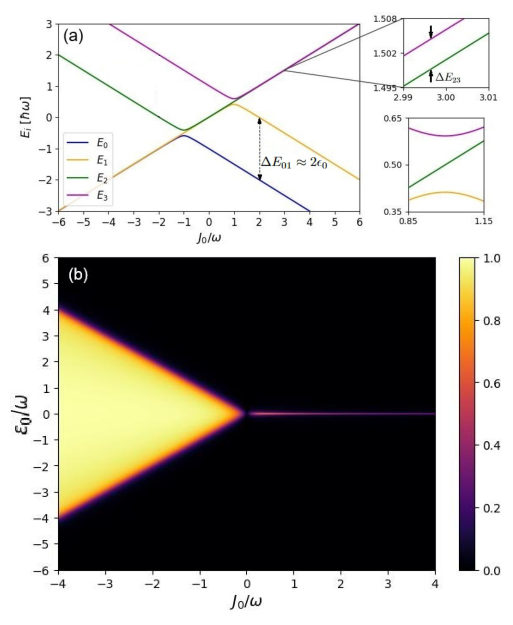 
Figure 1. (a)Energy spectrum of the static Hamiltonian H0 as function of the normalized static coupling J0/ω for ϵ0/ω = 1. The top-right inset shows a zoom of the quasi-degeneracy of E2 and E3, while the bottom-right inset highlights the avoided crossing at J0/ω = ϵ0/ω. (b) Color map of the ground state concurrence C, as a function of {ϵ0/ω, J0/ω}. Two entangled regions can be identified:(i) a triangular region for |J0/ω| &lt; |ϵ0/ω| in which C0 ≈1 and (ii) a narrow band around ϵ0/ω ≈0. Outside these regions, the ground state is nearly separable.

📷 Fig 2

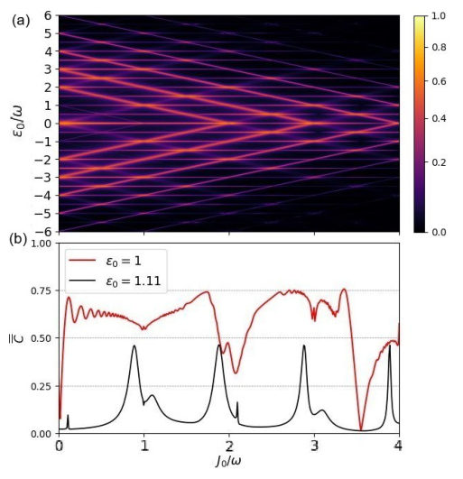 
Figure 2. (a) Color map of C (Eq.(7)), in the parameter space {ϵ0/ω, J0/ω} for A/ω = 3.8. Patterns where entanglement is strong emerge within the parameter regime that corresponds to nearly separable region (J0/ω &gt; 0) in the static case (see Fig.1(b)). (b) C for two different resonance conditions. For ϵ0/ω = 1.11 localized entanglement peaks (C &lt; 0.5) appear whenever the system reaches an SER condition. In contrast, for the n = 2 SSR condition (ϵ0/ω = 1) a broad and robust enhancement of entanglement is obtained with C ≈0.75 over a wide range of J0/ω. Time evolution was averaged over t/T = 700 and 64 distinct initial phases φ0.

📷 Fig 3

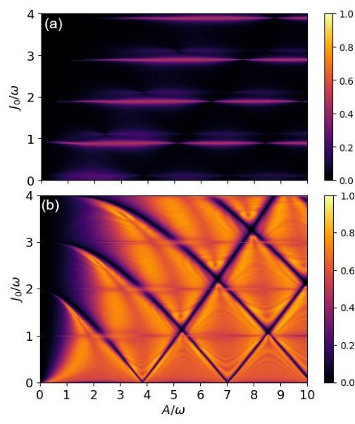 
Figure 3. Color map of C as a function of {J0/ω, A/ω}. (a) For ϵ0/ω = 1.11 resonances where C ≈.5 are observed only for values of J0/ω satisfying the SER condition. (b) For the SSR condition ϵ0/ω = 1 (nω = 2) the concurrence predominantly exceeds 0.8, exhibiting moderate modulations as a function of the driving amplitude A/ω. See text for more details.

📷 Fig 4

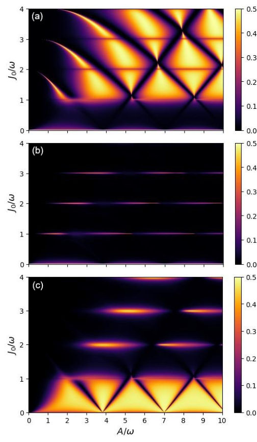 
Figure 4. Double-averaged transition probabilities Pij in the parameter space {J0/ω, A/ω} for ϵ0/ω = 1 (nω = 2) SSR con- dition. A clear change in the plots is observed at J0/ω = ϵ0/ω, corresponding to the location of the avoided in the spectrum of H0 (see Sec.II for details). (a) P01 depicts broad SSR reso- nances patterns for the region J0/ω &gt; 1, where |ϕ1⟩is nearly separable. (b) P02 displays narrow, amplitude-modulated, fringes for values of J0/ω satisfying the SER condition. In this case |ϕ2⟩is entangled. (c) P03 displays broad SSR res- onances for J0/ω &lt; 1 (|ϕ3⟩is nearly separable). Conversely for J0/ω &gt; 1 ( |ϕ3⟩is entangled) resonances only appear for values of J0/ω satisfying the...

📷 Fig 5

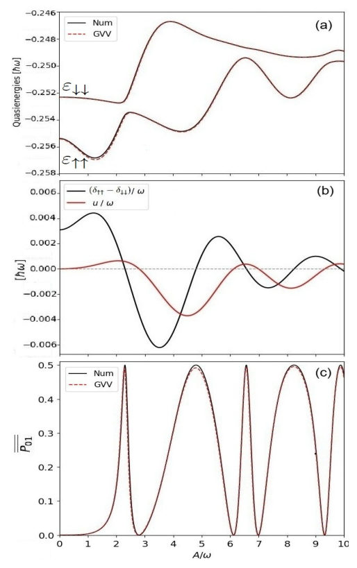 
Figure 5. Comparison between numerical simulations (solid black lines) and analytical predictions obtained from the GVV theory (dashed red lines) for a pure SSR condition, ϵ0/ω = 1 and J0/ω = 2.5, in all the cases as a function of the driving amplitude A/ω. (a) Quasienergies ε↑↑and ε↓↓. (b) Effective coupling u and dynamic Stark shift difference δ↑↑−δ↓↓. Note that their respective zeros do not coincide. (c)Double-averaged transition probability P01. CDT (P01 = 0) occurs at the roots of u. The maximum population transfer(P01 = 0.5) is for the condition δ↑↑−δ↓↓= 0.

**Summary.** This paper theoretically analyzes how parametric driving generates and controls entanglement in coupled superconducting qubits. It establishes that the generation mechanism relies on Floquet state hybridization under specific resonance conditions (SSR). The work also predicts a controllable suppression of this entanglement, termed Coherent Destruction of Entanglement.

**Why it may be interesting.** This work provides a detailed theoretical framework for engineering quantum resources like entanglement in solid-state qubits using time-periodic driving, which is crucial for building scalable quantum processors.

Detailed structure

**Main problem.** The study investigates how robust, sustained entanglement can be dynamically generated in a coupled superconducting qubit system using parametric driving fields.

**Main result.** A nontrivial mechanism for Floquet entanglement generation (FEG) is shown to occur under specific resonance conditions (SSR), which is distinct from conventional excitation methods. Furthermore, the phenomenon of Coherent Destruction of Entanglement (CDE) allows for controlled suppression of this generated entanglement.

**Method.** The analysis employs Floquet theory combined with generalized Van Vleck near-degenerate perturbation theory to derive an effective Hamiltonian governing the system's dynamics.

**Model / system.** The model consists of two superconducting qubits coupled via a time-periodic, parametrically driven longitudinal interaction. The system is analyzed using its time-dependent Hamiltonian and subsequent Floquet quasienergy spectrum.

**Key observables.** Double-averaged concurrence ($C$), which quantifies entanglement; transition probabilities ($P_{ij}$); dynamic Stark shifts ($\delta_{\uparrow\uparrow}/\delta_{\downarrow\downarrow}$) and effective coupling ($u$).

**Important parameters / regimes.** Driving amplitude ($A$) relative to $\omega$, detunings ($\epsilon_0/\omega, J_0/\omega$), and the resonance conditions (SSR vs. SER).

**Assumptions / limitations.** The analysis relies heavily on second-order perturbation theory (GVV approximation) because standard approximations like RWA fail under certain resonance conditions.

**Figures summary.** Figures map out the time-averaged concurrence ($C$) in parameter space, highlighting strong entanglement patterns near resonances and demonstrating how $C$ is suppressed when the effective coupling vanishes (CDE).

**Paper structure.** The paper progresses from establishing the physical model and identifying resonance types (SER vs. SSR), to employing advanced perturbation theory (GVV) to derive an effective Hamiltonian, and finally analyzing the resulting entanglement dynamics, including the mechanism for its suppression (CDE).

Abstract

We investigate the dynamical generation of entanglement in a system of two superconducting qubits coupled through a parametrically driven longitudinal interaction. Using Floquet theory and exact numerical simulations, we analyze the time evolution of the system initialized in a separable ground state. Our results reveal a nontrivial mechanism for entanglement generation, fundamentally distinct from the conventional resonant excitation to an entangled eigenstate. We show that this mechanism emerges when two initially separable eigenstates are mixed by the periodic driving under multiphoton resonance conditions. Since the effect cannot be captured within a standard rotating-wave approximation, we employ generalized Van Vleck near-degenerate perturbation theory to derive an effective analytical description. Within this framework, we demonstrate that the sustained entanglement originates from the hybridization of the dominant Floquet states, namely those with the largest overlap with the initial ground state. Furthermore, the degree of entanglement can be efficiently controlled through the driving amplitude. In particular, for specific amplitudes, the entanglement is fully suppressed. We term this phenomenon as coherent destruction of entanglement.

[↑ back to top](#top)

### [Is Exact Markovianity Fundamental Once Time Is Relational?](http://arxiv.org/abs/2606.08595v1)

**Authors:** Partha Nandi, Francesco Petruccione  
**Type:** theory · **Category:** other · **PDF:** <https://arxiv.org/pdf/2606.08595v1>  
**Analysis basis:** full PDF text, analyzed in chunks
**Topic relevance:** 🔥 `quantum measurements` **4/5** · `measurement-induced transitions` **3/5** · `methods for driven-dissipative` **3/5** · `correlated / nonlocal dissipation` **2/5** · `non-equilibrium dynamics` **2/5** · `Keldysh / 2PI / non-Gaussian methods` **1/5** · `driven-dissipative phase transition` **1/5**

📷 Fig 1

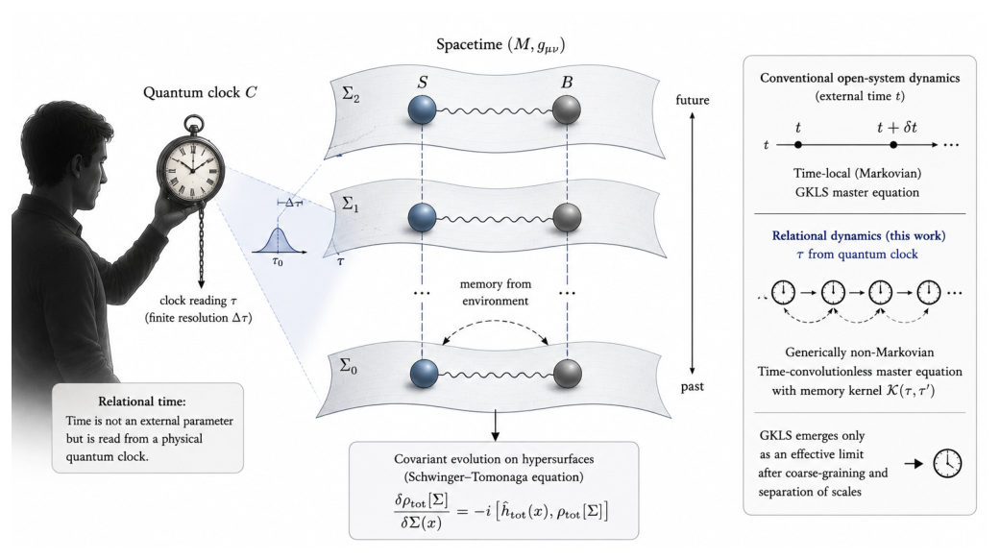 
Figure 1. Covariant relational open-system dynamics. A physical observer defines operational time by reading a finite- resolution quantum clock rather than referring to an external classical time parameter. The standing observer on the left represents an operational agent who extracts relational time τ from the quantum clock, whose finite temporal resolution ∆τ introduces intrinsic temporal uncertainty. The subsystem S interacts locally with its environment B on spacetime hypersurfaces Σ, while the total state evolves covariantly according to the Schwinger–Tomonaga equation. Conditioning the dynamics on the clock reading induces a relational reduced evolution in which memory effects arise...

**Summary.** The paper develops a covariant theory for open quantum dynamics in relativistic settings by treating time as relational, derived from physical quantum clocks. It proves that this relational structure generically leads to non-Markovian evolution, showing that the familiar Markovian master equation is merely an effective approximation valid only under specific coarse-graining assumptions.

**Why it may be interesting.** This work directly tackles foundational issues at the intersection of quantum gravity and open quantum systems, providing a rigorous framework for how time dependence emerges from physical measurements rather than being imposed externally.

Detailed structure

**Main problem.** The paper addresses the fundamental conflict between Markovian open quantum dynamics, which requires an external time parameter, and relativistic physics, where time is fundamentally relational.

**Main result.** Exact Markovian evolution is shown to be only an effective limit, emerging only after a process of relational coarse-graining; intrinsically, the reduced dynamics are generically non-Markovian due to clock fluctuations.

**Method.** The authors use a covariant formalism based on the Schwinger–Tomonaga equation, developing a time-convolutionless master equation directly on spacetime hypersurfaces by conditioning the evolution on physical quantum clocks.

**Model / system.** The model involves a composite relativistic system (System S + Environment B) whose dynamics are governed by local operators on spacelike hypersurfaces $\Sigma$, with time operationalized via a finite-resolution quantum clock C.

**Key observables.** Reduced density matrix ($
ho_{S,	au}$), memory kernel ($C(\sigma)$), and the resulting master equation structure (GKLS vs. non-Markovian).

**Important parameters / regimes.** Clock resolution scale ($\sigma$), environmental correlation time ($	au_B$), and the separation of scales ($\sigma \gg 	au_B$).

**Assumptions / limitations.** The formalism assumes an operational decomposition into sectors (S, B, C) and relies on approximations like statistical independence between noise sources and separation of scales to recover known limits.

**Figures summary.** Figure 1 illustrates how finite-resolution clock extraction leads to memory effects from both environmental correlations and clock fluctuations, contrasting this with standard external time dynamics.

**Paper structure.** The paper builds the covariant formalism using the Schwinger–Tomonaga equation on spacetime hypersurfaces. It derives the reduced relational dynamics, demonstrating non-Markovianity due to the dressed memory kernel $C(\sigma)$. Finally, it shows that the familiar GKLS structure is recovered only in an effective limit via coarse-graining.

Abstract

Markovian open quantum theory assumes evolution with respect to an external classical time parameter, yet no preferred notion of time exists fundamentally in relativistic physics. We resolve this tension by formulating relativistic open quantum dynamics relationally through finite-resolution quantum clocks. Using the Schwinger-Tomonaga formalism, we derive a covariant master equation directly on spacetime hypersurfaces and show that the resulting reduced dynamics is generically non-Markovian even for local interactions. Environmental correlations and clock fluctuations jointly generate the memory kernel, while the Gorini-Kossakowski-Lindblad-Sudarshan (GKLS) structure emerges only after relational coarse-graining, implying that exact Markovian evolution is effective rather than fundamental. In the sharp-clock limit, the formalism reduces to the Anastopoulos-Hu gravitational decoherence equation.

[↑ back to top](#top)

### [Microscopic universal theory of symmetry-enriched topological quantum spin liquids](http://arxiv.org/abs/2606.08558v1)

**Authors:** Yingcheng Li, Liujun Zou  
**Type:** theory · **Category:** other · **PDF:** <https://arxiv.org/pdf/2606.08558v1>  
**Analysis basis:** full PDF text, analyzed in chunks
**Topic relevance:** 🔥 `analog quantum simulation` **4/5** · 🔥 `exotic spin models in light-matter` **4/5** · `Rydberg arrays` **3/5** · `QC/QI experiment` **2/5** · `correlated cavity matter` **1/5** · `entanglement & information structure` **1/5** · `spintronics-quantum-optics interface` **1/5**

📷 Fig 1

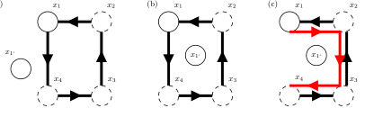 
FIG. 1. The solid circles represent the anyons in states |a1, ¯a1′⟩and |a1, ¯a1′′⟩. If moving operators M a 21, M a 32, M a 43 and M a 14 are supported around the black lines in panels (a) and (b) and if they satisfy Eq. (11), i.e., M a 14M a 43M a 32M a 21|a1, ¯a1′⟩= M a 14M a 41|a1, ¯a1′⟩= |a1, ¯a1′⟩, then the analogous equation M a 14M a 43M a 32M a 21|a1, ¯a1′′⟩= |a1, ¯a1′′⟩is not expected to hold, as there can be an additional mutual braiding phase factor between a and ¯a when M a 14M a 43M a 32M a 21 acts on |a1, ¯a1′′⟩. To make both Eq. (11) and this analogous equation hold, once M a 21, M a 32 and M a 43 are taken to be supported around the black lines in panels (a) and (b), M a 41...

📷 Fig 2

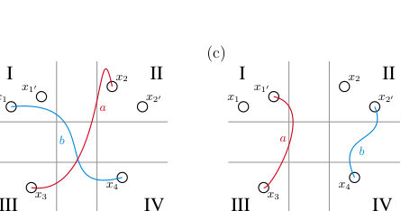 
FIG. 2. (a) The 4 regions I, II, III, and IV are all outside of the two strips, such that moving along II-I-III-IV should wind around the overlapping region of the strips in a counter-clockwise manner. (b) and (c): The two processes differ by a braiding.

📷 Fig 3

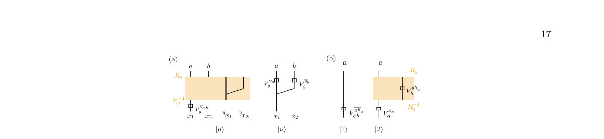 
FIG. 3. (a) Graphic representations of the states in Eq. (27). (b) Graphic representations of the states in Eq. (28). The shaded region means the actions of Rg and R−1 g , where the positions of the anyons can be changed.

📷 Fig 4

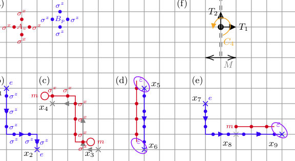 
FIG. 4. (a) The Av operators and Bp operators. (b) From a ground state, the state |e1, e2⟩can be created by applying the blue e string operator, which is realized by applying σz operators to a string connecting the two vertices x1 and x2. (c) From a ground state, the state |m3, m4⟩can be created by applying the red m string operator, which is realized by applying σx operators to a string connecting the two vertices. When moving or splitting an anyon m from x3 to x4, we always choose the support of the string operator to be at the right side of the gray arrowed line pointing from x3 to x4. (d) From a ground state, the state |ε5, ε6⟩can be created by first applying the blue e string operator...

📷 Fig 5

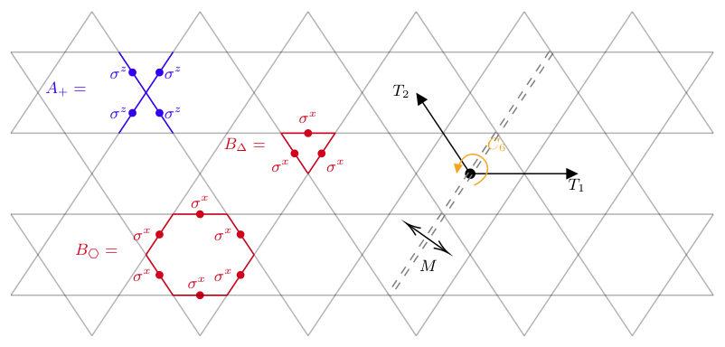 
FIG. 5. The qubits are on the links of the kagome lattice, which are also sites of the ruby lattice. For the generators of the p6m symmetry, T1,2 are translations by 1 unit cell along the two directions as indicated, C6 is a 6-fold rotation around a plaquette with C2 6 denoted by C3 and C3 6 denoted by C2, and M is a reflection whose reflection axis if the double dashed line.

**Summary.** This work presents a microscopic universal theory to classify symmetry-enriched topological quantum spin liquids. It characterizes these phases using measurable quantities derived from anyon dynamics and symmetries, establishing the crystalline equivalence principle between lattice and internal symmetries. The framework is highly relevant for designing and understanding fault-tolerant quantum computation based on TQSLs.

**Why it may be interesting.** It directly bridges abstract mathematical concepts (category theory) with concrete physical realizations in quantum hardware platforms like trapped ions and Rydberg atoms, providing testable predictions for exotic quantum states.

Detailed structure

**Main problem.** To develop a microscopic universal theory characterizing symmetry-enriched topological quantum spin liquids (SET TQSLs) by extracting their universal properties from physically measurable quantities.

**Main result.** The theory establishes the crystalline equivalence principle, providing an explicit bijective map between data for TQSLs with general symmetries and those with only internal symmetries.

**Method.** The approach uses low-energy dynamics of anyons (motion and splitting operators) and symmetry actions to define universal data, which is organized using generalizations of category theory.

**Model / system.** The focus is on two-dimensional (2+1)D TQSLs applicable to generic systems with complex symmetries (internal/lattice, unitary/anti-unitary). Demonstrations are planned for superconducting qubits, trapped ions, and Rydberg atoms.

**Key observables.** Anyon statistics, fusion rules, symmetry actions, moving/splitting operators ($M_{a}^{21}$, $(S_{bc}^{a,\mu})^{21}$), $\eta$-phases, and cohomology invariants.

**Important parameters / regimes.** The theory is concerned with the structure of universal data invariant under quasi-adiabatic continuation, linking lattice symmetries to internal ones.

**Assumptions / limitations.** Assumes operators like $M$ and $S$ are unitary; approximations are made regarding exponentially decaying tails of operators when anyons are far apart.

**Figures summary.** Not specified in the notes, but mentions Figure 1 illustrating spacetime trajectories for moving operators ($M$) and braiding relations.

**Paper structure.** The paper systematically builds the theory by defining microscopic inputs (anyon states/operators), deriving universal data structures (generalizing category theory), establishing the crystalline equivalence principle, and verifying consistency via gauge transformations ($\eta', U'$).

Abstract

An ultimate theory of a phase of matter should describe all its universal properties via quantities that are measurable numerically and experimentally. In this work, we present a microscopic universal theory of symmetry-enriched topological quantum spin liquids (TQSLs) in two spatial dimensions, which directly utilizes microscopically measurable quantities to describe the universal properties. This theory applies to generic TQSLs, which can be Abelian or non-Abelian, chiral or non-chiral. The symmetries are also general, which can include both internal and lattice symmetries, unitary and anti-unitary symmetries, and discrete and continuous symmetries. There can be spin-orbit coupling, the microscopic degrees of freedom may transform linearly or projectively under the symmetries, and the symmetries can permute anyons. The input of the theory is some microscopic states with anyons, operators that control the dynamics of anyons, and symmetry actions in the TQSL, and its output is a set of data characterizing the universal properties, whose underlying mathematical structure is a generalization of category theory. Based on this theory, we find an explicit bijective map between the universal data characterizing a TQSL with a symmetry described by a group $G$, where the symmetry actions may include both lattice and internal symmetries, and the corresponding universal data for a TQSL with only an internal symmetry group $G$, and thus establish a precise crystalline equivalence principle. We demonstrate our theory in symmetry-enriched TQSLs realized on quantum processors based on superconducting qubits, trapped ions, and Rydberg atoms, and in each example we verify the Lieb-Schultz-Mattis anomaly matching condition. Our theory provides a solid basis for identifying and manipulating symmetry-enriched TQSLs, which further paves the way for fault-tolerant quantum computation based on these systems.

[↑ back to top](#top)

### [Sambe Approach to Floquet-Lindblad Open Quantum Systems](http://arxiv.org/abs/2606.09727v1)

**Authors:** Andriani Keliri, Marco Schirò  
**Type:** theory · **Category:** other · **PDF:** <https://arxiv.org/pdf/2606.09727v1>  
**Analysis basis:** full PDF text, analyzed in chunks
**Topic relevance:** 🔥 `methods for driven-dissipative` **4/5** · 🔥 `non-equilibrium dynamics` **4/5** · `driven-dissipative phase transition` **3/5** · `non-equilibrium universality` **2/5** · `Keldysh / 2PI / non-Gaussian methods` **1/5** · `analog quantum simulation` **1/5** · `correlated / nonlocal dissipation` **1/5**

📷 Fig 1

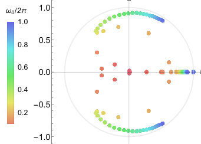 
FIG. 2: Spectrum of the stroboscopic evolution oper- ator as obtained from diagonalization of the Floquet- Lindblad matrix LF at different drive frequencies ω0, for A = ∆, γ = 0.1∆, ∆= 1, ϕ = 0.

📷 Fig 2

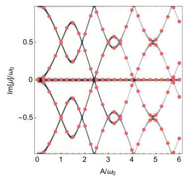 
FIG. 3: Comparison between the Floquet-Lindblad spec- trum obtained from the exact diagonalization of the evolution operator (red dots) and the matrix-continued fraction (black lines). Parameters are chosen as ω0 = ∆/2, γ = 0.01∆, ∆= 1, ϕ = 0.

📷 Fig 3

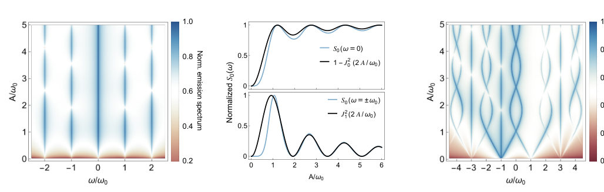 
FIG. 4: (a),(c): Emission spectra of the periodically driven TLS as a function of the emission frequency ω and the amplitude of the drive A in units of the drive frequency ω0. The intensity of the emission is normalized to 1. In (a) the level splitting is zero ∆= 0, while in (c) the drive frequency is resonant to the splitting ∆= ω0. (b): Comparison of the intensity of the emission lines at ω = 0 (top panel) and at ω = ±ω0 (bottom panel) with Bessel functions of the first kind J2 p(2A/ω0) in the case ∆= 0. The rest of the parameters are ω0 = 1, γ = 0.01, ϕ = 0.

📷 Fig 4

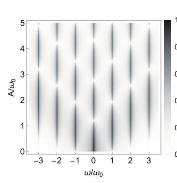 
FIG. 5: Spectral function A(ω) of the driven resonant level model as a function of the amplitude of the drive A and the frequency ω in units of the drive frequency ω0 obtained through the continued fraction method. The rest of the parameters are set to γL = γR = 0.01, εd = 0.

📷 Fig 5

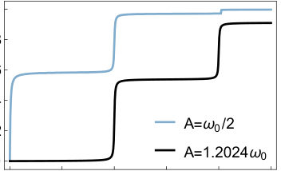 
FIG. 6: Current-voltage characteristics for different driv- ing amplitudes showing the suppression of current at the Bessel function zero of J0(2A/ω0). ω0 = 1, γL = γR = 0.01, εd = 0.

**Summary.** This paper develops an advanced theoretical framework to handle periodically driven open quantum systems using Lindblad master equations. It extends established Floquet theory by mapping the problem into an enlarged Sambe-Liouville space, allowing for the construction of an effective time-independent Lindbladian. This method is powerful because it non-perturbatively calculates spectral properties and transport characteristics in regimes where simpler approximations fail.

**Why it may be interesting.** This work provides a rigorous theoretical toolset to analyze non-equilibrium steady states in driven quantum matter, bridging the gap between unitary Floquet engineering and dissipative dynamics crucial for quantum optics and solid-state physics.

Detailed structure

**Main problem.** The central problem is extending Floquet engineering concepts, traditionally used for closed quantum systems, to open quantum systems governed by time-periodic Lindblad master equations.

**Main result.** The authors develop a method using an extended Sambe-Liouville space and matrix continued fractions to construct a well-defined, effective time-independent Floquet Lindbladian acting on the physical Liouville space.

**Method.** Key methods include applying Floquet theory to periodic superoperators, mapping the problem into an enlarged Sambe-Liouville space, and utilizing the matrix continued fraction method for non-perturbative summation of multiphoton processes.

**Model / system.** The study concerns open quantum systems driven periodically in time, described by a Lindblad master equation. Applications include dissipating two-level systems (TLS) and parametrically driven quantum dots coupled to leads.

**Key observables.** Resonance fluorescence spectrum, spectral function, current-voltage characteristics, and correlation functions of the system observables.

**Important parameters / regimes.** Drive frequency ($\omega_0$), coupling strengths ($A$), dissipation rates ($\gamma$), and the ratio $A/\omega_0$ (drive amplitude to frequency).

**Assumptions / limitations.** The primary assumption is that a time-independent Floquet Lindbladian can be constructed, which is non-trivial due to the non-unitary nature of open system evolution.

**Figures summary.** Figures illustrate the spectrum of the extended Floquet matrix ($\mathcal{L}_F$) and its stroboscopic counterpart ($V(T, 0)$), as well as current-voltage characteristics showing suppression at Bessel function zeros.

**Paper structure.** The paper progresses by first establishing the need for an extension of Floquet theory to open systems. It details the Sambe approach in extended space, then introduces the matrix continued fraction method to project onto the physical subspace, and finally applies this framework to calculate spectral properties and transport characteristics.

Abstract

We study driven and open quantum systems described by a time-periodic Lindblad master equation. In closed systems, the stroboscopic dynamics can always be described by an effective time-independent Floquet Hamiltonian; this idea is the basis of Floquet engineering. However, in the presence of dissipation, the existence of an effective time-independent Floquet Lindbladian is not guaranteed due to the non-unitary nature of the evolution. Using Floquet theory, we construct a well-defined time-independent Floquet Lindbladian in an extended Sambe-Liouville space, transforming the initial time-dependent problem to a static and non-Hermitian eigenvalue problem. For harmonic driving, we introduce a matrix continued fraction method to nonperturbatively resum multiphoton processes and construct an effective Floquet Lindbladian acting only on the physical Liouville space. Compared to other high-frequency expansions, this method has the advantage of providing the whole infinite series expansion at once. Using a resolvent formalism, we show how to obtain a spectral Floquet representation of correlation functions of an open quantum system. As an application, we consider a dissipating two-level system in a linearly polarized field and calculate its resonance fluorescence spectrum. Furthermore, we consider a parametrically driven quantum dot with pump and loss for which we calculate its spectral function and current-voltage characteristics.

[↑ back to top](#top)

### [Time Evolution of Heat Conduction in a Generalized Model of Brownian Motion](http://arxiv.org/abs/2606.08839v1)

**Authors:** T. Koide, F. Nicacio  
**Type:** theory · **Category:** statistical mechanics · **PDF:** <https://arxiv.org/pdf/2606.08839v1>  
**Analysis basis:** full PDF text, analyzed in chunks
**Topic relevance:** 🔥 `non-equilibrium dynamics` **4/5** · `methods for driven-dissipative` **3/5** · `non-equilibrium universality` **3/5** · `correlated / nonlocal dissipation` **2/5** · `driven-dissipative phase transition` **2/5** · `Frenkel-Kontorova` **1/5** · `Keldysh / 2PI / non-Gaussian methods` **1/5**

📷 Fig 1

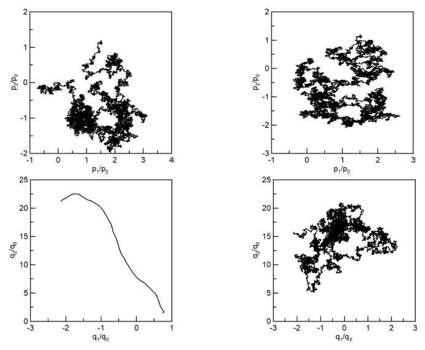 
Figure 1. Trajectories obtained by solving Eqs. (1) and (2) are plotted. The top-left and top-right panels show the momentum trajectories for γq = 0 and γq = 1 in the (p1, p2) plane, respectively. Both appear as zigzag lines. The bottom-left and bottom- right panels show the position trajectories in the (q1, q2) plane. For γq = 0 (left panel), the trajectory is smooth, whereas for γq = 1 (right panel), it becomes zigzag due to the direct influence of the noise term.

📷 Fig 2

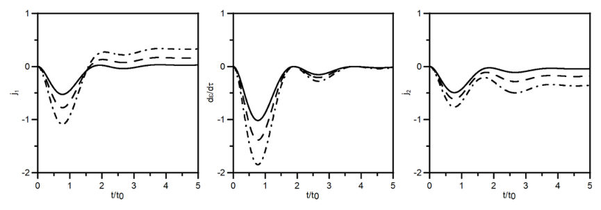 
Figure 2. The time evolutions of the heat current j1 (left panel), the change of energy dϵ/dτ (center) and the heat current j2 (right panel) are plotted for the standard Brownian motion, γq = 0 (δ = −1). We set γp = χ = 1, δ = −1 and β2 = 1. The solid, dashed and dash-dotted lines correspond to temperature 1/β1 = 1.2, 2 and 3, respectively. The three trajectories of j1 converge toward the analytical values obtained through Eq. (64). On the center figure, the numerical solutions converge toward zero asymptotically in time, showing the system reaches a steady state.

📷 Fig 3

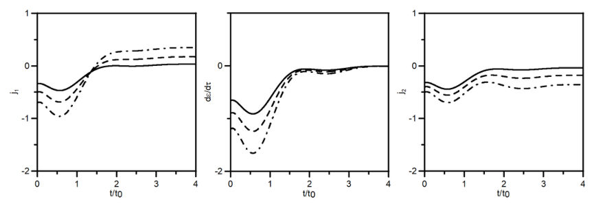 
Figure 3. The time evolution of the heat current j1 (left panel), the rate of energy change dϵ/dτ (center), and the heat current j2 (right panel) for the generalized Brownian motion with parameter γq = 0.1 (δ = −0.9). We set γp = χ = 1 and β2 = 1. The solid, dashed, and dash-dotted lines correspond to temperatures 1/β1 = 1.2, 2, and 3, respectively. The three trajectories of j1 converge toward the analytical values obtained through Eq. (64). In the center panel, the numerical solutions asymptotically converge toward zero, demonstrating that the system reaches a steady state.

📷 Fig 4

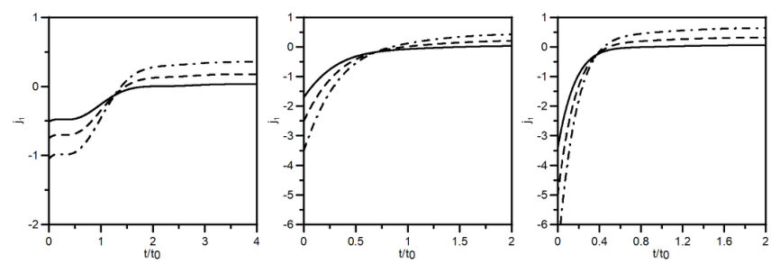 
Figure 4. The time evolutions of j1 for larger magnitude, γq = 0.15, 0.5, and 1 are shown in the left, center, and right panels, respectively. We set γp = χ = 1 and β2 = 1. The solid, dashed, and dash-dotted lines correspond to temperatures 1/β1 = 1.2, 2, and 3, respectively, while keeping 1/β2 = 1 fixed.

📷 Fig 5

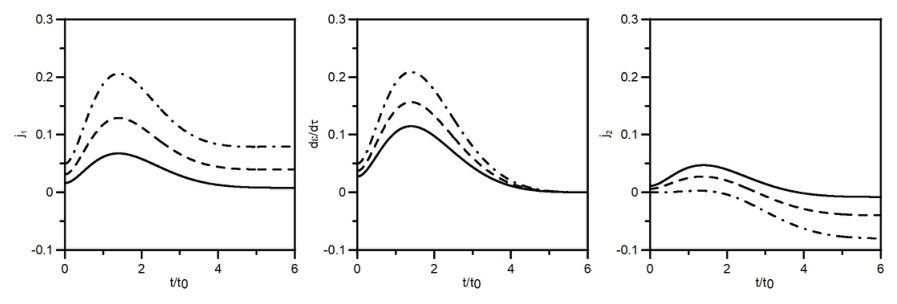 
Figure 5. The time evolution of the heat current j1 (left panel), the rate of energy change dϵ/dτ (center), and the heat current j2 (right panel) is plotted for γq = 0.1 (δ = −0.9). The parameters are set to χ = −0.25 and β2 = 1. The solid, dashed, and dash-dotted lines correspond to the temperatures 1/β1 = 1.2, 2, and 3, respectively.

**Summary.** The paper develops and analyzes a generalized model of Brownian motion for heat conduction in coupled oscillators. It successfully demonstrates that this advanced framework reproduces Fourier's law in the steady state, confirming its validity for non-equilibrium thermodynamics. Crucially, it predicts unique transient behaviors, such as instantaneous heat jumps, which differ significantly from standard models.

**Why it may be interesting.** This work is highly relevant as it bridges classical non-equilibrium statistical mechanics with quantum thermodynamics by providing a robust stochastic model that satisfies fundamental laws while incorporating complex dissipation mechanisms.

Detailed structure

**Main problem.** The study investigates deriving macroscopic thermal conduction laws, such as Fourier's law, from microscopic dynamics using a generalized model of Brownian motion.

**Main result.** The generalized model successfully reproduces Fourier's law in the steady state and captures non-equilibrium effects like thermal boundary resistance. It also predicts characteristic transient heat flow behavior when interactions are suddenly introduced.

**Method.** The authors use an extended framework of stochastic energetics to define heat current, analyze correlation functions via solving coupled differential equations derived from generalized Langevin dynamics, and examine both steady-state and transient regimes.

**Model / system.** The system is a network of coupled harmonic oscillators (initially $N=2$) interacting with separate heat baths at different temperatures. The dynamics are governed by generalized stochastic differential equations incorporating fluctuation and dissipation into both momentum and position coordinates, extending standard Brownian motion.

**Key observables.** Heat current ($J$), steady-state thermal conductivity ($\kappa$), energy change rate ($\mathrm{d}\epsilon/\mathrm{d}	au$), and temperature differences ($T_{	ext{kin},1} - T_{	ext{kin},2}$ vs. $T_1 - T_2$).

**Important parameters / regimes.** Dissipation coefficients ($\gamma_{qi}, \gamma_{pi}$), interaction strength ($K_{	ext{int}}$), and the degree of generalization ($\gamma_q > 0$ vs. $\gamma_q = 0$).

**Assumptions / limitations.** The analysis relies on extending stochastic energetics to define heat flux where standard definitions fail, and it notes that initial instantaneous heat currents are artifacts of assuming an abrupt change in interaction potential.

**Figures summary.** Figures illustrate the difference between trajectories for standard vs. generalized Brownian motion (momentum/position paths) and show the time evolution of heat currents ($j_1, j_2$) under different coupling regimes (standard, generalized, repulsive).

**Paper structure.** The paper progresses from establishing the need for a generalized stochastic framework to derive consistent thermodynamic quantities, analytically verifying Fourier's law in steady state, and finally analyzing transient dynamics when inter-particle interactions are switched on.

Abstract

We investigate the properties of heat conduction in a network of harmonic oscillators interacting with heat baths, described by a generalized model of Brownian motion. This model includes noise and dissipation terms in both the momentum and position equations. This generalization is motivated by the requirement of consistency with the Gorini-Kossakowski-Sudarshan-Lindblad (GKSL) equation. Because standard definitions of heat current based on velocity become mathematically inconsistent in this framework, we derive an analytical expression for the steady-state heat flow based on an extended framework of stochastic energetics. We confirm that Fourier's law (linear thermal response) is satisfied and that the model naturally captures microscopic thermal boundary resistance, analogous to Kapitza resistance. This demonstrates that our generalized model functions as a valid phenomenological framework for simulating non-equilibrium processes, marking a crucial step toward a unified formulation of stochastic and quantum thermodynamics. Furthermore, we analyze the time evolution of heat conduction by numerically solving the corresponding differential equations for the correlation functions. Unlike standard Brownian motion, the generalized model generates continuous and nowhere differentiable trajectories for both momentum and position (as is characteristic of overdamped dynamics). Finally, we show that the heat current exhibits characteristic transient behavior when the inter-particle interaction is switched on. Specifically, an instantaneous heat flow emerges, whose direction is strictly governed by whether the interaction is attractive or repulsive, significantly differing from the predictions of the standard model.

[↑ back to top](#top)

### [All-Optical Wide-Field Magnetometry with Van Der Waals Quantum Sensor](http://arxiv.org/abs/2606.07899v1)

**Authors:** Feifei Zhou, Peiyan Ma, Jiajun Li, Ke Jing, Shihao Ru, Hongwei Chen, Ying Dong, Xinqing Wang  
**Type:** experiment · **Category:** other · **PDF:** <https://arxiv.org/pdf/2606.07899v1>  
**Analysis basis:** full PDF text, analyzed in chunks
**Topic relevance:** 🔥 `spintronics-quantum-optics interface` **4/5** · `exotic spin models in light-matter` **3/5** · `analog quantum simulation` **2/5** · `quantum measurements` **2/5** · `QC/QI experiment` **1/5** · `measurement-induced transitions` **1/5** · `methods for driven-dissipative` **1/5** · `quantum optics experiment` **1/5**

📷 Fig 1

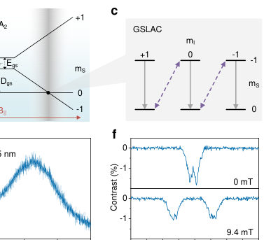 
Fig. 1 (a) Atomic lattice structure of the V − B center in h-BN. (b) Schematic of electron-spin energy levels of the V − B center. Green arrow represents the 532-nm laser irradiation, red wave arrows denotes the photon emissions, and the gray lines indicate the ISC transition of the V − B center. Orange (blue) gradient-filled block shows the excited (ground) triplet spin states. The black dot represents the GSLAC point. (c) Schematic of spin transitions at GSLAC point. The gray arrows denote the ISC transition, and the purple dashed arrows denote the ESR assisted by the flip-flop of nuclear spins. (d) Raman spectrum of the h-BN sample used in this study. An expected peak of around 1367 cm−1...

📷 Fig 2

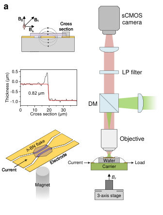 
Fig. 2 (a) The architecture of our wide-field microscope. Green-filled path represents the 532 nm laser, and the light red-filled path denotes the collection of PL signals. The three-dimensional model exhibits the core details of CPW circuits covered by h-BN flake with a thickness of 0.82 µm. A cross section schematic of CPW describes the contour lines of current-induced magnetic field B1, which consists of two components B∥and B⊥referring to the quantum axis of V − B centers. DM, dichroic mirror; LP, long-pass. (b) Magnetic-field-dependent ODMR mapping of V − B centers. The dark red tracks are attributed to the ground-state ESR between ms = 0 and ms = ±1. The other two transparent tracks...

📷 Fig 3

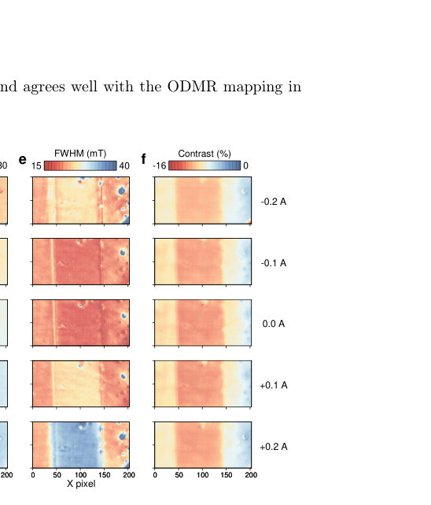 
Fig. 3 (a) PL image of h-BN flake covering the strip-line surface. GSLAC behaviors at site-1 and site-2 are further studied. (b) GSLAC behaviors at site-1 with current magnitudes of 0.0 A and ±0.2 A. Significant shifts of central field are observed. (c) GSLAC behaviors at site-2 with current magnitudes of 0.0 A, +0.1 A, and +0.2 A. The central field has no shifts while the FWHM is significantly broadened due to the increasing of B⊥. (d-f) Distribution of GSLAC features including the central fields (d), the FWHMs (e), and the contrasts (f).

**Summary.** The research proposes an all-optical method for measuring magnetic fields using boron vacancy centers in h-BN. By monitoring the Ground-State Level Anti-Crossing (GSLAC), the authors achieve a highly sensitive and wide-field magnetometry technique that is significantly simpler than traditional microwave-based methods.

**Why it may be interesting.** This work bridges quantum sensing with condensed matter magnetism by developing a highly sensitive, optically accessible technique that bypasses the need for complex microwave infrastructure, which is relevant to open quantum systems characterization.

Detailed structure

**Main problem.** To develop an all-optical, microwave-free technique for wide-field magnetometry using nitrogen vacancy centers in hexagonal boron nitride.

**Main result.** The method successfully imaged near-field DC magnetic field distributions with a sensitivity of $67.1 \mu	ext{T}/\sqrt{	ext{Hz}}$, achieving an improvement over conventional ODMR measurements.

**Method.** The technique exploits the Ground-State Level Anti-Crossing (GSLAC) feature in boron vacancy centers, monitoring shifts in fluorescence intensity as the external magnetic field is varied.

**Model / system.** The system uses negatively charged boron vacancy ($V_B^-$) centers embedded in h-BN. The physics is governed by spin Hamiltonian terms involving Zeeman splitting and hyperfine interactions, leading to GSLAC phenomena.

**Key observables.** PL intensity shift, ODMR contrast, central field ($	ext{mT}$), Full Width at Half Maximum ($	ext{FWHM}$, $	ext{mT}$).

**Important parameters / regimes.** Magnetic fields ranging from $10 	ext{ mT}$ to $200 	ext{ mT}$; spatial resolution of about $1 \mu	ext{m}$.

**Assumptions / limitations.** The method assumes that the GSLAC feature is robustly measurable optically and provides a superior signal-to-noise ratio compared to standard ODMR techniques.

**Figures summary.** Figures illustrate atomic structures, energy level schematics showing the GSLAC, and spectral measurements (Raman, PL, ODMR) used to characterize the magnetic field dependence of the spin transitions.

**Paper structure.** The paper introduces the physical system ($	ext{V}_B^-$ in h-BN), details the theoretical mechanism (GSLAC for microwave-free measurement), presents the experimental setup for wide-field mapping, and finally reports quantitative measurements of magnetic field sensitivity and spatial resolution.

Abstract

Negatively charged boron vacancy ($V_B^-$) centers in hexagonal boron nitride ($h$-BN) have attracted wide-range interests owing to their van der Waals lattice and their potentials for $in$-$situ$ quantum sensing. Here we propose and experimentally demonstrate an all-optical strategy for wide-field magnetometry based on $V_B^-$ centers. This strategy exploits the magnetically sensitive ground-state level anti-crossing (GSLAC) of $V_B^-$ centers, which induces a strong electron spin transition between $m_S = 0$ and $m_S = -1$ states, enabling microwave-free magnetic field measurement. By monitoring the shift of GSLAC feature, the external magnetic field can be precisely determined. Using this technique, we demonstrate all-optical wide-field imaging of near-field DC magnetic field distribution from current-carrying circuits over an area of around 42 $\times$ 21 $μ$m$^2$. An estimated photon shot-noise-limited sensitivity of 67.1 $μ$T/$\sqrt{\text{Hz}}$ is achieved for a single pixel, which is an approximately threefold improvement over the ODMR method, along with a spatial resolution of about 1 $μ$m per pixel. Our approach expands the applicability of $V_B^-$ centers in quantum sensing, paving the way for robust and convenient magnetometry under extreme conditions.

[↑ back to top](#top)

### [Detecting Exciton Condensation through Charge Transport in Semiconductor Heterostructures](http://arxiv.org/abs/2606.07752v1)

**Authors:** Caterina Zerba, Léo Mangeolle, Michael Knap  
**Type:** theory · **Category:** quantum gases · **PDF:** <https://arxiv.org/pdf/2606.07752v1>  
**Analysis basis:** full PDF text, analyzed in chunks
**Topic relevance:** 🔥 `analog quantum simulation` **4/5** · `driven-dissipative phase transition` **3/5** · `non-equilibrium dynamics` **3/5** · `non-equilibrium universality` **2/5** · `Keldysh / 2PI / non-Gaussian methods` **1/5** · `correlated / nonlocal dissipation` **1/5** · `methods for driven-dissipative` **1/5**

📷 Fig 1

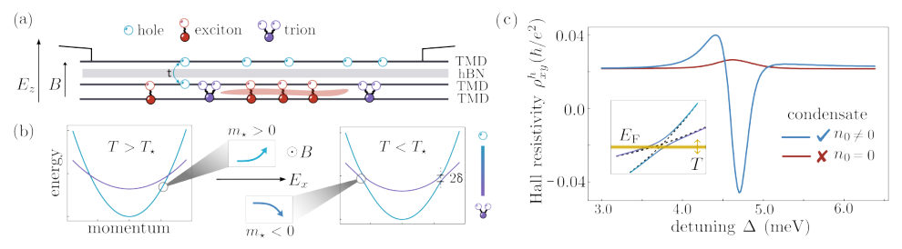 
FIG. 1. Setup and sharp transport signatures of exciton condensation. (a) We consider a multilayer TMD structure; the upper layer is hole-doped, while interlayer excitons are electrically injected between the middle and lower layers. Holes tunnel from the upper to the middle layer and scatter with excitons, forming trions as a stable bound state. A transverse electric field Ez tunes the scattering. Electric contacts with a reservoir induce a field Ex in the upper layer which generates a hole current, and a transverse magnetic field B realizes the Hall effect. (b) When excitons condense, T &lt; T ∗, the hole and trion bands hybridize. The local band curvature defines the local effective mass...

📷 Fig 2

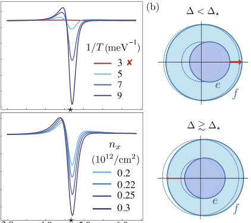 
FIG. 2. Hall resistivity ρh xy. (a) Hall resistivity ρh xy as a function of detuning ∆for different values of temperature T at nx = 0.25 · 1012 cm−2 (top) and exciton density nx at 1/T = 6 meV−1 (bottom). The red curve corresponds to the absence of the condensate. (b) Physical picture for kinetics and scattering mechanisms. The momentum-space displacement of each Fermi sea α ∈{e, f} depends on its effective charge ξαe and hence on ∆. Off resonance (top) only one Fermi surface is significantly displaced, while near resonance (bottom) both are. This determines the strength of the interband scattering (represented by the width of the red arrow), which in turn determines the asymmetry of ρh xy...

📷 Fig 3

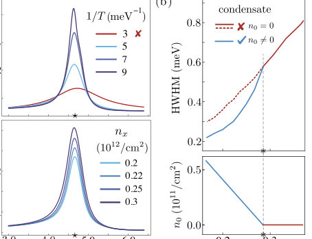 
FIG. 3. Longitudinal resistivity. (a) Longitudinal resis- tivity ρh xx as a function of detuning ∆for different values of temperature T at nx = 0.25 · 1012 cm−2 (top) and exciton density nx at 1/T = 6 meV−1 (bottom). The red curve cor- responds to the absence of the condensate. (b) Half Width at Half Maximum (HWHM) of the longitudinal resistivity (top) and condensate density n0 (bottom). Upon condensation, the phase space available for scattering decreases compared to the non-condensed case (red dashed curve, obtained by taking n0 →0 at fixed nx, T), and the resonance region is narrowed. The cusp in HWHM thus detects exciton condensation.

📷 Fig 4

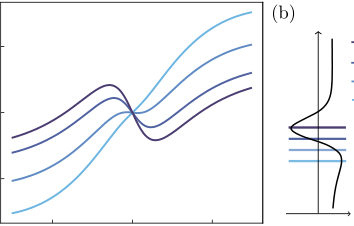 
FIG. 4. Magnetic field dependence of the Hall conduc- tivity σh xy near resonance. (a) Negative Hall conductivity −σh xy of the holes in the presence of an exciton condensate as a function of the magnetic field B for several values of ∆ near resonance. At large B, the negative slope (a hallmark of condensation) disappears, as a consequence of strong magne- toresistive effects. (b) Corresponding ρh xy at fixed B = 0.1 T.

**Summary.** The paper proposes using charge transport measurements to detect exciton condensation in semiconductor heterostructures. By modeling the system as an interacting Bose-Fermi mixture tunable via a Feshbach resonance, the authors predict two distinct signatures: a general resistivity drop and a highly characteristic sign reversal in the Hall resistivity ($
ho_{hxy}$). This establishes charge transport as a powerful diagnostic tool for studying excitonic quantum phases.

**Why it may be interesting.** This work bridges concepts from ultracold atomic physics (Feshbach resonance, BEC diagnostics) into solid-state condensed matter systems, providing a concrete transport measurement analogue for studying quantum phase transitions like exciton condensation.

Detailed structure

**Main problem.** The primary goal is to find a measurable signature of exciton condensation in semiconductor heterostructures using charge transport measurements.

**Main result.** Two key signatures are established: (1) A general reduction in resistivity due to suppressed carrier scattering, and (2) A striking sign reversal in the Hall resistivity ($
ho_{hxy}$) when a tunable solid-state Feshbach resonance is present.

**Method.** The analysis employs kinetic theory by deriving and solving coupled Boltzmann equations for three quasiparticle species near an avoided crossing induced by exciton-carrier hybridization.

**Model / system.** The system models strongly interacting Bose-Fermi mixtures in semiconductor heterostructures, specifically using Transition Metal Dichalcogenide (TMD) layers. The interactions are tunable via a solid-state Feshbach resonance, leading to the formation of hybridized fermionic bands.

**Key observables.** Resistivity ($
ho_{hxx}, 
ho_{hxy}$), particularly focusing on the sign reversal and magnitude changes in $
ho_{hxy}$.

**Important parameters / regimes.** Temperature ($T$), detuning ($\Delta$) relative to resonance, and coupling strengths ($g$).

**Assumptions / limitations.** The analysis relies on mean-field treatments for condensation, a kinetic theory approach using coupled Boltzmann equations, and approximations regarding the magnetic field regimes (small vs. large $B$).

**Figures summary.** Figures illustrate $
ho_{hxy}$ versus detuning ($\Delta$) showing the characteristic sign reversal upon condensation, and $
ho_{h}^{xx}$ showing peak narrowing with increasing condensate density.

**Paper structure.** The paper progresses from identifying the physical problem to developing a theoretical framework using coupled Boltzmann equations. It analyzes different limits (small/large B) and derives specific diagnostic signatures based on band reconstruction and scattering phase space changes.

Abstract

Direct evidence of exciton condensation in semiconductor heterostructures remains elusive. Here we propose charge transport of doped carriers as a probe of exciton condensation in transition-metal dichalcogenide heterostructures and identify distinct experimental signatures. First, condensation suppresses the phase space for carrier scattering, leading to a reduction in resistivity, that provides a general diagnostic of exciton condensation. Second, in heterostructures with a tunable solid-state Feshbach resonance, condensate-induced hybridization between doped carriers and trion bound states qualitatively modifies transport. In particular, near resonance, this hybridization yields a negative effective mass and a corresponding sign reversal of the Hall resistivity. These results establish charge transport as a promising route for detecting and characterizing exciton condensation in semiconductor heterostructures.

[↑ back to top](#top)

### [Translationally Covariant Modulated Symmetries: Classification and Goldstone](http://arxiv.org/abs/2606.07952v1)

**Authors:** Bo-Ting Chen, Zihan Zhou, Biao Lian  
**Type:** theory · **Category:** other · **PDF:** <https://arxiv.org/pdf/2606.07952v1>  
**Analysis basis:** full PDF text, analyzed in chunks
**Topic relevance:** 🔥 `analog quantum simulation` **4/5** · `driven-dissipative phase transition` **2/5** · `non-equilibrium dynamics` **2/5** · `non-equilibrium universality` **2/5** · `Frenkel-Kontorova` **1/5** · `Keldysh / 2PI / non-Gaussian methods` **1/5** · `correlated / nonlocal dissipation` **1/5** · `entanglement & information structure` **1/5** · `methods for driven-dissipative` **1/5**

📷 Fig 1

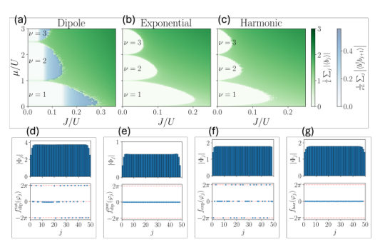 
FIG. 1. (a)-(c): Mean-field phase diagram of deformed Bose- Hubbard models in Tab. I with (a) dipole (U ′ = U/2), (b) exponential (U ′ = 0), and (c) harmonic (U ′ = 0) TCMSs, computed for L = 50 sites with open boundary condition and a maximum on-site boson number cutoff Nmax = 20 (see numerical methods in the SM [47]). (d)-(g): The order parameters Φj = ⟨Ω|ˆΦj|Ω⟩= |Φj|eiφj of the SSB phases with respect to spatial position j. Panels (d),(f) and (g) show Φj = ⟨ˆbj⟩at (µ/U, J/U) = (1.5, 0.3) for the dipole model, ex- ponential model and harmonic model, respectively. Panel (e) shows Φj = ⟨ˆb† jˆbj+1⟩at (µ/U, J/U) = (0.3, 0.2) for the dipole model. In each panel, the upper plot shows the order...

📷 Fig 2

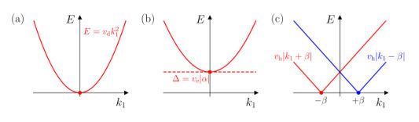 
FIG. 2. Schematic dispersions of the Nambu-Goldstone modes arising from spontaneous breaking of the three classes of mod- ulated symmetries, assuming k⊥= 0. (a) Multipole: a single gapless mode with quadratic dispersion E = vdk2 1, consistent with the conventional Goldstone theorem. (b) Exponential: an intrinsically gapped mode with dispersion E = ve p

**Summary.** This theoretical work classifies modulated global symmetries (TCMS) compatible with translationally invariant Hamiltonians. It derives the low-energy effective action for SSB based on the symmetry type (multipole, exponential, harmonic). The key finding is that breaking these symmetries leads to exotic Goldstone modes, modifying conventional theorems and predicting unique spectral features.

**Why it may be interesting.** It provides a powerful, systematic framework to analyze exotic gapless excitations in strongly correlated systems beyond standard symmetries, directly impacting understanding of quantum phases.

Detailed structure

**Main problem.** To classify translationally covariant modulated symmetries (TCMS) and derive the universal effective Goldstone action for their spontaneous symmetry breaking (SSB).

**Main result.** The nature of the broken symmetry dictates the low-energy excitation spectrum: multipole yields higher-order dispersion, harmonic yields modes at finite momenta, and exponential yields no gapless mode.

**Method.** The analysis uses algebraic classification based on commutation relations (Jordan normal form) and derives effective Lagrangians via coset construction techniques.

**Model / system.** The study applies to quantum many-body systems, exemplified by 1D deformed Bose-Hubbard models exhibiting dipole, exponential, or harmonic modulated symmetries.

**Key observables.** Goldstone mode dispersions ($\omega$ vs $k$), order parameters (e.g., $\langle\hat{b}^\dagger_j \hat{b}_{j+1}
angle$), and the structure of the effective Lagrangian components ($M, W^{\mu
u}$).

**Important parameters / regimes.** The symmetry type is characterized by the structure constant matrix $A_\mu$, which dictates whether the symmetry is multipole, exponential, or harmonic.

**Assumptions / limitations.** The analysis focuses on continuous Abelian TCMSs and often employs mean-field approximations or variational ansatzes for calculations.

**Figures summary.** Figures schematically show dispersion relations for different symmetries (e.g., quadratic dispersion for multipole), and tables summarize the resulting Goldstone Lagrangians.

**Paper structure.** The paper proceeds by defining TCMSs, classifying them based on algebraic constraints (Jordan form), deriving the generic low-energy action using coset methods, and finally analyzing the specific consequences of SSB for each symmetry type.

Abstract

Modulated symmetries are global symmetries with a spatially dependent unit of charge, such as the dipole symmetry and the exponential symmetry. We give the generic condition for a modulated symmetry to be compatible with translationally symmetric Hamiltonians, which we define as a translationally covariant modulated symmetry (TCMS). For Abelian TCMSs, we prove that their units of charge can only contain multipole, exponential and harmonic components. Particularly, we classify all the one-dimensional TCMSs by real Jordan normal form blocks. We further derive the generic Goldstone action for SSB phases of continuous TCMSs, by which we show that a broken multipole symmetry gives higher-order gapless Goldstone modes, a broken harmonic symmetry gives gapless Goldstone modes at finite momenta, and a broken exponential symmetry gives no gapless Goldstone modes, modifying the conventional Goldstone theorem.

[↑ back to top](#top)

### [Numerical solution of the nonlinear Dirac equation by a splitting variational quantum algorithm](http://arxiv.org/abs/2606.08053v1)

**Authors:** Qian Zuo, Ying He, Xiaofei Zhao  
**Type:** theory · **Category:** quantum information and computing · **PDF:** <https://arxiv.org/pdf/2606.08053v1>  
**Analysis basis:** full PDF text, analyzed in chunks
**Topic relevance:** 🔥 `quantum measurements` **4/5** · `measurement-induced transitions` **3/5** · `methods for driven-dissipative` **3/5** · `non-equilibrium dynamics` **2/5** · `Keldysh / 2PI / non-Gaussian methods` **1/5** · `driven-dissipative phase transition` **1/5**

📷 Fig 1

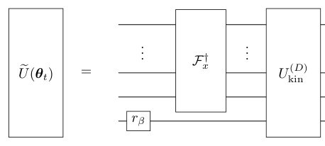 
Fig. 1. Overall circuit realization of eU(θt) = USFDP(τ)U(θt). The circuit is read from right to left. The rightmost block prepares the input spinor state, Fx = QFT ⊗Is maps the position register to the Fourier basis, U(D) kin implements the momentum-controlled kinetic spin rotation, and F† x returns the state to the position basis. The leftmost gate rβ = Rz(2τ) applies the mass-induced spin rotation on the spin qubit; equivalently, its lift to the full position-spin register is Rβ = Ix ⊗rβ.

📷 Fig 2

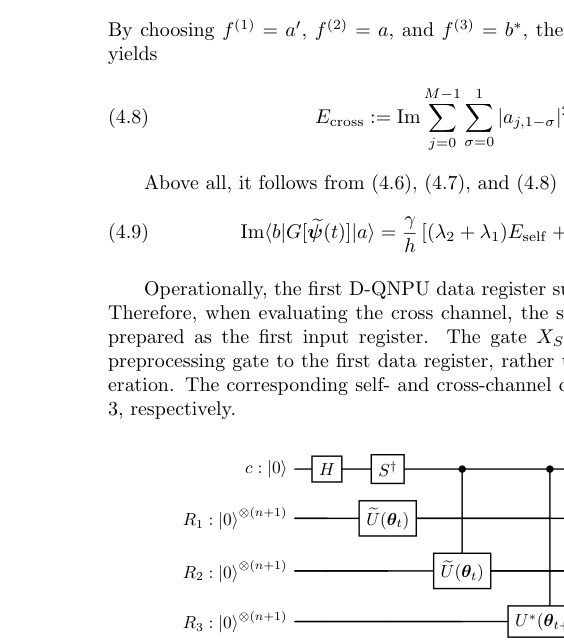 
Fig. 2. Measurement circuit for the self-channel observable Eself. Each data wire denotes an (n + 1)-qubit register, consisting of n position qubits and one spin qubit.

📷 Fig 3

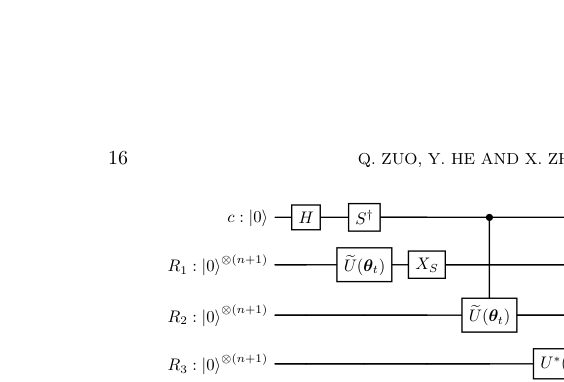 
Fig. 3. Measurement circuit for the cross-channel observable Ecross. The spin-flip gate XS = I⊗n x ⊗Xs is applied unconditionally to the first data register to prepare |a′⟩= XS|a⟩.

📷 Fig 4

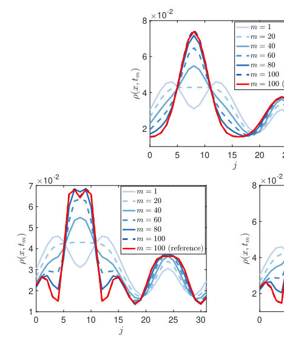 
Fig. 4. Representative Dirac-sVQA solutions for the three benchmark cases. The three panels correspond to Case I, Case II, and Case III, respectively. For clarity, only representative final-time profiles are shown.

📷 Fig 5

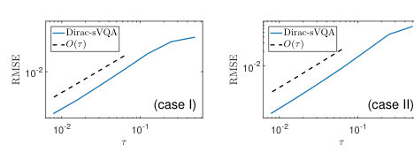 
Fig. 5. Temporal accuracy of Dirac-sVQA for the three nonlinear benchmark cases. The first, second, and third columns correspond to Case I, Case II, and Case III, respectively.

**Summary.** The paper presents Dirac-sVQA, a novel operator-splitting variational quantum algorithm designed to simulate the nonlinear Dirac equation. It tackles the difficulty of state-dependent non-unitary evolution by decomposing the problem into a unitary linear step and a measurable nonlinear correction term. The results demonstrate that this hybrid approach accurately captures complex spinor dynamics, providing strong evidence for applying VQA methods to nonlinear relativistic wave equations.

**Why it may be interesting.** This work directly addresses the challenge of simulating non-unitary, state-dependent dynamics (like those in many interacting quantum systems) on near-term quantum hardware by mapping them onto variational optimization problems using measurement techniques.

Detailed structure

**Main problem.** The primary goal is to develop a quantum algorithm capable of numerically simulating the time evolution governed by the nonlinear Dirac equation (NLDE).

**Main result.** The proposed Dirac-sVQA successfully captures both total density and componentwise spinor dynamics, showing convergence rates comparable to advanced classical splitting methods.

**Method.** It employs an operator-splitting variational quantum algorithm that separates the evolution into a unitary linear substep (using Fourier transforms) and a state-dependent nonlinear correction implemented via measurement-based variational updates.

**Model / system.** The system is modeled by the 1D NLDE, which describes the time evolution of a complex-valued spinor field $\Psi(t, x)$ involving spin-momentum coupling. The nonlinearity $F(\Psi)$ makes the evolution state-dependent and non-unitary.

**Key observables.** Total density ($
ho$), componentwise spinor dynamics ($|\Psi_0|^2, |\Psi_1|^2$), Root Mean Square Error (RMSE), Overlap ($E_{	ext{ov}}$), Self-channel ($E_{	ext{self}}$), and Cross-channel ($E_{	ext{cross}}$) expectation values.

**Important parameters / regimes.** Nonlinearity coupling constants ($\lambda_1, \lambda_2$), timestep size ($	au$), and ansatz circuit depth ($d$).

**Assumptions / limitations.** The nonlinear term is approximated by reformulating the state-dependent map as minimizing a measurable cost function using specialized quantum measurements (D-QNPU).

**Figures summary.** Figures illustrate measurement circuits for nonlinear observables, temporal convergence showing $\mathcal{O}(	au)$ error scaling, and diagnostics comparing ansatz expressibility ($	ext{DKL}$) versus numerical accuracy ($	ext{RMSE}$).

**Paper structure.** The paper introduces the NLDE, details the operator splitting into linear (SFDP) and nonlinear parts, describes the quantum implementation of each part using QFTs and a D-QNPU, formulates the measurable cost function, and concludes with numerical benchmarking against classical solvers.

Abstract

In this work, we propose an operator-splitting variational quantum algorithm, termed Dirac-sVQA, for simulating the nonlinear Dirac equation (NLDE). The main difficulty arises from the state-dependent nonlinear interaction, its time-discrete update depends explicitly on the intermediate spinor state and, in general, cannot be implemented as a fixed state-independent unitary circuit. To address this difficulty, we decompose the NLDE evolution into a structured linear Dirac substep and a nonlinear variational correction. The linear substep is implemented by a spinor-Fourier Dirac propagator on a joint position-spin register, preserving the spin-momentum coupling and mass-induced spin evolution of the Dirac operator. The nonlinear correction is reformulated as a measurement-based variational update through a small set of overlap, self-channel, and cross-channel observables. We provide the corresponding quantum circuits and derive measurement-aware resource and complexity estimates. Numerical experiments in several nonlinear regimes show that Dirac-sVQA accurately captures both the total density and the componentwise spinor dynamics, agrees well with classical Fourier pseudospectral splitting solutions, and exhibits stable error behavior over time. These results provide numerical evidence for the feasibility of operator-splitting variational quantum simulation for nonlinear relativistic wave equations.

[↑ back to top](#top)

### [Suppressing the Motion of Rydberg Atoms in Inhomogeneous Electric Fields via Stark Echo](http://arxiv.org/abs/2606.09759v1)

**Authors:** Dominik Jakab, Manuel Kaiser, Conny Glaser, David Petrosyan, József Fortágh, Andreas Günther  
**Type:** both · **Category:** other · **PDF:** <https://arxiv.org/pdf/2606.09759v1>  
**Analysis basis:** full PDF text, analyzed in chunks
**Topic relevance:** 🔥 `Rydberg arrays` **4/5** · `analog quantum simulation` **3/5** · `QC/QI experiment` **2/5** · `quantum measurements` **2/5** · `methods for driven-dissipative` **1/5** · `non-equilibrium dynamics` **1/5** · `quantum optics experiment` **1/5**

📷 Fig 1

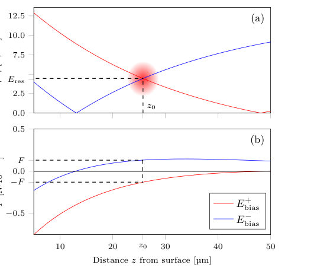 
FIG. 1. Electric field and resulting Stark force near the chip surface. (a) Magnitude of the total electric field |E(z)| as a function of distance z from the chip surface, including the exponentially decaying surface field and the tunable bias. Red and blue lines correspond to Ebias = −4.02 V/cm and −12.93 V/cm, respectively. At the position of the atomic cloud (z0 = 25.75 µm), both values of the bias field produce the same total field magnitude (|Eres| = 4.45 V/cm), but with field gradients of opposite sign. The red shaded area illus- trates the spatial extent of the cloud. (b) Stark force F(z) experienced by 87Rb atoms in the 42S1/2 Rydberg state, cal- culated for the above field with...

📷 Fig 2

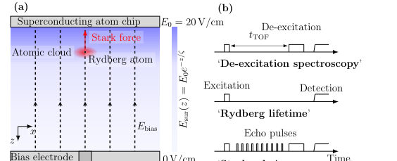 
FIG. 3. Schematics of the experiment. (a) A cloud of atoms (red) is magnetically trapped at a distance of z0 ≈ 25 µm below a superconducting atom chip. The atoms are located in a stray electric field (blue shaded gradient) de- caying exponentially with distance from the chip surface, Esur(z) = E0 exp(−z/ζ), and a homogeneous bias field Ebias (black dashed arrows) is generated by an electrode placed 4.5 mm below the chip surface, forming a plate capacitor with the chip. The inhomogeneous total electric field produces a position-dependent Stark force (red arrow), which accelerates the atoms and shifts the Rydberg energy level. (b) Pulse sequences for the three measurement protocols. Top: de-...

📷 Fig 3

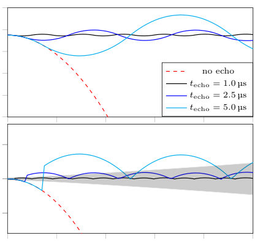 
FIG. 2. Numerical simulation of Stark echo suppression of motional level shift. (a) Simulated center-of-mass position ⟨z⟩as a function of tTOF for atoms excited from an atomic cloud centered at z0 = 25.75 µm with temperature T = 1 µK. The solid black, blue and cyan lines show the results using Stark echo with techo = 1 µs, 2.5 µs and 5 µs, respectively. Due to the echo sequence, the atoms oscillate around their initial position, with the oscillation amplitude depending on techo. The dashed red line shows the trajectory without the echo sequence, with the atoms rapidly accelerating away from their initial position. (b) Corresponding mean level shift ⟨∆ωr⟩of 42S1/2 Rydberg atoms. The solid...

📷 Fig 4

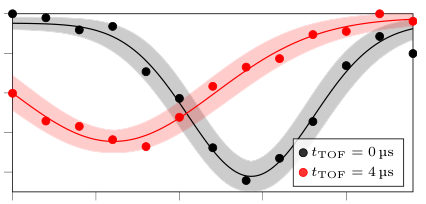 
FIG. 4. De-excitation spectra of Rydberg atoms mea- sured for ∆ωexc/2π ≈150 MHz and different tTOF after excitation. Black circles: Spectrum for tTOF = 0, with an inverted Gaussian fit (solid line) yielding a detuning of ∆ωde-exc/2π = −1.4 MHz and a FWHM of 17.7 MHz. Red circle: Spectrum after tTOF = 4 µs, showing a pronounced red shift (∆ωde-exc/2π = −17.9 MHz) and spectral broaden- ing (FWHM = 28.7 MHz). Each data point is averaged over Nrep = 1000 pulse sequences. The error band denotes the 1σ confidence interval of the fit.

📷 Fig 5

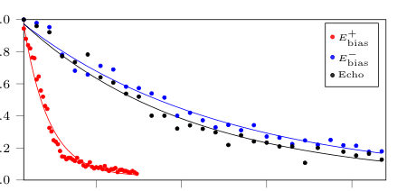 
FIG. 6. Rydberg state population after given tTOF as de- duced from the total number of ion counts for Nrep = 1000 excitation-detection cycles and normalized to the tTOF = 0 value. Atoms are excited at a total field magnitude of |Eres| = 4.45 V/cm. Red: Field gradient accelerating atoms toward the chip, leading to rapid signal loss. Blue: Reversed field gradient accelerating atoms away from the chip and ex- tending detection time. Black: Application of the echo pulse sequence effectively cancels the Stark-induced position shift, preserving the Rydberg signal for durations approaching the natural lifetime. The solid lines are exponential decay fits yielding lifetimes of 5.92 µs, 47.12 µs and...

**Summary.** The paper addresses the challenge of maintaining Rydberg atom coherence when trapped near imperfect superconducting surfaces due to inhomogeneous electric fields. By implementing a tailored Stark echo pulse sequence that dynamically reverses the force, the authors successfully suppress atomic motion and prevent detrimental time-dependent energy level shifts. This provides a robust method for realizing high-fidelity quantum operations on integrated atom chips.

**Why it may be interesting.** This work provides a crucial coherence preservation technique for using Rydberg atoms in solid-state quantum circuits. It shows how fundamental control over external fields can counteract environmental decoherence sources arising from device imperfections.

Detailed structure

**Main problem.** Inhomogeneous stray electric fields near superconducting atom chips induce position-dependent Stark forces on Rydberg atoms, causing atomic motion and time-dependent shifts in energy levels.

**Main result.** Implementing a Stark echo sequence dynamically reverses the force, effectively suppressing atomic motion and maintaining the coherence of Rydberg atoms for extended periods. This technique is robust and relies only on global field control.

**Method.** The authors combine theoretical modeling (using an exponentially decaying surface field) with experimental measurements using time-of-flight spectroscopy to test and implement a pulsed Stark echo sequence.

**Model / system.** The system involves Rydberg atoms trapped near a superconducting chip. The physics is governed by the position-dependent Stark shift, $E(\vec{E}) = -rac{1}{2}\alpha_0 E^2$, where the field $E(z)$ includes both surface and bias components.

**Key observables.** Average Rydberg level shift ($\langle\Delta\omega_r
angle$), spatial confinement ($\langle z 
angle$ vs. TOF), and residual spectral broadening.

**Important parameters / regimes.** The decay length of the surface field ($\zeta$), the time-of-flight ($t_{	ext{TOF}}$ or $t_{	ext{echo}}$), and the strength of the applied bias field ($E_{	ext{bias}}$).

**Assumptions / limitations.** The method relies solely on global field control, and hardware limitations constrain the minimum echo time to be greater than $\approx 3.4 \mu	ext{s}$.

**Figures summary.** Figures compare the mean level shift ($\langle\Delta\omega_r
angle$) over time-of-flight with and without the echo sequence; results show near-complete suppression of the shift when the echo is applied.

**Paper structure.** The paper first establishes the problem (field-induced motion/shift), develops a theoretical model incorporating surface fields, presents experimental measurements showing rapid decay/shifting without correction, and finally demonstrates that the Stark echo sequence successfully cancels these accumulated shifts.

Abstract

Rydberg atoms possess strong electric dipole transitions and tunable energy levels, making them promising candidates for microwave to optical conversion on integrated superconducting atom chips. Achieving strong coupling of the atoms to e.g. the microwave field of an on-chip resonator requires placing the atoms within tens of micrometers from the chip surface. However, inhomogeneous stray electric fields originating from the surface can induce position-dependent Stark forces, resulting in atomic motion and leading to time-dependent shifts of the Rydberg energy levels. We experimentally investigate these effects using time-of-flight and spectroscopic techniques, observing substantial level shifts and signal loss attributable to field-induced atomic motion. A theoretical model incorporating an exponentially decaying surface field with a superimposed bias accurately reproduces the observed dynamics. To mitigate the level shift, we introduce a Stark echo sequence that dynamically reverses the force. This approach suppresses the atomic motion and maintains the atomic resonance. The method relies solely on global field control and is compatible with atom-resonator coupling architectures, providing a robust strategy for preserving coherence of Rydberg atoms in inhomogeneous electric fields near surfaces.

[↑ back to top](#top)

### [Coexistence of High Temperature Superconductivity and Antiferromagnetic Order in a Cuprate with Multiple Hole Fermi Pockets](http://arxiv.org/abs/2606.08643v1)

**Authors:** Xiangyu Luo, Yinghao Li, Hao Chen, Yiwen Chen, Jumin Shi, Taimin Miao, Bo Liang, Wenpei Zhu, Neng Cai, Xiaolin Ren, Yingjie Shu, Chaohui Yin, Jiuxiang Zhang, Chengtian Lin, Shenjin Zhang, Zhimin Wang, Fengfeng Zhang, Feng Yang, Qinjun Peng, Zuyan Xu, Guodong Liu, Xintong Li, Hanqing Mao, Tao Xiang, Lin Zhao, X. J. Zhou  
**Type:** both · **Category:** strongly correlated electrons · **PDF:** <https://arxiv.org/pdf/2606.08643v1>  
**Analysis basis:** full PDF text, analyzed in chunks
**Topic relevance:** 🔥 `analog quantum simulation` **4/5** · `Keldysh / 2PI / non-Gaussian methods` **3/5** · `methods for driven-dissipative` **2/5** · `Kondo & dissipative impurity` **1/5** · `entanglement & information structure` **1/5** · `exotic spin models in light-matter` **1/5** · `non-equilibrium dynamics` **1/5**

📷 Fig 1

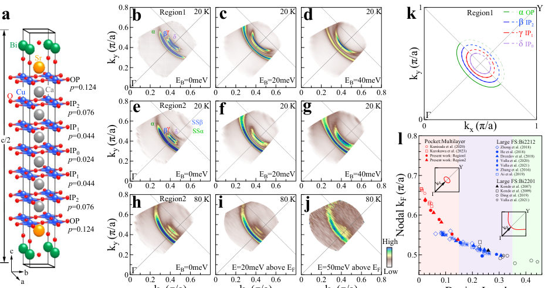 
FIG. 1. Observation of multiple Fermi pockets in Bi2267. (a) Crystal structure of Bi2267.

📷 Fig 2

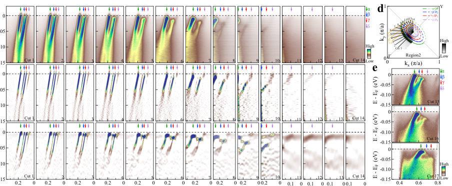 
FIG. 2. Momentum-dependent band structures of Bi2267 measured at 20 K in Re-

📷 Fig 3

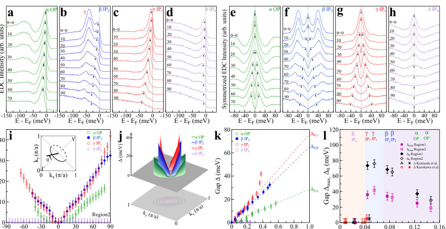 
FIG. 3. Photoemission spectra and the energy gap of Bi2267 along the Fermi pockets

📷 Fig 4

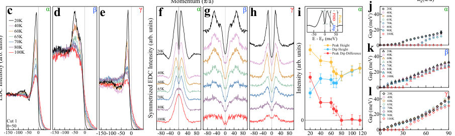 
FIG. 4. Evolution of band structures, photoemission spectra and energy gaps with

📷 Fig 5

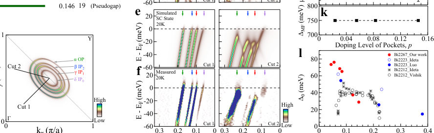 
FIG. 5. Formation of the multiple Fermi pockets in the seven-layer cuprate in terms

**Summary.** This work investigates high-temperature superconductivity in layered cuprates using ARPES, revealing the existence of multiple hole Fermi pockets coexisting with strong antiferromagnetism. By combining experimental data with a mean-field t-U model, the authors argue that robust pairing can occur even when AFM order is present, offering new insights into unconventional pairing mechanisms.

**Why it may be interesting.** For AMO/open quantum systems theorists, the strong correlation physics described by the Hubbard model variant (t-U) is highly relevant. The interplay between magnetic order (AFM) and pairing symmetry ($d$-wave gap structure) provides a rich platform for studying emergent collective phenomena in strongly interacting electron systems.

Detailed structure

**Main problem.** The fundamental mechanism behind high-temperature superconductivity (HTSC) in cuprates, particularly understanding how HTSC coexists with strong antiferromagnetic (AFM) order.

**Main result.** Superconductivity ($T_c \sim 75	ext{ K}$) is observed in a system exhibiting multiple hole Fermi pockets that coexist robustly with strong AFM correlations. This challenges conventional views requiring the suppression of AFM order for superconductivity.

**Method.** The study combines high-resolution Angle-Resolved Photoemission Spectroscopy (ARPES) experiments with theoretical modeling using the mean-field t-U model to analyze electronic structure and gap formation.

**Model / system.** The system is a seven-layer cuprate superconductor ($	ext{Bi}_2	ext{Sr}_2	ext{CaCu}_2	ext{O}_{8+\delta}$), which exhibits multiple hole Fermi pockets derived from different $	ext{CuO}_2$ planes. The theoretical framework employs the mean-field t-U model to describe electronic correlations and interlayer coupling.

**Key observables.** Multiple, distinct hole Fermi pockets ($\alpha, eta, \gamma, \delta$), momentum-, temperature-, and doping-dependent superconducting energy gaps (up to $\sim 42	ext{ meV}$), and the coexistence of $T_c$ with strong AFM order.

**Important parameters / regimes.** Critical temperatures ($T_c \approx 75	ext{ K}$), pairing gap magnitudes ($\Delta$), doping levels ($p \sim 0.05$), and hopping/coupling parameters derived from fitting (e.g., $t, t', t''$).

**Assumptions / limitations.** The analysis assumes that the multiple Fermi pockets arise due to varying doping across different $	ext{CuO}_2$ planes within the layered structure, and that the observed gap opening in inner planes is intrinsic.

**Figures summary.** Figures detail ARPES measurements showing Fermi surface mappings with four distinct pocket types ($\alpha-\delta$) and energy gaps. Theoretical figures illustrate band structures and fitting parameters derived from the mean-field t-U model applied to the seven-layer structure.

**Paper structure.** The paper progresses by first identifying the complex electronic structure via ARPES on multiple pockets, then using a theoretical framework (t-U model) to fit these experimental observations, ultimately arguing that superconductivity and AFM order can coexist in this multi-pocket regime.

Abstract

The intricate relationship between high temperature superconductivity and antiferromagnetic order in cuprates, and the fundamental origin of electron pairing remain open questions. By utilizing high-resolution laser-based spatially-resolved angle-resolved photoemission spectroscopy, we investigate the seven-layer $Bi_{2}Sr_{2}Ca_{6}Cu_{7}O_{18+δ}$ (Bi2267) and identify a cuprate system that consists of multiple hole Fermi pockets. The observed Fermi pockets exhibit pronounced momentum-, temperature- and Fermi surface-dependent energy gaps. Crucially, high temperature superconductivity with a critical temperature ($T_{\mathrm{c}}$) of $\sim$75 K emerges in a system with multiple Fermi pockets and the presence of strong antiferromagnetic order and correlations. In particular, substantial electron pairing is observed along the Fermi pocket with an energy gap up to $\sim$42 meV in lightly-doped CuO$_{2}$ planes ($p\sim$0.05). These findings challenge the conventional understanding of the roles of the nodal and antinodal electronic states in driving high-temperature superconductivity. They show that superconductivity and antiferromagnetism can coexist in a cuprate with multiple Fermi pockets, offering further insights into the pairing mechanism in cuprate superconductors.

[↑ back to top](#top)

### [Defining Unique, Redundant, and Synergistic Quantum Information](http://arxiv.org/abs/2606.07880v1)

**Authors:** Sean Ericson, Hailin Wang, S. J. van Enk  
**Type:** theory · **Category:** quantum information and computing · **PDF:** <https://arxiv.org/pdf/2606.07880v1>  
**Analysis basis:** full PDF text, analyzed in chunks
**Topic relevance:** 🔥 `entanglement & information structure` **4/5** · `analog quantum simulation` **2/5** · `correlated / nonlocal dissipation` **2/5** · `non-equilibrium dynamics` **2/5** · `driven-dissipative phase transition` **1/5** · `methods for driven-dissipative` **1/5** · `non-equilibrium universality` **1/5**

📷 Fig 1

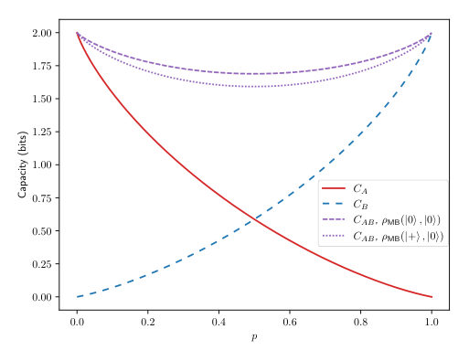 
FIG. 1. Collective and individual two-bit capacities for the states ρMB(|0⟩, |0⟩; p) and ρMB(|+⟩, |0⟩; p). For p = 0, 1, the target is maximally entangled with one of the parties, hence the joint capacity is maximized and equal to that party’s in- dividual capacity. The individual capacities are independent of |ψ⟩and |ϕ⟩, although different choices for these “spectator” states do slightly affect the joint capacity.

📷 Fig 2

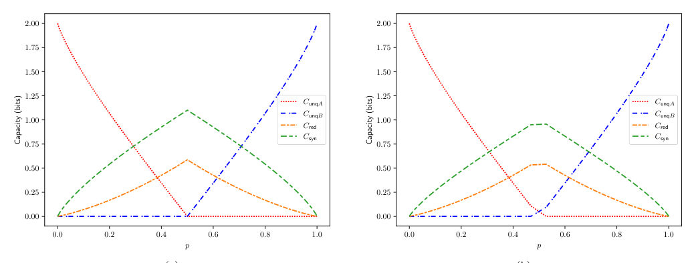 
FIG. 2. C-PID for two instances of the mixed-Bell state. In a) the spectator states are |ψ⟩= |ϕ⟩= |0⟩. The symmetry of this state precludes the possibility of Alice and Bob simultaneously having unique capacity. In b) the spectator states are |ψ⟩= |+⟩ and |ϕ⟩= |0⟩. The asymmetry in this case allows for a range of p values (0.47 ≲p ≲0.52) over which both Alice and Bob have nonzero unique capacity. Note that in this case the state is not invariant under A ↔B and p ↔1 −p, hence the slight asymmetry in the plot.

📷 Fig 3

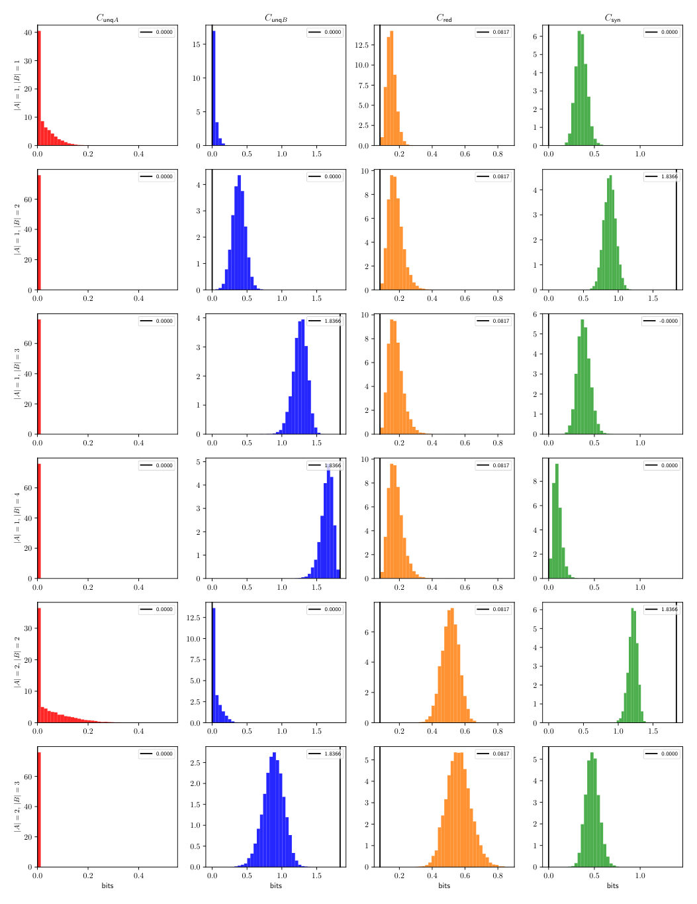 
FIG. 3. Distributions of Cunq, Cred, and Csyn for 10000 random [[5, 1]] encodings for the state given in (33) with λ = 1/3. The corresponding values of the four C-PID quantities for the same partitions of the exact five-qubit code are displayed as vertical lines.

📷 Fig 4

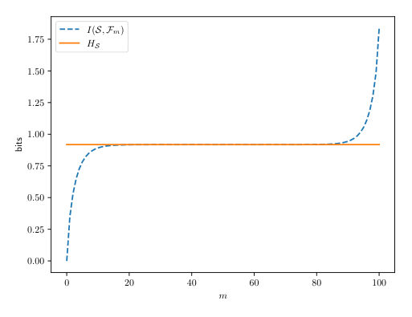 
FIG. 4. Mutual information between system and environ- ment fragment as a function of fragment size with λ = 1/3, sin α = 0.85, and N = 100. For moderately sized fragments (m around 15) the fragment/system mutual information sat- urates at the system entropy. The fragment size needed to reach the plateau is determined by the imperfection parame- ter α.

📷 Fig 5

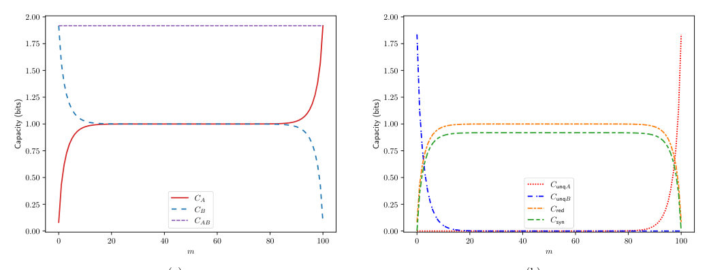 
FIG. 5. a) Collective and individual superdense capacities for the decoherence model as a function of the number of environment qubits in Alice’s possession, with λ = 1/3, sin α = 0.85, and N = 100 environment qubits total. The collective two-bit capacity depends only on the state of the target and not how the environment qubits are partitioned between Alice and Bob. It is maximized for λ = 1/2. As Alice and Bob interact with the target in the same way, their individual two-bit capacities are symmetric under A ↔B and m ↔N −m. b) C-PID for the original decoherence model two-bit capacity. When either party possesses the vast majority of the environment qubits, their information is almost...

**Summary.** This work generalizes the concept of decomposing total information into unique, redundant, and synergistic parts for quantum systems. By applying this Quantum PID framework to error correction codes and decoherence models, it reveals fundamental roles: unique information governs error correction, while redundancy is key to understanding how quantum mechanics yields classical reality.

**Why it may be interesting.** It provides a rigorous mathematical framework for quantifying how information is encoded, lost, or shared in complex physical processes like decoherence, which is central to understanding quantum-to-classical transitions relevant to AMO physics.

Detailed structure

**Main problem.** The paper extends classical Partial Information Decomposition (PID) concepts—unique, redundant, and synergistic information—to quantify these quantities in the quantum domain.

**Main result.** It establishes that unique information is central to quantum error correction codes, while redundant information plays a crucial role in describing the decoherence mechanism.

**Method.** The analysis uses superdense coding capacity ($C_{AB}$) as the primary tool to define and calculate the quantum PID components for various multipartite states.

**Model / system.** The study applies these concepts to Quantum Error Correction (QEC) codes (e.g., bit-flip, five-qubit code) and the decoherence process modeled by environmental interactions.

**Key observables.** Unique quantum information ($C_{	ext{unq}}$), redundant capacity ($C_{	ext{red}}$), synergistic capacity ($C_{	ext{syn}}$), and superdense coding capacities ($C_{AB}, C_A, C_B$).

**Important parameters / regimes.** The entanglement structure of the state ($\lambda$), the number of supported logical operators ($l_A$), and the interaction parameters in decoherence models.

**Assumptions / limitations.** Multiple sensible definitions for quantum PID exist; specific results rely on analyzing pure states or assuming certain code structures (e.g., stabilizer codes).

**Figures summary.** Figures illustrate superdense capacities and C-PID components for decoherence models, showing plateaus and dependence on interaction strength; tables summarize capacity combinations for various QEC codes.

**Paper structure.** The paper builds from defining the quantum PID using general bipartite states to applying it specifically to QEC codes (analyzing subsets A and B) and finally applying it to the decoherence model to explain classical emergence.

Abstract

We extend the classical ideas of the Partial Information Decomposition (PID) to the quantum domain and quantify unique, redundant, and synergistic quantum information. We show that unique information plays the central role in quantum error correction codes: any erasure-correctable subset of encoding qubits must contain zero unique information. Synergistic information between two disjoint subsets of encoding qubits appears when a logical operation is supported on the whole set but not on the subsets separately. In a different application of our PID, we show that redundant quantum information is the crucial feature of the decoherence mechanism proposed by Zurek \textit{et al.} to explain how the classical world emerges out of the quantum world.

[↑ back to top](#top)

### [Scaling Behaviors of Work Cumulants in Slow Isothermal Processes](http://arxiv.org/abs/2606.09552v1)

**Authors:** Ruohan Xu, Yanbo Qiao, H. T. Quan  
**Type:** theory · **Category:** statistical mechanics · **PDF:** <https://arxiv.org/pdf/2606.09552v1>  
**Analysis basis:** full PDF text, analyzed in chunks
**Topic relevance:** 🔥 `non-equilibrium universality` **4/5** · `Keldysh / 2PI / non-Gaussian methods` **3/5** · `non-equilibrium dynamics` **3/5** · `correlated / nonlocal dissipation` **1/5** · `driven-dissipative phase transition` **1/5** · `methods for driven-dissipative` **1/5**

📷 Fig 1

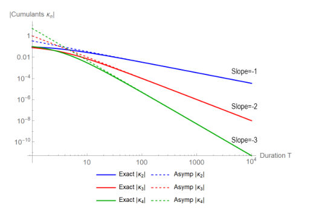 
FIG. 1. Comparison between exact (solid) and asymptotic (dashed) results of case 2. The parameters can be found in the first paragraph of Sec. IV

**Summary.** This work derives the universal power-law scaling for higher-order work cumulants ($\kappa_n \propto T^{-(n-1)}$) during slow isothermal processes in gapped quantum systems. Using advanced field theory techniques, it shows these coefficients are determined by equilibrium geometric properties. This establishes a powerful connection between non-equilibrium fluctuations and static thermodynamic geometry.

**Why it may be interesting.** This provides rigorous, general results on non-equilibrium thermodynamics far from equilibrium, connecting fluctuation theorems (work cumulants) to underlying geometric structures (thermodynamic tensors) in the slow limit.

Detailed structure

**Main problem.** The study focuses on determining the scaling behaviors of work cumulants during slow isothermal processes in gapped quantum systems.

**Main result.** The $n$-th cumulant of work ($\kappa_n$) scales universally as $\kappa_n \propto (1/T)^{n-1}$ for large time durations $T$, with coefficients related to equilibrium thermodynamic geometric tensors.

**Method.** The analysis employs the Martin-Siggia-Rose-De Dominicis-Janssen (MSRDJ) field theory formalism, utilizing connected correlation functions and perturbation theory.

**Model / system.** The system consists of gapped quantum systems driven slowly by time-dependent potentials, modeled via a Langevin equation. The analysis is general for arbitrary smooth protocols but confirmed with examples like the breathing oscillator.

**Key observables.** Work cumulants ($\kappa_n$), excess work ($\kappa_2$), and thermodynamic geometric tensors ($K_n$).

**Important parameters / regimes.** Slow driving time duration $T$, gap size (required for convergence), and protocol parameters $\lambda(t)$.

**Assumptions / limitations.** The derivation fundamentally relies on the existence of a finite mass gap; the scaling breaks down near continuous phase transitions.

**Figures summary.** Figure 1 compares exact results with asymptotic predictions for the work cumulants in the slow-driving limit, showing agreement.

**Paper structure.** The paper builds from established knowledge regarding excess work ($\kappa_2$) to generalize the scaling law for all $\kappa_n$. It first analyzes a simple linear driving case before generalizing the result using MSRDJ theory for arbitrary smooth protocols.

Abstract

We study the cumulants of work in a slow isothermal process for gapped systems. Using the Martin-Siggia-Rose-De Dominicis-Janssen (MSRDJ) formalism and the properties of connected correlation functions, we show that in this process, the $n$-th cumulant of work scales as $1/T^{n-1}$ , where $T$ is the time duration. This result holds generally for arbitrary smooth protocols. Furthermore, we derive the coefficients of the cumulants from equilibrium properties. These coefficients are found to be relevant to thermodynamic geometric tensors.

[↑ back to top](#top)

### [Hidden Conformal Boundary Data in Finite-Temperature Stabilizer Entropy](http://arxiv.org/abs/2606.08606v1)

**Authors:** Reyhaneh Khasseh, M. A. Rajabpour  
**Type:** theory · **Category:** statistical mechanics · **PDF:** <https://arxiv.org/pdf/2606.08606v1>  
**Analysis basis:** full PDF text, analyzed in chunks
**Topic relevance:** 🔥 `entanglement & information structure` **4/5** · `non-equilibrium universality` **2/5** · `Keldysh / 2PI / non-Gaussian methods` **1/5** · `analog quantum simulation` **1/5** · `correlated / nonlocal dissipation` **1/5** · `driven-dissipative phase transition` **1/5** · `methods for driven-dissipative` **1/5** · `non-equilibrium dynamics` **1/5**

📷 Fig 1

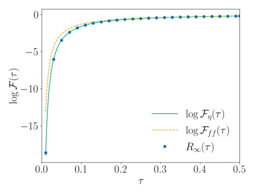 
FIG. 1. Regime-IV crossover in the scaling window β = τL. The blue symbols are finite-size extrapolations of the residual RL(τ) = log SL(τL) −Lf∞+ 1

**Summary.** This theoretical work investigates the finite-temperature stabilizer Rényi entropy of open critical spin chains. By mapping this entropy onto a Pfaffian structure, the authors extract universal scaling functions governing thermal crossovers. The key finding is that these functions reveal hidden 'defect-like' boundary conformal data encoded in an eta quotient, providing deeper insights than standard thermodynamic measurements.

**Why it may be interesting.** It provides a powerful diagnostic tool—the stabilizer entropy—that can detect subtle, non-trivial defect structures in critical quantum systems that are otherwise masked by standard thermodynamic observables.

Detailed structure

**Main problem.** The study aims to determine if the finite-temperature stabilizer Rényi entropy of open critical quantum spin chains reveals hidden conformal boundary data that is invisible to standard thermodynamic measurements.

**Main result.** The crossover function governing the finite-size thermal scaling is found to be a level-eight eta quotient, which differs from ordinary free-boundary Majorana factors and signals defect-like boundary information.

**Method.** The analysis involves reducing an exponentially large sum over absolute minors of a correlation matrix to a single Pfaffian, allowing for the extraction of universal finite-size scaling functions in specific thermal crossover regimes.

**Model / system.** The system studied is the open transverse-field Ising chain at its critical point. The calculations utilize Majorana correlators derived from the Gaussian nature of the thermal Gibbs state and are analyzed across various temperature/size scaling limits.

**Key observables.** Stabilizer Rényi entropy ($M_\alpha(
ho)$), the Pfaffian numerator $S_L(eta)$, and the universal crossover function $F(	au)$.

**Important parameters / regimes.** The finite-size thermal crossover regime ($eta = 	au L$), the Rényi index $\alpha=1/2$, and the inverse temperature $eta$.

**Assumptions / limitations.** The analysis relies on specific gauge choices (staggered Jordan–Wigner gauge) and technical identities relating absolute-minor sums to Pfaffians.

**Figures summary.** Figures compare finite-size extrapolations of residual terms against predicted eta-quotient forms, confirming the deviation from ordinary free-boundary benchmarks in the crossover regime.

**Paper structure.** The paper systematically analyzes four scaling regimes (fixed T, high T, low T saturation, and $eta=	au L$ crossover), deriving functional forms for the entropy using Pfaffian identities and comparing them to known boundary conformal field theory results.

Abstract

We study the finite-temperature stabilizer Rényi entropy of the open critical quantum spin chains. At Rényi index one half, this observable probes the distribution of thermal Pauli-string expectation values and can be written as a sum over absolute values of all square minors of a finite-temperature correlation matrix for the transverse-field Ising chain. We show that this exponentially large sum is exactly reducible to a single Pfaffian. The Pfaffian representation reveals a block Toeplitz--Hankel structure and allows us to extract the large-size scaling in several thermal regimes. In the crossover window where the inverse temperature is proportional to the system size, the stabilizer entropy factorizes into a saturated extensive contribution and a universal finite-size scaling function. We find that this scaling function is a level-eight eta quotient, rather than the ordinary free-boundary Majorana thermal factor. The deviation is exponentially hidden at low temperature but controls the high-temperature crossover, where it gives a Cardy-like asymptotic for the Pauli-string expectation-weight spectrum. These results show that finite-temperature stabilizer entropy reveals hidden defect-like conformal data invisible to ordinary thermodynamic probes.

[↑ back to top](#top)

### [Projected Inverse Iteration: An Eigenvalue Approach to Ground-State Computation with Neural Quantum States](http://arxiv.org/abs/2606.07825v1)

**Authors:** Hang Zhang, Victor Armegioiu, Juan Carrasquilla, Siddhartha Mishra, Johannes Müller, Jannes Nys, Marius Zeinhofer  
**Type:** theory · **Category:** numerical methods · **PDF:** <https://arxiv.org/pdf/2606.07825v1>  
**Analysis basis:** full PDF text, analyzed in chunks
**Topic relevance:** 🔥 `analog quantum simulation` **4/5** · `exotic spin models in light-matter` **3/5** · `methods for driven-dissipative` **2/5** · `correlated cavity matter` **1/5** · `entanglement & information structure` **1/5** · `non-equilibrium dynamics` **1/5**

📷 Fig 1

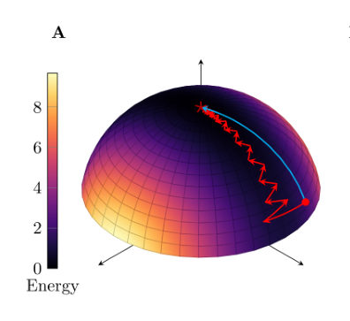 
Fig. 1 Visualization of SR (red) and PII (cyan) for the Hamiltonian ˆH = diag(1, 10, 0) and a linear normalized state vector on the sphere S. Figure A visualizes the optimization dynamics on the sphere, and Figure B shows the corresponding energy error. PII converges in essentially a single step for the shift value τ = 10−8. SR with learning rate η = 0.1 converges slowly with oscillating iterates, due to the large eigenvalue spread (Γ = 10) and the small spectral gap (∆= 1).

📷 Fig 2

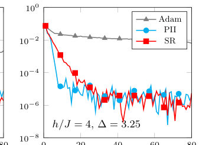 
Fig. 2 Spectral-gap dependence distinguishes PII from SR. A, Optimization trajectories for the 4 × 4 TFIM in a regime with a small spectral gap (h/J = 2, ∆= 0.015), plotted as relative error ε versus iteration for PII, SR and Adam, where ε = |(EViT −EED) /EED|. All runs use the same number of Monte Carlo samples (M = 32,768) and a positive real-valued ViT ansatz (4 layers, hidden dimension d = 20, and h = 2 heads). PII uses a learning rate η = 1.0 and Tikhonov regularization λ = 0.01, whereas SR uses η = 0.01 and λ = 10−4. Adam is included as a standard first-order baseline, with its best learning rate η = 0.01. B, The same comparison in a larger-gap regime (h/J = 4, ∆= 3.25). PII shows...

📷 Fig 3

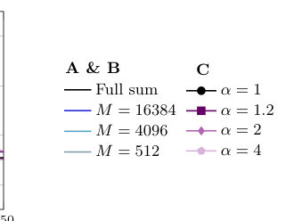 
Fig. 3 Shift undershooting stabilizes PII in a quasi-degenerate TFIM. Relative ground- state energy error versus iteration for the 4×4 TFIM at h/J = 2. A, Without undershooting (τ = E0), Monte Carlo noise prevents PII from converging for small batch sizes (M = 512 and M = 4096). B, With undershooting (τ = 1.2 E0), trajectories stay stable across batch sizes. C, In the noise-free full-sum limit, sweeping τ = αE0 follows the predicted contraction rPII, showing a direct trade-off between robustness and speed. All trajectories use λ = 0.1 and η = 1.0. All results are produced with a real-valued RBM ansatz (hidden-variable density α = 4 [6]).

📷 Fig 4

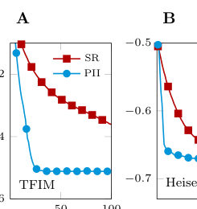 
Fig. 4 PII acceleration at large 10 × 10 lattices. Energy per site during the optimization, comparing SR and PII for three canonical 2D spin- 1

**Summary.** This paper introduces Projected Inverse Iteration (PII) as an advanced eigenvalue approach for finding the ground state energy using Neural Quantum States. PII reframes the problem to leverage classical inverse iteration, which is shown to be robust and fast even when the system has small spectral gaps. It provides a superior alternative to standard gradient descent methods like Stochastic Reconfiguration for complex quantum simulations.

**Why it may be interesting.** For AMO physicists working with complex Hamiltonians or open quantum systems where ground state properties are key, this offers a robust numerical tool that bypasses the known limitations of gradient-based optimization methods in near-degenerate regimes.

Detailed structure

**Main problem.** The primary challenge is efficiently optimizing variational wavefunctions (Neural Quantum States) to find the ground state energy of quantum many-body systems.

**Main result.** Projected Inverse Iteration (PII) achieves rapid, gap-insensitive convergence for ground-state finding, significantly outperforming standard gradient methods like Stochastic Reconfiguration (SR) when spectral gaps are small.

**Method.** The authors reframe the ground-state search as an eigenvalue problem and adapt classical inverse iteration by projecting the update direction onto the finite-dimensional tangent space of the variational manifold.

**Model / system.** The methods are tested on challenging two-dimensional spin systems, including the highly frustrated J1-J2 model and the Transverse-Field Ising Model (TFIM).

**Key observables.** Convergence rate ($
ho$), relative error ($\epsilon$), ground state energy ($E_0$), spectral gap ($\Delta = E_1 - E_0$), and spectral spread ($\Gamma$).

**Important parameters / regimes.** The choice of energy shift parameter ($	au$) and the regularization strength ($\lambda$) are critical hyperparameters.

**Assumptions / limitations.** The analysis relies on deriving algorithms from non-parametric functional settings, though practical implementation uses Galerkin projection onto the tangent space defined by neural network parameters.

**Figures summary.** Figures compare PII's superior convergence speed and gap insensitivity against SR's degradation when spectral gaps are small; other figures illustrate the effect of energy shifts ($	au$) on stability.

**Paper structure.** The paper establishes the problem (NQS optimization), introduces PII as an eigenvalue approach, provides theoretical convergence bounds for both PII and SR based on Riemannian geometry, and validates PII's superior performance across various physical models.

Abstract

Deep learning offers a powerful approach to quantum many-body problems via neural network wavefunctions, but their optimization remains a severe bottleneck. Existing optimization methods, including natural gradient descent and stochastic reconfiguration, suffer from spectral gap-dependent convergence that limits their effectiveness on systems fraught with competing orders and nearly degenerate ground states, such as frustrated magnets and strongly correlated electron materials. Here, we introduce Projected Inverse Iteration (PII) by re-framing the ground-state search as an eigenvalue problem. PII achieves rapid, gap-insensitive convergence while preserving the favorable polynomial computational scaling of stochastic reconfiguration. Demonstrated on challenging two-dimensional spin systems, including the highly frustrated $J_1$-$J_2$ model, PII outperforms standard optimization techniques and presents a promising algorithmic strategy for discovering complex quantum states in the presence of small spectral gaps. More broadly, PII can be interpreted as a novel natural gradient method tailored for eigenvalue problems, opening up its application to related challenges within deep learning.

[↑ back to top](#top)

### [Topological bound states in the continuum with controllable multiplicity](http://arxiv.org/abs/2606.08510v1)

**Authors:** Ya-Ping Lou, Wei Jia  
**Type:** theory · **Category:** other · **PDF:** <https://arxiv.org/pdf/2606.08510v1>  
**Analysis basis:** full PDF text, analyzed in chunks
**Topic relevance:** 🔥 `analog quantum simulation` **4/5** · `driven-dissipative phase transition` **2/5** · `Frenkel-Kontorova` **1/5** · `Keldysh / 2PI / non-Gaussian methods` **1/5** · `correlated / nonlocal dissipation` **1/5** · `entanglement & information structure` **1/5** · `methods for driven-dissipative` **1/5** · `non-equilibrium dynamics` **1/5**

📷 Fig 1

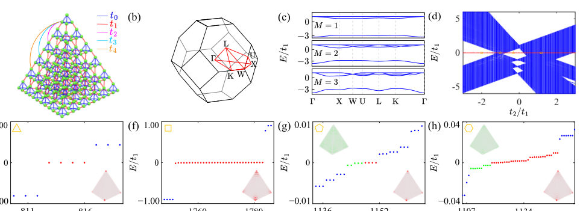 
FIG. 1. (a) Schematic diagram of generalized 3D breathing pyrochlore lattice when taking M = 4. (b) The Brillouin zone of Hamiltonian (1), where Γ = (0, 0, 0), X = (2π, 0, 0), W = (2π, 0, π), U = (2π, π/2, π/2), L = (π, π, π) and K = (3π/2, 0, 3π/2) are six high symmetry points. (c) Band structures along Γ-X-W-U-L-K-Γ line for M = 1 with t0 = 0.1t1, M = 2 with (t0/t1, t2/t1) = (0.1, 0.1), and M = 3 with (t0/t1, t2/t1, t3/t1) = (0.1, 0.1, 0.1). (d)-(h) The kx,y,z-OBC energy spectrum when taking M = 2 and t0 = 0.1t1, where the system size is 15 × 15 × 15. The insets give the real-space distributions of zero-energy states for (e) t2 = −0.3t1, (f) t2 = −2t1, (g) t2 = −t1, and (h) t2 = 1.2t1.

📷 Fig 2

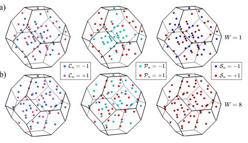 
FIG. 2. Numerical results of topological charges, charge po- larizations, and polarized topological charges for (a) t2 = −t1 and (b) t2 = 1.2t1, giving W = 1 and W = 8, respectively. The other parameters are t0 = 0.1t1 and M = 2.

📷 Fig 3

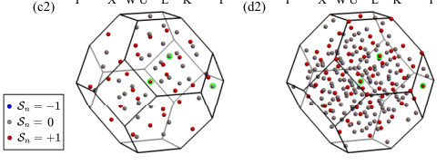 
FIG. 3. (a) Topological phase diagram determined by W, where the shaded regions mark the metallic phase. Three distinct phase boundaries correspond to the bulk gap clos- ing at Γ (pink), X (black), and certain non-high-symmetry point (blue), respectively. (b1)-(d1) The band structures with (t2/t1, t3/t1) = (−1.1, 0), (0.9, 0), and (−1, 1.1). (b2)-(d2) The distribution of polarized topological charges in the BZ. The green circles denote these polarized topological charges be located at the Γ, L and X points. The other parameters are t0 = 0.1t1 and M = 3.

**Summary.** This paper introduces a theoretical framework to study corner-localized topological Bound States in the Continuum within a 3D pyrochlore lattice model. By developing an effective edge theory and using polarized topological charges, the authors demonstrate that these states can be controlled in number and characterized through distinct phase transitions. This work opens a pathway for experimentally realizing and understanding highly robust localized quantum states.

**Why it may be interesting.** This work is highly relevant because it applies topological concepts (like winding numbers and protected states) to a complex, realistic lattice geometry (pyrochlore), providing concrete theoretical tools for engineering exotic quantum phenomena in solid-state or photonic systems.

Detailed structure

**Main problem.** The primary challenge addressed is realizing and theoretically characterizing corner-localized topological Bound States in the Continuum (BICs) within a three-dimensional lattice structure, especially controlling their multiplicity.

**Main result.** The authors propose that these BICs can emerge in a generalized breathing pyrochlore lattice, demonstrating that their number can be arbitrarily tuned by modifying inter-cell hopping parameters. They also characterize three distinct types of topological phase transitions associated with bulk gap closing mechanisms.

**Method.** The study employs advanced theoretical techniques including deriving effective 1D edge Hamiltonians (resembling SSH models) and utilizing 'polarized topological charges' to provide a robust, measurable characterization of the corner states in momentum space.

**Model / system.** The model is based on a generalized breathing pyrochlore lattice structure, analyzed using fermionic annihilation operators for unit cells. The Hamiltonian is constructed using shift operators ($\delta^m_s$) and involves various inter-cell hopping terms ($t_0, t_m$).

**Key observables.** Polarized topological charges (nodal points in the BZ), total winding number ($W$), zero-energy corner states, and the identification of three types of Topological Phase Transitions (TPTs).

**Important parameters / regimes.** Inter-cell hopping parameters ($t_m$) are crucial for tuning the BIC multiplicity; the analysis is sensitive to the specific high-symmetry points ($\Gamma$, X, L) where bulk gaps close.

**Assumptions / limitations.** The derivation relies on assuming Bloch-type wave functions for edge/hinge modes and establishing boundary conditions for semi-infinite chains. The model suggests implementability in artificial systems like photonic crystals.

**Figures summary.** Figures illustrate the lattice structure, band dispersions showing flat bands becoming dispersive, energy spectra confirming zero-energy corner states, and phase diagrams mapping out parameter regimes corresponding to different topological invariants ($W$).

**Paper structure.** The paper progresses from identifying the physical challenge (corner BICs) to proposing a mathematical framework using edge theory. It details Hamiltonian construction via shift operators, derives effective 1D models for edges/corners, and finally uses polarized charges to map out the phase diagram and classify TPTs.

Abstract

Bound states in the continuum (BICs) are spatially localized states embedded in the continuous spectrum without hybridizing with extended bulk modes. Recent advances in topological band theory have greatly enriched the understanding of BICs, which gives rise to boundary-localized topological BICs with extremely high robustness against disorders. However, there remains a challenge in realizing corner-localized topological BICs in a three-dimensional system due to the absence of both realistic theoretical models and effective topological characterization schemes. In particular, how to engineer a controllable number of corner-localized topological BIC is still an open question. Here, we propose that the corner-localized topological BICs can emerge in a class of generalized breathing pyrochlore lattice with general inter-cell hoppings. We further show that the number of BICs at each corner can be arbitrarily adjusted by changing the parameters of inter-cell hoppings. Remarkably, although these corner-localized topological BICs are intertwined with a substantial number of bulk modes, we can accurately characterize them through the polarized topological charges, which are nodal points with topological properties in Brillouin zone and are measurable in experiments. We also reveal three types of topological phase transitions of corner-localized BICs, which are associated with the different ways of closing the bulk energy gap and can be intuitively captured by the polarized topological charges. This work not only promotes the theoretical research of corner-localized topological BICs, but also opens an avenue for their experimental observation in the future.

[↑ back to top](#top)

### [A Dual Metastable-State Encoding Architecture for Quantum Processing with $^{171}\mathrm{Yb}$ Atom Arrays](http://arxiv.org/abs/2606.08453v1)

**Authors:** Chun-Wei Liu, Saiwei Nie, Eesha Banerjee, Micah Davidson, Nick Reynolds, Alyssa L. Miller, Alex P. Burgers  
**Type:** theory · **Category:** quantum information and computing · **PDF:** <https://arxiv.org/pdf/2606.08453v1>  
**Analysis basis:** full PDF text, analyzed in chunks
**Topic relevance:** 🔥 `QC/QI experiment` **4/5** · `quantum measurements` **3/5** · `measurement-induced transitions` **2/5** · `Rydberg arrays` **1/5** · `methods for driven-dissipative` **1/5**

📷 Fig 1

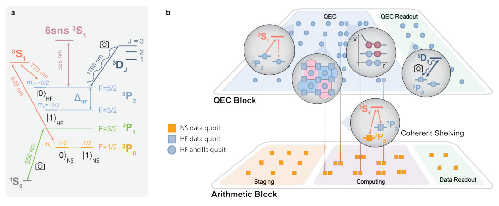 
FIG. 1. Dual-metastable state qubit encoding in a neutral atom processor. a. Qubits are encoded in the two metastable manifolds of 171Yb: hyperfine (HF) qubits in the (6s6p) 3P2 manifold and nuclear spin (NS) qubits in the (6s6p) 3P0 manifold. Both manifolds have single-photon coupling to the (6sns) 3S1 Rydberg manifold. The (6s7s) 3S1 manifold provides an intermediate state for single-qubit operations in the HF subspace and coherent shelving to the NS subspace. The (6s5ds)3D3 manifold provides a non-destructive readout channel via a 1798 nm cycling transition. b. Processor architecture based on this encoding: the arithmetic block utilizes NS qubits for algorithmic operations, and the QEC...

📷 Fig 2

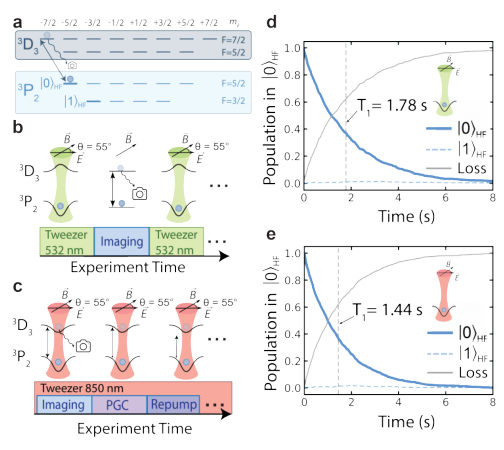 
FIG. 2. Optical trapping and imaging in the 3P2 man- ifold. a. The readout of HF qubits is achieved by selectively imaging |0⟩HF through 3D3, F = 7/2, mF = −7/2 at 1798 nm. b. In 532 nm tweezers, the (6s5d) 3D3 manifold is anti- trapped, requiring a pulsed imaging protocol to avoid atom heating [43]. c. Additionally, we investigate trapping in 850 nm tweezers, where the 3D3 manifold is trapped. The imaging process can be interleaved with polarization gradient cooling (PGC) to compensate for heating due to the differential trap depth between 3P2 and 3D3. d-e. We estimate the coherence time of HF qubits (initialized in |0⟩HF) to be T1 = 1.78 s in 532 nm tweezers and T1 = 1.44 s in 850 nm...

📷 Fig 3

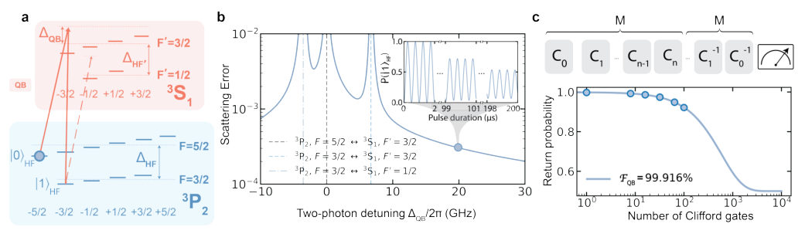 
FIG. 3. Single-qubit operation of 3P2 hyperfine qubits. a. Level structure and Raman coupling scheme for imple- menting single-qubit operations within the 3P2 manifold. The qubit states |0⟩HF and |1⟩HF are coupled via the intermediate 3S1, F ′ = 3/2, mF ′ = −3/2 state using a two-photon Raman transition. b. Scattering error as a function of the two-photon de- tuning ∆QB with fixed Raman beam powers. To calculate the error, we include Raman and Rayleigh scattering, differential light shifts, and Doppler effects (See Appendix B 1). The inset shows the corresponding Rabi oscillations for ∆QB = 2π×20 GHz and ΩQB = 2π × 2 MHz. We select an operating point that balances scattering error and...

📷 Fig 4

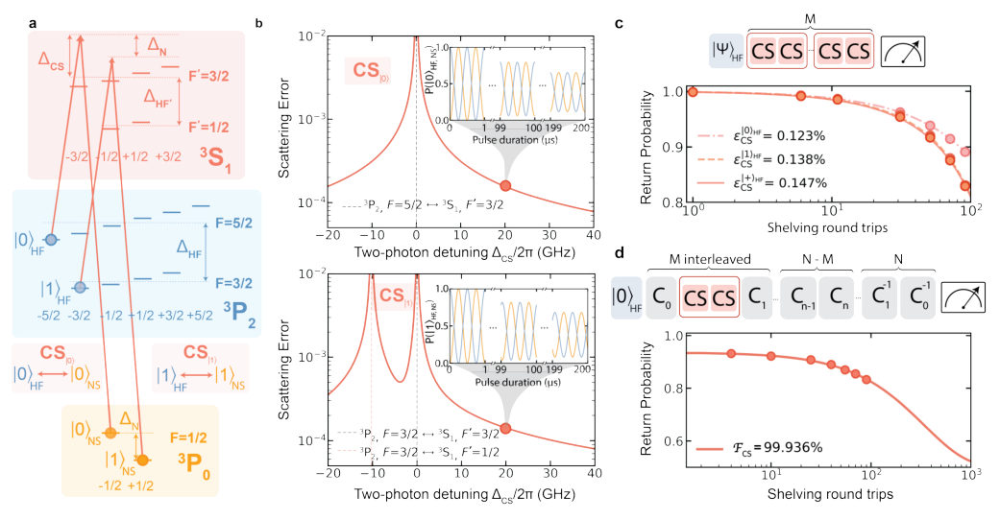 
FIG. 4. Coherent shelving between 3P2 and 3P0 manifolds. a. Level structure and Raman coupling scheme used for the coherent shelving (CS) process. The two Raman pathways, CS|0⟩and CS|1⟩, are modeled using a pair of 770 nm beams detuned by ∆HF = 2π × 6.7 GHz, with an additional nuclear-spin splitting ∆N = 2π × 11.5 kHz, and a single 649 nm beam under a magnetic field B = 10 G. These pathways coherently couple |0⟩HF ↔|0⟩NS and |1⟩HF ↔|1⟩NS via the 3S1 manifold. b. The scattering error as a function of the two-photon detuning ∆CS is computed for a fixed Raman beam power, which yields the Rabi frequency ΩCS = Ω|0⟩ CS = Ω|1⟩ CS = 2π × 2 MHz at ∆CS = 2π × 20 GHz (Detailed in Appendix B 1). Insets...

📷 Fig 5

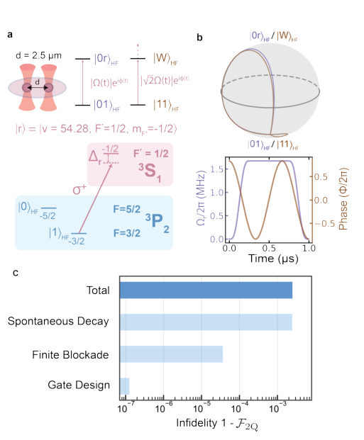 
FIG. 5. Implementing CZ gate in the 3P2 manifold. a. We selectively couple |1⟩HF = 3P2, F = 3/2, mF = −3/2 to the Rydberg state |r⟩ ≡ |v = 54.28, L = 0, F = 1/2, mF = −1/2⟩with a σ+ polarized beam at 326 nm and assume the interatomic spacing to be 2.5 µm. The estimated interaction energy at this spacing is V = h × 100 MHz [69]. b. The time-optimal phase gate design (brown solid line) is modeled assuming a smooth-step amplitude function (purple solid line) with peak Rabi fre- quency Ωr = 2π × 1.5 MHz. The same state and approach is utilized in Refs. [43, 64]. The resulting time evolution tra- jectory of the qubit subspace {01, 0r} and {11, W} is shown on the Bloch sphere, where |W⟩HF =...

**Summary.** The paper proposes a novel dual metastable-state qubit encoding in $^{171}\mathrm{Yb}$ atoms to create a robust platform for quantum computation. By utilizing two distinct atomic manifolds ($3P_0$ and $3P_2$), the system can logically separate computational tasks into an ALU and a QEC block. This architecture enables high-fidelity, parallel operations necessary for scaling towards fault-tolerant quantum computing.

**Why it may be interesting.** This work is highly relevant as it directly addresses the engineering challenge of building fault-tolerant quantum computers using neutral atoms, providing concrete architectural guidelines for integrating complex control sequences like mid-circuit measurement.

Detailed structure

**Main problem.** The challenge is developing a scalable, fault-tolerant quantum processing architecture using neutral atoms that efficiently integrates mid-circuit measurements and fast qubit operations.

**Main result.** The proposed dual metastable-state encoding for $^{171}\mathrm{Yb}$ allows the system to partition into distinct Arithmetic Logic Unit (ALU) and Quantum Error Correction (QEC) blocks, enabling parallel operation and achieving high gate fidelities.

**Method.** The authors simulate quantum dynamics using master equations and perform resource estimation by mapping logical circuits onto the physical hardware architecture.

**Model / system.** The system uses $^{171}\mathrm{Yb}$ atoms trapped in optical tweezers, encoding qubits across two metastable manifolds: a long-coherence Nuclear Spin (NS) qubit in the $3P_0$ manifold and a fast Hyperfine (HF) qubit in the $3P_2$ manifold.

**Key observables.** Single-qubit gate fidelities ($F_{QB} \approx 99.9\%$), coherent shelving fidelity ($	ilde{F}_{CS} \approx 99.9\%$), and logical error rates as a function of code distance.

**Important parameters / regimes.** Hyperfine splitting $\Delta_{\mathrm{HF}} = 2\pi 	imes 6.7~\mathrm{GHz}$; coherence times up to $1.78$ s; two-qubit gate infidelity $<0.3\%$.

**Assumptions / limitations.** The architecture assumes that separating the functional blocks (ALU/QEC) into distinct metastable manifolds minimizes latency associated with atom movement.

**Figures summary.** Figures illustrate the dual-metastable state encoding, the partitioning of the processor into ALU and QEC zones, and resource estimation comparing different scheduling strategies for syndrome extraction.

**Paper structure.** The paper introduces the physical platform and the dual-manifold encoding. It details gate operations (single-qubit gates in $3P_2$, coherent shelving between manifolds) followed by a comprehensive architectural analysis comparing resource usage and logical error rates based on how the two manifolds are assigned to computational roles.

Abstract

Neutral-atom arrays combine scalable qubit registers, long coherence times, flexible optical control, and strong Rydberg-mediated entangling interactions, making them a promising platform for quantum information processing. However, physical error rates remain a challenge, and fault-tolerant quantum error correction (QEC) requires repeated mid-circuit measurement and reset of ancilla qubits without disturbing nearby data qubits. This requirement introduces significant control and architectural overhead, making qubit encoding an important architectural decision. Here, we propose a dual metastable-state qubit encoding for $^{171}\mathrm{Yb}$ atoms that utilizes two independent qubit subspaces in the $(6s6p)\,{}^3\mathrm{P}_0$ and $(6s6p)\,{}^3\mathrm{P}_2$ manifolds. The ${}^3\mathrm{P}_0$ manifold provides a long-coherence nuclear-spin (NS) qubit suitable for storage and arithmetic operations, while the ${}^3\mathrm{P}_2$ manifold provides a hyperfine-spin (HF) qubit, with $Δ_{\mathrm{HF}} = 2π\times 6.7~\mathrm{GHz}$, that enables fast Raman operations and direct state-selective imaging. Coherent shelving between the two metastable manifolds connects the qubit subspaces, allowing operations to be assigned to spectrally distinct processor zones. We simulate single-qubit and two-qubit gate fidelities in ${}^3\mathrm{P}_2$, as well as coherent shelving between the HF and NS qubit subspaces. We incorporate these physical-level estimates into an architectural resource estimation and logical-level simulation. Our approach integrates mid-circuit measurements and fast qubit operations within a single-species platform, providing a versatile framework for future fault-tolerant quantum computing with neutral-atom qubits.

[↑ back to top](#top)

### [Designing electronic magnetoelectric matter with organic quantum spin trimers](http://arxiv.org/abs/2606.09179v1)

**Authors:** Yuko Hosokoshi, Christopher P. Aoyama, Zhuowei Zhang, Toshio Ono, Kosuke Takada, Ayaka Higashiguchi, Seitaro Iisaka, Koudai Yamasaki, Hironori Yamaguchi, Shengzhi Zhang, Mohammad Irfan, Minseong Lee, Eun Sang Choi, Yasuyuki Shimura, Toshiro Sakakibara, Zhiyuan Xie, Hiroki Nakano, Yasu Takano, Cristian D. Batista, Yoshitomo Kamiya  
**Type:** both · **Category:** strongly correlated electrons · **PDF:** <https://arxiv.org/pdf/2606.09179v1>  
**Analysis basis:** full PDF text, analyzed in chunks
**Topic relevance:** 🔥 `analog quantum simulation` **4/5** · `exotic spin models in light-matter` **3/5** · `Keldysh / 2PI / non-Gaussian methods` **1/5** · `entanglement & information structure` **1/5** · `methods for driven-dissipative` **1/5** · `spintronics-quantum-optics interface` **1/5**

📷 Fig 1

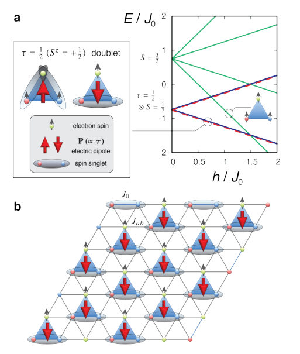 
FIG. 1. Spin, effective orbital degrees of freedom, and the emergent electric dipole in a quantum spin trimer. a, A spin- 1/2 Heisenberg trimer hosts a fourfold-degenerate 𝜏= 1

📷 Fig 2

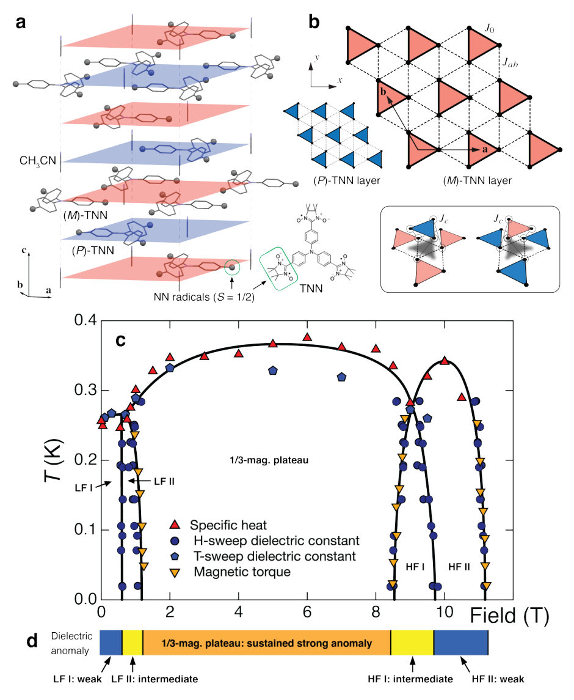 
FIG. 2. Experimental realization of quantum spin trimers and the measured phase diagram. a, Unit cell structure of TNN·CH3CN, composed of alternating (P)- and (M)-TNN layers of equilateral spin trimers formed by spin-1/2 nitronyl nitroxide (NN) radicals. In each NN radical, the unpaired-electron wavefunction is distributed primarily over the O–N–C–N–O moiety [11]. Spheres and short vertical bars in the main panel represent NN radicals and CH3CN molecules, respectively. b, Trimerized triangular-lattice model for TNN·CH3CN, in which the two trimerization patterns in alternating layers represent the enantiomeric (P)- and (M)-TNN layers. The inset illustrates the minimal interlayer coupling...

📷 Fig 3

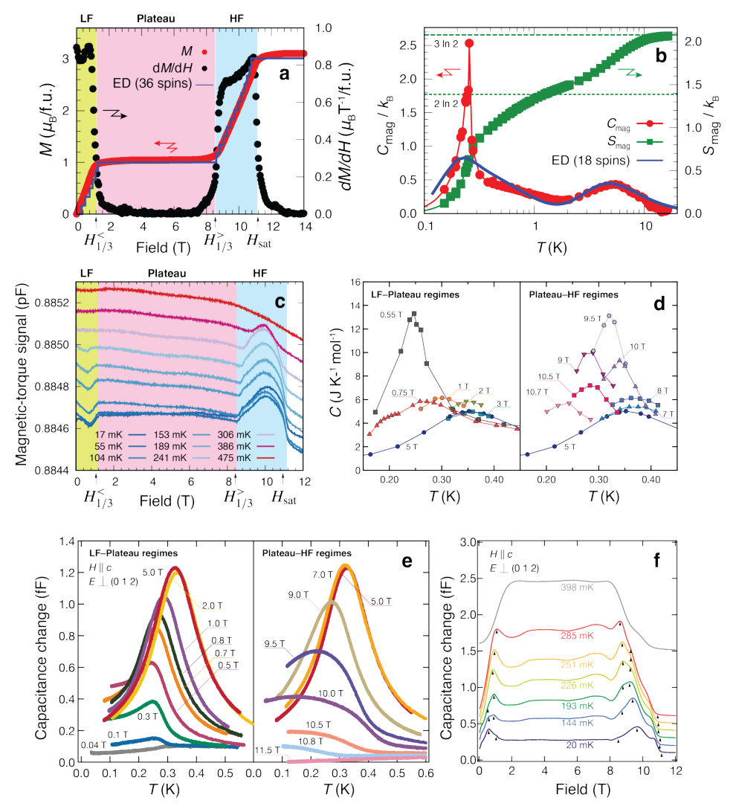 
FIG. 3. Magnetic, thermodynamic, and dielectric signatures of field-induced magnetoelectric phases of TNN·CH3CN. a, Magnetization as a function of 𝐻at 𝑇= 0.13 K, showing the 1/3-magnetization plateau between 𝐻&lt; 1/3 = 1.2 T and 𝐻&gt; 1/3 = 8.5 T and saturation at 𝐻sat = 11.2 T. Exact diagonalization (ED) data for 𝐽0 = 7.8 K and 𝐽𝑎𝑏/𝐽0 = 0.12 (𝐽𝑐= 0) are overlaid. The three magnetic-field regimes below the saturation field 𝐻sat—low-field (LF), plateau, and high-field (HF)—are indicated above the panel. b, Magnetic specific heat 𝐶mag and entropy 𝑆mag at 𝐻= 0, compared with ED data at finite temperatures. c, Magnetic-torque response measured with a capacitive cantilever at various temperatures. d,...

📷 Fig 4

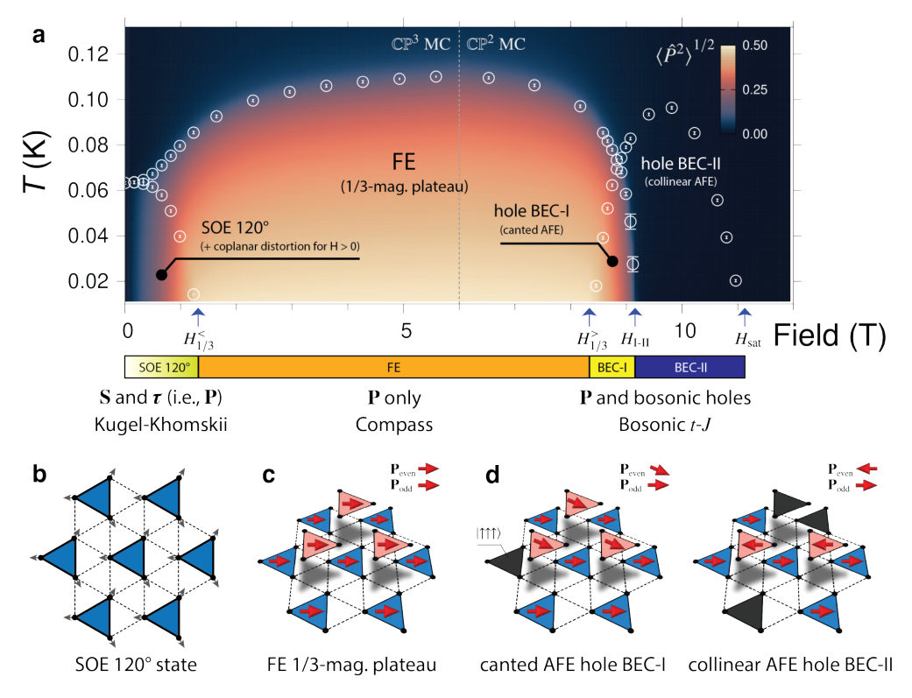 
FIG. 4. Theoretical characterization of magnetic-field-dependent magnetoelectric (ME) phases in TNN·CH3CN. a, Monte Carlo phase diagram showing distinct field-dependent regimes, with the polarization 𝑃≡⟨ˆ𝑃2⟩1/2 displayed in the background. The corresponding low- energy descriptions are summarized below, linking each field regime to its effective degrees of freedom. b, Low-field spin–orbital-entangled (SOE) 120◦state, where coupled spin–orbital degrees of freedom induce the ME response. c, Ferroelectrically-stacked three-dimensional layer-dipole order predicted in the 1/3-magnetization plateau for the minimal interlayer coupling 𝐽𝑐. d, High-field Bose–Einstein-condensed (BEC) hole states...

📷 Fig 5

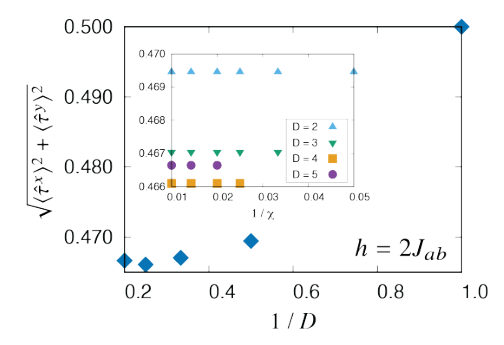 
FIG. 5. Tensor-network confirmation of robust in-plane orbital order in the 1/3-magnetization plateau regime. A finite-𝐷analysis of the orbital order parameter at ℎ= 2.0𝐽𝑎𝑏(inset: finite-𝜒analy- sis), performed using the projected entangled simplex state (PESS) ansatz [16] for the 2D trimerized triangular lattice (𝐽𝑐= 0), confirms the robustness of the orbital order. Here, 𝐷is the bond dimension of the tensor-network ansatz and 𝜒is the environment bond dimension. The 𝐷= 1 result corresponds to the polarized product state obtained from the mean-field calculation.

**Summary.** The research proposes that quantum spin trimers can serve as fundamental building blocks for magnetoelectric materials by generating electric dipoles intrinsically linked to magnetic moments. By analyzing the system in different external field regimes, the authors map out complex phase diagrams showing how geometric frustration stabilizes collective ME order. This provides a bottom-up design principle connecting electronic structure to macroscopic multiferroic properties.

**Why it may be interesting.** This work is highly relevant as it bridges concepts from quantum magnetism, orbital physics, and emergent phenomena. The explicit derivation of ME coupling from electronic correlations within a well-defined cluster (the trimer) provides a powerful paradigm for designing novel correlated materials.

Detailed structure

**Main problem.** To design electronic magnetoelectric (ME) materials by utilizing quantum spin trimers, establishing a bottom-up route that avoids conventional spin-lattice coupling mechanisms.

**Main result.** The study demonstrates that geometrically frustrated interactions organize electronically generated trimer dipoles into collective ME states, leading to multiple field-induced phases like the 1/3-magnetization plateau.

**Method.** A combination of advanced theoretical modeling (effective Hamiltonians, tensor networks, Monte Carlo simulations) and detailed experimental characterization (magnetization, dielectric measurements) is employed.

**Model / system.** The system is a weakly coupled lattice of equilateral S=1/2 quantum spin trimers realized in the organic radical crystal TNN·CH3CN. The physics is governed by strong correlations modeled via Hubbard-type Hamiltonians and effective low-energy descriptions like the Kugel–Khomskii model.

**Key observables.** Magnetization M(H), dielectric susceptibility $\Delta\epsilon(H)$, specific heat $C_{	ext{mag}}$, and various order parameters ($\langle \hat{	au} 
angle$, staggered magnetization).

**Important parameters / regimes.** The strong-coupling limit ($U \gg t_0$), the magnetic field strength (defining Low-Field, Plateau, High-Field regimes), and interlayer coupling constants ($J'_c, J''_c$).

**Assumptions / limitations.** The analysis relies on projecting onto low-energy subspaces (e.g., $S=1/2 \otimes 	au=1/2$) and assumes the existence of weakly coupled trimers exhibiting emergent electronic dipoles.

**Figures summary.** Figures illustrate the ME phase diagram, schematic representations of dipole formation via frustration relief, and computational results confirming orbital order in specific field regimes using tensor-network methods.

**Paper structure.** The paper progresses from establishing the fundamental mechanism (emergent trimer dipoles) to developing effective Hamiltonians for different field regimes (SOE $	o$ Plateau $	o$ Hole BEC), culminating in detailed theoretical predictions validated against comprehensive experimental measurements on TNN·CH3CN.

Abstract

Magnetoelectric (ME) phenomena are commonly driven by spin-lattice coupling. Here we demonstrate a different route based on frustrated quantum spin trimers that intrinsically intertwine magnetic moments and electric dipoles. Using molecular design principles, we realize a weakly coupled lattice of equilateral $S=1/2$ spin trimers in the organic radical crystal TNN$\cdot$CH$_3$CN. In this material, correlated electronic fluctuations within each trimer generate electric dipoles, while geometrically frustrated intertrimer interactions organize them into collective ME states. Magnetization, thermodynamic, and dielectric measurements reveal multiple magnetic-field-induced phases, including the $1/3$-magnetization plateau marked by pronounced dielectric anomalies. Effective low-energy theories and numerical simulations show that these phenomena are driven by electronically generated trimer dipoles whose collective order is stabilized by frustration relief of the intertrimer interactions, establishing a direct connection between geometric frustration and emergent magnetoelectricity. Our results identify quantum spin trimers as multifunctional building blocks, providing a bottom-up route for designing correlated ME materials from electronically active quantum spin clusters.

[↑ back to top](#top)

### [The Map of Parameter Space in Double Microwave Shielding](http://arxiv.org/abs/2606.09636v1)

**Authors:** Hubert J. Jóźwiak, Ian Stevenson, Sebastian Will, Tijs Karman  
**Type:** theory · **Category:** other · **PDF:** <https://arxiv.org/pdf/2606.09636v1>  
**Analysis basis:** full PDF text, analyzed in chunks
**Topic relevance:** 🔥 `analog quantum simulation` **4/5** · `methods for driven-dissipative` **2/5** · `non-equilibrium dynamics` **2/5** · `Keldysh / 2PI / non-Gaussian methods` **1/5** · `correlated / nonlocal dissipation` **1/5** · `driven-dissipative phase transition` **1/5**

📷 Fig 1

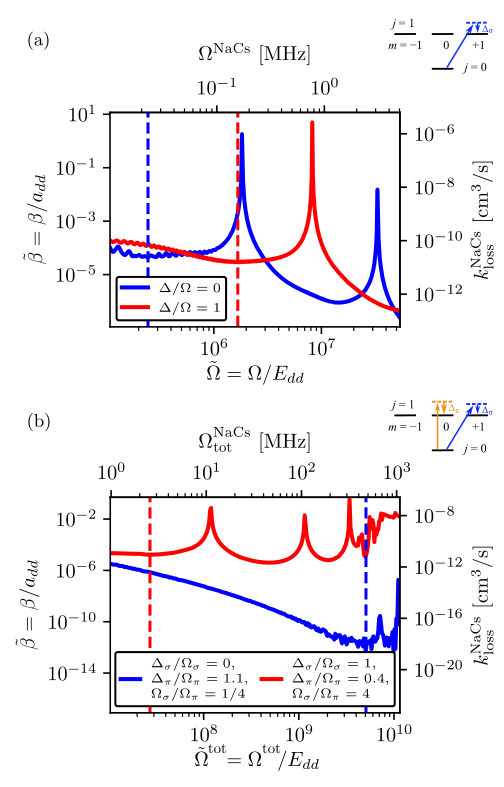 
FIG. 1. Two-body loss rates as a function of the applied mi- crowave field strength for single (a) and double (b) microwave shielding. The universal dimensionless parameters, ˜Ωand ˜β, are shown on the bottom and left axes, while the correspond- ing physical quantities mapped for the NaCs molecule (ΩNaCs

📷 Fig 2

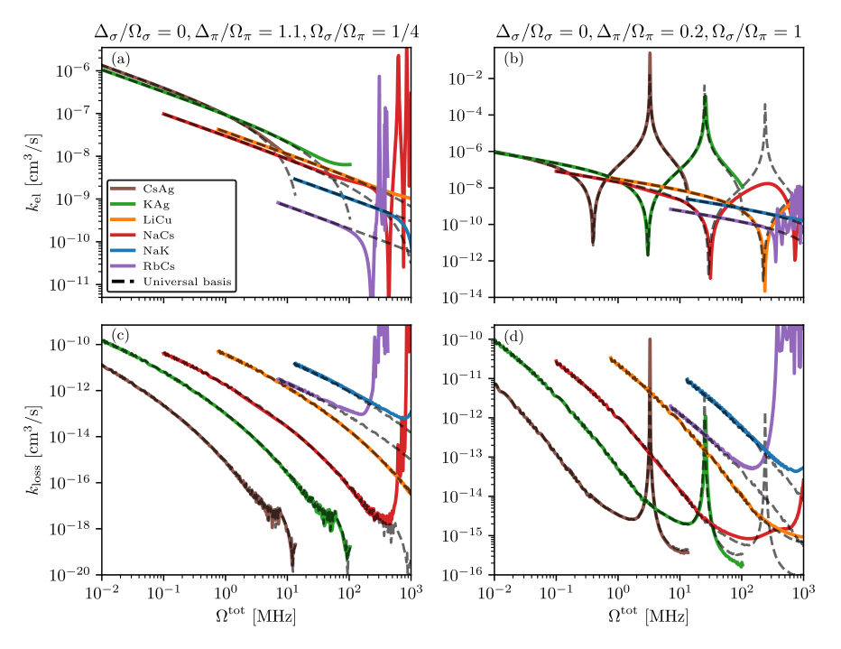 
FIG. 2. Limits of universality in double microwave shielding. Elastic (a, b) and loss (c, d) rate coefficients are shown for selected molecules for two selected double microwave shielding configurations. The universal baseline (dashed lines), obtained from NaCs calculations in the universal basis set (see text), is rescaled by the respective dipolar units for each species. Solid lines indicate coupled-channel calculations performed in an extended basis set including j = 2 rotational states for each molecule.

📷 Fig 3

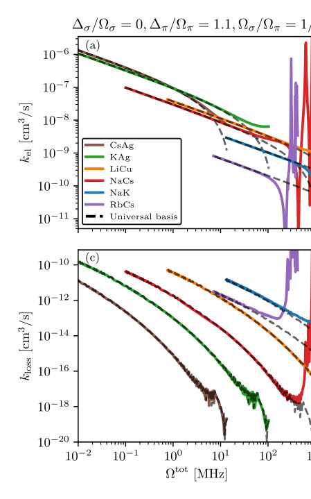 
Figure 2 compares the elastic and loss rates computed using the universal basis set against exact, molecule- specific calculations for selected species with varying masses and permanent dipole moments. The universal baseline is shown alongside exact calculations performed independently for each molecule in an extended basis that explicitly includes the j = 2 states and uses the species- specific molecular parameters listed in Tab. I.

📷 Fig 4

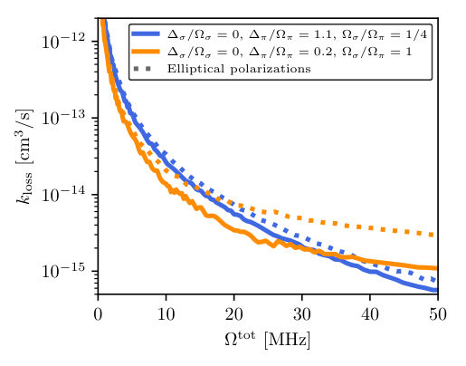 
FIG. 3. Influence of elliptical microwave polarizations on com- puted loss rates as a function of the total Rabi frequency, Ωtot, for two selected field configurations. The inclusion of exper- imentally realistic ellipticities (see text for details) increases the baseline loss but preserves the qualitative shielding behav- ior and the location of optimal operating regimes. Results are computed for NaCs molecules.

📷 Fig 5

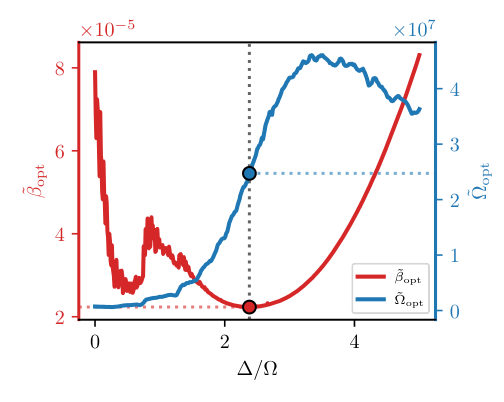 
FIG. 4. The lowest loss rate, expressed in terms of the dimen- sionless imaginary scattering length, ˜βopt = βopt/add, achiev- able for a fixed ratio of microwave parameters, ∆/Ω, under the constraint that no field-linked bound states are supported (red line, right vertical axis). The corresponding optimal Rabi frequency that minimizes the loss for each dimensionless con- figuration, ˜Ωopt = ℏΩ/Edd, is presented as a blue line with values shown on the left vertical axis. The circular markers and vertical dotted line indicate the global optimal operating point at ∆/Ω= 2.38.

**Summary.** The paper maps the complex parameter space of double microwave shielding applied to polar molecules to suppress detrimental two-body collisions. By analyzing the interplay between $\sigma^+$ and $\pi$ fields, it identifies optimal operating regimes that maintain low loss rates while preserving tunable dipolar interactions. The findings strongly favor heavy, highly dipolar molecules for realizing robust quantum simulation platforms.

**Why it may be interesting.** This work provides a detailed quantum control blueprint for manipulating interactions in ultracold molecular gases, moving beyond simple BEC creation to actively engineer collision dynamics for advanced quantum simulation protocols.

Detailed structure

**Main problem.** To systematically map the four-dimensional microwave parameter space of double microwave shielding to identify optimal operating regimes that maximize both shielding efficiency and interaction tunability for ultracold polar molecules.

**Main result.** Double microwave shielding allows for significantly lower theoretical loss rates than single-field methods, identifying heavy, strongly dipolar molecules as the most promising platforms for future quantum simulation experiments under realistic field constraints.

**Method.** The analysis uses coupled-channel scattering theory applied to a Hamiltonian including dipole-dipole interactions and two external microwave fields. Results are mapped across dimensionless parameter spaces using universal scaling laws.

**Model / system.** The system involves ultracold polar molecules subjected to $\sigma^+$- and $\pi$-polarized microwave fields, which create a long-range repulsive barrier via double shielding. The model is described by coupled-channel scattering calculations incorporating rotational states and photon dressing.

**Key observables.** Two-body loss rate coefficient ($k_{	ext{loss}}$), elastic collision rate ($\kappa_{el}$), effective dipolar interaction tunability, and the ratio $\gamma = k_{el}/k_{loss}$.

**Important parameters / regimes.** Microwave detunings ($\Delta$) and intensities ($\Omega$), relative field strength ($\Omega_\sigma/\Omega_\pi$), and dimensionless parameters like $	ilde{eta}$ and $	ilde{\Omega}$.

**Assumptions / limitations.** The analysis assumes the low-temperature limit, utilizes universal scaling based on dipolar units, and must reconcile theoretical optima (requiring GHz fields) with experimentally feasible microwave field strengths ($\sim$ MHz).

**Figures summary.** Figures illustrate loss rate suppression vs. field strength for single/double shielding, map 2D cuts of the parameter space showing loss minima, and plot minimum achievable loss rates versus molecular mass or dipole moment.

**Paper structure.** The paper progresses from establishing the physical mechanism (double shielding) to developing the theoretical framework (Hamiltonian/scattering methods), systematically mapping the 4D parameter space, comparing single-field vs. double-field results, and finally constraining these findings by realistic experimental field limitations.

Abstract

Double microwave shielding employs $σ^{+}$- and $π$-polarized microwave fields, tuned close to the lowest rotational transition, to engineer a long-range repulsive barrier between polar molecules. By preventing molecules from reaching the short range, this technique suppresses detrimental two-body losses and recently enabled the realization of molecular Bose-Einstein condensates and self-bound droplets. Yet, the optimal operating regimes of the shielding mechanism remain largely unexplored. Here, by leveraging the underlying universality of the scattering problem, we systematically map the four-dimensional microwave parameter space-spanned by the detunings and intensities of the two fields-to identify configurations that maximize both shielding efficiency and interaction tunability. We define optimal operating regimes as configurations that are strictly free of field-linked bound states while sufficiently suppressing two-body losses to exceed typical lifetimes of ultracold samples. In these regimes, we evaluate the elastic-to-inelastic collision ratios required for efficient evaporative cooling and explore the accessible tuning range of the effective dipolar interactions. Finally, to identify the best platforms for future quantum simulation experiments, we conduct a global survey of candidate molecular species under realistic field constraints. We identify heavy, strongly dipolar molecules as the most promising candidates, demonstrating that they can achieve extreme loss suppression alongside robust interaction tunability using only moderate field strengths.

[↑ back to top](#top)

### [$100\pmΔt$ Years of Quantum Uncertainty: From Origins to Modern Insights](http://arxiv.org/abs/2606.07747v1)

**Authors:** Lorcan O. Conlon, Biveen Shajilal, Jie Zhao, Tim C. Ralph, Gerd Leuchs, Ulrik L. Andersen, Syed M. Assad, Ping Koy Lam, Yunlong Xiao  
**Type:** theory · **Category:** other · **PDF:** <https://arxiv.org/pdf/2606.07747v1>  
**Analysis basis:** full PDF text, analyzed in chunks
**Topic relevance:** 🔥 `entanglement & information structure` **4/5** · `quantum measurements` **2/5** · `Keldysh / 2PI / non-Gaussian methods` **1/5** · `correlated / nonlocal dissipation` **1/5** · `driven-dissipative phase transition` **1/5** · `methods for driven-dissipative` **1/5**

📷 Fig 1

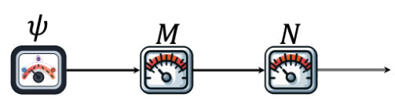 
FIG. 1. (Color online) Successive Measurements. Once the initial state ψ is prepared, the measurements M and N are performed sequentially. Let σ (see Eq. (36)) denote the post-measurement state after applying M. The entropic un- certainty relation then characterizes the uncertainty associ- ated with measuring ψ using M and subsequently measuring σ using N, as given in Eq. (37).

📷 Fig 2

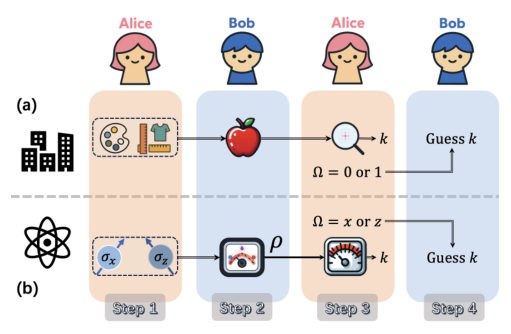 
FIG. 2. (Color online) Guessing Games. (a) Classical Game: Alice tells Bob she’s interested in either the color or shape of an object. Bob prepares a red apple and sends it to her. Alice sets a switch Ω: if Ω= 0, she observes the color; if Ω= 1, the shape. After the observation, she reveals which property she chose, and Bob is asked to guess the outcome. Since Bob prepared the object, his guess is always correct – there’s no uncertainty in the classical case. (b) Quantum Game: Alice measures either σx or σz, determined by a switch Ω. Bob can prepare any quantum state but chooses |0⟩, which minimizes uncertainty between the two observables. If Ω= x, Alice measures σx; if Ω= z, she measures...

📷 Fig 3

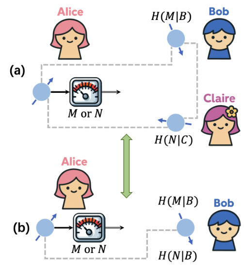 
FIG. 3. (Color online) Uncertainty under Memory Ef- fects. (a) Consider a setting where Alice, Bob, and Claire share a tripartite quantum state with respective subsystems A, B, and C. Two alternative measurements, M and N, can be performed on subsystem A. When M is measured, Bob uses his memory system B to guess the outcome; when N is measured, Claire uses her memory C for the same purpose. This tripartite scenario captures uncertainty trade-offs in the presence of distributed quantum memory, as formalized in Eq. (55). (b) In the bipartite case, only Alice and Bob are involved. Bob uses his memory B to infer the outcome of ei- ther M or N measured by Alice on A, with the corresponding...

📷 Fig 4

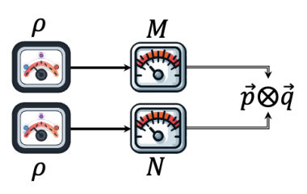 
FIG. 4. (Color online) Majorization Uncertainty Rela- tions in Direct-Product Form. When independent and identically distributed (i.i.d.) copies of the state ρ are pre- pared and measured using M and N, the resulting joint probability distribution, expressed in the direct-product form ⃗p ⊗⃗q, satisfies the majorization uncertainty relation given in Eq. (78) .

📷 Fig 5

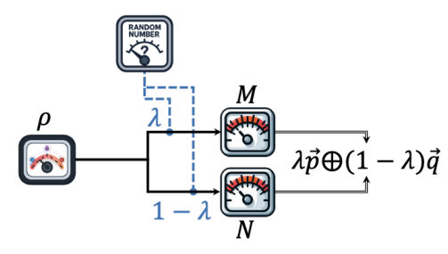 
FIG. 5. (Color online) Majorization Uncertainty Rela- tions in Direct-Sum Form. A random number generator outputs 0 with probability λ, triggering measurement M, and 1 with probability 1 −λ, leading to measurement N. The re- sulting joint uncertainty, expressed in the direct-sum form λ⃗p ⊕(1 −λ)⃗q, is governed by the majorization uncertainty relation, as outlined in Eq. (85) .

**Summary.** This review synthesizes the vast literature on uncertainty relations, showing that the principle extends far beyond the simple position-momentum product. It surveys diverse mathematical tools—including entropy and graph theory—to establish rigorous bounds on quantum measurements. The work is crucial for advancing quantum metrology by providing a unified framework for understanding fundamental measurement limits.

**Why it may be interesting.** It provides a comprehensive mathematical survey of fundamental limits in quantum mechanics, connecting abstract algebraic constraints (commutators) with operational measures (entropy/information), which is vital for understanding open quantum systems and sensing.

Detailed structure

**Main problem.** The review traces the development of Heisenberg's uncertainty principle into a spectrum of mathematical formulations (uncertainty relations) and explores their interconnections and wide-ranging applications.

**Main result.** The uncertainty principle is not a single statement but a rich landscape of limits, which has been crucial for advancing quantum metrology and understanding fundamental measurement constraints.

**Method.** The paper reviews diverse mathematical formulations, including variance-based (Robertson's), entropic (Shannon/Rényi), graph-theoretic ($\vartheta(G)$), and information-theoretic bounds.

**Model / system.** General quantum systems are analyzed using abstract observables ($A, B$) represented by operators on a Hilbert space. Specific models include qubits and continuous variable systems relevant to quantum optics.

**Key observables.** Position ($\Delta x$), Momentum ($\Delta p$); variances ($\Delta A^2$); Shannon/Rényi Entropies ($H_\alpha$); Commutators ($[A, B]$).

**Important parameters / regimes.** Reduced Planck constant ($\hbar$); measurement precision limits (Heisenberg limit); overlap parameters ($c_1$).

**Assumptions / limitations.** The review distinguishes between preparation uncertainty relations and measurement disturbance relations; it also notes the limitations of state-dependent bounds.

**Figures summary.** Not specified, but the structure implies comparisons between different mathematical formulations (e.g., product vs. sum-based bounds).

**Paper structure.** The paper progresses from classical foundations to modern generalizations, covering variance relations, entropic relations, graph theory applications, and finally linking these concepts to quantum metrology and information extraction.

Abstract

Heisenberg's uncertainty principle is a cornerstone of quantum mechanics, marking a decisive departure from classical physics. Conceived almost a century ago through a thought experiment showing that measuring an electron's position inevitably disturbs its momentum, it began as a deceptively simple idea that sparked countless studies and grew into the rich research field it is today. This review traces its development into a spectrum of mathematical formulations -- known as uncertainty relations -- and explores their interconnections and wide-ranging applications. We highlight its central role in quantum metrology, where it underpins strategies for extracting information from quantum systems with ever-increasing precision, and its links to multiparameter estimation and squeezed states. This review, dedicated to the centenary of the uncertainty principle, reflects on how it has deepened our understanding of quantum theory and driven practical advances, and looks ahead to a century poised for further surprising and transformative discoveries.

[↑ back to top](#top)

### [Complexity-driven transitions in quantum observation](http://arxiv.org/abs/2606.09765v1)

**Authors:** Zhenyu Du, Siyuan Cheng, Han Ye, Junjie Chen, Xiao Yuan, Xiongfeng Ma  
**Type:** theory · **Category:** quantum information and computing · **PDF:** <https://arxiv.org/pdf/2606.09765v1>  
**Analysis basis:** full PDF text, analyzed in chunks
**Topic relevance:** 🔥 `measurement-induced transitions` **4/5** · `quantum measurements` **3/5** · `entanglement & information structure` **2/5** · `Keldysh / 2PI / non-Gaussian methods` **1/5**

📷 Fig 1

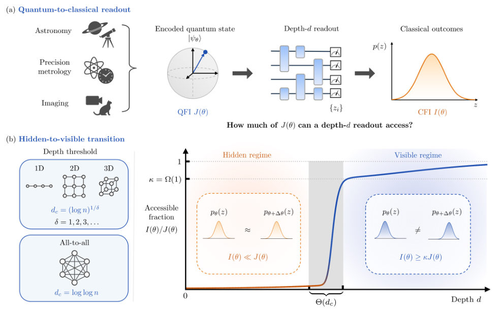 
FIG. 1. The quantum observation task and the complexity-driven transitions. (a) The quantum-to-classical conversion. To access the encoded information, the n-qubit pure state must be converted into classical outcomes via measurements. The quantum state carries quantum Fisher information (QFI) J(θ) about a parameter θ. After applying a depth-d circuit and measuring in the computational basis, the resulting outcome distribution carries classical Fisher information (CFI) I(θ), which quantifies the information accessible after measurement. (b) The hidden-to- visible transition. Our main result reveals a sharp, complexity-driven transition in readout capability—quantified by the accessible...

📷 Fig 2

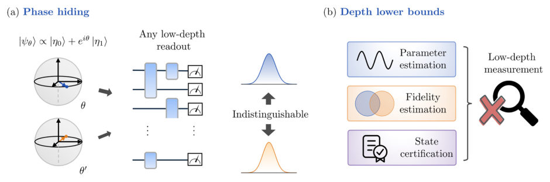 
FIG. 2. Phase hiding and depth lower bounds for quantum information readout. (a) Phase hiding. We prove that there exist orthogonal states ∣η0⟩and ∣η1⟩such that, for the phase family ∣ψθ⟩= (∣η0⟩+eiθ ∣η1⟩)/ √

📷 Fig 3

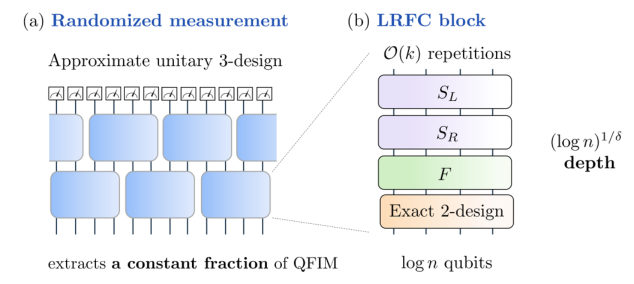 
FIG. 3. Universal quantum information readout from approximate unitary designs. (a) A randomized unitary-basis readout is obtained by sampling a circuit from a multiplicative-error approximate unitary 3-design, applying it to the data qubits, and measuring in the computational basis. We prove that this measurement universally extracts a constant fraction of the QFIM for any pure-state multiparameter encoding. The global approximate design is realized by a double-layer blocked circuit, where the data qubits are partitioned into Θ(log n)-qubit patches, and independent local random unitaries are applied to neighboring patch pairs in two shifted layers. (b) Internal structure of the local...

**Summary.** This work rigorously characterizes the fundamental limits of quantum observation, showing that extracting full quantum information requires measurement circuits whose depth must exceed specific thresholds dependent on system connectivity. By developing optimal circuit constructions using approximate unitary 3-designs, the authors prove a universal recovery mechanism for the intrinsic quantum information once this complexity threshold is surpassed.

**Why it may be interesting.** It provides definitive resource boundaries for quantum metrology and state certification by quantifying exactly how much computational resources (depth) are needed to access inherent quantum information.

Detailed structure

**Main problem.** The paper investigates the fundamental relationship between measurement complexity (circuit depth) and readout capability when extracting quantum information from a state.

**Main result.** It establishes a sharp, complexity-driven transition: below critical depth thresholds, readout capability decays exponentially (hidden regime); above these thresholds, randomized measurements universally recover a constant fraction of the Quantum Fisher Information (visible regime).

**Method.** The analysis uses information theory tools like QFI and CFI, proving results by analyzing phase-hiding phenomena in low-depth readouts and constructing optimal circuits using approximate unitary 3-designs for high-depth protocols.

**Model / system.** The model involves an n-qubit pure state $|\psi_	heta
angle$ undergoing measurement via a depth-$d$ unitary circuit $U$. Architectures considered include $\delta$-dimensional grids and all-to-all connectivity.

**Key observables.** Quantum Fisher Information (QFI), Classical Fisher Information (CFI), Readout Capability ($\kappa$), Measurement Depth ($d$).

**Important parameters / regimes.** Critical depth thresholds: $d \sim (\log n)^{1/\delta}$ for $\delta$-D architectures and $d \sim \log \log n$ for all-to-all connectivity.

**Assumptions / limitations.** The analysis restricts measurements to unitary-basis readouts, though it develops optimal constructions using approximate 3-designs to overcome these limitations.

**Figures summary.** Figures illustrate the quantum observation task and contrast the hidden regime (low depth) with the visible regime (high depth), while other figures detail circuit structures for implementing designs.

**Paper structure.** The paper progresses from defining the readout problem and identifying the complexity-driven transition, to proving the exponential decay in the hidden regime using phase indistinguishability arguments, and finally demonstrating universal recovery of QFI in the visible regime via 3-designs with depth-optimal constructions.

Abstract

Observing the physical world is a foundational pursuit in science. In the quantum realm, however, observation necessitates a fundamental quantum-to-classical conversion: destructive measurements irreversibly project quantum states into classical data, inevitably incurring a loss of information. What physical principles govern this information loss, and how can we construct optimal measurements to maximize the readout? Here, we address these questions by establishing an intrinsic relationship between readout capability--quantified by the ratio of accessible classical Fisher information to the total quantum Fisher information (QFI), and measurement complexity--defined as the quantum circuit depth required prior to projection. Remarkably, we uncover a sudden emergence of observability: a sharp hidden-to-visible transition driven entirely by measurement complexity. We rigorously prove that below critical depth thresholds--$Θ((\log n)^{1/δ})$ for $δ$-dimensional architectures and $Θ(\log\log n)$ for all-to-all connectivity--readout capability decays exponentially with system size $n$, rendering the quantum information fundamentally inaccessible. Surprisingly, immediately above this threshold, the system enters a visible regime: we demonstrate that randomized measurements universally recover a constant fraction of the QFI using approximate unitary 3-designs, for which we explicitly develop optimal-depth circuit constructions tailored to finite-dimensional architectures. By unveiling the fundamental scaling laws and transitions that govern quantum observation, our results delineate definitive resource boundaries for quantum learning, state certification, and quantum metrology.

[↑ back to top](#top)

### [Discovering and decoding latent mean-field structure with variational autoencoders](http://arxiv.org/abs/2606.08694v1)

**Authors:** Marco Biroli, Max Welling, Vincenzo Vitelli  
**Type:** both · **Category:** statistical mechanics · **PDF:** <https://arxiv.org/pdf/2606.08694v1>  
**Analysis basis:** full PDF text, analyzed in chunks
**Topic relevance:** 🔥 `entanglement & information structure` **4/5** · `Keldysh / 2PI / non-Gaussian methods` **1/5** · `analog quantum simulation` **1/5** · `driven-dissipative phase transition` **1/5** · `exotic spin models in light-matter` **1/5** · `methods for driven-dissipative` **1/5** · `non-equilibrium dynamics` **1/5**

📷 Fig 1

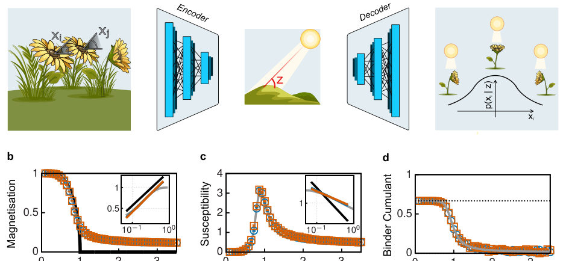 
FIG. 1. Discovering mean-field structures. The top row (a) schematically illustrates our approach on a toy example. Suppose we had snapshots of sunflower fields. Training a regular low-dimensional VAE on these images will discover the effective mean-field acting on these flowers, i.e. the angle of incidence of the sun, despite no picture of the sun every being shown during training. Applying the same method on computer generated equilibrium samples of the Curie-Weiss model of magnetism allows us to recover this mean field model exactly. On the bottom row (b-c-d) we show how VAE samples (orange squares) recover the true distribution (blue circles) which matches the theory (gray line) for a...

📷 Fig 2

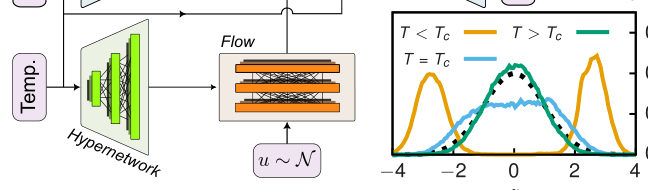 
FIG. 2. VAE architecture. A detailed view of the conditional VAE architecture (a). The correlated degrees of freedom (e.g. spins, neurons, nematics) are concatenated with the temperature at which they were sampled and given to an encoder (blue) which outputs the mean and variance of the posterior distribution q(z|x) ∼N(µ, σ2). The temperature is given to a hyper-network (green) which predicts the weights of a spline flow network (orange) which builds the prior distribution pψ(z) through invertible transformations of a Gaussian random variable u ∼N(0, 1). With the reparameterization trick [11] (≈) the latent z is sampled from the encoder prediction and given to the decoder (blue) which...

📷 Fig 3

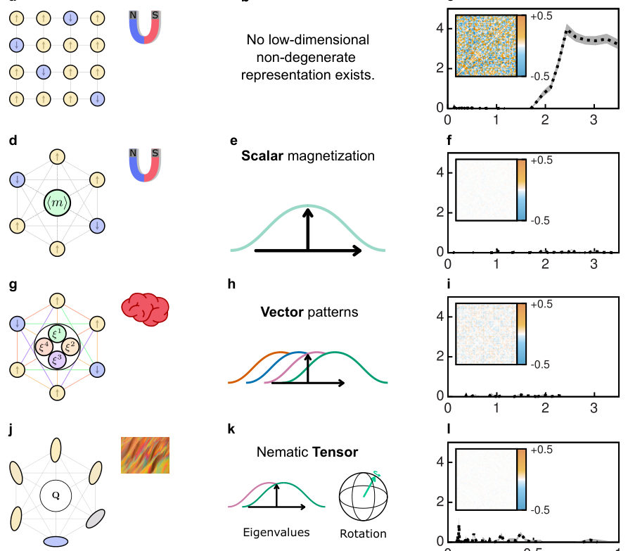 
FIG. 3. Hierarchy of models. Each row is one system; from top to bottom: the two-dimensional Ising model (a-b-c), the Curie-Weiss model (d-e-f), the Hopfield model with P = 4 stored patterns (g-h-i), and the Maier-Saupe nematic (j-k-l). The left column (a-d-g-j) shows a sketch of the model under investigation. All degrees-of-freedom are correlated (exemplified by the gray lines) and hence not independent. The middle column (b-e-h-k) shows the uncovered mean-field description that the VAE extracts from the correlated data. The right column (c-f-i-l) displays the conditional total correlation TC|z of Eq. (20), estimated through the variational lower bound of Eq. (45) as a function of...

📷 Fig 4

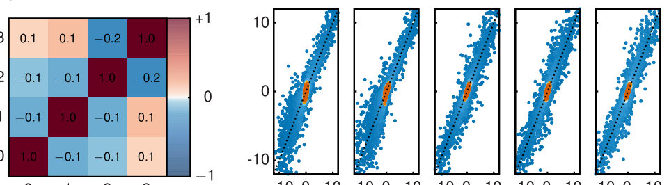 
FIG. 4. Recovery of microscopic mean-field parameters from the trained decoder. On the left (a), Hopfield pattern overlap matrix. Each entry (µ, ν) is the per-site overlap ⟨ˆξν|ξµ⟩/N between the µ-th true pattern and the ν-th pattern extracted from the VAE. The matrix is diagonal with unit modulus along the diagonal proving that all P = 4 patterns are perfectly recovered from equilibrium samples alone. On the right (b), each panel is a scatter of one independent component Zαβ (from left to right Z00, Z11, Z01, Z02, Z12) of the nematic tensor Z against the MLP prediction from the encoder posterior mean µ(ˆx); the dotted line is Z = ˆZ and points are colored by the temperature T/J ranging...

📷 Fig 5

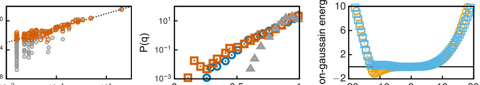 
FIG. 5. Application to experimental Salamander retinal recordings. On the top row (a-b-c), we show the stored Hopfield patterns (a-b) and external field (c) recovered from the trained VAE decoder weights. We can see a large fraction of mostly ‘silent’ neurons, strongly inhibited by the external field and two non-trivial patterns. On the bottom row (d-e-f), we show a series of observables for the neural dataset. On the left (d), is the per-word firing rate on the salamander retina dataset of Ref. [24] for the trained VAE (orange) and an independent model baseline (gray). The VAE points scatter tightly around the diagonal across six decades while the independent model systematically...

**Summary.** The paper proposes that Variational Autoencoders (VAEs) can be used to diagnose the underlying physics of complex many-body systems. By analyzing the information capacity required for successful reconstruction, the authors prove that a VAE's structure must correspond to an effective mean-field approximation. This allows researchers to extract microscopic physical parameters from trained neural network weights using diverse models like spin glasses and biological data.

**Why it may be interesting.** This work provides a powerful, data-driven diagnostic tool—the VAE structure itself—to test theoretical assumptions about how correlations manifest in physical systems, bridging deep learning with condensed matter theory.

Detailed structure

**Main problem.** The core problem is understanding how Variational Autoencoders (VAEs) can capture the complex, non-factorizable correlations inherent in the joint probability distributions of many-body physical systems.

**Main result.** The authors establish that a successful VAE reconstruction implies that the underlying physics must admit an effective latent mean-field factorization, allowing microscopic parameters to be read directly from the trained decoder weights.

**Method.** They use information-theoretic bounds (comparing latent channel rate to bipartite mutual information) and test this hypothesis across various physical models using VAEs. The analysis compares the model's capacity against known theoretical limits for correlation capture.

**Model / system.** The study validates its findings on a hierarchy of solvable models, including Curie-Weiss (scalar), Hopfield (vector), and Maier-Saupe (tensor) order parameters, and applies it to experimental data from salamander retinal recordings.

**Key observables.** Total Correlation ($T_C|z$), Overlap Distribution $P(q)$, Magnetization $\langle|m|
angle$, Susceptibility, and the generalized Hopfield energy functional.

**Important parameters / regimes.** Critical temperature ($eta_c$ for CW), number of stored patterns ($P$ for Hopfield), latent dimension ($d$), and the information bound $I_{	ext{bip}}(p)$.

**Assumptions / limitations.** The primary assumption is that the VAE's conditional independence decoder structure (factorization) must match the true underlying physics, which they show leads to a mean-field description.

**Figures summary.** Figures illustrate the comparison of $P(q)$ between VAE predictions and independent models; one figure details the recovery of the full Hopfield pattern matrix from equilibrium samples alone; another compares VAE predictions against empirical retinal firing rate statistics.

**Paper structure.** The paper develops a theoretical criterion relating VAE capacity to physical correlations, applies this framework to analytically solvable mean-field models (CW, Hopfield), and validates the findings by recovering parameters for tensor systems (Maier-Saupe) and analyzing real neural data.

Abstract

Generative models are increasingly used to capture correlations in many-body systems, but the representations they learn remain largely opaque to physical interpretation. Here, we establish an intuitive criterion that quantifies the capacity of a variational autoencoder (VAE) to faithfully reconstruct the joint probability distribution of a many body system. In a nutshell, a bound on the VAE capacity is obtained by comparing the rate of the latent channel to the bipartite mutual information of the data. Using this bound, we show that the conditionally independent decoder of any successful VAE is structurally identical to a finite-size mean-field factorization. Hence, a successful reconstruction is direct evidence for a latent mean-field theory and the microscopic parameters of that theory can be read off the trained decoder. We validate these conclusions on a hierarchy of solvable models with scalar (Curie-Weiss), vector (Hopfield) and tensor (Maier-Saupe) order parameters, recovering the full Hopfield pattern matrix from equilibrium samples alone. We find that, when applied to Salamander retinal recordings, a two-latent VAE reproduces the population statistics with only two effective collective variables allowing us to recover the `stored patterns' of the neural population and write a generalized Hopfield model which correctly models the experimental data.

[↑ back to top](#top)

### [Quantum Advantage over Wirings of Nonsignaling Boxes in Multipartite Networks](http://arxiv.org/abs/2606.08488v1)

**Authors:** Peter Bierhorst, Arkaprabha Ghosal, Soumyadip Patra  
**Type:** theory · **Category:** quantum information and computing · **PDF:** <https://arxiv.org/pdf/2606.08488v1>  
**Analysis basis:** full PDF text, analyzed in chunks
**Topic relevance:** 🔥 `entanglement & information structure` **4/5** · `quantum measurements` **3/5** · `correlated / nonlocal dissipation` **1/5** · `measurement-induced transitions` **1/5**

📷 Fig 1

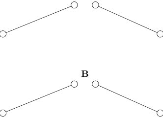 
Figure 1: Three-party networks of parties Al- ice (A), Bob (B), and Charlie (C) where un- derlying bipartite nonclassical resources are available in (a) a star network with B at the center, and (b) a fully connected configu- ration in which all pairs have access to a bipartite nonclassical resource.

📷 Fig 2

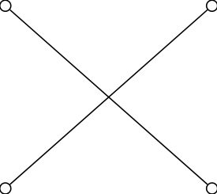 
Figure 2: A four-party network in which each of the (six) pairs of parties shares a bipartite nonclassical resource, but there are no higher-order multipartite entangled resources. Globally shared classical randomness, which may be present, is not depicted.

📷 Fig 3

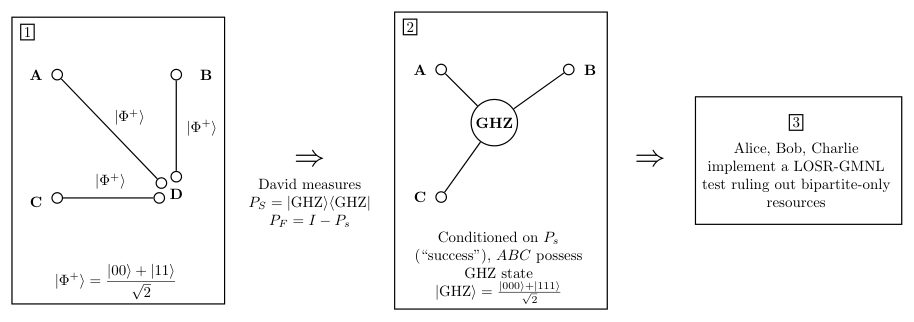 
Figure 3: Scheme for generating a behavior in the QEM paradigm, which will not be replicable in the NSW paradigm.

📷 Fig 4

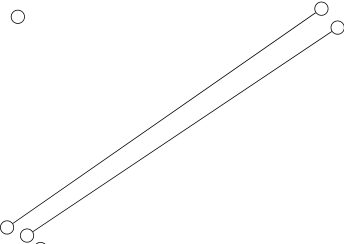 
Figure 5: Conditioned on David measuring and receiving outputs from all of his bipartite resources, these resources that were previously shared with other parties as in Figure 4 reduce to unipartite local random variables.

📷 Fig 5

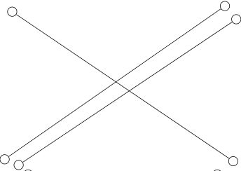 
Figure 4: The bipartite resources of Figure 2 can in general be multiple parallel resources measured in cascaded fashion, with outputs of resources fed as inputs to other resources.

**Summary.** The paper establishes a robust quantum advantage of entangled measurements over classical/nonsignaling boxes in multi-party settings. By analyzing specific four-party and generalized $K+2$ party protocols, the authors prove that entanglement allows for correlations violating established inequalities, even when local wirings and global randomness are permitted.

**Why it may be interesting.** This work rigorously defines the boundary between quantum nonlocality witnessed by entanglement versus mere super-quantum correlations allowed by local no-signaling constraints, which is fundamental to understanding genuine multipartite quantum resources.

Detailed structure

**Main problem.** To determine if quantum entangled measurements provide an advantage over local wirings of nonsignaling nonlocal resources in multipartite networks when bipartite non-classical resources are shared.

**Main result.** The authors demonstrate a general separation, showing that for $K+2$ parties, quantum entangled measurements can witness behaviors impossible to achieve using only local wirings on nonsignaling boxes, even with global classical randomness.

**Method.** The analysis uses a resource-theoretic approach, comparing the expected values of Bell-type inequalities (like Mao-Bell) achievable via Quantum Entangled Measurements (QEM) versus those constrained by Nonsignaling Boxes (NSW).

**Model / system.** The model involves multipartite networks where parties share bipartite nonclassical resources. The comparison is between quantum entanglement/entangled measurements and correlations bounded only by the no-signaling principle.

**Key observables.** Violation of Bell inequalities, specifically the Mao-Bell inequality ($	ext{BM}$), which quantifies genuine multi-party nonlocality.

**Important parameters / regimes.** The fidelity ($F$) of the shared bipartite quantum states is a key parameter determining the threshold for quantum advantage (e.g., $F > 0.941$).

**Assumptions / limitations.** The analysis assumes that the NSW correlations are restricted to local wirings of at-most-$K$-partite nonsignaling resources, and it handles cases with or without globally shared classical randomness.

**Figures summary.** Figures illustrate network topologies (star vs. fully connected) for $K=2$ parties, and schemes involving GHZ state projections used to induce the testable multi-party behavior.

**Paper structure.** The paper proceeds by establishing a general framework comparing QEM vs. NSW correlations in multipartite settings. It develops specific protocols (e.g., four-party star network) to witness the advantage, proves the separation for arbitrary $K$, and discusses generalizations regarding classical randomness.

Abstract

Quantum-entangled measurements are known to enable multi-party behaviors that are impossible with unentangled measurements on nonlocal resources, even those that are super-quantum and bound only by the no-signaling principle. This advantage can be witnessed by the entanglement swapping protocol, along with corresponding impossibility results for "nonlocality swapping". However, the advantage assumes the absence of pre-existing nonlocal resources shared by the swapped-to parties; it no longer holds if all pairs of parties are allowed to share bipartite nonlocal resources. Here, we consider a resource-theoretic perspective in which bipartite nonclassical resources are free resources that can be shared by any pair of parties in a multipartite network, and ask whether quantum entangled measurements can still provide an advantage over certain basic measurements, known as wirings, of nonsignaling nonlocal resources. We resolve this question in the affirmative by demonstrating an explicit four-party behavior that can be achieved with bipartite quantum resources subject to entangled measurements, and cannot be achieved if the bipartite resources are allowed to be more general nonsignaling nonlocal "boxes" so long as the measurements are restricted to local wirings, even also allowing for globally shared classical randomness. Furthermore, the argument generalizes: the same separation can be witnessed for K+2 parties with access to K-partite nonlocal resources for any K > 2. We also examine these results in different contexts, such as the star network configurations and scenarios not admitting globally shared classical randomness, further enhancing understanding of the capabilities of entangled measurements in multi-party configurations.

[↑ back to top](#top)

### [Relativistic Effects in Spin Correlations Induced by QED Scattering and Wigner Rotations](http://arxiv.org/abs/2606.08995v1)

**Authors:** Juan D. Fonseca, B. Hiller, I. G. da Paz, M. Sampaio  
**Type:** theory · **Category:** other · **PDF:** <https://arxiv.org/pdf/2606.08995v1>  
**Analysis basis:** full PDF text, analyzed in chunks
**Topic relevance:** 🔥 `entanglement & information structure` **4/5** · `Keldysh / 2PI / non-Gaussian methods` **1/5** · `correlated / nonlocal dissipation` **1/5** · `exotic spin models in light-matter` **1/5** · `non-equilibrium dynamics` **1/5**

📷 Fig 1

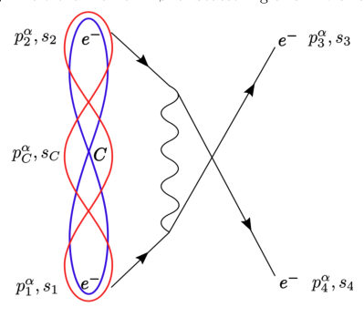 
FIG. 2: Feynman diagrams for Møller scattering.

📷 Fig 2

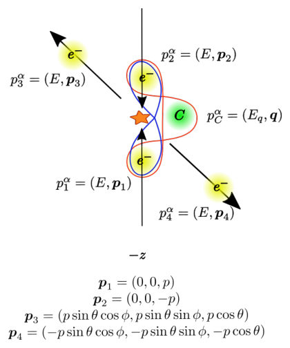 
FIG. 1: Collision diagram for the elastic scattering e−e−→e−e−.

📷 Fig 3

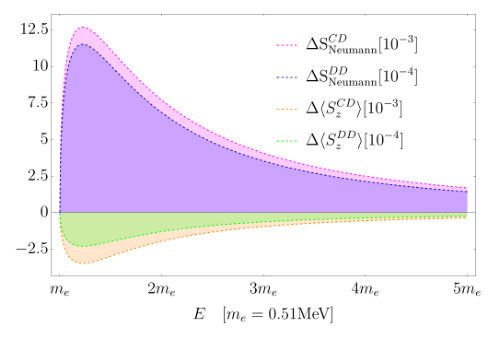 
FIG. 3: Variation of the von Neumann entropies and spin expectation values in the z direction of one electron as functions of the collision energy for the current–dipole and dipole–dipole interactions.

📷 Fig 4

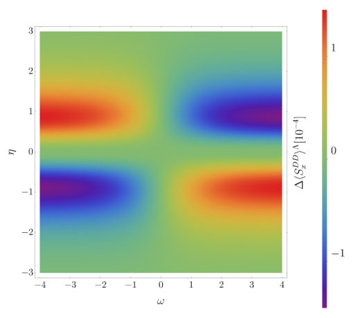 
FIG. 5: Variation of the spin expectacion value in the x direction of one electron as functions of the rapidities for the dipole-dipole interaction.

📷 Fig 5

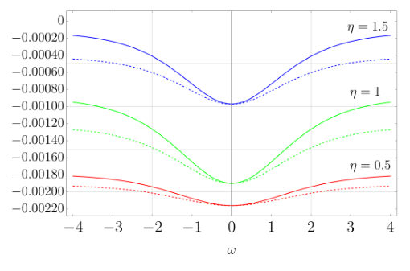 
FIG. 6: Variation of the spin expectation value in the z direction for the current–dipole (solid line) and dipole–dipole (dashed line) interactions as a function of the rapidity ω for selected values of η.

**Summary.** This theoretical paper analyzes how spin correlations develop during electron scattering processes by incorporating full relativistic effects, specifically Wigner rotations. Using entanglement entropy as a diagnostic tool, the authors show that while total entropy remains invariant under boosts, local spin observables are frame-dependent. The work provides a detailed framework for understanding quantum correlations in high-energy particle physics.

**Why it may be interesting.** The rigorous treatment of spin correlations in relativistic scattering provides a deep link between fundamental QFT symmetries (Lorentz invariance) and quantum information measures (entropy), which is relevant for understanding decoherence mechanisms in high-energy physics.

Detailed structure

**Main problem.** The study investigates the relativistic effects, particularly those arising from Wigner rotations, that generate spin correlations between electrons during QED scattering processes like Møller scattering.

**Main result.** Dipole-dipole and current-dipole interactions are responsible for generating these spin correlations; while total entropy is Lorentz invariant, local observables like spin expectation values are frame-dependent.

**Method.** The authors analyze scattering amplitudes using nonrelativistic approximations and calculate quantum information measures such as the von Neumann entropy of reduced density matrices in different reference frames.

**Model / system.** The system involves electron-electron ($e^-e^-$) or three-particle ($e^-e^-C$) interactions governed by Quantum Electrodynamics (QED). The analysis is performed using scattering theory formalism, including the use of density matrices and Lorentz transformations to account for relativistic kinematics.

**Key observables.** Spin correlations, von Neumann entropy ($S_{	ext{Neumann}}$), and spin expectation values ($\langle S_{x,y,z} 
angle$) of the outgoing particles.

**Important parameters / regimes.** Collision energy/rapidities ($\eta, \omega$), scattering angles ($	heta, \phi$), and the presence of a witness particle C.

**Assumptions / limitations.** The analysis is restricted to tree-level contributions in perturbation theory, omitting higher orders in the coupling constant. The initial states are analyzed as both separable and entangled (W-state).

**Figures summary.** Figures illustrate collision diagrams for $e^-e^-$ scattering, Feynman diagrams for Møller scattering, and plots showing the variation of von Neumann entropy and spin expectation values versus collision energy or rapidity for different interaction types.

**Paper structure.** The paper proceeds by analyzing the process in the center-of-mass frame, deriving amplitudes using nonrelativistic approximations, examining entanglement measures (entropy) under Lorentz boosts involving Wigner rotations, and finally applying this framework to comment on other processes like $e^-e^+ 	o \mu^-\mu^+$

Abstract

We study the relativistic nature of the interactions that, at tree level, generate spin correlations between two electrons in Møller scattering, as well as in an extended process involving a witness particle $C$. The corresponding processes, $e^{-}e^{-}\rightarrow e^{-}e^{-}$ and $e^{-}e^{-}C\rightarrow e^{-}e^{-}C$, are analyzed both in the center-of-mass frame and, for the former process, in a Lorentz-boosted frame where Wigner rotations arise. It is found that, through a nonrelativistic approximation of the scattering amplitudes, dipole-dipole and current-dipole interactions are responsible for the emergence of these correlations. This is evidenced by the variation of the von Neumann entropy of one electron for initially separable states, and of $C$ for an initially prepared three-particle entangled W-state. In Wigner rotations, the invariance of entropy under local unitary transformations is maintained at the expense of the emergence of quantum coherence in the density matrix at large rapidities. As a consequence, the final states of both particles are evaluated and shown to encode information about the scattering process through their spin expectation values. This framework is then used to comment on the correlations in the inelastic process $e^{-}e^{+}\rightarrowμ^{-}μ^{+}$, for which some research has reported differing results.

[↑ back to top](#top)

### [Inverse supersymmetry in finite temperature Bose-Fermi mixtures](http://arxiv.org/abs/2606.07784v1)

**Authors:** Zachary Gazzillo, Carlos A. R. Sá de Melo  
**Type:** theory · **Category:** quantum gases · **PDF:** <https://arxiv.org/pdf/2606.07784v1>  
**Analysis basis:** full PDF text, analyzed in chunks
**Topic relevance:** 🔥 `analog quantum simulation` **4/5** · `Keldysh / 2PI / non-Gaussian methods` **1/5** · `correlated / nonlocal dissipation` **1/5** · `driven-dissipative phase transition` **1/5**

📷 Fig 1

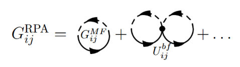 
FIG. 1. The RPA Bose-Fermi correlator GRPA ij , the poles of which form the Goldstino propagator Gq ij, consisting of the mean-field Bose-Fermi correlator GMF ij , and products thereof connected by the Bose-Fermi interacting strength, U bf ij . Here, the solid (dashed) lines represent the independent fermion (boson) propagator.

📷 Fig 2

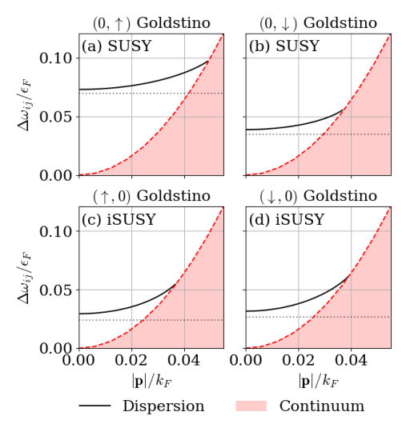 
FIG. 2. Plots of the energy difference ∆ωij = ω −ζij(0, 0) between the energy of excitations ω and the zero-momentum particle-hole continuum boundary ζij(0, 0) versus momentum modulus |p|. In each plot, ϵF and kF represent the Fermi en- ergy and Fermi momentum, respectively. We use parameters of Tab. I to illustrate SUSY in panels (a) and (b), as well as iSUSY in panels (c) and (d). The solid black lines represent the Goldstino dispersions ω = Dij(p), while the shaded pink area describes the particle-hole continuum with the dashed red line being its boundary. Finally, the dotted gray line is the approximate zero-momentum solution ω = Dij(0) ≈Ωij.

📷 Fig 3

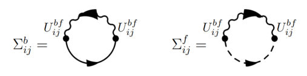 
FIG. 3. The self-energy diagrams Σb(f) ij contributing to the energy of a boson (fermion) in spin i (j) emerging due to the existence of the (i, j) Goldstino with propagator Gq ij repre- sented by the wavy line. The solid (dashed) lines describe the mean-field corrected fermion (boson) propagator.

📷 Fig 4

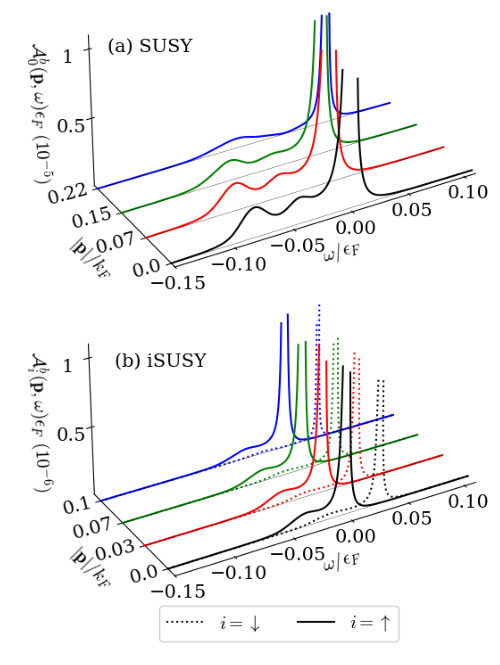 
FIG. 4. Plots of spectral functions Ab i(p, ω) for all present species of bosons. The SUSY case is shown in (a), and the iSUSY case is illustrated in (b).

📷 Fig 5

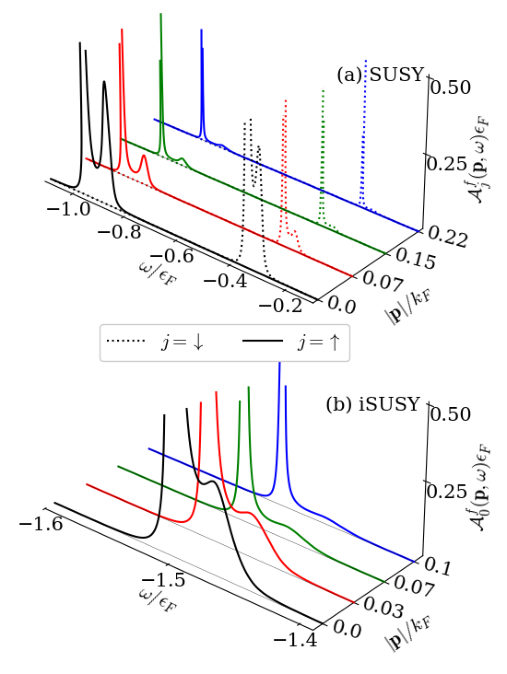 
FIG. 5. Plots of spectral functions Af j (p, ω) for all present species of fermions. The SUSY case is shown in (a), and the iSUSY case is illustrated in (b).

**Summary.** The paper theoretically explores how breaking generalized supersymmetry in Bose-Fermi mixtures leads to the appearance of fermionic Goldstino modes. It rigorously distinguishes between standard and inverse SUSY by analyzing their distinct signatures in measurable spectral functions. The findings propose specific radio-frequency spectroscopy experiments using alkali atom mixtures to detect these exotic quantum phenomena.

**Why it may be interesting.** This work connects abstract concepts from high-energy physics (supersymmetry) directly to observable phenomena in ultracold atomic systems, providing a concrete theoretical framework for novel spectroscopic measurements.

Detailed structure

**Main problem.** The paper investigates the emergence of fermionic Goldstino modes due to the breaking of generalized supersymmetry (gSUSY) in Bose-Fermi mixtures.

**Main result.** It distinguishes between standard SUSY and inverse SUSY (iSUSY), showing that iSUSY predicts unique, experimentally distinguishable features in the spectral functions of bosonic species.

**Method.** The analysis uses Random Phase Approximation (RPA) to calculate correlators and derive Goldstino dispersion relations, comparing theoretical predictions with spectroscopic measurements.

**Model / system.** The system is a nearly degenerate Bose-Fermi mixture of ultracold quantum gases (specifically $^{39}	ext{K}$ bosons and $^{40}	ext{K}$ fermions) possessing internal spin states (pseudospin).

**Key observables.** Goldstino dispersion $\omega = D_{ij}(p)$, bosonic/fermionic spectral functions $A(p, \omega)$ measurable via RF or microwave spectroscopy.

**Important parameters / regimes.** The analysis depends on the relative strengths of interactions ($U_{bf}$) and gSUSY breaking parameters ($\Delta\mu_{ij}, \chi$).

**Assumptions / limitations.** Approximations include using RPA, expanding in small symmetry-breaking parameters ($\chi$), and assuming uniform particle density.

**Figures summary.** Figures illustrate the Bose-Fermi correlator (Fig 1), the energy difference $\Delta\omega_{ij}$ vs. momentum for SUSY/iSUSY (Fig 2), self-energy contributions (Fig 3), and spectral functions $A(p, \omega)$ showing distinct features for both SUSY and iSUSY cases (Fig 4, Fig 5).

**Paper structure.** The paper builds from defining gSUSY in the Hamiltonian to using RPA to find Goldstino poles. It then systematically compares the predictions of standard SUSY versus inverse SUSY by analyzing how these symmetries manifest in the momentum-dependent spectral functions.

Abstract

We investigate nearly degenerate Bose-Fermi mixtures and show that the breaking of generalized supersymmetry (gSUSY) between bosons and fermions, with up to two internal states, manifests itself through the emergence of fermionic Goldstino modes with up to four flavors. In particular, we draw a distinction between typical supersymmetry (SUSY), where bosons have pseudospin 0 and fermions have pseudospin 1/2, and inverse supersymmetry (iSUSY), where bosons have pseudospin 1/2 and fermions have pseudospin 0. In such systems, we highlight that the Goldstino pseudospin is carried by either its constituent fermion (SUSY) or boson (iSUSY). We then distinguish between these two cases by depicting their differing effects on the spectral functions of the bosonic and fermionic atomic species. Lastly, we propose radio-frequency- or microwave-spectroscopy experiments, analogous to momentum (angular) resolved photoemission in condensed matter physics, to measure the pseudospin-dependent spectral functions and detect the emergence of Goldstino modes in mixtures of $^{39}$K and $^{40}$K.

[↑ back to top](#top)

### [Affine Filtering Measurements and Their Applications to Quantum Decoding](http://arxiv.org/abs/2606.07852v1)

**Authors:** Avijit Mandal, Noah Shutty, Henry D. Pfister, Stephen P. Jordan  
**Type:** theory · **Category:** quantum information and computing · **PDF:** <https://arxiv.org/pdf/2606.07852v1>  
**Analysis basis:** full PDF text, analyzed in chunks
**Topic relevance:** 🔥 `quantum measurements` **4/5** · `measurement-induced transitions` **1/5**

📷 Fig 1

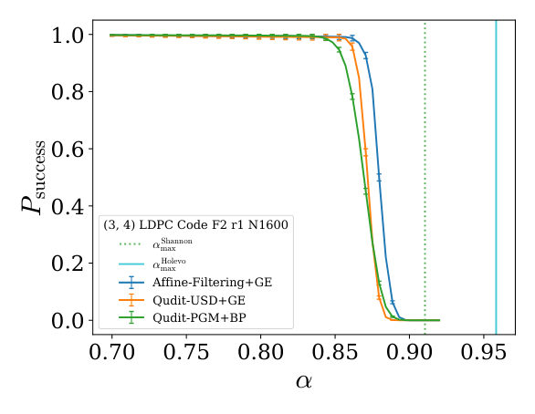 
Figure 1: Performance Comparison for (3,4) Regular LDPC Codes on F2 and r = 1 with N = 1600

📷 Fig 2

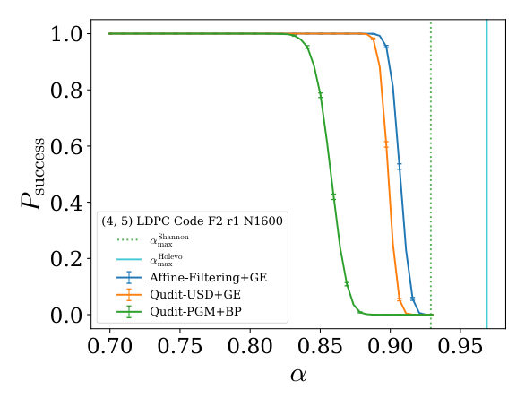 
Figure 2: Performance Comparison for (4,5) Regular LDPC Codes on F2 and r = 1 with N = 1600

📷 Fig 3

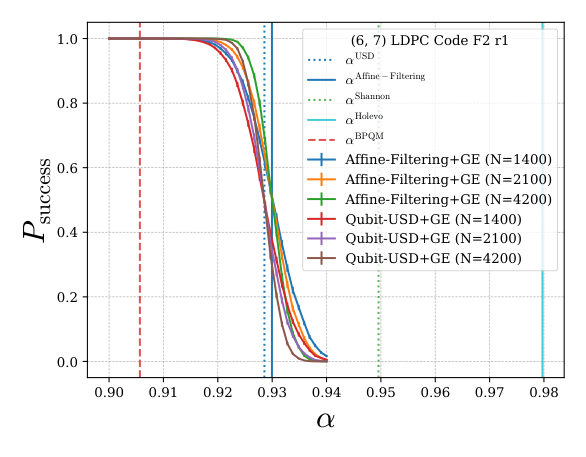 
Figure 3: Comparison between affine-filtering+GE and qubit USD+GE decoding for (6,7) regular LDPC codes

📷 Fig 4

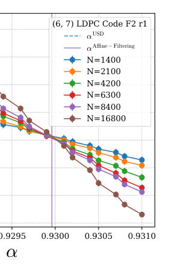 
Figure 4: Threshold plot for affine-filtering+GE decoding for (6,7) regular LDPC codes

📷 Fig 5

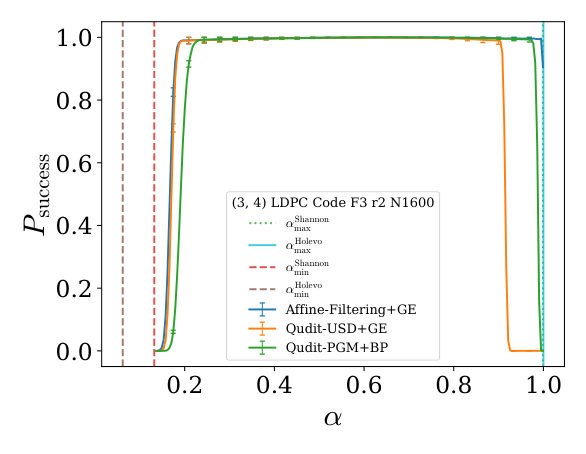 
Figure 5: Performance Comparison for (3,4) Regular LDPC Codes on F3 and r = 2 with N = 1600

**Summary.** This work introduces affine filtering measurements as an advanced tool for decoding classical linear codes transmitted via pure-state quantum channels. By mathematically reducing the optimal measurement design from a difficult Semidefinite Program to a solvable Linear Program using character theory, the authors provide a powerful new quantum decoding framework. Simulations confirm that this method significantly outperforms existing symbol-wise decoding techniques on structured codes like LDPC.

**Why it may be interesting.** The rigorous mathematical reduction of a complex quantum optimization problem (SDP) into a tractable linear program is a powerful technique applicable across quantum information theory, providing concrete tools for designing optimal measurements.

Detailed structure

**Main problem.** Developing efficient quantum decoding methods for classical linear codes transmitted over pure-state classical-quantum (CQ) channels.

**Main result.** The proposed affine filtering measurement combined with Gaussian elimination outperforms symbol-wise USD and PGM decoders in simulations on i.i.d. pure-state channels for LDPC codes.

**Method.** The optimal measurement design is formulated as a Semidefinite Program (SDP) which the authors successfully reduce to an equivalent Linear Program (LP) using character theory and symmetry arguments.

**Model / system.** The system models quantum information processing where classical linear codes are encoded into pure-state quantum channels. The core mathematical tools involve group characters, SDP/LP optimization, and measurement operators (POVMs).

**Key observables.** Success probability ($P_{	ext{success}}$) of decoding; the expected number of recovered linear equations.

**Important parameters / regimes.** Code parameters like $(k, D)$ for LDPC codes; channel noise parameter $\alpha$; field size $q$.

**Assumptions / limitations.** The derivation relies heavily on exploiting symmetries (coset symmetry) to reduce the SDP to an LP, and in some cases, passing to a limit ($\epsilon 	o 0$) by perturbing the state family.

**Figures summary.** Figures compare the success probability thresholds of the affine-filtering+GE decoder against qubit-wise USD/PGM decoders for various regular LDPC codes. Table 2 compares the expected number of linear equations recovered by different measurement types.

**Paper structure.** The paper progresses from defining the problem (USD measurements) to developing the mathematical machinery: first, establishing the SDP formulation; second, using symmetry arguments and character theory to reduce this SDP to an equivalent LP; finally, applying this LP framework to simulate and compare decoding performance on specific LDPC codes.

Abstract

Unambiguous state discrimination (USD) measurements are attractive because outcomes are either marked as conclusive (i.e., error free) or inconclusive (i.e., erased). We study affine filtering measurements, a structured variant of USD for decoding classical linear codes over pure-state classical-quantum channels, where a conclusive outcome identifies an affine subspace containing the transmitted codeword and an inconclusive outcome is treated as an erasure. For a group-covariant indexing of pure-state codewords, we show that the optimal design of affine filtering measurements is a semidefinite program that can be reduced to a linear program via character-based diagonalization. We use the resulting measurement to build a quantum decoding framework for local codes, and we demonstrate (via simulations on regular LDPC codes from Gallager ensembles using single parity check local constraints) that affine filtering based decoding can outperform symbol-wise USD and symbol-wise pretty good measurement based decoding methods on i.i.d. pure-state channels. In an independent and concurrent work, Buzet and Chailloux study similar fine-grained USD measurements for symmetric families of states. Their focus is on the code-agnostic setting whereas our focus is on code-aware constructions and decoding.

[↑ back to top](#top)

### [A five-qubit 1-resistant graph state and stabilizer marginal certificates](http://arxiv.org/abs/2606.08561v1)

**Authors:** Zicheng Han, Wanchen Zhang, Xiande Zhang  
**Type:** theory · **Category:** quantum information and computing · **PDF:** <https://arxiv.org/pdf/2606.08561v1>  
**Analysis basis:** full PDF text, analyzed in chunks
**Topic relevance:** 🔥 `entanglement & information structure` **4/5**

📷 Fig 1

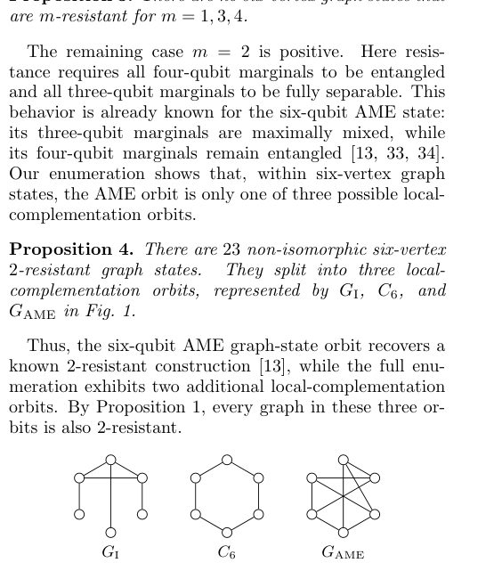 
FIG. 1. Unlabeled representatives of the three local- complementation orbits of six-vertex 2-resistant graph states. The right representative GAME is a graph-state realization of the known six-qubit AME 2-resistant state.

**Summary.** This paper rigorously studies $m$-resistant states, defining resistance based on how the state remains entangled after losing a few particles but becomes separable after losing slightly more. Using graph states and stabilizer formalism, the authors classify these robust states for small qubit numbers and prove general non-existence results for large cycle graphs.

**Why it may be interesting.** This work provides rigorous mathematical tools (stabilizer methods, NPT witnesses) to quantify entanglement robustness, which is crucial for designing fault-tolerant quantum communication protocols or understanding resource limitations in quantum computation.

Detailed structure

**Main problem.** The paper characterizes the robustness of multipartite entanglement, defined by $m$-resistance, in quantum states under particle loss.

**Main result.** It establishes that the five-cycle graph state $|C_5\rangle$ is a 1-resistant state for five qubits, and provides detailed classification results showing specific existence patterns for small numbers of qubits ($N=5, 6, 7$).

**Method.** The authors develop a stabilizer-subgroup method using local stabilizers to certify separability and Negative Partial Transpose (NPT) witnesses to certify entanglement in reduced marginal states.

**Model / system.** The study focuses on graph states $|G\rangle$ defined on $N$ qubits, where the resistance property requires specific reduced density matrices (marginals) corresponding to losing $m$ or $m+1$ particles to exhibit distinct entanglement properties.

**Key observables.** Entanglement status of marginal states ($
ho_{ar{J}}$), measured via NPT witnesses; separability confirmed by local stabilizer conditions.

**Important parameters / regimes.** The resistance parameter $m$, the number of qubits $N$ (tested for 5, 6, and 7), and the structure of the underlying graph $G$.

**Assumptions / limitations.** The analysis relies on sufficient conditions derived from local stabilizers for separability, and the classification is restricted to stabilizer/graph states.

**Figures summary.** Not specified in detail, but the notes reference tables summarizing existence results for $(N, m)$ pairs and figures showing representatives of found orbits (e.g., three orbits for 6-vertex 2-resistant states).

**Paper structure.** The paper first defines $m$-resistance using particle loss analysis. It then develops a formal stabilizer framework to test this property on graph state marginals, culminating in exhaustive classification results for small N and proving non-existence for large cycle graphs.

Abstract

We study particle-loss resistant entanglement within the framework of stabilizer and graph states. A pure state is \(m\)-resistant if it remains entangled after the loss of any \(m\) particles and becomes fully separable after the loss of any \(m+1\) particles. The smallest previously unresolved qubit case was the existence of a five-qubit \(1\)-resistant pure state, which is resolved here by the five-cycle graph state \(\ket{C_5}\). A stabilizer-subgroup method is also developed for verifying \(m\)-resistance in graph states, using local stabilizers to certify full separability and exact negative partial transpose~(NPT) witnesses to certify entanglement.   Applying this to all graph states associated with non-isomorphic graphs on five, six, and seven vertices, we obtain a graph state classification up to local Clifford equivalence, which also classifies stabilizer states   up to local Clifford equivalence. Thus, the five-qubit \(1\)-resistant stabilizer states are exactly the local Clifford class of \(C_5\). Six-qubit \(2\)-resistant stabilizer states exist in three distinct local Clifford classes, whereas no seven-qubit stabilizer state is \(m\)-resistant for any nonzero admissible \(m\). Finally, we prove that the cycle graph states \(\ket{C_N}\) with \(N\ge 7\) are not \(m\)-resistant for any \(0\le m\le N-2\).

[↑ back to top](#top)

### [Hardware-Aware QAOA for Honeypot Traffic Partitioning on 100+ Qubit IBM Quantum Processors](http://arxiv.org/abs/2606.09469v1)

**Authors:** Cameron V. Cogburn, Casimer DeCusatis, Evan Spillane  
**Type:** experiment · **Category:** quantum information and computing · **PDF:** <https://arxiv.org/pdf/2606.09469v1>  
**Analysis basis:** full PDF text, analyzed in chunks
**Topic relevance:** 🔥 `QC/QI experiment` **4/5**

📷 Fig 1

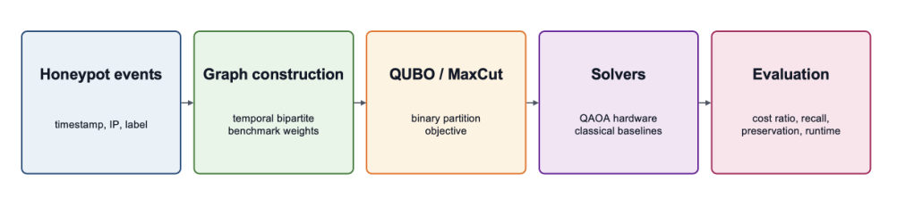 
Fig. 1. Workflow used in this study. Labeled honeypot event traces are converted into temporal bipartite MaxCut benchmark graphs, solved with QAOA hardware runs and classical baselines, and evaluated with both optimization and security metrics.

📷 Fig 2

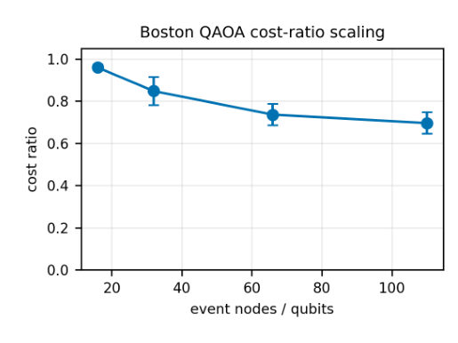 
Fig. 2. Boston QAOA cost ratio scaling over H16, H32, H66, and H110. Error bars indicate sample standard deviation over five seeds (124–128) for H16–H66 and six seeds (124–129) for H110.

📷 Fig 3

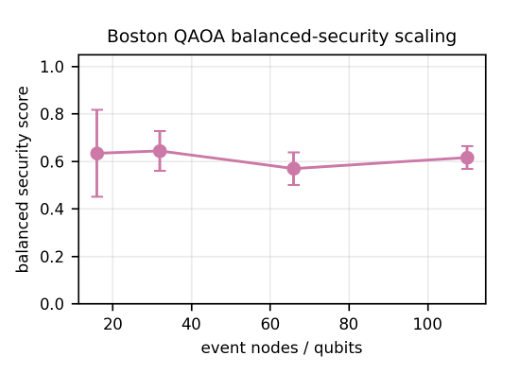 
Fig. 3. Balanced security score for the Boston QAOA scaling ladder. This metric averages attack recall and benign preservation.

📷 Fig 4

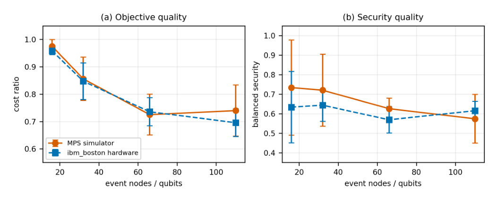 
Fig. 4. Noiseless finite-shot MPS QAOA baseline compared with ibm_boston hardware QAOA. Both workflows use p = 1, COBYLA, 1024 shots, and 15 optimizer evaluations. Markers show means and error bars show sample standard deviations. The MPS baseline and the Boston hardware both use five seeds (124–128) for H16, H32, and H66, while H110 included an additional sixth seed (129).

📷 Fig 5

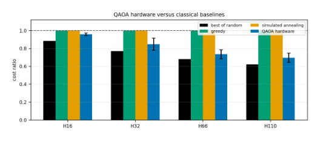 
Fig. 5. QAOA hardware cost ratios compared with best of 1000 random, greedy local search, and simulated annealing. Greedy local search and simulated annealing reach the class-defined reference objective on all four labeled temporal bipartite benchmark graphs.

**Summary.** This work develops a comprehensive hardware benchmark framework to test using QAOA for solving traffic partitioning problems derived from honeypot network data. By running the algorithm on multiple IBM quantum processors, the authors demonstrate that while shallow circuits are feasible at utility scale, backend architecture and routing overhead significantly impact performance metrics beyond just the optimization objective.

**Why it may be interesting.** While focused on cybersecurity, the rigorous benchmarking of quantum circuit overhead (depth, gate counts) across different physical architectures for a complex optimization problem provides valuable data for understanding near-term NISQ device limitations.

Detailed structure

**Main problem.** Mitigating Denial-of-Service (DoS) attacks by separating malicious honeypot traffic from benign traffic, modeled as a weighted MaxCut problem.

**Main result.** The study establishes a hardware feasibility benchmark showing that shallow QAOA can execute real traffic partitioning workloads at the utility scale, though it does not claim quantum advantage due to classical solvability of benchmarks.

**Method.** Variational Quantum Algorithms (QAOA) are applied to QUBO formulations derived from labeled temporal bipartite graphs representing honeypot traffic events.

**Model / system.** The system uses current IBM superconducting quantum processors (e.g., ibm_boston, ibm_miami) for execution on benchmark graphs up to 110 nodes. The problem is formulated as maximizing a weighted MaxCut objective.

**Key observables.** MaxCut cost ratio ($
ho_C$), Attack Recall, Benign Preservation, Quarantine Precision, Balanced Security Score, Transpiled Depth, Two-Qubit Gate Counts, and Observed Runtime.

**Important parameters / regimes.** Graph sizes (16 to 110 nodes), QAOA depth ($p=1$ fixed ansatz), and specific IBM quantum backend architectures.

**Assumptions / limitations.** The benchmark graphs are intentionally simple enough that classical heuristics can solve them, meaning the results do not constitute a claim of quantum advantage. The analysis requires reporting optimization quality separately from security metrics.

**Figures summary.** Figures compare QAOA cost ratios and balanced security scores across scaling graph sizes (H16-H110) and show architecture-dependent routing overheads for the largest instance (H110).

**Paper structure.** The paper follows a workflow: defining the DoS mitigation problem as MaxCut $\rightarrow$ constructing labeled temporal bipartite benchmarks $\rightarrow$ executing QAOA on multiple IBM backends $\rightarrow$ comparing results against classical heuristics and analyzing hardware overheads.

Abstract

Denial-of-service (DoS) and distributed denial-of-service (DDoS) mitigation requires separating malicious traffic from benign traffic while minimizing disruption to legitimate users. Prior work proposed mapping honeypot traffic partitioning to a weighted MaxCut problem and solving the resulting graphs with variational quantum algorithms. We extend this proof of principle direction with a reproducible event-level honeypot-to-QUBO pipeline, labeled temporal bipartite benchmark graphs with 16, 32, 66, and 110 event nodes, QAOA executions on IBM quantum hardware, classical heuristic baselines, a noiseless matrix product state reference, and a routing overhead analysis across quantum processor architectures. The largest benchmark is a 110-node, 181-edge instance executed on three IBM backends. Our results show that a shallow QAOA can execute real traffic partitioning workloads at the utility scale, while backend architecture and routing overhead affect objective quality, security metrics, and observed runtime. Because simple classical heuristics can solve the current labeled benchmark graphs, these experiments are not a quantum advantage claim. Instead, we deliberately use a fixed, shallow QAOA implementation to enable controlled comparisons across problem sizes and hardware architectures. This work establishes a hardware feasibility and architecture benchmark framework, and demonstrates that MaxCut cost, security quality, routing overhead, and runtime must be reported as separate metrics for cybersecurity relevant quantum optimization.

[↑ back to top](#top)

### [Impact of spontaneous emission on spin-squeezed quantum sensors](http://arxiv.org/abs/2606.08478v1)

**Authors:** Jinyang Li, Selim M. Shahriar  
**Type:** theory · **Category:** other · **PDF:** <https://arxiv.org/pdf/2606.08478v1>  
**Analysis basis:** full PDF text, analyzed in chunks
**Topic relevance:** `correlated / nonlocal dissipation` **3/5** · `methods for driven-dissipative` **3/5** · `quantum measurements` **3/5** · `Keldysh / 2PI / non-Gaussian methods` **2/5** · `exotic spin models in light-matter` **2/5** · `measurement-induced transitions` **2/5** · `spintronics-quantum-optics interface` **2/5** · `Dicke superradiance` **1/5** · `analog quantum simulation` **1/5** · `correlated cavity matter` **1/5** · `driven-dissipative phase transition` **1/5** · `entanglement & information structure` **1/5** · `non-equilibrium dynamics` **1/5**

📷 Fig 1

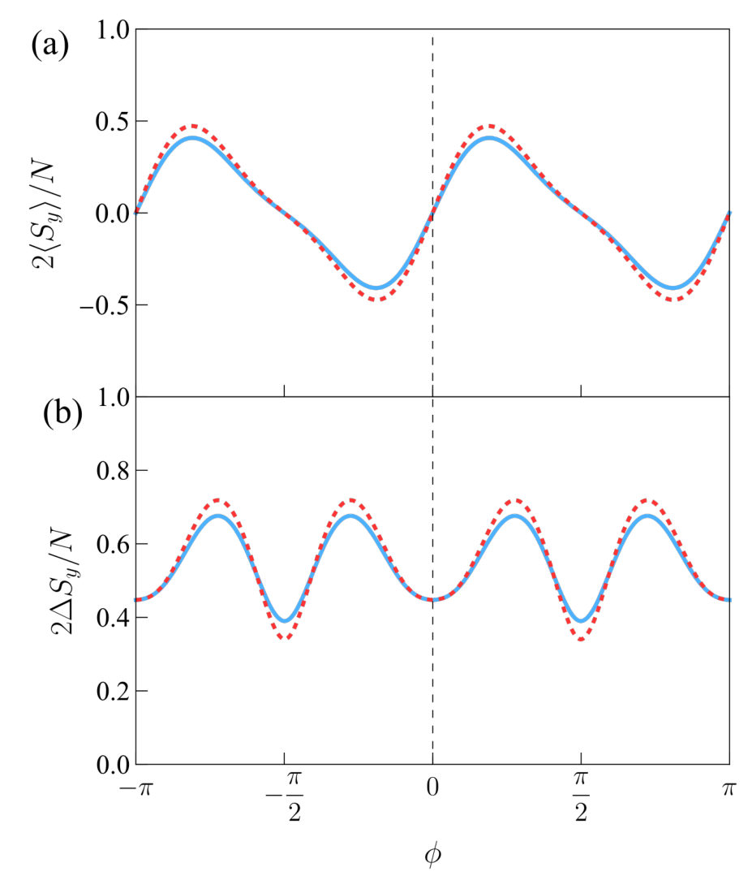 
Figure 1. Signal and quantum noise level of the CESP as a function of the phase shift φ for 5 N = and 6 µ π = (the optimal value of µ for the CESP). The blue solid curves show the results for 0.2χ Γ = and the red dashed for 0 Γ = . The vertical black dashed line marks the operation point. (a) Signal of the CESP, which is the expectation value of the measured operator y S , normalized to the maximum amplitude 2 N . (b) Quantum noise

📷 Fig 2

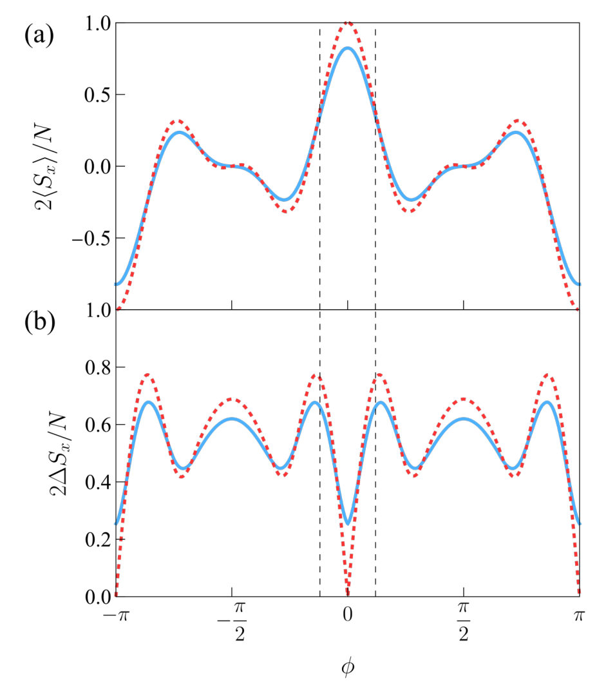 
Figure 2. Signal and quantum noise level of the GESP as a function of the phase shift φ at 5 N = , 0 0.1χ Γ = , and 0.31 µ π = (a value arbitrarily chosen). The blue solid curves show the results for 0.2χ Γ = and the red dashed for 0 Γ = . The vertical black dashed lines mark the operation points. (a) Signal of the GESP, which is the expectation value of the measured operator x S , normalized to the maximum amplitude 2 N . (b) Quantum noise level of the GESP, which is the standard deviation of the measured operator x S , normalized to the maximum noise level 2 N .

📷 Fig 3

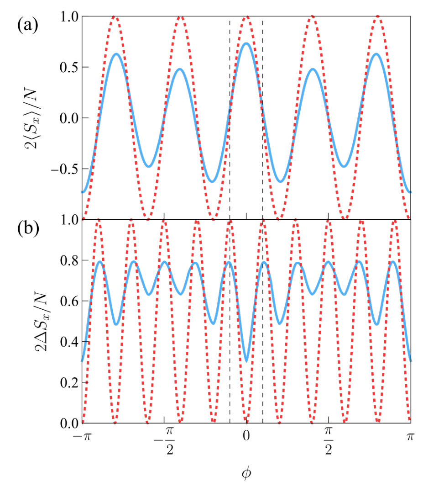 
Figure 3. Signal and quantum noise level of the SCSP as a function of the phase shift φ for 5 N = . The blue solid curves show the results for 0.2χ Γ = and the red dashed for 0 Γ = . The vertical black dashed lines mark the operation points. (a) Signal of the SCSP, which is the expectation value of the measured operator x S , normalized to the maximum amplitude 2 N . (b) Quantum noise level of the GESP, which is the standard deviation of the measured operator x S , normalized to the maximum noise level 2 N .

📷 Fig 4

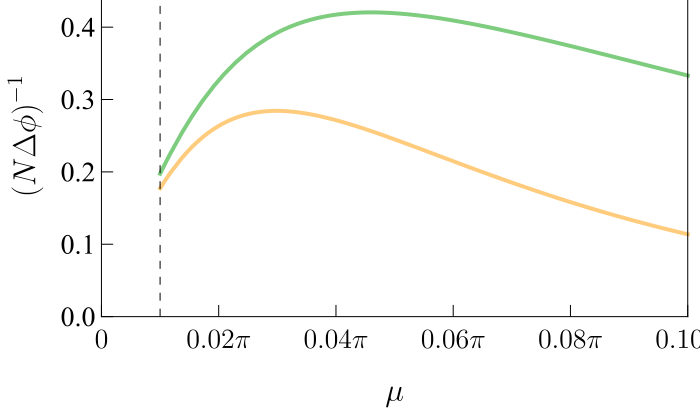 
Figure 4. Lower limit of the GESP sensitivity normalized to the Heisenberg limit as a function of µ for 4 C = (green) and 1 C = (orange) in the presence of excess detection noise at a level of 0.1N .

**Summary.** This paper analyzes the impact of spontaneous emission on spin-squeezed quantum sensors using ${}^{88}	ext{Sr}$ atoms. By comparing different squeezing protocols, the authors demonstrate that the Generalized ESP (GESP) is superior to conventional methods because it resists SE better and exhibits an unexpected suppression of quantum noise due to the decay process.

**Why it may be interesting.** This work directly addresses open quantum system dynamics in atomic sensing, providing quantitative comparisons between advanced quantum measurement protocols under realistic decoherence channels like spontaneous emission.

Detailed structure

**Main problem.** The study investigates how spontaneous emission (SE) degrades the performance of spin-squeezed quantum sensors based on atomic ensembles.

**Main result.** The Generalized Echo Squeezing Protocol (GESP) is shown to be significantly more resistant to SE than the Conventional ESP (CESP), and unexpectedly, SE can suppress quantum noise in GESP.

**Method.** The authors use analytical derivations and numerical simulations based on solving the master equation for the density operator under the influence of SE Lindblad operators.

**Model / system.** The system involves atomic sensors using One-Axis-Twist Squeezing (OATS) protocols, specifically modeled with ${}^{88}	ext{Sr}$ atoms to simplify Zeeman substates. The evolution is governed by a master equation incorporating spontaneous emission and squeezing operations.

**Key observables.** Signal contrast (coherence), quantum noise level (variance of spin operators), and the comparison between different sensing protocols (CESP, GESP).

**Important parameters / regimes.** The single-atom cooperativity ($C$), the decay rate ($\Gamma$) associated with SE, and the squeezing parameter $\mu$.

**Assumptions / limitations.** The analysis focuses on simplifying the system by using ${}^{88}	ext{Sr}$ to limit Zeeman substates; some derivations assume dissipation is purely dephasing.

**Figures summary.** Figures compare signal contrast and quantum noise levels for CESP, GESP, and SCSP under varying SE strengths ($\Gamma$), demonstrating superior performance for GESP.

**Paper structure.** The paper builds by first establishing the challenge of SE in OATS sensors. It then compares protocols (CESP vs GESP) using analytical derivations and simulations to quantify SE-induced signal contrast loss and noise suppression, concluding with the superiority of GESP.

Abstract

The echo squeezing protocols (ESPs) are techniques that amplify the phase shift in a quantum sensor with one-axis-twist squeezing (OATS). For atomic sensors, spontaneous emission (SE) in the OATS operations is an important imperfection, which, however, is prohibitively difficult to study. SE can transfer atoms to all the Zeeman substates, making the number of relevant collective states excessively large. In this paper, we focus on a relatively simple isotope, namely Sr-88, which only has one Zeeman substate in each of the two ground states. Nevertheless, studying the effect of SE is still challenging because SE will populate all collective states, either symmetric or asymmetric, thus putting the ensemble into a mixed state. Based on analytical derivation and numerical simulations, we conclude that the GESP is more resistant to SE than the conventional echo squeezing protocol (CESP). This is another advantage of the GESP that has not been realized formerly. We also find that for the GESP employing Sr-88, the SE-induced reduction in the signal contrast is the same as that for a Ramsey protocol without squeezing and the quantum noise is suppressed by SE. This is an unexpectedly favorable result. The SE-induced suppression of quantum noise constitutes a previously unrecognized effect that challenges both earlier conclusions and intuitive expectations.

[↑ back to top](#top)

### [Perturbative Contrastive Physical Learning](http://arxiv.org/abs/2606.09756v1)

**Authors:** Kyungeun Kim, Amanuel Anteneh, Israel Klich, Olivier Pfister, J. M. Schwarz  
**Type:** both · **Category:** disordered systems and neural networks · **PDF:** <https://arxiv.org/pdf/2606.09756v1>  
**Analysis basis:** full PDF text, analyzed in chunks
**Topic relevance:** `analog quantum simulation` **3/5** · `measurement-induced transitions` **3/5** · `methods for driven-dissipative` **3/5** · `quantum measurements` **3/5** · `driven-dissipative phase transition` **2/5** · `non-equilibrium dynamics` **2/5** · `quantum optics experiment` **2/5** · `Frenkel-Kontorova` **1/5** · `Keldysh / 2PI / non-Gaussian methods` **1/5** · `QC/QI experiment` **1/5** · `correlated cavity matter` **1/5** · `non-equilibrium universality` **1/5**

📷 Fig 1

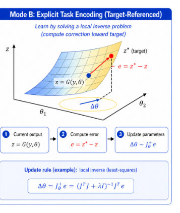 
FIG. 1. Schematic for PCPL with Mode A (implicit target) and Mode B (explicit target).

📷 Fig 2

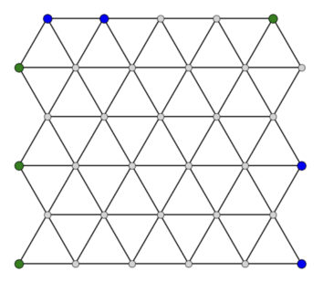 
FIG. 2. Spring Network Schematic. The green nodes are fixed and the 4 blue nodes denote where the input forces containing the Iris dataset information are applied.

📷 Fig 3

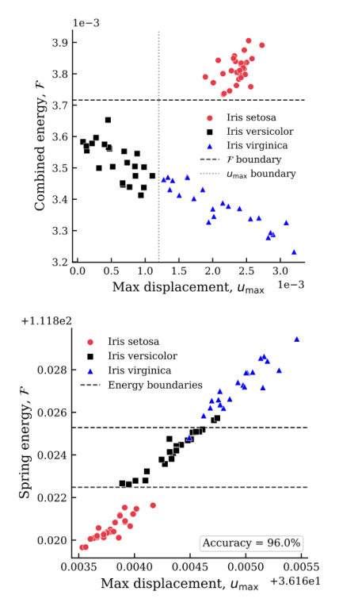 
FIG. 3. Decision boundaries of case 2 and case 3 for a classical spring network in a gravitational field: Left - Hybrid system classification using adaptive thresholds in Ftotal vs. displacement space achieves 100% test ac- curacy. Right - Pure mechanical system classification using Etotal (linear strain energy) with gap-based energy thresholds achieves 96% accuracy, where both stiffness matrix K and masses b are trained via Jacobian pseu- doinverse with parameter perturbation.

📷 Fig 4

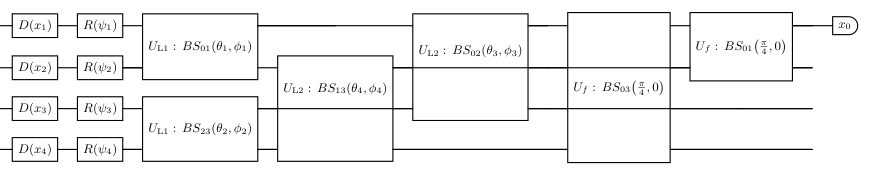 
FIG. 4. Four-mode Gaussian photonic circuit for linear classification. Each mode is initialized in vacuum |0⟩, displaced by D(xi), and rotated by R(ϕi), giving UR = diag(eiϕ1, . . . , eiϕ4). This can be implemented by phase modulating lasers of tunable power. The first beam splitter layer UL1 = BS01(θ1, ϕ1) ⊕BS23(θ2, ϕ2) and second layer UL2 = BS02(θ3, ϕ3) ⊕BS13(θ4, ϕ4) mix the modes using 8 trainable parameters. The fixed concentration layer Uf = BS03(π/4, 0) · BS01(π/4, 0) concentrates information into mode 0. x-quadrature mean measurements yields ⟨ˆx0⟩= P

📷 Fig 5

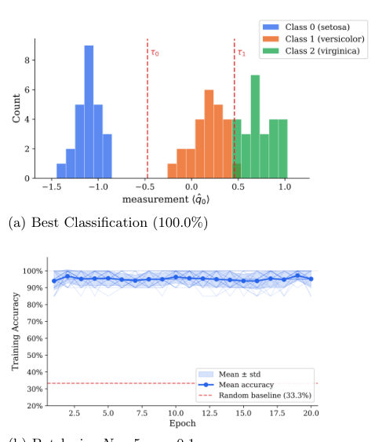 
FIG. 5. Classification accuracy via mini-batch pseudoin- verse nudging. (a) distribution of photonic measure- ment outcomes by class showing clear separation be- tween Class 0 (blue, centered at -1), Class 1 (orange, centered at 0), and Class 2 (green), achieving 100.0% classification accuracy. (b) Training convergence using mini-batch pseudoinverse nudging with batch size N = 5 and learning rate η = 0.1, reaching nearly perfect accu- racy within 10 epochs.

**Summary.** This paper introduces Perturbative Contrastive Physical Learning (PCPL), a general framework that enables machine learning by analyzing measurable contrasts in a physical system's response to small perturbations. It demonstrates this principle using both mechanical springs and continuous-variable photonic circuits, showing that complex tasks like classification and analog multiplication can be achieved without explicit backpropagation or centralized gradient computation.

**Why it may be interesting.** The work provides a concrete physical realization of gradient descent principles using only measurable differences between states, which is highly relevant for designing autonomous quantum or optical computation systems where direct gradient calculation is intractable.

Detailed structure

**Main problem.** To develop a general learning framework that derives parameter updates from measurable contrasts between physical states induced by controlled perturbations, bypassing the need for explicit centralized gradient computation.

**Main result.** The proposed Perturbative Contrastive Physical Learning (PCPL) framework successfully applies to both mechanical spring networks and continuous-variable photonic circuits, demonstrating autonomous learning capabilities.

**Method.** Learning is achieved by measuring the difference (contrast) between a system's response under perturbed conditions ($z_n$) versus its free response ($z_f$), allowing for updates analogous to gradient descent without explicit backpropagation.

**Model / system.** The framework is demonstrated on two platforms: (i) mechanical spring networks whose stiffness parameters are learned from measured displacements/forces, and (ii) continuous-variable photonic circuits using Gaussian operations and quadrature measurements.

**Key observables.** Measurable contrasts ($\Delta z = z_n - z_f$), classification accuracy (e.g., 97.7% for CV circuits), and the effective weight vector $W$ in the linear readout approximation.

**Important parameters / regimes.** Perturbation magnitude ($\epsilon$), learning rate ($\eta$), and circuit parameters like beam splitter angles ($	heta$) and squeezing levels ($s$).

**Assumptions / limitations.** The core assumption is that measurable contrasts are sufficient to approximate necessary gradient information, relying on linear response theory approximations (Jacobian linearization) for the updates.

**Figures summary.** Figures illustrate schematic comparisons of PCPL modes (A vs. B), decision boundaries in feature spaces using spring networks, and circuit diagrams showing the implementation of multipliers and parameter updates in photonic circuits.

**Paper structure.** The paper introduces PCPL by unifying prior contrast-based methods (EP, Frequency Propagation). It details two operational modes (Mode A: self-referenced contrast; Mode B: target-referenced contrast), applies this to a mechanical spring network for classification, and extends the methodology to continuous-variable photonic circuits, culminating in implementing an analog multiplier.

Abstract

Responses to perturbations are key to understanding physical systems. The ability to contrast such responses by comparing how a system reacts under slightly different conditions provides a mechanism for learning. Here, we introduce Perturbative Contrastive Physical Learning (PCPL), a general framework in which learning emerges from measurable contrasts between physical states produced by controlled changes to inputs, boundary conditions, parameters, or interpreter functions. PCPL unifies and extends prior approaches: Equilibrium Propagation is rooted in contrasts between free and nudged equilibria in energy-based systems, while Frequency Propagation corresponds to contrasts extracted from sinusoidally driven, frequency-demodulated responses. We show that contrast-driven updates can reflect either local sensitivities or global inverse-problem structure, yet do not require centralized gradient computation. Instead, effective learning geometry emerges implicitly from the system's own physical response, allowing learning behavior to arise without an external processor or explicit backpropagation. We demonstrate PCPL in two platforms: (i) spring networks that update bond stiffness using measured displacements and forces, and (ii) continuous-variable photonic circuits trained via x quadrature measurements and finite-difference estimates of the Jacobian. Both platforms successfully learn classification tasks. We further show that a continuous-variable photonic circuit can be trained to implement analog multiplication, illustrating a step toward more autonomous physical learning systems.

[↑ back to top](#top)

### [Controlling multiparameter quantum estimation in exciton-optomechanics system](http://arxiv.org/abs/2606.08949v1)

**Authors:** Hamza Harraf, Mohamed Amazioug, Rachid Ahl Laamara  
**Type:** theory · **Category:** other · **PDF:** <https://arxiv.org/pdf/2606.08949v1>  
**Analysis basis:** full PDF text, analyzed in chunks
**Topic relevance:** `Tavis-Cummings & cavity-many-emitter` **3/5** · `analog quantum simulation` **3/5** · `correlated cavity matter` **3/5** · `quantum measurements` **3/5** · `measurement-induced transitions` **2/5** · `quantum optics experiment` **2/5** · `Keldysh / 2PI / non-Gaussian methods` **1/5** · `correlated / nonlocal dissipation` **1/5** · `driven-dissipative phase transition` **1/5** · `entanglement & information structure` **1/5** · `methods for driven-dissipative` **1/5**

📷 Fig 1

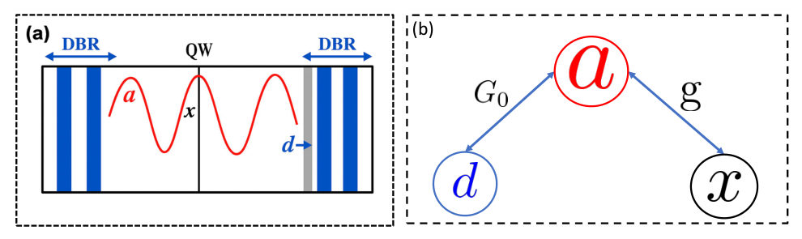 
FIG. 1. (a) Sketch of exciton–optomechanical (EOM). A quantum well (QW) is embedded in a semiconductor microcavity formed by two distributed Bragg reflectors (DBRs), enabling interaction between the exciton mode (x) and the optical cavity mode (a). The DBRs are movable, and their mechanical motion (d) couples to the cavity photons through a dispersive interaction. The shaded grey region illustrates the mechanical degree of freedom and is not intended to represent the actual physical motion. (b) The cavity mode (a) couples to the exciton mode (x) and via a linear beam-splitter interaction (g). In addition, the cavity mode interact with the mechanical mode (d) through a dispersive...

📷 Fig 2

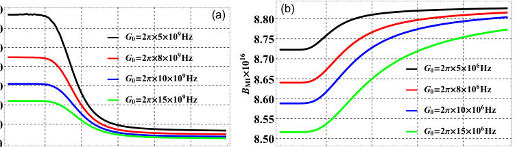 
FIG. 2. (a) Plot of the BS /BR as function of the temperature T for different values of the coupling G0. (b) Plot of the BMI as function of the temperature T for different values of the coupling G0. The other parameters are provided in the table I.

📷 Fig 3

 
FIG. 3. Plot of the most informative bound (BMI) as function of the driving amplitude ε for different values of the coupling g. The other parameters are provided in the table I.

📷 Fig 4

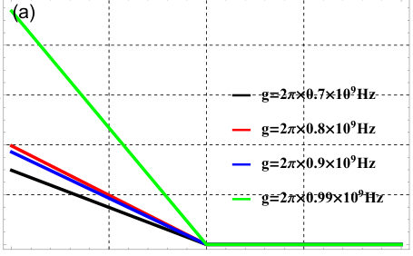 
Figure 3 shows the dependence of the BMI on the driving amplitude ε for different values of the exciton-photon coupling strength g. One clearly observes that the BMI rapidly decreases as the driving amplitude increases and eventually approaches a nearly vanishing value. Physically, increasing the driving strength enhances the intracavity photon population, which effectively amplifies the hybrid interactions within the system. As a result, the encoded information associated with the estimated parameters becomes more efficiently transferred into the quantum fluctuations of the output state. Consequently, the distinguishability between neighboring quantum states is significantly enhanced,...

📷 Fig 5

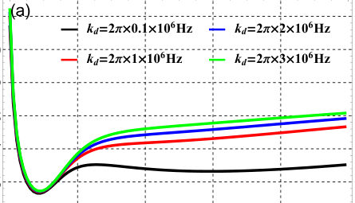 
FIG. 4. Plot of the most informative bound (BMI) as function of the exciton decay rate kx for different values of the mechanical damping rate kd. The other parameters are provided in the table I.

**Summary.** The paper analyzes multiparameter quantum estimation in an exciton-optomechanical system to determine the ultimate limits on parameter sensing accuracy. Using advanced quantum information techniques, it shows that low temperatures and strong coupling enhance precision, while heterodyne detection offers the best practical measurement strategy compared to homodyne methods.

**Why it may be interesting.** This work is highly relevant as it combines cavity QED concepts (exciton-photon coupling) with mechanical oscillators in a quantum metrology context. The detailed comparison of estimation bounds and measurement schemes provides concrete guidelines for experimental realization in open quantum systems.

Detailed structure

**Main problem.** The study investigates how to achieve optimal precision when simultaneously estimating multiple parameters (like coupling strength and decay rate) in a complex quantum system.

**Main result.** Strong hybrid interactions and low temperatures significantly boost estimation accuracy, while thermal noise degrades performance; heterodyne detection proves superior to homodyne measurement techniques.

**Method.** The analysis employs the Gaussian-state formalism, deriving covariance matrices and utilizing both Symmetric Logarithmic Derivative (SLD) and Right Logarithmic Derivative (RLD) approaches to calculate Quantum Fisher Information Matrices.

**Model / system.** The physical platform is a hybrid exciton–optomechanical (EOM) system involving semiconductor quantum wells coupled to an optical microcavity and mechanical resonator. The dynamics are modeled using bosonic operators interacting via coupling terms ($g$ and $G_0$).

**Key observables.** Quantum Fisher Information Matrix (QFIM), Quantum Cramér–Rao Bounds (QCRB), covariance matrix of quantum fluctuations, and the ratio between SLD and RLD bounds.

**Important parameters / regimes.** Exciton-photon coupling strength ($g$), excitonic decay rate ($\kappa_x$), temperature ($T$), driving power ($\epsilon$), and optomechanical coupling strength ($G_0$).

**Assumptions / limitations.** The analysis is restricted to Gaussian quantum fluctuations, and the comparison between measurement protocols assumes ideal detection efficiency.

**Figures summary.** Figures illustrate the dependence of the estimation precision (BMI) on temperature, driving amplitude, and decay rates; they also compare the time evolution of QFI derived from SLD vs. Homodyne/Heterodyne measurements.

**Paper structure.** The paper progresses by setting up the EOM Hamiltonian, linearizing the quantum Langevin equations for fluctuations to find the covariance matrix, applying advanced estimation theory (SLD/RLD) to derive bounds, and finally analyzing how environmental parameters ($T$, $\epsilon$, $k_x$) affect these ultimate precision limits.

Abstract

Multiparameter quantum estimation has emerged as a central task in quantum metrology. In this work, we investigate multiparameter quantum estimation in a hybrid exciton--optomechanical (EOM) system. The system consists of a semiconductor quantum well embedded inside a driven optomechanical microcavity, where the excitonic, optical, and mechanical modes interact coherently through exciton--photon and radiation-pressure couplings. Using the Gaussian-state formalism, we derive the covariance matrix of the steady-state quantum fluctuations and employ both the symmetric logarithmic derivative (SLD) and right logarithmic derivative (RLD) approaches to evaluate the quantum Fisher information matrix associated with the simultaneous estimation of the exciton--photon coupling strength $g$ and the excitonic decay rate $k_x$. We analyze the corresponding quantum Cramér--Rao bounds and determine the most informative precision limit governing the attainable estimation accuracy. The influence of several experimentally relevant parameters, including temperature, driving power, optomechanical coupling strength, and dissipation rates, is investigated in detail. Our results show that strong hybrid interactions and low-temperature regimes significantly enhance the estimation precision, whereas thermal fluctuations and dissipation processes deteriorate the metrological performance. Furthermore, we compare the ultimate quantum limits with experimentally feasible Gaussian measurement strategies based on homodyne and heterodyne detection. We show that heterodyne detection provides better estimation performance than homodyne schemes and can approach the optimal quantum precision limit in suitable parameter regimes.

[↑ back to top](#top)

### [A spectral model of power-law decay in natural and engineered systems](http://arxiv.org/abs/2606.08342v1)

**Authors:** Balázs Sándor, Márk Honti, Henrique Santos Lima  
**Type:** theory · **Category:** statistical mechanics · **PDF:** <https://arxiv.org/pdf/2606.08342v1>  
**Analysis basis:** full PDF text, analyzed in chunks
**Topic relevance:** `correlated / nonlocal dissipation` **3/5** · `methods for driven-dissipative` **3/5** · `non-equilibrium dynamics` **3/5** · `non-equilibrium universality` **3/5** · `Keldysh / 2PI / non-Gaussian methods` **2/5** · `driven-dissipative phase transition` **2/5** · `Kondo & dissipative impurity` **1/5** · `analog quantum simulation` **1/5** · `scars & prethermalization` **1/5**

📷 Fig 1

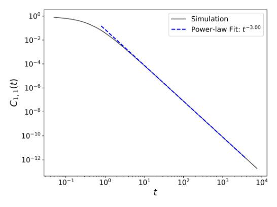 
FIG. 1: Boundary concentration C1,1(t) as a function of time t for the two-dimensional transport model (Eq. (14) for d = 2). The numerical simulation of the discrete layered diffusion matrix under absorbing Dirichlet boundary conditions on a 512 × 512 grid (solid black line) is consistent with the analytical asymptotic scaling law t−3

📷 Fig 2

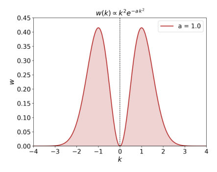 
FIG. 2: Modal weight distribution w(k) derived from the emergent Gamma rate spectrum in Eq. (32).

📷 Fig 3

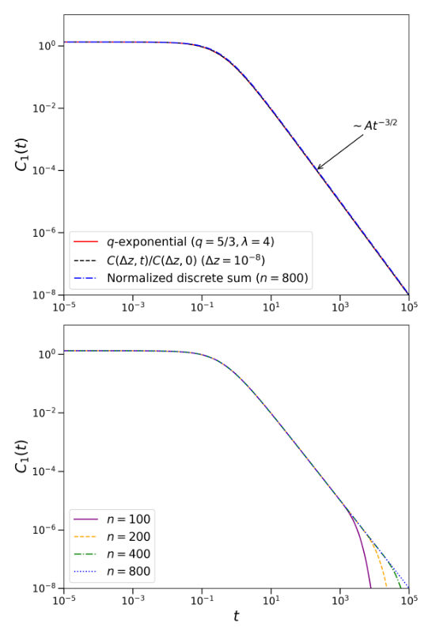 
FIG. 3: (Top) Boundary concentration C1(t) as a function of time t for the normalized q-exponential function (red solid curve), the continuous analytical solution in Eq. (42) (black dashed curve), and the discrete spectral sum computed for n = 800 layers via Eq. (9) and Eq. (40) (blue dash-dotted curve). (Bottom) Discrete spectral sum for n = 100 (purple), n = 200 (orange), n = 400 (green), and n = 800 (blue).

**Summary.** This work develops a theoretical framework showing that power-law decay in complex transport processes can be derived from fundamental principles of linear diffusion and spectral analysis. By analyzing the low-wavenumber behavior of the system's eigenmodes, the authors connect classical diffusion directly to nonextensive statistical mechanics, yielding a universal entropic index $q=5/3$ in one dimension.

**Why it may be interesting.** While focused on classical diffusion, the rigorous connection between linear spectral theory (eigenmodes) and nonextensive statistical mechanics provides a powerful mathematical framework applicable to open quantum systems where dissipation or boundary effects are crucial.

Detailed structure

**Main problem.** To derive a first-principles spectral mechanism explaining how nonextensive q-exponential dilution and power-law relaxation emerge in linear, non-ideal transport systems.

**Main result.** The analysis establishes that the asymptotic decay rate is governed by the system's boundary geometry and spectral dimensionality, leading to an emergent entropic index $q=5/3$ in the 1D limit.

**Method.** Spectral analysis of a layered diffusion matrix, involving taking the continuum limit (sum $	o$ integral) over low-wavenumber eigenmodes.

**Model / system.** The model uses a layered diffusion system with an absorbing boundary, mathematically analogous to an incompletely mixed reactor or transport process on a semi-infinite domain. The dynamics are governed by a linear master equation ($rac{dC}{dt} = AC$).

**Key observables.** Macroscopic relaxation decay $C(t) \propto t^{-eta}$ and the generalized q-exponential function; boundary flux/concentration $C_1(t)$.

**Important parameters / regimes.** The entropic index $q$, spatial dimension $d$, and the low-wavenumber scaling of modal weights ($w(k) \propto k^2$).

**Assumptions / limitations.** The system is modeled by a linear transport operator, and the analysis relies on taking the continuum limit ($n 	o \infty$) in the spectral decomposition.

**Figures summary.** Figures compare numerical simulations of boundary concentration decay $C_1(t)$ using three methods (q-exponential fit, continuous analytical solution, discrete sum), showing convergence to the predicted power-law scaling.

**Paper structure.** The paper develops from defining the spectral mechanism for relaxation in layered systems, deriving asymptotic laws based on dimensional analysis ($d$), and finally demonstrating the invariance of the key exponent ($q=5/3$) in the 1D limit across different initial conditions.

Abstract

We present a first-principles spectral mechanism for the emergence of nonextensive $q$-exponential dilution and power-law relaxation in non-ideal transport systems. By modeling an incompletely mixed reactor as a layered diffusion matrix with an absorbing boundary, we demonstrate that macroscopic power-law tails depend on the geometric interaction between the initial tracer placement and the domain's boundary configuration. For a one-dimensional system, an asymmetric, volumetrically distributed initial concentration profile projects onto the low-wavenumber eigenmodes, generating an emergent Gamma distribution of relaxation rates; at an infinitesimal boundary layer thickness ($Δz \to 0$), this profile yields the nonextensive $q$-exponential decay function exactly across the entire temporal domain with $q = 5/3$. Extended to $d$ dimensions under a highly localized, boundary-adjacent singular initial condition, the resulting scaling exponents and corresponding $q$ values depend explicitly on the spatial configuration of the absorbing boundaries. However, in the one-dimensional limit ($d=1$), these distinct initial states and boundary formulations intersect, rendering the $q=5/3$ exponent geometrically invariant. Our approach establishes a clear connection between linear diffusion transport and nonextensive statistical mechanics, showing how heavy-tailed transport can be derived from boundary geometry and spectral dimensionality.

[↑ back to top](#top)

### [Geometric Dissipation Constraints in Stochastic Reaction Dynamics: A Variational Observable for Hidden Kinetic Structure in Energy Landscapes](http://arxiv.org/abs/2606.09684v1)

**Authors:** Shlomo Segal  
**Type:** theory · **Category:** statistical mechanics · **PDF:** <https://arxiv.org/pdf/2606.09684v1>  
**Analysis basis:** full PDF text, analyzed in chunks
**Topic relevance:** `methods for driven-dissipative` **3/5** · `non-equilibrium dynamics` **3/5** · `non-equilibrium universality` **3/5** · `Keldysh / 2PI / non-Gaussian methods` **2/5** · `correlated / nonlocal dissipation` **2/5** · `driven-dissipative phase transition` **2/5** · `Kondo & dissipative impurity` **1/5** · `analog quantum simulation` **1/5** · `entanglement & information structure` **1/5** · `scars & prethermalization` **1/5**

📷 Fig 1

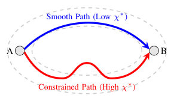 
Fig. 1: Vectorial TikZ illustration of two pathways across an identical energy landscape. While both pathways connect states A and B over comparable energetic barriers, the red pathway encounters high geometric contractive stiffness (funneling turns), yielding a pronounced local geometric dissipation penalty.

📷 Fig 2

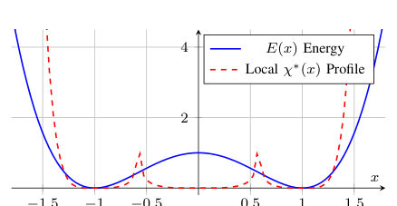 
Fig. 2: Exact numerical resolution of the local geometric dissipation integrand, χ∗(x), plotted alongside the potential E(x) = (x2 −1)2. Symmetrical peaks emerge at inflection points where geometric constraints effectively increase local dissipation during transit.

📷 Fig 3

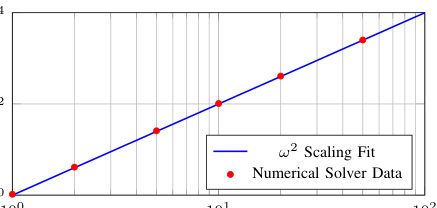 
Fig. 3: Log-log plot confirming the microstructural scaling law for a corrugated periodic potential E(x) = sin(ωx). Discrete markers indicate actual values extracted from the numerical solver, demonstrating strict adherence to the analytical ω2 law.

**Summary.** This work introduces a geometric dissipation observable ($\chi^*$) to quantify hidden kinetic constraints within stochastic reaction dynamics. By analyzing the local geometry of the configuration space flow, $\chi^*$ provides a diagnostic tool that can differentiate between competing reaction pathways that are otherwise indistinguishable using only standard free-energy calculations. This suggests an additional layer of geometric control governing molecular motion.

**Why it may be interesting.** While focused on classical stochastic dynamics, the concept of deriving a geometric constraint observable that goes beyond simple potential energy surfaces is highly relevant to understanding non-equilibrium quantum processes where path dependence (e.g., in quantum tunneling or decoherence) is critical.

Detailed structure

**Main problem.** The paper addresses characterizing hidden kinetic constraints in stochastic reaction dynamics that are invisible to standard global thermodynamic descriptors like free energy barriers.

**Main result.** A novel geometric dissipation observable, $\chi^*$, was derived which successfully distinguishes between kinetically distinct reaction pathways even when they share the same overall free-energy profile.

**Method.** The authors employ a variational functional approach applied to overdamped Langevin dynamics formulated in Wasserstein space to derive this diagnostic quantity.

**Model / system.** The model is an overdamped Langevin system governed by $\mathrm{d}x(t) = A(x)\mathrm{d}t + \sqrt{2D}\mathrm{d}W(t)$, applied to various potentials including the Müller-Brown potential and corrugated landscapes.

**Key observables.** Geometric Dissipation Observable ($\chi^*$), Phase-Space Contraction Rate ($\kappa(x)$), Local Force-Drift Alignment $\phi(x)$.

**Important parameters / regimes.** The asymptotic limit $\lambda 	o 0^+$ is crucial for deriving the final observable; quadratic scaling behavior ($\omega^2$) in corrugated potentials is a key prediction.

**Assumptions / limitations.** Assumes standard regularity and ergodicity of the underlying stochastic process.

**Figures summary.** Figure 1 illustrates how $\chi^*$ penalizes constrained pathways compared to unconstrained ones on an identical energy landscape. Figure 2 shows $\chi^*(x)$ peaking at inflection points, and Figure 3 confirms a theoretical quadratic scaling law for corrugated potentials.

**Paper structure.** The paper establishes the limitations of global descriptors, derives the variational functional $I_\lambda[\psi]$ based on Orlicz-Sobolev spaces, calculates the leading-order asymptotic observable $\chi^*$, proves its physical significance by distinguishing pathways, and validates it using numerical simulations across various benchmark systems.

Abstract

We propose a geometric framework for characterizing hidden kinetic constraints in stochastic reaction dynamics. While free-energy barriers and entropy production provide global descriptors of thermodynamic behavior, they are largely insensitive to local geometric structure in configuration space that governs pathway selection. Starting from overdamped Langevin dynamics formulated as a gradient flow in Wasserstein space, we derive a variational functional whose leading-order asymptotic structure defines a local dissipation-geometry coupling observable. This quantity combines force-drift alignment with phase-space contraction induced by the divergence of the drift field, yielding a scalar field that reflects second-order geometric features of the underlying energy landscape. We demonstrate that this observable distinguishes kinetically distinct reaction channels that are degenerate under conventional free-energy analysis, as shown through numerical experiments on benchmark systems including the Muller-Brown potential, corrugated periodic landscapes, and the conformational transitions of Alanine Dipeptide. These experiments demonstrate robust separation of pathways and are consistent with a quadratic scaling behavior in the high-frequency homogenization regime. Our results suggest that stochastic reaction dynamics contain an additional geometric layer of kinetic control in molecular motion not captured by standard thermodynamic or reaction-coordinate descriptions.

[↑ back to top](#top)

### [Optomechanically controlled response amplification for enhanced quantum sensing](http://arxiv.org/abs/2606.09716v1)

**Authors:** Javid Naikoo  
**Type:** theory · **Category:** other · **PDF:** <https://arxiv.org/pdf/2606.09716v1>  
**Analysis basis:** full PDF text, analyzed in chunks
**Topic relevance:** `correlated cavity matter` **3/5** · `Keldysh / 2PI / non-Gaussian methods` **2/5** · `correlated / nonlocal dissipation` **2/5** · `driven-dissipative phase transition` **2/5** · `entanglement & information structure` **2/5** · `methods for driven-dissipative` **2/5** · `Tavis-Cummings & cavity-many-emitter` **1/5** · `analog quantum simulation` **1/5** · `interference shaping light` **1/5** · `non-equilibrium dynamics` **1/5** · `non-equilibrium universality` **1/5** · `quantum measurements` **1/5**

📷 Fig 1

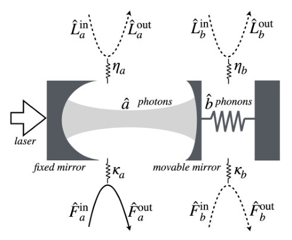 
FIG. 1. Schematic of the cavity optomechanical system. The setup consists of an optical cavity mode ˆa coupled via radiation pressure to a mechanical (phonon) mode ˆb associated with the movable cavity element. The optical probe channel ˆF in(out) a , coupled with strength κa, represents the experimentally accessible input (output) field used for parameter estimation. The remaining channels, namely ˆF in(out) b and the bath fields ˆLin(out) a,b , with coupling rates κb and ηa,b, are ficti- tious/uncontrollable inaccessible channels introduced within the ef- fective input–output description of the system.

📷 Fig 2

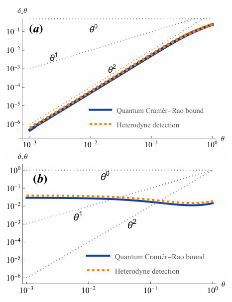 
FIG. 2. Root-mean-square estimation error δ∗θ as a function of the perturbation strength θ, perturbing the detuning and mechanical frequency according to Eq. (58). The solid blue and dashed orange curves denote the quantum and classical bounds, δQθ and δCθ, ob- tained from Eqs. (42) and (46), respectively. (a) Heff in Eq. (56) is tuned to a singular configuration using system parameter given in Eq. (63) along with the control variable α, β and probe frequency ω. Both the quantum and classical bounds exhibit the quadratic scaling δ∗θ ∝θ2, in agreement with the analytical predictions of Eqs. (68) and (69), thereby demonstrating consistent scaling behavior for both the quantum-limited and...

📷 Fig 3

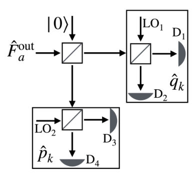 
FIG. 3. Schematic of heterodyne detection via dual balanced ho- modyne measurements. The probe output mode is first combined with vacuum at a beam splitter, generating two output ports. Each port is subsequently measured independently using balanced homo- dyne detection. The first output is combined with a local oscillator LO1 on a second beam splitter, and the resulting outputs are mea- sured by detectors D1 and D2, which access the quadrature qk. The second output is combined with a local oscillator LO2 on another beam splitter, with detection performed by D3 and D4, which mea- sure the quadrature pk. Together, these two homodyne measurements realize a heterodyne detection scheme that...

**Summary.** The paper develops a theoretical analysis showing that cavity optomechanical systems can act as highly sensitive quantum sensors. By tuning the system parameters to induce an effective dynamical singularity, the estimation precision (quantified by QFI) diverges as the perturbation strength decreases. This demonstrates a controllable mechanism for achieving enhanced metrology using standard measurement techniques.

**Why it may be interesting.** This work provides a concrete theoretical framework demonstrating how engineered nonlinear coupling (optomechanics) can be used to actively control system dynamics toward singular points that enhance fundamental measurement limits beyond standard scaling laws.

Detailed structure

**Main problem.** The research aims to harness strongly amplified dynamical responses in cavity optomechanical systems for achieving enhanced quantum sensing and metrology.

**Main result.** By tuning the system near a dynamically induced singularity, the Quantum Fisher Information (QFI) exhibits divergent scaling with decreasing perturbation strength, leading to significantly suppressed estimation error.

**Method.** The analysis employs Gaussian estimation theory, utilizing input-output formalism in the frequency domain and solving for Green's functions to quantify the sensitivity via QFI and CFI.

**Model / system.** The system is a cavity optomechanical setup where an optical mode couples to a mechanical oscillator via radiation pressure. The dynamics are modeled using linearized quantum Langevin equations derived from the full Hamiltonian in the rotating frame.

**Key observables.** Quantum Fisher Information (QFI), Classical Fisher Information (CFI), and the output field covariance matrix ($\mathbf{V}_{	ext{out}}^F[\omega]$).

**Important parameters / regimes.** The system is analyzed by tuning parameters to achieve a singular regime where $\det \mathcal{H}_{	ext{eff}} = 0$, which maximizes sensitivity.

**Assumptions / limitations.** Linearization of dynamics around mean fields, use of Gaussian estimation theory, and assuming the probe field noise can be treated via input-output formalism.

**Figures summary.** Figures schematically illustrate the setup (optics coupled to mechanics) and show comparisons between scaling behaviors ($\delta^*	heta$ vs. $	heta$) in both singular (enhanced sensitivity) and non-singular regimes (saturation).

**Paper structure.** The paper progresses from defining the physical system and deriving linearized equations of motion, moving into the frequency domain analysis using scattering matrices to determine output field statistics, culminating in the application of quantum estimation theory to identify optimal sensing regimes.

Abstract

We show that strongly amplified dynamical responses in cavity optomechanical systems can be harnessed for enhanced quantum sensing. By tuning the optomechanical interaction to a regime of enhanced susceptibility, weak perturbations produce disproportionately large changes in the system response, leading to substantially improved estimation precision. Using Gaussian estimation theory, we demonstrate that the quantum Fisher information exhibits a divergent scaling as the perturbation strength decreases, implying a corresponding suppression of the estimation error. We further show that heterodyne detection of the output cavity field yields the classical Fisher information with the same asymptotic scaling as the quantum Fisher information, demonstrating that the enhanced sensitivity is accessible with a standard measurement protocol. These results identify amplified optomechanical dynamics as a controllable resource for quantum enhanced sensing and metrology.

[↑ back to top](#top)

### [Collective dynamics in a one-dimensional Heisenberg ferromagnetic spin chain](http://arxiv.org/abs/2606.08149v1)

**Authors:** R. Arun, M. Lakshmanan, Avadh Saxena  
**Type:** theory · **Category:** statistical mechanics · **PDF:** <https://arxiv.org/pdf/2606.08149v1>  
**Analysis basis:** full PDF text, analyzed in chunks
**Topic relevance:** `driven-dissipative phase transition` **3/5** · `methods for driven-dissipative` **3/5** · `analog quantum simulation` **2/5** · `non-equilibrium dynamics` **2/5** · `non-equilibrium universality` **2/5** · `spintronics-quantum-optics interface` **2/5** · `Frenkel-Kontorova` **1/5** · `Keldysh / 2PI / non-Gaussian methods` **1/5** · `correlated / nonlocal dissipation` **1/5** · `exotic spin models in light-matter` **1/5**

📷 Fig 1

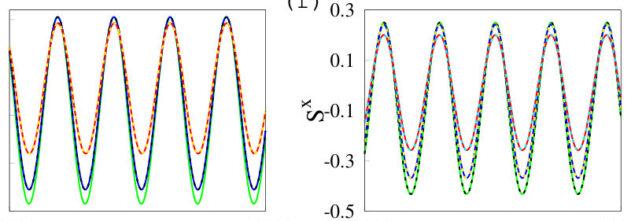 
FIG. 1. Time evolution of Sx for the number of spins (a) 1, (b) 2, (c) 3, (d) 4, (e) 5, and (f) 6 for

📷 Fig 2

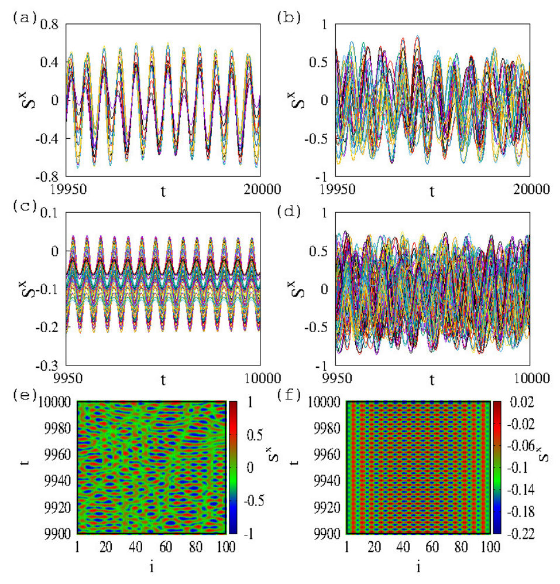 
FIG. 2. Time evolution of Sx when β = 0 for the number of spins N (a) 25, (b) 30, (c) 100 and

📷 Fig 3

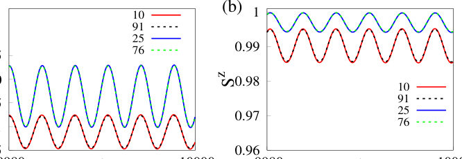 
FIG. 3. Complete synchronization between the spins (10,91) and (25,76) in their time evolution of

📷 Fig 4

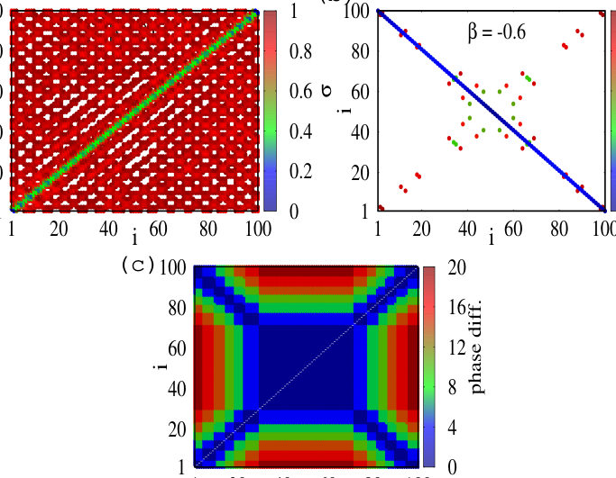 
FIG. 4. The standard deviation estimated for Sx(t) between different pairs of spins ‘i’ and ‘N+1−i’

📷 Fig 5

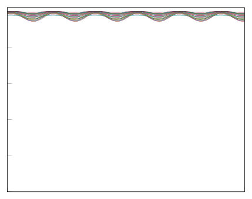 
FIG. 5. Time evolution of Sz of 100 number of spins for the parameters A = 2, B = 2, C = 1, Kz =

**Summary.** This paper analyzes the complex collective dynamics, including various synchronization modes, within a 1D anisotropic Heisenberg ferromagnetic spin chain. By solving the LLGS equation, the authors demonstrate that while large chains tend toward desynchronization, applying a field-like torque can successfully restore coherent inphase or complete synchronization. The findings confirm the simultaneous existence of multiple oscillatory states depending on external driving fields.

**Why it may be interesting.** This work explores collective dynamics and emergent order (synchronization) in a quantum spin chain using classical/semi-classical equations of motion. The restoration of coherence via specific field terms is relevant to understanding dissipation and long-range correlations in many-body systems.

Detailed structure

**Main problem.** The study investigates different oscillatory modes, including synchronization states (complete, inphase, antiphase), within a one-dimensional anisotropic Heisenberg ferromagnetic spin chain.

**Main result.** The field-like torque is shown to be capable of restoring synchronization that is otherwise lost as the number of spins increases. The system exhibits multiple coexisting dynamic modes depending on applied fields.

**Method.** The dynamics are analyzed by solving the Landau-Lifshitz-Gilbert-Slonczewski equation numerically and comparing results with analytical derivations for oscillation frequencies.

**Model / system.** The model is a one-dimensional anisotropic Heisenberg ferromagnetic spin chain, whose evolution is governed by the LLGS equation. The Hamiltonian includes terms related to nearest-neighbor interactions ($A, B, C$) and external fields.

**Key observables.** Oscillatory modes (complete synchronization, inphase/antiphase synchronization, desynchronization), standard deviation ($\sigma$), and oscillation frequency ($f$).

**Important parameters / regimes.** The system is studied by varying the number of spins ($N$) and applying specific field-like torques ($eta$, $H_x, H_y, H_z$).

**Assumptions / limitations.** The analysis relies on solving the LLGS equation and making approximations to derive analytical expressions for synchronized oscillation frequencies.

**Figures summary.** Figures illustrate time evolution of spin components ($S_x$), the loss/restoration of synchronization quantified by $\sigma$, and phase difference plots confirming various synchronization states (inphase, antiphase).

**Paper structure.** The paper progresses from defining the physical model and governing equation to numerically demonstrating the existence and dependence of different oscillatory modes on system size and external torques, culminating in analytical validation.

Abstract

We investigate the different oscillatory modes, namely, complete synchronization, inphase synchronization, antiphase synchronization and desynchronization in a one-dimensional anisotropic Heisenberg ferromagnetic spin chain consisting of a large number of spins. By solving the associated Landau-Lifshitz-Gilbert-Slonczewski equation for the spins we show the simultaneous existence of the above mentioned oscillatory modes in the spins. We observe that when the number of the spins is large the synchronization is lost between the spins; however, we identify that the field-like torque is able to induce synchronous oscillations of the spins in the chain again. We also confirm the agreement of the numerically obtained values of the frequency of the inphase synchronized oscillations with the analytically obtained values.

[↑ back to top](#top)

### [Operation Mpemba effect: Breakdown of resource-Markovianity of free dynamics](http://arxiv.org/abs/2606.09790v1)

**Authors:** Tian-Ren Jin, Yu-Ran Zhang, Heng Fan  
**Type:** theory · **Category:** statistical mechanics · **PDF:** <https://arxiv.org/pdf/2606.09790v1>  
**Analysis basis:** full PDF text, analyzed in chunks
**Topic relevance:** `correlated / nonlocal dissipation` **3/5** · `driven-dissipative phase transition` **3/5** · `methods for driven-dissipative` **3/5** · `non-equilibrium dynamics` **3/5** · `non-equilibrium universality` **2/5** · `Keldysh / 2PI / non-Gaussian methods` **1/5** · `entanglement & information structure` **1/5** · `scars & prethermalization` **1/5**

📷 Fig 1

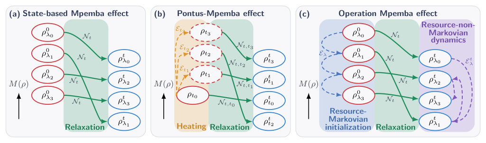 
FIG. 1. Schematic comparison of the state-based, Pontus, and operation perspectives on resource Mpemba effect. The vertical axis denotes the resource measure M(ρ), red circles denote initial resourceful states, green arrows denote free relaxations, and blue circles denote the corresponding output states. (a) State-based Mpemba effect. Different initial states are compared under the same relaxation dynamics, and the more resourceful initial state ρ0 λ1 relaxes to a less resourceful state than the less resourceful initial states ρ0 λ2 and ρ0 λ3. (b) Pontus-Mpemba effect. A two-step protocol consisting of heating stage followed by relaxation is compared with direct relaxation from the same...

📷 Fig 2

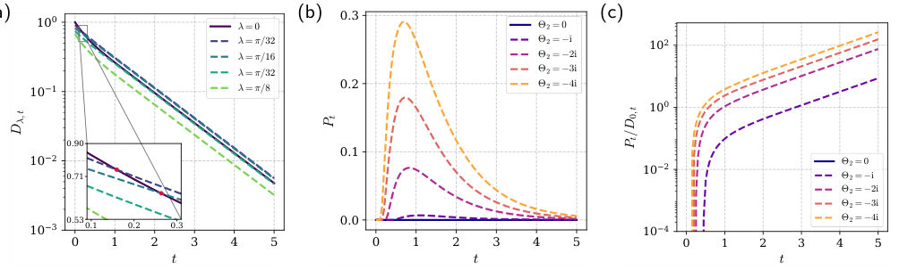 
FIG. 2. Mpemba effect for distinguishability. The state ρ1, ρ2 are represented by the Bloch vectors ⃗r(i) = (r(i) 1 , r(i) 2 , r(i) 3 )T with r(i) 3 = 0 for i = 1, 2. The trace distance is D(ρ1, ρ2) = 1

📷 Fig 3

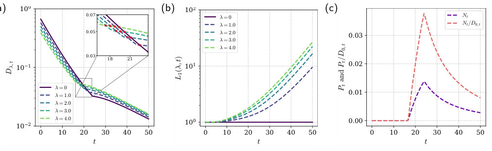 
FIG. 3. Thermomajorization Mpemba effect from the perspective of operation Mpemba effect. The states ⃗p(λ) are initialized from ⃗p = (1, 0, 0)T by initialization dynamics d⃗p/dλ = ˆA⃗p with the symmetric matrix ˆA = [anm] parametrized by (a01, a12, a02) ≈ (0.010, 0.086, 0.004), ann = P

📷 Fig 4

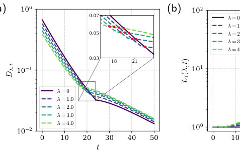 
Figure 3 demonstrates the thermomajorization Mpemba ef- fect with the detector D(⃗p,⃗π) = maxn[pn/πn] of thermoma- jorization [7]. In Fig. 3(a), the detector Dλ,t = D( ˆRt ˆSλ⃗p,⃗π) exhibits the Mpemba effect between different initialization parameters λ, after t &gt; 17. In Fig. 3(b), the increase of L1(λ, t) = ∥ˆRt ˆSλ ˆR−1 t ∥1, which witnesses the athermality of the intermediate matrix, shows that the operation Mpemba effect occur at t ≈5, indicating that the operational signa- tures appear earlier than the state signatures. In Fig. 3(c), the nonzero total positive change Nt and normalized total positive change Nt/D0,t of the estimator Dλ,t witness the occurrence of the thermomajorization...

**Summary.** This work generalizes the Mpemba effect concept by defining 'resource-Markovianity' for quantum resource theories. It shows that the operational detection of this effect occurs when a relaxation process breaks the expected monotonic decrease of a resource measure with time. This provides a unified, measure-independent diagnostic tool applicable to both quantum distinguishability and classical thermodynamic ordering.

**Why it may be interesting.** It provides a powerful, general mathematical tool (resource-Markovianity) to detect anomalous relaxation phenomena (Mpemba effect) in open quantum systems, linking it directly to non-Markovian dynamics.

Detailed structure

**Main problem.** To provide a measure-independent operational characterization of the resource Mpemba effect by linking it to the breakdown of 'resource-Markovianity' in free dynamics.

**Main result.** The operational formulation, based on breaking resource-Markovianity, provides a general and measure-independent way to characterize the Mpemba effect across various quantum resource theories.

**Method.** The authors introduce 'resource-Markovianity' as a concept and define the Mpemba effect operationally as the failure of this property during relaxation dynamics.

**Model / system.** The framework is applied to general quantum resource theories, modeling dynamics using Lindblad equations for distinguishability (quantum case) and master equations for probability distributions (thermomajorization/classical case).

**Key observables.** Resource measure $M(
ho)$, trace distance $D(
ho_1, 
ho_2)$, and the intermediate matrix norm $L_1(\lambda, t)$.

**Important parameters / regimes.** Time ($t$), resource parameters ($\lambda$), and initial state differences.

**Assumptions / limitations.** The analysis assumes the existence of inverses for both initialization dynamics ($E_\lambda$) and relaxation operations ($N_t$).

**Figures summary.** Figures schematically compare three perspectives (state-based, Pontus-Mpemba, operation Mpemba) showing how resource measures change; specific figures show crossovers in trace distance or $L_1$ norms.

**Paper structure.** The paper develops the concept of resource-Markovianity, establishes the operational definition of the Mpemba effect as its breakdown, and then applies this framework to concrete examples like quantum distinguishability and classical thermomajorization.

Abstract

The Mpemba effect refers to faster relaxation of states that are initially farther from equilibrium, yet its characterization is often tied to a chosen distance or resource measure. We introduce resource-Markovianity, an extended concept of quantum Markovianity to quantum resource theories, and formulate the resource Mpemba effect operationally as the breaking of resource-Markovianity by a relaxation operation. This yields a measure-independent operational characterization of resource Mpemba effects in general resource theories, together with quantitative characterizations based on resource-non-Markovianity measures. We illustrate the framework with the Mpemba effect for distinguishability of states, due to its relation to quantum Markovianity, and with the thermomajorization Mpemba effect from an operational perspective. These results reveal a deep interplay between quantum resources, non-Markovianity, and the Mpemba effect.

[↑ back to top](#top)

### [Simultaneous nanoscale imaging of local conductivity and chemical potential in a quantum Hall isospin ferromagnet](http://arxiv.org/abs/2606.08237v1)

**Authors:** Jiawei Hu, Shiyu Zhu, Bohao Li, Yunhao Wang, Shuigang Xu, Zhihai Cheng, Chengmin Shen, Andre K. Geim, Fengcheng Wu, Hong-Jun Gao  
**Type:** both · **Category:** strongly correlated electrons · **PDF:** <https://arxiv.org/pdf/2606.08237v1>  
**Analysis basis:** full PDF text, analyzed in chunks
**Topic relevance:** `exotic spin models in light-matter` **3/5** · `quantum measurements` **3/5** · `spintronics-quantum-optics interface` **3/5** · `analog quantum simulation` **2/5** · `driven-dissipative phase transition` **2/5** · `Keldysh / 2PI / non-Gaussian methods` **1/5** · `Kondo & dissipative impurity` **1/5** · `methods for driven-dissipative` **1/5** · `non-equilibrium dynamics` **1/5**

📷 Fig 1

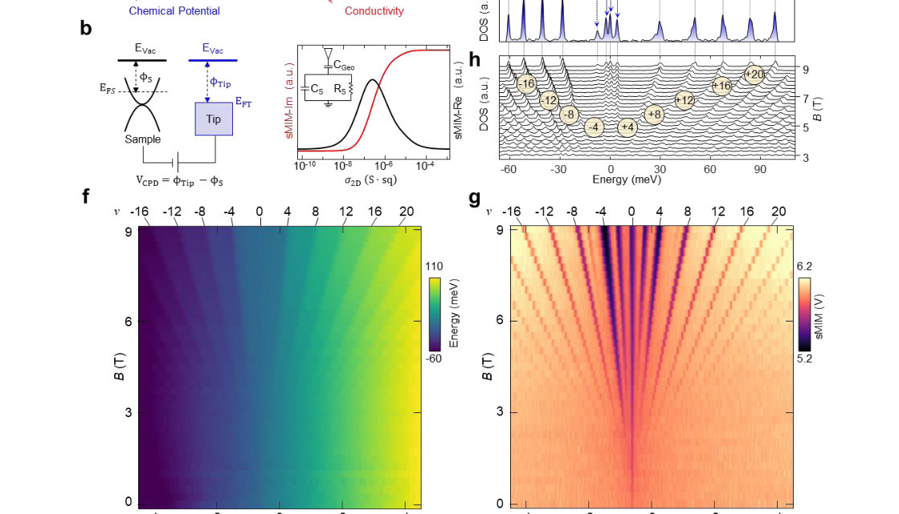 
Fig. 1 | The SCCM technique for measuring local conductivity and chemical potential simultaneously. a, Schematic of SCCM technique. b, Left: principle of KPFM. The contact potential difference VCPD between tip and sample can induce electrostatic force on cantilever. The chemical potential of sample can be accessed by compensating this capacitive force. Right: Principle of sMIM (right). Simulated sMIM response curves as a function of the 2D conductivity of the sample based on the tip-sample effective circuit model (right, inset). c, The local conductivity (left axis) and chemical potential (right axis) of QH states of BG as a function of LL filling number ν at T = 100 mK and B = 9 T. d,...

📷 Fig 2

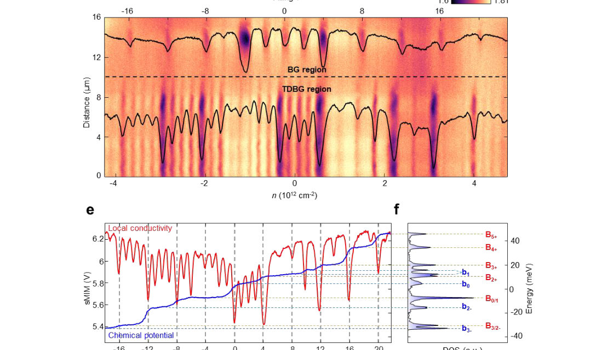 
Fig. 2 | Fully broken-symmetry QHIFM states in TDBG. a, Schematic of the TDBG device structure. Vg is the gate voltage. b, c, Large area sMIM mapping of TDBG at B = 0 T (b) and 9 T (c) and T = 300 mK. The scale bars correspond to 10 μm. d, sMIM line scans at B = 9 T along the white arrow indicated in c. Repeated line scans (y-axis) are performed while the gate voltage is varied (x- axis). A series of QH states is revealed in both the TDBG and BG regions. Black curves show spatial averaged local conductivity across TDBG and BG region. e, The local conductivity (left axis) and chemical potential (right axis) of TDBG as a function of LL filling number ν at T = 100 mK and B = 9 T. All integer...

📷 Fig 3

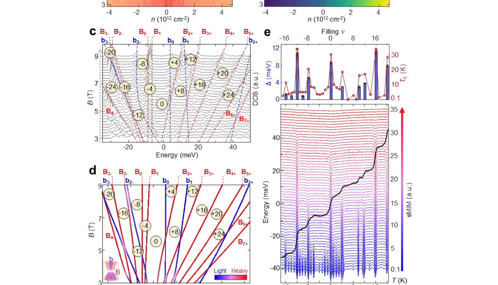 
Fig. 3 | Many-body LL energy spectrum of TDBG. a, b, n-B map of local conductivity (a) and chemical potential (b) at T = 100 mK in TDBG region. Re-emergence behavior is observed at integer filling factor v = +4, +12, +16 in b. c, LL energy spectrum extracted from b. Each LL is denoted by its subband (B or b) and LL index n (n+ for electron-like and n− for hole-like LLs). The zeroth LLs are labeled as b/B0/1. d, Calculated LL spectrum of tetralayer graphene, in good consistent with experimental LL energy spectrum (c). Inset: calculated 3D band structure of tetralayer graphene. e, Lower: Temperature dependence of the local conductivity as a function filling factor ν at B = 9 T, ranging from...

📷 Fig 4

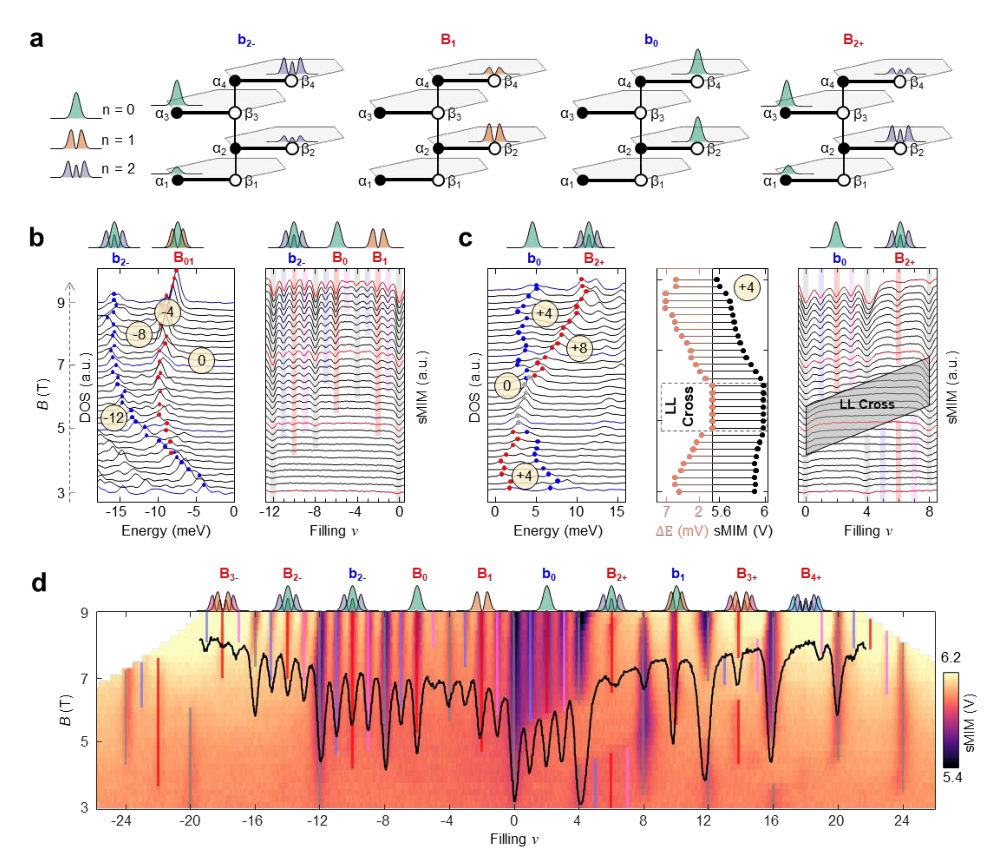 
Fig. 4 | LL wavefunctions, LL crossings and QHIFM phase diagram. a, Schematic of single- particle LL wavefunction bn/Bn in tetralayer graphene unit cell at K valley. b, QHIFM ground states from v = 0 to -12. Left: waterfall plot of energy spectrum line profile at different B, shows the LL crossing between b2- and B01. Right: waterfall plot of sMIM as a function of filling factor ν at different B. The shaded bars denote the existence of broken-symmetry QH states. c, Left: waterfall plot of energy spectrum line profile at different B, shows the LL crossing between b0 and B2+. Middle: the evolution of LL energy splitting and conductivity of ν = +4 state. The consistence of energy splitting and...

📷 Fig 5

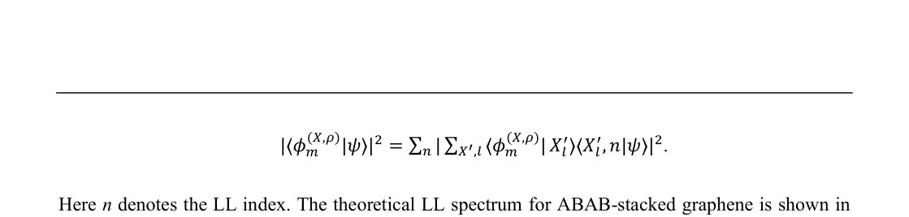 
Fig. 3(d), where the weight is indicated by color. Based on these results, we further compute the density

**Summary.** This work introduces Scanning Conductivity and Chemical Potential Microscopy (SCCM), a novel technique that simultaneously maps local conductivity and chemical potential in graphene. By applying SCCM to multilayer graphene, the researchers mapped out complex Quantum Hall Isospin Ferromagnetic phases. The results validate the technique's power by linking single-particle Landau level physics directly to emergent correlated many-body states.

**Why it may be interesting.** The combination of high-resolution nanoscale mapping ($\mu$ vs $\sigma$) with the study of correlated topological phases (QHIFM) provides a powerful experimental platform to test complex many-body theories, which is highly relevant for understanding emergent quantum phenomena in condensed matter systems.

Detailed structure

**Main problem.** The primary challenge was developing a nanoscale probe capable of simultaneously mapping local conductivity and chemical potential within exotic Quantum Hall Isospin Ferromagnet (QHIFM) phases.

**Main result.** The authors successfully demonstrated the Scanning Conductivity and Chemical Potential Microscopy (SCCM) technique, confirming robust QHIFM states in multilayer graphene and establishing quantitative links between single-particle Landau levels and complex correlated ground states.

**Method.** The study combines experimental measurements using SCCM (integrating sMIM for conductivity and KPFM for chemical potential) with detailed theoretical modeling of various stacking configurations (ABAB vs. ABCA).

**Model / system.** The system is multilayer graphene, specifically bilayer and tetralayer structures exhibiting QHIFM physics due to strong electron-electron interactions coupling spin, valley, orbital, and layer degrees of freedom.

**Key observables.** Local conductivity ($\sigma$), chemical potential ($\mu$), Quantum Hall (QH) states, many-body Landau level energy spectrum, and the thermodynamic Density of States (DOS).

**Important parameters / regimes.** Filling factors ($
u = +4$ to $-16$), magnetic field ($B=9$ T), low temperature ($T=100$ mK), and derived parameters like energy gaps ($\Delta$) and critical temperatures ($T_C$).

**Assumptions / limitations.** The technique assumes non-interfering measurement of $\sigma$ and $\mu$, and theoretical analyses often treat the system by decomposing it into light/heavy mass sectors, neglecting interaction effects in some models.

**Figures summary.** Figures illustrate schematic setups for SCCM, maps showing conductivity and chemical potential across QH states in bilayer and tetralayer graphene, and energy spectra detailing Landau level crossings that correlate with phase transitions.

**Paper structure.** The paper introduces the SCCM technique by demonstrating it on simpler systems (bilayer graphene) before applying it to complex quantum Hall isospin ferromagnetism in marginally twisted double bilayer graphene. It then details how LL crossings modulate the QHIFM sequence and compares results across different stacking orders theoretically.

Abstract

Quantum Hall isospin ferromagnetism in multilayer graphene offers a versatile playground for exploring flat band correlated physics, driven by the intricate coupling of spin, valley, orbital, and layer degrees of freedom. However, a nanoscale probe capable of simultaneously mapping local conductivity and chemical potential in these exotic phases has yet to be realized. Here, we introduce scanning conductivity and chemical potential microscopy (SCCM), a technique integrating scanning microwave impedance microscopy and Kelvin probe force microscopy. We demonstrate SCCM by probing the quantum Hall states and many-body Landau level energy spectrum in bilayer graphene. Applied to marginally twisted double bilayer graphene, SCCM then reveals a cascade of quantum Hall isospin ferromagnetic states with unexpected re-emergence behaviors. Significantly, experimental many-body Landau level energy spectrum further uncovers the intricate connections of these complex phenomena to inter-subband Landau level crossings and Landau level single-particle wavefunctions. These insights enable the construction of a comprehensive quantum Hall phase diagram. Our results demonstrate SCCM's capability in decoding complex quantum phenomena, establishing it as a versatile nanoscale probe for electron correlation and topology.

[↑ back to top](#top)

### [Wave Resistance for Stochastic Motion at Interfaces](http://arxiv.org/abs/2606.08732v1)

**Authors:** Maxence Arutkin, Shlomi Reuveni, Elie Raphael  
**Type:** theory · **Category:** statistical mechanics · **PDF:** <https://arxiv.org/pdf/2606.08732v1>  
**Analysis basis:** full PDF text, analyzed in chunks
**Topic relevance:** `methods for driven-dissipative` **3/5** · `non-equilibrium dynamics` **3/5** · `non-equilibrium universality` **3/5** · `Keldysh / 2PI / non-Gaussian methods` **2/5** · `driven-dissipative phase transition` **2/5** · `Frenkel-Kontorova` **1/5** · `analog quantum simulation` **1/5** · `correlated / nonlocal dissipation` **1/5** · `quantum measurements` **1/5**

📷 Fig 1

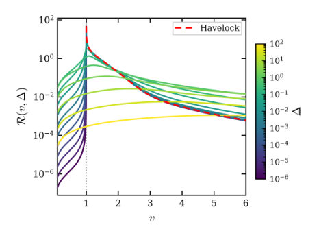 
FIG. 2. Mean wave resistance versus drift speed across diffusivities. Wave resistance R(v, ∆) versus dimensionless drift speed v for Brownian motion with Lorentzian pressure field (a = 0.20). Solid curves: exact evaluation of Eq. (3) for sixteen diffusivities ∆∈[10−6, 102]. Red dashed line: classical Havelock resistance (v &gt; 1), recovered as ∆→0. The corresponding mean surface profiles are displayed in the Fig. S1 in the Supplemental Material.

📷 Fig 2

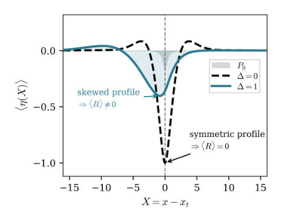 
FIG. 1. Mean-profile asymmetry. Mean surface ⟨η(X)⟩in the comoving frame at v = 0.8 for ∆= 0 (deterministic, sym- metric, no drag) and ∆= 1 (diffusive, skewed, finite drag). Pressure P0 shaded in gray. Lorentzian source, a = 0.20.

📷 Fig 3

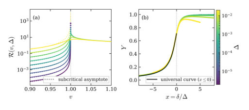 
FIG. 4. Threshold behavior near v = 1. Left: Mean resistance R(v, ∆) in the threshold region for nine diffusiv- ities, showing the peak at v = 1 and Regime III asymp- totics. Right: Same data plotted against the reduced variable x = δ/∆using the rescaled observable Y = (2/π) e2a √

📷 Fig 4

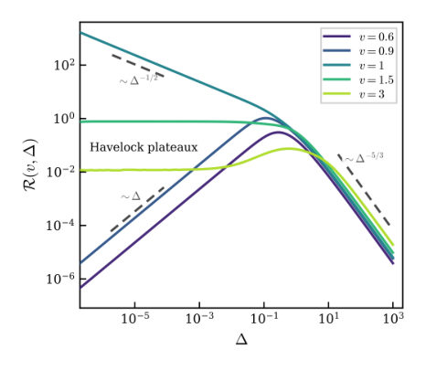 
FIG. 3. Asymptotic scaling laws across diffusivity regimes. Mean wave resistance R(v, ∆) versus diffusivity ∆for five drift speeds v ∈[0.6, 3.0] (a = 0.20, log-log axes). Solid curves: exact evaluation of Eq. (3). At high diffusivities, all curves align sharing the universal ∼∆−5/3 asymptotics of Eq. (5) (Regime I). At low diffusivities, and at subcriti- cal velocities, one obtains the ∼∆asymptotics of Eq. (6) (Regime II), while at critical speed v = 1, one obtains the ∼∆−1/2 asymptotics of Eq. (7) evaluated at δ = 0. At low diffusivities, and supercritical velocities, one approaches the Havelock limit which is insensitive to ∆.

**Summary.** This paper calculates the mean wave resistance generated by a source moving stochastically at a fluid interface. By incorporating diffusion into classical wave drag theory, the authors derive universal scaling laws that regularize singularities predicted in deterministic models. The results show how noise fundamentally alters the energy dissipation characteristics of the system.

**Why it may be interesting.** While focused on fluid dynamics, the mathematical techniques—especially the use of ensemble averaging over stochastic processes (Brownian motion) to regularize singular deterministic responses—are highly relevant to open quantum systems where noise or environmental coupling smooths out sharp theoretical predictions.

Detailed structure

**Main problem.** The research aims to determine the mean wave resistance (drag) experienced by a source moving stochastically at a fluid interface, extending classical deterministic theories.

**Main result.** The mean wave resistance exhibits distinct scaling laws depending on the diffusivity ($\Delta$) and drift speed ($v$), notably showing universal high-diffusivity decay $R \sim \Delta^{-5/3}$ and regularization of singularities near critical velocities.

**Method.** The analysis employs Fourier transform methods, ensemble averaging over stochastic trajectories (Brownian motion, Lévy flights), and extensive asymptotic analysis to derive scaling laws in different parameter regimes.

**Model / system.** The system models capillary-gravity waves radiating from a localized pressure source moving along an air–water interface. The dynamics are governed by linearized free-surface boundary conditions for incompressible, inviscid flow.

**Key observables.** Mean wave resistance $\langle R 
angle$, mean surface profile $\langle\eta(X)
angle$.

**Important parameters / regimes.** Dimensionless diffusivity ($\Delta$), drift speed ($v$), critical minimum phase velocity ($c_{\min}$), and the deviation from threshold ($\delta = v-1$).

**Assumptions / limitations.** Assumes incompressible, inviscid flow and small-amplitude deformations. The analysis is performed in one dimension by reducing the 2D framework.

**Figures summary.** Figures illustrate mean-profile asymmetry comparing deterministic vs. diffusive cases; plots show $R(v, \Delta)$ across various diffusivities, demonstrating crossovers between different scaling regimes.

**Paper structure.** The paper develops from a general integral formulation for wave resistance to systematically derive asymptotic forms by applying limiting approximations corresponding to high diffusivity ($\Delta \gg 1$), near-threshold behavior ($v \approx c_{\min}$), and low velocity limits.

Abstract

Wave resistance is the drag generated by the wave radiation that a source moving at a fluid interface sustains. Under stochastic trajectories, the mean drag is controlled by the ensemble-averaged surface profile built from the trajectory history. We show that the result is a finite resistance below the deterministic radiation threshold and a regularization of the singular response at the minimum phase velocity of the capillary-gravity waves. We derive explicit scaling laws for drifted Brownian trajectories, including a universal high-diffusivity decay. For drifted Lévy flight, we find the mean wave resistance in closed-form, extending wave-drag theory to non-Gaussian trajectories.

[↑ back to top](#top)

### [Statistical Mechanics of Random Matrices](http://arxiv.org/abs/2606.08706v1)

**Authors:** Isaac Pérez Castillo  
**Type:** theory · **Category:** disordered systems and neural networks · **PDF:** <https://arxiv.org/pdf/2606.08706v1>  
**Analysis basis:** full PDF text, analyzed in chunks
**Topic relevance:** `Keldysh / 2PI / non-Gaussian methods` **3/5** · `driven-dissipative phase transition` **2/5** · `methods for driven-dissipative` **2/5** · `non-equilibrium universality` **2/5** · `Kondo & dissipative impurity` **1/5** · `analog quantum simulation` **1/5** · `correlated / nonlocal dissipation` **1/5** · `correlated cavity matter` **1/5** · `entanglement & information structure` **1/5** · `exotic spin models in light-matter` **1/5** · `non-equilibrium dynamics` **1/5**

📷 Fig 1

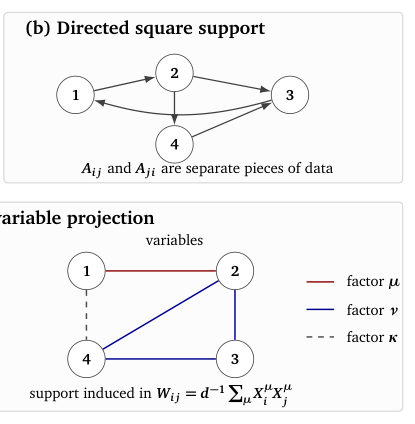 
Figure 1: Schematic support conventions for diluted matrix ensembles. In the bi- partite case, the one-mode projection shows how factor nodes generate induced variable–variable couplings.

📷 Fig 2

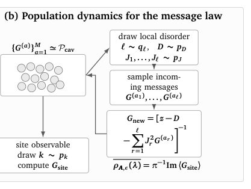 
Figure 2: Belief propagation and population dynamics as two implementations of the same cavity recursion. On a fixed locally tree-like instance, directed-edge messages are updated by removing the recipient from the incoming neighbourhood. At the ensemble level, the message law is represented by an empirical population, and the same local recursion is sampled as a Monte Carlo fixed-point equation.

📷 Fig 3

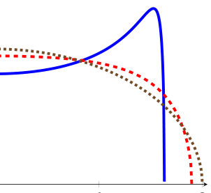 
Figure 3: Kesten–McKay versus the semicircle law in the dense-connectivity scaling. The finite-c curves are the analytic random-regular densities after rescaling eigenval- ues by c−1/2; the dotted curve is the Wigner semicircle law obtained when the cavity message distribution concentrates.

📷 Fig 4

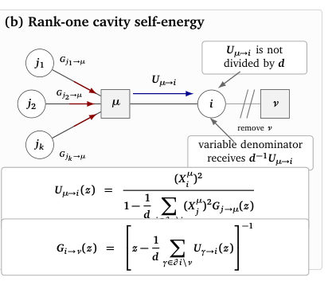 
Figure 4: Bipartite cavity structure of a diluted Wishart factor. A sample node µ con- tributes the rank-one matrix d−1x µ(x µ)T to the covariance matrix, producing a clique in the one-mode projection but a single local factor in the bipartite representation. The factor-to-variable message Uµ→i is defined without the overall d−1 prefactor; the contribution entering a variable Green-function denominator is d−1Uµ→i.

📷 Fig 5

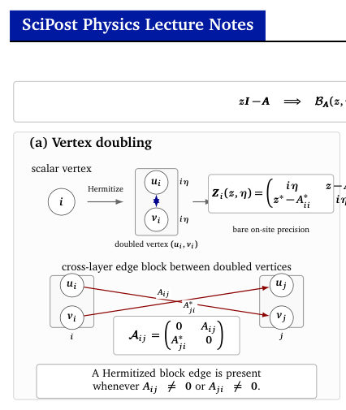 
Figure 5: Hermitization as vertex doubling and block-valued cavity messaging. The non-Hermitian problem is lifted from one scalar field per vertex to two fields (ui, vi) per vertex. The block Z i is the bare on-site precision of this doubled local pair, while Ai j gives the cross-layer coupling between doubled neighboring vertices. Conse- quently the cavity Green function sent from i to j is a 2 × 2 matrix; its lower-left entry is the component averaged to form the regularized non-Hermitian resolvent field.

**Summary.** This work presents a rigorous theoretical framework using advanced statistical mechanics to analyze the spectra of sparse and diluted random matrices. It systematically develops methods like the cavity and replica techniques to calculate spectral density and fluctuations. This is crucial for understanding complex systems where local graph structure dictates global spectral behavior.

**Why it may be interesting.** The techniques developed—especially the use of local recursion (cavity) combined with powerful statistical physics tools (replica)—are highly transferable to analyzing complex quantum systems where interactions are sparse or structured, such as disordered spin glasses or lattice models on random graphs.

Detailed structure

**Main problem.** The primary goal is to develop a statistical-mechanics route to compute spectral properties for sparse and diluted random matrices, moving beyond the standard dense matrix theory.

**Main result.** The paper establishes the mathematical equivalence between the cavity method and the replica method when calculating spectral observables like the density or large deviation functions for these sparse ensembles.

**Method.** It employs advanced techniques from statistical mechanics, including the replica trick, the cavity method (and its associated population dynamics), and saddle-point analysis on functional integrals.

**Model / system.** The focus is on random matrices derived from graphs: sparse symmetric matrices, diluted Wishart ensembles, and non-Hermitian directed/asymmetric matrices. The underlying structure is governed by graph connectivity (degrees, motifs).

**Key observables.** Empirical spectral density ($
ho_N(\lambda)$), resolvent functions, eigenvalue counting statistics (large deviations), and conditioned spectra.

**Important parameters / regimes.** Sparsity parameter ($c=O(1)$ in the thermodynamic limit), graph connectivity structure (degrees $k_i$), and the replica index $n 	o 0$.

**Assumptions / limitations.** The analysis often relies on the replica-symmetric ansatz, and the notes are deliberately expanded lecture material rather than a comprehensive review.

**Figures summary.** Figure 1 schematically illustrates support conventions for different types of diluted matrix ensembles (undirected, directed, bipartite).

**Paper structure.** The structure moves systematically from defining the problem in sparse graph theory to introducing advanced tools like the cavity and replica methods, culminating in demonstrating their equivalence across various spectral observables.

Abstract

These lecture notes are based on the lectures on \emph{Statistical Mechanics of Random Matrices} delivered at the Spring College on the Physics of Complex Systems, held at the Abdus Salam International Centre for Theoretical Physics, Trieste, Italy, from 19 February to 15 March 2024. Their aim is to present a statistical-mechanics route to the spectral theory of sparse and diluted random matrices, with emphasis on cavity and replica methods, resolvent techniques, population dynamics, typical spectral densities, spectral-count fluctuations and large deviations, conditioned spectra, and non-Hermitian extensions. The written form of the notes has been deliberately expanded beyond the material actually covered during the lectures. This is partly because a set of lecture notes can afford a more systematic development than a sequence of blackboard lectures, and partly because several natural continuations of the material become clearer once the central methods have been introduced. Consequently, not every topic discussed here was presented during the College. The additional material is included to give a more coherent account of the subject and to indicate directions that, hopefully, can be covered in greater detail in future lectures or schools. Since these are lecture notes rather than a state-of-the-art review, the choice of topics is necessarily selective and is naturally tilted towards the author's own work and collaborations on this subject. I have nevertheless tried, within the limits of this format, to place the material in contact with the broader literature and to represent the surrounding state of the art as fairly as possible. Inevitably, some relevant contributions may be missing or treated too briefly; such omissions are unintentional and reflect the pedagogical scope of the notes rather than a judgement on their importance.

[↑ back to top](#top)

### [Dynamic scaling and Family-Vicsek universality in the Hubbard model at infinite temperature](http://arxiv.org/abs/2606.09106v1)

**Authors:** Cătălin Paşcu Moca, Doru Sticlet, Balázs Dóra  
**Type:** theory · **Category:** strongly correlated electrons · **PDF:** <https://arxiv.org/pdf/2606.09106v1>  
**Analysis basis:** full PDF text, analyzed in chunks
**Topic relevance:** `analog quantum simulation` **3/5** · `non-equilibrium dynamics` **3/5** · `non-equilibrium universality` **3/5** · `driven-dissipative phase transition` **2/5** · `Keldysh / 2PI / non-Gaussian methods` **1/5** · `entanglement & information structure` **1/5** · `methods for driven-dissipative` **1/5** · `scars & prethermalization` **1/5**

📷 Fig 1

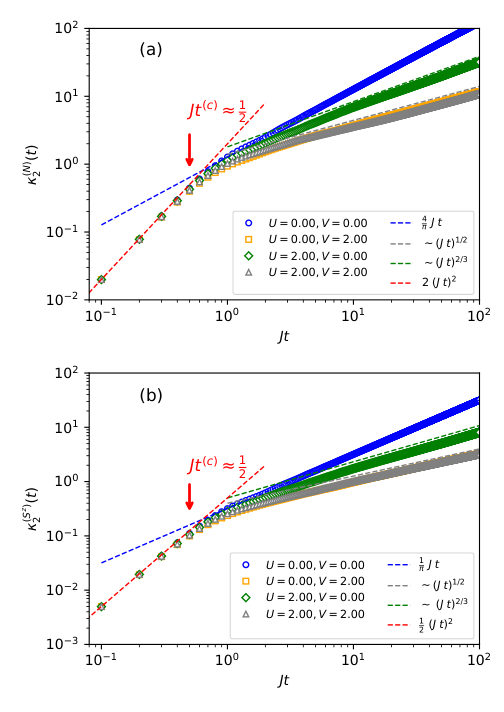 
FIG. 1. Half-chain second moment κ(Q) 2 (t) for charge (top) and spin (bottom) at U = 0 and V = 2 (blue), U = 0 and V = 2 (orange), U = 2 and V = 0 (green), and U = 2 and V = 2 (gray). The dashed lines show the expected power-law growth with exponents 1/z = 1 (ballistic), 2/3 (KPZ), and 1/2 (diffusive). For U = 0 and V = 0 the exact analytical results from Eqs. (27) and (28) are shown (dashed) and match the numerics. The numerical data are obtained for L = 200 sites and a small counting field r = 0.05 in Eq. (16). The crossover time t(c) ∼1/(2J) is indicated by the vertical red arrow.

📷 Fig 2

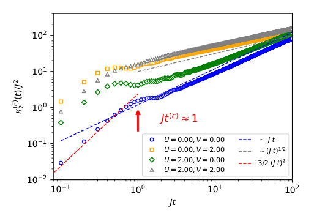 
FIG. 2. Half-chain second moment κ(E) 2 (t) as function of time. The dashed lines show the expected power-law growth with exponents 1/z = 1 (ballistic) and 1/2 (diffusive). The numerical data are obtained for L = 200 sites and a small counting field λ = 0.05. The crossover time t(c) ∼1/(J) is indicated by the vertical red arrow.

📷 Fig 3

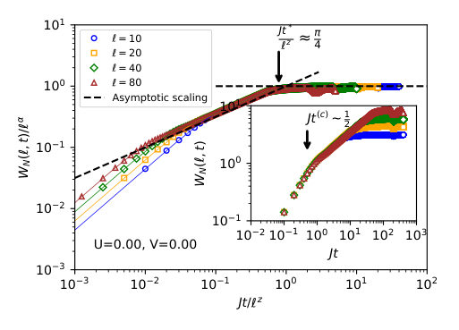 
FIG. 3. Family–Vicsek scaling collapse for the charge rough- ness WN(ℓ, t) for U = 0 and V = 0. The data are obtained for L = 400 sites and a small counting field r = 0.05 in Eq. (16). The dashed lines show the expected asymptotic power-law growth with β = 1/2 and saturation with α = 1/2. The crossover time scale is consistent with the analytical estimate from Eq. (55). The inset shows the same data unrescaled, illustrating the three regimes separated by the crossover times t(c) and t∗(ℓ).

📷 Fig 4

 
Figure 3 demonstrates that the charge roughness in the free-fermion limit is fully consistent with the FV ansatz WN(ℓ, t) = ℓαfN(Jt/ℓ). Indeed, upon rescaling by ℓ1/2

📷 Fig 5

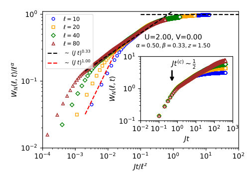 
FIG. 4. Family–Vicsek scaling collapse for the charge rough- ness WN(ℓ, t) for U = 2.0 and V = 0, (interacting integrable model) indicating the KPZ universality class, with dynamical exponent z = 3/2, growth exponent β = 1/3, and roughness exponent α = 1/2. The black dashed lines show the expected asymptotic power-law growth with β = 1/3. The inset shows the same data unrescaled.

**Summary.** This theoretical study uses Quantum Generating Functions and Family-Vicsek scaling analysis to characterize how charge, spin, and energy fluctuations spread in the 1D Hubbard model. The key finding is that integrability dictates the long-time transport regime: integrable models exhibit anomalous (KPZ) or ballistic spreading, while breaking this symmetry drives the system towards classical diffusive behavior.

**Why it may be interesting.** This work provides a powerful diagnostic tool (FV scaling) to map out the transition between different universality classes of transport (ballistic, KPZ, diffusive) in strongly correlated quantum systems.

Detailed structure

**Main problem.** The study investigates Family-Vicsek (FV) scaling of charge, spin, and energy fluctuations in the one-dimensional Hubbard model at infinite temperature.

**Main result.** The long-time dynamics are critically controlled by integrability: integrable cases show KPZ or ballistic transport for certain sectors, while breaking integrability leads to diffusive behavior across all measured quantities.

**Method.** The analysis employs a Quantum Generating Function (QGF) approach combined with Family-Vicsek scaling analysis to compute time-dependent cumulants of conserved quantities without reconstructing the full probability distribution.

**Model / system.** The system is the one-dimensional Fermi-Hubbard model, characterized by hopping ($J$) and onsite interaction ($U$). The Hamiltonian can be perturbed by adding a next-nearest-neighbor density interaction ($	ext{H}_{	ext{NNN}}$) to break integrability.

**Key observables.** Charge ($	ext{N}$), spin ($	ext{S}_z$), and energy ($	ext{E}$) fluctuations, quantified by their second cumulants ($\kappa^2$) and analyzed via the roughness function $W(\ell, t)$.

**Important parameters / regimes.** The key parameters are the interaction strength ($U$), the perturbation strength ($V$, related to $	ext{H}_{	ext{NNN}}$), and the system size/time scales.

**Assumptions / limitations.** The use of the QGF approach allows for the direct extraction of cumulants, bypassing the need to reconstruct the full quantum distribution function.

**Figures summary.** Figures illustrate Family-Vicsek scaling collapses for charge, spin, and energy roughness under different parameter regimes (e.g., $U=0$ vs $U
eq 0$, or $V=0$ vs $V 
eq 0$), confirming predicted power-law growth exponents.

**Paper structure.** The paper systematically analyzes the scaling behavior for charge, spin, and energy separately, contrasting the results obtained in the free limit ($U=0$), the interacting integrable case ($V=0$), and the non-integrable regime ($V 
eq 0$).

Abstract

We study Family-Vicsek scaling of charge, spin, and energy fluctuations in the one-dimensional Hubbard model at infinite temperature. Using a quantum generating function approach, we compute time-dependent cumulants of transferred conserved quantities and analyze how the corresponding roughness depends on subsystem size and time. We start by focusing on a single interface at half the chain and determine the transport exponents. Then we turn to fluctuations of a small finite interval and study the Family-Vicsek universality of fluctuations over an extended timescale. We find that the long-time scaling behavior is controlled by integrability. In the free limit, charge, spin, and energy all display ballistic transport. In the interacting integrable Hubbard chain, charge and spin cross over to a KPZ scaling regime, while the energy sector remains ballistic. Once integrability is broken by a next-nearest-neighbor density interaction, the long-time dynamics becomes diffusive in all sectors. In every case we also observe a short-time microscopic regime with apparently universal ballistic growth before the hydrodynamic scaling window sets in. The Family-Vicsek setup allows us to determine the growth, the saturation as well as the dynamical exponents.

[↑ back to top](#top)

### [Entanglement Generation through Coherent and Non-Coherent Control](http://arxiv.org/abs/2606.09599v1)

**Authors:** Marco Enriquez, Francisco Delgado  
**Type:** theory · **Category:** quantum information and computing · **PDF:** <https://arxiv.org/pdf/2606.09599v1>  
**Analysis basis:** full PDF text, analyzed in chunks
**Topic relevance:** `entanglement & information structure` **3/5** · `interference shaping light` **3/5** · `correlated / nonlocal dissipation` **2/5** · `driven-dissipative phase transition` **2/5** · `methods for driven-dissipative` **2/5** · `Keldysh / 2PI / non-Gaussian methods` **1/5** · `non-equilibrium dynamics` **1/5** · `non-equilibrium universality` **1/5**

📷 Fig 1

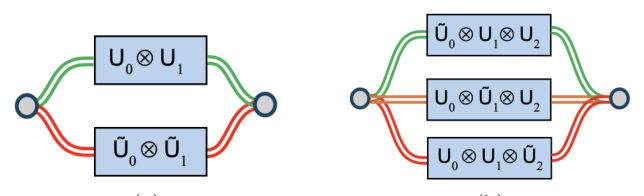 
Figure 1: Appropriately arranged local unitary operators, coherently superposed along distinct paths, act on an initially fully separable state to generate entanglement. A control system determines which local operator act on the separable state. Panels (a) and (b) schematically illustrate respectively the operators U2 in Eq. (1) U3 in Eq. (6).

📷 Fig 2

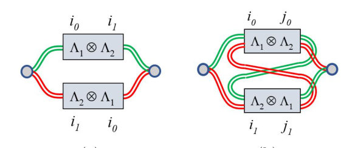 
Figure 2: Two-qubit communication architectures implementing a couple of channels, Λ1 and Λ2: (A) Path superposition, and (B) Indefinite Causal Order.

📷 Fig 3

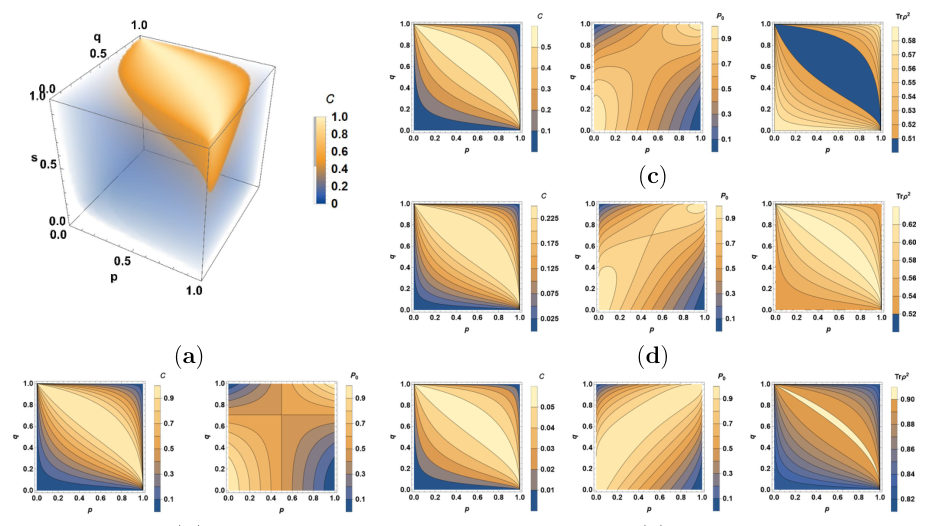 
Figure 3: Concurrence C in PS for the family of channels α1 0 = 1, α2 0 = 1 −s, α2 1 = s in colour, in agreement with each legend colour besides. (a) As a density plot function of p, q, s, and some contour plots of C, P0, and Trρ2 out together for (b) s = 1 (here, Trρ2 out = 1 is not reported), (c) s = 7 10, (d) s = 4 10, and (e) s = 1 10.

📷 Fig 4

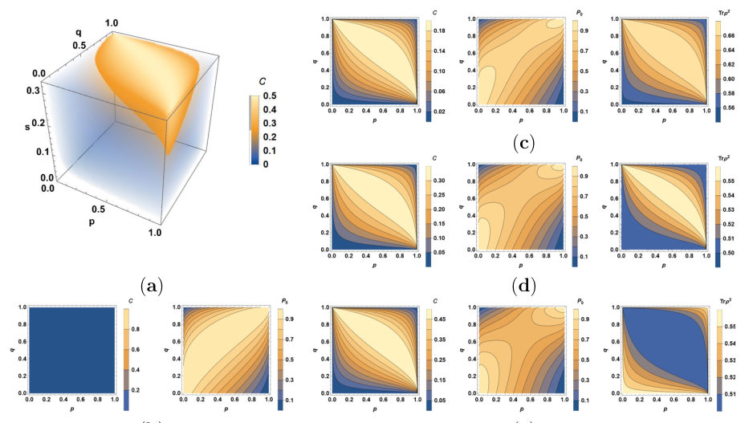 
Figure 4: Concurrence C in PS for the family of channels α1 0 = 1, α2 i = s, i = 1, 2, 3, s ∈ [0, 1

📷 Fig 5

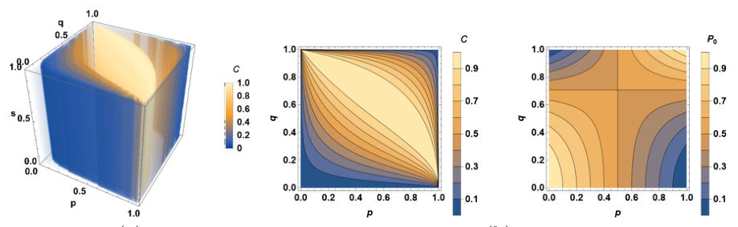 
Figure 5: Concurrence C in PS for the family of channels α1 0 = 1, α2 1 = s = 1 −α2 2 in colour, in agreement with each legend colour besides. (a) As a density plot function of p, q, s, and the contour plots of C and P0 for all s. Trρ2 out = 1 for all s.

**Summary.** This paper investigates novel methods for creating quantum entanglement from unentangled initial states by exploiting coherent interference effects. It compares deterministic control using unitary path superposition against stochastic generation through noisy Pauli channels arranged in specific causal orders. The key finding is that the ability to interfere between alternative local operational pathways, even when decoherence is present, can serve as a powerful resource for generating robust entanglement.

**Why it may be interesting.** It provides a generalized theoretical framework showing that interference between local operations, rather than direct non-local interactions, can be the mechanism for generating and controlling quantum correlations, which is highly relevant to open quantum systems theory.

Detailed structure

**Main problem.** The central challenge is achieving controlled generation of quantum entanglement from initially separable states using local operations.

**Main result.** Entanglement can be deterministically generated by coherently superposing alternative operational paths, or stochastically through noisy channels, provided specific orthogonality conditions are met.

**Method.** The analysis uses mathematical frameworks involving coherent path superposition of local unitaries and the application of Pauli channels under both Path Superposition (PS) and Indefinite Causal Order (ICO).

**Model / system.** The system models a two-qubit state evolving under control mechanisms, analyzed using Bloch sphere representations for mixed states and focusing on Bell, GHZ, and W classes of entangled states.

**Key observables.** Concurrence ($C(
ho)$), Purity ($	ext{Tr}
ho_{	ext{out}}^2$), Success Probability ($P_{0}$), and the resulting entanglement class (Bell, GHZ, W).

**Important parameters / regimes.** Parameters governing local unitary operations ($U_k$) and Pauli channel strengths ($\alpha$ parameters) that dictate interference strength.

**Assumptions / limitations.** The analysis often assumes starting from fully separable input states ($
ho_1 \otimes 
ho_2$) and relies on post-selection measurements to reveal the entangled state.

**Figures summary.** Figures illustrate how local unitaries superposed along distinct paths generate entanglement (Fig 1); they also show $C(
ho)$ vs. parameters for both coherent and non-coherent control schemes, demonstrating interference origins (Figs 3-6).

**Paper structure.** The paper progresses from deterministic generation via unitary superposition to extending the analysis to noisy Pauli channels under PS/ICO architectures, culminating in a quantitative study of entanglement trade-offs using concurrence.

Abstract

The controlled generation of quantum entanglement from separable states remains a central challenge in quantum information science. Here, we investigate entanglement generation using two related control paradigms: coherent path superposition of local unitary operations and stochastic implementations of Pauli channels under coherent control. We show that entangled states belonging to the Bell, GHZ and W classes, can be deterministically generated from fully separable inputs by coherently superposing alternative sets of local unitary transformations. Conditions on the local operators for entanglement generation are derived, and the resulting states are shown to be locally unitary equivalent to standard multipartite entangled states. We further extend the analysis to noisy scenarios, where separable mixed states evolve through pairs of Pauli channels arranged in path-superposition and indefinite causal order configurations. Closed-form expressions for the output states are obtained, and entanglement is quantified using concurrence. By exploring representative channel families across their parameter space, we identify regimes where stochastic entanglement emerges, determine the associated success probabilities, and characterize trade-offs between entanglement and purity.

[↑ back to top](#top)

### [Non-Bloch band theory of boundary-controlled magnon edge modes in an antiferromagnetic chain](http://arxiv.org/abs/2606.09267v1)

**Authors:** Suman Debnath, Sonu Verma, Rohit Mukherjee, Arijit Kundu  
**Type:** theory · **Category:** other · **PDF:** <https://arxiv.org/pdf/2606.09267v1>  
**Analysis basis:** full PDF text, analyzed in chunks
**Topic relevance:** `analog quantum simulation` **3/5** · `exotic spin models in light-matter` **3/5** · `spintronics-quantum-optics interface` **3/5** · `driven-dissipative phase transition` **2/5** · `Frenkel-Kontorova` **1/5** · `Kondo & dissipative impurity` **1/5** · `methods for driven-dissipative` **1/5** · `non-equilibrium dynamics` **1/5**

📷 Fig 1

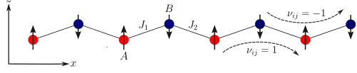 
FIG. 1. Schematic diagram of the antiferromagnetic chain. The spins interact with nearest neighbors by Heisenberg exchange interactions J1, J2. The spins interact to next nearest neighbour by DMI. The sign of DMI (νij = ±1) changes alternatively as shown. Each spin has an easy-axis anisotropy energy κ (not shown) with the easy-axis directed along z−direction. The up and down spins are denoted by A and B, respectively.

📷 Fig 2

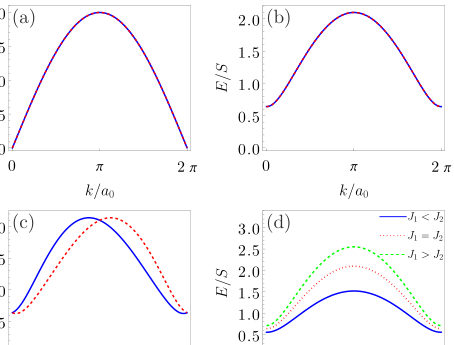 
FIG. 2. Magnon dispersion for different parameter values. (a) For D = 0, κ = 0, and J1 = J2 = 1, the system reduces to the Heisenberg model, exhibiting two degenerate gapless Goldstone modes. It is shown as overlapping blue solid and red dashed curves in the figure. Here, a0 = 2d is the lattice constant. (b) Introducing finite anisotropy (κ = 0.05) opens a gap at zero energy, with magnitude 2 √

📷 Fig 3

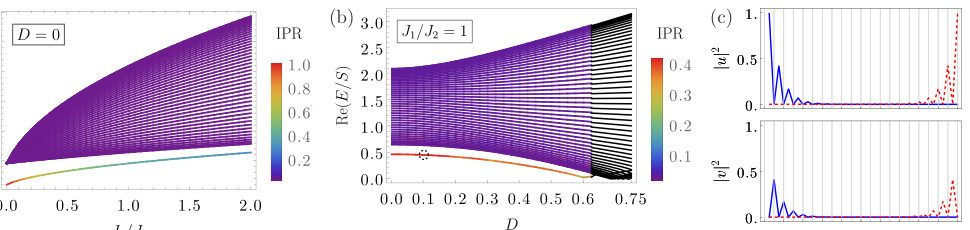 
FIG. 3. The energy spectrum and wavefunction profiles for a finite system under open boundary conditions. (a) Energy spectrum as a function of J1/J2, with D = 0 and κ = 0.05 fixed. The color scale represents the inverse participation ratio (IPR). Edge modes are present throughout the parameter range shown. (b) Energy spectrum as a function of D, with J1/J2 = 1 fixed. The edge states persist for finite D, with only a shift in the overall energy scale. For sufficiently large D, the edge states merge into the bulk continuum and the spectrum develops complex eigenvalues, signaling the onset of instability; this occurs around Df c ≈0.63. Beyond this point, the spectrum is plotted in black. (c)...

📷 Fig 4

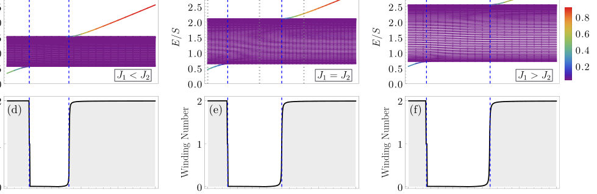 
FIG. 4. Energy spectrum, winding number, and generalized Brillouin zone (GBZ). (a)–(c) Energy as a function of ϵ for J1 = 0.5, 1, 1.5, respectively, with J2 = 1, D = 0, κ = 0.05 fixed. The color scale represents the inverse participation ratio (IPR). In all cases, edge states appear under open boundary conditions (OBC) i.e. at ϵ = 0. As ϵ is increased, these states merge into the bulk spectrum and subsequently re-emerge from the other side of the bands. (d)–(f) Shows the corresponding non-Bloch winding number, capturing the appearance and disappearance of edge modes (also indicated by vertical blue dashed lines). In (g)–(i), we display GBZ for three representative values of ϵ (ϵ = 0, 0.7,...

**Summary.** The paper develops a non-Bloch topological framework to analyze magnon edge modes in 1D antiferromagnetic chains. It resolves the conflict between trivial bulk invariants and observable boundary states by defining a generalized winding number. This method successfully predicts that these edge modes are controllable via local perturbations, suggesting experimental realization using engineered magnetic nanostructures.

**Why it may be interesting.** This work provides a rigorous theoretical tool (non-Bloch topology) to characterize localized excitations in magnetic systems where standard bulk band theory fails, offering insights applicable to engineered quantum materials.

Detailed structure

**Main problem.** The study addresses the emergence of magnon edge modes in an antiferromagnetic spin chain when conventional Bloch topological invariants fail to predict their existence, indicating a breakdown of bulk-boundary correspondence.

**Main result.** A non-Bloch band theory utilizing a generalized Brillouin zone and a specialized winding number successfully predicts the presence and tunability of these boundary-localized magnon edge states.

**Method.** The authors employ linear spin-wave theory, constructing a pseudo-Hermitian dynamic matrix. They then develop a non-Bloch framework to calculate topological invariants by solving finite-difference equations on a generalized Brillouin zone.

**Model / system.** The system is a one-dimensional antiferromagnetic spin chain described by a Hamiltonian including Heisenberg exchange, Dzyaloshinskii–Moriya interaction (DMI), and easy-axis anisotropy. The analysis considers open boundary conditions (OBC) and tunable boundary perturbations.

**Key observables.** Magnon excitation spectrum eigenvalues, non-Bloch winding number ($W_{nB}$), Inverse Participation Ratio (IPR), and the energy levels of edge states as a function of boundary potential ($\epsilon$).

**Important parameters / regimes.** DMI strength ($D$), anisotropy ($\kappa$), exchange couplings ($J_1, J_2$), and the magnitude of the boundary perturbation ($\epsilon$).

**Assumptions / limitations.** The analysis relies on linear spin-wave theory. For detailed winding number calculations, the DMI term is often set to zero ($D=0$) for analytical tractability.

**Figures summary.** Figures illustrate the antiferromagnetic chain structure, energy spectra showing edge states appearing/disappearing with $\epsilon$, and plots of the non-Bloch winding number across the generalized Brillouin zone.

**Paper structure.** The paper progresses from establishing the failure of Bloch theory to defining the non-Bloch framework. It then applies this theory to calculate topological invariants, demonstrating how these invariants correctly track the appearance and disappearance of edge states controlled by boundary perturbations.

Abstract

We define a winding number within the Non-Bloch band theory framework that captures the emergence of magnon edge modes in a one-dimensional antiferromagnetic spin chain, even when the conventional Bloch winding number is trivial. Within linear spin-wave theory, magnon excitations are governed by a non-Hermitian dynamic matrix, despite the underlying Hamiltonian being Hermitian. The symmetry classification of this matrix yields a trivial bulk invariant, however, finite systems exhibit boundary-localized modes, signaling a breakdown of the conventional bulk-boundary correspondence. We further show that these edge modes can be controlled via boundary perturbations. By tuning the boundary potential, the modes can be driven into or out of the bulk spectrum. To resolve the bulk-boundary mismatch, we develop a non-Bloch framework based on a generalized Brillouin zone and a winding number that correctly predicts the presence of edge states. Our results establish boundary-controlled topological transitions that are experimentally accessible through local Zeeman fields or modified edge anisotropy in antiferromagnetic van der Waals nanostructures.

[↑ back to top](#top)

### [Markovian dynamics of single-rebit open quantum systems with applications to colour perception](http://arxiv.org/abs/2606.08117v1)

**Authors:** Michel Berthier, Gabriel Niebel, Edoardo Provenzi  
**Type:** theory · **Category:** other · **PDF:** <https://arxiv.org/pdf/2606.08117v1>  
**Analysis basis:** full PDF text, analyzed in chunks
**Topic relevance:** `methods for driven-dissipative` **3/5** · `quantum measurements` **3/5** · `driven-dissipative phase transition` **2/5** · `non-equilibrium dynamics` **2/5** · `Keldysh / 2PI / non-Gaussian methods` **1/5** · `correlated / nonlocal dissipation` **1/5** · `entanglement & information structure` **1/5** · `non-equilibrium universality` **1/5**

📷 Fig 1

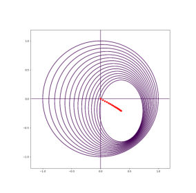 
Fig. 4 Dynamics generated by illuminant channels. The time steps are t = i/10, i = 0, . . . , 14, and the parameters of the Lindblad matrix are as follows: α1,1 = 2, α2,2 = 1/3, α3,3 = 1, α1,3 = 1/7, and α2,3 = 1/5 (left), and α1,1 = 1/8, α2,2 = 1/4, α3,3 = 1/10, α1,3 = −1/20, and α2,3 = −1/10 (right).

📷 Fig 2

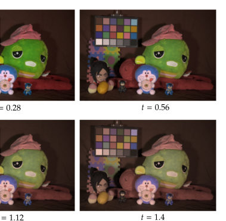 
Fig. 5 The chromatic distortion induced by an illuminant channel. The weakly saturated orange illuminant is the stationary state (1/3, 0.2), α1,1 = 0.1, α2,2 = 0.25, and α3,3 = 0.15.

📷 Fig 3

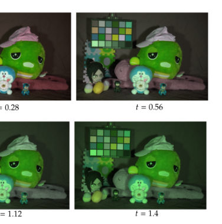 
Fig. 6 The chromatic distortion induced by an illuminant channel. The strongly saturated green illuminant is the stationary state (−0.8, 0).

📷 Fig 4

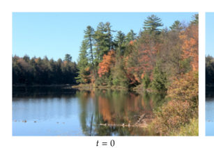 
Fig. 7 The chromatic distortion induced by an opponency channel with α1,1 = 0.005, and α2,2 = 0.4.

📷 Fig 5

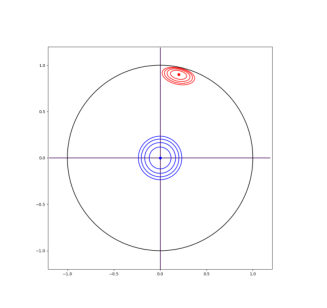 
Fig. 8 Level sets of relative entropy µ = 0.01, 0.02, 0.03, 0.04. For the blue ones t = 0, for the red ones t = (0.2, 0.9) (left). Level sets of relative entropy µ = 0.02 for t = (0, 0), (0.2, 0.9), (0.3, 0.3), (−0.3, −0.5), and (−0.6, 0.7) (right).

**Summary.** The paper develops a comprehensive mathematical classification of Markovian open quantum channels acting on two-state systems (rebits). It then applies this theory to color science, demonstrating that the effect of non-neutral light sources causes chromatic distortion by reducing the distinguishability between colors, which is quantified using relative entropy.

**Why it may be interesting.** This work provides a rigorous quantum information framework (Markovian dynamics) to model complex biological phenomena like color vision, bridging abstract quantum physics with sensory neuroscience.

Detailed structure

**Main problem.** The paper classifies Markovian dynamics for open two-state quantum systems (rebits) and applies this framework to model how illuminant changes cause chromatic distortion in human color perception.

**Main result.** A general structure for Markovian rebit channels is derived, and the theory successfully models chromatic distortion by showing that non-neutral illuminants induce a measurable reduction in color distinguishability quantified by quantum relative entropy.

**Method.** The authors use techniques from open quantum system theory, deriving structural properties of CPTP maps (channels) via the GKSL equation and applying these mathematical tools to psycho-physical models involving Lüders measurements.

**Model / system.** The physical system is a single-rebit open quantum system whose state evolves under Markovian dynamics. The model uses the Bloch vector representation for rebit states, $
ho_s$, and relates channel evolution to established color vision models.

**Key observables.** Chromatic distinguishability (quantified by relative entropy $R$), the Bloch vector components $(s_1, s_2)$, and the stationary state $\mathbf{v}_{s0}$.

**Important parameters / regimes.** The decay rates ($\alpha_{i,j}$) derived from the Lindblad operators defining the illuminant channel; the Lorentz boost parameter $\gamma_e$.

**Assumptions / limitations.** The analysis assumes continuous differentiability of the channel components and models color perception using a rebit state space parameterized by real numbers.

**Figures summary.** Figures illustrate chromatic distortion caused by specific non-neutral illuminants (orange, green) and show how the level sets of relative entropy change over time, demonstrating reduced distinguishability.

**Paper structure.** The paper first tackles the abstract mathematical classification of Markovian rebit channels using semigroup properties. It then transitions to applying this theory to color perception, deriving specific channel forms for illuminants and dysfunction models, and finally quantifying distortion via relative entropy.

Abstract

This paper investigates the Markovian dynamics of open two-state quantum systems defined over the real numbers (rebits). Two main objectives are pursued. First, we present a comprehensive classification of Markovian rebit quantum channels, i.e. one-parameter semigroups of completely positive, trace-preserving (CPTP) maps acting on the rebit state space. We show that a full characterisation of their action can be achieved and that describing these channels as solutions of the GKSL equation allows us to explicitly identify the associated Lindblad generators and conditions for complete positivity. Second, we present an original application of this classification to colour perception. Using a recent model in which perceived colours arise from Lüders measurements on the rebit state space, we show how chromatic distortion induced by a non-neutral illuminant can be modelled by a Markovian rebit channel that progressively diminishes colour distinguishability. Other types of channels could be used to study colour vision deficiencies. These phenomena are illustrated by simulations on digital images, highlighting the relevance of rebit Markovian dynamics in modelling colour vision.

[↑ back to top](#top)

### [Fidelity susceptibility and geometric response in flux-tuned Dirac systems: exact results from a low-energy two-level reduction](http://arxiv.org/abs/2606.08280v1)

**Authors:** C. A. S. Almeida  
**Type:** theory · **Category:** statistical mechanics · **PDF:** <https://arxiv.org/pdf/2606.08280v1>  
**Analysis basis:** full PDF text, analyzed in chunks
**Topic relevance:** `non-equilibrium universality` **3/5** · `driven-dissipative phase transition` **2/5** · `entanglement & information structure` **2/5** · `Keldysh / 2PI / non-Gaussian methods` **1/5** · `Kondo & dissipative impurity` **1/5** · `analog quantum simulation` **1/5** · `correlated / nonlocal dissipation` **1/5** · `methods for driven-dissipative` **1/5** · `non-equilibrium dynamics` **1/5**

📷 Fig 1

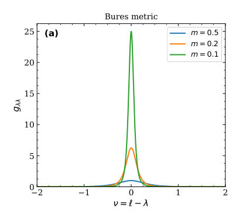 
Figure 1: (a) Bures metric gλλ(ν) in the effective two-level model for m = 0.5, 0.2, and 0.1. The Lorentzian peak at ν = 0 scales as gmax λλ ∝m−2 and diverges in the chiral limit. (b) Normalized Bloch-sphere polar angle (2/π) arctan(ν/m) for the same masses. Since gλλ = 1 4(dθ/dν)2 (Sect. 7), the curvature of the ground-state trajectory on the Bloch sphere directly generates the Lorentzian profile in panel (a).

📷 Fig 2

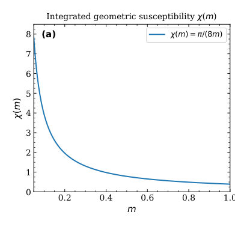 
Figure 2: (a) Integrated Bures response χ(m) = π/(8m), representing the total geo- metric response of a single avoided crossing in the effective theory (Sect. 6). (b) Ge- ometric (paramagnetic) contribution 2gmax λλ = 1/(2m2) and diamagnetic contribution −∂2 λE− ν=0 = 1/m to the peak persistent current susceptibility at ν = 0, as functions of m. The shaded region marks the geometric excess; for m &lt; 1/2 the Bures metric dom- inates the total susceptibility.

**Summary.** This theoretical work analyzes the parametric sensitivity of flux-tuned Dirac fermions by employing the Bures metric. The authors derive an exact result showing that the integrated geometric susceptibility scales universally as $1/m$, mirroring critical divergences. This establishes a direct link between information geometry and measurable physical responses like persistent currents in mesoscopic systems.

**Why it may be interesting.** The connection between information geometry (Bures metric) and measurable transport properties like persistent currents provides a powerful, non-standard tool to characterize quantum critical behavior in condensed matter systems.

Detailed structure

**Main problem.** The study quantifies the parametric sensitivity of quantum systems using information geometry, specifically by analyzing the Bures metric (fidelity susceptibility) in flux-tuned Dirac fermions.

**Main result.** The integrated geometric susceptibility exhibits an exact universal Lorentzian profile with inverse-mass scaling ($\chi(m) \sim 1/m$), mirroring critical power-law divergences near gap closing.

**Method.** The authors use a controlled low-energy projection of the full Dirac Hamiltonian onto an effective two-level subspace to derive closed-form expressions for the Bures metric and its integral susceptibility.

**Model / system.** The system is modeled by 2D massive Dirac fermions subjected to an Aharonov-Bohm flux. The analysis is simplified using an effective two-level Hamiltonian, $H_{	ext{eff}}(
u) = 
u \sigma_x + m \sigma_z$, valid near integer flux.

**Key observables.** Bures metric (fidelity susceptibility), integrated geometric susceptibility $\chi(m)$, and the paramagnetic contribution to persistent current susceptibility.

**Important parameters / regimes.** Dirac mass ($m$), reduced Aharonov-Bohm flux ($\lambda$), and the chiral limit ($m 	o 0$).

**Assumptions / limitations.** The analysis relies on a low-energy projection onto an effective two-level subspace, which is valid in the vicinity of integer flux values.

**Figures summary.** Figures illustrate the Lorentzian peak of the Bures metric $g_{\lambda\lambda}(
u)$ near $
u=0$ and plot the integrated susceptibility $\chi(m) = \pi/(8m)$, comparing geometric vs. diamagnetic contributions to total susceptibility.

**Paper structure.** The paper first introduces the use of the Bures metric for parametric sensitivity in Dirac systems, derives an effective two-level Hamiltonian near integer flux, and then calculates the exact closed-form expressions for both the local (Lorentzian) and integrated ($\chi(m)$) geometric susceptibilities.

Abstract

We study the parametric sensitivity of two-dimensional massive Dirac fermions subject to Aharonov-Bohm flux insertion, using the Bures metric (fidelity susceptibility) as the central statistical-mechanical response function. Near integer values of the reduced flux, the low-energy spectrum undergoes a flux-induced avoided crossing whose structure is controlled by the Dirac mass. Through a controlled low-energy projection of the full Dirac=Aharonov-Bohm operator onto an effective two-level subspace, valid near integer flux, we derive an exact closed-form expression for the ground-state Bures metric, which takes a universal Lorentzian profile centered at integer flux with width set by the mass parameter. The peak value scales as $g^{\max}_{λλ}\sim m^{-2}$, diverging in the chiral limit in direct analogy with the divergence of thermodynamic susceptibilities near critical points. We introduce an integrated geometric susceptibility $χ(m) = π/(8m)$, whose inverse-mass scaling is the information-geometric counterpart of power-law critical behavior, with the Dirac mass playing the role of a relevant coupling controlling the distance from the chiral fixed point. The Lorentzian profile is shown to arise from the curvature of the ground-state manifold on the Bloch sphere, requiring no dynamical input beyond the spectral structure. Importantly, this geometric response is independent of Berry curvature and topological invariants, emerging instead from a universal local spectral mechanism. Through its spectral representation, the Bures metric is identified as the geometric (paramagnetic) contribution to the persistent current susceptibility, encoding the sensitivity of persistent currents and orbital magnetization to flux variations and connecting information geometry to measurable response functions in mesoscopic Dirac systems.

[↑ back to top](#top)

### [Topological defects and scalar field modes in warped geometries](http://arxiv.org/abs/2606.09781v1)

**Authors:** A. A. Saharian, E. L. Karapetyan, G. V. Mirzoyan  
**Type:** theory · **Category:** other · **PDF:** <https://arxiv.org/pdf/2606.09781v1>  
**Analysis basis:** full PDF text, analyzed in chunks
**Topic relevance:** `Keldysh / 2PI / non-Gaussian methods` **3/5** · `analog quantum simulation` **2/5** · `entanglement & information structure` **2/5** · `non-equilibrium dynamics` **2/5** · `correlated / nonlocal dissipation` **1/5** · `driven-dissipative phase transition` **1/5** · `methods for driven-dissipative` **1/5** · `non-equilibrium universality` **1/5**

📷 Fig 1

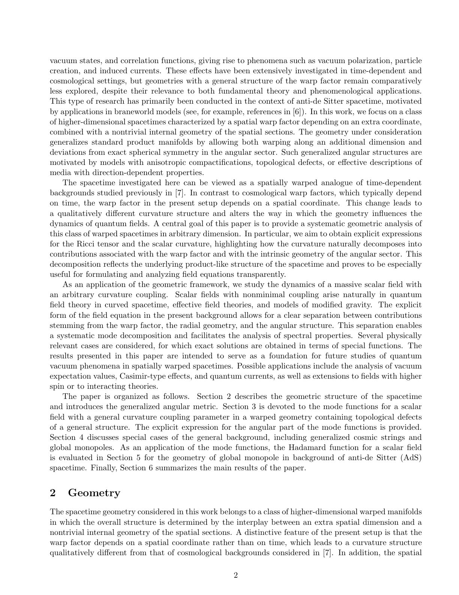 
Low-resolution page preview, page 2

📷 Fig 2

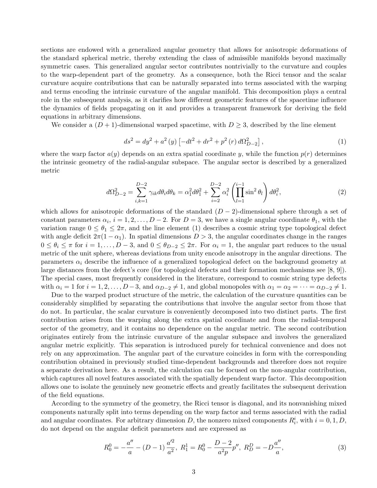 
Low-resolution page preview, page 3

📷 Fig 3

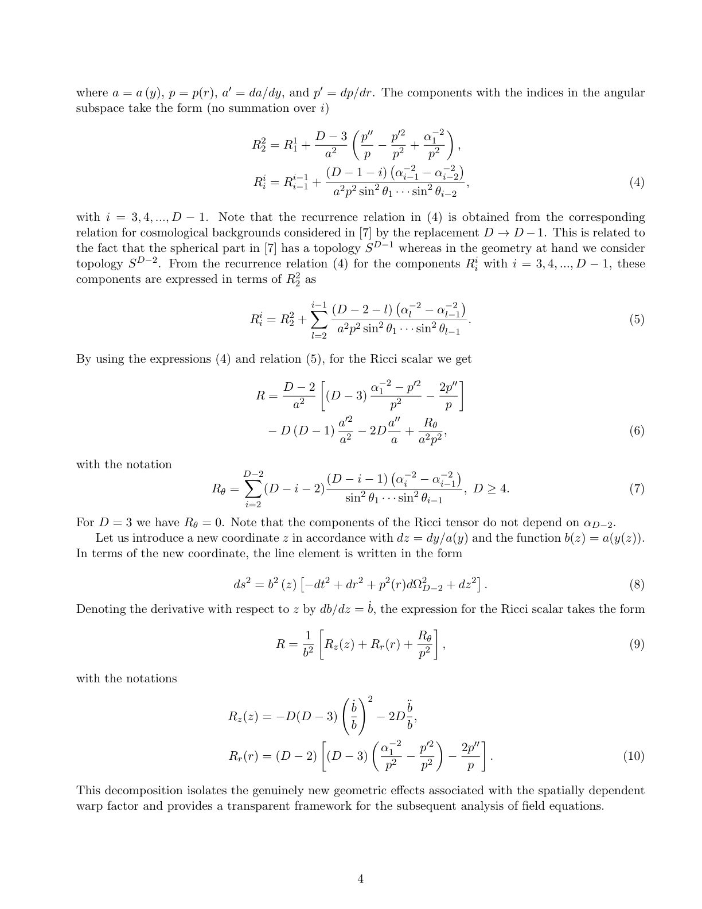 
Low-resolution page preview, page 4

📷 Fig 4

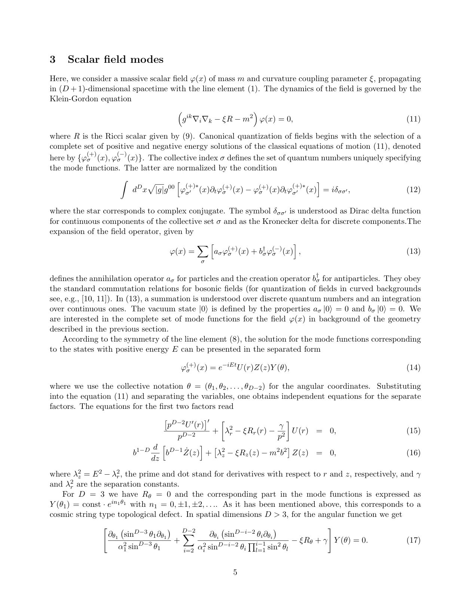 
Low-resolution page preview, page 5

📷 Fig 5

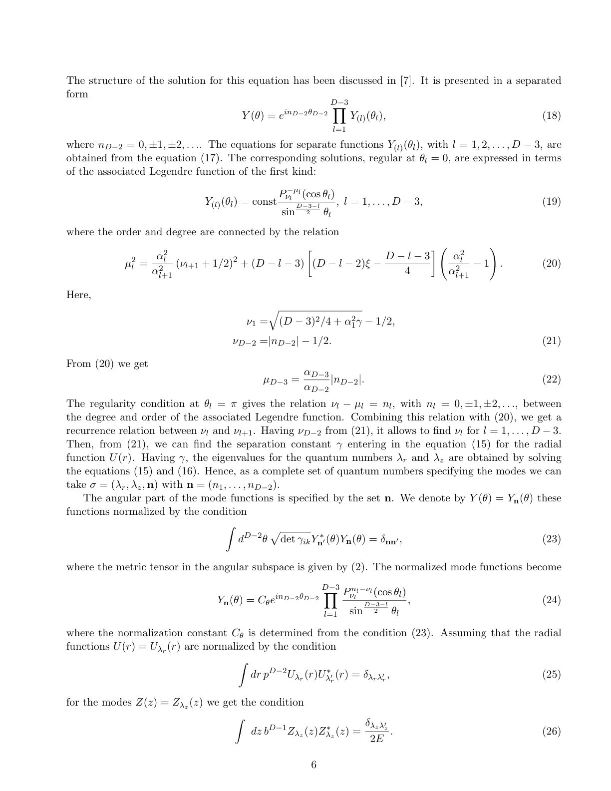 
Low-resolution page preview, page 6

**Summary.** This theoretical paper investigates quantum scalar fields in curved spacetimes containing topological defects like cosmic strings. By developing a general framework based on geometric decomposition, the authors solve the field equation using separation of variables. The ultimate goal is to calculate the vacuum correlation function (Hadamard two-point function) for these exotic physical setups.

**Why it may be interesting.** While focused on gravity/QFT, the mathematical techniques—solving separated differential equations with complex boundary conditions and deriving correlation functions—are highly relevant to open quantum systems and many-body physics where geometry or external fields modify standard Hamiltonians.

Detailed structure

**Main problem.** The research develops a general framework to study how topological defects influence quantum scalar fields propagating within warped spacetime geometries.

**Main result.** The authors derive explicit forms for the Hadamard two-point function in specific defect backgrounds, such as global monopoles and cosmic strings embedded in AdS spacetime.

**Method.** The methodology involves decomposing geometric tensors (like the Ricci tensor) and separating the resulting field equation into independent radial, angular, and warp-coordinate parts to solve for mode functions.

**Model / system.** The system is a massive scalar field propagating on a $(D+1)$-dimensional warped spacetime background that incorporates anisotropic deformations due to topological defects. The geometry is characterized by warp factors and generalized metrics.

**Key observables.** The Hadamard two-point function G(x, x'), the mode functions $\phi_\sigma(x)$, and components of the Ricci tensor ($R_{ii}$).

**Important parameters / regimes.** Curvature coupling parameter ($\xi$), mass $m$, warp factor parameters, and angular deficit parameters ($\alpha_i$).

**Assumptions / limitations.** The analysis assumes symmetries that allow for the separation of variables in the field equation; specific boundary conditions are used to determine mode quantization.

**Figures summary.** Not specified (Bibliography section provided).

**Paper structure.** The paper progresses by first establishing a general formalism for curvature decomposition, then applying this to separate the scalar field equation into solvable components, and finally calculating the two-point function for specific defect models like global monopoles in AdS.

Abstract

We develop a general framework for investigating the influence of topological defects on the local characteristics of a quantum scalar field in a warped geometry background. The Ricci tensor and curvature scalar are decomposed into contributions from the warp factor, the radial geometry and the angular defect structure. For an arbitrary curvature coupling parameter, the field equation is separated into independent radial, angular and warp-coordinate parts. A complete set of normalized mode functions is obtained for general values of the angular deficit parameters. The general formalism is applied to several specific cases, such as conformally flat warped spacetimes, generalized cosmic strings, global monopoles and anti-de Sitter (AdS)-type warped geometries. The Hadamard two-point function is then evaluated for a global monopole in AdS spacetime using the obtained mode functions.

[↑ back to top](#top)

### [Inhomogeneous Coulomb Models Without Defects are Sick: Domain Wall Energies Scaling as Volume (not Boundary Area)](http://arxiv.org/abs/2606.08613v1)

**Authors:** Garry Goldstein  
**Type:** theory · **Category:** statistical mechanics · **PDF:** <https://arxiv.org/pdf/2606.08613v1>  
**Analysis basis:** full PDF text, analyzed in chunks
**Topic relevance:** `analog quantum simulation` **3/5** · `non-equilibrium dynamics` **2/5** · `Keldysh / 2PI / non-Gaussian methods` **1/5** · `correlated / nonlocal dissipation` **1/5** · `driven-dissipative phase transition` **1/5** · `entanglement & information structure` **1/5** · `exotic spin models in light-matter` **1/5** · `methods for driven-dissipative` **1/5** · `non-equilibrium universality` **1/5**

📷 Fig 1

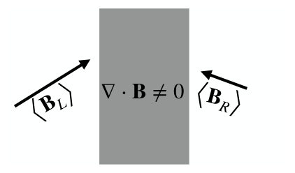 
Figure 1. The main idea about non-vanishing divergence. By the divergence theorem there are defects between different phases or there are macroscopic changes to the system state.

📷 Fig 2

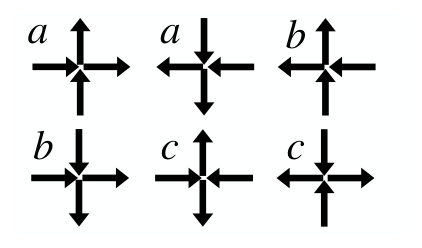 
Figure 2. The six vertex configurations along with their Boltzmann weights.

📷 Fig 3

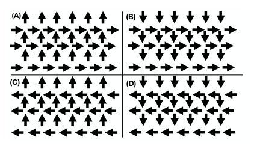 
Figure 3. The four configurations most relevant to the case where ∆&gt; 1.

📷 Fig 4

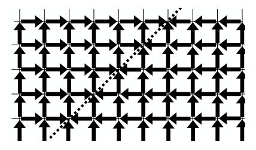 
Figure 4. Non-compatible domain wall for six vertex model.

📷 Fig 5

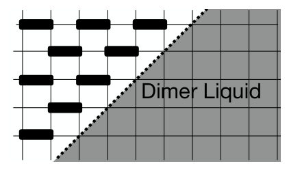 
Figure 5. Non-compatible dimer domain wall.

**Summary.** This work demonstrates a fundamental pathology in Coulomb lattice models: domain walls cost energy proportional to system volume rather than just boundary area. The authors prove this using the six vertex model and show that even when macroscopic constraints are met, boundaries impose extensive free energy costs, highlighting the critical role of boundary conditions in these systems.

**Why it may be interesting.** While focused on condensed matter statistical mechanics, the concept of boundary-induced extensive energy costs is relevant for understanding finite-size effects in quantum simulations or open quantum systems where boundary conditions are crucial.

Detailed structure

**Main problem.** The authors investigate pathological behavior in Coulomb models where domain wall energies scale extensively with system volume rather than merely with boundary area, even when macroscopic constraints are satisfied.

**Main result.** Generic domain walls cost energy proportional to the system volume, and even boundaries satisfying $
abla \cdot B \cdot n = 0$ can impose an extensive free energy cost on the Helmholtz free energy.

**Method.** The analysis uses theoretical techniques applied to exactly solvable lattice models, comparing partition functions under different boundary conditions (periodic vs. domain wall).

**Model / system.** The study applies to general lattice systems obeying a divergence-free constraint ($
abla \cdot \langle B 
angle = 0$), with specific examples including the square lattice six vertex model, quantum dimers, and classical spin ice.

**Key observables.** Domain wall energy scaling (Volume vs. Area), Helmholtz free energy cost, monopole density, and partition functions for different boundary conditions.

**Important parameters / regimes.** The divergence-free constraint ($
abla \cdot \langle B 
angle = 0$), the ratio of ground state pseudo-magnetic fields across a domain wall ($\left\langle \mathbf{B}_{R}
ight
angle -\left\langle \mathbf{B}_{L}
ight
angle$), and temperature/coupling constants.

**Assumptions / limitations.** The analysis relies on coarse-graining variables $\langle B 
angle$ related to microscopic degrees of freedom, and the comparison between different boundary condition ensembles (periodic vs. domain wall).

**Figures summary.** Figures illustrate non-vanishing divergence at interfaces, six vertex configurations for the model, and comparisons of partition functions under various boundary conditions.

**Paper structure.** The paper establishes the general problem using Coulomb models, analyzes specific examples like the six vertex model to demonstrate volume scaling pathologies, and concludes by showing that even seemingly compatible boundaries have thermodynamic consequences.

Abstract

In this work we show that coulomb models, ones that obey a $\nabla\cdot\left\langle \mathbf{B}\right\rangle =0$ divergence free constraint - for $\left\langle \mathbf{B}\right\rangle $ being some coarse grained variables related to the microscopic degrees of freedom of the lattice system - are sick without the inclusion of defects with $\nabla\cdot\mathbf{B}\neq0$. We show that for generic boundaries (ones where the fluxes of the pseudo-magnetic fields on the boundary do not cancel: $\left(\left\langle \mathbf{B}_{R}\right\rangle -\left\langle \mathbf{B}_{L}\right\rangle \right)\cdot\mathbf{n}\neq0$ - here $\mathbf{n}$ is the unit normal and $\left\langle \mathbf{B}_{R/L}\right\rangle $ are the two ground state pseudo-magnetic fields on either side of the domain wall) without the inclusion of defects, sharp domain walls (on the order of the width of a unit cell) between different phases of the system cost energy proportional to system size (not boundary area). We present several different examples of this phenomena in the square lattice six vertex model, in quantum dimers and in classical spin ice in the presence of magnetic fields. We also show by example that the condition $\left(\left\langle \mathbf{B}_{R}\right\rangle -\left\langle \mathbf{B}_{L}\right\rangle \right)\cdot\mathbf{n}=0$ is a necessary but not sufficient condition for the boundaries to be compatible - that is domain wall energy to scale with domain wall area and not system size. To further present the importance of boundary conditions in Coulomb systems we show that system boundaries, even ones that satisfy $\int_{\partial V}\mathbf{B}\cdot\mathbf{n}=0$, have thermodynamic consequences - that is there is a cost, extensive in system size, to the Helmholtz free energy.

[↑ back to top](#top)

### [Shear Banding in Amorphous Solids as a Nonlinear Screened Soft Mode Instability](http://arxiv.org/abs/2606.08540v1)

**Authors:** Yang Fu, Yuliang Jin, Avanish Kumar, Itamar Procaccia  
**Type:** both · **Category:** statistical mechanics · **PDF:** <https://arxiv.org/pdf/2606.08540v1>  
**Analysis basis:** full PDF text, analyzed in chunks
**Topic relevance:** `non-equilibrium universality` **3/5** · `driven-dissipative phase transition` **2/5** · `non-equilibrium dynamics` **2/5** · `Frenkel-Kontorova` **1/5** · `Keldysh / 2PI / non-Gaussian methods` **1/5** · `analog quantum simulation` **1/5** · `correlated / nonlocal dissipation` **1/5** · `methods for driven-dissipative` **1/5**

📷 Fig 1

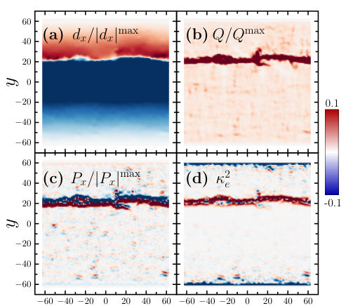 
FIG. 2. Panel (a): the normalized displacement compo- nent parallel to the shear band. Panel (b): the normalized quadrupole charge, Q, defined as Q = p

📷 Fig 2

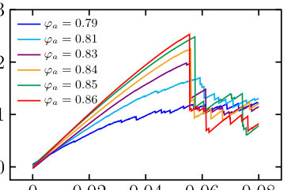 
FIG. 1. The background shear stress Σxy versus strain γ curves with different initial annealing conditions (φa), for N = 16000 Hertzian particles.

📷 Fig 3

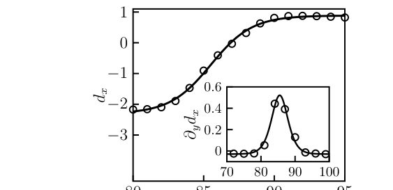 
FIG. 3. Fitting the simulation profile of dx(y) to the theoret- ical prediction Eq. (11) (line). Inset: comparing the data of shear localization to the theoretical prediction Eq. (15) with a trivial shift constant.

📷 Fig 4

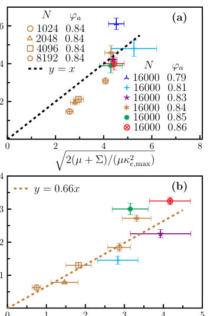 
FIG. 5. Examination of Eq. (12) (panel a), and Eq. (13) (panel b) using simulation data for WCA systems.

📷 Fig 5

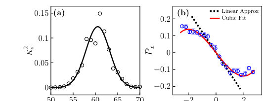 
FIG. 4. Panel (a): The profile of κ2 e in the shear band is fitted by a Gaussian function to determine the peak value κe,max , with κ2 e calculated using the linear constitutive re- lation Eq. (14). Panel (b): Px vs. dx in the shear band within 58 &lt; y &lt; 63, fitted to Eq. (16), giving A/µ ≈1.04 and B ≈0.0088 (red solid line). The black dashed line represents A/µ ≈1.2 obtained from panel (a).

**Summary.** This work theoretically and numerically analyzes shear banding in amorphous solids, proposing that this mechanical failure mode is not a simple fracture but rather a nonlinear instability mediated by topological screening. By simulating atomic models under shear, the authors confirm that the finite width of the resulting shear band is quantitatively determined by this screening mechanism.

**Why it may be interesting.** While focused on condensed matter mechanics, the concept of an instability being governed by a 'screening' mechanism analogous to those studied in quantum field theory or plasma physics provides a rich analogy for understanding non-equilibrium phase transitions in complex many-body systems.

Detailed structure

**Main problem.** The paper investigates shear banding, a mechanical instability in amorphous solids, by developing and numerically testing a nonlinear theory that incorporates plastic deformations as topological charges.

**Main result.** Shear banding is fundamentally established as a screened soft-mode instability, where the finite localization scale of the band is governed by topological screening rather than classical elasticity.

**Method.** The authors combine theoretical derivation (using nonlinear Lagrangian methods) with extensive numerical simulations on atomic models to verify quantitative predictions for the shear band width and amplitude.

**Model / system.** The study uses amorphous solids simulated via molecular dynamics using various repulsive potentials (harmonic, Hertzian, WCA) under athermal quasistatic shearing conditions.

**Key observables.** Accumulated stress ($\Sigma_{xy}$) vs. strain ($\gamma$), displacement profiles ($d_x(y)$), quadrupolar charge density ($Q$), and the screening parameter ($\kappa_e^2$).

**Important parameters / regimes.** The screening length ($\ell \sim 1/\kappa_e$) and nonlinear coefficients derived from the instability equations are crucial for characterizing the band.

**Assumptions / limitations.** The analysis often relies on simplifying assumptions, such as fixing boundary conditions or using a 1D projection approximation for the displacement field to match theoretical models to simulations.

**Figures summary.** Figures show stress-strain curves exhibiting shear localization, spatial maps of charge densities concentrated in bands, and quantitative fits comparing simulated displacement profiles and screening parameters against theoretical predictions.

**Paper structure.** The paper progresses from establishing the general nonlinear theory for instability (soft mode analysis) to applying this framework numerically using atomic simulations across different potentials, culminating in a demonstration that topological screening dictates the finite width of the shear band.

Abstract

Shear banding is a well-known and widespread instability in strained solids: under external strain, the deformation localizes along a line in two dimensions or a plane in three dimensions. Developing a proper theoretical description of this phenomenon is key to understanding mechanical failure in solid materials. Very recently, a nonlinear theory extending classical elasticity to include plastic deformations as topological charges was proposed, offering detailed predictions on the nature and consequences of the shear-banding instability. The theory derives a Hessian operator whose lowest eigenvalue vanishes at the onset of instability, and the corresponding critical eigenmode describes the displacement field across the shear band. The resulting soft mode possesses the selected localization scale and subsequently saturates into a finite-width shear band. The aim of this Letter is to examine this theory numerically, establishing the role of topological screening and nonlinear instability as the mechanisms governing shear banding during athermal quasistatic deformation. We show that the displacement profile around the shear band is directly determined by the screening parameter and the nonlinear coefficient, thereby quantitatively verifying the theoretical predictions. Our results demonstrate that shear banding differs fundamentally from fracture: it arises from a nonlinear instability of an elastic field screened by plastic deformations. This establishes topological screening as the essential mechanism governing shear banding in amorphous solids.

[↑ back to top](#top)

### [Graph Neural Networks for Fast Operator Selection in Adaptive VQE](http://arxiv.org/abs/2606.08794v1)

**Authors:** Javad Vahedi, Hadi H. Arefi  
**Type:** theory · **Category:** disordered systems and neural networks · **PDF:** <https://arxiv.org/pdf/2606.08794v1>  
**Analysis basis:** full PDF text, analyzed in chunks
**Topic relevance:** `analog quantum simulation` **3/5** · `methods for driven-dissipative` **3/5** · `quantum measurements` **2/5** · `entanglement & information structure` **1/5** · `exotic spin models in light-matter` **1/5** · `non-equilibrium dynamics` **1/5**

📷 Fig 1

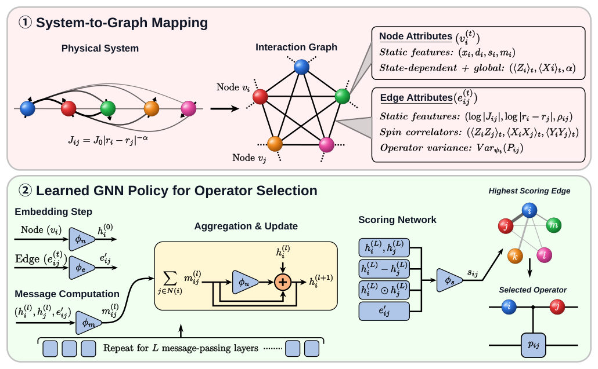 
FIG. 1. Schematic of the graph-based representation and learned GNN policy used for adaptive operator selection in the long-range spin-system setting studied in this work. 1. System-to-graph mapping: The disordered spin chain is represented as an interaction graph in which nodes v(t) i correspond to spins and edges e(t) ij correspond to candidate two-qubit generators Pij. Node features combine static geometric quantities with state-dependent observables, while edge features combine static interaction information, two-spin correlators, and operator-variance information. 2. Learned GNN policy for operator selection: Node and edge features are first embedded into latent representations using...

📷 Fig 2

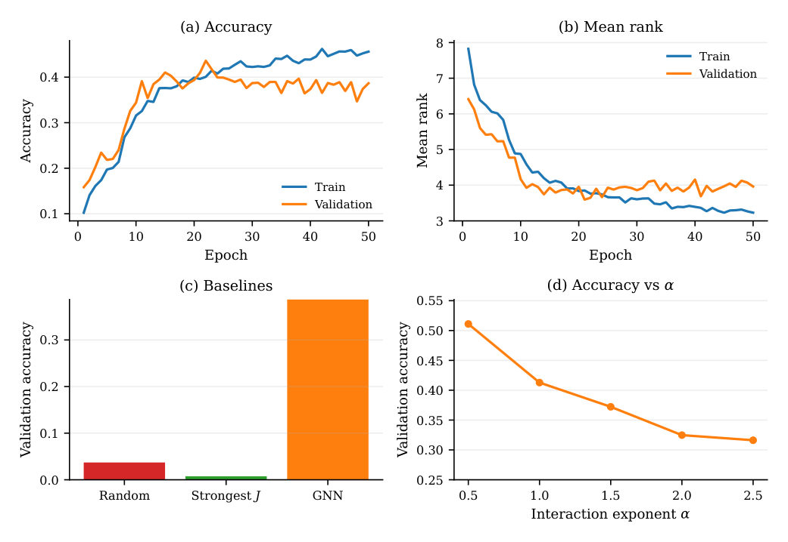 
FIG. 2. Training dynamics and operator-selection performance of the learned GNN policy. (a) Training and validation accuracy during optimization of the pointer-based graph neural network. The model is trained to predict the operator with the largest gradient magnitude based on the interaction graph and state-dependent observables. (b) Mean rank of the correct operator among all candidate edges during training. Lower values indicate better agreement with the greedy gradient oracle used to generate supervision labels. (c) Comparison with simple baselines. The learned policy significantly outperforms both random edge selection and a heuristic that always selects the strongest coupling Jij. (d)...

📷 Fig 3

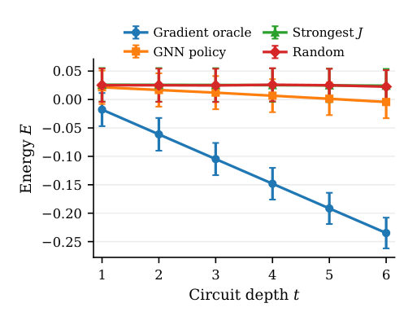 
FIG. 3. Energy expectation value as a function of circuit depth t across different operator-selection strategies, averaged over disordered long-range spin chain realizations. The trajec- tories represent a discrete rollout using the fixed small-angle update rule (θ) from dataset generation prior to global pa- rameter reoptimization. The learned GNN policy consistently outperforms both the random and static strongest-coupling baselines. A visible performance gap remains relative to the exact gradient oracle, which utilizes perfect local commuta- tor information. Error bars denote the standard error across disorder realizations.

📷 Fig 4

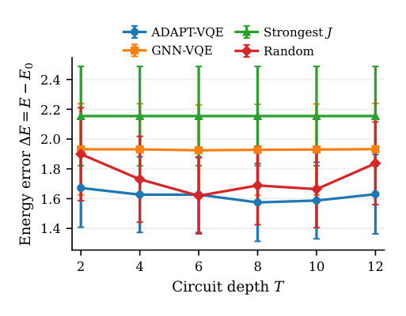 
FIG. 4. Energy error ∆E = E −E0 as a function of circuit depth T for different operator-selection strategies after full variational reoptimization of circuit parameters. This figure therefore probes the quality of the compiled ansatz topology induced by each selection strategy, rather than the quality of the intermediate rollout trajectory shown in Fig. 3. ADAPT- VQE achieves the lowest energy error by selecting operators using gradient information at each iteration. The GNN-VQE approach replaces this gradient evaluation with a learned pol- icy based on graph-structured features. While the resulting circuits exhibit larger energy errors than those obtained with ADAPT-VQE, the learned policy...

📷 Fig 5

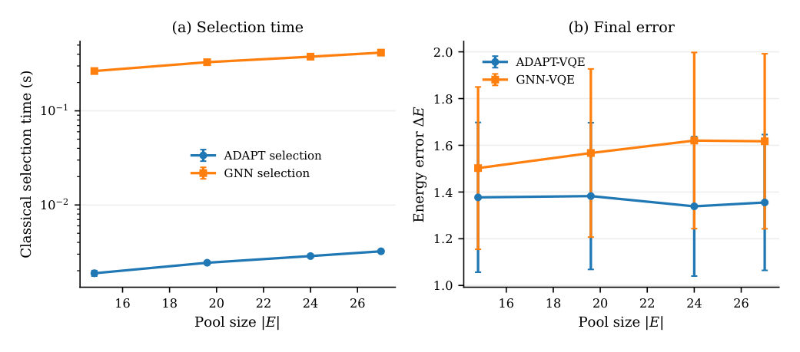 
FIG. 5. Scaling of adaptive circuit construction with operator pool size |E|. (a): Time required to select T operators during circuit construction. ADAPT-VQE evaluates the commutator gradient for every operator in the pool, leading to a selection cost that increases approximately linearly with |E|. The GNN-based policy predicts the next operator via a neural-network forward pass, replacing explicit gradient scans by classical inference. In the present small-scale classical simulations, however, the measured wall-clock selection time remains larger than ADAPT-VQE due to graph-construction and inference overhead, even though the qualitative dependence on |E| is similar. (b): Energy error ∆E =...

**Summary.** The paper introduces using Graph Neural Networks (GNNs) to accelerate Adaptive VQE by learning which quantum operators are most likely to improve the ground state energy. By predicting these operators from the system's interaction graph instead of exhaustively checking every possibility, it significantly reduces classical computational overhead while maintaining high accuracy.

**Why it may be interesting.** This work directly addresses the scaling bottleneck in quantum algorithms by replacing expensive physical measurements (gradient evaluations) with fast classical inference, a crucial step for applying VQE to large, complex systems relevant to AMO physics.

Detailed structure

**Main problem.** The primary challenge is mitigating the classical computational bottleneck associated with repeatedly scanning a large operator pool during adaptive quantum circuit construction in VQE.

**Main result.** A Graph Neural Network (GNN) policy can learn to predict the optimal next entangling operator, achieving energy errors competitive with full gradient-based methods while drastically reducing the required classical overhead.

**Method.** The authors reformulate adaptive operator selection as a graph decision problem, training a GNN on simulated gradient magnitudes derived from quantum state evolution. The trained GNN acts as an efficient shortlist generator for subsequent exact rescoring.

**Model / system.** The work is initially developed using disordered long-range spin chains with power-law decaying interactions ($J_{ij} \propto |r_i - r_j|^{-\alpha}$). It is later benchmarked on small molecular active spaces (LiH, BeH2) mapped to qubit Hamiltonians.

**Key observables.** Energy expectation value ($\Delta E$), Mean Rank of the selected operator, and computational scaling complexity relative to pool size $|E|$.

**Important parameters / regimes.** Interaction decay exponent $\alpha$, circuit depth $T$, and the number/size of candidate operators in the pool.

**Assumptions / limitations.** The core assumption is that the process of adaptive circuit construction contains a learnable, exploitable structure that can be approximated by graph message passing. The GNN acts as a shortlist generator rather than a perfect oracle replacement.

**Figures summary.** Figures compare energy error vs. depth for various selection strategies (Gradient Oracle vs. GNN vs. Heuristics) and show the computational scaling advantage of the GNN approach over full gradient evaluations.

**Paper structure.** The paper introduces the problem, details the graph representation of the Hamiltonian/operators, describes the GNN architecture trained on simulated gradients from spin chains, validates performance against heuristics, and concludes with transferability tests on molecular benchmarks.

Abstract

Adaptive variational quantum algorithms like ADAPT-VQE construct tailored ansätze by iteratively selecting operators from a pool using gradient-based criteria. While this avoids oversized parameter spaces, repeatedly scanning the full pool incurs a classical cost that scales linearly with pool size-a major bottleneck for systems with long-range interactions or large operator sets. Here, we reformulate adaptive operator selection as a graph-based decision problem and introduce a graph neural network (GNN) policy that predicts the next entangling operator directly from the interaction graph and state-dependent observables. Training data are generated from exact simulations of disordered long-range spin chains, using gradient magnitudes as supervision signals. The learned policy accurately reproduces the dominant structure of the greedy gradient-based selection rule, significantly outperforming heuristics based solely on interaction strength. Integrated into a variational quantum eigensolver (VQE) workflow, this GNN-VQE approach achieves energy errors close to standard ADAPT-VQE while drastically reducing full-pool gradient evaluations. To test transferability beyond spin models, we evaluate the policy on small active-space molecular benchmarks (LiH and BeH_$2$). We find the GNN is highly effective as a shortlist generator: exact rescoring over just a few GNN-proposed candidates recovers near-oracle rollout behavior while searching only a small fraction of the pool. These results demonstrate that adaptive circuit construction contains learnable structure that can be exploited to accelerate variational quantum algorithms.

[↑ back to top](#top)

### [Impact of gate-voltage noise on silicon spin-qubit variational quantum eigensolvers](http://arxiv.org/abs/2606.08874v1)

**Authors:** Xinning Wang, Bohdan Khromets, Zachery Merino, Jonathan Baugh  
**Type:** theory · **Category:** quantum information and computing · **PDF:** <https://arxiv.org/pdf/2606.08874v1>  
**Analysis basis:** full PDF text, analyzed in chunks
**Topic relevance:** `methods for driven-dissipative` **3/5** · `spintronics-quantum-optics interface` **3/5** · `QC/QI experiment` **2/5** · `Keldysh / 2PI / non-Gaussian methods` **1/5** · `correlated / nonlocal dissipation` **1/5** · `driven-dissipative phase transition` **1/5**

📷 Fig 1

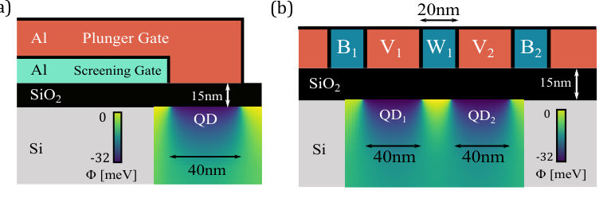 
FIG. 1. Schematic of a double-QD device used for the one and two-qubit logic gate simulations: (a) side view, (b) front view. Electrons, accumulated at the Si/SiO2 interface, are laterally confined in QDs under the positive plunger gate voltages V1 and V2. The confining potential is further controlled by a grounded screening gate and the tunnel gate voltage W1. Barrier gates B1, B2 are kept at 0 V throughout the simulations. The electrostatic potential Φ(⃗r) shown here was calculated for V1 = V2 = 0.2 V, W1 = −0.1 V.

📷 Fig 2

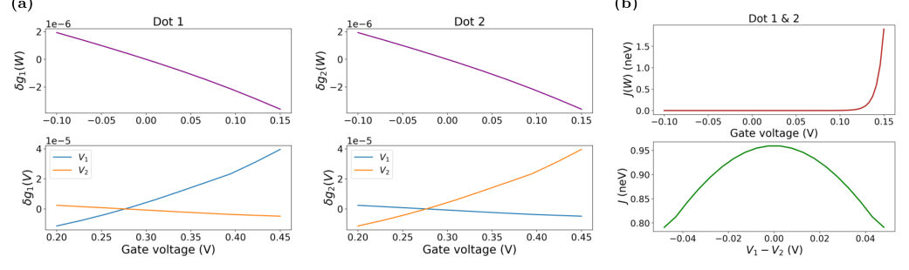 
FIG. 2. Voltage dependence of effective spin Hamiltonian parameters in a double-QD device. (a) Gate-induced variations of the electron g-factors for dot 1 and dot 2 as functions of the plunger gate voltages V1 and V2, and the tunnel gate voltage W1. All quantities in panel (a) are shown relative to a reference (idling) voltage point (V1, V2, W1) = (0.2765 V, 0.2765 V, 0 V). (b) Exchange coupling J as a function of the tunnel gate voltage W1 and the inter-dot detuning V1 −V2. In panel (b), the exchange coupling is evaluated relative to a reference voltage point (V1, V2, W1) = (0.2765 V, 0.2765 V, 0.1 V), highlighting the exponential dependence of the inter-dot exchange on tunnel gate voltage.

📷 Fig 3

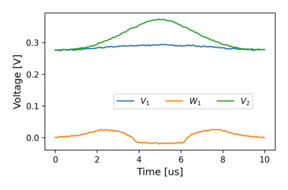 
FIG. 3. Representative noisy voltage control pulse used to implement an RX(π/2) gate on qubit 1 in the two-qubit sim- ulation, while qubit 2 undergoes a simultaneous identity op- eration. The controls V1 and V2 denote plunger-gate voltages and W1 denotes the interdot barrier-gate voltage. The ideal waveform realizes the target gate operation, whereas the su- perimposed fluctuations correspond to sampled random tele- graph voltage noise. These noisy control voltages are mapped directly onto the time-dependent Hamiltonian through the voltage-dependent parameters gi(⃗V ) and Ji(⃗V ).

📷 Fig 4

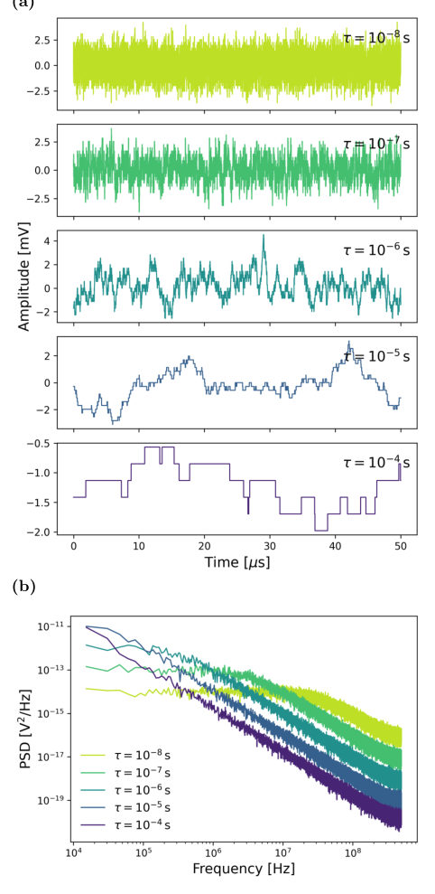 
FIG. 4. (a) Simulated voltage-noise time series and (b) corresponding power spectral densities (PSDs) for five RTN switching times, τ ∈{10−8, 10−7, 10−6, 10−5, 10−4} s, at fixed RMS amplitude A = 1 mV. For each value of τ (with τ = ⟨τ0⟩= ⟨τ1⟩), the charge-noise signal on a given gate is constructed as a normalized sum of Nrtn = 50 independent RTN realizations [Eq. (4)]. The time series extend beyond the single-gate duration tg = 10 µs and span the timescale of a simulated variational single-shot experiment, texp = 130 µs; only the first 50 µs are shown for clarity.

📷 Fig 5

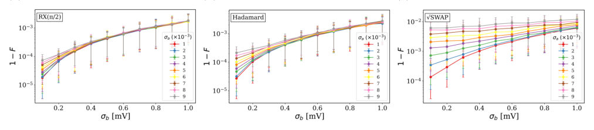 
FIG. 5. Simulated gate infidelity under static voltage miscalibration for (a) RX(π/2) (tg = 10 µs), (b) Hadamard (tg = 10 µs), and (c) √

**Summary.** This paper rigorously analyzes how gate-voltage noise impacts silicon spin qubits used in variational quantum eigensolvers. By developing a co-simulation framework, the authors quantify that two-qubit gates are highly susceptible to voltage noise, while also demonstrating that advanced error mitigation techniques can partially recover fidelity when noise dynamics are characterized by their switching time.

**Why it may be interesting.** This work provides crucial, quantitative design rules for realizing scalable quantum hardware by directly linking device-level noise sources (voltage fluctuations) to algorithmic performance metrics (VQE accuracy).

Detailed structure

**Main problem.** The study assesses how hardware imperfections, specifically gate-voltage noise (static miscalibration and dynamic charge noise), degrade the performance of Variational Quantum Eigensolvers (VQE) when applied to silicon spin qubits.

**Main result.** Two-qubit gates are significantly more sensitive to voltage noise than single-qubit rotations due to the nonlinear dependence of exchange coupling on gate voltages. Furthermore, unitary error correction can partially mitigate noise effects if the noise switching time is short relative to the gate duration.

**Method.** The authors developed a hardware-algorithm co-simulation framework combining 3D electrostatics for parameter extraction with quantum process tomography (QPT) and Lindblad master equation simulations to model noisy gate operations.

**Model / system.** The system is silicon spin qubits in double quantum dots, whose dynamics are governed by an effective spin Hamiltonian derived from solving the Schrödinger equation using parameters ($\delta g$, $J$) extracted via Stark-shift models. Noise is modeled as Random Telegraph Noise (RTN) or systematic voltage scaling/offset errors.

**Key observables.** Gate fidelities ($F$), reconstructed noise channels ($\chi_{	ext{err}}$), coherence angle ($\Theta$), and the achievable chemical accuracy for ground-state energy estimation in VQE.

**Important parameters / regimes.** Noise amplitude ($A$), switching time ($	au$), gate duration ($t_g$), and voltage miscalibration parameters ($\sigma_a, \sigma_b$).

**Assumptions / limitations.** The analysis relies on an effective-potential approximation for electrostatics and treats noise sources (like RTN) as independent or correlated stochastic processes.

**Figures summary.** Figures illustrate the dependence of gate infidelity on miscalibration strength ($\sigma_a, \sigma_b$) and the crossover behavior of fidelity versus noise switching time ($	au/t_g$).

**Paper structure.** The paper systematically develops from modeling the physical hardware (electrostatics $	o$ effective Hamiltonian) to implementing noise models (static vs. dynamic RTN), benchmarking key gates ($	ext{RX}, \sqrt{	ext{SWAP}}, 	ext{CZ}$), and finally applying these diagnostics within the VQE circuit context.

Abstract

Quantum computers offer a route to outperform classical methods in tasks such as molecular simulation, motivating hybrid algorithms like the Variational Quantum Eigensolver (VQE) for near-term devices. Silicon spin qubits are a promising platform for scalable quantum computation, but their performance is limited by hardware imperfections -- most notably charge-noise-induced potential fluctuations and static miscalibration of gate-electrode voltages -- which degrade quantum gate fidelities and, ultimately, algorithmic accuracy. Here we develop a hardware-algorithm co-simulation framework for silicon quantum-dot processors that links 3D electrostatics to effective $g$-factors and exchange couplings, and propagates voltage-level noise through realistic control pulses. Using VQE for $\mathrm{H}_2$ ground-state energy estimation as a circuit-level testbed, we study both static scaling/offset errors on the gate-electrode voltages and stochastic fluctuations modeled as random-telegraph noise with tunable amplitudes and switching times. At the gate level, we show that exchange-based two-qubit gates are roughly an order of magnitude more sensitive to these types of noise than ESR-driven single-qubit rotations. Quantum process tomography and Kraus-operator analysis further distinguish coherent and incoherent contributions and quantify the fraction of error that is, in principle, correctable by a compensating unitary. Embedding these noise models into the VQE circuit, we identify regimes of miscalibration strength and noise switching time compatible with chemically accurate energy estimates, and discuss how statistical post-processing based on the full distribution of noisy energy estimates could further improve accuracy.

[↑ back to top](#top)

### [Dynamical cavity method for continuous-time complex systems on sparse random graphs](http://arxiv.org/abs/2606.08689v1)

**Authors:** Fernando L. Metz, Isaac Pérez Castillo  
**Type:** theory · **Category:** disordered systems and neural networks · **PDF:** <https://arxiv.org/pdf/2606.08689v1>  
**Analysis basis:** full PDF text, analyzed in chunks
**Topic relevance:** `Keldysh / 2PI / non-Gaussian methods` **3/5** · `methods for driven-dissipative` **3/5** · `non-equilibrium dynamics` **2/5** · `correlated / nonlocal dissipation` **1/5** · `driven-dissipative phase transition` **1/5**

📷 Fig 1

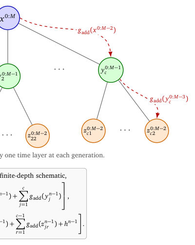 
Figure 1: Finite-depth causal tree for the bidirected population-dynamics construc- tion. The root history is generated from neighbour histories one time layer shorter; each neighbour history is generated from its own descendants with one further time layer removed. The recursion terminates at leaves drawn from the initial distribu- tion. The schematic is drawn for the zero-noise, constant-coupling additive-input example used to make the causal structure explicit. In the general pairwise formu- lation, ordinary source histories are replaced by the corresponding imposed-history branch path laws.

📷 Fig 2

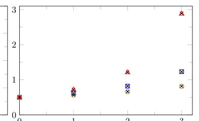 
Figure 2: Comparison between direct finite-graph simulations and finite-depth pop- ulation dynamics for undirected random graphs with Poisson degree distribution of mean c. Coupling strengths are sampled from a Gaussian distribution with unit mean and unit variance. The time-discretization parameter is ∆= 0.1. Crosses denote direct finite-graph simulations of the discretized microscopic dynamics with N = 15000, while the remaining symbols denote the finite-depth population- dynamics construction with population size Npop = 105. The left panel shows the recurrent neural-network model and the right panel shows the Lotka–Volterra model with immigration rate λ = 10−2. Error bars are not shown.

📷 Fig 3

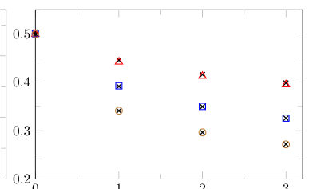 
Figure 3: Comparison between direct finite-graph simulations and finite-depth popu- lation dynamics for undirected regular random graphs with fixed degree c. Coupling strengths are sampled from a Gaussian distribution with mean 〈J〉= −1 and unit variance. The time-discretization parameter is ∆= 0.1. Crosses denote direct finite- graph simulations of the discretized microscopic dynamics with N = 15000, while the remaining symbols denote the finite-depth population-dynamics construction with population size Npop = 105. The left panel shows the recurrent neural-network model and the right panel shows the Lotka–Volterra model with immigration rate λ = 10−2. Error bars are not shown.

📷 Fig 4

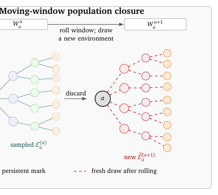 
Figure 4: Graph-level view of the moving-window approximation. In the exact finite graph, the history window of a root i advances while the same rooted marked neigh- bourhood Ei is retained. In the moving-window population closure, the particle label a carries the shifted window, but the local marked environment used to generate the next endpoint is sampled anew. Thus the approximation is not in the one-step up- date, but in replacing the joint law of a window and its persistent rooted environment by a marginal window law together with an annealed environment draw.

📷 Fig 5

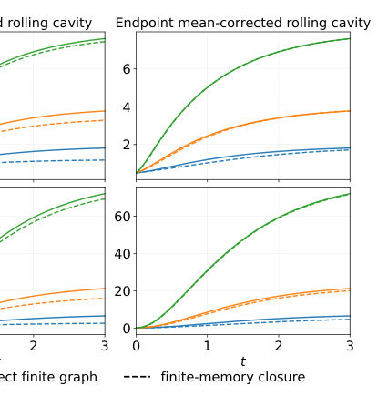 
Figure 5: Comparison between direct finite-graph simulations and three finite- memory closures for the additive-input RNN on undirected Poisson graphs. The memory depth is fixed to L = 3. Columns show, from left to right, the rolling cavity, the root-quenched rolling cavity, and the endpoint mean-corrected rolling cavity. The top row shows the mean m(t), and the bottom row shows the second moment q(t). Solid curves are direct finite-graph simulations of Eq. (138); dashed curves are the corresponding finite-memory closure. Colours denote c = 2,4,8. The simulations use ∆= 10−2, M = 300, N = 15000, population size Npop = 105, initial condition x0 i = 0.5, symmetric reciprocal couplings Ji j =...

**Summary.** This work extends Dynamical Mean-Field Theory (DMFT) to stochastic processes on sparse random graphs by developing a path-measure based cavity method. It rigorously distinguishes the mathematical requirements for closure based on graph reciprocity, showing that bidirected edges necessitate tracking complex conditional history kernels. The theory provides tools to analyze both finite-time and high-connectivity limits of such complex systems.

**Why it may be interesting.** It provides a rigorous extension of DMFT to non-Gaussian, sparse network dynamics, which is crucial for modeling complex systems like recurrent neural networks or disordered physical materials where local interactions dominate.

Detailed structure

**Main problem.** The paper develops a continuous-time cavity derivation for Dynamical Mean-Field Theory (DMFT) applied to stochastic dynamics on sparse, heterogeneous random graphs.

**Main result.** It establishes that graph reciprocity dictates the closure structure of the path probability equations, requiring conditional kernels for bidirected edges, while providing systematic methods for high-connectivity limits.

**Method.** The core method is developing cavity equations at the level of path measures, which are then translated into population dynamics representations for finite-time analysis.

**Model / system.** The system models continuous degrees of freedom evolving via coupled stochastic differential equations (SDEs) on sparse random graphs. This framework generalizes standard DMFT to handle local field structures arising from sparsity and general pairwise interactions.

**Key observables.** Path measures, path probabilities, message laws, barycenters, and higher-message moments are key observables used to characterize the system's dynamics.

**Important parameters / regimes.** Graph structure (directed vs. reciprocal), connectivity regime (sparse vs. high-connectivity limit), and time scale ($t$ or finite depth $M$).

**Assumptions / limitations.** The central approximation relies on factorizing the joint cavity marginal, which is exact only on trees but forms the basis for the thermodynamic limit on locally tree-like graphs.

**Figures summary.** Not specified in the notes; however, the text refers to figures illustrating mean and variance tracking in simulations (e.g., Eq. 186).

**Paper structure.** The paper progresses from defining the general path measure formulation on fixed graphs, deriving cavity equations via factorization approximations, analyzing the implications of graph reciprocity for closure structure, and finally projecting these results onto high-connectivity limits.

Abstract

Dynamical mean-field theory (DMFT) reduces dense high-dimensional disordered dynamics to a self-consistent effective stochastic process. For sparse and heterogeneous networks, however, local fields contain finitely many strong inputs, so the Gaussian closure mechanisms of dense DMFT need not apply. We develop a continuous-time cavity derivation of sparse-network DMFT at the level of path measures for stochastic dynamics with general pairwise interactions on sparse random graphs. The cavity equations are exact on trees and yield the finite-time thermodynamic description on locally tree-like graphs. They show explicitly how reciprocity changes dynamical closure: fully directed graphs recover the sparse directed path-probability equation, whereas reciprocal or bidirected edges require conditional path kernels driven by the imposed history of the receiving node. Ensemble averaging gives laws over path-probability messages, with barycenters and higher-message moments closing by multilinearity and independence of incoming branches. A causal discrete-time derivation yields the corresponding population-dynamics representation, distinguishing trajectory populations for directed graphs from conditional branch-law or finite-depth tree populations for reciprocal graphs. We also formulate finite-memory numerical closures and test them in an additive-input recurrent neural network specialization. Finally, high-connectivity limits are obtained as projections of the sparse path-measure theory, clarifying when dense drift, noise, and response channels reduce to standard low-dimensional DMFT and when path-level descriptions remain essential.

[↑ back to top](#top)

### [Enhanced dumbbell diffusion in a periodic potential by the elevator effect](http://arxiv.org/abs/2606.08334v1)

**Authors:** B. A. Kiang, H. Schiessel  
**Type:** theory · **Category:** statistical mechanics · **PDF:** <https://arxiv.org/pdf/2606.08334v1>  
**Analysis basis:** full PDF text, analyzed in chunks
**Topic relevance:** `Frenkel-Kontorova` **3/5** · `non-equilibrium dynamics` **2/5** · `analog quantum simulation` **1/5** · `correlated / nonlocal dissipation` **1/5** · `driven-dissipative phase transition` **1/5** · `methods for driven-dissipative` **1/5** · `non-equilibrium universality` **1/5**

📷 Fig 1

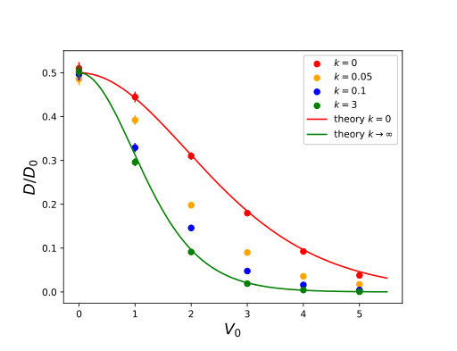 
FIG. 1. Diffusion constant D as a function of barrier height 0 ≤V0 ≤5, for different values of spring constant k at spring equilibrium distance equal to the potential pe- riod, xeq = a = 16. The solid lines are theoretical limits: the red line corresponds to two independent beads (k = 0) and the green line to a rigid dumbbell (k →∞).

📷 Fig 2

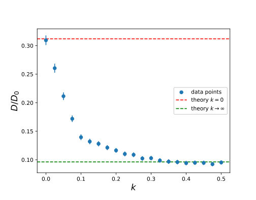 
FIG. 2. Diffusion constant D as a function of spring constant k, for barrier height V0 = 2 and equilibrium length xeq = 16. The horizontal dashed lines indicate the asymptotic cases k = 0 and k →∞.

📷 Fig 3

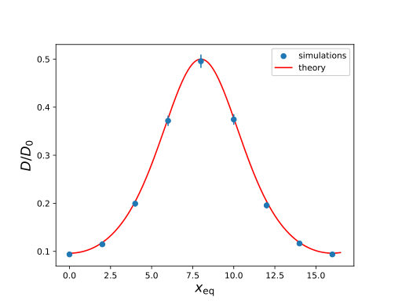 
FIG. 4. Simulation results for D as a function of the spring equilibrium length xeq for a strong spring k = 2, compared to Eq. 10, the theoretical expectation for a rigid dumbbell (solid line).

📷 Fig 4

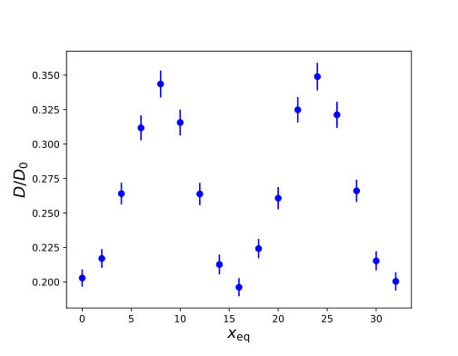 
FIG. 3. Diffusion constant D as a function of equilibrium length 0 ≤xeq ≤32, for V0 = 2 and k = 0.05.

📷 Fig 5

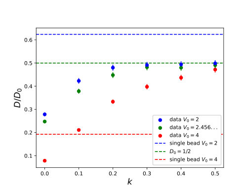 
FIG. 5. Diffusion constant of a dumbbell with xeq = a/2 in potentials with V0 = 2 (blue), V0 = 2.456... (green) and V0 = 4 (red), as a function of the spring constant k. Dashed lines indicate diffusion constants of single particle in the same potentials. Note that for V0 = 2.456... (green) the single bead diffusion constant equals 1/2, the same value as for this dumbbell in the rigid spring limit, independent of V0.

**Summary.** This work analyzes the diffusion of a dumbbell particle system moving through a periodic potential. By simulating and theoretically modeling the interaction between two connected beads, the authors demonstrate an 'elevator effect' that can boost diffusivity beyond single-particle limits. The findings provide quantitative insights into how internal coupling dictates transport properties in structured environments.

**Why it may be interesting.** While focused on classical statistical mechanics, the concept of enhanced transport via coupled degrees of freedom (the 'elevator effect') is analogous to mechanisms studied in quantum tunneling or correlated electron dynamics where coupling modifies effective potentials.

Detailed structure

**Main problem.** The study investigates how coupling two particles (a dumbbell) via a spring affects their diffusion rate when moving through a one-dimensional periodic potential.

**Main result.** The system exhibits an 'elevator effect,' where the diffusion constant can exceed that of a single bead, particularly when the equilibrium separation is incommensurate with the potential periodicity.

**Method.** Molecular Dynamics (MD) simulations are used to model the random walk, and these results are rigorously compared against derived theoretical analytical equations for various limiting cases.

**Model / system.** The system models a dumbbell—two beads connected by an ideal spring—moving in a 1D periodic potential $V(x)$. The dynamics are governed by a Hamiltonian incorporating external potentials and the internal spring energy, solved via Langevin equations.

**Key observables.** Diffusion constant ratio ($D/D_0$ or $D/D_s$), force distributions ($\Delta f$, $\Sigma f$).

**Important parameters / regimes.** Spring constant ($k$), equilibrium distance ($x_{eq}$), potential barrier height ($V_0$), and potential periodicity ($a$).

**Assumptions / limitations.** The analysis is primarily restricted to one-dimensional periodic potentials for observing the clear elevator effect.

**Figures summary.** Figures compare theoretical predictions (e.g., Eq. 10) against MD simulations, showing agreement; contour plots map $D/D_s$ dependence on $k$ and $V_0$; force histograms illustrate force compensation mechanisms.

**Paper structure.** The paper establishes the Hamiltonian and equations of motion, analyzes limiting cases ($k 	o 0$, $k 	o \infty$), derives theoretical expressions for the diffusion constant based on potential energy minimization, and validates these theories using extensive MD simulations across parameter space.

Abstract

We present molecular dynamics simulations of the random walk of a dumbbell - two beads connected by a spring - in a one-dimensional periodic potential and compare our results in limiting cases to theoretical analytical equations. The relevant parameters in this system are the spring constant, the equilibrium distance of the spring (relative to the periodicity of the potential), and the amplitude of the potential. Dumbbells with equilibrium distances incommensurate with the potential periodicity and with a sufficiently large spring constant exhibit enhanced diffusion. The diffusion constant can exceed that of a single bead in the same potential landscape. In this case, the dumbbell resembles a traction elevator, with the two connected beads acting as the elevator car and counterweight: the ''elevator effect''.

[↑ back to top](#top)

### [Fluctuation-stable generalized entropy probes of spectral heterogeneity](http://arxiv.org/abs/2606.08801v1)

**Authors:** Arpita Goswami  
**Type:** theory · **Category:** statistical mechanics · **PDF:** <https://arxiv.org/pdf/2606.08801v1>  
**Analysis basis:** full PDF text, analyzed in chunks
**Topic relevance:** `entanglement & information structure` **3/5** · `driven-dissipative phase transition` **2/5** · `non-equilibrium universality` **2/5** · `Frenkel-Kontorova` **1/5** · `methods for driven-dissipative` **1/5** · `non-equilibrium dynamics` **1/5**

📷 Fig 1

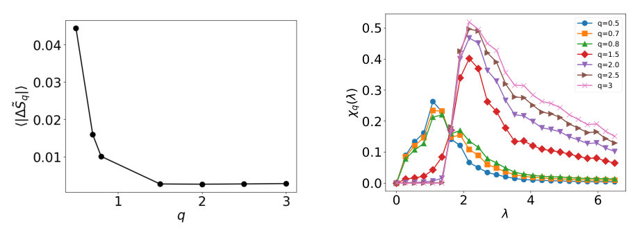 
Figure 1: (a) Average deviation of the normalized Tsallis entropy under small perturbations of the wavefunction amplitudes as a function of the entropic index q. The enhanced sensitivity for q &lt; 1 reflects the increased contribution of low-probability components, while the stable behavior for q &gt; 1 demonstrates the robustness of the entropy-based diagnostic. b) Entropy-gradient susceptibility χq(λ) of the GAA model as a function of the quasiperiodic potential strength λ for q = 0.5, 0.7, 0.8, 1.5, 2, 2.5, 3. Both the calculations are performed for L = 600.

📷 Fig 2

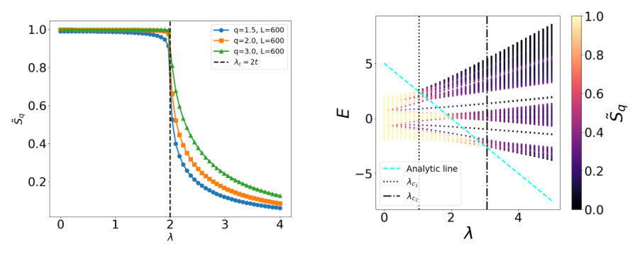 
Figure 2: (a) Normalized Tsallis entropy ˜S q as a function of quasiperiodic potential strength λ for the Aubry-André (AA) model at different entropic orders q, with system size L = 600. (b) Normalized Tsallis entropy ˜S q of the GAA model as a function of quasiperiodic potential strength λ at q = 1.5 and L = 600. The entropy behavior shows the presence of MEs.

📷 Fig 3

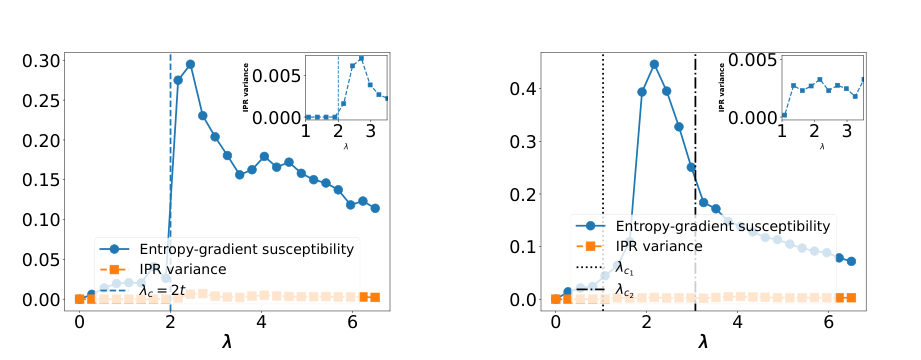 
Figure 3: (a) Entropy-gradient susceptibility χq(λ) of the AA model as a function of λ. The absence of a pronounced peak reflects the lack of energy-resolved localization, consistent with a global localization transition. (b) Entropy-gradient susceptibility χq(λ) of the GAA model as a function of λ. A pronounced and systematically sharpening peak emerges at intermediate quasiperiodic strength, signaling enhanced spectral heterogeneity due to the coexistence of localized and extended eigenstates. Inset: IPR variance vs. λ.

**Summary.** The paper introduces fluctuation stability as a guiding principle for using generalized entropy measures ($S_q$) to study spectral properties. By analyzing how these entropies respond to weak perturbations, the authors establish that $q>1$ yields robust diagnostics. This framework successfully distinguishes between simple localization transitions and complex mobility-edge physics in quasiperiodic models.

**Why it may be interesting.** This work provides a powerful, quantitative diagnostic tool ($\chi_q$) rooted in information theory that can be applied to complex many-body systems exhibiting quasiperiodicity or disorder, linking entropy scaling directly to fundamental physical phenomena like mobility edges.

Detailed structure

**Main problem.** To develop a fluctuation-stability framework using generalized entropy measures to robustly characterize spectral heterogeneity and localization in quasiperiodic quantum systems.

**Main result.** The choice of entropic index $q>1$ provides a theoretically stable diagnostic tool that suppresses noise from weak spectral fluctuations, allowing the susceptibility $\chi_q$ to sharply distinguish between homogeneous transitions and mobility-edge coexistence regimes.

**Method.** The authors employ generalized entropy measures (Tsallis entropy $S_q$) and analyze its energy derivative, the entropy-gradient susceptibility ($\chi_q$), under perturbative and thermodynamic scaling analyses.

**Model / system.** The study focuses on quasiperiodic lattices using canonical models like the Aubry-André (AA) model for homogeneous transitions and the generalized Aubry-André (GAA) model, which hosts mobility edges.

**Key observables.** Entropy-gradient susceptibility ($\chi_q$), normalized Tsallis entropy ($	ilde{S}_q$), and fluctuation deviation $\langle|\Delta	ilde{S}_q|
angle$.

**Important parameters / regimes.** The entropic index $q$ (with critical regimes at $q=1$ and $q=3/2$), the quasiperiodic potential strength ($\lambda$), and system size ($L$).

**Assumptions / limitations.** The analysis relies on approximating the coarse-grained entropy profile in the coexistence regime, and the stability argument hinges on analyzing fluctuations under weak perturbations.

**Figures summary.** Figures compare $\chi_q$ profiles for AA (smooth crossover) versus GAA (sharp peaks), demonstrating that $q>1$ yields stable signatures distinguishing mobility edges from simple localization transitions.

**Paper structure.** The paper first establishes the need for fluctuation stability in generalized entropy diagnostics, then derives theoretical bounds showing how $q>1$ suppresses noise. Finally, it applies this framework to AA and GAA models using $\chi_q$ to differentiate between different types of spectral phase transitions.

Abstract

Generalized entropy measures are widely used to characterize localization and multifractality, and the regime \(q>1\) is often empirically found to exhibit improved numerical stability and cleaner scaling behavior. Here, we develop a fluctuation-stability framework for generalized entropy diagnostics and show that weak-amplitude spectral fluctuations are amplified for \(q<1\) and suppressed for \(q>1\), thereby providing a theoretical basis for the physically robust \(q>1\) regime. A thermodynamic scaling analysis further identifies an asymptotically stable regime beyond a critical threshold. As an application, we introduce the entropy-gradient susceptibility \(χ_q\) as a coarse-grained probe of spectral heterogeneity. Using the Aubry-André and generalized Aubry-André models, we demonstrate that \(χ_q\) sharply distinguishes homogeneous localization transitions from mobility-edge coexistence regimes. Our results establish fluctuation stability as a guiding principle for generalized entropy diagnostics in quasiperiodic systems.

[↑ back to top](#top)

### [Non-magnetic ground state in A$_2$WCl$_6$ (A = Cs, Rb, K): A face-centered cubic system of spin-orbit-entangled $J$ = 2 states](http://arxiv.org/abs/2606.08019v1)

**Authors:** T. Takayama, K. Ishii, S. Bette, J. Nuss, Y. Matsumoto, K. Fürsich, M. Minola, D. P. Sari, I. Watanabe, A. Krajewska, R. Dinnebier, B. Keimer, H. Takagi  
**Type:** experiment · **Category:** strongly correlated electrons · **PDF:** <https://arxiv.org/pdf/2606.08019v1>  
**Analysis basis:** full PDF text, analyzed in chunks
**Topic relevance:** `analog quantum simulation` **3/5** · `exotic spin models in light-matter` **3/5** · `Kondo & dissipative impurity` **1/5** · `correlated cavity matter` **1/5** · `entanglement & information structure` **1/5** · `spintronics-quantum-optics interface` **1/5**

📷 Fig 1

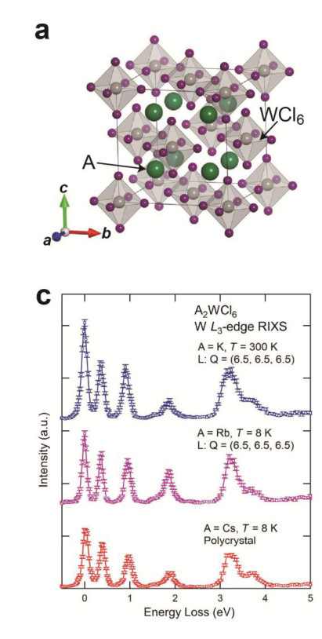 
Fig. 1 a. Crystal structure of A2WCl6 (A = Cs, Rb, and K) forming a cubic lattice with the space

📷 Fig 2

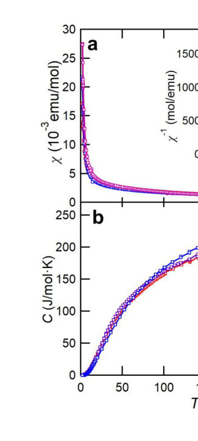 
Fig. 2 Temperature dependence of a. magnetic susceptibility (T) and b. specific heat C(T) of the

📷 Fig 3

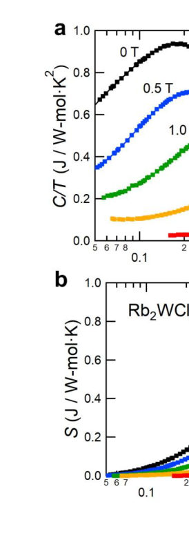 
Fig. 3. a. Specific heat divided by temperature, C(T)/T, of Rb2WCl6 single crystals at low

📷 Fig 4

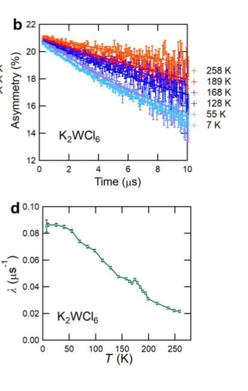 
Fig. 4. a,b. Temperature dependence of SR time spectrum measured on the powder of Rb2WCl6

📷 Fig 5

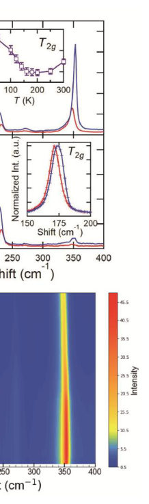 
Fig. 5. Raman scattering measurement on a Rb2WCl6 single crystal. a. Raman scattering spectra

**Summary.** The authors investigate $	ext{A}_2	ext{WCl}_6$ compounds whose electronic properties are governed by a $J=2$ spin-orbit-entangled state. By comparing $	ext{K}$, $	ext{Rb}$, and $	ext{Cs}$ analogues, they show that structural transitions can stabilize a non-magnetic singlet ground state in one case, while others exhibit evidence of local quadrupolar distortions without long-range order.

**Why it may be interesting.** This work provides a detailed case study of how crystal field effects and spin-orbit coupling dictate the emergent quantum ground state in transition metal oxides/halides, touching upon concepts relevant to frustrated magnetism and exotic ordering.

Detailed structure

**Main problem.** The study investigates the electronic, magnetic, and structural properties of $	ext{A}_2	ext{WCl}_6$ to understand multipolar ordering arising from strong spin-orbit coupling in $5d^2$ systems.

**Main result.** $	ext{K}_2	ext{WCl}_6$ undergoes a structural transition leading to a non-magnetic singlet ground state, while $	ext{Rb}_2	ext{WCl}_6$ and $	ext{Cs}_2	ext{WCl}_6$ remain non-magnetic down to low temperatures, suggesting local quadrupolar distortions.

**Method.** The research employs a combination of advanced experimental techniques including Resonant Inelastic X-ray Scattering (RIXS), muon spin relaxation ($\mu	ext{SR}$), Raman spectroscopy, and structural characterization (XRD).

**Model / system.** The system is the anti-fluorite tungsten chloride $	ext{A}_2	ext{WCl}_6$ ($	ext{A} = 	ext{Cs}, 	ext{Rb}, 	ext{K}$), where the $	ext{W}^{4+}$ ion ($5d^2$) forms a spin-orbit-entangled $J=2$ state, which is theoretically prone to multipolar ordering.

**Key observables.** Electronic excitations (RIXS peaks at 0.4, 1.0, 1.9, and 3.2 eV), structural transitions (cubic-to-tetragonal in $	ext{K}_2	ext{WCl}_6$), magnetic susceptibility ($\chi(T)$), and local distortions observed via phonon broadening.

**Important parameters / regimes.** The strong spin-orbit coupling leads to a $J=2$ ground state, and the analysis focuses on how structural changes lift degeneracies or induce quadrupolar interactions.

**Assumptions / limitations.** It is assumed that the subtle low-temperature structural anomalies are driven by the local quadrupolar component of the $J=2$ state, but chemical disorder prevents long-range ordering.

**Figures summary.** Figures illustrate $	ext{WCl}_6$ octahedra in anti-fluorite arrangement; RIXS spectra show resolved electronic excitations; and structural data confirm a phase transition for $	ext{K}_2	ext{WCl}_6$.

**Paper structure.** The paper systematically analyzes the electronic structure using theoretical models (LS/jj coupling) alongside comprehensive experimental probes ($	ext{RIXS}$, $\mu	ext{SR}$, Raman, XRD) to correlate structural changes with the magnetic and electronic ground state.

Abstract

Heavy transition metal compounds with strong spin-orbit coupling appeared as a platform for $d$-electron multipolar physics. We report the electronic, magnetic, and structural properties of antifluorite-type tungsten chloride A$_2$WCl$_6$ (A = Cs, Rb, and K), comprising a face-centered cubic lattice of W$^{4+}$ ions. The 5$d^2$ configuration of W$^{4+}$ ions in a cubic environment yields a spin-orbit-entangled $J$ = 2 state, which has been discussed to give rise to multipolar ordering such as charge quadrupolar or magnetic octupolar ordering. We found that K$_2$WCl$_6$ undergoes a cubic-to-tetragonal structural transition which lifts the degeneracy of the $J$ = 2 state, leading to a non-magnetic singlet ground state. By contrast, Rb$_2$WCl$_6$ and Cs$_2$WCl$_6$ show no signs of phase transition and remain non-magnetic down to the lowest temperature measured. At low temperatures, signatures of weak structural anomalies were revealed, which may point to the presence of local distortions of the WCl$_6$ octahedra. We argue that the subtle structural distortion arises from the local quadrupolar component of the $J$ = 2 state but the frustrated quadrupolar interaction, together with chemical disorder, inhibits the formation of long-range quadrupolar ordering.

[↑ back to top](#top)

### [Percolation and clustering in ecological communities: A dynamical theory](http://arxiv.org/abs/2606.09494v1)

**Authors:** Dario Sergo, Cédric Koller, Vittorio Erba, Lenka Zdeborová  
**Type:** theory · **Category:** disordered systems and neural networks · **PDF:** <https://arxiv.org/pdf/2606.09494v1>  
**Analysis basis:** full PDF text, analyzed in chunks
**Topic relevance:** `methods for driven-dissipative` **3/5** · `non-equilibrium dynamics` **2/5** · `non-equilibrium universality` **2/5** · `Keldysh / 2PI / non-Gaussian methods` **1/5** · `correlated / nonlocal dissipation` **1/5** · `driven-dissipative phase transition` **1/5**

📷 Fig 1

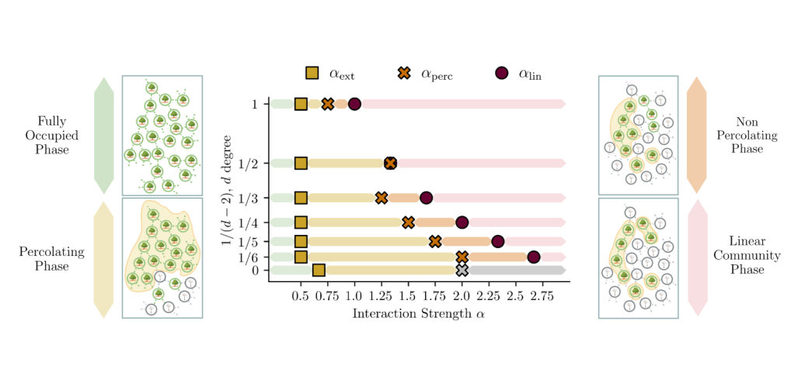 
Figure 1. Spatial phase diagram of the discrete gLV model, on a d-regular graph with uniform competitive interactions. Critical values of α at which some biomasses become zero for some sites (αext), at which the percolation transition occurs (αperc), and at which the clusters of occupied sites become linear (αlin). A graphical representation of the different phases is also provided. This phase diagram is produced for the simplest instructive case with carrying capacity K = 2 (the phenomenology remains qualitatively the same at higher K, see Appendix A and the Table I in Appendix F). The critical extinction threshold in the fully connected limit (d = ∞) is also shown, demonstrating that the...

📷 Fig 2

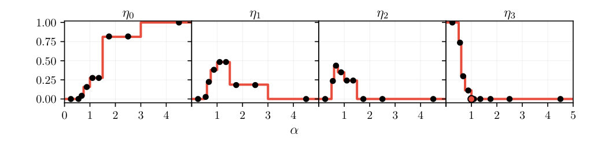 
Figure 2. BDCM accurately captures typical dynamics and structure, illustrated for K = 2 on d = 3–random regular graphs. (Top) Extinction fraction ρ0 and largest cluster fraction ϕLC as a function of α, computed from BDCM on the dominant (p/c)–attractors (p = 3, c = 2). Black dots denote numerical simulations (S = 104, averaging 5 simulations, error bars are negligible), lines represent theoretical predictions, showing perfect agreement. Colored markers indicate the extinction (square) and percolation (cross) phase transitions (same notation as in Figure 1). The table reports the normalized entropy Φ/ log(K) as a function of p (for c = 2), showing rapid convergence to the maximal value....

📷 Fig 3

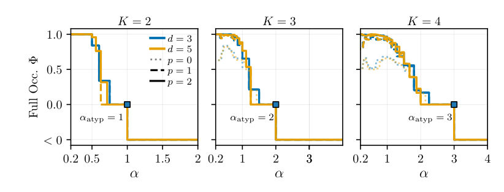 
Figure 3. Full occupied entropy and atypical full-survival threshold. (Left) The entropy ΦFull.Occupied (p/c) , which counts the log-number of atypical initial conditions leading to a fully occupied attractor, for multiple values of K, d, and p. For K = 2, d = 3, the entropies coincide for all p. For visual clarity all the negative entropies correspond to the marker &lt; 0. (Right) Threshold values αatyp and αext for finite d and in the limit d →∞. We refer to Figure 11 in Appendix F 2 for the entropies in the limit d →∞, where we also report the critical threshold.

📷 Fig 4

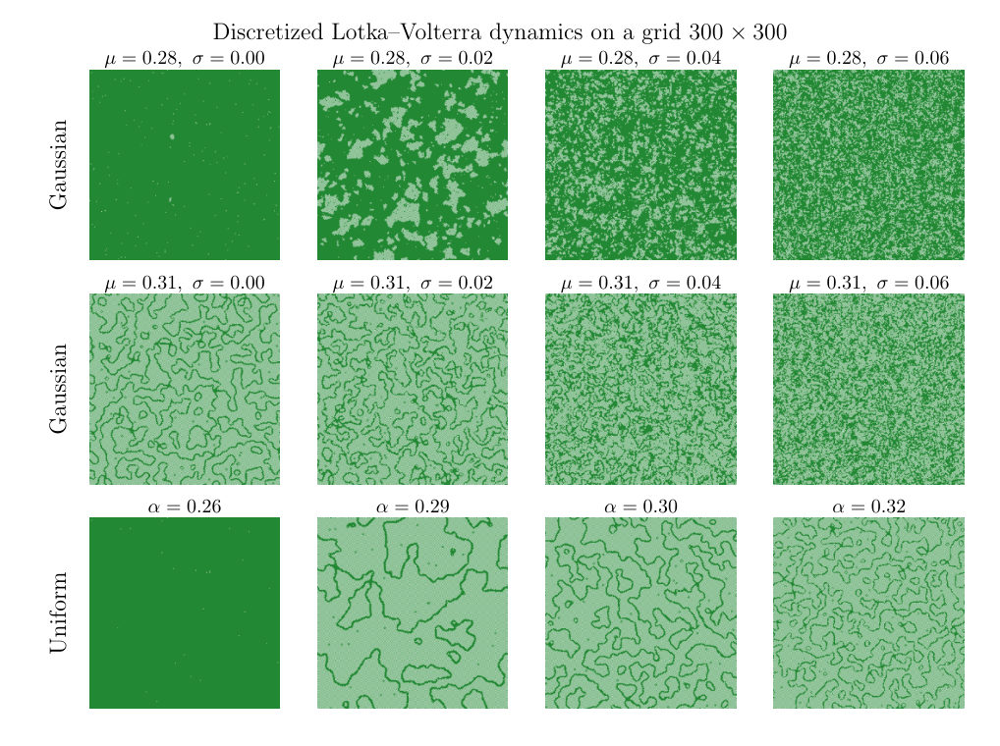 
Figure 4. Simulation of discrete gLV model on a grid, at convergence. (First two rows) Coupling of neighboring sites sampled from a truncated Gaussian, with standard deviation σ and mean µ. The white spots indicate extinct sites (at convergence), dark green occupied sites. The fragmentation of the community is visible in the first row. (Third row) Uniform coupling case, where the emergence of ring-like structures can be observed. Both simulations are done for K = 15.

📷 Fig 5

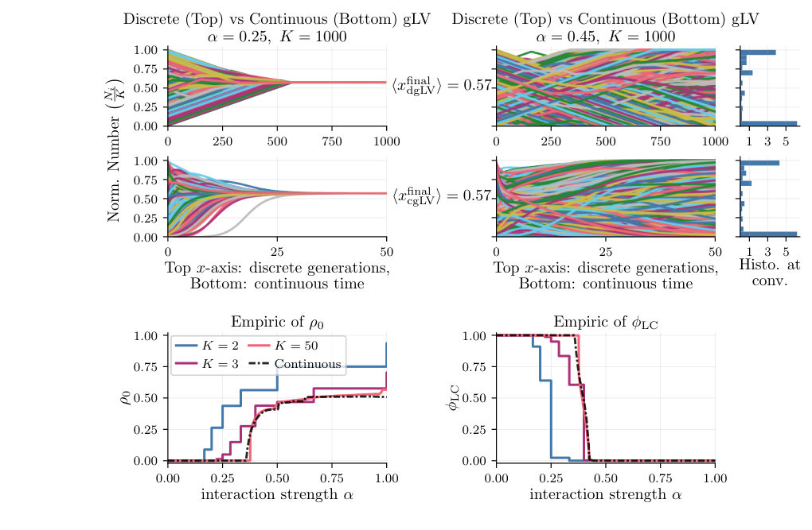 
Figure 5. Empirical comparison of discrete generalized Lotka-Volterra with its continuous counterpart, uni- form interactions. Simulations on a random 3−regular graph with S = 105 show that discrete gLV closely reproduces the behavior of continuous gLV. (Top row) For small α both models reach a uniform state, whereas for larger α extinction and heterogeneous biomass levels emerge. This is consistent with what is reported in the usual literature of continuous gLV model, on random regular graphs (see for instance [26, 27, 32]). The histograms of the normalized biomass at convergence, shown alongside the trajectories, are nearly identical in the two models, indicating that not only the mean...

**Summary.** This paper introduces a rigorous dynamical theory to study how competition in ecological networks leads to large-scale clustering and percolation. By adapting advanced statistical physics tools like the backtracking cavity method, the authors analytically determine critical thresholds that govern whether an ecosystem remains fully occupied, forms connected clusters, or fragments entirely.

**Why it may be interesting.** The methodology—using cavity methods and entropy maximization to analyze collective behavior on structured graphs—is highly transferable. The techniques developed for handling dynamical correlations are valuable for analyzing complex, interacting systems where local rules dictate global structure, relevant to disordered quantum spin models or neural network dynamics.

Detailed structure

**Main problem.** The paper develops a dynamical theory to analytically understand percolation and clustering phenomena in ecological communities with structured interactions.

**Main result.** It characterizes three distinct regimes—fully occupied, percolating, and non-percolating—and provides an analytical framework for how local competition rules generate large-scale spatial organization.

**Method.** The analysis employs the backtracking dynamical cavity method (BDCM) combined with message-passing techniques from statistical physics to handle correlated site occupations.

**Model / system.** The system models competitive ecological dynamics using a discrete version of the generalized Lotka–Volterra (gLV) model on random interaction graphs. The state evolution is governed by synchronous updates, and extinction ($N_i=0$) is an absorbing state.

**Key observables.** Percolation transition ($\alpha_{perc}$), clustering structure function ($\eta_l$), fraction of sites in the largest connected component ($\phi_{LC}$), and entropy density ($\Phi$).

**Important parameters / regimes.** Interaction strength ($\alpha$), graph degree ($d$), model parameter ($K$), and time/site size limits ($S 	o \infty$, $d 	o \infty$).

**Assumptions / limitations.** The analysis relies on synchronous updates, the use of message-passing approximations (like Belief Propagation), and assuming local tree-like structures for tractability.

**Figures summary.** Figures illustrate phase diagrams showing critical thresholds ($\alpha_{ext}, \alpha_{perc}$); comparisons between theoretical predictions and numerical simulations for $
ho_0$ and $\phi_{LC}$; and entropy calculations determining the stability of attractors (cycles vs. fixed points).

**Paper structure.** The paper progresses from defining the discrete gLV model to applying advanced statistical physics tools like BDCM and message passing. It systematically calculates key observables ($
ho_0, \phi_{LC}, \eta_l$) across different parameter regimes ($\alpha$ vs $d$), culminating in the determination of sharp phase transition thresholds.

Abstract

Ecological communities with structured interactions exhibit collective phenomena such as percolation and clustering of occupied sites. While these effects have been documented in experiments and simulations, systematic analytical understanding has remained limited. In this paper, we develop a dynamical theory of these phenomena for competitive ecological systems defined on random interaction graphs. We introduce a discrete version of the generalized Lotka-Volterra model that preserves key macroscopic features of continuous ecological dynamics while enabling analytical treatment. Within this framework, we characterize the emergence of percolating clusters and describe the spatial organization of surviving sites. Our analysis uncovers which equilibria can be reached by the dynamics and shows how this dynamical accessibility governs the onset of clustering and percolation. In doing so, our framework complements classical Lotka-Volterra theory by providing a dynamical perspective on the collective organization of structured communities.

[↑ back to top](#top)

### [Uniaxial-Stress-Induced Magnetic Transitions in the Triangular-Lattice Antiferromagnet PdCrO2](http://arxiv.org/abs/2606.09628v1)

**Authors:** Nina Stilkerich, Tobias Ritschel, Hilary M. L. Noad, Richard Waite, Dmitry Khalyavin, Kousuke Ishida, Pascal Manuel, Fabio Orlandi, Seunghyun Khim, Elena Gati, Andrew P. Mackenzie, Jochen Geck, Clifford W. Hicks  
**Type:** both · **Category:** strongly correlated electrons · **PDF:** <https://arxiv.org/pdf/2606.09628v1>  
**Analysis basis:** full PDF text, analyzed in chunks
**Topic relevance:** `analog quantum simulation` **3/5** · `exotic spin models in light-matter` **3/5** · `spintronics-quantum-optics interface` **3/5** · `Frenkel-Kontorova` **1/5**

📷 Fig 1

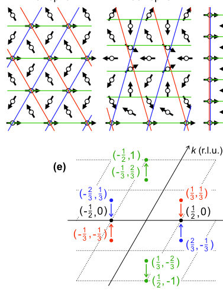 
Figure 1. Lattice directions and hypothesised spin configura- tions under strain. (a) Schematic of a triangular lattice under uniaxial stress applied along the [210] lattice direction. J1 is the exchange energy across the bonds that get compressed (solid lines), and J2 across those that get stretched (dashed lines). The blue lines are high-symmetry lattice directions. The x, y, and z directions, used in discussion of strain, are also shown. (b) 120◦spin spiral, obtained when J2 = J1. The coloured lines are magnetic Bragg planes. (c) 150◦spin spiral, obtained for J2 = 0.5774J1 (neglecting all longer-range interactions). (d) N´eel order. (e) Motion of the magnetic reflections as the mag-...

📷 Fig 2

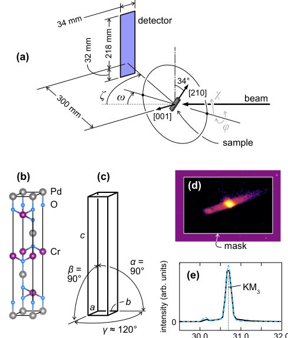 
Figure 2. Experimental information on XRD measurement under strain. (a) Setup for the X-ray diffraction measurement with detector angle ζ, cryostat rotation ω, sample rotation φ, and sample tilt χ labelled. (b) Unit cell of PdCrO2; this cell is of the obverse type. (c) A parametrisation of this cell. (d) Sum of area detector images over varying ω, focused on the 2¯2¯5 reflection. (e) Azimuthally integrated intensity of the 2¯2¯5 reflection (black line), along with a fit (blue dashed line).

📷 Fig 3

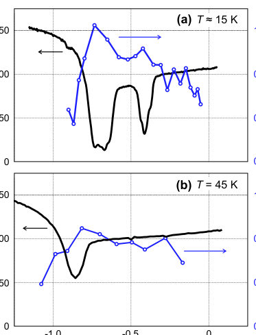 
Figure 5. Differential Young’s modulus and Poisson ratio. (a) Differential Young’s modulus E of sample B at 15 K, and differential Poisson ratio ν of sample A at 14 K. (b) Equivalent data at 45 K.

📷 Fig 4

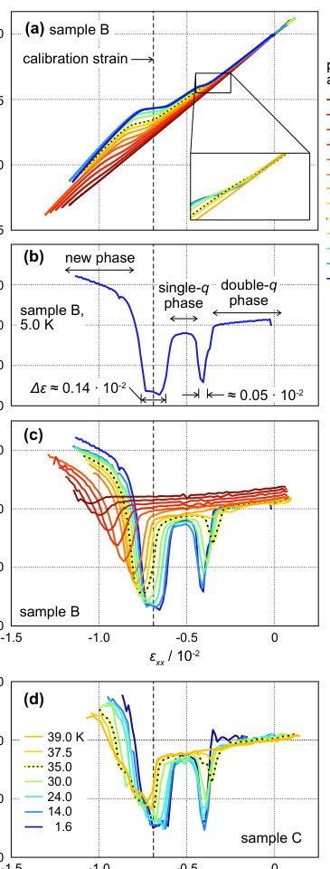 
Figure 4. Stress-strain relationship and differential Young’s modulus. (a) Stress σxx versus strain εxx for sample B at various temperatures. (b) Differential Young’s modulus E = dσxx/dεxx for sample B at 5.0 K, with the strain ranges of the three different phases labelled. (c) Differential Young’s modulus of sample B at various temperatures. (d) Same for sample C. In all the panels, the calibration strain, −0.69 · 10−2, obtained from XRD data is shown by a vertical dashed line.

📷 Fig 5

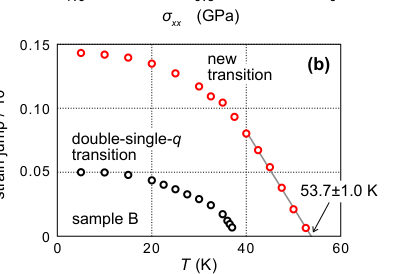 
Figure 6. Phase diagram. (a) Stress-temperature phase diagram of PdCrO2, derived from stress-strain data on sample B. (b) Jump in strain ∆ε at the two first-order transitions, as determined from stress-strain data on sample B. Due to artefacts introduced by the two-spring approximation, these values for ∆ε are about 70% of the true strain jumps at the transitions.

**Summary.** This work experimentally and theoretically investigates how uniaxial stress controls magnetic transitions in the triangular-lattice antiferromagnet PdCrO2. By combining XRD, mechanical testing, and neutron scattering, the authors reveal a first-order transition where the lattice stiffens dramatically, suggesting the magnetic order becomes rigid due to coupling with the Fermi surface. This highlights strong magnetoelastic coupling as a tunable mechanism for controlling quantum states in correlated materials.

**Why it may be interesting.** The strong, measurable coupling between mechanical strain and electronic/magnetic state is central to understanding emergent quantum phenomena in correlated materials. The concept of 'locking' due to Fermi surface nesting provides a concrete mechanism for such magnetoelastic rigidity.

Detailed structure

**Main problem.** To investigate how applying uniaxial stress can tune magnetic frustration and induce first-order magnetic transitions in the triangular-lattice antiferromagnet PdCrO2.

**Main result.** The application of stress induces a new, first-order magnetic transition characterized by a dramatic stiffening (Young's modulus increase of ~80 GPa) of the lattice, suggesting the magnetic order 'locks' into a strain-insensitive state.

**Method.** A combination of experimental techniques—X-ray diffraction, uniaxial stress-strain measurements, and neutron diffraction—is used alongside theoretical modeling to probe the magnetoelastic coupling.

**Model / system.** The system is PdCrO2, a triangular-lattice antiferromagnet. The physics involves minimizing the total free energy, which couples the elastic energy (governed by lattice strain) with the magnetic interaction energy (governed by spin configuration).

**Key observables.** Elastic moduli (Young's modulus, Poisson ratio), lattice constants ($a, b$), and magnetic Bragg reflection intensities/positions under applied stress ($\sigma_{xx}$).

**Important parameters / regimes.** Uniaxial strain ($\varepsilon_{xx}$), temperature ($T=14 	ext{ K}, 45 	ext{ K}$), and the magnitude of the stress-induced lattice constant shrinkage (0.21%).

**Assumptions / limitations.** The analysis relies on approximations like the 'two-spring model' for strain calculation, and theoretical models assume specific dependencies of magnetic coupling ($J$) on interatomic separation.

**Figures summary.** Figures illustrate XRD data processing, stress vs. strain curves showing sharp jumps at transitions, and neutron scattering intensity cuts confirming phase changes and structural domain types.

**Paper structure.** The paper progresses by first establishing the experimental necessity of studying magnetoelastic coupling via uniaxial stress. It then presents combined evidence from XRD (lattice parameters), $\sigma-\epsilon$ (elastic moduli), and neutron diffraction (magnetic order) to pinpoint a novel, rigid magnetic phase transition.

Abstract

Uniaxial stress is a promising method to tune magnetic frustration, allowing its effects to be studied in a precise way. In this work, uniaxial stress is applied to the triangular-lattice antiferromagnet PdCrO2. The Cr-Cr magnetic interaction is very sensitive to interatomic separation, so laboratory-achievable stress can induce substantial changes in magnetic structure. Results from three types of measurement are presented: X-ray diffraction, the stress-strain relationship, and neutron diffraction. The combined data show that the elastic moduli of PdCrO2 are strongly affected by stress-induced changes in magnetic structure. A new, first-order stress-induced magnetic transition is observed, at which the lattice constant shrinks by 0.21%. The lattice stiffens dramatically across this transition: the Young's modulus increases by about 80 GPa, and the Poisson ratio falls from about 1 to about 0.4. This stiffening indicates that the magnetic order "locks," that is, becomes insensitive to lattice strain. This locking might occur because the new stress-induced magnetic order nests the Fermi surface of the Pd sheets. Other frustrated magnets, including candidate spin liquids, may show similarly strong coupling between magnetic and elastic degrees of freedom.

[↑ back to top](#top)

### [Impact of the Unruh effect on the estimation precision of Gaussian channel parameters](http://arxiv.org/abs/2606.08905v1)

**Authors:** Shoukang Chang, Yawen Tang, Wei Ye, Shao-Ming Fei, Zunlue Zhu, Xingdong Zhao  
**Type:** theory · **Category:** other · **PDF:** <https://arxiv.org/pdf/2606.08905v1>  
**Analysis basis:** full PDF text, analyzed in chunks
**Topic relevance:** `quantum measurements` **3/5** · `quantum optics experiment` **2/5** · `correlated / nonlocal dissipation` **1/5** · `entanglement & information structure` **1/5** · `measurement-induced transitions` **1/5** · `methods for driven-dissipative` **1/5**

📷 Fig 1

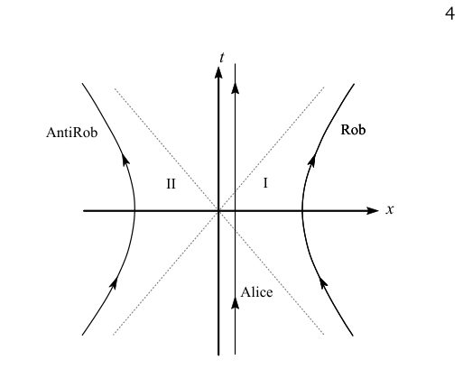 
FIG. 1: (Color online) Schematic diagram of the field mode evolution. The diagram contrasts Alice’s inertial perspective with the bipartite coupling between Rob (Region I) and Anti- Rob (Region II) induced by the Unruh effect across the causal horizon [55, 58].

📷 Fig 2

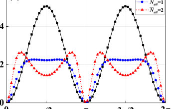 
FIG. 2: (Color online) The QFI with respect to the attenua- tion parameter ϑ for the input coherent state is analyzed as a function of (a) the acceleration parameter r with ϑ = π/2 and |α|2 = 2, and of (b) the attenuation parameter ϑ with r = 1 and |α|2 = 2.

📷 Fig 3

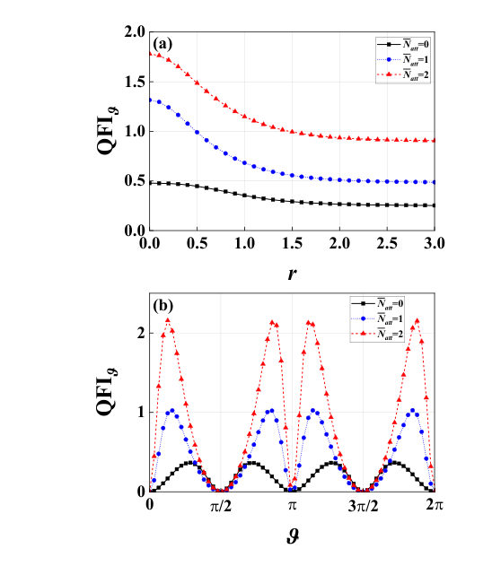 
FIG. 3: (Color online) The QFI with respect to the attenuation parameter ϑ for the input squeezed vacuum state is analyzed as a function of (a) the acceleration parameter r with ϑ = π/4 and s = 0.5, and of (b) the attenuation parameter ϑ with r = 1 and s = 0.5.

📷 Fig 4

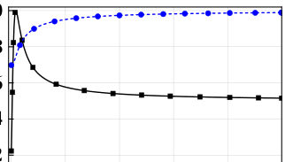 
FIG. 6: (Color online) The ratio R between the CFI and the QFI with respect to the attenuation parameter ϑ for the input squeezed vacuum state is analyzed as a function of (a) the ac- celeration parameter r with ϑ = π/3, s = 0.5, and ¯ Natt = 2, of (b) the thermal mean number ¯ Natt with ϑ = π/3, r = 1, and s = 0.5. The black and blue lines correspond to homodyne and heterodyne measurements, respectively.

📷 Fig 5

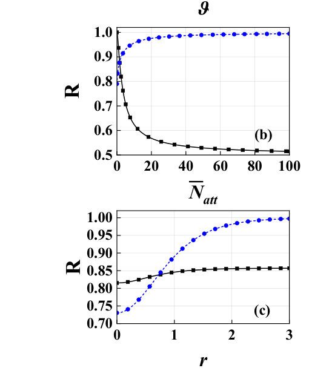 
FIG. 5: (Color online) The ratio R between the CFI and the QFI with respect to the attenuation parameter ϑ for the input coherent state is analyzed as a function of (a) the attenuation parameter ϑ with r = 1, Re(α)2 = 2, Im(α) = 0, and ¯ Natt = 2, of (b) the thermal mean number ¯ Natt with ϑ = π/3, r = 1, Re(α)2 = 2, and Im(α) = 0, and of (c) the acceleration param- eter r with ϑ = π/3, Re(α)2 = 2, Im(α) = 0, and ¯ Natt = 2. The black and blue lines correspond to homodyne and heterodyne measurements, respectively.

**Summary.** This theoretical work investigates the impact of the Unruh effect on estimating parameters within Gaussian quantum channels. By comparing the Quantum Cramér-Rao Bound to achievable classical bounds using homodyne and heterodyne measurements, the authors demonstrate that while the Unruh effect degrades precision, heterodyne detection remains the superior measurement strategy under strong non-inertial influences.

**Why it may be interesting.** It bridges relativistic quantum field theory (Unruh effect) with fundamental quantum metrology, providing concrete guidelines on measurement optimization in non-inertial settings.

Detailed structure

**Main problem.** The paper analyzes how the Unruh effect, arising from non-inertial motion, degrades the precision of estimating parameters associated with Gaussian quantum channels.

**Main result.** The Unruh effect significantly degrades single-parameter estimation precision, but heterodyne measurement proves near-optimal for both single- and two-parameter estimations in high acceleration or large noise limits.

**Method.** The analysis relies on quantum parameter estimation theory, utilizing the Quantum Cramér-Rao Bound (QCRB) derived from the Quantum Fisher Information (QFI).

**Model / system.** The system involves Gaussian quantum channels, specifically thermal attenuator and amplifier channels, whose dynamics are modified by the Unruh effect experienced by an accelerating observer.

**Key observables.** Estimation precision quantified by Mean Square Error; Quantum Fisher Information (QFI) and Classical Fisher Information (CFI).

**Important parameters / regimes.** Attenuation parameter ($\vartheta$), thermal mean number ($ar{N}_{	ext{att}}$), amplifier parameter ($\epsilon$), acceleration parameter ($r$), and input state type (coherent vs. squeezed vacuum).

**Assumptions / limitations.** The analysis assumes the system can be modeled by Gaussian states, allowing for simplification using covariance matrices.

**Figures summary.** Figures compare the ratio of measurement performance (CFI/QFI) between homodyne and heterodyne detection schemes across varying acceleration ($r$) and noise ($ar{N}_{	ext{att}}$), showing heterodyne superiority in non-inertial regimes.

**Paper structure.** The paper systematically analyzes parameter estimation for different channels (attenuator, amplifier) and parameters ($\vartheta$, $\epsilon$), comparing the ultimate quantum limit (QCRB) against achievable classical limits using both homodyne and heterodyne measurements. Appendices provide detailed mathematical coefficients for commutation relations supporting these bounds.

Abstract

Gaussian quantum channels constitute a pivotal physical framework for characterizing the dynamics of Gaussian quantum states. Extensive scholarly attention has been devoted to the estimation of parameters associated with Gaussian channels. However, while previous research has predominantly focused on parameter estimation within inertial frames, the noninertial scenario, particularly in the context of the Unruh effect, remains largely unexplored. In this paper, we analyze the impact of the Unruh effect on the estimation precision of Gaussian channel parameters, with a specific focus on thermal attenuator and thermal amplifier channels. Our findings reveal that the Unruh effect significantly degrades the precision of single-parameter estimation for Gaussian channel parameters when employing both the input coherent state and squeezed vacuum state. For the two-parameter estimation, we further demonstrate that the quantum Cramér-Rao bound serves as an asymptotically achievable precision limit. Consistent with the single-parameter case, the Unruh effect exerts a detrimental impact on the precision of two-parameter estimation. Notably, heterodyne measurement is near-optimal for both single- and two-parameter estimation in the limit of high acceleration or large thermal mean numbers. These results provide crucial theoretical insights and practical guidance for advancing quantum parameter estimation in a relativistic context.

[↑ back to top](#top)

### [Natural Selection in the Wake of Catastrophe](http://arxiv.org/abs/2606.09040v1)

**Authors:** Jesse Young Lin, Omer Granek, Joshua Sodicoff, Seppe Kuehn, David Pincus, Vincenzo Vitelli  
**Type:** both · **Category:** statistical mechanics · **PDF:** <https://arxiv.org/pdf/2606.09040v1>  
**Analysis basis:** full PDF text, analyzed in chunks
**Topic relevance:** `non-equilibrium universality` **3/5** · `non-equilibrium dynamics` **2/5** · `Keldysh / 2PI / non-Gaussian methods` **1/5** · `correlated / nonlocal dissipation` **1/5** · `driven-dissipative phase transition` **1/5** · `methods for driven-dissipative` **1/5**

📷 Fig 1

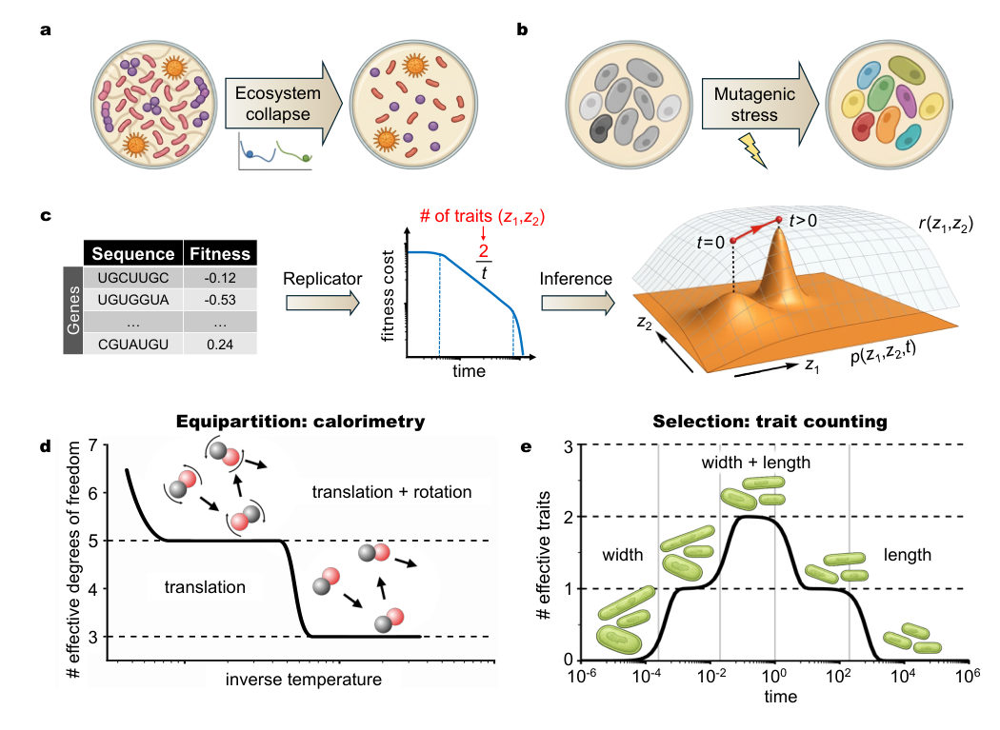 
FIG. 1. Catastrophes turn standing variation into a dynamical probe of fitness-landscape geometry. (a) Ecosystem collapse after acute stress crosses a tipping point, (b) mutagenic stress causing uncontrolled mutagenesis, and (c) Inferring phenotypic fitness landscape geometry from sequencing data through selection on standing variation time traces. A power law regime in the mean fitness cost decay reveals the number of fitness-relevant traits. Initial recovery is dominated by selection on the fitness landscape defined by the trait-dependent rate r(z1, z2). Replicator dynamics, Eq. (1), shifts and contracts the frequency distribution p(z1, z2, t) over time. Here, r(z1, z2) = (1 + e−z1)−1(1 +...

📷 Fig 2

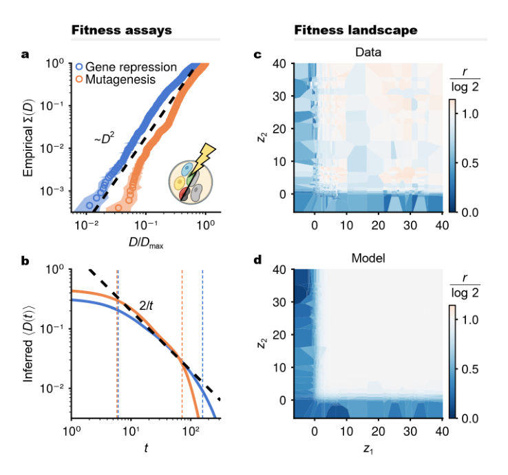 
FIG. 2. Static fitness assays in E. coli measure the phenotypic dimension relevant to evolutionary response. Two complementary assays measure n/Q, where n is the number of independent traits under selection and Q describes the curvature of the fitness peak. Static assays screen a whole library of variants at once, giving a distribution of fitness costs relative to the best variant; the cumulative fraction of variants within a rescaled fitness cost ρ = D/Dmax is predicted to scale as Σ(ρ) ∼ρn/Q. Kinetic assays track a recovering population over time, giving the mean remaining fitness cost ⟨D(t)⟩which is predicted to decay as (n/Q)/t (Eq. (5); the 1/t slope is universal). The two are...

📷 Fig 3

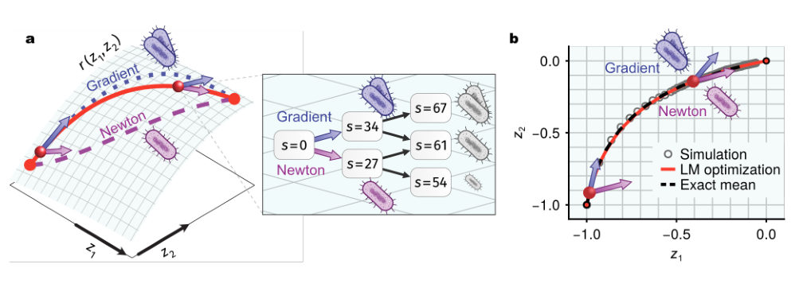 
FIG. 3. Selection on standing variation follows curvature-sensitive trajectories on fitness landscapes. (a) Gradient ascent, Newton’s method, and Levenberg-Marquardt dynamics on the landscape r(z1, z2) = 10 −z2 1 −4z2 2 + 0.1(z2 1 + z2 2)2, and the Levenberg-Marquardt dynamics which interpolates between them. The Levenberg-Marquardt dynamics adaptively selects between the steepest ascent (gradient, blue) and a curvature-sensitive ascent (Newton, purple), with directions shown by arrows. While gradient flow is preferable on the steep fitness slopes, Newton’s method is preferable near the peak where some directions may be shallow. Newton’s method reweights the diminishing fitness gradient and...

**Summary.** This paper develops a theory showing that adaptation after an environmental catastrophe follows predictable, slow dynamics characterized by mean fitness decaying inversely with time. By analyzing this decay rate using mathematical tools from statistical physics, the authors propose that the process acts as a probe to measure the effective dimensionality of the underlying phenotypic space.

**Why it may be interesting.** The mathematical framework for analyzing relaxation dynamics in complex systems, particularly the use of asymptotic expansions (Laplace's method) to extract fundamental geometric parameters ($n/Q$), shares conceptual links with calculating correlation functions or partition functions in non-equilibrium statistical mechanics.

Detailed structure

**Main problem.** The study investigates the dynamics of natural selection following a catastrophic environmental event, modeling adaptation as an optimization flow on a fitness landscape.

**Main result.** Post-catastrophic mean fitness decay follows a universal inverse-time law ($\langle D(t) 
angle \propto 1/t$), suggesting that recovery probes the dimensionality ($n/Q$) of the underlying phenotypic space.

**Method.** The authors use theoretical derivations based on the replicator equation, applying Laplace's method for asymptotic analysis, and validating results using kinetic fitness assays derived from experimental data.

**Model / system.** The system models trait evolution $z$ in populations (like E. coli) recovering from stress. The dynamics are governed by selection acting on standing variation within a multi-dimensional fitness landscape $r(z)$.

**Key observables.** Mean fitness cost decay $\langle D(t) 
angle$, specific fitness $c(t)$, and the ratio of phenotypic dimension to curvature ($n/Q$).

**Important parameters / regimes.** Time scale $t$, number of traits $n$, local curvature parameter $Q$, and crossover time $	au_c$.

**Assumptions / limitations.** The analysis assumes selection on standing variation (SSV) is dominant, and that the system can be approximated by a continuum near the fitness optimum.

**Figures summary.** Figures illustrate catastrophe types, the analogy to calorimetry for dimensionality measurement, and comparisons between theoretical trajectories (e.g., gradient ascent vs. Levenberg-Marquardt optimization) on a 2D landscape.

**Paper structure.** The paper establishes the mathematical framework using replicator dynamics, derives the universal $1/t$ decay law, links this to statistical mechanics concepts like equipartition, and validates the dimensionality measurement ($n/Q$) using multiple experimental assays (E. coli) and theoretical tools (Laplace's method).

Abstract

Living organisms, from bacteria to humans, are more likely to survive if their traits enhance fitness. In populations well adapted to their environmental niches, natural selection proceeds via rarely beneficial mutations. But when a catastrophe wipes out niche diversity, sudden adaptation often follows. Here, we present a data-validated theory of natural selection in the wake of catastrophe and unveil a simple law that emerges during recovery: the mean fitness relaxes inversely with time, with a prefactor proportional to the number of traits coupled to the post-catastrophe environment. We put our approach to test using experimental fitness landscapes measured following antibiotic administration to E. coli. The resulting mean trait adaptation is not described by gradient ascent on a fitness landscape, instead it follows an algorithm known as Levenberg-Marquardt optimization. Near fitness peaks, evolutionary trajectories are biased against greediness - from an optimization perspective, post-catastrophic selection is optimistic.

[↑ back to top](#top)

### [Predictable Mean-Field Chaos in Random Recurrent Networks](http://arxiv.org/abs/2606.08805v1)

**Authors:** Alkesh Yadav, Vladimir Shaidurov, Jonathan Kadmon  
**Type:** theory · **Category:** disordered systems and neural networks · **PDF:** <https://arxiv.org/pdf/2606.08805v1>  
**Analysis basis:** full PDF text, analyzed in chunks
**Topic relevance:** `Keldysh / 2PI / non-Gaussian methods` **3/5** · `non-equilibrium dynamics` **2/5** · `correlated / nonlocal dissipation` **1/5** · `driven-dissipative phase transition` **1/5** · `methods for driven-dissipative` **1/5** · `non-equilibrium universality` **1/5**

📷 Fig 1

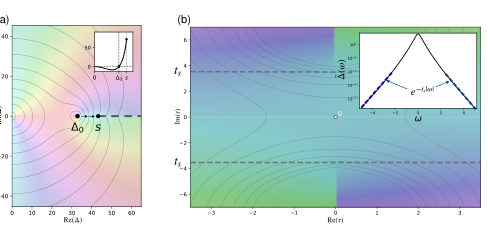 
FIG. 1. Analytic structure of the smooth chaotic mean-field process. (a) Analytic continuation of the effec- tive potential V (∆) for ϕ(x) = erf(x). Color denotes phase and contours denote magnitude; the nearest branch point lies at ∆= S &gt; ∆0, outside the physical interval of autocorrela- tions. Inset: V (∆) on the real axis. (b) Analytic continuation of the autocorrelation ∆(τ) in complex time. The dashed lines mark the analytic strip | Im τ| &lt; tS. Inset: the PSD ˜∆(ω) on a semilog scale, showing the exponential tail set by the sin- gularity at tS.

📷 Fig 2

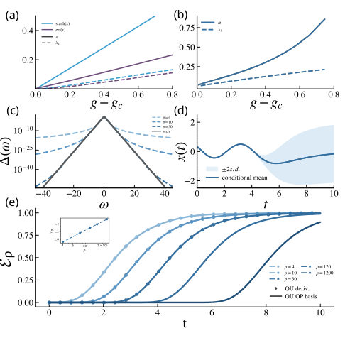 
FIG. 2. Krylov growth and finite-resolution predic- tion. (a) Krylov growth rate α (solid) and largest Lya- punov exponent λL (dashed) versus distance from the chaotic transition, g −gc, for smooth odd nonlinearities. Colors de- note erf(x) and smoothed tanh(x). (b) Same comparison for smoothed ReLU, showing α &gt; λL throughout the chaotic regime. (c) Chaotic mean-field spectrum ˜∆(ω) for the sech kernel and p-mode Markov approximations. (d) Conditional forecast from finitely resolved Krylov data; line, conditional mean; shading, ±2 standard deviations. (e) Conditional prediction error Ep(t) for increasing resolution p. Dots use derivative conditioning and solid curves use the orthogonal-...

**Summary.** This paper investigates the nature of 'chaos' in random recurrent networks by treating the system's dynamics as a stochastic process derived from DMFT. It demonstrates that if the underlying nonlinearity is sufficiently smooth (e.g., Gaussian), the apparent chaos is actually perfectly predictable due to latent determinism revealed through spectral analysis. The work establishes quantitative relationships between prediction complexity ($\alpha$) and sensitivity ($\lambda_L$).

**Why it may be interesting.** The work provides a rigorous framework for distinguishing between true stochasticity and deterministic chaos in complex dynamical systems, drawing parallels between classical chaotic dynamics (Hamiltonian) and dissipative neural network models. This methodology of using spectral analysis to probe latent determinism is highly relevant across physics disciplines.

Detailed structure

**Main problem.** To determine if 'mean-field chaos' in random recurrent networks is truly chaotic or possesses latent determinism based on its continuous past.

**Main result.** For analytic nonlinearities with fast Fourier decay, the system exhibits perfect predictability ($\sigma^2_\infty(	au_p) = 0$), meaning the future is uniquely determined by the past. The Krylov growth rate ($\alpha$) and Lyapunov exponent ($\lambda_L$) are distinct measures of complexity.

**Method.** The analysis uses Dynamical Mean-Field Theory (DMFT) combined with concepts from Gaussian processes, spectral analysis, and unfolding the autocorrelation function into a Krylov state space.

**Model / system.** The study analyzes large random recurrent neural networks, specifically using the Sompolinsky–Crisanti–Sommers (SCS) model dynamics. The core mathematical tools involve analytic continuation of the autocorrelation function $\Delta(	au)$ and mapping it to an effective potential $V(\Delta)$.

**Key observables.** Prediction error variance ($\sigma^2_\infty(	au_p)$), Krylov growth rate ($\alpha$), Largest Lyapunov exponent ($\lambda_L$), and the singularity location ($t_S$) in the complex time plane.

**Important parameters / regimes.** The decay rate of the activation function's Fourier transform (e.g., Gaussian vs. $	anh$); disorder strength ($g-g_c$).

**Assumptions / limitations.** Perfect predictability relies critically on the assumption that the activation function $\phi(x)$ has a Gaussian or faster Fourier decay; finite prediction requires approximating unresolved tails as Ornstein-Uhlenbeck processes.

**Figures summary.** Figures compare Krylov growth rate ($\alpha$) and largest Lyapunov exponent ($\lambda_L$) across different nonlinearities, illustrating how $\alpha \ge \lambda_L$. Other figures show the analytic continuation of potentials and prediction error decay over time/frequency.

**Paper structure.** The paper progresses by first establishing the link between chaos and determinism via spectral analysis (Paley-Wiener class). It then develops the mathematical machinery using Krylov state spaces to quantify predictability ($\alpha$) versus sensitivity ($\lambda_L$). Finally, it analyzes how the nonlinearity's analytic structure dictates whether this prediction is perfect or merely apparent.

Abstract

Dynamical mean-field theory recasts deterministic chaos in random recurrent networks as an effective stochastic process. We show that for analytic nonlinearities with sufficiently fast Fourier decay, this stochasticity is only apparent: the continuous past of a realized mean-field trajectory uniquely determines its future. The mean-field theory is therefore not merely an ensemble description, but a conditional prediction theory for individual trajectories. Unfolding the power spectrum into a Krylov state space exposes how this latent determinism is organized across an infinite hierarchy of temporal modes. The associated Krylov growth rate sets the complexity of finite-resolution prediction and upper-bounds the largest Lyapunov exponent in this class of networks. Thus, microscopic sensitivity and predictive complexity are distinct aspects of mean-field chaos. Our results extend Krylov growth ideas developed for Hamiltonian chaotic dynamics to classical dissipative systems.

[↑ back to top](#top)

### [Retarded Correlators of Charge Transport in a Magnetic Field](http://arxiv.org/abs/2606.08139v1)

**Authors:** Xuan Zhao, Qiuze Sun, Yi Wang, Jin Hu  
**Type:** theory · **Category:** statistical mechanics · **PDF:** <https://arxiv.org/pdf/2606.08139v1>  
**Analysis basis:** full PDF text, analyzed in chunks
**Topic relevance:** `Keldysh / 2PI / non-Gaussian methods` **3/5** · `non-equilibrium dynamics` **2/5** · `correlated / nonlocal dissipation` **1/5** · `driven-dissipative phase transition` **1/5** · `methods for driven-dissipative` **1/5** · `non-equilibrium universality` **1/5**

📷 Fig 1

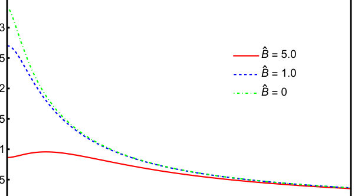 
FIG. 1. The dimensionless transverse diffusion coefficient DT /τR as a function of the dimensionless mass ˆm = m/T0 for different values of the background magnetic field ( ˆB = 0, 1.0, 5.0).

📷 Fig 2

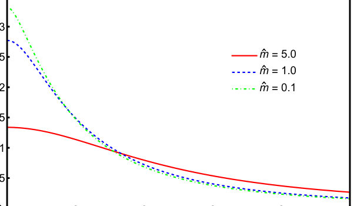 
FIG. 2. The dimensionless transverse diffusion coefficient DT /τR as a function of the dimensionless magnetic field ˆB = B0τR/T0 for different mass parameters ( ˆm = 0.1, 1.0, 5.0).

📷 Fig 3

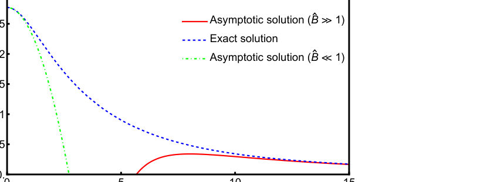 
FIG. 3. Comparison of the exact analytical calculation of the transverse diffusion coefficient (dashed blue line) with the weak-field asymptotic expansion (dashed green line) and the strong-field asymptotic expansion (solid red line). We choose the dimensionless mass ˆm = 1.

**Summary.** This paper rigorously calculates charge transport properties in magnetized relativistic plasmas using kinetic theory. By solving the linearized Boltzmann equation, the authors derive the full set of retarded current-current correlators. Key findings include the magnetic field strongly suppressing transverse diffusion while preserving longitudinal transport, providing detailed insights into plasma damping mechanisms.

**Why it may be interesting.** While focused on plasma physics, the rigorous application of linear response theory to calculate transport coefficients ($D_T$ suppression) via spectral analysis ($	ext{Im } G(\omega)$) is a powerful technique applicable to open quantum systems and many-body dynamics where dissipation and correlation functions are key.

Detailed structure

**Main problem.** The study focuses on calculating retarded current-current correlators characterizing charge transport in a magnetized relativistic plasma.

**Main result.** The analysis shows that transverse diffusion is strongly suppressed by the magnetic field ($D_T \propto 1/B_0^2$) in the strong-field limit, while longitudinal diffusion remains unaffected. Non-hydrodynamic excitations are identified as cyclotron and Landau damping.

**Method.** The authors solve the linearized Boltzmann equation using kinetic theory within the relaxation-time approximation (RTA) and exploit cylindrical symmetry via Fourier/polar transforms.

**Model / system.** The system is a relativistic plasma subjected to a uniform background magnetic field ($\mathbf{B}_0$). The analysis uses linear response theory applied to the particle distribution function perturbation $\delta f$.

**Key observables.** Retarded current-current correlators ($G_{\mu
u}^{JJ}$), charge diffusion coefficients ($D_L, D_T$), and the spectral weight of density fluctuations ($	ext{Im } G_{00}^{JJ}$).

**Important parameters / regimes.** Background magnetic field strength ($B_0$), cyclotron frequency ($\omega_c$), relaxation time ($	au_R$), and dimensionless parameters like $\hat{B} = B_0	au_R/T_0$.

**Assumptions / limitations.** The analysis relies on the Relaxation-Time Approximation (RTA) for collision terms, and in some parts, assumes specific limits such as the hydrodynamic limit ($\omega 	o 0, k 	o 0$).

**Figures summary.** Not specified.

**Paper structure.** The paper progresses from solving the linearized Boltzmann equation to obtaining an analytic solution involving Bessel functions. It then calculates the full correlators, verifies Ward identities, and finally analyzes the hydrodynamic limit (diffusion coefficients) and non-hydrodynamic branch cuts in the complex frequency plane.

Abstract

We study charge transport in a magnetized relativistic plasma using kinetic theory within the relaxation-time approximation. By exactly solving the linearized Boltzmann equation in a uniform magnetic field, we obtain an analytic solution for the distribution function in terms of Bessel functions. Using this solution, we compute the full set of retarded current-current correlators and verify the Ward identities. In the hydrodynamic limit, we extract the charge diffusion modes, demonstrating that the transverse diffusion coefficient is strongly suppressed by the magnetic field, scaling as $1/B_0^2$ in the strong-field regime, while the longitudinal diffusion remains unaffected. Furthermore, we analyze the non-hydrodynamic branch cuts in the complex frequency plane, determining their kinematic thresholds and identifying the underlying wave-particle interactions as longitudinal Landau damping and transverse cyclotron damping.

[↑ back to top](#top)

### [Ultracold Amplification Proposal for Parity Violation in Chiral Molecules](http://arxiv.org/abs/2606.08717v1)

**Authors:** Daniel Martínez-Gil, Pedro Bargueño, Salvador Miret-Artés  
**Type:** theory · **Category:** quantum gases · **PDF:** <https://arxiv.org/pdf/2606.08717v1>  
**Analysis basis:** full PDF text, analyzed in chunks
**Topic relevance:** `analog quantum simulation` **3/5** · `non-equilibrium dynamics` **2/5** · `Keldysh / 2PI / non-Gaussian methods` **1/5** · `correlated / nonlocal dissipation` **1/5** · `driven-dissipative phase transition` **1/5** · `methods for driven-dissipative` **1/5**

📷 Fig 1

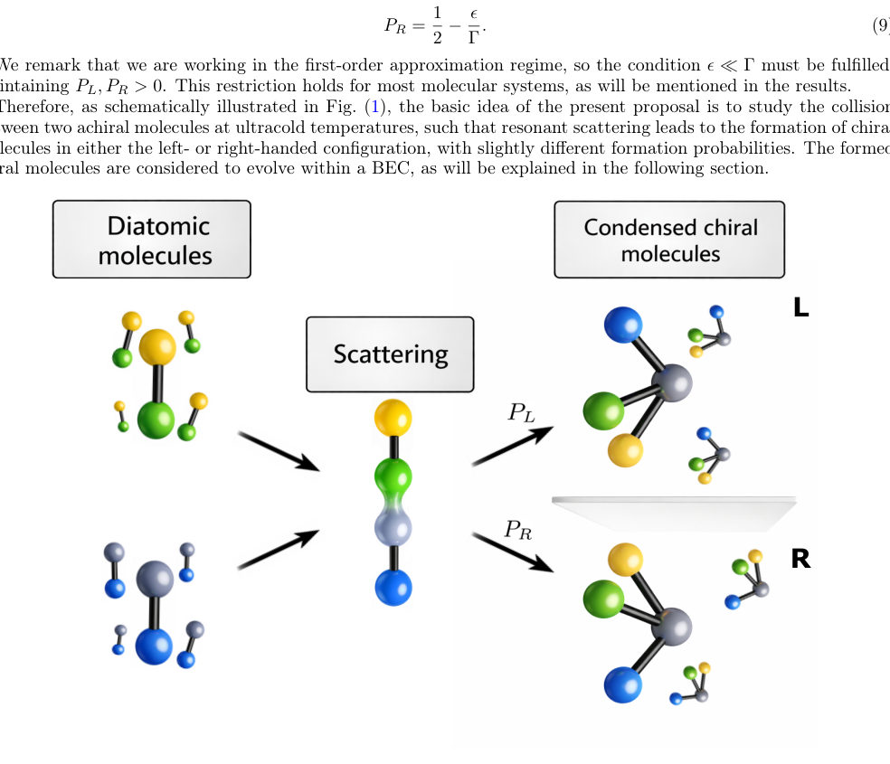 
Figure 1: Schematic diagram illustrating the scattering of two diatomic molecules leading to the formation of either the left- (L) or right-handed (R) enantiomer, with slightly different probabilities

📷 Fig 2

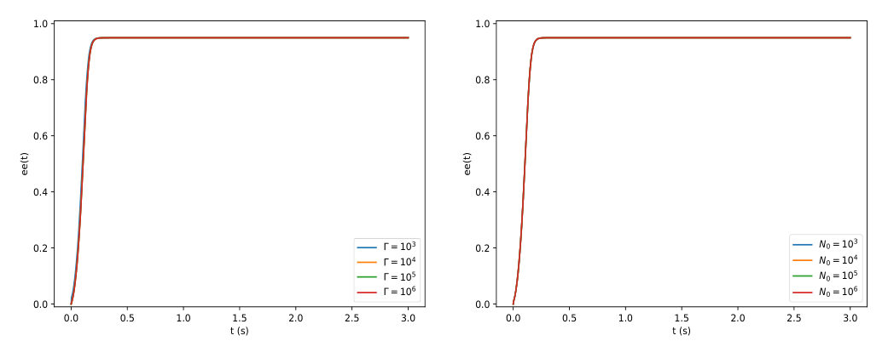 
Figure 2: Time variation of enantiomeric excess for different values of Γ (left panel) and N0 (right panel). Simulation parameters: ϵ = 10 Hz, δ = 10 Hz, Λ = 15δ.

📷 Fig 3

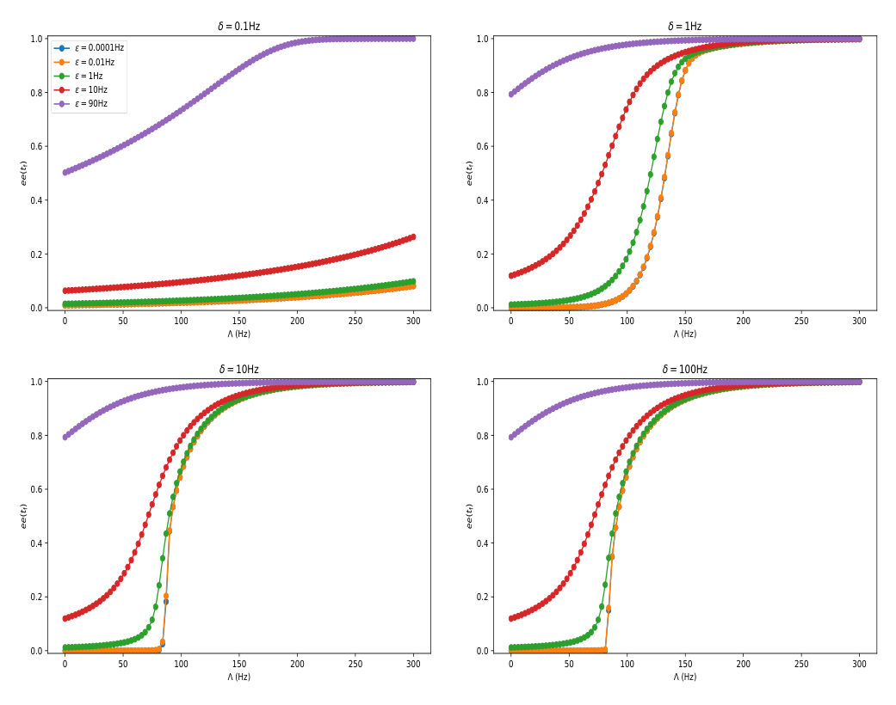 
Figure 3: Enantiomeric excess at tf = 3 s, considering different values for ϵ, δ, and Λ. Γ = 3500 Hz.

📷 Fig 4

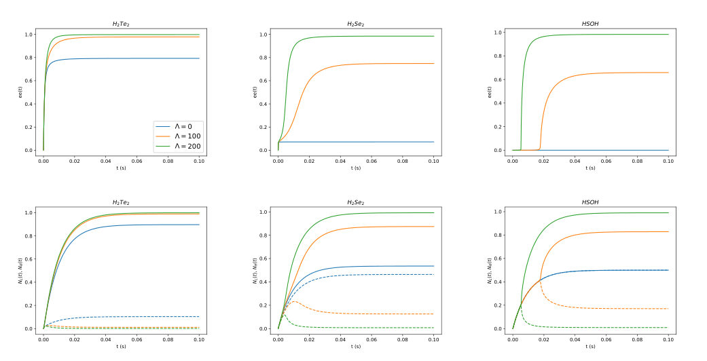 
Figure 4: The results are shown for three different chiral molecules, ordered from left to right as H2Te2, H2Se2, and HSOH. The first row displays the enantiomeric excess, while the second row shows the time evolution of the populations of the two enantiomers, NL and NR. As indicated in the legend, the blue curves correspond to Λ = 0, the orange curves to Λ = 100 Hz, and the green curves to Λ = 200 Hz. In the second row, solid lines represent the population of the left-handed enantiomer (NL), whereas dashed lines represent the population of the right-handed enantiomer (NR). The values of ϵ and δ used for each molecule are reported in Table (II). In all cases, Γ = 3500 Hz is considered.

📷 Fig 5

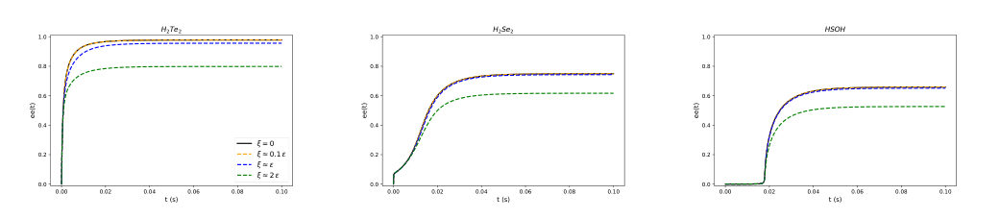 
Figure 5: These results show the dependence of the enantiomeric excess considering a stochastic noise, which is ampli- fied by the considered mechanism. We consider three different chiral molecules as examples, varying the fluctuations ξ from 0 to ≈2ϵ. In all results, we consider Λ = 100 and we average 2000 times over independent noise realizations.

**Summary.** The paper proposes using ultracold molecular gases in a BEC to detect parity violation by observing the resulting enantiomeric excess. By modeling the system dynamics, including nonlinear interactions and tunneling, the authors demonstrate that these collective effects amplify an extremely small intrinsic PVED into a measurable macroscopic bias. This suggests a novel pathway for probing fundamental symmetries using quantum gas physics.

**Why it may be interesting.** This work bridges fundamental particle physics (weak interactions/P-violation) with advanced AMO techniques (ultracold gases/BECs), demonstrating how collective quantum phenomena can enhance otherwise undetectable signals.

Detailed structure

**Main problem.** The primary goal is to propose a theoretical method for indirectly detecting the minuscule parity-violating energy difference (PVED) between chiral enantiomers.

**Main result.** The authors show that collective dynamics within an ultracold gas, specifically in a Bose-Einstein condensate (BEC), can amplify this microscopic PVED bias into a macroscopic and observable enantiomeric excess.

**Method.** The mechanism is modeled using coupled rate equations derived from considering scattering dynamics followed by nonlinear evolution within the BEC environment.

**Model / system.** The system involves chiral molecules formed via resonant collisions of achiral diatomic molecules, evolving in a BEC. The model incorporates intrinsic PVED ($\epsilon$), tunneling ($\delta$), mean-field nonlinear interactions ($\Lambda$), and thermal effects ($k_B T$).

**Key observables.** Enantiomeric excess (ee), which quantifies the macroscopic imbalance between L and R enantiomers.

**Important parameters / regimes.** The intrinsic PVED ($\epsilon$), tunneling frequency ($\delta$), nonlinear interaction strength ($\Lambda$), resonance width ($\Gamma$), and temperature ($T$).

**Assumptions / limitations.** Key assumptions include treating the system dynamics using coupled rate equations, neglecting decoherence on relevant timescales, and utilizing literature parameters for BEC realization.

**Figures summary.** Figures illustrate the schematic formation process (Fig 1), time evolution of ee(t) under varying parameters ($\Gamma$, $N_0$), and the effect of stochastic noise ($\xi$) on the final enantiomeric excess.

**Paper structure.** The paper progresses from analyzing initial scattering dynamics to developing a comprehensive model incorporating BEC nonlinearities, leading to predictions for observable ee based on various parameter regimes (e.g., $\Lambda=0$ vs $\Lambda>0$).

Abstract

We propose a theoretical mechanism to indirectly detect the small parity-violating energy difference (PVED) between chiral enantiomers through a macroscopic enantiomeric excess observed in an ultracold gas. We consider that chiral molecules are formed resonantly via ultracold collisions of achiral diatomic molecules, with PVED inducing a slight asymmetry in the resonance energies of right- and left-handed configurations. After formation, chiral molecules evolve within a Bose-Einstein condensate (BEC), incorporating nonlinear interactions, tunneling between enantiomeric states, intrinsic PVED, and thermal conversion rates. These collective dynamics enable amplification of the microscopic bias into a global population imbalance. Using coupled rate equations, we show that, under realistic regimes, a complete enantiomeric excess can be achieved even for extremely small intrinsic asymmetries. We illustrate the model with concrete examples (HSOH, H$_2$Se$_2$, H$_2$Te$_2$), predicting observable enantiomeric excesses under plausible experimental conditions. We also consider non-PVED effects that could be amplified under the proposed mechanism, including electric and magnetic fields as well as thermal fluctuations, the latter being illustrated through the aforementioned molecular examples. Overall, our results suggest that ultracold physics could provide a new pathway to probe molecular parity violation, a fundamental weak effect that remains experimentally undetected.

[↑ back to top](#top)

### [Visual-to-Code Authoring, Tensor-Network Debugging, and Quantum-Circuit Inspection Tools in Python](http://arxiv.org/abs/2606.08760v1)

**Authors:** Alejandro Mata Ali  
**Type:** theory · **Category:** numerical methods · **PDF:** <https://arxiv.org/pdf/2606.08760v1>  
**Analysis basis:** full PDF text, analyzed in chunks
**Topic relevance:** `methods for driven-dissipative` **3/5** · `analog quantum simulation` **1/5** · `correlated / nonlocal dissipation` **1/5** · `correlated cavity matter` **1/5** · `driven-dissipative phase transition` **1/5** · `entanglement & information structure` **1/5** · `non-equilibrium dynamics` **1/5**

📷 Fig 1

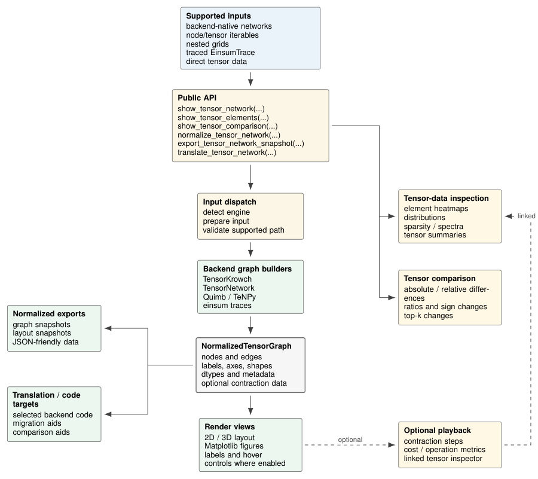 
Figure 1: Architecture of tensor-network-visualization. Supported backend-native networks, traced einsum workflows, and direct tensor data enter through public inspection, normalization, rendering, export, and translation APIs. Structural inputs are dispatched through backend graph builders into a normalized tensor graph for 2D/3D rendering, optional contraction playback, snapshot export, and selected translation targets, while tensor-data inspection and tensor comparison form parallel public-API branches.

📷 Fig 2

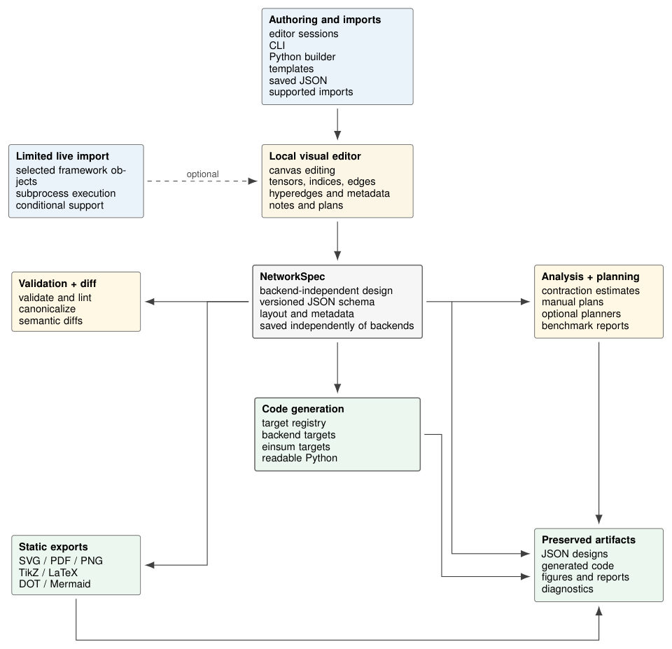 
Figure 2: Architecture of tensor-network-editor. Editor sessions, CLI/Python builders, templates, supported imports, and optional limited live imports produce a backend-independent NetworkSpec design model. The model primarily drives backend code generation, while validation, linting, analysis, contraction planning, static export, and versioned JSON preservation support the visual-to-code authoring workflow.

📷 Fig 3

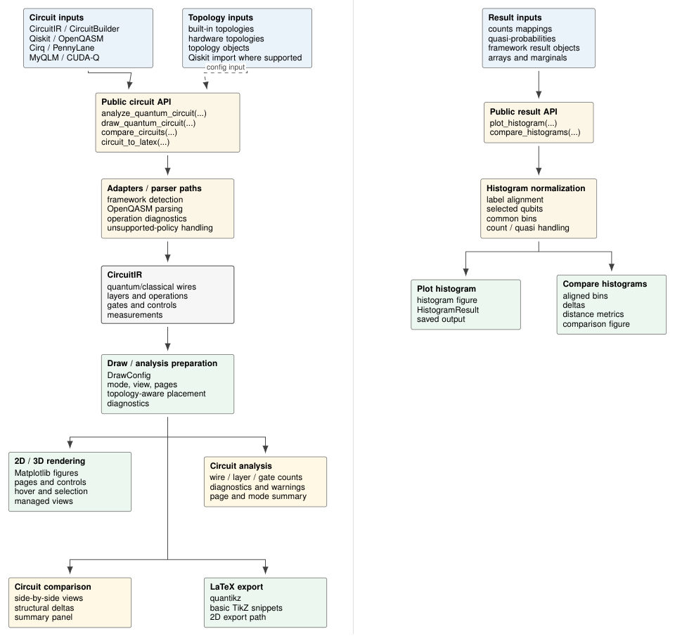 
Figure 3: Architecture of quantum-circuit-drawer. Panel (a) shows the circuit workflow: supported circuit objects, OpenQASM inputs, topology configuration, and public drawing/analysis calls are normalized through adapter and parser paths into CircuitIR-based preparation for 2D/3D rendering, circuit analysis, circuit comparison, and LaTeX export. Panel (b) shows the sibling result-distribution workflow: counts, quasi-probabilities, arrays, marginals, and supported result objects are normalized for histogram plotting and distribution comparison; this path visualizes and compares results but does not execute circuits.

📷 Fig 4

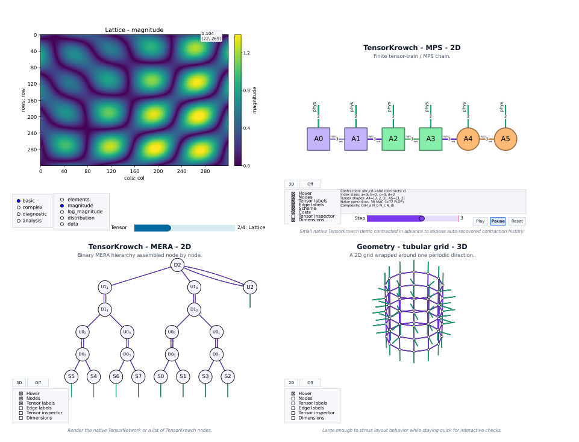 
Figure 4: Representative views from the media set associated with tensor-network-visualization version 2.0.3: an inspection-oriented network view, an MPS and contraction-oriented example, a MERA-style layout, and a tubular rendering, illustrating the package’s range from structural debugging to richer geometry-aware inspection.

📷 Fig 5

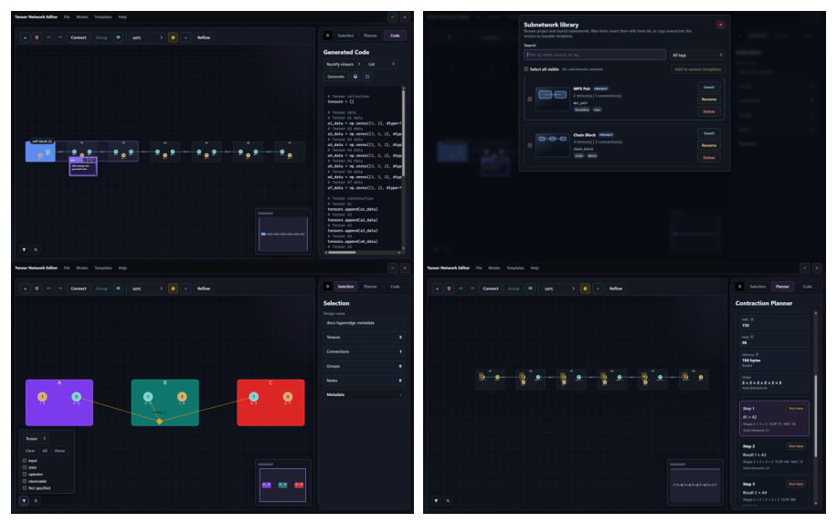 
Figure 5: Representative local-editor views from the tensor-network-editor README gallery for version 1.0.1: the main authoring canvas with generated code, template and reusable-subnetwork tooling, hyperedge and metadata editing, and the manual contraction planner. The gallery illustrates the interactive visual authoring interface; the executable example in the text isolates the shared design-to-code path.

**Summary.** This paper presents three Python packages designed to solve the problem of debugging and authoring complex structures like tensor networks and quantum circuits. These tools provide a visual layer for inspecting connectivity, editing designs visually, and comparing results without replacing the underlying computational backends. They are invaluable development aids for researchers working with these structural models.

**Why it may be interesting.** While focused on tooling rather than physics results, providing robust visualization and structural analysis tools is crucial for developing complex quantum algorithms or simulating many-body systems using tensor networks.

Detailed structure

**Main problem.** Structural mistakes are hard to notice when tensor networks and quantum circuits are represented as backend-specific Python objects or compact symbolic expressions.

**Main result.** The paper introduces three complementary packages—Visualization, Editor, and Drawer—to create a visual authoring and inspection layer around existing scientific libraries.

**Method.** The tools provide structural normalization, allowing users to visually inspect, edit, compare, and export tensor network structures and quantum circuits without implementing new simulation algorithms.

**Model / system.** The focus is on abstract computational structures: tensor networks (e.g., MPS, MERA) used in physics simulations, and quantum circuits defined by gates and connectivity.

**Key observables.** Structural correctness, network connectivity, contraction paths, circuit topology, result distribution histograms, and code snippets for various backends.

**Assumptions / limitations.** The packages are explicitly *not* simulators; they do not implement new contraction algorithms or guarantee full semantic equivalence across arbitrary backends.

**Figures summary.** Figures illustrate the architecture diagrams for the three main tools (Visualization, Editor, Drawer) and show representative views of tensor network structures and circuit inspection capabilities.

**Paper structure.** The paper introduces the problem of structural ambiguity in modern quantum/tensor computation, then details the three complementary packages: Visualization (for debugging), Editor (for visual-to-code authoring), and Drawer (for circuit rendering). The structure emphasizes the utility of these tools for inspection and reproducibility.

Abstract

Tensor networks and quantum circuits are structural objects whose meaning depends on connectivity, indices, contraction order, gate placement, measurements, and related design choices. They are often easier to reason about visually than as code, yet in Python they are frequently constructed, transformed, and checked through backend-specific objects or compact symbolic expressions. This can make structural mistakes hard to notice during development, debugging, and communication. This paper presents three complementary packages: Tensor-Network-Visualization for visual debugging and structural inspection of supported tensor-network and traced einsum workflows; Tensor-Network-Editor for visual-to-code authoring, backend code generation, JSON preservation, export, and design-level analysis; and Quantum Circuit Drawer for clear circuit rendering, inspection, and complementary comparison of circuits or documented result distributions. The packages form a visual authoring and inspection layer around existing tensor-network libraries, array-based scientific Python workflows, and quantum SDKs. They are not simulators: they do not implement new contraction algorithms, execute quantum circuits, or guarantee full semantic equivalence across arbitrary backends. Their contribution is to make structural artifacts visible, editable, inspectable, comparable, exportable, and reproducible within those ecosystems.

[↑ back to top](#top)

### [Another Legacy of Andrzej Kossakowski: A Self-Contained Derivation of the GKLS Equation](http://arxiv.org/abs/2606.08579v1)

**Authors:** Gen Kimura  
**Type:** theory · **Category:** statistical mechanics · **PDF:** <https://arxiv.org/pdf/2606.08579v1>  
**Analysis basis:** full PDF text, analyzed in chunks
**Topic relevance:** `methods for driven-dissipative` **3/5** · `non-equilibrium dynamics` **2/5** · `Keldysh / 2PI / non-Gaussian methods` **1/5** · `correlated / nonlocal dissipation` **1/5** · `driven-dissipative phase transition` **1/5**

📷 Fig 1

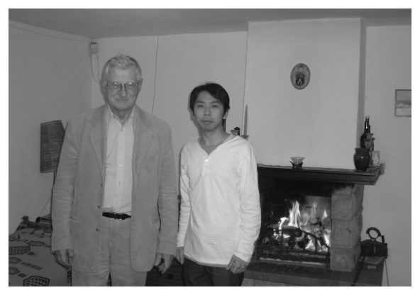 
Figure 1: With Professor Andrzej Kossakowski in Toru´n, September 2004. {fig:KosKim}

**Summary.** This paper provides a detailed, self-contained mathematical derivation showing that the physical requirements of open quantum evolution—namely complete positivity and trace preservation—necessarily lead to the celebrated Gorini–Kossakowski–Lindblad–Sudarshan (GKLS) master equation. It is crucial for understanding how environmental coupling drives non-unitary dynamics in quantum systems.

**Why it may be interesting.** This work is foundational for understanding how dissipation and environmental coupling are mathematically formalized in quantum mechanics, providing the rigorous theoretical backbone for modeling everything from NMR relaxation to superconducting qubits.

Detailed structure

**Main problem.** The paper aims to reconstruct a logically self-contained derivation of the Gorini–Kossakowski–Lindblad–Sudarshan (GKLS) equation, which governs quantum Markovian dynamics in open systems.

**Main result.** It establishes that the structural requirements of complete positivity, trace preservation, and Markovianity naturally force the generator of the time evolution to take the specific GKLS form.

**Method.** The derivation uses functional analysis tools, including the Hilbert-Schmidt inner product on the Liouville space, and relies on proving the equivalence between various mathematical conditions (e.g., complete positivity vs. Kraus representation).

**Model / system.** The system is an open quantum system described by a density operator $\rho$ evolving in time via a CPTP map ($\Lambda_t$). The dynamics are assumed to be Markovian, leading to the master equation $\frac{d\rho}{dt} = L(\rho)$.

**Key observables.** The generator $L$, which dictates the rate of change of observables; the density matrix $\rho$ itself.

**Important parameters / regimes.** Time ($t$), dimension of the Hilbert space ($d$), and the coefficients defining the Lindblad operators $\{L_\alpha\}$.

**Assumptions / limitations.** The time evolution map must be Completely Positive and Trace-Preserving (CPTP), derived from considering the system coupled to an environment.

**Figures summary.** Figure 1 shows a personal recollection photo of Professor Andrzej Kossakowski, illustrating the historical context of the derivation.

**Paper structure.** The paper follows a logical progression: defining open quantum dynamics via CPTP maps $\to$ establishing the semigroup property and generator $L$ using functional analysis (e.g., Lumer-Phillips theory) $\to$ applying structural constraints (positivity, trace preservation) to derive the final GKLS form.

Abstract

This note is written for the special issue of OSID dedicated to the 50th anniversary of the Gorini--Kossakowski--Lindblad--Sudarshan equation. Its purpose is not to give a comprehensive historical review, but rather to reconstruct, in a self-contained way, one logical route leading to the GKLS generator. The emphasis is placed on Kossakowski's structural insight: the combination of Markovianity, complete positivity, trace preservation, and the infinitesimal structure of quantum dynamical semigroups naturally leads to the celebrated form of the generator. I also include a few personal recollections of Andrzej Kossakowski, under whose guidance I spent one year as a postdoctoral researcher in 2003--2004.

[↑ back to top](#top)

### [Evolution of terahertz third harmonic response across rare-earth nickelate phase-diagram](http://arxiv.org/abs/2606.09622v1)

**Authors:** Gulloo Lal Prajapati, Igor Ilyakov, Alexey Ponomaryov, Atiqa Arshad, Sanjeev Kumar, Jayaprakash Sahoo, Dhanvir Singh Rana, Abdelrahman Azab, Friedemann Queisser, Ralf Schützhold, Jan-Christoph Deinert  
**Type:** both · **Category:** strongly correlated electrons · **PDF:** <https://arxiv.org/pdf/2606.09622v1>  
**Analysis basis:** full PDF text, analyzed in chunks
**Topic relevance:** `spintronics-quantum-optics interface` **3/5** · `driven-dissipative phase transition` **2/5** · `Keldysh / 2PI / non-Gaussian methods` **1/5** · `non-equilibrium dynamics` **1/5** · `non-equilibrium universality` **1/5**

📷 Fig 1

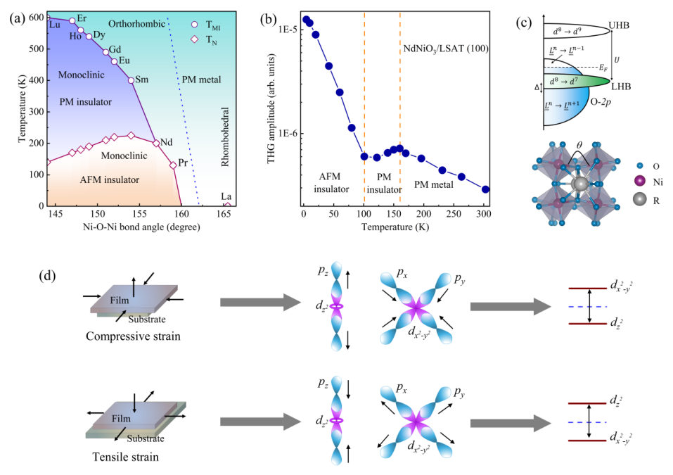 
FIG. 1. (a) Phase-diagram of bulk RNiO3 as a function of Ni-O-Ni bond angle corresponding to

📷 Fig 2

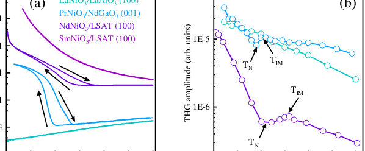 
FIG. 2. (a) Temperature-dependent resistivity of different RNiO3 films. Arrows show heating and

📷 Fig 3

 
FIG. 3. (a) Temperature-dependent resistivity of NdNiO3 films grown on various substrates. The

📷 Fig 4

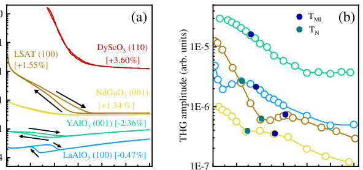 
Figure 3(b) shows the temperature-dependent THG amplitude of these films. We did not

📷 Fig 5

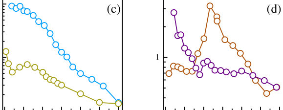 
FIG. 4. Temperature-dependent resistivity of (a) NdNiO3/LaAlO3 (compressive strained) films

**Summary.** This work demonstrates that Terahertz High Harmonic Generation (THG) is a powerful diagnostic tool for probing the complex phase transitions within rare-earth nickelates, which are model systems for Mott insulators. By measuring THG as a function of temperature and strain, the authors show a direct correlation between the nonlinear optical response and the material's electronic/magnetic state. This broadens the applicability of THz HHG studies to strongly correlated materials.

**Why it may be interesting.** The use of nonlinear optical techniques like THz HHG to map out complex many-body phase diagrams in correlated oxides provides an experimental handle on phenomena typically studied via transport or spectroscopy alone. The sensitivity to subtle changes in electronic structure makes it valuable for understanding strongly interacting electron systems.

Detailed structure

**Main problem.** The study investigates nonlinear electronic responses, specifically Terahertz High Harmonic Generation (THG), as a sensitive probe for understanding the Mott insulator-metal transition in strongly correlated materials.

**Main result.** The THG amplitude is highly sensitive to the electronic and magnetic phases of rare-earth nickelates; local extrema in temperature-dependent THG coincide with known phase transitions like the insulator-metal crossover.

**Method.** The research combines experimental measurements (temperature-dependent THG/resistivity on thin films) with theoretical modeling using generalized theories for harmonic generation in charge-transfer insulators.

**Model / system.** The system is rare-earth nickelates (RNiO3), which are modeled as negative charge-transfer insulators exhibiting strong hybridization between Ni 3d and O 2p orbitals. The physics is governed by the competition between electronic correlations, magnetic ordering (AFM/PM), and structural parameters like the Ni-O-Ni bond angle.

**Key observables.** THz third harmonic generation (THG) amplitude vs. Temperature; Resistivity vs. Temperature; THG/FH ratio.

**Important parameters / regimes.** Rare-earth atomic radius (controlling $	ext{Ni}-	ext{O}-	ext{Ni}$ bond angle); Epitaxial strain (compressive/tensile); Transition temperatures ($T_{MI}, T_N$).

**Assumptions / limitations.** The THG signal is assumed to be a direct probe of the electronic structure and charge dynamics, allowing for mapping of phase transitions. The theory developed applies to negative charge-transfer insulators.

**Figures summary.** Figures illustrate the RNiO3 phase diagram based on bond angle; temperature dependence plots show THG amplitude coinciding with magnetic and metal-insulator transition temperatures in both bulk and strained film samples.

**Paper structure.** The paper establishes the utility of THz HHG for correlated materials, details measurements across various nickelate phases (varying R element, strain), presents how THG signals track phase transitions ($T_{MI}, T_N$), develops a generalized theory, and concludes by outlining enhancement strategies.

Abstract

High harmonic generation (HHG) is a sensitive probe for investigating electronic structures and dynamics of materials and a source for attosecond pulses. In particular, HHG with terahertz (THz) light can enable probing of nonlinear responses in correlated materials arising from low-energy many-body interactions. However, THz HHG studies have so far largely focused on topological materials and superconductors, leaving out other potential material systems which could also become efficient THz HHG sources. Here, we report THz third harmonic generation (THG) in rare-earth nickelates -- a prototype material for exploring the Mott insulator-metal transition and related technological applications. We find that the THG amplitude is highly sensitive to the strengths of electronic and magnetic phases of nickelates. In films with sharp phase-transitions, the local maximum and minimum in the temperature-dependent THG amplitude coincide with insulator-metal and magnetic transition temperatures, respectively. While in films with weaker transitions, these features shift toward lower temperatures or even monotonous THG enhancement is observed down to low temperatures. We developed a generalized theory for THz harmonic generation in negative charge-transfer insulators and outlined strategies to enhance the THz nonlinearities further. Our study broadens the scope of THz HHG studies and related applications to strongly correlated materials.

[↑ back to top](#top)

### [Order parameters and ground-state phase diagram of the interacting topological Su-Schrieffer-Heeger model with extended-range hoppings](http://arxiv.org/abs/2606.09201v1)

**Authors:** Tsz Hin Hui, Pedro D. Sacramento, Wing Chi Yu  
**Type:** theory · **Category:** strongly correlated electrons · **PDF:** <https://arxiv.org/pdf/2606.09201v1>  
**Analysis basis:** full PDF text, analyzed in chunks
**Topic relevance:** `analog quantum simulation` **3/5** · `entanglement & information structure` **2/5** · `Frenkel-Kontorova` **1/5** · `Keldysh / 2PI / non-Gaussian methods` **1/5** · `methods for driven-dissipative` **1/5**

📷 Fig 1

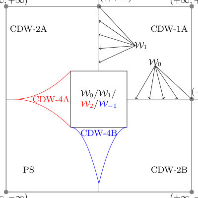 
FIG. 1. Schematic diagram illustrating possible phases in var- ious limits of (U, V ). In the strong interacting regime, for any finite η, tc and td, the four phases reside at the four corners are phase separation (PS) for (U, V ) →(−∞, −∞), and dif- ferent types of charge density waves (CDWs), as detailed in the main text, for (±∞, ∓∞) and (+∞, +∞). Along the line (U, V ) ≈(λ, 0) and (0, λ), for sufficiently large λ &gt; 0, there exists a W0 and a W1 phase, respectively, as indicated by the arrows. The central square represents the neighborhood of (U, V ) ≈(0, 0), which admits four possibilities depending on the values of η, tc and td. For |tc| and |td| sufficiently smaller than |ta| and...

📷 Fig 2

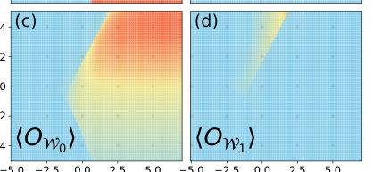 
FIG. 3. Ground-state expectation values of O′ W0, O′ W1, OW0, and OW1, defined in Eqs. (43), (44), (9) and (25), respec- tively. The number of hopping terms is set to n = 3 for all the OPs. Here, N = 8 and (η, tc, td) = (0.6, 0, 0). For com- parison, see the phase diagram in Ref. [71].

📷 Fig 3

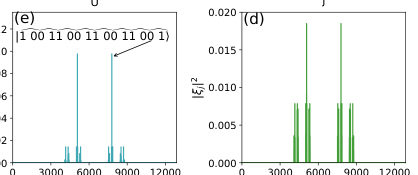 
FIG. 2. The squared modulus of the weight |ξj|2 (see Eq. (5)) of the Fock states for ground states along U = 6 with (a) V = 5; (b) V = 2.5; (c) V = 0; (d) V = −2.5; (e) V = −5. The colormap shows the half-block entanglement entropy, with the circles marking the points at which the ground state is considered in panels (a-e) using the same color scheme. Here, N = 8 and (η, tc, td) = (0.6, 0, 0).

📷 Fig 4

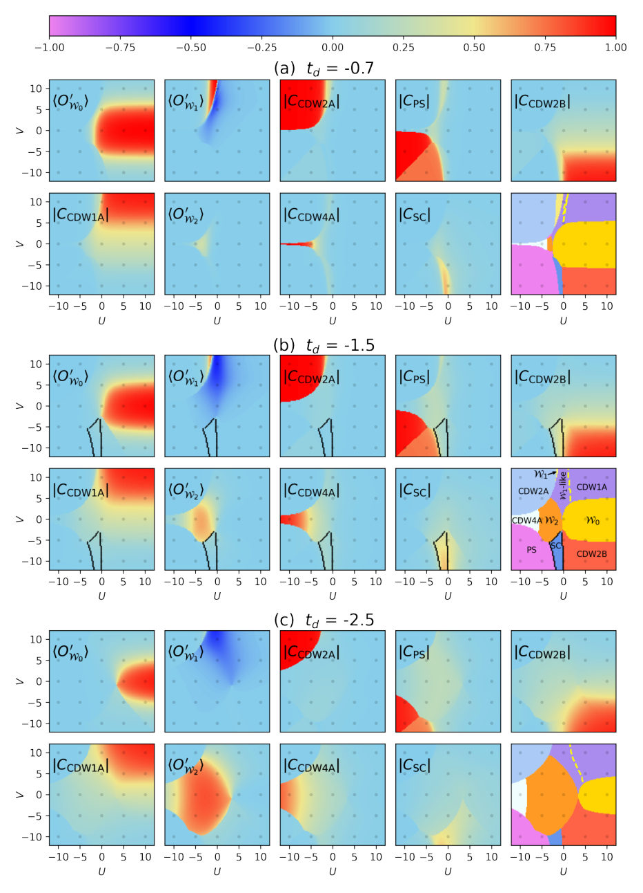 
FIG. 4. The OPs for the possible phases in the interacting ESSH model with various td: (a) td = −0.7; (b) td = −1.5; and (c) td = −2.5. Here, N = 8, (η, tc) = (0.6, 0). O′ W0/1/2 are defined in Eq. (45), with n = 3. Cm(r) is defined in Eq. (47), and “m” can be CDW1A/2A/2B/4A or SC or PS. For the CDW family, r is set as halve of the wavelength of the corresponding phase, namely r = 1 for CDW2A/2B and r = N/2 for PS. For CDW1A, r = 0.5, which corresponds to a separation of one site. For the SC-like phase, we set r = 1 and OSC is given in Eq. (54). The bottom-right panel in each subplot shows the estimated phase diagram. The yellow dashed line display the boundary between the W1-like and the...

📷 Fig 5

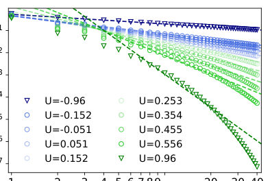 
FIG. 5. The log-log plot of the pairing correlation function in Eq. (55) versus the separation r measured from the middle of the chain. Blue and green markers denote the SC-like and the CDW-2B phases, respectively, with U values indicated in the legend and (η, tc, td, V ) = (0.6, 0, −1.5, −12). Triangular and circular markers denote points deep inside the phase and around the phase boundary, respectively. Data is obtained from DMRG simulation with N = 200, open boundary con- dition, bond dimension 500, and at least 10 sweeps. Dashed straight lines are linear fits to the data over r ∈[6, 25].

**Summary.** This paper maps out the complex ground-state phase diagram of an extended and interacting SSH model. It identifies multiple novel CDW and SC-like phases by deriving specific order parameters for each regime. The work is significant because it shows that electron interactions fundamentally alter the nature of topological order, allowing for hoppings patterns forbidden in the non-interacting limit.

**Why it may be interesting.** The study uses advanced many-body techniques to characterize topological phases in interacting systems, providing insights into how electron-electron interactions modify fundamental superconducting or charge ordering tendencies.

Detailed structure

**Main problem.** The study investigates the rich phase diagram of the interacting topological Su-Schrieffer-Heeger (ESSH) model, focusing on superconducting-like and charge-density-wave phases.

**Main result.** The paper uncovers a complex phase diagram featuring multiple CDW and SC-like phases, demonstrating that interactions allow for non-unidirectional hoppings contrary to the non-interacting case.

**Method.** Order parameters (OPs) are derived based on analyzing dominant Fock states of the ground state, and these results are verified using large-system simulations like DMRG.

**Model / system.** The system is the Extended SSH Model (ESSH), described by a Hamiltonian including nearest-neighbor, next-nearest neighbor hoppings, and interaction terms ($U$ and $V$).

**Key observables.** Order Parameters (OPs) for various phases ($	ext{OCDW2A}$, $	ext{CSC}$), Topological invariant ($W$), Entanglement entropy, and Fidelity.

**Important parameters / regimes.** Interaction strengths ($U, V$), extended-range hopping parameters ($t_c, t_d$), and system size ($N$).

**Assumptions / limitations.** The OP construction relies on analyzing dominant Fock states; finite-size effects are noted as a limitation for certain phases.

**Figures summary.** Figures illustrate phase diagrams in the $(U, V)$ plane, compare OPs with entanglement entropy and fidelity across different system sizes, and show symmetry relations between parameter regimes.

**Paper structure.** The work progresses by defining the Hamiltonian, deriving general OP construction schemes, mapping out the phase diagram through limiting cases of interaction parameters, and finally verifying the results using large-scale numerical simulations (DMRG).

Abstract

Topological insulators have attracted numerous attentions recent years, where the Su-Schrieffer-Heeger (SSH) model is one of the most studied models. While the interacting version of it has been explored recently, the interplay between interactions and long-range hoppings merit further investigations. In this work, we uncover a rich phase diagram of the interacting SSH model with extended-range hoppings, in which it consists of several topological phases, two novel superconducting-like (SC-like) phases and five distinct charge-density-wave (CDW) phases. We substantiate that the SC-like and two CDW phases are direct consequences of imbalanced interactions and extended-range hoppings. We derive the order parameters (OPs) for each of the phases and verify them in large-system simulations, finding consistency with the entanglement entropy and the fidelity in capturing the phase transitions. In contrast to the non-interacting case where the favored hoppings are unidirectional in the topological phases, the derived OPs suggest non-unidirectional hoppings are possible under the influence of interactions.

[↑ back to top](#top)

### [Quantum Mechanical Studies of Photodissociation Dynamics on Quantum Computers](http://arxiv.org/abs/2606.08929v1)

**Authors:** Zikun Zhuang, Chengdong Yang, Yuchen Wang, Dong H. Zhang, Bin Zhao  
**Type:** theory · **Category:** quantum information and computing · **PDF:** <https://arxiv.org/pdf/2606.08929v1>  
**Analysis basis:** full PDF text, analyzed in chunks
**Topic relevance:** `methods for driven-dissipative` **3/5** · `non-equilibrium dynamics` **2/5** · `Keldysh / 2PI / non-Gaussian methods` **1/5** · `correlated / nonlocal dissipation` **1/5** · `driven-dissipative phase transition` **1/5**

📷 Fig 1

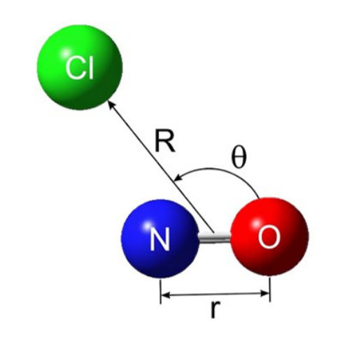 
Figure 1: Jacobi coordinate system (r, R, θ) used for the triatomic NOCl molecule. Here, r represents the NO bond length, R is the distance from the Cl atom to the center of mass of the NO fragment, and θ is the angle between the vectors r and R.

📷 Fig 2

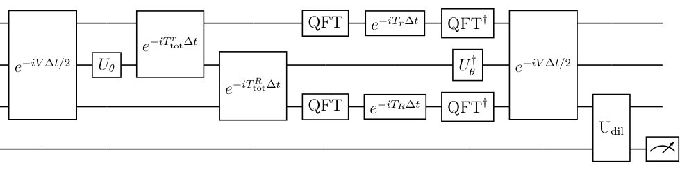 
Figure 2: Quantum circuit for a single propagation step ∆t. The circuit implements the second-order split-operator method, utilizing the Quantum Fourier Transform (QFT) and Legendre-DVR transformation (Uθ) to switch between the DVR and FBR. The non-unitary complex absorbing potential is implemented via the dilation unitary Udil, which requires an additional ancilla qubit |0⟩a.

📷 Fig 3

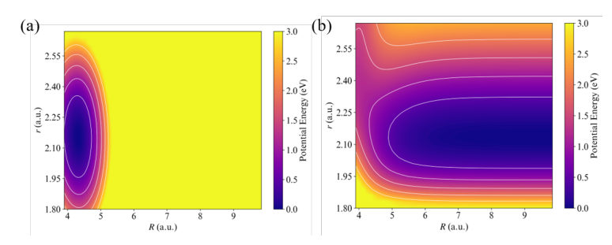 
Figure 4: Two-dimensional contour plots of the potential energy surfaces (PESs) for NOCl as a function of the radial coordinates R and r, with the Jacobi angle fixed at its equilibrium value of θ = 127◦. (a) The ground electronic state (S0) PES. (b) The first excited electronic state (S1) PES. Energy values are given in electron volts (eV).

📷 Fig 4

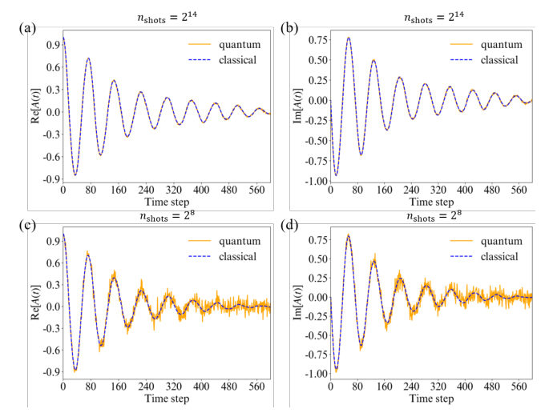 
Figure 5: Comparison of the auto-correlation function C(t) for the 3D NOCl photodis- sociation process between quantum simulations (orange solid lines) and classical TDWP benchmarks (blue dashed lines). Panels (a) and (b) display the real and imaginary parts obtained from an ideal quantum simulation with 214 shots. Panels (c) and (d) display the corresponding results obtained with a reduced sampling size of 28 shots, illustrating the im- pact of statistical fluctuations.

📷 Fig 5

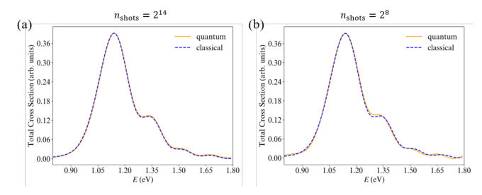 
Figure 6: Comparison of the calculated total photodissociation cross sections σtot(E) for the 3D NOCl model. (a) Spectrum derived from the ideal 214 shots simulation. (b) Spectrum derived from the 28 shots simulation. Despite the significant sampling error in the time domain, the essential spectral features are well-preserved after the Fourier transform.

**Summary.** The paper presents a novel quantum algorithm designed to simulate the complex dynamics of molecular photodissociation on quantum computers. It tackles the challenge of implementing non-unitary time propagation using a dilation scheme for boundary conditions. The results confirm that this approach is robust enough to yield accurate physical observables, like the dissociation cross section, even when accounting for noise and limited sampling.

**Why it may be interesting.** This work directly addresses a major hurdle in applying quantum computation to chemistry: simulating open or dissipative quantum systems, which typically require non-unitary evolution operators.

Detailed structure

**Main problem.** Studying complex quantum dynamics, such as photodissociation, which are intractable for classical computers due to exponential scaling.

**Main result.** The proposed quantum algorithm successfully simulates the NOCl photodissociation cross section with excellent agreement to classical benchmarks, demonstrating robustness against both statistical sampling errors and simulated hardware noise.

**Method.** The time evolution is implemented using a split-operator method on a quantum circuit, requiring a dilation strategy to handle non-unitary propagators arising from complex absorbing potentials (CAPs).

**Model / system.** The system modeled is the photodissociation of the NOCl molecule. The dynamics are governed by a Hamiltonian involving kinetic and potential energy terms in Jacobi coordinates.

**Key observables.** Photodissociation cross section ($\sigma_{tot}(E)$), extracted via the Fourier transform of the time-domain auto-correlation function $C(t)$.

**Important parameters / regimes.** The simulation uses a 3D representation (R, r, $	heta$) for NOCl, with specific grid sizes and CAP parameters defined for the calculation.

**Assumptions / limitations.** The primary approximation is using quantum computing to simulate dynamics that require non-unitary evolution due to boundary condition enforcement via a Complex Absorbing Potential (CAP).

**Figures summary.** Figures compare the time-domain auto-correlation function $C(t)$ and the resulting cross section $\sigma_{tot}(E)$ under ideal conditions versus those corrupted by limited sampling shots or simulated hardware noise.

**Paper structure.** The paper introduces the problem of intractable quantum dynamics, details the adaptation of the split-operator method for quantum circuits (including handling non-unitary CAPs via dilation), and validates the algorithm's performance by comparing results against classical benchmarks under various error conditions.

Abstract

Theoretical quantum dynamics calculations scale deeply with system size, rendering classical calculations intractable for complex systems. While quantum computing offers a natural solution, its application to nuclear quantum dynamics remains scarce. Here, we present a quantum algorithm to study photodissociation dynamics on quantum computers, benchmarked on the NOCl molecule. The wavefunction is propagated via a split-operator method, utilizing the Quantum Fourier Transform and unitary transformation matrix to switch representations. To impose outgoing boundary conditions on a truncated grid, we use a non-unitary absorbing potential propagator, implemented through a dilation scheme. The photodissociation cross section is calculated from the auto-correlation function, which is extracted using the Hadamard test. Our quantum computing results agree well with benchmarks under ideal conditions, and we further demonstrate that the algorithm is robust to noise and statistical sampling errors, indicating the promising application of noisy devices to quantum dynamics studies.

[↑ back to top](#top)

### [Classical Stochasticity Using Quantum Computers](http://arxiv.org/abs/2606.09384v1)

**Authors:** Diego Campos, Narasimha Reddy Gosala, Arundhati Dasgupta  
**Type:** theory · **Category:** quantum information and computing · **PDF:** <https://arxiv.org/pdf/2606.09384v1>  
**Analysis basis:** full PDF text, analyzed in chunks
**Topic relevance:** `quantum measurements` **3/5** · `measurement-induced transitions` **2/5** · `methods for driven-dissipative` **1/5** · `non-equilibrium dynamics` **1/5**

📷 Fig 1

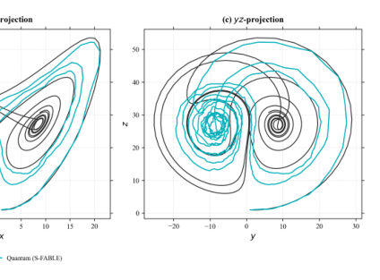 
Figure 1: Lorenz trajectory generated by S-FABLE and measurement of quantum state

📷 Fig 2

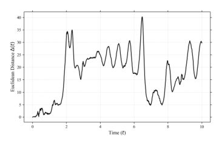 
Figure 2: Plot of the Euclidean distance of the SFABLE q-code solution and numerical solution.

📷 Fig 3

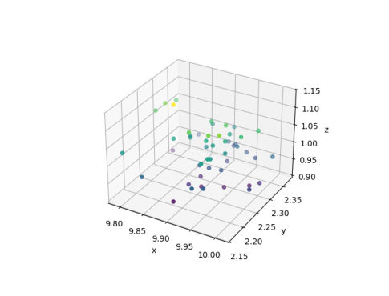 
Figure 3: The Quantum Algorithm generated trajectories

📷 Fig 4

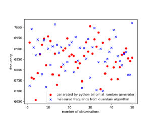 
Figure 4: The randomness in the Quantum measurements

📷 Fig 5

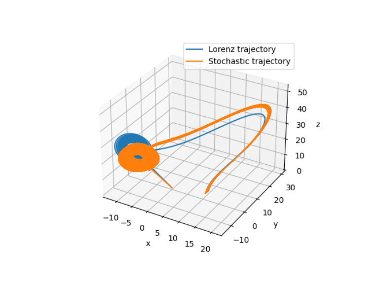 
Figure 5: Numerically generated Lorenz trajectories, one with the stochastic fluctuations, one without them

**Summary.** This paper demonstrates that the measurement process of quantum algorithms can naturally generate stochastic results capable of modeling classical chaotic and stochastic systems, using the Lorenz system as a key example. By comparing quantum measurements to classical simulations, the authors show that quantum hardware can serve as an alternative computational tool for studying non-deterministic physical phenomena.

**Why it may be interesting.** It suggests a novel computational paradigm where inherent quantum non-determinism can be harnessed to model complex, classically stochastic physical systems without relying solely on post-processing or high-precision deterministic methods.

Detailed structure

**Main problem.** The research explores modeling classical stochastic simulations using quantum algorithms, leveraging the inherent randomness of the quantum measurement process.

**Main result.** The measured output from quantum algorithms applied to systems like the Lorenz equations naturally exhibits stochastic behavior that mirrors classical stochastic trajectories.

**Method.** The study compares classical stochastic simulations (using Python RNG) with results obtained by evolving quantum states using specialized circuits (like FABLE) and interpreting the measurement probabilities as random variables.

**Model / system.** The primary model is the Lorenz system, a non-linear ODE used to simulate complex fluid dynamics. The simulation involves encoding this system into quantum circuits for time evolution.

**Key observables.** Stochastic trajectories (e.g., $y$-values), variance of measured frequencies, and Euclidean distances between simulated solutions.

**Important parameters / regimes.** The stochastic nature itself is the focus; parameters include circuit depth, number of shots used for measurement, and error thresholds ($\epsilon_{	ext{cutoff}}$).

**Assumptions / limitations.** It assumes that interpreting the quantum measurement outcome as a random variable provides an accurate model for classical stochasticity. The multinomial approximation is used when analyzing variance.

**Figures summary.** Figures compare measured quantum output against deterministic and classically simulated stochastic trajectories, and show statistical consistency between quantum measurements and binomial/multinomial distributions.

**Paper structure.** The paper introduces the problem of modeling classical stochasticity with quantum mechanics. It details implementing the Lorenz system evolution using quantum circuits (FABLE/Unitary) and compares the measurement statistics against classical RNG outputs to demonstrate equivalence in stochastic nature.

Abstract

We suggest that quantum algorithms can be used to model classical stochastic simulations as the measurement process is inherently random. To illustrate, we solve the classical Lorenz system with stochastic behavior using a Python random number generator. We compare the classical stochasticity of the Lorenz system with the measured output of the system obtained using quantum algorithms.

[↑ back to top](#top)

### [Enabling quantum communication in ultra-large-scale networks](http://arxiv.org/abs/2606.08326v1)

**Authors:** Filippo Radicchi  
**Type:** theory · **Category:** quantum information and computing · **PDF:** <https://arxiv.org/pdf/2606.08326v1>  
**Analysis basis:** full PDF text, analyzed in chunks
**Topic relevance:** `entanglement & information structure` **3/5** · `correlated / nonlocal dissipation` **1/5** · `methods for driven-dissipative` **1/5** · `non-equilibrium dynamics` **1/5**

📷 Fig 1

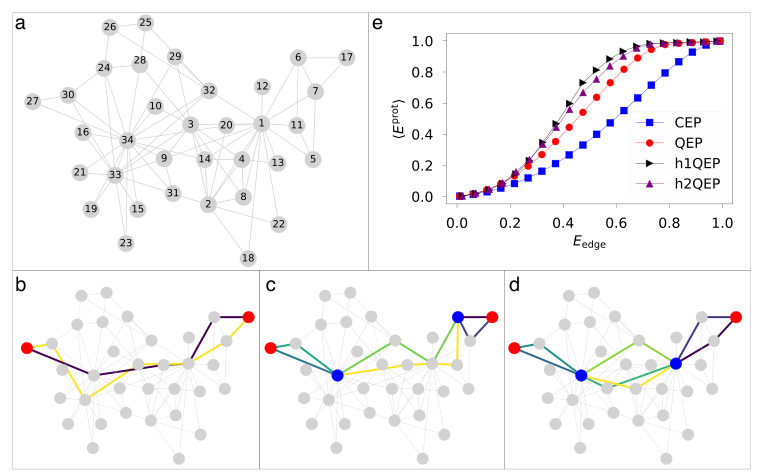 
Figure 1. Quantum communication on a real network. (a) As an illustrative example, we consider the Zachary Karate Club’s network [52]. (b) We set the entanglement of the individual edges to Eedge = 0.60, then we apply the QEP protocol to establish a communication channel between the nodes s = 17 and t = 27, both highlighted in red. Edges utilized by the protocol are visualized with a color different from gray. In particular, all edges belonging to the same path selected by the QEP protocol have the same color. The resulting entanglement is EQEP s,t = 0.41. In this case, the CEP protocol selects the very same paths as QEP, however, the resulting entanglement is ECEP s,t = 0.12. (c) Same as...

📷 Fig 2

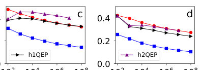 
Figure 2. Quantum communication on synthetic networks. (a) We measure the Area Under the Curve [AUC, see Eq. (13)] for the vari- ous communication protocols on random graphs with power-law de- gree distribution K(k) ∼k−γ. The AUC metric is plotted as a function of the network size N for γ = 2.1. Results are averaged over mul- tiple instances of the network model, and many randomly selected pairs of nodes s and t, see SM for details. (b-d) Same as in (a), but for γ = 2.5, 3.5 and 4.5, respectively.

📷 Fig 3

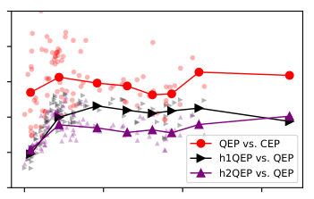 
Figure 3. Quantum communication on real networks. We display with small red circles the relative improvement AUCQEP/AUCCEP −1 of QEP vs. CEP for 101 real networks. Each network is further char- acterized by a different level of degree heterogeneity ⟨k2⟩/⟨k⟩2 used as abscissa in the plot. To highlight the trend, we group data using logarithmic binning and display with large red circles median values for each of the bins. Black and purple triangles display analogous re- sults, but for the comparisons h1QEP vs. QEP and h2QEP vs. QEP, respectively.

**Summary.** This paper develops novel quantum communication protocols designed to function across arbitrary, ultra-large-scale network topologies. By employing techniques like entanglement swapping and distillation, the authors prove that these protocols remain viable even in complex scale-free networks as they approach infinite size. The findings suggest a path toward realizing a functional Quantum Internet.

**Why it may be interesting.** This work provides rigorous theoretical evidence for scaling quantum networking beyond idealized structures, which is crucial for designing future large-scale quantum infrastructure.

Detailed structure

**Main problem.** The central problem is determining if quantum communication can be reliably sustained at ultra-large scales, comparable to the growth of a global Internet.

**Main result.** The proposed specialized protocols, particularly $h_x	ext{QEP}$, are shown to maintain viable quantum communication in the thermodynamic limit for scale-free random graphs.

**Method.** The authors devise and analyze a family of quantum communication protocols involving entanglement swapping and distillation, applying them systematically to arbitrary graph topologies.

**Model / system.** The system is modeled as an abstract quantum network represented by a classical weighted graph where edge weights quantify the available entanglement. The analysis focuses on extending results beyond special topologies like regular lattices.

**Key observables.** Achievable average entanglement ($\langle E_{	ext{prot}} 
angle$) and the Area Under the Curve (AUC) are used as primary performance metrics to compare protocols.

**Important parameters / regimes.** The analysis considers varying edge entanglement ($E_{	ext{edge}}$), network size ($N$), redundancy ($k$), and geodesic distance ($\ell$).

**Assumptions / limitations.** Previous work was limited to special topologies; the current approach assumes quantum operations can be mapped onto transformations on classical graph edges.

**Figures summary.** Figure 1 illustrates protocol performance (QEP, $h_x	ext{QEP}$) on a small network (Karate Club). Figure 2 shows the decay of AUC for standard protocols on random graphs as N increases. Figure 3 compares protocol performance across various real networks based on degree heterogeneity.

**Paper structure.** The paper systematically develops quantum communication protocols (QEP, CEP, $h_x	ext{QEP}$) by defining their underlying operations (swapping/distillation). It then analyzes these protocols theoretically and numerically on increasingly complex graph models to prove scalability in the thermodynamic limit.

Abstract

The recent development of small-scale quantum networks poses the question of whether such a technology could also operate at scale in the futuristic Quantum Internet. The question can be answered with a classical approach where an arbitrary quantum network is represented as a classical graph, and communication reliability is assessed using methods proper of network theory. Unfortunately, sufficient conditions for viable network-wide communication have been established only for special topologies like regular lattices. No practical communication protocols have been developed so far for real network topologies, if not for relatively small networks. Here, we overcome these limitations by devising a family of quantum communication protocols that can be applied to networks with arbitrary topology, composed of even hundreds of millions nodes. By performing a systematic analysis on both real and synthetic graphs, we show that the proposed protocols are sustainable on heterogeneous networks. For random scale-free graphs, we analytically prove that viable quantum communication persists in the thermodynamic limit. Our findings provide evidence that the Quantum Internet will be capable of sustaining a ultra-large-scale growth comparable to one already experienced by its classical predecessor.

[↑ back to top](#top)

### [Long-term laser frequency stabilization with an FPGA-controlled scanning cavity](http://arxiv.org/abs/2606.09720v1)

**Authors:** R. Forti, R. Panza, A. Muzi Falconi, S. Sbernardori, A. Vardé, M. Marinelli, A. Carini, F. Scazza  
**Type:** experiment · **Category:** other · **PDF:** <https://arxiv.org/pdf/2606.09720v1>  
**Analysis basis:** full PDF text, analyzed in chunks
**Topic relevance:** `quantum measurements` **3/5** · `interference shaping light` **1/5** · `measurement-induced transitions` **1/5** · `quantum optics experiment` **1/5**

📷 Fig 1

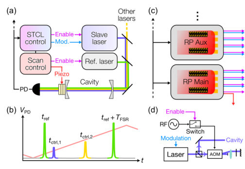 
FIG. 1. Simplified scheme of the STCL system. (a) Block diagram of our STCL system. The STCL control block actuates on the frequency of a slave laser, gating at the same time its injection into the optical cavity. The connected scan control block handles the scanning of the cavity length, and gates the injection of the reference laser into the cavity. A photodetector (PD) measures the cavity transmission signal and supplies it to the STCL control block. (b) Illustration of the typical cavity transmission signal, alongside the piezo displacement ramp (red), for multiple injected lasers: reference laser (green) and controlled lasers (violet, yellow). Each laser beam is coupled into the cavity...

📷 Fig 2

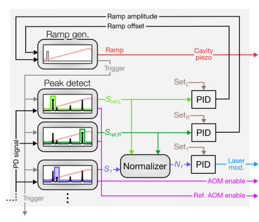 
FIG. 2. Block diagram of the internal operations executed by the main FPGA device. The Red Pitaya provides the voltage ramp to the cavity piezo and reads the PD signal of the cavity transmission. This signal is processed to identify the position of the relevant peaks, which are stabilized by digital PID modules actuating on the cavity ramp and on the slave laser frequency. The position of the slave laser is referenced to the normalized distance between the two (L and R) reference peaks. The Red Pitaya also outputs triggers to synchronize the cavity scan and to gate the laser lights. Auxiliary Red Pitayas implement a similar scheme without the ramp generator and without feedback on the...

📷 Fig 3

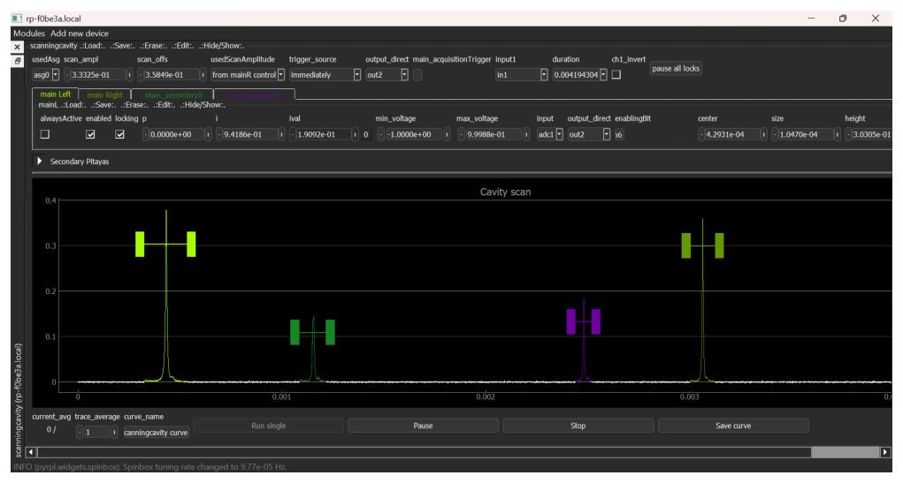 
FIG. 3. Screenshot of the graphical user interface of the newly implemented ScanCavity module in PyRPL. The interface allows to control all parameters of the STCL procedure and to visualize the cavity transmission during the scan. Colored horizontal bars define the range during which each laser is coupled into the cavity: by coupling each beam only within its range, we avoid cross-talks between independent sources and detection of spurious peaks. Each laser is locked to the center of its range, which can be resized and repositioned manually by drag-and-drop, even while the locks are engaged. Each slave laser PID setpoint can also be precisely adjusted through keyboard input.

📷 Fig 4

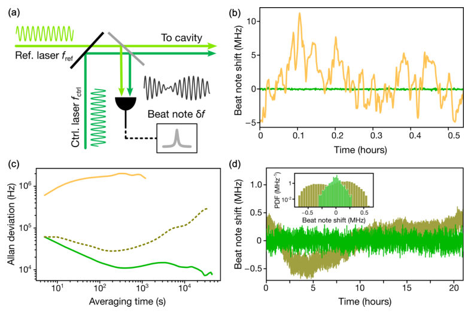 
FIG. 4. Heterodyne measurements between reference and controlled lasers at 556 nm. (a) Sketch of the acquisition setup. The two laser beams are overlapped and interfered at a fast photodetector. (b) Comparison between beat note frequency deviations with the STCL control loop active (green) or inactive (orange). (c) Allan deviation of the acquired beat note frequency with the control loop active including the correction of scan drifts (solid green), excluding correction of the scan drifts (dashed olive) and inactive (solid orange). (d) Comparison between the closed-loop beat note stability over 20 hours with (green) and without (olive) active drift correction. The inset shows histograms of...

📷 Fig 5

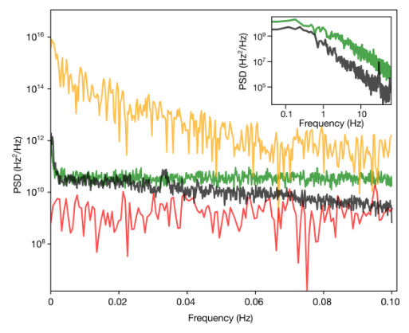 
FIG. 5. Power spectral density (PSD) of the beat note frequency between reference and controlled lasers at 556 nm. Measurements for different settings of the STCL control are displayed: open loop (orange), closed loop with piezo-scanning (green), closed loop with AOM-scanning (red, see Section VI). The system noise floor in the piezo-scanning mode is also shown (black). Inset: a higher-frequency span of the PSD is shown, where the closed-loop piezo-scanning operation is compared to the noise floor across the ≃100 Hz control bandwidth.

**Summary.** The paper details an advanced laser stabilization system using an FPGA-controlled Scanning Transfer Cavity Lock (STCL). By integrating cavity scanning and feedback actuation onto a single, low-latency digital platform, the authors achieved superior stability. The novel use of AOM modulation further boosts bandwidth, providing a highly practical and scalable tool for state-of-the-art cold-atom experiments.

**Why it may be interesting.** This work represents a significant engineering advance in optical metrology for AMO physics. The integration of high-speed, low-latency FPGA control directly addresses practical limitations in scaling complex quantum experiments that rely on precise frequency referencing.

Detailed structure

**Main problem.** The primary challenge addressed is achieving long-term, high-stability laser frequency stabilization for multiple sources simultaneously, while minimizing electronic latency limitations.

**Main result.** The FPGA-controlled system demonstrated sub-MHz absolute frequency stability over several hours across a large spectral range and achieved significantly improved noise rejection by using AOM scanning over traditional piezo actuation.

**Method.** The authors implemented a Scanning Transfer Cavity Lock (STCL) architecture, utilizing an FPGA to perform cavity scanning, peak detection, and feedback control in parallel. They enhanced this by replacing standard piezo scans with fast AOM-assisted frequency modulation for superior bandwidth.

**Model / system.** The system uses a Fabry-Perot optical cavity whose length is scanned while multiple slave lasers are locked to the resonance peaks observed during the scan. The control electronics rely on an FPGA platform (Red Pitaya) running custom firmware, allowing for real-time processing of error signals.

**Key observables.** Sub-MHz absolute frequency stability over hours; normalized peak positions ($N_i$); Allan deviation of the beat note frequency ($\delta f(t)$).

**Important parameters / regimes.** Visible wavelength range ($\sim 150$ nm); long timescales (up to 20 hours); high bandwidth capability exceeding $100$ kHz.

**Assumptions / limitations.** The system assumes that the cavity resonance width is sufficient for accurate peak detection, and environmental drifts (like air pressure) can be measured and compensated for via auxiliary sensors.

**Figures summary.** Figures illustrate the STCL block diagram, the optical setup using AOM strobing, heterodyne beat note measurements comparing AOM vs. piezo scanning modes, and long-term stability plots derived from atomic spectroscopy.

**Paper structure.** The paper details the theoretical basis of STCL, presents the FPGA implementation overcoming latency limits, validates performance through both heterodyne measurements (short/medium term) and atomic spectroscopy (long term), and concludes by highlighting the modularity and scalability of the AOM-enhanced architecture.

Abstract

We present an FPGA-based implementation of a scanning transfer cavity lock (STCL) for laser frequency stabilization, allowing for the simultaneous stabilization of multiple laser sources with respect to a single reference laser by means of a continuously scanned Fabry-Perot cavity. By exploiting the FPGA architecture to simultaneously perform cavity scanning, peak detection, and feedback actuation, we minimize latency and allow independent control loops for several lasers within a single device, offering direct scalability. The system performance is analyzed through heterodyne measurements from short ($<1\,$s) to long ($\sim20\,$hours) timescales. The end-to-end locking performance is validated through atomic spectroscopy of ytterbium atoms in a magneto-optical trap, demonstrating sub-MHz absolute frequency stability over several hours for the stability transfer across $\sim 150\,$nm in the visible-wavelength range. Importantly, we demonstrate a novel fast-scanning approach based on acousto-optic modulator (AOM) frequency modulation, enabled by the low detection latency of our FPGA implementation. This increases significantly the effective locking bandwidth and reduces the intrinsic noise of the system with respect to standard piezo-actuated scanning of the cavity length, allowing to reach sub-$100\,$kHz long-term stability and offering perspectives for laser-line narrowing. Owing to its modularity, low cost and ease of implementation within the open-source PyRPL firmware package for the STEMlab Red Pitaya platform, our architecture offers a compact and flexible alternative to existing STCL and locked-cavity implementations, providing a practical approach to the operation of a state-of-the-art cold-atom experiment without relying on any atomic references for laser stabilization.

[↑ back to top](#top)

### [The dynamic 4.8.8 Floquet code](http://arxiv.org/abs/2606.09678v1)

**Authors:** Aliki A. Capatos  
**Type:** theory · **Category:** quantum information and computing · **PDF:** <https://arxiv.org/pdf/2606.09678v1>  
**Analysis basis:** full PDF text, analyzed in chunks
**Topic relevance:** `non-equilibrium dynamics` **3/5** · `driven-dissipative phase transition` **1/5** · `methods for driven-dissipative` **1/5** · `non-equilibrium universality` **1/5**

📷 Fig 1

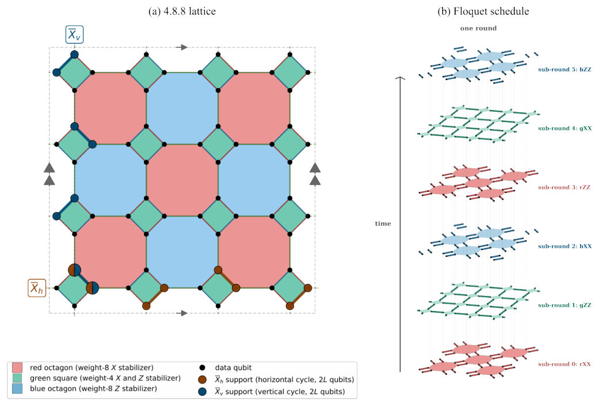 
FIG. 1. (a): Part of the static 4.8.8 lattice on a torus. The data qubits (black dots) sit at the vertices of a {4, 8, 8} tiling of the torus. Faces are 3-coloured – red and blue octagons with green squares filling the gaps. Red/blue octagons support weight-8 plaquette stabilisers and green squares support weight-4 plaquette stabilisers. In the Floquet version of the code, the X/Z flavour is set dynamically by the schedule. The two non-contractible cycles Xh (horizontal) and Xv (vertical) are the two independent X-type logical operators. The corresponding Z-type logicals have the same support by CSS symmetry, giving k = 2 logical qubits encoded in n = 4L2 data qubits. The logicals shown...

📷 Fig 2

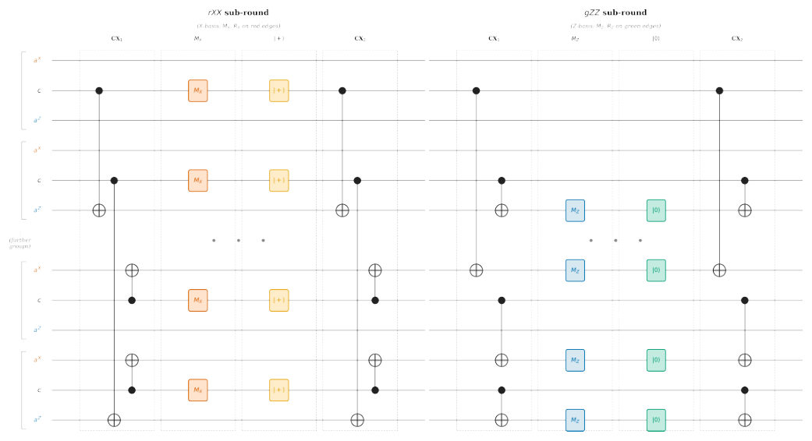 
FIG. 2. Two consecutive sub-rounds of the reset dynamic 4.8.8 Floquet circuit. Both sub-rounds use the same 4-TICK CX −M −R −CX gadget, differing only in the basis. The left half (rXX) measures XX checks on every red edge, in the X basis. The right half (gZZ) measures ZZ checks on every green edge, in the Z basis. Because the data graph is bipartite and the two-colouring alternates which class is contracted, the measured (contracted) qubit changes between sub-rounds. In the rXX half, the central qubit c is measured with its red-edge neighbour aX as partner, while in the gZZ half, the green-edge neighbour aZ is measured with c now acting as its partner. Each three-wire group thus shows one...

📷 Fig 3

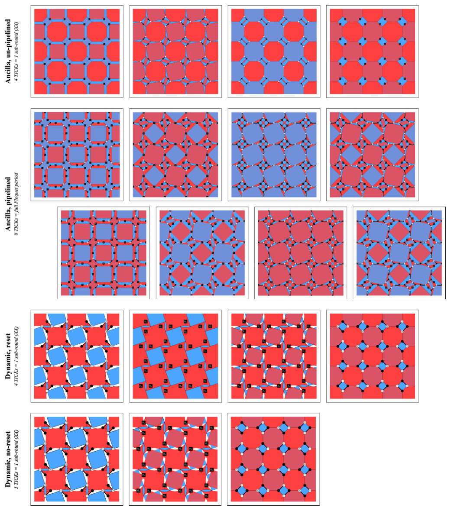 
FIG. 3. One rXX sub-round (or, for the pipelined ancilla-based circuit, one full Floquet period) of each variant’s circuit of a part of the 4.8.8 lattice, showing the evolving stabiliser support. Each panel is one TICK. Stabilisers are coloured polygons, with blue for Z and red for X. For a full period, the un-pipelined ancilla-based and reset dynamic variants go through 24 TICKs total, the no-reset dynamic 18, and the pipelined ancilla-based variant only 8. For the full period of each variant, see here. Row 1 (ancilla-based, un-pipelined): one XX check measurement in four TICKs – R on the ancillas, CX1, CX2, M on the ancillas. Row 2 (ancilla-based, pipelined): one full Floquet period in 8...

📷 Fig 4

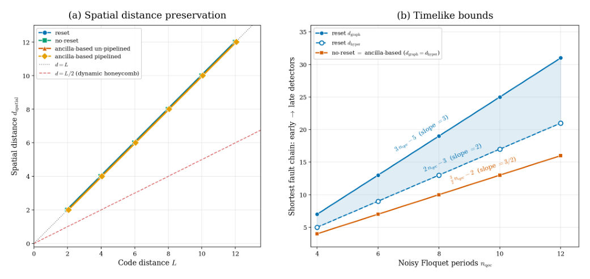 
FIG. 4. (a): Spatial distance dspatial versus L for the four 4.8.8 variants. nwarmup = ntail = 2 and nqec = L. (b): Timelike- distance bounds for the four variants. The slope of this chain length versus nqec gives dt/nqec, the timelike distance per Floquet period [11]; one 4.8.8 period contains six sub-rounds. Filled markers and solid lines show dgraph, which ignores hyperedges and gives an upper bound on dt. The x-axis starts at 4 because fewer rounds introduce boundary effects.

📷 Fig 5

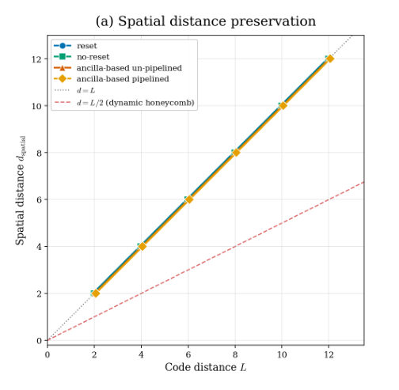 
Figure 4(a) shows dspatial vs L for each variant. L is the linear size of the torus, where the code is de- fined on an L × L grid of square-octagon unit cells, giving n = 4L2 data qubits and k = 2 logical qubits. The distance d is the circuit-level distance, the small- est number of circuit errors that together cause an un- detected logical error. I confirm dspatial = L for all four variants using two independent methods on the noisy circuit. First, after dropping the non-local detec- tors (Appendix G), Stim’s shortest graphlike error returns the minimum-weight graphlike logical fault directly. I confirm this on both independent non-contractible X-cycles (horizontal and vertical). Second,...

**Summary.** This paper rigorously compares four different circuit implementations for syndrome extraction in the 4.8.8 Floquet code to improve fault tolerance. By analyzing thresholds, distance preservation, and resource overheads, the authors demonstrate that dynamic circuits offer significant advantages over traditional ancilla-based methods. The 'no-reset' dynamic variant emerges as superior by maximizing error thresholds while maintaining desirable physical properties.

**Why it may be interesting.** This work directly addresses hardware-level constraints in quantum computation by optimizing circuit depth and connectivity for topological codes, which is crucial for scaling up quantum processors.

Detailed structure

**Main problem.** The research aims to optimize fault-tolerant quantum memory by designing superior syndrome extraction circuits for Floquet codes.

**Main result.** Dynamic syndrome extraction methods, particularly the 'no-reset' variant, significantly improve error thresholds and reduce resource overhead compared to standard ancilla-based circuits without sacrificing code distance.

**Method.** The authors compare four circuit implementations (ancilla-based vs. dynamic with/without reset) by simulating performance under depolarizing noise using techniques like Minimum-Weight Perfect-Matching decoding.

**Model / system.** The study focuses on the 4.8.8 honeycomb Floquet code, which encodes two logical qubits on a torus lattice geometry ($L 	imes L$). The analysis involves comparing circuit-level metrics across different scheduling schemes.

**Key observables.** Error threshold (per-round), spatial distance ($d_{	ext{spatial}}$), timelike distance ($rac{dt}{n_{	ext{qec}}}$), and spacetime volume ($V$).

**Important parameters / regimes.** The linear size of the torus ($L$), physical error rate ($p$), and target logical error rates (e.g., $10^{-12}$).

**Assumptions / limitations.** The analysis assumes nearest-neighbor measurements are sufficient, and specific hardware timing models are used for resource overhead comparisons.

**Figures summary.** Figures illustrate the lattice structure, dynamic scheduling over sub-rounds, and comparative plots showing thresholds vs. error rates, as well as distance bounds ($	ext{dgraph}$ vs $	ext{dhyper}$) for different circuit variants.

**Paper structure.** The paper systematically compares four syndrome extraction circuits (ancilla/pipelined vs. dynamic/reset) by first establishing the theoretical framework, then benchmarking performance metrics like threshold and distance, and finally comparing resource overheads using spacetime volume calculations.

Abstract

Fault-tolerant quantum memories depend on the syndrome extraction circuit as much as on the underlying code. Ancilla-free or dynamic circuits are an effective way to improve this circuit layer. For the 6.6.6 honeycomb Floquet code, making the circuit dynamic raises the threshold and lowers the qubit overhead, but at the cost of halving the spatial code distance. A dynamic construction for the 4.8.8 lattice layout was conjectured to preserve full distance. I confirm this and give a dynamic measurement circuit for the CSS 4.8.8 Floquet code. To benchmark it, I construct and compare four circuit-level implementations on a torus, including two dynamic variants (with and without mid-circuit resets), the standard ancilla-based circuit, and a pipelined ancilla-based circuit. Under circuit-level depolarising noise, the reset dynamic circuit reaches a per-round threshold of $0.463\%$ $(0.490\%)$ with MWPM (BP+matching), while the no-reset variant reaches the highest threshold of all four circuits at $0.512\%$ $(0.574\%)$. The standard ancilla-based circuit only achieves $0.228\%$ $(0.240\%)$, but the pipelined schedule reaches $0.478\%$ $(0.489\%)$. The reset dynamic circuit also has a faster-growing timelike distance, with $2\le d_t/n_{\mathrm{qec}}\le 3$ asymptotically against a tight $3/2$ for the other three, and running it for fewer rounds gives the smallest spacetime volume in the fast-reset regime, while the no-reset variant is smallest in the slow-reset regime. The 4.8.8 dynamic circuits therefore see the expected threshold gain and overhead reduction without the spatial-distance cost, demonstrating the advantage of dynamic syndrome extraction in Floquet codes.

[↑ back to top](#top)

### [Algebraic Kolmogorov--Arnold representation theorem for quantum measurement](http://arxiv.org/abs/2606.09584v1)

**Authors:** Sviatoslav V. Dzhenzher  
**Type:** theory · **Category:** quantum information and computing · **PDF:** <https://arxiv.org/pdf/2606.09584v1>  
**Analysis basis:** full PDF text, analyzed in chunks
**Topic relevance:** `quantum measurements` **3/5** · `entanglement & information structure` **1/5** · `measurement-induced transitions` **1/5**

📷 Fig 1

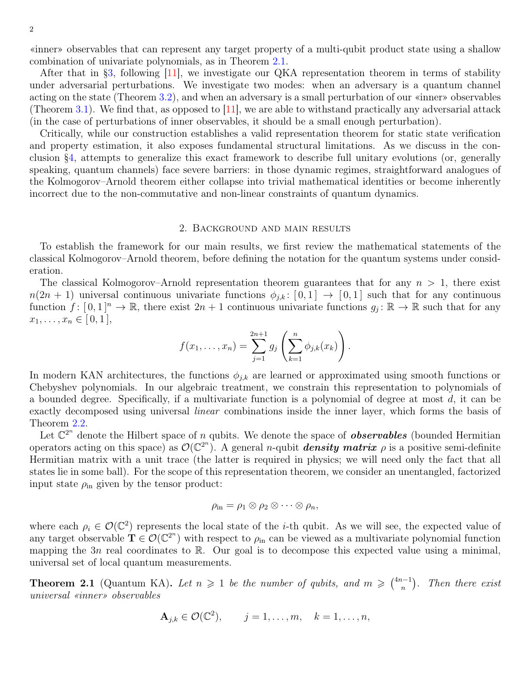 
Low-resolution page preview, page 2

📷 Fig 2

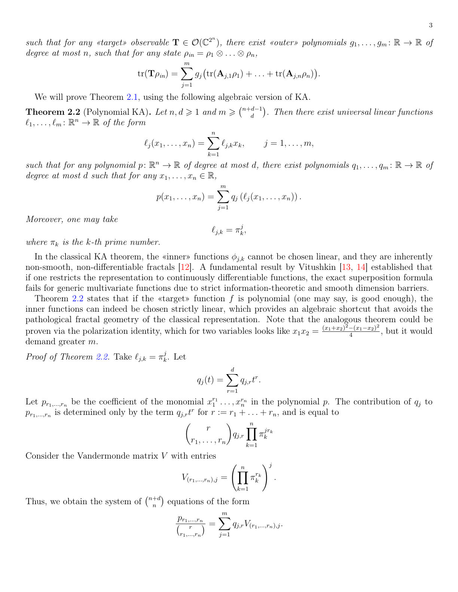 
Low-resolution page preview, page 3

📷 Fig 3

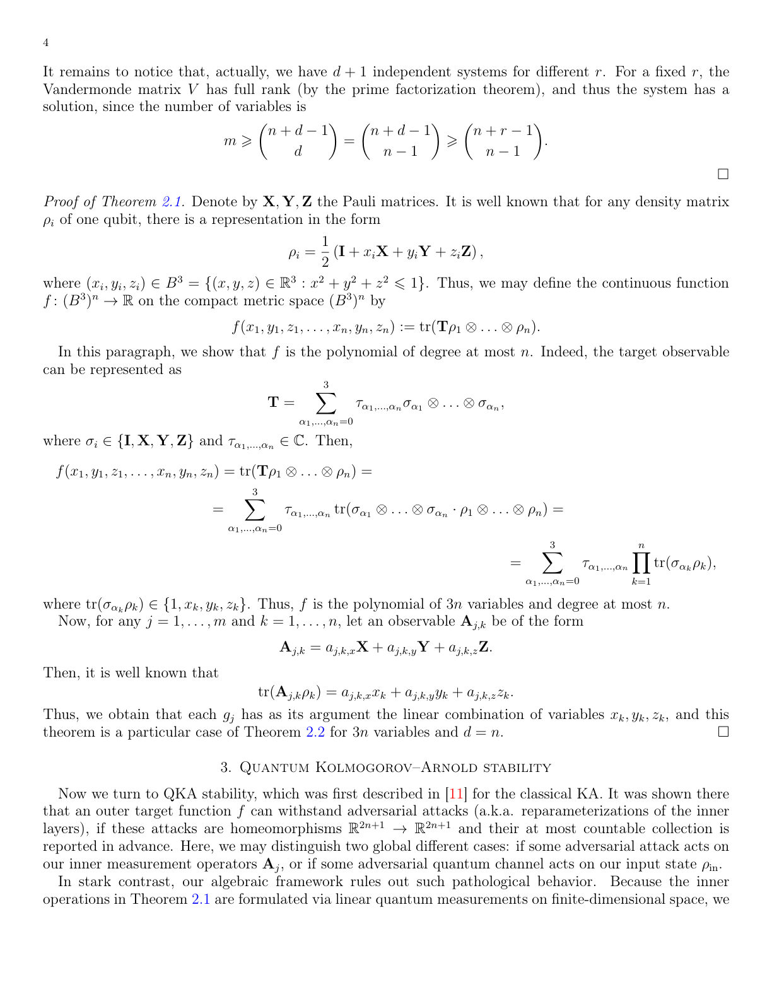 
Low-resolution page preview, page 4

📷 Fig 4

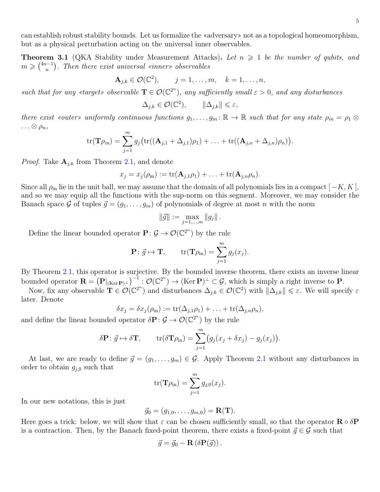 
Low-resolution page preview, page 5

📷 Fig 5

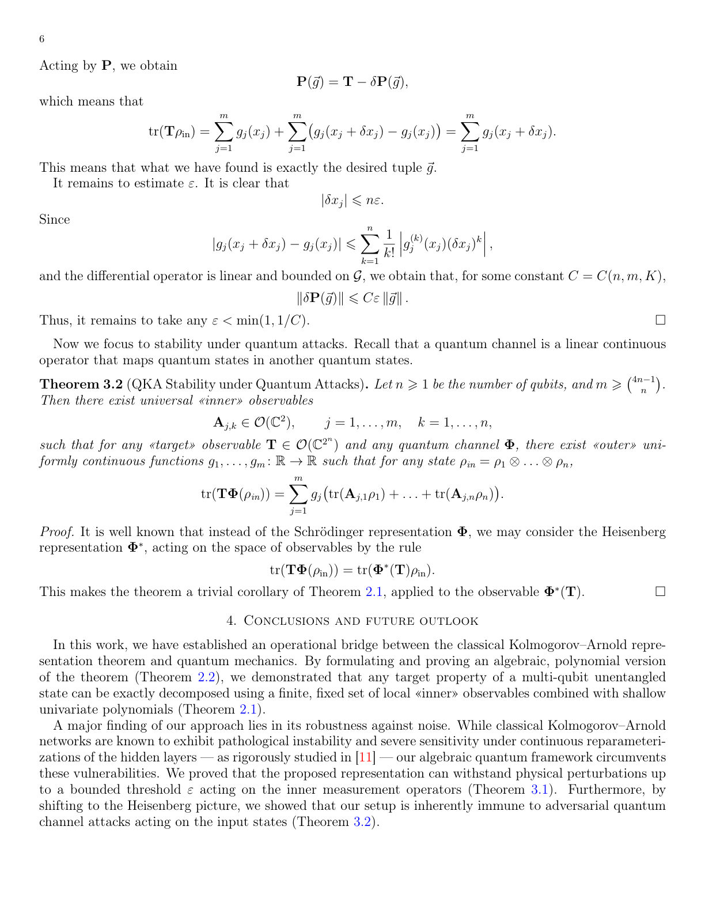 
Low-resolution page preview, page 6

**Summary.** The paper develops the Quantum Kolmogorov–Arnold (QKA) representation theorem, showing that measuring properties of unentangled multi-qubit states can be reduced to a sum involving local measurements and univariate polynomials. Crucially, this algebraic framework is proven to be stable against both physical noise and adversarial quantum attacks.

**Why it may be interesting.** This work provides a powerful mathematical tool for characterizing complex expectation values in simple product states, offering insights into how classical decomposition theorems can be rigorously adapted to quantum measurement theory while maintaining stability guarantees.

Detailed structure

**Main problem.** The paper establishes an operational framework connecting the classical Kolmogorov–Arnold (KA) representation theorem to quantum information theory by formulating a Quantum Kolmogorov–Arnold (QKA) representation for expectation values of observables.

**Main result.** It proves that the expected value of a general observable on unentangled multi-qubit product states can be exactly decomposed using a finite set of local inner observables and shallow univariate polynomials, exhibiting stability against perturbations and quantum attacks.

**Method.** The method adapts the polynomial version of the classical KA theorem to the trace structure $	ext{tr}(T
ho_{	ext{in}})$, utilizing algebraic techniques to ensure a fixed, bounded representation size.

**Model / system.** The system analyzed is an unentangled multi-qubit product state ($
ho_{	ext{in}} = igotimes_{i=1}^n 
ho_i$) acting on $n$ qubits. The target property is the expectation value of a general observable $T \in O(\mathbb{C}^{2^n})$.

**Key observables.** The expected value $	ext{tr}(T
ho_{	ext{in}})$, local inner observables $A_{j,k}$, and outer univariate polynomials $g_j$.

**Important parameters / regimes.** Number of qubits ($n$), number of required inner observables ($m \ge \lceil 4n-1 
ceil$), and the perturbation bound $\epsilon$ for stability analysis.

**Assumptions / limitations.** The primary results critically assume that the input state $
ho_{	ext{in}}$ is a product state (unentangled). Generalization to entangled states or full unitary dynamics faces severe mathematical barriers.

**Figures summary.** Not specified in the notes, but the structure implies theorems demonstrating the decomposition and stability proofs.

**Paper structure.** The paper first reviews the classical KA theorem for polynomials, then introduces Theorem 2.1 (QKA) for static state properties $	ext{tr}(T
ho_{	ext{in}})$, followed by analyses of its robustness: Theorem 3.1 proves stability under physical perturbations, and Theorem 3.2 extends this immunity to adversarial quantum channel attacks via the Heisenberg picture.

Abstract

We establish an operational framework connecting the classical Kolmogorov--Arnold (KA) representation theorem to quantum information theory. By introducing and proving an algebraic, bounded-degree polynomial version of the theorem, we demonstrate that any target physical property of an unentangled multi-qubit product state can be exactly decomposed using a finite, fixed set of local <<inner>> observables and a shallow architecture of univariate polynomials.   We further analyze the stability of this Quantum Kolmogorov--Arnold (QKA) representation under adversarial perturbations. In stark contrast to the pathological instabilities and severe reparameterization sensitivities inherent to the classical Kolmogorov--Arnold representation theorem, our algebraic quantum framework exhibits remarkable resilience. We prove that the representation remains stable against bounded physical perturbations acting on the inner measurement operators, and show via the Heisenberg picture that it is inherently immune to adversarial quantum channel attacks acting on the input states.

[↑ back to top](#top)

### [Local electronic structure and dynamics of hydrogen in $\text{CeO}_2$](http://arxiv.org/abs/2606.08915v1)

**Authors:** A. Koda, T. U. Ito, M. Hiraishi, H. Okabe, R. Kadono  
**Type:** both · **Category:** strongly correlated electrons · **PDF:** <https://arxiv.org/pdf/2606.08915v1>  
**Analysis basis:** full PDF text, analyzed in chunks
**Topic relevance:** `Kondo & dissipative impurity` **3/5** · `Keldysh / 2PI / non-Gaussian methods` **1/5** · `methods for driven-dissipative` **1/5**

📷 Fig 1

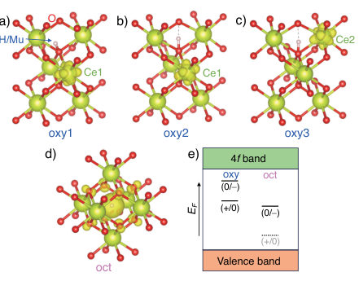 
FIG. 1. (a)–(d) Electronic structures of interstitial H in CeO2 pre- dicted by DFT calculations: H is bonded to O with an unpaired f electron located at (a), (b) Ce1 site, or (c) Ce2 site. The H-O-Ce1 an- gle in (a) is ≈180◦(oxy1). The O-H-O angle (connected by dashed lines) is (b) ≈168◦(oxy2) and (c) ≈175◦(oxy3). (d) Atom-like H is located at the Ce-cornered octahedral (oct) site. (e) Schematics of the electronic levels associated with H in the energy band diagram (after Ref.[9]), where the E(+/0) level for the oct configuration is in- accessible due to the instability of the H+ state.

📷 Fig 2

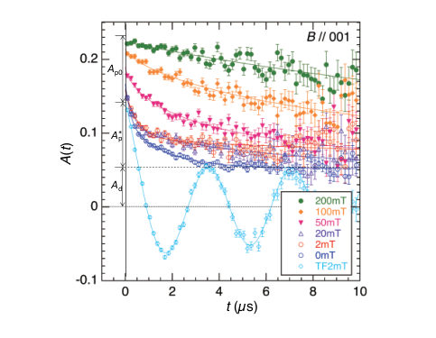 
FIG. 2. µSR time spectra observed at 8.8 K under various external magnetic fields. The spectrum under TF (= 2 mT) represents sig- nals from the diamagnetic Mu∗state with the partial asymmetry A∗p and the non-relaxing diamagnetic Mu signal(s) with Ad (including background), whereas those under LF (= 0 to 300 mT) involve the signal from Mu0 state whose partial asymmetry Ap(B) varies with LF (where Ap0 is the maximum value for B →∞).

📷 Fig 3

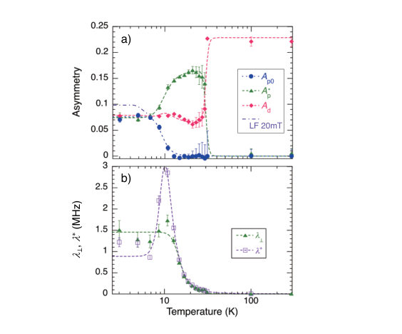 
FIG. 3. Temperature dependence of (a) the partial asymmetry Ap0 (quasi-static Mu0), A∗p (Mu∗), and diamagnetic Mu, where the dot- dashed curve shows the behavior of Ap at LF = 20 mT. (b) The re- laxation rate of the A∗p component under TF = 2 mT (λ⊥) and LF = 20 mT (λ ∗) versus temperature. (See the main text for the dashed curves.)

📷 Fig 4

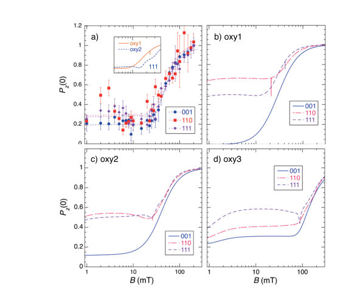 
FIG. 4. (a) LF dependence of the initial polarization Pz(0) observed for LF parallel with the crystal axis ⟨001⟩, ⟨110⟩, and ⟨111⟩(see text for the dashed curves). The calculated LF dependence of Pz(0) for the corresponding three directions assuming the local structures shown in Fig. 1(a)-(c) with a free 1µB spin placed at each Ce site. Inset: comparison of Pz(0) with B ∥⟨111⟩between oxy1 and oxy2 over a field range of 4–40 mT around the inflection.

📷 Fig 5

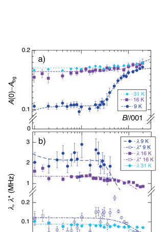 
FIG. 5. LF dependence of (a) the initial asymmetry A(0) and (b) relaxation rate observed for LF parallel with the crystal axis ⟨001⟩. Dashed/dot-dashed curves are results of curve fits assuming the con- version process from quasi-static Mu0 oxy2 to dynamical Mu∗oct states described by Eqs. (4) and (5) (see text for detail).

**Summary.** This work uses muon spin relaxation ($\mu	ext{SR}$) combined with DFT to characterize how hydrogen interacts electronically within ceria. It identifies two key electronic states—a polaron state and an atomic-like state—whose coexistence and transition are highly dependent on temperature. The findings illuminate the complex charge dynamics involving localized $4f$ electrons in correlated oxide materials.

**Why it may be interesting.** The interplay between localized $4f$ electrons (a hallmark of strongly correlated systems) and an interstitial impurity ($	ext{H}/\mu^+$) provides a direct experimental probe into charge localization, polaron formation, and defect physics in oxides.

Detailed structure

**Main problem.** The study investigates the local electronic structure and dynamics of hydrogen (H) implanted into ceria ($	ext{CeO}_2$), aiming to understand its charge state and interaction with localized $4f$ electrons.

**Main result.** The muon spin relaxation data suggest the existence of two distinct states, a polaron-like $	ext{Mu}^0_{	ext{oxy}2}$ state and an atom-like $	ext{Mu}^*_{	ext{oct}}$ state, whose transition is temperature-dependent.

**Method.** The research combines Muon Spin Rotation/Relaxation ($\mu	ext{SR}$) measurements with first-principles Density Functional Theory ($	ext{DFT}$) calculations to model the electronic states.

**Model / system.** The system is interstitial hydrogen in single-crystalline ceria. The analysis models charge transfer between H and localized $4f$ electrons on Ce sites, leading to polaron formation or other defect configurations.

**Key observables.** Muon spin relaxation rate ($\lambda$), partial asymmetry ($A_p$), initial polarization ($P_z(0)$), and temperature dependence of these signals.

**Important parameters / regimes.** Low temperatures ($\approx 10 	ext{ K}$ to $30 	ext{ K}$), magnetic field strength, and the formation energy difference between proposed electronic states.

**Assumptions / limitations.** The analysis assumes that $\mu	ext{SR}$ signals can be mapped onto specific electronic configurations predicted by DFT, although discrepancies suggest approximations like treating $4f$ electrons as free spins are insufficient.

**Figures summary.** Figures show $\mu	ext{SR}$ time spectra under varying magnetic fields and crystal orientations; temperature dependence plots illustrate the transition between paramagnetic ($\mu^0$) and diamagnetic ($\mu^*$) states, fitted using conversion models.

**Paper structure.** The paper progresses by first presenting low-temperature $\mu	ext{SR}$ data showing two muon states. It then uses DFT to propose polaron/atomic structures. Subsequent analysis focuses on fitting the temperature and field dependence of the relaxation rates to confirm a dynamic transition between these proposed electronic states.

Abstract

The local electronic states of muon (Mu) as an isotope of hydrogen (H) in high-quality single-crystalline ceria (CeO$_2$) are investigated using muon spin rotation/relaxation ($μ\text{SR}$) and first-principles density functional theory (DFT) calculations. Upon positive muon implantation, both paramagnetic (Mu$^0$) and diamagnetic (Mu$^*$) states are observed below $\approx$10 K. Magnetic field dependence of the Mu$^0$ signals combined with DFT results provides evidence for the formation of a polaron state, consisting of Mu bonded to a ligand oxygen and a $4f$ electron localized on a nearby Ce site. The crystal-orientation dependence of the Mu$^0$ signal suggests strong anisotropy of the $4f$ electron due to the spin-orbit coupling with lifted degeneracy. Furthermore, the Mu$^0$ state exhibits transition to the Mu$^*$ state that corresponds to another Mu$^0$ state (exhibiting a diamagnetic response due to fast spin/charge fluctuations) at temperatures above $\approx$10 K, before disappearing above $\approx$30 K. These findings suggest rapid diffusive motion of the $4f$ electrons and/or Mu (as well as H) at higher temperatures.

[↑ back to top](#top)

### [Strong-field control of the $Z$-boson resonance in $e^+e^-$ collisions](http://arxiv.org/abs/2606.09394v1)

**Authors:** Fengye Chen, Qingzheng Lv, Libin Fu  
**Type:** theory · **Category:** other · **PDF:** <https://arxiv.org/pdf/2606.09394v1>  
**Analysis basis:** full PDF text, analyzed in chunks
**Topic relevance:** `Keldysh / 2PI / non-Gaussian methods` **3/5** · `methods for driven-dissipative` **1/5** · `non-equilibrium dynamics` **1/5**

📷 Fig 1

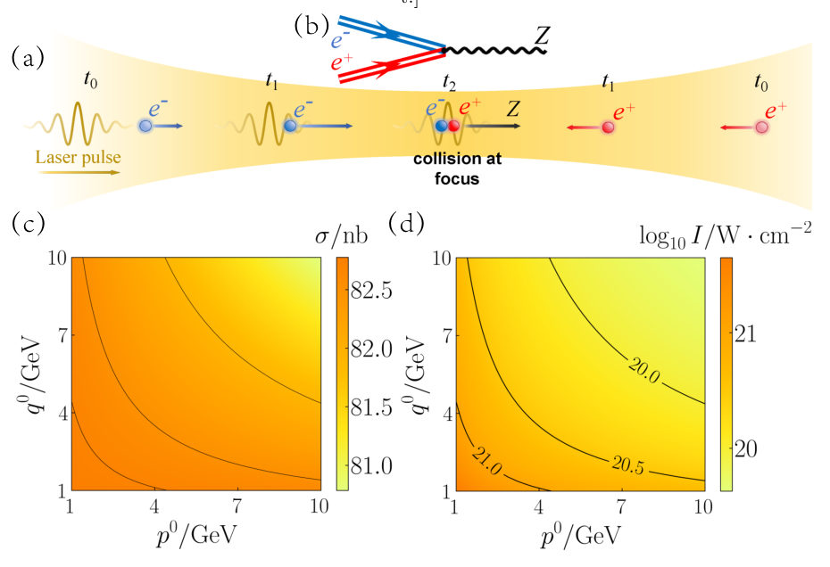 
FIG. 1. (a) Schematic of the proposed e+e−collision geometry in a strong laser field. The labels t0, t1, and t2 denote the initial state, the laser-induced dressing and acceleration of the electron, and the collision at the laser focus, respectively. The positron propagates with nearly constant energy before the collision [25]. (b) Feynman diagram for the dominant laser-assisted channel for resonant Z-boson production. Double solid lines denote laser-dressed (Volkov) electron and positron states. (c) Threshold laser intensity required to reach √s = 91.2 GeV as a function of the initial lepton energies. (d) Corresponding Z-boson production cross section for the parameters in (c). Contours...

📷 Fig 2

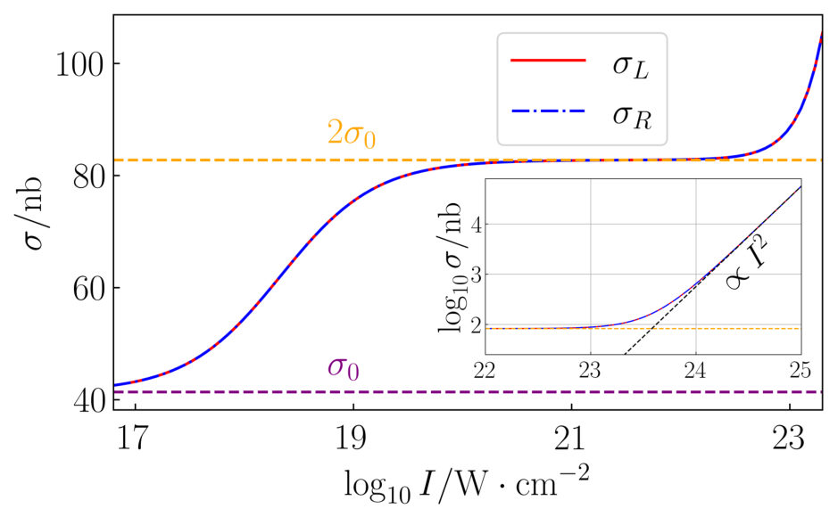 
FIG. 2. Z-boson production cross section for equal initial lepton energies (p0 = q0) as a function of laser intensity. The results for left- and right-handed circular polarization overlap. For comparison, the field-free cross section is σ0 = 41.2 nb [27], recovered from Eq. (7) in the limit a0 →0.

📷 Fig 3

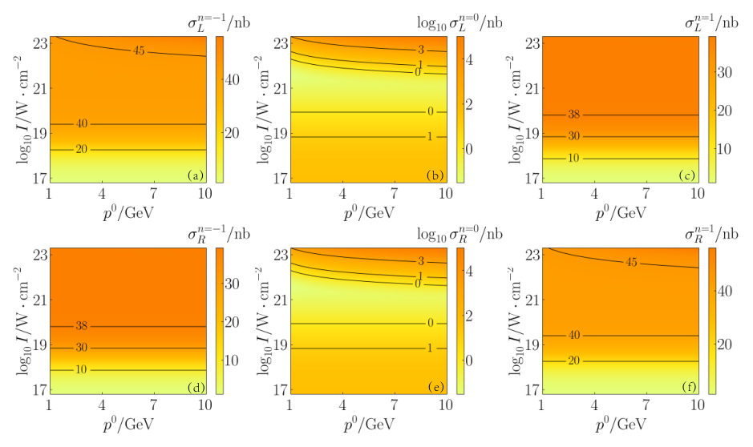 
FIG. 3. Channel-resolved contributions to the total cross section as functions of the initial electron energy and laser intensity. Panels (a)–(c) correspond to a left-handed circularly polarized laser field, and panels (d)–(f) to the right-handed case. The labels n = {0, ±1} denote the corresponding laser- photon exchange channels. The initial positron energy is chosen according to Eq. (2).

📷 Fig 4

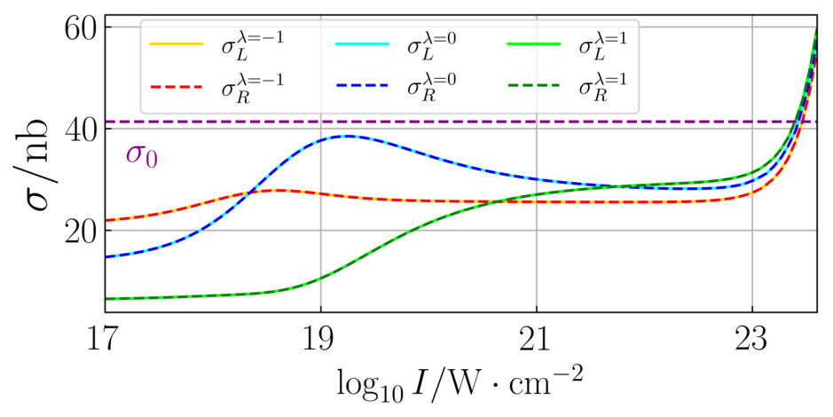 
FIG. 4. Cross sections for the different polarization states of the produced Z boson (λ = −1, 0, 1) as functions of laser intensity. The initial lepton energies are taken to be equal, p0 = q0, according to Fig. 1(c).

📷 Fig 5

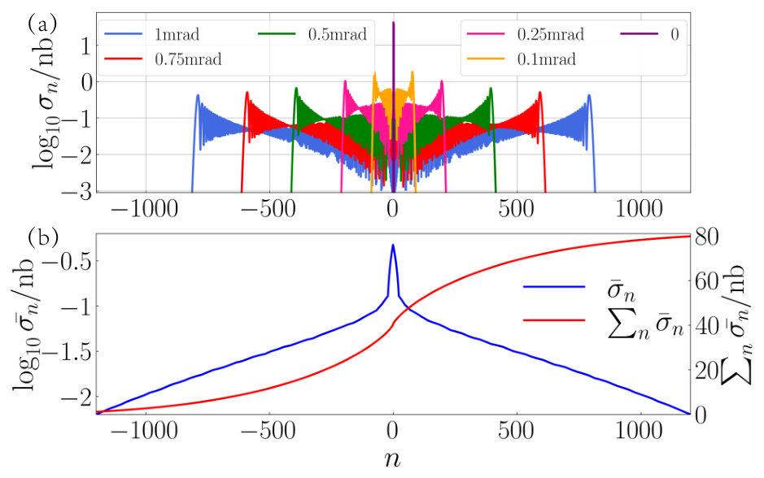 
FIG. 5. (a) Channel-resolved cross sections for positron with incidence angle deviation ∆θ+ = 0, 0.1, 0.25, 0.5, 0.75, and 1 mrad, which simulate the scattering behavior of beam components with angular dispersion. (b) Channel-resolved cross section ¯σn and cumulative cross section P n ¯σn for a representative beam with with angular dispersion of 1 mrad, obtained from Monte Carlo simulations. These two curves are respectively applicable to the coordinate axes on the left and right sides and the latter one is the cumulative sum of the former.

**Summary.** The paper demonstrates that intense laser fields fundamentally alter the process of Z-boson production in $e^+e^-$ collisions. By treating the field nonperturbatively, the authors predict that the resonance cross section will exhibit a characteristic evolution: saturating at intermediate intensities and growing quadratically at high intensities. This control mechanism also allows for the dynamic compensation of electroweak chiral asymmetries.

**Why it may be interesting.** This work bridges strong-field QED with high-energy collider physics by showing how external fields can act as a dynamic knob to control fundamental particle interactions, analogous to controlling resonance widths or cross sections in vacuum.

Detailed structure

**Main problem.** To investigate how intense, non-perturbative laser fields can dynamically control electroweak resonance phenomena, specifically the Z-boson production cross section in $e^+e^-$ collisions.

**Main result.** The Z-resonance profile develops distinct intensity-dependent regimes: from vacuum behavior to saturation ($\approx 2\sigma_0$), and finally to an approximately quadratic enhancement at very high intensities. Furthermore, the laser field can compensate intrinsic chiral asymmetry, leading to nearly parity-balanced production.

**Method.** The analysis uses strong-field Quantum Electrodynamics (QED) concepts, treating incoming leptons as Volkov states and calculating the cross section by decomposing the transition amplitude into photon-number channels ($n$).

**Model / system.** The system is $e^+e^-$ annihilation occurring within an intense classical laser background field. The theory incorporates nonperturbative dressing effects on the incoming fermions, modifying the effective center-of-mass energy ($\sqrt{s}$) and opening multiphoton exchange channels.

**Key observables.** Z-resonance profile, total cross section ($\sigma$), polarization composition of produced Z bosons, and the effective collision kinematics ($\sqrt{s}$).

**Important parameters / regimes.** Laser intensity ($I$ or $a_0$), vacuum cross section ($\sigma_0$), and the degree of laser dressing (photon number $n$).

**Assumptions / limitations.** The plane-wave approximation is used, and in some analyses, ultrarelativistic limits ($p_0 \gg m_e$) are employed. The effect of Z decay width modification is assumed negligible.

**Figures summary.** Figures illustrate the total cross section evolution vs. laser intensity (showing vacuum $	o$ saturation $	o$ quadratic growth), channel-resolved contributions to $\sigma$, and polarization composition shifts with increasing field strength.

**Paper structure.** The paper systematically analyzes the process by first establishing the theoretical framework using Volkov states, then calculating the cross section across different intensity regimes (weak, intermediate/saturation, high nonlinear), and finally detailing the consequences for polarization and kinematic reach.

Abstract

Resonant $Z$-boson production is a cornerstone of precision electroweak physics, with its vacuum line shape set by the $Z$ mass, width, and collision kinematics. We show that a strong laser field can significantly alter this picture. By treating the field nonperturbatively, we find that laser dressing of the incoming fermions alters the effective collision kinematics and opens laser-photon exchange channels, including multiphoton processes, in $e^{+}e^{-}$ collisions. As a result, the $Z$-resonance profile develops distinct intensity-dependent regimes, evolving from the vacuum limit to saturation at intermediate field strengths and to an approximately quadratic enhancement at higher intensities. Additionally, the polarization composition of the produced $Z$ bosons is redistributed. In particular, at high intensities the laser-induced contribution can compensate the intrinsic chiral asymmetry of the electroweak interaction, leading to nearly parity-balanced $Z$-boson production. Our results identify that strong classical fields can dynamically control electroweak resonance phenomena, opening a bridge between strong-field QED and high-energy collider physics.

[↑ back to top](#top)

### [Agentic multi-fidelity learning of quasiparticle and excitonic properties](http://arxiv.org/abs/2606.07836v1)

**Authors:** Arnab Neogi, Aaron Forde, Christopher A. Lane, Sergei Tretiak, Jian-Xin Zhu  
**Type:** theory · **Category:** numerical methods · **PDF:** <https://arxiv.org/pdf/2606.07836v1>  
**Analysis basis:** full PDF text, analyzed in chunks
**Topic relevance:** `methods for driven-dissipative` **3/5** · `Keldysh / 2PI / non-Gaussian methods` **1/5**

📷 Fig 1

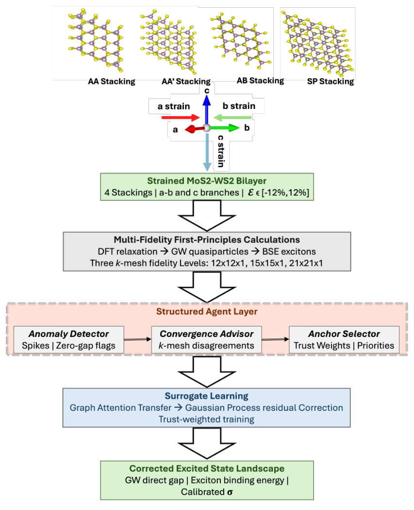 
FIG. 1. Agent-guided workflow for corrected strain-dependent GW-BSE properties. Schematic overview of the closed-loop workflow used to construct corrected excited-state data for strained MoS2-WS2 bilayers. The input design space consists of four stacking registries and two strain branches over ϵ ∈[−12%, 12%]. For each configuration, multi-fidelity first- principles calculations are performed through DFT relaxation, GW quasiparticle calculations, and BSE exciton calculations using three k-mesh fidelities, 12 × 12 × 1, 15 × 15 × 1, and 21 × 21 × 1. A structured agent layer then evaluates the resulting dataset through anomaly detection, convergence assessment, and anchor selection. Spike-like...

📷 Fig 2

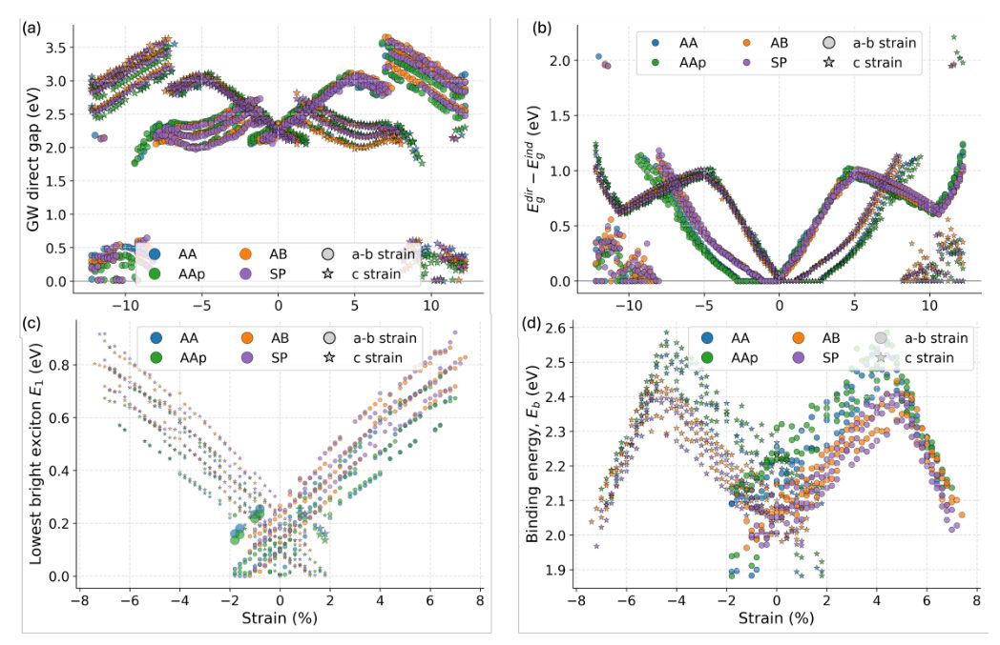 
FIG. 2. Raw multi-fidelity excited-state landscapes across strain. Strain-dependent excited-state observables for the MoS2-WS2 bilayer dataset across stacking registries, strain branches, and reciprocal-space samplings. (a) GW direct bandgap. (b) Direct exciton binding energy, defined from the difference between the GW direct gap and the direct optical excitation energy. (c) Lowest-exciton binding energy, Eb. (d) Lowest bright exciton energy, E1. Across broad regions of the strained design space, the raw landscapes evolve smoothly and reflect the expected sensitivity of band alignment, dielectric screening, and excitonic response to deformation. Selected stacking-strain environments,...

📷 Fig 3

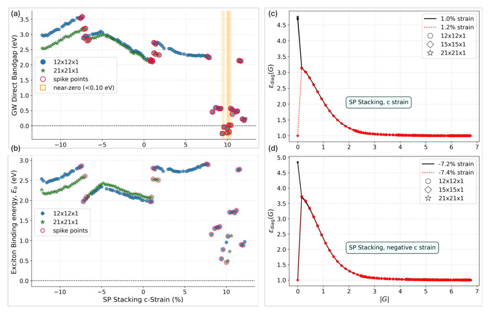 
FIG. 3. Representative anomaly-prone regime and its dielectric-screening origin. (a) GW direct bandgap as a function of strain for SP stacking under the c-strain branch, comparing coarse and refined reciprocal-space samplings. Highlighted points identify localized spike anomalies and near-zero-gap configurations. (b) Corresponding exciton binding energy along the same structural branch, showing that the anomalous behavior appears simultaneously in quasiparticle and excitonic observables. (c,d) Diagonal microscopic dielectric screening, ϵdiag(G), for representative positive and negative c- strain configurations in the same anomaly-prone environment. The strong mesh sensitivity in the...

📷 Fig 4

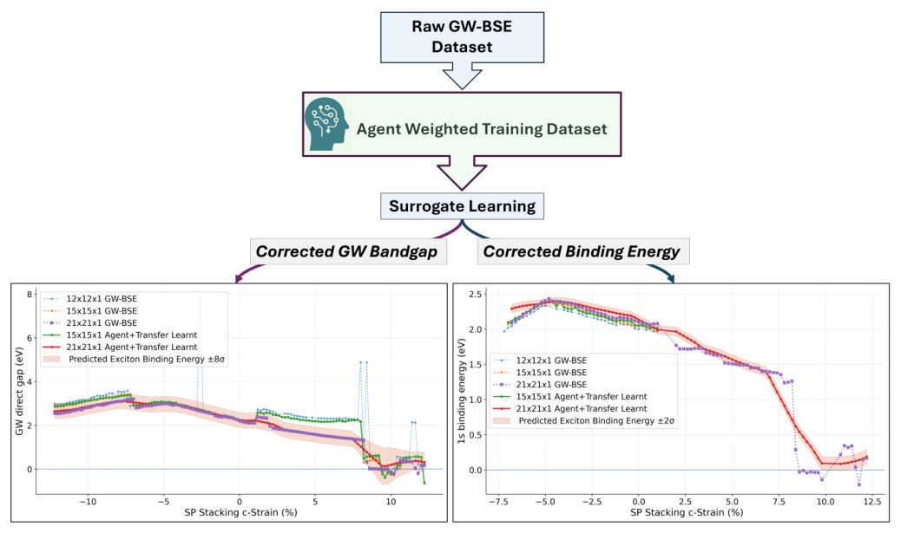 
FIG. 4. Closed-loop reconstruction of corrected excited-state trajectories. Representative corrected one-dimensional reconstructions obtained after agent-guided triage, graph-based transfer learning, and Gaussian-process residual correction. The available multi-fidelity first-principles data are shown together with the final corrected trajectories and predictive uncertainty bands. The examples include corrected GW direct bandgap and corrected exciton binding energy along the SP c-strain branch, an environment that contains localized numerical excursions in the raw coarse-fidelity data. The corrected trajectories suppress isolated artifacts inherited from anomaly-prone inputs while...

📷 Fig 5

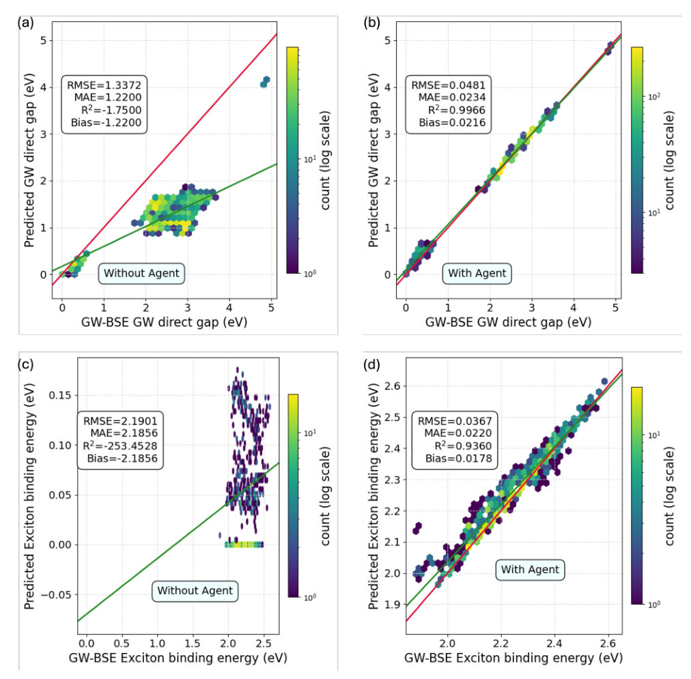 
FIG. 5. Agent-Guided anomaly triage improves surrogate model accuracy Parity plots comparing predicted and reference excited-state targets for models trained without and with the structured agent layer. (a) GW direct bandgap without agent-guided data triage. (b) GW direct bandgap with agent-guided trust weighting and anchor selection. (c) Exciton binding energy without agent guidance. (d) Exciton binding energy with agent guidance. Without the agent, the surrogate is trained on a mixture of physical signal and numerically contaminated labels, leading to large systematic deviations and poor agreement with higher-fidelity references. With the agent, suspicious coarse-fidelity points are...

**Summary.** This paper introduces an agent-guided multi-fidelity framework to overcome numerical instabilities in GW-BSE calculations for 2D nanomaterials. By using a structured 'agent' layer to diagnose data quality across multiple simulation fidelities, the authors train machine learning models on curated, reliable information. This results in corrected, uncertainty-quantified predictions of electronic and excitonic properties that are robust against computational artifacts.

**Why it may be interesting.** The methodology of explicitly diagnosing and correcting structured numerical artifacts before applying ML surrogate models is highly relevant to any field relying on high-throughput, computationally intensive simulations where convergence issues are common.

Detailed structure

**Main problem.** Accurately simulating electronic structure and optical properties (quasiparticle/excitonic gaps) in low-dimensional nanomaterials using computationally expensive GW-BSE calculations, which are prone to numerical instabilities.

**Main result.** An agent-guided multi-fidelity framework successfully corrects numerically induced artifacts in excited-state landscapes while preserving genuine physical strain dependence, significantly improving surrogate model accuracy over raw data interpolation.

**Method.** The approach combines a structured 'agent' layer for diagnosing calculation quality (e.g., spike detection) with machine learning models (Graph Attention Networks and Gaussian Processes) to transfer information across different fidelity levels.

**Model / system.** The study focuses on strained MoS2-WS2 bilayers, representing 2D van der Waals heterostructures characterized by strong quantum confinement and sensitivity to strain and stacking registry.

**Key observables.** Quasiparticle bandgaps (GW direct/fundamental), exciton binding energies, oscillator strengths, and dielectric screening ($\epsilon_{	ext{diag}}(G)$).

**Important parameters / regimes.** Strain ($\epsilon \in [-12\%, 12\%]$), stacking registries, and multiple reciprocal-space sampling fidelities ($k$-meshes).

**Assumptions / limitations.** The core assumption is that numerical failures are structured artifacts (e.g., in long-wavelength screening) that can be diagnosed by an agent layer, allowing the model to distinguish them from physical signals.

**Figures summary.** Figures illustrate the workflow schematic, raw observable evolution across strain, specific anomaly regimes linked to mesh sensitivity, and comparative parity plots showing superior performance with the agent vs. no-agent baseline.

**Paper structure.** The paper details a closed-loop process: 1) Generating multi-fidelity data; 2) Employing an agent layer to diagnose numerical fragility via diagnostics (spikes, cross-mesh disagreement); 3) Training a transfer learning model using trust weights and sparse anchors; 4) Applying Gaussian Process correction for uncertainty quantification.

Abstract

Many-body GW-Bethe-Salpeter equation calculations are essential for accurate simulations of electronic structure and optical properties in modern low-dimensional nanomaterials. However, these methods are computationally demanding and can exhibit localized numerical instabilities or convergence failures that are difficult to detect within high-throughput workflows. We introduce an agent-guided multi-fidelity framework for correcting GW-Bethe-Salpeter excited-state landscapes in strained MoS2-WS2 bilayers. Across stacking registries, strain branches and reciprocal-space samplings, the workflow identifies spike-like excursions, near-zero-gap collapse and cross-fidelity inconsistencies associated with fragile long-wavelength dielectric screening. A structural agent evaluates calculations by assigning confidence weights and selectively using a small number of high-accuracy reference points. Machine learning models then transfer information across related systems and apply Gaussian process corrections to recover improved quasiparticle gaps and exciton binding energies, with calibrated uncertainty estimates. The approach corrects numerically induced artifacts without erasing physical strain dependence and substantially improves agreement with higher-fidelity references relative to a no-agent baseline. These results show that reliable surrogate learning for excited-state materials requires explicit diagnosis of numerical fragility, not direct interpolation of raw first-principles data points. The proposed framework is readily transferable to other optoelectronic nanomaterials characterized by strong quantum confinement, such as quantum dots, nanoribbons, layered two-dimensional semiconductors, and hybrid perovskite nanostructures.

[↑ back to top](#top)

### [Every Rank-Two Entangled State is Projectively Steerable](http://arxiv.org/abs/2606.08189v1)

**Authors:** Yu-Xuan Zhang, Jing-Ling Chen  
**Type:** theory · **Category:** quantum information and computing · **PDF:** <https://arxiv.org/pdf/2606.08189v1>  
**Analysis basis:** full PDF text, analyzed in chunks
**Topic relevance:** `entanglement & information structure` **3/5**

📷 Fig 1

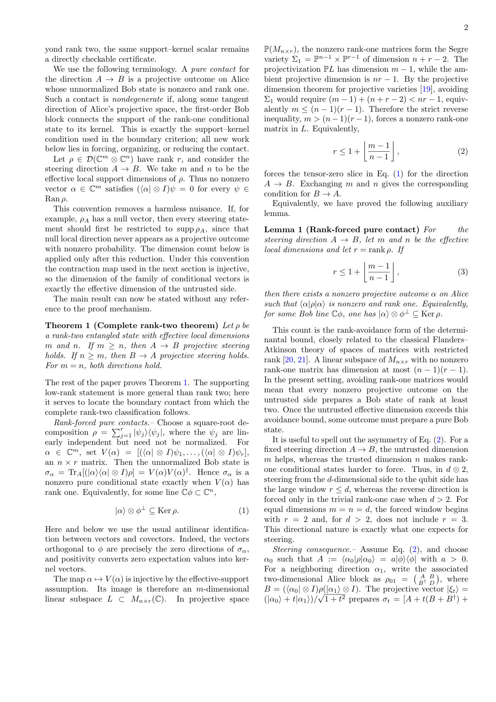 
Low-resolution page preview, page 2

📷 Fig 2

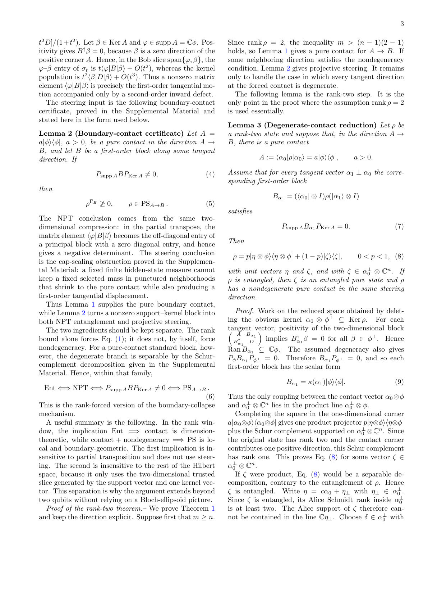 
Low-resolution page preview, page 3

📷 Fig 3

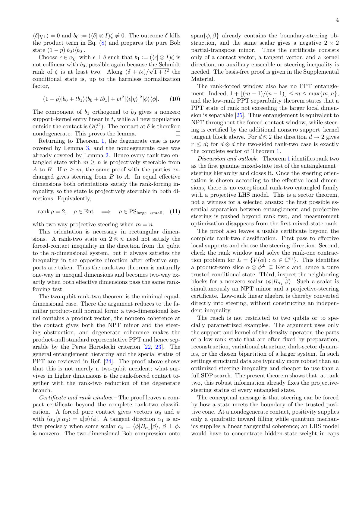 
Low-resolution page preview, page 4

📷 Fig 4

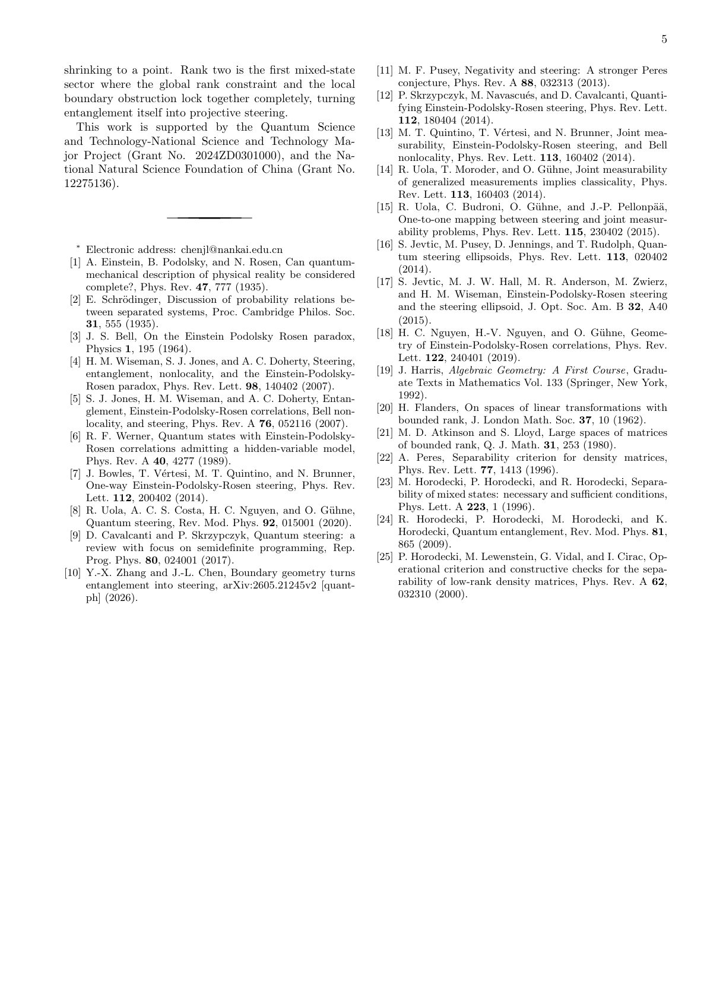 
Low-resolution page preview, page 5

📷 Fig 5

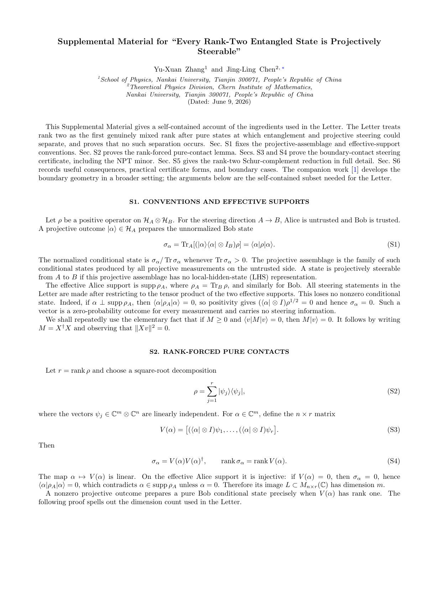 
Low-resolution page preview, page 6

**Summary.** This paper proves a structural theorem showing that all rank-two entangled bipartite quantum states are projectively steerable in at least one direction. The authors achieve this by employing advanced mathematical tools from algebraic geometry and boundary analysis, demonstrating that the existence of entanglement forces specific geometric properties on the state's support structure.

**Why it may be interesting.** This work provides deep mathematical insight into the structure of entanglement for low-rank mixed states, connecting abstract algebraic geometry concepts to fundamental quantum correlations like steering. This has implications for understanding resource theories beyond simple qubit models.

Detailed structure

**Main problem.** To prove that every rank-two bipartite entangled state is projectively steerable, thereby closing a potential bifurcation point between entanglement and Einstein–Podolsky–Rosen (EPR) steering in mixed states.

**Main result.** The authors prove that for any rank-two entangled state $
ho$, it must be projectively steerable in at least one direction, establishing a strong link between low-rank entanglement and directional correlation measures.

**Method.** The proof utilizes advanced techniques from algebraic geometry (analyzing the Segre variety) and boundary analysis on quantum states. It establishes steering by showing that any attempt to model the state locally using hidden variables violates positivity constraints near pure state boundaries.

**Model / system.** The study concerns bipartite entangled quantum states $
ho$ in arbitrary finite local dimensions, specifically focusing on the case where the rank of the density matrix is exactly two ($	ext{rank}(
ho)=2$).

**Key observables.** Projective steerability (in at least one direction), entanglement ($	ext{Ent}$), Negative Partial Transpose ($	ext{NPT}$), and the support–kernel tangent block structure.

**Important parameters / regimes.** The effective local dimensions ($m$ and $n$) of the subsystems, and the rank of the state ($r=2$).

**Assumptions / limitations.** The analysis is restricted to bipartite states with $	ext{rank}(
ho)=2$, and it relies on analyzing structural properties via boundary theorems rather than optimization techniques.

**Paper structure.** The paper builds the proof by first establishing necessary conditions for pure contacts using dimension counting (Lemma S1). It then uses scaling arguments near these boundaries to show that any local hidden-state model fails (Lemma S2), culminating in a structural certificate based on non-zero support–kernel tangent blocks proving projective steerability.

Abstract

Pure entangled states are already steerable by suitable projective measurements within their Schmidt supports, whereas rank two is the first genuinely mixed rank at which entanglement and Einstein--Podolsky--Rosen steering could bifurcate. We prove that this bifurcation does not occur even under the restricted measurement class of projective measurements: every rank-two bipartite entangled state in arbitrary finite local dimensions is projectively steerable in at least one direction, and is two-way projectively steerable when the effective local dimensions are equal. The proof is a boundary theorem rather than a steering-inequality optimization or a two-qubit reduction. A dimension--rank obstruction forces a projective outcome on the larger effective party to hit a pure boundary point of the trusted state cone. At such a contact, a nonzero support--kernel tangent block is simultaneously an NPT minor and a projective-steering certificate; if the first contact is degenerate, the rank-two constraint closes that branch and forces a second, active contact. Thus the entire first mixed-state stratum is a complete projective-steering sector, and the same support--kernel geometry gives a practical low-rank certificate whenever the relevant boundary contact is nondegenerate.

[↑ back to top](#top)

### [Quantitative measurement of fluid inertial effects in confined Brownian motion](http://arxiv.org/abs/2606.09193v1)

**Authors:** Quentin Ferreira, Pablo Palacios-Alonso, Harshit Joshi, Rafael Delgado-Buscalioni, Yacine Amarouchene, Thomas Salez  
**Type:** both · **Category:** statistical mechanics · **PDF:** <https://arxiv.org/pdf/2606.09193v1>  
**Analysis basis:** full PDF text, analyzed in chunks
**Topic relevance:** `non-equilibrium dynamics` **2/5** · `non-equilibrium universality` **2/5** · `Frenkel-Kontorova` **1/5** · `Keldysh / 2PI / non-Gaussian methods` **1/5** · `analog quantum simulation` **1/5** · `correlated / nonlocal dissipation` **1/5** · `driven-dissipative phase transition` **1/5** · `methods for driven-dissipative` **1/5**

📷 Fig 1

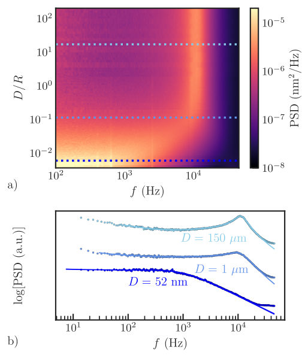 
FIG. 2. Influence of the wall on the thermal spectrum of the colloidal probe. a) Experimental positional power spectral density (PSD) of the sphere-cantilever probe in water as a function of the frequency f and normalized distance D/R to the wall. b) Experimental PSDs (points), in arbitrary units (a. u.), as functions of the frequencies f, for three specific dis- tances D, as indicated, and corresponding to the dotted lines in panel a). In addition, the respective fits to Eq. (2) (solid lines) are shown. The fitting is performed over a frequency range between fmin ∈[10, 80] Hz and fmax = 46 kHz, cover- ing the first mode of the oscillator, with minimal interferences from the higher-order...

📷 Fig 2

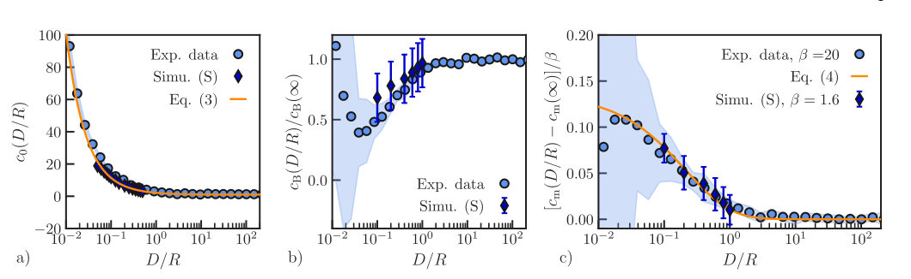 
FIG. 3. Influence of the wall on viscous damping and fluid inertial effects. a) Experimental steady-viscous contribution c0 (discs) of the sphere-cantilever probe, as a function of normalized distance D/R. Also shown are the corresponding numerical data (diamonds) for a pure sphere. The solid line represents Brenner’s prediction for a pure sphere (see Eq. (3)) [15, 43]. b) Experimental history-force contribution cB (discs) of the sphere-cantilever probe, normalized by its bulk value cB(∞), as a function of normalized distance D/R. Also shown are the corresponding numerical data (diamonds) for a pure sphere. c) Experimental increase cm −cm(∞) in the added-mass contribution (discs) of the...

**Summary.** This work quantitatively investigates how inertial forces—specifically added mass and history effects—alter Brownian motion when particles are strongly confined near a solid wall. By combining high-resolution AFM experiments with advanced simulations, the authors successfully separate these distinct hydrodynamic contributions across various confinement regimes. The results provide crucial insights for nanofluidics and interfacial biophysics by mapping out the full frequency-dependent drag response.

**Why it may be interesting.** While focused on classical fluid dynamics, the quantitative separation of memory effects (history force) and inertia (added mass) in confined systems provides a rigorous framework for analyzing non-equilibrium fluctuations relevant to open quantum systems or particle transport near boundaries.

Detailed structure

**Main problem.** To quantitatively investigate the hydrodynamic response of Brownian particles near a rigid wall, specifically separating and understanding the distinct contributions of fluid inertial effects (added mass and history effect) under strong confinement and thermal fluctuations.

**Main result.** The study successfully establishes a complete picture of Brownian motion at interfaces by quantifying how added-mass and history-force contributions change with confinement, confirming theoretical models like Brenner's result for the steady-viscous drag.

**Method.** A combination of broadrange thermal colloidal-probe Atomic Force Microscopy (AFM) experiments and advanced numerical simulations using spectral fluid solvers was employed.

**Model / system.** The system involves a colloidal probe attached to an AFM cantilever moving in a Newtonian fluid near a planar rigid substrate. The analysis focuses on the complex friction coefficient, $\gamma$, which captures the full hydrodynamic response.

**Key observables.** Positional power spectral density (PSD), and the fitted dimensionless coefficients quantifying contributions: $c_0$ (steady-viscous), $c_B$ (history-force), and $c_m$ (added-mass).

**Important parameters / regimes.** Confinement ratio ($D/R$), frequency ($	ext{Wo} \propto f/f_
u$), and the separation distance $D$. The study spans from bulk to deep lubrication regimes.

**Assumptions / limitations.** The primary assumption is that the decomposition of the friction coefficient $\gamma$ into its three distinct contributions ($c_0, c_B, c_m$) remains valid even in the presence of strong wall confinement.

**Figures summary.** Figures show the influence of the wall on the thermal spectrum (PSD) across various separations $D$, and plot the fitted parameters ($c_0, c_B, c_m$) as functions of $D/R$ comparing experiment to theory.

**Paper structure.** The paper systematically analyzes the hydrodynamic response by first establishing the experimental setup and diagnostics using PSDs. It then tackles each inertial contribution (steady-viscous, history force, added mass) separately, validating theoretical predictions against both experimental measurements and numerical simulations across varying confinement regimes.

Abstract

The hydrodynamic response of Brownian particles in liquids is fundamentally altered by inertial forces arising from unsteady momentum transport in the surrounding fluid. These forces are of two distinct types\,: the added mass and the history effect. While both are well understood in bulk and weakly-confined geometries, under deterministic driving, their respective behaviours under strong confinement and thermal fluctuations remain scarcely addressed, unclear and often entangled together. The goal of the present study is thus to fill this fundamental gap. The behaviours of the two distinct inertial contributions are quantitatively investigated in the vicinity of a flat, rigid wall, using a combination of broadrange thermal colloidal-probe atomic-force-microscopy experiments, advanced numerical simulations and theory. The separation of the added-mass and history-force contributions is achieved through their different frequency-scaling signatures within the measured high-resolution thermal spectra. Our results establish a complete picture of Brownian motion at interfaces, in the lubrication regime, with direct relevance to nanofluidics and interfacial biophysics.

[↑ back to top](#top)

### [Length-resolved Operator Growth and Path-Entropy Obstructions to Many-Body Localization](http://arxiv.org/abs/2606.07774v1)

**Authors:** J. Sirker  
**Type:** theory · **Category:** disordered systems and neural networks · **PDF:** <https://arxiv.org/pdf/2606.07774v1>  
**Analysis basis:** full PDF text, analyzed in chunks
**Topic relevance:** `entanglement & information structure` **2/5** · `non-equilibrium dynamics` **2/5** · `analog quantum simulation` **1/5** · `driven-dissipative phase transition` **1/5** · `exotic spin models in light-matter` **1/5** · `non-equilibrium universality` **1/5** · `scars & prethermalization` **1/5**

📷 Fig 1

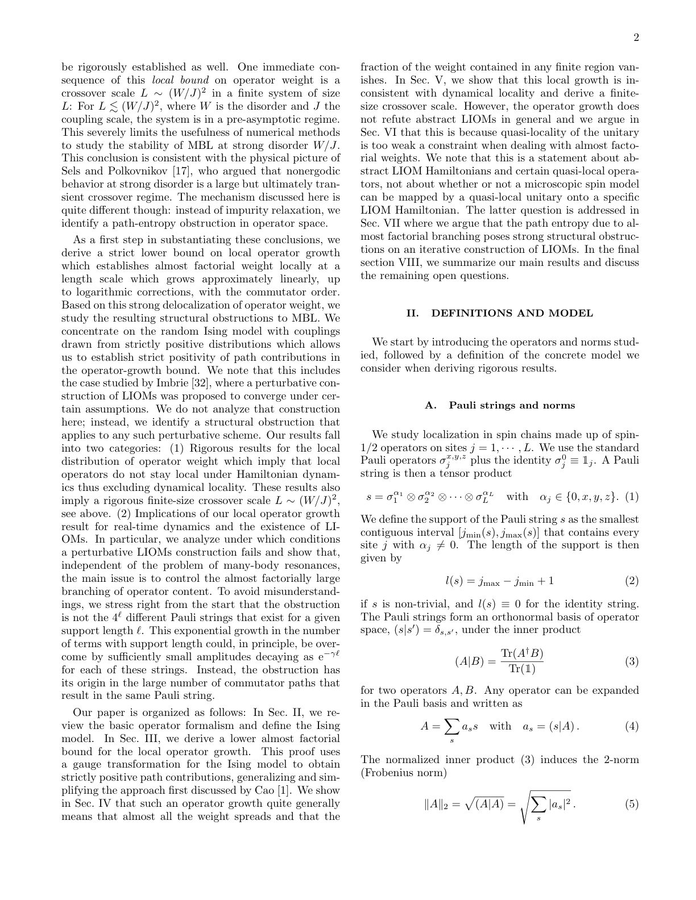 
Low-resolution page preview, page 2

📷 Fig 2

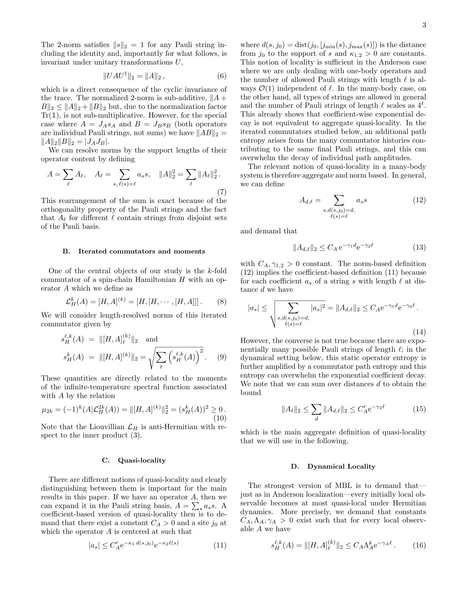 
Low-resolution page preview, page 3

📷 Fig 3

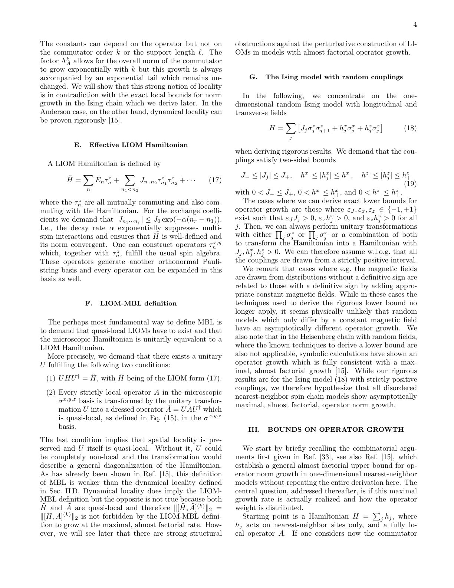 
Low-resolution page preview, page 4

📷 Fig 4

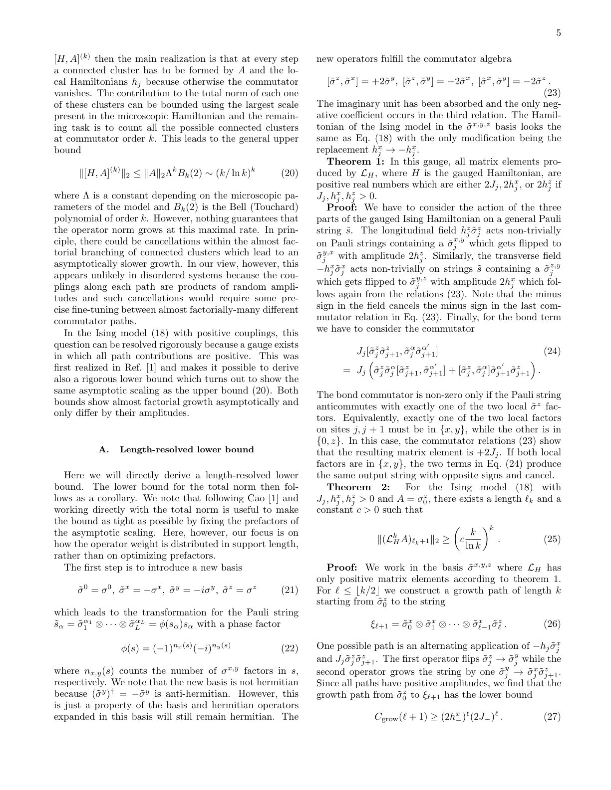 
Low-resolution page preview, page 5

📷 Fig 5

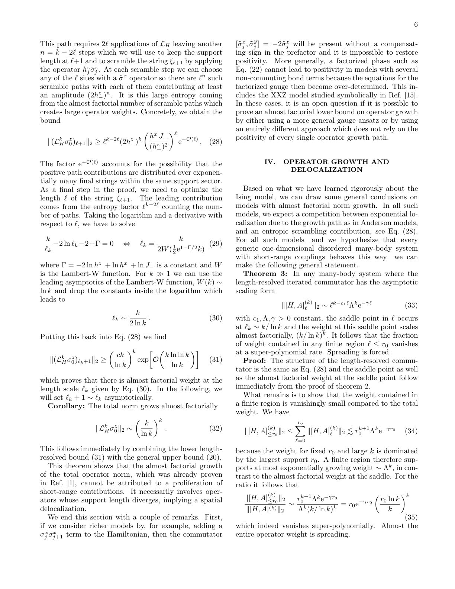 
Low-resolution page preview, page 6

**Summary.** This paper establishes a structural obstruction to Many-Body Localization in disordered quantum spin chains by analyzing the almost factorial growth of local operators. By resolving this growth across spatial support lengths, it proves that dynamical locality is impossible for generic disorder strengths. The findings suggest that such systems are asymptotically ergodic unless an unknown cancellation principle stabilizes them.

**Why it may be interesting.** The work provides deep theoretical constraints on the stability of MBL, suggesting that generic disorder drives systems towards ergodic behavior by overwhelming any potential localization mechanism through operator growth.

Detailed structure

**Main problem.** The paper investigates Many-Body Localization (MBL) by analyzing the growth rate of local operators via iterated commutators in disordered quantum spin chains.

**Main result.** It rigorously proves that operator norms exhibit almost factorial growth, which rules out dynamical locality and suggests that generic disordered systems are asymptotically ergodic.

**Method.** The analysis uses commutator expansion techniques, resolving operator norms based on support length ($\ell$), and introducing path-entropy arguments to constrain the possible dynamics.

**Model / system.** The primary model is a disordered Ising chain with transverse and longitudinal fields. The analysis is generalized to abstract LIOM Hamiltonians using Pauli string expansions.

**Key observables.** Operator norms ($\| \cdot \|$), moments $\mu_{2k}$, length-resolved operator weights, and path entropy.

**Important parameters / regimes.** Disorder strength ($W$), coupling strength ($J$), and the finite-size crossover scale $L \sim (W/J)^2$.

**Assumptions / limitations.** The analysis often assumes strictly positive couplings to derive rigorous lower bounds; it also relies on identifying a structural path-entropy obstruction.

**Figures summary.** Not specified, but the notes indicate comparisons between theoretical growth rates and finite-size numerical access limits.

**Paper structure.** The paper progresses from establishing almost factorial growth in moments (Cao's result generalization) to resolving this growth locally ($\ell$), which leads to ruling out dynamical locality. It then identifies a structural path-entropy obstruction against perturbative constructions of Local Integrals of Motion (LIOMs).

Abstract

For the disordered Ising chain with transverse and longitudinal fields, where couplings and fields are drawn from strictly positive distributions, Cao~\cite{Cao} has shown that the moments $μ_{2k} = \|[H,σ^z_0]^{(k)}\|_2^2$ grow almost factorially, $μ_{2k}^{1/(2k)}\sim k/\ln k$, and thus asymptotically at the maximal allowed rate. We generalize this result by resolving the operator norm in support length and show that the weight at length $\ell_k \sim k/\ln k$ already exhibits almost factorial growth, $\|[H,σ^z_0]^{(k)}_{\ell_k}\|_2 \gtrsim (k/\ln k)^k$. This implies maximal spatial delocalization of local operators and, in particular, rules out dynamical locality -- the strongest form of many-body localization -- at any disorder strength. We further establish rigorously a finite-size crossover scale $L\sim (W/J)^2$, where $W$ is the disorder and $J$ the coupling strength. For $L\lesssim (W/J)^2$ numerical studies only access a pre-asymptotic regime. Finally, we identify a structural path-entropy obstruction to perturbative LIOM constructions, based on the almost factorial branching of operator content and independent of resonance effects; the same mechanism strongly suggests ballistic real-time operator spreading, so sub-ballistic or localized dynamics would require a presently unidentified cancellation principle acting on almost factorially many disorder-dependent paths with random amplitudes.

[↑ back to top](#top)

### [Pointwise Complexity for Gaussian Fields: Upper Envelopes, Algorithmic Lower Bounds, and Separation](http://arxiv.org/abs/2606.07931v1)

**Authors:** Yunbei Xu  
**Type:** theory · **Category:** statistical mechanics · **PDF:** <https://arxiv.org/pdf/2606.07931v1>  
**Analysis basis:** full PDF text, analyzed in chunks
**Topic relevance:** `non-equilibrium dynamics` **2/5** · `Keldysh / 2PI / non-Gaussian methods` **1/5** · `analog quantum simulation` **1/5** · `correlated / nonlocal dissipation` **1/5** · `driven-dissipative phase transition` **1/5** · `entanglement & information structure` **1/5** · `methods for driven-dissipative` **1/5** · `non-equilibrium universality` **1/5**

📷 Fig 1

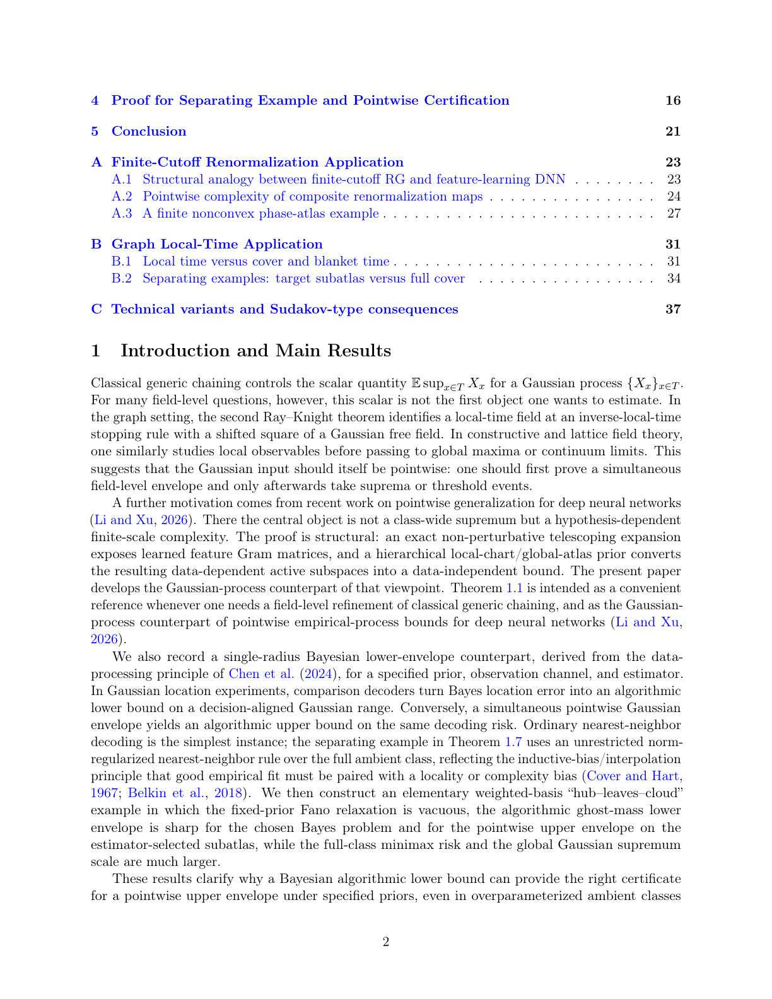 
Low-resolution page preview, page 2

📷 Fig 2

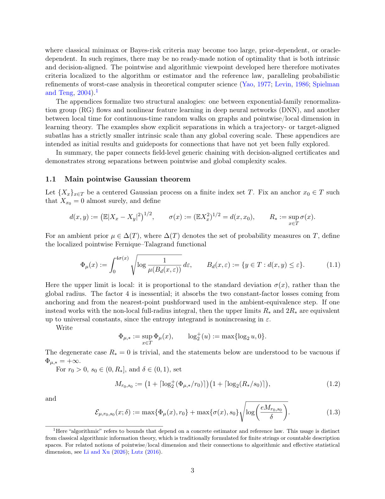 
Low-resolution page preview, page 3

📷 Fig 3

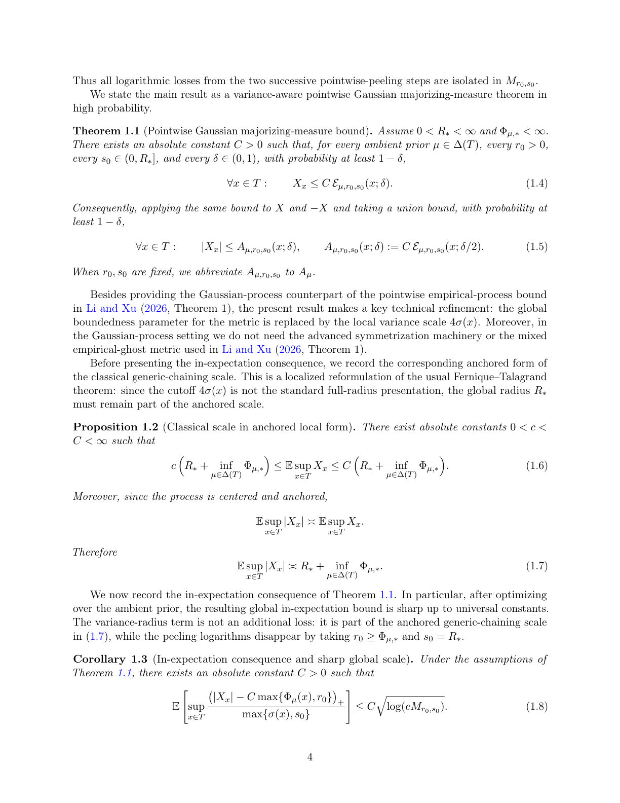 
Low-resolution page preview, page 4

📷 Fig 4

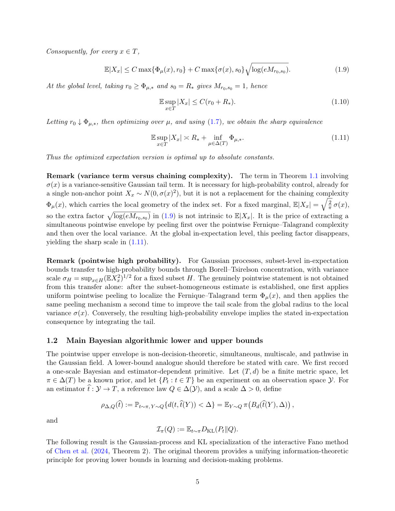 
Low-resolution page preview, page 5

📷 Fig 5

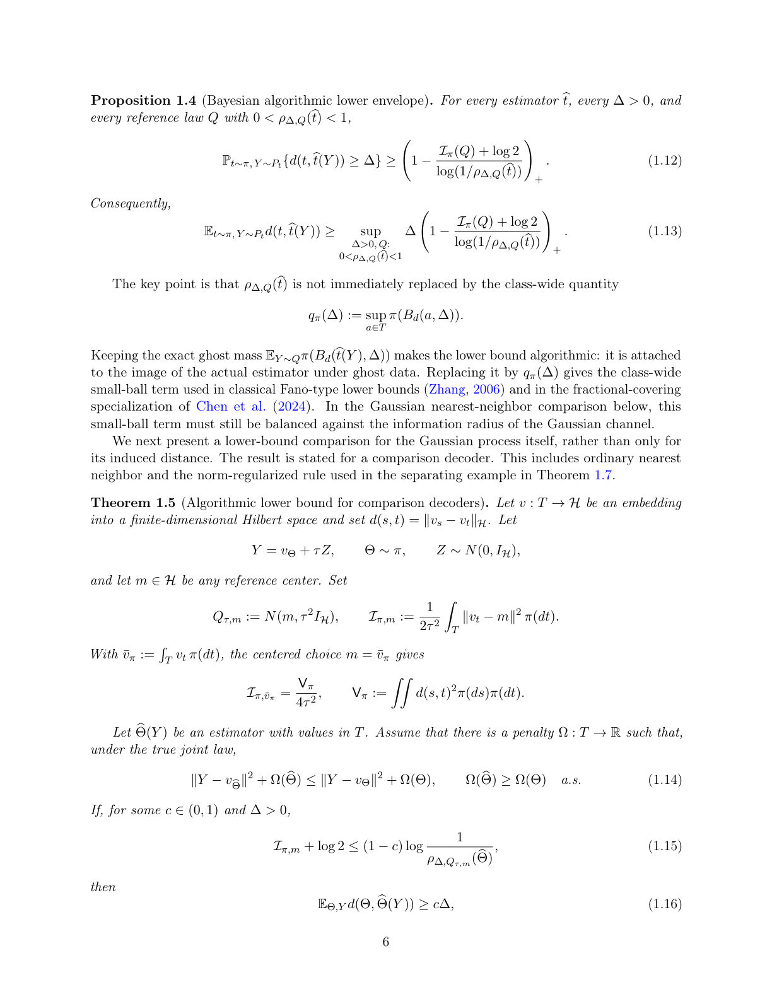 
Low-resolution page preview, page 6

**Summary.** The paper develops advanced tools to quantify the 'size' or complexity of Gaussian random fields in high dimensions. It achieves this by deriving sharp pointwise upper bounds and contrasting them with information-theoretic lower bounds, demonstrating that these algorithmic measures provide a more accurate assessment of difficulty than classical minimax theory, especially in complex physical models like RG flows.

**Why it may be interesting.** This work provides rigorous mathematical machinery (pointwise complexity, algorithmic certificates) that can be directly applied to analyze the effective dimensionality of complex quantum systems or statistical models undergoing renormalization group flow.

Detailed structure

**Main problem.** The core problem is establishing sharp, variance-aware pointwise complexity bounds for Gaussian fields, refining classical generic chaining results.

**Main result.** The paper derives a majorizing-measure theorem providing high-probability envelopes and establishes that algorithmic lower bounds can provide local-geometric certificates of pointwise complexity, separating these from coarse minimax risks.

**Method.** The authors use advanced concentration inequalities (e.g., Fernique–Talagrand functional) combined with information-theoretic principles (interactive Fano/data-processing principle) to derive both upper and lower bounds on the field's supremum.

**Model / system.** The analysis centers on centered Gaussian processes $\{X_x\}_{x\in T}$ defined over a metric space $T$. Later sections apply these concepts to Renormalization Group (RG) flows, modeling coarse-graining maps and phase-atlas representations in statistical physics.

**Key observables.** Pointwise Fernique–Talagrand functional ($\Phi_\mu(x)$), global in-expectation supremum ($\mathbb{E} \sup |X_x|$), algorithmic ghost small-ball mass ($
ho_{\Delta, Q}(b_t)$), and local time/cover times on graphs.

**Important parameters / regimes.** Local variance scale $\sigma(x)$, ambient prior $\mu$, global radius $R^*$, and parameters defining the separation regimes (e.g., $\log N / \log M$).

**Assumptions / limitations.** The analysis requires specific conditions on the metric space, such as finite supremum of local variances ($R^* < \infty$), and often assumes the existence of stable charts or appropriate prior structures for comparison.

**Figures summary.** Not specified in notes, but figures likely compare different scaling regimes (e.g., Fano vs. Algorithmic vs. Minimax) across various geometric settings (graphs, parameter spaces).

**Paper structure.** The paper progresses from establishing the pointwise Gaussian majorizing-measure bound for general fields to comparing this with algorithmic lower bounds derived from information theory. It then applies these tools to specific physical contexts like RG flows and random walks on graphs to demonstrate separations between different complexity measures.

Abstract

We prove a variance-aware pointwise majorizing-measure theorem for centered Gaussian processes. Classical generic chaining characterizes the scalar quantity $\mathbb E\sup_{x\in T}X_x$; the theorem here gives a simultaneous high-probability envelope for the entire field. For an ambient prior $μ$, the envelope at $x$ is governed by a pointwise Fernique-Talagrand functional \[Φ_μ(x):=\int_0^{4σ(x)}\sqrt{\log\frac{1}{μ(B_d(x,\varepsilon))}}\,d\varepsilon,\] together with the corresponding Gaussian tail term. The theorem provides a reusable field-level refinement of classical generic chaining and a Gaussian-process counterpart of pointwise empirical-process bounds for deep neural networks.   We also record a Bayesian algorithmic lower envelope from the interactive Fano/data-processing principle. For a known prior $π$, an observation channel, and a concrete estimator $\widehat t(Y)$, the lower bound is expressed through the exact ghost small-ball mass $\mathbb E_{Y\sim Q}π(B_d(\widehat t(Y),Δ))$, rather than a worst-case covering number. In Gaussian location experiments, comparison decoders convert Bayes location error into lower bounds on decision-aligned Gaussian ranges. We then construct an elementary weighted-basis example separating the usual Fano relaxation for a fixed prior, the Bayesian algorithmic lower envelope, the pointwise Gaussian envelope on the selected subatlas, and the full-class minimax risk/global Gaussian scale. Together, these results show that algorithmic lower bounds provide local-geometric certificates of pointwise complexity for fixed estimators in overparameterized ambient classes, precisely in regimes where classical minimax theory becomes either too coarse or oracle-dependent.

[↑ back to top](#top)

### [Nonlocal Teams and Information Structures](http://arxiv.org/abs/2606.08645v1)

**Authors:** Drishti Baruah, Sachin Teli, Ankur A. Kulkarni  
**Type:** theory · **Category:** quantum information and computing · **PDF:** <https://arxiv.org/pdf/2606.08645v1>  
**Analysis basis:** full PDF text, analyzed in chunks
**Topic relevance:** `entanglement & information structure` **2/5** · `quantum measurements` **2/5** · `correlated / nonlocal dissipation` **1/5** · `driven-dissipative phase transition` **1/5** · `methods for driven-dissipative` **1/5** · `non-equilibrium dynamics` **1/5**

📷 Fig 1

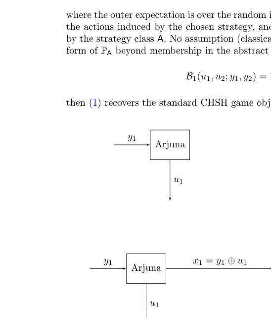 
Fig. 1: A block diagram explaining the static and dynamic information structure. In the dynamic information structure the information and actions of the two players are interdepen- dent, unlike the static information structure.

📷 Fig 2

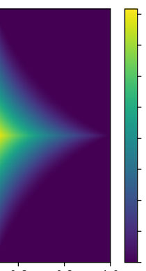 
Fig. 2: Fractional quantum advantage for static information structure:= (JS∗ C −JS∗ ⊥)/JS∗ C .

📷 Fig 3

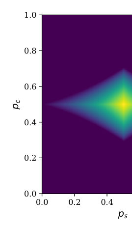 
Fig. 3: Fractional quantum advantage for dynamic information structure.

📷 Fig 4

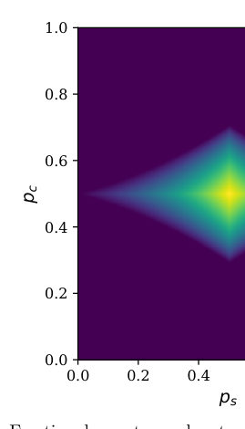 
Fig 3 shows the fractional quantum advantage for the dynamic information structure. Sim- ilar features like Fig. 2, such as maxima at the center and symmetry across quadrants, are observed in Fig. 3. The main difference is that the dynamic information structure has a smaller region of quantum advantage compared to static. Also the central horizontal lines in both

**Summary.** This theoretical work analyzes Bell inequalities by framing them as team optimization problems under varying information structures (static vs. dynamic). The core finding is that while projective quantum strategies yield optimal results in the static case, this optimality breaks down in the dynamic setting. This highlights the critical dependence of quantum advantages on the precise structure of information flow between agents.

**Why it may be interesting.** The findings demonstrate that quantum advantages derived under idealized static assumptions can be fragile and disappear when realistic, time-dependent correlations or noise channels are introduced into the information structure.

Detailed structure

**Main problem.** The research investigates how changing the information structure—from static to dynamic—affects the quantum advantage demonstrated by Bell inequalities in stochastic team games.

**Main result.** Projective quantum strategies, optimal for the standard (static) CHSH game, fail to maintain optimality when the information structure becomes dynamic, sometimes leading to a strict quantum disadvantage compared to classical strategies.

**Method.** The authors model nonlocal games as team optimization problems, comparing minimum expected costs achievable by classical, projective, and general quantum strategies under both static and dynamic input conditions.

**Model / system.** The primary model is the CHSH game analyzed through a team-theoretic lens. The analysis uses Bell states ($
ho$) and characterizes strategies via Positive Operator-Valued Measures (POVMs) $\{E_i\}$ and $\{F_j\}$.

**Key observables.** Minimum expected cost ($E[B_1]$), quantum advantage (comparison of optimal costs across strategy classes), and the feasibility of best response properties.

**Important parameters / regimes.** Probability parameters defining the information structure, such as $(p_1, p_2)$ for static vs. $(p_s, p_c)$ for dynamic settings.

**Assumptions / limitations.** The analysis often assumes that optimal quantum strategies can be characterized by their extreme points (e.g., rank-one projections) and compares the results derived from POVM optimization against action choices based on measurement outcomes ($u_i = m_i$).

**Figures summary.** Figures illustrate the comparison of fractional quantum advantage for both static and dynamic structures, showing how the region of quantum advantage shrinks or changes when moving to the dynamic setting.

**Paper structure.** The paper systematically compares team-optimal costs ($J^*$) across strategy classes (C, $\perp$, Q) for two distinct information structures (Static vs. Dynamic). It builds from general formulations to specific results regarding best response and person-by-person optimality failure in the dynamic case.

Abstract

We look at Bell inequalities from the lens of information structures in stochastic teams. We consider the usual CHSH game and a dynamic variant of the same to study how various classes of strategies, classical, projective and quantum, behave under team theoretic solution concepts. We find that projective strategies (where each player performs projective measurements) enjoy important properties in the usual CHSH game, but they do not carry over to its dynamic version. These results shed light on the delicate interplay of information structure in quantum strategies and the fragility of some well known ideas under changes of information structure.

[↑ back to top](#top)

### [Repair Before Veto, When Repair Is Hidden: Quantum-Accessible Features for Repair-Augmented Constraint Learning](http://arxiv.org/abs/2606.08020v1)

**Authors:** Yifan Wang  
**Type:** theory · **Category:** quantum information and computing · **PDF:** <https://arxiv.org/pdf/2606.08020v1>  
**Analysis basis:** full PDF text, analyzed in chunks
**Topic relevance:** `entanglement & information structure` **2/5** · `Keldysh / 2PI / non-Gaussian methods` **1/5** · `analog quantum simulation` **1/5** · `correlated / nonlocal dissipation` **1/5** · `driven-dissipative phase transition` **1/5** · `methods for driven-dissipative` **1/5** · `non-equilibrium dynamics` **1/5**

📷 Fig 1

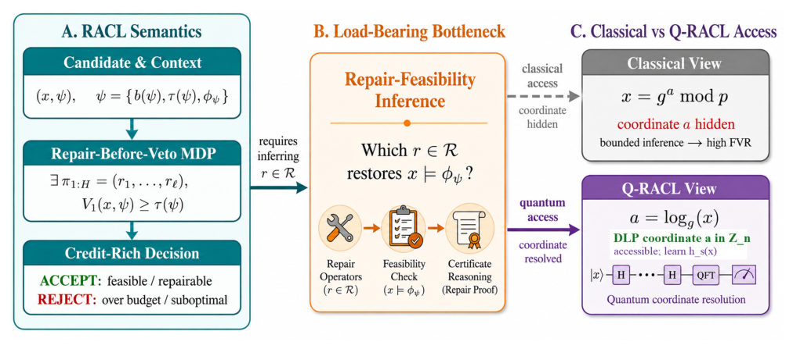 
Figure 1: Q-RACL as one framework. RACL supplies the repair-before-veto semantics: repair operators, budgets, preference gates, credits, and plans. The DLP-hidden subfamily makes the repair-feasibility inference link depend on a latent discrete-log coordinate. Quantum feature access is localized to this link.

📷 Fig 2

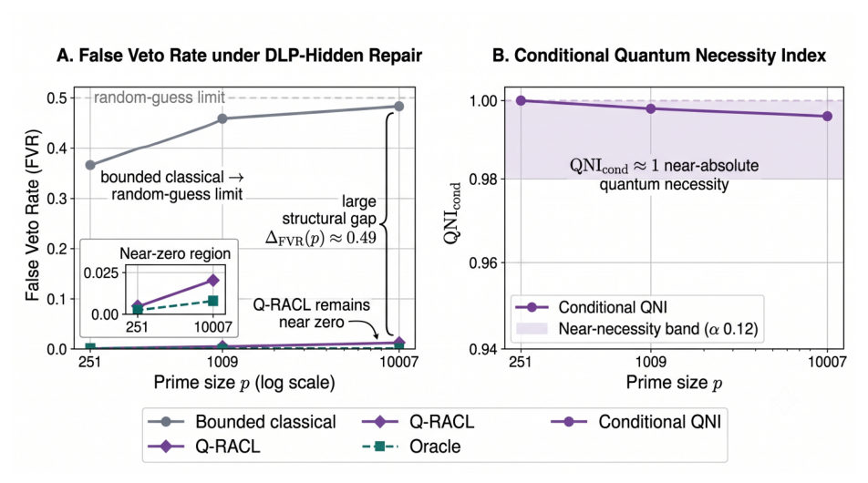 
Figure 2: Main empirical pattern. Bounded raw-input classical policies and the wrong raw-Fourier encoding remain high-FVR, while the Q-DLP policy stays below 1.1% FVR. Exact six-prime values and QNIcond scores are reported in Table 2.

**Summary.** This paper introduces Q-RACL, a decision framework that mandates checking for possible repairs before rejecting candidates. By encoding this check into a Discrete Logarithm Problem structure, the authors show that classical AI fails because it cannot access the latent feature required to determine repair feasibility. Quantum algorithms are necessary here not as a general speedup, but as a specific tool to unlock a hidden piece of information needed for correct decision-making.

**Why it may be interesting.** While not directly about AMO physics, the methodology of encoding complex physical constraints (like feasibility checks in quantum systems) into computationally hard mathematical structures (DLP) and demonstrating a quantum advantage for feature extraction is highly relevant to developing quantum machine learning tools for condensed matter simulations or quantum control.

Detailed structure

**Main problem.** The paper addresses the rigidity of hard-constraint decision systems that issue false vetoes for candidates that could be made feasible through an affordable repair.

**Main result.** A quantum-enhanced framework (Q-RACL) successfully implements a 'repair-before-veto' semantics, demonstrating that quantum access to latent features is necessary to keep the false-veto rate below 1.1%.

**Method.** The authors construct a decision problem hidden within a Discrete Logarithm Problem (DLP) structure and compare classical policies against a quantum policy utilizing Fourier/Shor-like feature access.

**Model / system.** The core model is a Repair-Augmented Constraint Learning (RACL) framework implemented via a finite-horizon repair Markov Decision Process ($M_{rep}$). The difficulty is encoded by making the necessary 'repair class' dependent on a latent exponent $a$ in a DLP, which is only accessible quantumly.

**Key observables.** False-Veto Rate (FVR) and Conditional Quantum Necessity Index ($	ext{QNIcond}$), both used to quantify the success of avoiding incorrect rejections.

**Important parameters / regimes.** The performance is tested across six primes ($p$) and ten seeds, demonstrating robustness in the DLP setting.

**Assumptions / limitations.** The results rely on standard hardness assumptions regarding the difficulty of solving discrete logarithms classically versus quantumly.

**Figures summary.** Figures illustrate that bounded raw-input classical policies and incorrect Fourier encodings yield high FVRs, whereas the Q-DLP policy maintains a low FVR (< 1.1%), proving feature access is key.

**Paper structure.** The paper first defines the RACL semantics to overcome veto rigidity. It then maps this problem onto a DLP-hidden structure. The core contribution involves comparing classical policies against the quantum Q-DLP policy, showing that only the latter can correctly infer the necessary repair link.

Abstract

Hard-constraint decision systems usually veto infeasible candidates. This is too rigid when the system can act: if a known affordable repair would make an infeasible candidate feasible and valuable, rejection is a false veto rather than a ranking error. We introduce Q-RACL (Quantum Repair-Augmented Constraint Learning), a repair-before-veto framework that first defines RACL decision semantics and then identifies the single inference link where quantum feature access can be load-bearing. RACL accepts a candidate when a sequential repair plan restores feasibility and preference; otherwise it returns structured rejection credit. The hard link is repair-feasibility inference: which repair class restores feasibility from an observed candidate and context. We construct a discrete-logarithm-hidden RACL family where the repair class is a shifted interval rule in the latent exponent a = log_g(x), while the learner observes only x = g^a mod p. Under standard DLP-based learning separation, this coordinate is inaccessible to efficient raw-input classical policies but accessible to a quantum agent through Shor/Fourier structure. Across six primes and ten seeds, bounded raw-input classical policies and a wrong raw-Fourier encoding remain near chance, whereas the Q-DLP policy keeps false-veto rate below 1.1%, wins all paired seeds, and yields QNI_cond = 0.9777 to 0.9972. A classical DLog oracle matches it, isolating feature access rather than classifier capacity. Thus quantum AI is not added as a generic model upgrade; for this DLP-hidden repair family, it supplies the missing feature that closes the repair-before-veto loop.

[↑ back to top](#top)

### [Leveraging Landau-Zener-Stückelberg interference for accelerating diabatic quantum annealing](http://arxiv.org/abs/2606.09706v1)

**Authors:** Matthias Werner, Matías Jonsson, Artur García-Sáez, Arnau Riera, Tameem Albash  
**Type:** theory · **Category:** quantum information and computing · **PDF:** <https://arxiv.org/pdf/2606.09706v1>  
**Analysis basis:** full PDF text, analyzed in chunks
**Topic relevance:** `non-equilibrium dynamics` **2/5** · `Keldysh / 2PI / non-Gaussian methods` **1/5** · `analog quantum simulation` **1/5** · `driven-dissipative phase transition` **1/5** · `interference shaping light` **1/5** · `methods for driven-dissipative` **1/5**

📷 Fig 1

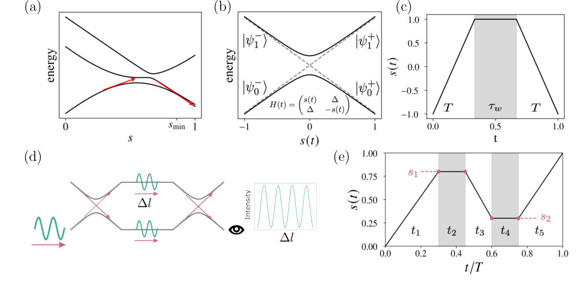 
Figure 1. (a) Diagram of the three lowest energy eigenvalues of H(s), red arrows indicating the diabatic transitions that allow to reach the ground state without slowing down for the minimal gap at smin. (b) Eigenvalues of the two-level system H(t) to illustrate Landau-Zener transitions. (c) Two consecutive sweeps in time T with a waiting period of τw between them. (d) Illustration of an interferometer, where the two distinct paths a wave can take are analogous to the eigenstates of the two-level system. One path is longer by a difference ∆l, resulting in interference. The interference manifests as oscillations in the intensity, or equivalently as oscillations in the population of the...

📷 Fig 2

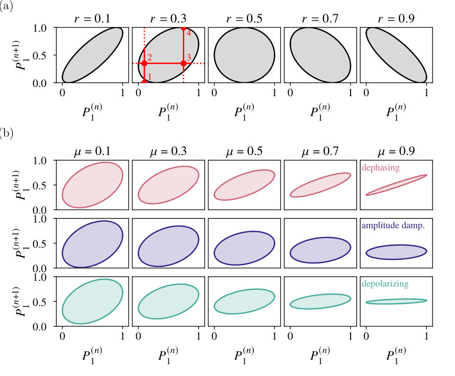 
Figure 2. (a): Visualization of accessible excited state populations P (n+1) 1 as per Eq. (18) of the first excited state after n + 1 LZS-sweeps assuming the initial population P (n) 1 . For each P (n) 1 , there is a set of accessible P (n+1) 1 , which are determined by the choice of phase ˜ϕ, shown here as the shaded ellipses. For r = 0.3, we indicate how a sequence of sweeps with appropriately chosen phases between them can pump the excited state population. The red solid lines indicate which populations are accessible after the next LZS-gate, while the red points indicate the populations at each step. (b): Same accessible populations as in (a) under the influence of different types of...

📷 Fig 3

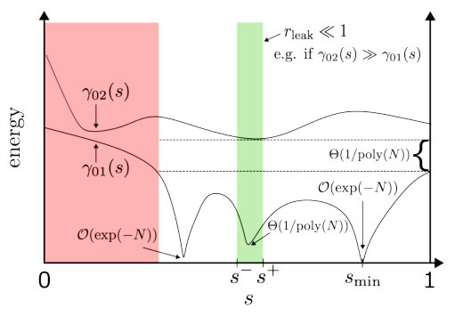 
Figure 3. Illustration of a spectrum where we expect our ansatz to provide a speedup over adiabatic evolution. We show the spectral gap between the first excited and ground state γ01 and the second excited and ground state γ02 along the interpolation parameter s. Green shaded area: control interval, where γ01 = Θ(1/ poly(N)) ≪γ02, such that a tran- sition rate r can be obtained to prepare an arbitrary state. Red shaded area: part of the annealing spectrum where the first and second excited state may not be sufficiently sepa- rated. However, since in the beginning of the anneal, the system will be in the ground state, it will be protected from transitioning to the higher levels, while at...

📷 Fig 4

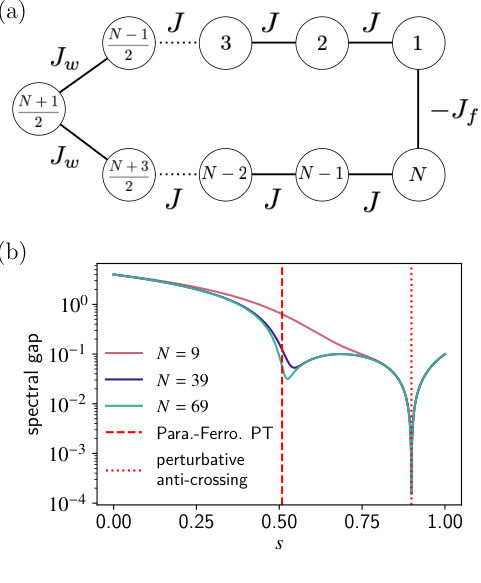 
Figure 4. (a) Connectivity graph of the target Hamiltonian for the frustrated Ising ring. (b) Spectral gap for the Hamiltonian H(s) associated with (a) for coupling values J = 1, Jw = 0.5 and Jf = 0.45. Also shown are the approximate positions of the para- to ferromagnet transition at s ≈0.514 and the perturbative anti-crossing at s ≈0.899.

📷 Fig 5

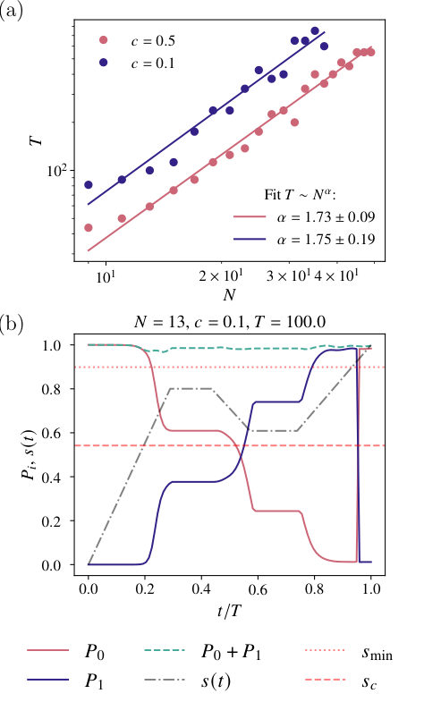 
Figure 5. (a) Optimum total time T as found by running the optimization algorithm as in Ref. [25] to prepare the ground state with at least c = 0.5, 0.1 overlap. Solid lines are the best fit curves of the form bN α. (b) The optimized schedule s(t) for a small system size N = 13, where state vector simulation is feasible. We show the populations of the instantaneous ground state P0 and the first excited state P1 along the anneal as well as their sum P0 + P1. The horizontal dashed and dotted lines indicate the critical values sc where the Ising ring transitions from the paramagnetic to the ferromagnetic phase and the location of the minimal spectral gap due to the perturbative anti-crossing...

**Summary.** The paper demonstrates how Landau-Zener-Stückelberg interference can be systematically exploited in diabatic quantum annealing schedules to achieve significant speedups over adiabatic methods. By proposing and analyzing a highly constrained, low-parameter variational ansatz, the authors prove that optimizing this schedule is computationally tractable (polynomial time), making it a powerful design principle for quantum optimization algorithms.

**Why it may be interesting.** This work provides concrete theoretical tools (the specific ansatz structure) and rigorous complexity analysis to design quantum algorithms that explicitly harness physical interference effects rather than relying solely on general variational optimization techniques.

Detailed structure

**Main problem.** The primary goal is accelerating quantum annealing beyond adiabatic limits by exploiting Landau-Zener-Stückelberg (LZS) interference.

**Main result.** By leveraging LZS interference through a simplified variational schedule ansatz, the authors show that exponential speedups over conventional adiabatic annealing can be achieved with optimization complexity remaining polynomial in system size.

**Method.** The work develops and analyzes a specific variational schedule ansatz (e.g., three-sweep structure) whose parameters are optimized using advanced numerical methods to ensure polynomial time convergence.

**Model / system.** The model is quantum annealing applied to optimization problems like the Ising ring or MAXCUT, governed by a time-dependent Hamiltonian $H(s)$. The dynamics are often analyzed effectively within the two lowest energy levels.

**Key observables.** Residual energy ($\epsilon_{	ext{residual}}$), population probabilities ($P_0, P_1$), and the required anneal time $T$.

**Important parameters / regimes.** The number of variational parameters (reduced to a small constant like 7 in one ansatz); coherence time; transition probability $r$.

**Assumptions / limitations.** The analysis assumes that decoherence is an essential resource for the speedup mechanism, and that the optimization landscape allows for polynomial-time minimization of the energy functional.

**Figures summary.** Figures illustrate LZS oscillations in residual energy ($\epsilon_{	ext{residual}}$) vs. waiting time $	au$ for frustrated Ising rings, and show population dynamics ($P_i$) under various schedules (linear vs. optimized ansatz).

**Paper structure.** The paper progresses from establishing the need to overcome exponentially closing gaps, deriving the LZS mechanism as the source of speedup, proposing a simplified variational ansatz, proving that optimizing this ansatz is polynomial time, and finally validating these results numerically on benchmark problems like MAXCUT.

Abstract

Diabatic quantum annealing with variationally optimized schedules can exhibit exponential speedups over conventional adiabatic quantum annealing, as was demonstrated numerically for a frustrated Ising ring model by C{ô}t{é} et al. Here we identify Landau-Zener-St{ü}ckelberg interference as the underlying mechanism for this speedup, and based on this insight we propose a variational schedule ansatz with far fewer parameters. This simplified ansatz allows us to show analytically that the classical optimization of the schedule parameters can be done in polynomial time and discuss conditions when we expect this type of mechanism to provide speedups over adiabatic annealing. Furthermore, we provide an analytical argument that coherence is an essential resource for this mechanism, which we verify numerically. We perform extensive numerical tests of the proposed ansatz and observe substantial improvements over adiabatic annealing and competitive performance in particularly challenging problem instances, including a well-studied MAXCUT instance commonly used for benchmarking. Our work shows that explicitly leveraging physical mechanisms can lead to more effective designs of variational annealing algorithms.

[↑ back to top](#top)

### [Quantum algorithms for stochastic nonlinear differential equations](http://arxiv.org/abs/2606.08349v1)

**Authors:** Sergey Bravyi, Adam Byrne, Mykhaylo Zayats, Sergiy Zhuk  
**Type:** theory · **Category:** quantum information and computing · **PDF:** <https://arxiv.org/pdf/2606.08349v1>  
**Analysis basis:** full PDF text, analyzed in chunks
**Topic relevance:** `non-equilibrium dynamics` **2/5** · `Keldysh / 2PI / non-Gaussian methods` **1/5** · `analog quantum simulation` **1/5** · `correlated / nonlocal dissipation` **1/5** · `driven-dissipative phase transition` **1/5** · `methods for driven-dissipative` **1/5**

📷 Fig 1

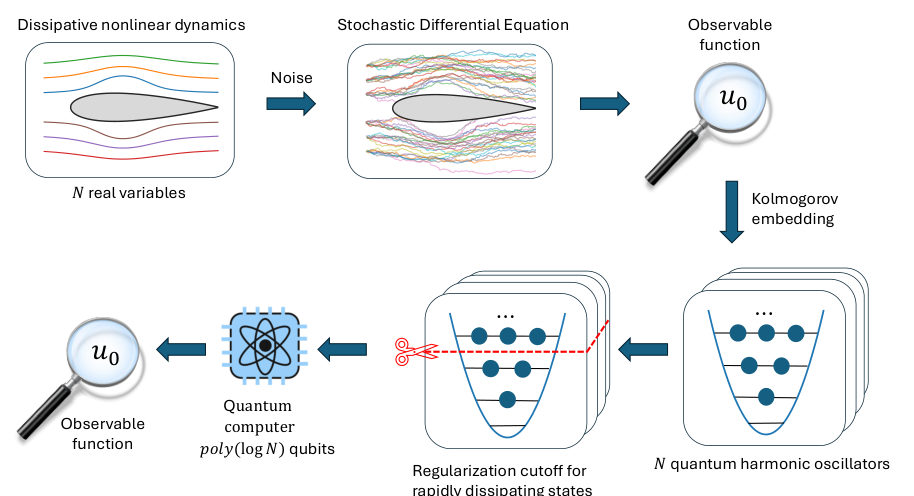 
Figure 1: Quantum simulation workflow. A quadratic ODE for a state vector X(t) ∈RN is converted into a stochastic differential equation (SDE) by adding random noise. Rather than tracking the full state vector, the quantum algorithm estimates the noise-averaged value of a scalar observable u0 : RN →R evaluated at the solution X(t) for a given target initial condition x ∈RN. As a function of t and x, this expected value satisfies the Kolmogorov equation. Embedding this equation into the Hilbert space of N quantum harmonic oscillators and applying a regularization procedure then enables efficient quantum simulation.

📷 Fig 2

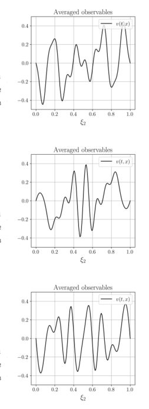 
Figure 2: Monte Carlo simulation of dEB. Rows 1-2; a realization of the velocity field for the SDE Eq. (2) describing the discretized dEB model with an additional deterministic forcing Eq. (10). Rows 3-5; the same SDE without deterministic forcing. The first two columns show the averaged velocity field, and the third column shows the expectation v(t, x).

📷 Fig 3

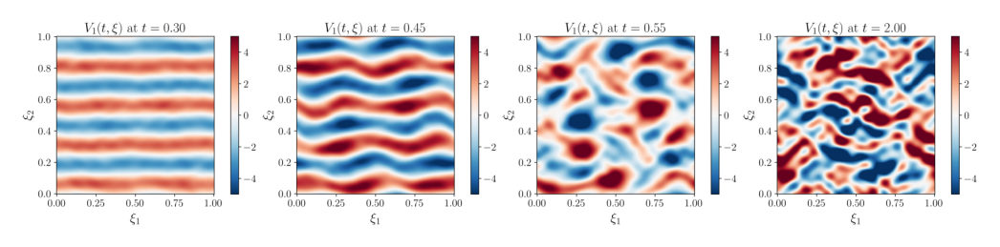 
Figure 3: Generation of the turbulent initial condition. Profiles of the first component of the velocity V = (V1, V2) for the dEB model Eq. (192) with Kolmogorov forcing Eq. (198) over t ∈[0, tturb].

📷 Fig 4

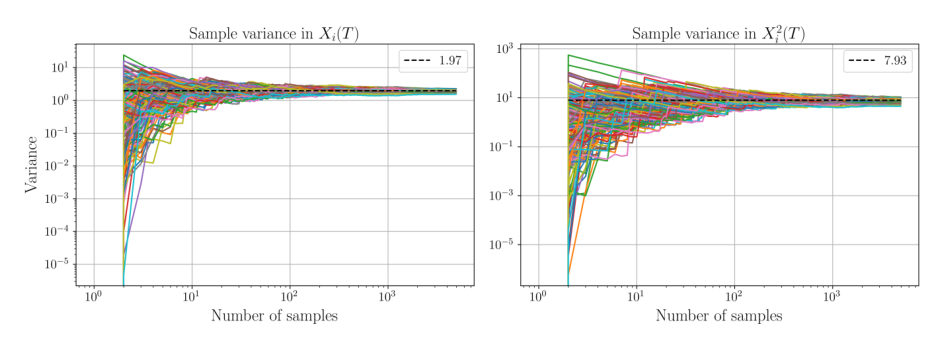 
Figure 4: Sample variance in projection coefficients. Unbiased sample variance in all N coefficients Xi(T) and X2 i (T) at the final time T = 3.0.

📷 Fig 5

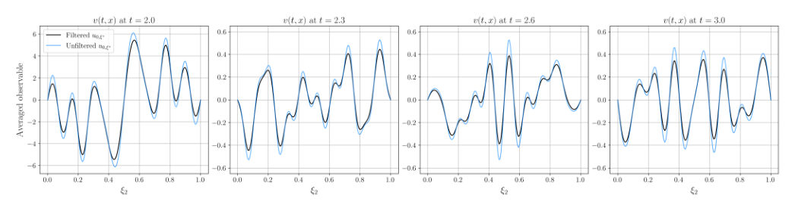 
Figure 5: Unfiltered expectation v(t, x). Comparison of the expected value v(t, x) for observable u0,ξ∗(X(t)) with the filter w(pi) for (α, β) = (10−2, 1.6) versus the “unfiltered” observable with (α, β) = (0, 0), over t ∈[tturb, T].

**Summary.** The paper introduces a novel quantum algorithm designed to simulate high-dimensional stochastic nonlinear differential equations, particularly those modeling turbulence. By reformulating the problem as solving an evolution equation in the Fock space of harmonic oscillators, it achieves polynomial scaling with system size N and linear scaling with time t for specific physical models. This opens a pathway for quantum simulation beyond previously limited weak or sparse nonlinearity regimes.

**Why it may be interesting.** This work directly tackles the computational bottleneck of nonlinear dynamics—a major area where quantum computation promises advantage by linearizing complex evolution into solvable quantum operator forms.

Detailed structure

**Main problem.** The core challenge is developing quantum algorithms capable of accurately simulating high-dimensional stochastic nonlinear differential equations (SDEs) arising in complex physical systems like fluid dynamics.

**Main result.** The authors present a framework showing that quantum simulation can efficiently estimate observables for strongly nonlinear, divergence-free quadratic SDEs with costs polynomial in log(N) and linear in time.

**Method.** The approach reformulates the problem by solving the backward Kolmogorov equation (bKE) using second quantization on an auxiliary system of interacting quantum harmonic oscillators, employing regularization techniques to manage infinite dimensionality.

**Model / system.** The primary models analyzed are $N$-dimensional SDEs with quadratic drift and dissipation, exemplified by the damped Euler-Bardina (dEB) model relevant for turbulence. The dynamics are mapped onto a linear evolution equation in the Fock space of harmonic oscillators.

**Key observables.** Expected values of low-order correlation functions or observables $u_0(\mathbf{X}(t))$, such as first or second moments, which are estimated via quantum expectation value measurements.

**Important parameters / regimes.** The efficiency depends critically on the divergence-free condition ($	ext{div}(\mu f) = 0$) and specific scaling conditions relating initial state norms to noise variances ($\sum x_i^2 / \pi_i = O(1)$).

**Assumptions / limitations.** Key assumptions include the applicability of regularization procedures to truncate the infinite-dimensional Kolmogorov operator while maintaining controlled error bounds, and that the system exhibits divergence-free properties.

**Figures summary.** Figures illustrate the quantum simulation workflow (converting ODEs to SDEs), showing the use of $N$ harmonic oscillators and the convergence of sample variance in projections for fluid dynamics models like dEB.

**Paper structure.** The paper builds conceptually by first establishing the general framework for simulating quadratic SDEs via the bKE, then detailing the technical steps involving regularization and quantum simulation using Fock space operators, and finally applying this to concrete physical examples like the dEB model.

Abstract

Stochastic nonlinear dynamics underlie many models in engineering and computational physics, yet accurate high-dimensional simulation remains challenging. We present a quantum algorithm for a broad class of $N$-dimensional stochastic differential equations with dissipation and quadratic drift. The algorithm applies to strongly nonlinear systems with all-to-all interactions, thereby extending the scope of previously known quantum algorithms that were limited to weak nonlinearity and sparse systems. For norm-preserving drifts, a condition satisfied by key fluid dynamics discretizations, our method approximates expectation values of low-order correlation functions with rigorous error bounds at a cost polynomial in $\log{(N)}$ and linear in the evolution time. Our main technical advance is a subroutine for simulating an auxiliary system of $N$ interacting quantum harmonic oscillators with cost polylogarithmic in $N$. Finally, we formulate turbulence models, including Navier-Stokes and damped Euler equations, within this framework, opening a route to quantum simulation of strongly nonlinear SDEs governing turbulence and nonlinear wave dynamics.

[↑ back to top](#top)

### [Randomized simulation of quantum channels using small ancilla](http://arxiv.org/abs/2606.08784v1)

**Authors:** Marcin Kotowski, Michał Kotowski  
**Type:** theory · **Category:** quantum information and computing · **PDF:** <https://arxiv.org/pdf/2606.08784v1>  
**Analysis basis:** full PDF text, analyzed in chunks
**Topic relevance:** `entanglement & information structure` **2/5** · `quantum measurements` **2/5** · `correlated / nonlocal dissipation` **1/5** · `measurement-induced transitions` **1/5** · `methods for driven-dissipative` **1/5**

📷 Fig 1

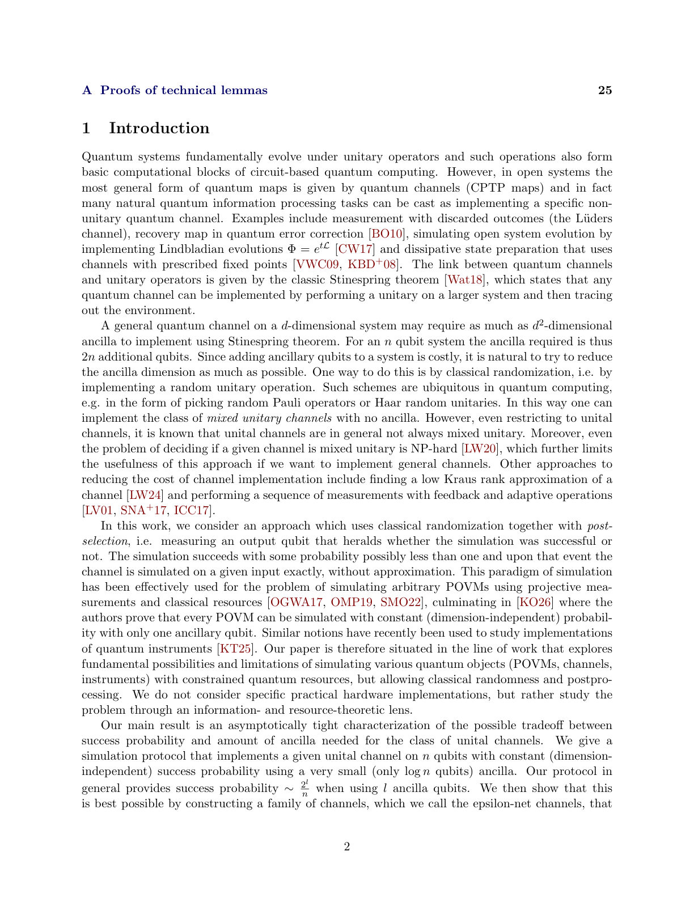 
Low-resolution page preview, page 2

📷 Fig 2

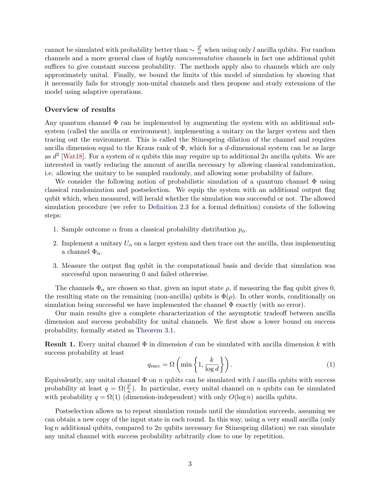 
Low-resolution page preview, page 3

📷 Fig 3

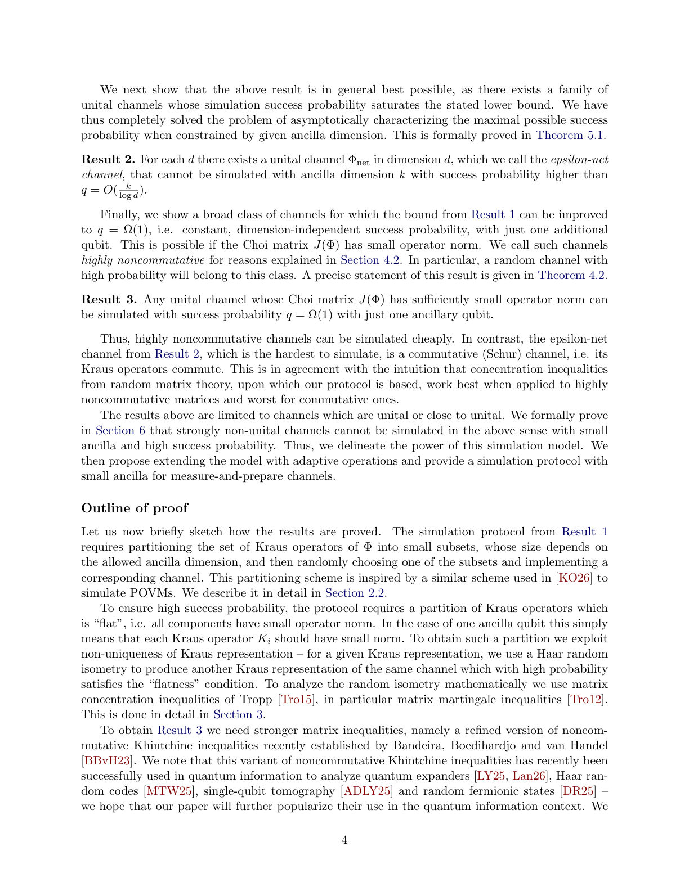 
Low-resolution page preview, page 4

📷 Fig 4

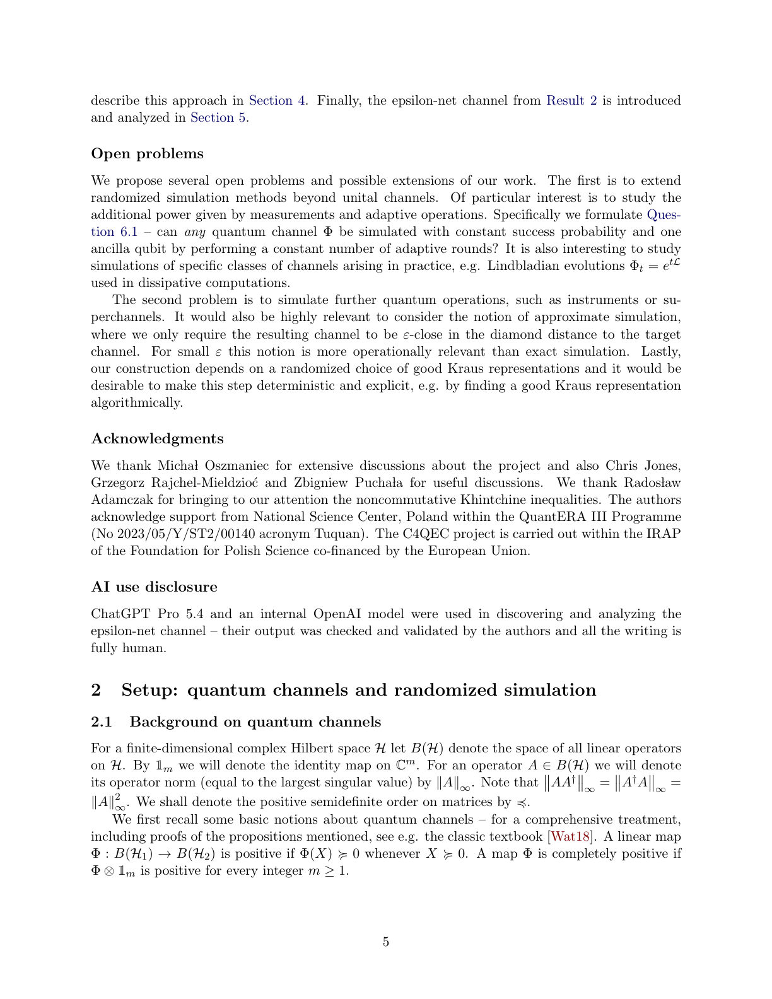 
Low-resolution page preview, page 5

📷 Fig 5

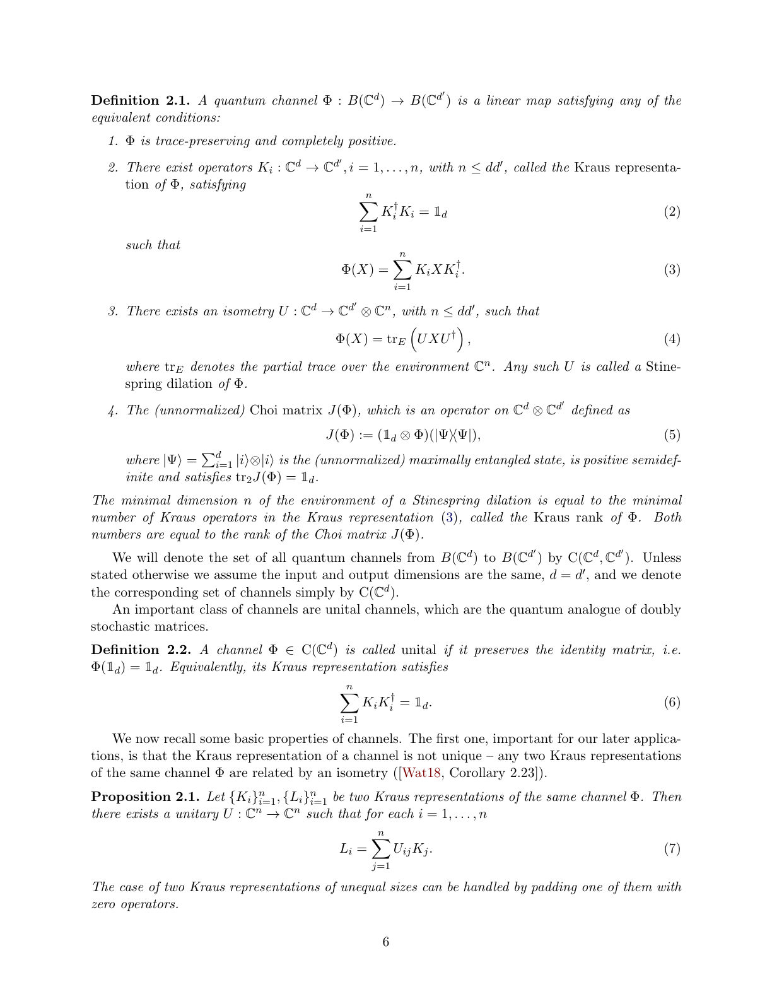 
Low-resolution page preview, page 6

**Summary.** The paper analyzes the feasibility of simulating arbitrary quantum channels using limited ancillary qubits combined with classical randomization and postselection. It establishes a key trade-off, showing that while general unital channels require ancilla resources scaling with $\log d$, highly noncommutative channels can be simulated with near-perfect success probability using only one extra qubit.

**Why it may be interesting.** This work provides fundamental resource estimates for quantum information processing tasks. Understanding the limits of simulation fidelity based on channel structure (like unitality or noncommutativity) is crucial for designing practical quantum computation protocols.

Detailed structure

**Main problem.** The core problem is determining the minimum ancillary resources (qubits) required to probabilistically simulate an arbitrary quantum channel $\Phi$ using classical randomization and postselection.

**Main result.** For unital channels, constant success probability ($\Omega(1)$) can be achieved with $O(\log n)$ ancilla qubits for an $n$-qubit system. Furthermore, highly noncommutative channels can be simulated even more efficiently with just one ancillary qubit.

**Method.** The authors employ advanced techniques from Random Matrix Theory (RMT), including refined noncommutative Khintchine inequalities, applied to analyze the success probability of a partition-based simulation protocol.

**Model / system.** The study concerns general quantum channels ($\Phi$) acting on $d$-dimensional systems or $n$ qubits. The simulation model involves coupling the system to an ancilla qubit and using classical postselection based on measurement outcomes.

**Key observables.** Success probability ($q_{	ext{succ}}$), Ancilla dimension ($k$), and the operator norm of the Choi matrix ($\|J(\Phi)\|_\infty$).

**Important parameters / regimes.** The ratio $k/\log d$ dictates the achievable success probability for general unital channels; constant probability is achieved when ancilla resources scale as $O(\log n)$ qubits.

**Assumptions / limitations.** The results are primarily proven for unital or near-unital channels, and the model fundamentally fails for strongly non-unital channels. The analysis relies heavily on RMT bounds derived from random unitaries.

**Figures summary.** Not specified in the notes; the focus is on theoretical bounds and protocols rather than visual results.

**Paper structure.** The paper develops a simulation protocol based on partitioning Kraus operators, establishes upper and lower bounds using matrix concentration inequalities (RMT), proves special case improvements for highly noncommutative channels, and discusses limitations regarding non-unitality and adaptive operations.

Abstract

We study the problem of implementing a quantum channel using a small ancilla with classical randomization and postselection on an output failure flag. The simulation is probabilistic, but exact conditioned on success. We prove that any unital channel on a $d$-dimensional system can be simulated with ancilla dimension $k$ and success probability $Ω(\frac{k}{\log d})$. Equivalently, every unital channel on $n$ qubits can be simulated with constant success probability using only $O(\log n)$ ancillary qubits. We show that this tradeoff is best possible by constructing a family of channels which cannot be simulated with success probability better than $O(\frac{k}{\log d})$. We also show that the class of \textit{highly noncommutative} channels, which includes random channels, admits constant-success simulation with just a single ancillary qubit. We further show that this model of simulation necessarily fails for strongly non-unital channels and discuss possible extensions involving adaptivity. On the technical side we rely on a partition-based protocol and matrix concentration inequalities, including the recent refinement of noncommutative Khintchine inequalities due to Bandeira, Boedihardjo and van Handel.

[↑ back to top](#top)

### [A nuclear clock based on $^{229}$Th](http://arxiv.org/abs/2606.08870v1)

**Authors:** Beichen Huang, Gaowei Yan, Qi Xiao, Wenhao Bu, Zhen Zhang, Chengchun Zhao, Chao Yan, Zhi-Ang Chen, Peixiong Zhang, Gleb Penyazkov, Zhenhai Zhan, Lingfeng Yan, Yuefei Wang, Lin Li, Shanming Li, Xiaobo Qian, Xuegang Liu, Qiange He, Taoxiang Sun, Haochen Tian, Binkun Lu, Ningyuan Ma, Juxian Li, Yanzhang Wu, Qiaorui Gong, Yuxiang Li, Haoyu Shi, Xiangliang Li, Longsheng Ma, Shining Zhu, Yuxiang Mo, Jun Lin, Li You, Yige Lin, Xibo Zhang, Yin Hang, Liangbi Su, Shiqian Ding  
**Type:** experiment · **Category:** other · **PDF:** <https://arxiv.org/pdf/2606.08870v1>  
**Analysis basis:** full PDF text, analyzed in chunks
**Topic relevance:** `quantum measurements` **2/5** · `quantum optics experiment` **2/5** · `QC/QI experiment` **1/5** · `measurement-induced transitions` **1/5**

📷 Fig 1

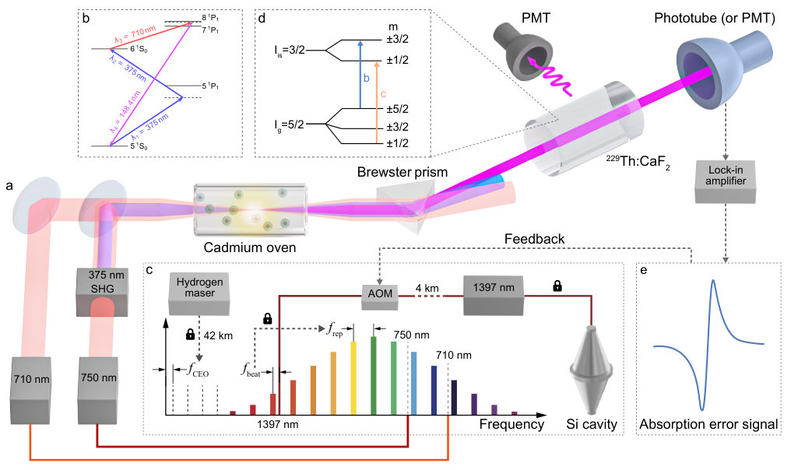 
Fig. 1. Experimental platform for a solid-state 229Th nuclear clock. a, Experimental setup. Continuous-wave 148.4 nm VUV light is generated by four-wave mixing in cadmium vapour and sent to a home-grown 229Th:CaF2 crystal. Nuclear fluorescence is collected with a photomultiplier tube (PMT), while the transmitted VUV power is recorded with a phototube or a PMT. During absorption spectroscopy and clock operation, the 710 nm laser is modulated, and the transmitted VUV signal is detected via lock-in demodulation. b, Cadmium energy-level scheme for resonantly enhanced four-wave mixing. Two 375 nm photons drive the two-photon resonance between the 5 1S0 and 6 1S0 states, while one 710 nm photon...

📷 Fig 2

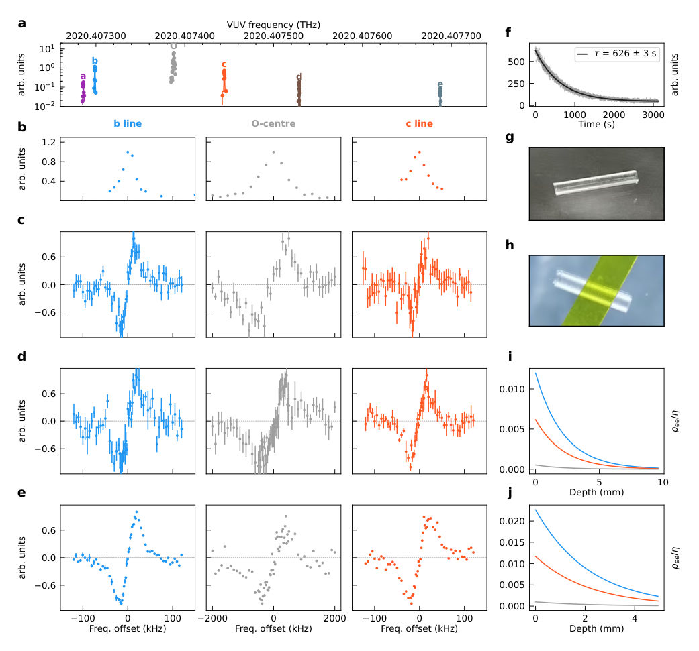 
Fig. 2. Fluorescence and absorption spectroscopies of 229Th:CaF2 crystals. a, Overview of the observed nuclear transitions on an absolute VUV-frequency axis. Fitted line profiles of the D-centre quadrupole components and the O-centre feature are shown, with peak heights normalized to line b. b, Normalized fluorescence-excitation spectra of line b, the O-centre transition and line c. All error bars represent 1σ statistical uncertainties. c, Frequency-modulation absorption signals of the same three spectral features measured with an analog PMT in S1. Each data point is acquired for 80 seconds. d, Corresponding absorption signals measured with the phototube in S1. Each data point is acquired...

📷 Fig 3

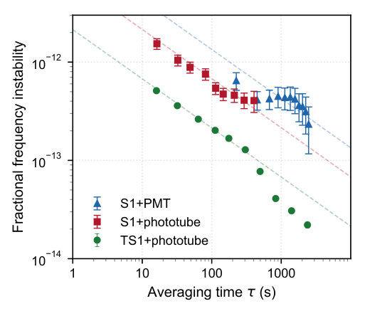 
Fig. 3. Fractional frequency instability of the nu- clear clock. Fractional frequency instabilities under three configurations: the S1 crystal with signal measured by PMT (triangle), the S1 crystal with signal measured by phototube (square), the TS1 crystal with signal measured by phototube (circle). To better show the dependence of the frequency in- stabilities on the averaging time τ, a dashed line is plotted for each configuration, with a slope corresponding to 1/√τ.

**Summary.** The paper reports the successful demonstration of a novel nuclear clock based on the isomeric transition of $^{229}	ext{Th}$ within a solid-state crystal host. By stabilizing a VUV laser to this nuclear resonance, the authors achieve high frequency stability ($2 	imes 10^{-12}/\sqrt{	au} 	ext{ s}$). This work is significant because it extends quantum metrology into the realm of nuclear physics for next-generation compact timekeeping and fundamental constant measurements.

**Why it may be interesting.** This work directly advances quantum metrology by extending high-precision timing standards from electronic transitions (like those used in optical clocks) to nuclear energy levels, opening a new platform for fundamental physics tests using solid-state systems.

Detailed structure

**Main problem.** To develop a robust, compact frequency reference by utilizing the low-lying isomeric transition in the $^{229}	ext{Th}$ nucleus instead of traditional electronic transitions.

**Main result.** The authors successfully demonstrated operation of a solid-state nuclear clock, achieving a fractional frequency instability of $2 	imes 10^{-12}/\sqrt{	au} 	ext{ s}$, and confirmed the reproducibility of this reference across different crystal batches.

**Method.** Clock stabilization is achieved by locking a continuous-wave vacuum-ultraviolet (VUV) laser to the resolved nuclear transition using absorption spectroscopy read out via phototube photocurrent detection.

**Model / system.** The system uses $^{229}	ext{Th}$ embedded in solid-state hosts, specifically $	ext{CaF}_2$ crystals ($	ext{S}1$ and $	ext{TS}1$). The interrogation relies on the laser-accessible isomeric transition frequency.

**Key observables.** Fractional frequency instability ($\Delta f/f$), absorption contrast, center frequencies of resolved nuclear transitions ($b$-line), and signal-to-noise ratio (SNR).

**Important parameters / regimes.** VUV wavelength of $148.4 	ext{ nm}$; clock stability limit of $2 	imes 10^{-12}/\sqrt{	au} 	ext{ s}$; temperature control near $301	ext{ K}$.

**Assumptions / limitations.** The method assumes that the nuclear transition can serve as a stable, traceable discriminator for an external oscillator, and that high-SNR absorption measurements are feasible.

**Figures summary.** Figures illustrate the complex experimental setup involving VUV laser generation (via four-wave mixing), optical frequency chain stabilization using frequency combs, and spectroscopic results comparing fluorescence and absorption signals across different crystal types.

**Paper structure.** The paper details the theoretical motivation for nuclear clocks, describes the advanced experimental apparatus required to generate and stabilize the necessary VUV light, presents measurements characterizing the spectral lines in solid-state hosts, and culminates in demonstrating clock operation and stability analysis.

Abstract

Atomic clocks have made time and frequency the most precisely measured quantities in physics, progressing from microwave standards that realize the SI second to optical clocks that now reach unprecedented levels of precision. A nuclear clock would shift the frequency reference from an electronic transition to the uniquely low-lying, laser-accessible isomeric transition in the $^{229}$Th nucleus, offering a route to compact, robust timekeeping and sensitive tests of fundamental physics. However, turning recent advances in spectroscopy of the $^{229}$Th nuclear resonance into clock operation requires the nuclear transition to serve as a stable discriminator for steering a traceable oscillator. Here we demonstrate the operation of a $^{229}$Th nuclear clock by stabilizing a continuous-wave narrow-linewidth 148.4 nm vacuum-ultraviolet (VUV) laser to a resolved nuclear transition in a solid-state host. This clock operation is enabled by fast frequency discrimination based on phototube photocurrent readout of the transmitted VUV power. The 10 $μ$W VUV laser, generated by four-wave mixing in cadmium vapour, provides a high-signal-to-noise absorption signal from a home-grown $^{229}$Th:CaF$_2$ crystal, allowing the laser to be locked to a weakly temperature-sensitive nuclear transition. The clock reaches a fractional frequency instability of $2\times10^{-12}/\sqrt{τ/s} $, where $τ$ is the averaging time. Remarkably, nuclear-clock frequencies measured with two distinct crystals agree at the $10^{-13}$ level, demonstrating the reproducibility of solid-state nuclear frequency references. By making a laser-addressed atomic nucleus an operational clock reference, this work extends quantum metrology from electronic to nuclear transitions, and opens a new platform for compact clocks, solid-state nuclear quantum sensors and precision tests of fundamental physics.

[↑ back to top](#top)

### [Crystallography of periodic nanotextures in a strained Mott insulator](http://arxiv.org/abs/2606.09685v1)

**Authors:** Benjamin Z. Gregory, Yorick A. Birkhölzer, Noah Schnitzer, Ziming Shao, Jeff Hodgson, Suchismita Sarker, Jacob P. Ruff, Berit H. Goodge, David A. Muller, Kyle M. Shen, Darrell G. Schlom, Andrej Singer  
**Type:** both · **Category:** strongly correlated electrons · **PDF:** <https://arxiv.org/pdf/2606.09685v1>  
**Analysis basis:** full PDF text, analyzed in chunks
**Topic relevance:** `Frenkel-Kontorova` **2/5** · `Keldysh / 2PI / non-Gaussian methods` **1/5** · `analog quantum simulation` **1/5** · `driven-dissipative phase transition` **1/5** · `spintronics-quantum-optics interface` **1/5**

📷 Fig 1

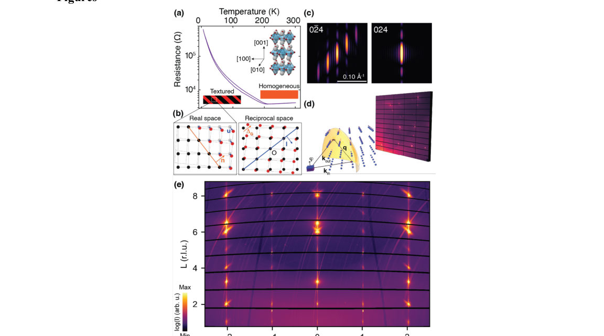 
Figure 1: Striped nanotexture and reciprocal space mapping of Ca2RuO4. (a) Resistivity of the strained Ca2RuO4 thin film showing a metal-insulator transition at 200 K. The film is homogeneous at high temperatures and forms a periodic nanotexture of distinct structural domains resembling the bulk L-Pbca and S-Pbca phases (red and black stripes). (Inset) Ca2RuO4 unit cell (Ca: gray, O: red, Ru: blue). (b) Real space: atomic positions in the two structural variants, with interface normal 𝒏 and the displacements 𝒖 all parallel to 𝐥. Reciprocal space: The reciprocal lattice points of the distorted lattice are shifted by 𝚫𝐆 along 𝐧. The lattice remains undistorted along the line through the...

📷 Fig 2

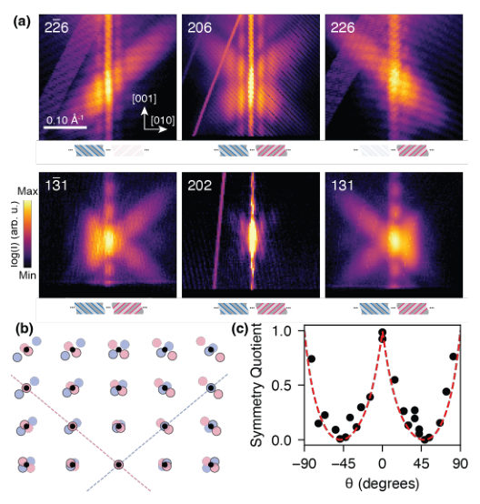 
Figure 2: Parameter-free collapse of satellite intensities onto the invariant-plane-strain prediction. (a) Magnified reciprocal space maps around selected reciprocal lattice points. The schematics under each panel show which interface variant contributes to the satellite pattern at that reflection (interface along (012) (blue), or along (01'2) (red), or both). (b) Reciprocal-space schematic showing the contributions of both interface variants. Symbols denote the two coexisting structures (S-Pbca, no edge color; L-Pbca, black edge). Dashed lines are normal to the displacement direction for each interface variant. (c) Symmetry quotient measured at 24 symmetry-inequivalent reflections with...

📷 Fig 3

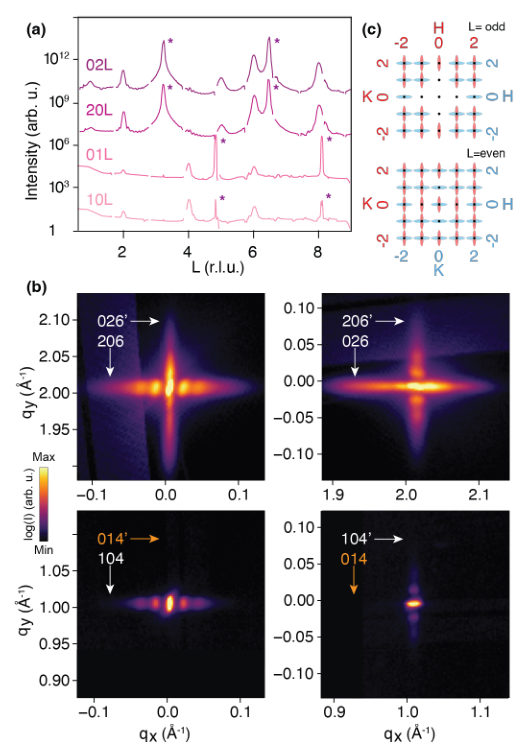 
Figure 3: Crystallography of coexisting domains. (a) Crystal truncation rods extracted from the 3D reciprocal-space map of Ca2RuO4 at 50 K, taken along l at four in-plane reciprocal-lattice positions hk = 02, 20, 01, and 10; asterisks mark peaks from the LaAlO3 substrate. At 300 K, the peak intensities are similar, and satellites are absent (Fig. S4). (b) Satellite patterns around the indicated reflections, shown in slices through reciprocal space at fixed l. Unprimed indices label the primary orthorhombic twin; primed indices label the 90°-rotated twin. At 206 and 026 (top row), both reflections are Pbca-allowed, and the satellites from the two variants form a cross. At 104 and 014 (bottom...

**Summary.** This work uses advanced X-ray diffraction techniques to study strain-induced stripe domains in a Mott insulator film. By applying classical invariant-plane-strain crystallography theory, the authors successfully model and predict the observed satellite scattering patterns. This confirms that the nanoscale domain structure is fundamentally governed by lattice compatibility rather than solely electronic interactions.

**Why it may be interesting.** While focused on solid-state structure, the analysis of phase transitions, lattice coupling, and symmetry breaking in a correlated material like RuO4 provides insights into how electronic correlations manifest through structural degrees of freedom, relevant to understanding emergent quantum phases.

Detailed structure

**Main problem.** The study investigates the spontaneous formation of alternating structural phases (stripes) in epitaxially strained Ca2RuO4 thin films below a metal-insulator transition, and determines the crystallographic principles governing these domain patterns.

**Main result.** Satellite-pattern intensities collapse onto a single parameter-free curve predicted by classical invariant-plane-strain crystallography, confirming the existence of a coherent martensitic laminate structure.

**Method.** The research combines large-volume X-ray reciprocal-space mapping with theoretical modeling based on Invariant Plane Strain (IPS) deformation theory to analyze diffraction patterns.

**Model / system.** The physical system is epitaxially strained Ca2RuO4 thin films, a Mott insulator undergoing structural transitions. The analysis models the domain geometry using classical invariant-plane-strain crystallography, which dictates how coherent interfaces accommodate transformation strain.

**Key observables.** Satellite-pattern intensities across multiple Bragg reflections; Symmetry Quotient (SQ'') quantifying relative satellite streak brightness; shifts in reciprocal lattice vectors ($\Delta\mathbf{G}$).

**Important parameters / regimes.** Temperature (below metal-insulator transition); Strain magnitude; Domain width (few-nm); Crystallographic symmetry group (Pbca).

**Assumptions / limitations.** The domain geometry is governed by Classical invariant-plane-strain crystallography, and the analysis assumes epitaxial strain enforces a compatible plane templating the periodic laminate structure.

**Figures summary.** Figures show parameter-free collapse of satellite intensities onto IPS predictions; diagrams illustrate interface shifts ($\Delta\mathbf{G}$); STEM images confirm coherent interfaces between L and S phases.

**Paper structure.** The paper progresses from identifying the structural transition and domain formation via X-ray mapping, developing the theoretical framework using invariant plane strain crystallography to model the satellite intensity dependence, and finally confirming the model's predictive power across multiple reflections.

Abstract

Here we investigate stripes of alternating structural phases spontaneously forming in epitaxially strained $Ca_2RuO_4$ thin films below the metal-insulator transition. Using large-volume X-ray reciprocal-space mapping, we show that satellite-pattern intensities across 24 symmetry-inequivalent Bragg reflections collapse onto a single parameter-free curve. The collapse identifies a coherent martensitic laminate of few-nm-wide domains separated by ${012}$ interfaces, with displacements along $\left\langle01\bar{2}\right\rangle$. Satellite-extinction analysis demonstrates that both coexisting phases retain the bulk orthorhombic space group despite the pseudocubic $LaAlO_3$ substrate, biaxial epitaxial strain, and intrinsic strain at the interfaces. Classical invariant-plane-strain crystallography thus governs the nanoscale domain geometry of a Mott insulator with intertwined magnetic, electronic, and lattice order.

[↑ back to top](#top)

### [Free fermions in disguise without exponential degeneracies](http://arxiv.org/abs/2606.09462v1)

**Authors:** Balázs Pozsgay  
**Type:** theory · **Category:** statistical mechanics · **PDF:** <https://arxiv.org/pdf/2606.09462v1>  
**Analysis basis:** full PDF text, analyzed in chunks
**Topic relevance:** `analog quantum simulation` **2/5** · `entanglement & information structure` **1/5** · `exotic spin models in light-matter` **1/5** · `non-equilibrium dynamics` **1/5**

📷 Fig 1

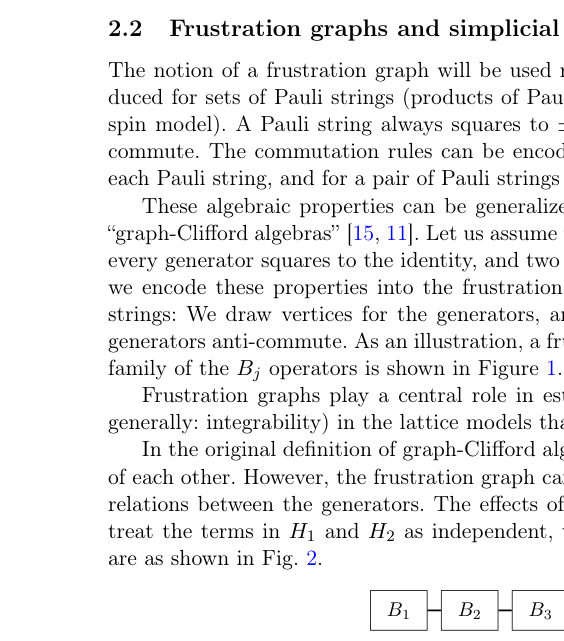 
Figure 1: Frustration graph for one copy of the Ising-type algebra for M = 6.

📷 Fig 2

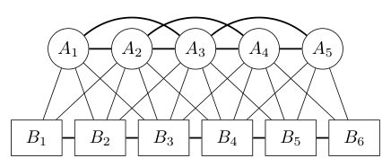 
Figure 2: Frustration graph for the Hamiltonian H1 for M = 6. The terms Ak are algebraically dependent on the generators Bj and ˜Bj; however, if we focus on H1 alone, then we can regard them as independent operators, and thus the corresponding independent vertices are added to the graph. The Hamiltonian H2 has an identical frustration graph.

📷 Fig 3

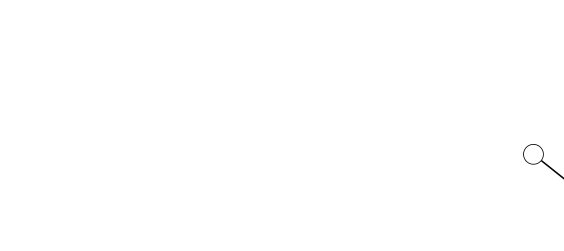 
Figure 3: The claw graph

📷 Fig 4

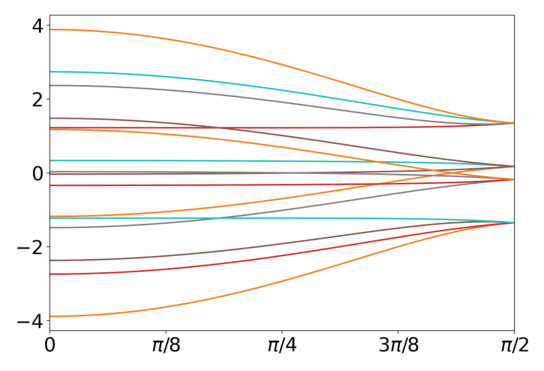 
Figure 4: The spectrum of Hθ as a function of θ, for M = 4. For each value of θ ̸= π/2 there are 16 different eigenvalues, each with a homogeneous degeneracy of 2, corresponding to the chain having length L = M +1 = 5. They collapse to 4 eigenvalues at θ = π/2, corresponding to the FFD model, which has S = 2 eigenmodes for M = 4.

**Summary.** This paper introduces a novel, exactly solvable model for coupled spin chains that avoids the exponential degeneracies found in previous free-fermionic models. By utilizing advanced algebraic techniques involving transfer matrices and graph theory, the authors prove the Hamiltonian can be diagonalized into non-interacting fermionic modes. This provides a powerful theoretical tool for studying quantum many-body systems with controlled spectral properties.

**Why it may be interesting.** The rigorous mathematical framework connecting algebraic structures (graph theory) directly to the solvability and spectral properties of interacting quantum spin chains is highly relevant for understanding integrability in many-body physics.

Detailed structure

**Main problem.** To present a solvable quantum spin chain model that exhibits free-fermionic structure without suffering from exponential degeneracies, which plagued previous related models.

**Main result.** The proposed Hamiltonian, derived as an interpolation between known solvable chains, is shown to be exactly solvable via free-fermion techniques, yielding a spectrum with controlled, non-exponential degeneracies.

**Method.** The analysis heavily relies on abstract algebra (graph-Clifford algebras) and the construction of transfer matrices whose factorization proves diagonalizability into quadratic forms of fermionic operators.

**Model / system.** The system is an FFD-type spin chain model, realized as a perturbation of two coupled Ising chains. It can also be viewed as interpolating between a standard Jordan-Wigner solvable XY chain and the original FFD model.

**Key observables.** Spectral degeneracies (the absence of exponential growth), single-particle eigenmodes ($\epsilon_{a,k}$), and the structure of the transfer matrix $	ext{TM}(u)$.

**Important parameters / regimes.** Coupling constants ($\lambda$, $e\lambda$), chain length ($M$), and the interpolation parameter $\lambda$ which tunes between different solvable limits.

**Assumptions / limitations.** The analysis assumes that treating the two coupled Hamiltonians ($H_1$ and $H_2$) independently is valid for constructing their respective free-fermionic structures, and it requires specific commutation relations among edge operators to ensure compatibility.

**Figures summary.** Figures illustrate frustration graphs associated with the Ising-type algebras, confirming structural properties like being interval graphs.

**Paper structure.** The paper progresses by defining the coupled algebraic structure, establishing that $H_1$ and $H_2$ are individually free-fermionic due to their graph structure. It then proves their mutual commutativity using transfer matrix techniques, culminating in a full diagonalization of $H_1 \pm H_2$.

Abstract

Recently, a number of spin chain models have been discovered that are solvable via hidden free-fermionic structures, going beyond the Jordan-Wigner paradigm. However, all examples in the literature displayed degeneracies that grow exponentially with the volume and that are homogeneous in the spectrum (identical degeneracies for all energy levels). In this note we present a model that can be solved by ``free fermions in disguise'' (FFD), such that the spectrum is free from exponential degeneracies for generic coupling constants. The model can be seen as a particular perturbation of two Ising chains. Alternatively, it can be realized as an interpolation between a standard Jordan-Wigner solvable chain and the original FFD model of Fendley. We used ChatGPT Pro 5.4 and 5.5 as a research assistant; in the Supplemental Material we provide details about the collaboration between the AI and the human author.

[↑ back to top](#top)

### [Hamiltonian-Guided Leverage Embedding: Robust Subspace Compression for Efficient QAOA Parameter Estimation](http://arxiv.org/abs/2606.07814v1)

**Authors:** Sumanta Mukherjee, Kalyan Dasgupta, Surya Shravan Kumar Sajja, Kameshwaran Sampath, Abhishek Singh, Dhriti Verma, Dzung Phan, Jayant Kalagnanam  
**Type:** theory · **Category:** quantum information and computing · **PDF:** <https://arxiv.org/pdf/2606.07814v1>  
**Analysis basis:** full PDF text, analyzed in chunks
**Topic relevance:** `quantum measurements` **2/5** · `entanglement & information structure` **1/5** · `measurement-induced transitions` **1/5** · `methods for driven-dissipative` **1/5**

📷 Fig 1

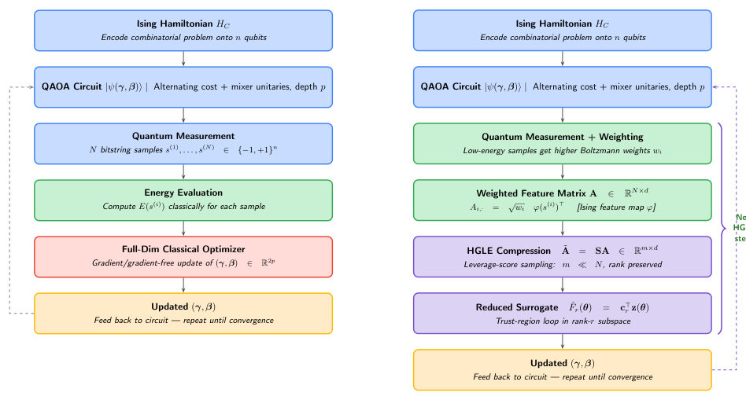 
Fig. 1: Pipeline comparison. Left: Standard QAOA loop with cost O(N · d) per iteration. Right: HGLE-QAOA inserts two stages (purple): (1) constructing a weighted Ising feature matrix A ∈RN×d, and (2) leverage-score compression to ˜A ∈Rm×d with m ≪N. The optimizer then works in a rank-r surrogate space with formal argmin-preservation guarantees (Corollary 5).

📷 Fig 2

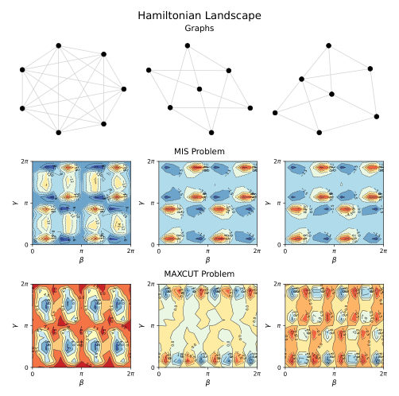 
Fig. 2: System-dependent Hamiltonian energy landscapes. Top row: Three graph instances of increasing sparsity (dense, moderate, sparse). Middle row: QAOA energy landscape ⟨HC⟩(γ, β) for the Maximum Independent Set (MIS) problem on each graph. Bottom row: Corresponding landscapes for the Max-Cut problem. Dense graphs produce highly rugged landscapes with numerous local min- ima and narrow basins, while sparser graphs yield smoother contours with more accessible global structure. The landscape topology also varies markedly between problem types: MIS landscapes exhibit isolated, irregularly shaped basins, whereas Max-Cut landscapes display greater periodicity along γ. These system- and...

📷 Fig 3

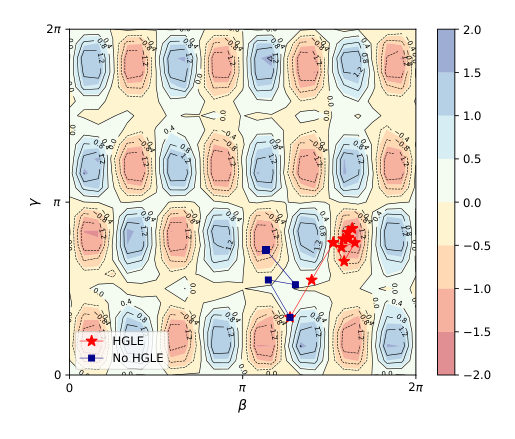 
Fig. 3: Optimization trajectories on the QAOA energy landscape. Contours show ⟨HC⟩(β, γ) for a Max-Cut instance at depth p=1. Red stars: HGLE-enabled iterates converge quickly within a deep basin. Blue squares: randomly initialized search wanders through flat and mixed-sign regions before reaching a minimum.

📷 Fig 4

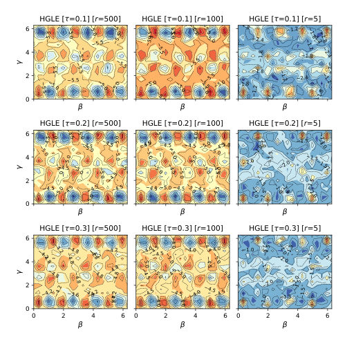 
Fig. 4: Sensitivity of the HGLE energy landscape to regularization τ and retained rank r. Each panel shows the predicted energy ˆFr(β, γ) for a 7-vertex Max-Cut instance at depth p=1. Rows vary the regularization strength (τ = 0.1, 0.2, 0.3); columns vary the retained rank (r = 500, 100, 5). At r ≥100, the landscape is well- resolved and largely insensitive to τ, confirming robust compression. At r = 5 the surrogate degrades significantly, with shallower energy values and loss of contour structure.

📷 Fig 5

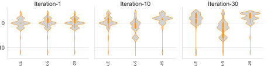 
Fig. 5: Sample enrichment (8-node Max-Cut). Violin plots of ⟨HC⟩at iterations 1, 10, 30. Rank-25 concentrates near optimal (most negative) energies by iteration 30; No HGLE retains a broader distribution extending toward less favorable energies.

**Summary.** This paper introduces Hamiltonian-Guided Leverage Embedding (HGLE) to solve the computational bottleneck in optimizing QAOA parameters. HGLE exploits the inherent low-rank structure of measurement data by compressing it using leverage-score sampling. This allows for robust, resource-efficient parameter estimation for solving hard combinatorial optimization problems on near-term quantum hardware.

**Why it may be interesting.** While focused on optimization, the techniques developed—low-rank approximation of quantum measurement data—are highly relevant for characterizing complex quantum states or simulating dynamics in strongly correlated systems where full state vector evolution is intractable.

Detailed structure

**Main problem.** The primary challenge is efficiently estimating the variational parameters ($\gamma$ and $eta$) for QAOA, which involves optimizing over a high-dimensional, noisy, non-convex landscape.

**Main result.** The proposed Hamiltonian-Guided Leverage Embedding (HGLE) algorithm significantly reduces computational cost by compressing the measurement feature matrix into a low-rank subspace while preserving critical geometric information.

**Method.** HGLE is a hybrid pipeline that uses leverage-score row sampling to compress the weighted Ising feature matrix derived from QAOA measurements, allowing classical optimization in a much lower dimension.

**Model / system.** The work focuses on the Quantum Approximate Optimization Algorithm (QAOA) applied to combinatorial problems like Max-Cut and MIS. The system is modeled by an Ising Hamiltonian ($H_C$) acting on qubits.

**Key observables.** Approximation Ratio (solution quality relative to optimum), Circuit Evaluation Count, Energy Landscape $\hat{E}(\gamma, eta)$.

**Important parameters / regimes.** Variational parameters ($\gamma, eta$), retained rank ($r$), bandwidth ($k$) for sparsification, and the leverage score sampling rate ($m/N$).

**Assumptions / limitations.** The core assumption is that the classical feature matrices derived from QAOA measurements exhibit a pronounced low-rank structure that can be robustly captured by leverage-score sampling.

**Figures summary.** Figures compare optimization trajectories (HGLE vs. standard), show energy landscape sensitivity to rank/regularization, and plot scaling results for approximation ratios and circuit budgets across varying qubit counts and depths.

**Paper structure.** The paper introduces the bottleneck of QAOA parameter estimation, details the HGLE algorithm using leverage-score compression on the feature matrix $\mathbf{A}$, provides formal error bounds based on rank preservation ($\kappa_r$), and validates the method's performance across various graph problems (Max-Cut/MIS) and hardware constraints (sparsification).

Abstract

The Quantum Approximate Optimization Algorithm (QAOA) is a hybrid quantum-classical framework for combinatorial optimization on near-term quantum devices. A central bottleneck is the classical estimation of its variational parameters γ and β, which must be optimized over a high-dimensional, non-convex landscape corrupted by sampling noise. We observe that the classical feature matrices constructed from QAOA measurement samples exhibit pronounced low-rank structure, and exploit this property for noise-robust, reduced-dimension parameter search. We present the Hamiltonian-Guided Leverage Embedding (HGLE) algorithm - a hybrid pipeline that encodes low-energy quantum samples into a weighted Ising feature matrix and compresses it via leverage-score row sampling, provably preserving the dominant rank-rsubspace geometry. The compressed representation drives a classical trust-region loop for (γ, β) estimation at a fraction of the original cost. We provide formal guarantees for rank preservation and energy approximation error, and demonstrate robustness across problem types (Max-Cut, Maximum Independent Set) and graph topologies of varying density.

[↑ back to top](#top)

### [What Is a Pattern in Statistical Mechanics? Formalizing Structure and Patterns in One-Dimensional Spin Lattice Models with Computational Mechanics](http://arxiv.org/abs/2606.08509v1)

**Authors:** Omar Aguilar  
**Type:** theory · **Category:** statistical mechanics · **PDF:** <https://arxiv.org/pdf/2606.08509v1>  
**Analysis basis:** full PDF text, analyzed in chunks
**Topic relevance:** `entanglement & information structure` **2/5** · `Frenkel-Kontorova` **1/5** · `Keldysh / 2PI / non-Gaussian methods` **1/5** · `methods for driven-dissipative` **1/5**

📷 Fig 1

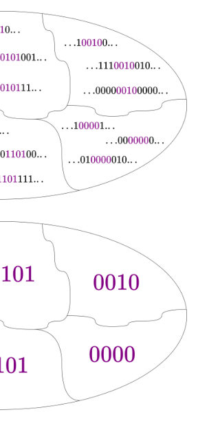 
Figure 2. Graphical representation of coarsegrained Ising phase space. Only the purple spins are assigned fixed indices. For clarity, down spins ↓are represented as 0 instead of −1.

📷 Fig 2

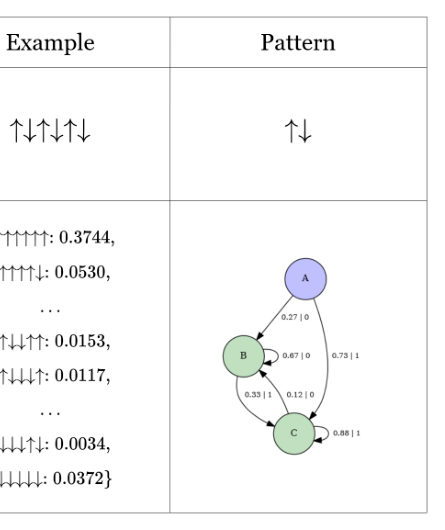 
Figure 3. Graphical representation of configuration and ensemble pattern concepts.

📷 Fig 3

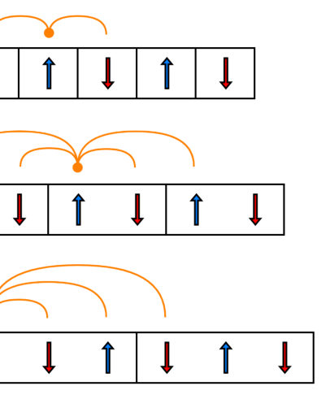 
Figure 4. Illustration of spin interactions in Ising models with neighboring radii R = 1 (top), R = 2 (middle), and R = 3 (bottom).

📷 Fig 4

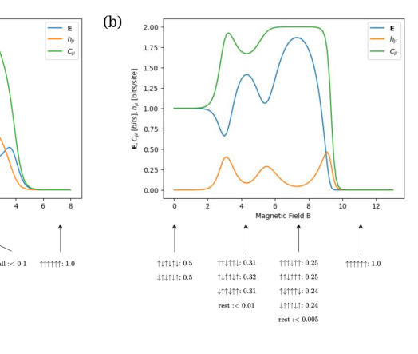 
Figure 5. (a) hµ, E and Cµ vs. J1 for nnn Ising model with J2 = −1.2, B = 0.05 and T = 1. (b) hµ, E and Cµ vs. B for 3-range Ising model with J1 = −2.8, J2 = −1.3, J3 = −0.45 and T = 0.2.

📷 Fig 5

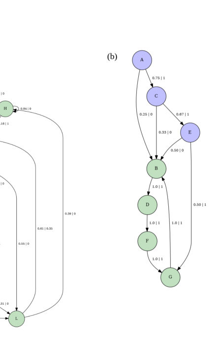 
Figure 6. (a) ϵ-machine of 3-range Ising model with B = 0.2, T = 4, J1 = 1, J2 = 1 and J3 = 1. (b) ϵ-machine of 3-range Ising model with B = 8, T = 0.2, J1 = −3, J2 = −2 and J3 = −2.

**Summary.** This paper develops a novel framework to quantify 'structure' and 'pattern' in 1D spin lattice models by treating them as stochastic processes. It utilizes information theory measures alongside computational mechanics concepts ($\epsilon$-machines) to analyze these patterns. The key finding is that this rigorous, machine-based approach successfully reproduces the statistical predictions of classical statistical mechanics for various physical Hamiltonians.

**Why it may be interesting.** While focused on classical statistical mechanics, the rigorous application of information-theoretic tools like $\epsilon$-machines provides a powerful, generalizable mathematical language for characterizing complex physical states, which has parallels in understanding quantum correlations or entanglement structure.

Detailed structure

**Main problem.** The work aims to formalize the abstract concepts of 'structure' and 'pattern' within statistical mechanics, moving beyond simple entropy measures.

**Main result.** The authors demonstrate that analyzing 1D spin lattice models using information-theoretic tools (like $\epsilon$-machines) yields results consistent with established Boltzmann distributions, providing a computational framework for pattern recognition in physical systems.

**Method.** The methodology combines concepts from information theory (Shannon entropy rate, statistical complexity) and theoretical computer science by modeling the system as a stochastic process analyzed via $\epsilon$-machines.

**Model / system.** The primary models are one-dimensional spin lattice systems, including finite-range Ising, solid-on-solid, and three-body models. The analysis treats these configurations as realizations of a stationary stochastic process governed by an underlying Hamiltonian.

**Key observables.** Shannon entropy rate ($h_\mu$), Excess Entropy ($E$), Statistical Complexity ($C_\mu$), and the structure defined by the $\epsilon$-machine (PDFM).

**Important parameters / regimes.** Temperature ($T$) or inverse temperature ($eta$), coupling constants ($J, B$), and system size/boundary conditions.

**Assumptions / limitations.** The analysis assumes that the physical pattern can be captured by finding the minimal abstract machine ($\epsilon$-machine) generating the stochastic process, and it relies on defining probability measures over a $\sigma$-algebra of configurations.

**Figures summary.** Figures illustrate comparisons between information measures ($C_\mu, h_\mu, E$) versus temperature for Ising models, and graphical representations comparing the structure derived from these measures against the connectivity and state transitions within the inferred $\epsilon$-machine.

**Paper structure.** The paper progresses by first introducing the formalisms (information theory, stochastic processes), developing the machinery ($\epsilon$-machines) to quantify patterns, applying this framework systematically to multiple 1D spin models, and finally comparing these computational findings against known thermodynamic results.

Abstract

This work formalizes the notions of structure and pattern for three distinct one-dimensional spin-lattice models (finite-range Ising, solid-on-solid, and three-body), using information-theoretic and computation-theoretic methods. We begin by presenting a novel derivation of the Boltzmann distribution for finite one-dimensional spin configurations embedded in infinite ones. We next recast this distribution as a stochastic process, thereby enabling us to analyze each spin-lattice model within the theory of computational mechanics. In this framework, the process's structure is quantified by excess entropy (predictable information) and statistical complexity (stored information), and the process's structure-generating mechanism is specified by its epsilon-machine. To assess compatibility with statistical mechanics, we compare the configurations jointly determined by the information measures and epsilon-machines to typical configurations drawn from the Boltzmann distribution, and we find agreement. We also include a self-contained primer on computational mechanics and provide code implementing the information measures and spin-model distributions.

[↑ back to top](#top)

### [Who Earns the Safety? Intervention-Aware Quantum Predictive Control with Safety Attribution](http://arxiv.org/abs/2606.09778v1)

**Authors:** Yifan Wang  
**Type:** both · **Category:** other · **PDF:** <https://arxiv.org/pdf/2606.09778v1>  
**Analysis basis:** full PDF text, analyzed in chunks
**Topic relevance:** `quantum measurements` **2/5** · `driven-dissipative phase transition` **1/5** · `methods for driven-dissipative` **1/5**

📷 Fig 1

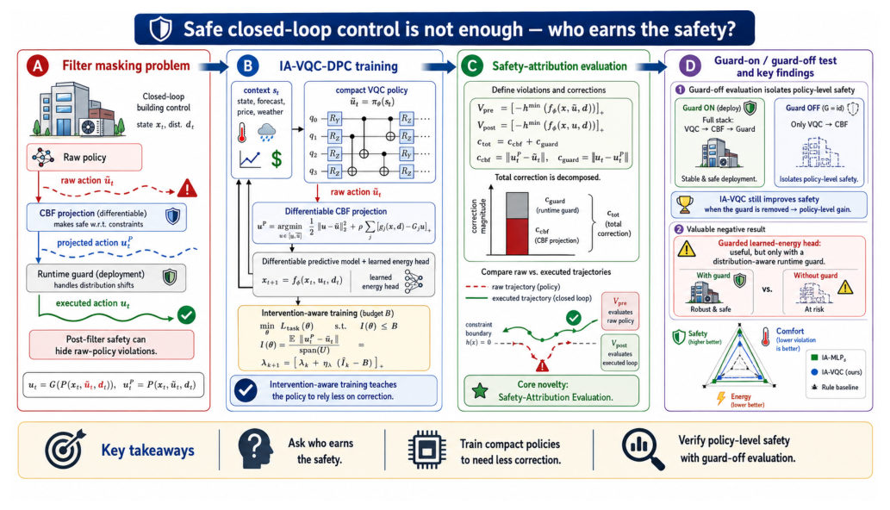 
Figure 1: Who earns the safety? (Left) A compact variational quantum circuit (VQC) policy proposes an action that a differentiable Control-Barrier-Function (CBF) projection and a deployment runtime guard edit before execution, so a post-filter loop can look safe even when the raw policy is not. (Center) Intervention-aware training adds a primal–dual intervention budget that penalizes reliance on the safety layers, pushing the policy to be intrinsically close to safe. (Right) Our safety-attribution evaluation decomposes the executed correction into a CBF term and a runtime-guard term and adds a guard-off stress test, so measured safety is credited to the policy that earned it rather than to...

📷 Fig 2

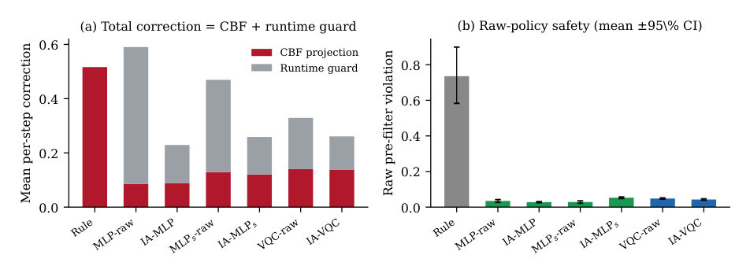 
Figure 2: Safety attribution on guarded closed loops (n=60). (a) Total correction decomposes into CBF and runtime-guard parts: the headline “correction reduction” of raw clones is mostly deployment guard, not learned safety. (b) Raw pre-filter violation with 95% CIs: only the rule-based controller is grossly unsafe pre-filter; among learned policies, intervention-aware training keeps the compact VQC’s raw violations low.

📷 Fig 3

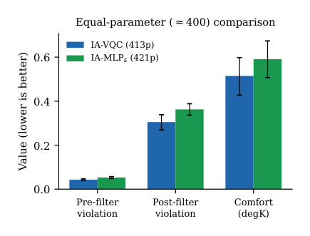 
Figure 3: Equal-parameter (≈400) comparison with 95% CIs. The intervention-aware quantum policy is significantly safer (pre/post-filter) and more comfortable than a matched- capacity classical policy.

📷 Fig 4

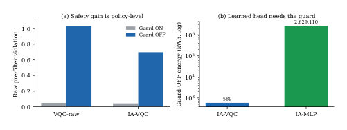 
Figure 4: Guard-off evaluation. (a) Removing the runtime guard, IA-VQC still has significantly lower raw pre-filter violation than VQC-raw (∆=−0.33, p&lt;10−4): the gain is policy-level. (b) Without the guard, the learned-energy-head IA-MLP is exploited out of distribution and its energy ex- plodes (2.6 × 106 kWh), while IA-VQC remains stable— motivating the guarded design.

**Summary.** This paper proposes an advanced quantum predictive control method to solve the problem of safety attribution in constrained learning. By explicitly penalizing reliance on external safety filters during training, the authors demonstrate that their quantum policy learns genuinely safer behaviors than classical counterparts when tested rigorously. This methodology provides a general framework for quantifying how much 'safety' is truly earned by the learned model versus its protective wrappers.

**Why it may be interesting.** While the application is classical control theory (HVAC), the methodology involves training quantum circuits (VQC) for optimal control under strict physical constraints, which has implications for designing robust quantum controllers.

Detailed structure

**Main problem.** The paper addresses the 'filter-masking problem' where safety filters can mask an upstream policy's incompetence, making it unclear whether safety is earned by the learned policy or its protective layers.

**Main result.** An intervention-aware quantum control method significantly improves raw pre-filter safety and reduces reliance on external safety layers compared to baseline methods. Furthermore, this improvement is shown to be intrinsic to the policy itself when tested without the safety guards.

**Method.** The authors introduce Intervention-Aware Variational Quantum Differentiable Predictive Control (IA-VQC-DPC), which trains a VQC policy using a primal-dual intervention budget that penalizes over-reliance on differentiable safety projections.

**Model / system.** The work is tested in closed-loop, high-fidelity BOPTEST emulators simulating building HVAC control systems. The core components involve a Variational Quantum Circuit (VQC) acting as the policy, constrained by sequential Control-Barrier-Function (CBF) projection and runtime guards.

**Key observables.** Raw pre-filter violation ($	ext{Vpre}$), post-filter violation ($	ext{Vpost}$), total safety-layer reliance ($c_{tot} = c_{CBF} + c_{guard}$), energy consumption, and the comparison of these metrics across different policy versions.

**Important parameters / regimes.** The training uses a primal–dual intervention budget constraint; capacity is compared at an equal approximate 400-parameter budget between quantum and classical policies.

**Assumptions / limitations.** Standard safety metrics are insufficient because they conflate filter success with true policy competence, necessitating the explicit decomposition of safety corrections into distinct terms (CBF vs. guard).

**Figures summary.** Figures illustrate the concept of filter masking versus intervention-aware training, and show the results of safety attribution evaluation, confirming that improvements are policy-level.

**Paper structure.** The paper first establishes the problem of safety misattribution using filters, then introduces IA-VQC-DPC with its specialized loss function. It details the safety attribution protocol and evaluates performance on building control emulators, culminating in guard-off tests to prove intrinsic policy safety gains.

Abstract

Hard safety filters are increasingly placed downstream of learned controllers to guarantee constraint satisfaction at run time. Yet a filtered controller that never violates a constraint may still have learned nothing about safety: the filter can silently repair an incompetent upstream policy, so that post-filter success measures the filter, not the policy. We argue that safe policy learning should ask who earns the safety - the policy or its protective layers - and we make this question measurable. We introduce Intervention-Aware Variational Quantum Differentiable Predictive Control (IA-VQC-DPC), which (i) trains a compact variational quantum circuit (VQC) policy under a primal-dual intervention budget that penalizes reliance on a differentiable Control-Barrier-Function (CBF) projection, and (ii) is evaluated with a safety-attribution protocol that decomposes the executed-trajectory correction into a CBF term and a deployment runtime-guard term, and stress-tests the policy with guard-off evaluation. On closed-loop, high-fidelity BOPTEST building-control emulators (5 seeds, 60 episodes per method), intervention-aware training significantly lowers the quantum policy's raw pre-filter violation and total safety-layer reliance (both p < 10^-4) with no significant energy regression; at an equal approximately 400-parameter budget the quantum policy is significantly safer and more comfortable than a matched classical policy. Guard-off evaluation confirms the improvement is policy-level and exposes a valuable negative result: a learned differentiable energy head is only safe when paired with a distribution-aware runtime guard. The attribution protocol is general beyond quantum policies and buildings.

[↑ back to top](#top)

### [Entanglement in the Quantum Volunteer's Dilemma](http://arxiv.org/abs/2606.08227v1)

**Authors:** Noah Dane Hebdon, Dax Enshan Koh  
**Type:** theory · **Category:** quantum information and computing · **PDF:** <https://arxiv.org/pdf/2606.08227v1>  
**Analysis basis:** full PDF text, analyzed in chunks
**Topic relevance:** `entanglement & information structure` **2/5**

📷 Fig 1

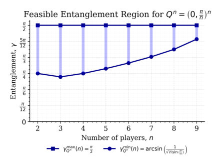 
FIG. 1. Lower bound on the entanglement parameter γ as a function of the number of players n for the Qn =  0, π

📷 Fig 2

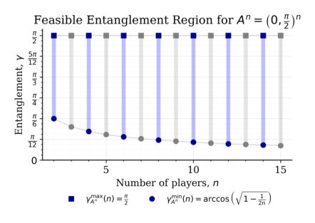 
FIG. 2. Lower bound on the entanglement parameter γ as a function of the number of players n for the An =  0, π

**Summary.** This paper generalizes the Quantum Volunteer's Dilemma by introducing a tunable entanglement parameter $\gamma$. It derives mathematical conditions proving that symmetric Nash equilibria can persist even when entanglement is reduced below its maximum value. This finding is crucial for understanding the practical feasibility of quantum enhancements in social decision-making on current, resource-constrained quantum devices.

**Why it may be interesting.** It provides concrete, quantifiable thresholds ($\gamma_{\min}$) showing that quantum advantage in social dilemmas is robust and not solely dependent on maximal entanglement, which has direct implications for near-term, resource-limited quantum hardware.

Detailed structure

**Main problem.** The study investigates how the existence and payoff of symmetric Nash equilibria in a quantum version of the Volunteer's Dilemma depend on the degree of initial entanglement ($\gamma$).

**Main result.** Symmetric Nash equilibria can be sustained even when the entanglement is below its maximum value, provided $\gamma$ remains above a calculated threshold $\gamma_{	ext{threshold}}$ that depends on system size $n$.

**Method.** The authors derived explicit mathematical conditions for equilibrium existence by analyzing payoff functions based on probability amplitudes derived from an entangled multi-qubit state.

**Model / system.** The model is the Quantum Volunteer's Dilemma, formulated using the Eisert–Wilkens–Lewenstein framework acting on a shared entangled multi-qubit quantum state. Players manipulate qubits via unitaries to influence outcomes.

**Key observables.** Expected payoff for each player ($i(	heta, \phi)$), and the required minimum entanglement parameter ($\gamma_{\min}$).

**Important parameters / regimes.** Entanglement parameter ($\gamma$), number of players ($n$), and specific strategy profiles like $Q_n$ and $A_n$.

**Assumptions / limitations.** The analysis focuses on two canonical symmetric strategy profiles ($Q_n$ and $A_n$) and assumes the system is governed by the EWL framework.

**Figures summary.** Figure 1 illustrates the lower bound $\gamma_{\min}(n)$ for the $Q_n$ profile, while Figure 2 shows a similar bound for the $A_n$ profile, both demonstrating dependence on $n$.

**Paper structure.** The paper first establishes the classical and quantum game setup. It then analyzes specific strategy profiles ($Q_n$ and $A_n$) to derive necessary conditions for Nash equilibrium in terms of $\gamma$, leading to explicit lower bounds on entanglement.

Abstract

A well-known model in game theory, the Volunteer's Dilemma describes a group of $n$ players who decide whether to volunteer for a collective benefit at a personal cost, or to abstain and risk forfeiting the benefit altogether. A quantum version of this dilemma, developed within the Eisert-Wilkens-Lewenstein framework, allows each player to manipulate one qubit of a shared entangled state, leading to symmetric Nash equilibria with higher expected payoffs than in the classical game. Existing analyses, however, assume maximal entanglement. Within the same framework, we introduce a generalized Quantum Volunteer's Dilemma with a tunable entanglement parameter $γ$ and study the extent to which equilibrium behavior depends on the level of entanglement. We derive explicit conditions relating $γ$, the number of players, and the players' strategies under which symmetric Nash equilibria exist, focusing on two canonical strategy profiles: one for $2\leq n\leq 9$, and one for even $n$. We find that maximal entanglement is not required to sustain symmetric equilibria. Instead, equilibrium behavior persists above a threshold value, which we compute analytically in both cases. We also demonstrate that the threshold value directly depends on system size. This characterization is directly relevant for implementations on resource-constrained quantum devices, where entanglement is inherently limited.

[↑ back to top](#top)

### [A century of coherent states](http://arxiv.org/abs/2606.08361v1)

**Authors:** Dusan Popov  
**Type:** theory · **Category:** other · **PDF:** <https://arxiv.org/pdf/2606.08361v1>  
**Analysis basis:** full PDF text, analyzed in chunks
**Topic relevance:** `Keldysh / 2PI / non-Gaussian methods` **1/5** · `analog quantum simulation` **1/5** · `correlated / nonlocal dissipation` **1/5** · `driven-dissipative phase transition` **1/5** · `entanglement & information structure` **1/5** · `methods for driven-dissipative` **1/5** · `non-equilibrium dynamics` **1/5**

📷 Fig 1

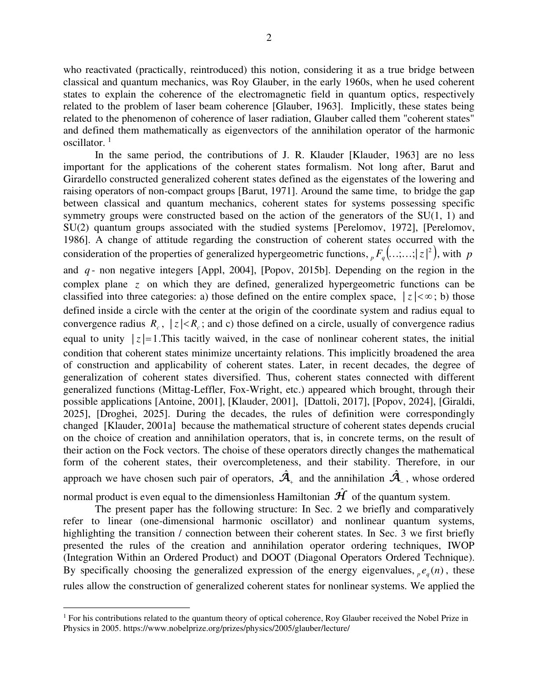 
Low-resolution page preview, page 2

📷 Fig 2

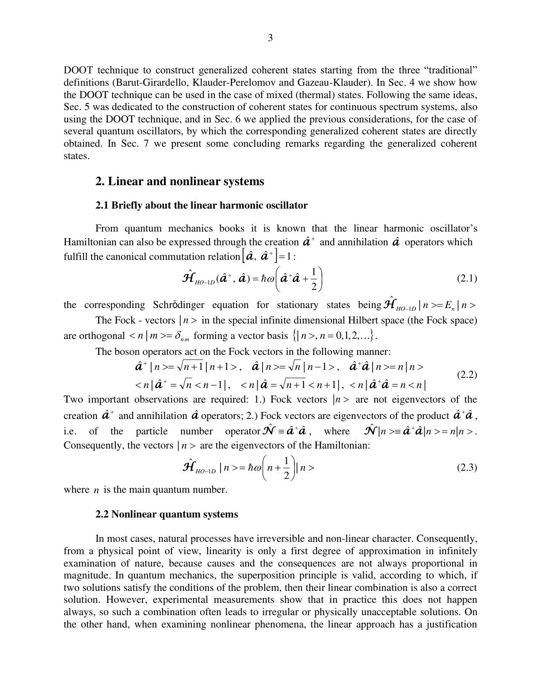 
Low-resolution page preview, page 3

📷 Fig 3

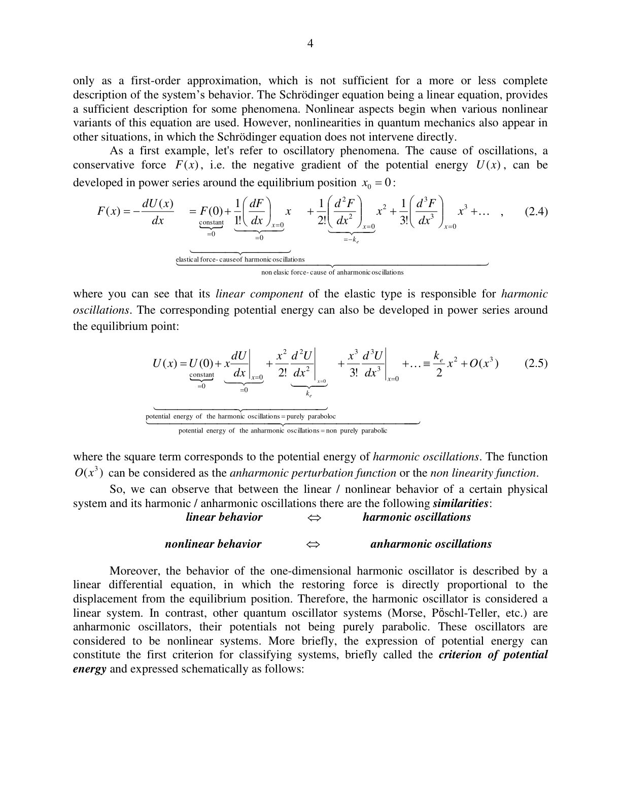 
Low-resolution page preview, page 4

📷 Fig 4

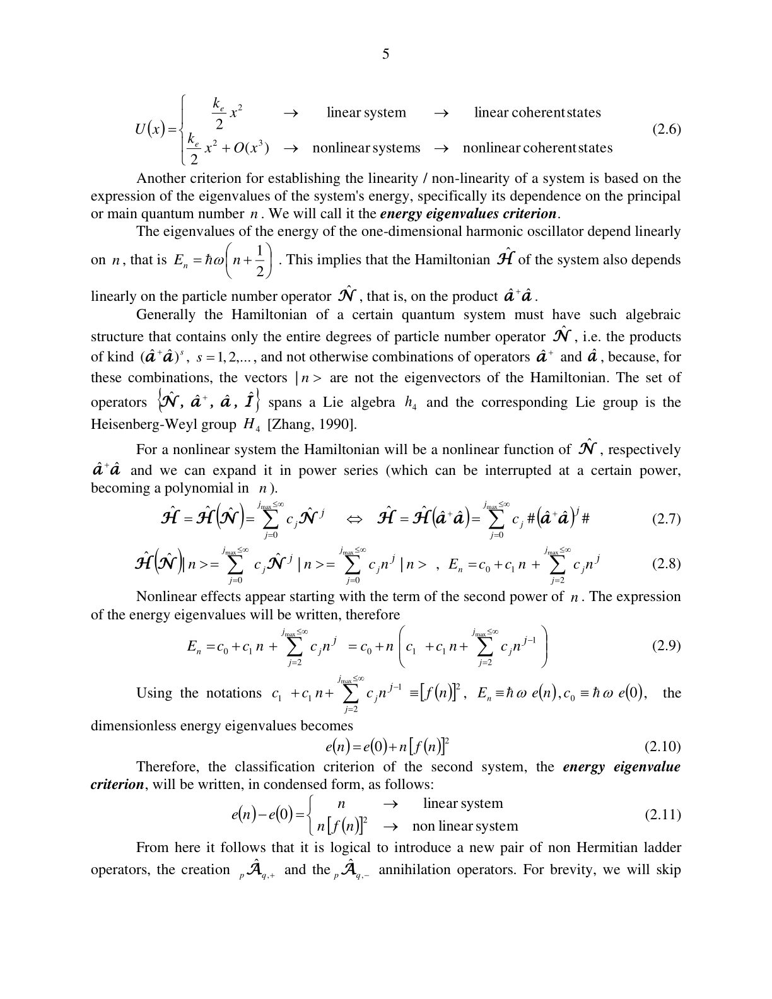 
Low-resolution page preview, page 5

📷 Fig 5

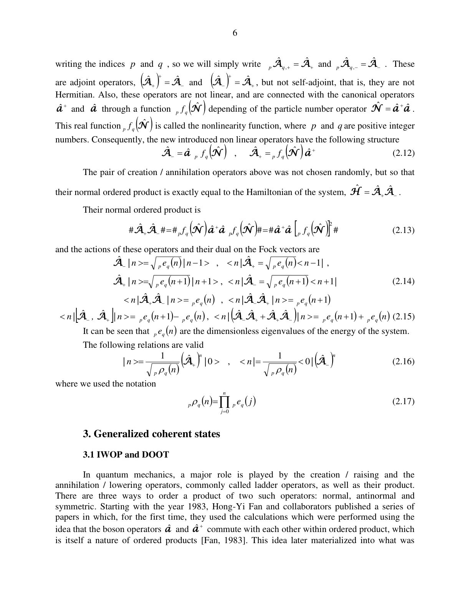 
Low-resolution page preview, page 6

**Summary.** This paper develops an advanced mathematical theory to construct generalized coherent states for anharmonic quantum oscillators. It introduces the Diagonal Operator Ordering Technique (DOOT) to systematically handle nonlinear Hamiltonians using special functions like hypergeometric and Fox-Wright functions. This framework allows physicists to analyze systems beyond simple harmonic motion, providing tools to characterize their quantum state properties.

**Why it may be interesting.** This work is highly relevant for theoretical physicists working on open quantum systems or quantum optics because it provides a rigorous mathematical tool (DOOT) to define generalized coherent states for complex, anharmonic potentials where standard methods fail.

Detailed structure

**Main problem.** The primary goal is to develop a systematic, generalized mathematical framework for constructing coherent states applicable to anharmonic quantum oscillators.

**Main result.** Generalized coherent states can be constructed using the Diagonal Operator Ordering Technique (DOOT) applied to hypergeometric functions, providing an extension beyond standard harmonic oscillator definitions.

**Method.** The paper employs advanced mathematical techniques including DOOT, analysis of energy eigenvalue spectra ($	ilde{e}_n$), and utilizing generalized special functions like the Fox-Wright function for normalization.

**Model / system.** The focus is on quantum oscillators ranging from the simple harmonic oscillator (linear) to anharmonic systems like Morse or Pöschl-Teller potentials (nonlinear). The formalism extends to continuous spectra and thermal environments.

**Key observables.** Mandel parameter ($\mathcal{M}$), expectation values of operator products, and generalized structure constants ($
ho_{np}^q$).

**Important parameters / regimes.** The functional form of the dimensionless energy eigenvalues ($	ilde{e}_n$) dictates the specific mathematical structure of the resulting coherent state.

**Assumptions / limitations.** It assumes that rules analogous to normal ordering (IWOP) can be systematically extended via DOOT to handle nonlinear Hamiltonians and operators.

**Figures summary.** The notes detail numerous equations representing generalized hypergeometric functions, Meijer G-functions, and specific formulas for the Mandel parameter in various spectral regimes.

**Paper structure.** The paper progresses by first establishing the necessity of generalization (comparing linear/nonlinear systems), then detailing the DOOT technique, deriving the general mathematical form using special functions (Fox-Wright/hypergeometric), and finally applying this framework to analyze moments and physical observables like photon statistics.

Abstract

During the century of existence of the notion of coherent states, either linear or nonlinear, several schemes for their construction, theoretical or experimental, have been developed. Generally, the mathematical structure of coherent states depends on the choice of ladder operators, and consequently on the structure constants. In this paper, we propose a way to construct generalized coherent states for anharmonic oscillators that is based on a diagonal operator ordering technique (DOOT) applied to generalized hypergeometric functions, that is, on some of the most general special functions. These states are generated by the action of a pair of ladder operators, the creation and the annihilation, whose ordered normal product is equal to the dimensionless Hamiltonian of the quantum system. In addition, the action of these operators is easy to find if the expression for the dimensionless energy eigenvalues is known.

[↑ back to top](#top)

### [Robust applicability of continuous dynamical decoupling to decoherence reduction in longitudinal and transverse-noise settings: The role of anisotropy](http://arxiv.org/abs/2606.08114v1)

**Authors:** S. Afonso, J. M. Gomez Llorente, J. Plata  
**Type:** theory · **Category:** other · **PDF:** <https://arxiv.org/pdf/2606.08114v1>  
**Analysis basis:** full PDF text, analyzed in chunks
**Topic relevance:** `Keldysh / 2PI / non-Gaussian methods` **1/5** · `analog quantum simulation` **1/5** · `correlated / nonlocal dissipation` **1/5** · `driven-dissipative phase transition` **1/5** · `methods for driven-dissipative` **1/5** · `non-equilibrium dynamics` **1/5**

📷 Fig 1

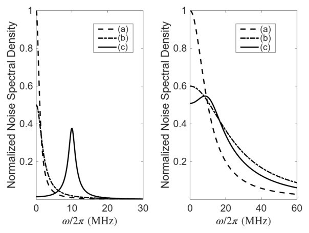 
Figure 1. Spectral densities of the input fluctuations ηx(t) (a), and ηy(t) (b), and, of the effective noise term χa(t) (c). [Normalization to the maximum of S(ηx; ω) has been used]. In the left, the input fluctuations correspond to η2 x = 100 (a.u.), αηx/2π = 1 (MHz), η2 y = 100(a.u.), and αηy/2π = 2 (MHz). In the right, η2 x = 100 (a.u.), αηx/2π = 10 (MHz), η2 y = 150 (a.u.), and αηy/2π = 25 (MHz). In both, left and right figures, ωd/2π = 10 (MHz). The variances are expressed in arbitrary units (a.u.).

📷 Fig 2

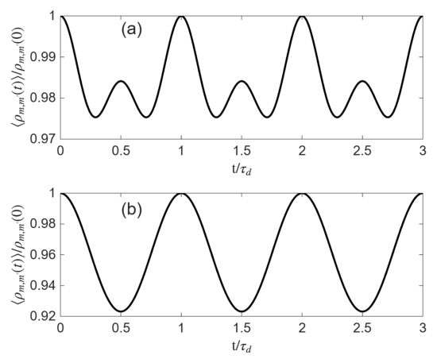 
Figure 2. Dephasing resulting from anisotropic (a) and isotropic (b) static noisy inputs. (a) η2 x = 1, η2 y = 0.2, ωd = 5. (b) η2 x = η2 y = 1, ωd = 5. Arbitrary units are used for the variances and the frequency. We have taken |m −m′| = 1.

📷 Fig 3

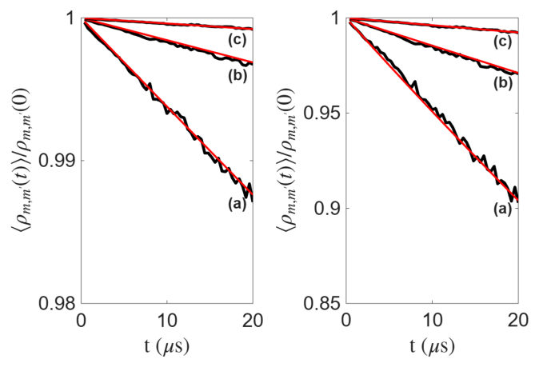 
Figure 3. Results of the numerical simulation of the dephasing process (black lines) as compared with the predictions of the theoretical approach (red lines). In the left part, αηx = 1 (MHz), αηy = 0.5 (MHz); in the right part, αηx = 10 (MHz),

📷 Fig 4

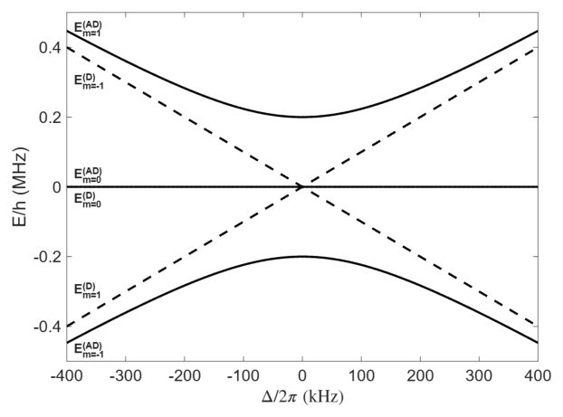 
Figure 4. Bare energy levels (dashed lines) and dressed counterparts (continuous lines) of the three-level LZ model corresponding to the Hamiltonian in Eq. (11) with F = 1, Ωd/(2π) = 0.2 (MHz). For m = 0, the bare and the dressed energy levels are equal (horizontal line)

📷 Fig 5

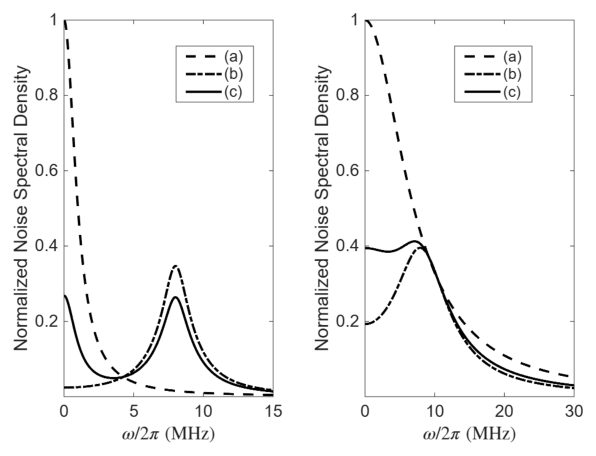 
Figure 5. Spectral densities of the fluctuations δω0(t) (a), χa(t) (b), and χd(t) (c), normalized to the maximum of S(δω0; ω). In the left, the input fluctuations correspond to η2 x = 150 (a.u.), αηx/2π = 1 (MHz), η2 y = 250(a.u.), αηy/2π = 2 (MHz), δω2 0 = 200 (a.u.), and, αδω0 = 1 (MHz). In the right, η2 x = 150 (a.u.), αηx/2π = 4.5 (MHz), η2 y = 50 (a.u.), αηy/2π = 6 (MHz), δω2 0 = 200 (a.u.), and, αδω0 = 7 (MHz). In both, left and right figures, ωd/2π = 8 (MHz) and θ = π/3.

**Summary.** This paper rigorously analyzes Continuous Dynamical Decoupling (CDD) efficiency against complex noise sources, extending theory beyond simple longitudinal noise to include transverse and anisotropic fluctuations. By transforming the system into a dressed-state basis, the authors show that CDD effectively suppresses decoherence by shifting the spectral density of noise away from critical transition frequencies.

**Why it may be interesting.** This work provides a comprehensive theoretical toolkit for designing quantum control sequences that are resilient to realistic, multi-dimensional noise environments encountered in solid-state or atomic quantum memories.

Detailed structure

**Main problem.** The study evaluates how effectively Continuous Dynamical Decoupling (CDD) can suppress decoherence in qubit systems subjected to complex noise, specifically generalizing beyond simple longitudinal fluctuations to include transverse and anisotropic noise components.

**Main result.** CDD proves robust against generalized noise sources by transforming the effective noise spectral densities away from the system's fundamental transition frequencies. The efficiency is highly dependent on the driving field parameters ($\Omega_d, \omega_d$) and the nature of the noise correlations.

**Method.** The analysis employs an analytical framework based on unitary transformations to map the noisy Hamiltonian into a dressed-state representation. This allows for calculating effective stochastic terms whose spectral characteristics determine decoherence rates.

**Model / system.** The model is based on a qubit system, exemplified by a hyperfine Zeeman multiplet in $^{87}	ext{Rb}$. The dynamics are governed by a generalized Hamiltonian incorporating longitudinal frequency shifts ($\delta\omega_0(t)$) and transverse noise components ($\eta_x(t), \eta_y(t)$).

**Key observables.** Decoherence time ($T_2$), coherence decay $\langle
ho_{m,m'}(t)
angle$, and population transfer probabilities $\langle P_{m,m'}(t)
angle$.

**Important parameters / regimes.** Driving field amplitude ($\Omega_d$), driving frequency ($\omega_d$), noise correlation times ($	au_c$), and the anisotropy parameters of the noise.

**Assumptions / limitations.** The analysis often relies on the Rotating Wave Approximation (RWA) ($\omega_d \gg \Omega_d$) and assumes Gaussian statistics for the fluctuations. Cross-correlations between different noise sources are sometimes neglected initially.

**Figures summary.** Figures compare numerical simulations to theoretical predictions of dephasing processes under various noise conditions, illustrating how CDD mitigates decoherence by shifting effective spectral densities away from resonance frequencies.

**Paper structure.** The paper progresses by first establishing the generalized Hamiltonian including transverse noise. It then uses unitary transformations to analyze the system in a dressed-state basis. Subsequent sections detail the decay of coherences (dephasing) and population transfer rates, analyzing different noise limits (white vs. static) and the role of anisotropy.

Abstract

We analytically evaluate the efficiency of continuous dynamical decoupling (CDD) to curb decoherence in generic qubit setups where diverse sources of noise can be present. Previous theoretical approaches to CDD have mainly focused on its potential to cope with longitudinal fluctuations. Here, the basic scenario tackled with CDD is generalized. Apart from dealing with pure dephasing induced by diagonal noise, we consider the impact of transverse fluctuations, usually present in the practical arrangements. In particular, the implications of anisotropic noisy inputs are studied. Additionally, we analyze the role of the fluctuations in the dressing of the qubit by the CDD field of control: since the driving field is usually switched on through linear ramps of its characteristic parameters, the associated dressing of the original states can be described in terms of noisy Landau-Zener transitions. In our approach, based on a sequence of unitary transformations, the noise entering the system is cast into effective stochastic terms whose spectral characteristics are dependent on the driving parameters. This description allows the design of strategies to mitigate the impact of the fluctuations using controlled changes in the effective-noise properties. Significant robustness of CDD against the generalization of the basic scenario can be achieved through an appropriate choice of the parameters of control.

[↑ back to top](#top)

### [When Do Local Score Models Extrapolate Across Size? A Diagnostic Theory and Benchmark](http://arxiv.org/abs/2606.09705v1)

**Authors:** Wenjie Xi  
**Type:** both · **Category:** statistical mechanics · **PDF:** <https://arxiv.org/pdf/2606.09705v1>  
**Analysis basis:** full PDF text, analyzed in chunks
**Topic relevance:** `analog quantum simulation` **1/5** · `correlated / nonlocal dissipation` **1/5** · `driven-dissipative phase transition` **1/5** · `methods for driven-dissipative` **1/5** · `non-equilibrium dynamics` **1/5**

📷 Fig 1

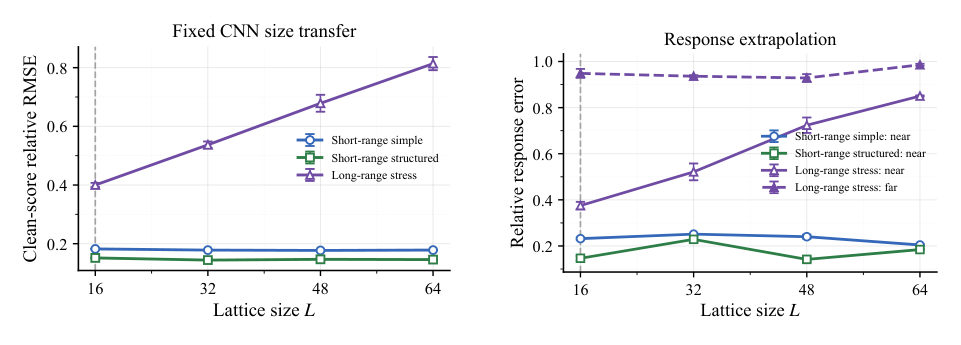 
Figure 1: Fixed-architecture pure-CNN size extrapolation on the 2D FDLF benchmark, aggregated over three indepen- dent training seeds. Models use B = 1 residual block, hence Reff = 4, are trained only at L = 16, and are evaluated at larger sizes. Short-range simple and short-range structured teachers show stable score and near-response errors across L, while the long-range stress teacher has substantially larger error and degrades under the same protocol. Error bars are s.e.m. across training seeds.

📷 Fig 2

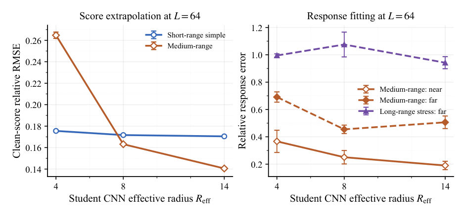 
Figure 2: Pure-CNN receptive-field sweep on the 2D FDLF benchmark, aggregated over three independent training seeds. Models are trained at L = 32 and evaluated at L = 64. The x-axis is the effective CNN radius induced by the number of 3 × 3 convolutional residual blocks. Left: the short-range simple teacher is stable even at small radius, while the medium-range teacher improves substantially as the receptive field grows. Right: the same medium-range teacher shows decreasing near/far response error, whereas the long-range stress teacher retains high far-response error. Error bars are s.e.m. across training seeds.

📷 Fig 3

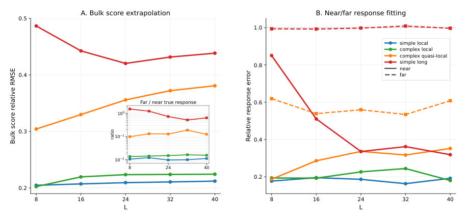 
Figure 3: Hard-valid mixed discrete-continuous check. Models are trained at L = 8 and evaluated up to L = 40. Local teachers remain stable; teachers with larger far-field response have poorer or degrading score and response errors. The inset reports the teacher’s own far-to-near response ratio.

📷 Fig 4

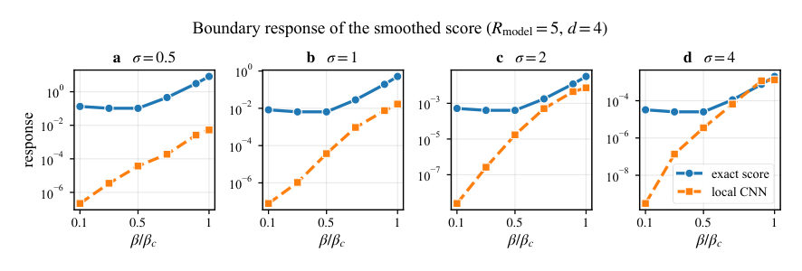 
Figure 4: Boundary response of the smoothed score near the Ising critical point. A local CNN with radius R = 5 is evaluated at distance d = 4, inside its nominal receptive field. The exact response grows strongly as β/βc →1, and the learned response underestimates it, especially at intermediate noise scales.

**Summary.** The paper rigorously diagnoses when local score models can generalize from small to large physical systems by focusing on the quasi-locality of the Gaussian-smoothed score. It introduces a novel benchmark (FDLF) and proves that stable extrapolation requires the model's receptive field to encompass the true, long-range response dictated by the underlying physics. This provides a crucial theoretical bridge between deep learning generalization theory and statistical mechanics.

**Why it may be interesting.** This work provides a powerful, physics-informed diagnostic tool for assessing the generalization capabilities of deep learning models trained on physical systems, directly linking ML performance to fundamental statistical properties like spatial correlation decay.

Detailed structure

**Main problem.** The central problem is determining the conditions under which local score models, trained on small systems, can reliably extrapolate their learned rules to much larger physical systems in generative modeling.

**Main result.** Stable size extrapolation requires that the underlying Gaussian-smoothed score exhibits quasi-locality relative to the model's receptive field, not just architectural locality. Failure occurs when spatial mixing weakens or the true response range exceeds the model's capacity.

**Method.** The authors develop theoretical theorems and introduce a white-box diagnostic benchmark called Finite-Depth Local Flow (FDLF) to systematically test score extrapolation across varying system sizes.

**Model / system.** The framework uses generative models based on reverse diffusion processes applied to physical systems, tested using controlled lattices (e.g., 2D/3D cubic lattices) and benchmarked against known physics like the Ising model near criticality.

**Key observables.** Clean-score relative RMSE ($	ext{RMSE}_{	ext{score}}(L)$), Response Tail $T_{L,\sigma}(i; R, x)$, and local marginal distributions ($d_{BL}$).

**Important parameters / regimes.** System size ($L$), Receptive Field Size ($	ext{Reff}$), Noise level ($\sigma$), and the critical parameter $eta/eta_c$ for stress tests.

**Assumptions / limitations.** The primary assumption is that stable extrapolation depends on the quasi-locality of the *smoothed* score, which must be covered by the model's receptive field. The theoretical bounds are explicitly local (fixed patches) and do not guarantee global convergence.

**Figures summary.** Figures demonstrate that short-range interactions maintain low error across increasing system sizes ($L$), while long-range stress teachers show failure, confirming that coverage of the score's response range is critical for successful extrapolation.

**Paper structure.** The paper builds from theoretical formalisms (quasi-locality theorems) to introducing a rigorous diagnostic benchmark (FDLF), and finally validates these concepts through structured experiments testing short-, medium-, and long-range correlation structures.

Abstract

Scientific generative modeling often requires size transfer, where models trained on small systems are evaluated on larger ones. While translation-invariant architectures enable this evaluation, we show that architectural locality alone does not guarantee stable size extrapolation. Instead, stable extrapolation is governed by the quasi-locality of the Gaussian-smoothed score. Through Tweedie's formula, far-away perturbations can influence local score components via posterior covariance, meaning a local model succeeds only if its receptive field covers the smoothed score's response range. We formalize this mechanism, proving a size-uniform comparison theorem for local marginals under reverse diffusion. We also introduce Finite-Depth Local Flow (FDLF), a white-box diagnostic benchmark with exact scores, densities, and controllable response ranges. Empirically, we validate the interplay between spatial mixing, smoothed-score quasi-locality, and model receptive fields. Under spatial mixing, the smoothed score remains quasi-local relative to the receptive field, enabling stable extrapolation. Conversely, when spatial mixing weakens, the score's locality rapidly degrades, causing size transfer to fail.

[↑ back to top](#top)

### [Constraint residuals, graph posteriors, and determinant-corrected full-space targets in Bayesian inverse problems](http://arxiv.org/abs/2606.09594v1)

**Authors:** Jonathon Cottom, Emilia Olsson  
**Type:** theory · **Category:** numerical methods · **PDF:** <https://arxiv.org/pdf/2606.09594v1>  
**Analysis basis:** full PDF text, analyzed in chunks
**Topic relevance:** `Keldysh / 2PI / non-Gaussian methods` **1/5** · `analog quantum simulation` **1/5** · `driven-dissipative phase transition` **1/5** · `methods for driven-dissipative` **1/5**

📷 Fig 1

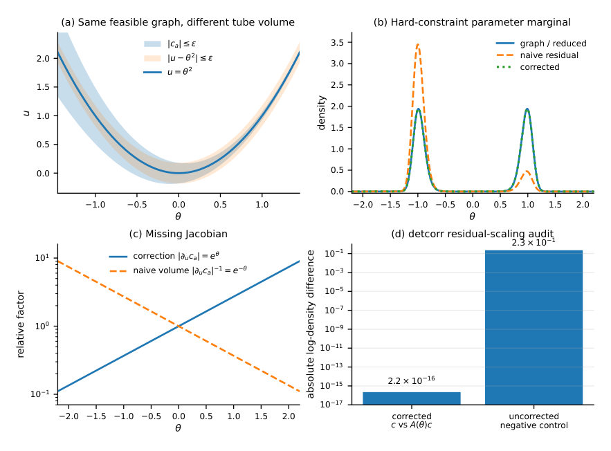 
Figure 1: Analytic scalar example and software-level residual-scaling diagnostic. (a) Scaling ca = exp(θ)(u−θ2) leaves the graph unchanged but changes residual-tube volume. (b) The naive hard-constraint limit is reweighted by exp(−θ), while the corrected limit matches the graph posterior. (c) The missing residual-volume factor and compensating determinant correction. (d) The detcorr residual-scaling audit: corrected equivalent targets agree to roundoff because the state-Jacobian and weighted-residual volume corrections are both included, while the uncorrected negative control differs at O(10−1).

📷 Fig 2

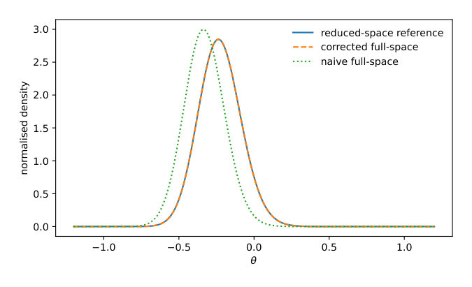 
Figure 2: Section 6 validation-scale benchmark generated from the detcorr implementation. The corrected full-space finite-penalty marginal is visually indistinguishable from the reduced-space reference, as predicted by Theorem 1, while the naive full-space marginal is biased by the missing state-Jacobian volume factor.

**Summary.** This work resolves a critical ambiguity in Bayesian inverse problems where state equations constrain parameters. It proves that simply minimizing the residual (a full-space penalty) does not yield the correct posterior measure; instead, a determinant correction involving the state Jacobian must be applied to correctly sample the reduced manifold.

**Why it may be interesting.** While focused on statistical inference rather than quantum dynamics, the mathematical machinery of manifold constraints and Jacobian determinants is highly relevant when parameterizing complex physical systems derived from PDEs in quantum physics or condensed matter theory.

Detailed structure

**Main problem.** The paper addresses the mathematical ambiguity when defining target measures for Bayesian inverse problems constrained by state equations, comparing naive full-space penalty methods against reduced-space formulations.

**Main result.** A determinant correction factor, involving the state Jacobian determinant, must be applied to the standard residual penalty to ensure that the limit of the penalized sampler correctly targets the graph-lifted reduced posterior measure.

**Method.** The authors use theoretical analysis comparing different limiting distributions derived from penalizing residuals in the full parameter-state space versus projecting onto the constraint manifold. They derive and implement determinant corrections for these penalties.

**Model / system.** The context is general PDE-constrained Bayesian inverse problems, modeled by a state equation $c(	heta, u) = 0$, where $	heta$ are unknown parameters (e.g., conductivity coefficients) and $u$ is the resulting state variable. The analysis relies on finite-dimensional discretizations of these systems.

**Key observables.** The primary observables are the posterior probability density functions ($\pi_{	ext{red}}$, $\pi_{\Gamma}$, $\pi_{
ho}$), and the convergence of sampling diagnostics like effective sample size and $\hat{R}$.

**Important parameters / regimes.** The key parameters include the unknown coefficients $	heta$, the state variable $u$, the penalty strength $
ho 	o \infty$, and the state Jacobian determinant $|\det D_{uc}|$.

**Assumptions / limitations.** Assumptions require that the state equation has a unique solution $u=G(	heta)$ with a nonsingular state Jacobian, and the results are stated for finite-dimensional discretizations.

**Figures summary.** Figures compare residual tube volume changes, hard-constraint marginals, the effect of missing Jacobian correction, and the result using the determinant-corrected audit.

**Paper structure.** The paper establishes the problem by contrasting reduced vs. full-space sampling; it then derives the necessary determinant corrections for various penalty types (unweighted, weighted); finally, it presents these corrected targets as mathematically rigorous alternatives to naive residual minimization.

Abstract

Bayesian inverse problems constrained by state equations are often sampled in a full parameter-state space by penalising the residual, rather than in a reduced space where the state is eliminated. We show that these formulations are not automatically equivalent as posterior measures. For finite-dimensional discretisations of equality-constrained inverse problems, assume the state equation \(c(θ,u)=0\) has a unique solution \(u=G(θ)\) and nonsingular state Jacobian \(\D_u c\). The reduced posterior, its graph lift, and the zero-noise residual posterior are then distinct. A local change of variables shows that an uncorrected Gaussian residual penalty converges, after marginalisation over \(u\), to the reduced density multiplied by \(\abs{\det \D_u c(θ,G(θ))}^{-1}\). Thus algebraically equivalent residuals can define the same feasible set but different limiting posteriors. We derive determinant corrections for unweighted, weighted, and rescaled residual penalties that have the graph-lifted reduced posterior as their hard-constraint limit. The result separates feasibility from posterior calibration: driving the residual to zero is not sufficient for exact sampling of the graph-lifted reduced posterior unless the sampling or correction step targets the corresponding corrected density.

[↑ back to top](#top)

### [Energy-Efficient Satellite Wake-Up via Bosonic Identification: The Role of Synchronization](http://arxiv.org/abs/2606.08845v1)

**Authors:** Gökhan Elmas, Janis Nötzel  
**Type:** theory · **Category:** quantum information and computing · **PDF:** <https://arxiv.org/pdf/2606.08845v1>  
**Analysis basis:** full PDF text, analyzed in chunks
**Topic relevance:** `correlated / nonlocal dissipation` **1/5** · `driven-dissipative phase transition` **1/5** · `entanglement & information structure` **1/5** · `interference shaping light` **1/5**

📷 Fig 1

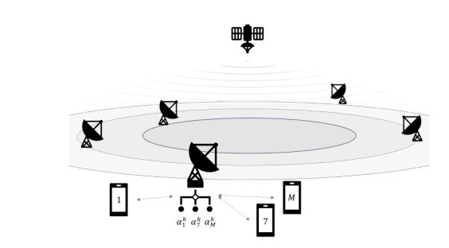 
Fig. 1. Depicted is the situation with one satellite, roughly centered in the middle, and several GS with attached UEs. The GS set their receivers to detect if one of the signatures corresponding to a UE that is attached to them is transmitted by the satellite. A GS needs to track e.g. the satellite position in order to know the transmittivity, which is required for operation of the receiver as described in Sec. IV-B.

📷 Fig 2

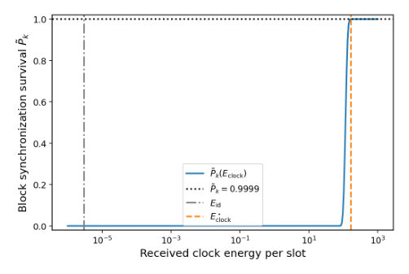 
Fig. 2. Exact block synchronization survival probability ˜Pk as a function of the received clock energy. The identification operating point Eid yields negligible survival probability, while reliable synchronization requires a sig- nificantly larger clock energy E⋆ clock.

📷 Fig 3

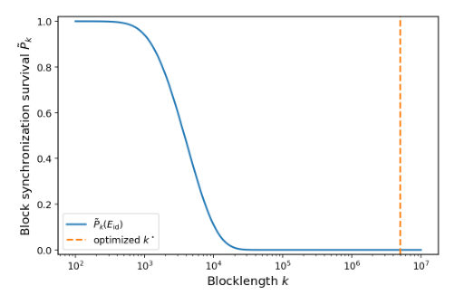 
Fig. 4. Block synchronization survival probability ˜Pk as a function of the blocklength k at fixed identification energy Eid. The exponential decay with increasing k explains the failure of synchronization at the identification- optimal blocklength.

📷 Fig 4

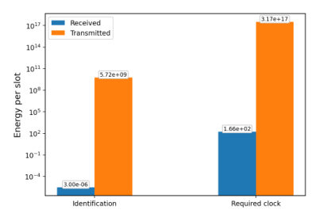 
Fig. 3. Comparison of identification and required synchronization energies for the reference scenario. For each operating point, both received and transmitted energies per slot are shown. Synchronization requires several orders of magnitude more energy than identification.

📷 Fig 5

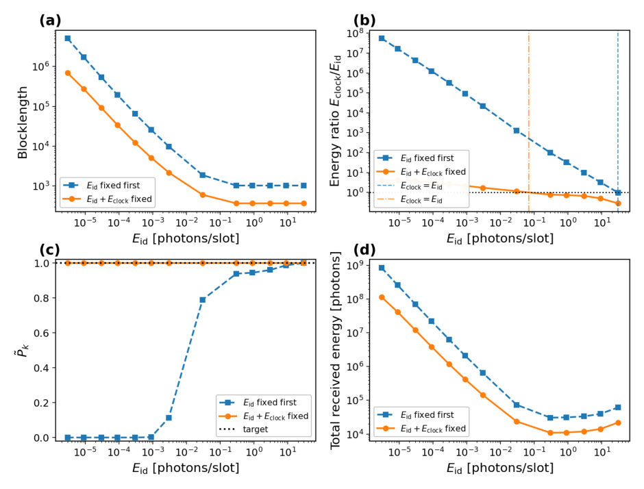 
Fig. 5. Identification-synchronization tradeoff as a function of the received identification energy Eid. Blue curves correspond to identification parameters optimized independently of synchronization; orange curves correspond to operation under a shared per-slot energy constraint. (a) Optimized blocklength. (b) Energy ratio Eclock/Eid, with vertical markers indicating Eclock = Eid. (c) Synchronization survival probability. (d) Total received energy.

**Summary.** This work analyzes deterministic identification in satellite wake-up systems constrained by energy. It reveals a critical conflict where reliable synchronization fails exponentially as the required signal blocklength increases. The authors propose that jointly optimizing for both tasks under a shared energy budget can mitigate this severe energy imbalance.

**Why it may be interesting.** The analysis provides quantitative bounds on the feasibility of quantum communication protocols in realistic, low-energy environments by explicitly modeling resource constraints (energy) against information-theoretic goals (identification).

Detailed structure

**Main problem.** The paper investigates the fundamental trade-off between achieving reliable signal identification and maintaining accurate clock synchronization in low-energy satellite wake-up communication systems.

**Main result.** There is a strong, fundamental asymmetry: while identification performance improves with blocklength, the required synchronization accuracy degrades exponentially with that same blocklength, leading to significant energy imbalances.

**Method.** The analysis uses Markov chain modeling for clock drift and spectral decomposition of Toeplitz matrices to calculate the synchronization survival probability ($	ilde{P}_k$).

**Model / system.** The system models a satellite broadcasting signals using phase-encoded coherent states to multiple Ground Stations (GS) attempting to wake up attached User Equipments (UEs). Synchronization is modeled as a discrete-time stochastic process.

**Key observables.** Identification performance vs. blocklength, synchronization survival probability ($	ilde{P}_k$), and the required energy for clock transmission versus identification signal transmission.

**Important parameters / regimes.** Blocklength ($k$), received energy levels ($E_{id}, E_{	ext{clock}}$), and the exponential decay rate governing $	ilde{P}_k$.

**Assumptions / limitations.** The synchronization dynamics are modeled by a nearest-neighbor Markov chain, and the analysis assumes perfect correction if a deviation is detected.

**Figures summary.** Figures illustrate the sharp threshold behavior of synchronization survival probability ($	ilde{P}_k$) versus clock energy, and compare the vastly different energy requirements for identification versus synchronization under independent vs. shared energy constraints.

**Paper structure.** The paper progresses by first establishing the Markovian model for synchronization failure, deriving the exponential decay rate $	ilde{P}_k \sim 2^{-kI(a,T)}$, and then comparing optimization strategies: independent (leading to large energy gaps) versus joint optimization under a shared total energy budget.

Abstract

The information-theoretic concept of identification describes a sender-receiver architecture in which the receiver only checks whether a particular message was sent or not, thereby promising a low-energy receiver design. In low received-energy regimes, quantum receivers are a promising tool for studying the system limits. However, the known information-theoretically optimal identification codes typically assume perfect synchronization. In this work, we study deterministic identification in a satellite setting under explicit synchronization constraints, where a satellite broadcasts the signature of a specific User Equipment (UE) which it assumes to be attached to one out of several possible Ground Station (GS), with the goal of establishing communication with the target UE. Within the proposed design, and assuming a specific phase-encoded coherent-state clock scheme in which the discrete time index is represented by equidistant phase rotations on the unit circle, our results reveal a fundamental asymmetry: At any transmission power, identification performance improves with blocklength, whereas synchronization accuracy degrades. In particular, the energy needed for transmitting the satellite clock to the GS can be several orders of magnitude higher than the one needed for the identification signal. This indicates that synchronization strongly impacts identification performance and motivates the investigation of the error-correcting capabilities of bosonic codes under jitter.

[↑ back to top](#top)

### [Regularised Arbitrary Gauge non-Relativistic QED](http://arxiv.org/abs/2606.08704v1)

**Authors:** Alex Chivers-White, Adam Stokes  
**Type:** theory · **Category:** other · **PDF:** <https://arxiv.org/pdf/2606.08704v1>  
**Analysis basis:** full PDF text, analyzed in chunks
**Topic relevance:** `Keldysh / 2PI / non-Gaussian methods` **1/5** · `analog quantum simulation` **1/5** · `correlated / nonlocal dissipation` **1/5** · `driven-dissipative phase transition` **1/5**

📷 Fig 1

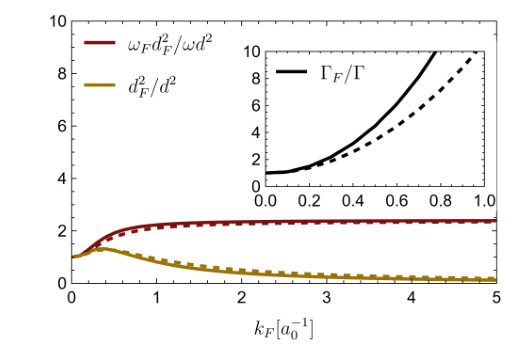 
FIG. 2: Main: d2 F /d2 (dark yellow), ωF d2 F /ωd2 (dark red), against kF ; d and ω denote the 2p →1s transition dipole moment and transition frequency respectively, while dF and ωF denote their kF -dependent counterparts obtained when δUMF is included within Hm. Dashed lines are obtained from the dipole approximation of δ ˜UMφ and solid lines from the unapproximated δUMF . A maximum value of d2 0.36/d2 ≈1.32 is followed by a linear decline as confinement increases with kF . This is compensated by a corresponding growth in ωF . Inset: Eq. (60) as a function of kF , shown in units of the bare rate. Significant deviation of ΓF /Γ from unity is seen even for relatively modest cut-off values,...

📷 Fig 2

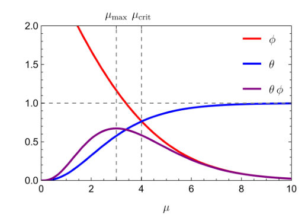 
FIG. 3: The ratios ϕ (red), θ (blue), and θϕ = 1

📷 Fig 3

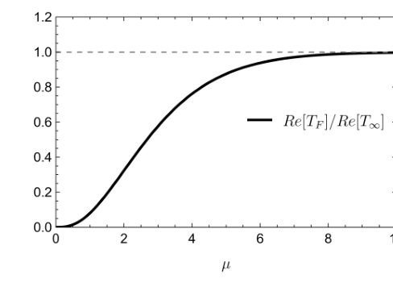 
FIG. 4: The ratio of the regularised transition element to the point-charge (kF →∞) transition element against µ. η = kF /keg is held fixed at η ≡100. For a kF ∼a−1 0 we have agreement with the point-case when R ∼10[a0], whereas for kF ∼λ−1 C we have Re[T]F ]/Re[T∞] ≈1 for all meaningful R.

**Summary.** The paper develops a rigorous, regularized framework for non-relativistic Quantum Electrodynamics by analyzing how different gauge choices affect the description of light-matter coupling. It shows that while the underlying physics must be gauge invariant, practical calculations involving cutoffs reveal significant discrepancies between simple approximations (like the dipole approximation) and more complete multipolar treatments.

**Why it may be interesting.** This work is highly relevant to AMO physics as it tackles fundamental issues of gauge dependence and regularization in light-matter interaction theory, which are crucial for accurate calculations in cavity QED or atom-surface interactions.

Detailed structure

**Main problem.** The primary goal is developing a regularised, gauge-independent formulation for non-relativistic Quantum Electrodynamics (nrQED) to correctly describe light-matter interactions.

**Main result.** The theory demonstrates that while different gauges yield mathematically equivalent physical content (S-matrix), the choice of regularization cut-off significantly impacts calculated observables like transition rates and Lamb shifts, especially when comparing dipole vs. multipolar descriptions.

**Method.** The authors employ canonical quantization procedures in an arbitrary gauge, utilizing smearing functions (form factors) to regularize point charges and compare results derived from Coulomb versus multipolar gauges.

**Model / system.** The model is non-relativistic QED describing the interaction between charged matter systems (like atoms/dipoles) and the electromagnetic field. The Hamiltonian is constructed in an arbitrary gauge $H_g$, which is then analyzed via canonical commutation relations and perturbation theory.

**Key observables.** Spontaneous emission rates ($\Gamma$), Lamb shift ($\Delta \epsilon_{2s}$), direct inter-atomic interaction ratios ($	heta, \phi$).

**Important parameters / regimes.** Momentum cut-offs ($k_\varphi, k_\ell$), separation distance $R$, and the dimensionless parameter $\mu = k_F R$.

**Assumptions / limitations.** The analysis relies on Dirac's constrained quantization procedure and makes approximations concerning which high-momentum modes are negligible (e.g., in the Electric Dipole Approximation).

**Figures summary.** Figures compare ratios of interaction strengths ($\phi, 	heta$) versus $\mu = k_F R$, showing deviations from unity when regularization is incomplete; another figure compares energy transfer rates relative to infinite-cutoff limits.

**Paper structure.** The paper progresses by first establishing the gauge-invariant Hamiltonian structure (Chunk 1 & 2), then comparing predictions for atomic transitions and Lamb shifts using different gauges and cutoffs (Chunk 3), before analyzing direct interatomic interactions and energy transfer rates in the multipolar regime (Chunk 4 & 5).

Abstract

We develop a regularised arbitrary-gauge formulation of nonrelativistic quantum electrodynamics and use it to compare Coulomb and multipolar descriptions with a Lorentzian form factor. We analyse the effect of regularisation in perturbation theory, including alternative partitions of the Hamiltonian into free and interaction parts, and the limits of the electric dipole approximation. The regularised multipolar gauge exhibits a cut-off-dependent trade-off between the strength of individual interaction terms and the localisation of material subsystems that suppresses direct inter-atomic interactions. We discuss the implications of the framework for short-range phenomena, including Dicke criticality.

[↑ back to top](#top)

### [From Pauli Strings to Quantum Dynamics: A Unified Characterization](http://arxiv.org/abs/2606.09773v1)

**Authors:** Roberto Gargiulo, Paul Herringer, Robert Zeier  
**Type:** theory · **Category:** quantum information and computing · **PDF:** <https://arxiv.org/pdf/2606.09773v1>  
**Analysis basis:** full PDF text, analyzed in chunks
**Topic relevance:** `analog quantum simulation` **1/5** · `entanglement & information structure` **1/5** · `non-equilibrium dynamics` **1/5**

📷 Fig 1

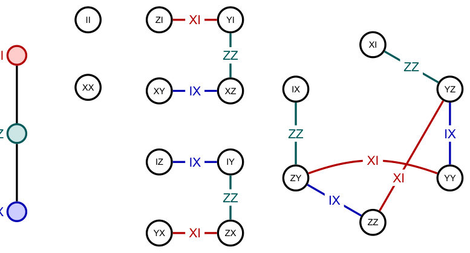 
FIG. 1. The graph-theoretic formalism. Example of (a) frustration graph and (b) commutator graph over two qubits, for the generating set G = {IX, XI, ZZ}.

📷 Fig 2

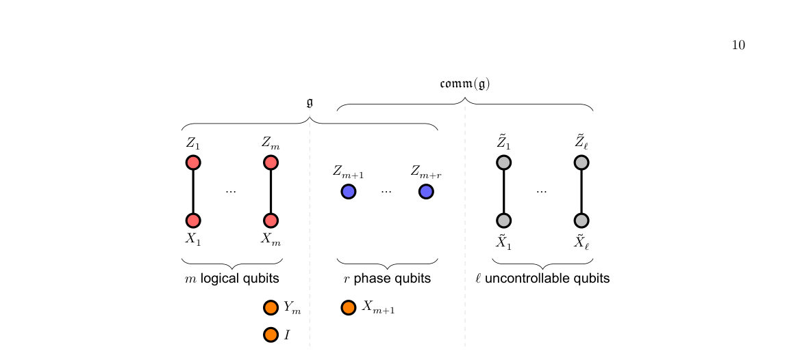 
FIG. 2. Up to isomorphism, the partition of the system in three parts due to symmetries: m logical qubits, r phase qubits, ℓ uncontrollable qubits. Also, in orange, the three possible choices of reference invariant bilinear form, B = I, Ym, Xm+1. These invariant properties completely determine the quasi-universal cases.

📷 Fig 3

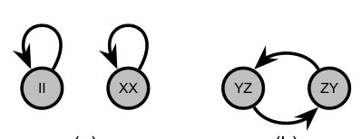 
FIG. 4. (a) Local Commutant of the Ising model/multi-angle QAOA and its directed graph Dcomm({XI, IX, ZZ}). (b) Lo- cal Invariant Bilinear Forms of the Ising model/multi-angle QAOA and its directed graph Dbil({XI, IX, ZZ}). There is a directed edge A →B whenever A and B locally match, i.e., they are of the form A = A1A2 and B = B1B2 with A2 = B1.

📷 Fig 4

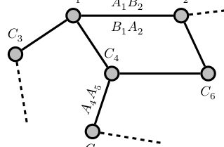 
FIG. 3. Example of swap-symmetric 2-local ansatz on some connected graph H, with vertex operators Cu and edge oper- ators AuBv or AuAv.

📷 Fig 5

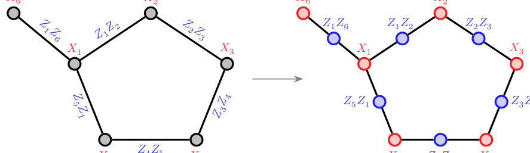 
FIG. 5. H is the interaction graph of a qubit system which interacts via an Ising interaction and subject to local transversal fields, as in the multi-angle QAOA setting. The terms Xu live on the vertices and ZuZv on the edges of H. Its frustration graph is the subdivision graph of the interaction graph.

**Summary.** This paper develops an invariant-based mathematical framework to characterize the dynamics generated by Pauli strings in quantum systems. By connecting Pauli Lie algebras to transvection groups using symplectic properties, it provides efficient algorithms to determine system symmetries and computational reachability. This unified approach is vital for analyzing structured quantum circuits used in variational algorithms and many-body physics.

**Why it may be interesting.** It provides a powerful algebraic toolkit (invariant-based classification) to analyze the computational power of quantum circuits defined by local interactions, which is crucial for understanding resource limitations in quantum computation.

Detailed structure

**Main problem.** The core problem is understanding the dynamical properties, reachability, and computational power of quantum systems generated by sets of Pauli strings.

**Main result.** The authors establish a unified, invariant-based framework connecting Pauli Lie algebras to subgroups of the Clifford group via symplectic properties, allowing for efficient classification algorithms.

**Method.** The methodology heavily relies on representation theory, Lie theory, and graph theory (specifically using frustration and commutator graphs) to analyze algebraic structures over $\mathbb{F}_2$.

**Model / system.** The focus is on quantum dynamics generated by Pauli strings ($\{I, X, Y, Z\}^{\otimes n}$), which models restricted quantum computation, variational algorithms, and certain many-body interactions.

**Key observables.** Pauli orbits, invariant subspaces, the structure of the associated Lie algebra, and whether the generators provide 3-designs for the Pauli Lie group.

**Important parameters / regimes.** The system size $n$ (number of qubits) and the specific generating set of Paulis are key parameters determining the complexity and structure.

**Assumptions / limitations.** The analysis is restricted to the setting where generators are Pauli strings, which simplifies the problem from general quantum dynamics to one solvable with polynomial-time algorithms based on invariants.

**Figures summary.** Figures illustrate graph formalisms, specifically comparing frustration graphs and commutator graphs for a given generating set of Paulis.

**Paper structure.** The paper is highly structured across multiple parts, moving from an overview to detailed framework development using Pauli strings, invariant theory, Clifford groups, and finally illustrating applications in VQAs and many-body systems.

Abstract

Understanding the dynamical properties of quantum systems is an essential task in quantum computing, quantum control, and many-body physics. Tools such as representation theory and Lie theory provide crucial information on reachability and computational power. However, this information can be difficult to access exactly or compute efficiently for arbitrary generating sets. Here we focus on the setting of Pauli strings, which satisfy numerous exceptional properties that simplify the problem. We find deep connections between Pauli Lie algebras and certain subgroups of the Clifford group generated by transvections, through the symplectic properties of the Pauli strings. This allows us to give an invariant-based perspective on these objects and their reachability, in the language of Pauli orbits, symmetries, and invariant subspaces. The invariant-based approach provides efficient algorithms for identifying Lie algebras and orbits, as well as a simple framework for analyzing structured Pauli generating sets. We also show in an elementary way that Clifford subgroups generated by transvections provide 3-designs for the corresponding Pauli Lie groups. We illustrate the framework through structured examples from variational quantum algorithms, restricted quantum computation, many-body systems, and random circuits.

[↑ back to top](#top)

### [High Precision Qubit-Efficient Variational Continuous Optimization via Amplitude Estimation](http://arxiv.org/abs/2606.08690v1)

**Authors:** Parth Danve  
**Type:** theory · **Category:** quantum information and computing · **PDF:** <https://arxiv.org/pdf/2606.08690v1>  
**Analysis basis:** full PDF text, analyzed in chunks
**Topic relevance:** `analog quantum simulation` **1/5** · `methods for driven-dissipative` **1/5** · `quantum measurements` **1/5**

📷 Fig 1

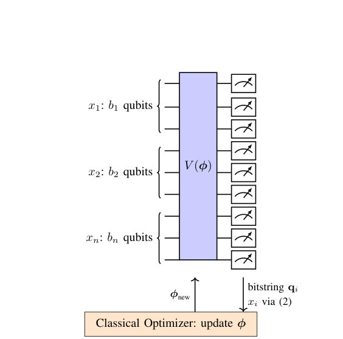 
Fig. 1. Standard discretized variational circuit for n continuous decision variables. Each variable xi is encoded into a dedicated register of bi qubits as in (1), and a joint variational ansatz V (ϕ) acts across all registers. Measurement bitstrings are decoded via (2) and passed to a classical optimizer which updates ϕ iteratively. Total qubit count grows as Pn i=1 bi, increasing logarithmically with the required precision 1/ηi per variable.

📷 Fig 2

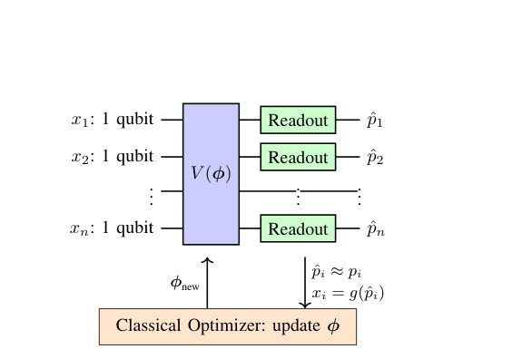 
Fig. 2. Proposed amplitude-based variational circuit for n continuous decision variables. Each variable xi is encoded into the measurement probability pi of a single qubit as in (3). The readout block estimates pi; the choice of readout procedure and its precision scaling are discussed in Section IV. Estimated probabilities ˆpi ≈pi are decoded classically using a decoding map as xi = g(ˆpi) and passed to a classical optimizer which updates ϕ iteratively.

📷 Fig 3

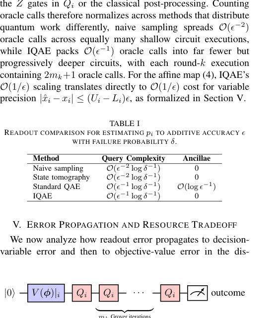 
Fig. 3. IQAE circuit for qubit i in round k. The oracle Ai = V (ϕ)|i prepares |ψi(ϕ)⟩, followed by mk applications of Qi from (6). Measurement outcomes update the confidence interval for pi = sin2(θi).

**Summary.** This paper presents a novel variational framework for continuous optimization on standard quantum hardware by encoding variables into single-qubit measurement amplitudes rather than using binary discretization. By employing iterative Quantum Amplitude Estimation (IQAE) for readout, the method achieves superior resource scaling—linear in qubits and quadratically better in circuit depth compared to discretized approaches—thereby enabling high-precision computation without prohibitive hardware overheads.

**Why it may be interesting.** While focused on quantum computation theory, the efficiency gains in scaling resources ($\Theta(n)$ qubits vs. $\Theta(n \log(\dots))$) are crucial for any physical implementation, including those involving complex Hamiltonian simulation or optimization routines relevant to AMO physics.

Detailed structure

**Main problem.** The challenge of performing continuous optimization on standard gate-based quantum computers without resorting to resource-intensive discretization.

**Main result.** The proposed amplitude-based framework achieves a qubit cost scaling linearly with the number of variables ($\Theta(n)$) while improving readout complexity from quadratic ($O(\epsilon^{-2})$) to linear ($O(\epsilon^{-1})$) in estimation error, outperforming discretized methods significantly.

**Method.** It encodes each continuous variable into the measurement probability (squared amplitude) of a single qubit and uses iterative Quantum Amplitude Estimation (IQAE) for high-precision readout, bypassing explicit binary encoding.

**Model / system.** The work is situated within the standard gate-based quantum circuit model, applying variational algorithms to minimize objective functions $f(\mathbf{x})$ defined over real variables $\mathbf{x} \in \mathbb{R}^n$.

**Key observables.** Objective function value error ($\delta_F$), variable precision ($\eta$ or $\epsilon$), and the number of required qubits.

**Important parameters / regimes.** The ratio between desired objective precision ($\delta_F$) and the resource scaling factors ($n, K, R$).

**Assumptions / limitations.** The primary decoding map is assumed to be a bounded affine map; the objective function $f$ must be $K$-Lipschitz continuous with respect to the $\ell_\infty$-norm.

**Figures summary.** Figures illustrate the comparison between discretized and amplitude-based variational circuits, detailing the structure of the single-qubit encoding and the adaptive IQAE readout procedure for multiple variables.

**Paper structure.** The paper first establishes the limitations of traditional discretization. It then introduces the qubit-efficient amplitude-encoding framework, details the superior IQAE readout technique, and concludes by providing a rigorous resource comparison (Table II & III) against the discretized baseline across both qubit count and circuit execution complexity.

Abstract

Optimization of continuous-variable objectives on standard gate-based quantum computers via variational algorithms such as QAOA is typically approached by first discretizing each decision variable into a finite binary representation. This increases qubit requirements and restricts solution precision through fixed-resolution encodings. We propose a qubit-efficient variational framework for continuous optimization that instead encodes each decision variable into the squared amplitude or equivalently, the measurement probability of a single qubit state. This removes explicit discretization from the variable representation while remaining entirely within the standard qubit circuit model unlike methods like CV-QAOA employing qumode based hardware to achieve the same. To read out encoded variables, we propose using amplitude estimation rather than naive sampling or tomographic reconstruction, with the goal of improving precision scaling for continuous-value recovery. We outline how amplitude-estimation error propagates to decision-variable error and then to objective-value error under standard regularity assumptions, suggesting a distinct width-versus-precision tradeoff relative to discretized approaches. In particular, the framework replaces the logarithmic increase in qubits needed for finer binary precision with a constant cost of one qubit per decision variable, while shifting accuracy requirements into the estimation procedure. We position this approach relative to traditional discretized variational formulations, and argue that it provides a promising new direction for continuous optimization on standard qubit architectures.

[↑ back to top](#top)

### [Learning Dynamics Reveal a Hierarchy of Weight-Induced Layerwise Gram Metrics](http://arxiv.org/abs/2606.09744v1)

**Authors:** Claudio Nordio  
**Type:** theory · **Category:** disordered systems and neural networks · **PDF:** <https://arxiv.org/pdf/2606.09744v1>  
**Analysis basis:** full PDF text, analyzed in chunks
**Topic relevance:** `Keldysh / 2PI / non-Gaussian methods` **1/5** · `methods for driven-dissipative` **1/5** · `non-equilibrium dynamics` **1/5**

📷 Fig 1

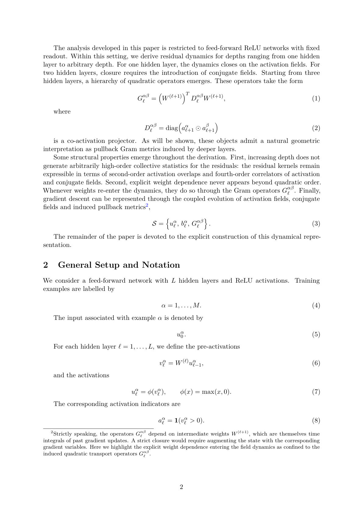 
Low-resolution page preview, page 2

📷 Fig 2

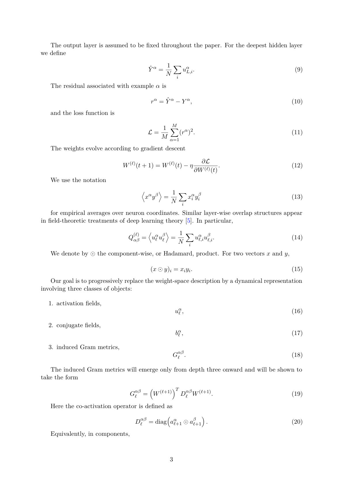 
Low-resolution page preview, page 3

📷 Fig 3

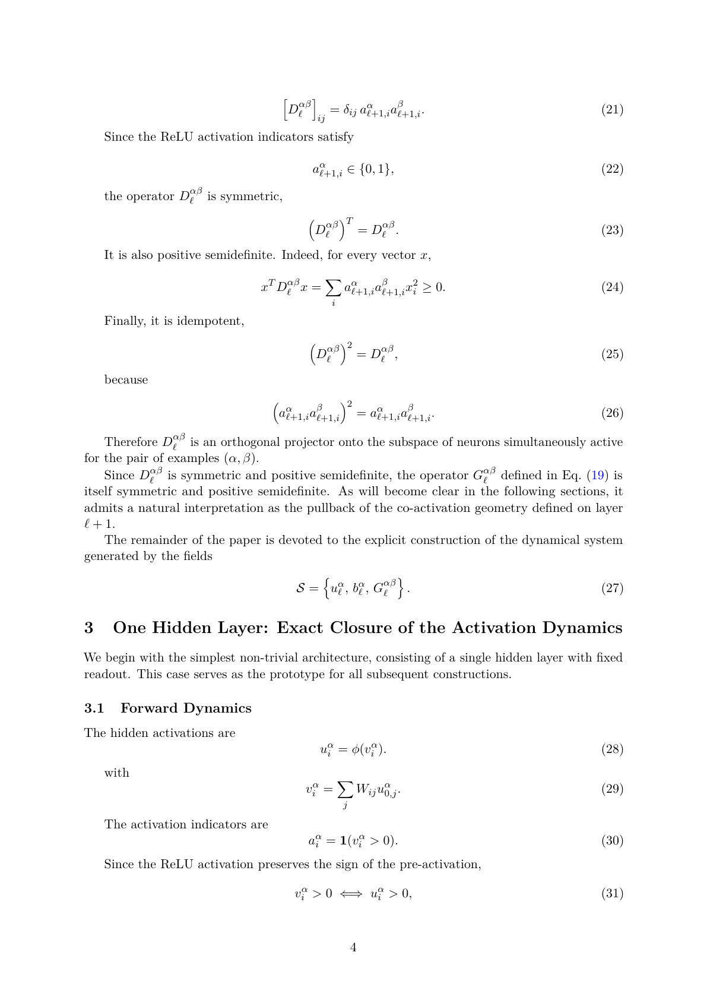 
Low-resolution page preview, page 4

📷 Fig 4

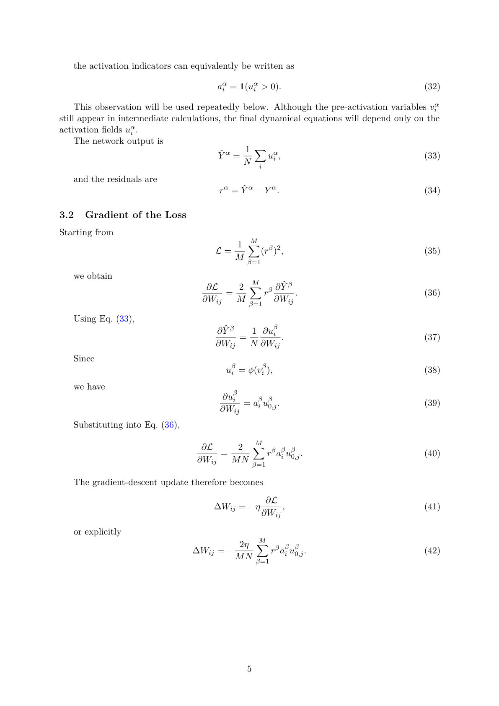 
Low-resolution page preview, page 5

📷 Fig 5

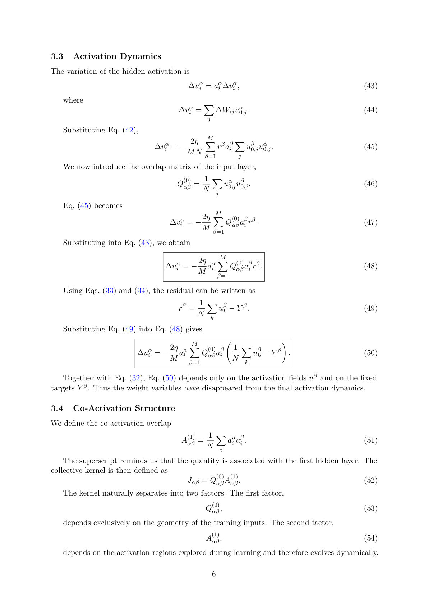 
Low-resolution page preview, page 6

**Summary.** This theoretical paper reformulates gradient descent dynamics for deep neural networks by moving the description from weight space to activation fields. It discovers that as network depth increases, maintaining a closed dynamical description requires introducing an escalating hierarchy of geometric operators called pullback Gram metrics. This suggests that the complexity of learning is fundamentally governed by the geometry of information transport across layers.

**Why it may be interesting.** The formal mathematical machinery developed—identifying geometric operators (Gram metrics) required to close a dynamical system—is highly analogous to techniques used in characterizing complex many-body systems or effective Hamiltonians in quantum field theory.

Detailed structure

**Main problem.** The goal is to reformulate gradient descent dynamics in deep neural networks from a weight-space evolution into a closed collective dynamics defined entirely on the training-set activation fields.

**Main result.** For deep networks, the dynamical closure requires introducing a hierarchy of 'pullback Gram metrics' ($G_{\alphaeta}^{\ell}$) that mediate information transport across layers. This shows that network complexity is encoded in the geometry of these transport operators.

**Method.** The authors derive recursive equations for activation fields, conjugate fields, and residuals by analyzing gradient descent updates layer-by-layer, leading to a structured kernel decomposition.

**Model / system.** The model is a feed-forward ReLU network trained using quadratic loss. The analysis progresses from single hidden layers to deep architectures ($L$ layers), requiring the introduction of auxiliary fields (conjugate and Gram metrics) to maintain mathematical closure.

**Key observables.** Activation fields ($u^\alpha_l$), Conjugate Fields ($b^\alpha_l$), Residuals ($r^\alpha$), and the hierarchy of Pullback Gram Metrics ($G_{\alphaeta}^{\ell}$).

**Important parameters / regimes.** The depth of the network ($L$) is the primary varying parameter, as it dictates the required complexity of the closure mechanism.

**Assumptions / limitations.** The analysis assumes fixed readout and restricts the dynamics to first-order approximations in the learning rate ($\eta$), neglecting threshold-crossing events.

**Figures summary.** Not specified by notes; the structure suggests showing the increasing complexity (number of required metrics) as depth increases.

**Paper structure.** The paper builds incrementally: starting with a single hidden layer to establish closure via a factorized kernel, extending to two layers using overlaps, and finally demonstrating that achieving closure for $L \ge 3$ necessitates defining and tracking the hierarchical pullback Gram metrics ($G_{\alphaeta}^{\ell}$).

Abstract

We study feed-forward ReLU networks with fixed readout and quadratic loss. The aim is to rewrite gradient descent not primarily as a dynamics in weight space, but as a collective dynamics closed in terms of fields defined on the training-set space. For a single hidden layer, the weight variables can be eliminated from the activation dynamics, yielding a closed equation for the residuals governed by a collective kernel that factorizes into an input-geometric matrix and a dynamical co-activation matrix. For deeper networks, the residual dynamics retains a clean layer-wise kernel structure. However, from depth three onward, closure requires a hierarchy of weight-induced Gram operators that mediate information transport across layers.

[↑ back to top](#top)

### [Microscopic mechanism of high-temperature superconductivity revealed by ab initio studies on hole-doped multilayer cuprates HgBa$_2$Ca$_2$Cu$_3$O$_8$ under pressure](http://arxiv.org/abs/2606.08181v1)

**Authors:** Ryui Kaneko, Masatoshi Imada  
**Type:** theory · **Category:** strongly correlated electrons · **PDF:** <https://arxiv.org/pdf/2606.08181v1>  
**Analysis basis:** full PDF text, analyzed in chunks
**Topic relevance:** `Keldysh / 2PI / non-Gaussian methods` **1/5** · `analog quantum simulation` **1/5** · `methods for driven-dissipative` **1/5**

📷 Fig 1

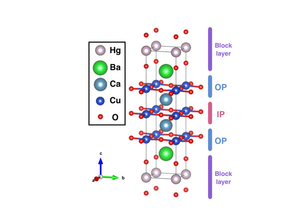 
FIG. 1. Crystal structure of Hg1223 and directions of primitive vectors (a, b, c). The inner CuO2 plane (IP) sandwiched by the two outer CuO2 planes (OPs) is separated from the equivalent next three CuO2 planes by the block layers, and the neighboring IP and OP are separated by interstitial Ca atoms. The crystal structure [6] is visualized from data in the Crystallography Open Database [7–9] using VESTA [10].

📷 Fig 2

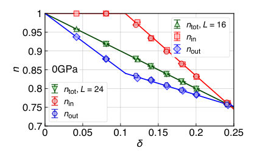 
FIG. 2. Inner- and outer-layer hole densities as a function of total hole density 𝛿for the ab initio Hamiltonian of Hg1223 at ambient pressure. The IP always has lower hole density. The plots for 𝐿= 16 and 24 demonstrate negligible size dependence suggesting that the 𝐿= ∞limit is close.

📷 Fig 3

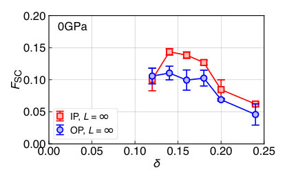 
FIG. 3. Doping concentration dependence of the SC order parameter 𝐹SC defined in Eq. (25) at ambient pressure. The red and blue lines show 𝐹SC for the IP and OP, respectively, after size extrapolation to the thermodynamic limit 𝐿→∞. The error bars are due to the size extrapolation error.

📷 Fig 4

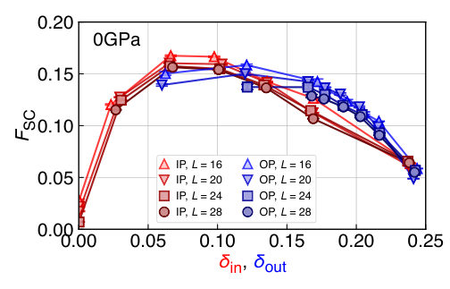 
FIG. 4. Size dependent SC order parameters 𝐹SC for the IP and OP at ambient pressure as a function of hole density 𝛿IP and 𝛿OP in each layer for several choices of system sizes. In this figure, 𝐹SC is defined as the converged values of √𝑃𝑑at long distances before the size extrapolation.

📷 Fig 5

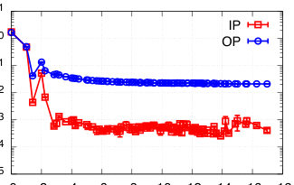 
FIG. 5. Spin structure factors defined in Eq. (17) (a) and SC corre- lation defined in Eq. (20) (b) of the IP and OP for 24 × 24 lattice. The chemical potential difference between the IP and OP is 𝜇= 3.2, which is decreased from the value 𝜇= 4.41 for the Hg1223 ab initio Hamiltonian at ambient pressure estimated from the GW calculation. The spin structure shows a prominent peak at Q = (𝜋, 𝜋) for the IP which may grow to the Bragg peak in the thermodynamic limit, whereas it shows no such peak for the OP. Both the IP and OP exhibit the SC correlation saturated at long distances. Because the AF corre- lation tends to degrade the SC correlation, the saturated value of the SC correlation is...

**Summary.** This work uses ab initio calculations on $	ext{HgBa}_2	ext{Ca}_2	ext{Cu}_3	ext{O}_8$ to reveal that the mechanism for high-temperature superconductivity involves an emergent local attraction derived from strong Coulomb repulsion. The study successfully models the pressure dependence of $T_c$, showing it results from a complex interplay between hopping, onsite repulsion ($U$), and off-site repulsion ($V$). This provides a new theoretical route for designing superconducting materials.

**Why it may be interesting.** The identification of pairing via 'attraction from reduced repulsion' provides a novel theoretical framework for understanding high-$T_c$ superconductivity, linking it directly to correlation effects modulated by external pressure.

Detailed structure

**Main problem.** The primary goal is to elucidate the microscopic mechanism responsible for high-temperature superconductivity (HTSC) in cuprate superconductors, specifically focusing on $	ext{HgBa}_2	ext{Ca}_2	ext{Cu}_3	ext{O}_8$ ($	ext{Hg1223}$).

**Main result.** The pairing mechanism is identified as an emergent local attraction generated counter-intuitively from the strong bare local Coulomb repulsion ($U$), which contrasts with conventional BCS theory. The pressure dependence of $T_c$ is successfully modeled by the interplay between increased hopping ($t$), decreased $U$, and reduced off-site repulsion ($V$).

**Method.** The study employs ab initio calculations solving low-energy effective Hamiltonians using advanced variational solvers supplemented by neural networks, alongside Variational Monte Carlo (VMC) methods.

**Model / system.** The system is the triple-layer cuprate $	ext{Hg1223}$, modeled via an effective Hamiltonian incorporating onsite ($U$) and nearest-neighbor off-site ($V$) Coulomb interactions. The analysis distinguishes between inner ($	ext{IP}$) and outer ($	ext{OP}$) superconducting planes.

**Key observables.** Superconducting critical temperature ($T_c$), $d$-wave SC order parameter, spin structure factors ($S_s(q)$), and the effective attraction derived from onsite repulsion energy curvature.

**Important parameters / regimes.** Pressure (0 GPa to 60 GPa), doping concentration ($\delta$), hopping parameters ($t$), and Coulomb interactions ($U$, $V$).

**Assumptions / limitations.** The methodology relies on extrapolating calculated properties to the thermodynamic limit ($L 	o \infty$) and assumes that the pairing mechanism can be captured by analyzing the energy dependence of onsite repulsion.

**Figures summary.** Figures illustrate the dome-like pressure dependence of $T_c$ for $	ext{Hg1223}$, show the coexistence of SC and AF orders in different layers, and compare theoretical $T_c$ predictions against experimental data under applied pressure.

**Paper structure.** The paper systematically analyzes the Hamiltonian parameters ($t, U, V$) as a function of pressure. It first establishes the strong correlation origin of HTSC, then details how pressure modifies these interactions, leading to an emergent attraction that drives superconductivity, while also confirming the coexistence of SC and AF orders.

Abstract

Triple-layer cuprate superconductor $\mathrm{HgBa_2Ca_2Cu_3O_8}$ (Hg1223) keeps the record of the highest superconducting (SC) critical temperature $T_{c}\sim 134$K among all the existing materials at ambient pressure. $T_{c}$ further increases under pressure up to $T_{c}\sim 160$K. However, its microscopic mechanism remains to be elucidated. We solve {\it ab initio} Hamiltonians for Hg1223 using a variational solver supplemented by a neural network. The pressure dependence of the $d$-wave SC order parameter and estimated $T_{c}$ show a dome-like structure in essential agreement with the experimental indications. The origin of the strong SC amplitude at ambient pressure is identified as strong local Coulomb repulsion $U$ attributed to poor screening. Further increase in $T_{c}$ under pressure is understood from interplay of three elements, namely increased electron hopping $t$, decreased $U$ and more importantly, strongly reduced offsite Coulomb repulsion $V$ with increasing pressure. Pairing mechanism is identified as the emergent local attraction counterintuitively generated from the originally strong local repulsion $U$. The emergent attraction is interpreted from ``attraction from reduced repulsion'', originating from the release of the fluctuating doubly-occupied sites characterized from the ``false vacuum'' in the Mott insulator to the double-occupation-free $d$-wave SC states upon carrier doping. This instantaneous attraction is in contrast with the conventional BCS SC mediated by bosonic glues. The local attraction is consistent with the electron fractionalization supported in experimental analyses. The coexistence of the SC and antiferromagnetic order is also demonstrated as a characteristic feature of the multi-layer system. The microscopic understanding of Hg1223 offers a new route explicitly using this emergent attraction to design and optimize SC materials.

[↑ back to top](#top)

### [A Bell-State Extension of Loop-Back Quantum Key Distribution](http://arxiv.org/abs/2606.09723v1)

**Authors:** Luis Adrián Lizama-Pérez  
**Type:** theory · **Category:** quantum information and computing · **PDF:** <https://arxiv.org/pdf/2606.09723v1>  
**Analysis basis:** full PDF text, analyzed in chunks
**Topic relevance:** `entanglement & information structure` **1/5** · `quantum measurements` **1/5**

📷 Fig 1

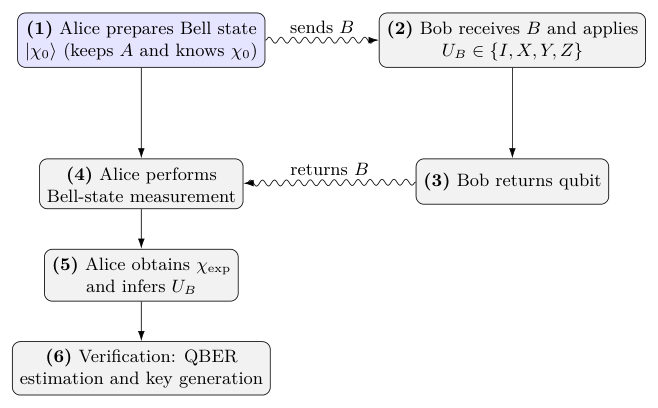 
Figure 1: Compact flow diagram of the Loop-Back Bell-State QKD protocol with full-Pauli encoding. The numbered blocks correspond to Steps (1)–(6) described in Section 2. Alice privately prepares the initial Bell state |χ0⟩and sends one qubit to Bob. Bob applies a local Pauli operation and returns the qubit through the same quantum link. Alice performs a Bell- state measurement, deterministically infers the applied operation, and uses a subset of rounds for verification and key generation. The fact that χ0 is chosen and known exclusively by Alice reinforces the indistinguishability of the induced transition for any external observer.

**Summary.** The paper introduces an advanced Bell-state extension to the Loop-Back Quantum Key Distribution protocol. By encoding information in entangled Bell states and leveraging a hidden initial reference state known only to Alice, it achieves superior security against eavesdropping and significantly boosts key generation efficiency compared to prior methods. This makes the scheme highly suitable for real-world, lossy quantum communication links.

**Why it may be interesting.** This work directly advances quantum cryptography protocols, providing a theoretically robust framework for practical QKD implementations suitable for challenging environments like mobile or edge nodes where high loss is expected.

Detailed structure

**Main problem.** The paper addresses persistent security and efficiency challenges in bidirectional Quantum Key Distribution (QKD) protocols, particularly those based on the Loop-Back architecture.

**Main result.** A Bell-state extension of the Loop-Back QKD protocol is proposed that enhances detectability against attacks to $\approx 3/4$ per round and increases effective throughput up to $50\%$ by utilizing entangled states.

**Method.** The scheme uses entangled Bell states, where Alice privately knows an initial reference state $|\chi_0
angle$. Bob applies a local Pauli operation ($U_B$), and Alice performs a Bell-state measurement (BSM) to deterministically infer $U_B$ without basis sifting.

**Model / system.** The system is based on maximally entangled Bell states ($\{|\Phi^\pm
angle, |\Psi^\pm
angle\}$). The protocol operates by encoding information through the full four-dimensional Bell basis, contrasting with previous two-dimensional subspace restrictions.

**Key observables.** Intrinsic detection probability ($P_d \approx 3/4$); Effective throughput (bounded by $p_{BSM}$); Deterministic inference of Bob's Pauli operation ($U_B$).

**Important parameters / regimes.** The initial private Bell state $|\chi_0
angle$; The success probability of the BSM ($p_{BSM}$).

**Assumptions / limitations.** Security critically relies on Alice privately knowing $\chi_0$, which prevents adversaries from reconstructing the encoding mapping. The traveling subsystem is assumed to remain locally maximally mixed.

**Figures summary.** The notes reference a flow diagram (Figure 1) illustrating the six sequential steps of the protocol, and Table 1 summarizes how local Pauli operations act on the four Bell states.

**Paper structure.** The paper builds by first identifying limitations in existing QKD protocols. It then introduces the Bell-state extension using entangled states to overcome subspace confinement. Security is established by showing that only Alice, knowing $\chi_0$, can deterministically map Bob's action via BSM, leading to enhanced detectability and efficiency.

Abstract

Bidirectional quantum key distribution (QKD) protocols face persistent challenges related to classical disclosure, confinement of the signal space to predictable subspaces, and limited detectability under substitution or entanglement-swapping attacks. In this work, we present a Bell-state extension of the Loop-Back QKD architecture that improves efficiency and detectability while preserving its defining feature of a simplified, measurement-free remote terminal. The protocol employs entangled Bell states together with deterministic local Pauli encoding at the remote node. A central element is that Alice privately prepares and knows the initial Bell state, which serves as a hidden reference enabling her to interpret the Bell-state transition induced by Bob, while preventing an adversary from reconstructing the encoding without access to this reference. By exploiting both intra- and inter-family Bell transitions, the scheme expands the effective signal space beyond the subspace restrictions of earlier two-way protocols. Alice performs a Bell-state measurement to deterministically infer Bob's operation without any basis sifting. Although the traveling subsystem remains locally maximally mixed, concealing the initial Bell family amplifies disturbance under separable substitution strategies, yielding an intrinsic detection probability of approximately 3/4 per round. From an efficiency perspective, the protocol lifts the intrinsic post-selection limitation of single-qubit Loop-Back schemes: the effective throughput is bounded only by the Bell-state measurement success probability, reaching up to 50% in linear-optical implementations. These features make the proposed scheme particularly suitable for mobile or edge-based QKD scenarios, where passive remote nodes must operate under high loss and limited interaction times.

[↑ back to top](#top)

### [Certified spectral functions from lattice Monte Carlo data](http://arxiv.org/abs/2606.09791v1)

**Authors:** Sophie Mutzel, Antoine Tilloy  
**Type:** theory · **Category:** numerical methods · **PDF:** <https://arxiv.org/pdf/2606.09791v1>  
**Analysis basis:** full PDF text, analyzed in chunks
**Topic relevance:** `Keldysh / 2PI / non-Gaussian methods` **1/5** · `methods for driven-dissipative` **1/5**

📷 Fig 1

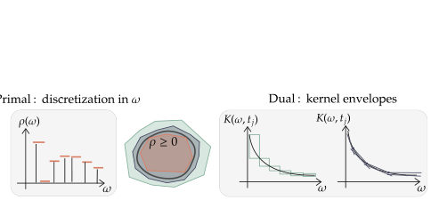 
FIG. 1. Middle: Schematic projection of the convex space of admissible positive spectral densities. Left: Approximation by discretizing in ω, which is fine for all practical purposes, if a large number of variables Nv for discretization in ω is taken. The resulting bounds approach the true ones from inside as the number of grid points Nv grows, but are not rigorous at finite Nv (orange). Right: Rigorously bounding the K¨all´en-Lehmann kernel by piecewise constant (turquoise) or piecewise affine (dark blue) envelopes enlarges the feasible set. The resulting bounds approach the true ones from outside as the number of envelope pieces grows, and are rigorous at every finite Nv.

📷 Fig 2

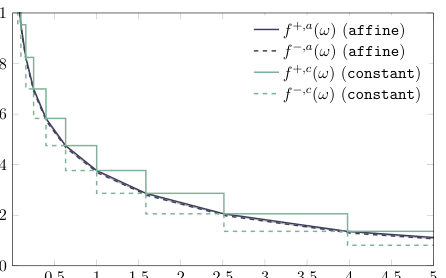 
FIG. 2. Rigorous piecewise constant (turquoise) and piece- wise affine (dark blue) upper and lower envelopes f ± j (ω) for the lattice kernel (6) of the K¨all´en-Lehmann relation at one representative tj. Convexity of K(ω, tj) on (0, ∞) ensures that secants provide rigorous upper and tangents provide rig- orous lower bounds.

📷 Fig 3

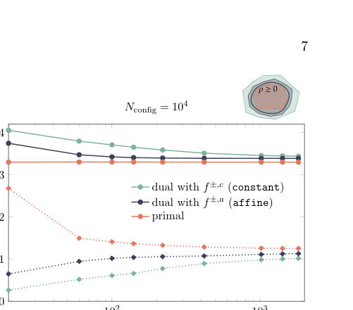 
FIG. 3. Convergence with the number of constant or affine basis functions Nv for the envelopes f ± of the kernel K(ω, t). We used 104 configurations for ϕ4-theory at λ = 4 · 10−3 and g = 2, on a 256 × 256 lattice. We also show the bounds obtained by solving the primal SDP (12) discretized on a grid with Nv discretization points.

📷 Fig 4

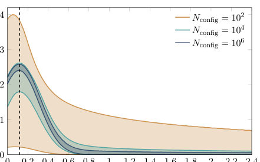 
FIG. 4. Rigorous upper and lower bounds on the smeared spectral density (σ2 = 0.2) from the dual SDP (26) for ϕ4- theory at λ = 4 · 10−3 and g = 2, on a 256 × 256 lattice. The symmetrized correlator (4) provides Nc = 129 constraints. The vertical dashed line corresponds to the mass-gap esti- mate, obtained from an effective-mass fit.

**Summary.** This paper presents a rigorous mathematical framework to extract spectral information ($\rho(\omega)$) from noisy lattice Monte Carlo measurements. It transforms the difficult inverse problem into a sequence of solvable Semidefinite Programs (SDPs) by constructing bounding envelopes for the underlying kernel functions. This yields mathematically guaranteed upper and lower bounds on physical observables, providing both quantitative results and a powerful consistency check for the input data.

**Why it may be interesting.** While focused on lattice QFT, the methodology—transforming an infinite-dimensional inverse problem into a sequence of solvable, rigorously bounded SDPs—is highly relevant to any field involving ill-posed reconstruction from noisy data (e.g., spectral analysis in quantum dynamics).

Detailed structure

**Main problem.** The core challenge is rigorously recovering spectral observables, such as the spectral density $\rho(\omega)$, from Euclidean correlation functions measured via lattice Monte Carlo simulations.

**Main result.** The authors developed a method to derive rigorous upper and lower bounds on arbitrary linear functionals of $\rho(\omega)$ by relaxing the problem into solvable Semidefinite Programs (SDPs).

**Method.** The approach reformulates the ill-posed inverse problem as a convex optimization problem, which is then rigorously relaxed into a hierarchy of finite SDPs using bounding envelopes for the kernel function.

**Model / system.** The work applies to lattice quantum field theory, demonstrated specifically on two-dimensional $\phi^4$ theory. The analysis relies on relating measured correlation functions $C(t)$ to the spectral density via a lattice Källén-Lehmann representation.

**Key observables.** Spectral density $\rho(\omega)$, Euclidean correlation functions $C(t)$, and linear functionals of $\rho(\omega)$.

**Important parameters / regimes.** The covariance matrix $\Sigma$ derived from Monte Carlo data, the maximum allowed deviation $F_{\max}$, and the lattice spacing $a$.

**Assumptions / limitations.** Assumes that the underlying physics is governed by a reflection positive action and that statistical errors are approximately Gaussian-distributed. The method relies on constructing bounding envelopes for continuous functions.

**Figures summary.** Figures illustrate the convergence of bounds using piecewise constant versus piecewise affine basis sets, showing how these envelopes provide rigorous upper and lower bounds on the spectral density as the number of basis functions increases.

**Paper structure.** The paper builds from identifying the ill-posed nature of the problem to formulating it as a convex optimization problem. It then details the mathematical machinery of Lagrange duality and relaxation techniques, culminating in solving the resulting finite SDPs for rigorous bounds.

Abstract

The Monte Carlo method, applied to lattice quantum field theory, gives access to Euclidean correlation functions with well-understood error bars. Recovering the observables one cares about, such as the spectral density, requires solving an ill-posed inverse problem, usually tackled with heuristics that lose rigorous control of the error. Instead of trying to find the ``best'' spectral density $ρ(ω)$, we ask how small or large linear functionals $\int_{\mathbb{R}^+} G(ω) ρ(ω) \mathrm{d} ω$ of it can be, given the Monte Carlo data and the reflection positivity of the lattice action. This is a convex but infinite-dimensional problem. We show how its dual can be rigorously relaxed into a hierarchy of finite semidefinite programs, solvable with standard solvers and enjoying strong convergence guarantees. The resulting bounds are rigorous even when the relaxation is not tight, and converge quickly to the regime where the error is entirely dominated by Monte Carlo statistics. The method also flags implausible Monte Carlo data, for instance underestimated error bars, through an infeasibility certificate. We demonstrate it on lattice $φ^4$ theory in two dimensions.

[↑ back to top](#top)

### [Chemical tuning of magnetic ordering and cryogenic magnetocaloric response in zircon-type Gd1-xErxVO4](http://arxiv.org/abs/2606.08916v1)

**Authors:** Ming Zeng, Muqing Su, Liang Ming, Xiaolong Yang, Wang Chen, Lingwei Li, Hai-Feng Li  
**Type:** experiment · **Category:** statistical mechanics · **PDF:** <https://arxiv.org/pdf/2606.08916v1>  
**Analysis basis:** full PDF text, analyzed in chunks
**Topic relevance:** `exotic spin models in light-matter` **1/5** · `spintronics-quantum-optics interface` **1/5**

📷 Fig 1

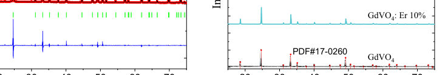 
FIG. 1. Powder X-ray diffraction analysis of Gd1−xErxVO4 measured at ∼298 K, with main diffraction peaks indexed by their corresponding (hkl) reflections. (a) Rietveld refinement of the powder X-ray diffraction pattern of GdVO4. Solid red circles represent the experimental data, the black line the calculated profile, the vertical ticks the Bragg reflection positions, and the blue curve the difference between observed and calculated intensities. The refinement confirms the zircon-type tetragonal structure with space group I41/amd. (b) Powder X-ray diffraction patterns of Gd1−xErxVO4 (x = 0, 0.1, 0.25, 0.5, 0.75). The systematic shift of the diffraction peaks toward higher 2θ with increasing...

📷 Fig 2

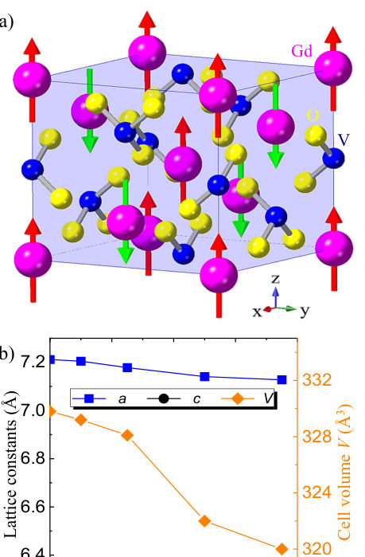 
FIG. 2. Tetragonal crystal structure and lattice depen- dence on the Er3+ doping ratio in Gd1−xErxVO4. (a) Crystal and magnetic structures of GdVO4. Purple, yellow, and blue spheres represent Gd, O, and V atoms, respectively. Arrows indicate the orientations of the Gd magnetic moments, illus- trating antiferromagnetic coupling between nearest-neighbor rare-earth ions. (b) Composition dependence of the lattice parameters a(= b) and c, and the unit-cell volume V for Gd1−xErxVO4. The monotonic decrease reflects the smaller ionic radius of Er3+ relative to Gd3+.

📷 Fig 3

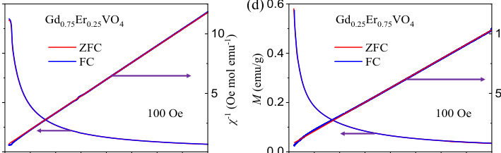 
FIG. 3. M(T) and corresponding χ−1(T) curves of Gd1−xErxVO4 measured under an applied field of 100 Oe using ZFC and FC protocols. (a) x = 0, (b) x = 0.1, (c) x = 0.25, and (d) x = 0.75. GdVO4 exhibits an antiferromagnetic transition at TN = 3.65 K. Er substitution suppresses the magnetic ordering temperature, consistent with a modification of the magnetic interactions within the rare-earth sublattice.

📷 Fig 4

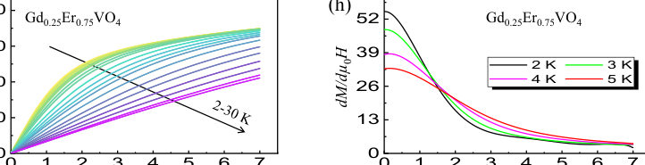 
FIG. 4. Magnetic-field dependence of the magnetization for Gd1−xErxVO4. (a–d) Isothermal magnetization curves M(µ0H) measured at low temperatures (2–30 K) with magnetic fields increasing from 0 to 7 T and then decreasing from 7 to 0 T. (e–h) Corresponding smoothed derivatives dM/d(µ0H), highlighting the spin-flop-like field-induced anomaly. The anomaly observed in GdVO4 becomes progressively weaker with increasing Er substitution. Raw data plots are provided in Fig. S1 of the Supplemental Material [41].

📷 Fig 5

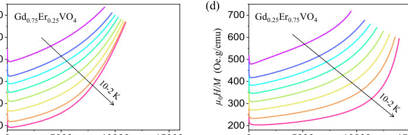 
FIG. 5. Arrott-type plots (µ0H/M versus M 2) for Gd1−xErxVO4 measured between 2 and 10 K. (a) x = 0, (b) x = 0.1, (c) x = 0.25, and (d) x = 0.75. The negative slope observed for GdVO4 at low temperature suggests a first-order-like character of the spin-flop-like field-induced anomaly.

**Summary.** This work investigates $	ext{Gd}_{1-x}	ext{Er}_x	ext{VO}_4$ to engineer materials for cryogenic refrigeration by tuning their magnetic properties. By substituting Gd with Er, the researchers systematically suppressed the magnetic ordering temperature and modified field-induced anomalies. The key finding is that weak Er doping optimizes the balance of competing magnetic interactions, leading to superior magnetocaloric performance.

**Why it may be interesting.** The study provides a clear experimental demonstration of how chemical pressure (lattice contraction) can be used as a tuning knob in magnetic materials to optimize thermodynamic responses like MCE, which is relevant for understanding phase transitions and energy storage in condensed matter systems.

Detailed structure

**Main problem.** The study aims to develop efficient solid-state refrigeration strategies by tuning magnetic ordering and magnetocaloric performance in rare-earth oxides.

**Main result.** Weak Er substitution effectively tunes the competition among magnetic interactions, optimizing the balance between magnetic ordering and available spin entropy for enhanced cryogenic cooling.

**Method.** The research combines structural characterization (XRD) with comprehensive magnetic measurements, including temperature-dependent magnetization and isothermal magnetocaloric effect calculations.

**Model / system.** The physical system is polycrystalline zircon-type rare-earth vanadates, specifically $	ext{Gd}_{1-x}	ext{Er}_x	ext{VO}_4$, where chemical substitution ($x$) acts as the tuning parameter.

**Key observables.** Magnetic ordering temperature ($	ext{T}_{	ext{N}}$), maximum magnetic entropy change ($\Delta S_{	ext{mag}}$), lattice parameters ($a, c$), and relative cooling power (RCP).

**Important parameters / regimes.** The doping concentration $x$ of $	ext{Er}^{3+}$ on $	ext{Gd}^{3+}$, applied magnetic field ($\mu_0\Delta H = 7 	ext{ T}$), and cryogenic temperatures.

**Assumptions / limitations.** The primary assumption is that tuning the rare-earth ion size via substitution can systematically control the competing magnetic interactions (exchange, dipolar coupling) to optimize MCE.

**Figures summary.** Figures illustrate XRD patterns showing lattice contraction with increasing Er content, and magnetization curves demonstrating the suppression of the spin-flop anomaly and enhancement of $\Delta S_{	ext{mag}}$ at low $x$.

**Paper structure.** The paper follows a logical progression: structural confirmation via XRD; investigation of magnetic ordering temperature suppression ($	ext{T}_{	ext{N}}$) and field anomalies; finally, quantitative measurement and optimization of the magnetocaloric effect ($\Delta S_{	ext{mag}}$) to identify optimal compositions.

Abstract

Chemical substitution offers an effective route to tune magnetic ordering and magnetocaloric performance in rare-earth oxides for cryogenic refrigeration. Here we investigate the structural evo lution, magnetic properties, and magnetocaloric effect of polycrystalline zircon-type Gd1-xErxVO4 (x=0, 0.1, 0.25, 0.5, and 0.75). Powder X-ray diffraction confirms that all samples crystallize in the tetragonal zircon structure without detectable impurity phases. Substitution of Gd3+ by the smaller Er3+ ion produces a systematic lattice contraction and modifies the magnetic behavior of the rare-earth sublattice. In particular, the magnetic ordering temperature is suppressed from 3.65(2) K in GdVO4 to 2.76(2) K in Gd0.9Er0.1VO4 , accompanied by a weakening of the spin-flop-like field-induced anomaly observed in the parent compound. A low Er concentration correspondingly improves the low-temperature magnetocaloric performance, with Gd0.9Er0.1VO4 exhibiting a max imum magnetic entropy change of 45.1 J kg-1 K-1 for mu_0 Delta H=7T. These results demonstrate that weak Er substitution effectively tunes the competition among exchange interactions, dipolar coupling, and magnetic anisotropy, optimizing the balance between magnetic ordering and available spin entropy in zircon-type rare-earth vanadates, which is crucial for developing efficient cryogenic refrigeration materials.

[↑ back to top](#top)

### [Entanglement-assisted continuous-variable concatenated codes for encoding qubits or oscillators](http://arxiv.org/abs/2606.09379v1)

**Authors:** Nihar Ranjan Dash, Sanjoy Dutta, R. Srikanth, Subhashish Banerjee  
**Type:** theory · **Category:** quantum information and computing · **PDF:** <https://arxiv.org/pdf/2606.09379v1>  
**Analysis basis:** full PDF text, analyzed in chunks
**Topic relevance:** `entanglement & information structure` **1/5** · `quantum measurements` **1/5**

📷 Fig 1

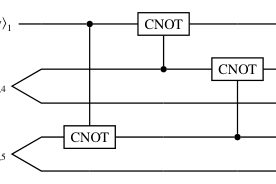 
FIG. 3: Encoding circuit for [[3, 1, 3; 2]]2 entanglement- assisted repetition code.

📷 Fig 2

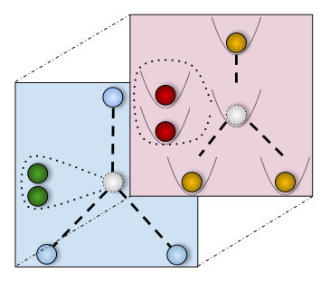 
FIG. 2: (Color online) code structure of an C[[3,1,3;2]] ▷CGKP code with outer [[3, 1, 3; 2]] EA-repetition code and inner GKP code: A single logical qubit of the outer [[3, 1, 3; 2]] EA-repetition code represented as a white circle encoded into three physical qubits (blue circles) by utilizing two pre-shared entangled bits( green circles). The inner GKP code further encodes these three qubits, along with the two entangled bits, into harmonic oscillators, represented by yellow and red cir- cles, respectively.

📷 Fig 3

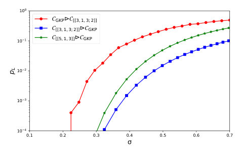 
FIG. 5: (Color online) Logical failure probability of C[[3,1,3;2]] ▷CGKP, C[[5,1,3]] ▷CGKP, and CGKP ▷C[[3,1,3;2]] codes as a function of the standard deviation σ, depicted as the blue, green, and blue plots, respectively.

**Summary.** This paper develops novel entanglement-assisted continuous-variable concatenated codes by combining EA stabilizer codes with GKP bosonic codes. It theoretically demonstrates that these concatenated structures effectively suppress quadrature errors, achieving a variance reduction proportional to $1/n$. This advances the field of fault-tolerant quantum computation for bosonic systems.

**Why it may be interesting.** This work is highly relevant as it pushes the boundaries of quantum information theory by merging two advanced QEC paradigms (EA and CV bosonic codes). The focus on error suppression factors provides concrete theoretical benchmarks for future experimental implementations in quantum optics or superconducting circuits.

Detailed structure

**Main problem.** The research aims to enhance quantum error correction rates by combining entanglement-assisted (EA) stabilizer codes with bosonic continuous-variable (CV) codes, specifically the Gottesman-Kitaev-Preskill (GKP) code.

**Main result.** They propose and analyze two concatenated structures ($	ext{EA} 	riangleright 	ext{GKP}$ and $	ext{GKP} 	riangleright 	ext{EA}$) that demonstrate significant suppression of quadrature errors, achieving a variance reduction factor of $1/n$ in the general case.

**Method.** The analysis involves deriving logical state representations for concatenated codes, calculating syndrome measurements from Gaussian unitary encoders, and employing Maximum Likelihood Estimation (MLE) to estimate and correct residual quadrature errors.

**Model / system.** The system models quantum information encoded in bosonic modes using GKP states. The theoretical framework utilizes stabilizer formalism generalized to include entanglement assistance via ebits for error correction.

**Key observables.** Logical failure probability ($p_L$), residual quadrature error variances ($	ext{Var}(\zeta^*_q) = 	ext{Var}(\zeta^*_p)$), and the success probability of bit identification ($p_{	ext{succ}}$).

**Important parameters / regimes.** The number of qubits/modes ($n$), the noise variance ($\sigma^2$), and the entanglement resource (ebits).

**Assumptions / limitations.** The analysis assumes independent and identically distributed (iid) Gaussian random shift errors, and for the general result, it relies on syndrome measurements falling within a specific range $[-\sqrt{\pi}/2, \sqrt{\pi}/2]$.

**Figures summary.** Figure 1 illustrates encoding circuits for GKP Bell pairs using both computational and canonical bases. Figure 5 compares the logical failure probability versus standard deviation for different concatenation orders.

**Paper structure.** The paper first establishes the theoretical basis by combining EA concepts with bosonic codes (GKP). It then details two specific concatenation orders ($	ext{EA} 	riangleright 	ext{GKP}$ and $	ext{GKP} 	riangleright 	ext{EA}$) using examples like $n=3$. The core analysis involves deriving error suppression factors, culminating in a general theorem showing $1/n$ variance reduction for the $	ext{CGKP} 	riangleright C[[n,1,n;n-1]]$ code.

Abstract

Entanglement-assisted (EA) stabilizer codes enhance the rate of error correction in relation to codes with no pre-shared entanglement. Meanwhile, bosonic error-correcting codes, such as the Gottesman-Kitaev-Preskill (GKP) code, can be concatenated with qubit stabilizer codes to significantly reduce the logical failure probability of those stabilizer codes. First, we combine the above two concepts to propose an EA version of the qubit-into-oscillators concatenated code that chains an EA-stabilizer (outer) code with a GKP (inner) code. As an example we present a three-qubit EA-repetition concatenated with a GKP code. Second, we propose an EA version of the non-Gaussian oscillator-into-oscillators concatenated code that chains a GKP (outer) code with an EA-stabilizer (inner) code. As an example we present a GKP code concatenated with a three-qubit EA repetition code that uses two maximally entangled modes (emodes) and suppresses the variances of both position and momentum quadrature errors of a data mode. Furthermore, we generalize the latter example to a family of GKP code concatenated with a $n$-qubit EA repetition code that uses ${n-1}$ emodes and suppresses the variances of both position and momentum quadrature errors of a data mode by a factor ${1/n}$.

[↑ back to top](#top)

### [Exploring the landscape of compact magic-state distillation factories](http://arxiv.org/abs/2606.07734v1)

**Authors:** Hugo Jacinto, Xavier Valcarce, Victor Barizien, Élie Gouzien, Nicolas Sangouard  
**Type:** theory · **Category:** quantum information and computing · **PDF:** <https://arxiv.org/pdf/2606.07734v1>  
**Analysis basis:** full PDF text, analyzed in chunks
**Topic relevance:** `entanglement & information structure` **1/5** · `methods for driven-dissipative` **1/5**

📷 Fig 1

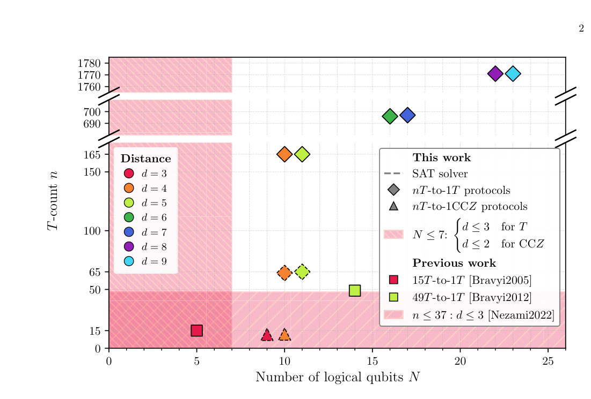 
FIG. 1. Summary of the exploration of compact magic-state distillation protocols. Each dot represents a distillation protocol implemented on N logical qubits that consumes n noisy magic states and outputs a single magic state with output error scaling as pout ∝pd in, where d is the distillation distance. Previously known protocols include the 15-to-1 protocol of Ref. [22], referred to as [Bravyi2005] on the figure, implemented on N = 5 qubits, and the 49-to-1 protocol of Ref. [27], [Bravyi2012], implemented on N = 14 qubits. Ref. [38], referred to as [Nezami2022] on the figure, proved a no-go result showing that any protocol with n + k ≤38 satisfies d ≤3. In this work, we introduce several...

📷 Fig 2

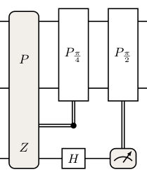 
FIG. 2. Gate teleportation and Clifford correction circuit to perform a Pπ/8 rotation [16]. First a |T⟩state is injected and the entire system is jointly measured in P ⊗Z. A first Pauli correction consisting of a Pπ/4 gate is applied to the N qubits if the outcome of the measurement is −1. The injected qubit undergoes a Hadamard operation before being measured in the Z basis. Another Clifford correction, namely Pπ/2, is fi- nally performed on the first N qubits.

**Summary.** This work tackles the critical problem of generating high-fidelity magic states necessary for fault-tolerant quantum computing. By reformulating distillation protocols using classical error-correcting codes, the authors used SAT solvers to derive new theoretical bounds and construct highly compact distillation factories. This advances the understanding of resource overhead by minimizing both qubit count and required operations.

**Why it may be interesting.** While focused on quantum computation theory, the rigorous application of classical coding theory and computational search techniques (SAT solving) provides powerful generalizable methods for analyzing resource overhead in complex physical systems.

Detailed structure

**Main problem.** The primary challenge is developing efficient, fault-tolerant methods for producing high-fidelity magic states (like $|T
angle$) required for universal quantum computation.

**Main result.** The authors derived new, compact distillation protocols achieving higher distances ($d=5$ for T-to-T) using fewer physical qubits than previously known. They also established no-go theorems relating protocol parameters.

**Method.** They employed a combination of classical error-correcting code theory and Boolean Satisfiability (SAT) solvers to systematically constrain the design space of distillation protocols.

**Model / system.** The focus is on implementing logical T gates using magic state distillation factories based on the repetition code. The analysis involves mapping quantum constraints onto algebraic structures solvable by SAT solvers.

**Key observables.** Distillation distance ($d$), number of physical qubits ($N$), and the required T-count ($n$).

**Important parameters / regimes.** The relationship between $N$, $d$, and $n$ is central; specific results include achieving $d=5$ on $N=11$ qubits.

**Assumptions / limitations.** Protocols are analyzed by framing the problem using classical error-correcting code structures, simplifying the initial quantum description via Pauli product rotations.

**Figures summary.** Figures illustrate the comparison of T-count vs. number of logical qubits for various distillation distances and show circuit diagrams for gate teleportation/correction.

**Paper structure.** The paper progresses from general necessity (magic state distillation) to specific mathematical tools (classical codes, SAT solvers), deriving bounds and constructing optimized protocols for both $|T
angle$ and $\sqrt{T}$ states.

Abstract

Producing high-fidelity magic states using the smallest possible amount of physical qubits and operations stands as a very important challenge to achieve fault-tolerant quantum computation at scale. Besides emerging proposals for alternative methods such as cultivation, magic state distillation remains essential for achieving very low error rates. Known distillation protocols are usually built through quantum codes derived from triorthogonal matrices. Here, exploiting the specific noise structure present in magic state distillation protocols, we show that classical error-correcting codes offer a simpler framework for deriving these protocols. This formulation is particularly well suited to systematic numerical and analytical studies of distillation protocols involving a fixed number of qubits. Specifically, we use a SAT solver to derive a series of no-go theorems that relate key figures of merit, including the number of qubits, the protocol depth, the factory distance, and the prefactor in the output error rate. For instance, we prove that any $T$-to-$T$ state distillation protocol using fewer than eight qubits can detect at most three errors, while any $T$-to-$\mathrm{CC}Z$ state distillation protocol using fewer than eight qubits can detect at most two errors. Our results also include new distillation protocols with the smallest number of qubits for a given distance in the literature, namely distance 4 and 5 $T$-to-$T$ state protocols supported on 10 and 11 qubits, as well as distance 3 and 4 $T$-to-$\mathrm{CC}Z$ state distillation protocols supported on 9 and 10 qubits.

[↑ back to top](#top)

### [Neural network decoder confidence as a learned proxy for the logical gap](http://arxiv.org/abs/2606.08758v1)

**Authors:** David Dentelski  
**Type:** theory · **Category:** quantum information and computing · **PDF:** <https://arxiv.org/pdf/2606.08758v1>  
**Analysis basis:** full PDF text, analyzed in chunks
**Topic relevance:** `methods for driven-dissipative` **1/5** · `quantum measurements` **1/5**

📷 Fig 1

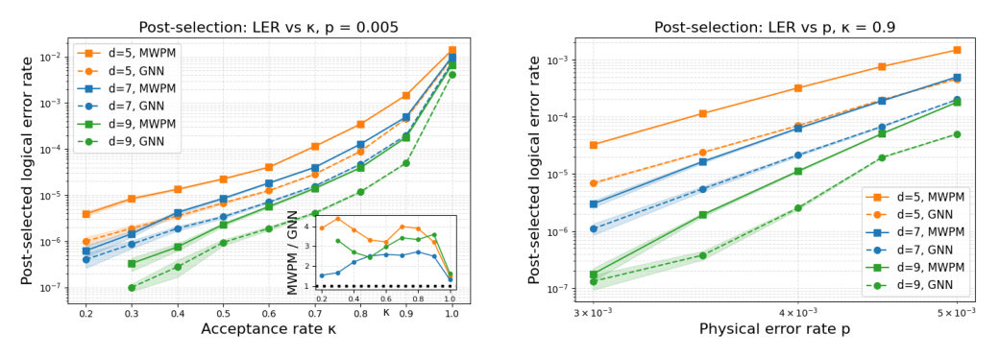 
FIG. 1: Post-selection logical error rate using GNN and MWPM confidence scores. Results for the Z-memory rotated surface code for (d, r) = (5, 5), (7, 7), (9, 9), where r is the number of stabilizer rounds. Each data point is obtained from 108 shots, which limits the available acceptance rates for different distances. (a) Post-selected logical error rate for different acceptance rates κ for physical error p = 0.005. Shots are ranked by the MWPM gap and the GNN logit. The inset shows the relative advantage obtained by ranking shots with the GNN confidence. (b) Logical error rate as a function of the physical error rate p, at fixed acceptance rate of κ = 0.9.

📷 Fig 2

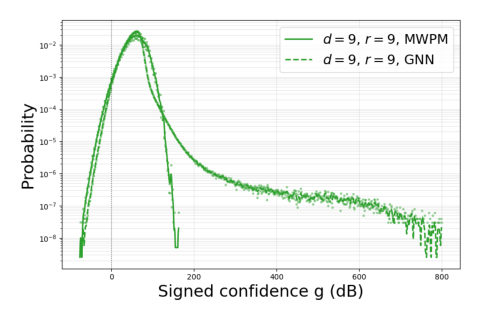 
FIG. 2: Probability distribution of signed confidence scores. Signed confidence distribution for (d, r) = (9, 9), at physical error rate p = 0.005 using 108

📷 Fig 3

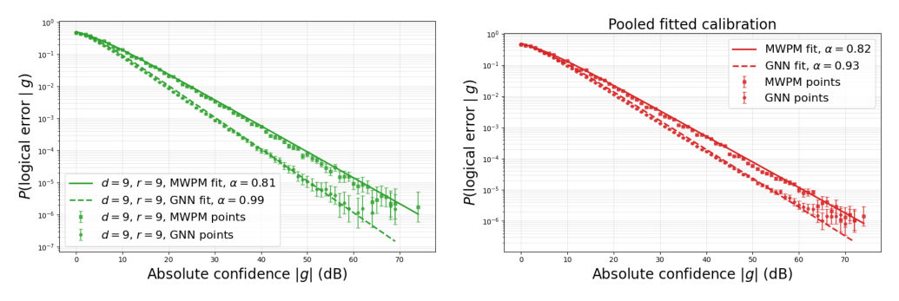 
FIG. 3: Empirical calibration of the confidence scores. (a) Conditional logical-failure probability as a function of the confidence variable g, for (d, r) = (9, 9), at physical error rate p = 0.005. Curves show fits to Eq. (3). (b) Pooled calibration fit over all simulated configurations listed in Table I.

📷 Fig 4

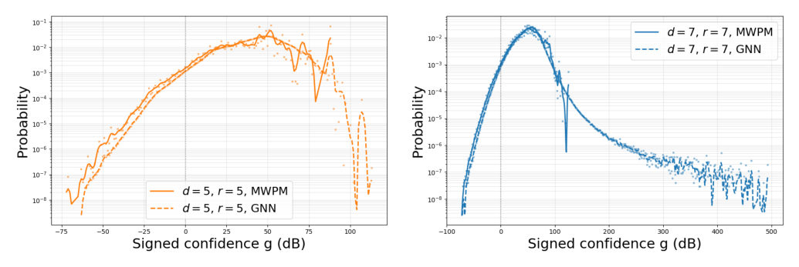 
FIG. 4: Probability distributions of the signed confidence scores, same as Fig. 2 but for (a) (d, r) = (5, 5) and (b) (d, r) = (7, 7) at physical error rate p = 0.005.

📷 Fig 5

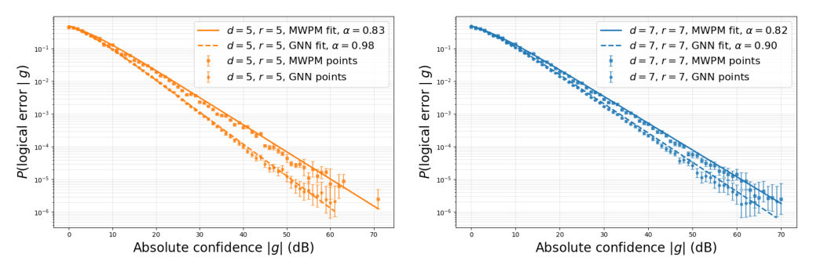 
FIG. 5: Conditional logical-failure probability as a function of the confidence variable g, same as Fig. 3(a) but for (a) (d, r) = (5, 5) and (b) (d, r) = (7, 7) at physical error rate p = 0.005.

**Summary.** This paper investigates whether the confidence score generated by a Graph Neural Network (GNN) can replace the traditional 'logical gap' used for decoding measurements in quantum error correction. By comparing performance on the rotated surface code, the authors demonstrate that the GNN-derived soft information leads to lower logical error rates and better calibration than the standard Minimum Weight Perfect Matching approach. This suggests GNNs are a powerful tool for extracting reliable confidence metrics from syndrome data.

**Why it may be interesting.** It provides a concrete example of applying machine learning techniques (GNNs) to extract physically meaningful soft information in quantum error correction, offering a scalable alternative when computationally intensive methods like MWPM are impractical.

Detailed structure

**Main problem.** To determine if a Graph Neural Network (GNN) decoder's raw output confidence score can serve as a reliable, learned proxy for the established 'logical gap' used in quantum error correction decoding.

**Main result.** Post-selection based on the GNN logit yields a lower logical error rate than using the conventional Minimum Weight Perfect Matching (MWPM) complementary gap across tested noise regimes. The GNN also shows better calibration towards ideal theoretical estimates.

**Method.** The study compares two soft information measures—the GNN's output logit and the MWPM gap—by testing their efficacy in post-selecting measurements from a quantum error-correcting code.

**Model / system.** The analysis is performed on the rotated surface code using syndrome measurements generated under uniform circuit-level noise. The comparison involves decoding performance across varying acceptance rates ($\kappa$) and physical error probabilities ($p$).

**Key observables.** Logical Error Rate (LER), signed confidence distribution, and calibration slope ($\alpha$) relative to the ideal posterior log-likelihood ratio.

**Important parameters / regimes.** Physical error rate ($p=0.005$), code distance ($d$), number of stabilizer rounds ($r$), and acceptance rate ($\kappa$).

**Assumptions / limitations.** The primary assumption is that ranking measurements by confidence score (rather than absolute scale) determines the post-selection advantage, and that the GNN can learn sufficient soft information without explicit knowledge of matching probabilities.

**Figures summary.** Figures compare LER vs. acceptance rate for both decoders; other figures show probability distributions and empirical calibrations of the signed confidence scores against theoretical expectations.

**Paper structure.** The paper introduces the problem by comparing GNN decoding to MWPM gap estimation, presents quantitative results showing superior performance (lower LER) for the GNN, analyzes the shape and calibration of the confidence scores, and concludes with implications for general decoder design.

Abstract

To utilize quantum error-correcting codes, a decoder must infer the logical sector from the measured syndrome. Beyond producing a hard logical decision, some decoders provide soft information that estimates the reliability of that decision. For minimum-weight perfect matching (MWPM), a common confidence measure is the complementary, or logical, gap. Here we test whether the logit of a graph neural network (GNN) decoder can act as a learned proxy for the logical gap. Using a pretrained GNN for the rotated surface code under uniform circuit-level noise [Physical Review Research, 7(2):023181, 2025], we compare its soft output with the MWPM complementary gap on the same sampled syndromes. We find that post-selection based on the GNN logit yields a lower logical error rate than one based on the MWPM gap. Shot-by-shot, the signed GNN confidence distribution resembles the signed MWPM gap at low and intermediate values, but assigns higher confidence to many correctly decoded shots. While both scores approximate the posterior log-likelihood ratio, the GNN confidence magnitude is closer to its ideal value. These results show that a neural-network decoder trained only on syndromes and logical labels learns both gap-like discrimination and a quantitative confidence scale, enabling confidence-based post-selection when MWPM gap estimates are unavailable, costly, or poorly matched to the noise model.

[↑ back to top](#top)

### [On the viability of Transatlantic Quantum Entanglement Distribution using Combined Satellite and Stratospheric Relay Nodes](http://arxiv.org/abs/2606.09805v1)

**Authors:** Kimia Mohammadi, Paul J. Godin, Thomas Jennewein  
**Type:** theory · **Category:** quantum information and computing · **PDF:** <https://arxiv.org/pdf/2606.09805v1>  
**Analysis basis:** full PDF text, analyzed in chunks
**Topic relevance:** `entanglement & information structure` **1/5** · `interference shaping light` **1/5**

📷 Fig 1

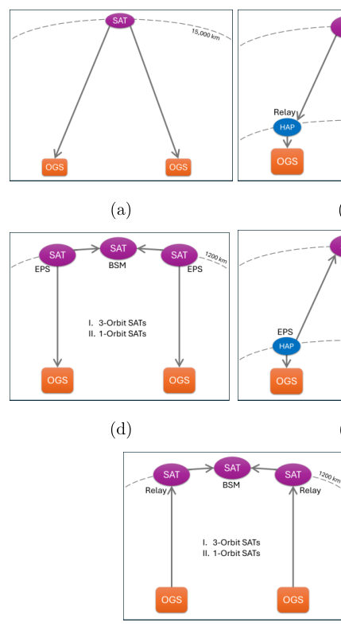 
FIG. 1: Considered link configurations for entanglement distribution between the two

📷 Fig 2

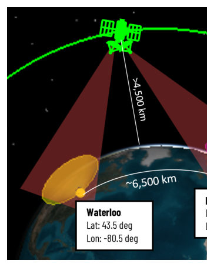 
FIG. 2: Ground stations in Waterloo, Canada and Berlin, Germany with a 60-degree

📷 Fig 3

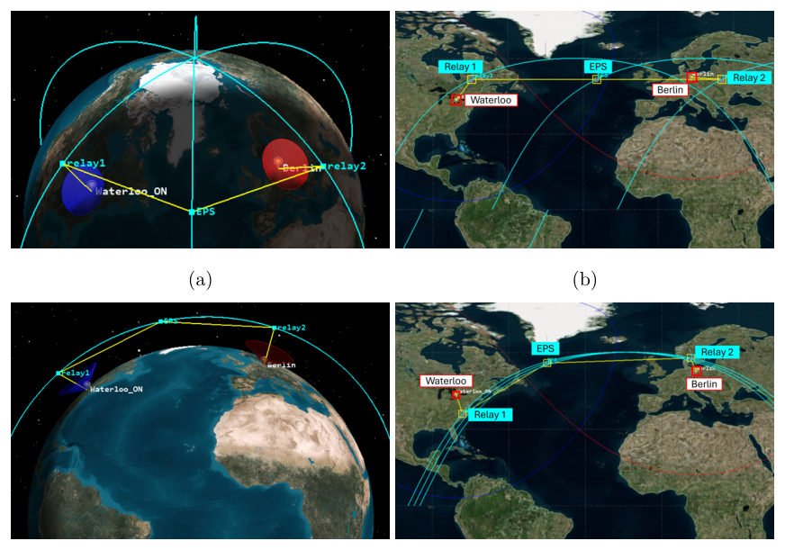 
FIG. 3: Three-satellite link configurations where (a),(b) three satellites are located in three

📷 Fig 4

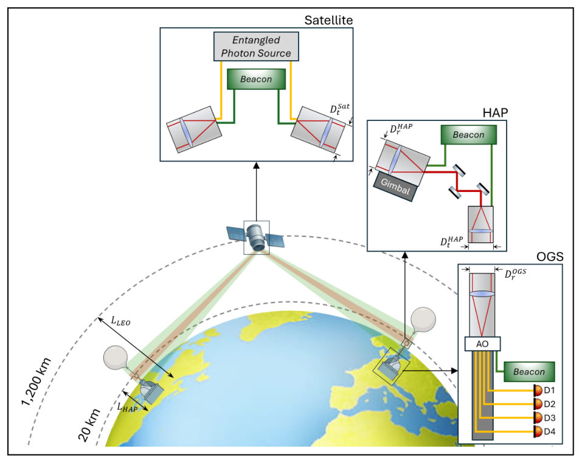 
FIG. 4: Possible scenario for transatlantic entanglement distribution. A LEO satellite at

📷 Fig 5

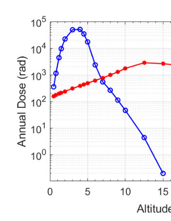 
FIG. 5: Annual radiation dose for circular orbits from 500 km to 35,000 km altitude,

**Summary.** This paper analyzes methods for achieving transatlantic quantum entanglement distribution using satellites and stratospheric relays. By modeling various link architectures, the authors determined that a hybrid LEO satellite and HAP system provides the highest secure key rate ($\approx 5 	imes 10^6$ bits/year). This demonstrates the significant advantage of incorporating low-cost, maneuverable atmospheric relays over single high-altitude satellites.

**Why it may be interesting.** This work directly addresses the engineering challenges of scaling quantum communication networks over continental distances by proposing a practical hybrid space/air relay solution that significantly outperforms purely satellite-based approaches.

Detailed structure

**Main problem.** The study investigates feasible architectures for distributing quantum entanglement across transatlantic distances (6,500 km) to establish a global quantum network.

**Main result.** A hybrid architecture combining an entangled photon source on a Low Earth Orbit (LEO) satellite with two passive High-Altitude Platform (HAP) relays yields the highest entanglement distribution rate ($\approx 5 	imes 10^6$ secure key bits/year).

**Method.** The authors modeled various free-space link configurations, comparing single MEO satellites against hybrid LEO+HAP systems by analyzing link budgets and achievable key rates.

**Model / system.** The system involves ground stations communicating with space assets (LEO/MEO satellites) and stratospheric HAPs acting as passive optical relays. The analysis incorporates orbital mechanics, free-space link loss calculations, and quantum key distribution metrics.

**Key observables.** Entanglement distribution rate (secure key bits per year), Quantum Bit Error Rate (QBER), and violation of the CHSH Bell inequality parameter ($S$).

**Important parameters / regimes.** Transatlantic distance ($\sim 6,500$ km); LEO altitude ($\sim 1,200$ km); HAP altitude ($\sim 20$ km); Ground receiver aperture sizes (e.g., $30 	ext{ cm}$ vs $1 	ext{ m}$).

**Assumptions / limitations.** The study assumes that HAPs act purely as passive relays and does not rely on quantum memories or repeaters for entanglement distribution.

**Figures summary.** Figures compare link loss and elevation angle variations across different satellite constellations (MEO vs. LEO+HAP); Figure 7 illustrates the relationship between Bell-violation parameters and QBER requirements.

**Paper structure.** The paper systematically compares multiple link architectures (single MEO, multi-LEO, LEO+HAP) by calculating key performance indicators like achievable secure key rates and verifying entanglement preservation via Bell tests.

Abstract

To explore the pathways toward establishing a global quantum network, we investigate several link architectures for transatlantic quantum entanglement distribution over a 6,500 km ground distance. We define free-space link configurations involving satellites and stratospheric high altitude platforms (HAPs), using today's technology and without relying on quantum memories and repeaters. Considering link budgets, space radiation, orbital characteristics, and system complexity we find that a hybrid architecture consisting of an entangled photon source located on a low Earth orbit (LEO) satellite supported by two passive optical relays located on HAPs provides the overall highest entanglement distribution rate. In addition, the satellite HAP architecture offers practical advantages in payload design and launch requirements, and the ability to lower the weather-related link interruptions assuming some maneuverability of HAPs. Overall, this hybrid configuration yields on the order of 5X10^6 secure key bits per year using 30 cm aperture ground receivers, nearly two orders of magnitude higher than achievable with a single MEO satellite and 1 m aperture ground receivers. Our results highlight the major benefits of hybrid satellite HAP architectures by reducing system complexity while enabling scalable and more accessible long-range quantum communication networks.

[↑ back to top](#top)

### [Probabilistically Checking Quantum Proofs, with Interaction](http://arxiv.org/abs/2606.09588v1)

**Authors:** Baocheng Sun, Thomas Vidick  
**Type:** theory · **Category:** quantum information and computing · **PDF:** <https://arxiv.org/pdf/2606.09588v1>  
**Analysis basis:** full PDF text, analyzed in chunks
**Topic relevance:** `entanglement & information structure` **1/5** · `quantum measurements` **1/5**

📷 Fig 1

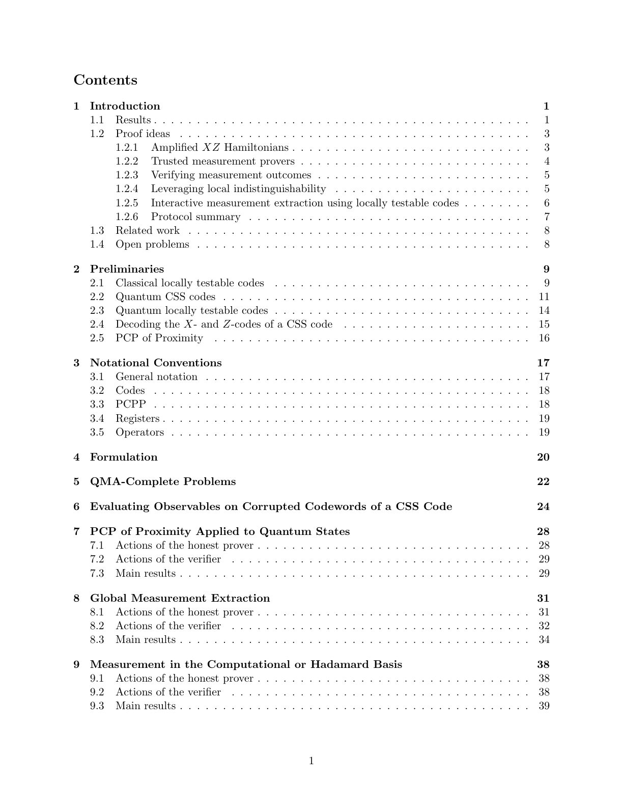 
Low-resolution page preview, page 2

📷 Fig 2

 
Low-resolution page preview, page 3

📷 Fig 3

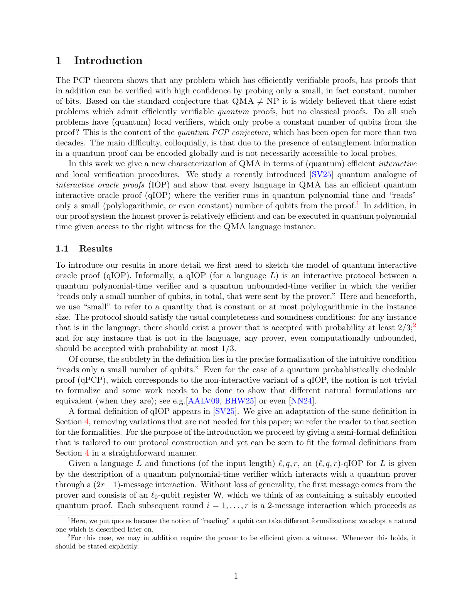 
Low-resolution page preview, page 4

📷 Fig 4

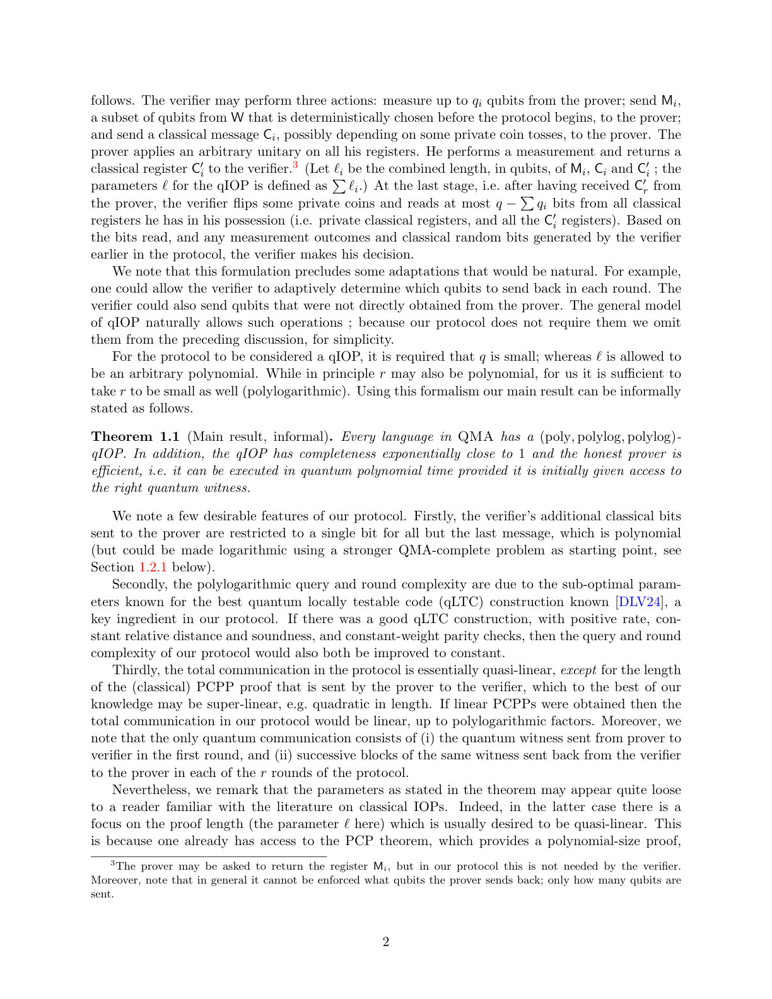 
Low-resolution page preview, page 5

📷 Fig 5

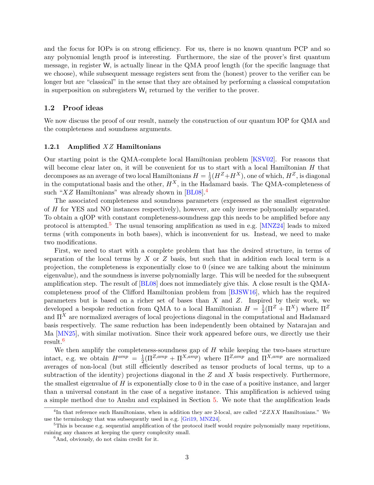 
Low-resolution page preview, page 6

**Summary.** This work develops a quantum interactive proof system (qIOP) to characterize problems in the complexity class QMA. By combining quantum locally testable codes with classical PCP techniques, the authors show that QMA can be verified using only polylogarithmic measurements from the verifier. This result is significant as it provides an information-theoretic characterization of QMA without assuming a quantum PCP theorem.

**Why it may be interesting.** It provides deep connections between complexity theory (QMA) and quantum coding theory, offering tools for verifying complex quantum computations efficiently.

Detailed structure

**Main problem.** The paper aims to establish a quantum analogue of interactive oracle proofs (qIOP) to characterize Quantum Merlin-Arthur (QMA) problems.

**Main result.** They prove that every language in QMA possesses an efficient qIOP where the verifier only needs to read a polylogarithmic number of qubits, providing a local and robust characterization of QMA.

**Method.** The protocol combines quantum Locally Testable Codes (qLTCs) with classical techniques like Probabilistically Checkable Proofs of Proximity (PCPP). The verification process involves multiple stages: measurement extraction and constraint checking.

**Model / system.** The model is the qIOP, involving a quantum verifier interacting with an unbounded prover. It utilizes quantum error-correcting codes (qLTCs) to encode states, which are tested via local measurements on small subsets of qubits.

**Key observables.** Acceptance probability of the energy test ($	ext{Pr}[	ext{energy test accepts}]$), fidelity between state evolution operators, and measurement outcomes in Z or X bases.

**Important parameters / regimes.** The verifier reads a polylogarithmic number of qubits ($q$), while total communication is polynomial ($\ell$). The success relies on the code distance ($d_q$) and locality ($q$).

**Assumptions / limitations.** The result holds in the absence of a quantum PCP theorem, relying on the existence of suitable qLTC codes with specific parameters.

**Paper structure.** The paper builds from defining the qIOP model to implementing measurement extraction using qLTCs (Single/Global Measurement Extraction), followed by a final energy test phase that combines these results to prove the QMA characterization.

Abstract

The model of interactive oracle proofs (IOP) generalizes the notion of probabilistically checkable proof (PCP), in which a static proof is verified probabilistically by querying a small number of bits, to the interactive setting: a polynomial-time verifier interacts with an unbounded prover, but is restricted to only reading a small number of bits, in total, from the messages sent by the prover. IOPs provide a relaxed setting in which to study local probabilistic verification. They have proved instrumental in devising efficient methods for verification through subsequent compilation into non-interactive or succinct protocols.   We study a quantum analogue of interactive oracle proofs (qIOP) in which the verifier and communication are both allowed to be quantum; yet the verifier is restricted to perform measurements only on a small number of qubits received from the prover. Our main result is a qIOP for any language in QMA, in which the total communication is polynomial but the verifier only reads a polylogarithmic number of qubits in total. The protocol has completeness parameter exponentially close to $1$ and soundness bounded away from $1$ by a constant. In the absence of a quantum PCP theorem, this provides the first information-theoretically sound local and robust characterization of QMA, albeit interactive.   Our protocol combines the use of a quantum locally testable code (LTC) with classical techniques, notably probabilistically checkable proofs of proximity (PCPP). We avoid the necessity for complex multi-qubit tests employed in other settings by leveraging the local indistinguishability property of the quantum LTC.

[↑ back to top](#top)

### [Superconductivity in the high-pressure tetragonal phase of UTe2](http://arxiv.org/abs/2606.07903v1)

**Authors:** Yuhang Deng, Gabriel Mee, Tyler Wannamaker, Keke Feng, Mingyu Xu, Weiwei Xie, M. Brian Maple  
**Type:** experiment · **Category:** strongly correlated electrons · **PDF:** <https://arxiv.org/pdf/2606.07903v1>  
**Analysis basis:** full PDF text, analyzed in chunks
**Topic relevance:** `Kondo & dissipative impurity` **1/5** · `analog quantum simulation` **1/5**

📷 Fig 1

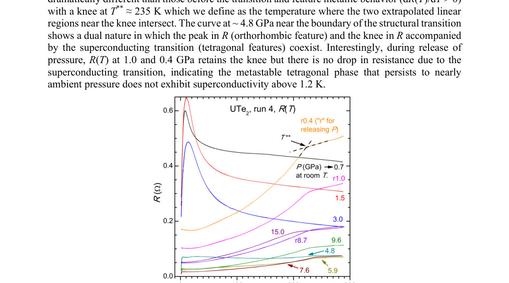 
Figure1. Representative R(T) curves for UTe2 measured at different pressures in Run 4. The values of pressure shown were determined at room temperature. The letter “r” before some of the numbers refers to measurements taken upon release of pressure from the highest pressure of 15 GPa.

📷 Fig 2

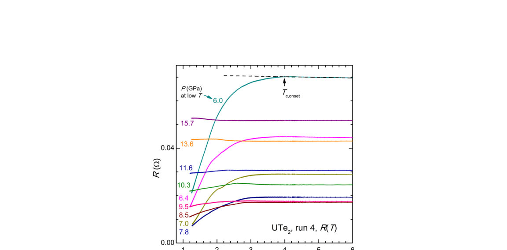 
Figure 2. Resistive superconducting transition curves of the tetragonal UTe2 sample studied in run 4. The R(T) data are for pressures calibrated at temperatures near the superconducting transitions. Tc,onset is defined as the temperature where the R(T) curve starts to deviate from the linear extrapolation of R(T) in the normal state.

📷 Fig 3

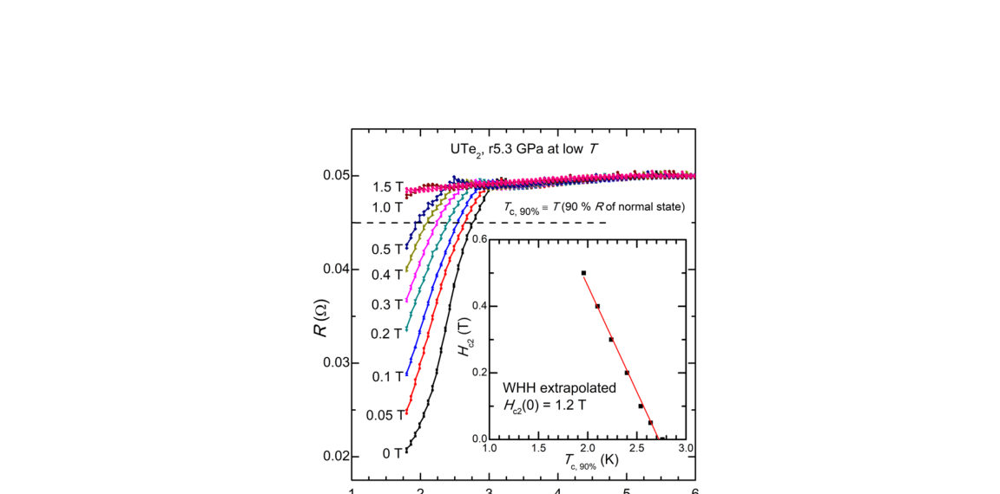 
Figure 3. R(T) curves measured in magnetic fields from 0 T to 1.5 T at P = r5.3 GPa. Tc, 90% was determined from the temperature at which R drops to 90% of its value in the normal state. The inset shows a plot of the upper critical field Hc2 vs Tc,90% in low fields. The red straight line is a linear fit to the data which was used to estimate Hc2(0) by means of the Werthamer-Helfand-Hohenberg (WHH) theory.

📷 Fig 4

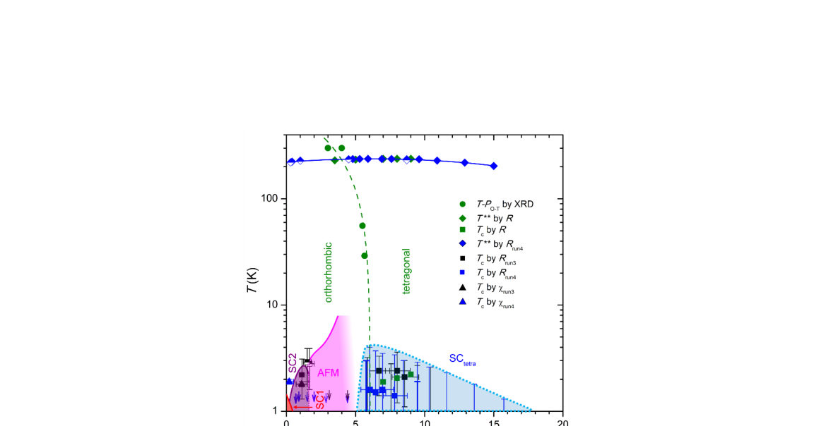 
Figure 4. T–P phase diagram for UTe2. For R(T,P) measurements, Tc,zero (lower error bar) is determined by extrapolating the linear region to R = 0 Ω. Tc,mid (symbols) is determined by finding the temperature at the midpoint between the resistances at Tc,onset (upper end of error bar) and Tc,zero. For some curves, the extrapolated Tc,zero &lt; 0 K, so Tc,zero and Tc,mid could not be determined. Down pointing arrows indicate no superconductivity was found down to T at the point of the arrow. For AC χ(T,P) measurements, the triangular symbols and their error bars stand for the midpoints and the onset/end point temperatures of the transitions, respectively. The dashed line through the open green...

**Summary.** This work experimentally maps the superconducting phase diagram of UTe2 under high pressure, revealing a striking dichotomy between its orthorhombic and tetragonal phases. The findings suggest that structural changes tune the pairing mechanism from an unconventional state to a more conventional one in the tetragonal phase. This highlights how external tuning can stabilize different types of correlated electronic ground states.

**Why it may be interesting.** While focused on condensed matter, the comparison of BCS-like vs. unconventional pairing symmetries under external tuning (pressure) provides a model for understanding how quantum critical points can stabilize different types of correlated ground states.

Detailed structure

**Main problem.** The study aims to map out the superconducting transition temperature ($T_c$) versus pressure ($P$) phase diagram of UTe2, specifically investigating the structural and electronic dichotomy between its orthorhombic and high-pressure tetragonal phases.

**Main result.** Superconductivity in the tetragonal phase is robust and appears more conventional (orbitally limited) compared to the fragile, unconventional superconductivity seen in the orthorhombic phase. The normal state exhibits a persistent 'knee' feature ($T^{**}$) linked to potential magnetic ordering.

**Method.** The research relies on electrical transport measurements ($	ext{R}(T)$) and AC magnetic susceptibility ($\chi(T,P)$) performed under high pressure using Diamond Anvil Cells (DACs).

**Model / system.** The system is Uranium ditelluride ($	ext{UTe}_2$), a heavy-fermion superconductor known for complex interplay between structural transitions, magnetism, and superconductivity. The study compares the superconducting behavior across two distinct crystal structures.

**Key observables.** Superconducting transition temperature ($T_c$), upper critical field ($	ext{H}_{c2}$), normal-state resistivity $
ho(T)$ exhibiting a 'knee' feature ($T^{**}$).

**Important parameters / regimes.** Pressure range up to 16 GPa; characteristic fields like the Pauli paramagnetic limit and orbital limits.

**Assumptions / limitations.** The analysis assumes that structural changes (orthorhombic $\leftrightarrow$ tetragonal) fundamentally alter the pairing mechanism, leading to different superconducting symmetries.

**Figures summary.** Figures illustrate representative resistance vs. temperature curves showing SC transitions in the tetragonal phase at various pressures, and potentially show the $T-P$ phase diagram.

**Paper structure.** The paper systematically measures transport properties across structural transitions, contrasting the behavior of superconductivity (SC) and normal state features ($T^{**}$) between the two phases to deduce underlying electronic mechanisms.

Abstract

Electrical transport and magnetic measurements have been made on UTe2 under pressure P up to approximately 16 GPa to determine the superconducting transition temperature Tc vs P phase diagram in the high-pressure tetragonal phase. Superconductivity emerges near 5 GPa, coincident with the orthorhombic to tetragonal phase transition; in the tetragonal phase, Tc reaches a maximum value of approximately 4 K at 6 GPa and then decreases with P and appears to vanish near 18 GPa. Tetragonal UTe2 has a relatively small upper critical field Hc2(0) $\approx$ 1.2 T at 5.3 GPa, smaller than the Pauli paramagnetic limit, and is orbitally limited with a coherence length $ξ$tetra $\approx$ 16.5 nm. This small value of Hc2(0) favors more conventional superconductivity; in contrast, the large values of Hc2(T) for orthorhombic UTe2 exceed the Pauli paramagnetic limit in all three crystallographic directions and have been attributed to unconventional superconductivity, widely believed to involve spin-triplet pairing. The temperature-pressure phase diagram of UTe2 shows a striking dichotomy: a narrow, fragile, unconventional superconducting region in the orthorhombic phase vs a broad, robust, and more conventional superconducting dome in the tetragonal phase. This dichotomy is consistent with the proposal that U-dimers, present (absent) in the orthorhombic (tetragonal) phase, may play a role in spin-triplet superconductivity of orthorhombic UTe2. In the tetragonal phase, the normal-state electrical resistivity $ρ$(T) exhibits metallic behavior with a knee between 200 and 240 K that depends weakly on P and most likely marks the onset of a transition to a magnetically ordered phase that coexists with superconductivity.

[↑ back to top](#top)

### [Adaptive directional gradients for parameterised quantum circuits](http://arxiv.org/abs/2606.09734v1)

**Authors:** Brian Coyle, Snehal Raj, Virag Umathe, El Amine Cherrat, Elham Kashefi  
**Type:** both · **Category:** quantum information and computing · **PDF:** <https://arxiv.org/pdf/2606.09734v1>  
**Analysis basis:** full PDF text, analyzed in chunks
**Topic relevance:** `quantum measurements` **1/5**

📷 Fig 1

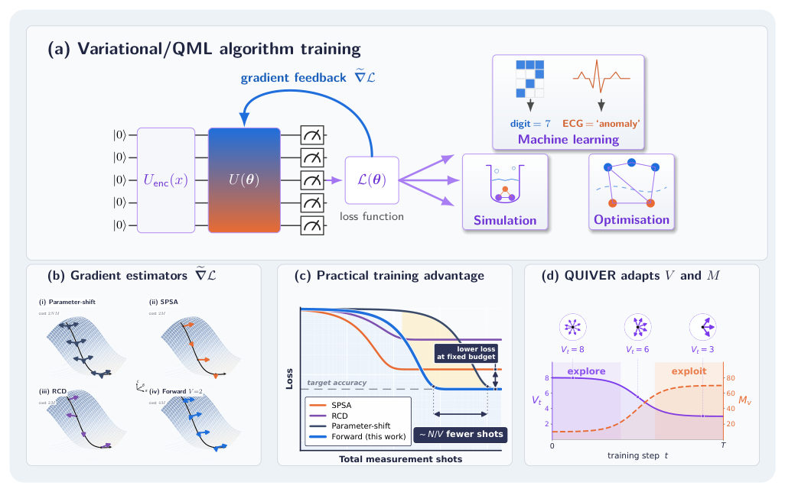 
FIG. 1. Overview of the forward gradient framework and the quiver optimiser. (a) Variational/QML algorithm training loop: a parametric quantum model U(θ) (preceded by a data-encoding unitary Uenc(x)) is measured to produce a loss L(θ) suited to a range of tasks (quantum simulation, combinatorial optimisation, machine learning). A gradient estimator e∇L feeds back into U(θ) to update its parameters. (b) Gradient estimators e∇L, shown as random directions probed in the N-dimensional parameter space at fixed per-direction shot count M. The parameter-shift rule (PS) evaluates 2N circuits per step covering all N basis directions (cost 2NM). SPSA draws a single random direction (2M shots). RCD...

📷 Fig 2

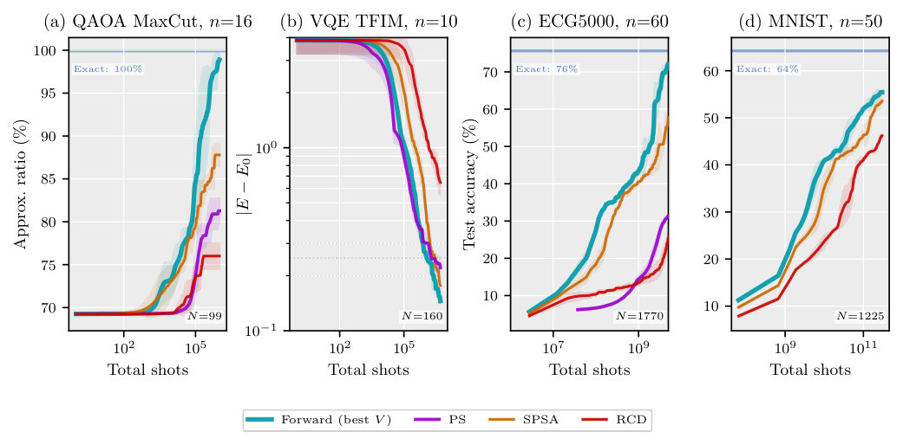 
FIG. 2. Forward gradients match or exceed all baselines across four problem domains: quantum optimisation, quantum simulation, time-series classification, and image classification. Each panel compares the best forward gradient configuration against the parameter-shift rule (PS), SPSA (V = 1) and RCD on the total measurement shots axis. All stochastic methods are run at a matched per-step shot budget B = 1000; PS uses M = 10 shots per parameter and its per-step cost therefore grows as 2NM. (a) QAOA MaxCut, n = 16, depth 3, N = 99, best forward V = 10. (b) VQE ground-state estimation (transverse-field Ising model, n = 10, d = 8), N = 160, best forward V = 10. (c) ECG5000 time-series...

📷 Fig 3

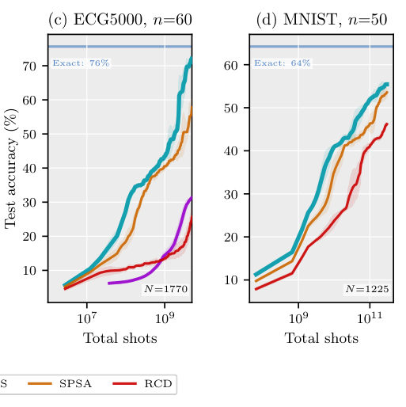 
Fig. 4 compares forward methods against the parameter-shift rule. Despite using a fixed per-step bud- get (independent of N), forward gradients reach compa- rable or superior accuracy to PS at all system sizes. The accuracy gap between forward and exact gradients re- mains small (1–2 percentage points) up to n = 60, while the total shot cost is a fraction of that required by PS. The best-performing forward configuration uses V = 10 at most system sizes, with V = 25 preferred at n = 60.

📷 Fig 4

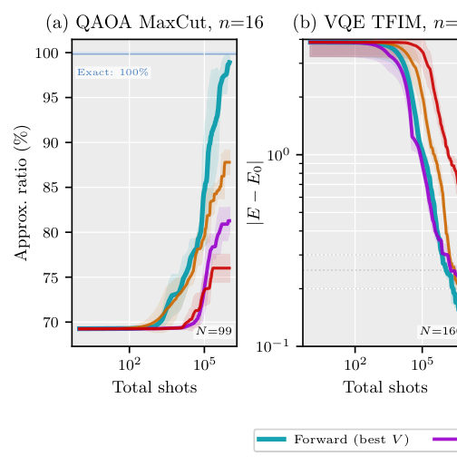 
Fig. 3 compares forward gradient methods against SPSA and RCD at a fixed shot budget per step. For- ward gradients with V ≥10 outperform single-direction methods (V = 1), with the gap widening at larger N. At n = 60 (N = 1770), SPSA collapses to 63.8% while forward methods with V = 25 match the exact gradient baseline at 76.0%.

📷 Fig 5

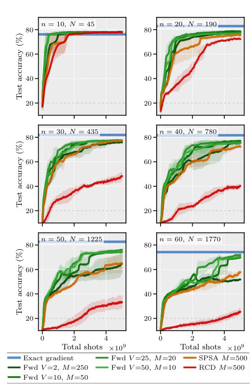 
FIG. 3. Forward gradients consistently outperform SPSA and RCD at matched shot budget. ECG5000: forward gradient methods (V &gt; 1) vs SPSA (V = 1) and RCD. Each panel shows a different system size n. For- ward gradients with V = 10 consistently outperform single- direction methods.

**Summary.** The paper introduces an advanced forward gradient estimator framework to overcome the prohibitive measurement cost associated with calculating gradients for large parameterised quantum circuits. By adaptively optimizing both the number of random directions and the shots allocated per direction, the proposed QUIVER optimizer significantly outperforms established methods across various quantum machine learning benchmarks.

**Why it may be interesting.** This work provides a concrete, resource-aware algorithmic improvement for variational quantum algorithms, directly addressing the primary computational bottleneck in scaling up near-term quantum hardware applications.

Detailed structure

**Main problem.** Training parameterised quantum circuits (PQCs) is bottlenecked by the measurement cost of gradient estimation, which scales poorly with the number of trainable parameters.

**Main result.** A forward gradient estimator framework, combined with an adaptive optimizer (QUIVER), achieves orders of magnitude more efficient training than standard methods like the Parameter-Shift Rule for large quantum neural networks.

**Method.** The authors propose a forward gradient estimator based on the forward mode of automatic differentiation, averaging random directional derivatives to reconstruct the full gradient efficiently. They combine this with an adaptive optimizer that jointly optimizes the number of directions and measurement shots.

**Model / system.** The work focuses on training PQCs used in Variational Quantum Algorithms (VQA) like VQE and QNNs. Benchmarks include classifying ECG5000 data, MNIST images, solving QAOA MaxCut problems, and estimating ground states for TFIM Hamiltonians.

**Key observables.** Energy error ($|E - E_0|$), approximation ratio ($r$), Mean Squared Error (MSE) of the gradient estimator, and total measurement shot count.

**Important parameters / regimes.** Number of parameters ($N$), number of random directions sampled ($V$), shots per direction ($M$), step size ($\epsilon$), and learning rate ($\eta$).

**Assumptions / limitations.** The analysis relies on assumptions regarding the convergence properties (e.g., PL condition locally) and uses central finite-difference approximations for directional derivatives, which introduce bias.

**Figures summary.** Figures compare the measurement shot costs of various gradient estimators (PS vs. Forward) showing significant savings with forward gradients; other figures show performance comparisons across multiple benchmark tasks (QAOA, VQE, MNIST) demonstrating superior convergence rates for QUIVER.

**Paper structure.** The paper systematically reviews existing gradient estimation techniques (PS, SPSA, RCD), introduces the unified forward gradient estimator parameterized by $V$, develops the adaptive optimization strategy (QUIVER) via joint $(V, M)$ minimization, and validates this approach across multiple complex quantum machine learning benchmarks.

Abstract

Training parameterised quantum circuits (PQCs) on quantum hardware is bottlenecked by the measurement cost of gradient estimation, which under the parameter-shift rule scales linearly in the number of trainable parameters and dominates the total shot budget of training at scale. In this work, we propose a framework of forward gradient estimators for PQCs, based on the forward mode of automatic differentiation, that yields an unbiased estimator of the gradient by averaging a freely tunable number of random directional derivatives and recovers SPSA, random coordinate descent, and the parameter-shift rule as limiting cases, with no ancilla qubits or controlled-gate overhead. We prove that stochastic quantum forward gradient descent converges under standard assumptions, with an explicit second-moment expansion that interpolates between the single-direction extreme of SPSA and the full-gradient extreme of parameter-shift. Within this framework we derive QUIVER (Quantum Iterative V-adaptive Estimator Rule), an adaptive optimiser for parameterised circuits whose update rule follows from a closed-form minimum measurement-cost allocation. We show numerically that forward gradients train Hamming-weight-preserving orthogonal quantum neural networks with up to 60 qubits and 1770 parameters on the ECG5000 and MNIST datasets orders of magnitude more efficiently than the parameter-shift rule. We also demonstrate that our proposed QUIVER optimiser can outperform iCANS and gCANS measurement-frugal optimisers on optimisation problems using the quantum approximate optimisation algorithm and quantum simulation with the variational quantum eigensolver.

[↑ back to top](#top)

### [Conceptual and Geometric Foundations for a Teleparallel Approach to Quantum Gravity](http://arxiv.org/abs/2606.09592v1)

**Authors:** Alexandre Landry  
**Type:** theory · **Category:** other · **PDF:** <https://arxiv.org/pdf/2606.09592v1>  
**Analysis basis:** full PDF text, analyzed in chunks
**Topic relevance:** `Keldysh / 2PI / non-Gaussian methods` **1/5**

📷 Fig 1

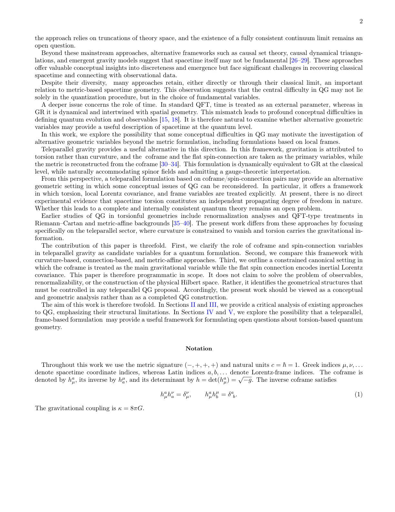 
Low-resolution page preview, page 2

📷 Fig 2

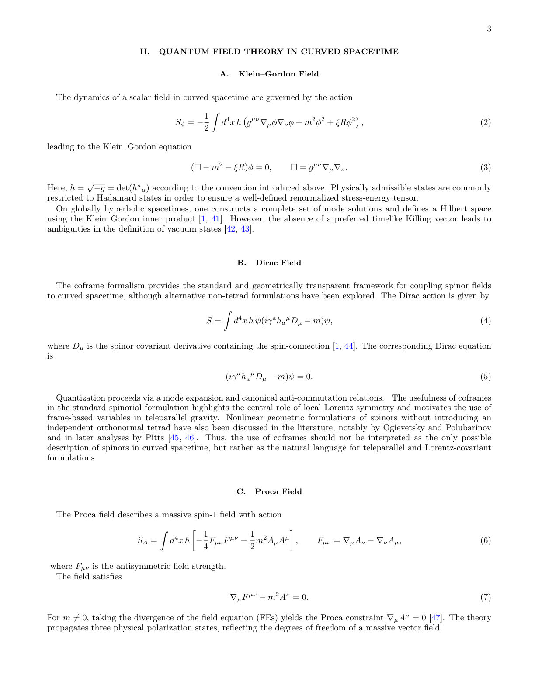 
Low-resolution page preview, page 3

📷 Fig 3

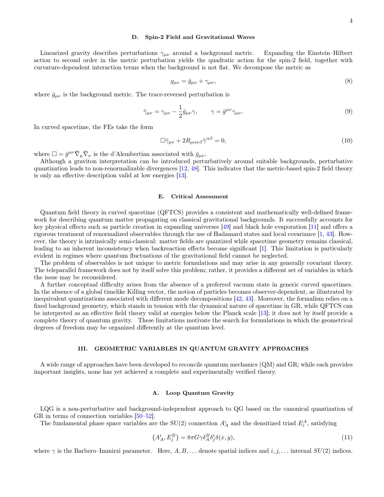 
Low-resolution page preview, page 4

📷 Fig 4

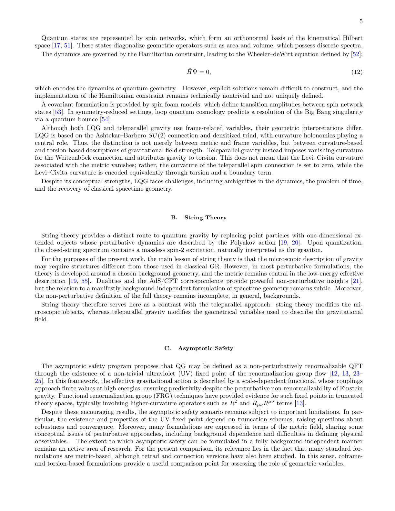 
Low-resolution page preview, page 5

📷 Fig 5

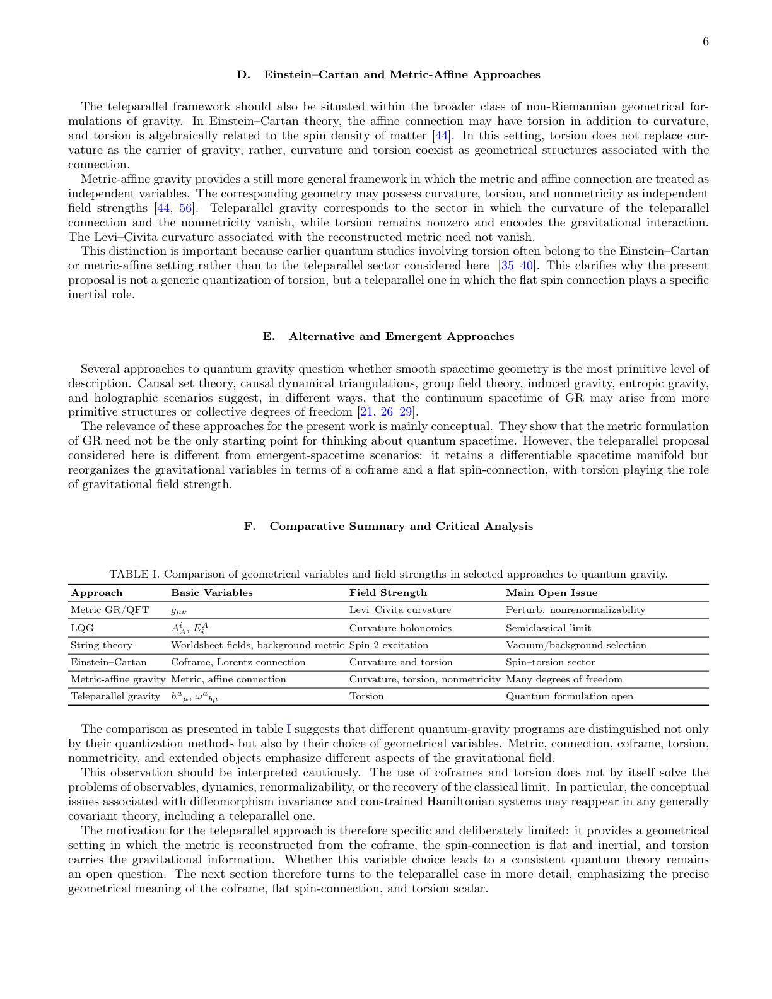 
Low-resolution page preview, page 6

**Summary.** This paper explores alternative geometric foundations for quantum gravity by focusing on teleparallel gravity, which replaces curvature with torsion as the fundamental field strength. It argues that using coframe and spin-connection variables provides a natural gauge structure suitable for quantization. The work aims to identify necessary conceptual ingredients rather than providing a complete solution to quantizing spacetime itself.

**Why it may be interesting.** While focused on gravity, the development of a constrained quantum field theory based on gauge potentials (coframe/spin-connection) shares conceptual parallels with advanced topics in quantum information theory involving gauge symmetries and constraints.

Detailed structure

**Main problem.** The fundamental incompatibility between Quantum Field Theory (QFT) and General Relativity (GR) at the Planck scale, necessitating a new framework for quantizing gravity.

**Main result.** The paper proposes that reformulating gravity using coframe and spin-connection variables, where dynamics are governed by torsion rather than curvature, provides a geometrically refined starting point for quantum gravity research.

**Method.** It compares various QG approaches (LQG, String Theory, Asymptotic Safety) and develops the teleparallel framework by treating the coframe/spin-connection pair as independent gauge variables.

**Model / system.** The model is a theoretical extension of General Relativity into the teleparallel gravity sector, utilizing the coframe ($\mathbf{h}^a_\mu$) and spin-connection ($\omega^a_{b\mu}$) to encode gravitational dynamics in torsion. It analyzes matter coupling (Klein-Gordon, Dirac) within this framework.

**Key observables.** Torsion ($T$), Curvature ($R$), Nonmetricity ($Q$), and the constraint algebra generators ($\hat{H}, \hat{D}_i, \hat{J}^{ab}$).

**Important parameters / regimes.** Planck scale; coupling constants $\kappa$; mass $m$ (for Proca field).

**Assumptions / limitations.** The primary assumption is that gravity can be reformulated using the coframe/spin-connection pair to achieve a gauge-like structure, bypassing some limitations of metric formulations.

**Figures summary.** Not specified in the notes; the text references comparative tables (TABLE I) summarizing different QG approaches based on their fundamental variables.

**Paper structure.** The paper first critiques QFTCS and reviews major QG candidates. It then introduces the teleparallel framework, detailing its geometric structure using coframe/spin-connection variables, deriving actions like $F(T)$, and finally outlining the canonical quantization program using constraint operators.

Abstract

We revisit quantum field theory in curved spacetime (QFTCS) as a semi-classical framework for quantum matter on classical geometries, emphasizing its limitations, including vacuum ambiguity and background dependence. We briefly review major approaches to quantum gravity (QG), including Loop Quantum Gravity (LQG), string theory, and asymptotic safety, highlighting their conceptual challenges. Motivated by these issues, we outline a teleparallel framework based on coframe and spin-connection variables, where gravity is encoded in torsion rather than curvature. This framework naturally incorporates local Lorentz symmetry and fermionic couplings while displaying a gauge-like structure. We argue that the coframe/spin-connection pair provides an alternative and geometrically refined description of gravitational variables, which may serve as a useful starting point for future investigations of QG. The purpose of this work is not to provide a complete quantization of teleparallel gravity but to identify the geometric and conceptual ingredients that such a formulation would require.

[↑ back to top](#top)

### [Deviations from Debye's specific heat due to excess energy fluctuations](http://arxiv.org/abs/2606.09566v1)

**Authors:** Ralph V. Chamberlin, Sumiyoshi Abe  
**Type:** theory · **Category:** statistical mechanics · **PDF:** <https://arxiv.org/pdf/2606.09566v1>  
**Analysis basis:** full PDF text, analyzed in chunks
**Topic relevance:** `non-equilibrium dynamics` **1/5**

📷 Fig 1

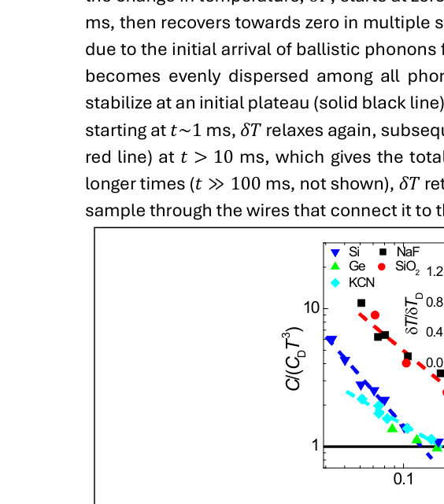 
FIG. 1. Measurements of specific heat from five high-purity single crystals, given in the legend [3-5]. [Inset: sketch depicts a model for interpreting the behavior [10]. Plot shows 𝛿𝛿𝑇𝑇 normalized by Debye’s 𝑇𝑇3-law, 𝛿𝛿𝑇𝑇𝐷𝐷 (solid black line), as a function of time from measurements of an SiO2 crystal at ~0.2 K. Red lines show long-time-limit behavior (dashed) and an exponential fit to the data (solid).] Filled symbols (given in the legend) show the equilibrium specific heat as a function of temperature, normalized by Debye’s specific heat [solid line at 𝐶𝐶/(𝐶𝐶𝐷𝐷𝑇𝑇3) = 1]. Dashed lines show power-law fits to the excess specific heats (with colors identified in the legend), showing divergence from...

📷 Fig 2

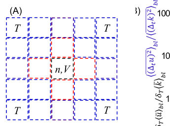 
FIG. 2. MD simulations of a system containing 442,368 Lennard-Jones (L-J) atoms using parameters for argon. [See discussion in paragraph after Eq. (9) for details about the L-J potential.] (A) Sketch of a system subdivided into small subsystems that are cube-shaped blocks. In the simulations in 3 dimensions, with fixed volume (𝑉𝑉) and number of atoms (𝑛𝑛), while the multitude of distant blocks serve as a large heat bath defining the temperature (𝑇𝑇) [6]. (B) Ratios of averages and variances of potential (𝑢𝑢) and kinetic (𝑘𝑘) energies as a function of 𝑇𝑇. The nearly-horizonal black line gives 𝛿𝛿𝑇𝑇〈𝑢𝑢ത〉𝑏𝑏𝑏𝑏𝛿𝛿𝑇𝑇〈𝑘𝑘ത〉𝑏𝑏𝑏𝑏 ⁄ = 0.9998 ± 0.0013. (For details of the notation, see text.) The theory...

📷 Fig 3

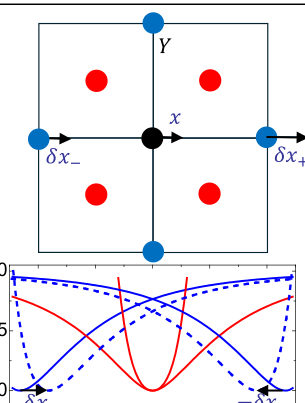 
FIG. 3. (A) Sketch showing nine atoms in the 𝑋𝑋-𝑌𝑌 plane of an fcc lattice. The nn atoms (red) and nnn atoms (blue) contribute most to energy of the central atom (black) at the origin. Only motions along the 𝑋𝑋-axis are described. 𝑥𝑥 and 𝛿𝛿𝛿𝛿± are displacements of the central atom and two nnn atoms, respectively. (B) Potential energy, 𝑢𝑢, as a function of 𝑥𝑥. Solid lines are from nn atoms (red) and nnn atoms (blue). Dashed lines are from a pair of nnn atoms that are displaced by ∓𝛿𝛿𝑥𝑥±, showing how the energy of the central atom is modulated by the motion of its nnn atoms. All variables are dimensionless.

**Summary.** This work develops a theoretical framework to explain excess specific heat observed below the Debye prediction in perfect crystals. It attributes this anomaly to energy fluctuations caused by anharmonic interactions involving next-nearest-neighbor atoms modulating harmonic lattice vibrations. The theory successfully models these deviations using molecular dynamics simulations and provides insights applicable to amorphous materials.

**Why it may be interesting.** The connection drawn between lattice dynamics, anharmonicity, and anomalous low-temperature thermodynamics is highly relevant for understanding energy transport in complex quantum systems.

Detailed structure

**Main problem.** The paper addresses the discrepancy between measured specific heat at low temperatures and the predictions of Debye's $T^3$-law in high-purity crystals.

**Main result.** Excess energy fluctuations, arising from anharmonic interactions involving next-nearest-neighbor atoms, modify the standard relation between energy fluctuations and specific heat, providing a quantitative explanation for the observed deviations.

**Method.** The authors develop a theory based on time- and phase-averaging of molecular dynamics simulations, treating localized excitations as decoupled from the main heat bath.

**Model / system.** The system modeled is crystalline solids (e.g., $	ext{SiO}_2$) analyzed via Molecular Dynamics (MD) simulations using the Lennard-Jones potential. The theory focuses on how anharmonic interactions between next-nearest-neighbor atoms modulate harmonic nearest-neighbor modes.

**Key observables.** Specific heat ($C_V$), energy fluctuation ratios ($\langle(\Delta t u)^2
angle / \langle(\Delta t k)^2
angle$), and correlation functions ($\Gamma_{0,0}(	au)$).

**Important parameters / regimes.** Low temperatures ($T \ll 300$ K), the ratio of potential to kinetic energy fluctuations, and the anharmonic coupling strength derived from nnn interactions.

**Assumptions / limitations.** The theory assumes that localized excitations are decoupled from the heat bath (fast modulations) and uses semiclassical approximations for the energy modulation.

**Figures summary.** Figures illustrate time-resolved specific heat measurements showing deviations from Debye's law, and MD results confirming the divergence of fluctuation ratios at low T due to anharmonic terms.

**Paper structure.** The paper progresses by first presenting experimental evidence of $C_V$ deviation (Chunk 1), then developing a theoretical framework using MD simulations on L-J models to quantify excess energy fluctuations (Chunk 2), and finally generalizing this theory to predict the functional form of the specific heat anomaly ($T^{\lambda+1}$) based on anharmonic coupling (Chunk 3).

Abstract

Measured specific heats often exceed Debye's T^3-law, even in high-purity single crystals. Analogous excess energy fluctuations in molecular dynamics (MD) simulations of crystals with no defects come from fast energy modulations involving next-nearest-neighbor atoms. Here, a theory is developed for these modulations, based on time- and phase-averaging followed by thermal averaging. This order of averaging is guided by evidence from the simulations and various experimental techniques showing that localized excitations are decoupled from the heat bath. Emergent nonextensivity is interpreted by analogy with anomalous diffusion. The theory modifies the standard relation between energy fluctuations and specific heat, giving good agreement with the simulations and new insight into many measurements. The theory may also provide a basis for understanding excess specific heat in amorphous materials and anomalous noise in quantum devices.

[↑ back to top](#top)

### [Persistent currents, whirlpools, and local Chern markers in twisted TMD Chern insulators](http://arxiv.org/abs/2606.09812v1)

**Authors:** Francesco Cioni, Lorenzo Cavicchi, Nazzareno Africani, Giacomo Mazza, Fabio Taddei, Amir Yacoby, Marco Polini  
**Type:** theory · **Category:** other · **PDF:** <https://arxiv.org/pdf/2606.09812v1>  
**Analysis basis:** full PDF text, analyzed in chunks
**Topic relevance:** `non-equilibrium dynamics` **1/5**

📷 Fig 1

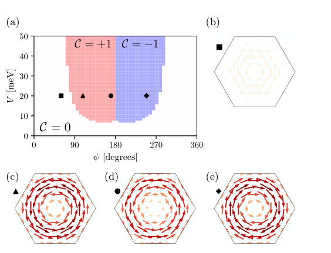 
FIG. 1. Topological phase diagram of the skyrmion Chern- band continuum model [18, 19]—panel (a)—as a function of the two parameters V and ψ in Eq. (6). White regions in- dicate topologically trivial phases while colored regions de- note phases with C ̸= 0. The triangle corresponds to twisted MoTe2. We also show the current whirlpools circulating in- side the moir´e unit cells for four different choices of param- eters. In the trivial phase—square, panel (b)—the ground- state current has a very small amplitude, while it becomes large as soon as one enters into the topological phase, panels (c) to (e). Notice the chirality reversal in passing from posi- tive (black triangle) to negative...

📷 Fig 2

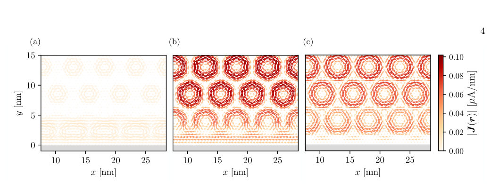 
FIG. 2. Ground-state currents near the bottom edge of a ribbon of width W ≃72 nm of a twisted TMD homobilayer with a twist angle θ = 3.89◦. The area shaded in gray represents the edge of the ribbon. The figures depict the local current density J(r) as defined in Eq. (10) for three values of the microscopic parameter ψ corresponding to the upper band being in the: (a) trivial (ψ = 60◦) phase, (b) near-critical (ψ = 107.7◦, representing twisted MoTe2) phase, and (c) in the topological phase (ψ = 170◦). The direction of the arrows corresponds to the direction of the vector field J(r) while their color indicates the intensity. The results in this figure have been obtained by setting w = −23.8...

📷 Fig 3

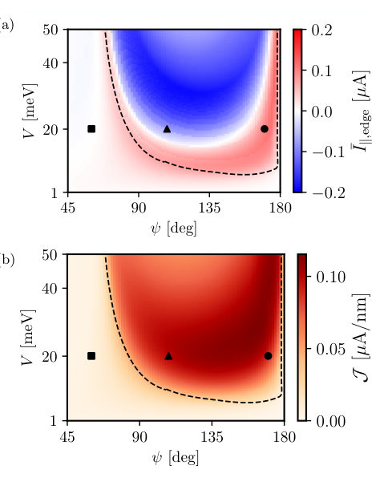 
FIG. 3. Comparison between edge and bulk ground-state cur- rents in a twisted TMD ribbon. In both panels, the black dashed line identifies the topological phase transition. The square, triangle and circle correspond, respectively, to the three configurations in panel (a), (b), and (c) of Fig. 2, re- spectively. Panel (a) shows the average current (12) (in µA) flowing in the x-direction near the bottom edge of the ribbon, i.e. for y ∈[0, √

📷 Fig 4

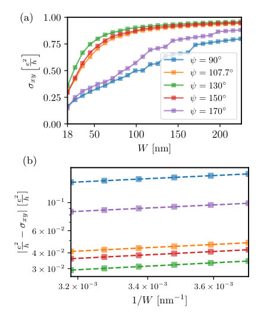 
FIG. 4. Dependence of the Hall conductivity σxy of a twisted TMD ribbon on its width W, for various values of ψ. Data marked by orange squares refer to twisted MoTe2. For all data displayed, the Chern number is C = +1. Panel (a) shows that σxy converges to e2/h for large widths. Panel (b) shows a log-log plot of the distance between σxy and the bulk value e2/h as a function of 1/W, for large values of W (up to 35 rectangular unit cells). The dashed lines are power-law fit to the data. The color coding is the same as panel (a). All other parameters are fixed to θ = 3.89◦, w = −23.8 meV, and V = 20.8 meV.

**Summary.** This work investigates twisted TMD homobilayers exhibiting Chern insulating states by analyzing the ground-state current density. The authors demonstrate that the maximum local current amplitude serves as a robust, measurable marker for non-zero topological order ($C 
eq 0$). By calculating both the currents and the resulting magnetic fields, they provide theoretical evidence linking bulk topology to observable real-space electromagnetic signatures.

**Why it may be interesting.** The direct link established between a measurable local current density (a real-space observable) and a fundamental topological invariant ($C$) provides an experimental roadmap for detecting exotic quantum states in solid-state materials, which is highly relevant to condensed matter theory.

Detailed structure

**Main problem.** To determine if a measurable local quantity exists that acts as a real-space marker for topological phases with non-zero Chern number in twisted TMD homobilayers.

**Main result.** The maximum amplitude of the ground-state current density in the bulk, $\max |J(r)|$, is shown to be a reliable local proxy for detecting non-trivial Chern insulating states ($C 
eq 0$).

**Method.** Numerical calculations are performed on a continuum model Hamiltonian describing twisted TMD homobilayers, analyzing the ground-state current density ($\mathbf{J}(\mathbf{r})$) and its associated magnetic field using the Biot-Savart law.

**Model / system.** The system is modeled by twisted transition metal dichalcogenide (TMD) homobilayers hosting Chern insulating states. The physics is captured by a continuum model Hamiltonian involving intra-layer and inter-layer potentials, which breaks time-reversal symmetry.

**Key observables.** Local current density $\mathbf{J}(\mathbf{r})$ (exhibiting whirlpools), the maximum bulk current amplitude $\max |J(r)|$, Hall conductance ($\sigma_{xy}$), and the generated magnetic field components ($B_x, B_y, B_z$).

**Important parameters / regimes.** The topological invariant is the Chern number ($C$); key parameters include the twist angle ($\psi$) and ribbon width ($W$).

**Assumptions / limitations.** The analysis relies on a continuum model description for twisted TMD homobilayers and assumes that local current density accurately tracks global topology.

**Figures summary.** Figures illustrate the Topological Phase Diagram showing $C 
eq 0$ regions correlating with bulk current whirlpools. Other figures show $\sigma_{xy}$ scaling with width ($W$) and magnetic field components generated by the currents at various distances ($d$).

**Paper structure.** The paper progresses from establishing the local current marker ($\max |J(r)|$) in the bulk, to analyzing the contributions of intra-band vs. inter-band currents, and finally examining how global quantities like $\sigma_{xy}$ scale with finite width $W$ and how the resulting magnetic field can be measured.

Abstract

Recent materials advances have made it possible to fabricate twisted transition metal dichalcogenide homobilayers. These systems have been shown to host integer and fractional Chern insulating states. Because of spontaneous time reversal symmetry breaking, their ground state harbors intriguing spin-polarized currents with whirlpools on the moiré length scale that can be measured by scanning probe methods. We first provide a quantitative analysis of these persistent currents and then show that the maximum of the amplitude of the current density in the bulk of the sample is an accurate tracker of topological order. We conclude by calculating how the quantization of the Hall conductance is affected by finite-size effects.

[↑ back to top](#top)

### [Phase-only control of GRAPE shaped pulses](http://arxiv.org/abs/2606.09624v1)

**Authors:** Andrew J. Baldwin, Jonathan A. Jones  
**Type:** theory · **Category:** quantum information and computing · **PDF:** <https://arxiv.org/pdf/2606.09624v1>  
**Analysis basis:** full PDF text, analyzed in chunks
**Topic relevance:** `methods for driven-dissipative` **1/5**

📷 Fig 1

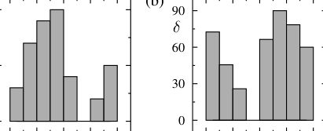 
FIG. 1. An example of simulating an amplitude modulated pulse with phase modulation at fixed amplitude. Panel (a) shows an 8 step pulse with purely amplitude modulation, so that all sub-pulses have phase zero. The corresponding offset phases, δ = arccos(α/αmax), are shown in (b) plotted in de- grees: note that large amplitudes correspond to small values of δ, while small amplitudes correspond to δ ≈90◦. These offset phases can be used to build a 16 step Trotter approx- imation (c), or a 32 step Trotter–Suzuki approximation (d), both with α fixed at 10.

📷 Fig 2

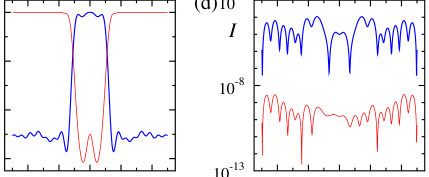 
FIG. 2. An E-BURP pulse is shown in (a), where the signed amplitude α in kHz is shown as a function of time t in ms. The phase envelope of the corresponding phase-only pulses (b) shows ±ϕ in degrees. The actual pulse phases alternate between these values as shown in Fig. 1. The state-to-state fidelity F of the original pulse is shown in (c) as a function of offset frequency f in kHz, with the excitation fidelity shown as a thick blue line and the miss fidelity as a narrow red line. The state-to-state fidelity between the signed amplitude original and phase-only equivalents is shown in (d) for the Trotter version (blue), and for the Trotter–Suzuki version (red).

📷 Fig 3

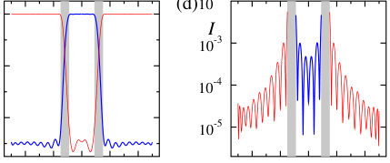 
FIG. 3. A phase-only pulse designed to achieve similar effects to the EBURP pulse in Fig. 2. The amplitude (a) is fixed at 1861 Hz, while the phase (b) is optimized, leading to a complicated pattern. The fidelity of this pulse is shown in (c) for excitation (blue line) and miss (red), showing the two bands in the design, with the uncontrolled transition region indicated in gray. The infidelity against at ideal pulse is shown on a logarithmic scale in (d), showing excellent behaviour except near the transition region.

📷 Fig 4

 
Fig. 2, that is state-to-state 90◦excitation (from +z to −y) for Ωwithin the range ±900 Hz, and no excitation (z stays along z) from ±1500 Hz out to ±5000 Hz, with no target specified for the two transition regions between the bands. This is demanding because the width of the transition region (600 Hz) is only just larger than the the inverse of the pulse length (500 Hz). A pulse was designed using Seedless [11], which is a very efficient implementaion of single-qubit phase-only control. The infidelity was minimised over three differ- ent amplitudes, at 95%, 100%, and 105% of the nomi- nal value, simulating the effects of inhomogeneity in the control field. This can lead to error-tolerant...

📷 Fig 5

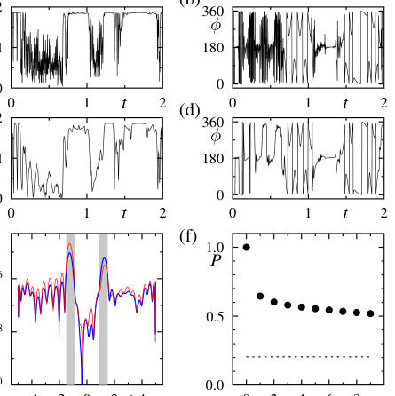 
FIG. 4. The effect of smoothing and re-optimization of the pulse shown in Fig. 3. The amplitude (a) and phase (b) are shown after one round of smoothing and re-optimization (n = 1), and then in (c) and (d) after eight further rounds (n = 9), showing how both amplitude and phase becomes increasingly smooth. Panel (e) shows the infidelity between the phase-only original and these smoothed versions, with n = 1 as a thick blue line and n = 9 as a thin red line. Note that the infidelity peaks in the gray transition regions, where the pulse design does not specify any particular result, and so deviations from the behaviour of the unsmoothed pulse are irrelevant. Finally (f) shows how the average...

**Summary.** This work demonstrates that when shaping pulses for quantum control, restricting the control fields to vary only in phase (phase-only control) is computationally advantageous over controlling both amplitude and phase. The authors prove this equivalence by showing that complex amplitude modulations can be accurately approximated using sequences of phase-shifted sub-pulses. This simplifies the optimization process while maintaining high fidelity for quantum gate operations.

**Why it may be interesting.** It provides a highly efficient theoretical framework for designing complex quantum gates by restricting the control parameters to only phases, which simplifies optimization landscapes significantly compared to full amplitude/phase control.

Detailed structure

**Main problem.** The paper compares phase-only control versus full phase-and-amplitude control for designing shaped pulses using the GRAPE algorithm.

**Main result.** Phase-only optimization is shown to be computationally superior (faster and simpler) while achieving equivalent controllability to amplitude/phase methods.

**Method.** Optimal control theory, specifically utilizing the Gradient Ascent Pulse Engineering (GRAPE) algorithm for pulse design.

**Model / system.** The system involves controlling a spin-1/2 nucleus interacting with an RF field, described by time-dependent Hamiltonians. The control is applied via shaped pulses in the xy-plane.

**Key observables.** Infidelity (measure of deviation from ideal evolution), fidelity, and average power deposition.

**Important parameters / regimes.** Pulse amplitude ($\alpha$), frequency offset ($\Omega$), total pulse time ($	au$), and the number of sub-pulses used in approximations.

**Assumptions / limitations.** The equivalence between phase-only and full control is shown via approximation (Trotterization), which assumes certain commutation relations hold for the background Hamiltonian ($H_0$).

**Figures summary.** Figures illustrate simulating amplitude modulation using multiple sub-pulses (Trotter approximations) and comparing the resulting fidelity/infidelity of phase-only vs. full control designs.

**Paper structure.** The paper first introduces the comparison between control methods, then details the mathematical equivalence via Trotterization, demonstrates the computational advantages of phase-only control, and concludes with practical implementation notes regarding pulse smoothing.

Abstract

We compare phase-only control with phase-and-amplitude control when designing shaped pulses using the GRAPE algorithm, and explain why phase-only control has significant advantages. Trotterisation can be used to simulate amplitude modulation with phase modulation, indicating that the two approaches are fundamentally equivalent. Pulses designed by either method can be interconverted, but phase-only optimization is faster and simpler. The resulting pulses can then be converted into phase-and-amplitude form for more robust implementation if desired.

[↑ back to top](#top)

### [Pure and mixed Dicke state ansatz for equality and inequality constraints in variational quantum eigensolver](http://arxiv.org/abs/2606.08504v1)

**Authors:** J. V. S Scursulim  
**Type:** both · **Category:** quantum information and computing · **PDF:** <https://arxiv.org/pdf/2606.08504v1>  
**Analysis basis:** full PDF text, analyzed in chunks
**Topic relevance:** `correlated cavity matter` **1/5**

📷 Fig 1

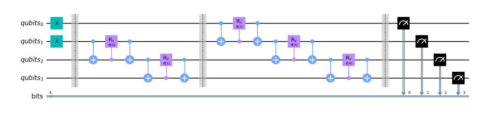 
Figure 1: An example of a quantum circuit that generates a pure Dicke state ansatz for VQE. In this figure, the circuit shown prepares the parameterized quantum state |D4 2(⃗θ)⟩.

📷 Fig 2

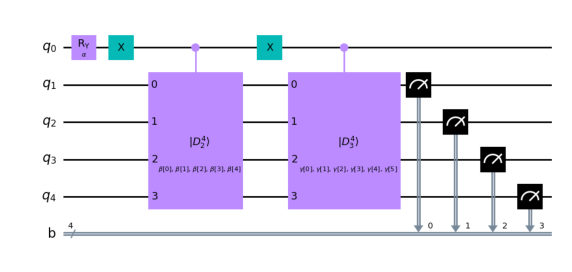 
Figure 2: An example of a quantum circuit that creates a mixture of Dicke states as an ansatz for VQE. In this figure, the circuit shown creates a mixture of two quantum states, |D4 2(⃗β)⟩and |D4 3(⃗γ)⟩, where the preparation probability of each state is regulated by the parameterized rotation gate RY (α). Note that the measurements only acts on the qubits where Dicke states are prepared, then they can be interpreted as a partial trace and providing us a mixture of quantum states.

📷 Fig 3

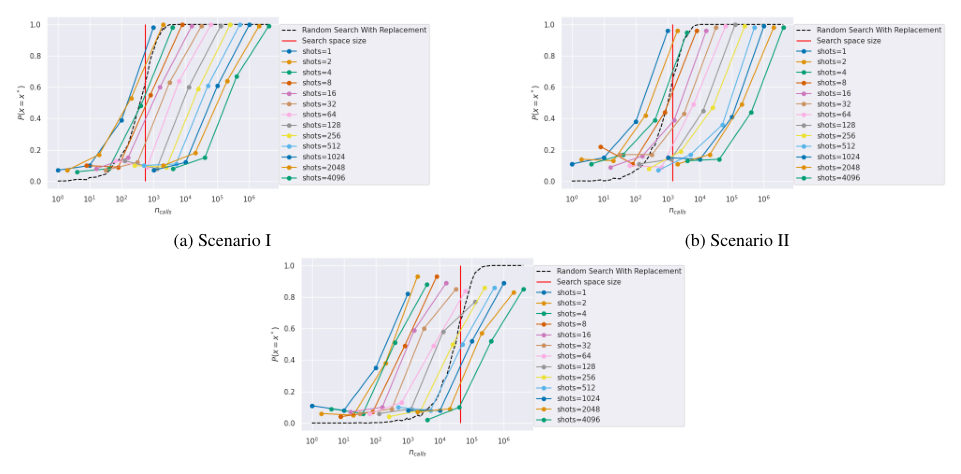 
Figure 3: Probability of finding the optimal solution P(x = x∗) as a function of the number of objective function calls ncalls for Scenarios I (left, |FI| = 561), II (center, |FII| = 1419), and III (right, |FIII| = 45000), using the CMA-ES optimizer. Each curve corresponds to a different number of measurement shots, and each point represents the empirical success probability estimated over 100 independent runs, where success is defined as the optimal bitstring x∗having non-zero sampling probability after training with the corresponding number of objective function calls. The dashed black curve shows the expected performance of random search with replacement restricted to the feasible search...

📷 Fig 4

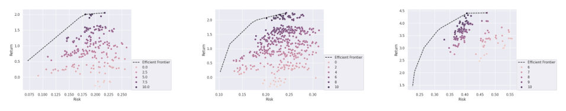 
Figure 4: Discrete efficient frontier for Scenarios I (left), II (center), and III (right), showing portfolios sampled from the experiment in which the target bitstring x∗was observed with the highest sampling probability after training, selected among 100 independent runs per scenario. Each point represents a feasible portfolio, colored by Sharpe ratio. The dashed line indicates the discrete efficient frontier computed via classical mean-variance optimization. In all three scenarios, the proposed ansatz successfully identifies portfolios on or near the efficient frontier.

📷 Fig 5

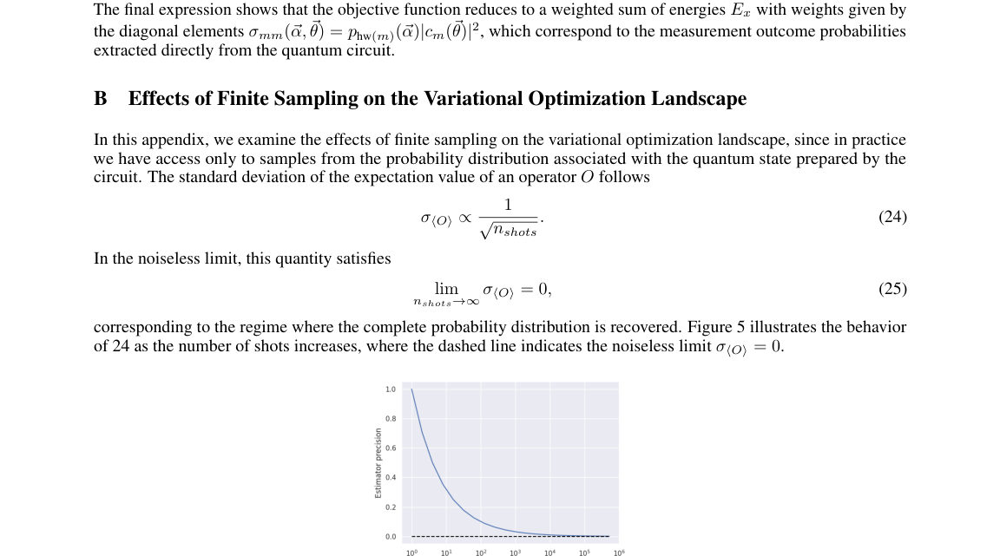 
Figure 5: Estimator standard deviation σ⟨O⟩as a function of nshots illustrating the 1/√nshots decay. The dashed line indicates the noiseless statevector limit, recovered as nshots →∞.

**Summary.** This paper introduces a novel mixed Dicke state ansatz designed for Variational Quantum Eigensolvers tackling combinatorial optimization with hard equality and inequality constraints. By structurally encoding these constraints into the quantum circuit, it eliminates the need for penalty terms common in VQAs. The method is validated to outperform random search significantly as the problem complexity increases.

**Why it may be interesting.** This work provides a concrete, structured method to embed complex physical constraints directly into quantum circuits, which is crucial for applying VQE to real-world constrained problems in quantum simulation or computation.

Detailed structure

**Main problem.** The core challenge is designing a variational quantum circuit ansatz expressive enough for constrained combinatorial optimization problems without relying on computationally expensive penalty terms.

**Main result.** The proposed mixed Dicke state ansatz successfully encodes both equality and inequality constraints directly into the quantum circuit, demonstrating clear advantages over random search as the feasible search space grows.

**Method.** The authors utilize a Variational Quantum Eigensolver (VQE) framework, adapting the density matrix formalism to construct a feasibility-preserving ansatz based on pure and mixed Dicke states.

**Model / system.** The problem is mapped onto finding the ground state energy of an Ising Hamiltonian. The quantum state space is explored using Dicke states, which are generalized via tensor products to handle multiple constraint groups.

**Key observables.** Probability of finding the optimal solution ($P(x = x^*)$), expectation value $\langle H 
angle$, and the reduced density matrix $\sigma(\vec{\alpha}, \vec{	heta})$.

**Important parameters / regimes.** Constraint complexity (number/type of constraints), number of objective function calls ($n_{	ext{calls}}$), and hardware noise levels.

**Assumptions / limitations.** The framework assumes that the optimal solution can be found by minimizing the expectation value over the constrained subspace, although achieving perfect convergence requires many iterations.

**Figures summary.** Figures compare the probability of finding the optimum versus objective function calls for VQE-Dicke against random search; another figure shows sampled portfolio points relative to the classical efficient frontier.

**Paper structure.** The paper introduces the need for constraint enforcement in VQAs, proposes the mixed Dicke state ansatz structure (extending pure states), validates this approach using combinatorial portfolio optimization across increasing complexity scenarios, and concludes with hardware performance analysis on NISQ devices.

Abstract

Combinatorial optimization can be addressed with quantum computing through variational quantum algorithms, but a central challenge in this approach is to design an ansatz expressive enough to explore the feasible subspace of the Hilbert space where the optimal solution lies. Another major challenge is tuning the Lagrange multipliers in penalty terms to enforce feasibility and guarantee solution quality. To address both challenges, we propose the first feasibility-preserving mixed Dicke state ansatz for Hamming weight constrained combinatorial optimization, extending the density matrix formalism to structurally encode equality and inequality constraints directly into the quantum circuit, thereby eliminating the need for penalty terms in the objective function. The proposed framework handles both constraint types, with the pure Dicke state ansatz recovered as a special case corresponding to equality constraints, and generalizes to multiple constraint groups via tensor products of individual pure or mixed Dicke states. We validate the proposed approach in the context of combinatorial portfolio optimization across three experimental scenarios with increasing constraint complexity, using the CMA-ES optimizer and comparing its performance against random search with replacement restricted to the feasible subspace. As the feasible search space grows, the proposed ansatz demonstrates a clear advantage over random search in terms of the number of objective function calls required to identify high-quality solutions. Hardware experiments on IBM NISQ processors confirm that noise mitigation and circuit transpilation optimizations remain open challenges for practical deployment. The framework is general and directly applicable to other combinatorial optimization problems with Hamming weight constraints.

[↑ back to top](#top)

### [Quantum Cut Sparsifiers](http://arxiv.org/abs/2606.09728v1)

**Authors:** Arpon Basu, Joshua Brakensiek, Pravesh K. Kothari, Aaron Putterman  
**Type:** theory · **Category:** quantum information and computing · **PDF:** <https://arxiv.org/pdf/2606.09728v1>  
**Analysis basis:** full PDF text, analyzed in chunks
**Topic relevance:** `analog quantum simulation` **1/5**

📷 Fig 1

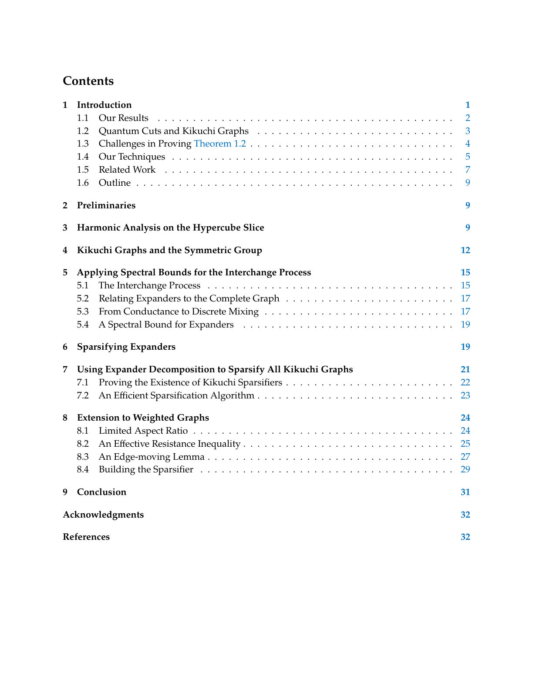 
Low-resolution page preview, page 2

📷 Fig 2

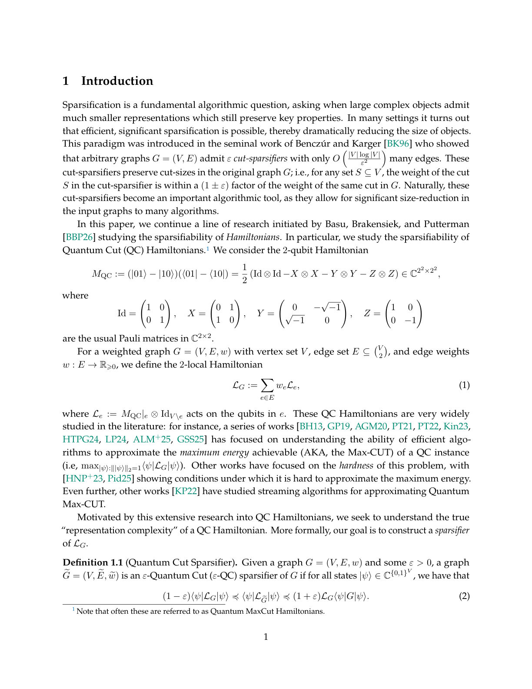 
Low-resolution page preview, page 3

📷 Fig 3

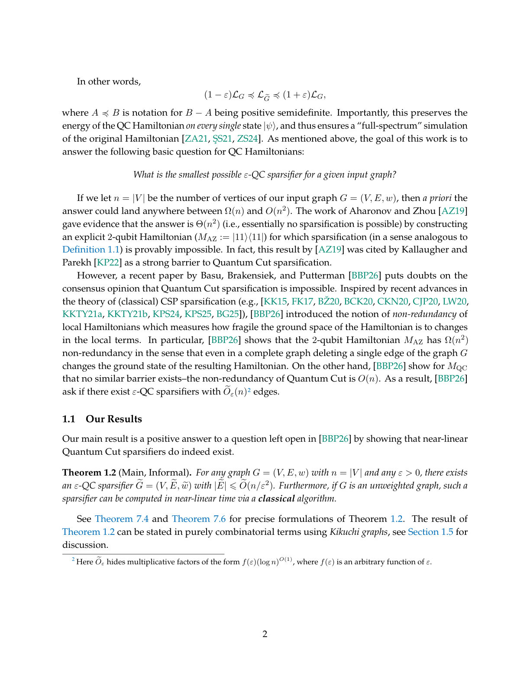 
Low-resolution page preview, page 4

📷 Fig 4

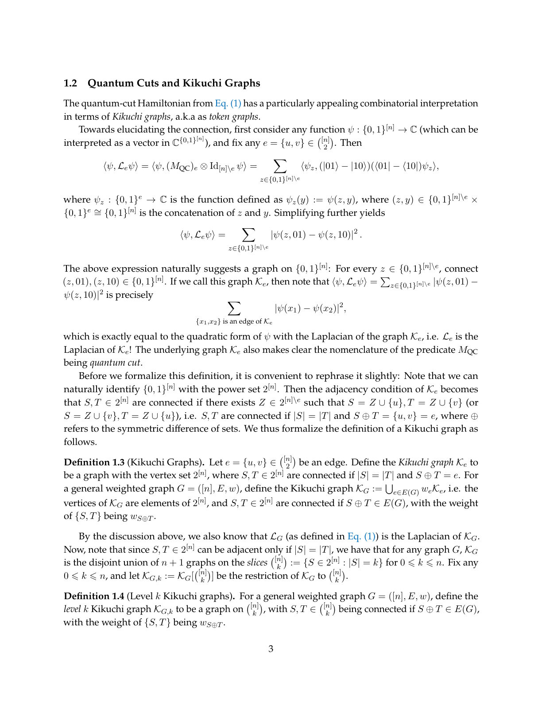 
Low-resolution page preview, page 5

📷 Fig 5

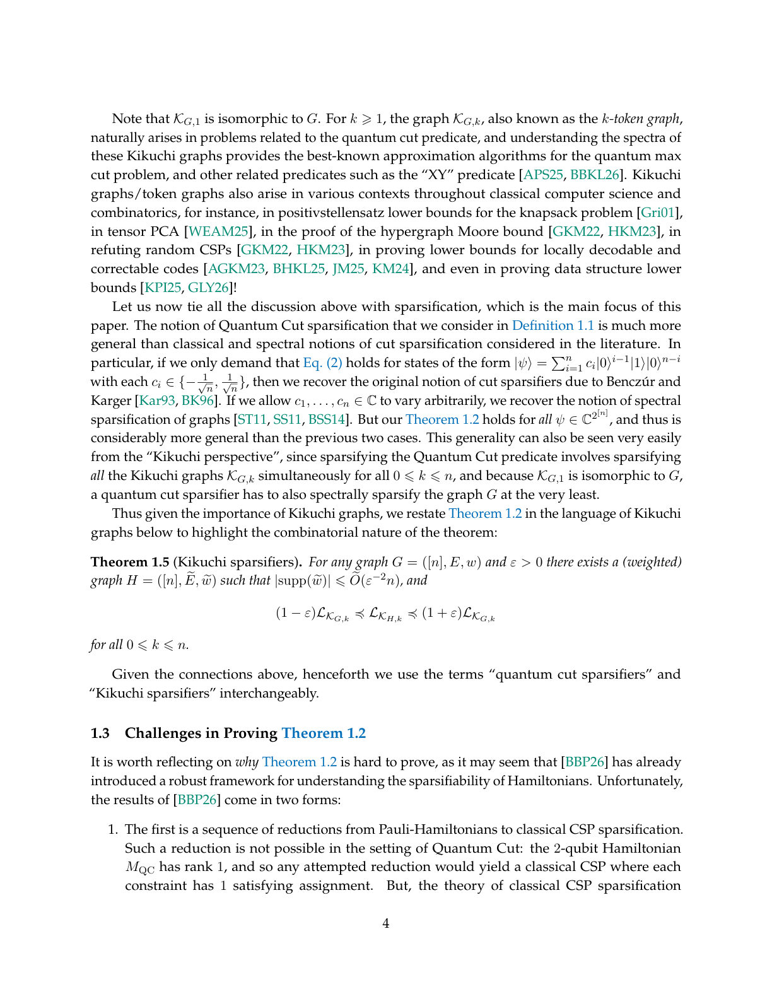 
Low-resolution page preview, page 6

**Summary.** This paper develops methods to create highly efficient 'Quantum Cut sparsifiers' for QC Hamiltonians describing many-body quantum systems. It proves that these complex Hamiltonians can be represented by far fewer terms while maintaining spectral accuracy. This breakthrough has significant implications for the simulation and understanding of large, interacting quantum systems.

**Why it may be interesting.** This work provides a powerful tool for analyzing complex quantum Hamiltonians by showing they can be accurately approximated using only a sparse set of interactions, which is crucial for simulating large quantum systems efficiently.

Detailed structure

**Main problem.** The primary goal is constructing an efficient, sparse representation (sparsifier) for Quantum Cut (QC) Hamiltonians associated with a general graph G.

**Main result.** The authors prove the existence of such a sparsifier $	ilde{L}_e^G$ whose size scales as $O(n/\epsilon^2)$ edges, preserving the energy spectrum up to $(1 \pm \epsilon)$.

**Method.** The technique relies on decomposing the action of the Hamiltonians into invariant subspaces and employing advanced operator-valued inequalities (like Alon-Kozma's) derived from harmonic analysis on hypercube slices.

**Model / system.** The system is defined by QC Hamiltonians, $L_G$, which are related to the Laplacian of a graph called the Kikuchi Graph ($KG$). These operators act on function spaces over subsets of vertices in an $n$-qubit system.

**Key observables.** Spectral approximation error ($\epsilon$), the size of the sparsifier $|E'|$, and the spectral gap relative to the full Hamiltonian.

**Important parameters / regimes.** The number of qubits ($n$) and the desired accuracy ($\epsilon$).

**Assumptions / limitations.** Success relies on decomposing graphs into 'mild expanders' and utilizing advanced inequalities that overcome limitations faced by standard matrix concentration methods when local term importance is high.

**Paper structure.** The paper builds conceptually from classical cut-sparsifiers to the quantum setting, establishing the connection to Kikuchi graphs. The methodology involves spectral decomposition, applying advanced inequalities (Alon-Kozma), and generalizing results from complete/expander graphs to arbitrary weighted graphs via expander decomposition.

Abstract

In this paper, we continue a line of research initiated by Basu, Brakensiek, and Putterman [2026] studying the sparsifiability of Hamiltonians. We focus particularly on the sparsifiability of the widely-studied Quantum Cut (QC) Hamiltonians. Our main result is that in an $n$-qubit system, any $n$-qubit QC Hamiltonian can be sparsified to $\widetilde{O}(n /\varepsilon^2)$ many terms while preserving the energy of every state up to a factor of $1 \pm \varepsilon$. Our result can be interpreted as giving an importance sampling scheme for the edges of an arbitrary graph $G$ such that the \emph{Kikuchi} graph at level $\ell$ of the sampled graph is a spectral approximation to the Kikuchi graph of $G$. Importantly, the \emph{same} sampling scheme works simultaneously for all $\ell$.   The natural approach of leverage score sampling, analyzed via matrix concentration inequalities, yields a polynomially worse bound in our setting because the underlying matrices have dimension $\sim 2^n$. Instead, our approach relies on decomposing the action of these matrices into invariant subspaces. Then, by using an operator-valued inequality of Alon and Kozma [Ann. Henri Poincaré, 2020], itself building on an \emph{octopus inequality} of Caputo, Liggett, and Richthammer [J. AMS, 2010], we extend our sparsification technique to all expander graphs. We then invoke expander decomposition to extend our sparsifier to all graphs.

[↑ back to top](#top)

### [Quantum Global Variational Learning for Quantum Error Correction](http://arxiv.org/abs/2606.08592v1)

**Authors:** Shun Ryuzaki, Hideo Mukai  
**Type:** theory · **Category:** quantum information and computing · **PDF:** <https://arxiv.org/pdf/2606.08592v1>  
**Analysis basis:** full PDF text, analyzed in chunks
**Topic relevance:** `methods for driven-dissipative` **1/5**

📷 Fig 1

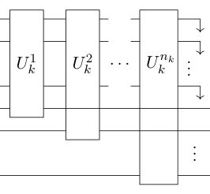 
Figure 1: Mapping from DQNN layer k −1 to layer k. The interlayer mapping in the Quantum Autoencoder (QAE) is illustrated. First, the tensor product of the density operator ρk−1 and nk ancillary states |0⟩is con- structed, representing the expansion of the quantum in- formation from layer k−1 together with the initial states |0⟩assigned to each node in layer k. Subsequently, nk unitary operations U j k are applied sequentially to ρk−1 and the ancillary states, where each Uj k corresponds to an edge connecting layer k −1 to the j-th node in layer k. After all unitary operations are applied, the combined system of nk−1 + nk qubits is reduced to nk qubits by performing a partial trace over the...

📷 Fig 2

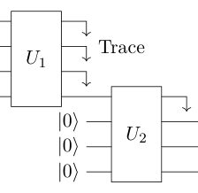 
Figure 4: Quantum Autoencoder (QAE) network archi- tecture consisting of 3-1-3 qubits. The network outputs noise-free quantum information ρout from a 3-qubit in- put quantum state. The encoder and decoder corre- spond to the first and second interlayer mappings, re- spectively, each acting on four qubits. The trainable parameters of the network are the unitary matrices U1 and U2 associated with these interlayer mappings.

📷 Fig 3

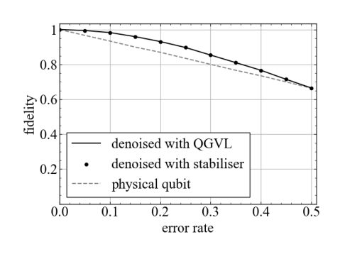 
Figure 5: Fidelity between target quantum states and error-corrected quantum states obtained using the 3- qubit QGVL (solid line), compared with the fidelity in the case of a single-qubit error among three qubits (dot- ted line), and the fidelity achieved by algorithmic correc- tion using the stabiliser code (black dots). The target quantum states were generated from 104 randomly pre- pared quantum states encoded with the repetition code. The input quantum states were produced by introducing bit-flip noise in accordance with the error rates indicated on the x-axis.

📷 Fig 4

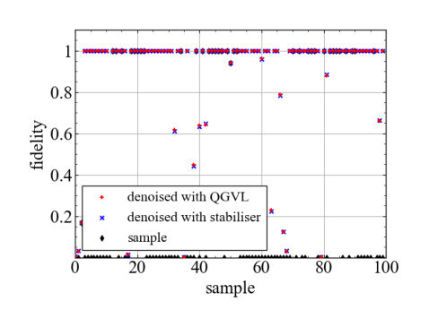 
Figure 6: Fidelity obtained by the 3-qubit QGVL from 102 test data with a bit-flip error rate of p = 0.1. Results for physical qubits and stabiliser codes are also shown for comparison. The fidelity of noiseless or fully corrected quantum target states is plotted at 1. In contrast, the fidelity of noisy physical qubits is 0, whereas the fideli- ties of logical qubits after error correction operations are distributed within the range (0.0, 1.0).

📷 Fig 5

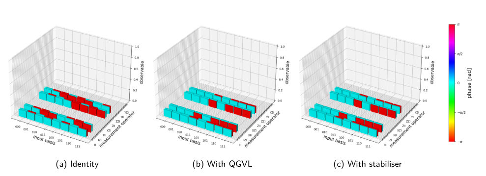 
Figure 7: Quantum Process Tomography (QPT) results without any operation (a), using QGVL (b), and employing the stabiliser code (c). The input basis comprised the set {|0⟩, |1⟩}⊗3, and the measurement operators were drawn from {I, X, Z, Y }⊗3. Observables correspond to Pauli operators including: III, IIZ, IZI, IZZ, ZII, ZIZ, ZZI, and ZZZ.

**Summary.** This paper introduces Quantum Global Variational Learning (QGVL) as an efficient alternative to standard QAE methods for Quantum Error Correction. By consolidating local unitaries into a global structure, QGVL drastically reduces training complexity and time while maintaining high fidelity in correcting errors across various qubit codes. It demonstrates that this ML approach can achieve performance comparable to established theoretical stabilizer codes.

**Why it may be interesting.** For AMO physicists studying open quantum systems, this work provides a computational framework to model how machine learning can be used to design or optimize error mitigation protocols for physical hardware limited by decoherence.

Detailed structure

**Main problem.** Developing efficient Quantum Error Correction (QEC) methods that avoid classical measurements and overcome training convergence issues inherent in large quantum neural networks.

**Main result.** The proposed Quantum Global Variational Learning (QGVL) approach significantly reduces the number of required unitary parameters compared to standard QAE, leading to substantial improvements in training time and robustness against internal network noise while matching established stabilizer code performance.

**Method.** The authors propose using a global structure within a quantum neural network framework for error correction. Training involves minimizing infidelity by optimizing trainable unitary matrices via gradient descent techniques adapted for quantum circuits.

**Model / system.** The system models qubits susceptible to various noise channels, including Pauli X errors and general depolarizing noise. QEC is tested using established codes like the 3-qubit repetition code, 5-qubit, Steane (7-qubit), and Shor (9-qubit) stabilizer codes.

**Key observables.** Mean fidelity of error correction output vs. input error rate ($p$), training time reduction (e.g., 80% for 3-qubit), and success rate in achieving convergence.

**Important parameters / regimes.** Error rates ($p$, $p_n$), number of qubits ($n=3, 5, 7, 9$), and network structure parameters ($m, n$).

**Assumptions / limitations.** The analysis often assumes that noise affecting different quantum states is equally probable when modeling internal network noise. The comparison relies on comparing QGVL performance against established algorithmic stabilizer codes.

**Figures summary.** Figures illustrate fidelity dependence on error rate for various qubit counts (3, 5, 7, 9) comparing QGVL to stabilizer codes; diagrams show the layered QNN architecture and the global unitary mapping structure.

**Paper structure.** The paper progresses from establishing the need for efficient QEC over measurement-based methods. It contrasts Quantum Autoencoders (QAE) with the proposed Global Variational Learning (QGVL), demonstrating QGVL's parameter efficiency, and finally validates its performance across increasing qubit counts and complex noise models.

Abstract

Efficient quantum error correction is essential for the advancement of quantum computing. We propose a quantum neural network with a global structure that reduces the number of unitary matrices required in quantum circuits. This approach resulted in a 97\% reduction in training time and up to a 25\% improvement in the training completion rate, ultimately achieving a 100\% success rate in training while surpassing the error correction performance reported in previous studies. In addition, we demonstrated the enhanced robustness of quantum error correction against internal network noise. Moreover, the fidelity of quantum error correction under internal network noise increased by up to 15\% due to the reduced computational load.

[↑ back to top](#top)

### [Satellite-Based Quantum Communication: Performance Evaluation of Discrete-Variable Quantum Key Distribution Protocols](http://arxiv.org/abs/2606.09217v1)

**Authors:** Muskan  
**Type:** theory · **Category:** quantum information and computing · **PDF:** <https://arxiv.org/pdf/2606.09217v1>  
**Analysis basis:** full PDF text, analyzed in chunks
**Topic relevance:** `interference shaping light` **1/5**

📷 Fig 1

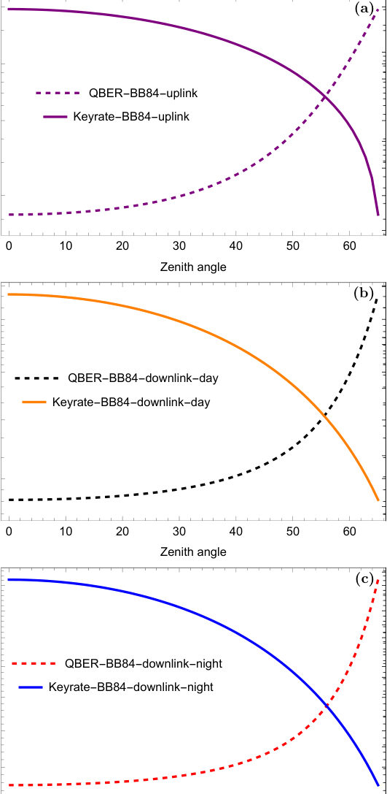 
Figure 2.6.1: (a) QBER and key rate versus zenith angle for the BB84 protocol in the uplink (night-time). (b) and (c) QBER and key rate versus zenith angle for the BB84 protocol in the downlink (day-time) and downlink (night-time), respectively.

📷 Fig 2

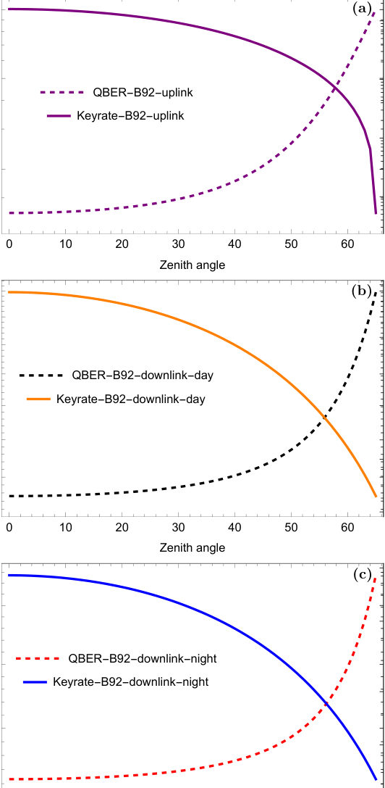 
Figure 2.6.2: (a) QBER and key rate versus zenith angle for the B92 protocol in the uplink (night- time). (b) and (c) QBER and key rate versus zenith angle for the B92 protocol in the downlink (day-time) and downlink (night-time), respectively.

📷 Fig 3

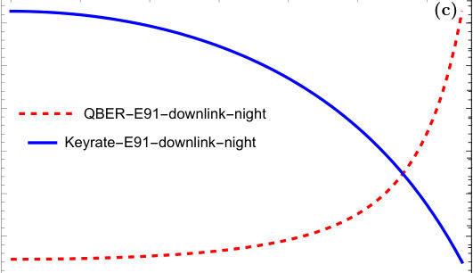 
Figure 2.6.3: (a) QBER and key rate versus zenith angle for the E91 protocol in the uplink (night- time). (b) and (c) QBER and key rate versus zenith angle for the E91 protocol in the downlink (day-time) and downlink (night-time), respectively.

📷 Fig 4

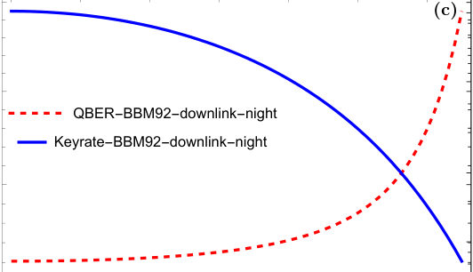 
Figure 2.6.4: (a) QBER and key rate versus zenith angle for the BBM92 protocol in the uplink (night-time). (b) and (c) QBER and key rate versus zenith angle for the BBM92 protocol in the downlink (day-time) and downlink (night-time), respectively.

📷 Fig 5

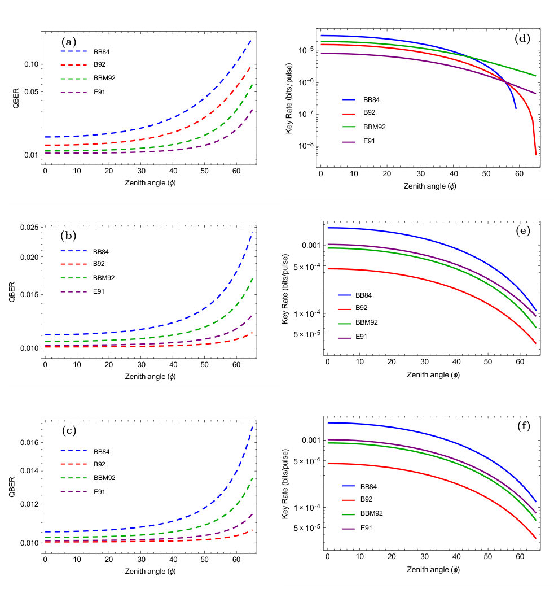 
Figure 2.6.5: QBER and key rate versus zenith angle for all considered QKD protocols: (a,d) uplink (night), (b,e) downlink (day), and (c,f) downlink (night).

**Summary.** This paper analyzes the performance of various Quantum Key Distribution protocols for satellite-based quantum links, accounting for realistic atmospheric distortions. It compares standard QKD methods against high-dimensional extensions, concluding that higher dimensions offer superior robustness in noisy space channels. The findings guide protocol selection for future LEO quantum communication networks.

**Why it may be interesting.** This work directly addresses the practical implementation challenges of quantum communication over long distances by rigorously modeling atmospheric channel impairments and comparing encoding schemes (2D vs HD).

Detailed structure

**Main problem.** The primary goal is to perform a comprehensive performance evaluation of Quantum Key Distribution (QKD) protocols specifically designed for satellite-based quantum communication links.

**Main result.** High-Dimensional QKD protocol HD-BB84 was shown to achieve higher key rates and superior noise tolerance compared to HD-Extended B92 under realistic atmospheric conditions.

**Method.** The analysis employs detailed numerical simulations using a circular/elliptic beam propagation model that incorporates complex atmospheric effects like diffraction, turbulence, attenuation, and pointing errors.

**Model / system.** The system modeled is the free-space quantum channel between Low Earth Orbit (LEO) satellites and ground stations. Protocols evaluated include BB84, B92, BBM92, E91, and their high-dimensional generalizations.

**Key observables.** Key rate performance, Quantum Bit Error Rate (QBER), Probability Distribution of Key Rate (PDR), and conditional von Neumann entropy $S(a|E)$.

**Important parameters / regimes.** Atmospheric parameters ($C_n^2$), zenith angle ($\phi$), link length ($L$), and the depolarizing channel parameter ($q$).

**Assumptions / limitations.** The analysis relies on approximations such as the elliptic-beam approximation for turbulence effects and models environmental noise contributions (e.g., using a depolarizing channel).

**Figures summary.** Figures illustrate key rate and QBER variations as functions of zenith angle, link length, and under different weather conditions for various protocols.

**Paper structure.** The paper builds from theoretical foundations (qubits, entanglement) to protocol evaluation. It systematically compares standard vs. high-dimensional protocols across varying atmospheric/operational regimes, culminating in detailed rate derivations using entropy bounds.

Abstract

Quantum Key Distribution (QKD) has emerged as a fundamentally secure approach to communication in the era of quantum computing, offering protection against threats posed to classical cryptographic schemes such as RSA and Diffie-Hellman. This thesis presents a comprehensive performance analysis of satellite-based QKD protocols, focusing on both prepare-and-measure and entanglement-based schemes under realistic atmospheric and operational conditions. The study begins by introducing the theoretical foundations of quantum communication, including qubits, entanglement, and quantum entropy, and motivates the need for satellite-based QKD to overcome the distance limitations of fiber-based systems. Subsequently, the thesis evaluates four prominent QKD protocols-BB84, B92, BBM92, and E91-using a circular beam propagation model that incorporates atmospheric effects such as diffraction, turbulence, attenuation, and pointing errors, along with environmental noise contributions for uplink and downlink. Comparative numerical simulations reveal that protocol performance is strongly influenced by channel asymmetries, beam propagation characteristics, and noise, providing guidance on optimal protocol selection for low Earth orbit (LEO) satellite links. The research further investigates high-dimensional (HD) QKD protocols, specifically HD-BB84 and HD-Extended B92, using the elliptic-beam approximation to account for turbulence-induced distortions for both uplink and downlink. Simulations under vary ing system dimensions, weather conditions, and zenith angles demonstrate that HD-BB84 achieves higher key rates, superior noise tolerance, and more favorable probability distributions of the key rate compared to HD-Extended B92, highlighting the advantages of high-dimensional encoding for robust satellite-based QKD.

[↑ back to top](#top)

### [Simulating quantum circuits with a neural statebank](http://arxiv.org/abs/2606.08707v1)

**Authors:** Taige Wang, Liang Fu  
**Type:** theory · **Category:** numerical methods · **PDF:** <https://arxiv.org/pdf/2606.08707v1>  
**Analysis basis:** full PDF text, analyzed in chunks
**Topic relevance:** `methods for driven-dissipative` **1/5**

📷 Fig 1

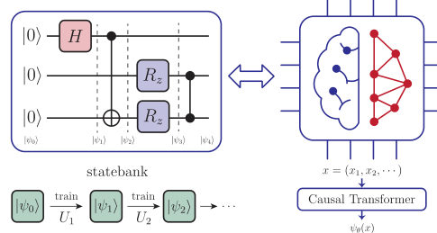 
FIG. 1. Statebank training. A circuit is decomposed into layers U1, U2, . . ., which produce intermediate wavefunc- tions |ψ0⟩, |ψ1⟩, . . .. Instead of storing these states as full 2N-component vectors, the simulator represents each one by an autoregressive Transformer checkpoint. To train checkpoint θℓ, samples and amplitudes from θℓ−1 are combined with the exact local action of Uℓto define targets for the next state.

📷 Fig 2

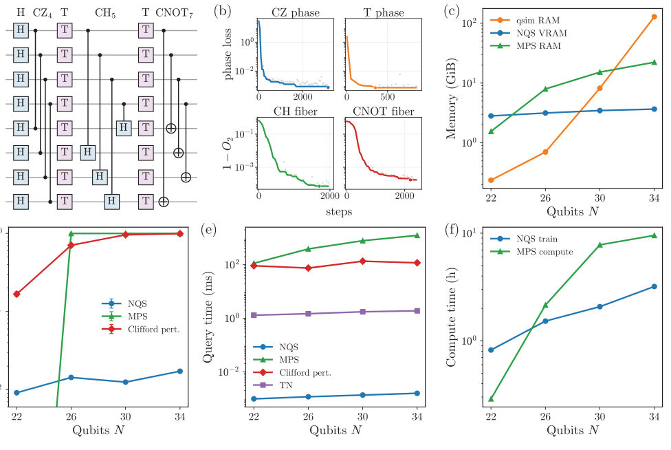 
FIG. 2. HCZCH benchmark. a, HCZCH circuit shown for N = 8 qubits. b, Representative layer-by-layer training diagnostics. Diagonal layers are monitored by phase error, whereas CH and CNOT layers are monitored by local-unitary overlap error. c, Memory use. Exact state-vector storage reaches 128 GiB at N = 34, while the Transformer statebank remains near 3 GiB over the widths studied. d, Final infidelity. The statebank remains near 10−2 from N = 22 to 34, whereas MPS and near-Clifford perturbation deteriorate at larger width. e, Amplitude-query time. Tensor-network contraction is competitive for selected amplitudes, but the statebank gives fastest amortized queries after training. f,...

📷 Fig 3

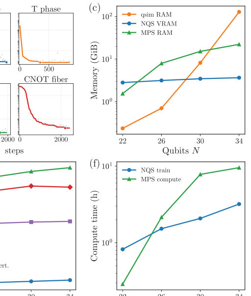 
Fig. 3(a) and 3(b) benchmark the quantum approxi- mate optimization algorithm (QAOA) at p = 2, a central variational circuit family for near-term optimization and quantum algorithm design [45–50]. At generic angles, QAOA is non-Clifford, providing a natural test beyond stabilizer-based simulation. The statebank treats the di- agonal cost layers as phase updates and the mixer layers as one-qubit local updates. The fidelity remains close to unity from N = 22 to 34.

📷 Fig 4

 
Fig. 3(c) and 3(d) test a two-block H-CNOT-T circuit. This family is important because H, CNOT, and T form a standard universal gate set [51–54]. The same check- pointing procedure learns the branching induced by H and the basis mixing induced by CNOT, while treating the T layers as diagonal phase updates.

📷 Fig 5

 
Fig. 3(e) and 3(f) use a purely Clifford circuit as a control. This is not a regime in which a neural simulator should be expected to outperform specialized stabilizer

**Summary.** The paper proposes a neural statebank architecture to overcome the exponential scaling problem in simulating quantum circuits. By training autoregressive Transformers layer-by-layer, it creates a compact neural representation of the wavefunction trajectory. This method achieves high fidelity on large, complex circuits while drastically reducing memory requirements compared to exact simulation.

**Why it may be interesting.** This work provides a novel, memory-efficient computational tool to simulate quantum dynamics that goes beyond the limitations of both full state-vector storage and specialized tensor network methods for highly entangled or structured circuits.

Detailed structure

**Main problem.** Predicting the output of quantum circuits is computationally intractable due to the exponential growth of the wavefunction, creating a bottleneck for verifying quantum processors.

**Main result.** The proposed neural statebank successfully simulates complex quantum circuits up to 34 qubits with low infidelity while requiring significantly less memory than exact state-vector evolution.

**Method.** It introduces an autoregressive Transformer checkpoint that learns the wavefunction trajectory layer by layer, approximating the full circuit evolution using a compact neural representation.

**Model / system.** The model simulates quantum circuits acting on N qubits. The system is characterized by its state vector $|\psi
angle$ and its evolution through sequential unitary gates ($U = U_D \cdots U_1$).

**Key observables.** Infidelity (error rate) of the simulation, memory scaling relative to qubit number (N), and computational time.

**Important parameters / regimes.** System size (N up to 34 qubits), circuit depth/number of layers, entanglement structure (magic gates, non-diagonal branching).

**Assumptions / limitations.** The method assumes that the state evolution can be accurately captured by an autoregressive neural network trained sequentially on local gate updates. The primary limitation is accumulated error over deep circuits.

**Figures summary.** Figures compare memory usage and final infidelity across various simulators (State-Vector, MPS, Statebank) on demanding benchmarks like HCZCH; other figures benchmark the method on QAOA and Clifford circuits.

**Paper structure.** The paper introduces the statebank concept by addressing the exponential scaling problem. It details the autoregressive Transformer architecture for checkpointing, presents training procedures using local gate updates, and validates its performance against established simulators across diverse circuit families (HCZCH, QAOA, etc.).

Abstract

Predicting the output of quantum circuits is a central bottleneck for verifying quantum processors because a generic wavefunction grows exponentially with system size. We introduce a neural statebank that learns this wavefunction along the circuit trajectory. Each layer is stored as an autoregressive Transformer checkpoint trained from local gate updates to the preceding checkpoint, producing a compact neural representation that can evaluate amplitudes and generate independent samples. On long-range circuits combining entanglement, magic, and non-diagonal branching, a 0.3-million-parameter statebank reaches $\sim 10^{-2}$ infidelity at 34 qubits, outperforming the other tested approximate simulators while using far less memory than exact state-vector evolution. The same architecture accurately simulates quantum approximate optimization, Clifford+$T$, and Clifford circuits.

[↑ back to top](#top)

### [The Transformation-Response Framework: An Operational Reformulation of Quantum Mechanics](http://arxiv.org/abs/2606.09000v1)

**Authors:** Meng-Jun Hu  
**Type:** theory · **Category:** other · **PDF:** <https://arxiv.org/pdf/2606.09000v1>  
**Analysis basis:** full PDF text, analyzed in chunks
**Topic relevance:** `quantum measurements` **1/5**

📷 Fig 1

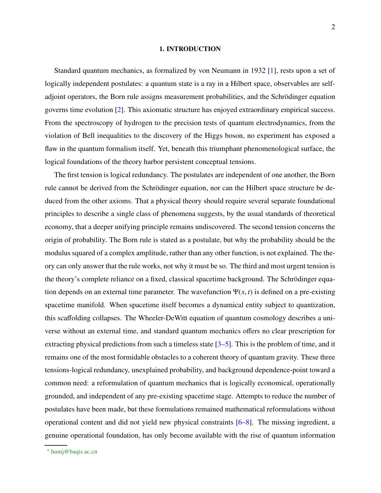 
Low-resolution page preview, page 2

📷 Fig 2

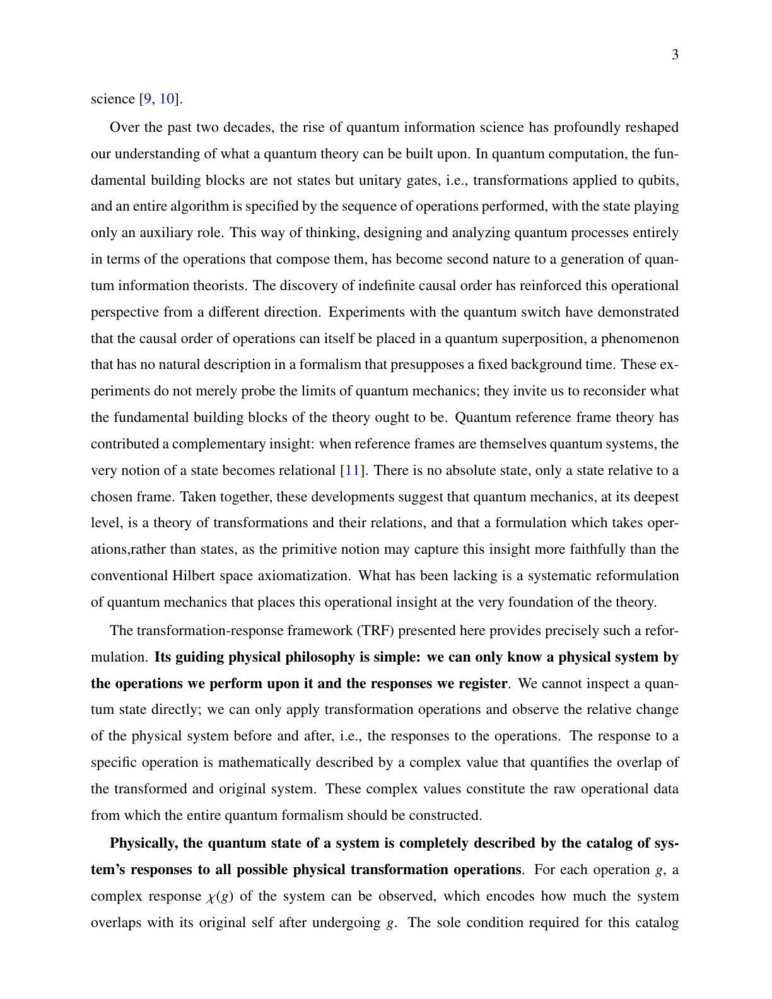 
Low-resolution page preview, page 3

📷 Fig 3

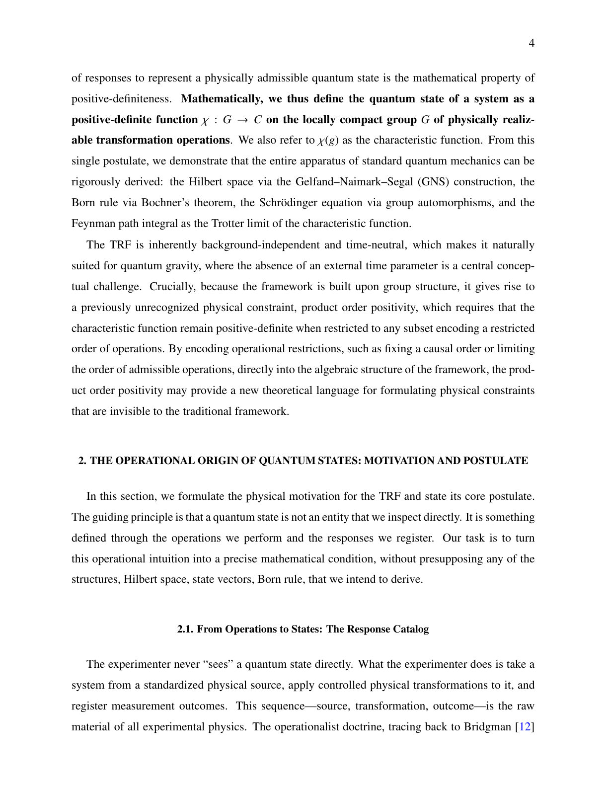 
Low-resolution page preview, page 4

📷 Fig 4

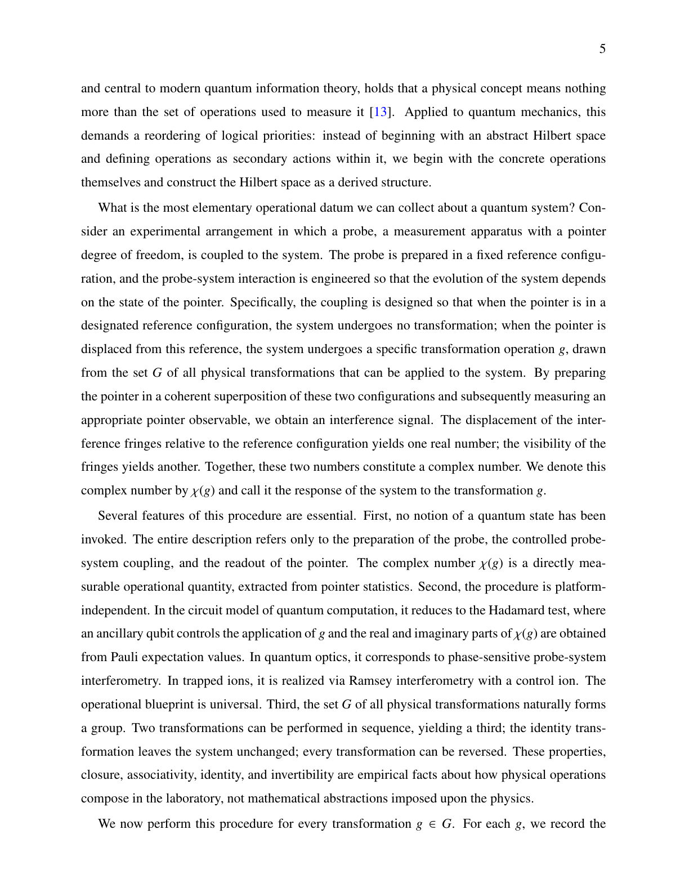 
Low-resolution page preview, page 5

📷 Fig 5

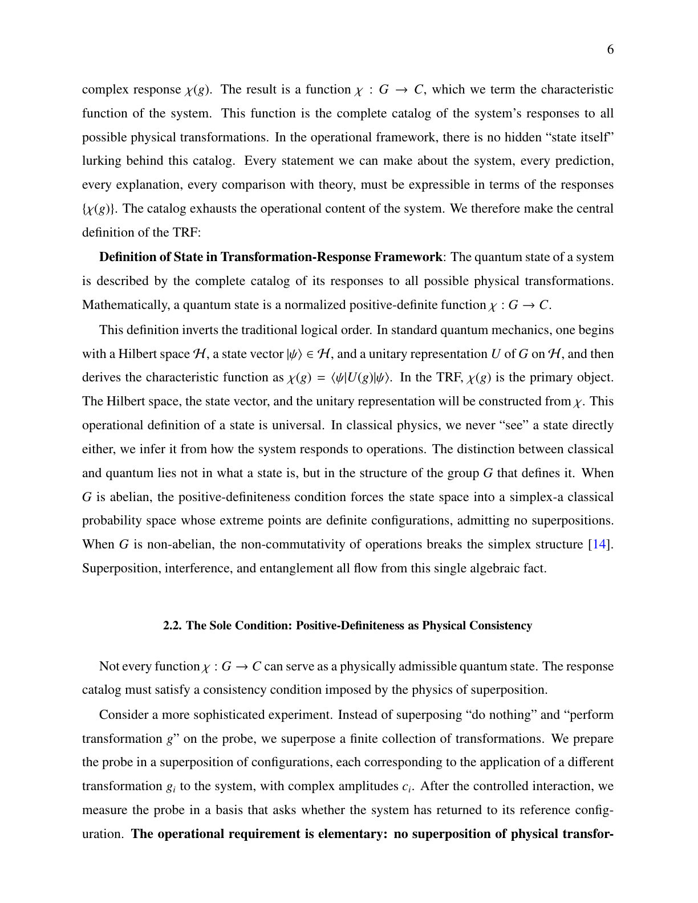 
Low-resolution page preview, page 6

**Summary.** The paper proposes the Transformation-Response Framework (TRF), reformulating quantum mechanics by defining the state not as a vector in Hilbert space, but as a catalog of its complex responses ($\chi$) to all physical transformations. By postulating that this response function must be positive-definite, the authors derive the Born rule, Schrödinger equation, and path integrals as theorems, while also introducing 'product order positivity' as a potentially testable constraint.

**Why it may be interesting.** This work is highly relevant as it attempts to provide a foundational, axiomatic overhaul of quantum theory that bypasses canonical quantization procedures by rooting everything in measurable operational responses.

Detailed structure

**Main problem.** The paper addresses conceptual tensions in standard quantum mechanics by seeking a logically economical, operationally grounded, and background-independent reformulation.

**Main result.** It derives the entire standard formalism of QM (Born rule, Schrödinger equation, path integral) from a single postulate: that the state is defined by a positive-definite response function $\chi$ to all physical transformations.

**Method.** The core method involves defining the quantum state operationally as the characteristic function $\chi(g)$ on the group $G$ of physical transformations, and then using functional analysis (like GNS construction and Bochner's theorem) to derive standard QM postulates from this single constraint.

**Model / system.** The model is a general quantum system whose symmetries are described by a transformation group $G$. The framework applies universally, aiming to cover everything from particle physics (Poincaré group) to background-independent gravity.

**Key observables.** The characteristic function $\chi(g)$, which catalogs the system's response to all transformations $g \in G$.

**Important parameters / regimes.** The fundamental constant $\hbar$, which emerges uniquely from consistency requirements across subgroups; time is treated as a coordinate along an automorphism subgroup.

**Assumptions / limitations.** The primary assumption is that physical reality can be entirely characterized by measurable responses to operations ($\chi$ must be positive-definite). A secondary, crucial constraint introduced is 'product order positivity' for non-abelian groups.

**Figures summary.** Not specified in the notes; the structure relies on mathematical derivations involving group algebras and functional analysis.

**Paper structure.** The paper systematically derives QM postulates: first establishing the state via $\chi(g)$ (Chunk 1/2), then constructing Hilbert space and deriving the Born rule (GNS/Bochner, Chunk 3), generalizing dynamics to automorphisms (Chunk 4), extending this to path integrals for QFT (Chunk 5), and finally introducing the novel constraint of product order positivity for non-abelian groups (Chunk 6).

Abstract

We present the transformation-response framework, an operational reformulation of quantum mechanics. A quantum state is not a Hilbert space object but the catalog of a system's responses to all physical transformations: for each operation $g$ from the system's local group $G$, an interference experiment gives a complex value $χ(g)$. The collection $\{χ(g): g\in G \}$ is the characteristic function and defines the state. The only postulate is that $χ$ is positive-definite, encoding the requirement that no superposition of transformations yields negative probability. From this single assumption, the entire standard formalism is derived: Hilbert space via GNS construction, Born rule via Bochner theorem, Schrödinger equation from group automorphisms, and especially Feynman path integral as a Trotter limit. The framework is background-independent and time-neutral: time is a coordinate along a one-parameter subgroup of $G$. It also reveals a new physical constraint, product order positivity, which may lead to testable predictions. The framework provides a unified, economical, and falsifiable foundation for quantum theory rooted in operational primitives.

[↑ back to top](#top)

## Other papers (6)

*Papers from primary archives without highlighted authors or any topic match. Click to expand.*

Show other papers

### [Algebra of Bivariate-Bicycle Surface Codes](http://arxiv.org/abs/2606.08771v1)

**Authors:** Renyu Wang, Leonid P. Pryadko  
**Type:** theory · **Category:** quantum information and computing · **PDF:** <https://arxiv.org/pdf/2606.08771v1>  
**Analysis basis:** full PDF text, analyzed in chunks

📷 Fig 1

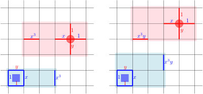 
FIG. 1. Planar layout of BB codes. Left: Marked vertex, two edges, and shaded plaquette correspond to the same lattice coordinates. Center: Red and blue edge patterns respectively correspond to X and Z stabilizer generators of a vertex-transitive HP code obtained from polynomials a(x, y) = 1 + x + x3, b(x, y) = 1 + y; edges corresponding to the monomials are labeled with matching colors, blue for a and red for b. Right: Same for a BB code from polynomials a(x, y) = 1 + x + x3y, b(x, y) = 1 + y.

📷 Fig 2

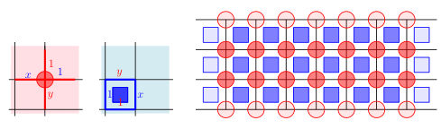 
FIG. 2. Structure of balanced smooth (horizontal) and rough (vertical) boundaries for a surface code in Example 1. Red and blue tiles on the left show stabilizer generators in the bulk. On the right, thin black lines show qubit locations, placement of stabilizer generators is shown with blue squares and red circles, respectively, and lighter shading indicates that corresponding generators must be trimmed at the boundary. Notice that the top row of vertical edges and the leftmost row of horizontal edges are removed to form balanced boundaries.

📷 Fig 3

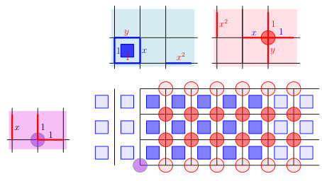 
FIG. 3. As in Fig. 2 but for the BBS code from polynomials a = 1 + x and b = 1 + x2 + y with horizontal smooth and vertical rough boundaries. Additional tile with violet shading corresponds to a non-trivial X codeword (u0, v0) = (x, 1 + x) of weight 3 associated with the lower boundary. The bound- ary can be fixed by adding this codeword to the stabilizer group in just one location as indicated with a purple circle, or replacing the entire bottom row of lightly-shaded vertex operators, which gives the same code.

📷 Fig 4

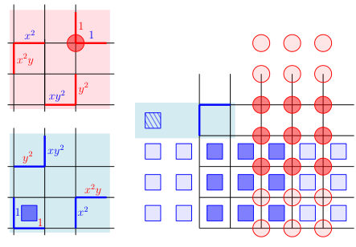 
FIG. 5. As in Fig. 2 but for the polynomials a = 1+x2 +xy2, b = 1+y2+x2y in a rectangular region with n = 50 qubits (5× 5 grid), see Example 3. The tile construction gives rX = 21 (red) and rZ = 21 (blue) stabilizer generators shown as blue squares and red circles, respectively, which gives a code with k = 8 and dZ = 2, with a minimum-weight Z codeword shown with blue edges. The code can be amended by promoting this codeword to a Z generator (drawn schematically as a hatched blue square in the corner), resulting in a [[50, 7, 3]] code, same as directly given by Algorithm 1 with Lx = Ly = 5. Increasing the code size Lx = Ly gives codes with the same dimension and increasing distances, e.g.,...

📷 Fig 5

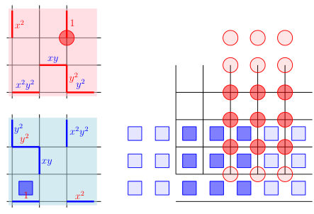 
FIG. 6. As in Fig. 5 but for polynomials in Example 4. Here no Z generators are supported on the lowest row of vertical edges; these edges have to be removed along with the lowest row of X generators, leaving n = 45 qubits with rX = 18 and rZ = 21 independent generators, resulting in the code [[45, 6, 3]]. Same code is produced by Algorithm 1 directly.

**Summary.** This paper presents a comprehensive algebraic theory for constructing Bivariate-Bicycle Surface Codes (BBS codes). It shows that the code's dimension and structure are determined by counting the common roots of two defining bivariate polynomials. The key contribution is a general construction algorithm applicable to complex, tilted boundaries without needing manual boundary fixes.

**Why it may be interesting.** While focused on abstract algebra, the rigorous determination of code parameters based purely on polynomial root counting provides deep insights into the topological constraints governing quantum error correction codes, which is fundamental to building fault-tolerant quantum computers.

Detailed structure

**Main problem.** The paper develops a general algebraic framework for constructing Bivariate-Bicycle Surface (BBS) codes, relating their parameters to the common roots of defining bivariate polynomials over a finite field.

**Main result.** A robust construction prescription is provided that determines the code dimension and distance by counting the number of finite, non-zero common roots of the defining polynomials, applicable even for arbitrarily tilted boundaries without corner corrections.

**Method.** The analysis heavily employs algebraic coding theory, utilizing concepts like chain complexes, Smith Normal Form invariants, resultants, and analyzing polynomial factorization properties over Laurent polynomial rings.

**Model / system.** The model is the Bivariate-Bicycle Surface Code (BBS code), which are quantum error-correcting codes defined on a lattice structure using stabilizer generators derived from pairs of bivariate polynomials $a(x, y)$ and $b(x, y)$.

**Key observables.** Code dimension ($k$), minimum distance ($d$), the number of common finite roots of $a$ and $b$, and topological invariants like $k_{TO}$.

**Important parameters / regimes.** The defining polynomials $a(x, y)$ and $b(x, y)$, the field $\mathbb{F}_q$, and boundary conditions (e.g., rectangular vs. tilted).

**Assumptions / limitations.** The analysis assumes specific edge conditions must be met for the general construction to hold without needing ad-hoc corner corrections; it also relies on the bulk condition being satisfied.

**Figures summary.** Figures illustrate planar layouts of BB codes, examples of boundary structures (smooth/rough), and visualizations of code generators derived from polynomials $a$ and $b$.

**Paper structure.** The paper progresses by first establishing the connection between code dimension and common roots; it then details algebraic machinery using chain complexes and SNF invariants to analyze solutions in strips; finally, it generalizes this construction to arbitrary boundaries and compares its results against existing methods.

Abstract

We relate the properties of bivariate-bicycle-surface (BBS) codes, constructed from a pair of bivariate polynomials over a finite field, to the number and location of their common roots in the extension field. The number of roots $(x,y)$ with finite, non-zero coordinates -- counted with algebraic multiplicity -- determines the dimension of the codes. This dimension is invariant under monomial automorphisms of the Laurent polynomial ring. Conversely, roots with zero or infinite $x$- or $y$-coordinates indicate that specialized generators are required near the corresponding boundary (e.g., the left or right boundary for a root where $x$ is zero or infinite, respectively). These roots can appear or disappear under monomial transformations, which reveals the structure of tilted boundaries. Based on these results, we formulate a prescription for constructing BBS codes that works for regions with rectangular, diagonal, and arbitrarily tilted boundaries. A key advantage of this approach is that no corner corrections are needed, provided the polynomials satisfy orientation-specific edge conditions.

[↑ back to top](#top)

### [On solutions of the Schrödinger equation for some molecular potentials: Power-series method](http://arxiv.org/abs/2606.08290v1)

**Authors:** Francisco M. Fernández  
**Type:** theory · **Category:** other · **PDF:** <https://arxiv.org/pdf/2606.08290v1>  
**Analysis basis:** full PDF text, analyzed in chunks

📷 Fig 1

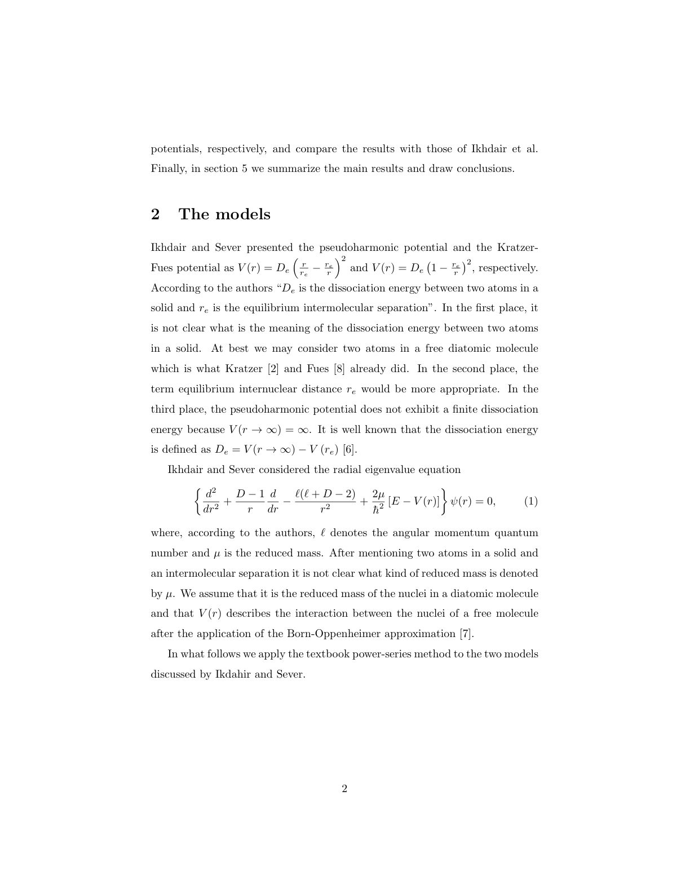 
Low-resolution page preview, page 2

📷 Fig 2

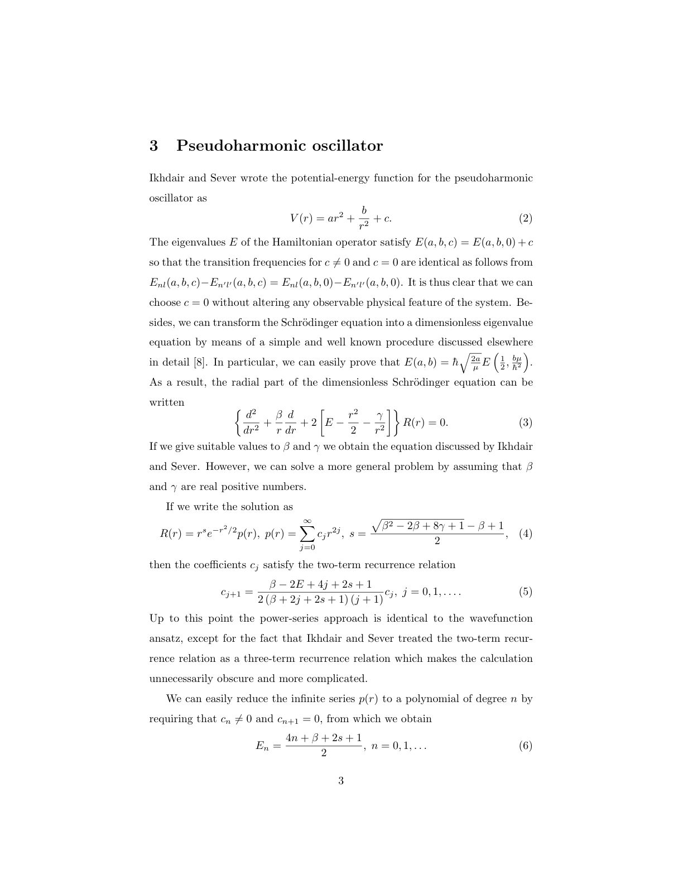 
Low-resolution page preview, page 3

📷 Fig 3

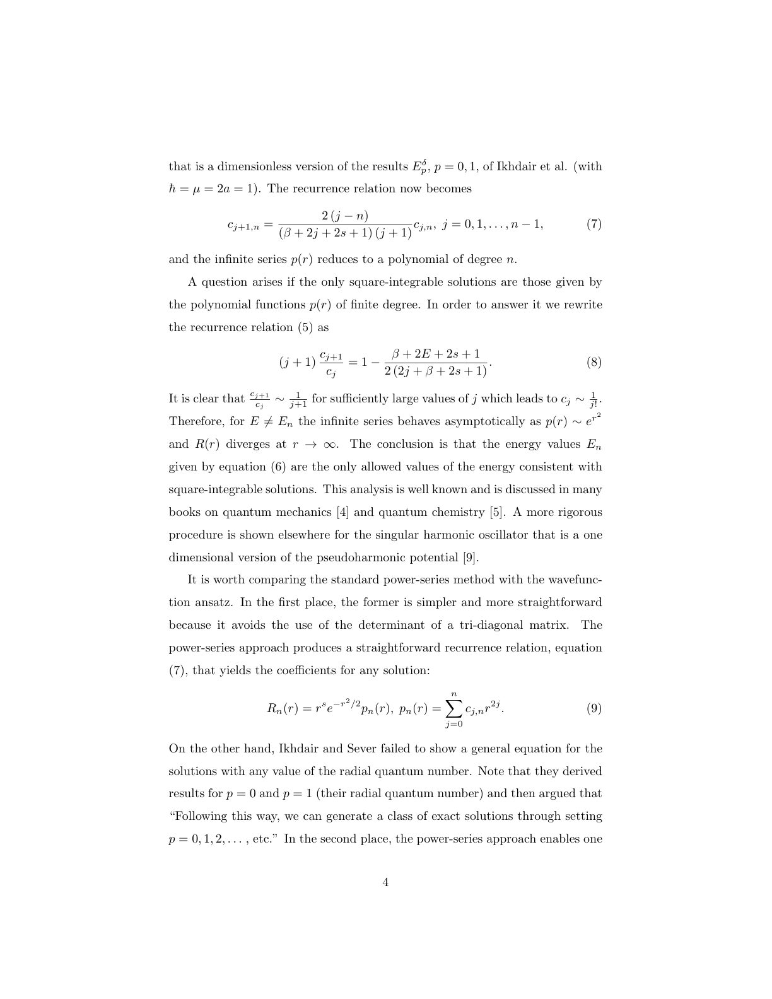 
Low-resolution page preview, page 4

📷 Fig 4

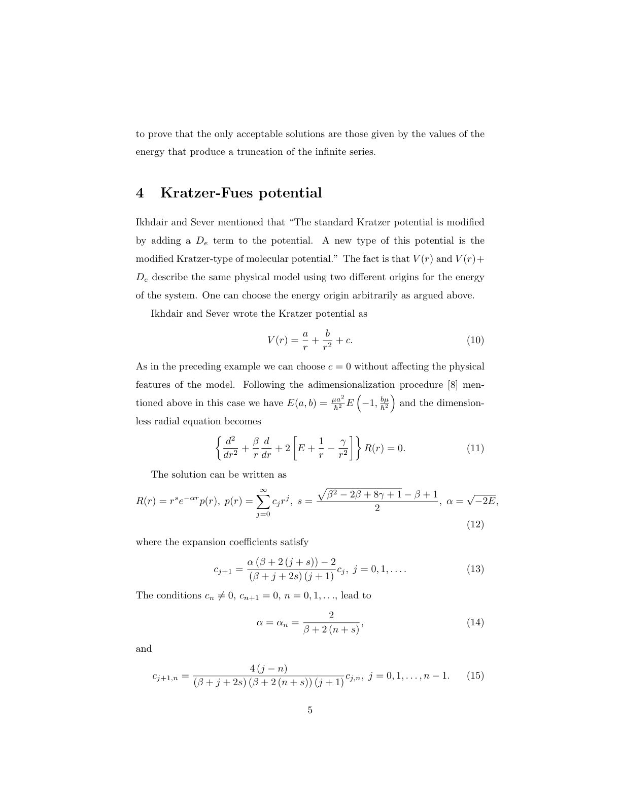 
Low-resolution page preview, page 5

📷 Fig 5

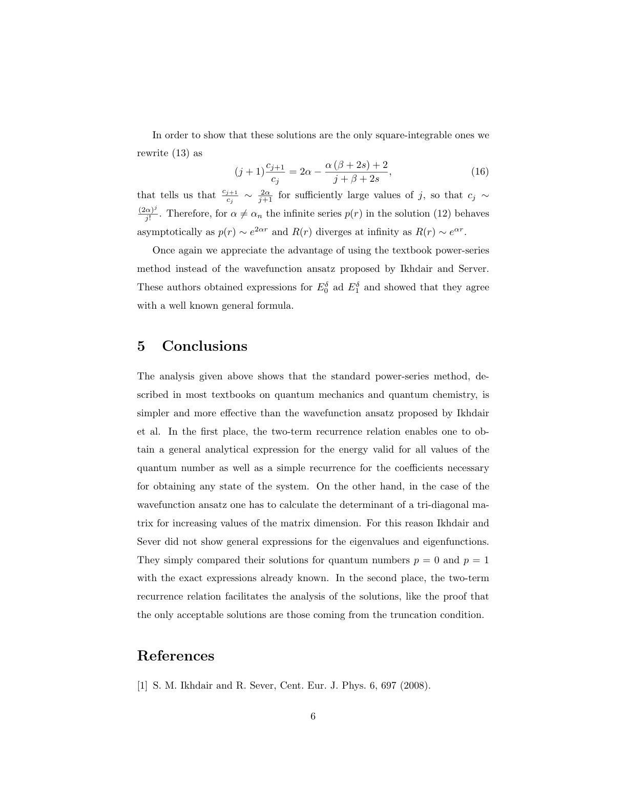 
Low-resolution page preview, page 6

**Summary.** This paper mathematically compares the standard power-series method against an alternative wavefunction ansatz for solving the Schrödinger equation for molecular potentials like the pseudoharmonic and Kratzer-Fues forms. The authors argue that their standard power-series approach is superior because it is simpler and yields general results via a two-term recurrence relation, unlike the more complex method they critique.

**Why it may be interesting.** This is highly relevant as it deals directly with solving fundamental quantum mechanical equations for molecular systems, which is core to AMO physics. The critique of alternative methods provides valuable insight into rigorous solution techniques.

Detailed structure

**Main problem.** The paper compares two mathematical techniques for solving the Schrödinger equation when applied to molecular potentials.

**Main result.** The standard power-series method is demonstrated to be mathematically simpler and more powerful than an alternative wavefunction ansatz proposed by Ikhdair and Sever.

**Method.** The analysis involves deriving recurrence relations for coefficients arising from series solutions to the radial Schrödinger equation, comparing two distinct formalisms.

**Model / system.** The study focuses on solving the eigenvalue problem for diatomic molecules using specific potentials: the pseudoharmonic potential and the Kratzer-Fues potential. The underlying physics is governed by the radial part of the Schrödinger equation after the Born-Oppenheimer approximation.

**Key observables.** Energy eigenvalues (E) and the corresponding eigenfunctions R(r).

**Important parameters / regimes.** The reduced mass ($\mu$) of the nuclei, and quantum numbers determining the state.

**Assumptions / limitations.** It assumes that physically acceptable solutions must arise from truncating the infinite power series to yield a polynomial solution.

**Paper structure.** The paper introduces the problem by stating the comparison between two methods. It then applies these methods to specific potentials (pseudoharmonic and Kratzer-Fues) to derive recurrence relations, ultimately concluding with a direct comparison of the mathematical utility of the two approaches.

Abstract

We show that the standard power-series method described in many textbooks of quantum-mechanics and quantum-chemistry is simpler and more powerful than the wavefunction approach proposed by Ikhdair and Sever [Cent. Eur. J. Phys. 6, 697 (2008)]. As illustrative examples we choose the pseudoharmonic and Kratzer-Fues potentials already treated by those authors.

[↑ back to top](#top)

### [QnRL: Quantum-Native Reinforcement Learning](http://arxiv.org/abs/2606.08276v1)

**Authors:** Alexander DeRieux, Walid Saad  
**Type:** both · **Category:** quantum information and computing · **PDF:** <https://arxiv.org/pdf/2606.08276v1>  
**Analysis basis:** full PDF text, analyzed in chunks

📷 Fig 1

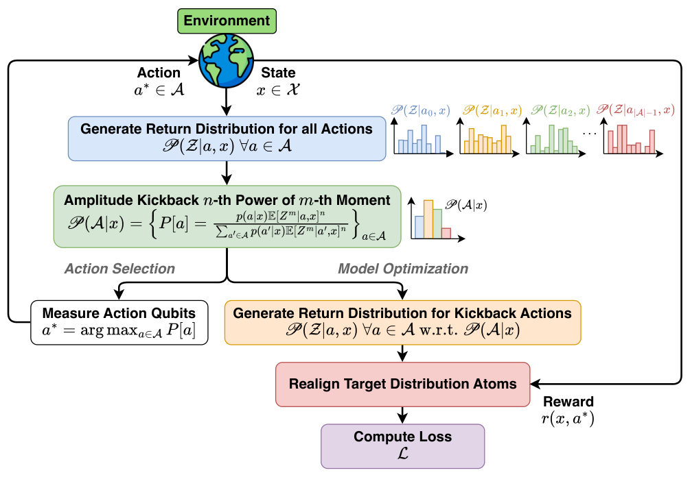 
FIGURE 1. General design of our QnRL framework. A QnRL agent generates superimposed quantum conditional return distributions (blue) for all actions given an environment observation, and then runs QuAK algorithm (green) to derive an action distribution relative to the normalized n-th power of the m-th moment of each conditional return distribution. Action selection (white) is performed by measuring the action qubits. During training, the agent updates the quantum distributional model by generating discounted return distributions for selected target actions (orange), realigns the atoms of this target distribution (red), and then computes policy loss relative to this target distribution...

📷 Fig 2

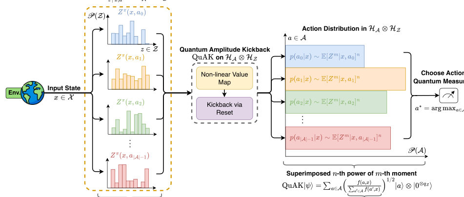 
FIGURE 2. High-level view of action selection process in QnRL using QuAK algorithm. The agent generates a superimposed quantum state (dashed orange) that is the distribution of returns conditioned on an input observation for every action. The agent then applies a nonlinear value map via Kraus operator (yellow) followed by a quantum reset operation (purple) to map the superimposed distributions of returns into a distribution of actions, where the probability of each action is proportional to the normalized n-th power of the m-th moment of its return distribution. The agent then measures the action qubits (white) to determine the best action.

📷 Fig 3

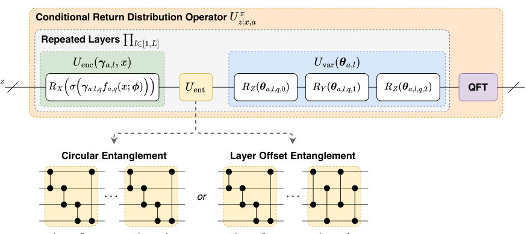 
FIGURE 3. Quantum circuit for our proposed conditional return distribution generator U π z | x,a, which has cascaded layers of encoding (green), entanglement (yellow), and variational (blue) operators, followed by a final QFT (purple). In this work we use two variations of entanglement, which are circular entanglement (left), and layer offset entanglement (right) respectively.

📷 Fig 4

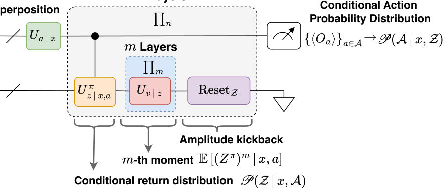 
FIGURE 4. Quantum circuit for QuAK algorithm (gray). An initial action distribution (green) is used to seed the cascaded generation of conditional return distributions (orange), followed by cascaded nonlinear return-value maps via Kraus operator (red), and a final reset over the return qubits (purple) to generate an action distribution that is proportional to the normalized n-th power of the m-th moment of each respective return distribution. Measurements on the action qubits (white) sample from this weighted distribution.

📷 Fig 5

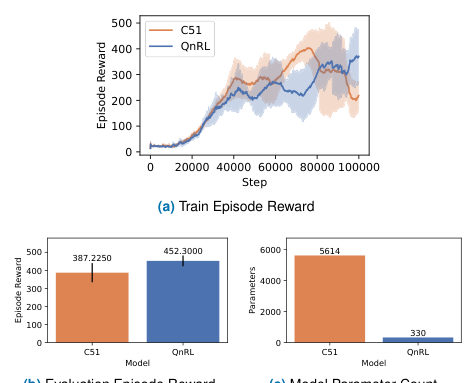 
FIGURE 5. Comparison of CartPole metrics (a) train episode reward, (b) evaluation episode reward, and (c) model parameter count for best model configuration of C51 (orange) and QnRL (blue). Training performance averaged over 4 seeds, evaluation performance averaged over 10 seeds, with ±1 std. dev. shown. These figures generally show that QnRL achieves higher and more stable training and evaluation performance with a significantly fewer parameters.

**Summary.** This paper introduces Quantum-Native Reinforcement Learning (QnRL), a framework that overcomes the limitations of classical and prior quantum RL by representing probability distributions as complex quantum states. It utilizes a novel QuAK algorithm to analyze these distributions directly in Hilbert space, leading to superior performance across diverse simulated environments.

**Why it may be interesting.** It provides a concrete methodology for embedding complex statistical learning problems (like DRL) directly into quantum circuit operations, offering insights into how quantum information theory can solve computational bottlenecks in AI.

Detailed structure

**Main problem.** Existing Quantum Reinforcement Learning (QRL) methods limit expressive power by only estimating expected outcomes, failing to model the full probability distributions governing stochastic environments.

**Main result.** The proposed QnRL framework achieves significantly higher evaluation scores and requires fewer parameters than baselines by natively modeling conditional return distributions in Hilbert space.

**Method.** It introduces Quantum-Native Reinforcement Learning (QnRL), which uses a novel Quantum Amplitude Kickback (QuAK) algorithm to analyze moments of superimposed quantum state distributions directly within the complex Hilbert space.

**Model / system.** The system extends classical DRL by representing return and policy distributions as superimposed, entangled quantum states in a combined action-return Hilbert space ($H_A \otimes H_Z$). The core mechanism involves Variational Quantum Circuits (VQC) for distribution generation.

**Key observables.** Evaluation scores, expected total reward, conditional action policy distribution $P(A|x)$, and the ability to capture complex correlations via phase/amplitude components.

**Important parameters / regimes.** Action qubits ($q_A$), return qubits ($q_Z$), moment order ($m$), expectation exponent ($n$), circuit depth ($L$).

**Assumptions / limitations.** The primary assumption is that quantum computation can provide an advantage by keeping the entire distributional learning process within the complex Hilbert space, avoiding classical measurement sampling loss.

**Figures summary.** Figures illustrate the four core stages of QnRL: Return distribution generation (superposition), moment analysis via QuAK, action selection based on moments, and final model optimization.

**Paper structure.** The paper details the system model expansion from classical to quantum settings, introduces the QnRL framework and the QuAK algorithm in dedicated sections, presents comprehensive results across multiple challenging environments, and concludes with detailed hyperparameter comparisons.

Abstract

Quantum reinforcement learning (QRL) is a promising approach to learn effective decision strategies across several applications with stochastic environments. Instead of directly modeling the random variables that govern these environments, existing QRL architectures indirectly approximate environment behavior by estimating expected outcomes, which limits their expressive power and adaptive potential. Overcoming such challenges requires a novel QRL approach that exploits the distributional nature of quantum computers to directly model environment random variables as quantum state distributions. Hence, in this paper, a novel framework dubbed quantum-native reinforcement learning (QnRL) is proposed. QnRL is a distributional RL framework that learns conditional distributions naturally in Hilbert space via superimposed and entangled quantum states. Thus, QnRL can directly model the behavior of stochastic learning environments via the natural properties of quantum systems. QnRL accomplishes this via a novel, proposed quantum amplitude kickback (QuAK) algorithm that enables comparing the $n$-th power of the $m$-th moment of multiple superimposed distributions. It is theoretically proven that a conditional action policy distribution is distilled from the moments of a quantum generative model entirely within Hilbert space via QuAK, and optimized via QnRL. This complex distribution composition is also shown to provide extra dimensions for expressing environment correlations that are unknown to purely classical and classically-sampled quantum distributional models. Experimental results across diverse environments show that QnRL achieves up to $82.9\%$ higher evaluation scores, with up to $94.3\%$ fewer parameters on average, more accurately estimates the expected return for unseen observations, and better adapts to varying stochastic conditions compared to the baseline.

[↑ back to top](#top)

### [Quantum Kravchuk Transform using $\mathfrak{su}(2)$ fast-forwarding](http://arxiv.org/abs/2606.08443v1)

**Authors:** Chaowen Guan, Akshit Katiyar  
**Type:** theory · **Category:** quantum information and computing · **PDF:** <https://arxiv.org/pdf/2606.08443v1>  
**Analysis basis:** full PDF text, analyzed in chunks

📷 Fig 1

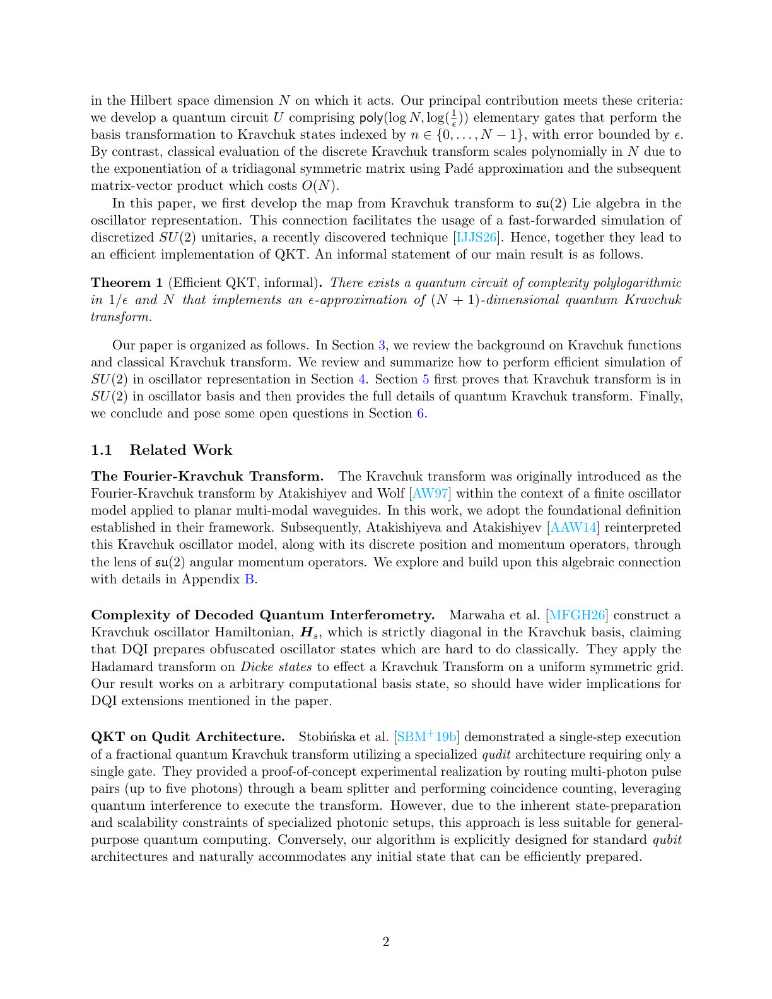 
Low-resolution page preview, page 2

📷 Fig 2

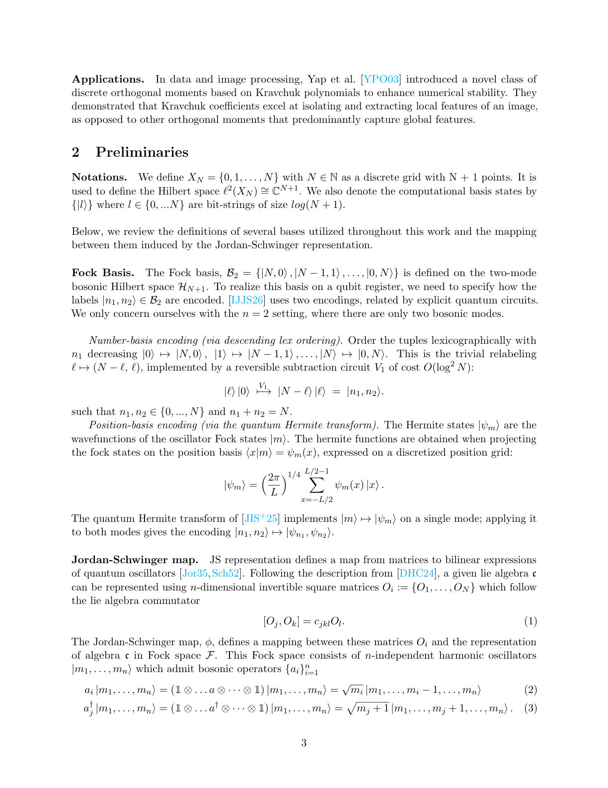 
Low-resolution page preview, page 3

📷 Fig 3

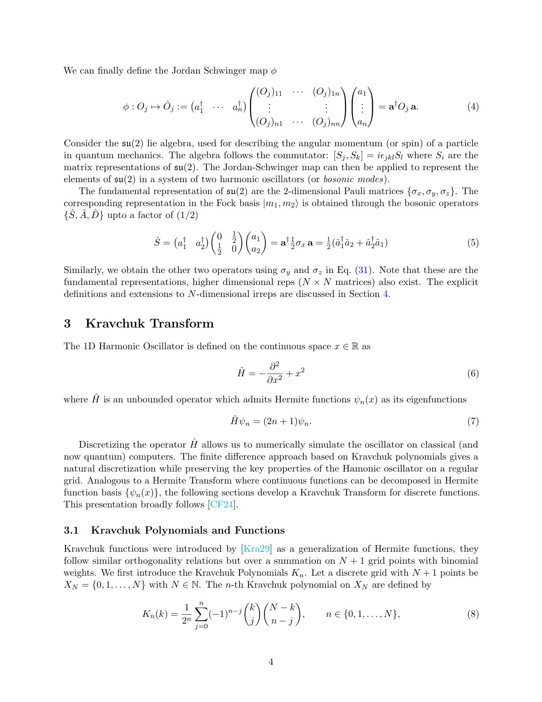 
Low-resolution page preview, page 4

📷 Fig 4

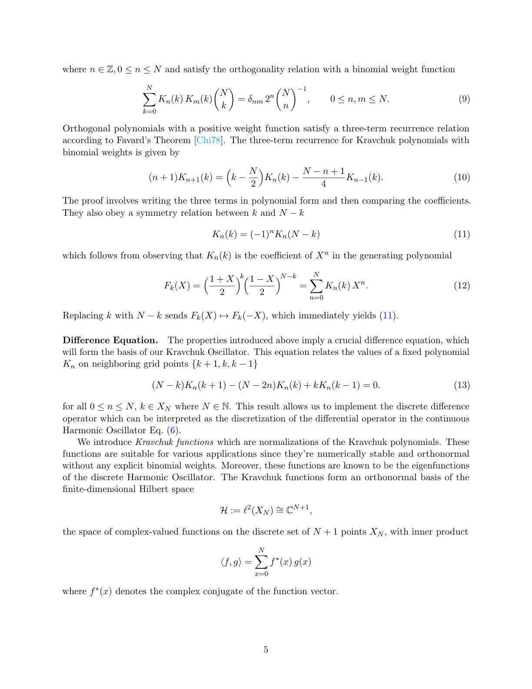 
Low-resolution page preview, page 5

📷 Fig 5

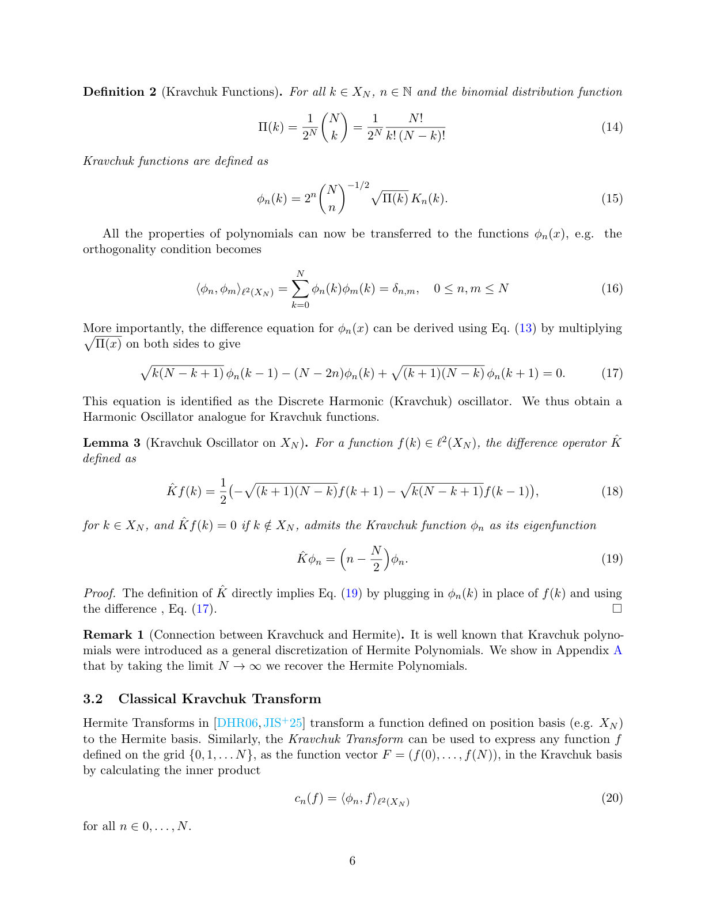 
Low-resolution page preview, page 6

**Summary.** The paper presents an efficient quantum algorithm for the Quantum Kravchuk Transform by exploiting its deep mathematical connection to the $\mathfrak{su}(2)$ Lie algebra. By mapping the transform onto this algebraic structure and utilizing fast-forwarding simulation techniques, the authors achieve a polylogarithmic gate complexity. This demonstrates a powerful methodology for implementing transforms associated with discrete orthogonal polynomials on quantum hardware.

**Why it may be interesting.** This work provides a concrete example of applying advanced algebraic structures ($\mathfrak{su}(2)$) and state-of-the-art quantum simulation techniques (fast-forwarding) to solve a problem in orthogonal polynomial theory, demonstrating potential quantum advantage over classical methods for specific transforms.

Detailed structure

**Main problem.** The primary goal is developing an efficient quantum algorithm for the Quantum Kravchuk Transform (QKT). This aims to achieve a computational complexity that scales logarithmically with system size, surpassing classical polynomial scaling.

**Main result.** An efficient quantum circuit implementing the QKT was developed by mapping the transform structure onto the $\mathfrak{su}(2)$ Lie algebra. The resulting algorithm achieves a time complexity of $O((\log N + \log(1/\epsilon))^3 	imes \log(1/\epsilon))$ gates.

**Method.** The method combines establishing a structural link between the Kravchuk transform and $\mathfrak{su}(2)$, followed by applying advanced fast-forwarding simulation techniques for $	ext{SU}(2)$ group elements in the oscillator representation.

**Model / system.** The system is based on the discrete harmonic oscillator, whose eigenfunctions are the Kravchuk polynomials/functions defined over a finite lattice $X_N = \{0, 1, \dots, N\}$. The dynamics and transform properties are modeled using operators satisfying $\mathfrak{su}(2)$ commutation relations.

**Key observables.** The QKT itself (mapping computational basis states to Kravchuk function states), the spectrum of the discrete harmonic oscillator Hamiltonian ($\hat{K}$), and the matrix elements of the transformation operators.

**Important parameters / regimes.** Dimension $N$ (or lattice size), error bound $\epsilon$, and the logarithmic scaling factors derived from the fast-forwarding techniques.

**Assumptions / limitations.** The approach relies on successfully mapping the Kravchuk transform structure onto an irreducible representation of $\mathfrak{su}(2)$ to enable the use of established efficient simulation algorithms for Lie groups.

**Paper structure.** The paper builds by first defining the mathematical properties of the Kravchuk polynomials and their connection to the discrete harmonic oscillator. It then establishes this link to $\mathfrak{su}(2)$ via the Jordan-Schwinger map, allowing the application of fast-forwarding techniques developed for $	ext{SU}(2)$ evolution to construct the final quantum circuit.

Abstract

We present a quantum algorithm for the Kravchuk transform that scales logarithmically in both the dimension and the inverse of the error parameter. The quantum Kravchuk transform maps computational basis states to states with amplitudes proportional to Kravchuk functions. We achieve this by combining two key techniques: the structural relationship between the Kravchuk transform and the Lie algebras $\mathfrak{su}(2)$, and a recent fast-forwarding simulation method for $\mathfrak{su}(2)$ operators in the oscillator representation. More precisely, we first establish the map from Kravchuk transform in computational basis to $\mathfrak{su}(2)$ in Fock basis. Then built on this connection, we apply the fast-forwarding to achieve an efficient quantum Kravchuk transform.

[↑ back to top](#top)

### [REM universality and Poisson-Dirichlet Gibbs weights for linear random energy](http://arxiv.org/abs/2606.07757v1)

**Authors:** Francesco Concetti, Simone Franchini  
**Type:** theory · **Category:** statistical mechanics · **PDF:** <https://arxiv.org/pdf/2606.07757v1>  
**Analysis basis:** full PDF text, analyzed in chunks

📷 Fig 1

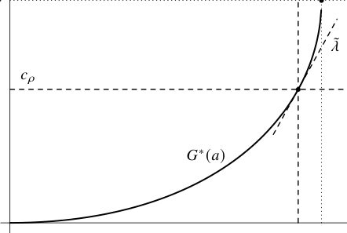 
Figure 1. The curve 𝐺∗denotes the quenched large-deviation rate function of 𝐻𝑛conditional on the environment ℎ. The parameter ˜𝑎is defined by 𝐺∗( ˜𝑎) = 𝑐𝜌, and ˜𝜆is the slope of 𝐺∗at ˜𝑎.

**Summary.** This paper proves that the energy levels of a purely linear random Hamiltonian exhibit Random Energy Model (REM) universality after thinning. It rigorously determines that the resulting point process converges to a Poisson Point Process and identifies that the associated Gibbs weights converge to the Poisson-Dirichlet law, revealing a phase transition in the free energy at a critical temperature.

**Why it may be interesting.** The rigorous proof of REM universality for this specific linear model provides deep insights into how complex statistical physics models simplify to universal limiting forms, which is relevant for understanding disordered systems in quantum mechanics.

Detailed structure

**Main problem.** The study aims to establish Random Energy Model (REM) universality for energy levels derived from a purely linear random Hamiltonian and determine the limiting behavior of associated Gibbs weights.

**Main result.** The thinned point process of energy levels converges to a Poisson Point Process, and the joint distribution of ranked Gibbs weights converges to the Poisson-Dirichlet law in the low-temperature regime.

**Method.** The analysis uses techniques involving independent thinning processes, computing limit Laplace functionals for point processes, and applying large-deviation principles to analyze weight convergence.

**Model / system.** The system is defined by the Hamiltonian H_n(h, \sigma) = \sum_{i=1}^n h_i(\sigma_i - m), where h_i are i.i.d. random variables and \sigma_i are Ising spins. The analysis focuses on energy levels obtained after retaining an exponential number of configurations.

**Key observables.** Energy level point process, Gibbs weights, quenched free energy F(β).

**Important parameters / regimes.** β (inverse temperature), τλ (critical parameter related to the PPP intensity), and the thinning factor c_ό.

**Assumptions / limitations.** The proof relies on regularity hypotheses for h_1, including a linear small-ball condition, and assumes sharp large-deviation estimates from prior work.

**Figures summary.** Figure 1 illustrates the quenched large-deviation rate function G*(a) versus a, defining parameters τλ and α.

**Paper structure.** The paper first establishes REM universality for the point process convergence to PPP(D_{τλ}), then analyzes the Gibbs weights showing convergence to PD(τλ/β, 0), and finally computes the free energy exhibiting a phase transition at β = τλ.

Abstract

We study the Hamiltonian $H_n(h,σ)=\sum_{i=1}^n h_i(σ_i-m), $ where $(h_i)$ are i.i.d.\ real random variables and $(σ_i)$ are i.i.d.\ Ising spins. We consider the energy levels obtained after an independent thinning that retains an exponential number of configurations ($e^{O(n)}$). We prove that, after an $(h_i)$-dependent centering, the resulting point process converges in distribution to a Poisson point process with exponential intensity. Thus, the energy levels asymptotically has the one of the Random Energy Model (REM). Our results extend previous ones, where REM universality for this model was established only either for energy fluctuations of order $e^{-O(n)}$ or for $e^{o(\sqrt n)}$ randomly selected configurations. We also identify the limiting Gibbs weights, which converge to a Poisson--Dirichlet law, and the quenched free energy, which exhibits a freezing transition at $β=\tildeλ$. The proofs are presented here in compressed form; full details are given in the companion preprint.

[↑ back to top](#top)

### [Zermelo's navigation problem through the lens of quantum annealing: How the Landau-Zener approximation leads to an efficient classical solution](http://arxiv.org/abs/2606.09602v1)

**Authors:** Sølve Selstø, Tor Kristian Dahle, Sergiy Denysov, Yves-Laurent Ariel Rezus, Leiv Øyehaug  
**Type:** theory · **Category:** quantum information and computing · **PDF:** <https://arxiv.org/pdf/2606.09602v1>  
**Analysis basis:** full PDF text, analyzed in chunks

📷 Fig 1

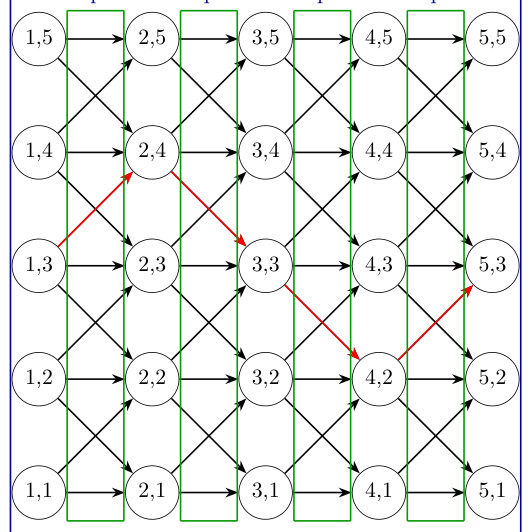 
FIG. 2. In the discretized formulation, the path across the water becomes a sequence of steps

📷 Fig 2

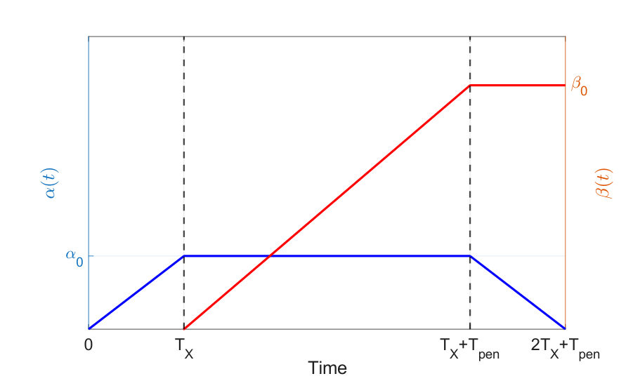 
FIG. 3. The annealing schedules. The anneal is divided into three phases: 1) the exploration term

📷 Fig 3

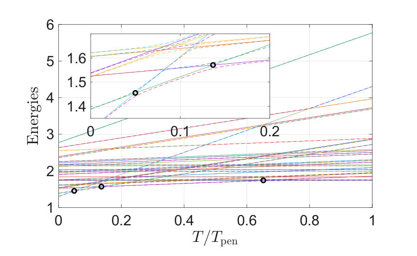 
FIG. 4. The diabatic (full lines) and adiabatic (dashed cures) energies as functions of the penalty

📷 Fig 4

 
FIG. 5. The probability for the various states in the computational basis for various annealing

📷 Fig 5

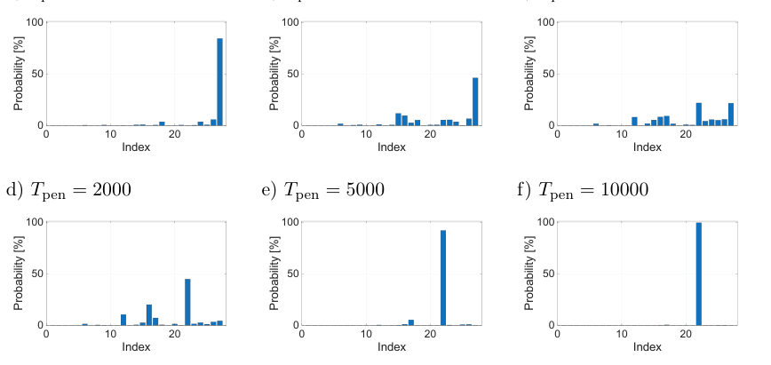 
Figure 6 illustrates the fidelity as a function of Tpen for various choices of n. It displays

**Summary.** This work reformulates Zermelo's river-crossing problem as an adiabatic quantum computation task using qutrits. By analyzing the system's evolution through avoided crossings via the Landau-Zener formula, the authors demonstrate that a seemingly complex optimization problem possesses an efficient classical solution scaling only quadratically with size. This highlights how quantum tools can reveal underlying classical structure.

**Why it may be interesting.** It provides a pedagogical example of mapping a real-world optimization problem onto a quantum annealer framework, allowing for analytical estimation of performance metrics like fidelity using established quantum dynamics tools.

Detailed structure

**Main problem.** The paper addresses Zermelo's navigation problem, a classic optimization challenge, by formulating it as an adiabatic quantum computation task.

**Main result.** Despite the initial appearance of exponential complexity, the quantum formulation reveals an underlying classical structure that can be solved efficiently with only quadratic scaling in the problem size.

**Method.** The solution utilizes adiabatic quantum computing principles, estimating fidelity via the Landau-Zener formula to analyze the evolution through avoided crossings.

**Model / system.** The system models a discretized path across a river using qutrits (ternary variables) encoded into a Hamiltonian. The total Hamiltonian combines a cost term and a penalty term enforcing boundary conditions.

**Key observables.** Fidelity ($F$ or $F_{LZ}$), required annealing time ($T_{pen}$), and the optimal path $\vec{s}_{opt}$.

**Important parameters / regimes.** The problem size $n$, the annealing schedule parameters ($\alpha(t), eta(t)$), and the critical crossing values.

**Assumptions / limitations.** The validity of the Landau-Zener approximation, which assumes negligible interference effects in the large time limit ($T_{pen} 	o \infty$).

**Figures summary.** Figures illustrate the optimal path (Fig. 1), discretized steps (Fig. 2), the three-phase annealing schedule (Fig. 3), and comparisons between actual vs. Landau-Zener fidelity versus $T_{pen}$ (Fig. 6).

**Paper structure.** The paper introduces Zermelo's problem, maps it to a qutrit Hamiltonian ($H = H_{	ext{cost}} + eta H_{	ext{pen}}$), details the adiabatic evolution using an annealing schedule, analyzes the fidelity via Landau-Zener theory, and concludes by deriving efficient classical algorithms that match the quantum prediction.

Abstract

The river-crossing problem, also known as Zermelo's navigation problem, is a classic example of an optimization problem with practical relevance and a scalable degree of complexity. It asks for the optimal trajectory of a vessel moving through a water flow field and provides a setting in which physics, variational methods, and optimization are naturally intertwined. We state a version of Zermelo's problem and then solve it as formulate it as an adiabatic quantum-computing problem using quantum trits, or qutrits for short. The construction includes a penalty term that enforces the prescribed boundary conditions and an exploration term that allows the system to move through intermediate configurations toward the optimal feasible path. In the adiabatic description, the evolution proceeds through a sequence of avoided crossings, so that the resulting fidelity can be estimated using the Landau-Zener formula. Remarkably, the regime in which this approximation is valid also provides a deterministic way to identify the correct solution with computational effort that scales only quadratically with the problem size. Thus, a quantum formulation initially motivated by the apparent exponential complexity of the problem reveals an underlying classical structure that can be exploited efficiently. Our approach also provides a pedagogical illustration of how a real-world optimization problem can be cast into a quantum-annealing framework and then analyzed using the Schrödinger equation, avoided crossings, and Landau-Zener theory.

[↑ back to top](#top)

## Secondary cond-mat archives

*Papers from  mes-hall, other, soft, supr-con. These archives are de-prioritized — they appear at the end regardless of relevance score.*

### Relevant in secondary archives (25)

### [An Adaptive Coherent Interferometric Oscillator Based on an Optoelectronic Magnonic Parametric Oscillator](http://arxiv.org/abs/2606.09546v1)

**Authors:** Shihao Zhou, Junming Wu, Jiazhen Li, Qing Gu, Wei Zhang  
**Type:** experiment · **Category:** other · **PDF:** <https://arxiv.org/pdf/2606.09546v1>  
**Analysis basis:** full PDF text, analyzed in chunks
**Topic relevance:** 🔥 `spintronics-quantum-optics interface` **4/5** · `analog quantum simulation` **3/5** · `correlated / nonlocal dissipation` **3/5** · `driven-dissipative phase transition` **3/5** · `interference shaping light` **3/5** · `methods for driven-dissipative` **3/5** · `exotic spin models in light-matter` **2/5** · `non-equilibrium dynamics` **2/5** · `non-equilibrium universality` **2/5** · `quantum optics experiment` **2/5** · `Keldysh / 2PI / non-Gaussian methods` **1/5** · `Kondo & dissipative impurity` **1/5** · `correlated cavity matter` **1/5** · `entanglement & information structure` **1/5** · `quantum measurements` **1/5** · `scars & prethermalization` **1/5**

📷 Fig 1

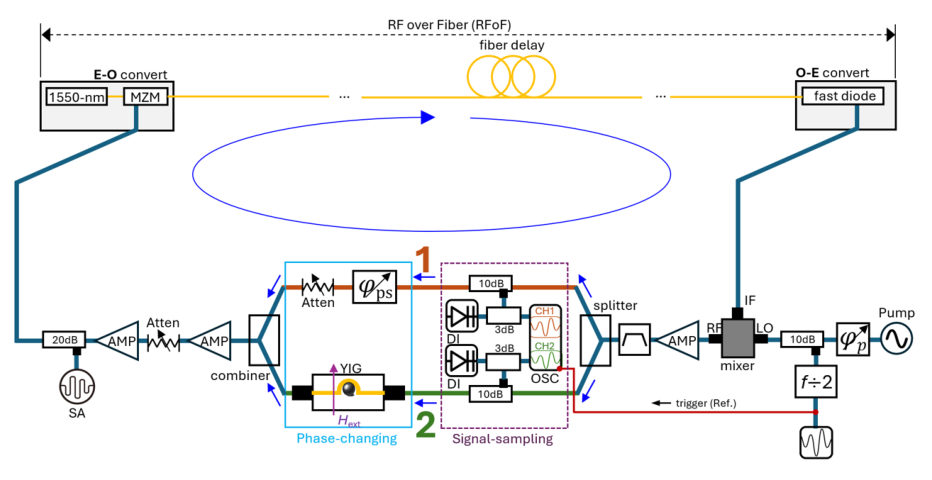 
FIG. 1. Schematic illustration of the setup. The top shows the photonic sector consisting of E-O / O-E converters and a fiber delay. The bottom is the microwave sector consisting of: (from right to left) the mixer RF port, amplifier (Amp), band-pass filter (1730-2270 MHz), splitter, MZI (1 &amp; 2), combiner, Amp, attenuator (Atten), Amp, 20-dB coupler, spectrum analyzer (SA). Inside the MZI: branch 1, the reference branch, consists of a microwave phase shifter (PS) with tunable phase (φps) and an Atten; branch 2, the magnonic branch, consists of a YIG sphere placed atop a microwave stripline, which can induce a resonant, dispersive phase shift upon YIG resonance (φYIG). For both branches, a...

📷 Fig 2

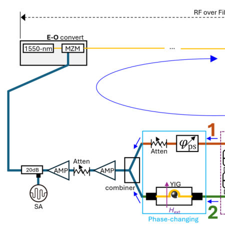 
Figure 1 illustrates the experimental setup. The cen- tral build is an OEO loop that includes an electronic sector (consisting of microwave components for amplify- ing, attenuating, band-passing, and spectral detection) and a photonic sector (consisting of E-O/O-E converters and a fiber delay). For a proof-of-concept, the photonic part can be conveniently implemented by using fiber- optic patch cords and off-the-shelf RF-over-Fiber (RFoF) systems [6]. On the right end, an electrical parametric pumping sector can be incorporated into the loop via the local oscillator (LO) port of a frequency mixer – the nonlinear electrical device – consisting of a signal gen- erator supplying a pump signal,...

📷 Fig 3

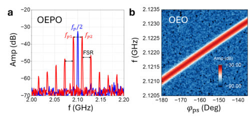 
FIG. 2. Two independent methods to determine the cavity FSR. (a) In the OEPO case, the FSR can be directly read out from the separation between the nondegenerate mode pairs, e.g., fp1 and fp2, yielding 18.2 MHz. The degenerate situation yields a single strong peak at fp/2. The traces are obtained at Atten = 13 dB. Red peaks: φps = −25◦, Blue peak: φps = −100◦. (b) In the OEO case, the FSR is calculated by the frequency pulling, yielding a nominal value of 15.8 MHz and an effective βMZI ≈0.87. The trace is obtained at Atten = 20 dB.

📷 Fig 4

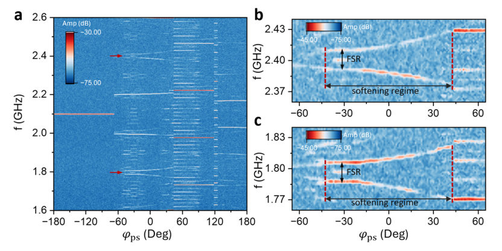 
FIG. 3. Spectrum of MZI-enhanced OEPO. (a) The full spectrum by scanning the φps from φps = −180◦to 180◦, under a pump fp = 4.2 GHz at 8 dBm power. The main loop is at Atten = 10.5 dB. (b,c) Zoom-in regime showing the frequency pulling near (b) 2.4 and (c) 1.8 GHz. The softening regime is identified near φps ∈(−43◦, 43◦), corresponding to an effective locking bandwidth of ∆flock = ∆lock/(2π) ≈1.89 MHz.

📷 Fig 5

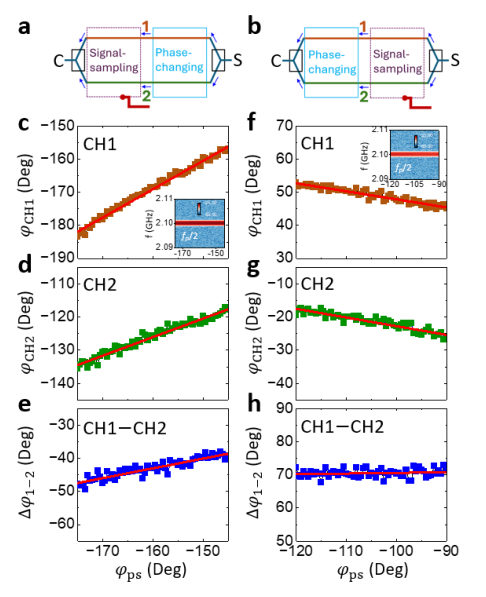 
FIG. 4. (a,b) Two sampling positions in which: (a) signal- sampling after the phase-changing elements (phase-changing →signal-sampling), and (b) signal-sampling before the phase- changing elements (signal-sampling →phase-changing). C: combiner, S: splitter. (c,d,e) phase evolution as a function of the phase-shifter nominal set phase, φps, for the case in (a) of (c) phase shifter branch (CH1), (d) YIG branch (CH2), and (e) the net phase. (f,g,h) phase evolution as a function of the phase-shifter nominal set phase, φps, for the case in (b) of (g) phase shifter branch (CH1), (f) YIG branch (CH2), and (h) the net phase. Inset of (c) and (f): OEPO spectrum showing the stable fp/2 mode throughout...

**Summary.** This paper characterizes an advanced optoelectronic magnonic parametric oscillator built around a Mach-Zehnder interferometer. By analyzing the system's response to magnetic field perturbations, the authors demonstrate that the MZI enables complex, adaptive dynamics beyond simple resonance locking. This framework is valuable for exploring nonlinear interferometric physics in hybrid magnonic-photonic systems.

**Why it may be interesting.** The work provides an excellent platform for studying open quantum systems dynamics by modeling coherent phase redistribution and adaptive nonlinear interactions between two distinct physical subsystems (magnonics and photonics).

Detailed structure

**Main problem.** The study investigates adaptive interferometric oscillator dynamics under distributed phase perturbations using a hybrid magnonic-photonic platform.

**Main result.** The MZI architecture introduces an additional adaptive degree of freedom, leading to partially synchronized dynamics where the YIG branch acts locally and the phase shifter controls global geometry.

**Method.** Analysis involves measuring frequency pulling, comparing local vs. global sampling configurations, and applying complex-Lorentzian fitting techniques.

**Model / system.** The system is an MZI-based optoelectronic magnonic parametric oscillator (OEMPO) combining a YIG-loaded magnonic branch and a tunable phase-shifter branch within an OEO loop structure.

**Key observables.** Loop Free Spectral Range (FSR), effective delay time ($	au$), cross-susceptibility coefficient ($\kappa_{YIG	o ps}$), and phase-to-amplitude conversion ratios.

**Important parameters / regimes.** The system exhibits distinct behavior in the phase-pinned OEPO regime versus the frequency-adaptive OEO regime.

**Assumptions / limitations.** The analysis assumes that the cross-coupling can be separated into amplitude-mediated and phase-mediated terms, with the latter dominating the coupling mechanism.

**Figures summary.** Figures illustrate schematics of the setup, measurements comparing FSR determination via mode pair separation (OEPO) versus frequency pulling (OEO), and phase evolution vs. magnetic field for different sampling points.

**Paper structure.** The paper systematically analyzes the system by first establishing the MZI structure's role in introducing adaptive freedom, then quantifying the distinct roles of the YIG branch (local dispersion) and the PS branch (global geometry), culminating in a quantitative analysis of their cross-coupling and regime differences.

Abstract

We study a Mach-Zehnder interferometer (MZI)-based optoelectronic magnonic parametric oscillator (OEMPO) incorporating a YIG-loaded magnonic branch and a tunable phase-shifter branch, enabling systematic investigation of adaptive interferometric oscillator dynamics under distributed phase perturbations. Through analysis of nondegenerate OEPO mode pairs and frequency-pulling behavior, the loop free spectral range (FSR) and effective delay time were quantitatively extracted. Despite the nominally frequency-pinned parametric operation, weak frequency pulling and OEPO mode softening were observed, revealing an additional adaptive interferometric degree of freedom introduced by the MZI architecture. By comparing local and global sampling configurations, we demonstrate that the YIG branch behaves predominantly as a local dispersive resonant subsystem governed by the complex magnonic susceptibility, whereas the phase-shifter branch primarily controls the global interferometric redistribution geometry. Nevertheless, coherent recombination and adaptive regeneration within the loop produce finite cross-coupling between the two branches, resulting in partially synchronized interferometric dynamics and branch-dependent adaptive redistribution. Quantitative complex-Lorentzian analysis further reveals substantial phase-to-amplitude conversion and distinct differences between the OEO and OEPO regimes: the phase-pinned OEPO favors strongly dispersive local YIG response, while the frequency-adaptive OEO exhibits more mixed absorptive--dispersive behavior due to spectral relaxation through frequency pulling. Broadly, the present platform establishes a versatile framework for exploring adaptive nonlinear interferometric physics, coherent phase redistribution, and branch-dependent synchronization phenomena in hybrid magnonic-photonic oscillator systems.

[↑ back to top](#top)

### [Crystallizing Substrates Drag Supported Nanoparticles](http://arxiv.org/abs/2606.07862v1)

**Authors:** Cheng-Yu Chen, Duncan Burns, Peter W. Voorhees, Eric A. Stach  
**Type:** both · **Category:** statistical mechanics · **PDF:** <https://arxiv.org/pdf/2606.07862v1>  
**Analysis basis:** full PDF text, analyzed in chunks
**Topic relevance:** 🔥 `non-equilibrium dynamics` **4/5** · `driven-dissipative phase transition` **3/5** · `methods for driven-dissipative` **3/5** · `non-equilibrium universality` **3/5** · `Frenkel-Kontorova` **2/5** · `Keldysh / 2PI / non-Gaussian methods` **2/5** · `analog quantum simulation` **2/5** · `Kondo & dissipative impurity` **1/5** · `correlated / nonlocal dissipation` **1/5** · `entanglement & information structure` **1/5** · `scars & prethermalization` **1/5**

📷 Fig 1

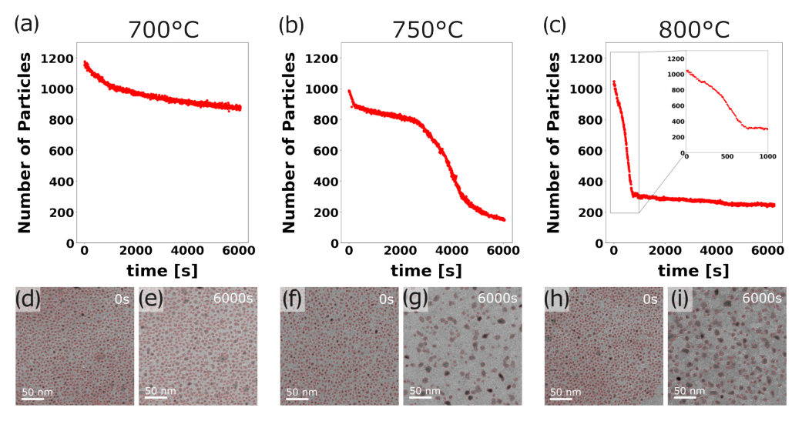 
FIG. 1. Distinct temperature-dependent regimes in the evolution of Pt particles on AlOx supports during in situ TEM heating. (a–c) Particle number as a function of time during heating at 700, 750, and 800 ◦C, respectively. (d–i) Representative TEM images recorded at 0 and 6000 s at each temperature: (d,e) 700 ◦C, (f,g) 750 ◦C, and (h,i) 800 ◦C. Red outlines mark particle boundaries.

📷 Fig 2

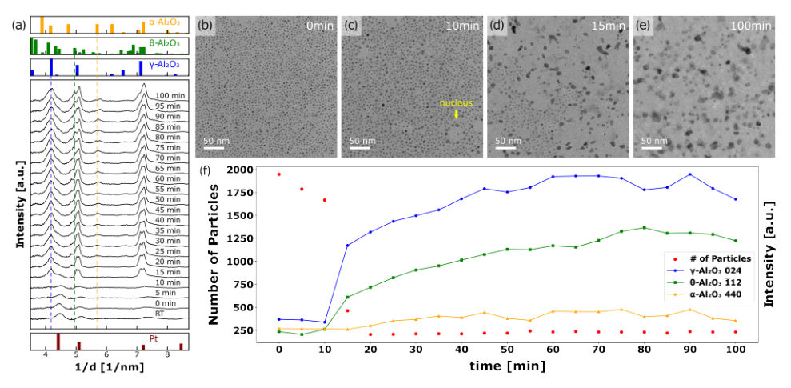 
FIG. 2. Temporal correlation between support crystallization and particle migration during in situ TEM heating at 800◦C. (a) Time-resolved radially integrated intensity profiles of SAED patterns collected during heating of Pt particles on a 20 nm AlOx thin film at 800◦C. Reference reflection positions for α-, θ-, and γ-Al2O3 and Pt are indicated for comparison. Colored dashed lines indicate the representative diffraction reflections assigned to γ-Al2O3 024, θ-Al2O3 ¯112, and α-Al2O3 440, whose integrated intensities are plotted in (f). (b–e) Representative TEM images acquired after 0, 10, 15, and 100 min of heating, respectively. (f) Time-dependent changes in particle number and selected...

📷 Fig 3

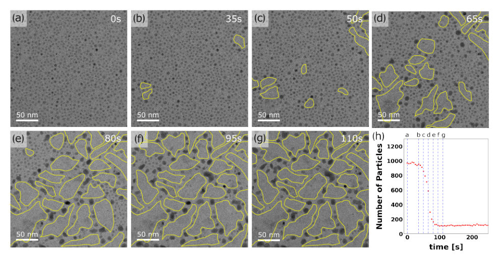 
FIG. 3. Dynamic evidence linking Pt particle migration to the lateral propagation of support crystallization during in situ TEM heating at 800◦C. (a–g) Time series from a separate high-temporal-resolution in situ TEM heating experiment on a 20 nm AlOx thin film. Yellow contours outline particle-free regions. (h) Particle number as a function of time. Blue dashed lines indicate the time points corresponding to panels (a–g).

📷 Fig 4

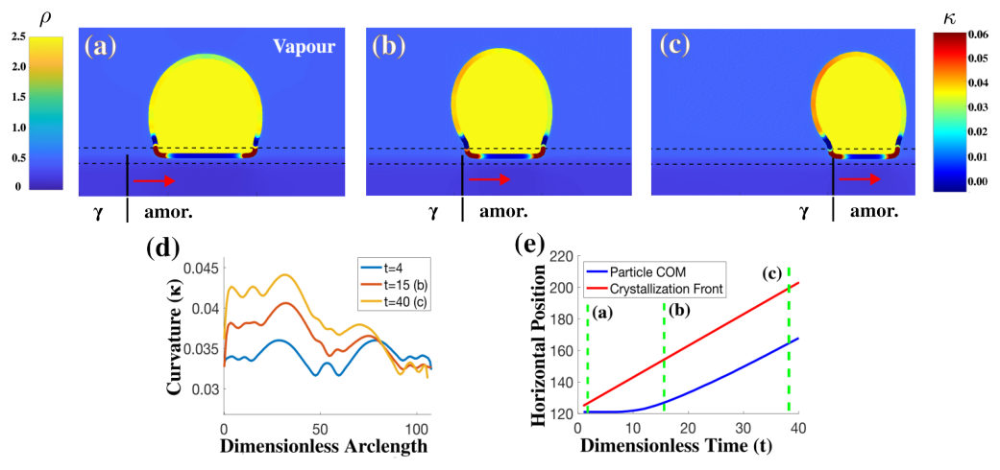 
FIG. 4. Simulation of crystallization front induced particle motion. (a-c) Pt density map snapshots. Particle curvature (κ) is plotted along the platinum solid-vapor interface (ϕ = 0.5). (d) Particle curvature as a function of arclength from left to right above the contact point core region. (e) Center of mass position of particle (blue) and crystallization front position (red) as a function of simulation time, t = 105dt.

**Summary.** This work demonstrates that crystallization fronts act as powerful, deterministic drivers for nanoparticle movement. By combining in situ TEM with phase-field simulations, the authors prove that the resulting asymmetric surface energy gradient pulls nanoparticles along with the advancing crystal interface. This establishes a general principle for understanding transport driven by structural phase boundaries.

**Why it may be interesting.** While focused on condensed matter physics, the concept of a deterministic transport mechanism driven by non-equilibrium thermodynamic gradients (like those found at moving interfaces) is highly relevant to open quantum systems where environmental coupling drives system evolution.

Detailed structure

**Main problem.** To determine the mechanism by which a propagating surface-energy boundary, such as during crystallization, can deterministically drive the transport of supported nanoparticles.

**Main result.** Propagating crystallization fronts actively drag supported Pt nanoparticles over long distances due to asymmetric particle-substrate interfacial energy environments. This process is governed by curvature gradients that redistribute mass and displace the particles.

**Method.** The study combines in situ TEM tracking of nanoparticle motion with time-resolved diffraction/4D-STEM analysis of support crystallization, supplemented by phase-field simulations.

**Model / system.** The system involves Pt nanoparticles supported on amorphous $	ext{AlO}_x$ thin films undergoing an amorphous-to-crystalline transformation into $	ext{Al}_2	ext{O}_3$. The theoretical framework models the driving force using surface energy gradients and curvature effects.

**Key observables.** Particle number evolution over time, SAED patterns confirming crystal phases ($\gamma$-, $	heta$-, $\alpha$-$	ext{Al}_2	ext{O}_3$), particle-free regions visualized by 4D-STEM virtual crystallinity maps.

**Important parameters / regimes.** Temperature ($700^\circ	ext{C}$ to $800^\circ	ext{C}$), crystallization front velocity, and the magnitude of surface energy contrast ($\Delta \gamma$).

**Assumptions / limitations.** The model assumes that particle motion is driven solely by the interfacial energy contrast created by the moving front; it also relies on assumptions about equilibrium contact angles in simulations.

**Figures summary.** Figures show temperature-dependent particle evolution (Fig. 1), correlating rapid migration with the onset of crystalline alumina reflections via SAED, and simulation snapshots illustrating mass flow driven by curvature gradients near the advancing front (Fig. 4).

**Paper structure.** The paper progresses from initial observations of particle immobilization upon crystallization to detailed in situ tracking experiments confirming temporal correlation between front advance and migration, culminating in phase-field simulations that mathematically prove the mechanism via surface energy gradient analysis.

Abstract

When a solid support undergoes crystallization, the advancing amorphous-to-crystalline transformation front separates regions of distinct surface energy, creating a moving interfacial energy boundary. A supported nanoparticle straddling such a boundary experiences an asymmetric particle-substrate interfacial energy environment that constitutes a lateral thermodynamic driving force for migration. Here, using in situ transmission electron microscopy to track Pt nanoparticle motion statistically, paired with time-resolved diffraction and 4D-STEM analysis to characterize support crystallization, we demonstrate that propagating crystallization fronts in amorphous AlO$_x$ thin films actively drag supported Pt nanoparticles over long distances. Temporal correlation between the onsets of support crystallization and rapid particle migration, together with 4D-STEM virtual crystallinity maps, establishes that the front drives particle motion. Phase-field simulations confirm that particle-substrate interfacial energy contrast alone sustains particle drag, and identify curvature gradients along the particle surface as the mechanism by which the advancing front redistributes mass and displaces the particle. These results establish a general mechanism by which any propagating surface-energy boundary on a substrate can act as a deterministic driver of supported nanoparticle transport.

[↑ back to top](#top)

### [Correlation enhanced resistance hysteresis near half filling in MoS2/WSe2 heterobilayer](http://arxiv.org/abs/2606.09244v1)

**Authors:** Yong Chen, Weikang Zhang, Meizhen Huang, Shengling Xiang, Zishu Zhou, Yaqi Ma, Chenxuan Lou, Haoxi Ji, Aoqian Zhang, Yifei Jin, Liheng An, Zefei Wu, Chun Cheng, Ning Wang  
**Type:** experiment · **Category:** strongly correlated electrons · **PDF:** <https://arxiv.org/pdf/2606.09244v1>  
**Analysis basis:** full PDF text, analyzed in chunks
**Topic relevance:** 🔥 `analog quantum simulation` **4/5** · `driven-dissipative phase transition` **3/5** · `Kondo & dissipative impurity` **2/5** · `non-equilibrium dynamics` **2/5** · `non-equilibrium universality` **2/5** · `Frenkel-Kontorova` **1/5** · `Keldysh / 2PI / non-Gaussian methods` **1/5** · `correlated / nonlocal dissipation` **1/5** · `entanglement & information structure` **1/5** · `methods for driven-dissipative` **1/5**

📷 Fig 1

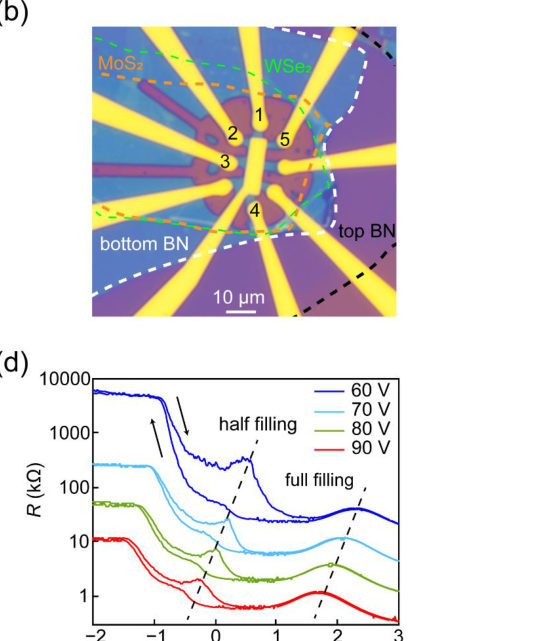 
Fig. 1. (a) Schematic view of the device structure. (b) Optical image of the device. The dashed

📷 Fig 2

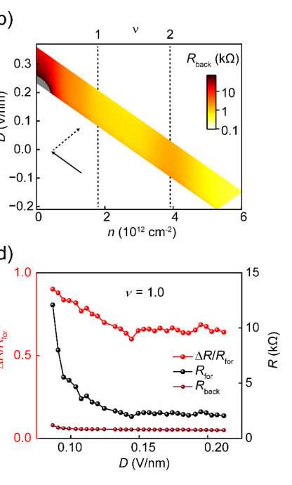 
Fig. 2. (a), (b) Four-terminal resistance as functions of carrier densities and displacement fields

📷 Fig 3

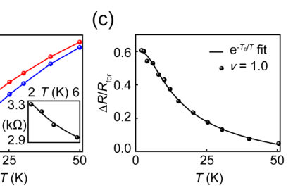 
Fig. 3. (a) Temperature dependent hysteresis at 𝑉bg = 75 𝑉 . The black arrows indicate the

📷 Fig 4

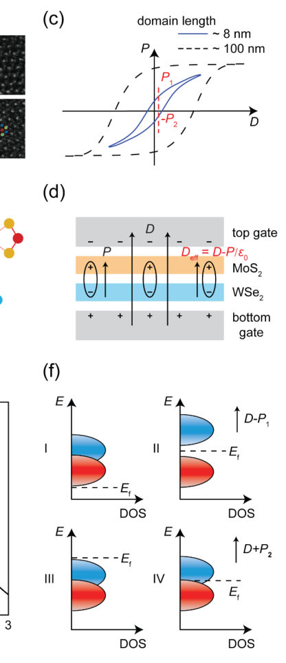 
Fig. 4. (a) TEM image showing high-symmetry stacking regions: AA (atom-on-atom), ABSe (S-

**Summary.** The authors report observing robust, history-dependent resistance hysteresis in a $	ext{MoS}_2/	ext{WSe}_2$ moiré superlattice near half filling. They argue that this effect is enhanced by the coupling between ferroelectric polarization switching and the correlated insulating state of the material. The findings establish a new route for controlling quantum phases using electric fields in 2D heterostructures.

**Why it may be interesting.** This work bridges concepts from strongly correlated electron physics (Hubbard models) with emergent phenomena in 2D van der Waals heterostructures (ferroelectricity), providing a platform for studying field-tunable quantum phases.

Detailed structure

**Main problem.** The study investigates the origin of a prominent, reproducible resistance hysteresis observed near half-filling in a $	ext{MoS}_2/	ext{WSe}_2$ moiré superlattice heterobilayer.

**Main result.** The hysteresis is established to be correlation-enhanced, arising from an intrinsic coupling between the correlated insulating state and the ferroelectric switching mechanism. This effect is strongly dependent on filling factor ($
u=1$) and diminishes with increasing external electric field ($D$).

**Method.** Electrical transport measurements were performed using a four-probe setup on Hall-bar geometry, sweeping gate voltages to control carrier density and applying an out-of-plane displacement field.

**Model / system.** The physical system is a $	ext{MoS}_2/	ext{WSe}_2$ moiré superlattice heterobilayer exhibiting ferroelectricity due to interfacial dipoles. The physics involves correlated insulating states, modeled conceptually by concepts related to the Hubbard model, whose gap size is modulated by external fields and polarization switching.

**Key observables.** Resistance hysteresis ($\Delta R/R_{	ext{for}}$), temperature dependence of hysteresis (decaying exponentially), field-effect mobility ($\mu_{FE}$), and the insulating energy gap ($\Delta$).

**Important parameters / regimes.** Half-filling ($
u=1$), critical temperatures ($T_c \approx 4.4 	ext{ K}$), high mobility ($\sim 17,650 	ext{ cm}^2	ext{V}^{-1}	ext{s}^{-1}$), and the external displacement field $D$.

**Assumptions / limitations.** The hysteresis is attributed to a coupling between ferroelectric polarization switching (modulating the effective field $D_{	ext{eff}}$) and the correlated electronic state undergoing metal-to-insulator transitions.

**Figures summary.** Figures show high mobility measurements, clear resistance hysteresis loops peaking at half-filling, temperature dependence showing insulating behavior below 8 K, and quantitative analysis mapping the strength of hysteresis vs. displacement field.

**Paper structure.** The paper systematically presents transport measurements demonstrating the hysteresis, analyzes its dependence on filling factor ($
u=1$ peak), quantifies the thermal activation gap in the correlated state, and finally links this behavior to the interplay between ferroelectric switching and electronic correlation effects.

Abstract

Ferroelectricity, typically arising from ionic displacements in noncentrosymmetric lattices, enabling applications in memory devices and sensors. Recent advances in two-dimensional materials and van der Waals heterostructures have revealed novel ferroelectric phenomena, including sliding ferroelectricity and correlation-driven ferroelectricity in moire superlattices. In this work, we fabricate and study a MoS2/WSe2 moire superlattice device exhibiting a high field-effect mobility of 17,650 $cm^2V^{-1}s^{-1}$. Electrical transport measurements reveal correlated insulating states accompanied by a prominent and reproducible resistance hysteresis near half filling. Temperature and displacement field dependence further confirms the correlation-enhanced nature of the hysteresis. Our analysis suggests that displacement field-induced metal-to-insulator transition at correlated insulating state coupled with interfacial dipoles enables the observed resistance hysteresis. These results establish correlation enhanced resistance hysteresis near half filling in a MoS2/WSe2 heterobilayer, offering opportunities for exploring emergent quantum phases and device functionalities.

[↑ back to top](#top)

### [Helicity-Resolved Spatiotemporal Mapping of Chiral Plexcitons in Helicoids](http://arxiv.org/abs/2606.09097v1)

**Authors:** Jeong Hyun Han, Sankaran Ramesh, Jaeyeon Jo, Pavel Chabera, Ryeong Myeong Kim, Sung Hoon Cho, In Han Ha, Amitav Sahu, Yoonsang Tak, Jiawei Lv, Miyoung Kim, Ki Tae Nam, Tönu Pullerits  
**Type:** both · **Category:** other · **PDF:** <https://arxiv.org/pdf/2606.09097v1>  
**Analysis basis:** full PDF text, analyzed in chunks
**Topic relevance:** `driven-dissipative phase transition` **3/5** · `interference shaping light` **3/5** · `methods for driven-dissipative` **3/5** · `non-equilibrium dynamics` **2/5** · `non-equilibrium universality` **2/5** · `quantum optics experiment` **2/5** · `Keldysh / 2PI / non-Gaussian methods` **1/5** · `Kondo & dissipative impurity` **1/5** · `analog quantum simulation` **1/5** · `correlated / nonlocal dissipation` **1/5** · `correlated cavity matter` **1/5**

📷 Fig 1

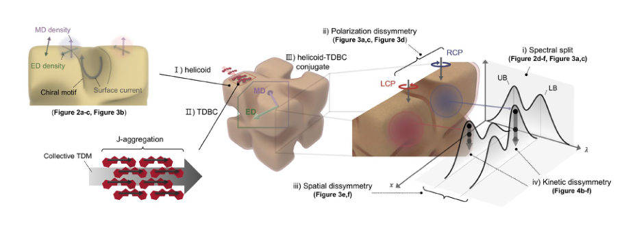 
Figure 1. Rational design of helicoid-TDBC plexcitonic system. Schematic illustration detailing the central

📷 Fig 2

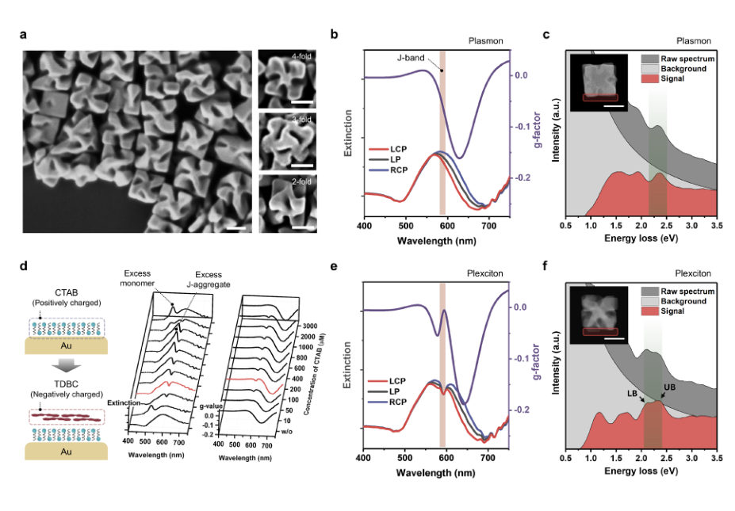 
Figure 2. Realization of helicoid-TDBC plexcitonic system. a, SEM images of helicoids, revealing distinct

📷 Fig 3

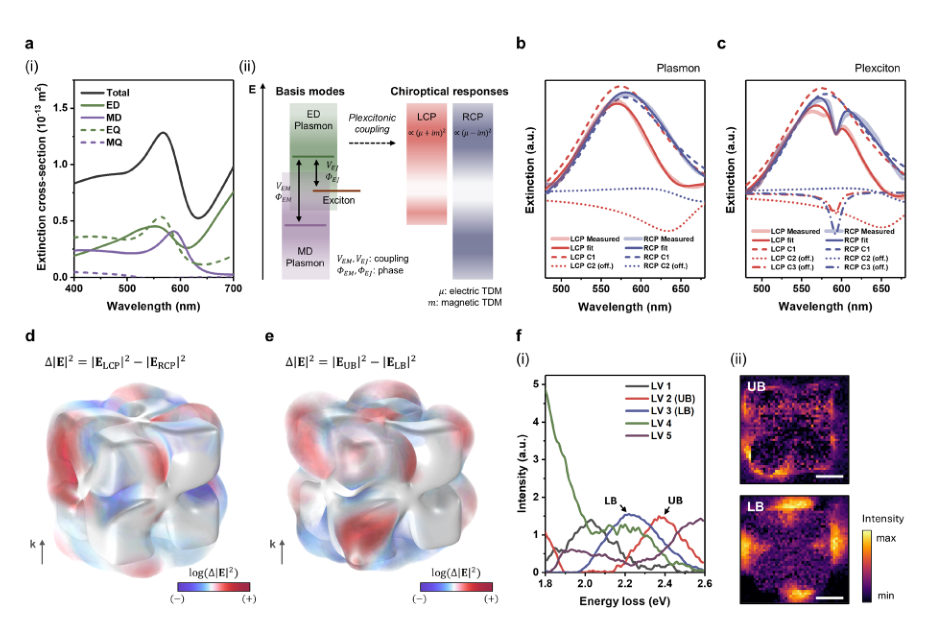 
Figure 3. Macro-to-microscopic characterization of helicoid-TDBC plexcitonic coupling. a, Conceptual

📷 Fig 4

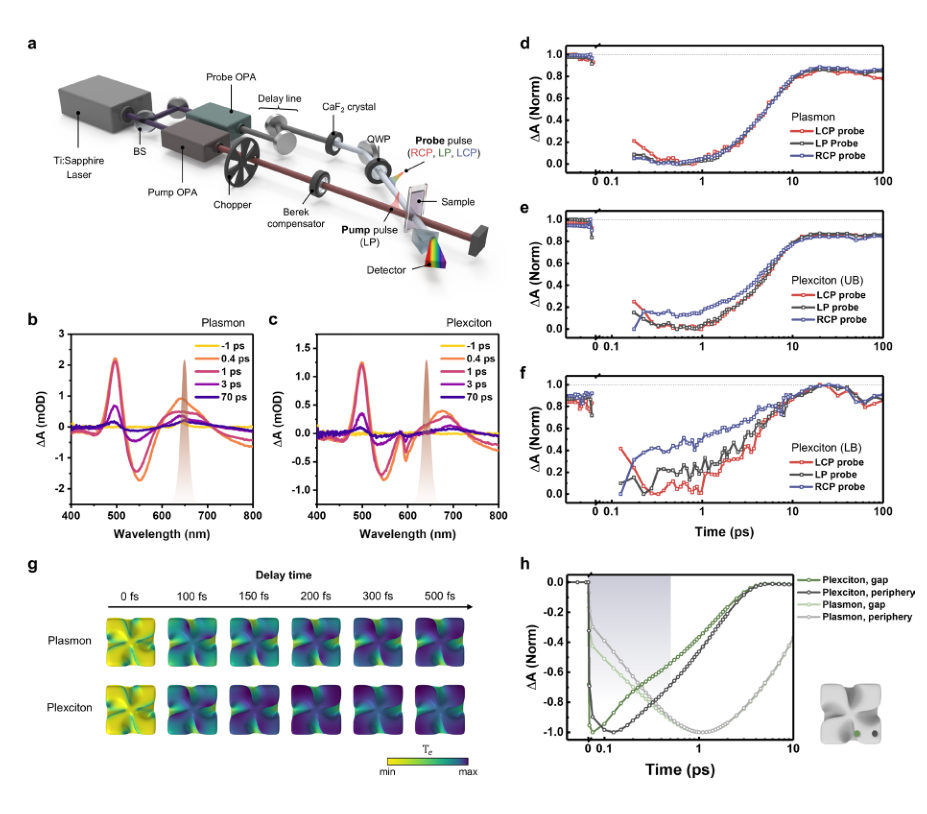 
Figure 4. Resolving and controlling ultrafast dynamics of helicoid-TDBC plexcitonic system. a, Schematic

📷 Fig 5

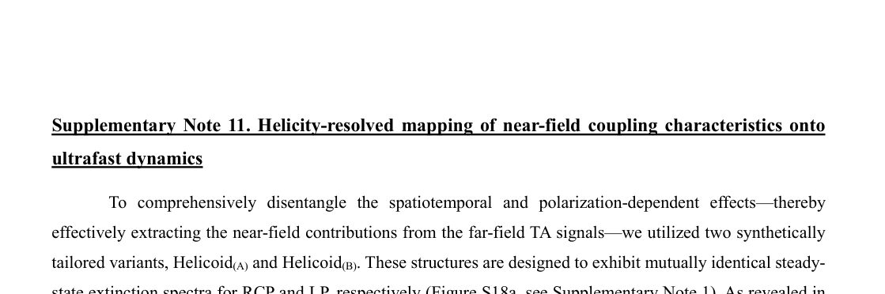 
Figure 3d and schematically illustrated in Figure S18b, although probing these variants with RCP and LP yields

**Summary.** The research investigates chiral plexcitons formed by coupling J-aggregates to gold helicoids. By employing a theoretical Non-Hermitian Hamiltonian and polarization-resolved ultrafast spectroscopy, the authors demonstrate that light's handedness selectively addresses distinct nanoscale energy states. This confirms chirality as a practical control mechanism for steering energy flow and accelerating relaxation dynamics in plasmonic nanostructures.

**Why it may be interesting.** This work provides a powerful demonstration of how light's angular momentum (helicity) can be used as an active knob to spatially and temporally resolve different coupled quantum states in nanoscale optical systems, which is highly relevant for advanced quantum photonics.

Detailed structure

**Main problem.** The core problem is understanding how structural chirality and plasmon-exciton coupling dictate chiroptical spectra and ultrafast energy flow in plexcitonic systems.

**Main result.** Polarization (helicity) acts as a selective control parameter, allowing researchers to probe distinct nanoscale hybrid states—specifically accelerating relaxation pathways localized within the chiral gaps under circularly polarized light.

**Method.** The study combines theoretical modeling using Non-Hermitian Hamiltonians with advanced experimental techniques like polarization-resolved Transient Absorption (TA) spectroscopy and Electron Energy Loss Spectroscopy (EELS).

**Model / system.** The system consists of molecular J-aggregates coupled to intrinsically chiral gold helicoid nanoparticles, forming a plexcitonic structure. The physics is modeled using an extended Non-Hermitian Hamiltonian that incorporates plasmonic Electric Dipole (ED) and Magnetic Dipole (MD) modes alongside the excitonic transition.

**Key observables.** Chiroptical response (CD), spectral splitting into Upper/Lower Branches (UB/LB), polarization dependence of near-field intensity, and ultrafast decay kinetics ($	au$).

**Important parameters / regimes.** Intermediate coupling regime; helicity of light (RCP vs LCP); gap localization; sub-picosecond time scales.

**Assumptions / limitations.** The analysis relies on the NHH framework to dissect spectra and assumes that polarization selectivity in dynamics can reveal underlying near-field spatial asymmetries, even if steady-state spectra are identical.

**Figures summary.** Figures illustrate spectral splitting (UB/LB), field intensity mapping showing gap localization under RCP, and time-resolved TA maps demonstrating accelerated decay kinetics specifically when probing the chiral gap region with circularly polarized light.

**Paper structure.** The paper progresses from establishing the physical system and theoretical framework (NHH) to characterizing steady-state chiroptical signatures via EELS/spectroscopy. It then moves to ultrafast dynamics, using polarization-resolved TA spectroscopy to demonstrate that helicity selectively probes distinct energy relaxation pathways within the chiral gap.

Abstract

Plasmon-exciton hybrids, or plexcitons, offer deeply subwavelength light-matter interactions with versatile pathways for energy redistribution. Incorporating chirality into such systems is particularly compelling, enabling spin-sensitive optical functionality that can operate on ultrafast timescales and within ultracompact volumes. Despite recent progress in chiral plexcitonic systems, how structural chirality and plasmon-exciton coupling determine chiroptical spectra and ultrafast energy flow remains elusive. Here we realize chiral plexcitons by functionalizing intrinsically chiral gold helicoid nanoparticles with molecular J-aggregates. Within a non-Hermitian framework, we trace the microscopic origin of the helicoid chiroptical response and its coupling to the excitonic transition, revealing how the helicity of light selectively addresses distinct hybrid responses. At the spatiotemporal extreme, we find that the gap-localized response not only enhances polarization-sensitive contrast but also strengthens the local hybrid interaction, leading to accelerated ultrafast relaxation. Together, these space-, time-, and polarization-resolved measurements provide a physically grounded and experimentally benchmarked picture of chiral plexcitonic coupling, identifying chirality as a practical control parameter for selectively steering nanoscale energy pathways and dynamics.

[↑ back to top](#top)

### [Nearly ballistic transport and high magnetic-field sensitivity in a $\text{Bi}_4\text{Br}_4$ topological Josephson weak link](http://arxiv.org/abs/2606.08333v1)

**Authors:** Enamul Haque, Javier Cerrillo  
**Type:** theory · **Category:** other · **PDF:** <https://arxiv.org/pdf/2606.08333v1>  
**Analysis basis:** full PDF text, analyzed in chunks
**Topic relevance:** `Keldysh / 2PI / non-Gaussian methods` **3/5** · `analog quantum simulation` **3/5** · `spintronics-quantum-optics interface` **3/5** · `Kondo & dissipative impurity` **2/5** · `methods for driven-dissipative` **2/5** · `non-equilibrium dynamics` **2/5** · `correlated / nonlocal dissipation` **1/5** · `driven-dissipative phase transition` **1/5** · `entanglement & information structure` **1/5** · `exotic spin models in light-matter` **1/5** · `non-equilibrium universality` **1/5**

📷 Fig 1

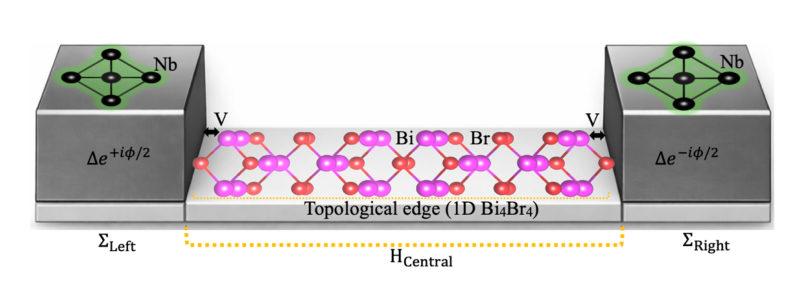 
Figure 1. Schematic illustration of the Nb-1D Bi4Br4–Nb weak-link device and the approach used for modeling it.

📷 Fig 2

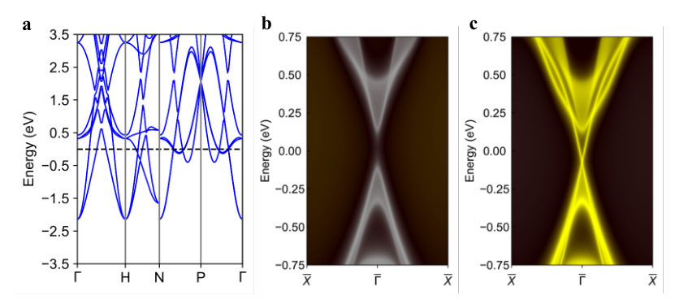 
Figure 2. Bulk electronic band structure of the constituent materials Nb and the one-dimensional electronic dispersion of Bi4Br4.

📷 Fig 3

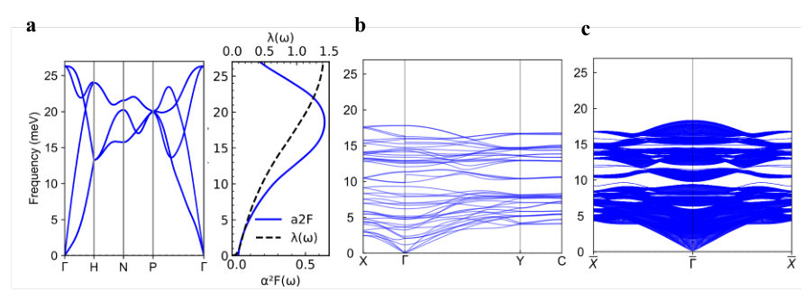 
Figure 3. Bulk phononic band structure of constituent materials Nb, and 1D phononic dispersion of Bi4Br4.

📷 Fig 4

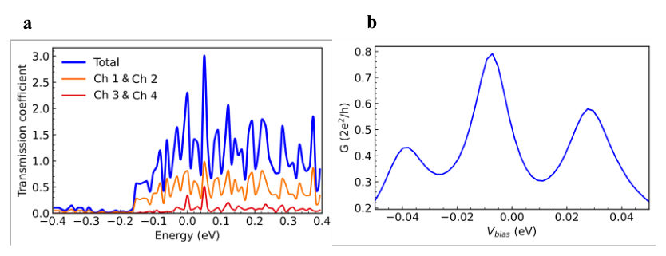 
Figure 4. Calculated normal-state transmission and superconducting subgap conductance of Nb—1D Bi4Br4—Nb weak link.

📷 Fig 5

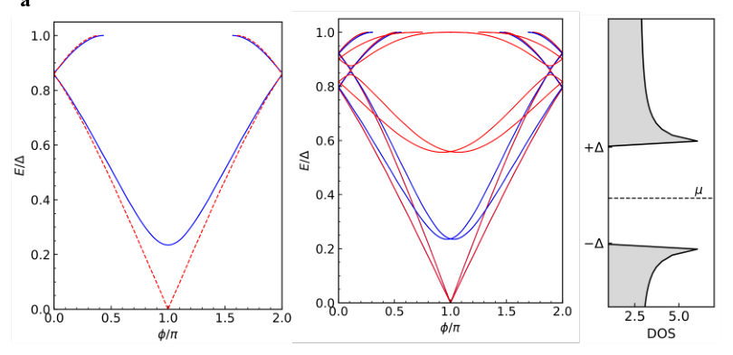 
Figure 5. Andreev bound states of Nb—1D Bi4Br4—Nb weak link, considering both single-channel and multichannel models.

**Summary.** This work theoretically investigates using a topological insulator nanoribbon (Bi4Br4) as the weak link in a superconducting Josephson junction. By calculating the Andreev bound state spectrum and current-phase relation, the authors demonstrate that this structure achieves nearly ballistic transport. This results in a highly phase-sensitive supercurrent, positioning it as a promising platform for next-generation on-chip magnetic sensors.

**Why it may be interesting.** While focused on condensed matter superconductivity, the strong reliance on topological edge states and quantum confinement effects in a mesoscopic junction makes it relevant to open quantum systems modeling where boundary conditions dictate macroscopic behavior.

Detailed structure

**Main problem.** The goal is to design highly sensitive, compact magnetic-field sensors using superconducting weak links that exploit topological edge states for ballistic transport.

**Main result.** The Nb-1D Bi4Br4-Nb junction exhibits a non-sinusoidal current-phase relation with high forward skewness, indicating strong phase sensitivity suitable for advanced magnetic sensing applications.

**Method.** Theoretical calculations employing Density Functional Theory (DFT) and the Non-Equilibrium Green's Function (NEGF) formalism are used to model quasiparticle transport and Andreev bound states (ABS).

**Model / system.** The system is a Josephson junction formed by superconducting Niobium (Nb) electrodes connected via a one-dimensional nanoribbon of the topological insulator Bi4Br4. The physics relies on proximity-induced superconductivity into the topologically protected edge states.

**Key observables.** Non-sinusoidal Current-Phase Relation (CPR), high forward skewness (+1.74), and phase sensitivity to external magnetic fields.

**Important parameters / regimes.** The ratio of junction length to coherence length ($\lambda = L/\xi$), the superconducting gap ($\Delta \approx 4$ meV for Nb), and the transmission coefficient ($	au$).

**Assumptions / limitations.** The topological edge states are treated as normal metallic channels exhibiting ballistic transport, and the bulk superconductors (Nb) are modeled using conventional BCS-like s-wave pairing.

**Figures summary.** Figures illustrate ABS energy-phase dispersion curves showing thickness dependence and avoided crossings; other figures map out the CPR vs. phase ($\varphi$) at various magnetic fields.

**Paper structure.** The paper progresses from establishing the need for high-transparency weak links, detailing the theoretical framework (DFT/Wannier basis), calculating the ABS spectrum, deriving the Josephson current dependence on phase and thickness, and finally analyzing how external magnetic fields tune this phase sensitivity.

Abstract

Superconducting weak links with high transparency offer an appealing approach for designing compact magnetic-field sensors, as their phase-dependent Andreev bound-state (ABS) spectrum produces a strong flux-to-signal response with minimal dissipation. One way to achieve ballistic transport in the weak link is to use the edge states of topological insulators, since these states resist backscattering and provide a unique path to developing topological insulator-based weak-link devices for highly efficient magnetic-field sensing. Building on this, we propose a weak-link device using superconducting Nb electrodes and a nanoribbon of $\text{Bi}_4\text{Br}_4$ as the normal region, forming a Nb-1D (one-dimensional) $\text{Bi}_4\text{Br}_4$-Nb Josephson junction. We develop first-principles tight-binding Hamiltonians and orbital-resolved interface couplings in the Wannier basis, including spin-orbit coupling, based on density functional theory (DFT) calculations. The Eliashberg spectral function of bulk Nb, obtained via density functional perturbation theory (DFPT), indicates an electron-phonon coupling strength of 1.19 and a transition temperature of about 9 K, aligning well with conventional superconductivity in Nb. The subgap conductance is primarily influenced by Andreev processes. The ABS spectrum leads to a non-sinusoidal current-phase relation (CPR) with high forward skewness ($+$1.74) and phase sensitivity to the magnetic field. Overall, our findings suggest that the Nb-1D $\text{Bi}_4\text{Br}_4$-Nb weak link is a promising platform for on-chip superconducting magnetic sensors, compatible with scalable nanofabrication and broader development of topological-superconductor hybrid electronics.

[↑ back to top](#top)

### [Superconducting diode effect in magnetic superconductors realized by nonreciprocal domain-wall dynamics](http://arxiv.org/abs/2606.08999v1)

**Authors:** Dong Hui Han, Suk Bum Chung, Se Kwon Kim  
**Type:** theory · **Category:** other · **PDF:** <https://arxiv.org/pdf/2606.08999v1>  
**Analysis basis:** full PDF text, analyzed in chunks
**Topic relevance:** `exotic spin models in light-matter` **3/5** · `non-equilibrium dynamics` **3/5** · `spintronics-quantum-optics interface` **3/5** · `driven-dissipative phase transition` **2/5** · `non-equilibrium universality` **2/5** · `Frenkel-Kontorova` **1/5** · `Keldysh / 2PI / non-Gaussian methods` **1/5** · `analog quantum simulation` **1/5** · `correlated / nonlocal dissipation` **1/5** · `methods for driven-dissipative` **1/5**

📷 Fig 1

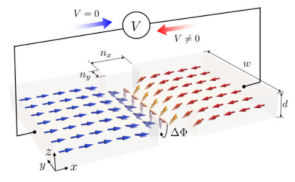 
FIG. 1. Schematics of the SDE induced by the DW precession ∆˙Φ in the nonreciprocal WB. In the thin film of width w and thickness d, the DW is pinned at a notch characterized by the geometric parameters nx and ny. The measured voltage V originates from the emergent electric fields [Eqs. (13) and (34)]. For the bias current of the equal magnitude, the volt- age V across the DW vanishes for one direction (right in the figure) and is finite for the other direction (left in the figure), thereby giving rise to the diode effect.

📷 Fig 2

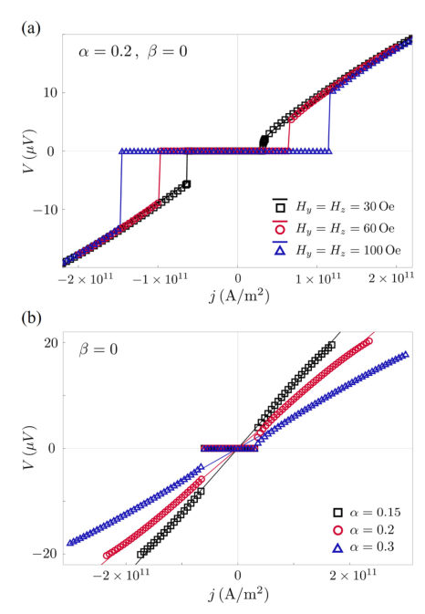 
FIG. 2. I-V curves of a pinned DW in a notch obtained from simulations with Hy = Hz and β = 0. (a) shows the dependence on the magnetic field intensity where α = 0.2. The solid lines represent the numerical solutions from the EOMs [Eqs. (17) and (18)], which are used to determine kp = 0.45 × 10−3 N/m. (b) shows the dependence on α where Hy = Hz = 30 Oe. The solid lines represent ⟨V ⟩= −2P⟨˙Φ⟩ [Eqs. (13) and (19)]. For α = 0.15 and α = 0.2, the DW is depinned from the notch at jdep = 1.74 × 1011A/m2 and jdep = 2.35 × 1011A/m2, respectively.

📷 Fig 3

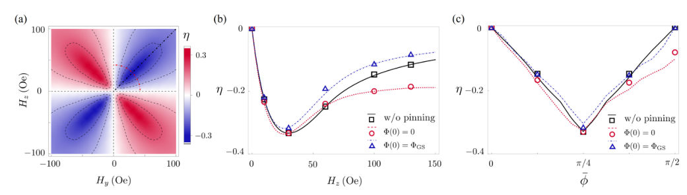 
FIG. 3. Plots of the diode efficiency η [Eq. (7)] for various magnetic field conditions. (a) Numerical results obtained from the EOMs [Eqs. (5) and (6)] for |Hy|, |Hz| ≤100 Oe, where α = 0.2 and β = 0. The black dashed lines indicate contours of η = 0, 0.1, 0.2. (b) and (c) present comparisons with micromagnetic simulations for the black dash-dotted line Hy = Hz &gt; 0 and the red dash-dotted line (Hy, Hz) = √

📷 Fig 4

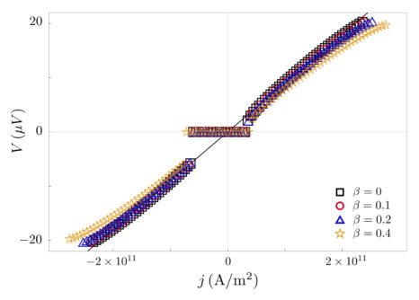 
FIG. 4. I-V curves of a pinned DW for various β obtained from simulations with Hy = Hz = 30 Oe and α = 0.2. The black solid line represents ⟨V ⟩= −2P⟨˙Φ⟩[Eqs. (13) and (19)].

📷 Fig 5

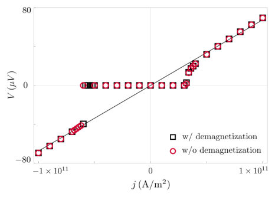 
FIG. 5. I-V curves showing the effect of demagnetization on the precessional dynamics of a DW pinned at a notch. Simulations are performed with Hy = Hz = 226 Oe and M = 40 kA/m, while all other material parameters are the same as those used in the main text. The square symbols rep- resent the case including the demagnetization effect, whereas the circular symbols correspond to the case neglecting demag- netization but including local hard-axis anisotropy. The black solid line represents ⟨V ⟩= −2P⟨˙Φ⟩[Eqs. (13) and (19)].

**Summary.** This paper theoretically establishes that the superconducting diode effect can arise intrinsically in ferromagnetic superconductors due to the nonreciprocal dynamics of magnetic domain walls. By analyzing the Walker breakdown mechanism, the authors derive criteria showing how this topological defect acts as a nanoscale platform for nonlinear superconducting functionalities without needing complex heterostructures.

**Why it may be interesting.** This work connects topological defects (DWs) and fundamental magnetic dynamics (LLG equation) directly to macroscopic quantum phenomena (superconductivity), providing a mechanism for spintronic functionality within a single material system, which is highly relevant for condensed matter theorists studying emergent gauge fields and non-equilibrium superconductivity.

Detailed structure

**Main problem.** The study demonstrates how the superconducting diode effect (SDE) can emerge intrinsically from nonreciprocal dynamics of magnetic domain walls (DWs) within ferromagnetic superconductors (FMSCs). This mechanism circumvents the need for complex engineered heterostructures.

**Main result.** Nonreciprocal Walker breakdown in DW motion leads to asymmetric current-voltage characteristics, establishing a superconducting diode effect with a maximum efficiency ($\eta_{max}$) of 1/3. The analysis confirms that topological defects can serve as an intrinsic platform for nonlinear nonreciprocal functionalities.

**Method.** The authors use analytical derivations based on the Landau-Lifshitz-Gilbert (LLG) equation and Ginzburg-Landau free energy functionals, extending models from simple ferromagnets to FMSCs via emergent gauge fields. These theoretical results are validated against micromagnetic simulations.

**Model / system.** The system is a magnetic superconductor containing domain walls whose dynamics are governed by coupled equations derived from minimizing the superconducting and magnetic free energies. The model incorporates effects like pinning potentials, demagnetization, and spin-momentum coupling inherent to FMSCs.

**Key observables.** Superconducting Diode Effect (SDE) characterized by nonreciprocal critical supercurrent densities ($j_{\pm c}$) and diode efficiency ($\eta$).

**Important parameters / regimes.** External magnetic fields ($H_y, H_z$), Gilbert damping parameter ($\alpha$), pinning strength ($k_p$), and the condition for maximum efficiency ($H_{max} = \sqrt{2K_1}/\pi M$).

**Assumptions / limitations.** The analysis often relies on the adiabatic limit (neglecting nonadiabatic effects) and assumes specific field configurations ($H_y=H_z>0$) to maximize the effect.

**Figures summary.** Figures illustrate schematic representations of SDE via DW precession, I-V curves showing asymmetric behavior dependent on magnetic fields, and comparisons between theoretical predictions and micromagnetic simulations for $\eta$.

**Paper structure.** The paper progresses by first establishing the nonreciprocal Walker breakdown in simple ferromagnets, then extending this analysis to incorporate superconducting effects using a Ginzburg-Landau formalism, culminating in the derivation of criteria for realizing the SDE in FMSCs.

Abstract

A superconducting diode effect is shown to arise in ferromagnetic superconductors through the nonreciprocal dynamics of magnetic domain walls. Specifically, we show that current-driven dynamics of a magnetic domain wall under a certain external field can exhibit a nonreciprocal Walker breakdown, possessing two distinct direction-dependent critical currents beyond which the domain wall precesses continuously. In ferromagnetic superconductors, the constant rotation of a domain wall is shown to give rise to phase slips, opening up dissipation channels, whereby the nonreciprocal Walker breakdown is mapped to the superconducting diode effect. For the nonreciprocal Walker breakdown of a magnetic domain wall, we analytically examine its dependence on the magnetic field and the Gilbert damping and verify the theoretical results with micromagnetic simulations. We then extend the analysis to ferromagnetic superconductors by considering additional effects from the superconductivity and identify criteria for experimental conditions to realize the predicted superconducting diode effect. Our work demonstrates that topological defects, such as domain walls, in magnetic superconductors can serve as an intrinsic nanoscale platform for nonlinear nonreciprocal superconducting functionalities within a single homogeneous material, circumventing the need for complicated engineered heterostructures and thereby enabling the miniaturization of superconducting devices down to the nanometer scale that is challenging to achieve with conventional Josephson junctions.

[↑ back to top](#top)

### [Protein Dynamics Beyond Structure Prediction](http://arxiv.org/abs/2606.08647v1)

**Authors:** Juliette Griffié, Sviatlana Shashkova, Antonio Ciarlo, Sreekanth K. Manikandan, Claes Andréasson, Malin Bäckström, Tristan Bereau, Hjalmar Brismar, Carlos Bustamante, Marta Carroni, Roberto Covino, Andreas Dahlin, Sebastian Deindl, Lucie Delemotte, Arne Elofsson, John Eriksson, Giovanna Fragneto, Anders Gunnarsson, Per Hammarström, Caroline Ingre, Christian Kaiser, Petronella Kettunen, Mark C. Leake, Benjamin Loos, Anna Månberg, Antonia S. J. S. Mey, Richard Neutze, Thomas Nyström, Karl Palmås, Charley Schaefer, Markus J. Tamás, Nicola Ticozzi, Tomás S. Pilvelic, Jacopo Sacquegno, B. M., Tijms, Gunnar von Heijne, Björn Wallner, Vitali Zhaunerchyk, Simon Olsson, Joana B. Pereira, Julia Fernandez-Rodriguez, Fredrik Westerlund, Giovanni Volpe  
**Type:** both · **Category:** statistical mechanics · **PDF:** <https://arxiv.org/pdf/2606.08647v1>  
**Analysis basis:** full PDF text, analyzed in chunks
**Topic relevance:** `methods for driven-dissipative` **3/5** · `non-equilibrium dynamics` **3/5** · `analog quantum simulation` **2/5** · `driven-dissipative phase transition` **2/5** · `Keldysh / 2PI / non-Gaussian methods` **1/5** · `correlated / nonlocal dissipation` **1/5** · `entanglement & information structure` **1/5** · `measurement-induced transitions` **1/5** · `non-equilibrium universality` **1/5** · `quantum measurements` **1/5** · `scars & prethermalization` **1/5**

📷 Fig 1

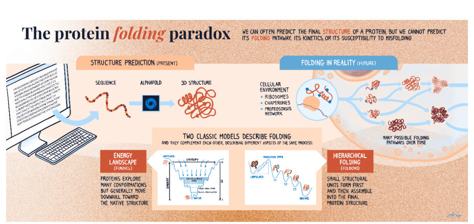 
Figure 1. The protein folding paradox. Currently, models exist that describe protein folding. However, despite the advances in experimental methods and AI towards revealing protein structure, we are still lacking a detailed understanding of dynamics and precise folding pathways. Graphics by J. Saquegno.

📷 Fig 2

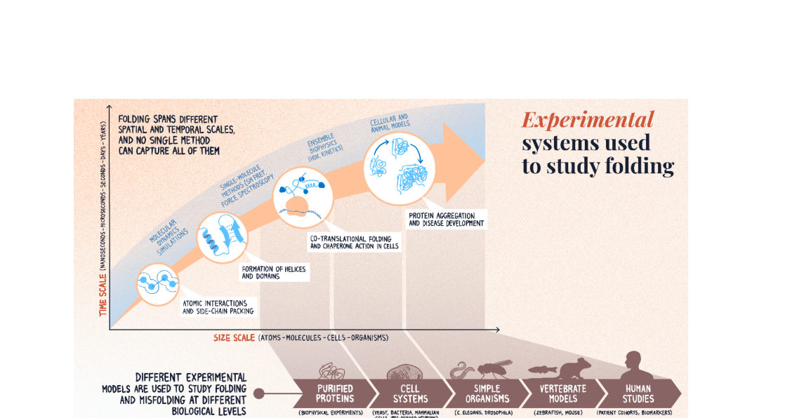 
Figure 2. Experimental systems in folding studies. Mechanistic determinants of folding pathways cannot be separated from the context in which folding occurs. Hence, folding must be understood simultaneously at a molecular, cellular, and organismal levels. However, bridging time and size scales remains one of the central challenges in developing a predictive theory of folding. Graphics by J. Saquegno.

📷 Fig 3

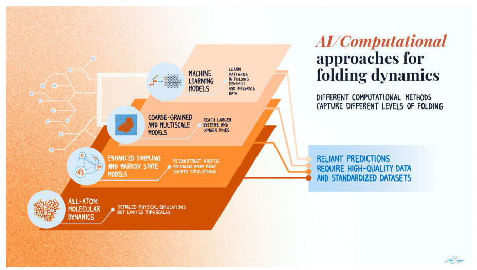 
Figure 3. Computational advances in protein folding studies. Current approaches address multiple levels of resolution and methodological frameworks, however, none of the existing methods provides quantitative and dynamic information of the relationship between protein sequence and folding mechanism at all-atom resolution and at scale. Graphics by J. Saquegno.

📷 Fig 4

 
Figure 4. A roadmap towards understanding protein folding dynamics. Graphics by J. Saquegno.

**Summary.** This review argues that predicting protein function requires understanding its dynamic folding pathways and kinetics, not just its final static structure. It outlines a roadmap for integrating single-molecule experiments with multiscale computational models to build predictive frameworks. The ultimate goal is to achieve quantitative control over molecular self-assembly for therapeutic design.

**Why it may be interesting.** While focused on biomolecules, the underlying physics—modeling complex systems traversing high-dimensional energy landscapes with stochastic transitions—shares conceptual parallels with non-equilibrium statistical mechanics and open quantum system dynamics.

Detailed structure

**Main problem.** The field needs to move beyond predicting static protein structures to quantitatively understanding the dynamic, stochastic pathways of folding, conformational changes, and self-assembly.

**Main result.** A predictive framework is required that integrates high-resolution single-molecule measurements with multiscale modeling to map sequence information onto kinetic energy landscapes.

**Method.** The paper reviews a roadmap combining time-resolved single-molecule experiments (e.g., force spectroscopy) with advanced computational techniques like Markov State Models and machine learning.

**Model / system.** The system is the protein folding process, viewed as traversing a rugged free-energy landscape characterized by multiple metastable intermediate states and transition barriers.

**Key observables.** Folding trajectories, kinetic rates (folding/unfolding), barrier heights, conformational ensembles, and kinetic partitioning between functional and misfolded states.

**Important parameters / regimes.** Temperature, force applied (in single-molecule experiments), chaperone concentration, and the time scale separation across different physical processes.

**Assumptions / limitations.** The central assumption is that protein function depends on dynamic pathways and ensemble sampling, not just the lowest energy static structure. A major limitation noted is the lack of standardized data infrastructure for kinetics.

**Figures summary.** Figures illustrate a roadmap showing the necessary transition from static structure prediction to quantitative pathway prediction by integrating diverse experimental and computational methods.

**Paper structure.** The paper establishes the limitations of current structural biology (static endpoints), reviews existing dynamic techniques across multiple scales, proposes an iterative cycle where experiments constrain models, and outlines the need for standardized data infrastructure to achieve predictive kinetics.

Abstract

The ability to predict protein three-dimensional structures from amino acid sequences is a landmark achievement in molecular biology, where recent deep learning approaches such as AlphaFold are the culmination of decades of work. Yet, the quantitative understanding of how protein sequences give rise to dynamic conformational changes and higher-order assemblies remains unsolved. Folding and conformational states are dynamic, stochastic processes, shaped by sequence, energy, co-translational constraints, chaperone machineries, and the physicochemical conditions of the cellular environment. Recent advances now position the field to move beyond static structural endpoints toward a mechanistic understanding of folding dynamics in living systems. Single-molecule techniques enable time-resolved observation of folding trajectories and intermediate states hitherto hidden by traditional structural biology approaches, while computational innovations and data-driven approaches offer new ways to integrate heterogeneous data across scales. In this Roadmap, we review the current conceptual landscape of protein folding, examine the experimental and theoretical gaps that remain, and discuss emerging strategies that integrate high-resolution measurements with multiscale modeling. We outline a roadmap toward a quantitative and predictive science of protein folding dynamics, conformational kinetics, and macromolecular self-assembly. Realizing this vision would transform our understanding of the dynamics of molecular self-organization, from the folding of individual polypeptides to the emergence of dynamic macromolecular complexes. This will enable rational control of folding and misfolding in health and disease, extend protein engineering principles beyond static structural design, and establish a mechanistic foundation for predictive and personalized interventions in proteostasis-related disorders.

[↑ back to top](#top)

### [Coherent control of chirality in Weyl semimetals](http://arxiv.org/abs/2606.07921v1)

**Authors:** Amar Bharti, Margarita Khokhlova, Misha Ivanov, Gopal Dixit  
**Type:** theory · **Category:** other · **PDF:** <https://arxiv.org/pdf/2606.07921v1>  
**Analysis basis:** full PDF text, analyzed in chunks
**Topic relevance:** `Keldysh / 2PI / non-Gaussian methods` **3/5** · `methods for driven-dissipative` **3/5** · `spintronics-quantum-optics interface` **3/5** · `driven-dissipative phase transition` **2/5** · `non-equilibrium dynamics` **2/5** · `exotic spin models in light-matter` **1/5** · `interference shaping light` **1/5** · `non-equilibrium universality` **1/5**

📷 Fig 1

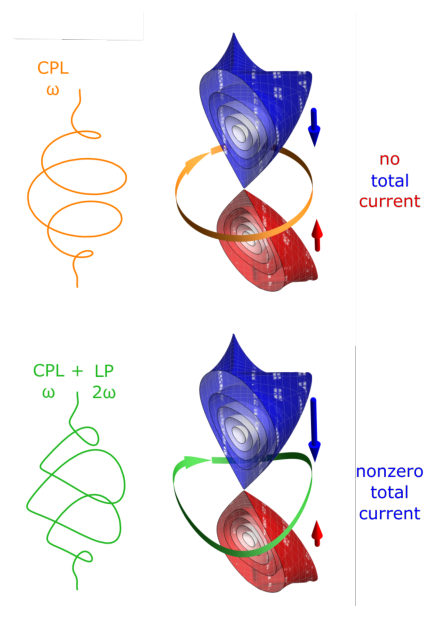 
FIG. 1. Schematics for the Weyl nodes driven by single- and two-colour field. A single-

📷 Fig 2

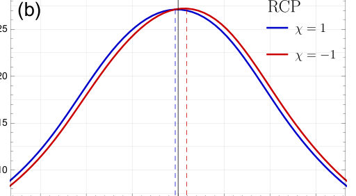 
FIG. 2. Conduction band population and its asymmetry in single-colour field. Residual

📷 Fig 3

 
FIG. 3. Conduction band population and its asymmetry in two-colour field. (a) Con-

📷 Fig 4

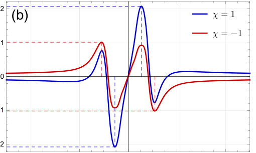 
Figure 3(b) shows that even a weak 2ω field induces a pronounced population asymme-

📷 Fig 5

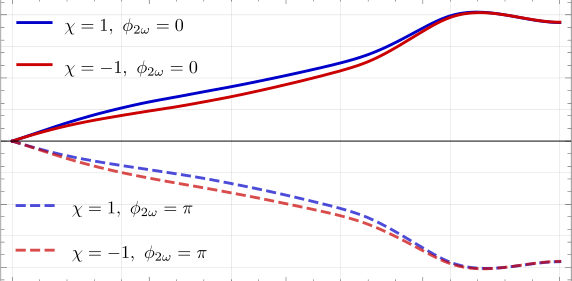 
FIG. 4. Chirality of the photocurrent. Normalised photocurrent JDC around both Weyl nodes

**Summary.** The paper demonstrates how using structured two-color light fields (combining $\omega$ CPL and $2\omega$ LP) can break the inherent symmetry of Weyl semimetals. This symmetry breaking allows for the selective excitation of opposite chirality nodes, resulting in a controllable, non-zero net photocurrent that is tunable by the relative phase and strength of the two laser colors.

**Why it may be interesting.** This work provides an explicit quantum optical control scheme for manipulating electronic chiral currents in topological materials, which is highly relevant to advanced optoelectronics and spintronics.

Detailed structure

**Main problem.** The primary goal is to achieve selective excitation of individual Weyl nodes in Weyl semimetals to generate a controllable net photocurrent, overcoming the natural cancellation from opposite chirality pairs.

**Main result.** A combination of circularly-polarized ($\omega$) and phase-locked linearly-polarized ($2\omega$) light fields breaks inversion symmetry, inducing a measurable, sign-tunable, and chirality-dependent net photocurrent.

**Method.** The analysis uses the semiconductor Bloch equations solved in the Houston basis to model carrier dynamics under time-dependent electromagnetic fields.

**Model / system.** The system is an inversion-symmetric Weyl semimetal described by low-energy Hamiltonians near the nodes. The dynamics are driven by a total vector potential combining CPL ($\omega$) and LP ($2\omega$) components.

**Key observables.** Net photocurrent ($J_{DC}$), current asymmetry ($\Delta J = J_{LCP} - J_{RCP}$), and population redistribution parameter ($\eta$).

**Important parameters / regimes.** Relative field strength of the $2\omega$ field ($eta$) and its relative phase ($\phi_{2\omega}$). Optimal chiral selectivity is found in an intermediate regime ($0.2 \lesssim eta \lesssim 1.6$).

**Assumptions / limitations.** The analysis relies on modeling the system using low-energy Hamiltonians near the Weyl nodes and solving the quantum master equation.

**Figures summary.** Figures illustrate that single-color CPL light yields zero net current, while the two-color field generates a nonzero photocurrent. Specifically, Fig. 4 shows $J_{DC}$ reversing sign as $\phi_{2\omega}$ changes from $0^\circ$ to $180^\circ$, confirming chiral control.

**Paper structure.** The paper establishes the problem of current cancellation in Weyl semimetals and introduces the two-color field mechanism. It details the theoretical framework using Bloch equations, demonstrates how symmetry breaking leads to chirality-dependent population asymmetry ($\eta$), and quantifies this effect through a controllable net photocurrent ($J_{DC}$).

Abstract

Weyl fermions in inversion-symmetric Weyl semimetals occur in pairs of opposite chirality, leading to symmetric optical responses under circularly-polarised light and a vanishing net photocurrent. Here, we show that tailored two-colour light fields break this symmetry and enable selective excitation of individual Weyl nodes. The interference between a circularly-polarised $ω$ field and a phase-locked linearly-polarised $2ω$ field generates a chirality-dependent redistribution of carriers in momentum space, resulting in a nonzero controllable photocurrent. We demonstrate that both the magnitude and sign of the photocurrent can be tuned via the relative phase and field strength of the two colours, and identify an optimal regime in which chiral selectivity is maximised. Our results establish a general route to optically-controlled chiral charge dynamics in Weyl semimetals using polarisation-structured light.

[↑ back to top](#top)

### [Equilibrium spin currents in altermagnet junctions: Josephson-like and anomalous transport](http://arxiv.org/abs/2606.07983v1)

**Authors:** Abhiram Soori  
**Type:** theory · **Category:** other · **PDF:** <https://arxiv.org/pdf/2606.07983v1>  
**Analysis basis:** full PDF text, analyzed in chunks
**Topic relevance:** `spintronics-quantum-optics interface` **3/5** · `Keldysh / 2PI / non-Gaussian methods` **2/5** · `analog quantum simulation` **2/5** · `driven-dissipative phase transition` **2/5** · `methods for driven-dissipative` **2/5** · `Kondo & dissipative impurity` **1/5** · `exotic spin models in light-matter` **1/5** · `non-equilibrium dynamics` **1/5** · `non-equilibrium universality` **1/5**

📷 Fig 1

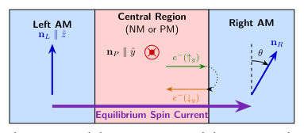 
FIG. 1. Schematic diagram of the magnetic heterostructure. The setup consists of a central region (either an NM or a PM) sandwiched between two AMs with a relative N´eel vector angle θ. This phase-like parameter θ governs the flow of an equilibrium spin current through the junction, establishing a spintronic analog to the conventional Josephson effect. The two AMs have their N´eel vectors pointing in xz-plane, whereas the N´eel vector of the central PM points along y-direction.

📷 Fig 2

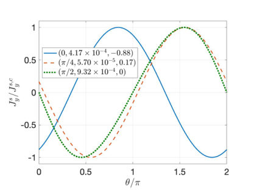 
FIG. 3. ESC as a function of the relative angle θ between the N´eel vectors of the two AMs in an AM-PM-AM junction. Note the presence of a non-zero anomalous ESC, Js,a y , at θ = 0. The legend indicates the values of (ϕ, Js,c y , Js,a y /Js,c y ) for each respective curve. Note that anomalous ESC vanishes for ϕ = π/2 due to restored inversion symmetry along x- direction. System parameters are set to: La = 20, Lp = 10, Ly = 10, ta = 0.5t, tl = 0.2t, tr = 0.1t, tp = 0.5t, and f = 0.5.

📷 Fig 3

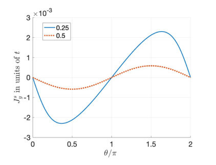 
FIG. 2. Equilibrium spin current (ESC) as a function of the relative angle between the N´eel vectors of the two AMs in an AM-NM-AM junction. The various curves correspond to different filling factors f, as indicated in the legend. System parameters are set to: La = 20, Lp = 10, Ly = 10, ta = 0.5, tl = 0.2t, tr = 0.1t, and tp = 0.

📷 Fig 4

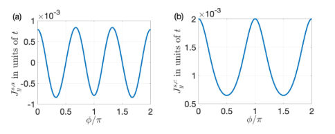 
FIG. 4. (a) Anomalous ESC versus ϕ the angle made by the crystallographic axis along which the band bottoms for the two spin sectors are separated in PM with x-direction (b) Crit- ical current versus ϕ. Parameters are same as in Fig. 3, except f = 0.25.

📷 Fig 5

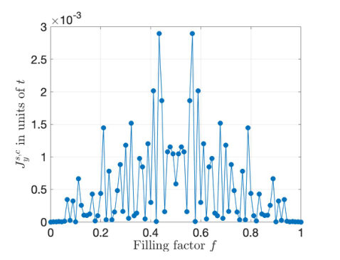 
FIG. 5. Critical ESC versus filling factor. Parameters are same as in Fig. 2.

**Summary.** This theoretical work explores equilibrium spin currents in altermagnet junctions using a tight-binding model. It distinguishes between conventional, angle-dependent Josephson-like transport across normal metals and an anomalous current induced by p-wave magnets. The findings highlight that symmetry breaking mechanisms can enable dissipationless spin flow even when magnetic alignment is perfect.

**Why it may be interesting.** While focused on condensed matter magnetism, the study of dissipationless spin currents and phase-tunable transport mechanisms in novel magnetic materials like altermagnets has strong parallels with engineered superconducting junctions studied in AMO physics (e.g., Josephson effect).

Detailed structure

**Main problem.** The study investigates the emergence of equilibrium spin currents (ESCs) in altermagnet junctions, contrasting conventional Josephson-like transport with anomalous spin current flow.

**Main result.** Anomalous ESCs can be induced by replacing a normal metal spacer with a p-wave magnet, allowing finite spin current even when the magnetic order parameters are perfectly aligned. The critical current also exhibits mesoscopic quantum size effect fluctuations.

**Method.** The investigation uses theoretical calculations based on a tight-binding lattice model to diagonalize the full Hamiltonian and calculate the expectation value of the spin current operator over occupied states.

**Model / system.** The system models two-dimensional Altermagnet (AM) heterostructures connected by a central region, which can be either a Normal Metal (NM) or a p-wave Magnet (PM). The physics is governed by spin-dependent hopping terms and the relative angle ($	heta$) between the AM Néel vectors.

**Key observables.** Equilibrium Spin Current (ESC), specifically $\sigma_y$-polarized, and its dependence on the relative angle ($	heta$), PM angle ($\phi$), and band filling ($f$).

**Important parameters / regimes.** Relative angle ($	heta$) between AM Néel vectors; p-wave magnet angle ($\phi$); electron filling fraction ($f$).

**Assumptions / limitations.** The analysis assumes spin remains a good quantum number in the central scattering region, and it models the system using a tight-binding lattice approach.

**Figures summary.** Figures illustrate the dependence of ESC on $	heta$ for both NM (Josephson-like) and PM (anomalous) spacers. Other figures show the dependence on the PM angle ($\phi$) and pronounced fluctuations versus band filling ($f$).

**Paper structure.** The paper systematically analyzes the spin current in AM-NM-AM junctions to establish Josephson-like behavior, then extends the model to AM-PM-AM junctions to demonstrate the anomalous transport mechanism driven by symmetry breaking. Finally, it discusses quantum size effects and symmetries.

Abstract

Altermagnets (AMs) offer a compelling platform for exploring novel spin-dependent phenomena in materials with zero net macroscopic magnetization. In this work, we theoretically investigate the emergence of equilibrium spin currents (ESCs) in two-dimensional AM heterostructures using a tight-binding lattice model. We first study an AM-normal metal-AM (AM-NM-AM) junction and demonstrate that the $σ_y$-polarized ESC exhibits a characteristic Josephson-like behavior, fundamentally governed by the relative angle ($θ$) between the Néel vectors of the two AMs pointing in $xz$-plane. Crucially, we show that replacing the central normal metal with a $p$-wave magnet (PM) induces an anomalous ESC. Analogous to the anomalous Josephson effect, the breaking of spatial inversion symmetry by the PM allows a finite, dissipationless spin current to flow even when the Néel vectors are perfectly aligned ($θ=0$). We establish that this anomalous transport is driven by an asymmetry in the quantum phases accumulated by right- and left-moving electrons undergoing spin-flip reflections. Finally, we show that the critical ESC exhibits pronounced fluctuations as a function of band filling, which we attribute to mesoscopic quantum size effects, including transverse subband quantization and longitudinal Fabry-Pérot resonances. Our findings highlight the potential of altermagnet junctions for designing dissipationless, phase-tunable spintronic devices.

[↑ back to top](#top)

### [Correlated $\mathcal{PT}$-Symmetric Antiferromagnetic Topological Insulators with Giant Nonlinear Anomalous Thermoelectrics](http://arxiv.org/abs/2606.08235v1)

**Authors:** Heng-Yu Di, Zhen-Gang Zhu, Gang Su  
**Type:** theory · **Category:** strongly correlated electrons · **PDF:** <https://arxiv.org/pdf/2606.08235v1>  
**Analysis basis:** full PDF text, analyzed in chunks
**Topic relevance:** `analog quantum simulation` **3/5** · `Keldysh / 2PI / non-Gaussian methods` **2/5** · `driven-dissipative phase transition` **2/5** · `entanglement & information structure` **1/5** · `exotic spin models in light-matter` **1/5** · `methods for driven-dissipative` **1/5** · `non-equilibrium dynamics` **1/5** · `non-equilibrium universality` **1/5** · `spintronics-quantum-optics interface` **1/5**

📷 Fig 1

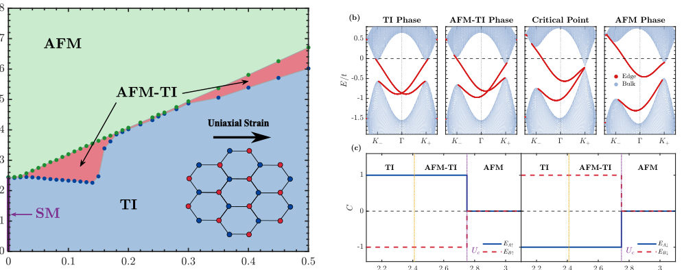 
FIG. 1. Phase diagram and topological transition in the extended Kane-Mele-Hubbard model. (a) Ground- state phase diagram in the (U, λ) parameter space. Parameters are set as: η1 = 1.05, nA = nB = 1.005, t2 = 0.1t, and kBT = 0.01t. Four phases are identified: Semimetal (SM), Topological Insulator (TI), Antiferromagnetic TI (AFM-TI), and trivial Antiferromagnetic Insulator (AFM). The magnetic phase transition from TI to AFM-TI is marked by the onset of a nonzero local magnetization (m ̸= 0), while the topological transition from AFM-TI phase to AFM phase is determined by the bulk gap closing (∆= 0). Inset: Honeycomb lattice schematic with modified bond vectors δi. (b) Band structures across...

📷 Fig 2

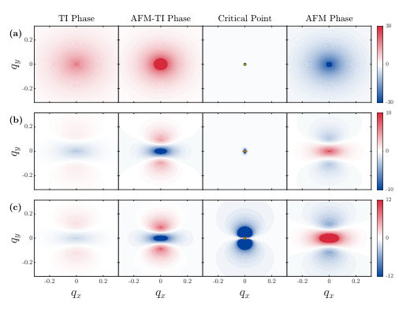 
FIG. 2. Microscopic origin and momentum-space geo- metric evolution. Distributions of (a) the Berry curvature (Ωyx), (b) the qy-even components of the BCP dipole (Λyxx even), and (c) the TBCP dipole (Λyxx,t even ) near the Dirac valley K+. The four columns illustrate the evolution across four distinct regimes at a fixed λ = 0.05t. The yellow dot in the third column marks the gapless Dirac point where the geometric quantities diverge.

📷 Fig 3

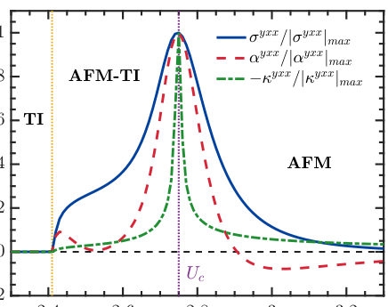 
FIG. 3. Giant nonlinear anomalous responses at the topological critical point. Calculated non-zero compo- nents of the nonlinear anomalous electrical (σyxx), thermo- electric (αyxx), and thermal (κyxx) conductivities as a func- tion of the correlation U. All coefficients are normalized by their respective absolute maximum values, with the sign of κyxx inverted for visual comparison.

📷 Fig 4

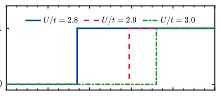 
FIG. 4. Tunability of the topological phase transi- tions. Evolution of the band Chern number C, which de- marcates the topological transition of the AFM-TI phase, as a function of (a) the strain parameter η1 and (b) the electron filling n = nA = nB for various interaction strengths U.

**Summary.** This work theoretically explores correlated Antiferromagnetic Topological Insulators using an extended Kane-Mele-Hubbard model. It demonstrates that electron correlations stabilize a unique $\mathcal{PT}$-symmetric phase, and critically, the topological phase transition within this system causes a giant enhancement in nonlinear anomalous thermoelectric responses. The results show these tunable transport signatures can be controlled by external stimuli like strain or gating.

**Why it may be interesting.** While focused on condensed matter magnetism, the study of symmetry breaking ($\mathcal{PT}$-symmetry) and emergent non-linear response tensors driven by band topology provides theoretical frameworks relevant to open quantum systems dynamics and engineered material responses.

Detailed structure

**Main problem.** To investigate novel physical phenomena in Antiferromagnetic (AFM) spintronics by studying correlated topological states that exhibit giant nonlinear anomalous thermoelectric responses.

**Main result.** Electron correlations stabilize a $\mathcal{PT}$-symmetric AFM-TI phase, and the topological phase transition at gap closure leads to a giant enhancement of all nonlinear anomalous transport coefficients.

**Method.** The study uses theoretical modeling based on an extended Kane-Mele-Hubbard model, employing the Hartree-Fock mean-field approximation for correlation effects.

**Model / system.** The system is modeled by an extended Kane-Mele-Hubbard Hamiltonian on a honeycomb lattice, incorporating hopping terms, SOC ($\lambda$), and the Hubbard interaction ($U$). The analysis focuses on the transition between Semimetal (SM), Topological Insulator (TI), AFM-TI, and trivial AFM phases.

**Key observables.** Nonlinear anomalous electrical ($\sigma_{abc}$), thermoelectric ($\alpha_{abc}$), and thermal ($\kappa_{abc}$) conductivities; topological invariants like the Chern number ($C$).

**Important parameters / regimes.** On-site Coulomb interaction ($U$), SOC strength ($\lambda$), uniaxial strain ($\eta_1$), and electron filling ($n$).

**Assumptions / limitations.** The analysis relies on the Hartree-Fock mean-field approximation for treating electron correlations, and linear anomalous conductivities vanish in $\mathcal{PT}$-symmetric AFM-TIs.

**Figures summary.** Figures illustrate phase diagrams in $(U, \lambda)$ space showing different topological phases; band structures across these regimes; and plots demonstrating the sharp peaks of nonlinear anomalous conductivities at the critical point ($U=U_c$).

**Paper structure.** The paper systematically analyzes the electronic structure through various correlated magnetic phases (TI $
ightarrow$ AFM-TI $
ightarrow$ AFM), identifying the topological phase transition via gap closure, and then calculating the resulting giant enhancements in nonlinear transport responses.

Abstract

Topological states in antiferromagnets (AFMs) offer a promising platform for exploring novel physical phenomena and advancing the applications of AFM spintronics. The AFM topological insulator (TI) state stands out as one of the most representative and prominent cases. Unlike the previously proposed AFM-TI states in noninteracting systems, here we employ an extended Kane-Mele-Hubbard model to demonstrate that electron correlations can give rise to a $\mathcal{PT}$-symmetric AFM-TI state. This state breaks both spatial inversion symmetry $\mathcal{P}$ and time-reversal symmetry $\mathcal{T}$, and enables intrinsic topological nonlinear responses to dominate the leading-order dynamics of the system. The competition between electron correlations and spin-orbit coupling drives the system across a topological phase transition, where the closure of the bulk band gap induces singular behaviors in higher-order quantum geometric tensors. Such microscopic singular characteristics manifest macroscopically as pronounced enhancements in thermoelectric performance, charge conductivity, and thermal conductivity. These giant tunable transport signatures, which can be effectively modulated by mechanical strain and electrostatic gating, provide a feasible experimental route to probe and understand correlated topological materials.

[↑ back to top](#top)

### [Planar Hall effect in single and bilayer Rashba systems](http://arxiv.org/abs/2606.09506v1)

**Authors:** Rahul Biswas, Sunit Das, Amit Agarwal  
**Type:** theory · **Category:** other · **PDF:** <https://arxiv.org/pdf/2606.09506v1>  
**Analysis basis:** full PDF text, analyzed in chunks
**Topic relevance:** `spintronics-quantum-optics interface` **3/5** · `Keldysh / 2PI / non-Gaussian methods` **2/5** · `non-equilibrium dynamics` **2/5** · `analog quantum simulation` **1/5** · `driven-dissipative phase transition` **1/5** · `exotic spin models in light-matter` **1/5** · `methods for driven-dissipative` **1/5** · `non-equilibrium universality` **1/5**

📷 Fig 1

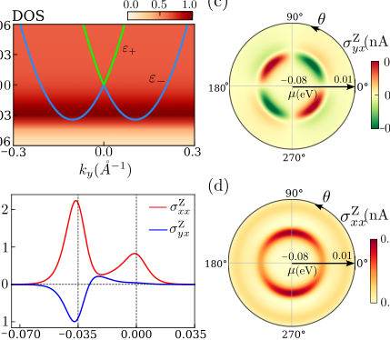 
Figure 1. Zeeman coupling induced PHE in a single-layer Rashba 2DEG. (a) Electronic band dispersion, with the den- sity of states (DOS) indicated by the background color. (b) Variation of the longitudinal and transverse planar conduc- tivities, σZ xx and σZ yx as functions of µ for fixed angle θ = 30◦. For σZ xx, only the magnetic field-dependent contribution is shown; the Drude background is not included. (c,d) Angu- lar dependence of σZ yx and σZ xx, as the chemical potential µ varies. We use effective mass m = 1.2 me, Rashba parameter α = 0.66 eV˚A, magnetic field B = 0.3 T, temperature T = 50 K, and relaxation time τ = 1 ps.

📷 Fig 2

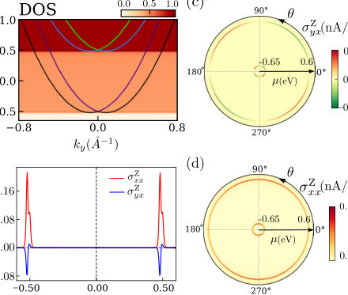 
Figure 2. Zeeman-driven PHE in a bilayer Rashba 2DEG. (a) Electronic band dispersion, with the density of states (DOS) indicated by the background color. (b) Variation of the longitudinal and transverse conductivities, σZ xx and σZ yx as functions of µ for fixed angle θ = 30◦. The two response peaks occur near the band edges of the two Rashba layers. For σZ xx, only the magnetic field-dependent contribution is shown. (c,d) Angular dependence of σZ yx and σZ xx, as the chemical potential µ varies. We use equal effective masses, m = 1.2 me, Rashba parameters αA = 2αB = 0.66 eV˚A, interlayer hopping t = 0.5 eV, magnetic field B = 0.3 T, tem- perature T = 50 K, and relaxation time τ = 1 ps.

📷 Fig 3

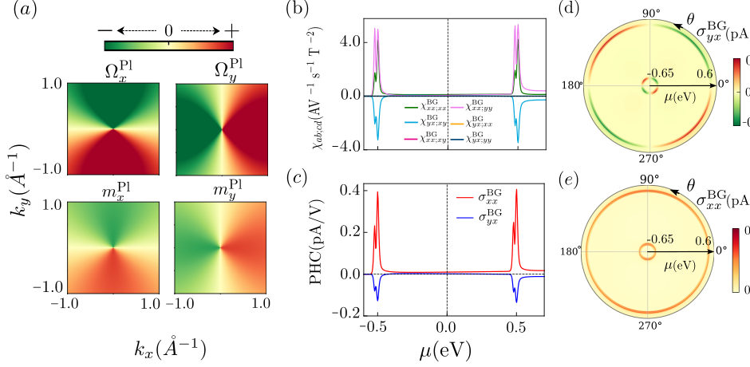 
Figure 3. Band geometric PHE in a Rashba bilayer. (a) Momentum-space distribution of the planar BC (ΩPl) and OMM (mPl) components for the lowest band. (b) BC and OMM driven B2-dependent planar responses as functions of chemical potential. (c) Longitudinal (σBG xx ) and transverse (σBG yx ) planar Hall conductivities for fixed angle θ = 30◦. The largest features occur near band edges, where the planar BC and OMM are enhanced. (d,e) Angular dependence of the planar Hall conductivities as µ varies. The transverse conductivity follows σBG yx ∝χBG yx;xy sin θ cos θ because χBG yx;xy is the dominant transverse tensor, whereas the longitudinal conductivity is dominated by χBG xx;xx and χBG xx;yy...

📷 Fig 4

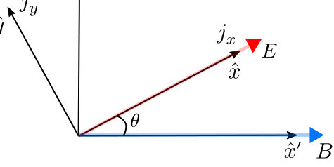 
Figure 4. Rotated coordinate system used to derive the AMC form of the PHE. The electric field E is along ˆx, the magnetic field B is along ˆx′, and the current components jx and jy are parallel and perpendicular to E, respectively.

**Summary.** This paper theoretically investigates the Planar Hall Effect in Rashba 2DEGs, distinguishing between two sources: Zeeman coupling anisotropy and band geometric effects arising from interlayer delocalization. Using semiclassical transport theory, the authors show that while both mechanisms contribute, the Zeeman-induced response is numerically dominant for the studied system parameters.

**Why it may be interesting.** While focused on condensed matter magnetotransport, the detailed analysis of symmetry constraints and the separation of distinct physical mechanisms (spin-momentum locking vs. topology) provides rigorous theoretical tools applicable to understanding exotic quantum transport phenomena in engineered quantum materials.

Detailed structure

**Main problem.** The study investigates the Planar Hall Effect (PHE) in two-dimensional electron gases (2DEGs) exhibiting Rashba spin-orbit coupling.

**Main result.** Two distinct mechanisms—Zeeman coupling and band geometric effects—are identified for generating PHE, with the Zeeman mechanism dominating in the considered parameter regime.

**Method.** The analysis employs semiclassical Boltzmann transport theory and symmetry analysis to calculate planar Hall conductivity tensors.

**Model / system.** The model involves single- and bilayer 2DEGs described by Hamiltonians incorporating Rashba SOC and an external magnetic field. The PHE is an anisotropic magnetotransport response from coplanar E and B fields.

**Key observables.** Planar Hall Conductivity ($\sigma_{yx}$), Anisotropic Magnetoconductivity ($	ext{AMC} = \sigma_{\parallel} - \sigma_{\perp}$), Planar Berry Curvature ($\Omega_{	ext{Pl}}$), and Orbital Magnetic Moment ($\mathbf{m}_{	ext{Pl}}$).

**Important parameters / regimes.** The PHE response is expected to be quadratic in the magnetic field and exhibit $\pi$-periodic angular dependence. The relative strength of Zeeman vs. Band Geometric contributions depends on Rashba asymmetry.

**Assumptions / limitations.** The calculations rely on the semiclassical Boltzmann transport theory within the relaxation-time approximation (RTA).

**Figures summary.** Figures illustrate band dispersions, and later figures show the calculated planar conductivities ($\sigma_{Z, yx}$ vs $\sigma_{B G, yx}$) for both mechanisms.

**Paper structure.** The paper systematically analyzes the PHE by first establishing the general theoretical framework using semiclassical transport theory. It then derives separate expressions and calculates contributions from the Zeeman coupling mechanism (single-layer) and the band geometric/Berry curvature mechanism (bilayer), concluding with a comparison of their relative strengths.

Abstract

The planar Hall effect (PHE) is an anisotropic magnetotransport response generated by coplanar electric and magnetic fields. We investigate the PHE in single- and bilayer two-dimensional electron gases (2DEGs) with Rashba spin-orbit coupling and identify two distinct mechanisms: Zeeman coupling and a band geometric channel. In the Zeeman channel, an in-plane magnetic field distorts the Rashba spin-orbit-coupled band dispersion and generates anisotropic carrier velocities, producing a finite PHE. In an asymmetric Rashba bilayer, interlayer electronic delocalization generates finite planar Berry curvature and orbital magnetic moment components, giving rise to a band geometric PHE channel. Using semiclassical Boltzmann transport theory, we calculate the chemical potential and angular dependence of the planar Hall conductivity for both mechanisms. Symmetry analysis shows that the leading response is quadratic in the magnetic field and exhibits the characteristic $π$-periodic angular dependence. For the parameter regime considered here, the Zeeman-induced contribution dominates, while the band geometric channel provides a distinct symmetry-allowed contribution unique to asymmetric Rashba bilayers. Our results reveal microscopic origins of anisotropic magnetotransport in spin-orbit-coupled two-dimensional materials.

[↑ back to top](#top)

### [Phase diagram of magnetic $S^3$ Skyrmions on three-dimensional lattices and the toroidal antiSkyrmion](http://arxiv.org/abs/2606.07740v1)

**Authors:** Niccolò Francini, Stefano Bolognesi, Sven Bjarke Gudnason, Roberto Menta  
**Type:** theory · **Category:** statistical mechanics · **PDF:** <https://arxiv.org/pdf/2606.07740v1>  
**Analysis basis:** full PDF text, analyzed in chunks
**Topic relevance:** `exotic spin models in light-matter` **3/5** · `spintronics-quantum-optics interface` **3/5** · `analog quantum simulation` **2/5** · `Keldysh / 2PI / non-Gaussian methods` **1/5** · `driven-dissipative phase transition` **1/5** · `methods for driven-dissipative` **1/5**

📷 Fig 1

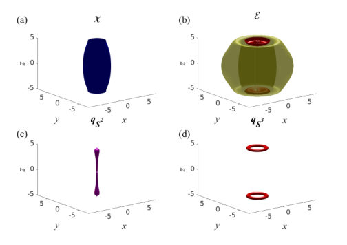 
Figure 1. Numerical solution of the axially symmetric baryon with Dirichlet boundary conditions. The equatorial magnetic string pushes two halves of the Skyrmion to the boundaries of the box. (a) The profile function 𝜒of Eq. (23), (b) The total energy density with the red isosurface showing the positive region and the yellow isosurface showing the negative region, (c) the 𝑞𝑆2 topological charge density demonstrating the presence of the string, and (d) the 𝑞𝑆3 topological charge density showing the two half-Skyrmions’ charge at the end of the string.

📷 Fig 2

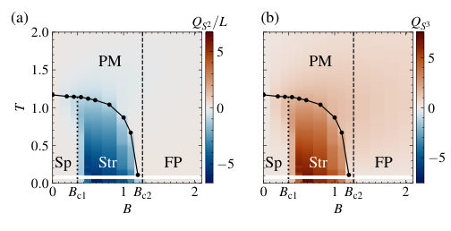 
Figure 2. Finite temperature phase diagram for the axially symmetric model with the 𝛽-term in Eq. (51) obtained with fixed twisted bound- ary conditions for 𝐿= 26, together with 𝑇= 0 iterative minimization results. (a) The absolute value of the 𝑄𝑆2/𝐿estimates the number of strings in the string lattice phase (Str). Each string carries a half Skyrmion at its extrema, for a total of one Skyrmion per string. The Skyrmion number is given by the topological charge 𝑄𝑆3 in panel (b). The black dots mark specific heat maxima (not in the figure), while the lines represent a guide for the eye. The continuous line tracks the transition temperature, while the dotted line at 0.3 ≤𝐵c1 ≤0.4 fol- lows the...

📷 Fig 3

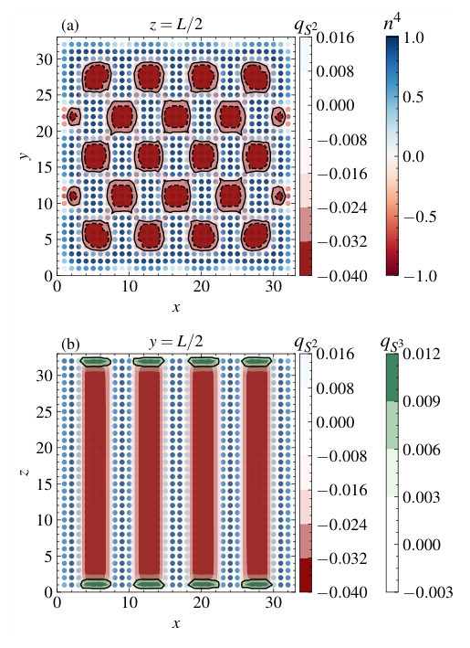 
Figure 3. Distribution of the 𝜋2(𝑆2) topological charge and 𝜋3(𝑆3) topological charge per site in a zero temperature configuration for 𝐿= 34 and 𝐵= 0.6. (a) The cut at 𝑧= 𝐿/2 exposes a topological charge per site 𝑞𝑆2 arranged in a triangular pattern, corresponding to the string lattice. (b) The stretch of the strings along the 𝑧-direction is suggested by the cut at 𝑦= 𝐿/2. In this case, 𝑞𝑆2 fills cylinders along the 𝑧-direction, corresponding to the strings. Each string has a concentration of 𝜋3(𝑆3) topological charge at its ends, representing the splitting of a Skyrmion into two halves and detached by the string in between them. The background spins not involved in the string lattice align...

📷 Fig 4

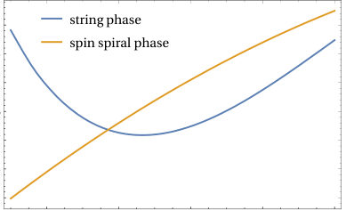 
Figure 4. Energy density comparison between a spin-spiral phase and a string lattice phase as a function of the Zeeman field 𝐵. The spin-spiral state is favored at low fields, up to 𝐵≈0.37, at which the string lattice becomes the lowest energy state. In this figure, the energy density of the string phase is estimated from a single string’s energy and size.

📷 Fig 5

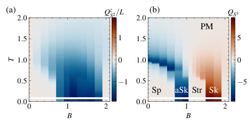 
Figure 5. Finite-temperature phase diagram for the (a) 𝜋2(𝑆2) topo- logical charge and (b) 𝜋3(𝑆3) topological charge for the case with the 𝛼-term, together with zero-temperature iterative minimization re- sults for 𝐿= 16 and periodic boundary conditions. For large fields, 𝐵&gt; 𝐵c4, the system is fully polarized at low temperatures. This phase is topologically trivial, with vanishing 𝜋2(𝑆2) and 𝜋3(𝑆3) topolog- ical charges. As the field decreases from large values, the system enters a low-temperature Skyrmion lattice phase, highlighted by the positive 𝜋3(𝑆3) topological charge, see red region in panel (b) for 𝐵c3 ≤𝐵≤𝐵c4. The skymions also carry 𝜋2(𝑆2) topological charge, which appears in blue...

**Summary.** This paper theoretically investigates magnetic Skyrmions in three dimensions using an S^3 order parameter model stabilized by generalized DMI interactions. By combining continuum theory with lattice simulations, the authors map a complex phase diagram revealing multiple ordered phases. Crucially, they establish the existence of stable toroidal anti-solitons and provide a comprehensive framework for 3D topological magnetic textures.

**Why it may be interesting.** This work provides a rich theoretical framework for understanding topological magnetic textures beyond 2D systems, which is highly relevant for designing novel quantum materials and spintronic devices.

Detailed structure

**Main problem.** The study investigates the natural three-dimensional generalization of magnetic Skyrmions, modeling them using a sigma model from R^3 to S^3.

**Main result.** The authors map out a complex phase diagram featuring spin-spiral, string lattice, and antiSkyrmion lattices, and find a stable toroidal anti-soliton with unit charge for the first time.

**Method.** Methods include deriving continuum theories from generalized DMI terms, developing cubic-lattice discretizations, and employing Monte Carlo simulations to map finite-temperature phase diagrams.

**Model / system.** The system is a magnetic material whose order parameter resides on the S^3 manifold. The energy functional includes Heisenberg exchange, Zeeman potential, and generalized Dzyaloshinskii–Moriya interactions ($\alpha$-term and $eta$-term).

**Key observables.** Topological charges ($Q_{S^3}, Q_{S^2}$), phase boundaries (e.g., $B_{c1}, B_{c4}$), and the existence of toroidal anti-solitons.

**Important parameters / regimes.** DMI coupling constants ($\kappa$), external magnetic field ($B$), and temperature ($T$).

**Assumptions / limitations.** The analysis relies on deriving continuum limits from lattice discretizations and using approximations like spatial averaging for certain ground state calculations.

**Figures summary.** Figures illustrate the dependence of topological charges ($Q_{S2}, Q_{S3}$) on external field $B$ and temperature, visualizing string lattices, Skyrmion lattices, and toroidal antiSkyrmions.

**Paper structure.** The paper progresses from defining the 3D sigma model and generalized DMI terms to deriving lattice discretizations. It then analyzes specific Ansätze (hedgehog/axially symmetric) to find soliton solutions, culminating in mapping out the full phase diagram via Monte Carlo simulations.

Abstract

Magnetic Skyrmions are planar solitons stabilized by the Dzyaloshinskii-Moriya interaction (DMI) and realized in chiral magnets. We study their natural three-dimensional generalization: a sigma model from $\mathbb{R}^3$ to $S^3$ with a four-component magnetization vector, stabilized by a one-derivative term which is a generalized DMI. We utilize two SO(3)-invariant generalized DMIs discovered recently: an "$α$-term" supporting a spherically symmetric hedgehog Skyrmion and a "$β$-term" supporting an axially symmetric Skyrmion that splits into two half-Skyrmions connected by a magnetic string of negative tension, a phenomenon we call "anti-confinement". We derive a cubic-lattice discretization that reproduces both continuum theories at long wavelengths and use Monte Carlo simulations to map the finite-temperature phase diagram. We identify spin-spiral, magnetic-string-lattice, Skyrmion-lattice, and antiSkyrmion-lattice phases, as well as a mixed-topology regime with fractional $S^3$ charges localized at string bends. We find, for the first time in the literature to the best of our knowledge, a toroidal (anti-)soliton of unit charge. Our results establish a theoretical and computational framework for three-dimensional topological magnetic textures in systems whose order-parameter manifold is $S^3$.

[↑ back to top](#top)

### [Revealing Wavelength- and Size-Dependent CO2 Reduction Selectivity via Operando Scanning Photo-Electrochemical Microscopy](http://arxiv.org/abs/2606.09612v1)

**Authors:** Fatemeh Kiani, Milad Sabzehparvar, Priscila Vensaus, Elif Nur Dayi, Olga D'Anania, Tarique Anwar, Nuria Lopez, Ravishankar Sundararaman, Giulia Tagliabue  
**Type:** both · **Category:** other · **PDF:** <https://arxiv.org/pdf/2606.09612v1>  
**Analysis basis:** full PDF text, analyzed in chunks
**Topic relevance:** `non-equilibrium dynamics` **3/5** · `spintronics-quantum-optics interface` **2/5** · `Keldysh / 2PI / non-Gaussian methods` **1/5** · `analog quantum simulation` **1/5** · `correlated / nonlocal dissipation` **1/5** · `driven-dissipative phase transition` **1/5** · `methods for driven-dissipative` **1/5** · `non-equilibrium universality` **1/5**

📷 Fig 1

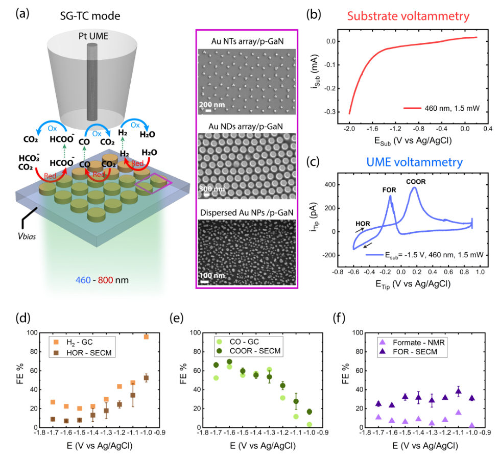 
Figure 1. Benchmarking photo-SECM UME tip voltammetry against substrate voltammetry and bulk

📷 Fig 2

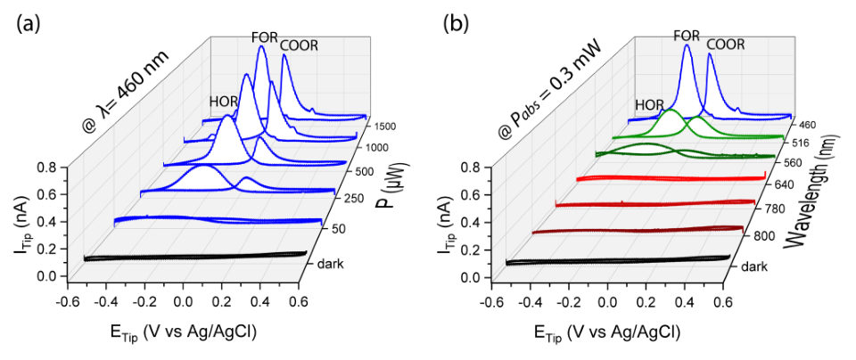 
Figure 2. Wavelength- and power-dependent UME tip voltammetry for Au NT/p-GaN photocathodes.

📷 Fig 3

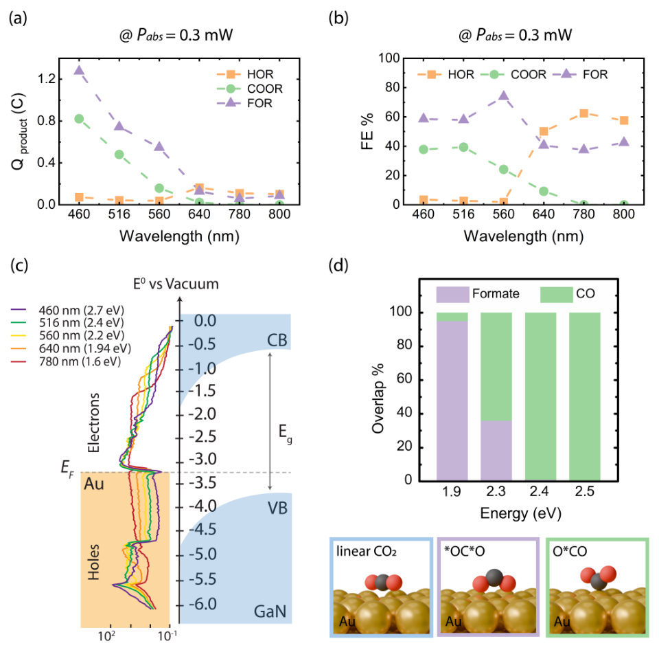 
Figure 3. Wavelength-dependent CO₂RR product selectivity in photo-SECM on Au NTs/p-GaN

**Summary.** This work uses operando photo-SECM on Au/p-GaN photocathodes to show that CO2 reduction selectivity is highly tunable by changing the incident photon energy and catalyst size. The mechanism is determined to be electronically driven, where high-energy hot carriers promote CO formation, while particle size dictates efficient carrier transport necessary for optimal performance.

**Why it may be interesting.** While primarily in electrocatalysis, the detailed analysis of hot-carrier energy transfer, state filling (DOS overlap), and geometry-dependent charge transport provides a rich model for understanding non-equilibrium electron dynamics relevant to open quantum systems or strongly coupled plasmonic environments.

Detailed structure

**Main problem.** The central challenge is controlling product selectivity during plasmon-driven CO2 reduction (CO2R) in photocatalysis, which is crucial for light-driven fuel synthesis.

**Main result.** Selectivity is governed by a coupled interplay between the incident photon energy (interband vs. intraband excitation), the resulting hot-carrier energy distribution, and the nanostructure geometry of the catalyst.

**Method.** The study employs operando Scanning Photo-Electrochemical Microscopy (photo-SECM) to measure product selectivity in situ, complemented by Density Functional Theory (DFT) calculations for theoretical validation.

**Model / system.** The system uses Au nanostructures deposited on p-GaN photocathodes. The mechanism relies on generating hot electrons via photon absorption, which drive the selective reduction of CO2 over competing reactions like HER.

**Key observables.** Product selectivity (CO vs. H2), Faradaic Efficiencies (FEs) as a function of wavelength and power, and spatially resolved hot-carrier energy fluxes.

**Important parameters / regimes.** Photon energy regimes (interband: 460-560 nm; intraband: 640-800 nm); nanostructure size (<100 nm vs. ~300 nm); constant absorbed power to isolate hot-carrier effects.

**Assumptions / limitations.** The selectivity switch is confirmed to be driven by the electronic nature of hot carriers, not merely photothermal heating; transport losses are significant in larger nanostructures.

**Figures summary.** Figures demonstrate wavelength-dependent product yields (CO vs. H2) using photo-SECM measurements and show theoretical comparisons between hot-carrier fluxes in small vs. large Au nanostructures.

**Paper structure.** The paper establishes the problem, uses photo-SECM to observe spectral/size dependence of selectivity, explains this dependence via DFT modeling linking high-energy carriers to CO formation, and finally confirms the role of carrier transport losses based on particle size.

Abstract

Controlling product selectivity in plasmonic catalysis, particularly in CO2 reduction (CO2R), remains a central unsolved challenge with direct implications for light-driven fuel and chemical synthesis. Here, we deploy quantitative operando scanning photoelectrochemical microscopy (photo-SECM) to provide a direct demonstration that tuning photon energy switches CO2R selectivity through an electronically driven pathway. On plasmonic Au/p-GaN photocathodes, interband excitation (460-560 nm) drives selective CO production while intraband excitation (640-800 nm) favors H2 evolution. By maintaining constant absorbed power across wavelengths and confirming linear power dependence, we isolate the role of hot-carrier energy from photonic and photothermal contributions. Density functional theory calculations reveal that higher-energy interband excitation progressively increases the overlap between hot-electron-accessible states and the CO-producing intermediate, selectively promoting CO over formate, in excellent agreement with experiment. We further show that selectivity is geometrically gated by hot-carrier transport: sub-100 nm nanostructures sustain CO2R activity, while ~300 nm nanodisks suffer transport losses that suppress it, consistent with ab initio hot-carrier transport calculations. Together, these results establish photon energy, carrier transport, and nanostructure geometry as coupled design parameters for plasmonic CO2R selectivity, resolve a longstanding debate on the origin of plasmon-driven selectivity effects, and position photo-SECM as a broadly applicable operando platform for photo(electro)catalysis.

[↑ back to top](#top)

### [DC conductivity of tilted Dirac Fermions across the Lifshitz Transition: short- versus long-range impurities](http://arxiv.org/abs/2606.08010v1)

**Authors:** Mohammad H. Pakzamir, Zahra Faraei, Ali G. Moghaddam  
**Type:** theory · **Category:** other · **PDF:** <https://arxiv.org/pdf/2606.08010v1>  
**Analysis basis:** full PDF text, analyzed in chunks
**Topic relevance:** `Keldysh / 2PI / non-Gaussian methods` **3/5** · `driven-dissipative phase transition` **2/5** · `non-equilibrium universality` **2/5** · `Kondo & dissipative impurity` **1/5** · `methods for driven-dissipative` **1/5** · `non-equilibrium dynamics` **1/5**

📷 Fig 1

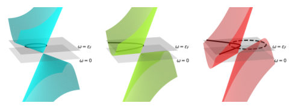 
FIG. 1. Schematic evolution of the Fermi surface topology in a tilted Dirac semimetal at a constant energy ω &gt; 0. The contours represent the subcritical closed ellipse (t &lt; 1, blue), the critical Lifshitz transition point (t = 1, green), and the overcritical open hyperbolas (t &gt; 1, red). . The dashed lines illustrate the transverse momentum cutoff Λ required to reg- ularize transport in the overcritical regime.

📷 Fig 2

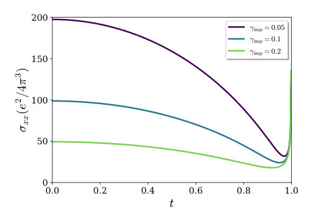 
FIG. 3. Subcritical longitudinal conductivity (t &lt; 1) for short-range impurities as a function of the tilt parameter t. The curves are plotted for different values of the dimension- less impurity scattering strength γimp = 0.05, 0.1, and 0.2, demonstrating a monotonic decrease of the macroscopic con- ductivity as the system approaches the Lifshitz transition.

📷 Fig 3

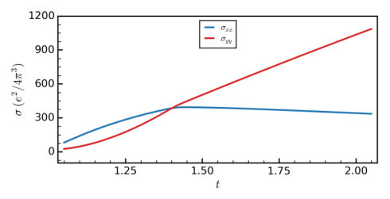 
FIG. 4. Transport anisotropy in the overcritical regime (t &gt; 1) for short-range impurities. The conductivity per- pendicular to the tilt direction, σxx (blue curve), exhibits a non-monotonic behavior, peaking near t ≈ √

📷 Fig 4

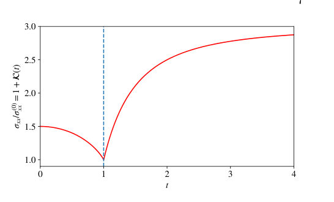 
FIG. 6. The effect of the first-order vertex correction on the longitudinal conductivity for short-range impurities, repre- sented by the ratio σxx/σ(0) xx = 1 + K(t). The geometric cor- rection factor strongly renormalizes the conductivity in the subcritical regime t &lt; 1, vanishes identically at the critical point (t = 1), and scales proportionally with t in the overcrit- ical regime(t &gt; 1).

📷 Fig 5

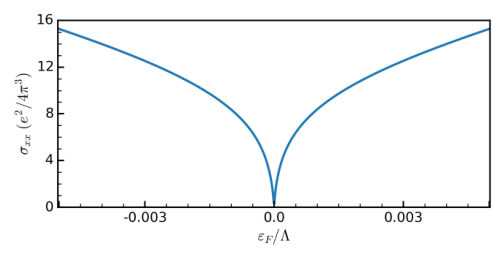 
FIG. 5. DC conductivity at the exact critical point (t = 1) for short-range impurities as a function of energy εF near the Dirac point (εF /Λ ∈[−0.005, 0.005]). The vanishing conduc- tivity as εF →0 is a direct macroscopic consequence of the 1/ p

**Summary.** This paper theoretically examines the DC conductivity of 2D tilted Dirac fermions as they pass through a Lifshitz transition point. By comparing short-range and long-range impurity scattering, the authors show that the critical point yields distinct signatures—a dip for short-range scatterers versus a peak for Coulomb impurities. The tilt parameter $t$ is established as a key geometric control knob for engineering transport anisotropy in these topological materials.

**Why it may be interesting.** The work provides a detailed theoretical framework showing how subtle changes in band structure topology (the Lifshitz transition) can lead to dramatically different, predictable macroscopic transport properties based on the nature of disorder.

Detailed structure

**Main problem.** The study investigates how the DC conductivity of two-dimensional tilted Dirac fermions changes when subjected to short-range versus long-range impurity scattering across a Lifshitz transition.

**Main result.** The transport signatures diverge fundamentally at the critical point ($t=1$): short-range disorder causes a localized dip, while Coulomb impurities cause a macroscopic peak. The tilt parameter acts as a powerful knob for engineering anisotropy.

**Method.** The analysis employs the Kubo formalism within the first-order Born approximation to calculate the conductivity tensor ($\sigma_{xx}, \sigma_{yy}$), paying close attention to vertex corrections.

**Model / system.** The system is modeled by 2D tilted Dirac fermions, whose low-energy excitations are governed by a continuum Hamiltonian dependent on the tilt parameter $t$. The physics is analyzed across three regimes: subcritical ($t<1$), critical ($t=1$), and overcritical ($t>1$).

**Key observables.** DC conductivity tensor ($\sigma_{xx}, \sigma_{yy}$), scattering self-energy, vertex correction factor.

**Important parameters / regimes.** Tilt parameter $t$, impurity range (short vs. long/Coulomb), Fermi energy ($\epsilon_F$), and momentum cutoff ($\Lambda$).

**Assumptions / limitations.** The calculations rely on the first-order Born approximation for disorder effects, and regularization via an ultraviolet momentum cutoff ($\Lambda$) is necessary in the overcritical regime.

**Figures summary.** Figures illustrate the evolution of Fermi surface topology across $t=1$, showing $\sigma_{xx}$ vs. $t$ plots that reveal monotonic changes, dips at $t=1$, and non-monotonic peaks in the overcritical regime for different impurity types.

**Paper structure.** The paper systematically analyzes the conductivity using geometric reformulations of the Hamiltonian, contrasting the mathematical behavior (e.g., vertex corrections) and physical outcomes ($\sigma_{xx}$ vs $\sigma_{yy}$) for short-range versus long-range impurities across the three topological regimes defined by $t$.

Abstract

We theoretically investigate the DC conductivity of two-dimensional tilted Dirac systems subject to short- and long-range impurity scattering. Using the Kubo formalism, we systematically study transport across the subcritical (Type I), critical, and overcritical (Type II) tilt regimes. In the subcritical phase, short-range impurities yield a frequency-independent conductivity that decreases monotonically with tilt. Conversely, long-range Coulomb scattering results in a strongly energy-dependent conductivity governed by a tilt-independent scattering rate. At the Lifshitz transition ($t = 1$), the transport signatures of these impurities diverge fundamentally: the van Hove singularity in the density of states induces a localized conductivity dip for short-range disorder, but a pronounced macroscopic peak for Coulomb impurities. In the overcritical regime, an ultraviolet momentum cutoff is required to regularize the open Fermi surface, leading to distinct behaviors for each impurity type. Notably, the conductivity perpendicular to the tilt direction ($σ_{xx}$) exhibits a cutoff-dependent, non-monotonic peak near $t = \sqrt{2}$ for short-range defects, while it decays monotonically with increasing tilt for long-range scattering. For both potentials, the conductivity along the tilt axis ($σ_{yy}$) increases without bound, revealing extreme transport anisotropy. For long-range impurities, the energy dependence of the conductivity becomes nearly quadratic and linear for Type I and II, respectively. Furthermore, vertex corrections vanish identically at the Lifshitz transition for both impurity types. Finally, we provide a unified geometric framework for these phenomena, establishing the tilt parameter as a powerful knob for engineering macroscopic transport in Dirac materials.

[↑ back to top](#top)

### [Topological invariant responsible for the integer QHE and non-commutative geometry](http://arxiv.org/abs/2606.08868v1)

**Authors:** G. Kovyrshin, A. Mekrami, J. Miller, M. A. Zubkov, A. Zuevsky  
**Type:** theory · **Category:** other · **PDF:** <https://arxiv.org/pdf/2606.08868v1>  
**Analysis basis:** full PDF text, analyzed in chunks
**Topic relevance:** `Keldysh / 2PI / non-Gaussian methods` **3/5** · `non-equilibrium dynamics` **2/5** · `methods for driven-dissipative` **1/5**

📷 Fig 1

 
Low-resolution page preview, page 2

📷 Fig 2

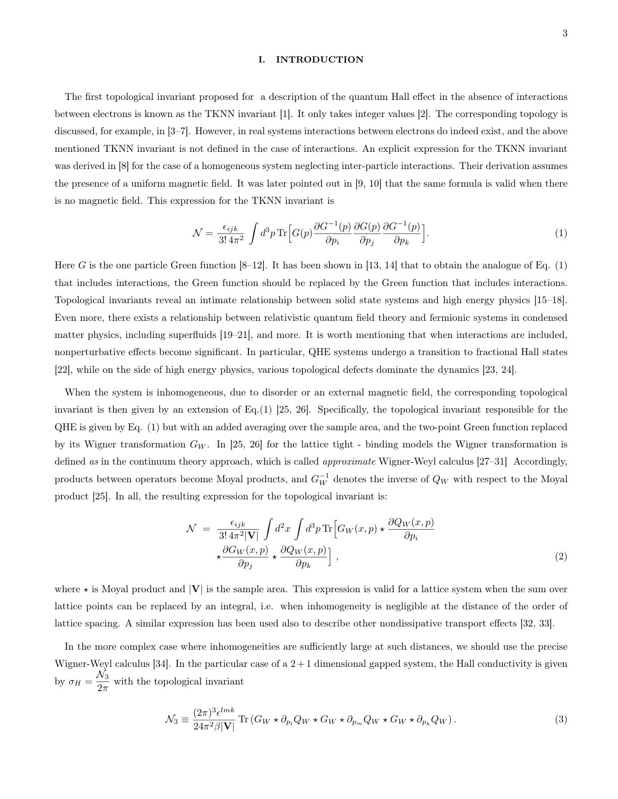 
Low-resolution page preview, page 3

📷 Fig 3

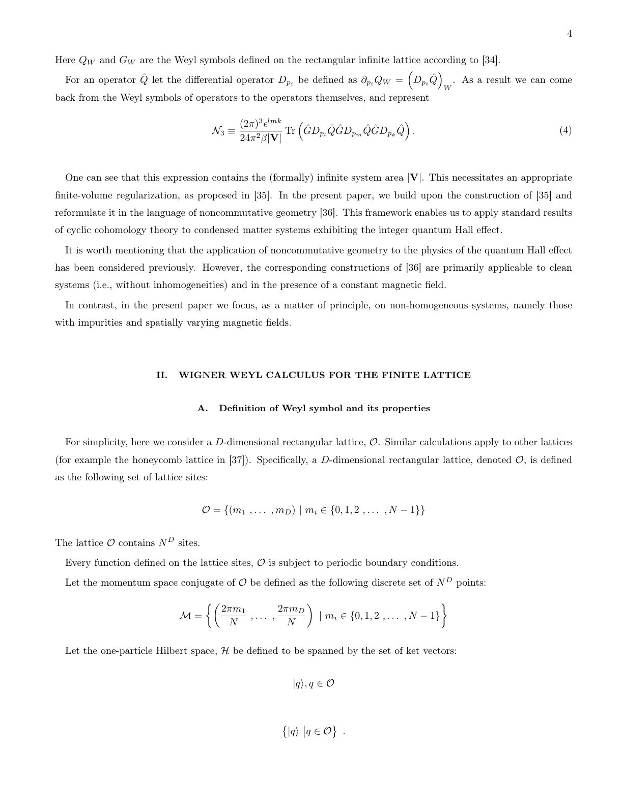 
Low-resolution page preview, page 4

📷 Fig 4

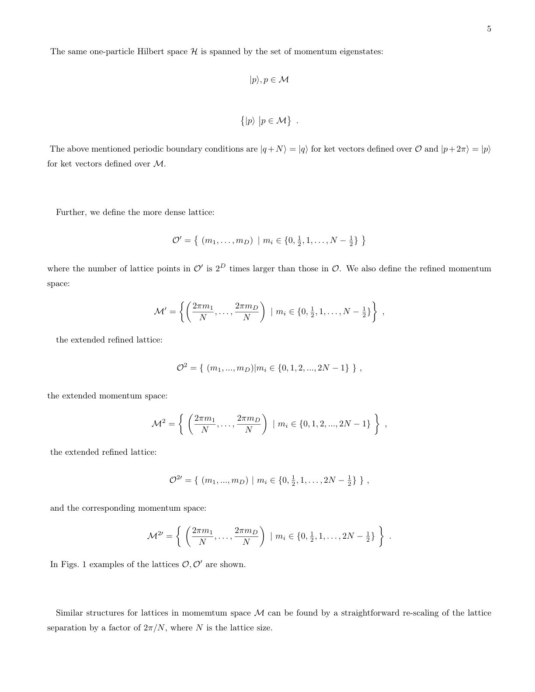 
Low-resolution page preview, page 5

📷 Fig 5

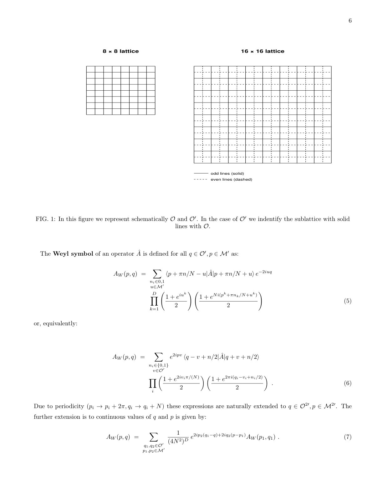 
Low-resolution page preview, page 6

**Summary.** This paper develops a highly advanced theoretical framework to calculate the topological invariant governing the Integer Quantum Hall Effect in 2D lattice models. By employing non-commutative geometry, Keldysh field theory, and algebraic tools like cyclic cohomology, the authors relate the quantized Hall conductivity to deep mathematical invariants. The work is significant for providing rigorous mathematical grounding to topological phases of matter.

**Why it may be interesting.** The deep connection between condensed matter phenomena like the QHE and abstract mathematical structures such as cyclic cohomology provides a powerful theoretical framework for understanding robust physical properties in complex materials.

Detailed structure

**Main problem.** The research aims to determine a rigorous topological invariant responsible for quantizing the Hall conductivity in 2D solid-state systems, linking this quantization to concepts from non-commutative geometry.

**Main result.** The authors develop sophisticated mathematical tools showing that the invariant can be expressed as a pairing between elements of K-theory and cyclic cohomology groups. They suggest that while integer quantization is expected, strong spatial inhomogeneity might invalidate this simple topological guarantee.

**Method.** The methodology heavily relies on advanced mathematical physics techniques, including Wigner/Weyl calculus, Keldysh field theory formalism, and the application of algebraic tools like K-theory and cyclic cohomology to lattice operators.

**Model / system.** The focus is on 2D tight-binding models of solid state physics, which are treated as non-homogeneous lattices subjected to external electromagnetic potentials. The analysis uses Green's functions defined on the Keldysh contour in imaginary time.

**Key observables.** Hall conductivity ($\sigma_H$), topological invariant ($N_3$), current density ($J_i$), and algebraic invariants like $K_0(A)$ and $	ext{HC}^3(A)$.

**Important parameters / regimes.** Lattice size ($N$), magnetic field strength, and the nature of inhomogeneity (e.g., impurities or spatially varying fields).

**Assumptions / limitations.** The analysis involves multiple approximations, including taking continuum limits from finite lattices, using specific gauge choices for potentials, and relying on algebraic isomorphisms between K-theory groups.

**Figures summary.** Figure 1 schematically illustrates the comparison of lattice structures ($O$ vs $O'$) at different scales, suggesting a geometric basis for the analysis.

**Paper structure.** The paper progresses from defining the physical problem (QHE in 2D lattices) to introducing advanced mathematical machinery (Weyl symbols, Keldysh formalism). It then develops algebraic tools (K-theory/Cyclic Cohomology) and applies them to derive expressions for conductivity, culminating in discussions about the robustness of topological quantization under inhomogeneity.

Abstract

We consider a wide class of $2D$ tight - binding models of solid state physics. These models are, in the most general case, non - homogeneous. The topological invariant ${\cal N}_3$ responsible for the quantization of the Hall conductivity, for the specific case of the integer quantum Hall effect in $2D$, is expressed through the Wigner transformation of the two-point electron Matsubara Green function. We express this invariant as a pairing of the element of the $K^{-1}$ group (generated by the Green function) with the specific element of the cyclic cohomology group $HC^3$. According to a set of local index theorems the values of ${\cal N}_3$ can be shown to be integer for a limited class of tight - binding models.

[↑ back to top](#top)

### [Unconventional incommensurate epitaxy of superconducting FeSe films on SrTiO$_3$](http://arxiv.org/abs/2606.09281v1)

**Authors:** M. Klement, K. M. Fijalkowski, M. Kamp, C. Gould, L. W. Molenkamp  
**Type:** experiment · **Category:** other · **PDF:** <https://arxiv.org/pdf/2606.09281v1>  
**Analysis basis:** full PDF text, analyzed in chunks
**Topic relevance:** `Frenkel-Kontorova` **3/5** · `analog quantum simulation` **1/5** · `driven-dissipative phase transition` **1/5** · `methods for driven-dissipative` **1/5**

📷 Fig 1

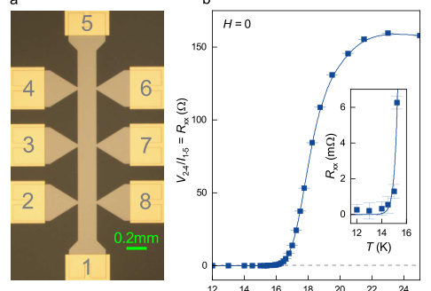 
FIG. 1. a: Optical micrograph of the eight-terminal device geometry used for resistance measurements. b: Four-terminal resistance as a function of temperature, showing a clear su- perconducting transition in a nominally identical FeSe/FeTe sample. Solid markers with error bars are the measured data; the smooth curve is only a guide to the eye to highlight the overall transition profile. The inset shows a zoomed-in seg- ment of the data near zero resistance (note the units here are milliohms).

📷 Fig 2

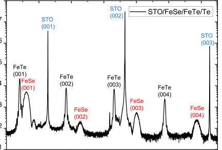 
FIG. 2. ω-2θ scan of a FeSe thin film capped with FeTe, grown on a SrTiO3(001) substrate. Reflections from the sub- strate, FeSe, and FeTe are clearly visible. Pronounced Kiessig fringes appear as closely spaced oscillations around the FeTe reflections. Weaker and more widely spaced Kiessig oscilla- tions can also be discerned around the FeSe(001) reflection at approximately 18.5◦, consistent with the thinner FeSe layer. A high-resolution view of the FeTe(001) reflection, highlight- ing the surrounding Kiessig oscillations, is shown in Fig. 3, where the Kiessig oscillations are indicated by arrows.

📷 Fig 3

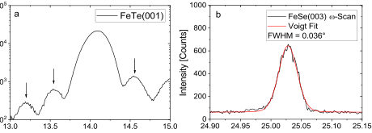 
FIG. 3. a: Kiessig fringes at the FeTe(001) reflection (indi- cated by arrows) used to extract a thickness of 20.8 nm. b: Rocking curve of the FeSe(003) peak showing a FWHM of 0.036◦(130 arcsec), indicating exceptional crystalline quality and alignment.

📷 Fig 4

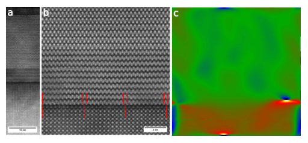 
FIG. 5. High-resolution HAADF-STEM images of the FeSe/SrTiO3 heterostructure. (a) Overview of the full stack, showing the SrTiO3 substrate, a TiO2 double layer, epitaxial FeSe and FeTe films, and the amorphous tellurium capping layer. (b) Magnified view of the FeSe/SrTiO3 interface. Ver- tical red lines mark selected unit cell positions in both SrTiO3 and FeSe along the in-plane direction. A progressive lateral shift of the FeSe lattice is observed, reaching a half-unit-cell offset after approximately 30 unit cells and full registry af- ter approximately 60. The TiO2 double layer is clearly re- solved at the interface. (c) Geometric phase analysis (GPA) map derived from panel (b), showing the...

📷 Fig 5

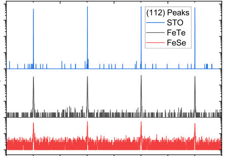 
FIG. 4. Azimuthal φ-scans of the (112) reflections from SrTiO3 (blue), FeSe (red), and FeTe (black). All three scans exhibit a clear fourfold symmetry with peaks spaced by 90°, indicating a shared in-plane crystallographic orientation. The peak positions coincide at φ = 45◦, 135◦, 225◦, and 315◦, con- firming an untwinned, orientation-coherent in-plane epitaxial relationship between the film layers and the substrate. Verti- cal offsets have been applied for clarity.

**Summary.** This work reports on superconducting FeSe/FeTe films grown on SrTiO3, demonstrating an unusual epitaxial growth mode. Using combined XRD and STEM, the authors prove that the films maintain their intrinsic lattice spacing despite a significant mismatch with the substrate. This 'registry-free' epitaxy challenges conventional understanding of strain accommodation in layered superconductors.

**Why it may be interesting.** While primarily condensed matter experimental physics, the concept of maintaining long-range order (crystallographic orientation) without local atomic matching presents a fascinating analogy for understanding boundary conditions or coupling mechanisms in quantum systems where perfect commensurability is not required.

Detailed structure

**Main problem.** The study investigates how superconducting FeSe/FeTe multilayers can maintain perfect in-plane epitaxial alignment on a mismatched SrTiO3 substrate without forming expected structural defects like misfit dislocations.

**Main result.** The films exhibit an unconventional, registry-free epitaxy where the intrinsic lattice spacing of the deposited materials is preserved despite a significant mismatch with the substrate. This suggests directional alignment can occur independently of atomic matching.

**Method.** The research combines X-ray Diffraction (XRD) to determine bulk and in-plane lattice parameters, with high-resolution Scanning Transmission Electron Microscopy (STEM) and Geometric Phase Analysis (GPA) to probe atomic interfaces at the nanoscale.

**Model / system.** The physical system is a multilayer stack of superconducting FeSe/FeTe films grown epitaxially on SrTiO3(001) substrates using Molecular Beam Epitaxy. The analysis focuses on the structural interface between these crystalline materials.

**Key observables.** In-plane lattice constants (e.g., $a_{	ext{FeSe}} = 3.862 \mathring{	ext{A}}$), absence of misfit dislocations, and periodic lateral shifts observed via STEM/GPA.

**Important parameters / regimes.** Lattice mismatch ($\sim 1.1\%$), superconducting transition temperature ($T_c < 14	ext{ K}$), and the characteristic length scale of registry recurrence (e.g., $\lambda \sim 30 	ext{ nm}$).

**Assumptions / limitations.** The analysis assumes that the observed structural continuity implies a specific, non-conventional epitaxial growth mechanism that bypasses standard strain relaxation pathways.

**Figures summary.** Figures show optical micrographs of devices, R-T curves confirming superconductivity, and high-resolution STEM cross-sections illustrating atomically sharp interfaces with no visible dislocations or lattice mismatch accommodation features.

**Paper structure.** The paper proceeds by first establishing the superconducting nature of the films using transport measurements. It then uses XRD to confirm perfect in-plane alignment and measure lattice parameters. Finally, detailed STEM analysis is used to visualize the interface structure, confirming the registry-free growth mode across multiple nanometers.

Abstract

We present a combined X-ray diffraction and transmission electron microscopy study of superconducting FeSe/FeTe multilayers grown by molecular beam epitaxy on SrTiO$_3$(001) substrates. While X-ray diffraction confirms perfect in-plane epitaxial alignment between FeSe, FeTe, and the substrate, scanning transmission electron microscopy reveals a surprising lack of atomic registry at the FeSe/SrTiO$_3$ interface. Instead of adapting to the substrate lattice, FeSe retains its own in-plane lattice spacing. A periodic lateral shift between the atomic positions of FeSe and SrTiO$_3$ is observed, with a registry recurrence length that matches the lattice mismatch determined by X-ray diffraction. No misfit dislocations or other relaxation features are detected at the interface. This coexistence of directional alignment and registry-free growth suggests an unconventional regime of epitaxy in which crystallographic orientation is maintained without atomic matching. The findings offer insight into strain accommodation in layered systems and may have implications for interface engineering in Fe-based superconductors.

[↑ back to top](#top)

### [Layer-parity-defined surface polarization in Nb$_3$Cl$_8$ for excitonic modulation at van der Waals interfaces](http://arxiv.org/abs/2606.09277v1)

**Authors:** Xinyue Huang, Hansheng Xu, Yuchen Gao, Yushen Zhou, Zhijie Ma, Kenji Watanabe, Takashi Taniguchi, Zuxin Chen, Jianqi Huang, Jianpeng Liu, Teng Yang, Youguo Shi, Yu Ye  
**Type:** both · **Category:** other · **PDF:** <https://arxiv.org/pdf/2606.09277v1>  
**Analysis basis:** full PDF text, analyzed in chunks
**Topic relevance:** `spintronics-quantum-optics interface` **3/5** · `Keldysh / 2PI / non-Gaussian methods` **1/5** · `driven-dissipative phase transition` **1/5**

📷 Fig 1

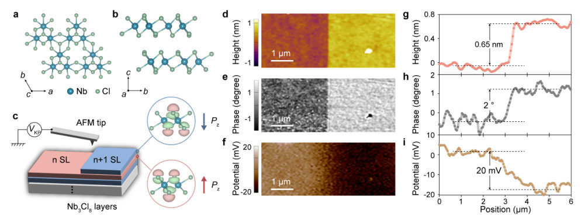 
Figure 1: Layer-resolved surface polarization in Nb3Cl8. (a,b) Top-view (a) and side-view (b) crystal struc- tures of Nb3Cl8. (c) Schematic illustration of the KPFM measurement configuration. The red and blue slabs de- note Nb3Cl8 monolayers with positive and negative out-of-plane polarization, respectively. The circular panels show the calculated charge-density differences for the corresponding polar layers. (d–f) AFM topography (d), AFM phase (e), and KPFM surface-potential (f) images of a Nb3Cl8 flake containing a single-layer step edge. (g–i) Line profiles extracted from the AFM topography (g), phase (h), and KPFM surface-potential (i) images, respectively.

📷 Fig 2

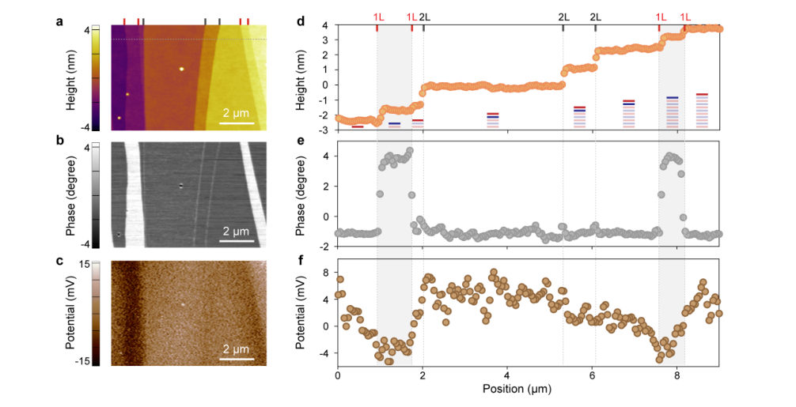 
Figure 2: Visualization of layer-parity-dependent surface-polarization oscillations. (a–c) AFM topog- raphy (a), AFM phase (b), and KPFM surface-potential (c) images of a Nb3Cl8 flake containing seven terraces separated by single- or double-layer steps. (d–f) Line profiles extracted from the AFM topography (d), AFM phase (e), and KPFM surface-potential (f) images, respectively. The vertical dashed gray lines mark the positions of the terrace boundaries. Insets in panel (d) schematically illustrate the out-of-plane polarization configuration of the Nb3Cl8 layers, where red and blue denote positive and negative Pz, respectively.

📷 Fig 3

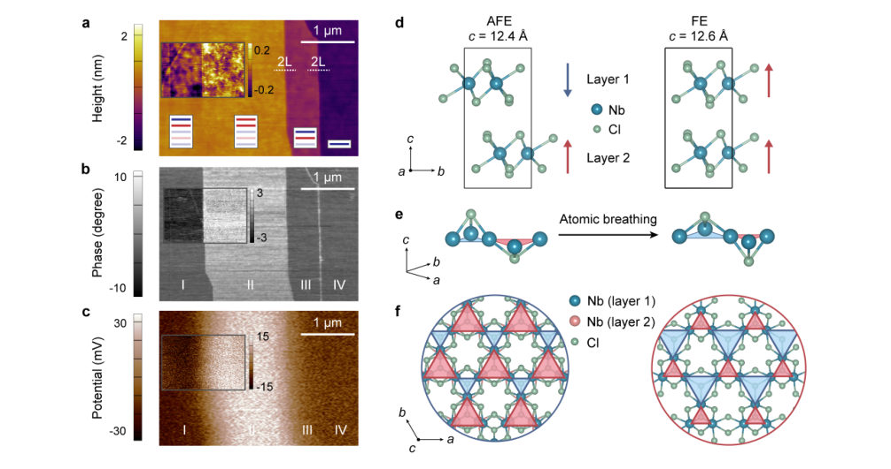 
Figure 3: Intralayer polar reconstruction in Nb3Cl8. (a–c) AFM topography (a), AFM phase (b), and KPFM surface-potential (c) images of a Nb3Cl8 flake showing a layer-parity-independent polar region and two bi- layer terraces. The inset panels show zoom-in scans of the boxed regions with adjusted color scales to highlight the local contrast. Schematics in panel (a) depict the corresponding out-of-plane polarization configurations of the Nb3Cl8 layers, where red and blue represent positive and negative Pz, respectively. (d) Optimized bilayer crystal structures for the antiferroelectric-like (AFE) and ferroelectric-like (FE) stacking configurations of Nb3Cl8. Red and blue arrows indicate the...

📷 Fig 4

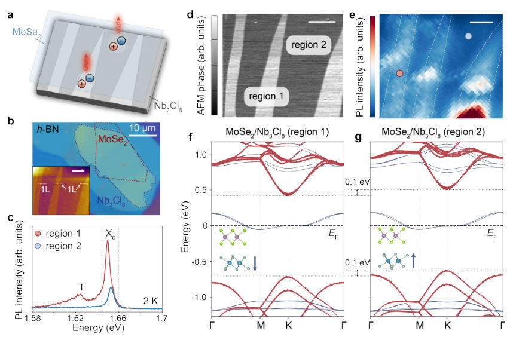 
Figure 4: Layer-parity-controlled excitonic emission at the MoSe2/Nb3Cl8 interface. (a) Schematic illustration of MoSe2 excitonic emission modulated by the layer-parity-defined surface polarization of the under- lying Nb3Cl8. (b) Optical microscopy image of the MoSe2/Nb3Cl8 heterostructure encapsulated by h-BN flakes. Inset: AFM topography image of the Nb3Cl8 substrate. Scale bar: 2 µm. (c) PL spectra of the MoSe2/Nb3Cl8 het- erostructure acquired from region 1 and region 2 at 2 K. (d) AFM phase image of the Nb3Cl8 substrate, revealing ribbon-like regions separated from the surrounding areas by monolayer step edges. Scale bar: 2 µm. (e) Spatial map of the integrated PL intensity of the...

**Summary.** This work establishes $	ext{Nb}_3	ext{Cl}_8$ as a unique intrinsic platform where surface polarization alternates predictably based on the number of stacked layers (layer parity). By coupling it with $	ext{MoSe}_2$, the authors show that this structural control over polarization directly dictates charge transfer and modulates the excitonic emission properties at the vdW interface.

**Why it may be interesting.** The ability to engineer electronic properties (doping, band alignment) simply by controlling the stacking order or layer count of an insulating substrate is highly relevant for designing quantum devices and tunable quantum interfaces.

Detailed structure

**Main problem.** The study investigates how intrinsic, layer-parity-defined surface polarization in $	ext{Nb}_3	ext{Cl}_8$ can be utilized to modulate the excitonic emission and charge transfer characteristics at van der Waals (vdW) interfaces.

**Main result.** Layer parity dictates a robust odd-even oscillation of the surface potential, which in turn controls the band alignment across an adjacent $	ext{MoSe}_2$ layer, leading to distinct doping states (e.g., trion vs. neutral exciton).

**Method.** The research combines advanced experimental techniques like Kelvin Probe Force Microscopy ($	ext{KPFM}$) and photoluminescence ($	ext{PL}$) mapping with first-principles Density Functional Theory ($	ext{DFT}$) calculations.

**Model / system.** The physical system is the layered material $	ext{Nb}_3	ext{Cl}_8$, whose intrinsic symmetry breaking in its breathing kagome lattice creates layer-dependent polarization. This platform is tested by forming a heterostructure with monolayer $	ext{MoSe}_2$.

**Key observables.** Surface electrostatic potential (measured via $	ext{KPFM}$), odd-even oscillation contrast across step edges, and changes in the $	ext{PL}$ spectrum (specifically the presence/suppression of trion features).

**Important parameters / regimes.** Layer parity (odd vs. even number of layers), band alignment shifts ($\sim 0.1 	ext{ eV}$), and surface dipole moment ($	ext{P}_z$).

**Assumptions / limitations.** The polarization state is strictly governed by the layer parity, although local atomic reconstructions can introduce deviations from this rule.

**Figures summary.** Figures illustrate $	ext{KPFM}$ mapping showing clear odd-even potential oscillations across step edges; they also show $	ext{PL}$ maps correlating these polarization patterns with distinct excitonic emission signatures in the coupled $	ext{MoSe}_2$.

**Paper structure.** The paper first establishes the intrinsic layer polarity of $	ext{Nb}_3	ext{Cl}_8$ using $	ext{KPFM}$. It then demonstrates this parity dependence by measuring polarization oscillations across multiple steps. Finally, it applies this understanding to model and measure how these surface polarizations modulate charge transfer and excitonic emission in a coupled $	ext{MoSe}_2/	ext{Nb}_3	ext{Cl}_8$ heterostructure.

Abstract

The intrinsic symmetry breaking in the breathing kagome lattice of layered Nb$_3$Cl$_8$ provides a unique mechanism for realizing electrically polar surfaces. In each monolayer, the trimerization of Nb atoms breaks inversion and mirror symmetries, generating an out-of-plane electric dipole. The AB-stacked $α$ phase arranges adjacent layer dipoles antiferroelectrically, leaving the uncompensated surface polarization strictly governed by layer parity. Here, using atomic force microscopy operated in Kelvin probe force microscopy mode, we directly visualize layer-dependent polarization states in exfoliated Nb$_3$Cl$_8$ flakes and resolve a pronounced odd-even oscillation of the surface electrostatic potential. Beyond this parity-locked antiferroelectric order, we further identify intralayer polar domains in which local atomic reconstructions of the breathing kagome network reverse the out-of-plane dipole of the surface layer, producing ferroelectric-like stacking configurations. By interfacing monolayer MoSe$_2$ with Nb$_3$Cl$_8$, we demonstrate that these surface-polarization textures effectively modulate adjacent excitonic emission through domain-dependent interfacial band alignment and charge transfer. Our findings establish Nb$_3$Cl$_8$ as an intrinsic layer-polarized van der Waals platform and show that layer parity provides powerful structural degree of freedom for programming excitonic and optoelectronic responses at van der Waals interfaces.

[↑ back to top](#top)

### [High-Efficiency Broadband Mid-Infrared Absorption in Asymmetrically Matched Metallic Meanders: Development of Ti40V60 Alloy based LEKIDs for Mid-Far IR](http://arxiv.org/abs/2606.09309v1)

**Authors:** Shilpam Sharma, Shekhar Chandra Pandey, Anudeep Singh, Shankar Lal, R. S. Saini, M. K. Chattopadhyay  
**Type:** both · **Category:** other · **PDF:** <https://arxiv.org/pdf/2606.09309v1>  
**Analysis basis:** full PDF text, analyzed in chunks
**Topic relevance:** `correlated / nonlocal dissipation` **1/5** · `driven-dissipative phase transition` **1/5** · `interference shaping light` **1/5** · `methods for driven-dissipative` **1/5**

📷 Fig 1

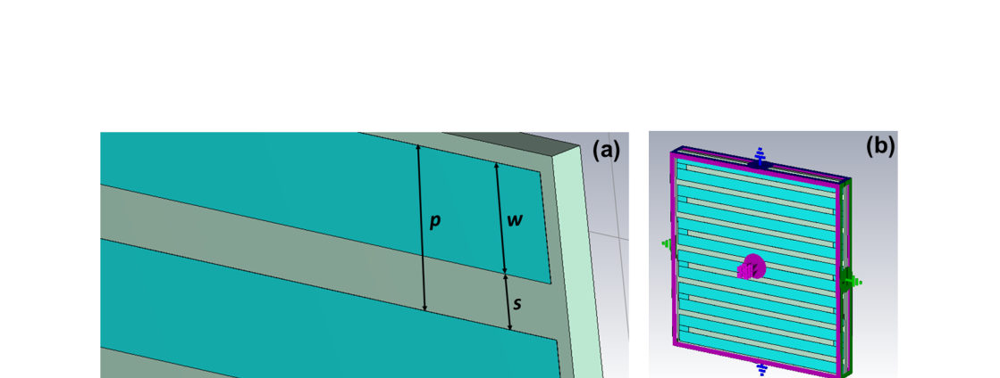 
Fig. 1 (a) Zoomed-in image of the schematic meander structure illustrating the meander. p, w, and s represent the pitch, width, and separation of the meander lines. (b) Schematic diagram of the meander structure on the substrate used for CST simulation. The left and right boundaries (green) were assigned as perfect electric conductor (PEC) boundaries, while the upper and lower boundaries (blue) were defined as perfect magnetic conductor (PMC) boundaries. The ports normal to the absorber plane (purple) were set as open boundaries for excitation of the IR radiation along the meander lines.

📷 Fig 2

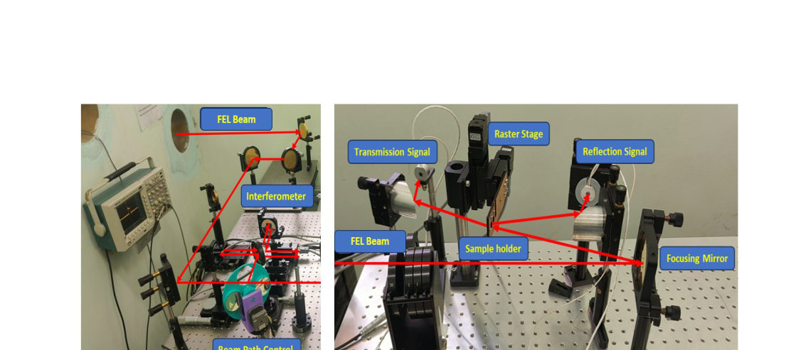 
Fig. 2 Photographs of the experimental optical measurement setup used for simultaneous transmission and reflection characterization of the fabricated meander absorber structures using the IR-FEL (right side). Red arrows represent the direction and path of the IR-FEL beam. The setup includes beam steering mirrors, focusing optics, pyroelectric detectors, and a home-built Michelson interferometer (left side) for independent wavelength determination.

📷 Fig 3

 
Fig. 3 (a) CST simulation model of the LEKID resonator showing the electromagnetic enclosure, applied boundary conditions, and excitation through the multi-pin waveguide port. (b) Detailed view of the LEKID geometry illustrating the microstrip feedline, meandered inductor, interdigitated capacitor, silicon substrate, and ground plane.

📷 Fig 4

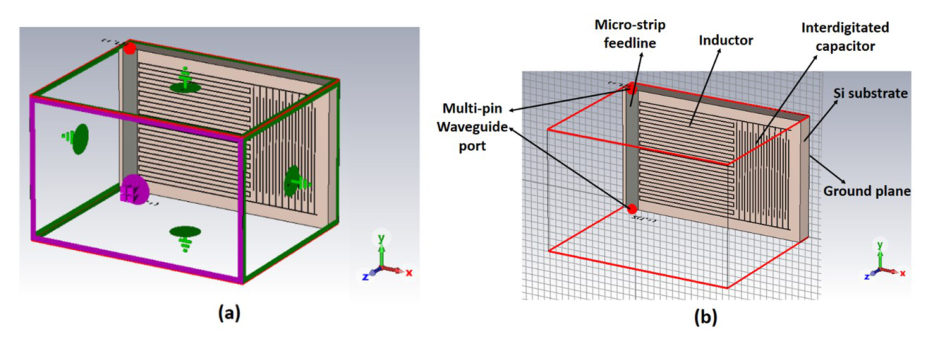 
Fig. 3(a). A detailed view of the resonator geometry is presented in Fig. 3(b). The side walls

📷 Fig 5

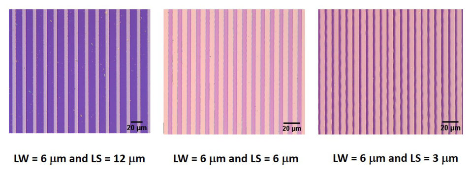 
Fig. 4 Optical microscope images of patterned structures with a constant line width (LW) of 6 m and varying line spacings (LS). The lengthscale for each image is indicated within the panels.

**Summary.** This work introduces a breakthrough detector design for mid-to-far infrared spectroscopy: a cavity-free absorber built from superconducting metallic meanders. By engineering the structure's impedance and exploiting sub-wavelength periodicity, the authors achieve high broadband absorption without the complexity of traditional resonant cavities. This establishes a scalable platform for next-generation MIR-FIR quantum detectors.

**Why it may be interesting.** While primarily an applied condensed matter/detector physics paper, the concept of using metamaterial periodicity to engineer near-perfect absorption by coupling incident energy into confined Ohmic losses is relevant to understanding loss mechanisms in quantum optical cavities or engineered dissipation channels in open quantum systems.

Detailed structure

**Main problem.** The primary challenge is developing fast, highly sensitive, and broadband detectors for the mid-to-far-infrared (MIR-FIR) spectral region.

**Main result.** A novel, cavity-free LEKID absorber architecture using superconducting Ti-V alloy meanders achieves high broadband absorption (50-90%) across 12.5-30 $\mu$m, simplifying detector fabrication significantly.

**Method.** The authors combine electromagnetic simulation (CST) with experimental characterization using an IR Free-Electron Laser (IR-FEL) to measure optical transmission and reflection.

**Model / system.** The system involves patterned metallic meander absorbers ($	ext{Ti}_{40}	ext{V}_{60}$) deposited on a silicon substrate. The mechanism relies on impedance matching at the front side and evanescent wave confinement due to sub-wavelength periodicity.

**Key observables.** Absorption efficiency (50-90%), broadband spectral response ($12.5 - 30 \mu	ext{m}$), and microwave resonance dip in a test LEKID resonator.

**Important parameters / regimes.** Wavelength range ($\lambda$), meander line spacing ($	ext{LS} = 3, 6, 12 \mu	ext{m}$), superconducting material ($	ext{Ti}_{40}	ext{V}_{60}$), and wave impedance matching ($Z_{	ext{meander}} \sim 110 \Omega$).

**Assumptions / limitations.** The analysis assumes that substrate effects can be mathematically de-embedded from measured optical data, and for the microwave test, it compares simulated vs. measured resonance behavior.

**Figures summary.** Figures show schematic meander structures, experimental setups using IR-FEL, simulation models of the LEKID resonator, and spectral plots demonstrating high absorption enhancement as line spacing decreases.

**Paper structure.** The paper progresses from identifying the limitations of conventional narrowband cavity-based detectors to proposing a novel, broadband, cavity-free absorber architecture. It details the physics (impedance matching + confinement) through simulation/theory, validates it with optical measurements across a wide spectral range, and finally confirms superconducting functionality via microwave characterization.

Abstract

Fast, highly sensitive, and broadband detectors operating in the mid-to-far-infrared (MIR-FIR) spectral region are essential for applications ranging from astrophysics to time-resolved spectroscopy using laboratory-based sources and beamlines at Infrared Free-Electron Laser (IR-FEL) facilities. Conventional Lumped Element Kinetic Inductance Detectors (LEKID) achieve high optical efficiency using resonant quarter wavelength (λ/4) backshort cavities. However, this cavity-based approach is inherently narrowband and becomes optomechanically challenging at the mid to far infrared (MIR-FIR) wavelengths. Here, we present a completely backshort-free LEKID absorber architecture that achieves broadband absorption exceeding 50%. The meander absorbers were fabricated from a superconducting Ti-V alloy and characterized using IR radiation from the IR-FEL at RRCAT, India. By illuminating through the silicon substrate and matching the meander's sheet resistance to the silicon substrate's wave impedance, the front-side reflection is strongly suppressed. Simultaneously, the sub-wavelength periodicity of the dense meander inhibits propagating transmission into free space via evanescent wave confinement. This combined mechanism drives efficient Ohmic dissipation within the metallic meander, yielding an experimental absorption efficiency ranging from 50% to 90% across the 12.5-30 micrometer wavelength range. The cavity-free design greatly simplifies the fabrication of the focal plane array while providing the broadband response required for next-generation detectors. To assess the suitability of the Ti40V60 alloy as an active superconducting detector material, a test LEKID resonator was also designed, fabricated, and experimentally characterized.

[↑ back to top](#top)

### [Chiral-Angle-Controlled Altermagnetic Spin Splitting in Nanotubes](http://arxiv.org/abs/2606.08757v1)

**Authors:** Ersoy Sasioglu, Tom. G. Saunderson, Börge Göbel, Ingrid Mertig, Samir Lounis  
**Type:** theory · **Category:** other · **PDF:** <https://arxiv.org/pdf/2606.08757v1>  
**Analysis basis:** full PDF text, analyzed in chunks
**Topic relevance:** `analog quantum simulation` **1/5** · `exotic spin models in light-matter` **1/5** · `spintronics-quantum-optics interface` **1/5**

📷 Fig 1

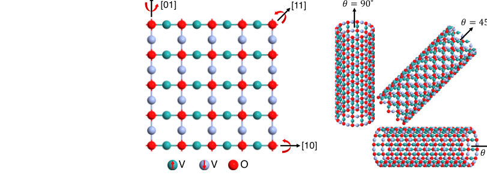 
FIG. 1. Atomistic structures of 2D V2O and corresponding nanotubes obtained from different rolling directions. (a) Checker- board 2D V2O altermagnet with opposite-spin V sublattices shown by different colors. The high-symmetry crystallographic directions [10], [11], and [01] are indicated. (b) V2O nanotubes obtained by rolling the parent 2D layer along different crystal- lographic directions corresponding to rolling angles θ = 0◦, 45◦, and 90◦.

📷 Fig 2

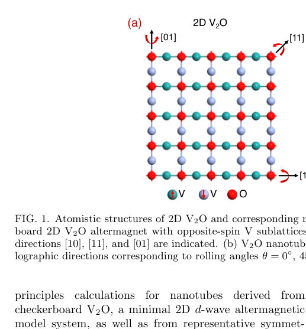 
Figure 1 illustrates the geometrical construction of nanotubes derived from the 2D checkerboard V2O alter- magnet. The parent square lattice shown in Fig. 1(a) contains the antinodal crystallographic directions [10] and [01], along which the momentum-dependent spin splitting is maximal, as well as the nodal diagonal di- rection [11], where the spin splitting vanishes by sym- metry. Rolling the 2D layer along different crystallo- graphic directions generates nanotubes characterized by a rolling angle θ between the nanotube axis and the antin- odal directions of the parent altermagnet. The repre- sentative nanotubes shown in Fig. 1(b) correspond to the high-symmetry orientations θ = 0◦, 45◦,...

📷 Fig 3

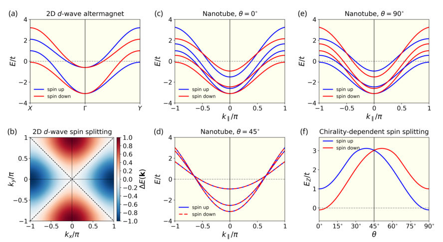 
FIG. 2. Tight-binding description of chiral-angle-controlled altermagnetic spin splitting in nanotubes. (a) Band structure of the parent 2D d-wave altermagnet along X–Γ–Y. (b) Momentum-resolved spin splitting ∆E(k) of the parent 2D d-wave altermagnet, exhibiting antinodal maxima and nodal lines with vanishing spin splitting. (c)–(e) 1D nanotube band structures for rolling angles θ = 0◦, 45◦, and 90◦, respectively. Antinodal nanotubes [θ = 0◦and 90◦] exhibit pronounced spin splitting, whereas the nodal nanotube [θ = 45◦] remains spin degenerate. (f) Dependence of the spin-resolved nanotube energies at the zone-boundary point Z on the rolling angle θ, showing the characteristic cos(2θ)...

📷 Fig 4

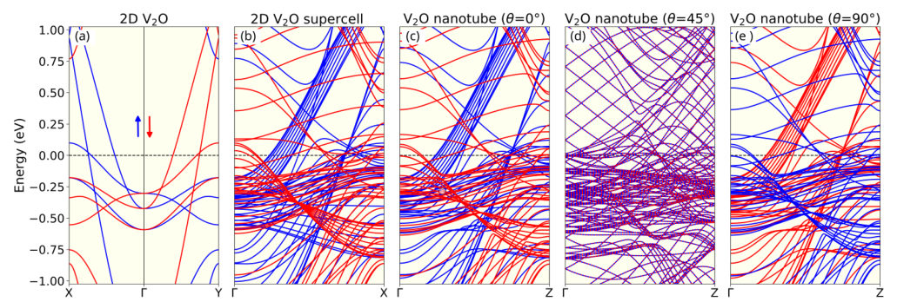 
FIG. 3. First-principles evolution of the electronic structure from 2D V2O to the corresponding nanotubes. (a) Band structure of primitive-cell 2D V2O along X–Γ–Y. (b) Band structure of a 1×18 rectangular supercell of 2D V2O along Γ–X. (c)–(e) Band structures of V2O nanotubes for rolling angles θ = 0◦, 45◦, and 90◦, respectively, calculated along the nanotube axis (Γ–Z).

**Summary.** This work demonstrates that rolling a 2D altermagnetic material into a nanotube converts its momentum-dependent spin splitting into a predictable, chiral-angle-controlled 1D splitting. By using tight-binding models and first-principles calculations, the authors establish dimensional projection as a general method to engineer tunable spin-split quantum states in low-dimensional magnetic nanostructures.

**Why it may be interesting.** While focused on magnetism, the concept of engineering quantum states by geometric dimensionality reduction (dimensional projection) is relevant for designing novel low-dimensional quantum systems whose properties are controlled by external geometry or strain.

Detailed structure

**Main problem.** The study investigates how the momentum-dependent spin splitting characteristic of 2D altermagnets is transformed into a chiral-angle-controlled 1D spin splitting when the material is physically rolled into a nanotube.

**Main result.** Dimensional projection successfully transfers this splitting, resulting in a robust $\cos(2	heta)$ angular dependence for the 1D spin splitting, which vanishes at nodal orientations and peaks at antinodal ones.

**Method.** The research combines analytical derivation using a minimal tight-binding model with validation via first-principles electronic structure calculations.

**Model / system.** The system models rolling a 2D $d$-wave altermagnet (like $	ext{V}_2	ext{O}$) into a nanotube. The analysis uses Bloch Hamiltonians and dimensional projection techniques on the tight-binding lattice model.

**Key observables.** Spin splitting ($\Delta E(\mathbf{k})$), which exhibits a characteristic $\cos(2	heta)$ dependence controlled by the rolling angle $	heta$.

**Important parameters / regimes.** The rolling angle $	heta$, which dictates the orientation relative to the parent material's nodal/antinodal structure.

**Assumptions / limitations.** The mechanism relies on dimensional projection from a 2D parent state to a 1D nanotube system, and calculations are limited to high-symmetry angles ($	heta = 0^\circ, 45^\circ, 90^\circ$).

**Figures summary.** Figures illustrate the atomistic structures of nanotubes derived from $	ext{V}_2	ext{O}$ at different rolling angles, alongside band structure plots confirming the $\cos(2	heta)$ dependence of the spin splitting.

**Paper structure.** The paper establishes the theoretical framework by analyzing the parent 2D altermagnet's Hamiltonian and then applies dimensional projection to derive the effective 1D Hamiltonian. Results are confirmed using both tight-binding models and first-principles calculations across various candidate materials.

Abstract

Altermagnets exhibit momentum-dependent spin splitting despite having zero net magnetization. Here, we show that rolling a two-dimensional (2D) $d$-wave altermagnet into a nanotube transforms this momentum-dependent spin splitting into chiral-angle-controlled one-dimensional (1D) spin splitting through dimensional projection. Using a minimal tight-binding model and first-principles calculations, we demonstrate that the nanotube spin splitting follows a characteristic $\cos(2θ)$ dependence, vanishing for nodal orientations and reaching extrema for antinodal orientations. The mechanism remains robust across a broad class of nanotubes derived from 2D altermagnets. Our results establish dimensional projection as a general route for transferring momentum-dependent altermagnetic spin splitting into 1D systems and provide a framework for engineering spin-split quantum states in low-dimensional magnetic materials.

[↑ back to top](#top)

### [Novel 2D Altermagnetic Vanadium Oxide with a Buckled Lieb Structure](http://arxiv.org/abs/2606.08637v1)

**Authors:** Tamer Taşkıran, Soheil Ershadrad, Biplab Sanyal, Cüneyt Şahin  
**Type:** theory · **Category:** other · **PDF:** <https://arxiv.org/pdf/2606.08637v1>  
**Analysis basis:** full PDF text, analyzed in chunks
**Topic relevance:** `Keldysh / 2PI / non-Gaussian methods` **1/5** · `analog quantum simulation` **1/5** · `spintronics-quantum-optics interface` **1/5**

📷 Fig 1

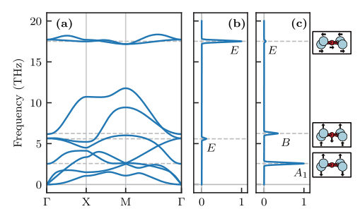 
FIG. 2. (a) Phonon dispersion of V2O (b) IR spectrum of V2O (c) Raman spectrum of V2O and the vibration modes corresponding to the Raman peaks

📷 Fig 2

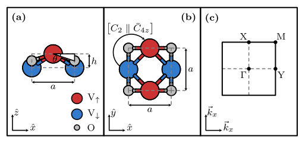 
FIG. 1. (a) The side view of the crystal structure of V2O. The lattice parameters a, h, and θ are denoted. The V atom with the up spin is colored red, the V atom with the down spin is colored blue, and the O atom is colored gray. (b) The top view of the crystal structure of V2O. The composite symmetry between two V atoms is denoted as [C2 ∥¯C4z], where C2 is the 180◦rotation of the spin around an axis perpendicular to the spins and ¯C4z is the 180◦improper rotation symmetry between the lattice points of V atoms. (c) The Brillouin zone and the high symmetry points of the V2O.

📷 Fig 3

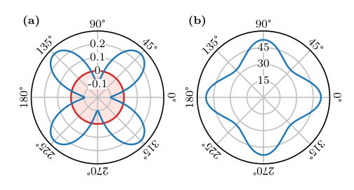 
FIG. 3. The angular dependence of (a) Poisson’s ratio (νθ) and (b) Young’s modulus (Yθ) as a function of the in-plane angle (θ) for the V2O monolayer. The auxetic region, where Poisson’s ratio becomes negative, is highlighted by the red shaded area.

📷 Fig 4

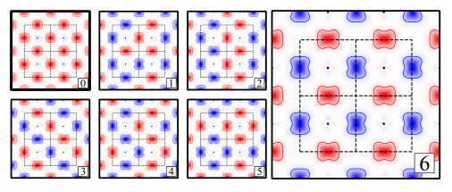 
FIG. 4. Spin density plot of spin-polarized DFT+U calcula- tions of different AFM configurations. Iso-contours are drawn at ±0.00025 e/Å. Oxygen atom locations are indicated by black circles for visual clarity. The 2 × 2 × 1 super-cell is shown with the dashed lines.

📷 Fig 5

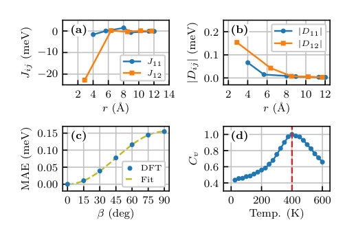 
FIG. 5. (a) Symmetric exchange interaction parameters with respect to distance (b) Asymmetric exchange interac- tion (DMI) parameters with respect to distance (c) Magnetic anisotropy energy of V2O. Blue markers show the results of spin-orbit interaction, including DFT+U calculations for α = 0. Green curve shows the results of Eq. 4 for α = 0 (d) Heat capacity with respect to temperature, calculated through Monte Carlo simulation of the Heisenberg Hamilto- nian.

**Summary.** This work computationally identifies monolayer V2O as a promising altermagnetic material for spintronics. Using DFT calculations, the authors confirm its structural stability and predict key magnetic features, including an out-of-plane easy axis. Crucially, they calculate a large intrinsic spin Hall conductivity, demonstrating its potential for advanced electronic devices.

**Why it may be interesting.** While the primary focus is on condensed matter magnetism and transport, the rigorous application of DFT to predict emergent quantum phenomena like topological spin Hall effects in novel 2D oxides connects to advanced theoretical modeling techniques relevant across many-body physics.

Detailed structure

**Main problem.** The study aims to identify novel, robust two-dimensional (2D) altermagnetic materials suitable for next-generation spintronic devices.

**Main result.** Monolayer V2O is proposed as a stable room-temperature altermagnet exhibiting an antiferromagnetic ground state, out-of-plane magnetic anisotropy, and significant intrinsic spin Hall conductivity.

**Method.** The research employs first-principles calculations using Density Functional Theory (DFT) combined with advanced techniques like DFT+U, HSE06, and Wannierization for transport analysis.

**Model / system.** The physical system is a monolayer V2O crystal structured in a buckled Lieb lattice. The magnetic behavior is modeled using a full spin Hamiltonian incorporating exchange ($J_{ij}$), Dzyaloshinskii-Moriya ($\vec{D}_{ij}$), and anisotropy terms.

**Key observables.** Intrinsic Spin Hall Conductivity ($\approx 40 (\hbar/e) 	ext{ S cm}^{-1}$), momentum-dependent spin splitting (1.2 eV), negative Poisson's ratio (auxetic behavior), and an out-of-plane easy magnetic axis.

**Important parameters / regimes.** Local magnetic moment ($2.79 \mu_B$ per V atom); lattice parameter $a = 4.01 	ext{ Å}$; Néel temperature estimated around $400 	ext{ K}$.

**Assumptions / limitations.** The analysis relies on DFT approximations (PBE, DFT+U) and assumes the material remains stable under room-temperature conditions.

**Figures summary.** Figures illustrate the structural buckling of V2O, its magnetic spin configuration, and potentially show phonon dispersion or electronic band structures related to transport properties.

**Paper structure.** The paper follows a standard computational physics structure: first establishing structural/thermodynamic stability (formation energy, phonons, AIMD); then characterizing mechanical properties (auxeticity); followed by detailed magnetic analysis (ground state, anisotropy); and finally calculating electronic/transport responses (spin splitting, SHC).

Abstract

Altermagnetism has recently emerged as a highly promising phase for spintronics, offering the combined advantages of both antiferromagnets and ferromagnets. Here, using a first-principles analysis based on density functional theory (DFT), we identify a monolayer V$_2$O crystal in a buckled Lieb lattice as a promising two-dimensional altermagnetic material. The structural and thermal stability of V$_2$O is verified through calculations of the crystal's formation energy, phonon structure, room-temperature ab initio molecular dynamics, and stiffness matrix. The system is found to exhibit auxetic behavior with a negative Poisson's ratio. Our calculations indicate an antiferromagnetic ground state with a local magnetic moment of $2.79\,μ_{\mathrm{B}}$ per V atom and a magnetocrystalline anisotropy that favors an out-of-plane easy axis. The electronic structure exhibits a momentum-dependent spin splitting of 1.2 eV, which is a characteristic of altermagnets. Inclusion of spin-orbit coupling breaks the symmetry of the quadratic band crossing near the Fermi level, resulting in a large Berry curvature and significant intrinsic spin Hall conductivity around $40\,(\hbar/e)\,\mathrm{S\,cm^{-1}}$. The results demonstrate that monolayer V$_2$O serves as a robust room-temperature altermagnetic platform, exhibiting magnetic anisotropy and spin-dependent transport responses.

[↑ back to top](#top)

### [First-Principles Investigation of Electron--Phonon Coupling and Intrinsic Two-Gap Superconductivity in Hexagonal BAs3 Monolayer](http://arxiv.org/abs/2606.08423v1)

**Authors:** Jakkapat Seeyangnok, Udomsilp Pinsook  
**Type:** theory · **Category:** other · **PDF:** <https://arxiv.org/pdf/2606.08423v1>  
**Analysis basis:** full PDF text, analyzed in chunks
**Topic relevance:** `Keldysh / 2PI / non-Gaussian methods` **1/5** · `analog quantum simulation` **1/5**

📷 Fig 1

 
Figure 1: Crystal structure of monolayer BAs3. (a) Side view of the optimized structure showing the buckled boron–arsenic network together with the vacuum region of 15.0 ˚A introduced along the out- of-plane direction to eliminate interactions between periodic images. (b) Top view of the hexagonal lattice. The primitive unit cell is indicated by the black rhombus, with an optimized lattice constant of a = 7.00 ˚A. Orange and green spheres represent As and B atoms, respectively.

📷 Fig 2

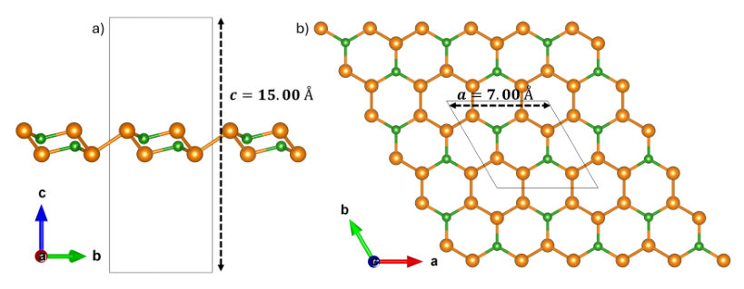 
Figure 2(a) compares the initial and final atomic configurations by superimposing the two structures.

📷 Fig 3

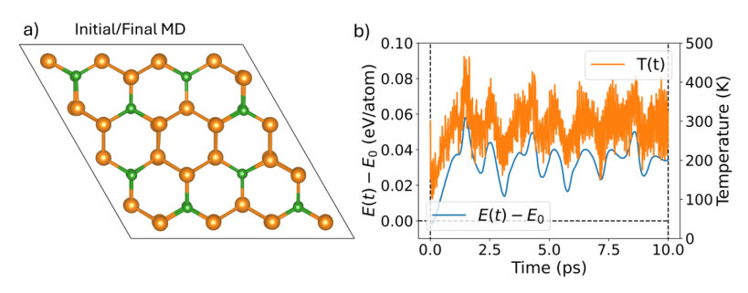 
Figure 2: (a) Superposition of the initial and final atomic configurations obtained from a 10 ps AIMD simulation at 300 K. The strong overlap between the two structures indicates only minor thermal displace- ments and confirms the structural stability of the BAs3 monolayer. Orange and green spheres represent As and B atoms, respectively.(b) Time evolution of the total energy difference per atom, E(t) −E0, (left axis) and instantaneous temperature T(t) (right axis) during the AIMD simulation. The temperature fluctuates around the target value of 300 K, while the total energy remains bounded without noticeable drift, demonstrating the thermal stability of the monolayer.

📷 Fig 4

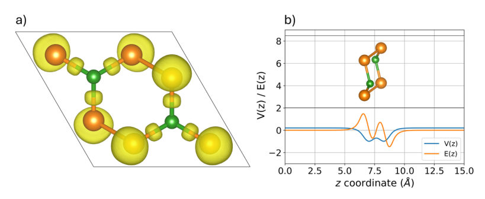 
Figure 3: Bonding character and electrostatic profile of monolayer BAs3. (a) Electron localization function (ELF) of monolayer BAs3. The pronounced ELF localization along the B–As bonds indicates strong directional covalent bonding arising from B-p and As-p orbital hybridization. (b) Plane-averaged electrostatic potential V (z) and corresponding electric field E(z) along the out-of-plane direction. The asymmetric potential profile around the atomic layer reflects the polar nature of the BAs3 monolayer, while both V (z) and E(z) become nearly constant in the vacuum region.

📷 Fig 5

 
Figure 3(a) shows the electron localization function (ELF) of monolayer BAs3. Pronounced ELF

**Summary.** This theoretical study investigates the superconducting properties of monolayer BAs3 using first-principles calculations. By combining DFT with anisotropic Eliashberg theory, the authors predict that the material is an intrinsic two-gap superconductor with a critical temperature of 3.4 K. The findings highlight how distinct Fermi surface sheets lead to anisotropic pairing interactions mediated by low-frequency phonon modes.

**Why it may be interesting.** While focused on solid-state physics, the use of advanced many-body theory (Migdal-Eliashberg) to model pairing mechanisms in low dimensions is relevant for understanding emergent quantum phenomena in engineered quantum materials.

Detailed structure

**Main problem.** The study investigates anisotropic and multigap superconductivity in reduced-dimensionality systems, specifically focusing on the hexagonal BAs3 monolayer.

**Main result.** The calculations predict that monolayer BAs3 is an intrinsic anisotropic two-gap superconductor with a critical temperature of 3.4 K, characterized by distinct superconducting gaps ($\Delta_1=0.75$ meV and $\Delta_2=0.51$ meV).

**Method.** The research employs first-principles calculations combining Density Functional Theory (DFT) with Density Functional Perturbation Theory (DFPT) and solving the fully anisotropic Migdal–Eliashberg theory.

**Model / system.** The physical system is the hexagonal BAs3 monolayer, modeled using DFT to determine its structural stability, electronic band structure, and electron-phonon coupling mechanisms. The analysis focuses on multiband characteristics derived from hybridized B-$p$ and As-$p$ orbitals.

**Key observables.** Superconducting critical temperature ($T_c=3.4$ K), two distinct superconducting gaps ($\Delta_1$, $\Delta_2$), total electron-phonon coupling constant ($\lambda=0.75$), and the anisotropic gap/coupling strength in momentum space.

**Important parameters / regimes.** Intermediate-coupling regime ($\lambda=0.75$); low-frequency As-derived phonon modes dominate the EPC; 2D limit of superconductivity.

**Assumptions / limitations.** The calculations rely on approximations such as using GGA functional with PBE, specific Gaussian broadenings for electronic and phononic terms, and solving the anisotropic Eliashberg equations.

**Figures summary.** Figures illustrate the optimized crystal structure (side/top views), the electron-phonon spectral function ($\alpha^2F(\omega)$) showing low-frequency peaks, and momentum-resolved maps of both the superconducting gap ($\Delta_{\mathbf{k}}$) and the coupling strength ($\lambda_{\mathbf{k}}$).

**Paper structure.** The paper proceeds by first confirming structural stability (phonon/AIMD), then characterizing the electronic structure (metallic state with multiple bands), followed by calculating the electron-phonon coupling, and finally solving the anisotropic Eliashberg equations to predict $T_c$ and the two-gap nature of the superconductivity.

Abstract

Two-dimensional superconductors with multiband electronic structures provide an ideal platform for exploring anisotropic and multigap superconductivity in the reduced-dimensionality limit. Here, we investigate the structural, electronic, vibrational, and superconducting properties of a hexagonal BAs$_3$ monolayer using first-principles calculations combined with density functional perturbation theory and fully anisotropic Migdal--Eliashberg theory. The optimized structure is found to be dynamically and thermally stable, as confirmed by phonon calculations and ab initio molecular dynamics simulations. Electronic structure calculations reveal an intrinsic metallic state with multiple bands crossing the Fermi level and several disconnected Fermi-surface sheets derived primarily from hybridized B-$p$ and As-$p$ orbitals. The electron--phonon interaction is dominated by low-frequency As-derived phonon modes, yielding a total electron--phonon coupling constant of $λ=0.75$. Solving the anisotropic Eliashberg equations predicts a superconducting critical temperature of $T_c=3.4$ K. The momentum-resolved superconducting gap exhibits a pronounced two-gap character with gap magnitudes of $Δ_1=0.75$ meV and $Δ_2=0.51$ meV at $T=1$ K. The superconducting gaps remain finite over the entire Fermi surface, demonstrating a fully gapped nodeless superconducting state. Analysis of the momentum-dependent electron--phonon coupling reveals that the two-gap superconductivity originates from sheet-dependent pairing interactions associated with distinct Fermi-surface sheets. Our results establish monolayer BAs$_3$ as an intrinsic anisotropic two-gap superconductor and expand the growing family of boron-based two-dimensional superconductors.

[↑ back to top](#top)

### [Proximity-induced orbital antiferromagnetism in Ising superconductors](http://arxiv.org/abs/2606.09797v1)

**Authors:** G. A. Bobkov, V. A. Bobkov, T. Karabassov, I. V. Bobkova, A. A. Golubov  
**Type:** theory · **Category:** strongly correlated electrons · **PDF:** <https://arxiv.org/pdf/2606.09797v1>  
**Analysis basis:** full PDF text, analyzed in chunks
**Topic relevance:** `Keldysh / 2PI / non-Gaussian methods` **1/5** · `spintronics-quantum-optics interface` **1/5**

📷 Fig 1

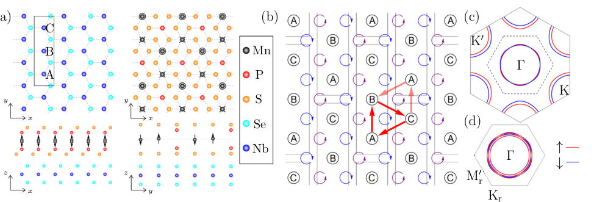 
FIG. 1. (a) Top view of the NbSe2 and MnPS3 monolayers and side views of the NbSe2/MnPS3 heterostructure in the (x, z) and (y, z) planes. Black arrows in the side views and circles/crosses in the top view indicate Mn magnetic moments aligned in +z/ −z directions respectively. (b) Schematic of atomic-scale current loops with opposite circulation in the NbSe2 monolayer, induced by the phase difference of the superconducting order parameter on the Nb sites A, B, and C. Red arrows indicate the current flow between neighboring sites. (c) Brillouin zone and the spin-split Fermi surfaces of the isolated NbSe2 monolayer. The dashed curve marks the boundary of the folded Brillouin zone of the...

📷 Fig 2

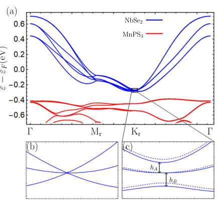 
FIG. 2. (a) Electronic band structure of the NbSe2/MnPS3 heterostructure in the folded Brillouin zone [see Fig. fig:1(d)]. Blue branches stem from NbSe2; red branches are of MnPS3 origin, which retains its insulating character in the het- erostructure upon inclusion of interlayer charge transfer. (b)– (c) Zoom-in on the vicinity of the Kr point (b) for a free- standing NbSe2 monolayer and (c) for the NbSe2/MnPS3 het- erostructure. Solid and dashed lines correspond to dpin-up and spin-down branches.

📷 Fig 3

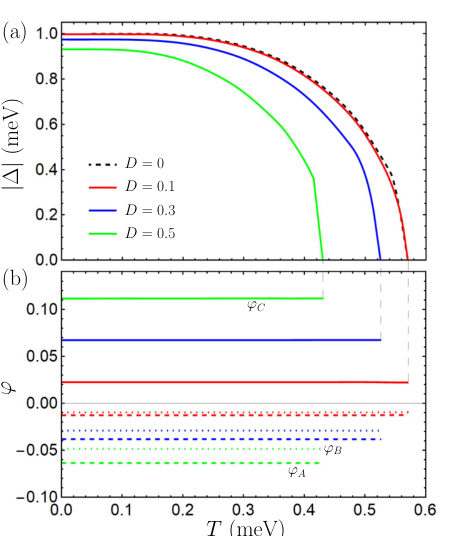 
FIG. 3. Superconducting OP in the NbSe2 monolayer with the effective exchange field hA,B,C = D{+8, −10.5, 0} meV as a function of temperature. (a) OP amplitude (identical on all three magnetic sublattices); (b) OP phase on the three magnetic sublattices: φA (dashed), φB (dotted), φC (solid).

📷 Fig 4

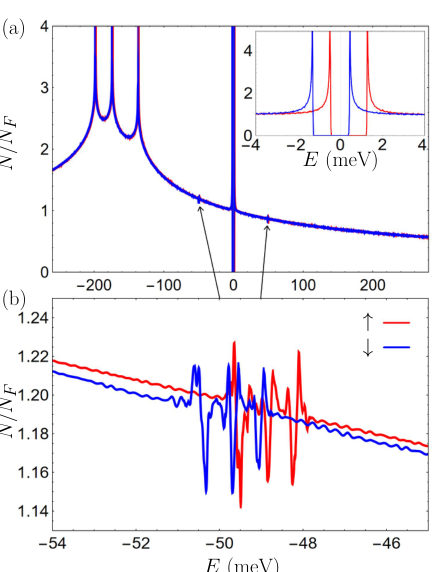 
FIG. 4. (a) Spin-resolved LDOS (red: up, blue: down) of the superconducting monolayer in an effective exchange field. Inset: zoom of the superconducting gap at the Fermi-level. Finite-energy dips due to the periodic inhomogeneity of the superconducting OP are marked by arrows. (b) Zoom of one such dip region. NF is the normal-state LDOS at E = 0.

📷 Fig 5

 
Fig. 3(b) demonstrates a phase modulation φA,B,C with magnetic periodicity for any nonzero exchange field. The phase is linear, to good accuracy, in hA,B,C (even beyond the h ≪∆analytical limit) and temperature- independent, contrasting sharply with the FFLO state.

**Summary.** The paper predicts a novel superconducting state called orbital antiferromagnetism in superconductor/antiferromagnet interfaces. This state is characterized by an atomic-scale periodic modulation of the superconducting order parameter, generating persistent loop currents. The theoretical framework combines DFT and BdG calculations to predict observable signatures like specific dips in the local density of states.

**Why it may be interesting.** This work deals with exotic pairing mechanisms and orbital magnetism induced by proximity effects in layered materials, which are central topics in modern condensed matter theory relevant to strongly correlated systems.

Detailed structure

**Main problem.** The prediction of a fundamentally new superconducting state—orbital antiferromagnetism—in superconductor/antiferromagnet heterostructures.

**Main result.** The predicted state is unique, exhibiting atomic-scale loop currents and remaining stable over the full parameter range, unlike FFLO or helical states.

**Method.** Combining first-principles electronic structure (DFT) with Bogoliubov–de Gennes (BdG) calculations to analyze superconducting order parameter modulation.

**Model / system.** The system is an S/AF heterostructure, exemplified by NbSe2/MnPS3. The physics is governed by a tight-binding Hamiltonian incorporating proximity-induced exchange fields and Ising spin–orbit coupling.

**Key observables.** Characteristic finite-energy dips in the local density of states (LDOS); periodic phase modulation of the superconducting order parameter ($\Delta_i$).

**Important parameters / regimes.** The ratio of induced exchange field to superconducting gap ($|\mathbf{h}|/\Delta$); interface transparency ($D$).

**Assumptions / limitations.** The analysis often assumes $|\mathbf{h}_{A,B,C}| \ll \Delta$ for analytical treatments, though numerical solutions are used when this is violated.

**Figures summary.** Figures illustrate the heterostructure geometry and current loops; electronic band structures show folded Brillouin zones; LDOS plots reveal finite-energy dips corresponding to OP inhomogeneity.

**Paper structure.** The paper progresses from defining the physical problem in S/AF heterostructures, developing the Hamiltonian and theoretical framework using Green's functions, calculating the superconducting order parameter modulation, and finally analyzing related phenomena like triplet correlations based on magnetic field type (ferri vs. antiferro).

Abstract

We predict a fundamentally new superconducting state in superconductor/antiferromagnet heterostructures with Ising spin--orbit coupling: proximity-induced orbital antiferromagnetism. In this state, the order parameter acquires a periodic phase modulation locked to the magnetic lattice, generating atomic-scale loop currents with opposite orbital moments on neighboring unit cells. Its emergence requires at least three nonequivalent magnetic sublattices per unit cell and finite spin--orbit coupling. Using NbSe$_2$/MnPS$_3$ as a concrete example, we combine first-principles and Bogoliubov--de Gennes calculations to demonstrate that the proximity-induced exchange field leads to robust phase modulation. Unlike FFLO and helical states, the phase gradient is atomic-scale, the state is current-carrying, and it remains uniquely stable over the full parameter range. The state manifests as characteristic finite-energy dips in the local density of states, accessible by STM.

[↑ back to top](#top)

### [Radiowave-induced Resistance Oscillations](http://arxiv.org/abs/2606.09755v1)

**Authors:** E. Bell, C. Hnatovsky, K. W. Baldwin, L. N. Pfeiffer, K. W. West, S. Studenikin, M. A. Zudov  
**Type:** experiment · **Category:** other · **PDF:** <https://arxiv.org/pdf/2606.09755v1>  
**Analysis basis:** full PDF text, analyzed in chunks
**Topic relevance:** `non-equilibrium dynamics` **1/5** · `spintronics-quantum-optics interface` **1/5**

📷 Fig 1

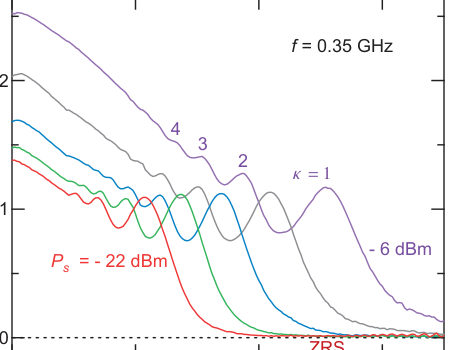 
FIG. 1. Longitudinal resistivity ρ versus magnetic field B measured under radiowaves of frequency f = 0.35 GHz at different source powers from Ps = −22 dBm (left curve) to Ps = −6 dBm (right curve), in a step of 4 dBm. The maxima of observed oscillations are marked by κ = 1, 2, 3, ... next to ρ(B) measured at Ps = −6 dBm. ZRS stands for zero-resistance state, developed at B &gt; B1, where B1 is the field of a fundamental RIRO maximum (κ = 1).

📷 Fig 2

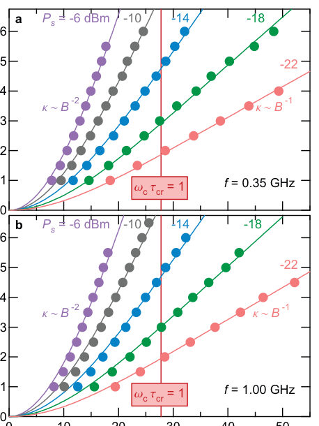 
FIG. 2. Order of the oscillation maxima κ (solid circles) as a function of inverse magnetic field 1/B obtained from the extrema of magnetoresistivity measured under radiowaves of frequency (a) f = 0.35 GHz and (b) f = 1.00 GHz at different source powers from Ps = −6 dBm (left) to Ps = −22 dBm (right), as marked. Solid lines are fits to Eq. (2). Vertical line, drawn at ωcτcr = 1, il- lustrates a crossover between the κ ∝B−2, Eq. (3), and κ ∝B−1, Eq. (4), regimes.

📷 Fig 3

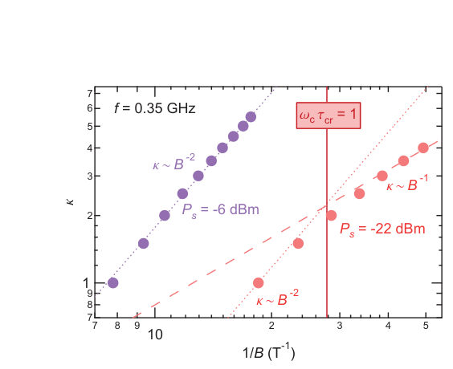 
FIG. 3. κ (solid circles) as a function of inverse magnetic field 1/B obtained from the extrema of magnetoresistivity measured under ra- diowaves of frequency f = 0.35 GHz at Ps = −6 dBm (left) and Ps = −22 dBm (right), as marked. Dotted lines and dashed line represent fits to Eq. (3) and Eq. (4), respectively. Vertical line, drawn at ωcτcr = 1, illustrates a crossover between the κ ∝B−2 (Eq. (3)) and κ ∝B−1 (Eq. (4)) regimes.

📷 Fig 4

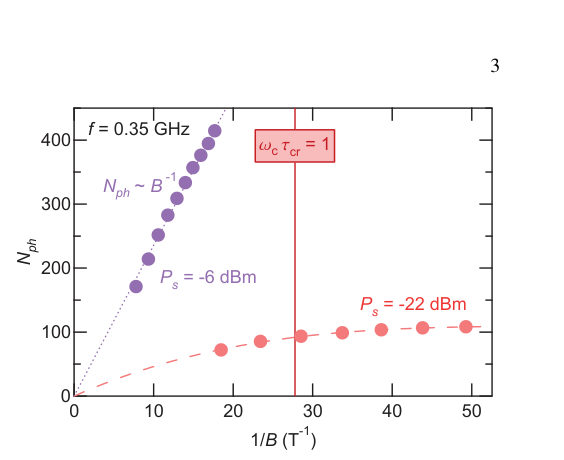 
FIG. 5. Number of photons Nph = κωc/ω (solid circles) as a function of inverse magnetic field 1/B obtained from the extrema of magnetoresistivity measured under radiowaves of frequency f = 0.35 GHz at Ps = −6 dBm and Ps = −22 dBm, as marked. Dotted line illustrates Nph ∝B−1 dependence expected for high power data at ωcτcr &gt; 1, whereas the lower power data crosses over to expected saturation expected at ωcτcr &lt; 1 (the dashed line is a guide to an eye), see Eq. (6). Vertical line is drawn at ωcτcr = 1. The cyclotron resonance takes place at 1/B ≈1.3 · 103 T−1.

📷 Fig 5

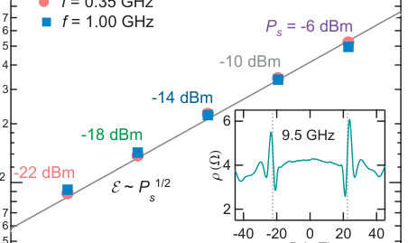 
FIG. 4. Radiowave electric field E, obtained from Eq. (5), as a function of the source power Ps for f = 0.35 GHz (circles) and f = 1.00 GHz (squares). Solid line illustrates the expected E ∝P 1/2 s dependence. Inset shows ρ versus B measured at f = 9.5 GHz to obtain the effective mass m⋆used to calculate E.

**Summary.** This paper reports on Radiowave-induced Resistance Oscillations (RIROs) observed in a 2DEG, distinguishing them from standard MIROs by noting their occurrence when the cyclotron frequency is much larger than the radiation frequency. The authors demonstrate that these oscillations are governed by the electric field and can be explained theoretically using a displacement model incorporating short-range disorder effects.

**Why it may be interesting.** The work provides an excellent example of how nonlinear transport phenomena can be probed using external fields (RF radiation) in condensed matter systems. The clear distinction between MIROs and RIROs highlights the sensitivity of quantum transport measurements to both the frequency regime ($\omega$ vs $\omega_c$) and the underlying physical mechanism (single-photon vs displacement/disorder effects).

Detailed structure

**Main problem.** The paper investigates a new class of magneto-resistance oscillations, termed Radiowave-induced Resistance Oscillations (RIROs), which are distinct from the well-known Microwave-induced Resistance Oscillations (MIROs). It aims to characterize these oscillations under radiofrequency irradiation.

**Main result.** The authors report observing RIROs in a regime ($\omega_c \gg \omega$) where they are independent of radiation power and exhibit periodicities ($1/B$ or $1/B^2$) controlled by the electric field rather than the microwave frequency. The findings confirm a theoretical displacement model explanation.

**Method.** The study involves measuring longitudinal resistivity ($
ho$) as a function of magnetic field ($B$) while irradiating a 2DEG with radiofrequency radiation, and analyzing the dependence of oscillation periodicity on source power and frequency.

**Model / system.** The physical system is a two-dimensional electron gas (2DEG) in a GaAs/AlGaAs quantum well structure. The theoretical explanation relies on a displacement model applied to photoresistance, particularly considering the contribution from short-range disorder.

**Key observables.** Longitudinal resistivity ($
ho$) vs $B$, oscillation maxima ($\kappa$), extracted radiation electric field ($E$), and the number of participating photons ($N_{ph}$).

**Important parameters / regimes.** The ratio $\omega_c	au_{cr}$ (cyclotron frequency times scattering time), the radiation frequency ($\omega$), and the magnetic field dependence leading to crossovers between $B^{-2}$ and $B^{-1}$ periodicity.

**Assumptions / limitations.** The analysis assumes the oscillations can be explained by a displacement contribution in the limit of short-range disorder, and it models the electric field extraction based on source power ($E \propto P_s^{1/2}$).

**Figures summary.** Figures show $
ho$ vs $B$ demonstrating RIROs and zero-resistance states; plots illustrate the crossover of oscillation periodicity ($\kappa$) between $B^{-2}$ and $B^{-1}$ regimes at a critical point; and other figures confirm the scaling of the extracted electric field ($E \propto \sqrt{P_s}$) and photon number ($N_{ph}$).

**Paper structure.** The paper establishes the novelty of RIROs compared to MIROs by detailing their distinct physical conditions ($\omega_c \gg \omega$). It then presents experimental evidence showing power-independent amplitude, field-controlled periodicity, and a crossover in periodicity dependence on $B$. Finally, it connects these observations to a theoretical displacement model.

Abstract

Microwave-induced resistance oscillations (MIROs) \cite{zudov:2001a} occur when a 2D electron gas is subjected to radiation of frequency $ω= 2 πf$ and varying magnetic field $B$. MIROs are periodic in $1/B$, with the period determined by the radiation frequency $ω$, and their amplitude scales with the radiation power. Stepping from single-photon transitions between Landau levels, MIROs are found on the lower-field side of the cyclotron resonance, $ω_c \lesssim ω$, where $ω_c$ is the cyclotron frequency. Here, we report on experimental observation of another class of magneto resistance oscillations, which are also induced by radiation, but in the radio frequency (UHF band) range. These oscillations are distinct from MIROs in the following aspects: (i) they occur at $ω_c \gg ω$, (ii) their amplitude is independent of radiation power, (iii) their period is controlled by the radiation electric field, rather than by $ω$, and (iv) they can be either $1/B$ or $1/B^2$-periodic, depending on $B$. We further show that these oscillations can be explained by a displacement model in the limit of short-range disorder.

[↑ back to top](#top)

### [Strain-Induced Tuning of Third-Harmonic Generation in Monolayer Black Phosphorene](http://arxiv.org/abs/2606.09232v1)

**Authors:** Yan Meng, Kainan Chang, Wei Song, Yuwei Shan, Jin Luo Cheng, Luxia Wang  
**Type:** theory · **Category:** other · **PDF:** <https://arxiv.org/pdf/2606.09232v1>  
**Analysis basis:** full PDF text, analyzed in chunks
**Topic relevance:** `Keldysh / 2PI / non-Gaussian methods` **1/5** · `interference shaping light` **1/5**

📷 Fig 1

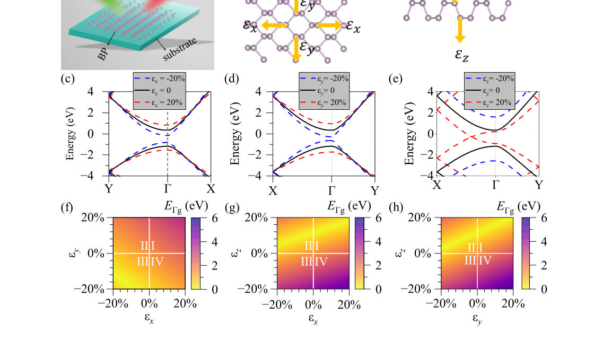 
FIG. 1. (a) Schematic illustration of THG in monolayer BP on a substrate, where incident light

📷 Fig 2

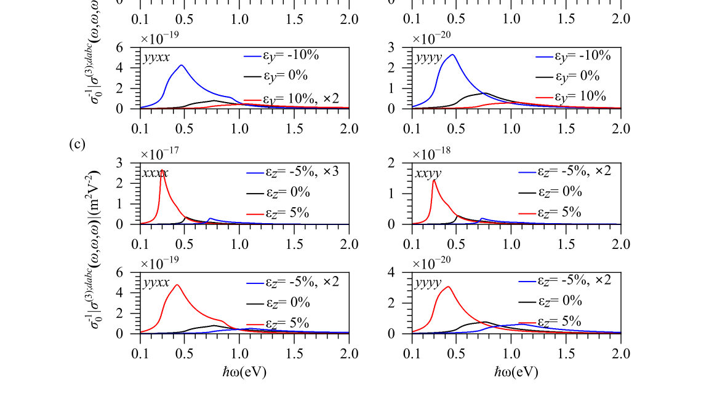 
FIG. 2. Spectra of THG conductivities (σ(3);xxxx, σ(3);xxyy, σ(3);yyxx, and σ(3);yyyy) of mono-

📷 Fig 3

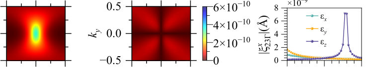 
FIG. 3. (a) Distribution of the absolute value of the Berry connection |ξ23k| between the highest

📷 Fig 4

 
FIG. 4. The σ(3);xxxx component of the third-order nonlinear conductivity in monolayer BP as

📷 Fig 5

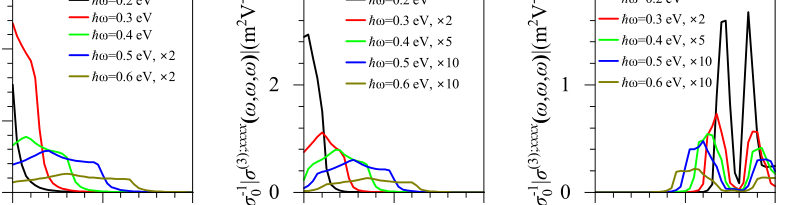 
Figure 4(c) shows that, under out-of-plane compression (εz &lt; 0), the THG response is

**Summary.** This theoretical study investigates strain engineering as a method to control Third-Harmonic Generation (THG) in monolayer black phosphorene. By modeling the system using tight-binding theory and Bloch equations, the authors demonstrate that applying uniaxial or biaxial strain can dramatically tune the THG signal's intensity and spectral shift. This establishes strain as a powerful tool for developing reconfigurable nonlinear photonic devices.

**Why it may be interesting.** This work provides a concrete example of how external mechanical stimuli (strain) can be used to engineer quantum optical responses in 2D materials, which is highly relevant for designing tunable photonic devices and understanding light-matter interactions beyond simple linear optics.

Detailed structure

**Main problem.** The study systematically reveals the microscopic mechanism by which strain engineering can tune Third-Harmonic Generation (THG) in monolayer black phosphorene (BP).

**Main result.** Strain significantly controls THG, with compressive strain and out-of-plane tension enhancing the signal via redshift, while tensile strains cause suppression and blueshifts. The tuning efficiency follows a strong directional dependence ($z > y > x$).

**Method.** The research employs a theoretical framework combining a tight-binding model Hamiltonian with semiconductor Bloch equations to calculate nonlinear optical susceptibilities.

**Model / system.** The physical system is monolayer Black Phosphorene (BP), modeled using a four-band tight-binding Hamiltonian. Strain effects are incorporated by modifying hopping parameters based on lattice deformation, and the THG response is calculated via third-order nonlinear conductivity components.

**Key observables.** Third-harmonic generation susceptibility ($\chi^{(3)}$) or conductivity ($\sigma^{(3)}$), bandgap energy ($E_{\Gamma g}$), and Berry connection components.

**Important parameters / regimes.** Strain levels (uniaxial $\epsilon_x, \epsilon_y, \epsilon_z$ up to $\pm 10\%$), photon frequency ($\hbar\omega$), and strain coefficients ($\alpha_{\gamma i}$).

**Assumptions / limitations.** The electronic excitation is described by a four-band tight-binding model, and the strain effect on hopping parameters uses an approximation based on Harrison's rule.

**Figures summary.** Figures illustrate the spectra of $\sigma^{(3)}$ under various uniaxial strains ($x, y, z$), showing shifts and intensity changes correlated with bandgap tuning. Biaxial strain effects are also mapped out across different quadrants.

**Paper structure.** The paper progresses by establishing the theoretical model (tight-binding + Bloch equations), analyzing the intrinsic anisotropy of THG in unstrained BP, and then systematically mapping the response to uniaxial strains ($x, y, z$) before exploring complex biaxial strain combinations.

Abstract

Based on the tight-binding model and the semiconductor Bloch equations, this work systematically reveals the microscopic mechanism of strain engineering in turning of third-harmonic generation (THG) in monolayer black phosphorene (BP). % The results show that under strain-free conditions, monolayer BP exhibits significant in-plane anisotropy, and its dominant susceptibility component reaches a maximum of $χ^{(3);xxxx} = 1.8 \times 10^{-17} \, \text{m}^2/\text{V}^2$, agreeing well with the experimental results. % By applying uniaxial and biaxial strains along the armchair ($x$), zigzag ($y$), and out-of-plane ($z$) directions, we find that the THG response presents strong direction dependence and unique spectral shifting behaviors: in-plane compressive strain and out-of-plane tensile strain both significantly enhance the THG conductivity and induce a redshift, whereas in-plane tensile strain and out-of-plane compression lead to suppression and a blueshift, with the tuning efficiency following the order of $z > y > x$. The microscopic origin of these phenomena is identified as the synergistic modulation of the bandgap and Berry connection by strain. % Furthermore, the synergistic or competitive effects of biaxial strain further enrich the manipulation of THG signals. % Strain engineering can serve as an effective strategy for dynamically controlling nonlinear optical processes in two-dimensional materials, and it also lays a theoretical foundation for the development of high-performance reconfigurable infrared photonic devices.

[↑ back to top](#top)

### [Phase Formation and Thermal Stability of Superconducting Platinum Silicide Thin Films on Silicon](http://arxiv.org/abs/2606.07848v1)

**Authors:** Tharanga R. Nanayakkara, Ananya Chattaraj, Mingzhao Liu, Charles T. Black  
**Type:** experiment · **Category:** other · **PDF:** <https://arxiv.org/pdf/2606.07848v1>  
**Analysis basis:** full PDF text, analyzed in chunks
**Topic relevance:** `QC/QI experiment` **1/5**

📷 Fig 1

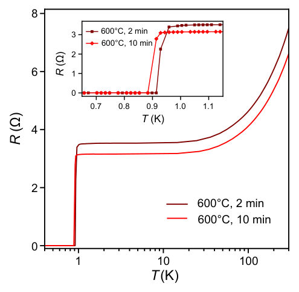 
FIG. 2. Electrical resistance of PtSi films annealed at 600 °C for (maroon) 2 min and (red) 10 min versus temperature. Inset: Low-temperature resistance versus temperature shows detail of the superconducting transition.

📷 Fig 2

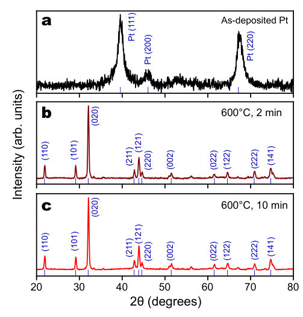 
FIG. 1. GIXRD patterns of (a) as-deposited Pt film, (b) PtSi after 2 min anneal at 600 °C, and (c) PtSi after 10 min an- neal at 600 °C. Reference peak positions and crystallographic indices are indicated in blue.

📷 Fig 3

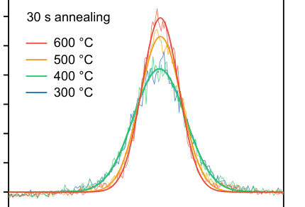 
FIG. 4. Normalized PtSi (020) GIXRD diffraction peak for films annealed for 30 s at temperatures from 300 to 600 ◦C. Solid lines are Gaussian fits to the measured data. The de- creasing peak width with increasing annealing temperature indicates increasing crystallite size.

📷 Fig 4

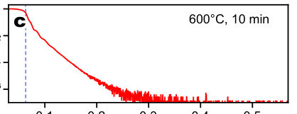 
FIG. 3. X-ray reflectivity spectra for (a) as-deposited Pt film, (b) PtSi after 2 min anneal, and (c) PtSi after 10 min an- neal. Q = 4π sin θ/λ is the momentum transfer vector. In each panel, the dashed vertical line denotes the critical edge value Qc, defined as the Q value at the first negative peak of d2 log R(Q)/dQ2.

📷 Fig 5

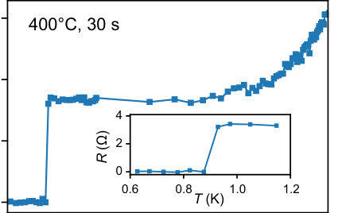 
FIG. 5. Resistance versus temperature from 300 K to 500 mK for a PtSi film formed by annealing at 400°C for 30 s. Inset highlights the low-temperature superconducting transition.

**Summary.** This work characterizes the formation of superconducting PtSi thin films on silicon by varying annealing conditions. Using XRD, XRR, and electrical tests, the authors establish that rapid thermal processing defines a stable window for device fabrication. The key finding is that interface quality degradation occurs during the final phase conversion step, not due to prolonged high-temperature exposure.

**Why it may be interesting.** While focused on materials science, understanding controlled solid-state reactions and interface engineering is crucial for fabricating quantum devices where material interfaces dictate coherence and energy loss mechanisms.

Detailed structure

**Main problem.** The study systematically investigates how phase formation, microstructure, and interface quality of Platinum Silicide (PtSi) thin films are affected by annealing conditions for use in superconducting quantum devices.

**Main result.** A robust processing window exists where PtSi forms rapidly and maintains stable superconducting properties even under short-time, moderate-temperature annealing protocols. Interfacial roughening is shown to be an intrinsic consequence of the $	ext{Pt}_2	ext{Si}$-to-$	ext{PtSi}$ conversion step.

**Method.** The research employed a combination of advanced characterization techniques including Grazing-Incidence X-ray Diffraction (GIXRD), X-ray Reflectivity (XRR), and electrical transport measurements across varying annealing temperatures and durations.

**Model / system.** The physical system is PtSi thin films deposited on silicon substrates, which are processed via thermal annealing to induce the superconducting phase. The process involves controlled solid-state reactions between Platinum and Silicon.

**Key observables.** Superconducting transition temperature ($T_c$), Residual Resistivity Ratio ($	ext{RRR}$), film thickness, interface roughness (from XRR), and crystalline phases (from XRD).

**Important parameters / regimes.** Annealing Temperature ($300-600^\circ	ext{C}$) and Duration (short times like $30 	ext{ s}$ vs. long times).

**Assumptions / limitations.** The superconducting properties are highly dependent on achieving the pure PtSi phase, and the study assumes that rapid thermal processing can define a stable operational window.

**Figures summary.** Figures show XRD scans detailing phase progression ($	ext{Pt} 	o 	ext{Pt}_2	ext{Si} 	o 	ext{PtSi}$) and XRR measurements comparing interface roughness across different reaction steps, highlighting the source of disorder.

**Paper structure.** The paper systematically analyzes the effect of annealing time (long vs. short) and temperature on phase purity, microstructure evolution, and superconducting performance, culminating in defining a stable processing window for device fabrication.

Abstract

Platinum silicide (PtSi) thin films are promising for silicon-based superconducting quantum devices due to their compatibility with CMOS fabrication, air stability, and superconducting transition temperature near 1 K. We report a systematic study of PtSi phase formation, microstructure, and interface quality as a function of annealing temperature and duration, characterizing films using grazing-incidence X-ray diffraction, X-ray reflectivity, and electrical transport measurements. Phase-pure PtSi forms within minutes by rapid thermal processing at 600 °C and is stable under extended annealing, while 30 s anneals across 300-600 °C yield equivalent film quality with consistent microstructure and superconducting properties. X-ray reflectivity reveals that interfacial roughening is an intrinsic consequence of the Pt2Si-to-PtSi conversion step rather than a result of elevated temperature or prolonged annealing. These results establish a robust processing window for PtSi formation in silicon-based superconducting device fabrication flows.

[↑ back to top](#top)

### Other secondary papers (1)

Show other secondary papers

### [Fragile electron-phonon superconductivity in MnB4 under pressure](http://arxiv.org/abs/2606.07930v1)

**Authors:** Renhai Wang, Shiya Chen, Feng Zheng, Zhen Zhang, Xingzhi Wang, Huafeng Dong, Cai-Zhuang Wang, Vladimir Antropov, Kai-Ming Ho, Yang Sun  
**Type:** both · **Category:** other · **PDF:** <https://arxiv.org/pdf/2606.07930v1>  
**Analysis basis:** full PDF text, analyzed in chunks

📷 Fig 1

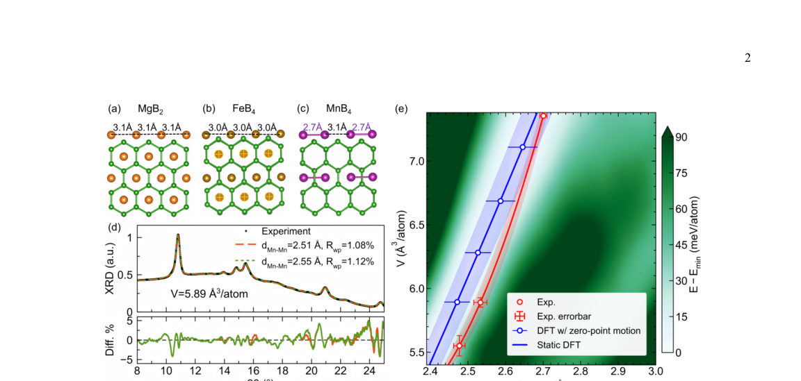 
FIG. 1 Mn-Mn dimerization and two-parameter energy landscape in MnB4. (a) P6/mmm MgB2 structure with regular B hexagons and a uniform Mg-Mg chain with a distance of 3.1Å. (b) Orthorhombic Pnnm FeB4 structure with Fe atoms form an undimerized one-dimensional metal chain with equal Fe-Fe separations of ∼3.0Å. Crossed and uncrossed Fe atoms denote two layers occupying distinct interstitial positions between neighboring boron layers. (c) Monoclinic P21/c MnB4 structure with Mn chain dimerized into alternating short and long Mn-Mn bonds, with representative distances of ∼2.7 and ∼3.2Å, respectively. (d) Representative refinements of the experimental XRD pattern at 110 GPa using the MnB4...

📷 Fig 2

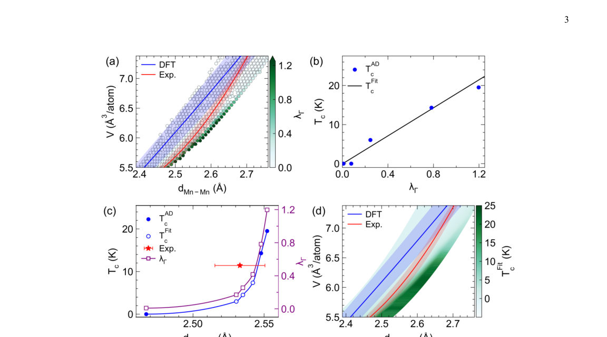 
FIG. 2 Electron-phonon coupling and superconductivity landscape in MnB4. (a) λΓ in the V–dMn-Mn plane, constructed from 561 sampled structures. The blue curve denotes the DFT relaxed structure with the shaded region indicating the dMn-Mn variation caused by zero-point motion. The red curve denotes the experimentally refined structural path, with the shaded region indicating the uncertainty in dMn-Mn from XRD refinement. (b) Full-Brillouin-zone Tc calculations for representative structures selected from panel (a), plotted as a function of λΓ. The solid line gives the linear fitting with R2=0.983. (c) Tc and λΓ as functions of dMn-Mnat V=5.89 Å3/atom, corresponding to 110 GPa in experiments....

📷 Fig 3

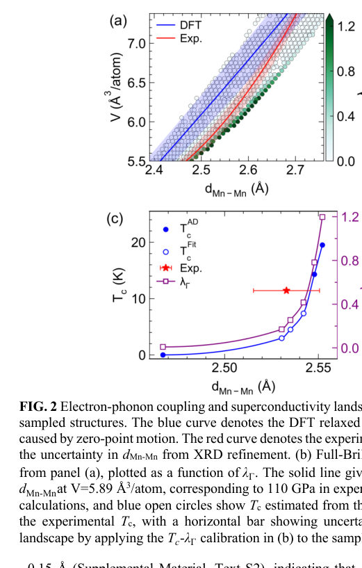 
Figure 1(e) also compares the V-dMn-Mn relation obtained from DFT optimization with that from experimentally refined structures. At the ambient-pressure volume of 7.355 Å3/atom, the equilibrium dMn-Mn from DFT differs from the experimental value by only ~0.15 Å, and the confidence intervals overlap. Under compression, however, this offset increases: at ~5.7 Å3/atom, corresponding to ~140 GPa in experiment, the difference reaches ~0.3 Å. Thus, DFT calculations can yield dMn-Mn values that differ from experimentally refined structures by 0.1-0.3 Å, with the deviation tending to increase under compression, even after accounting for the uncertainty in dMn-Mn from both approaches.

📷 Fig 4

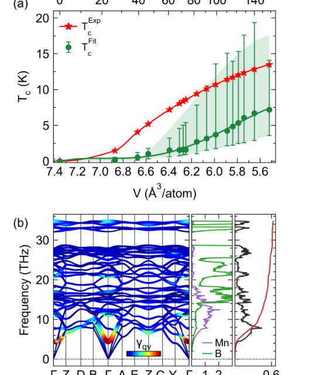 
FIG. 3 Experimental and calculated pressure dependence of Tc in MnB4. (a) Experimental Tc values from Ref. [4] are shown in red. The upper axis shows the pressure corresponding to the experimental equation of state. The green curve gives the calculated Tc obtained from the Tc–V– dMn-Mn map in Fig. 2(d). The green bar and shaded region represent the range of Tc values associated with the experimental uncertainty in dMn-Mn. (b) Phonon dispersion of MnB4 at dMn-Mn = 2.548 Å and V = 5.89 Å3/atom, corresponding to 110 GPa in experiment. The dispersion is shown together with the momentum- and mode-resolved phonon linewidth γqν, phonon density of states, Eliashberg spectral function α2F(ω) , and...

📷 Fig 5

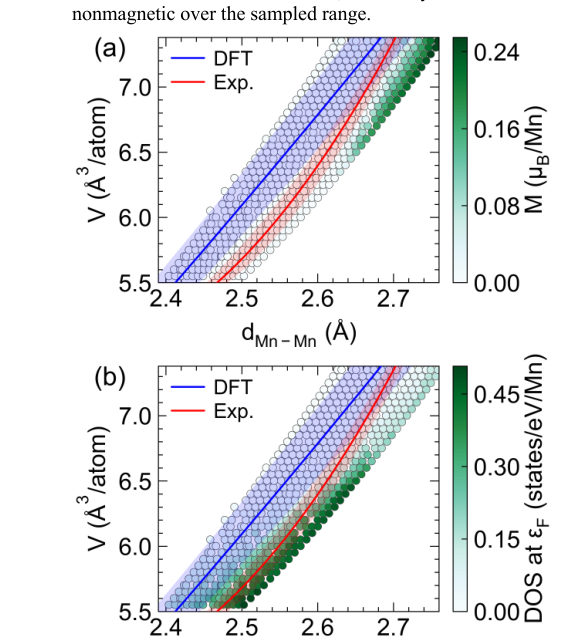 
FIG. 4 Magnetic and electronic properties in the V–dMn-Mn space. Calculated maps of (a) the Mn magnetic moment and (b) the density of states at the Fermi level N(ϵF) of MnB4 as functions of V and dMn-Mn. The blue and red curves denote the static 0 K DFT relaxed structure and the experimental structural parameters, respectively.

**Summary.** This work resolves the mystery of pressure-induced superconductivity in $	ext{MnB}_4$ by demonstrating that structural compression must be described using two parameters: volume and the Mn-Mn dimer distance. By calculating electron-phonon coupling across this extended structural space, the authors successfully predict the experimentally observed critical temperature via established BCS/EPC theory.

**Why it may be interesting.** While focused on condensed matter superconductivity, the methodology of treating structural instability via multiple coupled degrees of freedom ($V$ and $	ext{d}_{	ext{Mn}-	ext{Mn}}$) provides a generalizable framework for understanding phase transitions in complex materials where simple single-parameter descriptions fail.

Detailed structure

**Main problem.** The primary goal is to elucidate the mechanism behind pressure-induced superconductivity in $	ext{MnB}_4$, as initial calculations failed to match experimental critical temperatures ($T_c$). The study investigates how structural changes influence electron-phonon coupling (EPC) in this material.

**Main result.** Superconductivity can be successfully explained by EPC theory when the structural response is mapped using both volume and the $	ext{Mn}-	ext{Mn}$ dimer distance as independent parameters. Calculations predict $T_c \approx 14	ext{ K}$ near $150	ext{ GPa}$, matching experimental findings.

**Method.** The research combines Density Functional Theory (DFT) calculations with advanced phonon theory to compute EPC strength ($\lambda$) and estimate $T_c$ using the Allen-Dynes formula. Structural mapping is achieved by analyzing the energy landscape in the volume-$	ext{d}_{	ext{Mn}-	ext{Mn}}$ space.

**Model / system.** The system studied is $	ext{MnB}_4$, which is treated as a highly responsive material exhibiting structural instability characterized by Mn-Mn dimerization. The theoretical framework relies on modeling the interplay between lattice structure, electronic band filling, and vibrational modes (phonons).

**Key observables.** Superconducting critical temperature ($T_c$), electron-phonon coupling constant ($\lambda_{\Gamma}$), $	ext{Mn}-	ext{Mn}$ dimer distance ($	ext{d}_{	ext{Mn}-	ext{Mn}}$), and electronic density of states at the Fermi level ($N(E_F)$).

**Important parameters / regimes.** Pressure (P) up to $150	ext{ GPa}$, Volume ($V$), and $	ext{d}_{	ext{Mn}-	ext{Mn}}$.

**Assumptions / limitations.** The superconducting behavior is governed by the electron-phonon coupling mechanism, allowing for the use of the Allen-Dynes formula. The structural response is assumed to be tunable across a defined $V-	ext{d}_{	ext{Mn}-	ext{Mn}}$ manifold.

**Figures summary.** Figures illustrate the comparison between DFT and experimental XRD data mapping the $V-	ext{d}_{	ext{Mn}-	ext{Mn}}$ energy landscape. They also show how $\lambda_{\Gamma}$ and $T_c$ increase rapidly with increasing $	ext{d}_{	ext{Mn}-	ext{Mn}}$ at fixed volume, confirming the role of dimer stretching modes.

**Paper structure.** The paper first establishes the failure of simple volume-based models. It then introduces $	ext{d}_{	ext{Mn}-	ext{Mn}}$ as a crucial structural parameter, mapping the full energy landscape. Subsequently, it calculates EPC parameters ($\lambda_{\Gamma}$) across this space, demonstrating that the observed $T_c$ is robustly explained by strong coupling mechanisms linked to dimer bond changes.

Abstract

The origin of pressure-induced superconductivity in MnB4 remains unclear. Here we show that it can be explained by electron-phonon coupling once the structural space is mapped using both volume and the Mn dimer distance as key structural parameters under compression. Minor changes in the dimer distance significantly affect electronic and phonon properties, bringing the calculated Tc into agreement with experiment. Our results suggest that MnB4 is a highly responsive system, providing a platform for probing the subtle interplay between structural instability, superconductivity and magnetism.

[↑ back to top](#top)

