
# arxiv digest (quant-ph + cond-mat) — 2026-06-10

*114 papers · 37 relevant · 0 highlighted*

## 🔥 Most relevant (37)

*Every paper with at least one nonzero topic score, sorted by best-matching score. 🔥 marks scores ≥4/5. Click the title to jump to the full entry below; click [arXiv] to open the paper page. `(secondary)` marks papers from de-prioritized cond-mat archives.*

Show 37 relevant papers

- [Equilibrating continuous-variable open quantum systems using stochastic classical trajectories in path-integral space](#paper-2606.10665) [[arXiv]](http://arxiv.org/abs/2606.10665v1) — 🔥 `methods for driven-dissipative` **5/5** · 🔥 `Keldysh / 2PI / non-Gaussian methods` **4/5** · `quantum measurements` **3/5** · `non-equilibrium dynamics` **2/5** · `correlated / nonlocal dissipation` **1/5** · `driven-dissipative phase transition` **1/5** · `measurement-induced transitions` **1/5** · `non-equilibrium universality` **1/5**
- [Analog Quantum Asynchronous Event-Based Graph Neural Network](#paper-2606.11000) [[arXiv]](http://arxiv.org/abs/2606.11000v1) — 🔥 `Rydberg arrays` **5/5** · 🔥 `analog quantum simulation` **4/5** · `QC/QI experiment` **2/5** · `non-equilibrium dynamics` **2/5** · `driven-dissipative phase transition` **1/5** · `entanglement & information structure` **1/5** · `methods for driven-dissipative` **1/5**
- [Single-photon scattering in a dissipative superconducting-qubit--SSH lattice hybrid](#paper-2606.10510) [[arXiv]](http://arxiv.org/abs/2606.10510v1) — 🔥 `analog quantum simulation` **4/5** · 🔥 `interference shaping light` **4/5** · `correlated / nonlocal dissipation` **3/5** · `correlated cavity matter` **3/5** · `driven-dissipative phase transition` **3/5** · `methods for driven-dissipative` **3/5** · `non-equilibrium dynamics` **3/5** · `Kondo & dissipative impurity` **2/5** · `QC/QI experiment` **2/5** · `exotic spin models in light-matter` **2/5** · `non-equilibrium universality` **2/5** · `quantum optics experiment` **2/5** · `Keldysh / 2PI / non-Gaussian methods` **1/5** · `Tavis-Cummings & cavity-many-emitter` **1/5** · `entanglement & information structure` **1/5** · `measurement-induced transitions` **1/5** · `spintronics-quantum-optics interface` **1/5**
- [Anomalous mobility edges and extended-localized transition in a quasiperiodic emitter-cavity array](#paper-2606.10585) [[arXiv]](http://arxiv.org/abs/2606.10585v1) — 🔥 `analog quantum simulation` **4/5** · 🔥 `driven-dissipative phase transition` **4/5** · `Tavis-Cummings & cavity-many-emitter` **3/5** · `correlated cavity matter` **3/5** · `methods for driven-dissipative` **3/5** · `non-equilibrium universality` **3/5** · `correlated / nonlocal dissipation` **2/5** · `non-equilibrium dynamics` **2/5** · `Frenkel-Kontorova` **1/5** · `Keldysh / 2PI / non-Gaussian methods` **1/5** · `Kondo & dissipative impurity` **1/5** · `entanglement & information structure` **1/5**
- [Interplay between photon condensation and electron-electron interactions in molecular systems](#paper-2606.11060) [[arXiv]](http://arxiv.org/abs/2606.11060v1) — 🔥 `analog quantum simulation` **4/5** · 🔥 `correlated cavity matter` **4/5** · `Tavis-Cummings & cavity-many-emitter` **3/5** · `driven-dissipative phase transition` **3/5** · `methods for driven-dissipative` **3/5** · `Dicke superradiance` **2/5** · `Keldysh / 2PI / non-Gaussian methods` **2/5** · `superradiant laser` **2/5** · `correlated / nonlocal dissipation` **1/5** · `entanglement & information structure` **1/5** · `exotic spin models in light-matter` **1/5** · `non-equilibrium dynamics` **1/5** · `non-equilibrium universality` **1/5**
- [Beyond the Markovian limit: Exact solutions for active motion in a power-law viscoelastic bath](#paper-2606.10145) [[arXiv]](http://arxiv.org/abs/2606.10145v1) — 🔥 `Keldysh / 2PI / non-Gaussian methods` **4/5** · `correlated / nonlocal dissipation` **3/5** · `driven-dissipative phase transition` **3/5** · `methods for driven-dissipative` **3/5** · `non-equilibrium dynamics` **3/5** · `non-equilibrium universality` **3/5** · `Frenkel-Kontorova` **2/5** · `analog quantum simulation` **2/5** · `Kondo & dissipative impurity` **1/5** · `entanglement & information structure` **1/5** · `scars & prethermalization` **1/5**
- [Mean-field models for morphogenetic processes in physiological contexts](#paper-2606.10355) [[arXiv]](http://arxiv.org/abs/2606.10355v1) `(secondary)` — 🔥 `non-equilibrium dynamics` **4/5** · `Keldysh / 2PI / non-Gaussian methods` **3/5** · `driven-dissipative phase transition` **3/5** · `methods for driven-dissipative` **3/5** · `non-equilibrium universality` **3/5** · `analog quantum simulation` **2/5** · `correlated / nonlocal dissipation` **2/5** · `Frenkel-Kontorova` **1/5** · `Kondo & dissipative impurity` **1/5** · `correlated cavity matter` **1/5** · `entanglement & information structure` **1/5**
- [Precision measurements at the interface between unitary and non-unitary encoding](#paper-2606.10529) [[arXiv]](http://arxiv.org/abs/2606.10529v1) — 🔥 `methods for driven-dissipative` **4/5** · `Keldysh / 2PI / non-Gaussian methods` **3/5** · `correlated / nonlocal dissipation` **3/5** · `driven-dissipative phase transition` **3/5** · `entanglement & information structure` **3/5** · `non-equilibrium dynamics` **2/5** · `non-equilibrium universality` **2/5** · `Kondo & dissipative impurity` **1/5** · `analog quantum simulation` **1/5** · `measurement-induced transitions` **1/5** · `quantum measurements` **1/5**
- [Revealing the topology of quantum states via Kirkwood-Dirac quasiprobabilities](#paper-2606.11002) [[arXiv]](http://arxiv.org/abs/2606.11002v1) — 🔥 `quantum measurements` **4/5** · `interference shaping light` **3/5** · `measurement-induced transitions` **3/5** · `analog quantum simulation` **2/5** · `entanglement & information structure` **2/5** · `non-equilibrium dynamics` **2/5** · `non-equilibrium universality` **2/5** · `Keldysh / 2PI / non-Gaussian methods` **1/5** · `correlated / nonlocal dissipation` **1/5** · `driven-dissipative phase transition` **1/5** · `exotic spin models in light-matter` **1/5** · `methods for driven-dissipative` **1/5**
- [Spin polarisation signatures of Fractionally Charged Skyrmions in Fractional Quantum Hall states](#paper-2606.10754) [[arXiv]](http://arxiv.org/abs/2606.10754v1) `(secondary)` — 🔥 `exotic spin models in light-matter` **4/5** · `analog quantum simulation` **3/5** · `correlated cavity matter` **3/5** · `spintronics-quantum-optics interface` **3/5** · `Tavis-Cummings & cavity-many-emitter` **2/5** · `quantum optics experiment` **2/5** · `correlated / nonlocal dissipation` **1/5** · `driven-dissipative phase transition` **1/5** · `entanglement & information structure` **1/5** · `methods for driven-dissipative` **1/5** · `quantum measurements` **1/5**
- [The Two Dimensional Dynamical Bulk Boundary Correspondence: Beyond Two Band Models](#paper-2606.10731) [[arXiv]](http://arxiv.org/abs/2606.10731v1) — 🔥 `non-equilibrium dynamics` **4/5** · 🔥 `non-equilibrium universality` **4/5** · `analog quantum simulation` **3/5** · `driven-dissipative phase transition` **3/5** · `methods for driven-dissipative` **3/5** · `entanglement & information structure` **2/5** · `Keldysh / 2PI / non-Gaussian methods` **1/5** · `correlated / nonlocal dissipation` **1/5** · `scars & prethermalization` **1/5**
- [Nonreciprocal Photon Blockade in an Asymmetric Cavity](#paper-2606.10319) [[arXiv]](http://arxiv.org/abs/2606.10319v1) — 🔥 `interference shaping light` **4/5** · `Keldysh / 2PI / non-Gaussian methods` **3/5** · `driven-dissipative phase transition` **3/5** · `methods for driven-dissipative` **3/5** · `Tavis-Cummings & cavity-many-emitter` **2/5** · `non-equilibrium dynamics` **2/5** · `analog quantum simulation` **1/5** · `correlated / nonlocal dissipation` **1/5** · `correlated cavity matter` **1/5** · `non-equilibrium universality` **1/5**
- [Tame the Umklapp Processes in Real-Time Lattice Simulation for Hydrodynamics: An Ising Field Theory Study](#paper-2606.09984) [[arXiv]](http://arxiv.org/abs/2606.09984v1) — 🔥 `non-equilibrium dynamics` **4/5** · `methods for driven-dissipative` **3/5** · `non-equilibrium universality` **3/5** · `Keldysh / 2PI / non-Gaussian methods` **2/5** · `analog quantum simulation` **2/5** · `driven-dissipative phase transition` **2/5** · `Frenkel-Kontorova` **1/5** · `correlated / nonlocal dissipation` **1/5** · `entanglement & information structure` **1/5** · `exotic spin models in light-matter` **1/5** · `scars & prethermalization` **1/5**
- [Finite-Time Orientational Relaxation Restructures Collective Motion in Polar Active Matter](#paper-2606.10474) [[arXiv]](http://arxiv.org/abs/2606.10474v1) — 🔥 `non-equilibrium universality` **4/5** · `driven-dissipative phase transition` **3/5** · `methods for driven-dissipative` **3/5** · `non-equilibrium dynamics` **3/5** · `analog quantum simulation` **2/5** · `correlated / nonlocal dissipation` **2/5** · `Frenkel-Kontorova` **1/5** · `Keldysh / 2PI / non-Gaussian methods` **1/5** · `entanglement & information structure` **1/5**
- [Magnetic HIP-NN for spin dynamics in disordered itinerant magnets](#paper-2606.10349) [[arXiv]](http://arxiv.org/abs/2606.10349v1) — 🔥 `methods for driven-dissipative` **4/5** · `exotic spin models in light-matter` **3/5** · `spintronics-quantum-optics interface` **3/5** · `Keldysh / 2PI / non-Gaussian methods` **2/5** · `driven-dissipative phase transition` **2/5** · `non-equilibrium dynamics` **2/5** · `Kondo & dissipative impurity` **1/5** · `analog quantum simulation` **1/5** · `correlated / nonlocal dissipation` **1/5** · `non-equilibrium universality` **1/5**
- [Magnetism and Topology from Circularly Polarized Phonon Floquet Engineering](#paper-2606.10854) [[arXiv]](http://arxiv.org/abs/2606.10854v1) `(secondary)` — 🔥 `analog quantum simulation` **4/5** · 🔥 `non-equilibrium dynamics` **4/5** · `exotic spin models in light-matter` **3/5** · `spintronics-quantum-optics interface` **3/5** · `driven-dissipative phase transition` **2/5** · `methods for driven-dissipative` **2/5** · `Keldysh / 2PI / non-Gaussian methods` **1/5** · `non-equilibrium universality` **1/5**
- [Interaction-driven dynamics in graphene flakes as a benchmark for quantum simulation](#paper-2606.10548) [[arXiv]](http://arxiv.org/abs/2606.10548v1) — 🔥 `non-equilibrium dynamics` **4/5** · `methods for driven-dissipative` **3/5** · `non-equilibrium universality` **3/5** · `analog quantum simulation` **2/5** · `driven-dissipative phase transition` **2/5** · `Frenkel-Kontorova` **1/5** · `Keldysh / 2PI / non-Gaussian methods` **1/5** · `correlated / nonlocal dissipation` **1/5** · `entanglement & information structure` **1/5**
- [Nonequilibrium Green Functions Simulations for Large Correlated Systems](#paper-2606.10773) [[arXiv]](http://arxiv.org/abs/2606.10773v1) — 🔥 `Keldysh / 2PI / non-Gaussian methods` **4/5** · `methods for driven-dissipative` **3/5** · `non-equilibrium dynamics` **3/5** · `driven-dissipative phase transition` **2/5** · `non-equilibrium universality` **2/5** · `Kondo & dissipative impurity` **1/5** · `analog quantum simulation` **1/5**
- [Hybrid Hamiltonian-diagrammatic quantum impurity solver](#paper-2606.11095) [[arXiv]](http://arxiv.org/abs/2606.11095v1) — 🔥 `Kondo & dissipative impurity` **4/5** · `Keldysh / 2PI / non-Gaussian methods` **3/5** · `methods for driven-dissipative` **3/5** · `analog quantum simulation` **1/5** · `correlated / nonlocal dissipation` **1/5** · `driven-dissipative phase transition` **1/5** · `non-equilibrium dynamics` **1/5**
- [Quantum resources in non-stoquastic quantum annealing](#paper-2606.09995) [[arXiv]](http://arxiv.org/abs/2606.09995v1) — 🔥 `entanglement & information structure` **4/5** · `analog quantum simulation` **2/5** · `non-equilibrium dynamics` **2/5** · `non-equilibrium universality` **2/5** · `Keldysh / 2PI / non-Gaussian methods` **1/5** · `correlated / nonlocal dissipation` **1/5** · `driven-dissipative phase transition` **1/5** · `methods for driven-dissipative` **1/5**
- [Supermoiré Chern mosaic in helical trilayer WSe2](#paper-2606.10422) [[arXiv]](http://arxiv.org/abs/2606.10422v1) — 🔥 `analog quantum simulation` **4/5** · `exotic spin models in light-matter` **3/5** · `spintronics-quantum-optics interface` **3/5** · `non-equilibrium dynamics` **2/5** · `Keldysh / 2PI / non-Gaussian methods` **1/5** · `driven-dissipative phase transition` **1/5**
- [Dynamical Partition Functions of Stochastic Dynamics via Variational Flows](#paper-2606.10757) [[arXiv]](http://arxiv.org/abs/2606.10757v1) — 🔥 `non-equilibrium dynamics` **4/5** · `methods for driven-dissipative` **3/5** · `non-equilibrium universality` **3/5** · `Keldysh / 2PI / non-Gaussian methods` **1/5** · `correlated / nonlocal dissipation` **1/5** · `driven-dissipative phase transition` **1/5**
- [Coherent manipulation of Kondo Majoranas in two-channel Kondo setups](#paper-2606.10259) [[arXiv]](http://arxiv.org/abs/2606.10259v1) — 🔥 `Kondo & dissipative impurity` **4/5** · `analog quantum simulation` **2/5** · `Keldysh / 2PI / non-Gaussian methods` **1/5** · `correlated / nonlocal dissipation` **1/5** · `driven-dissipative phase transition` **1/5** · `entanglement & information structure` **1/5** · `methods for driven-dissipative` **1/5** · `non-equilibrium dynamics` **1/5**
- [Graviton-mediated entanglement due to light bending from a quantum rotor](#paper-2606.09991) [[arXiv]](http://arxiv.org/abs/2606.09991v1) — 🔥 `entanglement & information structure` **4/5** · `Keldysh / 2PI / non-Gaussian methods` **2/5** · `analog quantum simulation` **2/5** · `correlated cavity matter` **1/5** · `methods for driven-dissipative` **1/5** · `non-equilibrium dynamics` **1/5** · `quantum optics experiment` **1/5**
- [Camera-enabled scalable homodyne detection of multimode quantum light](#paper-2606.10387) [[arXiv]](http://arxiv.org/abs/2606.10387v1) — 🔥 `quantum optics experiment` **4/5** · `quantum measurements` **3/5** · `QC/QI experiment` **1/5** · `entanglement & information structure` **1/5** · `interference shaping light` **1/5** · `measurement-induced transitions` **1/5**
- [Fabry-Perot Interference, g-factor Anisotropy, and Gate-Tunable Quantum dot in Chiral Tellurium Nanowires](#paper-2606.10001) [[arXiv]](http://arxiv.org/abs/2606.10001v1) `(secondary)` — 🔥 `QC/QI experiment` **4/5** · `spintronics-quantum-optics interface` **3/5** · `Kondo & dissipative impurity` **1/5** · `interference shaping light` **1/5** · `non-equilibrium dynamics` **1/5**
- [Exactly solvable non-planar $\mathbb{Z}_{2}$ dimer liquids on checkerboard and ruby lattices](#paper-2606.10003) [[arXiv]](http://arxiv.org/abs/2606.10003v1) — 🔥 `analog quantum simulation` **4/5** · `exotic spin models in light-matter` **3/5** · `entanglement & information structure` **2/5**
- [Fractional shot noise of an SU(N) Kondo system](#paper-2606.10814) [[arXiv]](http://arxiv.org/abs/2606.10814v1) — 🔥 `Kondo & dissipative impurity` **4/5** · `Keldysh / 2PI / non-Gaussian methods` **3/5** · `methods for driven-dissipative` **1/5** · `non-equilibrium dynamics` **1/5**
- [Magic and entanglement in 1+1-dimensional SU(2) lattice gauge theory](#paper-2606.09971) [[arXiv]](http://arxiv.org/abs/2606.09971v1) — 🔥 `entanglement & information structure` **4/5** · `analog quantum simulation` **3/5** · `methods for driven-dissipative` **1/5** · `non-equilibrium dynamics` **1/5**
- [Reconfigurable MDI-QKD and BB84 over 20 km optical channels via EOM-tailored weak coherent states](#paper-2606.10306) [[arXiv]](http://arxiv.org/abs/2606.10306v1) — 🔥 `quantum optics experiment` **4/5** · `interference shaping light` **3/5** · `QC/QI experiment` **1/5** · `quantum measurements` **1/5**
- [Experimental implementation of continuous-variable QAOA on a quad-rail lattice cluster state](#paper-2606.10432) [[arXiv]](http://arxiv.org/abs/2606.10432v1) — 🔥 `QC/QI experiment` **4/5** · `analog quantum simulation` **2/5** · `quantum measurements` **1/5** · `quantum optics experiment` **1/5**
- [Field-Induced Up-Up-Down State and Frustrated Magnetism in a Non-Kramers Triangular Antiferromagnet](#paper-2606.10980) [[arXiv]](http://arxiv.org/abs/2606.10980v1) — 🔥 `analog quantum simulation` **4/5** · `exotic spin models in light-matter` **3/5** · `spintronics-quantum-optics interface` **1/5**
- [Noise cancellation by superposition of channels and superactivation of quantum capacity: Experimental realization by NMR](#paper-2606.10744) [[arXiv]](http://arxiv.org/abs/2606.10744v1) — 🔥 `QC/QI experiment` **4/5** · `correlated / nonlocal dissipation` **1/5** · `driven-dissipative phase transition` **1/5** · `entanglement & information structure` **1/5** · `methods for driven-dissipative` **1/5**
- [VQA for Dynamic Portfolio Optimization: Sampling Strategies, Optimizer Scheduling, and Hardware-Aware Ansatz Design](#paper-2606.10098) [[arXiv]](http://arxiv.org/abs/2606.10098v1) — 🔥 `QC/QI experiment` **4/5** · `methods for driven-dissipative` **1/5** · `non-equilibrium dynamics` **1/5**
- [A Cryogenic Hybrid Photonic/CMOS Controller Architecture for Scalable Superconducting Qubit Control](#paper-2606.10114) [[arXiv]](http://arxiv.org/abs/2606.10114v1) — 🔥 `QC/QI experiment` **4/5** · `quantum optics experiment` **1/5**
- [Thermal Signatures of the Slater-Mott Crossover in the Hubbard Model: From Double Occupancy to Antiferromagnetic Correlation Length](#paper-2606.10976) [[arXiv]](http://arxiv.org/abs/2606.10976v1) — 🔥 `analog quantum simulation` **4/5** · `non-equilibrium dynamics` **1/5**
- [Synthesis and Characterization of Atomically-Sharp Superconductor-Dielectric Interface](#paper-2606.10144) [[arXiv]](http://arxiv.org/abs/2606.10144v1) `(secondary)` — 🔥 `QC/QI experiment` **4/5**

## All papers (90, sorted by relevance)

*Papers from quant-ph and your primary cond-mat archives (quant-gas, stat-mech, str-el, dis-nn). Highlighted papers (⭐) come first, then everything else sorted by topic-relevance score, highest first.*

### [Equilibrating continuous-variable open quantum systems using stochastic classical trajectories in path-integral space](http://arxiv.org/abs/2606.10665v1)

**Authors:** William H. D. Moore, Stuart C. Althorpe  
**Type:** theory · **Category:** statistical mechanics · **PDF:** <https://arxiv.org/pdf/2606.10665v1>  
**Analysis basis:** full PDF text, analyzed in chunks
**Topic relevance:** 🔥 `methods for driven-dissipative` **5/5** · 🔥 `Keldysh / 2PI / non-Gaussian methods` **4/5** · `quantum measurements` **3/5** · `non-equilibrium dynamics` **2/5** · `correlated / nonlocal dissipation` **1/5** · `driven-dissipative phase transition` **1/5** · `measurement-induced transitions` **1/5** · `non-equilibrium universality` **1/5**

↔ Scroll figures horizontally

<figure class="paper-figure-card">
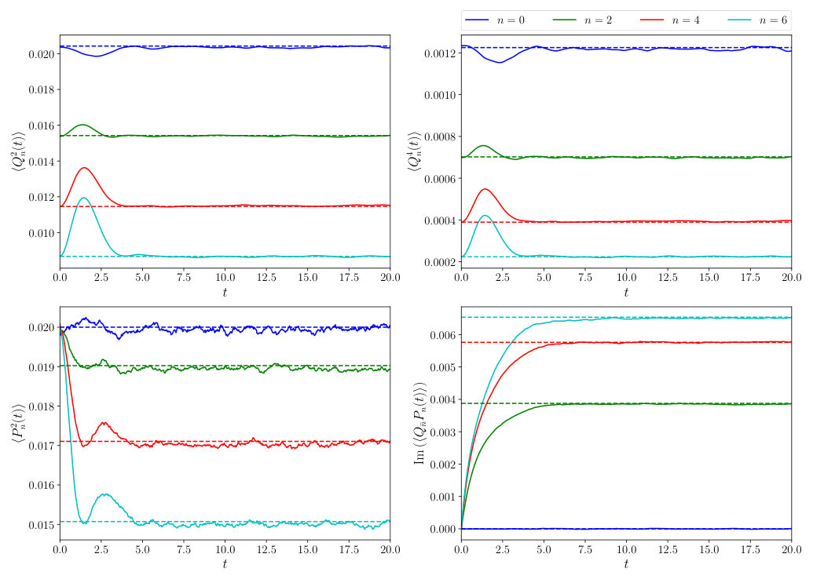
<figcaption class="paper-figure-caption"><b>Fig 1.</b> FIG. 1. The moments ⟨Q2 n(t)⟩, ⟨Q4 n(t)⟩, ⟨P 2 n(t)⟩and the imaginary component of ⟨Q¯nPn(t)⟩for a quartic oscillator coupled to a white bath following the dynamics of Eq. (50) from the initial distribution of Eq. (69) are plotted with solid lines. In the long-time limit, these match the corresponding moments of the quantum Boltzmann distribution of Eq. (42) which are plotted with dotted lines.</figcaption>
</figure>

**Summary.** This paper investigates simulating the thermalization of continuous-variable open quantum systems using stochastic classical trajectories within path-integral phase space. The authors demonstrate that these trajectories correctly equilibrate to the exact quantum equilibrium state by solving a derived Fokker-Planck Equation. This offers a novel, albeit numerically challenging, theoretical framework for modeling complex open quantum dynamics.

**Why it may be interesting.** This work provides an alternative, trajectory-based methodology—stochastic classical paths in phase space—to simulate complex open quantum dynamics, which is valuable for developing new approximate simulation techniques beyond standard master equation approaches.

Detailed structure

**Main problem.** The core problem is determining if stochastic classical trajectories evolving in path-integral phase space can correctly equilibrate an open quantum system to its exact thermal equilibrium state.

**Main result.** The study finds that the stochastic trajectories generated via a Matsubara generalized Langevin equation successfully equilibrate to the exact quantum equilibrium state, recovering necessary imaginary momentum-position correlations.

**Method.** The authors employ path-integral formulations and derive a corresponding Fokker-Planck Equation (FPE) from a generalized Langevin equation (GLE). They then analyze the stationary solution of this FPE.

**Model / system.** The system is an open quantum system modeled by coupling a system Hamiltonian ($\hat{H}_s$) to a bath ($\hat{H}_b$) via $\hat{H}_{sb}$. The equilibrium state is analyzed using continuous-variable phase space path integrals in imaginary time.

**Key observables.** The stationary solution of the FPE ($
ho_{stat}$), which must marginalize to the known quantum equilibrium distribution ($
ho_{eq}$).

**Important parameters / regimes.** Temperature ($eta$), system frequency/potential ($V(q)$), and bath spectral density (e.g., Debye-Drude).

**Assumptions / limitations.** The method relies on mapping non-Markovian dynamics to a Markovian FPE using auxiliary variables, although the resulting GLE itself is numerically unstable when evolved into the complex plane.

**Figures summary.** Figures show convergence of moments (like $\langle Q^2_n(t) 
angle$) towards the quantum Boltzmann distribution moments, confirming equilibration.

**Paper structure.** The paper develops the path-integral formulation for open systems, derives a generalized Langevin equation (GLE), maps this to a Markovian FPE using auxiliary variables, and finally solves/analyzes the stationary solution of the FPE to confirm agreement with known quantum equilibrium results.

Abstract

Beyond the weak-coupling limit, open quantum systems equilibrate to a highly entangled thermal state. For continuous-variable systems, this state can be written explicitly as an imaginary-time phase-space path integral, in which the positions are directly entangled with the bath, and the momenta are correlated with the positions through a phase term. Here, we ask to what extent this state can be reached by propagating stochastic classical trajectories in path-integral phase space. Surprisingly, we find that the trajectories equilibrate to the exact quantum equilibrium state, recovering the purely imaginary momentum-position correlation in the phase term. The trajectories are generated using a recently derived Matsubara generalized Langevin equation, which produces the imaginary correlations by evolving the stochastic variables into the complex plane. This makes the dynamics numerically unstable, but we are nonetheless able to demonstrate the equilibration of a quartic oscillator coupled to a white-noise bath. These unexpected findings could lead to new approximate methodologies for simulating continuous-variable open quantum systems.

[↑ back to top](#top)

### [Analog Quantum Asynchronous Event-Based Graph Neural Network](http://arxiv.org/abs/2606.11000v1)

**Authors:** Kristian Sotirov, Shaheen Acheche, Antonio A. Gentile, Osvaldo Simeone  
**Type:** both · **Category:** other · **PDF:** <https://arxiv.org/pdf/2606.11000v1>  
**Analysis basis:** full PDF text, analyzed in chunks
**Topic relevance:** 🔥 `Rydberg arrays` **5/5** · 🔥 `analog quantum simulation` **4/5** · `QC/QI experiment` **2/5** · `non-equilibrium dynamics` **2/5** · `driven-dissipative phase transition` **1/5** · `entanglement & information structure` **1/5** · `methods for driven-dissipative` **1/5**

↔ Scroll figures horizontally

<figure class="paper-figure-card">
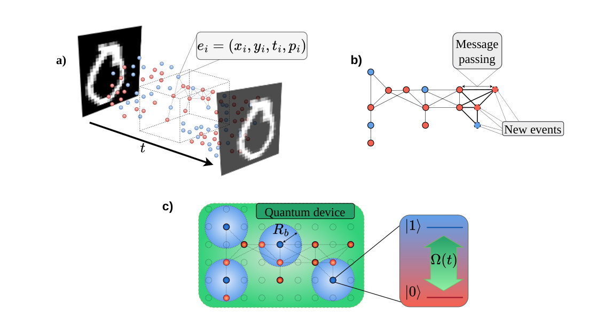
<figcaption class="paper-figure-caption"><b>Fig 1.</b> Fig. 1: (a) An event-driven sensor, such as a neuromorphic camera [3], produces a stream of events</figcaption>
</figure>
<figure class="paper-figure-card">
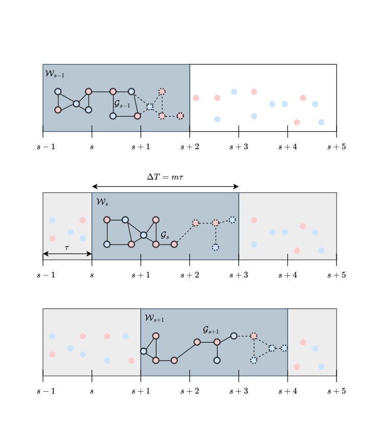
<figcaption class="paper-figure-caption"><b>Fig 2.</b> Fig. 2: Illustration of the time windows Ws−1, Ws, and Ws+1 of duration ∆T = mτ, used to process event</figcaption>
</figure>
<figure class="paper-figure-card">
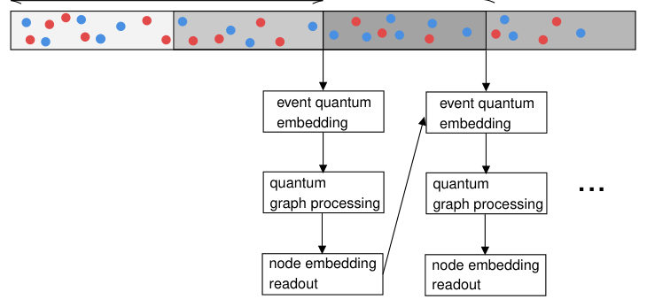
<figcaption class="paper-figure-caption"><b>Fig 3.</b> Fig. 3: Illustration of the timeline of the proposed QA-AEGNN. Inside each window with duration ∆T,</figcaption>
</figure>
<figure class="paper-figure-card">
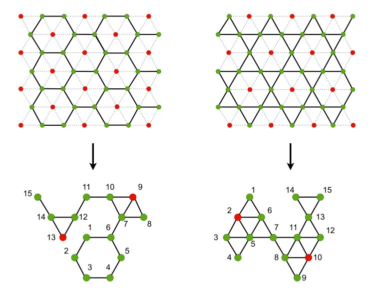
<figcaption class="paper-figure-caption"><b>Fig 4.</b> Fig. 4: Illustration of the graph classification task [12]: Graphs in each class are generated as shown in</figcaption>
</figure>
<figure class="paper-figure-card">
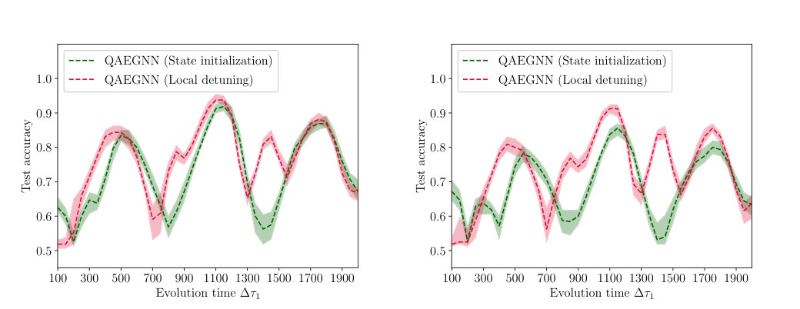
<figcaption class="paper-figure-caption"><b>Fig 5.</b> Fig. 5: Graph classification task: Training accuracy of QA-AEGNN on the polarity augmented dataset for</figcaption>
</figure>

**Summary.** The paper introduces QA-AEGNN, a novel framework that implements asynchronous event-based graph neural networks on neutral-atom quantum computers. By programming the Rydberg Hamiltonian to mimic message passing via controlled atomic interactions, it achieves an analog quantum computation of GNNs. This approach demonstrates high accuracy and robustness compared to classical methods for processing neuromorphic vision data.

**Why it may be interesting.** This work directly applies complex many-body physics—specifically controlled Rydberg interactions—to solve a cutting-edge problem in AI/ML (event-based GNNs). It showcases how continuous Hamiltonian dynamics can serve as a powerful, native analog computational primitive for information processing beyond simple quantum gates.

Detailed structure

**Main problem.** The core problem is developing an efficient quantum analog for processing sparse, high-temporal-resolution event data using Graph Neural Networks (GNNs). This requires mapping the asynchronous graph structure onto a controllable physical quantum system.

**Main result.** The proposed Quantum Analog AEGNN (QA-AEGNN) successfully implements GNN message passing by programming the native Rydberg Hamiltonian dynamics of neutral atoms. It demonstrates superior performance compared to classical counterparts on both synthetic and neuromorphic datasets.

**Method.** A hybrid quantum-classical training scheme is employed where analog Hamiltonian parameters are optimized classically. The graph computation is performed via time evolution governed by the Rydberg interaction, which naturally realizes message passing across physically placed atoms.

**Model / system.** The system utilizes neutral-atom quantum processors with qubits encoded in ground/Rydberg states. The dynamics are governed by a programmable Rydberg Hamiltonian incorporating global drives, local detunings (for feature embedding), and strong pairwise van der Waals interactions ($V_{ij}$) that enforce graph connectivity via the Rydberg blockade.

**Key observables.** Test accuracy on classification tasks (Graph Classification, N-MNIST); final observable feature vector $\mathbf{z}_s$ constructed as a histogram of excited atoms after quantum evolution.

**Important parameters / regimes.** Rydberg blockade radius ($R_b$), Rabi frequency ($\Omega(t)$), local detuning parameters ($\delta_i(t)$), and the time evolution duration ($\Delta	au_s$).

**Assumptions / limitations.** The physical placement of atoms must accurately map graph adjacency (neighbors within $R_b$) to ensure correct message passing. The framework assumes the ability to perform quantum state readout as a histogram.

**Figures summary.** Figures illustrate the pipeline: event embedding $
ightarrow$ Hamiltonian evolution ($\Omega(t), R_b$) $
ightarrow$ Readout. Results compare QA-AEGNN vs AEGNN performance across different noise models and data types (e.g., Fig 6, Fig 7).

**Paper structure.** The paper first establishes the need for quantum GNNs on event data. It details the physical mapping onto neutral atoms using the Rydberg Hamiltonian to simulate message passing. The methodology covers feature encoding (state initialization vs. detuning) and the hybrid training loop. Finally, performance is benchmarked against classical methods under various noise conditions.

Abstract

Asynchronous, event-based graph neural networks (AEGNNs) have recently emerged as an efficient paradigm for processing the sparse and high-temporal-resolution data from event cameras. In this paper, we propose quantum analog AEGNNs (QA-AEGNNs), a novel framework to implement an AEGNN on a neutral-atom quantum computer. Neutral-atom quantum processors offer a programmable analog quantum computing platform based on controllable Rydberg-atom interactions. To this end, we map the streaming event data to an array of trapped neutral atoms, where each atom represents a graph node (event) and is positioned such that geometric proximity reflects the spatio-temporal neighborhood of events. The native Rydberg Hamiltonian of the quantum processor is programmed to mirror the message-passing computations of the AEGNN, with atomic qubit states serving as node feature embeddings and inter-atom interactions realizing graph edges. Furthermore, we propose a hybrid quantum-classical training scheme in which the analog Hamiltonian parameters (e.g., laser pulse amplitudes and detunings) are optimized using classical feedback to learn the quantum AEGNN model from data. Our approach leverages the continuous Hamiltonian dynamics and massive parallelism of neutral-atom quantum systems to natively execute event-based graph computations with potential accuracy improvements

[↑ back to top](#top)

### [Single-photon scattering in a dissipative superconducting-qubit--SSH lattice hybrid](http://arxiv.org/abs/2606.10510v1)

**Authors:** Xiao-Xue Zhang, Jie Zhou, Xi-Zheng Zhang  
**Type:** theory · **Category:** quantum information and computing · **PDF:** <https://arxiv.org/pdf/2606.10510v1>  
**Analysis basis:** full PDF text, analyzed in chunks
**Topic relevance:** 🔥 `analog quantum simulation` **4/5** · 🔥 `interference shaping light` **4/5** · `correlated / nonlocal dissipation` **3/5** · `correlated cavity matter` **3/5** · `driven-dissipative phase transition` **3/5** · `methods for driven-dissipative` **3/5** · `non-equilibrium dynamics` **3/5** · `Kondo & dissipative impurity` **2/5** · `QC/QI experiment` **2/5** · `exotic spin models in light-matter` **2/5** · `non-equilibrium universality` **2/5** · `quantum optics experiment` **2/5** · `Keldysh / 2PI / non-Gaussian methods` **1/5** · `Tavis-Cummings & cavity-many-emitter` **1/5** · `entanglement & information structure` **1/5** · `measurement-induced transitions` **1/5** · `spintronics-quantum-optics interface` **1/5**

↔ Scroll figures horizontally

<figure class="paper-figure-card">
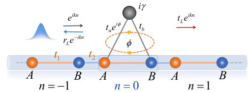
<figcaption class="paper-figure-caption"><b>Fig 1.</b> FIG. 1. Schematic illustration of a dissipative (or amplifying) superconducting qubit embedded in the center of the SSH lat- tice. Superconducting qubit simultaneously coupled to both sublattices A and B of the unit cell at position n = 0.</figcaption>
</figure>
<figure class="paper-figure-card">
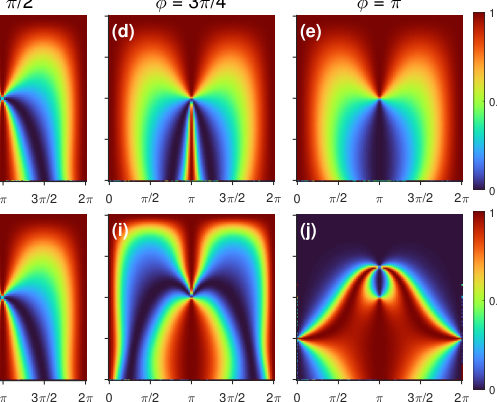
<figcaption class="paper-figure-caption"><b>Fig 2.</b> FIG. 2. Reflection landscape for the AB geometry in the Hermitian limit, t = 1 and γ = 0.</figcaption>
</figure>
<figure class="paper-figure-card">
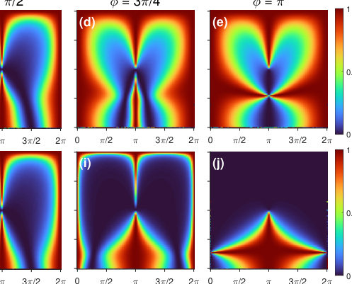
<figcaption class="paper-figure-caption"><b>Fig 3.</b> FIG. 3. Reflection landscape for weak gain, t = 1 and γ = 0.1.</figcaption>
</figure>
<figure class="paper-figure-card">
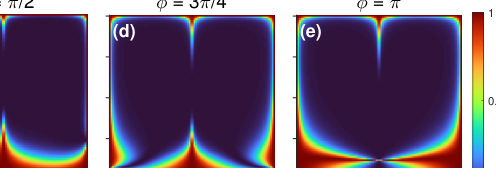
<figcaption class="paper-figure-caption"><b>Fig 4.</b> FIG. 4. Reflection landscape for stronger gain, t = 1 and γ = 0.3.</figcaption>
</figure>
<figure class="paper-figure-card">
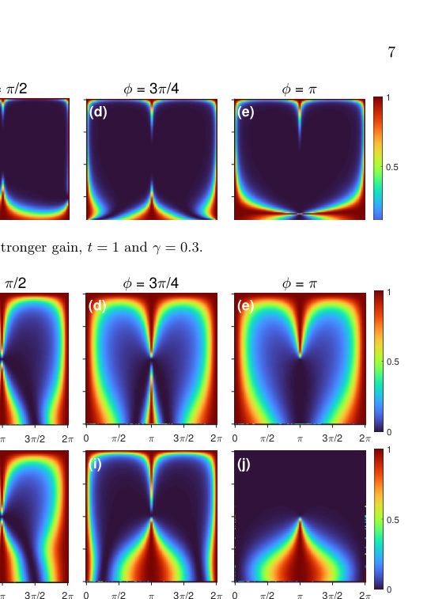
<figcaption class="paper-figure-caption"><b>Fig 5.</b> FIG. 5. Reflection landscape for weak loss, t = 1 and γ = −0.1.</figcaption>
</figure>

**Summary.** This paper develops a theoretical framework to analyze single-photon scattering in a hybrid system combining an SSH photonic lattice and a dissipative/amplifying superconducting qubit. By deriving the energy-dependent scattering matrix $S(E)$, the authors show that topological features (dimerization, flux) combined with non-Hermitian coupling allow for precise control over light transmission and reflection. This establishes a compact model for realizing tunable topological absorbers and amplifiers in quantum networks.

**Why it may be interesting.** This work provides a concrete framework for engineering topological quantum devices by controlling light-matter interaction using superconducting circuits, directly relevant to photonic quantum information processing.

Detailed structure

**Main problem.** The study investigates single-photon scattering dynamics when a topological photonic lattice (SSH) is locally coupled to a superconducting qubit exhibiting tunable loss or gain.

**Main result.** The system's reflection and transmission spectra are highly controllable by tuning the SSH dimerization, synthetic magnetic flux, and the non-Hermitian coupling strength ($\gamma$).

**Method.** The authors derived an explicit real-space scattering matrix $S(E)$ formulation and benchmarked its analytical results against time-domain wave-packet simulations.

**Model / system.** The model combines a Su–Schrieffer–Heeger (SSH) photonic lattice Hamiltonian with a superconducting qubit Hamiltonian, leading to a total system governed by non-Hermitian dynamics in the single-excitation sector.

**Key observables.** Reflection probability ($R$), Transmission probability ($T$), and the eigenvalues of the scattering matrix $S(E)$.

**Important parameters / regimes.** SSH dimerization ($\delta$), synthetic gauge phase ($\Phi$), and the qubit non-Hermitian coupling magnitude $|\gamma|$ (controlling loss/gain).

**Assumptions / limitations.** The analysis is restricted to the single-excitation sector, and the scattering problem is solved using asymptotic matching techniques.

**Figures summary.** Figures illustrate reflection landscapes ($R^{(s)}_L$) vs. momentum $k$ for varying gain/loss ($\gamma$), wave-packet evolution in transmission/reflection regimes, and the eigenvalue spectrum of $S(E)$.

**Paper structure.** The paper progresses from deriving the general scattering formalism to specializing it for the SSH lattice structure, finally incorporating the qubit scatterer and analyzing the resulting spectral features.

Abstract

We study single-photon scattering in a Su--Schrieffer--Heeger (SSH) photonic lattice locally coupled to a superconducting qubit with tunable loss or gain. Working in the single-excitation sector, we derive an explicit real-space scattering formulation for the full energy-dependent scattering matrix $S(E)$ and identify how its eigenvalues encode coherent perfect absorption, amplification, and spectral singular behavior. The analytical results are benchmarked against time-domain wave-packet simulations, which reproduce the stationary scattering probabilities with high accuracy. We show that the SSH dimerization, the qubit-induced non-Hermitian self-energy, and the synthetic gauge phase cooperate to reshape the reflection and transmission spectra in a highly selective way. In particular, changing the dimerization can switch the system between transmission-dominated and reflection-dominated regimes, while the flux provides a direct handle on interference and symmetry-controlled response. We also find a robust loss--gain correspondence in the reflection landscape and show that the linewidth broadening is governed predominantly by the magnitude $|γ|$ of the non-Hermitian coupling. These results establish a compact and experimentally relevant framework for topological scattering in superconducting quantum networks.

[↑ back to top](#top)

### [Anomalous mobility edges and extended-localized transition in a quasiperiodic emitter-cavity array](http://arxiv.org/abs/2606.10585v1)

**Authors:** H. T. Cui, H. Z. Shen, M. Qin, X. X. Yi  
**Type:** theory · **Category:** disordered systems and neural networks · **PDF:** <https://arxiv.org/pdf/2606.10585v1>  
**Analysis basis:** full PDF text, analyzed in chunks
**Topic relevance:** 🔥 `analog quantum simulation` **4/5** · 🔥 `driven-dissipative phase transition` **4/5** · `Tavis-Cummings & cavity-many-emitter` **3/5** · `correlated cavity matter` **3/5** · `methods for driven-dissipative` **3/5** · `non-equilibrium universality` **3/5** · `correlated / nonlocal dissipation` **2/5** · `non-equilibrium dynamics` **2/5** · `Frenkel-Kontorova` **1/5** · `Keldysh / 2PI / non-Gaussian methods` **1/5** · `Kondo & dissipative impurity` **1/5** · `entanglement & information structure` **1/5**

↔ Scroll figures horizontally

<figure class="paper-figure-card">
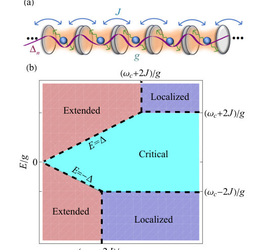
<figcaption class="paper-figure-caption"><b>Fig 1.</b> Figure 1. (Color online) (a) Schematic for the emitter-cavity chain described by Eq. (1). Blue spheres denote the emitters. The purple wave line represents the quasiperiodic potentials imposed on emitters. The blue curves with two arrows depicts the hopping of photon. Green wave line denotes the coupling between emitter and cavity. (b) The phase diagram deter- mined by evaluating the localization feature of the effective energy levels for the emitters. The dashed-black lines mark the boundaries between extended (orange), localized (blue) and critical (cyan) phases. The physical meaning for all sym- bols can be found in the maintext.</figcaption>
</figure>
<figure class="paper-figure-card">
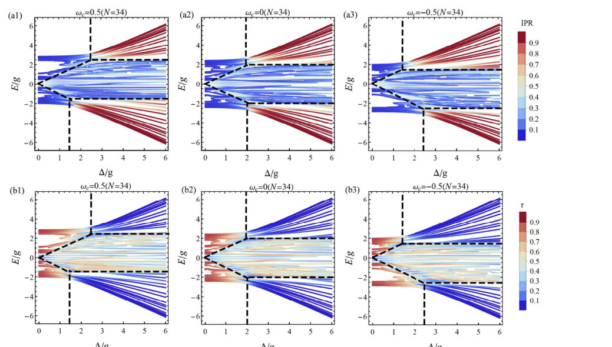
<figcaption class="paper-figure-caption"><b>Fig 2.</b> Figure 2. (Color online) Comparative diagrams of the inverse participation ratio (a1)-(a3) and the fractal dimension (b1)-(b3) are presented for the bound state function αs under ωc = 0.5, 0, −0.5 respectively. The dashed-black lines represent the mobility edges Ec or the critical values ∆c, defined by Eq. (9). In all figures, E and ∆are scaled in units of g. All numerical calculations adopt fixed parameters N = 34 and g = 1.</figcaption>
</figure>
<figure class="paper-figure-card">
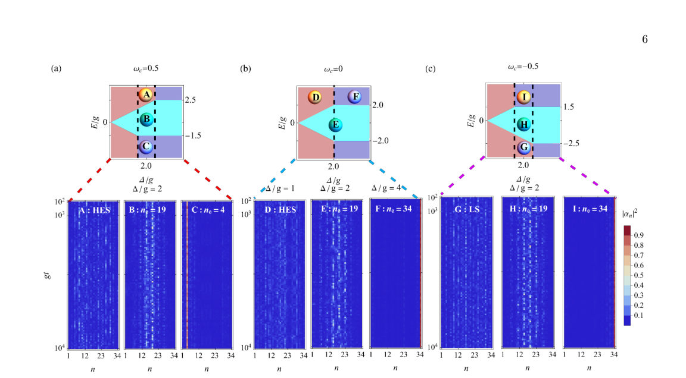
<figcaption class="paper-figure-caption"><b>Fig 3.</b> Figure 3. (Color online) The long-term temporal evolution of αn(t) for selected initial states, located initially at the extended, localized and critical regions in the phase diagram. The value of n0 = 4, 19, 34 denotes the initial site of excitation in emitters, where ∆4/∆= −0.985, ∆19/∆= −0.046 and ∆34/∆= 0.997. Thus, the value of ∆decides the position of initial state in the phase diagram. The ”HES” denotes the highest excited bound state, while ”LS” denotes the lowest bound state. N = 34 and g = 1 are chosen for all plots.</figcaption>
</figure>

**Summary.** The paper analyzes single excitation transport in quasiperiodic emitter-cavity arrays, showing that dissipation can induce anomalous mobility edges. By linking localization to the nature of bound states (discrete vs. continuum), they construct a full phase diagram. This demonstrates that quantum excitation localization can be precisely controlled by tuning only the cavity field parameters.

**Why it may be interesting.** This work provides a detailed theoretical framework for controlling quantum transport in structured media, directly relevant to designing artificial photonic or solid-state quantum simulators where disorder/quasiperiodicity is key.

Detailed structure

**Main problem.** The study investigates how dissipation induces anomalous mobility edges and extended-localized transitions in quasiperiodic emitter-cavity arrays.

**Main result.** The localization properties are governed by the nature of quantum bound states (Discrete vs. Continuum), allowing for full phase diagram construction solely by tuning cavity fields.

**Method.** Analytical determination using generalized duality transformations, combined with calculating effective Hamiltonians derived from eliminating cavity degrees of freedom.

**Model / system.** The system is a one-dimensional array of two-level emitters coupled to an array of single-mode cavities via a quasiperiodic onsite potential. The dynamics are analyzed in the single excitation subspace using $H = H_s + H_c + H_{int}$.

**Key observables.** Inverse Participation Ratio (IPR), Fractal Dimension ($	au$), and long-time population $|\alpha_n(t)|^2$ of bound states.

**Important parameters / regimes.** Quasiperiodic potential strength ($\Delta$), cavity central frequency ($\omega_c$), coupling strength ($g$), and energy level ($E$).

**Assumptions / limitations.** The analysis is restricted to the single excitation subspace, and approximations like the rotating-wave approximation are used.

**Figures summary.** Figures show phase diagrams mapping extended, localized, and critical phases based on parameters; other figures illustrate $|\alpha_n|^2$ and IPR variations across these predicted mobility edges.

**Paper structure.** The paper establishes the effective Hamiltonian by eliminating cavity modes, uses duality transformations to find anomalous mobility edges analytically, maps out a full phase diagram (Fig. 1(b)), and verifies localization regimes using long-time dynamics simulations.

Abstract

The manipulation of localization in quasiperiodic systems by mobility edges or localization transition holds significant physical importance. In this letter, we demonstrated that the dissipation can induce the emergence of anomalous mobility edges and extended-localized transition in emitter-cavity arrays controlled by quasiperiodic potentials. Specifically, we observe that the localization properties of emitters is governed by the nature of quantum bound states, either discrete or embedded in continuum, providing a unified mechanism linking the emitter-photon bound physics to quasiperiodic criticality. Depending on the bound state discrete or continuumlike, the induced effective excitation hopping exhibits either exponentially decaying or sinusoidally oscillating, giving rise to the formation of localized or critical states, respectively. Through a generalized duality transformation, we analytically determine the anomalous mobility edges and the critical strength of potential, enabling the construction of a full phase diagram. The study reveals that the physical characteristics of cavity exert a significant influence on excitation localization. Therefore, the manipulation of excitation localization can be achieved solely by adjusting the cavity fields.

[↑ back to top](#top)

### [Interplay between photon condensation and electron-electron interactions in molecular systems](http://arxiv.org/abs/2606.11060v1)

**Authors:** Matteo Parisi, Elisabetta Paladino, Giuseppe A. Falci, Gian Marcello Andolina, Salvatore Savasta, Marco Polini, Francesco M. D. Pellegrino  
**Type:** theory · **Category:** other · **PDF:** <https://arxiv.org/pdf/2606.11060v1>  
**Analysis basis:** full PDF text, analyzed in chunks
**Topic relevance:** 🔥 `analog quantum simulation` **4/5** · 🔥 `correlated cavity matter` **4/5** · `Tavis-Cummings & cavity-many-emitter` **3/5** · `driven-dissipative phase transition` **3/5** · `methods for driven-dissipative` **3/5** · `Dicke superradiance` **2/5** · `Keldysh / 2PI / non-Gaussian methods` **2/5** · `superradiant laser` **2/5** · `correlated / nonlocal dissipation` **1/5** · `entanglement & information structure` **1/5** · `exotic spin models in light-matter` **1/5** · `non-equilibrium dynamics` **1/5** · `non-equilibrium universality` **1/5**

↔ Scroll figures horizontally

<figure class="paper-figure-card">
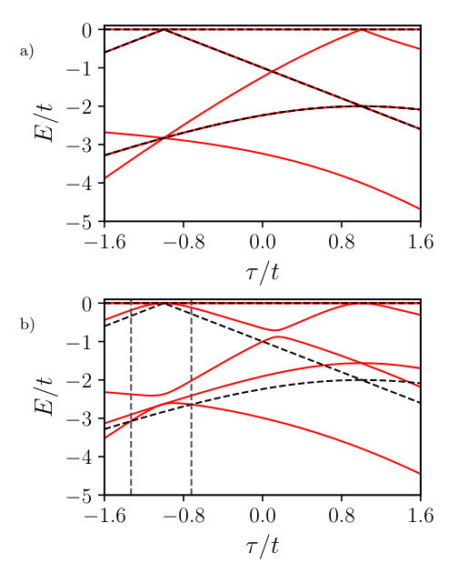
<figcaption class="paper-figure-caption"><b>Fig 1.</b> FIG. 1. a) Low energy spectrum for Ne = 2 of a square molecule (ns = 4), in the absence of repulsive electron- electron interaction. b) Low-energy spectrum for the same molecular system, now with U/t = 1. The vertical dashed lines at τ1 ≈−1.33t and τ2 ≈−0.72t mark the bound- aries where the ground state becomes a three-fold degener- ate triplet state. In both panels, red solid lines represent the eigenenergies of the singlet states (S = 0), while the black dashed lines refer to triplet states (S = 1).</figcaption>
</figure>
<figure class="paper-figure-card">
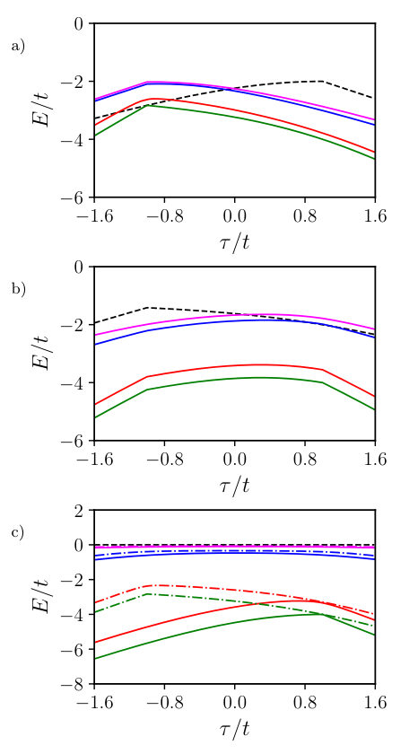
<figcaption class="paper-figure-caption"><b>Fig 2.</b> FIG. 2. The lowest eigenenergy, for a square molecular pla- quette with ns = 4, as a function of τ/t, for U = 0 (red), U/t = 1 (green), U/t = 20 (blue), and U/t = 100 (magenta). a) Ne = 2 electrons per molecule, the solid lines represent the lowest eigenenergy within the subspaces S, and the minimal eigenenergy in the subspaces Ti (i = 0, ±1) is ϵ0 + ϵ1 (black dashed line), independently of i. b) Ne = 3 electrons per molecule, the solid lines indicate the lowest eigenenergy within the subspaces Di (i = ±1/2), while the minimum eigenenergy within the subspaces Qi (where i = ±1/2, ±3/2) is denoted as ϵ0 (black dashed line), independently of i. c) Half-filling case, Ne = 4, colored lines refer...</figcaption>
</figure>
<figure class="paper-figure-card">
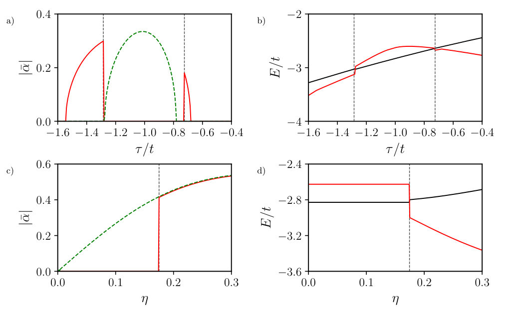
<figcaption class="paper-figure-caption"><b>Fig 3.</b> FIG. 3. Photon condensation of square molecular plaquettes with Ne = 2 electrons. a) [c)] The photon condensate order parameter ¯α is plotted as a function of τ/t [η], by setting ωc = t and η = 0.13 [τ = −t]. The red solid line denotes U/t = 1, and the green dashed line refers to U = 0. Furthermore, in c), the dashed gray vertical line at η∗≈0.17 indicates the value where ¯α becomes non-zero with a jump discontinuity. b) [d)] Low-energy spectrum of the generic k-th molecule, characterized by ˆHMF,k(¯α), is considered with ¯α determined under the conditions ωc = t, η = 0.13 [τ = −t], and U/t = 1. The red and black solid lines indicate the lowest eigenenergies in the subspaces S and T,...</figcaption>
</figure>
<figure class="paper-figure-card">
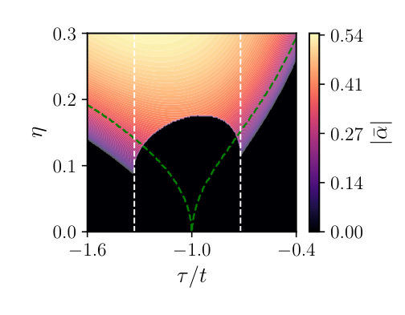
<figcaption class="paper-figure-caption"><b>Fig 4.</b> FIG. 4. Photonic order parameter |¯α| as a function of τ/t and the light-matter coupling strength η, with Ne = 2 electrons and setting ωc = t. The color map represents the case with U/t = 1. The green dashed line indicates the critical val- ues of the microscopic parameters τ and η, where the phase transition occurs without the influence of electron-electron in- teraction U. The vertical white dashed lines at τ1 ≈−1.33t and τ2 ≈−0.72t denote the range [τ1, τ2], within which the ground state for η = 0 is a degenerate triplet.</figcaption>
</figure>
<figure class="paper-figure-card">
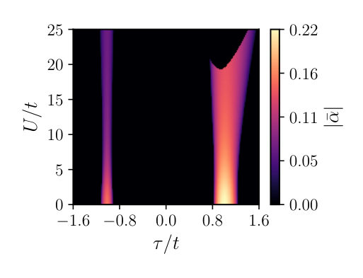
<figcaption class="paper-figure-caption"><b>Fig 5.</b> FIG. 5. Photon condensation of square molecular plaquettes with Ne = 3 electrons. The photon condensate order param- eter |¯α| is plotted as a function of τ/t and U/t, by setting ωc = t and η = 0.12. The sharp boundary between the nor- mal and photon condensate phase in the upper right corner signals a first order phase transition.</figcaption>
</figure>

**Summary.** This paper models photon condensation in molecular systems by coupling electrons to an electromagnetic cavity mode. It rigorously incorporates on-site Coulomb repulsion via the Hubbard term, demonstrating that this interaction can drive the system into a first-order phase transition regime, contrasting with simpler non-interacting predictions.

**Why it may be interesting.** This work directly addresses cavity QED phenomena (photon condensation/superradiance) in realistic, correlated solid-state or molecular settings, providing a detailed mechanism for how electron correlations modify fundamental quantum optical transitions.

Detailed structure

**Main problem.** The study investigates the complex interplay between photon condensation (a magnetostatic instability) and electron-electron interactions within molecular quantum systems.

**Main result.** The inclusion of Hubbard repulsion can fundamentally change the nature of the phase transition, allowing for a first-order transition in regimes where non-interacting models predict only second-order transitions.

**Method.** The analysis employs mean-field theory coupled with exact diagonalization techniques on small molecular plaquettes to analyze energy functionals and order parameters.

**Model / system.** The model consists of multiple identical square planar plaquettes hosting electrons, described by a tight-binding Hamiltonian augmented by an on-site Hubbard repulsion term ($U$). This system is coupled to a spatially nonuniform cavity mode.

**Key observables.** Photon condensate order parameter ($ar{\alpha}$), polaritonic excitation energies, and the character (first vs. second order) of the phase transition.

**Important parameters / regimes.** Electron filling factor ($N_e$), Hubbard repulsion strength ($U/t$), light-matter coupling strength ($\eta$), and hopping parameters ($	au/t$).

**Assumptions / limitations.** The analysis relies on mean-field decoupling for light-matter coupling, and in some parts, approximations like Holstein-Primakoff transformations are used to linearize the Hamiltonian around the mean-field state.

**Figures summary.** Figures illustrate the order parameter $ar{\alpha}$ versus hopping ratio ($	au/t$) showing discontinuities (first-order) or smooth changes (second-order), and plot polaritonic energies revealing spectral signatures of the instability.

**Paper structure.** The paper builds from defining the coupled Hamiltonian, analyzing the single-molecule electronic structure using SU(2) symmetry, deriving a mean-field effective Hamiltonian for light-matter coupling, and finally determining the phase transition order by examining energy functionals and polaritonic spectra.

Abstract

We investigate a minimal molecular model consisting of square planar plaquettes hosting multiple electrons, whose dynamics is governed by a tight-binding Hamiltonian supplemented by on-site Hubbard repulsion. By coupling this system to a spatially nonuniform cavity mode, we analyze the emergence of a magnetostatic instability, namely photon condensation, originating from the paramagnetic Van Vleck mechanism. The global behavior of the system is analyzed for different electronic filling factors, and we find that, except for the special cases of half-filling and single electron, where the transition, if it occurs, is necessarily a second order phase transition, the global system may also undergo a first order transition because of the action of the electron-electron interaction. The polaritonic excitation energies are analyzed, providing clear spectroscopic signatures of the magnetostatic instability and of its order.

[↑ back to top](#top)

### [Beyond the Markovian limit: Exact solutions for active motion in a power-law viscoelastic bath](http://arxiv.org/abs/2606.10145v1)

**Authors:** Mintu Karmakar, Jure Dobnikar, Ignacio Pagonabarraga  
**Type:** theory · **Category:** statistical mechanics · **PDF:** <https://arxiv.org/pdf/2606.10145v1>  
**Analysis basis:** full PDF text, analyzed in chunks
**Topic relevance:** 🔥 `Keldysh / 2PI / non-Gaussian methods` **4/5** · `correlated / nonlocal dissipation` **3/5** · `driven-dissipative phase transition` **3/5** · `methods for driven-dissipative` **3/5** · `non-equilibrium dynamics` **3/5** · `non-equilibrium universality` **3/5** · `Frenkel-Kontorova` **2/5** · `analog quantum simulation` **2/5** · `Kondo & dissipative impurity` **1/5** · `entanglement & information structure` **1/5** · `scars & prethermalization` **1/5**

↔ Scroll figures horizontally

<figure class="paper-figure-card">
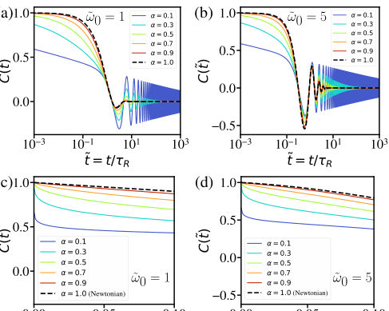
<figcaption class="paper-figure-caption"><b>Fig 1.</b> FIG. 1. (Color online) Orientational correlation function 𝐶(˜𝑡) = ⟨ˆ𝑛(˜𝑡) · ˆ𝑛(0)⟩as a function of dimensionless time ˜𝑡= 𝑡/𝜏𝑅for different memory exponents 𝛼= 𝛼𝑅= 𝛼𝑇. (a) Moderate intrinsic angular velocity ˜𝜔0 = 1. (b) Strong intrinsic angular velocity ˜𝜔0 = 5. The dashed black curve corresponds to the Newtonian limit (𝛼= 1), which exhibits exponential decay. For 𝛼&lt; 1, the decay becomes stretched exponential, producing long-lived orientational persistence. Increasing memory (smaller 𝛼) enhances the lifetime of oscillatory correlations without altering the intrinsic oscillation frequency. (c,d) Corresponding short-time behaviour of 𝐶(˜𝑡) in a linear scale exhibits rapid decay from 1 for...</figcaption>
</figure>
<figure class="paper-figure-card">
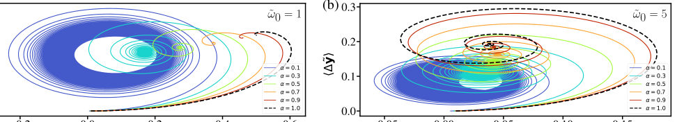
<figcaption class="paper-figure-caption"><b>Fig 2.</b> FIG. 2. (Color online) Mean trajectory of a circle swimmer in the (⟨Δ˜x(˜𝑡)⟩, ⟨Δ˜y(˜𝑡)⟩) plane for different memory exponents 𝛼= 𝛼𝑅= 𝛼𝑇. (a) ˜𝜔0 = 1. (b) ˜𝜔0 = 5. The dashed black curve corresponds to the Newtonian case (𝛼= 1). Stronger viscoelastic memory (smaller 𝛼) enhances orientational coherence and enlarges spiral excursions.</figcaption>
</figure>
<figure class="paper-figure-card">
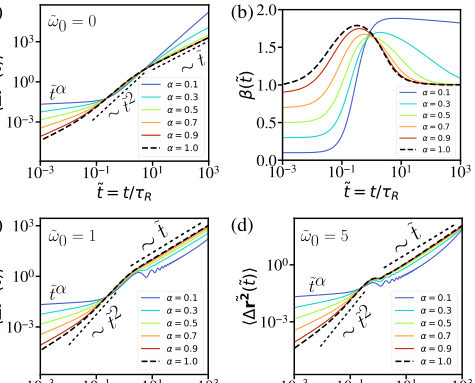
<figcaption class="paper-figure-caption"><b>Fig 3.</b> FIG. 3. (Color online) (a,b) Mean-square displacement ⟨Δ ˜r2(˜𝑡)⟩and the corresponding dynamical exponent 𝛽(˜𝑡) for different memory ex- ponents 𝛼= 𝛼𝑅= 𝛼𝑇for non-circling swimmer ( ˜𝜔0 = 0). ⟨Δ ˜r2(˜𝑡)⟩ for circling swimmer (c) ˜𝜔0 = 1. (d) ˜𝜔0 = 5. The dashed black curves denote the Newtonian limit (𝛼= 1). Pe = 10. Translational memory produces fractional short-time scaling (∼˜𝑡𝛼𝑇), while ro- tational memory prolongs ballistic motion and enhances oscillatory transport signatures for chiral swimmers.</figcaption>
</figure>
<figure class="paper-figure-card">
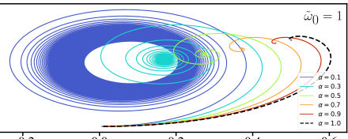
<figcaption class="paper-figure-caption"><b>Fig 4.</b> Figure 3 shows the The MSD ⟨Δ˜r2(˜𝑡)⟩and the corresponding dynamical exponent</figcaption>
</figure>
<figure class="paper-figure-card">
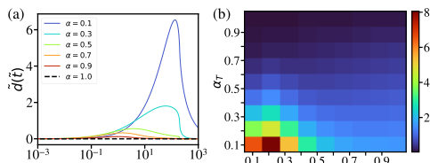
<figcaption class="paper-figure-caption"><b>Fig 5.</b> FIG. 5. (Color online) (a) Delay function ˜𝑑(˜𝑡) for different memory exponents 𝛼= 𝛼𝑅= 𝛼𝑇. The delay vanishes in the Newtonian limit (𝛼= 1) and develops a pronounced peak as memory strengthens. (b) Peak delay 𝑑peak = max[ ˜𝑑(˜𝑡)] in the (𝛼𝑅, 𝛼𝑇) plane. The delay is maximized when both translational and rotational memory are strong, demonstrating cooperative enhancement of force-orientation lag.</figcaption>
</figure>

**Summary.** This paper provides an analytical theory for active particles moving in viscoelastic fluids whose friction dynamics are described by power-law memory. By solving non-Markovian Langevin equations, the authors predict novel phenomena like stretched exponential decay of orientation and a measurable time-delay between propulsion force and particle direction. This framework is crucial for understanding biological swimmers in complex polymeric environments.

**Why it may be interesting.** While focused on soft matter, the mathematical framework of solving coupled, non-Markovian GLEs with power-law memory kernels is directly applicable to modeling open quantum systems where environmental dissipation (bath interaction) exhibits anomalous or long-range correlations.

Detailed structure

**Main problem.** The study addresses active particle motion in viscoelastic media, moving beyond simplified Markovian friction models that fail to capture complex relaxation dynamics.

**Main result.** The theory derives analytical expressions showing that the memory kernel controls anomalous scaling exponents and introduces a measurable time-delay between propulsion force and swimmer orientation.

**Method.** The authors developed an analytical framework by solving coupled, non-Markovian Generalized Langevin Equations (GLEs) for translational and rotational motion.

**Model / system.** The model describes a self-propelled microswimmer moving in a 2D viscoelastic bath characterized by power-law memory kernels ($\Gamma(t) \sim t^{-\alpha}$). The dynamics are governed by coupled GLEs incorporating both activity ($v_0$) and viscoelastic damping.

**Key observables.** Orientational Correlation Function $C(	ilde{t})$, Mean-Square Displacement (MSD), and the Memory Delay Function $d(t)$.

**Important parameters / regimes.** Memory exponents ($\alpha_T, \alpha_R$), activity strength ($Pe$), and intrinsic rotation frequency ($\omega_0$). The key regimes include $\alpha=1$ (Newtonian) versus $0 < \alpha < 1$ (power-law memory).

**Assumptions / limitations.** The analysis operates in the overdamped limit, assumes zero-mean Gaussian noise processes consistent with the Fluctuation-Dissipation Theorem.

**Figures summary.** Figures illustrate the stretched exponential decay of $C(	ilde{t})$ for $\alpha < 1$, and show the dependence of the memory delay function $d(t)$ on the viscoelastic exponents ($\alpha_R, \alpha_T$).

**Paper structure.** The paper develops the GLEs, solves them using Laplace transforms to find correlation functions ($C(t)$), derives expressions for $\langle\Delta r(t)
angle$ and MSD, and finally analyzes the non-Markovian coupling via the memory delay function $d(t)$.

Abstract

Active particles from bacteria to synthetic microswimmers often navigate viscoelastic media with complex relaxation dynamics. The classical active Brownian model that assumes instantaneous friction is clearly not applicable to describe such motility, while the non-Markovian processes combined with viscoelasticity are relatively unexplored. Here, we develop an analytical theory for an active particle in a power-law viscoelastic medium by solving coupled non-Markovian generalized Langevin equations for translational and rotational degrees of freedom. The viscoelastic memory results in novel phenomena such as fractional short-time transport, enhanced long-time persistence, and de-correlation of the instantaneous force and the swimmer orientation. We demonstrate that the memory kernel controls the anomalous scaling exponents, while the activity determines the crossover between sub-diffusive, ballistic and diffusive regimes. Our work provides a framework for theoretical description of biological and synthetic micro swimmers in complex biological and polymeric environments.

[↑ back to top](#top)

### [Precision measurements at the interface between unitary and non-unitary encoding](http://arxiv.org/abs/2606.10529v1)

**Authors:** Peng Xu  
**Type:** theory · **Category:** other · **PDF:** <https://arxiv.org/pdf/2606.10529v1>  
**Analysis basis:** full PDF text, analyzed in chunks
**Topic relevance:** 🔥 `methods for driven-dissipative` **4/5** · `Keldysh / 2PI / non-Gaussian methods` **3/5** · `correlated / nonlocal dissipation` **3/5** · `driven-dissipative phase transition` **3/5** · `entanglement & information structure` **3/5** · `non-equilibrium dynamics` **2/5** · `non-equilibrium universality` **2/5** · `Kondo & dissipative impurity` **1/5** · `analog quantum simulation` **1/5** · `measurement-induced transitions` **1/5** · `quantum measurements` **1/5**

↔ Scroll figures horizontally

<figure class="paper-figure-card">
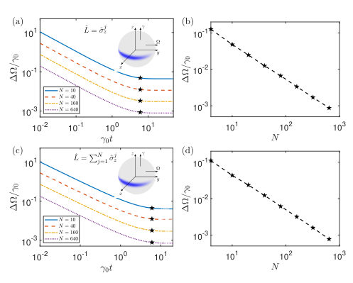
<figcaption class="paper-figure-caption"><b>Fig 1.</b> FIG. 1. Precision dynamics for various N under single- particle dephasing (a) and collective dephasing (c). The ini- tial state is the optimal two-axis twisted state with ⟨ˆJx⟩∝N and ⟨∆ˆJz⟩∝1. (a, c) The optimal encoding time t, indicated by pentagrams at the maximum curvature, is independent of N. (b, d) The precision scaling at the optimal time exhibits the Heisenberg scaling ∆Ω∝1/N. The dissipation rate is γ/γ0 = 0.1. The energy and time units are γ0 and γ−1 0 , re- spectively.</figcaption>
</figure>
<figure class="paper-figure-card">
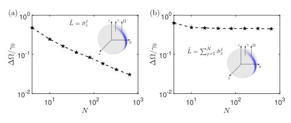
<figcaption class="paper-figure-caption"><b>Fig 2.</b> FIG. 2. Precision scaling at the optimal encoding time for var- ious N under single-particle dephasing (a) and collective de- phasing (b). The initial state is the optimal two-axis twisted state with ⟨ˆJy⟩∝N and ⟨∆ˆJx⟩∝1. The precision scaling degrades to ∆Ω∝1/ √</figcaption>
</figure>
<figure class="paper-figure-card">
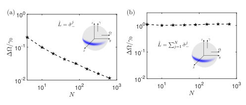
<figcaption class="paper-figure-caption"><b>Fig 3.</b> FIG. 3. Precision scaling at the optimal encoding time for var- ious N under single-particle decay (a) and collective decay (b). The initial state is the optimal two-axis twisted state with ⟨ˆJx⟩∝N and ⟨∆ˆJz⟩∝1. The precision scaling degrades to ∆Ω∝1/ √</figcaption>
</figure>
<figure class="paper-figure-card">
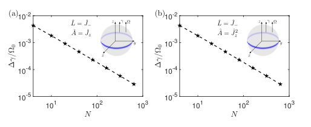
<figcaption class="paper-figure-caption"><b>Fig 4.</b> FIG. 5. Precision scaling at the optimal encoding time for different total particle number N under non-unitary encoding ˆL = ˆJ−with intrinsic dynamics ˆA = ˆJz (a) or ˆA = ˆJ2 z (b), where the observable is ˆO = ˆJz. The initial state is the Dicke state |N, 0⟩z with eigenvalue 0 of ˆJz. The precision scales as the Heisenberg limit ∆γ ∝1/N. Ω/Ω0 = 0.1 for the intrinsic dynamics. The energy and the time units are Ω0 and Ω−1 0 , respectively.</figcaption>
</figure>
<figure class="paper-figure-card">
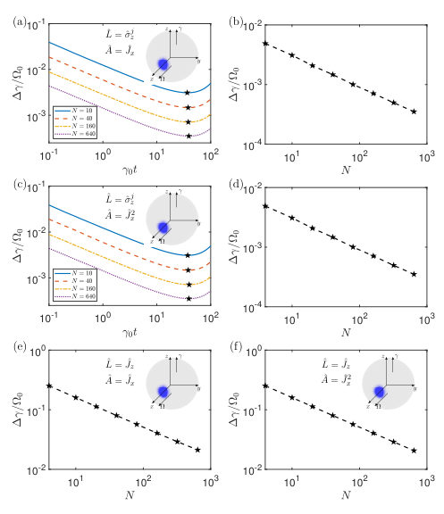
<figcaption class="paper-figure-caption"><b>Fig 5.</b> FIG. 4. Precision dynamics for various N under non-unitary encoding with ˆL = ˆσj z, ˆO = ˆJx, and intrinsic dynamics ˆA = ˆJx (a) and ˆA = ˆJ2 x (c). The initial state is the eigenstate of ˆJx with eigenvalue N. The precision scaling at the optimal time, indicated by pentagrams at the maximum curvature, yields ∆γ ∝1/ √</figcaption>
</figure>

**Summary.** This paper develops a unified theory for quantum metrology under generalized noise, analyzing parameter estimation for both unitary and non-unitary dynamics. It derives analytic scaling laws showing that Heisenberg limited precision ($\propto 1/N$) is achievable in specific noisy regimes, even when dissipation is present. The findings offer practical guidance for designing robust quantum sensing protocols.

**Why it may be interesting.** This work provides crucial theoretical benchmarks for designing quantum sensors in realistic noisy environments by quantifying when entanglement can overcome decoherence to reach fundamental precision limits.

Detailed structure

**Main problem.** The paper investigates how the precision of quantum parameter estimation scales when the encoding process transitions between unitary (coherent) and non-unitary (dissipative/noisy) dynamics.

**Main result.** Heisenberg scaling ($\propto 1/N$) can be achieved for both unitary and non-unitary estimations if specific commutation relations hold, demonstrating entanglement's role in enhancing metrology even under noise.

**Method.** The authors employ linear response theory and the error propagation formula to derive analytic precision expressions, supplemented by numerical validation using the Discrete Truncated Wigner Approximation (DTWA).

**Model / system.** The model involves quantum systems subjected to generalized noise, including single-particle and collective dephasing/decay. Dynamics are governed by non-Hermitian Hamiltonians incorporating both intrinsic evolution ($\Omega$) and dissipation ($\gamma$).

**Key observables.** Precision scaling for the unitary parameter $\Delta\Omega$ and the dissipation strength $\Delta\gamma$.

**Important parameters / regimes.** System size $N$, noise rates ($\gamma$), encoding time ($t$), and commutation relations between observables and noise operators.

**Assumptions / limitations.** The derivations rely on linear response theory, cumulant expansions, and approximations up to first order in the noise parameters.

**Figures summary.** Figures illustrate precision dynamics for both unitary and non-unitary regimes, confirming Heisenberg scaling ($\propto 1/N$) under optimal conditions but showing degradation towards Standard Quantum Limit (SQL) or constant values otherwise.

**Paper structure.** The paper develops a unified framework by deriving analytic expressions for $\Delta\Omega$ and $\Delta\gamma$. It analyzes specific noise types (single-particle vs. collective) and compares the scaling laws based on whether observables commute with noise operators, providing practical guidance for protocol design.

Abstract

We investigate precision scaling at the interface between unitary and non-unitary encoding under generalized noise including single-particle and collective dephasing and decay. Using linear response theory and the error propagation formula, we derive analytic precision expressions for both the unitary parameter $Ω$ and the dissipation strength $γ$. For unitary encoding, when the observable commutes with a Hermitian noise operator, the optimal encoding time is independent of $N$, yielding the Heisenberg limit $ΔΩ\propto 1 / N$; otherwise the precision degrades to the standard quantum limit or ceases to improve with $N$. For non-unitary encoding, when $[\hat{A}, \hat{O}] = 0$, the precision is insensitive to intrinsic dynamics and encoding time, scaling as $Δγ\propto \sqrt{γ/ \expval*{\hat{L}^\dagger \hat{L}}}$. Notably, for collective decay, the Dicke state reaches the Heisenberg limit $Δγ\propto 1 / N$, demonstrating that entanglement can enhance non-unitary estimation. Our results provide a unified framework and practical guidance for designing quantum metrology protocols in noisy environments.

[↑ back to top](#top)

### [Revealing the topology of quantum states via Kirkwood-Dirac quasiprobabilities](http://arxiv.org/abs/2606.11002v1)

**Authors:** Stefano Gherardini, Luca Lepori  
**Type:** theory · **Category:** other · **PDF:** <https://arxiv.org/pdf/2606.11002v1>  
**Analysis basis:** full PDF text, analyzed in chunks
**Topic relevance:** 🔥 `quantum measurements` **4/5** · `interference shaping light` **3/5** · `measurement-induced transitions` **3/5** · `analog quantum simulation` **2/5** · `entanglement & information structure` **2/5** · `non-equilibrium dynamics` **2/5** · `non-equilibrium universality` **2/5** · `Keldysh / 2PI / non-Gaussian methods` **1/5** · `correlated / nonlocal dissipation` **1/5** · `driven-dissipative phase transition` **1/5** · `exotic spin models in light-matter` **1/5** · `methods for driven-dissipative` **1/5**

↔ Scroll figures horizontally

<figure class="paper-figure-card">
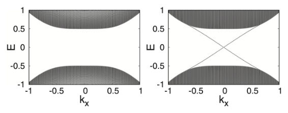
<figcaption class="paper-figure-caption"><b>Fig 1.</b> Figure 1: Energy spectra of the Hamiltonian in Eq. (4) at M = 1, for periodic boundary conditions (left panel) and with open boundary conditions along y (right panel), respectively. In the right panel, gapless edge modes, topologically protected and interpolating between the two bands, are present.</figcaption>
</figure>
<figure class="paper-figure-card">
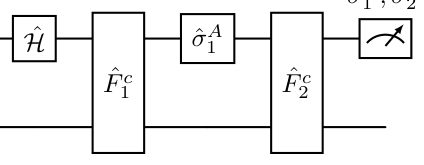
<figcaption class="paper-figure-caption"><b>Fig 2.</b> Figure 4: Pictorial representation of the interferometric scheme that realizes the measurement of the real and imaginary parts of Gk(u).</figcaption>
</figure>

**Summary.** The paper introduces a novel diagnostic tool to detect the topology of many-body quantum states by analyzing 'strange correlators.' It achieves this by showing these correlators can be expressed as sums over Kirkwood-Dirac quasiprobabilities (KDQs). The ultimate goal is proposing an interferometric protocol that allows experimental measurement of these topological signatures.

**Why it may be interesting.** This work provides a rigorous theoretical bridge between abstract topological invariants and measurable quantum correlation functions using quasiprobability formalisms, which is highly relevant for designing next-generation quantum sensing protocols.

Detailed structure

**Main problem.** The central goal is developing a theoretical method to distinguish between different topological classes of quantum states in many-body systems.

**Main result.** The authors propose using 'strange correlators,' which can be mathematically decomposed into Kirkwood-Dirac quasiprobabilities (KDQs), forming a measurable quantum topology witness.

**Method.** The approach links strange correlators to KDQs, interpreting them as weak values of an observable governing the transition between trivial and topological phases. This link is then exploited via interferometric protocols.

**Model / system.** The analysis applies to general many-body quantum systems exhibiting topological order, with specific examples including the 2D Chern insulator (BHZ model) and AKLT chains. The dynamics are often analyzed through sudden quench transformations or time evolution under perturbations.

**Key observables.** Strange correlators ($s[\hat{o}]$), Kirkwood-Dirac quasiprobabilities ($q_{k,j}$), and the characteristic function $G(u)$ measured via quantum interferometry.

**Important parameters / regimes.** The scaling behavior of strange correlators with momentum/distance ($|k|^{-\alpha}$ vs $|k|^{eta}$) is key to determining topology. The validity of linear response theory depends on time scales relative to energy gaps ($\Delta$ and $V_0$).

**Assumptions / limitations.** The analysis relies heavily on establishing the mathematical equivalence between strange correlators and sums over KDQs, and proposing an interferometric measurement scheme for reconstruction.

**Figures summary.** Figures illustrate spectral properties (BHZ model), the dependence of quasiprobability modulus $|q(kx)|$ on topological assumptions, and schematic diagrams of the quantum interferometry protocol used to measure correlation functions.

**Paper structure.** The paper progresses from defining strange correlators and KDQs, establishing their mathematical link, applying this framework to specific models (like BHZ), deriving linear response relations for the imaginary part of the correlator, and finally detailing an experimental/interferometric protocol for measurement.

Abstract

We discuss a theoretical approach to discriminate whether two states of a many-body quantum system belong or not to different topology classes. This approach is based on expressing a strange correlator - a recently established tool for quantum topology discrimination - between the states as a function of Kirkwood-Dirac quasiprobabilities (KDQs). KDQs provide a first-principles representation of two-time quantum correlators. The link between strange correlators and KDQs allows to establish that strange correlators are weak values of an observable converting an initial trivial state into a topologically non-trivial one. We thus propose a quantum topology witness that is achievable measuring the prior and subsequent effects on a many-body system of a sudden quench transformation that realizes the transition between trivial and topological phases. The witness is evaluated on a probe quantum state whose main features are detailed within the paper. Finally, directly exploiting schemes that allows for the complete reconstruction of KDQs, we address an interferometric protocol for topology discrimination, along with a general discussion of the main lines and challenges towards its implementation.

[↑ back to top](#top)

### [The Two Dimensional Dynamical Bulk Boundary Correspondence: Beyond Two Band Models](http://arxiv.org/abs/2606.10731v1)

**Authors:** Tomasz Masłowski, Nicholas Sedlmayr  
**Type:** theory · **Category:** statistical mechanics · **PDF:** <https://arxiv.org/pdf/2606.10731v1>  
**Analysis basis:** full PDF text, analyzed in chunks
**Topic relevance:** 🔥 `non-equilibrium dynamics` **4/5** · 🔥 `non-equilibrium universality` **4/5** · `analog quantum simulation` **3/5** · `driven-dissipative phase transition` **3/5** · `methods for driven-dissipative` **3/5** · `entanglement & information structure` **2/5** · `Keldysh / 2PI / non-Gaussian methods` **1/5** · `correlated / nonlocal dissipation` **1/5** · `scars & prethermalization` **1/5**

↔ Scroll figures horizontally

<figure class="paper-figure-card">
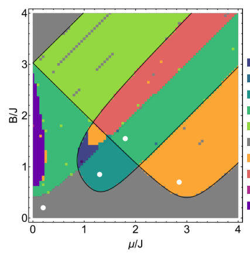
<figcaption class="paper-figure-caption"><b>Fig 1.</b> FIG. 1. The topological phase diagram for the topological superconductor [104], Eq. (7), with α = 0.4J and ∆= 0.4J. White circles are the points in the phase diagram between which we quench, see table I.</figcaption>
</figure>
<figure class="paper-figure-card">
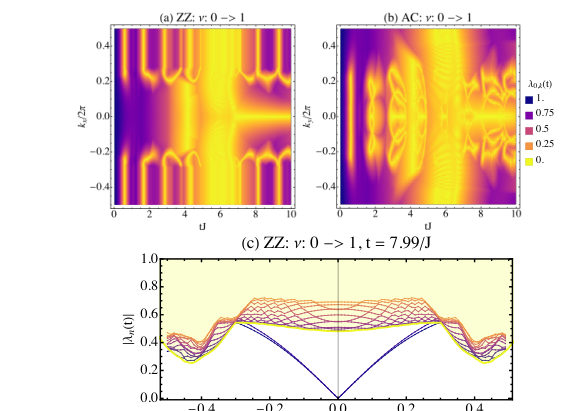
<figcaption class="paper-figure-caption"><b>Fig 2.</b> FIG. 2. In panels (a,b) the lowest Loschmidt eigenvalue λ0,k(t) as a function of momentum and time is plotted. This is calculated for a system of size 102 × 100 unit cells in the open and periodic directions respectively for both zig-zag (ZZ, panel a) and armchair (AC, panel b) edges. Panel (c) shows a cut at a particular time for the zig-zag edges with the lowest 12 eigenvalues λn,k(t) and the lowest bulk eigenvalue calcu- lated for periodic boundary conditions (N = 2002) giving the limit of the shaded region. In (a,b) the bulk critical regions appear as vertically orientated curved bright lines, and the lowest eigenvalue of the band of eigenvalues crossing the gap appear as horizontally...</figcaption>
</figure>
<figure class="paper-figure-card">
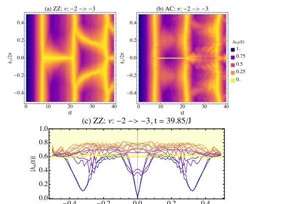
<figcaption class="paper-figure-caption"><b>Fig 3.</b> FIG. 3. In panels (a,b) the lowest Loschmidt eigenvalue λ0,k(t) as a function of momentum and time is plotted for both zig-zag (a) and armchair (b) edges. Panel (c) shows a cut at a particular time for the zig-zag edges with the lowest 12 eigenvalues λn,k(t) and the lowest bulk eigenvalue. See Fig. 2 and table I for more details. See the main text for a discussion of the results.</figcaption>
</figure>
<figure class="paper-figure-card">
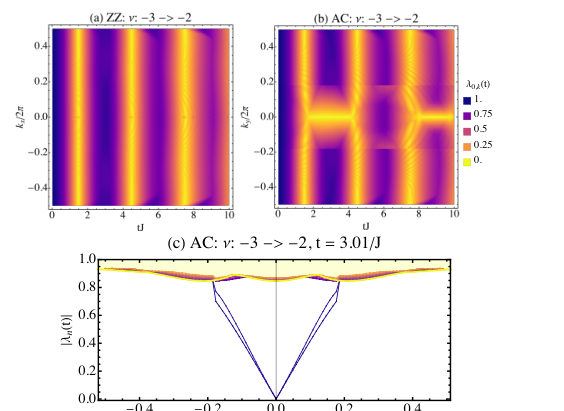
<figcaption class="paper-figure-caption"><b>Fig 4.</b> FIG. 4. In panels (a,b) the lowest Loschmidt eigenvalue λ0,k(t) as a function of momentum and time is plotted for both zig-zag (a) and armchair (b) edges. Panel (c) shows a cut at a particular time for the armchair edges with the low- est 12 eigenvalues λn,k(t) and the lowest bulk eigenvalue. See Fig. 2 and table I for more details. See the main text for a discussion of the results.</figcaption>
</figure>
<figure class="paper-figure-card">
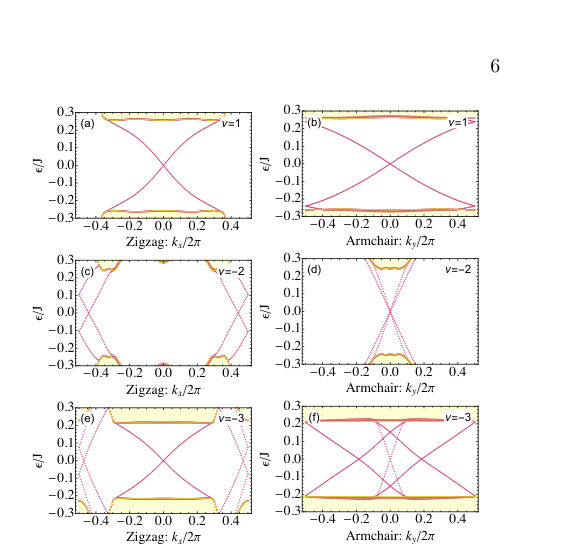
<figcaption class="paper-figure-caption"><b>Fig 5.</b> FIG. 5. Bandstructure examples for the model, (7), where α = 0.4J and ∆= 0.4J and further parameters are as in table I. The topologically protected bands can be seen crossing the gap, Chern numbers ν are as marked on the figures. Note as this is a chiral system left moving and right moving bands are on opposite edges of the system.</figcaption>
</figure>

**Summary.** This paper investigates the dynamical bulk-boundary correspondence in 2D topological superconductors after sudden quenches. Using the Loschmidt amplitude as a diagnostic tool, the authors tested this concept across various topological phase transitions. They conclude that the dynamic correspondence is not simply dictated by the initial and final equilibrium Chern numbers, suggesting a more nuanced, edge-dependent topological structure.

**Why it may be interesting.** This work bridges non-equilibrium quantum dynamics (Loschmidt echo) with topological invariants (Chern numbers), providing a complex, quantitative test case for extending bulk-boundary principles into time evolution.

Detailed structure

**Main problem.** The research investigates a dynamical equivalent of the bulk-boundary correspondence (DBBC) for topological models subjected to sudden quenches, extending beyond simple two-band descriptions.

**Main result.** The authors find that there is no straightforward correlation between the equilibrium phases quenched between and the observed dynamical bulk-boundary correspondence. Furthermore, this correspondence can depend on the specific orientation of the edges, suggesting a weak topological variant.

**Method.** The analysis relies on calculating the Loschmidt amplitude/return rate ($\ell(t)$) and identifying Dynamical Quantum Phase Transitions (DQPTs) where these quantities become non-analytic or exhibit zero eigenvalues in the Loschmidt matrix spectrum.

**Model / system.** The primary model studied is a complicated two-dimensional topological superconductor defined on a honeycomb lattice, allowing quenches between states characterized by different Chern numbers ($
u$).

**Key observables.** Loschmidt amplitude/return rate ($\ell(t)$), Loschmidt eigenvalues ($\lambda_{n,k}(t)$), and the system's Chern number ($
u$).

**Important parameters / regimes.** The quench path between initial and final topological phases (e.g., $
u: 0 	o 1$ or $
u: -2 	o -3$), and the geometry of the edges (armchair vs. zig-zag).

**Assumptions / limitations.** The analysis is performed in a cylindrical geometry, which may limit direct applicability to physical systems with single open edges; the exact cause and generality of the phenomenon remain unknown.

**Figures summary.** Figures plot the lowest Loschmidt eigenvalue $\lambda_{0,k}(t)$ vs. momentum/time for various quenches on different edge types (AC/ZZ), illustrating where in-gap modes appear near DQPTs; Figure 6 shows the return rate derivative ($\dot{l}(t)$) across quench paths.

**Paper structure.** The paper establishes the theoretical framework of DBBC, applies it to a complex 2D topological superconductor model undergoing quenches between different Chern number sectors, and concludes by detailing specific results showing deviations from simple equilibrium predictions based on edge orientation.

Abstract

A dynamical equivalent of the bulk-boundary correspondence has been suggested to occur in one and two dimensional topological models following sudden quenches. Depending on the topological invariant of the time evolving and initial phases involved large boundary contributions to a dynamical free energy occur. Moreover they occur periodically between the critical times at which this dynamical free energy becomes non-analytic, \emph{i.e.}~at dynamical quantum phase transitions. At these critical times the eigenvalue spectrum of the Loschmidt matrix which underlies the dynamical free energy closes its gap. The boundary contributions are understood to be due to zero-modes or in-gap bands of this matrix, forming a close analogy with equilibrium topological models and their edge modes. The exact cause of this phenomena and its generality remain unknown. In this article we test the dynamical bulk-boundary correspondence for a complicated two dimensional topological superconductor with a rich phase diagram, allowing quenches between many different Chern numbers. We show that there is no straightforward correspondence between the equilibrium phases quenched between and the dynamical bulk boundary correspondence. Furthermore the correspondence can depend on the orientation of the edges, suggesting a possible weak topological variant.

[↑ back to top](#top)

### [Nonreciprocal Photon Blockade in an Asymmetric Cavity](http://arxiv.org/abs/2606.10319v1)

**Authors:** Shao-Xiong Wu, Jin-Na Fan, Dan Yan, Cheng-Hua Bai, Qiannan Wu, Mengwei Li  
**Type:** theory · **Category:** other · **PDF:** <https://arxiv.org/pdf/2606.10319v1>  
**Analysis basis:** full PDF text, analyzed in chunks
**Topic relevance:** 🔥 `interference shaping light` **4/5** · `Keldysh / 2PI / non-Gaussian methods` **3/5** · `driven-dissipative phase transition` **3/5** · `methods for driven-dissipative` **3/5** · `Tavis-Cummings & cavity-many-emitter` **2/5** · `non-equilibrium dynamics` **2/5** · `analog quantum simulation` **1/5** · `correlated / nonlocal dissipation` **1/5** · `correlated cavity matter` **1/5** · `non-equilibrium universality` **1/5**

↔ Scroll figures horizontally

<figure class="paper-figure-card">
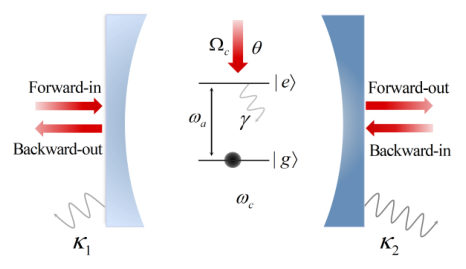
<figcaption class="paper-figure-caption"><b>Fig 1.</b> FIG. 1: Schematic of the system. A two-level atom is trapped inside an asymmetric Fabry-P´erot cavity, the cavity is driven by a coher- ent laser and the atom is pumped by a control laser with the same frequency. When the driving laser is injected from the left mirror toward the right, it is defined as the forward case, and the backward case corresponds to the opposite propagating direction. By adjust- ing the control laser, the photons exhibit photon antibunching in the forward case and bunching behaviour in the backward case, i.e., the nonreciprocal PB effect.</figcaption>
</figure>
<figure class="paper-figure-card">
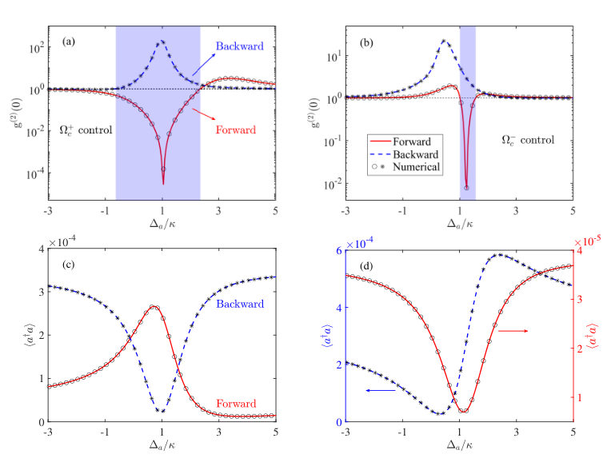
<figcaption class="paper-figure-caption"><b>Fig 2.</b> FIG. 2: The second-order correlation function g(2)(0) and the mean intracavity photon number ⟨a†a⟩as functions of the atomic detuning ∆a. Panels (a) and (c) correspond to the optimal control condition Ω+ c , while panels (b) and (d) represent the optimal control condition Ω− c . Red solid lines and blue dashed lines denote the analytical results derived via the probability amplitude method for the forward and backward cases, respectively. Black circles o and asterisks ∗mean the corresponding numerical solutions obtained from the quantum master equation.</figcaption>
</figure>
<figure class="paper-figure-card">
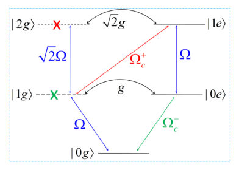
<figcaption class="paper-figure-caption"><b>Fig 3.</b> FIG. 3: Schematic of the energy-level structure and the transition pathways. The blue arrows denote transitions induced by the driving field, while the red/green arrow represents the pumping by the con- trol condition Ω+ c or Ω− c .</figcaption>
</figure>
<figure class="paper-figure-card">
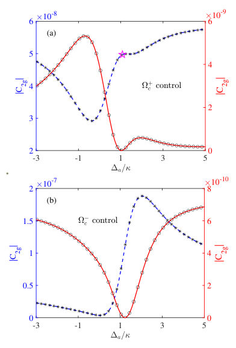
<figcaption class="paper-figure-caption"><b>Fig 4.</b> FIG. 4: The population of two-photon state |2g⟩as a function of the atomic detuning ∆a. Panel (a) corresponds to the optimal control condition Ω+ c , and panel (b) to Ω− c control. The parameters are cho- sen those in Fig. 2.</figcaption>
</figure>
<figure class="paper-figure-card">
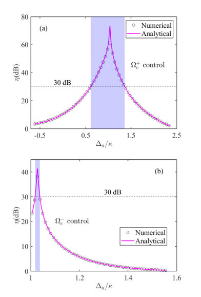
<figcaption class="paper-figure-caption"><b>Fig 5.</b> FIG. 5: The nonreciprocal ratio η as a function of the atomic detuning ∆a. Panel (a) corresponds to the optimal control condition Ω+ c , and panel (b) to Ω− c control. The light-blue regions indicate that η &gt; 30 dB. The parameters are chosen those in Fig. 2.</figcaption>
</figure>

**Summary.** The authors propose using an asymmetric cavity QED system driven by two lasers to achieve strong nonreciprocal photon blockade. By carefully tuning the control laser's phase and amplitude, they engineer destructive quantum interference pathways. This results in robust antibunching (blockade) when light propagates forward, while observing bunching backward, demonstrating a high degree of directional control.

**Why it may be interesting.** This work provides a highly practical theoretical blueprint for generating directional quantum light sources, which is crucial for advancing quantum networking and measurement protocols that require time-reversal symmetry breaking.

Detailed structure

**Main problem.** The primary goal is realizing tunable and strong nonreciprocal photon blockade (PB) within an asymmetric Fabry-Pérot cavity.

**Main result.** Strong nonreciprocal PB, with a ratio exceeding 30 dB, is achieved by engineering quantum interference pathways using an auxiliary control laser field.

**Method.** The analysis employs a phenomenological non-Hermitian Hamiltonian approach and utilizes the weak-driving regime approximation to solve for time evolution in a truncated Hilbert space.

**Model / system.** The system is a single-mode optical cavity trapping a two-level atom, driven by a coherent laser ($\Omega$) and controlled by an auxiliary field ($\Omega_c$). The asymmetry is inherent in the cavity decay rates ($\kappa_1 
eq \kappa_2$).

**Key observables.** Second-order photon correlation function ($g^{(2)}(0)$) to diagnose blockade (antibunching, $g^{(2)}<1$) and nonreciprocal ratio ($\eta = -10 \log_{10} (g^{(2)}_f(0)/g^{(2)}_b(0))$).

**Important parameters / regimes.** Control field amplitude ($\Omega_c$), relative phase ($	heta$), cavity decay rate ($\kappa$), and detunings ($\Delta_c, \Delta_a$).

**Assumptions / limitations.** The analysis relies on the weak-driving regime approximation ($\{\Omega, \Omega_c\} \ll \kappa$) and a truncated Hilbert space up to three excitations.

**Figures summary.** Figures illustrate the system setup, schematic pathways for quantum interference (for $\Omega_+^c$ vs $\Omega_-^c$), $g^{(2)}(0)$ dependence on control parameters, and time-delayed correlation functions ($g^{(2)}(	au)$) showing distinct forward (PB) and backward (bunching) behavior.

**Paper structure.** The paper develops the non-Hermitian Hamiltonian model, applies weak-driving approximations to derive coupled differential equations for probability amplitudes, solves for steady-state observables like $g^{(2)}(0)$, and finally compares two optimal control conditions ($\Omega_+^c$ vs $\Omega_-^c$) to quantify the resulting nonreciprocity.

Abstract

We propose a scheme to realize tunable and strong nonreciprocal photon blockade (PB) in an asymmetric Fabry-Pérot cavity. The setup consists of a single-mode optical cavity trapping a two-level atom, with the cavity coherently driven by a laser and the atom pumped by an auxiliary control field of the same frequency. By engineering quantum interference between multiple excitation pathways by adjusting the amplitude and relative phase of the control laser, we identify two distinct optimal control conditions that enable directional suppression of two-photon states. Under optimal control conditions, strong nonreciprocal PB is achieved, with a nonreciprocal ratio exceeding 30 dB over a broad operational bandwidth. The proposed protocol requires only standard coherent laser sources and is compatible with current cavity QED experimental setups, offering a practical and scalable platform for nonreciprocal quantum photonics.

[↑ back to top](#top)

### [Tame the Umklapp Processes in Real-Time Lattice Simulation for Hydrodynamics: An Ising Field Theory Study](http://arxiv.org/abs/2606.09984v1)

**Authors:** Xiaojun Yao  
**Type:** theory · **Category:** statistical mechanics · **PDF:** <https://arxiv.org/pdf/2606.09984v1>  
**Analysis basis:** full PDF text, analyzed in chunks
**Topic relevance:** 🔥 `non-equilibrium dynamics` **4/5** · `methods for driven-dissipative` **3/5** · `non-equilibrium universality` **3/5** · `Keldysh / 2PI / non-Gaussian methods` **2/5** · `analog quantum simulation` **2/5** · `driven-dissipative phase transition` **2/5** · `Frenkel-Kontorova` **1/5** · `correlated / nonlocal dissipation` **1/5** · `entanglement & information structure` **1/5** · `exotic spin models in light-matter` **1/5** · `scars & prethermalization` **1/5**

↔ Scroll figures horizontally

<figure class="paper-figure-card">
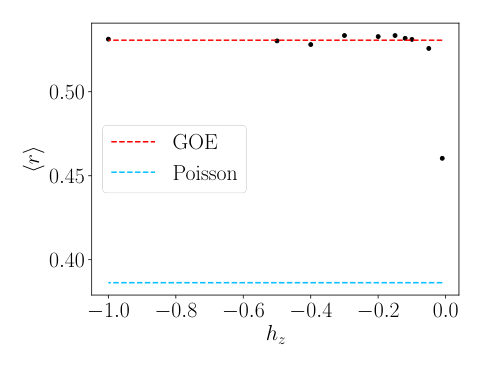
<figcaption class="paper-figure-caption"><b>Fig 1.</b> FIG. 2. Expected values of restricted gap ratios calculated on the L = 20 lattice with ξlat = 0.01 as a function of hz. The middle 70% eigenenergies in the spectrum of the nk = 1 sector are used. The red dashed line is the GOE prediction 0.5307 while the blue dashed line is the value obtained from a Poisson distribution 0.3863.</figcaption>
</figure>
<figure class="paper-figure-card">
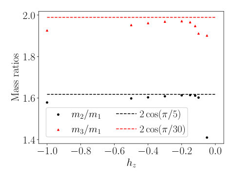
<figcaption class="paper-figure-caption"><b>Fig 2.</b> FIG. 1. Mass ratios of the three stable particles calculated on the L = 20 lattice with ξlat = 0.01 as functions of hz. The dashed lines are predictions from the E8 theory. The lattice results are expected to be close to the E8 predictions but not exactly equal.</figcaption>
</figure>
<figure class="paper-figure-card">
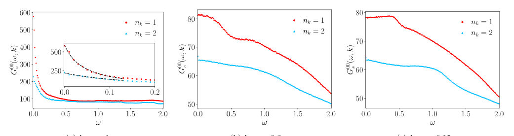
<figcaption class="paper-figure-caption"><b>Fig 3.</b> FIG. 3. Real-time symmetric correlation functions of energy densities in frequency space with two different crystal momenta k = 2πnk/L on a periodic L = 20 Ising lattice with ξlat = 0.01 at T = 10 for three different longitudinal fields. (a) Outside the scaling region, the symmetric correlator shows a diffusive peak. The black dashed lines in the inset are fits of the form b |ω|+4Dε sin2(k/2) in the range ω ∈[0, 0.13]. The fitted parameter values are listed in Table I. (b, c) Inside the scaling region, the diffusive peak disappears.</figcaption>
</figure>
<figure class="paper-figure-card">
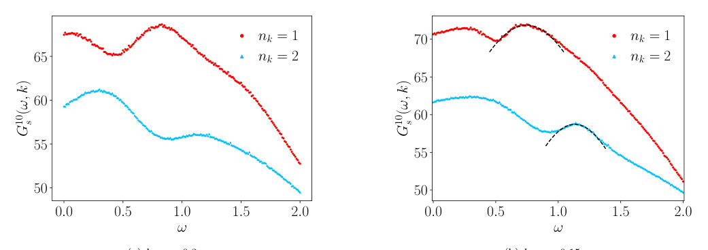
<figcaption class="paper-figure-caption"><b>Fig 4.</b> FIG. 4. Real-time symmetric correlation functions of momentum densities in frequency space with two different crystal momenta k = 2πnk/L on a periodic L = 20 Ising lattice with ξlat = 0.01 at T = 10 for two different longitudinal fields inside the scaling region. Deep in the scaling region hz = −0.15, two peaks emerge that can be well described by a Lorentzian shape b0 (ω−b1)2+b2 , as indicated by the black dashed lines in (b). The fitting is performed in the interval ω ∈[0.54, 0.95] for nk = 1 and ω ∈[1, 1.27] for nk = 2. The fitted parameter values are listed in Table II. These emergent peaks hint the possibility of finding the sound modes if one can take hz even closer to 0 while still...</figcaption>
</figure>
<figure class="paper-figure-card">
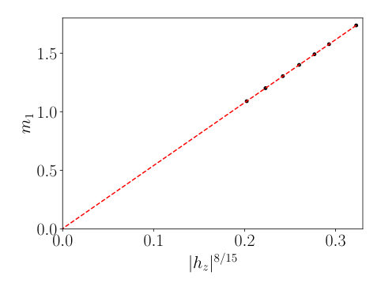
<figcaption class="paper-figure-caption"><b>Fig 5.</b> FIG. 5. Mass gap on an L = 32 lattice with ξlat = 0.01 as a function of the coupling (black points). The red dashed line is a linear fit. The fitted slope is 5.375 and the fitted intercept is 2.790 × 10−3, up to four significant numbers. This linear line establishes the beta function of the theory.</figcaption>
</figure>

**Summary.** The paper simulates a 1+1D Ising field theory using real-time lattice Hamiltonian methods to study how the system reaches hydrodynamic equilibrium. By analyzing the stress-energy tensor correlation function, the authors confirm that Umklapp scattering is suppressed, allowing sound waves to propagate. This allowed them to nonperturbatively calculate fundamental transport properties like the ratio of bulk viscosity to entropy density and the speed of sound.

**Why it may be interesting.** This work is highly relevant as it uses advanced quantum many-body simulation techniques (MPS) to tackle non-equilibrium dynamics—a key area of modern condensed matter theory that bridges microscopic quantum rules to macroscopic fluid behavior, similar to studies in AMO systems undergoing rapid quench or thermalization.

Detailed structure

**Main problem.** The study aims to understand non-equilibrium dynamics, specifically hydrodynamization, and calculate transport coefficients like bulk viscosity ($\zeta$) and the speed of sound ($c_s$) in a system exhibiting Umklapp processes.

**Main result.** The simulations successfully demonstrated that Umklapp processes are suppressed in the scaling region, allowing for the emergence of relativistic hydrodynamic sound modes. Quantitative results were obtained: $\zeta/s = 14.19 \pm 0.90$ and $c_s/c = 0.76 \pm 0.02$.

**Method.** The research employs real-time lattice Hamiltonian simulation techniques, utilizing both classical exact diagonalization and advanced Matrix Product State (MPS) tensor network methods to calculate the symmetric correlation function of the stress-energy tensor.

**Model / system.** The model is a 1+1 dimensional Ising field theory, derived from deforming the 1+1D Ising conformal field theory. The system evolves according to a lattice Hamiltonian, and observables are extracted from the time evolution of the stress-energy tensor correlation function.

**Key observables.** Symmetric correlation function of the stress-energy tensor ($G_{\mu
u}^s$), bulk viscosity ($\zeta/s$), speed of sound ($c_s/c$), and momentum conservation checks.

**Important parameters / regimes.** The analysis focuses on the 'scaling region' defined by specific limits on lattice couplings, requiring extrapolation to the continuum limit. Key parameters include temperature $T \approx 7.14$ (in units of particle mass).

**Assumptions / limitations.** It is assumed that hydrodynamics accurately describes the late-time and long-wavelength behavior, and that Umklapp processes must be suppressed for sound modes to emerge.

**Figures summary.** Figures illustrate the transition from diffusive dynamics (outside scaling region) to propagating sound modes (inside scaling region) in momentum space correlators. Plots also show linear fits of derived parameters ($c_s/c$ and $\zeta/s$) versus lattice coupling strength for continuum extrapolation.

**Paper structure.** The paper establishes the necessity of real-time simulation over Euclidean methods, details the Ising model setup and stress-energy tensor derivation, analyzes the transition from diffusive to propagating modes using MPS simulations, and finally extrapolates results to extract quantitative transport coefficients in the continuum limit.

Abstract

We calculate the real-time symmetric correlation function of the stress-energy tensor for a non-integrable Ising field theory consisting of three stable scalar particles via lattice Hamiltonian simulation. Using classical exact diagonalization and the matrix product state tensor network methods, we find that in the scaling region of the lattice theory, Umklapp processes are suppressed and the sound modes of relativistic hydrodynamics emerge at long wavelength and late time. The extracted ratio of bulk viscosity to entropy density is $ζ/s=14.19\pm 0.90$ and the speed of sound is $c_s/c=0.76 \pm 0.02$ at the temperature $T\approx 7.14$ in units of the lowest stable particle's mass. Our study demonstrates the utility of real-time lattice Hamiltonian simulation for describing hydrodynamization and calculating transport coefficients nonperturbatively.

[↑ back to top](#top)

### [Finite-Time Orientational Relaxation Restructures Collective Motion in Polar Active Matter](http://arxiv.org/abs/2606.10474v1)

**Authors:** Rajneesh Kumar, Subhransu Sekhar Mishra, Debasish Chaudhuri  
**Type:** theory · **Category:** statistical mechanics · **PDF:** <https://arxiv.org/pdf/2606.10474v1>  
**Analysis basis:** full PDF text, analyzed in chunks
**Topic relevance:** 🔥 `non-equilibrium universality` **4/5** · `driven-dissipative phase transition` **3/5** · `methods for driven-dissipative` **3/5** · `non-equilibrium dynamics` **3/5** · `analog quantum simulation` **2/5** · `correlated / nonlocal dissipation` **2/5** · `Frenkel-Kontorova` **1/5** · `Keldysh / 2PI / non-Gaussian methods` **1/5** · `entanglement & information structure` **1/5**

↔ Scroll figures horizontally

<figure class="paper-figure-card">
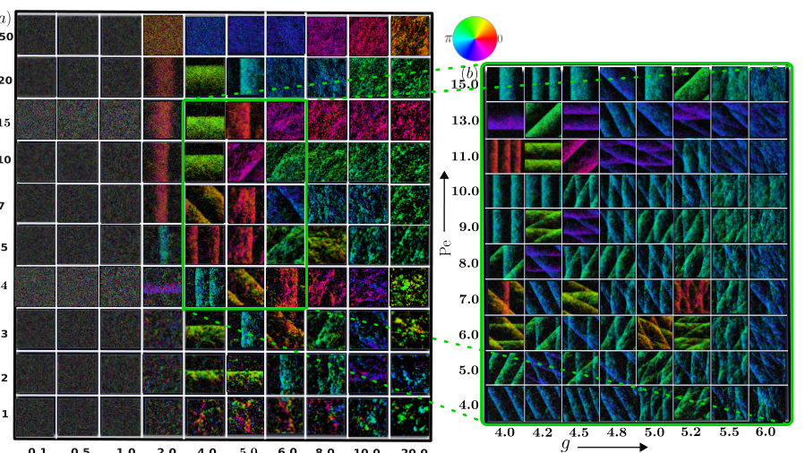
<figcaption class="paper-figure-caption"><b>Fig 1.</b> Figure 1. (a) Configurational phase diagram in the (Pe, g) plane for a system of N = 16,000 particles at fixed number density ρ = 1.0. Particle colors represent the heading direction ui = (cos θi, sin θi), with θi ∈[0, 2π]. Variation of Pe and g gives rise to pattern formation associated with an order-disorder transition, including homogeneous isotropic states, polar bands, polar micro-clusters, and homogeneous polar phases. (b) Configurational phase diagram in the (Pe, g) plane for a system with N = 64,000 particles, corresponding to the parameter region highlighted by the green box in (a). The enlarged system size reveals an additional cross-sea phase that is absent in smaller systems.</figcaption>
</figure>
<figure class="paper-figure-card">
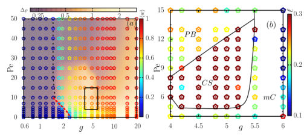
<figcaption class="paper-figure-caption"><b>Fig 2.</b> Figure 2. Phase diagram in the (Pe, g) plane, where the dimensionless activity is defined as Pe = v0/(rcDr) and the effective alignment rate as g = J/Dr. (a) Points are colored by the polar order parameter ⟨w⟩, while the background heat map represents density fluctuations ∆ρ. The black dashed line marks the order-disorder phase boundary, determined from the maxima of fluctuations in the polar order param- eter. The red dashed line represents Pe∗= (B/g∗)(g0 ∗−g∗) 1 2 , with B = 11 and g0 ∗= 2.5, corresponding to Eq. (14). (b) En- larged view of the region identified by the black rectangle in (a), showing the cross-sea phase, polar banded phase, and microcluster phase. Points are colored...</figcaption>
</figure>
<figure class="paper-figure-card">
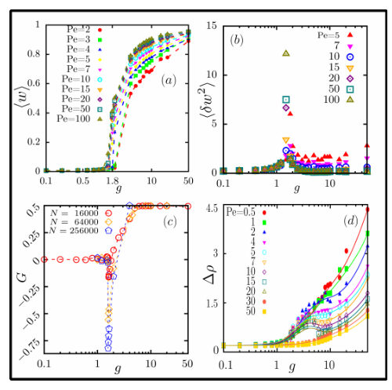
<figcaption class="paper-figure-caption"><b>Fig 3.</b> Figure 3. Steady-state properties as a function of the di- mensionless alignment rate g for different activities Pe. Re- sults are shown for N = 16,000 particles at number density ρ = 1.0. (a) Polar order parameter ⟨w⟩versus g. (b) Vari- ance of the polar order, ⟨δw2⟩, versus g, showing peaks near the order-disorder transitions. (c) Binder cumulant G versus g for Pe = 10. A negative dip near g∗signals a first-order transition; colors indicate different system sizes. (d) Root- mean-square density fluctuations ∆ρ versus g.</figcaption>
</figure>
<figure class="paper-figure-card">
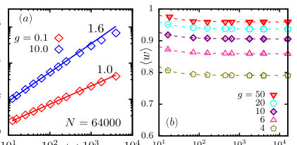
<figcaption class="paper-figure-caption"><b>Fig 4.</b> Figure 4. (a) Scaling of number fluctuations, ⟨∆n2⟩∼⟨n⟩α, for Pe = 10 in the disordered phase (g = 0.1) and homoge- neous polar phase (g = 10). The lines show α = 1 for g = 0.1 and α = 1.6 for g = 10, demonstrating giant number fluctu- ations in the ordered phase. Results are for N = 6.4 × 104</figcaption>
</figure>
<figure class="paper-figure-card">
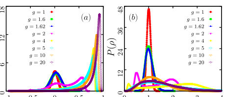
<figcaption class="paper-figure-caption"><b>Fig 5.</b> Figure 5. For a system of size N = 16,000 at Pe = 10, the local probability distributions (a) P(n∥) and (b) P(ρ) are shown for various values of the dimensionless alignment rate g. In both cases, the distributions exhibit clear bimodality near transition, indicating phase coexistence.</figcaption>
</figure>

**Summary.** This work analyzes polar active matter using a model where particle orientation relaxes at a finite rate. Through extensive simulations, the authors map out a complex phase diagram showing transitions between distinct structural states like banded and cross-sea phases. The key finding is that this finite relaxation time acts as a crucial control parameter, fundamentally restructuring the system's collective behavior.

**Why it may be interesting.** While focused on classical active matter, the study of non-equilibrium phase transitions, first-order transitions diagnosed by cumulants, and the role of dissipation/relaxation rates ($D_r$ vs $J$) provides analogous concepts to understanding critical dynamics in open quantum systems or driven many-body models.

Detailed structure

**Main problem.** The study investigates how finite-time orientational relaxation restructures the collective motion and phase transitions in polar active matter systems.

**Main result.** The system exhibits a rich sequence of structural phases (Isotropic $	o$ Polar Banded $	o$ Cross-Sea $	o$ Micro-clustered) driven by increasing alignment rate, with transitions being strongly first order.

**Method.** Large-scale numerical simulations and mean-field analysis are used to map the non-equilibrium phase diagram in terms of activity and alignment rates.

**Model / system.** The model consists of Vicsek-like active particles whose orientations evolve via a Langevin formulation that incorporates finite-rate relaxation towards the local mean direction, combining consensus dynamics with XY-like rotational diffusion.

**Key observables.** Polar order parameter ($\langle w 
angle$), density fluctuations ($\Delta
ho$), structural order parameter ($\langle \ell 
angle$), and Binder cumulants for transition characterization.

**Important parameters / regimes.** Activity (Péclet number, $	ext{Pe}$) and effective alignment rate ($g = J/D_r$).

**Assumptions / limitations.** The analysis relies on a specific Langevin formulation incorporating finite relaxation time, and some theoretical work uses mean-field approximations.

**Figures summary.** Figures illustrate the phase diagram in $(	ext{Pe}, g)$ space showing HI, PB, CS, HP, and mC regimes; local probability distributions transition from unimodal to bimodal near first-order transitions.

**Paper structure.** The paper develops the Langevin dynamics, analyzes the resulting non-equilibrium phase diagram across varying activity parameters, characterizes multiple structural phases using order parameters, and concludes that finite relaxation acts as a key control parameter restructuring collective behavior.

Abstract

We introduce a Langevin formulation of Vicsek-like active particles in which orientations evolve through finite-rate relaxation toward the local mean direction, with alignment strength $J$ and rotational diffusivity $D_r$, thereby combining Vicsek-type local consensus with XY-like orientational dynamics. Using large-scale numerical simulations, we determine the nonequilibrium phase diagram as a function of activity and alignment rate. Increasing the alignment rate drives a sequence of transitions from a homogeneous isotropic state to polar bands, a cross-sea phase of intersecting bands, a homogeneous polar state, and ultimately a micro-clustered regime. The isotropic-to-polar transition is strongly first order, as evidenced by Binder cumulants and bimodal distributions of local polarization and density, indicating coexistence of gas-like and liquid-like regions. Near the onset of collective motion, band size increases with activity but depends non-monotonically on alignment rate. Further increasing the alignment rate drives the system through the cross-sea and homogeneous polar phases before enhanced density fluctuations lead to micro-clustering. Our results demonstrate that finite-time orientational relaxation acts as a control parameter that qualitatively restructures collective behavior in polar active matter.

[↑ back to top](#top)

### [Magnetic HIP-NN for spin dynamics in disordered itinerant magnets](http://arxiv.org/abs/2606.10349v1)

**Authors:** Supriyo Ghosh, Yunhao Fan, Sheng Zhang, Kipton Barros, Gia-Wei Chern  
**Type:** theory · **Category:** disordered systems and neural networks · **PDF:** <https://arxiv.org/pdf/2606.10349v1>  
**Analysis basis:** full PDF text, analyzed in chunks
**Topic relevance:** 🔥 `methods for driven-dissipative` **4/5** · `exotic spin models in light-matter` **3/5** · `spintronics-quantum-optics interface` **3/5** · `Keldysh / 2PI / non-Gaussian methods` **2/5** · `driven-dissipative phase transition` **2/5** · `non-equilibrium dynamics` **2/5** · `Kondo & dissipative impurity` **1/5** · `analog quantum simulation` **1/5** · `correlated / nonlocal dissipation` **1/5** · `non-equilibrium universality` **1/5**

↔ Scroll figures horizontally

<figure class="paper-figure-card">
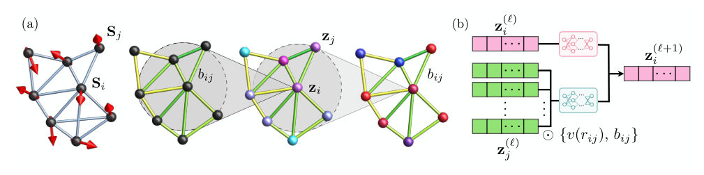
<figcaption class="paper-figure-caption"><b>Fig 1.</b> FIG. 1. Schematic illustration of the magnetic HIP-NN framework for electron-mediated spin dynamics in disordered itinerant magnets. (a) Localized Heisenberg spins {Si} embedded in an amorphous lattice are mapped onto rotationally invariant bond features bij = Si · Sj, which are combined with geometric information associated with inter-site distances rij. These quantities define the local environments used to construct hierarchical feature representations {zi} on each magnetic site. (b) Within the interaction layer, neighboring feature vectors z(ℓ) j are weighted by learned distance-dependent functions v(rij) together with the spin-correlation features bij, and are subsequently processed...</figcaption>
</figure>
<figure class="paper-figure-card">
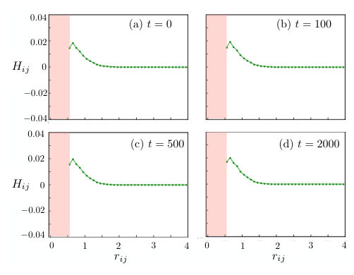
<figcaption class="paper-figure-caption"><b>Fig 2.</b> FIG. 2. Spatial dependence of the Hessian matrix elements Hij = ∂2E/∂Sx i ∂Sx j evaluated from the ML-generated energy functional at different times during the ED-LLG simulations: (a) t = 0, (b) t = 100, (c) t = 500, and (d) t = 2000. The Hes- sian elements are plotted as a function of the intersite distance rij. The shaded region denotes the forbidden short-distance regime rij &lt; rmin in the underlying spin-glass model. The rapid decay of Hij demonstrates the locality and stability of the learned magnetic interactions throughout the dynamical evolution.</figcaption>
</figure>
<figure class="paper-figure-card">
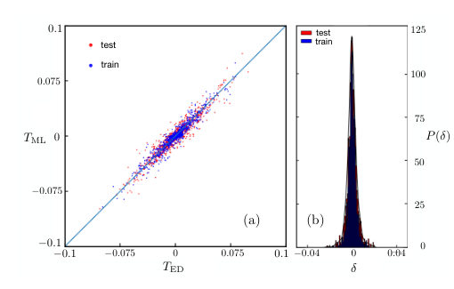
<figcaption class="paper-figure-caption"><b>Fig 3.</b> FIG. 3. (a) Parity plot of the mHIP-NN predicted torque components, TML i = Si × HML i , versus the exact ED results for the training (blue) and test (red) datasets. Each point corresponds to one Cartesian component of the local torque vector. (b) Distribution of the prediction error δ = T ML−T ED</figcaption>
</figure>
<figure class="paper-figure-card">

<figcaption class="paper-figure-caption"><b>Fig 4.</b> FIG. 4. Spin-spin correlation function C(r) at different times following a thermal quench, obtained from ED-LLG and ML- LLG simulations: (a) t = 0, (b) t = 100, (c) t = 500, and (d) t = 2000. The close agreement between the ED and ML results demonstrates that the learned force-field model accu- rately reproduces the nonequilibrium spin dynamics and the evolution of spatial magnetic correlations.</figcaption>
</figure>
<figure class="paper-figure-card">
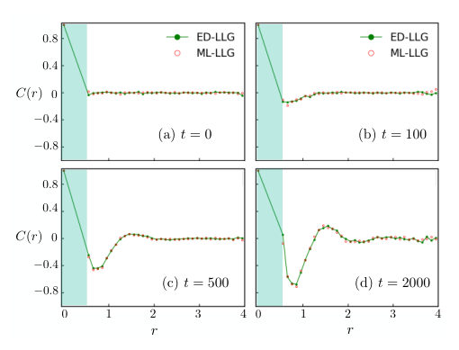
<figcaption class="paper-figure-caption"><b>Fig 5.</b> Figure 3 demonstrates the strong predictive perfor- mance of the mHIP-NN model for the local torque Ti = Si × Hi throughout the spin dynamics. As shown in the parity plot of Fig. 3(a), the predicted torque components closely follow the exact ED results for both the training and test datasets, with only small deviations from the diagonal line. The corresponding error distributions in Fig. 3(b) are sharply peaked around zero and exhibit very small variance, indicating both high accuracy and excel- lent generalization capability of the model. From the test dataset, we estimate a coefficient of determination of approximately R2 ∼0.98 and a mean-squared error of order MSE ∼10−5. The close...</figcaption>
</figure>

**Summary.** This work introduces mHIP-NN, a magnetic neural network extension designed to simulate spin dynamics in disordered itinerant magnets. It overcomes computational barriers by learning the effective magnetic energy landscape and local torques directly from microscopic electronic calculations. The method successfully reproduces non-equilibrium spin correlation evolution, establishing a scalable ML framework for coupled atom-spin systems.

**Why it may be interesting.** The framework provides a powerful ML tool for simulating complex many-body quantum dynamics (spin/electron coupling) that are typically intractable due to the need for repeated solving of electronic structure equations.

Detailed structure

**Main problem.** Developing an efficient, scalable framework to simulate electron-mediated spin dynamics in disordered itinerant magnets, circumventing the computational bottleneck of repeated exact electronic structure calculations.

**Main result.** The magnetic HIP-NN (mHIP-NN) accurately reproduces local torques and captures non-equilibrium spin correlation evolution by learning effective interactions directly from microscopic data.

**Method.** The authors employ a specialized Graph Neural Network architecture that incorporates rotationally invariant spin correlations into message-passing layers to construct a differentiable energy functional for coupled atom-spin dynamics.

**Model / system.** The system is disordered itinerant magnets governed by an s-d exchange Hamiltonian. The dynamics are simulated using the Landau-Lifshitz-Gilbert (LLG) equation, where effective magnetic fields arise from electronic structure calculations.

**Key observables.** Local torques ($\mathbf{T}_i$), non-equilibrium spatial spin correlations ($C(\mathbf{r}, t)$), and the characteristic correlation length $\xi(t)$.

**Important parameters / regimes.** The model handles structural disorder, itinerant electron hopping amplitudes (e.g., $e^{-|\mathbf{r}_i-\mathbf{r}_j|/l}$), and spin-spin coupling strengths.

**Assumptions / limitations.** The primary assumption is that the complex effective magnetic interactions can be accurately approximated by a differentiable ML potential trained on data generated from exact diagonalization simulations.

**Figures summary.** Figures illustrate the spatial decay of interaction terms (Hessian matrix elements) confirming locality, and show the time evolution of spin-spin correlation functions $C(\mathbf{r}, t)$ comparing ED-LLG to ML-LLG results.

**Paper structure.** The paper introduces mHIP-NN for coupled atom-spin dynamics, details its graph structure using invariant descriptors ($r_{ij}, b_{ij}$), benchmarks it against LLG dynamics by predicting local torques, and finally demonstrates its ability to track non-equilibrium spin correlation growth ($\xi(t)$).

Abstract

We present a magnetic extension of the Hierarchically Interacting Particle Neural Network (HIP-NN) that enables large-scale simulations of electron-mediated spin dynamics in disordered itinerant magnets. The resulting magnetic HIP-NN (mHIP-NN) incorporates rotationally invariant spin correlations directly into hierarchical message-passing layers, enabling the network to learn emergent magnetic energy landscapes and effective local fields from coupled geometric-spin environments while preserving spin-rotation symmetry. As a benchmark application, we consider structurally disordered itinerant $s$-$d$ exchange models in which the effective magnetic forces arise dynamically from the instantaneous electronic structure and are computationally prohibitive to evaluate using conventional exact-diagonalization-based approaches. We show that mHIP-NN accurately reproduces the local torques governing Landau-Lifshitz-Gilbert dynamics and faithfully captures the nonequilibrium evolution of spatial spin correlations following thermal quenches. Our results establish symmetry-aware hierarchical message-passing networks as an efficient and scalable framework for large-scale simulations of frustrated itinerant spin systems and nonequilibrium magnetic dynamics. More broadly, because the learned energy functional remains fully differentiable with respect to both atomic coordinates and spin variables, the framework also provides a natural foundation for spin-dependent interatomic potentials and coupled atom-spin dynamics.

[↑ back to top](#top)

### [Interaction-driven dynamics in graphene flakes as a benchmark for quantum simulation](http://arxiv.org/abs/2606.10548v1)

**Authors:** Fabian Eickhoff, Satoshi Ejima, Lukas Windgätter, Florian G. Eich, Hannah Rittich, Sebastian Zanker, Peter Schmitteckert  
**Type:** theory · **Category:** strongly correlated electrons · **PDF:** <https://arxiv.org/pdf/2606.10548v1>  
**Analysis basis:** full PDF text, analyzed in chunks
**Topic relevance:** 🔥 `non-equilibrium dynamics` **4/5** · `methods for driven-dissipative` **3/5** · `non-equilibrium universality` **3/5** · `analog quantum simulation` **2/5** · `driven-dissipative phase transition` **2/5** · `Frenkel-Kontorova` **1/5** · `Keldysh / 2PI / non-Gaussian methods` **1/5** · `correlated / nonlocal dissipation` **1/5** · `entanglement & information structure` **1/5**

↔ Scroll figures horizontally

<figure class="paper-figure-card">
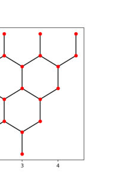
<figcaption class="paper-figure-caption"><b>Fig 1.</b> Figure 1: Schematic representation of the 4 × 4 graphene flake used in this work, comprising 32 lattice sites on the honeycomb lattice. The units are in lattice con- stants.</figcaption>
</figure>
<figure class="paper-figure-card">
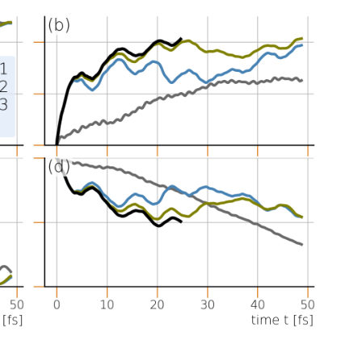
<figcaption class="paper-figure-caption"><b>Fig 2.</b> Figure 2: Time evolution after a particle–hole quench in a 4 × 4 graphene flake (32 sites). The upper panels show the orbital entropy Ssp, while the lower panels display the occupation of the initially excited single-particle level n˜p. The left panels corre- spond to periodic boundary conditions and the right panels to hard-wall boundary conditions. Colored curves denote simulations restricted to at most n = 1 (grey), n = 2 (blue), and n = 3 (olive) particle–hole excitations, while black curves repre- sent the full Fock-space dynamics. Periodic systems are already well described by low-order excitation spaces (n ≤2), whereas hard-wall systems require higher-order excitations and exhibit...</figcaption>
</figure>
<figure class="paper-figure-card">
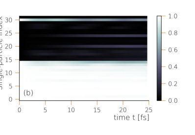
<figcaption class="paper-figure-caption"><b>Fig 3.</b> Figure 3: Full Fock-space evolution of all single-particle occupations nq following the quench in a 4 × 4 graphene flake. Single-particle indices on the vertical axis are ordered by the non-interacting eigenenergies εℓ. White (black) indicates occupation one (zero). Panel (a) shows periodic boundary conditions and panel (b) hard-wall boundary conditions. Periodic systems show rapid and efficient redistribution of the excitation, while hard-wall systems display slower and more structured dynamics indicative of higher-order processes.</figcaption>
</figure>
<figure class="paper-figure-card">
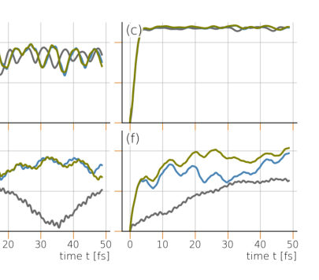
<figcaption class="paper-figure-caption"><b>Fig 4.</b> Figure 4: System-size dependence of excitation-space convergence. Time evolution of the orbital entropy for periodic (a–c) and hard-wall (d–f) boundary conditions for systems of increasing size: 4×2 (a,d), 4×3 (b,e), and 4×4 (c,f). Grey, blue, and olive curves correspond to simulations restricted to n = 1, n = 2, and n = 3 particle–hole excitations, respectively. Low-order excitation spaces remain accurate for periodic graphene across system sizes, whereas hard-wall systems show increasing deviations and growing importance of higher-order correlations.</figcaption>
</figure>
<figure class="paper-figure-card">
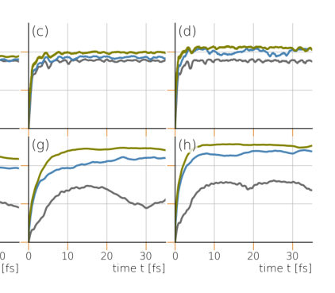
<figcaption class="paper-figure-caption"><b>Fig 5.</b> Figure 5: Interaction dependence of excitation-space convergence for a 4 × 4 graphene flake. Time evolution of the orbital entropy is shown for periodic (a–d) and hard-wall (e–h) boundary conditions at increasing nearest-neighbor interaction strength U1 = 0.2, 0.4, 0.6, and 0.8 (from left to right), with U2 = U3 = 0. Grey, blue, and olive curves correspond to simulations restricted to n = 1, n = 2, and n = 3 particle–hole excitation sectors, respectively. Increasing interaction strength enhances higher-order contributions in all cases, but periodic systems retain near- convergence at low excitation order over a much wider parameter range than hard- wall systems.</figcaption>
</figure>

**Summary.** The paper analyzes ultrafast carrier relaxation in interacting graphene flakes after an optical quench by comparing full time evolution against simplified models restricted to low-order excitations. It establishes that while periodic boundaries allow for good descriptions using few terms, hard-wall confinement necessitates including high-order correlations, providing a crucial benchmark for quantum simulation methods.

**Why it may be interesting.** This work provides a rigorous, quantitative testbed for many theoretical approaches used in non-equilibrium quantum dynamics, particularly highlighting how boundary conditions can fundamentally alter the required complexity of the underlying physics description.

Detailed structure

**Main problem.** The study investigates whether interaction-driven ultrafast dynamics (carrier relaxation) following an optical quench in graphene can be accurately described using only low-order particle–hole excitation subspaces.

**Main result.** Convergence depends critically on geometry: periodic flakes are well-described by low-order excitations, whereas hard-wall confined geometries require substantial higher-order correlation contributions.

**Method.** The authors compare exact real-time evolution (full Fock space) against truncated simulations restricted to subspaces containing up to $n$ particle–hole excitations.

**Model / system.** The system is finite graphene flakes modeled by an interacting tight-binding Hamiltonian for spinless fermions. The dynamics are initiated via a single particle–hole excitation quench protocol.

**Key observables.** Single-particle orbital entropy ($S_{sp}$), which diagnoses dynamic correlation growth, and the occupation of the initially excited level ($	ilde{n}_p$).

**Important parameters / regimes.** Boundary conditions (Periodic vs. Hard-wall), interaction strengths ($U_1, U_2, U_3$), and excitation order truncation limit ($n=1, 2, 3$).

**Assumptions / limitations.** The study tests the limits of low-order descriptions against full many-particle exact real-time dynamics; convergence is used as a diagnostic criterion for method applicability.

**Figures summary.** Figures compare time evolution of orbital entropy and excited level occupation across different excitation orders ($n=1, 2, 3$) for both periodic and hard-wall boundary conditions, highlighting the divergence in confined systems.

**Paper structure.** The paper establishes a benchmark problem by simulating quench dynamics. It systematically compares full Fock-space evolution against increasingly truncated subspaces (low-order excitations), using entropy convergence as the primary diagnostic tool to map out the regime where simple approximations fail due to geometry or confinement.

Abstract

We study interaction-driven ultrafast dynamics in finite graphene flakes following an optical pump quench in an interacting tight-binding model. By comparing exact real-time evolution with simulations restricted to particle-hole excitation subspaces, we assess when relaxation can be captured by low-order many-body processes and when this is not sufficient. The single-particle orbital entropy provides a compact diagnostic for dynamic correlation growth. For the systems studied here, periodic graphene flakes are well described by low-order excitations, whereas confined geometries require substantial higher-order contributions even for relatively small interaction strengths. The quench protocol combines simple initial-state preparation with strongly correlated dynamics, identifying a promising benchmark problem for future quantum-computing simulations.

[↑ back to top](#top)

### [Nonequilibrium Green Functions Simulations for Large Correlated Systems](http://arxiv.org/abs/2606.10773v1)

**Authors:** Erik Schroedter, Michael Bonitz, Jan-Philip Joost  
**Type:** theory · **Category:** strongly correlated electrons · **PDF:** <https://arxiv.org/pdf/2606.10773v1>  
**Analysis basis:** full PDF text, analyzed in chunks
**Topic relevance:** 🔥 `Keldysh / 2PI / non-Gaussian methods` **4/5** · `methods for driven-dissipative` **3/5** · `non-equilibrium dynamics` **3/5** · `driven-dissipative phase transition` **2/5** · `non-equilibrium universality` **2/5** · `Kondo & dissipative impurity` **1/5** · `analog quantum simulation` **1/5**

↔ Scroll figures horizontally

<figure class="paper-figure-card">
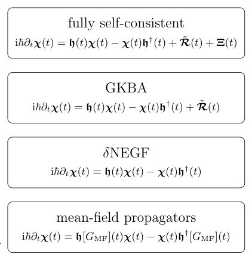
<figcaption class="paper-figure-caption"><b>Fig 1.</b> Figure 1. Levels of self-consistency for the different approaches. Here, “fully self-consistent” refers to the self-consistent solu- tion of the KBEs, for any of the discussed self-energy ap- proximations. Ξ denotes the contribution arising from the collision term inside the integral term of the BSE (18) and is of the form Ξ ∼ R IGwχ. Application of the GKBA is equivalent to neglecting Ξ. Within the δNEGF approach, the R term is neglected what constitutes an intermediate level of self-consistency. Finally, “mean-field propagators” refers to inserting single-particle NEGFs at the mean-field level into the BSE (“one-shot” scheme).</figcaption>
</figure>
<figure class="paper-figure-card">
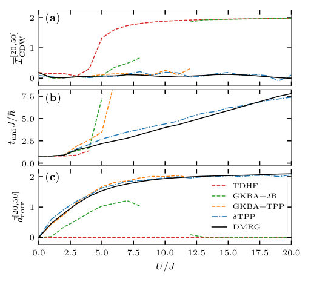
<figcaption class="paper-figure-caption"><b>Fig 2.</b> Figure 3. Further analysis of the setup of Fig. 2 for a broad range of coupling strengths, U/J = 0 . . . 20. Asymptotic values of (a) imbalance (97) and (c) correlated double occupation (81), averaged between t1J/ℏ= 20 and t2J/ℏ= 50. (b): first time the imbalance crosses zero.</figcaption>
</figure>
<figure class="paper-figure-card">
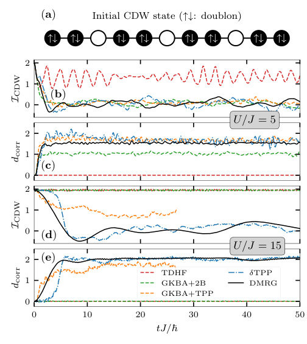
<figcaption class="paper-figure-caption"><b>Fig 3.</b> Figure 2. Benchmarking of δTPP for the melting of an 11-site CDW chain at [(b)–(c)] U/J = 5 and [(d)–(e)] U/J = 15. Comparison of [(b) and (d)] the density imbalance, Eq. (97) and [(c) and (e)] the correlated double occupation, Eq. (81).</figcaption>
</figure>
<figure class="paper-figure-card">
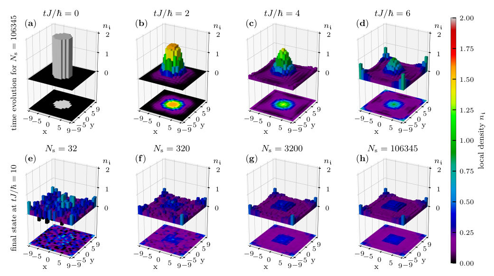
<figcaption class="paper-figure-caption"><b>Fig 4.</b> Figure 4. Diffusion of a doubly-occupied circular initial distribution containing 74 particles on a 19×19 square lattice for U/J = 3. (a)–(d): Surface plots of the local density distribution at different times for exact simulations which require Ns = 106 345 samples. (e)–(h): Surface plots of the local density distribution at the final time tJ/ℏ= 10, for different numbers of samples Ns. Already for 3200 samples [panel (g)] the results are indistinguishable from the exact result shown in panel (h).</figcaption>
</figure>
<figure class="paper-figure-card">
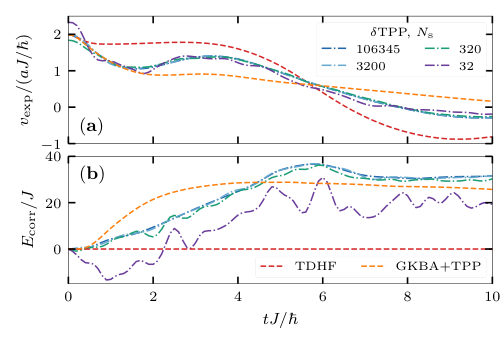
<figcaption class="paper-figure-caption"><b>Fig 5.</b> Figure 5. Further analysis of the setup of Fig. 4 for (a) the expansion velocity of the distribution, Eq. (98b), and (b) the correlation energy. Results for TDHF (red) and GKBA+TPP (orange) are added for comparison. Notice that averaged single- particle quantities, such as the expansion velocity, converge much faster than the local density in Fig. 4 and the correlation energy in panel (b). In general, even small sample numbers, cf. curve for Ns = 32, give accurate results.</figcaption>
</figure>

**Summary.** This paper introduces $\delta$NEGF, a novel quantum-fluctuation formulation for Nonequilibrium Green Functions. It solves the critical scaling bottleneck faced by previous methods when simulating correlated systems over long times or large unit cells. This breakthrough enables accurate study of complex dynamics in materials like Hubbard lattices and graphene nanoribbons.

**Why it may be interesting.** It provides a scalable theoretical tool to study non-equilibrium dynamics in strongly correlated materials that were previously computationally inaccessible due to the exponential growth of required correlation functions.

Detailed structure

**Main problem.** The primary challenge is accessing accurate, real-time dynamics for large, spatially inhomogeneous quantum systems where electron correlations are strong.

**Main result.** The proposed $\delta$NEGF method successfully extends dynamical self-energy simulations to basis sizes of $N_b \sim 10^4$, overcoming the severe scaling bottlenecks of previous NEGF implementations.

**Method.** It introduces a quantum-fluctuation formulation ($\delta$NEGF) that represents two-particle correlations via fluctuations of field operators, avoiding explicit storage of the full two-particle Green function.

**Model / system.** The theory applies to general correlated fermionic systems, benchmarked on lattice models like the 2D Hubbard lattice and graphene nanoribbon heterostructures with long-range Coulomb interactions.

**Key observables.** Dynamical self-energies (GW, T-matrix), charge migration dynamics, and ultrafast relaxation processes.

**Important parameters / regimes.** Basis size ($N_b$) up to $10^4$, time steps ($N_t$), coupling strength (strong coupling regime).

**Assumptions / limitations.** The method relies on a quantum-fluctuation formulation that guarantees stable dynamics by preserving the positivity of reduced density matrices, and uses stochastic low-rank decomposition for efficiency.

**Paper structure.** The paper builds upon existing NEGF frameworks (like G1–G2) to address computational scaling limits. It introduces $\delta$NEGF by reformulating correlations through fluctuations ($\delta \hat{G}$), which allows for time-linear scaling and large basis sizes, culminating in benchmarks on physical systems.

Abstract

Correlated real-time dynamics in large, spatially inhomogeneous quantum systems remain difficult to access with nonequilibrium many-body methods. Two-time nonequilibrium Green functions (NEGF) retain dynamical correlations but their computational runtime grows cubically with the number of time steps $N_\mathrm{t}$. This scaling bottleneck could recently be overcome by introducing the G1--G2 scheme that is linear in $N_\mathrm{t}$, but requires propagation of a two-particle correlation function and may suffer from numerical instabilities. This has restricted simulations to small systems with $N_\mathrm{b} \sim 10^2$ basis states. Here we introduce a quantum-fluctuation formulation of nonequilibrium Green functions, denoted $δ$NEGF, that represents dynamical two-particle correlations through fluctuations of field-operator products, $δ\hat G$. This guarantees stable dynamics by preserving the positivity of the reduced density matrices, avoids the explicit storage of the two-particle Green function, and reduces the propagation to a finite ensemble of Hartree-Fock-like trajectories. Combined with a stochastic low-rank decomposition of the correlation functions, the method retains time-linear scaling while extending dynamical $GW$ and particle-particle and particle-hole $T$-matrix simulations to basis sizes of order $N_\mathrm{b}\sim 10^4$. We benchmark $δ$NEGF against exact and HF-GKBA results for lattice systems, finding stable correlated dynamics also at strong coupling. We further demonstrate large-scale simulations of diffusion in two-dimensional Hubbard lattices and ultrafast relaxation in graphene nanoribbon heterostructures with long-range Coulomb interactions. These results establish $δ$NEGF as a scalable route to dynamical self-energy simulations of large, spatially inhomogeneous correlated quantum systems beyond the reach of existing NEGF implementations.

[↑ back to top](#top)

### [Hybrid Hamiltonian-diagrammatic quantum impurity solver](http://arxiv.org/abs/2606.11095v1)

**Authors:** Yang Yu, Gaurav Harsha, Lei Zhang, Agnieszka Jażdżewska, Dominika Zgid, Xinyang Dong, Emanuel Gull  
**Type:** theory · **Category:** strongly correlated electrons · **PDF:** <https://arxiv.org/pdf/2606.11095v1>  
**Analysis basis:** full PDF text, analyzed in chunks
**Topic relevance:** 🔥 `Kondo & dissipative impurity` **4/5** · `Keldysh / 2PI / non-Gaussian methods` **3/5** · `methods for driven-dissipative` **3/5** · `analog quantum simulation` **1/5** · `correlated / nonlocal dissipation` **1/5** · `driven-dissipative phase transition` **1/5** · `non-equilibrium dynamics` **1/5**

↔ Scroll figures horizontally

<figure class="paper-figure-card">
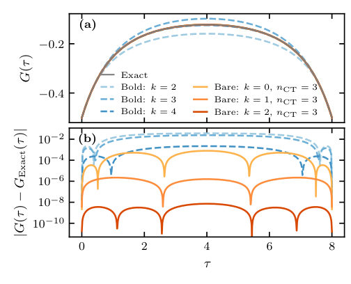
<figcaption class="paper-figure-caption"><b>Fig 1.</b> FIG. 1. Spinless, non-interacting impurity model coupled to a semi-circular bath at βt = 8. Top: Green’s function. Bot- tom: deviation from the exact result. nCT: number of coun- terterms, k: maximum expansion order. Bold-line calculated using triqs xca [32–34, 61].</figcaption>
</figure>
<figure class="paper-figure-card">
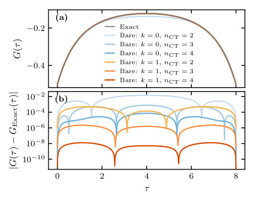
<figcaption class="paper-figure-caption"><b>Fig 2.</b> FIG. 2. Spinless, non-interacting impurity model coupled to a semi-circular bath at βt = 8. Top: Green’s function. Bot- tom: deviation from the exact result. nCT: number of coun- terterms. k: maximum expansion order. Bold-line calculated using triqs xca [32–34, 61].</figcaption>
</figure>
<figure class="paper-figure-card">
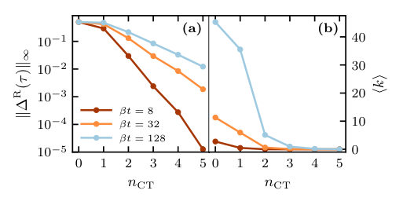
<figcaption class="paper-figure-caption"><b>Fig 3.</b> FIG. 3. Spinless, non-interacting impurity model coupled to a semi-circular bath at βt = 8, 32, 128. Left: size of residual hybridization function. Right: average expansion order. nCT denotes the number of counterterms.</figcaption>
</figure>
<figure class="paper-figure-card">
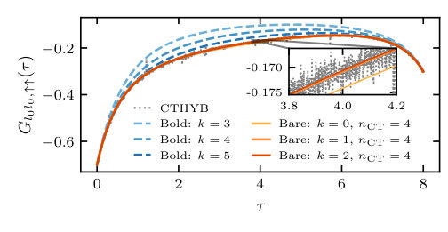
<figcaption class="paper-figure-caption"><b>Fig 4.</b> FIG. 4. Two-orbital impurity model with a Slater–Kanamori interaction coupled to a semi-circular bath at βt = 8. Plotted is the diagonal component of the Green’s function. nCT : number of counterterms, k : maximum expansion order. Bold data are reproduced from Fig. 6 of Ref. [34].</figcaption>
</figure>
<figure class="paper-figure-card">
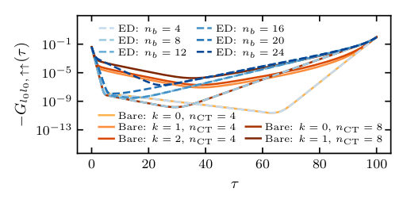
<figcaption class="paper-figure-caption"><b>Fig 5.</b> FIG. 5. NiO SEET impurity result (first iteration) at β = 100Ha−1. Shown is the diagonal part of the imaginary-time Green’s function −Gl0l0,↑↑(τ) on a logarithmic axis for the first impurity orbital l0, using the active-space setting a of Ref. [67]. ED with nb fitted bath states and bare solver with nCT counterterms at expansion order k.</figcaption>
</figure>

**Summary.** This work presents a novel hybrid computational method to solve complex quantum impurity models central to strongly correlated electron physics. By augmenting diagrammatic techniques with a small set of counterterm bath sites, the authors achieve unprecedented precision and convergence speed compared to established methods. This establishes a practical route for high-accuracy theoretical predictions in materials like those exhibiting strong electronic correlations.

**Why it may be interesting.** While focused on condensed matter, the technique of systematically improving convergence by adding auxiliary degrees of freedom to stabilize a perturbative expansion is highly relevant for open quantum system dynamics where bath coupling must be accurately modeled.

Detailed structure

**Main problem.** The core challenge is solving quantum impurity models, which describe electron interactions coupled to a non-interacting bath, requiring advanced non-perturbative numerical methods.

**Main result.** The proposed hybrid approach successfully combines diagrammatic expansions with auxiliary bath levels (counterterms) to achieve high precision in solving these models, surpassing existing benchmark calculations by orders of magnitude.

**Method.** It augments standard diagrammatic impurity solvers by introducing a small set of counterterm bath sites. This reduces the residual problem to a regime where low-order perturbation theory converges rapidly and accurately.

**Model / system.** The primary model is the quantum impurity model, tested first on a spinless Anderson impurity model coupled to a semi-circular bath, and later extended to an interacting two-orbital model relevant for Hund's metal physics.

**Key observables.** Green's function $G(	au)$ and its deviation from the exact solution $|G(	au) - G_{	ext{Exact}}(	au)|$.

**Important parameters / regimes.** The number of counterterms ($n_{CT}$) and the order of perturbation theory ($k$) are key tuning parameters used to control convergence.

**Assumptions / limitations.** The method assumes that augmenting the bath with a small, carefully chosen set of auxiliary levels (counterterms) can systematically reduce the residual error sufficiently for low-order perturbation theory to become highly accurate and rapidly converging.

**Figures summary.** Figures compare $G(	au)$ and its deviation from exact results across varying numbers of counterterms ($n_{CT}$) and expansion orders ($k$), demonstrating superior convergence compared to bare series expansions, especially in strongly correlated regimes.

**Paper structure.** The paper introduces the problem (quantum impurity solvers), details the limitations of existing methods (Hamiltonian vs. Diagrammatic), proposes the hybrid methodology using counterterms, validates it on simple benchmarks (spinless model), and finally tests its efficacy on complex, interacting systems exhibiting sign problems.

Abstract

Quantum impurity models, which describe the coupling between interacting orbitals and a non-interacting bath, play a central role in the physics of strongly correlated electron systems. Solving a quantum impurity model in general requires the use of non-perturbative numerical methods. Hamiltonian-based approaches, which rely on an explicit bath discretization, are typically limited to a small number of bath sites or small entanglement, and diagrammatic methods suffer from sign problems, slow convergence, or diagram truncation approximations. Here we show that these two classes of methods can be combined: augmenting diagrammatic methods with a small auxiliary bath can reduce the residual problem to a regime where low-order perturbation theory is highly accurate and rapidly converging. In a simple benchmark, the precision of the hybrid approach surpasses bold-line calculations by several orders of magnitude; for a strongly interacting two-orbital model with a severe sign problem, convergence is achieved at three orders of magnitude lower computational cost than competing methods; and convergence to the unknown exact result is rapidly accelerated in a difficult realistic problem. Our results establish a practical route to high-precision quantum impurity solutions in correlated quantum systems.

[↑ back to top](#top)

### [Quantum resources in non-stoquastic quantum annealing](http://arxiv.org/abs/2606.09995v1)

**Authors:** Chiara Capecci, Sebastian Nagies, Naga Dileep Varikuti, Philipp Hauke  
**Type:** theory · **Category:** statistical mechanics · **PDF:** <https://arxiv.org/pdf/2606.09995v1>  
**Analysis basis:** full PDF text, analyzed in chunks
**Topic relevance:** 🔥 `entanglement & information structure` **4/5** · `analog quantum simulation` **2/5** · `non-equilibrium dynamics` **2/5** · `non-equilibrium universality` **2/5** · `Keldysh / 2PI / non-Gaussian methods` **1/5** · `correlated / nonlocal dissipation` **1/5** · `driven-dissipative phase transition` **1/5** · `methods for driven-dissipative` **1/5**

↔ Scroll figures horizontally

<figure class="paper-figure-card">
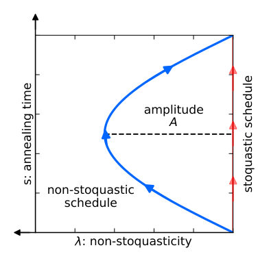
<figcaption class="paper-figure-caption"><b>Fig 1.</b> Figure 1. Illustration of two types of annealing schedules in the (λ, s) parameter space. The red line (λ(s) = 0) repre- sents a conventional stoquastic schedule, where only the nor- malized annealing time s varies. The blue curve depicts a non-stoquastic schedule, in which the strength λ of the non- stoquastic terms in the annealing Hamiltonian are tuned by the amplitude A. Schedules of this type are employed for the p-spin model in Sec. III, cf. Eq. (8), where they can permit to circumvent a line of first-order phase transitions [22].</figcaption>
</figure>
<figure class="paper-figure-card">
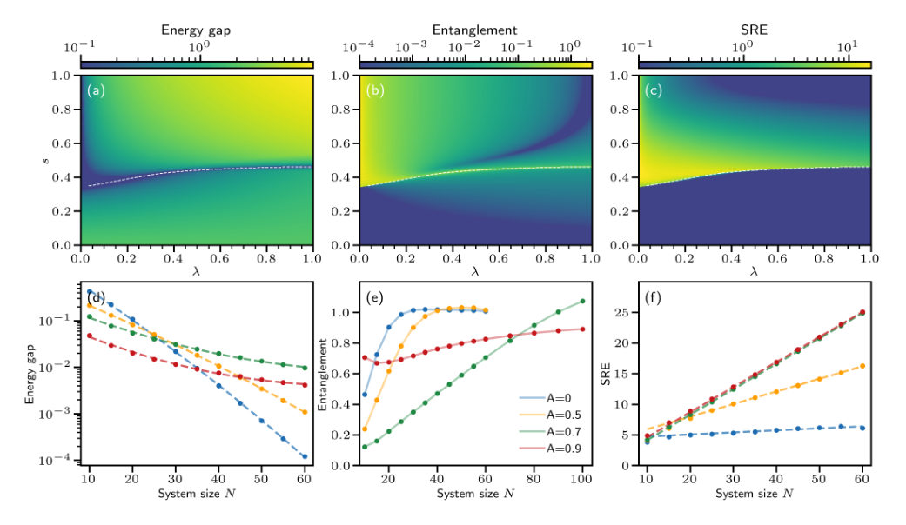
<figcaption class="paper-figure-caption"><b>Fig 2.</b> Figure 2. First row: (a) energy gap, (b) bipartite entanglement entropy, and (c) stabilizer Rényi entropy as functions of the annealing parameters s and λ, for a p-spin model cost Hamiltonian with N = 30 and p = 5. All observables are evaluated on the instantaneous ground state of the Hamiltonian in Eq. (7). All quantities are shown in logarithmic scale to enhance the visibility of relevant features across the annealing landscape. Both entanglement entropy and stabilizer Rényi entropy show a pronounced peak where the minimum gap occurs. Second row: finite-size scaling of (d) the minimum energy gap, (e) the maximum bipartite entanglement entropy, and (f) the maximum stabilizer Rényi entropy...</figcaption>
</figure>
<figure class="paper-figure-card">
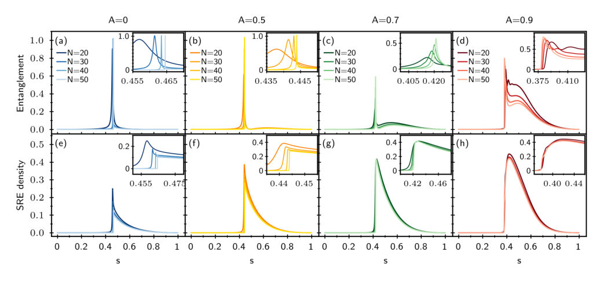
<figcaption class="paper-figure-caption"><b>Fig 3.</b> Figure 3. Top row: bipartite entanglement entropy of the instantaneous ground state along the annealing sweep as a function of s, for annealing paths defined by λ(s) = 1 −A sin(πs) with amplitudes A = 0, 0.5, 0.7, 0.9 (from left to right). For each amplitude, results are shown for system sizes N = 20, 30, 40, 50. Bottom row: corresponding stabilizer Rényi entropy density. Insets show the zoomed-in regions around the maximal entanglement and SRE values. With increasing non-stoquastic amplitude A, the entanglement barrier becomes broader and grows with system size. The SRE density instead changes from a sharp peak, whose height decreases with N for A = 0, 0.5, to a broader and nearly...</figcaption>
</figure>
<figure class="paper-figure-card">
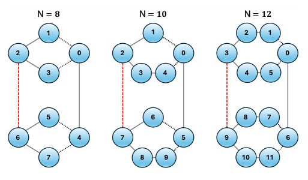
<figcaption class="paper-figure-caption"><b>Fig 4.</b> Figure 4. Graph structure of the cost Hamiltonian Hcost in the local Ising model defined by Eq. (11) for system sizes N = 8, 10, and 12 (introduced in Ref. [23]). Each graph con- sists of two rings of N/2 qubits connected by two inter-ring couplings at diametrically opposite positions. Solid gray lines denote ferromagnetic couplings of strength Jij = −1, dashed black lines ferromagnetic couplings of strength Jij = −1/2, and red dashed lines antiferromagnetic couplings of strength Jij = +5/6. The catalyst Hamiltonian Hcatalyst, see Eq. (12), shares the same connectivity but with uniform antiferromag- netic couplings. The site labels define the numbering conven- tion used in our numerics.</figcaption>
</figure>
<figure class="paper-figure-card">
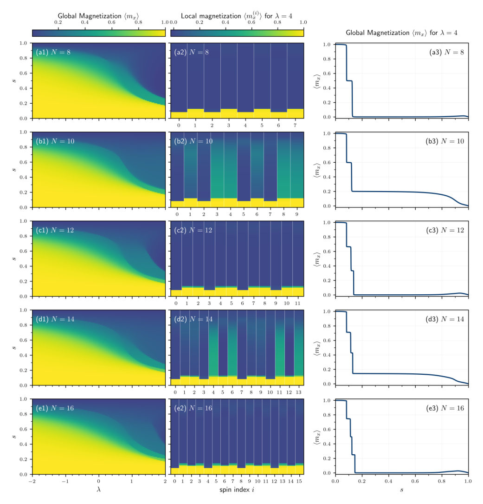
<figcaption class="paper-figure-caption"><b>Fig 5.</b> Figure 5. Magnetization across Hamiltonian parameter space (λ, s) and spin-resolved dynamics of the local Ising model (Eq. (9)) for system sizes N = 8–16 (rows). Left column: Average transverse magnetization in the parameter plane spanned by the annealing parameter s and the non-stoquasticity λ, discretized into a 401x101 grid. Middle column: Spin-resolved local magnetization ⟨m(i) x ⟩versus annealing time s for fixed λ = 4. Right column: Vertical annealing sweeps at fixed λ = 4, highlighting step-like plateaus in ⟨mx⟩and abrupt crossovers between magnetization sectors as s varies. The non-stoquastic catalyst (λ &gt; 0) replaces the single magnetization rearrangement of the stoquastic regime...</figcaption>
</figure>

**Summary.** This paper investigates whether introducing non-stoquastic terms into quantum annealing can provide a genuine speedup over classical simulation. By calculating entanglement and stabilizer Rényi entropy, the authors demonstrate that such protocols enhance these quantum resources when they successfully modify phase transitions from first to second order. This suggests that achieving quantum advantage requires generating significant, measurable quantum correlations.

**Why it may be interesting.** It provides a rigorous theoretical framework linking the presence of specific Hamiltonian terms (non-stoquasticity) directly to measurable quantum complexity measures (entanglement/SRE), which is crucial for understanding hardware limitations in quantum computation.

Detailed structure

**Main problem.** The core problem is determining if non-stoquastic quantum annealing protocols can achieve a true quantum advantage for optimization problems over classical simulation methods.

**Main result.** Non-stoquastic catalysts can modify the energy landscape to change first-order phase transitions into second-order ones, leading to potential exponential speedups in quantum performance.

**Method.** The authors analyze this by computing quantum resources—entanglement entropy and stabilizer Rényi entropy—and comparing their scaling against the minimum spectral gap across different annealing paths.

**Model / system.** The study uses two benchmark models: the fully connected p-spin model and a geometrically local Ising model, analyzed via time-dependent Hamiltonians incorporating non-stoquastic catalyst terms.

**Key observables.** Minimum Energy Gap ($\Delta E$), Bipartite Entanglement Entropy, Stabilizer Rényi Entropy (SRE), and Magnetization $\langle m_x 
angle$.

**Important parameters / regimes.** The annealing path parameters $(s, \lambda)$, the order $p$ of the p-spin model, and the catalyst strength $\lambda$.

**Assumptions / limitations.** The analysis assumes that quantum computational resources (entanglement/SRE) quantify the difficulty for classical simulation methods like tensor networks.

**Figures summary.** Figures illustrate how entanglement entropy and SRE scale differently along annealing paths crossing first-order versus second-order transitions in both the p-spin and local Ising models.

**Paper structure.** The paper systematically compares stoquastic (QMC simulable) vs. non-stoquastic protocols, analyzing resource scaling for two distinct spin models to show that quantum performance improvements correlate with enhanced quantum resources.

Abstract

Quantum annealing promises to solve combinatorial optimization problems by preparing the ground state of a target Hamiltonian. Standard annealing protocols are, however, stoquastic and can thus be simulated by sign-problem-free quantum Monte-Carlo methods. To obtain a true quantum advantage, it has been proposed to use non-stoquastic catalyst Hamiltonians. Active only at intermediate stages of the protocol, these can, for certain problems, convert first-order into second-order quantum phase transitions and thus permit an exponential speedup over the stoquastic protocol. At the same time, the non-stoquastic catalyst renders quantum Monte-Carlo methods inefficient. It remains, however, an open question how other classical computation methods are affected by the non-stoquastic terms. We address this question by computing quantum resources -- entanglement entropy and stabilizer Rényi entropy -- whose presence makes classical computations based on tensor networks and stabilizer-tableau methods exponentially hard. We compare these with the spectral gap along the annealing path for two paradigmatic benchmark models, the fully connected $p$-spin model and a geometrically local Ising model. While the exact behavior shows a subtle dependency on the underlying model and the annealing path, our numerics suggest consistently that the scaling of entanglement and non-stabilizerness is at least maintained in the deeply non-stoquastic regime and in some cases even significantly enhanced. Our results thus suggest that improvements of quantum performance in non-stoquastic annealing coincide with significant presence of quantum computational resources.

[↑ back to top](#top)

### [Supermoiré Chern mosaic in helical trilayer WSe2](http://arxiv.org/abs/2606.10422v1)

**Authors:** Zhenyu Wang, Mingjie Zhang, Hai Meng, Xiuzhen Li, Subi Du, Yaotian Liu, Siyu Fan, Xiaofan Shi, Kenji Watanabe, Takashi Taniguchi, Wei Yang, Guangyu Zhang, Bingbing Tong, Guangtong Liu, Li Lu, Jie Shen, Gang Li, Jing Song, Enke Liu, Song Liu, Fengcheng Wu, Yang Xu  
**Type:** both · **Category:** strongly correlated electrons · **PDF:** <https://arxiv.org/pdf/2606.10422v1>  
**Analysis basis:** full PDF text, analyzed in chunks
**Topic relevance:** 🔥 `analog quantum simulation` **4/5** · `exotic spin models in light-matter` **3/5** · `spintronics-quantum-optics interface` **3/5** · `non-equilibrium dynamics` **2/5** · `Keldysh / 2PI / non-Gaussian methods` **1/5** · `driven-dissipative phase transition` **1/5**

↔ Scroll figures horizontally

<figure class="paper-figure-card">
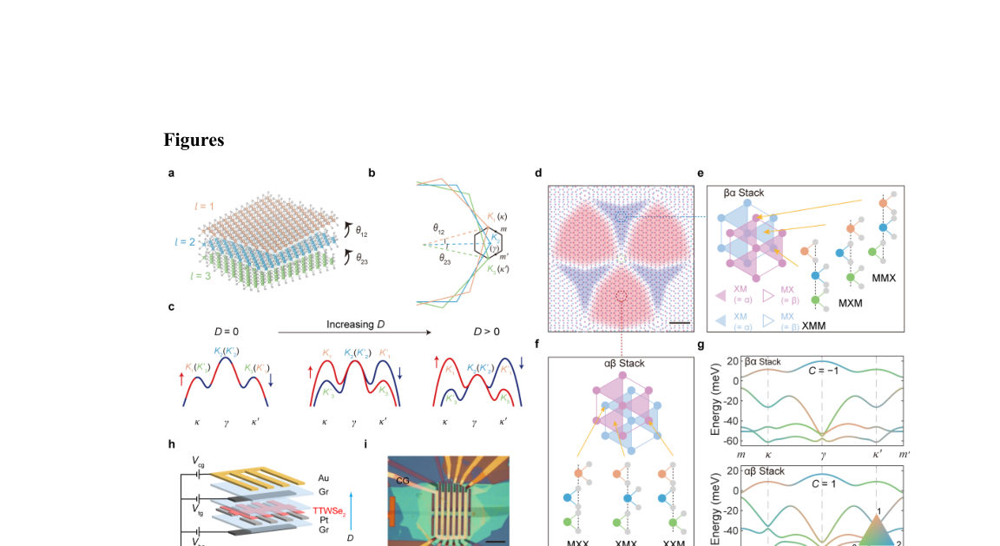
<figcaption class="paper-figure-caption"><b>Fig 1.</b> Fig. 1 | Lattice symmetry, reconstructed supermoiré, and device architecture of helically twisted trilayer WSe2. a, Schematic of a helical trilayer WSe2 (HTWSe2) structure. The orange, blue, and green spheres represent W atoms in different layers (l = 1, 2, and 3), while the grey spheres represent Se atoms. The twist angles between adjacent layers are θ12 and θ23; In this device, θ12 = θ23 » 3.9°, forming a chiral stacking configuration. b, Showing the three rotated monolayer Brillouin zones whose K valleys (K1, K2, K3) relax onto the same line in the local moiré-periodic domains and fold to the high-symmetry points (κ, γ, κ′) in the moiré Brillouin zone (mBZ). c, Schematic evolution of the...</figcaption>
</figure>
<figure class="paper-figure-card">
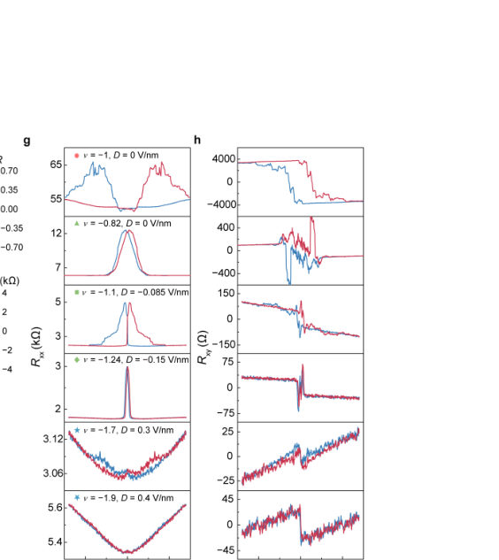
<figcaption class="paper-figure-caption"><b>Fig 2.</b> Fig. 2 | Layer-occupation phase diagram and emergent ferromagnetism in the trilayer- hybridized regime. a, Longitudinal resistance Rxx as a function of filling factor ν = n/nm and displacement field D, measured at zero magnetic field, where nm is the moiré superlattice density. b, Layer-occupation phase diagram constructed from a. Regions I, II, and III correspond predominantly to mono-, bi-, and tri-layer occupation, respectively; subscripts indicate the corresponding layer combination. Insets illustrate representative low-energy band structures and the associated Fermi-level positions for spin-up branch. Pink regions denote insulating states. c, Calculated DOS for αβ domain as a function...</figcaption>
</figure>
<figure class="paper-figure-card">
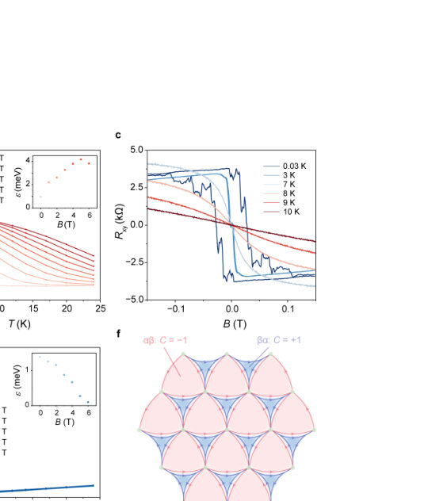
<figcaption class="paper-figure-caption"><b>Fig 3.</b> Fig. 3 | Nature of the ν = −1 insulating states and supermoiré Chern mosaic. a, Longitudinal resistance Rxx as a function of displacement field D and temperature T at ν = −1 and B = 0 T. Dashed lines mark the two representative displacement fields D = 0 V/nm and 0.29 V/nm, used for the line cuts in b and e, respectively. b, Temperature dependence of Rxx at D = 0 V/nm under selected magnetic fields. The resistance remains strongly enhanced with increasing field, indicating that the insulating state is robust against magnetic field. Arrow marks the temperature at which Rxx begins to turn up upon cooling at B = 0 T, corresponding to the onset of the insulating state. Inset, activation gap e...</figcaption>
</figure>
<figure class="paper-figure-card">
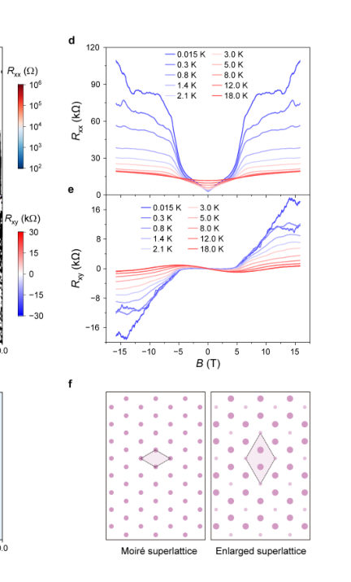
<figcaption class="paper-figure-caption"><b>Fig 4.</b> Fig. 4 | Magnetic-field evolution and field-induced phase transition. a,b, Symmetrized Rxx (a) and anti-symmetrized Rxy (b) as a function of magnetic field B and filling factor ν at D = 0 V/nm, measured at T = 15 mK. Distinct field-evolving features emerge near ν = −1 and ν = −2/3. c, Wannier diagram summarizing the main field-dependent features in a and b. The pink shading highlights the insulating state at ν = −1 and ν = −2. The red line denotes the expected Středa slope of the ν = −2/3 state, consistent with C = +1. The black dashed lines indicate the Landau levels (LL). d,e, Magnetic-field dependence of symmetrized Rxx (d) and anti-symmetrized Rxy (e) at selected temperatures, taken at...</figcaption>
</figure>

**Summary.** This work reports on the magnetotransport properties of helical trilayer WSe2, revealing that its moiré superlattice structure creates a 'Chern mosaic' with distinct topological domains. The authors demonstrate novel magnetic and topological insulating states—including a ferromagnetic state at $\nu=-1$ and a field-induced Chern insulator—establishing this material as a platform for studying spatially organized topology beyond simple bilayer models.

**Why it may be interesting.** The concept of a 'Chern mosaic' arising from real-space structural relaxation provides an analogy to spatially modulated order parameters, which is relevant for understanding emergent phenomena in strongly correlated systems.

Detailed structure

**Main problem.** The study investigates the unexplored correlated and topological transport properties arising from helical trilayer WSe2 moiré superlattices, moving beyond simple bilayer models.

**Main result.** The system exhibits a robust ferromagnetic insulating state at $\nu = -1$ due to a time-reversal-symmetry-breaking supermoiré Chern mosaic, and a distinct field-induced Chern insulator ($C=1$) emerges near $\nu = -2/3$.

**Method.** The research combines dual-gated magnetotransport measurements with continuum moiré Hamiltonian calculations to map out the topological phase diagram.

**Model / system.** The physical platform is helical trilayer WSe2 ($	ext{HTWSe}_2$), which forms a relaxed supermoiré landscape composed of inequivalent local topological domains (e.g., $\text{ab}$ and $\text{ba}$).

**Key observables.** Anomalous Hall response ($R_{xy}$), longitudinal resistance ($R_{xx}$), Chern numbers ($C$), effective mass ($m^*$), and Curie temperature ($T_C$).

**Important parameters / regimes.** Moiré filling factor ($\nu$), displacement field ($D$), and external magnetic field ($B$).

**Assumptions / limitations.** The analysis assumes that local structural reconstruction dictates the formation of distinct topological domains whose contributions lead to measurable macroscopic transport properties.

**Figures summary.** Figures illustrate real-space supermoiré patterns, phase diagrams mapping insulating/magnetic states vs. $\nu$ and $D$, and field evolution plots showing transitions between different Chern insulating regimes.

**Paper structure.** The paper systematically explores the electronic structure by first establishing the supermoiré landscape (theory/calculation), then characterizing zero-field magnetic/insulating phases ($\nu=-1$), followed by mapping out high-field topological reconstructions ($C=1$ at $\nu=-2/3$).

Abstract

Helically twisted multilayers offer access to moiré physics beyond the single-superlattice paradigm, yet their correlated and topological transport properties remain largely unexplored in semiconductor moiré materials. Here we report magnetotransport measurements of helical trilayer WSe2, in which two coupled moiré patterns relax into a supermoiré landscape composed of inequivalent local topological domains with distinct electronic structures and unequal spatial areas. By electrostatic tuning, we identify a trilayer-hybridized regime where interactions and real-space reconstruction combine to generate a plethora of magnetic and topological states absent in the twisted bilayers. At moiré filling factor $ν$ = -1, we observe a ferromagnetic insulating state that is robust against magnetic field and accompanied by a non-quantized anomalous Hall response ~-4 kOhms. This behaviour is consistent with a time-reversal-symmetry-breaking supermoiré Chern mosaic, in which the Hall response arises from the non-cancelling contributions of local domains with opposite Chern character arranged by the relaxed structure. Under strong magnetic fields, a symmetry-broken Chern insulating state (C = 1) emerges near $ν$ = -2/3, displaying a much larger positive Hall response together with strongly enhanced longitudinal resistance, suggestive of field-reconstructed topological minibands and domain-boundary scattering. These results establish relaxed supermoiré semiconductor trilayers as a platform for spatially organized magnetism and topology beyond the bilayer limit.

[↑ back to top](#top)

### [Dynamical Partition Functions of Stochastic Dynamics via Variational Flows](http://arxiv.org/abs/2606.10757v1)

**Authors:** Zequn Lin, Ying Tang  
**Type:** theory · **Category:** statistical mechanics · **PDF:** <https://arxiv.org/pdf/2606.10757v1>  
**Analysis basis:** full PDF text, analyzed in chunks
**Topic relevance:** 🔥 `non-equilibrium dynamics` **4/5** · `methods for driven-dissipative` **3/5** · `non-equilibrium universality` **3/5** · `Keldysh / 2PI / non-Gaussian methods` **1/5** · `correlated / nonlocal dissipation` **1/5** · `driven-dissipative phase transition` **1/5**

↔ Scroll figures horizontally

<figure class="paper-figure-card">
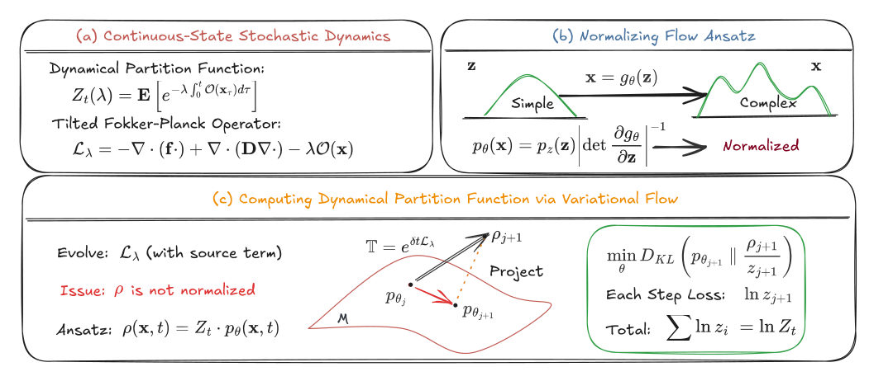
<figcaption class="paper-figure-caption"><b>Fig 1.</b> FIG. 1. Computational framework for evaluating the dynamical partition function via normalizing flow. (a) Continuous- state stochastic dynamics are governed by a tilted Fokker-Planck operator Lλ, which introduces a source term −λO(x) and breaks probability conservation. The central goal is to compute the dynamical partition function Zt(λ). (b) The normalizing flow ansatz parameterizes a normalized probability distribution pθ(x) by applying an invertible transformation to a simple latent distribution pz(z), providing exact likelihood computation via the Jacobian determinant. (c) The decoupled variational training loop on the probability manifold M. The unnormalized density ρ is decomposed...</figcaption>
</figure>
<figure class="paper-figure-card">
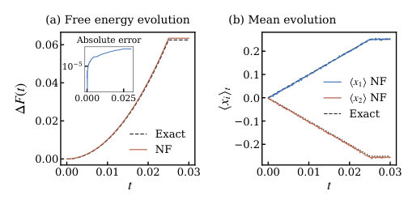
<figcaption class="paper-figure-caption"><b>Fig 2.</b> FIG. 2. Time evolution of the two-dimensional OU process driven by a protocol force. (a) The red curve represents the free energy difference ∆F(t) estimated from normalizing flow. The dashed black curve denotes the exact solution. Inset: Absolute error. (b) Trajectories of the first moments ⟨x1⟩t and ⟨x2⟩t of the biased ensemble under drift protocol µ(t). Solid lines (blue and red) indicate the empirical means estimated from flow model at each time step. Black dashed and dotted lines correspond to the exact evolution.</figcaption>
</figure>
<figure class="paper-figure-card">
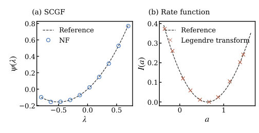
<figcaption class="paper-figure-caption"><b>Fig 3.</b> FIG. 3. Large deviations for a nonequilibrium driven dif- fusion process on the unit circle S1. (a) The SCGF ψ(λ) of the time-averaged current versus the conjugate tilting pa- rameter λ. Blue open circles (◦) indicate discrete evaluations obtained from our framework (computed at 10 points). The black dashed line is the reference computed via spectral diag- onalization of the tilted generator. The asymmetry of ψ(λ) reflects the broken detailed balance induced by the constant non-conservative drive γ. (b) The corresponding rate func- tion I(a) governing the empirical current fluctuations a. Red crosses (×) are derived from the numerical Legendre trans- form and match the reference (black...</figcaption>
</figure>
<figure class="paper-figure-card">
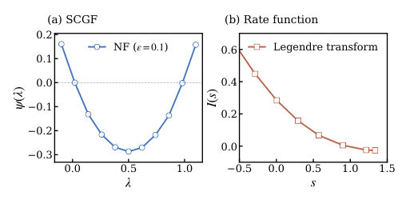
<figcaption class="paper-figure-caption"><b>Fig 4.</b> FIG. 4. Large deviations of entropy production for the 16- dimensional diffusion process at ϵ = 0.1. (a) The SCGF ψ(λ) computed via the neural ansatz (blue open circles (◦)) quantitatively matches the benchmark results from Fig. 7 in Ref. [42]. (b) The corresponding rate function I(s) obtained via numerical Legendre transform.</figcaption>
</figure>
<figure class="paper-figure-card">
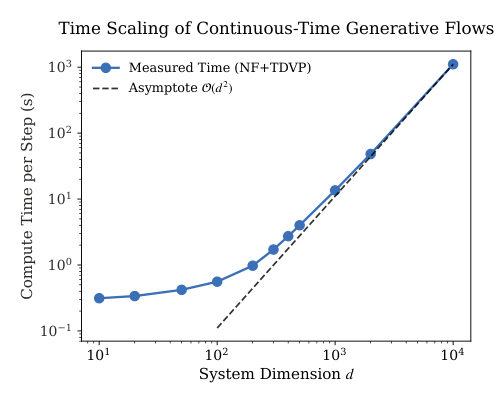
<figcaption class="paper-figure-caption"><b>Fig 5.</b> FIG. 5. Scaling behavior of the computational cost with re- spect to system dimensionality d. The blue solid line shows the empirical wall-clock time per full evolution step, measured on a single NVIDIA A100 GPU with a fixed ensemble size of 8,000. The black dashed line indicates the theoretical O(d2) polynomial scaling. The empirical performance aligns closely with this theoretical bound.</figcaption>
</figure>

**Summary.** This paper introduces a novel neural variational framework that computes the dynamical partition function for stochastic processes by reformulating the problem as an optimization task. By using Normalizing Flows within a TDVP scheme, it accurately calculates key non-equilibrium observables like work and entropy production in high-dimensional systems. This offers a scalable alternative to traditional path integral methods.

**Why it may be interesting.** This work provides powerful, scalable numerical tools to calculate non-equilibrium quantities like entropy production and free energy differences in complex systems where traditional path integral methods fail due to dimensionality.

Detailed structure

**Main problem.** The core challenge is computing the dynamical partition function for continuous-state stochastic dynamics, which governs non-equilibrium thermodynamics.

**Main result.** The authors develop a mesh-free neural variational framework that successfully computes finite-time and asymptotic trajectory thermodynamics in high dimensions with high accuracy.

**Method.** They reframe the problem as minimizing the KL divergence of a tilted Fokker-Planck evolution, parameterizing the evolving density using Normalizing Flows (NF) within a Time-Dependent Variational Principle (TDVP) framework.

**Model / system.** The method applies to general continuous-state stochastic systems described by SDEs, such as Ornstein-Uhlenbeck processes and high-dimensional overdamped Langevin dynamics. The analysis is validated across various dimensions up to 100.

**Key observables.** Dynamical partition function ($Z_t(\lambda)$), work, entropy production, current fluctuations, Scaled Cumulant Generating Function (SCGF) $\psi(\lambda)$, and the rate function $I(a)$.

**Important parameters / regimes.** The noise strength ($D$), the path observable weighting ($\lambda$), and system dimensionality ($d$).

**Assumptions / limitations.** The framework relies on parameterizing the evolving density using Normalizing Flows (NF) and treating the evolution as a variational inference problem.

**Figures summary.** Figures illustrate the computational flow involving the tilted FPE, NF ansatz, and the variational training loop minimizing KL divergence. Later figures show tracking of mean dynamics and covariance for high-dimensional systems.

**Paper structure.** The paper introduces the theoretical mapping to a time-dependent optimization problem, details the Normalizing Flow/TDVP implementation using gradient descent on the tangent space, validates it across multiple physical benchmarks (OU process, $S^1$, 16D), and finally analyzes computational scaling.

Abstract

Nonequilibrium thermodynamics is governed by the dynamical partition function, and its computation in high-dimensional continuous-state dynamics is a longstanding challenge. The Feynman-Kac formalism provides a rigorous representation for generating functions of arbitrary path observables; however, practical evaluation beyond low dimensions or the weak-noise limit is hindered by the curse of dimensionality and the exponentially growing replica demands of trajectory-based methods. Here we develop a mesh-free neural variational framework that realizes the Feynman-Kac theorem with generative flow models, recasting tilted stochastic evolution as a time-dependent optimization problem. This approach enables the direct computation of both finite-time and asymptotic trajectory thermodynamics in a unified manner. The method applies to general observables, enabling the evaluation of work, entropy production, and current fluctuations. We demonstrate the accuracy and scalability of this method in various nonequilibrium systems including high-dimensional cases.

[↑ back to top](#top)

### [Coherent manipulation of Kondo Majoranas in two-channel Kondo setups](http://arxiv.org/abs/2606.10259v1)

**Authors:** Yashar Komijani, C. J. Bolech  
**Type:** theory · **Category:** quantum information and computing · **PDF:** <https://arxiv.org/pdf/2606.10259v1>  
**Analysis basis:** full PDF text, analyzed in chunks
**Topic relevance:** 🔥 `Kondo & dissipative impurity` **4/5** · `analog quantum simulation` **2/5** · `Keldysh / 2PI / non-Gaussian methods` **1/5** · `correlated / nonlocal dissipation` **1/5** · `driven-dissipative phase transition` **1/5** · `entanglement & information structure` **1/5** · `methods for driven-dissipative` **1/5** · `non-equilibrium dynamics` **1/5**

↔ Scroll figures horizontally

<figure class="paper-figure-card">
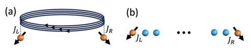
<figcaption class="paper-figure-caption"><b>Fig 1.</b> FIG. 1: (a) A two-impurity two-channel Kondo (2CK) setup using 1D edge states. (b) Compactified tight-binding chain.</figcaption>
</figure>
<figure class="paper-figure-card">
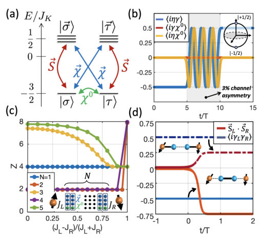
<figcaption class="paper-figure-caption"><b>Fig 2.</b> FIG. 2: (a) Energy levels of the single-site model. Various transitions are highlighted. (b) Rabi oscillations of the non-local qubit between γ and the ancillary η driven by channel anisotropy. (c) The GSD of two 2CK impurities connected by a chain of N sites in the JK ≫t limit, represented by the partition function Z. (d) Kondo Majorana fusion onto the total spin of spin-singlet (⃗S1 · ⃗S2 = −3/4) or the spin-triplet (⃗S1 · ⃗S2 = 1/4) depending on qubit state, iγLγR = ∓1/2.</figcaption>
</figure>
<figure class="paper-figure-card">
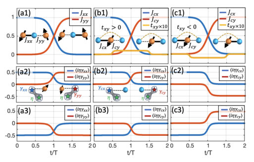
<figcaption class="paper-figure-caption"><b>Fig 3.</b> FIG. 3: Deterministic and coherent MZM transfer, while preserving its entanglement with an ancillary MZM η, between two spins (a1-a3), and across a spin (b1-b3) and (c1-c3). Top row panels show the adiabatic variation of the Kondo and tunnel couplings, whereas the bottom two rows show the evolution of ⟨iηγxx⟩or ⟨iηγcx⟩(blue) and ⟨iηγyy⟩ or ⟨iηγcy⟩(red) for two different initial states. Moving MZMs across spins requires a small tunneling txy, whose sign multiplies the transferred MZM entanglement (b and c).</figcaption>
</figure>
<figure class="paper-figure-card">
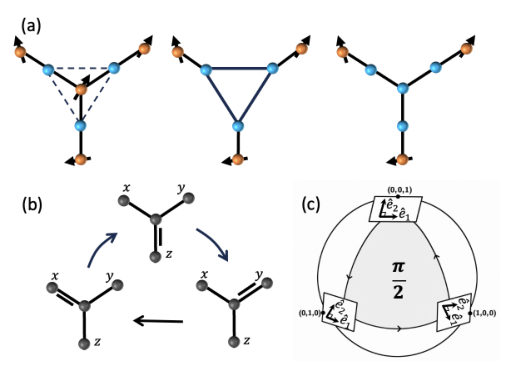
<figcaption class="paper-figure-caption"><b>Fig 4.</b> FIG. 4: (a) Setups considered for braiding; S-centered, c-triangle, and c-centered Y-junction. (b) Braiding protocol applied to non-interacting particles on a c-centered Y-junction. (c) The parallel transport of dark fermions over a unit sphere enclosing a 4π/8 solid angle results in a robust holonomy producing topological braiding.</figcaption>
</figure>

**Summary.** The paper theoretically investigates how Majorana zero modes emerging from two-channel Kondo impurities can be coherently manipulated for quantum information processing. By analyzing adiabatic evolution in specific geometries (Y-junctions), the authors demonstrate that braiding operations realize non-Abelian geometric holonomy, offering a robust platform for topological quantum gates.

**Why it may be interesting.** This work directly addresses the realization of topological quantum computation using strongly correlated electron physics, providing concrete theoretical pathways for controlling exotic anyonic states beyond simple free-fermion models.

Detailed structure

**Main problem.** The research focuses on achieving coherent manipulation of Majorana zero modes (MZMs) within two-channel Kondo setups to realize robust topological quantum operations.

**Main result.** The study establishes a proof-of-principle route for controlling non-Abelian anyons, demonstrating that braiding and teleportation can be achieved using the geometric holonomy associated with Y-junction geometries in these interacting systems.

**Method.** The analysis employs theoretical techniques including mapping to compactified lattice models, adiabatic evolution protocols, and calculating Berry/Wilczek-Zee holonomies. The system dynamics are governed by complex Hamiltonians derived from Kondo interactions.

**Model / system.** The physical model is the two-impurity two-channel Kondo (2CK) system coupled to chiral edge states, which is mathematically mapped onto a compactified tight-binding chain of Majorana fermions. This setup allows for the emergence of interacting Kondo MZMs.

**Key observables.** Ground State Degeneracy (GSD), Rabi oscillations, non-Abelian Berry holonomy, and fidelity of teleportation operations.

**Important parameters / regimes.** Kondo coupling asymmetry ($J_L/J_R$), chain length parity ($N$), and the degree of channel anisotropy ($\Delta H$).

**Assumptions / limitations.** The analysis relies on mapping to a compactified description, which makes non-local degrees of freedom operationally accessible, and approximations inherent in bosonization techniques.

**Figures summary.** Figures illustrate the two-impurity 2CK setup, energy level diagrams showing Rabi oscillations, GSD dependence on asymmetry, and schematic representations of Majorana fusion and braiding operations.

**Paper structure.** The paper progresses by defining the Hamiltonian for the 2CK system, analyzing its ground state degeneracy (GSD) via ED, demonstrating coherent control through adiabatic protocols (teleportation/fusion), and finally establishing that braiding is realized as a non-Abelian geometric holonomy in Y-junction geometries.

Abstract

We study coherent manipulation of Majorana zero modes emerging in overscreened two-channel Kondo systems. Using compactified lattice models, we show that these interacting Kondo Majoranas support non-local qubits and admit teleportation, fusion, and braiding operations. In particular, we identify a distinction between non-topological and genuinely topological Y-junction geometries, the latter realizing a non-Abelian geometric holonomy. Our results establish a proof-of-principle route toward coherent control of non-Abelian anyons beyond conventional free-fermion platforms.

[↑ back to top](#top)

### [Graviton-mediated entanglement due to light bending from a quantum rotor](http://arxiv.org/abs/2606.09991v1)

**Authors:** Dripto Biswas, Sougato Bose, Anupam Mazumdar, Marko Toroš  
**Type:** theory · **Category:** other · **PDF:** <https://arxiv.org/pdf/2606.09991v1>  
**Analysis basis:** full PDF text, analyzed in chunks
**Topic relevance:** 🔥 `entanglement & information structure` **4/5** · `Keldysh / 2PI / non-Gaussian methods` **2/5** · `analog quantum simulation` **2/5** · `correlated cavity matter` **1/5** · `methods for driven-dissipative` **1/5** · `non-equilibrium dynamics` **1/5** · `quantum optics experiment` **1/5**

↔ Scroll figures horizontally

<figure class="paper-figure-card">
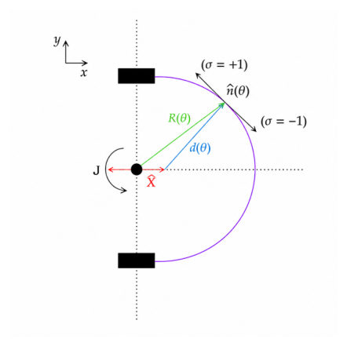
<figcaption class="paper-figure-caption"><b>Fig 1.</b> FIG. 1. Schematic of the setup showing the various quantities defined in Sec. III. At the centre there is a mass in a ground state initially |0⟩, rotating counterclockwise with an angular momentum J. The opti- cal beam (purple) lies in the XY plane, and the tangential direction senses (σ = ±1), e.g, the photon beam can prograde and retrograde with respect to the rotation of the mass at the centre. We assume that the photon is in a coherent state |α⟩.</figcaption>
</figure>

**Summary.** This theoretical paper explores how the quantum nature of gravity can be tested by measuring entanglement between a photon and a spinning mechanical rotor. The interaction is mediated by virtual gravitons, leading to corrections in the system's Hamiltonian proportional to the rotor's angular momentum $J$. The key prediction is that the difference in entanglement entropy for clockwise versus counter-clockwise light propagation directly measures this spin-dependent gravitational coupling.

**Why it may be interesting.** It bridges quantum information theory (entanglement measures) with fundamental physics (quantum gravity effects), providing concrete, measurable predictions based on rotational dynamics in an optomechanical setting.

Detailed structure

**Main problem.** The paper investigates testing the quantum nature of gravity by calculating graviton-mediated entanglement between a photon and the spatial position of a quantum rotor.

**Main result.** The difference in linear entanglement entropies for prograde versus retrograde photon motion provides a measurable signature proportional to the rotor's angular momentum, $J$.

**Method.** The analysis uses quantum field theory techniques applied to an optomechanical setup, deriving effective Hamiltonians and calculating entanglement entropy using Gaussian approximations.

**Model / system.** The system is an optomechanical setup involving a photon mode (optical cavity) coupled to a mechanical oscillator (quantum rotor) via the exchange of virtual gravitons. The interaction strength depends on the rotor's angular momentum $J$.

**Key observables.** Gravitationally induced entanglement entropy, specifically the difference in linear entanglement entropies ($\Delta S$) for prograde and retrograde motion.

**Important parameters / regimes.** Angular momentum ($J$), coupling constants ($g_0$), mechanical frequency ($\omega_m$), and cavity field amplitude ($\alpha$).

**Assumptions / limitations.** The analysis assumes the semi-classical limit for $J$ (or treats it as a classical background) and focuses on leading order corrections linear in $J$. It also ignores decoherence effects.

**Figures summary.** Not specified by notes, but calculations involve deriving potentials ($V(d)$), coupling strengths ($g(J)_{0,\sigma}$), and entanglement entropy evolution over time ($	ext{Tr} 
ho_b^2(t)$).

**Paper structure.** The paper progresses from establishing the theoretical framework using off-shell graviton amplitudes, deriving effective potentials incorporating spin corrections, constructing a full Hamiltonian for the coupled system, and finally calculating the entanglement entropy difference as the key observable.

Abstract

One of the key tests of the quantum nature of gravity is to test whether the virtual mediator of gravity between matter and photon gives rise to the quantum light-bending phenomenon. The off-shell degrees of freedom, involving the spin-2 and spin-0 components of graviton, reproduce the classical deviation of light rays, as well as have been predicted to generate entanglement between matter and photon. This paper explores the generation of entanglement due to the quantum gravitational interaction in an optomechanical setup with a quantum rotor and photon. The virtual exchange of a graviton provides entanglement between the photon degrees of freedom and the spatial position of the quantum rotor, with the rotational state affecting its magnitude. We analyze the case of a high spinning rotor, in an approximately classical state of angular momentum, and quantify its effect on the gravitationally induced entanglement between the photon and the position of the quantum rotor. We show that the difference in the linear entanglement entropies, of prograde-and-retrograde motion of the photon with respect to the quantum rotor, provide tangible observable consequences.

[↑ back to top](#top)

### [Camera-enabled scalable homodyne detection of multimode quantum light](http://arxiv.org/abs/2606.10387v1)

**Authors:** Young-Do Yoon, Chan Roh, Geunhee Gwak, Young-Sik Ra  
**Type:** experiment · **Category:** quantum information and computing · **PDF:** <https://arxiv.org/pdf/2606.10387v1>  
**Analysis basis:** full PDF text, analyzed in chunks
**Topic relevance:** 🔥 `quantum optics experiment` **4/5** · `quantum measurements` **3/5** · `QC/QI experiment` **1/5** · `entanglement & information structure` **1/5** · `interference shaping light` **1/5** · `measurement-induced transitions` **1/5**

↔ Scroll figures horizontally

<figure class="paper-figure-card">
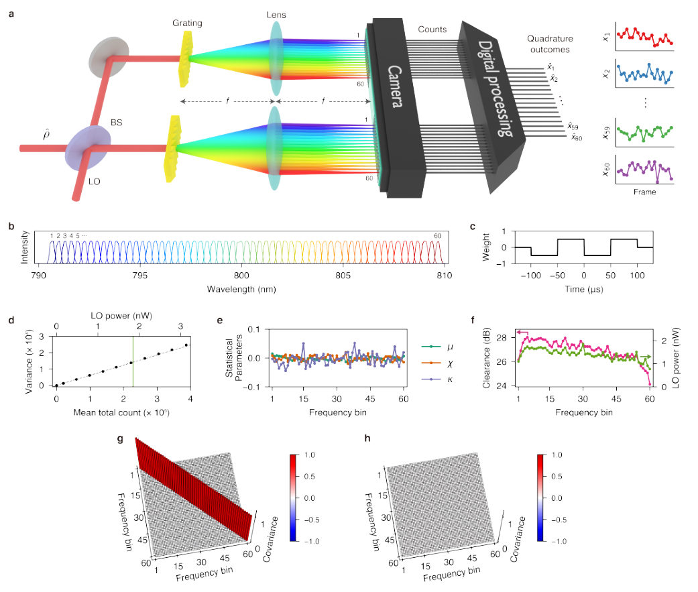
<figcaption class="paper-figure-caption"><b>Fig 1.</b> FIG. 1. Camera-based homodyne detection. a, Experimental scheme. A quantum state of light in multiple frequency modes, ˆρ, is interfered with a local oscillator (LO) at a 50:50 beam splitter (BS). The two output beams are diffracted by gratings and focused by lenses in a 2f configuration. As a result, a corresponding pair of camera pixels—one from each output beam and located on the left and right halves of the camera—maps each frequency-bin mode in b. During digital processing, the camera counts from each pixel pair—after gain balancing and weighted summation using the weight function in c—are subtracted and then normalized. Extending this procedure to all pixel pairs yields the quadrature...</figcaption>
</figure>
<figure class="paper-figure-card">
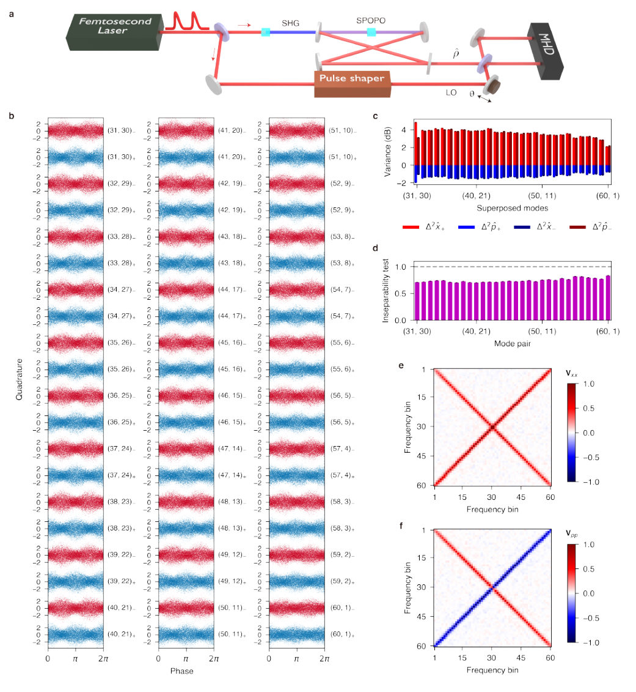
<figcaption class="paper-figure-caption"><b>Fig 2.</b> FIG. 2. Homodyne detection of multimode quantum light. a, Experimental scheme. A multimode quantum state ˆρ, generated from a synchronously pumped optical parametric oscillator (SPOPO), is measured using a camera-based multimode homodyne detector (MHD). Quadrature outcomes for the 60 frequency-bin modes in Fig. 1b are simultaneously obtained as varying the LO phase θ. SHG: second harmonic generation. In b-d, we consider 30 pairs of the frequency-bin modes, (30 + k, 31 −k) for 1 ≤k ≤30. b, Quadrature outcomes for symmetric (blue, (30 + k, 31 −k)+) and antisymmetric (red, (30 + k, 31 −k)−) superpositions of two frequency-bin modes. These outcomes are obtained by adding (the symmetric case) or...</figcaption>
</figure>
<figure class="paper-figure-card">
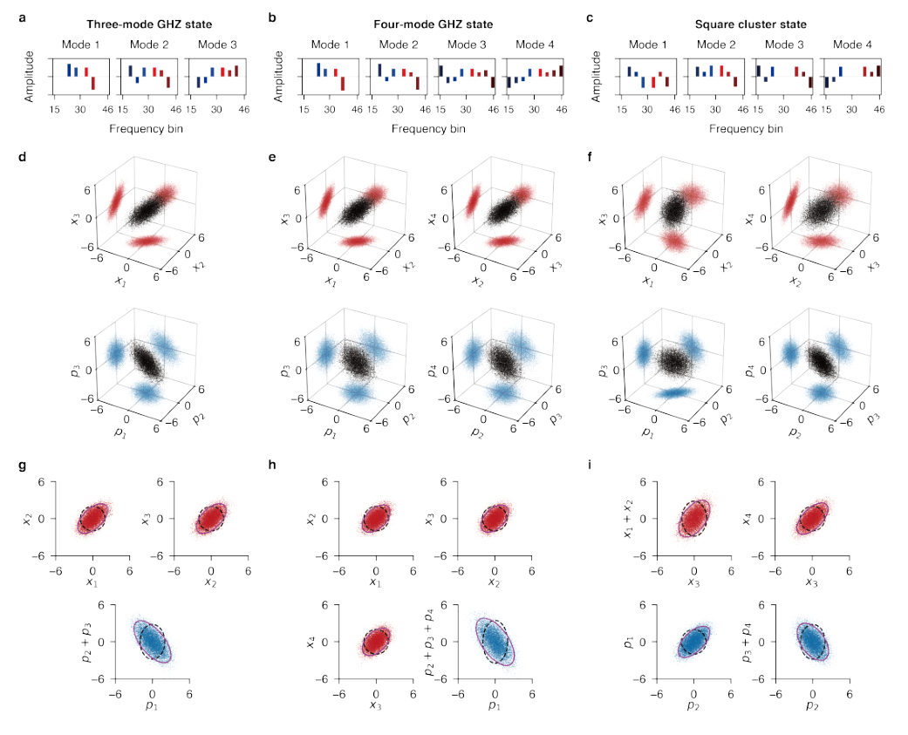
<figcaption class="paper-figure-caption"><b>Fig 3.</b> FIG. 3. Homodyne detection of multipartite entangled states. Left (a,d,g): a three-mode GHZ state, Middle (b,e,h): a four-mode GHZ state, Right (c,f,i): a (locally equivalent) four-mode square cluster state. a-c, Frequency-mode basis for each state. We use the frequency bins in Fig. 1b, grouping each pair of adjacent bins from the 15th to the 46th into a single mode, while discarding alternate pairs to improve spectral mode separation. d-f, Correlations of three different quadrature measurements (black dots). Two-dimensional projections are shown as red dots for the ˆx quadrature and blue dots for the ˆp quadrature. g-i, Quadrature correlations used to identify nullifier noise. The...</figcaption>
</figure>
<figure class="paper-figure-card">
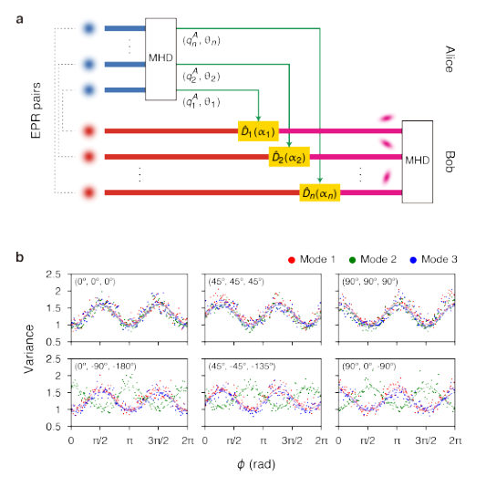
<figcaption class="paper-figure-caption"><b>Fig 4.</b> FIG. 4. Conditional preparation of multimode states. a, Multiple EPR pairs of modes are shared between Alice and Bob. Using a multimode homodyne detector (MHD), Alice obtains multimode quadrature outcomes (qA 1 , qA 2 , . . . , qA n ) at measurement angles of (θ1, θ2, . . . , θn). After Bob applies a displacement operator ˆDk(αk) at each mode k, a multimode squeezed state is prepared and subsequently measured with an MHD for verification. Note that the effect of the displacement operators can also be reproduced by post-processing the quadrature outcomes at Bob. b, Quadrature measurement of conditionally prepared three-mode states. Variances of Bob’s three modes are plotted as the...</figcaption>
</figure>

**Summary.** The paper presents a novel, camera-enabled homodyne detection technique to overcome the scalability limitations of measuring quantum light. By utilizing CCD arrays, they can simultaneously measure quadrature outcomes for dozens of optical modes using extremely low local oscillator power. This breakthrough enables direct experimental verification of entanglement and squeezing in large-scale multimode quantum states.

**Why it may be interesting.** This work provides a highly scalable experimental platform for quantum measurement that directly addresses a major bottleneck in realizing large-scale quantum information processing protocols like quantum error correction or complex quantum simulations.

Detailed structure

**Main problem.** The primary challenge addressed is achieving scalable, efficient quantum measurement, specifically homodyne detection, necessary for large-scale quantum technologies.

**Main result.** The authors successfully demonstrated a camera-based system capable of simultaneously measuring quadrature outcomes for 60 optical modes with significantly reduced local oscillator power and negligible crosstalk.

**Method.** They leverage the pixel array of a CCD camera to perform weighted summations of photocurrents, enabling simultaneous measurement in a superposed mode basis without extra interferometers.

**Model / system.** The system uses a camera-coupled homodyne detector setup to measure quantum light generated by sources like SPOPOs. It is designed to handle multimode states and test entanglement criteria on these measured quadratures.

**Key observables.** Quadrature outcomes ($\hat{x}, \hat{p}$), squeezing variances, entanglement indicators (e.g., nullifier variances), and correlations in superposed modes.

**Important parameters / regimes.** Scalability to 60+ modes; nanowatt-level local oscillator power per mode (a six-order-of-magnitude reduction); clearance exceeding 24 dB.

**Assumptions / limitations.** The method assumes shot-noise-limited operation is achieved, and the low LO power is attributed to the CCD camera's readout characteristics.

**Figures summary.** Figures illustrate the camera-based detection scheme mapping modes to pixels, show noise measurements for superposed modes testing entanglement criteria (Duan criterion), and detail protocols for verifying multipartite entangled states like GHZ and cluster states.

**Paper structure.** The paper introduces the scalability problem in quantum measurement, details the novel camera-based homodyne setup, demonstrates its ability to measure nonclassical noise (squeezing/entanglement) in multimode light, and finally applies this technique to verify multipartite entanglement and perform conditional state preparation.

Abstract

Scalability is a key challenge in advancing quantum technologies such as quantum computing, communication, and metrology. Photonic systems offer a promising route to scalability by enabling the deterministic generation of large-scale entangled states. Homodyne detection is an essential quantum measurement to exploit such entangled states, enabling quantum-enhanced measurement, deterministic quantum teleportation, GKP-state breeding, and quantum error correction. Despite the recent progress in generating large-scale quantum states, realizing quantum measurement at scale remains a major challenge. Here we realize scalable and efficient homodyne detection by leveraging a large number of pixels in a charge-coupled-device (CCD) camera. Our approach enables shot-noise-limited quadrature measurements of 60 optical modes simultaneously, while requiring only nanowatt-level local oscillator power per mode -- a six-order-of-magnitude reduction compared to conventional methods. The system achieves clearance exceeding 24 dB for all modes with negligible crosstalk. We demonstrate its compatibility with a large-scale quantum state by directly observing squeezing and entanglement in 60 optical modes. Furthermore, we showcase applications in verifying multipartite entanglement and in the conditional preparation of multimode states. This work provides a scalable method for quantum measurement, paving the way for large-scale quantum information processing.

[↑ back to top](#top)

### [Exactly solvable non-planar $\mathbb{Z}_{2}$ dimer liquids on checkerboard and ruby lattices](http://arxiv.org/abs/2606.10003v1)

**Authors:** Julia Wildeboer, Zohar Nussinov, Thomas Iadecola, Alexander Seidel  
**Type:** theory · **Category:** strongly correlated electrons · **PDF:** <https://arxiv.org/pdf/2606.10003v1>  
**Analysis basis:** full PDF text, analyzed in chunks
**Topic relevance:** 🔥 `analog quantum simulation` **4/5** · `exotic spin models in light-matter` **3/5** · `entanglement & information structure` **2/5**

↔ Scroll figures horizontally

<figure class="paper-figure-card">
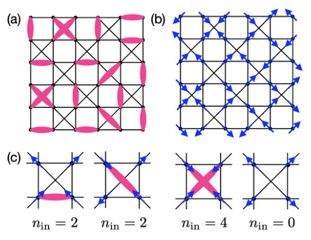
<figcaption class="paper-figure-caption"><b>Fig 1.</b> FIG. 2. Arrow representation of admissible checkerboard dimer coverings. (a) Example of an allowed dimer covering of the checker- board model. Whenever a crossed plaquette is occupied by two dimers, they form a crossed pair on the diagonal links. (b) The same configuration represented in terms of arrow variables. (c) Al- lowed local arrow configurations on a crossed plaquette. The num- ber of arrows pointing toward the plaquette center must be even, i.e. nin = 0, 2, 4. The two cases with nin = 2 correspond to plaquettes occupied by a single dimer, the case nin = 4 corresponds to a crossed pair of dimers on the two diagonal links, and the case nin = 0 corre- sponds to an empty crossed...</figcaption>
</figure>
<figure class="paper-figure-card">
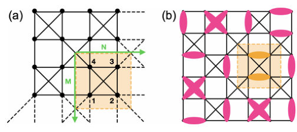
<figcaption class="paper-figure-caption"><b>Fig 2.</b> FIG. 1. Checkerboard lattice geometry and local crossed-plaquette constraint. (a) Checkerboard lattice with the four-site unit cell shaded. The sites within the unit cell are labeled 1, 2, 3, 4, and the two lattice directions are indexed by M and N. (b) Forbidden lo- cal dimer configuration on a crossed plaquette: two parallel dimers may not occupy the same crossed plaquette. Whenever two dimers occupy a crossed plaquette, they must instead form a crossed pair on the two diagonal links. This local restriction defines the constrained Hilbert space of the model.</figcaption>
</figure>
<figure class="paper-figure-card">
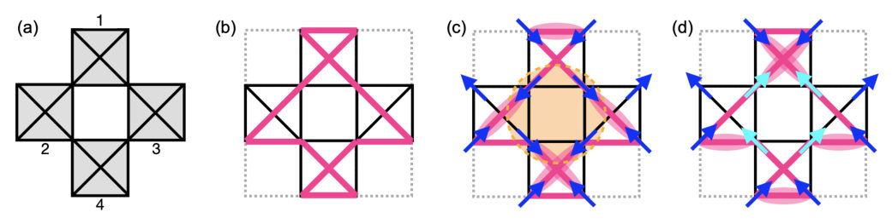
<figcaption class="paper-figure-caption"><b>Fig 3.</b> FIG. 3. Local resonance move on a checkerboard superplaquette. (a) A 12-site superplaquette consisting of a central uncrossed plaquette (white) surrounded by four crossed plaquettes (gray), labeled 1, . . . , 4. (b) A representative resonance loop on the superplaquette. (c) Allowed arrow configuration together with the associated resonance loop and one dimerization pattern on that loop. (d) After flipping the four arrows on the central uncrossed plaquette [highlighted in orange in (c) and shown in cyan in (d)], the resonance loop itself is unchanged, while the dimers shift to the complementary set of links along the same loop. This illustrates how the local arrow flip becomes a local dimer...</figcaption>
</figure>
<figure class="paper-figure-card">
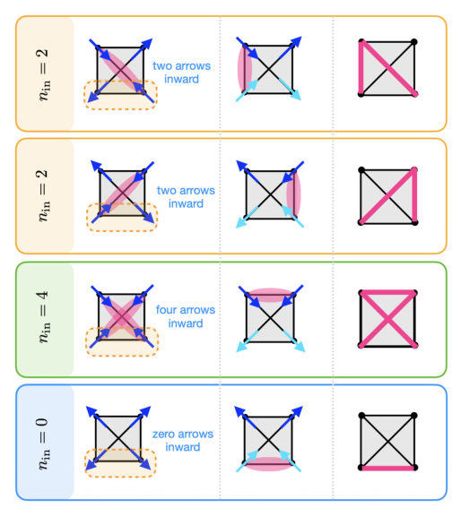
<figcaption class="paper-figure-caption"><b>Fig 4.</b> FIG. 4. Local rule for constructing resonance-loop segments from arrow flips. For a resonance loop associated with a central uncrossed plaquette, the figure illustrates the local construction rule for the crossed plaquette located directly above the central plaquette. Left column: allowed arrow configuration on that crossed plaquette be- fore flipping the central uncrossed plaquette. Middle column: config- uration obtained after flipping the two arrows shared with the central uncrossed plaquette. Right column: the resulting local loop segment passing through the crossed plaquette. The four rows correspond to the distinct local cases entering the loop construction: two inequiva- lent nin = 2...</figcaption>
</figure>
<figure class="paper-figure-card">
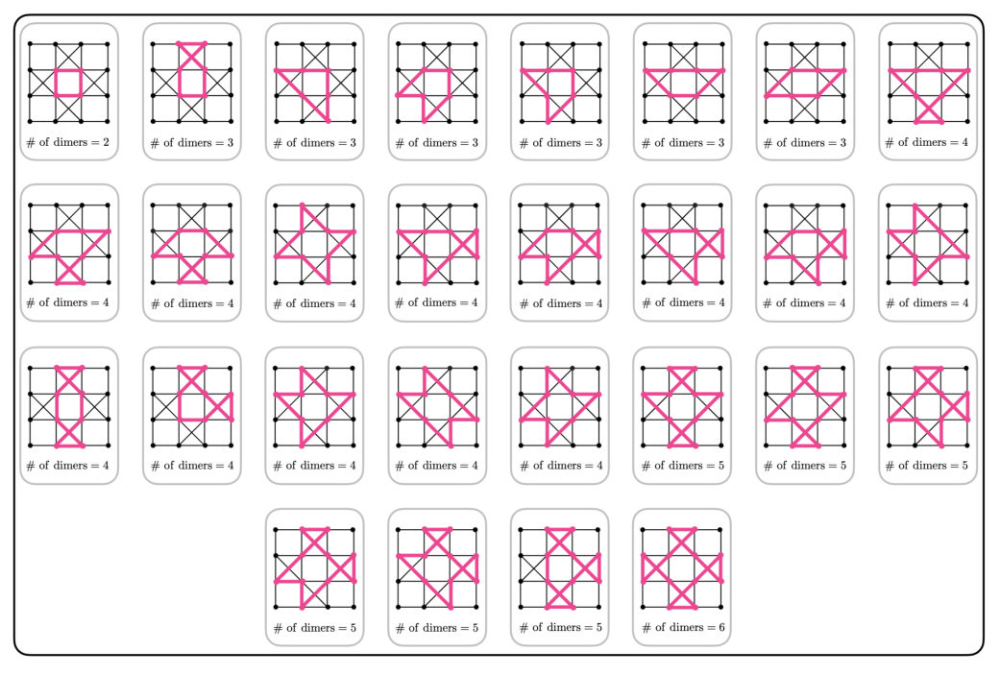
<figcaption class="paper-figure-caption"><b>Fig 5.</b> FIG. 5. Representative local resonance loops of the checkerboard dimer Hamiltonian. One representative loop from each symmetry class of local resonance moves supported on a checkerboard superplaquette. The number of dimers participating in each resonance move is indicated below the corresponding diagram. This equals half of the loop length. Additional loops related by lattice symmetries are not shown.</figcaption>
</figure>

**Summary.** This work develops an advanced theoretical framework for exactly solvable quantum dimer models on non-planar lattices like the checkerboard and ruby. By mapping these systems onto $\mathbb{Z}_2$ lattice gauge theories, the authors confirm their robust topological nature, calculating key observables like entanglement entropy and torus partition functions.

**Why it may be interesting.** The explicit mapping of a dimer model Hamiltonian onto a pure-flux $\mathbb{Z}_2$ lattice gauge theory provides concrete, solvable examples of topological order relevant to frustrated magnetism and quantum spin liquids.

Detailed structure

**Main problem.** The research generalizes exactly solvable quantum dimer models from planar (trivalent) to non-planar (tetravalent) parent lattices, extending the study of $\mathbb{Z}_2$ topological phases.

**Main result.** They establish a broad framework for crossed-medial quantum dimer models on lattices like the checkerboard and ruby lattice, showing they map exactly onto $\mathbb{Z}_2$ gauge theories (like the Toric Code).

**Method.** The authors employ generalized Kasteleyn methods and an 'arrow formalism' to construct and analyze the Hamiltonians for these non-planar systems.

**Model / system.** The system is a Quantum Dimer Model (QDM) defined on crossed-medial lattices, which are dual to Ising Gauge Theories. The model exhibits $\mathbb{Z}_2$ topological order, characterized by deconfined vison excitations.

**Key observables.** Topological Entanglement Entropy (TEE), torus partition function ($Z_{\text{torus}}$), and the energy gap for vison pair creation ($E_{\Delta} = 4\gamma$).

**Important parameters / regimes.** Link weights ($x, y, z$) and lattice geometry parameters defining planarity vs. crossed plaquettes.

**Assumptions / limitations.** The analysis relies on extending Kasteleyn methods to non-planar graphs and assuming specific isotropic weight limits for closed-form solutions.

**Figures summary.** Figures illustrate the local constraints (e.g., forbidden parallel dimers) and provide diagrams detailing the arrow representation, resonance moves, and the underlying square lattice structure used for gauge theory mapping.

**Paper structure.** The paper progresses by first establishing the generalized framework on crossed-medial lattices, then applying it to the checkerboard lattice to show equivalence with the Toric Code via an arrow formalism. It concludes by calculating exact torus partition functions and TEE, confirming the $\mathbb{Z}_2$ topological nature.

Abstract

We generalize an influential framework for exactly solvable quantum dimer models with dual Ising gauge theory descriptions realizing the $\mathbb{Z}_{2}$ topological phase from trivalent to tetravalent parent lattices. The resulting quantum dimer models live on crossed-medial lattices and possess the remarkable feature of having crossed plaquettes, leading to transition graphs with generically intersecting loops. This non-planar structure runs counter to established templates for analytically tractable dimer liquids. As the simplest realization of the construction, we introduce an exactly solvable quantum dimer model on the checkerboard lattice that allows an exact mapping to the toric code, thus providing a particularly direct connection between the latter and Anderson's short range resonating valence bond paradigm. We further show that a corresponding crossed ruby lattice construction, dual to an Ising gauge theory on the kagome lattice, naturally falls within the same framework. More generally, the construction gives rise to a broad class of exactly solvable crossed-medial quantum dimer models and admits natural iteration, generating cascades of solvable $\mathbb{Z}_{2}$ topological dimer liquids beyond the standard planar setting. We furthermore extend Kasteleyn methods to the relevant non-planar graphs, enabling controlled wave-function deformations away from the commuting-projector points while retaining efficient evaluation of correlation functions.

[↑ back to top](#top)

### [Fractional shot noise of an SU(N) Kondo system](http://arxiv.org/abs/2606.10814v1)

**Authors:** Damian Krychowski, Stanisław Lipiński  
**Type:** theory · **Category:** strongly correlated electrons · **PDF:** <https://arxiv.org/pdf/2606.10814v1>  
**Analysis basis:** full PDF text, analyzed in chunks
**Topic relevance:** 🔥 `Kondo & dissipative impurity` **4/5** · `Keldysh / 2PI / non-Gaussian methods` **3/5** · `methods for driven-dissipative` **1/5** · `non-equilibrium dynamics` **1/5**

↔ Scroll figures horizontally

<figure class="paper-figure-card">
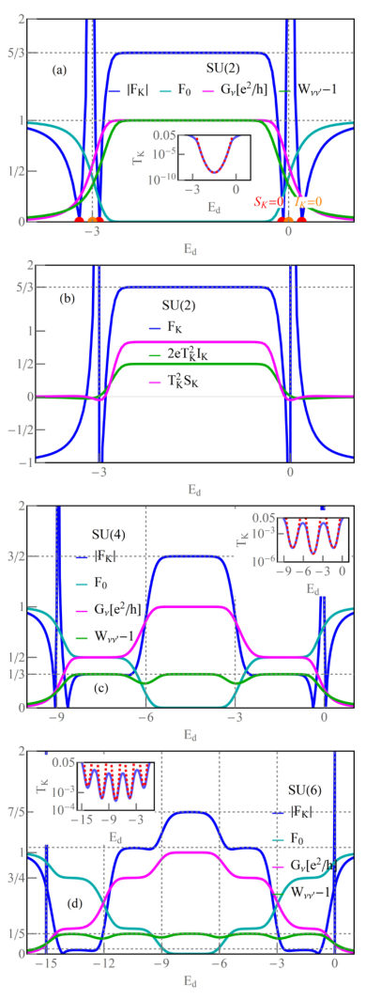
<figcaption class="paper-figure-caption"><b>Fig 1.</b> Figure 1: Kondo effect with even symmetry SU(N=2,4,6): (a,c,d) linear and nonlinear Fano fac- tor F0(K), single-channel quantum conductance Gν and Wilson ratio Wνν′ −1 as a function of dot energy Ed for N = 2, 4, 6. (b) Gate-dependent FK compared with nonlinear current and shot-noise, rescaled by the square of Kondo temperature. Inset shows a numeri- cal and analytical approximation of TK (blue and red dashed lines) (U = 3, Γ = 0.025, T = 0, energies are given in the units W/50). Dark cyan curve in the inset of (c) presents TK for Γ = 0.05.</figcaption>
</figure>
<figure class="paper-figure-card">
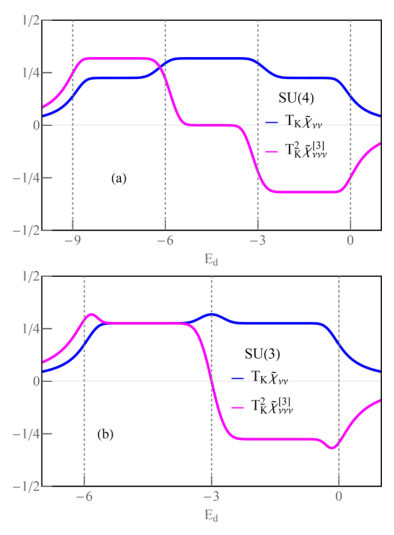
<figcaption class="paper-figure-caption"><b>Fig 2.</b> Figure 2: Two and three body correlators rescaled by TK for SU(4) and SU(3) Kondo state (blue and magenta lines). The parameters used in calculations are the same as in Figure 1.</figcaption>
</figure>
<figure class="paper-figure-card">
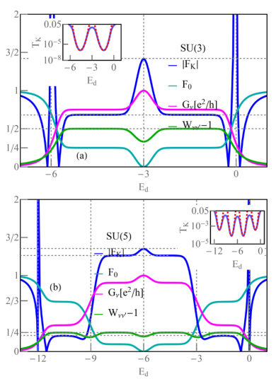
<figcaption class="paper-figure-caption"><b>Fig 3.</b> Figure 3: Odd SU(3) and SU(5) Kondo effect: (a,b) Gate-dependent F0(K), Gν and Wνν′ −1. Insets show a numerical and analytical approximation of TK (blue and red dashed lines) (U = 3, Γ = 0.025, T = 0).</figcaption>
</figure>
<figure class="paper-figure-card">

<figcaption class="paper-figure-caption"><b>Fig 4.</b> Figure 4(b) compares the dependencies of non- linear Fano factor on the rank of SU(N) group for the selected occupancies. FK &gt; 1 indicates the dominance of bunching processes. This oc- curs for Q = N/2. In the systems with a larger number of electrons, the ranges in which quasi- particle grouping processes dominate (FK &gt; 1) shift to higher degenerations (N) (Figure 4(b)). For N = 3, the noise lowers |SK| &lt; 2e|IK|. For N = 7, the influence of three-particle correla- tion becomes dominant eχ[3] ννν &gt; eχνν, which con- sequently leads to negative noise (SK &lt; 0, inset of Figure 4(b)). For Q = 3e and 8e, and de-</figcaption>
</figure>
<figure class="paper-figure-card">
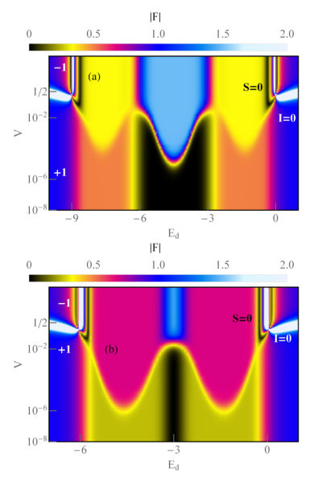
<figcaption class="paper-figure-caption"><b>Fig 5.</b> Figure 5: (a,b) Density plots of gate-dependent total Fano factor |F| as function of bias voltage V for SU(4) and SU(3) Kondo states (U = 3, Γ = 0.025, T = 0). ±1 indicates the sign of the Fano factor.</figcaption>
</figure>

**Summary.** This paper theoretically analyzes the transport properties, especially nonlinear shot noise, in an SU(N) Kondo system using a sophisticated combination of Slave Boson Mean Field Theory and Fermi Liquid theory. It shows how higher-order correlation functions, beyond simple two-body terms, become essential for accurately describing current fluctuations away from equilibrium. The results advance the understanding of correlated electron physics in quantum dots by predicting measurable fractional noise signatures.

**Why it may be interesting.** This work provides advanced theoretical tools (FLT extensions to slave bosons) to calculate non-equilibrium quantum noise signatures that are highly sensitive indicators of strong electronic correlations and symmetry structure.

Detailed structure

**Main problem.** The paper investigates transport properties, including nonlinear conductance and fractional shot noise, in an SU(N) Kondo system operating in the strong coupling regime.

**Main result.** It demonstrates that while linear noise is captured by mean-field approaches, accurate description of nonlinear noise requires incorporating three-body correlation functions when far from electron-hole symmetry.

**Method.** The analysis combines the Kotliar-Ruckentein slave boson approach (SBMFA) with Fermi Liquid Theory (FLT) to calculate higher-order corrections beyond mean-field approximations.

**Model / system.** The system is a multi-level interacting quantum dot (N-QD) modeled by an N-level Anderson Hamiltonian, analyzed for SU(N) symmetries up to N=6.

**Key observables.** Linear and nonlinear conductance, susceptibilities ($\chi^{(2)}, \chi^{[3]}$), and fractional shot noise ($S$).

**Important parameters / regimes.** Kondo temperature ($T_K$), degeneracy $N$, bias voltage ($V$), and Coulomb interaction strength ($U$).

**Assumptions / limitations.** The analysis relies on extending the SBMFA by incorporating Fermi liquid corrections, which is necessary because the basic SBMFA neglects crucial fluctuations.

**Figures summary.** Figures illustrate slave boson amplitudes and fluctuation parameters ($\delta E_
u$) as a function of bias voltage ($V$), and show how generalized Wilson ratios characterize correlation strengths.

**Paper structure.** The paper progresses from establishing the SBMFA framework for linear response, to applying FLT corrections for nonlinear transport, culminating in explicit formulas for shot noise dependent on higher-order correlations.

Abstract

We consider transport through a multi-level interacting quantum dot (N-QD) in Kondo regime. Using the Kotliar-Ruckentein slave boson approach (SBMFA) for N-level Anderson model we define effectively noninteracting quasiparticles of the SU(N) Kondo system ($N=2,3,4,5,6$). Kondo resonance transmission coefficients determine linear noise describing quasiparticle partitioning. To discuss nonlinear conductance, susceptibilities and shot noise in the strong coupling regime, we apply Fermi liquid theory with parameters expressed by susceptibilities of pseudofermions determined within SBMFA. Nonlinear shot noise is dominated by two-quasiparticle scattering. However, we demonstrate that for occupation regions distant from the electron-hole symmetry point, the role of three-body correlations must be revealed.

[↑ back to top](#top)

### [Magic and entanglement in 1+1-dimensional SU(2) lattice gauge theory](http://arxiv.org/abs/2606.09971v1)

**Authors:** Raghav G. Jha, Goksu C. Toga, Jaber I. Taher, Bojko N. Bakalov, Alexander F. Kemper  
**Type:** theory · **Category:** quantum information and computing · **PDF:** <https://arxiv.org/pdf/2606.09971v1>  
**Analysis basis:** full PDF text, analyzed in chunks
**Topic relevance:** 🔥 `entanglement & information structure` **4/5** · `analog quantum simulation` **3/5** · `methods for driven-dissipative` **1/5** · `non-equilibrium dynamics` **1/5**

↔ Scroll figures horizontally

<figure class="paper-figure-card">
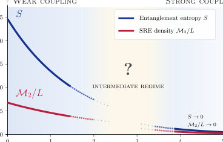
<figcaption class="paper-figure-caption"><b>Fig 1.</b> FIG. 1. Schematic representation of gauge-invariant entangle- ment entropy and stabilizer Rényi entropy (SRE) as a func- tion of the coupling parameter (g) for some fixed value of m. In this paper, we find a crossover coupling g⋆where these ob- servables or their derivatives have a major change in behavior.</figcaption>
</figure>
<figure class="paper-figure-card">
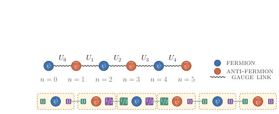
<figcaption class="paper-figure-caption"><b>Fig 2.</b> FIG. 2. Spatial lattice with staggered fermions and gauge links Un pointing from site n to n + 1 (top) and example of a gauge-singlet state (bottom).</figcaption>
</figure>
<figure class="paper-figure-card">
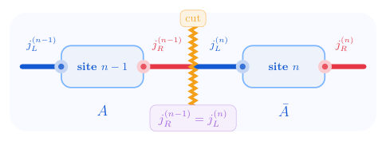
<figcaption class="paper-figure-caption"><b>Fig 3.</b> FIG. 3. Schematic representation of a two-site system in the dressed-site basis. Each dressed site carries a matter occupa- tion number nM and left/right half-link irreps jL and jR. The physical link connecting sites n−1 and n is shared by j(n−1) R and j(n) L , which satisfy the link constraint j(n−1) R = j(n) L . A bipartition through this link defines the gauge-invariant en- tanglement entropy, resolved by the irrep on the cut link.</figcaption>
</figure>
<figure class="paper-figure-card">
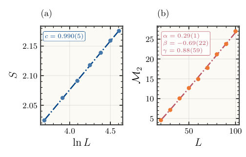
<figcaption class="paper-figure-caption"><b>Fig 4.</b> FIG. 4. a) The gauge-invariant entanglement entropy at the central bond (L/2) at the CFT point for different L, obtaining c = 0.990(5). b) SRE with m = g = 0 for different L at the CFT point and obtain α = 0.29(1), β = −0.69(22), and γ = 0.88(59) by fitting to Eq. (7).</figcaption>
</figure>
<figure class="paper-figure-card">
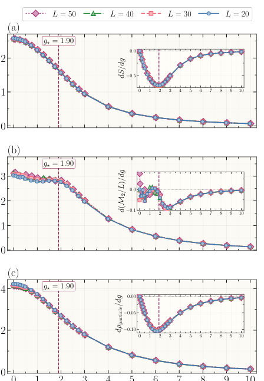
<figcaption class="paper-figure-caption"><b>Fig 5.</b> FIG. 5. The entanglement entropy (a), volume-normalized SRE (M2/L) (b), and particle number density (ρparticle) (c) for different g for fixed m = 0.2 for different lattice sizes. The inset shows the corresponding g derivative of these observ- ables. We find a crossover coupling, g⋆≈1.9. The results are obtained with a fixed maximum bond dimension of χ = 100.</figcaption>
</figure>

**Summary.** This work investigates how two distinct measures of quantum complexity—entanglement and non-stabilizerness ('magic')—behave in the SU(2) lattice gauge theory. By calculating these quantities using tensor networks, the authors identify a crossover point where entanglement and magic decouple as the system moves from a critical state towards confinement. This provides theoretical insight into how quantum correlations are suppressed in physical gauge theories.

**Why it may be interesting.** The explicit calculation of 'magic' (non-stabilizerness) alongside standard entanglement entropy provides a deeper diagnostic tool for characterizing quantum resources relevant to fault-tolerant quantum computation in strongly interacting systems.

Detailed structure

**Main problem.** The study aims to understand the interplay between entanglement (non-local correlations) and non-stabilizerness ('magic') in quantum field theories to pinpoint regimes where quantum advantage might emerge.

**Main result.** A clear decoupling of entanglement entropy and magic is observed across the confinement crossover in the SU(2) lattice gauge theory, suggesting different physical mechanisms suppress these two measures of quantum complexity.

**Method.** The authors calculate gauge-invariant entanglement entropy and stabilizer Rényi entropy using tensor networks on a dressed-site basis that enforces Gauss's law exactly.

**Model / system.** The system is the (1+1)-dimensional SU(2) lattice gauge theory with matter fields, analyzed in various coupling regimes ($g$ and $m$). The Hamiltonian is formulated in an effective irrep-truncated dressed-site basis.

**Key observables.** Gauge-invariant entanglement entropy ($S$), stabilizer Rényi entropy ($\mathcal{M}_n$), particle density ($
ho_{	ext{particle}}$), and anti-flatness ($	ext{A}_{	ext{F}}$).

**Important parameters / regimes.** Coupling constants $g$ and $m$; the crossover coupling $g^\star$; system size $L$.

**Assumptions / limitations.** The analysis relies on restricting the Hilbert space to physical states satisfying local Gauss's law within an irrep-truncated basis, and utilizing tensor network methods for large systems.

**Figures summary.** Figures illustrate how entanglement entropy components decompose ($S = S_{	ext{classical}} + S_{	ext{quantum}} + S_{	ext{edge}}$) and map out the behavior of $S$, $\mathcal{M}_2/L$, and $
ho_{	ext{particle}}$ across the coupling plane, highlighting the crossover point $g^\star$.

**Paper structure.** The paper first establishes the physical model using a dressed-site basis to enforce Gauss's law. It then calculates key diagnostics like entanglement entropy and stabilizer Rényi entropy. Finally, it analyzes how these measures behave across different coupling regimes, identifying the crossover point $g^\star$ where the interplay between magic and entanglement changes.

Abstract

Entanglement and non-stabilizerness (magic) quantify two distinct departures of quantum systems from classical description: the former measures non-local correlations, while the latter measures the deviation from stabilizer states that can be efficiently simulated classically. Understanding magic in physically relevant quantum field theories is essential for identifying where quantum advantage may be realized in the early fault-tolerant quantum computing era. We calculate the gauge-invariant entanglement entropy and stabilizer Rényi entropy of the ground state of the (1+1)-dimensional SU(2) lattice gauge theory formulated in a dressed-site basis that enforces Gauss's law exactly. Using tensor networks, we obtain results for system sizes up to $L=100$ (300 qubits). We find a crossover denoted by $g_{\star}$ where the ground state passes from a more magic-rich regime into a regime with less magic; this is also tracked by the sharpest change of both the entanglement entropy and lattice particle density. Our large-scale study of non-stabilizerness and entanglement entropy in a non-Abelian lattice gauge theory with matter provides new insight into the interplay of magic and entanglement in gauge theories, both of which are relevant for classical and early fault-tolerant quantum simulations.

[↑ back to top](#top)

### [Reconfigurable MDI-QKD and BB84 over 20 km optical channels via EOM-tailored weak coherent states](http://arxiv.org/abs/2606.10306v1)

**Authors:** Jaesung Lim, Yonggi Jo, Nam Hun Park, Zaeill Kim, Yong Sup Ihn  
**Type:** experiment · **Category:** quantum information and computing · **PDF:** <https://arxiv.org/pdf/2606.10306v1>  
**Analysis basis:** full PDF text, analyzed in chunks
**Topic relevance:** 🔥 `quantum optics experiment` **4/5** · `interference shaping light` **3/5** · `QC/QI experiment` **1/5** · `quantum measurements` **1/5**

↔ Scroll figures horizontally

<figure class="paper-figure-card">
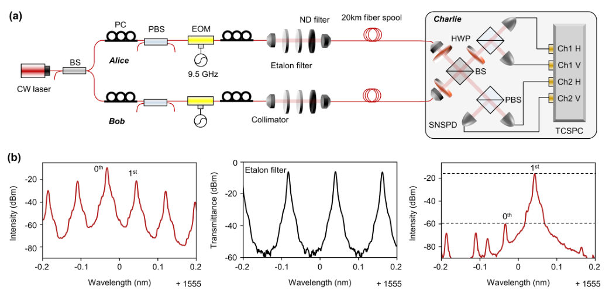
<figcaption class="paper-figure-caption"><b>Fig 1.</b> FIG. 1. Experimental setup and spectral characterization of the reconfigurable QKD platform. (a) Schematic of the optical architecture. Two mutually phase-randomized weak coherent states (WCSs) are generated from a single CW laser using EOMs driven by independent 9.5 GHz RF sources, followed by sideband filtering. After propagating through a 20 km optical fiber spool, the signals enter Charlie’s partial Bell-state measurement module. The system is reconfigured between MDI-QKD and BB84 modes simply by toggling a specific HWP in channel 1 to either 0◦or 22.5◦. (b) The spectra of the WCS preparation. The leftmost panel shows the raw optical spectrum after EOM phase modulation. The middle panel...</figcaption>
</figure>
<figure class="paper-figure-card">
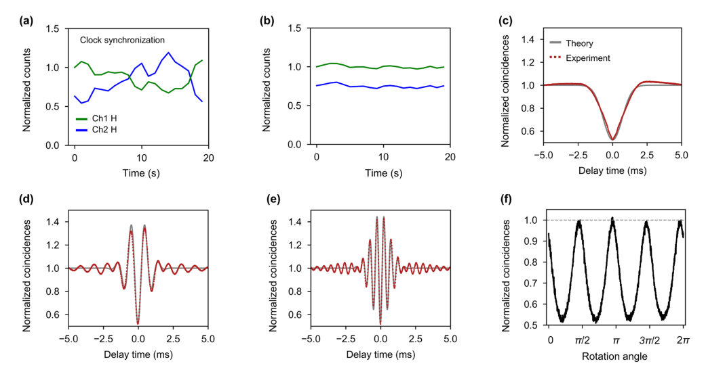
<figcaption class="paper-figure-caption"><b>Fig 2.</b> FIG. 2. Experimental verification of phase randomization and two-photon indistinguishability. (a,b) First-order interference traces recorded at the H-polarized outputs without the 20 km fiber spool, obtained with (a) synchronized and (b) independent RF source clocks. (c–e) Time-resolved Hong-Ou-MAndel (HOM) coincidence histograms as a function of the detection time difference ∆t for frequency detunings of (c) 0 kHz, (d) 1 kHz, and (e) 2 kHz in Alice’s arm. The experimental data (red points) are well described by the theoretical fits (solid gray curves) based on Eq. (1). (f) A polarization mismatch scan demonstrating a four-period coincidence oscillation. The upper and lower bounds (gray...</figcaption>
</figure>
<figure class="paper-figure-card">
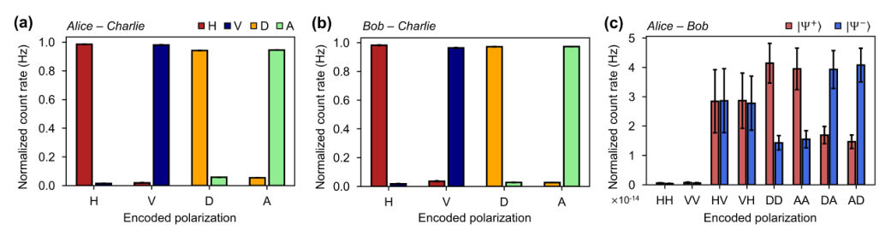
<figcaption class="paper-figure-caption"><b>Fig 3.</b> FIG. 3. Evaluation of QKD performance in the MDI-QKD and BB84 operation modes. (a,b) Normalized single-photon count rates maesured in the BB84 mode, achieved by setting the internal HWP to 22.5◦, for the (a) Alice–Charlie and (b) Bob–Charlie links. The bars indicate the detection probabilities across the four polarization states (H, V, D, A) for each encoded input. (c) Normalized coincidence count rates for the |ψ+⟩and |ψ−⟩Bell-state projections in the MDI-QKD mode (HWP at 0◦). The data represent all 16 polarization combinations encoded between Alice and Bob, demonstrating distinct projection characteristics in the Z and X bases. All data points in both operational modes were accumulated...</figcaption>
</figure>
<figure class="paper-figure-card">
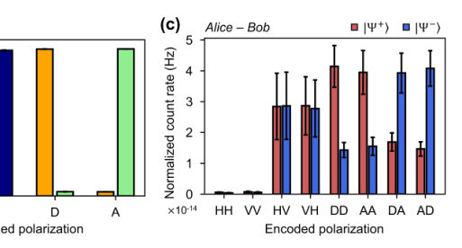
<figcaption class="paper-figure-caption"><b>Fig 4.</b> Figure 3(c) shows the resulting normalized coincidence count rates evaluated via these metrics. We obtained ex- perimental MDI-QKD QBERs of EZ = (2.1 ± 0.7)% and EX = (27.6±0.5)% between Alice and Bob. These results demonstrate reasonable agreement with the correspond- ing theoretical expectations of 0% and 25%, respectively, confirming the robust cryptographic stability of the plat- form.</figcaption>
</figure>

**Summary.** The paper introduces a reconfigurable Quantum Key Distribution (QKD) platform that uses electro-optic modulation on a single laser source to operate over 20 km of fiber. It successfully demonstrates high photon indistinguishability necessary for quantum interference, while also proving the ability to switch between MDI-QKD and BB84 protocols by adjusting only one half-wave plate. This significantly enhances hardware efficiency for future quantum networks.

**Why it may be interesting.** This work is highly relevant to quantum optics and photonic QI as it presents a practical engineering solution for building versatile quantum communication hardware using established components like EOMs and CW lasers.

Detailed structure

**Main problem.** The primary goal was developing a practical, reconfigurable quantum key distribution (QKD) platform capable of switching between MDI-QKD and BB84 protocols using shared hardware to minimize system redundancy.

**Main result.** The authors demonstrated high indistinguishability ($V \approx 0.5$) over 20 km channels and achieved seamless reconfiguration between MDI-QKD and BB84 modes by rotating a single half-wave plate, confirming robust operational flexibility.

**Method.** The system utilized electro-optic modulation (EOM) on a shared CW laser to generate two mutually phase-randomized weak coherent states. Performance was characterized using time-resolved Hong–Ou–Mandel (HOM) interference and by measuring Quantum Bit Error Rates (QBERs) in both protocols.

**Model / system.** The platform is an EOM-based QKD system operating over 20 km optical fiber, designed to support both MDI-QKD (via partial Bell-state measurement) and BB84. Reconfigurability is achieved by manipulating a single Half-Wave Plate (HWP) in the central module.

**Key observables.** HOM interference visibility ($V$), Mutual Coherence Time ($	ext{T}_c$), Quantum Bit Error Rates (QBERs) for both MDI-QKD and BB84.

**Important parameters / regimes.** 20 km optical channel length; Visibility approaching the classical limit of 0.5; HWP rotation angle of $22.5^\circ$ for mode switching.

**Assumptions / limitations.** The security during protocol switching relies on using a physical beam block to obstruct unused channels in BB84 mode.

**Figures summary.** Figures illustrate the optical architecture, spectral filtering performance (sideband isolation), time-resolved TPI histograms confirming indistinguishability across detunings, and comparisons of QKD count rates across different modes.

**Paper structure.** The paper details the hardware setup using EOMs for state generation, validates channel indistinguishability via HOM interference measurements, demonstrates MDI-QKD implementation through partial BSM, and concludes by showing the simple reconfiguration to BB84 mode.

Abstract

Measurement-device-independent quantum key distribution (MDI-QKD) is designed to eliminate detector side-channel vulnerabilities. However, its practical deployment remains experimentally demanding because it requires two-photon interference (TPI) between mutually phase-randomized optical states. In this study, we demonstrate a reconfigurable platform that supports both polarization encoded MDI-QKD and BB84 measurements utilizing the same optical hardware over 20 km optical fiber channels. Two mutually phase-randomized weak coherent states (WCSs) are generated from a shared continuous-wave (CW) laser via electro-optic phase modulation and subsequent etalon-based first-order sideband filtering. Channel indistinguishability is verified through Hong-Ou-Mandel (HOM) interference, combining time-resolved coincidence measurements and polarization mismatch scans, confirming a high degree of indistinguishability that robustly approaches the classical upper limit of 0.5 for WCSs. The transmitted states go through partial Bell-state measurement (BSM) to implement MDI-QKD. Here, the sytem can be directly reconfigured for BB84 simply by rotatinga single half-wave plate (HWP) by 22.5 degree in one arm of the module. This seamless reconfiguration drastically reduces hardware redundancy and enhances operational flexibility in dynamic network environments. These results indicate that EOM-based frequency engineering using a shared CW laser offers a highly practical route toward scalable and reconfigurable quantum communication systems.

[↑ back to top](#top)

### [Experimental implementation of continuous-variable QAOA on a quad-rail lattice cluster state](http://arxiv.org/abs/2606.10432v1)

**Authors:** Shota Yokoyama, Atsushi Sakaguchi, Jun-ichi Yoshikawa, Hironari Nagayoshi, Warit Asavanant, Kan Takase, Takuji Hiraoka, Akira Furusawa, Hidehiro Yonezawa  
**Type:** experiment · **Category:** quantum information and computing · **PDF:** <https://arxiv.org/pdf/2606.10432v1>  
**Analysis basis:** full PDF text, analyzed in chunks
**Topic relevance:** 🔥 `QC/QI experiment` **4/5** · `analog quantum simulation` **2/5** · `quantum measurements` **1/5** · `quantum optics experiment` **1/5**

↔ Scroll figures horizontally

<figure class="paper-figure-card">
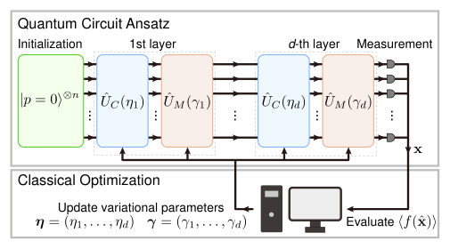
<figcaption class="paper-figure-caption"><b>Fig 1.</b> FIG. 1. Schematic of the CV-QAOA algorithm. The depth d denotes the total number of QAOA layers, each comprising a cost operation ˆUC and a mixer operation ˆUM.</figcaption>
</figure>
<figure class="paper-figure-card">
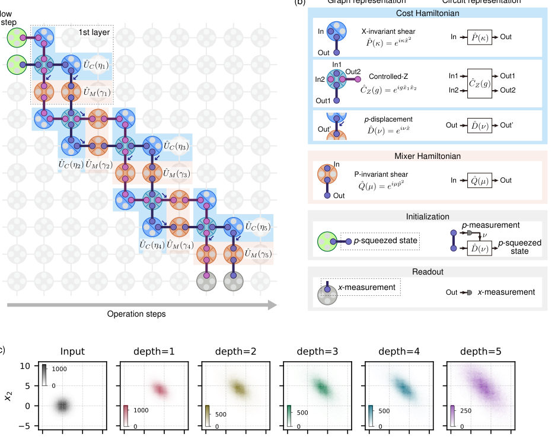
<figcaption class="paper-figure-caption"><b>Fig 2.</b> FIG. 2. CV-QAOA implementation on the QRL cluster state. (a) Example of the CV-QAOA ansatz mapped onto the QRL cluster state for a two-variable cost function with QAOA depth d = 5. (b) Basic measurement-based operations on a macronode, including Gaussian operations, state preparation, and measurement. (c) Measured output quadrature distributions for the two-variable problem with optimized parameters. The histograms are constructed from 105 measurement shots. Each circuit uses the optimized parameters corresponding to the best-performing points shown in Fig. 4 (see main text for details).</figcaption>
</figure>
<figure class="paper-figure-card">
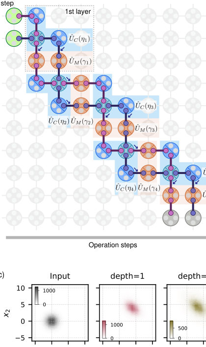
<figcaption class="paper-figure-caption"><b>Fig 3.</b> Figure 2(a) shows an example of a two-variable prob- lem with depth d = 5, while the correspondence be- tween the graph and circuit representations is summa- rized in Fig. 2(b). In this representation, each layer consists of a cost Hamiltonian block, in which two X- invariant shear macronodes and one controlled-Z macron- ode are arranged in a triangle and followed by the p- displacements, and a mixer Hamiltonian block containing two P-invariant shear macronodes. For each successive layer, the orientation of this block changes. The initial p-squeezed states are prepared at the upper-left corner via the initialization process. Then quantum informa- tion propagates along a zigzag path,...</figcaption>
</figure>
<figure class="paper-figure-card">
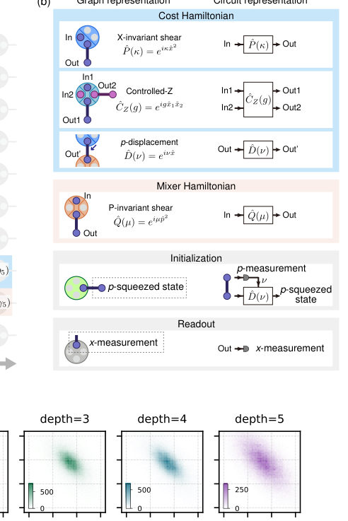
<figcaption class="paper-figure-caption"><b>Fig 4.</b> Figure 2(c) shows representative output quadrature distributions for a two-variable cost function imple- mented according to this mapping (see Sec. IV for the corresponding quantitative results). As the depth in- creases, the mean values tend to move toward the optimal solution (3, 5), while the distributions become broader because of accumulated noise. The figure is intended to provide an intuitive picture of how the output distribu- tion changes with depth.</figcaption>
</figure>
<figure class="paper-figure-card">
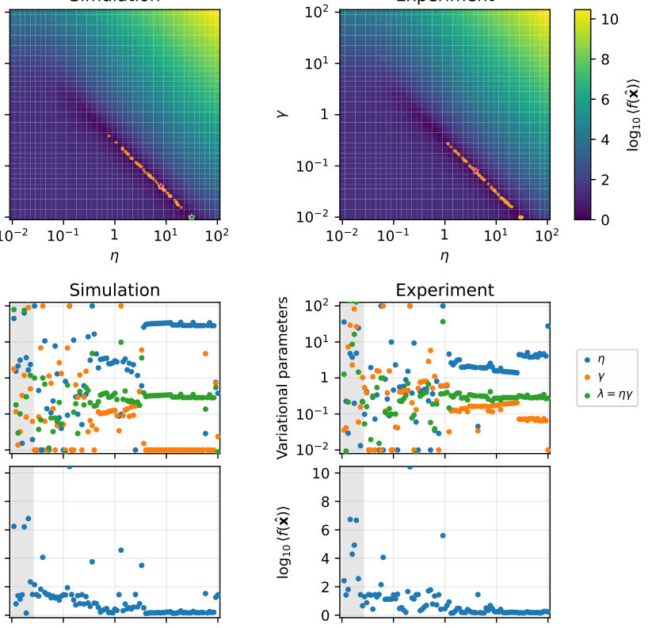
<figcaption class="paper-figure-caption"><b>Fig 5.</b> FIG. 3. Cost function landscape and BO process for the two-variable problem at depth d = 1. (a) Experimental and simulated cost function landscape evaluated on a 41 × 41 grid over the variational parameters (η, γ), where each point corresponds to an expectation value estimated from 1,000 measurement shots. The red star indicates the optimal parameter obtained by grid search, while the green star in the simulation corresponds to the optimum in the absence of sampling noise. The orange circles show the optimal parameters obtained from 100 independent runs of BO. (b) Representative BO trajectory over 100 classical optimization steps. The grey region indicates the initial random sampling stage...</figcaption>
</figure>

**Summary.** The research experimentally implements CV-QAOA on a programmable continuous-variable quantum computer utilizing a quad-rail lattice cluster state. By mapping quadratic cost functions onto this architecture, they demonstrate parameter optimization using Bayesian methods. The findings establish the feasibility of the algorithm while attributing observed performance plateaus to noise and classical optimization hurdles rather than fundamental algorithmic limits.

**Why it may be interesting.** This work provides a concrete experimental realization of a variational quantum algorithm (CV-QAOA) on a photonic/continuous-variable platform, advancing the practical demonstration of quantum computation beyond simple proof-of-concept measurements.

Detailed structure

**Main problem.** The paper experimentally demonstrates the Continuous-Variable Quantum Approximate Optimization Algorithm (CV-QAOA) for solving multi-variable quadratic optimization problems.

**Main result.** While increasing QAOA depth improves performance from $d=1$ to $d=2$, further increases show limited gains, suggesting experimental limitations are due to noise and classical optimization challenges rather than algorithmic failure.

**Method.** The authors use Bayesian Optimization (BO) to tune variational parameters ($\eta, \gamma$) while implementing the CV-QAOA ansatz on a programmable platform.

**Model / system.** The system is a continuous-variable quantum computing platform based on a quad-rail lattice (QRL) cluster state, enabling Measurement-Based Quantum Computing (MBQC). The algorithm maps quadratic cost functions onto this architecture using Gaussian operations.

**Key observables.** Optimized cost values ($\log_{10}\langle f(\hat{\mathbf{x}})
angle$), performance vs. QAOA depth ($d$), and the mean/covariance of output quadratures.

**Important parameters / regimes.** QAOA depth ($d$), resource squeezing level (e.g., -4.5 dB), problem dimension (up to 100 modes).

**Assumptions / limitations.** Experimental limitations are attributed primarily to noise accumulation and classical optimization challenges, contrasting with ideal numerical simulations which show continued improvement with depth.

**Figures summary.** Figures illustrate the CV-QAOA schematic, mapping onto the QRL structure, showing performance vs. depth for varying squeezing levels, and comparing experimental results against idealized infinite-shot simulations.

**Paper structure.** The paper systematically introduces the CV-QAOA framework on the QRL platform, details the Hamiltonian decomposition into Gaussian operations, presents optimization using BO, and concludes by comparing finite-shot experimental performance to ideal theoretical limits.

Abstract

We experimentally demonstrate the continuous-variable quantum approximate optimization algorithm (CV-QAOA) for multi-variable problems and multiple QAOA depths using a measurement-based CV quantum computing platform on a quad-rail lattice (QRL) cluster state. We propose a systematic method to map arbitrary quadratic cost functions onto the QRL architecture and examine the resulting construction in settings involving up to 100 modes. Using the programmable platform, we prepare the CV-QAOA ansatz and optimize the variational parameters via Bayesian optimization. We then investigate the performance on quadratic optimization problems and observe that increasing the depth from 1 to 2 improves performance, whereas further increases yield only limited gains. In contrast, numerical simulations under idealized conditions, assuming an infinite number of measurement shots and gradient-based optimization, indicate that the performance of CV-QAOA can improve with increasing depth, suggesting that the experimentally observed limitations primarily arise from noise accumulation and classical optimization challenges. This work provides an experimental demonstration of CV-QAOA on a programmable CV platform and establishes a foundation for future developments of variational quantum algorithms in CV systems.

[↑ back to top](#top)

### [Field-Induced Up-Up-Down State and Frustrated Magnetism in a Non-Kramers Triangular Antiferromagnet](http://arxiv.org/abs/2606.10980v1)

**Authors:** Zhaoyi Li, Qinchen Duan, Bo Wen, Ruidan Zhong, Shu Guo  
**Type:** experiment · **Category:** strongly correlated electrons · **PDF:** <https://arxiv.org/pdf/2606.10980v1>  
**Analysis basis:** full PDF text, analyzed in chunks
**Topic relevance:** 🔥 `analog quantum simulation` **4/5** · `exotic spin models in light-matter` **3/5** · `spintronics-quantum-optics interface` **1/5**

↔ Scroll figures horizontally

<figure class="paper-figure-card">
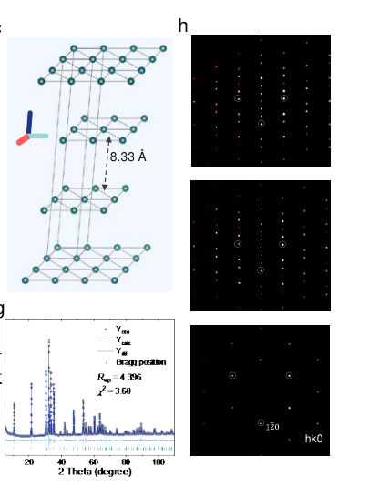
<figcaption class="paper-figure-caption"><b>Fig 1.</b> Figure 1. Crystal structure, morphology, and structural characterization of</figcaption>
</figure>
<figure class="paper-figure-card">
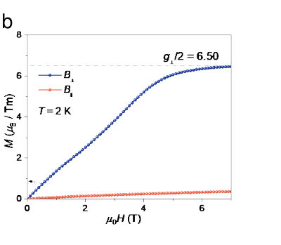
<figcaption class="paper-figure-caption"><b>Fig 2.</b> Figure 2. Anisotropic Magnetism above 2 K. (a) Temperature-dependent magnetic</figcaption>
</figure>
<figure class="paper-figure-card">
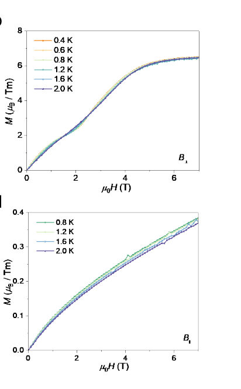
<figcaption class="paper-figure-caption"><b>Fig 3.</b> Figure 3. Low-temperature Magnetism. (a) Temperature-dependent magnetic</figcaption>
</figure>
<figure class="paper-figure-card">
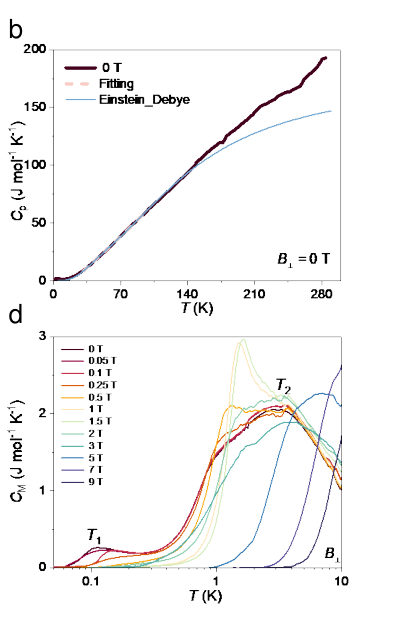
<figcaption class="paper-figure-caption"><b>Fig 4.</b> Figure 4. Thermodynamic properties. (a) The temperature dependence of specific</figcaption>
</figure>

**Summary.** The authors synthesized and characterized $	ext{TmZnGaO}_4$, a triangular lattice antiferromagnet. They found strong magnetic anisotropy and observed a characteristic one-third magnetization plateau under an applied field, suggesting a specific spin ordering ($\uparrow\uparrow\downarrow$). Furthermore, low-temperature specific heat measurements reveal distinct anomalies, confirming the presence of complex, frustrated quantum spin dynamics in this material.

**Why it may be interesting.** This work provides direct experimental evidence on how geometric frustration interacts with crystal field effects in a non-Kramers system, leading to exotic, field-tunable magnetic ground states relevant to modern strongly correlated electron physics.

Detailed structure

**Main problem.** The study investigates exotic quantum spin states and frustrated magnetism within a non-Kramers triangular antiferromagnet.

**Main result.** The material exhibits strong magnetic anisotropy, clear evidence of field-induced one-third magnetization plateaus suggesting an up-up-down spin configuration, and specific heat anomalies pointing to complex low-temperature quantum fluctuations.

**Method.** Measurements include single crystal synthesis, magnetic susceptibility ($\chi$), magnetization ($M-H$) under various fields, and zero-field/field-dependent specific heat ($C_p$).

**Model / system.** The system is $	ext{TmZnGaO}_4$, a layered triangular lattice (TL) antiferromagnet where the magnetic moments reside on non-Kramers $	ext{Tm}^{3+}$ ions. The physics is governed by strong easy-$c$-axis anisotropy and geometric frustration.

**Key observables.** One-third magnetization plateau ($\sim 1.65 	ext{ T}$), specific heat anomalies at $0.11 	ext{ K}$ and $2.81 	ext{ K}$, magnetic entropy ($S_M$), and power-law decay in differential susceptibility ($dM/dH$).

**Important parameters / regimes.** Low temperatures (down to 50 mK), strong anisotropy ratio ($\approx 10$), and the presence of a triangular lattice geometry.

**Assumptions / limitations.** The analysis requires subtracting phonon contributions from total specific heat data, and some measurements rely on fitting models like Curie-Weiss law or Debye/Einstein models for extrapolation.

**Figures summary.** Figures show crystal structure details, magnetic susceptibility vs. T (anisotropy), $M(H)$ curves revealing plateaus, and $C_p(T)/S_M$ plots detailing anomalies under varying fields.

**Paper structure.** The paper follows a standard experimental structure: structural characterization is presented first, followed by measurements of magnetic susceptibility and magnetization to establish anisotropy and field-induced phases. Finally, specific heat and entropy measurements probe the underlying quantum spin fluctuations at very low temperatures.

Abstract

A previously unreported triangular lattice (TL) antiferromagnet, TmZnGaO4, was synthesized as single crystals, and its crystal structure, magnetic susceptibilities, and specific heat were reported. Its crystal structure is isomorphic to that of the transverse-field Ising antiferromagnet TmMgGaO4, with Tm3+ ions located in the TLs, separated by a nonmagnetic bilayer composed mainly of Ga3+ and Zn2+ ions. The magnetic susceptibilities indicate the dominating antiferromagnetic interactions. The magnetization curves (M-H) exhibit strong easy-c-axis anisotropy, with a clear one-third magnetic plateau emerging, consistent with a field-induced up-up-down spin configuration. Instead of forming a conventional long-range magnetic order, the system exhibits two broad anomalies at 0.11 K and 2.81 K in zero-field specific heat measurements, highlighting the persistence of strong spin fluctuations and the potential for exotic quantum spin states. The above results reveal its future interest in exploring exotic quantum spin states in TmZnGaO4.

[↑ back to top](#top)

### [Noise cancellation by superposition of channels and superactivation of quantum capacity: Experimental realization by NMR](http://arxiv.org/abs/2606.10744v1)

**Authors:** Deepika Bhargava, Arijit Chatterjee, Vishal Varma, T. S. Mahesh  
**Type:** experiment · **Category:** quantum information and computing · **PDF:** <https://arxiv.org/pdf/2606.10744v1>  
**Analysis basis:** full PDF text, analyzed in chunks
**Topic relevance:** 🔥 `QC/QI experiment` **4/5** · `correlated / nonlocal dissipation` **1/5** · `driven-dissipative phase transition` **1/5** · `entanglement & information structure` **1/5** · `methods for driven-dissipative` **1/5**

↔ Scroll figures horizontally

<figure class="paper-figure-card">
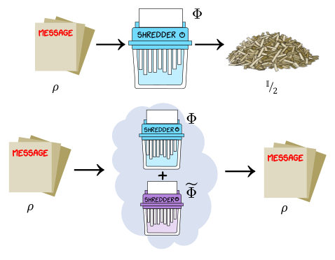
<figcaption class="paper-figure-caption"><b>Fig 1.</b> Figure 1. Illustrating the cancellation of two channels when super- posed.</figcaption>
</figure>
<figure class="paper-figure-card">
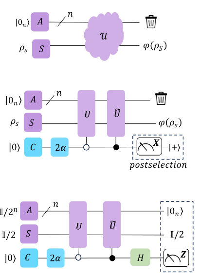
<figcaption class="paper-figure-caption"><b>Fig 2.</b> Figure 2. (a) Realizing superposition of channels on system S via a superposed unitary acting on a larger space, followed by partial trace of ancillary register A. (b) Full quantum circuit for realizing superposition of channels via two Steinspring dilation unitaries U and eU controlled by qubit C, followed by postselection and partial trace. (c) Quantum circuit for finding the normalization factor γ. It involves a conditional measurement of diagonal elements as shown.</figcaption>
</figure>
<figure class="paper-figure-card">
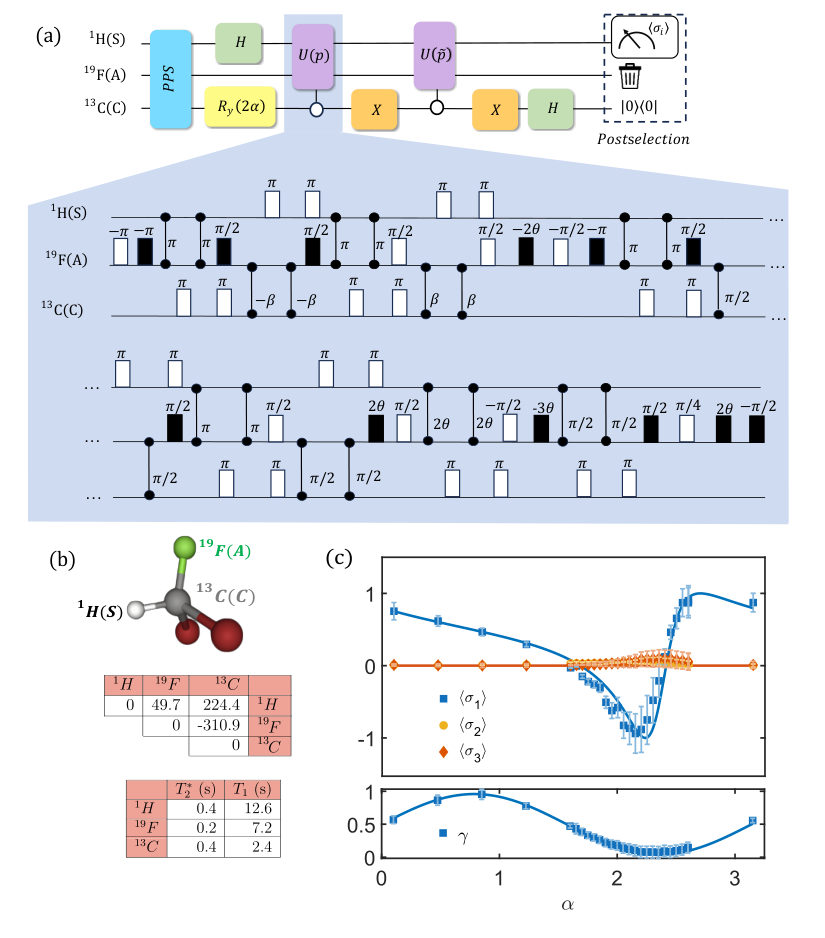
<figcaption class="paper-figure-caption"><b>Fig 3.</b> Figure 3. NMR realization of superposition of two dephasing channels. (a) Pulse sequence implementing control unitaries U(p) and U(ep) of the quantum circuit in Fig. 2 (b). Here, 1H, 19F, and 13C are the system, ancilla, and control qubits respectively. White and black rectangles represent x- and y-pulses with pulse angles mentioned on top of them. Vertical lines joining qubits a and b represent angles Θ ∈{π, π/2, ±β, 2θ} realized by coupling evolution delays Θ/(4πJab). For negative Θ, a delay of 3|Θ|/(4πJab) was used. For the dephasing channel with strength p, β = tan−1 p</figcaption>
</figure>
<figure class="paper-figure-card">
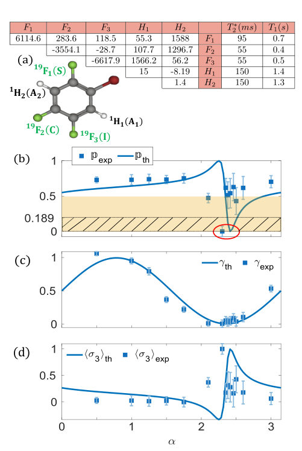
<figcaption class="paper-figure-caption"><b>Fig 4.</b> Figure 4. Experimental realization of superposition of two depolar- izing channels of strengths p = 0.55 and ep = 0.7. (a) Molecular structure of BTFBz and table of resonance offsets νi (diagonal ele- ments in Hz), effective coupling constants Jij + 2Dij (off-diagonal elements in Hz), and relaxation time constants. (b-d) The effective strength p of superposed channel, the normalization factor γ, and expectation value ⟨σ3⟩, plotted versus the superposition parameter α. The lines and markers represent theory and experimental data. In all the cases, P1-error bars [36] of length one standard deviation were calculated considering RF inhomogeneity and thermal noise. In (b), the shaded area...</figcaption>
</figure>

**Summary.** This paper demonstrates a novel technique to combat quantum noise by superposing multiple noisy quantum channels. Using NMR spectroscopy on multi-qubit registers, the authors experimentally achieved the recovery of quantum coherence and demonstrated 'superactivation' of quantum capacity when combining zero-capacity noise sources. This work validates coherent control methods for enhancing quantum information processing capabilities.

**Why it may be interesting.** This work provides a concrete, experimentally validated platform (NMR) for implementing advanced quantum information protocols—specifically noise mitigation via channel superposition—which is highly relevant to open quantum systems research.

Detailed structure

**Main problem.** The research addresses how noise degrades quantum resources by proposing a method to cancel these detrimental effects through the superposition of noisy quantum channels.

**Main result.** The authors successfully demonstrated the cancellation of two dephasing channels using NMR and achieved 'superactivation' of quantum capacity by superposing two zero-capacity depolarizing channels in a five-qubit NMR setup.

**Method.** They theoretically derived conditions for valid channel superposition using Stinespring dilations, which was then experimentally realized using controlled unitary operations on multi-qubit Nuclear Magnetic Resonance (NMR) registers.

**Model / system.** The system involves quantum channels modeled via Pauli maps and implemented experimentally on NMR registers of varying sizes (3-qubit for dephasing, 5-qubit for depolarization). The control mechanism relies on superposing Stinespring dilation unitaries acting on an ancillary qubit.

**Key observables.** Quantum coherence recovery ($\langle\sigma_i
angle$ expectation values), normalization factor ($\gamma$), effective error probabilities ($p'_i$), and the quantum capacity of the resulting channel.

**Important parameters / regimes.** The superposition parameter $\alpha$, which controls the mixture between the two channels, is crucial for observing interference effects.

**Assumptions / limitations.** The analysis assumes ancillary qubits are initialized in pure states ($
ho_A = |0_n
angle\langle 0_n|_A$) for simplicity, although extensions to mixed states are possible.

**Figures summary.** Figures illustrate the quantum circuits used for superposition (using control qubits and postselection) and plot key observables like $\langle\sigma_i
angle$, normalization factor $\gamma$, and effective channel strength $p$ as a function of the superposition parameter $\alpha$.

**Paper structure.** The paper progresses from theoretical derivation of valid superposed channels to analyzing specific cases (dephasing, depolarizing). It then details the experimental realization using NMR for both coherence recovery and capacity enhancement.

Abstract

Noisy quantum channels degrade quantum resources such as coherence and entanglement and hence pose challenges for realizing quantum technologies. Coherent control of noisy channels allows us to minimize their effects on the quantum system. Here we achieve the cancellation of two noisy quantum channels by superposing their corresponding Stinespring dilation unitaries. We first arrive at conditions under which superposition of channels results in a valid quantum channel. We then consider superposing two dephasing channels and observe their destructive interference, thereby effectively recovering the quantum coherence. On superposing two zero-capacity depolarizing channels, we show superactivation of quantum capacity. We experimentally realize the cancellation of two dephasing channels using a three-qubit NMR register. Furthermore, using a five-qubit NMR register, we realize the cancellation of two depolarization channels and demonstrate superactivation of quantum capacity.

[↑ back to top](#top)

### [VQA for Dynamic Portfolio Optimization: Sampling Strategies, Optimizer Scheduling, and Hardware-Aware Ansatz Design](http://arxiv.org/abs/2606.10098v1)

**Authors:** Mohammad Kashfi Haghighi  
**Type:** both · **Category:** quantum information and computing · **PDF:** <https://arxiv.org/pdf/2606.10098v1>  
**Analysis basis:** full PDF text, analyzed in chunks
**Topic relevance:** 🔥 `QC/QI experiment` **4/5** · `methods for driven-dissipative` **1/5** · `non-equilibrium dynamics` **1/5**

↔ Scroll figures horizontally

<figure class="paper-figure-card">
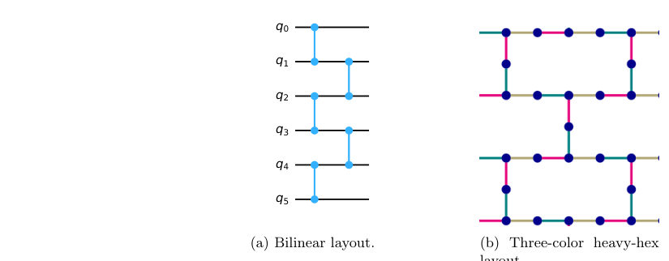
<figcaption class="paper-figure-caption"><b>Fig 1.</b> Figure 1: Baseline hardware-efficient layouts used in this work. The bilinear layout applies CZ gates along a one-dimensional nearest-neighbor path using alternating sublayers. The colored layout parti- tions the hardware coupling graph into three edge-color classes, where each color class forms a matching and can be executed in parallel.</figcaption>
</figure>
<figure class="paper-figure-card">
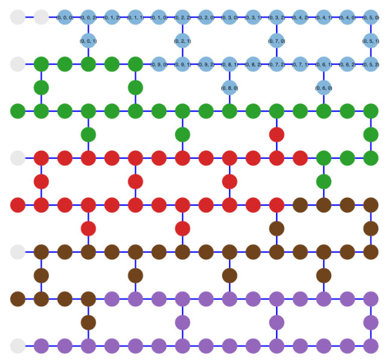
<figcaption class="paper-figure-caption"><b>Fig 2.</b> Figure 2: Example HNDC mapping. Colors denote different portfolio time steps. The blue component shows the assignment for time step t = 0, with each qubit labeled by (t, i, k), denoting time index, asset index, and binary-encoding bit. k = 2 is the MSB. The layout increases local two-qubit interaction depth using native hardware edges while preserving hardware-compatible inter-component connections.</figcaption>
</figure>
<figure class="paper-figure-card">
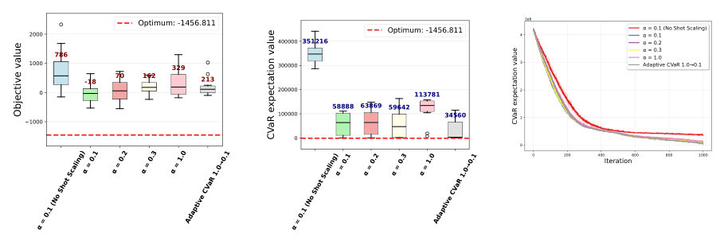
<figcaption class="paper-figure-caption"><b>Fig 3.</b> Figure 3: Comparison of fixed and adaptive CVaR strategies over 10 independent runs. (a) Best objective value observed at the final iteration. (b) Final CVaR value evaluated using a common α = 0.1 level for all configurations. In (a) and (b), the horizontal line inside each box indicates the median; the annotated value is the mean across runs. (c) Evolution of the mean CVaR objective evaluated using the same common α = 0.1 level. Lower values indicate better portfolio objective values.</figcaption>
</figure>
<figure class="paper-figure-card">
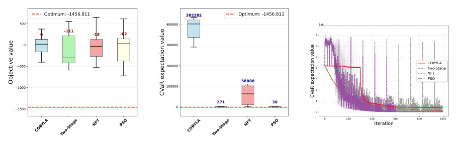
<figcaption class="paper-figure-caption"><b>Fig 4.</b> Figure 4: Comparison of classical optimizers under fixed CVaR level α = 0.1 over 10 independent runs. (a) Best objective value observed at the final iteration. (b) Final CVaR value of the sampled distribution. In (a) and (b), the horizontal line inside each box indicates the median; the annotated value is the mean across runs. (c) Evolution of the mean CVaR objective during optimization. Lower values indicate better portfolio objective values.</figcaption>
</figure>
<figure class="paper-figure-card">
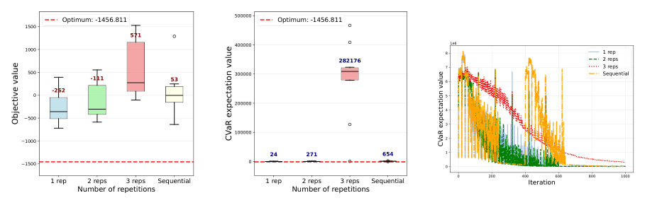
<figcaption class="paper-figure-caption"><b>Fig 5.</b> Figure 5: Comparison of ansatz repetition depth and sequential growth under fixed CVaR level α = 0.1 and the PSO→NFT optimizer over 10 independent runs. (a) Best objective value observed at the final iteration. (b) Final CVaR value of the sampled distribution. In (a) and (b), the horizontal line inside each box indicates the median; the annotated value is the mean across runs. (c) Evolution of the mean CVaR objective during optimization. Lower values indicate better portfolio objective values.</figcaption>
</figure>

**Summary.** This work applies Variational Quantum Algorithms to solve dynamic portfolio optimization problems. It systematically investigates how crucial design choices—including adaptive sampling strategies, multi-stage classical optimization, and hardware-aware ansatz layouts (like HNDC)—impact performance on real quantum processors. The results guide the development of practical VQA protocols for near-term quantum devices.

**Why it may be interesting.** While focused on finance, the core methodology—designing quantum circuits to respect underlying hardware connectivity while maximizing computational depth/expressivity—is directly relevant to developing algorithms for complex many-body Hamiltonians in AMO physics.

Detailed structure

**Main problem.** The paper addresses dynamic portfolio optimization (DPO), a complex multi-period financial problem, by mapping it onto a Variational Quantum Algorithm (VQA) framework.

**Main result.** The proposed Heavy-Hex Native Deep-Chain (HNDC) ansatz layout achieved the best performance on the physical QPU compared to other hardware-aware layouts. The study provides practical guidance for improving VQA performance despite not achieving quantum advantage over classical solvers.

**Method.** It employs a sampling-based VQA approach using Conditional Value-at-Risk (CVaR) estimation, combined with an adaptive two-stage classical optimization schedule (PSO $	o$ NFT).

**Model / system.** The model is a 150-qubit DPO instance. The physical platform involves superconducting qubits, specifically tested on the ibm quebec QPU, requiring careful consideration of hardware connectivity and transpilation overhead.

**Key observables.** Final objective value, CVaR-tail performance, circuit depth, and gate count after transpilation.

**Important parameters / regimes.** Problem size ($N_q=150$), optimization parameters ($\lambda, \delta, 
u$, etc.), sampling budget (e.g., $N_{	ext{shots}}$), and CVaR tail parameter $\alpha$.

**Assumptions / limitations.** The study assumes that hardware-aware layout design and advanced scheduling can significantly improve VQA performance on near-term noisy devices, even if quantum advantage is not demonstrated.

**Figures summary.** Figures compare the performance of various ansatz layouts (Bilinear, Colored, DGC, HNDC) on the QPU across different optimization settings; kernel density estimates visualize how optimized circuits bias sampling towards better objective values compared to random samples.

**Paper structure.** The paper details the DPO formulation, introduces the VQA framework using CVaR estimation, proposes and evaluates advanced components like adaptive CVaR scheduling and two-stage optimizers, and rigorously compares multiple hardware-aware ansatz layouts (DGC, HNDC) on a physical QPU.

Abstract

Variational quantum algorithms are increasingly explored for optimization problems at scales relevant to near-term quantum devices. Their practical performance depends strongly on design choices such as the sampling objective, classical optimizer, and ansatz layout before and after hardware transpilation. We study these factors for dynamic portfolio optimization, a multi-period financial problem balancing return, risk, transaction costs, cash-interest effects, and constraints. Using a sampling-based VQA framework on a 150-qubit dynamic portfolio instance, we evaluate several components of the optimization workflow. We propose a specific adaptive CVaR schedule that gradually tightens the sampled tail used for optimization, together with a two-stage optimizer combining global exploration with Particle Swarm Optimization and local refinement with the Nakanishi-Fujii-Todo optimizer. We also study ansatz depth and sequential growth strategies. Finally, we introduce two hardware-aware ansatz-layout modifications: a data-guided colored layout that assigns correlated variables to qubits connected by entangling gates, and a heavy-hex-native deep-chain layout designed to increase native two-qubit interaction depth without additional routing overhead after transpilation. Simulator studies select CVaR, optimizer, and depth configurations, while the ansatz comparison is performed on the ibm_quebec QPU. The results show that sampling strategy, optimizer scheduling, and hardware-aware layout design materially affect performance. In the reported QPU layout comparison, the proposed heavy-hex-native deep-chain layout achieves the best final objective value and CVaR-tail performance among the tested layouts. Although we do not observe quantum advantage over a state-of-the-art exact classical solver, our results provide practical guidance for improving VQA performance on near-term hardware.

[↑ back to top](#top)

### [A Cryogenic Hybrid Photonic/CMOS Controller Architecture for Scalable Superconducting Qubit Control](http://arxiv.org/abs/2606.10114v1)

**Authors:** Bowen Liu, Zhaoran Rena Huang  
**Type:** both · **Category:** quantum information and computing · **PDF:** <https://arxiv.org/pdf/2606.10114v1>  
**Analysis basis:** full PDF text, analyzed in chunks
**Topic relevance:** 🔥 `QC/QI experiment` **4/5** · `quantum optics experiment` **1/5**

↔ Scroll figures horizontally

<figure class="paper-figure-card">
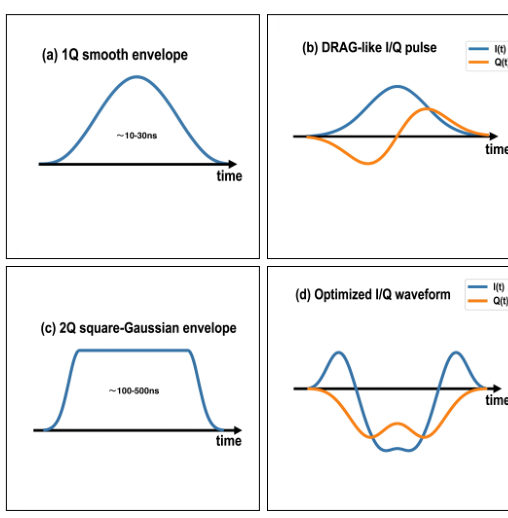
<figcaption class="paper-figure-caption"><b>Fig 1.</b> Fig. 1. Representative superconducting qubit gate pulse shapes: (a) smooth single-qubit envelope, (b) DRAG-like I/Q pulse, (c) square Gaussian two- qubit envelope, and (d) GRAPE-based optimized I/Q waveform.</figcaption>
</figure>
<figure class="paper-figure-card">
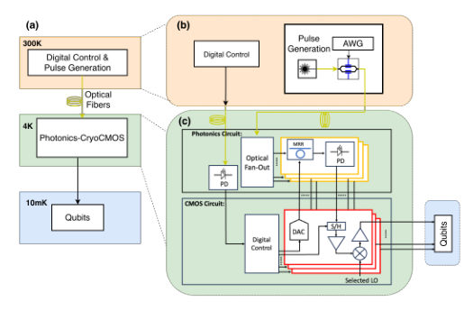
<figcaption class="paper-figure-caption"><b>Fig 2.</b> Fig. 2. Proposed hybrid cryogenic photonic/CMOS control architecture. (a) System level partitioning across room temperature, the 4 K controller stage, and the mK qubit stage. (b) Room-temperature optical pulse template generation. (c) 4 K photonic/CMOS controller, where a shared optical pulse train is distributed within local small-fan-out channel groups, locally transmission-programmed by microring modulators, photodetected into an electrical envelope, optionally held or buffered, and mixed with a selected LO tone to generate the qubit-control drive.</figcaption>
</figure>
<figure class="paper-figure-card">
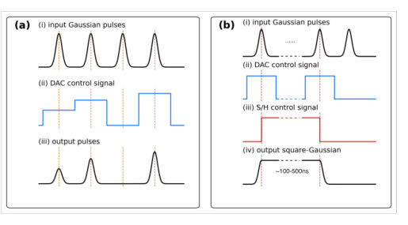
<figcaption class="paper-figure-caption"><b>Fig 3.</b> Fig. 4. Local control of a shared optical pulse train. (a) Single-qubit gate operation: a slow DAC stores a channel amplitude code or bias point, while local transmission-control logic passes scheduled input pulses, blocks unscheduled pulses, and amplitude-scales the selected pulse. (b) two-qubit gate operation: the detected envelope charges a hold node, the S/H window maintains a flat-top level, and a controlled release/reset generates the falling edge of a Square Gaussian output envelope.</figcaption>
</figure>
<figure class="paper-figure-card">

<figcaption class="paper-figure-caption"><b>Fig 4.</b> Fig. 3. Optical multi-tone LO-distribution path. A room-temperature reference LO and PLL array generate multiple phase-coherent RF/LO tones, which are encoded as microwave subcarriers on an optical carrier and delivered to the 4 K stage. A cryogenic PD recovers an electrical multi-tone LO bus. At 4 K, an RF distribution network feeds channel-specific band-pass filters (BPF) or resonant selectors. Each selected LO tone then passes through an on-chip LO phase selector, which provides phase-coded LO signals routed to the local mixers.</figcaption>
</figure>
<figure class="paper-figure-card">
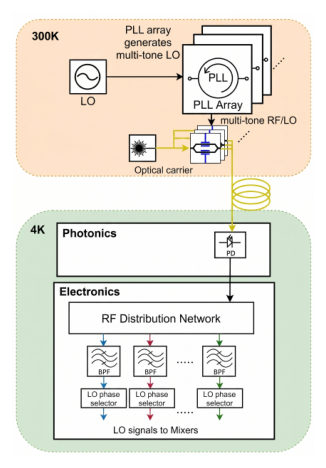
<figcaption class="paper-figure-caption"><b>Fig 5.</b> Fig. 4 illustrates the principle for single and two-qubit gates. For single-qubit gates example, as shown in Fig. 4(a), the shared input is a train of Gaussian optical pulses. A low speed DAC programs the MRR transmission for a scheduled gate, thereby setting the amplitude of the corresponding pulse in the shared Gaussian train and blocking unwanted pulses by using a near zero transmission state. For two-qubit gates, shown in Fig. 4(b), the controller forms a Square Gaussian envelope by adding a local sample-and-hold stage to the shared optical pulse template. The pulse charges an envelope node to the programmed amplitude and provides the smooth turn-on edge. The S/H circuit then holds this...</figcaption>
</figure>

**Summary.** The paper introduces a novel hybrid photonic/CMOS controller architecture designed to overcome the severe scaling challenges in superconducting qubit control. By using optical fibers to distribute pulse templates and local 4 K CMOS circuits for fine-grained programming, it drastically reduces power consumption compared to fully sampled cryogenic electronics. The analysis confirms this approach is feasible by meeting stringent error budget requirements while maintaining programmability.

**Why it may be interesting.** This work directly addresses the physical engineering bottleneck of quantum computing hardware by proposing a scalable, low-power control interface that integrates photonics and cryogenics, which is crucial for building large-scale quantum processors.

Detailed structure

**Main problem.** Scaling superconducting quantum computers requires a control hardware architecture that minimizes wiring density, cryogenic heat load, and controller-induced errors.

**Main result.** The proposed hybrid photonic/CMOS architecture successfully mitigates scaling bottlenecks by using optical links for shared pulse templates while retaining local 4 K programmability, achieving low power dissipation and error rates below the target threshold.

**Method.** The authors developed a template-based control framework, modeling power dissipation and gate errors using first-order approximations derived from comparing the proposed architecture against high-speed RF-AWG baselines.

**Model / system.** The system involves superconducting transmon qubits controlled by microwave pulses generated via an optical path (room T $
ightarrow$ 4 K) followed by local Cryo-CMOS processing. The error analysis is cross-checked using a three-level Transmon Hamiltonian simulation.

**Key observables.** Controller-induced gate fidelity ($\epsilon$), 4 K power dissipation ($\mu	ext{W}/	ext{ch}$), and waveform storage requirements (bits).

**Important parameters / regimes.** Target operation fidelity of $99.9\%$ ($10^{-3}$ error budget); operating temperature range (mK to 4 K); pulse durations ($10-500 	ext{ ns}$).

**Assumptions / limitations.** The analysis relies on first-order models for power and error, assuming feasibility of cryogenic components like MRRs and PDs; full device calibration is not performed.

**Figures summary.** Figures illustrate waveform examples (single/two-qubit gates), the optical multi-tone LO distribution path, and comparative plots showing power dissipation vs. RF-AWG baselines and error contributions vs. $10^{-3}$ budget.

**Paper structure.** The paper progresses by identifying scaling limitations, proposing the hybrid architecture to solve these limits (combining photonic links with local CMOS), quantifying feasibility through detailed power modeling against alternatives, and finally validating the approach via first-order error analysis cross-checked with numerical simulations.

Abstract

Scaling superconducting quantum computers toward thousands of qubits remains a difficult control hardware problem. It requires hardware that reduces room-temperature to cryogenic wiring and cryogenic power while preserving in-fridge programmability for microwave pulse generation. This work develops a 4 K hybrid photonic/CMOS control architecture in which optical fibers distribute shared shaped pulse templates, while local cryogenic CMOS (Cryo-CMOS) circuits provide transmission control, amplitude programming, sample-and-hold envelope shaping, LO-tone and phase selection, and microwave upconversion, enabling both single-qubit and two-qubit gate generation within the same control path. Compared with fully Cryo-CMOS controllers, this architecture reduces per-channel active dissipation by moving high-speed sampled RF/IF waveform synthesis and waveform-memory access out of each cryogenic channel. Compared with purely photonic-link qubit-control approaches, it adds local 4 K programmability for pulse selection, amplitude scaling, timing updates, and LO-phase control, while remaining compatible with room-temperature real-time feedback and quantum error correction (QEC) workflows. We present architecture-level first-order models for 4 K power dissipation, waveform-memory scaling, and controller-induced fidelity limits, and cross-check the dominant fidelity terms using a three-level transmon simulation. The analysis shows that shared optical pulse template distribution with local 4 K envelope programming is a feasible path toward scalable superconducting qubit control.

[↑ back to top](#top)

### [Thermal Signatures of the Slater-Mott Crossover in the Hubbard Model: From Double Occupancy to Antiferromagnetic Correlation Length](http://arxiv.org/abs/2606.10976v1)

**Authors:** Mingzhong Lu, Yu-Feng Song, Youjin Deng, Yuan-Yao He  
**Type:** theory · **Category:** strongly correlated electrons · **PDF:** <https://arxiv.org/pdf/2606.10976v1>  
**Analysis basis:** full PDF text, analyzed in chunks
**Topic relevance:** 🔥 `analog quantum simulation` **4/5** · `non-equilibrium dynamics` **1/5**

↔ Scroll figures horizontally

<figure class="paper-figure-card">
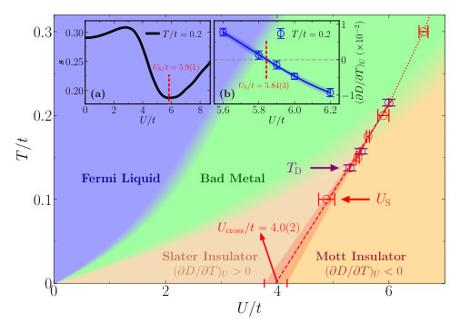
<figcaption class="paper-figure-caption"><b>Fig 1.</b> FIG. 1. Extrapolation of the thermal signatures at low tem- peratures to T = 0 yields Ucross/t = 4.0(2) as the Slater-Mott crossover boundary for the half-filled square-lattice Hubbard model. The signatures include the local minimum US in ther- mal entropy density s(U) at fixed T/t and the minimum TD of double occupancy D(T) at fixed U/t (see Fig. 3), which are connected via the Maxwell relation in Eq. (2). A linear fit (red dashed line) to the data is used with the red shaded region in- dicating the fitting uncertainty. The characteristic feature for the Slater (Mott) regime is (∂D/∂T)U &gt; 0 [(∂D/∂T)U &lt; 0] near T = 0. The background reproduces the finite-T metal- insulator crossover diagram...</figcaption>
</figure>
<figure class="paper-figure-card">
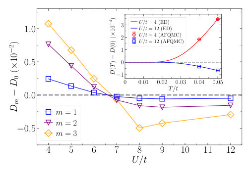
<figcaption class="paper-figure-caption"><b>Fig 2.</b> FIG. 2. ED results of (Dm −D0) as a function of U/t with m = 1, 2, 3 on a 4 × 4 periodic supercell for the model (1), where Dm and D0 are the double occupancy of the m-th ex- cited state and the ground state, respectively. The inset plots the difference [D(T)−D(T = 0)] versus T/t with T/t ≤0.05, from both ED [solid lines, with D(T) computed via Eq. (3)] and AFQMC (circles and squares) for U/t = 4 and 12, with D(T = 0) = D0 taken from ED.</figcaption>
</figure>
<figure class="paper-figure-card">
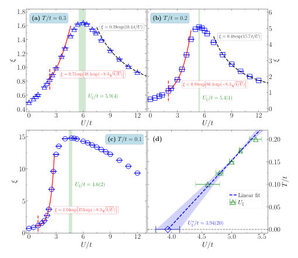
<figcaption class="paper-figure-caption"><b>Fig 3.</b> FIG. 4. AFQMC results for the AFM correlation length ξ ob- tained under PBC, together with the extrapolation of its max- imum position to T = 0. Panels (a)-(c) present ξ as a function of U/t at T/t = 0.3, 0.2, and 0.1, respectively, with L = 20 used in (a)(b) and L = 24 in (c). The position of the max- imum, denoted Uξ/t, is indicated by the green shaded band, with the corresponding value included. At weak-coupling side, the ξ data are fitted to ξ ∼exp[Aexp(−B p</figcaption>
</figure>
<figure class="paper-figure-card">
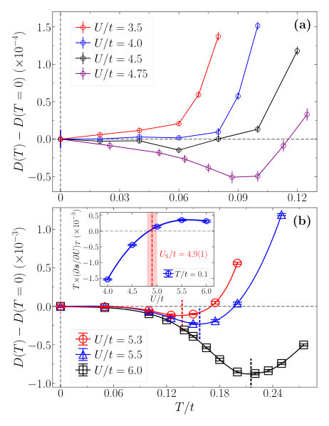
<figcaption class="paper-figure-caption"><b>Fig 4.</b> FIG. 3. AFQMC results of [D(T)−D(T = 0)] as a function of T/t obtained under TABC to reveal the Slater-Mott crossover. Panel (a) presents the results around the crossover, and (b) shows those in the Mott regime, with the solid lines as poly- nomial fits to the data. In (b), the vertical dashed lines mark the local minimum of D(T) at TD/t = 0.138(4), 0.157(3), and 0.215(4) for U/t = 5.3, 5.5, and 6.0, respectively. The inset of (b) plots T × (∂s/∂U)T versus U/t at T/t = 0.1 (see text). The T = 0 and T &gt; 0 results are accordingly computed using ground-state and finite-temperature AFQMC with L = 20, and exhibit negligible finite-size effects.</figcaption>
</figure>
<figure class="paper-figure-card">
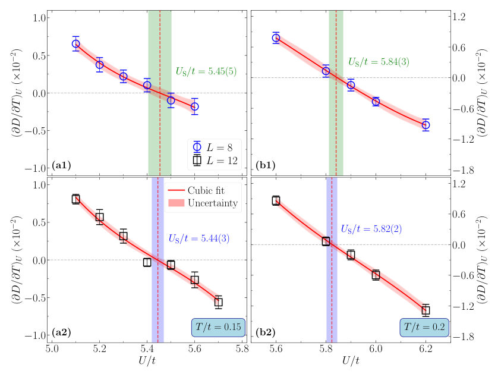
<figcaption class="paper-figure-caption"><b>Fig 5.</b> FIG. 5. AFQMC results for (∂D/∂T)U as a function of U/t under TABC for (a1)(a2) T/t = 0.15 and (b1)(b2) T/t = 0.20. Panels (a1) and (b1) show the results from L = 8, while (a2) and (b2) are for L = 12. The vertical dashed line marks the extracted US from the condition (∂D/∂T)U = 0, with the shaded region indicating the fitting uncertainty.</figcaption>
</figure>

**Summary.** The paper establishes a definitive thermal signature—the sign change of the temperature derivative of double occupancy—to locate the Slater-Mott crossover in the Hubbard model. Using advanced Quantum Monte Carlo simulations, they determine this critical ratio to be $U_{	ext{cross}}/t \approx 4.0$. This provides a direct, measurable framework for experimentalists studying strongly correlated electron systems.

**Why it may be interesting.** This work provides a highly quantitative and experimentally accessible diagnostic tool ($\partial D/\partial T$) to probe fundamental many-body physics transitions relevant to ultracold atoms trapped in optical lattices.

Detailed structure

**Main problem.** The study aims to quantitatively characterize the crossover between a Slater insulator (weak coupling) and a Mott insulator (strong coupling) in the Hubbard model.

**Main result.** A clear, measurable thermal criterion based on the sign change of $(\partial D/\partial T)_U$ is established, determining the crossover boundary at $U_{	ext{cross}}/t = 4.0(2)$.

**Method.** The research employs advanced Quantum Monte Carlo simulations (AFQMC) and Exact Diagonalization (ED) to calculate thermal properties.

**Model / system.** The system is the half-filled two-dimensional Hubbard model on a square lattice, governed by the Hamiltonian $\hat{H} = \sum_{k\sigma} \varepsilon_k \hat{c}^\dagger_{k\sigma}\hat{c}_{k\sigma} + U \sum_i (\hat{n}_{i\uparrow}\hat{n}_{i\downarrow} - rac{1}{2}(\hat{n}_{i\uparrow} + \hat{n}_{i\downarrow}))$.

**Key observables.** Double occupancy ($D$), the temperature derivative of double occupancy $(\partial D/\partial T)_U$, thermal entropy density ($s(U)$), and antiferromagnetic correlation length ($\xi$).

**Important parameters / regimes.** $U/t$ ratio, Temperature $T/t$, Lattice dimension (2D).

**Assumptions / limitations.** The analysis relies on theoretical relations like the Maxwell relation connecting $\partial s/\partial U$ to $(\partial D/\partial T)_U$.

**Figures summary.** Figures illustrate the consistency of multiple methods—including entropy minimum, correlation length maximum, and the sign change of $(\partial D/\partial T)_U$—in locating the crossover boundary.

**Paper structure.** The paper systematically introduces the physical problem, develops a measurable thermal criterion using derivatives of double occupancy, validates this criterion against other signatures (entropy, $\xi$), and concludes by providing a direct experimental roadmap for identifying the crossover in optical lattices.

Abstract

The interaction-driven crossover from a Slater insulator to a Mott insulator in the Néel-ordered ground state of the Hubbard model is a fundamental paradigm of strongly correlated electrons, yet its quantitative characterization has remained elusive. Here we establish a clear and experimentally accessible thermal criterion for this crossover via the sign change of the temperature derivative of double occupancy, $(\partial D/\partial T)_U$, near zero temperature. In the Slater regime, $(\partial D/\partial T)_U>0$ reflects the major role of charge fluctuations; in the Mott regime, the anomalous $(\partial D/\partial T)_U<0$, a manifestation of the Pomeranchuk effect, signals the dominance of low-energy spin superexchange physics. Using exact diagonalization and {\it numerically exact} quantum Monte Carlo simulations, we demonstrate that this criterion determines the crossover boundary at $U_{\rm cross}/t=4.0(2)$ for the half-filled two-dimensional Hubbard model. Furthermore, we obtain a consistent boundary independently from the maximum in the antiferromagnetic correlation length, which also arises from the superexchange physics. These two thermal signatures are theoretically unified through the local minimum of thermal entropy versus interaction $U$ at low temperatures. Our results offer a direct, measurable, and physically intuitive framework to identify the Slater-Mott crossover in optical lattice experiments.

[↑ back to top](#top)

### [Optomechanical system with tunable dissipative and dispersive couplings](http://arxiv.org/abs/2606.10318v1)

**Authors:** Quansen Wang, Yuefan Wu, Doudou Wang, Genyuan Xu, Jiawei Liang, Qiang Zhang, Yongmin Li  
**Type:** both · **Category:** other · **PDF:** <https://arxiv.org/pdf/2606.10318v1>  
**Analysis basis:** full PDF text, analyzed in chunks
**Topic relevance:** `correlated cavity matter` **3/5** · `driven-dissipative phase transition` **3/5** · `methods for driven-dissipative` **3/5** · `quantum optics experiment` **3/5** · `analog quantum simulation` **2/5** · `correlated / nonlocal dissipation` **2/5** · `non-equilibrium dynamics` **2/5** · `non-equilibrium universality` **2/5** · `Keldysh / 2PI / non-Gaussian methods` **1/5** · `Kondo & dissipative impurity` **1/5** · `QC/QI experiment` **1/5** · `measurement-induced transitions` **1/5** · `quantum measurements` **1/5**

↔ Scroll figures horizontally

<figure class="paper-figure-card">
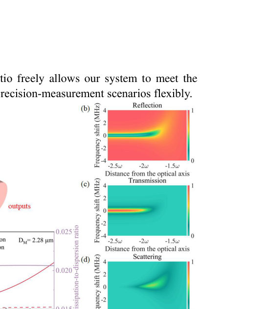
<figcaption class="paper-figure-caption"><b>Fig 1.</b> FIG. 1. Optomechanical system with tunable dispersive and dissipative coupling. (a)</figcaption>
</figure>
<figure class="paper-figure-card">
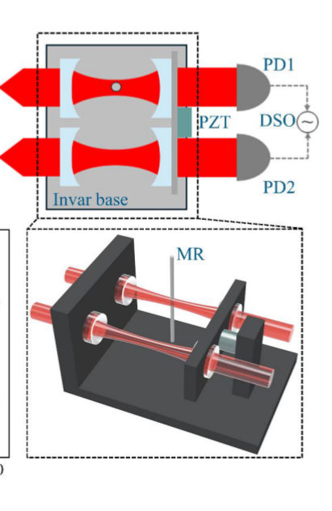
<figcaption class="paper-figure-caption"><b>Fig 2.</b> FIG. 2. Schematic description of the experimental setup. (a) Simplified diagram of the setup;</figcaption>
</figure>
<figure class="paper-figure-card">
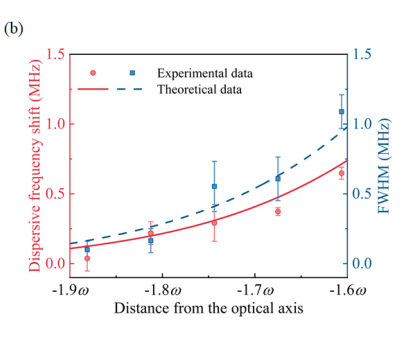
<figcaption class="paper-figure-caption"><b>Fig 3.</b> FIG. 3. Dispersive frequency shift of the cavity mode resonant frequency and the linewidth of</figcaption>
</figure>
<figure class="paper-figure-card">
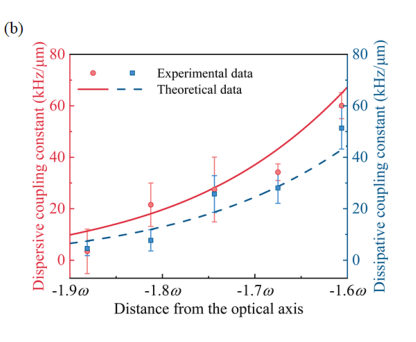
<figcaption class="paper-figure-caption"><b>Fig 4.</b> FIG. 4. Dissipative and dispersive coupling strengths as the mechanical resonator is gradually</figcaption>
</figure>

**Summary.** The paper presents an optomechanical system using a Fabry-Perot cavity coupled to a mechanical resonator, demonstrating unprecedented control over the coupling regime. By manipulating the physical parameters of the mechanical element, the authors can continuously tune the ratio between dissipative and dispersive couplings across several orders of magnitude. This capability makes it a powerful tool for investigating quantum phenomena in massive mechanical resonators.

**Why it may be interesting.** This work provides a versatile, highly controllable platform for studying open quantum systems dynamics, allowing precise tuning between dissipation-dominated and dispersion-dominated regimes, which is crucial for ground state cooling research.

Detailed structure

**Main problem.** The goal is to develop an optomechanical system capable of continuously tuning both dissipative and dispersive couplings to explore quantum effects.

**Main result.** The authors demonstrated the ability to tune the coupling ratio from dissipation-dominated ($	ext{ratio} > 1$) to dispersion-dominated ($	ext{ratio} < 1$) regimes using a single experimental platform.

**Method.** The study combines theoretical modeling using transfer matrices with experimental measurements on an optomechanical setup involving a Fabry-Perot cavity and a movable mechanical resonator.

**Model / system.** The physical system is an optomechanical device comprising a Fabry-Perot cavity coupled to a string mechanical resonator. The coupling strength is controlled by varying the resonator's diameter, material, and position relative to the cavity field.

**Key observables.** Dissipative coupling constant ($g_\gamma$), dispersive coupling constant ($g_\omega$), and their ratio ($	ext{ratio} = g_\gamma / g_\omega$).

**Important parameters / regimes.** The theoretical tuning range for the coupling ratio spans from 25 down to 0.02, covering over three orders of magnitude.

**Assumptions / limitations.** In the advanced analysis sections, assumptions include treating the MR interaction as a 'shadow effect' and approximating beam waists at different points along the cavity.

**Figures summary.** Figures illustrate the schematic setup for tunable coupling (Fig. 1), stability improvement using dual-cavity techniques (Fig. 2), measured trends of linewidth and frequency shift vs. position (Fig. 3), and calculated coupling strengths (Fig. 4).

**Paper structure.** The paper progresses from establishing the physical platform and theoretical framework (transfer matrices, coupling definitions) to presenting experimental results showing tunable regimes using different resonators, and finally detailing advanced analytical derivations for field propagation through dielectric media.

Abstract

We demonstrate an optomechanical system with tunable dissipative and dispersive couplings using a Fabry-Perot cavity and a string mechanical resonator. By varying the diameter and material of the mechanical resonator, and the relative location between the mechanical resonator and the cavity, the relative strengths of dissipative and dispersive coupling could be tuned continuously from dissipation-dominated regime to dispersion-dominated regime. In our experiments, the dissipative-to-dispersive coupling ratios of 1.3 and 0.6 are achieved by using two different mechanical resonators, corresponding to a transition from dissipation-dominated to dispersion-dominated optomechanical system. Theoretically, the coupling ratio could be tuned from 25 to 0.02 by optimizing the mechanical resonator, spanning over three orders of magnitude. These two distinct coupling regimes are achieved with the same experimental platform. The capability to freely adjust the coupling ratio provides a versatile platform for exploring quantum effects of massive mechanical resonators and quantum-limited measurements.

[↑ back to top](#top)

### [Sensitivity Enhancement near High-Order Exceptional Points via Dissipative Couplings](http://arxiv.org/abs/2606.10865v1)

**Authors:** Yuanjie Zhang, Jiaojiao Li, Zhihuang Luo  
**Type:** both · **Category:** other · **PDF:** <https://arxiv.org/pdf/2606.10865v1>  
**Analysis basis:** full PDF text, analyzed in chunks
**Topic relevance:** `analog quantum simulation` **3/5** · `correlated / nonlocal dissipation` **3/5** · `driven-dissipative phase transition` **3/5** · `methods for driven-dissipative` **3/5** · `non-equilibrium universality` **2/5** · `quantum optics experiment` **2/5** · `Keldysh / 2PI / non-Gaussian methods` **1/5** · `Kondo & dissipative impurity` **1/5** · `Tavis-Cummings & cavity-many-emitter` **1/5** · `correlated cavity matter` **1/5** · `entanglement & information structure` **1/5** · `non-equilibrium dynamics` **1/5**

↔ Scroll figures horizontally

<figure class="paper-figure-card">
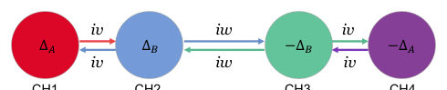
<figcaption class="paper-figure-caption"><b>Fig 1.</b> FIG. 1. Schematic of a four-channel dissipative cou- pling model. Four optical channels with eigenfrequencies (∆A,∆B,−∆B,−∆A) are arranged in a chain and coupled dis- sipatively to their nearest neighbors with coupling strengths (iv, iw, iv).</figcaption>
</figure>
<figure class="paper-figure-card">
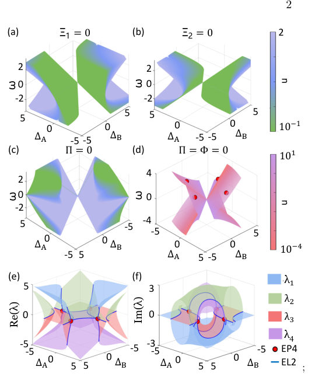
<figcaption class="paper-figure-caption"><b>Fig 2.</b> FIG. 2. (a-c) Second-order EVs consisting of three hypersur- faces: Ξ1 = 0, Ξ2 = 0 and Π = 0 defined in the 4D parameter space {∆A, ∆B, v, w}, where v = uw. The colorbar represents the value of u. (d) Fourth-order ESs determined by the inter- section of two hypersurfaces Π = 0 and Φ = 0. The red points mark the locations of fourth-order EPs, corresponding to the fixed parameters used in (e) and (f). (e) and (f) Real and imaginary parts of complex eigenvalues λj (j = 1, 2, 3, 4) for fixed v = √</figcaption>
</figure>
<figure class="paper-figure-card">
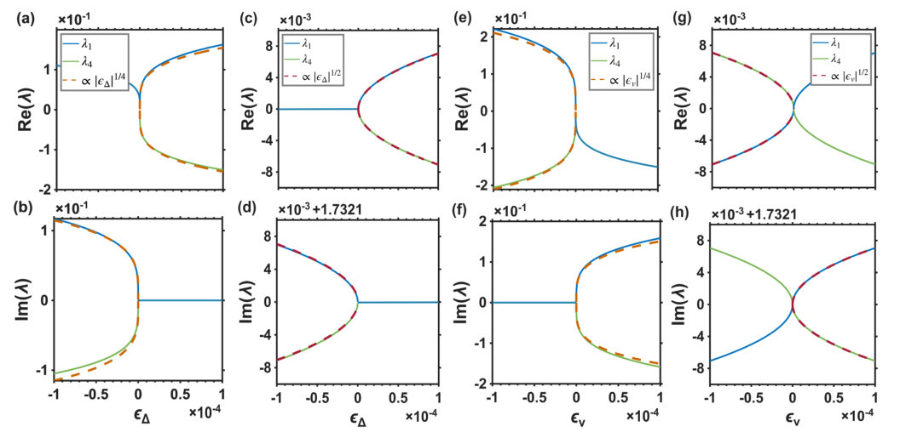
<figcaption class="paper-figure-caption"><b>Fig 3.</b> FIG. 3. Real and imaginary parts of the maximum and minimum eigenvalues λ1 and λ4 versus the eigenfrequency disturbance ϵ∆(a-d) and the coupling disturbance ϵv (e-h) near EPs. In (a), (b), (e), and (f), the system is tuned to a fourth-order EP with parameters ∆A = 3, ∆B = 1, v = √</figcaption>
</figure>
<figure class="paper-figure-card">
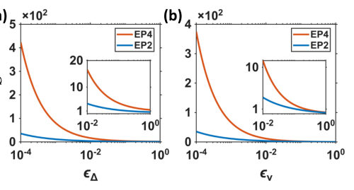
<figcaption class="paper-figure-caption"><b>Fig 4.</b> FIG. 4. Sensitivity enhancement factor S as a function of the applied eigenfrequency disturbance ϵ∆(a) and the cou- pling disturbance ϵv (b). The red and blue solid curves repre- sent the sensitivity enhancement factors near the fourth- and second-order EPs, respectively.</figcaption>
</figure>
<figure class="paper-figure-card">
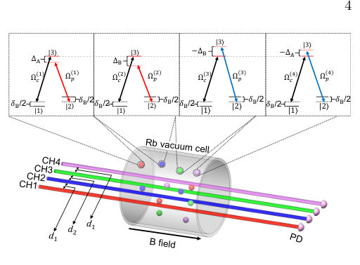
<figcaption class="paper-figure-caption"><b>Fig 5.</b> FIG. 5. Scheme for implementing a fourth-order non- Hermitian model using a thermal 87Rb atomic-vapor cell. Four optical channels are arranged in a chain with alternating spacings (d1, d2, d1), each consisting of a spatially overlapped strong control beam and a weak probe beam. Within each channel, the atoms realize a standard Λ-type EIT involving two ground states |1⟩and |2⟩and an excited state |3⟩. The strong control fields with Rabi frequencies Ω(i) c for i = 1, 2, 3, 4 drive the transitions |1⟩→|3⟩, while the weak probe fields with Rabi frequencies Ω(i) p are on near resonance with the transitions |2⟩→|3⟩. The frequency differences between the control and probe fields are ∆A, ∆B, −∆B,...</figcaption>
</figure>

**Summary.** The paper proposes using a four-channel dissipative coupling model in an atomic system to achieve highly sensitive quantum sensing by exploiting high-order Exceptional Points (EPs). It demonstrates that fourth-order EPs offer superior sensitivity scaling compared to second-order EPs. Crucially, the work also analyzes the noise robustness trade-off, providing a comprehensive guide for realizing such sensors.

**Why it may be interesting.** This work directly applies advanced concepts from non-Hermitian physics (EPs) to a tangible AMO platform (cold atoms/EIT), providing quantitative metrics for sensing performance enhancement while also addressing the crucial issue of noise robustness, which is vital for experimental realization.

Detailed structure

**Main problem.** The primary challenge is developing highly sensitive quantum sensing schemes by exploiting high-order Exceptional Points (EPs) in non-Hermitian systems while overcoming the experimental difficulty of tuning to isolated, extremely sensitive points.

**Main result.** The proposed four-channel dissipative coupling model supports fourth-order EPs over a broad parameter range, exhibiting significantly higher sensitivity enhancement compared to second-order EPs for small disturbances.

**Method.** The analysis involves deriving an effective Hamiltonian from the system's dynamics (governed by master equations) and calculating the eigenvalue splitting ($\Delta\lambda$) near EP crossings using perturbation theory.

**Model / system.** The model is a four-channel dissipative coupling system realized in a thermal atomic vapor cell using Electromagnetically Induced Transparency (EIT). The dynamics are governed by an effective Hamiltonian derived from the full master equation for ground-state coherences.

**Key observables.** Sensitivity enhancement factor ($S$), eigenvalue splittings ($\Delta\lambda \propto |\epsilon|^{1/4}$ vs. $|\epsilon|^{1/2}$), and relative error ($E_r$) near EPs.

**Important parameters / regimes.** Laser detunings ($\Delta_A, \Delta_B$), coupling strengths ($
u, \omega$), disturbance parameters ($\epsilon_{\Delta}, \epsilon_{v}$), and the order of the EP (second vs. fourth).

**Assumptions / limitations.** The analysis relies on adiabatic elimination of excited states in the EIT process; a later section notes that higher-order EPs are more susceptible to noise than second-order EPs.

**Figures summary.** Figures illustrate the schematic model, the hypersurfaces defining different EP orders (Fig. 2), the scaling of eigenvalue splittings ($\propto |\epsilon|^{1/4}$ vs. $\propto |\epsilon|^{1/2}$) (Fig. 3), and comparisons of sensitivity enhancement ($S$) and relative error ($E_r$) for both second- and fourth-order EPs (Figs. 4 & 6).

**Paper structure.** The paper first introduces the general non-Hermitian model and its Hamiltonian structure, then details the physical realization using a four-channel dissipative coupling in an atomic system via EIT. The core analysis compares the sensitivity scaling and robustness of fourth-order versus second-order EPs under external disturbances.

Abstract

High-order exceptional points (EPs) emerging in non-Hermitian systems have attracted broad interest for their significantly enhanced sensitivity to perturbations. However, quantum sensing schemes based on high-order EPs remain scarce, due to the experimental challenge of fine-tuning the system to such an extremely sensitive isolated point. Here we propose a four-channel dissipative coupling model that supports both fourth-order exceptional surfaces and second-order exceptional volumes. This non-Hermitian model can be realized in a thermal atomic system, and its complex energy spectra can be determined via electromagnetically induced transparency spectroscopy. The proposed model exhibits a characteristic fourth-order response to multiple physical quantities such as the laser detuning and the distance between optical channels, significantly surpassing the response of second-order EPs. We further reveal the sensitivity-robustness trade-off under experimental noise. Our work opens a route toward high-performance sensing leveraging higher-order EPs.

[↑ back to top](#top)

### [Nonreciprocal quantum rotation sensing via virtual-excitation enhancement in a spinning cavity](http://arxiv.org/abs/2606.10984v1)

**Authors:** Lu-Qi Yang, Yu-Meng Ren, Peng-Bo Li  
**Type:** theory · **Category:** other · **PDF:** <https://arxiv.org/pdf/2606.10984v1>  
**Analysis basis:** full PDF text, analyzed in chunks
**Topic relevance:** `Tavis-Cummings & cavity-many-emitter` **3/5** · `correlated cavity matter` **3/5** · `Keldysh / 2PI / non-Gaussian methods` **2/5** · `analog quantum simulation` **2/5** · `driven-dissipative phase transition` **2/5** · `methods for driven-dissipative` **2/5** · `correlated / nonlocal dissipation` **1/5** · `entanglement & information structure` **1/5** · `exotic spin models in light-matter` **1/5** · `interference shaping light` **1/5** · `non-equilibrium dynamics` **1/5** · `non-equilibrium universality` **1/5** · `quantum measurements` **1/5**

↔ Scroll figures horizontally

<figure class="paper-figure-card">
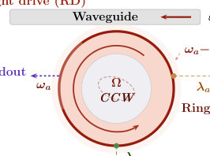
<figcaption class="paper-figure-caption"><b>Fig 1.</b> FIG. 1. Schematic of the hybrid quantum sensing system. A spinning ring microresonator is coupled to a driven two-level system (TLS, σ) via λaσ and to a bosonic mode o ∈{b, m} via the linearized cou- pling λao. (a) Left drive (LD): The CW optical mode is excited, shifting the cavity resonance to ωa +∆F (Ω). (b) Right drive (RD): The CCW optical mode is excited, shifting the cavity resonance to ωa −∆F (Ω). The two drive directions therefore realize different effective detuning configurations and follow distinct parameter tra- jectories in the SW-Bogoliubov effective Hamiltonian. Depending on the selected resonance condition, bundle emission signals may provide an auxiliary...</figcaption>
</figure>
<figure class="paper-figure-card">
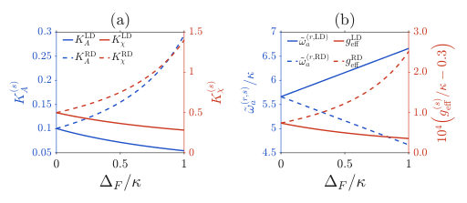
<figcaption class="paper-figure-caption"><b>Fig 2.</b> FIG. 2. SW-Bogoliubov effective parameter response to the Sagnac- Fizeau shift, with ∆ad/κ = 5.66. (a) The Schrieffer-Wolff kernels K(s) A = g2 R/∆−−g2 CR/∆+ and K(s) χ = 1/∆−−1/∆+ as func- tions of ∆F for LD (solid) and RD (dashed). The plotted kernel values are normalized by κ, i.e., the vertical axes show the dimen- sionless values of the kernels in units of κ−1. The denominators ∆± are defined in Eq. (6). (b) The corresponding Bogoliubov-dressed cavity frequency ˜ω(r,s) a and effective coupling g(s) eff . For visual clar- ity, the right vertical axis shows 104[g(s) eff /κ −0.3].</figcaption>
</figure>
<figure class="paper-figure-card">
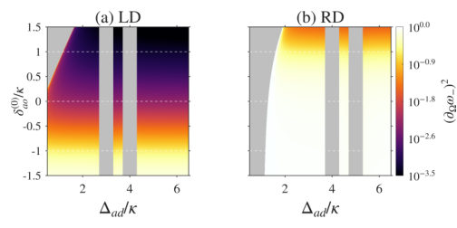
<figcaption class="paper-figure-caption"><b>Fig 3.</b> FIG. 3. Direction-dependent lower-polariton sensitivity land- scape. The color scale shows the normalized proxy QFI F (s) Q,proxy/(4t2|α|2) = [∂Ωω(s) −]2 as a function of ∆ad/κ and</figcaption>
</figure>
<figure class="paper-figure-card">

<figcaption class="paper-figure-caption"><b>Fig 4.</b> FIG. 4. Directional comparison of the lower-polariton proxy QFI. (a) Line cuts of the normalized proxy QFI F (s) Q,proxy/(4t2|α|2) =</figcaption>
</figure>
<figure class="paper-figure-card">
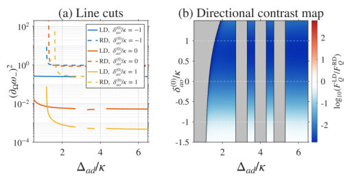
<figcaption class="paper-figure-caption"><b>Fig 5.</b> Figure 3 displays the proxy QFI landscapes for the two drive directions on the same physical parameter plane. The opposite Sagnac-Fizeau shifts lead to distinct directional dis- tributions. From the comparison between Fig. 3(a) and (b), the RD branch accesses a broader high-sensitivity region for the representative parameters used here.</figcaption>
</figure>

**Summary.** The paper details a novel method for highly sensitive rotation sensing using a spinning cavity coupled to matter qubits. By leveraging the Sagnac effect, the angular velocity modifies the system's effective Hamiltonian in a direction-dependent (nonreciprocal) manner. This modification enhances quantum sensitivity by utilizing virtual excitations, allowing for differential readout schemes that surpass standard measurement limits.

**Why it may be interesting.** This work is highly relevant to AMO physics as it combines cavity quantum electrodynamics (QED) with advanced sensing techniques. The use of virtual excitations and directional control in a superconducting/optical resonator platform represents a cutting-edge approach for realizing high-precision measurements beyond standard linear response theory.

Detailed structure

**Main problem.** The paper proposes a nonreciprocal quantum metrological scheme for estimating rotational angular velocity ($\Omega$) with high precision.

**Main result.** The rotation sensitivity is enhanced by exploiting virtual excitations generated through ultrastrong coupling, leading to an intrinsically nonreciprocal response contrast between opposite driving directions.

**Method.** The analysis uses theoretical techniques including the Schrieffer-Wolff transformation and Bogoliubov diagonalization to derive effective Hamiltonians and calculate the Quantum Fisher Information (QFI).

**Model / system.** The system is a hybrid light-matter platform: a spinning ring cavity coupled to a two-level system (TLS) and an auxiliary bosonic mode. The Sagnac effect converts $\Omega$ into a direction-dependent detuning that modifies the effective light-matter dressing.

**Key observables.** Quantum Fisher Information ($QFI(\Omega)$), lower-polariton spectral response ($\omega_{-}(\Omega)$), and bundle emission coincidence counting rates.

**Important parameters / regimes.** Angular velocity ($\Omega$), Sagnac-Fizeau shift ($\Delta F(\Omega)$), ultrastrong coupling regime, and the directionality parameter ($s=\pm 1$).

**Assumptions / limitations.** The analysis assumes operation in the dispersive regime ($|\Delta_{\pm}(\Omega)| \gg \lambda_{a\sigma}$) and utilizes approximations for QFI based on projecting onto the lower-polariton branch.

**Figures summary.** Figures illustrate the sensing chain ($\Omega 	o \Delta F(\Omega) 	o H_{	ext{eff}} 	o QFI$), showing $	ext{QFI}_{	ext{proxy}}$ landscapes that demonstrate distinct, nonreciprocal distributions for opposite drive directions (RD vs. LD).

**Paper structure.** The paper systematically derives the effective Hamiltonian using sequential transformations (Schrieffer-Wolff followed by Bogoliubov), calculates the resulting polariton eigenfrequencies and coupling strengths, quantifies sensitivity via QFI, and finally analyzes the nonreciprocal contrast achievable through differential readout.

Abstract

Quantum sensing with high precision and sensitivity plays an important role in quantum technologies and quantum information processing. Here, we propose a nonreciprocal quantum metrological scheme for estimating rotational angular velocity in a hybrid light-matter platform, where the setup consists of a spinning ring cavity coupled to a two-level system and an auxiliary bosonic mode. Through the Sagnac effect, the angular velocity is converted into a direction-dependent detuning, which modifies the effective light-matter dressing of the hybrid system. As a result, the angular velocity is encoded not only into the renormalized hybrid-mode spectrum, but also into the virtual excitations generated by ultrastrong coupling. These virtual excitations modify the polaritonic frequency response to rotation and enhance the quantum Fisher information (QFI) associated with angular velocity estimation, without requiring direct extraction of virtual excitations. Moreover, since the Sagnac-Fizeau shift enters the virtual-transition energy denominators, the metrological response becomes intrinsically different for opposite driving directions, leading to a tunable nonreciprocal sensitivity contrast. In addition, we also discuss a readout scheme and show that bundle emission coincidence counting can serve as an auxiliary direction-dependent readout channel. Our results provide a route toward exploiting nonreciprocal light-matter dressing and virtual excitations as resources for quantum rotation sensing.

[↑ back to top](#top)

### [Quantum statistics in an extended collider coupled to a qubit](http://arxiv.org/abs/2606.11147v1)

**Authors:** Rishav Chaudhuri, Sai Satyam Samal  
**Type:** theory · **Category:** other · **PDF:** <https://arxiv.org/pdf/2606.11147v1>  
**Analysis basis:** full PDF text, analyzed in chunks
**Topic relevance:** `measurement-induced transitions` **3/5** · `methods for driven-dissipative` **3/5** · `quantum measurements` **3/5** · `Kondo & dissipative impurity` **2/5** · `entanglement & information structure` **2/5** · `non-equilibrium dynamics` **2/5** · `Keldysh / 2PI / non-Gaussian methods` **1/5** · `analog quantum simulation` **1/5** · `correlated / nonlocal dissipation` **1/5** · `driven-dissipative phase transition` **1/5** · `non-equilibrium universality` **1/5**

↔ Scroll figures horizontally

<figure class="paper-figure-card">
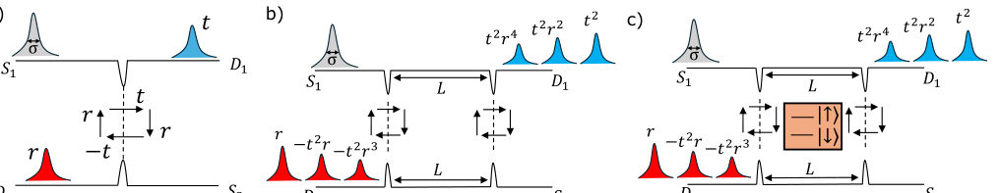
<figcaption class="paper-figure-caption"><b>Fig 1.</b> Figure 1. Mesoscopic colliders with two sources S1, S2 and two detectors D1, D2. A part of the incoming wave packet (grey- colored) is transmitted to the detector D1, transmitted wave packet (blue-colored) and other part of the incoming wave packet is reflected to the detector D2, reflected wave packet (red-colored). (a) Point-like collider with transmission and reflection amplitude given by Eq. (1). The transmitted (reflected) wave packet involves a single wavelet on the lead with detector D1 (D2). (b) Extended collider with effective transmission and reflection amplitude given by Eq. (2). In this case the reflected and the transmitted wave packet involves an infinite number of wavelets,...</figcaption>
</figure>
<figure class="paper-figure-card">
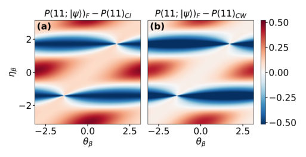
<figcaption class="paper-figure-caption"><b>Fig 2.</b> Figure 2. P(11; |ψ⟩)F −B1 and P(11; |ψ⟩)F −B2 plotted as a function of θ↓and η↓for a wave packet obeying a normal distribution with variance σ2. The following parameters have been kept fixed: |γ↑| = |γ↓| = 1 √</figcaption>
</figure>

**Summary.** The paper investigates how coupling an extended mesoscopic collider to a qubit affects the measurable mutual statistics of incoming particles. By analyzing multiple theoretical benchmarks against measured probabilities, the authors rigorously prove that only one specific benchmark correctly extracts the true quantum statistical signature. This highlights the critical dependence of physical inference on the precise measurement protocol used in nanoscale quantum experiments.

**Why it may be interesting.** This work provides a rigorous theoretical framework for interpreting quantum transport measurements in nanoscale devices, showing how measurement choice (the 'benchmark') can fundamentally alter the inferred physical statistics, which is crucial knowledge for experimentalists using mesoscopic tools.

Detailed structure

**Main problem.** The study aims to determine the correct diagnostic benchmark for extracting the mutual quantum statistics (bosonic vs. fermionic) of colliding particles when the scattering process is mediated by an extended mesoscopic collider coupled to a qubit.

**Main result.** Only a specific benchmark, $B_4 = S(11; |\psi
angle)CWP(11)CW$, faithfully captures the true mutual statistics, as other choices yield spurious results. This confirms that the correct diagnostic tool depends intricately on the collider's geometry and coupling details.

**Method.** The analysis involves deriving scattering matrices ($S_{	ext{eff}}$) for single and two-particle wave packets in the presence of a qubit, calculating post-scattering density matrices ($
ho_{	ext{sys}}$), and systematically comparing multiple theoretical benchmarks ($B_1$ through $B_4$).

**Model / system.** The system is an extended mesoscopic collider (modeled with tunneling points separated by L) coupled to a two-level impurity qubit. Scattering processes are analyzed for incoming fermionic and bosonic wave packets.

**Key observables.** Mutual statistics (bunching/anti-bunching), single-particle transmission/reflection probabilities ($P(1 	o 1)$, $P(1 	o 2)$), and the two-particle probability difference, $P(11; |\psi
angle)F - B_4$.

**Important parameters / regimes.** Orbital phase $\phi = kL$, qubit coupling parameters ($\eta_m, 	heta_m$), and the state of the post-selected qubit $|\psi
angle$.

**Assumptions / limitations.** The analysis assumes that incoming particles interact only via statistical interaction (neglecting Coulomb interactions) and relies on approximations for calculating correlation terms in the continuum limit.

**Figures summary.** Figure 1 illustrates the three physical setups: point-like, extended, and qubit-coupled. Figure 2 plots differences between calculated probabilities and benchmarks ($B_1, B_2$) to demonstrate statistical transmutation.

**Paper structure.** The paper progresses by first establishing the effective scattering matrices for the coupled system (Eqs. 1-3), then calculating single-particle and two-particle probabilities dependent on the qubit state ($
ho_{	ext{sys}}$). The core of the work is a systematic comparison of multiple statistical benchmarks ($B_1$ to $B_4$) to isolate the physically meaningful signature.

Abstract

Mesoscopic colliders provide an effective platform for probing the mutual statistics of quantum particles. Recent experiments have successfully extracted the mutual statistics of fermions, and more exotic anyons using quantum point contacts (QPCs). Coupling a point-like collider, such as a quantum point contact, to a two-level impurity or qubit can induce statistical transmutation of fermions, causing them to display boson-like bunching tendencies. Here, we extend the analysis to an extended collider. We investigate the scattering of two incoming fermionic and bosonic wave packets in the presence of post-selection on the impurity state, and systematically analyze the possible benchmarks used to characterize bunching and infer the underlying mutual statistics. We show that only a specific benchmark faithfully captures the mutual statistics of the colliding particles, while alternative choices can produce spurious statistical signatures. Hence, the correct benchmark for probing the quantum statistics depends on the intricate details of the mesoscopic collider.

[↑ back to top](#top)

### [Generating functions for aggregation and fragmentation: review](http://arxiv.org/abs/2606.10785v1)

**Authors:** S. A. Matveev  
**Type:** theory · **Category:** statistical mechanics · **PDF:** <https://arxiv.org/pdf/2606.10785v1>  
**Analysis basis:** full PDF text, analyzed in chunks
**Topic relevance:** `Keldysh / 2PI / non-Gaussian methods` **3/5** · `methods for driven-dissipative` **3/5** · `analog quantum simulation` **2/5** · `correlated / nonlocal dissipation` **2/5** · `driven-dissipative phase transition` **2/5** · `non-equilibrium dynamics` **2/5** · `non-equilibrium universality` **2/5** · `Kondo & dissipative impurity` **1/5** · `entanglement & information structure` **1/5** · `scars & prethermalization` **1/5**

↔ Scroll figures horizontally

<figure class="paper-figure-card">
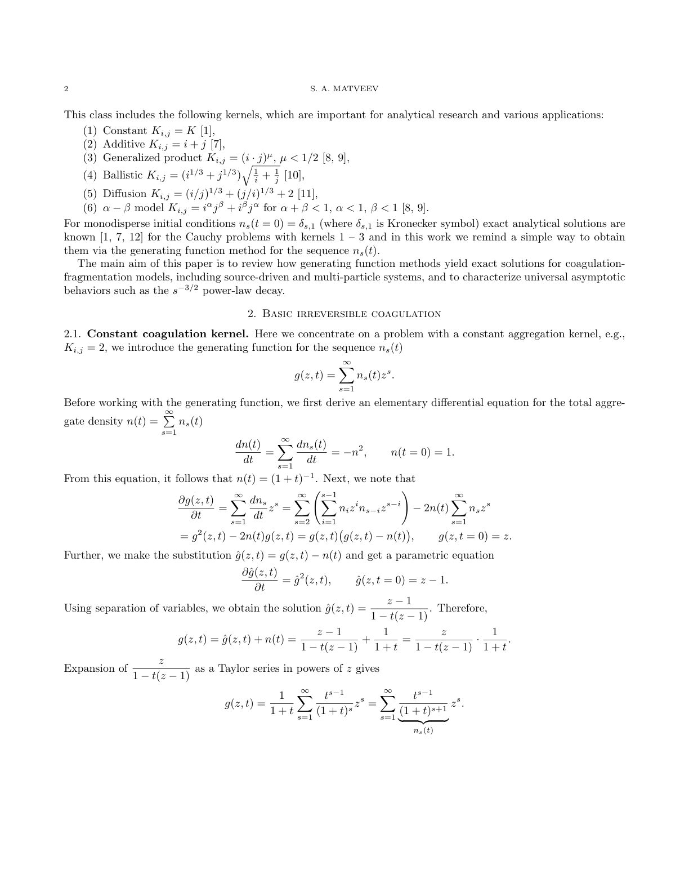
<figcaption class="paper-figure-caption"><b>Fig 1.</b> Low-resolution page preview, page 2</figcaption>
</figure>
<figure class="paper-figure-card">
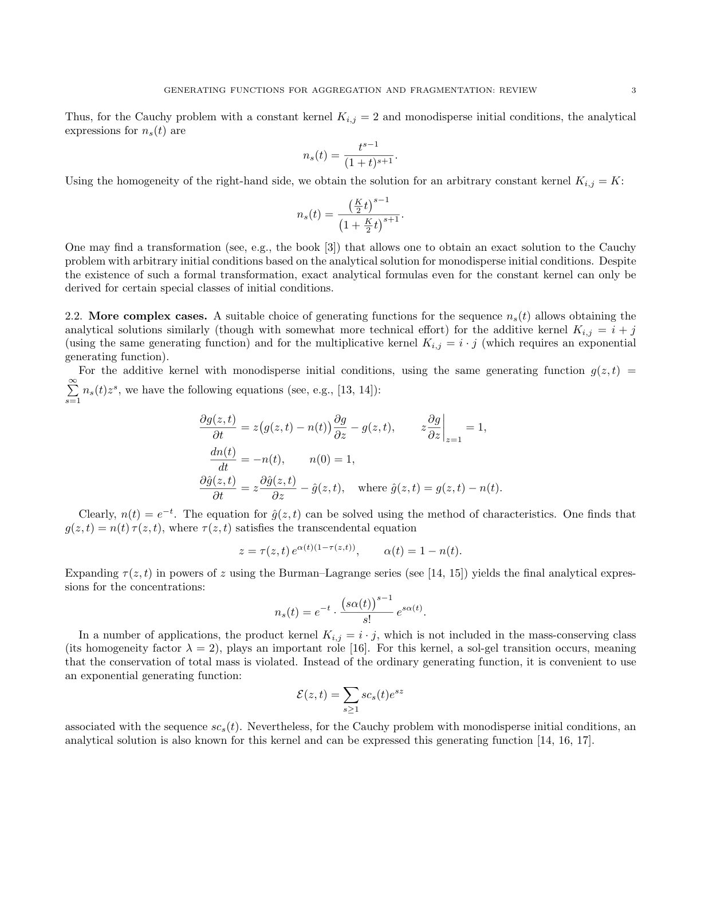
<figcaption class="paper-figure-caption"><b>Fig 2.</b> Low-resolution page preview, page 3</figcaption>
</figure>
<figure class="paper-figure-card">
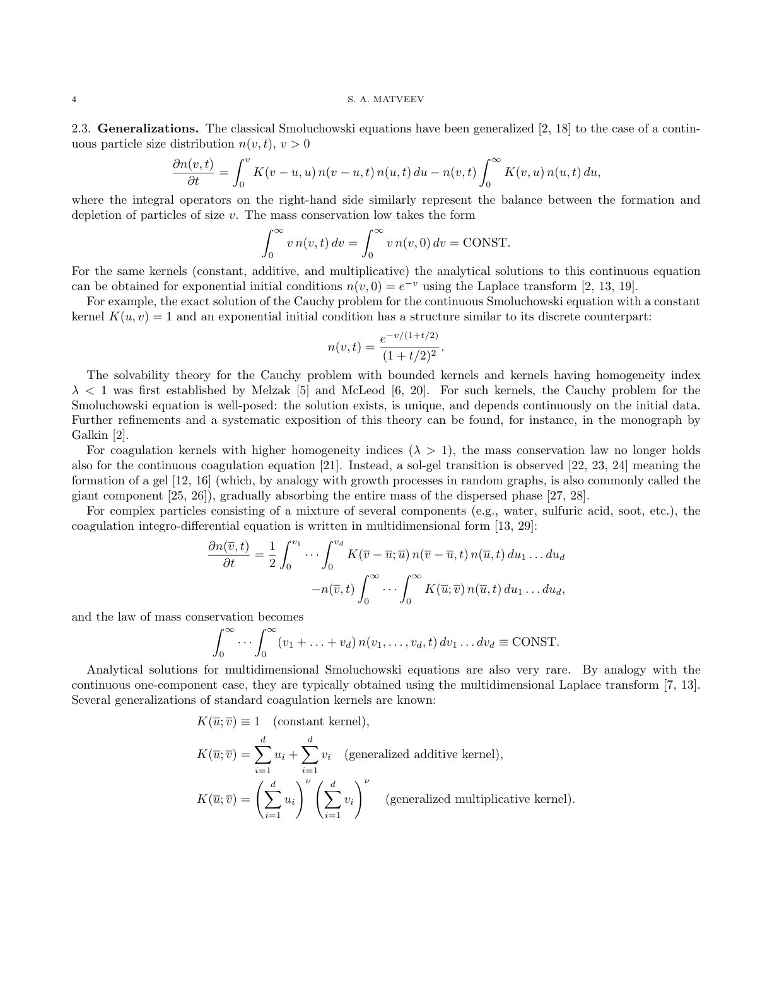
<figcaption class="paper-figure-caption"><b>Fig 3.</b> Low-resolution page preview, page 4</figcaption>
</figure>
<figure class="paper-figure-card">
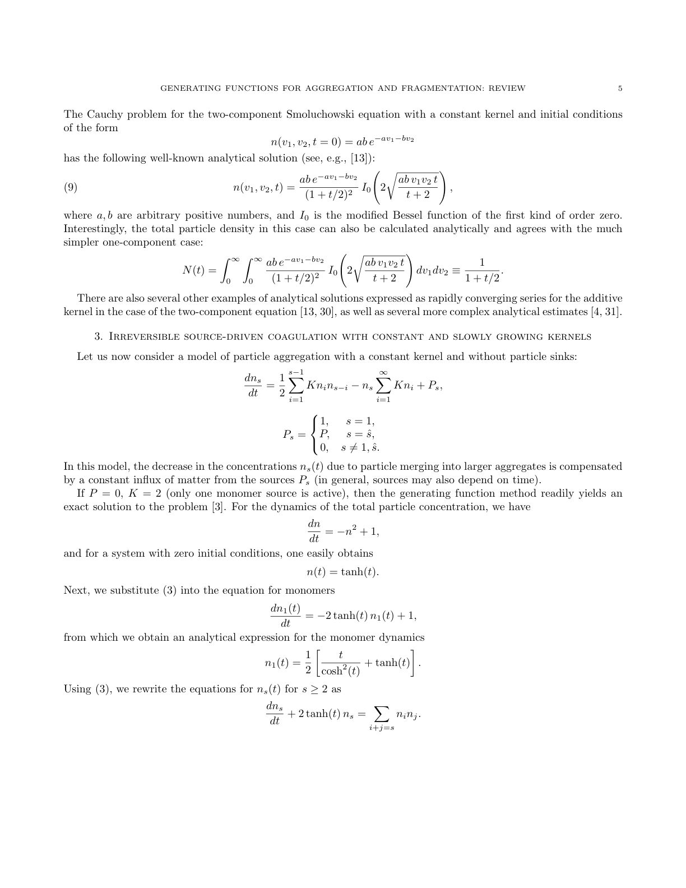
<figcaption class="paper-figure-caption"><b>Fig 4.</b> Low-resolution page preview, page 5</figcaption>
</figure>
<figure class="paper-figure-card">
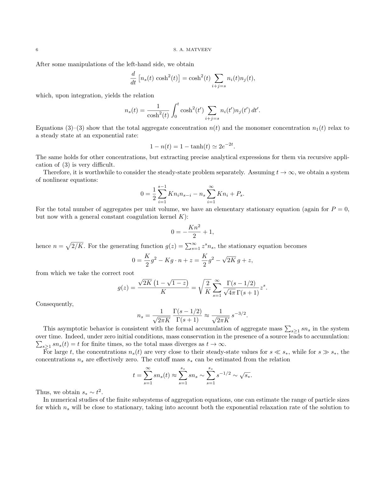
<figcaption class="paper-figure-caption"><b>Fig 5.</b> Low-resolution page preview, page 6</figcaption>
</figure>

**Summary.** This review surveys advanced mathematical techniques, particularly generating functions, used to solve kinetic equations describing particle aggregation and fragmentation. It provides analytical solutions for several idealized physical models, establishing universal scaling behaviors like $s^{-3/2}$ decay in steady states. The work is crucial for understanding non-equilibrium dynamics in systems ranging from aerosols to planetary rings.

**Why it may be interesting.** While focused on classical kinetics, the rigorous mathematical techniques—solving complex nonlinear differential equations derived from conservation laws—are highly relevant to open quantum systems dynamics where master equations govern evolution.

Detailed structure

**Main problem.** The paper reviews generating function techniques used to find exact analytical solutions for aggregation and fragmentation equations across various physical regimes.

**Main result.** It derives explicit closed-form solutions for specific discrete coagulation models and establishes universal asymptotic power-law decays ($s^{-3/2}$) in source-driven systems.

**Method.** The primary method involves using generating functions, Laplace transforms, and solving the resulting nonlinear differential equations derived from Smoluchowski-type kinetic equations.

**Model / system.** The models are aggregation and fragmentation processes (coagulation-fragmentation kinetics), described by master or rate equations for particle size distributions $n_s(t)$. These cover discrete, continuous, two-component, and source-driven systems.

**Key observables.** Concentration functions $n_s(t)$ or $n(v, t)$, total aggregate density $n(t)$, and steady-state power-law decay exponents.

**Important parameters / regimes.** Aggregation kernels ($K_{i,j}$), source terms ($P_s$), homogeneity index ($\lambda$), and system dimensionality (number of components).

**Assumptions / limitations.** The Smoluchowski equations assume spatial uniformity; exact analytical solutions are generally restricted to specific, simplified kernel forms or initial conditions.

**Paper structure.** The paper systematically reviews the mathematical framework by introducing generating functions for various kinetic models (discrete, continuous, multi-particle). It then presents derivations and explicit solutions for idealized cases before discussing general asymptotic behaviors and limitations.

Abstract

In this work, we review and revisit the generating function techniques that provide exact analytical solutions for aggregation and fragmentation equations across several physical regimes including spontaneous and collisonal shattering. For discrete coagulation-fragmentation equations with size-independent rates under monodisperse initial conditions, we show the derivation of sevaral explicit closed-form solutions. We also briefly report the exact solutions for continuous, three-particle, $D$-particle collisions and two-component generalizations. Source-driven aggregation yields steady distributions featuring a universal $s^{-3/2}$ power-law decay and a cutoff mass scaling $s_{*} \sim t^{2}$.

[↑ back to top](#top)

### [Jittery Quantum Boomerang Effect](http://arxiv.org/abs/2606.10067v1)

**Authors:** Pedro Dornelas, Gerson J. Ferreira  
**Type:** theory · **Category:** disordered systems and neural networks · **PDF:** <https://arxiv.org/pdf/2606.10067v1>  
**Analysis basis:** full PDF text, analyzed in chunks
**Topic relevance:** `non-equilibrium dynamics` **3/5** · `spintronics-quantum-optics interface` **3/5** · `Keldysh / 2PI / non-Gaussian methods` **2/5** · `driven-dissipative phase transition` **2/5** · `methods for driven-dissipative` **2/5** · `non-equilibrium universality` **2/5** · `Kondo & dissipative impurity` **1/5** · `analog quantum simulation` **1/5** · `correlated / nonlocal dissipation` **1/5** · `exotic spin models in light-matter` **1/5** · `scars & prethermalization` **1/5**

↔ Scroll figures horizontally

<figure class="paper-figure-card">
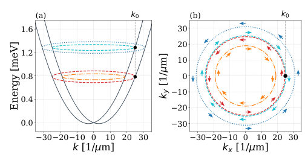
<figcaption class="paper-figure-caption"><b>Fig 1.</b> Figure 1. (a) Band structure of the clean Rashba 2DEG, showing the spin-orbit-split bands. The black dots illustrate the initial condition |k0, ↑⟩= (|k0, +⟩+|k0, −⟩)/ √</figcaption>
</figure>
<figure class="paper-figure-card">
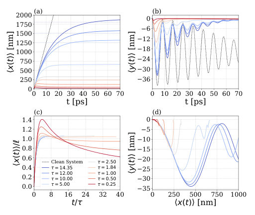
<figcaption class="paper-figure-caption"><b>Fig 2.</b> Figure 3. Numerical jittery quantum boomerang dynam- ics for ensemble-averaged trajectories at different disorder strengths W, color coded by their corresponding values of τ. (a) Longitudinal displacement ⟨x(t)⟩showing the marginal quantum boomerang effect. For weak disorder, ⟨x(t)⟩shows a Drude-like relaxation approaching ⟨x(∞)⟩= ℏk0τ/m (dashed colored lines), consistent with WAL, whereas for strong disor- der it shows a partial boomerang-like U-turn toward the ori- gin, compatible with Anderson localization. (b) Transverse displacement ⟨y(t)⟩showing transient Zitterbewegung that vanishes at long times t ≫τ. (c) Trajectories from panel (a), with the axes scaled by the mean free path ℓ≈v0τ...</figcaption>
</figure>
<figure class="paper-figure-card">
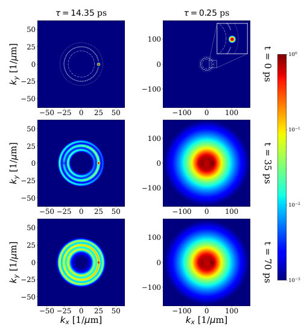
<figcaption class="paper-figure-caption"><b>Fig 3.</b> Figure 2. Ensemble-averaged k space time evolution of |ψ(k, t)|2, for illustrative times t in each row. The color scale for |ψ(k, t)|2 is logarithmic and normalized by the max- imum value at each time. Data on the left and right panels correspond to the weak- and strong-scattering regimes, with τ = 14.35 ps and τ = 0.25 ps, respectively. On the top panels (t = 0), the dashed circles indicate the constant energy con- tours from Fig. 1(b). On the top right panel, the inset zooms into the initial packet.</figcaption>
</figure>
<figure class="paper-figure-card">
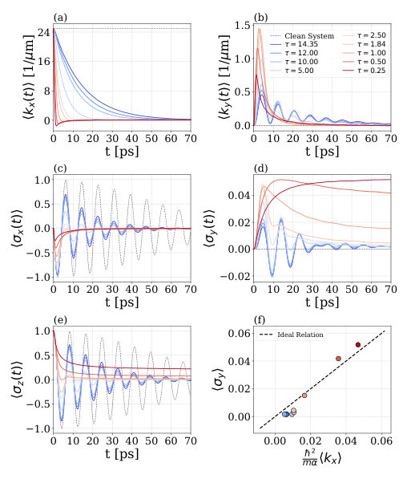
<figcaption class="paper-figure-caption"><b>Fig 4.</b> Figure 4. (a,b) Ensemble-averaged dynamics of momentum ⟨kx(t)⟩and ⟨ky(t)⟩, and (c-e) spin ⟨σx(t)⟩, ⟨σy(t)⟩, and ⟨σz(t)⟩. Data for different disorder strengths W are color coded and identified by their values of τ. The transition from weak to strong disorder is seen in the disappearance of oscillations in ⟨ky(t)⟩and in the negative dip of ⟨kx(t)⟩, which leads to the partial quantum boomerang effect observed in ⟨x(t)⟩in Fig. 3. The spin dynamics show similar behavior, with oscil- lations vanishing for strong disorder. Both ⟨kx(t)⟩and ⟨ky(t)⟩ show exponential relaxation at long times as disorder scatter- ing isotropizes the momentum distribution. However, only ⟨ky(t)⟩reaches zero...</figcaption>
</figure>

**Summary.** This paper analyzes the time evolution of spin-polarized electrons in a disordered Rashba 2DEG to reveal a 'jittery quantum boomerang effect.' The authors show that longitudinal motion transitions from WAL behavior toward Anderson localization, while transverse motion is forced back to zero by symmetry constraints. This work bridges concepts from SOC physics, disorder effects, and non-equilibrium dynamics.

**Why it may be interesting.** The study provides a detailed real-time picture of transport phenomena (WAL $	o$ localization) driven by SOC and disorder, offering insights into how symmetry dictates long-term quantum dynamics in mesoscopic systems.

Detailed structure

**Main problem.** The study investigates the real-time dynamics of a spin-polarized wave packet in a disordered Rashba two-dimensional electron gas to identify a 'jittery quantum boomerang effect.'

**Main result.** The system exhibits distinct longitudinal and transverse return mechanisms: longitudinal motion shows a crossover from Weak Antilocalization (WAL) to Anderson localization, while transverse motion returns to zero due to symmetry constraints.

**Method.** The analysis combines numerical simulations using Chebyshev expansion with analytical derivations based on the quantum kinetic equation in both weak and strong disorder regimes.

**Model / system.** The model is a spin-polarized wave packet propagating in a disordered Rashba 2DEG, governed by a Hamiltonian including Rashba SOC and random on-site potentials. The dynamics are tracked via expectation values of position, momentum, and spin polarization.

**Key observables.** Time evolution of displacements ($\langle x(t) 
angle$, $\langle y(t) 
angle$), momentum ($\langle k_x(t) 
angle$), and spin components ($\langle \sigma_{x,y,z}(t) 
angle$).

**Important parameters / regimes.** Disorder strength ($W$), scattering time ($	au$), SOC strength ($\alpha$), and the weak-scattering limit.

**Assumptions / limitations.** The analysis relies on asymptotic constraints derived from Anderson localization for strong disorder, and approximations like the quasi-particle picture in the weak-disorder regime.

**Figures summary.** Figures illustrate k-space probability density evolution across different scattering regimes (weak vs. strong) and show time traces of displacements ($\langle x(t) 
angle$, $\langle y(t) 
angle$) demonstrating the boomerang effect.

**Paper structure.** The paper develops equations of motion for position, momentum, and spin in the weak-disorder limit using the quantum kinetic equation. It then analyzes the asymptotic behavior under strong disorder constraints to explain the full 'boomerang' reversal mechanism.

Abstract

We study the dynamics of a spin-polarized wave packet in a disordered Rashba two-dimensional electron gas and identify a jittery quantum boomerang effect in which longitudinal and transverse motion return to the origin through fundamentally distinct mechanisms. Starting from an initial state with finite momentum along $x$ and spin polarized along $z$, we calculate the time evolution by combining a Chebyshev expansion of the time-evolution operator with a disorder ensemble average. In the weak-scattering regime, equations of motion derived from the quantum kinetic equation reproduce the numerical trends and show that impurity scattering acts as a viscous damping mechanism that suppresses the transient Zitterbewegung and drives the transverse displacement back to $y=0$ at long times. In contrast, the longitudinal dynamics show a Drude-like saturation at weak disorder. These results are consistent with the vanishing intrinsic spin Hall conductivity in the disordered Rashba model and with experimental observations of a transient intrinsic spin Hall effect in the time-domain. As disorder increases, the longitudinal dynamics evolve to a partial return toward the origin, which signals a transition from weak antilocalization to Anderson localization in 2D.

[↑ back to top](#top)

### [Non-Hermitian scattering in SSH superconducting waveguides: exact Green-function reduction and dimerization-sensitive microwave functionalities](http://arxiv.org/abs/2606.10555v1)

**Authors:** Jie Zhou, Xiao-Xue Zhang, Xi-Zheng Zhang  
**Type:** theory · **Category:** other · **PDF:** <https://arxiv.org/pdf/2606.10555v1>  
**Analysis basis:** full PDF text, analyzed in chunks
**Topic relevance:** `driven-dissipative phase transition` **3/5** · `interference shaping light` **3/5** · `methods for driven-dissipative` **3/5** · `non-equilibrium dynamics` **2/5** · `non-equilibrium universality` **2/5** · `Keldysh / 2PI / non-Gaussian methods` **1/5** · `Kondo & dissipative impurity` **1/5** · `analog quantum simulation` **1/5** · `correlated / nonlocal dissipation` **1/5** · `correlated cavity matter` **1/5**

↔ Scroll figures horizontally

<figure class="paper-figure-card">
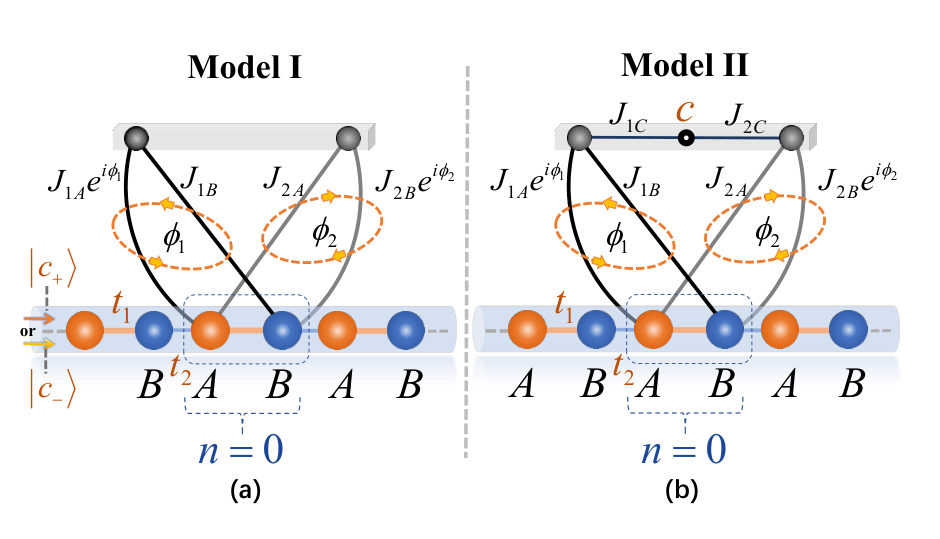
<figcaption class="paper-figure-caption"><b>Fig 1.</b> FIG. 1. Unified superconducting-circuit schematics of the two non-Hermitian SSH scattering devices studied in this work. Panel (a) shows Model I, a parallel two-qubit interferometric scatterer in which both qubits couple directly to the A and B resonators of the same SSH unit cell and enclose a synthetic Aharonov–Bohm flux. In the symmetric geometry the natural contact combinations |c±⟩= (|A⟩± |B⟩)/ √</figcaption>
</figure>
<figure class="paper-figure-card">
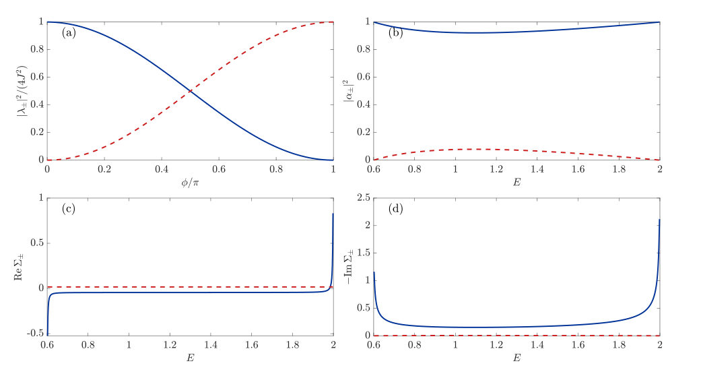
<figcaption class="paper-figure-caption"><b>Fig 2.</b> FIG. 2. Channel decomposition of the symmetric Model-I interferometer. The parameters are t = 1, δ = 0.30, J = 0.20, and ϕ0 = 0.35π. Panel (a) shows the flux-controlled molecular couplings |λ±(ϕ)|2/(4J2). Panel (b) plots the upper-band contact- channel projections |α±(k)|2 and demonstrates that the incoming Bloch spinor remains strongly biased toward the symmetric contact channel. Panels (c) and (d) display the real and imaginary parts of Σ(I) ± (E) at ϕ = 0.35π. Even when the molecular couplings become comparable, the + branch still carries most of the dispersive pull and most of the radiative width, while the −branch stays almost lossless. The figure therefore shows that the bright/dark...</figcaption>
</figure>
<figure class="paper-figure-card">
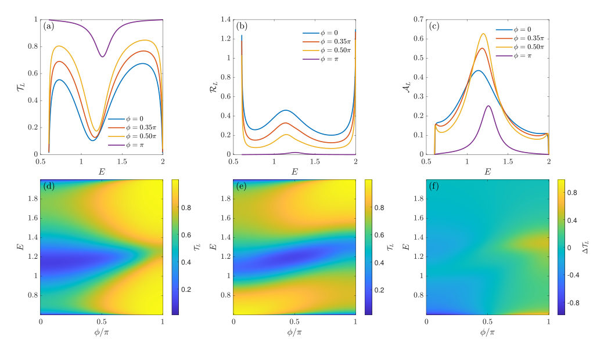
<figcaption class="paper-figure-caption"><b>Fig 3.</b> FIG. 3. Representative passive scattering spectra of Model I. The parameters are t = 1, J = 0.20, ωq = 1.20, and γ1 = γ2 = −0.10. Panels (a)–(c) show the left-incidence transmittance TL, reflectance RL, and absorptance AL in the upper SSH band for ϕ = 0, 0.35π, 0.50π, and π, at fixed dimerization δ = +0.30. The line cuts reveal a broad bright-channel stop feature at small flux and a progressively sharper quasi-dark resonance as the weak molecular branch is opened. Panels (d) and (e) display the flux–energy maps of TL(E, ϕ) for δ = +0.30 and δ = −0.30, respectively, while panel (f) plots the difference ∆TL = TL(δ = +0.30) −TL(δ = −0.30). The sign-changing lobe pattern around the dressed...</figcaption>
</figure>
<figure class="paper-figure-card">
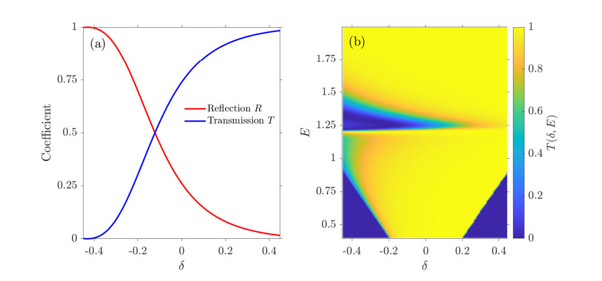
<figcaption class="paper-figure-caption"><b>Fig 4.</b> FIG. 4. Dimerization-dependent scattering response of Model I. The parameters are t = 1, J = 0.20, ωq = 1.20, and γ1 = −γ2 = −0.05. (a) left-incidence transmittance TL, reflectance RL, as functions of the SSH dimerization parameter δ at the representative switching energy Esw ≃1.32 and synthetic flux ϕ = π. The transport response evolves continuously with δ, exhibiting a crossover from reflection-dominated to transmission-dominated behavior as the SSH dimerization is varied. (b) density map of the transmission coefficient TL(E, δ) in the energy–dimerization plane.</figcaption>
</figure>
<figure class="paper-figure-card">
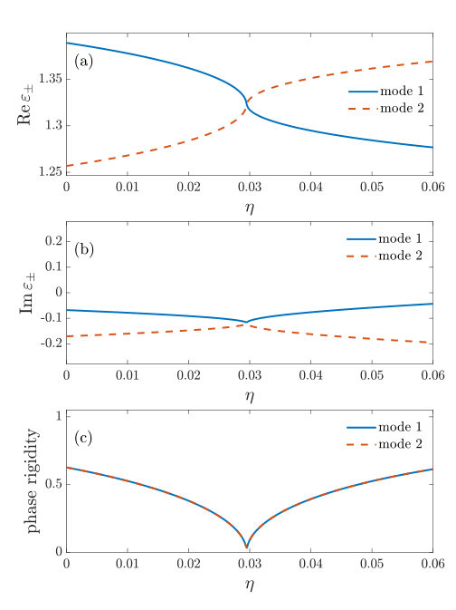
<figcaption class="paper-figure-caption"><b>Fig 5.</b> FIG. 5. Near-EP diagnostics for Model I. The figure leaves the perfectly symmetric bright/dark limit and uses the represen- tative asymmetric parameter set t = 1, δ = 0.30, E∗= 0.75, (J1A, J1B, J2A, J2B) = (0.185, 0.184, 0.250, 0.254), (ϕ1, ϕ2) = (0.150π, 0.413π), and (ω1, ω2) = (1.242, 1.465). The balanced gain/loss strengths are swept as γ1 = +η and γ2 = −η. Pan- els (a) and (b) show the real and imaginary parts of the two eigenvalues of H(I) eff (E∗), while panel (c) displays the biorthog- onal phase rigidities. The simultaneous spectral approach and pronounced rigidity suppression identify a controlled near-EP regime generated by bright–dark hybridization once the pro- tective symmetry...</figcaption>
</figure>

**Summary.** The authors present an exact Green-function theory to study microwave scattering in superconducting circuits coupled to SSH waveguides. By integrating out the waveguide structure, they reduce the problem to a manageable effective Hamiltonian. This allows for precise control over complex non-Hermitian phenomena, enabling the design of devices that exhibit tunable filtering or controlled amplification based on topological and internal circuit parameters.

**Why it may be interesting.** This work provides a powerful, unified theoretical tool for designing superconducting quantum devices by treating topological structures not just as passive elements, but as active components that reshape non-Hermitian dynamics.

Detailed structure

**Main problem.** The paper develops an exact Green-function theory to analyze non-Hermitian single-microwave-photon scattering by finite superconducting circuits embedded within a structured Su–Schrieffer–Heeger (SSH) waveguide.

**Main result.** The framework unifies the analysis of various non-Hermitian phenomena, demonstrating how topological waveguides can be used to design complex microwave functionalities like tunable filtering and spectral separation of pole/zero responses.

**Method.** It employs an exact Green-function reduction technique to integrate out the extended SSH waveguide environment, resulting in a finite-dimensional effective non-Hermitian Hamiltonian for scattering analysis.

**Model / system.** The system consists of superconducting microwave circuits (Model I: flux-controlled two-qubit interferometer; Model II: mediator-assisted scatterer) coupled to an SSH superconducting waveguide reservoir. The physics is governed by the SSH Hamiltonian and subsequent effective Hamiltonians derived via Green's functions.

**Key observables.** Scattering amplitudes, exceptional-point diagnostics, coherent-perfect-absorption (CPA) conditions, lasing thresholds, transmission/reflection spectra, and singular values of the scattering matrix S(E).

**Important parameters / regimes.** Flux ($\phi$), dimerization parameter ($\delta$), gain/loss imbalance ($\eta$), and energy ($E$).

**Assumptions / limitations.** The analysis assumes coupling only to the central unit cell of the SSH waveguide, and relies on standard Green's function techniques for open quantum systems.

**Figures summary.** Figures illustrate schematics of Model I and Model II; spectra show how flux and dimerization control interference patterns (bright/dark branches); diagnostics map out near-EP regimes using singular values ($\sigma_{\min}, \sigma_{\max}$) in the presence of gain/loss imbalance ($\eta$).

**Paper structure.** The paper progresses by first establishing the general Green-function reduction method for open systems, then applying it to Model I (interferometer), and finally extending the analysis to Model II (mediator) to show enhanced spectral control over pole-like vs. zero-like scattering branches.

Abstract

We formulate an exact Green-function theory for non-Hermitian single-microwave-photon scattering by finite superconducting circuit subsystems embedded in an SSH waveguide. The structured SSH environment is integrated out exactly and enters the local scattering problem as an energy-dependent matrix self-energy, reducing the full open system to a finite-dimensional effective non-Hermitian Hamiltonian. This reduction places scattering amplitudes, exceptional-point diagnostics, coherent-perfect-absorption conditions, and lasing thresholds within one unified framework. Within this approach we analyze two superconducting devices. A flux-controlled two-qubit interferometric scatterer exhibits a broad bright branch and a narrow quasi-dark branch whose interference is reshaped by the SSH environment and changes qualitatively across the two dimerizations. A mediator-assisted two-qubit scatterer generates an additional energy-dependent complex coupling, reorganizes the dressed spectrum, and produces clearer dimerization-sensitive transparency-versus-absorption windows together with a pronounced separation between zero-like and pole-like scattering branches. In the active regime, near-exceptional-point hybridization enhances the pole-dominated response while deepening the singular-value valley associated with near-coherent perfect absorption. These results show how structured topological waveguides can be used not only to host scattering, but also to design non-Hermitian superconducting microwave functionalities.

[↑ back to top](#top)

### [Exceptional Points as Manifestations of Analyticity Breakdown in the 't Hooft Model](http://arxiv.org/abs/2606.10141v1)

**Authors:** Kejun Liu  
**Type:** theory · **Category:** other · **PDF:** <https://arxiv.org/pdf/2606.10141v1>  
**Analysis basis:** full PDF text, analyzed in chunks
**Topic relevance:** `driven-dissipative phase transition` **3/5** · `methods for driven-dissipative` **3/5** · `non-equilibrium universality` **3/5** · `Kondo & dissipative impurity` **2/5** · `non-equilibrium dynamics` **2/5** · `Keldysh / 2PI / non-Gaussian methods` **1/5** · `analog quantum simulation` **1/5** · `correlated / nonlocal dissipation` **1/5**

↔ Scroll figures horizontally

<figure class="paper-figure-card">
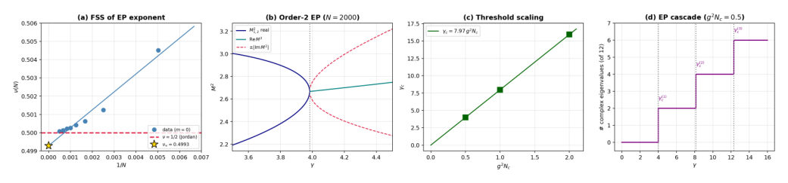
<figcaption class="paper-figure-caption"><b>Fig 1.</b> Figure 1: (a) FSS of the EP exponent ν(N) (m = 0, identical for g2Nc = 0.5, 1, 2); ν∞= 0.4993 vs the analytic 1/2 (dashed). (b) Eigenvalues near the EP (fine γ-mesh, N = 2000): two real branches coalesce at γc and split into a ±|Im M 2| square-root envelope. (c) The threshold scales linearly with the coupling, γc = 7.966 g2Nc. (d) Beyond γc, the complex-eigenvalue count rises in steps of two at γ(k) c ≃k γ(1) c : a uniform EP cascade locked to the equidistant spectrum.</figcaption>
</figure>
<figure class="paper-figure-card">
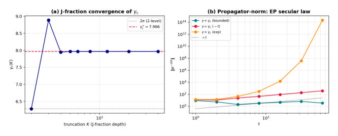
<figcaption class="paper-figure-caption"><b>Fig 2.</b> Figure 2: (a) The threshold γc(K) from the J-fraction (4): exactly 2π at the two-pole level, converging to 7.966 by depth K = 5 (stable to K = 256). (b) Propagator norm ∥e−iV t∥: bounded for γ &lt; γc, linear in t at γc (parallel to the dotted ∝t), exponential for γ &gt; γc — the Jordan secular law.</figcaption>
</figure>
<figure class="paper-figure-card">
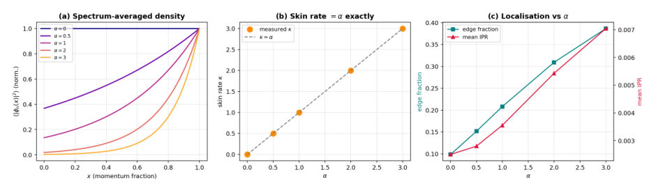
<figcaption class="paper-figure-caption"><b>Fig 3.</b> Figure 3: NHSE from Vα = eαXV e−αX (L = 600, g2Nc = 1). (a) Spectrum-averaged density piles toward x = 1 as α grows. (b) Skin rate κ = α exactly (points on the dashed line). (c) Edge fraction and mean IPR grow with α, the spectrum staying real to 10−12.</figcaption>
</figure>

**Summary.** This theoretical paper analyzes the breakdown of causality in the t Hooft model by studying its meson two-point function under non-Hermitian deformation. It rigorously locates this singularity at an Exceptional Point ($\gamma_c$), predicting a universal signature: linear growth of the propagator norm exactly at $\gamma_c$. This provides the first analytically controlled instance of EP physics within a confining gauge theory.

**Why it may be interesting.** The rigorous analytical control over an EP singularity in a confining gauge theory is highly valuable. The universal signature (linear growth) provides a concrete diagnostic tool applicable across different physical systems, including those studied in AMO physics or quantum optics.

Detailed structure

**Main problem.** The paper investigates the breakdown of analyticity (causality) in a quantum response function when the underlying system undergoes non-Hermitian deformations, specifically locating this breakdown at Exceptional Points (EPs).

**Main result.** They establish that the EP manifests as a square-root branch point ($
u=1/2$) in the resolvent, characterized by a linear growth of the propagator norm (Jordan secular law) exactly at the critical coupling $\gamma_c$.

**Method.** The analysis employs exact solvability techniques from the 't Hooft model, utilizing Jacobi continued fractions to find the EP threshold and analyzing the time evolution of the system's propagator norm.

**Model / system.** The study uses the exactly-solvable t Hooft model for 1+1D large-$N_c$ QCD. The core physics involves deforming the meson two-point function (resolvent) via a term analogous to an imaginary chemical potential, leading to non-Hermitian dynamics.

**Key observables.** The critical coupling $\gamma_c$, the branch point exponent $
u=1/2$, and the three-regime signature of the propagator norm ($	ext{bounded} 	o 	ext{linear growth} 	o 	ext{exponential}$).

**Important parameters / regimes.** The coupling constants $g^2 N_c$ determine the threshold $\gamma_c$; the exponent $
u=1/2$ is fixed by the Jordan form.

**Assumptions / limitations.** The analysis relies on the exact solvability of the 't Hooft model and its mapping to non-Hermitian Wannier-Stark ladders for physical analogy.

**Figures summary.** Figures illustrate finite-size scaling confirming $
u=1/2$, the convergence of $\gamma_c$ from Jacobi fractions, and the characteristic three-regime behavior of the propagator norm vs. coupling strength.

**Paper structure.** The paper first introduces the physical problem—analyticity breakdown in a confining theory via non-Hermitian deformation. It then develops the mathematical framework using the t Hooft model's resolvent, calculating $\gamma_c$ and $
u$. Finally, it details the observable consequences: the secular growth at $\gamma_c$ and the connection to other phenomena like the NHSE.

Abstract

We use the exactly-solvable t Hooft model of 1+1D large-N_c QCD as a rigorous laboratory for the breakdown of analyticity of a causal response function, the meson two-point function. A PT-symmetric deformation i gamma(x-1/2) of the light-cone meson operator, the analogue of an imaginary chemical potential, drives the lowest two mesons to an exceptional point (EP) at gamma_c. Recasting the resolvent as a Jacobi continued fraction yields gamma_c in closed form: 2 pi g^2 N_c at the two-pole level, converging to 7.966 g^2 N_c by depth five -- an analytic, not numerical, threshold. The square-root exponent nu=1/2 is fixed by the 2x2 Jordan form and confirmed by finite-size scaling to N=1999. The breakdown has an unambiguous time-domain signature: the propagator norm is bounded for gamma < gamma_c, grows linearly at gamma_c (the Jordan secular law), and exponentially beyond -- observable, since the deformed operator is a non-Hermitian Wannier-Stark ladder, in photonic and topolectrical analogues. The threshold is locked to confinement, gamma_c propto g^2 N_c, and recurs as a uniform EP cascade; a second, non-reciprocal deformation yields an exactly-exponential non-Hermitian skin effect. This is the first analytically-controlled instance of exceptional-point analyticity breakdown in a confining gauge theory.

[↑ back to top](#top)

### [Random Matrix Theory for Chaotic Wave Scattering and Transport](http://arxiv.org/abs/2606.10957v1)

**Authors:** Yan V. Fyodorov, Dmitry V. Savin  
**Type:** theory · **Category:** other · **PDF:** <https://arxiv.org/pdf/2606.10957v1>  
**Analysis basis:** full PDF text, analyzed in chunks
**Topic relevance:** `driven-dissipative phase transition` **3/5** · `methods for driven-dissipative` **3/5** · `non-equilibrium dynamics` **3/5** · `non-equilibrium universality` **3/5** · `Kondo & dissipative impurity` **2/5** · `Keldysh / 2PI / non-Gaussian methods` **1/5** · `correlated / nonlocal dissipation` **1/5**

↔ Scroll figures horizontally

<figure class="paper-figure-card">
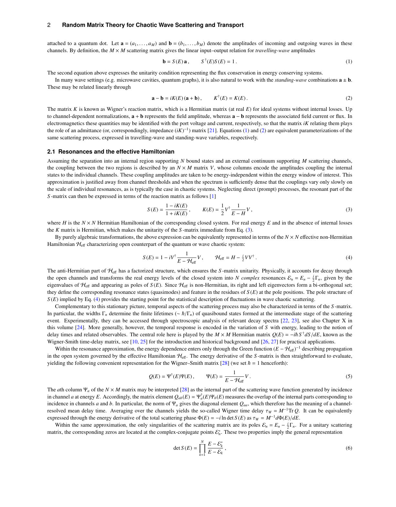
<figcaption class="paper-figure-caption"><b>Fig 1.</b> Low-resolution page preview, page 2</figcaption>
</figure>
<figure class="paper-figure-card">
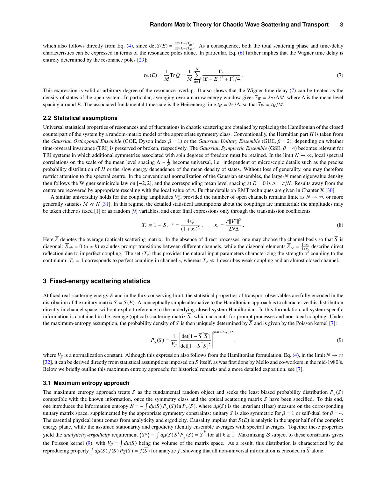
<figcaption class="paper-figure-caption"><b>Fig 2.</b> Low-resolution page preview, page 3</figcaption>
</figure>
<figure class="paper-figure-card">
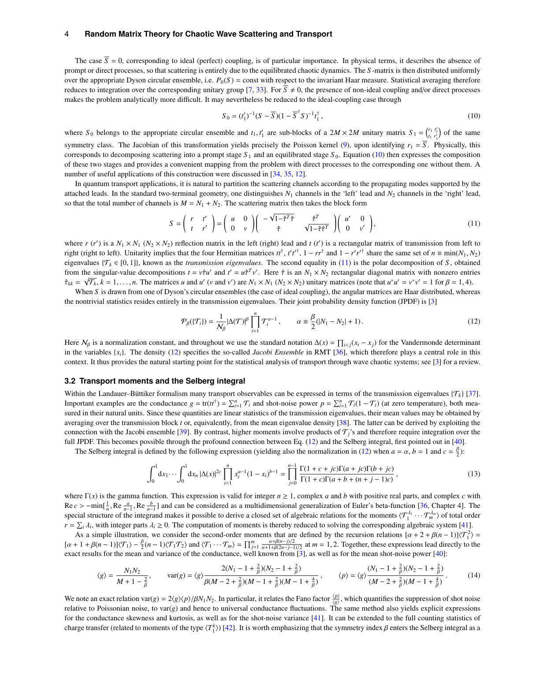
<figcaption class="paper-figure-caption"><b>Fig 3.</b> Low-resolution page preview, page 4</figcaption>
</figure>
<figure class="paper-figure-card">
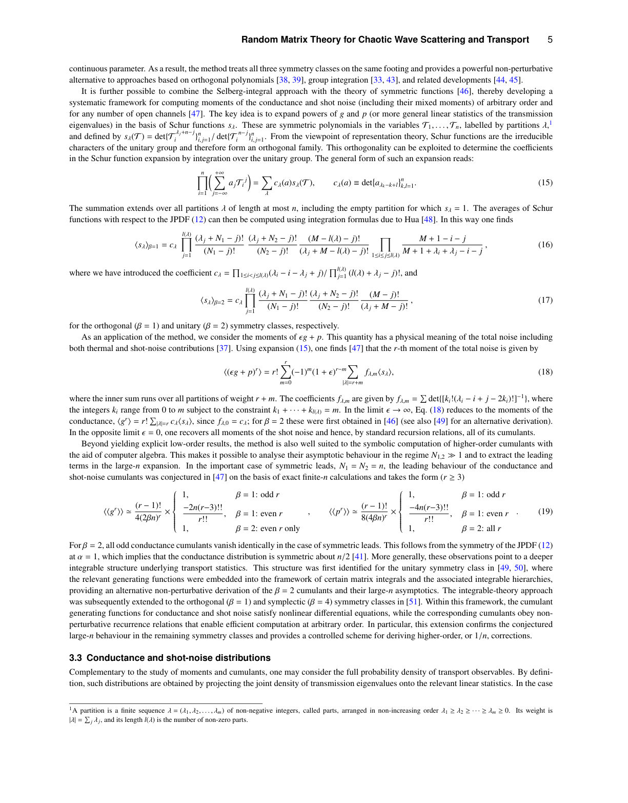
<figcaption class="paper-figure-caption"><b>Fig 4.</b> Low-resolution page preview, page 5</figcaption>
</figure>
<figure class="paper-figure-card">
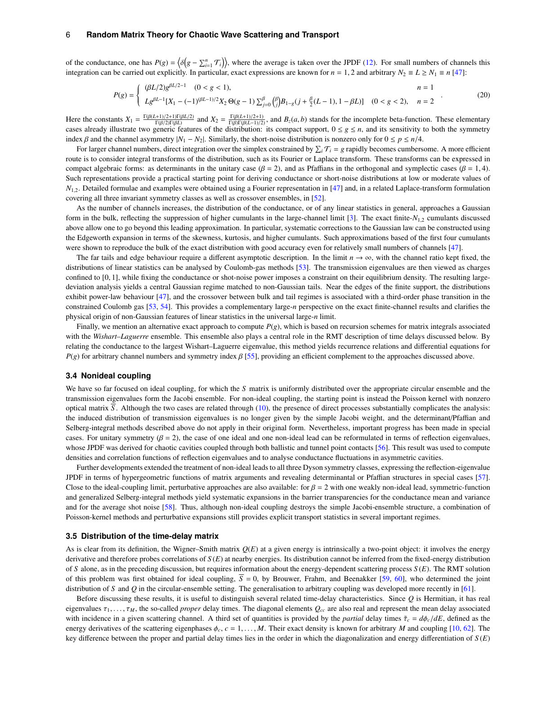
<figcaption class="paper-figure-caption"><b>Fig 5.</b> Low-resolution page preview, page 6</figcaption>
</figure>

**Summary.** This paper reviews the application of Random Matrix Theory to study wave scattering in chaotic, open quantum systems. It develops a theoretical framework showing that complex resonance poles dictate universal statistical measures like the Wigner time delay and transport coefficients. This methodology is crucial for analyzing energy dissipation and coupling effects in mesoscopic conductors.

**Why it may be interesting.** This work provides a powerful, universal theoretical toolkit for analyzing open quantum systems where dissipation or coupling to external baths is crucial. The connection between spectral statistics (resonances) and transport properties ($	au_W$, $g$) is fundamental for understanding mesoscopic physics.

Detailed structure

**Main problem.** The paper reviews random matrix approaches to characterize chaotic wave scattering and transport in open quantum systems.

**Main result.** It establishes that key transport observables like the Wigner time delay are determined solely by the complex resonance poles of the scattering matrix, exhibiting universal statistics governed by system symmetries and openness.

**Method.** The analysis employs effective non-Hermitian Hamiltonian formulations and utilizes Random Matrix Theory (RMT) techniques, including maximum entropy methods and Selberg integrals, to calculate statistical moments.

**Model / system.** The model is a wave-chaotic system coupled to external leads (open system), described by the scattering matrix S(E). The theoretical framework extends from Hermitian Hamiltonians to non-Hermitian effective Hamiltonians incorporating coupling channels and absorption.

**Key observables.** Scattering matrix S(E), Wigner time delay ($	au_W$), resonance poles ($E_n, \Gamma_n$), transmission eigenvalues $\{T_k\}$, conductance ($g$), and shot noise power ($p$).

**Important parameters / regimes.** Symmetry index $eta$ (related to Dyson's classes), number of channels $M$, energy $E$, and the coupling strength/loss rate.

**Assumptions / limitations.** The analysis relies on the resonance approximation, assuming slow variation of couplings over the scale of individual resonances, and often assumes the large channel limit ($N 	o \infty$) for universality.

**Figures summary.** Not specified (based only on notes).

**Paper structure.** The paper progresses by introducing the effective Hamiltonian formalism, deriving relationships between scattering observables ($	au_W$, $\Phi(E)$) and resonance poles, then detailing advanced statistical calculations using RMT tools like the Poisson kernel and Selberg integrals to find moments of transport quantities.

Abstract

We review random matrix approaches to chaotic wave scattering and transport in open systems. Starting from the effective non-Hermitian Hamiltonian formulation, we discuss the scattering matrix, reaction matrix, time delays, and complex resonances as complementary probes of open chaotic dynamics. We emphasize universal statistics governed by symmetry, openness, and channel coupling. Topics include the maximum-entropy description of fixed-energy scattering and its applications to quantum transport, energy correlations, resonance and eigenfunction statistics, and selected wave-chaotic phenomena induced by finite absorption. The focus throughout is on non-perturbative methods and universal structures underlying open quantum and wave chaotic systems.

[↑ back to top](#top)

### [Collective drift and pinning in active rotator networks with Kuramoto coupling and mixed-sign feedback disorder](http://arxiv.org/abs/2606.10032v1)

**Authors:** Arpan Dey  
**Type:** theory · **Category:** statistical mechanics · **PDF:** <https://arxiv.org/pdf/2606.10032v1>  
**Analysis basis:** full PDF text, analyzed in chunks
**Topic relevance:** `driven-dissipative phase transition` **3/5** · `methods for driven-dissipative` **3/5** · `non-equilibrium dynamics` **3/5** · `non-equilibrium universality` **2/5** · `Frenkel-Kontorova` **1/5** · `Keldysh / 2PI / non-Gaussian methods` **1/5** · `correlated / nonlocal dissipation` **1/5**

↔ Scroll figures horizontally

<figure class="paper-figure-card">
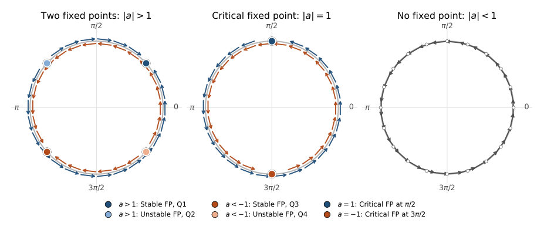
<figcaption class="paper-figure-caption"><b>Fig 1.</b> Figure 1: Phase-circle schematics for the local dynamics ˙θ = ω(1 −a sin θ). The panels show the two-fixed-point regime |a| &gt; 1, the critical case |a| = 1, and the drifting regime |a| &lt; 1. Stable, unstable, and critical fixed points are marked for the corresponding positive and negative values of a.</figcaption>
</figure>
<figure class="paper-figure-card">
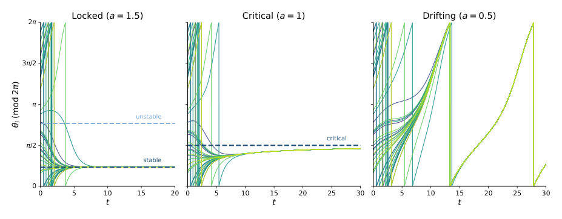
<figcaption class="paper-figure-caption"><b>Fig 2.</b> Figure 2: Wrapped phase trajectories for N = 30 fully connected oscillators. The phases are initialized uniformly at random in [0, 2π) and integrated using the Euler method, with ω = 0.5 and K = 0.6. The three panels show a = 1.5, a = 1, and a = 0.5, corresponding to locked, critical, and drifting regimes.</figcaption>
</figure>
<figure class="paper-figure-card">
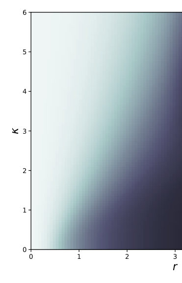
<figcaption class="paper-figure-caption"><b>Fig 3.</b> Figure 3: Heatmap of D(r, κ) = ⟨N −1 P</figcaption>
</figure>
<figure class="paper-figure-card">
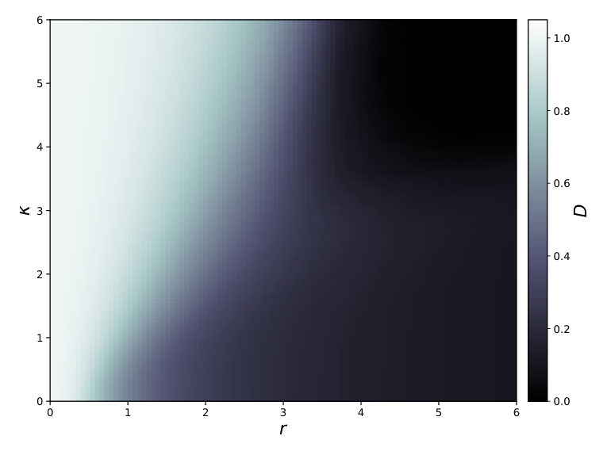
<figcaption class="paper-figure-caption"><b>Fig 4.</b> Fig. 4 shows f+ as the main heatmap and f−as an inset. Since the intrinsic drive is fixed and positive, ω = 0.5, positive drift dominates at low-r and large-κ where the local feedback amplitudes are typically too weak to oppose the common drive. However, the large-r, large-κ</figcaption>
</figure>
<figure class="paper-figure-card">
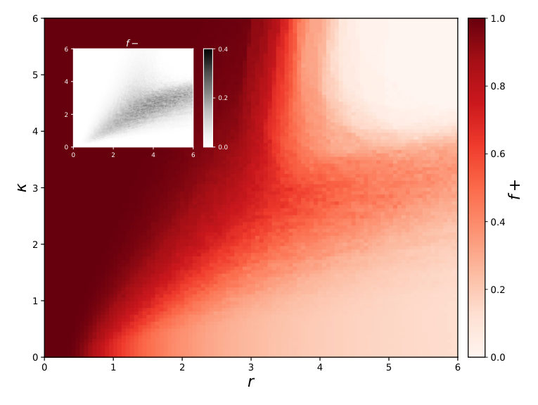
<figcaption class="paper-figure-caption"><b>Fig 5.</b> Figure 4: Positive and negative drifting fractions. Main panel: positive drifting fraction f+. Inset: negative drifting fraction f−. Oscillators are classified using tolerance ϵ = 10−3 applied to late-time velocity Ωi/ω. All other simulation parameters are the same as in Fig. 3.</figcaption>
</figure>

**Summary.** This paper analyzes active rotator networks where oscillators interact via Kuramoto coupling while simultaneously experiencing mixed-sign local feedback disorder. The study maps out the competition between collective phase alignment (drift) and pinning effects across different parameter regimes. It demonstrates that this type of disorder alone can fundamentally alter the system's macroscopic dynamics, providing a rich model for understanding non-equilibrium collective behavior.

**Why it may be interesting.** This work provides a detailed study of non-equilibrium collective dynamics in an active matter context. The interplay between disorder (mixed-sign feedback) and coupling strength offers insights into how local interactions can stabilize or destabilize macroscopic coherent states, relevant to understanding complex biological or physical systems far from equilibrium.

Detailed structure

**Main problem.** The study investigates the competition between local pinning effects induced by mixed-sign feedback disorder and global phase alignment/drift in active rotator networks.

**Main result.** Mixed-sign local feedback alone can significantly reshape the balance between pinning and drifting dynamics, even when the intrinsic drive is homogeneous. Strong coupling can restore drift under certain conditions, while strong disorder generally suppresses it.

**Method.** The research employs numerical simulations to construct regime maps in the parameter space defined by feedback disorder strength ($\sigma_A$) and coupling strength ($K$). Analytical limits are used to benchmark these numerical findings.

**Model / system.** The model is a fully connected network of active rotators governed by an equation incorporating a common intrinsic drive, Kuramoto-like coupling, and local feedback amplitudes drawn from a zero-mean Gaussian distribution. The dynamics describe collective synchronization and drift in excitable systems.

**Key observables.** Mean absolute late-time drift ($D$), and the fractions of oscillators exhibiting positive ($f_+$) or negative ($f_-$) late-time drift.

**Important parameters / regimes.** Feedback disorder strength ($r = \sigma_A/\omega$) and coupling strength ($\kappa = K/\omega$). Key regimes include weak vs. strong disorder/coupling, and the presence of intrinsic frequency disorder.

**Assumptions / limitations.** The analysis relies on approximations such as the coherent-phase approximation for strong coupling, and comparisons are drawn between systems with fixed positive drive versus those with zero-mean distributed intrinsic frequencies.

**Figures summary.** Figures map out regime boundaries in the feedback-disorder–coupling plane showing how drift ($D$) and drifting fractions ($f^+, f^-$) change. Comparisons are made against uncoupled limits ($\kappa=0$) and finite-size effects are analyzed.

**Paper structure.** The paper systematically analyzes the model by first examining the uncoupled limit, then mapping out parameter regimes in the coupled system using numerical simulations, and finally contrasting results when intrinsic frequencies are zero-mean versus fixed positive drive.

Abstract

Active rotator models provide a minimal phase description of excitable and oscillatory systems, and have long been used to study mutual entrainment, synchronization, and collective transitions. Here, we investigate fully connected active rotator networks with Kuramoto coupling, where a common intrinsic drive competes with local feedback amplitudes drawn from a zero-mean Gaussian distribution. This produces a competition between local pinning and collective phase alignment. Using mean absolute late-time drift and the fractions of positive and negative drifting oscillators, we construct numerical regime maps in the feedback-disorder-coupling plane. At weak coupling, increasing the feedback disorder strength suppresses drift, while stronger coupling can restore positive late-time drift when feedback disorder is not too strong. We interpret these regimes using analytical limits for the uncoupled and coherent strong-coupling cases. We also examine finite-size effects and zero-mean distributed intrinsic frequencies. Together, these results show that mixed-sign local feedback alone can reshape the balance between pinning and drifting in coupled active rotator networks, even when the intrinsic drive is homogeneous.

[↑ back to top](#top)

### [Scaling law of asymptotic freedom in collective charging of quantum batteries](http://arxiv.org/abs/2606.10054v1)

**Authors:** Gentaro Watanabe, Chunlin Chen, B. Prasanna Venkatesh  
**Type:** theory · **Category:** other · **PDF:** <https://arxiv.org/pdf/2606.10054v1>  
**Analysis basis:** full PDF text, analyzed in chunks
**Topic relevance:** `non-equilibrium universality` **3/5** · `correlated / nonlocal dissipation` **2/5** · `driven-dissipative phase transition` **2/5** · `entanglement & information structure` **2/5** · `methods for driven-dissipative` **2/5** · `Keldysh / 2PI / non-Gaussian methods` **1/5** · `Tavis-Cummings & cavity-many-emitter` **1/5** · `non-equilibrium dynamics` **1/5**

↔ Scroll figures horizontally

<figure class="paper-figure-card">
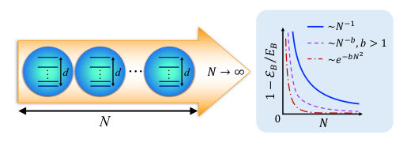
<figcaption class="paper-figure-caption"><b>Fig 1.</b> FIG. 1. Emergence of asymptotic freedom in collective quantum battery charging. Left: an ensemble of N identical d-level batteries with arbitrary spectra. Right: representative scaling of the ergotropy- to-energy ratio EB/EB toward unity with increasing N, including the generic ∼N−1 scaling and accelerated convergence.</figcaption>
</figure>
<figure class="paper-figure-card">
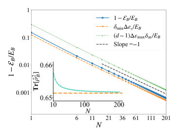
<figcaption class="paper-figure-caption"><b>Fig 2.</b> FIG. 2. Demonstration of 1/N scaling toward asymptotic freedom for 1 −(EB/EB), together with the bounds given by Eqs. (10) and (23), for unitary charging of the d = 3 Dicke model. The inset shows the purity as a function of N. The parameter values are ωC = ωB and g = 20ωB.</figcaption>
</figure>
<figure class="paper-figure-card">
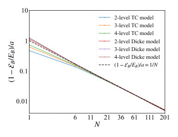
<figcaption class="paper-figure-caption"><b>Fig 3.</b> FIG. 3. Demonstration of the universal 1/N scaling toward asymp- totic freedom. All models considered collapse onto a single line with slope −1 in the log-log plot. The parameter values are the same as Fig. 2.</figcaption>
</figure>
<figure class="paper-figure-card">
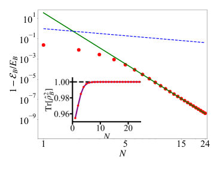
<figcaption class="paper-figure-caption"><b>Fig 4.</b> FIG. 4. Demonstration of fast convergence to asymptotic freedom with power-law scaling ∼1/Nb with b &gt; 1. The green solid line indicates a fit ∼1/N7.2, while the blue dashed line shows the ∼1/N scaling for reference. The inset displays the purity as a function of N. The parameters are set to Ω= ωB = 5 and γ = 1</figcaption>
</figure>
<figure class="paper-figure-card">
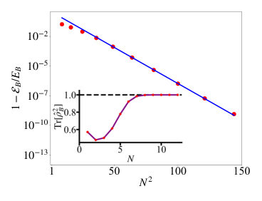
<figcaption class="paper-figure-caption"><b>Fig 5.</b> FIG. 5. Demonstration of fast convergence to asymptotic free- dom with exponential scaling. The blue solid line indicates a fit ∼exp(−bN2) with b = 0.06. The inset displays the purity as a func- tion of N. The parameters are set to Ω= 0, ωB = 10, and γ = 1.</figcaption>
</figure>

**Summary.** This paper rigorously derives universal scaling laws governing how efficiently stored energy can be extracted from a collection of $N$ coupled quantum batteries. It establishes that while generic charging leads to an asymptotic freedom characterized by $\sim 1/N$ decay, specific conditions allow for significantly faster convergence, including exponential scaling. The findings provide crucial theoretical bounds for designing high-efficiency quantum energy devices.

**Why it may be interesting.** This work provides fundamental theoretical guarantees regarding energy extraction efficiency in quantum systems, directly impacting the design principles for quantum energy storage devices and understanding collective quantum phenomena.

Detailed structure

**Main problem.** The paper establishes a universal scaling law for the collective charging of quantum batteries (QBs) and investigates the phenomenon of 'asymptotic freedom,' where stored energy becomes nearly fully extractable.

**Main result.** It proves that the ergotropy-to-energy ratio approaches unity, exhibiting generic asymptotic freedom with at least $\sim N^{-1}$ scaling, but can achieve much faster convergence ($\sim N^{-b}, b>1$ or exponential) if the battery state becomes asymptotically pure.

**Method.** The analysis involves deriving rigorous finite-$N$ upper and lower bounds on the ergotropy-to-energy ratio by analyzing the residual population $\delta(N)$ within the framework of collective charging dynamics.

**Model / system.** The system consists of $N$ identical, non-interacting quantum batteries (QBs), modeled as qudits. The dynamics are studied using concepts related to total energy ($E_B$) and ergotropy ($	ext{Erg}$), often involving the GKLS master equation for open charging.

**Key observables.** Total Energy ($E_B$), Ergotropy ($	ext{Erg}$), Figure of Merit ($	ext{Erg}/E_B$), Residual Population ($\delta(N)$).

**Important parameters / regimes.** Number of batteries ($N$), dimension of the qudits ($d$), and the asymptotic behavior of the residual population ($\delta_\infty$).

**Assumptions / limitations.** The analysis assumes identical, non-interacting QBs and often requires assumptions about the battery state remaining mixed or approaching purity in specific limits.

**Figures summary.** Figures illustrate the concept of asymptotic freedom showing generic $\sim N^{-1}$ scaling, alongside examples demonstrating faster convergence rates such as power-law ($\sim 1/N^b$) and exponential ($\sim e^{-bN^2}$) scaling for different charging regimes.

**Paper structure.** The paper develops by first establishing the general $1/N$ universal scaling law (Theorem 1) based on residual population bounds. It then analyzes specific cases, distinguishing between scenarios where the asymptotic residual population is zero or non-zero, leading to derivations of faster convergence rates in those special limits.

Abstract

We establish a universal scaling law for collective charging of quantum batteries, independent of microscopic details. We prove that the ergotropy-to-energy ratio approaches unity at least as fast as $\sim N^{-1}$ with the number of batteries $N$, implying generic asymptotic freedom. We further show how the universal $1/N$ scaling can be overcome: when the battery state becomes asymptotically pure, the convergence can be substantially faster, including $\sim N^{-b}$ with $b>1$ and even exponential scaling in $N^2$. Rigorous finite-$N$ upper and lower bounds on the ergotropy-to-energy ratio are further derived, providing nonasymptotic guarantees for the universal $1/N$ scaling.

[↑ back to top](#top)

### [Wave packets from the spectrum](http://arxiv.org/abs/2606.10004v1)

**Authors:** ChunJun Cao, Oliver Friedrich, Marin Girard, Nicolas Loizeau, Ashmeet Singh  
**Type:** theory · **Category:** other · **PDF:** <https://arxiv.org/pdf/2606.10004v1>  
**Analysis basis:** full PDF text, analyzed in chunks
**Topic relevance:** `non-equilibrium dynamics` **3/5** · `analog quantum simulation` **2/5** · `driven-dissipative phase transition` **2/5** · `non-equilibrium universality` **2/5** · `Frenkel-Kontorova` **1/5** · `Keldysh / 2PI / non-Gaussian methods` **1/5** · `correlated / nonlocal dissipation` **1/5** · `entanglement & information structure` **1/5** · `methods for driven-dissipative` **1/5**

↔ Scroll figures horizontally

<figure class="paper-figure-card">
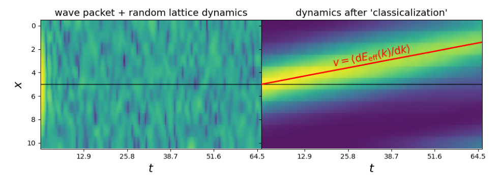
<figcaption class="paper-figure-caption"><b>Fig 1.</b> Figure 1: Demonstrating our procedure for (re-)interpreting a given Hamiltonian ˆH as a lattice theory with local interaction structure. Left panel: evolution of an initially Gaussian wave packet wrt. random lattice dynamics, i.e. when choosing the coefficients hℓin Equation 3 at random. Right panel: switching from the initial set of lattice operators ˆa† i , ˆai to a new set ˆb† i , ˆbi via the algorithm developed in this paper. Wrt. the new lattice, states can stay localized for some time &amp; propagate according to an effective dispersion relation. We considered a Hilbert space of dimension 211 (corresponding to 11 qubits) for this figure - see Sections 1 and 2 for details.</figcaption>
</figure>
<figure class="paper-figure-card">
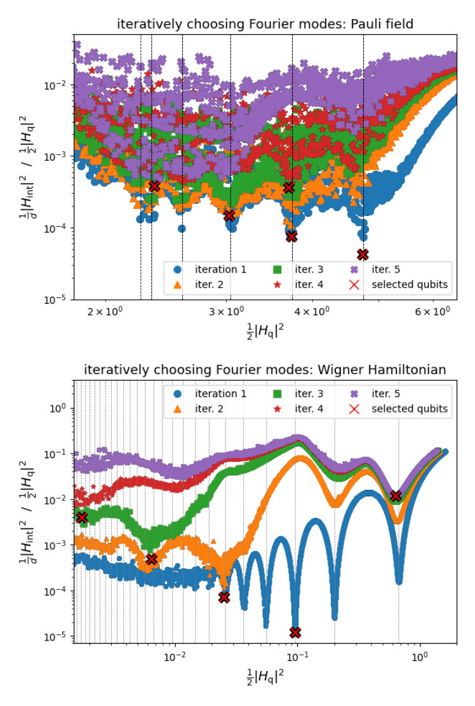
<figcaption class="paper-figure-caption"><b>Fig 2.</b> Figure 2: Visualizing our iterative procedure for factorizing a given Hilbert space into minimum-interaction qubits. At each iteration we consider the Hamiltonian ˆHrest,i that was left from the previous factorization as the new total Hamiltonian. We then sift through different norms | ˆHq,i+1| ∼Eq,i+1 of the qubit self-Hamiltonian and find candidates for the rest-Hamiltonian ˆHrest,i+1 such that interaction between next qubit and next rest is minimized. Among all of these candidates we then pick the qubit and rest that achieve the lowest ratio | ˆHint,i+1| / | ˆHq,i+1| . These selected factorizations are indicated by the red crosses in the figure. The upper panel displays this procedure...</figcaption>
</figure>
<figure class="paper-figure-card">
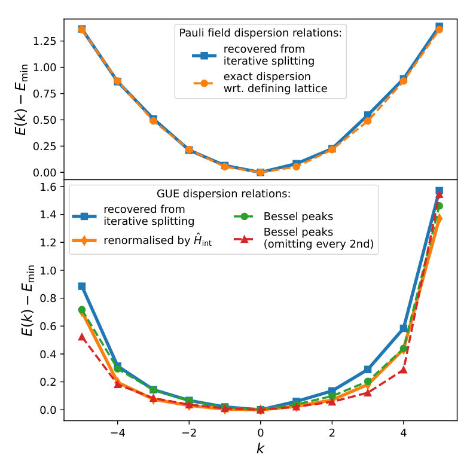
<figcaption class="paper-figure-caption"><b>Fig 3.</b> Figure 3: The dispersion relations we obtain when iteratively decomposing either the Pauli field Hamiltonian or a GUE Hamiltonian into a lattice of weakly interacting spins (&quot;Fourier modes&quot;). See main text for details.</figcaption>
</figure>
<figure class="paper-figure-card">
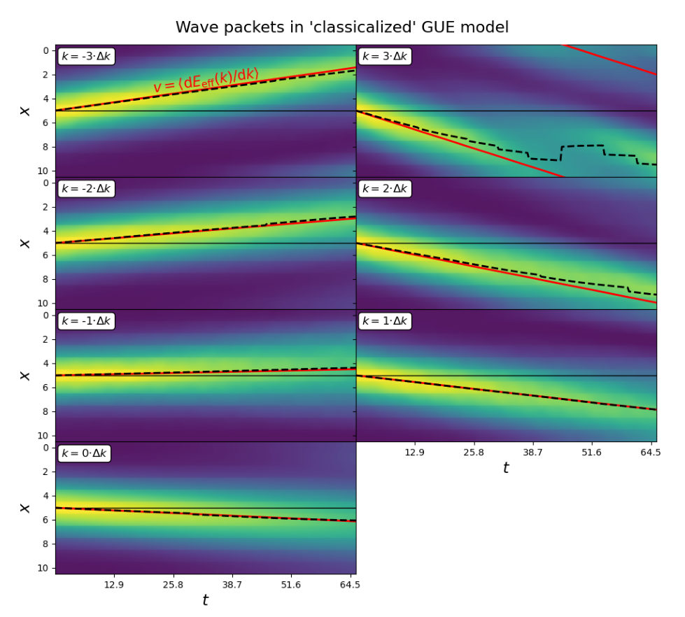
<figcaption class="paper-figure-caption"><b>Fig 4.</b> Figure 4: Starting from a Gaussian random Hamiltonian in a d = 211 dimensional Hilbert space we identify field operators ˆa† x wrt. which stable, propagating wave packets can be defined. Different panels show how the density |ψ(x, t)|2 evolves for wave packets of different average momenta k. Red solid lines indicate expected propagation speed from an effective dispersion relation, while black dashed lines indicate the actual center of the wave packets. Note that the packet in the upper most, right panel is dispersing quickly, because around its average momentum the dispersion relation is strongly curved. Because of the periodicity of our (small) grid, this leads to the interference pattern...</figcaption>
</figure>
<figure class="paper-figure-card">
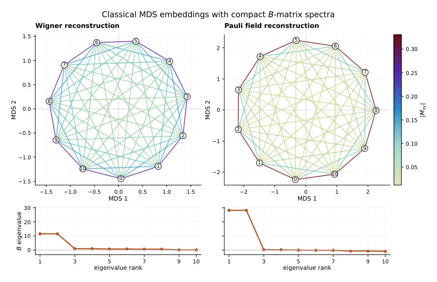
<figcaption class="paper-figure-caption"><b>Fig 5.</b> Figure 5: Classical MDS embeddings with compact B-matrix spectra: The top left panel shows the embedding of the spatial Fermionic degrees-of-freedom emerging from a Wigner Hamiltonian in a two-dimensional cartesian space via MDS. The top right panel shows the corresponding embedding for a Pauli field Hamiltonian. We overlay graph edges between embedded Fermionic degrees-of-freedom, with edge color indicating hopping term strength. Embedding coordinates MDS 1 and MDS 2 emerge as the dominant Cartesian dimensions of the embedding, as is implied by the bottom panels. These panels show the ordered spectrum of the B matrix for Wigner (left) and Pauli field reconstruction (right). In classical...</figcaption>
</figure>

**Summary.** The paper introduces 'quantum mereology' to decompose complex Hamiltonians into weakly interacting factors that resemble localized lattice theories. By minimizing interaction terms across these factorizations, the authors successfully map dynamics from random matrix models onto propagating wave packets. This provides a systematic theoretical pathway for extracting emergent, quasi-integrable degrees-of-freedom from highly complicated quantum systems.

**Why it may be interesting.** This work provides a powerful mathematical tool for understanding how complex, non-local quantum dynamics can be systematically reduced or reinterpreted as simple, local physics governed by emergent lattice modes, which is highly relevant for characterizing many-body systems in condensed matter theory.

Detailed structure

**Main problem.** The core problem is developing a formal framework, termed 'quantum mereology,' to decompose an arbitrary quantum Hamiltonian into weakly interacting factors that mimic local lattice dynamics.

**Main result.** The authors show that by minimizing interaction terms in factorizations, one can successfully re-interpret the dynamics of highly non-local random matrix models (like GUE) as wave packet propagation on an emergent 1D lattice structure.

**Method.** The methodology involves iterative Hamiltonian factorization ($\hat{H} \simeq \hat{H}_q \otimes \hat{H}_r$) by minimizing a loss function related to the interaction term, followed by mapping the resulting quasi-integrable model onto fermionic operators via Jordan-Wigner transformation.

**Model / system.** The study applies to general quantum systems described by Hamiltonians ($\hat{H}$), including random matrix models (GUE) and continuum field theories like the Pauli field Hamiltonian. The focus is on finding emergent, localized degrees-of-freedom (DOFs).

**Key observables.** Wave packet evolution $|\langle i|\psi
angle|^2$, effective dispersion relation $E_{	ext{eff}}(k)$, and the minimization of the interaction strength $	ext{Tr}(\hat{H}_{	ext{int}}^2)$.

**Important parameters / regimes.** The dimension $d$ of the Hilbert space, the coupling constants ($h_\ell$), and the excitation energy ($	ext{Eq}$) derived from spectral analysis.

**Assumptions / limitations.** Key assumptions include approximating mutual information by $rac{1}{2d}	ext{Tr}(\hat{H}_{	ext{int}}^2)$ and assuming that the optimal factorization can be found via local minimization of this loss function, which may fail for overlapping DOFs.

**Figures summary.** Figures illustrate wave packet evolution comparing non-local vs. localized dynamics; they also show spectral density plots confirming minimum interaction points (Bessel peaks) and MDS embeddings suggesting emergent 1D circular geometry.

**Paper structure.** The paper progresses from demonstrating the transformation of random matrices to local theories, developing the iterative factorization algorithm based on minimizing interaction loss, deriving theoretical constraints using asymptotic eigenvalue densities (GUE/Wishart), and finally applying this framework to known integrable models like the Pauli field.

Abstract

The freedom to change Fock basis seems to ensure a minimum amount of locality in lattice theories in the following sense: If $\lbrace (\hat a_i^\dagger\,,\,\hat a_i)\rbrace$ for $i=1,\dots,n$ is a lattice of creation and annihilation operators and if a given Hamiltonian $\hat H$ induces highly non-local dynamics on that lattice, then it will usually be possible to change to a new set of operators $\lbrace (\hat b_i^\dagger\,,\,\hat b_i)\rbrace$ in terms of which the dynamics appear less non-local. We demonstrate this by turning a highly non-local random matrix model into a local, 1D lattice theory where particles can propagate in localized wave packets. More generally, we show that any Hamiltonian can be made to look like such a theory, with the lattice dispersion relation and the non-integrability of the theory depending on the spectrum of $\hat H$. We argue that our results are a step towards quantum mereology for fields.

[↑ back to top](#top)

### [Microscopic evidence for a Zhang-Rice triplet state in the van der Waals antiferromagnet, NiPS$_3$](http://arxiv.org/abs/2606.10498v1)

**Authors:** Beom Hyun Kim, Youjin Lee, Junik Hwang, Junghyun Kim, Je-Geun Park, Seung-Ho Baek  
**Type:** experiment · **Category:** strongly correlated electrons · **PDF:** <https://arxiv.org/pdf/2606.10498v1>  
**Analysis basis:** full PDF text, analyzed in chunks
**Topic relevance:** `exotic spin models in light-matter` **3/5** · `spintronics-quantum-optics interface` **3/5** · `analog quantum simulation` **2/5** · `driven-dissipative phase transition` **2/5** · `Kondo & dissipative impurity` **1/5** · `methods for driven-dissipative` **1/5** · `non-equilibrium dynamics` **1/5**

↔ Scroll figures horizontally

<figure class="paper-figure-card">
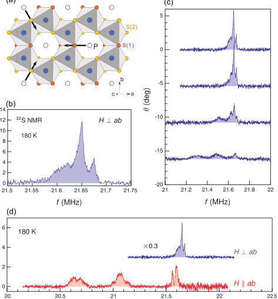
<figcaption class="paper-figure-caption"><b>Fig 1.</b> FIG. 1. (a) Crystal structure of NiPS3 viewed along the c∗</figcaption>
</figure>
<figure class="paper-figure-card">
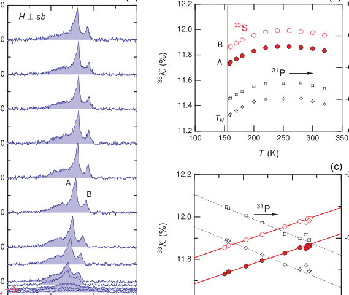
<figcaption class="paper-figure-caption"><b>Fig 2.</b> FIG. 2. (a) Temperature dependence of the 33S NMR spectrum in the PM phase for H ⊥ab. The overall spectral shape remains unchanged across the temperature range, with two well-resolved peaks (labelled A and B) persisting up to room temperature. (b) 33S Knight shift 33K of the A and B peaks as a function of temperature. The temperature dependence of both 33K and 31P Knight shift 31K (right axis) closely follows that of the bulk spin susceptibility, indicating that both nuclei probe the identical local spin susceptibility. Note that the two lines for 31P arise from nuclear dipole-dipole interactions, so called Pake doublet [20]. (c) Knight shift versus susceptibility (K-χ) plots with...</figcaption>
</figure>
<figure class="paper-figure-card">
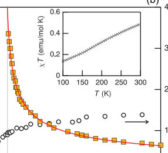
<figcaption class="paper-figure-caption"><b>Fig 3.</b> FIG. 3. (a) Nuclear spin-lattice relaxation rate T −1 1 of 33S and 31P as a function of temperature. Upon cooling, while 31T −1 1 monotonically decreases, 33T −1 1 exhibits a progressive enhancement. (b) Temperature dependence of the reduced relaxation rate, R1 ≡(T1χT )−1. While the nearly constant 31R1 supports the absence of collective spin fluctuations, 33R1 exhibits a power-law divergence, which is well-fitted by Eq. (1) throughout the entire temperature range (solid line). This divergence demonstrates the development of collective charge fluctuations towards an incipient nematic ordering instability (see text). Inset : Temperature dependence of χT for H ⊥ab.</figcaption>
</figure>

**Summary.** This experimental study uses $^{33}$S NMR on NiPS3 to probe its electronic structure, arguing that the material hosts a spin-charge-intertwined Zhang-Rice triplet state. By analyzing Knight shifts and observing a power-law divergence in the relaxation rate near the Néel temperature, the authors provide evidence for nematic charge fluctuations driving the magnetic ordering.

**Why it may be interesting.** The work connects advanced spectroscopic techniques (NMR) directly to fundamental concepts in strongly correlated materials theory, specifically identifying signatures of emergent quantum states like the Zhang-Rice triplet and coupling them to magnetic phase transitions via critical dynamics.

Detailed structure

**Main problem.** The study aims to provide microscopic evidence for a Zhang-Rice triplet state in the van der Waals antiferromagnet NiPS3 and understand the origin of its magnetic exciton coherence.

**Main result.** NMR measurements reveal strong hybridization between S 3p and Ni 3d orbitals, supporting a spin-charge-intertwined ground state. Furthermore, critical slowing down observed via $^{33}$S relaxation suggests nematic correlations drive the magnetic transition.

**Method.** The research employed solid-state Nuclear Magnetic Resonance (NMR) spectroscopy on enriched single crystals of NiPS3, measuring Knight shifts and nuclear spin-lattice relaxation rates ($T_1^{-1}$).

**Model / system.** The physical system is NiPS3, a van der Waals antiferromagnet. The theoretical framework involves modeling the ground state as a Zhang-Rice triplet (ZRT) state arising from strong hybridization between ligand holes (S 3p) and transition metal moments (Ni 3d).

**Key observables.** Temperature dependence of $^{33}$S and $^{31}$P Knight shifts, power-law divergence of the $^{33}$S nuclear spin-lattice relaxation rate ($T_1^{-1}$), and the local Electric Field Gradient (EFG) tensor components.

**Important parameters / regimes.** Néel temperature $T_N = 155$ K; Quadrupole frequency $
u_Q = 6.4 	ext{ MHz}$; Critical exponent related to power-law divergence ($\propto |T - T_0|^{-0.464}$).

**Assumptions / limitations.** The analysis assumes that the observed NMR signals are sensitive probes of local spin and charge fluctuations, allowing for the differentiation between different types of magnetic correlations (e.g., nematic vs. simple AFM).

**Figures summary.** Figures illustrate the crystal structure details related to the EFG tensor components and show the temperature dependence of various spectroscopic measurements, such as Knight shifts and relaxation rates.

**Paper structure.** The paper progresses by first establishing the material's magnetic properties (AFM ordering), then using NMR spectroscopy on $^{33}$S and $^{31}$P to probe local spin susceptibility via Knight shifts. Finally, it analyzes the temperature dependence of $T_1^{-1}$ to pinpoint critical charge fluctuations associated with nematic correlations.

Abstract

Quantum-entangled states underpin many emergent phenomena in quantum materials, yet their direct experimental identification remains a challenge. NiPS$_3$, a van der Waals antiferromagnet exhibiting a resolution-limited magnetic exciton in its ordered phase, has been proposed to host a many-body entangled Zhang-Rice triplet state. Here, using $^{33}$S nuclear magnetic resonance (NMR) on $^{33}$S-enriched NiPS$_3$ single crystals, we provide microscopic evidence for this charge-transfer state. The $^{33}$S and $^{31}$P Knight shifts as a function of temperature reveal a unified spin-triplet configuration arising from strong hybridization between a self-doped hole in the S $3p$ orbitals and a hole in Ni $3d$ orbitals. Furthermore, the $^{33}$S nuclear spin-lattice relaxation rate exhibits a power-law divergence as it approaches the Néel temperature $T_N=155$ K, indicating critical slowing down of collective charge fluctuations consistent with spin-nematic correlations. These results reveal a spin-charge-intertwined ground state and establish the microscopic foundation for the exceptional coherence of the magnetic exciton in NiPS$_3$.

[↑ back to top](#top)

### [Determining universal spectra from probability distributions](http://arxiv.org/abs/2606.10128v1)

**Authors:** Charles Kacir, Joseph Moscoso, Amy Nicholson, Thomas R. Richardson, Cade Rodgers  
**Type:** theory · **Category:** quantum gases · **PDF:** <https://arxiv.org/pdf/2606.10128v1>  
**Analysis basis:** full PDF text, analyzed in chunks
**Topic relevance:** `Keldysh / 2PI / non-Gaussian methods` **3/5** · `driven-dissipative phase transition` **2/5** · `non-equilibrium universality` **2/5** · `Kondo & dissipative impurity` **1/5** · `analog quantum simulation` **1/5** · `entanglement & information structure` **1/5** · `methods for driven-dissipative` **1/5** · `non-equilibrium dynamics` **1/5**

↔ Scroll figures horizontally

<figure class="paper-figure-card">
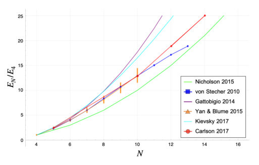
<figcaption class="paper-figure-caption"><b>Fig 1.</b> FIG. 1. Energy of a universal N-body cluster, EN, relative to the 4-body energy, E4, as a function of N. Results assuming a log-normal distribution for the N = 2 correlator are shown in green. Data and other analytic predictions are taken from: von Stecher 2010 [12], Gattobigio 2014 [13], Yan &amp; Blume 2015 [14], Kievsky 2017 [15], Carlson 2017 [16].</figcaption>
</figure>
<figure class="paper-figure-card">
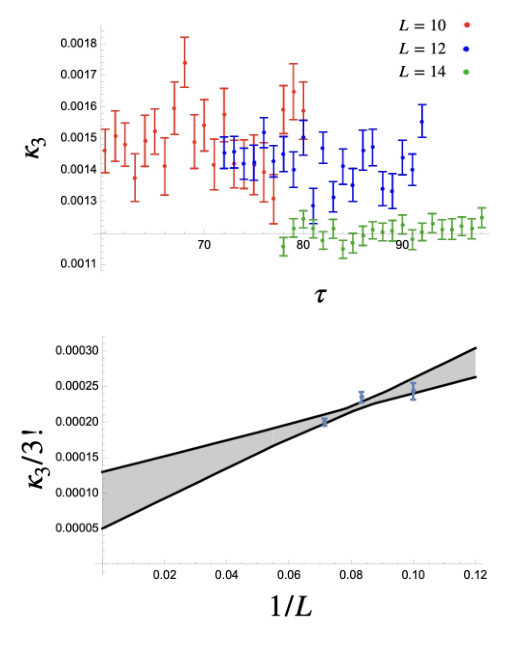
<figcaption class="paper-figure-caption"><b>Fig 2.</b> FIG. 2. Contributions to the third cumulant, κ3, of ln (M[ϕ, τ])2, as a function of τ (top) and 1/L (bottom). The band on the lower figure corresponds to a linear extrapolation in 1/L.</figcaption>
</figure>
<figure class="paper-figure-card">
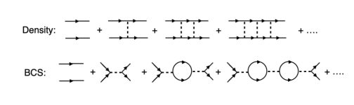
<figcaption class="paper-figure-caption"><b>Fig 3.</b> FIG. 3. Graphs contributing to the two-particle correla- tion function, Eq. 3.8. Fermionic propagators are denoted by solid lines with arrows following the progression of time, while bosonic auxiliary field contributions are dashed.</figcaption>
</figure>

**Summary.** The paper develops methods to extract universal spectral information about strongly interacting quantum matter by analyzing the probability distributions of two-particle correlation functions. It combines numerical lattice techniques with analytic large-$N$ expansions, showing that ratios of cluster energies provide scale-independent predictions. This methodology is crucial for understanding physics in regimes like unitarity where simple perturbative approaches fail.

**Why it may be interesting.** This work is highly relevant as it tackles the difficult problem of extracting fundamental, scale-invariant physics from complex many-body correlators in strongly interacting systems, a core challenge in modern quantum field theory and AMO research involving ultracold atomic gases near Feshbach resonances.

Detailed structure

**Main problem.** The central goal is determining universal spectral information about interacting quantum systems by analyzing probability distributions derived from two-particle correlation functions.

**Main result.** The raw moments of the distribution are shown to be equivalent to the energies of $n$-body clusters, suggesting that ratios of these energies can yield cutoff-independent predictions for universal physics.

**Method.** The authors employ both numerical lattice computations and analytic expansions in the large-$N$ limit, utilizing cumulant expansions ($\kappa_n$) of the logarithm of correlation functions to extract spectral information.

**Model / system.** The study concerns strongly-interacting quantum matter fields (fermions $\psi$) interacting via bosonic auxiliary fields ($\phi$), relevant to theories like QCD and low-energy EFTs. The analysis focuses on two-fermion correlation functions $C_2(	au)$ in the context of non-relativistic, two-component fermions.

**Key observables.** Two-particle correlation function ($C_2(	au)$), cumulants ($\kappa_n$), and ratios of cluster energies ($E_{2n}/E_4$).

**Important parameters / regimes.** Large Euclidean time ($	au 	o \infty$), the limit of large number of species ($N 	o \infty$), and parameters related to unitarity.

**Assumptions / limitations.** The analysis often assumes that the distribution approaches a log-normal form, which simplifies the extraction of spectral information from moments. A key assumption is that universal physics can be extracted by removing non-universal cutoff effects via ratios.

**Figures summary.** Figure 1 compares direct calculations of $n$-body energies against log-normal predictions for the $N=2$ correlator; Figure 2 shows cumulants plateauing, suggesting convergence to a stable spectral regime; Figure 3 illustrates differences in correlation function derivations between BCS and density channels.

**Paper structure.** The paper progresses by first establishing the link between moments and cluster energies. It then develops two complementary theoretical frameworks—a lattice approach and an analytic large-$N$ expansion (comparing 'density' vs. 'BCS' channels)—to calculate correlation functions, ultimately deriving conditions for universal spectral determination.

Abstract

The probability distribution of a two-particle correlation function computed over background auxiliary field configurations, used to generate the interactions, has been shown to inform about the spectra of universal $n$-body clusters [1]. Here, we utilize two approaches, a numerical lattice computation and an analytic expansion in the limit of large numbers of identical species, in an attempt to refine the initial predictions. Exploratory calculations in these directions are presented, and future investigations laid out.

[↑ back to top](#top)

### [Floquet analysis of coherence in periodically driven diamond NV ensemble systems](http://arxiv.org/abs/2606.10452v1)

**Authors:** Cuong M. Nguyen, Uijin Ko, Seong-Joo Lee, Hyeonsu Kim, Hosung Seo, Sangwon Oh  
**Type:** both · **Category:** other · **PDF:** <https://arxiv.org/pdf/2606.10452v1>  
**Analysis basis:** full PDF text, analyzed in chunks
**Topic relevance:** `methods for driven-dissipative` **3/5** · `spintronics-quantum-optics interface` **3/5** · `non-equilibrium dynamics` **2/5** · `QC/QI experiment` **1/5** · `driven-dissipative phase transition` **1/5** · `exotic spin models in light-matter` **1/5** · `non-equilibrium universality` **1/5**

↔ Scroll figures horizontally

<figure class="paper-figure-card">
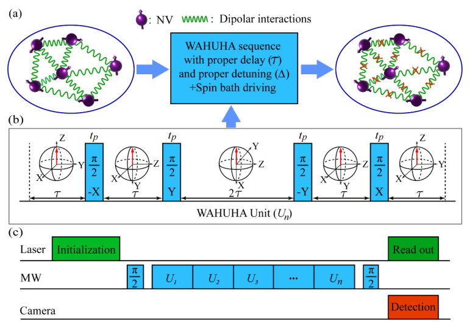
<figcaption class="paper-figure-caption"><b>Fig 1.</b> Figure 1 WAHUHA control and stroboscopic measurement protocol in a dense NV ensemble. (a) Conceptual schematic of a dipolar-coupled NV ensemble under periodic WAHUHA control. The sequence symmetrizes the homonuclear dipolar interaction, while in the experimentally relevant finite-pulse regime the observed response is more naturally described in terms of the one-cycle Floquet unitary. (b) Pulse timing and phase configuration of a single WAHUHA unit, consisting of four π/2 microwave pulses with phases -X, Y, -Y, and X, separated by delays t, t, 2t, t, and t. Therefore, one-cycle duration becomes 𝑇 = 6𝜏+ 4𝑡!. The Bloch-sphere sketches illustrate the cyclic trajectory of the eQective spin under...</figcaption>
</figure>
<figure class="paper-figure-card">
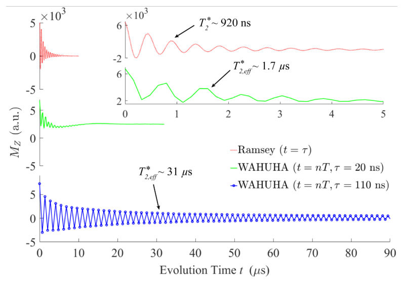
<figcaption class="paper-figure-caption"><b>Fig 2.</b> Figure 2 E;ective inhomogeneous dephasing under WAHUHA. The longitudinal magnetization Mz is measured as a function of evolution time for Ramsey and WAHUHA protocols. The Ramsey free-induction signal yields an intrinsic inhomogeneous dephasing time 𝑇&quot;</figcaption>
</figure>
<figure class="paper-figure-card">
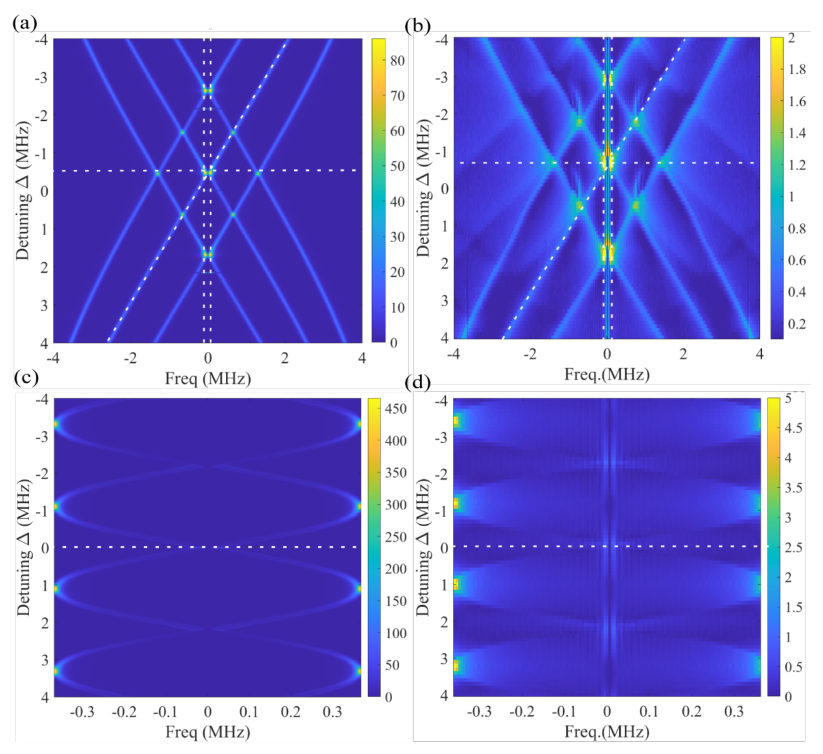
<figcaption class="paper-figure-caption"><b>Fig 3.</b> Figure 3 Detuning-resolved stroboscopic spectra under the WAHUHA sequence. The spectra are obtained by Fourier transforming the measured stroboscopic magnetization,𝑀&#x27; (nT) with respect to the Floquet cycle number n, where the WAHUHA cycle period is defined as 𝑇 = 6𝜏+ 4𝑡! with a pulse duration of 𝑡! = 10 ns (equivalent to ΩRabi = 25 MHz). (a, b) Simulated and experimental spectra for a short interpulse delay of of τ = 12 ns. In this regime, the dominant spectral branches are nearly linear in detuning and follow the expected short-delay scaling, 𝑓! ≈∆/√3. The white dashed lines explicitly indicate the primary Floquet branch and the horizontal zero-detuning axis (∆= 0 ). (c, d) Simulated and...</figcaption>
</figure>
<figure class="paper-figure-card">
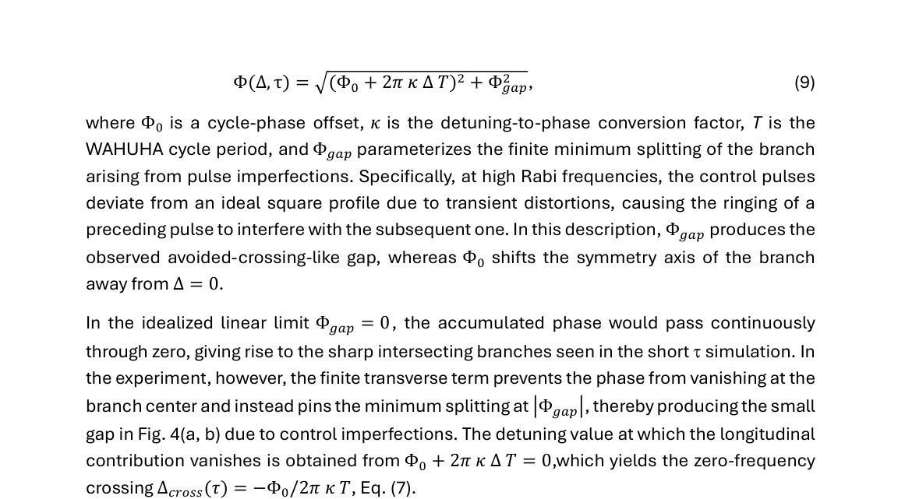
<figcaption class="paper-figure-caption"><b>Fig 4.</b> Fig. 4 (c) shows that this simple scaling captures the dominant trend of data. At short interpulse delays, the small cycle period T makes ∆E?;)) sensitive to the cycle-phase intercept, resulting in a pronounced shift away from zero detuning. As 𝜏 increases, the same phase intercept produces a smaller detuning o]set, and ∆E?;)) to approaches zero. The gap and the detuning-axis o]set provide an experimental signature of finite pulse Floquet structure in the short-delay regime.</figcaption>
</figure>
<figure class="paper-figure-card">
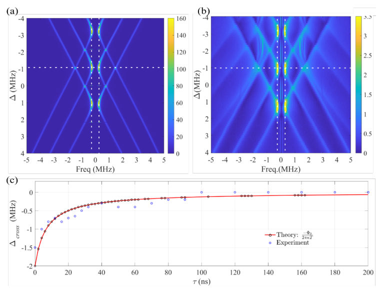
<figcaption class="paper-figure-caption"><b>Fig 5.</b> Figure 4 Short-delay Floquet branch structure and zero-frequency crossing. (a) Simulated and (b) experimental FFT spectra of the 𝑀&#x27; under the WAHUHA sequence for a short interpulse delay of τ = 4 ns. The spectra display the detuning dependent Floquet branch as a function of microwave oQ-resonance detuning (Δ). Dashed lines indicate the zero-detuning axis and the central branch region, highlighting the finite gap and the shifted branch center. (c) Detuning value (∆()*++) at which the dominant branch crosses zero frequency (f = 0), plotted as a function of τ. Experimental data (blue circles) are compared with the analytical prediction (red line, −𝛷,/2𝜋𝜅𝑇) and numerical values extracted from...</figcaption>
</figure>

**Summary.** The research investigates how periodic driving sequences affect quantum coherence in NV ensembles used for magnetometry. While these sequences successfully extend the measurable dephasing time ($	ext{T}_2^*$), the authors demonstrate that this improvement does not automatically boost DC magnetic-field sensitivity. They establish that finite-pulse Floquet analysis is necessary to accurately predict sensing limits by focusing on the phase transduction slope rather than just the coherence envelope.

**Why it may be interesting.** This work provides a crucial theoretical refinement for quantum sensing, showing that simply maximizing coherence time is insufficient; the specific mechanism coupling detuning to phase accumulation (the transduction slope) must be optimized.

Detailed structure

**Main problem.** To determine if extending the effective dephasing time ($	ext{T}_2^*$) via periodic driving in NV ensembles necessarily leads to improved DC magnetic-field sensitivity.

**Main result.** Extended coherence times are not guaranteed to enhance DC sensitivity because the signal is governed by the detuning-to-phase transduction slope ($d\Phi/d\Delta$), which can be suppressed by phase wrapping effects during periodic driving.

**Method.** The study combines detuning-resolved stroboscopic spectroscopy with finite-pulse Floquet analysis to model coherence decay in periodically driven spin ensembles.

**Model / system.** The system is a high-density Nitrogen-Vacancy (NV) ensemble in diamond, modeled as an effective two-level or spin-1/2 system subjected to periodic control pulses like WAHUHA sequences. The dynamics are analyzed using the one-cycle unitary propagator derived from Floquet theory.

**Key observables.** Effective inhomogeneous dephasing time ($	ext{T}_2^*$), DC magnetic-field sensitivity, and the detuning-to-phase transduction slope ($d\Phi/d\Delta$).

**Important parameters / regimes.** The WAHUHA sequence period ($	au$) and the detuning ($\Delta$) are key parameters controlling the Floquet phase landscape.

**Assumptions / limitations.** The analysis moves beyond ideal Average Hamiltonian Theory (AHT) to incorporate finite pulse widths and variable interpulse delays, which modify the one-cycle evolution.

**Figures summary.** Figures illustrate stroboscopic FFT spectra showing linear branches at short delays and characteristic period-doubled ($2T$) responses due to phase wrapping at longer delays. Signal slope maps compare Ramsey vs. WAHUHA protocols across varying delay times.

**Paper structure.** The paper establishes the physical system (NV ensembles) and the theoretical framework (Floquet analysis). It then analyzes how periodic driving extends coherence ($	ext{T}_2^*$) but critically demonstrates that this extension does not translate to better sensing performance because of spectral reshaping effects governed by $d\Phi/d\Delta$.

Abstract

High-density nitrogen-vacancy (NV) ensembles are promising platforms for solid-state quantum sensing, but their performance is limited by dipolar interactions and inhomogeneous dephasing. Periodic decoupling sequences such as Waugh-Huber-Haeberlen (WAHUHA) can extend the observed stroboscopic decay time. However, it remains unclear that a longer effective dephasing time yield improved magnetic-field sensitivity. Here, we show that WAHUHA control increases the effective inhomogeneous dephasing time of a dense NV ensemble from $T_2^\ast$ of 0.9 $μ$s to $T_{2,eff}^\ast$ of 31 $μ$s, while producing little improvement in dc magnetic-field sensitivity. Using detuning-resolved stroboscopic spectroscopy and finite-pulse Floquet analysis, we show that the long-lived signal arises from phase wrapping and quasi-energy branch folding of the one-cycle unitary. These effects reshape the stroboscopic spectrum and suppress the detuning-to-phase transduction slope, $dΦ/dΔ$, which governs the dc magnetic-field response. Our results demonstrate that, under periodic driving, an extended effective dephasing time does not necessarily translate into enhanced dc sensitivity and establish finite-pulse Floquet analysis as a practical framework for evaluating coherence in spin ensembles.

[↑ back to top](#top)

### [Geometry still matters in quasi-one-dimensional single-file transport](http://arxiv.org/abs/2606.10991v1)

**Authors:** Olivier Bénichou, Aurélien Grabsch  
**Type:** theory · **Category:** statistical mechanics · **PDF:** <https://arxiv.org/pdf/2606.10991v1>  
**Analysis basis:** full PDF text, analyzed in chunks
**Topic relevance:** `non-equilibrium dynamics` **3/5** · `driven-dissipative phase transition` **2/5** · `non-equilibrium universality` **2/5** · `Frenkel-Kontorova` **1/5** · `Keldysh / 2PI / non-Gaussian methods` **1/5** · `analog quantum simulation` **1/5** · `correlated / nonlocal dissipation` **1/5** · `methods for driven-dissipative` **1/5**

↔ Scroll figures horizontally

<figure class="paper-figure-card">
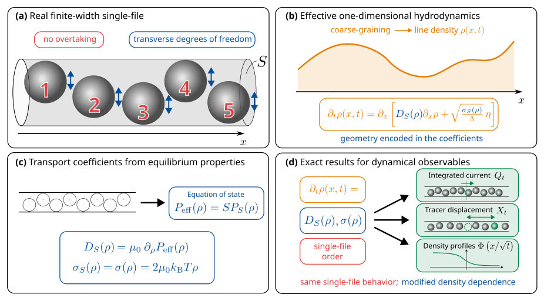
<figcaption class="paper-figure-caption"><b>Fig 1.</b> Figure 1: Geometry enters single-file dynamics through the transport coefficients. (a) Brownian particles diffuse in a channel of transverse section S. Their longitudinal order is conserved, which forbids overtaking, while transverse exploration remains allowed. This allows one to define a numbering of the particles which remains the same at all times. (b) Coarse-graining over the transverse coordinates defines the line density ρ(x, t). On large scales, ρ(x, t) obeys an exact one-dimensional fluctuating hydrodynamics. The field is one-dimensional, and all microscopic information enters through the transport coefficients DS(ρ) and σS(ρ). (c) The confined equilibrium problem determines the...</figcaption>
</figure>
<figure class="paper-figure-card">
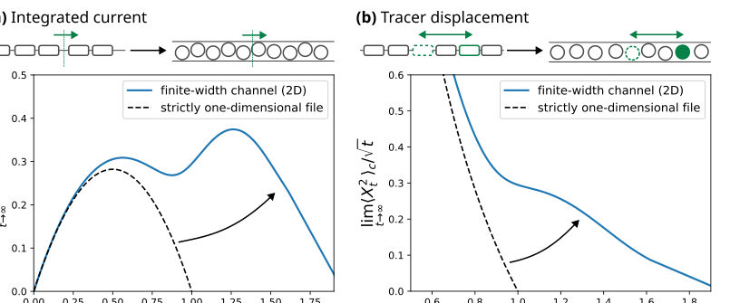
<figcaption class="paper-figure-caption"><b>Fig 2.</b> Figure 2: Finite width reshapes the density dependence of dynamical observables. (a) Fluctuations of the integrated current. (b) Fluctuations of the displacement of a tracer. The strictly one-dimensional hard-rod description does not reproduce the qualitatively different density dependence found in a finite-width two-dimensional channel of hard disks. The plots are for particles of size s = 1 in a channel of width 1.86.</figcaption>
</figure>
<figure class="paper-figure-card">
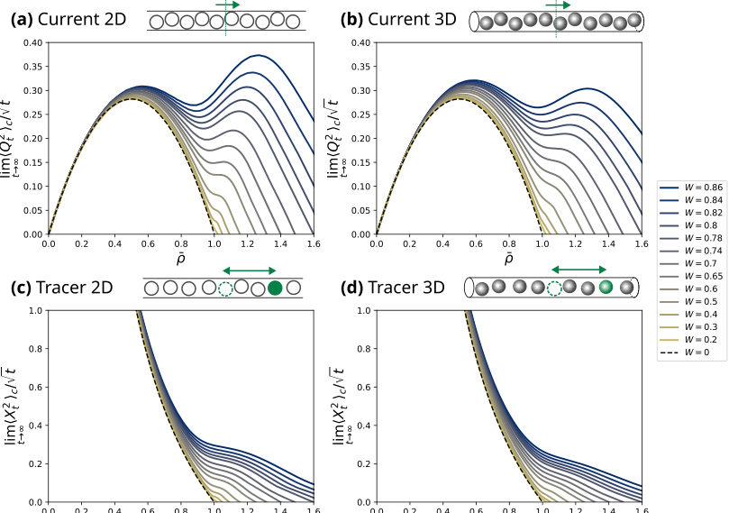
<figcaption class="paper-figure-caption"><b>Fig 3.</b> Figure 3: Robustness with respect to channel geometry. The effect is robust to the dimension and transverse size s + W of the channels. The plots are for hard-core particles of size s = 1 with an annealed initial condition.</figcaption>
</figure>
<figure class="paper-figure-card">
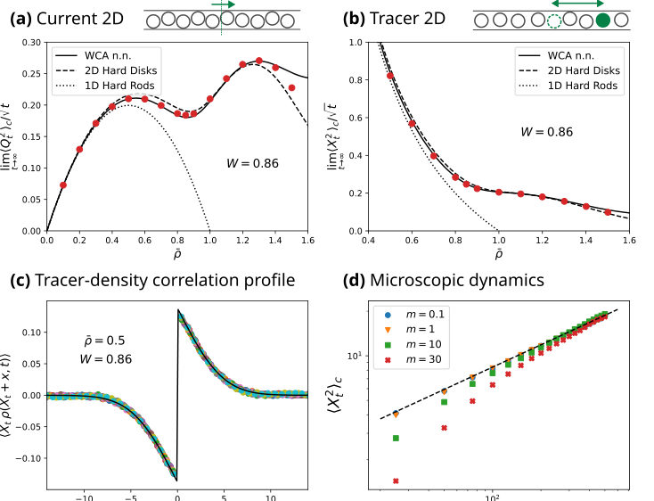
<figcaption class="paper-figure-caption"><b>Fig 4.</b> Figure 4: Robustness with respect to interaction, initial preparation and dynamics. (a)(b) The effect persists for a smooth interaction and a quenched initial preparation. The points are obtained from numerical simulations performed with LAMMPS [41] with N = 800 particles in 2d channels of different length L and width 1.86 with Weeks-Chandler-Andersen potential [40], damping factor γ = 1/µ0 = 1, temperature T = 1 and mass m = 0.1. Initially, the particles are equally spaced, corresponding to a quenched preparation. (c) Bath–tracer density profile associated with a tracer displacement for a quenched initial condition. The profile shows the large-scale rearrangement of the surrounding...</figcaption>
</figure>

**Summary.** This work investigates single-file particle transport in quasi-1D channels, demonstrating that residual transverse geometry significantly influences large-scale collective transport laws. By deriving an exact fluctuating hydrodynamics equation, the authors show that geometric effects modify key observables like diffusivity and current fluctuations compared to idealized 1D models. This highlights that confinement is not merely a restriction of dimensionality but actively shapes the system's thermodynamics.

**Why it may be interesting.** It provides a rigorous theoretical framework showing how geometric constraints (transverse confinement) persist and modify macroscopic transport properties even when the primary dynamics are restricted to one dimension, which is relevant for understanding confined quantum systems or mesoscopic devices.

Detailed structure

**Main problem.** To determine if residual transverse geometry affects large-scale transport laws in quasi-one-dimensional single-file systems, challenging the standard assumption that such effects are negligible once overtaking is forbidden.

**Main result.** The finite width of the channel dictates the coefficients of the effective 1D fluctuating hydrodynamics, causing collective diffusivity to become non-monotonic with density, a deviation from purely 1D models.

**Method.** Derivation of exact large-scale one-dimensional fluctuating hydrodynamics by coarse-graining microscopic Brownian dynamics and calculating transport coefficients via linear response theory and free energy analysis.

**Model / system.** Brownian particles confined in a channel with finite transverse width, exhibiting single-file transport (no overtaking). The system is analyzed using continuum field theories derived from the microscopic dynamics.

**Key observables.** Collective diffusivity ($D_S(
ho)$), integrated current fluctuations ($\langle Q^2_t 
angle$), and tracer displacement fluctuations ($\langle X^2_t 
angle$).

**Important parameters / regimes.** Finite channel width, density ($
ho$), large length scales ($\Lambda$), and the interaction potential (e.g., hard-core repulsion).

**Assumptions / limitations.** The analysis relies on deriving an effective 1D hydrodynamics from a full confined geometry, assuming local equilibrium approximations for calculating pressure and transport coefficients.

**Figures summary.** Figures illustrate how geometry enters through transport coefficients, showing density dependence of current/tracer fluctuations that differs qualitatively from strictly 1D hard-rod descriptions; robustness is shown across different channel shapes and potentials.

**Paper structure.** The paper first establishes the microscopic dynamics and derives the general fluctuating hydrodynamics equation. It then focuses on determining the effective pressure and transport coefficients for the single-file geometry using partition function methods, culminating in predictions for large-scale fluctuation observables under various initial conditions.

Abstract

Single-file transport means no overtaking: particles move in a narrow channel while preserving their longitudinal order. This simple constraint has profound dynamical consequences, most notably tracer subdiffusion, and has made single-file transport a paradigmatic form of confined many-body motion, observed from molecular transport in zeolites to single-file diffusion of colloids in narrow channels. The standard view is that, once overtaking is suppressed, collective transport reduces to that of a strictly one-dimensional file. Here we show that this reduction fails in experimentally relevant finite-width channels: even when exchange is forbidden, the transverse equilibrium structure controls the transport laws and can qualitatively reshape them. Starting from the Brownian dynamics in the full confined geometry, we derive an exact large-scale one-dimensional fluctuating hydrodynamics for the longitudinal density, whose coefficients are fixed by the confined equilibrium equation of state. In the minimal hard-core setting, this yields a collective diffusivity that can become non-monotonic in density. This geometric anomaly propagates to exact large-scale predictions for integrated-current fluctuations, tracer displacement fluctuations and the associated density profiles. The effect is robust to the interaction potential, channel geometry, initial preparation and microscopic dynamics. Quasi-one-dimensional single-file transport therefore defines a distinct regime in which forbidding overtaking does not erase geometry from collective transport.

[↑ back to top](#top)

### [Layer-parity-dependent interfacial coupling in Nb$_3$Cl$_8$/graphene van der Waals heterostructures](http://arxiv.org/abs/2606.10741v1)

**Authors:** Hansheng Xu, Yuchen Gao, Xinyue Huang, Weihanzhang Guo, Zhijie Ma, Ziqi Liu, Pinfan Gu, Kenji Watanabe, Takashi Taniguchi, Youguo Shi, Yu Ye  
**Type:** both · **Category:** strongly correlated electrons · **PDF:** <https://arxiv.org/pdf/2606.10741v1>  
**Analysis basis:** full PDF text, analyzed in chunks
**Topic relevance:** `analog quantum simulation` **3/5** · `spintronics-quantum-optics interface` **3/5** · `driven-dissipative phase transition` **2/5** · `Keldysh / 2PI / non-Gaussian methods` **1/5** · `Kondo & dissipative impurity` **1/5** · `methods for driven-dissipative` **1/5** · `non-equilibrium dynamics` **1/5**

↔ Scroll figures horizontally

<figure class="paper-figure-card">
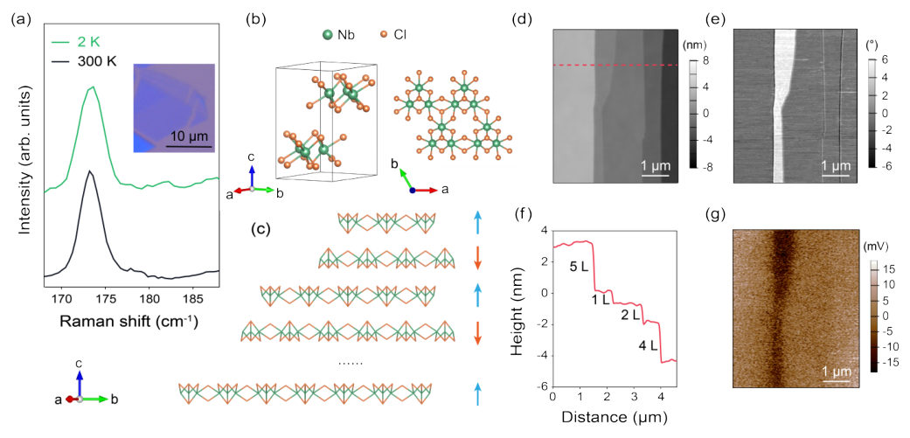
<figcaption class="paper-figure-caption"><b>Fig 1.</b> Fig. 1. Layer-parity-dependent out-of-plane polarization in exfoliated Nb3Cl8. (a), Raman spectra of bulk Nb3Cl8 and few-layer exfoliated samples at 2 K, showing characteristic A1 1g (at 173 cm−1) peak of α-phase. Inset: the optical image of the exfoliated Nb3Cl8 flake. (b), Crystal structure of α-Nb3Cl8 showing the kagome lattice with a two-layer periodicity. (c), Schematic illustration of the layer-parity-dependent out-of-plane polarization. The different surface terminations lead to distinct electronic properties when coupled with graphene. (d-e), AFM morphology (d) and phase (e) maps of a representative few-layer Nb3Cl8 at the same region. (f), Height profile along the marked red dashed...</figcaption>
</figure>
<figure class="paper-figure-card">
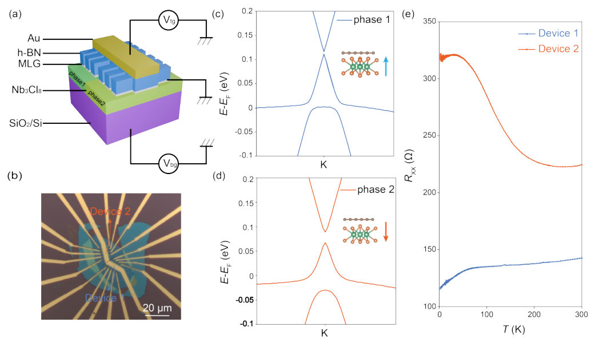
<figcaption class="paper-figure-caption"><b>Fig 2.</b> Fig. 2. Device structure and density functional theory calculations. (a), Schematic illustration of the dual-gated Hall bar device showing the layer stacking geometry. (b), Optical microscope image of the double-gate Hall Device 1 and Device 2 (separated by a red dashed line), in which the MLG is located on a few-layer Nb3Cl8 film with one layer thickness difference. (c), DFT-calculated band structure of the Nb3Cl8/MLG heterostructure for Phase 1 (upward polarization), showing the formation of a hybridization gap. (d), DFT-calculated band structure for Phase 2 (downward polarization), displaying a larger hybridization gap compared to Phase 1. Insets show the stacking structures of...</figcaption>
</figure>
<figure class="paper-figure-card">
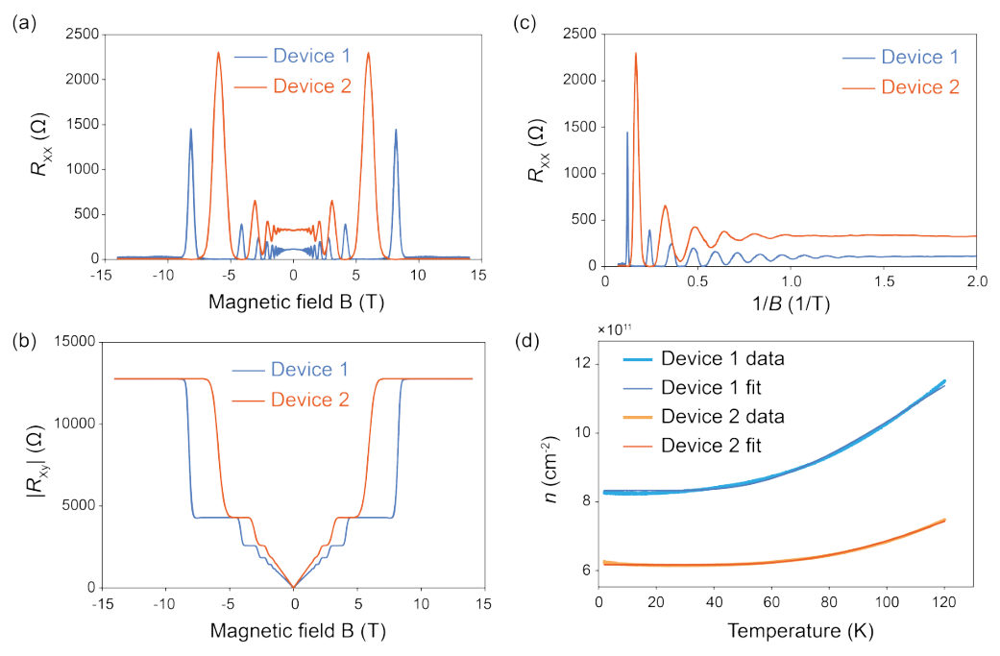
<figcaption class="paper-figure-caption"><b>Fig 3.</b> Fig. 3. Magnetotransport behavior of different phases Nb3Cl8/MLG heterostructure devices. (a), Longitudinal resistance Rxx as a function of magnetic field at zero gate voltages, measured at 2 K with the magnetic field applied perpendicular to the sample plane. (b), Hall resistance Rxy versus magnetic field for both devices under the same conditions. (c), Shubnikov–de Haas (SdH) oscillations plotted as Rxx versus 1/B. The oscillation frequencies yield carrier densities of n = 8.25 × 1011 cm−2 (6.12 × 1011 cm−2) for Device 1 and (Device 2). (d), Temperature-dependent carrier density at VTG = 0 V extracted from temperature-dependent Hall measurements. The data are fitted using the Fermi-Dirac...</figcaption>
</figure>
<figure class="paper-figure-card">
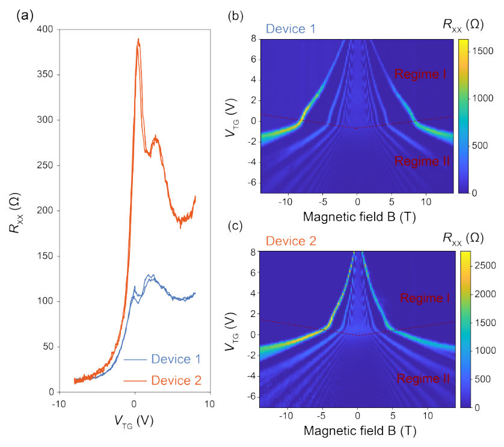
<figcaption class="paper-figure-caption"><b>Fig 4.</b> Fig. 4. Transport behavior of different phases Nb3Cl8/MLG devices under gate and magnetic field regulation. (a), Longitudinal resistance versus VTG at 2 K without applying a magnetic field, showing distinct gate-dependent behaviors reflecting different interfacial coupling strengths. (b-c), Landau fan diagrams showing Rxx as a function of VTG and magnetic field at 2 K for Device 1 and Device 2, respectively. Two distinct regimes separated by red dashed lines are visible. The steeper slope of the Landau fan in Regime I for Device 2 further confirms the larger magnitude of charge transfer, demonstrating the phase-dependent interfacial coupling effect.</figcaption>
</figure>

**Summary.** This work demonstrates that the surface polarization of the Mott insulator $	ext{Nb}_3	ext{Cl}_8$ critically controls its interaction with graphene. By fabricating heterostructures on surfaces exhibiting different polarizations, the authors show distinct electronic coupling strengths and measurable changes in transport gaps, highlighting layer-parity engineering as a tool for controlling correlated material properties.

**Why it may be interesting.** The explicit link drawn between crystal symmetry breaking (polarization) and tunable electronic coupling in a correlated material platform is highly relevant for designing novel quantum devices based on interfacial engineering.

Detailed structure

**Main problem.** The study investigates how the layer-parity-dependent out-of-plane polarization of a Mott insulator ($	ext{Nb}_3	ext{Cl}_8$) dictates the interfacial coupling strength and electronic properties when coupled with graphene.

**Main result.** Different surface polarizations lead to distinct coupling strengths, evidenced by measurable differences in hybridization gaps (25.2 meV vs 30.0 meV) and charge transfer magnitudes in transport measurements.

**Method.** The research combines experimental characterization using AFM/KPFM with magnetotransport measurements on fabricated devices, corroborated by DFT calculations.

**Model / system.** The system is a van der Waals heterostructure formed by coupling monolayer graphene (MLG) to $	ext{Nb}_3	ext{Cl}_8$, which exhibits layer-parity dependent polarization due to its Mott insulating nature.

**Key observables.** Hybridization gap ($\Delta$), charge transfer magnitude (inferred from Landau fan slopes), carrier density ($n$), and surface potential/polarization state.

**Important parameters / regimes.** Layer parity (odd vs. even layers), hybridization gap values (25.2 meV, 30.0 meV), and polarization direction (upward vs. downward).

**Assumptions / limitations.** The coupling mechanism is strongly dependent on the local surface termination/polarization state of the Mott insulator.

**Figures summary.** Figures illustrate AFM phase maps showing layer-parity dependence, KPFM potential mapping, and transport data (R-T, B-field) comparing devices built on different $	ext{Nb}_3	ext{Cl}_8$ phases.

**Paper structure.** The paper first establishes the physical phenomenon of layer-parity dependent polarization using AFM/KPFM. It then builds dual-gate Hall devices on these distinct surface phases to measure transport properties, comparing results (e.g., gap size, carrier density) between phases associated with different polarizations.

Abstract

Strongly correlated two-dimensional systems provide compelling platforms for investigating exotic quantum phenomena. Niobium chloride (Nb$_3$Cl$_8$), a single-band Mott insulator, exhibits a remarkable out-of-plane polarization in its topmost layer that oscillates with layer parity, manifesting as an odd-even effect. Using atomic force microscopy (AFM) and Kelvin probe force microscopy (KPFM), this layer-parity-dependent polarization can be effectively characterized through surface morphology and potential mapping, enabling the unambiguous identification of different surface phases. We then fabricated dual-gate Hall devices by coupling different surface phases of Nb$_3$Cl$_8$ with monolayer graphene to investigate how the topmost-layer out-of-plane polarization influences interfacial coupling and the resulting transport behavior. Our results reveal significant phase-dependent variations in charge transfer, carrier densities, and hybridization gaps (25.2 meV for Phase 1 and 30.0 meV for Phase 2). Density functional theory calculations corroborate these experimental findings, showing that distinct out-of-plane polarizations in the topmost layer lead to different orbital overlaps and interfacial coupling strengths. These findings highlight the critical importance of surface polarization and orbital orientation in engineering the properties of strongly correlated van der Waals heterostructures.

[↑ back to top](#top)

### [Local density of states distribution and multifractal eigenvectors of weighted random networks via the cavity approach](http://arxiv.org/abs/2606.10915v1)

**Authors:** Joseph W. Baron, Tim Rogers  
**Type:** theory · **Category:** disordered systems and neural networks · **PDF:** <https://arxiv.org/pdf/2606.10915v1>  
**Analysis basis:** full PDF text, analyzed in chunks
**Topic relevance:** `Keldysh / 2PI / non-Gaussian methods` **3/5** · `methods for driven-dissipative` **2/5** · `analog quantum simulation` **1/5** · `correlated / nonlocal dissipation` **1/5** · `correlated cavity matter` **1/5** · `driven-dissipative phase transition` **1/5** · `entanglement & information structure` **1/5** · `non-equilibrium dynamics` **1/5** · `non-equilibrium universality` **1/5**

↔ Scroll figures horizontally

<figure class="paper-figure-card">
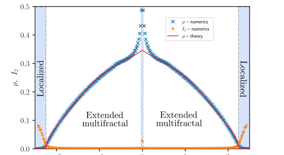
<figcaption class="paper-figure-caption"><b>Fig 1.</b> FIG. 1: Global density of states ρ and IPR I2 for a sparse ER graph with uniformly distributed uij = W 2 ij. Other weight distributions produce qualitatively similar results. The theory line for ρ(ω) is found by solving Eq. (16) numerically with β4 = 4/3 and β6 = 2 and p = 5 and using ρ = π−1 limϵ→0 Im⟨G(ω −iϵ)⟩. Numerics are the result of diagonalising 500 matrices with size N = 4000.</figcaption>
</figure>
<figure class="paper-figure-card">
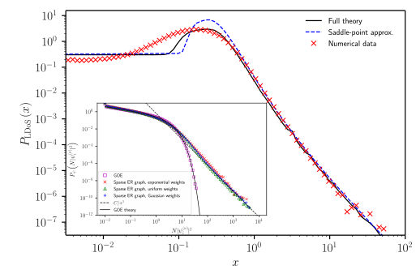
<figcaption class="paper-figure-caption"><b>Fig 2.</b> FIG. 2: Local density of states distribution for the ER graph adjacency matrix with uniformly distributed uij = W 2 ij at ω = 0.4. Comparison is made with Eq. (20) (solid black line) and the sum of Eqs. (21) and (B12) (dashed blue line). (Inset) The distribution Pψ(y) for the three weight distributions described in Section II, The theory line Pψ(y) = B/y3 is shown as a dashed line (with the constant B numerically fitted). Parameters: p = 3.4, ω = 0.4, N = 104, and results are averaged over 100 trials.</figcaption>
</figure>
<figure class="paper-figure-card">
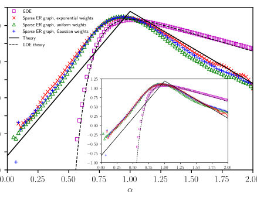
<figcaption class="paper-figure-caption"><b>Fig 3.</b> FIG. 3: Singularity spectrum for the three weight distributions mentioned in Section II at ω = 0.4, with p = 3.4 and N = 104 averaged over 100 trials. GOE is also given for contrast. The solid black line is the result in Eq. (26). (Inset) The case of non-zero diagonal disorder with W = 0.3. The singularity spectrum remains unchanged when W (the amount of diagonal disorder) is sufficiently small.</figcaption>
</figure>
<figure class="paper-figure-card">
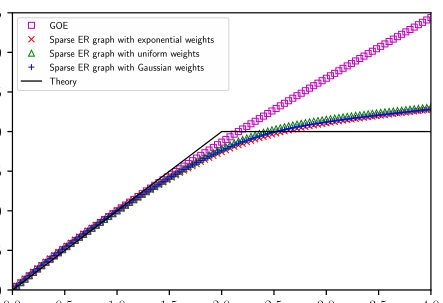
<figcaption class="paper-figure-caption"><b>Fig 4.</b> FIG. 4: The scaling exponent τq = D(q)(q −1) for the same ensembles and parameters as in Fig. 3. The solid line is given by the result in Eq. (27).</figcaption>
</figure>
<figure class="paper-figure-card">
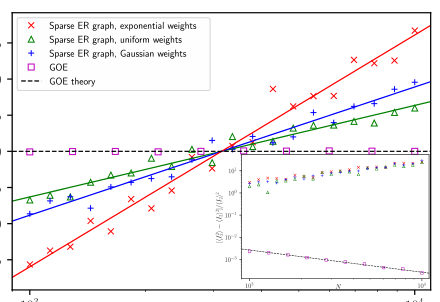
<figcaption class="paper-figure-caption"><b>Fig 5.</b> FIG. 5: Logarithmic scaling of the IPR with N for system parameters and ensembles given in Fig. 3. We have shifted the data so that each set of points passes through the origin. We show lines of best fit as guide to the eye. Since the constant B varies between ensembles (where Pψ(y) = B/y3</figcaption>
</figure>

**Summary.** This theoretical paper analyzes the spectral properties of weighted random networks by studying the Local Density of States (LDoS) distribution. Using the cavity method, it determines that the LDoS exhibits a universal power-law tail with an exponent of 3. Furthermore, it characterizes the corresponding eigenvectors as weakly multifractal, providing quantitative measures like fractal dimensions and scaling exponents.

**Why it may be interesting.** The findings on weak multifractality and non-trivial IPR scaling provide quantitative benchmarks for understanding spectral localization transitions in complex disordered quantum systems, which is relevant to many open quantum system models.

Detailed structure

**Main problem.** The study investigates the local density of states (LDoS) distribution and the multifractal nature of eigenvectors in weighted random networks.

**Main result.** The LDoS distribution is found to exhibit a universal power-law tail with an exponent of 3, indicating that the corresponding eigenvectors are weakly multifractal. The system shows unusual logarithmic scaling for the Inverse Participation Ratio (IPR).

**Method.** The analysis heavily relies on the cavity method and advanced techniques from Random Matrix Theory, including perturbative expansions and saddle-point approximations.

**Model / system.** The model is a weighted Erdős-Rényi graph ensemble characterized by weighted adjacency matrices $J$. The investigation analyzes spectral properties across different phases (extended, localized, multifractal).

**Key observables.** Local Density of States ($
ho_i(\omega)$), Singularity Spectrum ($f(\alpha)$), Fractal Dimensions ($D(q)$), and the Inverse Participation Ratio ($I_2$).

**Important parameters / regimes.** The analysis is sensitive to the weight distribution, particularly requiring a non-zero probability mass at zero for certain exponents. The system behavior is analyzed in the thermodynamic limit ($N 	o \infty$).

**Assumptions / limitations.** Key approximations include truncating moment expansions (e.g., $O(p^{-2})$) and using Laplace's method to derive asymptotic forms for the LDoS distribution.

**Figures summary.** Figures illustrate the global density of states, the LDoS power-law tail behavior, and the singularity spectrum derived from eigenvector statistics.

**Paper structure.** The paper systematically develops approximations for the resolvent elements using the cavity method to determine the LDoS distribution. It then relates the asymptotic tails of this distribution to the scaling properties of the eigenvectors, deriving fractal dimensions and symmetry relations.

Abstract

We study the local density of states (LDoS) distribution of a general class of weighted Erdős-Rényi graphs. Using the cavity method, we obtain a good approximation to the full LDoS distribution and compact expressions for its power-law tails, which we show to have exponent $3$ in the extended phase. We deduce that the eigenvectors in the continuous part of the spectrum are extended but (weakly) multifractal, and we extract expressions for the associated fractal dimensions and the singularity spectrum. We also demonstrate that the inverse participation ratio in this multifractal phase exhibits an unusual logarithmic scaling with system size, which is neither fully-extended nor localised by the usual definitions. Finally, we verify that some symmetry properties (derived from the non-linear sigma model), which have been shown to hold for many systems exhibiting multifractality, also hold in our case, both for the LDoS distribution and the singularity spectrum.

[↑ back to top](#top)

### [A Recrossing-Free Dividing Surface in Quantum Mechanics](http://arxiv.org/abs/2606.10266v1)

**Authors:** Pouya Khazaei  
**Type:** theory · **Category:** other · **PDF:** <https://arxiv.org/pdf/2606.10266v1>  
**Analysis basis:** full PDF text, analyzed in chunks
**Topic relevance:** `methods for driven-dissipative` **3/5** · `Keldysh / 2PI / non-Gaussian methods` **2/5** · `non-equilibrium dynamics` **2/5** · `driven-dissipative phase transition` **1/5** · `quantum measurements` **1/5**

↔ Scroll figures horizontally

<figure class="paper-figure-card">
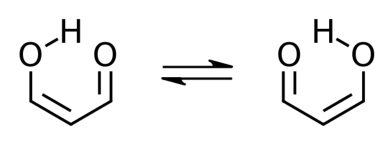
<figcaption class="paper-figure-caption"><b>Fig 1.</b> FIG. 1. Schematic of the cis–cis proton transfer reaction in malonaldehyde.</figcaption>
</figure>
<figure class="paper-figure-card">
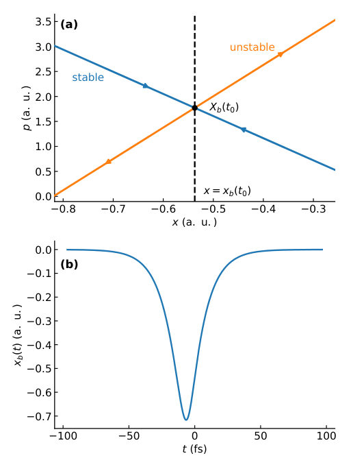
<figcaption class="paper-figure-caption"><b>Fig 2.</b> FIG. 2. (a) Phase-space geometry at t0 = 0. The stable and unstable manifolds, W s(t0) and W u(t0), intersect at the bounded quantum transition-state trajectory Xb(t0); the ver- tical dashed line x = xb(t0) is the corresponding instanta- neous dividing surface. Because Xb(t0) lies at this intersec- tion, it anchors a recrossing-free dividing surface. (b) The bounded trajectory xb(t), which stays localized for all time and whose projection traces the time-dependent recrossing- free dividing surface. Parameters: the barrier-top model for cis–cis proton transfer in malonaldehyde, with Gaussian wavepacket parameters q0 = −1, p0 = 3.6, A0 = 1</figcaption>
</figure>
<figure class="paper-figure-card">
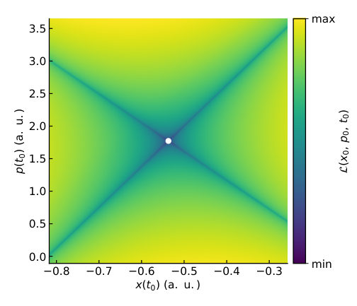
<figcaption class="paper-figure-caption"><b>Fig 3.</b> FIG. 3. Lagrangian descriptor of the quantum Hamiltonian flow for the barrier-top model motivated by cis–cis proton transfer in malonaldehyde, evaluated at t0 = 0. The de- scriptor L(x0, p0, t0) is computed over a finite time window τ = 4000 a.u. using α = 0.2. Sharp features in the forward and backward contributions identify the stable and unstable manifolds, respectively. Their intersection, marked by the dot, gives the bounded quantum transition-state trajectory and hence the recrossing-free dividing surface.</figcaption>
</figure>

**Summary.** The paper resolves a long-standing theoretical conflict by proving that a recrossing-free dividing surface exists in the exact quantum flow. It achieves this by analyzing the system's invariant manifold structure, which dictates a unique bounded trajectory defining the reaction barrier. This confirms that classical concepts of reactive flux are fundamentally preserved in quantum mechanics.

**Why it may be interesting.** This work provides a rigorous mathematical foundation for applying classical concepts like transition state theory to quantum dynamics by showing how geometric invariants (invariant manifolds) dictate non-classical transport features.

Detailed structure

**Main problem.** To demonstrate that a recrossing-free dividing surface, necessary for defining one-way reactive flux in quantum mechanics, exists despite apparent conflicts with the uncertainty principle.

**Main result.** The existence of a unique bounded trajectory, anchored by an intersection of stable and unstable invariant manifolds, confirms that the geometric framework of classical transition state theory extends to the exact quantum flow.

**Method.** The analysis uses a trajectory-based formulation derived from the Schrödinger equation, employing techniques from nonautonomous dynamical systems theory, specifically establishing exponential dichotomy.

**Model / system.** The system is modeled using quantum reaction dynamics, exemplified by the cis–cis proton transfer in malonaldehyde. The underlying physics involves solving coupled equations derived from the continuity and Hamilton-Jacobi equations, leading to an effective Hamiltonian.

**Key observables.** One-way flux of the standard quantum probability current ($j$), the rate coefficient $k(t)$, and the unique bounded trajectory $X_b(t)$ defining the dividing surface $\Sigma(t)$.

**Important parameters / regimes.** The system dynamics are analyzed in regimes where linear nonautonomous approximations hold, particularly for Gaussian wavepacket evolution.

**Assumptions / limitations.** The initial analysis relies on approximating the dynamics by retaining only quadratic terms, although this approximation is shown to be exact for specific wavepacket dynamics against a harmonic barrier.

**Figures summary.** Figure 1 schematically illustrates the proton transfer reaction. Figure 2 shows phase-space geometry, illustrating how the intersection of stable and unstable manifolds defines the instantaneous dividing surface $x = x_b(t)$.

**Paper structure.** The paper establishes the theoretical conflict, derives the necessary quantum equations of motion using trajectory methods, proves the existence of a unique bounded solution via exponential dichotomy, and finally applies this framework to calculate reaction rates using flux conservation across the resulting recrossing-free surface.

Abstract

For nearly a century, a recrossing-free dividing surface in quantum mechanics has been thought impossible. One-way reactive flux seems to require simultaneous trajectory-level knowledge of position and momentum -- an apparent conflict with the uncertainty principle. We show that this obstruction is not fundamental. The exact quantum flow can admit stable and unstable invariant manifolds whose intersection defines a unique bounded trajectory. This trajectory anchors a moving dividing surface that reactive quantum characteristics cross exactly once, producing a one-way flux of the standard quantum probability current. The geometric framework underlying classical reaction dynamics therefore carries over to the exact quantum flow, in a fundamentally quantum form.

[↑ back to top](#top)

### [Improved selector behavior in ultrathin chromium-doped V$_2$O$_3$ films](http://arxiv.org/abs/2606.10397v1)

**Authors:** Johannes Mohr, Tyler Hennen, Yudi Wang, Xiaoyu Xu, Loc Vinh, Dirk J. Wouters, Rainer Waser, Joyeeta Nag, Daniel Bedau  
**Type:** experiment · **Category:** strongly correlated electrons · **PDF:** <https://arxiv.org/pdf/2606.10397v1>  
**Analysis basis:** full PDF text, analyzed in chunks
**Topic relevance:** `spintronics-quantum-optics interface` **3/5** · `driven-dissipative phase transition` **2/5** · `Kondo & dissipative impurity` **1/5** · `analog quantum simulation` **1/5** · `exotic spin models in light-matter` **1/5** · `non-equilibrium dynamics` **1/5**

↔ Scroll figures horizontally

<figure class="paper-figure-card">
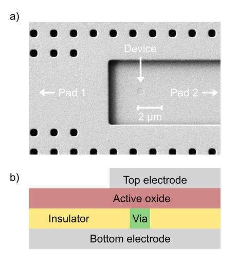
<figcaption class="paper-figure-caption"><b>Fig 1.</b> Figure 1: a) SEM image of the finished structure. The device is visible in the center as</figcaption>
</figure>
<figure class="paper-figure-card">
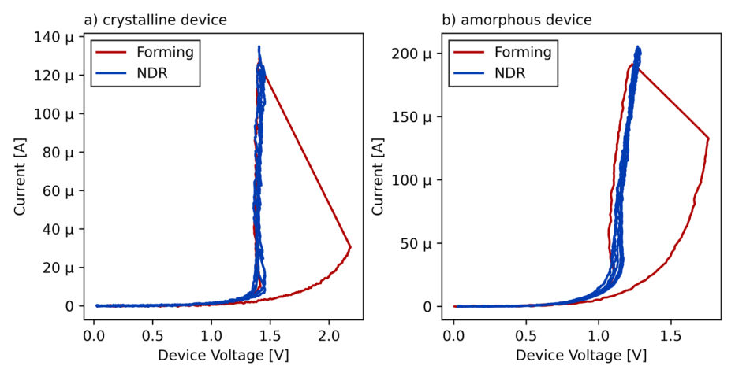
<figcaption class="paper-figure-caption"><b>Fig 2.</b> Figure 2: Negative differential resistance behavior (blue) is observed after an initial</figcaption>
</figure>
<figure class="paper-figure-card">
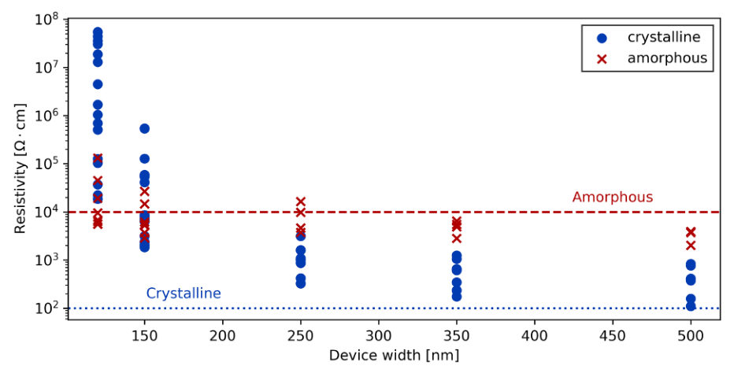
<figcaption class="paper-figure-caption"><b>Fig 3.</b> Figure 3: Resistivities calculated for the different cell sizes assuming a homogeneous</figcaption>
</figure>
<figure class="paper-figure-card">
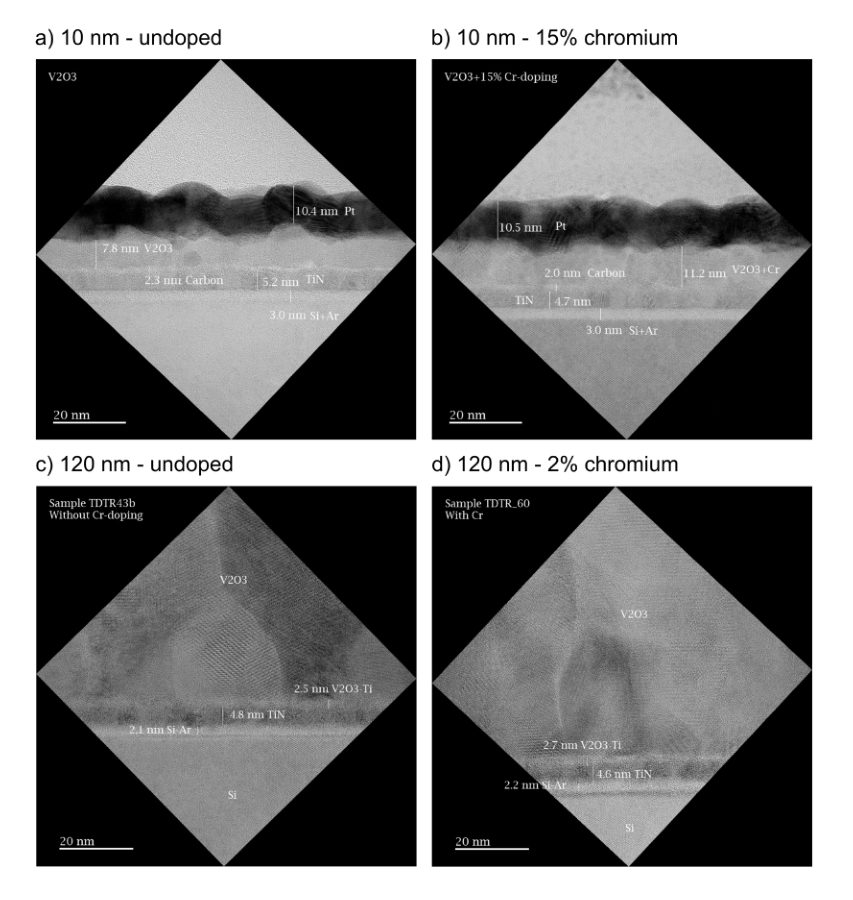
<figcaption class="paper-figure-caption"><b>Fig 4.</b> Figure 4: Bright field TEM images of four types of V2O3 films deposited on TiN bottom</figcaption>
</figure>
<figure class="paper-figure-card">
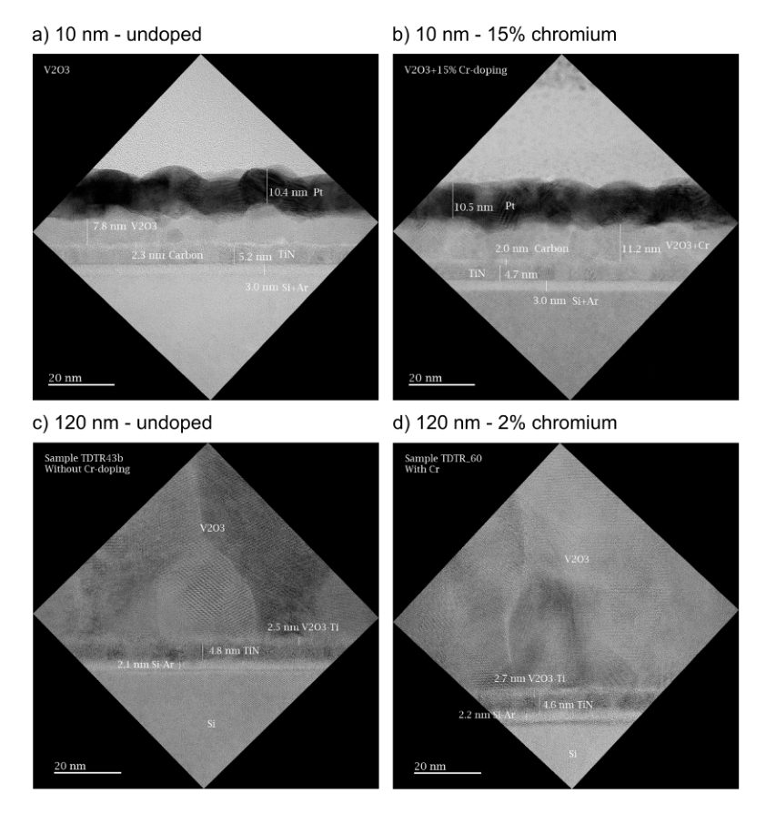
<figcaption class="paper-figure-caption"><b>Fig 5.</b> Figure 4 demonstrates that the films show an approximately columnar growth mode,</figcaption>
</figure>

**Summary.** This work investigates using ultrathin chromium-doped V2O3 films as promising selector elements for advanced memory devices. By achieving stable switching down to 5 nm, the authors demonstrate that interfacial amorphous layers, rather than bulk crystallinity, govern the desirable electrical properties like low leakage current and sharp transitions. The findings guide future device design by pinpointing the critical role of interface engineering.

**Why it may be interesting.** While focused on solid-state electronics, the underlying physics involves Mott transitions and charge localization in correlated oxides, which touches upon concepts relevant to strongly correlated electron systems studied theoretically.

Detailed structure

**Main problem.** Developing reliable selector elements for next-generation memory and neuromorphic devices using ultrathin chromium-doped V2O3 films.

**Main result.** The switching effect is maintained down to 5 nm, with improved low leakage current and abrupt transitions observed. The electrical behavior suggests that the switching mechanism is dominated by a thin amorphous interfacial layer rather than the bulk crystalline material.

**Method.** Electrical characterization (I-V sweeps) combined with advanced structural/compositional analysis using TEM, EELS, and EDX mapping.

**Model / system.** The physical system is a device structure based on chromium-doped V2O3 acting as a Mott-insulator exhibiting negative differential resistance via an electronically triggered metal-insulator transition. The study compares performance in both crystalline and amorphous film forms.

**Key observables.** Switching effect, Negative Differential Resistance (NDR), leakage current ($\mu	ext{A}$ range), forming voltage, and interfacial elemental distribution.

**Important parameters / regimes.** Film thickness down to 5 nm; doping concentration (15% Cr); operating voltages relative to threshold voltages.

**Assumptions / limitations.** The improved properties are attributed to the formation of a thin amorphous layer at the TiN interface, which dictates the resistive switching mechanism.

**Figures summary.** Figures illustrate device cross-sections, I-V curves showing NDR behavior after forming, and elemental maps revealing complex dopant distribution and Ti diffusion into the electrode interface.

**Paper structure.** The paper progresses from establishing the potential of Cr:V2O3 for selectors to presenting electrical measurements across varying thicknesses. It then uses TEM/EDX to analyze structural changes (amorphous layers) that correlate with the observed improved electrical performance, concluding with scaling predictions.

Abstract

Devices based on the negative differential resistance effect in chromium doped V$_2$O$_3$ are considered to be promising as selector elements for use in emerging memory technologies, as well as for neuromorphic applications. It is shown by electrical measurements, that the switching effect is maintained for very thin films down to 5 nm, and even improved properties such as a low leakage current and an abrupt transition are observed. For these thicknesses, the behavior of crystalline and amorphous films becomes very similar; most strikingly, a forming step is required in both. Transmission electron microscopy reveals this to be likely due to a thin amorphous layer that forms at the interface to the TiN electrode. Elemental mapping further shows a complex distribution of the chromium dopants, as well as a diffusion of Ti into the layer from the electrode, which might be responsible for the improved properties.

[↑ back to top](#top)

### [Pair creation amplitudes for a real scalar field coupled to a time-dependent surface in d+1 dimensions](http://arxiv.org/abs/2606.10800v1)

**Authors:** C. D. Fosco, B. C. Guntsche  
**Type:** theory · **Category:** other · **PDF:** <https://arxiv.org/pdf/2606.10800v1>  
**Analysis basis:** full PDF text, analyzed in chunks
**Topic relevance:** `Keldysh / 2PI / non-Gaussian methods` **3/5** · `non-equilibrium dynamics` **2/5** · `correlated / nonlocal dissipation` **1/5** · `driven-dissipative phase transition` **1/5** · `methods for driven-dissipative` **1/5** · `non-equilibrium universality` **1/5**

↔ Scroll figures horizontally

<figure class="paper-figure-card">
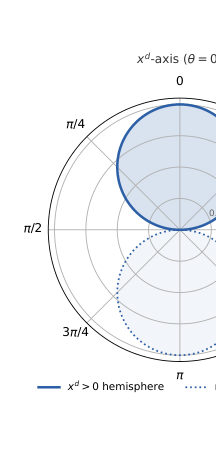
<figcaption class="paper-figure-caption"><b>Fig 1.</b> Figure 1: Angular distribution of the emitted particles in the localized, small- source regime, Eq. (41): a cos θ lobe along the normal to the surface. The dotted curve is the mirror image emitted into the xd &lt; 0 half-space.</figcaption>
</figure>
<figure class="paper-figure-card">
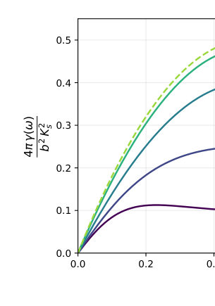
<figcaption class="paper-figure-caption"><b>Fig 2.</b> Figure 2: Pair-creation rate γ(ω) of Eq. (55) (in units of b2K2 s/(4π)) as a function of ω/Ks, for several values of λ/Ks. The Dirichlet limit (dashed) is the parabola 2(ω/Ks)(1 −ω/Ks). For λ ≲Ks the spectrum departs from the Dirichlet shape and develops a mild bimodal structure, the Lorentzian factor [1 + (2kq/λ)2]−1 favoring asymmetric partitions of the energy Ks.</figcaption>
</figure>

**Summary.** This theoretical paper investigates pair creation from a scalar field interacting with a moving boundary. It advances the calculation to fourth order, demonstrating that while lower orders confirm standard quantum field theory relations (like the optical theorem), higher orders reveal complex non-linear physics, including new second-harmonic emission and vacuum depletion effects.

**Why it may be interesting.** This work is highly relevant to open quantum systems and quantum optics because it provides a rigorous framework for calculating non-perturbative vacuum excitation processes (like the Dynamical Casimir Effect) beyond simple leading-order approximations, showing how nonlinearities manifest in multi-pair channels.

Detailed structure

**Main problem.** The study calculates pair creation amplitudes for a real scalar field due to its interaction with a time-dependent, deforming surface in d+1 dimensions.

**Main result.** The calculation establishes that while the leading order probability correctly reproduces twice the imaginary part of the effective action (the optical theorem), higher orders reveal nonlinear effects, such as genuine second-harmonic emission and vacuum depletion corrections.

**Method.** The authors employ perturbative quantum field theory techniques, expanding transition amplitudes in powers of the surface deformation parameter ($\psi$) and comparing results derived from exclusive scattering amplitudes with those obtained from the imaginary part of the effective action.

**Model / system.** The system involves a massless real scalar field coupled to a time-dependent boundary defined by $\Sigma$. The interaction is modeled via an action term proportional to $\delta(x_d - \psi(\mathbf{x}_q))$, analyzed in the limit of Dirichlet boundary conditions.

**Key observables.** Pair creation probability density, radiated power per unit solid angle ($rac{d\Omega}{Aq} rac{dW}{dk_0}$), and the total decay probability $P^{(2)}$ and $P^{(4)}$.

**Important parameters / regimes.** The surface deformation function $\psi(\mathbf{x}_q)$, the coupling constant $\lambda$, and the dimensionality $d+1$. The analysis focuses on high-order corrections (up to fourth order).

**Assumptions / limitations.** The calculation relies heavily on parity selection rules for non-vanishing terms, and several results are derived in the limit where the boundary condition is strictly Dirichlet ($\lambda 	o +\infty$).

**Figures summary.** Figure 1 illustrates an angular distribution ($\propto \cos	heta$) for a harmonically oscillating bump. Figure 2 compares the pair-creation rate $\gamma(\omega)$ vs. $\omega/K_s$ for varying coupling strengths, showing spectral departures. Figure 3 shows the cutting rule relating the discontinuity of the effective action to the two-particle phase-space integral.

**Paper structure.** The paper systematically calculates the amplitude expansion ($A = \sum A^{(n)}$) and the resulting probability density ($	ext{dP} \propto |A|^2$) up to fourth order. It then rigorously compares these direct calculations with established identities involving the imaginary part of the effective action, highlighting deviations at higher orders.

Abstract

We study the pair creation phenomenon for a real scalar field $\varphi$ in the presence of a surface that undergoes time-dependent deformations, while imposing Dirichlet-like boundary conditions. Including terms up to fourth order in the departure of the surface from an infinite plane, we present results for the angular dependence of the emission rate for the vacuum-to-pair process as a function of the geometry and the dynamics of the surface, as well as of the momenta of the emitted pair. We check the consistency of the leading contribution with previous results obtained from the imaginary part of the effective action, and clarify how the relation between exclusive probabilities and the imaginary part of the effective action is modified at fourth order by the opening of a two-pair channel.

[↑ back to top](#top)

### [Robust self-testing based on Gisin's arbitrary-input Bell inequality](http://arxiv.org/abs/2606.10983v1)

**Authors:** Rajdeep Paul, Alok Kumar Pan  
**Type:** theory · **Category:** quantum information and computing · **PDF:** <https://arxiv.org/pdf/2606.10983v1>  
**Analysis basis:** full PDF text, analyzed in chunks
**Topic relevance:** `quantum measurements` **3/5** · `measurement-induced transitions` **2/5** · `correlated / nonlocal dissipation` **1/5** · `driven-dissipative phase transition` **1/5** · `entanglement & information structure` **1/5** · `methods for driven-dissipative` **1/5**

↔ Scroll figures horizontally

<figure class="paper-figure-card">
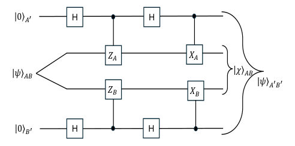
<figcaption class="paper-figure-caption"><b>Fig 1.</b> Figure 1. Swap circuit for self-testing of state and observables for arbitrary n</figcaption>
</figure>
<figure class="paper-figure-card">
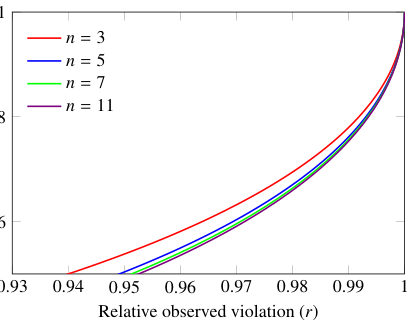
<figcaption class="paper-figure-caption"><b>Fig 2.</b> Figure 2. Trade-off between relative observed violation (r) and fi- delity Fs(r) for n = 3, 5, 7 and 11. Here, we are taking only that region where fidelity converges to one.</figcaption>
</figure>
<figure class="paper-figure-card">
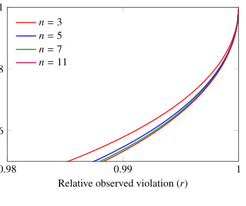
<figcaption class="paper-figure-caption"><b>Fig 3.</b> Figure 3. Trade-off between relative observed violation (r) and fi- delity Fo(r) ∀O ∈{XB, ZB} for n = 3, 5, 7 and 11. Here, we are taking only that region where fidelity converges to one.</figcaption>
</figure>

**Summary.** This paper develops a comprehensive framework for robust self-testing of quantum states using Gisin's arbitrary-input Bell inequality. It uses an SOS approach to find optimal theoretical bounds and then extends this theory to account for inevitable experimental noise. The result provides quantifiable fidelity thresholds, allowing researchers to determine the minimum required quality of measurements needed to certify nonlocality.

**Why it may be interesting.** This work provides rigorous theoretical tools to bridge the gap between idealized quantum theory predictions (optimal Bell violation) and practical experimental limitations imposed by noise, which is crucial for assessing real-world quantum device performance.

Detailed structure

**Main problem.** The paper addresses the challenge of robustly certifying the quantum nature of a state and measurements using Gisin's arbitrary-input Bell inequality (GBI) in realistic, noisy experimental settings.

**Main result.** They derive dimension-independent optimal quantum bounds for the GBI violation and establish concrete fidelity bounds that quantify how close an imperfect measurement must be to the ideal case to still certify entanglement/nonlocality.

**Method.** The core methodology involves using a systematic Sum-of-Squares (SOS) approach for optimization, followed by developing a robust framework that analyzes the trace distance between ideal and noisy measurement outcomes.

**Model / system.** The system is a bipartite quantum state $|\psi
angle_{AB}$ undergoing measurements defined by $n$ settings on both parties. The analysis generalizes to arbitrary number of inputs ($n$) and incorporates noise models ($\epsilon$).

**Key observables.** Gisin's Bell Inequality violation $\langle G_n 
angle$, State Fidelity $F_s(r)$, Observable Fidelity $f_o(r)$, and the relative observed violation $r$.

**Important parameters / regimes.** The number of measurement settings ($n$), the error parameter ($\epsilon$), and the relative observed violation ($r$).

**Assumptions / limitations.** The robustness analysis assumes that errors primarily arise from imperfect observable implementations, allowing for bounding the trace distance between ideal and noisy measurements.

**Figures summary.** Figures illustrate the Swap circuit used for self-testing and show trade-offs between increasing $n$ (more settings) versus increased vulnerability to noise.

**Paper structure.** The paper systematically builds from deriving the optimal quantum violation using SOS techniques for general $n$, detailing specific cases ($n=3, 4$), introducing the swap circuit realization, and finally developing a comprehensive robust analysis quantifying fidelity bounds based on measurement errors ($\epsilon$).

Abstract

Self-testing refers to the strongest device-independent (DI) certification method that validates the nature of a quantum system and devices solely based on the observed statistics. We demonstrate the self-testing of state and measurements based on the Gisin Bell inequality (GBI) featuring arbitrary inputs for both parties. We introduce a systematic and elegant sum-of-squares (SOS) approach that enables the dimension-independent derivation of the optimal quantum violation of GBI. We derive the state and the interrelation between the local observables directly from the optimization condition. Since the practical experimental scenario involves inevitable noise and imperfection, we present a comprehensive strategy for robust self-testing.

[↑ back to top](#top)

### [Virial stress in systems of active Brownian particles in the presence of translational and rotational inertia](http://arxiv.org/abs/2606.10486v1)

**Authors:** Chandranshu Tiwari, Sunil P. Singh, Roland G. Winkler  
**Type:** theory · **Category:** statistical mechanics · **PDF:** <https://arxiv.org/pdf/2606.10486v1>  
**Analysis basis:** full PDF text, analyzed in chunks
**Topic relevance:** `non-equilibrium dynamics` **3/5** · `non-equilibrium universality` **2/5** · `Frenkel-Kontorova` **1/5** · `Keldysh / 2PI / non-Gaussian methods` **1/5** · `driven-dissipative phase transition` **1/5** · `methods for driven-dissipative` **1/5**

↔ Scroll figures horizontally

<figure class="paper-figure-card">
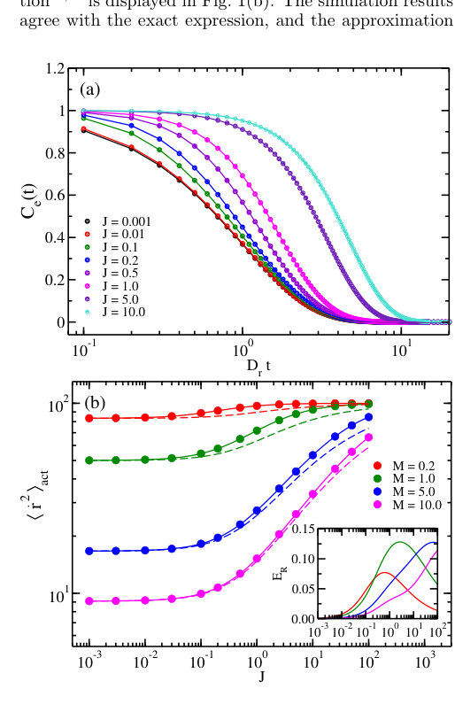
<figcaption class="paper-figure-caption"><b>Fig 1.</b> FIG. 1. (a) Orientational correlation function Ce(t) of ABP+TRIs as a function of Drt for various rotational inertia J (legend) in two dimension. The solid lines are the analyt- ical expression Eq. (33)27,43 and the symbols are simulation results. (b) Variation of the active contribution to the mean- square velocity as a function of J for various M. Solid and dashed lines indicate the dependence of Eq. (15) of Ref. 43 and Eq. (38) on J, respectively; bullets are simulation results. The inset shows the relative error between the approximate (Eq. 38) and exact mean-square velocity.</figcaption>
</figure>
<figure class="paper-figure-card">
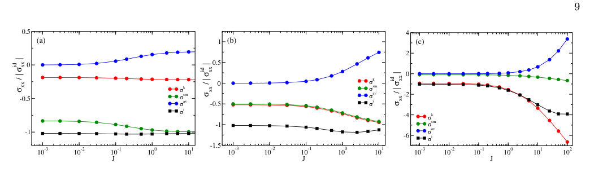
<figcaption class="paper-figure-caption"><b>Fig 2.</b> FIG. 2. Virial components σ(k) αα (red), σ(sm) αα (green), and σ(av) αα (blue) of the internal stress σ(i) αα (Eq. (30)) (black squares) in a periodic system for an ideal gas of active Brownian particles with translational and rotational inertia (ABP+TRIs) as a function of the reduced moment of inertia J and the reduced masses (a) M = 0.2, (b) M = 1.0, and (c) M = 10.0 at Pe = 10. σ(id) xx is the swim stress of an ideal ABP gas (Eq. (44)).</figcaption>
</figure>
<figure class="paper-figure-card">
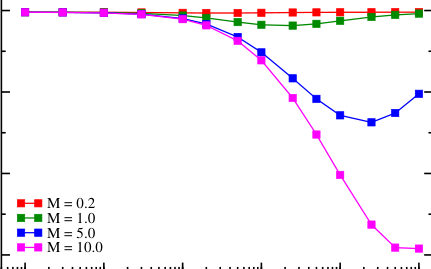
<figcaption class="paper-figure-caption"><b>Fig 3.</b> FIG. 3. Internal stress tensor, σ(i) αα (Eq. (30)), for a periodic system of an ABP+TRI gas as a function of the reduced mo- ment of inertia J and the reduced masses M = 0.2 (red), 1.0 (green), 5.0 (blue), and 10.0 (magenta) at Pe = 10.</figcaption>
</figure>
<figure class="paper-figure-card">
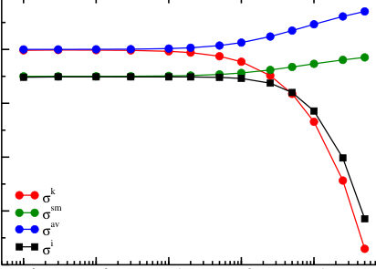
<figcaption class="paper-figure-caption"><b>Fig 4.</b> FIG. 4. Internal stress σ(i) αα (Eq. (30)) (black squares) and its components σ(k) αα (red), σ(sm) αα (green), and σ(av) αα (blue) for an ideal gas of ABP+TRIs in a periodic system as a function of the reduced moment of inertia J at Pe = 10. The ratio of the reduced moment of inertia and the reduced mass is fixed at J/M = 2; the x-axis also presents the dependence on M.</figcaption>
</figure>
<figure class="paper-figure-card">
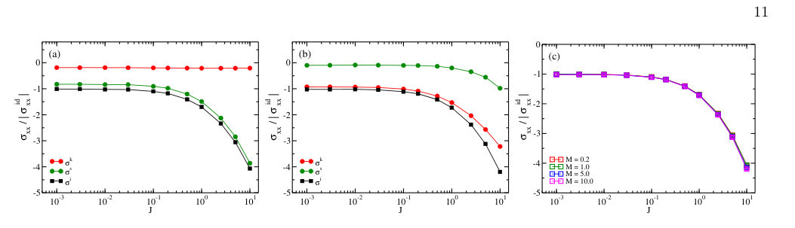
<figcaption class="paper-figure-caption"><b>Fig 5.</b> FIG. 5. The virial components σ(k) αα (red) and σ(s) αα (green) of the global internal stress σ(i) αα (Eq. (11)) (black squares) in a confined system of ABP+TRIs as a function of the reduced moment of inertia J and the reduced masses (a) M = 0.2 and (b) M = 10.0 at Pe = 10. (c) Global internal (squares) and external (circles) stresses as a function of the reduced moment of inertia and various masses (legend).</figcaption>
</figure>

**Summary.** This paper rigorously derives the stress tensor for active Brownian particles incorporating both translational and rotational inertia in 2D. It distinguishes between periodic and confined geometries, finding that while an equation of state holds in bulk periodic systems, confinement introduces wall-induced polarization that invalidates simple constitutive relations. The findings emphasize that inertial effects necessitate including angular-velocity contributions beyond just the 'swim stress' to accurately describe mechanical stress.

**Why it may be interesting.** This work provides a detailed mechanical description of non-equilibrium matter driven by self-propulsion and inertia, which is crucial for understanding active matter systems relevant to biological or synthetic soft matter physics. The rigorous derivation of stress components beyond simple swim stress is highly valuable.

Detailed structure

**Main problem.** The study elucidates the stress tensor within a system of active Brownian particles augmented with translational and rotational inertia (ABP+TRI). The goal is to understand how these inertial effects modify the mechanical description of activity, especially when comparing periodic versus confined geometries.

**Main result.** In periodic systems, an equation of state exists for the bulk stress. However, in confined systems, strong wall polarization breaks this simple relationship, and the swim stress alone is insufficient to characterize the total stress tensor due to inertia effects.

**Method.** The authors derive stress tensors using generalized virial theorems applied to the equations of motion (including inertial terms) for both periodic and confined boundary conditions. Langevin simulations are used to validate theoretical predictions across various parameter regimes.

**Model / system.** The model consists of $N$ self-propelled point particles whose dynamics include translational damping, rotational damping, and explicit translational ($m$) and rotational ($I$) inertia terms. Interactions involve repulsive Lennard-Jones potentials, and the system is analyzed in 2D under periodic or confined boundary conditions.

**Key observables.** Stress tensor components ($\sigma^{(k)}, \sigma^{(sm)}, \sigma^{(av)})$, local/global stress tensors, equation of state dependence, particle density profiles, and local polarization $p(x)$.

**Important parameters / regimes.** Translational inertia ($m$), rotational inertia ($I$), Péclet number (Pe), reduced mass ($M$), and reduced moment of inertia ($J$).

**Assumptions / limitations.** The derivation relies on applying generalized virial theorems, which are complicated by the inclusion of inertial terms. Approximations are used for correlation functions to derive closed-form stress expressions.

**Figures summary.** Figures illustrate the spatial dependence of local stress components ($\sigma_{i,xx}$) near walls in confined systems, showing polarization and density accumulation, and compare global internal stresses between periodic and confined geometries as a function of inertia parameters.

**Paper structure.** The paper progresses from deriving general stress tensor formulations using virial theorems for inertial active particles. It then contrasts the results obtained under periodic versus confined boundary conditions, analyzing how confinement breaks simple constitutive relations like the equation of state.

Abstract

We elucidate the stress in a system of active Brownian particles augmented with translational and rotational inertia (ABP+TRI). Stress tensors are derived for periodic systems as well as systems confined between walls by employing Lagrange's equations of motion of the first kind for the rotational motion. Using Langevin simulations of an ideal active gas in two dimensions, we confirm the existence of an equation of state for periodic systems that depends on translational and rotational inertia in general. Confinement implies a strong polarization of the propulsion direction near a wall and an enhanced density, both of which increase with increasing rotational inertia. This affects the local stress tensor normal to the confining walls, leading to a breakdown of the equation of state. Yet the local stress in the bulk part of the confined systems is identical with that of the periodic system. Importantly, for both kinds of boundary conditions, the so-called swim stress is not included in the local stress tensor; thus, in general, the swim stress is not representative of the stress in systems of ABP+TRIs.

[↑ back to top](#top)

### [Certification of Network Quantum Sensing](http://arxiv.org/abs/2606.10700v1)

**Authors:** Matteo Rosati, Gabriele Bizzarri, Marco Barbieri  
**Type:** both · **Category:** quantum information and computing · **PDF:** <https://arxiv.org/pdf/2606.10700v1>  
**Analysis basis:** full PDF text, analyzed in chunks
**Topic relevance:** `quantum optics experiment` **3/5** · `entanglement & information structure` **2/5** · `QC/QI experiment` **1/5** · `interference shaping light` **1/5** · `quantum measurements` **1/5**

↔ Scroll figures horizontally

<figure class="paper-figure-card">
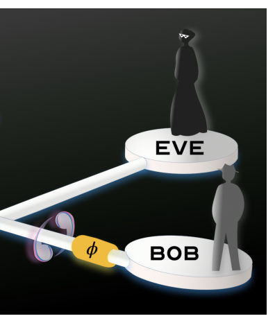
<figcaption class="paper-figure-caption"><b>Fig 1.</b> Fig. 1 Concept of our certifiable SPQR setting. Alice is interested in a target parameter ϕ only Bob has local access to. Therefore, she distributes part of an entangled state Φ to Bob over an untrusted quantum channel. At the same time, an adversarial user, Eve, manipulates the network in order to gather as much information as possible about ϕ and tamper with the probe received by Bob. We show that Alice and Bob can perform a twirling operation in order to protect against arbitrary channel attacks by Eve, but without compromising the probe’s metrological value for sensing.</figcaption>
</figure>
<figure class="paper-figure-card">
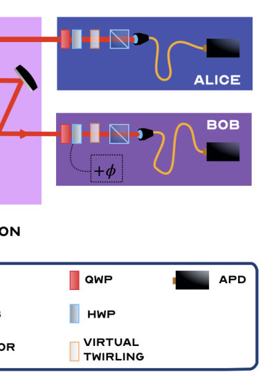
<figcaption class="paper-figure-caption"><b>Fig 2.</b> Fig. 2 Photonic platform for SPQR. Photonic qubits are produced by means of a parametric down conversion (PDC) process in a 3mm-thick β-barium borate (BBO) crystal pumped by a 50mW- continuous-wave (CW) laser with central wavelength λ0 = 405nm. Polarization-encoded qubits are then coupled by means of a photonic gate, producing the state (8)., starting from the polarisation cos(π/3) |H⟩+ sin(π/3) |H⟩on both inputs. The gate comprises a partially polarising beam splitter (PPBS), which allows for polarisation-selective nonclassical interference. This is embedded within a Sagnac interferometer, which reduces the impact of deviations of the actual transmittivities from the ideal ones. Following...</figcaption>
</figure>
<figure class="paper-figure-card">
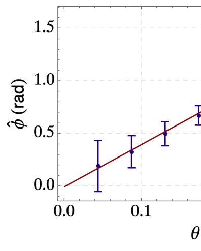
<figcaption class="paper-figure-caption"><b>Fig 3.</b> Fig. 3 Estimated phases as a function of the rotation angle θ. Blue points and vertical bars corre- spond to experimental data with the associated experimental uncertainty. Theoretical prediction is here represented by the red continuous line.</figcaption>
</figure>
<figure class="paper-figure-card">
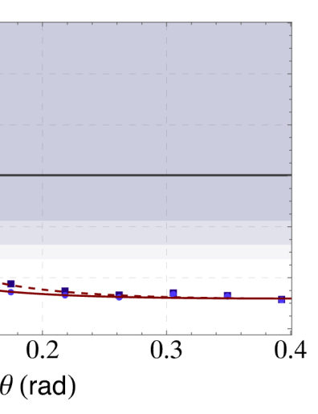
<figcaption class="paper-figure-caption"><b>Fig 4.</b> Fig. 4 Estimation performances in presence of a malicious adversary. Squares correspond to total estimation uncertainties, retrieved by including in ∆2ϕ uncertainties in the CHECK and ESTIMA- TION rounds by error propagation. Circles represent estimation uncertainties ∆2ϕest retrieved by considering the ESTIMATION rounds only for error propagation. On average, Nres = 193 resources have been used in a single round. Accordingly, the red continuous line is associated with Alice’s CRB at fixed CHECK round correlators, whereas the red dashed line depicts Alice’s CRB from a multipa- rameter treatment. The black, continuous line represents an estimate of Eve’s QFI, according to (16). The gray...</figcaption>
</figure>

**Summary.** This paper presents a novel quantum remote sensing protocol to simultaneously certify high measurement precision and robust security against eavesdropping. By employing offline Pauli-twirling on entangled photon states, the authors force the channel into a predictable form while preserving metrological sensitivity. This provides a practical pathway for achieving quantum-limited performance in real-world, insecure quantum networks.

**Why it may be interesting.** This work directly tackles the intersection of quantum metrology and quantum cryptography, providing concrete protocols that resolve long-standing theoretical tensions in secure quantum communication channels.

Detailed structure

**Main problem.** The core challenge is simultaneously guaranteeing optimal estimation precision (metrology) and rigorous security against eavesdropping in distributed quantum sensing networks.

**Main result.** The authors introduce a protocol using offline bilateral Pauli-twirling that certifies both high metrological sensitivity and information security, showing the two goals are compatible.

**Method.** They employ theoretical analysis involving bounding estimation errors (MSE) for both legitimate users and eavesdroppers, utilizing quantum Fisher Information derived from Pauli correlators.

**Model / system.** The system models a tripartite interaction between Alice, Bob, and an adversary Eve over an untrusted quantum channel. The protocol is demonstrated experimentally using entangled photons to estimate an optical phase.

**Key observables.** Estimation error (MSE) for legitimate users vs. eavesdropper; Quantum Fisher Information (QFI); Pauli correlators ($\langle P_eta \otimes P_eta 
angle$).

**Important parameters / regimes.** The estimated phase $\phi$; the number of measurements ($n$); and the fidelity $F(
ho_\phi, 
ho_{\phi+\epsilon})$.

**Assumptions / limitations.** Initial analysis assumes i.i.d. attacks from Eve; the derivation relies on small-angle approximations for fidelity calculations.

**Figures summary.** Figures illustrate the concept of certifiable SPQR settings, show experimental measurements of estimated phases vs. theory, and compare total versus estimated uncertainties ($\Delta^2\phi$) against theoretical bounds.

**Paper structure.** The paper develops by first defining the security/metrology tension, introducing Pauli twirling as a solution, deriving mathematical bounds using Fisher information for both parties, and concluding with experimental validation using entangled photons.

Abstract

The distribution of quantum sensors on quantum networks is a key enabler of quantum technologies in interferometry, gravimetry, timekeeping, biological monitoring, and beyond. Yet, guaranteeing the security of these distributed sensors over noisy, insecure networks remains a formidable challenge. Previous efforts to combine quantum metrology and cryptography have encountered an apparently unavoidable tension, proposing bounds for security which are only loosely tied to the achievable measurement performance.   Here we introduce a quantum remote sensing protocol that can rigorously certify privacy and integrity of the estimation. By employing offline bilateral Pauli-twirling, our approach forces the effective quantum channel into a Bell-diagonal form, independently of the attack. Surprisingly, this also preserves metrological sensitivity without introducing additional experimental overhead. Relying solely on public communication alongside an insecure quantum link, the protocol enables legitimate users to exactly quantify their estimation error relative to an eavesdropper controlling the channels.   We experimentally demonstrate this framework by estimating an optical phase using entangled photons, observing that the users' precision consistently surpasses the eavesdropper's capabilities across a broad parameter regime. By unifying quantum cryptography and metrology, our results provide a practical pathway to achieve simultaneous quantum-limited precision and rigorous information security in real-world quantum networks.

[↑ back to top](#top)

### [Antiferromagnetic order and magnetic polarons in lightly doped Li$_x$CoO$_2$ (x $\sim$ 0.9)](http://arxiv.org/abs/2606.10419v1)

**Authors:** Sudip Pal, Pampa Sadhukhan, Waqar Suleman, Andrej Pustogow, S. B. Roy  
**Type:** experiment · **Category:** strongly correlated electrons · **PDF:** <https://arxiv.org/pdf/2606.10419v1>  
**Analysis basis:** full PDF text, analyzed in chunks
**Topic relevance:** `spintronics-quantum-optics interface` **3/5** · `Kondo & dissipative impurity` **1/5** · `analog quantum simulation` **1/5** · `exotic spin models in light-matter` **1/5** · `non-equilibrium dynamics` **1/5**

↔ Scroll figures horizontally

<figure class="paper-figure-card">
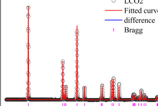
<figcaption class="paper-figure-caption"><b>Fig 1.</b> FIG. 1. XRD pattern of the Li0.9CoO2 powder sample recorded at room temperature using synchrotron x-ray source of wavelength λ = 0.7112 Å (open circles). The red line shows the rietveld refinement of the powder spectra using Fullprof software. Blue line shows the difference between experimen- tal data and the simulated pattern.</figcaption>
</figure>
<figure class="paper-figure-card">
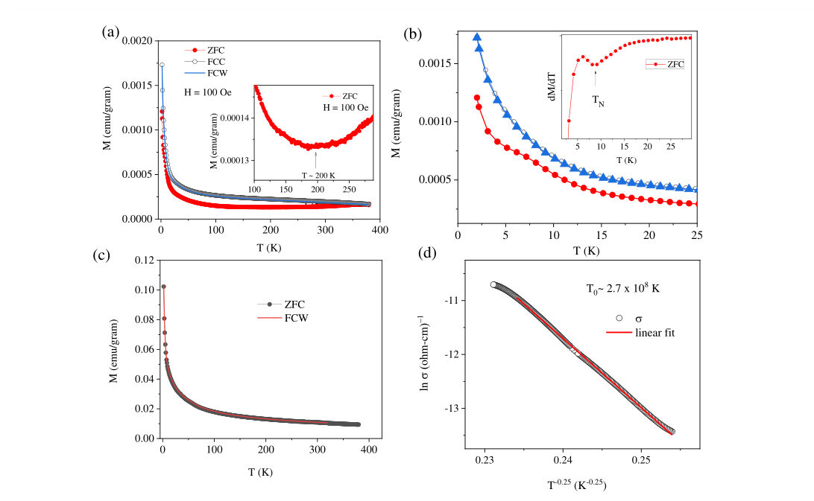
<figcaption class="paper-figure-caption"><b>Fig 2.</b> FIG. 2. (a) M −T curves measured at µ0H = 100 Oe following the ZFC, FCC and FCW protocols. Inset shows the minima observed around 200 K in the ZFC (b) the low temperature M −T at µ0H = 100 Oe. Inset shows the first derivative of the ZFC to highlight the anomaly at TN (c) It shows M −T curve at µ0H = 1 Tesla, (d) the semi-log plot of σ vs. T −0.25. The red line is the linear fit to the data.</figcaption>
</figure>
<figure class="paper-figure-card">
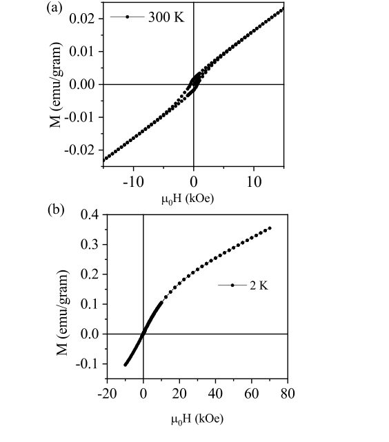
<figcaption class="paper-figure-caption"><b>Fig 3.</b> FIG. 4. Isothermal M −µ0H curve at (a) T = 300 K and (b) 2 K.</figcaption>
</figure>
<figure class="paper-figure-card">
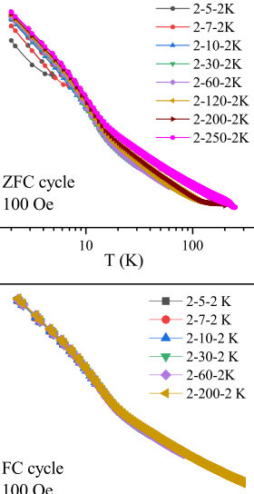
<figcaption class="paper-figure-caption"><b>Fig 4.</b> FIG. 3. The double-log plot of the M −T curves recorded fol- lowing thermal cycles from progressively higher temperatures measured at µ0H = 100 Oe following the (a) ZFC protocol. (b) FC protocol.</figcaption>
</figure>
<figure class="paper-figure-card">
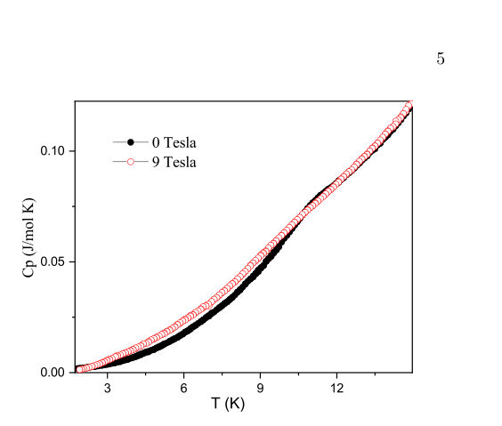
<figcaption class="paper-figure-caption"><b>Fig 5.</b> FIG. 6. Magnetic field dependence of the heat capacity. At higher fields, the anomaly becomes broader and shifts towards lower temperatures.</figcaption>
</figure>

**Summary.** This work investigates the magnetism of $	ext{Li}_x	ext{CoO}_2$ by combining magnetization, specific heat, NMR, and EPR measurements. The findings reveal evidence for both weak antiferromagnetic ordering at low temperatures and a persistent weak ferromagnetism arising from magnetic polarons formed by doped holes. The study models these phenomena using polaron hopping dynamics, highlighting the complex interplay between charge carriers, spin correlations, and structural disorder in correlated oxides.

**Why it may be interesting.** The interplay between charge localization (polarons), magnetic ordering ($	ext{AFM}/	ext{FM}$ coexistence), and ionic disorder ($	ext{Li}^+$ diffusion) in a correlated oxide system provides rich physics relevant to understanding emergent quantum states in strongly interacting electron systems.

Detailed structure

**Main problem.** The study investigates the complex magnetic properties of lightly doped $	ext{Li}_x	ext{CoO}_2$ ($x \sim 0.9$), aiming to understand the origin of its low-temperature magnetic order and history dependence.

**Main result.** The material exhibits evidence for weak antiferromagnetic ordering below $T_N \sim 10 	ext{ K}$ alongside a persistent weak ferromagnetic response, which is attributed to the formation and diffusion of localized magnetic polarons.

**Method.** A combination of bulk measurements (magnetization, specific heat), spectroscopic techniques ($	ext{NMR}$, $	ext{EPR}$), and structural analysis ($	ext{XRD}$) were employed across various temperature regimes.

**Model / system.** The system is the layered transition metal oxide $	ext{Li}_x	ext{CoO}_2$. The physics involves localized spins interacting via doped holes, leading to the formation of magnetic polarons which govern the magnetic response and transport properties.

**Key observables.** Magnetization ($	ext{M}$ vs $	ext{T}$, ZFC/FCW), specific heat anomaly near $10 	ext{ K}$, $	ext{NMR}$ spin-lattice relaxation rate ($1/T_1$), and $	ext{EPR}$ signal intensity, linewidth, and $g$-factor.

**Important parameters / regimes.** Low doping concentration ($x \sim 0.9$); low temperature regime ($	ext{T} < 300 	ext{ K}$); magnetic field strength (e.g., $100 	ext{ Oe}$, $9 	ext{ T}$).

**Assumptions / limitations.** The weak ferromagnetism and history dependence are linked to the formation of magnetic polarons; the low-temperature order is modeled as an antiferromagnetic transition in hole clusters.

**Figures summary.** Figures show $	ext{XRD}$ confirming structure, $	ext{M}-	ext{T}$ curves revealing ZFC/FCW irreversibility and anomalies near $10 	ext{ K}$, and $	ext{EPR}$ spectra demonstrating temperature-dependent signal changes consistent with polaron dynamics.

**Paper structure.** The paper systematically presents evidence from multiple techniques: first, bulk measurements establish the low-$T$ AFM transition; second, magnetization hysteresis points to short-range ferromagnetism related to polarons; and finally, $	ext{EPR}$ and $	ext{NMR}$ provide microscopic details on polaron dynamics across different temperature regimes.

Abstract

We investigate the magnetic properties of Li$_x$CoO$_2$ (x$\sim$0.9) using bulk magnetization, specific heat, nuclear magnetic resonance (NMR) and electron paramagnetic resonance (EPR) spectroscopy measurements. The dc magnetization, specific heat and NMR measurements, which probe the macroscopic response, indeed show that this compound partially undergoes an antiferromagnetic transition below $T_N \sim$ 10 K. In addition, we observed a weak ferromagnetic response, which gives rise to the history dependence in magnetization measurements at low fields and is observed at temperatures above room temperature. We propose that there are ferromagnetic clusters at high temperatures due to the formation of magnetic polarons out of doped holes. In EPR measurements performed at the $X$-band frequency, only a fraction of the total spins contribute and show Curie-like paramagnetic behavior as reflected in the temperature dependence of the EPR intensity. The temperature variation of the EPR spectra can be understood in the framework of the diffusion of magnetic polarons.

[↑ back to top](#top)

### [Propagation and localization of spin excitations at altermagnetic domain walls](http://arxiv.org/abs/2606.10604v1)

**Authors:** Oksana Peschanska, Jeroen van den Brink, Volodymyr P. Kravchuk  
**Type:** theory · **Category:** strongly correlated electrons · **PDF:** <https://arxiv.org/pdf/2606.10604v1>  
**Analysis basis:** full PDF text, analyzed in chunks
**Topic relevance:** `exotic spin models in light-matter` **3/5** · `spintronics-quantum-optics interface` **3/5** · `Keldysh / 2PI / non-Gaussian methods` **1/5**

↔ Scroll figures horizontally

<figure class="paper-figure-card">
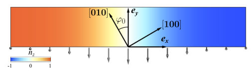
<figcaption class="paper-figure-caption"><b>Fig 1.</b> FIG. 1. Profile of a static Bloch DW (ϕdw = −π/2). Arrows represent N´eel vector orientation, and the density plot shows the distribution of its z-component. The reference frame is chosen such that ex and ey are always normal and tangential to the DW, respectively. Orientation of the DW relative to the crystallographic directions is controlled by the angle φ0.</figcaption>
</figure>
<figure class="paper-figure-card">
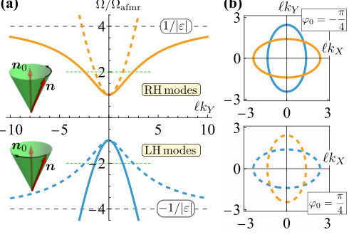
<figcaption class="paper-figure-caption"><b>Fig 2.</b> FIG. 2. (a) – Dispersion relations (3) for φ0 = −π/4 and φ0 = π/4 are shown by solid and dashed lines, respectively. In both cases, kX = 0, and Λ = εΩafmrℓ2 with ε = 0.25. The positive and negative frequencies correspond to the right- handed and left-handed precession of the N´eel vector above its equilibrium orientation. (b) – isosurfaces of constant energies |Ω| = 2Ωafmr.</figcaption>
</figure>
<figure class="paper-figure-card">
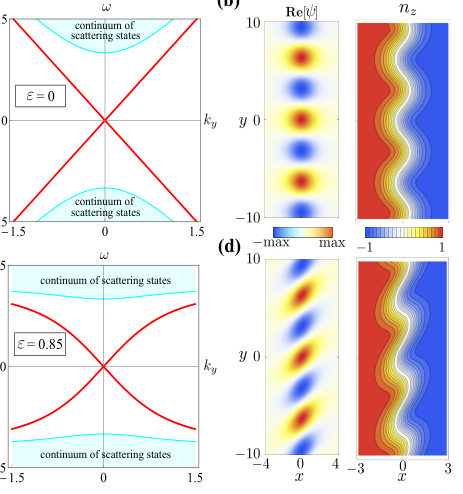
<figcaption class="paper-figure-caption"><b>Fig 3.</b> FIG. 3. Dispersion relations for the localized translational mode for the AFM and AℓM DWs oriented in a nodal di- rection are shown on panels (a) and (c), respectively. The distribution of the mode amplitude and the corresponding de- formation of the DW profile are shown on panels (b) (AFM), and (d) (AℓT) for ky = 1.</figcaption>
</figure>
<figure class="paper-figure-card">
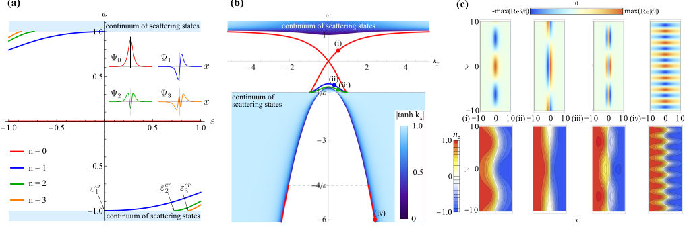
<figcaption class="paper-figure-caption"><b>Fig 4.</b> FIG. 4. Properties of the bound eigenstates of an AℓT DW oriented in the direction of the maximal AℓT splitting (φ0 = −π/4). Panel (a) shows the dependence of the first four (n = 0, . . . 3) bound-state eigenfrequencies on the value of the AℓT parameter for the case ky = 0; The inset shows the eigenstates’ profiles. (b) Dispersion relation of the bound eigenstates for ε = 0.85; (c) Examples of the spatial distributions of the eigenstates’ amplitude and the corresponding deformation of the DW profile for the points (i) – (iv) shown on panel (b).</figcaption>
</figure>
<figure class="paper-figure-card">
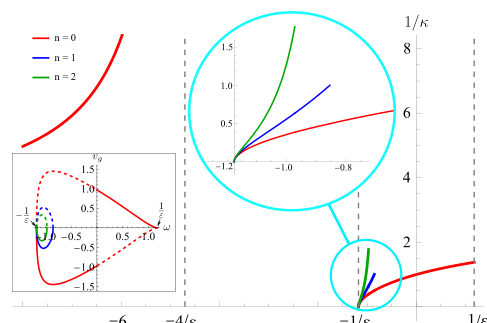
<figcaption class="paper-figure-caption"><b>Fig 5.</b> FIG. 5. Dependence of the size of the localization region of different bound states on their eigenfrequency for the case φ0 = −π/4, ε = 0.85. The inset shows the frequency- dependence of the group velocity vg = ∂kyω; solid and dashed lines correspond to the cases ky &gt; 0 and ky &lt; 0, respectively.</figcaption>
</figure>

**Summary.** This paper theoretically examines spin wave propagation and localization at domain walls in altermagnetic materials. By analyzing the system's Lagrangian, the authors show that the A$\ell$M interaction strongly modifies the excitation spectrum, particularly when the wall aligns along specific crystallographic directions. The findings predict the emergence of new bound states and field-induced asymmetries, offering insights into controlling magnetic excitations.

**Why it may be interesting.** This work provides detailed theoretical predictions about how subtle symmetry-breaking mechanisms (like altermagnetism) fundamentally alter collective excitations (magnons) at structural defects (domain walls), which is crucial for spintronics applications.

Detailed structure

**Main problem.** The study investigates how altermagnetism (A$\ell$M) modifies the propagation and localization of spin excitations at magnetic domain walls in easy-axial $d$-wave materials.

**Main result.** The A$\ell$M effect strongly depends on the domain wall orientation, leading to additional gapped bound states and removing eigenstate polarization degeneracy when the wall is oriented along specific high-symmetry directions like [110].

**Method.** The analysis uses a Lagrangian approach derived from the nonlinear sigma model, linearizing excitations via Holstein-Primakoff representation, and solving resulting differential equations (often mapping to hypergeometric forms).

**Model / system.** The system is an altermagnetic material ($	ext{A}\ell	ext{M}$) characterized by spin compensation and symmetry-induced spin splitting. The dynamics are modeled using a Lagrangian incorporating terms for antiferromagnetic stiffness, easy-axial anisotropy, and the A$\ell$M coupling strength ($A_{alt}$).

**Key observables.** Bound state existence, dispersion relation $\omega(k_y)$, localization area of bound states, and asymmetry in eigenstate intensity distribution.

**Important parameters / regimes.** The dimensionless A$\ell$M parameter ($\epsilon$), the domain wall orientation relative to crystallographic axes, and the strength of an applied static magnetic field ($B$).

**Assumptions / limitations.** Approximations include using the exchange approximation for spin dynamics and linearizing excitations around a static domain wall profile. The mathematical analysis often relies on mapping to solvable differential equations.

**Figures summary.** Figures illustrate dispersion relations comparing AFM vs A$\ell$M cases, showing localization region size dependence on eigenfrequency, and demonstrating spatial asymmetry induced by an external magnetic field.

**Paper structure.** The paper builds from the general Lagrangian description of spin dynamics to analyzing planar wave excitations. It then focuses on solving for bound states using reduced Lagrangians, comparing results across different domain wall orientations (nodal vs maximal splitting) and finally incorporating the effects of a static magnetic field.

Abstract

Altermagnets (A$\ell$Ms) are spin-compensated materials in which opposite-spin sublattices are connected by a symmetry that causes a spin splitting in their elementary excitations. As there is a strong effect of altermagnetism on domain wall properties, it is quite natural to also expect an enrichment of the physics of magnetic excitations at A$\ell$M domain walls. Here, we consider the propagation of spin eigen-excitations along domain walls in easy-axial $d$-wave A$\ell$Ms. Investigating the presence of bound states localized on a domain wall, we find that the effect of the A$\ell$M on the bound states strongly depends on the orientation of the domain wall relative to the crystallographic directions. If the domain wall is oriented along a nodal direction [100] or [010], A$\ell$M does not change the number of bound states; however, it leads to a nonlinear dispersion and a tilt of the wavefront. The effect of A$\ell$M is strongest when the domain wall is oriented along the directions [110] or [$\bar{1}$10], i.e., along the directions of the strongest A$\ell$M splitting in the magnon spectrum. In this case, (i) the additional gapped bound states appear, (ii) degeneracy of the eigenstates with respect to their polarization (right-handed or left-handed precession of the N{é}el vector) is removed, and (iii) the localization area of the bound states strongly depends on the eigenfrequency. The latter may lead to strong localization of the bound state at the domain wall. We further consider the influence of a static magnetic field that is applied along the easy axis, and find that the magnetic field induces an asymmetry between the localization regions on opposite sides of the domain wall and sets an upper limit on the absolute value of the propagating eigenstate's wave vector.

[↑ back to top](#top)

### [SANS and magnetometry study of the magnetic phase diagram of the B20 helimagnet FeRhSi](http://arxiv.org/abs/2606.10516v1)

**Authors:** E. V. Altynbaev, A. V. Guseva, D. O. Skanchenko, V. N. Krasnorussky, A. V. Bokov, D. A. Salamatin, V. A. Sidorov, A. V. Tsvyashchenko  
**Type:** experiment · **Category:** other · **PDF:** <https://arxiv.org/pdf/2606.10516v1>  
**Analysis basis:** full PDF text, analyzed in chunks
**Topic relevance:** `exotic spin models in light-matter` **3/5** · `spintronics-quantum-optics interface` **3/5** · `analog quantum simulation` **1/5**

↔ Scroll figures horizontally

<figure class="paper-figure-card">
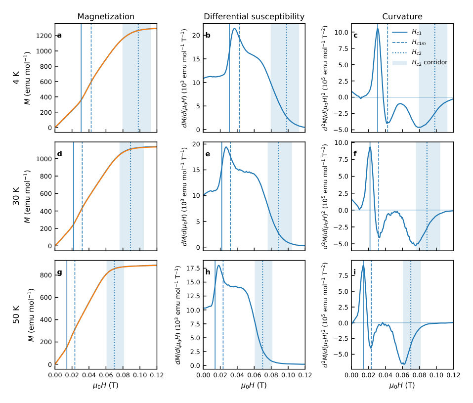
<figcaption class="paper-figure-caption"><b>Fig 1.</b> FIG. 1. Representative magnetometry plots from M(H) isotherms at 4, 30, and 50 K. Each row</figcaption>
</figure>
<figure class="paper-figure-card">
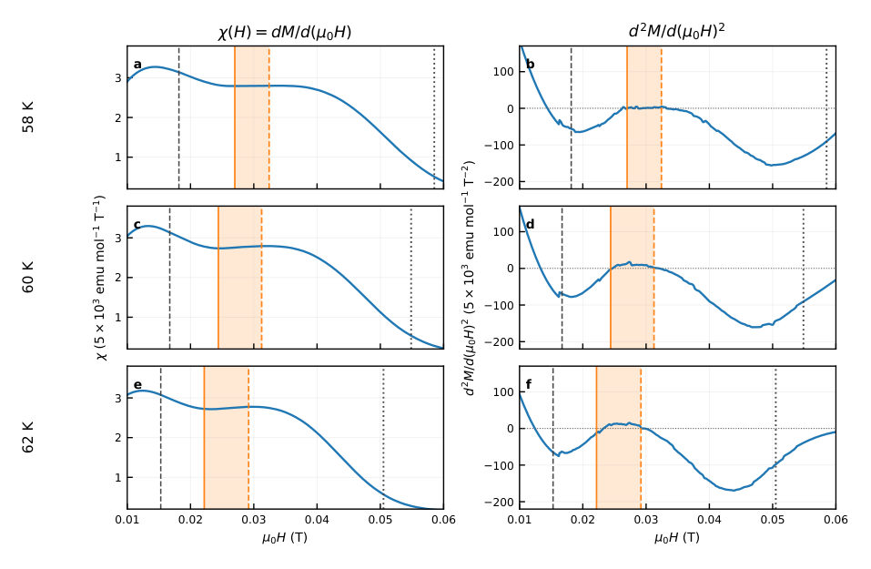
<figcaption class="paper-figure-caption"><b>Fig 2.</b> FIG. 2. Candidate A-phase diagnostics at 58, 60, and 62 K. Left: χ(H) = dM/d(µ0H); right:</figcaption>
</figure>
<figure class="paper-figure-card">
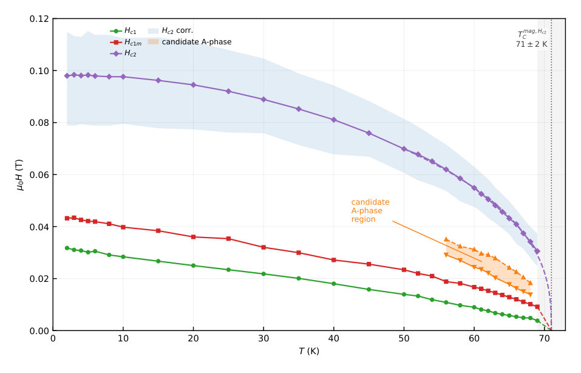
<figcaption class="paper-figure-caption"><b>Fig 3.</b> FIG. 3. Magnetometric H-T phase diagram constructed from the low-field derivative criteria. Sym-</figcaption>
</figure>
<figure class="paper-figure-card">
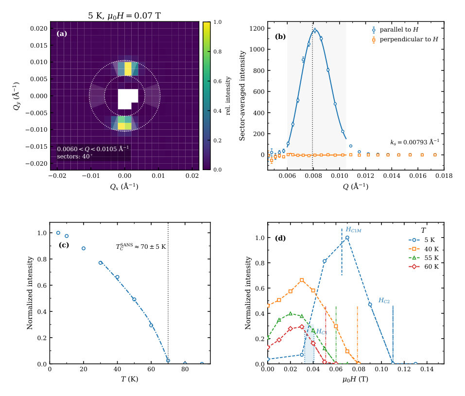
<figcaption class="paper-figure-caption"><b>Fig 4.</b> FIG. 4. SANS evidence for helimagnetic order and field evolution. (a) Corrected 2D SANS map</figcaption>
</figure>
<figure class="paper-figure-card">
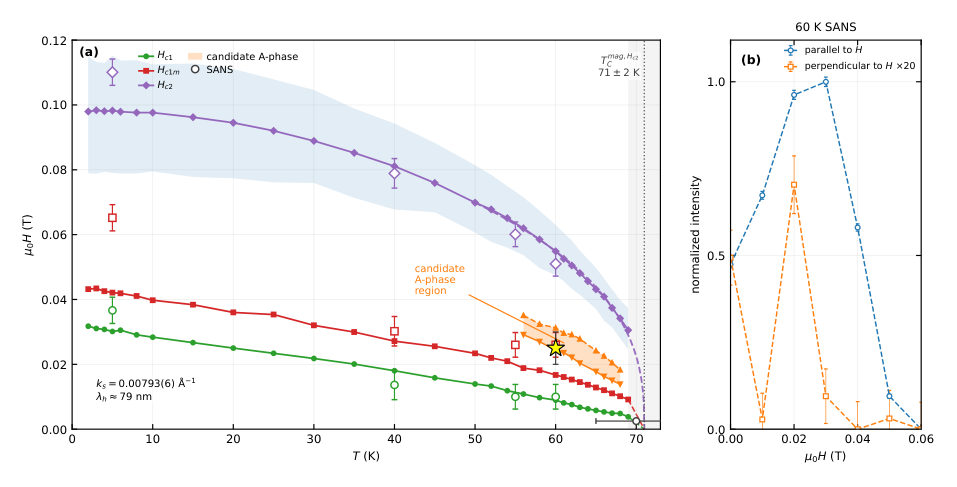
<figcaption class="paper-figure-caption"><b>Fig 5.</b> FIG. 5. (a) Combined SANS and magnetometry H-T diagram. Magnetometric Hc1, Hc1m, and Hc2</figcaption>
</figure>

**Summary.** This paper reports the first direct neutron scattering evidence of long-period helimagnetism in Fe0.5Rh0.5Si, a B20 compound. By combining SANS measurements with low-field magnetometry, the authors construct a detailed field-temperature phase diagram and identify a candidate A-phase region. The work advances the understanding of tunable chiral magnets by linking magnetic anomalies to structural signatures.

**Why it may be interesting.** The work provides empirical evidence on tuning chiral magnetism using 4d substitutions (Rh) and directly probes emergent topological spin textures via neutron scattering techniques. This is highly relevant for understanding complex magnetic ground states beyond simple mean-field models.

Detailed structure

**Main problem.** The study aims to map out the magnetic phase diagram of the B20 helimagnet Fe0.5Rh0.5Si and characterize a candidate A-phase region within it.

**Main result.** The research successfully combined SANS measurements confirming long-period helical modulation (lambda_h ~ 79 nm) with magnetometry to define a field-temperature phase diagram, supporting the existence of a candidate A-phase region.

**Method.** The study employed a combination of low-field magnetometry (measuring M(H), dM/dH, and d^2M/dH^2) and Small-Angle Neutron Scattering (SANS) on polycrystalline samples.

**Model / system.** The physical system is the 4d-substituted B20 helimagnet Fe0.5Rh0.5Si, which exhibits magnetic ordering driven by crystallographic chirality and Dzyaloshinskii-Moriya interactions.

**Key observables.** Magnetic modulation wave vector (k_s), helical period (lambda_h), differential susceptibility (dM/dH), second derivative of magnetization (d^2M/dH^2), and field-dependent SANS intensity maxima.

**Important parameters / regimes.** Characteristic fields ($H_{c1}, H_{c1m}, H_{c2}$); ordering temperatures derived from magnetometry ($\sim 71 	ext{ K}$) and SANS ($\sim 70 	ext{ K}$).

**Assumptions / limitations.** The candidate A-phase region is not treated as an unambiguous thermodynamic phase boundary, and the interpretation relies on combining data from polycrystalline samples and transverse SANS geometry.

**Figures summary.** Figures illustrate M(H) isotherms showing magnetic anomalies; Figure 2 details diagnostic plots of susceptibility and curvature for the candidate A-phase; Figure 3 presents the combined H-T phase diagram incorporating field boundaries and the candidate region.

**Paper structure.** The paper systematically uses magnetometry to define low-field phase transitions ($H_{c1}, H_{c1m}, H_{c2}$), then utilizes SANS to provide direct, complementary evidence of the underlying long-period helical magnetic structure, culminating in a combined phase diagram.

Abstract

This manuscript reports the first direct neutron-scattering evidence for long-period helimagnetism in the newly identified 4d-substituted B20 compound Fe0.5Rh0.5Si. By combining SANS with low-field magnetometry, we establish the magnetic modulation, construct a field-temperature phase diagram, and identify a candidate A-phase region supported by an independent structural signature. The work is important beyond this single compound because it expands the family of chiral B20 helimagnets into Rh-substituted materials, where spin-orbit coupling, disorder, and Dzyaloshinskii-Moriya interactions can be tuned. It will interest researchers in chiral magnetism, topological spin textures, magnetic neutron scattering, and quantum materials, and provides a foundation for future studies of emergent magnetic phases and topology-driven phenomena in chemically tuned chiral magnets.

[↑ back to top](#top)

### [Atomic-scale visualization of the toroidal order in a trimeric Dy(III) single-molecule toroic](http://arxiv.org/abs/2606.10077v1)

**Authors:** Michael J. Jenkins, Madalynn G. Marshall, Jie Xing, Muthu Satheeshkumar, Brandon D. Watson-Sanders, Xiaoping Wang, Christina M. Hoffmann, Gopalan Rajaraman, Huibo Cao, Rongying Jin, Zi-Ling Xue  
**Type:** both · **Category:** strongly correlated electrons · **PDF:** <https://arxiv.org/pdf/2606.10077v1>  
**Analysis basis:** full PDF text, analyzed in chunks
**Topic relevance:** `exotic spin models in light-matter` **3/5** · `spintronics-quantum-optics interface` **3/5**

↔ Scroll figures horizontally

<figure class="paper-figure-card">
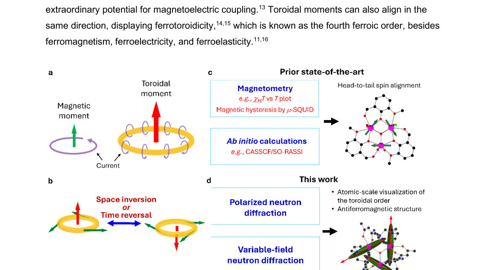
<figcaption class="paper-figure-caption"><b>Fig 1.</b> Fig. 1 | Toroidal moment and methods for its detection in SMTs. a. Current loops on toroid</figcaption>
</figure>
<figure class="paper-figure-card">
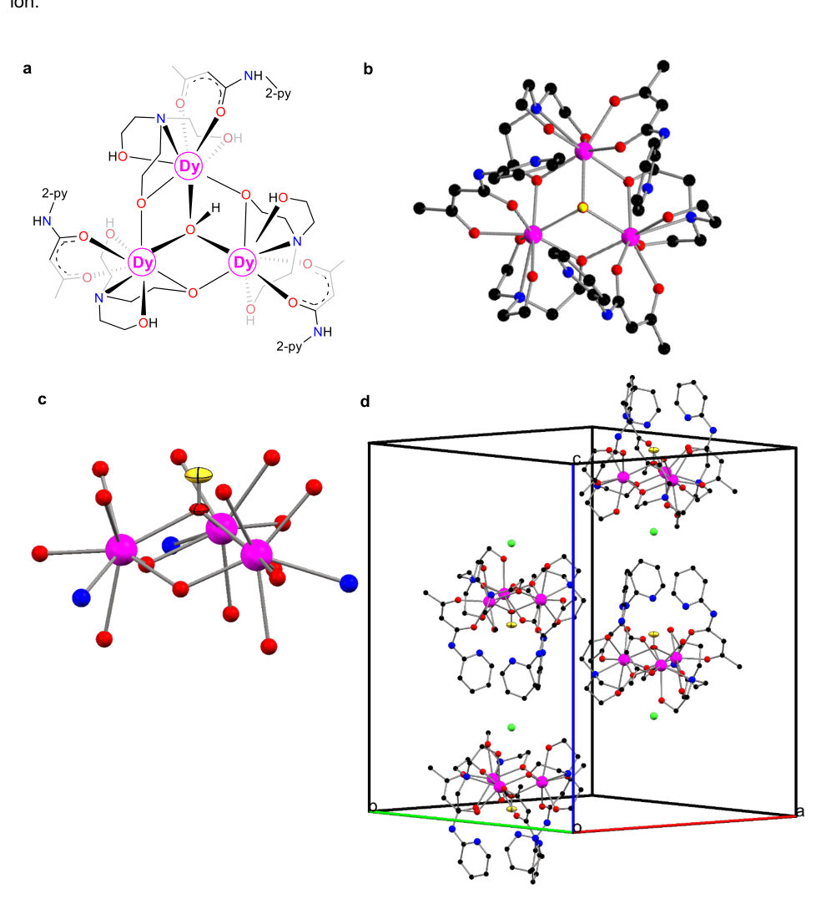
<figcaption class="paper-figure-caption"><b>Fig 2.</b> Fig. 2 | Structure of Dy3-2. a,b. Chemical and crystal structure of the [Dy3(OH)(teaH2)3(paa)3]2+</figcaption>
</figure>
<figure class="paper-figure-card">
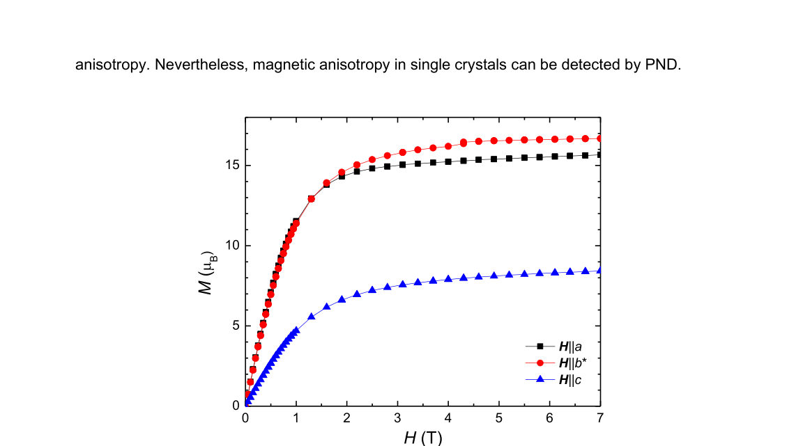
<figcaption class="paper-figure-caption"><b>Fig 3.</b> Fig. 4 | Isothermal magnetization of the Dy3-2 single crystal with the external magnetic</figcaption>
</figure>
<figure class="paper-figure-card">
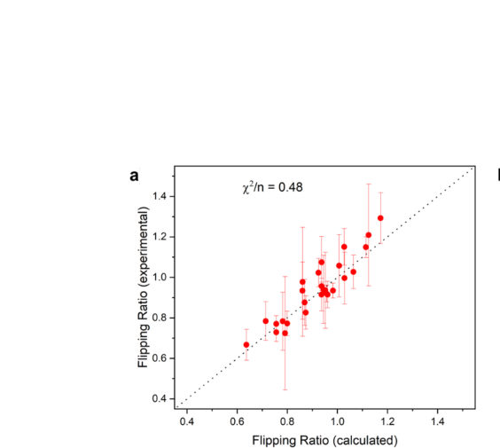
<figcaption class="paper-figure-caption"><b>Fig 4.</b> Fig. 5 | PND results. a. Observed and calculated flipping ratios from the local magnetic</figcaption>
</figure>
<figure class="paper-figure-card">
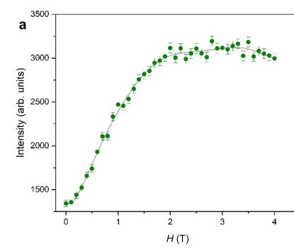
<figcaption class="paper-figure-caption"><b>Fig 5.</b> Fig. 6 | Results of variable-field neutron diffraction at (2 0 0). a. Field-dependent order</figcaption>
</figure>

**Summary.** The research reports on the first direct observation of toroidal magnetism in a single-molecule magnet using $	ext{Dy}_3$ complexes. By combining polarized neutron diffraction with variable-field measurements, the authors provide quantitative proof of this exotic magnetic ordering. This integrated methodology establishes a powerful new standard for investigating molecular quantum materials exhibiting complex spin correlations.

**Why it may be interesting.** This work provides a highly advanced experimental blueprint for characterizing exotic magnetic orders (toroidal magnetism) in molecular systems, which is crucial for designing next-generation quantum materials where spin chirality plays a role.

Detailed structure

**Main problem.** To unambiguously observe and probe the toroidal magnetic moment at the molecular scale within Single-Molecule Toroics (SMTs).

**Main result.** The authors report definitive experimental proof of the toroidal moment using a combined methodology, showing anti-parallelly stacked toroidal moments via variable-field neutron diffraction.

**Method.** The study integrates Polarized Neutron Diffraction (PND), variable-field neutron diffraction, magnetometry ($\mu$-SQUID), and *ab initio* calculations to map local magnetic susceptibility tensors.

**Model / system.** The system is a trimeric Dy(III) single-molecule complex, $[	ext{Dy}_3(	ext{OH})(	ext{teaH}_2)_3(	ext{paa})_3]	ext{Cl}(	ext{OMe})$, which utilizes the large spin of $	ext{Dy}^{3+}$ ions to host toroidal magnetic ordering.

**Key observables.** Toroidal moment, local magnetic susceptibility tensors ($\chi$), field-induced magnetization patterns, and ground state magnetic moments ($\sim 8.77 \mu_B$).

**Important parameters / regimes.** Low temperatures (e.g., $5 	ext{ K}$), specific crystal structures derived from neutron diffraction, and energy gaps ($\Delta E = 1.6 	ext{ cm}^{-1}$).

**Assumptions / limitations.** The combined PND/variable-field approach is necessary to overcome the limitations of earlier indirect magnetometry methods.

**Figures summary.** Figures illustrate toroidal moment generation (current loops), magnetic susceptibility data ($\chi$ vs $T$), isothermal magnetization ($M$ vs $H$) along different axes, and field-induced magnetic order parameters from neutron diffraction.

**Paper structure.** The paper progresses by first establishing the theoretical basis for toroidal moments, then presenting structural confirmations via SCND/SCXRD, followed by detailed measurements of magnetic anisotropy using PND and variable-field diffraction, culminating in a comprehensive model that links structure to the observed toroidal order.

Abstract

Single-molecule toroics (SMTs) offer a unique platform for next-generation quantum devices utilizing head-to-tail spin alignments in the compounds. Presence of toroidal moments in SMTs has been essentially based on magnetometry and ab initio calculations. Here, we report observation and probe of the toroidal moment in [Dy3(OH)(teaH2)3(paa)3]Cl(OMe) [teaH3: triethanolamine; paaH: N-(2-pyridyl)-acetoacetamide] from mapping of Dy3+ magnetic susceptibility tensors by polarized neutron diffraction (PND). Neutron diffraction under variable magnetic fields demonstrates field-induced magnetization along the c-axis with toroidal moments anti-parallelly stacked, providing definite proof of the toroidal moment. Magnetometry studies confirm the toroidal ground state. For the first time, the combined use of PND, variable-field neutron diffraction, ab initio calculations, and magnetometry is introduced as a robust and quantitative methodology to probe molecular-scale toroidal magnetism. This integrated approach overcomes limitations of earlier indirect methods, establishes a benchmark framework for investigating SMTs, and provides valuable insights for the design of molecular quantum materials.

[↑ back to top](#top)

### [Vortex pinning of Ba$_{0.62}$K$_{0.38}$BiO$_3$ investigated by magneto-optical Kerr-effect and magnetization measurements](http://arxiv.org/abs/2606.10300v1)

**Authors:** Soichiro Yamane, Sota Nakamura, Atsutoshi Ikeda, Dayu Zhai, Siddarth Gorregattu, Xing He, Sudarshan Sharma, Yipeng Cai, Yasutomo J. Uemura, Martin Greven, Shingo Yonezawa  
**Type:** experiment · **Category:** other · **PDF:** <https://arxiv.org/pdf/2606.10300v1>  
**Analysis basis:** full PDF text, analyzed in chunks
**Topic relevance:** `spintronics-quantum-optics interface` **3/5** · `non-equilibrium dynamics` **1/5** · `non-equilibrium universality` **1/5**

↔ Scroll figures horizontally

<figure class="paper-figure-card">
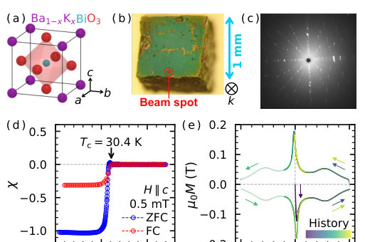
<figcaption class="paper-figure-caption"><b>Fig 1.</b> FIG. 1. (a) Pseudocubic subcell of Ba1–xKxBiO3 derived from the tetragonal I4/mcm structure. The BiO6 octahedron is indicated by the pink faces. The crystal structure was rendered using pyvista and pymatgen packages [37, 38]. (b) Photograph of the Ba0.62K0.38BiO3 single-crystal sample used in this study. The wave vector k of the incident light in the MOKE measurements is perpendicular to this surface, as indicated in the figure. The approximate position of the optical spot in our MOKE study is depicted with red circles. (c) Laue diffraction pattern of the sample, confirming the high quality of the single crystal. The studied surface is confirmed to be the (001) plane in the pseudocubic...</figcaption>
</figure>
<figure class="paper-figure-card">
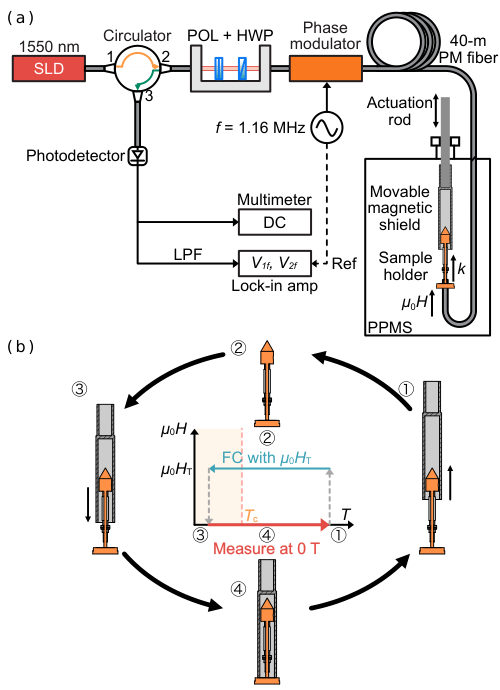
<figcaption class="paper-figure-caption"><b>Fig 2.</b> FIG. 2. (a) Schematic of the polar MOKE measurement setup, where the incident and reflected beams are collinear with the ap- plied magnetic field. The sample is placed inside a commercial 4He cryostat (PPMS). The movable magnetic shield (permalloy) is placed around the sample to suppress remnant fields during the zero-field MOKE measurements. The detailed design of the sample fixture and optical path is described in Ref. [35]. (b) Field-training protocol used in this MOKE study. To investigate the vortex pinning, we employed the following field-training protocol: 1 The shield was moved away from the magnetic-field region to avoid magnetizing the permalloy shield, and the magnetic field was...</figcaption>
</figure>
<figure class="paper-figure-card">
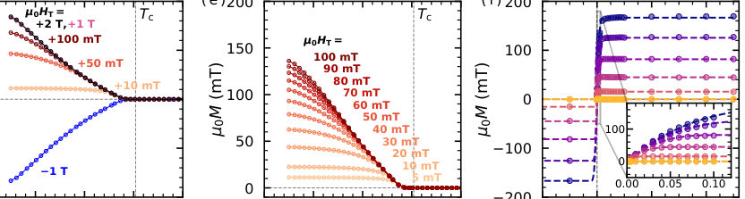
<figcaption class="paper-figure-caption"><b>Fig 3.</b> FIG. 3. (a) Temperature dependence of the Kerr angle change ∆θK during ZFW after FC under various training fields HT. Here, ∆θK(T) is defined as θK(T) −¯θK(T &gt; 35 K). The second term is the averaged Kerr angle in the normal state and is subtracted as a background offset. The broken lines in panels (a) and (b) are guides to the eye that illustrate the saturation behavior, obtained from linear fits to the high-HT data. (b) Detailed training-field dependence of the remanent Kerr angle ∆θK measured with finer steps of HT. (c) Training-field dependence of the Kerr angle change ∆θK at various temperatures. The dashed lines show fits using the local clipped-linear saturation function described by...</figcaption>
</figure>
<figure class="paper-figure-card">
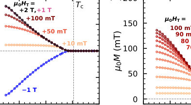
<figcaption class="paper-figure-caption"><b>Fig 4.</b> Figure 4 summarizes the Bean-model interpretation and the fitting procedures used to analyze the remanent response. Figures 4(a) and 4(b) illustrate the basic critical-state picture for the field-training protocol. When the training field satis- fies |HT| ≳Hp, the Bean-like profile after zeroing the ex-</figcaption>
</figure>
<figure class="paper-figure-card">
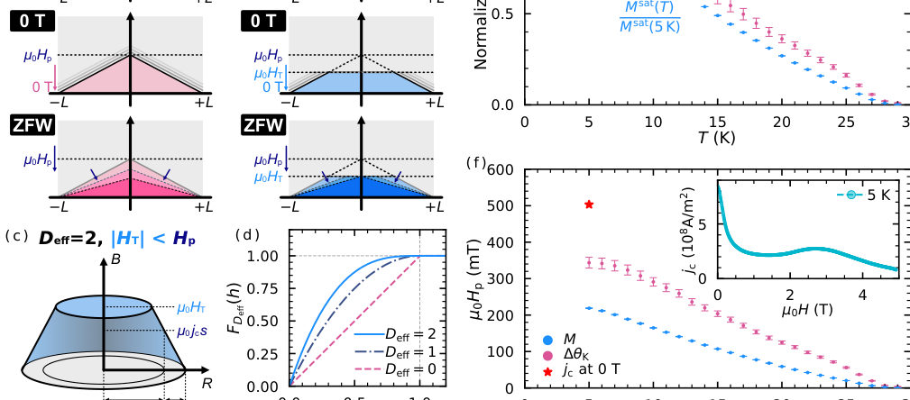
<figcaption class="paper-figure-caption"><b>Fig 5.</b> FIG. 4. (a)(b) Magnetic-flux distribution B(r) arising from vortex pinning, as described by Bean’s critical-state model [2], for the field- training protocol used in this study. Here, Hp denotes the full flux penetration field in the phenomenological Bean-model picture. (a) When the training field satisfies |HT| ≳Hp, the final flux distribution B(r) at zero field is expected to be independent of HT. Upon warming, the reduction of jc leads to a uniform decrease of the slope of the linear B(r) profile. This leads to HT-independent remanent response as a function of temperature. (b) When |HT| &lt; Hp, a region with constant B(r) remains around the center of the sample. As the temperature...</figcaption>
</figure>

**Summary.** This work establishes MOKE as a complementary, highly sensitive optical tool to study vortex pinning in type-II superconductors like $	ext{Ba}_{0.62}	ext{K}_{0.38}	ext{BiO}_3$. By comparing MOKE signals with bulk magnetization data using the critical-state model, the authors confirm that the observed magnetic history dependence is due to trapped vortices, not exotic superconducting order parameters.

**Why it may be interesting.** While focused on superconductivity, the rigorous application of universal scaling functions ($F_{	ext{Deff}}(h)$) derived from continuum models (like the critical-state model) provides a powerful template for analyzing mesoscopic responses in other condensed matter systems exhibiting flux trapping or domain wall dynamics.

Detailed structure

**Main problem.** The study investigates vortex pinning, a critical mechanism governing irreversible magnetic response and energy dissipation in type-II superconductors.

**Main result.** The Magneto-Optical Kerr Effect (MOKE) proves to be a viable optical probe for studying vortex pinning, showing quantitative agreement with bulk magnetization measurements when analyzed via the Bean critical-state model.

**Method.** The authors employed ultra-high-resolution MOKE and detailed DC SQUID magnetization measurements on $	ext{Ba}_{1-x}	ext{K}_x	ext{BiO}_3$ single crystals under various field training protocols.

**Model / system.** The physical system is the oxide superconductor $	ext{Ba}_{0.62}	ext{K}_{0.38}	ext{BiO}_3$. The analysis relies heavily on adapting the Bean critical-state model to describe the remanent magnetic flux profile associated with trapped vortices.

**Key observables.** Zero-field MOKE signal ($\Delta	heta_K$), bulk magnetization ($M$ vs. $H_{	ext{eff}}$), and temperature dependence of susceptibility ($\chi$).

**Important parameters / regimes.** Critical current density ($j_c(T)$), penetration field scale ($\mu_0 H_p$), and the training magnetic field magnitude ($|H_T|$).

**Assumptions / limitations.** The remanent response is modeled using generalized saturation functions $F_{	ext{Deff}}(h)$, which relate local (MOKE, $	ext{Deff}=0$) and bulk ($	ext{Deff}=2$) measurements to the critical-state model.

**Figures summary.** Figures illustrate crystal structure, MOKE setup schematics, temperature dependence of both $M$ and $\Delta	heta_K$, and quantitative comparisons showing how both local and bulk responses follow universal saturation functions derived from the critical-state theory.

**Paper structure.** The paper progresses by establishing the physical problem (vortex pinning), detailing the complementary experimental methods (MOKE vs. Magnetization), developing a unified theoretical framework using the Bean model, and finally applying this framework to quantitatively compare local and bulk measurements while ruling out alternative superconducting mechanisms like TRSB.

Abstract

Vortex pinning plays a crucial role in determining properties of type-II superconductors. For example, it governs the irreversible magnetic response as well as dissipation caused by vortex motion. Here, we study vortex pinning in the three-dimensional oxide superconductor Ba1-xKxBiO3 using ultra-high-resolution magneto-optical Kerr effect (MOKE) and detailed magnetization measurements. We find that the zero-field MOKE signal in the superconducting state exhibits a pronounced magnetic-history dependence. This behavior closely resembles the remanent magnetization caused by trapped vortices. Furthermore, we demonstrate that the observed evolution of the MOKE signals is well described by Bean's critical-state model for trapped vortices. Our results establish MOKE as a viable optical and mesoscopic probe of vortex pinning in type-II superconductors, providing a new complementary approach to investigate mixed-state phenomena. We also find that the training-field dependence of the MOKE is linear near zero training field, without any anomalies indicative of spontaneous time-reversal-symmetry breaking in an unconventional superconducting state. Our study defines a clear protocol to distinguish vortex-induced MOKE responses from those associated with a time-reversal-symmetry broken superconducting order parameter.

[↑ back to top](#top)

### [Adaptive identification of low-degree polynomials in quantum singular value transformation: application to nonlinear quantum properties estimation](http://arxiv.org/abs/2606.10994v1)

**Authors:** Jumpei Kato, Akira Tanji, Hiroyuki Harada, Kaito Wada, Kosuke Ito, Naoki Yamamoto  
**Type:** theory · **Category:** quantum information and computing · **PDF:** <https://arxiv.org/pdf/2606.10994v1>  
**Analysis basis:** full PDF text, analyzed in chunks
**Topic relevance:** `entanglement & information structure` **3/5** · `quantum measurements` **1/5**

↔ Scroll figures horizontally

<figure class="paper-figure-card">
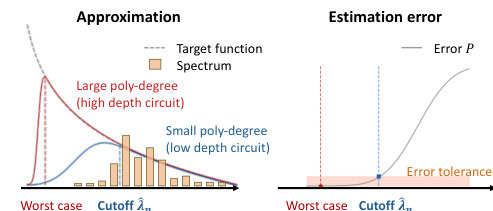
<figcaption class="paper-figure-caption"><b>Fig 1.</b> FIG. 1. The illustration of the idea. (Left) When using a polynomial to approximate a target function that is singu- lar at the origin, the conventional approach truncates the polynomial degree based on a worst-case threshold below the minimum eigenvalue of the state. (Right) Our proposed al- gorithm adaptively identifies the cutoff ˆλη with reference to the estimation error tolerance η of the target nonlinear prop- erty, while the conventional one takes a property-independent worst-case threshold. The cutoff ˆλη yields a sufficiently low- degree polynomial in the left figure.</figcaption>
</figure>
<figure class="paper-figure-card">
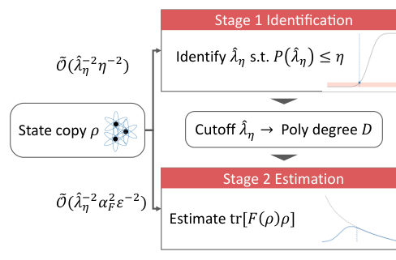
<figcaption class="paper-figure-caption"><b>Fig 2.</b> FIG. 2. The overall pipeline of the two-stage algorithm.</figcaption>
</figure>
<figure class="paper-figure-card">
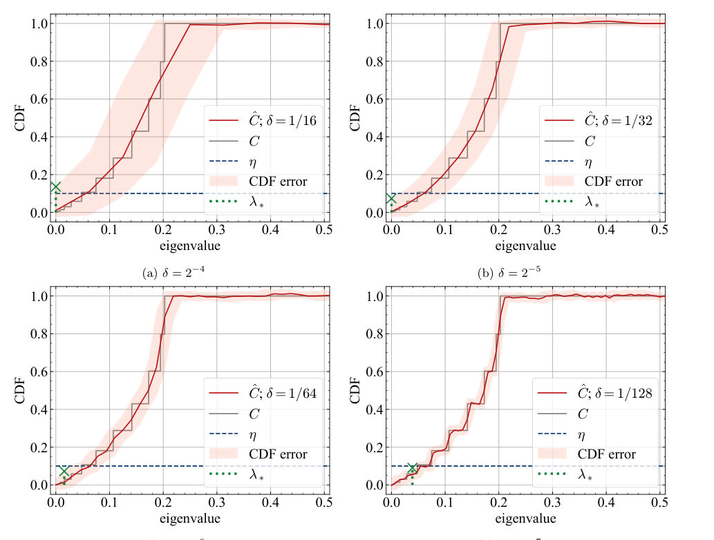
<figcaption class="paper-figure-caption"><b>Fig 3.</b> FIG. 3. The algorithm search steps to find λη = 0.048. The flow progresses from (a) to (d) with gradually decreasing δ. ˆC shows the estimated CDF in red, and C shows the exact CDF in gray. λ∗identified by the algorithm is displayed in green. The red shaded areas display the CDF approximation error bound implied by Eq. (17). (a, b) There are no grid points satisfying Eq. (19), and λ∗= 0 is returned. (c) A non-zero λ∗is found, but the algorithm continues since λ∗&lt; 2δl. (d) λ∗≥2δ is found, and the algorithm stops with the return ˆλη = 1.7 × 10−2.</figcaption>
</figure>

**Summary.** The paper introduces an adaptive two-stage algorithm to estimate complex quantum properties like entropy by leveraging Quantum Singular Value Transformation (QSVT). Instead of relying on overly conservative worst-case bounds derived from state rank or minimum eigenvalues, the method first identifies a spectral cutoff $\hat{\lambda}_{\eta}$ specific to the required accuracy. This allows for using much lower-degree polynomials, drastically reducing the necessary number of quantum state copies required for accurate estimation.

**Why it may be interesting.** This work provides a significant algorithmic improvement for resource estimation in quantum information theory, directly addressing the computational bottleneck associated with high-degree polynomial approximations required for entropy estimation.

Detailed structure

**Main problem.** The core problem is efficiently estimating nonlinear quantum properties, such as von Neumann or Rényi entropy, of an unknown quantum state $\rho$ using the Quantum Singular Value Transformation (QSVT).

**Main result.** The authors propose a two-stage spectral cutoff method that allows for the use of significantly lower-degree polynomials compared to traditional worst-case bounds based on minimum eigenvalues or rank.

**Method.** They develop an adaptive algorithm where Stage 1 identifies a certified spectral cutoff $\hat{\lambda}_{\eta}$ from the state's spectrum, and Stage 2 uses this cutoff to determine the polynomial degree for QSVT estimation.

**Model / system.** The system involves estimating properties of an unknown quantum state $\rho$ (represented by a density matrix) in the sample-access model. The techniques are applied generally to various nonlinear functions $f(\rho)$ that define the target entropy or moment.

**Key observables.** Von Neumann entropy ($S(\rho)$), Rényi entropy ($R_\alpha(\rho)$), and general nonlinear properties $\text{tr}[f(\rho)\rho]$.

**Important parameters / regimes.** Target accuracy ($\eta$, $\epsilon$), failure probability ($\vartheta$), spectral cutoff ($\hat{\lambda}_{\eta}$), and the polynomial degree ($D$).

**Assumptions / limitations.** The method assumes that identifying a certified spectral cutoff $\hat{\lambda}_{\eta}$ is feasible, which bypasses reliance on knowing the minimum non-zero eigenvalue or rank.

**Figures summary.** Figures illustrate the comparison between conventional truncation methods (requiring high polynomial degrees) and the proposed adaptive algorithm using the identified spectral cutoff $\hat{\lambda}_{\eta}$.

**Paper structure.** The paper follows a two-stage algorithmic structure: first, an iterative search process (Algorithm 1) to identify the certified spectral cutoff $\hat{\lambda}_{\eta}$ based on error tolerances; second, applying QSVT with a degree determined by this cutoff to estimate the desired quantum property.

Abstract

Estimating properties of unknown quantum states via quantum singular value transformation (QSVT) often requires high-degree polynomials to handle small eigenvalues of density matrices. Specifically, the existing approaches determine the polynomial degree by relying on overly conservative worst-case bounds based on the minimum non-zero eigenvalue or the rank of the density matrices. In this work, we propose a spectral cutoff method that truncates the negligible eigenvalue tail depending on the task, the target accuracy, and the state, which enables the use of significantly lower-degree polynomials. To implement this, we develop a two-stage algorithm to estimate nonlinear properties, particularly von Neumann entropy and R{é}nyi entropy. In the first stage, we execute a search algorithm to identify the spectral cutoff directly from the unknown quantum state. In the second stage, we estimate the nonlinear properties utilizing QSVT with the degree of polynomial adaptively determined by the cutoff. This two-stage algorithm significantly improves the overall estimation cost compared to known bounds, even without knowing the minimum eigenvalue or the rank.

[↑ back to top](#top)

### [Continuous and discontinuous transitions in the Ising-Heisenberg model on the extended Lieb lattice in a magnetic field](http://arxiv.org/abs/2606.10821v1)

**Authors:** David Sivy, Jozef Strecka  
**Type:** theory · **Category:** statistical mechanics · **PDF:** <https://arxiv.org/pdf/2606.10821v1>  
**Analysis basis:** full PDF text, analyzed in chunks
**Topic relevance:** `analog quantum simulation` **3/5** · `exotic spin models in light-matter` **1/5**

↔ Scroll figures horizontally

<figure class="paper-figure-card">
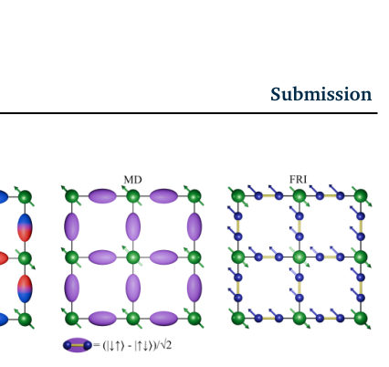
<figcaption class="paper-figure-caption"><b>Fig 1.</b> Figure 2: Ground-state phase diagram of the spin-1/2 Ising-Heisenberg model on the extended Lieb lattice in the J1/J–h/J plane together with schematic illustrations of the quantum antiferromagnetic (QAF), the quantum monomer-dimer (MD), and the classical ferrimagnetic (FRI) phases. Arrows indicate the spin orientation. FM denotes the fully saturated ferromagnetic phase. A violet oval represents a singlet- dimer state, whereas a double-colored oval indicates a singlet-dimer-like state.</figcaption>
</figure>
<figure class="paper-figure-card">
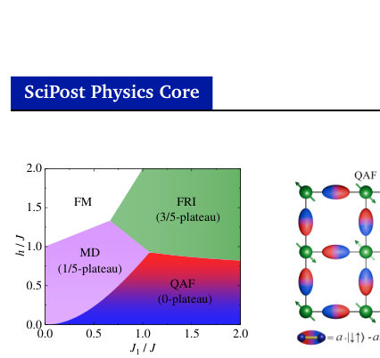
<figcaption class="paper-figure-caption"><b>Fig 2.</b> Fig. 2 displays the overall ground-state phase diagram in the J1/J–h/J plane, which comprises four distinct ground states (18)–(21) separated by discontinuous zero-temperature phase tran- sitions determined by the conditions (22) together with schematic illustrations of the QAF, MD, and FRI phases. The most remarkable spin arrangement occurs in the QAF phase (18), where the Heisenberg spin pairs form dimer-singlet-like state (double-colored ovals) further mediat- ing an effective antiferromagnetic interaction between the Ising spins displaying perfect Néel</figcaption>
</figure>
<figure class="paper-figure-card">
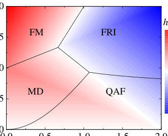
<figcaption class="paper-figure-caption"><b>Fig 3.</b> Figure 3: Density plots of zero-temperature asymptotic values of the effective inter- action Jeff (a) and the effective field heff (b) of the spin-1/2 Ising-Heisenberg model on the extended Lieb lattice in the J1/J–h/J plane.</figcaption>
</figure>
<figure class="paper-figure-card">
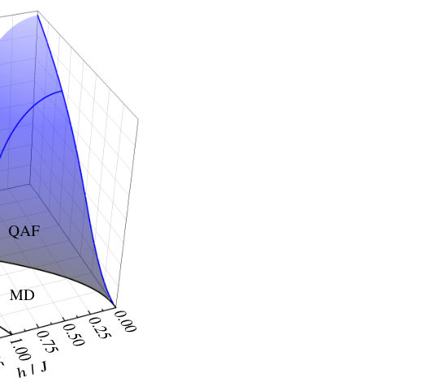
<figcaption class="paper-figure-caption"><b>Fig 4.</b> Figure 4: Global phase diagram of the spin-1/2 Ising-Heisenberg extended Lieb lat- tice in the J1/J-h/J-kBT/J parameter space. The blue lines correspond to continuous phase transitions occurring at zero effective field heff = 0. The red surface represents discontinuous thermal phase transitions extending from the ground-state boundary between the MD and FRI phases and terminating at the line of continuous phase transitions. The blue surface corresponds to continuous thermal phase transitions extending from the QAF-MD and QAF-FRI ground-state phase boundaries, whereby the two surfaces continuously merge into one another at zero effective field heff = 0 as indicated by the blue solid line.</figcaption>
</figure>
<figure class="paper-figure-card">
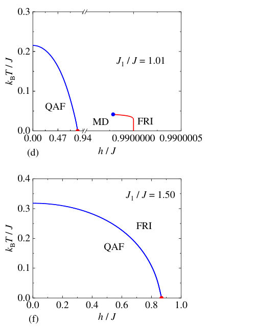
<figcaption class="paper-figure-caption"><b>Fig 5.</b> Figure 5: Finite-temperature phase diagrams of the spin-1/2 Ising-Heisenberg model on the extended Lieb lattice in the h/J–kBT/J plane for a few selected values of the interaction ratio: (a) J1/J = 0.5, (b) J1/J = 0.9, (c) J1/J = 1.0, (d) J1/J = 1.01, (e) J1/J = 1.25, and (f) J1/J = 1.50. Blue curves denote continuous phase transitions between the QAF phase and either MD or FRI phase,whereas red curves represent discontinuous transitions between the MD and FRI phases terminating at the Ising critical point shown as a blue circle. The lines of continuous phase transitions emerge from the zero-temperature discontinuous transition depicted as a red circle. The black square indicates the...</figcaption>
</figure>

**Summary.** This work analyzes phase transitions in the Ising-Heisenberg model on the extended Lieb lattice. By mapping it onto an effective Ising model, the authors map out a complex phase diagram showing both continuous critical lines and dome-shaped regions of discontinuous thermal transitions. The results are strongly confirmed by Monte Carlo simulations, providing a detailed understanding of magnetic ordering under external fields.

**Why it may be interesting.** The detailed characterization of both continuous (critical) and first-order (discontinuous) transitions in a frustrated quantum spin system provides rich insights into the interplay between quantum fluctuations and classical ordering mechanisms relevant to many condensed matter systems.

Detailed structure

**Main problem.** The study investigates the nature (continuous vs. discontinuous) and location of thermal phase transitions within the spin-1/2 Ising-Heisenberg model.

**Main result.** The phase diagram reveals distinct regions characterized by four ground states (QAF, MD, FRI, FM), featuring both dome-shaped surfaces of discontinuous transitions and continuous transition lines.

**Method.** The authors employ an exact mapping technique using the Decoration-Iteration Transformation to reduce the model to an effective Ising model, supplemented by Monte Carlo simulations for verification.

**Model / system.** The system is a spin-1/2 Ising-Heisenberg model defined on the extended Lieb lattice subjected to an external magnetic field. The Hamiltonian involves couplings ($J_1, J$) and the field ($h$).

**Key observables.** Ground-state phase diagram, finite-temperature phase transitions (continuous vs. discontinuous), magnetization ($\langle m_I 
angle, \langle m_H 
angle$), and magnetic susceptibility ($\chi$).

**Important parameters / regimes.** Interaction ratios ($J_1/J$), external field strength ($h/J$), and temperature ($k_B T/J$).

**Assumptions / limitations.** The analysis relies on an exact mapping of the complex model onto an effective Ising model, which is rigorously tested against Monte Carlo results.

**Figures summary.** Figures illustrate global phase diagrams in 3D parameter space ($J_1/J - h/J - k_B T/J$), showing distinct surfaces for continuous (blue) and discontinuous (red) transitions. Isothermal magnetization curves confirm plateaus associated with different phases.

**Paper structure.** The paper progresses from defining the complex Hamiltonian on the Lieb lattice, deriving an effective Ising model via transformation techniques, mapping out zero-temperature ground states, and finally constructing global phase diagrams showing both continuous and discontinuous thermal transition surfaces.

Abstract

The spin-1/2 Ising-Heisenberg model on the extended Lieb lattice in a magnetic field is exactly mapped onto an effective spin-1/2 Ising model on the square lattice. The ground-state phase diagram comprises the quantum antiferromagnetic (QAF), quantum monomer-dimer (MD), classical ferrimagnetic (FRI), and classical ferromagnetic phase. The MD-FRI ground-state phase boundary extends to finite temperatures as a dome-shaped surface of discontinuous thermal transitions bounded by a line of Ising critical points. The QAF phase is enclosed by a surface of continuous thermal transitions evolving from the QAF-MD and QAF-FRI ground-state phase boundaries. Monte Carlo simulations fully confirm the existence and nature of both continuous and discontinuous thermal phase transitions obtained by exact and approximate analytical calculations.

[↑ back to top](#top)

### [Nonreciprocal photon bundle emission](http://arxiv.org/abs/2606.10379v1)

**Authors:** Baijun Li, Jing-Xue Liu, Tian-Xiang Lu, Le-Man Kuang, Chaohong Lee, Hui Jing  
**Type:** theory · **Category:** other · **PDF:** <https://arxiv.org/pdf/2606.10379v1>  
**Analysis basis:** full PDF text, analyzed in chunks
**Topic relevance:** `Tavis-Cummings & cavity-many-emitter` **2/5** · `correlated cavity matter` **2/5** · `Keldysh / 2PI / non-Gaussian methods` **1/5** · `analog quantum simulation` **1/5** · `correlated / nonlocal dissipation` **1/5** · `driven-dissipative phase transition` **1/5** · `interference shaping light` **1/5** · `methods for driven-dissipative` **1/5** · `superradiant laser` **1/5**

↔ Scroll figures horizontally

<figure class="paper-figure-card">
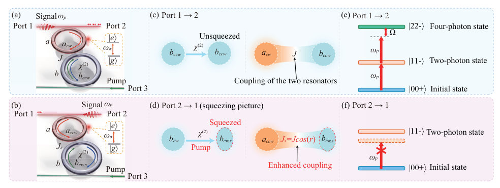
<figcaption class="paper-figure-caption"><b>Fig 1.</b> FIG. 1. Schematic of nonreciprocal two-photon bundle emission via directional quantum squeezing. (a,b) Compound system comprises two coupled whispering-gallery mode microcavities and a two-level atom, where a weak probe field is input from port 1 or from port 2. (c,d) Cavity b, containing χ(2) nonlinearity, is driven by a strong coherent laser from port 3, generating the directed quantum squeezing. A strong pump field also is applied to the two-level atom. The directed squeezing leads to an asymmetric detuning and photon hopping interaction in the system. The physical origin of the nonreciprocal two-photon bundle emission. (e) When the probe field is input from the left side, the super-Rabi...</figcaption>
</figure>
<figure class="paper-figure-card">
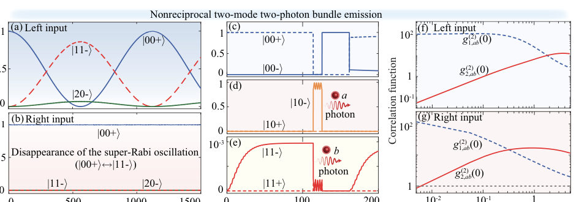
<figcaption class="paper-figure-caption"><b>Fig 2.</b> FIG. 2. Nonreciprocal two-photon bundle emission with the photons emitted from different cavities. (a,b) Nonreciprocal super- Rabi oscillation between the states |00+⟩and |11−⟩. Figures (a) and (b) depict the populations of the states |00+⟩, |11−⟩, and |20−⟩as a function of scaled evolution time ξt, when the probe field is input from the left side and the right side, respectively. (c-e) Quantum trajectory of the populations of the states |nm±⟩(n, m = 0, 1) for the probe field input from left side. (f,g) The cross second-order correlation function g(2) 1,ab(0) and the generalized cross second-order correlation function g(2) 2,ab(0) as functions of the atom decay rate γ/ξ. The parameters are...</figcaption>
</figure>
<figure class="paper-figure-card">
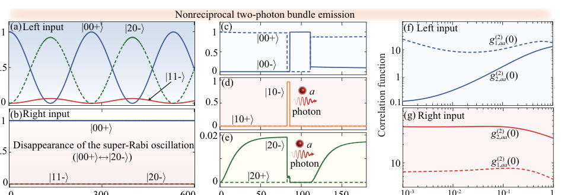
<figcaption class="paper-figure-caption"><b>Fig 3.</b> FIG. 3. Nonreciprocal two-photon bundle emission with photons emitted from cavity a. (a,b) Nonreciprocal super-Rabi oscillations between states |00+⟩and |20−⟩. Populations of the states |00+⟩, |11−⟩, and |20−⟩as functions of the scaled evolution time ξt for the probe field input from the left side (a) or the right side (b). (c-e) Quantum trajectory of populations of the states |nm±⟩(n, m = 0, 1, 2) for the probe field input from left side. Second-order correlation function g(2) 1,aa(0) and</figcaption>
</figure>

**Summary.** The paper explores generating directional two-photon photon bundles using a coupled resonator system driven by quantum squeezing. By analyzing the system's dynamics under different input directions, the authors demonstrate that squeezing breaks symmetry, enabling emission only from one direction. This offers an all-optical method to control chiral quantum light sources.

**Why it may be interesting.** This work is highly relevant as it combines quantum squeezing (a key tool in AMO) with nonreciprocal effects and multiquanta light generation, providing an all-optical control mechanism for quantum sources.

Detailed structure

**Main problem.** The study investigates nonreciprocal photon bundle emission, a phenomenon controlled by directional quantum squeezing.

**Main result.** Directional quantum squeezing selectively induces two-photon bundle emission when the probe field enters from one direction while prohibiting it from the opposite direction.

**Method.** The dynamics are analyzed using Hamiltonian derivations and master equations, supplemented by Bogoliubov transformations and correlation function calculations.

**Model / system.** The system is a compound setup involving two coupled optical resonators (microcavities) and a two-level atom within the context of quantum optics. The interaction is modeled via an effective Hamiltonian incorporating squeezing parameters.

**Key observables.** Two-photon super-Rabi oscillation, second-order correlation functions ($g^{(2)}$), and photon populations in specific quantum states.

**Important parameters / regimes.** Squeezing parameter (r), detuning ($\Delta$), cavity decay rates ($\kappa$), and atomic decay rate ($\gamma$).

**Assumptions / limitations.** The rotating-wave approximation is used, and thermal effects are neglected due to high resonance frequencies.

**Figures summary.** Figures schematically show the setup with input ports (Port 1/2) and pumping mechanisms. They illustrate super-Rabi oscillations via population dynamics and confirm nonreciprocity using $g^{(2)}$ correlation functions for different input directions.

**Paper structure.** The paper establishes the physical model, derives Hamiltonians for left/right inputs, analyzes the resulting super-Rabi oscillations under dissipation, and finally uses correlation functions to quantify the directional asymmetry of the photon bundle emission.

Abstract

Quantum squeezing, a cornerstone of quantum optics and photonics, has played a key role in achieving ultra-precision sensing and realizing nonreciprocal engineering. However, the nonreciprocal multiquanta emission has remained largely unexplored by using directional quantum squeezing. Here, the one-way photon-photon bundle emission in a compound system consisted of two coupled optical resonators and a two-level atom is investigated. It is found that the directional quantum squeezing induces the asymmetric frequency detuning and photon hopping interaction between the two resonators, leading to the directional excitation of the two-photon super-Rabi oscillation. In particular, by harnessing intrinsic dissipation of the system, two types of two-photon bundle emission can be selectively induced for the probe field input from one direction while it is prohibited with the probe from the other direction. This finding bridges the broad fields ranging from nonreciprocal physics to quantum squeezing optics and multiquanta emission control through an all-optical approach, which can enable potential applications in chiral quantum emitters and backscattering-immune photonic communications.

[↑ back to top](#top)

### [Hawking--Page Universality, Thermodynamic Dipoles and Categorical Defects](http://arxiv.org/abs/2606.10680v1)

**Authors:** Emilio Torrente-Lujan  
**Type:** theory · **Category:** statistical mechanics · **PDF:** <https://arxiv.org/pdf/2606.10680v1>  
**Analysis basis:** full PDF text, analyzed in chunks
**Topic relevance:** `non-equilibrium universality` **2/5** · `Keldysh / 2PI / non-Gaussian methods` **1/5** · `analog quantum simulation` **1/5** · `correlated / nonlocal dissipation` **1/5** · `driven-dissipative phase transition` **1/5** · `entanglement & information structure` **1/5** · `methods for driven-dissipative` **1/5** · `non-equilibrium dynamics` **1/5**

↔ Scroll figures horizontally

<figure class="paper-figure-card">
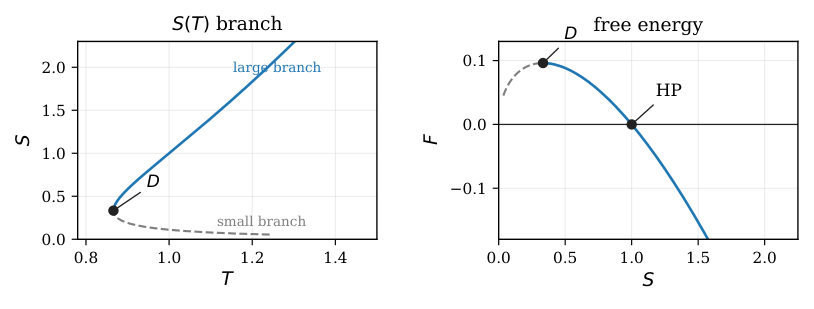
<figcaption class="paper-figure-caption"><b>Fig 1.</b> Figure 1. Reduced Schwarzschild–AdS phase schematic portrait (adapted from [12]). Left: the Davies point D is the minimum of T(S) and separates the small and large branches. Right: the same point is the maximum of F(S), while HP is the zero of F on the stable large-black-hole branch. Dashed portions denote locally unstable states.</figcaption>
</figure>
<figure class="paper-figure-card">
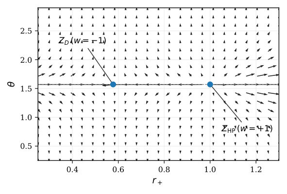
<figcaption class="paper-figure-caption"><b>Fig 2.</b> Figure 2. Normalized common vector field for Schwarzschild–AdS in the (r+, θ) plane. The zero at r+ = 1/ √</figcaption>
</figure>
<figure class="paper-figure-card">
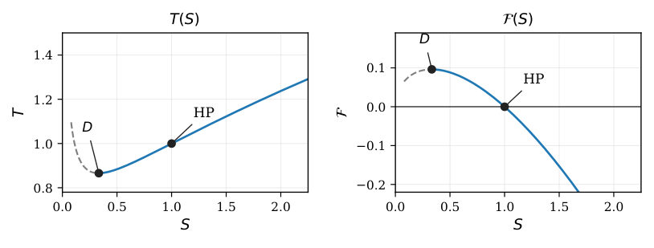
<figcaption class="paper-figure-caption"><b>Fig 3.</b> Figure 3. Four-dimensional Schwarzschild–AdS branch plotted as T(S) and F(S). The oriented separation from D to HP gives the two dipole components, PS = SHP −SD and PT = THP −TD.</figcaption>
</figure>
<figure class="paper-figure-card">
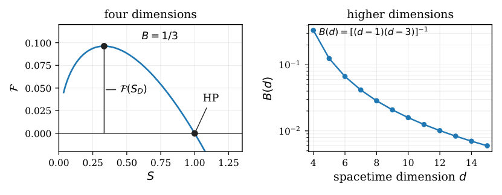
<figcaption class="paper-figure-caption"><b>Fig 4.</b> Figure 5. Normalized Hawking–Page barrier. In four dimensions the Davies point is the top of the free-energy barrier, giving B = F(SD)/(TDSD) = 1/3. In the charged non-rotating family the higher-dimensional result is B(d) = 1/[(d −1)(d −3)].</figcaption>
</figure>
<figure class="paper-figure-card">
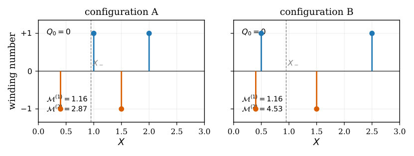
<figcaption class="paper-figure-caption"><b>Fig 5.</b> Figure 6. Toy defect configurations illustrating the need for higher moments. The two panels have the same total winding number and the same normalized first moment, but their second moments differ. The dashed line marks the negative-charge centroid X−.</figcaption>
</figure>

**Summary.** This work unifies the understanding of black hole phase transitions (Hawking–Page and Davies) by mapping them onto a topological dipole structure defined by winding numbers. The authors derive universal constants for these ratios across various dimensions and geometries. They further advance this framework by incorporating categorical defects, suggesting a deeper connection between gravity's thermodynamics and abstract algebraic structures.

**Why it may be interesting.** While primarily in gravity/QFT, the rigorous application of topological invariants (winding numbers) to characterize phase transitions and universal ratios echoes methods used in analyzing critical points in condensed matter systems, particularly those involving symmetry breaking or emergent order parameters.

Detailed structure

**Main problem.** The paper reconsiders the Hawking–Page phase transition by analyzing a common thermodynamic vector field whose zeros include both Davies and Hawking–Page critical points.

**Main result.** It establishes that these transitions can be characterized by universal ratios ($C_S, C_T$) derived from topological charges (winding numbers) associated with the dipole structure of the free energy landscape. Furthermore, it extends this analysis to incorporate categorical defects.

**Method.** The authors use a thermodynamic vector field approach to calculate winding numbers and signed first moments at critical points on black hole phase diagrams. They then normalize these moments to derive universal ratios independent of specific scaling parameters.

**Model / system.** The study focuses on the thermodynamics of Anti-de Sitter (AdS) black holes, including Schwarzschild–AdS, Reissner–Nordström–AdS, and Kerr–AdS geometries in arbitrary dimensions. The analysis is performed using the on-shell free energy $F(S; Y_i)$.

**Key observables.** Universal ratios ($C_S, C_T$), topological charges (winding numbers $w_D=-1, w_{HP}=+1$), and the dimensionless barrier constant $B$.

**Important parameters / regimes.** Dimensionality ($d$), angular velocity ($\Omega$), and defect parameters associated with non-invertible symmetries.

**Assumptions / limitations.** The analysis assumes that universal ratios can be extracted by normalizing thermodynamic quantities based on a shared functional form (shape argument). Extensions involve assuming control over both black hole saddles and defect sectors for full analytic treatment.

**Figures summary.** Figures schematically illustrate the phase diagrams, showing the locations of the Davies (D) and Hawking–Page (HP) points, and demonstrate how higher moments can distinguish between different configurations sharing the same total charge and first moment.

**Paper structure.** The paper progresses by defining the common thermodynamic vector field, calculating topological charges for simple AdS black holes to find universal ratios ($C_S, C_T$), generalizing these findings to arbitrary dimensions and rotation (Kerr-AdS), and finally proposing an extension using defect-resolved free energies within a categorical framework.

Abstract

We reconsider the Hawking--Page transition using the common thermodynamic vector field whose zeros include the Davies and Hawking--Page points. In the elementary AdS branch their winding numbers are $w_{\rm D}=-1$ and $w_{\rm HP}=+1$, so the pair has zero total charge but a non-zero signed first moment. After normalization by the Davies scales this moment gives the familiar universal ratios $C_S$ and $C_T$; in four dimensions $C_S=2$ and $C_T=2/\sqrt{3}-1$. We check the construction for Schwarzschild--AdS, grand-canonical Reissner--Nordström--AdS, charged non-rotating black holes in arbitrary dimension, and Kerr--AdS at fixed angular velocity. The same reduced geometry gives a barrier $B=1/3$ in four dimensions and $B(d)=1/[(d-1)(d-3)]$. Finally we propose a formulation involving a defect-resolved version for categorical or non-invertible symmetry sectors.

[↑ back to top](#top)

### [Rank Collapse, Fixed Points, and the Renormalization Group Structure of MLP Residual Networks](http://arxiv.org/abs/2606.10324v1)

**Authors:** Parviz Haggi-Mani, Irina Rish  
**Type:** experiment · **Category:** statistical mechanics · **PDF:** <https://arxiv.org/pdf/2606.10324v1>  
**Analysis basis:** full PDF text, analyzed in chunks
**Topic relevance:** `non-equilibrium universality` **2/5** · `Keldysh / 2PI / non-Gaussian methods` **1/5** · `analog quantum simulation` **1/5** · `correlated / nonlocal dissipation` **1/5** · `driven-dissipative phase transition` **1/5** · `entanglement & information structure` **1/5** · `methods for driven-dissipative` **1/5** · `non-equilibrium dynamics` **1/5**

↔ Scroll figures horizontally

<figure class="paper-figure-card">
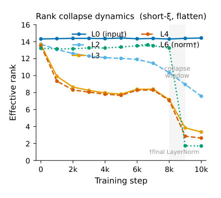
<figcaption class="paper-figure-caption"><b>Fig 1.</b> Figure 2: Effective rank at selected layers as a function of training step, short-ξ chain (flat- ten mode). L0 (control) remains flat through- out. L3 and L4 are stable until the shaded collapse window (steps 8,000–9,000), where they drop abruptly. The sharpness of the transition is inconsistent with a smooth RG cascade and suggests a phase-transition-like reorganisation during late training.</figcaption>
</figure>
<figure class="paper-figure-card">
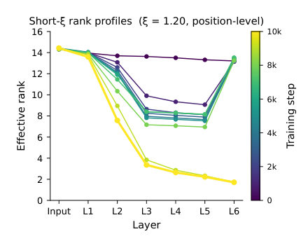
<figcaption class="paper-figure-caption"><b>Fig 2.</b> Figure 1: Effective rank profiles across depth for the short-ξ chain (ξ = 1.2, flatten mode), at 11 training checkpoints from initialization (dark) to step 10,000 (light). Rank is near- uniform at initialization and collapses mono- tonically with depth after training, with a sharp fan visible between steps 8,000–9,000 at layers L3–L6.</figcaption>
</figure>
<figure class="paper-figure-card">
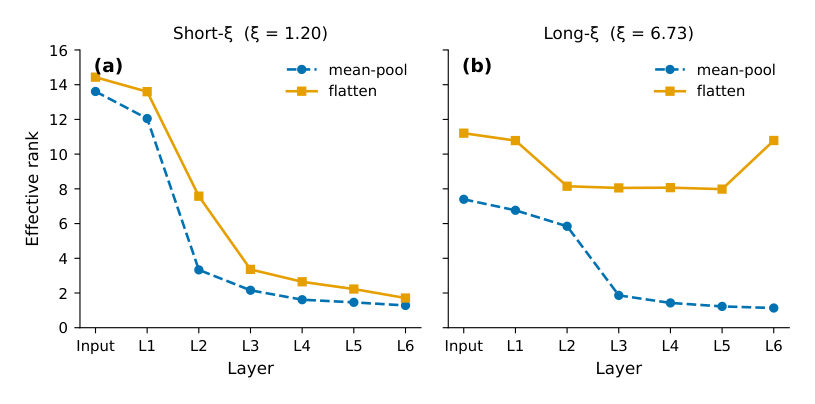
<figcaption class="paper-figure-caption"><b>Fig 3.</b> Figure 3: Effective rank at the final checkpoint under pool (dashed) and flatten (solid) measurement modes. (a) Short-ξ: the two modes nearly coincide; the confound is small. (b) Long-ξ: pool mode shows apparent collapse to rank ≈1; flatten mode shows no collapse (rank ≈8–11). The discrepancy in panel (b) is a mean-pooling artifact arising from the low token diversity of slow-mixing sequences.</figcaption>
</figure>
<figure class="paper-figure-card">
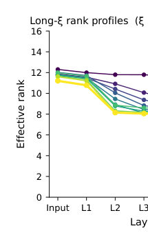
<figcaption class="paper-figure-caption"><b>Fig 4.</b> Figure 4: Effective rank profiles across depth for the long-ξ chain (ξ ≈6.7, flatten mode) at 10 training checkpoints. Unlike the short-ξ chain(Figure 1), the effective rank remains stable across all layers, confirming that no rank collapse occurs when the input distribution contains long-range correlations.</figcaption>
</figure>
<figure class="paper-figure-card">
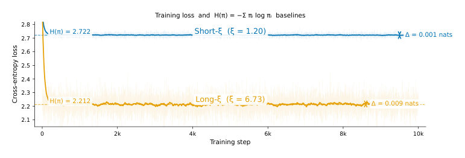
<figcaption class="paper-figure-caption"><b>Fig 5.</b> Figure 5: Training loss curves for the short-ξ (blue, ξ = 1.20) and long-ξ (orange, ξ = 6.73) chains over 10,000 steps. Faint texture shows raw per-step loss; solid lines show exponential moving average (EMA-smoothed) loss. Dashed horizontal lines (left) mark H(π) = −P i πi log πi for each chain (H(π) = 2.722 for short-ξ; H(π) = 2.212 for long-ξ) — the lowest loss achievable by a position-wise model with no access to context. Double-headed arrows show the gap ∆between the final smoothed loss and the H(π) floor. The short-ξ model converges to within 0.001 nats of H(π); the long-ξ model ends 0.009 nats above H(π), reflecting the greater distance of its peaked target distribution from the...</figcaption>
</figure>

**Summary.** This work quantitatively tests the analogy between deep neural networks and Renormalization Group theory using MLP residual stacks trained on Markov chains. By measuring effective rank collapse, the authors show that network compression is selective: it occurs only when input correlations are short-ranged. This provides quantitative evidence for a data-driven, spectral coarse-graining mechanism within deep learning architectures.

**Why it may be interesting.** The explicit mapping between network dynamics (rank collapse) and physical concepts like RG flow and fixed points provides a novel computational lens through which to view complex many-body or statistical physics phenomena, potentially guiding the design of quantum machine learning models.

Detailed structure

**Main problem.** To move beyond qualitative analogies between deep neural network forward passes and Renormalization Group (RG) theory by conducting an empirical study of a tractable architecture.

**Main result.** The effective rank collapse is selective: it occurs for short-correlation length inputs but is absent for long-correlation length inputs, providing quantitative evidence that the MLP selectively coarse-grains based on input spectral structure.

**Method.** The authors trained a pure MLP residual stack on synthetic Markov chain sequences and measured the effective rank ($
ho_{	ext{eff}}$) and inter-layer kernel drift (CKA) as functions of network depth.

**Model / system.** The model is an MLP residual stack trained for masked token prediction. The input data consists of synthetic Markov chains whose spectral properties are controlled by their correlation length ($\xi$).

**Key observables.** Effective Rank ($
ho_{	ext{eff}}$), Inter-layer Kernel Drift ($\Delta C_{KA}$)

**Important parameters / regimes.** Correlation Length ($\xi$), Network Depth ($L$), Input Distribution (Short-$\xi$ vs. Long-$\xi$)

**Assumptions / limitations.** The study assumes that the observed rank collapse corresponds to the physical RG process of eliminating irrelevant degrees of freedom, and that mean-pooling artifacts must be distinguished from true network compression.

**Figures summary.** Figures show $
ho_{	ext{eff}}$ profiles demonstrating monotonic decrease (collapse) for short-$\xi$ chains but stability for long-$\xi$ chains. Kernel drift heatmaps illustrate localized high-drift transitions separated by fixed-point plateaus in both regimes.

**Paper structure.** The paper establishes the RG analogy, details the MLP/Markov chain setup, presents quantitative measurements of rank collapse and kernel drift across depth, and concludes by interpreting these results as evidence for selective coarse-graining governed by input spectral structure.

Abstract

The analogy between deep neural network forward passes and renormalization group (RG) flows has been repeatedly noted in the literature, but existing treatments remain qualitative: depth is described as a coarse-graining scale, attention is likened to a partition function, and representations are said to flow toward fixed points. No existing work has defined a measurable RG order parameter, tested it under controlled variation of the input distribution, or made quantitative predictions that are empirically verified. We study the simplest architecture for which the analogy is tractable: a pure MLP residual stack trained on masked token prediction over synthetic Markov chain sequences with known spectral properties. We report three findings. (i) The effective rank of the residual stream decreases monotonically with depth after training, consistent with progressive integration of irrelevant degrees of freedom. (ii) This rank collapse is selective: it occurs for chains with short correlation length approximately 1 but is absent for chains with long correlation length approximately 7, measured at the position level to control for mean-pooling artifacts. The network preserves exactly the degrees of freedom relevant to the prediction task, the content of the RG relevance criterion. (iii) Inter-layer kernel drift is concentrated at one or two specific transitions, with the remainder of the network near a fixed point, consistent with a discrete fixed-point plateau. Together these findings constitute the first quantitative, position-level evidence that MLP residual networks implement a selective coarse-graining procedure governed by the spectral structure of the input distribution.

[↑ back to top](#top)

### [Bootstrap Cone of the Multicritical Deconfined Quantum Critical Point](http://arxiv.org/abs/2606.09985v1)

**Authors:** Zhijin Li, Tinhong Shen  
**Type:** theory · **Category:** strongly correlated electrons · **PDF:** <https://arxiv.org/pdf/2606.09985v1>  
**Analysis basis:** full PDF text, analyzed in chunks
**Topic relevance:** `analog quantum simulation` **2/5** · `Keldysh / 2PI / non-Gaussian methods` **1/5** · `driven-dissipative phase transition` **1/5** · `entanglement & information structure` **1/5** · `non-equilibrium universality` **1/5**

↔ Scroll figures horizontally

<figure class="paper-figure-card">
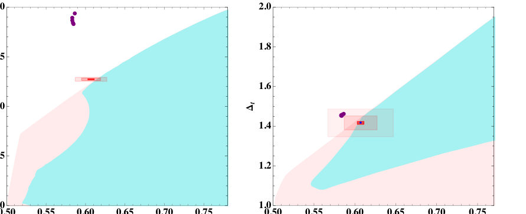
<figcaption class="paper-figure-caption"><b>Fig 1.</b> Figure 1: Bootstrap bounds on the SO(5) singlet scalar s (left) and traceless symmetric scalar t (right). The pink regions denotes the bootstrap allowed regions for general unitary CFTs. The cyan regions are obtained with assumptions ∆s′ &gt; 4.8 (left) and ∆t′ &gt; 3.95 (right). The red rectangles represent the QMC results with 1, 5 and 10σ error bars. The purple dots give the fuzzy sphere results [42] at different system sizes.</figcaption>
</figure>
<figure class="paper-figure-card">
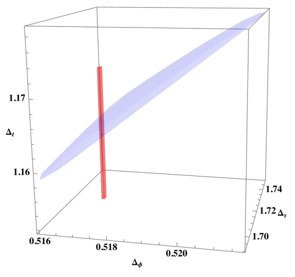
<figcaption class="paper-figure-caption"><b>Fig 2.</b> Figure 2: Bootstrap island for the critical O(5) vector model. The red cuboid represents the MC results [76,77].</figcaption>
</figure>
<figure class="paper-figure-card">

<figcaption class="paper-figure-caption"><b>Fig 3.</b> Figure 3: The cyan (blue) region represents the bootstrap bound for SO(5) CFTs (with assumptions ∆s′,t′ &gt; 3). The two separated red cuboids denote the QMC results for the critical O(5) vector model and DQCP.</figcaption>
</figure>
<figure class="paper-figure-card">
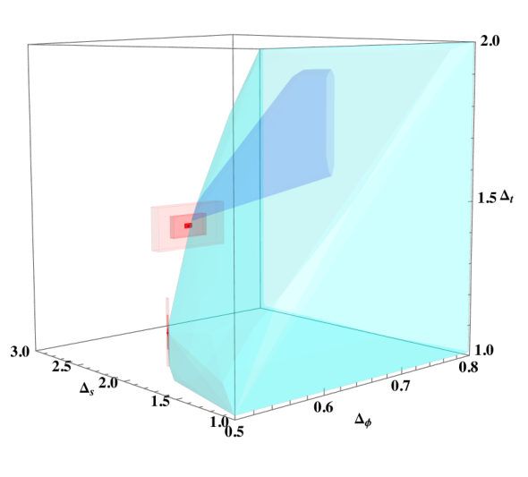
<figcaption class="paper-figure-caption"><b>Fig 4.</b> Figure 3 we present the bootstrap bounds in the three dimensional parameter space for</figcaption>
</figure>
<figure class="paper-figure-card">
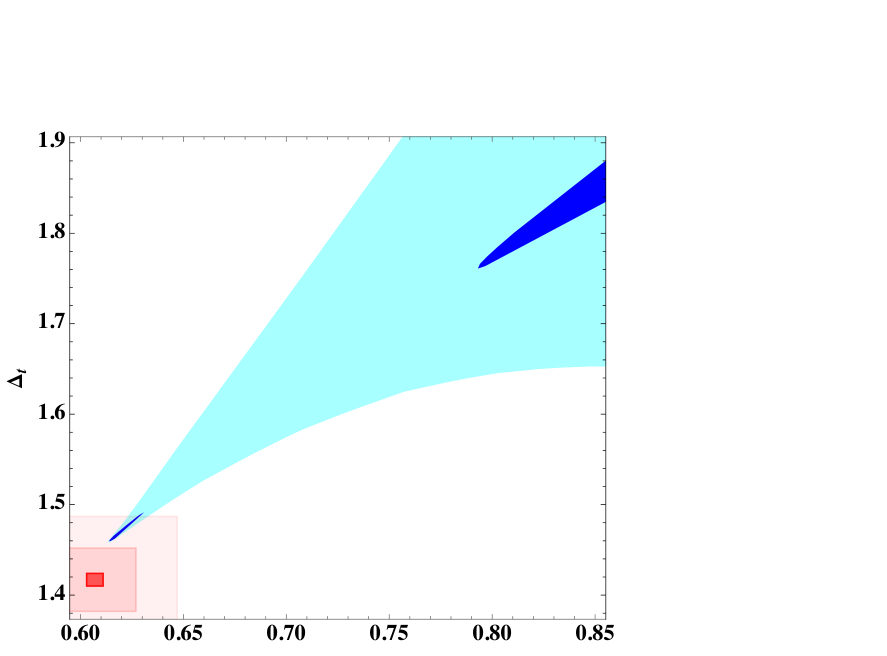
<figcaption class="paper-figure-caption"><b>Fig 5.</b> Figure 4: Bootstrap bounds on the plane with fixed ∆s = 2.273. The cyan (blue) region represents the bound with assumptions ∆s′ &gt; 3, ∆t′ &gt; 3 (∆s′ &gt; 4.5, ∆t′ &gt; 3.95).</figcaption>
</figure>

**Summary.** This work uses conformal bootstrap techniques to analyze the controversial Deconfined Quantum Critical Point (DQCP) in 2D quantum magnets. By showing that the theoretical constraints (bootstrap cone) perfectly match results from both QMC simulations and fuzzy sphere calculations, the authors strongly argue for a unitary multicritical fixed point governed by SO(5) symmetry. This provides a major theoretical breakthrough in understanding unconventional quantum phase transitions.

**Why it may be interesting.** Although focused on condensed matter magnetism, the rigorous application of CFT and bootstrap methods provides powerful general tools for analyzing critical points in strongly interacting quantum systems, which has implications for understanding emergent symmetries in other many-body contexts.

Detailed structure

**Main problem.** The central problem is determining the true nature of the Deconfined Quantum Critical Point (DQCP) phase transition, specifically resolving the debate between pseudo-criticality and a unitary multicritical fixed point.

**Main result.** The authors provide strong evidence supporting the multicriticality scenario by showing that conformal bootstrap bounds consistently unify results from Quantum Monte Carlo simulations and fuzzy sphere calculations into a single unitary CFT description.

**Method.** The primary method is applying the Conformal Bootstrap program to constrain the parameters of the critical theory, supplemented by comparison with large-scale QMC data and fuzzy sphere regularization results.

**Model / system.** The study focuses on two-dimensional quantum magnets exhibiting transitions between Néel AFM, VBS, and QSL phases. The underlying theoretical framework involves an SO(5) symmetry structure relevant to high-Tc superconductivity.

**Key observables.** Critical exponents, scaling dimensions ($\Delta$), Operator Product Expansion (OPE) coefficients, and the shape of the bootstrap cone in parameter space.

**Important parameters / regimes.** The existence and location of a unitary fixed point characterized by a relevant SO(5) singlet scalar.

**Assumptions / limitations.** The analysis assumes that the critical theory is governed by a unitary Conformal Field Theory (CFT), allowing for the use of bootstrap constraints to overcome limitations in direct numerical simulations.

**Figures summary.** Figures illustrate how imposing sparseness conditions causes the general bootstrap bounds to collapse from a strip into a sharp cone, which aligns remarkably well with both QMC data and fuzzy sphere calculations.

**Paper structure.** The paper progresses by first establishing the theoretical conflict (pseudo-criticality vs. multicriticality), then applying the conformal bootstrap method using advanced techniques like the navigator algorithm to map out the allowed parameter space, culminating in the demonstration of consistency across multiple independent computational approaches.

Abstract

The deconfined quantum critical point (DQCP) provides a prominent example of the unconventional phase transitions beyond the Landau-Ginzburg-Wilson paradigm and its nature has been controversial for decades. The DQCP has been extensively studied and the results lead to two opposite scenarios with pseudo-criticality or multicriticality. The pseudo-criticality is a prevailing scenario of DQCP which interprets the approximately scale invariant numerical results with the walking behavior near complex fixed points. In contrast, the multicriticality scenario conjectures the DQCP is a unitary fixed point with a relevant $SO(5)$ singlet scalar. In this work we provide substantial evidence for the multicriticality scenario using conformal bootstrap. We start with the observation that the large scale Quantum Monte Carlo (QMC) results nearly saturate the bootstrap bounds. After imposing suitable sparseness condition the bootstrap bound forms a sharp cone in the three-dimensional parameter space. The bootstrap cone is close to the QMC data. We use the navigator algorithm to locate the apex of the cone and extract the extremal solutions. We find striking consistencies between the bootstrap solutions and the fuzzy sphere data of DQCP, including the coefficients in the operator product expansions (OPEs) and the higher spectrum! The bootstrap cone unifies the QMC and the fuzzy sphere data into a unitary conformal field theory with a relevant $SO(5)$ singlet scalar, thus strongly supporting the multicriticality scenario of DQCP. The agreement between the conformal bootstrap, QMC and fuzzy sphere results is a surprise towards solving DQCP and decoding the profound phase diagram of the two-dimensional quantum magnets.

[↑ back to top](#top)

### [Colloquium: Nuclear clocks](http://arxiv.org/abs/2606.11048v1)

**Authors:** Andrei Derevianko, R. Elwell, Eric R. Hudson  
**Type:** both · **Category:** other · **PDF:** <https://arxiv.org/pdf/2606.11048v1>  
**Analysis basis:** full PDF text, analyzed in chunks
**Topic relevance:** `QC/QI experiment` **2/5** · `analog quantum simulation` **1/5** · `correlated cavity matter` **1/5** · `driven-dissipative phase transition` **1/5** · `quantum optics experiment` **1/5**

↔ Scroll figures horizontally

<figure class="paper-figure-card">
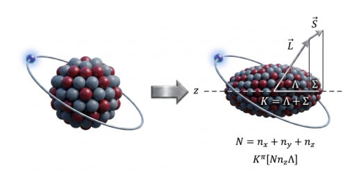
<figcaption class="paper-figure-caption"><b>Fig 1.</b> FIG. 1 Schematic of a deformed nucleus and the Nilsson quantum numbers used for the 229Th ground and isomeric configurations.</figcaption>
</figure>
<figure class="paper-figure-card">
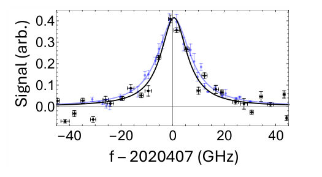
<figcaption class="paper-figure-caption"><b>Fig 2.</b> FIG. 2 (Color online) Nuclear spectroscopy of the 229Th tran- sition in 229Th:LiSrAlF6 and ThO2. Lighter points and curve (blue online) show the radiative-decay spectrum measured in 229Th:LiSrAlF6. The black points show the laser-based conversion-electron M¨ossbauer spectrum of a thin 229ThO2 target. Adapted from (Elwell et al., 2025)</figcaption>
</figure>
<figure class="paper-figure-card">
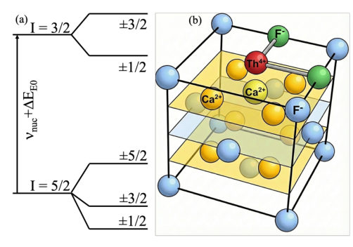
<figcaption class="paper-figure-caption"><b>Fig 3.</b> FIG. 3 (a) The local crystal electric-field gradient splits the I = 5/2 ground-state and I = 3/2 isomeric manifolds into Kramers doublets, labeled by their dominant |I, mI⟩com- ponents. (b) One possible local structure of thorium-doped CaF2. The Th dopant substitutes for Ca2+ as Th4+, while nearby interstitial fluoride ions F– (in green) compensate the excess charge. This microscopic defect complex sets the lo- cal electric-field gradients, the isomer shift, and the electronic defect spectrum of panel (a) sampled by the 229Th nucleus. Adapted from (Dessovic et al., 2014).</figcaption>
</figure>

**Summary.** This review surveys the field of ${}^{229}	ext{Th}$ nuclear clocks, detailing how its unique low-energy isomeric transition makes it a leading candidate for next-generation frequency standards. It compares trapped ion and solid-state implementations, emphasizing that while both offer high precision, controlling environmental decay pathways (quenching) is key to realizing the clock's full potential.

**Why it may be interesting.** This work is highly relevant as it bridges nuclear physics with quantum sensing platforms. The study of decay pathways (quenching) in solids involves understanding open quantum systems dynamics, while the comparison between ion traps and crystals touches upon advanced AMO techniques like cavity QED or defect engineering.

Detailed structure

**Main problem.** The primary goal is realizing a nuclear optical clock using the low-energy isomeric transition of ${}^{229}	ext{Th}$ to create an ultra-high precision quantum sensor.

**Main result.** The paper reviews decades of research, confirming that while significant experimental challenges exist (e.g., distinguishing true decay from background noise), the potential for a high-precision clock in both trapped ions and solid-state matrices is robust.

**Method.** The review synthesizes results from various techniques including VUV-comb spectroscopy, laser excitation in crystals, $\gamma$-ray spectroscopy, and ion trapping experiments.

**Model / system.** The system centers on the ${}^{229}	ext{Th}$ nuclear isomer ($\sim 8.4 	ext{ eV}$ transition), which is studied in two main platforms: isolated trapped ions (e.g., $	ext{Th}^{3+}$) and solid-state matrices (e.g., fluorides like $	ext{CaF}_2$). The underlying physics involves complex nuclear structure models like the Nilsson model.

**Key observables.** Transition energy ($\sim 8.4 	ext{ eV}$), transition multipolarity ($	ext{M}1$), isomer shift, and sensitivity to fundamental constant variations ($K_{\alpha}$).

**Important parameters / regimes.** Clock stability targets reaching $10^{-19}$ fractional accuracy; the near-cancellation of strong and electromagnetic contributions leading to high sensitivity.

**Assumptions / limitations.** The performance depends critically on minimizing environmental quenching pathways (e.g., defect-mediated decay) in solid-state hosts, while trapped ions offer superior control over systematic errors.

**Figures summary.** Figures schematically illustrate the Nilsson quantum numbers for the ground and isomeric states of ${}^{229}	ext{Th}$ within a deformed nucleus.

**Paper structure.** The paper follows a historical development structure: first reviewing early $\gamma$-ray spectroscopy attempts, then detailing the shift to optical excitation in solid-state hosts, and finally comparing the systematic advantages and challenges of trapped ion versus solid-state implementations for modern clock operation.

Abstract

The Th-229 nuclear isomeric state has the lowest energy of all known nuclear excited states, placing it within the reach of current table-top laser technology. This extraordinary property has made this nuclear isomer an attractive candidate for a nuclear optical clock of incredibly high precision and accuracy, both as isolated trapped Th-229 ions and embedded into solid-state platforms. Activity around Th-229 has surged in recent years, driven by breakthroughs in its direct laser excitation. The underlying nuclear physics that gives rise to this unique isomer will be elucidated, as well as the nearly half-century of efforts that led to its direct excitation. The design and systematics of a Th-229 nuclear clock will be discussed, both in ion traps and in the solid-state. These systematics, such as frequency shifts and quenching channels, can be leveraged both to probe the local chemical environment, and as a control knob during clock operation. Finally, the nuclear clock's high sensitivity to the variations of fundamental constants will be discussed.

[↑ back to top](#top)

### [Inherent flux crosstalk and coupler-driven single-qubit gates in superconducting circuits](http://arxiv.org/abs/2606.10970v1)

**Authors:** Balázs Gulácsi, Guido Burkard  
**Type:** theory · **Category:** quantum information and computing · **PDF:** <https://arxiv.org/pdf/2606.10970v1>  
**Analysis basis:** full PDF text, analyzed in chunks
**Topic relevance:** `QC/QI experiment` **2/5** · `correlated / nonlocal dissipation` **1/5** · `driven-dissipative phase transition` **1/5** · `methods for driven-dissipative` **1/5** · `non-equilibrium dynamics` **1/5**

↔ Scroll figures horizontally

<figure class="paper-figure-card">
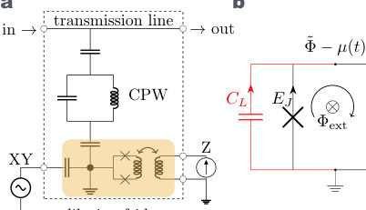
<figcaption class="paper-figure-caption"><b>Fig 1.</b> Figure 1. The lumped element model of a superconducting transmon qubit. In panel a, the illustration of the circuit of the full qubit stack inside a dilution refrigerator, with a ded- icated coplanar waveguide readout resonator, XY microwave control line, and Z flux bias line. The shaded rectangle illus- trates a transmon qubit, formed by a SQUID loop shunted by a cross-shaped capacitance. In panel b, the shaded re- gion is modeled as an idealized lumped circuit with a control- lable external magnetic flux threading the SQUID loop of the transmon, as well as showcasing the tree (red) and the chord (black) branches of the circuit graph.</figcaption>
</figure>
<figure class="paper-figure-card">
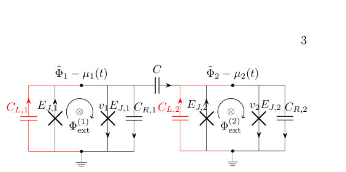
<figcaption class="paper-figure-caption"><b>Fig 2.</b> Figure 2. The lumped-element circuit of capacitively coupled tunable transmons showcasing the chosen tree (red) and the chord (black) branches of the network graph.</figcaption>
</figure>
<figure class="paper-figure-card">
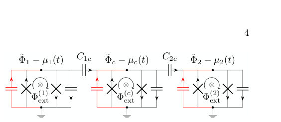
<figcaption class="paper-figure-caption"><b>Fig 3.</b> Figure 3. The lumped-element circuit model of the tunable coupler architecture. The red branches correspond to the cho- sen tree of the circuit graph, with capacitances CL,j. The chords (black) are the coupling capacitances C1c and C2c, branches of the Josepshson junctions EJ,j (left), vjEJ,j (right) and capacitances (right) CR,j. In these, j = 1, c, 2 and the labels are omitted for visual clarity.</figcaption>
</figure>
<figure class="paper-figure-card">
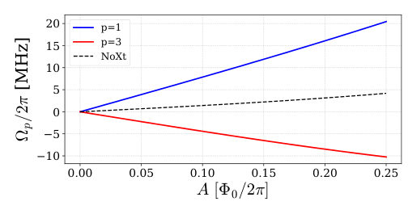
<figcaption class="paper-figure-caption"><b>Fig 4.</b> Figure 4. The strengths of the linear drive terms Ω1 (blue) and Ω3 (red) as a function of the modulation amplitude A. For comparison, we also depict these with neglected inherent crosstalk (βj = 0, dashed-line), which clearly demonstrates the significance of Eq. (30). The circuit parameters used in this plot are CΣ,1 = 77 fF, CΣ,c = 56 fF, CΣ,2 = 75 fF, C1c = 2.5 fF, Cc2 = 2.5 fF, EJ,1/2π = 10 GHz, v1 = 1, EJ,c/2π = 12 GHz, vc = 0.95, EJ,2/2π = 10.2 GHz, v2 = 1, φ(1) st /2π = 0.075, φ(c) st /2π = 0.45, φ(2) st /2π = 0. We furthermore assumed CR,j = CL,j for all j = 1, c, 2.</figcaption>
</figure>
<figure class="paper-figure-card">
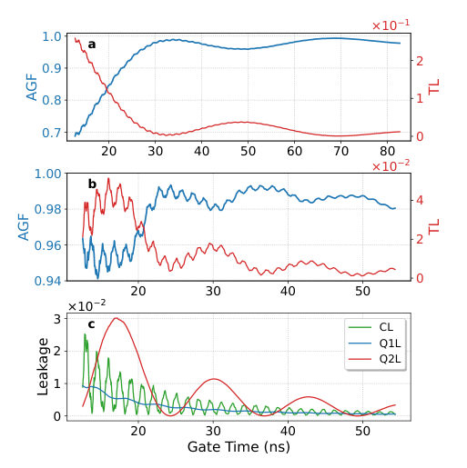
<figcaption class="paper-figure-caption"><b>Fig 5.</b> Figure 5. The average gate fidelities (AGF) and total leakage rates (TL) as a function of the gate time for a coupler-driven X gate with rectangular pulse envelope. On panel a, the static flux is set to φ(1) st /π = 0.15 which results in a detuning for qubit 2 that is close to its anharmonicity. This leads to large leakage probability and limits the time of the gate. On panel b, the static flux is reduced to φ(1) st /π = 0.09, which increases ∆3 + α3 and leads to better AGF for shorter gate times. Panel c shows the contributions of the coupler, qubit 1 and qubit 2 modes to the total leakage, respectively. The periodicity of these provides fingerprints for the identification of leakage...</figcaption>
</figure>

**Summary.** The paper theoretically analyzes inherent flux crosstalk in superconducting qubit circuits by deriving the system dynamics using Lagrangian mechanics. It shows this unintended coupling, arising from time-varying external fluxes, can be harnessed to drive fast single-qubit gates via the coupler element. This approach promises high fidelity quantum control while simplifying hardware requirements.

**Why it may be interesting.** This work provides a concrete theoretical framework for engineering quantum control pulses. For AMO/open systems theorists, the derivation of an unavoidable coupling term (inherent crosstalk) that can be actively exploited is valuable, as it moves beyond treating crosstalk purely as noise to treat it as a controllable resource.

Detailed structure

**Main problem.** The work investigates inherent flux crosstalk—an unavoidable coupling mechanism arising from time-varying external magnetic fluxes in superconducting qubits—and demonstrates how to harness it for fast, high-fidelity single-qubit gates.

**Main result.** By utilizing the inherent flux crosstalk generated by modulating the coupler element, researchers can achieve fast single-qubit gate fidelities exceeding 99.9%, potentially eliminating the need for dedicated microwave control lines per qubit.

**Method.** The analysis employs Lagrangian mechanics derived from lumped-element circuit models to derive the system Hamiltonian, followed by normal mode transformations and time-dependent perturbation theory for gate simulation.

**Model / system.** The physical platform is a superconducting transmon qubit architecture featuring tunable couplers. The model uses generalized coordinates ($\Phi$) and derives the dynamics via a Lagrangian/Hamiltonian formalism that explicitly includes terms arising from $\dot{\Phi}_{	ext{ext}}(t)$.

**Key observables.** Average Gate Fidelity (AGF), Total Leakage Rate, Pauli error probabilities ($p_a$), and the effective drive strength ($\Omega_p$).

**Important parameters / regimes.** External flux modulation amplitude ($A$), static bias fluxes ($\phi_{st}$), and gate time ($t_g \sim 20 	ext{ ns}$).

**Assumptions / limitations.** The analysis relies on the validity of the Rotating Wave Approximation (RWA) and truncating the Hamiltonian expansion to include only first and second harmonic terms.

**Figures summary.** Figures illustrate the circuit model, the derivation of the Lagrangian/Hamiltonian, and crucially, show AGF vs. gate time curves demonstrating high fidelity achievable when inherent crosstalk is included in the drive calculation.

**Paper structure.** The paper progresses from deriving the fundamental theory using Lagrangian mechanics to identify the inherent flux crosstalk term; it then applies this understanding by modeling the system's Hamiltonian in normal modes and finally simulates single-qubit gates, demonstrating performance metrics like AGF.

Abstract

Crosstalk refers to unwanted qubit addressing. This is particularly detrimental when scaling up quantum information systems because unintended interactions limit their overall performance. For superconducting qubits, tunable couplings and frequency tunability achieved through externally applied magnetic fluxes enable high-fidelity entangling gates; however, they also introduce crosstalk through unintended flux coupling. In this work, we investigate the impact of time-dependent external magnetic fluxes in quantized circuits on superconducting qubit couplings. We find that non-trivial cross-voltage driving emerges between capacitively linked qubits when the magnetic flux threading the SQUID loop of a qubit varies in time, in a manner analogous to Faraday's law of induction. Crucially, we show that this effect enables fast single qubit control through the coupler element in standard tunable-coupler architectures, potentially eliminating the need for individual microwave $XY$ control lines.

[↑ back to top](#top)

### [On pseudogap phase as precursor to a superconducting dome in high-Tc cuprates: Non-analytic T* as a function of doping](http://arxiv.org/abs/2606.11056v1)

**Authors:** Felix A. Buot  
**Type:** theory · **Category:** strongly correlated electrons · **PDF:** <https://arxiv.org/pdf/2606.11056v1>  
**Analysis basis:** full PDF text, analyzed in chunks
**Topic relevance:** `entanglement & information structure` **2/5** · `Keldysh / 2PI / non-Gaussian methods` **1/5** · `analog quantum simulation` **1/5** · `correlated / nonlocal dissipation` **1/5** · `driven-dissipative phase transition` **1/5**

↔ Scroll figures horizontally

<figure class="paper-figure-card">
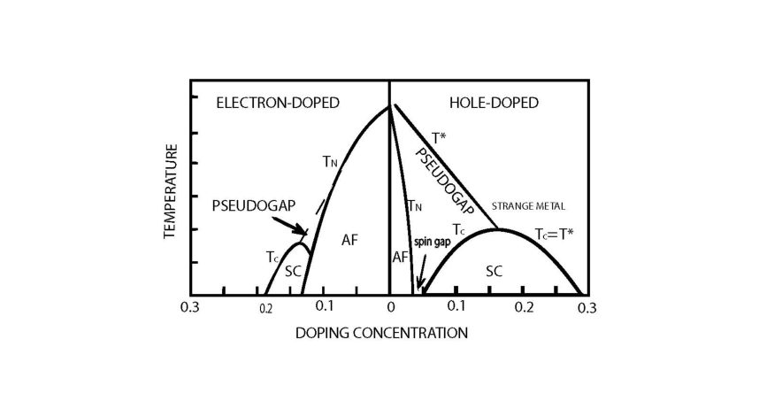
<figcaption class="paper-figure-caption"><b>Fig 1.</b> FIG. 1. Generic phase diagram for the high TC superconductors. The underdoped region is defined</figcaption>
</figure>
<figure class="paper-figure-card">

<figcaption class="paper-figure-caption"><b>Fig 2.</b> FIG. 2. The plot is compatible with decrease in T ∗with increase in doping and decrease in</figcaption>
</figure>
<figure class="paper-figure-card">
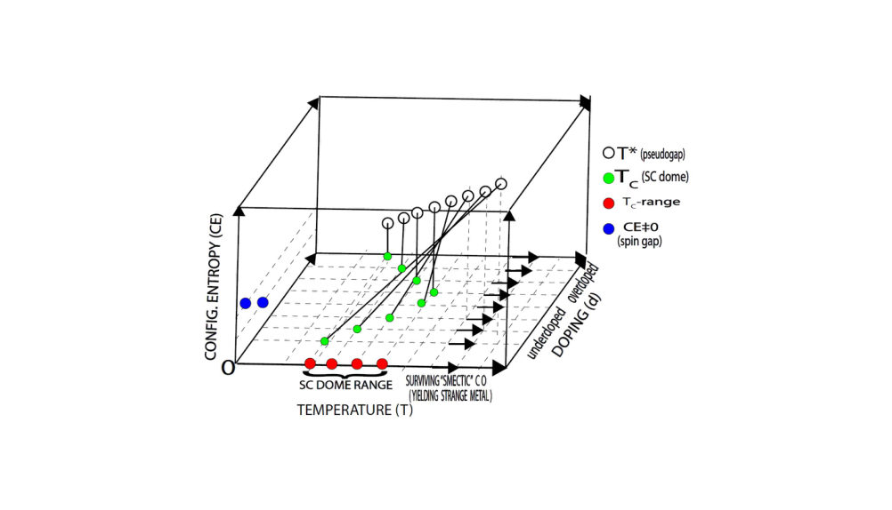
<figcaption class="paper-figure-caption"><b>Fig 3.</b> Fig. 2. Observe that the drop in temperature from the pseudogap T ∗to SC TC is inversely</figcaption>
</figure>
<figure class="paper-figure-card">
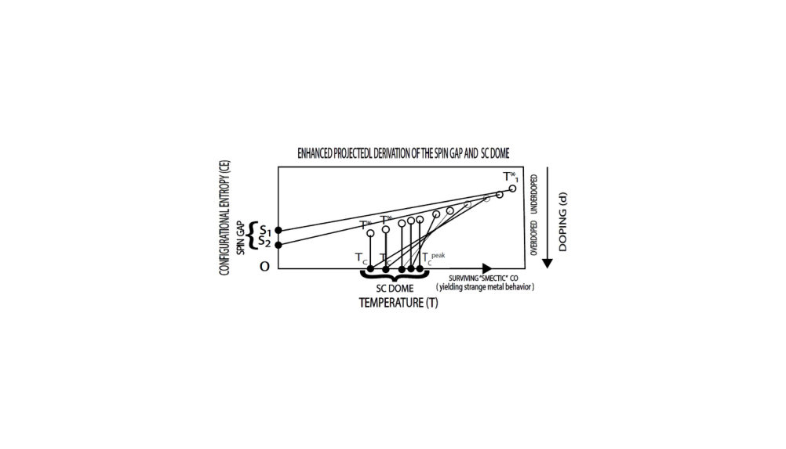
<figcaption class="paper-figure-caption"><b>Fig 4.</b> FIG. 3. This figure is an enhanced projected view from Fig.2 intended to emphasize the spin gap,</figcaption>
</figure>

**Summary.** This paper develops a generalized theory showing that the pseudogap phase can precede superconductivity if two doping-dependent conditions on pairing strength and ordering rates are met. It applies this framework to high-Tc cuprates using an entanglement and confinement pairing model, successfully explaining key features like the SC dome structure and strange metal behavior through changes in configurational entropy.

**Why it may be interesting.** While focused on cuprates, the framework of analyzing phase transitions via entropy changes and rate parameters ($R$) provides a general theoretical tool applicable to understanding complex many-body dynamics in strongly correlated systems beyond standard BCS theory.

Detailed structure

**Main problem.** To generalize the theoretical condition under which a quantum material exhibiting a pseudogap phase acts as a precursor to a superconducting (SC) dome.

**Main result.** The SC dome formation requires two conditions: decreasing $T^*$ with doping and an increasing configurational-ordering rate ($R$) with doping, explained by a novel entanglement and confinement pairing mechanism.

**Method.** Theoretical derivation using macroscopic order parameters like Configuration Entropy (CE) to characterize the transition from local pair ordering ($	ext{PO}$) to global superconducting order ($	ext{CO}$).

**Model / system.** The study focuses on high-Tc cuprates, modeling them with a novel strong entanglement and confinement hole pairing (ECHP) mechanism that governs the phase diagram across doping levels.

**Key observables.** $T^*$ (pseudogap temperature), $T_C$ (superconducting transition temperature), Configuration Entropy ($	ext{CE}$), and the configurational-ordering rate parameter ($R$).

**Important parameters / regimes.** Doping level ($d$), Temperature ($T$), Pseudogap/Superconducting gap magnitudes.

**Assumptions / limitations.** The derivation assumes a linear temperature dependence for the Configuration Entropy (CE) and relies on establishing two specific doping dependencies for $T^*$ and $R$.

**Figures summary.** Figures illustrate the generic phase diagram showing the SC dome, the relationship between $	ext{CE}$ and $T$ revealing singularities where $R 	o \infty$, and the coexistence of strange metal behavior above $T_C$.

**Paper structure.** The paper establishes the general criteria for pseudogap precursors to superconductivity, applies these criteria specifically to high-Tc cuprates using the ECHP mechanism, derives the non-analytic relationship between $T^*$ and $T_C$, and discusses implications for strange metal behavior.

Abstract

We generalize the condition under which a quantum material exhibiting a pseudogap phase is a precursor to a superconducting (SC) dome. The result reveals the non-analytic T* as a function of doping. A well-known example is the high-Tc cuprates. Essentially, the SC dome is generated under two conditions: (1) that the pseudogap T* is a decreasing function of doping, due to the decrease in size of extended pairing of doped holes with doping, and most importantly, (2) that the rate of configurational-ordering parameter is an increasing function of doping as a result of the decrease in extended length of the disordered pairs. These two conditions are provided by the new entanglement and confinement pairing mechanism of high-Tc cuprates. This is a theory that has recently been discussed in the literature by Buot et al. It hinges on a novel strong entanglement and confinement hole pairing (ECHP) mechanism that unravels the microscopic features of the entire phase diagram of both electron and hole-doped high-Tc cuprates.

[↑ back to top](#top)

### [Unitary Channel Testing Under a Depolarizing Noise Assumption](http://arxiv.org/abs/2606.10730v1)

**Authors:** Hirak Ghosh, Andrew Jackson, Animesh Datta  
**Type:** theory · **Category:** quantum information and computing · **PDF:** <https://arxiv.org/pdf/2606.10730v1>  
**Analysis basis:** full PDF text, analyzed in chunks
**Topic relevance:** `entanglement & information structure` **2/5** · `correlated / nonlocal dissipation` **1/5** · `quantum measurements` **1/5**

↔ Scroll figures horizontally

<figure class="paper-figure-card">
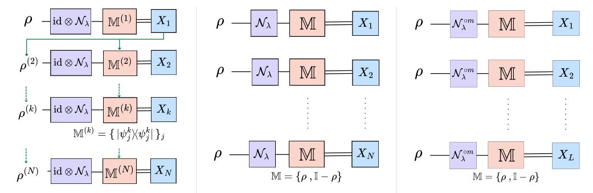
<figcaption class="paper-figure-caption"><b>Fig 1.</b> FIG. 1. (a) Ancilla-assisted, adaptive tester with arbitrary (finite) sized POVMs. Green arrows denote classical feed-forward: state preparations and measurements may depend on some or all prior measurement outcomes. (b) Non-adaptive, ancilla-free tester with fixed inputs and a two-outcome measurement. (c) m-sequential non-adaptive tester with fixed inputs and a two-outcome POVM.</figcaption>
</figure>

**Summary.** This paper provides a comprehensive theoretical analysis of quantum channel testing under depolarizing noise. It establishes optimal query complexities for distinguishing noisy channels from ideal unitaries using both standard and tolerant hypothesis tests. The work is significant because it sets fundamental resource limits on characterizing the fidelity of quantum operations.

**Why it may be interesting.** The results provide rigorous complexity benchmarks for characterizing quantum hardware fidelity, which is crucial for understanding the practical limits of fault-tolerant computation protocols in terms of required experimental resources.

Detailed structure

**Main problem.** The paper develops fast algorithms and establishes lower bounds for testing the strength of a quantum channel implemented by a black box, specifically under the assumption of depolarizing noise.

**Main result.** Optimal query complexities are derived for both standard ($\Theta(1/\epsilon)$) and tolerant ($\Theta\left(rac{\epsilon_2}{(\epsilon_2 - \epsilon_1)^2}
ight)$) testing scenarios, showing that these bounds hold even when considering adaptive or ancilla-assisted protocols.

**Method.** The analysis combines quantum hypothesis testing theory with information-theoretic tools like the diamond distance and Kullback-Leibler divergence to establish matching upper and lower bounds for query complexity.

**Model / system.** The study focuses on general quantum channels $N: L(H) 	o L(H)$ acting on a system of dimension $d$, specifically analyzing deviations from the identity channel due to an assumed depolarizing noise $\mathcal{N}_\lambda$.

**Key observables.** Diamond distance ($d_\diamond$), Trace distance ($d_{	ext{Tr}}$), and Query Complexity (number of channel uses).

**Important parameters / regimes.** Error parameters ($\epsilon, \epsilon_1, \epsilon_2$) and the noise parameter $\lambda$.

**Assumptions / limitations.** The analysis assumes perfect state preparation and measurement, and it focuses on the depolarizing noise model common in fault-tolerant quantum computation.

**Figures summary.** Figures illustrate various access models for testing (e.g., ancilla-assisted adaptive vs. non-adaptive ancilla-free) and summarize the derived optimal query complexities in tables.

**Paper structure.** The paper first establishes exact relationships between distinguishability measures ($d_{	ext{Tr}}$ and $d_\diamond$) for depolarizing noise, then develops upper bounds using specific algorithms (non-adaptive/ancilla-free), and finally proves matching lower bounds using information theory arguments like KL divergence.

Abstract

We present fast algorithms $\unicode{x2013}$ under the depolarizing noise assumption, often made in fault-tolerant quantum computations $\unicode{x2013}$ to test its strength. Our optimal algorithms answer the following question: is the quantum channel implemented by a given black box identical to a target unitary or $\varepsilon$-far from it in the diamond distance, assuming that the deviation is a depolarizing channel with unknown parameter? Our algorithm has a query complexity of $Θ(1/\varepsilon).$ The query complexity of the relaxed problem of testing whether the black-box channel is $\varepsilon_1$-close to a target unitary or $\varepsilon_2$-far in the diamond distance is $Θ\bigl(\varepsilon_2/(\varepsilon_2 - \varepsilon_1)^2\bigr).$ In both cases, we provide matching lower bounds that hold even for adaptive, ancilla-assisted protocols with multi-outcome incoherent measurements.

[↑ back to top](#top)

### [Quantum Non-Gaussian State Preparation of Levitated Particles via Time-Dependent Control of Weakly Nonharmonic Hybrid Potentials](http://arxiv.org/abs/2606.10042v1)

**Authors:** Piotr T. Grochowski, Oriol Romero-Isart  
**Type:** theory · **Category:** quantum information and computing · **PDF:** <https://arxiv.org/pdf/2606.10042v1>  
**Analysis basis:** full PDF text, analyzed in chunks
**Topic relevance:** `Keldysh / 2PI / non-Gaussian methods` **1/5** · `analog quantum simulation` **1/5** · `correlated / nonlocal dissipation` **1/5** · `driven-dissipative phase transition` **1/5** · `methods for driven-dissipative` **1/5** · `non-equilibrium dynamics` **1/5** · `quantum measurements` **1/5**

↔ Scroll figures horizontally

<figure class="paper-figure-card">
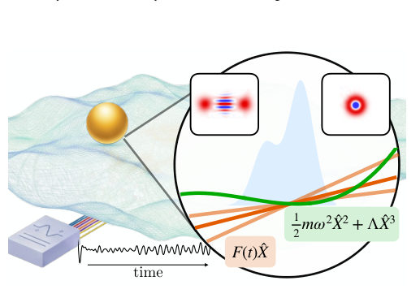
<figcaption class="paper-figure-caption"><b>Fig 1.</b> Figure 1. We consider a levitated mechanical oscillator whose me- chanical state—for example, its center-of-mass motion or libration— evolves in a weakly nonharmonic potential landscape, V ( ˆ X) = mω2 ˆ X2/2 + Λ ˆ X3. We demonstrate that temporal modulation of such a potential, where the leading nonquadratic contribution is cubic, Λ ˆ X3, enables deterministic preparation of quantum non- Gaussian states such as Fock and Schrödinger cat states. This scheme exploits the enhancement of nonlinear dynamics arising from wave- function delocalization, combined with optimal control of the mod- ulation. Specifically, we control the local linear term, F(t) ˆ X, while keeping the nonharmonicity...</figcaption>
</figure>
<figure class="paper-figure-card">
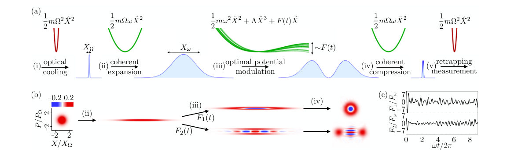
<figcaption class="paper-figure-caption"><b>Fig 2.</b> Figure 2. (a) Sketch of the protocol for preparing non-Gaussian motional states of a massive particle by combining delocalization-induced enhancement of nonharmonicity with optimal potential modulation. First, the particle is cooled close to the ground state in a tightly confining optical potential (red). It is then coherently expanded into the ground state of the shallow nonoptical potential. Optimal modulation of the nonharmonic potential then prepares the target non-Gaussian state, which is subsequently compressed back to the original trapping scale and measured in the optical potential. The strongly delocalized intermediate state enhances the weakly nonlinear dynamics during the control...</figcaption>
</figure>
<figure class="paper-figure-card">
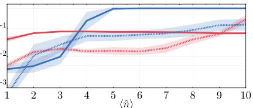
<figcaption class="paper-figure-caption"><b>Fig 3.</b> Figure 3. Results for the quantum non-Gaussian state preparation with an optimally controlled weakly cubic potential. (a) Geometric- mean infidelity for preparation of the first excited Fock state |1⟩, shown as a function of the control duration tmax and nonharmonic- ity ηω. The shaded area corresponds to half of the standard devi- ation of the log-normal distribution in the set of optimization runs. Increasing ηω beyond approximately 0.04 yields little additional re- duction in infidelity. (b) Geometric-mean preparation infidelity for Fock states |n⟩and even cat states as a function of their target mean occupation ⟨ˆn⟩and varying nonharmonicity ηω.</figcaption>
</figure>
<figure class="paper-figure-card">
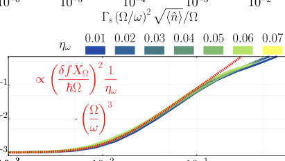
<figcaption class="paper-figure-caption"><b>Fig 4.</b> Figure 4. Effects of diffusion and static control errors on the optimal-control stage of the state-preparation protocol. (a) Mini- mum geometric-mean infidelity for preparation of the first excited Fock state as a function of the control-stage diffusion rate Γs, for several values of ηω. At each (Γs, ηω), the result is minimized over the considered control durations tmax. (b) Excess infidelity after sub- traction of the zero-noise baseline, 1 −¯F →¯F(Γs = 0) −¯F. An approximate common scaling with Γs is revealed. (c) Corresponding excess infidelity for preparation of higher-number Fock states. The data exhibit the additional approximate dependence cs ∝⟨ˆn⟩1/2. (d) Infidelity induced by a...</figcaption>
</figure>
<figure class="paper-figure-card">
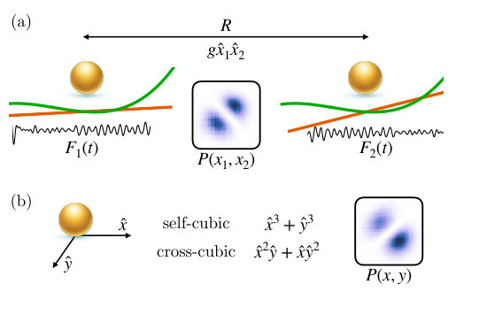
<figcaption class="paper-figure-caption"><b>Fig 5.</b> Figure 5. Configurations considered for two-mode Bell-state gener- ation. (a) Two particles separated by a distance R, each confined in a local weakly nonharmonic potential, interact through a long-range force. Motional delocalization increases the dimensionless interac- tion strength during the control stage. The interparticle coupling is bilinear and therefore Gaussian, while the required nonlinearity is provided by the local cubic terms. Independent modulation of the two local potentials then enables preparation of the symmetric me- chanical Bell state. The inset shows the optimized joint position probability density, P(x1, x2). (b) A single particle is simultane- ously delocalized in...</figcaption>
</figure>

**Summary.** The paper proposes a theoretical optimal control protocol to generate complex quantum non-Gaussian states (like Fock or cat states) in levitated particles. This is achieved by transiently delocalizing the particle's wave function and applying time-dependent modulation to the linear potential term, leveraging weak cubic anharmonicity. The method demonstrates universal control applicable to various mechanical degrees of freedom.

**Why it may be interesting.** This work directly addresses the creation of non-Gaussian quantum resources in a macroscopic, mechanical system, which is highly relevant for quantum sensing and computation beyond standard harmonic approximations.

Detailed structure

**Main problem.** The primary goal is the deterministic generation and manipulation of quantum non-Gaussian states, such as Fock or Schrödinger cat states, in levitated massive objects.

**Main result.** A theoretical protocol was developed using time-dependent control of the linear potential component while maintaining a static cubic nonharmonicity to achieve universal mode control and state preparation.

**Method.** The approach utilizes optimal quantum control theory applied to the system's Hamiltonian, involving transient wave-function delocalization followed by coherent compression.

**Model / system.** The physical platform is levitated high-mass quantum systems whose motion is modeled by a weakly nonharmonic potential containing harmonic and cubic terms. The dynamics are analyzed using both Schrödinger equation evolution and density matrix master equations incorporating dissipation.

**Key observables.** State-transfer fidelity ($F$), geometric-mean infidelity ($ar{F}$), Wigner functions, and quadrature measurements.

**Important parameters / regimes.** Nonharmonicity parameter ($\eta_
u$), motional delocalization ($\Delta X/X_
u$), and maximum tolerable decoherence rates.

**Assumptions / limitations.** The analysis relies on truncating the potential expansion at the cubic term; high-number states challenge this assumption due to increased spatial extent.

**Figures summary.** Figures illustrate the multi-stage protocol (cooling, delocalization via control, compression) and show Wigner functions for target states like $|1
angle$ and cat states, alongside infidelity scaling plots versus control time or nonharmonicity strength.

**Paper structure.** The paper outlines a five-step optimal control protocol: ground state preparation $
ightarrow$ coherent transfer to low potential $
ightarrow$ delocalized state preparation via linear modulation $
ightarrow$ coherent compression $
ightarrow$ measurement. Extensions cover two-particle Bell state generation.

Abstract

Levitated high-mass quantum systems provide access to unprecedented regimes in both fundamental science and technological applications. However, deterministic generation and manipulation of quantum non-Gaussian states, which are central to many continuous-variable quantum advantages, remain elusive in such platforms. In this work, we propose a theoretical protocol for preparing a continuous-variable degree of freedom of a levitated massive object in a variety of quantum states, including Fock and Schrödinger cat states, without coupling to auxiliary two-level systems. Our approach enhances otherwise weak nonharmonic effects by transient wave-function delocalization and combines this with optimal control of the potential. Specifically, time-dependent modulation of the linear component of the potential, in the presence of a static cubic nonharmonicity, provides a route to universal control of the mode. We analyze quantum state preparation under such control and estimate the required nonharmonicity, motional delocalization, and maximum tolerable decoherence for generating target non-Gaussian states. The proposed optimal-control scheme can also be readily extended beyond single-particle state preparation, for example, to unitary transformations and nonlinear measurements. As a concrete example, we demonstrate mechanical Bell-state preparation for two interacting particles using only local modulation of weakly nonharmonic potentials, while the interparticle interaction remains effectively linear. We emphasize that the protocols presented here apply to different mechanical degrees of freedom, such as center-of-mass motion and libration, and can also be implemented in other weakly nonharmonic systems with a leading cubic nonharmonicity.

[↑ back to top](#top)

### [Multifractal Signatures of Ageing and Dementia Development: A Multifractal Space-Filling Curve Analysis](http://arxiv.org/abs/2606.10222v1)

**Authors:** Marta Lotka, Jacek Grela, Zbigniew Drogosz, Jeremi K. Ochab, Paweł Oświęcimka  
**Type:** experiment · **Category:** disordered systems and neural networks · **PDF:** <https://arxiv.org/pdf/2606.10222v1>  
**Analysis basis:** full PDF text, analyzed in chunks
**Topic relevance:** `analog quantum simulation` **1/5** · `driven-dissipative phase transition` **1/5** · `entanglement & information structure` **1/5** · `methods for driven-dissipative` **1/5** · `non-equilibrium dynamics` **1/5** · `non-equilibrium universality` **1/5**

↔ Scroll figures horizontally

<figure class="paper-figure-card">
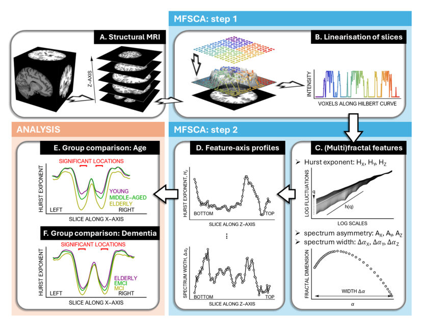
<figcaption class="paper-figure-caption"><b>Fig 1.</b> FIG. 1: Flowchart of the Multifractal Space-filling Curve Analysis (MFSCA). A. Skull-stripped MRI volume is analyzed slice by slice along a given axis. B. Each slice is overlaid with a space-filling curve (Hilbert curve). A one-dimensional representation of the slice is formed by voxel intensity along the curve. C. Multifractal detrended fluctuation analysis, see eq. (5), provides the generalized Hurst exponent h(q) and the multifractal spectrum f(α). The Hurst exponent H = h(2), the width of the spectrum ∆α, and its asymmetry A are later used as features describing the slice. D. The multifractal features of all slices along a given axis are collected and plotted as brain profiles. Profiles...</figcaption>
</figure>
<figure class="paper-figure-card">
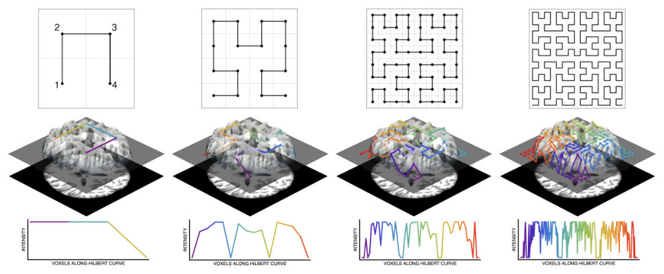
<figcaption class="paper-figure-caption"><b>Fig 2.</b> FIG. 2: Mapping voxel intensity into 1D. (Top) First four iterations of Hilbert space-filling curves on a square grid. In a given slice of MRI volume, the final iteration of the curve sets the order of traversal of all voxel centers of that slice. (Middle) Visualization of the MRI volume’s slice. The 3D landscape illustrates voxel intensities in that slice. The intensities are mapped onto the positions of the voxels along the curve. (Bottom) Linearized slice, i.e., one-dimensional representation of voxel intensities along the Hilbert curve.</figcaption>
</figure>
<figure class="paper-figure-card">
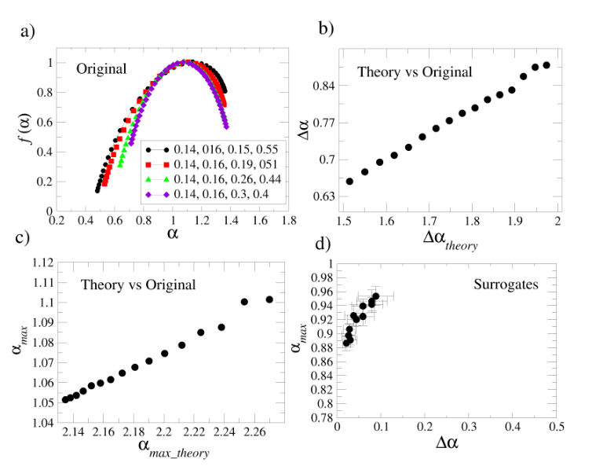
<figcaption class="paper-figure-caption"><b>Fig 3.</b> FIG. 3: MFSCA analysis of the deterministic cascades. a) Multifractal spectra obtained for the sample cascades with different degrees of complexity (width of the multifractal spectrum). b) Comparison of the estimated widths of the multifractal spectrum with its theoretical counterparts. c) comparison of the maxima localisation estimated spectra f(α) with theoretical counterparts. d) multifractal spectrum characteristics for the surrogate data - only linear correlations are preserved. Error bars denote the standard deviation over 10 realizations.</figcaption>
</figure>
<figure class="paper-figure-card">
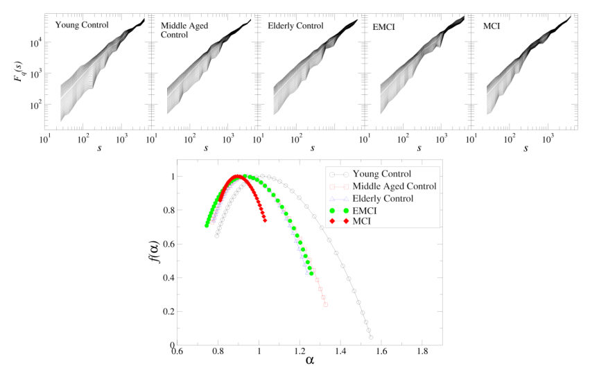
<figcaption class="paper-figure-caption"><b>Fig 4.</b> FIG. 4: (Top) Fluctuation functions for slice 129 along the y-axis (sagittal) for representative individuals from each cohort. (Bottom) Corresponding multifractal spectra.</figcaption>
</figure>
<figure class="paper-figure-card">
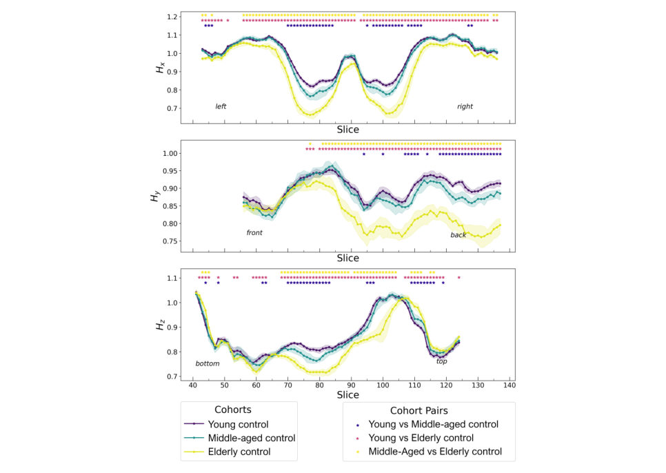
<figcaption class="paper-figure-caption"><b>Fig 5.</b> FIG. 5: Slice-wise profiles of the long-scale Hurst exponent H for the Young, Middle-Aged, and Elderly Control cohorts in the OASIS-1 dataset. The panels show profiles along the x (top), y (middle), z (bottom) axes. In each panel, the cohort median H value at each slice is indicated by a dot, and neighbouring points are connected to highlight the profile shape. The shaded bands indicate the 95% bootstrap confidence interval of the median (nboot = 5000). The labels inside the panels indicate the anatomical orientation of the slice index. The stars mark slices at which the corresponding pair of cohorts differs significantly, based on a bootstrap test with within-slice Holm correction (p &lt;...</figcaption>
</figure>

**Summary.** This paper introduces Multifractal Space-filling Curve Analysis (MFSCA) to analyze brain MRI scans across different stages of aging and dementia. By quantifying the degree of multifractality, the authors demonstrate that this complex spatial organization systematically degrades towards a simpler, monofractal structure as cognitive decline worsens. This suggests that multifractality serves as a quantitative biomarker for neurodegenerative processes.

**Why it may be interesting.** While the application is biological, the core methodology—quantifying complex non-linear correlations in high-dimensional data using fractal geometry—is mathematically rigorous and shares conceptual overlap with characterizing complexity in disordered quantum systems or neural network dynamics.

Detailed structure

**Main problem.** The study aims to quantify the nonlinear, scale-free properties of complex biological data, specifically analyzing how spatial organization in brain structures degrades during aging and dementia.

**Main result.** The analysis reveals a progressive weakening of multifractality—a transition from rich multifractal structure towards a homogeneous, monofractal state—as age increases and dementia progresses.

**Method.** A novel Multifractal Space-filling Curve Analysis (MFSCA) is employed to project high-dimensional MRI data onto 1D time series, which are then analyzed using multifractal algorithms like MFDFA.

**Model / system.** The system under study is human brain structure derived from T1-weighted Magnetic Resonance Imaging (MRI) scans of subjects across various cognitive cohorts (Young Control through MCI).

**Key observables.** Multifractal profiles, generalized Hurst exponent h(q), multifractal spectrum width ($\Delta\alpha$), and asymmetry ($A$).

**Important parameters / regimes.** Age groups (e.g., Young vs. Elderly) and cognitive impairment stages (e.g., EMCI vs. MCI).

**Assumptions / limitations.** The analysis assumes that the loss of multifractality directly correlates with structural deterioration in brain organization, and uses techniques like IPTW to mitigate bias in observational comparisons.

**Figures summary.** Figures illustrate MFSCA flowcharts, group comparisons showing decreasing $\Delta\alpha$ and $H$ from young controls to dementia patients, and dimensionality reduction plots (t-SNE/LDA) separating the cognitive cohorts.

**Paper structure.** The paper introduces MFSCA for multidimensional data analysis, validates it using artificial cascades, applies it to OASIS-1 MRI data across age/dementia groups, quantifies metrics ($\Delta\alpha$, $A$), and uses LDA/t-SNE to show systematic progression along a continuum of disorder.

Abstract

Multifractality is an effective formalism for quantifying the nonlinear, scale-free properties of complex data. In this study, we propose a novel and efficient methodology, termed Multifractal Space-filling Curve Analysis (MFSCA), for quantifying the correlation structure of multidimensional data. Within this framework, the original multidimensional data - while preserving both local and long-range organisational properties - are projected onto a one-dimensional representation using a fractal space-filling curve. The resulting one-dimensional signal is then analysed using multifractal algorithms. We demonstrate the utility of the method using both artificially generated multifractal structures and real data. In particular, we apply MFSCA to analyse magnetic resonance imaging (MRI) data from Alzheimer patients at different stages of dementia. Based on the results, we estimate the multifractal profiles of the brain for healthy subjects of different ages as well as for dementia patients. The analysis reveals that the spatial organization of brain structures, as measured by the degree of multifractality, progressively weakens with age and the development of dementia. A transition from multifractality to monofractality is observed both in control groups, when comparing the Young Control and Elderly Control groups, and among dementia subjects of similar age but at different stages of the disease, namely early dementia and mild cognitive impairment. Thus, from the perspective of multiscaling properties, the heterogeneous characteristics of spatial brain organization deteriorate under worsening conditions, leading to a homogeneous and weakly correlated structure. These findings not only effectively capture key aspects of brain organisation, but also demonstrate that the multifractality of MRI data can serve as a marker of structural brain changes.

[↑ back to top](#top)

### [Hawking-Page phase transition for pure Lovelock black holes](http://arxiv.org/abs/2606.10647v1)

**Authors:** Nitesh K. Dubey, Sanved Kolekar  
**Type:** theory · **Category:** statistical mechanics · **PDF:** <https://arxiv.org/pdf/2606.10647v1>  
**Analysis basis:** full PDF text, analyzed in chunks
**Topic relevance:** `driven-dissipative phase transition` **1/5** · `entanglement & information structure` **1/5** · `methods for driven-dissipative` **1/5** · `non-equilibrium dynamics` **1/5** · `non-equilibrium universality` **1/5**

↔ Scroll figures horizontally

<figure class="paper-figure-card">
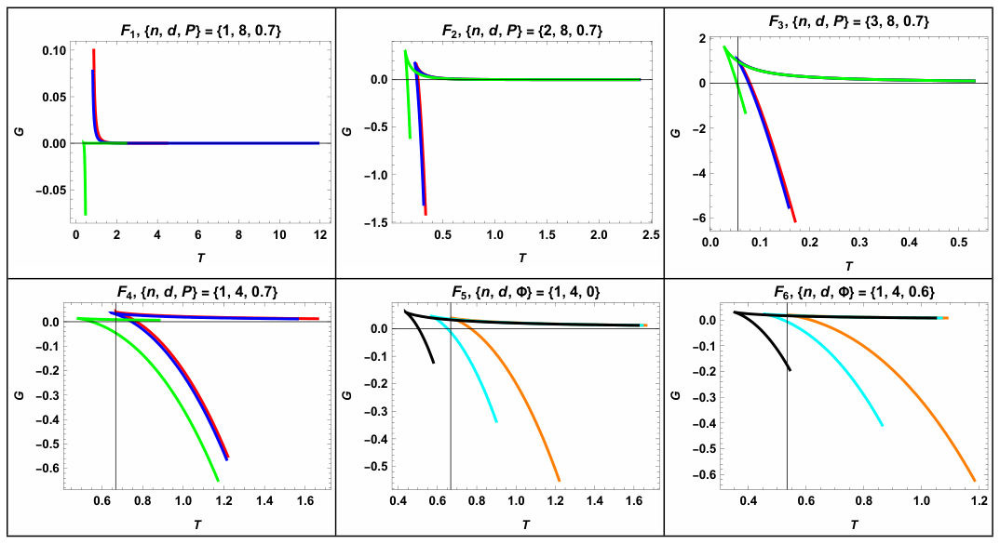
<figcaption class="paper-figure-caption"><b>Fig 1.</b> Figure 1: The above figure shows the plots for the Gibbs free energy vs temperature. In panels F1, F2, F3, and F4, the colours {Red, Blue, Green} represent the potential Φ with values {0, 0.25, 0.7}. In figures F5 and F6, the colours {Orange, Cyan, Black} represent pressure values of {0.7, 0.5, 0.3}.</figcaption>
</figure>
<figure class="paper-figure-card">
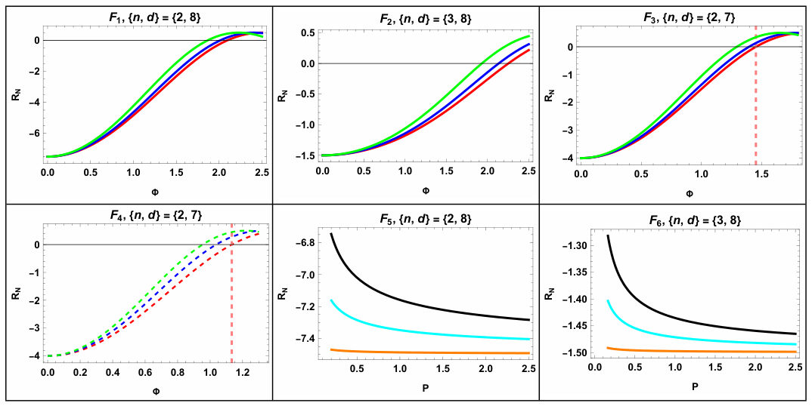
<figcaption class="paper-figure-caption"><b>Fig 2.</b> Figure 2: The above plots depict the dependence of the normalized Ruppeiner scalar curvature on the electric potential Φ and pressure P. In panels F1, F2, F3, F4 the pressure is kept constant. Solid Colour plots with color {Red,Blue, Green} represent pressure {27,23, 17} while the dashed plots with color {Red, Blue, Green} have pressure {10,7,5}. In panels F5, F6 the electric potential is fixed with colors {Orange,Cyan, Black} representing electric potential {0.03,0.1, .15}. The pink dashed curves in F3 and F4 describe the constant electrostatic potential at which RN of the red curves changes sign from negative to positive.</figcaption>
</figure>

**Summary.** This work analyzes the Hawking-Page phase transition for black holes in higher-curvature pure Lovelock gravity within AdS spacetime. It uses advanced thermodynamic geometry, specifically the Ruppeiner scalar curvature, to probe universality across different dimensions and charges. The findings reveal that while simple dualities hold in General Relativity, these universal relationships are modified or broken by higher-order curvature terms.

**Why it may be interesting.** While focused on gravity, the use of Ruppeiner geometry and phase transition analysis directly relates to statistical mechanics concepts of critical points and thermodynamic stability in complex systems.

Detailed structure

**Main problem.** The study investigates the thermodynamic properties and phase structure of Anti-de Sitter (AdS) black holes governed by pure Lovelock gravity, focusing on the Hawking-Page (HP) phase transition.

**Main result.** The normalized Ruppeiner scalar curvature at the HP transition is shown to be a universal constant depending only on spacetime dimension for neutral cases. The simple dual relationship between minimum temperature and $T_{HP}$ breaks down in higher pure Lovelock theories.

**Method.** Thermodynamic analysis, utilizing the grand canonical ensemble, calculating Gibbs free energy ($G$), and employing geometric tools like the Ruppeiner scalar curvature to diagnose phase transitions.

**Model / system.** Static, spherically symmetric AdS black holes described by pure Lovelock gravity in $d$ dimensions. The analysis extends to include electric charge ($\Phi$) and varying the Lovelock order ($n$).

**Key observables.** Hawking temperature minimum ($T_0$), Hawking-Page transition temperature ($T_{HP}$), Gibbs free energy ($G$), and normalized Ruppeiner scalar curvature ($R_N$).

**Important parameters / regimes.** Spacetime dimension ($d$), Lovelock order ($n$), electrostatic potential ($\Phi$), and thermodynamic pressure ($P$).

**Assumptions / limitations.** The analysis assumes the validity of the grand canonical ensemble description and relies on interpreting $G=0$ for the HP transition. Approximations are used in analyzing joint limits of $\Phi$ and $P$.

**Figures summary.** Figures illustrate plots showing the dependence of the normalized Ruppeiner scalar curvature ($R_N$) on electrostatic potential ($\Phi$) and pressure ($P$), demonstrating plateaus and sign changes at the HP transition.

**Paper structure.** The paper systematically analyzes the phase structure by comparing $T_0$ (local minimum) with $T_{HP}$ (global free energy crossing). It then uses geometric diagnostics like $R_N$ to characterize the universality of this transition across different Lovelock orders and charge regimes.

Abstract

We investigate the thermodynamic properties of static, spherically symmetric Anti-de Sitter (AdS) black holes, focusing on the interplay between characteristic temperatures, as well as on the universality of Ruppeiner scalar curvature at the Hawking-Page (HP) phase transition. In particular, we study the relation between the minimum temperature and the HP phase transition temperature for static, spherically symmetric AdS black holes in pure Lovelock gravity. For the electromagnetically neutral case in Einstein gravity, the minimum temperature in $(d+1)$ dimensions coincides with the HP transition temperature in $d$ dimensions, while in higher pure Lovelock theories this relation is modified by a dimension- and order-dependent factor, reducing to the Einstein result in appropriate limits. For charged AdS black holes, in the grand canonical ensemble, in general relativity, the two temperatures differ by a simple dimension-dependent factor, whereas no universal relation persists in higher curvature pure Lovelock theories. We further analyze the normalized Ruppeiner scalar curvature at the HP transition and show that it is a universal constant depending only on the spacetime dimension for electromagnetically neutral black holes in pure Lovelock theories. The normalized scalar curvature remains a constant, under appropriate conditions, even for the charged static spherically symmetric black holes in the grand canonical ensemble for the Einstein theory case, whereas in general pure Lovelock theories it depends on thermodynamic parameters such as pressure and electrostatic potential, asymptotically approaching a constant in the large-pressure or simultaneous large-potential and large-pressure limits.

[↑ back to top](#top)

### [The fidelity of controlled quantum teleportation in a noisy environment](http://arxiv.org/abs/2606.10826v1)

**Authors:** Wen-Jing Wei, Feng-Li Yan, Ting Gao  
**Type:** theory · **Category:** quantum information and computing · **PDF:** <https://arxiv.org/pdf/2606.10826v1>  
**Analysis basis:** full PDF text, analyzed in chunks
**Topic relevance:** `Keldysh / 2PI / non-Gaussian methods` **1/5** · `correlated / nonlocal dissipation` **1/5** · `driven-dissipative phase transition` **1/5** · `entanglement & information structure` **1/5** · `methods for driven-dissipative` **1/5**

↔ Scroll figures horizontally

<figure class="paper-figure-card">
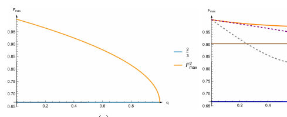
<figcaption class="paper-figure-caption"><b>Fig 1.</b> FIG. 1: When a1 = 0 (a), a1 = 1 2 (b), a1 = √</figcaption>
</figure>
<figure class="paper-figure-card">
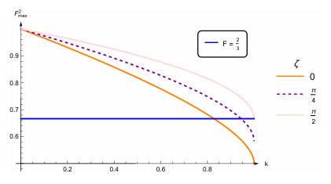
<figcaption class="paper-figure-caption"><b>Fig 2.</b> FIG. 2: Evolutions of F 2 max above the classical threshold value when the qubit B is subject to the generalized noisy channels with different channel parameters.</figcaption>
</figure>
<figure class="paper-figure-card">
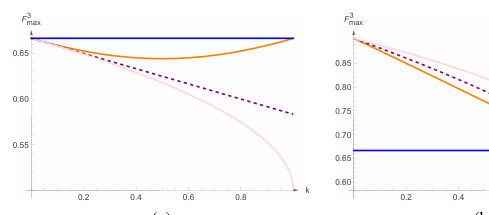
<figcaption class="paper-figure-caption"><b>Fig 3.</b> FIG. 3: For a1 = 0 (a), a1 = 1</figcaption>
</figure>
<figure class="paper-figure-card">
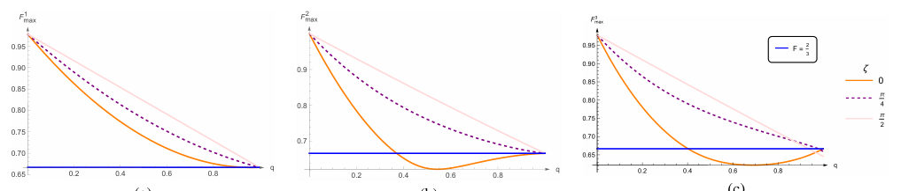
<figcaption class="paper-figure-caption"><b>Fig 4.</b> FIG. 4: Evolution of (a) F 1 max, (b) F 2 max, and (c) F 3 max for different values of the channel parameter ζ ∈[0, 2π], and a1 = √</figcaption>
</figure>
<figure class="paper-figure-card">
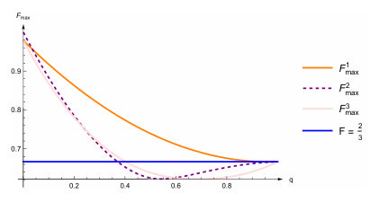
<figcaption class="paper-figure-caption"><b>Fig 5.</b> FIG. 5: Evolution of the optimal average fidelity above the classical threshold value when the qubits A, B, C are subject to the same generalized noisy channel, for the channel parameter ζA = 0, resource state parameter a1 = √</figcaption>
</figure>

**Summary.** This work analyzes how various types of noise affect the success rate (fidelity) of controlled quantum teleportation. By deriving complex analytical expressions, the authors show that fidelity does not always decrease monotonically with increasing noise; instead, it can exhibit non-monotonic behavior. This highlights that the impact of decoherence is highly dependent on both the initial entanglement and which qubit interacts with the noisy channel.

**Why it may be interesting.** The finding that fidelity can increase after an initial drop due to noise is crucial for understanding practical quantum communication channels, suggesting potential recovery or resilience mechanisms beyond simple decay models.

Detailed structure

**Main problem.** The study investigates how noise degrades the fidelity of controlled quantum teleportation protocols.

**Main result.** The optimal average fidelity can exhibit non-monotonic behavior, first decreasing and then increasing with the evolution parameter, depending on initial entanglement and channel parameters.

**Method.** The authors derive analytical expressions for the maximal average fidelity ($F_{	ext{max}}$) by modeling noise using generalized noisy channels parameterized by Kraus operators.

**Model / system.** The system involves controlled quantum teleportation utilizing a tripartite entangled resource state $|\Psi
angle_{ABC}$. Noise is modeled as local, independent quantum channels ($\Lambda_{ABC} = \Lambda_A \otimes \Lambda_B \otimes \Lambda_C$) acting on the three qubits.

**Key observables.** Maximal average fidelity ($F_{	ext{max}}$) and optimal average fidelity.

**Important parameters / regimes.** Channel parameters ($q, k, r$), evolution angles ($\zeta_A, \zeta_B, \zeta_C$), and initial state entanglement parameters ($a_0, a_1$).

**Assumptions / limitations.** The noise is assumed to be local and independent across the three qubits. The analysis often simplifies by considering only one or two qubits passing through noise.

**Figures summary.** Figures illustrate $F_{	ext{max}}$ as functions of channel parameters ($\zeta_A, q$) for different initial state conditions ($a_1$ vs $a_0$), visually confirming the non-monotonic dependence on noise strength.

**Paper structure.** The paper progresses by first defining the noisy resource state and calculating $F_{	ext{max}}$ generally. It then analyzes specific cases (e.g., only one qubit noisy, all three qubits noisy) to derive simplified analytical expressions and demonstrate the non-monotonic behavior based on parameter regimes.

Abstract

In this work, we investigate controlled quantum teleportation in the presence of noisy channels acting on the three-qubit resource state. We employ a series of generalized noisy channels that bridge the dephasing channels and amplitude damping channels while encompassing extensive intermediate scenarios. We provide an in-depth analysis of the degradation of the maximal average fidelity and the optimal average fidelity in controlled quantum teleportation induced by such noisy channels by deriving the analytical expression and examining several special cases. The analytical expression shows that attaining the optimal average fidelity requires Charlie's cooperation in performing a measurement at suitably chosen angles, and is also related to the initial state and the channel parameters. Our analysis reveals that the optimal average fidelity does not always decrease monotonically with the evolution parameter, instead, it first decreases and then increases. This non-monotonic behavior depends on the entanglement of the initial resource state, as well as on the parameters of the channel traversed by the first qubit.

[↑ back to top](#top)

### [Identical Bosons, large occupation numbers and classical field description](http://arxiv.org/abs/2606.10055v1)

**Authors:** Gaurav Goswami  
**Type:** theory · **Category:** quantum gases · **PDF:** <https://arxiv.org/pdf/2606.10055v1>  
**Analysis basis:** full PDF text, analyzed in chunks
**Topic relevance:** `Keldysh / 2PI / non-Gaussian methods` **1/5** · `analog quantum simulation` **1/5** · `driven-dissipative phase transition` **1/5** · `methods for driven-dissipative` **1/5**

↔ Scroll figures horizontally

<figure class="paper-figure-card">
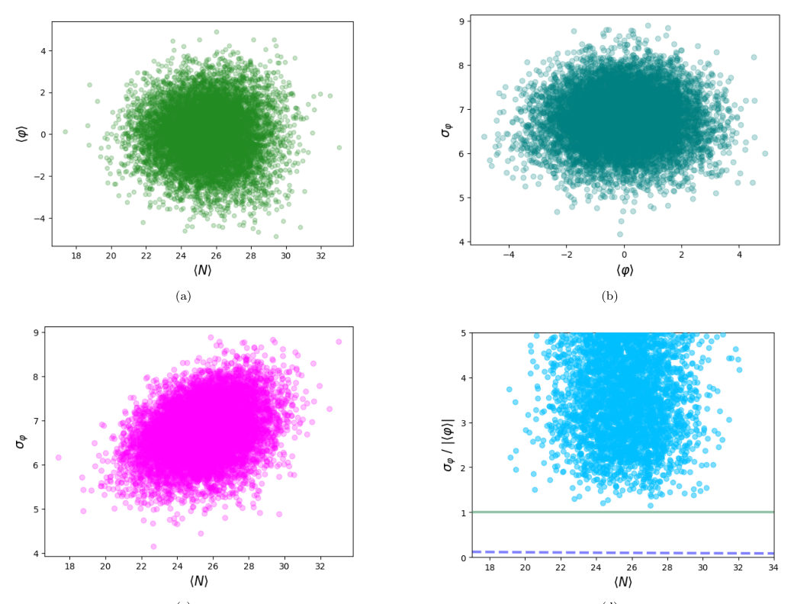
<figcaption class="paper-figure-caption"><b>Fig 1.</b> FIG. 1: When the coefficients cn are uniformly distributed within (−1, 1), there is no correlation between the most quantities of our interest (except between σφ and ⟨N⟩in (c), with Pearson coefficient = 0.31 i.e. a weak correlation). In (d), the dashed line corresponds to σφ/|⟨φ⟩| for cns for a coherent state.</figcaption>
</figure>
<figure class="paper-figure-card">
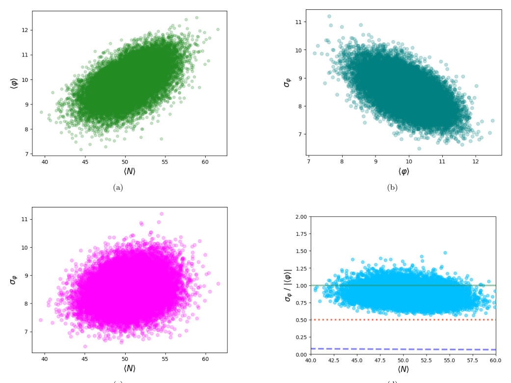
<figcaption class="paper-figure-caption"><b>Fig 2.</b> FIG. 2: When the coefficients cn are uniformly distributed within (0, 2), we begin to see weak correlations between the various quantities of our interest: the values of Pearson coefficient for the sub-figures being 0.55, -0.57, 0.20, -0.20 respectively. In (d), in addition to the dashed line for the case of coherent state, the solid line and dotted line correspond to σφ/|⟨φ⟩| = 1 and 1/2.</figcaption>
</figure>
<figure class="paper-figure-card">
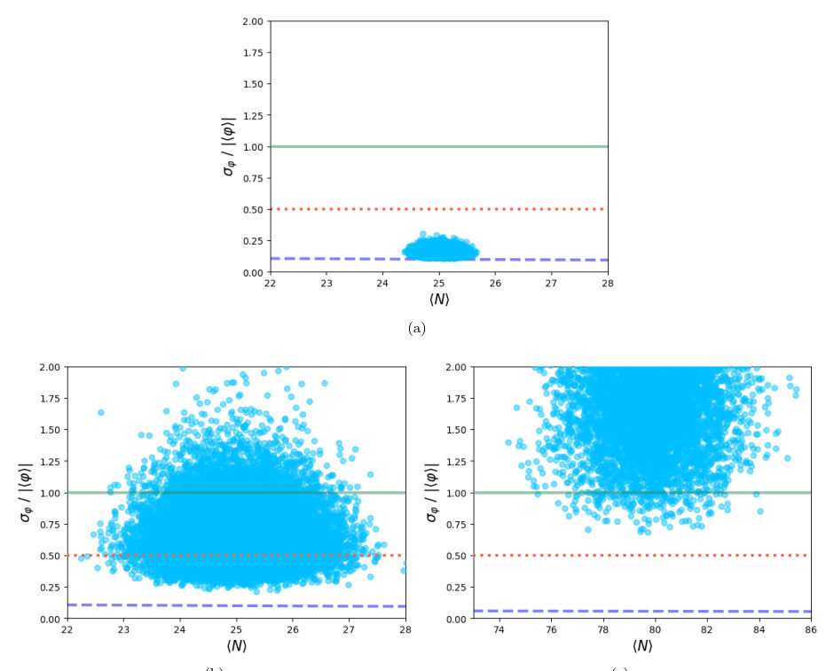
<figcaption class="paper-figure-caption"><b>Fig 3.</b> FIG. 3: Small and large deviations from coherent states: (a) |α|2 = 25, f = 0.1, (b), |α|2 = 25, f = 0.5, (c) |α|2 = 80, f = 2.0. As we increase the deviation from coherent state by increasing f, the ratio σφ/|⟨φ⟩| becomes larger and eventually, classical behaviour is lost.</figcaption>
</figure>

**Summary.** This work rigorously tests the assumption that large occupation numbers automatically imply classical field behavior for Bosons. The authors demonstrate that this is false; instead, the validity of the classical description hinges on how closely the quantum state resembles a coherent state. This has direct implications for modeling phenomena like ultra-light dark matter.

**Why it may be interesting.** It provides a rigorous theoretical boundary condition for the semi-classical limit in many-body physics, which is crucial for interpreting cosmological simulations involving quantum fields (like wave DM).

Detailed structure

**Main problem.** The paper investigates the conditions under which a quantum system of identical Bosons, characterized by a large mean occupation number, can be accurately described using classical field theory.

**Main result.** Classical behavior is not guaranteed merely by having a large occupation number; instead, it requires the quantum state to remain close to that of a coherent state.

**Method.** The analysis uses theoretical diagnostics based on comparing the standard deviation ($\sigma_\varphi$) to the expectation value ($|\langle\varphi
angle|$) using the criterion $2\sigma_\varphi < |\langle\varphi
angle|$.

**Model / system.** The system models non-relativistic, identical Bosons (relevant for ultra-light dark matter or Bose-Einstein Condensates) described by a quantum field operator $\hat{\varphi}(\mathbf{r})$. The state space is analyzed via its expansion in Fock states.

**Key observables.** Standard deviation ($\sigma_\varphi$), mean occupation number ($\langle N
angle$), and the ratio $\sigma_\varphi / |\langle\varphi
angle|$.

**Important parameters / regimes.** The degree of deviation ($f$) from a coherent state, which governs the proximity to classicality.

**Assumptions / limitations.** It is assumed that the Hamiltonian commutes with the total number operator ($\hat{H}$ commutes with $\hat{N}_{	ext{tot}}$) for simplicity in analyzing the state space structure.

**Figures summary.** Figures illustrate how increasing the deviation of quantum coefficients from those defining a coherent state increases the ratio $\sigma_\varphi / |\langle\varphi
angle|$, causing a breakdown of classical behavior.

**Paper structure.** The paper first establishes the general problem and criterion for classicality. It then analyzes various types of quantum states (random, positive-coefficient, near-coherent) to test if large occupation number is sufficient. Finally, it discusses implications for physical systems like ultra-light dark matter.

Abstract

For a system with a large number of identical Bosons, it is common to claim, often without any additional justifications, that, when the mean occupation number in a single particle state is sufficiently large, classical field description will be applicable. This is why e.g. for ultra-light dark matter, the classical field equations are used to compute its dynamics. In this work, we test the validity and robustness of this assumption based on the criterion $2 σ_\varphi < |\langle \varphi \rangle| $ for classical field behaviour and applying it to aribtrary quantum states. We find that an arbitrary state with large occupation number doesn't behave classically while imposing some restrictions on the state vectors can improve the classical behavior. Since coherent states are known to have quasi-classical behaviour, we also ask how much deviation from coherent state can spoil the classical behaviour. Based on this analysis, we find that it is the proximity of the state to a large occupation coherent state rather than large occupation number itself which ensures validity of classical description. Implications of this for ultra light dark matter are discussed.

[↑ back to top](#top)

### [Algorithmic and Minimax Complexities in Kernel Bandits](http://arxiv.org/abs/2606.11171v1)

**Authors:** Yunbei Xu  
**Type:** theory · **Category:** statistical mechanics · **PDF:** <https://arxiv.org/pdf/2606.11171v1>  
**Analysis basis:** full PDF text, analyzed in chunks
**Topic relevance:** `Keldysh / 2PI / non-Gaussian methods` **1/5** · `entanglement & information structure` **1/5**

↔ Scroll figures horizontally

<figure class="paper-figure-card">
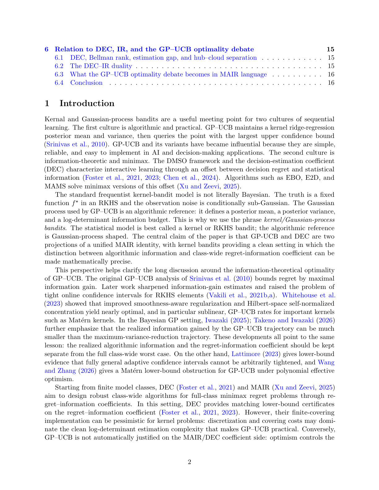
<figcaption class="paper-figure-caption"><b>Fig 1.</b> Low-resolution page preview, page 2</figcaption>
</figure>
<figure class="paper-figure-card">
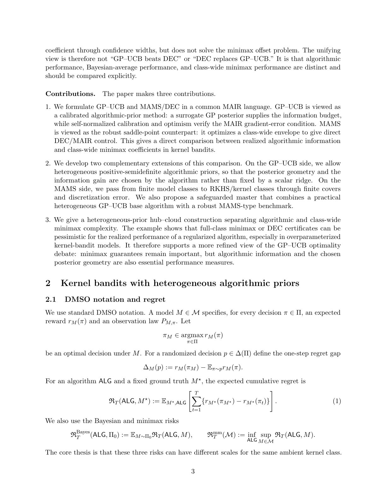
<figcaption class="paper-figure-caption"><b>Fig 2.</b> Low-resolution page preview, page 3</figcaption>
</figure>
<figure class="paper-figure-card">
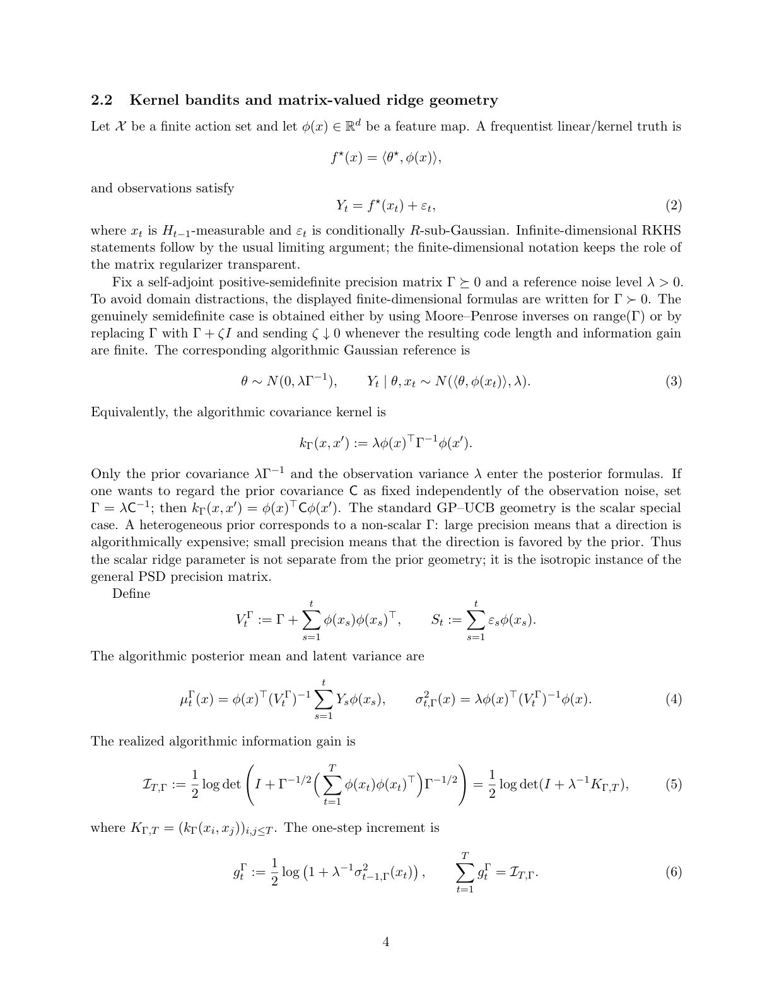
<figcaption class="paper-figure-caption"><b>Fig 3.</b> Low-resolution page preview, page 4</figcaption>
</figure>
<figure class="paper-figure-card">
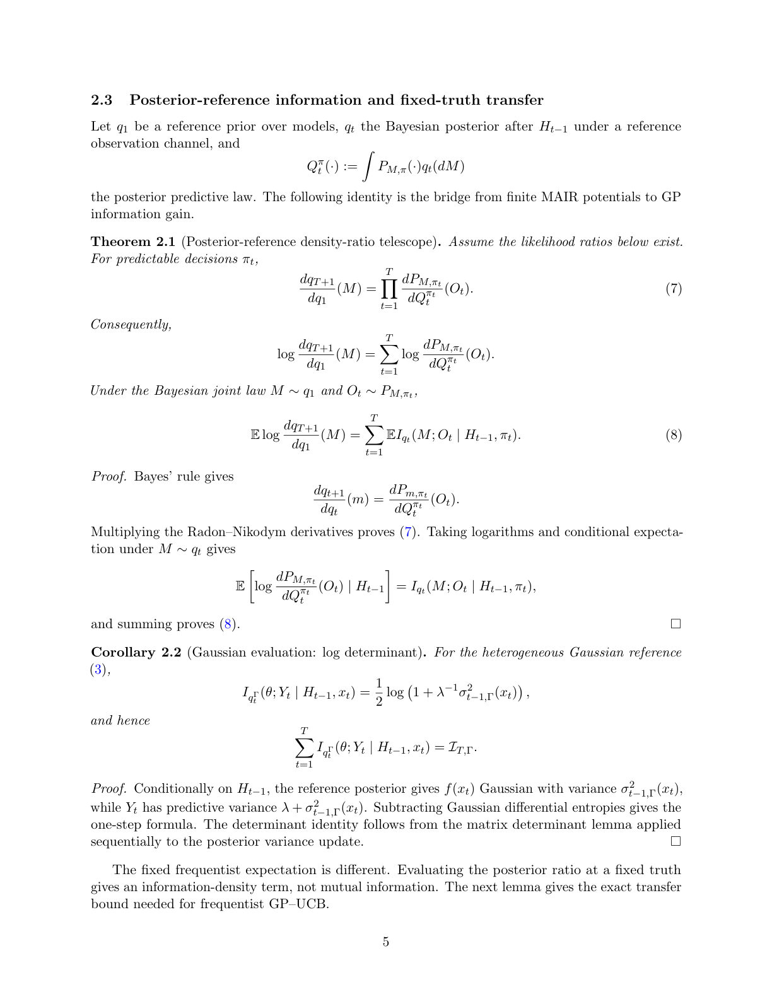
<figcaption class="paper-figure-caption"><b>Fig 4.</b> Low-resolution page preview, page 5</figcaption>
</figure>
<figure class="paper-figure-card">
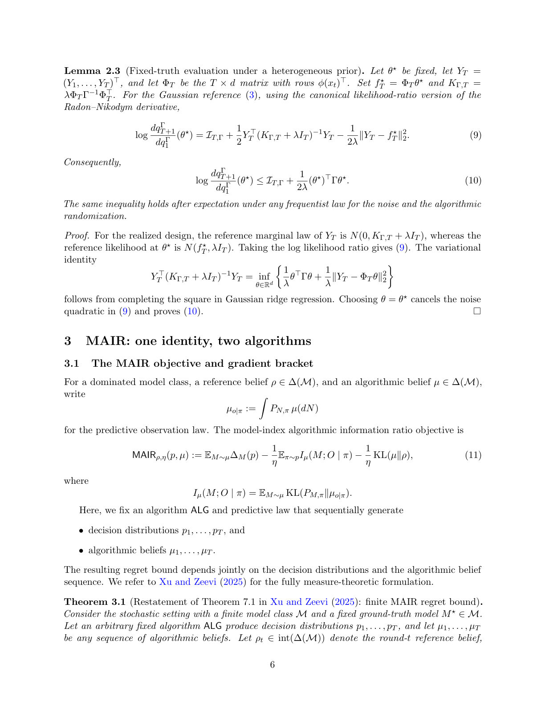
<figcaption class="paper-figure-caption"><b>Fig 5.</b> Low-resolution page preview, page 6</figcaption>
</figure>

**Summary.** This paper develops a unified framework to compare performance guarantees for sequential learning algorithms like GP-UCB and MAMS in kernel bandit problems. It mathematically proves that the information gained by an algorithm based on its specific prior (algorithmic view) can differ significantly from the worst-case guarantee derived over the entire model class (minimax view). This distinction is crucial for selecting appropriate theoretical bounds.

**Why it may be interesting.** While not directly about quantum systems, the rigorous comparison of different complexity measures (algorithmic vs. worst-case) mirrors theoretical challenges in characterizing resource limitations in complex physical models where multiple optimization criteria might apply simultaneously.

Detailed structure

**Main problem.** The paper aims to unify and compare three distinct theoretical views of sequential learning performance—algorithmic, information-theoretic/minimax, and class-wide worst-case regret—within the context of kernel bandits.

**Main result.** It demonstrates that algorithmic information gain (from GP-UCB) and class-wide minimax coefficients answer different questions, providing a clean setting in kernel bandits where this distinction is mathematically visible.

**Method.** The analysis uses unified MAIR frameworks, deriving identities linking Bayesian posterior updates to realized algorithmic information gain, and comparing these against saddle-point optimization criteria for minimax bounds.

**Model / system.** The model is a frequentist linear/kernel truth $f^\star(x)$ in an RKHS, observed with Gaussian noise. The setting is generalized using heterogeneous positive-semidefinite (PSD) algorithmic priors ($\Gamma$) and involves comparing performance across structured truths versus worst-case class bounds.

**Key observables.** Regret ($R_T$), Algorithmic Information Gain ($I_{T,\Gamma}$), Minimax Regret-Information Coefficient, and the Model-index Algorithmic Information Ratio (MAIR).

**Important parameters / regimes.** The complexity is governed by the structure of the kernel class ($\Gamma$) and the separation gap between hub and cloud components in the model space.

**Assumptions / limitations.** Assumes conditional R-sub-Gaussian noise for the observations. The analysis relies on establishing specific identities (like the Posterior-reference density-ratio telescope) that link different forms of information accumulation.

**Figures summary.** Not specified, but the notes indicate comparisons between regret bounds derived from UCB, MAMS, and minimax lower bounds in various constructions (e.g., hub-cloud).

**Paper structure.** The paper progresses by first establishing foundational identities linking Bayesian updates to information gain (Theorem 2.1), then unifying this structure via the MAIR objective (Lemma 3.2), applying these concepts to show GP-UCB satisfies an MAIR condition, and finally comparing against finite class bounds using MAMS.

Abstract

Gaussian-process upper confidence bound (GP-UCB) and decision-estimation-coefficient (DEC) methods may appear, at first sight, to belong to different theories. This paper places the two viewpoints in a common algorithmic-information language for frequentist RKHS bandits. GP-UCB fixes an algorithmic, rather than true, Gaussian-process prior and exploits realized-trajectory complexity together with computational tractability, whereas MAMS optimizes a robust class-wide MAIR/DEC envelope. Through the unified MAIR framework and heterogeneous positive-semidefinite algorithmic priors, we generalize both the GP-UCB analysis and the MAMS algorithm, propose a safeguarded master that combines their advantages, and provide a kernel-bandit construction showing that algorithmic complexity can be more informative than class-wide minimax or DEC certificates in overparameterized models. The resulting message is that algorithmic information and class-wide minimax coefficients answer different questions and can lead to different gaps; kernel bandits provide a clean setting in which this distinction becomes mathematically visible.

[↑ back to top](#top)

### [Analytical performance evaluation of quantum radar architectures: From single-photon to entangled-noise radars](http://arxiv.org/abs/2606.10436v1)

**Authors:** Hossein Allahverdi, Ali Motazedifard  
**Type:** theory · **Category:** other · **PDF:** <https://arxiv.org/pdf/2606.10436v1>  
**Analysis basis:** full PDF text, analyzed in chunks
**Topic relevance:** `entanglement & information structure` **1/5** · `interference shaping light` **1/5**

↔ Scroll figures horizontally

<figure class="paper-figure-card">
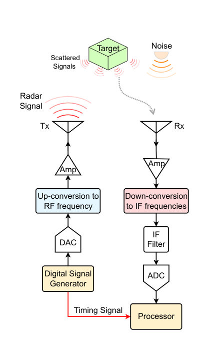
<figcaption class="paper-figure-caption"><b>Fig 1.</b> FIG. 1: The schematic diagram of a mono-static direct-detection radar system. Amp.: Amplifier; DAC: Digital-to-analog converter; ADC: Analog-to-digital converter; Tx/Rx: Transmitter/receiver microwave antenna.</figcaption>
</figure>
<figure class="paper-figure-card">
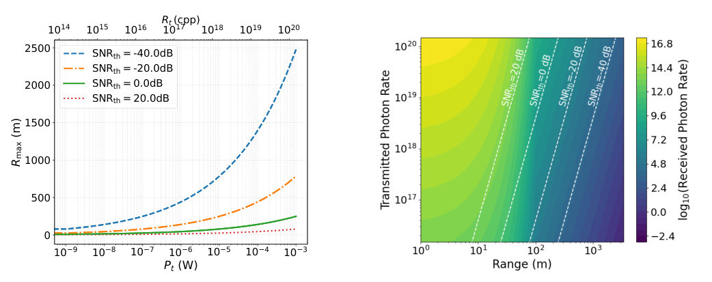
<figcaption class="paper-figure-caption"><b>Fig 2.</b> FIG. 2: (color online) (a) The maximum detection range of the direct detection radar versus the transmitted signal power Pt (lower horizontal axis) and its relevant transmitted photon rate Rt = Pt/(hf) (uper horizontal axis) in the high brightness regime for the</figcaption>
</figure>
<figure class="paper-figure-card">
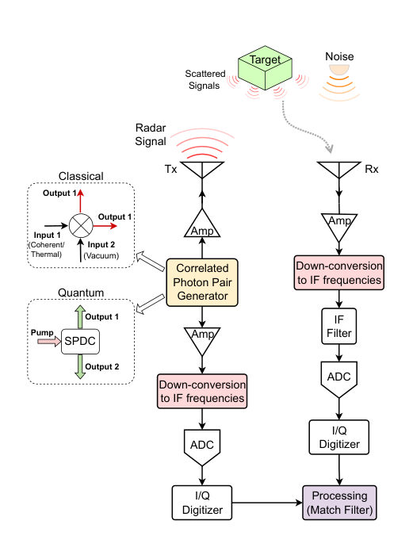
<figcaption class="paper-figure-caption"><b>Fig 3.</b> FIG. 3: The schematic diagram of a mono-static noise radar system. Amp.: Amplifier; ADC: Analog to digital converter; SPDC: Spontaneous parametric down-conversion.</figcaption>
</figure>
<figure class="paper-figure-card">
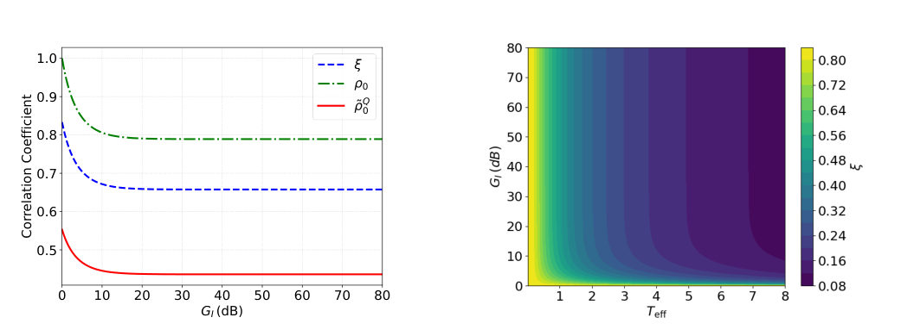
<figcaption class="paper-figure-caption"><b>Fig 4.</b> FIG. 4: (Color online) (a) The modified correlation coefficient ˜ρ0, the correlation coefficient ˜ρ0 reported in Ref35, and the correction term ξ versus the amplification gain of the idler mode GI. The noise figure and the effective temperature of the idler amplifier are fixed at NF = 1dB and Teff = 500mK, respectively. (b) The correction term ξ as the function of the idler amplifier temperature Teff and gain GI for the noise figure of NF = 1dB. In both figures, the photon number per mode is set to Ns = 0.1.</figcaption>
</figure>
<figure class="paper-figure-card">
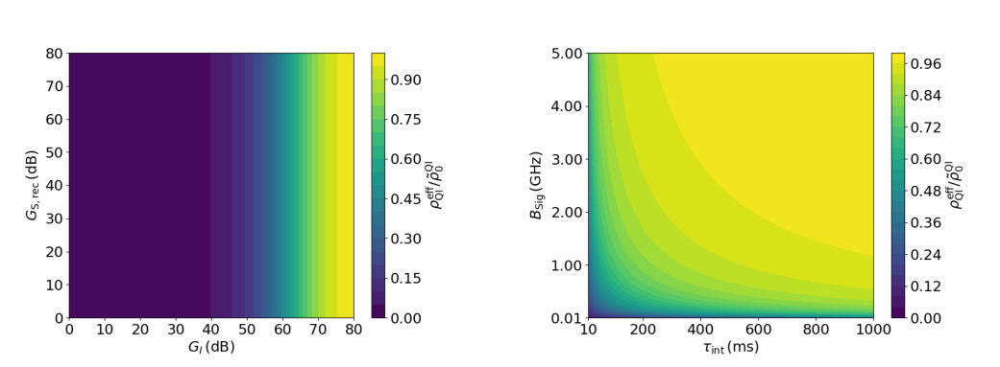
<figcaption class="paper-figure-caption"><b>Fig 5.</b> FIG. 5: (Color online) The normalized Pearson correlation coefficient ρeff Q /ρQ 0 versus (a) amplification gain of the idler mode GI and gain of the signal mode at the receiver GS,rec for the target at range of R = 1 km, and (b) the integration time τint and the bandwidth of the signal mode Bsig for GI = GS,rec = 80 dB. In both cases, the noise figure and effective temperature of the idler and signal amplifiers are fixed at NF = 1dB and Teff = 100mK, respectively. Moreover, the target range is considered to be R = 1 km, and the photon number per mode is set to Ns = 0.1. Other system parameters are the same as in Fig. 2.</figcaption>
</figure>

**Summary.** This paper provides a detailed theoretical evaluation of quantum radar systems, comparing single-photon direct detection against noise radars utilizing entangled microwave fields. By deriving analytical range equations involving the Lambert W function, the authors quantify the advantage of quantum entanglement through an enhancement factor (REF). The results suggest that these advanced quantum receivers can achieve practical detection ranges using current microwave detector technology.

**Why it may be interesting.** This work bridges quantum optics (squeezed states, entanglement) with applied physics (radar detection), providing quantitative performance benchmarks for next-generation sensing technologies.

Detailed structure

**Main problem.** The paper aims to comprehensively analyze and derive analytical expressions for the maximum detection range of various quantum radar architectures, comparing single-photon direct-detection radars against quantum-entangled noise radars.

**Main result.** Quantum-entangled noise radars show potential for significantly enhanced detection ranges compared to classical systems by leveraging quantum correlations, with implementation feasible at a few kilometers using current technology.

**Method.** The authors derived range equations in terms of the Lambert W function by analyzing detection criteria based on signal-to-noise ratios (SNR) and correlation coefficients ($
ho$).

**Model / system.** The analysis models three radar types: direct-detection (single-photon), classical noise, and quantum-entangled noise radars utilizing Two-Mode Squeezed Vacuum (TMSV) states. The system relies on microwave detection techniques.

**Key observables.** Maximum detection range ($R_{\max}$), Parameter Range Enhancement Factor (REF), Pearson correlation coefficient ($
ho$), and effective threshold SNR ($	ext{SNR}_{	ext{QI}}^{	ext{th,eff}}$).

**Important parameters / regimes.** Detection threshold ($	ext{SNR}_{	ext{th}}$), transmitted power ($P_t$), scattering cross-section ($\sigma$), and atmospheric absorption coefficients.

**Assumptions / limitations.** The analysis assumes the use of advanced detectors (e.g., quantum transducers combined with single optical-photon detectors) and models noise addition to correlated pairs, while noting that conventional antennas limit potential benefits.

**Figures summary.** Figures illustrate schematic diagrams for direct-detection and noise radar systems, showing how $R_{\max}$ depends on $	ext{SNR}_{	ext{th}}$ and transmitted power for both classical and quantum regimes.

**Paper structure.** The paper progresses by first establishing the baseline range equation for direct detection (classical/single-photon), then introducing the correlation mechanism of noise radars, and finally deriving the enhanced range equations specific to quantum-entangled noise radar using correlation metrics like $
ho$.

Abstract

This article presents a comprehensive analysis of two classes of quantum radars, including quantum direct-detection and quantum-entangled noise radars. In the first case, inspired by the well-established concept of single-photon LiDARs, we investigated the performance of single-photon radars, in which state-of-the-art single microwave-photon detectors are employed to enhance the detection sensitivity and enable the detection of weaker signals. We derived analytical expressions for the maximum detection range of both classes of quantum radars in terms of the Lambert W function, by considering all relevant system, target, and environmental parameters. Our formulation facilitates direct comparison of noise radars with direct-detection radars and suggests that a quantum-entangled noise radar can be regarded as an enhanced direct-detection radar with an effective threshold signal-to-noise ratio. Furthermore, we applied this framework to classical-correlated noise radars and defined the parameter range enhancement factor (REF) to quantify the superiority of quantum-entangled noise radars over their classical counterparts. Moreover, we introduced a rule-of-thumb for approximating the REF. We also examined the influence of limitations imposed by various microwave detection technologies. Our analysis shows that the conventional antennas limit the potential benefits of quantum-entangled noise radar systems. We also demonstrated that the optimal detection method for these radars is a microwave detector based on a quantum transducer combined with a single optical-photon detector. We showed that, with the current technology, implementing a quantum-entangled noise radar with the maximum detection range on the order of few kilometers is possible. Finally, we explored the potential applications of quantum-entangled noise radars.

[↑ back to top](#top)

### [Correlation-driven phonon renormalisation and the equation of state of $γ$-cerium](http://arxiv.org/abs/2606.10101v1)

**Authors:** Yao Wei, Siyu Chen, Evgeny Plekhanov, Ivan Stich, Cedric Weber, Jan M. Tomczak  
**Type:** theory · **Category:** strongly correlated electrons · **PDF:** <https://arxiv.org/pdf/2606.10101v1>  
**Analysis basis:** full PDF text, analyzed in chunks
**Topic relevance:** `Keldysh / 2PI / non-Gaussian methods` **1/5** · `Kondo & dissipative impurity` **1/5**

↔ Scroll figures horizontally

<figure class="paper-figure-card">
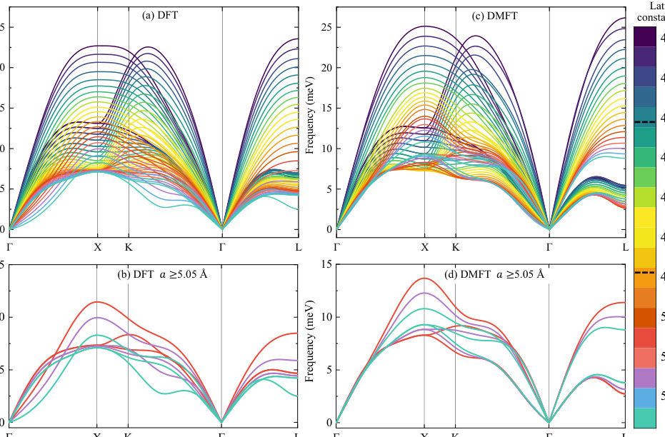
<figcaption class="paper-figure-caption"><b>Fig 1.</b> FIG. 2. Ab initio computation of correlation-driven phonon dispersions in cerium. (a, c) Full phonon dispersion relations explicitly calculated from first principles within standard DFT (LDA, T = 0) and DFT+DMFT (T = 580 K), using a 4 × 4 × 4 q-point mesh. The colour bar indicates the lattice constant (in ˚A), with dashed lines marking the respective theoretical equilibrium constants (aDFT 0 = 4.52 ˚A; aDMFT 0 = 4.88 ˚A) from Fig.1.(b, d) Detailed views of the directly computed large- volume γ-phase regime (a = 5.05, 5.15, and 5.25 ˚A)</figcaption>
</figure>
<figure class="paper-figure-card">
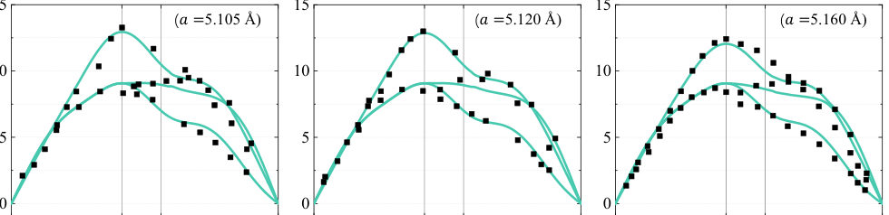
<figcaption class="paper-figure-caption"><b>Fig 2.</b> FIG. 3. Phonon dispersion relations obtained using principal component-based neural network interpolation trained on LDA+DMFT calculations, compared with experimental data from cerium under hydrostatic pressure at ambient tempera- ture from Ref.20. Results are shown for lattice constants a=5.105, 5.120 and 5.160˚A along the Γ–X–K–Γ high-symmetry path. The predicted dispersions (green lines) show very good agreement with the experimental phonon frequencies (black symbols).</figcaption>
</figure>
<figure class="paper-figure-card">
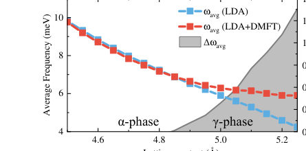
<figcaption class="paper-figure-caption"><b>Fig 3.</b> FIG. 4. Average phonon frequency as a function of lattice constant for elemental cerium, calculated within DFT (blue squares) and DFT+DMFT (red squares). The shaded region represents the difference in the average phonon frequency be- tween the two approaches, defined as ∆ω = ωLDA+DMFT avg − ωLDA avg . In the compressed volume regime corresponding to the α-phase, the two methods yield nearly identical average frequencies, indicating a minor influence of electronic correla- tions on lattice dynamics. Upon lattice expansion towards the γ-phase, a systematic deviation develops, with LDA+DMFT suppressing the volume-induced phonon softening observed at the LDA level.</figcaption>
</figure>
<figure class="paper-figure-card">
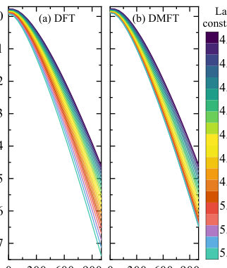
<figcaption class="paper-figure-caption"><b>Fig 4.</b> FIG. 5. Temperature dependence of the absolute phonon free energy, Fph, of elemental cerium calculated within (a) LDA and (b) LDA+DMFT for lattice constants between 4.30 and 5.25 ˚A. The LDA+DMFT phonon dispersions are computed at β = 20 (T ≈580 K) and used within the harmonic approx- imation.</figcaption>
</figure>
<figure class="paper-figure-card">
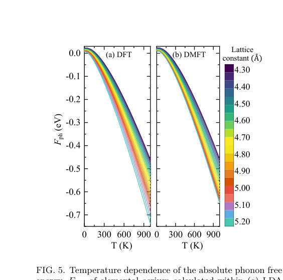
<figcaption class="paper-figure-caption"><b>Fig 5.</b> Figure 4 demonstrates a pronounced correlation- dependent modification of the lattice dynamics across the α–γ transition of the average phonon frequency. The av- erage is obtained from the full phonon dispersions calcu- lated within LDA and LDA+DMFT, shown in Fig. 2 ((a) and (c) panels, respectively), by averaging the phonon frequencies along the chosen high symmetry path in the Brillouin zone. In the compressed volume regime corre- sponding to the α-phase, the two approaches yield nearly identical average frequencies, such that ∆ωavg remains close to zero. This indicates that electronic correlations exert only a marginal influence on the lattice response at small volumes. With increasing...</figcaption>
</figure>

**Summary.** This work develops a comprehensive theoretical framework to calculate the equation of state of cerium by coupling Dynamical Mean-Field Theory (DMFT) with phonon calculations. By treating both electronic correlations and vibrational entropy simultaneously, the authors achieve significant quantitative improvements over standard DFT methods. This highlights that for strongly correlated lanthanides, accurate phase stability requires accounting for both electronic renormalization and lattice vibrations.

**Why it may be interesting.** The methodology—combining advanced many-body theory (DMFT) with lattice dynamics and finite-temperature thermodynamics—is highly relevant for understanding strongly correlated materials where electronic structure dictates vibrational behavior, which is a key area in modern condensed matter physics.

Detailed structure

**Main problem.** To rigorously determine the equation of state and thermodynamic properties of elemental cerium, specifically quantifying the role of phonon free energy renormalized by strong electronic correlations.

**Main result.** The inclusion of both DMFT-derived electronic correlations and vibrational entropy significantly refines the predicted equilibrium volume, leading to better agreement with experimental measurements than standard DFT or DFT+U methods.

**Method.** The study combines Dynamical Mean-Field Theory (DMFT) calculations for electronic structure with lattice dynamics calculations that incorporate phonon free energy corrections across varying lattice constants.

**Model / system.** The system is elemental Cerium (Ce), focusing on the $\gamma$-phase, which exhibits strong $4f$ electron correlations. The theoretical framework extends DFT by incorporating DMFT to handle local electronic correlation effects ($U$) and adding vibrational entropy corrections derived from phonon calculations.

**Key observables.** Total energy vs. lattice constant, phonon spectra/dispersions, equilibrium volume ($a_0$), and the total free energy $F(T)$.

**Important parameters / regimes.** Hubbard interaction strength ($U=6.0 	ext{ eV}$), inverse temperature ($eta = 20 	ext{ eV}^{-1}$, corresponding to $\sim 580 	ext{ K}$).

**Assumptions / limitations.** The fixed self-energy approximation is used for phonon calculations, neglecting the explicit displacement dependence of the local self-energy. The harmonic approximation is used for vibrational free energy.

**Figures summary.** Figures illustrate lattice parameter dependence of total energy (DFT vs DMFT), correlation-driven phonon dispersions showing volume dependence, and temperature/lattice constant dependence of the full free energy functional.

**Paper structure.** The paper systematically builds the thermodynamic description: first establishing the failure of standard DFT for $f$-electron materials; second, incorporating electronic correlations via DMFT to refine the internal energy; third, adding vibrational entropy corrections derived from phonon calculations; and finally, combining all terms to yield a temperature-dependent equation of state.

Abstract

We investigate the thermodynamic properties of elemental cerium by assessing the crucial role of phonon free energy within the framework of dynamical mean-field theory (DMFT). While conventional density functional theory (DFT) often fails to capture the intricate energy landscape of $f$-electron materials, our approach integrates many-body electronic correlations with lattice dynamics to achieve a more rigorous description of the equation of state. We calculate the total energy as a function of the lattice constant at both the DFT and DFT+DMFT levels, subsequently incorporating the vibrational free energy derived from the phonon density of states. Our findings reveal that electronic renormalisation of the force constants significantly alters the phonon spectra, particularly in the strongly correlated $γ$-phase. By applying these phonon corrections to the energy profiles, we observe a substantial refinement in the predicted equilibrium volumes. Using principal-component-based machine learning, we interpolate phonon dispersions continuously from a finite set of first-principles calculations and compare them to experiment, finding significantly closer agreement compared to conventional DFT and DFT+U calculations that neglect dynamical many-body correlations. This study underlines the necessity of accounting for both electronic and vibrational entropy when evaluating the phase stability and structural transitions of lanthanide systems under varying pressures and temperatures.

[↑ back to top](#top)

### [Extensible links in a broad class of single polymer chain models](http://arxiv.org/abs/2606.11041v1)

**Authors:** Michael R. Buche, Matthew J. Grasinger, Jason P. Mulderrig  
**Type:** theory · **Category:** statistical mechanics · **PDF:** <https://arxiv.org/pdf/2606.11041v1>  
**Analysis basis:** full PDF text, analyzed in chunks
**Topic relevance:** `Frenkel-Kontorova` **1/5** · `Keldysh / 2PI / non-Gaussian methods` **1/5**

↔ Scroll figures horizontally

<figure class="paper-figure-card">
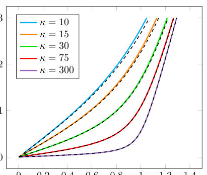
<figcaption class="paper-figure-caption"><b>Fig 1.</b> FIG. 1. The nondimensional longitudinal extension γ of an extensible freely jointed chain under an applied force η, using asymptotic (dashed) and analytically-exact (solid) methods, for varying nondimensional link stiffness κ.</figcaption>
</figure>
<figure class="paper-figure-card">

<figcaption class="paper-figure-caption"><b>Fig 2.</b> FIG. 2. The nondimensional longitudinal extension γ of an extensible freely rotating chain under an applied force η, using asymptotic (dashed) and numerically-exact (solid) methods, for varying nondimensional link stiffness κ.</figcaption>
</figure>
<figure class="paper-figure-card">
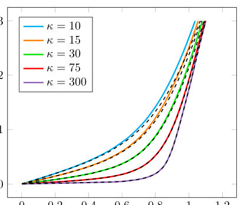
<figcaption class="paper-figure-caption"><b>Fig 3.</b> Fig. 2 compares the asymptotic approximation of the longitudinal extension γ(η) in Eq. (12) to the exact result in Eq. (8) as a function of the nondimensional force η across a range of nondimensional link stiffnesses κ [30]. Each case averages 10 billion Monte Carlo samples for every one of the 15 points along each curve, where the angle between consecutive link vectors is fixed at θb = 60◦</figcaption>
</figure>
<figure class="paper-figure-card">
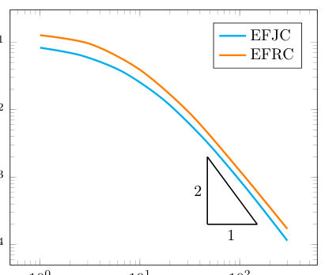
<figcaption class="paper-figure-caption"><b>Fig 4.</b> FIG. 3. The relative error e in the asymptotic theory as a function of the nondimensional link stiffness κ for both the extensible freely jointed chain (EFJC) and extensible freely rotating chain (EFRC).</figcaption>
</figure>

**Summary.** This paper develops a general, asymptotically correct theoretical framework for modeling single polymer chains whose links possess finite extensibility. By applying advanced mathematical techniques like Laplace's method, the authors derive accurate predictions for chain extension under force. This work provides a significant methodological advance by unifying treatments across different physical models.

**Why it may be interesting.** While focused on classical polymer physics, the development of a systematic, rigorous asymptotic theory to handle complex degrees of freedom and stiffness parameters mirrors techniques used in quantum field theory or many-body systems where approximations are necessary.

Detailed structure

**Main problem.** The primary goal is developing a generally applicable asymptotic theory to rigorously incorporate link extensibility into discrete single-chain models for calculating thermodynamics.

**Main result.** The developed theory provides an asymptotically accurate approximation for the longitudinal chain extension, $\gamma(\eta)$, that successfully reproduces known results across various polymer models.

**Method.** The authors employ an asymptotic approach using Laplace's method on the partition function when link stiffness ($\kappa$) is large, yielding a systematic expansion in powers of $\kappa^{-1}$.

**Model / system.** The study focuses on single polymer chains modeled as discrete sequences of links. The models include the freely jointed chain and the freely rotating chain, characterized by an energy potential involving link angles and individual link potentials.

**Key observables.** Nondimensional longitudinal chain extension ($\gamma(\eta)$) under an applied force ($\eta$).

**Important parameters / regimes.** Link stiffness ($\kappa$), which must be large ($\kappa \gg 1$) for the asymptotic theory to be valid.

**Assumptions / limitations.** The theory is strictly asymptotic, requiring the link stiffness $\kappa$ to be much greater than one. The approximation builds upon an inextensible reference system.

**Figures summary.** Figure 1 compares the asymptotic approximation to the exact result for the freely jointed chain, showing rapid convergence with increasing $\kappa$. Figure 2 validates this theory using Monte Carlo simulations on the freely rotating chain, demonstrating accuracy across varying parameters.

**Paper structure.** The paper introduces the general model and the need for a rigorous theory. It then develops the asymptotic expansion for the partition function and derives key observables like $\gamma(\eta)$. The theory is validated first analytically (freely jointed) and subsequently numerically (freely rotating chain).

Abstract

The physics of polymer chains is often probed using molecular stretching experiments and various idealized single-chain models. The majority of these models consist of a discrete sequence of links, which may be treated as rigid or extensible. Although such models are well established and many specific extensible variants have been proposed, no generally applicable theory has been presented. Moreover, most existing treatments are heuristic rather than systematically and rigorously derived. This critical gap is closed here through the development of a generally applicable asymptotic theory for including link extensibility in a broad class of discrete models for single-chain thermodynamics. The theory is verified analytically using the freely jointed chain and validated numerically using the freely rotating chain. The resulting approximation is first-order accurate in inverse link stiffness, with quadratically decreasing error, and recovers extensible behavior across all link stiffnesses from a single rigid-link reference calculation.

[↑ back to top](#top)

### [Genuine Multipartite Nonlocality for Arbitrary Input: Maximal Randomness Generation and Robust Self-Testing](http://arxiv.org/abs/2606.10936v1)

**Authors:** Rajdeep Paul, Ranendu Adhikary, Alok Kumar Pan  
**Type:** theory · **Category:** quantum information and computing · **PDF:** <https://arxiv.org/pdf/2606.10936v1>  
**Analysis basis:** full PDF text, analyzed in chunks
**Topic relevance:** `entanglement & information structure` **1/5** · `quantum measurements` **1/5**

↔ Scroll figures horizontally

<figure class="paper-figure-card">
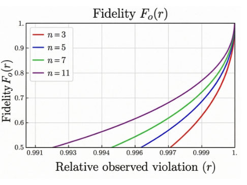
<figcaption class="paper-figure-caption"><b>Fig 1.</b> FIG. 1: Trade-off between relative observed violation (r) and fidelity Fs(r) and Fo(r), ∀O ∈{XA3, ZA3}.</figcaption>
</figure>
<figure class="paper-figure-card">
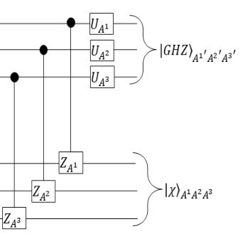
<figcaption class="paper-figure-caption"><b>Fig 2.</b> FIG. 2: Self-testing circuit for n=3</figcaption>
</figure>

**Summary.** The paper introduces a generalized Bell inequality to test genuine multipartite nonlocality across arbitrary numbers of measurement settings. Using advanced algebraic techniques like SOS decomposition, the authors derive the optimal quantum bound, proving that this nonlocality guarantees the extraction of maximal global randomness. Furthermore, they provide detailed analyses quantifying how robust these certified correlations remain when experimental noise is introduced.

**Why it may be interesting.** This work provides rigorous mathematical tools (SOS decomposition) to certify fundamental quantum properties like nonlocality and randomness in complex multipartite settings, which is crucial for device-independent quantum cryptography protocols.

Detailed structure

**Main problem.** To develop a Bell inequality capable of detecting genuine multipartite nonlocality (GMNL) in arbitrary $m$-partite systems with an odd number of measurement settings ($n$), while simultaneously certifying maximal global device-independent randomness.

**Main result.** The framework successfully derives the optimal quantum violation, establishes strict separations between local/bi-local and quantum bounds, and proves that $m$ bits of DI randomness can be extracted at this optimum.

**Method.** The authors employ an analytical Sum-of-Squares (SOS) decomposition technique to derive upper bounds for Bell functionals without assuming finite Hilbert space dimensions. Self-testing is achieved by analyzing the conditions under which the quantum expectation value matches the theoretical maximum.

**Model / system.** The study analyzes $m$-partite quantum systems subjected to measurements with $n$ possible settings per party, characterized by a multipartite Bell functional $\Gamma^m_n$. The analysis extends to quantifying robustness against noise using trace distance calculations.

**Key observables.** Bell functional ($\Gamma^m_n$), optimal quantum violation ($\langle\Gamma^m_n
angle_{	ext{opt}}^Q$), min-entropy ($R_{i_1...i_m}$), and trace distance between ideal and noisy expectation values.

**Important parameters / regimes.** Number of parties ($m$), number of settings per party ($n$, must be odd), noise parameters ($\epsilon, \alpha, eta$), and the relative violation $r$.

**Assumptions / limitations.** The derivation relies on SOS decomposition to bypass dimension assumptions. Robustness analysis often uses approximations based on small error margins (e.g., trace distance bounds proportional to $eta$).

**Figures summary.** Figures illustrate trade-offs between relative observed violation ($r$) and fidelity/trace distance bounds, showing how noise parameters affect the achievable quantum correlations.

**Paper structure.** The paper systematically derives upper bounds for local ($\Gamma^m_n|_L$) and bi-local ($\Gamma^m_n|_{BL}$) models. It then uses SOS decomposition to find the optimal quantum value $\langle\Gamma^m_n
angle_{	ext{opt}}^Q$, followed by detailed sections on self-testing, randomness extraction, and finally, quantifying robustness against noise using trace distance bounds.

Abstract

Bell nonlocality provides the foundation for device-independent (DI) certification of quantum devices. We introduce a Bell inequality capable of identifying genuine multipartite nonlocality (GMNL) in an arbitrary m-partite scenario with an arbitrary odd number of measurements per party. Since the multi-setting nature of this inequality precludes the use of Jordan's Lemma, we construct an analytical sum-of-squares (SOS) decomposition to obtain the optimal quantum violation without assuming any bound on the Hilbert space dimension. This, in turn, enables self-testing of the shared entangled state and the corresponding measurement observables, up to local isometries, whose existence we confirm using a swap-based certification scheme. In addition, we show that our framework enables the extraction of maximal global DI randomness (m bits) at the optimal quantum violation, thereby exceeding previous limitations in the GMNL regime. Finally, we demonstrate that the architecture of our inequality yields improved robustness to noise as the number of measurement settings grows, ensuring experimental feasibility.

[↑ back to top](#top)

### [Thermodynamic Approach to Momentum Transport in Dense Fluids](http://arxiv.org/abs/2606.10858v1)

**Authors:** Christopher Devik Fjeldstad, Jonas Bueie, Astrid S. de Wijn  
**Type:** theory · **Category:** statistical mechanics · **PDF:** <https://arxiv.org/pdf/2606.10858v1>  
**Analysis basis:** full PDF text, analyzed in chunks
**Topic relevance:** `Keldysh / 2PI / non-Gaussian methods` **1/5** · `non-equilibrium dynamics` **1/5**

↔ Scroll figures horizontally

<figure class="paper-figure-card">
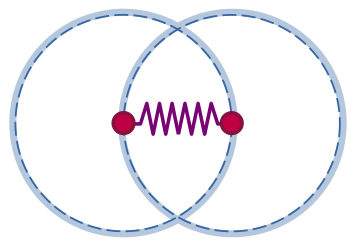
<figcaption class="paper-figure-caption"><b>Fig 1.</b> FIG. 1. The geometry of diatomic molecules as modeled in this paper. The intra-molecular bond is modeled using a har- monic spring. Inter-particle interactions are modeled accord- ing to the Lennard-Jones potential.</figcaption>
</figure>
<figure class="paper-figure-card">
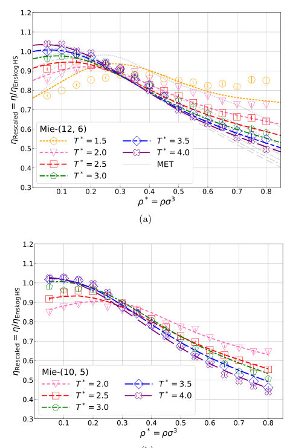
<figcaption class="paper-figure-caption"><b>Fig 2.</b> FIG. 3. Rescaled shear viscosity from simulations and pre- dictions for (a) LJ fluids and (b) Mie-(10, 5) fluids, using Xres = βuex. Each temperature is assigned a symbol and as- sociated dash style as denoted in the legend. For comparison in Fig. (a) the light thin gray lines give the MET prediction with dash styles given by the corresponding temperature. The shear viscosity is rescaled using the Enskog prediction for a hard-sphere fluid with diameter σHS = σ and mass m = 1.</figcaption>
</figure>
<figure class="paper-figure-card">
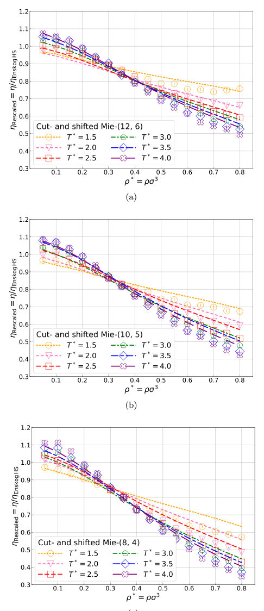
<figcaption class="paper-figure-caption"><b>Fig 3.</b> FIG. 2. Rescaled shear viscosity from simulations and predic- tions for (a) WCA fluids, (b) cut and shifted Mie-(10, 5) fluids and (c) cut and shifted Mie-(8, 4) fluids, using Xres = βuex. Each temperature is assigned a symbol and corresponding dash style as denoted in the legend. The shear viscosity is rescaled using the Enskog prediction for a hard-sphere fluid with diameter σHS = σ and mass m = 1.</figcaption>
</figure>
<figure class="paper-figure-card">
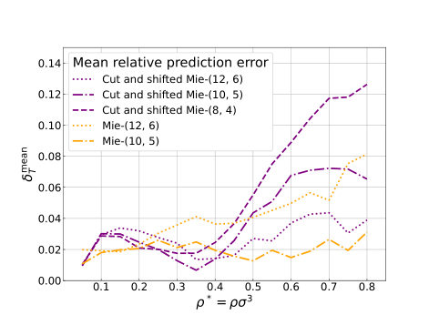
<figcaption class="paper-figure-caption"><b>Fig 4.</b> FIG. 4. The relative prediction error δmean T averaged over tem- perature T ∗as a function of number density ρ∗. The errors are generally small when ρ∗≲0.3. Above this density par- ticle cores are expected to continuously overlap, three-body correlations become significant, and the magnitude of the as- sociated prediction error increases.</figcaption>
</figure>
<figure class="paper-figure-card">
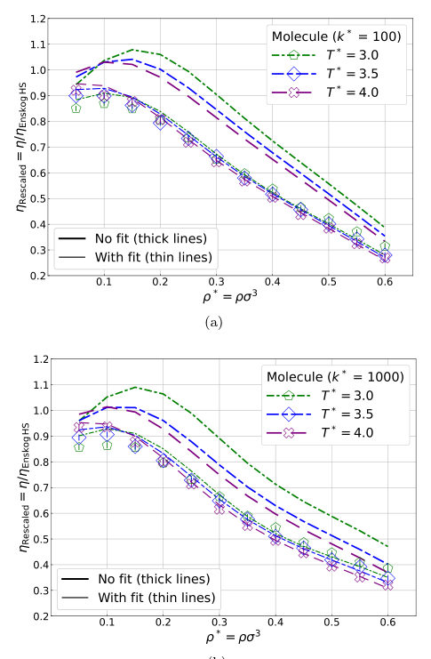
<figcaption class="paper-figure-caption"><b>Fig 5.</b> FIG. 5. Rescaled shear viscosity from simulations and pre- dictions for diatomic LJ fluids with spring constant k∗= 100 (a) and spring constant k∗= 1000 (b). Each temperature is assigned a symbol and associated dash style as denoted in the legend. The prediction lines are calculated using either Xres = βuex (thick lines), or Xres = Cβuex (thin lines). In the latter case, C is treated as a fit parameters. The shear viscos- ity is rescaled using the Enskog prediction for a hard-sphere fluid with diameter σHS = (59/32)1/3σ and mass m = 2.</figcaption>
</figure>

**Summary.** This work introduces an advanced theoretical framework to calculate fluid shear viscosity by replacing reliance on effective hard-sphere diameters with a function derived from the system's excess internal energy. By applying this method to LJ and WCA fluids, the authors demonstrate high predictive accuracy across wide density ranges, significantly advancing classical transport theory.

**Why it may be interesting.** While focused on classical fluids, the rigorous development of generalized transport equations based on fundamental thermodynamic potentials ($eta u_{	ext{ex}}$) provides a powerful template for developing similar non-equilibrium theories in quantum many-body systems where simple kinetic approximations fail.

Detailed structure

**Main problem.** To develop a general theoretical framework for calculating transport coefficients, specifically shear viscosity, of dense fluids that extends beyond the limitations of existing theories like Chapman-Enskog theory.

**Main result.** The proposed thermodynamic approach using an exchange function ($\hat{g}$) accurately predicts the shear viscosity of various fluid models (WCA, LJ) with low mean relative errors (2%-4%) at low to intermediate densities.

**Method.** The authors reformulate transport equations by relating the necessary correction term ($X_{	ext{res}}$) in an equation of state to the excess internal energy ($eta u_{	ext{ex}}$), thus bypassing reliance on effective hard-sphere diameters.

**Model / system.** The study investigates dense fluids modeled using Lennard-Jones (LJ) and Weeks-Chandler-Anderson (WCA) potentials, as well as diatomic molecules with harmonic bond interactions. Simulations are performed across a wide range of densities ($
ho^*$) and temperatures ($T^*$).

**Key observables.** Shear viscosity ($\eta$), Compressibility factor ($Z$), Mean relative prediction error.

**Important parameters / regimes.** Density range: $0.05 \le 
ho^* \le 0.8$; Temperature range: $1.5 \le T^* \le 4.0$. Low/intermediate density regime defined as $
ho^* \le 0.3$.

**Assumptions / limitations.** The primary assumption is that the necessary correction term ($X_{	ext{res}}$) can be accurately represented by a function of the excess internal energy ($eta u_{	ext{ex}}$). Limitations exist at high densities or when inelastic collisions are dominant.

**Figures summary.** Figures compare predicted vs. simulated shear viscosity for Mie fluids, showing good agreement at low density; error plots show increasing errors above $
ho^* \approx 0.35$.

**Paper structure.** The paper introduces the general framework using an exchange function ($\hat{g}$), shows how existing theories (MET) fit into it, proposes $X_{	ext{res}} = eta u_{	ext{ex}}$, and then applies this to test predictions against simulations for various fluid models.

Abstract

We present a new framework for extending Chapman-Enskog theory beyond the hard-sphere fluid model. Rather than relying on effective hard sphere diameters, the approach makes use of on an exchange function which can be related to the thermodynamic properties of the system. We show that two existing extensions, including modified Enskog theory (MET), fit into this new framework. Based on our approach, we propose an alternative to MET that takes into account the potential interaction energy associated with the inter-particle interactions in the fluid. The proposed expression is applied to predicting the shear viscosity of several different simulated fluid models across a wide set of densities $0.05 \leq ρ^* \leq 0.8$ and temperatures $1.5 \leq T^* \leq 4.0$ in Lennard-Jones units. The fluid models considered include both the Weeks-Chandler-Anderson (WCA) fluid and the Lennard-Jones (LJ) fluid. At low and intermediate density, here taken to be $ρ^* \leq 0.3$, we report mean relative prediction errors between $2\%$ and $4\%$ for both these. Across all densities considered, the largest mean relative errors reported are $4.4\%$ and $8.1\%$ for the WCA fluid and LJ fluid respectively. We also investigate other interaction models, including a diatomic molecular model, in order to better understand the limitations of our approach.

[↑ back to top](#top)

### [Towards the implementation of a quantum classifier](http://arxiv.org/abs/2606.10150v1)

**Authors:** Lorenzo Confalonieri, Adrián Pérez Salinas, Stefano Carrazza  
**Type:** both · **Category:** quantum information and computing · **PDF:** <https://arxiv.org/pdf/2606.10150v1>  
**Analysis basis:** full PDF text, analyzed in chunks
**Topic relevance:** `entanglement & information structure` **1/5** · `methods for driven-dissipative` **1/5**

↔ Scroll figures horizontally

<figure class="paper-figure-card">
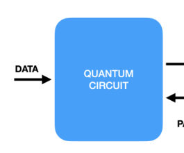
<figcaption class="paper-figure-caption"><b>Fig 1.</b> Figure 2.1: Simple diagram that shows how the hybrid method works.</figcaption>
</figure>
<figure class="paper-figure-card">
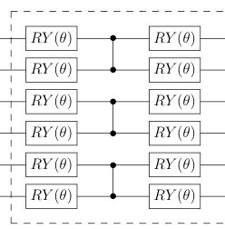
<figcaption class="paper-figure-caption"><b>Fig 2.</b> Figure 3.2: Quantum classifier circuit for the classification of 8x8 images. The first dashed box is the Ansatz and the second one represents the final rota- tions. Rotations RY(θ) are trainable. Dashed horizontal lines between Ansatz and final rotations indicate the possibility to concatenate multiple Ans¨atze.</figcaption>
</figure>
<figure class="paper-figure-card">
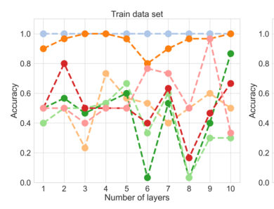
<figcaption class="paper-figure-caption"><b>Fig 3.</b> Figure 3.3: Accuracy of the train set (on the left) and the test set (on the right) for different minimizers and by increasing the number of layers. The loss function used is “square”. The quantum classifier circuit has 6 qubits and it is illustrated in Figure 3.2. The number of shots is 1000.</figcaption>
</figure>
<figure class="paper-figure-card">
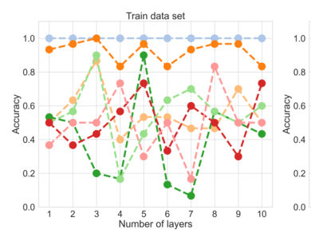
<figcaption class="paper-figure-caption"><b>Fig 4.</b> Figure 3.4: Accuracy of the train set (on the left) and the test set (on the right) for different minimizers and by increasing the number of layers. The loss function used is “ce”. The quantum classifier circuit has 6 qubits and it is illustrated in Figure 3.2. The number of shots is 1000.</figcaption>
</figure>
<figure class="paper-figure-card">
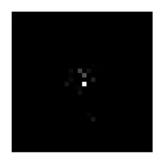
<figcaption class="paper-figure-caption"><b>Fig 5.</b> Figure 4.1: The picture on the left shows an example of the class “0”; on the right an example of class “1”. Both images belong to the “without pile-up” data set. A darker pixel stands for a lower value.</figcaption>
</figure>

**Summary.** This paper demonstrates the feasibility of using a quantum circuit as a binary classifier for tasks ranging from digit recognition to distinguishing particle collisions at colliders. It details a hybrid training methodology involving VQCs and classical optimization, achieving results comparable to small neural networks in simulation. The work highlights both the potential power and the significant limitations (like barren plateaus) of current quantum machine learning implementations.

**Why it may be interesting.** While focused on ML applications rather than fundamental AMO physics, the reliance on parameterized quantum circuits and the discussion of barren plateaus are central topics in quantum information theory relevant to simulating complex quantum dynamics.

Detailed structure

**Main problem.** The work investigates building a binary quantum classifier using quantum circuits for tasks like image classification (MNIST) and particle physics process discrimination (jet tagging).

**Main result.** A binary quantum classifier can be built, showing performance comparable to small CNNs on jet images, but the overall approach is limited by model expressiveness and current simulation constraints.

**Method.** The study employs a hybrid quantum-classical approach, using Variational Quantum Circuits (VQC) trained via classical optimizers (like COBYLA or Powell) to minimize loss functions (e.g., Mean Squared Error).

**Model / system.** The model is a parameterized quantum circuit Ansatz built with qubits and trainable rotation gates ($R_Y(	heta)$), simulated using the Qibo framework on classical computers.

**Key observables.** Classification accuracy, ROC curve, AUC score, confusion matrices, and test set accuracy comparing quantum results to CNN benchmarks.

**Important parameters / regimes.** Number of qubits (up to 10 for $32	imes 32$ images), number of Ansatz layers, training data size, and choice of classical minimizer/loss function.

**Assumptions / limitations.** The primary limitations noted are the potential failure due to Barren Plateaus in gradient-based optimization and that current results are simulations, not real hardware measurements.

**Figures summary.** Figures systematically plot training vs. test accuracy across varying parameters (layers, data size, loss function) for MNIST digits and jet images under 'with' and 'without pile-up' conditions.

**Paper structure.** The paper first introduces the concept of the binary quantum classifier, details the input encoding methods for small arrays and images, describes the VQC Ansatz structure, and then systematically tests performance across multiple datasets (MNIST, LHC jets) by varying optimization parameters and comparing results to classical CNNs.

Abstract

In this work, we investigate the use of a quantum circuit as a binary classification model in the context of quantum machine learning. We call this model, binary quantum classifier.   First, we describe fundamental concepts of quantum computing and introduce the computational tool used: Qibo, an open-source framework for efficient quantum simulations and quantum hardware control. Then, we describe how to design a binary quantum classifier for the classification of images and small arrays of variables by showing how to input data in the circuit, defining a quantum circuit model Ansatz with trainable parameters and a loss function, and implementing multiple minimizers. We test our quantum classifier with two data sets. The first one is the MNIST data set which is composed of handwritten digits (reduced to only handwritten zeros and handwritten ones for binary classification). We study the behavior of different minimizers by increasing the number of layers of the Ansatz. The second data set represents two different high energy collisions that can occur at colliders such as LHC (CERN). Due to in-time proton-proton interactions known as pile-up, we distinguish two different data sets: "without pile-up" and "with pile-up". These collisions can be represented by images of size 32x32 or by six high-level variables that we call features. By increasing the size of the training data set and the number of layers of the Ansatz, we search for the best minimizer. Splitting the data set in training set and test set, we compute: ROC curve, AUC score, confusion matrices and test set accuracy. For "with pile-up" images, we compare the results obtained with the quantum classifier with a small convolutional neural network.   We conclude that is possible to build a binary quantum classifier with a quantum circuit and we highlight its performances and limitations in comparison with classical technologies.

[↑ back to top](#top)

### [Absence of poor local minima in matrix product states](http://arxiv.org/abs/2606.09988v1)

**Authors:** Hao-Kai Zhang, Chenghong Zhu, Shuo Liu, Shi-Xin Zhang, Tao Xiang  
**Type:** theory · **Category:** disordered systems and neural networks · **PDF:** <https://arxiv.org/pdf/2606.09988v1>  
**Analysis basis:** full PDF text, analyzed in chunks
**Topic relevance:** `methods for driven-dissipative` **1/5**

↔ Scroll figures horizontally

<figure class="paper-figure-card">
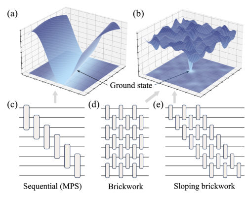
<figcaption class="paper-figure-caption"><b>Fig 1.</b> FIG. 1. Energy landscape schematics in the absence (a) or presence (b) of poor local minima. (c) Sequential circuit, serving as the preparation circuit for MPS. (d) Brickwork cir- cuit. (e) Sloping brickwork circuit, which reduces to sequen- tial circuit when restricted to a single layer. Each block in the circuits represents a unitary that is universal on its support. The grey arrows indicate that the typical energy landscapes of sequential circuits are free from poor local minima, whereas those of brickwork-type circuits are not.</figcaption>
</figure>
<figure class="paper-figure-card">
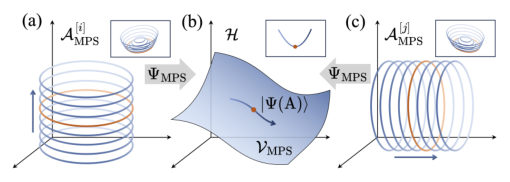
<figcaption class="paper-figure-caption"><b>Fig 2.</b> FIG. 2. Local minimum correspondence. (a) and (c) depict the MPS representation spaces A[i] MPS and A[j] MPS with orthog- onality centers at site i and j, respectively. The rings repre- sent the gauge orbits. (b) depicts the MPS variety VMPS as a subset in the Hilbert space H. A gauge orbit is mapped to a single physical state by the contraction map ΨMPS. The insets depict the respective energy landscapes. Each physical local minimum is mapped to a continuum of local minima in the representation space with the same energy.</figcaption>
</figure>
<figure class="paper-figure-card">
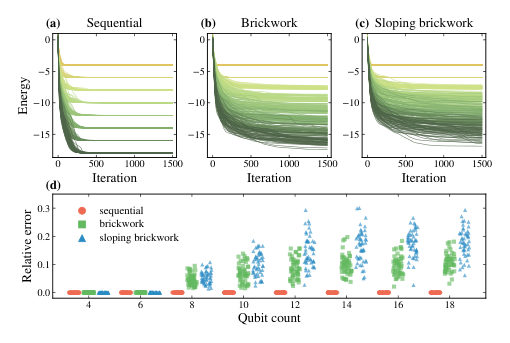
<figcaption class="paper-figure-caption"><b>Fig 3.</b> FIG. 3. The numerical training curves of (a) sequential cir- cuits of β = 3, L = 1, (b) brickwork circuits of β = 2, L = 4, and (c) sloping brickwork circuits of β = 2, L = 4. The block size β and the number of layers L are selected so that the num- ber of parameters in different circuits are comparable. The loss function is the energy expectation of random backward- evolved Hamiltonians. The darkness of the color marks the system size from 4 to 18 qubits. The number of samples is 50 for each system size. (d) The corresponding local minimum distributions in the form of scatter plots, with the data ex- tracted from the final values in (a-c).</figcaption>
</figure>

**Summary.** This work mathematically proves that Matrix Product States (MPS) possess an energy landscape free from poor local minima due to effective local overparametrization arising from gauge freedom. By analyzing the convergence dynamics using gradient flow methods, the authors show MPS are robustly trainable compared to general quantum circuits. This provides a crucial theoretical guide for overcoming optimization bottlenecks in variational quantum algorithms.

**Why it may be interesting.** It provides a rigorous mathematical explanation for why certain structured quantum ansatzes (like MPS) are inherently more robust to optimization failures than general circuits, guiding the design of variational algorithms.

Detailed structure

**Main problem.** The paper resolves the paradox of quantum circuit trainability by proving that Matrix Product States (MPS) energy landscapes are free from poor local minima, unlike general circuits.

**Main result.** The gauge freedom inherent in MPS creates an effective local overparametrization that forces local minima to concentrate near the global minimum, ensuring reliable optimization convergence.

**Method.** Theoretical analysis involving defining and measuring the 'local minimum distribution' using the long-time limit of gradient flow (TDVP/QNGD) on the parameter space.

**Model / system.** The study analyzes variational quantum circuits parameterized by MPS, applied to general Hamiltonians $H$. The comparison is drawn between sequential circuit structures and more restrictive 'brickwork' circuits.

**Key observables.** Local minimum distribution ($P_E(E)$), relative error ($\epsilon$), and the ratio $R(A)$ quantifying gradient cancellation.

**Important parameters / regimes.** Bond dimension ($\chi$), system size ($N$), and the structure of the Hamiltonian (e.g., local vs. non-local terms).

**Assumptions / limitations.** The analysis assumes that the optimization flow converges to a well-defined measure over local minima, which is shown to be independent of the specific MPS representation center.

**Figures summary.** Figures compare training curves showing sequential circuits converging reliably while brickwork circuits get trapped in poor local minima; other figures illustrate gradient cancellation ratios $R(A)$ remaining positive for MPS structures.

**Paper structure.** The paper first establishes the theoretical framework by defining the optimization map and local minimum distribution. It then proves key theorems demonstrating the invariance of this distribution under changes in the MPS representation center, culminating in numerical evidence comparing sequential vs. brickwork circuit performance.

Abstract

Quantum circuits suffer from severe trainability issues: even shallow circuits are swamped with poor local minima. Yet matrix product states (MPS), which can be prepared by sequential circuits, are remarkably trainable in practice -- as demonstrated by decades of successful density matrix renormalization group calculations. In this work, we resolve this apparent paradox by proving that the energy landscapes of MPS are free from poor local minima, under the same setting where brickwork circuits are not. The key insight is that the gauge freedom of MPS creates an effective local overparametrization that causes local minima to concentrate near the global minimum, analogous to overparametrized classical neural networks. We rigorously prove that the local minimum distribution of the MPS energy landscape is invariant under moves of the orthogonality center. Numerical experiments further confirm that the optimization of sequential circuits converges to near-optimal solutions even for random Hamiltonians, in stark contrast to brickwork circuits. Our findings highlight the pivotal role of effective local overparametrization in determining trainability, providing a valuable guide for overcoming the trainability bottleneck of variational quantum algorithms.

[↑ back to top](#top)

### [Coset Ensemble Decoder for Quantum Error Correction with Algorithm-Hardware Co-Design](http://arxiv.org/abs/2606.11076v1)

**Authors:** Shuang Liang, Jubo Xu, Giulio Bassanino, Qianzhou Wang, Yidong Zhou, Yuncheng Lu, Zhiwen Mo, Paul H. J. Kelly, Bo Yuan, Wayne Luk, Hongxiang Fan  
**Type:** both · **Category:** quantum information and computing · **PDF:** <https://arxiv.org/pdf/2606.11076v1>  
**Analysis basis:** full PDF text, analyzed in chunks
**Topic relevance:** `QC/QI experiment` **1/5**

↔ Scroll figures horizontally

<figure class="paper-figure-card">
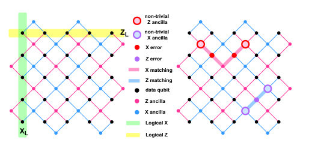
<figcaption class="paper-figure-caption"><b>Fig 1.</b> Fig. 1. Layout of surface code (left) and syndrome behavior with correspond- ing matching for X and Z errors on data qubits (right).</figcaption>
</figure>
<figure class="paper-figure-card">
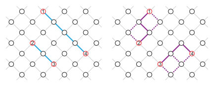
<figcaption class="paper-figure-caption"><b>Fig 2.</b> Fig. 2. Two matching examples: the blue (left) belongs to coset 1 with logical error Lb, the purple (right) to coset 2 with logical error Lp. Dashed lines indicate alternative error paths.</figcaption>
</figure>
<figure class="paper-figure-card">
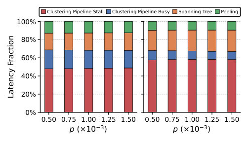
<figcaption class="paper-figure-caption"><b>Fig 3.</b> Fig. 3. Latency breakdown for code distances 3 (left) and 11 (right) on a two- stage baseline without optimizations. Clustering Pipeline Stall and Clustering Pipeline Busy are cycles spent inside the pipelined clustering engine (stalled vs. productive); Spanning Tree and Peeling are cycles spent in the post- clustering traversal modules.</figcaption>
</figure>
<figure class="paper-figure-card">
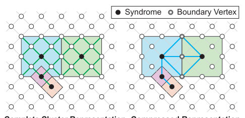
<figcaption class="paper-figure-caption"><b>Fig 4.</b> Fig. 4. Graph compression.</figcaption>
</figure>
<figure class="paper-figure-card">

<figcaption class="paper-figure-caption"><b>Fig 5.</b> Fig. 5 shows a two-stage architecture aligned with the algorithm: a fully pipelined clustering engine feeds K parallel Ensemble Forest Exploration (EFE) instances and a Voting module. Clustering is a streaming growth-and-merge compu- tation that naturally maps to a seven-stage pipeline (S1–S7). Each EFE instance then performs a stateful forest traversal followed by ROE; because this traversal state cannot be time- multiplexed without overwriting in-flight adjacency data, the K instances are replicated and run in parallel. Adjacency- list construction overlaps with clustering, and after clustering terminates each EFE instance traverses under a distinct priority scheme before the Voting...</figcaption>
</figure>

**Summary.** This paper presents a novel algorithm-hardware co-design decoder for Quantum Error Correction (QEC) that improves upon existing methods by explicitly considering logically equivalent error cosets. By combining ensemble forest exploration with specialized, resource-efficient hardware architecture, the system achieves superior accuracy and latency trade-offs compared to state-of-the-art decoders on surface codes.

**Why it may be interesting.** While focused on digital quantum computation, the rigorous analysis of resource scaling, pipeline stalls, and trade-offs between algorithmic complexity and hardware implementation is highly relevant to designing control electronics for complex AMO or superconducting qubit systems.

Detailed structure

**Main problem.** The core challenge is designing a Quantum Error Correction (QEC) decoder that achieves both high logical accuracy and ultra-low latency for reliable large-scale quantum computation.

**Main result.** The proposed coset ensemble decoding co-design significantly improves the accuracy-latency trade-off over vanilla MWPM and UF decoders, while drastically reducing hardware resource consumption (up to 8.2x reduction in LUTs).

**Method.** The authors introduce coset ensemble decoding, which approximates the intractable coset maximum-likelihood rule using ensemble forest exploration, coupled with a domain-specific, pipelined hardware architecture featuring hierarchical ID mapping and multi-bank memory hashing.

**Model / system.** The work analyzes error correction on surface codes under circuit-level depolarizing noise. The decoding process must resolve ambiguities (degeneracy) where multiple physical errors yield the same syndrome but different logical outcomes.

**Key observables.** Logical Error Rate (LER), decoding latency, FPGA LUT consumption, and System Infidelity ($\hat{C}(R)$).

**Important parameters / regimes.** Code distance ($d$), physical error rate ($p$), and tunable candidate number ($K$).

**Assumptions / limitations.** The approach is an approximation to the optimal coset ML decoding; hardware optimizations assume specific concurrent memory access patterns that can be managed by hashing.

**Figures summary.** Figures compare LER vs. code distance for MWPM, UF, and the proposed method; latency breakdowns show bottlenecks in clustering pipelines; architectural diagrams detail multi-bank hashing and hierarchical ID mapping.

**Paper structure.** The paper progresses from identifying the need to solve coset ML decoding (due to degeneracy) to proposing the ensemble forest exploration algorithm. It then details the hardware co-design, including specific memory management techniques (hashing/ID mapping), followed by extensive benchmarking comparing accuracy and latency against state-of-the-art decoders.

Abstract

Reliable large-scale quantum computation relies on fault-tolerant architectures, where quantum error correction (QEC) continuously extracts and decodes error syndromes in real time. A critical component in QEC is the decoder, a classical subsystem that must simultaneously deliver high logical accuracy and ultra-low latency. This paper presents a novel algorithm-hardware co-design that improves the accuracy-latency trade-off over existing approaches such as vanilla Minimum-Weight Perfect Matching (MWPM) and Union-Find (UF) decoders. At the algorithmic level, we introduce coset ensemble decoding, which improves UF decoding by explicitly exploiting logically equivalent cosets. Our method performs ensemble forest exploration to generate multiple coset-consistent candidates and aggregates them to approximate coset-level maximum-likelihood decoding. We further reduce computational and memory complexity via reverse-order elimination and lossless graph compression, without sacrificing accuracy. At the hardware level, we design a domain-specific architecture that temporally reuses resources, avoiding the code-distance-proportional resource growth in prior spatial architectures. Several optimizations, such as multi-bank memory hashing and hierarchical ID mapping, are proposed to mitigate pipeline stalls and memory conflicts under highly concurrent access patterns. Under a circuit-level depolarizing noise model, our co-design approach achieves a better accuracy-latency trade-off than prior MWPM- and UF-based decoders, while reducing FPGA LUT consumption by up to 8.2 times compared with reported UF-based decoder resources. The tunable candidate number further exposes a flexible design knob, enabling users to tailor decoding performance to the requirements of different fault-tolerant workloads. Our implementation is publicly available at https://github.com/IMSeonL/coset-ensemble-decoder.

[↑ back to top](#top)

### [Efficient Magic State Cultivation for $\sqrt{T}$ Gates](http://arxiv.org/abs/2606.10430v1)

**Authors:** I-Chi Chen, Matheus da Silva Fonseca, Andrew Sornborger  
**Type:** theory · **Category:** quantum information and computing · **PDF:** <https://arxiv.org/pdf/2606.10430v1>  
**Analysis basis:** full PDF text, analyzed in chunks
**Topic relevance:** `quantum measurements` **1/5**

↔ Scroll figures horizontally

<figure class="paper-figure-card">
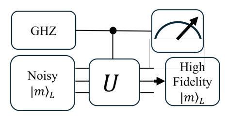
<figcaption class="paper-figure-caption"><b>Fig 1.</b> FIG. 1. General phase kickback measurement for arbitrary |m⟩L. The N qubit GHZ state |ψ⟩ =</figcaption>
</figure>
<figure class="paper-figure-card">
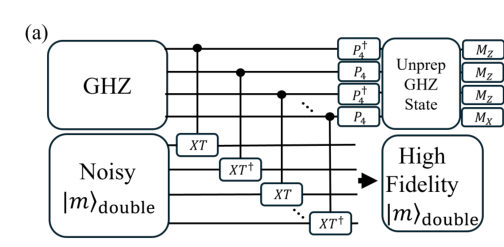
<figcaption class="paper-figure-caption"><b>Fig 2.</b> FIG. 2. The phase kickback measurement circuits for √</figcaption>
</figure>
<figure class="paper-figure-card">
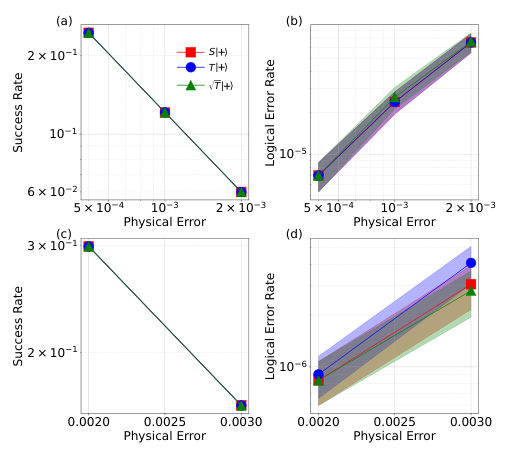
<figcaption class="paper-figure-caption"><b>Fig 3.</b> FIG. 3. The performance of ungrown d = 3 √</figcaption>
</figure>
<figure class="paper-figure-card">
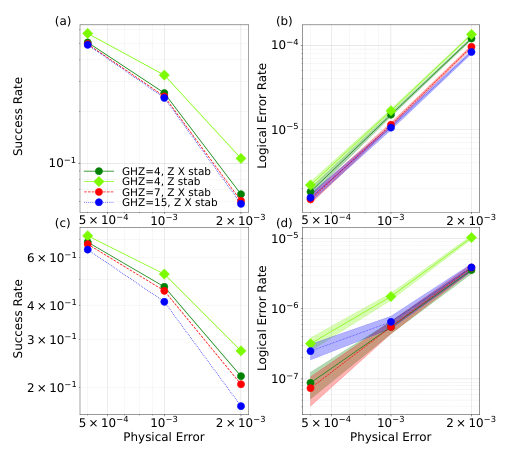
<figcaption class="paper-figure-caption"><b>Fig 4.</b> FIG. 4. Performance of ungrown f = 3 magic state cultivation using code switching. (With and without idling noise). The success rate (left panel) and the logical error rate (right panel) varying with physical noise strength. The upper panels (a,b) depict results with idling noise. The lower panels (c,d) depict outcomes without idling noise. In the legend, GHZ indicates how many qubit GHZ states are used. Z stab (Z X stab) represents the process with only Z type (both Z and X type, resp.) stabilizer measurements before and after the double phase kickback check. Corresponding shades represent standard errors obtained from sampling.</figcaption>
</figure>
<figure class="paper-figure-card">
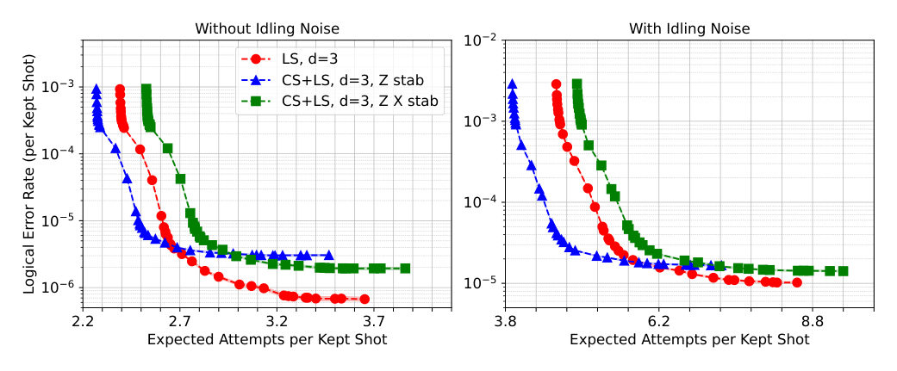
<figcaption class="paper-figure-caption"><b>Fig 5.</b> FIG. 5. End-to-end simulation result for magic state cultivation. The logical infidelity of simulation for f = 3 under the uniform noise model ϵ = 10−3 with idling noise (right plot), and without idling noise (left plot). The curves vary with complementary gap cutoff to postselect the logical error-prone sydrome. LS represents the escape stage using direct lattice surgery between rotated surface code (df = 11) and the [[15, 1, 3]] doubled color code. LS+CS indicates the escape procedure using code switch and lattice surgery between rotated surface code (df = 11) and [[7, 1, 3]] Steane code. Z Stab (Z X Stab) represents the process with only Z type (both Z and X type) stabilizer measurements...</figcaption>
</figure>

**Summary.** This paper advances the theory of magic state cultivation by generalizing phase kickback checks beyond previously studied cases. It details a protocol for efficiently cultivating $\sqrt{T}$ magic states on complex codes like the doubled color code using lattice surgery. The results demonstrate improved fault tolerance and provide pathways for realizing early, scalable quantum computation.

**Why it may be interesting.** This work is highly relevant to theoretical quantum information scientists working on resource estimation and hardware-agnostic protocols, as it provides concrete, advanced techniques for generating necessary non-Clifford gates.

Detailed structure

**Main problem.** The research aims to generalize phase kickback checks for magic states at arbitrary Clifford hierarchy levels, specifically focusing on efficient cultivation protocols for $\sqrt{T}$ gates.

**Main result.** The authors present a protocol for $\sqrt{T}|+
angle_L$ magic state cultivation on the doubled color code and demonstrate that end-to-end simulations show high fidelity when employing lattice surgery escape strategies.

**Method.** The methods involve generalizing phase kickback measurements, implementing protocols on specific Quantum Error Correcting Codes (QECCs) like the doubled color code, and utilizing lattice surgery for code expansion.

**Model / system.** The work analyzes quantum error correction codes, including the 2D and doubled color codes, which are used to protect logical qubits. The goal is to prepare non-Clifford magic states ($T$ or $\sqrt{T}$) required for universal fault-tolerant quantum computation.

**Key observables.** Logical error rate (infidelity), success rate, spacetime volume per shot, and the parity outcome of phase kickback measurements.

**Important parameters / regimes.** Code parameters such as $f=3$ ($	ext{[[15, 1, 3]]}$) and $f=5$ ($	ext{[[49, 1, 5]]}$), and noise regimes (with/without idling noise).

**Assumptions / limitations.** The protocol relies on the ability of the code to support a corresponding transversal phase gate ($P_{n-1}$) during double-check, and simulations often use approximations for computational tractability.

**Figures summary.** Figures illustrate general phase kickback measurement circuits (Fig. 1) and specific $\sqrt{T}|+
angle_L$ check circuits on the doubled color code (Fig. 2). Other figures compare end-to-end simulation performance across different escape strategies and noise models.

**Paper structure.** The paper progresses by first generalizing the phase kickback checks, then presenting a detailed protocol for $\sqrt{T}|+
angle_L$ cultivation on the doubled color code using lattice surgery. Finally, it discusses incorporating this into larger fault-tolerant architectures like STAR.

Abstract

Recently, experimental and theoretical quantum error correction methodology has seen remarkable breakthroughs. In particular, magic state cultivation has been shown to simplify magic-state preparation and make it feasible for near-term devices. However, recent research on magic state cultivation has focused primarily on the cultivation of $T\left| + \right>_L$. Only a few other magic state cultivation methods beyond $T\left| + \right>_L$ have been investigated. Here, we generalize phase kickback checks for magic states at arbitrary Clifford hierarchy levels in specific codes. We provide an example of cultivation of $\sqrt{T}\left| + \right>_L$ in the doubled color code and the corresponding escape strategy using lattice surgery from the color code to large rotated surface codes. Using state vector simulation for un-grown cultivation, we observe a strong consistence between $S\left| + \right>_L$ and $\sqrt{T}\left| + \right>_L$ cultivation's performance on the doubled color code. Finally, we discuss the application of the corresponding $\sqrt{T}\left| + \right>_L$ cultivation, incorporating the STAR architecture and $T$ gates, for early fault-tolerant quantum computing and its potential to shorten gate synthesis in the fully fault-tolerant quantum computing era.

[↑ back to top](#top)

### [Neural-network solution of subtracted three-body Faddeev integral equations near the Efimov limit](http://arxiv.org/abs/2606.10343v1)

**Authors:** Lucas A. Souza  
**Type:** theory · **Category:** numerical methods · **PDF:** <https://arxiv.org/pdf/2606.10343v1>  
**Analysis basis:** full PDF text, analyzed in chunks
**Topic relevance:** `methods for driven-dissipative` **1/5**

↔ Scroll figures horizontally

<figure class="paper-figure-card">
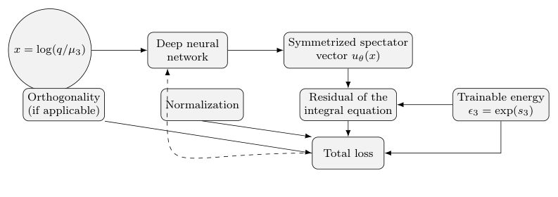
<figcaption class="paper-figure-caption"><b>Fig 1.</b> FIG. 1. Schematic representation of the DNN solver for the subtracted Faddeev integral equation. The logarithmic momentum x = log(q/µ3) is fed into a feed-forward neural network, which outputs the symmetrized spectator vector uθ(x). The binding energy ϵ3 = exp(s3), with s3 = log ϵ3, is a trainable parameter and enters the residual of the discretized integral equation. The total loss combines the equation-informed residual with normalization and, when required, orthogonality constraints. The dashed feedback arrow indicates that gradients flow back through the kernel B(ϵ3, 1/a) to both the network weights θ and the energy parameter s3.</figcaption>
</figure>
<figure class="paper-figure-card">
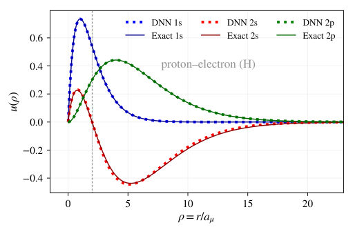
<figcaption class="paper-figure-caption"><b>Fig 2.</b> FIG. 2. The DNN curves closely follow the analytical results; the 2s node at ρ = 2 is correctly captured.</figcaption>
</figure>
<figure class="paper-figure-card">
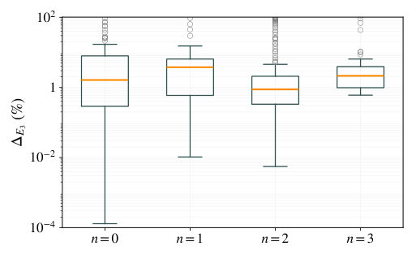
<figcaption class="paper-figure-caption"><b>Fig 3.</b> FIG. 4. DNN–deterministic relative deviation ∆E3, Eq. (21), for the first four three-body bound states. The boxplot shows the distribution of ∆E3 over all values of 1/a for which the DNN was continued. The deterministic benchmark is a nu- merical reference obtained from the same discretized kernel, not an exact analytical solution.</figcaption>
</figure>
<figure class="paper-figure-card">
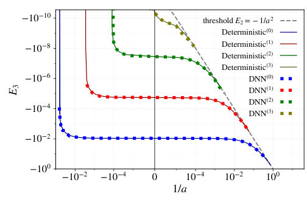
<figcaption class="paper-figure-caption"><b>Fig 4.</b> FIG. 3. Efimov spectrum E3 as a function of the inverse scattering length for the first four three-body bound-state branches. Solid curves denote the deterministic solution obtained by diagonalizing the discretized subtracted kernel. Dotted curves denote the DNN continuation with trainable energy. The gray dashed line marks the atom-dimer thresh- old E2 = −1/a2 in the units used here (ℏ= m = µ3 = 1). The unitary limit is indicated by the vertical black line.</figcaption>
</figure>
<figure class="paper-figure-card">
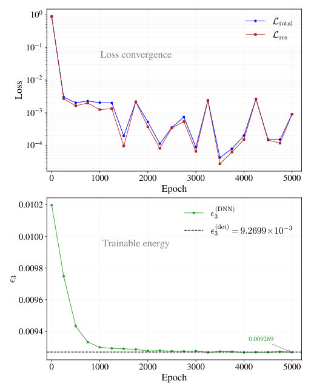
<figcaption class="paper-figure-caption"><b>Fig 5.</b> FIG. 5. Training convergence of the DNN solver for the Efimov ground state at unitarity. (a) Residual loss Lres (red squares) and total loss Ltotal (blue circles) vs. epoch. (b) Trainable binding-energy parameter ϵ(DNN) 3 vs. epoch; the dashed line marks the deterministic reference ϵ(det) 3 = 9.2699 × 10−3.</figcaption>
</figure>

**Summary.** The authors apply Deep Neural Networks (DNNs) to solve the three-body Faddeev integral equation for bosons near the Efimov regime. By minimizing the residual of the discretized equation while treating the binding energy as a trainable parameter, they create a compact and differentiable representation of the solution. This method successfully reproduces universal physical constants and allows for smooth continuation of the spectrum across varying interaction strengths.

**Why it may be interesting.** This work demonstrates a powerful application of machine learning—using differentiable physics constraints (residual minimization) to solve complex, non-linear few-body quantum problems that are analytically intractable or numerically demanding.

Detailed structure

**Main problem.** The paper addresses the challenge of solving the three-body Faddeev integral equation for identical bosons near the Efimov limit, a problem characterized by scale invariance and renormalization.

**Main result.** A Deep Neural Network (DNN) trained via residual minimization successfully reproduces known universal physics, such as the Efimov ground-state binding scale at unitarity with high accuracy.

**Method.** The core method involves using a DNN ansatz to represent the spectator vector solution of the discretized integral equation, minimizing the residual loss while jointly training the three-body binding energy parameter.

**Model / system.** The system is three identical bosons interacting via a zero-range s-wave force. The physics is governed by the subtracted spectator Faddeev integral equation, which requires renormalization due to ultraviolet divergences.

**Key observables.** Three-body binding energy ($\epsilon_3$), Efimov scaling ratios ($\epsilon(n)/\epsilon(n+1)$), and the dependence of these quantities on the inverse scattering length ($1/a$).

**Important parameters / regimes.** The three-body binding scale ($\epsilon_3$) is a trainable parameter, and the system is analyzed across varying $1/a$, including the unitary limit ($1/a=0$).

**Assumptions / limitations.** The method assumes that the solution can be represented by a DNN ansatz and relies on comparing results against deterministic diagonalization as an *a posteriori* benchmark.

**Figures summary.** Figures compare DNN solutions to exact radial wave functions for Hydrogen benchmarks, plot the continuation of $E_3$ vs. $1/a$, and show training convergence plots for the residual loss and energy parameter.

**Paper structure.** The paper first establishes the physical problem (Faddeev equation near Efimov limit), details the DNN formulation using residual minimization with a trainable energy, validates this approach on the Hydrogen atom benchmark, and finally applies it to trace the universal Efimov spectrum across varying scattering lengths.

Abstract

We apply a deep-neural-network (DNN) ansatz to the symmetrized spectator vector of the subtracted three-body Faddeev integral equation for identical bosons near the Efimov limit. The network is trained by minimizing the residual of the discretized integral equation, while the positive binding scale associated with the three-body energy is treated as a trainable parameter. Deterministic diagonalization of the same discretized kernel is used only as an a posteriori numerical benchmark. As preliminary validation, the neural-solver strategy is tested on the analytically solvable hydrogen radial problem. At unitarity, the DNN reproduces the Efimov ground-state binding scale with a DNN--deterministic deviation of $0.022\%$, while the first excited state is recovered to $0.002\%$. The deterministic solver recovers the universal Efimov scaling ratio $e^{2π/s_0}\simeq 515.03$, and the neural method traces the bound-state branches as a function of the inverse scattering length $1/a$ by continuation from the unitary solution. These results indicate that DNN-based residual minimization can provide a compact and differentiable representation of a renormalized few-body integral-equation solution in a regime governed by discrete scale invariance.

[↑ back to top](#top)

### [Quantum Colorings of Spheres](http://arxiv.org/abs/2606.10872v1)

**Authors:** Olivier Lalonde  
**Type:** theory · **Category:** quantum information and computing · **PDF:** <https://arxiv.org/pdf/2606.10872v1>  
**Analysis basis:** full PDF text, analyzed in chunks
**Topic relevance:** `entanglement & information structure` **1/5**

↔ Scroll figures horizontally

<figure class="paper-figure-card">
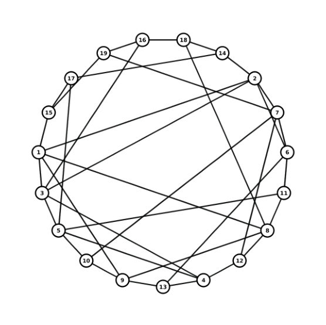
<figcaption class="paper-figure-caption"><b>Fig 1.</b> Figure 1: The graph G19. The graph6 representation of this graph is RxLAKA@AgYAWDGO?O?@??A?W@@OC@ .</figcaption>
</figure>
<figure class="paper-figure-card">
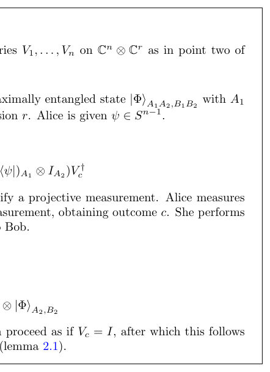
<figcaption class="paper-figure-caption"><b>Fig 2.</b> Figure 2: The exact remote state preparation protocol proving corollary 1.12.</figcaption>
</figure>
<figure class="paper-figure-card">
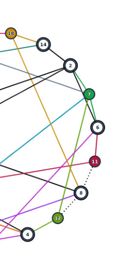
<figcaption class="paper-figure-caption"><b>Fig 3.</b> Figure 3: An alternative representation of the graph G19, used in the proof of theorem 4.5.</figcaption>
</figure>

**Summary.** This paper tackles the problem of determining when the quantum chromatic number of spheres equals their dimension. It achieves this by developing advanced techniques rooted in Clifford algebra representations and analyzing algebraic constraints derived from graph homomorphisms. The results provide precise classification theorems, linking quantum colorability to the existence of Hadamard matrices and demonstrating applications in quantum communication protocols.

**Why it may be interesting.** The deep connection drawn between quantum information theory (remote state preparation, error correction codes) and classical combinatorial problems (graph coloring) provides a powerful theoretical framework for understanding resource limitations in quantum computation.

Detailed structure

**Main problem.** The paper investigates determining the quantum chromatic number of spheres ($\chi_q(S^{n-1})$) and establishing necessary and sufficient conditions for this number to equal the dimension $n$. It also explores generalizations involving rank-$r$ colorings.

**Main result.** It establishes that $\chi_q(S^{n-1}) = n$ if and only if $n \in \{2, 4, 8\}$ in the rank-one case, linking this to the existence of Hadamard matrices. Furthermore, it provides an exact remote state preparation protocol for real qubits.

**Method.** The analysis heavily relies on representation theory applied to Clifford algebras, analyzing unitary representations and projectors derived from graph homomorphisms between spheres and Grassmannians. Proofs involve algebraic constraints derived from these quantum structures.

**Model / system.** The primary model is the quantum coloring of spheres ($S^{n-1}_F$), where $F$ can be $\mathbb{R}$ or $\mathbb{C}$. The mathematical machinery involves analyzing $*$-subalgebras generated by unitaries representing Clifford algebras on $m$ generators.

**Key observables.** Quantum Chromatic Number ($\chi_q(G)$), Orthogonal Rank ($\xi_R, \xi_C$), and the existence of specific unitary representations or maximal code spaces ($P$).

**Important parameters / regimes.** The dimension $n$, the rank $r$ of the coloring, and the order of potential Hadamard matrices.

**Assumptions / limitations.** The analysis often assumes finite dimensionality for the underlying Hilbert space and relies on establishing equivalences between quantum colorability conditions and algebraic properties of unitaries.

**Figures summary.** Figure 2 illustrates an exact remote state preparation protocol used to prove a key corollary regarding real-valued states, demonstrating resource efficiency in quantum communication.

**Paper structure.** The paper progresses by first establishing known results for small dimensions (like $n=2, 4, 8$), then proving the necessity of using real representations over complex ones. It develops algebraic machinery based on Clifford algebras and graph homomorphisms to derive necessary and sufficient conditions for $\chi_q(S^{n-1}) = n$.

Abstract

Cameron, Montanaro, Newman, Severini and Winter gave a construction which shows that, for $n \in \{2,4,8\}$, any graph $G$ which admits a real $n$-dimensional orthogonal representation is quantumly $n$-colorable. This result can be recast as the statement that the real sphere $S^{n-1}$ is quantumly $n$-colorable for these values of $n$. We investigate possible extensions of their construction. We first show that their hypothesis that the orthogonal representation be real-valued is required by proving that there is no analogue of this for the complex spheres, which all have quantum chromatic number strictly bigger than the dimension except in two dimensions. We also provide candidate finitary witnesses of this and show for the first time that the real and complex orthogonal ranks are distinct as a byproduct. For the real case, we show that if $S^{n-1}$ is quantumly $n$-colorable, then either $n=2$ or $n$ is a multiple of 4, and show that the converse holds whenever a Hadamard matrix of order $n$ exists. Hence, assuming the Hadamard conjecture, this completely classifies the dimensions to which the CMNSW construction can be extended. Our method of proof involves showing the equivalence between the existence of such a construction and the existence of a maximal code space for Clifford-algebraic errors given a clean ancilla, and we believe that the representation-theoretic techniques we use for tackling the latter problem could be of independent interest. It also follows from this equivalence that $S^{n-1}$ admits a rank-one quantum $n$-coloring if and only if $n \in \{2,4,8\}$, thereby settling a conjecture of Zeng and Zhang, as does the fact that for all $m \geq 1$, there exists a catalytic zero-error remote state preparation protocol for real $m$-qubit states with $m$ bits of communication and which consumes $m$ ebits.

[↑ back to top](#top)

### [Schmidt Decomposition-Based Methods for Efficient Quantum Image Encoding](http://arxiv.org/abs/2606.10874v1)

**Authors:** Ana-Maria Pangeva, Yassine Ferhi, Alexander Geng, Andreas Weinmann, Desislava Ivanova, Ali Moghiseh  
**Type:** theory · **Category:** quantum information and computing · **PDF:** <https://arxiv.org/pdf/2606.10874v1>  
**Analysis basis:** full PDF text, analyzed in chunks
**Topic relevance:** `entanglement & information structure` **1/5**

↔ Scroll figures horizontally

<figure class="paper-figure-card">
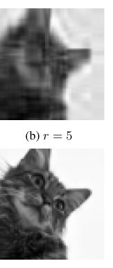
<figcaption class="paper-figure-caption"><b>Fig 1.</b> Figure 2: FRQI reconstructions for increasing Schmidt ranks r.</figcaption>
</figure>
<figure class="paper-figure-card">
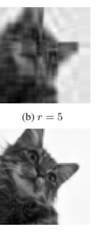
<figcaption class="paper-figure-caption"><b>Fig 2.</b> Figure 3: QPIE reconstructions for increasing Schmidt ranks r.</figcaption>
</figure>
<figure class="paper-figure-card">
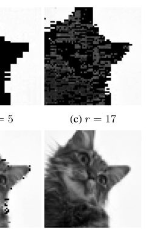
<figcaption class="paper-figure-caption"><b>Fig 3.</b> Figure 4: NEQR reconstructions for increasing Schmidt ranks r.</figcaption>
</figure>
<figure class="paper-figure-card">
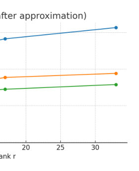
<figcaption class="paper-figure-caption"><b>Fig 4.</b> Figure 5: CNOT count vs. Schmidt rank (log scale) after applying Low-Rank Approximation (LRA).</figcaption>
</figure>
<figure class="paper-figure-card">
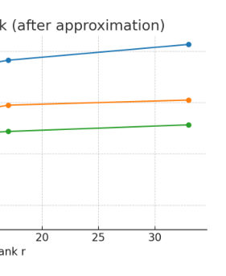
<figcaption class="paper-figure-caption"><b>Fig 5.</b> Figure 6: Circuit depth vs. Schmidt rank (log scale).</figcaption>
</figure>

**Summary.** This paper tackles the challenge of implementing complex quantum image encoding protocols on limited NISQ hardware. The authors propose using Low-Rank Approximation based on Schmidt decomposition to compress the required quantum state representation. This technique successfully reduces circuit depth and gate counts across multiple established models while preserving high levels of image reconstruction accuracy.

**Why it may be interesting.** This work directly addresses the resource bottleneck in quantum machine learning/signal processing by providing a mathematically grounded technique to simplify state preparation circuits, which is crucial for advancing practical QIP algorithms on NISQ devices.

Detailed structure

**Main problem.** Existing quantum image encoding methods for Quantum Image Processing (QIP) create circuits that are too deep, complex, and resource-intensive for current Noisy Intermediate-Scale Quantum (NISQ) hardware.

**Main result.** Applying Low-Rank Approximation (LRA) via Schmidt decomposition significantly reduces circuit depth (e.g., 97% reduction in FRQI) while maintaining near-perfect image reconstruction fidelity.

**Method.** The authors use the Schmidt decomposition to express the quantum state and then truncate this representation to a low rank, effectively keeping only the most significant entanglement components.

**Model / system.** The study analyzes three existing QIP encoding models: FRQI, QPIE, and NEQR. These methods encode classical grayscale image data into high-dimensional quantum states $|\psi
angle$.

**Key observables.** Circuit depth, CNOT count, Mean Squared Error (MSE), and visual quality of reconstructed images.

**Important parameters / regimes.** The Schmidt rank ($r$) used for truncation is the key parameter varied to balance resource efficiency against reconstruction accuracy.

**Assumptions / limitations.** The primary assumption is that natural images are compressible in the Schmidt basis, allowing low-rank approximation to preserve essential information while drastically reducing circuit overhead.

**Figures summary.** Figures illustrate reconstructions at varying ranks for FRQI, QPIE, and NEQR. Tables compare resource metrics (depth, CNOTs) across models before and after LRA. Plots show the relationship between rank and complexity/error.

**Paper structure.** The paper introduces the problem of resource-intensive QIP encoding, details the Schmidt decomposition and LRA technique, compares its application across FRQI, QPIE, and NEQR using quantitative metrics (depth, CNOTs, MSE), and concludes by demonstrating the feasibility of low-rank methods for near-term hardware.

Abstract

In quantum image processing, a fundamental step is encoding classical image data into quantum states. This can be achieved using methods such as Flexible Representation of Quantum Images (FRQI), Quantum Probability Image Encoding (QPIE), and Novel Enhanced Quantum Representation (NEQR). However, on real quantum hardware, these encodings can quickly lead to circuits with many gates, large circuit depth, and high qubit usage, which is a problem for Noisy Intermediate-Scale Quantum (NISQ) devices. In this work, we investigate whether low-rank state approximation, formulated via Schmidt decomposition, can help reduce this complexity. The method keeps only the most significant parts of a quantum state's entanglement structure, making state preparation more efficient while preserving most of the image information. We compare the three encoding techniques in their original form and with low-rank approximation, evaluating metrics such as circuit depth, CNOT count, MSE, and visual quality of reconstructed images. The results reveal meaningful trade-offs between accuracy and resource efficiency, with the FRQI model achieving a 97 percent reduction in circuit depth while maintaining a near-perfect reconstruction (MSE of about 0.27). This demonstrates the potential of low-rank techniques for advancing practical quantum image processing on near-term hardware.

[↑ back to top](#top)

### [The UZH protocol: Separating errors and constructing improved CP2K basis sets and pseudopotentials](http://arxiv.org/abs/2606.11064v1)

**Authors:** Hossein Mirhosseini, Tiziano M. A. Müller, Matthias Krack, Thomas D. Kühne, Jürg Hutter  
**Type:** theory · **Category:** other · **PDF:** <https://arxiv.org/pdf/2606.11064v1>  
**Analysis basis:** full PDF text, analyzed in chunks
**Topic relevance:** `Keldysh / 2PI / non-Gaussian methods` **1/5**

↔ Scroll figures horizontally

<figure class="paper-figure-card">

<figcaption class="paper-figure-caption"><b>Fig 1.</b> FIG. 1. Error decomposition in the UZH protocol. CP2K- GTH-UZH compared with SIRIUS-FP-LAPW gives the total practical error. CP2K-GTH-UZH compared with SIRIUS- GTH-UZH isolates the Gaussian-basis contribution. SIRIUS- GTH-UZH compared with SIRIUS-FP-LAPW isolates the pseudopotential contribution.</figcaption>
</figure>
<figure class="paper-figure-card">
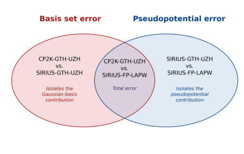
<figcaption class="paper-figure-caption"><b>Fig 2.</b> Figure 1 summarizes this diagnostic construction and shows which pairwise comparison yields the total, Gaussian-basis, and pseudopotential contributions. In practice, the comparisons are performed not at a single volume but over equation-of-state curves. We use the ε metric of the verification project6,</figcaption>
</figure>
<figure class="paper-figure-card">
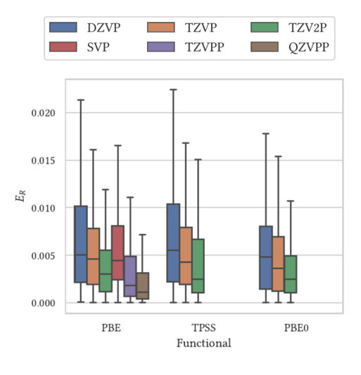
<figcaption class="paper-figure-caption"><b>Fig 3.</b> FIG. 2. Relative bond-length errors for the molecular calibra- tion set. The error is ER = |dCP2K −dG16|/|dG16|, where dG16 is the Gaussian 16/def2-QZVP all-electron reference bond length. DZVP, TZVP, and TZV2P are CP2K/GPW calcula- tions with GTH-UZH pseudopotentials. The PBE, TPSS, and PBE0 panels test transferability across exchange-correlation levels. In the PBE panel, SVP, TZVPP, and QZVPP are CP2K/GAPW all-electron calculations with corresponding UZH-MOLOPT basis sets and provide an internal all-electron CP2K comparison. Outliers are omitted to emphasize median and interquartile behavior.</figcaption>
</figure>
<figure class="paper-figure-card">

<figcaption class="paper-figure-caption"><b>Fig 4.</b> FIG. 3. Relative errors for average molecular polarizabilities, ER = |¯αCP2K −¯αG16|/|¯αG16|, for the PBE and PBE0 subsets. Polarizabilities are the most demanding molecular response test in this set because they require sufficient diffuse flexibil- ity; TPSS data are omitted because this property was not available for the corresponding CP2K calculations.</figcaption>
</figure>
<figure class="paper-figure-card">
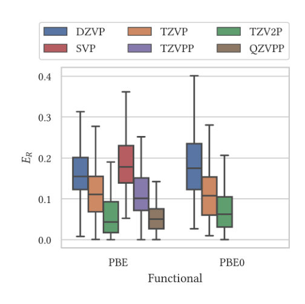
<figcaption class="paper-figure-caption"><b>Fig 5.</b> Figure 4 compares the total practical error of the initial and improved CP2K-GTH-UZH settings relative to the SIRIUS-FP-LAPW reference. In the initial settings, sev- eral elements exhibit ε &gt; 1 for at least two unary struc- tures, including noble gases, some transition metals, and heavier main-group elements. After applying the UZH protocol, the corresponding CP2K-GTH-UZH-improved map is substantially cleaner, with the largest residual deviations confined to a smaller set of chemically inter- pretable cases. The completed map in the lower panel fills entries not recomputed with the improved settings by retaining the corresponding initial values, providing a full-period overview on the same...</figcaption>
</figure>

**Summary.** This paper introduces the UZH protocol, a systematic workflow designed to diagnose and correct numerical errors in Density Functional Theory calculations that combine Gaussian basis sets and pseudopotentials. By comparing results from three different calculation formalisms, it successfully separates the total error into distinct contributions from the basis set and the pseudopotential itself. This constructive approach allows researchers to generate improved, validated parameter files for accurate simulations across various materials.

**Why it may be interesting.** While focused on condensed matter DFT, the rigorous error decomposition technique is a sophisticated example of developing robust computational frameworks, which shares methodological rigor with advanced many-body theory development.

Detailed structure

**Main problem.** Reliable DFT simulations require numerical settings whose residual errors are smaller than the chemical/material trends being studied, which is complicated by combining Gaussian basis sets and pseudopotentials.

**Main result.** The UZH protocol successfully decomposes the total computational error into distinct Gaussian-basis and pseudopotential components, allowing for targeted, constructive revisions to generate validated parameter files.

**Method.** A closed-loop workflow involving a three-way comparison between CP2K calculations, SIRIUS plane-wave calculations, and all-electron references to systematically isolate and correct approximation errors.

**Model / system.** The methodology applies to molecular systems, liquids, and condensed phases simulated using DFT within the CP2K/Quickstep framework, focusing on core-valence interactions.

**Key observables.** Error decomposition ($\Delta_{	ext{basis}}$ vs. $\Delta_{	ext{pp}}$), relative bond-length errors (ER), average molecular polarizabilities ($ar{\alpha}$), and equation-of-state error ($\epsilon$ metric).

**Important parameters / regimes.** Gaussian basis set size (e.g., DZVP to TZV2P), pseudopotential type (GTH), and the condition number of the overlap matrix $\kappa_B(M)$.

**Assumptions / limitations.** The total error is assumed to be a sum of independent contributions from the Gaussian basis approximation and the pseudopotential transferability.

**Figures summary.** Figures compare initial vs. improved total practical errors, showing separation into basis-limited (noble gases) and pseudopotential-limited (transition metals) error sources; Table II guides optimization based on these component comparisons.

**Paper structure.** The paper introduces the problem of combined code discrepancies, details the UZH protocol's three-way comparison methodology, presents molecular calibration benchmarks to guide basis set improvement, and finally applies this systematic diagnosis to solid-state equation-of-state calculations for targeted parameter refinement.

Abstract

Reliable density-functional simulations require numerical settings whose residual errors are smaller than the chemical and materials trends being interpreted. In CP2K/Quickstep, this requirement is complicated by the joint use of atom-centered Gaussian basis sets and norm-conserving pseudopotentials: a code-to-code discrepancy usually contains both contributions. We present the UZH protocol, a closed-loop CP2K workflow that calibrates molecularly optimized Gaussian basis sets on small molecules, validates the resulting settings in unary-crystal equation-of-state benchmarks, identifies whether the limiting approximation is the Gaussian basis or the pseudopotential. The diagnosis is then used to revise the parameter files. The central diagnostic is a three-way comparison between production CP2K-GTH-UZH calculations, SIRIUS calculations using the same Goedecker--Teter--Hutter pseudopotential in a systematic plane-wave representation, and all-electron full-potential linearized augmented-plane-wave SIRIUS references. This construction decomposes the practical CP2K error into a Gaussian-basis component and a pseudopotential component. The protocol distinguishes basis-limited noble-gas and heavy-element cases from pseudopotential-limited transition-metal cases, guides targeted revisions with the CP2K basis and pseudopotential optimizers, and produces improved MOLOPT basis sets and GTH pseudopotentials as explicit outputs of the workflow. The UZH protocol is therefore constructive: it does not merely measure or reduce errors a posteriori, but allows turning verification outliers into validated CP2K parameter files for simulations across molecules and condensed phases.

[↑ back to top](#top)

## Other papers (4)

*Papers from primary archives without highlighted authors or any topic match. Click to expand.*

Show other papers

### [Bosonic Cyclic Codes: Trading Stabilizers for Gaussian Non-Clifford Phase Gates](http://arxiv.org/abs/2606.11010v1)

**Authors:** Owen C. Wetherbee, Yijia Xu, Victor V. Albert, Baptiste Royer, Valla Fatemi  
**Type:** theory · **Category:** quantum information and computing · **PDF:** <https://arxiv.org/pdf/2606.11010v1>  
**Analysis basis:** full PDF text, analyzed in chunks

↔ Scroll figures horizontally

<figure class="paper-figure-card">
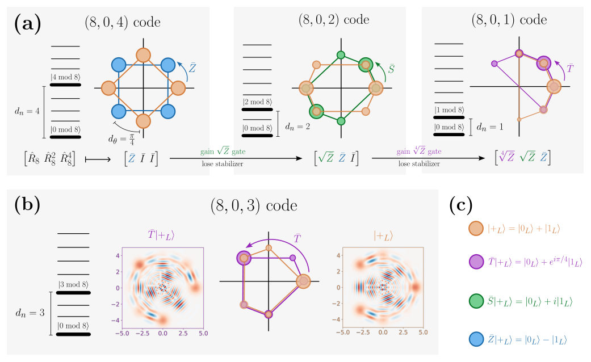
<figcaption class="paper-figure-caption"><b>Fig 1.</b> FIG. 1. Summary of bosonic cyclic codes. (a) Three bosonic cyclic codes which demonstrate the tradeoff between phase- space rotation gates and codespace stabilizers. The three code parameters (S, n0, n1) determine the Fock state periodicity, the |0L⟩Fock support (mod S), and the |1L⟩Fock support (mod S), respectively. The resulting Fock structure of each code is shown on the left of each panel. Ball-and-stick phase-space diagrams of relevant logical states (see (c)) are depicted on the right of each panel to demonstrate the rotation symmetry and gates of each code. The balls correspond to peaks of the Wigner function, with their size indicating the relative amplitude of the peak, and the...</figcaption>
</figure>
<figure class="paper-figure-card">
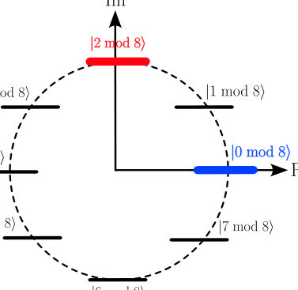
<figcaption class="paper-figure-caption"><b>Fig 2.</b> FIG. 2. Fock-phase diagram for a (S, n0, n1) = (8, 0, 2) code, representing the phase picked up by each |n mod S⟩ parity manifold under a ˆRS rotation. This visualization elu- cidates that this code has a number distance of dn = 2 and phase gate ¯S = ¯Z  π</figcaption>
</figure>
<figure class="paper-figure-card">
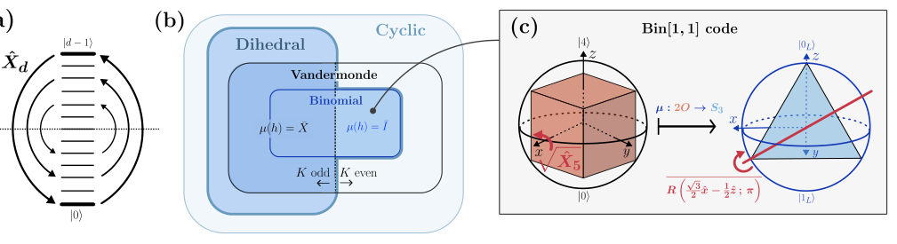
<figcaption class="paper-figure-caption"><b>Fig 3.</b> FIG. 3. Dihedral codes and SU(2) symmetry. (a) Action of the ˆ Xd = exp  −iπ ˆJ(d) x  d-dimensional spin rotation on</figcaption>
</figure>
<figure class="paper-figure-card">
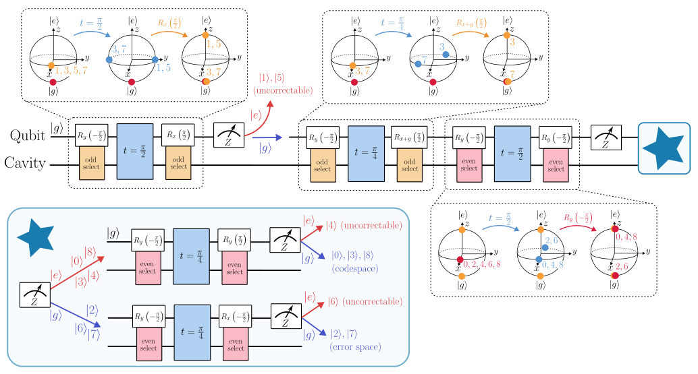
<figcaption class="paper-figure-caption"><b>Fig 4.</b> FIG. 4. Error detection protocol for finite-support (8, 0, 3) code with K = 2. The protocol involves a dispersively coupled qubit-cavity system, with the qubit starting in its ground state |g⟩. A sequence of adaptive RIMs are then performed, using a combination of idle evolutions U = exp (itˆn|e⟩⟨e|) (blue) and selective qubit rotations for the even (red) and odd (yellow) Fock parity manifolds. The evolution of the relevant Fock states around the ancilla Bloch sphere during the first two RIM steps are shown, with the ket notation dropped (i.e. |j⟩→j). A measurement of |e⟩after the first RIM step implies occupation of the Fock state manifold {|1⟩, |5⟩}, corresponding to an uncorrectable...</figcaption>
</figure>
<figure class="paper-figure-card">
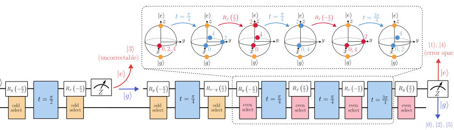
<figcaption class="paper-figure-caption"><b>Fig 5.</b> FIG. 5. Error detection protocol for finite-support (5, 0, 2) code with K = 2. This two-step adaptive RIM sequence involves the same types of operations as in Fig. 4, although with the evolution of the relevant Fock states around the ancilla Bloch sphere only shown for the even-select part of the second RIM step. A measurement of |e⟩after the first RIM step implies occupation of the |3⟩Fock state, corresponding to an uncorrectable error. Following instead a measurement of |g⟩, the more involved second RIM step then distinguishes the codespace {|0⟩, |2⟩, |5⟩} from the error space {|1⟩, |4⟩}, accomplishing the desired POVM and error detection. Note that, as presented, in the second RIM step,...</figcaption>
</figure>

**Summary.** The paper introduces bosonic cyclic codes, a generalization designed to balance error protection against photon loss with the ability to implement diverse logical gates. By developing a 'stabilizer-to-gate paradigm,' the authors show how sacrificing some error resilience can unlock multiple non-Clifford phase gates using passive Gaussian operations. This advances the theoretical understanding of fault tolerance in bosonic quantum memory systems.

**Why it may be interesting.** This work is highly relevant as it directly addresses the fundamental engineering challenge in quantum computing: achieving universal gate sets while maintaining high levels of fault tolerance in physical bosonic hardware platforms.

Detailed structure

**Main problem.** The core challenge is developing bosonic quantum error correction codes that can balance robust protection against physical errors (like photon loss) with the ability to implement a wide variety of fault-tolerant logical gates, especially non-Clifford phase gates.

**Main result.** Bosonic cyclic codes provide a general framework allowing for a measurable tradeoff between error protection and gate count; this enables the realization of multiple non-Clifford gates using passive Gaussian rotations.

**Method.** The authors generalize rotation-symmetric codes to bosonic cyclic codes, analyzing their structure via Fock state supports and developing protocols that convert high-order stabilizers into logical phase gates.

**Model / system.** The system is modeled using bosonic modes (Fock states) in the context of quantum error correction. The theory focuses on constructing and analyzing 'bosonic cyclic codes' as generalizations of known families like cat and binomial codes.

**Key observables.** Error distances ($d_n$ for photon loss, $d_	heta$ for phase rotation), logical Pauli gates ($ar{Z}, ar{X}$), and the ability to generate non-Clifford phase gates (e.g., $ar{T}$).

**Important parameters / regimes.** Code parameters $(S, n_0, n_1)$, photon loss distance $d_n$, rotation angle periodicity $2\pi/S$, and coupling strengths ($\chi, \Omega$).

**Assumptions / limitations.** The analysis often relies on specific mathematical structures (e.g., disjoint alternating Fock support for Vandermonde codes) and approximations regarding error detection protocols (e.g., using POVMs combining RIM).

**Figures summary.** Figures illustrate the concept of the tradeoff between gate capability and error protection, showing diagrams of logical states under rotation ($\hat{R}_S$) and detailing multi-step adaptive Ramsey Interferometry Measurement (RIM) sequences for error detection in specific code examples.

**Paper structure.** The paper progresses by first defining bosonic cyclic codes as a generalization of existing structures. It then analyzes the trade-off between error distances ($d_n$ vs $d_	heta$) and introduces generalized codes (cyclic cat/Vandermonde). Subsequent sections detail advanced techniques, including realizing $	ext{SU}(2)$ symmetries, developing specific error detection protocols using RIM, and formalizing a 'stabilizer-to-gate paradigm' for constructing new logical gates.

Abstract

Bosonic codes offer hardware-efficient approaches to quantum error correction, with the best encodings offering effective protection of idle quantum information against loss and dephasing - particularly rotation-symmetric codes, which include the cat and binomial code families. However, rotation-symmetric codes are only naturally endowed with a single logical Pauli gate, while other logical gates require the use of non-linear operations, obstructing the utility of these codes for realizing quantum algorithms. Here, we balance error protection with controllability by introducing bosonic cyclic codes: a generalization of rotation-symmetric codes that enable the measured tradeoff of error protection properties for fault-tolerant logical phase gates. Through our general construction, we find that sacrificing the detectability of a single photon loss relative to a rotation-symmetric code can yield a number of logical phase gates commensurate with the original rotation symmetry order of the code, all achievable via passive Gaussian rotations. Giving the corresponding generalizations of cat and binomial codes - which we dub cyclic cat and Vandermonde codes, respectively - we further find that many of the desirable properties of these codes transfer to the bosonic cyclic code setting. We go on to discuss the larger $SU(2)$ symmetry and rotation gates of the codes, which yield additional stabilizers and logical Pauli gates, as well as new non-Clifford gates for the smallest `kitten' binomial code, and provide a new error detection protocol. Finally, we introduce a general paradigm for converting higher-order stabilizers to logical gates, as in our generalization of rotation-symmetric codes, and apply it to several multimode bosonic codes.

[↑ back to top](#top)

### [The Yang-Baxter Equation for the Chiral Potts Model and Integrable Parafermions](http://arxiv.org/abs/2606.11146v1)

**Authors:** Zhao Zhang  
**Type:** theory · **Category:** statistical mechanics · **PDF:** <https://arxiv.org/pdf/2606.11146v1>  
**Analysis basis:** full PDF text, analyzed in chunks

↔ Scroll figures horizontally

<figure class="paper-figure-card">
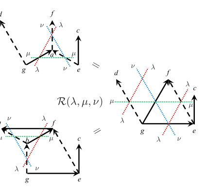
<figcaption class="paper-figure-caption"><b>Fig 1.</b> Figure 2: Graphical derivation of the YBE (51) using the STRs (52). Solid lines de- note the BWs W on horizontal bonds, dashed lines denote the BWs W on vertical bonds, and red, green, and blue dotted lines denote respectively the spectral param- eters λ,µ,ν.</figcaption>
</figure>
<figure class="paper-figure-card">
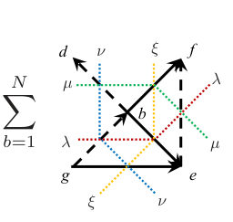
<figcaption class="paper-figure-caption"><b>Fig 2.</b> Figure 3: Diagrammatic representation of the star-star relation (56) that underpins the YBE (55). Solid (resp. dashed) lines denote the BWs W on horizontal bonds (resp. W on vertical bonds), and spectral parameters ξ,λ,µ,ν are marked by yellow, red, green and blue dotted lines respectively.</figcaption>
</figure>
<figure class="paper-figure-card">
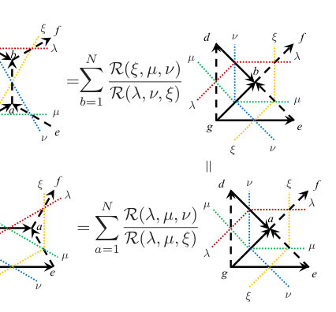
<figcaption class="paper-figure-caption"><b>Fig 3.</b> Figure 4: Diagrammatic proof of the star-star relation (56) using the STRs (52).</figcaption>
</figure>

**Summary.** The paper develops an advanced theory for the Yang-Baxter Equation governing the Chiral Potts Model and related parafermionic chains. It constructs a novel R-matrix dependent on three spectral parameters, demonstrating how onsite potentials modify integrability structures. This advances the understanding of exactly solvable quantum many-body systems in statistical mechanics.

**Why it may be interesting.** This work provides a deep theoretical understanding of integrability in complex quantum spin systems (like CPM), offering mathematical tools (three-parameter R-matrices) applicable to modeling exotic quantum phases beyond simple nearest-neighbor interactions.

Detailed structure

**Main problem.** The core problem is constructing a novel Yang-Baxter Equation (YBE) for R-matrices parameterized by three spectral parameters, extending integrability methods from vertex/edge models.

**Main result.** A new YBE structure is derived for the Chiral Potts Model (CPM), showing how onsite potentials contribute an extra spectral parameter to the R-operator beyond standard nearest-neighbor interactions.

**Method.** The derivation uses functional equations, star-triangle and star-star relations, and techniques involving elliptic functions and parafermion operators to ensure consistency with integrability conditions.

**Model / system.** The study focuses on integrable lattice models, specifically the Chiral Potts Model (CPM), which generalizes the Ising model. The analysis involves constructing R-matrices and Boltzmann weights for these quantum spin chains.

**Key observables.** Boltzmann Weights ($W_n$), R-matrix elements $R(\lambda, \mu, 
u)$, and the Hamiltonian structure derived from the transfer matrix.

**Important parameters / regimes.** Three spectral parameters ($\lambda, \mu, 
u$) are central; coupling constants like onsite potential strength ($U$) and temperature/inverse temperature ($\kappa$) govern the physics.

**Assumptions / limitations.** The analysis assumes that integrability can be characterized by satisfying generalized Yang-Baxter or star-star relations, extending known results from simpler models to parafermionic systems.

**Figures summary.** Figures illustrate diagrammatic proofs of the star-star relation using star-triangle transformations and show the graphical structure of the YBE for the CPM.

**Paper structure.** The paper builds by first establishing the general framework relating R-matrices to Boltzmann weights, then deriving specific functional forms for these weights in the CPM, verifying the consistency via the star-star relation, and finally generalizing the Hamiltonian description using parafermion operators.

Abstract

A new type of Yang-Baxter equation (YBE) for $R$-matrices parameterized by three spectral parameters is constructed from the star-triangle and star-star relations for the chiral Potts model. As the $Z_N$ symmetric generalization to the Ising model, its Boltzmann weights are known to depend on two variables describing a curve with genus larger than one for $N>2$, except for the self-dual point corresponding to the Fateev-Zamolodchikov chain. This combined with the fact that the quantum Hamiltonians of edge models like Ising contain both nearest neighbor interaction and onsite potential terms results in the extra spectral parameter of the $R$-operator. My construction extends the recent unification of solvable edge and vertex models which recasts Onsager's star-triangle relation from a mere alternative form of the YBE for edge models to its underlying ingredient.

[↑ back to top](#top)

### [Trainability of IQP Quantum Circuit Born Machines Under Gaussian Initialization](http://arxiv.org/abs/2606.10179v1)

**Authors:** Gennaro De Luca  
**Type:** theory · **Category:** quantum information and computing · **PDF:** <https://arxiv.org/pdf/2606.10179v1>  
**Analysis basis:** full PDF text, analyzed in chunks

↔ Scroll figures horizontally

<figure class="paper-figure-card">
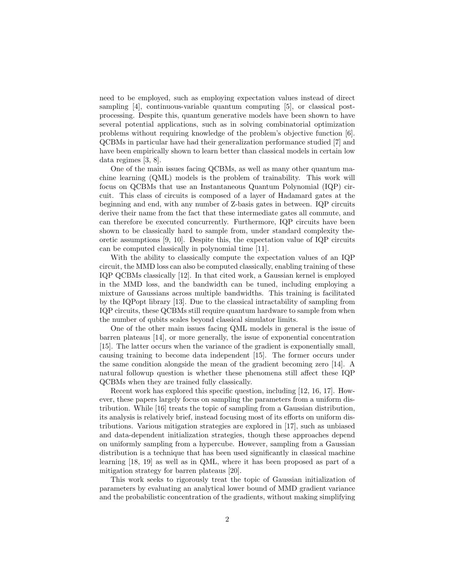
<figcaption class="paper-figure-caption"><b>Fig 1.</b> Low-resolution page preview, page 2</figcaption>
</figure>
<figure class="paper-figure-card">
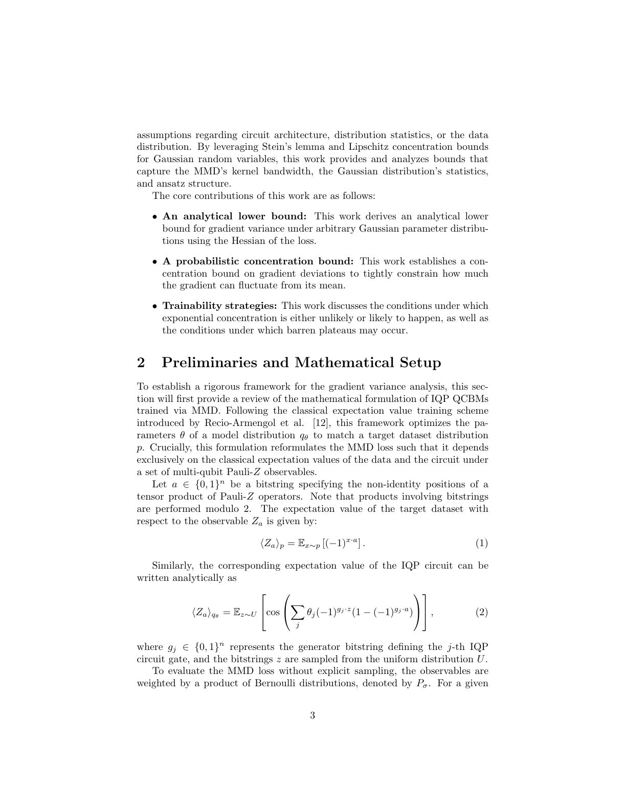
<figcaption class="paper-figure-caption"><b>Fig 2.</b> Low-resolution page preview, page 3</figcaption>
</figure>
<figure class="paper-figure-card">
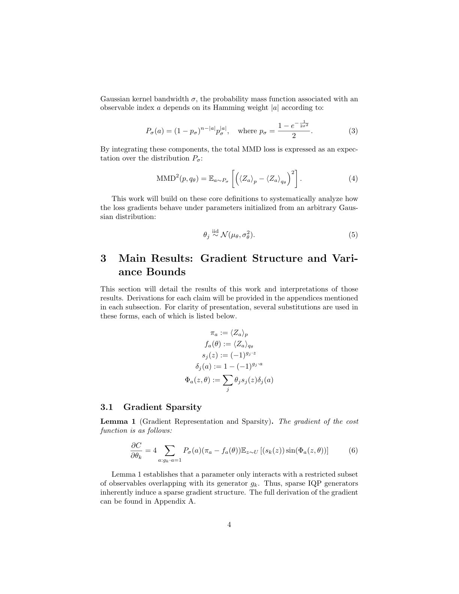
<figcaption class="paper-figure-caption"><b>Fig 3.</b> Low-resolution page preview, page 4</figcaption>
</figure>
<figure class="paper-figure-card">
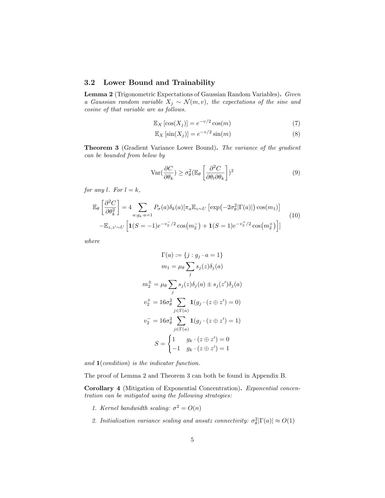
<figcaption class="paper-figure-caption"><b>Fig 4.</b> Low-resolution page preview, page 5</figcaption>
</figure>
<figure class="paper-figure-card">
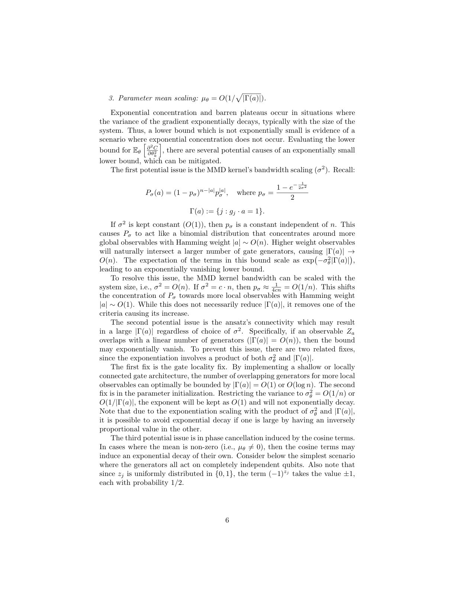
<figcaption class="paper-figure-caption"><b>Fig 5.</b> Low-resolution page preview, page 6</figcaption>
</figure>

**Summary.** This paper provides a deep theoretical analysis into the trainability of Quantum Circuit Born Machines by bounding the variance and concentration of their gradients. It uses advanced tools from probability theory, such as Stein's lemma, to derive necessary scaling conditions on initialization parameters ($\sigma^2$, $\sigma_	heta^2$) that must be met to prevent gradient vanishing in quantum machine learning models.

**Why it may be interesting.** The rigorous mathematical analysis of gradient behavior under specific initialization schemes is crucial for developing practical, scalable quantum machine learning algorithms that can overcome theoretical barriers like barren plateaus.

Detailed structure

**Main problem.** The paper addresses the trainability issues, such as exponential concentration of gradients or barren plateaus, encountered when training Quantum Circuit Born Machines (QCBMs) using IQP circuits initialized with arbitrary Gaussian parameters.

**Main result.** It derives analytical lower bounds for the gradient variance and establishes probabilistic concentration bounds, providing concrete scaling rules ($\sigma^2 = O(n)$, $\sigma_	heta^2 |\Gamma(a)| \approx O(1)$) to mitigate these exponential decay issues.

**Method.** The analysis employs Stein's lemma and Lipschitz concentration bounds tailored for Gaussian random variables to rigorously bound the variance and deviation of the gradient calculated from the MMD loss function.

**Model / system.** The model is a QCBM trained via MMD loss using IQP circuits. The training process involves calculating expectation values $\langle Z_a 
angle_{q_	heta}$ which depend on parameters $	heta$ initialized from a Gaussian distribution $N(\mu_	heta, \sigma^2_	heta)$.

**Key observables.** Gradient variance ($	ext{Var}(\partial C / \partial 	heta_k)$), gradient deviation bounds, and expectation values of Pauli-Z observables ($\langle Z_a 
angle$).

**Important parameters / regimes.** MMD kernel bandwidth ($\sigma^2$), initialization variance ($\sigma_	heta^2$), ansatz connectivity measure ($|\Gamma(a)|$), and parameter mean ($\mu_	heta$).

**Assumptions / limitations.** The analysis heavily relies on the assumption of Gaussian initialization for parameters $	heta$ and utilizes Stein's Lemma to derive bounds.

**Paper structure.** The paper progresses by first reformulating the cost function, then deriving explicit expressions for the gradient and Hessian components using expectation identities. It culminates in applying concentration inequalities (like those derived from Gaussian properties) to establish necessary scaling conditions on $\sigma^2$, $\sigma_	heta^2$, and $\mu_	heta$ to maintain non-vanishing gradients.

Abstract

Quantum Circuit Born Machines (QCBMs) offer a natural approach to generative machine learning by leveraging the Born rule. Recent work has provided a method to classically train QCBMs with Instantaneous Quantum Polynomial (IQP) circuits via the Maximum Mean Discrepancy (MMD) loss. Despite the assumed intractability of sampling from IQP circuits classically, their expectation values can be computed classically, enabling training of these IQP QCBMs. However, quantum machine learning (QML) models have various other challenges, including trainability issues caused by exponential concentration or barren plateaus. While these issues have been explored for parameters sampled from a uniform distribution, little work has been done to rigorously treat the use of arbitrary Gaussian initialization schemes. This work leverages Stein's lemma and Lipschitz concentration bounds for Gaussian random variables to provide an analytical lower bound of the variance of the gradient and a probabilistic concentration bound of the deviation of the gradient from its mean. It discusses strategies to either avoid or encourage exponential concentration, as well as the conditions under which barren plateaus are more likely to occur.

[↑ back to top](#top)

### [Variational Approach for Uniform Quantum Permutation Generators](http://arxiv.org/abs/2606.10230v1)

**Authors:** Farzam Nosrati, Nicolás Borrajo, Antonio Fernández Anta, Vincenzo Mancuso  
**Type:** theory · **Category:** quantum information and computing · **PDF:** <https://arxiv.org/pdf/2606.10230v1>  
**Analysis basis:** full PDF text, analyzed in chunks

↔ Scroll figures horizontally

<figure class="paper-figure-card">
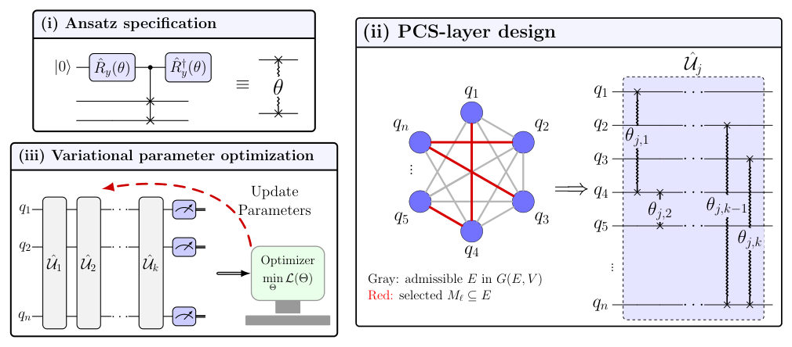
<figcaption class="paper-figure-caption"><b>Fig 1.</b> FIG. 1. Three-stage variational quantum-circuit construction for uniform permutation generation. (i) Each candidate swap ˆUi j is realized by a parameterized controlled-SWAP (PCS) gate, with the control qubit prepared by ˆRy(θ). (ii) The PCS-layer architecture is determined by an interaction graph G = (V, E); at each layer ℓ, an ordered subset Mℓ⊆E is chosen to specify the active PCS operations. Gray edges represent admissible interactions, and red edges the selected ones. (iii) For the fixed layered architecture, the variational parameters are optimized by minimizing L(Θ), so that the resulting channel approximates the target uniform permutation map.</figcaption>
</figure>
<figure class="paper-figure-card">
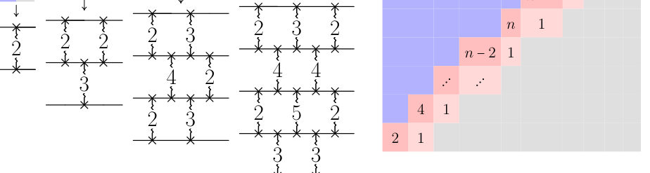
<figcaption class="paper-figure-caption"><b>Fig 2.</b> FIG. 2. Recursive construction of the non-swap probability matrices Mn and their corresponding linear-topology circuits. (Top) Examples for n = 2, 3, 4, 5 are shown. Each Mn is obtained from the upper and lower blocks inherited from Mn−1, shown in blue and gray, together with two newly added anti-diagonals, shown in red. For even n, the numbered anti-diagonal starts with even entries 2, . . . , n followed by odd entries n −1, . . . , 3, while the other anti-diagonal contains only 1s. For odd n, the roles of the two anti-diagonals are interchanged. (Bottom) The associated quantum circuits implementing the same recursive linear topology.</figcaption>
</figure>
<figure class="paper-figure-card">
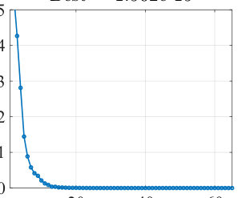
<figcaption class="paper-figure-caption"><b>Fig 3.</b> FIG. 3. Projection-loss optimization for the line-topology PCS ansatz on S 8. The best run over multiple random initializations reaches a residual of order 10−16.</figcaption>
</figure>
<figure class="paper-figure-card">
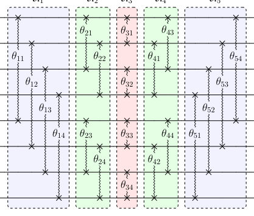
<figcaption class="paper-figure-caption"><b>Fig 4.</b> FIG. 4. Quantum Beneš circuit for n = 8.</figcaption>
</figure>
<figure class="paper-figure-card">
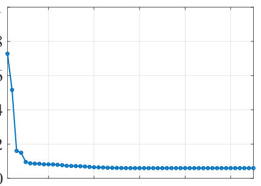
<figcaption class="paper-figure-caption"><b>Fig 5.</b> FIG. 5. Optimization of the projection loss Lproj for the selected PCS swap sequence. The curve shows the best run over multiple random initializations. The finite residual indicates that the ansatz cannot exactly realize the symmetric projector, and therefore does not implement the uniform permutation average over S 8.</figcaption>
</figure>

**Summary.** This paper introduces a variational quantum circuit approach to generate uniform random permutations on $n$ qubits under realistic nearest-neighbor hardware constraints. It successfully constructs an efficient linear-depth circuit achieving exact uniformity, while rigorously proving that other known universal circuits fail this strict requirement.

**Why it may be interesting.** This work provides a concrete, hardware-aware roadmap for implementing fundamental quantum tasks like random sampling, which is crucial for building fault-tolerant quantum algorithms and simulating complex many-body dynamics where connectivity matters.

Detailed structure

**Main problem.** The paper addresses the challenge of implementing uniform random permutation generation over $S_n$ using quantum circuits while respecting physical hardware connectivity constraints.

**Main result.** A variational circuit framework was developed that achieves exact uniformity with linear depth, $O(n)$, on linear nearest-neighbor topologies, significantly improving upon previous all-to-all constructions. Furthermore, it proves that certain architectures (like the quantum Beneš circuit) can realize permutations but fail to generate a uniform distribution.

**Method.** The authors utilize Variational Quantum Circuits (VQC) parameterized by angles ($\Theta$) and optimize them using projection loss functions ($L_{proj}$) to enforce the target state being proportional to the symmetric projector $\Pi_{sym}$.

**Model / system.** The system is a set of $n$ qubits representing subsystems whose permutations are generated by controlled-SWAP gates. The analysis focuses on circuit architectures constrained to linear nearest-neighbor interactions.

**Key observables.** Circuit size (controlled-SWAP count), circuit depth, and the minimization of the projection loss function ($L_{proj}$) towards zero.

**Important parameters / regimes.** The system size $n$, the variational parameters $\Theta$, and the connectivity graph structure (e.g., linear chain).

**Assumptions / limitations.** It is conjectured that exact uniform generation requires circuit size $\Omega(n^2)$ and depth $\Omega(n)$ for local architectures, contrasting with the logarithmic depth of universal but non-uniform circuits.

**Figures summary.** Figures illustrate the three-stage VQC construction (PCS gates in layers), the recursive structure of the linear quantum circuit ($M_n$), and convergence plots showing loss function minimization for different topologies.

**Paper structure.** The paper first establishes the problem using a general variational framework, then details the specific construction for linear nearest-neighbor topology achieving $O(n)$ depth. It contrasts this with the Beneš network, proving its inherent non-uniformity, and concludes by establishing complexity separations between mere realizability and true uniform sampling.

Abstract

Uniform permutation generation is a fundamental task in both classical and quantum computation, with applications ranging from cryptography to quantum optimization and quantum error correction. Existing exact quantum constructions typically require all-to-all qubit connectivity and quadratic circuit depth. We develop a variational quantum circuit framework for uniform permutation generation under connectivity constraints, in which the circuit architecture is determined by the underlying interaction graph and the variational parameters are optimized to enforce the target permutation statistics. In particular, we present explicit controlled-SWAP-based unitary constructions that achieve exact uniformity with quadratic circuit size and linear depth \(O(n)\) on linear nearest-neighbor topologies. Our approach, therefore, removes the need for all-to-all connectivity while improving the depth of previous exact constructions by a factor. We further prove that a quantum Beneš-like architecture is intrinsically non-uniform. Despite its logarithmic depth and ability to realize any permutation it cannot generate a uniform distribution over permutations for any choice of variational parameters. These results clarify the role of circuit topology in exact permutation generation and identify variational quantum circuits as a natural framework for hardware-constrained uniform sampling. More broadly, this work suggests that exact uniform permutation generation is a strictly stronger requirement than mere permutation realizability, and lays the groundwork for a formal complexity separation between the two.

[↑ back to top](#top)

## Secondary cond-mat archives

*Papers from cond-mat.mtrl-sci, mes-hall, other, soft, supr-con. These archives are de-prioritized — they appear at the end regardless of relevance score.*

### Relevant in secondary archives (19)

### [Mean-field models for morphogenetic processes in physiological contexts](http://arxiv.org/abs/2606.10355v1)

**Authors:** D. Hernández, Alejandro Valdés López, E. C. Herrera-Hernández  
**Type:** theory · **Category:** statistical mechanics · **PDF:** <https://arxiv.org/pdf/2606.10355v1>  
**Analysis basis:** full PDF text, analyzed in chunks
**Topic relevance:** 🔥 `non-equilibrium dynamics` **4/5** · `Keldysh / 2PI / non-Gaussian methods` **3/5** · `driven-dissipative phase transition` **3/5** · `methods for driven-dissipative` **3/5** · `non-equilibrium universality` **3/5** · `analog quantum simulation` **2/5** · `correlated / nonlocal dissipation` **2/5** · `Frenkel-Kontorova` **1/5** · `Kondo & dissipative impurity` **1/5** · `correlated cavity matter` **1/5** · `entanglement & information structure` **1/5**

↔ Scroll figures horizontally

<figure class="paper-figure-card">
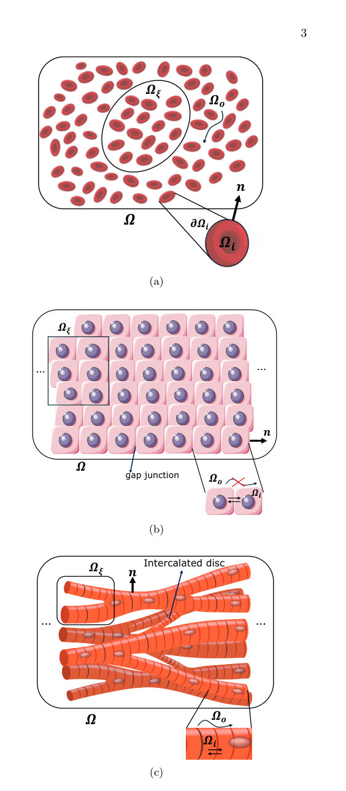
<figcaption class="paper-figure-caption"><b>Fig 1.</b> Figure 1: Tissues visual representation. (a) Non-percolating tissue, e.g. blood; (b) Percolating tissue, e.g. specific types of epithelial tissue; (c) Bi-percolating tissue, e.g. cardiac tissue. In cardiac tissue intercalated discs are specialized structures that includes gap junctions and connect muscle cells [28].</figcaption>
</figure>
<figure class="paper-figure-card">
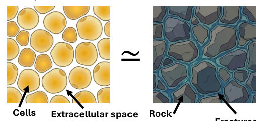
<figcaption class="paper-figure-caption"><b>Fig 2.</b> Figure 2: Schematic analogy between a non-percolating biological tissue composed of discrete cells and a geological double-porosity medium. Cells play the role of the solid matrix, while the interconnected extracellular space corresponds to the fracture network, which governs transport processes.</figcaption>
</figure>
<figure class="paper-figure-card">
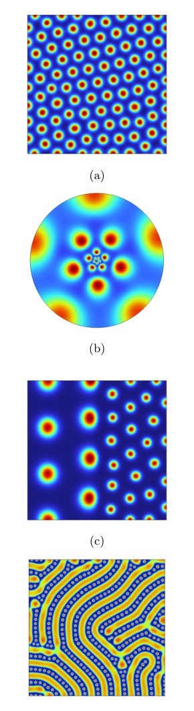
<figcaption class="paper-figure-caption"><b>Fig 3.</b> Figure 3: Examples of Turing patterns with zero flux boundary conditions and different types of spatial heterogeneity. (a) Schnakenberg model on a homogeneous domain as studied in [44]. (b) BVAM model exhibiting self-similar patterns due to radius-dependent diffusion coefficients [42, 45]. (c) Schnakenberg with anisotropic space-dependent reaction kinetics [19]; and (d) Two Brusselator models featuring cubic nonlinear diffusive coupling, as analyzed in [41]. The parameters value for each model and figure are provided in the cited works.</figcaption>
</figure>
<figure class="paper-figure-card">
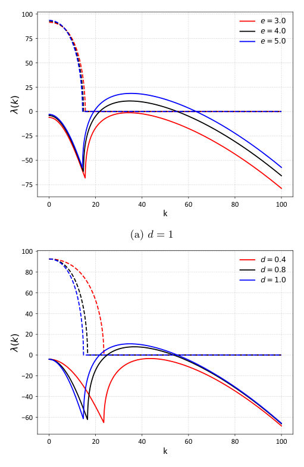
<figcaption class="paper-figure-caption"><b>Fig 4.</b> Figure 4: Real (continuous lines) and imaginary (dashed lines) parts of the dispersion relation for different values of relevant model parameters. For both subfigures, the parameters were a = 0.07, b = 1.34, c = 0.05, γ = 100, du,i = 0.01, dv,i = 0.01, and the fixed point was calculated numerically, coinciding to four significant figures to (u∗ i , v∗ i , u∗ o, v∗ o) = (1.342, 0.741, 0.067, 0.740).</figcaption>
</figure>
<figure class="paper-figure-card">
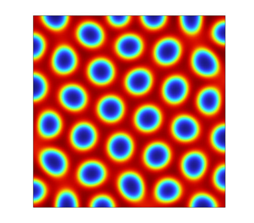
<figcaption class="paper-figure-caption"><b>Fig 5.</b> Figure 5: Example of a Turing pattern under conditions where the activator diffuses faster than the inhibitor (d &lt; 1). The parameters used in the simulation were a = 0.07, b = 1.34, c = 0.05, e = 4, d = 0.8, γ = 100, du,i = 0.01, dv,i = 0.01. Zero-flux boundary conditions were imposed, and the fixed point is (u∗ i , v∗ i , u∗ o, v∗ o) = (1.34288, 0.74123, 0.06712, 0.74039).</figcaption>
</figure>

**Summary.** This work establishes a rigorous biophysical model for morphogen dynamics in tissues by explicitly accounting for tissue compartmentalization and non-equilibrium processes. It uses coupled reaction-diffusion equations to predict pattern formation, showing that structural details can significantly alter the conditions required for classic instabilities like Turing patterns.

**Why it may be interesting.** While focused on biology, the mathematical machinery—analyzing non-equilibrium dynamics via reaction-diffusion systems and pattern formation (Turing mechanisms)—is highly relevant to open quantum systems and complex many-body physics far from equilibrium.

Detailed structure

**Main problem.** To develop a biophysical formalism describing the spatiotemporal evolution of chemical profiles (morphogens) in tissues while accounting for tissue compartmentalization and non-equilibrium maintenance.

**Main result.** The framework successfully models pattern formation, showing that Turing instabilities can occur even when standard conditions are violated (e.g., activator diffusing faster than inhibitor), expanding the parameter space for morphogenesis.

**Method.** Derivation of coupled reaction-diffusion equations from conservation laws and chemical kinetic theory, incorporating explicit spatial structure via intracellular/extracellular domains.

**Model / system.** The system models morphogen dynamics in tissues, distinguishing between non-percolating, percolating, and bi-percolating structures. The governing equations couple intra- and extracellular diffusion, reaction kinetics (like Schnakenberg), and membrane transport processes.

**Key observables.** Morphogen densities ($
ho_A, \dots$), Turing patterns, characteristic length scales, and the stability of steady states.

**Important parameters / regimes.** Diffusion coefficients ($d_{J,i}, d_{J,o}$), reaction rates ($\alpha_j, eta_{j,k}$), membrane permeability ($e$), and spatial heterogeneity functions.

**Assumptions / limitations.** The model uses mean-field approximations for complex tissue structures; it assumes the physico-chemical state is determined by average molecular densities.

**Figures summary.** Figures illustrate examples of Turing patterns under zero flux boundary conditions, show dispersion relations mapping bifurcation parameters (like membrane permeability and diffusion ratios), and demonstrate pattern formation when activator diffuses faster than inhibitor.

**Paper structure.** The paper builds from general biophysical formalism to specific coupled reaction-diffusion equations. It analyzes the linear stability of steady states to predict Turing instabilities, demonstrating how structural details modify classical pattern formation criteria.

Abstract

This work introduces a biophysical formalism to describe the spatiotemporal evolution of the chemical profile in tissues, with the novelty of modeling tissue compartmentalization and the mechanism by which cells maintain the system far from thermodynamic equilibrium via production and/or degradation of substances. The models were derived from conservation laws, chemical kinetic theory, and geometric constraints, while considering fundamental properties of tissues to connect theoretical modeling with experimental observations. In a morphogenetic context, each morphogen is described by two coupled reaction-diffusion equations, representing intra- and extracellular dynamics, linked through membrane transport processes such as nonlinear, cross, and anomalous diffusion. We explore the models' morphogenetic potential through diffusion-driven instabilities and discuss how natural tissue heterogeneities influence Turing instabilities and self-organized phenomena. The mathematical structure reveals that two-morphogen systems can produce Turing patterns with multiple characteristic length scales, while the system's dimensionality enables chaotic behavior in well-mixed dynamics. Moreover, due to domain coupling, Turing instabilities are allowed for single-morphogen systems. We used Schnakenberg kinetics to demonstrate that Turing patterns arise even when the activator diffuses faster than the inhibitor (d$<$1), thereby expanding the parameter space for pattern formation. Our results suggest that tissue spatial structure has important consequences for Turing instability mechanisms, in some cases weakening the usual conditions for its emergence while widening the possible patterns it can produce. The proposed framework offers a minimal mathematical basis to explore emergent dynamics in biological and synthetic contexts, with potential applications in developmental biology and tissue engineering.

[↑ back to top](#top)

### [Spin polarisation signatures of Fractionally Charged Skyrmions in Fractional Quantum Hall states](http://arxiv.org/abs/2606.10754v1)

**Authors:** Odysseas Williams, Stefan Faelt, Christian Reichl, Werner Wegscheider  
**Type:** experiment · **Category:** strongly correlated electrons · **PDF:** <https://arxiv.org/pdf/2606.10754v1>  
**Analysis basis:** full PDF text, analyzed in chunks
**Topic relevance:** 🔥 `exotic spin models in light-matter` **4/5** · `analog quantum simulation` **3/5** · `correlated cavity matter` **3/5** · `spintronics-quantum-optics interface` **3/5** · `Tavis-Cummings & cavity-many-emitter` **2/5** · `quantum optics experiment` **2/5** · `correlated / nonlocal dissipation` **1/5** · `driven-dissipative phase transition` **1/5** · `entanglement & information structure` **1/5** · `methods for driven-dissipative` **1/5** · `quantum measurements` **1/5**

↔ Scroll figures horizontally

<figure class="paper-figure-card">
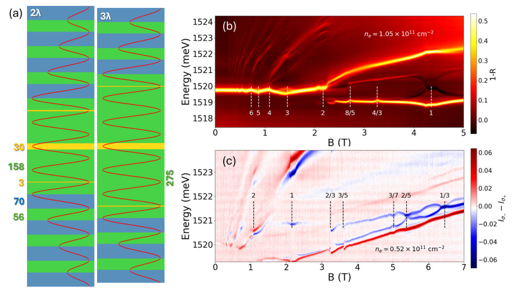
<figcaption class="paper-figure-caption"><b>Fig 1.</b> FIG. 1. (a) Optical transfer-matrix simulations used to design devices 2λ and 3λ. Only the layers nearest to the central cavity are shown. Blue, green, and yellow layers correspond to AlAs, Al0.1Ga0.9As and GaAs, respectively. The red curve corresponds to the electric field intensity of a confined resonant photon. Numbers next to each layer indicate layer thicknesses (nm); the single differing value highlights the design change in device 3λ. (b) 1 −R spectra of sample 2λ as a function of perpendicular magnetic field B. New polariton branches and changes in polariton splitting associated with integer and fractional ν are marked by white dashed lines. (c) Same measurement for sample 3λ....</figcaption>
</figure>
<figure class="paper-figure-card">
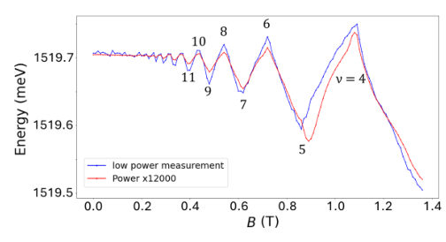
<figcaption class="paper-figure-caption"><b>Fig 2.</b> FIG. 2. Lowest polariton energy in sample 2λ as a function of magnetic field B, measured at low (blue) and high (red) optical powers differing by a factor of 1.2×104. Integer filling factors corresponding to maxima and minima are labelled in black.</figcaption>
</figure>
<figure class="paper-figure-card">
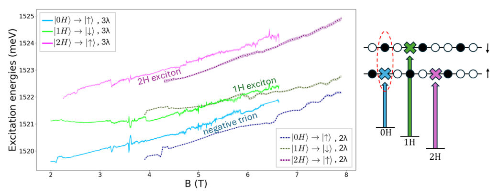
<figcaption class="paper-figure-caption"><b>Fig 3.</b> FIG. 3. Three lowest excitation energies E0, E1, and E2 measured in σ−polarisation for sample 2λ in the range 4 T &lt; B &lt; 8 T and sample 3λ in the range 2 T &lt; B &lt; 6.7 T. The schematic on the right illustrates the proposed interpretation: each excitation originates from a different hole subband (0H, 1H, or 2H) and forms an exciton (cross symbol) whose electron component occupies one of the two spin-split lowest LLs. Filled circles denote background electrons and empty circles holes; the illustrated configuration corresponds to an unpolarised ν = 2/3 state. The lowest-energy excitation forms a negative trion, in which a |↑⟩exciton binds a |↓⟩electron.</figcaption>
</figure>
<figure class="paper-figure-card">
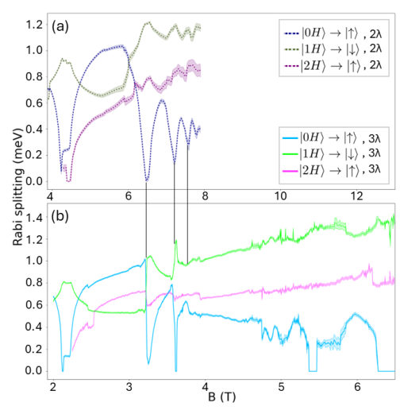
<figcaption class="paper-figure-caption"><b>Fig 4.</b> FIG. 4. Coupling energies Ω0, Ω1, and Ω2 measured for sam- ples (a) 2λ and (b) 3λ. These values are extracted from the same measurements as Fig. 3, with matching colour schemes between figures. Vertical black lines indicate filling factors ν = 2/3, 3/5, and 4/7 (from left to right).</figcaption>
</figure>
<figure class="paper-figure-card">
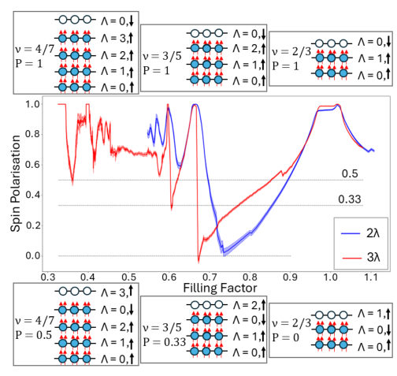
<figcaption class="paper-figure-caption"><b>Fig 5.</b> FIG. 5. Spin polarisation P for samples 2λ (blue) and 3λ (red), extracted from the Ω0 measurements of Fig. 4 using Eq. 7. The accompanying diagrams show the corresponding CF configurations: top panels represent fully polarised states, bottom panels partially polarised states. The expected partial polarisations of the ν = 3/5 and 4/7 states, P = 1/3 and 1/2, are indicated by black dotted lines.</figcaption>
</figure>

**Summary.** This work uses cavity-polariton spectroscopy on GaAs quantum wells to measure spin polarization in Fractional Quantum Hall states. By analyzing the optical response, the authors report that the depolarization away from quantized fillings strongly suggests the presence of Minimal Fractionally Charged Skyrmions (MFCS). This provides experimental evidence for collective spin dynamics in highly correlated electron systems.

**Why it may be interesting.** The connection drawn between optical measurements in solid-state systems (GaAs QWs) and exotic topological excitations like Skyrmions provides a tangible experimental realization of complex many-body physics relevant to correlated electron models.

Detailed structure

**Main problem.** The study investigates spin polarization and low-energy excitations within Fractional Quantum Hall (FQH) states.

**Main result.** The research reports evidence for Minimal Fractionally Charged Skyrmions (MFCS), characterized by a depolarization following the empirical law $S=
u^*$ away from quantized fillings.

**Method.** Spin polarization is probed using cavity-polariton spectroscopy on GaAs quantum wells, measuring the optical coupling strength of interband Landau-level excitations.

**Model / system.** The system involves electrons in Fractional Quantum Hall states ($
u$ between $1/3$ and $1$), analyzed within the framework of Composite Fermion (CF) theory. The experiment uses GaAs quantum wells coupled to optical microcavities.

**Key observables.** Spin polarization ($P$), oscillator strength suppression, and the depolarization parameter $S$.

**Important parameters / regimes.** Fractional filling factor $
u$ ($1/3 \le 
u \le 1$), effective Composite Fermion filling factor ($
u^*$), and magnetic field ($B$).

**Assumptions / limitations.** The analysis assumes that the depolarization away from quantized fillings is governed by the formation of Minimal Fractionally Charged Skyrmions (MFCS).

**Figures summary.** Figures show optical transfer-matrix simulations, lowest polariton energy vs. $B$, and plots of extracted spin polarization ($P$) versus filling factor ($
u$ or $
u^*$), comparing data to theoretical models.

**Paper structure.** The paper progresses by first establishing the experimental measurement technique (polariton spectroscopy) to extract spin polarization signatures across various FQH states, then analyzing the depolarization behavior away from integer/fractional fillings, and finally interpreting this smooth variation as evidence for MFCS formation governed by $S=
u^*$.

Abstract

We investigate spin polarisation and low-energy excitations in fractional quantum Hall (FQH) states using cavity-polariton spectroscopy of high-mobility GaAs quantum wells. By measuring the optical coupling strength of interband Landau-level excitations over the range $1/3 \le ν\le 1$, we extract the spin polarisation of the electron system as a function of filling factor.   Complete suppression of the oscillator strength of the lowest energy excitation, characteristic of singlet trion formation in fully polarised systems, is reported for the first time in this regime.   At large magnetic fields, fully polarised FQH states exhibit symmetric depolarisation away from their quantised fillings, analogous to Skyrmionic behaviour near $ν=1$. The depolarisation follows an empirical law $S=ν^*$, where $S$ is the number of spin flips per added magnetic flux quantum and $ν^*$ the effective Composite Fermion filling factor. We interpret this behaviour as evidence for Minimal Fractionally Charged Skyrmions (MFCS) formed from bound spin-flip and quasiparticle excitations.

[↑ back to top](#top)

### [Magnetism and Topology from Circularly Polarized Phonon Floquet Engineering](http://arxiv.org/abs/2606.10854v1)

**Authors:** Dapeng Yao, Tiantian Zhang, Takashi Oka, Takehito Yokoyama  
**Type:** theory · **Category:** other · **PDF:** <https://arxiv.org/pdf/2606.10854v1>  
**Analysis basis:** full PDF text, analyzed in chunks
**Topic relevance:** 🔥 `analog quantum simulation` **4/5** · 🔥 `non-equilibrium dynamics` **4/5** · `exotic spin models in light-matter` **3/5** · `spintronics-quantum-optics interface` **3/5** · `driven-dissipative phase transition` **2/5** · `methods for driven-dissipative` **2/5** · `Keldysh / 2PI / non-Gaussian methods` **1/5** · `non-equilibrium universality` **1/5**

↔ Scroll figures horizontally

<figure class="paper-figure-card">
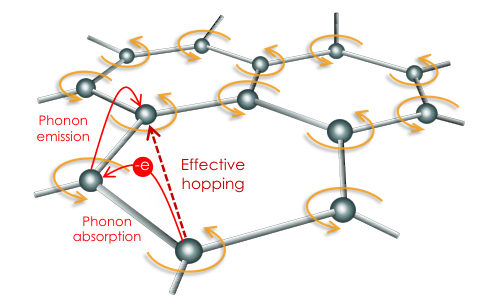
<figcaption class="paper-figure-caption"><b>Fig 1.</b> FIG. 1. Schematic of the phonon-driven electron systems on a two-dimensional honeycomb lattice, where a circularly polar- ized phonon in optical branches at the Brillouin-zone center is excited. Electron-phonon coupling enables phonon-assisted nearest-neighbor hopping via phonon emission and absorption processes, which generates an effective next-nearest-neighbor hopping. This process drives the system to a topological phase with a nonzero Chern number. Spin and orbital magnetiza- tions emerge due to the breaking of time-reversal symmetry by circularly polarized phonons.</figcaption>
</figure>
<figure class="paper-figure-card">
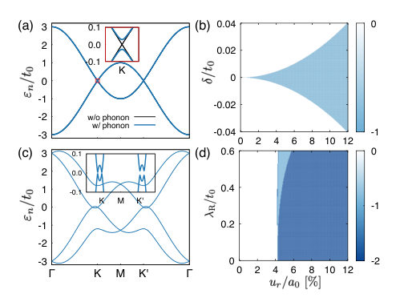
<figcaption class="paper-figure-caption"><b>Fig 2.</b> FIG. 2. Topological phase transition driven by circularly po- larized phonons. (a) Band structures of the spinless effective Hamiltonian heff(k) along the high-symmetry points with and without phonon dynamics. We set the on-site potential δ = 0, and the phonon rotational amplitude ur = 0.1a0, respectively. Inset shows the bands near the K point. (b) Phase diagram of the Chern number as a function of ur/a0 and δ/t0. (c) Band structure of the spinful Hamiltonian Heff(k) with the on-site potential δ = 0.005t0, Rashba SOC λR = 0.4t0, and the phonon rotational amplitude ur/a0 = 5%. Inset shows the bands around the valley points. (d) Phase diagram of the Chern number as a function of ur/a0 and...</figcaption>
</figure>
<figure class="paper-figure-card">
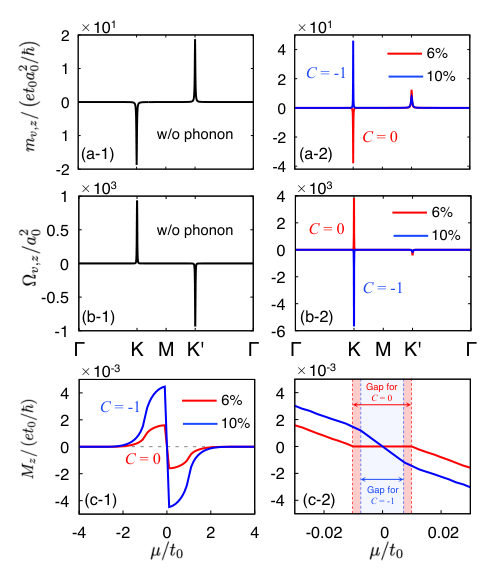
<figcaption class="paper-figure-caption"><b>Fig 3.</b> FIG. 3. Orbital magnetization driven by circularly polarized phonons. (a-1) and (a-2) Intrinsic magnetic moment distri- bution for the valence band along the high-symmetry points. (b-1) and (b-2) Berry curvature distribution for the valence band along the high-symmetry points. The results without phonon dynamics are shown in (a-1) and (b-1), and those with phonon dynamics for different Chern numbers are shown in (a-2) and (b-2). Red and blue lines in (a-2) and (b-2) rep- resent ur/a0 = 6% (C = 0) and ur/a0 = 10% (C = −1), respectively. (c-1) and (c-2) Chemical potential dependence of the z component of the orbital magnetization. (c-2) en- larges the region around the band gap. Phonon energy...</figcaption>
</figure>
<figure class="paper-figure-card">
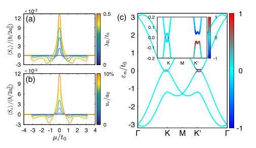
<figcaption class="paper-figure-caption"><b>Fig 4.</b> FIG. 4. Spin magnetization driven by circularly polarized phonons. (a) and (b) Chemical potential dependence of the z-component spin expectation value with the colors repre- senting the Rashba SOC and phonon rotational amplitude, respectively. The on-site potential is set to be δ = 0.02t0. We fix the phonon rotational amplitude ur/a0 = 10% in (a) and the Rashba SOC λR = 0.4t0 in (b). (c) Band structure with the on-site potential δ = 0.02t0, the phonon rotational am- plitude ur/a0 = 8%, and the Rashba SOC λR = 0.4t0. The color represents the spin texture ⟨ˆSz⟩nk/(ℏ/2) of each band at k point. Phonon energy and temperature are set to be ℏΩ= 0.2t0 and kBT = 0.03t0, respectively.</figcaption>
</figure>

**Summary.** This theoretical paper shows that coupling electrons on a honeycomb lattice to circularly polarized phonons can act as an effective magnetic field. By employing Floquet engineering, the system undergoes a controllable topological phase transition into a Chern insulator. This mechanism not only generates non-zero orbital and spin magnetizations but also provides a novel pathway for realizing topological materials using purely vibrational driving.

**Why it may be interesting.** This work is highly relevant as it uses time-periodic driving (Floquet engineering) in condensed matter systems—a core topic in AMO physics—to engineer fundamental quantum properties like topology and magnetism using lattice vibrations rather than external magnetic fields.

Detailed structure

**Main problem.** The study demonstrates how circularly polarized phonons can induce electronic magnetization and drive a topological phase transition in a honeycomb lattice via phonon Floquet engineering.

**Main result.** Circularly polarized phonons act as an effective magnetic field, inducing a tunable topological phase transition from a trivial insulator to a Chern insulator, while also generating measurable orbital and spin magnetizations.

**Method.** The authors utilize Floquet theory in the high-frequency limit ($\Omega^{-1}$) to derive an effective Hamiltonian that incorporates phonon-mediated hopping terms, allowing for gap analysis at valley points.

**Model / system.** The model consists of electrons on a two-dimensional honeycomb lattice coupled to time-periodic driving from circularly polarized phonons. The physics is analyzed using the derived Floquet effective Hamiltonian, which generates an effective next-nearest-neighbor hopping term.

**Key observables.** Chern number ($C$), orbital magnetization ($M_z$), and spin magnetization ($\langle S_z 
angle$).

**Important parameters / regimes.** Phonon frequency ($\Omega$), lattice parameters ($t_0, \delta$), and the strength of Rashba SOC ($\lambda_R$).

**Assumptions / limitations.** The analysis relies on a van-Vleck type expansion in the inverse phonon frequency ($\Omega^{-1}$) for the effective Hamiltonian derivation.

**Figures summary.** Figures illustrate band structures showing gap opening due to phonons, phase diagrams mapping the Chern number dependence on SOC strength and phonon amplitude, and schematics of the induced NNN hopping term.

**Paper structure.** The paper builds from defining the initial electron-phonon coupled Hamiltonian to deriving the high-frequency effective Floquet Hamiltonian. It then analyzes the resulting band structure near valley points to calculate topological invariants (Chern number) and magnetizations, concluding with a discussion of how phonon pumping controls these signs.

Abstract

We theoretically show that circularly polarized phonons induce electronic magnetization and drive a topological phase transition via phonon Floquet engineering. Considering the electronic states modulated by circularly polarized phonons on a honeycomb lattice, we show that such lattice dynamics generates an effective next-nearest-neighbor electron hopping, leading to a Haldane-type mass term. Circularly polarized phonon breaks time-reversal symmetry (TRS) and opens a gap at valley points, undergoing phase transition from a trivial insulator to a Chern insulator. Moreover, the orbital and spin magnetizations emerge due to the breaking of TRS. Our results show that circularly polarized phonons serve as an effective magnetic field to engineer magnetism and topology, offering new opportunities for phonon Floquet approaches.

[↑ back to top](#top)

### [Fabry-Perot Interference, g-factor Anisotropy, and Gate-Tunable Quantum dot in Chiral Tellurium Nanowires](http://arxiv.org/abs/2606.10001v1)

**Authors:** Suresh Ghimire, Mohammad Hafijur Rahaman, Nathan Tanner Sawyers, Madan Mohan Bhandari, Gokul Acharya, Syed Zulfiqar Hussain Shah, Iris Nandhakumar, Pawan Kumar, Zainul Aabdin Khan, Hugh O. H. Churchill, Dharmraj Kotekar-Patil  
**Type:** experiment · **Category:** quantum information and computing · **PDF:** <https://arxiv.org/pdf/2606.10001v1>  
**Analysis basis:** full PDF text, analyzed in chunks
**Topic relevance:** 🔥 `QC/QI experiment` **4/5** · `spintronics-quantum-optics interface` **3/5** · `Kondo & dissipative impurity` **1/5** · `interference shaping light` **1/5** · `non-equilibrium dynamics` **1/5**

↔ Scroll figures horizontally

<figure class="paper-figure-card">
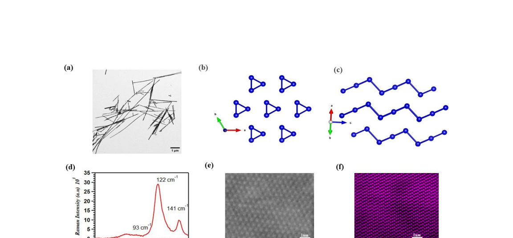
<figcaption class="paper-figure-caption"><b>Fig 1.</b> Figure 1. Hydrothermal Te NWs: morphology, crystal structure and Raman signatures. (a) Low-</figcaption>
</figure>
<figure class="paper-figure-card">
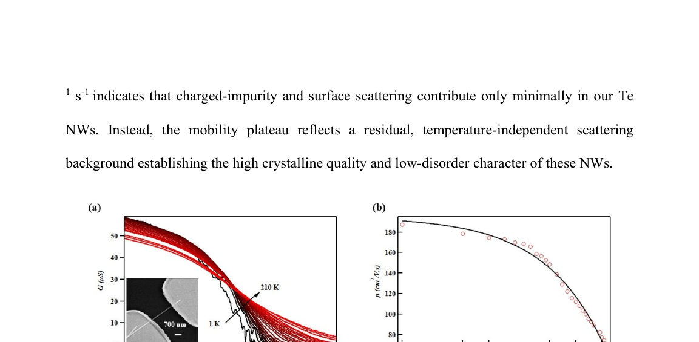
<figcaption class="paper-figure-caption"><b>Fig 2.</b> Figure 2. Temperature-dependent transport of a single Te NW FET. (a) Conductance G versus back-</figcaption>
</figure>
<figure class="paper-figure-card">
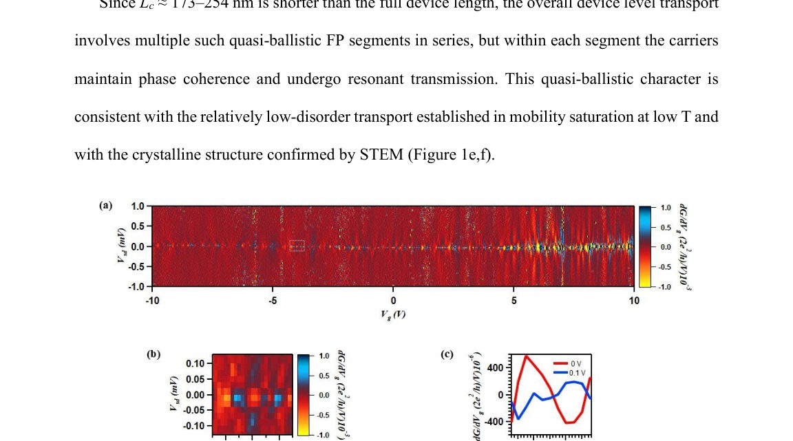
<figcaption class="paper-figure-caption"><b>Fig 3.</b> Figure 3. Fabry–Pérot interference in a single TeNW. (a) Transconductance as a function of source-</figcaption>
</figure>
<figure class="paper-figure-card">
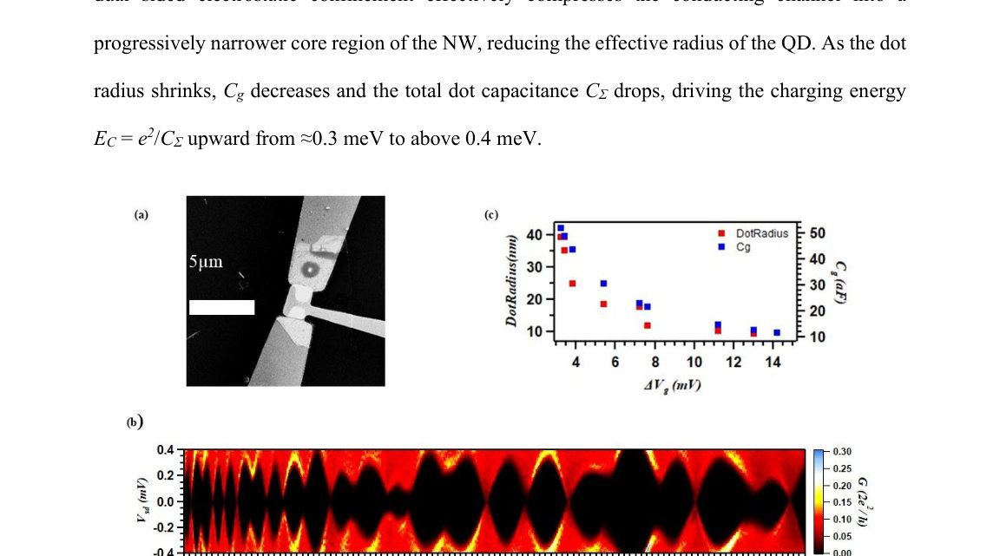
<figcaption class="paper-figure-caption"><b>Fig 4.</b> Figure 6. Gate-controlled quantum-dot size in a dual-gated TeNW. (a) SEM image of the dual-gated</figcaption>
</figure>

**Summary.** This work characterizes tellurium nanowires as promising platforms for quantum electronics by demonstrating phase-coherent transport regimes (Fabry-Perot interference and Coulomb blockade). Key findings include measuring large g-factor anisotropy and resolving an intrinsic spin-orbit coupling gap. These results position Te NWs for use in gate-defined spin qubits and topological superconducting research.

**Why it may be interesting.** The combination of large, tunable g-factors and intrinsic SOC in an elemental vdW system makes this material highly relevant for solid-state qubits, offering a platform to study spin physics without relying on complex heterostructures.

Detailed structure

**Main problem.** To explore quantum coherent transport, g-factor anisotropy, and gate-tunable quantum dot formation in chiral tellurium nanowires.

**Main result.** The study demonstrated highly anisotropic Lande g-factors ($g_{\perp} \gg g_{\parallel}$) and intrinsic spin-orbit coupling ($\Delta_{SO}$), establishing Te NWs as a versatile platform for gate-defined spin qubits.

**Method.** Electrical transport measurements, including temperature sweeps, Zeeman spectroscopy using magnetic fields, and analysis of Fabry-Perot interference versus Coulomb blockade regimes.

**Model / system.** The physical system is hydrothermally grown tellurium (t-Te) nanowires, which are quasi-1D semiconductors exhibiting strong spin-orbit coupling due to their chiral structure. The measurements probe single-electron transistor behavior and coherent quantum transport phenomena.

**Key observables.** Hole mobility ($\mu$), Fabry-Perot interference oscillations, Coulomb blockade signatures, in-plane ($g_{\parallel}$) and out-of-plane ($g_{\perp}$) Landé g-factors, and the spin-orbit energy gap ($\Delta_{SO}$).

**Important parameters / regimes.** Temperature range (1 K to 210 K), resistance thresholds for transport regimes ($\le 30 	ext{ k}\Omega$ vs. $\ge 30 	ext{ k}\Omega$), and gate-tunable quantum dot size/charging energy.

**Assumptions / limitations.** The analysis assumes that the observed transport phenomena are dominated by single-particle physics, allowing for clear separation of quasi-ballistic (FP) and localized (CB) regimes.

**Figures summary.** Figures illustrate NW morphology via STEM/SEM, temperature dependence of mobility showing scattering crossovers, conductance oscillations confirming FP interference in low-R devices, and peak splitting revealing g-factor anisotropy and SOC gap in magnetic fields.

**Paper structure.** The paper progresses from establishing material quality (morphology, basic transport) to characterizing different quantum regimes: first, the crossover between quasi-ballistic (FP) and localized (CB) transport based on resistance; second, quantifying spin properties via Zeeman spectroscopy ($g$-factor anisotropy); and finally, demonstrating electrostatic tunability of the resulting quantum dot.

Abstract

Chiral materials with strong spin-orbit coupling offer a unique platform for exploring the interplay between topology, chirality, and quantum transport yet the quantum coherent regime in elemental tellurium nanostructures remains largely unexplored. Here we demonstrate phase-coherent quasi-ballistic transport, anisotropic Zeeman spectroscopy, and gate-tunable quantum dot formation in hydrothermally grown t-tellurium nanowires. Single nanowire field-effect transistors exhibit p-type transport with hole mobilities rising from approx. 80 cm2 V-1 s-1 at 210 K to approx. 190 cm2 V-1 s-1 at 1 K, consistent with a crossover from phonon-limited to Coulomb scattering dominated regimes near 50 K. Notably, devices segregate into two distinct regimes based on their room temperature two-terminal resistance : low-resistance devices (< 30 kOhm) exhibit Fabry-Perot interference, whereas high resistance devices (> 30 kOhm) display Coulomb-blockade behavior revealing a two-terminal resistance-driven transition between quasi-ballistic and strongly localized transport regimes. Zeeman spectroscopy in in-plane and out-of-plane magnetic fields yields highly anisotropic Lande g-factors (an in-plane gparallel = 1.18 and an out-of-plane gperp = 18.41) and directly resolves a spin-orbit energy gap DeltaSO = 0.864 meV from an avoided crossing. These results establish chiral tellurium nanowires as a versatile platform for gate-defined spin qubits exploiting large, tunable g-factors and for hybrid tellurium-superconductor architectures targeting Majorana zero modes in an elemental vdW system.

[↑ back to top](#top)

### [Synthesis and Characterization of Atomically-Sharp Superconductor-Dielectric Interface](http://arxiv.org/abs/2606.10144v1)

**Authors:** Nathan Sitaraman, Zhaslan Baraissov, Alexis Grassl, Hongbin Yang, Daniel Tong, David Muller, Matthias Liepe  
**Type:** experiment · **Category:** other · **PDF:** <https://arxiv.org/pdf/2606.10144v1>  
**Analysis basis:** full PDF text, analyzed in chunks
**Topic relevance:** 🔥 `QC/QI experiment` **4/5**

↔ Scroll figures horizontally

<figure class="paper-figure-card">
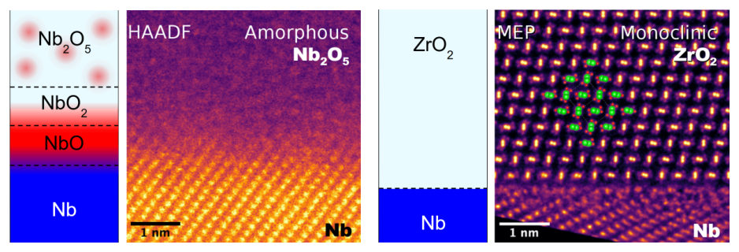
<figcaption class="paper-figure-caption"><b>Fig 1.</b> Figure 1: Comparison between (a) the NbOx/Nb interface and (b) the ZrO2/Nb interface. The schematics show expected distributions of normal-conducting electrons (red) and Cooper pairs (blue). Annular dark- field (ADF) cross section shows a gradual interface between Nb and amorphous Nb2O5, while multislice electron ptychography (MEP) shows a sharp interface between Nb and ZrO2.</figcaption>
</figure>
<figure class="paper-figure-card">
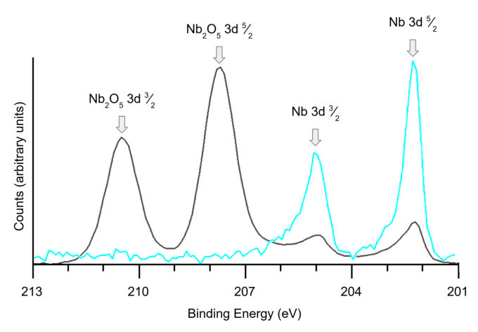
<figcaption class="paper-figure-caption"><b>Fig 2.</b> Figure 2: Comparison of Nb XPS spectrum for an electropolished Nb reference sample (black) and the ZrO2 capping layer processed at 800C (teal), with peak positions labeled for oxide and metallic peaks. In contrast to the reference sample, the ZrO2 capping layer sample shows only metallic Nb peaks. Background features have been subtracted, and spectra have been rescaled for ease of comparison.</figcaption>
</figure>
<figure class="paper-figure-card">
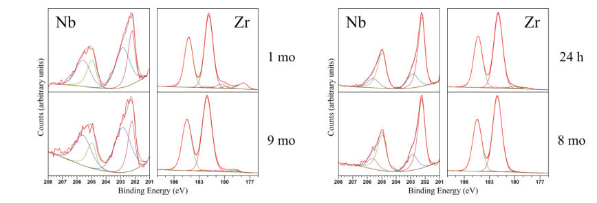
<figcaption class="paper-figure-caption"><b>Fig 3.</b> Figure 3: Nb and Zr XPS spectra for as-deposited and 120C-baked samples, showing diminished suboxide components for both Nb and Zr after 120C baking.</figcaption>
</figure>
<figure class="paper-figure-card">
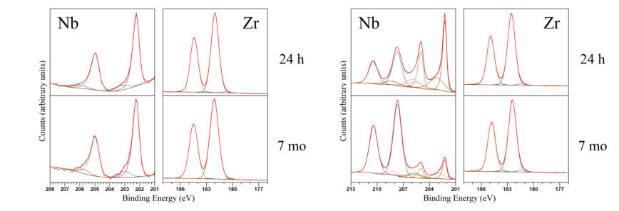
<figcaption class="paper-figure-caption"><b>Fig 4.</b> Figure 4: Nb and Zr XPS spectra for 800C-baked and 1100C-baked samples, showing greatly-diminished suboxide components for the 800C-baked sample, and showing the re-emergence of prominent Nb2O5 peaks for the 1100C-baked sample.</figcaption>
</figure>
<figure class="paper-figure-card">
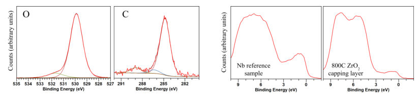
<figcaption class="paper-figure-caption"><b>Fig 5.</b> Figure 5: C and O XPS spectra and peak deconvolution for the 800C-baked Zr capping layer, taken about 7 months after exposure to atmosphere (a). The O spectrum shows a large peak corresponding to ZrO2, and a shoulder peak tentatively assigned to surface hydroxide groups and/or strongly adsorbed H2O. The C spectrum shows adventitious carbon peaks, but no low-binding-energy peak that would indicate carbide formation. Valence XPS spectra for an electropolished Nb reference sample and for the 800C capping layer sample (b). For the valence spectra, the zero of binding energy has been set to the observed Fermi level, and large peaks correspond to valence band states of Nb2O5 and ZrO2.</figcaption>
</figure>

**Summary.** This paper details the synthesis and characterization of high-quality $	ext{ZrO}_2$ dielectric layers on Niobium superconductors. By using advanced microscopy (MEP) and spectroscopy (XPS), the authors demonstrate a method to create an atomically-sharp interface that minimizes defect-related energy loss, paving the way for more robust superconducting quantum devices.

**Why it may be interesting.** While focused on materials science, the work directly addresses minimizing dissipation in superconducting circuits, which is a critical component of quantum hardware platforms like transmon qubits or superconducting resonators used in quantum information processing.

Detailed structure

**Main problem.** Minimizing interfacial losses in superconducting quantum devices by engineering a high-quality, atomically-sharp interface between a superconductor (Niobium) and a dielectric ($	ext{ZrO}_2$).

**Main result.** The authors successfully demonstrated the growth of crystalline $	ext{ZrO}_2$ capping layers on Niobium with an atomically-sharp interface, which is superior to native oxide interfaces in preventing detrimental defect formation.

**Method.** A combination of advanced characterization techniques including X-ray Photoelectron Spectroscopy (XPS), Scanning Electron Microscopy (SEM), and high-resolution Cross-Section STEM/Multislice Electron Ptychography (MEP) was employed.

**Model / system.** The physical system is a superconducting resonator built on Niobium ($	ext{Nb}$), capped with Zirconium Oxide ($	ext{ZrO}_2$). The focus is on the chemical and structural integrity of the $	ext{ZrO}_2/	ext{Nb}$ interface under various thermal processing conditions.

**Key observables.** XPS binding energies (detecting suboxide phases), interface abruptness measured by MEP, crystalline structure confirmed by EELS/MEP, and stability against atmospheric aging.

**Important parameters / regimes.** Processing temperatures ($120^\circ	ext{C}, 800^\circ	ext{C}, 1100^\circ	ext{C}$), layer thickness ($\sim 7-8 	ext{ nm}$), and the ratio of suboxide to metallic Nb components.

**Assumptions / limitations.** The primary assumption is that interfacial losses are dominated by two-level system (TLS) defects, making interface quality paramount for device performance.

**Figures summary.** Figures compare XPS spectra showing oxide phase suppression after baking; MEP images visualize the atomically-sharp $	ext{ZrO}_2/	ext{Nb}$ transition; and STEM/EELS confirm the polycrystalline nature of the capping layer.

**Paper structure.** The paper systematically compares native niobium oxides to engineered $	ext{ZrO}_2$ layers, using XPS to track chemical changes across different annealing temperatures, followed by high-resolution structural analysis (STEM/MEP) to prove interface sharpness and crystalline quality.

Abstract

Modification of superconductor-dielectric interfaces is known to strongly impact coherence times of superconducting quantum devices. This relationship is thought to arise from differences in the concentration of "two-level system" defects in the disordered dielectrics and superconductor-dielectric interfaces; these defects couple to electromagnetic modes in the device and cause dissipation. Zirconium oxide barrier layers on niobium have emerged as a promising pathway to low-loss interfaces in recent years, evidently due to the crystalline nature of these layers in comparison to the amorphous niobium native oxide. We explain the unique ability of zirconium oxide to form a crystalline layer, to maintain a sharp interface with metallic niobium, and to prevent niobium oxide re-growth in terms of the chemical properties of ZrO$_2$ and the Nb-Zr-O ternary system. We demonstrate a new method to grow air-stable zirconium oxide layers on niobium with a higher level of crystallinity and a sharper oxide-metal interface than previously shown, and provide the first comprehensive microscopic analysis of ZrO$_2$ capping layer properties. These developments pave the way toward vital performance advances in superconducting quantum devices.

[↑ back to top](#top)

### [Unidirectional-like Edge Transport Induced by Non-Hermitian Skin Effects](http://arxiv.org/abs/2606.10291v1)

**Authors:** Junyi Rao, Jinting Ding, Qinghua Guo, Jun He, Xiang Ni  
**Type:** both · **Category:** other · **PDF:** <https://arxiv.org/pdf/2606.10291v1>  
**Analysis basis:** full PDF text, analyzed in chunks
**Topic relevance:** `analog quantum simulation` **3/5** · `correlated / nonlocal dissipation` **3/5** · `driven-dissipative phase transition` **3/5** · `methods for driven-dissipative` **3/5** · `non-equilibrium dynamics` **3/5** · `interference shaping light` **2/5** · `non-equilibrium universality` **2/5** · `quantum optics experiment` **2/5** · `Keldysh / 2PI / non-Gaussian methods` **1/5** · `Kondo & dissipative impurity` **1/5** · `QC/QI experiment` **1/5** · `correlated cavity matter` **1/5**

↔ Scroll figures horizontally

<figure class="paper-figure-card">
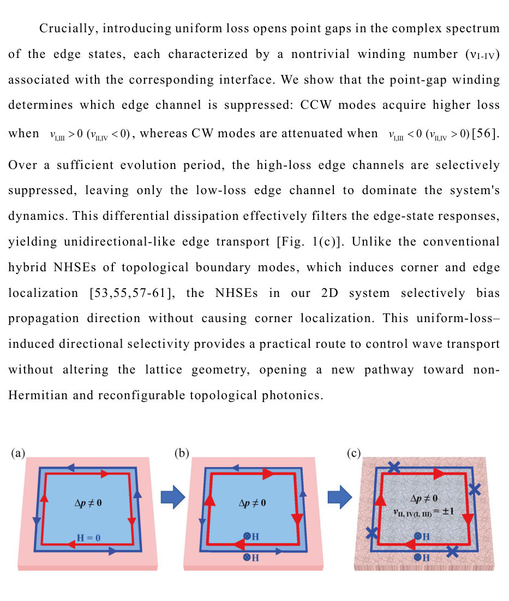
<figcaption class="paper-figure-caption"><b>Fig 1.</b> Fig. 1. Transition from bi-directional to unidirectional-like interface states via global and uniform loss. (a) With a nonzero polarization difference ( 0 P ∆ ≠ ), the interface supports non-chiral interface states. (b) A uniform magnetic field lifts the band degeneracy, creating an energy splitting between counter-propagating interface states. (c) Introducing global and uniform loss activates the non- Hermitian skin effect, converting interface states into unidirectional-like transport.</figcaption>
</figure>
<figure class="paper-figure-card">
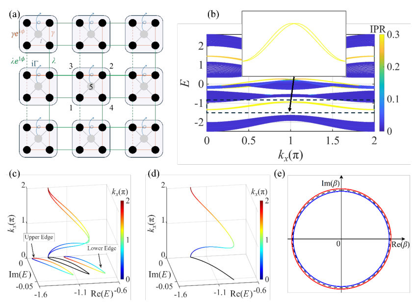
<figcaption class="paper-figure-caption"><b>Fig 2.</b> Fig. 2: Energy bands of the 2D modified SSH lattice and the generalized Brillouin zone (GBZ) of the corresponding non-chiral edge states. (a) Schematic diagram of the tight-binding model. (b) Energy bands for the Hermitian case, with parameters t=γ=0.3, λ=1, ϕ=0.3π, and Γ = 0. The inset magnifies the edge bands</figcaption>
</figure>
<figure class="paper-figure-card">
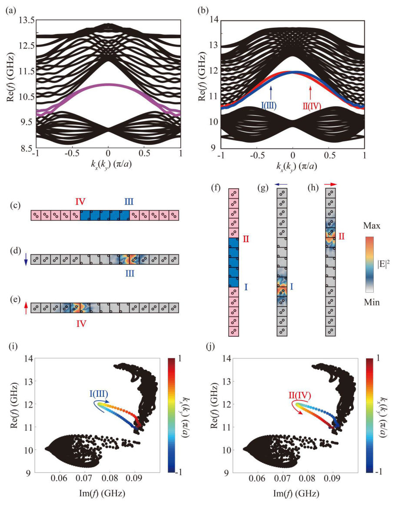
<figcaption class="paper-figure-caption"><b>Fig 3.</b> FIG. 3. Band structures of the photonic supercell and the winding behavior of</figcaption>
</figure>
<figure class="paper-figure-card">
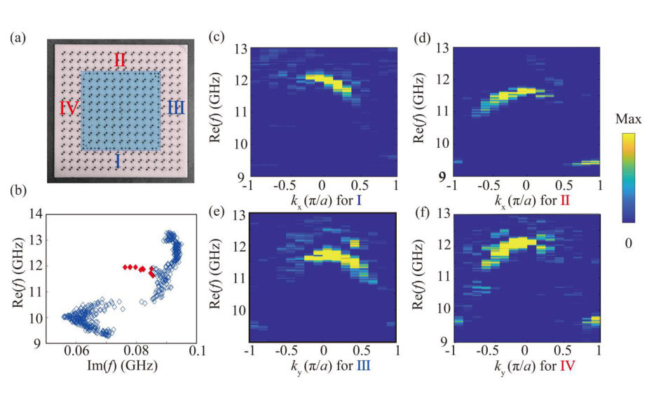
<figcaption class="paper-figure-caption"><b>Fig 4.</b> FIG. 4. The finite structure and band structure under global uniform loss. (a) Photograph of the fabricated PhC with top metallic plate removed: a central core of &quot;expanded&quot; cells is fully surrounded by a cladding of &quot;shrunken&quot; cells with absorbing boundaries applied along both the x and y. (b) Numerically calculated complex band structure for the finite &quot;core-cladding&quot; geometry. (c)-(f) Experimentally retrieved interface dispersions obtained via spatial Fourier transform of the measured complex fields along interfaces I-IV.</figcaption>
</figure>
<figure class="paper-figure-card">
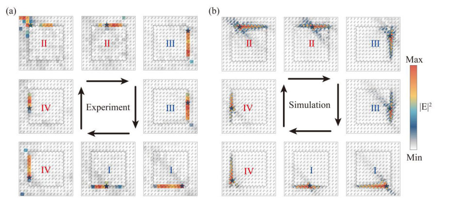
<figcaption class="paper-figure-caption"><b>Fig 5.</b> FIG. 5. Experimental (a) and simulated (b) spatial near-field imaging of unidirectional-like propagation. By sequentially moving the source antenna along the interface, the interface state exhibits unidirectional-like propagation along each segment, collectively forming a continuous clockwise circulation around the entire interface.</figcaption>
</figure>

**Summary.** This research demonstrates that introducing uniform material loss into photonic crystals can induce unidirectional-like edge transport by activating Non-Hermitian Skin Effects. The theoretical model and subsequent microwave experiments confirm that this simple mechanism filters out unwanted propagation directions, offering a universal design principle for one-way waveguiding.

**Why it may be interesting.** This work provides an accessible, non-topological route to engineered wave control in photonics, which is highly relevant for designing one-way quantum waveguides or optical circuits.

Detailed structure

**Main problem.** The paper addresses how to achieve unidirectional-like edge transport in photonic crystals (PhCs) using a simple, universal mechanism: uniform material loss.

**Main result.** Uniform loss activates Non-Hermitian Skin Effects (NHSEs), which reshape the spectral topology via point-gap windings and filter the edge states into a single direction of propagation.

**Method.** The study combines theoretical analysis using a modified tight-binding model with experimental verification using near-field microwave measurements on fabricated PhC prototypes.

**Model / system.** The system is based on Photonic Crystals (PhCs) modeled by a 2D Su-Schrieffer-Heeger type Hamiltonian, involving two domains sharing Chern numbers but having distinct polarizations. The mechanism relies on introducing global, uniform material loss ($\Gamma$).

**Key observables.** Inverse Participation Ratio (IPR), spectral winding in the complex energy plane, and directional circulation observed via near-field measurements.

**Important parameters / regimes.** Uniform loss strength ($\Gamma$), magnetic flux ($\phi$), and the geometry of the core-cladding structure.

**Assumptions / limitations.** The method achieves unidirectional transport without requiring intrinsic topological protection; it relies solely on introducing global, uniform material dissipation.

**Figures summary.** Figures illustrate the transition from bidirectional to unidirectional transport via loss (Fig. 1), show complex band structures revealing spectral winding when both loss and flux are present (Fig. 2), and confirm directional circulation through near-field imaging of fabricated PhCs (Fig. 5).

**Paper structure.** The paper progresses by first establishing the theoretical mechanism using a tight-binding model to show how uniform loss induces NHSEs and spectral winding, followed by experimental validation on core-cladding photonic crystal structures demonstrating directional filtering.

Abstract

Non-Hermitian skin effects (NHSEs) enable dramatic boundary accumulation of waves, yet their experimental realization typically demands engineered nonreciprocity or spatially patterned loss. Here we demonstrate theoretically and experimentally that uniform loss provides a simple and previously overlooked mechanism for enforcing unidirectional-like edge transport in photonic crystals (PhCs) that breaks time-reversal symmetry in the presence of nonchiral edge states. Using a core cladding geometry where domains share identical Chern numbers but possess distinct bulk polarizations, we show that uniform loss activates NHSEs that reshape the spectral topology of edge bands, giving rise to point gap windings that dictate a one way propagation. Near field measurements confirm that loss converts intrinsically bidirectional interface states into a unidirectional-like circulation around the entire domain wall, showing excellent agreement with theory. Our results establish uniform loss as a universal and structurally simple route for achieving unidirectional-like wave transport.

[↑ back to top](#top)

### [Majorana fermions at self-generated interfaces](http://arxiv.org/abs/2606.10812v1)

**Authors:** Nikola Prodanov, Sergio Ciuchi, Sergio Caprara  
**Type:** theory · **Category:** other · **PDF:** <https://arxiv.org/pdf/2606.10812v1>  
**Analysis basis:** full PDF text, analyzed in chunks
**Topic relevance:** `Keldysh / 2PI / non-Gaussian methods` **3/5** · `analog quantum simulation` **3/5** · `driven-dissipative phase transition` **3/5** · `methods for driven-dissipative` **3/5** · `Frenkel-Kontorova` **2/5** · `Kondo & dissipative impurity` **1/5** · `non-equilibrium dynamics` **1/5**

↔ Scroll figures horizontally

<figure class="paper-figure-card">
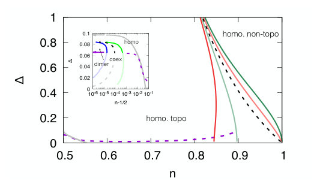
<figcaption class="paper-figure-caption"><b>Fig 1.</b> FIG. 1: a) Phase diagram for λ = 2. Red and green lines results from Maxwell construction respectively separating non-topological and topological homoge- neous phases. Black dashed line marks the occurrence of topological criterion when λ = 0.0 and it is the lo- cus of the first order phase transition when λ &gt; 0. Light green (light red) lines are spinodal lines of the red (green) topological (non- topological) homoge- neous phases. Purple dashed line marks the instability line of the homogeneous topological phase towards a CDW (see Sec. III C); this line meets the spinodal line of the homogeneous topological phase at n ≈0.9 and ∆≈0.1, and merges with it. Grey line is the spin- odal line of...</figcaption>
</figure>
<figure class="paper-figure-card">
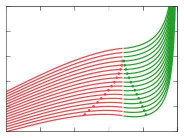
<figcaption class="paper-figure-caption"><b>Fig 2.</b> FIG. 2: The chemical potential versus the density of electrons n at ∆= 0.8t and for several equally spaced values of λ, from λ = 1.0 (top curve) to λ = 4.0 (bottom curve). On the green branches (non-topo) the topological criterion of the Kitaev model is not satisfied, while it is met on the red branches (topo). Small dots marks the cohexistence region by Maxwell’s construction. The border between non-topo and topo branches do not depend on λ as predicted by Eq. (6).</figcaption>
</figure>
<figure class="paper-figure-card">
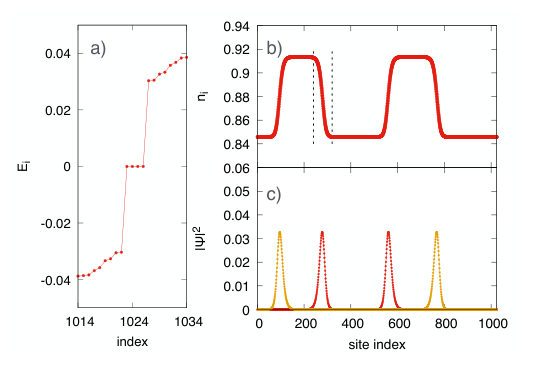
<figcaption class="paper-figure-caption"><b>Fig 3.</b> FIG. 3: Properties of a numerical solution obtained in the coexistence region of Fig. 1, for λ = 2, ∆= 0.5, with periodic boundary conditions. a) Eigenvalues showing 4 zero modes. b) Charge modulation in the N = 1024 chain. The interface located between two dashed lines is sampled in Fig. 4. c) The modulus squared of the Majorana fermion wave function, as a function of the site index (colors mark the pairwise re- lated zero-modes).</figcaption>
</figure>
<figure class="paper-figure-card">
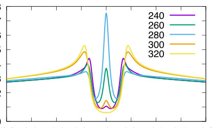
<figcaption class="paper-figure-caption"><b>Fig 4.</b> FIG. 4: Local spectral density across the interface shown in Fig. 3 b) (dashed lines), for λ = 2, ∆= 0.5 and a broadening 7 × 10−3. The numerical labels of the various lines identify the site along the chain where the corresponding spectral density is found.</figcaption>
</figure>
<figure class="paper-figure-card">
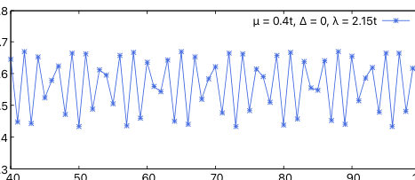
<figcaption class="paper-figure-caption"><b>Fig 5.</b> FIG. 5: A charge-density wave generated by the Peierls instability. Here, t = 1, µ = 0.4 (i.e., n ≈0.55), ∆= 0, λ = 2.15, and N = 200. The charge is expressed in units of the electron charge e. The density profile results from computational minimization of the free energy.</figcaption>
</figure>

**Summary.** The paper explores how an electron-phonon interaction can induce phase separation within a topological superconductor model. This phase separation creates internal interfaces that host Majorana zero modes, allowing for the realization of these exotic quasiparticles in the bulk material. The findings suggest a pathway to engineer topological superconductivity using lattice coupling.

**Why it may be interesting.** This work provides a concrete mechanism—phase separation driven by electron-lattice coupling—for realizing topological boundary states (Majorana fermions) in a bulk material without needing engineered physical terminations, which is highly relevant for solid-state quantum devices.

Detailed structure

**Main problem.** The study investigates whether Majorana fermions can emerge within the bulk of a superconducting system, away from physical boundaries, due to self-generated interfaces.

**Main result.** Majorana fermions are found to exist at internal interfaces formed when the superconducting material phase-separates into regions with distinct topological invariants. These interfaces host zero-energy modes even under periodic boundary conditions.

**Method.** The analysis involves generalizing the Kitaev model by coupling electron density to a classical elastic field, followed by solving self-consistency equations and analyzing the resulting phase diagram in real space.

**Model / system.** The system is modeled as a 1D topological superconductor (Kitaev model generalization) coupled to an elastic lattice field. The Hamiltonian includes hopping, pairing, chemical potential terms, and density-dependent coupling to the lattice.

**Key observables.** Zero-energy modes in the spectrum (Majorana fermions), local spectral density showing zero-bias peaks, and the phase diagram illustrating coexistence regions.

**Important parameters / regimes.** Coupling strength ($\lambda$), electron density ($n$), stiffness ($K$), and superconducting gap parameters ($\Delta$, $t$).

**Assumptions / limitations.** The analysis is performed at zero temperature ($T=0$) and often relies on simplifying the problem to homogeneous or dimerized phases in reciprocal space for initial calculations.

**Figures summary.** Figures illustrate phase diagrams showing topological/non-topological coexistence regions, spectral plots confirming zero modes at interfaces, and density profiles demonstrating polaron trapping at these boundaries.

**Paper structure.** The paper progresses by first establishing the generalized model Hamiltonian, deriving self-consistency conditions, analyzing the homogeneous phase transition, and finally using real-space numerical solutions to demonstrate Majorana formation within the coexistence region of the phase diagram.

Abstract

The Kitaev model describing a one-dimensional topological superconducting chain is known to support two Majorana fermions localized at the systems endpoints when the parameters are tuned to the topological phase. In this work, we investigate the possibility that Majorana fermions may also emerge away from the physical boundaries of the chain. To this purpose, we generalize the Kitaev model by incorporating a local coupling between the electronic density and a classical elastic (lattice) field. This electron-lattice interaction can induce phase separation between superconducting regions characterized by distinct topological invariants, thereby generating internal interfaces that host Majorana bound states. Under these conditions, a dilute gas of Majorana fermions can be realized in the bulk of the system.

[↑ back to top](#top)

### [Generalization of a localized-state formation mechanism in finite lattices with interaction nonlinearity](http://arxiv.org/abs/2606.10252v1)

**Authors:** Huajie Song, Haitao Xu  
**Type:** theory · **Category:** disordered systems and neural networks · **PDF:** <https://arxiv.org/pdf/2606.10252v1>  
**Analysis basis:** full PDF text, analyzed in chunks
**Topic relevance:** `Frenkel-Kontorova` **3/5** · `driven-dissipative phase transition` **2/5** · `non-equilibrium universality` **2/5** · `Keldysh / 2PI / non-Gaussian methods` **1/5** · `Kondo & dissipative impurity` **1/5** · `analog quantum simulation` **1/5** · `methods for driven-dissipative` **1/5** · `non-equilibrium dynamics` **1/5**

↔ Scroll figures horizontally

<figure class="paper-figure-card">
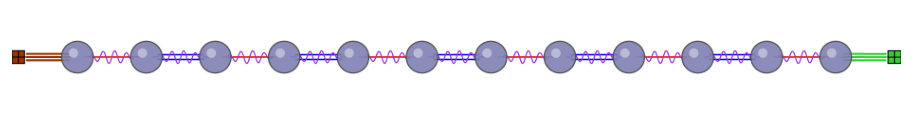
<figcaption class="paper-figure-caption"><b>Fig 1.</b> Figure 1: Schematic of the finite FPUT-type diatomic chain (1) of length 2n. The masses are identical; the straight single and double lines denote the linear interior springs k1, k2, the springs at the two ends denote the clamped boundary springs k3,1, k3,2 to fixed walls, and the curved springs denote the cubic FPUT nonlinearity, which acts on the relative displacement of each pair of connected sites.</figcaption>
</figure>
<figure class="paper-figure-card">
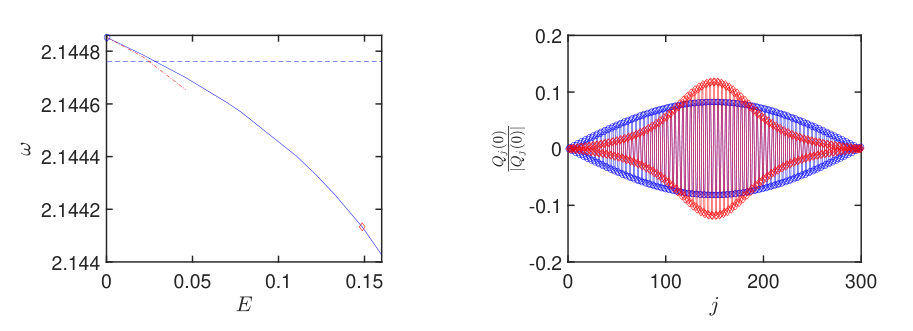
<figcaption class="paper-figure-caption"><b>Fig 2.</b> Figure 2: Regime (R1) (middle-localized), 2n = 200, k1 = 1, k2 = 2.3, k3,1 = 1.3, k3,2 = 3.5. (a) The branch frequency ω (solid) and its leading approximation (30) (dash–dotted) as functions of the energy E, drift downward from the lower optical edge √2k2 (dashed horizontal). (b) The normalized periodic orbit Q(0) at small (blue) and large (red) amplitude: the uniformly extended near-edge mode evolves into a state concentrated in the middle of the chain.</figcaption>
</figure>
<figure class="paper-figure-card">
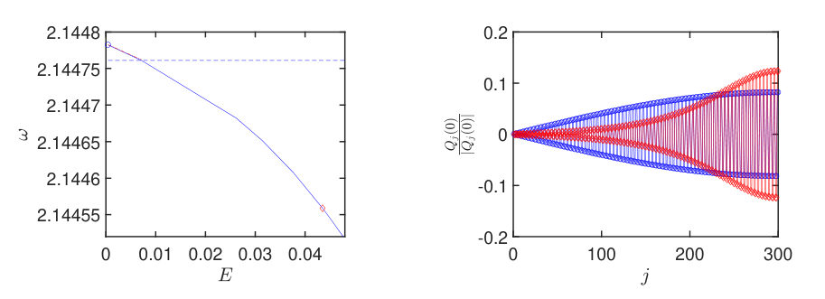
<figcaption class="paper-figure-caption"><b>Fig 3.</b> Figure 3: Regime (R2) (edge localization), 2n = 200, k1 = 1, k2 = 2.3, k3,1 = 1.3, k3,2 = 4.6 = 2k2. (a) The branch frequency ω (solid) and its leading approximation (40) (dash–dotted) drift down from the lower optical edge (dashed horizontal). (b) The normalized periodic orbit Q(0) at small (blue) and large (red) amplitude: the uniformly extended mode evolves into a state concentrated at the right boundary.</figcaption>
</figure>

**Summary.** This theoretical paper analyzes the transition from extended linear modes to localized states in finite lattices subjected to cubic FPUT interaction nonlinearity. By developing a general framework, the authors successfully extend prior methods to this complex nonlinear case. The key finding is the determination of a quantitative convergence radius $\epsilon = \Theta(1/\sqrt{n})$, providing deep insight into the stability and localization scale of these wave solutions.

**Why it may be interesting.** The study of localization transitions driven by nonlinearity is central to understanding nonlinear wave phenomena in physical systems, which has parallels with Anderson localization and energy band structure analysis relevant to quantum dynamics.

Detailed structure

**Main problem.** The paper investigates the mechanism by which time-periodic, spatially localized states form from an extended linear mode near a band edge when a nonlinearity is gradually introduced.

**Main result.** It establishes that this formation process can be quantitatively analyzed for the FPUT interaction nonlinearity, yielding a convergence radius $\epsilon = \Theta(1/\sqrt{n})$ below which the mode remains extended.

**Method.** The analysis employs perturbation theory combined with Lyapunov–Schmidt reduction to continue an orbit from the linear spectrum into the nonlinear regime.

**Model / system.** The system is a finite one-dimensional diatomic lattice governed by equations of motion involving both linear spring forces and cubic FPUT interaction nonlinearity. The method is claimed to be model-independent for other short-range nonlinearities and higher dimensions.

**Key observables.** Radius of convergence ($\epsilon$), frequency shift ($\omega_{<2>}$), and the profile concentration (middle vs. edge localization).

**Important parameters / regimes.** Chain length ($2n$), nonlinearity strength, and spectral gaps which scale as $\Theta(1/n^2)$ for finite lattices.

**Assumptions / limitations.** The analysis is restricted to the diatomic chain as a test case; it assumes specific structural relations between different nonlinearities (e.g., FPUT vs. on-site).

**Figures summary.** Figures illustrate schematic representations of the finite FPUT-type diatomic chain, showing the evolution of periodic orbits from extended states towards central or boundary concentrations.

**Paper structure.** The paper builds by first establishing a framework transferable from simple on-site nonlinearities to complex FPUT interactions. It then uses spectral analysis and perturbation theory (Lyapunov–Schmidt reduction) to calculate convergence radii, culminating in inductive estimates that confirm the $\Theta(1/\sqrt{n})$ scaling.

Abstract

We study how time-periodic, spatially localized states are born from the linear spectrum of a \emph{finite} lattice as the nonlinearity is switched on. In earlier work we treated this question for a diatomic chain with on-site nonlinearity and developed a framework that continues a near-edge linear mode in amplitude and controls the resulting perturbation series uniformly in the chain length. The present paper shows that the same framework applies to the more difficult case of Fermi--Pasta--Ulam--Tsingou (FPUT) interaction nonlinearity. The key is a structural relation between the FPUT and on-site nonlinearities, which allows the estimates obtained in the on-site setting to be transferred to the FPUT setting. As before, the analysis yields a quantitative radius of convergence, $\eps=Θ(1/\sqrt{n})$ for a chain of length $2n$, below which the near-edge mode stays extended and above which the orbit localizes and its frequency leaves the band. The diatomic chain is used only as a test case; both the formation mechanism and the method are model-independent and are expected to extend to other short-range nonlinearities and to higher dimensions.

[↑ back to top](#top)

### [Roughness-robust surface altermagnetism in $PT$ antiferromagnets](http://arxiv.org/abs/2606.11128v1)

**Authors:** K. D. Belashchenko  
**Type:** theory · **Category:** other · **PDF:** <https://arxiv.org/pdf/2606.11128v1>  
**Analysis basis:** full PDF text, analyzed in chunks
**Topic relevance:** `exotic spin models in light-matter` **3/5** · `spintronics-quantum-optics interface` **3/5** · `Keldysh / 2PI / non-Gaussian methods` **1/5** · `analog quantum simulation` **1/5** · `correlated / nonlocal dissipation` **1/5** · `driven-dissipative phase transition` **1/5** · `methods for driven-dissipative` **1/5** · `non-equilibrium dynamics` **1/5**

↔ Scroll figures horizontally

<figure class="paper-figure-card">
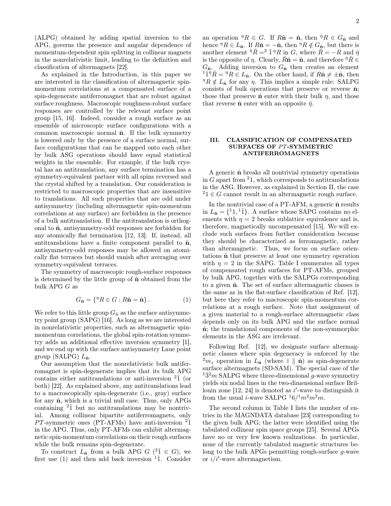
<figcaption class="paper-figure-caption"><b>Fig 1.</b> Low-resolution page preview, page 2</figcaption>
</figure>
<figure class="paper-figure-card">
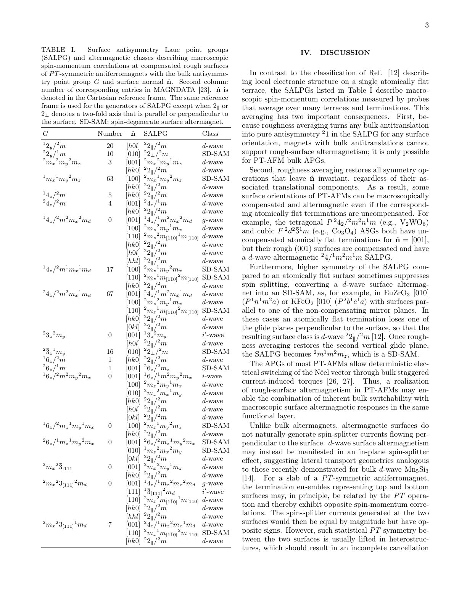
<figcaption class="paper-figure-caption"><b>Fig 2.</b> Low-resolution page preview, page 3</figcaption>
</figure>
<figure class="paper-figure-card">
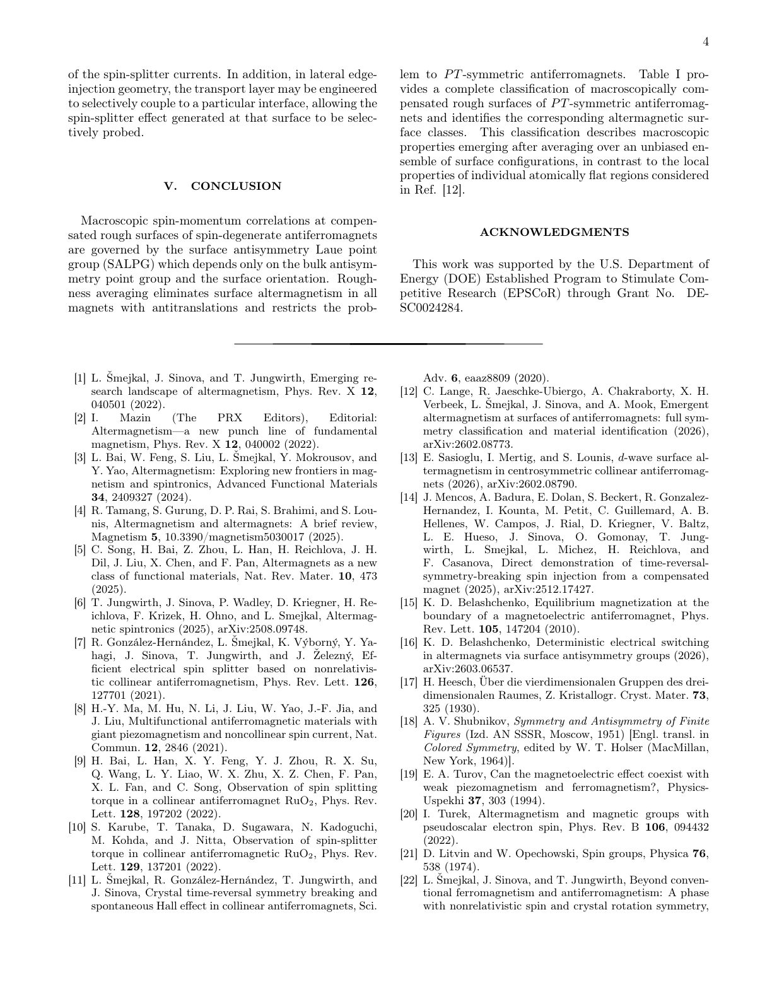
<figcaption class="paper-figure-caption"><b>Fig 3.</b> Low-resolution page preview, page 4</figcaption>
</figure>
<figure class="paper-figure-card">
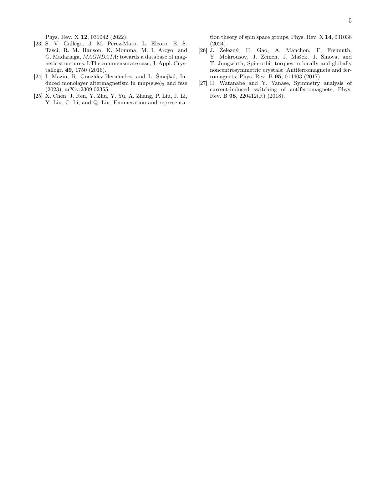
<figcaption class="paper-figure-caption"><b>Fig 4.</b> Low-resolution page preview, page 5</figcaption>
</figure>

**Summary.** This paper develops a symmetry-based framework to classify surface altermagnetism that remains robust even on rough crystal surfaces. It proves that this phenomenon is restricted to PT-symmetric antiferromagnets by analyzing the Surface Antisymmetry Laue Point Group (SALPG). The work provides a detailed classification scheme linking bulk symmetries and surface orientation to observable magnetic transport properties.

**Why it may be interesting.** While focused on condensed matter magnetism, the rigorous application of group theory (point/space groups) to determine emergent macroscopic properties from averaging over disordered geometries is highly relevant to understanding open quantum systems and boundary effects in AMO physics.

Detailed structure

**Main problem.** The study addresses the symmetry governing macroscopic spin-momentum correlations (altermagnetism) that persist when averaging over compensated, rough surfaces, moving beyond flat terrace approximations.

**Main result.** Roughness-robust surface altermagnetism is restricted to PT-symmetric antiferromagnets, whose symmetries are classified by the Surface Antisymmetry Laue Point Group (SALPG).

**Method.** The analysis employs symmetry group theory, specifically deriving the SALPG from the bulk Antisymmetry Point Group (APG) using the little group of the surface normal.

**Model / system.** The system under study is PT-symmetric antiferromagnets (PT-AFMs), focusing on how surface termination and roughness affect magnetic symmetry properties. The theory models macroscopic spin-momentum correlations surviving averaging over rough surfaces.

**Key observables.** Altermagnetic classes (e.g., d-wave, SD-SAM) determined by the SALPG; spin splitting magnitude and direction.

**Important parameters / regimes.** The surface normal vector ($\hat{n}$); the bulk Antisymmetry Point Group (APG).

**Assumptions / limitations.** The analysis assumes nonrelativistic properties and that macroscopic responses are averaged over an unbiased ensemble of rough surfaces, which restricts the phenomenon to PT-AFMs.

**Figures summary.** Table I provides a comprehensive classification linking SALPGs, altermagnetic classes, bulk APGs, and surface normals for PT-AFMs.

**Paper structure.** The paper first establishes that roughness averaging necessitates using the SALPG. It then derives constraints showing that only PT-AFMs support this robust effect. Finally, it provides a detailed classification table linking symmetry groups to observable altermagnetic states.

Abstract

Surface altermagnetism extends spin splitting beyond bulk altermagnets through symmetry reduction at surfaces and interfaces. An existing classification applies to the local symmetry of atomically flat surface terraces. The present paper addresses the symmetry of macroscopic spin-momentum correlations that survive averaging over compensated rough surfaces. These correlations are governed by the surface antisymmetry Laue point group. Rough-surface altermagnetism is forbidden at any surface of a magnet whose antisymmetry space group contains antitranslations, and the classification therefore reduces to $PT$-symmetric antiferromagnets. By restoring all symmetries leaving the surface normal invariant, roughness can generate compensated surface altermagnets from uncompensated flat terminations, increase the surface symmetry, or suppress spin splitting. By combining bulk switchability with altermagnetic surface transport properties, roughness-robust surface altermagnetism in $PT$-symmetric antiferromagnets provides a route toward spintronic functionality.

[↑ back to top](#top)

### [Electrical Spectroscopy of Intervalley Relaxation in WSe$_2$ Transistors](http://arxiv.org/abs/2606.10470v1)

**Authors:** Katsunori Wakabayashi  
**Type:** both · **Category:** statistical mechanics · **PDF:** <https://arxiv.org/pdf/2606.10470v1>  
**Analysis basis:** full PDF text, analyzed in chunks
**Topic relevance:** `methods for driven-dissipative` **3/5** · `non-equilibrium dynamics` **3/5** · `non-equilibrium universality` **2/5** · `Keldysh / 2PI / non-Gaussian methods` **1/5** · `correlated / nonlocal dissipation` **1/5** · `driven-dissipative phase transition` **1/5**

↔ Scroll figures horizontally

<figure class="paper-figure-card">
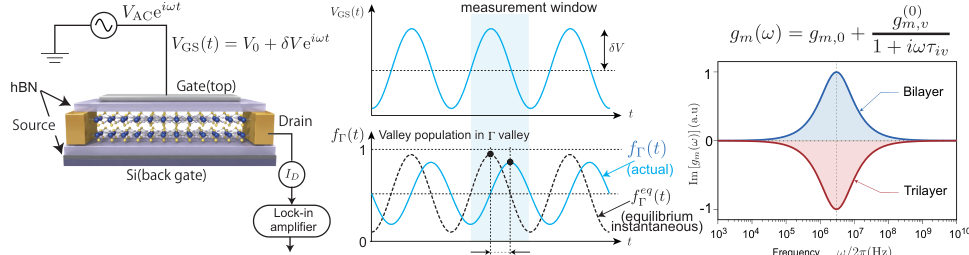
<figcaption class="paper-figure-caption"><b>Fig 1.</b> FIG. 1. Overview of transconductance spectroscopy of intervalley relaxation. (a) Schematic of a multilayer WSe2 transistor in dual-gate geometry with hBN dielectric [32, 33]. An AC gate voltage VGS(t) = V0 + δV eiωt drives the device; the drain current ID(ω) is detected by a lock-in amplifier to extract gm(ω) = dID(ω)/dVGS(ω). (b) Valley population fΓ(t) in the Γ valley (solid) compared to the instantaneous equilibrium value (dashed), illustrating the phase delay ∆t = ϕ/ω arising from the finite intervalley relaxation time τiv. (c) Predicted imaginary part of the valley transconductance Im[gm(ω)] for bilayer (blue) and trilayer (red) WSe2. Opposite-sign Lorentzian peaks centered at ωc = τ...</figcaption>
</figure>
<figure class="paper-figure-card">
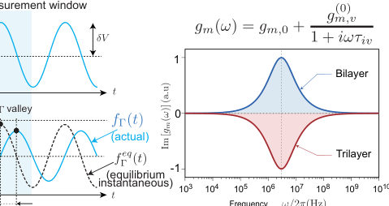
<figcaption class="paper-figure-caption"><b>Fig 2.</b> Figure 2 illustrates the physical picture: a gate-voltage step (VGS : V1 →V2) causes the charge to jump instan- taneously while fΓ exponentially relaxes toward the new equilibrium, producing a two-stage current response. Table I lists the numerical parameters used throughout this work. The effective masses and K–Γ splittings are taken from first-principles calculations [11, 13], and the mobilities are representative experimental values [6, 7]. The intervalley relaxation time τiv enters only as a free parameter; no specific numerical value is assumed in any figure.</figcaption>
</figure>
<figure class="paper-figure-card">
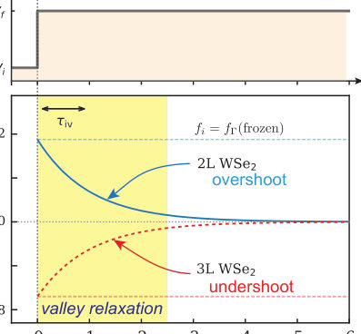
<figcaption class="paper-figure-caption"><b>Fig 3.</b> FIG. 2. Two-stage current response to a gate step ∆VGS = 0.2 V (upper panel) for bilayer (blue) and trilayer (red) WSe2 (lower panel, thick lines). Thin dashed lines (fΓ = fi, frozen) show the valley-frozen reference: charge responds instanta- neously (τRC ≪τiv) while fΓ remains at its pre-step value fi. Valley relaxation then drives the current toward ID(∞): over- shoot for the bilayer and undershoot for the trilayer, with a characteristic timescale τiv. The opposite-sign departures re- flect sgn(g0 m,v) reversing between layers.</figcaption>
</figure>
<figure class="paper-figure-card">
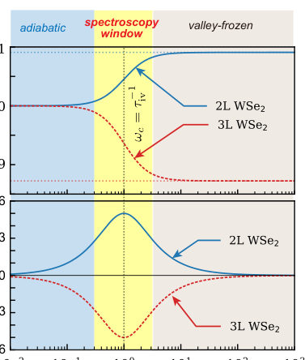
<figcaption class="paper-figure-caption"><b>Fig 4.</b> FIG. 3. Frequency-dependent transconductance for bilayer (solid, blue) and trilayer (dashed, red) WSe2 at T = 300 K, evaluated at the gate voltage where |g0 m,v| is maximum. Shaded regions mark three dynamical regimes: adiabatic (ωτiv ≪1), spectroscopy window (ωτiv ∼1, yellow), and valley-frozen (ωτiv ≫1). (a) Real part Re[gm(ω)]/g(0) m nor- malized to the dc value; dotted lines are the high-frequency limits gm,0/g(0) m . (b) Imaginary part Im[gm(ω)]/|g0 m,v|; the extremum at ωc = τ −1 iv (vertical dotted) has opposite sign for bilayer (g0 m,v &lt; 0) and trilayer (g0 m,v &gt; 0).</figcaption>
</figure>
<figure class="paper-figure-card">
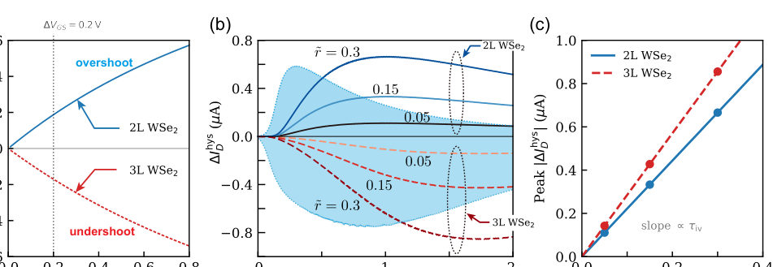
<figcaption class="paper-figure-caption"><b>Fig 5.</b> FIG. 4. Low-frequency fingerprints of delayed intervalley relaxation. (a) Signed transient amplitude ∆Itr D/ID(∞) vs gate- step size ∆VGS at T = 300 K, evaluated at the gate voltage of maximum |χv|. Bilayer (blue) overshoots and trilayer (red) undershoots, encoding sgn(g0 m,v); amplitudes grow linearly then saturate. The dotted line marks the ∆VGS = 0.2 V step of Fig. 2. (b) Hysteresis current ∆Ihys D (VGS) [Eq. (12)] for bilayer (solid, blue family) and trilayer (dashed, red family) at normalized sweep rates ˜r = rτiv = 0.05, 0.15, 0.30 (labeled). Opposite signs reflect sgn(χv) = sgn(∆KΓ); cyan dotted envelopes trace χv(VGS), confirming the profile correspondence. (c) Peak |∆Ihys D | vs...</figcaption>
</figure>

**Summary.** This work develops a novel electrical spectroscopy technique to measure the intervalley relaxation time ($\tau_{iv}$) in WSe$_2$ transistors. By analyzing three complementary signatures—AC transconductance, current transients, and hysteresis—the authors provide quantitative access to $\tau_{iv}$ using standard electronic measurements rather than complex ultrafast optics.

**Why it may be interesting.** The use of dynamic response functions ($g_m(\omega)$) to probe relaxation rates ($\tau_{iv}$) is a classic problem in open quantum systems, linking transport measurements directly to the system's coherence or decay timescales.

Detailed structure

**Main problem.** To establish a direct electrical spectroscopic method for measuring the intervalley relaxation time ($\tau_{iv}$) in WSe$_2$ transistors, bypassing reliance on ultrafast optical techniques.

**Main result.** Three distinct electrical signatures—frequency-dependent transconductance, current transients, and sweep-rate hysteresis—were shown to provide quantitative access to $\tau_{iv}$.

**Method.** The analysis extends an equilibrium valley-thermodynamics framework by modeling the time evolution of the $\Gamma$-valley carrier fraction using a single relaxation equation.

**Model / system.** The system is multilayer WSe$_2$ field-effect transistors, where the valley population acts as a dynamic internal state variable governed by the relaxation rate $\tau_{iv}$.

**Key observables.** Frequency-dependent transconductance $g_m(\omega)$, two-stage current transients (overshoot/undershoot), and sweep-rate-proportional hysteresis.

**Important parameters / regimes.** Intervalley relaxation time ($\tau_{iv}$); characteristic frequency $\omega_c = 1/\tau_{iv}$; temperature dependence following a Bose–Einstein form.

**Assumptions / limitations.** The analysis relies on extending the equilibrium valley-thermodynamics framework and using first-order approximations for slow gate sweeps to derive the hysteresis current.

**Figures summary.** Figures illustrate the schematic measurement setup, the layer-dependent overshoot/undershoot in transients, Lorentzian peaks in $g_m(\omega)$ at $\omega_c$, and linear scaling of hysteresis current with sweep rate $|r|$.

**Paper structure.** The paper develops a theoretical framework based on a relaxation equation for valley population, predicts three measurable electrical signatures (AC spectroscopy, DC transients, hysteresis), and demonstrates how these signatures allow quantitative extraction of $\tau_{iv}$ using standard RF/DC equipment.

Abstract

We show that the transconductance of multilayer WSe$_2$ field-effect transistors serves as a direct electrical spectrometer of the intervalley relaxation time $τ_{\rm iv}$, previously accessible only by ultrafast optical techniques. Extending an equilibrium valley-thermodynamics framework with a single relaxation equation for the $Γ$-valley carrier fraction $f_Γ(t)$, we predict three signatures: (i)~a Lorentzian transconductance $g_m(ω)=g_{m,0}+g_{m,v}^0/(1+iωτ_{\rm iv})$, whose imaginary part peaks at $ω_c=τ_{\rm iv}^{-1}$ with opposite signs for bilayer and trilayer; (ii)~a two-stage current transient after a gate step, exhibiting bilayer overshoot or trilayer undershoot; and (iii)~sweep-rate-proportional hysteresis whose gate-voltage profile and layer-number sign reversal distinguish valley from trap-induced dynamics. All three signatures provide quantitative electrical access to $τ_{\rm iv}$ with standard rf and dc instrumentation.

[↑ back to top](#top)

### [Quantum-geometric origin of superfluid weight in quasicrystals with critical states](http://arxiv.org/abs/2606.09989v1)

**Authors:** Kazuma Saito, Ryo Okugawa, Yusuke Kato, Takami Tohyama  
**Type:** theory · **Category:** other · **PDF:** <https://arxiv.org/pdf/2606.09989v1>  
**Analysis basis:** full PDF text, analyzed in chunks
**Topic relevance:** `analog quantum simulation` **3/5** · `Keldysh / 2PI / non-Gaussian methods` **2/5** · `driven-dissipative phase transition` **2/5** · `Kondo & dissipative impurity` **1/5** · `methods for driven-dissipative` **1/5** · `non-equilibrium dynamics` **1/5**

↔ Scroll figures horizontally

<figure class="paper-figure-card">
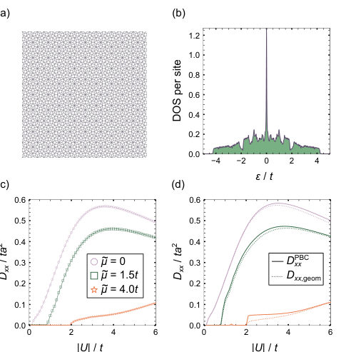
<figcaption class="paper-figure-caption"><b>Fig 1.</b> FIG. 1. (a) The Ammann-Beenker quasicrystal with 2827 sites. Every vertex is the atomic site and each edge represents nearest-neighbor hopping link. We set the link length a to unity for these calculations. (b) The DOS per site of the tight-binding Hamiltonian without the interaction. (c) and (d) Superfluid weight obtained with (c) open boundary and (d) periodic boundary conditions at zero temperature as a function of |U|/t for each ˜µ.</figcaption>
</figure>
<figure class="paper-figure-card">
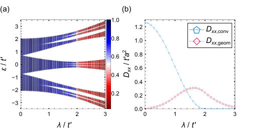
<figcaption class="paper-figure-caption"><b>Fig 2.</b> FIG. 2. (a) Evolution of the energy spectrum of the AAH model. The color bar represents the multifractal dimension D2. (b) Conventional superfluid weight Dxx,conv (blue) and geometric one Dxx,geom (red) for U = −1.5t′ at zero temper- ature.</figcaption>
</figure>

**Summary.** This theoretical paper investigates how the geometric structure of quasicrystals influences their superconducting properties by calculating the superfluid weight. By separating the total weight into conventional and geometric parts, the authors demonstrate that in systems with critical electronic states, the quantum geometry provides the dominant contribution to superconductivity. This highlights a deep interplay between lattice topology and superconducting pairing mechanisms.

**Why it may be interesting.** This work connects concepts from topological physics (geometric contributions to transport coefficients) with strongly correlated electron models (Hubbard model on quasiperiodic lattices), which is highly relevant for understanding exotic superconductivity mechanisms beyond simple mean-field theories.

Detailed structure

**Main problem.** The study investigates the geometric origin of superfluid weight in quasiperiodic systems that host critical electronic states at zero temperature.

**Main result.** The research finds that the superfluid weight is dominated by a quantum geometric contribution ($	ext{D}_{\mu
u,	ext{geom}}$) in these quasicrystals, revealing a fundamental link between superconductivity and critical states.

**Method.** The authors employ both real-space (Open Boundary Conditions) and momentum-space (Periodic Boundary Conditions) approaches to calculate the superfluid weight using the Kubo formula applied to the Bogoliubov-de Gennes Hamiltonian.

**Model / system.** The system under study is quasiperiodic, exemplified by the Ammann-Beenker quasicrystal or modeled via the Aubry-André-Harper (AAH) model. Superconductivity is analyzed using an s-wave pairing assumption within a Hubbard-type framework.

**Key observables.** Superfluid weight ($	ext{D}_{\mu
u}$), conventional contribution ($	ext{D}_{\mu
u,	ext{conv}}$), and geometric contribution ($	ext{D}_{\mu
u,	ext{geom}}$).

**Important parameters / regimes.** Interaction strength ($U$), chemical potential ($	ilde{\mu}$), and the AAH model parameter $\lambda/t'$ (especially near the transition point $\lambda = 2t'$).

**Assumptions / limitations.** The analysis separates the total superfluid weight into conventional and geometric parts, assuming s-wave pairing symmetry.

**Figures summary.** Figure 2(a) likely shows the energy spectrum and multifractal dimension ($D_2$) dependence on the AAH parameter $\lambda/t'$, illustrating the transition between different state regimes.

**Paper structure.** The paper systematically analyzes the superfluid weight calculation using both real-space (OBC) and momentum-space (PBC) techniques. It compares the conventional and geometric contributions, demonstrating that the geometric term dominates when critical states are present in the quasicrystal structure.

Abstract

A distinctive feature of many quasiperiodic systems is the presence of critical states that are neither extended nor exponentially localized. We investigate the geometric effect on the superfluid weight in quasiperiodic systems with critical states at zero temperature. We employ both real-space and momentum-space approaches to superfluid weight in quasicrystals, which allows us to separate the conventional and quantum geometric contributions. We find that the superfluid weight is dominated by the geometric contribution in quasiperiodic systems with critical states. This finding reveals a fundamental interplay between superconductivity and critical states in quasicrystals.

[↑ back to top](#top)

### [Strain-programmable exciton diffusion in moiré heterostructures](http://arxiv.org/abs/2606.10482v1)

**Authors:** Chiho Song, Chiranjit Mondal, Jaebin Lee, Kenji Watanabe, Takashi Taniguchi, Bohm-Jung Yang, Jieun Lee  
**Type:** both · **Category:** other · **PDF:** <https://arxiv.org/pdf/2606.10482v1>  
**Analysis basis:** full PDF text, analyzed in chunks
**Topic relevance:** `non-equilibrium dynamics` **3/5** · `analog quantum simulation` **2/5** · `driven-dissipative phase transition` **1/5** · `methods for driven-dissipative` **1/5** · `non-equilibrium universality` **1/5** · `quantum optics experiment` **1/5**

↔ Scroll figures horizontally

<figure class="paper-figure-card">
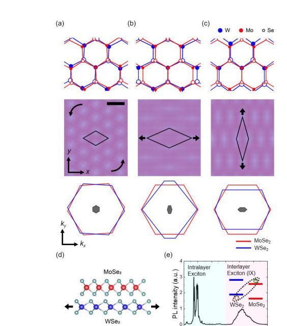
<figcaption class="paper-figure-caption"><b>Fig 1.</b> FIG. 1. Strain-induced moiré superlattices. (a–c) Upper: Stacked crystal structures of twisted (a), ZZ- strained (b), and AC-strained (c) WSe2-MoSe2 heterostructures. Middle: Corresponding moiré superlattices with unit cells indicated as a guide to eyes. Scale bar is 200 nm. Lower: Monolayer MoSe2 (red) and WSe2 (blue) BZs plotted together with the moiré BZs (gray) in reciprocal space. (d) Schematic of WSe2-MoSe2 heterostructure with uniaxial strain applied to bottom WSe2 layer. (e) PL spectrum of intra- and interlayer excitons in sample A. Inset: Type- II band alignment of WSe2-MoSe2 heterostructure and interlayer exciton (IX) formation. The spatial uniformity of strained moiré...</figcaption>
</figure>
<figure class="paper-figure-card">
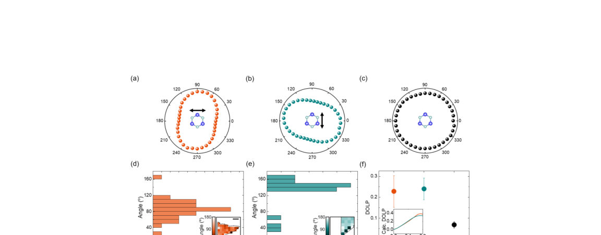
<figcaption class="paper-figure-caption"><b>Fig 2.</b> FIG. 2. Linearly polarized IX emission. (a–c) Linear polarizations of IX in ZZ-strained (a), AC-strained (b), and unstrained (c) heterostructures. Black arrows indicate the applied strain directions. (d, e) Histograms of linear polarization directions in ZZ-strained (d) and AC-strained (e) samples. Insets: Position-dependent linear polarization directions collected from the corresponding heterostructure areas. Scale bars are 5 µm in (d) and 2 µm in (e). (f) Averaged degree of linear polarization (DOLP) defined as (𝐼𝑚𝑎𝑥 − 𝐼𝑚𝑖𝑛)/(𝐼𝑚𝑎𝑥+ 𝐼𝑚𝑖𝑛) for ZZ-strained, AC- strained, and unstrained (twisted) samples. Inset: Calculated DOLP as a function of strain level along ZZ and AC directions. the...</figcaption>
</figure>
<figure class="paper-figure-card">
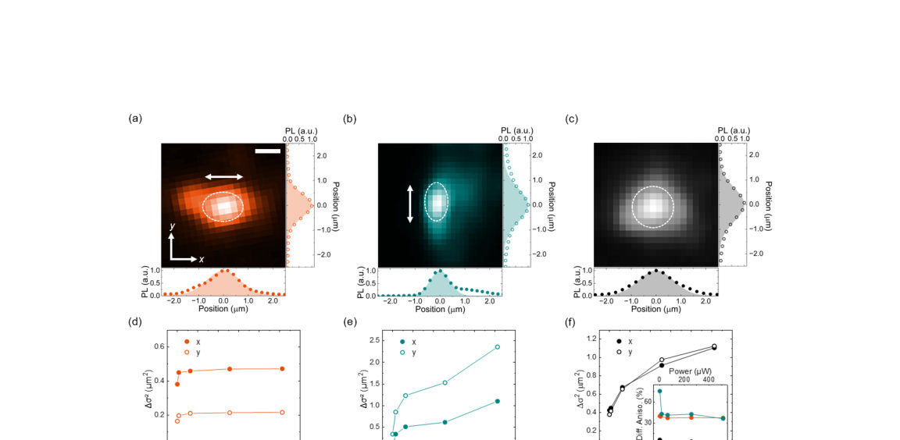
<figcaption class="paper-figure-caption"><b>Fig 3.</b> FIG. 3. Anisotropic IX diffusion. (a–c) Upper: Spatial PL maps of IX diffusion in ZZ-strained (a), AC-strained (b), and unstrained (c) heterostructures at the excitation laser power of 1 μW, with the line profiles along the 𝑥- and 𝑦-axis in corresponding heterostructures. White arrows indicate the applied strain directions. Dashed lines are a guide to eyes. Scale bar is 1 μm. Gaussian fitting functions are plotted as shaded areas. (d–f) Power dependence of the differential squared width ∆𝜎2 along 𝑥- and 𝑦-axis in ZZ-strained (d), AC-strained (e), and unstrained (f) heterostructures. Inset: Diffusion anisotropy as a function of power for ZZ-strained (orange), AC-strained (dark cyan), and...</figcaption>
</figure>
<figure class="paper-figure-card">
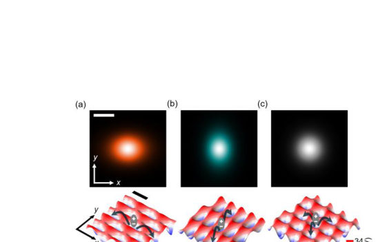
<figcaption class="paper-figure-caption"><b>Fig 4.</b> FIG. 4. Simulations of IX diffusion and moiré potential landscapes. (a–c) Upper: Calculated spatial steady-state IX distributions in ZZ-strained (a), AC- strained (b), and twisted (c) heterostructures. Scale bar is 0.5 µm. Lower: Moiré potential landscapes plotted for corresponding heterostructures. Scale bar is 50 nm. Black arrows indicate preferred IX hopping directions. strained, and unstrained conditions. Clear anisotropy of IX diffusion is observed for both the ZZ- and AC- strained heterostructures. The diffusion anisotropy obtained from the simulation was 0.24 (ZZ) and 0.25 (AC) under a strain level of 0.3 %. The resemblance of the simulation with the experiment is striking,...</figcaption>
</figure>

**Summary.** This work demonstrates that applying controlled strain to WSe2-MoSe2 moiré heterostructures acts as a powerful tool to break rotational symmetry. This symmetry breaking results in two key effects: the emergence of linearly polarized interlayer exciton emission, and highly anisotropic diffusion pathways for these excitons. These findings open new avenues for engineering vdW logic devices.

**Why it may be interesting.** The ability to use mechanical strain as a precise knob to engineer electronic band structure symmetries and control quantum transport pathways is highly relevant for designing artificial quantum materials and excitonic devices.

Detailed structure

**Main problem.** To explore strain tuning as a versatile tool for designing moiré superlattices and programming excitonic transport in van der Waals (vdW) heterostructures.

**Main result.** Strain significantly breaks the $C_3$ rotational symmetry of the moiré lattice, leading to measurable linear polarization and anisotropic diffusion of interlayer excitons along the strain direction.

**Method.** The study combines optical measurements (PL spectroscopy for polarization and diffusion mapping) with theoretical modeling (solving Fokker-Planck equations for exciton density evolution).

**Model / system.** The physical system is WSe2-MoSe2 heterostructures forming moiré superlattices. The key mechanism involves applying controlled uniaxial or biaxial strain to modify the lattice geometry and break inherent symmetries.

**Key observables.** Degree of Linear Polarization (DOLP), anisotropic exciton diffusion length ($\sigma_{IX}$), and the polarization-dependent interlayer exciton emission intensity.

**Important parameters / regimes.** The magnitude and type of applied uniaxial/biaxial strain (e.g., 0.2% strain).

**Assumptions / limitations.** The observed polarization and transport anisotropy are directly linked to the symmetry breaking mechanism induced by external strain, which modifies the moiré exciton wavefunctions.

**Figures summary.** Figures demonstrate linear polarization of IX emission varying with strain level (DOLP), and PL maps show that IX diffusion is strongly anisotropic, extending further along the strain direction compared to unstrained samples.

**Paper structure.** The paper establishes the potential of moiré heterostructures, details how strain breaks symmetry leading to polarized emission, and then quantifies this effect by showing strain-controlled anisotropic exciton diffusion both experimentally and via simulation.

Abstract

Moiré superlattices in van der Waals heterostructures have recently gained significant attention as an intriguing platform for studying correlated electronic systems and exotic excitonic properties. Previous reports, however, focused on creating and modulating moiré heterostructures through interlayer twisting or lattice constant mismatches, limiting controls on symmetry of heterostructures. In this work, we show that strain significantly alters the geometry of moiré superlattices by breaking the C3 rotational symmetry. We realize strain-induced moiré superlattices by intentionally regulating interlayer strain in WSe2-MoSe2 heterostructures, which is manifested by linearly polarized interlayer exciton emission coupled to the strain direction. Furthermore, interlayer exciton diffusion was preferentially guided along the stretched moiré superlattice orientations over a wide spatial range, reflecting the strain-modified moiré potentials. Our work highlights strain tuning as a versatile tool for designing moiré superlattices and programming excitonic transport, which opens pathways for van der Waals logic and information processing devices.

[↑ back to top](#top)

### [Superheating field of clean superconductors near the type-I--type-II boundary: the low-temperature Meissner stability limit of niobium](http://arxiv.org/abs/2606.10420v1)

**Authors:** Takayuki Kubo  
**Type:** theory · **Category:** other · **PDF:** <https://arxiv.org/pdf/2606.10420v1>  
**Analysis basis:** full PDF text, analyzed in chunks
**Topic relevance:** `Keldysh / 2PI / non-Gaussian methods` **3/5** · `correlated / nonlocal dissipation` **2/5** · `non-equilibrium dynamics` **2/5** · `driven-dissipative phase transition` **1/5** · `methods for driven-dissipative` **1/5**

↔ Scroll figures horizontally

<figure class="paper-figure-card">
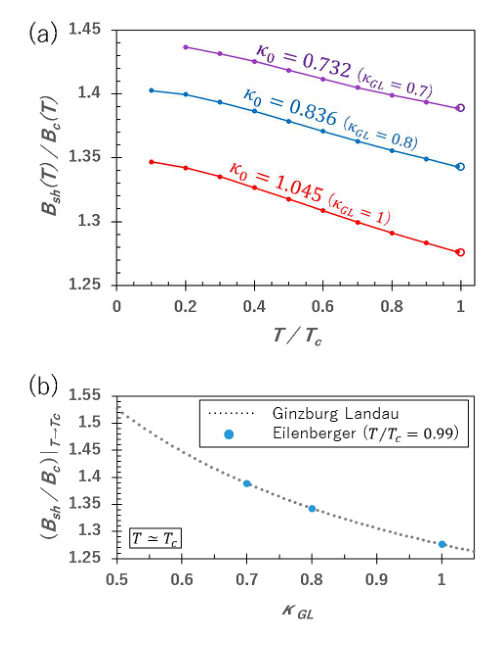
<figcaption class="paper-figure-caption"><b>Fig 1.</b> FIG. 1. (a) Temperature dependence of the superheating field for a clean low-κ superconductor. Filled symbols show Eilenberger results at fixed κ0; the corresponding κGL values are obtained from the near-Tc mapping. Open symbols at T/Tc = 1 show the corresponding GL values, which are valid in the limit T →Tc. (b) Superheating field near Tc as a function of κGL. The agreement with the GL result provides a check of the Eilenberger calculation in the near-Tc limit.</figcaption>
</figure>

**Summary.** This theoretical paper calculates the intrinsic superheating field limit ($B_{sh}$) for clean superconductors like Niobium using advanced Eilenberger theory. The result provides a significantly higher estimate for the Meissner stability limit compared to simpler Ginzburg-Landau extrapolations. This finding is crucial for designing high-performance superconducting accelerator cavities.

**Why it may be interesting.** While focused on superconductivity, the rigorous nonlocal stability analysis techniques developed here (Eilenberger formalism) are highly sophisticated many-body tools that could inform models of quantum interfaces or non-equilibrium dynamics in other condensed matter systems.

Detailed structure

**Main problem.** The paper calculates the low-temperature superheating field ($B_{sh}$) of clean superconductors near the type-I–type-II boundary.

**Main result.** For Niobium (Nb) with $\kappa_{GL}=0.7$, the calculated $B_{sh}$ is $\simeq 290 	ext{ mT}$ at $T/T_c=0.2$, corresponding to an intrinsic Meissner-stability limit of about $67 	ext{ MV/m}$.

**Method.** The calculation employs a self-consistent nonlinear nonlocal Eilenberger theory combined with linear stability analysis of the Meissner state.

**Model / system.** The study focuses on clean superconductors, specifically Niobium (Nb), relevant for Superconducting Radio-Frequency (SRF) accelerator cavities operating in the Meissner state. The theoretical framework handles non-local current response.

**Key observables.** $B_{sh}$ (superheating field), $E_{\max}^{acc}$ (maximum accelerating gradient).

**Important parameters / regimes.** $\kappa_{GL}=0.7$, $T/T_c=0.2$, $B_{c0} \simeq 200 	ext{ mT}$.

**Assumptions / limitations.** The stability analysis is assumed to be set by the one-dimensional instability ($ar{k}=0$). The calculation is limited to $T/T_c \ge 0.1$.

**Figures summary.** Figure 1(a) compares Eilenberger results to GL values for $B_{sh}(T)/B_c(T)$ vs. temperature, while Figure 1(b) shows $B_{sh}$ dependence on $\kappa_{GL}$ near $T_c$.

**Paper structure.** The paper develops the superheating-field problem using Eilenberger theory, compares results to GL approximations, calculates $B_{sh}(T)$ across the temperature range, and applies this limit to practical accelerator applications.

Abstract

We calculate the low-temperature superheating field $B_{\rm sh}$ of clean superconductors near the boundary between type-I and type-II superconductivity, with particular emphasis on Nb. The calculation is based on the self-consistent nonlinear nonlocal Eilenberger theory and the linear stability analysis of the Meissner state. For a Nb-like material with $κ_{\rm GL}=0.7$, we obtain $B_{\rm sh}\simeq 290\,{\rm mT}$ at $T/T_c=0.2$, using $B_{c0}\simeq 200\,{\rm mT}$. This value is substantially higher than the value obtained by naively extrapolating the Ginzburg--Landau result near $T_c$ to $T\ll T_c$. For a TESLA-shaped Nb accelerator cavity, it corresponds to an intrinsic Meissner-stability limit of about $67\,{\rm MV/m}$.

[↑ back to top](#top)

### [Distribution of Majorana modes in the extended-range Kitaev chain](http://arxiv.org/abs/2606.10043v1)

**Authors:** Pedro B. Widniczck, Gerardo Martínez  
**Type:** theory · **Category:** other · **PDF:** <https://arxiv.org/pdf/2606.10043v1>  
**Analysis basis:** full PDF text, analyzed in chunks
**Topic relevance:** `analog quantum simulation` **3/5** · `driven-dissipative phase transition` **2/5** · `Kondo & dissipative impurity` **1/5** · `methods for driven-dissipative` **1/5** · `non-equilibrium dynamics` **1/5**

↔ Scroll figures horizontally

<figure class="paper-figure-card">
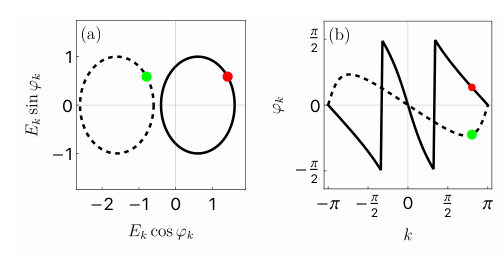
<figcaption class="paper-figure-caption"><b>Fig 1.</b> FIG. 1. (a) Evolution of the winding vector nk for the Kitaev chain around the origin (solid circle), yielding a phase with index ν = ±1, and a trivial curve (dashed circle) with a phase of ν = 0. (b) Distribution of the angle φk, as defined in Eq. (8), over the BZ. In the topological phase one observes the emergence of two discontinuities at ±l1 (solid line), while in the trivial phase there is no discontinuity (dashed line).</figcaption>
</figure>
<figure class="paper-figure-card">
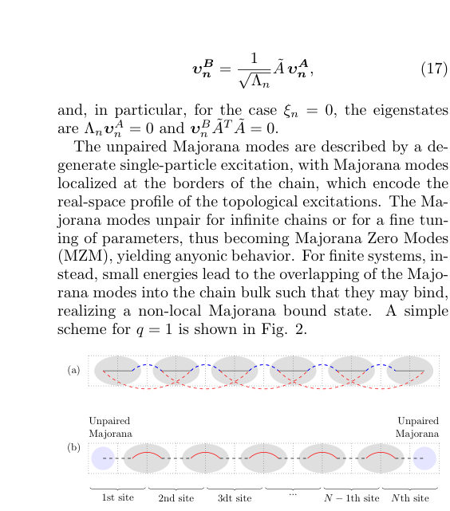
<figcaption class="paper-figure-caption"><b>Fig 2.</b> FIG. 2. (a) Schematic representation of the Kitaev chain exhibiting the lattice sites (filled gray ellipses) in the trivial phase. Chemical potential, hopping and pairing couplings are depicted as lines in the Majorana basis framework. Red and blue dotted lines ˜Aj,j+1 represent Majorana nearest-neighbor hoppings. (b) A representation of the topological phase (in the region |µ/t| &lt; 2). The light blue circles at the edges show the unpaired Majorana states in the topological phase.</figcaption>
</figure>
<figure class="paper-figure-card">
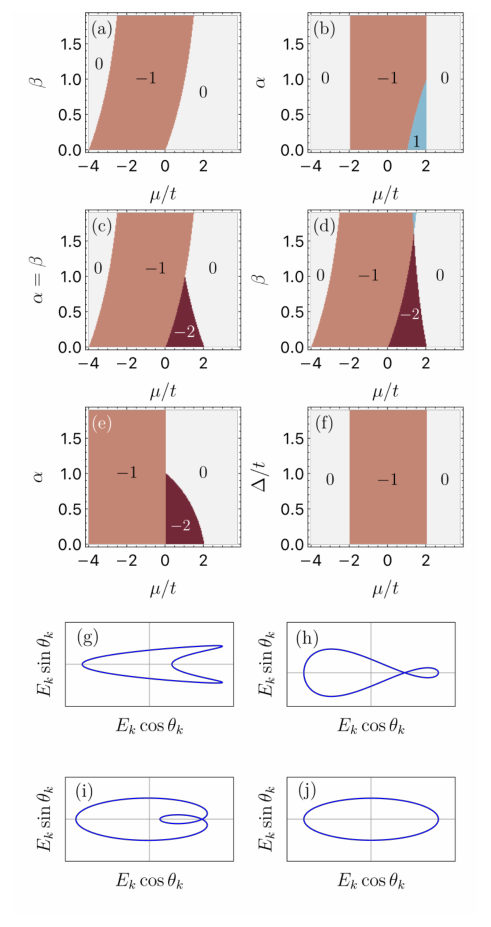
<figcaption class="paper-figure-caption"><b>Fig 3.</b> FIG. 3. Topological phase diagrams of the extended Kitaev chain with next-nearest neighbors (q = 2) for the cases: (a) α →∞, for running β; (b) β →∞, for running α; (c) The homogeneous chain α = β; (d) α = 0 and running β; (e) β = 0 and running α; Cases (c-e) exhibit similar diagrams with a topological invariant of value −2; Case (f) shows the phase diagram of the Kitaev chain (α, β →∞); Panels (g-j) show various examples of the trajectories of nk over the BZ.</figcaption>
</figure>
<figure class="paper-figure-card">
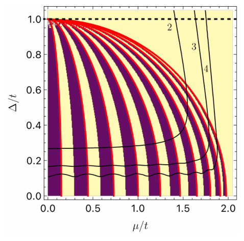
<figcaption class="paper-figure-caption"><b>Fig 4.</b> FIG. 4. Colored phase diagram showing the effective parity regions where Peff = +1 (yellow regions) and Peff = −1 (violet regions) in terms of the parameters (µ, ∆) for a finite chain with N = 20 sites. Red solid lines indicate ground-state fermion parity P switches, while black isolines indicate its Ma- jorana average position (Map) from the border (¯n = 2, 3, 4). These isolines vary showing maxima and minima when the effective parity changes in the circle of oscillations, they tend to oscillate further as ∆/t get smaller. See main text.</figcaption>
</figure>
<figure class="paper-figure-card">
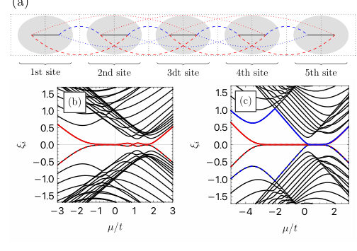
<figcaption class="paper-figure-caption"><b>Fig 5.</b> FIG. 5. (a) Schematic example of a finite chain with N = 5 sites in the trivial phase of the next-nearest neighbor model (q = 2). The nearest-neighbor couplings are represented by the red and blue dashed lines, while the next-nearest ones, by the red and blue dotted lines. The blue solid lines represent the intrasite chemical potential coupling. The eigenenergies of the next-nearest Kitaev chain with N = 20 sites as a function of µ/t are seen in the limit (b) with α = 0 and β →∞, and (c) in the homogeneous case α = β = 0, where red and blue curves represent the two lowest-energy modes.</figcaption>
</figure>

**Summary.** This work analyzes the topology and edge states of extended-range Kitaev chains by calculating the winding number and tracking parity changes. It introduces the Majorana average position ($	ext{Map}$) as a key diagnostic tool, showing that spatial localization patterns correlate with distinct types of topological phase transitions beyond simple energy gap closures.

**Why it may be interesting.** The detailed study of edge mode localization via $	ext{Map}$ provides a novel diagnostic tool that complements standard energy gap measurements for characterizing topological phases in superconducting systems, which is highly relevant to quantum materials research.

Detailed structure

**Main problem.** The study investigates the topological properties of extended-range Kitaev chain models, particularly focusing on how these properties are characterized when the topological winding number is preserved.

**Main result.** The analysis reveals that in truncated-range scenarios, the number of distinct topological phases scales with the number of coupled neighbors. Furthermore, it establishes a deep connection between effective parity changes and the spatial localization/delocalization of Majorana edge modes.

**Method.** The authors employ analytical derivations to calculate the topological invariant (winding number) and utilize numerical diagonalization on finite-size clusters in the Majorana basis formalism.

**Model / system.** The system is a spinless fermion model described by an extended-range Hamiltonian, generalized from the Kitaev chain with couplings decaying algebraically ($\Delta_\ell \sim 1/\ell^\alpha$, $t_\ell \sim 1/\ell^eta$).

**Key observables.** Topological winding number ($
u$), effective parity ($P_{	ext{eff}}$), ground-state fermion parity ($P$), and the Majorana average position ($	ext{Map}$).

**Important parameters / regimes.** The decay exponents $\alpha$ and $eta$, the chemical potential $\mu$, and the ratio of coupling strengths $\Delta/t$.

**Assumptions / limitations.** The analysis distinguishes between 'energetic switches' (linked to ground-state fermion parity) and a distinct 'functional switch' governing effective parity changes.

**Figures summary.** Figures illustrate phase diagrams showing regions of $P_{	ext{eff}}$ change, plots comparing localization measures like IPR vs. $	ext{MP}$, and the dependence of $	ext{Map}$ on system parameters.

**Paper structure.** The paper systematically develops the Hamiltonian in the Majorana basis, calculates topological invariants using winding numbers, and then analyzes finite-size effects by tracking changes in effective parity and spatial localization ($	ext{Map}$) across different parameter regimes.

Abstract

The topological properties of the Kitaev chain model with extended-range interactions are investigated, focusing on cases where the topological winding number is preserved. We assume that the pairing and hopping terms decay algebraically in space with exponents $α$ and $β$, respectively. We show that in the truncated-range scenario, there are as many distinct topological phases as the number of coupled neighboring sites. In addition, an explicit analytical formulation is provided to evaluate the topological invariant and the phase transitions that emerge in these systems. Besides the analytical description, we introduce a new physical insight into the topological excitations of the ground-state by measuring the spatial distribution of the edge modes with the Majorana average position. Taking the next-nearest neighbor Kitaev chains as a probe, various numerical calculations of Majorana edge states were performed in finite-size clusters to determine the sensitivity of the topological zero energy modes to the parameters of interest. The occupation of edge-to-edge non-local fermion states is computed and defined as an effective parity. Such an effective parity exhibits new interesting features beyond the energetic exchange from the ground-state fermion parity switches, which are related to the distribution of the respective edge modes. Our calculations show a direct correlation between the ground-state fermion parity and the edge occupation numbers, which are translated into localization and delocalization of the Majorana average position.

[↑ back to top](#top)

### [Revisiting Cherenkov radiation in anisotropic chiral matter: exact calculation reveals threshold-free emission](http://arxiv.org/abs/2606.10985v1)

**Authors:** R. Martínez von Dossow, Luis F. Urrutia  
**Type:** theory · **Category:** other · **PDF:** <https://arxiv.org/pdf/2606.10985v1>  
**Analysis basis:** full PDF text, analyzed in chunks
**Topic relevance:** `Keldysh / 2PI / non-Gaussian methods` **2/5** · `methods for driven-dissipative` **2/5** · `analog quantum simulation` **1/5** · `correlated / nonlocal dissipation` **1/5** · `driven-dissipative phase transition` **1/5** · `interference shaping light` **1/5** · `non-equilibrium dynamics` **1/5**

↔ Scroll figures horizontally

<figure class="paper-figure-card">
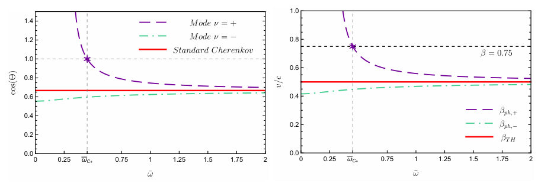
<figcaption class="paper-figure-caption"><b>Fig 1.</b> Figure 1. Left panel: Plot of cos Θ for the ν = ± modes as a function of the dimensionless frequency ¯ω. Right panel: Plot of the phase velocity for each mode as a function of ¯ω. The parameters are n = 2, b = 2.6 × 108 m−1, and β = 0.75.</figcaption>
</figure>
<figure class="paper-figure-card">

<figcaption class="paper-figure-caption"><b>Fig 2.</b> Figure 2 shows the SED in the high-velocity sector. As expected from the analysis of the Cherenkov angle and the phase velocity, the ν = −mode contributes over the entire frequency range, indicating that this mode always emits radiation. In contrast, the ν = + mode contributes only for ¯ω &gt; ¯ωC+, because for ¯ω &lt; ¯ωC+ the Cherenkov angle is not real and the phase velocity is larger than the charge velocity. The standard Cherenkov result is shown for comparison. For ¯ω &gt; ¯ωC+, the sum of the contributions of each mode satisfies E+ + E−= ECh, as indicated in Fig. 2.</figcaption>
</figure>
<figure class="paper-figure-card">
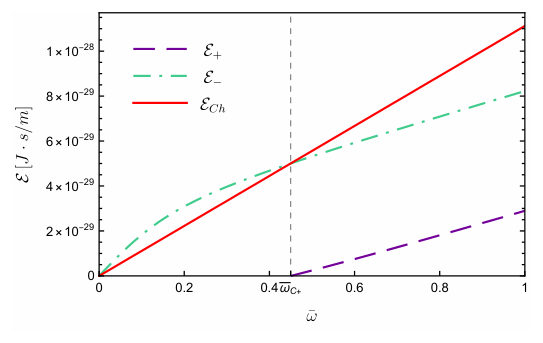
<figcaption class="paper-figure-caption"><b>Fig 3.</b> Figure 2. Spectral energy density in the high-velocity sector as a function of the dimensionless frequency ¯ω. The contributions from the ν = + and ν = −modes are shown, together with the standard Cherenkov result. The parameters are n = 2, b = 2.6 × 108 m−1, and β = 0.75.</figcaption>
</figure>
<figure class="paper-figure-card">
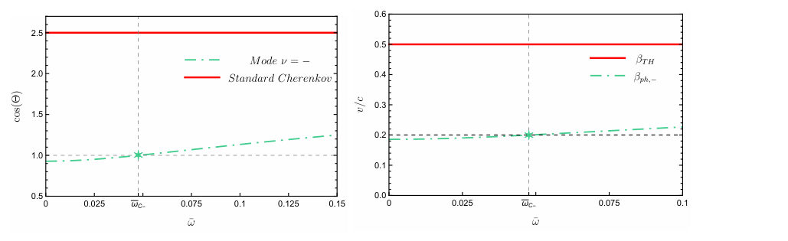
<figcaption class="paper-figure-caption"><b>Fig 4.</b> Figure 3. Left panel: Plot of cos Θ for the ν = −mode as a function of the dimensionless frequency ¯ω. Right panel: Plot of the phase velocity for the ν = −mode as a function of ¯ω. The parameters are n = 2, b = 2.6 × 108 m−1, and β = 0.2. In both cases the ν = + mode lies outside the plotted range. The solid red line would represent the standard Cherenkov case, which is certainly not allowed. Threshold-free CHR can be appreciated in both panels.</figcaption>
</figure>
<figure class="paper-figure-card">
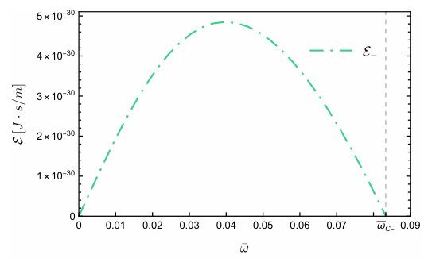
<figcaption class="paper-figure-caption"><b>Fig 5.</b> Figure 4. Spectral energy density in the low-velocity sector as a function of the dimensionless frequency ¯ω. Only the contribution from the ν = −mode is present, and radiation occurs in the interval 0 &lt; ¯ω &lt; ¯ωC−. The parameters are n = 2, b = 2.6×108 m−1, and β = 0.2. This SED corresponds entirely to threshold-free CHR.</figcaption>
</figure>

**Summary.** This work provides an exact analytical calculation of Cherenkov radiation in anisotropic chiral matter using modified electrodynamics. The key finding is the demonstration of threshold-free CHR for slow charges, which occurs within a specific low-frequency band. This result surpasses previous approximate calculations by rigorously solving the field equations.

**Why it may be interesting.** While focused on classical electrodynamics in exotic media, the rigorous mathematical techniques used (solving coupled differential equations in space-frequency domain, analyzing boundary conditions) are highly relevant to theoretical physics dealing with effective Hamiltonians or modified dispersion relations in condensed matter systems.

Detailed structure

**Main problem.** The study revisits Cherenkov radiation (CHR) in anisotropic chiral matter, aiming to provide an exact calculation that reveals a novel phenomenon: threshold-free emission.

**Main result.** The model predicts that for slowly moving charges ($eta < 1/n$), CHR can occur without the standard velocity threshold, confined instead to a finite low-frequency window ($0 < \omega < \omega_{C-}$).

**Method.** The authors solve modified Maxwell's equations exactly in the space-frequency domain using cylindrical coordinates and separation of variables, deriving dispersion relations from outgoing wave boundary conditions.

**Model / system.** The system is anisotropic chiral matter described by Carroll-Field-Jackiw electrodynamics, characterized by a position-dependent axion angle $	heta(x)$ and governed by modified Maxwell's equations.

**Key observables.** Spectral Energy Distribution (SED) of the radiation ($E_
u$), Cherenkov cones ($\Theta_
u$), and phase velocity ($v_{	ext{ph},
u}(\omega)$).

**Important parameters / regimes.** Charge velocity $eta$, refractive index $n$, chiral parameter $b$, and frequency ranges defining emission windows.

**Assumptions / limitations.** The analysis relies on exact solutions in the space-frequency domain, explicitly contrasting with previous approximate methods (e.g., Green's function calculations) which fail at low frequencies.

**Figures summary.** Figures illustrate SEDs for both high and low velocity regimes, confirming that only one polarization mode ($
u=-$) contributes within a finite frequency window in the low-velocity sector.

**Paper structure.** The paper proceeds by deriving field solutions using boundary conditions (Gauss's/Ampere's laws) to find coefficients ($Y^\pm$), establishing dispersion relations, and finally calculating the SED via the Poynting vector, comparing exact results against approximations.

Abstract

We explore Cherenkov radiation in anisotropic chiral matter within the framework of Carroll-Field-Jackiw electrodynamics, where the axion angle exhibits a linear dependence on position. By deriving closed-form expressions for the polarization modes of electromagnetic fields in cylindrical coordinates and the space-frequency domain, we solve the modified Maxwell's equations. To enforce causality, we impose outgoing wave boundary conditions at a cylindrical surface at infinity, which yields the dispersion relations. Our analysis uncovers the specific angles and frequency ranges that allow for zero, one, or two Cherenkov cones. We also obtain the spectral energy distribution of the radiation in all cases. Notably, one sector of the model exhibits a novel phenomenon: Cherenkov radiation can be generated by slowly moving charges without a threshold, but only within a specific frequency range. This behavior is not observed in standard materials. Using our exact calculations, we also investigate the reliability of an approximate method previously proposed based on the calculation of the Green's function for the system.

[↑ back to top](#top)

### [Flower-like WO3-modified Vulcan carbon GDEs for photoelectro-Fenton process: Efficient ciprofloxacin degradation and mechanistic insights](http://arxiv.org/abs/2606.11114v1)

**Authors:** João Paulo C. Moura, Vanessa S. Antonin, Caio Machado Fernandes, Aline B. Trench, Erica S. Conrado, Michell O. Almeida, Kathia M. Honorio, Renata Colombo, Rafael Sotana, Ana M. P. Neto, Mauro C. Santos  
**Type:** both · **Category:** other · **PDF:** <https://arxiv.org/pdf/2606.11114v1>  
**Analysis basis:** full PDF text, analyzed in chunks
**Topic relevance:** `non-equilibrium dynamics` **2/5** · `Keldysh / 2PI / non-Gaussian methods` **1/5** · `analog quantum simulation` **1/5** · `correlated / nonlocal dissipation` **1/5** · `driven-dissipative phase transition` **1/5** · `methods for driven-dissipative` **1/5** · `non-equilibrium universality` **1/5**

↔ Scroll figures horizontally

<figure class="paper-figure-card">
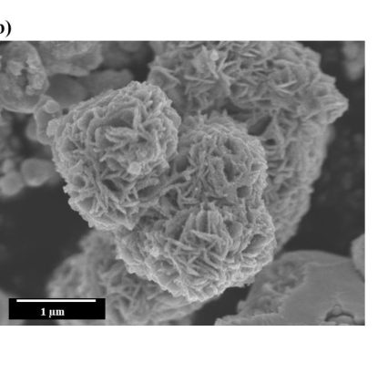
<figcaption class="paper-figure-caption"><b>Fig 1.</b> Figure 1. (a) XRD pattern and (b) SEM image of the synthesized WO3 nanostructures.</figcaption>
</figure>
<figure class="paper-figure-card">
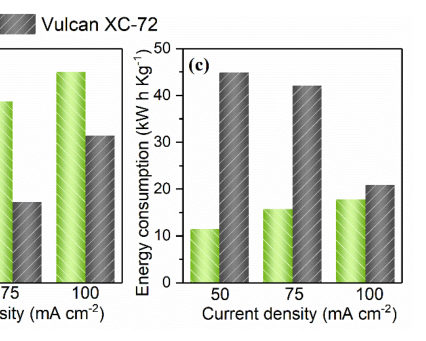
<figcaption class="paper-figure-caption"><b>Fig 2.</b> Figure 2. (a) H2O2 yield, (b) current efficiency, and (c) energy consumption achieved</figcaption>
</figure>
<figure class="paper-figure-card">
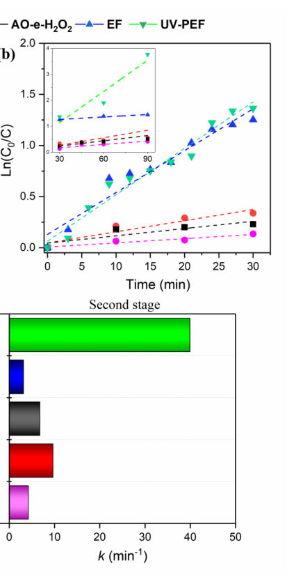
<figcaption class="paper-figure-caption"><b>Fig 3.</b> Figure 3. (a) CIP degradation, (b) kinetic analysis assuming a pseudo-first-order reaction</figcaption>
</figure>
<figure class="paper-figure-card">
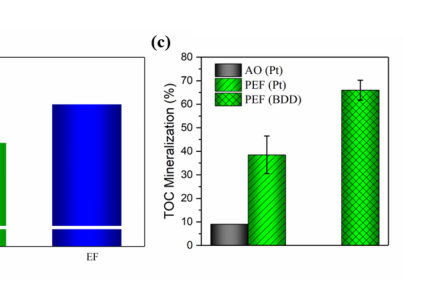
<figcaption class="paper-figure-caption"><b>Fig 4.</b> Figure 4. (a) Dissolved Fe species evolution, and (b) residual H2O2 over PEF and EF</figcaption>
</figure>
<figure class="paper-figure-card">
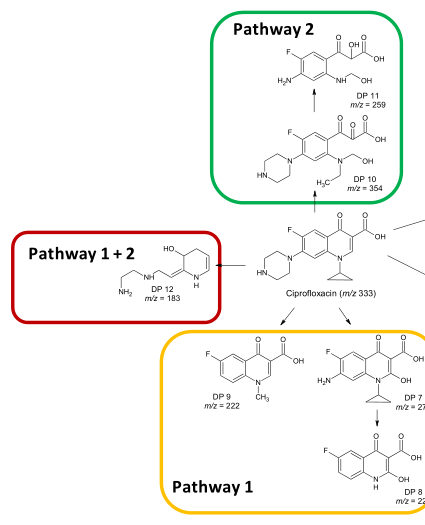
<figcaption class="paper-figure-caption"><b>Fig 5.</b> Figure 5. Main reaction pathway proposed for the degradation of ciprofloxacin by</figcaption>
</figure>

**Summary.** This research demonstrates that modifying Gas Diffusion Electrodes with WO3 significantly boosts hydrogen peroxide production for treating contaminated water. By employing a Photoelectro-Fenton process, the study achieves near-complete removal of the antibiotic ciprofloxacin while confirming that the resulting byproducts exhibit lower predicted environmental toxicity.

**Why it may be interesting.** While not directly quantum physics, the study involves complex reaction kinetics and radical chemistry, which can sometimes be modeled using open quantum system approaches or master equations to describe pollutant decay rates.

Detailed structure

**Main problem.** The primary goal is the efficient degradation of ciprofloxacin (CIP), a fluoroquinolone antibiotic, from wastewater using advanced oxidation processes to combat antimicrobial resistance.

**Main result.** WO3-modified Vulcan carbon Gas Diffusion Electrodes (GDEs) significantly enhance hydrogen peroxide generation and facilitate complete CIP removal via Photoelectro-Fenton (PEF) processes. Furthermore, the degradation products show reduced environmental toxicity compared to the parent compound.

**Method.** The study combines electrochemical measurements (H2O2 electrogeneration), advanced oxidation techniques (Photoelectro-Fenton), computational chemistry (DFT for Fukui indices), and ecotoxicological assessment (ECOSAR model).

**Model / system.** The physical system is an electrochemical reactor utilizing WO3/C GDEs under UV irradiation. The chemical process involves the generation of highly reactive hydroxyl radicals ($\cdot	ext{OH}$) to attack specific sites on the CIP molecule.

**Key observables.** H2O2 concentration (up to 916 mg L-1), CIP degradation percentage (complete removal in PEF), Total Organic Carbon (TOC) mineralization rate (up to 66%), and predicted environmental toxicity levels (ECOSAR classification).

**Important parameters / regimes.** Applied current densities (50-100 mA cm-2), reaction time (90 min for complete removal), catalyst modification percentage (3% WO3), and electrochemical potential.

**Assumptions / limitations.** The degradation mechanism is assumed to proceed primarily via $\cdot	ext{OH}$ radical attack on the piperazine and quinolone rings. Toxicity assessment relies on predictive ECOSAR models.

**Figures summary.** Figures likely illustrate the proposed reaction pathways, showing sequential product formation (DP1-DP12) based on radical attacks predicted by Fukui indices, alongside graphs detailing degradation kinetics and toxicity profiles.

**Paper structure.** The paper follows a structure moving from electrocatalytic enhancement ($	ext{H}_2	ext{O}_2$ generation) to the main remediation process (PEF), followed by detailed mechanistic elucidation using computational chemistry (Fukui indices) and culminating in an environmental risk assessment (ECOSAR toxicity testing).

Abstract

Electrochemical H2O2 synthesis was investigated using a 3 percent WO3 C gas diffusion electrode GDE. The catalyst outperformed bare Vulcan carbon, generating H2O2 concentrations of 423, 586, and 916 mg L at 50, 75, and 100 mA cm2, respectively, maintaining around 70 percent current efficiency. This performance and lower energy consumption are attributed to the WO3 carbon synergistic effect. In electro Fenton EF applications, the WO3 C GDE achieved rapid initial ciprofloxacin CIP degradation of around 70 percent in 30 min, though limited later by slow Fe2 regeneration. Incorporating UV light photoelectro Fenton overcame this constraint, yielding complete CIP removal within 90 min, while a boron doped diamond BDD anode enhanced total organic carbon TOC mineralization to 66 percent. The proposed degradation mechanism proceeds via hydroxyl radical attack on the piperazine ring with or without defluorination and quinolone ring oxidation, with theoretical analysis confirming reduced environmental toxicity of the transformation products. Overall, WO3 C GDEs represent a highly efficient strategy for H2O2 generation and wastewater remediation.

[↑ back to top](#top)

### [Optical fingerprints across the strain-driven semi-Dirac transition in Kekulé-O graphene](http://arxiv.org/abs/2606.10996v1)

**Authors:** Yawar Mohammadi  
**Type:** theory · **Category:** other · **PDF:** <https://arxiv.org/pdf/2606.10996v1>  
**Analysis basis:** full PDF text, analyzed in chunks
**Topic relevance:** `Keldysh / 2PI / non-Gaussian methods` **1/5** · `driven-dissipative phase transition` **1/5**

↔ Scroll figures horizontally

<figure class="paper-figure-card">
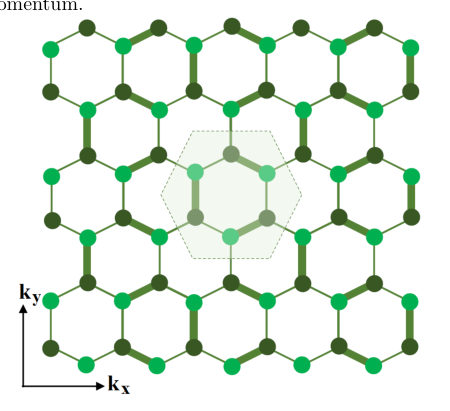
<figcaption class="paper-figure-caption"><b>Fig 1.</b> FIG. 1. Schematic of graphene with a uniform Kekul´e-O bond modulation. The thick and thin bonds represent alternat- ing strong and weak hopping amplitudes characteristic of the Kekul´e-O pattern. The shaded hexagon denotes the enlarged unit cell of the distorted lattice.</figcaption>
</figure>
<figure class="paper-figure-card">
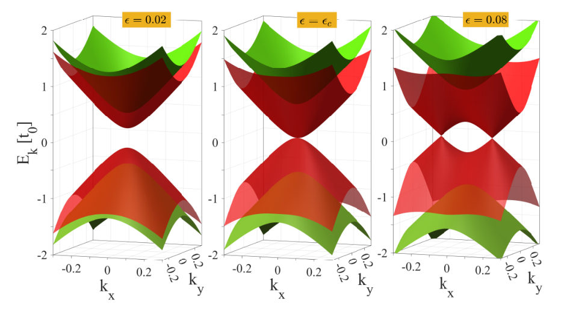
<figcaption class="paper-figure-caption"><b>Fig 2.</b> FIG. 2. Evolution of the band structure of Kekul´e-O graphene with fixed Kekul´e modulation strength ∆= 0.04 under uniaxial strain applied along the x direction for ε = 0.02, ε = εc, and ε = 0.08. Strain lifts the degeneracy of the unstrained bands, driving one pair toward zero energy and the other to higher energies. At ε = εc, the gap closes and a semi-Dirac spectrum emerges. For ε &gt; εc, the semi-Dirac node splits into two anisotropic Dirac cones, accompanied by the formation of saddle points near the Γ point, while the higher-energy bands move further away from the low-energy sector.</figcaption>
</figure>
<figure class="paper-figure-card">
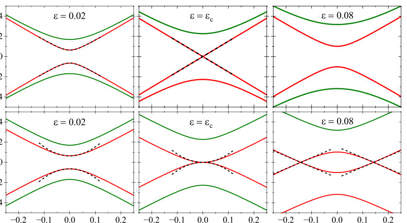
<figcaption class="paper-figure-caption"><b>Fig 3.</b> FIG. 3. Band-structure cuts along ky = 0 (top panels) and kx = 0 (bottom panels) for strain values ε = 0.02, εc, and 0.08, corresponding to uniaxial deformation along the zigzag direction. The horizontal axis denotes ky = 0 (top panels) and kx = 0 (bottom panels), respectively. Solid lines represent the full continuum model, while dashed lines show the results obtained from the effective low-energy Hamiltonian (Appendix A). Good agreement between the two descriptions is observed in the low-energy regime, particularly near the Γ point and around the new Dirac points in the post-critical regime.</figcaption>
</figure>
<figure class="paper-figure-card">
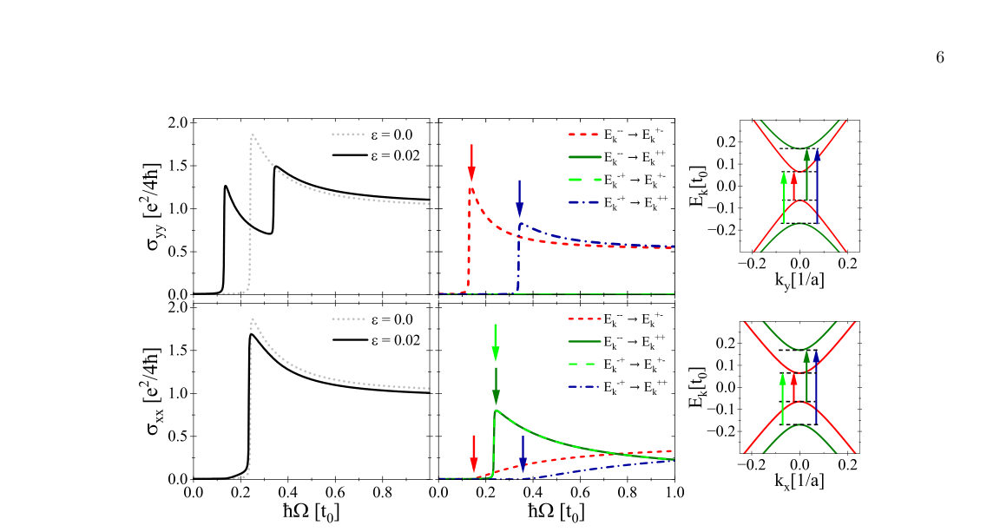
<figcaption class="paper-figure-caption"><b>Fig 4.</b> FIG. 4. Longitudinal optical conductivity of strained Kekul´e-O graphene in the gapped regime under uniaxial strain ε = 0.02 applied along the zigzag (x) direction. The left panels show σxx (top) and σyy (bottom), with dashed gray curves indicating the unstrained case. The middle panels resolve the response into contributions from intra-s and inter-s interband transitions, while the right panels display the corresponding band structures along kx and ky with arrows indicating the dominant optical transitions.</figcaption>
</figure>
<figure class="paper-figure-card">
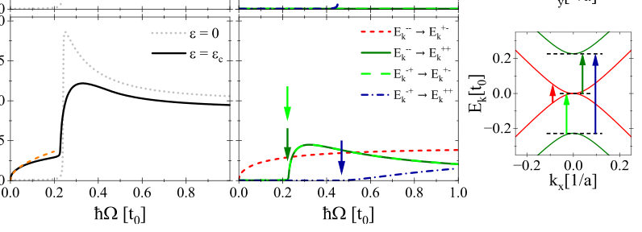
<figcaption class="paper-figure-caption"><b>Fig 5.</b> FIG. 5. Optical conductivity of strained Kekul´e-O graphene at the critical strain ε = εc, where the system undergoes a transition to a semi-Dirac state with mixed linear and quadratic dispersion. The left panels show σxx (top) and σyy (bottom); dashed gray curves denote the unstrained case, while red dashed-dotted curves represent the analytical low-energy theory derived in Appendix B. The middle panels decompose the response into intra-s and inter-s interband transitions, and the right panels show the corresponding band dispersions along kx and ky with transition-resolved arrows. The results reveal a collapse of the finite-frequency absorption gap and a redistribution of spectral weight...</figcaption>
</figure>

**Summary.** This theoretical work investigates how strain drives a semi-Dirac transition in Kekulé-O graphene by analyzing its optical fingerprints. The authors calculate the anisotropic optical conductivity, revealing distinct signatures—such as specific power-law scaling and van Hove resonances—that appear sequentially as the electronic band structure reconstructs across different strain regimes. These fingerprints are shown to be robust against realistic experimental imperfections like disorder and finite temperature.

**Why it may be interesting.** The robust identification of distinct, measurable optical signatures that track fundamental topological/electronic phase transitions (like semi-Dirac points) is highly relevant for designing spectroscopic probes in condensed matter systems.

Detailed structure

**Main problem.** The study aims to characterize how optical fingerprints evolve across a strain-induced semi-Dirac transition in Kekulé-O graphene.

**Main result.** The paper identifies three distinct, observable low-energy optical fingerprints—gapped peaks, specific power-law scaling ($\Omega^{1/2}$ and $\Omega^{-1/2}$), and van Hove resonances—that track the continuous band reconstruction across the transition point.

**Method.** The analysis combines numerical four-band calculations with analytical low-energy effective Hamiltonians to compute the longitudinal optical conductivity using the Kubo formula.

**Model / system.** The physical system is Kekulé-O graphene subjected to uniaxial strain ($\epsilon$). The theoretical framework utilizes continuum effective Hamiltonians derived from a full 4x4 model, allowing for analysis across gapped, semi-Dirac critical, and post-critical regimes.

**Key observables.** Anisotropic optical conductivity ($\sigma_{xx}(\Omega)$ and $\sigma_{yy}(\Omega)$), spectral weight redistribution, gap closing signatures, and van Hove resonances.

**Important parameters / regimes.** Uniaxial strain ($\epsilon$), frequency ($\Omega$), critical strain ($\epsilon_c$), temperature ($T$), and disorder broadening ($\eta$).

**Assumptions / limitations.** The analysis relies on low-energy effective Hamiltonians which are assumed to accurately describe the physics near the $\Gamma$ point, even when incorporating moderate disorder or finite temperatures.

**Figures summary.** Figures illustrate band structure evolution across strain regimes (gap closing, semi-Dirac node emergence, anisotropic Dirac cones) and show calculated optical conductivities ($\sigma_{xx}, \sigma_{yy}$) demonstrating the characteristic scaling laws in each regime.

**Paper structure.** The paper systematically analyzes the optical response by mapping out the electronic band structure evolution as strain increases: starting from a gapped state $	o$ passing through the semi-Dirac critical point (characterized by specific power-law scaling) $	o$ entering the post-critical regime (showing split Dirac cones and van Hove resonances).

Abstract

We show that the strain-driven semi-Dirac transition in Kekulé-O graphene gives rise to a sequence of anisotropic optical fingerprints associated with band structure reconstruction. Across the transition, optical spectral weight is continuously redistributed among the dominant interband transitions, leading to a pronounced enhancement of the optical anisotropy. Combining numerical four-band calculations with analytical low-energy results, we identify three low-energy fingerprints that emerge with increasing strain: gapped absorption peaks, semi-Dirac critical scaling, and a pronounced van Hove optical resonance. At the semi-Dirac critical point, where the Kekulé gap closes at the $Γ$ point, the low-energy optical conductivity is characterized by $σ_{xx}(Ω)\proptoΩ^{1/2}$ and $σ_{yy}(Ω)\proptoΩ^{-1/2}$. Beyond the transition, the semi-Dirac point splits into two anisotropic Dirac cones, accompanied by the emergence of saddle points near the $Γ$ point. The resulting saddle-point excitations produce a pronounced van Hove optical resonance at energies well below those of graphene, while the split Dirac cones give rise to an anisotropic constant optical conductivity. We further show that the low-energy optical fingerprints can be traced to the continuous evolution of a dominant optical transition channel driven by strain-induced band reconstruction. Moreover, the fingerprints remain identifiable in the presence of moderate disorder broadening and finite-temperature effects, indicating their potential observability under experimentally realistic conditions.

[↑ back to top](#top)

### [Interplay between Aharonov-Bohm and Altshuler-Aronov-Spivak oscillations in phase-pure GaAs/InAs core/shell nanowires of different lengths](http://arxiv.org/abs/2606.10788v1)

**Authors:** Farah Basarić, Kaiwen Wang, Tudor-Gabriel Dumitru, Andrei Manolescu, Francisco Alvarado Cesar, Ana M. Sanchez, Christoph Krause, Detlev Grützmacher, Alexander Pawlis, Thomas Schäpers  
**Type:** both · **Category:** other · **PDF:** <https://arxiv.org/pdf/2606.10788v1>  
**Analysis basis:** full PDF text, analyzed in chunks
**Topic relevance:** `interference shaping light` **1/5**

↔ Scroll figures horizontally

<figure class="paper-figure-card">
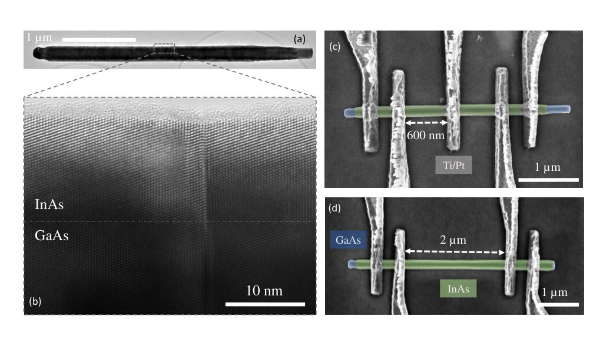
<figcaption class="paper-figure-caption"><b>Fig 1.</b> FIG. 1: (a) Low-magnification TEM image of a representative example of the GaAs/InAs nanowire, featuring (b) high- resolution TEM image of the nanowire middle region. (c),(d) False color SEM image of sample C and E, respectively, emphasizing differences in inner contact separation lengths Lc, 600 nm and 2 µm, respectively.</figcaption>
</figure>
<figure class="paper-figure-card">
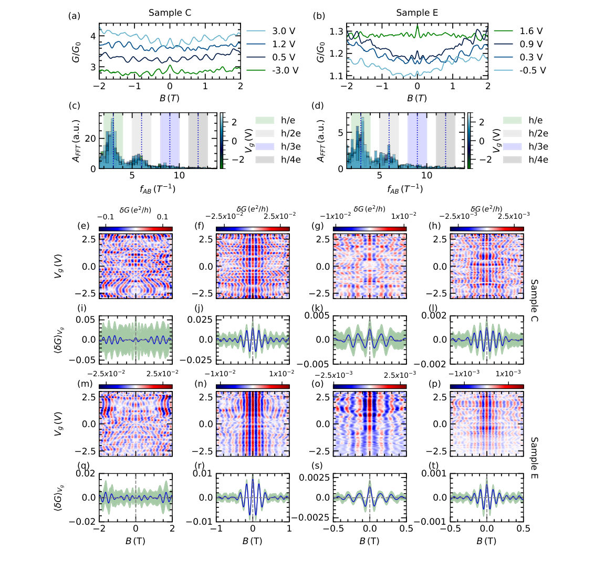
<figcaption class="paper-figure-caption"><b>Fig 2.</b> FIG. 2: Normalized magnetoconductance G/G0, with G0 = e2/h, for various gate voltage Vg values, for (a) sample C, and (b) E, respectively. Corresponding fast-Fourier transform of the data shown in (a) and (b), for samples (c) C, and (d) E. Ranges of present harmonics (h/e, h/2e, h/3e, h/4e) are presented in color-coded scheme, with mean frequency value marked by dotted line. Colormaps for oscillation amplitude δG as a function of gate voltage and magnetic field for sample C, presented for (e) h/e-, (f) h/2e-, (g) h/3e-, and (h) h/4e-periodic oscillations defined by the frequency windows marked in (b). Averaged oscillation amplitude ⟨δG⟩Vg over the complete gate voltage range, as a function...</figcaption>
</figure>
<figure class="paper-figure-card">
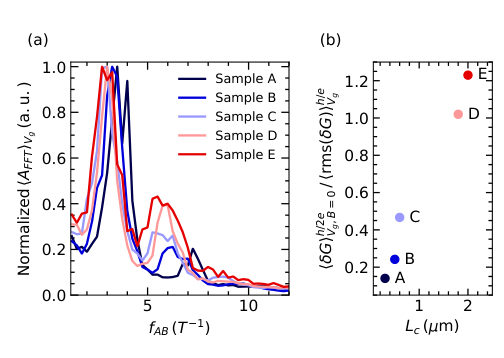
<figcaption class="paper-figure-caption"><b>Fig 3.</b> FIG. 3: (a) Normalized average of fast Fourier Ampli- tude ⟨AFFT⟩Vg as a function of frequency for samples with different contact separations (samples A to E). (b) Ratio of the average amplitude of the AAS oscillations ⟨δG⟩h/2e Vg,B=0 at B = 0 and the root-mean-square ampli- tude of the h/e-periodic AB-type oscillations, averaged over the gate voltage ⟨rms(δG)⟩h/2 Vg for different contact separation lengths.</figcaption>
</figure>
<figure class="paper-figure-card">
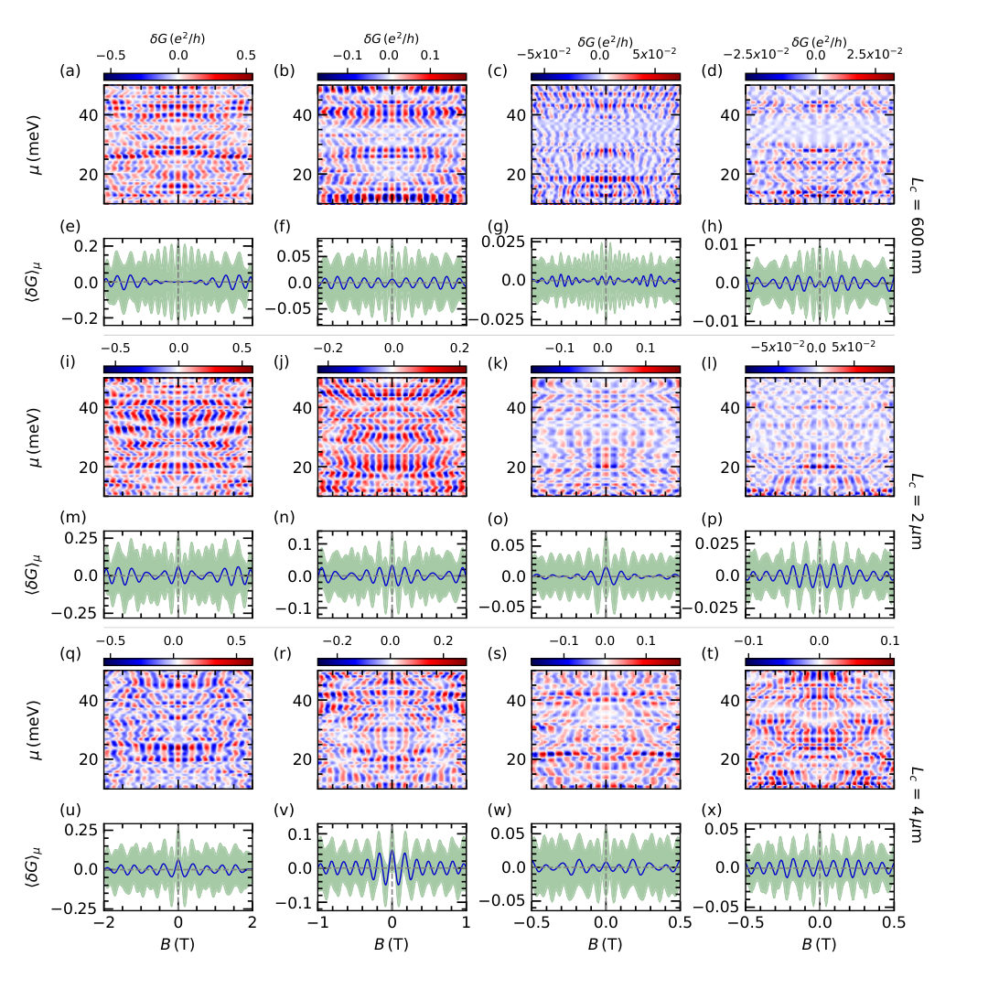
<figcaption class="paper-figure-caption"><b>Fig 4.</b> FIG. 4: Panels (a)-(d), (i)-(l), and (q)-(t) show the conductance oscillation amplitudes of first to fourth harmonics, with periods from h/e to h/4e, as a function of the magnetic field and chemical potential, for nanowires of lengths L = 600 nm, 2 µm, and 4 µm, respectively. Panels (e)-(h), (m)-(p), and (u)-(x) display the average amplitude of the oscillation (solid blue line) and its standard deviation (in green) with respect to the chemical potential µ for each length. Note that the displayed magnetic field range is successively reduced for the higher harmonics.</figcaption>
</figure>
<figure class="paper-figure-card">
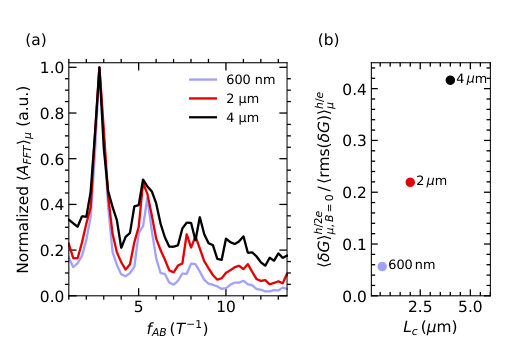
<figcaption class="paper-figure-caption"><b>Fig 5.</b> FIG. 5: (a) Normalized fast Fourier amplitude ⟨AFFT⟩µ averaged over µ as a function of frequency f for the 600 nm (light blue), 2 µm (red), and 4 µm (dark blue) long nanowires. (b) Ratio of the average amplitude of the simulated AAS-type oscillations ⟨δG⟩h/2e µ,B=0 at B = 0 and the root-mean-square amplitude of the simulated h/e- periodic AB-type oscillations averaged over the chemical potential ⟨rms(δG)⟩h/2e µ .</figcaption>
</figure>

**Summary.** The study investigates how Aharonov-Bohm and Altshuler-Aronov-Spivak oscillations manifest in GaAs/InAs nanowires as a function of wire length. By analyzing magnetoconductance, the authors show that longer wires enhance the phase-rigid AAS signal relative to the AB signal. This work confirms quasi-ballistic transport regimes suitable for quantum device applications.

**Why it may be interesting.** This work provides a detailed platform for studying fundamental quantum interference effects (AB vs. AAS) in mesoscopic semiconductor nanostructures, which is highly relevant for designing superconducting quantum devices.

Detailed structure

**Main problem.** The study investigates the interplay between Aharonov-Bohm (AB) and Altshuler-Aronov-Spivak (AAS) conductance oscillations in GaAs/InAs core/shell nanowires as a function of contact separation length.

**Main result.** Increasing the contact separation length enhances phase-rigid AAS oscillations ($h/2e$-periodic) while causing the AB oscillations ($h/e$-periodic) to diminish due to averaging effects. The presence of higher harmonics ($h/3e, h/4e$) is also observed and analyzed.

**Method.** The research combines experimental magnetotransport measurements (measuring conductance vs. magnetic field and gate voltage) with theoretical analysis using tight-binding quantum transport simulations (Landauer–Büttiker formalism).

**Model / system.** The physical system is phase-pure GaAs/InAs core/shell nanowires, which act as tubular conductors exhibiting interference phenomena from closed loops encircling an insulating core when subjected to an axial magnetic field.

**Key observables.** Magnetoconductance oscillations periodic in $h/e$ (AB) and $h/2e$ (AAS), phase rigidity of these oscillations, and the amplitude dependence on sample length ($L_c$).

**Important parameters / regimes.** Contact separation length ($L_c$), magnetic field ($B$), gate voltage ($V_g$), and harmonic indices ($n=1, 2, 3, 4$).

**Assumptions / limitations.** The analysis assumes that the observed oscillations can be separated into distinct harmonic components related to AB (non-time-reversed paths) and AAS (time-reversed paths) interference.

**Figures summary.** Figures show TEM/SEM images of nanowires with varying contact separations, color maps and averaged magnetoconductance plots revealing periodicities ($h/e$ vs $h/2e$), and FFT spectra confirming the presence and relative strength of higher harmonics up to $h/4e$.

**Paper structure.** The paper systematically analyzes experimental data across samples with different contact lengths, comparing the decay of AB oscillations against the enhancement of AAS oscillations. Theoretical simulations are used to confirm these length-dependent trends and analyze the contribution of specific harmonic terms.

Abstract

In GaAs/InAs core/shell nanowires, comprising a tubular conducting shell, interference phenomena observed under an axial field and originating from closed-loop states encircling the insulating core, provide an ideal platform for superconducting quantum devices that utilize effects such as Aharonov--Bohm or Altshuler--Aronov--Spivak-type conductance oscillations. Both effects are different in nature with respect to phase rigidity because of interference of non-time-reversed or time-reversed paths, respectively. Since their occurrence is largely governed by averaging effects, which depend on sample dimensions and the transport regime, we present a systematic study of flux-periodic oscillations of phase-pure zinc-blende GaAs/InAs core/shell nanowires as a function of gate voltage for samples with different contact separation lengths. Our analysis shows that with increasing contact separation length, averaging effects result in gradual reduction of $h/e$-periodic Aharonov--Bohm-type oscillations, while the $h/2e$-periodic Altshuler--Aronov--Spivak oscillations and its $h/4e$-periodic higher harmonics are enhanced. The additional phase rigidity seen in the $h/3e$-periodic oscillations is attributed to phase rigidity propagating from the neighbouring lower harmonics. Our tight-binding transport simulations on nanowires of different lengths which contain only a few scattering centers confirm the experimental observations regarding the different harmonics and their phase rigidity. Together, our experimental and simulation findings indicate quasi-ballistic transport with persistent Aharonov--Bohm-, and phase-rigid Altshuler--Aronov--Spivak-type oscillations despite few scattering centers.

[↑ back to top](#top)

### [Microscopic Investigation of the Superconducting State in CuCo$_{2}$S$_{4}$: Evidence for an Intermediate-Coupling Fully Gapped Superconductor](http://arxiv.org/abs/2606.10162v1)

**Authors:** K. Panda, A. Bhattacharyya, Liang-Wen Ji, Jing Li, R. Stewart, D. T. Adroja, Guang-Han Cao  
**Type:** experiment · **Category:** other · **PDF:** <https://arxiv.org/pdf/2606.10162v1>  
**Analysis basis:** full PDF text, analyzed in chunks
**Topic relevance:** `quantum measurements` **1/5**

↔ Scroll figures horizontally

<figure class="paper-figure-card">
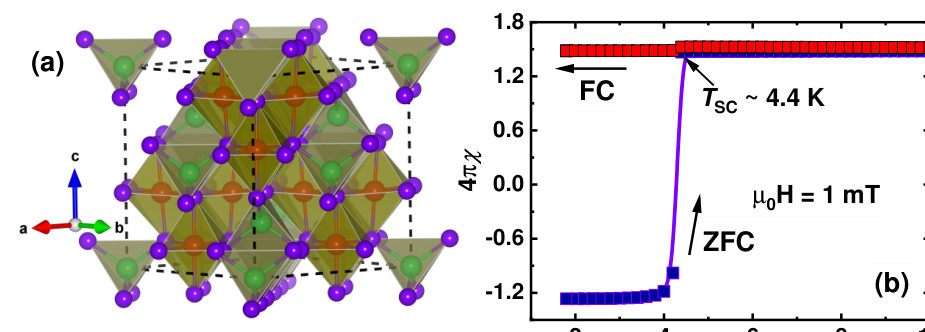
<figcaption class="paper-figure-caption"><b>Fig 1.</b> Figure 1: (a) Crystal structure of CuCo2S4, illustrating the arrangement of tetrahedral (CuS4) and octahedral (CoS6) units. In this depiction, copper (Cu) atoms are represented as green spheres (large), cobalt (Co) atoms as red spheres (medium), and sulfur (S) atoms as violet spheres (small). (b) Temperature-dependent magnetic susceptibility measured under zero-field-cooled (ZFC) and field-cooled (FC) conditions in an applied magnetic field of 1 mT.</figcaption>
</figure>
<figure class="paper-figure-card">
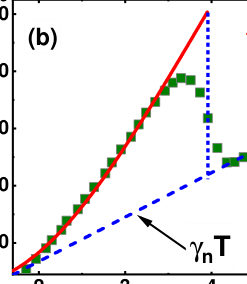
<figcaption class="paper-figure-caption"><b>Fig 2.</b> Figure 2: (a) Temperature dependence of the heat capacity, CP(T), measured from 1.8 K to 6 K in zero applied magnetic field. The solid line represents a fit of CP(T) in the normal state using the Debye model. (b) Electronic contribution to the zero-field heat capacity, Ce, as a function of temperature. The solid line shows a fit to Ce using the isotropic Bardeen-Cooper-Schrieffer (BCS) model, including a term for the nonsuperconducting fraction, γnsT. The blue dashed line represents an extrapolation of the normal-state electronic heat capacity, γnT.</figcaption>
</figure>
<figure class="paper-figure-card">
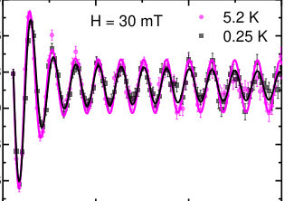
<figcaption class="paper-figure-caption"><b>Fig 3.</b> Figure 3: Transverse-field µSR asymmetry spectra for CuCo2S4 collected at an applied magnetic field of 30 mT, comparing the field-cooled state at 0.25 K (below the critical temperature, TSC) and 5.2 K (above TSC). The solid lines represent fits using Eq. 1.</figcaption>
</figure>
<figure class="paper-figure-card">
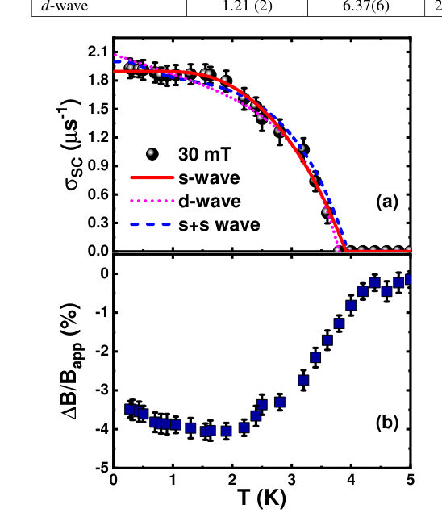
<figcaption class="paper-figure-caption"><b>Fig 4.</b> Figure 4: Superconducting properties of CuCo2S4 under an applied magnetic field of 30 mT. (a) Temperature dependence of the superconducting depolariza- tion rate, σsc(T), with a fit using an s-wave (red line), d−wave (pink dot) and s+ s wave (dashed) gap model. (b) Relative field shift, ∆B = (Bsc −Bapp)/Bapp, as a function of temperature.</figcaption>
</figure>
<figure class="paper-figure-card">
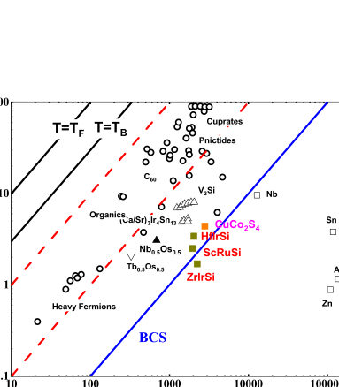
<figcaption class="paper-figure-caption"><b>Fig 5.</b> Figure 7: Superconducting critical temperature (TSC) versus Fermi tempera- ture (TF) obtained from µSR measurements in CuCo2S4. The region between the dashed red lines denotes the range typically associated with unconven- tional superconductors. The solid blue line marks the position of conventional BCS superconductors for reference. The positions of CuCo2S4, ScRuSi [54], HfIrSi [55], and ZrIrSi [56], located close to the BCS line, indicate that these are conventional superconductors.</figcaption>
</figure>

**Summary.** This work presents a comprehensive experimental investigation into superconductivity in CuCo2S4 using muon spin rotation ($\mu$SR), magnetization, and heat-capacity measurements. The results confirm a fully gapped s-wave superconducting state with an intermediate electron-phonon coupling strength. This places the material within a well-understood framework of conventional BCS superconductors.

**Why it may be interesting.** While primarily condensed matter physics, the use of $\mu$SR to probe superconducting gaps and pairing symmetries is relevant to understanding emergent quantum order parameters in strongly correlated systems.

Detailed structure

**Main problem.** To microscopically investigate the superconducting state of the thiospinel compound CuCo2S4, determining its pairing mechanism and gap structure.

**Main result.** The material exhibits a fully gapped superconducting state with an intermediate coupling strength (gap ratio 3.95(2)), consistent with conventional s-wave superconductivity.

**Method.** The study employed multiple experimental techniques including muon spin rotation ($\mu$SR) measurements (zero and transverse field), magnetization, and heat-capacity measurements.

**Model / system.** The physical system is the thiospinel compound CuCo2S4, which was found to be an inhomogeneous two-phase superconductor. Analysis involved fitting superconducting gap models (s-wave vs. d-wave) to $\mu$SR relaxation rates and specific heat data.

**Key observables.** Superconducting depolarization rate ($\mu$SR), gap ratio $2\Delta(0)/(k_B T_{SC})$, electronic specific heat, and magnetic susceptibility $\chi(T)$.

**Important parameters / regimes.** The measured gap ratio (3.95(2)) exceeds the BCS weak-coupling limit (3.53), placing it in the intermediate coupling regime.

**Assumptions / limitations.** The analysis assumes that the superconducting state can be modeled by an s-wave pairing symmetry, and acknowledges limitations in detecting Time-Reversal Symmetry Breaking due to ferromagnetic impurities.

**Figures summary.** Figures show evidence of superconductivity below $T_{SC} = 4.4 	ext{ K}$ via magnetic susceptibility and heat capacity; $\mu$SR spectra confirm the superconducting mixed state through flux-line lattice formation.

**Paper structure.** The paper follows a structure of presenting multiple complementary measurements ($\mu$SR, magnetization, specific heat) to build a comprehensive picture: first confirming superconductivity, then characterizing the gap symmetry and coupling strength, and finally addressing potential exotic symmetries like TRSB.

Abstract

The thiospinel compound CuCo$_2$S$_4$ provides an attractive platform for exploring superconductivity in transition-metal chalcogenide spinels. Here, we report the first microscopic investigation of the superconducting state in CuCo$_2$S$_4$ using muon spin rotation and relaxation ($μ$SR) measurements, complemented by magnetization and heat-capacity experiments. The temperature dependence of the superconducting depolarization rate obtained from transverse-field $μ$SR measurements indicates a fully gapped superconducting order parameter. The extracted gap ratio $2Δ(0)/(k_{\mathrm{B}}T_\mathrm{SC}) = 3.95(2)$ exceeds the BCS weak-coupling value of 3.53, placing CuCo$_2$S$_4$ in the intermediate electron-phonon coupling regime. Zero-field $μ$SR measurements were performed to probe possible time-reversal symmetry breaking (TRSB) in the superconducting state. Within the experimental resolution, no additional spontaneous internal magnetic fields are observed below $T_c$. However, due to the presence of a ferromagnetic impurity phase and the associated fast-relaxing signal component, the sensitivity of the present measurements to weak spontaneous fields is reduced. Consequently, while no evidence for TRSB is detected, its existence cannot be definitively ruled out. Overall, our combined thermodynamic and $μ$SR results demonstrate that CuCo$_2$S$_4$ exhibits a fully gapped superconducting state with intermediate coupling strength, consistent with conventional $s$-wave superconductivity in this cobalt-based thiospinel system.

[↑ back to top](#top)

### Other secondary papers (1)

Show other secondary papers

### [Dichotomous electronic system in a bilayer Ni$^{1+}$ nickelate](http://arxiv.org/abs/2606.10564v1)

**Authors:** Young-Joon Song, W. E. Pickett, K. -W. Lee  
**Type:** theory · **Category:** strongly correlated electrons · **PDF:** <https://arxiv.org/pdf/2606.10564v1>  
**Analysis basis:** full PDF text, analyzed in chunks

↔ Scroll figures horizontally

<figure class="paper-figure-card">
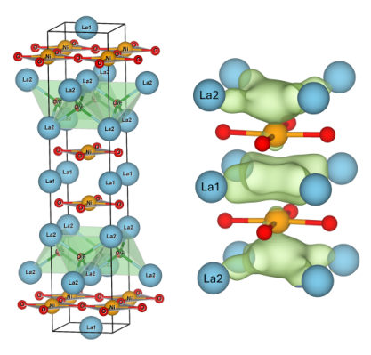
<figcaption class="paper-figure-caption"><b>Fig 1.</b> FIG. 1. Left: tetragonal I4/mmm structure of La3Ni2O5F, consisting of double NiO2 infinite layers isolated by the La2[X]La2 layer. Right: isosurface plot of the occupied E∗</figcaption>
</figure>
<figure class="paper-figure-card">
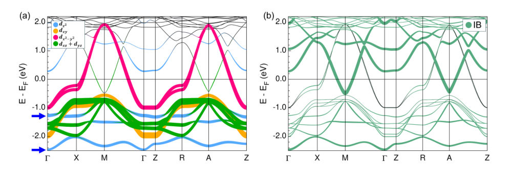
<figcaption class="paper-figure-caption"><b>Fig 2.</b> FIG. 2. Nonmagnetic band structure of La3Ni2O5F. (a) Ni 3d orbital decompositions are distinguished by color. The blue arrows indicate the large splitting of the dz2 orbitals at the Γ point due to coupling with, or through, the interstitial (I) density in the intervening La1 layer. Points are: except for the usual dpσ band, the other Ni d bands lie at -1.3± 0.5 eV, hence are electrically inactive; t2g splitting is small. (b) fatband representation of the I character, that is, the amplitude of the state not falling within any atomic sphere. The E∗band dips down from 2 eV at Γ to −0.5 eV at M. See the text for other I density related features.</figcaption>
</figure>
<figure class="paper-figure-card">
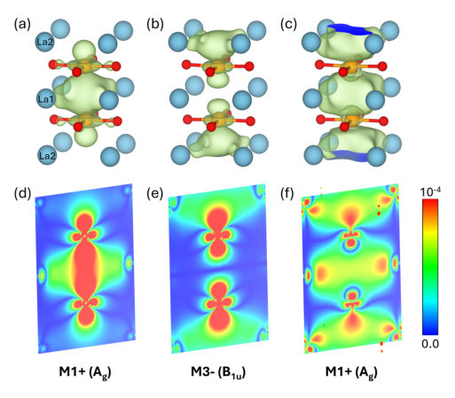
<figcaption class="paper-figure-caption"><b>Fig 3.</b> FIG. 3. Top row: isosurface plots of wave functions |ψ(r)|: the even (a) and odd (b) dz2 pair at the M point, at −2.4 eV and −1.5 eV respectively, and (c) the E∗state at −0.5 eV. Bottom row: (d)-(f), corresponding 2D-projected color-scale plots on the [110] plane, passing through La and Ni atoms, making the z reflection symmetry clear, as well as the involvement of I density. Fig. 2 shows that the dz2 pair can be followed throughout the zone, with splitting of ∼1 eV. The D∗state at M, part of the network as described in the text, is shown in SM.</figcaption>
</figure>
<figure class="paper-figure-card">
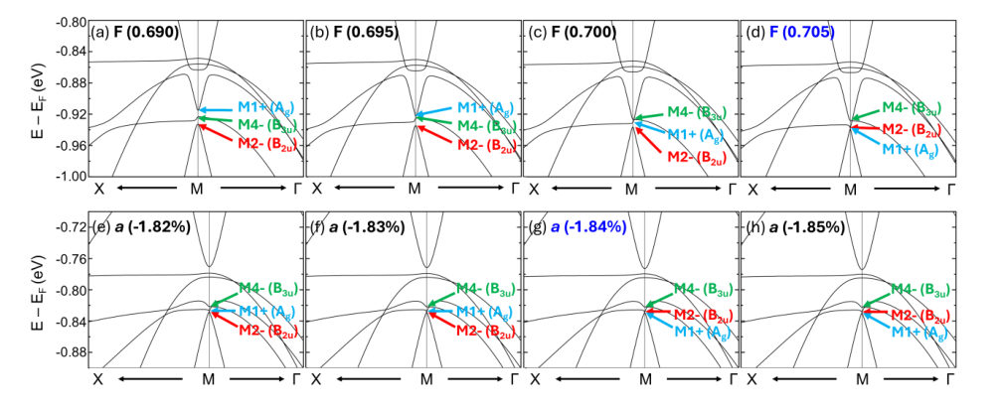
<figcaption class="paper-figure-caption"><b>Fig 4.</b> FIG. 4. Evolutions of the E∗and D∗bands, meeting and crossing, enlarged from the corresponding region of Fig. 1. Top row: increasing the F concentration through the critical point at F(0.700). Note the switching of eigenvalue order at F(0.705). Bottom row: applying symmetric strain, with a critical point at ∆a=−1.84%. The lattice parameter a is changed as noted, with fixed volume. Decreasing a could be achieved by pressure, since the change in c may be have negligible effect. In each case, the upper E∗band shifts downward at M, meeting the D∗band.</figcaption>
</figure>

**Summary.** The paper investigates the electronic properties of $	ext{Ni}^{1+}$ nickelates, focusing on how an interstitial density ($E^*$) band creates a second set of charge carriers alongside conventional $d p\sigma$ electrons. The authors argue that this 'dichotomous' carrier behavior leads to unique transport signatures and suggests unconventional pairing mechanisms for superconductivity.

**Why it may be interesting.** This work is highly relevant as it tackles strongly correlated materials (nickelates) using advanced electronic structure calculations to predict novel superconducting mechanisms based on orbital/band dichotomy, which is a key theme in modern condensed matter theory.

Detailed structure

**Main problem.** The study investigates the electronic structure and potential superconducting mechanisms in novel infinite layer nickelates ($	ext{ILNs}$) like $	ext{La}_3	ext{Ni}_2	ext{O}_5	ext{F}$. The core challenge is understanding how two distinct carrier types—conventional $d p\sigma$ electrons and interstitial density ($E^*$) carriers—interact.

**Main result.** The system exhibits a dichotomous electronic structure, featuring both $	ext{dp}\sigma$ and $E^*$ Fermi surfaces. This interplay suggests unconventional superconducting properties arising from the coupling between these two distinct carrier channels.

**Method.** Density functional theory calculations (using wien2k) are employed to map out band structures, orbital character, and electronic density distributions across different high-symmetry points.

**Model / system.** The physical system is a bilayer $	ext{Ni}^{1+}$ nickelate ($	ext{La}_3	ext{Ni}_2	ext{O}_5	ext{F}$), which possesses an interstitial density ($E^*$) band alongside the conventional Ni $d p\sigma$ bands. The structure is analyzed for its quasi-two-dimensional character.

**Key observables.** Fermi surface topology (cylindrical electron FS from $E^*$ vs. hole FS from $	ext{dp}\sigma$), orbital splitting ($	ext{dz}^2$ orbitals), transport coefficients ($\sigma, R_H$), and the approach to Dirac degeneracy points.

**Important parameters / regimes.** Doping level (hole doping via $E^*$), strain (compressive strain), and anion composition (tuning F concentration).

**Assumptions / limitations.** The analysis often assumes 2D transport for simplicity in calculating conductivity, and the superconducting state is hypothesized based on observed electronic features.

**Figures summary.** Figures illustrate the tetragonal structure and isosurfaces of the $E^*$ wavefunction. Band structures show orbital splitting due to interstitial coupling, and plots detail the evolution towards band degeneracies at high-symmetry points.

**Paper structure.** The paper progresses by establishing the unique electronic nature of $	ext{La}_3	ext{Ni}_2	ext{O}_5	ext{F}$ via its $E^*$ band. It then analyzes the interplay between the two carrier types, predicting distinct transport signatures and suggesting implications for unconventional superconductivity.

Abstract

``Infinite layer'' nickelates (ILNs) ${\cal R}$NiO$_2$ (${\cal R}$=rare earth elements), having empty apical O sites, become superconducting upon hole doping. They display a secondary electron Fermi surface (FS), giving hole doping, arising not from atomic orbitals but from a band based on interstitial density. Newly reported La$_3$Ni$_2$O$_5$F, formally Ni$^{1+}$, provides an unexpected example of ILN with essentially ideal two dimensional character. A partially occupied single band $E^*$, based on interstitial density, has distinct properties, as its strongly anisotropic shape extends over the three ``apical'' layers and leads to a cylindrical electron FS giving self-doping. This interstitial density is associated with a {\it network of valence bands}, including a Ni $d_{xz},d_{yz}$ pair that partners with $E^*$ to provide an incipient non-analytic Dirac point, leading to an unusual type of interstitial density--$d$ band coupling. The $E^*$ electron band and the conventional Ni $dpσ$ band will display a dichotomy of hole and electron quasiparticle behavior in normal state transport and far-IR properties, and likely resulting in unconventional superconducting state properties even for nickelates.

[↑ back to top](#top)

