
# arxiv digest (quant-ph + cond-mat) — 2026-06-11

*119 papers · 47 relevant · 2 highlighted*

## 🔥 Most relevant (47)

*Every paper with at least one nonzero topic score, sorted by best-matching score. 🔥 marks scores ≥4/5. Click the title to jump to the full entry below; click [arXiv] to open the paper page. `(secondary)` marks papers from de-prioritized cond-mat archives.*

Show 47 relevant papers

- [Polarization-Resolved Photon Statistics of Cavity Quantum Materials](#paper-2606.11550) [[arXiv]](http://arxiv.org/abs/2606.11550v1) — 🔥 `exotic spin models in light-matter` **5/5** · 🔥 `analog quantum simulation` **4/5** · 🔥 `correlated cavity matter` **4/5** · 🔥 `spintronics-quantum-optics interface` **4/5** · `Tavis-Cummings & cavity-many-emitter` **2/5** · `Keldysh / 2PI / non-Gaussian methods` **1/5** · `correlated / nonlocal dissipation` **1/5** · `driven-dissipative phase transition` **1/5** · `entanglement & information structure` **1/5** · `interference shaping light` **1/5**
- [Non-Hermitian Delocalization Realizes Random Dirac Criticality in One Dimension](#paper-2606.12089) [[arXiv]](http://arxiv.org/abs/2606.12089v1) — 🔥 `non-equilibrium universality` **5/5** · 🔥 `driven-dissipative phase transition` **4/5** · `Kondo & dissipative impurity` **3/5** · `methods for driven-dissipative` **3/5** · `non-equilibrium dynamics` **3/5** · `Keldysh / 2PI / non-Gaussian methods` **1/5** · `analog quantum simulation` **1/5** · `correlated / nonlocal dissipation` **1/5**
- [Super-Heisenberg Non-Equilibrium Quantum Sensing with Waveguide-Coupled Emitters](#paper-2606.11975) [[arXiv]](http://arxiv.org/abs/2606.11975v1) — 🔥 `correlated / nonlocal dissipation` **4/5** · 🔥 `methods for driven-dissipative` **4/5** · `Tavis-Cummings & cavity-many-emitter` **3/5** · `correlated cavity matter` **3/5** · `driven-dissipative phase transition` **3/5** · `non-equilibrium dynamics` **3/5** · `Dicke superradiance` **2/5** · `Keldysh / 2PI / non-Gaussian methods` **2/5** · `entanglement & information structure` **2/5** · `non-equilibrium universality` **2/5** · `analog quantum simulation` **1/5** · `interference shaping light` **1/5** · `measurement-induced transitions` **1/5** · `quantum measurements` **1/5** · `superradiant laser` **1/5**
- [Dark state spectroscopy in nonlinear waveguide quantum electrodynamics](#paper-2606.11997) [[arXiv]](http://arxiv.org/abs/2606.11997v1) — 🔥 `methods for driven-dissipative` **4/5** · `analog quantum simulation` **3/5** · `correlated / nonlocal dissipation` **3/5** · `correlated cavity matter` **3/5** · `driven-dissipative phase transition` **3/5** · `Tavis-Cummings & cavity-many-emitter` **2/5** · `non-equilibrium dynamics` **2/5** · `quantum measurements` **2/5** · `Dicke superradiance` **1/5** · `Keldysh / 2PI / non-Gaussian methods` **1/5** · `entanglement & information structure` **1/5** · `interference shaping light` **1/5** · `measurement-induced transitions` **1/5** · `non-equilibrium universality` **1/5**
- [Dynamics of repeated BEC formation and extraction in dimple traps](#paper-2606.11428) [[arXiv]](http://arxiv.org/abs/2606.11428v1) — 🔥 `analog quantum simulation` **4/5** · 🔥 `methods for driven-dissipative` **4/5** · 🔥 `non-equilibrium dynamics` **4/5** · `Keldysh / 2PI / non-Gaussian methods` **3/5** · `driven-dissipative phase transition` **3/5** · `correlated / nonlocal dissipation` **2/5** · `non-equilibrium universality` **2/5** · `Kondo & dissipative impurity` **1/5** · `entanglement & information structure` **1/5** · `quantum measurements` **1/5** · `scars & prethermalization` **1/5**
- [Diffusive Relaxation of Participation Entropy in U(1)-symmetric Dynamics](#paper-2606.11561) [[arXiv]](http://arxiv.org/abs/2606.11561v1) — 🔥 `entanglement & information structure` **4/5** · 🔥 `non-equilibrium dynamics` **4/5** · `analog quantum simulation` **3/5** · `methods for driven-dissipative` **3/5** · `non-equilibrium universality` **3/5** · `scars & prethermalization` **3/5** · `correlated / nonlocal dissipation` **2/5** · `driven-dissipative phase transition` **2/5** · `Keldysh / 2PI / non-Gaussian methods` **1/5**
- [Enhancing Many-Body Chaos via Entropy Injection from Environment](#paper-2606.11784) [[arXiv]](http://arxiv.org/abs/2606.11784v1) — 🔥 `entanglement & information structure` **4/5** · 🔥 `non-equilibrium dynamics` **4/5** · `Keldysh / 2PI / non-Gaussian methods` **3/5** · `correlated / nonlocal dissipation` **3/5** · `driven-dissipative phase transition` **3/5** · `methods for driven-dissipative` **3/5** · `non-equilibrium universality` **2/5** · `Kondo & dissipative impurity` **1/5** · `analog quantum simulation` **1/5** · `scars & prethermalization` **1/5**
- [Heisenberg-Langevin theory of an exciton mirror](#paper-2606.12053) [[arXiv]](http://arxiv.org/abs/2606.12053v1) — 🔥 `driven-dissipative phase transition` **4/5** · `Keldysh / 2PI / non-Gaussian methods` **3/5** · `correlated / nonlocal dissipation` **3/5** · `correlated cavity matter` **3/5** · `methods for driven-dissipative` **3/5** · `Tavis-Cummings & cavity-many-emitter` **2/5** · `non-equilibrium universality` **2/5** · `analog quantum simulation` **1/5** · `interference shaping light` **1/5** · `non-equilibrium dynamics` **1/5** · `superradiant laser` **1/5**
- [Perspective: The Physics of Active Solids -- From Hamiltonians to Active Matter Models](#paper-2606.11950) [[arXiv]](http://arxiv.org/abs/2606.11950v1) — 🔥 `non-equilibrium dynamics` **4/5** · 🔥 `non-equilibrium universality` **4/5** · `Keldysh / 2PI / non-Gaussian methods` **3/5** · `driven-dissipative phase transition` **3/5** · `methods for driven-dissipative` **3/5** · `scars & prethermalization` **2/5** · `Frenkel-Kontorova` **1/5** · `analog quantum simulation` **1/5** · `correlated / nonlocal dissipation` **1/5** · `correlated cavity matter` **1/5** · `exotic spin models in light-matter` **1/5**
- [Experimental Tabletop Petz recovery of a photonic qubit](#paper-2606.12020) [[arXiv]](http://arxiv.org/abs/2606.12020v1) — 🔥 `QC/QI experiment` **4/5** · `methods for driven-dissipative` **3/5** · `quantum optics experiment` **3/5** · `analog quantum simulation` **2/5** · `correlated / nonlocal dissipation` **2/5** · `entanglement & information structure` **2/5** · `measurement-induced transitions` **2/5** · `quantum measurements` **2/5** · `driven-dissipative phase transition` **1/5** · `interference shaping light` **1/5** · `non-equilibrium dynamics` **1/5**
- [Controlled ion-ion interactions and cavity-enhanced emission of a coherent dinuclear Eu$^{3+}$ complex](#paper-2606.11947) [[arXiv]](http://arxiv.org/abs/2606.11947v1) — 🔥 `Tavis-Cummings & cavity-many-emitter` **4/5** · 🔥 `quantum optics experiment` **4/5** · `analog quantum simulation` **3/5** · `correlated cavity matter` **3/5** · `QC/QI experiment` **2/5** · `Dicke superradiance` **1/5** · `correlated / nonlocal dissipation` **1/5** · `driven-dissipative phase transition` **1/5** · `entanglement & information structure` **1/5** · `interference shaping light` **1/5** · `superradiant laser` **1/5**
- [Exact Dynamics of Topological Order Across a CDW--SPT Transition](#paper-2606.11303) [[arXiv]](http://arxiv.org/abs/2606.11303v1) — 🔥 `non-equilibrium dynamics` **4/5** · `analog quantum simulation` **3/5** · `non-equilibrium universality` **3/5** · `Keldysh / 2PI / non-Gaussian methods` **2/5** · `driven-dissipative phase transition` **2/5** · `entanglement & information structure` **2/5** · `methods for driven-dissipative` **2/5** · `Frenkel-Kontorova` **1/5** · `correlated / nonlocal dissipation` **1/5** · `exotic spin models in light-matter` **1/5** · `scars & prethermalization` **1/5**
- [Universal Information-Theoretic Structure of the Quasi-Stationary Domany--Kinzel Automaton](#paper-2606.11885) [[arXiv]](http://arxiv.org/abs/2606.11885v1) — 🔥 `entanglement & information structure` **4/5** · 🔥 `methods for driven-dissipative` **4/5** · 🔥 `non-equilibrium universality` **4/5** · `driven-dissipative phase transition` **3/5** · `non-equilibrium dynamics` **3/5** · `Frenkel-Kontorova` **1/5** · `Keldysh / 2PI / non-Gaussian methods` **1/5** · `analog quantum simulation` **1/5** · `correlated / nonlocal dissipation` **1/5**
- [Enhanced localization length in a disordered one-dimensional band via cavity coupling to delocalized states](#paper-2606.12224) [[arXiv]](http://arxiv.org/abs/2606.12224v1) — 🔥 `analog quantum simulation` **4/5** · `correlated cavity matter` **3/5** · `Tavis-Cummings & cavity-many-emitter` **2/5** · `driven-dissipative phase transition` **2/5** · `methods for driven-dissipative` **2/5** · `non-equilibrium dynamics` **2/5** · `Keldysh / 2PI / non-Gaussian methods` **1/5** · `Kondo & dissipative impurity` **1/5** · `correlated / nonlocal dissipation` **1/5** · `entanglement & information structure` **1/5** · `non-equilibrium universality` **1/5**
- [Measurement-Free Toric-Code Memory in Array Globally Controlled Rydberg Array](#paper-2606.12030) [[arXiv]](http://arxiv.org/abs/2606.12030v1) — 🔥 `Rydberg arrays` **4/5** · `QC/QI experiment` **3/5** · `methods for driven-dissipative` **3/5** · `analog quantum simulation` **2/5** · `measurement-induced transitions` **2/5** · `quantum measurements` **2/5** · `correlated / nonlocal dissipation` **1/5** · `driven-dissipative phase transition` **1/5** · `entanglement & information structure` **1/5** · `non-equilibrium dynamics` **1/5**
- [Time-Frequency Grid States for Reconstruction and Correction of Channel-Induced Distortion in Entangled Photons](#paper-2606.12216) [[arXiv]](http://arxiv.org/abs/2606.12216v1) — 🔥 `quantum optics experiment` **4/5** · `interference shaping light` **3/5** · `quantum measurements` **3/5** · `QC/QI experiment` **2/5** · `measurement-induced transitions` **2/5** · `analog quantum simulation` **1/5** · `correlated / nonlocal dissipation` **1/5** · `driven-dissipative phase transition` **1/5** · `entanglement & information structure` **1/5** · `methods for driven-dissipative` **1/5** · `non-equilibrium dynamics` **1/5**
- [Compressed minimum-purity time evolution for late-time quantum dynamics](#paper-2606.11392) [[arXiv]](http://arxiv.org/abs/2606.11392v1) — 🔥 `entanglement & information structure` **4/5** · 🔥 `non-equilibrium dynamics` **4/5** · `methods for driven-dissipative` **3/5** · `non-equilibrium universality` **3/5** · `analog quantum simulation` **2/5** · `correlated / nonlocal dissipation` **1/5** · `driven-dissipative phase transition` **1/5** · `scars & prethermalization` **1/5**
- [Fast Adiabatic Quantum Gates via Hyperfine Intermediate States](#paper-2606.11655) [[arXiv]](http://arxiv.org/abs/2606.11655v1) — 🔥 `Rydberg arrays` **4/5** · `methods for driven-dissipative` **3/5** · `analog quantum simulation` **2/5** · `correlated / nonlocal dissipation` **2/5** · `driven-dissipative phase transition` **2/5** · `non-equilibrium dynamics` **2/5** · `Keldysh / 2PI / non-Gaussian methods` **1/5** · `Kondo & dissipative impurity` **1/5** · `QC/QI experiment` **1/5** · `non-equilibrium universality` **1/5**
- [Linear Combination of Hamiltonian Simulation with Commutator Scaling](#paper-2606.11475) [[arXiv]](http://arxiv.org/abs/2606.11475v1) — 🔥 `methods for driven-dissipative` **4/5** · `Keldysh / 2PI / non-Gaussian methods` **3/5** · `correlated / nonlocal dissipation` **3/5** · `analog quantum simulation` **2/5** · `driven-dissipative phase transition` **2/5** · `non-equilibrium dynamics` **2/5** · `Kondo & dissipative impurity` **1/5** · `correlated cavity matter` **1/5** · `non-equilibrium universality` **1/5**
- [Quantum Correlation Hierarchy and Teleportation in Dephased Hydrogen Hyperfine System](#paper-2606.11731) [[arXiv]](http://arxiv.org/abs/2606.11731v1) — 🔥 `entanglement & information structure` **4/5** · `correlated / nonlocal dissipation` **3/5** · `methods for driven-dissipative` **3/5** · `driven-dissipative phase transition` **2/5** · `non-equilibrium dynamics` **2/5** · `Keldysh / 2PI / non-Gaussian methods` **1/5** · `analog quantum simulation` **1/5** · `exotic spin models in light-matter` **1/5** · `non-equilibrium universality` **1/5** · `spintronics-quantum-optics interface` **1/5**
- [Intrinsic Nonreciprocity in Electron-Phonon Interaction Driven Thermoelectric Diodes](#paper-2606.11904) [[arXiv]](http://arxiv.org/abs/2606.11904v1) `(secondary)` — 🔥 `non-equilibrium dynamics` **4/5** · `Keldysh / 2PI / non-Gaussian methods` **3/5** · `driven-dissipative phase transition` **3/5** · `methods for driven-dissipative` **3/5** · `non-equilibrium universality` **2/5** · `Kondo & dissipative impurity` **1/5** · `analog quantum simulation` **1/5** · `correlated / nonlocal dissipation` **1/5**
- [Entanglement generation between field modes mediated by a fluctuating conducting wall](#paper-2606.12338) [[arXiv]](http://arxiv.org/abs/2606.12338v1) — 🔥 `analog quantum simulation` **4/5** · `correlated cavity matter` **3/5** · `entanglement & information structure` **3/5** · `correlated / nonlocal dissipation` **2/5** · `Keldysh / 2PI / non-Gaussian methods` **1/5** · `Tavis-Cummings & cavity-many-emitter` **1/5** · `driven-dissipative phase transition` **1/5** · `methods for driven-dissipative` **1/5** · `non-equilibrium dynamics` **1/5**
- [Roughening of active nonlinear interfaces with broken tilt symmetry](#paper-2606.12190) [[arXiv]](http://arxiv.org/abs/2606.12190v1) — 🔥 `non-equilibrium universality` **4/5** · `driven-dissipative phase transition` **3/5** · `non-equilibrium dynamics` **3/5** · `methods for driven-dissipative` **2/5** · `Frenkel-Kontorova` **1/5** · `Keldysh / 2PI / non-Gaussian methods` **1/5** · `analog quantum simulation` **1/5** · `correlated / nonlocal dissipation` **1/5** · `entanglement & information structure` **1/5**
- [Quantum repeater segment with free-space coupled co-trapped ions using telecom photon interference](#paper-2606.12313) [[arXiv]](http://arxiv.org/abs/2606.12313v1) — 🔥 `QC/QI experiment` **4/5** · `interference shaping light` **3/5** · `quantum optics experiment` **3/5** · `entanglement & information structure` **2/5** · `quantum measurements` **2/5** · `analog quantum simulation` **1/5** · `non-equilibrium dynamics` **1/5**
- [Super-Link Fragility in Asymmetric W-Class States under Quantum Noise](#paper-2606.12307) [[arXiv]](http://arxiv.org/abs/2606.12307v1) — 🔥 `entanglement & information structure` **4/5** · `correlated / nonlocal dissipation` **3/5** · `methods for driven-dissipative` **3/5** · `driven-dissipative phase transition` **2/5** · `non-equilibrium dynamics` **2/5** · `Keldysh / 2PI / non-Gaussian methods` **1/5** · `non-equilibrium universality` **1/5**
- [Large Fluctuations in Open Quantum Systems](#paper-2606.11822) [[arXiv]](http://arxiv.org/abs/2606.11822v1) — 🔥 `Keldysh / 2PI / non-Gaussian methods` **4/5** · `driven-dissipative phase transition` **3/5** · `methods for driven-dissipative` **3/5** · `non-equilibrium dynamics` **2/5** · `non-equilibrium universality` **2/5** · `correlated / nonlocal dissipation` **1/5**
- [Exact Entanglement Dynamics Beyond Nearest-Neighbor Dual-Unitary Floquet Systems](#paper-2606.11311) [[arXiv]](http://arxiv.org/abs/2606.11311v1) — 🔥 `entanglement & information structure` **4/5** · `non-equilibrium dynamics` **3/5** · `analog quantum simulation` **2/5** · `non-equilibrium universality` **2/5** · `Keldysh / 2PI / non-Gaussian methods` **1/5** · `driven-dissipative phase transition` **1/5** · `methods for driven-dissipative` **1/5**
- ⭐ [Ferromagnetism from the geometry of localized wavefunctions in moiré systems](#paper-2606.11302) [[arXiv]](http://arxiv.org/abs/2606.11302v1) — 🔥 `analog quantum simulation` **4/5** · `exotic spin models in light-matter` **3/5** · `spintronics-quantum-optics interface` **3/5** · `Kondo & dissipative impurity` **1/5** · `correlated cavity matter` **1/5** · `entanglement & information structure` **1/5** · `non-equilibrium dynamics` **1/5**
- ⭐ [A Pfaffian quantum Hall state of ultracold bosons](#paper-2606.12409) [[arXiv]](http://arxiv.org/abs/2606.12409v1) — 🔥 `analog quantum simulation` **4/5** · `non-equilibrium dynamics` **3/5** · `non-equilibrium universality` **2/5** · `driven-dissipative phase transition` **1/5** · `entanglement & information structure` **1/5** · `exotic spin models in light-matter` **1/5** · `methods for driven-dissipative` **1/5**
- [Collective neutrino oscillations: Many-body non-forward effects and non-classicality](#paper-2606.12404) [[arXiv]](http://arxiv.org/abs/2606.12404v1) — 🔥 `entanglement & information structure` **4/5** · `Keldysh / 2PI / non-Gaussian methods` **3/5** · `non-equilibrium dynamics` **2/5** · `correlated / nonlocal dissipation` **1/5** · `driven-dissipative phase transition` **1/5** · `methods for driven-dissipative` **1/5** · `non-equilibrium universality` **1/5**
- [Q-DICE: Quantum Distributed Interconnect Compiler and Emulator](#paper-2606.11340) [[arXiv]](http://arxiv.org/abs/2606.11340v1) — 🔥 `QC/QI experiment` **4/5** · `correlated / nonlocal dissipation` **3/5** · `methods for driven-dissipative` **3/5** · `non-equilibrium dynamics` **2/5** · `driven-dissipative phase transition` **1/5**
- [Tensor-Network-Based Distributed Quantum Dynamics on Independent Quantum Computers](#paper-2606.11579) [[arXiv]](http://arxiv.org/abs/2606.11579v1) — 🔥 `QC/QI experiment` **4/5** · `methods for driven-dissipative` **3/5** · `analog quantum simulation` **2/5** · `correlated / nonlocal dissipation` **1/5** · `entanglement & information structure` **1/5** · `non-equilibrium dynamics` **1/5**
- [Grand-canonical phase diagram and chiral-current suppression at $π$ flux in a bosonic two-leg ladder](#paper-2606.12159) [[arXiv]](http://arxiv.org/abs/2606.12159v1) — 🔥 `analog quantum simulation` **4/5** · `methods for driven-dissipative` **3/5** · `non-equilibrium dynamics` **2/5** · `Keldysh / 2PI / non-Gaussian methods` **1/5** · `driven-dissipative phase transition` **1/5**
- [On-Chip Quantum Randomness Amplification](#paper-2606.12173) [[arXiv]](http://arxiv.org/abs/2606.12173v1) — 🔥 `QC/QI experiment` **4/5** · `quantum optics experiment` **3/5** · `Keldysh / 2PI / non-Gaussian methods` **1/5** · `driven-dissipative phase transition` **1/5** · `entanglement & information structure` **1/5** · `methods for driven-dissipative` **1/5**
- [Tensor-Network Algorithm for Many-Body Trace Norms](#paper-2606.11882) [[arXiv]](http://arxiv.org/abs/2606.11882v1) — 🔥 `entanglement & information structure` **4/5** · `methods for driven-dissipative` **3/5** · `analog quantum simulation` **1/5** · `correlated / nonlocal dissipation` **1/5** · `driven-dissipative phase transition` **1/5** · `non-equilibrium dynamics` **1/5**
- [Quantum tidal locking in orbiting Bose-Einstein condensates](#paper-2606.11919) [[arXiv]](http://arxiv.org/abs/2606.11919v1) — 🔥 `analog quantum simulation` **4/5** · `non-equilibrium dynamics` **2/5** · `Frenkel-Kontorova` **1/5** · `correlated cavity matter` **1/5** · `driven-dissipative phase transition` **1/5** · `non-equilibrium universality` **1/5**
- [Weakly interacting Bose gases in the canonical ensemble](#paper-2606.12208) [[arXiv]](http://arxiv.org/abs/2606.12208v1) — 🔥 `analog quantum simulation` **4/5** · `Keldysh / 2PI / non-Gaussian methods` **3/5** · `entanglement & information structure` **1/5** · `methods for driven-dissipative` **1/5** · `non-equilibrium dynamics` **1/5**
- [Single Photon Cross-Phase Shifts Can Be Enhanced by Localization in both Frequency and Time](#paper-2606.11516) [[arXiv]](http://arxiv.org/abs/2606.11516v1) — 🔥 `quantum measurements` **4/5** · `quantum optics experiment` **3/5** · `analog quantum simulation` **1/5** · `measurement-induced transitions` **1/5**
- [Deterministic Single-Photon Emitter Arrays in Hexagonal Boron Nitride by Carbon-Assisted Focused Ion Beam Engineering](#paper-2606.12304) [[arXiv]](http://arxiv.org/abs/2606.12304v1) `(secondary)` — 🔥 `QC/QI experiment` **4/5** · `quantum optics experiment` **3/5** · `analog quantum simulation` **1/5**
- [Shadow Engineering of Quantum Processes](#paper-2606.12035) [[arXiv]](http://arxiv.org/abs/2606.12035v1) — 🔥 `QC/QI experiment` **4/5** · `correlated / nonlocal dissipation` **1/5** · `driven-dissipative phase transition` **1/5** · `methods for driven-dissipative` **1/5** · `non-equilibrium dynamics` **1/5**
- [Clifford disentanglers for entanglement reduction in molecular electronic structure simulations](#paper-2606.12056) [[arXiv]](http://arxiv.org/abs/2606.12056v1) — 🔥 `entanglement & information structure` **4/5** · `methods for driven-dissipative` **3/5**
- [Logical error estimation from syndrome data of surface-code experiments](#paper-2606.11496) [[arXiv]](http://arxiv.org/abs/2606.11496v1) — 🔥 `QC/QI experiment` **4/5** · `correlated / nonlocal dissipation` **1/5** · `methods for driven-dissipative` **1/5** · `quantum measurements` **1/5**
- [Raw-Curve Quantum Fingerprints: A Mahalanobis Authentication Framework with Drift Early Warning and Adversarial Detection](#paper-2606.11644) [[arXiv]](http://arxiv.org/abs/2606.11644v1) — 🔥 `QC/QI experiment` **4/5** · `methods for driven-dissipative` **1/5** · `quantum measurements` **1/5**
- [Superconductivity near quarter- and half-filling of a strongly correlated triangular Hubbard band in twisted trilayer WSe2](#paper-2606.11495) [[arXiv]](http://arxiv.org/abs/2606.11495v1) `(secondary)` — 🔥 `analog quantum simulation` **4/5** · `Keldysh / 2PI / non-Gaussian methods` **1/5** · `non-equilibrium dynamics` **1/5**
- [The Kondo effect in ferromagnetic quantum critical CeRh$_6$Ge$_4$](#paper-2606.11978) [[arXiv]](http://arxiv.org/abs/2606.11978v1) — 🔥 `Kondo & dissipative impurity` **4/5** · `Keldysh / 2PI / non-Gaussian methods` **1/5** · `spintronics-quantum-optics interface` **1/5**
- [A Cryogenic Uniaxial Strain Cell for Quantum Devices](#paper-2606.11485) [[arXiv]](http://arxiv.org/abs/2606.11485v1) — 🔥 `QC/QI experiment` **4/5**
- [Substrate insulated Josephson junctions for superconducting quantum circuits](#paper-2606.12262) [[arXiv]](http://arxiv.org/abs/2606.12262v1) `(secondary)` — 🔥 `QC/QI experiment` **4/5**

## ⭐ Highlighted (2)

*Papers by authors on your watch list. Click the title to jump to the full entry below; click [arXiv] to open the paper page.*

Show 2 highlighted papers

- ⭐ [Ferromagnetism from the geometry of localized wavefunctions in moiré systems](#paper-2606.11302) [[arXiv]](http://arxiv.org/abs/2606.11302v1) — Sarang Gopalakrishnan
- ⭐ [A Pfaffian quantum Hall state of ultracold bosons](#paper-2606.12409) [[arXiv]](http://arxiv.org/abs/2606.12409v1) — Markus Greiner

## All papers (90, sorted by relevance)

*Papers from quant-ph and your primary cond-mat archives (quant-gas, stat-mech, str-el, dis-nn). Highlighted papers (⭐) come first, then everything else sorted by topic-relevance score, highest first.*

### ⭐ [Ferromagnetism from the geometry of localized wavefunctions in moiré systems](http://arxiv.org/abs/2606.11302v1)

**Highlighted author(s):** Sarang Gopalakrishnan  
**Authors:** Miguel Gonçalves, Sarang Gopalakrishnan  
**Type:** theory · **Category:** strongly correlated electrons · **PDF:** <https://arxiv.org/pdf/2606.11302v1>  
**Analysis basis:** full PDF text, analyzed in chunks
**Topic relevance:** 🔥 `analog quantum simulation` **4/5** · `exotic spin models in light-matter` **3/5** · `spintronics-quantum-optics interface` **3/5** · `Kondo & dissipative impurity` **1/5** · `correlated cavity matter` **1/5** · `entanglement & information structure` **1/5** · `non-equilibrium dynamics` **1/5**

📷 Fig 1

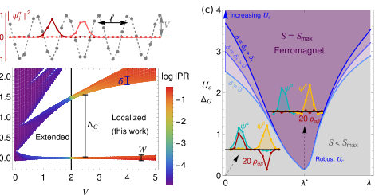 
FIG. 1. Problem and main results. (a) Illustration of a quasi- periodic potential (points in gray) forming a moiré pattern with length ℓ. In the localized phase, the eigenstates in the lowest-energy narrow band are localized around the potential minima in each moiré cell. (b) Non-interacting spectrum of the 1D Aubry-André model, colored by the inverse participa- tion ratio (IPR). We focus on half filling of the low-energy nar- row band highlighted by the dashed box, within the localized phase. The bandwidth W is much smaller than the gap ∆G to higher-energy states, allowing a controlled narrow-band pro- jection of the Hamiltonian when the relevant interaction scale satisfies U ≪∆G. (c)...

📷 Fig 2

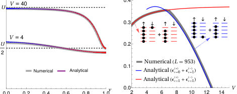 
FIG. 2. Numerical and analytical results for charge excita- tions for the 1D Aubry-André model with t2 = t3 = 0. (a) Interacting contribution to the spectrum of charge excita- tions by diagonalization of the U-dependent term in Eq. 4, as a function of the eigenstate label ν = α/NB, where α = 0, · · · , NB −1. The analytical results using the inter- acting term in Eq. 5 are also shown. (b) Charge gap ∆c as a function of V for U = 3/4. The insets illustrate the dominant particle-hole excitations for small (red) and large (blue) V . The analytical expressions are provided in the SM.

📷 Fig 3

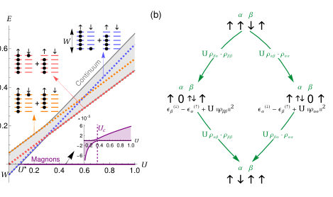 
FIG. 3. Spin-flip excitations and magnons. (a) Example magnon spectrum for V = 3.5, t2 = −0.7 and L = 225. The upper insets illustrate different competing excitations in the particle-hole continuum. The lower inset shows a close- up of the narrow magnon bound-state branch. For U &gt; U ∗

📷 Fig 4

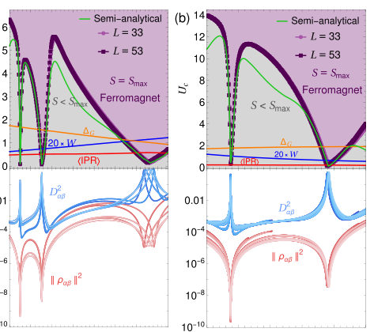 
FIG. 4. Ferromagnets induced by wavefunction detuning. Top panels: Uc as a function of t2 for different system sizes. Bottom panels: squared overlap norm ∥ραβ∥2 and wavefunc- tion detuning D2 αβ for the dominant nearest-neighbor bonds entering the estimate of Uc in Eq. (11) (shown in green). We restrict to pairs with ∆αβ &gt; δr = 0.01, for which the off- diagonal particle-hole states |α, β⟩can be reliably integrated out. We also show the single-particle gap ∆G, the narrow- band bandwidth W, and the average inverse participation ra- tio ⟨IPR⟩of the narrow-band eigenstates. (a) Results for the 1D model with t3 = 0. (b) Results for the 2D model with t2 = −1.25t3.

**Summary.** The paper develops a theory to explain ferromagnetism in narrow bands of localized electrons found in moiré superlattices. It shows that the magnetic stability depends critically on the geometric overlap of single-particle wavefunctions rather than just band curvature. By analyzing spin excitations, the authors establish quantitative predictions for the critical interaction strength required to induce magnetism.

**Why it may be interesting.** This work provides a concrete, geometrically driven mechanism for magnetism in correlated systems without translational symmetry, which is highly relevant for understanding emergent phenomena in moiré heterostructures and artificial quantum materials.

Detailed structure

**Main problem.** The research aims to determine the mechanism for ferromagnetism in narrow electronic bands formed by Anderson-localized states within moiré superlattices.

**Main result.** Ferromagnetism can be stabilized at critical interaction strengths ($U_c$) determined by the geometry of real-space overlaps between localized wavefunctions, providing a route distinct from traditional quantum geometry arguments.

**Method.** The analysis involves projecting the Hubbard model onto the narrow band subspace and studying the stability of the fully polarized state by examining spin-flip excitations (magnons).

**Model / system.** The system is modeled using an effective Hamiltonian for quasiperiodic moiré lattices, incorporating nearest-neighbor hopping and on-site Coulomb repulsion ($U$). The physics is analyzed in terms of localized single-particle eigenstates.

**Key observables.** Critical interaction strength ($U_c$), magnon excitation spectrum, Inverse Participation Ratio (IPR), and the energy difference between spin sectors ($\Delta E$).

**Important parameters / regimes.** Interaction strength ($U$), hopping parameters ($t$, $V$), localization length ($\xi$), and wavefunction overlap geometry ($
ho_{\alphaeta}$).

**Assumptions / limitations.** The theory relies on projecting the full Hamiltonian onto a narrow-band subspace, assuming that low-energy physics is dominated by these localized states.

**Figures summary.** Figures illustrate the evolution of the magnon spectrum (transition from continuum to bound modes) and show how $U_c$ depends on system parameters, confirming robustness checks across varying numbers of included high-energy states.

**Paper structure.** The paper systematically derives effective Hamiltonians for charge and spin excitations, calculates single-particle properties like IPR using locator expansions, and finally uses exact diagonalization to verify the global ground state transition point ($U_c$) by comparing low-spin vs. fully polarized energy sectors.

Abstract

We present a mechanism for ferromagnetism in narrow bands consisting of Anderson-localized states. We exploit single-particle localization to derive a controlled theory of exchange interactions within the narrow band. For quasiperiodic systems with a half-filled moiré band, we show that the critical interaction strength for ferromagnetism is highly sensitive to the geometry of real-space overlaps between localized orbitals: we find well-defined resonances at which ferromagnetism sets in for interaction energies that are far lower than the gap to other bands. Near these resonances, all the approximations in our theory are controlled, so our critical point predictions are quantitative. We show examples both in one and two dimensions. Our work identifies a route to ferromagnetism based on the geometry of real-space wavefunctions, distinct from previously found mechanisms based on the quantum geometry of Bloch bands.

[↑ back to top](#top)

### ⭐ [A Pfaffian quantum Hall state of ultracold bosons](http://arxiv.org/abs/2606.12409v1)

**Highlighted author(s):** Markus Greiner  
**Authors:** Joyce Kwan, Perrin Segura, Yanfei Li, Tizian Blatz, Annie Zhi, Brice Bakkali-Hassani, Annabelle Bohrdt, Martin Greiter, Fabian Grusdt, Markus Greiner  
**Type:** experiment · **Category:** other · **PDF:** <https://arxiv.org/pdf/2606.12409v1>  
**Analysis basis:** full PDF text, analyzed in chunks
**Topic relevance:** 🔥 `analog quantum simulation` **4/5** · `non-equilibrium dynamics` **3/5** · `non-equilibrium universality` **2/5** · `driven-dissipative phase transition` **1/5** · `entanglement & information structure` **1/5** · `exotic spin models in light-matter` **1/5** · `methods for driven-dissipative` **1/5**

📷 Fig 1

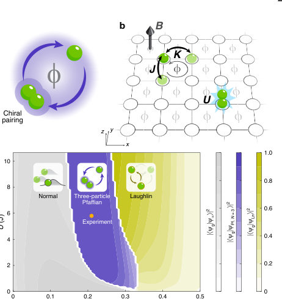 
FIG. 1. Three-particle Pfaffian state of ultracold bosons in an optical lattice. a, The analytic wave function proposed in equation (2) describes a three-particle bosonic Pfaffian state. While the full Pfaffian wave function describes a p-wave paired many-body state, in the three-particle case one particle remains unpaired and the wave function is mod- ified by a finite-size correction. The resulting wave function describes vortex motion between the pair and the unpaired single particle. b, By engineering a synthetic magnetic field, we realize this state with three charge-neutral 87Rb atoms in an optical lattice, confined to 5 × 5 sites. The system is de- scribed by the interacting bosonic...

📷 Fig 2

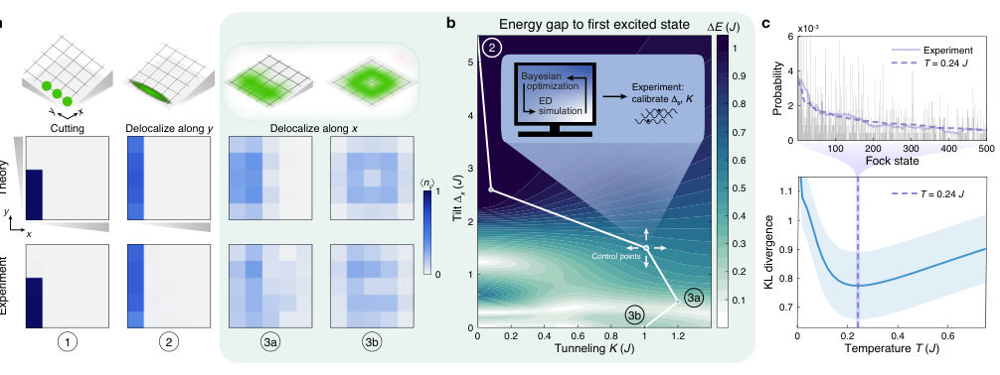 
FIG. 2. Preparation of a minimal bosonic Pfaffian state. a, Experimental sequence. Shown are schematics of the state in the Harper–Hofstadter Hamiltonian (top), the corresponding ground-state density from exact diagonalization (middle), and the measured in-situ density (bottom). The sequence consists of three stages: initialization of three localized atoms on a 5 × 5 lattice, delocalization along y into a 1D tube, and delocalization along x into the final 2D Pfaffian state. Panels (3a) and (3b) show densities near the end of the final ramp stage. b, Energy gap between the ground and first excited states as a function of the tunneling amplitude along x, K, and the residual tilt along x, ∆x,...

📷 Fig 3

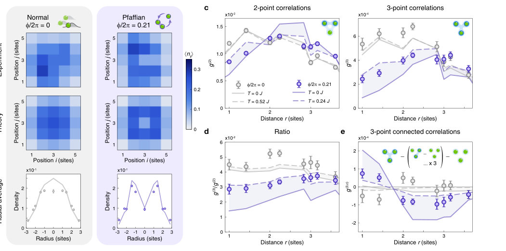 
FIG. 3. Particle densities and correlations in the Pfaffian and normal regimes. a, Measured density distributions on the 5 × 5 lattice (top) compared with ground-state theory (bottom). b, Radial average of the density distribution. For the three-particle Pfaffian state, defined in equation (2), depletion at the central site is clearly visible, consistent with the chiral structure induced by the synthetic magnetic field. Solid lines show ground-state theory. Error bars denote s.e.m. c, Two- and three-point density correlation functions probing the pairing structure of the Pfaffian state. The data show clear suppression of g(3) at short distances, consistent with Pfaffian pairing, and agree...

📷 Fig 4

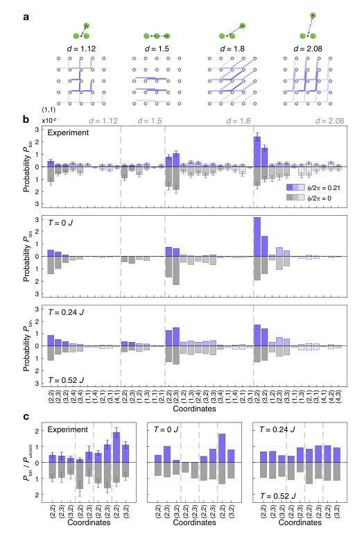 
FIG. 4. Analysis of binned particle configurations. Site-resolved imaging probes the paired structure of the Pfaf- fian wave function using the exact particle positions. a, Im- ages containing a nearest-neighbor pair are grouped into bins according to the bond-center distance d, defined as the dis- tance between the third particle and the pair’s center of mass. Each bin is represented by a line connecting three lattice sites on the 5 × 5 grid. Configurations related by mirror or rota- tional symmetry are assigned to the same bin. Colors indicate the number of particles in the bulk: three (dark purple), two (mid purple), or one or zero (light purple). Bins are labeled by the (x, y)...

📷 Fig 5

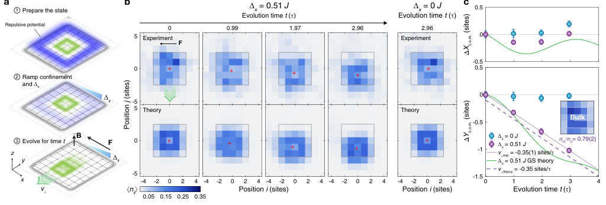 
FIG. 5. The Hall drift experiment. Transport response of the Pfaffian state probed through center-of-mass drift. a, Experimental protocol: (1) prepare the Pfaffian state within the repulsive walls; (2) lower the confinement and apply a force along the x direction; (3) measure the density profile after an evolution time t. b, Measured density profiles with an applied tilt (top) compared with theory (bottom). In the presence of a force, the density drifts in the transverse y direction, whereas it remains stationary over the same evolution time when no force is applied (right). c, Transverse center-of-mass drift. The drift velocity v⊥is extracted from a linear fit to the transverse...

**Summary.** The research demonstrates the bottom-up engineering of a Pfaffian quantum Hall state using ultracold bosonic atoms in an optical lattice. By employing optimized adiabatic ramps and measuring correlation functions and transport properties, the authors provide strong evidence for non-Abelian topological order. This work establishes cold atoms as a powerful platform to study exotic many-body physics.

**Why it may be interesting.** This work represents a cutting-edge demonstration of engineering complex topological phases in controllable quantum simulators. The combination of advanced control techniques (Floquet engineering, Bayesian optimization) with rigorous diagnostic tools (correlation functions, transport) makes it highly relevant for AMO physicists studying interacting many-body systems.

Detailed structure

**Main problem.** The primary goal is to experimentally realize and characterize a Pfaffian quantum Hall state using ultracold bosons, which hosts non-Abelian topological order.

**Main result.** The authors successfully prepared the three-particle bosonic Pfaffian state by optimizing adiabatic ramps and provided evidence through suppressed short-range three-body density correlations and measurable Hall drift plateaus.

**Method.** State preparation involves a multi-stage, Bayesian-optimized adiabatic ramp sequence in an optical lattice. Characterization relies on site-resolved measurements of two- and three-point density correlation functions and transport measurements (Hall drift).

**Model / system.** The system consists of ultracold $^{87}\mathrm{Rb}$ bosons confined in an optical lattice subjected to a Floquet-engineered synthetic magnetic field. The physics is modeled using the interacting Harper–Hofstadter Hamiltonian.

**Key observables.** Two- and three-point density correlations ($g(2), g(3)$), connected three-body correlations ($g^{(3,c)}$), Hall drift velocity ($v_\perp$), and energy gap ($\Delta E$).

**Important parameters / regimes.** Low temperatures ($T \lesssim 0.24 	ext{ J}$), specific flux values ($\phi/2\pi = 0.21$ for Pfaffian), and optimized ramp parameters.

**Assumptions / limitations.** The analysis relies on the assumption that post-selection based on three atoms on distinct sites is representative of the full many-body state, and disorder reconstruction methods involve averaging potentially non-unique potential reconstructions.

**Figures summary.** Figures illustrate the analytic wave function overlap (Fig. 1), the preparation sequence and gap mapping (Fig. 2), density distributions showing suppression of $g(3)$ in the Pfaffian state (Fig. 3), and Hall drift measurements confirming plateaus for different topological regimes (Fig. 5, Fig. 7).

**Paper structure.** The paper details the theoretical model (Hamiltonian/Pfaffian wave function), describes the experimental setup using optical lattices and synthetic fields, outlines the state preparation protocol via Bayesian optimization of adiabatic ramps, and finally presents diagnostics using correlation functions and transport measurements to confirm topological order.

Abstract

Fractional quantum Hall states are a cornerstone of topological physics, hosting fractionally charged quasiparticles with exotic statistics that promise to enable topologically protected quantum information processing. Among these, the Pfaffian state introduced by Moore and Read implements a p-wave pairing structure that supports excitations with non-Abelian exchange statistics. Despite extensive study in electronic systems, direct access to its pairing structure has remained limited. Here we realize a three-particle bosonic Pfaffian state of ultracold $^{87}\mathrm{Rb}$ atoms in an optical lattice subject to a Floquet-engineered synthetic magnetic field. Using a Bayesian-optimized adiabatic protocol, we prepare a state exhibiting Pfaffian pairing correlations. Site-resolved measurements of multi-point density correlations reveal a pronounced suppression of short-range three-body coincidences, reflecting the underlying pairing structure. We further probe the state's transport response through Hall drift measurements. Our results establish a bottom-up approach to engineering non-Abelian topological order and lay the groundwork for future explorations of anyonic braiding in synthetic matter.

[↑ back to top](#top)

### [Polarization-Resolved Photon Statistics of Cavity Quantum Materials](http://arxiv.org/abs/2606.11550v1)

**Authors:** Benjamin Kass, Spenser Talkington, Martin Claassen  
**Type:** theory · **Category:** strongly correlated electrons · **PDF:** <https://arxiv.org/pdf/2606.11550v1>  
**Analysis basis:** full PDF text, analyzed in chunks
**Topic relevance:** 🔥 `exotic spin models in light-matter` **5/5** · 🔥 `analog quantum simulation` **4/5** · 🔥 `correlated cavity matter` **4/5** · 🔥 `spintronics-quantum-optics interface` **4/5** · `Tavis-Cummings & cavity-many-emitter` **2/5** · `Keldysh / 2PI / non-Gaussian methods` **1/5** · `correlated / nonlocal dissipation` **1/5** · `driven-dissipative phase transition` **1/5** · `entanglement & information structure` **1/5** · `interference shaping light` **1/5**

📷 Fig 1

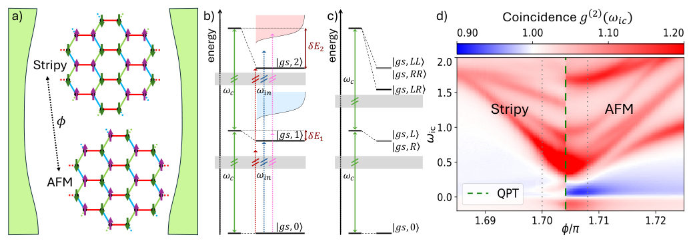 
FIG. 1. Many-Body Photon Blockade. (a) The cavity-embedded Kitaev-Heisenberg spin model is a paradigmatic model hosting a rich set of competing magnetic phases that can hybridize with cavity photons. Classical ordering patterns of spins are shown for stripy and N´eel-antiferromagnet (AFM) phases, tuned via a mixing angle ϕ for Kitaev and Heisenberg interactions. (b) Energy levels of the n-photon sector ground states |gs, n⟩, with a single cavity mode. Without light-matter coupling, these states are equally separated by the cavity mode frequency ωc (green arrows). With light-matter coupling, the photons and material hybridize, causing energy shifts δEn ∝n2 that are non-linear in the photon...

📷 Fig 2

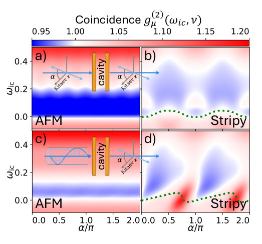 
FIG. 2. Polarization-Dependent Coincidence. Coinci- dence response in a cavity with two polarization modes as a function of the output photon linear polarization angle α in the plane of the material relative to the Kitaev z bonds. The top row shows the response to linearly polarized input pho- tons with the same angle α while the bottom row uses right circularly polarized input photons, as depicted in the overlaid diagrams. (a) and (c) Coincidence for the AFM phase at ϕ = 1.708π. (b) and (d) Coincidence for the stripy phase at ϕ = 1.7π, biased along Kitaev z bonds. These correspond to the gray dotted lines in Fig. 1(d). As in Fig. 1(d), γ = 0.1, g = 0.3, ω0 = 0.6, and B = 0.001. Green...

📷 Fig 3

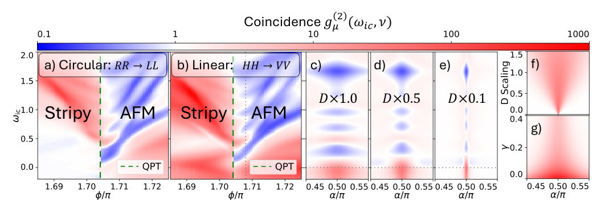 
FIG. 3. Polarization Rotation. Coincidence response across the stripy-to-AFM phase transition of Fig. 1(d) for photons rotated from the input polarization. (a) Circularly polarized photons input with right (R) and output with left (L) circular polarization. (b) Linearly polarized photons input aligned with Kitaev z bonds (H) and output perpendicular to them (V ). Coincidence vs linearly polarized output rotation angle α relative to input light along the z bond for the AFM point at ϕ = 1.708π corresponding to the gray dotted line in (b), as the light-matter coupling strength D is scaled by (c) 1.0, (d) 0.5, and (e) 0.1 relative to its value in Fig. 1 and in Sec. III. (f) Coincidence vs α and...

📷 Fig 4

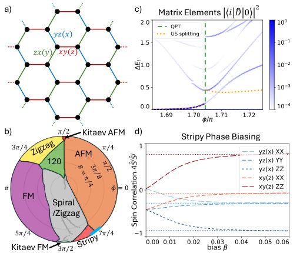 
FIG. 4. Model and Biasing Info. (a) yz(x), zx(y), and xy(z) bonds of the J-K-Γ model shown in blue, green, and red respectively on the 24 site cluster with periodic bound- ary conditions. (b) Phase diagram of the J-K-Γ model with Γ &gt; 0, parameterized by θ and ϕ as in Eq. (A2). The blue line shows the linecut used to study the stripy-to- antiferromagnetic (AFM) quantum phase transition (QPT). (c) Strength of the matrix elements from the ground state to Raman active excitations across the stripy-to-AFM QPT. The orange dotted lines show the finite size splitting of the ground state manifold; this lines up with the Raman active low energy excitations in the stripy phase, but sits at higher...

📷 Fig 5

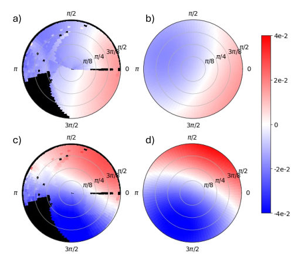 
FIG. 5. Light-Matter Coupling Parameters. D11 xx along the xy(z) bonds (a) as calculated from quasi-degenerate per- turbation theory going from the full to the spin Hamiltonian where possible (fitting errors above 10−6 appear in black) vs (b) using a least squares best fit against J, K, and Γ. (c) and (d) are the same for D11 zz.

**Summary.** The paper demonstrates that measuring polarization-resolved photon statistics ($g^{(2)}$) transmitted through an optical cavity coupled to a quantum magnet can act as a sensitive probe of the underlying magnetic order. By analyzing how bunching and antibunching change with input/output polarizations, researchers can map out the magnetic point group symmetries across quantum phase transitions in models like the Kitaev-Heisenberg system.

**Why it may be interesting.** This work provides a powerful, non-invasive optical diagnostic tool for characterizing the complex ground state symmetries and correlation functions of strongly correlated quantum magnets, bridging cavity QED with condensed matter magnetism.

Detailed structure

**Main problem.** The study aims to develop a diagnostic method using polarization-resolved photon statistics ($g^{(2)}$) to unambiguously probe light-matter coupling effects and characterize magnetic properties in cavity quantum materials.

**Main result.** Polarization-dependent patterns of photon bunching/antibunching encode the magnetic point-group symmetries of different phases (e.g., $C_2$ vs $C_6$) and allow for probing higher-order material correlations via orthogonal polarization measurements.

**Method.** The analysis uses Green's function formalism and perturbative expansions to calculate the two-photon correlation function, $g^{(2)}$, relating it directly to matter correlation functions like the Raman structure factor.

**Model / system.** The system models an optical cavity coupled to quantum magnets described by extensions of the Kitaev-Heisenberg spin model (J-K-$\Gamma$ model) on lattices like honeycomb clusters. The Hamiltonian includes terms for Heisenberg, Kitaev, and general couplings.

**Key observables.** Polarization-resolved second-order photon correlation function ($g^{(2)}_{\mu\mu'}$), which exhibits bunching ($>1$) or antibunching ($<1$).

**Important parameters / regimes.** Coupling strength ($D$), input/output polarizations ($\mu, \mu'$), and magnetic parameters defining the phase (e.g., $	heta, \phi$ in J-K-$\Gamma$ model).

**Assumptions / limitations.** The analysis relies on perturbative expansions in the coupling strength $D$, often assuming a Markovian approximation for the cavity dynamics.

**Figures summary.** Figures illustrate phase diagrams, energy level shifts ($\delta E_n \propto n^2$), and polarization-dependent coincidence spectra ($g^{(2)}$) showing symmetry changes across Quantum Phase Transitions (QPTs).

**Paper structure.** The paper builds theoretically by establishing the link between $g^{(2)}$ and matter correlations, applying this to specific models like Kitaev/J-K-$\Gamma$, and detailing how polarization filtering isolates higher-order scattering processes sensitive to magnetic symmetries.

Abstract

By forming hybrid light-matter states, optical cavities offer a route for engineering material properties, however, unambiguously probing the effects of light-matter coupling remains difficult. Here, we show that the polarization-resolved statistics of photons transmitted through a cavity, measurable via $g^{(2)}$, provide one such diagnostic. By relating $g^{(2)}$ to matter correlation functions such as the Raman structure factor, we link photon bunching and antibunching to material properties. By applying this method to the stripy-to-antiferromagnetic transition in the Kitaev-Heisenberg spin model, we find that polarization-dependent patterns of bunching and antibunching encode the magnetic point-group symmetries of each phase and characterize the behavior at the phase boundary. Finally, we predict measuring $g^{(2)}$ for output photon pairs polarized orthogonal to the input field will isolate higher-order light-matter scattering processes that probe higher-order material correlations.

[↑ back to top](#top)

### [Non-Hermitian Delocalization Realizes Random Dirac Criticality in One Dimension](http://arxiv.org/abs/2606.12089v1)

**Authors:** Bo Li, Shen Zhang, Ren Zhang  
**Type:** theory · **Category:** disordered systems and neural networks · **PDF:** <https://arxiv.org/pdf/2606.12089v1>  
**Analysis basis:** full PDF text, analyzed in chunks
**Topic relevance:** 🔥 `non-equilibrium universality` **5/5** · 🔥 `driven-dissipative phase transition` **4/5** · `Kondo & dissipative impurity` **3/5** · `methods for driven-dissipative` **3/5** · `non-equilibrium dynamics` **3/5** · `Keldysh / 2PI / non-Gaussian methods` **1/5** · `analog quantum simulation` **1/5** · `correlated / nonlocal dissipation` **1/5**

📷 Fig 1

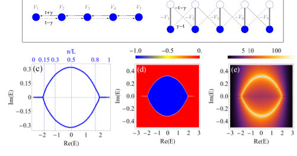 
FIG. 1. Schematic plot for the (a) Hatano-Nelson model and (b) the Hermitization model (E = 0 is assumed). (c) The PBC spectrum of the Hatano-Nelson model, where the upper ticks (blue) label the order of eigenstates according to the real part of their eigenvalues, where the order index is normalized by the system size (the total number of eigenstates). (d) The topological invariant of the Hamiltonian ˜H as a function of (Er, Ei). (e) Localization length as a function of complex energy (extracted from a system with L = 2000). In (d) and (e), both of the white and black lines show the overlaid PBC spectrum. In the plots, the parameters are t = 1, γ = 0.2, and W = 1.

📷 Fig 2

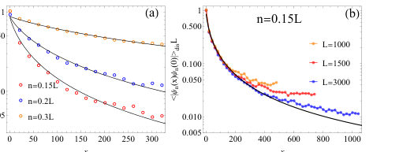 
FIG. 3. (a) Wavefunction correlation as a function of dis- tance, where L = 1000 and 5 × 103 realizations of disorder are performed. (b) the correlation for “n = 0.15L”-th state for three systems with different sizes, where 5 × 103 −2 × 105

📷 Fig 3

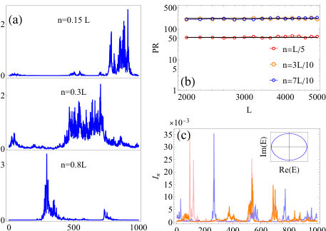 
FIG. 2. (a) The wavefunction profile of selected eigenstates by the order of their real part of eigenvalues [see Fig. 1 (c)] under PBC. (c) Participation ratio for selected eigenstates as a function of system size. Here, an average is taken over 200 realizations of disorder. (a) and (b) take the same parameters as Fig. 1. (d) Wave intensity profile for different disorder realizations, where parameters t = 1, γ = 0.8, and W = 1 are used; the inset shows the corresponding PBC spectrum.

📷 Fig 4

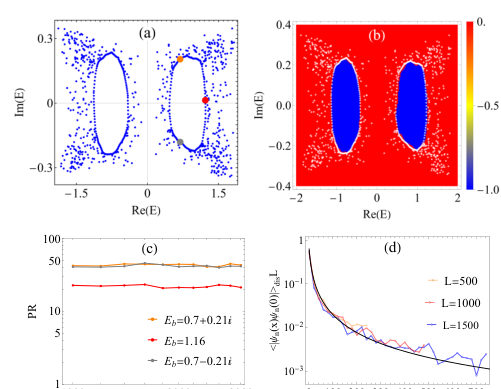 
FIG. 4. (a) The spectrum of the two-band model with dis- order. (b) The topological invariant of the corresponding ˜H, with the white dots indicating the overlaid PBC spectrum. (c) The averaged participation ratio for eigenstates on the spectral loop with energies corresponding to the three makers in (a) (in the same colors). (d) The wave function correlations for the loop state with energy near the red marker in (a). In the plots, parameters are: r = 1, v = 0.3, W = 1, and λ = 0.8.

**Summary.** The paper proves that delocalized states in non-Hermitian systems are inherently critical, realizing the random Dirac universality class. This is achieved by linking the system's spectral winding number to topological invariants via a Hermitian mapping. The key finding is that this criticality emerges generically due to non-Hermiticity, providing a unified description of delocalization.

**Why it may be interesting.** This work provides a powerful theoretical framework showing how spectral topology (winding number) dictates universal critical behavior in non-Hermitian disordered systems, extending concepts vital for understanding open quantum systems dynamics.

Detailed structure

**Main problem.** To demonstrate that non-Hermitian delocalized states under periodic boundary conditions are intrinsically critical, realizing the universality class of one-dimensional random Dirac fermions.

**Main result.** The paper establishes a universal mechanism where non-Hermiticity promotes criticality, linking spectral winding to topological Anderson transitions and yielding characteristic $x^{-3/2}$ algebraic correlations.

**Method.** The analysis uses the Hermitization method to map the non-Hermitian system onto a Hermitian model exhibiting a Topological Anderson Transition (TAI), followed by calculating wavefunction correlation functions in the long-wavelength limit.

**Model / system.** The primary model is the Hatano–Nelson (HN) non-Hermitian Hamiltonian, analyzed on a spectral loop. The theory extends concepts from topological insulators and Anderson localization to this non-Hermitian setting.

**Key observables.** Participation Ratio (PR), average wavefunction distribution ($I_j$), and wavefunction correlation $\langle|\psi(x)\psi(0)|_q
angle_{dis}$ exhibiting $x^{-3/2}$ decay.

**Important parameters / regimes.** System size ($L$), disorder strength, spectral winding number, and the energy relative to the spectral loop ($\delta E$).

**Assumptions / limitations.** The analysis relies on the long-wavelength limit for deriving effective Hamiltonians and calculating correlation functions via path integrals.

**Figures summary.** Figures illustrate the HN model setup, the construction of the Hermitian counterpart $	ilde{H}$, the spectral loop structure, wavefunction profiles, PR scaling (size-independent), and the characteristic $x^{-3/2}$ decay of correlations.

**Paper structure.** The paper progresses by defining the non-Hermitian system and its associated topological invariant via winding numbers. It then analyzes key diagnostics like PR and average distribution to show critical behavior, culminating in the calculation of wavefunction correlations that confirm Dirac criticality.

Abstract

Non-Hermitian systems can evade Anderson localization and exhibit delocalized states even in one dimension. Here, we show that such non-Hermitian delocalized states under periodic boundary conditions (PBC) are intrinsically critical, realizing the universality class of one-dimensional random Dirac fermions. By linking spectral winding to topological Anderson transitions via Hermitization, we demonstrate that the delocalized PBC states exhibit a Dirac-type criticality with universal algebraic correlations. In contrast to Hermitian systems, where this criticality occurs only at fine-tuned transition points, it emerges generically in non-Hermitian systems as a consequence of spectral topology. These results identify a universal mechanism by which non-Hermiticity promotes criticality, providing a unified description of non-Hermitian delocalization in one dimension.

[↑ back to top](#top)

### [Super-Heisenberg Non-Equilibrium Quantum Sensing with Waveguide-Coupled Emitters](http://arxiv.org/abs/2606.11975v1)

**Authors:** Mohammad B. Arjmandi  
**Type:** theory · **Category:** other · **PDF:** <https://arxiv.org/pdf/2606.11975v1>  
**Analysis basis:** full PDF text, analyzed in chunks
**Topic relevance:** 🔥 `correlated / nonlocal dissipation` **4/5** · 🔥 `methods for driven-dissipative` **4/5** · `Tavis-Cummings & cavity-many-emitter` **3/5** · `correlated cavity matter` **3/5** · `driven-dissipative phase transition` **3/5** · `non-equilibrium dynamics` **3/5** · `Dicke superradiance` **2/5** · `Keldysh / 2PI / non-Gaussian methods` **2/5** · `entanglement & information structure` **2/5** · `non-equilibrium universality` **2/5** · `analog quantum simulation` **1/5** · `interference shaping light` **1/5** · `measurement-induced transitions` **1/5** · `quantum measurements` **1/5** · `superradiant laser` **1/5**

📷 Fig 1

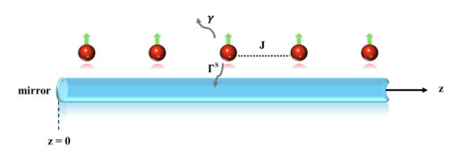 
FIG. 1. Schematic figure of the considered model, including an ar- ray of emitters as a quantum probe coupled to a 1D waveguide. The emitters can be evenly spaced or randomly positioned. A highly re- flective mirror is placed at one end of the waveguide (z = 0). The emitters can experience both collective waveguide mediated decay Γs and independent local decay γ into free space.

📷 Fig 2

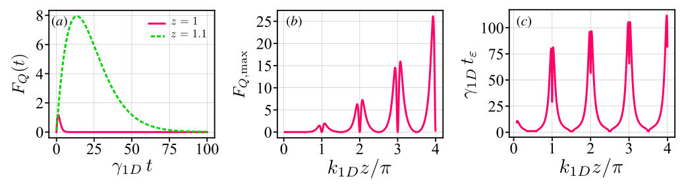 
FIG. 2. (a) Time-dependence of QFI for single emitter probe, given by Eq. (20) with k1D = 2.7π, (b) maximum QFI and (c) temporal window over which the QFI remains non zero, against the emitter position, respectively given by (21) and (25). The local decay rate is fixed as γ = 0.1γ1D.

📷 Fig 3

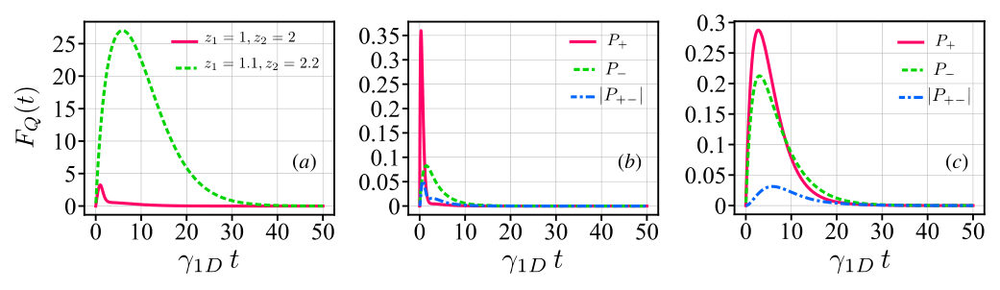 
FIG. 3. Time evolution of QFI with two emitters as the quantum probe, and population and coherence in single excitation subspace for (b) z1 = 1,z2 = 2 and (c) z1 = 1.1,z2 = 2.2. The other parameters are the same as Fig. 2.

📷 Fig 4

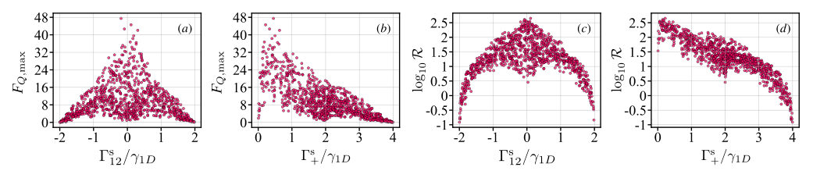 
FIG. 4. Statistical behavior of (a), (b) maximum QFI and (c), (d) durability of information against cross decay term Γs 12 and superradiant decay rate Γs+, for 103 samples of random positions for the two emitters. The other parameters are the same as Fig. 2.

📷 Fig 5

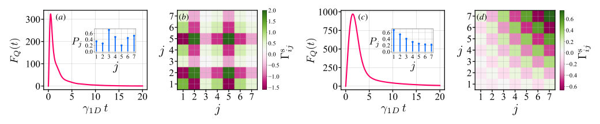 
FIG. 5. (a), (c) Time evolution of QFI with 7 emitters as a quantum probe for (a) uniform and (c) shifted position configurations. The insets show the local excitation probabilities at the time instant for which the QFI reaches its maximum, (b), (c) the waveguide-induced decay rate Γs i j for corresponding positioning strategies. The parameters are the same as Fig. 2.

**Summary.** The paper develops a theoretical framework showing how arrays of quantum emitters coupled to a photonic waveguide can act as ultrasensitive quantum sensors. By analyzing the transient, non-equilibrium decay dynamics, the authors demonstrate that careful engineering of emitter spacing leads to super-Heisenberg scaling in measurement precision (QFI). This highlights harnessing collective radiative dynamics for enhanced sensing capabilities.

**Why it may be interesting.** This work provides a concrete realization of quantum metrology enhancement beyond established limits by engineering dissipation itself. It connects concepts from open quantum systems (decay dynamics) directly to fundamental limits in measurement precision, which is highly relevant for AMO physics research.

Detailed structure

**Main problem.** To utilize arrays of quantum emitters coupled to a photonic waveguide as non-equilibrium probes for estimating the wave number or dispersive properties of the waveguide.

**Main result.** The system exhibits super-Heisenberg scaling in Quantum Fisher Information (QFI), exceeding both Standard and Heisenberg limits, with optimal sensitivity achieved by controlling emitter spacing to suppress destructive cross-decay channels.

**Method.** Theoretical analysis using master equations, focusing on transient dynamics following initial excitation rather than steady states. The QFI is calculated as the ultimate quantum limit for parameter estimation.

**Model / system.** The system consists of multiple two-level emitters coupled to a one-dimensional photonic waveguide. Dynamics are governed by a master equation incorporating coherent evolution and dissipative decay channels (spontaneous emission).

**Key observables.** Quantum Fisher Information ($	ext{QFI}$), its maximum value ($	ext{FQ}_{\max}$), and the time integral of $	ext{QFI}$ (measuring temporal persistence).

**Important parameters / regimes.** Emitter spacing ($d$), waveguide wave number ($k_{1D}$), decay rates ($\gamma, \Gamma$), and system size ($N$). The regime is non-equilibrium/transient.

**Assumptions / limitations.** The analysis relies on the Born–Markov approximation. For large $N$, numerical limitations restrict full simulation; specific optimal geometries (like shifted spacing) are analyzed to demonstrate scaling laws.

**Figures summary.** Figures illustrate the time evolution of QFI for single and two-emitter probes, showing non-monotonic behavior. Later figures compare $	ext{QFI}_{\max}$ scaling with system size ($N$) against theoretical limits (SQL/HL), highlighting super-Heisenberg growth.

**Paper structure.** The paper systematically progresses from establishing the sensing framework using QFI in the transient regime to analyzing single, two-, and finally multipartite probes. The core development involves showing how geometric control over collective decay channels leads to enhanced scaling laws.

Abstract

We explore an array of quantum emitters as non-equilibrium probes, coupled to a one-dimensional photonic waveguide, aiming to estimate its properties such as wave number which encodes the waveguide frequency and dispersive characteristics. By considering transient dynamics following initial excitation, we show that the quantum Fisher information (QFI) can be significantly enhanced through careful emitter positioning. For two-emitter probes, optimal spacing stabilizes populations and coherences in the single-excitation subspace, suppressing super radiant decay and extending both the magnitude and longevity of QFI. Randomized emitter configurations also reveal that vanishing waveguide-mediated cross decay maximizes both achievable sensitivity and the temporal duration over which information about the parameter remains accessible. Extending to multipartite probes, we demonstrate that the maximum QFI and its temporal integral scale with system size, exceeding the Heisenberg limit for all positioning strategies. Our results highlight the potential of waveguide-coupled emitter arrays as versatile quantum sensors, where collective radiative dynamics can be harnessed to achieve tunable, long-lived, and enhanced precision.

[↑ back to top](#top)

### [Dark state spectroscopy in nonlinear waveguide quantum electrodynamics](http://arxiv.org/abs/2606.11997v1)

**Authors:** Shay Nadel, Amir Sivan, Aviv Karnieli  
**Type:** theory · **Category:** other · **PDF:** <https://arxiv.org/pdf/2606.11997v1>  
**Analysis basis:** full PDF text, analyzed in chunks
**Topic relevance:** 🔥 `methods for driven-dissipative` **4/5** · `analog quantum simulation` **3/5** · `correlated / nonlocal dissipation` **3/5** · `correlated cavity matter` **3/5** · `driven-dissipative phase transition` **3/5** · `Tavis-Cummings & cavity-many-emitter` **2/5** · `non-equilibrium dynamics` **2/5** · `quantum measurements` **2/5** · `Dicke superradiance` **1/5** · `Keldysh / 2PI / non-Gaussian methods` **1/5** · `entanglement & information structure` **1/5** · `interference shaping light` **1/5** · `measurement-induced transitions` **1/5** · `non-equilibrium universality` **1/5**

📷 Fig 1

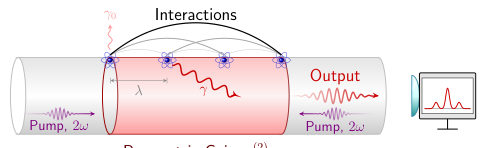 
FIG. 1. System illustration. A waveguide with a nonlin- ear section of length L (red cylinder), pumped from the left and the right with coherent light at frequency 2ω (violet). The χ(2) nonlinearity introduces a parametric gain, generat- ing two photons in frequency ω and wavelength λ within the nonlinear segment. Identical two-level emitters with a tran- sition energy of ℏω are spaced by a wavelength and coupled to the nonlinear segment (depicted is the case of 4 emitters in blue). The output signal is collected from the right side of the waveguide. The emitter array can radiate with rate γ into the waveguide modes, and with rate γ0 to free-space. Within the nonlinear section, owing to the...

📷 Fig 2

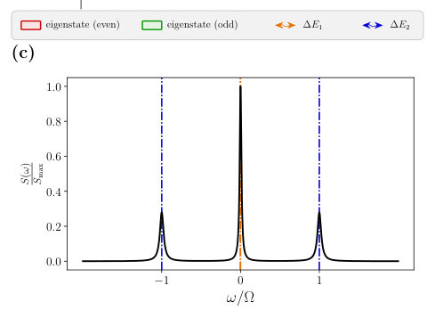 
FIG. 2. Dark-state manifold and steady-state spec- troscopy for an ideal system (γ0 = 0) and N = 4 emit- ters. (a) Classification of the collective modes within the total angular momentum basis |j, m⟩. The dark states |Di⟩, which are the |j, −j⟩states, are color-coded depending on the value of their j-parity. (b) Dark eigenstates |ψi⟩of the Hamil- tonian Hint (Eq. (6a)) projected onto the dark-state manifold are illustrated with respect to their eigenvalue relative to the emitter transition. Only transitions between different j-parity values are allowed by the jump operators (Eq. (6b)). The allowed transitions are depicted as curly lines, with two dis- tinct colors matching ∆E1 = 0, ∆E2 =...

📷 Fig 3

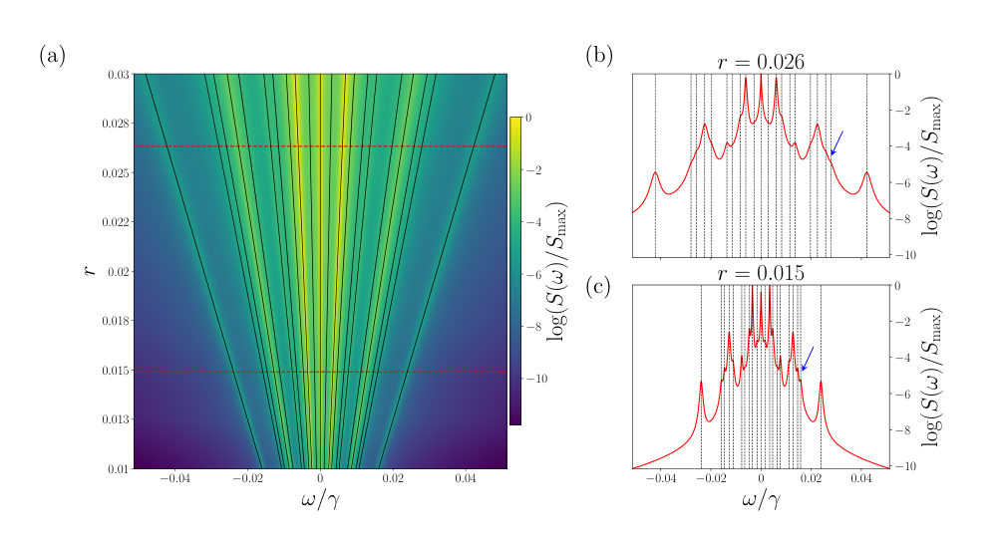 
FIG. 3. Power spectrum for N = 6 emitters across varying squeezing parameters in the ideal case (γ0 = 0). (a) Heatmap of the incoherent steady-state power spectrum in logarithmic scale (log10), normalized for each value of r independently. The solid black lines correspond to allowed transition frequencies between dark eigenstates of the projected Hamiltonian PHintP. They show excellent agreement with the power spectrum peaks for small squeezing parameter r. For increasing values of r, the spectral features are broadened and spaced apart, making the peaks less distinct. (b), (c) Spectral line cross sections corresponding to the horizontal red lines in panel (a) for r = 0.026 and r = 0.015,...

📷 Fig 4

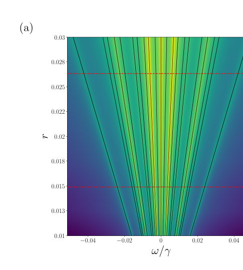 
Fig. 4 illustrates the steady-state incoherent power spectrum of the right-moving waveguide mode for an ar- ray of N = 4 emitters under varying coupling efficiencies β. The ideal case (β = 1) exhibits sharp, symmetric peaks positioned exactly at the allowed transition fre- quencies. However, as the coupling to free space increases (β = 0.999 and β = 0.995), two distinct spectral changes emerge. First, the resonance peaks undergo significant broadening. This is an expected consequence of the free- space decay introducing an additional decoherence chan- nel, which fundamentally decreases the lifetime of the dark states. Second, as highlighted in the inset of Fig. 4,

📷 Fig 5

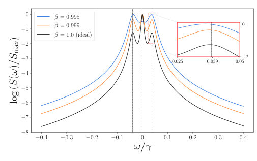 
FIG. 4. Incoherent power spectrum for a nonideal system. Incoherent power spectrum at steady-state in loga- rithmic scale (log10) are plotted for different values of waveg- uide coupling efficiency β = γ/ (γ + γ0). β = 1 refers to the ideal case where γ0 = 0. The plots are calculated with squeez- ing parameter r = 0.01 and waveguide decay rate γ = 1.0. Inset is a zoom-in around the peaks of the curves. It shows broadening and Fano-like shifts in the peak position relative to the transition frequencies.

**Summary.** The paper proposes using weakly squeezed light generated by nonlinear waveguides to spectroscopically measure 'dark states' in emitter arrays coupled to photonic waveguides. By analyzing the output photon spectrum, the authors demonstrate that otherwise unmeasurable collective excitations can be probed. This technique offers a pathway for robust quantum state characterization crucial for quantum memory and computation.

**Why it may be interesting.** This work directly addresses open quantum systems dynamics in cavity QED settings. The use of nonlinear parametric amplification (squeezing) to probe dark states is a sophisticated extension of standard linear coupling models, providing new tools for quantum memory and computation readout.

Detailed structure

**Main problem.** The fundamental challenge of measuring quantum states that are perfectly decoupled from the environment (dark states) while maintaining long coherence times.

**Main result.** Weakly squeezed light generated in nonlinear waveguides can enable spectroscopy, allowing the measurement and characterization of these otherwise inaccessible dark states.

**Method.** The analysis uses the Lindblad master equation formalism combined with input-output theory to calculate the incoherent power spectrum $S(\omega)$ from output photon correlations.

**Model / system.** The system consists of an array of emitter qubits coupled to a one-dimensional photonic waveguide, enhanced by $\chi^{(2)}$ nonlinearity realized in superconducting circuits. The dynamics are governed by an effective interaction Hamiltonian and associated jump operators.

**Key observables.** Incoherent power spectrum $S(\omega)$ measured via the Fourier transform of output photon correlations; spectral peaks corresponding to dark-manifold transition frequencies.

**Important parameters / regimes.** Weak squeezing parameter ($r$), coupling efficiency ($eta$), number of emitters ($N=4, 6$).

**Assumptions / limitations.** The analysis relies on Born-Markov and rotating-wave approximations, assuming the system is dominated by dark states in steady state for small squeezing.

**Figures summary.** Figures illustrate the power spectrum $S(\omega)$ showing distinct peaks matching calculated transition frequencies for weak squeezing. Later figures demonstrate that these spectral signatures persist even when accounting for parasitic decay ($\gamma_0$) and reduced coupling efficiency ($eta$).

**Paper structure.** The paper first establishes the theoretical framework by modeling the WQED interaction, then develops the methodology using master equations to calculate $S(\omega)$. It presents results showing how squeezing enables measurement, followed by an analysis quantifying the robustness of this technique against realistic nonidealities like decay.

Abstract

Quantum systems face a fundamental trade-off: they must remain decoupled from the environment to maintain long coherence times, yet they require interactions with the environment to be accessible for measurement. As a prime example, emitter arrays coupled to waveguides facilitate collective modes that, owing to interference, can suppress radiation into the waveguide. While complete destructive interference creates perfectly dark states with infinite lifetimes, their inherent decoupling makes them unmeasurable in standard waveguide quantum electrodynamics. Consequently, current approaches must rely on system non-idealities that permit measurement but limit the coherence times. In this work, we lift this limitation by proposing the use of weakly squeezed light generated in \{chi}(2) nonlinear waveguides for the spectroscopy of completely dark states. We show that the fluorescence spectrum probes transitions between the dressed dark states of the emitter array. This work paves the way towards the measurement and control of dark states, with applications for robust quantum memories, computation, and communication.

[↑ back to top](#top)

### [Dynamics of repeated BEC formation and extraction in dimple traps](http://arxiv.org/abs/2606.11428v1)

**Authors:** Kyrylo Kovalchuk, Dominik Pfeiffer, Ludwig Lind, Mark Edwards, Alexander Yakimenko, Gerhard Birkl  
**Type:** theory · **Category:** quantum gases · **PDF:** <https://arxiv.org/pdf/2606.11428v1>  
**Analysis basis:** full PDF text, analyzed in chunks
**Topic relevance:** 🔥 `analog quantum simulation` **4/5** · 🔥 `methods for driven-dissipative` **4/5** · 🔥 `non-equilibrium dynamics` **4/5** · `Keldysh / 2PI / non-Gaussian methods` **3/5** · `driven-dissipative phase transition` **3/5** · `correlated / nonlocal dissipation` **2/5** · `non-equilibrium universality` **2/5** · `Kondo & dissipative impurity` **1/5** · `entanglement & information structure` **1/5** · `quantum measurements` **1/5** · `scars & prethermalization` **1/5**

📷 Fig 1

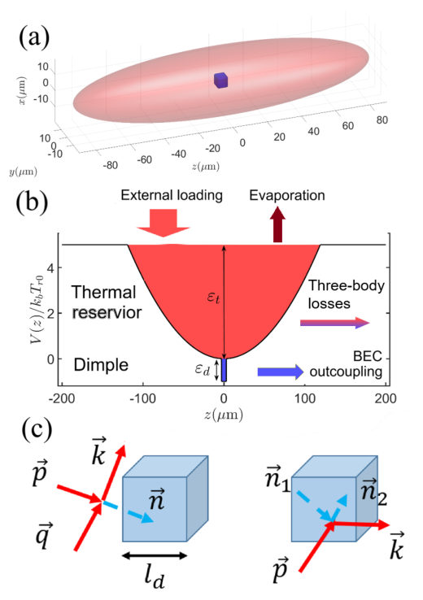 
Figure 1. (a) Schematic of the trap geometry: a localized dimple potential (blue) is embedded in a harmonic thermal reservoir (red). The reservoir density is represented by an ellipsoidal isodensity surface for initial particle number Nr0 = 3×105 and temperature Tr0 = 150 nK. (b) Axial cross section of the trapping potential. Reservoir states occupy the energy range 0 &lt; E &lt; εt, whereas dimple states lie in the interval −εd &lt; E &lt; 0. (c) Collision processes included in the kinetic model: solid red arrows denote reservoir atoms and dashed blue arrows denote dimple atoms.

📷 Fig 2

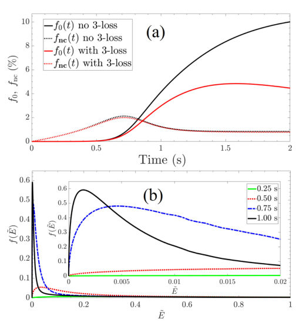 
Figure 2. (a) Time evolution of the condensate fraction f0(t) (solid) and the noncondensed dimple fraction fnc(t) (dotted). Red and black curves correspond to calculations with and without three-body losses. Evaporation is suppressed by tak- ing εt →∞. (b) Energy distribution f( ˜E) of noncondensed atoms in the dimple at selected times for the calculation with three-body losses. The inset resolves the low-energy part of the distribution.

📷 Fig 3

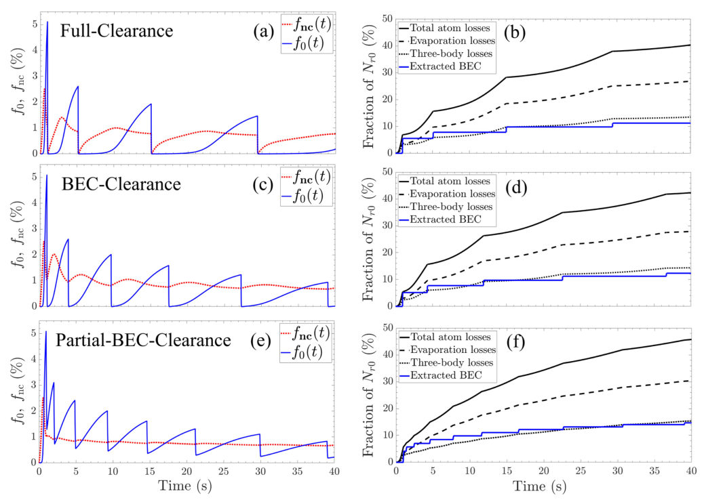 
Figure 3. Repeated condensate extraction without external replenishment. Left panels show the condensate fraction f0(t) and noncondensed dimple fraction fnc(t). Right panels show the cumulative particle balance. The reservoir depth is εt = kB × 750 nK. The critical temperature in the absence of the dimple is Tc = 130 nK. (a),(b) Full-Clearance protocol. (c),(d) BEC-Clearance protocol. (e),(f) Partial-BEC-Clearance protocol.

📷 Fig 4

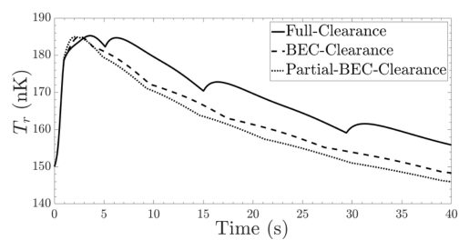 
Figure 4. Reservoir temperature as a function of time for the extraction protocols shown in Fig. 3. Condensate formation initially heats the reservoir, whereas subsequent evaporation from the finite-depth trap gradually lowers the temperature.

📷 Fig 5

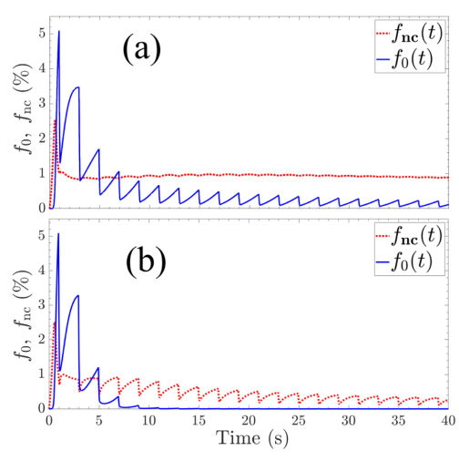 
Figure 5. Fixed-period extraction without external replenish- ment. After the first extraction, subsequent extraction pulses are applied with period Textr = 2 s. Solid blue curves denote the condensate fraction f0(t), and dotted red curves denote the noncondensed dimple fraction fnc(t). (a) Partial-BEC- Clearance protocol with Γ0 = 15 s−1 and Γ = 0 . (b) Modified protocol including partial noncondensed-atom clearance with Γ0 = 15 s−1 and Γ = 20 s−1.

**Summary.** The paper models the repeated formation and extraction of BECs from a dimple trap coupled to a thermal reservoir. By comparing different clearance protocols (e.g., partial vs. full removal), it determines that retaining residual atoms is key for efficient cycling. The results establish optimal operating regimes, particularly when continuous external atom replenishment is applied.

**Why it may be interesting.** This work provides a detailed kinetic framework for understanding non-equilibrium cycle dynamics in ultracold atomic systems, which is crucial for designing practical quantum simulation or atom-based quantum memory devices.

Detailed structure

**Main problem.** The study investigates the dynamics of repeatedly forming and extracting Bose-Einstein condensates (BECs) from a localized dimple trap coupled to a thermal atom reservoir.

**Main result.** Partial BEC extraction protocols yield the highest efficiency for repeated condensate production, especially when combined with continuous external replenishment, establishing kinetic pathways for high-duty-cycle operation.

**Method.** The research employs a detailed kinetic model that tracks the evolution of condensate and non-condensate populations alongside thermal reservoir dynamics.

**Model / system.** The system consists of atoms confined in a dimple trap embedded within a larger, thermal atomic reservoir. The model incorporates pulsed extraction, evaporation, three-body losses, and external atom replenishment rates.

**Key observables.** Condensate fraction ($f_0$), non-condensed dimple population ($f_{nc}$), cumulative extracted particle number, and the system's steady-state efficiency ($\eta$).

**Important parameters / regimes.** Extraction period ($T_{extr}$), external replenishment rate ($\dot{N}_{in}$), and the relative strength of three-body losses versus Bose-stimulated growth.

**Assumptions / limitations.** The thermal cloud is assumed to remain close to equilibrium, and the reservoir size is large compared to the dimple trap dimensions. The model treats extraction/loading as short processes relative to collisional relaxation times.

**Figures summary.** Figures illustrate the time evolution of condensate fractions under different clearance protocols (Full, BEC, Partial) both with and without external replenishment, mapping out optimal operating regimes via efficiency heatmaps.

**Paper structure.** The paper progresses by first establishing the kinetic model for the coupled system; it then analyzes cyclic dynamics in the absence of replenishment to compare extraction strategies; finally, it introduces continuous replenishment to map out high-efficiency, periodic steady-state operation.

Abstract

We investigate repeated Bose-Einstein-condensate (BEC) formation and extraction in a dimple trap embedded in a reservoir of thermal atoms using a kinetic model. The model includes pulsed extraction, evaporation, three-body losses, and thermal-atom replenishment. Three extraction protocols are compared: extraction of all atoms from the dimple (BEC and thermal atoms), full and partial extractions of the BEC, but not of the thermal atoms. Residual atoms in the dimple after extraction seed subsequent Bose-stimulated growth and reduce the recovery time between extractions, but also enhance density-dependent losses. For all protocols, repeated extraction of BECs can be achieved without replenishment, but the number of BEC formations is limited by reservoir depletion and heating. With continuous replenishment, the system can reach a periodic steady-state regime, after an initial transient period, controlled by the externally imposed rates of extraction pulses and thermal-atom input. Within the explored parameter range, partial BEC extraction gives the highest efficiency, particularly for short extraction periods and high input rates. These results identify seeding by residual populations of BECs and thermal atoms as a kinetic mechanism for improving repeated condensate production in dimple traps.

[↑ back to top](#top)

### [Diffusive Relaxation of Participation Entropy in U(1)-symmetric Dynamics](http://arxiv.org/abs/2606.11561v1)

**Authors:** Hanchen Liu, Tianci Zhou, Xiao Chen  
**Type:** theory · **Category:** statistical mechanics · **PDF:** <https://arxiv.org/pdf/2606.11561v1>  
**Analysis basis:** full PDF text, analyzed in chunks
**Topic relevance:** 🔥 `entanglement & information structure` **4/5** · 🔥 `non-equilibrium dynamics` **4/5** · `analog quantum simulation` **3/5** · `methods for driven-dissipative` **3/5** · `non-equilibrium universality` **3/5** · `scars & prethermalization` **3/5** · `correlated / nonlocal dissipation` **2/5** · `driven-dissipative phase transition` **2/5** · `Keldysh / 2PI / non-Gaussian methods` **1/5**

📷 Fig 1

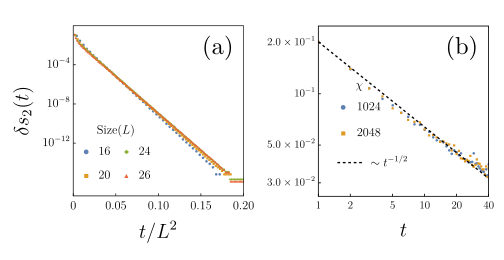 
FIG. 1. Entropy density relaxation in the SSEP brickwork evolution with r = 1/2. Panel (a) shows finite size ex- act evolution data for the N´eel initial condition on periodic chains with L = 16, 20, 24, 26, plotted up to times t ≤0.2L2. Panel (b) shows the corresponding infinite chain calculation obtained using an infinite matrix product state (iMPS) rep- resentation with bond dimensions χ = 1024 and 2048. The dashed guide-to-the-eye indicates the diffusive scaling t−1/2.

📷 Fig 2

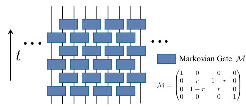 
FIG. 2. Brickwork update pattern for the one dimensional Markov dynamics. The two-site stochastic gate is applied first on one sublattice of nearest neighbor bonds and then on the shifted sublattice, giving one full brickwork time step.

📷 Fig 3

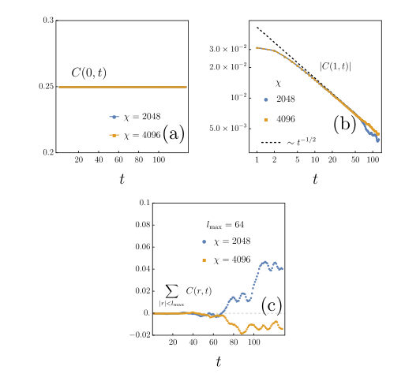 
FIG. 3. Local and conservation diagnostics for the infi- nite chain Markov iMPS calculation, with bond dimension χ = 2048, 4096. Panel (a) shows that the onsite vari- ance C(0, t) quickly reaches the half filled steady state value κ = 1/4, providing an O(1) local source for offsite correla- tions. Panel (b) shows the nearest neighbor absolute con- nected correlation |C(1, t)| with a t−1/2 guide. Panel (c) checks the finite window version of the conservation sum rule P

📷 Fig 4

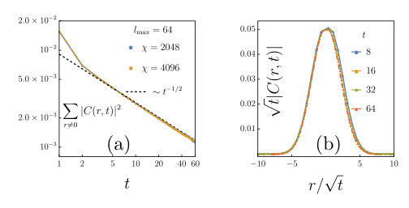 
FIG. 4. Diffusive scaling diagnostics for the r = 1/2 SSEP brickwork evolution with the iMPS method. Panel (a) shows the algebraic decay of the offsite squared correlation sum, with a t−1/2 guide. Panel (b) shows the diffusive collapse of the offsite (r ̸= 0) correlation profile under the scaling variable r/ √

📷 Fig 5

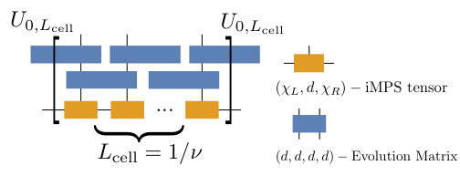 
FIG. 5. Schematic of the infinite chain iMPS implementation. The tensors and brickwork gates are represented within a fi- nite unit cell that is repeated periodically in space. We take the cell size to be the inverse filling factor ν, Lcell = 1/ν. The gates or evolution matrices inside the unit cell are resampled in time, so the calculation keeps temporal disorder while re- placing fully independent spatial disorder by a finite period representative.

**Summary.** The paper establishes that U(1) symmetry imposes constraints on the relaxation of Participation Entropy (PE) in quantum many-body systems. It shows that instead of rapid decay, the entropy deficit relaxes diffusively ($\sim t^{-1/2}$) at intermediate times due to conserved charge correlations. This slow relaxation is presented as a generic signature of conservation laws in non-equilibrium dynamics.

**Why it may be interesting.** This work provides a concrete mechanism—the persistence of long-lived hydrodynamic modes due to conservation laws—that dictates slow relaxation dynamics for fundamental quantities like PE, which is highly relevant for understanding thermalization in interacting quantum systems.

Detailed structure

**Main problem.** The study investigates the slow relaxation dynamics of Participation Entropy (PE) in quantum many-body systems constrained by continuous symmetries, specifically U(1) conservation laws.

**Main result.** In the presence of such conservation laws, PE exhibits a universal diffusive relaxation scaling ($\Delta S \sim t^{-1/2}$) at intermediate times, crossing over to an exponential decay ($\exp(-\gamma t/L^2)$) at late times.

**Method.** The analysis employs cluster expansions around equilibrium and utilizes tensor network simulations (iMPS) to track the evolution of connected density correlations that govern the entropy deficit.

**Model / system.** The research models charge-conserving dynamics, often mapped onto classical processes like the Symmetric Simple Exclusion Process (SSEP), or simulated using random U(1)-symmetric quantum circuits on a 1D chain.

**Key observables.** Participation Entropy (PE) deficit ($\Delta S$), connected density correlations ($C(r, t)$), and local density fluctuations ($\delta n_x$).

**Important parameters / regimes.** The system size $L$, time $t$, and the degree of randomness/symmetry breaking ($\lambda$ or gate parameters). The scaling regimes are characterized by $1 \ll t \ll L^2$ (diffusive) and $t \gtrsim L^2$ (exponential).

**Assumptions / limitations.** The analysis relies on expanding the entropy deficit to quadratic order in density fluctuations, assuming that conservation laws dictate the slow relaxation dynamics.

**Figures summary.** Figures illustrate the crossover from algebraic ($t^{-1/2}$) diffusive decay to exponential decay ($\exp(-\gamma t/L^2)$) for both the PE deficit and offsite connected correlations across various randomness strengths.

**Paper structure.** The paper progresses by analyzing classical toy models (SSEP), deriving theoretical expansions relating entropy deficits to correlation functions, applying these tools to quantum random circuits, and confirming the universal diffusive scaling in multiple numerical regimes.

Abstract

Participation entropy (PE) quantifies the spread of a many-body wavefunction across configuration space. While PE relaxes rapidly in generic chaotic systems, we show that $\mathrm{U}(1)$ conservation laws slow it down by imprinting with the slow hydrodynamic modes. Using a cluster expansion around equilibrium, we show that, after local density inhomogeneities decay, the leading PE deficit is dominated by squared connected density correlations. The long time relaxation is therefore controlled by diffusive correlation spreading, giving $ΔS(t)\sim t^{-1/2}$ in the hydrodynamic regime and crossing over to $\sim \exp[-O(t/L^2)]$ when $t\geq L^2$. We confirm this entropy correlation relation using exact computation and infinite system tensor network simulations in various quantum $\mathrm{U}(1)$ conserving circuits. Our results establish PE as a sensitive probe of hydrodynamic memory and suggest that slow relaxation is a generic consequence of conservation laws.

[↑ back to top](#top)

### [Enhancing Many-Body Chaos via Entropy Injection from Environment](http://arxiv.org/abs/2606.11784v1)

**Authors:** Yuke Zhang, Wenbo Zhou, Pengfei Zhang  
**Type:** theory · **Category:** statistical mechanics · **PDF:** <https://arxiv.org/pdf/2606.11784v1>  
**Analysis basis:** full PDF text, analyzed in chunks
**Topic relevance:** 🔥 `entanglement & information structure` **4/5** · 🔥 `non-equilibrium dynamics` **4/5** · `Keldysh / 2PI / non-Gaussian methods` **3/5** · `correlated / nonlocal dissipation` **3/5** · `driven-dissipative phase transition` **3/5** · `methods for driven-dissipative` **3/5** · `non-equilibrium universality` **2/5** · `Kondo & dissipative impurity` **1/5** · `analog quantum simulation` **1/5** · `scars & prethermalization` **1/5**

📷 Fig 1

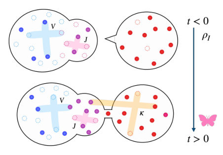 
FIG. 1. Schematic illustration of the setup. Filled and empty circles represent occupied and unoccupied modes, respec- tively, with J denoting the intra-system coupling strength. For t &lt; 0, the system is coupled to a single bath with strength V . At t = 0, a second bath is activated with coupling strength κ, inducing a change in the system’s density accompanied by entropy injection. At later times (t &gt; 0), the system relaxes into a steady state, where the quantum Lyapunov exponent is evaluated as a signature of the quantum butterfly effect.

📷 Fig 2

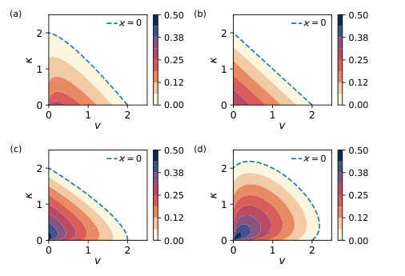 
FIG. 2. Contour plots of the quantum Lyapunov exponent for the complex Brownian SYK model with the original SE2 coupling (3), for (a) m = 0.1, (b) m = 0.2, (c) m = 0.48, and (d) m = 0.8. We fix n = 0.2 and J = 1 in all panels. The dashed lines denote the phase boundary between the scram- bling phase and the dissipative phase.

📷 Fig 3

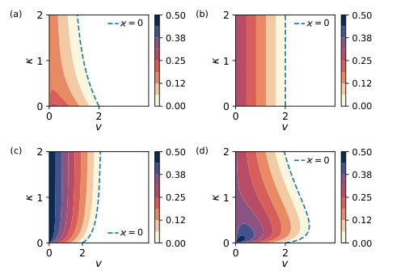 
FIG. 3. Contour plots of the quantum Lyapunov exponent for the complex Brownian SYK model with the pair-hopping coupling (13), for (a) m = 0.1, (b) m = 0.2, (c) m = 0.48, and (d) m = 0.8. We fix n = 0.2 and J = 1 in all panels. The dashed lines denote the phase boundary between the scram- bling phase and the dissipative phase.

**Summary.** The paper explores how coupling a quantum system to an environment can drive it into a non-equilibrium state by injecting entropy. By analyzing the complex Brownian SYK model, the authors demonstrate that this process enhances many-body chaos, providing a tunable mechanism for controlling quantum scrambling beyond simple dissipation effects.

**Why it may be interesting.** This work provides a concrete, controllable mechanism—tuning entropy flow—to actively enhance quantum chaos in many-body systems, which is highly relevant for understanding non-equilibrium dynamics far from thermal equilibrium.

Detailed structure

**Main problem.** To investigate entropy injection from an environment as a mechanism that enhances many-body chaos, contrasting with previous work suggesting environmental coupling can reduce complexity growth.

**Main result.** Entropy injection into the system enlarges the effective Hilbert space dimension, which demonstrably enhances the quantum Lyapunov exponent and promotes many-body chaos in the solvable complex Brownian SYK model.

**Method.** The analysis uses large-N expansion techniques on Green's functions governed by a Kadanoff-Baym equation to derive an exact quantum Boltzmann equation for particle number evolution and calculate OTOCs.

**Model / system.** The system is modeled as complex fermions coupled sequentially to two environments ($E_1$ and $E_2$), realized via a solvable complex Brownian Sachdev-Ye-Kitaev (SYK) model. The coupling drives the system into a non-equilibrium steady state.

**Key observables.** Quantum Lyapunov exponent ($\lambda$ or $\kappa$), Out-of-Time-Ordered Correlators (OTOCs), and the accessible effective Hilbert space dimension ($e_S$).

**Important parameters / regimes.** Coupling strengths ($\gamma_1, \gamma_2$) and environment parameters ($n, m$), which define different dynamical regimes.

**Assumptions / limitations.** The analysis relies on large-N expansion techniques and the use of specific coupling structures (e.g., pair-hopping) to maintain solvability.

**Figures summary.** Figures show contour plots of the quantum Lyapunov exponent across parameter space for both standard and modified couplings, illustrating phase boundaries between scrambling and dissipative regimes.

**Paper structure.** The paper progresses from establishing the physical setup (entropy injection vs. dissipation), deriving the governing equations (Boltzmann/Kadanoff-Baym), calculating key diagnostics like OTOCs and $\lambda$, and finally comparing results across different coupling mechanisms to establish control over chaos enhancement.

Abstract

In closed quantum systems, local information spreads throughout the entire system and becomes highly complex under unitary evolution. In contrast, when the system is embedded in an environment, system-environment coupling can transfer information from the system into the environment, thereby reducing the rate of complexity growth within the system. This leads to the environment-induced scrambling transition established in previous works. In this work, we identify entropy injection from the environment as a different physical process that instead enhances many-body chaos. Our setup consists of coupling a system that is already in equilibrium with one environment to another environment, which serves as an entropy reservoir and drives the system into a non-equilibrium state. When entropy flows into the system through either heat transfer or particle transfer, the effective Hilbert space explored by the system enlarges, a mechanism that can enhance many-body chaos. We explicitly demonstrate this idea by constructing a solvable complex Brownian SYK model, in which both the relaxation toward the steady state and the steady-state quantum Lyapunov exponent can be computed analytically. Our results provide a controllable mechanism for tuning quantum scrambling through entropy flow in quantum many-body systems coupled to environments.

[↑ back to top](#top)

### [Heisenberg-Langevin theory of an exciton mirror](http://arxiv.org/abs/2606.12053v1)

**Authors:** Sergueï V. Andreev  
**Type:** theory · **Category:** other · **PDF:** <https://arxiv.org/pdf/2606.12053v1>  
**Analysis basis:** full PDF text, analyzed in chunks
**Topic relevance:** 🔥 `driven-dissipative phase transition` **4/5** · `Keldysh / 2PI / non-Gaussian methods` **3/5** · `correlated / nonlocal dissipation` **3/5** · `correlated cavity matter` **3/5** · `methods for driven-dissipative` **3/5** · `Tavis-Cummings & cavity-many-emitter` **2/5** · `non-equilibrium universality` **2/5** · `analog quantum simulation` **1/5** · `interference shaping light` **1/5** · `non-equilibrium dynamics` **1/5** · `superradiant laser` **1/5**

📷 Fig 1

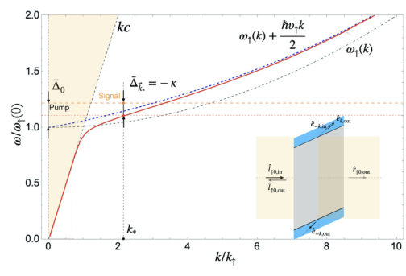 
Figure 1. The dispersion of the spin-up exciton ω′ ↑(k) in a strong transverse magnetic field. The following exemplary values of parameters have been used: ℏk2 ↑/[2mω↑(0)] = 0.01 and υ↑↑(0)/c = 0.1. Grey dashed lines show the mechanical exciton dispersion ω↑(k) and the boundary of the ”light cone”. Blue dashed line depicts the large-k asymptote of ω′ ↑(k). A steady-state population of excitons at k = 0 excited by a co- herent monochromatic wave (detuned by ¯∆0) may produce a phase-conjugated guided polariton wave beyond the light cone. The phase-conjugated wave may be greatly amplified by the pump, provided either the absolute value of the wave vector −k∗of the probe wave or the detuning...

**Summary.** This paper develops a comprehensive Heisenberg-Langevin theory for an exciton mirror system, incorporating crucial effects like retardation and long-range exchange. It predicts that the system's optical response is highly nonlinear, exhibiting bistability. Depending on the driving intensity relative to a threshold, the mirror can either generate twin polaritons or display phase-conjugating reflection.

**Why it may be interesting.** This work bridges quantum optics (parametric amplification, cavity physics) with condensed matter excitonics, providing a detailed theoretical framework for nonlinear light-matter interactions in 2D materials.

Detailed structure

**Main problem.** Developing a Heisenberg-Langevin theory for an exciton mirror that accounts for retardation and long-range electron-hole exchange, while investigating phenomena like optical bistability.

**Main result.** The system exhibits optical parametric generation of twin polariton beams above a critical threshold, and acquires phase-conjugating properties below it.

**Method.** The analysis uses the input–output formalism within a Heisenberg-Langevin framework derived from the second-quantized electric-dipole Hamiltonian.

**Model / system.** The system is an exciton mirror utilizing 2D excitons in semiconductor monolayers, modeled by coupled Heisenberg-Langevin equations for the exciton operators. The theory incorporates retardation and long-range exchange effects.

**Key observables.** Optical bistability hysteresis curves, phase-conjugating reflection coefficients, and the onset of parametric generation (twin polaritons).

**Important parameters / regimes.** Threshold densities ($n^{(th)}_0$), coupling strengths ($g$), decay rates ($\gamma$), and external magnetic fields.

**Assumptions / limitations.** Approximations include assuming $\psi_{1s}(0)$ is constant, using the Dirac delta function for the envelope function, and neglecting retardation effects at large momentum.

**Figures summary.** Figure 1 illustrates the dispersion relation of spin-up excitons in a strong transverse magnetic field, showing the light cone structure.

**Paper structure.** The paper develops the theory by first establishing the coupled Heisenberg-Langevin equations. It then analyzes the mean-field dynamics to derive conditions for optical bistability and instability thresholds, culminating in predictions for parametric generation and phase conjugation.

Abstract

We develop a Heisenberg-Langevin theory of an exciton mirror accounting for the retardation and the long-range electron-hole exchange. A particular case of a strong transverse magnetic field is analyzed in detail. The optical bistability due to repulsion between the excitons inside the light cone appears to be prone to a modulational instability towards the non-radiative surface polariton modes. Above the corresponding threshold, the pumped 2D exciton gas acts as an optical parametric generator of twin polariton beams. Conversely, below the threshold, the mirror acquires the phase-conjugating properties.

[↑ back to top](#top)

### [Perspective: The Physics of Active Solids -- From Hamiltonians to Active Matter Models](http://arxiv.org/abs/2606.11950v1)

**Authors:** Antik Bhattacharya, Jürgen Horbach, Smarajit Karmakar  
**Type:** theory · **Category:** statistical mechanics · **PDF:** <https://arxiv.org/pdf/2606.11950v1>  
**Analysis basis:** full PDF text, analyzed in chunks
**Topic relevance:** 🔥 `non-equilibrium dynamics` **4/5** · 🔥 `non-equilibrium universality` **4/5** · `Keldysh / 2PI / non-Gaussian methods` **3/5** · `driven-dissipative phase transition` **3/5** · `methods for driven-dissipative` **3/5** · `scars & prethermalization` **2/5** · `Frenkel-Kontorova` **1/5** · `analog quantum simulation` **1/5** · `correlated / nonlocal dissipation` **1/5** · `correlated cavity matter` **1/5** · `exotic spin models in light-matter` **1/5**

📷 Fig 1

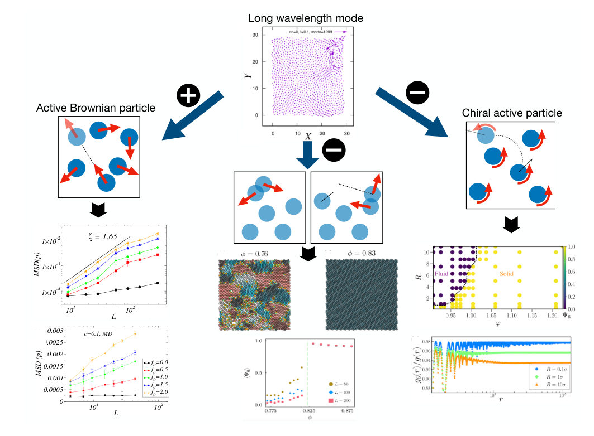 
FIG. 1. Anomalous Mermin-Wagner-Hohenberg (MWH) fluctuations in active systems: This schematic illustrates how positive and negative coupling between active driving and long wavelength modes affects system behavior. On the left, Active Brownian Particles (ABPs) couple positively with long wavelength modes, resulting in increased density fluctuations and destabilization of active solids even in three dimensions (3D). In the middle, we show negative coupling for another type of activity, in which particles receive a random kick whenever they come into contact, at zero temperature. This leads to strong suppression of density fluctuations and stabilization of crystalline positional order even...

📷 Fig 2

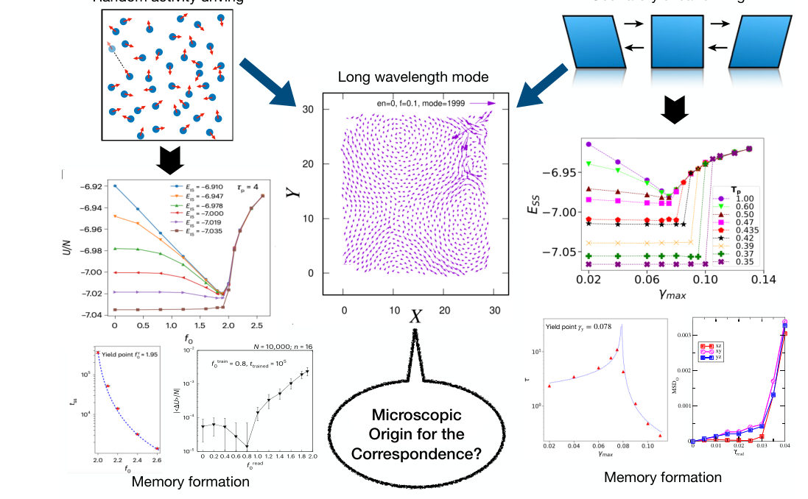 
FIG. 2. Activity-Oscillatory Shear Correspondence: This schematic shows the observed equivalence between oscillatory shear response of an amorphous solids and response under active particle doping. In the left, we demonstrated the dynamical response and annealing effects obtained using active particle doping. The Energy-activity state diagram shows that annealing effects can be obtained for poorly annealed glasses, but below a critical energy, further annealing can not be achieved via active particle doping. The phenomena also shows a growth of a critical timescale and memory formation (see the text for details). On the right, we show similar dynamical responses of an amorphous solid under...

**Summary.** This perspective article tackles the theoretical challenges of dense active matter by proposing the use of Active Hamiltonian models as a unifying framework. The authors establish a key hypothesis: that the effects of self-propulsion are mathematically equivalent to those induced by external oscillatory shear in amorphous solids. This correspondence suggests universal principles govern energy injection and structural memory formation in non-equilibrium materials.

**Why it may be interesting.** The concept of mapping non-equilibrium dynamics (active systems) onto Hamiltonian frameworks provides powerful analogies for understanding energy dissipation and structural relaxation in complex many-body systems, relevant to open quantum system modeling.

Detailed structure

**Main problem.** Understanding the profound theoretical challenges posed by dense active matter, such as 'active glasses and active solids,' where energy consumption drives non-equilibrium behavior.

**Main result.** The paper proposes that developing active Hamiltonian models allows for elucidating a universal correspondence between activity-induced annealing and mechanical oscillatory shear in amorphous solids.

**Method.** Developing an Active Hamiltonian (AH) framework to treat non-equilibrium systems by mapping them onto equilibrium reference states, supplemented by comparative studies of rheology.

**Model / system.** The study focuses on active matter systems like Active Brownian Particles (ABPs) and amorphous solids. The theoretical tool is the AH model, which extends standard Hamiltonians to incorporate self-propelling forces and internal degrees of freedom (like spin).

**Key observables.** Enhanced Mermin-Wagner-Hohenberg (MWH) fluctuations, phonon dispersion relations ($\omega(q)$), rheological response (yielding behavior), and memory signatures.

**Important parameters / regimes.** Chirality ($\Omega$), coupling strength between active forces and elastic modes, and the comparison between random activity driving versus deterministic oscillatory shear strain ($\gamma(t)$).

**Assumptions / limitations.** The core hypothesis is that the physics of dense active matter can be understood by treating it via an AH framework, which allows for mapping non-equilibrium dynamics onto equilibrium concepts.

**Figures summary.** Figure 1 illustrates how coupling parameters control MWH fluctuations in ABPs. Figure 2 compares annealing effects from active particle doping versus oscillatory shear, showing identical critical energy thresholds and memory encoding mechanisms.

**Paper structure.** The paper progresses by first identifying the limitations of current theories for dense active matter. It then introduces the AH formalism to build a theoretical bridge. The core argument is built around demonstrating the equivalence between activity-driven processes and mechanical shearing via cross-memory protocols, culminating in a roadmap for future investigations.

Abstract

The physics of active matter, wherein constituent particles consume energy to generate autonomous motion, has revolutionized non-equilibrium statistical mechanics. While a large body of work has successfully elucidated the behavior of dilute active systems, the dense regime -- characterized by ``active glasses and active solids'' -- presents profound challenges that defy conventional theoretical frameworks. Recent observations reveal two striking features in these dense systems: an apparent enhancement of Mermin-Wagner-Hohenberg (MWH) fluctuations leading to anomalous long-wavelength density fluctuations, and a remarkable correspondence between activity-induced annealing and annealing via oscillatory shear. In this perspective article, we propose a novel approach toward a deeper understanding of dense active matter: by developing active Hamiltonian models as equilibrium reference frameworks, we map out pathways toward non-equilibrium active systems. This strategy allows us to elucidate both the correspondence between driven and active systems and the enhanced MWH fluctuations, which likely arise from a strong coupling between spatially random active forces and long-wavelength density (phonon) modes. We outline a comprehensive roadmap employing complementary approaches, including the active Hamiltonian formalism, comparative studies of oscillatory shear in active and passive solids, and investigations of chiral active matter. Establishing this activity-oscillatory shear correspondence across diverse systems is essential to demonstrate its universality, reveal the underlying large-scale emergent physics, and place our hypothesis on a firmer theoretical ground.

[↑ back to top](#top)

### [Experimental Tabletop Petz recovery of a photonic qubit](http://arxiv.org/abs/2606.12020v1)

**Authors:** Hui Li, Jinyan Chen, Yue Pan, Liang Xu, Minjeong Song, Valerio Scarani, Lijian Zhang  
**Type:** experiment · **Category:** quantum information and computing · **PDF:** <https://arxiv.org/pdf/2606.12020v1>  
**Analysis basis:** full PDF text, analyzed in chunks
**Topic relevance:** 🔥 `QC/QI experiment` **4/5** · `methods for driven-dissipative` **3/5** · `quantum optics experiment` **3/5** · `analog quantum simulation` **2/5** · `correlated / nonlocal dissipation` **2/5** · `entanglement & information structure` **2/5** · `measurement-induced transitions` **2/5** · `quantum measurements` **2/5** · `driven-dissipative phase transition` **1/5** · `interference shaping light` **1/5** · `non-equilibrium dynamics` **1/5**

📷 Fig 1

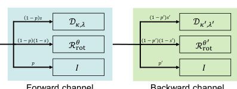 
FIG. 1. Schematic diagram illustrating the forward channel and the corresponding Petz recovery map acting as the backward channel. Both channels consist of three parts: identity channel I, rotation channel Rrot and the dissipation channel Dκ,λ.

📷 Fig 2

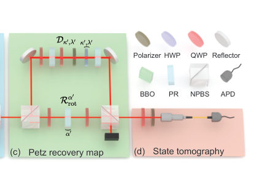 
FIG. 2. Experimental setup for implementing the forward channel and the Petz recovery map. The setup contains four parts: (a) state preparation, (b) forward channel, (c) Petz recovery map and (d) state tomography. Experimentally, the photons are generated via the spontaneous parametric down-conversion (SPDC) and collected by the APD. The identity part I and the rotation part Rπ/2 rot (Rθ rot) of the forward channel (Petz recovery map) are combined and implemented as a single new rotation operation Rα rot (Rα′ rot) (see Section D for detailed derivation). The values of κ(′), λ(′) and α(′) are determined by adjusting the angle of the corresponding HWP and the thickness of the PR,...

📷 Fig 3

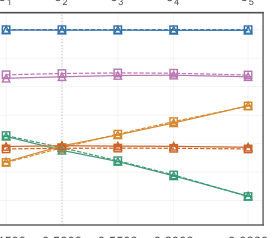 
FIG. 3. Experimental performance of the Petz recovery map. (A) Recovery trajectories on the Bloch sphere for the reference state σ2. Only σ2 is shown here, for simplicity, as maps corresponding to other reference states (σ1, σ3, σ4, σ5) exhibit similar trajectories. (B) Recovery fidelity F of various input states across different Petz recovery map for different reference states. In both panels, circles with different colors distinguish the input states (ρH, ρV, ρD, ρR) with the star specifically indicating the reference state. Squares with dashed lines and triangles with solid lines represent the theoretical and experimental recovered states, respectively. Error bars in panel B are smaller...

**Summary.** The paper experimentally realizes the Petz recovery map for photonic qubits to combat information loss from decoherence. By showing that this recovery process can be implemented using the same physical hardware as the noise itself, they demonstrate a resource-efficient method for mitigating quantum information decay in tabletop setups.

**Why it may be interesting.** This work provides a concrete, resource-efficient experimental platform for implementing quantum error mitigation techniques (like partial recovery) directly on photonic qubits, which is highly relevant for scalable quantum communication and computation.

Detailed structure

**Main problem.** The work addresses the challenge of partially recovering quantum information lost during open system evolution (decoherence/dissipation) using the Petz recovery map.

**Main result.** They experimentally demonstrated 'tabletop reversibility,' showing that the Petz recovery map can be implemented using the same photonic devices as the forward dissipative evolution, resource-efficiently mitigating information loss.

**Method.** The authors used spontaneous parametric down-conversion to generate photonic qubits and employed state tomography alongside fidelity/trace distance measurements to validate the channel reconstruction.

**Model / system.** The system uses photonic qubits encoded in photon polarization. The dynamics are modeled by CPTP quantum channels, including tunable decoherence and dissipation components.

**Key observables.** State Fidelity ($F$) and Trace Distance ($T$), used to quantify the success of information recovery for various input states ($
ho_H, 
ho_V, 
ho_D, 
ho_R$).

**Important parameters / regimes.** Forward channel parameters $(p, s, 	heta, \kappa, \lambda)$ and the reference state parameter $r$. The operational range for $r$ is constrained by theoretical derivations.

**Assumptions / limitations.** The analysis assumes that the Petz recovery map can be mathematically mapped onto a structure analogous to the forward channel, allowing for physical implementation using existing hardware components.

**Figures summary.** Figure 1 schematically compares the forward and recovery channels. Figure 2 details the experimental setup (state prep, forward channel, recovery map). Figure 3 shows Bloch sphere trajectories and fidelity across different reference states. Table I quantifies performance metrics.

**Paper structure.** The paper moves from theoretical derivation of the Petz map structure using Choi matrices to establishing parameter relationships, culminating in an experimental realization demonstrating that the required channels can be implemented with minimal additional resources.

Abstract

The quantum information lost in open evolutions cannot be fully recovered, but partial recovery is possible. The Petz recovery map guarantees almost optimal recovery, notably if the chosen reference state is close to the real one. This map has been widely used in theoretical studies, but has been the object of only a handful of experimental realisations, typically under a single fixed noise model. In this work, we describe and implement the Petz recovery map for a versatile class of qubit channels with tunable decoherence and dissipation. The setup we realize is also the first experimental example of ``tabletop reversibility'': for a good range of choices of the reference state, the Petz recovery map can be implemented with the same devices as the forward dissipative evolution, whose effect it is partially undoing. Our results demonstrate that the Petz recovery map can be resource-efficiently realized without requiring complex ancillary resources, providing a feasible pathway for mitigating information loss in quantum systems.

[↑ back to top](#top)

### [Controlled ion-ion interactions and cavity-enhanced emission of a coherent dinuclear Eu$^{3+}$ complex](http://arxiv.org/abs/2606.11947v1)

**Authors:** Evgenij Vasilenko, Vishnu Unni Chorakkunnath, Barbora Brachnakova, Nicholas Lester Jobbitt, Senthil Kumar Kuppusamy, David Hunger, Mario Ruben  
**Type:** both · **Category:** other · **PDF:** <https://arxiv.org/pdf/2606.11947v1>  
**Analysis basis:** full PDF text, analyzed in chunks
**Topic relevance:** 🔥 `Tavis-Cummings & cavity-many-emitter` **4/5** · 🔥 `quantum optics experiment` **4/5** · `analog quantum simulation` **3/5** · `correlated cavity matter` **3/5** · `QC/QI experiment` **2/5** · `Dicke superradiance` **1/5** · `correlated / nonlocal dissipation` **1/5** · `driven-dissipative phase transition` **1/5** · `entanglement & information structure` **1/5** · `interference shaping light` **1/5** · `superradiant laser` **1/5**

📷 Fig 1

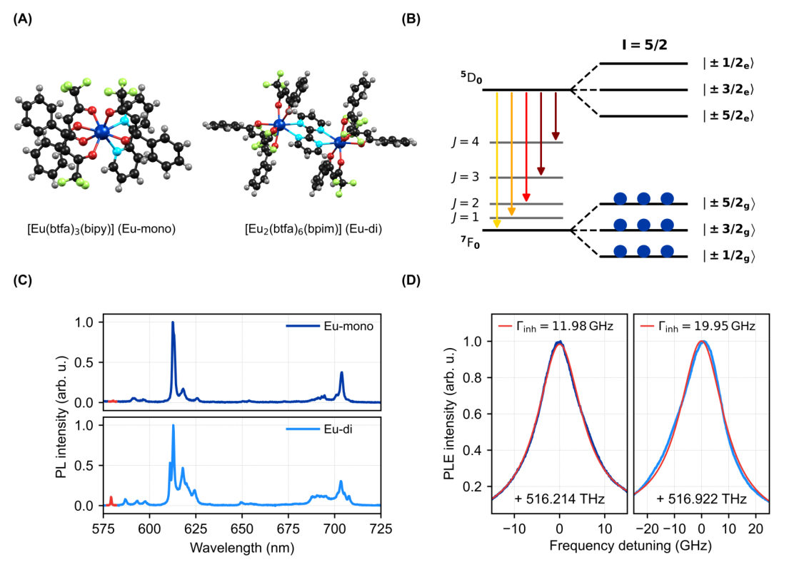 
Figure 1: Photoluminescence properties of the mononuclear and dinuclear Eu3+ complexes. (A): Molecular structures of Eu-mono (left) and Eu-di (right). (B): Energy-level scheme of Eu3+ showing the relevant radiative decay channels from the 5D0 excited state into the 7FJ manifold as observed in the emission spectra. (C): Room-temperature photoluminescence spectra of Eu-mono (upper panel) and Eu-di (lower panel). The dinuclear complex shows a significantly higher branching ratio of the coherent 5D0 → 7F0 transition, which is highlighted in red in the spectra. (D): Photolu- minescence excitation spectra recorded at about 100 mK, revealing the inhomogeneous broadening of the 5D0 → 7F0...

📷 Fig 2

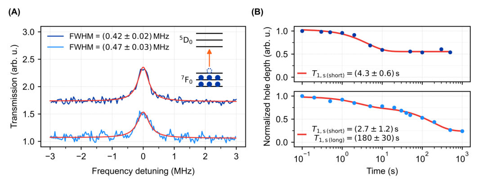 
Figure 2: Spectral hole burning and hyperfine state lifetime. (A): Absorption-based spectral hole burning mea- surements for both complexes, shown with a vertical offset for clarity. Lorentzian fits yield full width at half maximum (FWHM) linewidths of 0.42(2) MHz for Eu-mono and 0.47(3) MHz for Eu-di. (B): Hole depth evolution for both com- plexes. Eu-mono (upper panel) exhibits a single-exponential decay with a relaxation time of 4.3(6) s, and no further decay within the 500 s measurement window, suggesting hour-long spin lifetime. Eu-di (lower panel) shows a bi-exponential decay with time constants of 2.7(12) s and 180(30) s.

📷 Fig 3

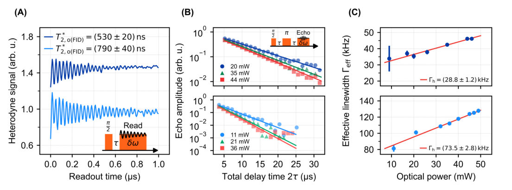 
Figure 3: Optical coherence measurements. (A): Optical free-induction decay measurements obtained using a π/2 pulse followed by a heterodyne readout pulse. The two traces are vertically offset for clarity and yield optical dephasing times of T ∗ 2,o(FID) = 530(20) ns for Eu-mono and T ∗ 2,o(FID) = 790(40) ns for Eu-di. (B): Two-pulse photon echo decays recorded at different excitation powers, with three power levels shown in each panel. Increasing optical power acceler- ates the echo decay and reduces the optical coherence time T2,o. The longest observed echo decays are approximately 9 µs for Eu-mono and 4 µs for Eu-di. (C): Effective homogeneous linewidth Γeff as a function of excitation...

📷 Fig 4

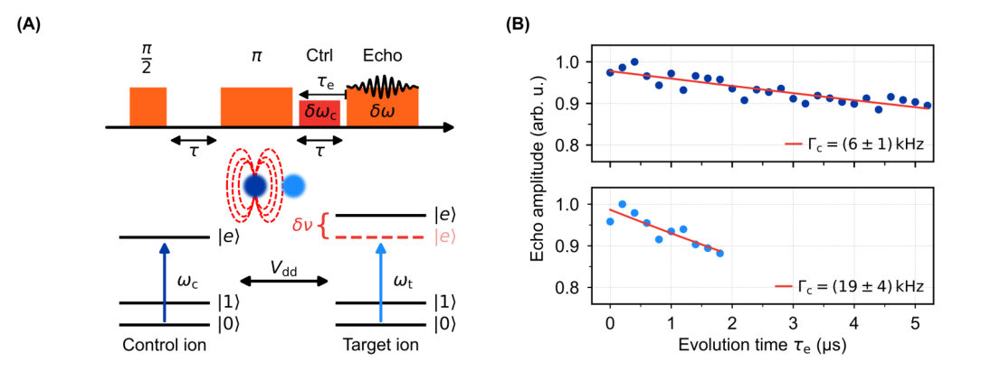 
Figure 4: Probing ion-ion interactions via controlled excitation of a sub-ensemble. (A): Pulse sequence used to probe ion-ion interactions (top panel) and schematic illustration of the control-target ion configuration (bottom panel). A frequency-selective control pulse (red pulse) is applied to a subset of ions at frequency ωc, while the optical coherence of spectrally distinct target ions at ωt is monitored using a two-pulse photon echo sequence (orange pulses). The control and target ions are represented as effective three-level systems with ground states |0⟩, |1⟩and optically excited state |e⟩. The interaction between control and target ions is described by the dipole–dipole coupling...

📷 Fig 5

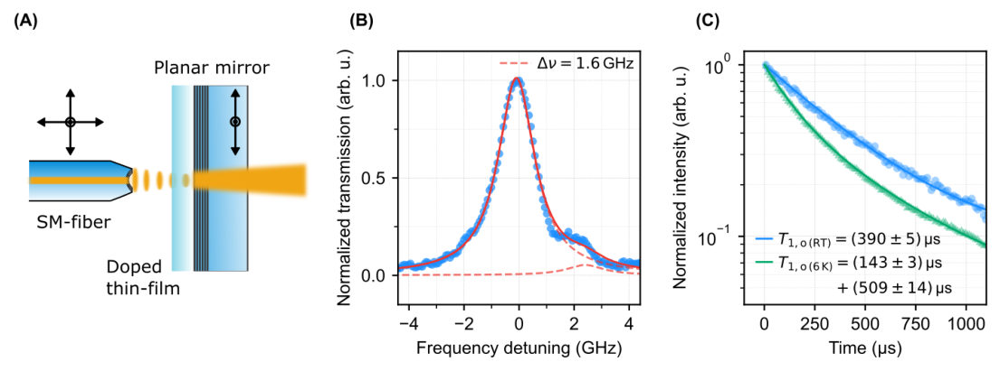 
Figure 5: Purcell enhancement of the coherent transition. (A): Schematic illustration of the fiber-based micro- cavity setup employed in this work. (B): Fitted cavity resonance in the presence of the thin-film doped with Eu-di. The second polarization mode visible at a frequency detuning of 2.4 GHz arises from the slight asymmetry in the concave pro- file of the fiber. (C): Purcell enhancement of the coherent 5D0 → 7F0 transition at room temperature (blue), and at 6 K (green).

**Summary.** The research investigates $	ext{Eu}^{3+}$ molecular complexes to create robust platforms for quantum information processing. By synthesizing and spectroscopically characterizing mononuclear and dinuclear variants, the authors demonstrated long coherence times and controlled ion interactions. Crucially, they enhanced emission by coupling the complex into an optical microcavity, proving its viability as a tunable solid-state qubit material.

**Why it may be interesting.** This work directly addresses the challenge of creating solid-state quantum emitters with controllable coupling strengths by using molecular chemistry to engineer inter-ion distances, which is central to building scalable quantum processors in AMO physics.

Detailed structure

**Main problem.** The research aims to develop molecular rare-earth ion complexes as chemically tunable, scalable building blocks for multi-qubit quantum architectures.

**Main result.** The study demonstrated long optical coherence times ($T_{2,	ext{o}}$ up to $9 \mu	ext{s}$) and achieved a significant 380-fold emission enhancement by integrating the dinuclear complex into an optical microcavity.

**Method.** A combination of advanced cryogenic ensemble spectroscopy (SHB, Photon Echo) was used to measure coherence times and ion interactions, complemented by cavity QED measurements for Purcell enhancement.

**Model / system.** The system involves mononuclear and dinuclear $	ext{Eu}^{3+}$ molecular complexes. The study models the interaction between these ions using dipole-dipole coupling and probes quantum coherence via time-domain spectroscopy techniques.

**Key observables.** Optical coherence times ($T_{2,	ext{o}}$), inhomogeneous linewidth ($\Gamma_{	ext{inh}}$), emission enhancement factor (Purcell factor $	ext{F}_{	ext{eff}}	ext{P}$), and interaction-induced dephasing rates ($\Gamma_c$).

**Important parameters / regimes.** Temperatures down to $100 	ext{ mK}$, defined ion separations ($\sim 7 	ext{ \AA}$), and cavity quality factors ($Q = 3 	imes 10^5$).

**Assumptions / limitations.** The molecular structure allows for deterministic control over ion separation, enabling the realization of controlled two-qubit interactions.

**Figures summary.** Figures illustrate PL spectra showing enhanced transitions in the dinuclear complex and time-domain measurements (FID/Echo) demonstrating coherence decay influenced by external fields or cavity coupling.

**Paper structure.** The paper progresses from structural characterization and synthesis to measuring fundamental optical properties ($	ext{T}_{2,	ext{o}}$, linewidths), then investigating controlled ion-ion interactions, and finally demonstrating the enhancement of emission via microcavity integration.

Abstract

Molecular rare-earth-ion complexes offer unique opportunities for quantum technologies by combining the intrinsic coherence properties of rare-earth ions with chemically tunable molecular environments. A crucial capability is the realization of multi-qubit architectures with defined qubit couplings to enable two-qubit quantum gates. Here, we investigate the optical coherence properties and excitation-induced interactions of two Eu$^{3+}$-based molecular complexes, comparing a mononuclear reference system with a dinuclear analogue in which two Eu$^{3+}$ ions are positioned at a well-defined intramolecular distance of about 7 Angstrom. Using cryogenic ensemble spectroscopy, including spectral hole burning, free-induction decay, and photon echo measurements at temperatures down to 100 mK, we demonstrate long optical coherence times $T_{2,\text{o}}$ of up to 9 $μ$s. As a key step toward scalable multi-qubit architectures, a control-target sequence was implemented to probe conditional ion-ion interactions, revealing a stronger interaction-induced dephasing in the dinuclear complex. Finally, we show the integration of the dinuclear complex into a fiber-based optical microcavity, and observe an 380-fold emission enhancement of the $\mathrm{}^5\mathrm{D}_0\rightarrow\mathrm{}^7\mathrm{F}_0$ transition. Together, these results position molecular rare-earth complexes as versatile and chemically tunable building blocks for scalable quantum technologies.

[↑ back to top](#top)

### [Exact Dynamics of Topological Order Across a CDW--SPT Transition](http://arxiv.org/abs/2606.11303v1)

**Authors:** Pradip Kattel, Yicheng Tang, Natan Andrei  
**Type:** theory · **Category:** statistical mechanics · **PDF:** <https://arxiv.org/pdf/2606.11303v1>  
**Analysis basis:** full PDF text, analyzed in chunks
**Topic relevance:** 🔥 `non-equilibrium dynamics` **4/5** · `analog quantum simulation` **3/5** · `non-equilibrium universality` **3/5** · `Keldysh / 2PI / non-Gaussian methods` **2/5** · `driven-dissipative phase transition` **2/5** · `entanglement & information structure` **2/5** · `methods for driven-dissipative` **2/5** · `Frenkel-Kontorova` **1/5** · `correlated / nonlocal dissipation` **1/5** · `exotic spin models in light-matter` **1/5** · `scars & prethermalization` **1/5**

📷 Fig 1

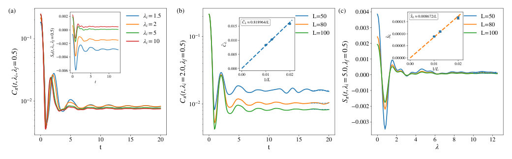 
FIG. 1. Quench dynamics and finite-size scaling of CDW and SPT order. (a) Time evolution of the CDW correlator Cπ(t) after a sudden quench to λf = 0.5. The CDW order melts and saturates to a small value. Inset: the string correlator Sπ(t) remains strongly suppressed, indicating the absence of dynamically generated SPT order. (b) Finite-size scaling of the late-time Cπ(t), which vanishes as N →∞. (c) Finite-size scaling of Sπ, showing no finite intercept in the thermodynamic limit.

📷 Fig 2

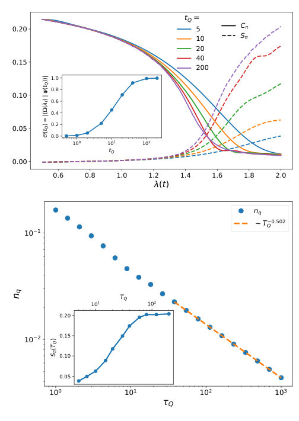 
FIG. 2. Top panel: Ramp dynamics across the CDW–SPT transition. Slower ramps suppress CDW order and enhance string order. Inset: The overlap O(τQ) = |⟨Ωint(λf)|ψ(τQ)⟩| . approaches unity with increasing τQ, reflecting the onset of adiabatic evolution. Bottom panel: Defect density nq, ex- hibiting Kibble–Zurek scaling nq ∼τ −1/2 Q . Inset: final string order |Sπ(τQ)|, showing the approach to the adiabatic SPT state as the ramp time increases.

**Summary.** This paper analyzes the non-equilibrium dynamics across a CDW to SPT phase transition in 1D fermions. It demonstrates that while entering the topological regime is necessary, it is not sufficient; only slow, adiabatic evolution suppresses excitations enough to allow true long-range topological order to build up. The study uses exact fermionic mappings to track correlation functions during both sudden and gradual changes.

**Why it may be interesting.** This work provides a rigorous theoretical framework for understanding how dynamic processes (like quenches) can fundamentally alter the realization or stability of exotic quantum phases like topological order, which is crucial for designing quantum materials.

Detailed structure

**Main problem.** The study investigates the non-equilibrium dynamics of topological order when a system transitions from a Charge-Density-Wave (CDW) phase to a Symmetry-Protected Topological (SPT) phase.

**Main result.** Long-range SPT order only emerges during slow, adiabatic ramps across the transition; sudden quenches fail to establish this order due to residual excitations.

**Method.** The dynamics are solved analytically by mapping the interacting Hamiltonian to an exactly solvable quadratic fermionic form, allowing for calculations of correlation functions and the Loschmidt echo.

**Model / system.** A one-dimensional interacting system (spinless fermions) modeled by a Kitaev-like Hamiltonian that exhibits CDW ($\lambda > 1$) and SPT ($-1 < \lambda < 1$) phases. The evolution is studied via quenching or ramping the coupling parameter $\lambda$.

**Key observables.** Loschmidt echo/rate function, CDW correlation ($\langle C^{CDW} 
angle$), and non-local SPT string correlator ($\langle S_{ij}(t) 
angle$).

**Important parameters / regimes.** The quench protocol (sudden vs. slow ramp), the coupling parameter $\lambda$, and the defect density ($n_q$) governed by Kibble–Zurek scaling.

**Assumptions / limitations.** The analysis relies on an exact unitary mapping to solve the dynamics analytically, and comparisons are made between idealized quenches and finite-time ramps.

**Figures summary.** Figures compare quench dynamics showing CDW melting but suppressed string order (sudden quench) versus ramp dynamics showing enhanced string order correlating with adiabaticity (slow ramp).

**Paper structure.** The paper compares the outcomes of two non-equilibrium protocols—a sudden quench and a slow ramp—across the CDW-SPT transition, analyzing how excitation production dictates the final topological state.

Abstract

We investigate the nonequilibrium dynamics of a one-dimensional interacting system across a transition from a charge-density-wave (CDW) phase to a symmetry-protected topological (SPT) phase. Starting from a CDW initial state, we study both sudden quenches and slow ramps into the SPT regime. While the CDW order melts under both protocols, the fate of topological order is sharply different. Following a sudden quench, long-range SPT order does not emerge because the post-quench state contains a finite density of excitations above the topological ground state. In contrast, slow ramps allow the system to follow the instantaneous ground state away from the critical region, enabling the buildup of SPT order with deviations governed by Kibble-Zurek defect production. The dynamics is solvable via a unitary mapping to a quadratic fermionic Hamiltonian, allowing us to compute the Loschmidt echo, correlation functions, and string correlator. The Loschmidt rate function exhibits cusps signaling dynamical quantum phase transitions, while the correlation dynamics reveal the contrasting mechanisms governing quenches and ramps across the transition. These results demonstrate that entering the topological regime is not sufficient for the emergence of topological order; the decisive factor is the suppression of excitation production during the evolution.

[↑ back to top](#top)

### [Universal Information-Theoretic Structure of the Quasi-Stationary Domany--Kinzel Automaton](http://arxiv.org/abs/2606.11885v1)

**Authors:** Hyun-Yong Lee, Kenji Harada, Naoki Kawashima  
**Type:** theory · **Category:** statistical mechanics · **PDF:** <https://arxiv.org/pdf/2606.11885v1>  
**Analysis basis:** full PDF text, analyzed in chunks
**Topic relevance:** 🔥 `entanglement & information structure` **4/5** · 🔥 `methods for driven-dissipative` **4/5** · 🔥 `non-equilibrium universality` **4/5** · `driven-dissipative phase transition` **3/5** · `non-equilibrium dynamics` **3/5** · `Frenkel-Kontorova` **1/5** · `Keldysh / 2PI / non-Gaussian methods` **1/5** · `analog quantum simulation` **1/5** · `correlated / nonlocal dissipation` **1/5**

📷 Fig 1

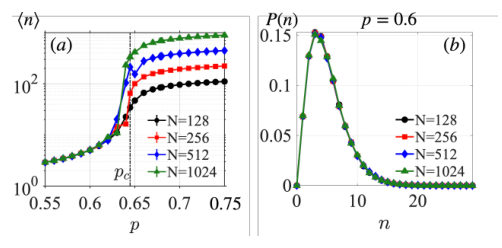 
FIG. 1. QSD statistics of the total active-site count 𝑛= Í 𝑖𝑥𝑖. (a) mean active count ⟨𝑛⟩versus 𝑝on a log scale, for 𝑁= 128, 256, 512, 1024. Across the inactive phase (𝑝&lt; 𝑝𝑐) the four curves collapse onto a common, 𝑁-independent value; across the active phase (𝑝&gt; 𝑝𝑐) the curves separate and ⟨𝑛⟩grows with 𝑁, con- sistent with a finite intensive density. A dashed vertical line marks 𝑝𝑐. (b) probability distribution 𝑃(𝑛) at 𝑝= 0.60 for the same 𝑁 values; the curves collapse onto a common limit shape, showing that the 𝑁-independence of the active count holds at the level of the full distribution, not just the mean.

📷 Fig 2

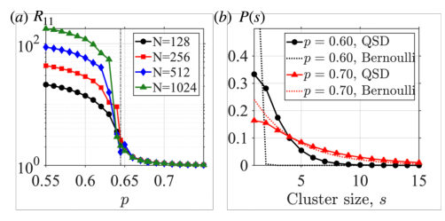 
FIG. 2. Clustering signatures of the QSD. (a) Nearest-neighbor clus- tering ratio 𝑅11 [Eq. (1)] versus 𝑝for 𝑁= 128, 256, 512, 1024. In the inactive phase 𝑅11 ≫1 and grows with 𝑁; in the active phase 𝑅11 →1, the value expected for independent active sites. The vertical dashed line marks 𝑝𝑐. (b) Cluster-size distribution 𝑃(𝑠) at 𝑝= 0.60 (inactive, black) and 𝑝= 0.70 (active, red), each compared with the Bernoulli baseline (1 −¯𝜌) ¯𝜌𝑠−1 of the same one-site density (dotted). The inactive distribution differs sharply from Bernoulli, signaling strong clustering, while the active distribution nearly coincides with Bernoulli, consistent with a weakly correlated bulk gas.

📷 Fig 3

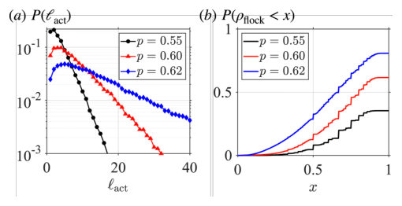 
FIG. 3. Flock morphology in the inactive phase at 𝑝 = 0.55, 0.60, 0.62 for 𝑁= 1024. (a) Spatial-extent distribution 𝑃(ℓact): unimodal with a sharp peak at small ℓthat broadens and shifts to larger ℓas 𝑝→𝑝𝑐, with an approximately exponential tail. (b) Cumulative filling distribution 𝑃(𝜌flock &lt; 𝑥); the strict inequality excludes single-cluster samples, so the deficit from 1 at 𝑥= 1 equals the single-cluster fraction 𝑃(𝜌flock = 1). Approaching 𝑝𝑐this deficit shrinks (0.64 →0.38 →0.19) and the curve shifts to smaller 𝜌flock, i.e. the flock loosens.

📷 Fig 4

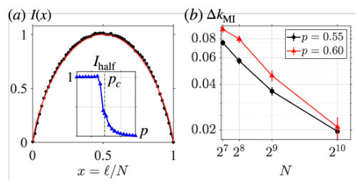 
FIG. 4. Mutual-information diagnostics of the QSD, with all entropies in bits (log2). (a) Bond-resolved 𝐼(ℓ, 𝑁) at 𝑝= 0.60 and 𝑁= 1024 (inactive) versus cut position 𝑥= ℓ/𝑁, closely following ℎ(𝑥) (red) and peaking at ℎ(1/2) = 1. Inset: half-chain 𝐼half ≡𝐼(𝑁/2, 𝑁) versus 𝑝at 𝑁= 1024, with a plateau near 1 in the inactive phase that drops sharply across 𝑝𝑐(dash-dotted line) and decays in the active phase. (b) Finite-size scaling of Δ𝑘MI ≡𝑘MI −1 versus 𝑁at 𝑝= 0.55 and 0.60, consistent with 𝑘MI →1 as 𝑁→∞.

**Summary.** This work develops a sophisticated MPS framework to analyze the quasi-stationary distribution of directed percolation. By applying bipartite mutual information diagnostics, the authors prove that even when geometrically fragmented into multiple clusters, the surviving activity statistically behaves as a single, coherent 'flock' object in the subcritical regime.

**Why it may be interesting.** While focused on classical statistical mechanics models (percolation), the rigorous application of tensor networks and information theory provides powerful tools for analyzing non-equilibrium steady states in quantum systems, particularly those exhibiting absorbing or metastable dynamics.

Detailed structure

**Main problem.** The study characterizes the quasi-stationary distribution (QSD) of the bond directed-percolation line in the Domany--Kinzel automaton and develops advanced information-theoretic diagnostics for this state.

**Main result.** The QSD in the inactive phase behaves as a single bound 'flock' object, which is confirmed by mutual information scaling that collapses to a universal function corresponding to one bit of positional information.

**Method.** The authors employ Matrix-Product-State (MPS) representations and tensor network techniques to calculate the full conditional distribution, enabling diagnostics like bipartite mutual information inaccessible via moment methods.

**Model / system.** The system is the Domany--Kinzel (DK) automaton on a 1D chain, modeling directed percolation. The analysis focuses on the QSD, which describes the probability distribution conditioned on non-absorption.

**Key observables.** Bipartite mutual information $I(\ell, N)$, cluster size distribution $P(s)$, projected dominant eigenvalue $\lambda_1$, and correlation length $\xi_{\perp}(p)$.

**Important parameters / regimes.** The percolation probability $p$ (relative to the critical point $p_c$), system size $N$, and cut position fraction $x = \ell/N$.

**Assumptions / limitations.** Key assumptions include the 'Translated localized-droplet decomposition' for the QSD structure, which allows separating universal geometric features from amplitude dependence.

**Figures summary.** Figures illustrate the convergence of $\lambda_1$ to an $N$-independent limit; comparisons show distinct clustering signatures ($R_{11}, P(s)$) between active and inactive phases; and diagrams detail the tensor network contractions used for calculation.

**Paper structure.** The paper builds from establishing the MPS framework for QSD calculation, through deriving information-theoretic diagnostics like mutual information, to finally proving that this information structure collapses onto a universal form characteristic of a single bound object in the inactive phase.

Abstract

We characterize the quasi-stationary distribution (QSD) of the bond directed-percolation line of the Domany--Kinzel automaton using a matrix-product-state representation of the probability distribution, obtained by projecting out the absorbing state and iterating the transfer matrix. Unlike moment- or sampling-based methods, this yields the full conditional distribution and direct access to information-theoretic diagnostics. The spatial structure of the QSD changes sharply across the transition: the active phase is bulk-like with finite density, whereas in the inactive phase the surviving activity collapses into a single flock occupying a vanishing fraction of the chain, with an internal filling that ranges from a single cluster deep in the inactive phase to a loose, partially filled group near criticality. This picture carries a sharp information-theoretic signature: throughout the inactive phase the bipartite mutual information of the QSD equals the entropy of a single binary choice -- whether the flock lies to the left or right of the cut -- so the surviving clusters together encode just one bit of positional information, corresponding to a single effective cluster. The approach extends matrix-product-state techniques to the projected eigenvector defining a QSD, opening information-theoretic diagnostics for absorbing-state systems that bulk-observable methods cannot reach.

[↑ back to top](#top)

### [Enhanced localization length in a disordered one-dimensional band via cavity coupling to delocalized states](http://arxiv.org/abs/2606.12224v1)

**Authors:** Francesco Mattiotti, Guido Pupillo, Jérôme Dubail, David Hagenmüller  
**Type:** theory · **Category:** disordered systems and neural networks · **PDF:** <https://arxiv.org/pdf/2606.12224v1>  
**Analysis basis:** full PDF text, analyzed in chunks
**Topic relevance:** 🔥 `analog quantum simulation` **4/5** · `correlated cavity matter` **3/5** · `Tavis-Cummings & cavity-many-emitter` **2/5** · `driven-dissipative phase transition` **2/5** · `methods for driven-dissipative` **2/5** · `non-equilibrium dynamics` **2/5** · `Keldysh / 2PI / non-Gaussian methods` **1/5** · `Kondo & dissipative impurity` **1/5** · `correlated / nonlocal dissipation` **1/5** · `entanglement & information structure` **1/5** · `non-equilibrium universality` **1/5**

📷 Fig 1

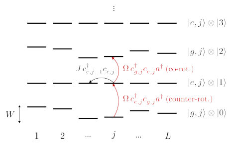 
FIG. 1. Schematic of the two-band model. A disordered lower band of localized states (energies ϵg,j, width W) is coupled via a single-mode cavity to a delocalized upper band with hopping J. Light–matter interaction induces virtual transitions between bands: counter-rotating terms couple even- to odd-photon sectors (e.g., |g, j⟩⊗|0⟩↔|e, j⟩⊗|1⟩), while co-rotating terms couple odd- to even-photon sectors (e.g., |e, j⟩⊗|1⟩↔|g, j⟩⊗|2⟩).

📷 Fig 2

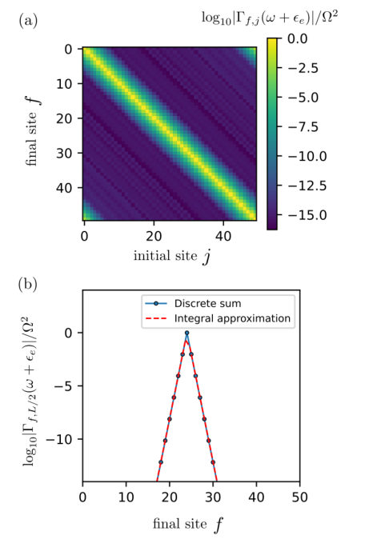 
FIG. 2. Cavity-mediated coupling in the perturbative regime. Perturbative cavity-mediated coupling between the initial state |g, j⟩ and the final state |g, f⟩, both in the disordered band (logarithmic scale). The coupling is evaluated using Eq. (3) [displayed as the 2D colormap in (a) and blue markers in (b)] and compared with the approximate analytical expression of Eq. (10) [red dashed curve in (b)]. Parameters: ϵg,j ∈[−0.5, 0.5] uniformly random distributed, J = 0.1, Ω= 0.01, ω + ϵe = 3, and L = 50.

📷 Fig 3

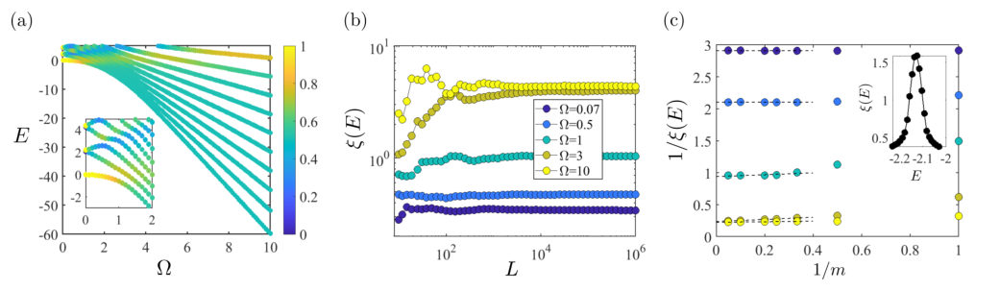 
FIG. 3. Enhancement of the localization length in the two-band model. (a) Energy dispersion of the two-band model coupled to the cavity in the single-electron sector as a function of the coupling strength Ωfor system length L = 10 and keeping m = 20 bosonic Fock states; the inset shows a zoomed-in region. The colorbar indicates the weight of the eigenstates on the lower band (with any photon number). (b) Localization length ξ(E), obtained via a transfer-matrix calculation, as a function of the system size L for several coupling strengths Ωand fixed m = 20. For each value of Ω= 0.007, 0.5, 1, 3, 10, the energy is chosen at the center of the lowest band, namely E = −2.3 × 10−5, −0.12, −0.58,...

📷 Fig 4

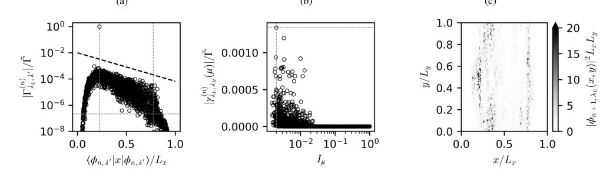 
FIG. 4. Exponentially-decaying hopping in a disordered Landau band. (a) Normalized effective coupling Eq. (17) between an eigenstate |ϕn,λL⟩on the left edge and all the other eigenstates |ϕn,λ′⟩for the Landau band Hamiltonian, plotted as a function of the average position ⟨ϕn,λ′| x |ϕn,λ′⟩of each eigenstate. Thick dashed line: exponential decay of the coupling (guide for the eye). Thin dashed lines: average positions of |ϕn,λL⟩on the left edge, a representative state |ϕn,λR⟩on the right edge, and the corresponding normalized coupling. (b) Contributions of each eigenstate |ϕn+1,µ⟩to the normalized effective coupling between |ϕn,λL⟩(on the left edge) and |ϕn,λR⟩(on the right edge), shown...

**Summary.** This paper analyzes the localization of electronic states in disordered systems coupled to a single optical cavity mode. The authors demonstrate that while coupling induces hopping, this process remains exponentially localized. Crucially, they show that increasing the light-matter coupling strength enhances the localization length, leading to effectively delocalized behavior on mesoscopic scales.

**Why it may be interesting.** This work bridges concepts from cavity QED (light-matter interaction) with condensed matter physics (disorder/localization), showing how external fields can dramatically alter transport properties on mesoscopic scales.

Detailed structure

**Main problem.** The study investigates how cavity coupling modifies the localization properties of electronic states within disordered one-dimensional bands, particularly in contexts like Quantum Hall systems.

**Main result.** Although cavity-mediated hopping remains exponentially localized, the associated localization length can be significantly enhanced by increasing the light-matter coupling strength, potentially reaching mesoscopic scales.

**Method.** The analysis employs a combination of second-order perturbation theory and the transfer-matrix approach to determine spectral properties and localization lengths in the presence of disorder and cavity coupling.

**Model / system.** The model is a two-band system: a disordered lower band (localized states) coupled via a homogeneous cavity mode ($\omega$) to an excited, delocalized upper band. This setup is applied both generally and specifically to disordered Landau bands in Quantum Hall systems.

**Key observables.** Localization length ($\xi$), effective coupling strength ($\Gamma_{f,j}$), Inverse Participation Ratio (IPR).

**Important parameters / regimes.** Light–matter coupling strength ($\Omega$), disorder strength ($W$), and the ratio of $\Omega$ to the spectral gap ($\Delta$).

**Assumptions / limitations.** The analysis progresses from perturbative regimes to the single-electron ultrastrong-coupling regime, using approximations like the transfer-matrix method for large systems.

**Figures summary.** Figures schematically illustrate the two-band model and show how effective coupling decays exponentially with distance, while also visualizing contributions to inter-edge coupling via IPR analysis.

**Paper structure.** The paper first establishes a minimal two-band model using perturbation theory. It then extends the analysis using the transfer-matrix method to study localization across various coupling regimes, culminating in specific applications to disordered Landau bands.

Abstract

We investigate the localization properties of cavity-coupled electronic states in disordered systems, motivated by recent proposals of cavity-mediated hopping in quantum Hall systems. We first introduce a minimal two-band model in which localized states in a disordered one-dimensional band are coupled, through a homogeneous cavity mode, to an excited band of delocalized states. Combining perturbation theory with a transfer-matrix approach, we show that cavity-assisted hopping between localized states decays exponentially with distance, implying that the eigenstates remain localized even beyond the perturbative regime. Nevertheless, the corresponding localization length increases with the light-matter coupling strength and can extend over several lattice sites in the single-electron ultrastrong-coupling regime. We then study a disordered Landau band coupled to a cavity mode within the framework developed in Refs.[1,2]. We find that the effective cavity-mediated coupling between edge states also decays exponentially with distance, but with a localization length that can reach micrometer scales for experimentally realistic parameters. By analyzing the inverse participation ratio, we show that this enhanced coupling is predominantly mediated by the most extended states of the upper Landau band. Our results demonstrate that, while cavity-induced hopping in disordered quantum Hall systems remains exponentially localized, the associated localization length can become sufficiently large for the corresponding states to exhibit effectively delocalized behavior on mesoscopic length scales.

[↑ back to top](#top)

### [Measurement-Free Toric-Code Memory in Array Globally Controlled Rydberg Array](http://arxiv.org/abs/2606.12030v1)

**Authors:** Han Wang, Yusheng Zhao, Xiuhao Deng, Jinguo Liu  
**Type:** theory · **Category:** quantum information and computing · **PDF:** <https://arxiv.org/pdf/2606.12030v1>  
**Analysis basis:** full PDF text, analyzed in chunks
**Topic relevance:** 🔥 `Rydberg arrays` **4/5** · `QC/QI experiment` **3/5** · `methods for driven-dissipative` **3/5** · `analog quantum simulation` **2/5** · `measurement-induced transitions` **2/5** · `quantum measurements` **2/5** · `correlated / nonlocal dissipation` **1/5** · `driven-dissipative phase transition` **1/5** · `entanglement & information structure` **1/5** · `non-equilibrium dynamics` **1/5**

📷 Fig 1

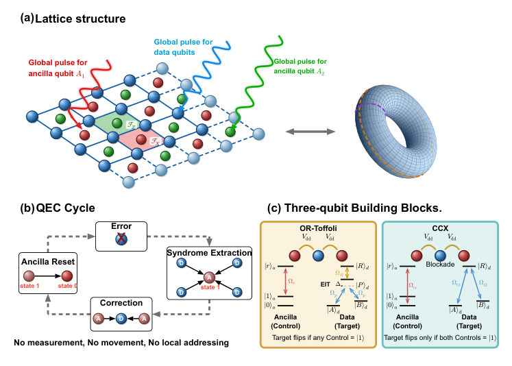 
Figure 1: Overview of the measurement-free, movement-free quantum-memory protocol on a multi-species Rydberg atom array. (a) Lattice: blue spheres, data qubits (species D) at lattice vertices; red spheres, ancilla species A1 at Z-plaquette centers; green spheres, ancilla species A2 at X-plaquette centers. The green and red shaded region represents the different plaquette regions FX and FZ. Three species-selective global laser fields address D, A1, and A2 independently; the torus sketch on the right emphasizes the periodic-boundary layout, with the dashed magenta and orange loops marking the two independent non-contractible cycles that support the logical operators ¯X1,2 and ¯Z1,2. (b)...

📷 Fig 2

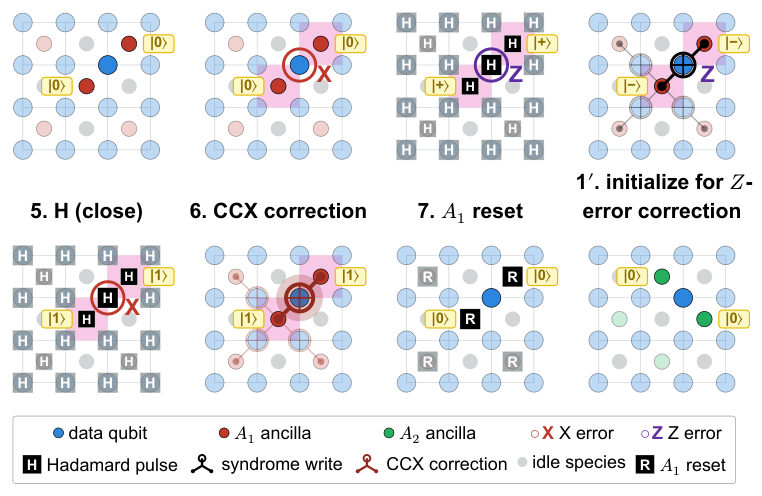 
Figure 2: Tick-by-tick walkthrough of one X-error correction sub-cycle on the 4×4 rotated toric code, showing how a single injected X-error propagates through the measurement-free protocol. Blue discs represent data qubits and red/green discs represent A1/A2 ancillas (faint dots are not affected by injected error). 1. Toric-code ground state |ψ0⟩, all stabilizers +1, ancillas in |0⟩. 2. An X-error is injected on data qubit D⋆(red circle, label X); the two adjacent Bp plaquettes (pink shading) now carry −1 eigenvalues, but no syndrome has yet been written to the ancillas. 3. H (open): a global Hadamard pulse rotates all A1 ancillas to |+⟩and all data qubits by H; under this rotation the...

📷 Fig 3

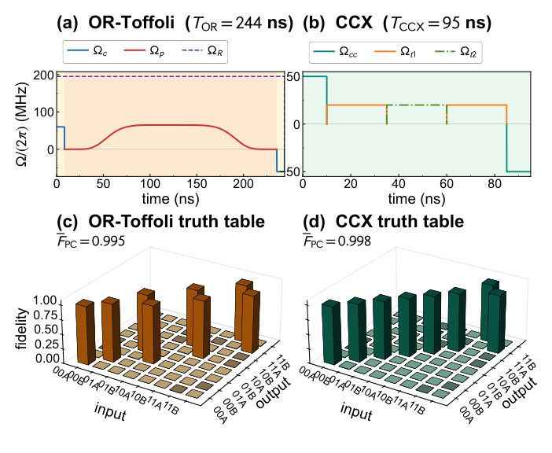 
Figure 3: Pulse-level model and phase-corrected fidelity of the per-triple unitaries on a single (D, A1, A′ 1) cell. State labels (subscript a for ancilla, d for data): ancilla ground states |0⟩a , |1⟩a and Rydberg |r⟩a; data ground states |A⟩≡|0⟩d , |B⟩≡|1⟩d, intermediate |P⟩d, and Rydberg |R⟩d (full level assignments in Methods, Section 4.2.1). (a) or-toffoli pulse sequence: two ancilla square π-pulses on |1⟩↔|r⟩at Ωc (blue) bracket a sixth-order super-Gaussian Raman drive Ωp on the data |A, B⟩↔|P⟩transition (red); the data |P⟩↔|R⟩drive ΩR (purple dashed) is held constant throughout. (b) ccx pulse sequence: two ancilla π-pulses on |0⟩↔|r⟩at Ωcc (teal) bracket three target sub-pulses on...

📷 Fig 4

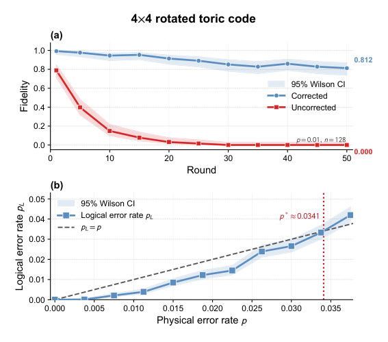 
Figure 4: Logical-memory benchmarks for the 4×4 rotated toric code. (a) Multi-round fidelity evolution under i.i.d. depolarizing noise at physical error rate p = 0.01 over n = 128 independent Monte-Carlo trials. Blue circles: corrected run — every round applies the full measurement-free or-toffoli + ccx syndrome-extraction, correction, and projective ancilla-reset cycle, with the depolarizing channel of Equation (5) fired once at the start of each round; the mean fidelity decays gently from ¯F ≈0.99 at round 1 to ¯F ≈0.81 at round 50. Red squares: uncorrected reference (no correction gates fire); the mean fidelity falls rapidly from ¯F ≈0.79 at round 1 to statistical zero ( ¯F =0.000) by...

📷 Fig 5

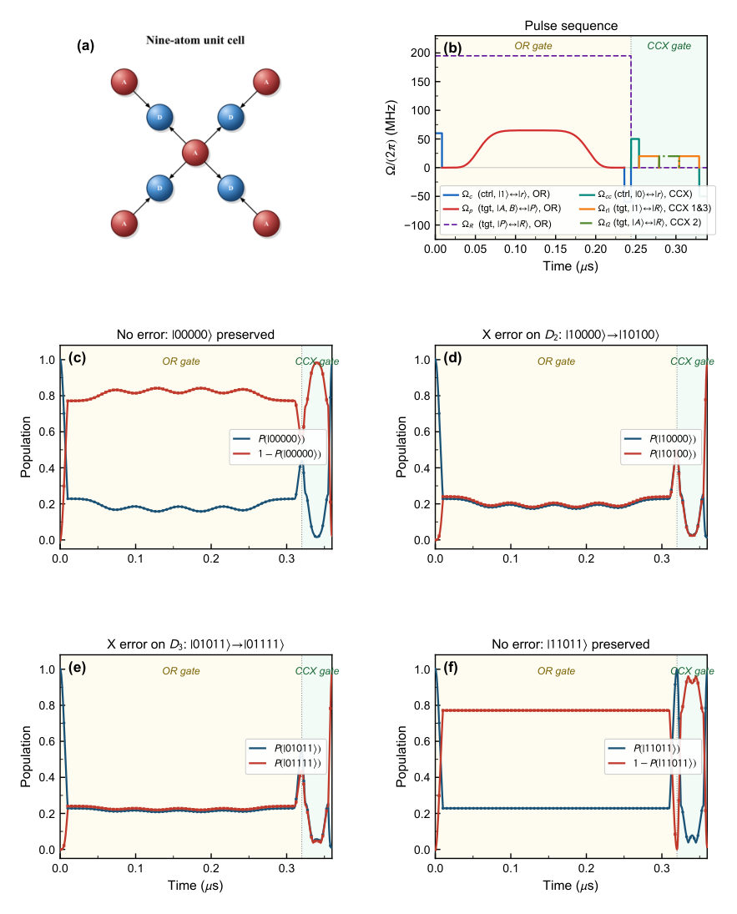 
Figure 5: Pulse-level unitary simulation of the complete X-error sub-cycle on the nine-atom unit cell (coherent Hamiltonian evolution, no Lindblad decay). (a) Nine-atom unit cell used in the verification: four data qubits (D) and five A1 ancillas (A) with the lattice adjacency of the rotated toric code. (b) Pulse envelopes for all driving fields during one complete or- toffoli+ccx cycle at the lattice-spacing a = 4 µm operating point of Section 4.2.1 (TOR ≈ 244 ns, TCCX = 95 ns); yellow shading marks the or-toffoli stage, green shading the ccx stage. (c,f) No-error inputs: |00000⟩and |11011⟩are returned to their initial states after the full cycle, confirming that the protocol leaves...

**Summary.** The paper presents a novel protocol to build fault-tolerant quantum memories using the toric code within Rydberg atom arrays, crucially avoiding slow or error-prone mid-circuit measurements and atom movements. By employing global laser pulses to execute syndrome extraction and correction steps, they demonstrate a viable, hardware-efficient path toward scalable topological quantum computation in neutral atoms.

**Why it may be interesting.** This work provides a concrete, hardware-efficient blueprint for topological quantum memory by circumventing major experimental bottlenecks (measurement and transport) inherent in current neutral-atom platforms. It bridges high-level QEC theory with low-level pulse engineering.

Detailed structure

**Main problem.** The primary challenge is realizing a fault-tolerant quantum memory in neutral-atom Rydberg arrays without incurring significant overheads from conventional error correction operations like mid-circuit measurement or atom transport.

**Main result.** The authors propose and simulate a protocol that stabilizes the toric code using only global, species-selective laser pulses for syndrome extraction, coherent correction, and ancilla reset.

**Method.** The methodology involves mapping standard stabilizer measurements onto sequences of global OR-Toffoli and CCX sweeps, which are implemented via tailored Rydberg pulse sequences.

**Model / system.** The system is a three-species neutral-atom Rydberg array implementing the toric code on an $L 	imes L$ lattice. Dynamics are modeled using the Lindblad master equation for gate fidelity and Matrix Product States (MPS) for full code simulation.

**Key observables.** Qubit lifetime, logical error rate ($p_L$), gate fidelities ($ar{F}_{	ext{ccx}}^{	ext{PC}}$, $ar{F}_{	ext{or-Toffoli}}^{	ext{PC}}$), and the pseudo-threshold physical error rate ($p^\star$).

**Important parameters / regimes.** Pseudo-threshold $p^\star \approx 0.034$; gate times ($	ext{T}_{	ext{OR}} \approx 244 	ext{ ns}$, $	ext{T}_{	ext{CCX}} = 95 	ext{ ns}$); decay rates and coupling strengths.

**Assumptions / limitations.** The protocol assumes that global pulses can effectively replace local addressing, and the simulation relies on specific approximations for gate implementation (e.g., assuming commutation of sweeps with stabilizers).

**Figures summary.** Figures illustrate the measurement-free protocol overview, a tick-by-tick walkthrough of an X-error correction sub-cycle using global pulses, and multi-round fidelity decay curves comparing corrected vs. uncorrected states.

**Paper structure.** The paper first identifies the overhead problem in Rydberg arrays; it then details the three-species system and the measurement-free protocol using OR-Toffoli/CCX sweeps; subsequent sections validate these gates at the single-gate level (Lindblad simulation) before scaling up to full code simulations using MPS.

Abstract

The central prerequisite of any fault-tolerant quantum architecture is a quantum memory: a block of encoded physical qubits whose logical state is actively preserved against noise across many rounds of error correction. In neutral-atom Rydberg arrays, realizing such a memory is obstructed not by the entangling gates themselves, which are already fast and high-fidelity, but by the auxiliary operations that a conventional error-correction cycle requires: mid-circuit fluorescence measurement, inter-zone atom transport, and locally focused single-qubit addressing. Each of these introduces latency, atom loss, or optical crosstalk that exceeds the cost of the underlying gates by orders of magnitude. These costs accumulate cycle after cycle, progressively degrading the very logical information the code is meant to protect. Here we propose a protocol that stabilizes a toric-code quantum memory without moving, measuring or local addressing atoms. The key is to use a three-species Rydberg atom array for the complete stabilizer cycle, including syndrome extraction, coherent correction, and ancilla reset, under global, species-selective laser pulses. Numerical simulation of a $4 \times 4$ rotated toric code shows a longer qubit lifetime when the physical error rate is below a pseudo-threshold $p^\star \approx 0.034$. The scheme offers a concrete, hardware-efficient route to topological quantum memory in neutral-atom platforms.

[↑ back to top](#top)

### [Time-Frequency Grid States for Reconstruction and Correction of Channel-Induced Distortion in Entangled Photons](http://arxiv.org/abs/2606.12216v1)

**Authors:** Siang-Yun Liu, Bo-Ren Huang, Zhi-Xuan Zen, Yen-Hung Chen, Pin-Ju Tsai  
**Type:** experiment · **Category:** quantum information and computing · **PDF:** <https://arxiv.org/pdf/2606.12216v1>  
**Analysis basis:** full PDF text, analyzed in chunks
**Topic relevance:** 🔥 `quantum optics experiment` **4/5** · `interference shaping light` **3/5** · `quantum measurements` **3/5** · `QC/QI experiment` **2/5** · `measurement-induced transitions` **2/5** · `analog quantum simulation` **1/5** · `correlated / nonlocal dissipation` **1/5** · `driven-dissipative phase transition` **1/5** · `entanglement & information structure` **1/5** · `methods for driven-dissipative` **1/5** · `non-equilibrium dynamics` **1/5**

📷 Fig 1

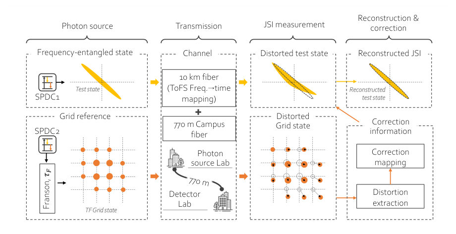 
FIG. 1. End-to-end flow chart from photon source preparation to distortion reconstruction and JSI correction.

📷 Fig 2

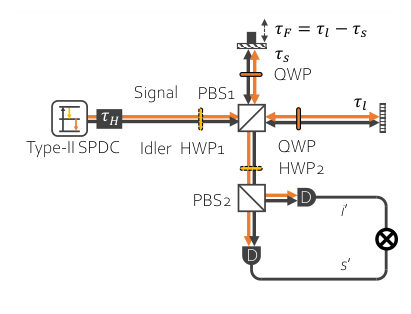 
FIG. 2. Schematic diagram of the polarization-based Franson interferometer. PBS: polarizing beam splitter; HWP: half- wave plate; QWP: quarter-wave plate; D: single-photon de- tector; CC: coincidence counting module. The orange and black lines indicate the optical paths of the idler and signal photons, respectively.

📷 Fig 3

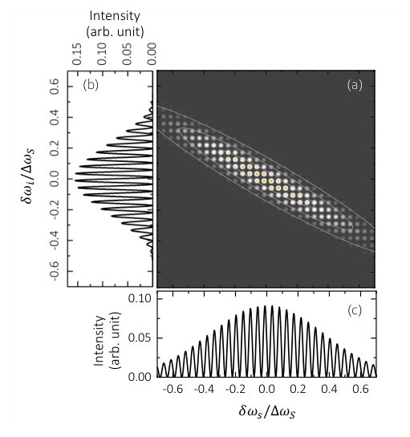 
FIG. 3. Demonstration of modulation of SPDC JSI into a TF grid state. (a) Comparison of SPDC JSI (white curve) and TF grid state from Franson interference (color map). (b) Single-photon spectrum of i′-mode. (c) Single-photon spectrum of s′-mode. In the simulation, we use f(ωs, ωi) = 1/ √

📷 Fig 4

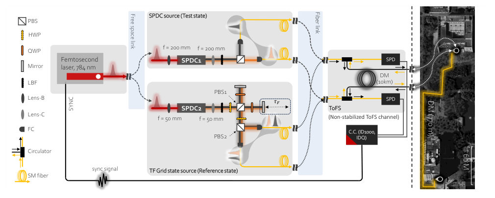 
FIG. 4. Schematic diagram of the experimental setup. ToFS: Time-of-flight spectrometer. C.C.: Coincidence counting. DM: Dispersion medium.

📷 Fig 5

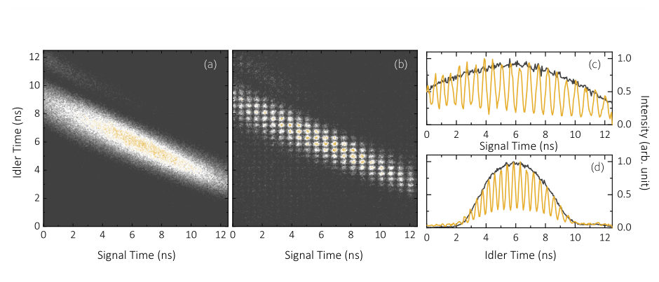 
FIG. 5. Demonstration of the JSI and marginal spectra of the TF grid state. (a) and (b) are the JSI of SPDC2 w/o and w/ modulation by Franson interference. (c) and (d) show the marginal spectra of SPDC2 w/o (black) and w/ (yellow) modulation by Franson interference.

**Summary.** The research presents an experimental framework to correct distortions in Time-Frequency (TF) quantum states of entangled photons caused by noisy channels. By using a stable TF grid state as a reference and applying Gaussian Process Regression, the authors learn a nonlinear correction map. This method successfully restores high fidelity to independent test states, establishing TF grid states as vital metrological resources for resilient quantum communication.

**Why it may be interesting.** This work provides a robust, model-agnostic tool for quantum metrology and communication, directly addressing decoherence/channel noise in photonic systems by treating the distortion as a measurable coordinate transformation.

Detailed structure

**Main problem.** The core challenge is reliably characterizing Time-Frequency (TF) quantum states when their joint spectral intensities are distorted by imperfect transmission or measurement channels.

**Main result.** A data-driven correction framework using TF grid states successfully recovers the undistorted state, improving Gaussian fidelity from 76.2% to 90.0%.

**Method.** The authors use a Time-Frequency (TF) grid state as an intrinsic reference resource and employ Gaussian Process Regression (GPR) to learn a nonlinear mapping that corrects for channel-induced coordinate deformations.

**Model / system.** The experiment uses entangled photon pairs generated via SPDC, measured using a polarization-based Franson interferometer setup and Time-of-Flight Spectrometers (ToFS).

**Key observables.** Joint Spectral Intensities (JSI), residual coordinate deviation of the TF grid state, and Gaussian-shape fidelity ($F_G$).

**Important parameters / regimes.** The correction reduces the residual coordinate deviation by a factor of 11; the test state fidelity improves from 76.2% to 90.0%.

**Assumptions / limitations.** The method is powerful because it does not assume any prior physical model for the distortion, relying only on analyzing the displacement pattern of the reference grid points.

**Figures summary.** Figures illustrate the end-to-end process: generating and distorting a TF grid state (Fig. 1), showing the Franson interferometer setup (Fig. 2), visualizing the JSI modulation into a lattice (Fig. 3), and demonstrating the reconstruction/correction mapping applied to test states (Figs. 8, 10).

**Paper structure.** The paper follows a structure of problem definition (distortion in TF characterization) -> methodology development (using grid state + GPR) -> experimental demonstration on an independent test state -> quantitative validation showing significant fidelity improvement.

Abstract

Characterization of time-frequency (TF) quantum states requires reliable reconstruction of their TF distributions. However, imperfect transmission or measurement channels can distort reconstructed joint spectral intensities (JSIs), especially when the underlying perturbation mechanism is unknown. Here, we experimentally demonstrate a reconstruction and correction framework that uses a TF grid state as an intrinsic frequency-domain reference. By analyzing the displacement of the grid points, a Gaussian process regression model is employed to reconstruct a correction mapping for the nonlinear coordinate deformation without assuming a prior physical model of the distortion. The learned mapping reduces the residual coordinate deviation of the TF grid state by approximately a factor of 11 and, when applied to an independent frequency-entangled test state, improves the Gaussian-shape fidelity from 76.2\% to 90.0\%. These results establish TF grid states as practical metrological resources for diagnosing and correcting distortions in TF quantum systems, providing a pathway toward distortion-resilient quantum communication and high-dimensional quantum information processing.

[↑ back to top](#top)

### [Compressed minimum-purity time evolution for late-time quantum dynamics](http://arxiv.org/abs/2606.11392v1)

**Authors:** Moksh Bhateja, Jonas B. Rigo, Markus Schmitt  
**Type:** theory · **Category:** statistical mechanics · **PDF:** <https://arxiv.org/pdf/2606.11392v1>  
**Analysis basis:** full PDF text, analyzed in chunks
**Topic relevance:** 🔥 `entanglement & information structure` **4/5** · 🔥 `non-equilibrium dynamics` **4/5** · `methods for driven-dissipative` **3/5** · `non-equilibrium universality` **3/5** · `analog quantum simulation` **2/5** · `correlated / nonlocal dissipation` **1/5** · `driven-dissipative phase transition` **1/5** · `scars & prethermalization` **1/5**

📷 Fig 1

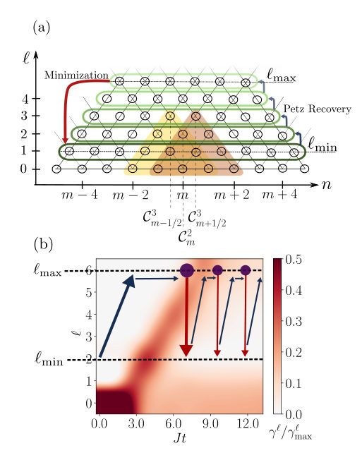 
FIG. 1. Schematic illustration of the CoMPuTE control cycle on the subsystem hierarchy, analogous to the LITE approach. (a) Reduced density matrices ρℓ n are retained up to the max- imum level ℓmax. Higher-level density matrices required by the hierarchical equations of motion are reconstructed from overlapping lower-level marginals by recovery, as indicated by the shaded regions. Once the top retained level has accumu- lated too much large-scale structure, a removal step resets the active evolution to the lower truncation level ℓmin. (b) Purity gain for Hamiltonian Eq. 29 (hL = 0.25J, hT = −0.525J) and initial state ρinit = N7 n=1  2

📷 Fig 2

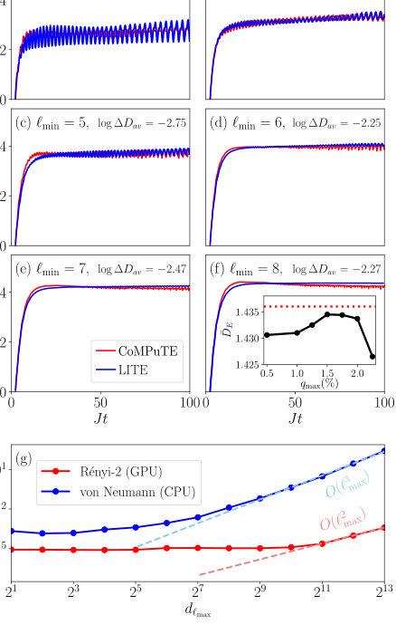 
FIG. 2. Panels (a)–(f) show the time-dependent diffusion coefficient DE(t) obtained with CoMPuTE (red) and LITE (blue) for increasing working scale ℓmin = 3, . . . , 8 at fixed ℓmax = 9. Each panel is computed for the information- removal threshold of qmax = 0.5%. The annotation log ∆Dav reports the logarithm of the average absolute deviation be- tween the time-averaged diffusion coefficient, quantifying that CoMPuTE closely matches LITE across all shown ℓmin. The inset in (f) shows the extracted plateau value ¯DE as a func- tion of qmax, demonstrating a broad stability window in which ¯DE depends only weakly on qmax. (g) Empirical runtime scal- ing of entropy evaluation versus subsystem...

📷 Fig 3

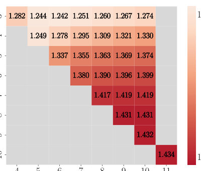 
FIG. 3. Time-averaged diffusion coefficient ¯DE (averaged over t ∈[20, 100]) as a function of truncation parameters (ℓmin, ℓmax) for qmax = 0.5%. The diffusion coefficients vary weakly with ℓmax at fixed ℓmin, while increasing ℓmin system- atically increases ¯DE and drives it toward a converged value.

📷 Fig 4

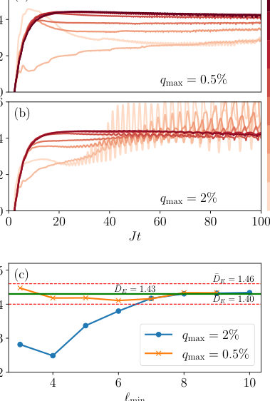 
FIG. 4. Time-dependent diffusion coefficient DE(t) for in- creasing ℓmin at fixed ℓmax = ℓmin + 1, shown for two information-removal thresholds: (a) qmax = 0.5% and (b) qmax = 2.0%. At late times (here t ≳20), a diffusive plateau emerges and becomes progressively more stable as ℓmax is in- creased, enabling a more reliable estimate of the diffusion con- stant. Panel (c) highlights the convergence of the extracted plateau value ¯DE with ℓmin and demonstrates its robustness with respect to varying qmax.

📷 Fig 5

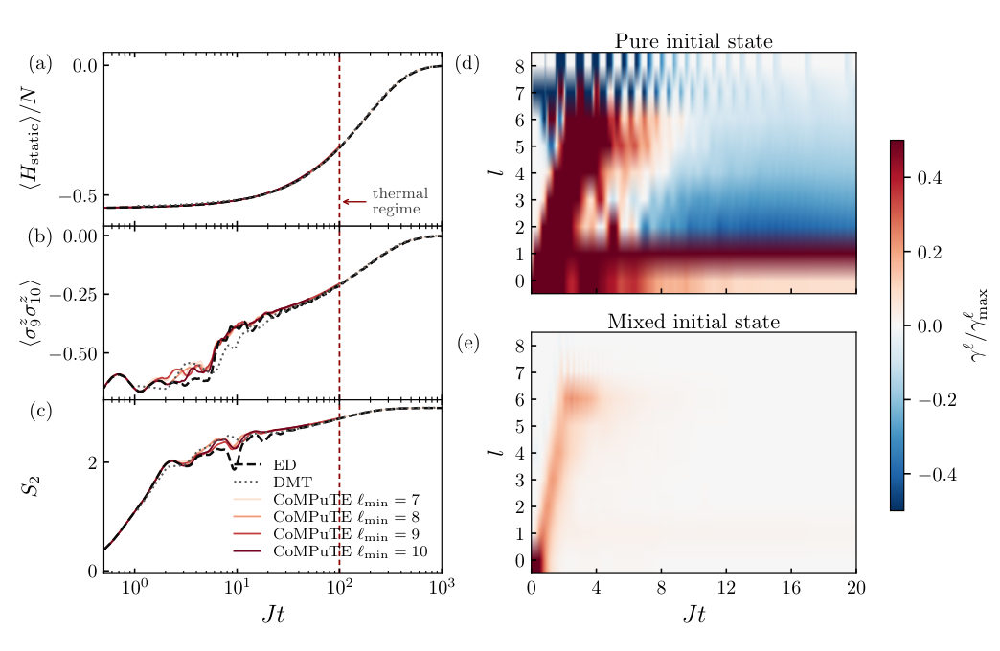 
FIG. 5. Driven Floquet dynamics for a chain with N = 20. Panels (a)–(c) compare ED (black dashed), DMT (black dotted) [25], and CoMPuTE for increasing values of ℓmin (solid colors) using the static energy density ⟨Hstatic⟩/N, the local correlator ⟨σz 9σz 10⟩, and the second R´enyi entropy S2 of the leftmost three sites. The red dashed line marks the onset of the thermal regime. In panels (a)–(c), the late-time regime was simulated explicitly only with CoMPuTE at ℓmin = 7, because simulations with larger ℓmin already capture the transient regime, establishing that they also reproduce the correct late-time behavior. Panels (d) and (e) show the level-resolved purity gain normalized by the...

**Summary.** The paper introduces CoMPuTE, an advanced algorithm designed to simulate the long-time quantum dynamics of many-body systems by efficiently managing entanglement growth. It achieves this by using a minimum-purity principle based on Rényi-2 entropy to systematically truncate and reconstruct information within local density matrices. This allows for accurate study of transport phenomena in models like the Ising and XXZ chains, significantly improving computational feasibility over previous methods.

**Why it may be interesting.** This work provides a powerful, scalable numerical tool for studying non-equilibrium quantum dynamics in 1D systems. The focus on systematic information management via purity diagnostics is highly relevant to understanding how complexity builds up and where approximations break down in strongly correlated systems.

Detailed structure

**Main problem.** The core challenge is simulating unitary time evolution for quantum many-body systems at late times, which generates excessive entanglement, by systematically discarding irrelevant information while maintaining accuracy for physical observables.

**Main result.** The proposed CoMPuTE method significantly reduces computational complexity compared to prior methods (like LITE) by using Rényi-2 entropy, allowing accurate simulation of energy diffusion and out-of-equilibrium dynamics over extended time scales.

**Method.** CoMPuTE tracks reduced local density matrices ($
ho_{\ell}^n$) by closing the hierarchical equations of motion using a minimum-purity principle based on Rényi-2 entropy. It employs an information-lattice approach with defined recovery and truncation steps to manage computational resources.

**Model / system.** The method is benchmarked on various quantum many-body systems, including the one-dimensional mixed-field Ising model for energy diffusion, driven Floquet spin chains, and the XXZ chain for transport studies. The dynamics are governed by standard unitary time evolution equations.

**Key observables.** Energy diffusion coefficient ($D_E(t)$), local reduced density matrices ($
ho_{\ell}^n$), purity gain ($\gamma_\ell^n$), and the crossover time ($t_{	ext{cross}}$) for transport breakdown.

**Important parameters / regimes.** Truncation parameters ($\ell_{\min}, \ell_{\max}$), positive information thresholds ($q_{\ell^*}, q_{\max}$), and system-specific coupling constants (e.g., $\Delta$ in the XXZ chain).

**Assumptions / limitations.** The primary assumption is that physical observables at late times can be accurately captured by tracking a consistent set of reduced local density matrices, even when discarding information via minimum-purity projection. A key limitation noted is that superdiffusion relies on increasingly non-local operators, eventually exceeding the method's truncation scale.

**Figures summary.** Figures illustrate the time evolution of diffusion coefficients ($D_E(t)$) for the Ising model and XXZ chain, showing systematic convergence with increasing simulation depth ($\ell_{\min}$), alongside plots detailing purity gain diagnostics.

**Paper structure.** The paper introduces CoMPuTE as an improvement over LITE by replacing von Neumann entropy with Rényi-2 entropy to achieve $O(d^{2\ell})$ scaling. It details the hierarchical update, information removal/recovery steps using minimum-purity projection, and validates this framework across multiple physical benchmarks (Ising, Floquet, XXZ).

Abstract

Unitary time evolution of initially simple quantum many-body states rapidly generates entanglement and complex correlations, which limits direct numerical simulations. The late-time dynamics of physical observables, however, typically exhibits an effective simplicity in the form of hydrodynamics or kinetic theory. This leads to the question whether microscopic equations of motion can remain accurate and tractable up to long time scales by discarding irrelevant information in a controlled manner. Here, we introduce compressed minimum-purity time evolution (CoMPuTE) as an approach to keep track of a consistent set of reduced local density matrices, closing the hierarchical equations of motion using a minimum-purity principle. In benchmark applications we demonstrate (i) accurate description of energy diffusion in the one-dimensional mixed-field Ising model, (ii) the applicability to genuinely out-of-equilibrium Floquet dynamics starting from a pure state, and (iii) the limitations of the local reduced density matrix approximation when describing transport in the XXZ chain at $Δ=1$ that is governed by increasingly non-local integrals of motion. The CoMPuTE method enhances computational efficiency in comparison to the closely related local-information time evolution algorithm, opening a possible route towards an extension to systems in higher spatial dimensions.

[↑ back to top](#top)

### [Fast Adiabatic Quantum Gates via Hyperfine Intermediate States](http://arxiv.org/abs/2606.11655v1)

**Authors:** Jiayin Fan, Xingdong Zhao, Manqi Zhang, Fangfang Xie, Jing Qian  
**Type:** theory · **Category:** other · **PDF:** <https://arxiv.org/pdf/2606.11655v1>  
**Analysis basis:** full PDF text, analyzed in chunks
**Topic relevance:** 🔥 `Rydberg arrays` **4/5** · `methods for driven-dissipative` **3/5** · `analog quantum simulation` **2/5** · `correlated / nonlocal dissipation` **2/5** · `driven-dissipative phase transition` **2/5** · `non-equilibrium dynamics` **2/5** · `Keldysh / 2PI / non-Gaussian methods` **1/5** · `Kondo & dissipative impurity` **1/5** · `QC/QI experiment` **1/5** · `non-equilibrium universality` **1/5**

📷 Fig 1

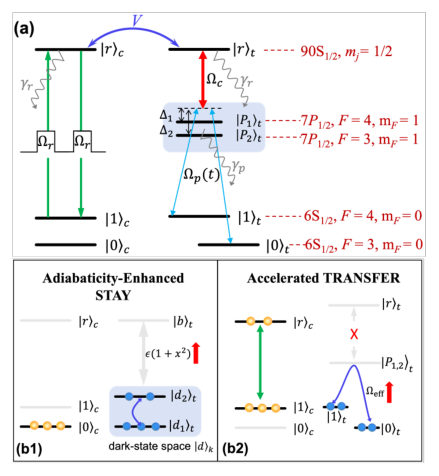 
FIG. 1. Illustration of EIT-based fast adiabatic CNOT gates with HISs. (a) shows the atomic energy levels in e.g., Cs atoms. The control qubit atom is modeled as an effective two-photon system between |1⟩c and |r⟩c with |0⟩c un-excited, which is operated by two separate square-π pulses (labeled Ωr) serving as the control knob. The target qubit forming of an inverted-Y five-level configuration exhibits the excita- tion to |r⟩t from two ground states |0⟩t and |1⟩t mediated by HISs |P1⟩and |P2⟩, detuned by ∆1 and ∆2, respectively. γp,r denote the spontaneous decay rates. See Table I for more de- tailed parameters. (b1,b2) illustrate the STAY and TRANS- FER pathways, corresponding to the...

📷 Fig 2

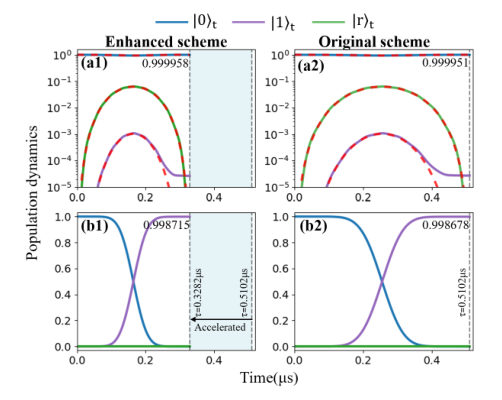 
FIG. 2. Comparison of the target-atom population dynamics in the protocols with double (left, enhanced scheme) and sin- gle (right, original scheme) HISs. Panels (a1,a2) correspond to the STAY pathway and panels (b1,b2) show the TRANSFER pathway in which the final-target-state population presents the pathway fidelity. Numerical results, based on Schr¨odinger equation (with decays γp,r) and analytical dark |d⟩k state re- sults (without decays), are given by solid and dashed curves respectively. In all plots the parameters are adopted from Cs atoms, which are Ωmax p /2π = 80 MHz, Ωc/2π = 300 MHz, ∆1/2π = 1.2 GHz, ∆2/2π = 1.26 GHz, k = 0.775, γr = 1.3 kHz. Here we set a moderate decoherence...

📷 Fig 3

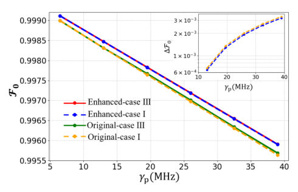 
FIG. 3. Average gate fidelity F0 as a function of the interme- diate decay rate γp based on the optimized Bernstein-shaped pulses. Solid curves are obtained via individual optimiza- tions for every γp value (Case III) while dashed curves are calculated by using the fixed optimized pulse at γp = 6.5 MHz (Case I). Inset: Dependence of the derivation ∆F0 = F0(γp0) −F0(γp) on the decay rate γp with γp0 = 6.5 MHz for Case I.

📷 Fig 4

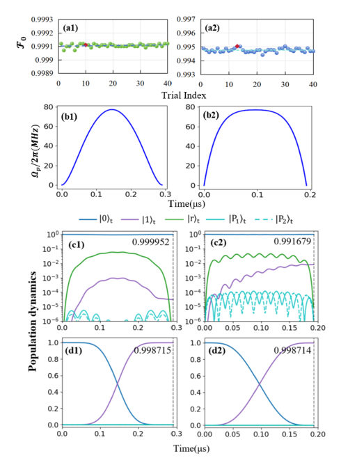 
FIG. 4. Gate performance for the adiabaticity-enhanced case (kr = k0,1) and the failure (kr ̸= k0,1) case. (a1,a2) We show the average fidelity F0 over 40 independent optimization runs for two cases and respectively present (b1,b2) the opti- mized Raman pulse amplitude Ωp(t) and (c1-2,d1-2) the two- pathway population dynamics for a specific solution, as high- lighted by red diamonds in (a1) and (a2). Here, the specific- solution parameters are β1∼4/2π = (2.35, 73.51, 75.54, 51.06) MHz which results in τ = 0.2903 µs for the adiabaticity- enhanced case. While β1∼4/2π = (80.00, 78.80, 78.43, 37.54) MHz, τ = 0.1928 µs for the failure case.

**Summary.** This paper proposes an advanced protocol for realizing fast, high-fidelity CNOT gates in Rydberg-atom systems by ingeniously incorporating hyperfine intermediate states. By optimizing pulse sequences across two distinct dynamical pathways (STAY and TRANSFER), the authors significantly accelerate the gate operation time while maintaining fidelity above 0.9991. This represents a practical advancement toward scalable quantum computation using neutral atoms.

**Why it may be interesting.** This work directly addresses the practical limitations of quantum simulation by providing a concrete mechanism (HIS utilization) to reconcile the conflict between gate speed and adiabatic robustness in atomic platforms.

Detailed structure

**Main problem.** The core challenge is accelerating adiabatic quantum gate operations while maintaining high fidelity, as standard protocols are inherently too slow.

**Main result.** The proposed protocol achieves fast and robust CNOT gates with fidelities exceeding 0.9991 in a short time frame ($\sim 0.39 \mu s$).

**Method.** The method involves utilizing hyperfine intermediate states (HISs) within an EIT-based scheme to simultaneously enhance the energy gap (STAY pathway) and accelerate population transfer (TRANSFER pathway).

**Model / system.** The system is modeled using Rydberg-atom platforms, involving control and target qubits coupled via electromagnetically induced transparency (EIT) pathways that incorporate multiple HISs. The dynamics are governed by non-Hermitian Hamiltonians to account for decay.

**Key observables.** Gate fidelity ($F_0$, $F_s$, $F_t$), gate time ($	au$), and the energy gap between dark and bright states.

**Important parameters / regimes.** The efficiency depends critically on satisfying a 'k-factor' condition ($k_r = k_{0,1}$), and performance is tested against varying intermediate decay rates ($\gamma_p$).

**Assumptions / limitations.** Adiabatic elimination of highly detuned HISs is assumed, and the protocol is optimized using pulse shaping techniques (e.g., Genetic Algorithm).

**Figures summary.** Figures illustrate energy level diagrams showing STAY and TRANSFER pathways, and compare gate performance under ideal vs. non-ideal conditions.

**Paper structure.** The paper introduces the problem of slow adiabatic gates, details the Hamiltonian structure involving HISs for both STAY and TRANSFER dynamics, presents the optimization procedure using pulse shaping, and concludes with quantitative results demonstrating speedup and fidelity enhancement.

Abstract

The appeal of adiabatic quantum computing lies in its intrinsic robustness against various technical imperfections, making it attractive for many quantum information applications. However, it faces a fundamental challenge: accelerating the adiabatic operations while preserving adiabaticity within the qubit coherence time. In this article, we propose an electromagnetically induced transparency-based adiabatic CNOT gate protocol which harnesses atomic hyperfine intermediate states (HISs) to speed up the adiabatic evolution. The HISs, naturally-existed in two-photon transitions, often need to be suppressed due to their significant decay errors. In contrast, this paper introduces a novel method that utilizes appropriately chosen HISs not only to enhance the adiabaticity in STAY pathway but also to accelerate the population transfer in TRANSFER pathway. Through pulse optimization, we achieve adiabatic gate fidelities exceeding 0.9991 within 0.3903 μs in realistic Cs atomic setups. To demonstrate the generality of protocol we further assess the impact of decays from multiple HIS and extend our model to arbitrary number of states, providing a practical route toward fast and robust adiabatic quantum gates in Rydberg-atom platforms.

[↑ back to top](#top)

### [Linear Combination of Hamiltonian Simulation with Commutator Scaling](http://arxiv.org/abs/2606.11475v1)

**Authors:** Junaid Aftab, Dong An, Konstantina Trivisa  
**Type:** theory · **Category:** quantum information and computing · **PDF:** <https://arxiv.org/pdf/2606.11475v1>  
**Analysis basis:** full PDF text, analyzed in chunks
**Topic relevance:** 🔥 `methods for driven-dissipative` **4/5** · `Keldysh / 2PI / non-Gaussian methods` **3/5** · `correlated / nonlocal dissipation` **3/5** · `analog quantum simulation` **2/5** · `driven-dissipative phase transition` **2/5** · `non-equilibrium dynamics` **2/5** · `Kondo & dissipative impurity` **1/5** · `correlated cavity matter` **1/5** · `non-equilibrium universality` **1/5**

📷 Fig 1

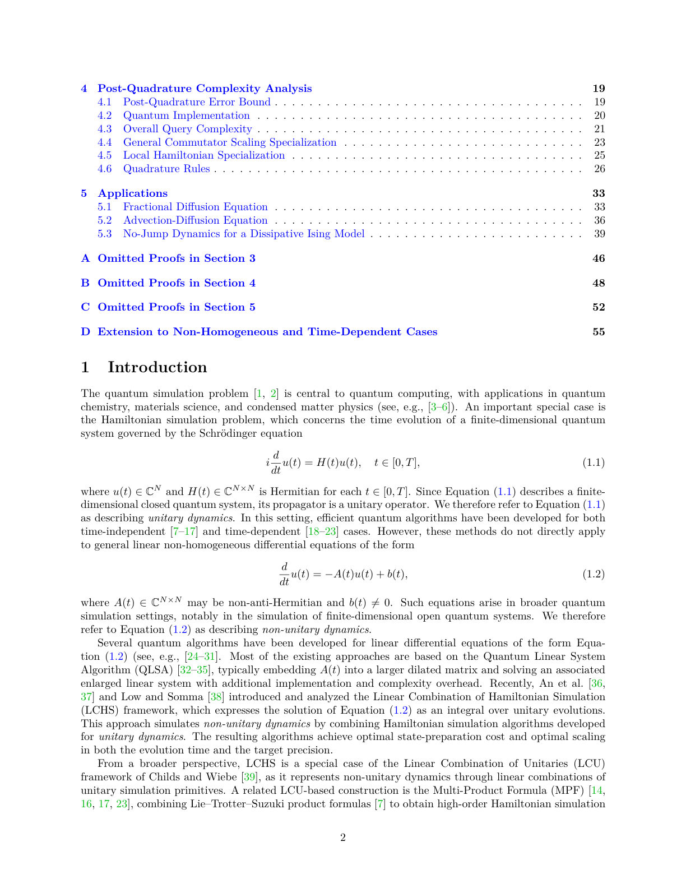 
Low-resolution page preview, page 2

📷 Fig 2

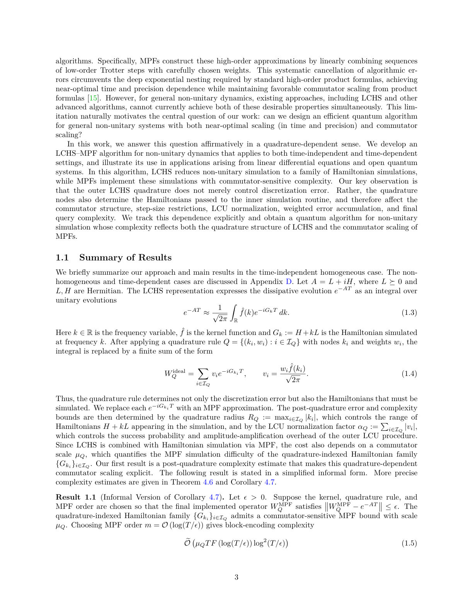 
Low-resolution page preview, page 3

📷 Fig 3

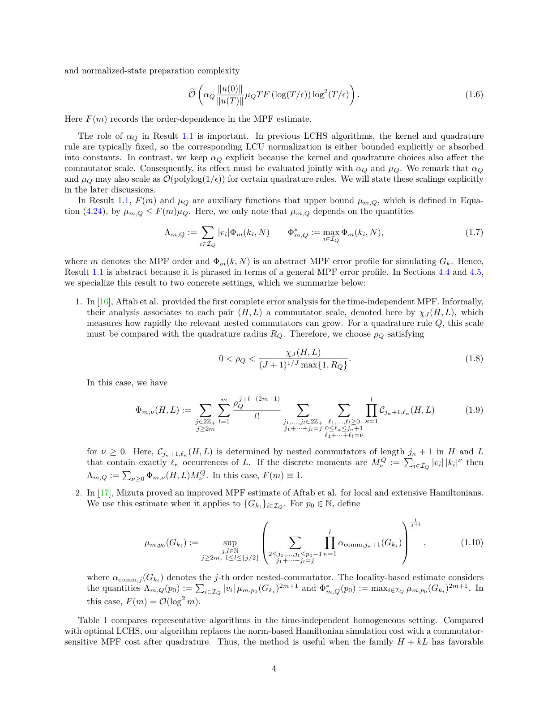 
Low-resolution page preview, page 4

📷 Fig 4

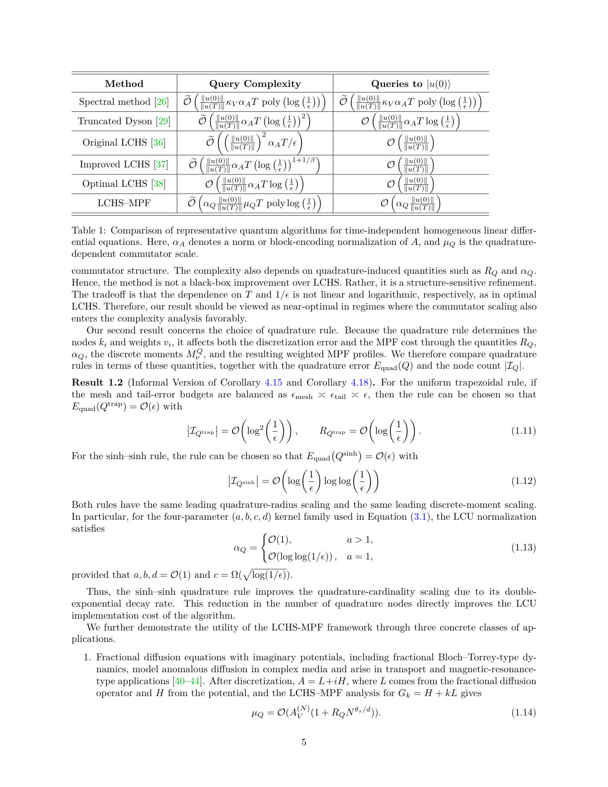 
Low-resolution page preview, page 5

📷 Fig 5

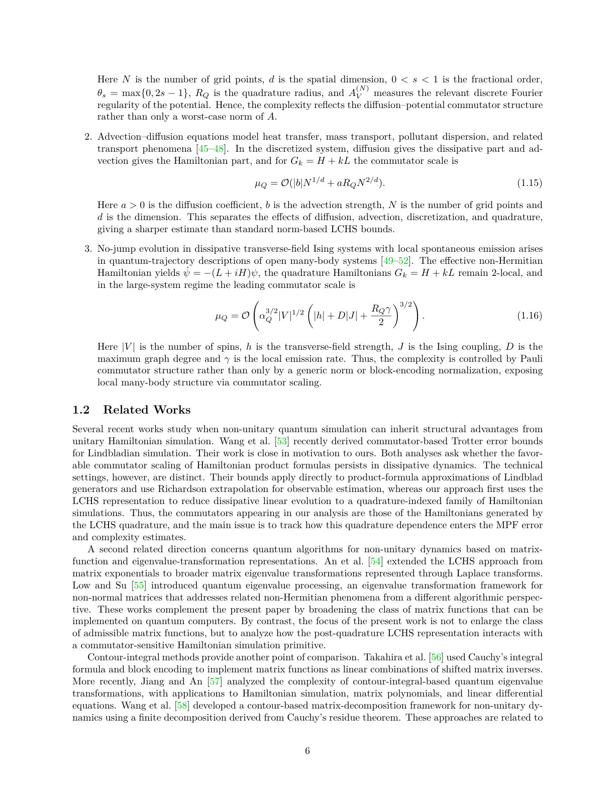 
Low-resolution page preview, page 6

**Summary.** The paper presents an advanced quantum algorithm combining Linear Combination of Hamiltonian Simulation (LCHS) with Multi-Product Formulas (MPFs) to simulate non-unitary dynamics. It rigorously analyzes the total simulation error and complexity, demonstrating that incorporating commutator scaling provides tighter and more accurate resource estimates than previous norm-based methods. This is crucial for designing efficient quantum hardware implementations for open quantum systems.

**Why it may be interesting.** This work provides a sophisticated theoretical framework for quantum simulation that moves beyond simple norm-based complexity estimates. By explicitly incorporating commutator scaling, it offers potentially superior algorithmic guarantees for simulating dissipative or open quantum systems relevant to AMO physics.

Detailed structure

**Main problem.** Developing an efficient quantum algorithm for simulating general non-unitary dynamics while achieving near-optimal scaling in both time and precision, specifically by incorporating commutator sensitivity.

**Main result.** The authors develop the LCHS-MPF framework, showing that complexity bounds explicitly reflect both quadrature structure and commutator scaling, leading to improved convergence rates over norm-based methods.

**Method.** The simulation uses Linear Combination of Hamiltonian Simulation (LCHS) combined with Multi-Product Formulas (MPFs) to approximate time evolution integrals. The analysis rigorously quantifies the error based on quadrature rules and commutator structures.

**Model / system.** The focus is on simulating linear differential equations, $\frac{d}{dt}u(t) = -A(t)u(t) + b(t)$, which models open quantum systems dynamics. The underlying mathematical structure involves approximating integrals over unitary operators using quadrature and MPFs.

**Key observables.** Overall simulation error ($\|u(T) - u_{	ext{MPF}Q,P}(T)\|$), block-encoding complexity, and the amplitude amplification factor $\chi_{Q,P}$.

**Important parameters / regimes.** Quadrature radius ($R_Q$), LCU normalization factor ($\alpha_Q$), commutator scale ($\mu_Q$), total simulation time ($T$), and target accuracy ($\epsilon$).

**Assumptions / limitations.** The analysis is highly dependent on the choice of quadrature rule, the existence of favorable commutator scaling in the Hamiltonian family, and the ability to implement controlled second-order product-formula queries.

**Figures summary.** Not specified; the notes refer to tables comparing LCHS variants and equations detailing error bounds (e.g., Eq. 3.5, D.39).

**Paper structure.** The paper builds from general simulation frameworks (LCU/MPF) to specific techniques for non-unitary dynamics (LCHS). It systematically analyzes the total error by decomposing it into quadrature errors ($E^{	ext{quad}}$), time discretization errors ($E_{	ext{time}}$), and inner MPF approximation errors, culminating in complexity bounds.

Abstract

The Linear Combination of Hamiltonian Simulation (LCHS) framework simulates dissipative linear dynamics by representing time evolution as an integral over unitary operators, which is discretized by quadrature and implemented via Hamiltonian simulation. While existing analyses achieve near-optimal scaling in time and precision using norm-based quantities of the dissipative generator, we show that implementing the Hamiltonian simulation steps with Multi-Product Formulas (MPFs) yields commutator-sensitive error and complexity bounds. We demonstrate that the quadrature rule affects not only discretization error but also commutator structure and query complexity. This dependence is quantified through post-quadrature analysis for abstract MPF error profiles and for general time-independent and local Hamiltonians using known commutator-sensitive MPF error estimates. We compare uniform trapezoidal and free-scale sinh--sinh quadrature, showing improved quadrature-cardinality scaling for the latter, and illustrate the framework with applications to fractional diffusion, advection--diffusion, and open quantum systems.

[↑ back to top](#top)

### [Quantum Correlation Hierarchy and Teleportation in Dephased Hydrogen Hyperfine System](http://arxiv.org/abs/2606.11731v1)

**Authors:** Geerthana Thiyagarajan, R. Muthuganesan  
**Type:** theory · **Category:** quantum information and computing · **PDF:** <https://arxiv.org/pdf/2606.11731v1>  
**Analysis basis:** full PDF text, analyzed in chunks
**Topic relevance:** 🔥 `entanglement & information structure` **4/5** · `correlated / nonlocal dissipation` **3/5** · `methods for driven-dissipative` **3/5** · `driven-dissipative phase transition` **2/5** · `non-equilibrium dynamics` **2/5** · `Keldysh / 2PI / non-Gaussian methods` **1/5** · `analog quantum simulation` **1/5** · `exotic spin models in light-matter` **1/5** · `non-equilibrium universality` **1/5** · `spintronics-quantum-optics interface` **1/5**

📷 Fig 1

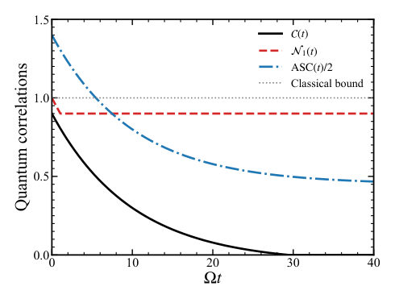 
FIG. 1. Time evolution of concurrence C, Trace MIN N1, and ASC/2 for b1 = 1, b2 = −0.9, b3 = 0.9 at κ = 0.05 α. The ordering C ≤N1 ≤ASC is preserved throughout.

📷 Fig 2

 
FIG. 2. Concurrence for b1 = 1, b2 = −0.9, b3 = 0.9 at κ = 0, 0.02α, 0.05α, and0.5α. Increasing κ accelerates entan- glement decay.

📷 Fig 3

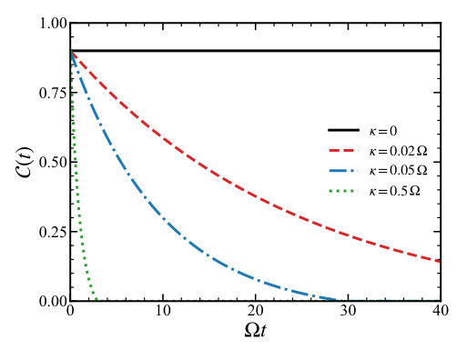 
Figure 3 shows Trace MIN for the same parameteric space. After a crossover time

📷 Fig 4

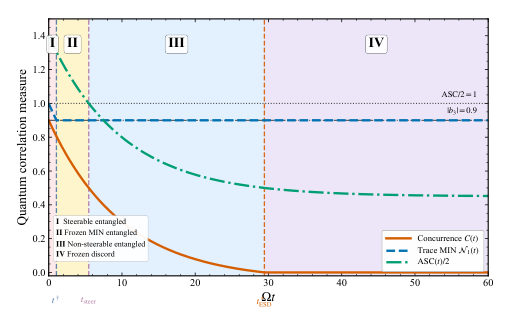 
FIG. 5. Dynamical regimes of quantum correlations for b1 = 1, b2 = −0.9, and b3 = 0.9 under dephasing. The ver- tical dashed lines mark the steering-loss time tsteer and the entanglement-sudden-death time tESD, separating four dis- tinct dynamical regimes.

📷 Fig 5

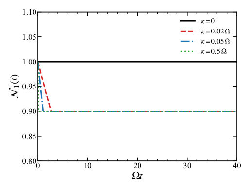 
FIG. 3. Trace MIN N1 for different κ. All curves saturate to |b3|, independent of the dephasing rate.

**Summary.** The paper analyzes how various measures of quantum correlation degrade in a dephasing environment using the hydrogen hyperfine spin system. It establishes that while entanglement decays rapidly (sudden death), other discord-like measures persist longer due to population correlations. Crucially, it shows that for standard teleportation protocols, only the initial presence of entanglement dictates whether an advantage over classical communication is possible.

**Why it may be interesting.** This work provides a detailed theoretical roadmap for experimentally verifying the persistence of quantum correlations beyond entanglement decay, which is crucial for understanding resource theories in noisy environments.

Detailed structure

**Main problem.** The study investigates how different measures of quantum correlation (entanglement, discord-like measures, steering coherence) decay relative to each other when a two-qubit system undergoes local dephasing noise.

**Main result.** A strict hierarchy $C(t) \le N_1(t) \le 	ext{ASC}(t)$ is established, showing that entanglement ($C$) decays fastest (sudden death), while discord-like measures ($N_1$ and ASC) persist longer due to population correlations.

**Method.** The authors derived the exact time-dependent density matrix for an X-state family under a Lindblad master equation describing local dephasing, allowing for closed-form computation of correlation functions.

**Model / system.** The system is the hydrogen hyperfine spin pair (electron and proton), modeled as an open two-qubit system governed by an isotropic hyperfine Hamiltonian and subject to Markovian phase noise (local dephasing).

**Key observables.** Concurrence ($C$), Trace MIN–N1 ($	ext{Trace MIN-}N_1$), Average Steering Coherence (ASC), and Quantum Teleportation Fidelity ($F_A$).

**Important parameters / regimes.** Dephasing strength ($\kappa$), time ($t$), initial state parameters ($b_1, b_2, b_3$, or purity $\epsilon$)

**Assumptions / limitations.** The analysis is restricted to the X-state family of two-qubit states and assumes local dephasing noise (Markovian process).

**Figures summary.** Figures illustrate the time evolution confirming the $C \le N_1 \le 	ext{ASC}$ ordering, showing entanglement sudden death ($t^*$) followed by the freezing/saturation of $N_1$ and ASC at non-zero values.

**Paper structure.** The paper systematically derives correlation measures for the X-state family under dephasing, establishes their strict hierarchy, analyzes the operational equivalence between teleportation advantage and entanglement survival ($F_A > 2/3 \iff C > 0$), and concludes by proposing a measurement scheme based on Pauli correlators.

Abstract

We study the dynamics of quantum correlations in the hydrogen hyperfine spin system subject to Markovian phase noise. Treating the electron and proton spin degrees of freedom as an open two-qubit system governed by an isotropic hyperfine Hamiltonian and local dephasing, we obtain the exact time-dependent density matrix and derive analytical expressions for the full X-state family. We compute concurrence($C$), trace-distance measurement-induced nonlocality (Trace MIN--$\mathcal{N}_1$), and average steering coherence (ASC) in closed form and establish their strict ordering $ C(t)\leq \mathcal{N}_1(t)\leq \mathrm{ASC}(t) $ at all times. Entanglement is identified as the most fragile resource, undergoing sudden death at a finite time. Trace MIN exhibits dephasing-immune freezing for states with nonzero population imbalance, while ASC is the most robust quantity, persisting longest in every scenario studied.We additionally demonstrate that the dephased thermal hyperfine state serves as a resource for quantum teleportation, deriving a closed-form expression for the average fidelity and establishing that the teleportation advantage window coincides exactly with the entanglement survival interval, $\mathcal{F}_A > 2/3 \Longleftrightarrow \mathcal{C} > 0$, for the full X-state family with maximally mixed marginals. We identify four distinct dynamical regimes and map all three correlation measures onto directly measurable Pauli spin correlators, enabling experimental reconstruction of the full hierarchy without full state tomography.

[↑ back to top](#top)

### [Entanglement generation between field modes mediated by a fluctuating conducting wall](http://arxiv.org/abs/2606.12338v1)

**Authors:** Luca Giovanni Cammarata, Tommaso Fazio, Roberto Passante, Lucia Rizzuto  
**Type:** theory · **Category:** other · **PDF:** <https://arxiv.org/pdf/2606.12338v1>  
**Analysis basis:** full PDF text, analyzed in chunks
**Topic relevance:** 🔥 `analog quantum simulation` **4/5** · `correlated cavity matter` **3/5** · `entanglement & information structure` **3/5** · `correlated / nonlocal dissipation` **2/5** · `Keldysh / 2PI / non-Gaussian methods` **1/5** · `Tavis-Cummings & cavity-many-emitter` **1/5** · `driven-dissipative phase transition` **1/5** · `methods for driven-dissipative` **1/5** · `non-equilibrium dynamics` **1/5**

📷 Fig 1

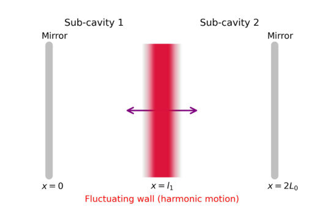 
FIG. 1: Pictorial representation of a cavity divided into two sub-cavities by a fluctuating conducting wall with equilibrium position between the two external walls.

📷 Fig 2

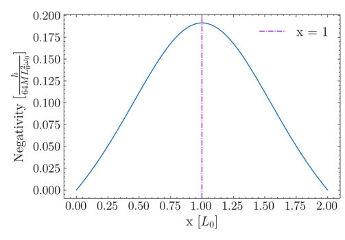 
FIG. 2: The negativity (18) as a function of x, the wall’s equilibrium position in units of L0.

📷 Fig 3

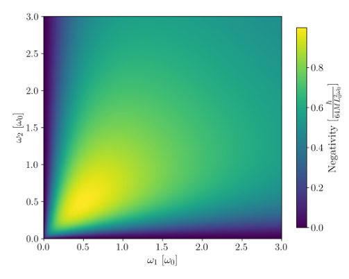 
FIG. 3: The negativity (18) as a function of ω1 ≡ωk and ω2 ≡ωj, in units of ω0, for the symmetric configuration l1 = l2 = L0.

📷 Fig 4

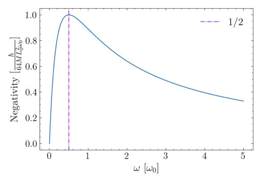 
FIG. 4: Negativity in Eq. (19) as a function of ω, in units of ω0, for the symmetric configuration l1 = l2 = L0.

📷 Fig 5

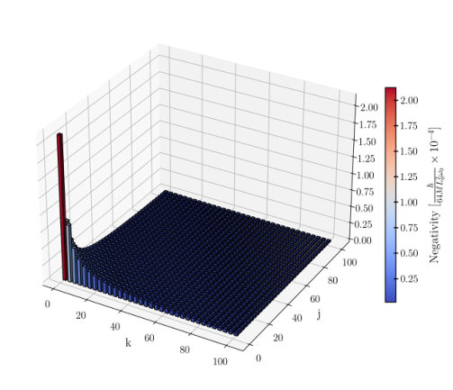 
FIG. 5: 3D histogram of the negativity in Eq. (18), quantifying the entanglement between pairs of modes k and j, in terms of the dimensionless parameter ℏ/(64ML2 0ω0).

**Summary.** The paper models two field cavities separated by a movable, quantum mechanically fluctuating wall. By treating the system's dynamics using perturbation theory and calculating entanglement via negativity, the authors demonstrate that vacuum fluctuations of the wall generate significant entanglement between the fields in the two separate cavities. This highlights how mechanical degrees of freedom can mediate non-local quantum correlations.

**Why it may be interesting.** This work directly addresses quantum light-matter interaction in a cavity setting (cavity QED analogue), showing how mechanical fluctuations can act as an effective mediator for generating non-classical correlations between distant quantum systems.

Detailed structure

**Main problem.** The study investigates how quantum entanglement can be generated between field modes confined in two separate sub-cavities when these cavities are separated by a movable, fluctuating conducting wall.

**Main result.** Quantum position fluctuations of the movable wall generate measurable entanglement between the field modes in opposite sub-cavities, an effect absent if the wall were fixed.

**Method.** The analysis employs second-order perturbation theory to find the interacting ground state and calculates entanglement using the negativity measure on the reduced density operator by tracing out the wall's degrees of freedom.

**Model / system.** The system consists of two massless 1D scalar fields confined in sub-cavities separated by a movable conducting plate. The wall's mechanical motion is quantized via a harmonic potential, leading to an effective field-wall interaction Hamiltonian.

**Key observables.** Negativity (N), which quantifies the entanglement between the two field modes; total multi-mode negativity.

**Important parameters / regimes.** Mass ($M$) and oscillation frequency ($\omega_0$) of the movable wall, sub-cavity lengths ($l_1, l_2$), and the frequencies of the considered field modes ($\omega_k, \omega_j$).

**Assumptions / limitations.** The analysis is performed using perturbation theory up to second order in the interaction Hamiltonian; the use of negativity is necessary because the reduced state is generally mixed.

**Figures summary.** Figures illustrate the dependence of entanglement (negativity) on the wall's equilibrium position, mode frequencies, and the number of modes considered, showing maximization under specific resonance conditions.

**Paper structure.** The paper establishes the Hamiltonian describing the coupled system, derives the reduced density operator by tracing out the wall, calculates the negativity analytically for two modes, and then extends this analysis numerically to include multiple field modes while discussing parameter dependencies.

Abstract

We consider a movable conducting plate of finite mass, between two fixed ones, whose mechanical degrees of freedom are treated quantum-mechanically and bound to its equilibrium position by a harmonic potential. The movable wall is thus subjected to quantum fluctuations of its position. This creates a system of two sub-cavities separated by the movable fluctuating plate, and two massless one-dimensional scalar fields, one in each sub-cavity. This system is described by an appropriate generalization of the Law Hamiltonian. The presence of the movable wall yields an effective plate-fields interaction, as well as an effective interaction between the field modes. We obtain, at the second order in perturbation theory, the ground state of the interacting system and the reduced density operator of the fields in each sub-cavity by tracing out the wall's degrees of freedom. We calculate the entanglement between two field modes, one in each cavity, by evaluating analytically the negativity; we then evaluate numerically also the total multimode negativity. Our results show that in both cases the fields in the two sub-cavities are entangled, in contrast to the case in which the wall is fixed in space. We discuss the amount of the field entanglement present as a function of relevant physical parameters of the system such as the mass and oscillation frequency of the movable wall, its distance from the fixed walls and the frequencies of the field modes considered.

[↑ back to top](#top)

### [Roughening of active nonlinear interfaces with broken tilt symmetry](http://arxiv.org/abs/2606.12190v1)

**Authors:** Ailén M. Cámara, Alejandro B. Kolton, José Luis Iguaín  
**Type:** theory · **Category:** statistical mechanics · **PDF:** <https://arxiv.org/pdf/2606.12190v1>  
**Analysis basis:** full PDF text, analyzed in chunks
**Topic relevance:** 🔥 `non-equilibrium universality` **4/5** · `driven-dissipative phase transition` **3/5** · `non-equilibrium dynamics` **3/5** · `methods for driven-dissipative` **2/5** · `Frenkel-Kontorova` **1/5** · `Keldysh / 2PI / non-Gaussian methods` **1/5** · `analog quantum simulation` **1/5** · `correlated / nonlocal dissipation` **1/5** · `entanglement & information structure` **1/5**

📷 Fig 1

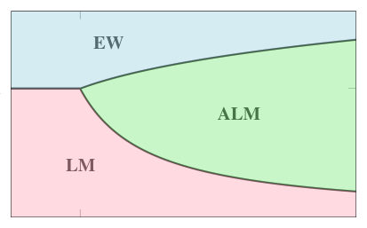 
Figure 1. Crossover diagram for the non-linear active inter- face described by Eq. (1), mapped as a function of the normal- ized length scale ˜ℓ= ℓ/√c2τ and the dimensionless coupling constant Γ2n = c2nT/(c(3n−1)/2 2 √τ). Here, T denotes the ac- tive noise strength, τ is the temporal correlation time, c2 is the linear elastic constant, and c2n (with n &gt; 1) represents the degree of non-Hookean elasticity. The analytical bound- aries mapping the transitions between the EW, LM, and ALM roughening regimes are defined by Eqs. (8)–(10).

📷 Fig 2

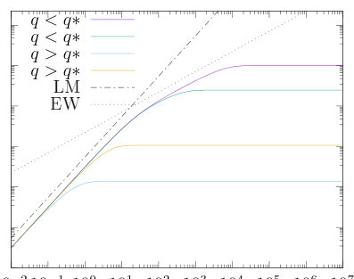 
Figure 2. Analytical predictions for the Larkin (LM) to Edwards-Wilkinson (EW) crossover during the relaxation of a flat initial interface, for τ = 10. (a) S(q, t) vs q at dif- ferent times. The dotted line shows EW scaling ∼q−2 and the dashed-dotted the LM scaling S(q, t) ∼q−(1+2ζLM) = q−4. (b) S(q, t) vs t for q &gt; q∗and q &lt; q∗, with q∗

📷 Fig 3

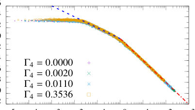 
Figure 3. Γ4 &lt; 2. Top: Structure factors for several set of parameters (in the key). Bottom: The same data collapsed onto a master curve. The line represents the analytical solu- tion g&lt;(k, Γ4)/k2. Dashed (blue) part and dash-dotted (red) parts correspond EW and LM regimes, respectively.

📷 Fig 4

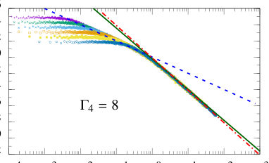 
Figure 4. Structure factors for Γ4 = 8. The plots correspond to c2 = 1, c4 = 8 and several pairs of T (in the key) and τ, which satisfy T/√τ = 1. Top panel: raw data. Bottom panel: rescaled data collapsing on an universal function. The line represents the analytical solution g&gt;(k, Γ4)/k2. Dashed (blue), solid (dark-green) and dash-dotted (red) parts corre- spond to EW. ALM and LM regimes, respectively

📷 Fig 5

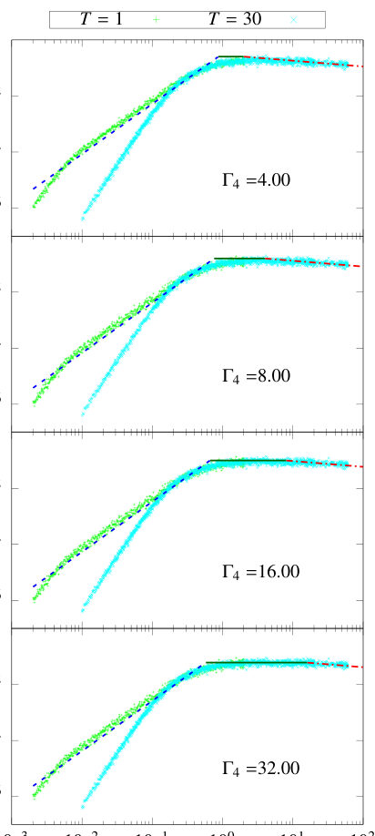 
Figure 5. Structure factor for Γ4 &gt; 2. The plots correspond to four different Γ4 (in the key) and pairs of T (in the key) and τ, which satisfy T/√τ = 1. Data points are the results of numerical simulations and the lines represent the analytical solutions: dashed (blue), solid (dark-green) and dash-dotted (red) parts belong to EW. ALM and LM regimes, respectively. In all panels the structure factor is presented in a rotated manner (see eq. (73)) to better appreciate the widening of the ALM zone with increasing Γ4.

**Summary.** This work theoretically analyzes how nonlinear interfaces roughen when subjected to colored active noise that breaks symmetry. It successfully derives a crossover diagram showing the transition between three distinct physical regimes: Larkin, anharmonic Larkin, and Edwards–Wilkinson scaling. The findings provide a unified framework for understanding finite-size effects in such non-equilibrium systems.

**Why it may be interesting.** While focused on classical interface dynamics, the concept of universality classes, non-equilibrium steady states, and crossovers driven by noise correlations are fundamental concepts applicable to many open quantum systems and non-equilibrium statistical mechanics problems in AMO physics.

Detailed structure

**Main problem.** The study focuses on characterizing the roughening dynamics of active nonlinear interfaces driven by temporally correlated noise that breaks statistical tilt symmetry.

**Main result.** The system exhibits a unified description across three distinct self-affine scaling regimes: Larkin (LM), anharmonic Larkin (ALM), and Edwards–Wilkinson (EW).

**Method.** The analysis employs scaling arguments, the self-consistent Hartree approximation, and comparison with known asymptotic limits.

**Model / system.** The model describes an overdamped interface height h(x, t) governed by a nonlinear elastic energy functional and driven by an Ornstein–Uhlenbeck colored noise process. The dynamics are captured by a nonlinear partial differential equation.

**Key observables.** Structure factor $\langle|h_q|^2
angle = S(q)$, roughness exponent ($\zeta$), and dynamical exponent ($z$).

**Important parameters / regimes.** The crossover diagram depends on the normalized length scale $	ilde{\ell}$ and a dimensionless coupling constant $\Gamma_{2n}$, which controls the transition between regimes.

**Assumptions / limitations.** The analysis relies on approximations like scaling arguments and the Hartree approximation to derive analytical boundaries for transitions between universality classes.

**Figures summary.** Figures illustrate the crossover diagram mapping the EW, LM, and ALM regimes using dimensionless parameters, with data collapsing onto universal master curves in numerical simulations.

**Paper structure.** The paper develops the governing equation, analyzes the linear limit (LM to EW crossover), extends the analysis to include nonlinearity via the Hartree approximation, and finally presents a unified crossover diagram showing the interplay between all three regimes.

Abstract

We study the roughening of an interface with nonlinear elasticity driven by temporally correlated noise, which breaks statistical tilt symmetry. Using scaling arguments and a self-consistent Hartree approximation, we derive the crossover diagram and the steady-state structure factor. We identify three scaling regimes associated with the Larkin, anharmonic Larkin, and Edwards--Wilkinson universality classes, and obtain the crossover lengths separating them. Numerical simulations of large systems confirm the analytical predictions over the full parameter range. Our results provide a unified description of finite-size and crossover effects in a minimal nonlinear-elastic Ornstein--Uhlenbeck active interface.

[↑ back to top](#top)

### [Quantum repeater segment with free-space coupled co-trapped ions using telecom photon interference](http://arxiv.org/abs/2606.12313v1)

**Authors:** Max Bergerhoff, Pascal Baumgart, Christian Haen, Jonas Meiers, Tobias Bauer, Jonas Haferkamp, Christoph Becher, Jürgen Eschner  
**Type:** experiment · **Category:** quantum information and computing · **PDF:** <https://arxiv.org/pdf/2606.12313v1>  
**Analysis basis:** full PDF text, analyzed in chunks
**Topic relevance:** 🔥 `QC/QI experiment` **4/5** · `interference shaping light` **3/5** · `quantum optics experiment` **3/5** · `entanglement & information structure` **2/5** · `quantum measurements` **2/5** · `analog quantum simulation` **1/5** · `non-equilibrium dynamics` **1/5**

📷 Fig 1

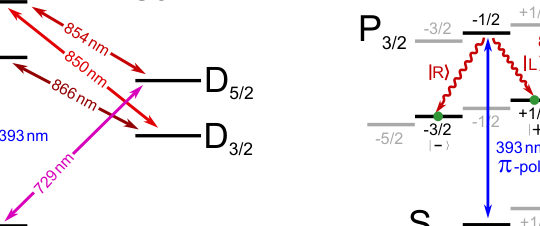 
FIG. 1. (a) Schematic of the experimental setup, comprising two co-trapped ions in a Paul trap as quantum memories, individual single-photon collection (green), two QFCs (orange), and Bell state analyzer (violet). (b) Level scheme, transitions, and wavelengths of the 40Ca+ ion. (c) Zeeman sub-levels for generation of atom-photon entanglement, showing excitation (blue) and emission paths (red). The relevant levels for generation of the target state (Equation 2) are shown in black. Excitation of the initial state S1/2, −1/2 to P1/2, −1/2 with π-polarized 393-nm light triggers decay to a superposition of |−⟩= D5/2, −3/2

📷 Fig 2

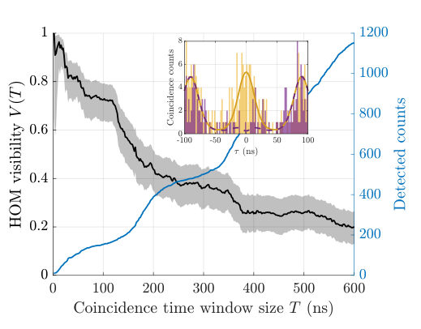 
FIG. 2. HOM visibility V (T) plotted as a function of the co- incidence window size T, changed in steps of 1 ns. Measured data points are shown in black, with their associated uncer- tainties represented by shaded regions. In blue, the number of contributing counts is shown. The inset displays the his- tograms of coincidence detections as a function of the detec- tion time difference τ for projections onto orthogonal (yellow bars) and parallel (violet bars) polarizations, evaluated with a bin size of 2 ns. As a guide to the eye, the lines of the cor- responding colors show simulations obtained with the model of [40] and using the experimentally determined parameters.

📷 Fig 3

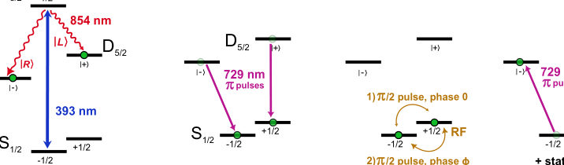 
FIG. 3. Schematic of the sequence for verification of atom-atom entanglement. Generation of atom-photon entanglement. Population transfer from D5/2 to S1/2. Basis rotation by the use of two π/2 RF pulses. Population transfer back from S1/2 to D5/2 followed by state readout.

📷 Fig 4

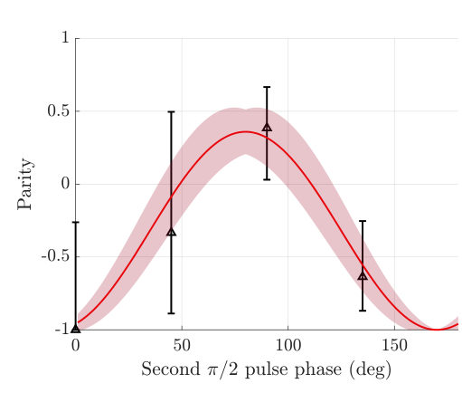 
FIG. 4. Parity as a function of the phase of second π/2 pulse. Black points show the measured data at 0◦, 45◦, 90◦, 135◦; the red line is a sinusoidal fit with its uncertainty indicated by the red shading.

📷 Fig 5

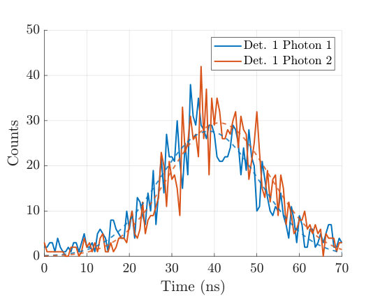 
FIG. 5. One of the fifteen peaks in the single-photon wave packets from both ions for one selected detector to measure the time difference at the FBS with the fit as dashed line. Photon 1 (2) refers to the photon emitted by Ion 1 (2).

**Summary.** The research demonstrates the feasibility of building a quantum repeater segment using co-trapped $^{40}	ext{Ca}^+$ ions. By converting emitted photons to the telecom band and performing interference over long optical fibers, they successfully generated entangled Bell states with high fidelity. This work establishes trapped ions as a promising hardware platform for scalable quantum networks.

**Why it may be interesting.** This work directly addresses a core challenge in quantum networking—the distribution of entanglement over lossy channels—by demonstrating a robust hardware platform (trapped ions) compatible with existing telecom infrastructure.

Detailed structure

**Main problem.** The primary goal is to implement a quantum repeater segment capable of generating buffered entanglement between distant quantum memories, thereby enabling long-distance quantum communication.

**Main result.** The authors successfully generated an entangled Bell state with fidelity $\ge 68(8)\%$ using co-trapped $^{40}	ext{Ca}^+$ ions and demonstrated the feasibility of this platform for quantum networking.

**Method.** Entanglement is established by generating photons from two trapped ions, converting these photons to the telecom C band, transmitting them over optical fiber, and performing a photonic Bell State Measurement (BSM).

**Model / system.** The physical system utilizes co-trapped $^{40}	ext{Ca}^+$ ions in a Paul trap. The process involves Raman photon generation, quantum frequency conversion (QFC) to 1550 nm, and subsequent entanglement swapping via photonic interference.

**Key observables.** Entanglement fidelity ($\ge 68(8)\%$), Hong–Ou–Mandel (HOM) visibility ($>0.7$ for $T < 120 	ext{ ns}$), CHSH parameters ($2.42-2.49$), and parity oscillation amplitude ($A = 1.36(15)$).

**Important parameters / regimes.** Fiber length of $440 	ext{ m}$, coincidence time windows $< 120 	ext{ ns}$, and the telecom C band ($\sim 1550 	ext{ nm}$).

**Assumptions / limitations.** The high fidelity relies on maintaining short coincidence windows for maximum HOM visibility, and future work requires integrating additional trapping nodes or cavities.

**Figures summary.** Figures illustrate the setup schematic (Paul trap, QFCs, BSM), show HOM visibility vs. time window size $T$, and plot parity oscillations versus phase to verify entanglement.

**Paper structure.** The paper details the experimental realization of the quantum repeater segment protocol, covering photon generation, frequency conversion, long-distance transmission, Bell state measurement, and subsequent characterization using multiple diagnostic tools like HOM interference and parity measurements.

Abstract

A quantum repeater segment is a basic building block of a quantum repeater, generating buffered entanglement of quantum memories to connect quantum repeater cells. It also enables the connection between quantum computers. In the implementation we present here, photons emitted from two co-trapped free-space coupled $^{40}$Ca$^+$ ions are converted to the telecom-C band and interfered after transmission over 440$\,$m of optical fiber (220$\,$m per arm), where a photonic Bell measurement is performed to create entanglement between the memories. With this scheme we generate an entangled $\left|Ψ^+\right\rangle$ Bell state with $\ge 68(8)\,$% fidelity, highlighting trapped $^{40}$Ca$^+$ ions as a promising quantum repeater hardware platform.

[↑ back to top](#top)

### [Super-Link Fragility in Asymmetric W-Class States under Quantum Noise](http://arxiv.org/abs/2606.12307v1)

**Authors:** Sougata Bhattacharyya, Fatih Ozaydin, Sovik Roy  
**Type:** theory · **Category:** quantum information and computing · **PDF:** <https://arxiv.org/pdf/2606.12307v1>  
**Analysis basis:** full PDF text, analyzed in chunks
**Topic relevance:** 🔥 `entanglement & information structure` **4/5** · `correlated / nonlocal dissipation` **3/5** · `methods for driven-dissipative` **3/5** · `driven-dissipative phase transition` **2/5** · `non-equilibrium dynamics` **2/5** · `Keldysh / 2PI / non-Gaussian methods` **1/5** · `non-equilibrium universality` **1/5**

📷 Fig 1

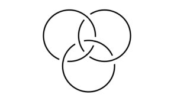 
FIG. 1: Borromean Rings. Three mutually inter- locked rings in which no two rings are directly linked as a pair, yet the three together cannot be separated. This topology serves as an analogy for the Borromean mode of three-qubit entanglement: when any single qubit is measured and found in |0⟩, the residual two-qubit state of the remaining pair collapses to a fully separable prod- uct state with zero coherence (Cl1 = 0), mirroring how severing one Borromean ring causes the other two to fall entirely apart.

📷 Fig 2

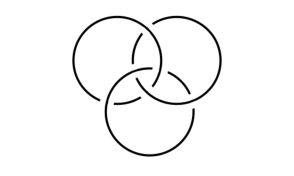 
FIG. 2: 3-Hopf Link. Three rings arranged so that removing any single ring still leaves the remaining two interlinked. This topology serves as an analogy for the Hopf mode of three-qubit entanglement: when any single qubit is measured and found in |1⟩, the residual two-qubit state retains non-zero coherence (Cl1 &gt; 0) and bipartite entanglement, mirroring the persistent linkage of the re- maining two Hopf rings.

📷 Fig 3

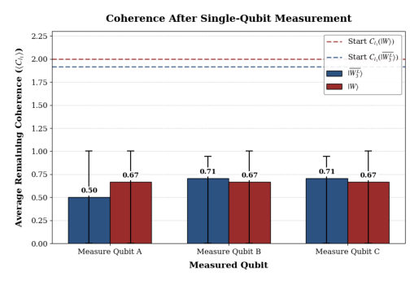 
FIG. 3: l1-norm coherence of the two-qubit re- mainder after single-qubit measurement. For each measured qubit (A, B, or C), the two endpoints of the error bar mark the two possible coherence values corre- sponding to the measurement outcomes |0⟩and |1⟩; the bar height marks the probability-weighted average (ex- pectation value) of the residual coherence over the two possible measurement outcomes, and represents the ex- pected coherence remaining after a random single-qubit measurement. Dashed horizontal lines mark the initial coherence of each three-qubit state before any measure- ment: Cinit l1 ≈1.914 for |W L 3 ⟩(blue) and Cinit l1 = 2 for |W⟩ (red). For the symmetric |W⟩state (red...

📷 Fig 4

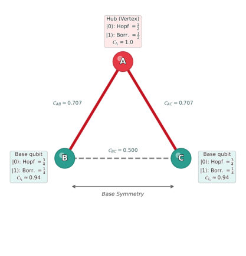 
FIG. 5: Isosceles entanglement-network geom- etry of the asymmetric |W L 3 ⟩state. The vertex qubit A (top) acts as a balanced switch: it triggers the Hopf mode with probability 1

📷 Fig 5

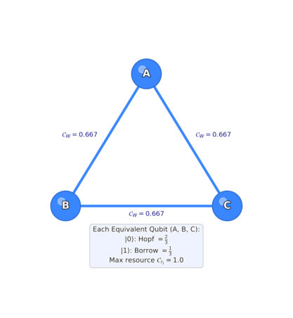 
FIG. 4: Equilateral entanglement-network ge- ometry of the symmetric |W⟩state. Each vertex represents a qubit (A, B, C) and each edge represents a bipartite entanglement link. Because the single excita- tion is distributed uniformly, all three qubits play struc- turally identical roles. Every qubit acts as an unbiased probabilistic switch, triggering the Hopf mode (residual coherence Cl1 = 1.0) with probability 2 3 and the Bor- romean mode (residual separability, Cl1 = 0) with prob- ability 1 3. Consequently, tracing out any single qubit yields the same reduced density matrix, and all three bipartite concurrences are equal: CW = 2

**Summary.** This paper analyzes the robustness of entanglement in asymmetric three-qubit W-states compared to symmetric ones when exposed to different types of quantum noise. It demonstrates that initial structural advantages, such as a strong 'super-link,' can be fragile and even reverse under specific decoherence channels like amplitude damping. The findings emphasize that entanglement resilience depends on the interplay between network geometry, excitation sector, and noise symmetry.

**Why it may be interesting.** This work provides crucial insights into how structural properties derived from ideal quantum states break down under realistic, non-Markovian noise environments, which is vital for designing robust quantum communication protocols.

Detailed structure

**Main problem.** The study investigates how the initial structural advantages of asymmetric W-class quantum states persist or degrade when subjected to various forms of quantum noise.

**Main result.** The initial entanglement hierarchy ($C_{VB} > C_W > C_{BB}$) is not guaranteed under decoherence; for instance, amplitude damping causes a reversal termed the Super-Link Fragility Effect.

**Method.** The authors analytically compare bipartite concurrence dynamics between symmetric and asymmetric W states using established noise models (phase, amplitude, depolarization).

**Model / system.** The system involves three-qubit entangled W-class states ($|W
angle$ vs. $|\overline{W_3^L}
angle$), whose entanglement geometry is analyzed via bipartite concurrence links (Vertex-Base and Base-Base).

**Key observables.** Bipartite Concurrence ($C_{VB}, C_W, C_{BB}$), Entanglement Sudden Death (ESD) thresholds.

**Important parameters / regimes.** Noise parameters ($\gamma$ for amplitude damping, $p$ for depolarization, $\alpha$ for GADC).

**Assumptions / limitations.** The analysis often relies on the assumption that reduced density matrices remain X-states to simplify concurrence calculations.

**Figures summary.** Figures illustrate entanglement decay under different noise channels (e.g., Fig 7 shows hierarchy reversal under amplitude damping; Fig 8 shows ESD thresholds under depolarization).

**Paper structure.** The paper establishes the initial geometric advantage, then systematically analyzes the robustness of this structure across four distinct noise models: phase damping (preserves hierarchy), amplitude damping (reverses hierarchy/Super-Link Fragility), depolarization (erases asymmetry), and GADC (interpolates between limits).

Abstract

The asymmetric three-qubit W-class state $|\overline{W_3^L}\rangle$ defines an isosceles entanglement-network geometry, (a) two vertex-base (VB) links form stronger bipartite connections, (b) while the base-base (BB) link is weaker. This suggests that concentrating entanglement into a super-link may be advantageous for quantum-network tasks. Here, we show that this intuition is incomplete. We analytically compare the bipartite concurrence dynamics of the symmetric |W> state and the asymmetric $|\overline{W_3^L}\rangle$ state, which differ both in entanglement-network geometry and excitation sector under standard noise models. In the absence of noise, the concurrence hierarchy is C_{VB} > C_W > C_{BB}$. Under phase damping, this hierarchy is preserved for all noise strengths and no entanglement sudden death occurs. Under amplitude damping, however, the hierarchy is reordered. The symmetric |W> state becomes the most robust, while the base-base concurrence of $|\overline{W_3^L}\rangle$ vanishes at the finite threshold of parameter $γ$. We term this reordering as the \textit{Super-Link Fragility Effect}. The same structural asymmetry that produces a stronger vertex-base link also makes it more vulnerable to energy dissipation when coupled with multi-excitation amplitudes. Under depolarization, the asymmetry advantage is erased, with $C_W$ and $C_{VB}$ sharing the same sudden-death threshold for some value of the parameter p, while $C_{BB}$ disappears earlier at some other value of the parameter p. The generalized amplitude damping channel continuously connects the damping-dominated regime to the pure-excitation limit, where the initial hierarchy is restored. These results show that entanglement robustness in $W$-class resources is controlled not by initial concurrence alone, but by the joint structure of entanglement-network geometry, excitation sector, and noise symmetry.

[↑ back to top](#top)

### [Large Fluctuations in Open Quantum Systems](http://arxiv.org/abs/2606.11822v1)

**Authors:** V. Yu. Mylnikov, S. O. Potashin, A. Kamenev  
**Type:** theory · **Category:** statistical mechanics · **PDF:** <https://arxiv.org/pdf/2606.11822v1>  
**Analysis basis:** full PDF text, analyzed in chunks
**Topic relevance:** 🔥 `Keldysh / 2PI / non-Gaussian methods` **4/5** · `driven-dissipative phase transition` **3/5** · `methods for driven-dissipative` **3/5** · `non-equilibrium dynamics` **2/5** · `non-equilibrium universality` **2/5** · `correlated / nonlocal dissipation` **1/5**

📷 Fig 1

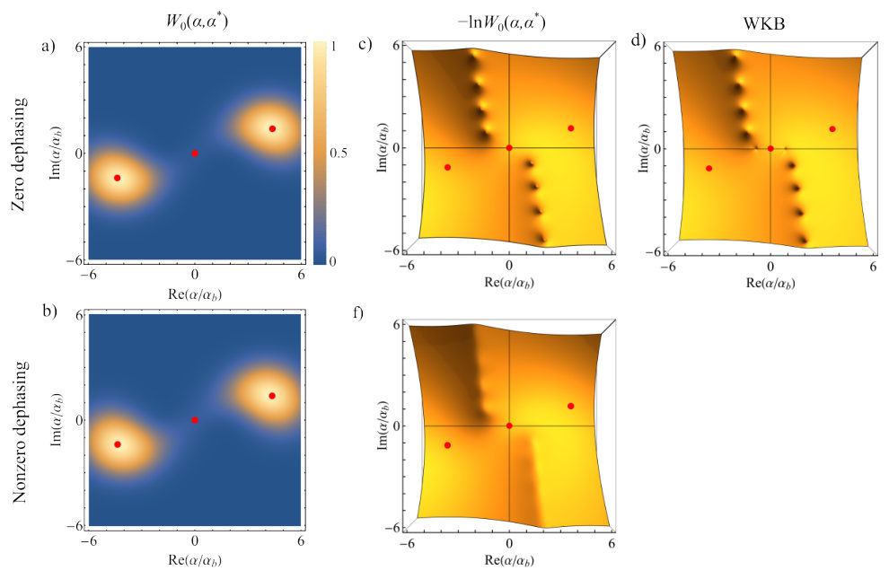 
Figure 1. (a,b) Stationary Wigner function W0(α, α∗) and effective potential −ln W0(α, α∗) (c,d) vs. phase-space coordinates Re(α) and Im(α). The first row presents the case of zero dephasing (κϕ = 0), where the exact (a,c) and WKB (d) solutions present (see Eqs. (15)-(17) and Appendix A). The second row shows the nonzero dephasing case (κϕ = 0.2), which does not admit the holomorphic decomposition (15) and is calculated numerically. The system parameters are set to G = 5, ∆= 2, κ = 0.4, η = 1, U = 0.1. The red dots denote locations of the classical fixed point (10)-(11).

📷 Fig 2

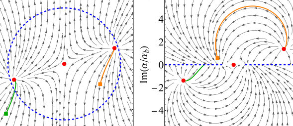 
Figure 2. The real-time instanton trajectories, Eq. 37, spanning the fluctuation Riemann surface, A(α, β) = 0. The instanton paths start at classical stable points (red dots). (a-c) The subcritical drive, G &lt; | ˜∆|; (d-e) – the bistable regime, G &gt; | ˜∆|. (a), (d) Trajectories projections on the β-plane; for a given end-point β there is a unique trajectory, leading to it. (b,c) and (e,f) Trajectories projections on the two sheets of the α-plane. There are two trajectories leading to each end-point α: they both start on the minus-sheet (b), (e), one (orange) stays on this sheet, while the second (green) hits the cut (blue dashed line) and emerges on the second (plus) sheet (c), (f). The...

📷 Fig 3

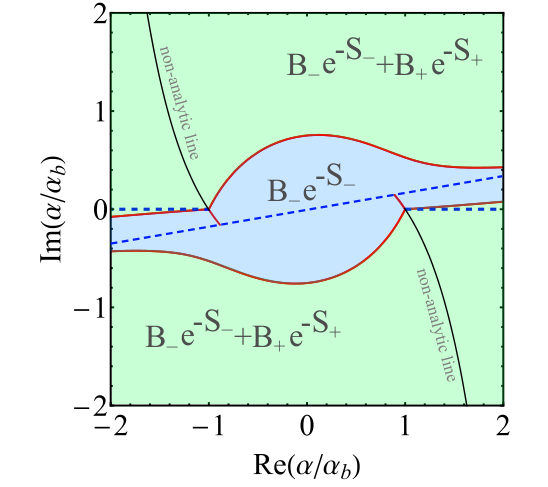 
Figure 3. Stokes lines (red) on the complex α plane, as de- fined by Eq. (47). Within the inner Stokes region (blue), only the instanton with S−action contributes to the Wigner func- tion. Within the outer Stokes region (green), both instantons with S± contribute. The two actions equalize along the anti- Stokes lines (black), given by Eq. (23). The large deviation function is non-analytic along these lines. One possible choice of branch cuts of the function ϕ(±) 0 (α/αb) are depicted as blue dashed lines. The branch cut of the logarithm ln(α2) in S+ should be chosen within the inner Stokes region. The system parameters are set to G = 2, ∆= 2, κ = 0.4, η = 1, U = 0.1, κϕ = 0.

📷 Fig 4

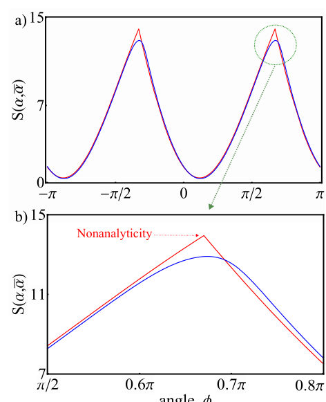 
Figure 4. (a,b) The large-deviation function from the in- stanton approach (49) (red) and the exact solution (15) – (18) (blue) vs. the angle φ = arg(α/αb) for a fixed ra- dius |α| = 3.5|αb|. The system parameters are set to G = 5, ∆= 2, κ = 0.4, η = 1, U = 0.1, κϕ = 0.

📷 Fig 5

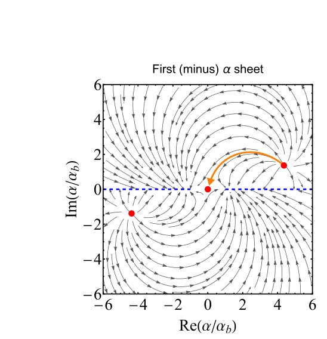 
Figure 5. The α-plane flow and the phase-slip instanton path (orange line) in the bistable regime. The phase-slip path starts at the classical fixed point α = α0 and ends at the saddle point α = 0 (red dots). From the saddle point to the opposite stationary point, the system evolves classically (i.e., in χ = 0 subspace), according to Eq. (9), with no action ac- cumulated along this part of the phase-slip path. The system parameters are set to G = 5, ∆= 2, κ = 0.4, η = 1, U = 0.1, κϕ = 0.

**Summary.** This paper investigates rare fluctuations in driven open quantum systems using advanced semiclassical methods. It demonstrates that unlike equilibrium states, these non-equilibrium steady states exhibit large-deviation functions with sharp, non-analytic features. These features arise fundamentally from the competition between multiple distinct instanton trajectories governing the system's dynamics.

**Why it may be interesting.** This work provides deep insights into non-equilibrium statistical mechanics by showing that quantum dissipation can induce complex, non-analytic structures in fluctuation statistics, extending concepts from classical instanton theory to the quantum domain.

Detailed structure

**Main problem.** The study focuses on characterizing atypical measurement outcomes (rare fluctuations) in the steady states of driven, open quantum systems.

**Main result.** The large-deviation function for these systems is generically non-analytic due to the competition between multiple competing semiclassical instanton trajectories. This contrasts with equilibrium systems where analyticity holds.

**Method.** The analysis employs semiclassical methods derived from Keldysh path integrals and WKB approximations, relating rare events to instanton solutions of the effective action.

**Model / system.** The model is an open quantum system, exemplified by a parametrically driven Kerr oscillator coupled to a dissipative bath, governed by a Lindblad master equation.

**Key observables.** Large-deviation function $S(x, p)$ and the phase-slip rate $\Gamma$.

**Important parameters / regimes.** Drive strength ($G$), detuning ($\Delta$), dissipation rates ($\kappa, \eta, \kappa_\phi$), and the semiclassical parameter $\hbar$ (or $\delta$).

**Assumptions / limitations.** The analysis relies on the WKB approximation for the path integral and identifying an invariant subspace parameterized by $(\alpha(t), \chi(t))$ in the Keldysh formalism.

**Figures summary.** Figures illustrate real-time instanton trajectories spanning a fluctuation Riemann surface, showing multiple paths to endpoints. They also map out Stokes lines and anti-Stokes lines on phase space plots, visualizing where non-analyticities occur.

**Paper structure.** The paper progresses from establishing the general problem of large deviations in open systems to applying it to a specific driven oscillator model. It develops the semiclassical formalism using Keldysh theory, identifies the multi-valued nature of solutions (Riemann surface), and finally analyzes how Stokes phenomena dictate non-analytic features in the resulting large-deviation function.

Abstract

We study statistics of atypical measurement outcomes in the steady states of driven open quantum systems. In equilibrium, the probability distribution over the phase space, as encoded in, e.g., the Wigner function, is analytic in the phase-space coordinates. We show that this property is generically lost in driven dissipative systems: their {\it large-deviation function} develops lines and surfaces across which its derivatives are discontinuous. As an illustrative example, we consider a parametrically driven Kerr oscillator coupled linearly and/or nonlinearly to a dissipative bath. Rare fluctuations in the amplitude and phase of the induced oscillations are governed by semiclassical instanton trajectories of the corresponding Keldysh-Lindblad action. We demonstrate that a given fluctuation can be realized through multiple distinct instanton trajectories. The competition between these trajectories leads to abrupt switching of the dominant instanton and, consequently, to non-analytic features in the large-deviation function.

[↑ back to top](#top)

### [Exact Entanglement Dynamics Beyond Nearest-Neighbor Dual-Unitary Floquet Systems](http://arxiv.org/abs/2606.11311v1)

**Authors:** Tanay Pathak  
**Type:** theory · **Category:** statistical mechanics · **PDF:** <https://arxiv.org/pdf/2606.11311v1>  
**Analysis basis:** full PDF text, analyzed in chunks
**Topic relevance:** 🔥 `entanglement & information structure` **4/5** · `non-equilibrium dynamics` **3/5** · `analog quantum simulation` **2/5** · `non-equilibrium universality` **2/5** · `Keldysh / 2PI / non-Gaussian methods` **1/5** · `driven-dissipative phase transition` **1/5** · `methods for driven-dissipative` **1/5**

📷 Fig 1

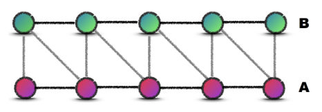 
FIG. 1. Schematic of the range r = 2 construction. Black links form two self-dual KFIM sublattices, while gray links are arbitrary diagonal inter-sublattice couplings. These couplings make the Floquet dynamics genuinely coupled, yet they do not spoil dual-unitarity.

📷 Fig 2

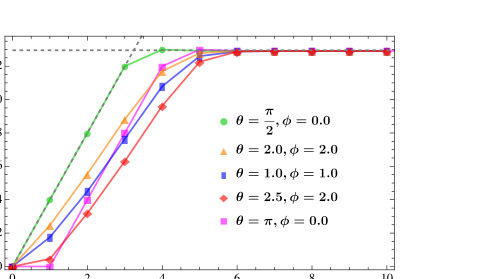 
FIG. 2. The R´enyi-2 entropy for range-2 model evolving from various initial states. We choose total spins L = 30 and subsystem size to be N = 13. The initial state is of the form defined by Eq. (7) and θk = θ, ϕk = ϕ.

📷 Fig 3

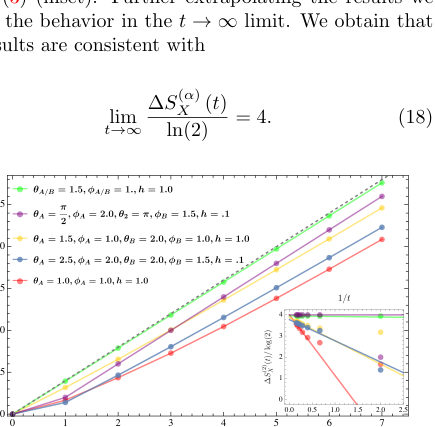 
FIG. 3. The R´enyi-2 entropy for a range-2 model from vari- ous initial states, in the thermodynamic limit obtained. θk, ϕk with k ∈{A, B} denotes the uniform value of θk, ϕk chosen for initial states in each sublattice. Inset shows instantaneous slope, ∆S(2) X (t−1/2)

📷 Fig 4

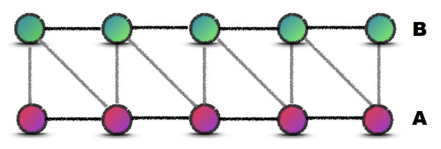 
FIG. 1. Schematic of the range r = 2 construction. Black links form two self-dual KFIM sublattices, while gray links are arbitrary diagonal inter-sublattice couplings. These couplings make the Floquet dynamics genuinely coupled, yet they do not spoil dual-unitarity in the enlarged unit cell.

📷 Fig 5

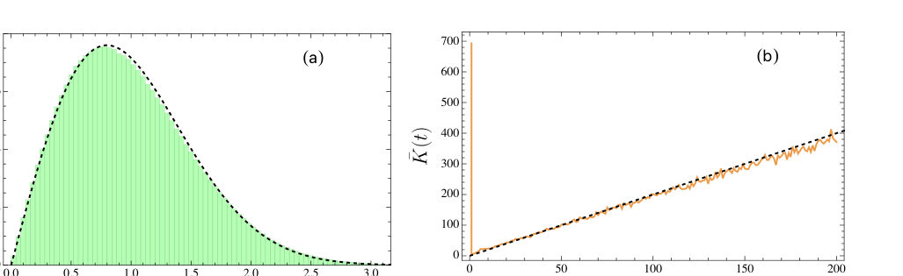 
FIG. 2. (a) Level spacing distribution of the (unfolded) quasi energies of the unitary operator, with L = 12, given by Eq.(10) for generic Jn, hn . We choose hn = 0.5 and Jn is chosen randomly from the interval [0, 1] and we average over 1024 realizations. The dashed curve corresponds to the Wigner surmise for circular orthogonal ensemble (COE). (b) Spectral form factor, as defined using Eq. (13) for the range-2 model. The result shows a clear ramp in agreement with COE results, shown as black dashed line.

**Summary.** This paper develops an exact analytical method to calculate entanglement dynamics in Floquet spin models with finite-range interactions, moving beyond the limitations of nearest-neighbor dual-unitary systems. By constructing a staggered sublattice structure that preserves duality, the authors derive explicit formulas for $n$-Rényi entropies. This work provides deep theoretical insight into how interaction range controls entanglement growth rates in quantum many-body physics.

**Why it may be interesting.** This work provides a controlled theoretical framework to study how increasing interaction range affects quantum information measures like entanglement growth rates in periodically driven many-body systems.

Detailed structure

**Main problem.** The research aims to extend the study of exactly solvable entanglement dynamics beyond nearest-neighbor dual-unitary Floquet systems to incorporate finite-range interactions.

**Main result.** They derive exact closed-form expressions for $n$-Rényi entanglement entropies, showing that the interaction range acts as a tunable multiplier on the entanglement growth rate.

**Method.** The analysis utilizes space-time duality and the replica trick to evaluate moments of the reduced density matrix ($	ext{tr}[(
ho_X(t))^n]$) for structured spin chains under Floquet evolution.

**Model / system.** The system is a spin-1/2 chain governed by a Floquet unitary operator incorporating range-$r$ interactions, which are analytically tractable by structuring the lattice into coupled sublattices that maintain dual-unitarity.

**Key observables.** $n$-Rényi entanglement entropies ($S_\alpha^X(t)$), spectral properties (level spacing distribution, spectral form factor).

**Important parameters / regimes.** Interaction range $r$, time $t$, and the replica parameter $\alpha$ (or $n$).

**Assumptions / limitations.** The construction relies on grouping sites into enlarged unit cells to preserve dual-unitarity despite inter-sublattice couplings, and specific solvable initial states are analyzed.

**Figures summary.** Figures illustrate schematic constructions of the $r=2$ model (showing coupled sublattices) and numerical plots showing the time evolution of Rényi entropy for various initial conditions.

**Paper structure.** The paper develops the formalism by defining the Hamiltonian structure, applying space-time duality to find exact formulas for density matrix moments using the replica trick, and finally deriving explicit expressions for entanglement entropy in terms of these calculated traces.

Abstract

Exact results using dual-unitarity largely rely on nearest-neighbor structures, while finite-range interactions typically lead to complications. Going beyond the usual nearest-neighbor setting, we introduce an analytically tractable family of finite-range kicked Ising models that admit exact closed-form entanglement dynamics. The construction is based on a staggered structure in which dual-unitarity is present on sublattices that are then coupled to each other. The central observation is that these inter-sublattice couplings do not obstruct the dual-unitarity of the resulting model. For the minimal interaction range of $r= 2$, we derive exact expressions for all the $n-$Rényi entanglement entropies at all times and show that the result is the sum of the two coupled sublattice contributions. Our framework extends naturally to larger finite interaction ranges and to systems with heterogeneous local Hilbert spaces, without additional assumptions. It thus provides a controlled setting for studying exact entanglement growth beyond strictly nearest-neighbor dual-unitary models.

[↑ back to top](#top)

### [Collective neutrino oscillations: Many-body non-forward effects and non-classicality](http://arxiv.org/abs/2606.12404v1)

**Authors:** Julien Froustey, Ermal Rrapaj, Yuhao Liu, Gushu Li, Costin Iancu, Vincenzo Cirigliano  
**Type:** theory · **Category:** quantum information and computing · **PDF:** <https://arxiv.org/pdf/2606.12404v1>  
**Analysis basis:** full PDF text, analyzed in chunks
**Topic relevance:** 🔥 `entanglement & information structure` **4/5** · `Keldysh / 2PI / non-Gaussian methods` **3/5** · `non-equilibrium dynamics` **2/5** · `correlated / nonlocal dissipation` **1/5** · `driven-dissipative phase transition` **1/5** · `methods for driven-dissipative` **1/5** · `non-equilibrium universality` **1/5**

📷 Fig 1

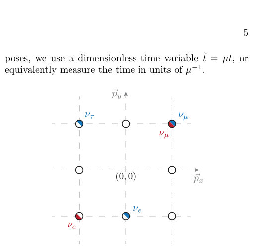 
FIG. 1. Two-dimensional grid of momenta used in this work. The states initially occupied in our test calculation are shown in blue, while the two-neutrino case shown in red is discussed in Appendix C. The momentum mode ⃗p = ⃗0 is excluded, as we restrict ourselves to ultrarelativistic neutrinos.

📷 Fig 2

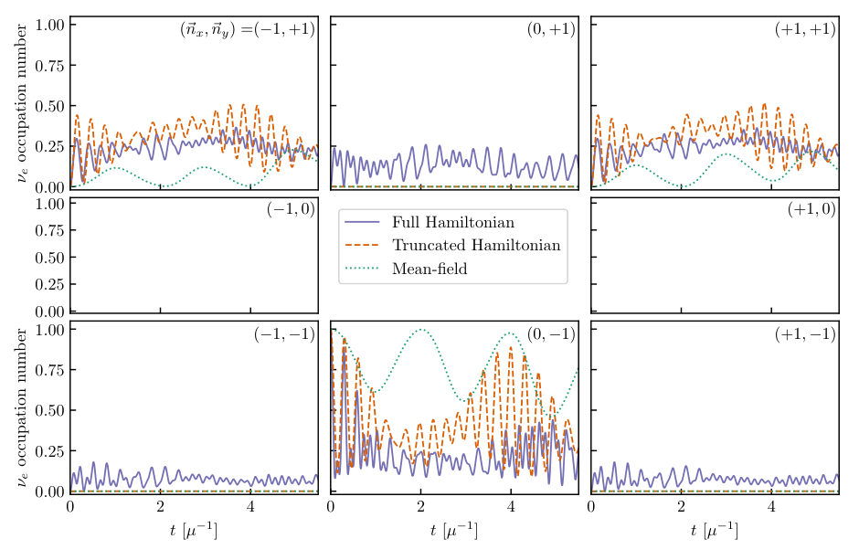 
FIG. 2. Time evolution of the νe occupation numbers for the initial state (25). Many-body calculations using the full (for- ward/exchange) Hamiltonian are shown with solid (dashed) lines, while the mean-field result is shown with a dotted line. Each panel corresponds to the momentum point (px, py) on the grid shown in Fig. 1.

📷 Fig 3

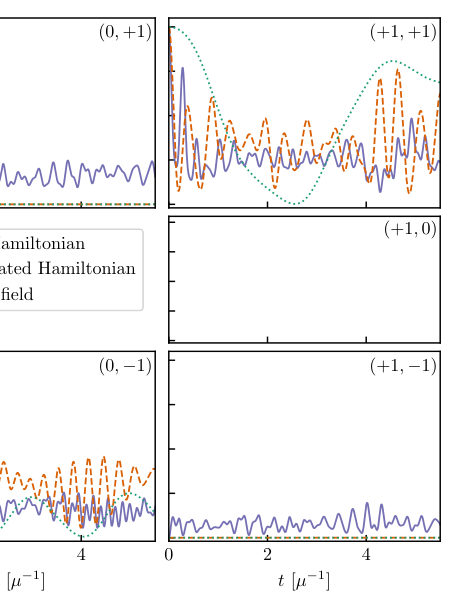 
FIG. 3. Same as Fig. 2, but for the νµ occupation numbers.

📷 Fig 4

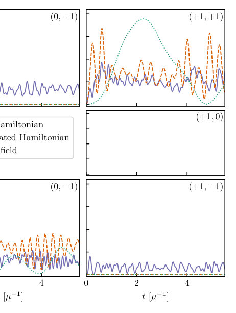 
FIG. 4. Same as Fig. 2, but for the ντ occupation numbers.

📷 Fig 5

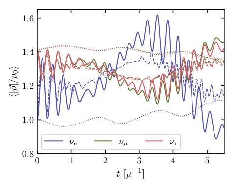 
FIG. 5. Evolution of the average kinetic energy for each neu- trino flavor. Plotting conventions are the same as Fig. 2.

**Summary.** The paper rigorously compares different theoretical approaches—mean-field, Quantum Kinetic Equation, and full many-body Hamiltonian—for modeling neutrino flavor oscillations in dense astrophysical matter. It demonstrates that non-forward scattering effects are crucial, leading to significant deviations from simpler models. Furthermore, it quantifies the quantum computational resources required for these complex simulations by analyzing entanglement growth and Trotter error scaling.

**Why it may be interesting.** This work directly bridges high-energy astrophysics (neutrino oscillations) with cutting-edge quantum computation theory by quantifying the necessary resources to simulate complex interacting quantum systems beyond mean-field approximations.

Detailed structure

**Main problem.** The study compares neutrino evolution using mean-field approximations against full many-body treatments, focusing on non-forward effects and quantifying the resulting quantum non-classicality.

**Main result.** Full many-body calculations show significantly higher entanglement entropy compared to truncated or mean-field results, indicating that multi-body correlations are crucial for accurate dynamics. The resource estimation suggests these simulations require substantial computational resources related to gate complexity.

**Method.** The authors employ both solving differential equations (QKE/Mean-Field) and estimating quantum circuit requirements (Trotter error scaling, gate costs) for the full Hamiltonian evolution.

**Model / system.** The system is a neutrino gas undergoing collective flavor oscillations in dense astrophysical environments. The dynamics are governed by a complex many-body Hamiltonian ($H = H_{	ext{vac}} + H_{
u
u}$), which includes non-forward scattering terms.

**Key observables.** Entanglement entropy ($S_{
u_e}(t)$), Rényi entropies ($ar{S}_
u$, $M_2(t)$), occupation numbers of momentum states, and the ratio of general to forward interaction modes ($N_{PS}$).

**Important parameters / regimes.** The comparison hinges on the relative importance of non-forward scattering terms versus those captured by mean-field approximations; resource costs are compared against quantum chemistry problems.

**Assumptions / limitations.** Key assumptions include using a 'plane waves in a box' discretization for momentum space and employing first-order Trotter error bounds to estimate computational cost.

**Figures summary.** Figures compare time evolution of occupation numbers across Full, Truncated, and Mean-field Hamiltonians; entanglement entropy plots show deviations from mean-field predictions; and resource estimation figures detail scaling with system size N.

**Paper structure.** The paper systematically develops the mathematical framework for neutrino self-interactions in various dimensions (1D, 2D, 3D), compares QKE/Mean-Field results against full many-body simulations, and concludes by analyzing quantum computational resource requirements via Trotter error bounds.

Abstract

Neutrino evolution in dense astrophysical environments is typically described either within a quantum kinetic framework, which neglects the build-up of multi-body correlations, or through simplified many-body calculations that allow significant entanglement to develop. In this work, we compare these two approaches in a simple neutrino-gas configuration, with particular emphasis on the role of non-forward scattering processes. These effects are incorporated either through a collision term in the kinetic description, or by considering the full neutrino-neutrino many-body Hamiltonian. We highlight differences between the two descriptions in both their characteristic timescales and asymptotic behavior. Motivated by the natural suitability of quantum computing for many-body calculations, we further investigate the non-classicality of neutrino evolution, discussing Trotter error scaling, along with the associated costs of constructing quantum circuits in terms of entangling gates and non-Clifford gates. We find that the resources needed for neutrino many-body evolution are on the low end of typical high-energy physics problems and on the mid to high end with respect to quantum chemistry problems. For the full Hamiltonian, resource requirements increase relative to the truncated version. We emphasize the importance of efficient fermion-to-qubit encodings, which are essential for reducing the substantial computational resources required for such simulations.

[↑ back to top](#top)

### [Q-DICE: Quantum Distributed Interconnect Compiler and Emulator](http://arxiv.org/abs/2606.11340v1)

**Authors:** Michael Silver, Zachary Vernec, Hans-Arno Jacobsen  
**Type:** both · **Category:** quantum information and computing · **PDF:** <https://arxiv.org/pdf/2606.11340v1>  
**Analysis basis:** full PDF text, analyzed in chunks
**Topic relevance:** 🔥 `QC/QI experiment` **4/5** · `correlated / nonlocal dissipation` **3/5** · `methods for driven-dissipative` **3/5** · `non-equilibrium dynamics` **2/5** · `driven-dissipative phase transition` **1/5**

📷 Fig 1

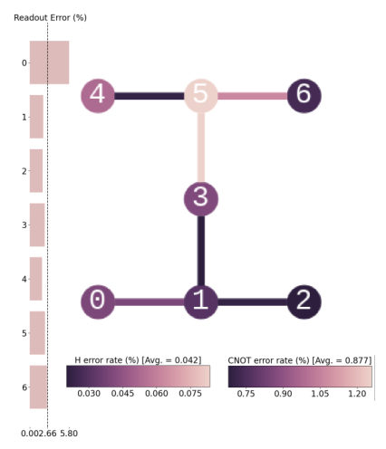 
Fig. 1. IBM Nairobi monolithic superconducting 27-qubit QPU topology and error map. Graph nodes indicate qubits, with respective colors referring to single gate error rates (in this case for the Hadamard gate). Graph edges represent qubit-qubit connections, with respective colors referring to the error rate of a native two-qubit gate on these qubits. Side bars indicate single-qubit readout error rates.

📷 Fig 2

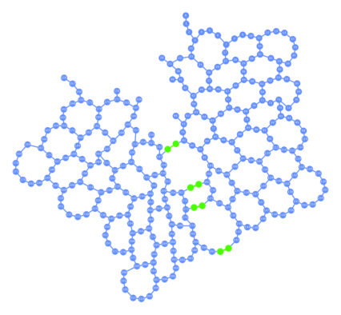 
Fig. 4. Stitched distributed QPU system. Green nodes indicate communication ancilla qubits, with green edges indicating a virtual nonlocal link between, separating two virtual QPUs.

📷 Fig 3

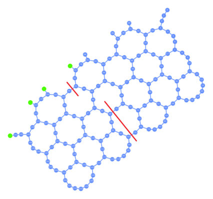 
Fig. 2. IBM Marrakesh monolithic superconducting Heron 156-qubit QPU coupling map. Red lines indicate user-defined cuts for QPU slicing. Green nodes indicate user-defined communication ancilla qubits for QPU stitching.

📷 Fig 4

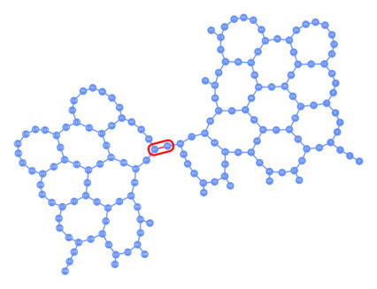 
Fig. 3. Partitioned IBM Marrakesh processor. Red line indicates virtual nonlocal link, separating two virtual QPUs. We refer to these sparse, modular structures as “butterfly backends,” reflecting their uniquely shaped and low- connectivity modular topologies similar to near-term DQC architectures.

📷 Fig 5

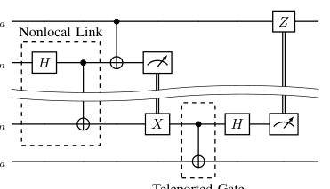 
Fig. 5. Gate teleportation circuit. The dashed box labeled “Nonlocal Link” encloses the entanglement generation and distribution subcircuit consumed by the teleportation. The dashed box labeled “Teleported Gate” encloses the operation applied at Node 2 conditioned on classical measurement outcomes from Node 1.

**Summary.** This paper introduces Q-DICE, a comprehensive emulator designed to benchmark distributed quantum computing algorithms by accurately simulating the physical limitations and noise sources inherent in connecting multiple QPUs. It achieves this through novel compiler techniques like QPU slicing/stitching and detailed modeling of nonlocal link errors. The work is crucial for accelerating hardware co-design by providing a reliable tool to test complex, large-scale quantum network protocols.

**Why it may be interesting.** The rigorous incorporation of physical link noise models (Kraus operators) into a compiler framework is highly relevant for theorists designing fault-tolerant quantum networks, as it moves beyond idealized gate sets.

Detailed structure

**Main problem.** Benchmarking distributed quantum algorithms (DQC) is difficult because current tools cannot realistically simulate or emulate the physical constraints of connecting multiple Quantum Processing Units (QPUs).

**Main result.** The proposed Q-DICE emulator accurately models complex noise sources and topological constraints, achieving a low fidelity deviation when simulating established protocols like Grover's search on trapped-ion hardware.

**Method.** Q-DICE provides a compiler/emulator framework using programmatic techniques (slicing/stitching) to map circuits onto distributed backends while incorporating physically motivated noise models (Kraus operators).

**Model / system.** The system models Distributed Quantum Computing, connecting multiple QPUs via virtual nonlocal links. It supports modeling both Hamiltonian-mediated (superconducting) and entanglement-mediated (photonic/trapped-ion) link noise.

**Key observables.** Fidelity deviation between simulation and experiment; Graph state fidelity; Success rate of benchmark algorithms (e.g., Grover's search, Deutsch-Jozsa).

**Important parameters / regimes.** Link error probabilities ($p$), coherence times ($T_1, T_2$), link interaction times ($t_{	ext{link}}$), and the degree of topological constraint violation.

**Assumptions / limitations.** Standard transpilers fail to respect virtual QPU boundaries; the algorithm uses a constrained random search which does not guarantee global optimality for layout selection.

**Figures summary.** Figures illustrate QPU topologies, circuit partitioning (slicing/stitching), and benchmark results comparing simulated fidelity across different noise models (e.g., Gate Teleportation fidelity vs. link error rate).

**Paper structure.** The paper introduces the problem gap in DQC benchmarking, details the three core components of Q-DICE (mapping scheme, nonlocal noise modeling, boundary-aware transpilation), validates it across multiple benchmark circuits (Grover's, GHZ, Deutsch-Jozsa), and concludes with advanced topology analysis (ring-of-rings).

Abstract

As distributed quantum computing (DQC) offers a leading path towards scalable quantum computation, the ability to benchmark distributed algorithms under realistic conditions becomes critical for system co-design. However, without access to physical systems, researchers lack tools to evaluate distribution protocols. We introduce Q-DICE (Quantum Distributed Interconnect Compiler and Emulator), a hardware-aware emulation environment for benchmarking distributed quantum circuits on classical simulators and on NISQ-era monolithic hardware. This work provides three core contributions: (1) a programmatic scheme to construct distributed QPU backends, utilizing two novel techniques - QPU slicing and stitching - to facilitate distributed circuit mapping, (2) a methodology for modeling nonlocal link noise using physically motivated Kraus operators and stochastic error channels, and (3) a boundary-aware circuit mapping algorithm enforcing distributed QPU topology constraints during transpilation. Together, these components constitute a distribution-aware compiler and noise-modeling engine that faithfully enforces the physical limitations of distributed quantum hardware within existing execution environments. We validate Q-DICE against a multitude of experimentally demonstrated quantum circuits, including a distributed Grover's search on optically linked trapped-ion hardware, achieving a worst-case fidelity deviation of 4% between simulated and experimental results. These findings demonstrate Q-DICE's capacity to accurately reproduce real distributed quantum system behavior across platforms, streamlining experimentation with distributed quantum algorithms and architectures.

[↑ back to top](#top)

### [Tensor-Network-Based Distributed Quantum Dynamics on Independent Quantum Computers](http://arxiv.org/abs/2606.11579v1)

**Authors:** Anurag Dwivedi, Melissa C. Revelle, Daniel S. Lobser, Brian K. McFarland, Edward C. Tortorici, Christopher G. Yale, Susan M. Clark, Philip Richerme, Srinivasan S. Iyengar  
**Type:** both · **Category:** quantum information and computing · **PDF:** <https://arxiv.org/pdf/2606.11579v1>  
**Analysis basis:** full PDF text, analyzed in chunks
**Topic relevance:** 🔥 `QC/QI experiment` **4/5** · `methods for driven-dissipative` **3/5** · `analog quantum simulation` **2/5** · `correlated / nonlocal dissipation` **1/5** · `entanglement & information structure` **1/5** · `non-equilibrium dynamics` **1/5**

📷 Fig 1

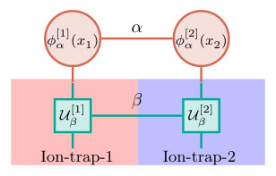 
FIG. 1: The essence of the distributed algorithm presented here which appears from a tensor net- work formalism. There is one set of parallel streams of computational tasks for each value of the pair of variables (α, β). Thus, there are [α × β × number of nuclear dimensions] parallel computing tasks, each executed here as a separate ion-trap com- putation, possible due to elevation of the entanglement variables. This yields an enormous computational ad- vantage as the number of dimensions increase. Future developments will involve a heterogeneous set of classi- cal and hardware systems all runing these parallel set of tasks.

📷 Fig 2

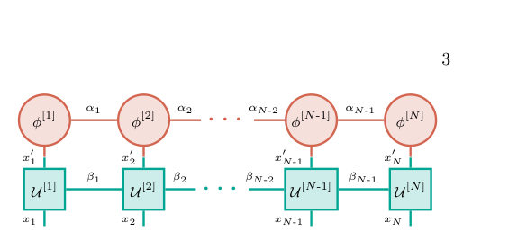 
FIG. 2: Time evolution of a wavepacket in a tensor- network representation as given by Eq. (3). The ini- tial state is parameterized by entanglement variables ¯α, while the time-evolution propagator is characterized by ¯β.

📷 Fig 3

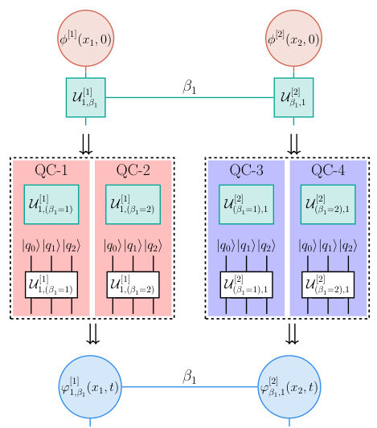 
FIG. 4: The circuit in Fig. 3 can be distributed, in principle, across four quantum computers, where each constituent sub-circuit can be executed simultaneously. In this paper, this is all done sequentially on one quan- tum computer using three qubits. The aggregation (the double vertical arrow at the bottom of the figure) is also done classically here through measurement, and the final state inherits the entanglement from the uni- tary above. As described in Section II C, such entangle- ment arises from the potential energy surface.

📷 Fig 4

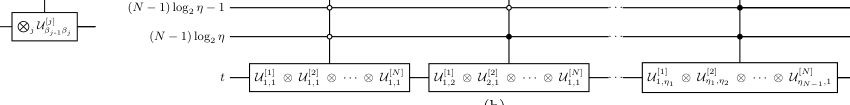 
FIG. 6: (a) Uniformly controlled gate (UCG) representation of the block-diagonal operator shown in Fig. 5.

📷 Fig 5

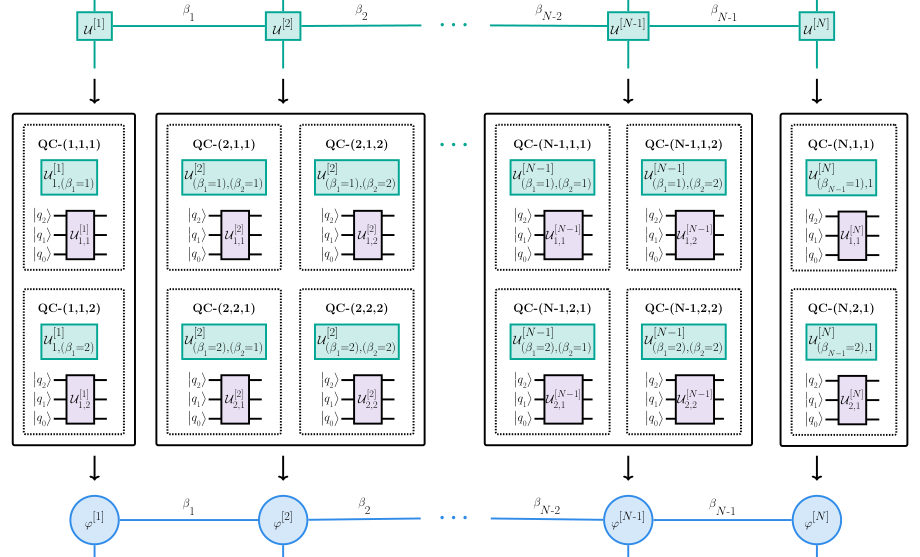 
FIG. 7: The circuit in Fig. 6 can, in principle, be distributed across several quantum computers, and this figure shows the full-scale parallel generalization of our algorithm. The ion-traps are indexed here using the dimension (first index), and the two entanglement indices following the dimension. So for example, “QC-(2,1,1)” implies the specific quantum hardware system (trapped ions in our case) that computes the second dimension for entanglement variables β1 = β2 = 1. As is clear, the number of parallel streams (dotted boxes) is equal to P

**Summary.** The paper proposes using tensor networks to decompose the challenging task of simulating quantum wavepacket dynamics into many independent, smaller computational tasks. This decomposition allows for asynchronous execution across multiple, heterogeneous quantum computers, which was experimentally tested on a trapped-ion system to calculate vibrational spectra with high accuracy.

**Why it may be interesting.** This work directly addresses the scalability bottleneck in simulating complex molecular dynamics by providing a concrete algorithmic blueprint that maps entanglement structure onto parallel hardware resources, making it highly relevant to AMO/quantum optics simulation efforts.

Detailed structure

**Main problem.** Simulating complex, high-dimensional quantum dynamics (like molecular wavepacket evolution) efficiently on near-term, heterogeneous quantum hardware.

**Main result.** The authors developed a tensor-network based formalism that decomposes global unitary evolution into independent, parallelizable sub-tasks executable across distributed quantum processors.

**Method.** The core method involves mapping the time-evolution operator onto a block-diagonal structure within an enlarged Hilbert space, allowing for decomposition into multiple, smaller, and independently controlled quantum circuits (UCGs).

**Model / system.** The simulation is demonstrated on protonated water clusters, modeling vibrational spectra. The implementation utilizes trapped-ion quantum computers with native partial-entangling XX(theta) gates.

**Key observables.** Vibrational spectral properties and energy differences ($\omega$), calculated via the Fourier power spectrum of time-correlation functions.

**Important parameters / regimes.** The fidelity improvement is quantified by reducing expected two-qubit gate infidelity by over 30% compared to conventional decompositions.

**Assumptions / limitations.** The approach assumes that for practical problems, the entanglement structure allows for a decomposition into efficiently manageable, parallelizable sub-circuits suitable for hybrid quantum/classical execution.

**Figures summary.** Figures illustrate the distributed algorithm derived from tensor networks (Fig. 1), the mapping to block-diagonal UCG circuits (Figs. 3, 6), and the overall phase estimation structure for spectroscopy (Fig. 8).

**Paper structure.** The paper progresses by first establishing the theoretical link between tensor network decomposition of the time-evolution operator ($\hat{U}$) and its representation as a block-diagonal unitary in an elevated space. This leads to a circuit implementation using UCGs, which is then generalized into a fully asynchronous, distributed quantum computing architecture suitable for calculating spectral functions via QPE.

Abstract

We present an approach based on tensor networks for distributed quantum computing simulation of chemical wavepacket dynamics in a continuous variable representation. The central idea is that the tensor-network representation of the multidimensional time-evolution operator naturally induces an elevated Hilbert space where the dynamics decomposes into a set of independent lower-dimensional propagations. This transformation converts an entangled quantum evolution into a set of parallel computational tasks that can be executed asynchronously across heterogeneous quantum and classical computing architectures. The resulting formalism establishes a direct connection between tensor-network decompositions, uniformly controlled quantum circuits, and asynchronous distributed quantum computing. The approach is developed with a goal towards hybrid quantum/classical implementation, and is appropriate for a general heterogeneous mixture of quantum hardware systems. The experimental realization of the asynchronously distributed quantum processes that arise from the tensor-network decomposition are carried out on the Sandia National Laboratories' trapped-ion quantum computer, where the circuits are compiled using native partial-entangling $XX(θ)$ gates, reducing the expected two-qubit gate infidelity by more than 30\% relative to conventional fully entangling decompositions. We demonstrate the methodology by quantum computing the vibrational spectra of a small protonated water cluster that shows critical quantum nuclear behavior. Such water cluster systems have been found to be challenging for experimental action spectroscopy and for theory, and here, for the first time, we provide results for vibrational spectroscopy that are in agreement with the respective classical results to within 4cm$^{-1}$, thus allowing for the potential for spectroscopic accuracy from quantum computations.

[↑ back to top](#top)

### [Grand-canonical phase diagram and chiral-current suppression at $π$ flux in a bosonic two-leg ladder](http://arxiv.org/abs/2606.12159v1)

**Authors:** Meng Zhang, Qingyun Xu, Zhi Lin  
**Type:** theory · **Category:** quantum gases · **PDF:** <https://arxiv.org/pdf/2606.12159v1>  
**Analysis basis:** full PDF text, analyzed in chunks
**Topic relevance:** 🔥 `analog quantum simulation` **4/5** · `methods for driven-dissipative` **3/5** · `non-equilibrium dynamics` **2/5** · `Keldysh / 2PI / non-Gaussian methods` **1/5** · `driven-dissipative phase transition` **1/5**

📷 Fig 1

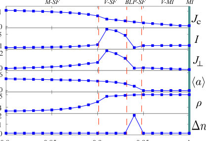 
FIG. 2. (a) Key observables Jc, J⊥, I, ⟨a⟩, ρ, and ∆n as functions of φ/π obtained from CGMF calculations at K = 10t, µ = −2.47, and t = 0.252. (b) Enlarged view of the region enclosed by the magenta dashed box in (a).

📷 Fig 2

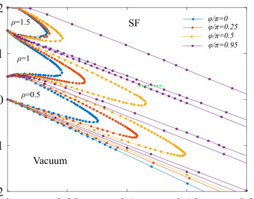 
FIG. 3. (a)The grand-canonical t–µ phase diagrams obtained from CGMF calculations at K = 10t for φ/π = 0 (blue), 0.25 (red), 0.5 (yellow), and 0.95 (purple). Data points are connected by lines as a guide to the eye. (b) Enlarged view of (a).

📷 Fig 3

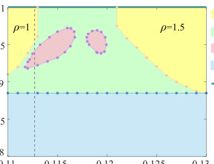 
FIG. 4. Phase diagram.(a) Key observables Jc, J⊥, I, ⟨a⟩, ρ, and ∆n as functions of φ/π in the high-filling regime, ob- tained from CGMF calculations at K = 10t, µ = 0.3, and t = 0.11275. (b) Enlarged view of the region enclosed by the magenta dashed box in (a). (c) Phase diagram of the two-leg semisynthetic flux ladder in the t–φ plane in the high-filling regime, obtained from the CGMF method for K = 10t and µ = 0.3. The gray dashed line at t = 0.11275 indicates the fixed-t cut corresponding to the parameter points of the curves in (a).

**Summary.** This paper maps the phase diagram of interacting bosons on a two-leg ladder under an artificial magnetic flux using the Cluster Gutzwiller Mean-Field method. It characterizes various superfluid and Mott insulating states based on current measurements. The key finding is that at $\phi=\pi$, symmetry forces the system into a nonchiral Mott insulator, providing crucial theoretical guidance for experiments with synthetic gauge fields.

**Why it may be interesting.** This work provides a theoretically rigorous and computationally efficient framework for mapping complex quantum phases (like those involving chirality) in synthetic gauge fields, directly relevant to ultracold atom experiments using optical lattices.

Detailed structure

**Main problem.** The study investigates the ground-state phase diagram of repulsively interacting bosons on a two-leg ladder threaded by an artificial magnetic flux, with a specific focus on the physics at the $\pi$-flux point.

**Main result.** At $\phi=\pi$, symmetry constraints enforce the vanishing of net chiral currents, leading to a nonchiral Mott-insulating state, which contrasts sharply with the expected chiral superfluidity away from this flux value.

**Method.** The authors employ the Cluster Gutzwiller Mean-Field (CGMF) method on a $2	imes4$ cluster to calculate ground-state properties and construct grand-canonical phase diagrams.

**Model / system.** The system is modeled as repulsively interacting bosons on a two-leg ladder subjected to a uniform artificial magnetic flux ($\phi$). The Hamiltonian includes tunneling terms (intra-leg $t$, inter-leg $K$) and interaction terms ($U$), alongside a chemical potential $\mu$.

**Key observables.** Superfluid order parameter, leg-resolved currents, chiral current, ratio of currents on adjacent legs, and density imbalance between the two legs.

**Important parameters / regimes.** Artificial magnetic flux ($\phi$), filling fraction ($
ho$), interaction strength ($U/t$), and chemical potential ($\mu$).

**Assumptions / limitations.** The use of the CGMF method is an approximation balancing computational efficiency with physical accuracy, and previous studies were limited to fixed-density calculations.

**Figures summary.** Figures illustrate phase boundaries (e.g., M-SF, V-SF, BLP-SF, MI) across different flux values, showing how the ground state evolves as a function of flux and density.

**Paper structure.** The paper first analyzes the system's phases using CGMF diagnostics to distinguish between various superfluid/Mott regimes. It then constructs the grand-canonical $t-\mu$ phase diagrams, culminating in a detailed analysis of the singular $\phi=\pi$ point where chiral symmetry dictates the ground state.

Abstract

We investigate the ground-state phase diagram of repulsively interacting bosons on a two-leg ladder threaded by a uniform artificial magnetic flux, using the cluster Gutzwiller mean-field method. In the strong-rung-coupling regime, self-consistent calculations are performed on a $2\times4$ cluster. By analyzing the superfluid order parameter, leg-resolved currents, chiral current, the current ratio on adjacent legs, and the density imbalance between the two legs, we distinguish Mott-insulating from superfluid regimes and characterize the observed states as Meissner-like, vortex-like (superfluid or Mott insulating), or biased-ladder. In regions overlapping with previous DMRG studies, our results qualitatively agree with the established phase structure, demonstrating that the cluster Gutzwiller approach balances computational efficiency and physical accuracy. We then construct the first grand-canonical $t$--$μ$ phase diagrams for this system, revealing how the magnetic flux modifies the shape, tilt, and extent of the Mott lobes. We further explore previously inaccessible regimes, including higher fillings $ρ\gtrsim1$ and the intermediate interaction window $U/t\in[7.69,9.09]$. Special attention is paid to $\varphi=π$, where the effective triangular-ladder mapping becomes singular. Owing to the equivalence of $\varphi=π$ and $-π$ modulo $2π$, a combined symmetry forbids net chiral currents, leading to a nonchiral Mott-insulating state, in contrast to the chiral-superfluid tendency expected away from $\varphi=π$. Our results offer a computationally efficient route for mapping the global phase structure of bosonic flux ladders and provide guidance for future ultracold-atom experiments in artificial gauge fields.

[↑ back to top](#top)

### [On-Chip Quantum Randomness Amplification](http://arxiv.org/abs/2606.12173v1)

**Authors:** Lang Li, Yutian Wu, Giulio Chiribella, Ravishankar Ramanathan  
**Type:** both · **Category:** quantum information and computing · **PDF:** <https://arxiv.org/pdf/2606.12173v1>  
**Analysis basis:** full PDF text, analyzed in chunks
**Topic relevance:** 🔥 `QC/QI experiment` **4/5** · `quantum optics experiment` **3/5** · `Keldysh / 2PI / non-Gaussian methods` **1/5** · `driven-dissipative phase transition` **1/5** · `entanglement & information structure` **1/5** · `methods for driven-dissipative` **1/5**

📷 Fig 1

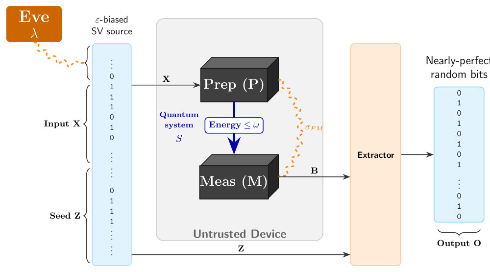 
FIG. 1: Schematic of our energy-constrained SDI randomness amplification protocol. A sequence of imperfect random bits is provided by an ε-biased Santha-Vazirani source (left). The sequence is partitioned into a subsequence X, used as input for an untrusted device, and another subsequence Z, used as a seed for a randomness extractor. The untrusted device consists of a preparation module (P), which prepares states with energy upper bounded by a given value ω, and a measurement module (M), which produces a string of classical output bits B. The preparation and measurement module, instead, are allowed to be correlated, by sharing an entangled state σP M (dashed line ), which may be correlated...

📷 Fig 2

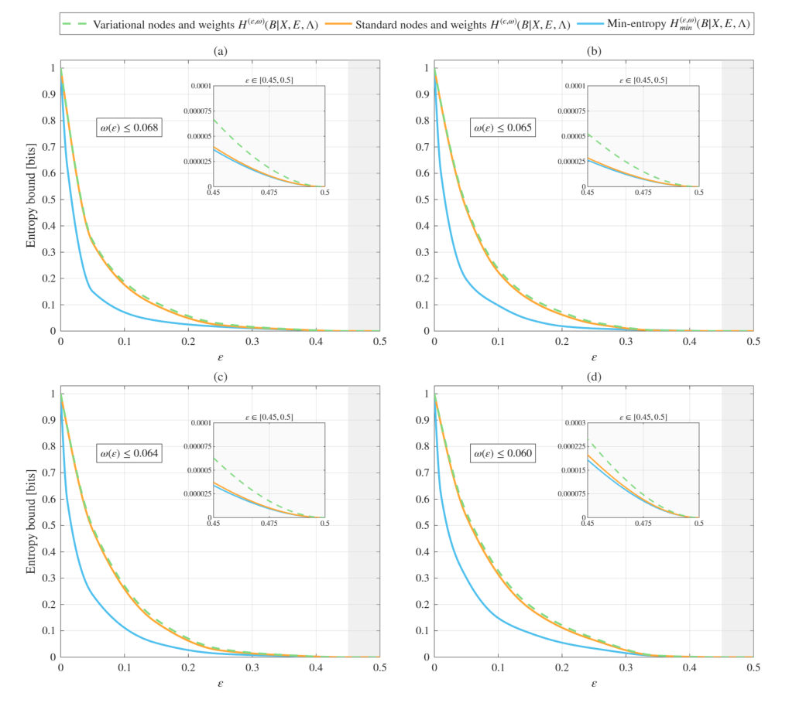 
FIG. 2: Certified randomness in the presence of classical correlations between preparation and mea- surement devices. The plots display certified single-round entropy bounds as a function of the Santha-Vazirani source bias ε ∈[0, 0.5]. The blue curve represents the standard conditional min-entropy H(ε,ω) min (B|X, E, Λ). The orange curve depicts the conditional von Neumann entropy H(ε,ω)(B|X, E, Λ) computed via standard Gauss-Radau method, while the green dashed curve shows the improved bound using our variational method. Subplots (a)–(d), with suitable choices of parameters in range: (a) ω(ε) ≤0.068, (b) ω(ε) ≤0.065, (c) ω(ε) ≤0.064, (d) ω(ε) ≤0.060, correspond to varying energy...

📷 Fig 3

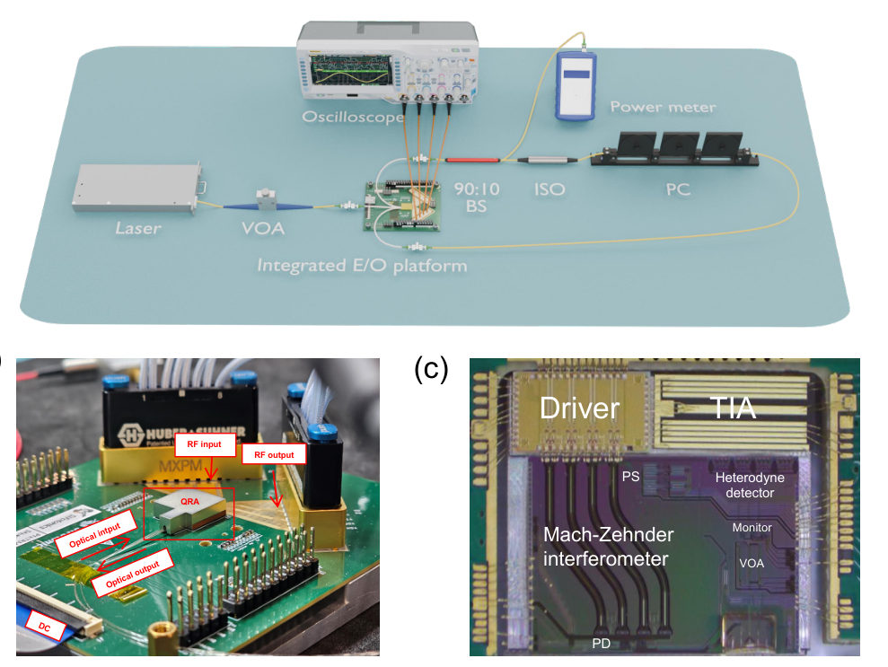 
FIG. 3: Experimental SDI randomness amplification. (a) Schematics of the setup. The light emitted by 1550 nm laser is attenuated by a variable optical attenuator (VOA). The attenuated light then enters into an integrated electronic/optical (E/O) platform, which produces the coherent states used by our protocol. The coherent states exit the E/O platform through the optical output port (upper link in the picture) and undergo a test to verify that they satify the required energy bound. They go through a 90:10 beam splitter (BS), and the smaller fraction of the light is directed to a power meter (top right), while the larger fraction eventually undergoes a heterodyne measurement. Before...

📷 Fig 4

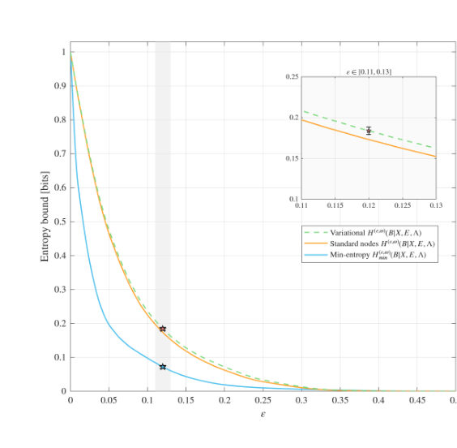 
FIG. 4: Experimentally certified entropies. The three curves show three lower bounds on the von Neu- mann entropy as a function of the SV source bias under the experimental parameters of our setup. Specifically, the bounds are obtained from our variational Gauss- Radau method (green dashed line), from the standard node Gauss-Radau method (orange solid line), and from the min-entropy baseline (blue solid line). In both panels, the insets provide a magnified view of the low-entropy re- gion ε ∈[0.11, 0.13]. The star markers show the certified values for the representative value ε = 0.12.

📷 Fig 5

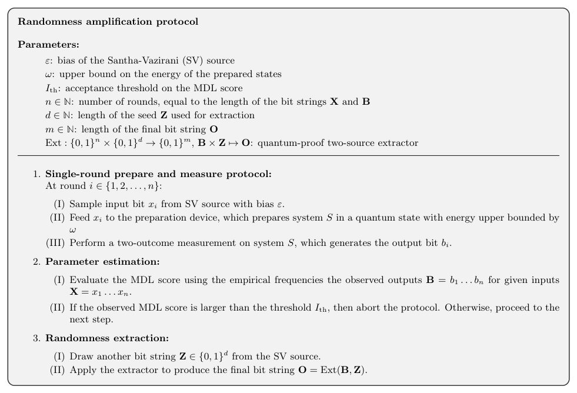 
FIG. 1: Randomness Amplification Protocol. Our protocol consists of three stages. The first stage is the generation of quantum randomness through a prepare-and-measure setup, in which the prepared states have bounded energy, close to the ground state energy. The second stage is the estimation of the MDL score from the empirical data. If the MDL score is below a given threshold, the protocol proceeds to the third and final state: extraction of randomness from the measurement outcomes B and from an additional bit string Z generated by the SV source.

**Summary.** The paper presents a breakthrough demonstration of on-chip Quantum Randomness Amplification using Semi-Device-Independent protocols. By integrating advanced variational entropy certification techniques onto a silicon photonic chip, the authors achieved a high, practical throughput rate of 20 Mbps. This work paves the way for deploying quantum cryptographic hardware in portable telecom devices.

**Why it may be interesting.** This work directly bridges fundamental quantum information theory (entropy bounding) with cutting-edge solid-state photonics engineering, providing a concrete blueprint for next-generation quantum cryptographic hardware.

Detailed structure

**Main problem.** The central problem is achieving high-rate, secure randomness amplification using Semi-Device-Independent (SDI) protocols.

**Main result.** The authors demonstrated the first on-chip implementation of SDI randomness amplification on a silicon photonic chip, achieving a practical throughput rate of 20 Mbps.

**Method.** They combine advanced theoretical techniques—specifically an upgraded variational Gauss-Radau method for entropy certification—with state-of-the-art integrated photonics hardware.

**Model / system.** The system is an integrated silicon photonic chip utilizing an electro-optical (EO) and opto-electrical (OE) platform operating at 1550 nm. It implements a protocol that extracts uniform bits from biased quantum seeds generated via an $\epsilon$-biased Santha-Vazirani source.

**Key observables.** Certified von Neumann entropy, MDL Score, throughput rate (20 Mbps), and frequency responses ($\approx 47 	ext{ GHz}$ EO, $52 	ext{ GHz}$ OE).

**Important parameters / regimes.** Bias parameter $\epsilon$ (e.g., 0.12); energy bound $\omega$; raw data length ($n=10^{11}$ bits); output security level ($\epsilon_{	ext{sec}} \le 10^{-12}$).

**Assumptions / limitations.** The protocol relies on low-energy constraints ($\omega$) and the assumption that variational methods provide tighter entropy bounds than standard Gauss-Radau techniques.

**Figures summary.** Figures illustrate experimental setups, frequency responses (EO/OE), and comparative plots showing certified entropy lower bounds derived from different theoretical methods versus the source bias $\epsilon$.

**Paper structure.** The paper progresses by first establishing the need for SDI protocols, then introducing the variational Gauss-Radau method to tighten entropy bounds, followed by detailed characterization of the integrated photonic hardware (EO/OE responses), and culminating in the demonstration of high-rate randomness generation.

Abstract

Randomness amplification, the task of extracting uniform private bits from biased seeds that may be partly known by a malicious third party, is of central importance in cryptography. The highest security in this task is provided by a class of quantum protocols known as device-independent, which however are challenging to integrate into scalable devices. Semi-device-independent (SDI) protocols are a promising alternative that guarantees security under few natural assumptions, such as bounds on the amount of energy used by the devices. Here, we provide the first demonstration of SDI randomness amplification on an integrated silicon photonic chip, achieving a throughput rate of 20 Mbps suitable for practical applications. This rate is achieved through a novel technique for SDI entropy certification, which delivers strictly tighter von Neumann entropy bounds compared to existing methods and remains valid even if the preparation and measurement devices share quantum correlations. Overall, the methods developed in this work enable the integration of SDI technology into portable telecom devices, opening up a new generation of quantum cryptographic hardware.

[↑ back to top](#top)

### [Tensor-Network Algorithm for Many-Body Trace Norms](http://arxiv.org/abs/2606.11882v1)

**Authors:** Seunghun Lee, Eun-Gook Moon  
**Type:** theory · **Category:** numerical methods · **PDF:** <https://arxiv.org/pdf/2606.11882v1>  
**Analysis basis:** full PDF text, analyzed in chunks
**Topic relevance:** 🔥 `entanglement & information structure` **4/5** · `methods for driven-dissipative` **3/5** · `analog quantum simulation` **1/5** · `correlated / nonlocal dissipation` **1/5** · `driven-dissipative phase transition` **1/5** · `non-equilibrium dynamics` **1/5**

📷 Fig 1

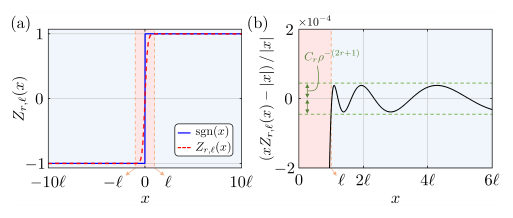 
FIG. 1. (a) The sign function sgn(x) (blue solid curve) and Zolotarev’s rational approximation Zℓ,r(x) (red dashed curve). The approximation works well on [1, −ℓ]∪[ℓ, 1] (blue- shaded region) and breaks down for |x| &lt; ℓ(red-shaded re- gion). (b) Relative error of the absolute-value approximation xZℓ,r(x), bounded by a constant Crρ−(2r+1) (green dashed line) within the blue-shaded region. The parameters used are ℓ= 10−7 and r = 20.

📷 Fig 2

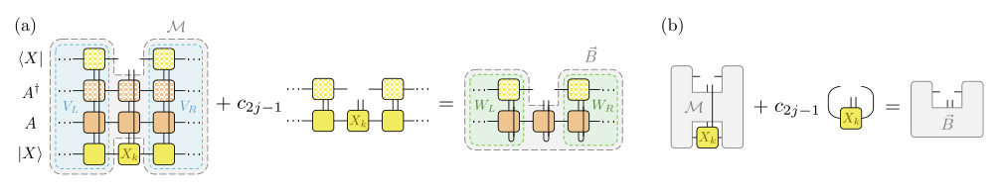 
FIG. 2. (a) Local linear system obtained by differentiating the objective function Eq. (6) with respect to complex-conjugate of the local tensor Xk of the variational MPS |X⟩. The orange and yellow boxes depict the MPO A and the variational MPS |X⟩, respectively, while the checkered patterns indicate Hermitian conjugation. The matrix M and vector ⃗B are constructed from the left and right environment tensors VL,R and WL,R, analogous to DMRG. (b) The simplified local linear system [see Eq. (7)] obtained after bringing |X⟩into the mixed canonical form.

📷 Fig 3

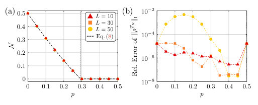 
FIG. 3. (a) Estimated half-chain entanglement negativity N of the decohered cluster state ρ of length L under the phase- flip noise. The dashed curve shows the exact value in Eq. (8). The dotted vertical line marks pc = 1 −1/ √

📷 Fig 4

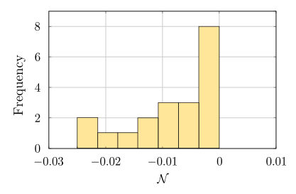 
FIG. 4. Histogram of the estimated negativity for 20 instances of random separable mixed states ρ = Pq i=1 piσi,1 ⊗σi,2 with chain length L = 20 and q ≤3. The parameters used are ℓ= 10−7, r = 20 and χ = 50.

📷 Fig 5

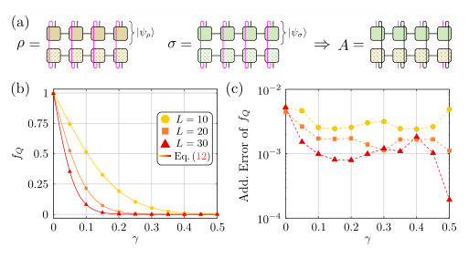 
FIG. 5. (a) Graphical illustration of the MPO representation of A = TrHp[|ψσ⟩⟨ψρ|], constructed from the MPS purifica- tions |ψρ⟩and |ψσ⟩of the mixed states ρ and σ, whose fidelity is to be estimated. Black (magenta) legs of |ψρ,σ⟩represent the physical (ancillary) Hilbert space Hp (Ha). (b) Estimated normalized quantum Fisher information fQ = FQ/L2 of the GHZ state of length L under amplitude damping noise. The solid curve shows the exact value given in Eq. (13). (c) Ad- ditive error of the estimated fQ. The parameters used are ℓ= 10−12, r = 30 and χ ≤20. For θ, we use θ = 0.05, 0.03, and 0.025 for L = 10, 20, and 30, respectively.

**Summary.** The paper presents a novel tensor-network algorithm to overcome the computational bottleneck of evaluating trace norms for many-body operators. By combining Zolotarev's rational approximation with a DMRG-like variational solver, it achieves controlled and systematically improvable estimates for key quantum information measures like entanglement negativity. This opens a practical pathway for studying mixed states in large quantum systems using tensor networks.

**Why it may be interesting.** This work provides a powerful, scalable tool for calculating non-local correlation measures (like entanglement negativity) in large quantum systems that are otherwise intractable due to the exponential scaling of required matrix operations.

Detailed structure

**Main problem.** The primary challenge is efficiently calculating trace norms of Matrix Product Operators (MPOs) for large many-body quantum systems, as exact diagonalization is computationally infeasible.

**Main result.** The authors introduce a controlled tensor-network algorithm that estimates these trace norms and related quantities with systematically improvable accuracy, surpassing the limitations of polynomial-based Lanczos methods.

**Method.** The technique combines Zolotarev's rational approximation for the sign function with a variational formulation solved using a Density-Matrix Renormalization Group (DMRG)-like algorithm to estimate $	ext{Tr}[|A|]$.

**Model / system.** The method is applied to general many-body quantum systems described by MPOs, benchmarking its utility on observables like entanglement negativity and quantum fidelity for states such as decohered cluster states.

**Key observables.** Trace norm ($\|A\|_1$), Entanglement Negativity ($N(
ho)$), Quantum Fidelity ($F(
ho, \sigma)$), and Quantum Fisher Information (QFI).

**Important parameters / regimes.** The approximation accuracy is controlled by the spectral cutoff $\ell$ and the rational approximation degree $r$. The system dynamics are governed by noise parameters like $p$ in decoherence models.

**Assumptions / limitations.** The method assumes that the required trace norm can be accurately approximated via the variational minimization problem, and it compares favorably against Lanczos methods which rely on polynomial approximations.

**Figures summary.** Figures illustrate the Zolotarev approximation of the sign function; they also show convergence studies comparing the relative error of the estimated trace norm using this method versus a standard Lanczos approach for various physical states.

**Paper structure.** The paper first introduces the computational bottleneck and proposes the core variational/rational approximation technique. It then details its application to calculate specific quantum information measures (negativity, fidelity) on benchmark systems, concluding with convergence studies comparing it against existing numerical techniques.

Abstract

Trace norms are fundamental to quantum information theory, yet in many-body systems their evaluation remains a major computational bottleneck, as it generally requires diagonalizing exponentially large operators. Here, we overcome this bottleneck by introducing a controlled tensor-network algorithm for estimating the trace norm of matrix product operators without full diagonalization. The key idea is to combine Zolotarev's rational approximation to the sign function with a variational formulation solved using a density-matrix-renormalization-group-like algorithm. The resulting approximation is systematically improvable, with its accuracy controlled by the rational approximation parameters and the spectral weight near zero. Beyond the reach of exact diagonalization, we demonstrate controlled trace-norm calculations for entanglement negativity, quantum fidelity and quantum Fisher information, achieving substantially improved accuracy over polynomial-based Lanczos approaches. Our results establish trace-norm-based quantities as practical tensor-network observables, opening a route toward tensor-network studies of quantum information in mixed states.

[↑ back to top](#top)

### [Quantum tidal locking in orbiting Bose-Einstein condensates](http://arxiv.org/abs/2606.11919v1)

**Authors:** Yaoyuan Fan, Shuoyu Shi, Lang Cao, Ziyue He, Qiuxin Zhang, Dong Hu, Yu Wang, Qing Wang, Tianwei Zhou, Xiaoji Zhou  
**Type:** both · **Category:** quantum gases · **PDF:** <https://arxiv.org/pdf/2606.11919v1>  
**Analysis basis:** full PDF text, analyzed in chunks
**Topic relevance:** 🔥 `analog quantum simulation` **4/5** · `non-equilibrium dynamics` **2/5** · `Frenkel-Kontorova` **1/5** · `correlated cavity matter` **1/5** · `driven-dissipative phase transition` **1/5** · `non-equilibrium universality` **1/5**

📷 Fig 1

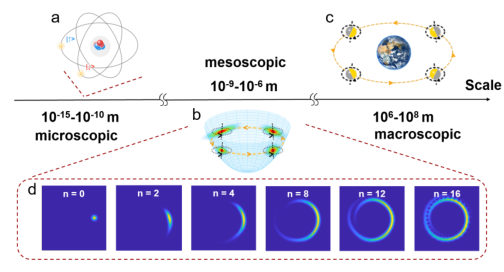 
FIG. 1. Comparative diagrams of angular momentum cou- pling mechanisms across physical scales. (a) Microscopic scale: Schematic of electron spin-orbit coupling. (b) Meso- scopic scale: Schematic of rotation-orbit coupling in BECs (quantum tidal locking). (c) Macroscopic scale: Schematic of rotation-orbit coupling in celestial bodies (tidal locking in the Earth-Moon system). (d) Numerical simulation of the atom cloud at different orbital cycles, where n denotes the number of orbital revolutions, demonstrating quantum effects distinct from classical tidal locking.

📷 Fig 2

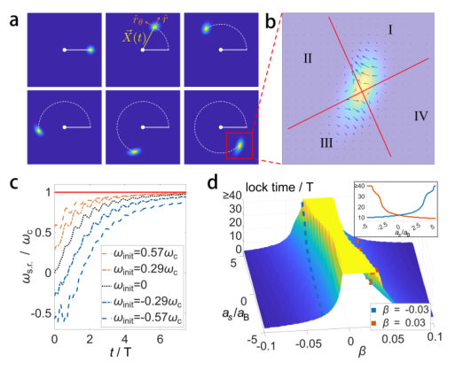 
FIG. 2. (a)–(b) Numerical simulation of the density and intrinsic flow fields distributions in orbiting BECs, where r0 = |X| = 90µm, ω0/2π = 1.25 Hz, N = 2500 atoms, β = −0.15, and g is calculated with as = 10aB (aB is the Bohr radius) in Eq. (1): (a) Density profile from the z axis during orbital motion. (b) Superposition of density and in- trinsic flow fields. (c)–(d) Numerical simulation of angular velocity locking, where r0 = |X| = 80µm, ω0/2π = 2.5 Hz, and N = 2500 atoms: (c) Temporal evolution of intrinsic an- gular velocity ωi.r. at β = −0.1 and g = 0 with different initial values, normalized to the COM angular velocity ωc. (d) The locking time [when (ωc −ωi.r.)/ωc = 1/e] under...

📷 Fig 3

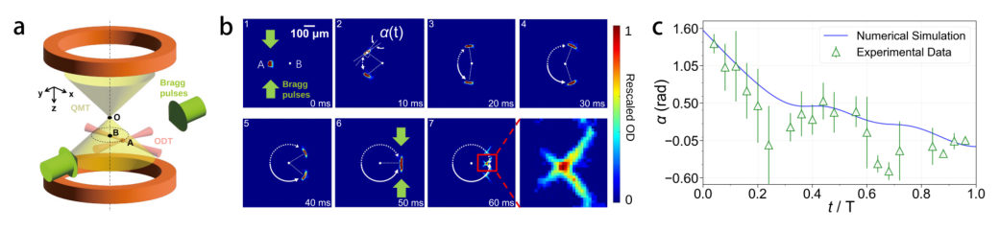 
FIG. 3. Experimental apparatus and results for quantum tidal locking. (a) Schematic of the experimental setup. (b) Top-view in situ absorption images at different evolution time. Upon excitation by a Bragg pulse at point A, the BECs split into two packets that revolve clockwise and counterclockwise, respectively, around point B in the horizontal plane. The angle between the major axis of each wave packet and the tangent direction of its orbital trajectory is denoted as α. Images were captured every 10 ms. At 50 ms (half of the orbital period), a second Bragg pulse was applied. A portion of each atomic cloud was transferred back to the zero-momentum state and subsequently moved toward point...

📷 Fig 4

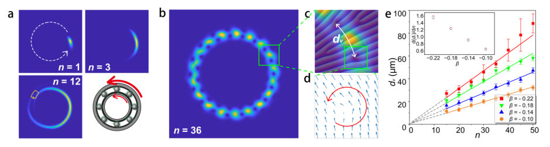 
FIG. 4. (a) Numerical simulation of the formation of a ring-shaped vortex array (r0 = |X| = 80µm, ω0/2π = 2 Hz, β = −0.14, and g = 0), where n = t/T denotes the number of orbital revolutions; and an illustrative diagram of a ball bearing, serving as a visual metaphor. The vector line integral of velocity field over the yellow loop is nonzero, resulting in the vortex arrays. (b) The ring-shaped vortex array at n = 36, where vortex are distributed in multiple layers. (c) Superimposed diagram of density distribution and phase distribution. The feature of singly quantized vortex phase distribution is observed [29, 30]. (d) Local enlargement showing velocity field. Nonzero velocity circulation...

📷 Fig 5

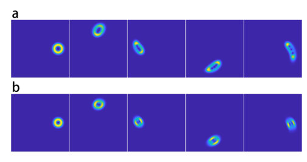 
FIG. 5. r0 = |X| = 80µm, β = −0.1, ω0/2π = 1.25 Hz, and g = 0. (a) The initial state is |l = 3, m = 3⟩. (b) The initial state is |l = 2, m = −2⟩.

**Summary.** This paper explores quantum tidal locking in Bose-Einstein condensates by analyzing the coupling between the condensate's internal rotation and its overall orbital motion. Through theoretical modeling and numerical simulations, the authors show that anharmonic potentials induce a self-organization process where intrinsic angular momentum locks to the orbital frequency. This mechanism is significant because it provides a clean platform for studying fundamental synchronization phenomena in quantum matter.

**Why it may be interesting.** This work provides a quantum mechanical analog to classical celestial mechanics (tidal locking) using ultracold atoms. It demonstrates how intrinsic non-linear interactions can drive a system into a highly ordered, synchronized state without external driving fields, which is crucial for understanding emergent collective dynamics in many-body quantum systems.

Detailed structure

**Main problem.** The study investigates quantum tidal locking, which is the synchronization between the intrinsic rotation and the orbital motion in mesoscopic quantum fluids.

**Main result.** Quantum tidal locking establishes a robust, self-organized mechanism for generating and stabilizing circulating states, leading to the formation of ring-shaped vortex arrays in Bose-Einstein condensates.

**Method.** The work combines theoretical Hamiltonian analysis (canonical transformations) with numerical simulations solving the Gross-Pitaevskii equation to model the dynamics.

**Model / system.** The system is a Bose-Einstein condensate (BEC) confined by an anharmonic potential, undergoing central force motion and exhibiting orbital angular momentum. The physics is governed by coupling terms derived from the trap's anharmonicity.

**Key observables.** Intrinsic angular momentum accumulation ($\hat{L}_{z}''$), convergence of intrinsic to orbital angular velocity ($\omega_{i,r} 	o \omega_c$), and the observable $\alpha$ used as a proxy for synchronization.

**Important parameters / regimes.** The anharmonicity parameter ($eta$) and interaction strength ($g$) significantly influence the rate and success of the locking process.

**Assumptions / limitations.** Approximations include treating the center-of-mass motion classically and discarding higher-order terms in the potential energy expansion.

**Figures summary.** Figures illustrate the comparison across scales (microscopic to macroscopic), show the convergence of angular velocities over time, and detail four stages of vortex array formation from coherent circulation to a lattice structure.

**Paper structure.** The paper progresses by establishing the theoretical framework via Hamiltonian analysis, demonstrating the squeezing process leading to locking, quantifying the synchronization dynamics through observables like $\alpha$, and finally predicting the macroscopic consequence: stable ring-shaped vortex arrays.

Abstract

Angular momentum coupling manifests widely in diverse physical systems, underpinning the emergent properties and collective dynamics across different scales. The tidal locking, which originates from the synchronization of rotational and orbital motions, has far-reaching impacts in celestial mechanics, reflecting fundamental processes of angular momentum transfer, energy dissipation, and evolution toward dynamical equilibrium. However, its counterpart in mesoscopic quantum fluids has remained largely unexplored. Here we demonstrate the emergence of quantum tidal locking in Bose-Einstein condensates undergoing central force motion in an anharmonic potential. The condensate follows a well-defined orbital trajectory in a static trap and experiences an effective rotating potential induced by the trap anharmonicity. The sustained geometric squeezing continuously deforms the condensate and drives a self-organized synchronization process, in which the intrinsic rotation gradually locks to the orbital motion. Numerical simulations further reveal the formation of a ring-shaped vortex array over longer timescales, arising from the coherent evolution of the rotating matter wave during the locking dynamics. Our findings establish quantum tidal locking in mesoscopic systems as a robust self-organized mechanism for generating and stabilizing circulating states.

[↑ back to top](#top)

### [Weakly interacting Bose gases in the canonical ensemble](http://arxiv.org/abs/2606.12208v1)

**Authors:** Jonata S. Soares, Axel Pelster, Arnaldo Gammal  
**Type:** theory · **Category:** quantum gases · **PDF:** <https://arxiv.org/pdf/2606.12208v1>  
**Analysis basis:** full PDF text, analyzed in chunks
**Topic relevance:** 🔥 `analog quantum simulation` **4/5** · `Keldysh / 2PI / non-Gaussian methods` **3/5** · `entanglement & information structure` **1/5** · `methods for driven-dissipative` **1/5** · `non-equilibrium dynamics` **1/5**

📷 Fig 1

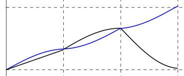 
FIG. 1. Example of two interacting cycles of length k = 3: Direct path (black) of Eq. (45) has the same initial and final interaction point, whereas exchange path (blue) of Eq. (46) has different initial and final interaction points.

📷 Fig 2

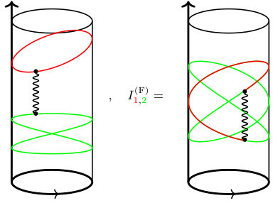 
FIG. 2. Feynman cylinder representation of the Hartree and Fock energies for three particles corresponding to Eqs. (48) and (49). The Hartree energy corresponds to two closed cycles of lengths 1 and 2, between which an interaction occurs, whereas the Fock energy represents one closed cycle of length 3, where an open cycle of length 1 interacts within another open cycle of length 2.

📷 Fig 3

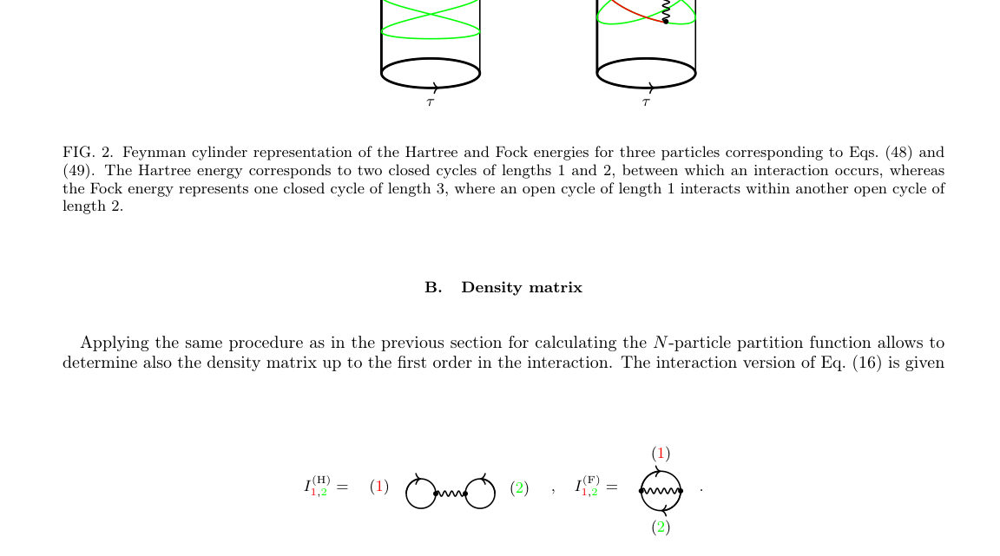 
FIG. 3. Feynman diagrams for canonical Hartree and Fock energies involving three particles. Each line corresponds to an imaginary-time propagator, where the attached number indicates the number of windings around the Feynman cylinder depicted in Fig. 2.

📷 Fig 4

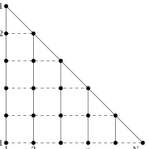 
FIG. 4. Triangle for nested summation in (n, k) plane. In Eq. (58) the left-hand side corresponds to adding points following each vertical line and later summing all vertical lines, whereas the sum at right-hand side adds all points along each horizontal line and later sums over all the horizontal lines.

📷 Fig 5

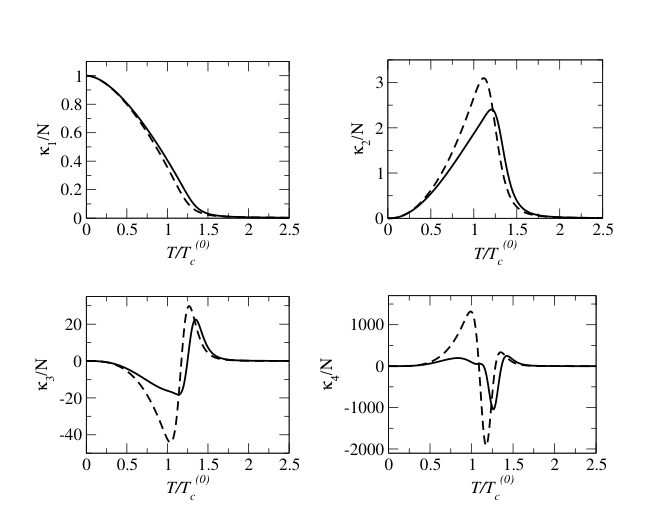 
FIG. 5. First four cumulants from Eqs. (75)–(78) for 500 particles as function of dimensionless temperature T/T (0) c with the grand-canonical critical temperature T (0) c = (2πℏ2/MkB)[N/L3ζ(3/2)]2/3. Dashed lines are for the non-interacting case, i.e. an1/3 = 0, and solid lines for the weakly interacting case an1/3 = 0.1 [44].

**Summary.** This paper develops a perturbative quantum field theory approach to calculate the thermodynamic and statistical properties of weakly interacting Bose gases within the canonical ensemble. By deriving resummed recursion formulas for the partition function, it accurately predicts observables like condensate occupancy cumulants and critical temperature shifts, particularly useful for understanding finite-size effects in trapped atomic systems.

**Why it may be interesting.** This work provides a rigorous theoretical framework for calculating finite-size effects and interaction corrections (beyond mean-field) in Bose gases using the canonical ensemble, which is crucial for interpreting modern trapped-atom experiments.

Detailed structure

**Main problem.** To study how thermodynamic and statistical properties of weakly interacting Bose gases change perturbatively with respect to weak two-particle interactions in the canonical ensemble.

**Main result.** The authors derive resummed recursion formulas for the canonical partition function and calculate the cumulants of ground-state occupancy, providing quantitative predictions for finite systems.

**Method.** The calculation employs path integrals and perturbation theory, developing a recursive approach to handle the interacting partition function in the canonical ensemble.

**Model / system.** The system is a weakly interacting Bose gas confined in a box trap geometry, analyzed using Dirichlet boundary conditions relevant for current atomic gas experiments. Interactions are treated perturbatively via contact potentials.

**Key observables.** Canonical partition function ($Z_N(eta)$), one-particle density matrix ($
ho^{(0)}_N$), ground-state occupancy probability distribution $p^{(0)}_q(k|N, eta)$, and cumulants ($\kappa_1$ to $\kappa_4$).

**Important parameters / regimes.** Weak interaction strength (perturbation order), temperature ($T$) relative to critical temperatures ($T_c$), and particle number ($N$).

**Assumptions / limitations.** The analysis is restricted to first-order perturbation theory in the weak interaction potential, which leads to known limitations compared to non-perturbative results like Bogoliubov theory at zero temperature.

**Figures summary.** Figures illustrate Feynman diagrams for Hartree and Fock energies, show plots of the first four cumulants ($\kappa_1$ to $\kappa_4$) versus $T/T_c^{(0)}$ comparing ideal vs. interacting cases, and plot the critical temperature shift ($\Delta T_c/T_c$) derived from heat capacity and fluctuation measurements.

**Paper structure.** The paper builds from deriving non-interacting results via cycle decomposition to establishing recursive relations for $Z_N(eta)$. It then calculates first-order corrections involving Hartree and Fock terms, culminating in the resummation of these formulas to determine cumulants and thermodynamic properties like heat capacity.

Abstract

Based on the canonical description of a non-interacting Bose gas, we work out how both thermodynamic and statistical properties change perturbatively with respect to weak two-particle interactions. Up to first order, we obtain a recursion formula for the canonical partition function, which consists of the same Feynman diagrams as the grand-canonical description but with different Feynman rules. Resumming this recursion formula for the canonical partition function allows one to characterize the statistics of the ground-state occupancy by its respective cumulants. We demonstrate the applicability of this approach by analyzing a dilute Bose gas with contact interaction in a box trap. To this end, we used Dirichlet boundary conditions in view of their relevance for current experiments with atomic gases, where the box trap is implemented, for instance, with digital mirror devices.

[↑ back to top](#top)

### [Single Photon Cross-Phase Shifts Can Be Enhanced by Localization in both Frequency and Time](http://arxiv.org/abs/2606.11516v1)

**Authors:** Xinyu Jiao, Vida-Michelle Nixon, Kyle Thompson, Aephraim Steinberg  
**Type:** both · **Category:** other · **PDF:** <https://arxiv.org/pdf/2606.11516v1>  
**Analysis basis:** full PDF text, analyzed in chunks
**Topic relevance:** 🔥 `quantum measurements` **4/5** · `quantum optics experiment` **3/5** · `analog quantum simulation` **1/5** · `measurement-induced transitions` **1/5**

📷 Fig 1

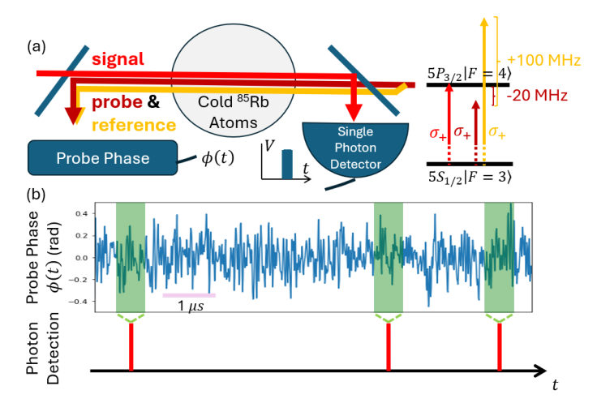 
FIG. 1. a) Experimental Schematic Photons in the continuous-wave resonant signal produce cross-phase shifts (XPS) on the probe in the cloud of atoms. The probe phase is measured by interfering the probe with the reference and measuring the phase of the beat note. b) Data Analysis Procedure Probe phase measurements (top) are windowed around the signal photon detections (bottom) and averaged. The probe phase measurements shown are actual sample data. (The duration of the windows is not to scale.)

📷 Fig 2

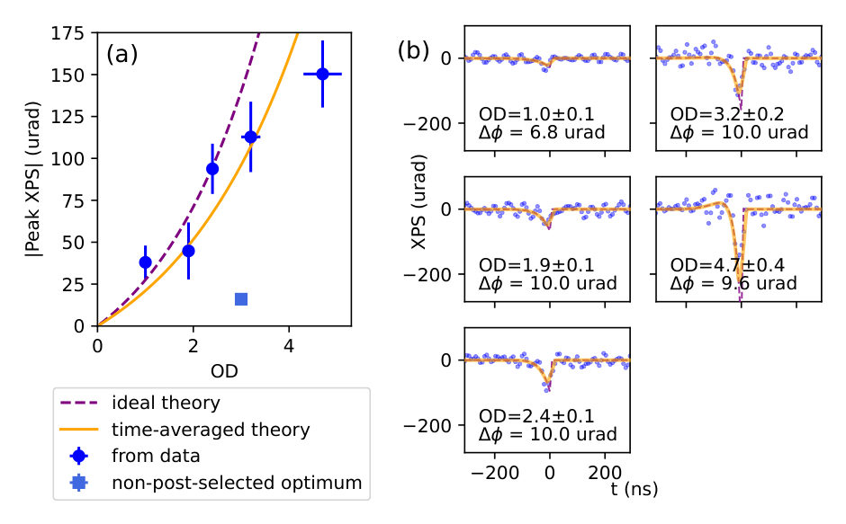 
FIG. 2. (a) Magnitude of the peak value of the measured XPS on the probe from the single photon. The OD values are those labeled in Fig. (b), which are OD values measured via the probe frequency scan. The theory is plotted assuming the signal OD is the same as the probe OD. In (a), the non-post-selected optimum is the optimum in Fig. 3. (b) XPSs due to the single photon observed across different ODs. In (b), ∆ϕ is the phase measurement uncertainty after averaging. The theory predictions for atomic excitation are scaled by a factor of 47 urad / atomic excitation to fit the experimental observations. The ideal theory (purple dashed) convolved with a rectangle with a 28 ns duration gives the...

📷 Fig 3

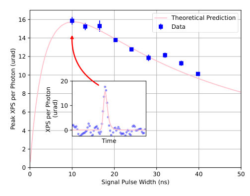 
FIG. 3. (Blue square) Peak XPS per photon vs pulse inten- sity rms for a pulsed input taken at OD = 2.9±0.1. (Pink solid line) Theoretical prediction for atomic excitation are converted using 47 urad / atomic excitation, which is the same as used for the post-selected data. Inset: example of XPS per photon at pulse width = 10 ns.

📷 Fig 4

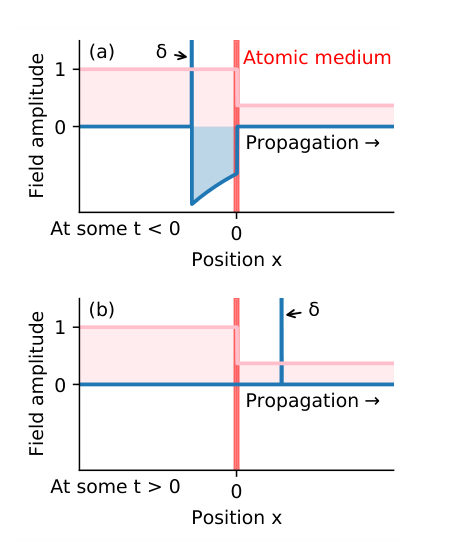 
FIG. 4. Illustrations of the forward evolving state (pink) and the backward evolving state (blue) for times (a) before the retrodicted wavepacket entered the atomic medium and (b) after the wavepacket exited and is to be detected. The wavepacket of the backward-evolving state exits at t = 0. The atomic medium (red) is infinitely thin and is positioned at x = 0.

📷 Fig 5

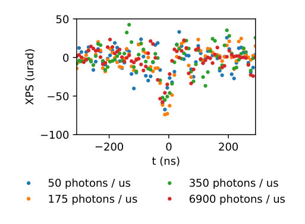 
FIG. 5. Data taken at OD = 2.5±0.2 for different signal beam powers. The input powers of the signal beam are expressed in terms of photon rates, given in the legend.

**Summary.** The research experimentally shows that single-photon optical nonlinearity can overcome the spectral/temporal trade-off by employing post-selection techniques on photons interacting with an atomic cloud. By conditioning measurements on photon detection, they achieve significant enhancements in the Cross-Phase Shift (XPS), confirming predictions from weak value theory and raising foundational questions about quantum measurement.

**Why it may be interesting.** This work directly addresses fundamental limitations in quantum nonlinear optics by leveraging measurement back-action (post-selection) to achieve effects that are classically forbidden or limited by uncertainty relations. It bridges advanced concepts from weak measurement theory into a tangible experimental platform.

Detailed structure

**Main problem.** The fundamental trade-off limiting single-photon optical nonlinearities—requiring both spectral resonance (narrow bandwidth) and high peak intensity (short duration)—is circumvented using post-selection.

**Main result.** The experiment demonstrates a significant enhancement ($\ge 6\pm1$) in the measured Cross-Phase Shift (XPS) when utilizing post-selection, confirming theoretical predictions related to weak value theory.

**Method.** The study combines experimental measurement of XPS using single photons passing through an atomic cloud with theoretical derivations involving time-dependent weak values for atomic excitation.

**Model / system.** The physical system is a cold atomic cloud (e.g., Rb atoms) used as the nonlinear medium, where the interaction between a resonant signal photon and the probe beam induces a measurable phase shift (XPS).

**Key observables.** Peak Cross-Phase Shift ($	ext{XPS}$), which measures the induced phase shift on the probe beam.

**Important parameters / regimes.** Optical Depth ($	ext{OD}$); the enhancement factor is measured at $	ext{OD} = 2.4\pm0.1$.

**Assumptions / limitations.** The analysis relies heavily on post-selection, which allows for simultaneous knowledge of frequency (preparation) and time (post-selection), violating standard uncertainty constraints.

**Figures summary.** Figures illustrate the measured peak XPS dependence on OD, comparing experimental data against theoretical predictions derived from weak value theory. Schematics detail the setup involving resonant signal beams and phase measurement techniques.

**Paper structure.** The paper establishes the nonlinearity trade-off, presents the experimental methodology using post-selection in cold atoms to measure enhanced XPS, compares these results quantitatively with established weak value theories, and discusses the foundational implications of non-commuting preparation/post-selection measurements.

Abstract

Single-photon optical nonlinearities face a fundamental trade-off: maximum nonlinearity requires both spectral resonance (narrow bandwidth) and high peak intensity (short duration), constraints that are incompatible due to the time-energy uncertainty relation. We demonstrate experimentally that this limitation does not need to exist in cases involving post-selection. We measure a cross-phase shift (XPS) produced by a resonant photon from a narrow-band source that is first transmitted through a cold atomic cloud and then localized in time through detection. The peak size of this XPS is greatly enhanced compared to that of Gaussian single-photon-level pulses without post-selection, benefiting from the narrow bandwidth of the resonant prepared state and the high intensity of the post-selected state simultaneously. We measure enhancements in the peak XPS of 6$\pm$1 at an optical depth (OD) of 2.4$\pm$0.1, and our results are in qualitative agreement across a range of optical depths with the recently developed weak value theory of atomic excitation [Thompson et al., APL Quantum 2, 036108 (2025)] for such post-selected photons. This work uncovers new consequences of having simultaneous knowledge of frequency and time, raising new foundational questions about how a particle behaves, and interacts with other systems, when its preparation and post-selection are non-commuting.

[↑ back to top](#top)

### [Shadow Engineering of Quantum Processes](http://arxiv.org/abs/2606.12035v1)

**Authors:** Tian-Ci Tian, De-Tao Jiang, Wei-Ming Zhu, Wei-You Liao, Hong-Wei Li, He-Liang Huang  
**Type:** both · **Category:** quantum information and computing · **PDF:** <https://arxiv.org/pdf/2606.12035v1>  
**Analysis basis:** full PDF text, analyzed in chunks
**Topic relevance:** 🔥 `QC/QI experiment` **4/5** · `correlated / nonlocal dissipation` **1/5** · `driven-dissipative phase transition` **1/5** · `methods for driven-dissipative` **1/5** · `non-equilibrium dynamics` **1/5**

📷 Fig 1

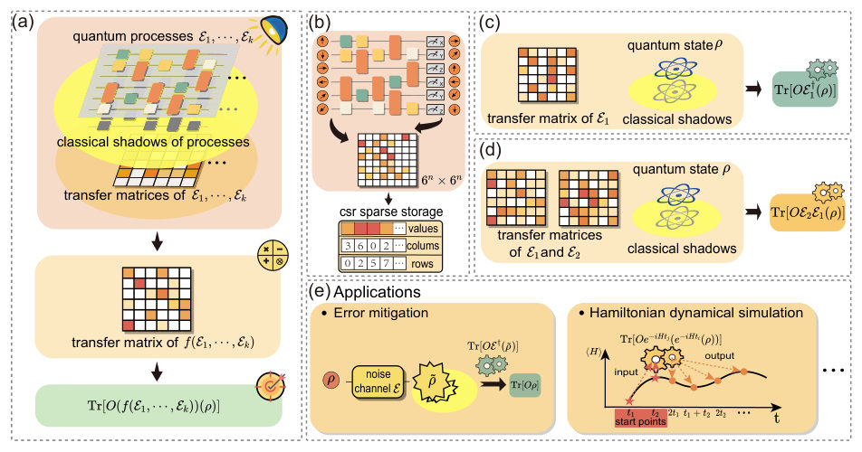 
FIG. 1. Shadow engineering: framework, key cases, and applications. (a) The framework proceeds in three steps: (1) Obtain classical shadows of single-step channels E1, . . . , Ek and convert them into sparse transfer matrices; (2) Combine these matrices to construct the transfer matrix of the composite process f(E1, . . . , Ek); (3) Estimate Tr[O(f(E1, · · · , Ek))(ρ)] via the obtained composite transfer matrix. (b) Sparse transfer-matrix encoding: First, evolve random product states under under E and perform randomized Pauli measurements on the outputs [7, 12]. Then, map input-outcome index pairs to matrix entries, building a row-normalized 6n×6n sparse matrix (stored in compressed sparse...

📷 Fig 2

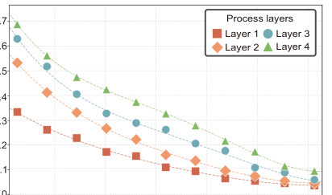 
FIG. 3. Adjoint channel estimation and its application to er- ror mitigation using shadow engineering on a quantum proces- sor. (a) The 6-qubit noisy process EM is implemented with cir- cuit layers ranging from 1 to 4 (see SM for circuit details); deeper layers introduce stronger noise. Shadow engineering (predicting Tr[OE† M(ρ)]) achieves root-mean-square error (RMSE) comparable to the method of Ref. [25] (predicting Tr[OEM(ρ)]), with both meth- ods showing a slight increase in error as the layer depth grows. (b) Error-mitigation performance, quantified by the reduction ratio r = |h(ρnoisy, O) −Tr[Oρ]|/|Tr[Oρnoisy] −Tr[Oρ]|. For each layer (i.e., each EM), r decreases as more classical...

📷 Fig 3

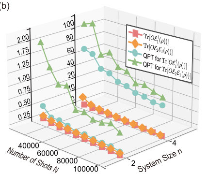 
FIG. 2. Prediction performance of shadow engineering for esti- mating Tr[OE† 1(ρ)] and Tr[OE2E1(ρ)]. (a) Using 104-105 classical shadows for 2-8 qubits, the RMSE for predicting Tr[OE† 1(ρ)] with shadow engineering is comparable to that of predicting Tr[OE1(ρ)] using the method in Ref.[25]. (b) For 2-4 qubits with 104-105 clas- sical shadows, shadow engineering significantly outperforms QPT in predicting Tr[OE† 1(ρ)] and Tr[OE2E1(ρ)].

📷 Fig 4

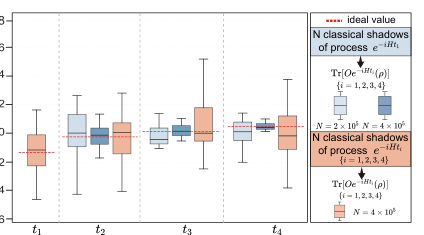 
FIG. 4. Hamiltonian dynamical simulation using shadow engineering on a quantum processor. (a) Predicting Tr[OEH(tK)(ρ)] ≈ Tr[Oe−iHtK(ρ)] for tK = K × t1 (K = 1, · · · , 4) with a 4-qubit Haar random initial state. Shadow engineering predictions (blue boxplots), extrapolated from classical shadows acquired at t1, are compared with the method of Ref. [25] (orange boxplots), which uses classical shadows directly acquired at each time point tK. Both methods achieve comparable accuracy relative to the ideal evolution (red dashed line), with shadow engineering showing steady improvement with increasing sample size. Only one boxplot is shown at t1 since the two methods are equivalent there. (b)...

**Summary.** The paper introduces 'shadow engineering,' a novel technique to characterize complex quantum processes by encoding individual channel information into sparse transfer matrices. This allows researchers to predict properties of composite operations (like sequential gates or time evolution) with polynomial resource scaling, significantly outperforming traditional methods like QPT on real superconducting hardware.

**Why it may be interesting.** This work provides a powerful, resource-efficient tool that bypasses the exponential scaling bottleneck of full process tomography, making complex quantum characterization feasible for near-term noisy hardware.

Detailed structure

**Main problem.** The core problem is efficiently characterizing complex, composite quantum processes $f(\mathcal{E}_1, \dots, \mathcal{E}_k)$ for hardware benchmarking, avoiding the exponential resource scaling of Quantum Process Tomography (QPT).

**Main result.** Shadow engineering provides a scalable framework to predict properties of these composite processes using only classical shadows from individual channels, achieving polynomial sample complexity.

**Method.** The authors encode single-channel process information into sparse transfer matrices ($\hat{T}_E$) and then use algebraic manipulation (e.g., matrix multiplication for concatenation) to construct the transfer matrix for the composite process $\hat{T}_f$.

**Model / system.** The framework is tested on a superconducting quantum processor, characterizing noise channels ($\mathcal{E}_M$) and simulating Hamiltonian dynamics (TFIM model). The theory applies to general CPTP maps acting on $n$-qubit states.

**Key observables.** Expected values of observables $	ext{Tr}[O \cdot f(\mathcal{E}_1, \dots, \mathcal{E}_k)(
ho)]$, error mitigation ratios ($r$), and magnetization/correlation functions in dynamics simulations.

**Important parameters / regimes.** Qubit count ($n$), truncation parameter ($\kappa$), sample sizes ($N_1, N_2$), and physical parameters like gate errors and coherence times.

**Assumptions / limitations.** The method assumes that the composite process structure $f$ allows for an algebraic relationship between the constituent transfer matrices. It also relies on truncating observables to low-weight Pauli operators ($\kappa$-truncation) to manage complexity.

**Figures summary.** Figures illustrate the three-step framework (shadow $	o$ matrix $	o$ prediction), benchmarking against prior art, and applying the method to error mitigation and Hamiltonian dynamics simulations on superconducting hardware.

**Paper structure.** The paper builds from theory by defining the shadow engineering framework using transfer matrices for single processes. It then extends this algebraically to predict composite operations (adjoints, concatenations) and finally validates its use in practical applications like error mitigation and time-evolution simulation.

Abstract

Characterizing quantum processes is essential for hardware benchmarking, error diagnosis, and algorithm verification. While recent work [PRX QUANTUM \textbf{4}, 040337 (2023)] extended classical shadows from quantum state to quantum process, enabling efficient single-channel $\mathcal{E}$ property prediction, its applicability to composite processes $f(\mathcal{E}_1, \mathcal{E}_2,\cdots, \mathcal{E}_k)$ remains unexplored. We introduce shadow engineering, a framework encoding the classical shadows of processes into sparse transfer matrices to predict $f(\mathcal{E}_1, \mathcal{E}_2,\cdots, \mathcal{E}_k)$ properties with proven polynomial sample complexity, matching single-channel efficiency while exponentially lower than quantum process tomography. Crucially, this approach repurposes existing $\mathcal{E}_m$-shadow data without physical execution of $f(\mathcal{E}_1, \mathcal{E}_2,\cdots, \mathcal{E}_k)$, enabling flexible quantum process characterization with minimal hardware overhead. We demonstrate the framework's effectiveness and practicality on a superconducting quantum processor for typical applications such as error mitigation and Hamiltonian dynamical simulation. This framework unlocks new capabilities for predicting complex quantum behaviors without physical re-execution, with immediate applications in near-term device calibration and quantum simulation.

[↑ back to top](#top)

### [Clifford disentanglers for entanglement reduction in molecular electronic structure simulations](http://arxiv.org/abs/2606.12056v1)

**Authors:** Longfei Chang, Zibo Wu, Yunzhi Li, Haiqi Liu, Jiajun Ren, Mingpu Qin, Zhendong Li, Wei-Hai Fang  
**Type:** theory · **Category:** numerical methods · **PDF:** <https://arxiv.org/pdf/2606.12056v1>  
**Analysis basis:** full PDF text, analyzed in chunks
**Topic relevance:** 🔥 `entanglement & information structure` **4/5** · `methods for driven-dissipative` **3/5**

📷 Fig 1

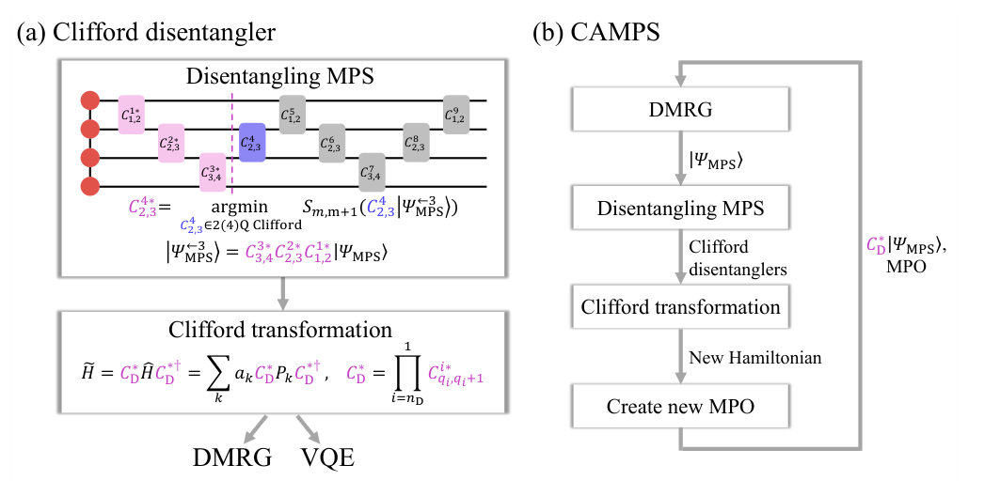 
Figure 1: Schematic illustration of the determination of Clifford disentanglers from an MPS and the applications in DMRG and VQE. (a) Local 2Q or 4Q Clifford gates are applied sequentially to an MPS to reduce entanglement. For each bond, representatives of the relevant equivalent classes are tested to minimize the bipartite entropy Sm,m+1. The sweeping process is repeated until the entropy converges, yielding the optimized disentangler C∗ D within this local search protocol. The transformed Hamiltonian can be used in subsequent DMRG and VQE. (b) In CAMPS, DMRG first produces an MPS |ΨMPS⟩; then C∗ D is determined from the obtained MPS and the disentan- gled MPS C∗ D|ΨMPS⟩is truncated to the...

📷 Fig 2

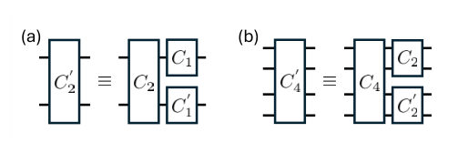 
Figure 2: Schematics of 2Q and 4Q Clifford op- erators in the same equivalence class. (a) Two 2Q Clifford operators C2 and C′ 2 belong to the same class if they differ only by arbitrary 1Q Clifford operators C1 and C′ 1 acting on the two qubits. (b) Two 4Q Clifford operators C4 and C′ 4 belong to the same class if they differ only by arbitrary 2Q Clifford operators C2 and C′ 2 acting on qubits (1, 2) and (3, 4), respectively.

📷 Fig 3

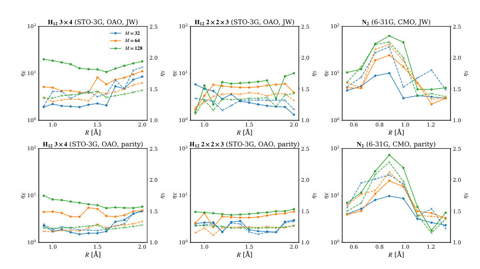 
Figure 3: Bond-length dependence of the relative energy error ratio ηE (solid lines) between DMRG and CAMPS and the ratio of the maximum entanglement entropies ηS (dashed lines) for the MPS obtained from conventional DMRG and after Clifford disentangling step. Upper: JW mapping, Lower: parity mapping.

📷 Fig 4

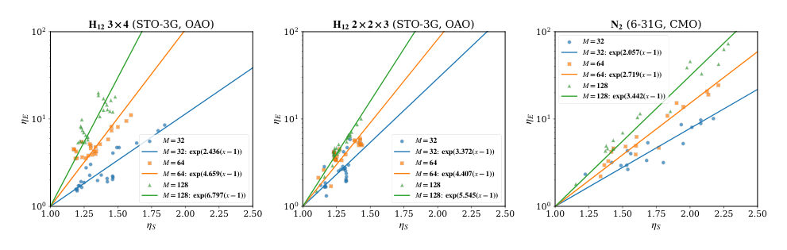 
Figure 4: Correlation between the relative energy error ratio ηE obtained from DMRG and CAMPS and the ratio of the maximum entanglement entropies ηS for the MPS before and after Clifford disentangling step. Data for both JW and parity mappings in Figure 3 are used and fitted using ηE = exp[k(ηS −1)].

📷 Fig 5

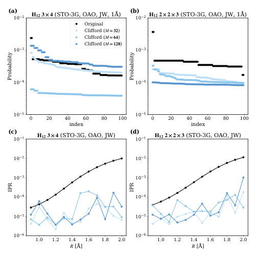 
Figure 5: Spreadness of the ground-state wave- function for the original Hamiltonian and the Clifford-transformed Hamiltonian. (a,b) Prob- ability distributions of the exact ground-state wavefunction for the H12 system in the STO- 3G basis (OAO, Jordan–Wigner mapping, bond length 1 ˚A). Panels (a) and (b) correspond to the 3 × 4 and 2 × 2 × 3 geometries, respec- tively. The probabilities of the 100 most signif- icant configurations are plotted, with the Clif- ford disentanglers obtained from DMRG calcu- lations using three values of M (32, 64, and 128) for comparison. (c,d) Inverse participation ra- tio (IPR) of the exact ground state as a function of the bond length for the 3 × 4 and 2 × 2...

**Summary.** The paper introduces Clifford disentanglers as a structured method to reduce entanglement in simulating molecular electronic structures using tensor networks. By applying these transformations, the authors significantly improve energy accuracy and robustness of methods like DMRG and VQE at fixed computational resources. This establishes them as a valuable 'entanglement-engineering' tool for quantum chemistry simulations.

**Why it may be interesting.** This work provides concrete algorithmic tools to manage entanglement structure within tensor network simulations of quantum chemistry, directly impacting how efficiently we can simulate complex molecular interactions on classical or near-term quantum hardware.

Detailed structure

**Main problem.** Entanglement is a major bottleneck limiting the efficiency of tensor-network and quantum simulations for molecular electronic structures.

**Main result.** Clifford disentanglers are established as a useful, structure-preserving tool that reduces entanglement and improves energy accuracy in both DMRG (CAMPS) and VQE calculations at fixed bond dimensions.

**Method.** The authors systematically assess Clifford disentanglers by classifying them based on their action on the Schmidt spectrum to reduce search space. These transformations are applied within an iterative Matrix Product State framework to preprocess Hamiltonians.

**Model / system.** The study focuses on molecular electronic structure problems, using fermionic Hamiltonians mapped onto qubit representations (e.g., Jordan-Wigner mapping). Simulations involve systems like H12 and N2.

**Key observables.** Bipartite entanglement entropy ($S_{1/2}(
ho_A)$), relative energy error ratio ($\eta_E$), Inverse Participation Ratio (IPR), and sensitivity to orbital ordering ($\sigma_X$).

**Important parameters / regimes.** Bond dimension ($M$), basis set size, and the specific choice of Clifford gates (2Q vs 4Q).

**Assumptions / limitations.** The approach assumes that entanglement reduction via structured Clifford transformations can significantly improve simulation accuracy without fundamentally altering the physics captured by the fixed bond dimension.

**Figures summary.** Figures illustrate the schematic process of disentangler application in DMRG/VQE workflows, show the linear correlation between energy error improvement and entropy reduction, and compare energy errors across different molecular systems and mappings.

**Paper structure.** The paper introduces the problem (entanglement bottleneck), proposes Clifford disentanglers as a solution, details the systematic search methodology using equivalence classes, validates the method by showing improved results in DMRG/VQE for various molecules, and discusses limitations regarding basis set size dependence.

Abstract

Entanglement is a key bottleneck limiting the efficiency of tensor-network and quantum simulations of molecular electronic structures. Here, we systematically assess and extend Clifford disentanglers as a structure-preserving approach to entanglement reduction: they can modify the entanglement structure of qubit wavefunctions while retaining the Pauli-string form of qubit Hamiltonians. To enable a practical search over Clifford transformations, we classify Clifford operators by their action on the Schmidt spectrum across a bipartition, reducing the two- and four-qubit search spaces to 20 and 91392 representatives, respectively. Embedded in an iterative Clifford-augmented matrix product state framework, these transformations reduce the energy errors at fixed bond dimension for the molecular test cases studied and mitigate the dependence on orbital orderings and fermion-to-qubit mappings. We further show that Clifford disentanglers can also benefit quantum simulations such as the shallow-circuit variational quantum eigensolver calculations. Together, these results establish Clifford disentanglers as a useful structure-preserving entanglement-engineering tool for tensor-network and quantum simulations of molecular electronic structure, while also clarifying their correlation dependence and motivating future developments.

[↑ back to top](#top)

### [Logical error estimation from syndrome data of surface-code experiments](http://arxiv.org/abs/2606.11496v1)

**Authors:** Evangelia Takou, Cesar Benito, Arian Vezvaee, Daniel A. Lidar, Kenneth R. Brown  
**Type:** both · **Category:** quantum information and computing · **PDF:** <https://arxiv.org/pdf/2606.11496v1>  
**Analysis basis:** full PDF text, analyzed in chunks
**Topic relevance:** 🔥 `QC/QI experiment` **4/5** · `correlated / nonlocal dissipation` **1/5** · `methods for driven-dissipative` **1/5** · `quantum measurements` **1/5**

📷 Fig 1

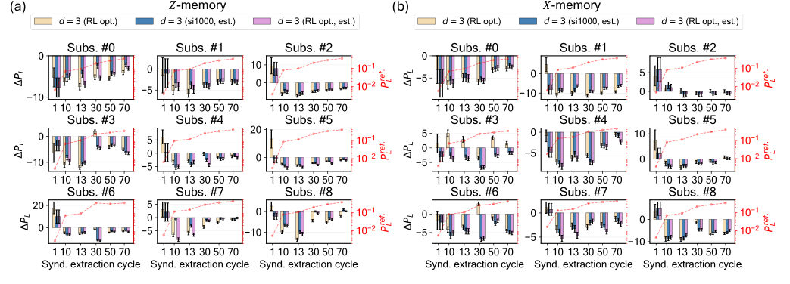 
FIG. 1. Logical error probability comparison for the d = 3 surface-code memory experiments on Google Willow. (a) Fractional percent change in LEP for Z-memory experiments versus syndrome (synd.) extraction cycle. Each panel corresponds to a different subsystem (subs.) of the device. (b) Same as in (a) for X-memory experiments. All bars are plotted using ∆PL(A|B) [Eq. (1)], with the SI1000 DEM used as the reference. The yellow bars show ∆PL(RL|SI1000), where RL denotes the reinforcement-learning optimized model (RL opt.). The blue bars show ∆PL(estSI1000|SI1000), where estSI1000 denotes the DEM whose rates are estimated from syndrome data using the SI1000 detector-logical support and the...

📷 Fig 2

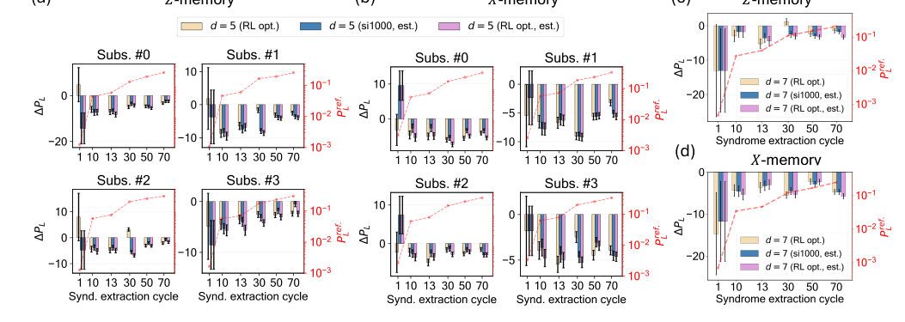 
FIG. 2. Logical error probability comparison for the d = 5 and d = 7 surface-code memory experiments on Google Willow. Panels (a),(b) show the fractional percent change in LEP for the d = 5 Z- and X-memory experiments, respectively, versus syndrome-extraction cycle; each subpanel corresponds to a different subsystem. Panels (c),(d) show the corresponding d = 7 Z- and X-memory results. As in Fig. 1, all bars are plotted using ∆PL(A|B) [Eq. (1)] with B = SI1000. The yellow, blue, and pink bars show ∆PL(RL|SI1000), ∆PL(estSI1000|SI1000), and ∆PL(estRL|SI1000), respectively, with the same definitions as in Fig. 1. Error bars and the red dashed curve are also as in Fig. 1.

📷 Fig 3

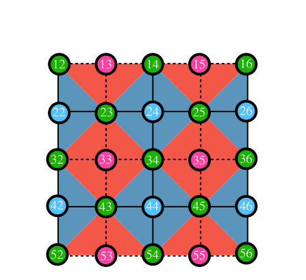 
FIG. 3. The unrotated d = 3 surface code on ibm miami is ar- ranged on a 5 × 5 grid, with the upper-left qubit identified as qubit 12 on the ibm miami device. Data qubits (green circles) lie along the edges of the square lattice (black lines). Pla- quette regions (blue) define Z-type stabilizers, while vertex regions (red) define X-type stabilizers. These stabilizers are measured simultaneously by transferring syndrome informa- tion to bare ancilla qubits (red and blue circles) via the dashed and solid syndrome–data couplings. In contrast, Ref. [1] im- plemented the rotated form of the ZXXZ surface code [27] on the Willow chip.

📷 Fig 4

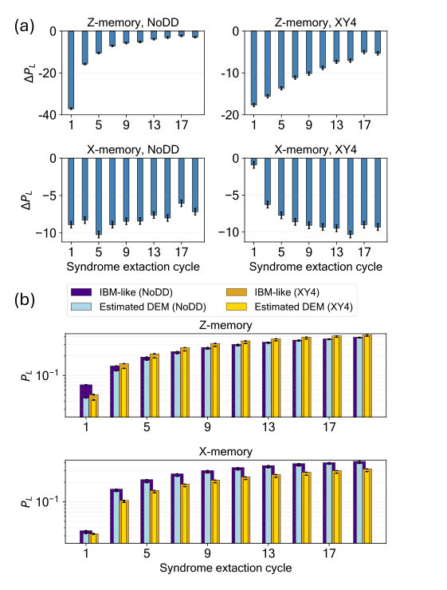 
FIG. 4. Logical performance on ibm miami for the d = 3 un- rotated surface code. (a) Fractional percent change in LEP, ∆PL = (P estIBM L −P IBM-like L )/P IBM-like L × 100%, versus syn- drome extraction cycle. Each panel shows either Z- or X- memory, without DD or with XY4. Negative values indicate an LEP reduction for the estimated DEM relative to the IBM- like DEM. (b) Corresponding logical error probabilities, PL, for the IBM-like and estimated DEMs. Error bars show the standard deviation.

📷 Fig 5

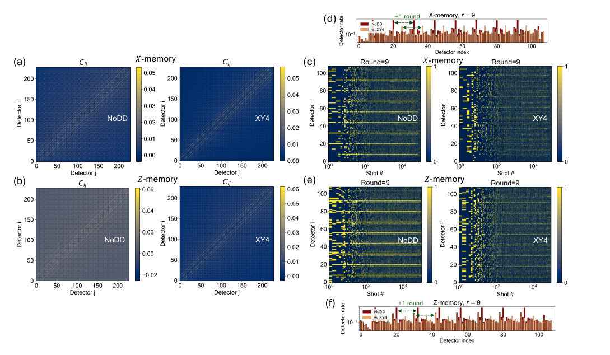 
FIG. 5. Detector correlations and detector-event structure for ibm miami. (a),(b) Detector-pair covariances Cij = ⟨vivj⟩− ⟨vi⟩⟨vj⟩for (a) the X- and (b) the Z-memory d = 3 experiments at r = 19, shown without DD and with XY4. The Z-memory without DD exhibits negative covariances, consistent with the negative-correlator issue discussed in the text. The detector index is a flattened space-time index over all 12 detector locations in all 19 syndrome-extraction cycles, hence i ∈{1, . . . , 228}. (c),(e) Shot-resolved detector-event patterns for the same X- and Z-memory data for the r = 9 circuits, using the flattened detector index. (d),(f) Detector firing rates for the corresponding round,...

**Summary.** The paper introduces a novel technique to estimate the Detector Error Model (DEM) probabilities directly from raw syndrome measurement data of surface code experiments. By using these empirically derived DEMs as decoder priors, the authors demonstrate significant and reliable reductions in the estimated logical error rate compared to standard noise models on state-of-the-art quantum hardware. This method offers a powerful, model-agnostic tool for improving QEC performance analysis.

**Why it may be interesting.** This work provides a practical, data-driven methodology for characterizing hardware noise in QEC that bypasses complex Hamiltonian reconstruction, which is highly relevant to experimental condensed matter/quantum physics groups working on superconducting or trapped-ion qubits.

Detailed structure

**Main problem.** The core problem is estimating the Detector Error Model (DEM) event probabilities directly from experimental syndrome data to improve quantum error correction (QEC) decoders, thereby reducing estimated logical error probabilities.

**Main result.** Syndrome-estimated DEMs consistently reduce the decoded logical error probability relative to baseline device-informed models on both Google and IBM hardware, often achieving improvements of $5\%-10\%$ or more.

**Method.** The authors estimate event probabilities by analyzing detector moments (e.g., $\langle v_i 
angle$, $\langle v_i v_j 
angle$) from raw syndrome data, avoiding the need for independent device benchmarking or supervised fitting to final logical outcomes.

**Model / system.** The work focuses on surface-code memory experiments performed on superconducting quantum processors (Google Willow and IBM miami). The formalism uses a Detector Error Model (DEM) that maps physical detector events to syndrome measurements.

**Key observables.** Logical Error Probability ($	ext{LEP}$ or $P_L$), fractional percent change in $	ext{LEP}$ ($\Delta P_L$), detector-pair covariances ($C_{ij}$), and entanglement infidelity ($	ext{EF}$).

**Important parameters / regimes.** Code distance ($d=3, 5, 7$), number of syndrome extraction cycles ($r$), and the type of dynamical decoupling (DD) applied.

**Assumptions / limitations.** The primary assumption is that detector moments are sufficient to infer reliable event probabilities. Limitations include handling negative correlators by setting probabilities to zero and benchmarking only on stochastic circuit-level noise initially.

**Figures summary.** Figures compare $\Delta P_L$ for various code distances ($d=3, 5, 7$) across different DEM priors (estimated vs. reference) on both Google and IBM hardware; other figures show detector covariances, time evolution of rates, and entanglement infidelity comparisons.

**Paper structure.** The paper develops the formalism for syndrome-based DEM estimation using moment calculations, applies this method to analyze memory experiments on two different quantum processors, compares the resulting logical performance against established noise models, and discusses scaling laws and diagnostics like crosstalk.

Abstract

Decoders for quantum error correction (QEC) experiments rely on detector error models (DEMs), which encode, for each error, its probability and the detectors and logical observables it flips. Here we show that estimating DEM event probabilities from experimental syndromes is feasible, avoids independent device benchmarking, and produces useful decoder priors for estimating and reducing decoded logical error probabilities. We evaluate our methods using open-source data from surface-code memory experiments performed on Google's Willow chip, and we carry out analogous surface-code experiments on IBM's \texttt{ibm\_miami} processor. Despite the different physical error scales of the Google and IBM devices, in both cases our estimated DEMs improve logical error probabilities relative to baseline device-informed DEMs, typically at the $5\%-10\%$ level and with larger gains in some IBM cases, without additional calibration circuits, decoder fine-tuning, or supervised fitting to logical outcomes.

[↑ back to top](#top)

### [Raw-Curve Quantum Fingerprints: A Mahalanobis Authentication Framework with Drift Early Warning and Adversarial Detection](http://arxiv.org/abs/2606.11644v1)

**Authors:** Geyuyan Ma, Xiangdong Meng, Yangyang Fei, Zhiqiang Fan, Hanshi Zhao, Chenhui Wang, Haoran Yang, Weilong Wang, Zheng Shan  
**Type:** both · **Category:** quantum information and computing · **PDF:** <https://arxiv.org/pdf/2606.11644v1>  
**Analysis basis:** full PDF text, analyzed in chunks
**Topic relevance:** 🔥 `QC/QI experiment` **4/5** · `methods for driven-dissipative` **1/5** · `quantum measurements` **1/5**

📷 Fig 1

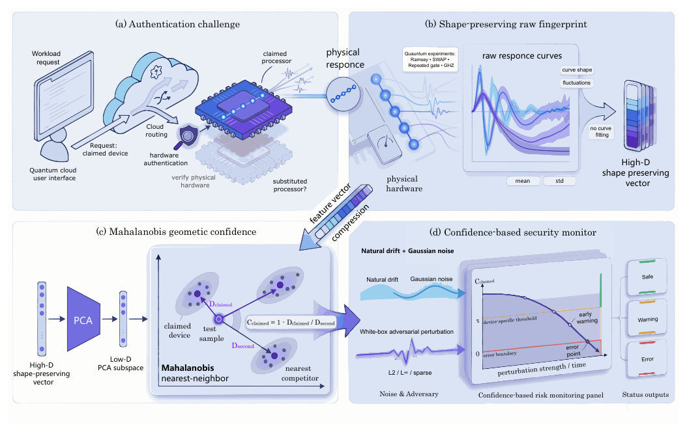 
Fig. 1. Overview of the proposed quantum hardware authentication framework. (a) A cloud user requests a specific quantum processor; without hardware authentication the job may be redirected to a substituted device. The processor is authenticated by actively probing with four quantum experiments. (b) Raw measurement statistics (means and standard deviations) from the four experiments are directly concatenated into a high-dimensional fingerprint vector without curve fitting, preserving subtle device-specific shape features. (c) PCA compresses the high dimensional fingerprint into a low dimensional subspace; a Mahalanobis nearest-neighbor classifier identifies the claimed device and computes...

📷 Fig 2

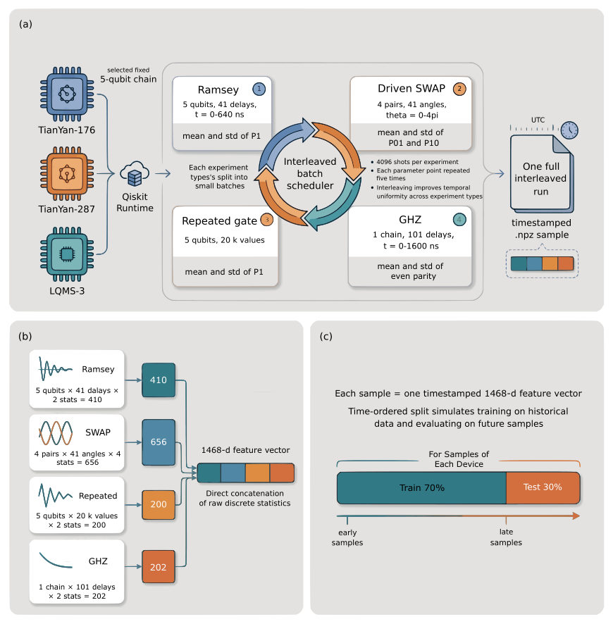 
Fig. 2. Data acquisition and workflow. (a) Four interleaved quantum experiments are executed on a fixed 5-qubit chain. (b) Raw measurement statistics are directly concatenated into a 1468-dimensional feature vector. (c) The dataset is split chronologically (70% train / 30% test).

📷 Fig 3

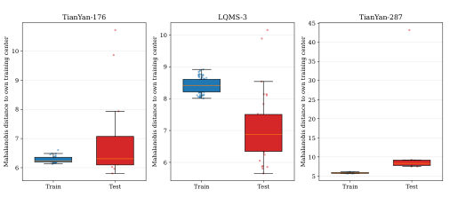 
Fig. 3. Box plots of Mahalanobis distances to the own training centre (blue: training set, red: test set). The central line indicates the median, the box spans the interquartile range (IQR), and the whiskers extend to the farthest data point within 1.5 × IQR. Clear differences between training and test distances confirm natural temporal drift on LQMS-3 and TianYan-287; TianYan-176 exhibits a milder shift.

📷 Fig 4

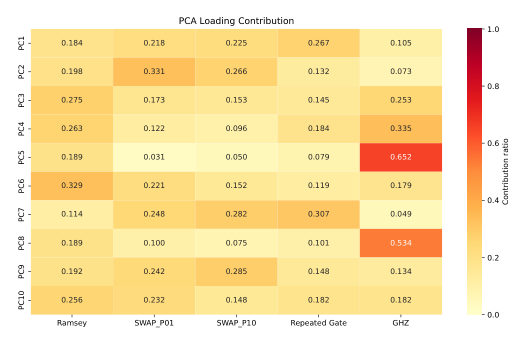 
Fig. 4. Average per-feature contribution of each experiment group to the first ten principal components (row-normalised). Each group contributes to more than one PC, indicating that all four experiments provide distinct variance components.

📷 Fig 5

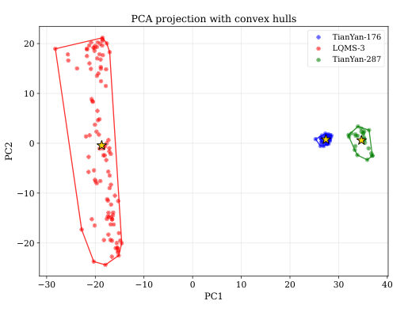 
Fig. 5. PCA projection of all samples onto PC1 and PC2. Solid polygons are convex hulls; star markers denote centroids. LQMS-3 exhibits a wider spread but its centroid is far from the others, yielding high separability.

**Summary.** This work introduces a novel authentication framework that uses raw measurement data from multiple interleaved quantum experiments to create high-dimensional 'quantum fingerprints' of superconducting processors. By employing a Mahalanobis nearest-neighbor classifier, it not only verifies the device identity but also provides a confidence score that predicts performance degradation due to environmental noise or malicious attacks. This offers a practical path toward building trustworthy and reliable quantum cloud computing services.

**Why it may be interesting.** The methodology directly addresses hardware trustworthiness in quantum computing, providing quantitative metrics ($C_{	ext{claimed}}$) to monitor device health proactively, which is crucial for deploying complex quantum algorithms.

Detailed structure

**Main problem.** The lack of transparency in quantum cloud platforms enables hardware substitution attacks, compromising computational integrity.

**Main result.** The proposed framework achieves 100% benign authentication accuracy and provides a quantifiable confidence score ($C_{	ext{claimed}}$) that predicts device degradation due to noise or adversarial manipulation.

**Method.** It constructs high-dimensional quantum fingerprints from raw measurement statistics using a Mahalanobis nearest-neighbor classifier (MNN).

**Model / system.** The system involves superconducting quantum processors (e.g., TianYan, LQMS) tested on fixed chains of five qubits across four complementary interleaved experiments.

**Key observables.** Authentication Confidence ($C_{	ext{claimed}}$), Mahalanobis distance, raw measurement statistics (means and standard deviations).

**Important parameters / regimes.** Noise strength ($\sigma$), perturbation strength ($\epsilon$), feature dimensionality (up to 1468-d).

**Assumptions / limitations.** The framework assumes a closed-set environment for authentication; theoretical analysis relies on additive isotropic Gaussian noise.

**Figures summary.** Figures illustrate the workflow from raw data acquisition to high-dimensional embedding, showing confidence decay curves under increasing noise ($\sigma$) and detection rates against various adversarial attacks.

**Paper structure.** The paper progresses by first establishing the fingerprinting method (raw statistics $
ightarrow$ high-D vector), then applying MNN for authentication, followed by rigorous testing of drift monitoring using $C_{	ext{claimed}}$ under Gaussian noise, and finally evaluating robustness against white-box adversarial attacks.

Abstract

Quantum cloud platforms are poised to deliver powerful computing capabilities, but users have no direct means to verify which physical device executes their workload. This lack of transparency enables hardware substitution attacks, where a malicious adversary could redirect a job to a substituted or inferior processor. We present a general authentication framework that addresses this problem by constructing multi-dimensional quantum fingerprints from raw measurement data. Without any curve fitting, we directly concatenate the raw statistics of complementary experiments into a high-dimensional feature vector that preserves subtle device-specific information. A Mahalanobis nearest-neighbor classifier achieves 100\% benign authentication accuracy on three superconducting processors over a three-week chronological split. The classifier naturally yields an authentication confidence $C_{\mathrm{claimed}}$ which reveals device-specific safety margins and motivates per-device alert thresholds. We assess the framework's robustness under two distinct scenarios. Under additive isotropic Gaussian noise, $C_{\mathrm{claimed}}$ decays predictably at a rate explained by inverse covariance traces, enabling an early warning mechanism. Against white-box adversarial perturbations, the same confidence threshold detects $L_2$ targeted attacks with near-perfect success and reveals device-dependent empirical thresholds for $L_\infty$ attacks, while untargeted and sparse attacks are ineffective. The proposed framework thus unifies fingerprint extraction, drift-resilient authentication, proactive health monitoring, and adversarial defense, offering a practical step toward trustworthy quantum cloud computing.

[↑ back to top](#top)

### [The Kondo effect in ferromagnetic quantum critical CeRh$_6$Ge$_4$](http://arxiv.org/abs/2606.11978v1)

**Authors:** Martin Sundermann, Joe D. Thompson, Eric D. Bauer, Chun Fu Chang, Sheng-Huai Chen, Chang-Yang Kuo, Liu Hao Tjeng, Getrud Zwicknagl, Andrea Severing  
**Type:** both · **Category:** strongly correlated electrons · **PDF:** <https://arxiv.org/pdf/2606.11978v1>  
**Analysis basis:** full PDF text, analyzed in chunks
**Topic relevance:** 🔥 `Kondo & dissipative impurity` **4/5** · `Keldysh / 2PI / non-Gaussian methods` **1/5** · `spintronics-quantum-optics interface` **1/5**

📷 Fig 1

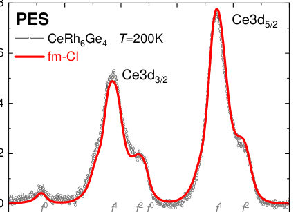 
FIG. 1. Ce 3d core level PES data of CeRh6Ge4 (black circles) after background correction, plus the result of a full-multiplet configuration-interaction (FM-CI) simulation (red line). The gray ruler at the bottom indicates the energy positions of the I(fn) spectral weights.

📷 Fig 2

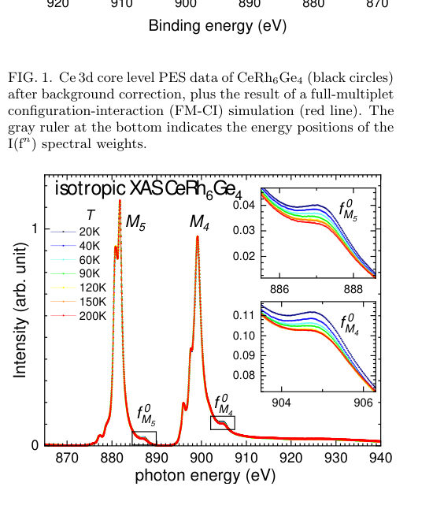 
FIG. 2. Isotropic XAS spectra, Iiso = 1/3·(I(E ∥c) + 2·I(E ⊥c)), of CeRh6Ge4 at the Ce M 4,5 edges for several temperatures T between 20 and 200 K. Insets: enlarged view of 4f 0 satellites at the high energy tail of the M 5 and M 4 edges.

📷 Fig 3

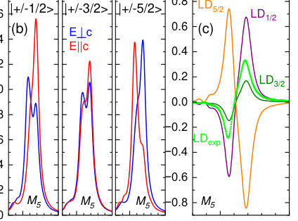 
FIG. 3. (a) Linear polarized XAS spectra, I(E ∥c) (red) and I(E ⊥c) (blue), of CeRh6Ge4 at the Ce M 4,5 edges at T = 20K and the corresponding linear dichroism LDexp = I(E ∥c) - I(E ⊥c) (green). (b) Simulated linear po- larized XAS spectra of pure |±jz⟩states. (c) Simulated linear dichroism of pure |±jz⟩states, LDjz, compared to experimen- tal LDexp (green dotted curve taken from (a)).

📷 Fig 4

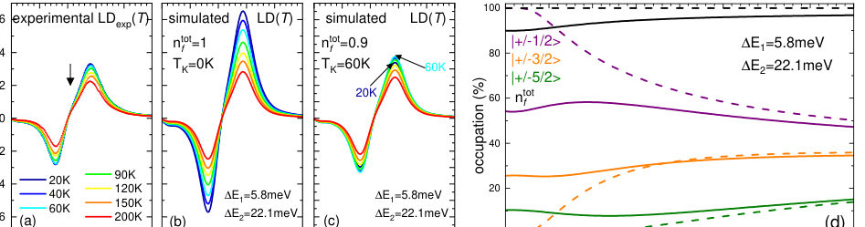 
FIG. 4. (a) Temperature dependence of the experimental linear dichroism, LDexp(T). (b) Simulated LD(T) based on thermal occupation of states using the CEF model as described in the text, corresponding to TK = 0 K and ntot f (T) = 1. (c) Simulated LD(T) taking into account the Kondo effect in addition to thermal occupation of states, see text. (d) Occupation of states as function of temperature for pure thermal occupation (dashed lines) and in the presence of the Kondo effect with TK = 60 K and ntot f (T=0) = 0.9 (solid lines). The black lines are the total occupation ntot f (T) of the 4f shell with (solid) and without (dashed) Kondo effect. In the T = 0 K limit, 35% of the 4f shell...

📷 Fig 5

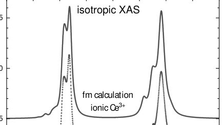 
FIG. 5. Isotropic XAS spectra at the Ce M 4,5 edges of CeRh6Ge4 at 200 K constructed from linear polarized data based on Eq. 1 and full-multiplet (fm) calculation for Ce3+

**Summary.** This paper investigates the electronic structure of the heavy fermion ferromagnet CeRh6Ge4 near a quantum critical point. By analyzing X-ray absorption spectroscopy and photoelectron data, the authors demonstrate that simple models fail to explain temperature dependence. They successfully model the results by incorporating the Kondo effect into a multiorbital ground state description, highlighting orbital-dependent correlations as key to understanding its magnetic criticality.

**Why it may be interesting.** This work provides a detailed spectroscopic pathway to map out the complex many-body physics governing quantum criticality in heavy fermion systems, directly linking measurable optical properties (dichroism) to fundamental correlated parameters like $T_K$.

Detailed structure

**Main problem.** The study aims to understand the mechanism behind a pressure-induced quantum critical point (QCP) in the heavy fermion ferromagnet CeRh6Ge4, focusing on the interplay between localized and itinerant 4f electron character.

**Main result.** The experimental data are best explained by incorporating the Kondo effect into a multiorbital ground state model, suggesting an orbital-dependent hybridization mechanism is crucial for describing the low-temperature magnetic behavior.

**Method.** The research combines advanced spectroscopic measurements (PES and XAS) with theoretical modeling using full-multiplet configuration interaction (fm-CI) and simplified Anderson Impurity Models (SIAM/NCA).

**Model / system.** The system is the heavy fermion ferromagnet CeRh6Ge4, which exhibits complex magnetic ordering influenced by strong electron correlations. The model treats the hybridization of Ce 4f states with conduction electrons within a multi-orbital framework.

**Key observables.** Temperature dependence of linear dichroism (LD), spectral weights in XAS/PES satellites, and the derived Kondo temperature (T_K).

**Important parameters / regimes.** The critical pressure ($p_c = 0.8 	ext{ GPa}$), the effective $4f$ occupancy ($n_f \sim 0.9$), and the Kondo coupling strength ($T_K \sim 60 	ext{ K}$).

**Assumptions / limitations.** The analysis relies on approximations such as the Non-Crossing Approximation (NCA) for the SIAM, and assumes specific symmetries or constraints when fitting spectroscopic data.

**Figures summary.** Figures illustrate the temperature dependence of experimental LD versus theoretical predictions derived from both simple thermal occupation models and more complex Kondo-affected multiorbital calculations.

**Paper structure.** The paper progresses by first establishing evidence for $4f$ hybridization via PES/XAS, then using linear dichroism measurements to constrain a CEF model, and finally employing the SIAM/NCA framework to incorporate the temperature-dependent Kondo screening effect into the ground state description.

Abstract

The mechanism of a pressure-induced quantum critical point in the heavy fermion ferromagnet CeRh$_6$Ge$_4$ has attracted interest, as ferromagnetic quantum criticality in a clean itinerant Ce compound is typically avoided. The localized versus itinerant character of the 4\textit{f} electrons is a key aspect for understanding this behavior. We investigated the electronic structure of the 4\textit{f} shell in CeRh$_6$Ge$_4$ using core-level photoelectron and x-ray absorption spectroscopy, demonstrating the hybridization of Ce 4\textit{f} with the conduction electrons. Linearly polarized x-ray absorption reveals a temperature-dependent linear dichroism consistent with the crystal-electric-field (CEF) sequence as inferred from the static susceptibility. This dichroism cannot be described by an ionic full-multiplet model alone, but is reproduced by including the Kondo effect within a single-impurity Anderson model in the non crossing approximation (SIAM/NCA). The Kondo effect mixes higher lying crystal-field states into a resulting multiorbital ground state with 4\textit{f} occupancy \textit{n}$_f$\,$\sim$\,0.9. Deviations at low temperatures between the measured linear dichroism and calculated dichroism suggest an orbital-dependent Kondo effect. A scenario in which there is a multiorbital ground state and orbital-dependent Kondo hybridization should be a starting point for a model of pressure-induced criticality in CeRh$_6$Ge$_4$.

[↑ back to top](#top)

### [A Cryogenic Uniaxial Strain Cell for Quantum Devices](http://arxiv.org/abs/2606.11485v1)

**Authors:** Bradley Lloyd, Davis Rash, Chandler Wilburn, Paul Kliewer, Meenakshi Singh  
**Type:** experiment · **Category:** quantum information and computing · **PDF:** <https://arxiv.org/pdf/2606.11485v1>  
**Analysis basis:** full PDF text, analyzed in chunks
**Topic relevance:** 🔥 `QC/QI experiment` **4/5**

📷 Fig 1

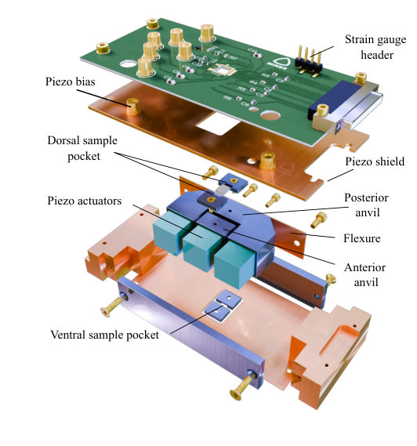 
Figure 1. Exploded overview of the strain cell design.

📷 Fig 2

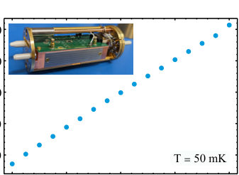 
Figure 2. Strain measured by the change in resistance of a 1.5 × 1.0 mm2 strain gauge epoxied to the center of the dorsal sample, showing a linear relationship between strain and voltage applied to the piezo stacks. Inset: assembled strain cell mounted to the dilution refrigerator puck.

📷 Fig 3

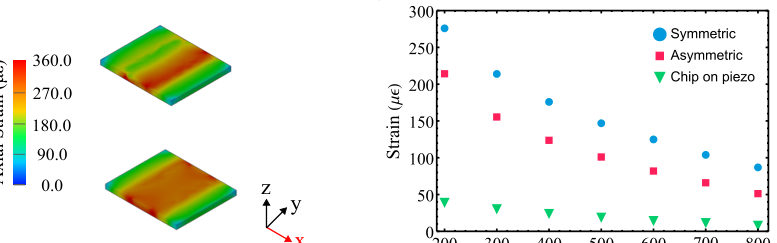 
Figure 3. Finite element analysis of axial strain (εxx) (a) Three-dimensional strain map of the dorsal silicon die under 200 V differential piezo bias at 50 mK, showing the distribution of axial strain across the chip surface for the asymmetrically loaded (top) and symmetrically loaded (bottom) cases. (b) Axial strain at the center of the 1×1 mm² region of interest as a function of substrate thickness for three mounting configurations: symmetric dual-chip loading (circles), asymmetric single-chip loading (squares), and chip epoxied directly to the actuator face (triangles). The symmetric configuration delivers superior strain homogeneity and maintains appreciable center strain even at...

**Summary.** The paper introduces a novel cryogenic uniaxial strain cell specifically engineered to apply uniform mechanical strain to thick, square semiconductor chips. This design overcomes limitations of prior cells by integrating high-density electrical wiring and using advanced shielding techniques. It provides a critical tool for experimentally tuning quantum device properties via controlled strain at low temperatures.

**Why it may be interesting.** This work provides essential hardware infrastructure for realizing quantum devices whose properties are tunable by mechanical strain, which is crucial for many solid-state qubit platforms.

Detailed structure

**Main problem.** Existing piezoelectric strain cells are unsuitable for thick, square-profile semiconductor quantum devices, and integrating dense wiring while maintaining electrical isolation is challenging.

**Main result.** The authors designed a novel cryogenic uniaxial strain cell that homogeneously strains thick silicon dies while successfully incorporating high-density RF/DC interconnects and using Faraday cages for electrical isolation.

**Method.** The design utilizes a highly symmetric dual-chip loading configuration with a three-stack actuation scheme, validated by finite element simulations and experimental measurement on a 200 $\mu$m thick silicon die.

**Model / system.** The platform is a cryogenic uniaxial strain cell operating in a dilution refrigerator, designed to apply controlled mechanical strain to semiconductor quantum devices (e.g., Si qubits). The system incorporates complex electrical shielding and mounting structures.

**Key observables.** Applied uniaxial strain ($	ext{215 } \mu\epsilon$ for $200 	ext{V}$ bias), strain homogeneity ($\Delta$), and the ability to support dense RF/DC wiring under strain.

**Important parameters / regimes.** Cryogenic temperatures (down to 50 mK), applied voltage ($\pm 200 	ext{V}$), substrate thickness ($200 \mu	ext{m}$).

**Assumptions / limitations.** The symmetric mounting configuration effectively suppresses flexural deformation and shear stress, and the Faraday cage successfully prevents unwanted Stark shifts.

**Figures summary.** Figure 1 provides an exploded overview of the strain cell design components. Figure 2 details measurements validating the setup's performance at cryogenic temperatures.

**Paper structure.** The paper first identifies limitations in current strain cells, then introduces the novel symmetric dual-chip loading design and electrical integration strategy. It presents simulation results confirming homogeneity improvements before concluding with experimental validation on a silicon die.

Abstract

Mechanical strain is a powerful resource for tuning quantum systems, but existing piezoelectric strain cells are generally optimized for fragile, high-aspect-ratio single crystals rather than the thick, square-profile chips typical of semiconductor quantum devices. Furthermore, adapting these cells for qubits requires accommodating dense RF and DC wiring while maintaining strict electrical isolation from high-voltage piezo actuators. Here, we present a piezoelectric uniaxial strain cell designed to homogeneously strain thick, square-profile substrates. We introduce a highly symmetric dual-chip loading configuration that effectively suppresses flexural deformation and shear stress. The cell integrates a high-density RF/DC interposer to support standard wire bonding and encloses the actuators in a grounded Faraday cage to prevent unwanted Stark shifts in the device layer. Finite element simulations confirm that combining stiff actuators with this symmetric mounting drastically improves strain homogeneity. Finally, we validate the apparatus experimentally by applying uniaxial strain to a 200 $μ$m thick silicon die. Surface strain measurements demonstrate an applied strain of 215 $με$ for 200 V applied piezo bias.

[↑ back to top](#top)

### [Superspace Concentration and Adversarial Robustness in Quantum Algorithms](http://arxiv.org/abs/2606.11580v1)

**Authors:** Eric Yocam, Christian Yocam, Varghese Vaidyan, Yong Wang, Mahesh Kalappattil, Anthony Rizi  
**Type:** theory · **Category:** quantum information and computing · **PDF:** <https://arxiv.org/pdf/2606.11580v1>  
**Analysis basis:** full PDF text, analyzed in chunks
**Topic relevance:** `entanglement & information structure` **3/5** · `methods for driven-dissipative` **3/5** · `correlated / nonlocal dissipation` **2/5** · `driven-dissipative phase transition` **2/5** · `Keldysh / 2PI / non-Gaussian methods` **1/5** · `non-equilibrium dynamics` **1/5** · `non-equilibrium universality` **1/5**

📷 Fig 1

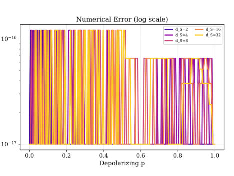 
Figure 1: Decoherence degradation of focus for dS ∈{2, 4, 8, 16, 32}.

📷 Fig 2

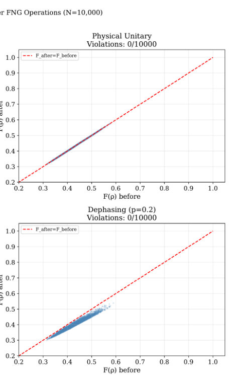 
Figure 2: Focus before vs. after four FNG channels, N = 10,000 states.

📷 Fig 3

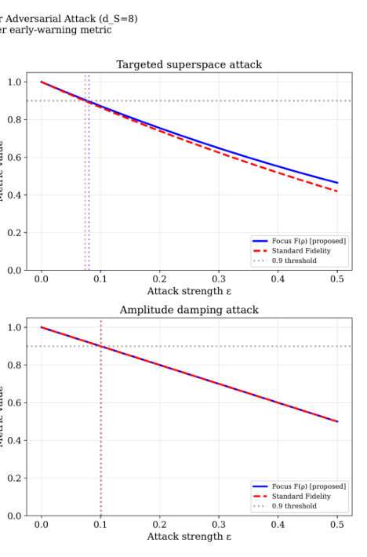 
Figure 3: Focus and fidelity under four adversarial attacks (dS = 8).

📷 Fig 4

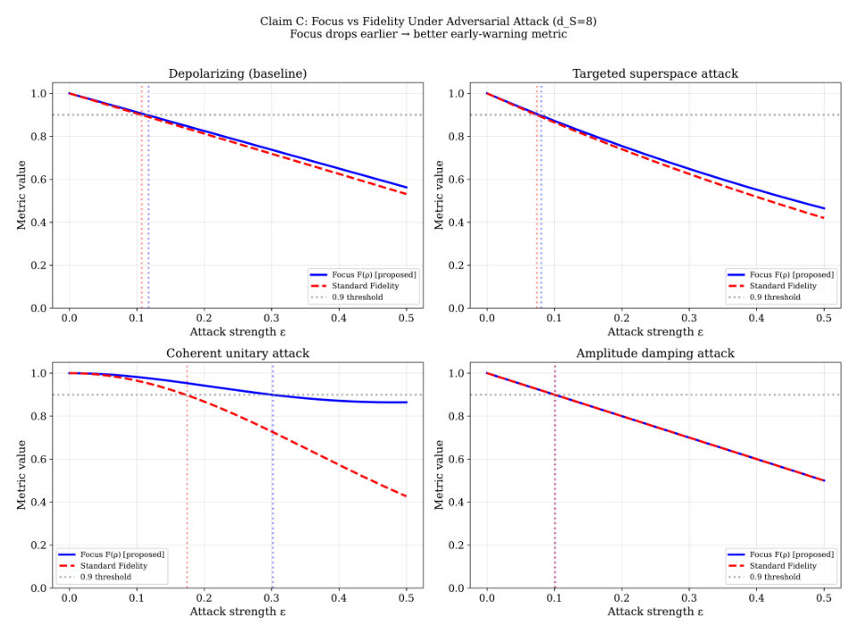 
Fig. 4 shows F(ρk) and P(marked) as functions of Grover iteration k for n ∈{3, 4, 5, 6, 7} qubit registers up to the optimal iteration k∗= ⌊π √

📷 Fig 5

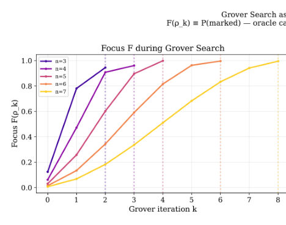 
Figure 4: Focus F(ρk) and success probability during Grover search, n = 3–7 qubits.

**Summary.** This paper introduces 'superspace concentration' as a novel resource measure quantifying how well quantum information can be concentrated in a preferred subspace. It rigorously proves its properties and demonstrates that this focus measure offers superior resilience against adversarial attacks compared to standard fidelity metrics. The work provides a powerful, theoretically grounded tool for assessing the security and capacity of quantum protocols.

**Why it may be interesting.** For AMO physicists studying open quantum systems, this work provides a new, quantifiable metric ($F(
ho)$) that detects structural information loss beyond simple entanglement or coherence measures when the system is subjected to structured noise or targeted attacks.

Detailed structure

**Main problem.** The paper develops a resource-theoretic framework around 'superspace concentration' ($F(
ho)$) to quantify quantum resources, particularly for understanding adversarial robustness and algorithmic complexity.

**Main result.** Focus ($F(
ho)$) was shown to be operationally distinct from other measures like U(dS)-asymmetry, providing superior resilience against coherent unitary attacks, and its capacity gap scales as $\log_2(d_S)$.

**Method.** The authors use resource theory axioms (monotonicity, etc.) combined with GPU-accelerated numerical simulations to test the behavior of $F(
ho)$ under various noise channels and adversarial perturbations.

**Model / system.** The system involves a composite Hilbert space $H = H_{	ext{phys}} \otimes H_{	ext{super}}$, where the focus measure is derived from the largest eigenvalue ($\lambda_{\max}$) of the reduced density matrix $
ho_{	ext{super}}$ over an extended superspace.

**Key observables.** Focus Measure ($F(
ho) = \lambda_{\max}(
ho_{	ext{super}})$), Focus Capacity Gap ($\Delta F$), and comparison against standard fidelity.

**Important parameters / regimes.** Superspace dimension $d_S$, attack strength $\epsilon$, noise parameters $p$ (for depolarizing channels).

**Assumptions / limitations.** The framework relies on identifying 'Focus-Non-Generating' (FNG) operations, and capacity gap analysis is currently limited to product and correlated noise channels.

**Figures summary.** Figures illustrate the superior robustness of Focus over fidelity under adversarial attacks, confirm the $\log_2(d_S)$ scaling law for the capacity gap, and map out monotonicity violations across various system configurations.

**Paper structure.** The paper establishes the mathematical definition of $F(
ho)$, proves its resource-theoretic properties (monotonicity), demonstrates its operational superiority over other measures in adversarial settings, connects it to algorithmic complexity (Grover's algorithm), and numerically characterizes the capacity gap scaling law.

Abstract

We study superspace concentration as a quantum resource, formalized through the focus measure F(\r{ho}) = λ_max(\r{ho}_super) - the largest eigenvalue of the reduced superspace state - which quantifies the capacity of a quantum system to concentrate informational weight into a preferred subspace of an extended degree-of-freedom space. We develop a complete resource-theoretic framework around this measure and validate its properties through GPU-accelerated numerical simulation. Analytic decoherence predictions are confirmed to machine precision (1.11 x 10^{-16}) for superspace dimensions dS in {2,4,8,16,32}. Focus monotonicity holds across 10,000 random states with zero violations under four focus-non-generating channels across six system configurations. Focused quantum states resist coherent unitary attacks with significantly greater resilience than standard fidelity predicts, with focus remaining above 0.9 at attack strength ε = 0.302 versus ε = 0.174 for fidelity. We further demonstrate that the focus measure and the U(dS)-asymmetry measure are operationally distinct: asymmetry remains near zero and provides no robustness signal under coherent and targeted attacks while focus tracks spectral concentration and remains robust until ε > 0.3. The connection between Grover's algorithm and superspace concentration is made explicit via the identity F(|ψ_k><ψ_k|) = P(marked), providing a resource-theoretic interpretation of oracle query complexity. Finally, we provide the first numerical characterization of the focus capacity gap ΔF, identifying a log_2(dS) scaling law confirmed for both product and correlated noise channels.

[↑ back to top](#top)

### [Nonadditivity in Quantum Field Theory: Replica Energies, Scaling Filters, and the Renormalization Group](http://arxiv.org/abs/2606.12367v1)

**Authors:** Giacomo Santoni, Francesco Scardino  
**Type:** theory · **Category:** statistical mechanics · **PDF:** <https://arxiv.org/pdf/2606.12367v1>  
**Analysis basis:** full PDF text, analyzed in chunks
**Topic relevance:** `Keldysh / 2PI / non-Gaussian methods` **3/5** · `non-equilibrium universality` **2/5** · `analog quantum simulation` **1/5** · `correlated / nonlocal dissipation` **1/5** · `correlated cavity matter` **1/5** · `driven-dissipative phase transition` **1/5** · `entanglement & information structure` **1/5** · `methods for driven-dissipative` **1/5** · `non-equilibrium dynamics` **1/5**

📷 Fig 1

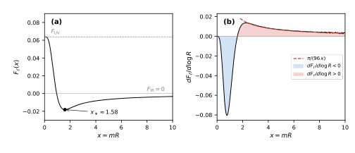 
FIG. 1: (a) Thermodynamic F-function FE(x) for a free massive scalar on S3 (x = mR). FE starts at FUV ≈0.064 (dashed line), overshoots below FIR = 0, reaching a minimum at x∗≈1.58 (dot), then returns to 0−from below. (b) Flow derivative dFE/d log R. Negative for x &lt; x∗, positive for x &gt; x∗(shaded regions). The dashed curve on the top right corner is the analytic asymptotic π/(96 x) in Eq. (107), which controls the large-x tail. The sign change demonstrates that FE is not a monotone F-function.

**Summary.** This work develops the concept of 'replica energy' as a universal thermodynamic diagnostic tool to quantify deviations from ideal additivity in Quantum Field Theory. By applying specific differential filtering operators tailored to different dimensions, the authors successfully extract fundamental physical constants like central charges and anomaly coefficients from finite-size effects. It provides a rigorous mathematical language for understanding nonextensive behavior across various quantum systems.

**Why it may be interesting.** The systematic application of scaling filters provides a powerful, unified diagnostic tool for theoretical physicists studying critical phenomena or topological phases where simple extensivity assumptions break down.

Detailed structure

**Main problem.** The paper investigates nonadditivity and deviations from simple scaling laws (extensivity) in Quantum Field Theory, aiming to bridge concepts between statistical mechanics and QFT.

**Main result.** The replica energy provides a unified thermodynamic language for diagnosing additivity violations, defect-free energies, and renormalization group irreversibility across different dimensions.

**Method.** The core method involves applying specialized differential filters (e.g., $\left(1 - rac{1}{L}\partial_L
ight)$) to the logarithm of the partition function ($\log Z$) to systematically remove leading bulk contributions and isolate universal, nonadditive corrections.

**Model / system.** The analysis applies to general thermodynamic systems, finite-volume QFTs (e.g., on spheres $S^3$ or $S^4$), topologically ordered gapped phases (Chern–Simons theory), and fracton models in various dimensions ($d=2, 3, 4$).

**Key observables.** Replica Energy ($eta E$), Sphere Free Energy ($F_E(R)$), Euler Anomaly Coefficient ($a$), Central Charge ($c$), and the dimension of the topological Hilbert space ($\dim H(\Sigma)$).

**Important parameters / regimes.** System size $L$, temperature $eta^{-1}$, spatial dimensions $d=2, 3, 4$, and correlation lengths $\xi$.

**Assumptions / limitations.** The analysis relies on asymptotic factorization of the partition function and specific definitions of filtering operators designed to project out different types of scaling behavior.

**Figures summary.** Figures illustrate how the replica energy functional changes its dependence on size $R$ or $L$ across dimensions, showing distinct behaviors for finite-size corrections versus topological contributions.

**Paper structure.** The paper develops a general framework using replica energies to diagnose nonadditivity. It then applies this framework dimension by dimension ($d=2, 3, 4$) to extract universal constants like $c$ and $a$, comparing the mathematical structure of the filters required in each case.

Abstract

Extensive systems have a simple thermodynamic signature: the logarithm of the partition function scales homogeneously with the size of the system. We show that the failure of this scaling, measured by the replica energy ${\cal E}$, provides a useful bridge between statistical mechanics and quantum field theory. The associated differential operator $(1-\frac1d L\partial_L)$ removes the leading bulk contribution to $W=\log Z$ and isolates the part that is sensitive to boundaries, topology, defects, long-range forces, or other sources of nonadditivity. In quantum field theory this thermodynamic idea has two closely related uses. For ordinary finite-volume or spherical partition functions, suitable higher-order versions of the same filter remove local counterterms and extract universal fixed-point data such as the central charge, the sphere free energy $F$, and the Euler anomaly coefficient $a$. For replica geometries with entangling defects, the same filtering principle gives the renormalized defect free energy. In $2+1$ dimensions, its $n\to1$ limit is precisely the entropic $F$-function. We use this perspective to distinguish ordinary finite-size corrections, topology-dependent constants in gapped phases, subextensive fracton degeneracies, and genuinely nonextensive systems with long-range interactions such as self-gravitating thermal matter. Replica energy therefore offers a common thermodynamic language for additivity, defect free energies, and renormalization-group irreversibility.

[↑ back to top](#top)

### [Implementing Hamiltonian Renormalization Group Flow on Quantum Computers with VAPOR](http://arxiv.org/abs/2606.11306v1)

**Authors:** Federica Fragomeno, Jorden Roberts, Saeed Rastgoo, Klaus Liegener  
**Type:** both · **Category:** quantum information and computing · **PDF:** <https://arxiv.org/pdf/2606.11306v1>  
**Analysis basis:** full PDF text, analyzed in chunks
**Topic relevance:** `analog quantum simulation` **3/5** · `QC/QI experiment` **2/5** · `Keldysh / 2PI / non-Gaussian methods` **1/5** · `driven-dissipative phase transition` **1/5** · `entanglement & information structure` **1/5** · `exotic spin models in light-matter` **1/5** · `methods for driven-dissipative` **1/5** · `non-equilibrium dynamics` **1/5**

📷 Fig 1

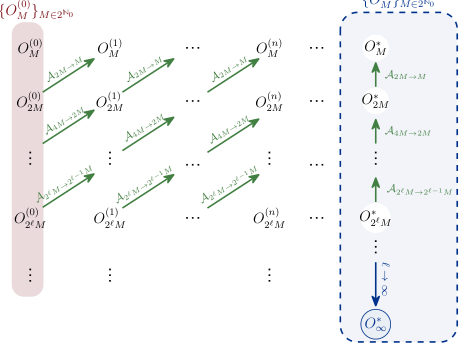 
FIG. 1: Operator families (columns) across different resolutions M converge under the RG flow AM→M ′ to a fixed-point family {O∗ M}M which allows a continuum limit O∗ ∞(right).

📷 Fig 2

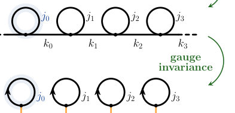 
FIG. 2: (a) Toy model based on a 2D lattice with vertical translational invariance: the irrep label ji applies across all vertical edges. (b) Symmetry restriction reduces the system to a 1D chain with one representative per vertical edge set. (c) The gauge-invariant basis is spanned by intertwiners (πi, orange) coupling local irreps at each vertex.

📷 Fig 3

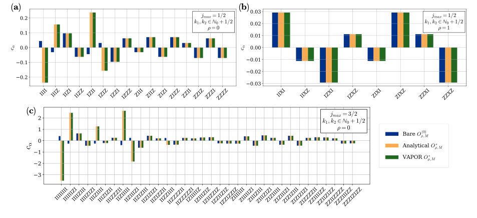 
FIG. 3: Pauli coefficients cα for the bare 4-flux operator (blue), its analytical fixed point (orange), and the VAPOR fixed point (green). VAPOR matches the analytical result exactly, regardless of operator type (ρ = 0, 1 in Figures 3a-3b) and irrep cutoff (6 qubits for jmax = 1/2 in Figures 3a-3b; 12 qubits for jmax = 3/2 in Figure 3c).

📷 Fig 4

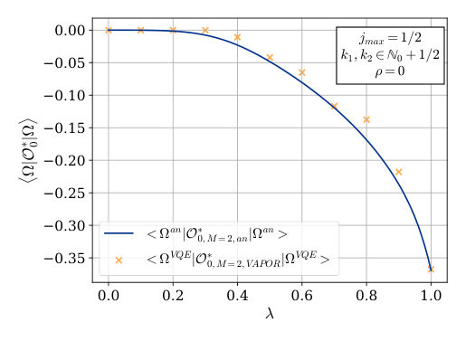 
FIG. 4: Fixed-point 4-flux operator O∗ 0,M=2 as measurement for correlations on ground states. Analytical values (blue) are qualitatively matched by a noise-free QC-inspired simulation using VAPOR and VQE (orange).

📷 Fig 5

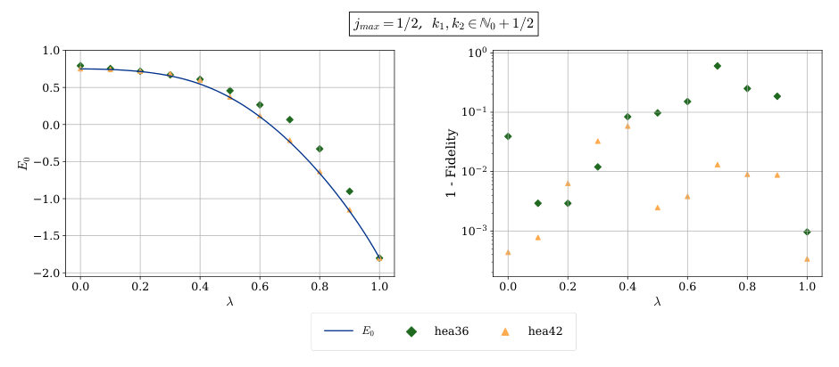 
FIG. 5: VQE ground state simulation results using a HEA for jmax = 1/2. The left panel displays the exact analytical energies alongside the VQE-optimized energies across different coupling constants x and circuit depths. The right panel shows the state infidelity (1 −F), on logarithmic scales. The error metric demonstrates an improvement in ansatz performance even at relatively shallow circuit depth.

**Summary.** The paper tackles the challenge of simulating continuum Quantum Field Theories using lattice methods by implementing Hamiltonian Renormalization Group (RG) flow on quantum computers. It introduces VAPOR, a novel variational algorithm that translates the complex fixed-point search of RG theory into a solvable quantum optimization problem. This provides a crucial pathway for extracting physically meaningful observables from highly correlated gauge theories on NISQ devices.

**Why it may be interesting.** This work directly addresses how complex, continuum physics problems from high-energy theory can be mapped onto near-term quantum hardware by reformulating difficult spectral/flow problems into tractable variational optimization routines.

Detailed structure

**Main problem.** The core problem is implementing Hamiltonian Renormalization Group (RG) flow, necessary to find discretization-error-free operators for continuum Quantum Field Theory (QFT), on quantum computers.

**Main result.** The authors introduce VAPOR, a variational algorithm that successfully maps the fixed-point identification of RG flow onto a solvable quantum optimization problem, demonstrating its applicability to Lattice Gauge Theories.

**Method.** They combine theoretical RG techniques—which involve defining operator families and identifying fixed points via spectral decomposition—with variational quantum algorithms (VAPOR/VQE) for numerical execution on near-term hardware.

**Model / system.** The primary model is a Lattice Gauge Theory, specifically using a toy model of an SU(2) Yang-Mills theory. The Hamiltonian and operators are constructed within a spin-network basis to enforce gauge invariance.

**Key observables.** Fixed-point 4-flux operator ($O^*$), ground state energy expectation values ($\langle O^* 
angle$), and the cost function $C(	heta)$ used for optimization.

**Important parameters / regimes.** Coupling constants (e.g., $\lambda$), lattice size/cutoff ($j_{	ext{max}}$), and variational parameters ($	heta$) defining the quantum circuit ansatz depth.

**Assumptions / limitations.** The VAPOR approach assumes that the RG flow can be restricted to finite-dimensional, RG-invariant Pauli orbits, allowing the fixed-point search to be framed as a constrained optimization problem.

**Figures summary.** Figures illustrate the convergence of operator families under RG flow towards fixed points; they also compare simulated expectation values of the 4-flux operator using VAPOR/VQE against known analytical results for various coupling regimes.

**Paper structure.** The paper systematically builds from continuum QFT concepts to lattice discretization (using spin-network bases), then develops the theoretical framework for RG flow on Pauli operators, and finally proposes and tests the variational quantum algorithm (VAPOR) to solve the resulting fixed-point optimization problem.

Abstract

While Hamiltonian Lattice Gauge Theory is gaining traction, today's limited numerical capacity leaves simulations affected by discretization errors. This motivates the implementation of renormalization group (RG) techniques to find discretization-error-free operators. To this end, we introduce VAPOR, a variational quantum algorithm that decomposes operators into Pauli strings, identifies RG flow orbits, and determines fixed points of a naively discretized operator. We illustrate this using a toy model of a kinematic operator in a symmetry-restricted SU(2) Yang-Mills theory.

[↑ back to top](#top)

### [Kinetic kagome magnetism: from self-trapping RVB polarons to semiclassical correlations](http://arxiv.org/abs/2606.12204v1)

**Authors:** Yufei Pei, Shuai A. Chen, Claudio Castelnovo, Roderich Moessner  
**Type:** theory · **Category:** strongly correlated electrons · **PDF:** <https://arxiv.org/pdf/2606.12204v1>  
**Analysis basis:** full PDF text, analyzed in chunks
**Topic relevance:** `analog quantum simulation` **3/5** · `exotic spin models in light-matter` **3/5** · `entanglement & information structure` **1/5** · `methods for driven-dissipative` **1/5** · `non-equilibrium dynamics` **1/5**

📷 Fig 1

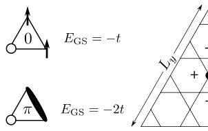 
FIG. 1. (a) Kinetic magnetism in the presence of frustration favors the formation of valence bond singlets. (b) Kagome lattice geometry used in our simulations, for system size 𝑁= 3𝐿𝑥𝐿𝑦. We also show an example of a compact localized state around a single plaquette [24].

📷 Fig 2

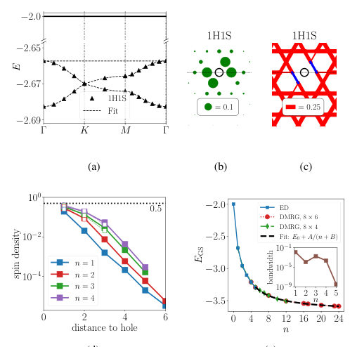 
FIG. 2. Band structure for the 1H1S system of size 12 × 12 (a), ob- tained using ED; the dashed line shows a single-particle tight-binding fit with 𝑡eff≃−4.2 × 10−3 and offset ≃2.67. Spin density (b) and spin correlations (c) (red ferro and blue antiferro, with width propor- tional to their strength), for fixed hole position. Spin density pro- file (d) along the horizontal line in panel (b), for 1H𝑛S systems with 𝑛= 1, . . . , 4, comparing ED (solid squares) with Husimi cactus clus- ter results (open squares). The dependence of the GS energy of the 1H𝑛S systems on 𝑛is shown in panel (e), with the inset plotting our best estimate for the width of the lowest band from ED (see SI).

📷 Fig 3

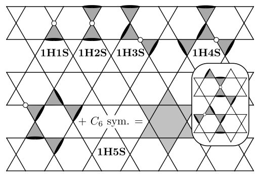 
FIG. 3. Examples of Husimi cactus clusters used in the main text to understand the nature of the polarons. All symmetry-inequivalent clusters are shown for 1H𝑛S, with 1 ≤𝑛≤4. For 𝑛= 4, there are three possible configurations: a star-shaped one shown in the main figure, and two linear ones shown in the inset. For 𝑛= 5, only the most relevant shape is shown; with its five symmetry-equivalent part- ners, this shape covers a 12-site (shaded) region of the lattice. For each cluster, only one of the possible hole positions, and its corre- sponding valence bond arrangement, are shown.

📷 Fig 4

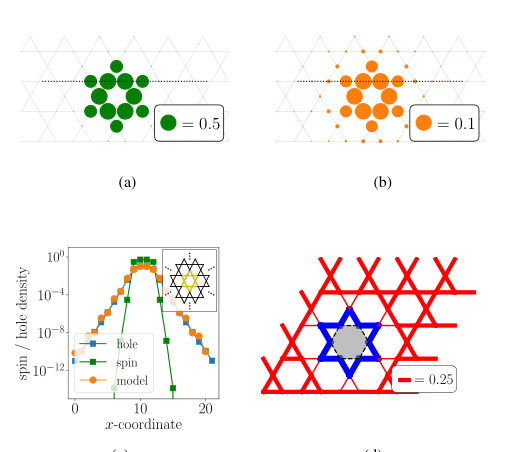 
FIG. 4. Reversed spin (a) and hole (b) densities for one of the seemingly-localized 1H5S GSs. Profile cuts are shown in panel (c). The hole density is well-described by a simple model of a spinless fermion (see inset and main text) with unfrustrated hopping on a 12- site cluster (𝑡= −1, yellow edges), embedded on a periodic kagome lattice with frustrated hopping (𝑡= 1, black edges). The spin correla- tors (red for ferro, blue for antiferro) are shown in panel (d), with the thickness of the lines denoting their strength. Density results were obtained using DMRG and spin correlators using ED (see EM). A vanishing pinning potential was used to single out a given location for the RVB polaron in...

📷 Fig 5

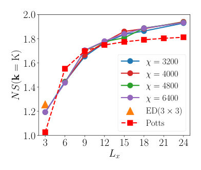 
FIG. 5. Rescaled peak intensity at the 𝐾point for our unpolarized system on lattices of size 𝐿𝑥× 3, with 6 ≤𝐿𝑥≤24, obtained using DMRG (circles joined by solid lines). We also show the 3 × 3 result obtained using ED (yellow triangle). We compare these results with the behavior of the 3-state Potts model on lattices of size 𝐿𝑥×3, with 6 ≤𝐿𝑥≤24 (squares and dotted lines), which in 𝑑= 2 is known to sit on a KT transition between algebraic and long-range magnetic correlations.

**Summary.** This paper investigates kinetic magnetism on the kagome lattice by studying how a single hole interacts with localized spins, forming RVB polarons. The authors show that as the system moves toward an unpolarized state, these short-range quantum correlations evolve into robust, long-range $\sqrt{3} \times \sqrt{3}$ antiferromagnetic order. By combining ED and DMRG, they bridge the gap between localized valence bond physics and conventional magnetic ordering.

**Why it may be interesting.** This work provides a detailed theoretical mechanism linking microscopic quantum entanglement (RVB singlets) to macroscopic magnetic ordering ($\sqrt{3} \times \sqrt{3}$), which is crucial for understanding high-temperature superconductivity and frustrated magnetism in correlated materials.

Detailed structure

**Main problem.** The study investigates how hole kinetics dictate magnetism in highly frustrated doped Mott insulators, specifically tracking the transition from short-range RVB polaron physics to long-range magnetic correlations.

**Main result.** The research demonstrates a conceptual bridge where localized RVB polarons at low spin polarization evolve into conventional $\sqrt{3} \times \sqrt{3}$ antiferromagnetic order in the unpolarized limit.

**Method.** The authors employ Exact Diagonalization (ED) and Density Matrix Renormalization Group (DMRG) techniques, supplemented by variational calculations using Husimi cactus clusters to model the hole-spin interactions.

**Model / system.** The system is modeled as a single-hole counter-Nagaoka problem on the kagome lattice, governed by an infinite-$U$ Hubbard Hamiltonian. The physics is analyzed by tuning the magnetization parameter (doping level $n$).

**Key observables.** Polaron bandwidth, spin and hole density profiles, spin structure factor $S(\mathbf{k})$, and ground state energy scaling.

**Important parameters / regimes.** Magnetization/spin polarization ($n$), lattice geometry (kagome), and the transition between small-$n$ (localized) and large-$n$ (semiclassical) regimes.

**Assumptions / limitations.** The analysis relies on modeling polarons using Husimi cactus clusters, and extrapolations to infinite systems from finite-size DMRG/ED calculations are necessary but carry potential self-interaction errors.

**Figures summary.** Figures illustrate the formation of RVB polarons (Fig. 3), show band structures and spin correlations for small $n$ (Fig. 2, Fig. S1), and compare the resulting $\sqrt{3} \times \sqrt{3}$ magnetic order to classical Potts model benchmarks (Fig. S5, Fig. S12).

**Paper structure.** The paper progresses by first establishing the polaron physics via ED for small doping ($n=1$ to $5$), showing self-trapping; it then uses DMRG for larger systems ($n\geq 5$) to observe the recovery of delocalized behavior and $\sqrt{3} \times \sqrt{3}$ order in the unpolarized limit, benchmarking this against classical models.

Abstract

To gain deeper insight into the role of hole kinetics in determining magnetism in highly frustrated doped Mott insulators, we consider the single-hole counter-Nagaoka problem on the kagome lattice, using magnetization as a tuning parameter. Near full polarization, a doped hole delocalizes upon binding reversed spins in a pattern of singlet bonds which we term resonating-valence-bond (RVB) polaron. These RVB polarons can have extremely small effective bandwidths, and hence exhibit self-trapping. By tuning the spin polarization, we track the evolution of these states toward the unpolarized sector, where we observe the emergence of $\sqrt{3}\times\sqrt{3}$ antiferromagnetic correlation reminiscent of the classical Potts and Heisenberg models on the kagome lattice. These results provide a framework to understand how RVB physics at short scales evolves into conventional magnetic correlations at long scales.

[↑ back to top](#top)

### [Phonons and magnetism of kagome FeGe probed by nuclear resonant scattering](http://arxiv.org/abs/2606.12038v1)

**Authors:** Yu Tang, Saizheng Cao, Sijie Xu, Xiaokun Teng, Sven Velten, Ilya Sergeev, Pengcheng Dai, Yilin Wang, Yu Song  
**Type:** experiment · **Category:** strongly correlated electrons · **PDF:** <https://arxiv.org/pdf/2606.12038v1>  
**Analysis basis:** full PDF text, analyzed in chunks
**Topic relevance:** `spintronics-quantum-optics interface` **3/5** · `Frenkel-Kontorova` **2/5** · `Kondo & dissipative impurity` **1/5** · `analog quantum simulation` **1/5** · `driven-dissipative phase transition` **1/5** · `exotic spin models in light-matter` **1/5**

📷 Fig 1

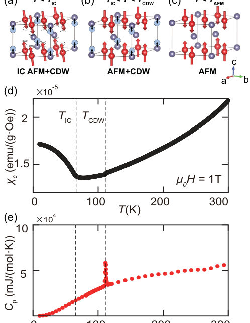 
FIG. 1. Schematic crystal and magnetic structures of FeGe for (a) T &lt; TIC, (b) TIC &lt; T &lt; TCDW, and (c) T &lt; TN [12]. (d) The magnetic susceptibility of FeGe measured in a 1 T c-axis field. (e) The specific heat of FeGe.

📷 Fig 2

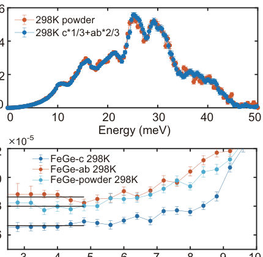 
FIG. 2. (a) The c-axis- and ab-plane-polarized Fe partial PDOS of FeGe at RT, gc(E) and gab(E). (b) Comparison of the Fe partial PDOS g(E), with 1

📷 Fig 3

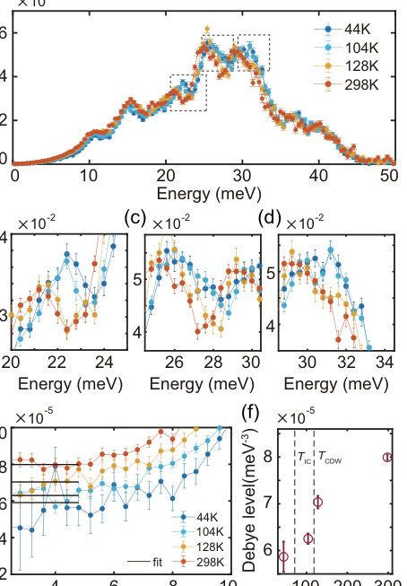 
FIG. 3. (a) The Fe partial PDOS of FeGe g(E), measured at several temperatures. Zoomed-in views of g(E) are shown around (b) ∼22 meV, (c) ∼27 meV, and (d) ∼31 meV. (d) Temperature dependence of g(E)/E2. The solids lines are fits to obtain the Debye level. (f) Temperature dependence of the Debye level.

📷 Fig 4

 
FIG. 4. (a) Calculated Fe partial PDOS with and without Coulomb interaction U. (b) Comparison of the calculated Fe partial PDOS of FeGe with and without CDW. The dashed boxes highlight energies ranges that are significantly by the CDW.

📷 Fig 5

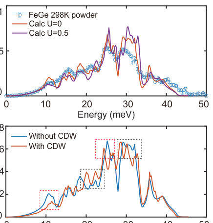 
Fig. 4(a) shows the calculated PDOS for FeGe without CDW, showing an overall reasonable agreement with ex- perimental data at RT. DFT underestimates the PDOS above ∼40 meV and overestimates the PDOS around ∼31 meV, which is unaffected by the soft force constant and the Coulomb interaction U in the calculations. Such a systematic deviation between DFT and experimental PDOS may result from the presence of significant elec- tronic correlations in FeGe, which cannot be captured using single-particle calculations.

**Summary.** The research investigates the complex interplay between charge density waves and magnetism in kagome FeGe using advanced spectroscopic techniques. By measuring phonon spectra and magnetic hyperfine fields across phase transitions, the authors demonstrate that the formation of a CDW significantly alters the lattice structure while probing subtle differences in coupling strength at subsequent magnetic transitions.

**Why it may be interesting.** This work exemplifies how lattice dynamics measurements (phonons) can be used as highly sensitive probes for subtle electronic instabilities like CDWs, which is relevant in understanding correlated electron behavior beyond simple band theory descriptions.

Detailed structure

**Main problem.** To investigate the interplay between charge density wave (CDW) order, antiferromagnetic (AFM) order, and lattice dynamics in kagome FeGe.

**Main result.** The CDW state significantly modifies the lattice dynamics by causing phonon hardening, while the AFM order is enhanced below $T_{CDW}$. The coupling between CDW and magnetism appears distinct from the behavior observed at the incommensurate magnetic transition ($T_{IC}$).

**Method.** The study employs $^{57}	ext{Fe}$ Nuclear Inelastic Scattering (NIS) to probe phonon density of states, time-domain Mössbauer spectroscopy to measure hyperfine interactions, and is complemented by specific heat and susceptibility measurements.

**Model / system.** The physical system is kagome FeGe. The analysis probes the material's behavior across multiple electronic/structural transitions ($T_{CDW}$ and $T_{IC}$) which involve coupled spin, charge, and lattice degrees of freedom.

**Key observables.** Phonon density of states (PDOS) hardening at specific energies ($\sim 22	ext{ meV}, 27	ext{ meV}, 31	ext{ meV}$); magnetic hyperfine field ($\vec{B}_{hf}$) enhancement; changes in lattice dynamics parameters like the Debye level.

**Important parameters / regimes.** Transition temperatures ($T_{CDW} \approx 115	ext{ K}$, $T_{IC} \approx 65	ext{ K}$); phonon energies (22, 27, 31 meV).

**Assumptions / limitations.** The analysis assumes that the observed changes in lattice dynamics and magnetism are directly coupled to the formation of the CDW state. DFT calculations provide a theoretical baseline for comparison.

**Figures summary.** Figures illustrate the temperature dependence of the Fe partial PDOS showing hardening across $T_{CDW}$, and show time-domain Mössbauer spectra detailing magnetic hyperfine field changes around both transition temperatures.

**Paper structure.** The paper systematically analyzes experimental data (NIS, Mössbauer) across different temperature regimes relative to known phase transitions ($T_{CDW}, T_{IC}$). It compares these findings against theoretical DFT calculations to build a comprehensive picture of the coupled order parameters.

Abstract

Kagome FeGe hosts a $2\times2\times2$ charge-density wave (CDW) that strongly interplays with antiferromagnetic order. Here, we report $^{57}$Fe nuclear resonant scattering measurement to study FeGe across its long-range CDW and incommensurate magnetic transitions. Upon entering the CDW state, hardening of acoustic phonons and optical phonons around 22~meV, 27~meV, and 31~meV are observed in the Fe partial phonon density of states, which can be qualitatively captured by first-principle calculations. Upon entering the incommensurate magnetic phase, neither the phonon density of states nor the hyperfine interaction parameters change significantly, although a subtle feature associated with the incommensurate magnetic order or slow fluctuations is detected in the time-domain Mössbauer spectra. These findings show that the CDW in kagome FeGe significantly modifies its lattice dynamics and magnetism, evidencing an intertwined nature of the spin, charge, and lattice degrees of freedom.

[↑ back to top](#top)

### [Chiral Magnons and Cycloidal Phonons in Altermagnetic CuF$_{2}$ Monolayer](http://arxiv.org/abs/2606.11584v1)

**Authors:** Andrea M. León, Matías F. Torreblanca, Carmine Autieri, Jhon W. González  
**Type:** theory · **Category:** other · **PDF:** <https://arxiv.org/pdf/2606.11584v1>  
**Analysis basis:** full PDF text, analyzed in chunks
**Topic relevance:** `exotic spin models in light-matter` **3/5** · `spintronics-quantum-optics interface` **3/5** · `analog quantum simulation` **1/5** · `non-equilibrium dynamics` **1/5**

📷 Fig 1

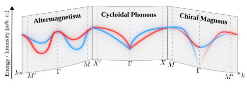 
Figure 1: Schematic representation of altermagnetic spin-splitting, cycloidal phonons and chiral magnons in CuF2.

📷 Fig 2

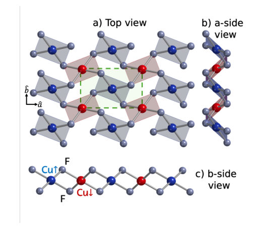 
Figure 2: (a) Top view of the CuF2 monolayer. Panels (b) and (c) display side views along the a-b plane. The dashed green line encloses the unit cell.

📷 Fig 3

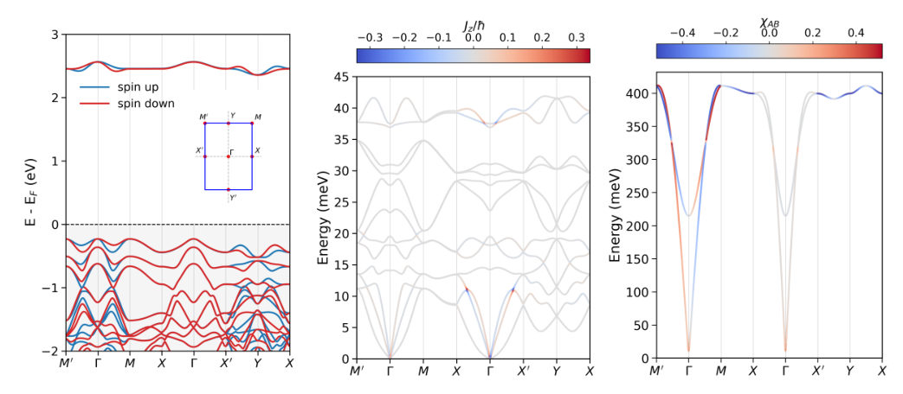 
Figure 3: (a) Electronic band structure highlighting the path with non-relativistic spin splittings and spin degeneracy. In the inset, we report the high-symmetry k-points of the two-dimensional Brillouin zone. (b) Phonon dispersion along with the mode-resolved phonon angular momentum. (c) Magnon band structure. The color scale represents the magnitude and sign of the phonon angular momentum Jz and the inter-sublattice coherence χAB, which quantifies the degree of hybridization between the A and B sublattices. Red (blue) indicates negative (positive) values of χAB.

📷 Fig 4

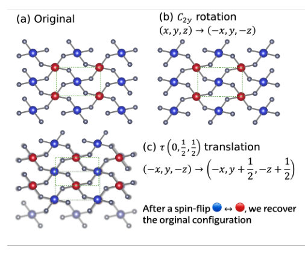 
Figure 4: Symmetry operations leading to the alter- magnetic character: (a) Original structure. (b) and (c) Rotation and translation operations required to connect the spin-up and spin-down sublattices.

**Summary.** The research investigates how the underlying crystal symmetries of altermagnetic CuF2 simultaneously govern both its magnetic (magnon) and lattice (phonon) collective excitations. The key finding is that magnon chirality and phonon angular momentum are directionally complementary, confirming a unified symmetry framework controls these distinct physical responses in 2D materials.

**Why it may be interesting.** This work provides a direct theoretical link between electronic topology (altermagnetism/Chern numbers) and emergent collective excitations (magnons/phonons), which is highly relevant for designing novel spintronic or phononics devices based on symmetry control.

Detailed structure

**Main problem.** Investigating whether symmetry principles governing electronic structure (altermagnetism) also govern collective spin and lattice excitations, and if the chiral responses of these two sectors are related.

**Main result.** The study shows that monolayer CuF2 hosts both chirality-split magnons and cycloidal phonons controlled by the same non-symmorphic symmetry operations. Crucially, phonon and magnon chiral responses exhibit a directionally complementary relationship in momentum space.

**Method.** First-principles calculations (VASP) combined with linear spin-wave theory for magnons and Density Functional Perturbation Theory (DFPT) for phonons were employed to analyze the coupled spin and lattice dynamics.

**Model / system.** The system studied is monolayer CuF2, an altermagnetic material whose behavior is dictated by its non-symmorphic crystal symmetry operations ($P2_1/c$). The analysis models both magnetic interactions (exchange, DMI) and lattice vibrations.

**Key observables.** Magnon Chern numbers ($C^M = \pm 2$), phonon angular momentum ($J_{q
u}$), magnon chirality ($\chi_{AB}(\mathbf{k})$), and electronic spin splitting patterns.

**Important parameters / regimes.** The magnetic interactions include isotropic exchange, symmetric anisotropic exchange, and Dzyaloshinskii-Moriya interaction. The system is analyzed in the context of $d$-wave altermagnetism.

**Assumptions / limitations.** Phonon calculations were performed without spin-orbit coupling, and the initial magnetic structure (collinear AFM Néel order) breaks pure inversion symmetry despite the crystal structure possessing it.

**Figures summary.** Figures schematically summarize the interplay between altermagnetism, cycloidal phonons, and chiral magnons. Other figures illustrate electronic band structures with momentum-dependent spin splittings and phonon dispersion showing angular momentum.

**Paper structure.** The paper establishes the theoretical framework by analyzing how non-symmorphic symmetries govern both magnetic (magnon) and lattice (phonon) excitations in CuF2. It then presents results demonstrating the shared symmetry control, highlighting the complementary nature of their chiral responses and confirming topological properties via Chern numbers.

Abstract

Altermagnetism establishes momentum-dependent spin splitting through non-symmorphic crystal symmetries, yet whether these same symmetries simultaneously govern spin and lattice collective excitations remains open. Here we show, using first-principles calculations and linear spin-wave theory, that monolayer CuF$_2$ hosts both chirality-split magnons and cycloidal phonons controlled by the same $P2_1/c$ symmetry operations. The altermagnetic order drives strongly anisotropic magnon chirality via symmetric anisotropic exchange, with Dzyaloshinskii--Moriya interactions acting as a weak secondary modulation. Crucially, the phonon and magnon chiral responses are directionally complementary: cycloidal phonon angular momentum emerges precisely where magnon chirality is symmetry-suppressed, and vice versa. The magnon bands further carry quantized Chern numbers $C^M = \pm 2$, confirming non-trivial altermagnetic topology. These results establish monolayer CuF$_2$ as a platform where a single symmetry framework engineers magnonic, phononic, and topological responses, providing a direct connection between altermagnetism and spin-lattice chirality in two-dimensional materials.

[↑ back to top](#top)

### [A semi-definite programming formulation of the device-dependent guessing probability](http://arxiv.org/abs/2606.12079v1)

**Authors:** Raffaele D'Avino, Aurora Mugnai, Miguel Navascués, Antonio Acín, Gabriel Senno  
**Type:** theory · **Category:** quantum information and computing · **PDF:** <https://arxiv.org/pdf/2606.12079v1>  
**Analysis basis:** full PDF text, analyzed in chunks
**Topic relevance:** `quantum measurements` **3/5** · `entanglement & information structure` **2/5** · `correlated / nonlocal dissipation` **1/5** · `measurement-induced transitions` **1/5**

📷 Fig 1

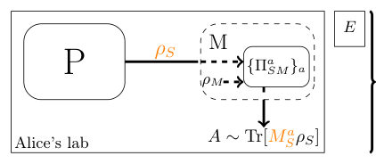 
FIG. 1: Characterized but untrusted PM setup. Alice holds a PM device that prepares a system S in some known state ρS. In the measurement box M, an unknown PVM {Πa SM}a is performed, whose outcome statistics are described by the known POVM {M a S}a. Eve holds a purification |ψ⟩SME of the joint state ρSM of the system S and the ancillary system ρM inside M.

📷 Fig 2

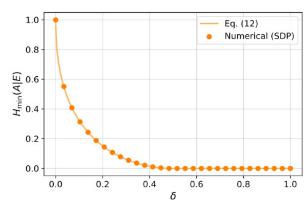 
FIG. 2: Hmin(A|E) obtained via our SDP for the setting in Eq. (11) (dots), compared with the analytic results for the corresponding quantity (solid line).

📷 Fig 3

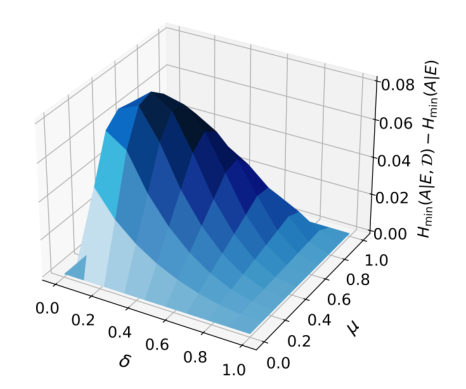 
FIG. 3: Difference between the conditional min-entropy Hmin(A|E) evaluated on the specific dilation in Eq. (14) and the value obtained via our SDP optimizing over all possible dilations.

📷 Fig 4

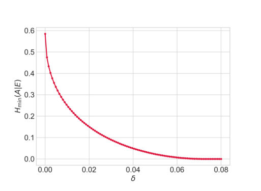 
FIG. 5: Conditional min-entropy Hmin(A|E) for k = 3 as a function of the depolarizing noise parameter δ of the measurement. The min-entropy decreases rapidly as the noise increases and vanishes around δ ≃0.073.

📷 Fig 5

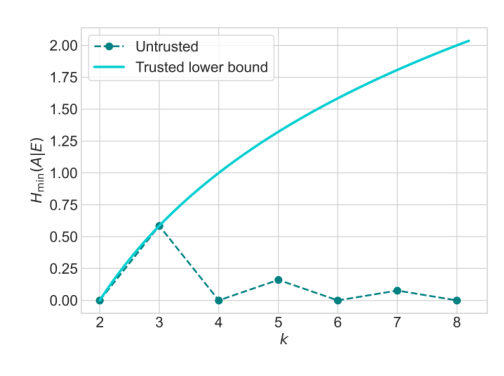 
FIG. 4: Conditional min-entropy Hmin(A|E) as a func- tion of the number of outcomes k for an equiangular POVM in the XZ plane of the Bloch sphere. The solid line represents the theoretical lower bound mn = log2(n) −1 assuming fully trusted measurements, while the points show the corresponding values obtained via our SDP formulation, without assuming trusted measure- ments. For k &gt; 3, assuming trusted measurements sig- nificantly overestimates the min-entropy.

**Summary.** This paper introduces an SDP formulation to calculate the device-dependent guessing probability in prepare-and-measure quantum setups. By reformulating the problem using moment matrices, the authors provide a computationally efficient method to quantify intrinsic randomness. The results demonstrate that assuming ideal or separable conditions can significantly overestimate the true amount of extractable randomness.

**Why it may be interesting.** This work provides a powerful, general tool for quantifying fundamental limits on randomness extraction in realistic quantum devices, which is crucial for assessing the security of quantum communication protocols.

Detailed structure

**Main problem.** The work aims to develop a computationally tractable method, specifically using Semidefinite Programming (SDP), to estimate the maximum probability with which an adversary can guess the outcomes in device-dependent prepare-and-measure quantum setups.

**Main result.** The authors successfully formulate this guessing probability as an SDP, providing a complete characterization of the intrinsic randomness extractable from such physical processes. They also show that entanglement between preparation and measurement devices strictly increases Eve's predictive power.

**Method.** The core method involves reformulating a non-convex optimization problem into an equivalent SDP by utilizing generalized moment matrices derived from the quantum state and measurement operators.

**Model / system.** The model is a general prepare-and-measure (PM) setup where Alice prepares a system $S$ in $
ho_S$, followed by a POVM $\{M_a^S\}$ on an auxiliary system $M$. Eve possesses side information $E$, and the analysis quantifies her ability to predict measurement outcomes.

**Key observables.** The device-dependent guessing probability ($P_{	ext{guess}}$) and the associated conditional min-entropy ($H_{\min} = -\log_2 P_{	ext{guess}}$).

**Important parameters / regimes.** Noise parameters ($\delta$, $\epsilon$), number of measurement outcomes ($k$), and the degree of entanglement between preparation and measurement devices.

**Assumptions / limitations.** The SDP formulation relies on mapping the problem into moment matrices, which provides sufficient conditions for the existence of the underlying quantum structure (projective measurements).

**Figures summary.** Figures compare the calculated conditional min-entropy ($H_{\min}(A|E)$) from the general SDP against known analytical bounds in various noisy and constrained scenarios. They also illustrate how assuming trusted measurements or separable correlations leads to overestimations of randomness.

**Paper structure.** The paper systematically develops the mathematical framework by first defining the problem, then reformulating it using moment matrices ($\Gamma_e$), establishing equivalence via Theorem 1, and finally applying this SDP formulation to benchmark various physical scenarios (depolarizing noise, measurement constraints).

Abstract

In quantum mechanics, a measurement applied to a state in general produces some amount of intrinsic randomness. This is not only a fundamental feature of the theory, but is also at the basis of any quantum process to generate random numbers. The simplest of such processes consists of a single, fully charaterized, measurement acting on a single, fully characterized, state. Unfortunately, no general method to estimate the intrinsic randomness produced in such setups is known. In this work, we address this issue by presenting a semidefinite programming formulation of the maximum probability with which an adversary, Eve, can guess the outcomes of characterized but untrusted prepare-and-measure setups. We then present several applications of this construction. First, we apply our method to a variety of specific setups, allowing us both to benchmark the approach and, more importantly, to determine the exact amount of certifiable randomness in scenarios where only upper bounds were previously available. Then, we show that the presence of entanglement between the device preparing the state and the measurement strictly increases Eve's predictive power, already in the most elementary setup of a binary measurement acting on a qubit state.

[↑ back to top](#top)

### [Gate-tunable spin-valley transport via carrier velocity in monolayer WSe$_2$](http://arxiv.org/abs/2606.12353v1)

**Authors:** Otman Bouladiane, Hocine Bahlouli, Clarence Cortes, David Laroze, Ahmed Jellal  
**Type:** theory · **Category:** other · **PDF:** <https://arxiv.org/pdf/2606.12353v1>  
**Analysis basis:** full PDF text, analyzed in chunks
**Topic relevance:** `spintronics-quantum-optics interface` **3/5** · `Kondo & dissipative impurity` **1/5** · `analog quantum simulation` **1/5** · `exotic spin models in light-matter` **1/5** · `non-equilibrium dynamics` **1/5**

📷 Fig 1

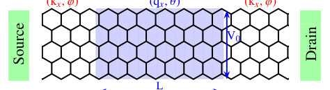 
FIG. 1: Schematic of the device based on a monolayer WSe2, where the tunneling setup consists of three re- gions: region I (source), where the incident carriers are characterized by velocity v1 and angle ϕ (regions I and III); region II, corresponding to a potential barrier of height V0 and width L with the velocity v2 and angle θ; and region III (drain), which retains the same parame- ters as region I.

📷 Fig 2

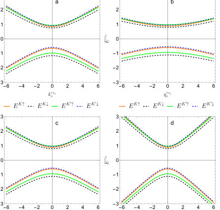 
FIG. 2: Spin- and valley-dependent energy dispersion Eτsz s as a function of wave vector components kτsz x and qτsz x along x-direction for V0 = 45 meV, and L = 7 nm. (a): kτsz x in regions I and III. (b–d): qτsz x in region II showing the effect of the velocity ratio (b): ξ = 0.5, (c): ξ = 1, and (d): ξ = 1.5 (as adopted in [44]) on each energy channel Eτsz s .

📷 Fig 3

 
Figure 2 shows how energy disperses based on differ- ent spin and valley states when the wave-vector reaches various magnitudes. Fig. 2a displays the electronic dis- persion expressed in Eq. (15) for zero external potential V (x) = 0, which measures the longitudinal wave-vector component kx. The resulting spectrum consists of eight parabolic bands, with the largest band gap occurring for the K↑and K′↓states. The inclusion of a Zeeman field breaks the valley symmetry and introduces an energy asymmetry between the K and K′ valleys, while the

📷 Fig 4

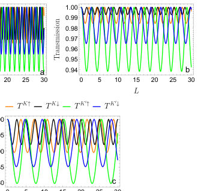 
FIG. 4: Spin- and valley-dependent transmission as a function of the barrier width L for V0 = 45 meV, Eτsz = 1.05 eV, ϕτsz = 20◦, and three velocity ratio values (a): ξ = 0.5, (b): ξ = 1, (c): ξ = 1.5.

📷 Fig 5

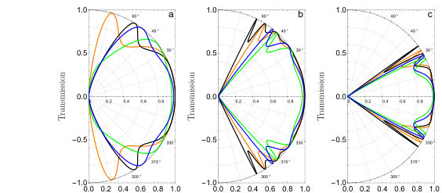 
FIG. 3: Spin- and valley-dependent transmission as a function of incident angle ϕτsz for V0 = 45 meV, L = 7 nm, Eτsz = 1.05 eV, and three velocity ratio values (a): ξ = 0.5, (b): ξ = 1, (c): ξ = 1.5.

**Summary.** The paper theoretically models spin- and valley-resolved quantum transport in WSe2 through a tunable electrostatic barrier. By engineering the Fermi velocity within this barrier, the authors show that the system acts as a powerful quantum filter. This method allows for precise control over spin and valley polarization by manipulating interference conditions, establishing a key framework for 2D material electronics.

**Why it may be interesting.** This work provides a concrete example of engineering quantum transport by manipulating internal degrees of freedom (spin/valley) via external fields or geometric parameters (velocity profile), which is highly relevant to advanced spintronics and valleytronics concepts often studied in AMO physics contexts.

Detailed structure

**Main problem.** The study investigates spin- and valley-resolved quantum transport through a finite barrier region in monolayer WSe2.

**Main result.** The work demonstrates that combining velocity modulation (Fermi velocity engineering) and potential barriers allows for the strong, continuous tuning of both the magnitude and orientation of spin-valley polarized currents.

**Method.** The authors solved the time-independent Schrödinger equation using an effective massive Dirac Hamiltonian, enforcing current-conserving matching conditions at interfaces to calculate transmission probabilities and conductance.

**Model / system.** The physical system is monolayer tungsten diselenide (WSe2), modeled by a low-energy effective massive Dirac Hamiltonian that incorporates intrinsic spin-orbit coupling and tunable Zeeman fields. The transport analysis focuses on the quantum tunneling through an electrostatic barrier region where both the scalar potential and Fermi velocity are modulated.

**Key observables.** Spin- and valley-dependent transmission probability ($T_{	au s z}$), conductance ($G_{	au}, G_{s\sigma}$), spin polarization ($P_s$), and valley polarization ($P_v$).

**Important parameters / regimes.** Barrier velocity modulation ratio ($\xi = v_2/v_1$), barrier width ($L$), barrier height ($V_0$), incident energy ($E_{	au s z}$), and intrinsic coupling strengths ($\lambda_c, \lambda_v, M_s, M_v$).

**Assumptions / limitations.** Edge effects are neglected (assuming translational invariance along the y-axis), and the simple velocity ratio $\xi = v_2/v_1$ is only recovered in the massless, symmetric limit.

**Figures summary.** Figures illustrate how transmission ($T_{	au s z}$) varies with incident angle ($\phi$), barrier width ($L$), potential height ($V_0$), and critically, the velocity ratio ($\xi$). These plots show resonant tunneling features and Fabry-Pérot oscillations modulated by $\xi$.

**Paper structure.** The paper develops a theoretical framework based on solving the Dirac equation in three regions (Source-Barrier-Drain). It calculates transport quantities using matching boundary conditions, demonstrating how varying parameters like velocity ratio ($\xi$) acts as an effective control mechanism for spin-valley filtering.

Abstract

We theoretically investigate spin- and valley-resolved quantum transport in monolayer tungsten diselenide (WSe$_2$) described by an effective massive Dirac Hamiltonian. Particular attention is devoted to a finite barrier region characterized by simultaneously modulated Fermi velocity and scalar potential. The barrier velocity $v_2$ is related to the external velocity $v_1$ through a velocity ratio $ξ=v_2/v_1$, motivated by an optical analogy with the Snell-Descartes law. The exact refraction condition depends on the full spin- and valley-resolved dispersion, and the simple ratio $ξ=v_2/v_1$ is recovered only in the massless, symmetric limit. The interplay of intrinsic spin-orbit coupling in the conduction and valence bands, quantified by $λ_c$ and $λ_v$, with spin- and valley-dependent Zeeman fields, $M_s$ and $M_v$, gives rise to substantial changes in the quasiparticle dispersion, leading to pronounced modifications of the transport characteristics. By solving the Dirac equation and enforcing current-conserving matching conditions at the interfaces, we compute the spin- and valley-dependent transmission probability and conductance. Our results demonstrate that the barrier velocity, scalar potential, incidence angle, incident energy, and barrier width serve as effective control parameters for transport, giving rise to strong anisotropy and resonant tunneling features. Furthermore, we show that both the magnitude and orientation of spin- and valley-polarized currents can be continuously tuned via velocity and potential modulation. These findings establish combined velocity and potential engineering as a powerful theoretical framework for controlling spin-valley physics in two-dimensional transition-metal dichalcogenides.

[↑ back to top](#top)

### [Mach's principle in atomic transitions](http://arxiv.org/abs/2606.11608v1)

**Authors:** Subhajit Barman, Bibhas Ranjan Majhi  
**Type:** theory · **Category:** other · **PDF:** <https://arxiv.org/pdf/2606.11608v1>  
**Analysis basis:** full PDF text, analyzed in chunks
**Topic relevance:** `Keldysh / 2PI / non-Gaussian methods` **3/5** · `correlated / nonlocal dissipation` **1/5** · `driven-dissipative phase transition` **1/5** · `methods for driven-dissipative` **1/5** · `non-equilibrium dynamics` **1/5**

📷 Fig 1

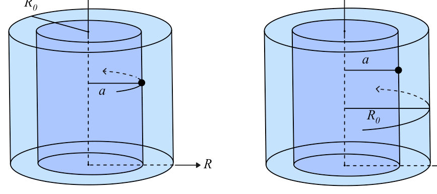 
FIG. 1: In the above figure, we have provided the schematic diagrams for the two different scenarios. On the left, the atom is in circular motion maintaining a radial distance a from the central axis, i.e., the Z−axis. At the same time, the mirror is a static cylinder of radius R0. On the right, the atom is static at a radial distance a from the central axis. In the second scenario, the mirror is cylindrical, with radius R0, and rotates about its central axis.

📷 Fig 2

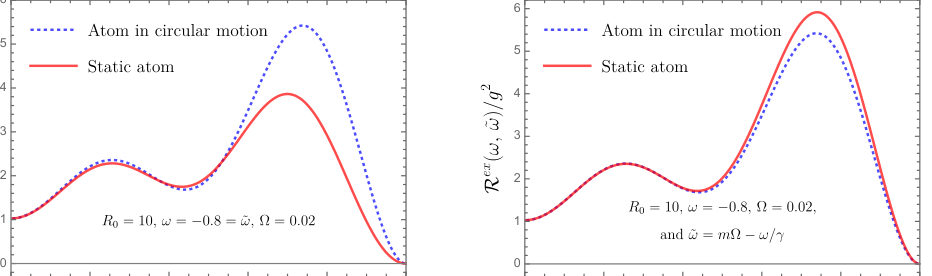 
FIG. 2: In the above figure, we have plotted Rex(ω)/g2 and Rex(˜ω)/g2, that respectively represent the atomic transition probability rates corresponding to two different scenarios, with respect to the radial position of the atom a. In particular, on the left, we consider the atomic energy gaps to be ω = ˜ω. At the same time, on the right, we choose ˜ω = m Ω−ω/γ. We choose the maximum value in the numerical sum over n to be 20 and, over m, from −20 to 20, beyond which we do not observe any deviation from the obtained results. We choose other parameters suitably. From both plots, one can notice that the transition rates are qualitatively equivalent. Moreover, in the right plot, when ˜ω = m...

**Summary.** The paper theoretically examines atomic transitions near a cylindrical mirror under two different dynamic conditions: the atom moving or the mirror rotating. By calculating transition probabilities in both scenarios, the authors demonstrate a structural equivalence between the results when field frequencies are interchanged. This finding is presented as compelling evidence for a quantum mechanical manifestation of Mach's principle.

**Why it may be interesting.** This work directly addresses fundamental principles like Mach's principle using quantum electrodynamics/field theory in non-inertial frames, which is highly relevant to advanced AMO physics concerning vacuum structure and boundary effects.

Detailed structure

**Main problem.** The study investigates structural similarities in atomic transition probabilities when comparing two scenarios: an atom moving in a static cylindrical mirror versus a static atom near a rotating mirror.

**Main result.** The calculated transition probability rates show structural equivalence upon interchanging the field mode frequencies between the two non-inertial reference frames, suggesting a quantum analogue to Mach's principle.

**Method.** Transition probabilities are calculated using perturbation theory (Dyson series) for an Unruh-DeWitt detector coupled to a scalar quantum field confined by a cylindrical boundary. The analysis involves comparing time-integrated and rate-defined quantities in both static and rotating coordinates.

**Model / system.** The system models an atom interacting with a background real scalar quantum field ($\phi$) whose modes are constrained by a perfect reflecting cylindrical mirror. The comparison is drawn between the case where the atom undergoes circular motion inside a fixed mirror, and the case where the mirror rotates while the atom remains stationary.

**Key observables.** Atomic transition probabilities ($P_{ex}$) and their corresponding rates ($	ext{Re}_{ex}$ or $R_{ex}$).

**Important parameters / regimes.** Field mode frequencies ($
u$), atomic energy gap ($\omega$), coupling strength ($g$), and the rotational frequency ($\Omega$) or radial position ($a$).

**Assumptions / limitations.** The analysis is restricted to the lowest order of coupling strength ($g \ll 1$), and the definition of transition rates is necessary due to potential divergences over infinite time.

**Figures summary.** Figure 2 plots the ratio of calculated transition rates ($	ext{Rex}/g^2$) for both the moving-atom/static-mirror case and the static-atom/rotating-mirror case, demonstrating qualitative and quantitative agreement at small atomic radii ($a$).

**Paper structure.** The paper establishes the physical model using an Unruh-DeWitt detector coupled to a field confined by a cylinder. It then calculates transition probabilities for two analogous scenarios (moving atom vs. rotating mirror) in both time-integrated and rate forms, culminating in a comparison that highlights the structural equivalence.

Abstract

We investigate the atomic transition probabilities in atom-mirror set-ups that are in circular motion. In one scenario, the atom is in circular motion inside a static cylindrical mirror. In the other scenario, the cylindrical mirror rotates around its central axis while the atom remains static. We report structural similarity in the atomic transition probabilities between these two cases -- these probabilities are equivalent upon interchanging the field frequencies between the two scenarios. We interpret such an observation as a semi-classical phenomenon analogous to the classical Mach's principle.

[↑ back to top](#top)

### [Mass generation at a fixed point: A Functional Renormalization Group Study of the tricritical O($N$) model in $d=3$ and $N=\infty$](http://arxiv.org/abs/2606.12269v1)

**Authors:** Shunsuke Yabunaka, bertrand Delamotte  
**Type:** theory · **Category:** statistical mechanics · **PDF:** <https://arxiv.org/pdf/2606.12269v1>  
**Analysis basis:** full PDF text, analyzed in chunks
**Topic relevance:** `Keldysh / 2PI / non-Gaussian methods` **3/5** · `analog quantum simulation` **1/5** · `driven-dissipative phase transition` **1/5** · `methods for driven-dissipative` **1/5** · `non-equilibrium universality` **1/5**

📷 Fig 1

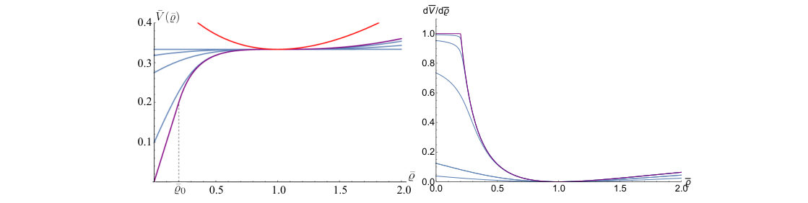 
Figure 1: Wilson-Polchinski parameterization: Plot of the potentials ¯V (¯ϱ) and of ¯V ′(¯ϱ) for some

📷 Fig 2

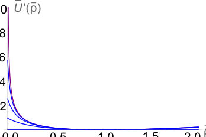 
Figure 2: Wetterich parameterization. Upper left: FP potentials ¯U(¯ϕ) corresponding to the tricrit-

📷 Fig 3

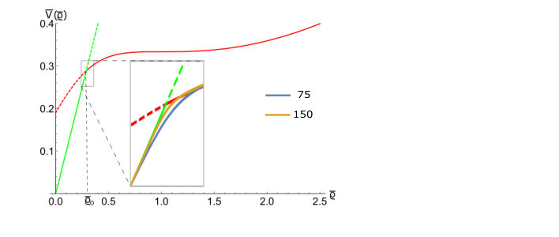 
Figure 3: N = ∞and d = 3: Construction of the singular Wilson-Polchinski fixed-point potential

📷 Fig 4

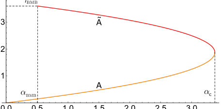 
Figure 4: Plot of the two solutions τ1(α) (orange curve) and τ2(α) (red curve), corresponding to

📷 Fig 5

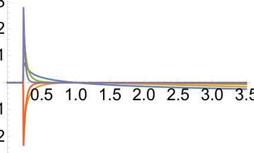 
Figure 7: Eigenpertubations corresponding to the non degenerate eigenvalues of the linearized

**Summary.** This theoretical paper uses Functional Renormalization Group methods to study mass generation in the tricritical O(N) model. It demonstrates that at a specific fixed point, the generated mass is nonuniversal and depends on UV initial conditions. Crucially, it reveals a discontinuity in the critical exponent as the system crosses into this singular fixed point regime.

**Why it may be interesting.** While focused on statistical mechanics, the use of advanced non-perturbative RG techniques (FRG) to study emergent phenomena like dynamical mass generation is highly relevant to understanding quantum field theories underlying many condensed matter systems.

Detailed structure

**Main problem.** The study investigates mass generation at a fixed point (FP) in the tricritical O(N) model, specifically addressing how this occurs when standard connections between FPs and scale invariance break down.

**Main result.** The generated mass is shown to be nonuniversal, originating from the nonanalytic structure of the effective potential. Furthermore, the critical exponent $\nu$ exhibits a discontinuous jump at the singular BMB fixed point ($\nu=1/2 \to 1/3$).

**Method.** The analysis heavily relies on the Functional Renormalization Group (FRG) approach, utilizing Wilsonian flow equations and approximations like the Local Potential Approximation (LPA).

**Model / system.** The model is the tricritical O(N) sigma model in three dimensions ($d=3$) analyzed in the large-$N$ limit ($N=\infty$). The system exhibits a line of fixed points parameterized by $\lambda$, terminating at the singular BMB FP.

**Key observables.** Critical exponent $\nu$, effective potential $U_{eff}(\phi)$, and the dimensionful physical mass $M_0$.

**Important parameters / regimes.** The coupling constant parameter $\lambda$ (or $\tau$), the dimensionality $d=3$, and the large-$N$ limit ($N=\infty$).

**Assumptions / limitations.** The analysis relies on the Local Potential Approximation (LPA) for solving the exact flow equation, and in some parts, assumes certain terms become negligible in the $N \to \infty$ limit.

**Figures summary.** Figures illustrate potential parameterizations ($\bar{V}$ vs $\bar{
ho}$) showing discontinuities at the BMB FP, and track the evolution of potentials and mass squared over RG time to demonstrate non-universal flow.

**Paper structure.** The paper progresses by first establishing the FRG framework for the model, then analyzing the regular line of FPs (BMB line), constructing the singular counterpart, and finally using perturbation theory around the BMB FP to derive the mechanism for mass generation and the jump in critical exponents.

Abstract

Renormalization group (RG) fixed points are commonly associated with scale invariance and a divergent correlation length. We show that this connection can fail in the tricritical $O(N)$ model in three dimensions in the limit $N\to\infty$. Revisiting the line of fixed points identified by Bardeen, Moshe, and Bander, we use the functional renormalization group to clarify the mechanism leading to mass generation at its singular endpoint (the BMB fixed point). We demonstrate that the generated mass is nonuniversal and originates from the nonanalytic structure of the effective potential. We show that the critical exponent $ν$ which takes the value $ν= 1/2$ along the regular part of the BMB line, that is, for $0 \leq λ< λ_{\rm BMB}$, jumps to $ν= 1/3$ on the singular part of this line with the BMB FP, corresponding to $λ= λ_{\rm BMB}$, being the pivotal point between these two regimes. We also show how its singular potential emerges dynamically along the renormalization flow.

[↑ back to top](#top)

### [Multipartite reference-frame-independent quantum cryptographic communication](http://arxiv.org/abs/2606.12284v1)

**Authors:** Donghwa Lee, Kyujin Shin, Hyang-Tag Lim, Yosep Kim, Yong-Su Kim  
**Type:** both · **Category:** quantum information and computing · **PDF:** <https://arxiv.org/pdf/2606.12284v1>  
**Analysis basis:** full PDF text, analyzed in chunks
**Topic relevance:** `quantum optics experiment` **3/5** · `entanglement & information structure` **2/5** · `QC/QI experiment` **1/5** · `interference shaping light` **1/5**

📷 Fig 1

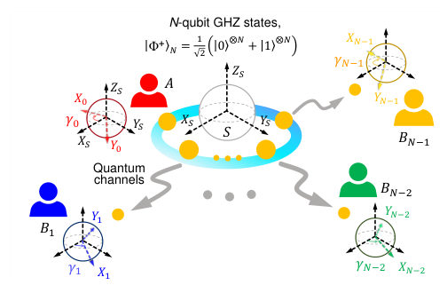 
FIG. 1. The schematic diagram of multiparty quantum cryp- tographic communication using GHZ states. Alice has N- partite GHZ states and distributes it into multiple Bobs through quantum channels. All communication parties, in- cluding Alice, have their reference frame misalignments as differences γi between the initial frame of GHZ state prepa- ration S.

📷 Fig 2

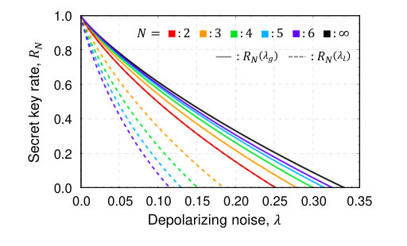 
FIG. 2. The asymptotic key rates of multiparty RFI quantum cryptographic communications in terms of the global and local depolarizing noise of λg and λl, respectively. As the number of parties N increasing, RN on the global and local depolarizing noise show different trends.

📷 Fig 3

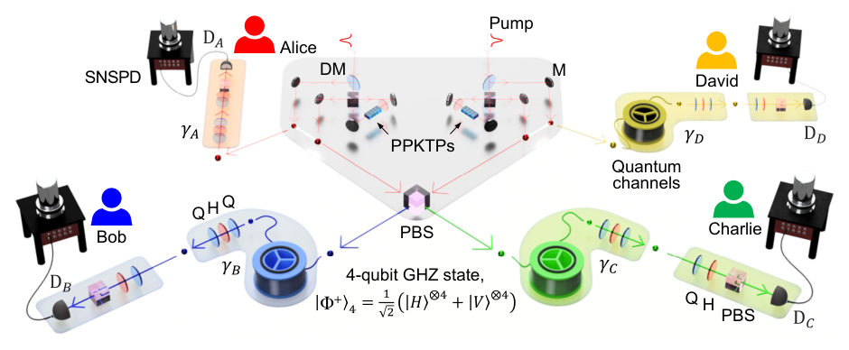 
FIG. 3. Experimental setups of the 4-parties RFI quantum cryptographic communication using GHZ state. M: mirror, DM: dichroic mirror, H: half waveplate, Q: quarter waveplate, PBS: polarizing beamsplitter, D: detector, SNSPD: superconducting nanowire single photon detector.

📷 Fig 4

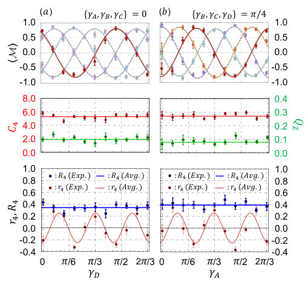 
FIG. 4. The experimental results of the 4-parties RFI quan- tum cryptographic communication using GHZ state. (a) cor- responds to Case a where {0, 0, 0, γD}. (b) corresponds to Case b where {γA, π

**Summary.** This paper theoretically and experimentally investigates Reference-Frame-Independent (RFI) Quantum Key Distribution using GHZ states across multiple parties. It generalizes the security analysis to N-parties, showing that while noise models affect robustness differently, the final secret key rate remains invariant under reference frame rotations. The work validates this concept with a four-party experimental demonstration.

**Why it may be interesting.** This work directly addresses robustness in quantum communication protocols, which is crucial for scaling up quantum networks. The mathematical generalization of security parameters to $N$ parties provides theoretical tools for future multi-user quantum internet applications.

Detailed structure

**Main problem.** Multipartite quantum cryptographic communication is susceptible to errors caused by reference frame mismatches among participating parties, which complicates key distribution as the number of users increases.

**Main result.** The authors derived a generalized security parameter $C_N$ and demonstrated that while some metrics are sensitive to rotation, the asymptotic secret key rate ($R_N$) remains invariant under arbitrary reference frame rotations for N-party GHZ states.

**Method.** The study combines theoretical derivation of key rates based on mutual information with experimental validation using four-photon GHZ states subjected to controlled reference frame rotations.

**Model / system.** The system uses Greenberger-Horne-Zeilinger (GHZ) states distributed among $N$ parties. The analysis models noise using global and local depolarizing channels, while the experiment utilizes photon sources based on PPKTP crystals.

**Key observables.** Multiparty RFI parameter ($C_N$), Quantum Bit Error Rates ($Q_Z$, $Q_X$), and the asymptotic secret key rate ($R_N$).

**Important parameters / regimes.** Number of parties ($N$), global/local depolarizing noise strengths ($\lambda_g, \lambda_l$), and reference frame rotation angles ($\gamma_i$).

**Assumptions / limitations.** The analysis assumes the ability to estimate noise parameters from measurement statistics in the X and Y bases; experimentally, it relies on generating high-fidelity GHZ states.

**Figures summary.** Figure 1 illustrates the setup with reference frame misalignments. Figure 2 compares key rate robustness under global vs. local noise for varying N. Figure 4 shows measured expectation values of Pauli strings and the invariance of $C_4$ and $R_4$ across different controlled rotations.

**Paper structure.** The paper first introduces the problem of reference-frame mismatch in multipartite QKD, generalizes the security parameter to $N$ parties ($C_N$), derives the key rate formula under various noise models (global/local), and concludes with a proof-of-principle experiment demonstrating four-party RFI communication.

Abstract

Reference frame mismatch among communication parties introduces errors in quantum cryptographic protocols. As the number of participants increases, aligning reference frames becomes increasingly difficult, complicating multipartite quantum cryptographic implementations. Here, we theoretically and experimentally investigate multipartite reference-frame-independent (RFI) quantum cryptographic communication using Greenberger-Horne-Zeilinger (GHZ) states. We generalize the bipartite RFI security parameter $C$ to an $N$-party parameter $C_N$ and derive the asymptotic secret key rate expressed solely in terms of experimentally accessible quantities. We analyze the key rate under global and local depolarizing noise models and find that increasing the number of parties $N$ enhances robustness against global depolarizing noise while increasing vulnerability to local channel noise. We also present a proof-of-principle experimental demonstration of four-party RFI quantum cryptographic communication using four-photon GHZ states, confirming the reference-frame invariance of both the $C_4$ parameter and the secret key rate under various reference frame rotations.

[↑ back to top](#top)

### [Fabricating fiber cavity mirror substrates compatible with high coupling efficiency](http://arxiv.org/abs/2606.12168v1)

**Authors:** Michael Caouette-Mansour, Thomas J. Clark, Valeria Mosso Tsedilkina, Jack C. Sankey  
**Type:** experiment · **Category:** other · **PDF:** <https://arxiv.org/pdf/2606.12168v1>  
**Analysis basis:** full PDF text, analyzed in chunks
**Topic relevance:** `quantum optics experiment` **3/5** · `correlated cavity matter` **1/5** · `interference shaping light` **1/5** · `quantum measurements` **1/5**

📷 Fig 1

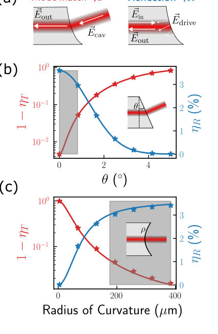 
FIG. 1. Coupling efficiency and reflection coefficient (a) Diagrams showing the geometry for (left) an optimal cav- ity mode (field ⃗Ecav, red intensity profile normal to the sur- face) transmitting into a fiber core mode ( ⃗Eout) with mode matching parameter ηT , and (right) an input core mode ( ⃗Ein) reflecting back into the core mode ( ⃗Eout) via the induced “drive” field ⃗Edrive at the surface. (b,c) Relationship between the mode mismatch parameter 1 −ηT (red) and the reflec- tion matching parameter ηR (blue) as a function of (b) cleave angle θ for the simple case of a flat surface (see inset) and (c) radius of curvature ρ for the simple case of the dimple perfectly centered (see...

📷 Fig 2

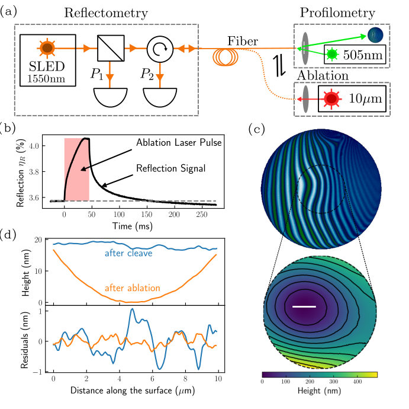 
FIG. 2. Experimental setup (a) Apparatus for ablating the fiber tip and estimating the achievable coupling efficiency. The reflectometry measurement uses light from a superluminescent light-emitting diode (SLED), which has a coherence length below ∼7 µm to eliminate standing-wave interference. The first photodiode (collecting power P1) monitors power fluctuations, and the second (power P2) measures light returning from the fiber tip. The end fiber of this reflectometer is spliced into a fiber spool from which the other end is mounted on a translation stage to move between ablation and profilometry. (b) Measured reflection ηR during ablation. The red fill indicates when the CO2 laser is on,...

📷 Fig 3

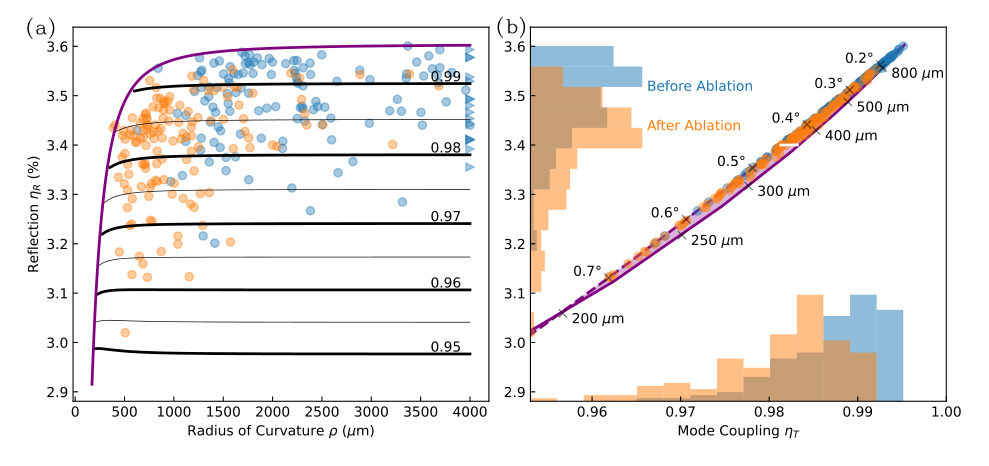 
FIG. 3. Measured Fibers and Expected Coupling (a) Measured (smaller) radius of curvature (ρ) and back reflection (ηR) on 138 fibers before (blue markers) and after (orange markers) ablation. The violet curve is the theoretical limit for a perfect core alignment (θ = 0). The black lines are contours of constant mode coupling (ηT ) with the indicated values (thin gray lines are half-values in between). The blue triangles indicate fibers with ρ ≥4000µm. (b) ηR as a function of the mode coupling (ηT ) for the same fibers with corresponding marginalized histograms on each axis. The solid violet line is the same limit line as in (a) with the marked values of ρ. The dashed purple line is the limit...

📷 Fig 4

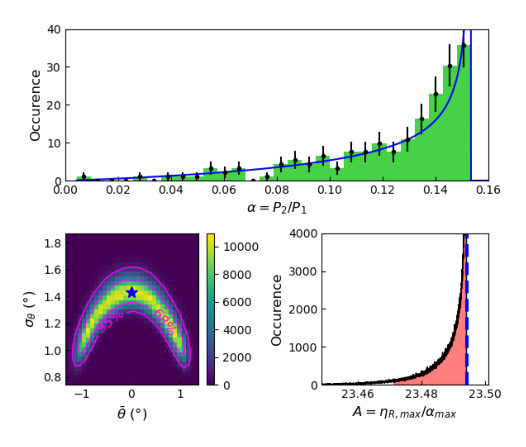 
FIG. 4. Bayesian calibration of reflectometer (a) His- togram of 137 measured post-cleave values of α ≡P2/P1. The solid curve is the likelihood modeled by Eq. B2 (nor- malized) with the parameters taken as the most likely val- ues (αmax = 0.1534, ¯θ = 0◦, σθ = 1.43◦) sampled in (b) and (c). Uncertainty bars show the square root of counts for ref- erence (not used in the analysis). (b) 2D histogram of the Monte-Carlo-sampled “nuisance parameters” ¯θ and σθ. Con- tour lines enclose the 68% and 95% confidence intervals. The marker indicates the values used in (a). (c) Histogram of the calibration parameter A = ηR,max/αmax, with αmax sampled together with ¯θ and σθ as shown in (b). The red...

**Summary.** This paper presents a novel, non-destructive technique using reflectometry to characterize fiber mirror substrates intended for optical cavities. By measuring back-reflection ($\eta_R$) during fabrication, researchers can accurately pre-select fibers that maintain high mode matching efficiency ($\eta_T > 95\%$). This significantly streamlines the experimental process by reducing reliance on costly post-fabrication characterization.

**Why it may be interesting.** This work is highly relevant to quantum optics and open quantum systems because it directly addresses the engineering bottleneck—the coupling efficiency—required for building high-finesse cavities necessary for quantum memory or single-photon sources.

Detailed structure

**Main problem.** The primary challenge is achieving high collection efficiency ($\eta_T$) in fiber optical cavities by minimizing losses caused by mode mismatch between the cavity mode and the fiber core at the mirror surface.

**Main result.** A simple, non-invasive technique using *in situ* reflectometry can pre-select viable fiber mirror substrates with high coupling efficiencies ($>95\%$), greatly improving experimental yield before expensive coating steps.

**Method.** The authors developed a methodology combining cleaving and $	ext{CO}_2$ laser ablation on fiber tips, characterizing the resulting surface quality using continuous back-reflection measurements ($\eta_R$) via Superluminescent Diodes (SLEDs).

**Model / system.** The system involves an open Fabry-Perot optical cavity formed by cleaved and ablated single-mode fiber ends. The theoretical analysis models the coupling efficiency based on surface imperfections like tilt angle ($	heta$) and radius of curvature ($
ho$).

**Key observables.** Collection efficiency ($\eta_T$), measured back-reflection coefficient ($\eta_R$), surface parameters (tilt $	heta$, radius $
ho$), and RMS roughness.

**Important parameters / regimes.** Target collection efficiency ($\eta_T > 0.95$); Wavelength of operation (1550 nm).

**Assumptions / limitations.** The analysis relies on approximations for small surface gradients, and the reflectometry measurement is assumed to provide a tight constraint on $\eta_T$, potentially bypassing the need for profilometry measurements of tilt angle.

**Figures summary.** Figures illustrate the geometry relating coupling efficiency and reflection coefficients; one figure shows the experimental setup tracking $\eta_R$ evolution during ablation alongside AFM roughness scans; another plots measured $\eta_R$ versus theoretical parameters ($
ho$, $	heta$) to constrain $\eta_T$.

**Paper structure.** The paper first establishes the physical limitation (mode mismatch) and then introduces the novel experimental technique: using reflectometry *in situ* during fabrication. Theoretical derivations are presented in appendices, culminating in a Bayesian analysis framework to calibrate the measured reflection ($\alpha$) against theoretical maximums ($\eta_{R,max}$).

Abstract

Fiber optical cavities offer small mode volumes and correspondingly strong light-matter interactions in an open Fabry-Perot geometry. However, existing fabrication techniques do not reliably produce substrates with surface profiles amenable to high mode matching between the cavity mode and fiber core, thereby limiting the achievable collection efficiency. Here we present a technique to fabricate fiber mirror substrates while using $\textit{in situ}$ reflectometry to constrain the achievable mode matching prior to coating. By measuring the back-reflection from freshly cleaved fiber tips, we pre-select 138 fibers compatible with 96.5-99.5% mode matching, and after a single CO$_2$ laser ablation pulse, these fibers remained compatible with 95.3-99.2\%. This simple technique provides rapid feedback during each stage of substrate fabrication, greatly enhancing the yield of viable fiber mirror substrates prior to (expensive) coating runs.

[↑ back to top](#top)

### [Universal critical behavior in ideal Bose-Einstein condensation](http://arxiv.org/abs/2606.11338v1)

**Authors:** Arturo Camacho-Guardian, Leon Kleebank, Frank Vewinger, Martin Weitz, Julian Schmitt, Rosario Paredes, Victor Romero-Rochín  
**Type:** theory · **Category:** quantum gases · **PDF:** <https://arxiv.org/pdf/2606.11338v1>  
**Analysis basis:** full PDF text, analyzed in chunks
**Topic relevance:** `analog quantum simulation` **3/5** · `correlated cavity matter` **1/5** · `driven-dissipative phase transition` **1/5** · `non-equilibrium universality` **1/5**

📷 Fig 1

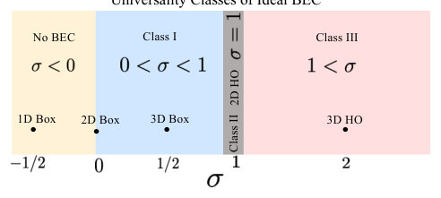 
FIG. 1. Classification of universal BEC critical behavior as a function of the low-energy scaling behavior of the density of states ρ(ϵ) ∼ϵσ, quantified by σ. Black dots indicate example systems. For σ ≤0 (e.g., Bose gas in 1D or 2D box traps), BEC does not occur at finite temperature (yellow box). For 0 &lt; σ &lt; 1 (Class I, e.g., 3D box), the thermody- namic susceptibilities diverge (blue). The marginal case σ = 1 [Class II, e.g., 2D harmonic oscillator (HO) trap] features log- arithmic corrections to the divergent scaling (gray). For σ &gt; 1 (Class III, e.g. realized in a 3D harmonic trap), only the cor- relation length diverges with the exponent νT = 1/2, while the isothermal compressibility...

**Summary.** The paper develops a unified theory for critical phenomena in ideal Bose-Einstein condensation. It shows that the nature of the phase transition—and its associated critical exponents—is entirely determined by the low-energy scaling exponent ($\sigma$) of the density of states, which is set by the confining potential's geometry. This classification framework applies broadly to various quantum bosonic systems.

**Why it may be interesting.** This work provides fundamental scaling laws that unify the understanding of phase transitions across different physical realizations (atoms, photons) by mapping them onto a single parameter ($\sigma$) derived from geometry.

Detailed structure

**Main problem.** To provide a unified framework for classifying the critical behavior of ideal Bose-Einstein condensation (BEC) based on its thermodynamic singularities.

**Main result.** The critical behavior is classified into three regimes ($\sigma < 1, \sigma = 1, \sigma > 1$) determined solely by the low-energy scaling exponent ($\sigma$) of the single-particle density of states.

**Method.** Analysis involves deriving thermodynamic properties using the grand potential and analyzing asymptotic forms of correlation functions near the critical point.

**Model / system.** The system is an ideal Bose gas, applicable to various condensates (atomic, photonic, polaritonic) confined by potentials $V(\mathbf{r})$. The low-energy physics is governed by the density of states $
ho(\epsilon) \sim \epsilon^\sigma$.

**Key observables.** Critical exponents ($\gamma_T, 
u_T, \eta_T$), isothermal compressibility ($\kappa_T$), and correlation length ($\xi$).

**Important parameters / regimes.** The DOS scaling exponent $\sigma$, which depends on dimensionality ($d$) and confinement potential details (e.g., box vs. harmonic trap).

**Assumptions / limitations.** The analysis relies on the Local Density Approximation (LDA) for inhomogeneous systems, and semiclassical methods are used to determine the low-energy DOS.

**Figures summary.** Figures summarize the classification into three universality classes based on $\sigma$, showing specific scaling laws for different trap geometries like box traps ($\sigma = d/2 - 1$) and Harmonic Oscillator (HO) traps ($\sigma = d-1$).

**Paper structure.** The paper progresses from establishing the general framework using the DOS exponent $\sigma$ to deriving explicit critical exponents for various thermodynamic quantities, culminating in a comprehensive classification table.

Abstract

Ideal Bose-Einstein condensation (BEC) remains a paradigmatic example of a continuous phase transition and a cornerstone for understanding quantum degenerate bosonic matter. We demonstrate that critical behavior of the ideal Bose gas near the BEC phase transition falls into three distinct classes, determined exclusively by the low-energy scaling of the density of states. Depending on its scaling exponent, which is controlled by dimensionality and confinement, the transition displays either the usual algebraic divergences of thermodynamic susceptibilities, divergent behavior with marginal logarithmic corrections, or a more subtle form of criticality, where only the correlation length diverges. Our work provides a unified framework for criticality in noninteracting bosonic systems. This classification applies broadly to atomic, photonic, polaritonic, and magnonic condensates, where dimensionality, confinement, and spectral engineering can strongly reshape the density of states.

[↑ back to top](#top)

### [Fisher geometry reshapes the effect of incompatibility in multiparameter quantum estimation](http://arxiv.org/abs/2606.11343v1)

**Authors:** Jiayu He, Matteo G. A. Paris  
**Type:** theory · **Category:** quantum information and computing · **PDF:** <https://arxiv.org/pdf/2606.11343v1>  
**Analysis basis:** full PDF text, analyzed in chunks
**Topic relevance:** `quantum measurements` **3/5** · `entanglement & information structure` **1/5** · `measurement-induced transitions` **1/5**

📷 Fig 1

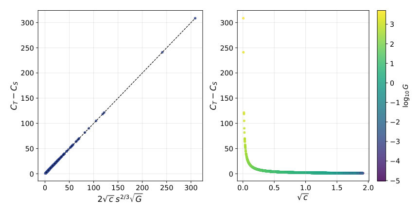 
Figure 1. Numerical diagnosis of the incompatibility contribution in the three-parameter qutrit model.

📷 Fig 2

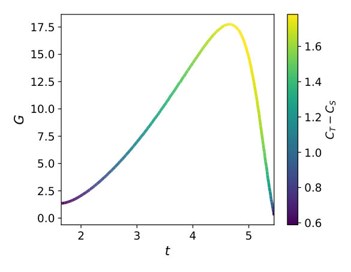 
Figure 2. Variation of G along an approximately fixed-sloppiness slice in the (t, θ) control plane. The probe

**Summary.** This paper develops a refined understanding of precision limits in multiparameter quantum estimation by quantifying the joint impact of parameter sensitivity (sloppiness) and measurement non-commutativity (incompatibility). It introduces a key diagnostic factor, $G$, showing that how incompatibility is distributed relative to the system's natural geometry dictates the final achievable precision bound. This moves beyond simple scalar measures to provide a deeper geometric understanding of quantum sensing limitations.

**Why it may be interesting.** This work provides advanced tools to quantify resource limitations in quantum sensing beyond simple measures like total Fisher information or total incompatibility strength. The focus on geometric alignment makes it highly relevant for designing optimal measurement strategies.

Detailed structure

**Main problem.** The paper addresses how two fundamental obstacles—sloppiness (QFIM anisotropy) and incompatibility (non-commutativity of optimal measurements)—jointly limit precision in multiparameter quantum estimation.

**Main result.** The distribution of incompatibility relative to the Fisher eigenbasis is a crucial diagnostic, showing that concentrating incompatibility can reduce the cost if the Fisher geometry allows for reshaping. The penalty depends on this geometric alignment factor $G$, not just the total incompatibility strength.

**Method.** The authors derive explicit upper bounds and analyze the structure of the trade-off bound by introducing dimensionless quantities like $G(\mathbf{F})$ that measure the alignment between incompatibility and QFIM eigenvalues.

**Model / system.** The analysis is performed on general quantum statistical models, using both pure-state (QGT) and mixed-state formulations involving the Symmetric Logarithmic Derivative (SLD). A concrete test case uses a qutrit SU(2) encoding for three parameters $(B, 	heta, \phi)$.

**Key observables.** Quantum Fisher Information Matrix ($Q_{\mu
u}$), Uhlmann Curvature ($U_{\mu
u}$), Sloppiness measure ($s = 1/\det Q$), and the dimensionless matching factor $G(\mathbf{F})$.

**Important parameters / regimes.** The number of parameters ($n=2, 3$, general $n \ge 4$) and the relative strength/placement of incompatibility components.

**Assumptions / limitations.** The analysis relies on deriving explicit upper bounds for the Holevo bound and assumes certain structural properties (e.g., diagonalizability) when simplifying the cost function in low dimensions.

**Figures summary.** Figures numerically confirm that the penalty term $C_T - C_S$ depends critically on the matching factor $G$, demonstrating that increasing total incompatibility ($\sqrt{c}$) does not guarantee a higher cost if $G$ is small.

**Paper structure.** The paper systematically analyzes the joint impact of sloppiness and incompatibility, deriving bounds using geometric tensors (QGT/SLD), introducing the diagnostic factor $G(\mathbf{F})$, proving structural results for low dimensions ($n=2, 3$), and finally testing these findings numerically on a qutrit model.

Abstract

Multiparameter quantum estimation faces two fundamental obstacles: sloppiness, i.e., anisotropy of the quantum Fisher information matrix (QFIM) that renders some parameter directions insensitive, and incompatibility, the non-commutativity of optimal measurements for different parameters. The trade-off bound $C_T$ captures their joint impact on precision, but it has remained unclear how the distribution of incompatibility across parameter planes affects its overall cost. Here we separate the total amount of incompatibility from its location. We introduce a dimensionless quantity $G_n^{(F)}$ that measures the alignment between the incompatibility distribution and the eigenvalues of the QFIM, and show how the Frobenius scale of the incompatibility contribution factorizes. We obtain a bound and prove the incompatibility cost lies between this bound and a rank-dependent multiple thereof. We also prove that at fixed sloppiness, or equivalently fixed Fisher volume, concentrating incompatibility into a single parameter plane reduces the optimized trade-off cost because the Fisher geometry can then be reshaped to allocate more Fisher area to that plane. A qutrit $SU(2)$ encoding numerically confirms that states with larger incompatibility strength can nevertheless incur a smaller cost if the matching factor $G$ is sufficiently small. Our results establish that the distribution of incompatibility relative to the Fisher eigenbasis is a central diagnostic for multiparameter estimation, beyond the total incompatibility strength.

[↑ back to top](#top)

### [Emergent mirror symmetry in the optimization of the central-spin quantum battery](http://arxiv.org/abs/2606.11557v1)

**Authors:** Hui-Yu Yang, Kun Zhang, Xiao-Hui Wang, Hai-Long Shi  
**Type:** theory · **Category:** statistical mechanics · **PDF:** <https://arxiv.org/pdf/2606.11557v1>  
**Analysis basis:** full PDF text, analyzed in chunks
**Topic relevance:** `non-equilibrium dynamics` **2/5** · `analog quantum simulation` **1/5** · `correlated / nonlocal dissipation` **1/5** · `driven-dissipative phase transition` **1/5** · `exotic spin models in light-matter` **1/5** · `methods for driven-dissipative` **1/5** · `non-equilibrium universality` **1/5**

📷 Fig 1

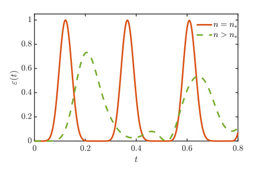 
FIG. 2. Time evolution of the normalized stored-energy contribution associated with the fully charged battery state, ε(t) = ⟨Nb|ρ(t)|Nb⟩, for different initial charger excitation numbers n. At the optimal point n = n∗, the transfer to the fully charged state is the most efficient, leading to the largest and fastest buildup of ε(t). Here n∗= (Nb+Nc)/2 for the even case considered. The parameters are Nb = 5, Nc = 25, and A = 1.

📷 Fig 2

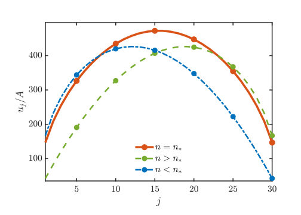 
FIG. 1. Spatial profile of the effective hopping amplitudes uj for different initial charger excitation numbers n. At the optimal point n = n∗, the profile is exactly mirror symmetric with respect to the chain center, whereas away from this point it becomes asymmetric. Here n∗= (Nb + Nc)/2 for the even case considered. The parame- ters are Nb = 30, Nc = 90, and A = 1.

📷 Fig 3

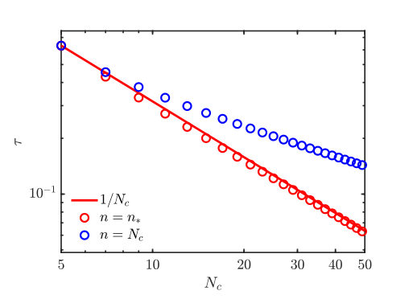 
FIG. 4. Scaling of the charging time τ with the charger size Nc. Red circles denote the numerical results for the symmetry-selected opti- mal protocol n = n∗, blue circles denote those for the fully excited charger baseline n = Nc, and the red solid line is the 1/Nc scaling guide. The optimal protocol follows τ ∝1/Nc, whereas the fully excited charger baseline does not. Here n∗= (Nb + Nc)/2 for the even case considered. The parameters are Nb = 5 and A = 1.

📷 Fig 4

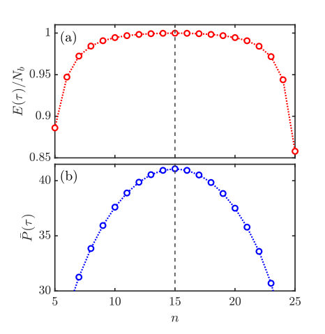 
FIG. 3. Charging performance as a function of the initial charger excitation number n. The maximum stored energy per battery cell E(τ)/Nb in (a) and the corresponding average charging power ¯P(τ) in (b) are both maximized at the common optimal point n = n∗, marked by the vertical dashed line. Here n∗= (Nb + Nc)/2 for the even case considered. The parameters are Nb = 5, Nc = 25, and A = 1.

📷 Fig 5

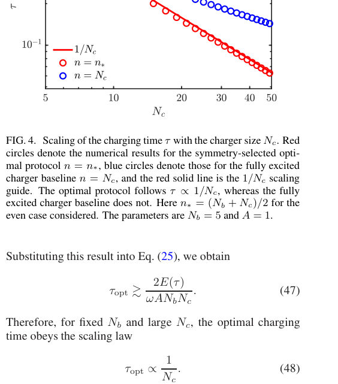 
Figure 4 confirms this prediction by comparing the symmetry-selected protocol with the fully polarized bench- mark. The red circles, corresponding to the optimal Dicke- state protocol at n = n∗, are in excellent agreement with the 1/Nc reference scaling marked by the red solid line. In contrast, the blue circles, corresponding to the fully polar- ized charger scheme n = Nc, decrease much more slowly and clearly deviate from the 1/Nc behavior. This compari- son demonstrates that the reduction of the charging time is not a trivial consequence of enlarging the charger, but origi- nates from the structure of the symmetry-selected optimal ini- tial state.

**Summary.** This paper investigates the optimization of energy storage in a central-spin quantum battery model. By analyzing two structural indicators related to charging dynamics, the authors find that maximum efficiency is achieved when the system's effective Hamiltonian becomes exactly mirror symmetric. This establishes emergent symmetry as a key organizing principle for maximizing performance in interacting quantum systems.

**Why it may be interesting.** This work connects abstract mathematical concepts (emergent symmetry) directly to measurable physical quantities (charging power/energy), providing a powerful theoretical tool for designing and understanding optimal operation regimes in complex quantum many-body systems relevant to AMO physics.

Detailed structure

**Main problem.** The research aims to optimize the charging efficiency of a quantum battery by identifying structural indicators that govern energy storage dynamics.

**Main result.** Joint optimization of two structural indicators ($\Omega(n)$ and $\Lambda(n)$) occurs at an initial charger excitation number ($n^*$) where the effective charging Hamiltonian exhibits exact mirror symmetry. This emergent symmetry is shown to be a useful principle for maximizing charging performance.

**Method.** The authors derived upper bounds on average charging power and stored energy using structural indicators related to hopping profiles, followed by optimization techniques (AM-GM inequality) to find the optimal initial state.

**Model / system.** The system is a central-spin quantum battery model consisting of $N_b$ central spins coupled to $N_c$ bath spins. The dynamics are analyzed within an invariant subspace defined by the charger's Dicke state sector, governed by a specific interaction Hamiltonian.

**Key observables.** Average charging power ($ar{P}(	au)$), stored energy ($E(	au)$), and two structural indicators: $\Omega(n)$ (upper bound on power) and $\Lambda(n)$ (stored energy buildup characterization).

**Important parameters / regimes.** The optimal excitation number $n^*$, which is found to be near $(N_b + N_c)/2$. The analysis also considers the large $N_c$ limit for scaling laws.

**Assumptions / limitations.** The analysis relies on bounding techniques (Hölder, AM-GM) and approximates the optimal Dicke state dynamics using product initial states like spin coherent states.

**Figures summary.** Figures illustrate that both stored energy and average power are maximized at $n^*$, confirming the physical relevance of the symmetry selection. Figure 4 specifically shows the scaling of the optimal charging time ($	au \propto 1/N_c$).

**Paper structure.** The paper first defines the quantum battery model and its associated structural indicators. It then mathematically derives upper bounds for performance metrics using these indicators. The core is the optimization step, showing that maximizing both indicators simultaneously selects $n^*$, which in turn enforces mirror symmetry on the effective Hamiltonian.

Abstract

Quantum batteries provide a useful setting for exploring nonequilibrium many-body effects in energy storage. Here we investigate the optimization of a quantum battery based on the central-spin model. We identify two complementary structural indicators associated with the effective charging dynamics: one yields an upper bound on the average charging power, while the other characterizes the buildup of stored energy. We show that these two indicators are jointly optimized at a distinguished initial charger excitation number, which selects a particular Dicke sector of the model. At this common optimal point, the effective charging Hamiltonian becomes exactly mirror symmetric, suggesting mirror symmetry as a useful structural indicator for optimizing quantum batteries. We further show that the corresponding optimal dynamics can be closely approximated by product initial states, in particular by spin coherent states whose excitation-number distribution is centered at the symmetry-selected point. Our results establish a direct connection between charging performance, optimal-state structure, and emergent symmetry in the central-spin quantum battery, and suggest symmetry as a useful organizing principle for efficient charging in interacting many-body quantum systems.

[↑ back to top](#top)

### [Isotropic random walks and Brownian diffusion on complex projective space](http://arxiv.org/abs/2606.11438v1)

**Authors:** Gyula I. Tóth  
**Type:** theory · **Category:** quantum information and computing · **PDF:** <https://arxiv.org/pdf/2606.11438v1>  
**Analysis basis:** full PDF text, analyzed in chunks
**Topic relevance:** `entanglement & information structure` **2/5** · `non-equilibrium dynamics` **2/5** · `correlated / nonlocal dissipation` **1/5** · `driven-dissipative phase transition` **1/5** · `methods for driven-dissipative` **1/5** · `non-equilibrium universality` **1/5**

📷 Fig 1

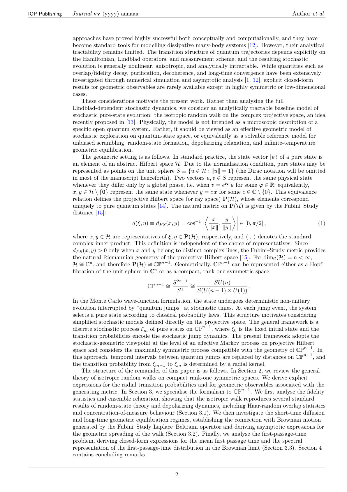 
Low-resolution page preview, page 2

📷 Fig 2

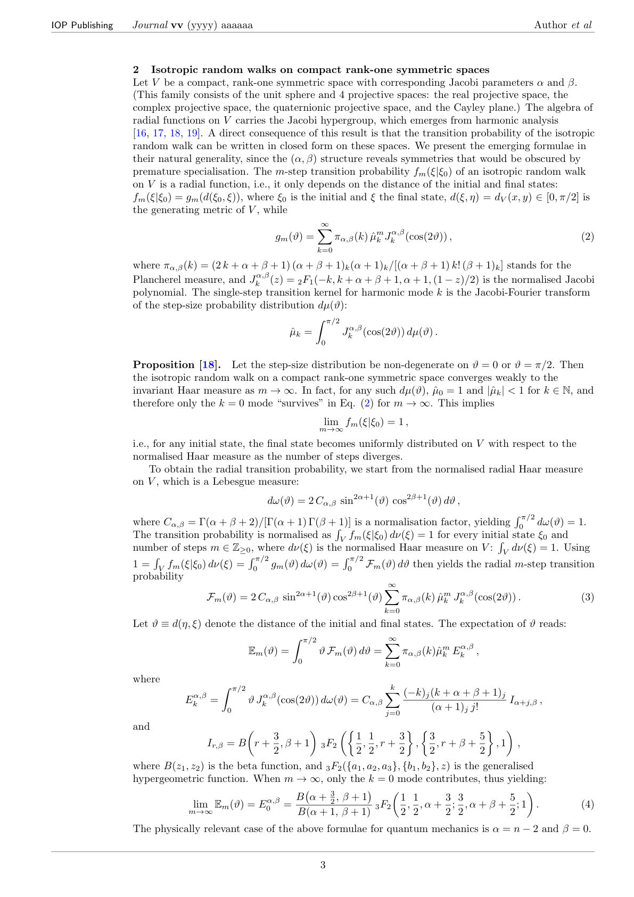 
Low-resolution page preview, page 3

📷 Fig 3

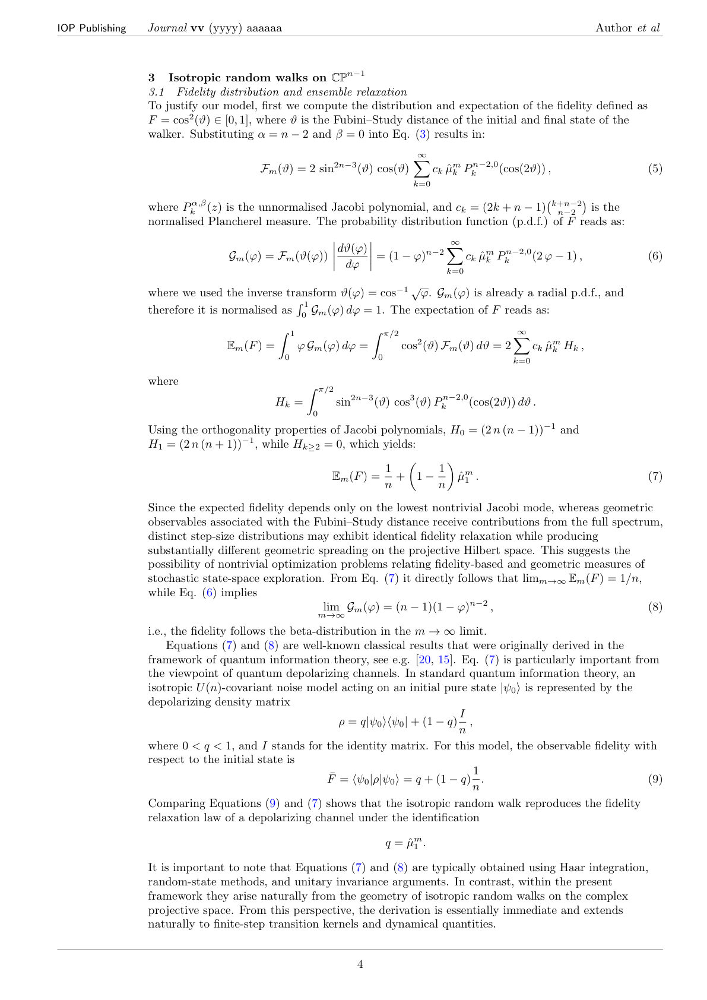 
Low-resolution page preview, page 4

📷 Fig 4

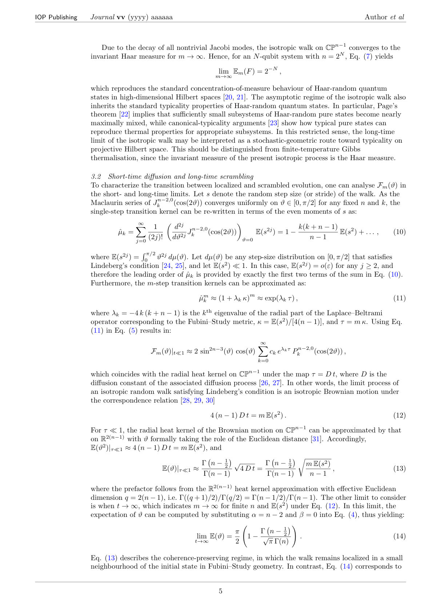 
Low-resolution page preview, page 5

📷 Fig 5

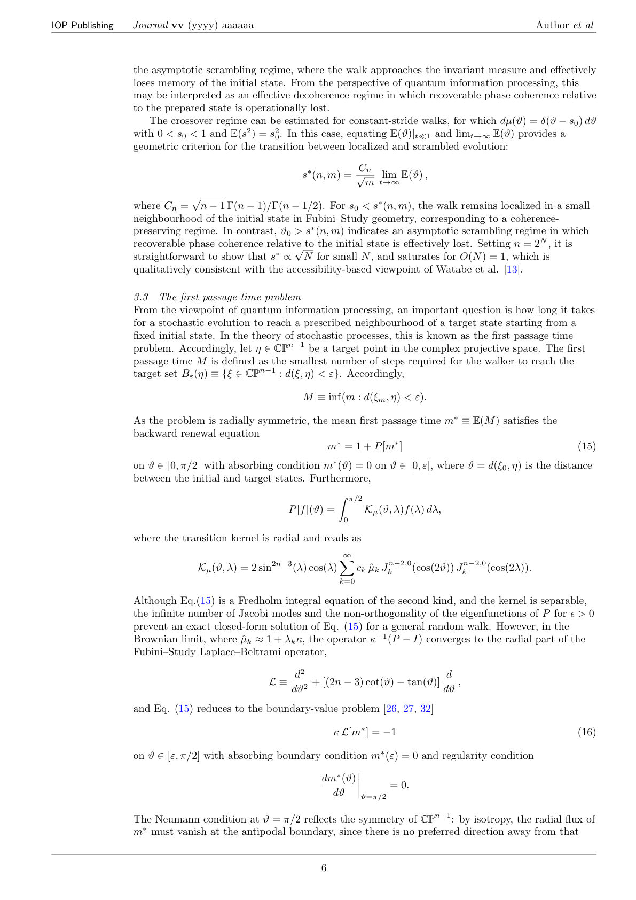 
Low-resolution page preview, page 6

**Summary.** The paper introduces an isotropic random walk model on the complex projective space to study quantum state evolution geometrically. By analyzing this process, it derives explicit formulas for fidelity decay and calculates the mean time required to reach a target state. This framework offers a powerful, solvable reference model for understanding decoherence dynamics in high-dimensional quantum systems.

**Why it may be interesting.** This work provides powerful geometric tools—solvable stochastic processes on curved manifolds—to analyze fundamental concepts in quantum information like scrambling and decoherence without needing specific Hamiltonian details. The dimension-dependent divergence of $m^*$ is particularly insightful for understanding state preparation difficulty.

Detailed structure

**Main problem.** To develop an analytically tractable stochastic-geometric framework for understanding quantum state space exploration, particularly in the context of decoherence.

**Main result.** The isotropic random walk on complex projective space provides a solvable model that reproduces Haar-random fidelity statistics and yields analytical expressions for first-passage times. The mean time to reach high-fidelity states diverges strongly with dimension due to geometric concentration effects.

**Method.** The analysis combines harmonic analysis on compact rank-one symmetric spaces with the study of random walks, which are shown to converge to Brownian diffusion governed by the Fubini–Study Laplace–Beltrami operator in the short/long time limits.

**Model / system.** The system is modeled as an isotropic random walk on the complex projective space ($\mathbb{CP}^{n-1}$), which represents the pure quantum state space. This approach serves as a geometric reference model for open quantum evolution, bypassing the need to specify a microscopic Lindblad generator.

**Key observables.** Transition kernels, fidelity statistics ($F$), mean first passage time ($m^*$), and expectation values of geometric observables related to the Fubini–Study metric.

**Important parameters / regimes.** The dimension $n$ (related to the Hilbert space dimension), the number of steps $m$, and the target fidelity $F^*$ are crucial parameters governing convergence rates and divergence behavior.

**Assumptions / limitations.** The model assumes an isotropic, Markovian evolution on $\mathbb{CP}^{n-1}$ and relies on approximating the random walk by Brownian diffusion in certain limits to solve for first passage times.

**Paper structure.** The paper establishes the general framework using harmonic analysis on symmetric spaces, derives transition probabilities via Jacobi polynomials, analyzes the short-time convergence to heat kernel/Brownian motion, and finally solves the mean first passage time problem by reducing it to a boundary value problem involving the killed Laplacian.

Abstract

We show that isotropic random walks on the complex projective space provide a canonical and analytically tractable stochastic-geometric framework for the exploration of quantum-state space. The approach combines harmonic analysis on compact rank-one symmetric spaces with stochastic pure-state evolution and yields explicit analytical expressions for transition kernels, fidelity statistics, and geometric observables associated with the Fubini--Study metric. In particular, the framework provides a solvable reference model for isotropic depolarization and Haar equilibration, reproducing Haar-random fidelity statistics and the invariant measure on projective Hilbert space without specifying a microscopic Lindblad generator. In the short-time regime, the stochastic evolution converges to Brownian diffusion generated by the Fubini--Study Laplace--Beltrami operator, while the long-time limit exhibits concentration-of-measure behaviour characteristic of high-dimensional random quantum states. We further derive analytical and asymptotic results for the first-passage-time problem, including closed-form expressions in the Brownian limit for the mean first passage time and the long-time tail of the first-passage-time distribution. For high-fidelity target states, the mean first passage time exhibits a strong dimension-dependent divergence originating from the concentration properties of the Fubini--Study geometry.

[↑ back to top](#top)

### [Mean-field limits for stochastic particle systems on dense graphs](http://arxiv.org/abs/2606.11369v1)

**Authors:** Angeliki Koutsimpela, Elena Magnanini  
**Type:** theory · **Category:** statistical mechanics · **PDF:** <https://arxiv.org/pdf/2606.11369v1>  
**Analysis basis:** full PDF text, analyzed in chunks
**Topic relevance:** `non-equilibrium dynamics` **2/5** · `Keldysh / 2PI / non-Gaussian methods` **1/5** · `analog quantum simulation` **1/5** · `correlated / nonlocal dissipation` **1/5** · `driven-dissipative phase transition` **1/5** · `methods for driven-dissipative` **1/5** · `non-equilibrium universality` **1/5**

📷 Fig 1

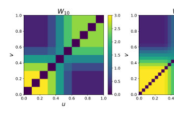 
Figure 1: From left to right: the step graphons W10 and W25, followed by the limiting continuous graphon W. The parameters used for the cut-off χ are a = 0.35 and b = 0.65. Additionally we used α = 3, β = 2.5, and γ = 0.3. As L →∞, the step kernels converge to the limiting graphon, preserving the underlying community structure.

📷 Fig 2

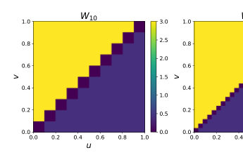 
Figure 2: Directed interaction kernels with parameters a = 0.3, b = 0.7. From left to right: the step graphons W10 and W25, followed by the limiting continuous graphon W. The graphon assigns a larger interaction intensity to ordered pairs (u, v) with u &lt; v than to pairs with u &gt; v.

📷 Fig 3

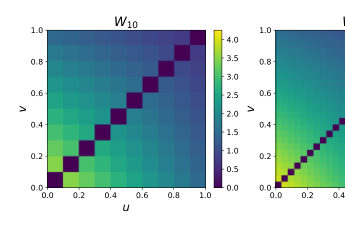 
Figure 3: Core–periphery interaction kernels with parameters a = 0.2, b = 0.45, and θ = 2. From left to right: the step graphons W10 and W25, followed by the limiting continuous graphon W. The region near u = 0 represents the core and has stronger interactions, while the region near u = 1 represents the periphery.

**Summary.** This paper rigorously analyzes the mean-field limit of stochastic particle systems defined on large, dense graphs. It proves that the system's evolution converges to a deterministic nonlinear master equation whose structure is dictated by the limiting graphon. This framework allows for modeling complex, spatially heterogeneous dynamics in the thermodynamic limit.

**Why it may be interesting.** This work provides rigorous mathematical tools for analyzing complex, non-equilibrium dynamics in many-body systems where interactions are spatially structured but approach a continuum limit, which is relevant for modeling interacting quantum matter or open quantum systems with structured environments.

Detailed structure

**Main problem.** The study focuses on deriving the mean-field limit for stochastic interacting particle systems whose interactions are defined by dense graphs converging to a graphon.

**Main result.** The empirical measure process converges weakly to a deterministic nonlinear master equation governed by the limiting graphon, capturing spatially non-homogeneous dynamics.

**Method.** The analysis employs techniques from probability theory, including establishing tightness via Prohorov's theorem and deriving convergence results through moment bounds and weak convergence arguments in function spaces like D([0, T], P(...)).

**Model / system.** The system consists of stochastic particles undergoing monomer-exchange on a graph $G_L$ whose structure converges to a graphon $W$. The dynamics are tracked via the empirical measure $\pi_L(t)$ in the thermodynamic limit.

**Key observables.** Empirical measure process $\pi_L(t)$, its weak limit $\pi(t)$, and derived density functions $p_t(u, k)$.

**Important parameters / regimes.** The system size limit ($L 	o \infty$), the particle density ($
ho$), and the interaction structure defined by the graphon $W$.

**Assumptions / limitations.** Convergence of weighted graphs to a graphon (Assumption 1), boundedness of rates, and initial moment bounds are required for convergence theorems.

**Figures summary.** Figure 1 illustrates community formation using step graphons converging to a continuous graphon; Figure 2 shows directed interaction kernels where $W(u, v) 
eq W(v, u)$.

**Paper structure.** The paper builds from establishing moment bounds (Prop 2.1), proving tightness (Prop 2.2), and finally deriving the Law of Large Numbers (Theorem 2.3) leading to the nonlinear master equation for the limit process.

Abstract

We study stochastic interacting particle systems whose interaction structure is described by dense weighted directed graphs converging to a graphon. In the thermodynamic limit, we prove a law of large numbers for the empirical measure process and derive a deterministic nonlinear master equation describing the macroscopic evolution. The limiting equation retains the heterogeneous interaction structure of the microscopic system through the limiting graphon, allowing for spatially non-homogeneous behaviors such as localized or community-type interactions.

[↑ back to top](#top)

### [Scaling-optimal purification of noisy qubit unitary channels](http://arxiv.org/abs/2606.12394v1)

**Authors:** Ryotaro Niwa, Satoshi Yoshida, Koki Ono, Takeru Utsumi, Zhaoyi Li, Yuxiang Yang, Ryuji Takagi, Mio Murao  
**Type:** theory · **Category:** quantum information and computing · **PDF:** <https://arxiv.org/pdf/2606.12394v1>  
**Analysis basis:** full PDF text, analyzed in chunks
**Topic relevance:** `entanglement & information structure` **2/5** · `quantum measurements` **2/5** · `Keldysh / 2PI / non-Gaussian methods` **1/5** · `correlated / nonlocal dissipation` **1/5** · `driven-dissipative phase transition` **1/5** · `methods for driven-dissipative` **1/5**

📷 Fig 1

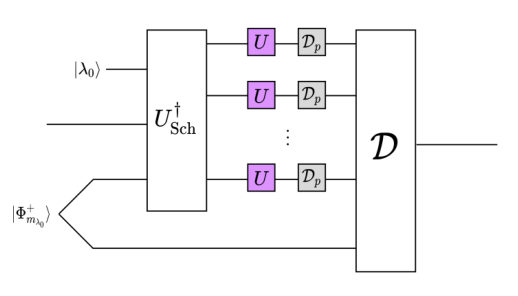 
FIG. 1. An entanglement-assisted U(2)-covariant quantum error-correcting code (QECC) that purifies n noisy channels, which achieves the optimal scaling to first order in the noise strength. For odd integer n = 2k −1, we define λ0 := (k, k − 1), and |Φ+ mλ0 ⟩:= 1 √mλ0 Pmλ0 i=1 |i⟩⊗|i⟩. The unitary USch

📷 Fig 2

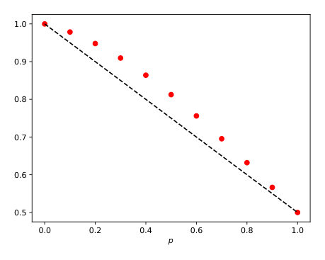 
FIG. 2. The red dots show the optimal fidelity ef Seq 3,2 (p). Our numerics suggest that the optimal fidelity is achieved by a parallel strategy: ef Seq 3,2 (p) = ef Par 3,2 (p). The black dashed line shows the non-purified trivial fidelity.

**Summary.** The paper tackles the challenging problem of purifying unknown unitary channels corrupted by noise. It rigorously compares sequential and parallel error correction strategies using SDPs and QECC bounds. The key finding is that while finite uses show protocol differences, asymptotically, both methods achieve the same optimal scaling for noise suppression.

**Why it may be interesting.** This work provides deep insights into the fundamental limitations of quantum channel estimation and purification protocols, particularly clarifying when resource constraints (like sequential vs. parallel use) matter versus when scaling laws dominate in the low-noise limit.

Detailed structure

**Main problem.** The core problem is purifying noisy qubit unitary channels, meaning constructing a superchannel that recovers an unknown original unitary $U$ despite repeated applications of the channel corrupted by depolarizing noise.

**Main result.** While sequential strategies show a finite-use advantage over parallel ones, the analysis proves that in the low-noise limit ($p \ll 1$), both protocols achieve asymptotically optimal noise suppression scaling ($\Theta(1/n)$).

**Method.** The problem is formulated and analyzed using Semidefinite Programming (SDP) techniques, comparing lower bounds derived from concrete entanglement-assisted Quantum Error-Correcting Codes (QECCs) against upper bounds derived from quantum metrological arguments.

**Model / system.** The system involves qubit unitary channels subjected to depolarizing noise ($N_{U,p} = D_p \circ U$). The analysis is performed for $d=2$ qubits and generalizes the concept of channel purification beyond simple state purification.

**Key observables.** Channel fidelity ($f_{	ext{Choi}}$) quantifying how close the output superchannel approximates the original unknown unitary, and the performance operator $\Omega_{n,p}$.

**Important parameters / regimes.** Number of uses ($n$), depolarizing noise strength ($p$), and system dimension ($d=2$). The analysis focuses heavily on the low-noise limit ($p \ll 1$) and the asymptotic scaling $n 	o \infty$.

**Assumptions / limitations.** The primary assumptions involve analyzing the process in the low-noise regime, using specific algebraic tools like Schur-Weyl duality for constraints, and comparing two distinct operational strategies: sequential versus parallel channel uses.

**Figures summary.** Figures illustrate the performance comparison between sequential and parallel protocols; Table I provides numerical optimal fidelities for $d=2$ at small $n$, showing initial divergences that converge asymptotically.

**Paper structure.** The paper progresses by first establishing the problem via SDP formulation, then providing numerical evidence distinguishing finite-$n$ strategies, followed by deriving rigorous lower and upper bounds using QECCs and QFI arguments to establish asymptotic optimality.

Abstract

We consider the problem of purifying noisy qubit unitary channels. Given the ability to apply an unknown qubit unitary channel followed by depolarizing noise, we aim to construct a superchannel that purifies the noisy unitary back to the original unknown unitary. We first provide numerical evidence that sequential strategies can strictly outperform parallel strategies when the number of channel uses is finite, highlighting the fundamental distinction from state purification. We then provide a concrete $\mathrm{U}(2)$-covariant parallel protocol based on a novel entanglement-assisted quantum error-correcting code that suppresses the first-order noise strength as $O(1/n)$ with $n$ channel uses and show this scaling is asymptotically optimal in the low-noise regime, even when sequential strategies are allowed.

[↑ back to top](#top)

### [A stochastic model for elastoplastic contact of rough surfaces incorporating scale-dependent hardness](http://arxiv.org/abs/2606.11765v1)

**Authors:** Yang Xu, Hengxu Song, Jianqiao Hu  
**Type:** theory · **Category:** statistical mechanics · **PDF:** <https://arxiv.org/pdf/2606.11765v1>  
**Analysis basis:** full PDF text, analyzed in chunks
**Topic relevance:** `non-equilibrium dynamics` **2/5** · `non-equilibrium universality` **2/5** · `Keldysh / 2PI / non-Gaussian methods` **1/5** · `driven-dissipative phase transition` **1/5** · `methods for driven-dissipative` **1/5**

📷 Fig 1

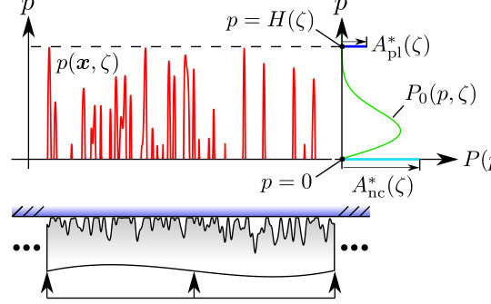 
Figure 1: A cross-sectional view of the purely normal contact between a rigid flat and a rough surface and the schematic of the probability density function of the contact pressure.

📷 Fig 2

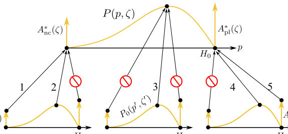 
Figure 2: A graphical illustration of probability flow from P(p′, ζ′) to P(p, ζ) where hardness is a constant. The three PDFs at the bottom are all replicas of P(p′, ζ′).

📷 Fig 3

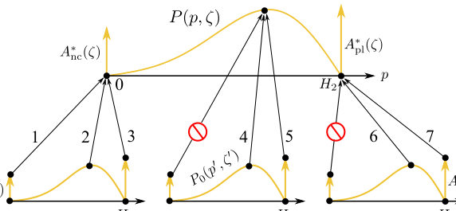 
Figure 3: A graphical illustration of probability flow from P(p′, ζ′) to P(p, ζ) where hardness is scale-dependent. The three PDFs at bottom are all replicas of P(p′, ζ′)

📷 Fig 4

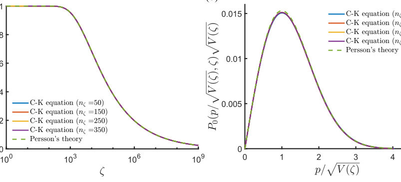 
Figure 4: Convergence test of linear elastic contact solutions solved by Chapman-Kolmogorov (C-K) equation (solid lines) and Persson’s theory (dashed lines): (a) relative contact area A∗, (b) P0(p/ p

📷 Fig 5

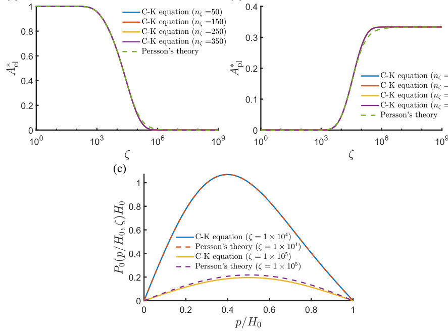 
Figure 5: Convergence test of elastoplastic contact solutions with constant hardness solved by Chapman-Kolmogorov (C-K) equation (solid lines) and Persson’s theory (dashed lines): (a) relative elastic contact area A∗ el, (b) relative plastic contact area A∗ pl, (c) P0(p/H0, ζ). The magnification axis is discretized by various nζ. The mean pressure ¯p = 1.5 GPa, H0 = 3 GPa, C0 = 1 × 10−8 mm4, ql = 2π mm−1, H = 0.7, E = 200 GPa, ν = 0.33, ∆p0 = H0/99.

**Summary.** This paper pioneers a stochastic model for elastoplastic contact on rough surfaces by incorporating the crucial effect of scale-dependent hardness. It uses compounded Chapman-Kolmogorov equations to track how probability distributions governing contact pressure and area evolve across different observation scales. The resulting framework provides advanced diagnostics to map out the transition between linear elastic, elastoplastic, and fully plastic regimes.

**Why it may be interesting.** While focused on solid mechanics, the use of stochastic process theory, probability density function evolution across scales (Chapman-Kolmogorov), and multi-scale modeling techniques are highly relevant to non-equilibrium statistical physics problems in AMO or condensed matter systems where scale separation is key.

Detailed structure

**Main problem.** The study addresses stress concentrations caused by inherent surface roughness leading to plastic deformation at contact interfaces, complicated by size effects and self-affine topography.

**Main result.** The authors developed a stochastic framework using compounded Chapman-Kolmogorov equations to model the evolution of probability density functions describing elastic, plastic, and non-contact areas across geometrical scales.

**Method.** The methodology involves formulating and solving three coupled integral equations derived from the compounded Chapman-Kolmogorov equation, which tracks probability flow as the observation scale changes.

**Model / system.** The system is elastoplastic contact between rough surfaces. The model incorporates a novel element: scale-dependent hardness, $H(\zeta)$, which modifies the standard contact mechanics framework by introducing size effects into the yield criterion.

**Key observables.** Probability density functions (PDFs) for elastic contact pressure, relative plastic contact area ($A^*_{pl}$), and relative non-contact area ($A^*_{nc}$).

**Important parameters / regimes.** Scale-dependent hardness $H(\zeta)$, magnification $\zeta$, topographic yield parameter ($\omega$), Hurst exponent ($H$), and hardness exponent ($n$).

**Assumptions / limitations.** The model builds upon stochastic process theory, though it notes that previous assumptions like 'no re-entry' are inaccurate in practice. Numerical solutions rely on discretizing the scale (magnification) axis.

**Figures summary.** Figures illustrate probability flow for both constant and scale-dependent hardness, showing reopened paths due to size effects. Contour plots map contact status regimes based on misfit parameters ($M_{le}, M_{fp}$), comparing results against prior literature.

**Paper structure.** The paper progresses from establishing the physical problem (rough surface elastoplasticity) to developing the core mathematical tool (compounded Chapman-Kolmogorov equation). It then details the derivation of integral equations, presents numerical solutions for various hardness regimes, and concludes by defining diagnostic parameters to map out contact status zones.

Abstract

The stress concentrations caused by inherent roughness of natural and manufactured surfaces often induce plastic deformation at contact interfaces, a challenge compounded by competing influences of the size effect of plastic deformation and self-affine rough surface topography. To address this, we developed a novel methodology based on stochastic theory using compounded Chapman-Kolmogorov equations, for the first time, to solve elastoplastic contact problems involving scale-dependent hardness. Our approach formulates three integral equations describing the evolution of probability density functions of elastic contact pressure, relative plastic contact area, and relative non-contact area across geometrical scales. We thoroughly investigate the effects of scale-dependent hardness on contact pressure distribution, relative elastic and plastic contact areas, and the area-to-load relationship. By adjusting various mechanical and material properties, our model predicts a smooth transition from linear elasticity to elastic-plastic behavior and finally to full plasticity. A key advancement is the derivation of a new topographic yield parameter incorporating a wider range of material and geometrical properties, aiding identification of contact status. Numerical solutions enable highly precise determination of elastic and plastic limits via curve-fitting, and we also provide a new diagram for rapid identification of contact status. This study pioneers a stochastic process framework for applying the compounded Chapman-Kolmogorov equation to rough surface contact analysis, and the integral equations characterizing how interfacial properties evolve with scale could offer valuable insights for other multidisciplinary fields where multiscale roughness is critical, such as earthquakes, electrical contact, and contact electrification.

[↑ back to top](#top)

### [Searching for cosmic vortices](http://arxiv.org/abs/2606.12049v1)

**Authors:** Marek Nikołajuk, Tomasz Karpiuk, Mirosław Brewczyk  
**Type:** theory · **Category:** quantum gases · **PDF:** <https://arxiv.org/pdf/2606.12049v1>  
**Analysis basis:** full PDF text, analyzed in chunks
**Topic relevance:** `analog quantum simulation` **2/5** · `non-equilibrium dynamics` **2/5** · `Keldysh / 2PI / non-Gaussian methods` **1/5** · `driven-dissipative phase transition` **1/5** · `methods for driven-dissipative` **1/5**

📷 Fig 1

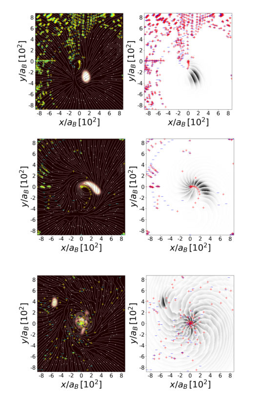 
Figure 1. Bosonic density (left column) and quantum phase (right column) at the z = 0 plane for different time instants. The density and time are in units of 1/a3 B and mBa2 B/ℏ, re- spectively. The positions of the positive and negative quan- tized vortices are marked by red/yellow plus signs and blue minus signs, respectively. Initially, there are no vortices asso- ciated with the white dwarf (top frame), although many are visible in the background noise. Later on, the white dwarf drags some vortices into an accretion disc that is forming (middle frame). Finally (bottom frame), the white dwarf moves away from a black hole, taking a few vortices with it.

📷 Fig 2

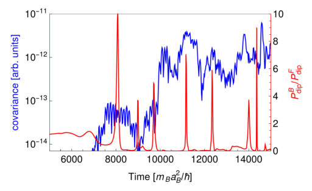 
Figure 3. Ratio P B dip/P F dip (in red) and the maximum co- variance (in blue) are plotted as a function of time. The red spikes representing the ratio clearly correlate with time intervals of high covariance.

📷 Fig 3

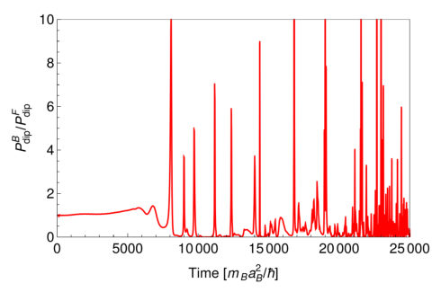 
Figure 2. P B dip/P F dip as a function of time. Several peaks are visible within the time interval between 5000 and 10000, indicating the preliminary stage of cosmic vortex formation in the accretion disc. The dipole electromagnetic radiation power is calculated within a cylinder with a radius of 500 aB. Later, the dynamics of the accretion disc become more com- plex.

📷 Fig 4

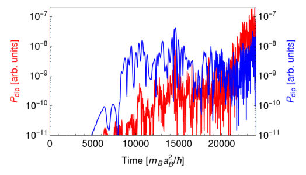 
Figure 4. Electromagnetic dipole radiation power coming from a region with a radius of 700 aB (blue curve) and orig- inating from the ten most powerful plaquettes with vortices (red curve) as a function of time.

📷 Fig 5

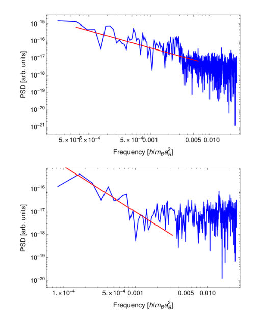 
Figure 6. Power spectrum density of the radiation coming from the accretion disc is shown as a function of frequency (f). PSD ∼1/f (solid red line) exhibits flicker noise when the preformation period is included in the analysis, followed by a white noise tail at the highest frequencies (top frame). However, when examining radiation from a well-formed ac- cretion disc, the PSD changes qualitatively to PSD ∼1/f 2

**Summary.** This theoretical study models the tidal disruption of a helium white dwarf by a black hole, treating the matter as a Bose-Fermi droplet governed by quantum hydrodynamics. The key findings are that quantized vortices generate distinct electromagnetic flickering patterns in the resulting accretion disc, and these same vortices cause the escaping white dwarf to emit detectable gravitational waves.

**Why it may be interesting.** This work applies quantum hydrodynamic techniques, typically used for ultracold atomic systems (Bose-Fermi droplets), to extreme astrophysical environments, linking fundamental quantum phenomena (vortices) to observable signals like GWs and EM radiation.

Detailed structure

**Main problem.** The study searches for cosmic vortices generated during the tidal disruption of a cold helium white dwarf passing near a black hole, and investigates the resulting electromagnetic radiation and gravitational wave emission.

**Main result.** Vortices generate characteristic flickering electromagnetic radiation signals in the accretion disc, and their subsequent propagation along the escaping white dwarf's surface causes measurable gravitational wave emission.

**Method.** The authors use quantum hydrodynamic equations to model the binary system evolution, simulating both electromagnetic power spectra and gravitational wave strain.

**Model / system.** The physical system is a cold helium white dwarf modeled as a Bose-Fermi droplet interacting with a black hole. The dynamics are governed by coupled quantum hydrodynamic equations for bosonic and fermionic components using pseudo-Newtonian potentials.

**Key observables.** Electromagnetic radiation flickering patterns (Power Spectral Density, $P_{	ext{dip}}$), the ratio of bosonic to fermionic dipole power ($P_B^{	ext{dip}}/P_F^{	ext{dip}}$), and gravitational wave strain ($h_+, h_	imes$).

**Important parameters / regimes.** Timescales of a few seconds for flickering; GW frequencies around 1 Hz; BH modeled as non-rotating (Schwarzschild metric).

**Assumptions / limitations.** The fermionic density follows the bosonic one ($ar{n}_F = ar{n}_B$), and the black hole is assumed to be non-rotating.

**Figures summary.** Figures illustrate the process from initial symmetry breaking through vortex dragging into the accretion disc, showing correlations between radiation spikes and vortex presence, and demonstrating the transition of the Power Spectral Density (PSD) from $1/f$ to $1/f^2$.

**Paper structure.** The paper follows a logical progression: first modeling the initial tidal disruption and vortex generation in the accretion disc (EM signals); second, analyzing the electromagnetic radiation signatures linked to these vortices; and finally, examining the gravitational wave emission from the departing, vortex-laden white dwarf.

Abstract

Our study focuses on the strong tidal disruption of a cold helium white dwarf passing a black hole. We model the white dwarf as a Bose-Fermi droplet and use quantum hydrodynamic equations to simulate the binary system's evolution. As the white dwarf passes through periastron, it loses a significant amount of mass. This mass falls onto the black hole and forms an accretion disc. Quantized vortices appear in the accretion disc, manifesting as strong electromagnetic radiation signals that exhibit characteristic flickering patterns changing on a timescale of a few seconds. Meanwhile, the white dwarf moves away from the black hole. As the white dwarf moves through space, vortices run along its surface. This elongates its geometry, causing it to rotate and emit gravitational waves.

[↑ back to top](#top)

### [Invariants of Sequential Circuits and Generalized Non-Abelian Statistics](http://arxiv.org/abs/2606.11527v1)

**Authors:** Shintaro Sato, Yoshimasa Hidaka, Ryohei Kobayashi  
**Type:** theory · **Category:** strongly correlated electrons · **PDF:** <https://arxiv.org/pdf/2606.11527v1>  
**Analysis basis:** full PDF text, analyzed in chunks
**Topic relevance:** `entanglement & information structure` **2/5** · `Keldysh / 2PI / non-Gaussian methods` **1/5** · `analog quantum simulation` **1/5** · `driven-dissipative phase transition` **1/5** · `non-equilibrium dynamics` **1/5**

📷 Fig 1

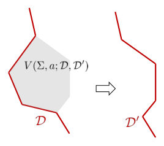 
FIG. 1. A sequential circuit V (Σ, a; D, D′) is supported at a region Σ. The corresponding symmetry generator is labeled by a (generally an object of a symmetry category), and trans- forms a defect network.

📷 Fig 2

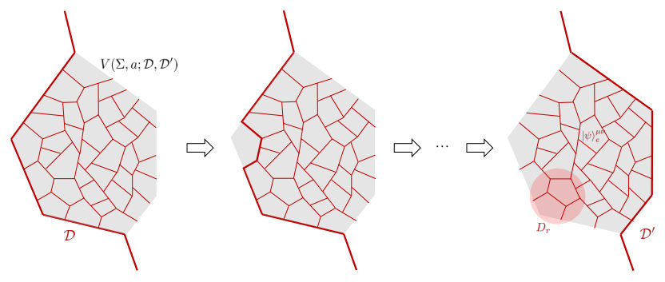 
FIG. 2. We break a sequential circuit V (Σ, a; D, D′) into small fractions {Lr′}, so that each fraction is contained in a disk Dr of radius r (red disk). A process of moving a defect breaks into D →D1 →...Dn →D′ via intermediate configurations. Each edge e of the fine network supports an MPS state |ψ⟩µν e , which constitutes a 1d state localized along the defect. Each local phase factor θ(Lr′, a; Dj|Lr′ , Dj+1|Lr′ ) cancels out due to the locality constraints on integer coefficients ϵ.

📷 Fig 3

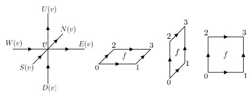 
FIG. 3. Labels and orientations of a vertex and faces on the cubic lattice.

📷 Fig 4

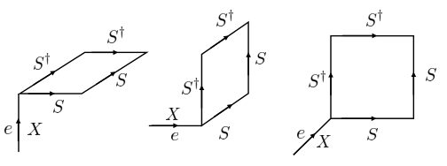 
FIG. 4. Definition of the operator Se.

📷 Fig 5

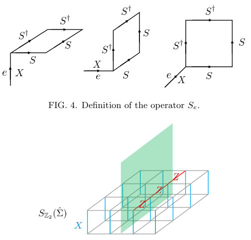 
FIG. 5. The surface operator SZ2(ˆΣ) on a Klein bottle. The Pauli X operators are supported on blue edges, while the Pauli Z operators are supported on red ones. The red edges correspond to the intersection between the surface Σ and the orientation-reversing domain wall (green sheet).

**Summary.** This work develops a novel invariant based on the Berry phase accumulated by sequential unitary circuits moving symmetry defects. By applying this invariant to (3+1)D lattice models, the authors characterize a new non-Abelian fermionic loop excitation and demonstrate that its presence protects an intrinsically long-range entangled mixed topological order.

**Why it may be interesting.** The connection between symmetry protection, higher-form anomalies, and entanglement structure is central to modern condensed matter theory. The use of sequential circuits provides a powerful, purely unitary diagnostic tool for detecting non-trivial topological phases beyond standard symmetries.

Detailed structure

**Main problem.** The paper investigates invariants defined by sequences of unitary circuits that move non-invertible symmetry defects to characterize 't Hooft anomalies for such symmetries.

**Main result.** They identify a new non-Abelian fermionic loop in (3+1)D D4 topological order and show its self-statistics are fermionic, characterized by an invariant value of -1.

**Method.** The core method involves deriving necessary invariance conditions for the Berry phase associated with sequential circuits under local deformations. These invariants are then applied to calculate statistics in lattice gauge theories.

**Model / system.** The analysis is performed on quantum many-body systems, specifically focusing on loop excitations in (3+1)D D4 topological order and a newly constructed mixed topological order protected by the derived invariant.

**Key observables.** Berry phase ($\Theta$), self-statistics of loops ($U_\Theta$), and the existence/value of invariants under local deformations.

**Important parameters / regimes.** The dimensionality (3+1)D, the symmetry group structure ($D_4$), and the nature of entanglement (Short-Range vs. Long-Range).

**Assumptions / limitations.** Invariance requires specific conditions on circuit locality and the assumption that local deformations preserve operator locality; the analysis also relies on factorizing defect states in SRE limits.

**Figures summary.** Figures illustrate sequential circuits, defect network transformations (D to D'), lattice structures for $D_4$, and the process of expanding supports using local unitaries.

**Paper structure.** The paper progresses from establishing general invariance conditions for Berry phases associated with non-invertible symmetries in abstract terms. It then applies this framework sequentially: first to characterize anomalies via SRE states, followed by specific applications to fermionic loops in $D_4$ and the construction of a protected mixed topological order.

Abstract

Non-invertible symmetries in quantum many-body systems generally give rise to sequential unitary circuits that move symmetry defects. In this paper, we investigate invariants defined by sequences of such circuits, which move non-invertible defects and generate a Berry phase evaluated on quantum states with defects. We show that this Berry phase generally defines an invariant under local deformations, provided that the sequential circuits preserve the locality of those deformations. This invariant also rules out a short-range-entangled state that preserves the non-invertible symmetry, thereby signaling the 't Hooft anomaly of a non-invertible symmetry purely in terms of unitary operators acting on a state. We then apply this framework to loop excitations in three spatial dimensions and identify a new loop excitation in the (3+1)D $\mathbb{D}_4$ topological order, which we dub a non-Abelian fermionic loop. Using the invariant of sequential circuits, we characterize the statistics of non-Abelian fermionic loops. In addition, we find a new (3+1)D mixed topological order with a single non-Abelian fermionic loop, whose long-range entanglement is protected by an invariant of sequential circuits.

[↑ back to top](#top)

### [A Geometric Family of Correlations Containing the Quantum Singlet](http://arxiv.org/abs/2606.12045v1)

**Authors:** E. Aldo Arroyo  
**Type:** theory · **Category:** other · **PDF:** <https://arxiv.org/pdf/2606.12045v1>  
**Analysis basis:** full PDF text, analyzed in chunks
**Topic relevance:** `entanglement & information structure` **2/5**

📷 Fig 1

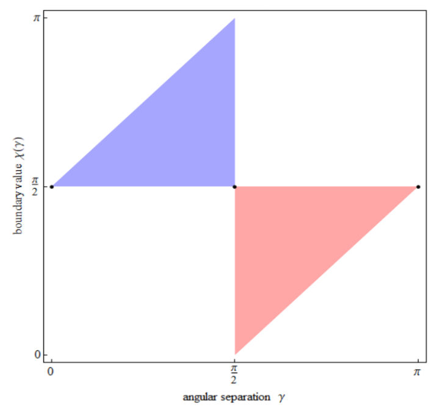 
Figure 1: Space of admissible boundary functions. The shaded region defines the allowed values of χ(γ) for each angular separation γ. Continuous admissible boundary functions form a family of curves contained within this domain, all sharing the fixed points (0, π/2), (π/2, π/2) and (π, π/2).

**Summary.** The paper develops a novel hidden-variable framework that generates an entire family of correlation functions parameterized by a boundary function $\chi(\gamma)$. It successfully demonstrates that the measurable CHSH value at $
u=\pi/4$ is mathematically equivalent to a purely geometric contrast measure $D(\pi/4)$ derived from the state space geometry. This places the quantum singlet correlation within a broader, geometrically constrained structure of possible correlations.

**Why it may be interesting.** This work provides a powerful, non-standard geometric lens through which quantum correlations (like the singlet state) can be understood as special points within a continuous mathematical structure of classical-like models.

Detailed structure

**Main problem.** The central goal is to embed the quantum singlet correlation within a larger, geometrically defined family of correlations generated by restricted hidden-variable models.

**Main result.** An exact geometric relation was established linking the CHSH value at $
u=\pi/4$ to a purely geometric contrast measure $D(\pi/4)$, proving that this observable quantity is determined solely by the underlying geometry of admissible states.

**Method.** The authors derived correlation functions and Bell-CHSH expectation values using integrals over geometrically constrained hidden-variable distributions defined by an admissible boundary function $\chi(\gamma)$.

**Model / system.** The model uses a hidden-variable framework where the variable $\lambda$ is restricted to lie within a specific, geometrically defined region on $S^2$, parameterized by the boundary function $\chi(\gamma)$. The correlations are calculated based on local deterministic outcomes.

**Key observables.** Correlation function $E(\gamma)$, CHSH value $S(
u)$, and geometric contrast measure $D(\gamma)$.

**Important parameters / regimes.** The admissible boundary function $\chi(\gamma)$ is the primary parameter controlling the entire family of correlations; $\gamma$ (angular separation) and $
u$ (angle for CHSH testing) are key variables.

**Assumptions / limitations.** The analysis assumes that physical correlations can be fully characterized by restricting the set of admissible hidden-variable states via the function $\chi(\gamma)$.

**Figures summary.** Figure 1 geometrically represents the allowed domain for the boundary function $\chi(\gamma)$ in the $(\gamma, \chi)$ plane.

**Paper structure.** The paper systematically builds the framework by defining the admissible region ($\Gamma_\gamma$), deriving the correlation function $E(\gamma)$ based on $\chi(\gamma)$, and then establishing key theorems linking observable quantities like $S(\pi/4)$ to geometric properties like $D(\pi/4)$.

Abstract

We introduce a geometrically constrained hidden-variable framework that generates a family of correlations parametrized by a boundary function, within which the quantum singlet correlation appears as a particular member. Exact expressions for the correlation function are derived. Several structural results are established, including admissibility conditions, symmetry properties, a universal stationary point of the associated CHSH function, and an exact relation between the CHSH value at $ν=π/4$ and a geometric contrast measure defined on the underlying hidden-variable distributions. Rather than treating the quantum singlet correlation as an isolated target to be reproduced, the present framework places it within a broader geometric structure of correlations. These results suggest the existence of a nontrivial geometric structure underlying the family of correlations and motivate the search for a principle capable of selecting the quantum singlet solution from within that family.

[↑ back to top](#top)

### [Fermions are fundamentally more nonlocal than Bosons](http://arxiv.org/abs/2606.12363v1)

**Authors:** Fatemeh Moradi Kalarde, Sadra Boreiri, Xiangling Xu, Lucas Tendick, Salman Beigi, Paolo Perinotti, Tommaso Guaita, Marc-Olivier Renou  
**Type:** theory · **Category:** quantum information and computing · **PDF:** <https://arxiv.org/pdf/2606.12363v1>  
**Analysis basis:** full PDF text, analyzed in chunks
**Topic relevance:** `entanglement & information structure` **2/5**

📷 Fig 1

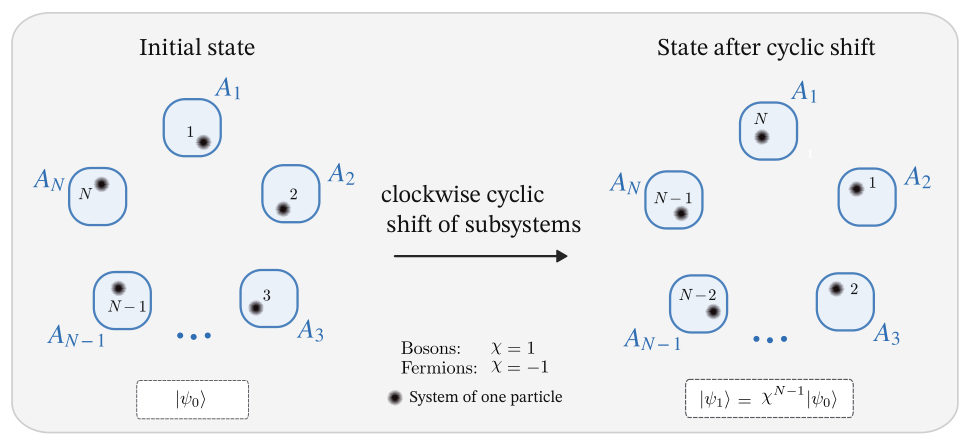 
Figure 1: Cyclic exchange and fermionic phase. (a) N parties A1, . . . , AN initially hold one particle (represented by the black disk) each, in a global state |ψ0⟩= a† 1 · · · a† N|vac⟩. a† i denotes the bosonic or fermionic creation operator of particle at mode i, depending on the particle type. (b) After a clockwise cyclic shift of the particles, the state becomes |ψ1⟩= a† Na† 1 · · · a† N−1|vac⟩= χN−1|ψ0⟩. For bosons, χ = 1, while for fermions χ = −1, giving a parity-dependent global phase.

📷 Fig 2

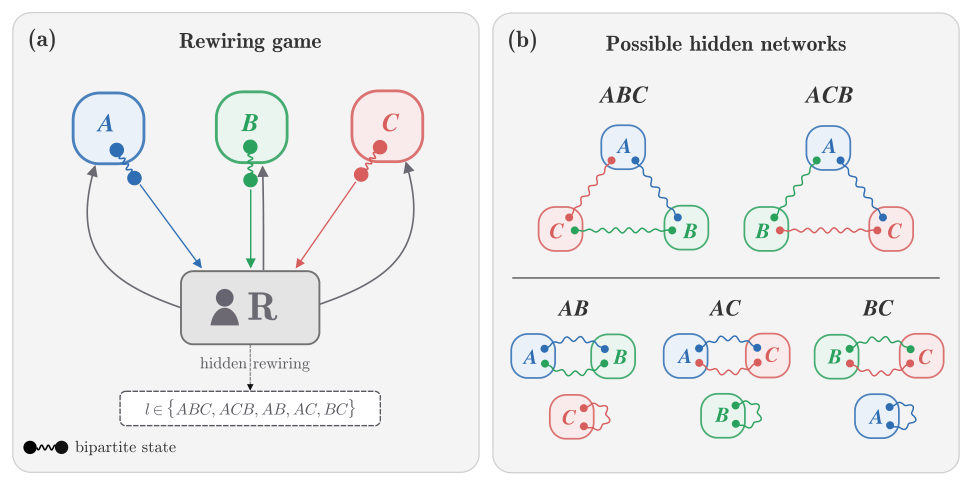 
Figure 2: Distributed rewiring game: (a) Parties A, B, C each locally prepare bipartite systems, keep one subsystem, and send the other to a referee R. The referee is a passive relay introduced to formalize the requirement that the local operations of the parties do not depend on the global network configuration. The referee secretly chooses a wiring l ∈{ABC, ACB, AB, AC, BC} and redistributes the sent subsystems accordingly as illustrated in (b), while also assigning inputs xi ∈{0, 1}. Following the protocol described in the main text, each party i ∈{A, B, C} performs an input-dependent measurement and obtains an outcome ai ∈{0, 1+, 1−, 2}. The observations of the experiment are...

**Summary.** This paper proves that indistinguishable fermions possess a unique, stronger form of nonlocality compared to bosons or qubits. By analyzing multi-party network correlations, the authors demonstrate that fermionic anticommutation is an unavoidable operational resource necessary for certain quantum information tasks. This work advocates for developing 'febits' as essential carriers beyond standard qubit descriptions.

**Why it may be interesting.** It provides a rigorous theoretical framework for understanding how particle statistics (Pauli exclusion principle) translate into nonclassical resources for quantum computation and communication protocols beyond standard qubit models.

Detailed structure

**Main problem.** To prove that indistinguishable fermions generate correlations fundamentally stronger than those achievable by bosons or distinguishable particles, thereby establishing fermionic nonlocality as a key resource.

**Main result.** Fermions are shown to be fundamentally more nonlocal than bosons or qubits, implying that fermionic information carriers (febits) can surpass qubit-based protocols for certain distributed computing tasks.

**Method.** The analysis uses analogies to Bell's theorem and constructs multi-party 'Gedankenexperiments' involving local communication rounds in a network setting. The core technique involves comparing conditional probability distributions derived from fermionic anticommutation versus bosonic/qubit models.

**Model / system.** The model compares three types of quantum carriers: qubits (internal states), indistinguishable bosons, and indistinguishable fermions. The physics is analyzed using second quantization formalism in the context of distributed quantum communication networks or multi-party loops.

**Key observables.** Exchange phase ($\chi = -1$ for fermions vs $\chi = 1$ for bosons); conditional probability distributions $P_{f}$ vs $P_{	ext{Q-QIT}}$; total variation distance ($d_{	ext{cond}}^{	ext{TV}}$).

**Important parameters / regimes.** Loop size $N$; number of communication rounds; the parity of fermionic exchanges.

**Assumptions / limitations.** The analysis assumes a locality constraint where local operations cannot depend on an unknown global network configuration ($\ell$), and that the comparison is restricted to single-round or limited-round communication protocols.

**Figures summary.** Figures illustrate cyclic exchange showing phase differences; another figure depicts a 'Distributed rewiring game' comparing fermionic vs. qubit simulation outcomes across various hidden wirings.

**Paper structure.** The paper progresses from establishing the fundamental difference in correlation generation (fermions vs bosons) to analyzing multi-party loop structures, culminating in detailed mathematical proofs regarding operator identities and structural properties of unitaries acting on tensor product spaces.

Abstract

Bell's theorem shows that entangled quantum particles can exhibit correlations that classical particles cannot reproduce without an additional nonlocal resource, such as communication. In this sense, quantum particles are fundamentally more nonlocal than classical ones, and entanglement becomes unavoidable in physics. Here we prove the analogous result within quantum theory itself: indistinguishable fermions transmitted through a quantum network can generate correlations that distinguishable particles or indistinguishable bosons cannot reproduce without additional communication. In the same sense, fermions are fundamentally more nonlocal than bosons or distinguishable particles, motivating fermionic anticommutation and indistinguishability as unavoidable operational resources. Our result further implies that fermions can strictly surpass all qubit-based protocols for certain distributed computing tasks, demonstrating that a complete understanding of information processing requires going beyond qubits to fermionic information carriers - febits.

[↑ back to top](#top)

### [Consistent Evaluation of Operators Involving the Position Operator in the Bloch Representation: Application to the Orbital Moment](http://arxiv.org/abs/2606.11679v1)

**Authors:** Daehyeon An, Junmo Jeon, Se Kwon Kim  
**Type:** theory · **Category:** other · **PDF:** <https://arxiv.org/pdf/2606.11679v1>  
**Analysis basis:** full PDF text, analyzed in chunks
**Topic relevance:** `Keldysh / 2PI / non-Gaussian methods` **1/5** · `analog quantum simulation` **1/5** · `driven-dissipative phase transition` **1/5** · `methods for driven-dissipative` **1/5** · `non-equilibrium dynamics` **1/5**

📷 Fig 1

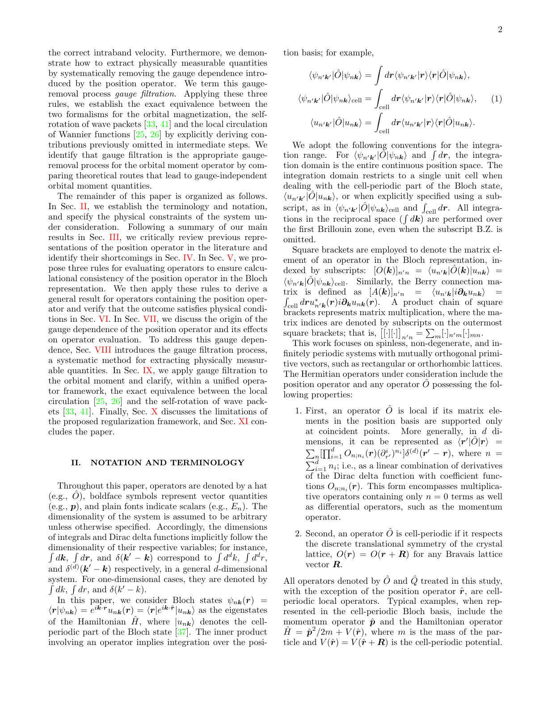 
Low-resolution page preview, page 2

📷 Fig 2

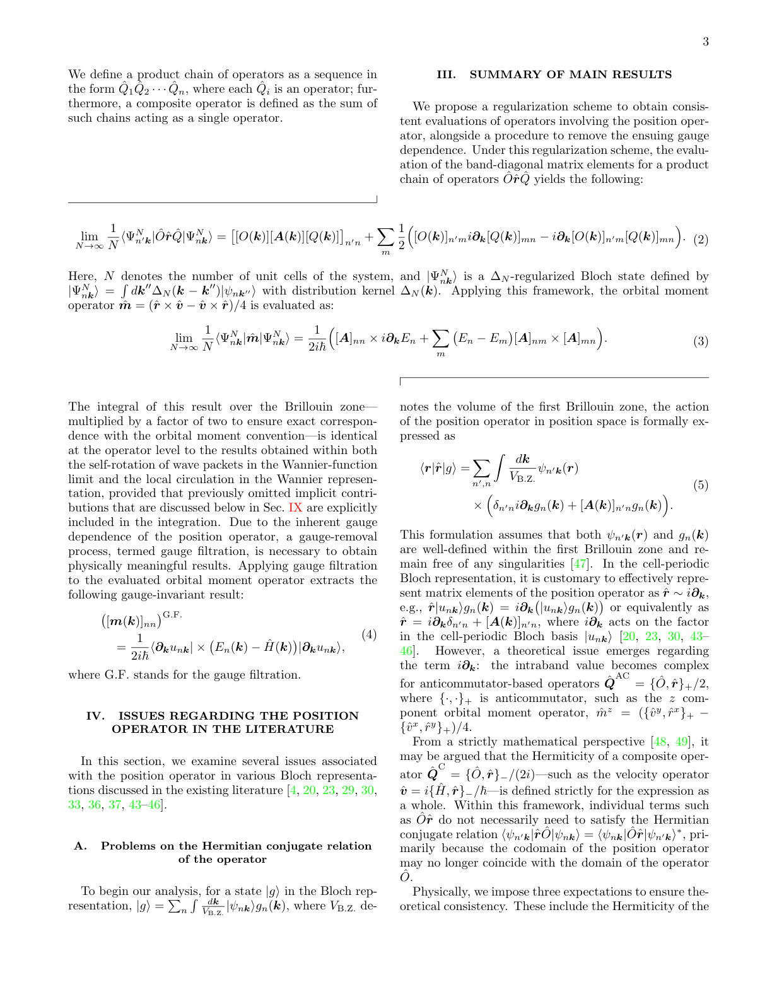 
Low-resolution page preview, page 3

📷 Fig 3

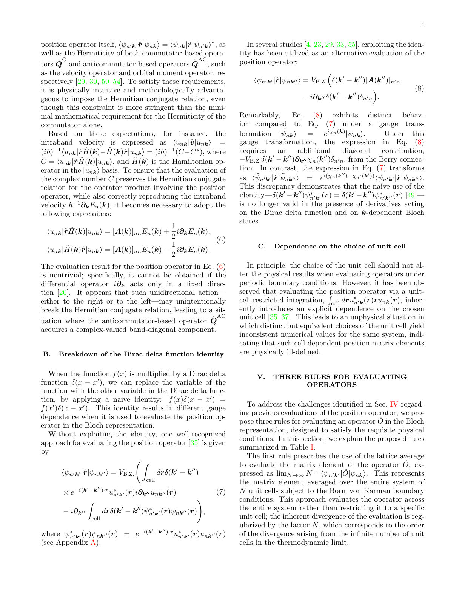 
Low-resolution page preview, page 4

📷 Fig 4

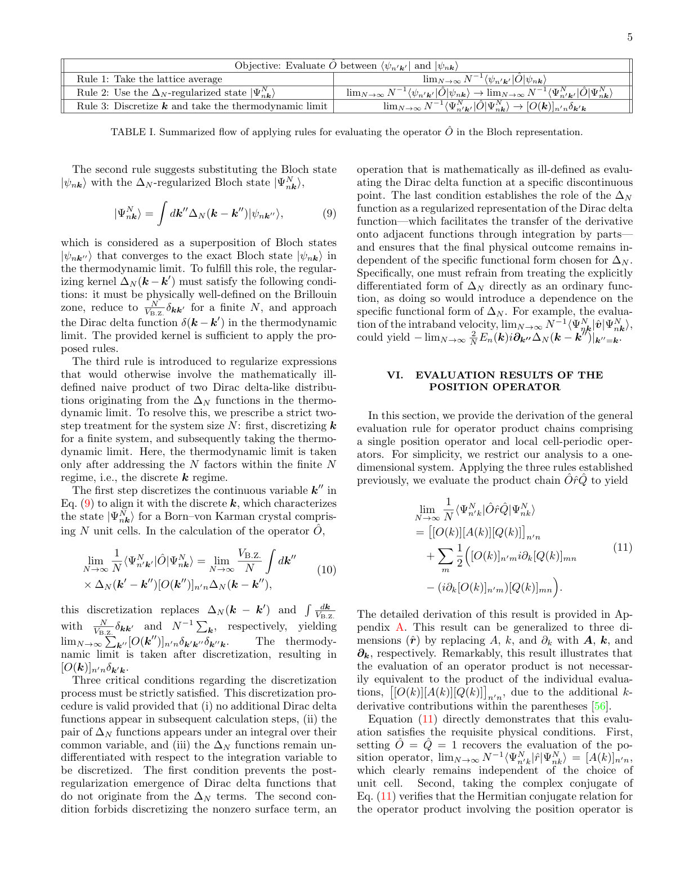 
Low-resolution page preview, page 5

📷 Fig 5

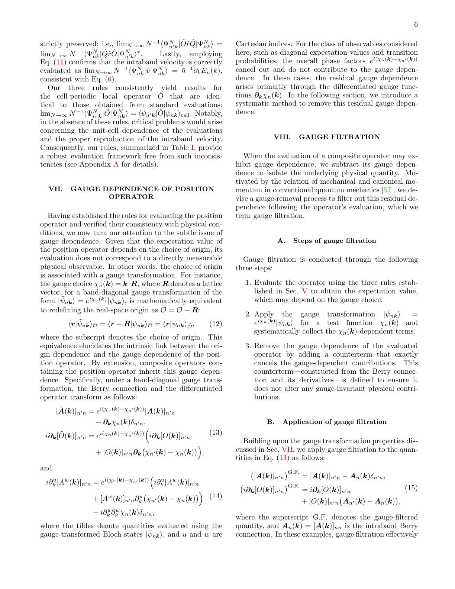 
Low-resolution page preview, page 6

**Summary.** This paper develops a comprehensive set of rules to consistently evaluate complex operators containing the position operator ($\hat{r}$) within the Bloch representation. By introducing 'gauge filtration,' the authors resolve long-standing discrepancies between different theoretical methods for calculating physical quantities like the orbital moment in solids. This establishes a robust, gauge-invariant framework essential for accurate condensed matter theory.

**Why it may be interesting.** While focused on condensed matter theory rather than AMO systems directly, the rigorous mathematical techniques developed—especially systematic gauge removal and regularization of position operators in periodic boundary conditions—are highly relevant for any theoretical work involving Bloch wavefunctions or Berry curvature calculations in quantum optics or cold atom lattices.

Detailed structure

**Main problem.** The central challenge is establishing a mathematically consistent framework for evaluating expectation values of operators involving the position operator ($\hat{r}$) within the Bloch representation in solid-state physics.

**Main result.** The authors propose three rigorous rules and introduce 'gauge filtration' to systematically remove unphysical gauge dependencies, successfully reconciling different formalisms (self-rotation vs. local circulation) for calculating observables like the orbital moment.

**Method.** The methodology involves developing specific regularization schemes ($\Delta_N$-regularization) and deriving general evaluation rules for operator product chains $\langle \hat{O}\hat{r}\hat{Q} 
angle$ to ensure physical consistency across different theoretical approaches.

**Model / system.** The study is set in the context of infinitely periodic solid-state systems, using Bloch states $|\psi_{nk}
angle$ and analyzing observables like velocity, orbital moment ($\hat{m}$), and polarization within the Brillouin zone.

**Key observables.** Orbital moment ($\hat{\mathbf{m}}$), intraband group velocity ($v_n$), expectation values of $\hat{r}$, and gauge-invariant quantities derived from Berry connection/curvature.

**Important parameters / regimes.** The analysis depends on the lattice structure (e.g., rectangular, orthorhombic) and requires taking limits related to unit cell size and regularization parameters ($N 	o \infty$).

**Assumptions / limitations.** Key assumptions include assuming spinless, non-degenerate bands; the derived rules are strictly valid only when the maximum derivative order acting on the regularization function is $\le 1$.

**Figures summary.** Not specified in the notes.

**Paper structure.** The paper progresses by identifying inconsistencies (discrepancies between formalisms), proposing three corrective evaluation rules, introducing gauge filtration to remove artifacts from origin shifts/gauge choices, and finally applying this framework to reconcile results for the orbital moment calculation.

Abstract

The position operator plays a central role in condensed-matter observables such as velocity, orbital moment, and electric polarization. In solid-state physics, the evaluation of operators incorporating the position operator has not reached a consensus, as observed in the operator-level discrepancy between the local circulation of Wannier functions and the self-rotation of wave packets. Here, to achieve a consistent evaluation of such operators, we propose three rules for evaluating operators involving the position operator in the Bloch representation. The rules are devised to satisfy physical conditions: independence from the choice of unit cell, preservation of Hermitian conjugacy for the product of operators, and recovery of the correct intraband velocity. We further address the gauge dependence of the position operator and introduce a scheme termed gauge filtration, which systematically removes gauge-dependent contributions from the operators containing the position operator. This methodology ensures that the quantities obtained from the operator evaluation correspond to observable physical phenomena. By applying our framework, we reconcile the results concerning the self-rotation of the wave packet and the local circulation of the Wannier function. We expect our proposal to establish a consistent framework for evaluating operators involving the position operator.

[↑ back to top](#top)

### [Estimation of conserved charges for a one dimensional system with inhomogeneous hopping](http://arxiv.org/abs/2606.11991v1)

**Authors:** Triparna Mondal  
**Type:** theory · **Category:** statistical mechanics · **PDF:** <https://arxiv.org/pdf/2606.11991v1>  
**Analysis basis:** full PDF text, analyzed in chunks
**Topic relevance:** `analog quantum simulation` **1/5** · `driven-dissipative phase transition` **1/5** · `entanglement & information structure` **1/5** · `non-equilibrium dynamics` **1/5** · `non-equilibrium universality` **1/5**

📷 Fig 1

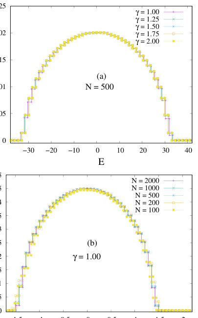 
FIG. 1. Density of states (a) for different values of γ ≥1 for 5000 samples of system size N = 500. All the plots fol- low Wigner semicircle law. (b) shows the size dependence of density of states at γ = 1 for 5000 samples of system sizes N = 100, 200, 500, 1000 and 2000. If x-axis scales as E → E √

📷 Fig 2

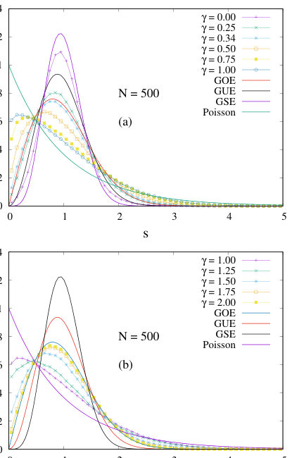 
FIG. 2. Nearest neighbor spacing distribution P(s) for 5000 samples of system size N = 500. (a) depicts P(s) for 0 &lt; γ &lt; 1. It transits from GOE (at γ ∼0.34) to near Poisson limit as γ increases. (b) shows P(s) for γ &gt; 1. It comes back towards GOE limit with a further increase of γ and overlaps with Wigner distribution for γ ∼2. P(s) does not change any more if γ increases further (not shown for clarity).

📷 Fig 3

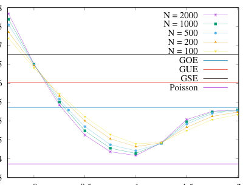 
FIG. 3. Size dependence of ensemble averaged ratio ⟨˜r⟩of nearest neighbor spacing for 5000 samples of system size N = 100, 200, 500, 1000, 2000. As γ increases from zero, it goes towards the Poisson limit touching GOE limit at γ ≃0.29 for N = 2000 and γ ≃0.42 for N = 100. γ = 0 is a critical point with ⟨˜r⟩= 0.65 lying the statistics between GUE and GSE limits. ⟨˜r⟩attains maximum integrability at γ ≃1 for systems of all sizes N. But larger ones become more integrable with ⟨˜r⟩→Poisson limit. It again moves toward GOE statistics and superposes with it around γ ≳2. Here also larger systems attain at smaller values of γ. All the curves again cross with each other at γ ≃1.25 with ⟨˜r⟩= 0.44.

📷 Fig 4

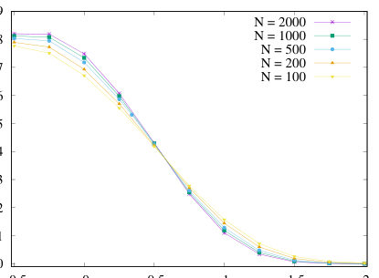 
FIG. 4. Size dependence of the fractal dimension D(N) 2 for 5000 samples of system size N = 100, 200, 500, 1000, 2000. At γ = −0.25, the system is maximally delocalized with D(N) 2 → 1. At this point, delocalization increases, as N increases. The eigenstates become multifractal with increasing γ and they reach a complete localization D(N) 2 = 0 around γ ≃2. As the system size N increases, localisation is attained at a smaller value of γ. With a further increment of γ, the eigenstates remain localized. All the curves for any system size intersect at γ ≃0.57 with D(N) 2 ≃0.38.

📷 Fig 5

 
Fig. 4 for q = 2 only. It shows that with increasing γ, the localization in eigenstates increases and they become completely localized around γ ≃2 for any system size. The size dependence in Fig. 4 depicts that eigenstates of larger systems localize at smaller γ, suggesting that for a system with N →∞, localization (D2 = 0) is attained at γ →1. The eigenstates remain localized for further increment of γ, i.e., D(N) 2 never goes again towards the Wigner-Dyson limit, unlike the spectral properties of our IH ensemble. The size dependence in Fig. 4 also indicates that increasing system size N leads D(N) 2 towards GOE- limit at γ = 0. The value of D(N) 2 maximizes (∼1) at γ = −0.25 for any size...

**Summary.** This paper analyzes a 1D random matrix model with inhomogeneous hopping to study the transition from chaotic to integrable quantum behavior. Using the Integrable Matrix Theory, the authors estimate conserved charges and show that the count of these charges provides a quantitative measure of integrability across this crossover. This work links spectral statistics and localization measures directly to fundamental concepts in quantum integrability.

**Why it may be interesting.** The connection drawn between counting conserved quantities (a hallmark of integrability) and measurable spectral/localization properties provides a powerful diagnostic tool for understanding quantum dynamics in complex systems, relevant to many-body physics.

Detailed structure

**Main problem.** The study investigates how conserved charges characterize the crossover between chaotic and integrable regimes in a one-dimensional quantum system.

**Main result.** The number of estimated conserved charges, derived from the Integrable Matrix Theory (IMT), serves as a quantitative measure for the degree of quantum integrability across this transition.

**Method.** The authors employ the IMT framework to estimate conserved charges by analyzing recurrence relations involving matrix elements and eigenvalues of the system's Hamiltonian.

**Model / system.** The model is a single-particle system on a 1D lattice with inhomogeneous nearest neighbor hopping, described by an IH random matrix ensemble. The Hamiltonian depends on a tunable parameter $\gamma$ that controls the transition between regimes.

**Key observables.** Number of conserved charges ($n$), spectral statistics (Nearest Neighbor Spacing Distribution $P(s)$), Inverse Participation Ratio ($	ext{IPR}$), and Fractal Dimension ($D_q$).

**Important parameters / regimes.** The tuning parameter $\gamma$ controls the crossover, ranging from chaotic to integrable limits. The system size $N$ is also a critical factor.

**Assumptions / limitations.** The analysis relies on extending the IMT framework to systems with inhomogeneous hopping and assumes that the number of conserved charges can be reliably estimated via convergence rates ($\eta$) or slope analysis ($\Delta\gamma$).

**Figures summary.** Figures illustrate the Density of States collapsing onto the Wigner semicircle law, transitions in spectral statistics between GOE/Poisson limits, increasing eigenstate localization ($D_q$), and the dependence of $n/N$ on $\gamma$.

**Paper structure.** The paper first introduces the IH model and its Hamiltonian structure. It then details the methodology using IMT to estimate conserved charges by analyzing convergence rates ($\eta$). Finally, it analyzes how these charges, alongside spectral statistics and localization measures, track the crossover from chaotic ($\gamma 	o 0$) to integrable ($\gamma > 1$) behavior.

Abstract

Quantum integrability in a system is characterized by a large number of conserved charges. However, finding the conserved charges in a generic quantum system is highly challenging. The integrable matrix theory provides a unified framework to obtain the conserved charges in a certain class of systems. We demonstrate this framework in case of a single-particle system on a 1D finite-sized lattice with inhomogeneous nearest neighbor hopping to study the statistical properties of the system across its chaotic--integrable crossover from the perspective of the conserved charges. The eigenspectrum of our random matrix model is studied first. We then estimate the conserved charges and find their properties throughout the chaotic to integrable transition of the system. We calculate the number of conserved charges across this crossover and observe that it is nearly equal to the size of the system at its integrable limit. Our result suggests that the number of conserved charges, estimated using the integrable matrix theory, can be a measure of quantum integrability.

[↑ back to top](#top)

### [Path convergence in diffusion models](http://arxiv.org/abs/2606.12161v1)

**Authors:** Roi Holtzman, Roman Beauvallet, Werner Krauth  
**Type:** theory · **Category:** statistical mechanics · **PDF:** <https://arxiv.org/pdf/2606.12161v1>  
**Analysis basis:** full PDF text, analyzed in chunks
**Topic relevance:** `Keldysh / 2PI / non-Gaussian methods` **1/5** · `driven-dissipative phase transition` **1/5** · `methods for driven-dissipative` **1/5** · `non-equilibrium dynamics` **1/5** · `non-equilibrium universality` **1/5**

📷 Fig 1

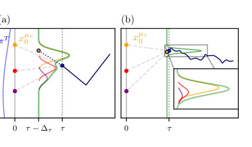 
Fig. 1: Backward path construction. (a): At finite ∆τ, the distribution of xτ−∆τ starting at xτ is given by a sum of p reweighted Gaussians (in green). Algorithm 3 (backward-construction) samples the pattern µτ as the end- point xµτ 0 of a Gaussian bridge for xτ−∆τ . (b): For small ∆τ, the p Gaussians of (a) merge into a single Gaussian (see Alg. 4).

📷 Fig 2

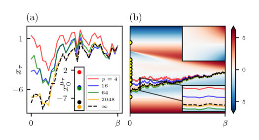 
Fig. 2: Path convergence, velocity fields in our test case for β = 30. (a): Discrete backward paths for differ- ent p under identical random elements (ητ, γτ), from Alg. 3 (backward-construction). Endpoints xµτ 0 are indicated for τ = 6. (b): Continuous backward paths (∆τ = 0.01) from Alg. 4, with velocity field for p = 16. Upper inset: velocity field for p = ∞. Lower inset: Closeup.

📷 Fig 3

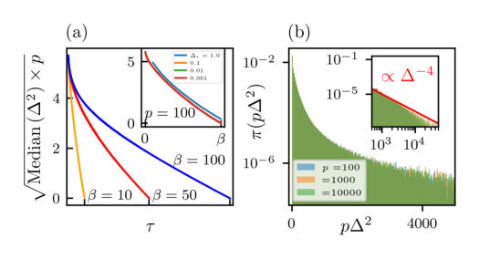 
Fig. 3: Convergence of paths for our test case with Alg. 4 (backward-construction-dt). (a) Median of p

📷 Fig 4

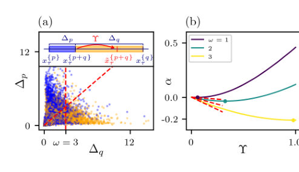 
Fig. 4: Extrapolation for sets {p} and {q} of p patterns joint into a set {p + q} (test case, τ = 3). (a): Scatter plot for direction for x{∞} τ with respect to x{p+q} τ (orange dots: x{∞} τ towards x{q} τ ; blue dots: x{∞} τ towards x{p} τ ). (b): Change α of difference with x{∞} τ as a function of Υ with linear approx- imation indicated (see eq. (26)).

**Summary.** This paper investigates the theoretical concept of path convergence in diffusion models used to bridge a known reference distribution to a target distribution defined only by a finite set of patterns. By analyzing how paths converge as the number of patterns increases, the authors propose and demonstrate an extrapolation algorithm that allows for estimating properties corresponding to an infinite number of samples. This work provides a mathematical framework for generalization in density estimation.

**Why it may be interesting.** The mathematical machinery developed for analyzing path convergence and extrapolation directly relates to understanding how physical systems described by limited data can be generalized or extrapolated using modern generative models, which has implications across statistical physics.

Detailed structure

**Main problem.** The paper analyzes path convergence when constructing interpolating paths between a target distribution (known only via $p$ patterns) and a reference distribution using diffusion model formalism.

**Main result.** Path convergence is shown to allow for extrapolation towards the infinite pattern limit ($p=\infty$), providing a strategy for density estimation and generalization beyond the available samples.

**Method.** The authors develop algorithms for symmetric, forward, and backward path construction in imaginary time, analyzing how these paths converge as $p$ increases.

**Model / system.** The framework uses diffusion models to connect patterns $\{x_{\mu}^0\}$ of a target distribution $\pi_T$ to samples $x_eta \sim \pi_R$. The analysis is initially performed in the free-particle case using path integrals derived from statistical mechanics.

**Key observables.** Path convergence scale ($1/\sqrt{p}$), mean square deviation, and the change in distance upon extrapolation ($\langle |	ilde{x}_{p+q}^	au(Y) - x_\infty^	au| 
angle - \langle |x_{p+q}^	au - x_\infty^	au| 
angle$).

**Important parameters / regimes.** Number of patterns ($p$), time step ($\Delta	au$), and the limit $p 	o \infty$.

**Assumptions / limitations.** The analysis focuses on establishing convergence and extrapolation strategies, noting that the core development is a proof-of-concept for generalization.

**Figures summary.** Figures illustrate path construction (finite vs. small $\Delta	au$), show path convergence by comparing discrete paths ($p$) to continuous limits ($p=\infty$), and demonstrate successful extrapolation using two sets of patterns ($\{p\}$ and $\{q\}$).

**Paper structure.** The paper systematically introduces the path integral formalism, details three construction algorithms (symmetric, forward, backward), analyzes the convergence behavior in the limit $p 	o \infty$, and concludes with a proof-of-concept extrapolation algorithm.

Abstract

We discuss diffusion-model paths interpolating between a target distribution known only through p patterns and a reference distribution that can be sampled. These interpolating paths can be constructed symmetrically or else in forward direction (often referred to as a "noising") from the target patterns to the reference distribution or in backward direction (as a "denoising") from the reference distribution to the patterns. For backward paths with identical diffusion noise, we consider the path convergence in number of patterns p towards the path for infinitely many patterns. In a one-dimensional test case, we show that this convergence is on a scale 1/sqrt(p), but with infinite mean square deviation. We demonstrate that the path convergence allows for extrapolation towards the p=infinity path which samples the target distribution. We provide a proof-of-concept extrapolation algorithm and propose the convergence and extrapolation of paths as a possible strategy for density estimation and generalization. We illustrate all our algorithms through pseudo-codes and provide Python implementations.

[↑ back to top](#top)

### [Phase Transitions in Attention: A Bayesian Theory of Copy Head Emergence](http://arxiv.org/abs/2606.12058v1)

**Authors:** Itay Lavie, Kirsten Fischer, Andrey Lekov, Frederic Van Maele, Zohar Ringel, Moritz Helias  
**Type:** theory · **Category:** disordered systems and neural networks · **PDF:** <https://arxiv.org/pdf/2606.12058v1>  
**Analysis basis:** full PDF text, analyzed in chunks
**Topic relevance:** `driven-dissipative phase transition` **1/5** · `methods for driven-dissipative` **1/5** · `non-equilibrium dynamics` **1/5** · `non-equilibrium universality` **1/5**

📷 Fig 1

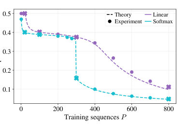 
Figure 1: Copy head formation unfolds in multiple stages, with qualitatively distinct behavior for linear and softmax attention. Left: Attention patterns for linear (purple) and softmax (blue) attention from the trained model (top per color) and theory (bottom per color) for different amounts of training data P. (i) P = 20: the attention layer does not contribute in the linear case and softmax attention remains at its uniform pooling default; (ii) P = 100: after the second-order phase transition for linear attention, all tokens are attended to equally; (iii) P = 300: the copy pattern begins to appear; (iv) P = 800: it sharpens into the correct shift-by-one pattern. Right: Loss per token as...

📷 Fig 2

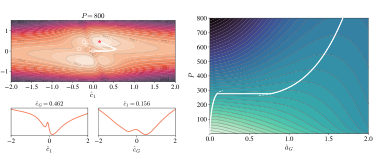 
Figure 2: Different topologies of actions Slin(ˆc1, ˆcG) and Ssoftmax(ˆaG; P). Linear attention (left): Contour plots of action at increasing dataset size P, corresponding to the attention stages (i), (ii), (iv) in Fig 1. From left to right: (i) the action has a single minimum at the origin - the model does not use the context; (ii) after the second-order phase transition, a minimum at nonzero ˆc1 emerges, corresponding to uniform pooling attention where the model attends to the entire context equally; (iv) finally, the landscape reorganizes and large ˆcG is preferred. The minimum deepens and splits, and two possible solutions are formed, but one is preferred and leads to lower loss values....

📷 Fig 3

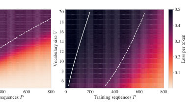 
Figure 3: Linear attention exhibits a second-order phase transition and subsequent gradual crossover. Left: Scalar order parameters ˆc1, ˆcG measured from models trained with Adam (circles) and SGLD (diamonds) compared to the theory predictions (dashed) as a function of the amount of training data or sample complexity P. At the phase transition, ˆc1 rises sharply from zero, while ˆcG remains near zero; beyond P ≈400, ˆc1 declines while ˆcG rises, marking the crossover from uniform pooling to copy attention; theory tracks the empirically observed behavior closely. Center and right: Phase diagram of copy subcircuit emergence. We show the loss per token as a function of training se- quences P...

📷 Fig 4

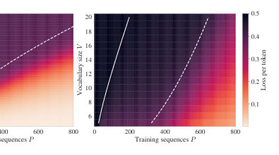 
Fig. 2 (left panels) illustrates the topology of the action S(ˆc1, ˆcG) for different P values. At P &lt; P ∗ ˆc1, the action has a single minimum at the origin. At P = Pˆc1 ≈23, a new minimum at nonzero ˆc1 emerges continuously and the sections reveal the characteristic flat-then-tilted shape of a Landau- type second-order phase transition (see App. A); enabling the model to exploit in-context unigram statistics. Beyond this, as P increases toward PˆcG ≈322, the saddle at the origin becomes a maximum, driving ˆcG away from zero and the crossover from context pooling to copying. Critically, this reorganization is not a second phase transition: the symmetry is already broken at Pˆc1.

📷 Fig 5

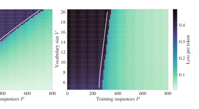 
Figure 4: Softmax attention exhibits a first-order phase transition. Left: Scalar order parameters ˆa1, ˆaG measured from models trained with Adam (circles) and SGLD (diamonds) compared to the theory predictions (dashed lines) as a function of the amount of training data or sample complexity P. At the phase transition the value of ˆaG jumps marking a first-order phase transition. Note that the dots corresponding to SGLD are often covered by the diamonds corresponding to Adam due to their precise agreement. Center and right: Phase diagram of copy subcircuit emergence. We show the loss per token as a function of training sequences P vs. sequence length L for V = 5 fixed (center), and vs....

**Summary.** This work applies statistical mechanics concepts, specifically phase transition theory, to understand how transformer attention mechanisms learn structured circuits. By deriving an effective action for both softmax and linear attention, the authors predict that softmax exhibits a sharp first-order transition while linear attention shows a smoother second-order evolution when learning copying behavior.

**Why it may be interesting.** It provides a rigorous theoretical physics lens (phase transitions) to explain emergent computational capabilities in deep learning models, drawing parallels to critical phenomena studied in condensed matter theory.

Detailed structure

**Main problem.** The paper aims to provide a first-principles theoretical account of how specific, structured attention patterns (like the 'copy subcircuit') emerge abruptly during the training of transformer models.

**Main result.** It distinguishes between softmax and linear attention mechanisms, finding that softmax exhibits a sharp, first-order phase transition upon learning the copy circuit, while linear attention shows a smoother second-order transition followed by crossover.

**Method.** The authors develop a Bayesian theory of feature learning, reducing the high-dimensional posterior over the attention matrix to a low-dimensional order parameter space governed by an effective action.

**Model / system.** The system analyzed is a single-layer softmax or linear attention network trained on a synthetic copy task. The analysis uses concepts from statistical physics, treating learning dynamics as phase transitions in the model's energy landscape.

**Key observables.** Order parameters ($\hat{c}_1, \hat{c}_G$ or $\hat{a}_1, \hat{a}_G$), loss per token, and the transition order (first-order vs. second-order).

**Important parameters / regimes.** Training data amount ($P$), sequence length ($L$), model dimension ($d_{	ext{model}}$), and the specific attention kernel (softmax vs. linear).

**Assumptions / limitations.** The analysis relies on reducing the posterior to a low-dimensional order parameter space, using saddle-point approximations, and assuming an ansatz for the attention matrix structure.

**Figures summary.** Figures illustrate the difference in transition behavior: softmax shows sharp jumps (first-order) vs. linear showing gradual changes (second-order/crossover) as data $P$ increases.

**Paper structure.** The paper builds from deriving a Bayesian theory for attention, reducing it to an effective action over order parameters, and then applying this framework to quantitatively distinguish the phase transition orders between softmax and linear attention mechanisms.

Abstract

Attention is the key mechanism underlying in-context learning in transformers, and attention patterns have been observed empirically to emerge abruptly during training. We present a Bayesian theory of feature learning in attention; we then focus on how the copy subcircuit in the first layer of an induction head is learned by analyzing a single-layer softmax attention network trained on a copy task. We derive a closed-form posterior over the attention matrix and reduce it to a low-dimensional order parameter space. This reduction reveals a phase transition in the amount of training data, which we verify using both Bayesian sampling and standard training with Adam. We contrast our results with linear attention and find that softmax attention exhibits a \emph{first-order phase transition} while in linear attention an initial \emph{second-order phase transition} is followed by a smooth, continuous evolution toward the structured attention pattern (\emph{crossover}). Our work provides a first-principles theoretical account of the abrupt emergence of the copy subcircuit, reminiscent of the one observed in training large language models.

[↑ back to top](#top)

### [Superconductivity in the pressure-amorphized topological insulator CrP$_4$](http://arxiv.org/abs/2606.12241v1)

**Authors:** Chutong Zhang, Xiangzhuo Xing, Na Zuo, Bowen Zheng, Bin Li, Jiajia Feng, Xiaolei Yi, Yan Meng, Xiaoran Zhang, Bingchao Yang, Chao Wang, Xin Chen, Yongsheng Zhang, Xiaofeng Xu, Xiaobing Liu  
**Type:** both · **Category:** strongly correlated electrons · **PDF:** <https://arxiv.org/pdf/2606.12241v1>  
**Analysis basis:** full PDF text, analyzed in chunks
**Topic relevance:** `Keldysh / 2PI / non-Gaussian methods` **1/5** · `Kondo & dissipative impurity` **1/5** · `analog quantum simulation` **1/5** · `driven-dissipative phase transition` **1/5**

📷 Fig 1

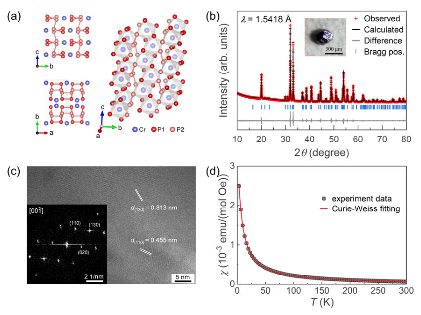 
FIG. 1. Structural and physical properties of CrP4 at ambient conditions. (a) Crystal structure of CrP4, visualized using VESTA software [53]. (b) Powder XRD pattern obtained with Cu Kα radiation. The solid black line represents the Rietveld refinement. Inset: photograph of a typical CrP4 single crystal. (c)

📷 Fig 2

 
Figure 1(b) presents the typical XRD pattern, that all the characteristic peaks can be well indexed to a monoclinic structure with the space group C2/c, in good agreement with previous report [28]. Rietveld refinements yields the lattice parameters of a = 5.19165 Å, b= 10.76071 Å, c = 5.77036 Å, and β = 110.6455°. EDX analysis indicates a uniform distribution of Cr and P elements in the produced crystals, with an atomic ratio of ~1:4 (19.91:80.09) (Fig. S2 [42]). Figure 1(c) illustrates the

📷 Fig 3

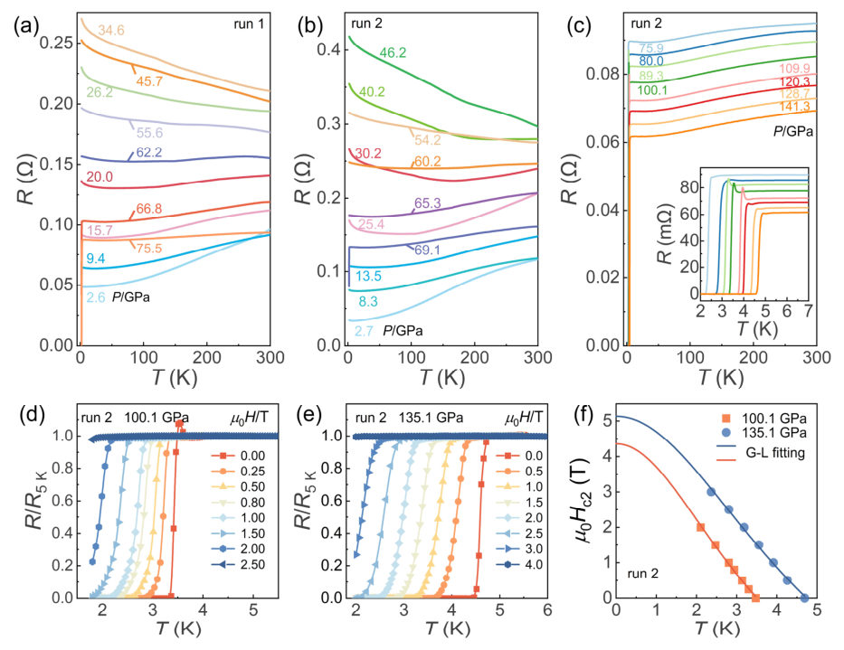 
FIG. 2. Temperature-dependent resistance of CrP4 under pressure. (a) Resistance evolution with pressure up to 75.5 GPa in run 1. (b) and (c) Evolution of resistance with pressure up to 141.3 GPa in run 2. Inset in (c) magnifies the superconducting transition region. (d) and (e) Resistance versus temperature under various magnetic fields at 100.1 GPa and 135.1 GPa in run 2. (f) Upper critical fields μ0Hc2(T) as a function of temperature at different pressures. Tc is defined as the onset of the resistance transition, determined by the intersection of the extrapolated normal-state resistance and the steep transition curve. Solid lines represent fits to the G-L equation.

📷 Fig 4

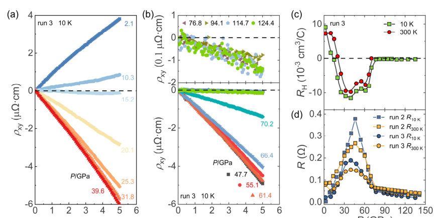 
FIG. 3. Hall effect of CrP4 at 10 K under pressure. (a) and (b) Plots of Hall resistivity ρxy versus magnetic field H under various pressures. (c) Pressure dependence of the Hall coefficient RH, displaying a sign change from positive to negative at the critical pressure of around 15 GPa. (d) The resistance at 10 K and 300 K as a function of pressure for run 2 and run 3. The horizontal dashed lines in (a)-(c) serve as guides to the eye, representing the zero baseline.

📷 Fig 5

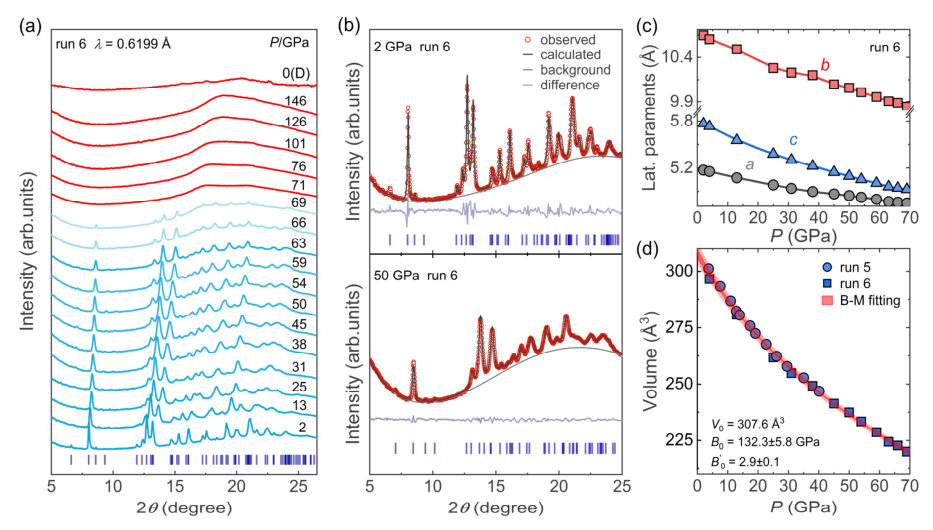 
FIG. 4. In-situ high-pressure XRD of CrP4. (a) XRD patterns at various pressures up to 146 GPa in run 6. Topmost pattern, labelled as 0(D), taken after pressure release to ambient conditions. (b) Representative Rietveld refinement results for XRD patterns at 2 GPa (up) and 50 GPa (bottom), respectively. (c) Refined lattice parameters (a, b, and c) as a function of pressure. (d) Pressure dependence of the derived cell volume V. Solid red line represents the fit of the experimental data to the third-order B-M equation of state.

**Summary.** This work reports the discovery of superconductivity in pressure-amorphized $	ext{CrP}_4$, linking it to a complex sequence of electronic and topological phase transitions. By combining high-pressure experiments with DFT calculations, the authors establish that structural disorder can induce unconventional superconducting states in topologically rich materials.

**Why it may be interesting.** The study provides a model system where extreme external tuning (pressure) drives multiple competing quantum phenomena—topological transitions, magnetic instability, and superconductivity—in an amorphous state, which is highly relevant for understanding emergent quantum states in disordered materials.

Detailed structure

**Main problem.** The study investigates the complex interplay between superconductivity, magnetism, and nontrivial band topology in chromium-based materials under extreme pressure.

**Main result.** Superconductivity was observed in the pressure-amorphized $	ext{CrP}_4$, establishing it as a first example of a Cr-based amorphous superconductor. The material exhibits multiple quantum phase transitions, including topological changes and structural amorphization, all correlated with superconductivity onset.

**Method.** The research combines high-pressure experimental measurements (resistivity, Hall effect, XRD) with advanced theoretical calculations using DFT to map out the electronic structure evolution.

**Model / system.** The system is $	ext{CrP}_4$, a transition-metal tetraphosphide. The investigation spans both its crystalline phase and an amorphous state induced by high pressure (up to 141.3 GPa). Theoretical modeling incorporates relativistic effects and spin-orbit coupling.

**Key observables.** Superconducting critical temperature ($T_c$), Hall coefficient sign change, resistance evolution ($
ho(P)$), and $\mathbb{Z}_2$ topological invariants.

**Important parameters / regimes.** Pressure (up to 141.3 GPa), Temperature, Magnetic field, Quantum phase transition points ($\sim 15 	ext{ GPa}$ and $\sim 70 	ext{ GPa}$).

**Assumptions / limitations.** The superconducting pairing mechanism is assumed to be unconventional, likely mediated by spin fluctuations or structural disorder.

**Figures summary.** Figures summarize the temperature-pressure phase diagram showing multiple transitions (metallic $	o$ semiconducting-like $	o$ metallic) and topological changes in both crystalline and amorphous regimes.

**Paper structure.** The paper follows a progression from ambient characterization to high-pressure transport measurements, theoretical mapping of topological invariants ($\mathbb{Z}_2$), and finally constructing a comprehensive T-P phase diagram linking structural disorder to superconductivity.

Abstract

The interplay among superconductivity, magnetism, and nontrivial band topology represents one of the most compelling frontiers in condensed matter physics. The exploration of novel superconductivity in 3d transition-metal compounds, particularly the rare Cr-based systems containing strongly magnetic Cr ions, has long attracted attention owing to their unconventional pairing mechanisms that challenge conventional wisdom. Yet, Cr-based superconductors remain scarce, especially those possessing nontrivial topological character, underscoring the urgent need to uncover new members. Here we report the observation of superconductivity in pressure-amorphized Cr-based topological insulator CrP$_4$. Upon compression, CrP$_4$ undergoes an anomalous quantum phase transition from a metallic to a semiconducting-like state at around 15 GPa, driven by significant changes in the electronic structure. At approximately 70 GPa, re-metallization with superconductivity occurs alongside an irreversible amorphization. The superconducting transition temperature Tc increases monotonically with pressure, reaching 4.8 K at 141.3 GPa. Furthermore, theoretical calculations predict multiple topological phase transitions from a strong topological insulator to a trivial state and finally back to a strong topological state under pressure. Our study not only establishes CrP$_4$ as the first Cr-based amorphous superconductor but also opens a new paradigm for exploring superconducting and topological properties in amorphous materials.

[↑ back to top](#top)

### [The quantum harmonic oscillator and the real Hilbert space](http://arxiv.org/abs/2606.12060v1)

**Authors:** Sergio Giardino  
**Type:** theory · **Category:** other · **PDF:** <https://arxiv.org/pdf/2606.12060v1>  
**Analysis basis:** full PDF text, analyzed in chunks
**Topic relevance:** `correlated / nonlocal dissipation` **1/5** · `driven-dissipative phase transition` **1/5** · `methods for driven-dissipative` **1/5** · `non-equilibrium dynamics` **1/5**

📷 Fig 1

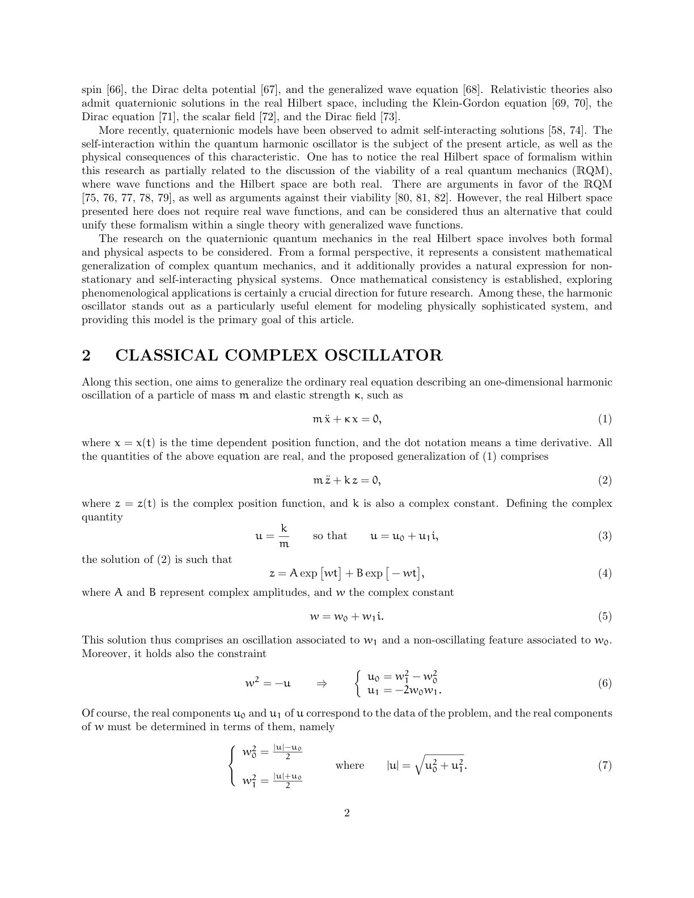 
Low-resolution page preview, page 2

📷 Fig 2

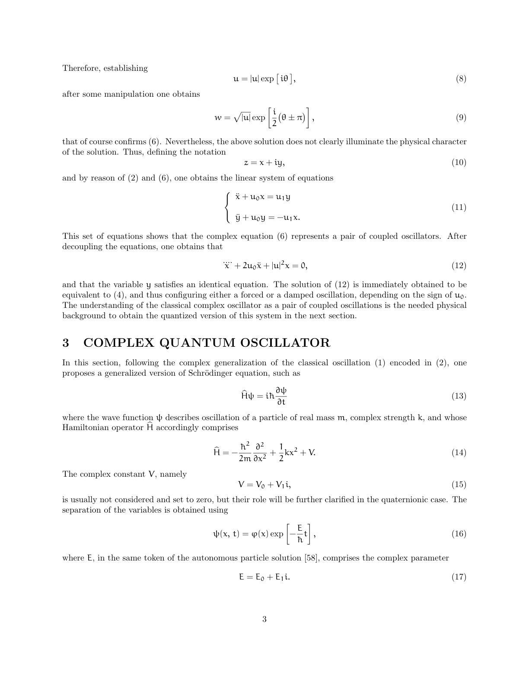 
Low-resolution page preview, page 3

📷 Fig 3

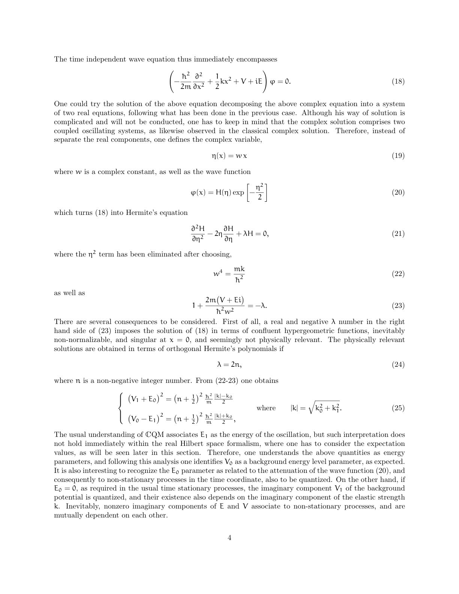 
Low-resolution page preview, page 4

📷 Fig 4

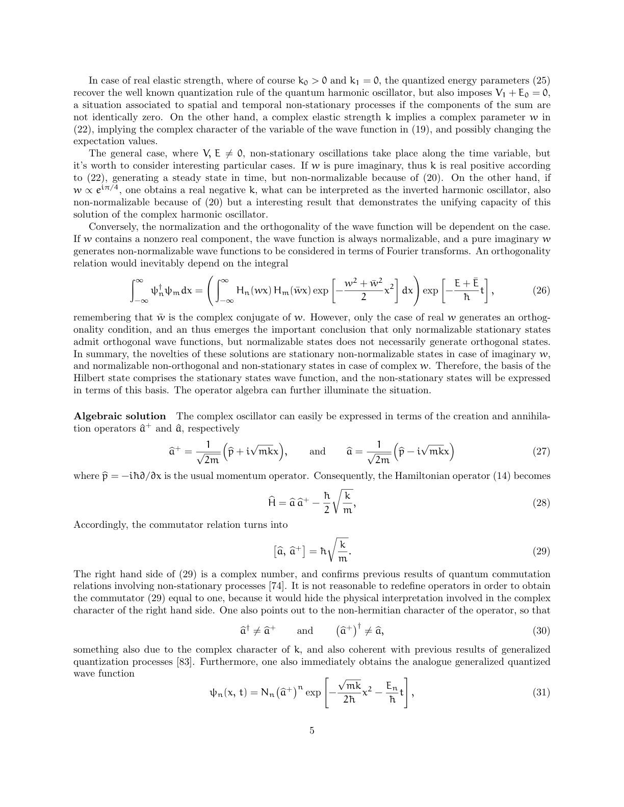 
Low-resolution page preview, page 5

📷 Fig 5

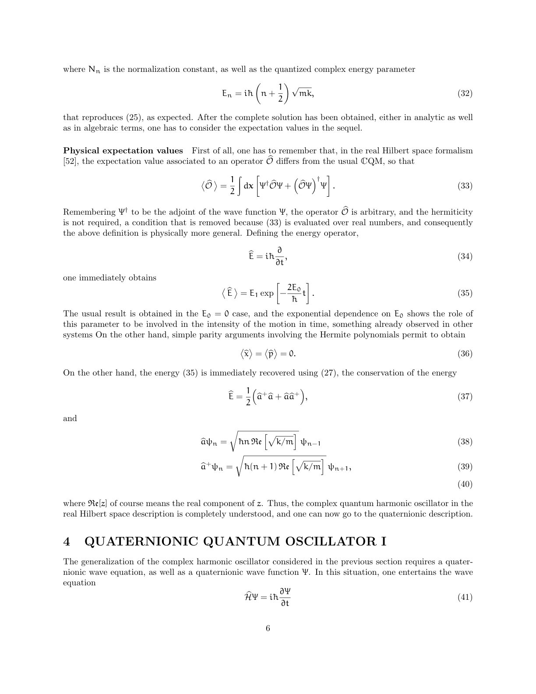 
Low-resolution page preview, page 6

**Summary.** This paper investigates the harmonic oscillator by extending its description from standard complex quantum mechanics into more abstract mathematical frameworks, notably using real Hilbert space and quaternionic numbers. It demonstrates that these generalizations allow for a richer description of non-stationary dynamics and self-interacting processes not captured by simpler models.

**Why it may be interesting.** The extension of quantum mechanics into non-commutative algebras like quaternions or restricting it to real Hilbert spaces provides powerful mathematical tools for modeling open, dissipative, or highly structured physical systems beyond standard textbook treatments.

Detailed structure

**Main problem.** The study aims to generalize the quantum harmonic oscillator by examining its behavior within increasingly complex mathematical frameworks, specifically using real Hilbert space and quaternionic numbers.

**Main result.** The formalism successfully extends standard quantum mechanics to describe non-stationary processes (like damped or forced oscillations) and introduces a richer energy structure via quaternionic descriptions compared to purely complex models.

**Method.** The analysis involves solving generalized Schrödinger equations, deriving expectation values in real Hilbert space, and analyzing coupled differential equations arising from the quaternionic representation.

**Model / system.** The primary model is the one-dimensional harmonic oscillator. It is analyzed using Hamiltonians defined over complex variables, real Hilbert spaces (using modified expectation value definitions), and full quaternionic wave functions ($\Psi = \psi_0 + \psi_1j$).

**Key observables.** Energy expectation values ($\langle \hat{E} 
angle$), quantization numbers ($N_0, N_1$), and the complex/quaternionic nature of the energy parameters ($E_0, E_1$).

**Important parameters / regimes.** The elastic strength ($k$ or $K$) and potential coefficients ($V$, $U$) are key; non-zero imaginary components in these parameters signal non-stationary dynamics.

**Assumptions / limitations.** The formalism assumes that the real Hilbert space approach can provide a unifying framework, even when standard normalizability conditions fail for certain complex parameter choices.

**Figures summary.** Not specified by notes, but the analysis relies on deriving solutions to differential equations (e.g., Hermite's equation) and establishing quantization rules.

**Paper structure.** The paper progresses from analyzing the classical/quantum oscillator in complex variables, moving to defining expectation values in a real Hilbert space context, and culminating in the most general treatment using quaternionic wave functions which yields coupled differential equations for components $\psi_0$ and $\psi_1$.

Abstract

The harmonic oscillator is considered within generalized frameworks using complex and quaternionic numbers. The classical oscillator is considered in terms of a complex position function, and quantum oscillators are examined in terms of complex wave functions, and in terms of quaternionic wave functions as well. Both of the quantum solutions are obtained within the real Hilbert space formalism. The results reveal the complex and quaternionic descriptions as suitable frameworks for non-stationary processes, including damped oscillations, forced oscillations, and additionally self-interacting processes that cannot be appropriately described otherwise.

[↑ back to top](#top)

### [An iterative Ising decoder for quantum error correction codes](http://arxiv.org/abs/2606.12301v1)

**Authors:** Yuanqi Liu, Weilei Zeng, Peixiang Li, Yantong Liu, Guangyao Huang, Yingwen Liu, Dongyang Wang, Junjie Wu, Lingling Lao  
**Type:** theory · **Category:** quantum information and computing · **PDF:** <https://arxiv.org/pdf/2606.12301v1>  
**Analysis basis:** full PDF text, analyzed in chunks
**Topic relevance:** `analog quantum simulation` **1/5** · `methods for driven-dissipative` **1/5** · `quantum measurements` **1/5**

📷 Fig 1

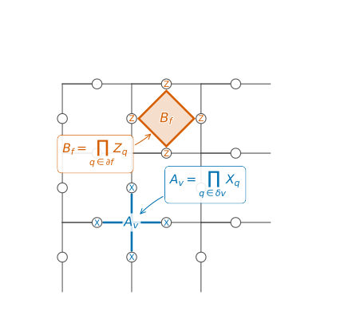 
FIG. 1. Geometry of the toric code. Data qubits (circles) reside on the lattice edges. Vertex operators Av (blue) and face operators Bf (orange) represent the two types of weight-4 stabilizer generators.

📷 Fig 2

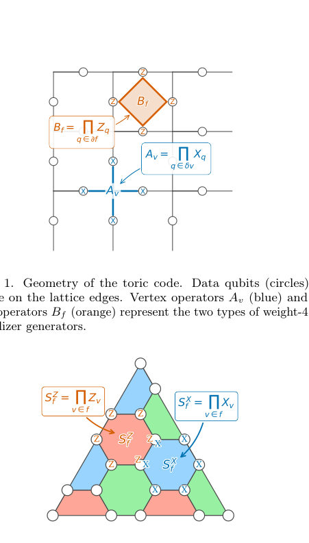 
FIG. 2. Geometry of the 6.6.6 color code with a triangular boundary. Data qubits (circles) reside at the lattice vertices. Each bulk hexagonal face (red, green, or blue) defines weight-6 X- and Z-type stabilizer generators, while the truncated faces on the boundary define weight-4 generators.

📷 Fig 3

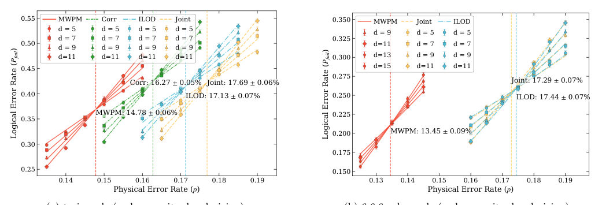 
FIG. 3. Logical error rates under code-capacity depolarizing noise for (a) the toric code and (b) the 6.6.6 color code. Thresholds are listed in Table I.

📷 Fig 4

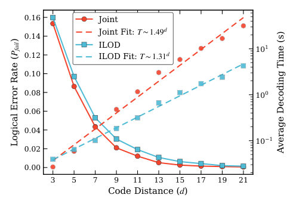 
FIG. 4. Runtime scaling under code-capacity depolarizing noise for the toric code at p = 0.10, fitted as Tsolve ∼bd.

📷 Fig 5

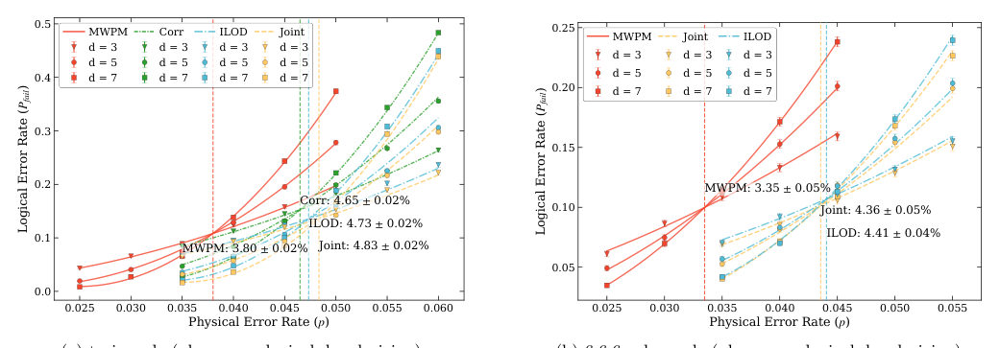 
FIG. 5. Logical error rates under phenomenological depolarizing noise (pm = p, T = d) for (a) the toric code and (b) the 6.6.6 color code. Thresholds are summarized in Table I.

**Summary.** The paper introduces an Iterative Low-order Decoding (ILOD) algorithm to solve the computationally hard problem of decoding quantum error correcting codes. ILOD circumvents the exponential complexity and high-body interactions found in joint Hamiltonian formulations by iteratively solving decoupled X and Z sub-problems using Bayesian updates. This results in faster computation, better convergence for large codes, and reduced hardware resource requirements.

**Why it may be interesting.** This work provides a concrete algorithmic improvement for simulating complex quantum error correction processes, which is crucial for understanding fault tolerance in physical quantum hardware architectures.

Detailed structure

**Main problem.** The core problem is efficiently decoding quantum error correction (QEC) codes by mapping syndrome measurement to finding the ground state of a classical Ising Hamiltonian.

**Main result.** The proposed Iterative Low-order Decoding (ILOD) algorithm significantly accelerates solving the decoding problem, restores convergence at larger code distances, and reduces hardware overhead compared to joint formulations.

**Method.** ILOD alternates optimization between X- and Z-type sub-Hamiltonians, approximating complex cross-correlations using Bayesian priors that reweight couplings based on inferred error configurations.

**Model / system.** The work analyzes topological stabilizer codes like the Toric code and 6.6.6 color code under depolarizing noise. The Hamiltonian complexity increases significantly with noise type (e.g., up to 10-body interactions).

**Key observables.** Error thresholds ($p_{th}$), logical error rate ($	ext{p}_L$), and computational runtime scaling ($T_{solve} \sim b d$).

**Important parameters / regimes.** Code distance ($d$), physical error rates ($p, p_m$), and the body count of interaction terms (e.g., 8-body vs. 4-body).

**Assumptions / limitations.** The ILOD procedure is a heuristic optimization guided by local Nishimori relations; initial analysis assumes independent noise distributions.

**Figures summary.** Figures compare logical error rates and runtime scaling for various decoding methods (ILOD, Joint) across different codes and noise models, showing ILOD's superior performance at large distances.

**Paper structure.** The paper first establishes the QEC framework using Ising mapping. It then details the limitations of joint Hamiltonians due to high-order terms. The core contribution is introducing and analyzing the iterative ILOD algorithm, followed by extensive comparisons against existing methods regarding thresholds and runtime scaling.

Abstract

The Ising framework maps the decoding problem in quantum error correction onto ground-state optimization of a classical Hamiltonian, in which $X$-$Z$ error correlations enter as cross terms. Under phenomenological depolarizing noise, the exact joint formulation contains up to 8-body interactions for the toric code and 10-body for the $6.6.6$ color code. These high-order terms degrade solver convergence, inflate runtime, and raise the auxiliary spin overhead when embedding into native 2-body Ising hardware. In this work, we propose the iterative low-order decoding (ILOD) algorithm, which alternates between $X$- and $Z$-type sub-Hamiltonians, approximating cross-type correlations through Bayesian priors that reweight each type's couplings using the other type's inferred error configuration. This halves the maximum body count of interaction terms in the Hamiltonian, accelerating the solver, restoring convergence at larger code distances, and reducing the total spin count for 2-body embedding by a factor of $2.5$. For the toric code, ILOD attains a threshold of $4.73%$ versus $4.83%$ for the joint formulation, with the empirical runtime ratio scaling as $(0.81)^d$. For the $6.6.6$ color code, their thresholds agree within statistical uncertainty for small code distances, and ILOD remains convergent for larger distances where the joint formulation fails to converge despite a larger annealing budget.

[↑ back to top](#top)

### [Experimental straintronics in nanotube quantum dots](http://arxiv.org/abs/2606.12180v1)

**Authors:** L. Huang, I. G. Rebollo, A. R. Champagne  
**Type:** experiment · **Category:** other · **PDF:** <https://arxiv.org/pdf/2606.12180v1>  
**Analysis basis:** full PDF text, analyzed in chunks
**Topic relevance:** `Kondo & dissipative impurity` **1/5** · `QC/QI experiment` **1/5** · `non-equilibrium dynamics` **1/5**

📷 Fig 1

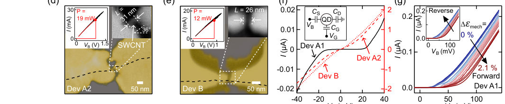 
FIG. 1. Instrumentation and SWCNT-QD transistors for quantum transport straintronics (QTS). (a) Side-view schematic of our instrumentation loaded in a low-temperature cryostat. A push screw bends slightly a very thin Si substrate, applying an in-situ mechanical strain ∆εmech to the suspended SWCNT channel. A DC circuit is used for transport measurements. (b) A tilted-SEM image (80°) of the suspended SWCNT-under-gold breakjunction in Device A1 (before electromigration). The suspension length is Lsus = 650 nm. (c) Zoom-in view of the breakjunction in (b) after electromigration. The top left inset shows the electromigration process for Device A1, and the top right inset the small scale SEM...

📷 Fig 2

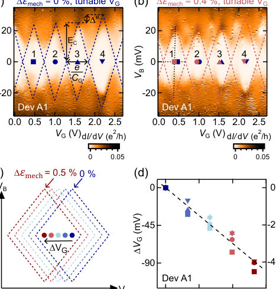 
FIG. 2. Mechanically-tunable Coulomb diamond ∆VG shifts. (a)-(b) dI/dVB −VB −VG data from Device A1 at ∆εmech = 0 and 0.4 %, respectively. (c) Outline of the Coulomb diamond 2 extracted from (a)-(b) and similar data at ∆εmech ranging from 0 (blue) and 0.5 % (red). The centers of the diamonds are labelled with circle markers. (d) The ∆VG shift of di- amonds 1 (squares), 2 (circles), 3 (triangles), 4 (downward triangles) versus ∆εmech. The right-side axis shows the cor- responding Fermi energy shift, ∆µG = αe∆VG. The dashed line is a linear fit.

📷 Fig 3

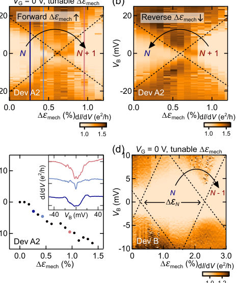 
FIG. 3. Mechanical tuning of charge doping in SWCNT-QDs. (a)-(b) dI/dV −VB −∆εmech data from Device A2 for forward (increasing) and reverse (decreasing) ∆εmech sweeps, respec- tively. The labels N and N +1 refer to the average number of electrons on the QD. (c) The main panel shows ∆µG−∆εmech for Device A2. The inset shows dI/dV −VB data extracted from (a) at the location of the vertical cuts highlighted in dark blue, light blue, and red, respectively. (d) Same as (a), but for Device B.

📷 Fig 4

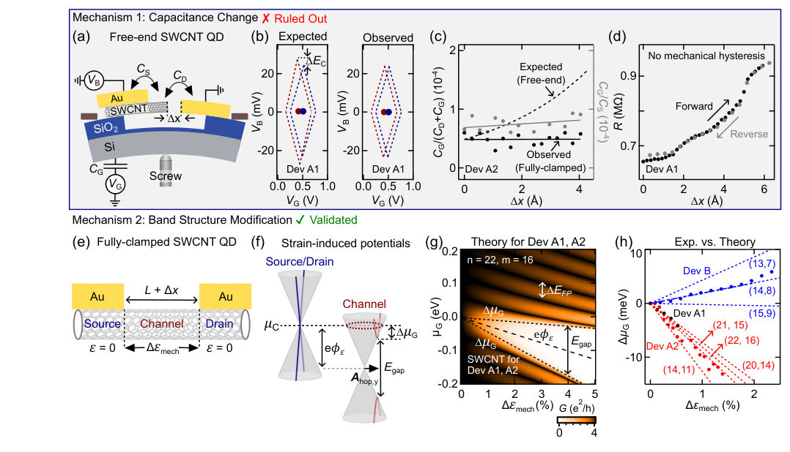 
FIG. 4. Physical origin of mechanical gating in our SWCNT transistors. (a) Diagram showing the geometry of previously reported mechanically-controlled QDs (mechanical break-junctions). The QD was affixed to one metal contact (e.g. source) while free to move a distance ∆x away from another metal contact (e.g. drain). (b) The expected change, based on the geometry in (a), in the Coulomb diamond shape for Device A1 between ∆x = 0 ˚A (measured, blue) and ∆x = 4 ˚A (calculated, red). The right-hand side diamonds show that the actual measured diamonds at ∆x = 0 (blue) and 4 (red) ˚A did not change shape. (c) The measured slopes (solid markers) of the diamonds in Device A2 at various ∆x. The solid...

📷 Fig 5

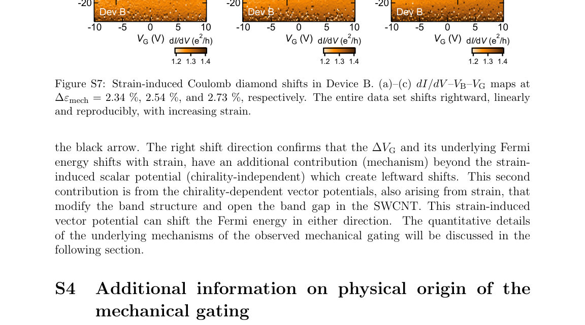 
Figure 4 of the main text and the related discussion demonstrate that the mechanical gating observed in our experiments originates from strain-dependent SWCNT band structure mod- ifications rather than from QD capacitance changes. In this section, we present additional data and analysis confirming that our devices are fully clamped mechanically and exhibit no significant capacitance change over a broad strain range. We then describe the theoretical model used to reproduce the transport behavior of our SWCNT devices. In addition to the theoretical calculation of the transport spectrum in Device A shown in Fig. 4(g), we show below the theoretical calculation results for Device B.

**Summary.** This paper demonstrates that uniaxial mechanical strain can precisely and reversibly control the doping and bandgap of single-wall carbon nanotube quantum dots. By analyzing charge transport measurements under controlled strain, the authors confirm that this effect arises from predictable modifications to the material's electronic band structure, opening avenues for strain-based quantum device engineering.

**Why it may be interesting.** This work provides direct experimental evidence for using mechanical forces as an active tuning knob for quantum electronic properties in nanoscale conductors, which is highly relevant for developing solid-state quantum devices.

Detailed structure

**Main problem.** The study investigates how applying controlled mechanical strain ($\Delta\epsilon_{mech}$) can be used to precisely modulate the quantum transport properties, specifically the doping and bandgap, within single-wall carbon nanotube (SWCNT) quantum dots.

**Main result.** The research confirms a large, reversible mechanical-gating effect in SWCNT-QDs. This control is quantitatively attributed to predictable modifications of the material's electronic band structure rather than simple changes in device capacitance.

**Method.** Experimental measurements involve fabricating suspended SWCNT transistors and applying uniaxial strain using movable gold clamps while measuring charge transport characteristics (e.g., $dI/dV - V_B - \Delta\epsilon_{mech}$).

**Model / system.** The physical system is the SWCNT-QD transistor, where the quantum dot acts as a tunable element. The underlying physics is modeled by incorporating strain into the Hamiltonian via both scalar potentials ($\phi_\epsilon$) and chirality-dependent vector potentials ($A_{	ext{hop},y}$), which modify the band structure.

**Key observables.** Mechanical shift in Coulomb diamond positions ($\Delta V_G$), extracted Fermi energy shifts ($\Delta\mu_G$), and constant capacitance ratios during mechanical sweeps.

**Important parameters / regimes.** Uniaxial strain range of $\approx 0$ to $3\%$; device channel lengths of $\approx 30$ nm; low temperature ($T=4$ K).

**Assumptions / limitations.** The observed electronic changes are due to elastic, predictable bandstructure modifications predicted by Quantum Transport Strainronics (QTS) theory, and that the QDs remain fully clamped during strain application.

**Figures summary.** Figures illustrate device setups, SEM images of fabricated transistors, $I-V$ curves showing clear shifts in Coulomb diamonds as a function of applied strain, and comparisons ruling out purely capacitive gating mechanisms.

**Paper structure.** The paper details the fabrication and characterization of suspended SWCNT-QD devices. It presents transport measurements across a range of tunable strains, analyzes the resulting electronic shifts, and compares these findings against theoretical models incorporating strain-induced band structure changes to confirm the physical mechanism.

Abstract

Single-wall carbon nanotubes (SWCNTs) are narrow ribbons of graphene with atomically precise edges and a single quantum transport channel, at experimentally-relevant dopings. This makes them ideal systems to harness quantum transport straintronics (QTS), i.e. using mechanical strain to control accurately quantum transport. We present QTS data from three single-wall carbon nanotube quantum dot (SWCNT-QD) transistors over a broad range of in-situ tunable and reversible uniaxial strain ($Δ\varepsilon_\text{mech}\approx$ 0 to 3 %). We first present the nanofabrication of the suspended SWCNT transistors whose channel lengths are $\approx$ 30 nm. The channels are strained by moving gold clamps holding firmly the nanotubes. We present detailed charge transport data, $dI/dV_{\text{B}} - V_{\text{B}} - V_{\text{G}}$ and $dI/dV_{\text{B}} - V_{\text{B}} - Δ\varepsilon_\text{mech}$, showing a large mechanical-gating effect of the SWCNT-QDs. The precise reversibility of the data, and their agreement with QTS theory, confirms that the tubes are strained elastically. We demonstrate that the mechanical control of the QD doping is not due to capacitive-gating effects, but to quantitatively predictable bandstructure changes including a strain-tunable bandgap. This precise mechanical control of the doping and bandgap of SWCNT-QDs could find applications in qubits, condensed matter physics, and homojunction molecular transistors.

[↑ back to top](#top)

### [Planted-Solution Pauli Hamiltonians as a Quantum Benchmarking Primitive](http://arxiv.org/abs/2606.11455v1)

**Authors:** Amir Kalev, Itay Hen  
**Type:** theory · **Category:** quantum information and computing · **PDF:** <https://arxiv.org/pdf/2606.11455v1>  
**Analysis basis:** full PDF text, analyzed in chunks
**Topic relevance:** `analog quantum simulation` **1/5** · `correlated cavity matter` **1/5** · `entanglement & information structure` **1/5**

📷 Fig 1

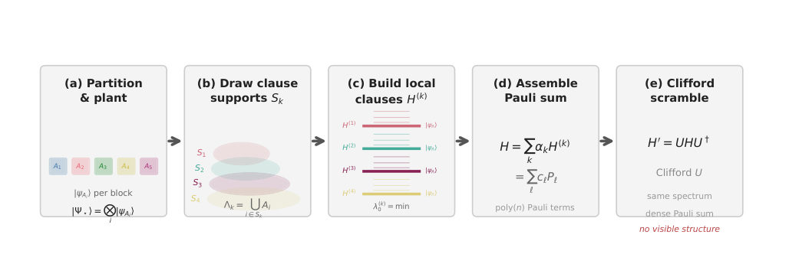 
FIG. 1. Construction pipeline for planted benchmark Hamiltonians. (a) Qubits are partitioned into disjoint blocks {Ai} with planted states |ψAi⟩defining a global product ground state |Ψ⋆⟩. (b) Random subsets Sk of blocks define overlapping clause supports Λk = S

📷 Fig 2

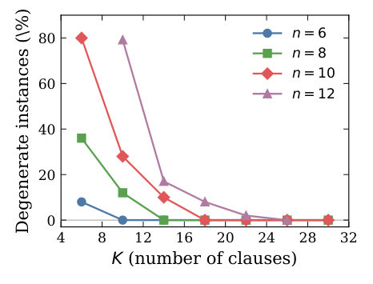 
FIG. 2. Fraction of instances with numerically degenerate ground state (∆1 &lt; 10−10) as a function of K for different system sizes. As one would expect, the degeneracy fraction falls sharply with K.

📷 Fig 3

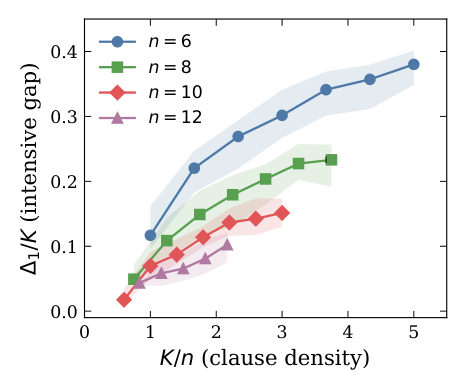 
FIG. 3. Intensive spectral gap ∆1/K as a function of clause density K/n for n = 6, 8, 10, 12. Bands indicate interquartile ranges over 50 instances. At fixed K/n, the intensive gap decreases approximately exponentially with n.

📷 Fig 4

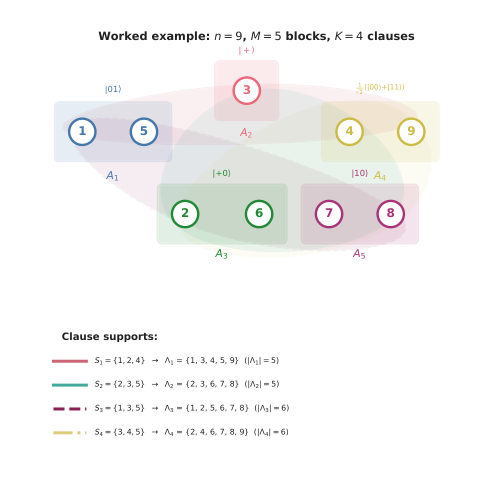 
FIG. 4. Block-clause structure of the worked example. Nine qubits (numbered circles) are partitioned into five blocks A1– A5 (colored backgrounds) with non-contiguous membership. Four clause supports S1–S4 (shaded regions), each spanning three blocks, overlap to produce a fully connected constraint hypergraph. Planted block states are indicated above each cluster.

**Summary.** The paper introduces a rigorous method to construct Pauli Hamiltonians whose ground state energy is precisely known by design. By embedding a simple product state into a complex sum of local clauses, it creates challenging quantum benchmarks for ground-state solvers. This framework allows researchers to test the limits of quantum computation while maintaining full verifiability.

**Why it may be interesting.** This work provides a controlled theoretical playground to test quantum algorithms for finding ground states, offering benchmarks where the answer is known but the input structure is designed to be hard to exploit classically.

Detailed structure

**Main problem.** The authors aim to develop reliable, verifiable benchmarks for quantum ground-state energy estimation algorithms that are designed to test the limits of quantum advantage.

**Main result.** They introduce a framework constructing Pauli Hamiltonians whose ground state and energy are known exactly by design, while presenting them in a complex, non-manifestly structured form.

**Method.** The method constructs the Hamiltonian as a weighted sum of local clauses acting on overlapping supports, embedding an exactly known product state into the ground space.

**Model / system.** The model is a quantum many-body system described by a Pauli Hamiltonian ($H$) constructed from planted block-product states. The structure allows for optional Clifford conjugation to scramble the operator support while preserving the spectrum.

**Key observables.** Ground-state energy ($E_0$), spectral gap ($\Delta_1$), and the size of the Pauli representation.

**Important parameters / regimes.** Clause density ($K/n$), system size ($n$), and the number of planted states ($m$).

**Assumptions / limitations.** The resulting model can be represented as a polynomial-size linear combination of Pauli operators, and for multi-planted cases, blockwise orthogonality of planted states is assumed.

**Figures summary.** Figures illustrate the construction pipeline (Partition $	o$ Clause Supports $	o$ Local Hamiltonians $	o$ Pauli Sum $	o$ Clifford Scramble). Figure 3 plots the intensive spectral gap vs. clause density for various system sizes.

**Paper structure.** The paper details the general construction of single-planted and multi-planted Hamiltonians, analyzes the exponential closing of the spectral gap ($\Delta_1 \sim c \cdot b^n$), and provides a worked example on $n=9$ qubits showing the embedding process.

Abstract

We introduce a construction of Pauli Hamiltonians with exactly known ground-state energies, intended as reference instances for ground-state energy estimation algorithms. The construction embeds a planted block-product state as the simultaneous ground state of a sum of frustration-free local clauses on overlapping supports, exposes the resulting model only as a polynomial-size linear combination of Pauli operators, and admits optional Clifford conjugation that preserves the spectrum. The framework subsumes classical planted constraint-satisfaction problems as a diagonal special case, providing a direct embedding channel through which classical hardness properties can be inherited. Open-source software, certification keys, and example instances are made publicly available.

[↑ back to top](#top)

### [Sparsified Kolmogorov-Arnold Networks for Interpretable Quantum State Tomography](http://arxiv.org/abs/2606.11814v1)

**Authors:** Xinge Wu, Huaxin Wang, Jiajun Liu, Ruiqing He, Jiandong Shang, Hengliang Guo, Qiang Chen  
**Type:** theory · **Category:** quantum information and computing · **PDF:** <https://arxiv.org/pdf/2606.11814v1>  
**Analysis basis:** full PDF text, analyzed in chunks
**Topic relevance:** `entanglement & information structure` **1/5** · `methods for driven-dissipative` **1/5** · `quantum measurements` **1/5**

📷 Fig 1

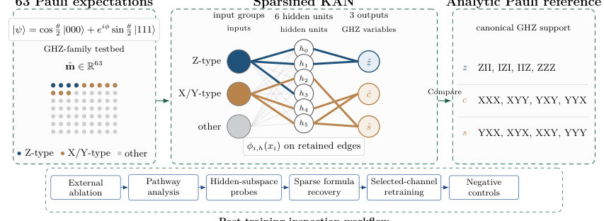 
FIG. 1. Sparsified KAN tomography workflow. A full 63-channel Pauli-expectation vector is mapped to the GHZ-subspace variables (z, c, s) by a compact KAN and compared with the analytic GHZ Pauli reference. After training and pruning, the retained model is inspected through external ablation, pathway analysis, hidden-subspace probes, sparse Pauli formula recovery, selected-channel retraining, and negative controls.

📷 Fig 2

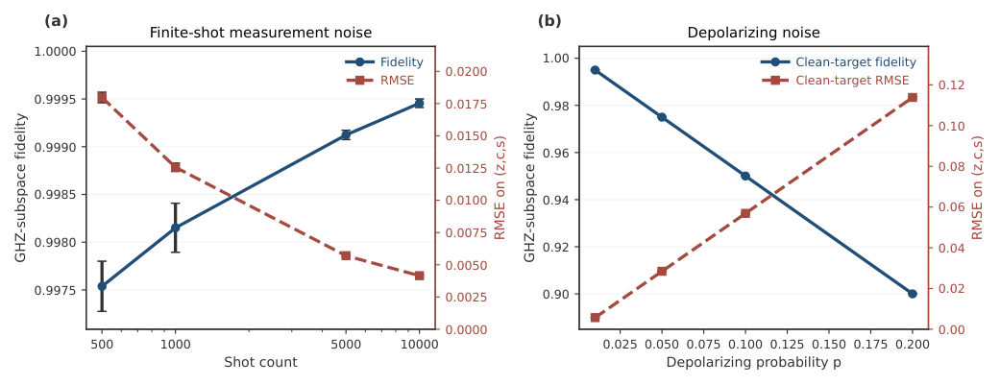 
FIG. 2. Reconstruction of GHZ-subspace variables under finite-shot and depolarizing noise. (a) Finite-shot measurement noise: GHZ-subspace fidelity (left axis) and RMSE over (z, c, s) (right axis) versus shot count. (b) Depolarizing noise: clean-target fidelity (left axis) and clean-target RMSE (right axis) versus depolarizing probability. Line samples and curve labels are shown in the upper-right corner of each panel. All values are averaged over seeds 0–4; error bars denote ± one standard deviation.

📷 Fig 3

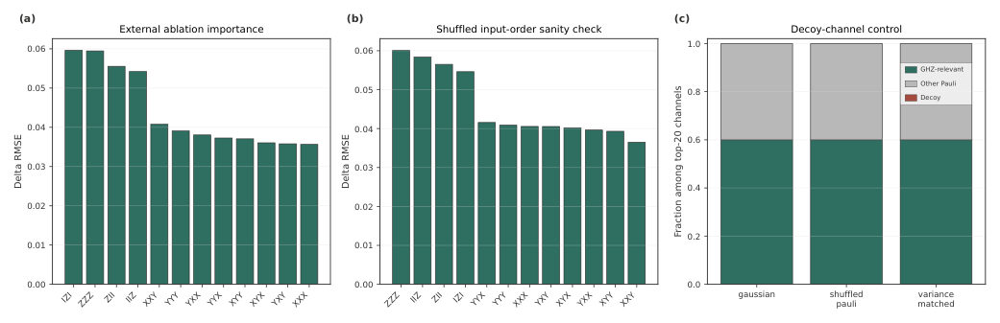 
FIG. 3. Input-level analyses identify GHZ-relevant Pauli channels. All panels use the 1000-shot condition. (a) Mean external- ablation importance, defined as the increase in clean-target RMSE after zeroing each Pauli channel and averaged over seeds 0–4; canonical GHZ-relevant measurements appear as top-ranked channels. (b) Mean external-ablation importance after random permutation of the 63 input columns and retraining, averaged over shuffled seeds 0–2 and mapped back to the original Pauli labels; the same GHZ-relevant channels remain top-ranked. (c) Decoy-channel control: after appending 24 Gaussian, shuffled- Pauli, or variance-matched decoy channels and recomputing top-20...

📷 Fig 4

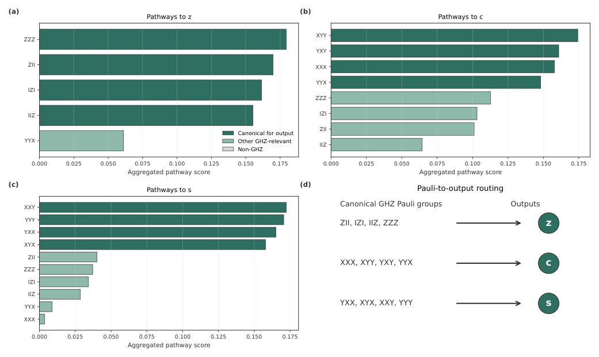 
FIG. 4. Aggregated pathway scores for each output variable, obtained by summing |scalei,h| · |scaleh,o| over hidden units. (a–c) Top Pauli channels ranked by aggregated score to z, c, and s, respectively. Dark green bars denote canonical GHZ-relevant channels for the displayed output, pale green denotes other GHZ-relevant channels, and gray denotes non-GHZ channels. (d) Routing schematic for the canonical Pauli groups associated with the population, real off-diagonal, and imaginary off-diagonal outputs. Scores use absolute edge strengths and quantify routing importance without encoding algebraic sign. All panels are from a representative seed-0 KAN at the 1000-shot condition.

📷 Fig 5

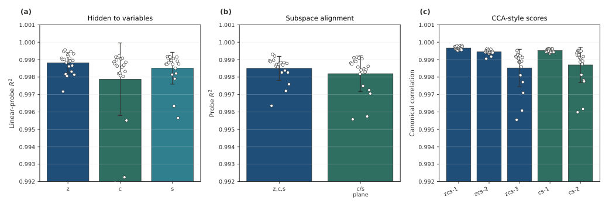 
FIG. 5. Hidden-subspace alignment metrics across 20 random initializations at 1000 shots. Bars show held-out R2 from linear probes trained on hidden activations (targets z, c, s, the (c, s) plane, and the full (z, c, s) vector), together with canonical correlations from CCA-style alignment (first component of the full space, and the two components of the (c, s) plane). Error bars denote ± one standard deviation across seeds. The vertical axes are zoomed to show small variations.

**Summary.** The paper introduces using Sparsified Kolmogorov-Arnold Networks (KANs) for Quantum State Tomography on a three-qubit GHZ state. It argues that the KAN's value lies not in superior prediction accuracy compared to linear models, but in its pathway structure, which can be inspected to confirm that the model has learned the correct underlying Pauli symmetries and physical relationships.

**Why it may be interesting.** This work bridges quantum information science with modern AI interpretability techniques by providing a rigorous method to validate if an ML model has learned the *physical laws* governing a system, rather than just memorizing correlations from training data.

Detailed structure

**Main problem.** To develop an interpretable machine learning framework for Quantum State Tomography (QST) that audits the learned reconstruction rule against known physical Pauli structure, rather than just maximizing fidelity.

**Main result.** The Sparsified Kolmogorov-Arnold Network (KAN) successfully identifies and organizes the minimal set of GHZ-relevant Pauli channels required for reconstruction, demonstrating pathway-level structural interpretability consistent with analytic quantum theory.

**Method.** The authors train a KAN to map 63 measured Pauli expectation values onto three target variables ($z, c, s$) derived from a controlled three-qubit GHZ state. Interpretability is assessed via external ablation, pathway analysis, and sparse formula recovery against known Pauli relations.

**Model / system.** The system is a controlled three-qubit GHZ-family benchmark used to generate 63 non-identity Pauli expectation values as inputs. The model employs a Sparsified Kolmogorov-Arnold Network (KAN) architecture for reconstruction, which is compared against sparse linear baselines.

**Key observables.** Population imbalance ($z$), real/imaginary off-diagonal coherence components ($c, s$), and the importance ranking of the 63 Pauli expectation values.

**Important parameters / regimes.** Three qubits; GHZ state parameters ($	heta, \phi$); Noise levels (finite-shot sampling, depolarizing noise $p=0.20$).

**Assumptions / limitations.** The primary assumption is that structural interpretability (pathway organization) provides a unique and valuable contribution over mere predictive accuracy, especially when the underlying physics is near-linear.

**Figures summary.** Figures illustrate the entire inspection workflow: mapping 63 Pauli inputs to $(z, c, s)$ via KAN, followed by ablation studies and pathway analysis compared against the analytic GHZ reference structure.

**Paper structure.** The paper establishes the problem of opaque ML models in QST. It details the controlled GHZ benchmark setup and the use of KANs. The core contribution is the multi-faceted diagnostic suite (ablation, pathway scoring) which proves structural consistency with Pauli theory, concluding that interpretability is the key gain.

Abstract

Machine-learning approaches to quantum state tomography can achieve high reconstruction fidelity, but the physical structure used by the trained model often remains implicit. Here we ask whether a sparsified Kolmogorov-Arnold Network (KAN) can be used not only as a regressor, but also as an inspectable reconstruction rule whose internal organization can be checked against known Pauli structure. We study a controlled three-qubit GHZ-family benchmark in which all 63 non-identity Pauli expectation values are used to reconstruct three GHZ-subspace variables: the population imbalance $z$, the real off-diagonal component $c$, and the imaginary off-diagonal component $s$. Under finite-shot sampling and depolarizing noise, external ablation identifies the extended 12-channel GHZ-relevant Pauli set from the 63 measurements, with exact top-12 recovery across the tested shot counts and depolarizing-noise strengths. These support patterns remain stable across multi-seed random-initialization and noise-level analyses, and collapse under random-label controls. The dominant pruned input-hidden-output pathways organize Z-type population observables and X/Y off-diagonal observables in a pattern consistent with the analytic GHZ Pauli grouping, and sparse formula recovery recovers the canonical signed Pauli relations. The contribution of the KAN is therefore pathway-level structural interpretability within a neural reconstruction model, rather than superior sparse regression. Together with negative controls, these probes provide a consistency chain for auditing learned reconstruction rules against known physical structure.

[↑ back to top](#top)

### [Dissociative recombination and ion-pair formation in $\mathrm{HeH^+}$ isotopologues: A time-dependent wave-packet study including rotational coupling](http://arxiv.org/abs/2606.11352v1)

**Authors:** Sifiso Musa Nkambule, Malibongwe Tsabedze, Oscar N. Mabuza, Mbuso K. Matfunjwa  
**Type:** theory · **Category:** other · **PDF:** <https://arxiv.org/pdf/2606.11352v1>  
**Analysis basis:** full PDF text, analyzed in chunks
**Topic relevance:** `methods for driven-dissipative` **1/5** · `non-equilibrium dynamics` **1/5**

📷 Fig 1

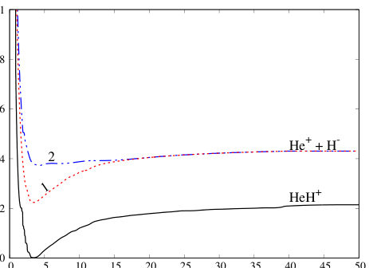 
FIG. 1. Potential energy curves for the He+ + H−state and the ground state of HeH+.

📷 Fig 2

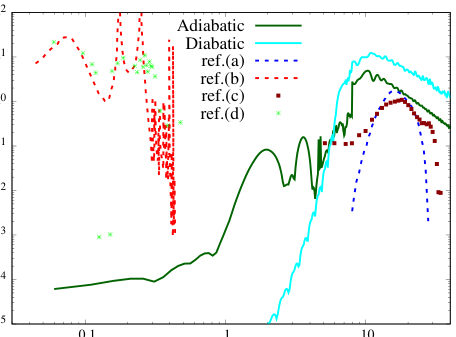 
FIG. 2. Total DR reaction cross section for HeH+ as a func- tion of collision energy. Results obtained in both adiabatic and diabatic representation for the different symmetries, in the adiabatic representation. The results are compared with previous theoretical ((a) [15] and (b) [13]) and Experimental results((c) [19] and (d) [18])

📷 Fig 3

 
FIG. 4. Total DR reaction total cross section for different HeH+ isotopologues. A clear dependence on reduced mass, particularly for collision energies above 5 eV.

📷 Fig 4

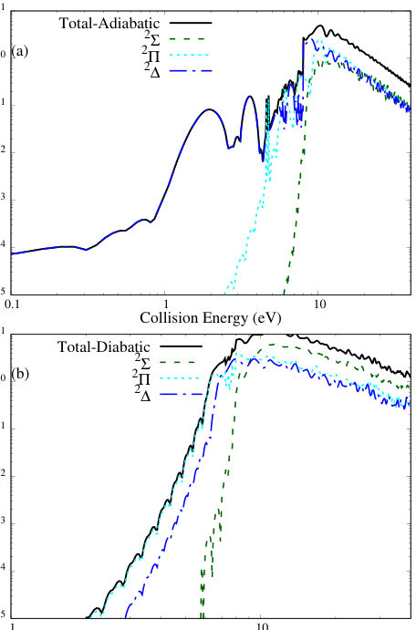 
FIG. 3. Calculated DR reaction cross section for 4HeH+ for the different symmetries, in the adiabatic (a) and diabatic (b) representations

📷 Fig 5

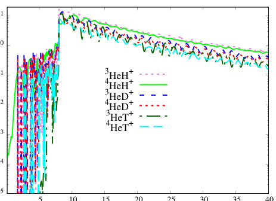 
Figure 5 shows the resonant ion-pair (RIP) formation cross sections obtained using Method 1, while Figure 6 compares the two diabatization procedures. A major result of the present work is that both dia- batization approaches predict RIP cross sections signif- icantly larger than those reported previously by Larson et al. [13]. The enhancement is particularly pronounced at low collision energies where previous calculations pre- dicted almost negligible ion-pair formation. The increased ion-pair yield can be attributed to three factors:

**Summary.** This theoretical study uses time-dependent wave-packet methods to calculate the rates for dissociative recombination and ion-pair formation in $\mathrm{HeH^+}$ isotopologues. By incorporating a large number of coupled electronic states and explicit rotational couplings, the authors find that these processes are significantly more efficient than previously modeled. The results highlight the critical role of nonadiabatic coupling and mass effects in determining astrophysical reaction rates.

**Why it may be interesting.** This work is highly relevant to AMO physics as it models complex electron-molecule collision dynamics involving multiple coupled electronic states, nonadiabatic transitions, and rotational coupling—hallmarks of molecular quantum dynamics.

Detailed structure

**Main problem.** The study investigates dissociative recombination (DR) and resonant ion-pair (RIP) formation processes in $\mathrm{HeH^+}$ isotopologues.

**Main result.** The inclusion of a large manifold of resonant states and explicit rotational couplings significantly enhances the predicted DR cross sections compared to previous theoretical models. Lighter isotopes show systematically larger reaction rates due to mass effects.

**Method.** Time-dependent wave-packet propagation methods are employed, treating nuclear dynamics across 23 coupled electronic states in both adiabatic and diabatic representations.

**Model / system.** The system is the helium hydride ion ($\mathrm{HeH^+}$) and its isotopologues. The Hamiltonian governs interactions between multiple electronic potential energy curves ($^2\Sigma, ^2\Pi, ^2\Delta$) coupled by non-adiabatic and rotational terms.

**Key observables.** Reaction cross sections for DR ($\sigma_{DR}$) and RIP formation ($\sigma_{RIP}$); thermal rate coefficients $k(T)$; isotopic dependence of these rates.

**Important parameters / regimes.** Collision energies (0 to 50 eV); electron temperature ($T$); reduced mass ($\mu$).

**Assumptions / limitations.** The calculations utilize the local complex potential approximation for autoionization, which may neglect interference effects between overlapping resonances.

**Figures summary.** Figures illustrate total DR cross sections vs. collision energy comparing adiabatic/diabatic results; symmetry contributions to the cross section; and thermal rate coefficients across different isotopes and rotational states.

**Paper structure.** The paper systematically develops the theoretical framework by defining the Hamiltonian, implementing wave-packet propagation in both representations, calculating observables (cross sections), analyzing physical effects (symmetry, mass dependence), and finally deriving astrophysical rates.

Abstract

We present a comprehensive theoretical investigation of dissociative recombination (DR) and resonant ion-pair (RIP) formation in $\mathrm{HeH^+}$ isotopologues using time-dependent wave-packet propagation methods. Nuclear dynamics are treated on a set of 23 coupled electronic states, including $^2Σ$, $^2Π$, and $^2Δ$ symmetries, in both adiabatic and strictly diabatic representations, with rotational couplings explicitly included. Reaction cross sections are computed over collision energies ranging from 0 to 50 eV.   The results reveal that inclusion of a large manifold of resonant states and rotational couplings significantly enhances the DR cross section relative to earlier theoretical studies. In the diabatic representation, $^2Σ$ states dominate the recombination dynamics, while in the adiabatic representation, $^2Π$ and $^2Δ$ states contribute significantly at low collision energies. For RIP formation, two different diabatization schemes yield systematically larger cross sections than previous models, highlighting the sensitivity of ion-pair production to electronic coupling structure.   Isotopic effects are examined, showing a clear inverse dependence of cross section magnitude on reduced mass. The present results underscore the importance of multi-state coupling and nonadiabatic effects in accurately describing electron-molecule collision processes in primordial and astrophysical plasmas.

[↑ back to top](#top)

### [Family-Aware Residual Architecture for Predicting Quantum Circuit Simulation Performance](http://arxiv.org/abs/2606.11620v1)

**Authors:** Honjar Xing, Yehong Jiang, Xianbang Wang, Zehua Wang, Zhicheng Jiang  
**Type:** theory · **Category:** numerical methods · **PDF:** <https://arxiv.org/pdf/2606.11620v1>  
**Analysis basis:** full PDF text, analyzed in chunks
**Topic relevance:** `methods for driven-dissipative` **1/5** · `non-equilibrium dynamics` **1/5**

📷 Fig 1

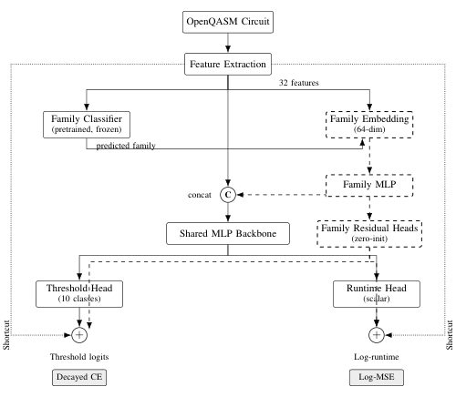 
Fig. 1. Architecture overview. Features extracted from an OpenQASM circuit feed a pretrained family classifier and a shared MLP backbone. Family residual heads (dashed boxes) learn additive, family-specific corrections to both threshold classification and runtime regression outputs. Dotted lines show shortcut connections from raw features directly to output heads.

**Summary.** This paper introduces a novel neural network architecture designed to predict the required approximation parameters (bond dimension threshold) and runtime for simulating complex quantum circuits using tensor networks. By incorporating an explicit understanding of the underlying quantum algorithm family, the model significantly outperforms baseline predictors, transforming an intractable trial-and-error process into a fast, single-pass prediction.

**Why it may be interesting.** While focused on circuit simulation cost prediction rather than physical dynamics, the reliance on tensor networks places it within computational quantum physics. The ability to predict resource scaling is crucial for designing scalable quantum algorithms.

Detailed structure

**Main problem.** The core problem is predicting two critical, computationally expensive metrics for approximate quantum circuit simulation: the minimum approximation threshold ($	heta^*$) needed for target fidelity and the expected wall-clock runtime ($r$). This avoids costly trial-and-error parameter tuning.

**Main result.** The proposed family-aware neural architecture achieved 79.5% exact threshold accuracy and an $R^2 = 0.82$ runtime correlation, drastically reducing simulation setup time from hours to milliseconds.

**Method.** A family-aware neural network utilizes feature extraction (from OpenQASM), a pretrained family classifier, and family-conditioned residual corrections (FiLM) to predict the two cost metrics simultaneously.

**Model / system.** The system models quantum circuits described by OpenQASM, which are simulated using approximate tensor-network methods that rely on parameters like bond dimensions for truncation.

**Key observables.** Minimum approximation threshold ($	heta^*$), expected wall-clock runtime ($r$), and fidelity ($\ge 0.75$).

**Important parameters / regimes.** Qubit count (up to 130), target fidelity, and the discrete set of bond dimensions $\{ \star, 1, 2, 4, \dots, 256 \}$.

**Assumptions / limitations.** The necessity of the method stems from the exponential scaling limits of exact statevector simulation; family-aware modeling is assumed to capture crucial algorithmic cost differences.

**Figures summary.** Figure 1 illustrates the architecture flow: features $
ightarrow$ Family Classifier $
ightarrow$ Shared MLP Backbone $
ightarrow$ Output Heads using residual connections. Table I details ablation study results comparing various architectural components.

**Paper structure.** The paper introduces the problem of parameter selection in tensor-network simulation, proposes the family-aware neural architecture incorporating feature extraction and conditioning mechanisms, presents quantitative results on accuracy and correlation, and concludes with ablation studies validating the necessity of family awareness.

Abstract

Approximate tensor-network simulators enable classical simulation of quantum circuits beyond the reach of exact methods, but selecting optimal approximation parameters -- such as bond dimension thresholds -- remains a costly trial-and-error process. We present a family-aware neural architecture that predicts both the minimum approximation threshold required to achieve target fidelity and the expected wall-clock runtime for quantum circuit simulation, given only the circuit's OpenQASM description and execution context. Our key insight is that quantum circuits from different algorithmic families (e.g., QFT, Grover, VQE) exhibit fundamentally distinct simulation cost profiles due to their differing entanglement structures. We employ family-conditioned residual corrections -- additive, family-specific adjustments atop a shared backbone, drawing on established conditional computation techniques -- enabling the model to capture both universal circuit properties and algorithmic nuances. The architecture incorporates a pretrained family classifier (97.5% accuracy) and domain-informed algorithm fingerprint features derived from gate-composition heuristics. Evaluated on circuits spanning 7--130 qubits across 10 algorithm families, our system achieves 79.5% exact threshold accuracy (91.2% within one rung) and $R^2 = 0.82$ runtime correlation, with inference completing in approximately 50 ms -- replacing trial-and-error simulation runs that may take minutes to hours. Ablation studies confirm that family-aware modeling provides the single largest performance improvement (+3.2 percentage points), validating the hypothesis that algorithm family is a first-class feature for simulation cost prediction.

[↑ back to top](#top)

### [Higher-Order Token Interactions via Quantum Attention](http://arxiv.org/abs/2606.11673v1)

**Authors:** Jian Xu, Chao Li, Delu Zeng, John Paisley, Qibin Zhao  
**Type:** both · **Category:** quantum information and computing · **PDF:** <https://arxiv.org/pdf/2606.11673v1>  
**Analysis basis:** full PDF text, analyzed in chunks
**Topic relevance:** `entanglement & information structure` **1/5** · `quantum measurements` **1/5**

📷 Fig 1

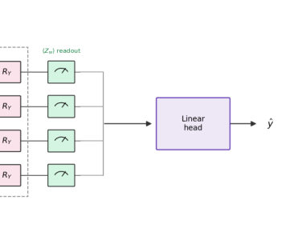 
Figure 1: QHA head: per-qubit data re-uploading encoder, an all-to-all non-Clifford RZZ entangler, and a local single-qubit read-out feeding a linear head; L blocks. The order-k interaction is synthe- sised inside the circuit and exposed on a single-qubit marginal.

📷 Fig 2

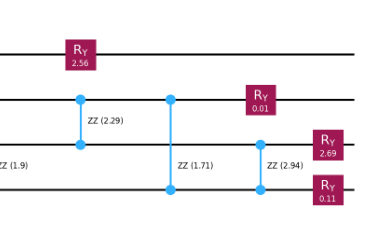 
Figure 2: An explicit QHA circuit (n=4, L=1): Hadamards and RZ data re-uploading, all 4 2  =6 RZZ couplings (all-to-all), a trainable RY layer, and a single-qubit ⟨Z⟩read-out (not shown).

📷 Fig 3

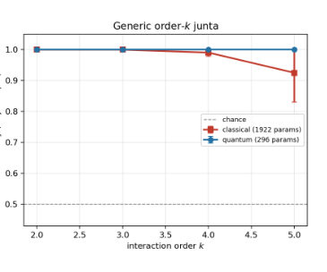 
Figure 3: Test accuracy vs. interaction order k (disjoint split, n=12, mean±std over 7–8 seeds for parity (left, matching Table 1) and 3 for the junta (right)). Left (hidden-subset parity): all Fourier mass sits at degree k, so the classical head (1922 params) collapses toward chance for k ≥3 while QHA (296 params) stays at ceiling — a maximal separation. Right (generic order-k junta): the random target carries low-degree mass that the low-degree-biased classical head can exploit, so it stays near ceiling and only begins to drop at k=5; QHA again holds at ceiling. The gap thus tracks the target’s Fourier degree, exactly as the theory predicts.

📷 Fig 4

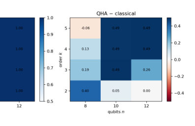 
Figure 4: Order-k vs. qubit-count n phase diagram (parity, mean test accuracy). Classical attention (left) is reliable only at order 2; QHA (middle) is at ceiling almost everywhere (n=8 is data-limited by the 256-point cube); the difference (right) localizes the quantum advantage to the high-order region.

📷 Fig 5

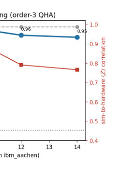 
Figure 5: Hardware qubit-scaling on IBM Heron: hardware accuracy (blue) tracks the noiseless simulator (grey) up to n=10 and stays ≥0.95 through n=14, even as the raw ⟨Z⟩correlation (red) decays — the linear read-out absorbs the noise.

**Summary.** This paper introduces Quantum Higher-Order Attention (QHA), a shallow quantum circuit designed to model interactions of arbitrary order $k$. It theoretically proves that QHA can represent correlations beyond the capability of standard single-layer classical attention mechanisms. Empirically, QHA demonstrates superior performance and parameter efficiency when detecting complex, high-order feature dependencies in tasks like genetic epistasis.

**Why it may be interesting.** It provides a concrete quantum circuit architecture (QHA) that explicitly targets overcoming known limitations in classical machine learning models regarding feature interaction complexity, which is relevant for modeling complex physical systems.

Detailed structure

**Main problem.** Standard self-attention mechanisms are fundamentally limited to pairwise (order-2) interactions, making it difficult to model higher-order correlations ($k>2$) efficiently.

**Main result.** The proposed Quantum Higher-Order Attention (QHA) head can synthesize and represent order-$k$ token interactions using a shallow quantum circuit depth $O(\log k)$, achieving an expressivity separation from classical attention layers.

**Method.** The QHA synthesizes high-order correlations through data re-uploading, an all-to-all non-Clifford entangler, and a local single-qubit read-out measurement.

**Model / system.** The model is the Quantum Higher-Order Attention (QHA) head, which operates on $n$ qubits representing tokens. It utilizes specific quantum gates (RZ, RZZ) to encode high-order entanglement before measuring a local single-qubit expectation value.

**Key observables.** Test accuracy on high-order tasks (e.g., parity), parameter efficiency ($	ext{acc} - 0.5) / 	ext{params}$, and the order of interaction ($k$).

**Important parameters / regimes.** Circuit depth $O(\log k)$, number of qubits $n$, and the target interaction order $k$.

**Assumptions / limitations.** The advantage demonstrated is an inductive-bias and representational separation, not necessarily an exponential speedup; also, the local read-out forces the high-order structure to be synthesized internally.

**Figures summary.** Figures illustrate the QHA circuit components (encoder, entangler, readout) and compare performance metrics like accuracy across varying interaction orders ($k$) for classical vs. quantum models.

**Paper structure.** The paper establishes a theoretical expressivity separation using communication complexity arguments, proves trainability via barren plateau analysis, and then validates the concept empirically by applying QHA to high-order tasks like epistasis detection on both simulators and real hardware.

Abstract

Standard dot-product self-attention computes, in a single layer, only pairwise (order-2) interactions between tokens; representing a generic order-$k$ interaction is known to require either super-quadratic resources in one layer or composition across depth. We introduce \textbf{Quantum Higher-Order Attention (QHA)}, a shallow, hardware-realizable quantum attention head that, via data re-uploading and an all-to-all non-Clifford entangler, synthesizes order-$k$ token interactions inside the circuit and exposes them through a local single-qubit read-out. We prove (i) an expressivity separation: any single standard self-attention layer with embedding dimension $m$, $H$ heads and $p$-bit precision satisfying $mHp=o(N/\log\log N)$ cannot represent the order-$k$ correlation family that one QHA head represents with circuit depth $O(\log k)$ ($O(k)$ two-qubit gates); and (ii) a trainability guarantee for its local-design instantiation: with a local read-out and $O(\log n)$ depth the gradient variance is $Ω(1/\mathrm{poly}(n))$ (no barren plateau), which we confirm empirically -- while being explicit that the more expressive all-to-all instantiation we benchmark is trained empirically and shows exponentially decaying gradients. Empirically, at a $6.5\times$ smaller parameter budget, QHA generalizes hidden-subset parity of every order $k\le6$ from disjoint inputs, whereas the larger classical attention head collapses past order~2; consistent with theory, the size of the advantage tracks the target's Fourier degree - largest for parity and shrinking when low-order structure is present. As an application, QHA serves as a compact high-order interaction detector across three domains - genetic epistasis, learning-parity-with-noise, and graph triangle detection - reaching the noise ceiling at the smallest parameter budget where field-standard linear methods fail.

[↑ back to top](#top)

### [Mathematical Basis for Analyzing Superconducting Phase Transitions Using Catastrophe Theory](http://arxiv.org/abs/2606.11810v1)

**Authors:** Jiu Hui Wu, Hua Tian, Kejiang Zhou  
**Type:** theory · **Category:** statistical mechanics · **PDF:** <https://arxiv.org/pdf/2606.11810v1>  
**Analysis basis:** full PDF text, analyzed in chunks
**Topic relevance:** `Keldysh / 2PI / non-Gaussian methods` **1/5** · `driven-dissipative phase transition` **1/5**

📷 Fig 1

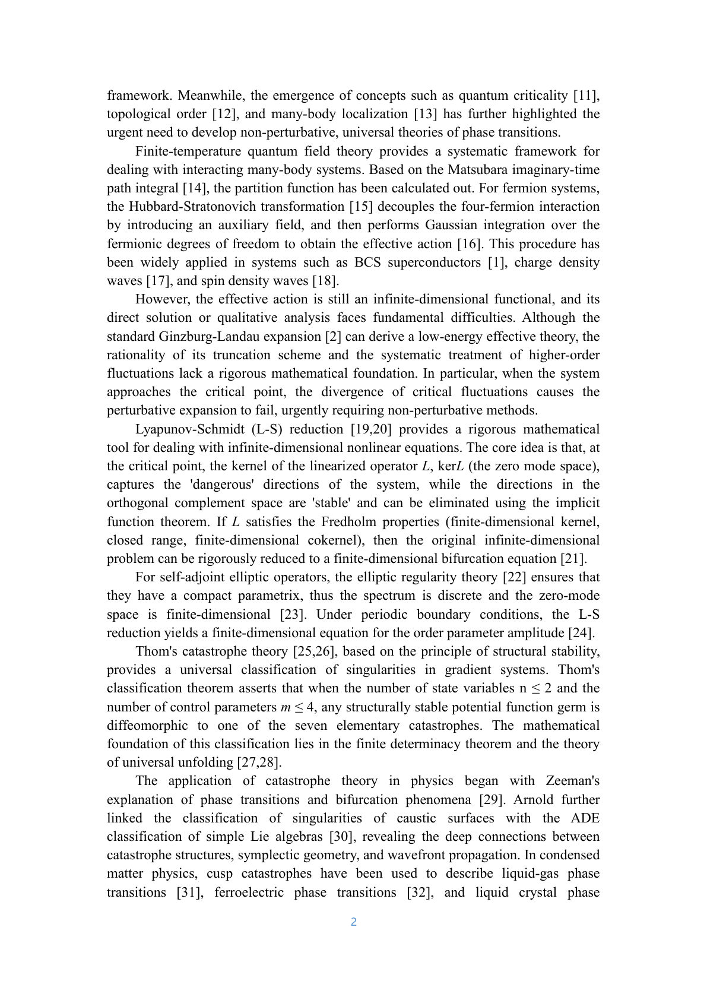 
Low-resolution page preview, page 2

📷 Fig 2

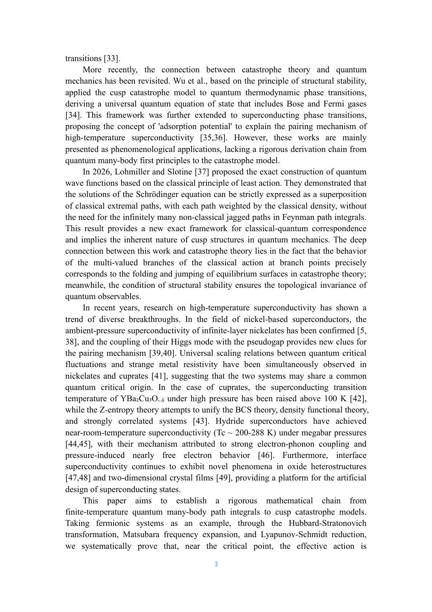 
Low-resolution page preview, page 3

📷 Fig 3

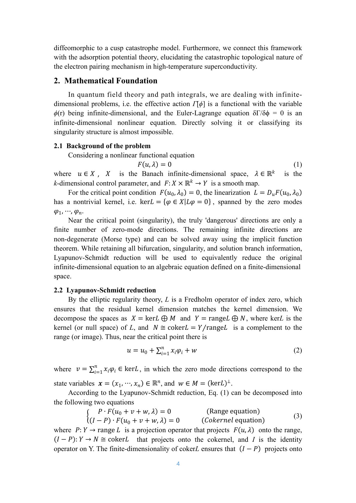 
Low-resolution page preview, page 4

📷 Fig 4

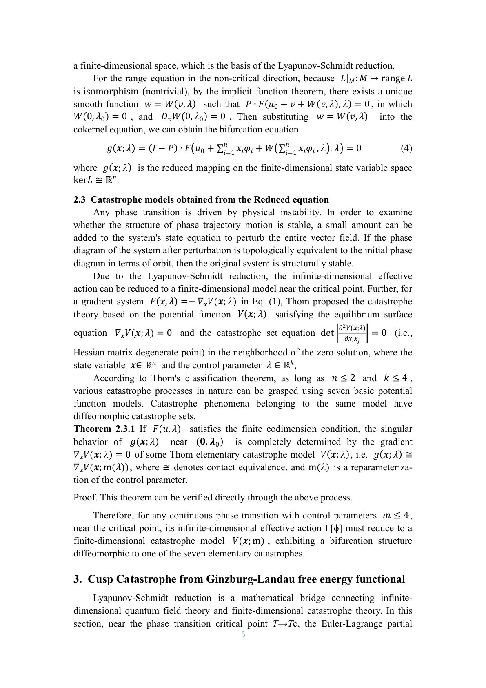 
Low-resolution page preview, page 5

📷 Fig 5

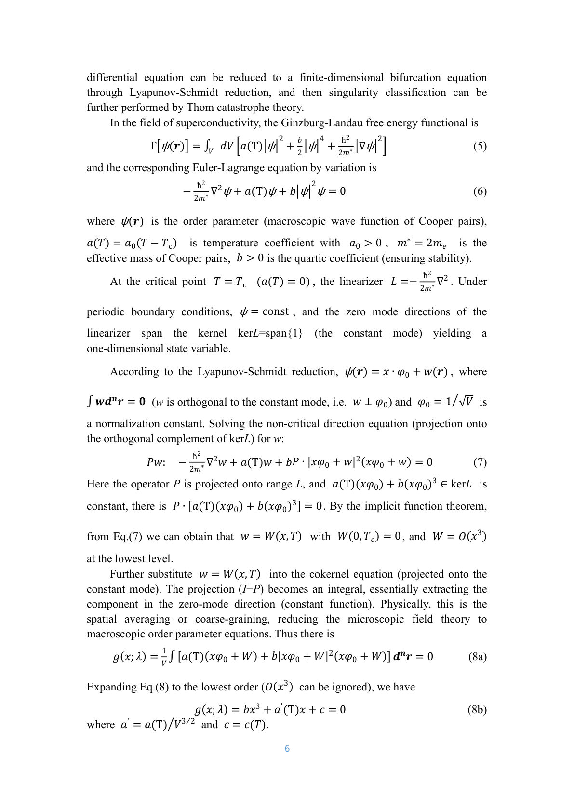 
Low-resolution page preview, page 6

**Summary.** This paper develops a novel mathematical bridge connecting the complex quantum many-body physics of superconductors to the well-established framework of Catastrophe Theory. By using techniques like Lyapunov-Schmidt reduction on path integrals, the authors show that superconducting phase transitions must mathematically reduce to the universal cusp catastrophe model near criticality. This provides a powerful, topologically grounded understanding of pairing mechanisms in high-temperature superconductivity.

**Why it may be interesting.** The use of Catastrophe Theory provides a universal, topologically protected description for phase transitions in strongly correlated systems, offering an alternative perspective beyond standard mean-field or BCS approaches that is relevant to understanding critical phenomena across different quantum materials.

Detailed structure

**Main problem.** To establish a rigorous mathematical framework connecting quantum many-body path integrals to Catastrophe Theory for analyzing superconducting phase transitions.

**Main result.** The analysis proves that near the critical point, the infinite-dimensional effective action governing superconductivity is mathematically equivalent (diffeomorphic) to a finite-dimensional cusp catastrophe model.

**Method.** The authors employ Lyapunov-Schmidt reduction on the Euler-Lagrange equations derived from Ginzburg-Landau theory and fermionic path integrals. They utilize advanced mathematical tools like Hubbard-Stratonovich transformations and Grassmann algebra to achieve this reduction.

**Model / system.** The study focuses on superconducting systems, particularly high-temperature superconductors, modeled initially by the Ginzburg-Landau free energy functional ($\Gamma$) and extended via fermionic imaginary-time path integrals. The theoretical machinery bridges quantum field theory concepts to classical singularity theory.

**Key observables.** Superconducting gap ($\Delta$), effective action ($\mathcal{S}_{	ext{eff}}$), specific heat capacity, and the adsorption potential.

**Important parameters / regimes.** Temperature ($T$) relative to critical temperature ($T_c$); control parameters governing the catastrophe (e.g., $a(T)$).

**Assumptions / limitations.** The analysis assumes that near criticality, only a finite number of zero-mode directions are 'dangerous,' allowing for reduction to a low-dimensional catastrophe model; it also relies on structural stability theorems.

**Paper structure.** The paper builds its argument by first showing the equivalence between the infinite-dimensional effective action and a finite-dimensional catastrophe near criticality. It then rigorously derives this reduction starting from the Ginzburg-Landau functional, confirming it maps to the cusp catastrophe model. Finally, it extends this derivation using the full fermionic path integral formalism.

Abstract

We establish a rigorous mathematical bridge from quantum many-body path integrals to the cusp catastrophe model by Lyapunov-Schmidt reduction, which provides a theoretical foundation for analyzing superconducting phase transition using the catastrophe theory. First, it is proved that, near the critical point the infinite-dimensional effective action is diffeomorphic to a finite-dimensional catastrophe. Secondly, starting from Ginzburg-Landau free energy functional, the Euler-Lagrange partial differential equation can be reduced to the cusp catastrophe model. Thirdly, the fermionic imaginary-time path integral to the cusp catastrophe is derived through the Hubbard-Stratonovich transformation, Matsubara frequency expansion, and Grassmann algebra. Furthermore, we connect this framework with the adsorption potential theory we proposed, elucidating the catastrophic topological nature of the electron pairing mechanism in high-temperature superconductivity. The precise microscopic derivation of the adsorption potential from first-principles electronic structure calculations would strengthen the predictive power of the theory.

[↑ back to top](#top)

### [Necessary and Sufficient Conditions for Universal Gates with Pauli Strings and Beyond](http://arxiv.org/abs/2606.12096v1)

**Authors:** Isaac D. Smith, Hans J. Briegel, Hendrik Poulsen Nautrup  
**Type:** theory · **Category:** quantum information and computing · **PDF:** <https://arxiv.org/pdf/2606.12096v1>  
**Analysis basis:** full PDF text, analyzed in chunks
**Topic relevance:** `analog quantum simulation` **1/5** · `entanglement & information structure` **1/5**

📷 Fig 1

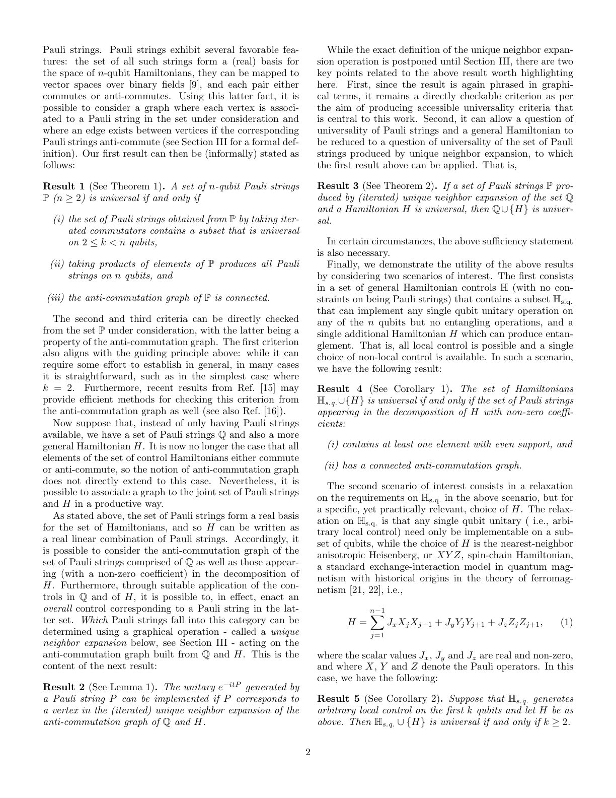 
Low-resolution page preview, page 2

📷 Fig 2

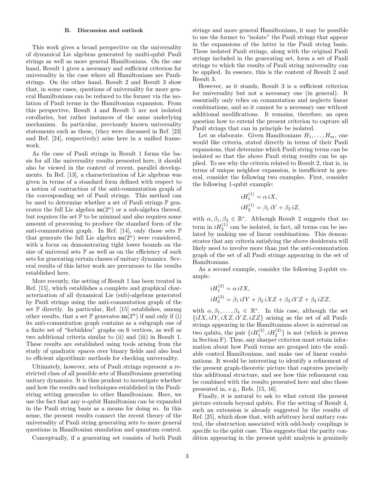 
Low-resolution page preview, page 3

📷 Fig 3

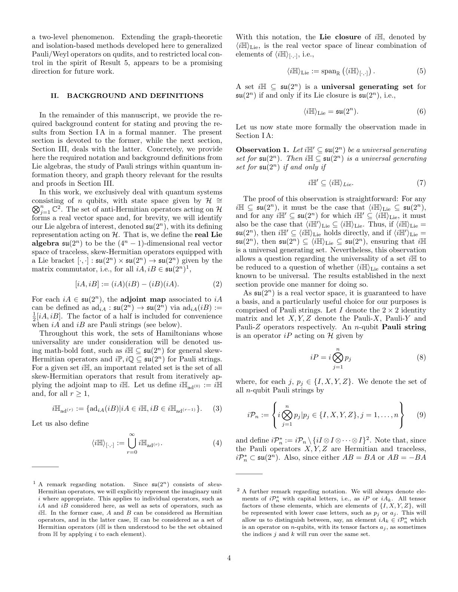 
Low-resolution page preview, page 4

📷 Fig 4

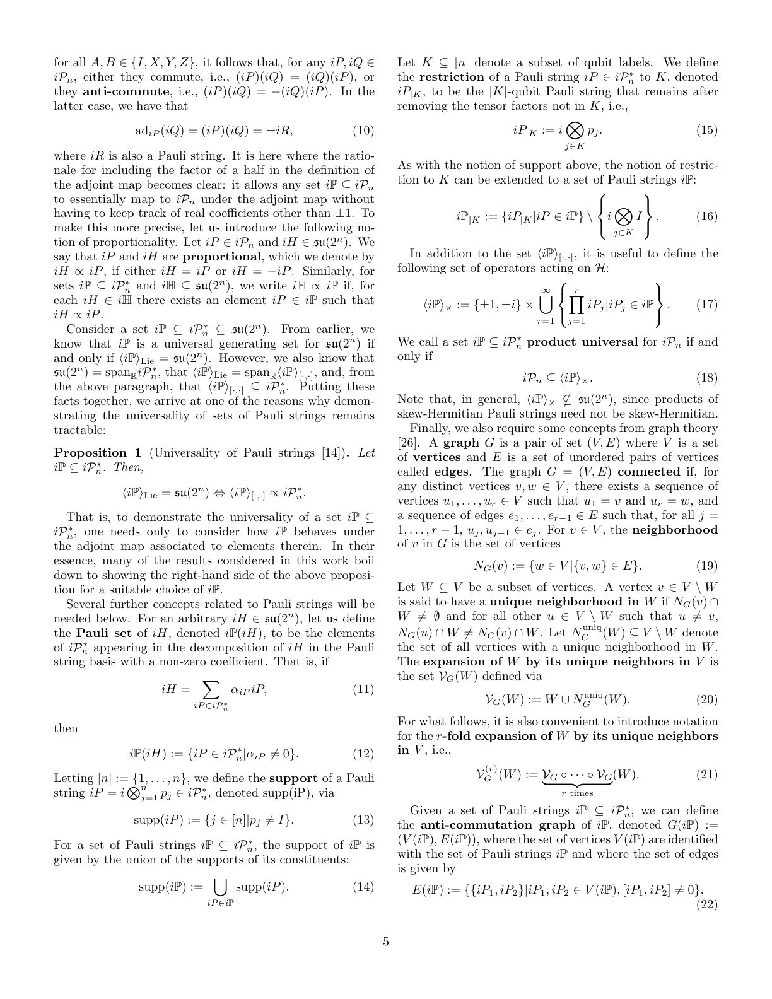 
Low-resolution page preview, page 5

📷 Fig 5

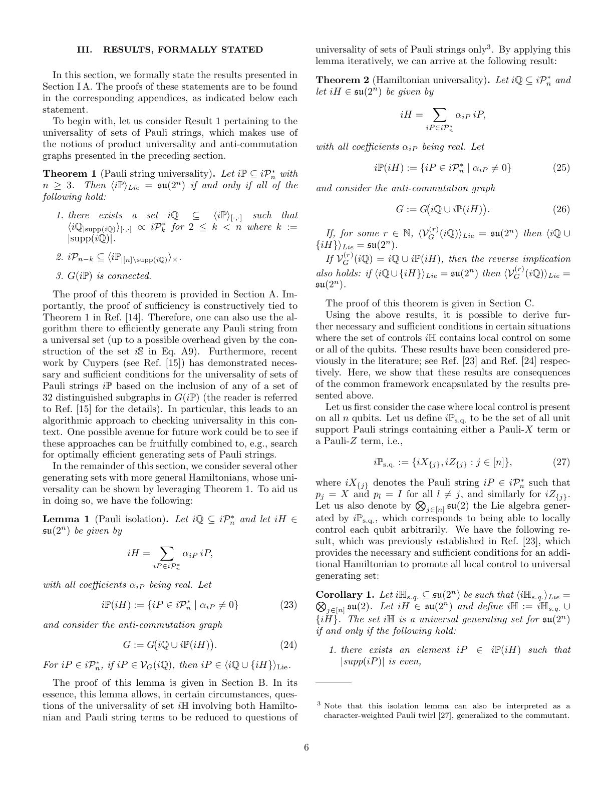 
Low-resolution page preview, page 6

**Summary.** This theoretical paper develops necessary and sufficient conditions for a set of Pauli Hamiltonians to generate universal quantum computation on $n$ qubits. It achieves this by translating the problem into analyzing the structure and connectivity of the anti-commutation graph associated with the generators within the Lie algebra $\mathfrak{su}(2^n)$. The results provide powerful tools for assessing hardware feasibility.

**Why it may be interesting.** This work provides rigorous, mathematically precise criteria—rooted in algebraic topology and graph theory—to predict the computational power of physical quantum hardware architectures based solely on their native coupling terms.

Detailed structure

**Main problem.** The central problem is establishing necessary and sufficient conditions for a set of Hamiltonians (controls) to generate universal quantum computation on $n$ qubits.

**Main result.** Universality can be characterized by graph-theoretic properties, specifically the connectivity of the anti-commutation graph formed by the generating Pauli strings. For general Hamiltonians, universality requires structural conditions related to the Pauli expansion and local control capabilities.

**Method.** The analysis employs techniques from Lie algebra theory applied to quantum operators represented as Pauli strings ($\mathfrak{su}(2^n)$). Key tools include analyzing the anti-commutation graph $G(\cdot)$ and utilizing commutator relations to determine if the generated algebra spans the full $\mathfrak{su}(2^n)$.

**Model / system.** The system is an $n$-qubit quantum processor whose dynamics are governed by Hamiltonians composed of Pauli strings. The focus is on determining when the Lie algebra generated by these controls equals the full algebra $\mathfrak{su}(2^n)$.

**Key observables.** The primary observable is whether the generated Lie algebra, $\langle 	ext{iH} 
angle_{	ext{Lie}}$, spans the entire target algebra $\mathfrak{su}(2^n)$. Connectivity of the anti-commutation graph $G(\cdot)$ is a crucial diagnostic.

**Important parameters / regimes.** The number of qubits ($n$), the structure of the control set (Pauli strings vs. general Hamiltonians), and the connectivity/support properties of the generators are critical parameters.

**Assumptions / limitations.** The analysis often relies on established results regarding simple Lie algebras ($\mathfrak{su}(N)$) and assumes that the problem can be effectively reduced to analyzing the Pauli string basis expansion of the Hamiltonian.

**Figures summary.** Not specified in the notes, but the structure implies figures illustrating graph connectivity (anti-commutation graphs) and algebraic inclusions between generated subalgebras.

**Paper structure.** The paper develops criteria sequentially: first for pure Pauli strings ($	ext{iP}$), then extending to combinations involving general Hamiltonians ($H$), culminating in specific corollaries for local control scenarios. The structure moves from necessary conditions (e.g., graph connectivity) to sufficient constructions.

Abstract

Any quantum computation consists of a sequence of unitary evolutions described by a finite set of Hamiltonians. For the case where this set consists of only products of Pauli operators, known as Pauli strings, we provide a necessary and sufficient condition for it to generate $\mathfrak{su}(2^n)$, i.e., to be universal for quantum computation on $n$ qubits. When combining Pauli strings with a general Hamiltonian, we show a sufficient (and in certain circumstances even necessary) condition for universality based on the Pauli-basis expansion of the Hamiltonian. As an application of these results, we prove two corollaries: (i) a necessary and sufficient condition for the universality of a general Hamiltonian given arbitrary single-qubit control on all qubits, and (ii) the universality of an XYZ Heisenberg Hamiltonian with local control of just two adjacent qubits.

[↑ back to top](#top)

### [PHASE: Pauli Hierarchical Assembly on Subdivided Elements for Quantum-Compatible Operator Synthesis](http://arxiv.org/abs/2606.11478v1)

**Authors:** Tillman Philo, Caglar Oskay  
**Type:** theory · **Category:** quantum information and computing · **PDF:** <https://arxiv.org/pdf/2606.11478v1>  
**Analysis basis:** full PDF text, analyzed in chunks
**Topic relevance:** `analog quantum simulation` **1/5** · `methods for driven-dissipative` **1/5**

📷 Fig 1

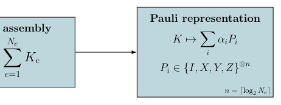 
Figure 1: Quantum-compatible finite element assembly.

📷 Fig 2

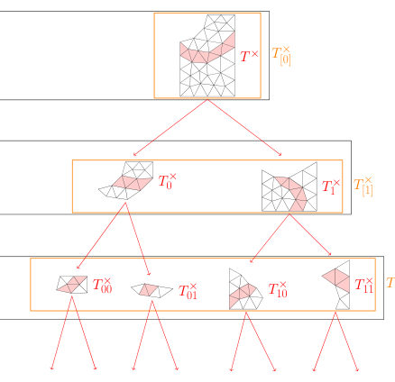 
Figure 2: Recursive separator hierarchy and associated cut sets.

📷 Fig 3

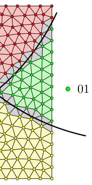 
Figure 3: Illustration of recursive geometric partitioning and binary prefix labeling.

📷 Fig 4

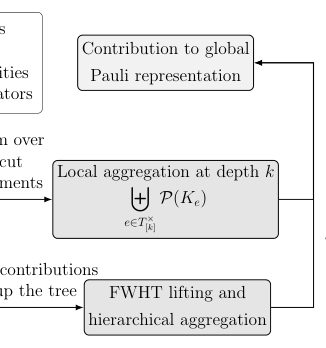 
Figure 4: Dual assembly paths for hierarchical pauli decomposition of cut elements.

📷 Fig 5

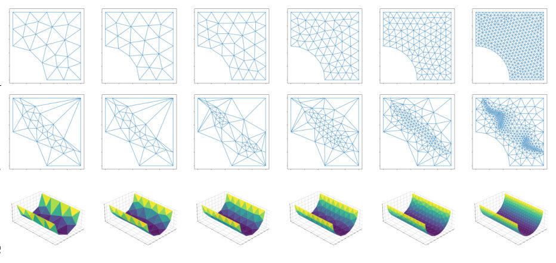 
Figure 5: Meshes A, B and C at varying levels of refinement for empirical PHASE runtime testing.

**Summary.** The paper introduces PHASE, an algorithm designed to efficiently decompose large finite element stiffness matrices into the Pauli basis required for quantum simulation. By leveraging the geometric structure of the mesh through recursive partitioning and combining advanced algebraic techniques like FWHT, it drastically reduces the exponential computational cost associated with naive Pauli expansions.

**Why it may be interesting.** This work provides a crucial algorithmic breakthrough for simulating quantum systems derived from classical PDEs, offering a pathway to scale quantum simulations beyond current resource limitations by respecting underlying physical geometry.

Detailed structure

**Main problem.** The core challenge is efficiently decomposing large, geometrically structured finite element stiffness matrices into the Pauli basis for quantum-compatible operator synthesis.

**Main result.** The proposed PHASE algorithm achieves a dimension-dependent reduction in the exponential scaling exponent of the assembly complexity from $2^{2\lceil\log_2 N
ceil}$ to $2^{\gamma_d \lceil\log_2 N
ceil}$ with $\gamma_d < 2$.

**Method.** PHASE uses a hierarchical, geometry-aware approach combining recursive mesh partitioning (domain decomposition) with a hybrid algebraic strategy involving Tensorized Pauli Decomposition and Fast Walsh-Hadamard Transform aggregation.

**Model / system.** The model is the global stiffness matrix ($K$) derived from solving partial differential equations using the Finite Element Method (FEM). This classical operator is mapped onto an $n$-qubit Hilbert space via its unique Pauli basis expansion.

**Key observables.** Pauli coefficients ($\alpha_P$), asymptotic complexity scaling exponents ($\gamma_d, \hat{\gamma}$), and cut element counts ($|T_{	imes}^{[k]}|$).

**Important parameters / regimes.** Number of degrees of freedom ($N$), number of qubits ($n = \lceil\log_2 N
ceil$), mesh regularity, and partition imbalance ratio ($\delta$).

**Assumptions / limitations.** The analysis assumes standard assumptions for conforming, shape-regular, quasi-uniform meshes; the complexity bounds are derived under specific conditions regarding partition quality.

**Figures summary.** Figures illustrate the recursive separator hierarchy and associated cut sets in the mesh, as well as comparisons of empirical vs. theoretical scaling exponents ($\hat{\gamma}$ vs. $\gamma_{\star}, \gamma_{avg}$).

**Paper structure.** The paper systematically develops the geometric decomposition (recursive partitioning) to map FEM structure onto a binary address system, then details the hybrid algebraic assembly process using TPD and FWHT aggregation across different depths of the hierarchy.

Abstract

Efficiently decomposing finite element stiffness matrices into the Pauli basis is challenging due to the exponential growth of Pauli strings with problem size. A naive Pauli expansion requires $Θ(8^{\lceil \log_2 N \rceil})$ operations, where $N$ denotes the number of degrees of freedom, rendering direct decomposition infeasible for large systems. Existing approaches exploit algebraic sparsity or operator structure but do not incorporate the geometric organization intrinsic to finite element discretizations, and consequently exhibit poor scaling for stiffness matrices. To address this problem, we introduce PHASE, a hierarchical, geometry-aware Pauli decomposition algorithm that leverages recursive mesh partitioning to organize element contributions across multiple spatial scales. PHASE employs a hybrid strategy that combines full- and reduced-space Tensorized Pauli Decomposition with Fast Walsh-Hadamard Transform-based aggregation to assemble global Pauli coefficients efficiently. We show that this approach yields a dimension-dependent reduction in the exponential scaling exponent of Pauli assembly asymptotic complexity relative to existing methods, reducing the cost from $2^{2{\lceil \log_2 N \rceil}}$ to $2^{γ_d{\lceil \log_2 N \rceil}}$ with $γ_d < 2$ under standard mesh regularity and balanced partition assumptions. These results substantially improve the feasibility of quantum-compatible operator synthesis for large-scale finite element models.

[↑ back to top](#top)

### [A post-selected quantum model of cosmic acceleration](http://arxiv.org/abs/2606.12297v1)

**Authors:** Dimitris Lionas, Charis Anastopoulos, Konstantinos Gourgouliatos  
**Type:** theory · **Category:** other · **PDF:** <https://arxiv.org/pdf/2606.12297v1>  
**Analysis basis:** full PDF text, analyzed in chunks
**Topic relevance:** `quantum measurements` **1/5**

📷 Fig 1

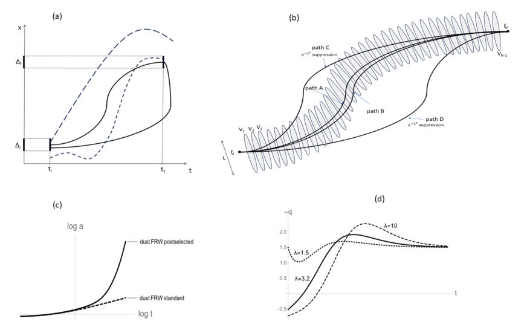 
Figure 1: Post-selected cosmology and emergence of effective dynamics. (a) Post-selection: only histories with initial conditions in a region ∆i at time ti and final conditions in a re- gion ∆f at time tf contribute to the probabilities. (b) Coarse-graining: probabilities refer to phase-space tubes of characteristic size L. For fixed initial and final conditions, proba- bility concentrates on a single tube, while alternative histories are exponentially suppressed. (c) Comparison with standard evolution: the dynamics agrees with standard evolution at early times but deviates at late times as post-selection effects become significant. (d) Cosmic acceleration: the parameter −q = ¨aa/˙a2 as a...

📷 Fig 2

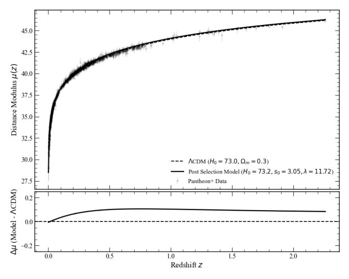 
Figure 2: Hubble diagram for the Pantheon+ Type Ia Supernovae dataset (top) and the corresponding residuals relative to the baseline ΛCDM model (bottom).

📷 Fig 3

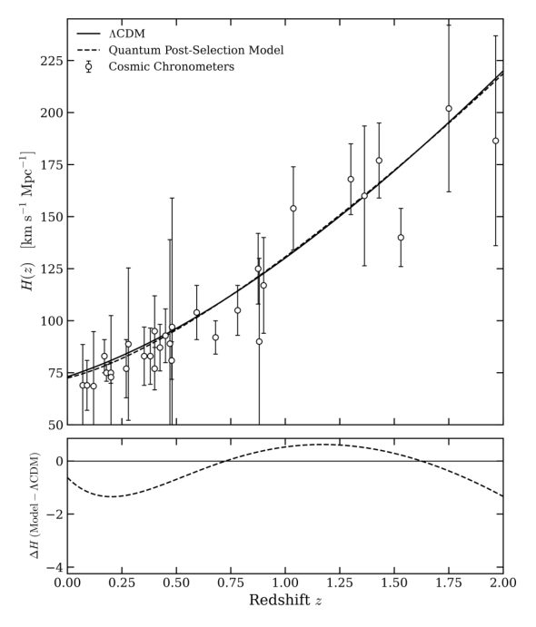 
Figure 3: Evolution of the Hubble parameter H(z) as predicted by the post-selection quan- tum model compared to 31 Cosmic Chronometer data points. The lower panel displays the residuals relative to the standard ΛCDM model.

📷 Fig 4

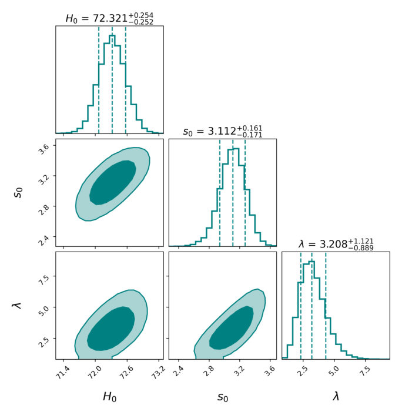 
Figure 4: Posterior distributions and parameter correlations derived from the Pantheon+ SNIa dataset.

📷 Fig 5

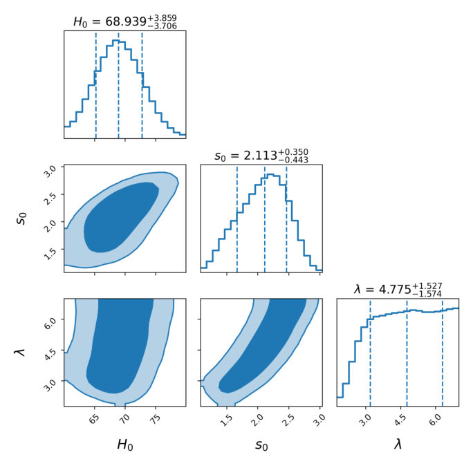 
Figure 5: Posterior distributions derived from the CC dataset, highlighting the degeneracy between H0 and the quantum parameters.

**Summary.** This work presents a novel cosmological model where cosmic acceleration is explained not by dark energy, but as an emergent effect of quantum post-selection. By fitting this POQCO model against supernova and chronometer data, the authors claim to provide a theoretically grounded alternative to $\Lambda$CDM that naturally explains late-time acceleration.

**Why it may be interesting.** While focused on cosmology, the core methodology—deriving macroscopic dynamics from fundamental quantum selection rules (post-selection)—is conceptually related to how complex emergent phenomena can arise from underlying quantum constraints, which has parallels in open quantum systems theory.

Detailed structure

**Main problem.** The paper addresses the fundamental origin of cosmic acceleration, which is conventionally attributed to a cosmological constant or dark energy within the standard $\Lambda$CDM model.

**Main result.** It proposes that late-time cosmic acceleration can arise naturally from quantum post-selection effects in cosmology, yielding an expansion history consistent with current data without invoking new energy components or modifying General Relativity.

**Method.** The authors develop a minimal predictive cosmological model based on Post-selected Quantum Cosmology (POQCO), deriving effective dynamics that are then constrained by fitting to Type Ia supernova and cosmic chronometer observational data.

**Model / system.** The system is the Friedmann-Lemaître-Robertson-Walker (FLRW) cosmology, analyzed using a quantum framework incorporating post-selection principles. The resulting effective evolution law is highly constrained, depending on at most two parameters beyond standard Friedmann dynamics.

**Key observables.** Cosmic acceleration history, present-day jerk parameter ($j_0$), and the Hubble function $H(z)$ derived from Pantheon+ supernovae and cosmic chronometer measurements.

**Important parameters / regimes.** The model is parameterized by constants related to post-selection ($\lambda$, $eta$) and includes parameters like the effective sound-speed ($\kappa_0$) and the matter density parameter ($\Omega_m$).

**Assumptions / limitations.** The analysis assumes that early-time cosmic evolution reduces to standard radiation and matter domination, and it utilizes quantum post-selection as the source of late-time dynamics.

**Figures summary.** Figures illustrate the comparison between POQCO predictions and $\Lambda$CDM for $H(z)$ (Hubble diagram), showing residuals relative to $\Lambda$CDM, and display posterior probability distributions from SNIa data.

**Paper structure.** The paper establishes the problem of cosmic acceleration, introduces the theoretical framework of Post-selected Quantum Cosmology (POQCO) derived from quantum principles, develops the effective cosmological equations, and finally performs a joint statistical analysis using both supernova and cosmic chronometer datasets to constrain model parameters.

Abstract

The origin of cosmic acceleration remains a central problem in cosmology, commonly attributed to a cosmological constant within the $Λ$CDM model or to dynamical dark energy. Here, we develop an alternative approach in which acceleration emerges from quantum post-selection, a standard feature of quantum theory that is not usually incorporated into cosmological modelling. While quantum theory admits both pre-selected and post-selected ensembles, quantum cosmological models are almost exclusively formulated in terms of initial conditions. Building on previous work on post-selected quasiclassical dynamics, we construct a minimal predictive cosmological model in which post-selection and coarse-graining generate effective late-time acceleration without introducing a cosmological constant, dark energy, or modifications of general relativity. The resulting expansion history is highly constrained theoretically and depends on at most two parameters beyond standard Friedmann evolution. Confrontation with type Ia supernova and cosmic chronometer data yields statistically competitive fits while naturally avoiding the coincidence problem. The model also reproduces the standard radiation- and matter-dominated behaviour at early times and predicts a present-day jerk parameter significantly different from the $Λ$CDM value. These results suggest that cosmic acceleration may arise as a macroscopic quantum cosmological effect rather than from additional cosmological fluids or modified gravitational dynamics.

[↑ back to top](#top)

### [Exact distribution of the output of a deep-layered machine](http://arxiv.org/abs/2606.11965v1)

**Authors:** Thomas M. A. Fink  
**Type:** theory · **Category:** disordered systems and neural networks · **PDF:** <https://arxiv.org/pdf/2606.11965v1>  
**Analysis basis:** full PDF text, analyzed in chunks
**Topic relevance:** `methods for driven-dissipative` **1/5**

📷 Fig 1

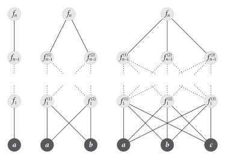 
FIG. 1: Deep-layered machines. In a network of k arguments (a, b, . . .), each node depends on all k of the arguments below it, each of which depends on the k arguments below it, and so on, for a total of n levels. The goal of this paper is to determine the probability distribution of the global output Boolean function F(a, b, . . .) given a random assignment of local Boolean functions to the fs at the light gray nodes.

📷 Fig 2

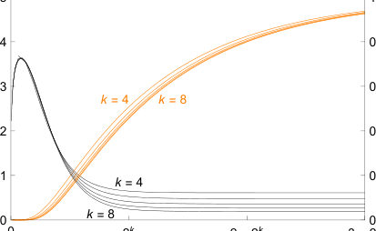 
FIG. 2: Critical network depth. When the network depth reaches nc ≃2k, the Hamming weight distribution q(n) has flattened out, but true and false have yet to dominate. At this crossover, the output distribution p(n) is maximally U-shaped in absolute terms. The orange curves show the probability that the output is true or false as a function of n and for various k; they approach 1 with n. The black curves show the standard deviation of the interior of q normalized by its maximum value, as a function of n and for various k. Lower standard deviation means q is flatter. The curves decrease with n to an asymptote that approaches 0 with k.

📷 Fig 3

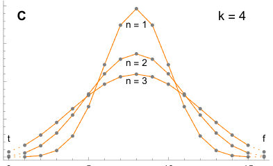 
FIG. 3: Experiments confirm our predictions. We com- pare our prediction of the probability q(n) of the output func- tion (lines) with computer experiments (points), for various values of the number of arguments k and network depth n. The vertical axis is the probability of an output with a given Hamming weight w; outputs with the same w have the same probability. In all cases, our experiments agree with our theory exactly or, when sampling, to within statistical significance. A For k = 2, we enumerated all of the configurations up to network depth n = 5. As n grows, the distribution of the out- put flattens out and falls. But for true and false (w = 4 and w = 0), the probabilities approach...

**Summary.** This paper rigorously derives the exact probability distribution of the output function for a deep-layered Boolean machine. It shows that while initial layers create complex structure, increasing depth causes the system's output to rapidly lose information and collapse into a simple coin toss between true and false. This highlights a finite structural limit inherent in purely compositional computation.

**Why it may be interesting.** The study provides an exactly solvable null model demonstrating how complex, structured information processing (like deep learning) can exhibit predictable, finite-depth limitations governed by spectral properties, which has parallels in understanding decoherence or complexity limits in quantum systems.

Detailed structure

**Main problem.** The primary goal is deriving the exact finite-depth probability distribution of the global output function of a deep-layered machine.

**Main result.** The output distribution exhibits a crossover behavior: initially biased towards low/high Hamming weights, it eventually collapses to an almost equal coin toss between the constant 'true' and 'false' outputs as depth increases.

**Method.** The analysis uses linear recurrence relations derived from a transition matrix approach applied to the probability vector over the Hamming weight of the output function.

**Model / system.** The model is a deep-layered machine where each node computes an arbitrary Boolean function based on all nodes in the preceding layer. The system is characterized by its width $k$ and depth $n$.

**Key observables.** The probability distribution vector $\mathbf{q}(n)$ over the Hamming weight $w$, and the probabilities of the constant functions (true/false).

**Important parameters / regimes.** Width ($k$), Depth ($n$), Crossover depth ($n_c \propto 2^k$).

**Assumptions / limitations.** The analysis assumes symmetry such that all local functions sharing the same Hamming weight contribute equally to the probability evolution.

**Figures summary.** Figures illustrate the structure of the machines and show the evolution of true/false probabilities (orange curves) versus network depth $n$, confirming a crossover at $n_c \simeq 2k$.

**Paper structure.** The paper establishes the mathematical framework using transition matrices, analyzes the spectral properties to find dominant eigenvalues, derives the time evolution $\mathbf{q}(n) = \mathbf{A}^{n-1} \mathbf{q}(1)$, and then interprets the physical meaning of the resulting crossover behavior.

Abstract

Deep-layered machines, in which each node computes a Boolean function of all nodes below it, underpin deep learning and digital computation. Yet the statistics of their global output function remain poorly understood. We derive the exact finite-depth distribution of the output of a machine with width $k$ and depth $n$. The distribution depends only on the Hamming weight of the output, and as $n$ increases favors functions with low and high Hamming weights. But this bias peaks at a crossover depth proportional to $2^k$ before collapsing onto the constant functions true and false.

[↑ back to top](#top)

### [Handbook of Error-Correcting Codes](http://arxiv.org/abs/2606.11484v1)

**Authors:** Victor V. Albert, Philippe Faist  
**Type:** theory · **Category:** quantum information and computing · **PDF:** <https://arxiv.org/pdf/2606.11484v1>  
**Analysis basis:** full PDF text, analyzed in chunks
**Topic relevance:** `entanglement & information structure` **1/5**

📷 Fig 1

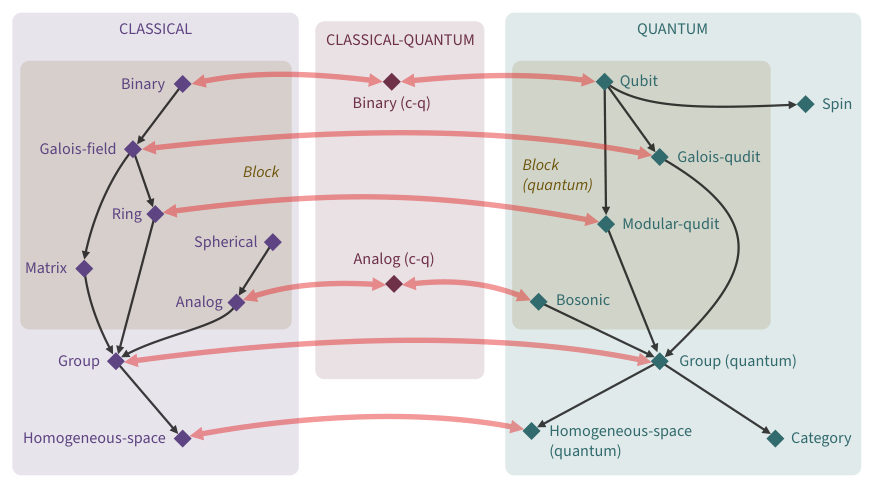 
FIG. 1: The EC Zoo consists of three Domains, with each Domain consisting of several Kingdoms. Codes are primarily organized by the alphabet (for quantum, physical space) used to define the codes; each alphabet is a Kingdom (diamonds). Horizontal red arrows show correspondences between Kingdoms in different Domains; e.g., qubit codes are quantum analogues of binary codes. Vertical arrows relate Kingdoms to each other; e.g., the Qubit Kingdom descends from the Modular-qudit Kingdom because qubits are a special case of qudits.

📷 Fig 2

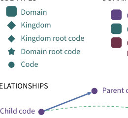 
FIG. 3: Elements that appear in a code graph

📷 Fig 3

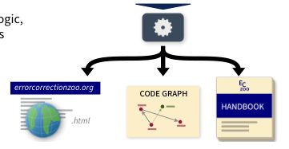 
FIG. 2: The EC Zoo processing pipeline. The code data is maintained as a repository of structured YAML files, which are both human-editable and machine-readable. The files are parsed into an in-memory object model, with JavaScript objects repre- senting the zoo instance, code instances as well as lists, domains, and kingdoms. The objects expose methods for computed properties, such as finding the parent kingdom of a code, exposing an API that enables powerful processing with custom code. Our code can generate our HTML website (https://errorcorrectionzoo.org/) , static or interactive code graphs (https://errorcorrectionzoo.org/code_graph) , or even a print-ready handbook.

📷 Fig 4

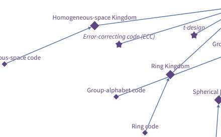 
FIG. 4: Classical Domain.

📷 Fig 5

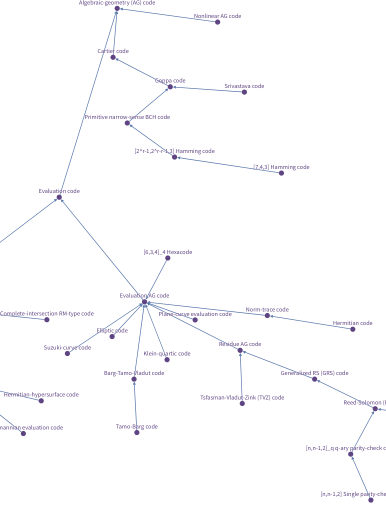 
FIG. 5: Algebraic-geometry codes (view online).

**Summary.** This paper introduces 'The Error Correction Zoo,' a comprehensive, structured reference manual for all known classical and quantum error-correcting codes. It organizes these codes taxonomically based on their mathematical support—ranging from simple binary systems to complex bosonic or group structures. This resource aims to be the definitive guide for researchers needing to select appropriate protective schemes for various physical implementations.

**Why it may be interesting.** This work provides a crucial meta-framework for quantum information theorists, mapping out the landscape of existing error correction techniques by linking them explicitly to underlying algebraic or physical structures (e.g., lattices, groups).

Detailed structure

**Main problem.** The core problem is developing a comprehensive, structured reference (the Error Correction Zoo) to catalog methods for protecting classical or quantum information from errors during storage, transmission, and computation.

**Main result.** The authors propose a highly structured framework organizing codes into Domains (Classical/Quantum) and Kingdoms based on underlying mathematical structures, providing both a rigorous reference and a practical aid for code discovery.

**Method.** The methodology involves creating a hierarchical database structure (the Zoo) using YAML data files, processed through an in-memory object model to generate structured HTML outputs.

**Model / system.** The system models information protection across classical and quantum channels. Codes are classified based on their physical support: qubits, qudits, bosonic modes, or algebraic structures like groups and lattices.

**Key observables.** Code distance ($d$), code rate, threshold values ($	ext{threshold}$), and capacity thresholds.

**Important parameters / regimes.** Alphabet size (binary, $\mathfrak{q}$-ary), physical dimensions (qubits, qudits, bosonic modes), and algebraic parameters defining the underlying structure.

**Assumptions / limitations.** The selection of an optimal code is case-by-case; quantum error correction must contend with limitations like the no-cloning theorem compared to classical systems.

**Figures summary.** Figures illustrate the EC Zoo structure, showing Domains containing Kingdoms organized by alphabet/physical space, and depict the data processing pipeline from YAML input to final HTML output.

**Paper structure.** The paper is structured around presenting the conceptual framework of the Error Correction Zoo. It details the taxonomy (Domains $
ightarrow$ Kingdoms), the mathematical relationships between codes, and the computational pipeline used to maintain this complex reference resource.

Abstract

Barcode scans, clear phone calls, reliable data storage, satellite communication, and large-scale quantum computation are all made possible by error correction. We present a handbook version of The Error Correction Zoo, a curated reference of methods for protecting classical or quantum information from errors during storage and transmission. The handbook includes descriptions of these error-correcting codes and a classification according to the symbols they use. It also catalogues relations among codes and related objects such as sphere packings, lattices, designs, groups, and classical and quantum phases of matter. The collection is intended both as a rigorous reference and as a practical aid for tracing the web of code relationships and uncovering new connections.

[↑ back to top](#top)

### [Quantum ergodicity and semiclassical measures: mathematical results](http://arxiv.org/abs/2606.12098v1)

**Authors:** Stéphane Nonnenmacher  
**Type:** theory · **Category:** other · **PDF:** <https://arxiv.org/pdf/2606.12098v1>  
**Analysis basis:** full PDF text, analyzed in chunks
**Topic relevance:** `Keldysh / 2PI / non-Gaussian methods` **1/5**

📷 Fig 1

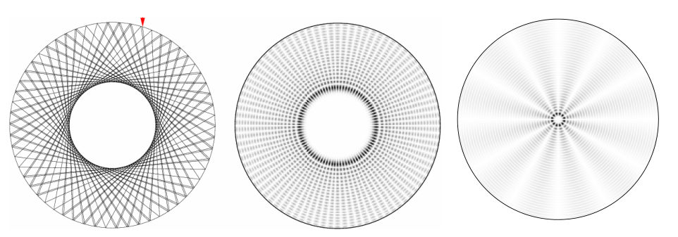 
Figure 1 Left: one long ray inside the circle billiard (the red arrow is the starting point). Center: one eigenmode, with angular momentum k equal to that of the ray (the grey hue corresponds to the intensity of |un(x)|2). Right: eigenmode of the cirle with smaller angular momentum. Courtesy of Arnd B¨acker.

📷 Fig 2

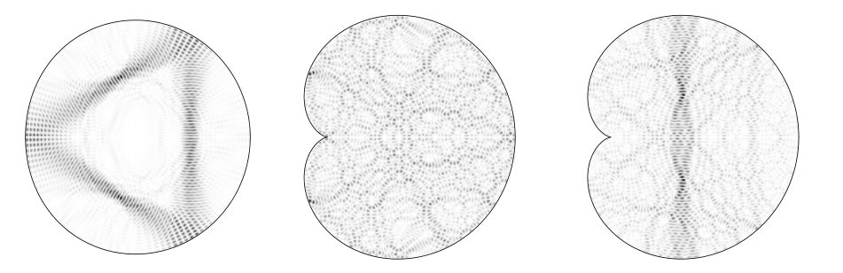 
Figure 2 High frequency eigenmodes for a small deformation of the circle (left), and two eigenmodes of the cardioid. Courtesy of Arnd B¨acker.

📷 Fig 3

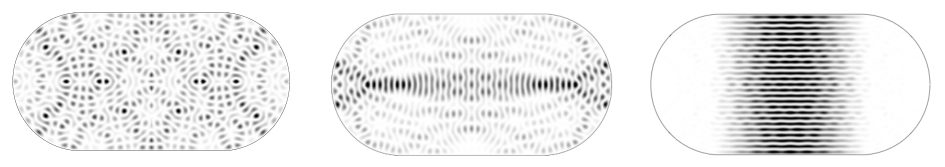 
Figure 3 3 eigenmodes of the stadium billiard, at similar eigenfrequencies. Left: an equidistributed eigenmode. Center: a scar along the horizontal periodic orbit. Right: a strong scar along the family of bouncing ball orbits. Courtesy of Eduardo Vergini.

📷 Fig 4

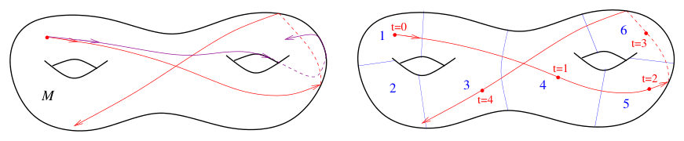 
Figure 4 Left: a pair of orbits issued from the same point of a surface M of negative curvature, departing fast from one another. Right: a partition of M allows to differentiate points according to their “symbolic history”. The indicated point follows the symbolic path α = 14563 . . .

📷 Fig 5

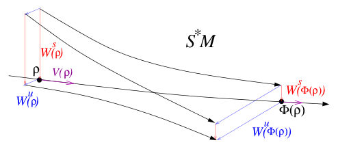 
Figure 5 A phase space picture of a reference orbits {Φt(ρ)} and three nearby orbits, two of them along the stable and unstable manifolds of ρ.

**Summary.** This paper provides a deep mathematical review of Quantum Chaos, focusing on how the semiclassical distribution of high-frequency eigenmodes relates to the underlying classical geodesic flow. It rigorously proves results like Quantum Ergodicity and establishes lower bounds on the entropy of these measures using advanced tools from microlocal analysis and fractal geometry.

**Why it may be interesting.** This work is foundational for understanding how classical chaotic dynamics constrain quantum behavior in the high-energy limit, providing rigorous mathematical tools applicable to wave phenomena in complex geometries.

Detailed structure

**Main problem.** The paper reviews results concerning the high-frequency eigenmodes of the Laplacian on manifolds with chaotic geodesic flow, focusing on their macroscopic distribution via semiclassical measures.

**Main result.** It details the Quantum Ergodicity theorem and provides advanced tools (like pseudodifferential operators and Fractal Uncertainty Principles) to establish lower bounds on the Kolmogorov-Sinai entropy for these measures.

**Method.** The primary methods involve semiclassical analysis, using $\hbar$-pseudodifferential operators ($	ext{Op}_\hbar(\chi)$) to test mass distribution in phase space ($T^*M$) and relating quantum expectation values to classical flow dynamics via Egorov's theorem.

**Model / system.** The system is the Laplacian operator on compact Riemannian manifolds, particularly those with chaotic geodesic flow (e.g., negatively curved surfaces or billiards). The analysis connects the wave equation solutions ($u_n$) to the underlying classical Hamiltonian dynamics ($\Phi_t$).

**Key observables.** Semiclassical measure ($\mu_{sc}$), Kolmogorov-Sinai entropy ($H_{KS}(\mu)$), and the expectation value $\langle u_n, 	ext{Op}_{\hbar_n}(\chi) u_n 
angle$ which measures mass distribution in phase space.

**Important parameters / regimes.** High frequency limit ($\lambda_n 	o \infty$), semiclassical parameter ($\hbar 	o 0$), and the Lyapunov exponents/expansion rates of the geodesic flow.

**Assumptions / limitations.** The analysis relies heavily on the quantum-classical correspondence (Egorov's theorem) and advanced tools like the Fractal Uncertainty Principle to control operator norms in phase space.

**Figures summary.** Figures illustrate eigenstates for various billiards, comparing integrable vs. chaotic flow regimes; they also depict phase space concepts involving stable/unstable manifolds ($W^s, W^u$) used in the entropy calculations.

**Paper structure.** The paper progresses from reviewing basic quantum chaos phenomena (eigenmodes, scarring) to establishing the core theorem (Quantum Ergodicity), and finally developing advanced mathematical machinery using pseudodifferential calculus and fractal geometry to prove strong lower bounds on the associated measures' entropies.

Abstract

In this chapter we review some results describing the high-frequency eigenmodes of the Laplacian on compact manifolds, or Euclidean domains, for which the geodesic flow is chaotic. We focus on the macroscopic distribution of these eigenmodes, which is described by the concept of semiclassical measure. The main result on the question is the Quantum Ergodicity theorem, originally due to Schnirelman. We provide the detailed proof of this theorem, including the adjustments necessary to treat the case of manifolds with boundary. We also discuss the Quantum Unique Ergodicity conjecture, and some progress towards this conjecture for strongly chaotic (Anosov) systems. In particular, we describe the constraints on admissible semiclassical measures, in terms of their Kolmogorov-Sinai entropy, as well as more recent delocalization results.

[↑ back to top](#top)

### [Quantum iterative approach to the Traveling Salesman Problem](http://arxiv.org/abs/2606.11843v1)

**Authors:** Arturo Rodríguez-Almazán, Guillermo Rivas, Ricardo S. Alonso, Daniela Falcó, Mir Amir Hosseini  
**Type:** theory · **Category:** quantum information and computing · **PDF:** <https://arxiv.org/pdf/2606.11843v1>  
**Analysis basis:** full PDF text, analyzed in chunks
**Topic relevance:** `quantum measurements` **1/5**

📷 Fig 1

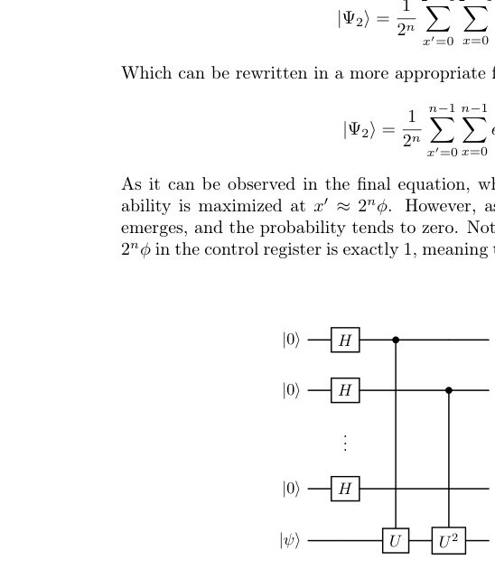 
Figure 1: Schematic diagram representing the quantum circuit to perform Quantum Phase Esti- mation.

📷 Fig 2

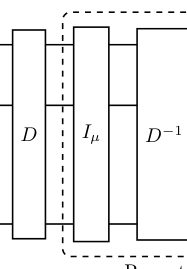 
Figure 2: Schematic diagram representing the quantum circuit to perform the Grover-Long algo- rithm.

📷 Fig 3

 
Figure 3: Map presenting the four towns of Salamanca we are using as toy model and the shortest possible path between them.

**Summary.** This paper proposes a novel quantum iterative algorithm to solve the NP-hard Traveling Salesman Problem by combining Quantum Phase Estimation and Grover's search. The approach encodes route costs as phases to be measured, iteratively refining the solution space until the minimum cost path is found. It provides theoretical complexity bounds and validates its feasibility using small-scale toy models.

**Why it may be interesting.** This work directly applies advanced quantum algorithms (QPE, Amplitude Amplification) to a canonical hard optimization problem, providing a concrete roadmap for potential quantum speedups in combinatorial optimization relevant to future quantum hardware development.

Detailed structure

**Main problem.** The paper addresses the Traveling Salesman Problem (TSP), a classical NP-hard optimization problem, by proposing a quantum computational approach.

**Main result.** The authors developed a quantum iterative framework combining Quantum Phase Estimation (QPE) and Grover's search algorithm to solve TSP, achieving an expected complexity of O(m^2 log_2(m) log_2(1/ε) / sqrt{ε}).

**Method.** The method involves encoding route costs as quantum phases evaluated by QPE, followed by iterative minimization using Amplitude Amplification (Grover-Long algorithm).

**Model / system.** The model is abstractly defined within the framework of quantum computation, utilizing qubits to represent both the 'Cost' and the 'Route' state in a tensor product space.

**Key observables.** The primary observable is the minimum total route cost, estimated by measuring the phase $\phi$ via QPE, and confirmed by the convergence of the Grover-Long iterations.

**Important parameters / regimes.** Key parameters include the number of cities ($m$), the error tolerance ($\epsilon$), and the required number of qubits for state encoding ($d$).

**Assumptions / limitations.** The analysis assumes that the initialization term in the complexity calculation is subdominant, and it relies on theoretical expectation values for its complexity bounds.

**Figures summary.** Figures illustrate schematic quantum circuits for QPE and Grover-Long algorithms. Tables provide numerical results from toy model simulations demonstrating convergence to minimum cost routes for both symmetric and asymmetric TSP instances.

**Paper structure.** The paper introduces the NP-hard nature of TSP, proposes the novel hybrid quantum algorithm (QPE + Grover-Long), provides a theoretical complexity analysis, demonstrates feasibility via small-scale case studies on toy models (including handling asymmetry), and concludes with discussions on scalability limitations.

Abstract

The Traveling Salesman Problem (TSP) is a classical NP-hard problem in combinatorial optimization, where determining the shortest route among a set of cities becomes computationally prohibitive as the problem size increases. This work explores quantum computing as an alternative approach to address this complexity. Unlike existing methods that primarily rely on quantum annealing, we propose a quantum iterative framework integrating Quantum Phase Estimation (QPE) and Grover's search algorithm. Route costs are encoded as quantum phases, enabling QPE to efficiently evaluate them, while Amplitude Amplification, implemented via the Grover-Long algorithm, iteratively refines the solution space toward the optimal route. A proof-of-concept case study on a small-scale TSP instance demonstrates the feasibility of this approach and its potential for scaling to larger optimization problems. Furthermore, under an expectation-based analysis, the algorithm exhibits an expected computational complexity of $O(\frac{m^2\log_2(m)\log_2(1/ε)}{\sqrtε})$ which depends on the error tolerance parameter $ε$. This estimation omits the initialization term, which we expect future refinements to render subdominant to Phase Estimation.

[↑ back to top](#top)

### [Quantum Occam Learning: Sample-Supported Expressibility for Circuit-Based Quantum Learning](http://arxiv.org/abs/2606.12211v1)

**Authors:** Jeongho Bang, Kyoungho Cho, Jeongwoo Jae  
**Type:** theory · **Category:** quantum information and computing · **PDF:** <https://arxiv.org/pdf/2606.12211v1>  
**Analysis basis:** full PDF text, analyzed in chunks
**Topic relevance:** `entanglement & information structure` **1/5**

📷 Fig 1

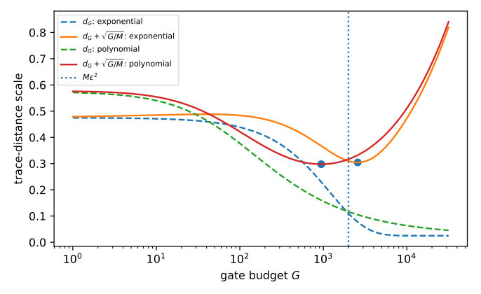 
FIG. 1. Illustrative approximation-estimation tradeoff for M = 5.0 × 104. The dashed curves are stylized approximation errors dG, the solid curves add the statistical radius p

📷 Fig 2

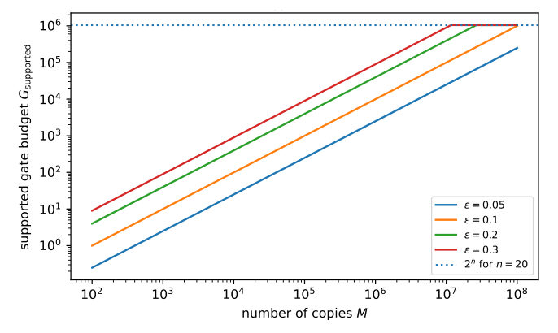 
FIG. 2. Sample-supported expressibility boundary for n = 20. The curves show Gsupported = min{2n, Mε2} for several target accuracies, ignoring logarithmic factors. The horizontal dotted line is the tomography saturation 220.

**Summary.** The paper introduces an Occam theory for quantum learning to quantify how much model expressibility (circuit depth $G$) can be reliably inferred from limited quantum samples ($M$). It derives a fundamental law stating that the supported complexity scales as $M\epsilon^2$, thereby transforming circuit design from a static assumption into a data-dependent statistical resource.

**Why it may be interesting.** This provides a rigorous, information-theoretic framework for determining when quantum machine learning models are statistically justified by data, which is crucial for designing practical variational quantum algorithms.

Detailed structure

**Main problem.** The work develops an information-theoretic Occam theory for quantum machine learning to reconcile the expressive power of quantum circuits with the statistical limitations imposed by finite sample data.

**Main result.** It establishes a 'sample-supported expressibility law' showing that the number of gates ($G$) statistically supported by $M$ samples at accuracy $\epsilon$ scales as $G_{	ext{supported}} \simeq M\epsilon^2$, making circuit complexity an adaptive statistical resource.

**Method.** The analysis uses metric entropy arguments and structural risk minimization analogues to derive bounds on the achievable error, balancing approximation bias ($d_G(\hat{
ho})$) against a sample-dependent statistical penalty term.

**Model / system.** The system involves estimating an unknown quantum state ($\hat{
ho}$) using variational quantum circuits (ansatze) parameterized by a gate count $G$. The learning is performed in the trace distance metric on $n$-qubit systems.

**Key observables.** Trace-distance error ($\epsilon$), Approximation Error ($d_G(\hat{
ho})$), and Sample Size ($M$).

**Important parameters / regimes.** The relationship $G_{	ext{supported}} \simeq M\epsilon^2$ defines the critical boundary between statistically supported and unsupported model complexity.

**Assumptions / limitations.** The analysis relies on bounding the metric entropy of the circuit class using nets to approximate continuous parameter spaces, assuming the learning is performed in an agnostic setting (unknown $\hat{
ho}$).

**Figures summary.** Figures illustrate the tradeoff between approximation error and statistical penalty, culminating in a clear visualization of the supported expressibility boundary $G_{	ext{supported}} = \min\{2^n, M\epsilon^2\}$.

**Paper structure.** The paper progresses from establishing basic bounds for realizable learning to developing agnostic theorems that incorporate model selection penalties. The final structure culminates in deriving the sample-supported law by minimizing a penalized objective function over circuit complexity.

Abstract

A central principle in quantum machine learning is that an ansatz should be expressive enough to represent the quantum data of interest. Yet, the expressibility is statistically meaningful only insofar as it can be learned from finitely many copies of an unknown quantum state. In this work, we develop an information-theoretic Occam theory for quantum data generated by finite-size quantum circuits. For the class $S_{n,G}$ of $n$-qubit pure states preparable with at most $G$ two-qubit gates, a metric-entropy argument gives the realizable sample law $\widetildeΘ(G/ε^2)$ in the circuit-limited regime. For an arbitrary source $\hatρ$, we introduce the best $G$-gate approximation error $d_G(\hatρ)$ and the approximate circuit complexity $C_η(\hatρ)$. We prove an agnostic quantum Occam theorem: with $M$ copies, one can learn up to the best $G$-gate approximation error plus a statistical penalty $\widetilde{O}(\sqrt{G/M})$. We then remove the need to know $G$ in advance through an adaptive model-selection theorem whose oracle inequality selects the circuit complexity justified by the data. Matching lower bounds yield a sample-supported expressibility law: at trace-distance accuracy $ε$, $M$ samples can support only $G_{\rm supported} \simeq Mε^2$ gates, up to logarithmic factors and tomography saturation at $2^n$. Thus, the circuit complexity becomes an adaptive statistical resource rather than a static promise. Our framework turns bounded circuit complexity into a model-selection principle for quantum machine learning.

[↑ back to top](#top)

### [Structural responses incipient to pressure-driven antiferromagnetic quantum critical point of van der Waals heavy-fermion metal CeSiI](http://arxiv.org/abs/2606.12222v1)

**Authors:** Hanming Ma, Tong Shi, Wenhao Li, Qingxin Dong, Xiaoli Ma, Shaoheng Ruan, Zhongjin Wu, Pengtao Yang, Zhaoming Tian, Jianping Sun, Yoshiya Uwatoko, Xiaohui Yu, Hechang Lei, Bosen Wang, Jinguang Cheng  
**Type:** experiment · **Category:** strongly correlated electrons · **PDF:** <https://arxiv.org/pdf/2606.12222v1>  
**Analysis basis:** full PDF text, analyzed in chunks
**Topic relevance:** `Kondo & dissipative impurity` **1/5**

📷 Fig 1

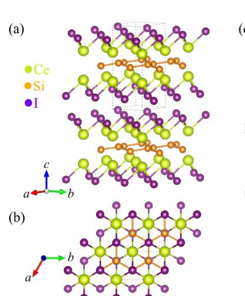 
Figure 1

📷 Fig 2

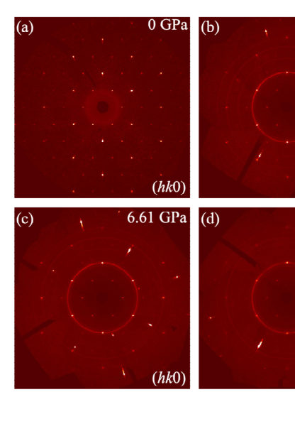 
Figure 2

📷 Fig 3

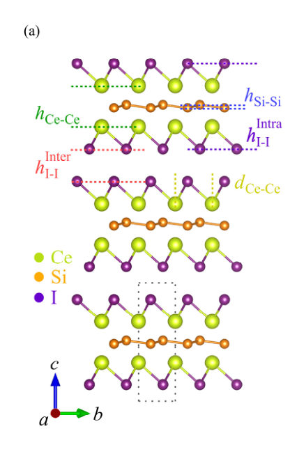 
Figure 3

📷 Fig 4

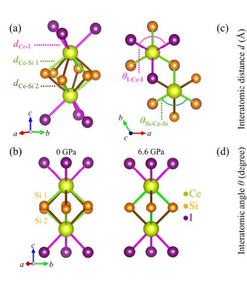 
Figure 4

📷 Fig 5

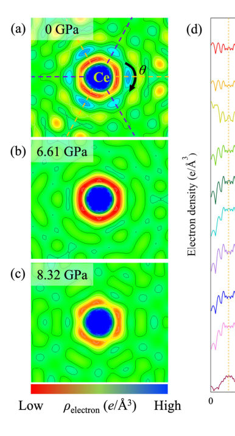 
Figure 5

**Summary.** This work uses high-pressure single-crystal X-ray diffraction to investigate the structure of the heavy-fermion metal CeSiI near its antiferromagnetic Quantum Critical Point. The researchers found that while the overall crystal structure remains stable, abrupt anisotropic changes in lattice parameters occur around the critical pressure. These structural anomalies are linked to local bond length and coordination symmetry changes within the material's layers.

**Why it may be interesting.** The direct experimental link established between measurable room-temperature structural precursors and a low-temperature electronic QCP provides crucial input for theories describing quantum critical points in correlated materials.

Detailed structure

**Main problem.** To understand the structural responses that precede a pressure-driven antiferromagnetic quantum critical point (QCP) in the van der Waals heavy-fermion metal CeSiI.

**Main result.** The study found abrupt and concurrent anisotropic lattice parameter changes near the QCP, which are attributed to local structural deformations like flattening of the Si honeycomb layer and changes in Ce-Ce/Ce-Si bond lengths.

**Method.** Comprehensive single-crystal X-ray diffraction (SXRD) measurements were performed on high-quality single crystals under pressures up to 8.3 GPa at room temperature.

**Model / system.** The physical system is CeSiI, a van der Waals heavy-fermion metal known for unconventional superconductivity near an AF QCP. The structure involves layered components: a Si honeycomb layer sandwiched between Ce and I layers.

**Key observables.** Unit-cell volume ($V$), lattice parameters ($a$, $c$), interlayer gaps ($	ext{h}_{	ext{I-I}}^{	ext{Inter}}$), intra-layer distances ($	ext{h}_{	ext{Ce-Ce}}$, $	ext{h}_{	ext{Si-Si}}$), and bond angles/lengths.

**Important parameters / regimes.** Pressure range up to 8.3 GPa; critical pressure $P_c \approx 6$ GPa; room temperature measurements.

**Assumptions / limitations.** The structural anomalies observed at room temperature are considered incipient precursors to the low-temperature electronic QCP.

**Figures summary.** Figures show SXRD patterns, pressure dependence of lattice parameters ($a, c, V$), and detailed evolution plots for various interatomic distances and bond angles across the critical pressure region.

**Paper structure.** The paper presents systematic high-pressure SXRD data analysis, first establishing the overall structural stability (no phase transition) while highlighting anomalies in lattice parameters near $P_c$. It then delves into specific atomic interactions (bond lengths, layer heights) to microscopically explain these observed macroscopic structural changes.

Abstract

CeSiI is a van der Waals heavy-fermion metal recently found to exhibit unconventional superconductivity near a pressure-induced antiferromagnetic quantum critical point (QCP) at Pc =6 GPa. Here, we report a comprehensive single-crystal X-ray diffraction study of CeSiI under high pressures up to 8.3 GPa at room temperature, revealing subtle structural responses that precede pressure-driven QCP. We find that the unit-cell volume decreases smoothly upon compression without showing any structural phase transition in the investigated pressure range. Intriguingly, we observe abrupt and concurrent anisotropic responses of the lattice parameters around Pc =6 GPa, i.e., the a-axis contracts while the c-axis enlongated suddenly, with the unit-cell volume smoothily varies with pressure. Structural refinements further show that these lattice anomalies primarily originate from changes of Ce-Ce and Ce-Si bond lengths, as well as a flattening of the inner honeycomb Si layer within the CeSiI monolayer around Pc. Our findings establish an interesting case linking pressure-driven electronic transition of QCP at low temperatures to incipient structural responses at room temperature, thereby providing fresh insight into the pressure-temperature phase diagram of CeSiI.

[↑ back to top](#top)

### [Unveiling the Interplay of Charge and Magnetic Excitations in HgBa$_2$Ca$_2$Cu$_3$O$_{8+δ}$](http://arxiv.org/abs/2606.11524v1)

**Authors:** Karn Rongrueangkul, Martina Fedele, Leonardo Martinelli, Giacomo Merzoni, Roberto Sant, Nicholas B. Brookes, Dorothée Colson, Alain Sacuto, Götz Seibold, Sergio Caprara, Marco Moretti Sala, Giacomo Ghiringhelli, Riccardo Arpaia  
**Type:** both · **Category:** strongly correlated electrons · **PDF:** <https://arxiv.org/pdf/2606.11524v1>  
**Analysis basis:** full PDF text, analyzed in chunks
**Topic relevance:** `Keldysh / 2PI / non-Gaussian methods` **1/5**

📷 Fig 1

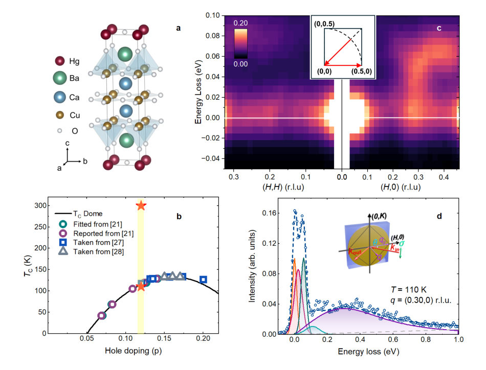 
Figure 1: Crystal structure, phase diagram, and experimental conditions of HgBa2Ca2Cu3O8+δ (Hg1223). (a) Crystal structure of Hg1223. (b) Superconducting dome of Hg1223, with Tc values from samples both as those of our study and from the literature. Their dependence follows a parabolic relationship, without any hint of anomalous Tc suppres- sion in the underdoped region. RIXS spectra were acquired in medium resolution mode at several temperatures between 20 and 300 K (yellow bar), and in high resolution mode at 110 K, i.e., just below the superconducting transition, and at room temperature (stars). (c) High- resolution (∆E = 32 meV) RIXS maps measured at T = 110 K along the (H, 0) and (H,...

📷 Fig 2

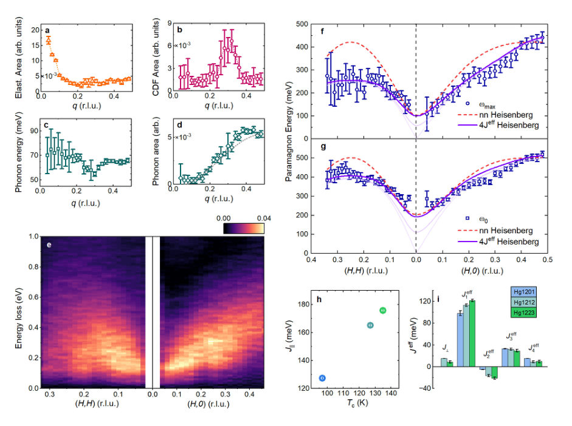 
Figure 2: Charge, lattice, and magnetic excitations in Hg1223 from RIXS. From the fits as a function of momentum along the (H, 0) direction we extract: (a) the area of the elastic line, (b) the area of the CDF peak, (c) the dispersion and (d) the area of the bond- stretching phonons. (e) Inelastic RIXS maps along the (H, 0) and (H, H) directions obtained by subtracting from the raw spectra all low-energy contributions identified in the fits of panels (a–d), so as to single out the spectral weight associated with the paramagnons. (f) Disper- sion of the paramagnon energy ωmax, fitted using both the nearest-neighbour Heisenberg model (dashed line) and a phenomenological linear spin-wave model...

📷 Fig 3

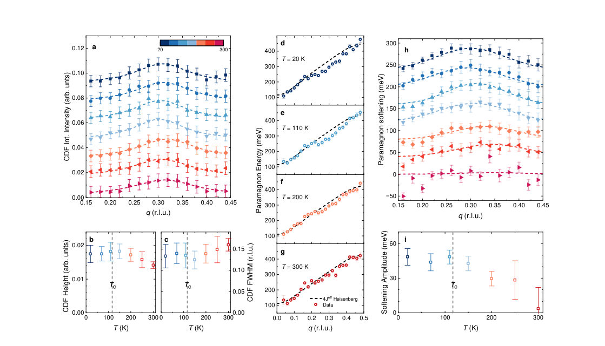 
Figure 3: Interplay of paramagnon softening and charge-density fluctuations. (a) The CDF peak at different temperatures between 20 and 300 K, highlighted by the RIXS inten- sity integrated in the range [–0.1, 0.035] eV. (b,c) Height and FWHM of the Lorentzian profiles used to fit the CDF peak. Both intensity and correlation length increase upon cooling and satu- rate below Tc. (d–g) Paramagnon energy ωmax extracted from the fits at various temperatures, compared with the phenomenological linear spin-wave model including four nearest-neighbour exchange parameters. (h) Paramagnon softening at each temperature, quantified by the de- viation between experimental data and the fitted spin-wave...

📷 Fig 4

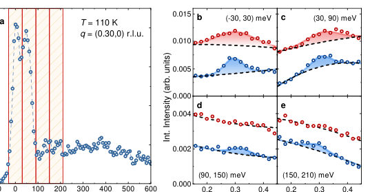 
Figure 4: Broad energy range of charge-density fluctuations overlapping with para- magnons. (a) To assess the energy extent of the CDF peak, each RIXS spectrum was divided into several energy intervals, and the integrated intensity was extracted for each of them. (b–e) Example of this procedure at T = 110 K and 300 K, using 60 meV–wide adjacent intervals cov- ering the range from –30 to 210 meV. While the CDF peak is maximal in the quasi-elastic region [–30, 30] meV, at low temperature it survives up to 210 meV, whereas at room temperature this high-energy component vanishes. (f) To better visualize the evolution of the CDF peak with energy, at T = 110 K the analysis was repeated with 60...

📷 Fig 5

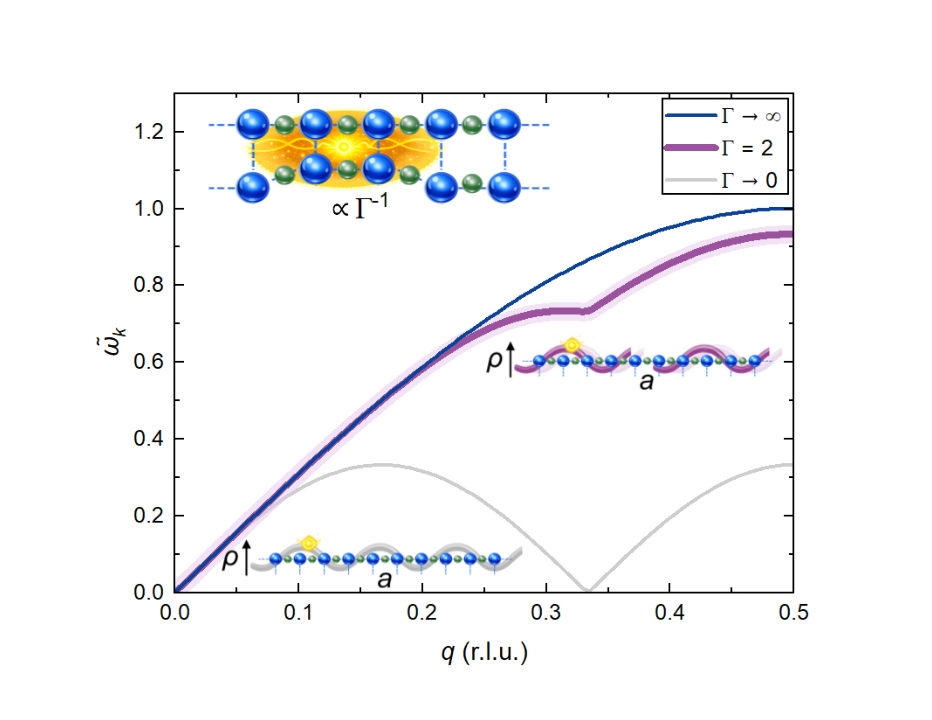 
Figure 5: Phenomenological model for paramagnon softening induced by charge- density fluctuations. Renormalized paramagnon dispersion eωk obtained from the phenomeno- logical self-energy describing the coupling between paramagnons and CDF. The bare dispersion ωk (Γ →∞, blue line) evolves towards the reconstructed dispersion ω′ k (Γ →0, grey line) through an intermediate regime (Γ = 2, violet line), where a pronounced softening develops at qCDF. The parameter Γ captures the dynamical character of the CDF and effectively encodes the strength of the electron–phonon coupling: smaller Γ corresponds to slower, more correlated fluctuations and leads to stronger softening. The upper-left schematic...

**Summary.** This research uses RIXS spectroscopy on high-Tc cuprates to investigate the coupling between charge, spin, and lattice excitations. The key finding is that dynamic charge fluctuations mediate this interplay, causing paramagnon softening without implying a competing static CDW order. This suggests a cooperative mechanism underlying high-temperature superconductivity.

**Why it may be interesting.** The work provides a concrete mechanism—dynamical charge mediation—that links lattice vibrations, electronic correlations, and magnetic order in a highly complex quantum material, offering insights into emergent collective behavior relevant to strongly correlated physics.

Detailed structure

**Main problem.** The central challenge is elucidating the mechanism responsible for forming Cooper pairs (high-Tc superconductivity) in cuprates, specifically by investigating the cooperative interplay between charge, lattice, and spin excitations.

**Main result.** Dynamic Charge Density Fluctuations (CDF), extending to high energies, mediate a strong coupling between charge and spin degrees of freedom. This coupling appears to promote superconductivity rather than competing with it, unlike static CDW order.

**Method.** The study combines advanced experimental techniques like Resonant Inelastic X-ray Scattering (RIXS) with sophisticated theoretical modeling using Green's functions and phenomenological self-energy calculations.

**Model / system.** The primary system is the cuprate superconductor HgBa2Ca2Cu3O(8+delta) (Hg1223). The analysis involves fitting RIXS spectra to extract spectral weights for dynamic charge fluctuations, phonon anomalies, and paramagnon dispersions using theoretical models incorporating electron-phonon coupling.

**Key observables.** Dynamic Charge Density Fluctuations (CDF), Paramagnon energy/dispersion ($\omega(\mathbf{k})$), Phonon softening anomaly, and the superconducting critical temperature ($T_c$).

**Important parameters / regimes.** The strength of the coupling is parameterized by $\Gamma$ (in theoretical models) or observed through spectral weight changes; key momentum points include $q_{	ext{CDF}} = 0.30 	ext{ r.l.u.}$ along $(	ext{H}, 0)$.

**Assumptions / limitations.** The analysis assumes that the high-energy tail of CDF is crucial for coupling to spin excitations, and that phonon softening observed at $q_{	ext{CDF}}$ is due to these dynamic fluctuations rather than static CDW formation.

**Figures summary.** Figures illustrate RIXS spectra showing distinct contributions from elastic scattering (CDW/CDF), phonons, and paramagnons across various temperatures and crystal directions, demonstrating the energy overlap between CDF and magnetic excitations.

**Paper structure.** The paper progresses by first establishing the experimental observation of coupled fluctuations in Hg1223 using RIXS. It then develops theoretical models (using self-energy corrections) to quantify how dynamic charge fluctuations mediate the observed paramagnon softening, contrasting this with static CDW scenarios.

Abstract

Unraveling the mechanism that binds electrons into Cooper pairs in cuprate high-temperature superconductors remains one of the most fundamental challenges in condensed-matter physics. While both magnetic interactions and lattice vibrations are known to govern key electronic properties, their possible cooperation has never been directly observed. We investigate HgBa$_2$Ca$_2$Cu$_3$O$_{8+δ}$ (Hg1223) - the cuprate with the highest $T_{\mathrm{c}}$ at ambient pressure - as a magnifying glass to probe the possible entwining of the excitations at the core of the pairing. Using resonant inelastic X-ray scattering, we find that the charge response is dominated by dynamic charge density fluctuations (CDF) extending up to several hundred meV, where magnetic excitations reside. At the same momentum where CDF are most intense, the paramagnon energy exhibits a pronounced softening, revealing a strong interplay among charge, lattice, and spin excitations. Our results point to a cooperative mechanism in which dynamic charge fluctuations mediate the coupling between lattice, charge and spin degrees of freedom-shedding new light on the fundamental origin of high-$T_{\mathrm{c}}$ superconductivity.

[↑ back to top](#top)

## Other papers (8)

*Papers from primary archives without highlighted authors or any topic match. Click to expand.*

Show other papers

### [Bound State Solutions of the Relativistic Finite-difference Equation for the Ring-shaped Quesne Oscillator Potential](http://arxiv.org/abs/2606.12082v1)

**Authors:** Sh. M. Nagiyev, Narmin Nasibova, V. A. Tarverdiyeva, G. H. Guliyeva  
**Type:** theory · **Category:** other · **PDF:** <https://arxiv.org/pdf/2606.12082v1>  
**Analysis basis:** full PDF text, analyzed in chunks

📷 Fig 1

 
FIG. 1. Real and imaginary parts of the relativistic ring-shaped Quesne oscillator effective potential Veff(r)

📷 Fig 2

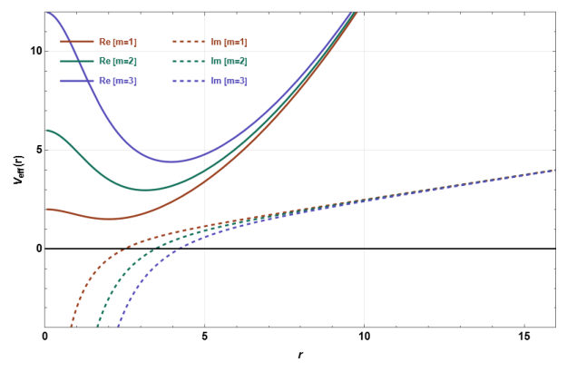 
Figure 2(a) shows the radial probability density |Rnkm(r)|2 for several values of the radial

📷 Fig 3

 
FIG. 2. (a) Radial probability density |Rnkm(r)|2 as a function of the radial coordinate r for several radial

📷 Fig 4

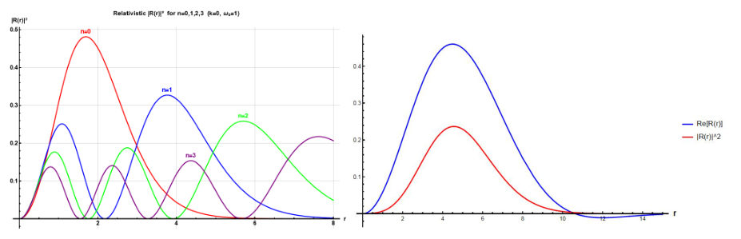 
Figure 3(a) illustrates the dependence of the energy levels on α for several values of the angular

📷 Fig 5

 
Figure 3(b) shows the corresponding behavior for different radial quantum numbers n. The

**Summary.** This paper solves the relativistic finite-difference equation for a particle confined by a ring-shaped Quesne oscillator potential. By employing advanced mathematical techniques involving dual Hahn and Jacobi polynomials, the authors determine a discrete energy spectrum and reveal an underlying SU(1, 1) dynamical symmetry group. The results confirm the model's physical consistency through its nonrelativistic limit.

**Why it may be interesting.** While highly specialized, the use of exactly solvable models with established dynamical symmetries (like SU(1, 1)) provides rigorous theoretical benchmarks for understanding confinement potentials and relativistic corrections in quantum mechanics.

Detailed structure

**Main problem.** The study involves finding exact bound state solutions for a relativistic finite-difference equation governing a particle in a ring-shaped Quesne oscillator potential.

**Main result.** The analysis yields a discrete energy spectrum, confirms the nonrelativistic limit, and establishes an SU(1, 1) dynamical symmetry group for the radial part of the motion.

**Method.** The authors employed separation of variables, solving the angular equation using Gegenbauer polynomials and the radial equation by relating it to continuous dual Hahn polynomials.

**Model / system.** The system is a quantum mechanical particle confined by the ring-shaped Quesne oscillator potential, analyzed within a relativistic finite-difference framework. The Hamiltonian structure allows for factorization into terms exhibiting SU(1, 1) symmetry.

**Key observables.** Energy eigenvalues ($E_{nk}$), radial probability density $|	ext{R}_{nkm}(r)|^2$, and the 3D spatial probability density $|\psi(x, z)|^2$.

**Important parameters / regimes.** The ring-shaped coupling parameter $\alpha$, the relativistic energy scale $m_0c^2$, and quantum numbers $n$ (radial) and $k$ (angular).

**Assumptions / limitations.** The analysis assumes specific values for model parameters, and one figure's visualization is restricted to the X-Z plane ($y=0$).

**Figures summary.** Figure 2 shows radial probability density vs. radius; Figure 3 illustrates energy eigenvalue dependence on $\alpha$ (vs $k$) and $n$ (vs $n$); Figure 4 displays the 3D spatial probability density in the X-Z plane for increasing angular quantum numbers.

**Paper structure.** The paper proceeds by separating variables into radial and angular equations. The angular part is solved using Gegenbauer polynomials, leading to quantization conditions. The radial equation is then tackled using continuous dual Hahn polynomials, resulting in quantized energy levels derived from the symmetry structure.

Abstract

We solve exactly the relativistic finite-difference equation for the quantum three-dimensional ring-shaped Quesne oscillator potential. Our investigation is based on a finite-difference version of relativistic quantum mechanics. So-called relativistic configurational r-space is a key concept here. We show that the radial wavefunctions and angular wavefunctions are expressed through the continuous dual Hahn polynomials and Jacobi polynomials, respectively. A discrete energy spectrum has been found. The radial wave functions and energy spectrum have the correct nonrelativistic limit. We also build a dynamical symmetry group SU (1, 1) for the radial part of the equation of motion, which allows us to find the energy spectrum purely algebraically.

[↑ back to top](#top)

### [Learning from almost nothing: How neural networks survive heavy input corruption](http://arxiv.org/abs/2606.11319v1)

**Authors:** Justin Tahmassebpur, Asadullah Bhuiyan, Hyejin Kim, Omri Lesser  
**Type:** both · **Category:** disordered systems and neural networks · **PDF:** <https://arxiv.org/pdf/2606.11319v1>  
**Analysis basis:** full PDF text, analyzed in chunks

📷 Fig 1

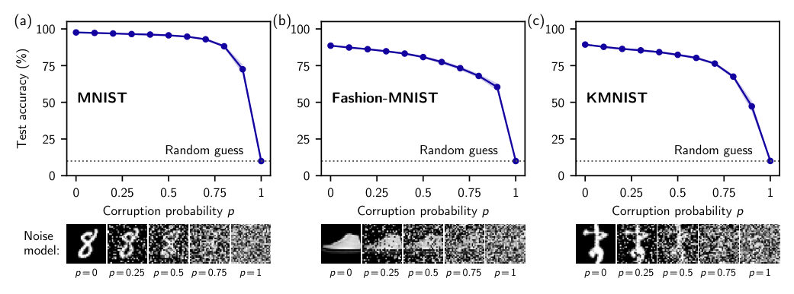 
FIG. 1. Test accuracy vs. corruption probability p for width-128, 3-layer ReLU MLPs trained with cross-entropy loss on images with i.i.d. pixel replacement noise. Three class-balanced datasets are shown: (a) MNIST, (b) Fashion-MNIST, and (c) KMNIST. Below each panel we demonstrate the noise model by showing representative examples of images subject to replacement noise at increasing p. For each p, an MLP is trained on a dataset where each pixel is independently replaced with uniform noise with probability p; the test set is left clean. Accuracy metrics are averaged over 100 independent noisy training realizations per p value, and shaded bands surrounding each curve represent one standard...

📷 Fig 2

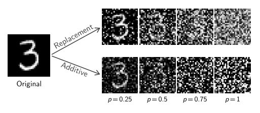 
FIG. 2. Visualization of the two corruption models used in this work applied to an MNIST image. The top panel shows the replacement noise model, where each pixel is indepen- dently replaced with uniform noise with probability p; see Eq. (1). The bottom panel shows the additive noise model, where each pixel is replaced by a convex combination of the clean pixel and an independent noise variable, with mixing parameter p; see Eq. (2). The panels show increasing corrup- tion levels p.

📷 Fig 3

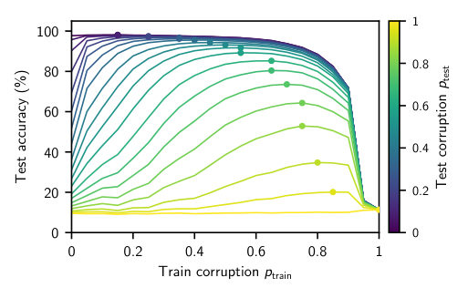 
FIG. 3. Train-time and test-time corruption in MNIST data: Accuracy vs. train corruption level ptrain, for several values of test corruption ptest. We observe a non-monotonic behav- ior, where the optimal ptrain (dots in the figure) is near ptest, rather than 0. All networks and hyperparameters are the same as in Fig. 1.

📷 Fig 4

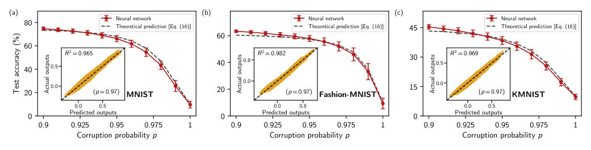 
FIG. 4. Numerical verification of the high-noise theory. All networks used to create the data in this figure are width-2048, 3-layer erf MLPs, trained with mean squared error (MSE) loss on noisy (a) MNIST, (b) Fashion-MNIST, and (c) KMNIST with N = 4000. Main panels: mean clean-test accuracy versus replacement-noise strength p for a nested ensemble of 20 noisy training sets and 10 MLPs per noisy set (red curve). Error bars show one standard deviation. The grey-dashed curve is the mean clean-test accuracy of the fitted effective model in Eq. (16). Insets: output-level comparison at p = 0.97, using a nested ensemble of 100 noisy training sets and 50 MLPs per noisy set. Each point corresponds...

📷 Fig 5

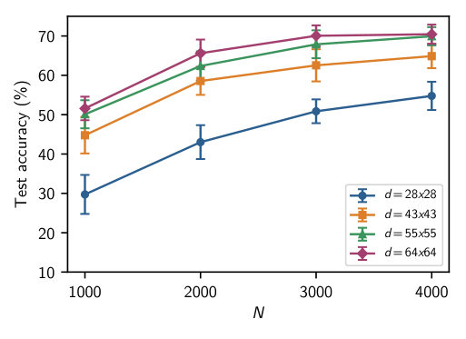 
FIG. 5. Empirical test of the scaling suggested by Eq. (17). Each curve shows the mean clean-test accuracy of an ensemble of width-2048, 3-layer erf MLPs trained with MSE loss on MNIST with replacement noise at p = 0.97, as a function of training-set size N for fixed feature dimension d. Error bars show one standard deviation. Larger values of d are obtained by resizing the original MNIST images using bilinear interpolation.

**Summary.** This paper theoretically and empirically demonstrates that neural networks remain remarkably robust when trained on inputs corrupted by heavy noise. By analyzing the system in the infinite-width limit using NTK theory, the authors prove that the network's decision rule collapses to a simple nearest-class-mean classifier, providing an interpretable understanding of learning from severely degraded data.

**Why it may be interesting.** This work provides an analytic understanding of generalization in highly noisy regimes, showing that the underlying mechanism reduces to simple geometric averaging (centroiding), which has parallels in physical systems where complex interactions simplify under extreme noise or disorder.

Detailed structure

**Main problem.** The paper investigates how well neural networks can learn a classification rule when their input data is heavily corrupted by noise, while the corresponding labels remain perfectly clean.

**Main result.** In the high-noise limit, the network's decision boundary simplifies to a universal nearest-class-mean (centroid) classifier, regardless of specific architectural details like depth or activation function.

**Method.** The analysis combines theoretical tools from the Neural Tangent Kernel (NTK) framework with perturbation theory and mean-field approximations for infinite-width networks. These are validated against numerical experiments on finite-width MLPs.

**Model / system.** The model is a Multi-layer Perceptron (MLP) trained on classification tasks using datasets like MNIST. The core physical concept analyzed is the network's response to input corruption, modeled by additive or replacement noise applied to the features.

**Key observables.** Test accuracy vs. corruption probability ($p$), and the derived decision rule which is proportional to the overlap between the test point and class centroids.

**Important parameters / regimes.** Corruption probability ($p > 90\%$), network width/depth, and the noise type (additive vs. replacement).

**Assumptions / limitations.** The analysis relies on approximations valid in the high-noise limit ($\epsilon 	o 1$) and often assumes i.i.d. data with bounded moments for symmetry arguments.

**Figures summary.** Figures demonstrate that test accuracy remains robust even when training inputs are highly corrupted (e.g., $p=0.75$ yields $\sim 80\%-90\%$ MNIST accuracy). Theoretical predictions consistently match empirical results across various noise models and architectures.

**Paper structure.** The paper progresses from identifying the core problem (attribute noise) to developing analytical tools (NTK, perturbation theory) to derive a leading-order decision rule. This theoretical derivation is then rigorously tested against extensive numerical simulations covering different corruption types and network parameters.

Abstract

Learning from imperfect data is a central theme in machine learning, connecting practical questions of robustness to fundamental questions of learnability. Here we examine attribute noise: learning from corrupted inputs while keeping the labels intact, a setting that has received considerably less analytical attention than its label-noise counterpart. We consider two types of corruption models: additive noise and replacement noise. Through experiments with multi-layer perceptrons (MLPs) on corrupted classification datasets, we find that neural networks remain robust, maintaining well-above-chance accuracy even when inputs are >90% corrupted -- far beyond human recognition. To understand this robustness, we analyze infinite-width networks in the heavy-corruption regime using a mean-field-inspired approach and derive a leading-order decision rule for the classification outcome: the network implements a prototype rule, the nearest-class-mean, assigning each test point to the class whose training-set average it most closely resembles. This leading-order decision rule is universal across a broad range of MLP architectures, holding for any depth, as well as a wide class of activation functions and noise distributions. The same centroid mechanism closely matches finite-width network behavior in our experiments and provides an interpretable and analytically tractable account of why learning can succeed even when individual training examples carry almost no signal.

[↑ back to top](#top)

### [Locally Acting Grover Mixers for Constraint-Preserving QAOA](http://arxiv.org/abs/2606.11530v1)

**Authors:** Minjin Choi, Dongkeun Lee, Junghee Ryu  
**Type:** theory · **Category:** quantum information and computing · **PDF:** <https://arxiv.org/pdf/2606.11530v1>  
**Analysis basis:** full PDF text, analyzed in chunks

📷 Fig 1

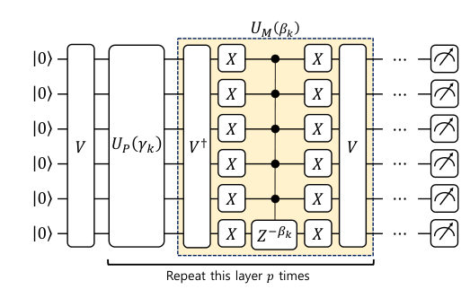 
FIG. 1: Schematic illustration of GM-QAOA. The circuit begins with the state-preparation unitary V, followed by alternating phase- separation unitaries UP(γ) and mixing unitaries UM(β). Here, X rep- resents the Pauli-X gate, and Zϕ is the phase-shift gate defined as Zϕ = |0⟩⟨0| + eiϕ |1⟩⟨1|. The final state is measured in the computa- tional basis to obtain approximate solutions.

📷 Fig 2

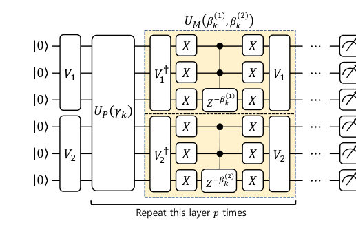 
FIG. 2: Circuit illustration of the product-structured variant of the Grover mixer for an initial state of product form |ψ0⟩= |ψ(1) 0 ⟩⊗|ψ(2) 0 ⟩. The state-preparation unitary decomposes as V = V1⊗V2, where each Vj independently prepares the j-th subsystem state |ψ(j) 0 ⟩. The mix- ing unitary UM(β(1), β(2)) is implemented as two independent blocks, each realized using a multi-controlled phase-shift gate acting within its respective subsystem.

📷 Fig 3

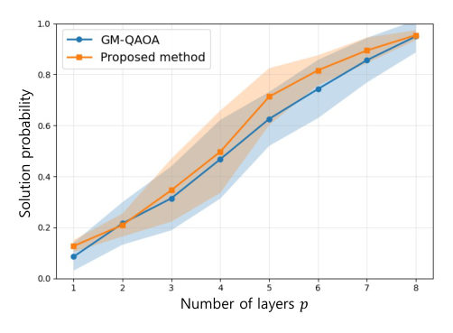 
FIG. 3: Solution probability as a function of the number of layers p for the exact-cover instance in Eq. (12) using GM-QAOA and the proposed method. For each method and each value of p, the parame- ters are randomly initialized 30 times. The markers indicate the mean solution probability over these runs, and the shaded bands represent the standard deviation. The two methods exhibit comparable conver- gence behavior as p increases.

📷 Fig 4

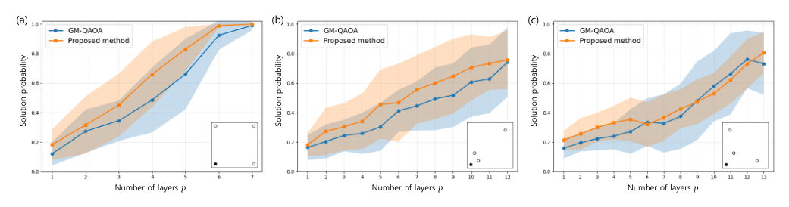 
FIG. 4: Solution probability as a function of the number of layers p for the TSP using GM-QAOA and the proposed method. Plots (a), (b), and (c) correspond to three instances of the four-city TSP (nine qubits) with different city locations, as illustrated in the insets, where circles represent cities and the filled circle indicates the starting and ending point of the tour. The simulation setting follows that of Figure 3. Across all three instances, the convergence behavior of the proposed method remains comparable to that of GM-QAOA.

📷 Fig 5

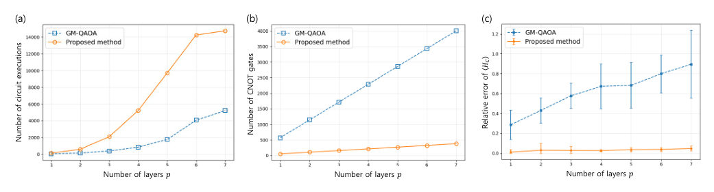 
FIG. 5: Resource trade-offs between GM-QAOA and the proposed method for TSP instance (a), as a function of the number of layers p. (a) Total number of circuit executions required during optimization. (b) Number of CNOT gates required to implement the mixing unitary, obtained after decomposition into the {RX, RY, RZ, CNOT} gate set. (c) Relative error of the expectation value ⟨HC⟩evaluated by applying a depolarizing noise model with one- and two-qubit gate error rates ϵ1 = 10−4 and ϵ2 = 10−3 to the decomposed mixing unitary. Error bars represent the standard deviation over random parameter samples, and the proposed method has lower relative error with reduced variance.

**Summary.** The paper introduces a novel, resource-efficient variant of the Grover mixer for QAOA by exploiting product structures in the initial state preparation. This modification replaces computationally expensive global multi-controlled gates with simpler, local operations on disjoint subsystems. Simulations confirm that this approach maintains convergence quality while drastically reducing circuit overhead, making it more viable for near-term quantum hardware.

**Why it may be interesting.** This work directly addresses hardware constraints by proposing structural modifications to quantum algorithms, which is crucial for making variational quantum algorithms practical on NISQ devices. The focus on decomposing global gates into local ones has implications for circuit compilation and noise mitigation in quantum computation.

Detailed structure

**Main problem.** The primary challenge is minimizing circuit overhead when applying QAOA to constrained optimization problems on near-term quantum devices.

**Main result.** The proposed locally acting Grover mixers achieve convergence comparable to the original method while significantly reducing gate count and circuit depth, especially when using partial constraint encoding for TSP.

**Method.** The authors propose replacing the global multi-controlled phase-shift gate in GM-QAOA with local operations by tailoring the mixer to initial states possessing a product structure over disjoint qubit subsystems.

**Model / system.** The work is situated within the QAOA framework for solving constrained combinatorial optimization problems, specifically demonstrated on the Exact-Cover Problem and the Traveling Salesman Problem (TSP). The quantum circuit relies on alternating application of cost Hamiltonian evolution ($U_P$) and a modified Grover mixer ($U_M$).

**Key observables.** Solution probability vs. number of layers ($p$); Circuit complexity metrics (e.g., CNOT gates, depth); Solution quality.

**Important parameters / regimes.** The mixing parameter $eta$; the QAOA layer count $p$; the choice of constraint encoding (full vs. partial).

**Assumptions / limitations.** The method's primary advantage relies on the initial state $|\psi_0
angle$ admitting a product structure over disjoint subsystems, which is often achieved by encoding only a subset of constraints.

**Figures summary.** Figures illustrate the schematic of GM-QAOA layers and the circuit for the product-structured variant. Comparison plots show solution probability vs. $p$ for both methods on Exact-Cover and TSP instances, demonstrating comparable convergence.

**Paper structure.** The paper introduces the limitations of standard GM-QAOA due to global gates; it then proposes the local mixer based on product structure decomposition; results are validated via numerical simulations on benchmark problems (Exact-Cover, TSP), concluding with a comparison of constraint encoding strategies.

Abstract

The Grover mixer quantum alternating operator ansatz (GM-QAOA) employs the Grover mixer to confine the quantum evolution to the feasible subspace defined by the problem. Its mixing unitary, however, requires a global multi-controlled phase-shift gate acting on all qubits, resulting in substantial circuit overhead on near-term quantum devices. In this work, we propose locally acting Grover mixers tailored to initial states that admit a product structure over disjoint qubit subsystems, which may be obtained by encoding only a subset of problem constraints into the initial state preparation. The proposed method preserves the search space defined by the initial state while significantly lowering implementation cost, as the global multi-controlled phase-shift gate is replaced with local operations on disjoint subsystems. Numerical simulations on the exact-cover problem and the traveling salesman problem (TSP) demonstrate that the proposed method achieves convergence behavior comparable to that of the original GM-QAOA, while using shallower circuits with fewer gates. We further compare two constraint encoding strategies for the TSP, encoding only a subset of constraints versus all constraints into the initial state preparation, and show that the former combined with the proposed mixer yields markedly more compact circuits at the point where comparable solution quality is achieved.

[↑ back to top](#top)

### [Optimizing Encoder Circuits of Entanglement-Assisted Quantum LDPC Codes via Beam Search](http://arxiv.org/abs/2606.11468v1)

**Authors:** Aditya Sodhani, Pavan Kumar, Shayan Srinivasa Garani, Keshab K. Parhi  
**Type:** theory · **Category:** quantum information and computing · **PDF:** <https://arxiv.org/pdf/2606.11468v1>  
**Analysis basis:** full PDF text, analyzed in chunks

📷 Fig 1

 
Fig. 1. Architecture of the proposed CNOT-count optimization flow.

📷 Fig 2

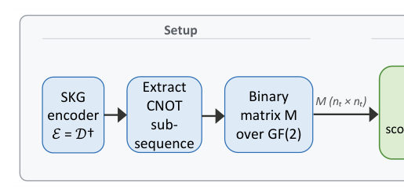 
Fig. 1 summarizes the end-to-end optimization flow, from extracting the SKG CNOT sub-sequence and forming the binary matrix M, to beam-search optimization, CNOT re- construction, and stabilizer-tableau verification. We define the Hamming distance heuristic

📷 Fig 3

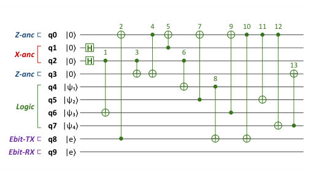 
Fig. 3. Beam-search-optimized encoder circuit for [[9, 4; 1]]: 2 H, 13 CNOTs.

📷 Fig 4

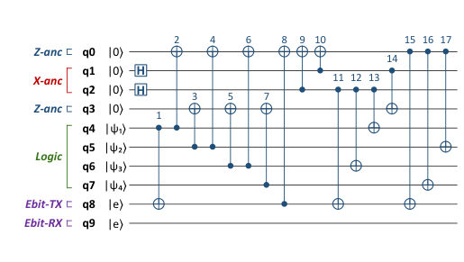 
Fig. 2. SKG encoder circuit (baseline) for [[9, 4; 1]]: 2 H, 17 CNOTs.

📷 Fig 5

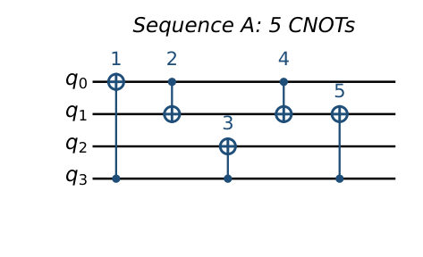 
Fig. 4. Two CNOT circuits implementing the same encoder matrix M. Sequence A (left) uses 5 gates; Sequence B (right) uses 3.

**Summary.** The paper develops a beam search algorithm to minimize the CNOT gate count required for the encoder circuits of EA QC-LDPC codes. By treating the circuit structure as a row decomposition problem over GF(2), the method successfully reduces gate counts by up to 34% compared to existing methods. This research provides a powerful tool for realizing more efficient, hardware-implementable quantum error correction protocols.

**Why it may be interesting.** This work directly addresses resource optimization for quantum error correction codes, which is crucial for scaling up fault-tolerant quantum computation architectures.

Detailed structure

**Main problem.** The primary goal is optimizing the CNOT gate count in the encoder circuits for Entanglement-Assisted (EA) Quantum Low-Density Parity-Check (QC-LDPC) codes.

**Main result.** The proposed beam search method achieves significant CNOT-count reductions of 7.3–34.0% compared to established baseline encoders, demonstrating substantial circuit simplification potential.

**Method.** Optimization is framed as finding the shortest sequence of row operations (elementary row-XOR factors) over GF(2) that transforms a derived binary matrix into the identity matrix, solved using a beam search guided by Hamming distance.

**Model / system.** The system involves EA QC-LDPC codes utilizing pre-shared Bell pairs. The complexity is analyzed through the CNOT sub-sequence of the encoder circuit, which is modeled as an invertible binary matrix over GF(2).

**Key observables.** CNOT count (the primary optimization metric), Circuit Depth, and the percentage reduction relative to baseline encoders.

**Important parameters / regimes.** The structure of the code's block-row decomposition ($\ell$) influences the achievable reduction potential.

**Assumptions / limitations.** The beam search algorithm does not inherently incorporate scheduling constraints into its objective function, meaning depth reduction is a secondary, non-guaranteed outcome.

**Figures summary.** Figures compare SKG baseline circuits (e.g., for [[8, 2; 2]] and [[25, 8; 1]]) with the optimized beam search circuits, visually demonstrating reduced CNOT counts and sometimes reduced circuit depth.

**Paper structure.** The paper introduces the problem of encoder complexity in EA QC-LDPC codes. It then details formulating this as a linear algebra problem over GF(2) and applying the beam search algorithm guided by Hamming distance. Finally, it presents results comparing optimized circuits against established baselines (SKG and PMH).

Abstract

Entanglement-assisted (EA) quantum QC-LDPC codes offer strong error-correction capabilities with structured parity-check matrices, but their practical use depends on efficient encoder circuits and the availability of pre-shared Bell pairs (ebits). In all encoder implementations based on the stabilizer formalism, the dominant contribution to this complexity comes from the use of controlled gates. In this paper, we adopt the Sharma-Kumar-Garani (SKG) encoder construction. We formulate the encoder optimization as a search over GF(2) row operations that decompose the binary matrix derived from its CNOT sub-sequence. We solve this problem using a beam search algorithm guided by a Hamming-distance heuristic. For the tested EA quantum QC-LDPC code families, the proposed method achieves CNOT-count reductions of 7.3-34.0% relative to the SKG baseline encoder. The optimized circuits also yield lower CNOT counts than Patel-Markov-Hayes synthesis on all tested instances and are verified by stabilizer-tableau simulation. These results show that substantial encoder simplification is possible for structured EA QC-LDPC codes.

[↑ back to top](#top)

### [Partitioned Iterative Quantum Scheduling of Satellites for Urgent Disaster Response: Case study of Wildfire](http://arxiv.org/abs/2606.12310v1)

**Authors:** Lucas T. Braydwood, Taejin Park, Hirofumi Hashimoto, Zoe Gonzalez Izquierdo, Andrew Michaelis, Eleanor Rieffel, Shon Grabbe  
**Type:** theory · **Category:** quantum information and computing · **PDF:** <https://arxiv.org/pdf/2606.12310v1>  
**Analysis basis:** full PDF text, analyzed in chunks

📷 Fig 1

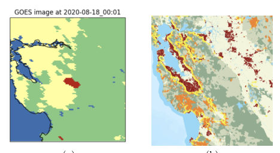 
FIG. 1: (a) Sample GOES-16 FDC imagery from Aug. 18, 2020 at 00:01 UTC. Red denotes an active fire area, green regions with no fire, yellow clouds, and blue water. (b) Corre- sponding WUI image from the U.S. Forest Service [29]. Yellow and orange indicate wildland urban interface and intermix, re- spectively. No housing indicated in dark green and very low housing density shown in medium green. Low and very low housing density in light green, medium and high housing den- sity in maroon, and water indicated in blue.

📷 Fig 2

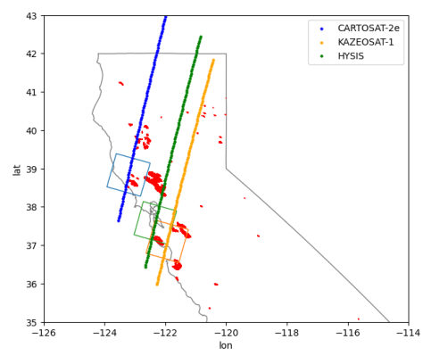 
FIG. 2: Lines are orbital tracks in one-second increments for CARTOSAT-2e (blue line), KAZEOSAT-1 (yellow line), and HYSIS (green line) on July 25, 2023. Orbital tracks have been synchronized to pass over the CA coast in unison. Red filled polygons are the intersection of GOES FireTracks data from July 19 – Sept 28, 2020 with the WUI low/med/high data. Rectangles are sample, notional field of views (FOVs).

📷 Fig 3

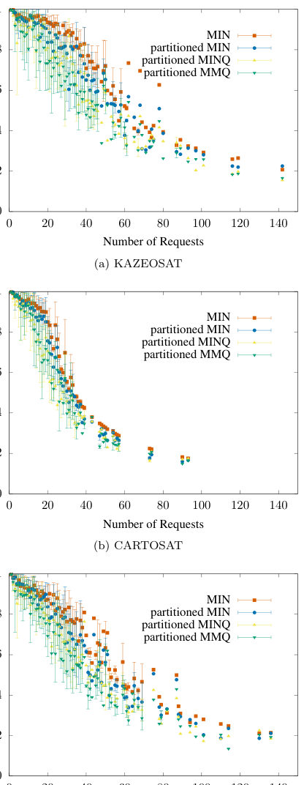 
FIG. 3: Simulation results for three different satellites, using the classical algorithms MIN and partitioned MIN as well as two quantum algorithms, both partitioned. The y axis represents the achieved reward of the algorithm divided by the number of requests, with a value of 1 corresponding to satisfying every request from an optimal angle. The data is averaged over all instances for the indicated satellites with higher request simulations coming from longer time bins.

**Summary.** This paper tackles the computationally hard problem of scheduling satellites for wildfire monitoring by formulating it as a Maximum Independent Set problem. It proposes using advanced quantum computing paradigms, including iterative and distributed quantum algorithms, to solve this resource allocation challenge. While current simulations show classical methods leading, the methodology advances the theoretical path toward solving utility-scale problems on future quantum hardware.

**Why it may be interesting.** The focus on mapping complex combinatorial optimization problems onto structured quantum Hamiltonians ($\hat{C}$) and developing strategies (partitioning, iteration) to handle system sizes beyond current hardware capabilities is highly relevant to the theory of quantum algorithms.

Detailed structure

**Main problem.** Developing efficient quantum algorithms to solve the NP-hard problem of scheduling satellite observations for near real-time wildfire tracking.

**Main result.** The work validates the utility of iterative and distributed quantum techniques for this resource allocation problem, despite current hardware limitations preventing a demonstrated quantum advantage over classical solvers.

**Method.** The scheduling problem is mapped to finding the Maximum Independent Set (MIS) on a graph, which is then formulated as a QUBO/Ising model suitable for QAOA or iterative quantum algorithms.

**Model / system.** The system involves coordinating large constellations of satellites observing wildfire targets derived from GOES-16 multi-spectral data. The computational model uses MIS formulation and explores partitioned/distributed quantum processing units (QPUs).

**Key observables.** Achieved Reward/Number of Requests; Expectation values ($\langle \sigma^z_i 
angle$); Fire size, Fire Radiative Power (FRP).

**Important parameters / regimes.** Lagrange multiplier ($\lambda=2$); Partition size ($m$, limited to $\sim 18$ qubits in simulations); Number of satellites/requests.

**Assumptions / limitations.** The current quantum subprocesses are too small to show significant quantum advantage; the scheduling problem is modeled by mapping constraints onto an MIS graph structure.

**Figures summary.** Figures illustrate sample GOES-16 fire detection overlaid with WUI data, and compare simulation results of classical greedy vs. partitioned MIN/MINQ/MMQ across varying request numbers.

**Paper structure.** The paper progresses from defining the real-world scheduling challenge (wildfire tracking) to formulating it as an MIS problem, then detailing quantum approaches like QAOA and iterative algorithms (MINQ/MMQ), culminating in a methodology for partitioning large problems into manageable sub-problems for distributed computation.

Abstract

The standard in Earth-observation tasks today is having near real-time access to surface images in response to changing conditions. For instance, as urban environments interface more with wildlands and wildfires become less predictable, their tracking with satellite resources becomes essential. This requires the coordination of increasingly large constellations of satellites, giving rise to challenging computational problems. With wildfire detection and tracking as a backdrop, we investigate the power of special purpose and novel computing paradigms to tackle the ensuing satellite scheduling problems, making a compelling case for quantum algorithms. We bring quantum scheduling algorithms closer to implementation by examining both the emerging iterative quantum algorithm framework, which comes with analytic guarantees compared to some classical algorithms, and distributed quantum computing methods whose relevance is on the rise as utility-scale problems begin to get solved with quantum computers. Drawing strength from several computing fronts, we develop a distributed/parallelization scheme in conjunction with the quantum algorithm design and apply these techniques to real-world datasets for wildfire detection. While our quantum subprocesses are currently too small to see significant quantum advantage, our results validate the utility of these techniques, and continue forging the path toward distributed quantum computing.

[↑ back to top](#top)

### [Random Grover Search](http://arxiv.org/abs/2606.11759v1)

**Authors:** Dekuan Dong, Jiaxin Ma, Yingzhou Li  
**Type:** theory · **Category:** quantum information and computing · **PDF:** <https://arxiv.org/pdf/2606.11759v1>  
**Analysis basis:** full PDF text, analyzed in chunks

📷 Fig 1

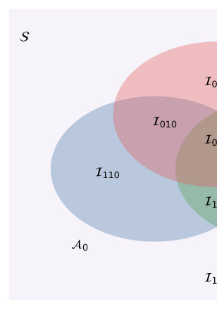 
Fig. 1: Partition of the search space into the regions Ij induced by A0, A1, A2.

📷 Fig 2

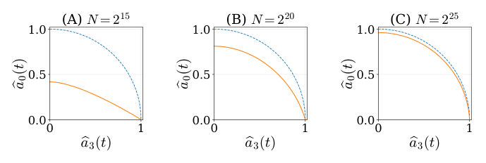 
Fig. 2: Projected trajectories onto the (ba3(t), ba0(t))-plane under the averaged evolu- tion matrix M for different values of N, with fixed r = 1, |A0| = 200, and |A1| = 100. The dashed curves represent quarter circles of radius 1, while the solid curves denote the projected trajectories.

📷 Fig 3

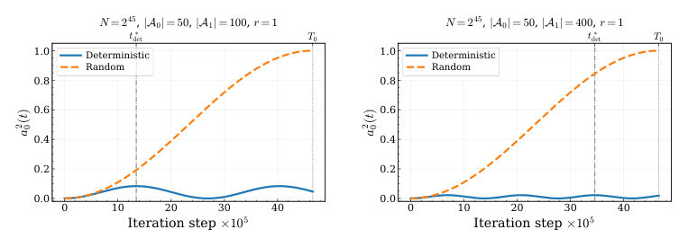 
Fig. 3: Comparison between the deterministic periodic sequence and the correspond- ing randomized strategy under four parameter settings. In each panel, the solid curve represents the deterministic sequence, while the dashed curve shows the empirical mean over 50 independent randomized trials. The vertical dotted line marks the stopping time T, and the dash-dotted vertical line marks the fist peak time t∗ det of the deterministic curve. The corresponding values of t∗ det are 2.6 × 106, 1.8 × 106, 1.3 × 106, and 0.7 × 106 for the four panels, respectively.

📷 Fig 4

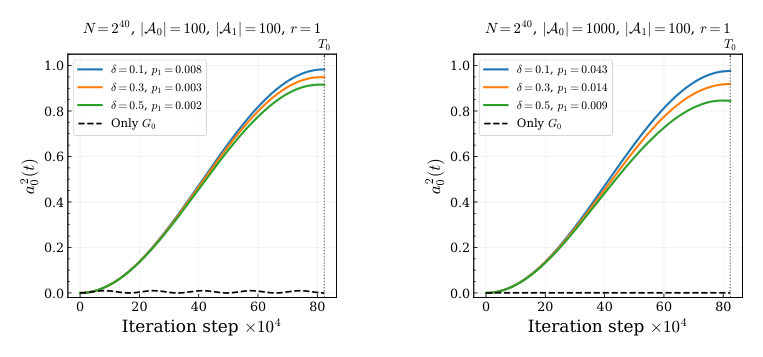 
Fig. 4: Success-probability evolution for different values of δ, with fixed N = 240, |A1| = 100, and r = 1. The solid curves show the empirical averages over 50 indepen- dent trials, while the dashed curve corresponds to repeatedly applying only G0. The vertical dotted line marks the stopping time T.

📷 Fig 5

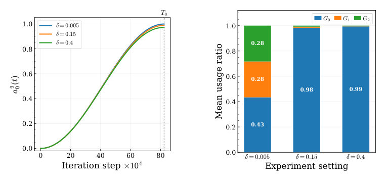 
Fig. 5: Numerical results for N = 240, |A0| = 100, |A1| = 200, |A2| = 50, r = 1, and δ ∈{0.005, 0.15, 0.4}. (a) Empirical mean success probability for different values of δ. (b) Corresponding mean usage ratios of G0, G1, and G2.

**Summary.** This paper introduces a randomized Grover search algorithm designed to solve problems defined by the intersection of multiple constraints without needing a single, costly global oracle. By randomly applying individual constraint-specific Grover operators, the authors prove that the algorithm maintains the optimal quadratic speedup complexity. This is significant because it offers a practical pathway for implementing quantum searches on complex, modularly constrained systems.

**Why it may be interesting.** It provides a powerful algorithmic tool for quantum computation that bypasses major hardware/implementation bottlenecks associated with constructing complex global oracles by leveraging random sampling over simpler components.

Detailed structure

**Main problem.** The research addresses the challenge of quantum search algorithms for finding solutions that belong to the intersection of multiple constraint sets, where constructing a single global oracle is computationally expensive.

**Main result.** A randomized Grover search algorithm was developed that achieves the same asymptotic query complexity as standard Grover search ($\Theta(\sqrt{N/r})$) without requiring a costly global oracle.

**Method.** The method involves stochastically applying randomly selected individual Grover operators corresponding to each constraint set at every iteration, and analyzing the resulting expected quantum evolution.

**Model / system.** The model is based on Grover's algorithm applied to search spaces defined by multiple intersecting constraints. The state space is analyzed using a basis derived from membership in these individual constraint sets.

**Key observables.** Success probability ($P_{	ext{succ}}(t)$), which measures the likelihood of measuring an element within the target intersection set, and the required number of iterations ($T$).

**Important parameters / regimes.** N (total search space size), r (size of the intersection), k (number of constraint sets/operators), and the sampling distribution probabilities $\{p_i\}$.

**Assumptions / limitations.** The analysis relies on approximating the expected Grover evolution using auxiliary operators, and certain conditions like $N > (m+r)^2/r$ are required for specific theorems.

**Figures summary.** Figures illustrate the projected trajectories of state coefficients in the two-operator case, comparing randomized versus deterministic strategies, showing that random sampling consistently maintains a high success probability near unity.

**Paper structure.** The paper progresses by first establishing the problem (intersection search), deriving theoretical bounds for the randomized approach using expectation values, and then rigorously comparing this stochastic method against deterministic sequences to prove its superior asymptotic performance.

Abstract

Grover's algorithm achieves a quadratic speedup for unstructured search given a global oracle for the target set. In many applications, however, the target set is specified as the intersection of multiple constraint sets. Constructing a global oracle for the intersection can be costly, whereas the individual constraint oracles are often much simpler to implement.   We study a randomized Grover search algorithm that directly uses these constraint oracles. At each iteration, one of the corresponding Grover operators is selected at random. For the two-operator case with uniform sampling, we prove that the success probability approaches one after \[ Θ\left(\frac\pi4\sqrt{\frac{N}{r}}\right) \] iterations, where $r$ is the size of the intersection. Thus, the algorithm achieves the same asymptotic query complexity as standard Grover search but without requiring a global oracle. We then generalize the analysis to arbitrary sampling distributions and an arbitrary number of Grover operators through an auxiliary operator that approximates the expected Grover evolution, while retaining the same asymptotic complexity. We further show that highly biased sampling distributions can still achieve near-unit success probability, enabling cheaper Grover operators to be used more frequently. Finally, we prove asymptotic optimality and support the theoretical results with numerical simulations.

[↑ back to top](#top)

### [Rolling Stock Planning Using the Quantum Approximate Optimization Algorithm](http://arxiv.org/abs/2606.11383v1)

**Authors:** Jiří Guth Jarkovský, Patricia Bickert, Elisabeth Wybo, Martin Leib  
**Type:** both · **Category:** quantum information and computing · **PDF:** <https://arxiv.org/pdf/2606.11383v1>  
**Analysis basis:** full PDF text, analyzed in chunks

📷 Fig 1

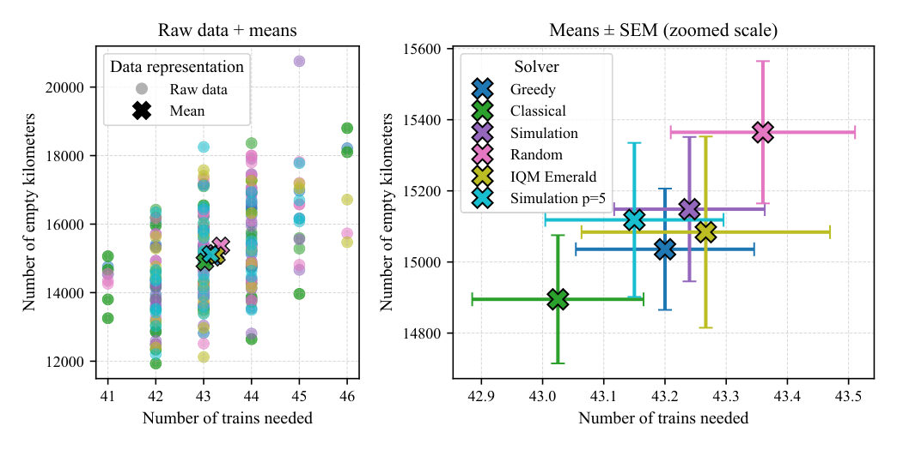 
Fig. 1. Results showing the performance of various methods to solve the subgraph MWIS, with subgraph size kept fixed at 20 (and the greedy algorithm III-B1 as a benchmark). The left panel shows the data points from each individual full algorithm run, while the right panel shows the average performance of each method with standard error of the mean (SEM). IQM Emerald refers to results obtained from QAOA runs on IQM Emerald quantum computer. For more details about the solvers, see IV-B.

📷 Fig 2

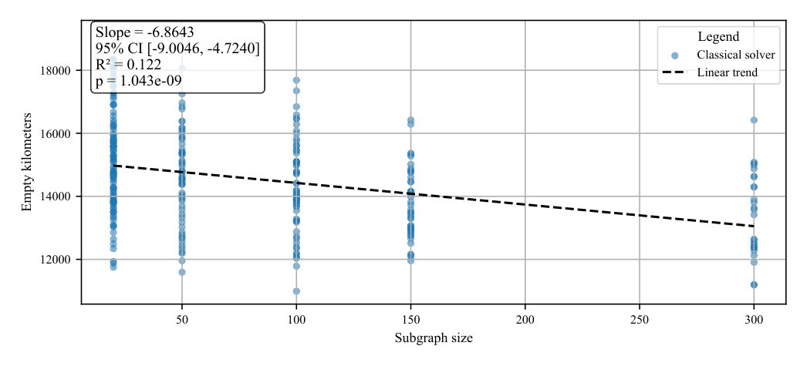 
Fig. 2. Results showing the performance (measured by the number of empty kilometers) of the algorithm using the classical exact MWIS solver, as a function of the subgraph size. Linear fit of the data shows a clear trend of improving solution quality with increasing subgraph size.

**Summary.** This work applies quantum computing techniques, specifically QAOA, to solve the NP-hard rolling stock planning problem. By reformulating it as a Maximum Weight Independent Set problem, the authors propose a hybrid algorithm that uses divide-and-conquer strategies to tackle large instances. The results suggest that integrating near-term quantum solvers can effectively improve solutions over purely classical or approximate methods.

**Why it may be interesting.** It provides a concrete, real-world optimization application for near-term quantum algorithms like QAOA, demonstrating how quantum computation can be integrated into classical combinatorial problem-solving frameworks.

Detailed structure

**Main problem.** The paper tackles rolling stock planning, a complex optimization problem in railway management that is mathematically formulated as finding a Maximum-Weight Independent Set (MWIS) on a large graph.

**Main result.** A hybrid quantum-classical framework was proposed, showing that increasing the size of subgraphs solved by QAOA generally improves solution quality compared to purely approximate methods.

**Method.** The core method is a divide-and-conquer approach where the MWIS problem on large subgraphs is addressed using the Quantum Approximate Optimization Algorithm (QAOA), orchestrated by classical heuristics.

**Model / system.** The system models a railway network with 190 trips over two days. The optimization graph nodes represent feasible train cycles, and edges connect conflicting cycles, leading to an MWIS formulation.

**Key observables.** Solution quality (minimizing empty kilometers) and resource consumption (number of trains required/fleet size).

**Important parameters / regimes.** Number of trips ($N=190$), maximum cycle length ($	ext{lmax}=4000 	ext{ km}$), QAOA depth parameter ($p$).

**Assumptions / limitations.** The model assumes unlimited parking capacity and relies on a hybrid approach to manage the computational complexity, as exhaustive enumeration of cycles is prohibitive.

**Figures summary.** Figure 1 compares solver performance for small subgraphs; Figure 2 shows that larger subgraphs lead to better solutions (less empty kilometers).

**Paper structure.** The paper first formulates the problem as MWIS. It then proposes a hybrid divide-and-conquer algorithm, detailing subgraph selection heuristics and applying QAOA on these smaller instances before iteratively updating the global graph.

Abstract

Rolling stock planning is a complex optimization problem in railway management that involves assigning physical trains to scheduled trips while minimizing operational costs. In this work, we address a specific instance of this problem featuring 190 trips over two days, subject to constraints such as mandatory maintenance stops. We reformulate the problem as a Maximum-Weight Independent Set (MWIS) problem on a graph where nodes represent feasible train cycles. To handle the computational complexity of the large search space, we propose a hybrid divide-and-conquer algorithm. This approach iteratively selects subgraphs and solves the MWIS problem using various solvers, including exact classical methods and the Quantum Approximate Optimization Algorithm (QAOA). We evaluate the algorithm's performance by comparing these methods and analyzing the scaling with respect to subgraph size, with QAOA assessed through both classical simulation and execution on a quantum device (IQM Emerald). Our results indicate that increasing the subgraph size generally improves solution quality, demonstrating that the hybrid framework can effectively bridge the gap between polynomial-time approximate solvers and exponential-time exact methods.

[↑ back to top](#top)

### [The Simplified Stabilizer ZX-Calculus is Minimal](http://arxiv.org/abs/2606.12383v1)

**Authors:** Harry K. Stoltz  
**Type:** theory · **Category:** quantum information and computing · **PDF:** <https://arxiv.org/pdf/2606.12383v1>  
**Analysis basis:** full PDF text, analyzed in chunks

📷 Fig 1

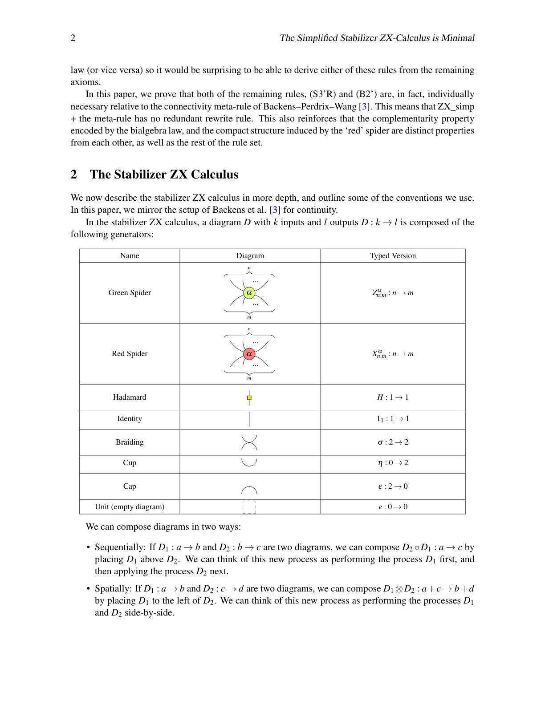 
Low-resolution page preview, page 2

📷 Fig 2

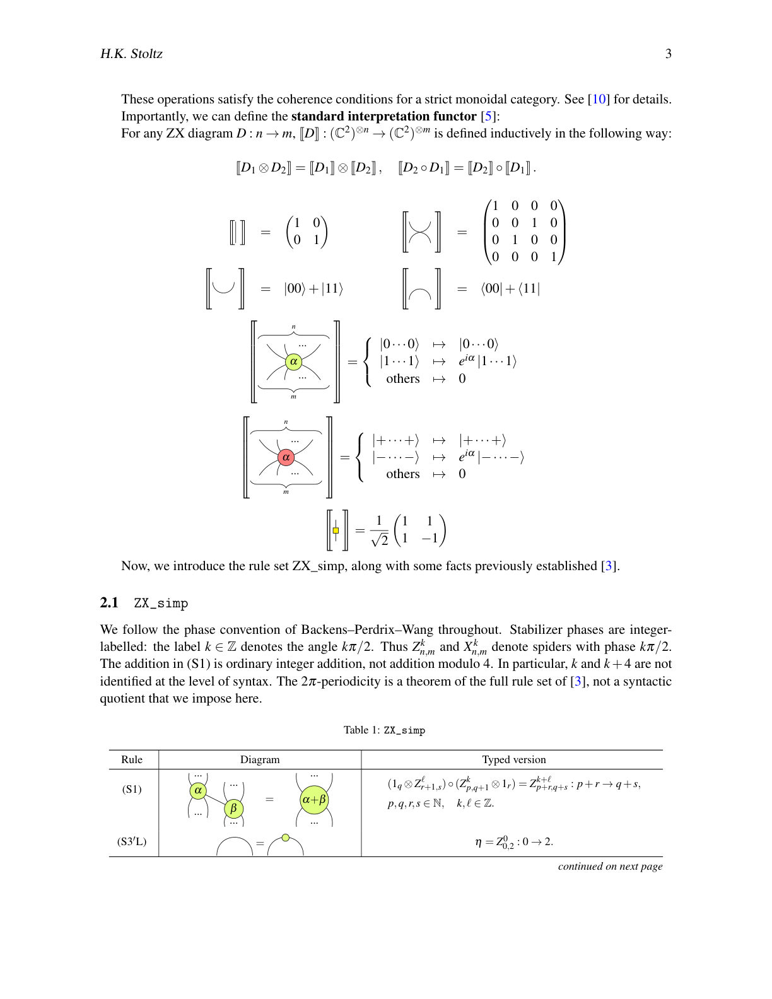 
Low-resolution page preview, page 3

📷 Fig 3

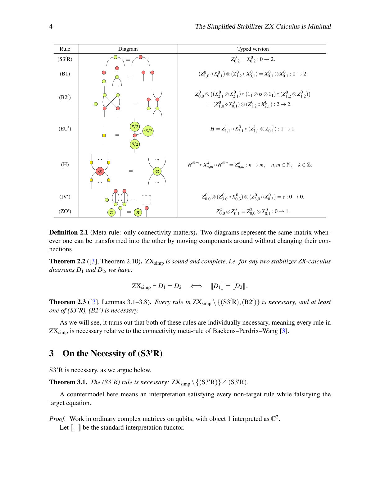 
Low-resolution page preview, page 4

📷 Fig 4

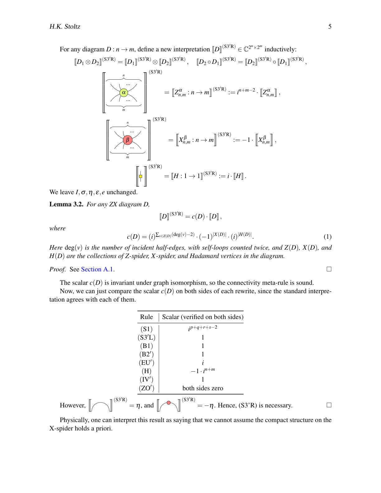 
Low-resolution page preview, page 5

📷 Fig 5

 
Low-resolution page preview, page 6

**Summary.** The paper proves that the rule set defining the Simplified Stabilizer ZX-Calculus is mathematically minimal. By constructing countermodels using complex matrices and dual number algebras, the authors demonstrate that two specific rules—the red/green coincidence and the bialgebra law—are individually necessary components of the calculus's structure. This establishes a complete and non-redundant set of rewrite rules for this quantum formalism.

**Why it may be interesting.** This work provides fundamental structural results about the underlying mathematical formalism of quantum computation, which can guide the development of more efficient and minimal computational models for quantum algorithms.

Detailed structure

**Main problem.** To rigorously prove that every rewrite rule within the Simplified Stabilizer ZX-Calculus ($	ext{ZX}_{	ext{simp}}$) is individually necessary relative to the connectivity meta-rule.

**Main result.** The authors establish that both the red/green compact-structure coincidence rule ($(	ext{S3}'	ext{R})$) and the bialgebra law rule ($(	ext{B2}')$) are necessary, proving that the entire set of rules in $	ext{ZX}_{	ext{simp}}$ is minimal.

**Method.** The necessity proofs employ countermodel-style arguments, utilizing algebraic structures such as ordinary complex matrices ($\mathbb{C}$) and categories over dual numbers ($\mathbb{R}_5$) to derive contradictions if any rule were assumed redundant.

**Model / system.** The theory concerns the ZX calculus, a graphical language used for reasoning about quantum computation, specifically focusing on its stabilizer fragment. The analysis is performed using algebraic interpretations of the rules within specific mathematical models ($\mathbb{C}$ or $	ext{R}_5$).

**Key observables.** Consistency checks derived from comparing coefficients (e.g., in $\mathbb{C}$ for $(	ext{S3}'	ext{R})$ or in $\mathbb{R}_5$ for $(	ext{B2}')$) between the left and right sides of the rewrite rules.

**Important parameters / regimes.** The analysis involves specific algebraic structures like complex numbers ($\mathbb{C}$) and the ring of dual numbers over $\mathbb{F}_5$, $R_5 = \mathbb{F}_5[\delta]/(\delta^2)$.

**Assumptions / limitations.** The necessity proofs rely on constructing suitable interpretations (functors) that capture the constraints of the calculus within the chosen algebraic settings.

**Figures summary.** Not specified, but the notes reference Table 1 listing the rules in $	ext{ZX}_{	ext{simp}}$ and details about spider interpretations ($	ext{Z}'^k_{n,m}$).

**Paper structure.** The paper systematically addresses the necessity of individual rules. It first proves $(	ext{S3}'	ext{R})$ is necessary using complex matrices, followed by a detailed construction in the $	ext{C}_5$ model over $\mathbb{R}_5$ to prove that $(B2')$ is necessary.

Abstract

The stabilizer fragment of the ZX calculus is amongst the most important fragments of the theory. The closely related Clifford+T fragment is approximately universal (arXiv:1705.11151). Additionally, the stabilizer calculus can be described by a small collection of rewrites, most of which have been shown to be necessary (arXiv:1709.08903). However, two rules, describing the red/green compact-structure coincidence and the important bialgebra law, had not been shown to be necessary. We present a countermodel-style argument showing that both of these rules are individually necessary relative to the connectivity meta-rule of Backens--Perdrix--Wang (arXiv:1709.08903), and hence establish that the rule set presented in arXiv:1709.08903 has no redundant rewrite rule.

[↑ back to top](#top)

## Secondary cond-mat archives

*Papers from  mes-hall, other, soft, supr-con. These archives are de-prioritized — they appear at the end regardless of relevance score.*

### Relevant in secondary archives (20)

### [Intrinsic Nonreciprocity in Electron-Phonon Interaction Driven Thermoelectric Diodes](http://arxiv.org/abs/2606.11904v1)

**Authors:** Hao-Kun Ke, Lie-Run Tian, Jun-Feng Liu, Pei-Hao Fu, Jun Wang, H. Xu  
**Type:** theory · **Category:** statistical mechanics · **PDF:** <https://arxiv.org/pdf/2606.11904v1>  
**Analysis basis:** full PDF text, analyzed in chunks
**Topic relevance:** 🔥 `non-equilibrium dynamics` **4/5** · `Keldysh / 2PI / non-Gaussian methods` **3/5** · `driven-dissipative phase transition` **3/5** · `methods for driven-dissipative` **3/5** · `non-equilibrium universality` **2/5** · `Kondo & dissipative impurity` **1/5** · `analog quantum simulation` **1/5** · `correlated / nonlocal dissipation` **1/5**

📷 Fig 1

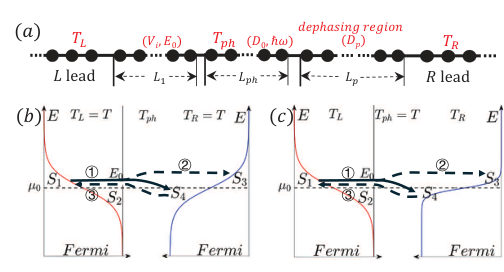 
FIG. 1. (a) Device Schematic: A nanowire (NW) is connected to the L and R leads, comprising three regions: a tunneling junction (region 1, length L1) with a resonance energy level E0; an e-ph interaction region (region 2, length Lph) charac- terized by temperature Tph, scattering intensity D0, phonon energy ℏω; an elastic dephasing resistor (region 3, length Lp) with scattering intensity Dp of zero-energy phonons. (b-c) Schematic diagrams of electron transport processes with e-ph interaction for novel and conventional thermoelectric effect, repectively. The average temperature of the L and R leads is T = (TL + TR)/2. In (b), TL = TR = T and ∆T = |T −Tph|. In (c), Tph = T and δT = |TL −TR|....

📷 Fig 2

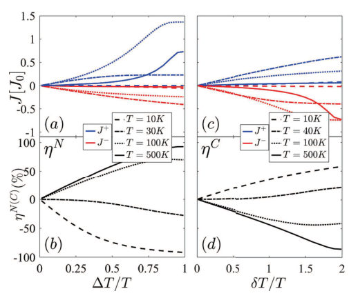 
FIG. 2. The charge currents J± and the nonreciprocal effi- ciencies ηN or ηC as functions of the temperature difference ∆T or δT for the novel (a) and (b) or conventional (c) and (d) thermoelectric effect. Various average temperatures T are considered. The other parameters are: Lph = 10, L1 = 6, ℏω = 5 meV and D0 = 1. J0 = 10−3e2V/h.

📷 Fig 3

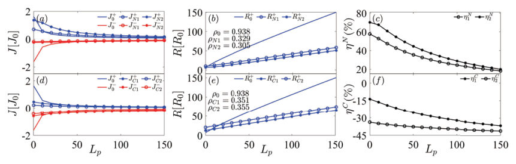 
FIG. 3. The charge current, the resistance, and the nonreciprocal efficiency as functions of Lp for the novel thermoelectric effect (a)-(c), and the conventional thermoelectric effect (d)-(f), respectively. Systems N1, N2 (C1, C2), and system 0 are considered in the novel (conventional) thermoelectric effect. In system 0, δT = 100K, ∆T = 0, D0 = 0. In system N1 (N2), ∆T = 60K (100K), δT = 0, D0 = 1. In system C1 (C2), T = 60K (100K), δT = 100K, ∆T = 0, D0 = 1. D0 = Dp = 1. The other parameters are: Lph = 10, L1 = 6, ℏω = 5 meV, Dp = 1, R0 = h/e2.

**Summary.** This work theoretically examines how intrinsic asymmetry in electron-phonon interactions can create highly efficient thermoelectric diodes. The key finding is that this nonreciprocity generates novel current pathways and suppresses resistive losses, potentially leading to energy conversion devices superior to those relying on topological or superconducting effects.

**Why it may be interesting.** It deals with non-equilibrium energy transport driven by coupling to a bosonic bath (phonons) in a mesoscopic structure, which touches upon open quantum systems dynamics and thermalization processes.

Detailed structure

**Main problem.** Investigating intrinsic nonreciprocity in electron-phonon (e-ph) interaction driven thermoelectric diodes, challenging assumptions about the origin of nonreciprocal transport.

**Main result.** The intrinsic nonreciprocity leads to two novel phenomena: a new thermoelectric effect dependent on the temperature difference between leads and the central region, and the suppression of electronic backscattering that breaks Ohm's law.

**Method.** Theoretical calculation using Green's functions (retarded) incorporating e-ph interaction self-energy ($\Sigma_{ph}$) within a 1D lattice model.

**Model / system.** A nanowire modeled as a 1D tight-binding lattice, featuring three regions: a tunneling junction ($L_1$), an inelastic e-ph interaction region ($L_{ph}$), and a dephasing resistor ($L_p$).

**Key observables.** Charge current ($J$), nonreciprocal efficiency ($\eta_N$), downstream resistance ($
ho$), and thermoelectric current.

**Important parameters / regimes.** Temperature difference ($\Delta T$ or $\delta T$), phonon frequency ($\omega$), hopping energy ($t$), and resonance energy ($E_0$).

**Assumptions / limitations.** The nonreciprocity arises from the inherent asymmetry between phonon emission and absorption probabilities, independent of reversing external temperature biases.

**Figures summary.** Figures illustrate device schematics, current/efficiency vs. $\Delta T$ or $\delta T$, and resistance/current dependence on the length of the dephasing region ($L_p$).

**Paper structure.** The paper establishes the model, derives the intrinsic nonreciprocity mechanism from phonon statistics, analyzes two distinct transport regimes (novel $\Delta T$ bias vs. conventional $\delta T$ bias), and quantifies resulting phenomena like resistance suppression.

Abstract

We study an electron-phonon interaction driven thermoelectric diode. The nonreciprocity in this diode arises from the asymmetry between the probabilities of phonon emission and absorption in the electron-phonon interaction, as well as the structural reflection asymmetry. We reveal the intrinsic nature of this nonreciprocity, as the forward and backward electron transport remains asymmetric even when the applied temperature difference is not reversed. This intrinsic nonreciprocity gives rise to two novel transport phenomena. One is a novel thermoelectric effect which is driven by the temperature difference between the leads and the central device region, rather than the conventional temperature difference between the two leads. The second, and more significant, phenomenon is the suppression of electronic backscattering in the load resistor. This suppression decreases the resistance of the load resistor, which leads to the breakdown of Ohm's addition law. Under suitable conditions, the presence of electron-phonon interaction can yield a larger thermoelectric current compared to the case without it. This intrinsic nonreciprocity opens up a new pathway for low-power electronics besides topology and superconductivity, and for nonreciprocal thermoelectric devices.

[↑ back to top](#top)

### [Deterministic Single-Photon Emitter Arrays in Hexagonal Boron Nitride by Carbon-Assisted Focused Ion Beam Engineering](http://arxiv.org/abs/2606.12304v1)

**Authors:** Mangababu Akkanaboina, Rohit Kumar, Brijesh Kumar, Hrushikesh Gawali, Parul Sharma, Ikshvaku Shyam, Anshuman Kumar  
**Type:** experiment · **Category:** quantum information and computing · **PDF:** <https://arxiv.org/pdf/2606.12304v1>  
**Analysis basis:** full PDF text, analyzed in chunks
**Topic relevance:** 🔥 `QC/QI experiment` **4/5** · `quantum optics experiment` **3/5** · `analog quantum simulation` **1/5**

📷 Fig 1

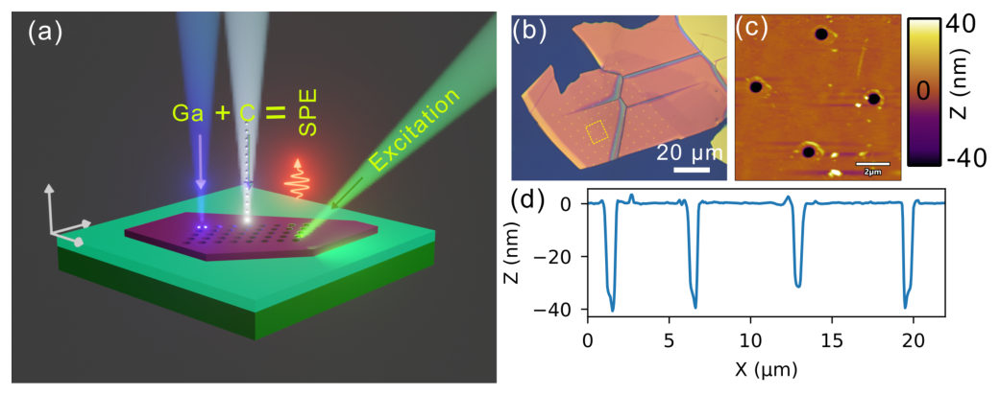 
FIG. 1. a) Schematic representation of sample preparation where the first step was milling the mechanically exfoliated hBN flake of thickness 120 nm using Ga+-ion based FIB, followed by selective carbon deposition at the milled spot and subsequent annealing at 850 ◦C in an Ar environment. b) Optical microscope image of the processed hBN flake. c) AFM topography of the FIB-milled region marked by yellow rectangle in (b). d) Corresponding AFM height profile extracted across the milled spots, revealing a milling depth of ∼40 nm.

📷 Fig 2

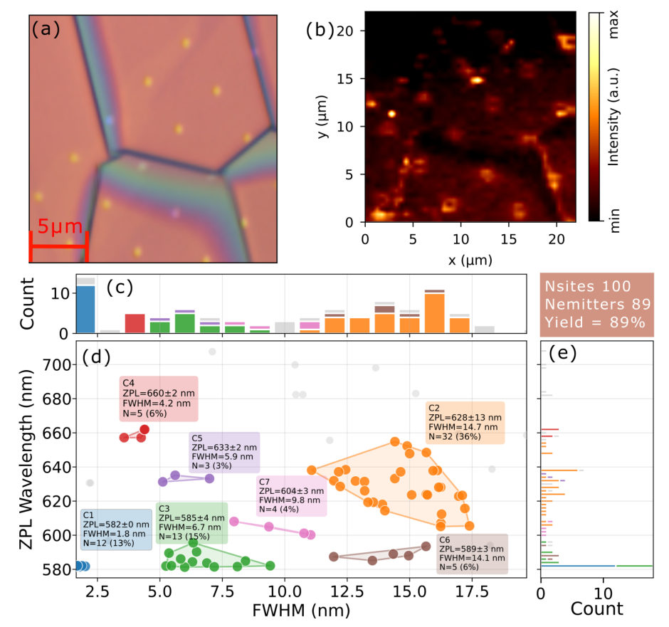 
FIG. 2. (a) Optical image of the milled spots where PL map is performed, (b) its corresponding PL map generated at a wavelength of 581 nm depicting luminescent array of milled spots. Statistical analysis of all 10 × 10 milled spots is shown in (c), (d), and (e). The scatter plot in (d) displays ZPL wavelengths of 89 emitters found with in 10×10 milled spots on Y-axis and their corresponding FWHM on X-axis, (C) displays the histogram of counts (number of emitters) vs FWHM, and (e) histogram of number of emitters vs wavelength

📷 Fig 3

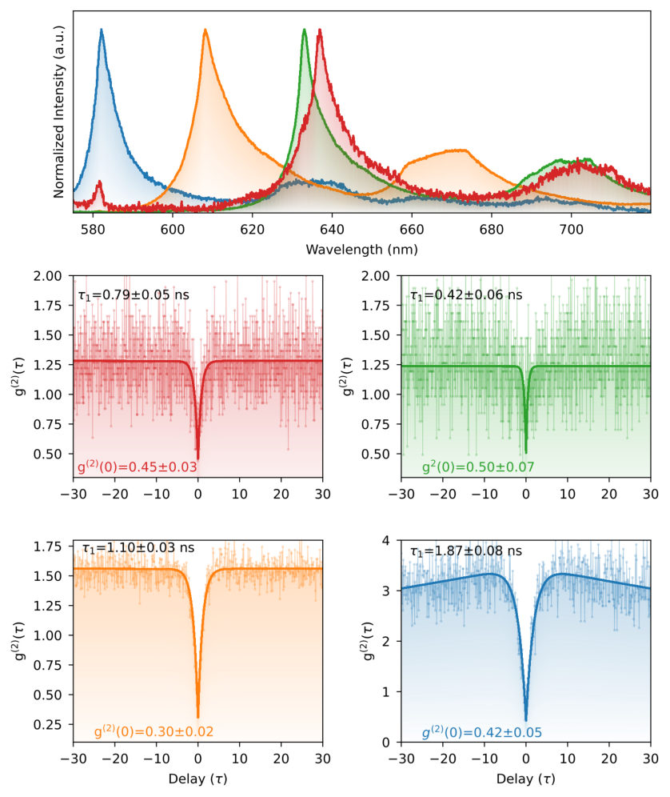 
FIG. 3. Confirmation of quantum emitters. (a) PL spectra of four different emitters identified in the mapped region. (b-e) Second-order autocorrelation measurements, g(2)(τ), of the corresponding emitters shown in (a), confirming their single-photon emission characteristics.

📷 Fig 4

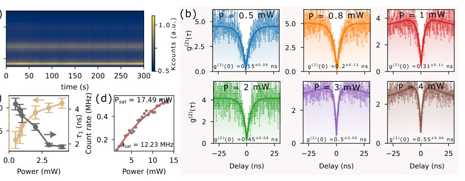 
FIG. 4. Optical stability and performance metrics of emitters: (a) Temporal stability measurement under continuous excitation, recorded over 5 min with a time bin of 0.5 s. (b) Second-order correlation g(2)(0) as a function of excitation power ranging from 0.5 to 4 mW, confirming single-photon emission behavior. (c) Second-order correlation g(2)(0) and characteristic antibunching time as a function of power. (d) Power-dependent photoluminescence saturation curve of the emitter.

**Summary.** The authors report a breakthrough lithography-free technique using focused ion beam milling and carbon deposition to deterministically create arrays of single-photon emitters in hBN. By achieving high site yield and confirming single-photon purity via $g^{(2)}$ measurements, this work establishes a scalable platform crucial for integrated quantum optical circuits.

**Why it may be interesting.** This work directly addresses a key hardware bottleneck for integrated quantum photonics by providing a scalable, direct-write pathway to high-quality SPE sources in 2D materials.

Detailed structure

**Main problem.** The challenge is creating scalable, deterministic single-photon emitters (SPEs) at room temperature within van der Waals materials for on-chip quantum photonic circuits.

**Main result.** A novel, lithography-free three-step process was developed to deterministically generate SPE arrays in hBN with high site-correlated yields ($\sim 89\%$) and confirmed single-photon purity ($g^{(2)}(0) = 0.15 \pm 0.09$).

**Method.** The method involves a sequential fabrication process: Gallium focused ion beam milling, followed by conformal carbon deposition, and final thermal annealing.

**Model / system.** The physical platform is hexagonal boron nitride (hBN) hosting defect-related SPEs. The emission dynamics are analyzed using a three-level emitter model to fit the second-order autocorrelation function $g^{(2)}(	au)$.

**Key observables.** Second-order autocorrelation function ($g^{(2)}(0)$), Zero-Phonon-Line (ZPL) wavelength ($\sim 581 	ext{ nm}$), and site-correlated emitter yield.

**Important parameters / regimes.** Annealing temperature ($850^\circ	ext{C}$), milling depth ($\sim 40 	ext{ nm}$), and the single-photon purity threshold ($g^{(2)}(0) < 0.5$).

**Assumptions / limitations.** The precise microscopic origin of the emitting centers is not fully resolved, and defect migration during annealing is assumed to follow classical diffusion theory.

**Figures summary.** Figures illustrate the three-step fabrication process (milling $
ightarrow$ carbon deposition $
ightarrow$ annealing), PL maps showing emission spots, and $g^{(2)}(	au)$ measurements confirming single-photon antibunching for representative emitters.

**Paper structure.** The paper details the necessity of deterministic SPEs, presents the novel three-step fabrication protocol, characterizes the resulting arrays using PL mapping and quantum correlation measurements ($g^{(2)}$), and validates the method's reproducibility.

Abstract

The realization of on-chip photonic circuits requires scalable and deterministic single-photon emitters (SPEs) at room temperature, which remain a challenge in van der Waals materials. In this work, we report a novel three-step fabrication process for the generation of spatially controlled SPE arrays in hexagonal boron nitride (hBN). The process comprises site-selective gallium (Ga) focused ion beam milling, nanoscale conformal carbon deposition over the patterned regions, and subsequent thermal annealing. The synergistic combination of these steps resulted in a site-correlated emitter yield of ($\sim 89\%$) across 100 fabrication sites. Second-order autocorrelation measurements revealed pronounced three-level emitter dynamics where the best emitters exhibited high purity ($g^{(2)}(0)=0.15 \pm 0.09$).To the best of our knowledge, this is the first lithography-free, direct-write approach combining Ga-ion milling, selective carbon engineering, and thermal annealing to deterministically generate \hBN{} \SPE{}s. The reproducibility of the method is validated across multiple independently fabricated samples. These results establish a scalable, lithography-free pathway toward on-demand SPE arrays relevant to integrated quantum photonics.

[↑ back to top](#top)

### [Superconductivity near quarter- and half-filling of a strongly correlated triangular Hubbard band in twisted trilayer WSe2](http://arxiv.org/abs/2606.11495v1)

**Authors:** Yungi Jeong, Kenji Watanabe, Takashi Taniguchi, Joonho Jang  
**Type:** both · **Category:** strongly correlated electrons · **PDF:** <https://arxiv.org/pdf/2606.11495v1>  
**Analysis basis:** full PDF text, analyzed in chunks
**Topic relevance:** 🔥 `analog quantum simulation` **4/5** · `Keldysh / 2PI / non-Gaussian methods` **1/5** · `non-equilibrium dynamics` **1/5**

📷 Fig 1

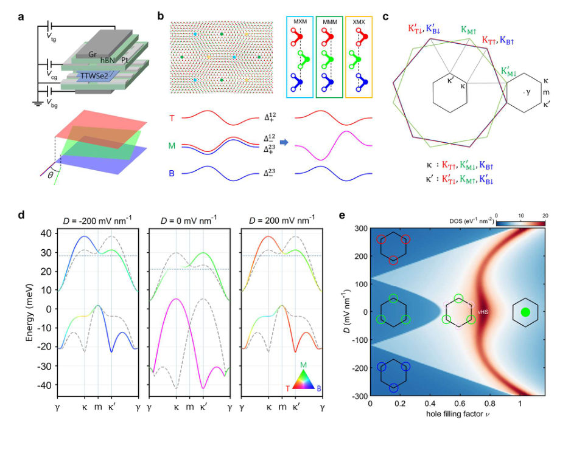 
Fig. 1 | Electronic structure of alternating twisted trilayer WSe₂. a, Schematic illustration of the dual-gated TTWSe2 device and stacking geometry. The top and bottom WSe2 layers are aligned, while the middle layer is rotated by θ. b, Real-space structure of TTWSe2. Coloured dots mark representative local atomic registries, shown at right for the MXM, MMM and XMX configurations (M = W, X = Se). Each interface generates a moiré potential and contributions from each interface combine to produce an approximately doubled moiré modulation at the middle layer (bottom). c, Schematic illustration of momentum- space structure. Large hexagons indicate the Brillouin zone of the top (red), middle...

📷 Fig 2

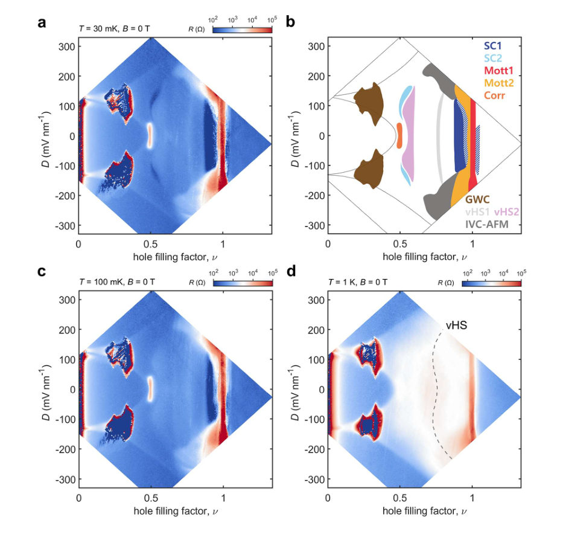 
Fig. 2 | Correlated electronic states. a,c,d, Longitudinal resistance R as a function of hole filling factor ν and vertical displacement field D, measured at B = 0 T and T = 30 mK (a), 100 mK (c), and 1 K (d). b, Schematic phase diagram summarising the correlated states identified in a. Black curves separate the layer-polarised and layer-hybridised regimes. The coloured regions indicate superconducting states (blue; SC1), superconducting-like resistance drops with finite resistance (light blue; SC2), the ν = 1 Mott insulator (red; Mott1), an additional insulator on the electron side of ν = 1 (yellow; Mott2), a weaker correlated insulating state near ν = 1/2 (orange; Corr), generalised...

📷 Fig 3

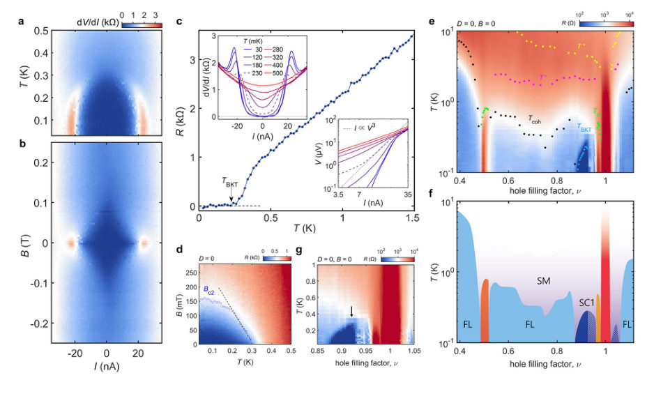 
Fig. 3 | Superconductivity near half moiré filling. a, b, differential resistance dV/dI as a function of dc bias current I and T at B = 0 (a), I and B at T = 30 mK (b). c, Zero-bias resistance R versus T at B = 0 and D = 0. Upper-left inset, representative linecuts from a. Lower-right inset, corresponding I–V curves. The curve at TBKT ≈ 230 mK is shown as a dashed line in both insets. d, Zero-bias resistance as a function of T and B at D = 0. Blue circles mark the upper critical field Bc2, and the dashed line is a Ginzburg-Landau fit of 𝐵ୡଶ(𝑇) =

📷 Fig 4

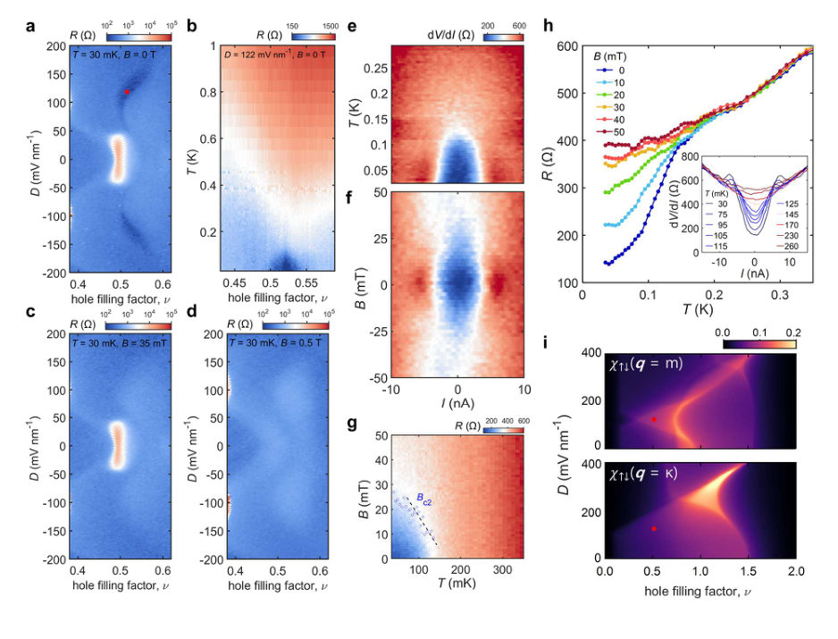 
Fig. 4 | Signatures of superconductivity and correlated phases near quarter filling. a, Zoomed-in view of Fig. 2a near ν = 1/2. The red dot indicates the point at ν = 0.519, D = 122 mV nm-1 where data in e–h were obtained. b, Longitudinal resistance R as a function of ν and T at B = 0 and D = 122 mV nm-1. SC2 forms a dome structure between metallic states. c,d, The same area as in a at B = 35 mT (c) and 0.5 T (d). As B is increased, SC2 and the correlated insulator disappear. e–h, Characterisation of SC2 at D = 122 mV nm-1. e,f, Differential resistance dV/dI as a function of dc bias current I and T at B = 0 (e), I and B at T = 30 mK (f). g, zero- bias resistance as a function of T and B....

**Summary.** The paper reports on the discovery and characterization of superconductivity near quarter- and half-filling in twisted trilayer WSe2. By combining transport measurements with continuum theoretical models, the authors map out a complex phase diagram featuring Mott insulators and superconducting domes. This establishes the system as a crucial platform for investigating strongly correlated triangular-lattice Hubbard physics.

**Why it may be interesting.** This work provides an experimental realization platform for studying fundamental strongly correlated physics (Hubbard model) in a solid-state moiré system, offering insights into unconventional superconductivity mechanisms driven by electronic correlations.

Detailed structure

**Main problem.** The study investigates superconductivity and various correlated insulating phases occurring near quarter- and half-filling in a strongly correlated triangular Hubbard band system.

**Main result.** Superconductivity is observed over extended regions of the phase diagram, alongside robust Mott insulators at half-filling and other correlated insulating states at quarter-filling.

**Method.** The research combines electrical transport measurements (resistance vs. filling/field) with theoretical continuum model calculations to map out the complex phase diagram.

**Model / system.** The physical platform is alternating twisted trilayer WSe2, which realizes a system analogous to the triangular-lattice Hubbard model. The analysis uses continuum $k\cdot p$ frameworks and calculates susceptibilities for weak-coupling instability analysis.

**Key observables.** Longitudinal resistance (R), superconducting transition regions ($	ext{SC}1, 	ext{SC}2$), Mott insulating states ($	ext{Mott}1, 	ext{Mott}2$), and characteristic temperature dependencies ($T_{	ext{coh}}, T'$).

**Important parameters / regimes.** Filling factor ($
u$) near $1/4$ and $1/2$, displacement field ($D$), magnetic field ($B$), and the effective on-site interaction ($U$).

**Assumptions / limitations.** The analysis relies on continuum descriptions, assuming strong spin-orbit coupling leads to effective spin-valley locking, and uses simplified treatments for parameters like the effective g-factor.

**Figures summary.** Figures detail phase diagrams mapping superconducting domes adjacent to insulating states, showing field dependence of superconductivity, and comparing transport measurements against calculated electronic structure features (DOS, Berry curvature).

**Paper structure.** The paper systematically maps out a rich phase diagram by performing transport measurements across varying doping ($
u$) and electric fields ($D$), correlating the observed superconducting and insulating regimes with theoretical predictions derived from continuum models of the triangular Hubbard model.

Abstract

The triangular-lattice Hubbard model is one of the paradigmatic settings for studying correlated electronic systems with geometric frustration that can give rise to a variety of phases. Recently, twisted bilayer TMD systems have emerged as attractive experimental platforms for realising such a model in the moderate-correlation regime. Alternating twisted trilayer TMD systems are expected to realise stronger correlations than bilayer systems owing to their mirror symmetry. Here we report the discovery of superconductivity near quarter- and half-filling, together with various correlated phases, in alternating twisted trilayer WSe2 (TTWSe2). At half filling, a robust correlated insulating state persists over a broad range of displacement fields, signalling the strongly correlated regime. Upon doping, superconductivity emerges over an extended region of the phase diagram. Near quarter filling, another superconducting state appears flanked by correlated metals. Our results establish the TTWSe2 system as a compelling platform for studying strongly correlated triangular-lattice Hubbard physics.

[↑ back to top](#top)

### [Substrate insulated Josephson junctions for superconducting quantum circuits](http://arxiv.org/abs/2606.12262v1)

**Authors:** U. Strobel, L. Radtke, L. Kamps, J. N. Voss, J. Lisenfeld, J. Luo-Hofmann, D. Reuter, S. Masis, A. V. Ustinov, H. Rotzinger  
**Type:** experiment · **Category:** quantum information and computing · **PDF:** <https://arxiv.org/pdf/2606.12262v1>  
**Analysis basis:** full PDF text, analyzed in chunks
**Topic relevance:** 🔥 `QC/QI experiment` **4/5**

📷 Fig 1

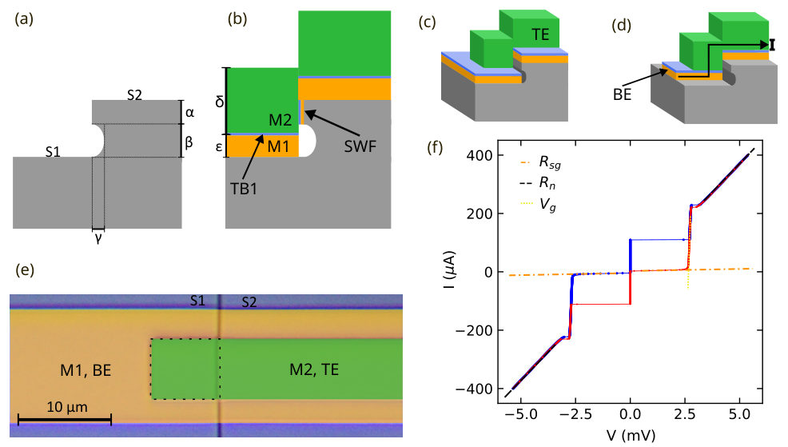 
FIG. 1. Step edge insulated tunnel junction. (a) Substrate cross-section after forming the step with an undercut. (b) Trilayer deposition. To ensure M2 continuity across the step, we require δ &gt; α + β −ϵ. (c) The top electrode (TE) is formed by lithography. (d) The bottom electrode (BE) is formed by lithography. The current direction is shown by the black arrow. (e) False-color optical image of an Nb/AlOx/Nb SEI junction. The junction area is enclosed by the dashed-line rectangle. (f) A typical I-V characterization of a junction with nominal area A = 100 µm2 at 4.2 K indicates an underdamped junction with a linear dissipative branch for bias current above Ic = 110 µA. The return path shows...

📷 Fig 2

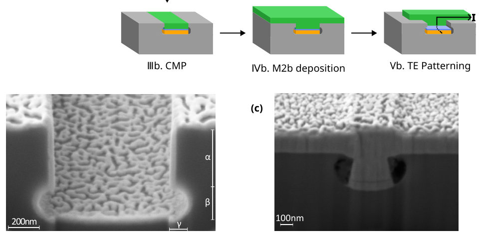 
FIG. 2. (a) cSEI (steps I-II-IIIa-IVa) and p-cSEI (steps I-II-IIIb-IVb-Vb) junctions. (b) Cross-sectional scanning electron microscope (SEM) image of a trench, taken at 55◦tilt after a 4 nm Au sputter and a focused ion beam (FIB) cut. The 800 nm wide trench is etched into a silicon substrate using the Bosch undercut process. The undercut dimensions are in good agreement with the design parameters of α = 450 nm, β = 250 nm and γ = 100 nm. (c) p-cSEI Nb/AlOx/Nb/Nb junction cross-sectional SEM image.

📷 Fig 3

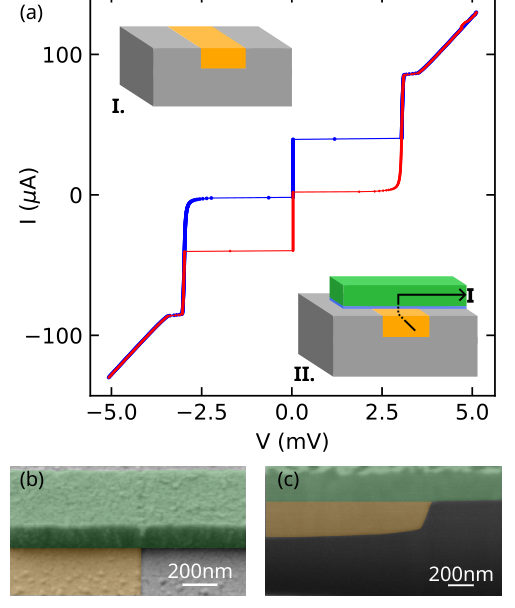 
FIG. 4. (a) I–V characteristic of an Nb cT junction with A = 16µm2 at 50 mK. Inset I. Sample state after (1) no- undercut trench etch (γ ≤0), (2) M1 deposition (ϵ &gt; α + β), and (3) planarization. BE is formed in the trench. Inset II Sample state after (4) hydrofluric acid dip and ion-mill cleaning to remove the native oxide, (5) TB1 and M2 depo- sition, (6) TE patterning, and (7) TB1 patterning (optional, possibly with the same mask as the previous step).(b) False- color SEM image of Nb cT junction(c) Cross-sectional SEM image

📷 Fig 4

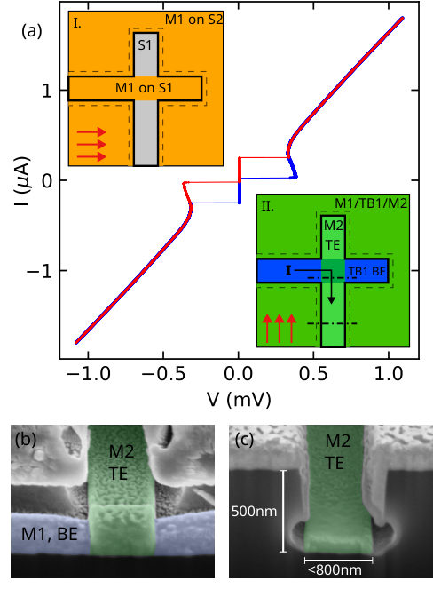 
FIG. 3. (a) I-V characterization of an Al/AlOx/Al pla- narized Manhattan Trench junction with area A = 0.25µm2

📷 Fig 5

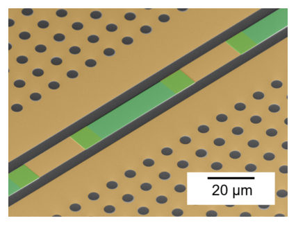 
FIG. 5. False-color SEM image of a two-layer niobium CPW resonator structure. Niobium embedded in the substrate is shown in orange, and the second niobium layer in green.

**Summary.** This paper presents a breakthrough fabrication technique for Josephson junctions by utilizing substrate profiling instead of traditional organic resists. This method yields high-quality, oxide-free junctions suitable for advanced superconducting quantum circuits. The results demonstrate improved junction performance and scalability across various complex geometries.

**Why it may be interesting.** This work directly addresses hardware limitations in superconducting qubits by improving junction quality and scalability through novel material engineering techniques, which is central to quantum computing architectures.

Detailed structure

**Main problem.** The primary challenge is developing fabrication techniques for Josephson junctions (JJs) that avoid intentionally introduced oxides or organic residues, which are major sources of decoherence in superconducting quantum circuits.

**Main result.** The authors successfully demonstrated substrate profiling methods to create high-quality, oxide-free JJs using various geometries (SEI, MT, cT), enabling operation at higher speeds and temperatures.

**Method.** The core method involves etching patterned trenches into the substrate material itself to define the junction barrier and electrodes, circumventing traditional resist-based lithography steps.

**Model / system.** The platform is superconducting quantum circuits utilizing Josephson junctions (e.g., Nb/AlOx/Nb). The geometry is defined by creating specific step profiles on the substrate rather than relying on deposited insulating layers or organic resists.

**Key observables.** I-V characterization curves showing pronounced hysteresis, extracted gap voltage ($2.78 	ext{ mV}$), critical current density ($J_c$), and microwave resonator quality factor ($Q > 3 	imes 10^5$).

**Important parameters / regimes.** Operating temperatures (e.g., $4.2 	ext{ K}$), junction sizes, and the ratio of edge leakage to normal resistance ($R_{sg}/R_n$).

**Assumptions / limitations.** The analysis often requires correcting simple approximations for small junctions using complex fitting procedures involving effective temperature ($\Theta_{	ext{eff}}$) or deposition parameters ($p \cdot t$).

**Figures summary.** Figures illustrate cross-sections and I-V curves for various junction types (SEI, cSEI, MT), alongside plots showing $J_c$ dependence on processing time/pressure and resonator performance.

**Paper structure.** The paper progresses by introducing the limitations of current JJ fabrication, detailing several novel substrate profiling geometries (SEI, MT, etc.), presenting characterization results via I-V curves and microwave measurements, and finally analyzing the derived junction parameters ($J_c$, leakage ratios) across different structures.

Abstract

We have developed a fabrication technique for Josephson junctions that employs a three-dimensional patterned, low-loss substrate instead of commonly used organic resists. The technique enables the fabrication of high-quality trilayer junctions from a wide range of geometries and materials, including high-melting-point superconductors such as tantalum or niobium. The junction electrodes are free from intentionally introduced oxides and organic materials, which are known sources of decoherence. We fabricate and characterize underdamped Nb/AlOx/Nb junctions of different sizes in several geometries. Such junctions enable manufacturing of quantum circuits operating at higher speeds and elevated temperatures.

[↑ back to top](#top)

### [Robust Spin Logic Enabled by Generalized $\mathrm{SU}(2)$ Symmetry in $p$-Wave Magnets](http://arxiv.org/abs/2606.11912v1)

**Authors:** Hao-Kun Ke, Gong Zhao, Siqing Li, Ruixiang Chen, Chui-Zhen Chen  
**Type:** theory · **Category:** other · **PDF:** <https://arxiv.org/pdf/2606.11912v1>  
**Analysis basis:** full PDF text, analyzed in chunks
**Topic relevance:** `driven-dissipative phase transition` **3/5** · `exotic spin models in light-matter` **3/5** · `non-equilibrium dynamics` **3/5** · `methods for driven-dissipative` **2/5** · `non-equilibrium universality` **2/5** · `spintronics-quantum-optics interface` **2/5** · `Keldysh / 2PI / non-Gaussian methods` **1/5** · `Kondo & dissipative impurity` **1/5** · `analog quantum simulation` **1/5** · `correlated / nonlocal dissipation` **1/5**

📷 Fig 1

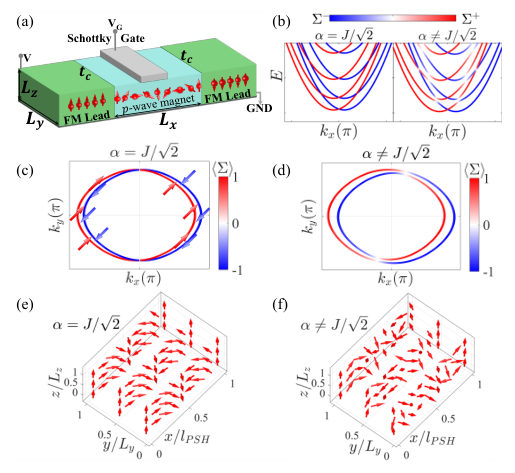 
FIG. 1. (a) Schematic of the synergistic p-wave magnetic spin-FET. A longitudinal bias V drives the charge trans- port, while a gate voltage VG tunes the induced Rashba SOC (α) to actively compensate the intrinsic momentum- dependent exchange (J), controlling transport between fer- romagnetic leads. (b) Quasi-1D ribbon band dispersions showing perfect spin-momentum decoupling in the general- ized SU(2) symmetric regime (α = J/ √

📷 Fig 2

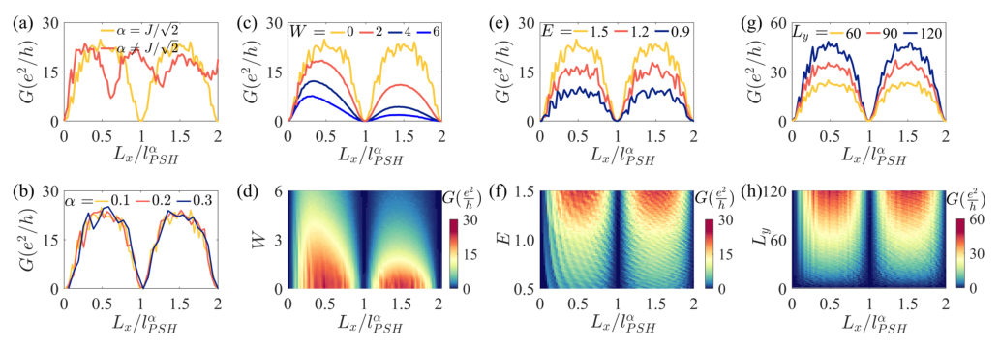 
FIG. 2. Symmetry-protected macroscopic conductance oscillations. (a,b) Ballistic conductance G vs. normalized channel length Lx/lα PSH, demonstrating strict inverse scaling with the gate-controlled Rashba SOC α. (c,d) G under varying non- magnetic Anderson disorder W (100-sample ensemble average), confirming the exceptional immunization of spin coherence against momentum scattering even in strongly disordered regimes. (e,f) Stability of G oscillations against incident Fermi energy E variations. (g,h) Conductance scaling with transverse width Ly; the invariant spatial period confirms the effectively 1D nature of the protected PSH mode. Fixed parameters: m = 0.5, hz = −1.5, J = 0.1 √

📷 Fig 3

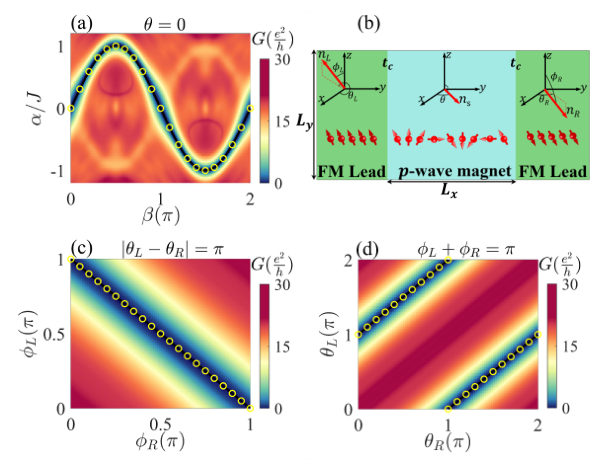 
FIG. 3. Transport phase diagrams and stringent boundary conditions for symmetry-protected spin logic. (a) Map of G in the (α/J, β) space for injected spin azimuth θ = 0. The generalized SU(2) compensation manifests as a distinct G = 0 contour. (b) Parameterization of terminal N´eel vectors nL/R via polar (θL/R) and azimuthal (ϕL/R) angles. A perfect minimum (infinite ON/OFF ratio) strictly requires antiparallel polarizer and analyzer alignments. (c,d) Conductance maps navigating the FM N´eel angles: (c) enforcing |θL −θR| = π, and (d) locking ϕL + ϕR = π. Solid black curves indicate actively protected G = 0 regions, flawlessly matching analytical resonance conditions (open circles). We set...

📷 Fig 4

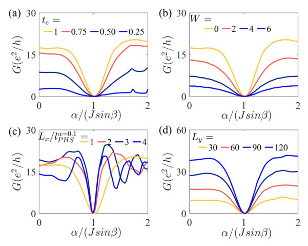 
FIG. 4. Universal stability of synergistic switching operations. The macroscopic switching profile drops precipitously to an exact OFF-state at the critical compensation α/(J sin β) = 1. This behavior is highly robust against diverse perturbations: (a) varying FM-channel interfacial coupling tc, demonstrating immunity to contact scattering; (b) increasing non-magnetic Anderson disorder W (100-sample average), highlighting the insulation of spin coherence by the generalized SU(2) symmetry; (c) normalized channel length Lx/lα PSH, showing the deep OFF-state requires only commensurability with the PSH period; and (d) transverse width Ly, confirming full geometric scalability. Fixed parameters:...

**Summary.** The paper addresses the challenge of maintaining spin coherence in advanced magnetic materials by proposing an active compensation scheme. By tuning gate-induced Rashba SOC to exactly balance the material's intrinsic $p$-wave exchange coupling, the authors restore a generalized SU(2) symmetry. This engineered protection yields robust, electrically tunable Persistent Spin Helix states suitable for high-contrast spintronic switching.

**Why it may be interesting.** This work provides a concrete mechanism for engineering topological protection (via symmetry) into solid-state spintronics devices, offering a pathway to robust quantum control elements that are tunable electrically.

Detailed structure

**Main problem.** The challenge is realizing functional spin-logic devices using unconventional magnets while maintaining long-range spin coherence against scattering and dephasing.

**Main result.** By engineering a generalized SU(2) symmetry through the active compensation of intrinsic exchange coupling with gate-tunable Rashba SOC, the authors demonstrate robust, electrically tunable spintronic switching.

**Method.** The work uses continuum Hamiltonian modeling combined with Non-Equilibrium Green's Function (NEGF) transport simulations to analyze spin dynamics and conductance.

**Model / system.** The system is a 3D p-wave magnet modeled as a spin-FET, described by a Hamiltonian combining $p$-wave exchange ($H_M$) and gate-induced Rashba SOC ($H_{SOC}$).

**Key observables.** High-visibility Datta-Das conductance oscillations (transport) and the spatially evolving local spin expectation value $\langleoldsymbol{\sigma}(\mathbf{r})
angle$ (spin texture).

**Important parameters / regimes.** The critical resonance condition is $\alpha = J \sin(eta - 	heta)$, which tunes the system into a symmetry-protected Persistent Spin Helix (PSH) regime.

**Assumptions / limitations.** The analysis assumes that the spin quantization axis can be constrained to the 2D plane for simplicity in modeling the compensation mechanism.

**Figures summary.** Figures illustrate the comparison of spin texture when the system is at resonance versus detuned, and map out the parameter space $(\alpha/J, eta)$ showing the boundary condition required for zero conductance (OFF-state).

**Paper structure.** The paper progresses from identifying the coherence challenge in 3D magnets to proposing active symmetry restoration via SOC compensation. It analyzes the resulting PSH state and culminates by demonstrating its use in a high-contrast, disorder-resilient spin-FET switch.

Abstract

Unconventional magnets combine the vanishing stray fields of antiferromagnets with the strong spin-splitting of ferromagnets, offering a unique material platform for spintronics. However, a critical challenge in realizing functional spin-logic devices lies in preserving long-range spin coherence against momentum-degrading scattering and gate-induced dephasing. Here, we demonstrate that the intrinsic momentum-dependent exchange field of a three-dimensional $p$-wave magnet can be precisely tuned against gate-induced Rashba spin-orbit coupling to establish a \textit{generalized} $\mathrm{SU}(2)$ spin-rotation symmetry. This emergent conservation law generates a symmetry-protected Persistent Spin Helix (PSH), effectively integrating the high energy scales of 3D bulk magnetic exchange with the macroscopic coherence of symmetry protection. By modeling a synergistic $p$-wave magnetic spin field-effect transistor (spin-FET), we reveal high-visibility Datta-Das conductance oscillations controlled purely by electrical gating. Crucially, our quantum transport simulations confirm that this symmetry-engineered transport regime exhibits exceptional resilience against strong non-magnetic Anderson disorder and geometric variations. These results establish a synergistic paradigm for non-magnetized spintronics, demonstrating how the active integration of spin-orbit coupling and unconventional magnetism can yield disorder-resilient spintronic logic.

[↑ back to top](#top)

### [Pearl supratransmission in a boundary-driven two-dimensional nonlinear Schrödinger equation with a hole](http://arxiv.org/abs/2606.12043v1)

**Authors:** Rudy Kusdiantara, Hadi Susanto  
**Type:** theory · **Category:** other · **PDF:** <https://arxiv.org/pdf/2606.12043v1>  
**Analysis basis:** full PDF text, analyzed in chunks
**Topic relevance:** `driven-dissipative phase transition` **3/5** · `methods for driven-dissipative` **3/5** · `non-equilibrium dynamics` **3/5** · `non-equilibrium universality` **2/5** · `Frenkel-Kontorova` **1/5** · `Keldysh / 2PI / non-Gaussian methods` **1/5** · `analog quantum simulation` **1/5** · `correlated / nonlocal dissipation` **1/5** · `interference shaping light` **1/5**

📷 Fig 1

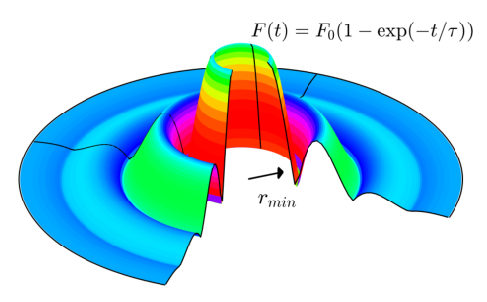 
Fig. 1: Schematic of the annular geometry used for the driven (2+1)-dimensional nonlinear Schr¨odinger equation. Harmonic forcing with azimuthal phase eimθ

📷 Fig 2

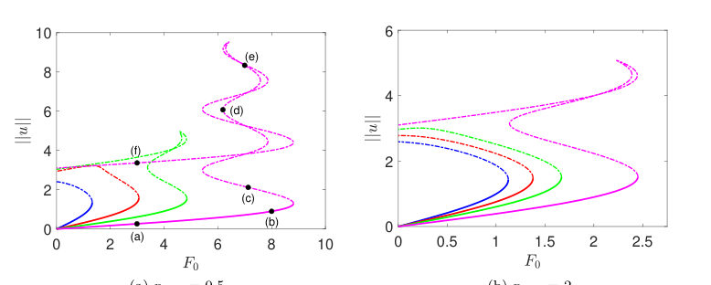 
Fig. 2: Bifurcation diagrams for standing waves of Eq. (6) in the cubic case (s = 0), showing the norm as a function of the driving amplitude F0 for azimuthal indices m = 0, 2, 3, 5 (blue, red, green, and magenta, respectively). Solid (thick) segments indicate stable branches and dashed–dotted (thin) segments unstable ones. Panels (a) and (b) correspond to rmin = 0.5 and rmin = 2, respectively.

📷 Fig 3

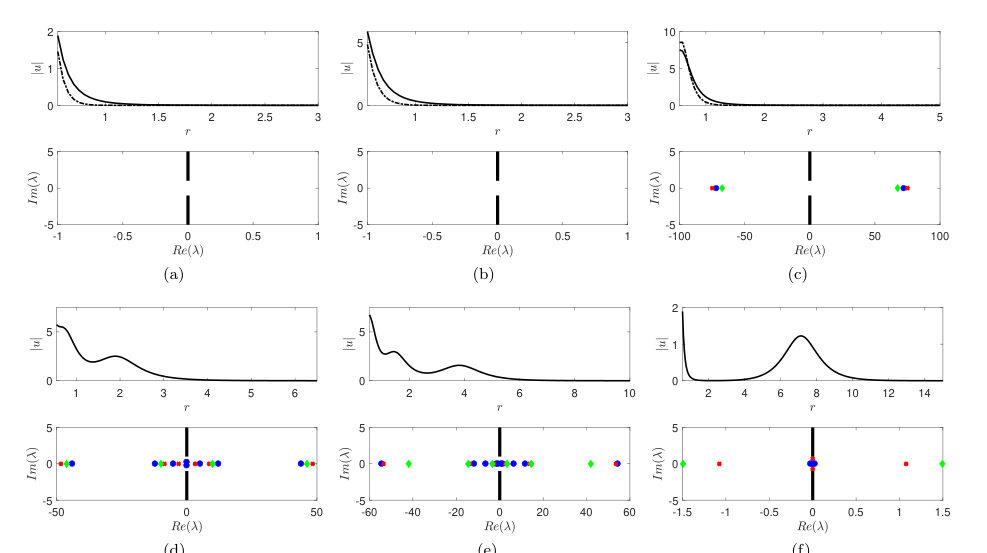 
Fig. 3: Selected standing-wave profiles from the bifurcation diagram in Fig. 2a and their corresponding point spectra in the complex plane. The solid curves in the profile plots represent numerical solutions. The dash-dotted curves in panels (a)–(c) show the variational approximation obtained from the ansatz introduced in Eq. (12). Symbols in the spectral plots denote azimuthal perturbation modes: q = 0 (blue dots), q = 1 (red crosses), and q = 2 (green diamonds). Profiles whose spectra lie entirely on the imaginary axis are spectrally stable, whereas eigenvalues with Re, λ ̸= 0 indicate instability.

📷 Fig 4

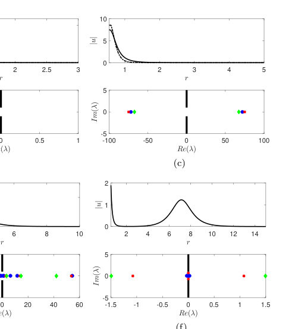 
Figure 4 compares the bifurcation structure for m = 5 in the cubic–quintic and saturable models. In the cubic– quintic case, the branches display sharp turning points and a pronounced dependence on the driving amplitude F0, reflecting the competition between the focusing cubic and defocusing quintic terms. The critical value of the

📷 Fig 5

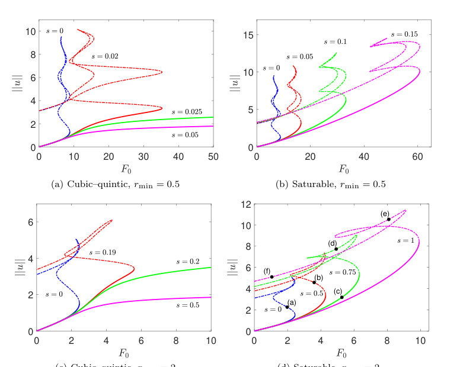 
Fig. 4: Bifurcation diagrams for m = 5 comparing the cubic–quintic and saturable nonlinearities at rmin = 0.5 and rmin = 2 with different values of s.

**Summary.** The paper quantitatively investigates supratransmission in a 2D NLS model confined to an annular region with a central hole. By analyzing the system's spectral properties and performing time-domain simulations, the authors show that energy can leak through forbidden bands or exhibit nonlinear transitions even when linear propagation is allowed. The key finding is that nonzero angular momentum ($m$) drives symmetry breaking, resulting in the emission of discrete localized structures called 'pearls'.

**Why it may be interesting.** This work is highly relevant to theoretical physicists working on open quantum systems or quantum optics because it models energy transport phenomena in structured media where linear wave propagation is forbidden, requiring nonlinear mechanisms for energy leakage. The concept of 'pearls' suggests discrete excitation dynamics within a continuous field.

Detailed structure

**Main problem.** The study investigates energy supratransmission—the transport of energy through a frequency band where linear waves are evanescent—in a two-dimensional nonlinear Schrödinger equation (NLS) defined on an annular geometry with a central hole.

**Main result.** Supratransmission is demonstrated both in the forbidden gap regime and, analogously, in the allowed spectral band via nonlinear effects. The presence of azimuthal charge ($m 
eq 0$) triggers symmetry breaking, leading to the emission of localized excitations called 'pearls'.

**Method.** The research employs a combination of analytical techniques (variational approximation) for standing wave analysis and advanced numerical methods (pseudo-arclength continuation, Crank-Nicolson scheme with TBC) for time evolution simulations.

**Model / system.** The system is governed by the 2D NLS equation on an annulus ($r \in [r_{	ext{min}}, r_{	ext{max}}]$). Nonlinearities studied include cubic–quintic and saturable forms, and the driving mechanism involves harmonic forcing at the inner boundary.

**Key observables.** Critical driving amplitude for supratransmission ($F_{0C}$), spectral stability ($	ext{Re}(\lambda)=0$), localized pulse emission ('pearls'), and spatiotemporal evolution of wave profiles.

**Important parameters / regimes.** Inner radius ($r_{	ext{min}}$), azimuthal index ($m$), nonlinear coefficients ($s$), and driving frequency ($\Omega$).

**Assumptions / limitations.** The analysis relies on approximations such as the variational method for threshold determination, and numerical simulations require absorbing boundary conditions (TBC) at outer boundaries.

**Figures summary.** Figures illustrate bifurcation diagrams showing stable/unstable branches versus drive amplitude, time evolution snapshots showing ring formation and outward propagation of localized 'pearls', and isosurface plots visualizing radial and angular excursions.

**Paper structure.** The paper progresses from establishing the linear band structure to analyzing standing wave stability via eigenvalue problems. It then details numerical simulations in both the forbidden gap (supratransmission) and the allowed band, culminating in a variational analysis linking critical drive amplitude to geometric parameters.

Abstract

We investigate energy supratransmission in a boundary-driven two-dimensional nonlinear Schrödinger equation with a central hole. Harmonic forcing with azimuthal modulation generates standing-wave states whose existence and stability depend on the driving amplitude, the inner radius, and the imposed azimuthal charge. Bifurcation analysis shows that small inner radii produce strongly confined states with higher destabilization thresholds, whereas larger radii yield broader profiles and smoother transitions between stable and unstable branches. The cubic--quintic and saturable models exhibit similar qualitative behaviour but differ quantitatively in their critical amplitudes and parameter dependence. A variational approximation captures the dependence of the critical drive on the azimuthal charge and nonlinear parameters, and clarifies how the nonlinear response shapes the stationary states near the turning point. Time-dependent simulations show that supratransmission occurs through the emission of localized pulses, with nonzero azimuthal charge triggering symmetry breaking and producing two-dimensional localized excitations (pearls). Isosurface plots provide a complementary view of the resulting radial and angular excursions. These results establish a quantitative framework for supratransmission in two-dimensional geometries and are relevant to driven nonlinear systems in optics, Bose--Einstein condensates, and structured media.

[↑ back to top](#top)

### [Lectures on Semiclassical Methods for Composite Operators](http://arxiv.org/abs/2606.11317v1)

**Authors:** Francesco Sannino  
**Type:** theory · **Category:** statistical mechanics · **PDF:** <https://arxiv.org/pdf/2606.11317v1>  
**Analysis basis:** full PDF text, analyzed in chunks
**Topic relevance:** `Keldysh / 2PI / non-Gaussian methods` **3/5** · `non-equilibrium dynamics` **2/5** · `driven-dissipative phase transition` **1/5** · `methods for driven-dissipative` **1/5** · `non-equilibrium universality` **1/5**

📷 Fig 1

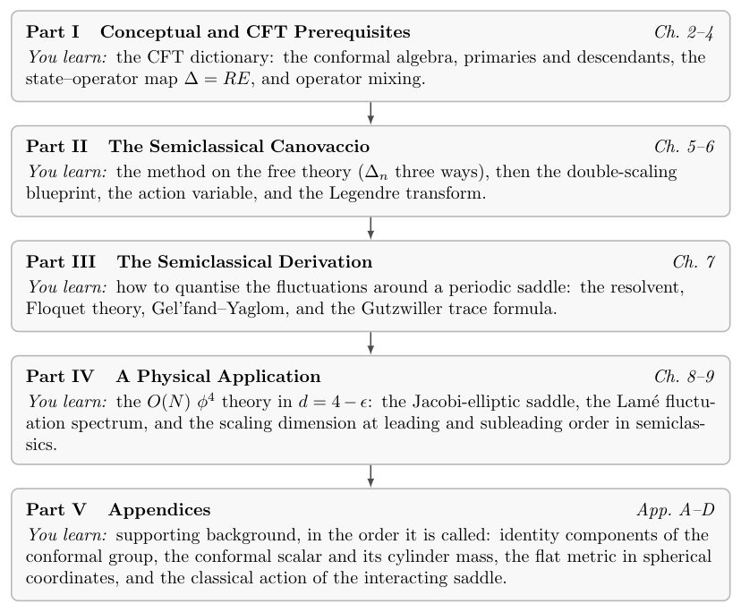 
Figure 1.1: The five parts of these notes and what each delivers. Parts I–II build the language and the method, Part III carries out the semiclassical derivation, Part IV applies it to a concrete theory and closes with the Conclusions, and Part V provides the supporting appendices.

📷 Fig 2

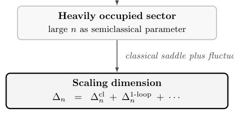 
Figure 1.2: The logical spine of these notes: from a critical system to the scaling dimension of a heavy composite operator. Each step is the subject of a later chapter.

📷 Fig 3

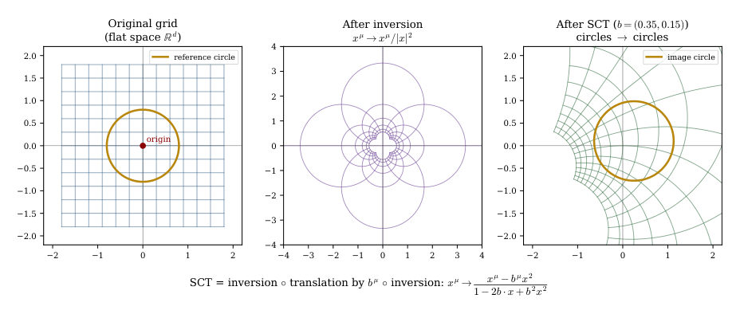 
Figure 2.1: Special conformal transformation as inversion–translation–inversion. Left: A regular Cartesian grid in flat space. Centre: After the inversion xµ 7→xµ/|x|2; straight lines not passing through the origin are mapped to circles passing through the origin. Right: The full special conformal transformation with parameter b = (0.35, 0.15). The reference circle is mapped to another circle, illustrating that conformal transformations preserve angles and map generalized circles (lines or circles) to generalized circles, while not preserving lengths or centres. Infinitesimally, this inversion–translation–inversion composition generates the vector field ϵµ = bµx2 −2(b · x)xµ, associated...

📷 Fig 4

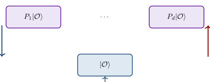 
Figure 2.2: The conformal multiplet. Starting from a primary state |O⟩(bottom, blue) satisfying Kµ|O⟩= 0, repeated action of the momentum operator Pµ (red arrows, upward) generates descendants at dimensions ∆, ∆+ 1, ∆+ 2, . . . The number of independent states at level n equals the number of symmetric tensors of rank n, namely d+n−1 n  . The special- conformal generator Kµ (blue arrow, downward) lowers the dimension; its vanishing on |O⟩ defines the primary as the lowest-weight state of the representation. In the state–operator correspondence each node is a local operator; the levels are the scaling dimensions measured on the cylinder.

📷 Fig 5

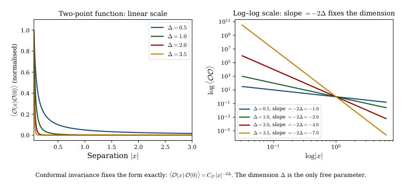 
Figure 2.3: The two-point function fixes the scaling dimension. Conformal invariance uniquely determines ⟨O(x) O(0)⟩= CO |x|−2∆; the only free parameter is the dimension ∆. Left: Linear scale for ∆= 0.5, 1, 2, 3.5; higher dimensions decay faster. Right: Log–log scale, where the relation becomes a straight line with slope −2∆. Measuring the slope of the two- point function in a log–log plot is therefore the direct numerical route to extracting scaling dimensions.

**Summary.** This lecture series details a powerful, systematic method for calculating the scaling dimensions of composite operators in Conformal Field Theories. It bridges abstract CFT concepts with concrete semiclassical mechanics by mapping the problem onto finding the energy levels of a state on a cylinder geometry. The resulting framework is crucial for understanding universal properties near critical points.

**Why it may be interesting.** The deep connection between CFT/RG flow and semiclassical quantization techniques is highly relevant. The use of spectral methods (like those derived from Floquet theory) to calculate quantum corrections around classical solutions mirrors approaches used in analyzing stability in many-body systems or quasi-periodic potentials.

Detailed structure

**Main problem.** The primary goal is to provide a coherent introduction to Conformal Field Theory (CFT) by developing a systematic semiclassical framework for calculating the scaling dimensions of composite operators, particularly $\phi^n$. This addresses gaps in literature regarding how these complex operators probe collective sectors.

**Main result.** The notes establish a rigorous connection between the state-operator correspondence on the cylinder and the energy spectrum of the theory, allowing for the calculation of anomalous dimensions via semiclassical quantization techniques. The framework is successfully applied to $O(N) \phi^4$ theory in $d=4-\epsilon$.

**Method.** The core methodology involves mapping the quantum problem onto a classical dynamics problem on the cylinder ($\mathbb{R} 	imes S^{d-1}$), utilizing semiclassical approximations like WKB, Bohr-Sommerfeld quantization, and advanced tools such as Floquet theory and the Gutzwiller trace formula.

**Model / system.** The general context is Quantum Field Theory in critical regimes described by CFT. Specific models include free scalar theories (used for initial development) and the $O(N) \phi^4$ model at its Wilson-Fisher fixed point, which exhibits universal critical behavior.

**Key observables.** Scaling dimensions ($\Delta_n$) of composite operators $\phi^n$, energy levels on the cylinder, and one-loop corrections to these dimensions.

**Important parameters / regimes.** The large occupation number ($n$ or $N$), the spacetime dimension $d=4-\epsilon$, and the coupling constants defining the fixed point.

**Assumptions / limitations.** The semiclassical approach assumes that for heavy operators (large $n$), the system's dynamics are dominated by a classical periodic solution, allowing quantum corrections to be treated perturbatively via fluctuation determinants.

**Figures summary.** Figures illustrate the logical descent from a critical system to the scaling dimension ($\Delta_n = \Delta_{cl} + \Delta_{1-loop}/n + \dots$) and summarize the five parts of the lecture notes, detailing the mathematical machinery used at each stage.

**Paper structure.** The structure is highly pedagogical: Part I reviews CFT basics (conformal group, state-operator map); Part II builds the semiclassical framework using free theory; Part III develops general tools (Floquet theory, Gutzwiller formula) for periodic saddles; Part IV applies this machinery to $O(N) \phi^4$ theory; and subsequent sections provide appendices on related mathematical structures.

Abstract

These lecture notes are intended as a coherent introduction to conformal field theory in general, and composite operators in particular, through a semiclassical framework for computing scaling dimensions, with emphasis on operators of the form $φ^n$. In doing so, they aim to fill a gap in the literature and to help decode some of the relevant concepts. The physical idea is that at large $n$ an (heavy) operator creates a highly occupied state. Through the state-operator correspondence, this state lives on the cylinder $\mathbb{R}\times S^{d-1}$, and its scaling dimension is the corresponding energy of the theory on the cylinder. The notes are organized as a self-contained route from conformal symmetry to semiclassical dynamics. Part I reviews the conformal group, primary operators, radial quantization, the state-operator correspondence, and operator mixing. Part II builds the semiclassical framework, first in the free scalar theory, where the dimension of $φ^n$ is recovered in three independent ways, and then through the double-scaling limit, the action variable, and Bohr-Sommerfeld quantization. Part III develops the general machinery of periodic saddles, Floquet theory, fluctuation determinants, the Gel'fand-Yaglom method, and the Gutzwiller trace formula. Part IV applies the framework to the $O(N)$ $φ^4$ theory in $d=4-ε$ at the Wilson-Fisher fixed point, deriving the classical elliptic solution, the Lamé fluctuation spectrum, the zero modes, and the one-loop contribution to the large-$n$ scaling dimensions. Beyond the explicit computation, the notes emphasize the role of composite operators as probes of collective sectors of quantum field theory, with extensions to gauge theories, conformal windows, and asymptotically safe field theories.

[↑ back to top](#top)

### [Synthetic Altermagnetism Beyond the Crystal Limit](http://arxiv.org/abs/2606.11481v1)

**Authors:** Rodolfo A. Gallardo, Andrea M. León, Jürgen Lindner, Jhon W. González  
**Type:** theory · **Category:** other · **PDF:** <https://arxiv.org/pdf/2606.11481v1>  
**Analysis basis:** full PDF text, analyzed in chunks
**Topic relevance:** `spintronics-quantum-optics interface` **3/5** · `analog quantum simulation` **1/5** · `driven-dissipative phase transition` **1/5** · `exotic spin models in light-matter` **1/5** · `non-equilibrium dynamics` **1/5**

📷 Fig 1

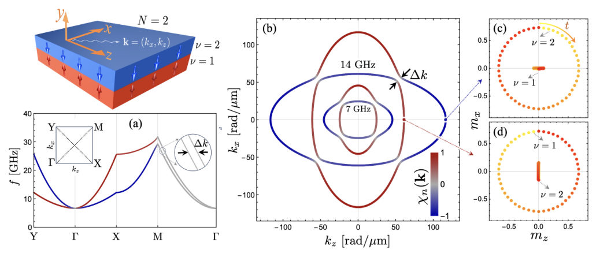 
FIG. 1. Synthetic altermagnetic bilayer composed of two antiferromagnetically coupled ferromagnetic layers (N = 2) with opposite equilibrium magnetizations. (a) Spin-wave dispersion along the high-symmetry path Y−Γ−X−M−Γ of the Brillouin zone. The inset illustrates the reciprocal-space directions and the wave-vector splitting ∆k. (b) Isofrequency contours in the (kx, kz) plane for excitation frequencies of 7 and 14 GHz. The contours exhibit a pronounced anisotropic deformation and a momentum-dependent separation of the two magnon branches, characteristic of altermagnetic order. The color scale represents the magnon polarization parameter χ, highlighting the opposite polarization character...

📷 Fig 2

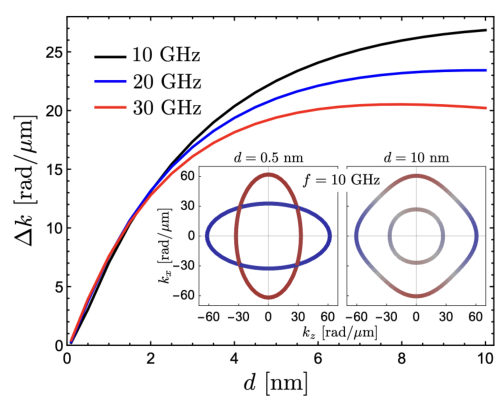 
FIG. 2. Wave-vector separation ∆k along the Γ–M direction as a function of the magnetic layer thickness d for excitation frequencies of 10, 20, and 30 GHz. The increase of ∆k with thickness reflects the progressive enhancement of magneto- static effects in the dipole-exchange regime. Insets show the isofrequency contours at f = 10 GHz for two representative thicknesses, d = 0.5 nm and d = 10 nm. As the thickness increases, the contours become increasingly distorted due to the stronger influence of dipolar interactions, leading to an enhanced wave-vector separation along the Γ–M propagation direction.

📷 Fig 3

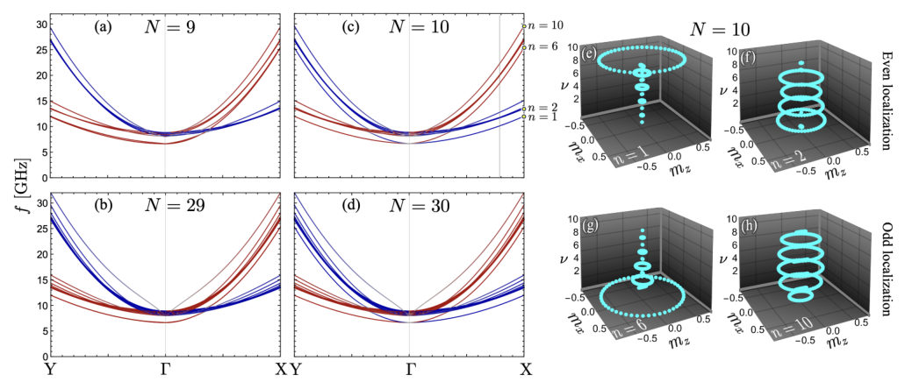 
FIG. 3. (a,b) Spin-wave dispersions for synthetic altermagnetic multilayers with odd numbers of magnetic layers, N = 9 and N = 29, respectively. (c,d) Corresponding spectra for even multilayers with N = 10 and N = 30. (e–h) Layer-resolved precessional trajectories of selected modes marked in panel (c) (modes n = 1, 2, 6 and 10 evaluated at the point X), represented through the normalized dynamical magnetization components (mx, mz) as a function of the layer index ν. The even and odd magnetization oscillations illustrate the sublattice-selective dynamical response that emerges in the synthetic altermagnetic phase.

**Summary.** The paper theoretically demonstrates how synthetic altermagnetism can be realized in multilayered magnetic films without requiring intrinsically altermagnetic crystals. By engineering alternating anisotropic exchange couplings, the authors show that magnon spectra exhibit characteristic splitting and nodal structures. This work establishes parity and surface termination as key design principles for controlling these collective quantum magnetic responses.

**Why it may be interesting.** This work provides a concrete, material-science inspired model (multilayers) to study exotic quantum magnetic phenomena (altermagnetism), which is relevant for understanding collective excitations in engineered quantum systems.

Detailed structure

**Main problem.** To demonstrate a synthetic realization of altermagnetic magnonics beyond the constraints imposed by crystalline symmetries.

**Main result.** The authors show that engineered multilayer structures can reproduce characteristic altermagnetic magnon spectra, and this phenomenon is controllable via stack parity and surface termination effects.

**Method.** Theoretical modeling involving solving the linearized Landau-Lifshitz equation within a dipole-exchange framework for coupled ferromagnetic multilayers.

**Model / system.** The system is an antiferromagnetically coupled multilayer of ferromagnetic films with alternating in-plane exchange anisotropies, forming a continuum platform. The dynamics are governed by the LLG equation applied to spin-wave excitations across multiple layers.

**Key observables.** Momentum-dependent branch splitting ($\Delta k$), anisotropic isofrequency contours, and parity-dependent reconstruction of surface vs. bulk magnon modes.

**Important parameters / regimes.** Stacking layer number ($N$), spacer thickness, and the relative strength of dipole interactions versus exchange coupling.

**Assumptions / limitations.** The analysis relies on the continuum approximation for anisotropic exchange and treats long-range dipolar interactions via magnetostatic formalism.

**Figures summary.** Figures illustrate spin-wave dispersion (a) showing momentum-dependent splitting, isofrequency contours (b) exhibiting anisotropy, and layer-resolved dynamics (c, d), with further figures detailing parity dependence in multilayers.

**Paper structure.** The paper develops the theoretical framework by defining the effective Hamiltonian/equations of motion for coupled layers, solving the eigenvalue problem for spin waves, analyzing the minimal bilayer case, and finally extending the analysis to finite multilayers to reveal parity-dependent reconstruction effects.

Abstract

Altermagnetic magnons in crystalline materials exhibit momentum-dependent splitting whose nodal structure and chiral character are governed by the point-group symmetry of the magnetic sublattice rotation. Here, we demonstrate the first synthetic realization of altermagnetic magnonics in a continuum platform composed of antiferromagnetically coupled ferromagnetic films with alternating in-plane exchange anisotropies, showing that the key signatures of altermagnetic magnonics emerge beyond the crystalline setting. Solving the linearized Landau-Lifshitz equation within a dipole-exchange framework, we show that this architecture reproduces the characteristic momentum-dependent splitting, nodal directions, and anisotropic isofrequency contours of A-type altermagnets. Long-range dipolar interactions qualitatively reconstruct this exchange-driven spectrum by lifting the nominal nodal degeneracy, hybridizing opposite-chirality modes, and producing a finite, thickness-dependent wave-vector splitting along directions that are nodal in the exchange-only limit. Extending the bilayer to finite multilayers reveals that synthetic altermagnetism undergoes a parity-dependent reconstruction that separates surface and bulk altermagnetic excitations. These results establish altermagnetic magnon phenomenology as an engineerable collective response of dipole-exchange multilayers beyond microscopic crystal symmetries.

[↑ back to top](#top)

### [Berry-phase-based Topological Charge in Quasicrystals and their Observable Features in Photonic System](http://arxiv.org/abs/2606.11777v1)

**Authors:** Ziyi Chen, Jinyu Zou, Jinhua Gao, Gang xu  
**Type:** theory · **Category:** other · **PDF:** <https://arxiv.org/pdf/2606.11777v1>  
**Analysis basis:** full PDF text, analyzed in chunks
**Topic relevance:** `analog quantum simulation` **3/5** · `driven-dissipative phase transition` **1/5** · `interference shaping light` **1/5** · `quantum optics experiment` **1/5**

📷 Fig 1

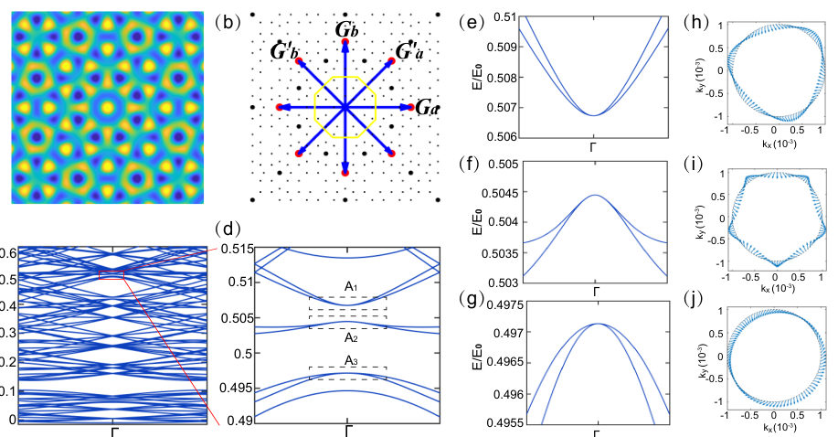 
FIG. 1. (a) Moir´e quasicrystalline potential. (b) Corresponding distribution of reciprocal-lattice points. (c) Band structure after introducing a quasicrystalline potential V near the Γ point along the Γ–Ga direction, with the horizontal coordinate ranging from Γ −0.1Ga to Γ + 0.1Ga. Here E0 = ℏ2|Ga|2/2m, V = 0.2E0, and nc = 3. The energy levels at Γ point are grouped in eights. (d) Zooms in on the bands framed by the red box in (c). The eight energy levels at Γ point consist of three two-dimensional irreducible representations and two one-dimensional irreducible representations. (e)–(g) Zooms in on the three doubly degenerate points marked in (d). (h)–(j) Pseudospin textures on the lower...

📷 Fig 2

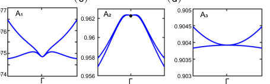 
FIG. 2. (a) Photonic band structure of the quasicrystal along the Γ −Ga direction, with parameters set as nc = 4 and f0 = c/2πa, where a represents the lattice corresponding to the primitive reciprocal vectors. (b)–(d) Zoomed-in views of the three doubly degenerate points marked in (a). (e)–(f) Two eigenmodes at the A2 degeneracy point within a 5a × 5a region, denoted as dx2−y2 and dxy, respectively.

📷 Fig 3

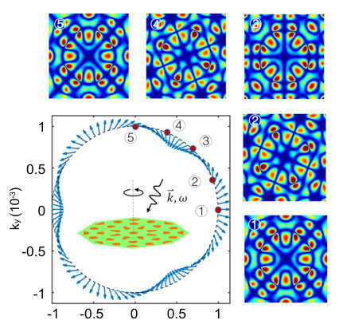 
FIG. 3. Observation of the C = 4 topological charge. The central panel shows the momentum-space pseudospin texture and the experimental scanning scheme (inset). The corre- sponding real-space field patterns ( 1 ○– 5 ○) repeat exactly af- ter a π/2 rotation, directly demonstrating C = 4.

**Summary.** This paper develops a general theory to calculate topological charges based on Berry phases in quasicrystals, extending beyond conventional periodic lattices. By applying this framework to photonic quasicrystals, the authors predict that these higher-order topological charges manifest as a distinct, measurable periodicity ($C$ times) in the real-space electromagnetic field pattern when probing the system's momentum space.

**Why it may be interesting.** This work bridges concepts from topology (Berry phase) and condensed matter physics into the realm of quasiperiodic materials, providing concrete, measurable predictions for photonic systems that are highly relevant to quantum optics and metamaterials research.

Detailed structure

**Main problem.** To extend Berry-phase-based topological charges, traditionally studied in periodic crystals, to quasicrystals and demonstrate their physical observability.

**Main result.** A universal framework is established for calculating higher topological charges ($C=4$) in 2D quasicrystals using group representation theory. These charges manifest as a quantifiable winding number of the electromagnetic field pattern in photonic realizations.

**Method.** The authors derive effective low-energy Hamiltonians by analyzing band degeneracies at high-symmetry points ($\Gamma$ point) using symmetry constraints and Berry phase calculations.

**Model / system.** The study focuses on 2D quasicrystals, exemplified by the $C_{8v}$ symmetry. The theory is applied to both electronic systems (via quasiperiodic potentials) and photonic systems (by analyzing Maxwell's equations with modulated permittivity).

**Key observables.** Topological charges ($C=2, 4, -2$), which are diagnosed by the winding number of the pseudospin texture in momentum space. Experimentally, this corresponds to the real-space electromagnetic field pattern repeating $C$ times upon encircling the charge point.

**Important parameters / regimes.** The rotational symmetry $n$ dictates the maximum possible topological charge ($C \le n/2$). The modulation strength ($\alpha$) is a key parameter for photonic realization.

**Assumptions / limitations.** The analysis relies on constructing an effective Hamiltonian by truncating the infinite-dimensional band structure problem, assuming that large-scale averaging allows for a momentum-space description around $\Gamma$.

**Figures summary.** Figures illustrate the physical setup of the quasicrystal potential, the resulting band structures showing degeneracies at $\Gamma$, and crucially, diagrams visualizing the pseudospin texture winding number ($C=4$) alongside the corresponding real-space field pattern repetition.

**Paper structure.** The paper first establishes the theoretical framework by deriving topological charges from group theory for 2D quasicrystals. It then applies this to photonic systems, showing how the derived mathematical structure predicts observable features in light propagation, culminating in a proposal for experimental detection via momentum-space scanning.

Abstract

Topological charges based on Berry phase play the fundamental role in the topological physics. However, such topological charges remain unexplored in quasicrystals, impeding the systematic understanding of topological states in such quasiperiodic systems. In this work, by deriving all the allowed topological charges according to group representation theory and the corresponding low-energy effective Hamiltonians, we establish a universal framework for Berry-phase-based topological charges in two-dimensional quasicrystals. Taking the $C_{8v}$ quasicrystal as an example, we demonstrate and characterize a higher topological charge of $C=4$, which is inaccessible in conventional periodic systems. Applying our framework to photonic quasicrystals, we uncover that the circling of photon momentum around the charge gives a $C$ times winding of the electromagnetic field distribution pattern. Such observable feature provides a direct experimental method to probe the topological charges. Our work paves the way for exploring topological charges in quasiperiodic matter, and fundamentally bridges periodic and quasiperiodic topological band theories.

[↑ back to top](#top)

### [Reflective Metastructure Q-plate for Ultrashort Laser Pulses](http://arxiv.org/abs/2606.12041v1)

**Authors:** Christopher G. O. Weiß, Bert Lägel, Benjamin Stadtmüller, Martin Aeschlimann, Tobias Eul  
**Type:** experiment · **Category:** other · **PDF:** <https://arxiv.org/pdf/2606.12041v1>  
**Analysis basis:** full PDF text, analyzed in chunks
**Topic relevance:** `interference shaping light` **3/5** · `quantum optics experiment` **3/5**

📷 Fig 1

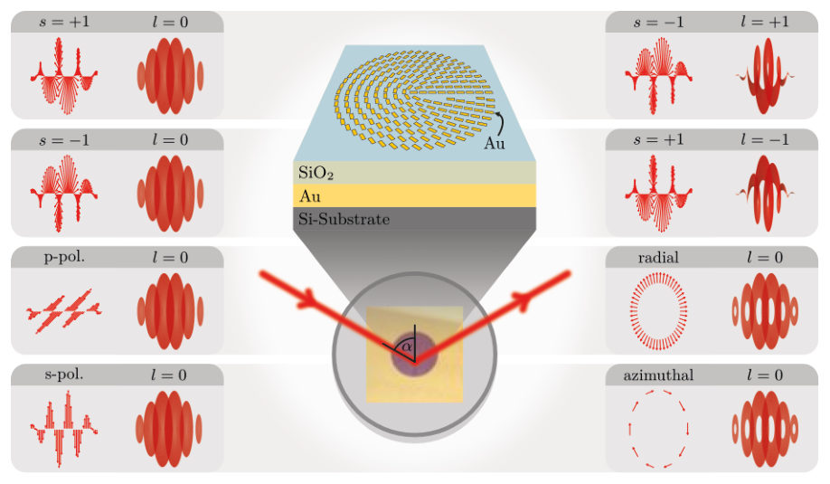 
Figure 1: Operating principle of the reflective plasmonic q-plate. Azimuthally oriented gold nanorods on a SiO2/Au-reflector stack on a Si-substrate impose a spatially varying geometric phase upon reflection under an angle of incidence α. The left panels show the phase front and polarization of the incident beam, whereas the right panels display the corresponding reflected states. Circularly polarized input light is converted into OAM-carrying beams with opposite helicity and ℓ= ±1, while linearly polarized input states give rise to radial and azimuthal vector beams with ℓ= 0.

📷 Fig 2

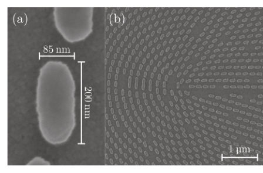 
Figure 2: Scanning electron microscopy (SEM) images of the fabricated reflective plasmonic meta- surface q-plate based on arrays of gold nanorods on a SiO2/Au-substrate. (a) High-magnification SEM image of individual gold nanorods, indicating their typical dimensions (l = 200 nm, w = 85 nm). (b) SEM overview of the central region of the meta- surface showing the azimuthally varying nanorod orientations that implement the q-plate phase pro- file.

📷 Fig 3

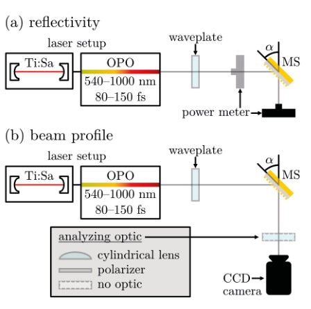 
Figure 3: Schematic of the optical setup for char- acterizing the reflective q-plate. A tunable Ti:Sa- oscillator with an OPO provides femtosecond pulses from 540 nm to 1000 nm with pulse durations of 80 fs to 150 fs. The incident polarization is con- trolled by a quarter- or half-wave plate, and the metasurface (MS) is illuminated at α = 45◦or 5◦. (a) Reflectivity setup with power-meter detection. (b) Beam-profile setup with CCD-camera detection. For further analysis, either no additional optic, a polarizer, or a cylindrical lens can be placed in front of the camera.

📷 Fig 4

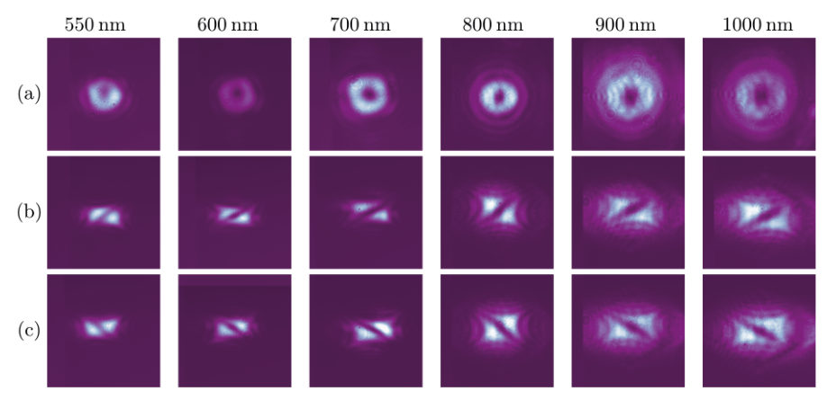 
Figure 4: Wavelength dependent OAM generation under 45◦illumination. (a) Beam profiles after reflection of σ+-light (s = +1) on the q-plate. (b) Beam profile from (a) with inserted cylindrical lens. (c) Beam profile after reflection of σ−-light (s = −1) with inserted cylindrical lens.

📷 Fig 5

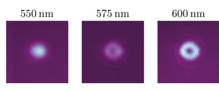 
Figure 5: Wavelength dependent OAM generation under 5◦illumination. Beam profile after reflection of σ+-light (s = +1) on the q-plate for the wave- lengths 550 nm, 575 nm and 600 nm from left to right.

**Summary.** The paper presents an experimental realization of a reflective Q-plate using a plasmonic metasurface made of gold nanorods. This device efficiently converts the spin angular momentum (SAM) of incident light into orbital angular momentum (OAM) upon reflection. Its significance lies in its ability to maintain high reflectivity and preserve the integrity of ultrashort laser pulses across a broad spectral range, making it ideal for advanced ultrafast optical applications.

**Why it may be interesting.** This work is highly relevant to quantum optics and open quantum systems because it demonstrates a robust, solid-state platform for manipulating the angular momentum of light—a key resource in quantum information processing—using plasmonics rather than bulk optical elements.

Detailed structure

**Main problem.** The goal is to develop a highly reflective Q-plate capable of converting orbital angular momentum (OAM) from nanostructures into ultrashort laser pulses without incurring temporal broadening.

**Main result.** The proposed plasmonic metasurface successfully achieves high reflectivity and broadband OAM generation for femtosecond pulses, overcoming dispersion issues associated with traditional transmissive Q-plates.

**Method.** The authors fabricated a reflective metasurface using ordered arrays of gold nanorods on a dielectric spacer above a back reflector to mimic the phase transformation properties of conventional Q-plates upon reflection.

**Model / system.** The physical system is a plasmonic metasurface constructed from anisotropic gold nanorods deposited on an $	ext{SiO}_2/	ext{Au}$-reflector stack. This structure leverages the geometric Pancharatnam-Berry phase acquired during reflection to couple input polarization state (SAM) into output OAM.

**Key observables.** High reflectivity ($>60\%$), generation of helical phase fronts ($\ell=\pm 1$) from circularly polarized light, and preservation of ultrashort pulse duration upon reflection.

**Important parameters / regimes.** Operating wavelengths range from $550 	ext{ nm}$ to $1000 	ext{ nm}$; incidence angles tested include $\alpha = 45^\circ$ and $\alpha = 5^\circ$; input pulses are in the femtosecond regime ($<30 	ext{ fs}$).

**Assumptions / limitations.** The primary assumption is that the metasurface can effectively mimic the required birefringence landscape of conventional Q-plates while operating robustly under reflection geometry.

**Figures summary.** Figures illustrate the device schematic, SEM images confirming nanorod dimensions and orientation, optical setups for characterization (reflectivity/beam profiles), and wavelength-dependent measurements showing OAM generation ($\ell=\pm 1$ donut modes) and polarization conversion.

**Paper structure.** The paper introduces the need for reflective Q-plates, details the plasmonic metasurface design using gold nanorods, presents experimental characterization across various wavelengths and incidence angles, confirms broadband operation, and discusses pulse integrity.

Abstract

The orbital angular momentum of light is an intriguing property for developing light driven applications. It emerged as an independent degree of freedom by which to manipulate light and, consequently, the interaction of light with matter. Several methods exist for the generation of light carrying orbital angular momentum, mostly employing transmitting or reflecting optical components, which radially modulate the phase profile of the light. As one of such components, transmissive q-plates established themselves as standard elements due to their usability over a broad wavelength range. Here, we present our approach to build a highly reflective q-plate based on a plasmonic metasurface capable of converting orbital angular momentum from the nanostructure to ultrashort laser pulses without temporal broadening. We highlight its working principle over a wide range of wavelengths for reflection under normal and gracing incidence.

[↑ back to top](#top)

### [Chiral anomaly and planar Hall conductance in pseudospin-$1$ Fermions](http://arxiv.org/abs/2606.11364v1)

**Authors:** Azaz Ahmad  
**Type:** theory · **Category:** other · **PDF:** <https://arxiv.org/pdf/2606.11364v1>  
**Analysis basis:** full PDF text, analyzed in chunks
**Topic relevance:** `Keldysh / 2PI / non-Gaussian methods` **3/5** · `methods for driven-dissipative` **1/5** · `non-equilibrium dynamics` **1/5**

📷 Fig 1

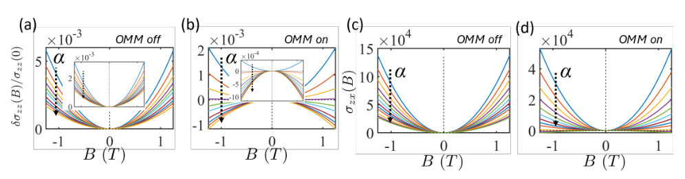 
Figure 1. We investigate the LMC and PHC in a pseudospin-1 semimetal, both in the presence and absence of the OMM, for two representative values of the field orientation angle: γ = π/2 and γ = π/4. Our analysis reveals that an increase in the relative strength of internode (intervalley) scattering, quantified by the parameter α, leads to a sign reversal in both LMC and PHC, from positive to negative. Furthermore, in configurations where the electric and magnetic fields are non-collinear, the critical scattering strength αc required to induce this reversal decreases progressively as γ deviates from the orthogonal limit (γ = π/2). This behavior underscores the sensitivity of magnetotransport...

📷 Fig 2

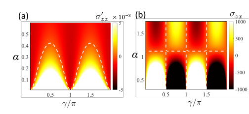 
Figure 2. Phase plot of LMC and PHC for pseudospin-1 fermions with respect to intervalley scattering strength α and magnetic field angle γ measured from increasing x-direction. While LMC has its maxima at π/2, PHC vanishes for this parallel field configuration. White dotted curves separate the region having opposing signs of conductivities, confirm- ing the dependence αc(γ): αc ∼sin2 γ in LMC. PHC van- ishes for both the field orientations: γ = 0 and γ = π/2 as plotted in (b), shows sign reversal above a fixed value of αP HC c &gt; αLMC c . LMC is normalized by zero field value, i.e., σ ′ zz = (σzz(B = 0.50 T) −σzz(B = 0 T))/σzz(B = 0 T), while PHC is not normalized.

📷 Fig 3

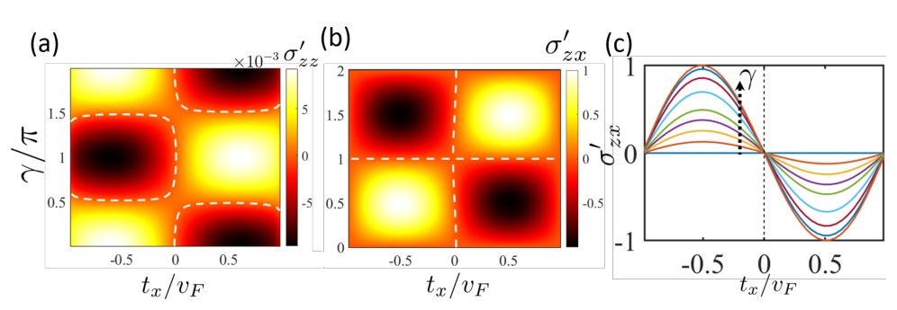 
Figure 3. (a-b) The LMC and PHC are analyzed as functions of the tilt along the x-axis and the orientation angle γ of the applied magnetic field relative to the ˆx-axis, for a constant magnetic field strength of B = 0.5 T and α = 0.20. In this analysis, the cone tilt directions are assumed to be oppositely oriented. (c) PHC is plotted as a function of tilt tx. PHC shows a non-monotonic behavior and is an odd function of tilt, attaining its extrema at |tx| = 0.50. Along the direction of the arrow, the γ is varied from 0 to π/2. PHC is normalized to its maximum value and LMC as in Fig. 2(a).

📷 Fig 4

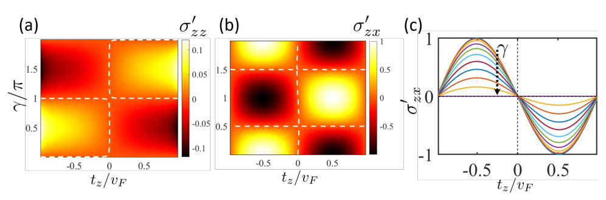 
Figure 4. (a-b) The LMC and PHC are analyzed as functions of the tilt along the z-axis and the orientation angle γ of the applied magnetic field relative to the ˆz-axis, for a constant magnetic field strength of B = 0.5 T. In this analysis, the tilt directions of the cones are considered to be oppositely oriented. (c) PHC as a function of tilt tz at different values of γ.

📷 Fig 5

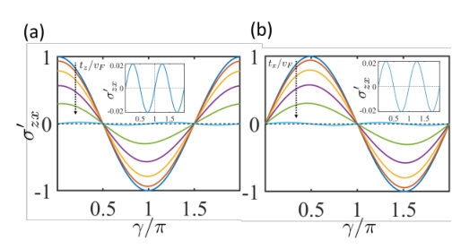 
Figure 5. (a) The angular dependence of the PHC is inves- tigated for varying values of the tilt parameter tz. The in- set corresponds to the untilted case (tz = 0), exhibiting the conventional sin 2γ dependence characteristic of systems with preserved azimuthal symmetry. Introducing a finite tilt modi- fies this angular behavior, progressively transitioning towards a cos γ dependence as tz increases in magnitude. Specifically, along the indicated direction in the plot, the ratio tz/vF is systematically varied from −0.5 to 0, where the tilt orienta- tion is considered to be oppositely aligned for the two cones, emphasizing the role of tilt anisotropy in shaping the PHC response. (b) For...

**Summary.** This theoretical study analyzes how chiral anomalies manifest as measurable transport signals (PHC and LMC) in advanced systems like pseudospin-1 Weyl semimetals. By incorporating complex effects such as momentum-dependent scattering and dispersion tilting, the authors predict characteristic angular anisotropies and sign reversals in these magnetotransport coefficients. The findings offer concrete, experimentally testable signatures for identifying multifold fermion materials.

**Why it may be interesting.** This work provides a detailed, quantitative framework for interpreting complex magnetotransport measurements in topological materials by explicitly modeling higher-order pseudospin degrees of freedom and their coupling to external fields.

Detailed structure

**Main problem.** The study investigates magnetotransport signatures, specifically Planar Hall Conductance (PHC) and Longitudinal Magnetoconductance (LMC), arising from the chiral anomaly in systems with higher-pseudospin quasiparticle excitations.

**Main result.** The PHC exhibits characteristic angular dependencies ($\sin 2\gamma$ without tilt, $\sin \gamma$ or $\cos \gamma$ with tilt) and shows a sign reversal when scattering strength increases. Tilt introduces strong anisotropy to the planar Hall signal.

**Method.** Semiclassical Boltzmann transport theory is employed within the relaxation-time approximation, incorporating momentum-dependent scattering and orbital magnetic moment corrections.

**Model / system.** The model uses pseudospin-1 Weyl semimetals characterized by a Lagrangian density describing multifold chiral quasiparticles. The analysis accounts for both generic tilt of the dispersion and misalignment between E and B fields to break azimuthal symmetry.

**Key observables.** Planar Hall Conductance (PHC), Longitudinal Magnetoconductance (LMC), angular dependence ($\sin 2\gamma$, $\sin \gamma$, $\cos \gamma$), and nonmonotonic dependence on tilt magnitude.

**Important parameters / regimes.** Scattering strength ($\alpha$), magnetic field angle ($\gamma$), and the tilt parameters ($t_x, t_z$).

**Assumptions / limitations.** The analysis relies on semiclassical dynamics and assumes that the Lorentz-force contribution can be neglected when $\omega_c 	au \ll 1$.

**Figures summary.** Figures illustrate LMC and PHC dependence on scattering strength ($\alpha$) and field angle ($\gamma$), demonstrating sign reversals. Further figures map out the anisotropy of PHC as a function of tilt components ($t_x, t_z$) and angle ($\gamma$).

**Paper structure.** The paper builds from general theoretical frameworks (Hamiltonian/Lagrangian) to specific transport calculations using the Boltzmann equation. It systematically analyzes the effects of symmetry breaking mechanisms—namely, scattering strength variation and explicit dispersion tilting—on the resulting magnetoconductivity components.

Abstract

Positive longitudinal magnetoconductance (LMC) and planar Hall conductance (PHC) are hallmark transport signatures of the chiral anomaly in Weyl semimetals. Recent theoretical developments have extended Weyl fermions to multifold Fermionic systems with higher-pseudospin quasiparticle excitations, motivating the study of their magnetotransport properties. Here, we employ semiclassical Boltzmann transport theory within the relaxation-time approximation to investigate magnetotransport in pseudospin-1 Weyl semimetals, incorporating momentum-dependent scattering, orbital magnetic moment corrections, and charge-conservation constraints. To obtain a finite PHC, we break azimuthal symmetry through either a generic tilt of the quasiparticle dispersion or a finite misalignment between the electric and magnetic fields. In the untilted case, the PHC is positive and scales quadratically with magnetic field strength. Increasing the scattering strength induces a sign reversal of the PHC, producing a transition from positive to negative values. The PHC further exhibits the characteristic angular dependence $\sin 2γ$, where $γ$ is the angle between the magnetic field and the $x$-axis. Tilt qualitatively alters this behavior: tilt along the $x$- and $z$-directions changes the angular response to $\sinγ$ and $\cosγ$, respectively, generating strong anisotropy in the planar Hall signal. Moreover, the PHC shows a nonmonotonic dependence on tilt magnitude, revealing the interplay between tilt-induced symmetry breaking and chiral-anomaly-driven transport. Our results provide experimentally accessible signatures of multifold fermions and a framework for interpreting magnetotransport measurements in candidate materials of space groups 199, 214, and 220.

[↑ back to top](#top)

### [Stacking switching between correlation-protected radial Rashba field and persistent spin textures in graphene encapsulated by 1T-TaS$_2$ monolayers](http://arxiv.org/abs/2606.12239v1)

**Authors:** Juraj Mnich, Marko Milivojević, Martin Gmitra  
**Type:** theory · **Category:** other · **PDF:** <https://arxiv.org/pdf/2606.12239v1>  
**Analysis basis:** full PDF text, analyzed in chunks
**Topic relevance:** `spintronics-quantum-optics interface` **3/5** · `exotic spin models in light-matter` **1/5** · `non-equilibrium dynamics` **1/5**

📷 Fig 1

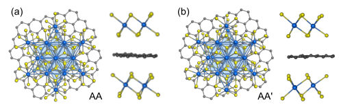 
Figure 1. Structural model of encapsulated graphene between 1T-TaS2 monolayers in the CDW phase of the David star periodic lattice distortions. (a) asymmetric AA stacking of the 1T-TaS2 monolayers in the perspective top-like and side view, and (b) symmetric AA’ stacking with a horizontal mir- ror plane. The blue and yellow balls represent the Ta atoms and the S atoms, and the gray balls are the C atoms.

📷 Fig 2

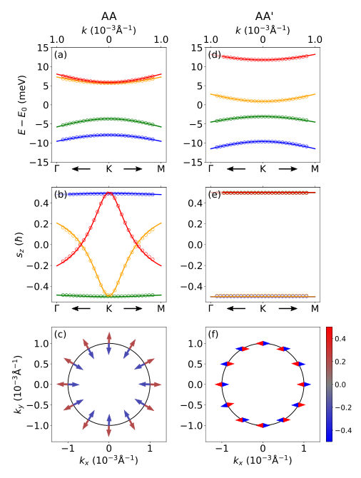 
Figure 2. Low-energy electronic band structure and spin ex- pectation values of encapsulated graphene between 1T-TaS2 monolayers in the CDW phase. Left panels (a)–(c) correspond to the asymmetric AA stacking configuration, and right pan- els (d)–(f) denote the symmetric AA’ stacking configuration. (a), (d) Energy bands near the charge neutrality point, where colored circles represent DFT calculations and solid lines in- dicate the effective tight-binding model fits. The color cod- ing tracks band indexing: red/orange and green/blue denote the conduction-like and valence-like bands, respectively. (b), (e) Out-of-plane spin expectation value sz along the high- symmetry k-path. (c), (f) Spin...

📷 Fig 3

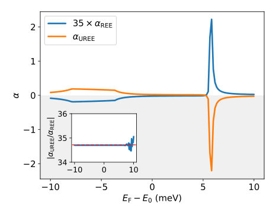 
Figure 3. Charge to spin conversion coefficients in graphene encapsulated by 1T-TaS2 in AA stacking for (un)conventional Rashba-Edelstein effect. The magnitude of αREE is increased by a factor of 35. The inset shows the ratio of charge to spin conversion coefficients for the unconventional and con- ventional cases, while the red dashed line indicates the esti- mated ratio.

📷 Fig 4

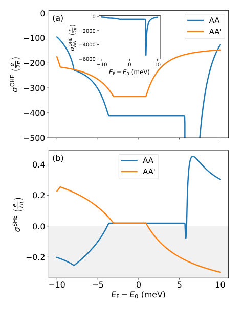 
Figure 4. Calculated linear-response transport coefficients as a function of the Fermi energy EF −E0 for the AA (blue lines) and AA’ (orange lines) stacking configurations. (a) Or- bital Hall conductivity σOHE with plateau signatures inside the proximity-induced spectral gaps and monotonic depen- dences resolving discrete band edge contributions. The inset highlights a pronounced resonant enhancement occurring at the energetic alignment of the two lowest conduction bands. (b) Spin Hall conductivity σSHE, displaying significantly sup- pressed magnitudes relative to σOHE and exhibiting a sign in- version between the AA and AA’ stackings across the charge neutrality region.

**Summary.** This theoretical study explores charge transport in graphene encapsulated by 1T-TaS2 monolayers, showing that the stacking geometry is crucial. The AA stacking induces a strong radial Rashba field leading to enhanced spin effects, whereas the AA' stacking stabilizes out-of-plane spins and maximizes the orbital Hall effect. This highlights how structural control can engineer distinct topological electronic responses.

**Why it may be interesting.** This work provides a clear example of how interfacial symmetry breaking (stacking order) can act as a quantum switch, tuning the dominant topological transport mechanism between spin-based and orbital-based responses.

Detailed structure

**Main problem.** The study investigates how the stacking order of graphene encapsulated by 1T-TaS2 monolayers dictates fundamentally distinct charge-to-spin and charge-to-orbital transport regimes.

**Main result.** Asymmetric (AA) stacking yields a strong, radial Rashba field leading to an unconventional Rashba-Edelstein effect, while symmetric (AA') stacking establishes stable out-of-plane spin textures and highly efficient orbital Hall effects.

**Method.** The research employs first-principles DFT calculations, tight-binding modeling, and the Kubo formalism to calculate linear response transport coefficients.

**Model / system.** The system is graphene encapsulated between two 1T-TaS2 monolayers in their charge density wave phase. The electronic structure and transport are modeled using effective Hamiltonians incorporating Rashba coupling and SOC terms.

**Key observables.** Orbital Hall conductivity ($\sigma_{	ext{OHE}}$), Spin Hall conductivity ($\sigma_{	ext{SHE}}$), Rashba-Edelstein effect magnitude, and persistent spin textures ($s_z$).

**Important parameters / regimes.** Stacking order (AA vs. AA'), Fermi energy relative to the Dirac point ($E_F - E_0$), and proximity-induced Rashba phase ($\pi/2$ for AA).

**Assumptions / limitations.** The analysis assumes a vacuum gap of $\approx 15$ Å, and calculations are performed within linear response theory.

**Figures summary.** Figures compare band structures and spin expectation values; Figure 4 specifically plots $\sigma_{	ext{OHE}}$ and $\sigma_{	ext{SHE}}$ versus $E_F - E_0$, showing plateaus in OHE inside spectral gaps for both stacking types.

**Paper structure.** The paper systematically analyzes the electronic structure, spin textures, and transport coefficients ($\sigma_{	ext{OHE}}, \sigma_{	ext{SHE}}$) by comparing results derived from two distinct structural configurations: AA (asymmetric) and AA' (symmetric).

Abstract

We investigate the electronic structure, spin textures, and charge to spin/orbital transport in graphene encapsulated by 1T-TaS$_{2}$ monolayers in the charge density wave phase. Using first-principles calculations, tight-binding modeling, and the Kubo formalism, we show that the encapsulation stacking dictates fundamentally distinct transport regimes. In the asymmetrical (AA) stacking, proximity fields from both interfaces constructively interfere, yielding a cumulative Rashba phase of nearly $π/2$. This pure radial Rashba spin pattern leads to the unconventional Rashba-Edelstein effect, which robustly dominates over the conventional response by a factor of 35 across a wide energy range. Conversely, the symmetrical (AA') stacking preserves a horizontal mirror symmetry, establishing a stable, purely out-of-plane persistent spin texture. Furthermore, the computed orbital Hall effect is exceptionally efficient, surpassing the spin Hall effect by three orders of magnitude. Within the proximity-induced spectral gaps, the orbital Hall conductivity exhibits a finite plateau, whereas the spin Hall conductivity vanishes. Our findings establish graphene encapsulated heterostructures as a promising system for realizing distinct charge to spin and charge to orbital interconversion regimes determined by the choice of stacking order.

[↑ back to top](#top)

### [DSpinGNN: A Physics-Informed Equivariant Graph Neural Network for Dynamic Magnetic Exchange Prediction in Strain-Deformed Monolayer CrI$_3$](http://arxiv.org/abs/2606.11685v1)

**Authors:** Isam A. Balghari, M. Faryad, M. Sabieh Anwar  
**Type:** theory · **Category:** disordered systems and neural networks · **PDF:** <https://arxiv.org/pdf/2606.11685v1>  
**Analysis basis:** full PDF text, analyzed in chunks
**Topic relevance:** `non-equilibrium dynamics` **2/5** · `analog quantum simulation` **1/5** · `exotic spin models in light-matter` **1/5** · `methods for driven-dissipative` **1/5** · `spintronics-quantum-optics interface` **1/5**

📷 Fig 1

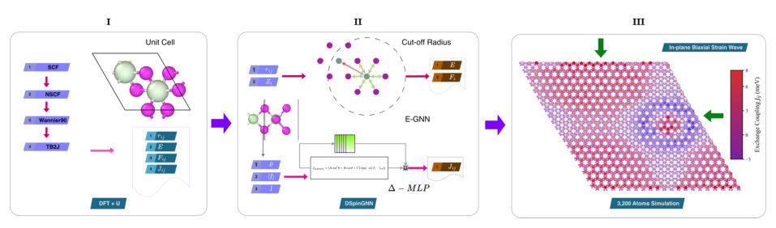 
FIG. 1. Complete workflow of the DSpinGNN framework for mesoscale dynamic magnetic map-

📷 Fig 2

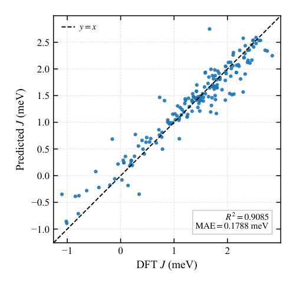 
FIG. 2. Parity plot of DSpinGNN predicted exchange coupling Jij vs. DFT+U ground-truth val-

📷 Fig 3

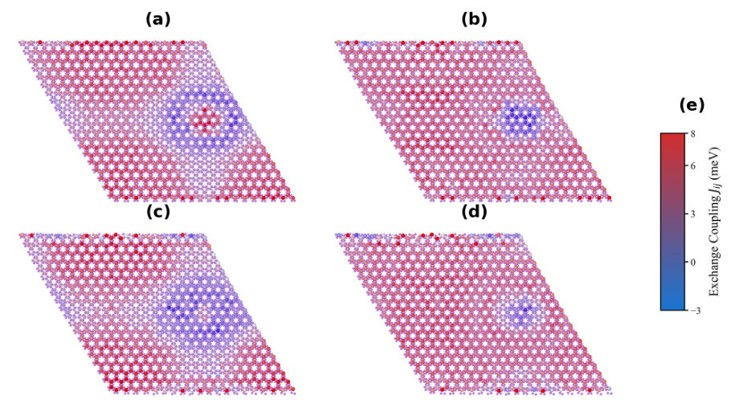 
FIG. 3. Predicted exchange coupling landscape during strain wave propagation and reflection in

📷 Fig 4

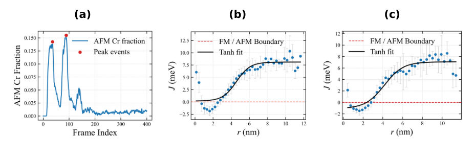 
FIG. 4. Quantitative mesoscale observables from the 3,200-atom DSpinGNN simulation. (a) AFM

**Summary.** This work introduces DSpinGNN, an advanced machine learning model that predicts strain-dependent magnetic exchange couplings in monolayer CrI$_3$. By combining equivariant graph networks with physics constraints derived from the Goodenough-Kanamori rules, it accurately models how mechanical strain generates spatially heterogeneous magnetic textures. The resulting framework provides testable mesoscopic predictions for cryogenic magnetic measurements.

**Why it may be interesting.** The integration of equivariant ML directly into predicting magnetic interactions under mechanical stress provides a powerful, transferable tool for simulating complex quantum materials behavior at mesoscopic scales, bridging solid-state theory and AI.

Detailed structure

**Main problem.** The core challenge is accurately calculating the instantaneous, position-dependent isotropic magnetic exchange coupling ($J_{ij}$) across a crystal lattice undergoing dynamic structural deformation.

**Main result.** DSpinGNN successfully predicts these couplings on unseen data and simulates strain wave propagation, yielding testable mesoscopic predictions like domain wall width ($\xi=1.7 	ext{ nm}$) and oscillation period ($	au=0.27 	ext{ ps}$).

**Method.** A bifurcated machine-learning architecture combines an E(3)-equivariant GNN for structural dynamics with a physics-informed $\Delta$-MLP that maps local bond geometry to $J_{ij}$, incorporating the Goodenough-Kanamori superexchange relationship.

**Model / system.** The system is monolayer CrI$_3$, modeled using an effective classical Heisenberg Hamiltonian ($H_{	ext{spin}}$). The framework operates under several approximations, including the collinear Ising limit and adiabatic decoupling between structure and magnetism.

**Key observables.** Energy MAE (1.1 meV/atom), Force MAE (6.5 meV/Å), Exchange Coupling MAE (0.18 meV), Domain wall width ($\xi$), Oscillation period ($	au$).

**Important parameters / regimes.** Temperature ($T=5 	ext{ K}$), Strain magnitude (up to $\pm 9.1\%$ compression causing FM-to-AFM transition).

**Assumptions / limitations.** The model assumes an adiabatic decoupling between structural dynamics and magnetic coupling, and it is restricted to the collinear isotropic limit by omitting SOC effects.

**Figures summary.** Figures illustrate the workflow from DFT data generation to ML prediction; key results show $J_{ij}$ landscapes during strain wave reflection, confirming the formation of transient AFM-sign zones. Quantitative analysis provides fitted values for $\xi$ and $	au$.

**Paper structure.** The paper first establishes the computational difficulty (instantaneous $J_{ij}$). It then details the DSpinGNN architecture—the E-GNN structural branch and the physics-informed $\Delta$-MLP exchange predictor. The methodology is validated on a test set, followed by mesoscale simulations of strain wave dynamics to extract quantitative physical observables.

Abstract

Resolving the instantaneous, position-dependent isotropic magnetic exchange coupling $J_{ij}$ across a dynamically deforming crystal lattice requires a computational approach that simultaneously handles structural forces and magnetic interactions at length scales inaccessible to first-principles methods. Here we introduce DSpinGNN, a bifurcated machine-learning architecture comprising an $E(3)$-equivariant graph neural network (E-GNN) for classical Langevin structural dynamics and a physics-informed $Δ$-MLP that maps instantaneous local Cr-I-Cr bond geometry to isotropic exchange couplings, with the Goodenough-Kanamori superexchange relationship embedded as an analytical inductive bias. Trained on 345 DFT+U configurations of monolayer CrI$_3$ and evaluated on a strictly withheld 61-configuration test set, DSpinGNN simultaneously achieves an energy MAE of $1.1$ meV/atom, a force MAE of $6.5$ meV/Å, and an exchange coupling MAE of $0.18$ meV ($R^2 = 0.91$). Deployed at 400$\times$ scale in a 3,200-atom supercell under a collinear Ising-constrained adiabatic approximation at $5$ K, the model maps the local exchange response to a propagating biaxial strain wave. Wave reflection at periodic boundaries generates transient constructive interference regions where local compressive strain exceeds the DFT-established FM-to-AFM threshold, producing spatially heterogeneous exchange coupling textures that damp as the wave dissipates. Quantitative analysis yields a domain wall width of $ξ= 1.7 \pm 0.3$~nm and a constructive-interference oscillation period of $τ= 0.27$~ps -- mesoscopic observables inaccessible to direct DFT and constituting testable predictions for cryogenic magnetic force microscopy. DSpinGNN provides a reproducible, transferable framework for mesoscale exchange mapping in strain-driven 2D magnetic materials.

[↑ back to top](#top)

### [Color-Rule-Function Encoding for Combinatorial Memory](http://arxiv.org/abs/2606.11365v1)

**Authors:** Alexander Khitun  
**Type:** theory · **Category:** other · **PDF:** <https://arxiv.org/pdf/2606.11365v1>  
**Analysis basis:** full PDF text, analyzed in chunks
**Topic relevance:** `analog quantum simulation` **1/5** · `entanglement & information structure` **1/5** · `methods for driven-dissipative` **1/5** · `spintronics-quantum-optics interface` **1/5**

📷 Fig 1

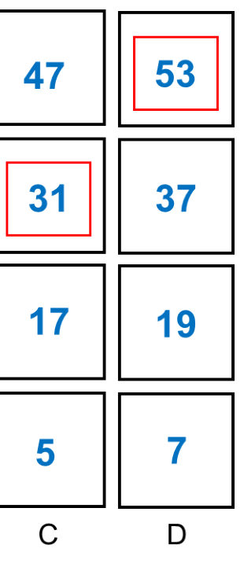 
Figure 1

📷 Fig 2

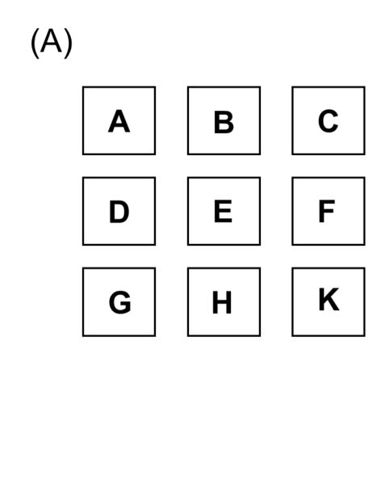 
Figure 2

📷 Fig 3

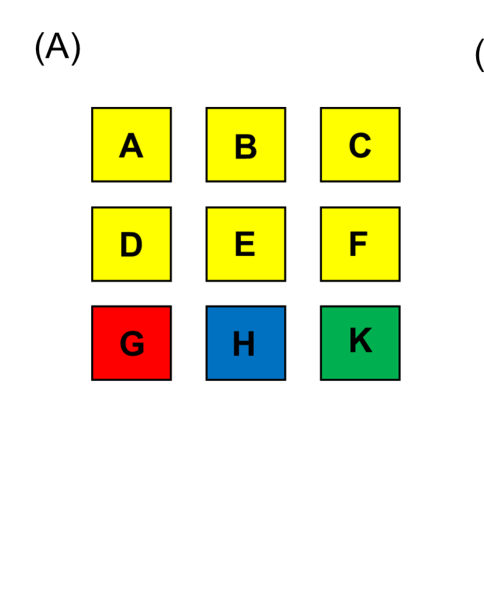 
Figure 3

📷 Fig 4

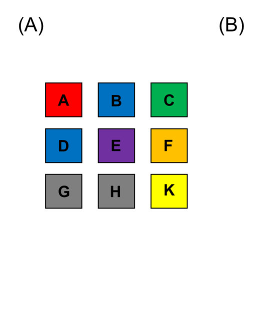 
Figure 4

📷 Fig 5

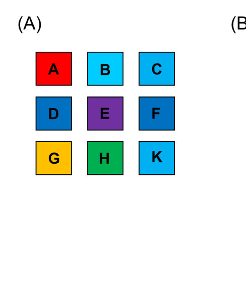 
Figure 5

**Summary.** This paper proposes the Color-Rule-Function (CRF) method to encode data into combinatorial memory paths within a structured mesh. It demonstrates that this approach offers a superior scaling ($\mathcal{O}(N^4)$) compared to conventional memories, potentially enabling ultra-high-density storage for read-only applications. The core challenge remains optimizing the rule set and understanding the minimum achievable Hamming distance.

**Why it may be interesting.** While not directly quantum, the concept of encoding information into complex structural constraints (paths/rules) shares conceptual parallels with topological quantum error correction or state preparation in highly constrained physical systems.

Detailed structure

**Main problem.** To develop a systematic encoding framework for representing information in combinatorial memory that surpasses the scaling limits of conventional storage technologies.

**Main result.** The Color-Rule-Function (CRF) approach achieves a design space capacity scaling of $\mathcal{O}(N^4)$, potentially leading to data storage densities exceeding $10^{19}$ bits/cm$^2$ in customized hardware realizations.

**Method.** Information is encoded by selecting paths through a structured mesh, assigning values (colors) to cells, defining rules based on path colors, and constructing a final state via a Boolean function.

**Model / system.** The system models combinatorial memory using an $N \times N$ mesh structure. The hardware realization involves three modules: a Mesh Module (frequency generators), a Rule Module (frequency decoders/filters), and a Function Module (Boolean logic gates, potentially magnonic).

**Key observables.** Path states (0 or 1), design space capacity ($	ext{BCRF}$), data storage density (bits/cm$^2$), and the minimum Hamming distance.

**Important parameters / regimes.** $N$ (Mesh dimension), number of colors, number of rules, and the complexity scaling exponents ($N^4$ vs $N^2$).

**Assumptions / limitations.** The advantage relies heavily on using customized module designs rather than universal ones; finding the optimal CRF encoding is computationally hard.

**Figures summary.** Figures illustrate the general architecture (Mesh $
ightarrow$ Rule $
ightarrow$ Function), show colored meshes for encoded data examples, and compare scaling trends between different memory types.

**Paper structure.** The paper introduces the CRF framework via four steps of encoding. It analyzes the theoretical design space scaling ($\mathcal{O}(N^4)$) compared to conventional methods. The discussion then focuses on hardware realization using magnonics and comparing storage density estimates for universal versus customized module designs.

Abstract

Combinatorial memory is a class of memory in which information is encoded in the set of paths through a structured mesh. In this work, we introduce a systematic encoding framework, referred to as the Color-Rule-Function (CRF) approach, for representing information in combinatorial memory. The method consists of four key steps: selecting a sequence of paths in the mesh, assigning values (e.g., colors) to each cell, defining a set of rules based on the values encountered along each path, and constructing a Boolean function that determines the state of each path. . The coding procedure is illustrated by several examples. The design space scales of the CRF scale fundamentally faster compared to conventional memory. This apparent advantage arises from the use of rule-based and functional representations but is accompanied by increased hardware complexity. A possible hardware realization of the CRF framework is discussed. Importantly, the hardware overhead can be substantially reduced through the use of customized modules. The examples of the customized design are described in the text. The combination of CRF coding with customized module design may lead to a practical advantage in data storage density. According to the estimates, the data storage density may exceed Exabit per centimeter squared. A key problem that requires further investigation is related to the minimum Hamming distance between an arbitrary target bit sequence and the closest sequence realizable within the CRF framework under fixed hardware constraints.

[↑ back to top](#top)

### [Interfacial Coupling and Sparse Intercalation of 7-Atom-Wide Armchair Graphene Nanoribbons by N-Heterocyclic Carbene Monolayers](http://arxiv.org/abs/2606.11973v1)

**Authors:** Dominik Lüthi, Lin Yang, Xiuling Yu, Ji Ma, Xinliang Feng, Carlo A. Pignedoli, Roman Fasel, Gabriela Borin Barin  
**Type:** both · **Category:** other · **PDF:** <https://arxiv.org/pdf/2606.11973v1>  
**Analysis basis:** full PDF text, analyzed in chunks
**Topic relevance:** `Keldysh / 2PI / non-Gaussian methods` **1/5** · `driven-dissipative phase transition` **1/5** · `methods for driven-dissipative` **1/5**

📷 Fig 1

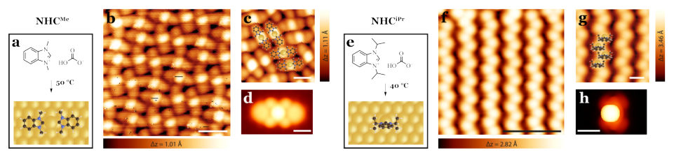 
Figure 1: Structural and STM characterization of NHCMe and NHCiPr SAMs on Au(111). a Molec- ular structure of NHCMe and the dimer configuration formed via adatom coordination. b Large-area STM image of the NHCMe SAM, showing zigzagging dimer pairs. c High-resolution STM image of NHCMe dimers with an overlaid structural model. d Simulated STM image of an isolated NHCMe

📷 Fig 2

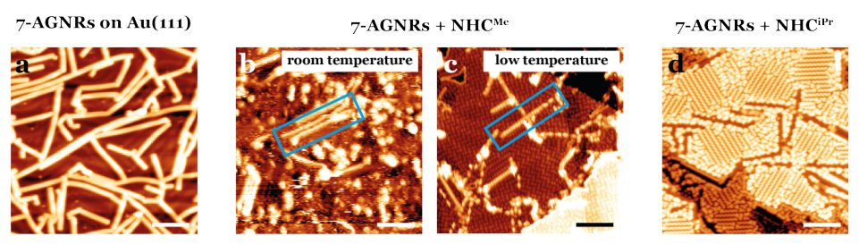 
Figure 2: STM images related to attempts at intercalating 7-AGNRs with NHCs on Au(111). a 7-AGNRs grown on Au(111) by on-surface bottom-up synthesis under UHV conditions, imaged at 4 K. b STM image acquired at room-temperature after deposition of NHCMe onto a 7-AGNR- covered surface. Ribbon-like features (as highlighted in blue) are visible and appear to be located above the NHCMe SAM, suggesting intercalation. c Similarly prepared sample imaged at 4 K. GNR-like features (as highlighted in blue) are again observed, though most appear segmented or discontinuous. d STM image of 7-AGNRs with NHCiPr, acquired at 4 K. The GNRs now appear more clearly embedded within the SAM, with a distinct...

📷 Fig 3

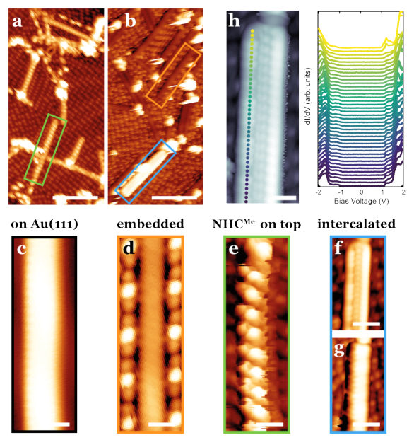 
Figure 3: Low-temperature STM analysis of 7-AGNRs combined with NHCMe SAMs on Au(111), revealing multiple interaction motifs. a GNR with adsorbed NHCMe dimers on its surface, evident from the segmented, dimer-like contrast along the ribbon axis. b Sample after mild annealing (below 50 ◦C), showing cleaner embedded GNRs free of adsorbates. c Reference image of a 7- AGNR on bare Au(111). d Close-up showing densely packed NHCMe dimers adsorbed along the GNR edges. e Embedded GNR decorated with densely packed adsorbates on top. f Intercalated GNR at high negative bias, showing the typical valence band contrast of electronically decoupled 7-AGNRs. g Same GNR imaged at lower bias, where the state...

📷 Fig 4

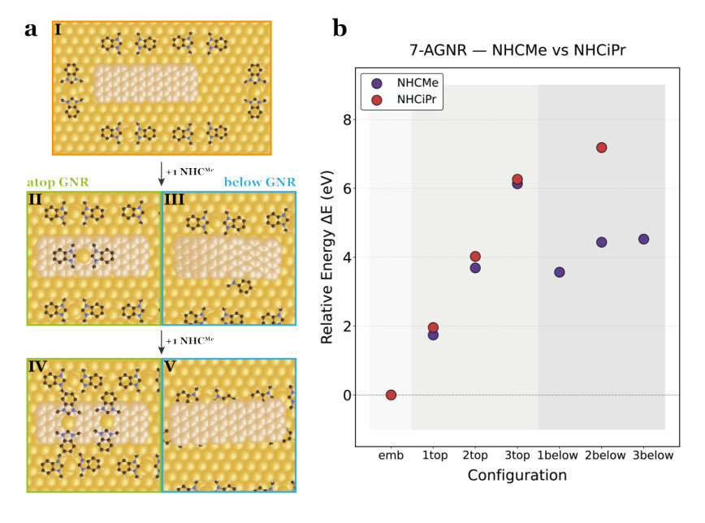 
Figure 4: a DFT-optimized geometries of different NHCMe–7-AGNR configurations. I Embedded 7-AGNR in a SAM of six NHCMe dimers on Au(111), serving as the reference configuration. II– V Subsequent configurations illustrate adsorption and intercalation steps as discussed in the main text. b Relative energies (∆E) of relaxed configurations for NHCMe (blue) and NHCiPr (orange), referenced to the embedded structure (emb). “1top”, “2top”, and “3top” denote one, two, or three NHC units adsorbed on top of the ribbon, whereas “1below”, “2below”, and “3below” denote configurations with one, two, or three NHC units placed below the GNR. Configurations that do not relax to stable target geometries are...

📷 Fig 5

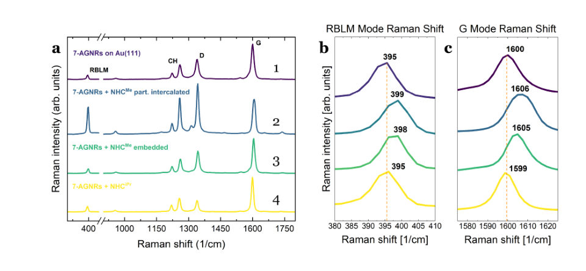 
Figure 5: Raman spectroscopic characterization of 7-AGNRs with and without NHC intercalation or embedding. a Raman spectra acquired using a 532 nm laser (spectral range: 320–1790 cm-1) for: (1) 7-AGNRs on Au(111) (laser power: 10 mW, integration time: 0.5 s), (2) 7-AGNRs with excess NHCMe resulting in partial intercalation (10 mW, 0.5 s), (3) 7-AGNRs embedded in an NHCMe SAM following mild annealing to desorb excess carbenes (20 mW, 0.5 s), and (4) 7- AGNRs embedded in an NHCiPr SAM (2 mW, 1 s). b Close-up of the RBLM region. A shift to higher wavenumbers is observed for samples with NHCMe (2 and 3), while no shift is detected for the NHCiPr case (4). c Close-up of the G-mode region....

**Summary.** This research explores how N-heterocyclic carbene monolayers can be used to decouple Graphene Nanoribbons from metal substrates. By comparing methyl and isopropyl derivatives, the authors show that the molecule's physical size and adsorption geometry critically determine whether intercalation occurs, leading to electronically decoupled segments favorable for device fabrication.

**Why it may be interesting.** This work provides a detailed case study in controlling interfacial electronic coupling using molecular engineering, which is highly relevant for designing functional quantum materials interfaces.

Detailed structure

**Main problem.** The study investigates methods to electronically decouple Graphene Nanoribbons (GNRs) from their metallic growth substrates, which is crucial for device integration.

**Main result.** The adsorption geometry of N-heterocyclic carbenes (NHCs) dictates the intercalation outcome; methyl-substituted NHCs ($	ext{NHCMe}$) can partially intercalate and electronically decouple the GNRs, while bulkier isopropyl groups ($	ext{NHCiPr}$) prevent this.

**Method.** The research combines low-temperature STM/STS measurements to probe electronic structure with DFT calculations and Raman spectroscopy to analyze interfacial coupling mechanisms.

**Model / system.** The system involves 7-atom-wide armchair graphene nanoribbons (7-AGNRs) placed on Au(111), which are subsequently treated with self-assembled monolayers (SAMs) formed by $	ext{NHCMe}$ or $	ext{NHCiPr}$.

**Key observables.** Electronic band gap size and symmetry (STS); Raman mode shifts ($	ext{G}$ and RBLM); Intercalation yield percentage; DFT calculated relative binding energies ($\Delta E$).

**Important parameters / regimes.** Molecular adsorption geometry, NHC ligand bulkiness, temperature (especially low T for STM), and the energy cost of lifting the GNR from the metal surface.

**Assumptions / limitations.** The interpretation relies on distinguishing between true intercalation, simple top-adsorption, and embedded states; thermal effects in Raman spectroscopy must be carefully separated from chemical changes.

**Figures summary.** Figures show STM images detailing SAM structures ($	ext{NHCMe}$ dimers vs. $	ext{NHCiPr}$ upright monomers); STS spectra compare gaps on bare Au(111) versus intercalated GNRs; DFT results map out energy barriers for intercalation.

**Paper structure.** The paper systematically characterizes the NHC SAM formation (using STM/NMR), then uses low-temperature STM/STS to distinguish between various adsorption states, followed by DFT and Raman analysis to provide theoretical and spectroscopic evidence supporting the geometric control over electronic decoupling.

Abstract

Graphene nanoribbons (GNRs) synthesized on metal substrates experience electronic coupling and screening from the underlying surface, which, although often weak, can modify their observed properties and complicate their transfer to device-compatible substrates. Intercalation of GNRs by self-assembled monolayers (SAMs) offers a possible route to reduce this interaction. Here, we investigate the intercalation of 7-atom-wide armchair graphene nanoribbons (7-AGNRs) on Au(111) using N-heterocyclic carbenes (NHCs). Low-temperature scanning tunneling microscopy and spectroscopy, Raman spectroscopy, and density functional theory calculations reveal that the adsorption geometry of the NHCs strongly influences the intercalation yield for GNRs. Methyl-substituted NHCs form flat-lying dimers that partially intercalate the GNRs, producing locally decoupled segments. In contrast, bulkier isopropyl-substituted NHCs form upright monomers that embed the GNRs within the monolayer, preventing intercalation. The low intercalation yield indicates that lifting the nanoribbon from the Au surface is energetically costly. These results establish molecular adsorption geometry and packing as key parameters controlling intercalation at GNR-metal interfaces, with implications for the rational design of decoupling layers for GNR-based device integration pathways.

[↑ back to top](#top)

### [Proximity-induced unconventional superconductivity and chiral topological phases in twisted graphene/NbSe$_2$ van der Waals heterostructure](http://arxiv.org/abs/2606.12104v1)

**Authors:** Adam Hložný, Marko Milivojević  
**Type:** theory · **Category:** other · **PDF:** <https://arxiv.org/pdf/2606.12104v1>  
**Analysis basis:** full PDF text, analyzed in chunks
**Topic relevance:** `Keldysh / 2PI / non-Gaussian methods` **1/5** · `analog quantum simulation` **1/5** · `driven-dissipative phase transition` **1/5**

📷 Fig 1

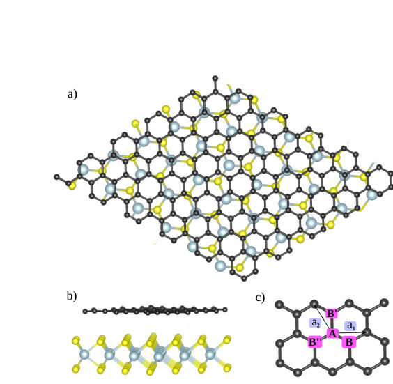 
FIG. 1. Top (a) and side (b) view of the graphene/NbSe2 heterostructure with the twist angle θ = 23.4o between the graphene and NbSe2 monolayer. (c) Position of graphene sub- lattice A and B carbon atoms and the graphene lattice vectors a1 = a(1, 0, 0) and a2 = a(−1

📷 Fig 2

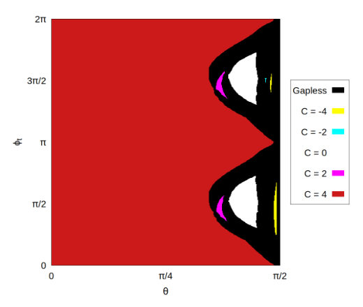 
FIG. 2. Chern number C phase diagram of the BdG Hamil- tonian with the gap function ∆A1(k), Eq. (23), as a function of the singlet-triplet mixing angle θ ∈(0, π/2) and the inter- triplet mixing angle ϕt ∈(0, 2π). Different colors correspond to different C phases: trivial phase C = 0 (white), topo- logical phases with C = ±2 (cyan/magenta) and C = ±4 (yellow/dark red), and gapless regions (black).

📷 Fig 3

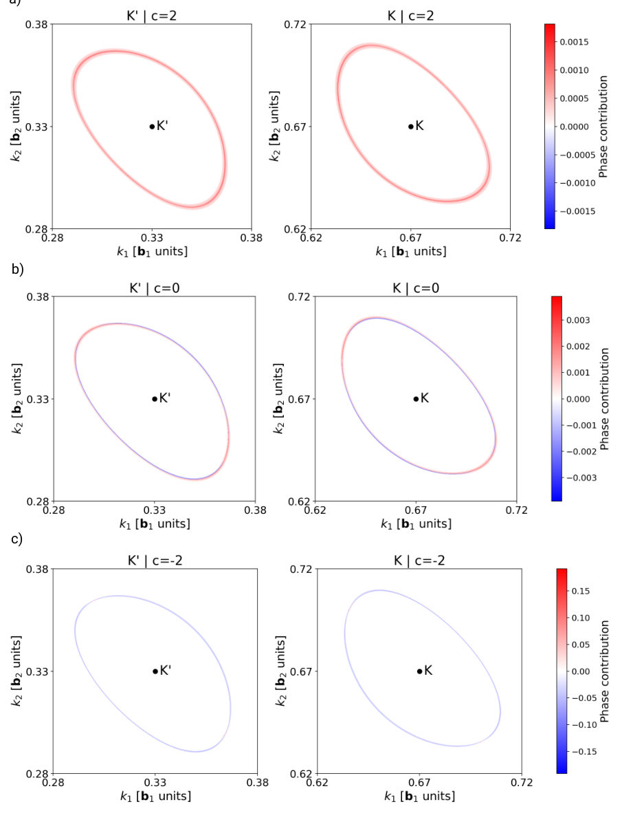 
FIG. 3. Local Chern number contributions in small regions around the K and K′ valleys for three representative points in the phase diagram of FIG. (2) at fixed ϕt = 1.55. (a) C = 4 phase (θ = 1.00). The plaquette contribution is sharply focused on a closed loop encircling each valley, with CK = CK′ = 2, giving a total Chern number C = 4. (b) C = 0 phase (θ = 1.35). The contribution remains localized around the valley contours, but positive and negative parts around each valley cancel, yielding CK = CK′ = 0 and C = 0. (c) C = −4 phase (θ = 1.58). The Berry-curvature weight remains localized near the two valleys but its sign is reversed relative to (a), giving CK = CK′ = −2 and C = −4.

📷 Fig 4

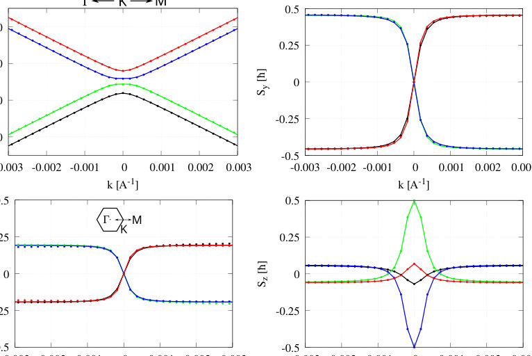 
FIG. 4. Comparison of the electronic band structure of graphene on NbSe2 and Sx , Sy, and Sz spin expectation values close to the Dirac K point, with the tight-binding model Hamiltonian of graphene (3), parametrized using the values given in Table I. Whereas the solid lines are represent tight-binding model fit, the DFT data is given by circles. The k-path is along the x direction (ky = 0), centered around the K point.

📷 Fig 5

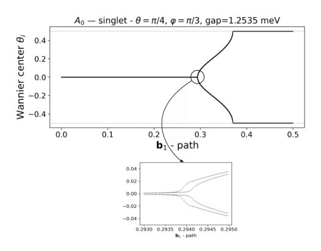 
FIG. 5. WFC flow, computed via the Wilson loop method, for the singlet gap function ∆s A0(π/4, π/3). The main panel is obtained using the 3000×6000 k-point mesh along b1 ×b2, and suggest at first sight an odd number of crossings with an arbitrary horizontal line, indicating Z2 = 1. The insets, computed on a refined 60×30000 mesh, shows that the single line represent in reality two closely spaced but non-degenerate WFC lines, giving Z2 = 0. This illustrates the importance of sufficient k-point sampling for a reliable determination of the Z2 invariant when the spin splitting of the electron bands is small.

**Summary.** The paper theoretically explores unconventional superconductivity in a twisted graphene/NbSe2 heterostructure. By analyzing the superconducting gap functions using symmetry constraints, the authors predict the existence of chiral topological superconducting phases characterized by non-zero Chern numbers. This suggests the material is a promising platform for realizing and detecting exotic quantum states.

**Why it may be interesting.** This work connects concepts from superconductivity, topology, and 2D materials physics. The mechanism of proximity-induced pairing leading to quantized topological states is highly relevant for designing novel quantum electronic devices.

Detailed structure

**Main problem.** The study investigates proximity-induced unconventional superconductivity and the emergence of chiral topological phases within a twisted graphene/NbSe2 van der Waals heterostructure.

**Main result.** The system exhibits a rich phase diagram characterized by non-zero Chern numbers (e.g., C=4), indicating the stabilization of chiral topological superconducting states.

**Method.** Theoretical calculations utilize the Bogoliubov-de Gennes formalism, employing group theory to construct symmetry-allowed gap functions and calculating topological invariants via Wilson loop methods.

**Model / system.** The physical system is a twisted graphene/NbSe2 van der Waals heterostructure at a specific twist angle (23.4 degrees). The model incorporates orbital hopping, intrinsic SOC, and Rashba SOC effects into the effective Hamiltonian.

**Key observables.** Chern numbers ($C \in \{-4, -2, 2, 4\}$), $\mathbb{Z}_2$ invariants, superconducting gap functions ($\Delta(\mathbf{k})$), and spin expectation values.

**Important parameters / regimes.** Twist angle ($	heta = 23.4^\circ$), mixing parameters ($	heta, \phi_t$), and the proximity-induced gap intensity ($\Delta_0$).

**Assumptions / limitations.** The superconducting order parameter of NbSe2 is debated; the analysis assumes that heterostructure formation alters competing pairing channels to stabilize chiral components.

**Figures summary.** Figures illustrate the heterostructure geometry, the Chern number phase diagram based on mixing parameters ($	heta, \phi_t$), and local contributions to the Chern numbers ($C_K, C_{K'}$).

**Paper structure.** The paper proceeds by establishing the effective Hamiltonian using DFT results, constructing symmetry-adapted superconducting gap functions via group theory, and finally calculating topological invariants (Chern number/Z2) across parameter space.

Abstract

We study proximity-induced unconventional superconductivity in a twisted graphene/NbSe$_2$ van der Waals heterostructure using the Bogoliubov-de Gennes formalism. The normal-state parameters of proximitized graphene are extracted from ab initio calculations at a twist angle of $23.4^\circ$, which reduces the common symmetry of the heterostructure to $\mathbf{C}_3$. We construct symmetry-allowed superconducting gap functions of the graphene layer according to the irreducible representations of the $\mathbf{C}_3$ group, containing singlet and triplet pairing channels and their mixtures. Computing the topological invariants as a function of the mixing parameters, we find a rich phase diagram of chiral topological superconducting phases, characterized by nonzero Chern numbers $C\in\{-4,-2,2,4\}$. While the nature of the superconducting order parameter of NbSe$_2$ remains debated, the formation of the van der Waals heterostructure and the related symmetry reduction can alter the relative stability of competing pairing channels, potentially stabilizing a chiral component that is proximity-induced into graphene and triggers the topological phases identified here, making the twisted graphene/NbSe$_2$ heterostructure a promising platform for chiral topological superconductivity detectable via quasiparticle interference imaging and transport measurements.

[↑ back to top](#top)

### [Unusual half-metallic state in unconventional magnets](http://arxiv.org/abs/2606.11384v1)

**Authors:** Yuri B. Kudasov  
**Type:** theory · **Category:** other · **PDF:** <https://arxiv.org/pdf/2606.11384v1>  
**Analysis basis:** full PDF text, analyzed in chunks
**Topic relevance:** `analog quantum simulation` **1/5** · `exotic spin models in light-matter` **1/5** · `spintronics-quantum-optics interface` **1/5**

📷 Fig 1

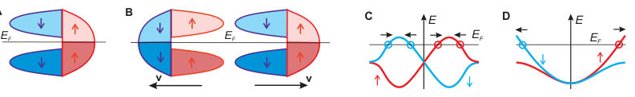 
Figure 1: (A) A schematic view of the DOS for the ordinary (s-wave) half-metallic ferromagnets. (B) The same for the 1D p-wave half metal. The horizontal arrows denote the left- and right-moving electrons. (C) A spin-split band. (D) A pair of topologically nontrivial bands.

📷 Fig 2

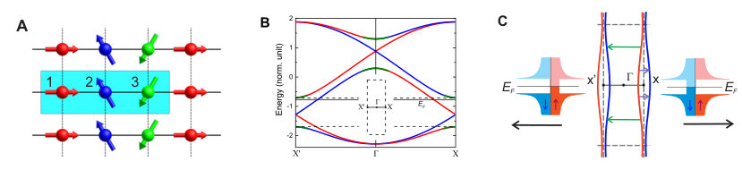 
Figure 2: (A) Rectangular lattice with 120◦magnetic order. The sublattices are shown by color and numbers. The supercell is indicated by the filled rectangle. (B) Band structure along the X’-Γ-X path (t = 0.1, |hi| = h0 = 0.5). The average spin projection onto the z-axis is indicated by color: the red and blue for predominantly spin-up and spin-down states, respectively; the green denotes strongly mixed states, i.e., when |⟨ˆτz⟩| &lt; 1/2. (C) The Fermi surface for the Fermi level at EF = −0.75 (p-wave half-metallic state). The DOS for the left- and right-moving electrons is schematically shown. The green and purple arrows show the backward and umklapp scattering vectors, respectively.

📷 Fig 3

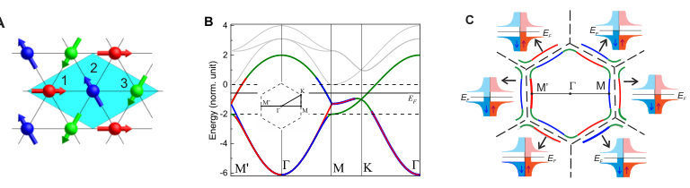 
Figure 3: (A) Triangular lattice with 120◦magnetic order shown in the same manner as in Fig. 2A. (B) Band structure along the path shown in the inset (h0 = 1). The average spin projection is indicated as in Fig. 2B. (C) Fermi surface for the Fermi level at EF = −0.6 (f-wave half-metallic state). The DOS for electrons moving along different directions is schematically shown.

📷 Fig 4

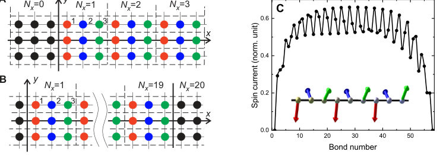 
Figure 4: (A) Schematic view of an infinite potential wall for the tight-binding rectangular model. The site colors denote the superlattices, the black color indicates the sites under the infinite potential. (B) Schematic view of the quantum well. (C) Persistent spin current in the quantum well. The helical spin structure in the central part of the quantum well is shown.

**Summary.** This paper theoretically explores an unusual half-metallic state found in unconventional magnets with helical magnetic order. It develops tight-binding models for p-wave and f-wave states, showing that these topological features lead to unique spin polarization properties. The work predicts the formation of persistent spin currents when these materials are confined into quantum well structures.

**Why it may be interesting.** While primarily condensed matter magnetism/spintronics, the focus on topological band structures and emergent spin currents in confined geometries touches upon concepts relevant to engineered quantum systems and boundary physics.

Detailed structure

**Main problem.** The study investigates an unusual half-metallic state where the spin gap depends on the direction of the wave vector, originating from the nontrivial topology of the band structure.

**Main result.** The authors demonstrate that such p-wave and f-wave half-metals can exist in helimagnets and lead to phenomena like standing waves with helical spin structures and persistent spin currents in quantum wells.

**Method.** Theoretical analysis using two-dimensional tight-binding models, analyzing band structure along specific paths in the magnetic Brillouin zone, and reducing the problem to 1D motion for nanostructures.

**Model / system.** The model uses a general 2D tight-binding Hamiltonian applied to helimagnets exhibiting $120^\circ$ magnetic order. The system is analyzed in both bulk (rectangular/hexagonal lattices) and confined geometries (quantum wells).

**Key observables.** Density of States (DOS), spin polarization, band structure visualization, persistent spin current.

**Important parameters / regimes.** The existence of the half-metallic gap depends on the Fermi level placement relative to topological gaps; $120^\circ$ magnetic ordering is crucial.

**Assumptions / limitations.** For nanostructures, the analysis assumes an infinite potential wall perpendicular to the x-axis. The unusual state requires breaking parity-time symmetry (alternamagnets).

**Figures summary.** Figures illustrate DOS comparisons between ordinary and unusual half-metals; band structures along X'-$\Gamma$-X paths for $120^\circ$ order on rectangular/hexagonal lattices; and schematics showing the resulting persistent spin current in a quantum well.

**Paper structure.** The paper first establishes the theoretical framework using tight-binding models for p-wave and f-wave half metals in bulk helimagnets. It then focuses on confinement effects, analyzing the resulting 1D physics in quantum wells to predict observable phenomena like persistent spin currents.

Abstract

Half-metallic ferromagnets exhibit a gap in the density of states for one spin projection while remaining gapless for the opposite spin. We show that in helimagnets an unusual half-metallic state can exist, where the spin projection that experiences the gap is determined by the direction of the wave vector. This state originates from the nontrivial topology of the band structure, specifically from the dispersion forming a multi-sheeted covering over the Brillouin zone. We present two-dimensional tight-binding models for $p$-wave and $f$-wave half metals. These structures can be realized in crystalline and van der Waals systems. The complex band structure of the unusual $p$-wave half metal in nanostructures is also discussed. In a quantum well, a standing wave with a helical spin structure is formed, and a persistent spin current exists.

[↑ back to top](#top)

### [Extrinsic quantum geometry in the quadrupolar bulk photovoltaic effect](http://arxiv.org/abs/2606.11434v1)

**Authors:** Steven Gassner, Swati Chaudhary, Martin Claassen  
**Type:** theory · **Category:** other · **PDF:** <https://arxiv.org/pdf/2606.11434v1>  
**Analysis basis:** full PDF text, analyzed in chunks
**Topic relevance:** `Keldysh / 2PI / non-Gaussian methods` **1/5** · `methods for driven-dissipative` **1/5**

📷 Fig 1

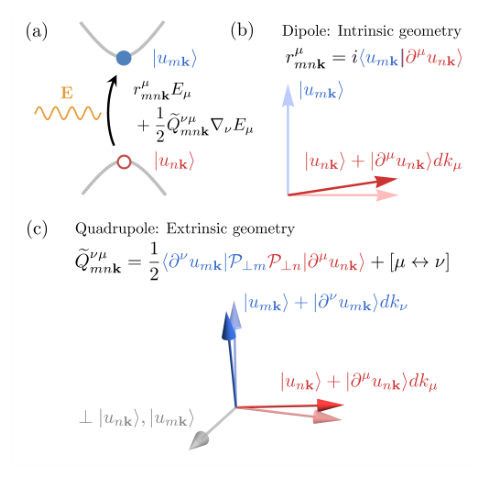 
FIG. 1. Electric quadrupole corrections to optical responses encode extrinsic quantum geometry. (a) Electrons in Bloch bands couple to a uniform electric field via an interband elec- tric dipole matrix element. Gradients in the electric field cou- ple to an interband quadrupole matrix element. (b) The in- terband electric dipole rµ mnk probes the intrinsic geometry of the Bloch states, i.e. within the resonant two-band mani- fold. (c) The origin-independent part of the interband electric quadrupole, which we denote as eQνµ mnk, probes the extrinsic geometry of the Bloch states, i.e. orthogonal to the resonant two-band manifold. Here P⊥n = 1 −|unk⟩⟨unk| is the projec- tor to the subspace...

📷 Fig 2

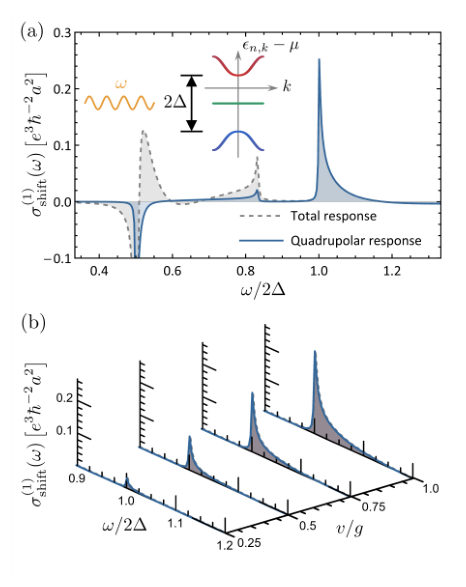 
FIG. 2. Shift current at linear order in wavevector for the min- imal three-band model described in the text, in which near k = 0 the upper and lower dispersing bands have a mutual coupling ∼−igk2 and a coupling ∼−i √

📷 Fig 3

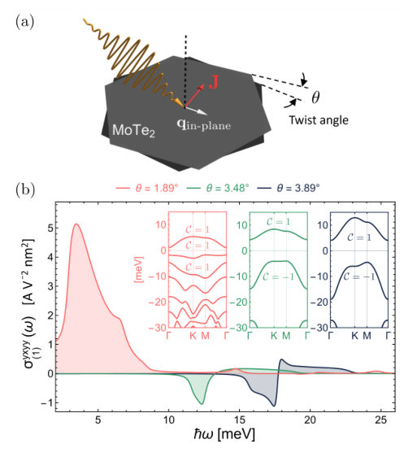 
FIG. 3. Oblique-incidence photocurrents probe the extrin- sic quantum geometry of the moir´e bands in tMoTe2. (a) Schematic of a photocurrent experiment in a twisted bilayer material whereby oblique incidence introduces an in-plane component to the optical wavevector. (b) The yxyy compo- nent of the real linear-in-wavevector photovoltaic conductivity (for which the magnetic dipole contribution is forbidden by symmetry) computed from continuum models of valley-and- spin-polarized tMoTe2 at three different twist angles. The considerably larger response for the twist angle where the top few bands have equal Chern number can be anticipated from the viewpoint of extrinsic quantum geometry.

**Summary.** This theoretical work develops a framework to calculate the bulk photovoltaic effect using an expansion sensitive to higher-order electric quadrupole contributions. By analyzing these 'extrinsic' geometric terms, the authors predict that materials with complex band mixing, such as twisted bilayer semiconductors, will exhibit enhanced photocurrents measurable via photon drag effects.

**Why it may be interesting.** The explicit connection drawn between band-geometric quantities (like extrinsic quadrupole moments) and measurable electromagnetic multipole corrections in nonlinear optics provides a powerful new diagnostic tool for characterizing electronic structure beyond simple dipole responses.

Detailed structure

**Main problem.** The work investigates the role of 'extrinsic quantum geometry' in the quadrupolar bulk photovoltaic effect (BPVE), extending beyond standard dipole approximations.

**Main result.** The authors predict that systems with strong multi-band mixing, such as twisted MoTe2 bilayers, will exhibit anomalously large photon drag due to this higher-order quadrupolar effect.

**Method.** The analysis uses diagrammatic perturbation theory and expands the second-order optical conductivity ($\sigma_{\mu\alphaeta}^{PV}$) to linear order in the light wavevector ($\mathbf{q}$), separating contributions into multipolar terms.

**Model / system.** The study is based on continuum models of electronic band structures, particularly applied to twisted bilayer materials like MoTe2. The theoretical framework involves Bloch Hamiltonians and calculating current operator matrix elements.

**Key observables.** Photovoltaic conductivity ($\sigma_{\mu\alphaeta}^{PV}$), which is proportional to the electric quadrupole moment ($eQ$) when expanded in $\mathbf{q}$.

**Important parameters / regimes.** The analysis focuses on the linear-in-$\mathbf{q}$ correction, comparing results across different multipolar contributions (dipole vs. quadrupole).

**Assumptions / limitations.** Key assumptions include expanding responses linearly in $\mathbf{q}$ and utilizing approximations like the noninteracting electron picture within diagrammatic calculations.

**Figures summary.** Figures illustrate the coupling of interband dipole versus quadrupole moments to light-matter interaction, and show calculated shift currents for minimal three-band models and twisted MoTe2.

**Paper structure.** The paper builds from general theoretical derivations of $\sigma_{\mu\alphaeta}^{PV}$ using diagrammatic techniques (Diagram 1 & 2), systematically derives the linear-$\mathbf{q}$ expansion, and applies this formalism to specific physical systems like twisted bilayer MoTe2.

Abstract

The bulk photovoltaic effect has become a valuable probe of the quantum geometry of Bloch bands. While it is restricted to inversion-broken systems within the dipole approximation, the finite momentum of light is appreciated to give rise to this effect even in centrosymmetric crystals, an effect referred to as "photon drag." In this work, we recast the photon drag effect at leading order in the optical wavevector, highlighting a previously neglected contribution arising intuitively from the electric quadrupole correction to light-matter coupling. In the language of band geometry, we identify this interband quadrupole as a multiband metric tensor that quantifies the variation of two resonantly driven states extrinsic to the subspace they span. We predict that systems in which three or more bands strongly admix in momentum space, such as twisted MoTe$_2$ bilayers, will have anomalously large photon drag due to this quadrupolar effect. Our work provides a conceptual bridge between band-geometric organizing principles and electromagnetic multipole corrections in nonlinear optics.

[↑ back to top](#top)

### [Spin-Orbit Torque and Magnetization Switching in 2D Ferromagnetic Devices](http://arxiv.org/abs/2606.11752v1)

**Authors:** Bao-Huei Huang, Hong Guo, Yu-Hui Tang  
**Type:** theory · **Category:** other · **PDF:** <https://arxiv.org/pdf/2606.11752v1>  
**Analysis basis:** full PDF text, analyzed in chunks
**Topic relevance:** `Keldysh / 2PI / non-Gaussian methods` **1/5** · `spintronics-quantum-optics interface` **1/5**

📷 Fig 1

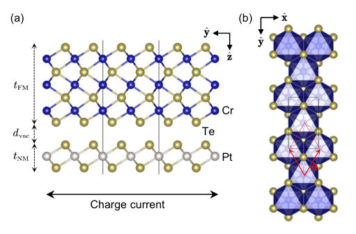 
FIG. 2. (a) Side view and (b) top view of the central region Cr3Te4/PtTe2 heterobilayer, where both the Cr3Te4 and PtTe2 mono- layers possess 𝑃¯3𝑚1 space group. The optimized structure parame- ters are provided in Table I. The red box denotes the primitive cell with lattice constant 𝑎. For nonequilibrium calculations, the charge current is applied along the 𝑦direction.

📷 Fig 2

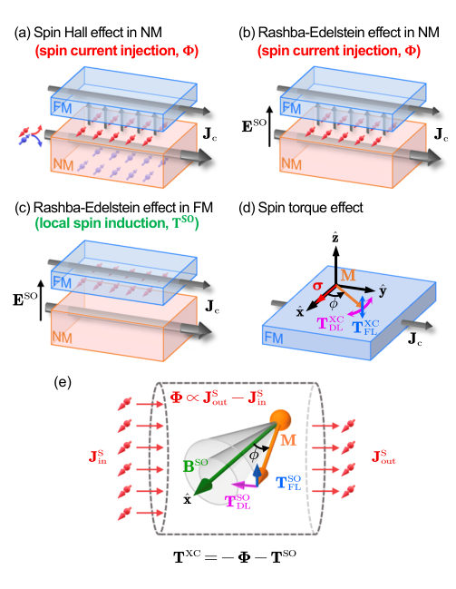 
FIG. 1. (a) Spin Hall effect and (b) Rashba-Edelstein effect in the NM layer induce the spin current injection from the NM to the FM layer, which is known as spin current injection. (c) Within the FM layer, Rashba-Edelstein effect leads to local spin induction. (d) Both the spin current injection and local spin induction contribute to a current-induced spin density 𝝈∥x when a charge current density Jc ∥y is applied, initiating CISOT acting on the FM magnetization in the fieldlike (𝑇FL) and dampinglike (𝑇DL) directions. (e) Schematic representation of the conservation relation among TXC, TSO (through BSO), and 𝚽

📷 Fig 3

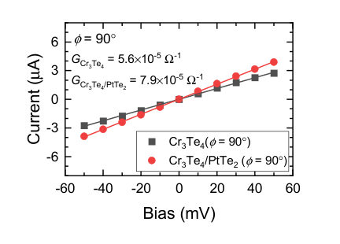 
FIG. 4. Current-voltage characteristics for both the Cr3Te4 mono- layer and the Cr3Te4/PtTe2 heterobilayer, where 𝐺is the conduc- tance.

📷 Fig 4

 
Fig. 3, the band structure exhibits inversion symmetry along 𝑘𝑥for arbitrary orientations of M. This symmetry implies that an 𝑥-directed current can generate an additional 𝑧-polarized spin accumulation. In such cases, the system would generate two distinct current-induced spin-orbit fields, one along ˆy and another along ˆz, both contributing to the CISOT depending on the current direction. In this work, we restrict our analy- sis to the simpler geometry where the current flows along 𝑦, corresponding to the conventional Rashba-Edelstein scenario. Given that BSO ∥ˆx via Rashba-Edelstein charge-to-spin conversion, the spin torque vectors can be decomposed into the fieldlike (FL) and...

📷 Fig 5

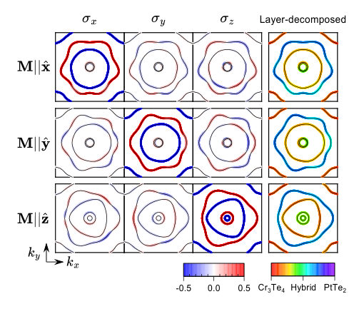 
FIG. 3. ISOC-induced spin textures by projecting onto the Pauli matrices (𝜎𝑥, 𝜎𝑦, and 𝜎𝑧) near the Γ-point at Fermi surface with 𝐸F = 0.0 eV. The magnetization direction of Cr3Te4 is aligned along various directions. For the layer-decomposed analysis, the hybridiza- tion of Cr3Te4 and PtTe2 (light-blue color) results in the the bands that causes Rashba spin-splitting.

**Summary.** This work theoretically analyzes how spin-orbit torque drives magnetization switching in 2D ferromagnetic heterostructures. By decomposing the total torque into fieldlike and dampinglike components, it reveals that different physical mechanisms—local spin induction versus spin current injection—dominate switching depending on whether the material favors in-plane or perpendicular magnetism. This guides optimization for energy-efficient spintronic memory design.

**Why it may be interesting.** The detailed quantum mechanical decomposition of torques into local induction versus injected current provides a highly granular understanding of spin-charge conversion, which is crucial for designing next-generation spintronic devices that interact with quantum phenomena.

Detailed structure

**Main problem.** The study investigates the mechanisms governing current-induced spin-orbit torque (SOT) for magnetization switching in 2D ferromagnetic devices.

**Main result.** The paper distinguishes between Fieldlike Torque (FLT), dominated by local spin induction (Rashba-Edelstein effect in FM layers), and Dampinglike Torque (DLT), associated with spin current injection, showing their distinct roles depending on the magnetic anisotropy regime (IMA vs. PMA).

**Method.** The research employs first-principles quantum transport calculations using DFT/NEGF methods combined with macrospin simulations solving the LLG equation.

**Model / system.** The model uses a $	ext{Cr}_3	ext{Te}_4/	ext{PtTe}_2$ van der Waals heterobilayer, analyzing spin dynamics governed by terms including spin current injection ($\Phi$) and local spin induction ($	ext{TSO}_{	ext{FM}}$).

**Key observables.** Spin current injection ($\Phi$), local spin induction ($	ext{TSO}_{	ext{FM}}$), Fieldlike Torque ($T_{	ext{FL}}$), Dampinglike Torque ($T_{	ext{DL}}$), and the critical switching current density ($J_{sw}$).

**Important parameters / regimes.** Strong in-plane magnetic anisotropy (IMA) vs. perpendicular magnetic anisotropy (PMA); torque efficiencies ($\eta$); damping parameter ($\alpha$).

**Assumptions / limitations.** Calculations are performed assuming a clean limit and often utilize approximations like the small angle approximation for magnetization dynamics.

**Figures summary.** Figures illustrate spin textures, band structures showing Rashba splitting due to SOC, and $M-J_c$ loops demonstrating switching behavior under different anisotropy conditions.

**Paper structure.** The paper systematically analyzes the theoretical framework of CISOT components (FLT vs. DLT), derives the necessary equations based on material properties (e.g., SHE/REE effects), and applies these models to predict switching currents for specific magnetic anisotropy regimes in the vdW heterostructure.

Abstract

Current-induced spin-orbit torque has emerged as a powerful technique for manipulating magnetization switching of ferromagnet/nonmagnet (FM/NM) based memory cell. By investigating nonequilibrium spin torque effect in a van der Waals heterobilayer, trigonal $\text{Cr}_{3}\text{Te}_{4}/\text{PtTe}_{2}$, the first-principles quantum transport calculations are applied to determine both local spin induction, resulting from Rashba-Edelstein effect in the FM layer, and spin current injection, flowing from the NM to the FM layer. Our work reveals that local spin induction significantly generates the fieldlike torque, which primarily governs the switching current in systems with strong in-plane magnetic anisotropy. Our work emphasizes the importance of optimizing spin Hall effect in the NM layer for perpendicular magnetic anisotropy (PMA)-based magnetization switching and maximizing the Rashba effect in the FM layer for in-plane magnetic anisotropy (IMA)-based switching.

[↑ back to top](#top)

### [Structural Changes and Transport Properties of $\mathrm{YBa_2Cu_3O_7}$ Locally Modified by a He$^+$ Focused Ion Beam](http://arxiv.org/abs/2606.12145v1)

**Authors:** Ross Carter, Robin Hutt, Paul Zimmermann, Ainur Abukaev, Jan Ullmann, Simon Koch, Christoph Schmid, Manfred Burghammer, Reinhold Kleiner, Dieter Koelle, Edward Goldobin, Ivan A. Zaluzhnyy  
**Type:** experiment · **Category:** strongly correlated electrons · **PDF:** <https://arxiv.org/pdf/2606.12145v1>  
**Analysis basis:** full PDF text, analyzed in chunks
**Topic relevance:** `non-equilibrium dynamics` **1/5**

📷 Fig 1

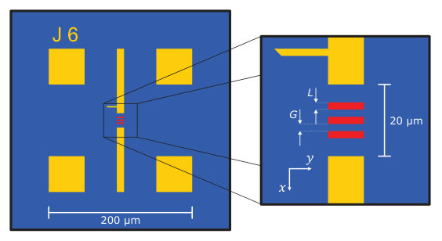 
Figure 1: An example of one XRD block. On top of pristine YBCO (blue) there are Au (gold) alignment markers. The irradiation pattern for this XRD block consists of three stripes (red) of the size 10 × 2 µm2 and spaced by 2 µm. The dose values D = 10, 20, 30 ions/nm2 were used for this particular block. The inset shows a magnification of the irradiated area.

📷 Fig 2

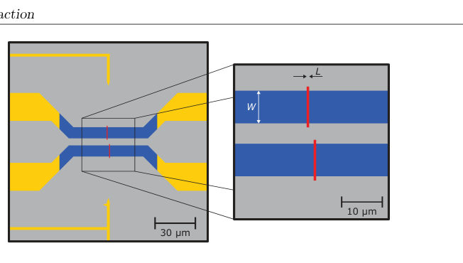 
Figure 2: The geometry of micro bridges. After lithography and etching down to the LSAT substrate (light gray) we are left with the micro bridges consisting of a YBCO-Au bilayer of width W (here W=8 µm and length 50 µm connected to the contact pads. In the central part of each micro bridge, the Au layer is then removed so that one sees pristine YBCO (blue). These regions are used for irradiation by He-FIB. The irradiated stripes (red) have a length L (here L=60 nm) in the transport direction and exceed the bridge width W to avoid shunting through the edges.

📷 Fig 3

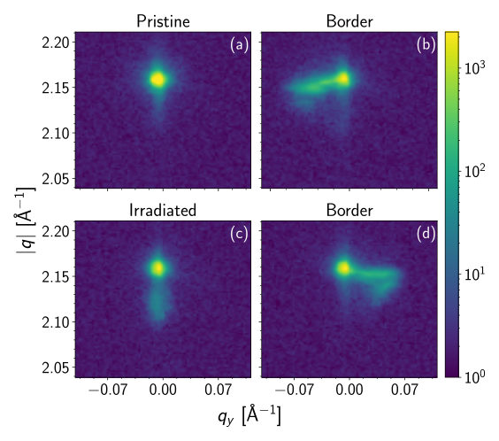 
Figure 3: Scattered intensity I(|q|, qy) of the 004 diffraction peak of YBCO at different positions across an L = 2000 nm stripe which had been irradiated with D = 25 ions/nm2. (a) An entirely pristine region of YBCO. (b) A transition region from pristine to irradiated YBCO, measured on the spacing-stripe boundary. (c) An entirely irradiated region. (d) A transition region from irradiated to pristine YBCO, measured on the opposite stripe-spacing boundary.

📷 Fig 4

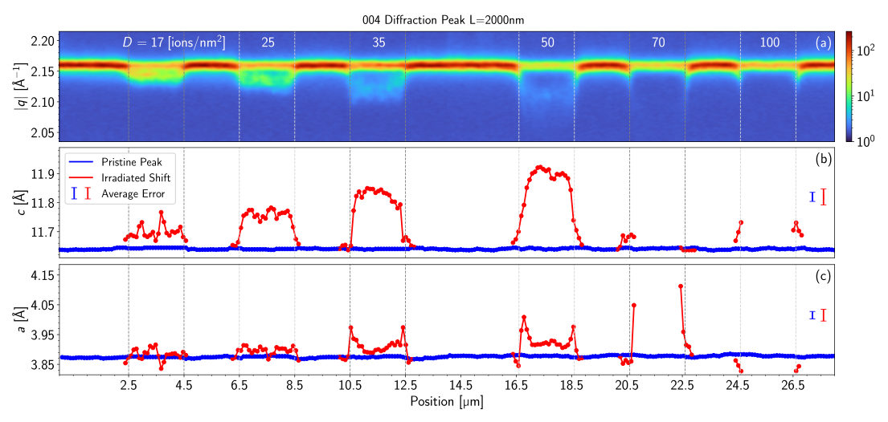 
Figure 4: (a) |q|-profile of the 004 peak of YBCO (integrated over qy) at different positions across stripes of L=2000 nm with increasing dose from left to right. The dashed vertical lines denote the boundaries of irradiated regions. (b-c) Swelling of the (b) out-of-plane lattice parameter, c and (c) in-plane lattice parameter, a across YBCO film with irradiated stripes of length L=2000 nm.

📷 Fig 5

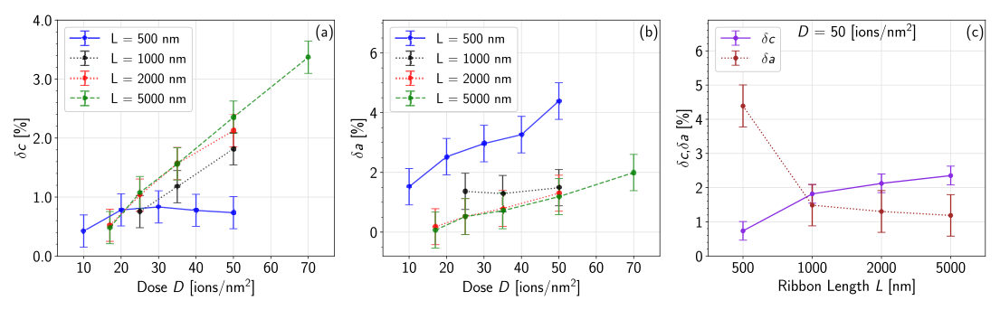 
Figure 5: (a-b) Relative change in lattice constants δc (a) and δa (b) for different doses D ≤D(00l) dis , the critical-disorder dose in the (00l) direction, measured at each L. (c) A comparison of δc and δa for different stripe lengths L, at a constant dose D = 50 ions/nm2.

**Summary.** This work uses a He+ Focused Ion Beam to locally damage YBa2Cu3O7 superconducting films. By correlating changes in lattice structure (measured by XRD) with electrical transport measurements, the authors demonstrate that irradiation induces structural disorder and drives the material toward an insulating state. This technique enables the fabrication of tunable superconducting nano-resistors.

**Why it may be interesting.** While focused on cuprate superconductivity, the controlled introduction of disorder and strain via ion beams provides an experimental platform to study how local structural perturbations affect high-$T_c$ pairing mechanisms, relevant to strongly correlated electron physics.

Detailed structure

**Main problem.** To investigate how localized structural modifications, induced by focused ion beam irradiation, affect the superconducting properties of YBa2Cu3O7 thin films.

**Main result.** Irradiation causes lattice expansion and a decrease in critical temperature ($T_c$), eventually leading to an insulating state. The technique allows for creating tunable superconducting nano-devices with size-dependent transport properties.

**Method.** The study combines nanofocused X-ray diffraction (XRD) to measure structural changes (lattice parameters $a$ and $c$) with low-temperature electrical resistivity measurements on patterned microbridges.

**Model / system.** The physical system is epitaxial YBa2Cu3O7 thin films grown on LSAT substrates. The modification is achieved by bombarding the surface with 30 keV He+ ions, creating controlled irradiated stripes of varying dose and size.

**Key observables.** Critical temperature ($T_c$), lattice parameters ($\delta a$, $\delta c$), sheet resistance ($R_\square$), and film height change ($\Delta z$).

**Important parameters / regimes.** Irradiation Dose ($D$) in the range $10–100 	ext{ ions}/	ext{nm}^2$; irradiated area size ($L$); temperature ($T$).

**Assumptions / limitations.** The analysis models structural changes and transport behavior based on localized damage accumulation from ion bombardment, linking lattice strain to electronic degradation.

**Figures summary.** Figures show XRD intensity profiles across pristine, transition, and fully irradiated regions; plots illustrate the dose dependence of lattice parameters ($\delta a$, $\delta c$) and sheet resistance ($R_\square$) as a function of stripe size $L$.

**Paper structure.** The paper systematically presents structural characterization (XRD/AFM) showing lattice expansion and bending, followed by electrical transport measurements demonstrating the superconductor-insulator transition correlated with irradiation dose.

Abstract

Irradiation of a material with ions can cause various defects that can lead to structural phase transitions and the modification of the material's properties. Here we study the irradiation of the epitaxyally grown thin films of the high-temperature superconductor $\mathrm{YBa_2Cu_3O_7}$ with $30\,\mathrm{keV}$ He$^{+}$ ions which leads to the expansion of the crystal lattice, decrease of the critical temperature $T_c$ and eventually transition to an insulator. Fabrication of such insulating regions with a focused He-Ion beam with a spot size of $\sim 10\,\mathrm{nm}$ is a powerful technique for fabrication of superconducting nano-devices. Using low-temperature resistivity measurements, diffraction with a nanofocused X-ray beam and atomic force microscopy, we investigated how the structure and the electric transport properties of $\mathrm{YBa_2Cu_3O_7}$ depend on the irradiation dose in a range $10$--$100\,\mathrm{ions/nm^2}$ and on the lateral size of the irradiated area in a range $30$--$5000\,\mathrm{nm}$.

[↑ back to top](#top)

### Other secondary papers (1)

Show other secondary papers

### [Ambient and Pressure Dependent Superconductivity with Hydrogen Storage Potential in Quaternary Hydride LiMgZr2H12: A Comprehensive First-principles Insights](http://arxiv.org/abs/2606.11721v1)

**Authors:** Jubair Hossan Abir, Tauhidur Rahman, Salauddin Muhammad Anis, Saleh Hasan Naqib, Raihana Shams Islam  
**Type:** theory · **Category:** other · **PDF:** <https://arxiv.org/pdf/2606.11721v1>  
**Analysis basis:** full PDF text, analyzed in chunks

📷 Fig 1

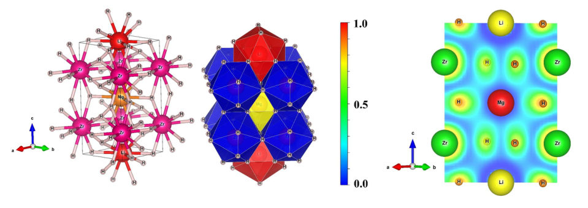 
Figure 1. Crystal structure of the quaternary hydride LiMgZr2H12 with Pmmm symmetry and electron localization function (ELF) of LiMgZr2H12.

📷 Fig 2

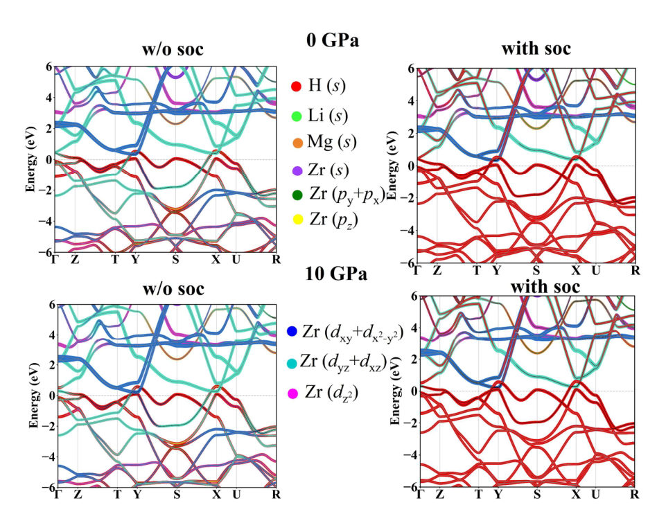 
Figure 2. Orbital projected electronic band structures of LiMgZr2H12 within ± 6 eV of 𝐸F for without (w/o SOC) and with SOC at ambient pressure (0 GPa) and 10 GPa.

📷 Fig 3

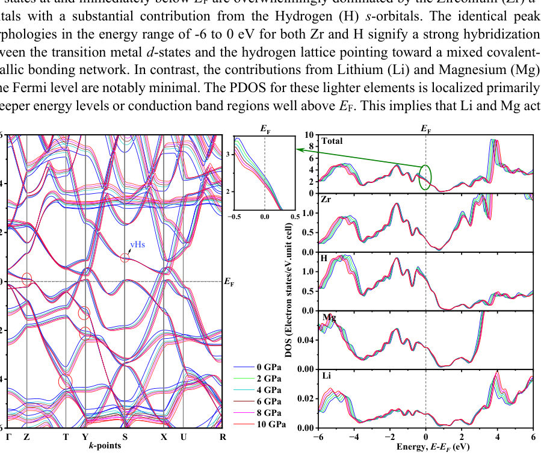 
Figure 3. Comparison of electronic band structures and total density of states of LiMgZr2H12 along high symmetry directions in the first Brillouin zone for 0, 2, 4, 6, 8, and 10 GPa pressures.

📷 Fig 4

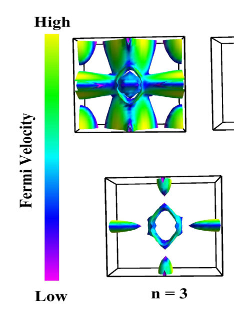 
Figure 4. Fermi surface topologies of LiMgZr₂H₁₂ without SOC at 0 GPa.

📷 Fig 5

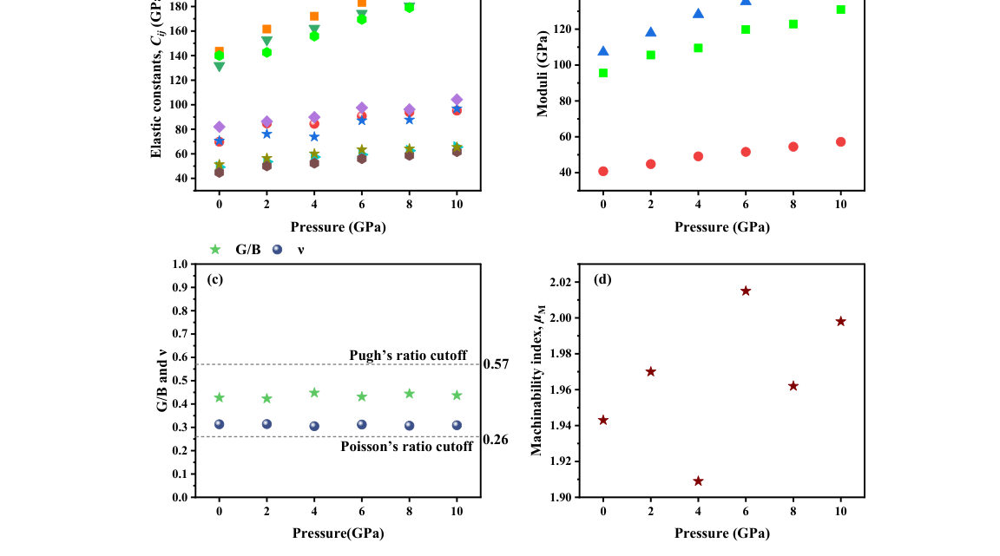 
Figure 5. (a) Elastic constants (b) Calculated elastic moduli (c) Calculated Poisson’s ratio and Pugh’s ratio (d) Calculated machinability index under 0, 2, 4, 6, 8, 10 GPa.

**Summary.** This theoretical study investigates $	ext{LiMgZr}_2	ext{H}_{12}$ as a promising ambient-pressure superconductor and hydrogen storage material. Using first-principles DFT, the authors confirm its structural stability, calculate a measurable $T_c$ of $72.8 	ext{ K}$, and demonstrate that mechanical properties remain favorable under pressure. The work establishes a new computational pathway for designing high-performance energy materials.

**Why it may be interesting.** While the core physics is solid-state superconductivity, the detailed calculation of lattice dynamics, phonon softening/hardening under pressure, and the coupling between electronic structure and mechanical stability provides rich data relevant to understanding quantum materials behavior far from equilibrium.

Detailed structure

**Main problem.** The research aims to identify superconducting materials that maintain high critical temperatures ($T_c$) while remaining stable under ambient pressure, overcoming the limitations of current superhydride candidates.

**Main result.** The quaternary hydride $	ext{LiMgZr}_2	ext{H}_{12}$ was shown to be thermodynamically and mechanically stable at ambient conditions, exhibiting a $T_c$ of $72.8 	ext{ K}$ (increasing to $77.3 	ext{ K}$ under pressure) and possessing potential for hydrogen storage.

**Method.** The study relies entirely on first-principles calculations using Density Functional Theory (DFT) within the VASP package, analyzing electronic structure, elastic constants, phonon dynamics, and electron-phonon coupling ($\lambda$).

**Model / system.** The primary system is the quaternary hydride $	ext{LiMgZr}_2	ext{H}_{12}$, which is modeled as a stable crystal structure with an orthorhombic symmetry. The analysis systematically varies external pressure (0 to 10 GPa) and temperature.

**Key observables.** Critical Temperature ($T_c$), Electron-Phonon Coupling Constant ($\lambda$), Hydrogen Storage Capacity, Elastic Moduli (Bulk, Shear, Young's), Debye Temperature ($	heta_D$), and Optical Conductivity.

**Important parameters / regimes.** Ambient pressure (0 GPa) vs. high pressure (10 GPa); $	ext{Li}$ doping effect; $T_c$ enhancement via phonon hardening.

**Assumptions / limitations.** The calculations assume the validity of DFT approximations (GGA-PBE) and that the material's properties can be extrapolated across the studied pressure range. The superconducting analysis uses the Allen-Dynes-modified McMillan formula.

**Figures summary.** Figures summarize the evolution of $	heta_D$ and $T_m$ with pressure, show energy-dependent optical properties (reflectivity, conductivity) for different polarizations, and plot calculated mechanical parameters like hardness vs. pressure.

**Paper structure.** The paper follows a systematic computational investigation: first establishing structural stability and basic electronic bonding; then characterizing mechanical robustness (elasticity, machinability); followed by thermal/optical analysis ($	heta_D$, $T_m$, $\kappa_{Ph}$); and finally, calculating superconducting properties ($T_c$ via EPC).

Abstract

Molecular hydrides have attracted relatively less attention in the search for high Tc superconductors because their hydrogen quasi-molecular units tend to be electronically inactive for superconductivity. In contrast, hydrogen rich compounds under high pressure have been widely considered strong candidates for achieving room-temperature superconductivity. However, their dependence on extreme pressure conditions significantly constrains their practical applicability. This work investigates hydrogen-rich superconducting materials that may be stable under ambient pressure conditions. Motivated by recent studies on the MgZrH2n family, a LiMgZr2H12 structure with Pmmm symmetry was designed. The mechanical, thermodynamic, and dynamical stability of the compound, together with its electronic and optical properties, were systematically investigated using first-principles calculations. Li doping in LiMgZr2H12 significantly increases the hydrogen derived contribution near the Fermi level (EF) and strengthens the electron-phonon coupling constant (λ) compared with MgZrH6. LiMgZr2H12 exhibits a critical temperature of 72.76 K at ambient pressure, which is further enhanced by applying pressure. At 10 GPa the critical temperature increases to 77.3 K. Elastic property analysis shows that the material remains mechanically stable over the pressure range studied (0-10 GPa). It also behaves like a ductile material suitable for current carrying applications. The material has a high machinability index, which is much higher than that of stainless steels. In addition, LiMgZr2H12 exhibits a gravimetric hydrogen storage capacity of 5.36 wt%, indicating its potential as a promising candidate for hybrid hydrogen storage technologies. This work offers a new direction for designing high-Tc hydrides at ambient conditions.

[↑ back to top](#top)

